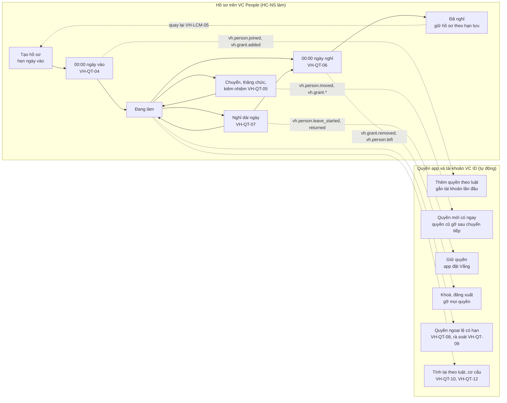
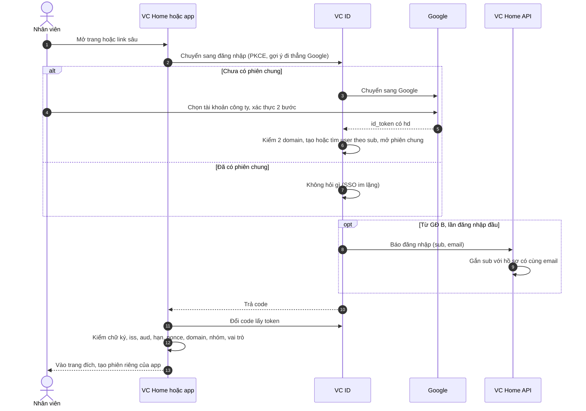
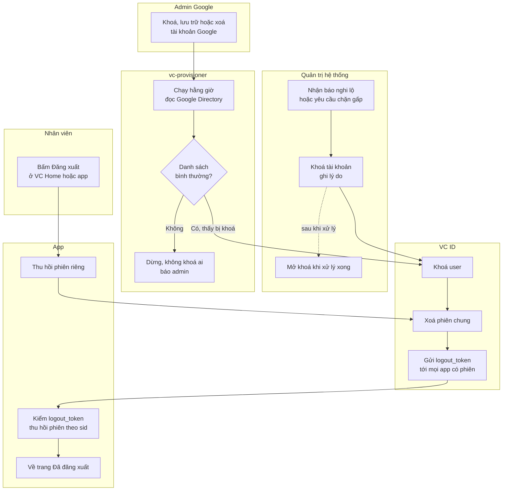
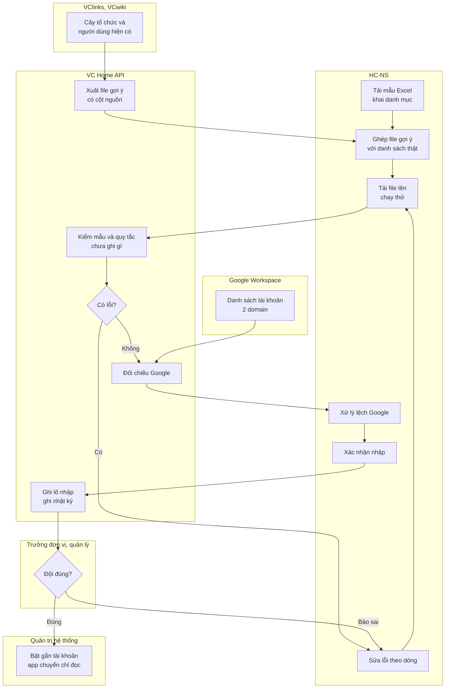
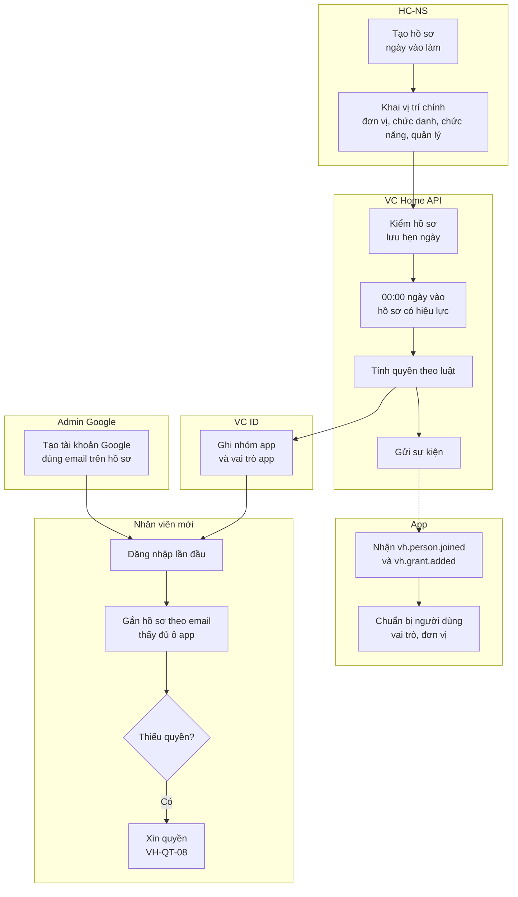
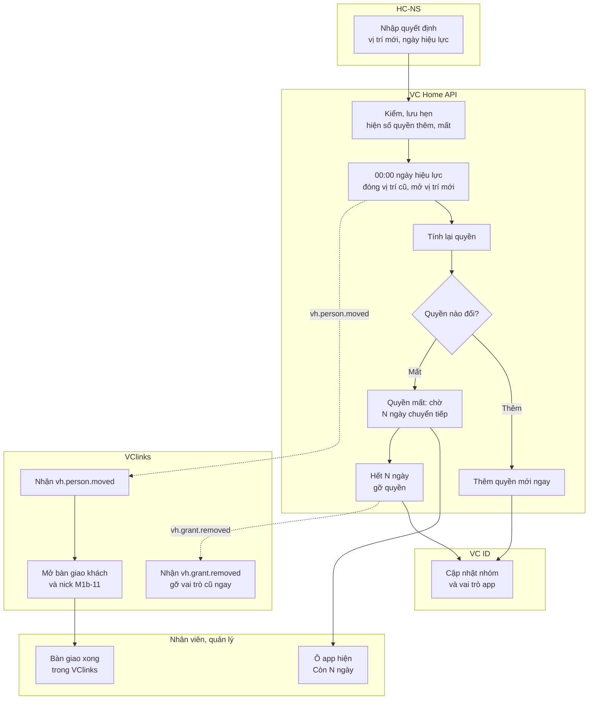
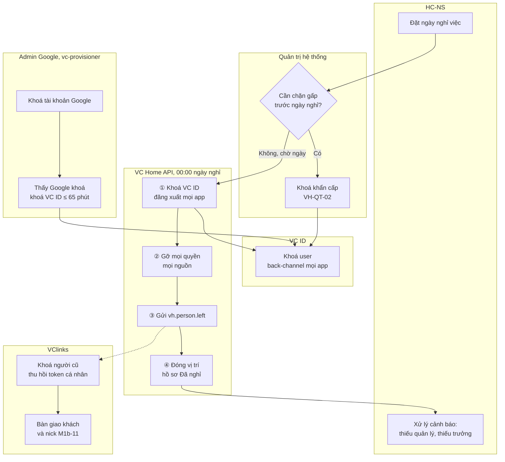
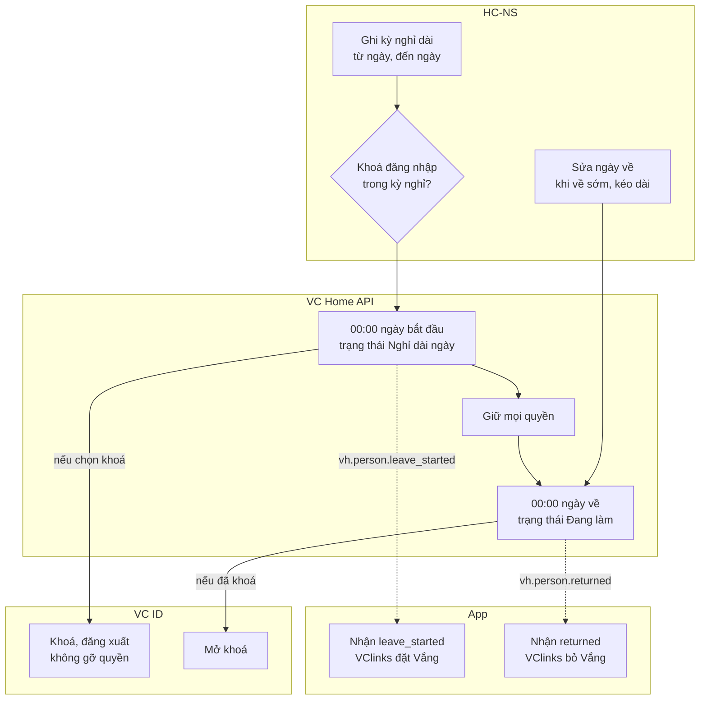
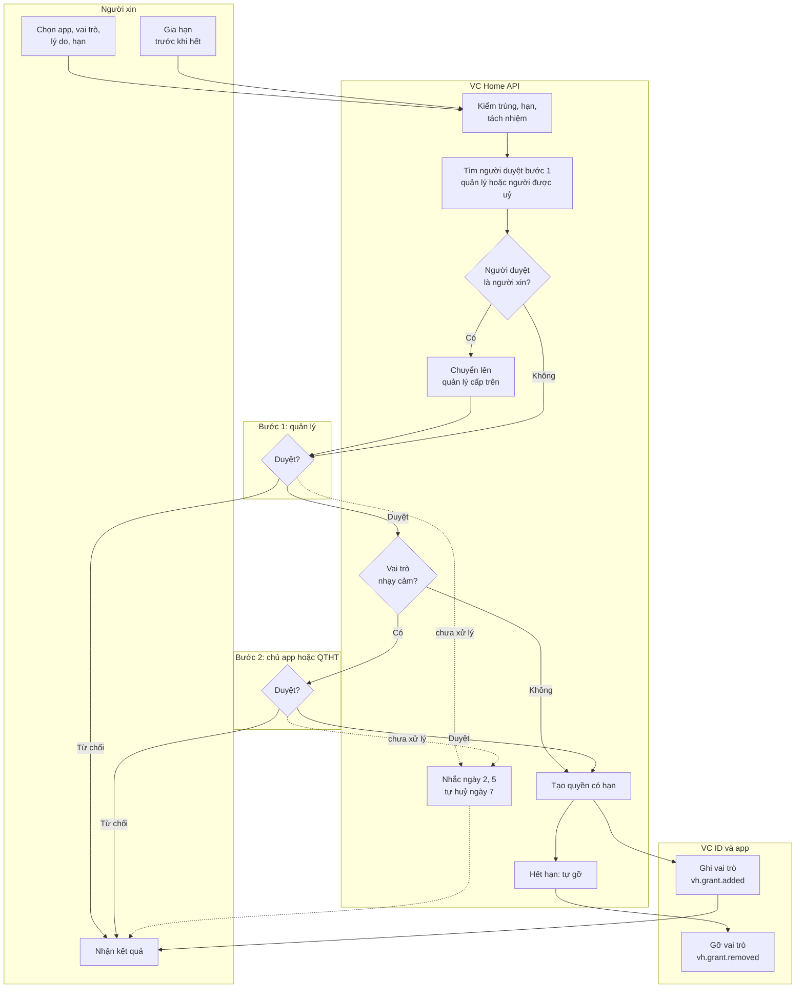
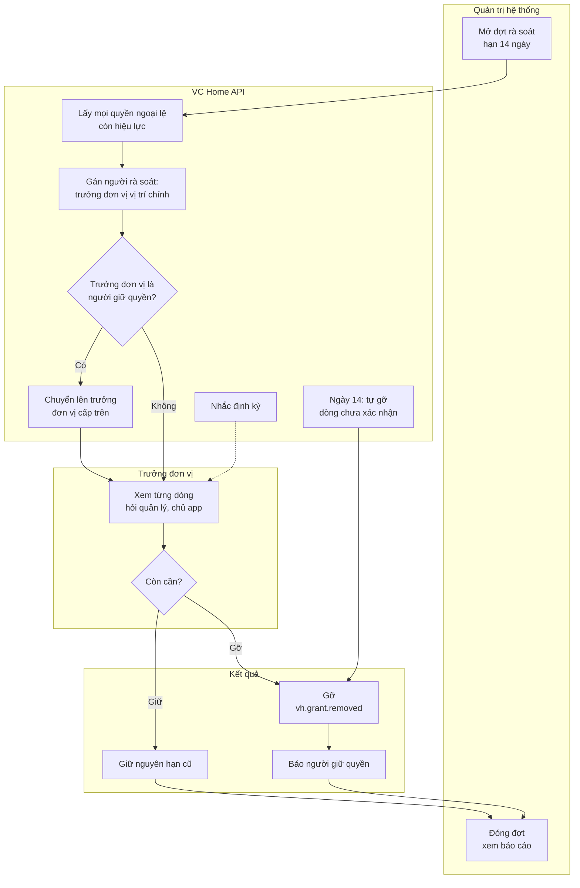

# VC Home — Quy trình nghiệp vụ

Phiên bản 0.1 · 08/10/2026 · Trạng thái: Nháp (chờ duyệt)

## Tóm tắt

- **Tài liệu nói gì:** 12 quy trình VH-QT-01 đến VH-QT-12 của VC Home. Mỗi quy trình có: mục đích, kích hoạt, tác nhân, điều kiện trước, kết quả mong đợi, sơ đồ, bảng bước truy về yêu cầu (VH-xxx) và quy tắc (VH-BR), ngoại lệ, chỉ số đo.
- **Nguyên tắc xuyên suốt:** HC-NS chỉ sửa hồ sơ; quyền tự tính theo luật; app nhận sự kiện để tự cập nhật; mọi thay đổi có ngày hiệu lực, áp lúc 00:00 giờ Việt Nam.
- **Ba điểm quyền đổi tự động:** vào làm (thêm quyền theo luật), chuyển vị trí (quyền mới có ngay, quyền cũ gỡ sau thời gian chuyển tiếp của app), nghỉ việc (khoá, đăng xuất, gỡ hết, báo app theo đúng thứ tự VH-BR-14).
- **Quyền ngoại lệ:** xin, duyệt 1 hoặc 2 bước, không ai tự duyệt, có hạn, rà soát mỗi quý; quá 14 ngày không xác nhận thì tự gỡ.
- **Thời gian đích:** đăng xuất chung ≤ 10 giây; khoá khẩn cấp ≤ 1 phút; khoá theo Google ≤ 65 phút; tính lại quyền ≤ 5 phút.
- **Việc còn mở:** Q-07 (app đã có người dùng trong giai đoạn chuyển tiếp), Q-13 (định nghĩa ngày nghỉ việc); 20 đề xuất chưa cấp mã ở mục 15; 6 điểm lệch giữa README và 02 ghi ở cuối mục 15.
- **Người duyệt xem kỹ:**
  - VH-QT-05: thời gian chuyển tiếp và bàn giao khách của VClinks;
  - VH-QT-06: thứ tự 4 bước nghỉ việc, khoá Google bên nào trước;
  - VH-QT-08: không tự duyệt, uỷ quyền, chủ app tự xin;
  - VH-QT-10 và VH-QT-12: thay đổi làm đổi quyền hàng loạt;
  - mục 15: đề xuất 4 (khoá khẩn cấp không cắt token máy cá nhân trong app) và đề xuất 5 (vai trò phải có trong token ngay lần đăng nhập đầu).

## Mục lục

- [1. Bức tranh vòng đời](#1-bức-tranh-vòng-đời)
- [2. Quy ước chung](#2-quy-ước-chung)
- [3. VH-QT-01 Đăng nhập và mở app](#3-vh-qt-01-đăng-nhập-và-mở-app)
- [4. VH-QT-02 Đăng xuất và khoá khẩn cấp](#4-vh-qt-02-đăng-xuất-và-khoá-khẩn-cấp)
- [5. VH-QT-03 Nhập dữ liệu nhân sự và cơ cấu ban đầu](#5-vh-qt-03-nhập-dữ-liệu-nhân-sự-và-cơ-cấu-ban-đầu)
- [6. VH-QT-04 Vào làm](#6-vh-qt-04-vào-làm)
- [7. VH-QT-05 Chuyển vị trí, thăng chức, kiêm nhiệm](#7-vh-qt-05-chuyển-vị-trí-thăng-chức-kiêm-nhiệm)
- [8. VH-QT-06 Nghỉ việc](#8-vh-qt-06-nghỉ-việc)
- [9. VH-QT-07 Nghỉ dài ngày và quay lại](#9-vh-qt-07-nghỉ-dài-ngày-và-quay-lại)
- [10. VH-QT-08 Xin và duyệt quyền ngoại lệ](#10-vh-qt-08-xin-và-duyệt-quyền-ngoại-lệ)
- [11. VH-QT-09 Rà soát quyền hằng quý](#11-vh-qt-09-rà-soát-quyền-hằng-quý)
- [12. VH-QT-10 Thêm hoặc sửa luật cấp quyền](#12-vh-qt-10-thêm-hoặc-sửa-luật-cấp-quyền)
- [13. VH-QT-11 Đưa một app mới vào VC Home](#13-vh-qt-11-đưa-một-app-mới-vào-vc-home)
- [14. VH-QT-12 Đổi cơ cấu tổ chức](#14-vh-qt-12-đổi-cơ-cấu-tổ-chức)
- [15. Đề xuất bổ sung (chưa cấp mã)](#15-đề-xuất-bổ-sung-chưa-cấp-mã)
- [Lịch sử cập nhật](#lịch-sử-cập-nhật)

---

## 1. Bức tranh vòng đời

Một nhân viên đi qua các trạng thái hồ sơ: hồ sơ đã tạo chờ ngày vào → đang làm → (có thể nghỉ dài ngày rồi quay lại) → đã nghỉ. HC-NS chỉ đổi hồ sơ. Quyền app và tài khoản VC ID đổi theo, tự động.

**Quyền đổi ở đâu:**

| Điểm trong vòng đời | Quyền mặc định (từ luật) | Quyền ngoại lệ | Tài khoản VC ID | Sự kiện gửi app |
|---|---|---|---|---|
| Vào làm (VH-QT-04) | Thêm theo luật, ≤ 5 phút | — | Gắn với hồ sơ ở lần đăng nhập đầu | `vh.person.joined`, `vh.grant.added` |
| Chuyển, kiêm nhiệm (VH-QT-05) | Quyền mới có ngay; quyền mất gỡ sau thời gian chuyển tiếp của app | Giữ tới hạn | Không đổi | `vh.person.moved`, `vh.grant.added`, `vh.grant.removed` |
| Nghỉ dài ngày (VH-QT-07) | Giữ | Giữ (tới hạn thì vẫn hết) | Mặc định không khoá; HC-NS chọn khoá được | `vh.person.leave_started`, `vh.person.returned` |
| Xin quyền (VH-QT-08) | — | Thêm, có hạn | — | `vh.grant.added` |
| Hết hạn, rà soát (VH-QT-08, 09) | — | Gỡ | — | `vh.grant.removed` |
| Đổi luật (VH-QT-10) | Tính lại | — | — | `vh.grant.added`, `vh.grant.removed` |
| Đổi cơ cấu (VH-QT-12) | Tính lại | Giữ | — | `vh.org.unit_changed`, `vh.person.moved`, `vh.grant.*` |
| Khoá khẩn cấp (VH-QT-02) | Giữ | Giữ | Khoá, đăng xuất mọi app | Không có (xem đề xuất 4) |
| Nghỉ việc (VH-QT-06) | Gỡ hết, không chờ chuyển tiếp | Gỡ hết | Khoá, đăng xuất mọi app | `vh.grant.removed`, `vh.person.left` |

## 2. Quy ước chung

| Quy ước | Nghĩa trong tài liệu này |
|---|---|
| Giờ | Mọi ngày giờ theo `Asia/Ho_Chi_Minh` (VH-BR-22). "00:00 ngày D" là đầu ngày D giờ Việt Nam |
| Ngày hiệu lực | Thay đổi áp lúc 00:00 ngày hiệu lực; ngày hôm nay hoặc đã qua thì áp ngay khi lưu (VH-BR-07) |
| Tính lại quyền | Hệ thống đánh giá lại luật cho người bị ảnh hưởng, chậm nhất 5 phút (VH-BR-11) |
| Đẩy sang VC ID | VC Home API ghi nhóm `app-<key>` và vai trò app (client role của Keycloak) cho user qua `vc-provisioner` (VH-ACC-07) |
| Gửi sự kiện | Webhook (VC Home gọi tới địa chỉ của app) có chữ ký, gửi lại khi lỗi; app xử lý theo kiểu idempotent (nhận nhiều lần cùng một sự kiện vẫn chỉ xử lý một lần) (VH-INT-03). App lỡ sự kiện thì kéo lại (VH-INT-05, VH-API-07) |
| Back-channel | VC ID gọi thẳng máy chủ của app để huỷ phiên, không qua trình duyệt (VH-INT-04) |
| Nhật ký | Mọi bước thay đổi đều ghi nhật ký (VH-BR-18, VH-ADM-01). Bảng bước chỉ nhắc lại khi bước đó cần lý do |
| GĐ | Giai đoạn bắt đầu áp dụng bước đó. Bước ghi "(GĐ D)" chỉ có từ GĐ D |
| Sơ đồ | Mỗi khung là một tác nhân hoặc hệ thống (làn). Mũi tên liền là bước chính; nét đứt là sự kiện gửi app hoặc nhánh phụ; hình thoi là điểm rẽ |
| Mục tiêu chỉ số | Là đề xuất, chốt ở 08 (phi chức năng) và 10 (kế hoạch) |
| Đề xuất N | Trỏ tới dòng N của bảng ở mục 15; chưa phải yêu cầu đã cấp mã |

## 3. VH-QT-01 Đăng nhập và mở app

### 3.1 Tổng quan

| Mục | Nội dung |
|---|---|
| Mục đích | Nhân viên vào mọi app bằng một lần đăng nhập Google công ty (SSO: đăng nhập một lần); mở app nào cũng vào thẳng, không hỏi lại |
| Kích hoạt | (1) Mở `home.vcprosperous.com`; (2) mở thẳng một link trong app (link sâu); (3) tải lại trang VC Home; (4) bấm ô app hoặc thanh chuyển app |
| Tác nhân | Nhân viên; Google Workspace; VC ID (Keycloak); VC Home (từ GĐ B có VC Home API); app (VClinks, VCwiki…) |
| Điều kiện trước | Tài khoản Google công ty đang hoạt động, đã bật xác thực 2 bước; app đã là client OIDC (app khách theo chuẩn OpenID Connect) của VC ID; từ GĐ B: có hồ sơ trên VC People; từ GĐ C: có ít nhất một vai trò app |
| Kết quả mong đợi | Trang chủ hiện thẻ hồ sơ và đúng các ô app được dùng; mở app không phải chọn tài khoản lần nữa; phiên chung hết sau 12 giờ không dùng, tối đa 7 ngày |
| GĐ | A; thêm gắn hồ sơ ở B; thêm vai trò trên ô và app mặc định chặn ở C |

### 3.2 Sơ đồ

Cách nối kỹ thuật giữa VC ID và VC Home API ở bước gắn hồ sơ chốt ở 07 và thiết kế GĐ B.

### 3.3 Các bước

| Bước | Ai / hệ thống | Làm gì | Yêu cầu (VH-xxx) | Quy tắc (VH-BR) |
|---|---|---|---|---|
| 1 | Nhân viên | Mở `home.vcprosperous.com`, bấm "Đăng nhập bằng tài khoản công ty"; hoặc mở thẳng link sâu của app | VH-AUT-01, VH-MH-01 | — |
| 2 | VC Home / app | Tạo `state`, `nonce`, PKCE (mã chống bị chặn giữa đường); chuyển sang VC ID kèm gợi ý đi thẳng Google (`kc_idp_hint=google`) | VH-AUT-01 | — |
| 3 | VC ID | Chưa có phiên chung: chuyển sang Google. Đã có: trả `code` ngay, người dùng không thấy gì | VH-AUT-03 | — |
| 4 | Google | Xác thực mật khẩu và 2 bước; trả `id_token` có `hd` (domain Workspace) | VH-AUT-01 | VH-BR-02 |
| 5 | VC ID | Kiểm đuôi email và `hd` thuộc 2 domain công ty. Sai: trang "Tài khoản này không thuộc công ty". User bị khoá: trang "Tài khoản đã bị khoá" | VH-AUT-02, VH-AUT-06 | VH-BR-02 |
| 6 | VC ID | Tạo hoặc tìm user theo `sub`; mở phiên chung (hết sau 12 giờ không dùng, tối đa 7 ngày) | VH-AUT-05 | VH-BR-01 |
| 7 | VC Home API (GĐ B) | Lần đăng nhập đầu: gắn `sub` với hồ sơ có cùng email công ty. Đã gắn thì không tự đổi | VH-AUT-08 | VH-BR-01 |
| 8 | VC Home / app | Đổi `code` lấy token; kiểm 6 điểm (chữ ký, `iss`, `aud`, hạn, `nonce`, `email_verified`), kiểm domain lần nữa, nhóm `app-<key>`; từ GĐ C kiểm có vai trò app | VH-INT-01, VH-AUT-02 | VH-BR-20 |
| 9 | App | Tìm user theo `sub`; lần đầu tìm theo email rồi gắn `sub` một lần; tạo phiên riêng của app; về trang đích | VH-AUT-03 | VH-BR-01 |
| 10 | VC Home | Hiện thẻ hồ sơ (GĐ B), lưới app theo quyền, vai trò trên ô (GĐ C), ô "Sắp có", ô liên kết ngoài | VH-HOM-01, VH-HOM-02, VH-HOM-03, VH-HOM-06, VH-MH-02 | VH-BR-21 |
| 11 | Nhân viên | Bấm ô app hoặc thanh chuyển app 9 chấm: lặp bước 2–3 và 8–9, không hỏi gì | VH-AUT-03, VH-HOM-05, VH-MH-21 | — |
| 12 | VC Home | Tải lại trang: đăng nhập im lặng qua `/silent`; hết phiên chung thì về bước 1 | VH-AUT-05 | — |
| 13 | VC ID, app | Ghi nhật ký `login`, `login_denied` (kèm lý do), `user.idp_linked` | VH-ADM-01 | VH-BR-18 |

### 3.4 Ngoại lệ

| Ngoại lệ | Cách xử lý | Liên quan |
|---|---|---|
| Chọn Gmail cá nhân hoặc tài khoản ngoài 2 domain | VC ID hiện trang sai domain, nút "Chọn tài khoản khác"; app cũng kiểm lại (mã `outside_domain`) | VH-AUT-02, VH-BR-02 |
| Tài khoản bị khoá trên VC ID | Trang "Tài khoản đã bị khoá. Liên hệ quản trị viên."; ghi nhật ký | VH-AUT-06 |
| Tài khoản công ty chưa có hồ sơ (từ GĐ B) | Vào được VC Home nhưng trang chủ trống, dòng "Tài khoản chưa có hồ sơ nhân sự, liên hệ HC-NS"; không có ô app (giai đoạn chuyển tiếp theo Q-07) | VH-AUT-08, VH-BR-02 |
| Email đăng nhập khác email trên hồ sơ (đổi tên, đổi domain) | Không gắn; trang trống như trên; HC-NS sửa email trên hồ sơ trước, lần đăng nhập sau gắn đúng | VH-BR-01 |
| Hồ sơ đã gắn với một `sub` khác | Không tự gắn lại; báo QTHT; QTHT gắn lại, ghi lý do và nhật ký | VH-BR-01 |
| Trong app, email đã gắn với định danh khác | App từ chối mã `identity_conflict`, báo admin app | VH-BR-01 |
| Không thuộc nhóm `app-<key>`, hoặc (từ GĐ C) không có vai trò app | App từ chối mã `app_not_granted`; VC Home không hiện ô; nhân viên xin quyền theo VH-QT-08 | VH-BR-20, VH-BR-21 |
| Token có vai trò lạ, app chưa ánh xạ | App bỏ qua vai trò đó, ghi log, không suy diễn quyền | VH-BR-20 |
| VC ID hoặc Google không trả lời | Phiên đang có ở app vẫn chạy tới hết hạn; đăng nhập mới báo câu dễ hiểu theo mã `idp_unreachable`; cần gấp thì QTHT bật đường khẩn cấp ở app (VClinks `AUTH_TOKEN_LOGIN`, VCwiki `AUTH_PASSWORD_LOGIN=admin`) | VH-AUT-09, VH-ADM-04 |
| Người dùng huỷ ở Google, hoặc mở lại link đăng nhập cũ | Mã `cancelled` hoặc `state_invalid`; nút thử lại | VH-AUT-01 |
| Tỉ lệ đăng nhập lỗi trên 20% trong 15 phút | Cảnh báo nhóm vận hành | VH-ADM-04 |

### 3.5 Chỉ số đo

| Chỉ số | Cách tính | Mục tiêu đề xuất |
|---|---|---|
| Tỉ lệ đăng nhập thành công | Lần thành công / tổng lần thử theo tuần (không tính lỗi sai domain) | ≥ 98% |
| Thời gian vào app khi đã có phiên chung | Từ bấm ô app tới khi trang đích hiện | ≤ 3 giây |
| Số lần chọn tài khoản Google mỗi người mỗi ngày | Đếm lần chuyển sang Google | ≤ 1 |
| Phiếu hỗ trợ "không vào được" | Đếm theo tuần, nhóm theo mã lỗi | Giảm dần sau 4 tuần |
| Tỉ lệ tài khoản đã gắn hồ sơ (GĐ B) | Tài khoản đã gắn / tài khoản đã đăng nhập | 100% sau 2 tuần |

## 4. VH-QT-02 Đăng xuất và khoá khẩn cấp

### 4.1 Tổng quan

| Mục | Nội dung |
|---|---|
| Mục đích | Đăng xuất một nơi là ra khỏi mọi app. Khi nghi lộ hoặc cần chặn gấp, khoá một tài khoản và cắt mọi phiên trong 1 phút. Tài khoản Google bị khoá thì VC ID cũng khoá |
| Kích hoạt | (1) Nhân viên bấm Đăng xuất ở VC Home hoặc bất kỳ app nào; (2) QTHT nhận báo nghi lộ, mất máy, tranh chấp, hoặc yêu cầu chặn trước ngày nghỉ; (3) admin Google khoá, lưu trữ hoặc xoá tài khoản Google; (4) (GĐ D) nhân viên tự đăng xuất một phiên lạ |
| Tác nhân | Nhân viên; QTHT (R/A); admin Google Workspace; VC ID; `vc-provisioner`; app; quản lý (C); HC-NS, chủ app, kiểm soát (I) |
| Điều kiện trước | App đã khai endpoint back-channel; `vc-provisioner` chạy hằng giờ và đọc được Google Directory của từng Workspace |
| Kết quả mong đợi | Đăng xuất: mọi app mất phiên ≤ 10 giây. Khoá khẩn cấp: ≤ 1 phút, đăng nhập lại bị chặn. Khoá Google: ≤ 65 phút. Mở khoá luôn do người quyết |
| GĐ | A; màn khoá trên VC Home từ GĐ B; tự xem và đăng xuất phiên ở GĐ D |

### 4.2 Sơ đồ

### 4.3 Các bước

**Nhánh A: đăng xuất**

| Bước | Ai / hệ thống | Làm gì | Yêu cầu (VH-xxx) | Quy tắc (VH-BR) |
|---|---|---|---|---|
| A1 | Nhân viên, app X | Bấm Đăng xuất ở app X; app thu hồi phiên riêng, chuyển trình duyệt tới trang đăng xuất của VC ID | VH-AUT-04 | — |
| A2 | VC ID | Hiện trang xác nhận "Đăng xuất khỏi mọi ứng dụng VC Phồn Vinh?". Đăng xuất từ VC Home thì không hỏi | VH-AUT-04, VH-MH-01 | — |
| A3 | VC ID | Xoá phiên chung; gửi `logout_token` (JWT: chuỗi dữ liệu có chữ ký, kèm `sid`) tới endpoint back-channel của mọi app đang có phiên | VH-INT-04 | — |
| A4 | App | Kiểm chữ ký, `iss`, `aud`, `iat` ≤ 5 phút, có `events`, không có `nonce`, `jti` chưa dùng; thu hồi phiên theo `sid` (không có thì theo `sub`) | VH-INT-04 | — |
| A5 | Trình duyệt | Về `home.vcprosperous.com/da-dang-xuat`: "Bạn đã đăng xuất khỏi mọi ứng dụng" | VH-MH-01 | — |
| A6 | Nhân viên (GĐ D) | Xem các phiên của mình (thiết bị, giờ); đăng xuất từng phiên lạ | VH-AUT-10 | — |

**Nhánh B: khoá khẩn cấp**

| Bước | Ai / hệ thống | Làm gì | Yêu cầu (VH-xxx) | Quy tắc (VH-BR) |
|---|---|---|---|---|
| B1 | HC-NS, quản lý hoặc chính nhân viên | Báo QTHT: nghi lộ tài khoản, mất máy, cần chặn trước ngày nghỉ | VH-AUT-06 | VH-BR-14 |
| B2 | QTHT | Khoá. GĐ A: lệnh `vc-provisioner disable <email> --reason "…"` hoặc màn quản trị VC ID. Từ GĐ B: màn quản trị của VC Home. Lý do bắt buộc | VH-AUT-06, VH-ADM-03 | VH-BR-17, VH-BR-18 |
| B3 | VC ID | Khoá user, đăng xuất user: chạy A3–A4 cho mọi app | VH-AUT-06, VH-INT-04 | — |
| B4 | App | Phiên bị thu hồi; lần đăng nhập sau bị chặn ngay ở VC ID | VH-AUT-06 | VH-BR-20 |
| B5 | QTHT | Nếu nghi lộ: báo admin Google đổi mật khẩu và đăng xuất phiên Google; thu hồi token máy cá nhân trong từng app (xem đề xuất 4) | — | — |
| B6 | QTHT | Báo HC-NS, chủ app, kiểm soát; ghi kết luận | VH-ADM-01 | VH-BR-18 |
| B7 | QTHT | Mở khoá khi xử lý xong (lệnh `enable` hoặc màn quản trị), ghi lý do | VH-AUT-06 | VH-BR-18 |

Khoá khẩn cấp **không** gỡ quyền app. Quyền giữ nguyên để mở khoá là dùng lại được. Gỡ quyền chỉ ở nghỉ việc (VH-QT-06), hết hạn, rà soát hoặc QTHT gỡ tay.

**Nhánh C: đồng bộ trạng thái Google**

| Bước | Ai / hệ thống | Làm gì | Yêu cầu (VH-xxx) | Quy tắc (VH-BR) |
|---|---|---|---|---|
| C1 | Admin Google | Khoá, lưu trữ hoặc xoá tài khoản Google (ngoài VC Home) | — | VH-BR-14 |
| C2 | `vc-provisioner` | Mỗi giờ đọc danh sách user của từng Workspace, gồm cả `suspended`, `archived` | VH-AUT-07 | — |
| C3 | `vc-provisioner` | Google trả lỗi, hoặc danh sách ít hơn 50% lần trước: dừng, không khoá ai, báo admin | VH-AUT-07, VH-ADM-04 | — |
| C4 | `vc-provisioner` | User bị khoá, lưu trữ hoặc xoá trên Google: khoá trên VC ID, đăng xuất (A3–A4), ghi log, báo nhóm `vc-id-admin` | VH-AUT-07 | VH-BR-14 |
| C5 | `vc-provisioner` | Google mở lại tài khoản: **không** tự mở VC ID, chỉ báo admin | VH-AUT-07 | — |
| C6 | QTHT | Xem danh sách lệch (`vc-provisioner report`), xử lý từng dòng | VH-AUT-07 | — |

### 4.4 Ngoại lệ

| Ngoại lệ | Cách xử lý | Liên quan |
|---|---|---|
| Một app không nhận được `logout_token` (app tắt, lỗi mạng) | VC ID ghi lỗi gửi; cảnh báo vận hành gom theo giờ; phiên ở app đó còn tới khi hết hạn; cần gấp thì QTHT khoá người đó ngay trong app (VClinks `tam_khoa`, VCwiki `active=false`) | VH-INT-04, VH-ADM-04 |
| `logout_token` không hợp lệ | App trả 400, không thu hồi, ghi log | VH-INT-04 |
| Người dùng đóng trình duyệt, không đăng xuất | Phiên chung tự hết sau 12 giờ không dùng, tối đa 7 ngày | VH-AUT-05 |
| Token máy cá nhân trong app (VClinks `vcz_` MCP, VCwiki `vcmcp_`) | Không đi qua VC ID nên khoá khẩn cấp không cắt; QTHT thu hồi trong từng app (đề xuất 4) | VH-AUT-06 |
| Khoá nhầm người | QTHT mở khoá ngay, ghi lý do; người dùng đăng nhập lại | VH-AUT-06, VH-BR-18 |
| Google sập hoặc cấu hình Google hỏng, cần vào quản trị | Dùng tài khoản quản trị khẩn cấp ở realm `master` (2 người giữ, có TOTP) | VH-AUT-09 |
| Tài khoản Google bị khoá rồi mở lại để chuyển thư | VC ID vẫn khoá tới khi QTHT quyết | VH-AUT-07 |
| `vc-provisioner` không chạy quá 2 giờ | Cảnh báo vận hành | VH-ADM-04 |

### 4.5 Chỉ số đo

| Chỉ số | Cách tính | Mục tiêu đề xuất |
|---|---|---|
| Thời gian đăng xuất chung | Từ bấm Đăng xuất tới khi app cuối cùng mất phiên | ≤ 10 giây |
| Thời gian khoá khẩn cấp | Từ lệnh khoá tới khi mọi app mất phiên | ≤ 1 phút |
| Độ trễ khoá theo Google | Từ lúc Google khoá tới lúc VC ID khoá | ≤ 65 phút |
| Tỉ lệ back-channel gửi thành công | Lần gửi đạt / tổng lần gửi | ≥ 99,5% |
| Số lần `vc-provisioner` dừng vì danh sách bất thường | Đếm theo tháng | Mỗi lần có kết luận |
| Tài khoản khoá quá 30 ngày chưa có quyết định | Đếm | 0 |

## 5. VH-QT-03 Nhập dữ liệu nhân sự và cơ cấu ban đầu

### 5.1 Tổng quan

| Mục | Nội dung |
|---|---|
| Mục đích | Đưa toàn bộ nhân viên đang làm và cây tổ chức thật vào VC People một lần, sạch, khớp Google Workspace. Từ đó VC People là nguồn sự thật duy nhất |
| Kích hoạt | Bản phát hành GĐ B (R2) lên staging (môi trường chạy thử) rồi production; chạy lại khi cần nhập bổ sung theo lô |
| Tác nhân | HC-NS (R/A); QTHT (R: đối chiếu Google, bật gắn tài khoản); trưởng đơn vị, quản lý (C: xác nhận đội); chủ app VClinks, VCwiki (I); Google Workspace; VClinks, VCwiki (nguồn gợi ý) |
| Điều kiện trước | Q-01 đã chốt (nguồn hồ sơ); danh mục chức danh, chức năng, pháp nhân, nơi làm việc có bản nháp; tài khoản dịch vụ đọc Google Directory đã cấp cho từng Workspace; HC-NS có vai trò `vchome:hcns` |
| Kết quả mong đợi | 100% nhân viên đang làm có hồ sơ, đúng 1 vị trí chính, có quản lý (trừ người đứng đầu); cây không vòng; mỗi hồ sơ khớp một tài khoản Google hoặc có lý do; màn nhập cây tổ chức của app chuyển chỉ đọc |
| GĐ | B |

### 5.2 Sơ đồ

### 5.3 Các bước

| Bước | Ai / hệ thống | Làm gì | Yêu cầu (VH-xxx) | Quy tắc (VH-BR) |
|---|---|---|---|---|
| 1 | HC-NS | Tải mẫu Excel trên màn Nhập dữ liệu: sheet Đơn vị, Danh mục, Nhân viên, Vị trí. Mẫu không có cột CCCD, ngày sinh, lương, địa chỉ nhà | VH-IMP-01, VH-MH-14 | VH-BR-19 |
| 2 | HC-NS | Khai danh mục trước: chức danh, chức năng, pháp nhân, nơi làm việc | VH-ORG-02, VH-ORG-03, VH-ORG-07, VH-MH-13 | — |
| 3 | VC Home API | Đọc cây tổ chức và danh sách người dùng của VClinks và VCwiki (chỉ đọc); xuất file gợi ý có cột "nguồn" | VH-IMP-03 | VH-BR-03 |
| 4 | HC-NS | Ghép file gợi ý với danh sách nhân sự thật. Nơi hai app lệch nhau, HC-NS chọn theo quyết định tổ chức hiện hành, không theo app | VH-IMP-03 | VH-BR-03 |
| 5 | HC-NS | Tải file lên, chọn "Chạy thử" | VH-IMP-01 | — |
| 6 | VC Home API | Kiểm từng dòng, chưa ghi gì: thiếu trường bắt buộc; mã nhân viên trùng; email ngoài 2 domain hoặc trùng giữa 2 người; vòng trong cây; tổ có đơn vị con; vòng quản lý; không đúng 1 vị trí chính; quá 1 trưởng đơn vị; trưởng không thuộc đơn vị hay đơn vị cha trực tiếp; cột dữ liệu cấm | VH-IMP-01, VH-ORG-01, VH-ORG-04, VH-NSU-02, VH-NSU-03 | VH-BR-01, VH-BR-04, VH-BR-05, VH-BR-06, VH-BR-19 |
| 7 | HC-NS | Sửa theo báo cáo lỗi, tải lại tới khi 0 lỗi | VH-IMP-01 | — |
| 8 | VC Home API | Đối chiếu Google: (a) hồ sơ chưa có tài khoản Google; (b) tài khoản Google chưa có hồ sơ; (c) Google bị khoá mà hồ sơ đang làm; (d) tên lệch | VH-IMP-02 | VH-BR-01, VH-BR-02 |
| 9 | HC-NS, QTHT | Xử lý từng dòng lệch: sửa hồ sơ; nhờ admin Google tạo hoặc khoá tài khoản; hoặc đánh dấu "không phải nhân viên" (tài khoản dùng chung, tài khoản dịch vụ) kèm lý do | VH-IMP-02 | VH-BR-01 |
| 10 | HC-NS | Xác nhận nhập; hệ thống ghi lô (`import_batches`); mỗi hồ sơ, vị trí, đơn vị có một dòng nhật ký kèm mã lô | VH-IMP-01, VH-NSU-05, VH-ADM-01 | VH-BR-18 |
| 11 | Trưởng đơn vị, quản lý | Mở Đội của tôi và Sơ đồ tổ chức; xác nhận hoặc báo sai cho HC-NS trong 3 ngày làm việc | VH-MH-09, VH-ORG-06 | VH-BR-23 |
| 12 | HC-NS | Sửa chỗ báo sai trên màn Nhân sự hoặc nhập lô bổ sung. Nhập lại theo mã nhân viên là cập nhật, không tạo trùng | VH-NSU-01, VH-IMP-01, VH-MH-11 | VH-BR-01 |
| 13 | QTHT | Bật gắn tài khoản theo email ở lần đăng nhập sau; theo dõi tỉ lệ đã gắn | VH-AUT-08 | VH-BR-01 |
| 14 | Chủ app VClinks, VCwiki | Khi app đã đọc từ VC Home: chuyển màn nhập cây tổ chức và nhân sự của app sang chỉ đọc | VH-INT-02 | VH-BR-03 |

### 5.4 Ngoại lệ

| Ngoại lệ | Cách xử lý | Liên quan |
|---|---|---|
| File sai mẫu (thiếu sheet, đổi tên cột) | Từ chối cả file, báo đúng tên sheet, cột sai | VH-IMP-01 |
| Một người có tài khoản ở cả 2 domain | Một hồ sơ, một email chính; email kia ghi chú cho admin Google xử lý | VH-BR-01 |
| Người đã nghỉ còn là user trong VClinks hoặc VCwiki | Không nhập làm nhân viên đang làm; đưa vào danh sách để chủ app khoá trong app | VH-BR-03, VH-BR-14 |
| Cây của VClinks và VCwiki lệch nhau | HC-NS chọn theo quyết định tổ chức; ghi lý do ở cột ghi chú của lô | VH-IMP-03 |
| Người đang làm thiếu quản lý | Không cho xác nhận lô khi còn người như vậy (trừ người đứng đầu tập đoàn) | VH-BR-05 |
| Tài khoản Google dùng chung (ví dụ hộp thư CSKH) | Không tạo hồ sơ nhân viên; đánh dấu "không phải nhân viên"; quyền app của tài khoản này xử lý theo Q-07 | VH-BR-01, VH-BR-02 |
| File có cột dữ liệu cá nhân cấm | Bỏ cột đó, không lưu, báo HC-NS | VH-BR-19 |
| Nhập nhầm một lô | Sửa bằng lô bổ sung; xem đề xuất 13 (huỷ lô) | VH-IMP-01 |
| Không đọc được Google Directory | Lô vẫn ghi được; đối chiếu ghi "chưa chạy"; chưa bật gắn tài khoản tới khi đối chiếu xong | VH-IMP-02 |

### 5.5 Chỉ số đo

| Chỉ số | Cách tính | Mục tiêu đề xuất |
|---|---|---|
| Tỉ lệ hồ sơ khớp tài khoản Google | Hồ sơ khớp / hồ sơ đang làm | ≥ 98%, phần còn lại có lý do |
| Số dòng lỗi | Lần chạy thử đầu và lần cuối | Lần cuối = 0 |
| Tỉ lệ trưởng đơn vị đã xác nhận đội | Đơn vị đã xác nhận / đơn vị có trưởng | 100% trước khi mở GĐ C |
| Người đang làm thiếu quản lý | Đếm | 0 |
| Thời gian nhập ban đầu | Từ lần tải đầu tới xác nhận lô cuối | ≤ 5 ngày làm việc |

## 6. VH-QT-04 Vào làm

### 6.1 Tổng quan

| Mục | Nội dung |
|---|---|
| Mục đích | Người mới có ngay đúng app và vai trò từ ngày đầu; không ai phải gán tay |
| Kích hoạt | HC-NS nhận quyết định tuyển dụng hoặc hợp đồng có ngày vào làm |
| Tác nhân | HC-NS (R/A); admin Google; VC Home API; VC ID; app; nhân viên mới (I); quản lý (C); trưởng đơn vị, QTHT, chủ app (I) |
| Điều kiện trước | Đơn vị, chức danh, chức năng có trong danh mục; luật cấp quyền đã bật (VH-QT-10); app đã nhận sự kiện (VH-QT-11); tài khoản Google của người mới đã tạo, nên trước ngày vào ít nhất 1 ngày làm việc |
| Kết quả mong đợi | Đúng 00:00 ngày vào, hồ sơ có hiệu lực; trong ≤ 5 phút có đủ quyền mặc định; app đã nhận `vh.person.joined` và `vh.grant.added`; lần đăng nhập đầu gắn tài khoản và thấy đủ ô app kèm vai trò |
| GĐ | C (hồ sơ có từ B) |

### 6.2 Sơ đồ

### 6.3 Các bước

| Bước | Ai / hệ thống | Làm gì | Yêu cầu (VH-xxx) | Quy tắc (VH-BR) |
|---|---|---|---|---|
| 1 | HC-NS | Tạo hồ sơ: mã nhân viên, họ tên, email công ty, pháp nhân, loại nhân viên, nơi làm việc, ngày vào làm | VH-NSU-01, VH-NSU-04, VH-MH-11 | VH-BR-01, VH-BR-19 |
| 2 | HC-NS | Khai vị trí chính: đơn vị, chức danh, chức năng, quản lý trực tiếp, từ ngày = ngày vào; thêm kiêm nhiệm nếu có | VH-NSU-02, VH-NSU-03 | VH-BR-04, VH-BR-05 |
| 3 | VC Home API | Kiểm: mã chưa dùng; email đúng domain, chưa thuộc người khác; quản lý đang làm, không tạo vòng. Lưu thay đổi hẹn ngày | VH-NSU-04 | VH-BR-01, VH-BR-05, VH-BR-07 |
| 4 | Admin Google | Tạo tài khoản Google đúng email trên hồ sơ, bật 2 bước (ngoài VC Home). Đối chiếu Google báo nếu còn thiếu | VH-IMP-02 | VH-BR-02 |
| 5 | VC Home API | 00:00 ngày vào: hồ sơ thành "Đang làm". Ngày vào là hôm nay hoặc đã qua thì áp ngay khi lưu | VH-LCM-01, VH-NSU-04 | VH-BR-07, VH-BR-22 |
| 6 | VC Home API | Đánh giá mọi luật trên mọi vị trí còn hiệu lực; tạo quyền nguồn "luật", không hạn; xong trong ≤ 5 phút | VH-ACC-01, VH-ACC-02 | VH-BR-09, VH-BR-10, VH-BR-11, VH-BR-24 |
| 7 | VC Home API → VC ID | Ghi nhóm `app-<key>` và vai trò app. User chưa có trên VC ID (chưa đăng nhập lần nào) thì vai trò phải có ngay khi user được tạo ở lần đăng nhập đầu, trước khi trả token (cách làm chốt ở 07; xem đề xuất 5) | VH-ACC-07 | VH-BR-08 |
| 8 | VC Home API | Gửi `vh.person.joined` cho các app nhận sự kiện; gửi `vh.grant.added` cho đúng app có quyền mới | VH-INT-03 | — |
| 9 | App | Kiểm chữ ký, xử lý một lần; chuẩn bị người dùng (VClinks: vai trò `nvkd` đúng tổ; VCwiki: thành viên). Lỡ sự kiện thì kéo lại | VH-INT-03, VH-INT-05, VH-API-07 | VH-BR-03 |
| 10 | Nhân viên mới | Đăng nhập lần đầu (VH-QT-01); VC Home API gắn `sub` với hồ sơ theo email | VH-AUT-08 | VH-BR-01 |
| 11 | VC Home | Trang chủ hiện thẻ hồ sơ, ô app kèm vai trò | VH-HOM-01, VH-HOM-02, VH-HOM-03 | VH-BR-21 |
| 12 | Quản lý | Thấy người mới trong Đội của tôi; từ GĐ D nhận thông báo trong VC Home | VH-MH-09, VH-HOM-08 | VH-BR-23 |
| 13 | Nhân viên mới hoặc quản lý | Thiếu quyền thì xin ngoại lệ (VH-QT-08); quản lý xin thay được | VH-REQ-01, VH-REQ-05 | VH-BR-09 |

### 6.4 Ngoại lệ

| Ngoại lệ | Cách xử lý | Liên quan |
|---|---|---|
| Đăng nhập trước ngày vào | Gắn tài khoản được nhưng chưa có quyền; trang chủ trống như tài khoản chưa có hồ sơ (đề xuất 14: hiện ngày bắt đầu) | VH-BR-02, VH-BR-07 |
| Tới ngày vào vẫn chưa có tài khoản Google | Hồ sơ vẫn có hiệu lực, quyền vẫn tính; đối chiếu Google báo HC-NS và admin Google; người mới đăng nhập được khi có tài khoản | VH-IMP-02 |
| Email đăng nhập khác email trên hồ sơ | Không gắn; HC-NS sửa email hồ sơ; lần sau gắn đúng | VH-BR-01 |
| Không luật nào khớp | Người mới chỉ có quyền chung (nếu có); quản lý xin thay; QTHT xem có nên thêm luật (VH-QT-10) | VH-ACC-01, VH-REQ-05 |
| Quản lý được khai đã nghỉ hoặc chưa có hiệu lực | Chặn lưu; HC-NS chọn quản lý khác hoặc trưởng đơn vị | VH-BR-05 |
| HC-NS sửa ngày vào trước khi tới ngày | Sửa thay đổi hẹn; chưa gửi sự kiện nào | VH-BR-07 |
| Huỷ tuyển (người không đến) trước ngày vào | HC-NS huỷ hồ sơ hẹn; không sinh quyền; nhật ký giữ | VH-BR-18 |
| Biết người không đến sau ngày vào | HC-NS đặt nghỉ việc ngày hôm nay (VH-QT-06) | VH-LCM-03 |
| App không nhận được sự kiện | Gửi lại theo lịch; cảnh báo; app kéo lại | VH-INT-03, VH-INT-05 |
| Người từng làm, nay quay lại | Dùng lại hồ sơ và mã cũ, mở vị trí mới; nếu `sub` khác thì QTHT gắn lại tài khoản, ghi nhật ký | VH-LCM-05, VH-BR-01 |
| Mã nhân viên trùng | Chặn lưu | VH-BR-01 |

### 6.5 Chỉ số đo

| Chỉ số | Cách tính | Mục tiêu đề xuất |
|---|---|---|
| Thời gian có đủ quyền mặc định | Từ 00:00 ngày vào tới khi mọi quyền theo luật đã ghi sang VC ID | ≤ 5 phút |
| Thời gian có đủ app cần dùng | Từ ngày vào làm tới khi có đủ quyền (gồm cả ngoại lệ phải xin) | ≤ 1 ngày làm việc |
| Tỉ lệ người mới đăng nhập được ngày đầu | Người mới đăng nhập thành công ngày đầu / người mới | ≥ 95% |
| Tỉ lệ hồ sơ tạo trước ngày vào | Hồ sơ tạo trước ≥ 1 ngày làm việc / tổng | ≥ 90% |
| Yêu cầu ngoại lệ trong 30 ngày đầu | Số yêu cầu / người mới | Giảm dần; cao thì xem lại luật |

## 7. VH-QT-05 Chuyển vị trí, thăng chức, kiêm nhiệm

### 7.1 Tổng quan

| Mục | Nội dung |
|---|---|
| Mục đích | Khi đổi vị trí, quyền tự đổi theo: quyền mới có ngay; quyền cũ còn thêm một thời gian chuyển tiếp để bàn giao, rồi tự gỡ |
| Kích hoạt | Quyết định điều chuyển, thăng chức, bổ nhiệm trưởng đơn vị, giao hoặc thôi kiêm nhiệm, đổi quản lý trực tiếp |
| Tác nhân | HC-NS (R/A); VC Home API; VC ID; app (VClinks làm bàn giao khách); nhân viên (I); quản lý cũ và mới (C); trưởng đơn vị, QTHT, chủ app (I) |
| Điều kiện trước | Hồ sơ đang làm; đơn vị đích đang hoạt động; app đã đặt thời gian chuyển tiếp (VH-APP-06, mặc định 0, tối đa 7 ngày; VClinks đề xuất 3 ngày) |
| Kết quả mong đợi | Đúng 00:00 ngày hiệu lực: vị trí cũ đóng, vị trí mới mở; quyền mới có trong ≤ 5 phút; quyền mất gỡ sau N ngày của từng app, ô app hiện "Còn N ngày"; VClinks bàn giao khách xong trong thời gian chuyển tiếp |
| GĐ | C |

### 7.2 Sơ đồ

### 7.3 Các bước

| Bước | Ai / hệ thống | Làm gì | Yêu cầu (VH-xxx) | Quy tắc (VH-BR) |
|---|---|---|---|---|
| 1 | HC-NS | Nhập quyết định trên hồ sơ: vị trí chính mới (đơn vị, chức danh, chức năng, quản lý), hoặc thêm / bỏ kiêm nhiệm, hoặc đổi quản lý; ngày hiệu lực; số quyết định | VH-NSU-02, VH-NSU-03, VH-NSU-04, VH-MH-11 | VH-BR-04, VH-BR-05, VH-BR-07 |
| 2 | VC Home API | Kiểm: không tạo vòng quản lý; đơn vị đích không "Ngừng"; vẫn đúng 1 vị trí chính. Hiện cho HC-NS số quyền sẽ thêm, mất (chỉ xem; HC-NS không sửa quyền; đề xuất 1) | VH-ACC-02 | VH-BR-05, VH-BR-17 |
| 3 | VC Home API | 00:00 ngày hiệu lực: đóng vị trí cũ (đến ngày = ngày trước ngày hiệu lực), mở vị trí mới; không sửa đè vị trí cũ | VH-LCM-02 | VH-BR-04, VH-BR-07 |
| 4 | VC Home API | Tính lại quyền mặc định trên mọi vị trí còn hiệu lực, ≤ 5 phút | VH-ACC-02 | VH-BR-11, VH-BR-24 |
| 5 | VC Home API → VC ID | Quyền mới: thêm ngay, ghi sang VC ID, gửi `vh.grant.added` | VH-ACC-07, VH-INT-03 | VH-BR-11 |
| 6 | VC Home API | Quyền không còn thoả luật: giữ thêm N ngày theo app (0–7); ô app hiện "Còn N ngày" | VH-APP-06, VH-HOM-03 | VH-BR-11 |
| 7 | VC Home API | Gửi `vh.person.moved` (đơn vị, chức danh, quản lý mới) cho các app | VH-INT-03 | — |
| 8 | VClinks | Nhận `vh.person.moved`: mở bàn giao khách và nick theo quy trình M1b-11 của VClinks; hạn = hết thời gian chuyển tiếp | VH-INT-03 | VH-BR-03 |
| 9 | Người có quyền bàn giao trong VClinks (GS, GĐ) | Chia khách, đổi người giữ nick, xác nhận an toàn nick trong VClinks | — (quy trình của VClinks) | — |
| 10 | VC Home API | Hết N ngày: gỡ quyền cũ, ghi VC ID, gửi `vh.grant.removed`. App gỡ vai trò ngay, kể cả khi người dùng đang có phiên | VH-ACC-06, VH-ACC-07 | VH-BR-11, VH-BR-20 |
| 11 | VC Home API | Quyền ngoại lệ giữ nguyên tới hạn; đợt rà soát sau do trưởng đơn vị mới xem (đề xuất 17) | VH-ACC-05 | VH-BR-09, VH-BR-16 |
| 12 | VC Home API | Thăng chức thành quản lý hoặc trưởng đơn vị: vai trò suy ra (Quản lý, Trưởng đơn vị) có ngay; phạm vi xem đội đổi theo | VH-ORG-04, VH-NSU-03 | VH-BR-23 |
| 13 | VC Home API | Kiêm nhiệm: mỗi vị trí kiêm nhiệm sinh quyền theo luật, gắn đơn vị của vị trí đó; token ghi đơn vị của từng vai trò | VH-NSU-02, VH-INT-01 | VH-BR-24 |
| 14 | VC Home API, HC-NS | Người chuyển đang là quản lý của ai: báo HC-NS kiểm người dưới quyền, đổi quản lý cho họ nếu cần | VH-NSU-03 | VH-BR-05 |

### 7.4 Ngoại lệ

| Ngoại lệ | Cách xử lý | Liên quan |
|---|---|---|
| Cùng vai trò, khác đơn vị (NVKD VCparts sang NVKD VCservice) | Quyền giữ, không có `vh.grant.*`; chỉ có `vh.person.moved`; VClinks vẫn mở bàn giao vì phạm vi đơn vị đổi | VH-BR-08, VH-BR-24 |
| App đặt chuyển tiếp 0 ngày | Gỡ quyền cũ ngay lúc 00:00 | VH-APP-06 |
| Quyền cũ còn nguồn ngoại lệ còn hạn | Giữ tới hạn ngoại lệ (quyền còn khi ít nhất một nguồn còn) | VH-BR-09 |
| Huỷ hoặc đổi ngày quyết định trước hiệu lực | HC-NS sửa hoặc huỷ thay đổi hẹn; không gửi sự kiện | VH-BR-07 |
| Nhập muộn, ngày hiệu lực đã qua | Áp ngay khi lưu; thời gian chuyển tiếp tính từ lúc áp (đề xuất 18) | VH-BR-07, VH-BR-11 |
| Chuyển lần hai khi đang trong chuyển tiếp | Tính lại từ vị trí mới nhất; quyền nào lại thoả luật thì bỏ đếm ngược | VH-BR-11 |
| Đổi quản lý tạo vòng | Chặn lưu | VH-BR-05 |
| Người chuyển có yêu cầu quyền đang chờ | Bước 1 chuyển sang quản lý mới (đề xuất 7) | VH-BR-12 |
| VClinks chưa bàn giao xong khi hết chuyển tiếp | Vai trò cũ vẫn gỡ; khách còn lại theo đồng hồ của VClinks (quá 24 giờ về "Chưa phân công") | — |
| Thôi kiêm nhiệm | Quyền của vị trí kiêm nhiệm chờ chuyển tiếp rồi gỡ | VH-BR-24, VH-BR-11 |

### 7.5 Chỉ số đo

| Chỉ số | Cách tính | Mục tiêu đề xuất |
|---|---|---|
| Thời gian có quyền mới | Từ 00:00 ngày hiệu lực tới khi quyền mới ghi sang VC ID | ≤ 5 phút |
| Quyền cũ còn sót | Số quyền còn sau khi hết chuyển tiếp | 0 |
| Bàn giao VClinks đúng hạn | Ca bàn giao xong trong chuyển tiếp / tổng ca | ≥ 95% |
| Quyết định nhập trước ngày hiệu lực | Số nhập trước / tổng | ≥ 90% |
| Yêu cầu quyền sau chuyển | Số yêu cầu trong 7 ngày sau chuyển | Theo dõi; cao thì xem lại luật |

## 8. VH-QT-06 Nghỉ việc

### 8.1 Tổng quan

| Mục | Nội dung |
|---|---|
| Mục đích | Người nghỉ mất mọi quyền đúng lúc, không sót app nào; app kịp bàn giao khách và việc |
| Kích hoạt | Quyết định thôi việc hoặc chấm dứt hợp đồng có ngày nghỉ; hoặc cần chặn gấp trước ngày nghỉ |
| Tác nhân | HC-NS (R/A); QTHT (R: khoá gấp nếu cần); VC Home API; VC ID; `vc-provisioner`; admin Google; app (VClinks bàn giao); quản lý (C); trưởng đơn vị, chủ app, kiểm soát (I) |
| Điều kiện trước | Hồ sơ đang làm hoặc nghỉ dài ngày; ngày nghỉ là ngày đầu tiên không còn làm (Q-13) |
| Kết quả mong đợi | Đúng 00:00 ngày nghỉ, theo thứ tự VH-BR-14: ① khoá và đăng xuất mọi app → ② gỡ mọi quyền → ③ gửi `vh.person.left` → ④ đóng vị trí. Hồ sơ "Đã nghỉ", giữ theo thời hạn lưu |
| GĐ | C (khoá gấp có từ A) |

### 8.2 Sơ đồ

### 8.3 Các bước

| Bước | Ai / hệ thống | Làm gì | Yêu cầu (VH-xxx) | Quy tắc (VH-BR) |
|---|---|---|---|---|
| 1 | HC-NS | Đặt ngày nghỉ việc (ngày đầu tiên không còn làm) trên hồ sơ | VH-LCM-03, VH-NSU-04, VH-MH-11 | VH-BR-07, VH-BR-14 |
| 2 | VC Home API | Lưu hẹn; liệt kê việc cần lo trước ngày nghỉ: người dưới quyền, đơn vị đang làm trưởng, app đang làm chủ, yêu cầu chờ duyệt, uỷ quyền. Từ GĐ D báo quản lý trong VC Home (đề xuất 3: báo app) | VH-HOM-08 | VH-BR-05 |
| 3 | QTHT | Cần chặn gấp trước ngày nghỉ (tranh chấp, nghi lộ dữ liệu): khoá khẩn cấp theo VH-QT-02; quyền giữ tới ngày nghỉ | VH-AUT-06 | VH-BR-14 |
| 4 | VC Home API | 00:00 ngày nghỉ, bước ①: khoá tài khoản trên VC ID, đăng xuất mọi app qua back-channel | VH-LCM-03, VH-INT-04 | VH-BR-14 |
| 5 | VC Home API | Bước ②: gỡ mọi quyền mọi nguồn (luật, yêu cầu, khẩn cấp), không áp thời gian chuyển tiếp; ghi VC ID; gửi `vh.grant.removed` cho từng app | VH-ACC-06, VH-ACC-07 | VH-BR-09, VH-BR-14 |
| 6 | VC Home API | Bước ③: gửi `vh.person.left` cho các app | VH-INT-03 | VH-BR-14 |
| 7 | VClinks | Nhận `vh.person.left`: khoá người cũ, thu hồi token MCP cá nhân và token thiết bị gắn nick, mở bàn giao khách và nick (M1b-11), nhắc GS / GĐ / Admin ở 4 giờ và 20 giờ | VH-INT-03 | VH-BR-03 |
| 8 | App khác | Khoá người dùng theo `sub`; xử lý tài sản của người đó theo quy trình riêng của app | VH-INT-03 | VH-BR-20 |
| 9 | VC Home API | Bước ④: đóng mọi vị trí (đến ngày = ngày trước ngày nghỉ); hồ sơ "Đã nghỉ"; không còn trong danh bạ; ai đang trỏ quản lý tới người này thì báo HC-NS, trưởng đơn vị tạm duyệt thay | VH-LCM-03, VH-NSU-03, VH-NSU-07 | VH-BR-05, VH-BR-14 |
| 10 | VC Home API | Huỷ yêu cầu người này đang xin; yêu cầu người này đang phải duyệt chuyển cho trưởng đơn vị; uỷ quyền liên quan hết hiệu lực | VH-REQ-02, VH-REQ-03 | VH-BR-05, VH-BR-12 |
| 11 | HC-NS | Đổi quản lý cho người dưới quyền; đặt trưởng đơn vị mới nếu người nghỉ là trưởng | VH-NSU-03, VH-ORG-04 | VH-BR-05, VH-BR-06 |
| 12 | QTHT | Người nghỉ là chủ app: chỉ định chủ app mới | VH-APP-03 | VH-BR-17 |
| 13 | Admin Google | Khoá tài khoản Google (ngoài VC Home). Khoá trước 00:00 thì `vc-provisioner` khoá VC ID trong ≤ 65 phút. Bên nào khoá trước thì khoá | VH-AUT-07 | VH-BR-14 |
| 14 | VC Home API | Đối chiếu Google liệt kê "đã nghỉ nhưng Google còn mở" để admin Google xử lý | VH-IMP-02 | VH-BR-14 |
| 15 | VC Home API | Nhật ký từng bước có giờ; báo cáo người nghỉ cho kiểm soát | VH-ADM-01, VH-ADM-02 | VH-BR-18 |

### 8.4 Ngoại lệ

| Ngoại lệ | Cách xử lý | Liên quan |
|---|---|---|
| Ngày nghỉ hôm nay hoặc đã qua | Chạy 4 bước ngay khi lưu | VH-BR-07 |
| Rút quyết định trước ngày nghỉ | HC-NS huỷ thay đổi hẹn; không gửi gì; nếu đã khoá khẩn cấp thì QTHT mở khoá | VH-BR-07 |
| Google đã khoá trước, VC ID đã khoá | Bước ① gặp user đã khoá: bỏ qua, chạy tiếp ②–④, không báo lỗi | VH-BR-14 |
| Người nghỉ đang nghỉ dài ngày | Chạy như thường; không gửi `vh.person.returned` | VH-BR-15 |
| Back-channel tới một app lỗi | App vẫn phải khoá khi nhận `vh.person.left` hoặc `vh.grant.removed`; token không còn vai trò thì app chặn | VH-INT-04, VH-BR-20 |
| App không nhận được sự kiện | Gửi lại; app kéo lại; quá ngưỡng thì cảnh báo, QTHT gọi đội app | VH-INT-03, VH-INT-05, VH-ADM-04 |
| Cần giữ tài khoản Google để chuyển thư | Không ảnh hưởng: VC ID đã khoá; Google mở lại không tự mở VC ID | VH-AUT-07 |
| Người nghỉ là quản lý của nhiều người | Cảnh báo "thiếu quản lý" cho HC-NS; trưởng đơn vị tạm duyệt | VH-BR-05 |
| Người nghỉ là trưởng đơn vị | Đơn vị chưa có trưởng; rà soát của đơn vị lên trưởng đơn vị cấp trên (đề xuất 6) | VH-BR-06, VH-BR-16 |
| Người nghỉ là chủ app duy nhất | Báo QTHT chỉ định chủ app mới; trong lúc chờ, bước 2 duyệt vai trò nhạy cảm chuyển cho QTHT | VH-APP-03, VH-BR-12 |
| Người cũ quay lại làm | Dùng lại hồ sơ và mã cũ, mở vị trí mới; QTHT mở khoá hoặc gắn lại tài khoản | VH-LCM-05, VH-BR-01 |

### 8.5 Chỉ số đo

| Chỉ số | Cách tính | Mục tiêu đề xuất |
|---|---|---|
| Thời gian khoá và gỡ | Từ 00:00 ngày nghỉ tới khi xong bước ①–③ | ≤ 5 phút |
| Người đã nghỉ còn quyền hoặc còn phiên | Đếm hằng ngày | 0 |
| Ngày nghỉ nhập trước | Số nhập trước ≥ 1 ngày làm việc / tổng | ≥ 90% |
| Bàn giao VClinks trong 24 giờ | Ca xong trong 24 giờ / tổng | ≥ 95% |
| Đã nghỉ mà Google còn mở sau 7 ngày | Đếm | 0 (trừ trường hợp có lý do) |

## 9. VH-QT-07 Nghỉ dài ngày và quay lại

### 9.1 Tổng quan

| Mục | Nội dung |
|---|---|
| Mục đích | Người nghỉ dài vẫn giữ quyền để quay lại làm ngay; app không chia việc mới cho họ trong lúc nghỉ |
| Kích hoạt | Quyết định nghỉ dài từ 7 ngày (thai sản, ốm dài, đi học…); ngày quay lại dự kiến hoặc thực tế |
| Tác nhân | HC-NS (R/A); VC Home API; VC ID; app (VClinks đặt "Vắng"); nhân viên (I); quản lý (C); chủ app (I) |
| Điều kiện trước | Hồ sơ đang làm; kỳ nghỉ ≥ 7 ngày |
| Kết quả mong đợi | Ngày bắt đầu: trạng thái nghỉ dài, quyền giữ, app nhận `vh.person.leave_started`. Ngày về: trạng thái đang làm, app nhận `vh.person.returned`. HC-NS chọn khoá đăng nhập thì khoá trong kỳ nghỉ, mở lại khi về |
| GĐ | D |

### 9.2 Sơ đồ

### 9.3 Các bước

| Bước | Ai / hệ thống | Làm gì | Yêu cầu (VH-xxx) | Quy tắc (VH-BR) |
|---|---|---|---|---|
| 1 | HC-NS | Ghi kỳ nghỉ dài: từ ngày, đến ngày dự kiến; chọn có khoá đăng nhập không (mặc định không). Không ghi lý do sức khoẻ trên VC Home (đề xuất 15) | VH-LCM-04, VH-NSU-04 | VH-BR-07, VH-BR-15, VH-BR-19 |
| 2 | VC Home API | Kiểm kỳ nghỉ ≥ 7 ngày, không chồng kỳ khác; lưu hẹn | VH-LCM-04 | VH-BR-15 |
| 3 | VC Home API | Người nghỉ là người duyệt: nhắc đặt uỷ quyền trước ngày nghỉ | VH-REQ-03, VH-HOM-08 | VH-BR-12 |
| 4 | VC Home API | 00:00 ngày bắt đầu: trạng thái "Nghỉ dài ngày"; giữ mọi quyền, không áp chuyển tiếp | VH-LCM-04 | VH-BR-15 |
| 5 | VC Home API | Gửi `vh.person.leave_started` kèm ngày về dự kiến | VH-INT-03 | VH-BR-15 |
| 6 | VClinks | Đặt người này "Vắng": không chia khách, hội thoại mới; loại khỏi "Chia đều" | VH-INT-03 | VH-BR-15 |
| 7 | VC ID (nếu HC-NS chọn khoá) | Khoá đăng nhập, đăng xuất mọi app; không gỡ quyền | VH-AUT-06, VH-INT-04 | VH-BR-15 |
| 8 | VC Home | Danh bạ, thẻ hồ sơ hiện "Vắng đến dd/mm", không hiện lý do | VH-NSU-07, VH-NSU-08 | VH-BR-19 |
| 9 | Trưởng đơn vị | Đợt rà soát trong kỳ nghỉ vẫn xem quyền ngoại lệ của người nghỉ như thường | VH-REV-02 | VH-BR-16 |
| 10 | HC-NS | Về sớm hoặc kéo dài: sửa ngày về trước ngày đó | VH-NSU-04 | VH-BR-07 |
| 11 | VC Home API | 00:00 ngày về: trạng thái "Đang làm"; mở khoá nếu đã khoá; gửi `vh.person.returned` | VH-LCM-04, VH-INT-03 | VH-BR-15 |
| 12 | VClinks | Bỏ "Vắng", chia việc lại bình thường | VH-INT-03 | VH-BR-15 |
| 13 | HC-NS | Về ở vị trí khác: nhập chuyển vị trí (VH-QT-05) cùng ngày về | VH-LCM-02 | VH-BR-11 |

### 9.4 Ngoại lệ

| Ngoại lệ | Cách xử lý | Liên quan |
|---|---|---|
| Nghỉ dưới 7 ngày | Không dùng quy trình này; nghỉ phép thường do từng app xử lý (VClinks: đăng ký vắng, trực thay) | VH-BR-15 |
| Quyền ngoại lệ hết hạn trong kỳ nghỉ | Hết hạn như thường; gia hạn trước khi nghỉ hoặc xin lại khi về | VH-ACC-05, VH-REQ-06 |
| Người nghỉ là người duyệt, không đặt uỷ quyền | Yêu cầu chờ ở bước của họ; đề xuất 8: sau 2 ngày chuyển cho trưởng đơn vị | VH-BR-12, VH-BR-13 |
| Người nghỉ là trưởng đơn vị và bị khoá đăng nhập | Dòng rà soát của đơn vị lên trưởng đơn vị cấp trên (đề xuất 6) | VH-BR-16 |
| Nghỉ dài chuyển thành nghỉ việc | HC-NS đặt ngày nghỉ việc (VH-QT-06); không gửi `vh.person.returned` | VH-LCM-03 |
| Tới ngày về mà người chưa đi làm | Hệ thống vẫn chuyển "Đang làm" theo ngày đã nhập; đề xuất 16: nhắc HC-NS 3 ngày trước ngày về | VH-BR-07 |
| App không có khái niệm "vắng" | App bỏ qua sự kiện, ghi log | VH-INT-03 |

### 9.5 Chỉ số đo

| Chỉ số | Cách tính | Mục tiêu đề xuất |
|---|---|---|
| Sự kiện đúng ngày | Kỳ nghỉ gửi `leave_started` đúng 00:00 / tổng kỳ nghỉ | 100% |
| Việc mới chia cho người đang "Vắng" | Đếm khách, hội thoại mới gán cho người nghỉ dài | 0 |
| Thời gian bỏ "Vắng" | Từ 00:00 ngày về tới khi VClinks bỏ "Vắng" | ≤ 5 phút |
| Kỳ nghỉ quá ngày về chưa cập nhật | Đếm | 0 |

## 10. VH-QT-08 Xin và duyệt quyền ngoại lệ

### 10.1 Tổng quan

| Mục | Nội dung |
|---|---|
| Mục đích | Người cần quyền ngoài luật có đường xin rõ ràng, có người duyệt đúng, có hạn; không ai tự cấp cho mình |
| Kích hoạt | Nhân viên cần thêm vai trò app; quản lý xin thay người dưới quyền; quyền sắp hết hạn cần gia hạn; việc gấp cần cấp khẩn cấp |
| Tác nhân | Người xin (R); quản lý trực tiếp hoặc người được uỷ (R: bước 1); chủ app (R: bước 2 nếu vai trò nhạy cảm); QTHT (C; bước 2 thay chủ app khi chủ app tự xin; cấp khẩn cấp); kiểm soát (I) |
| Điều kiện trước | App và vai trò app đã khai (VH-APP-02), có cờ nhạy cảm (VH-APP-05); người được cấp đang làm và có quản lý trực tiếp |
| Kết quả mong đợi | Yêu cầu được duyệt hoặc từ chối trong ≤ 7 ngày; duyệt xong có quyền ngay, có hạn (mặc định 90 ngày, tối đa 365); hết hạn tự gỡ |
| GĐ | D (cấp khẩn cấp có từ C) |

### 10.2 Sơ đồ

### 10.3 Các bước

| Bước | Ai / hệ thống | Làm gì | Yêu cầu (VH-xxx) | Quy tắc (VH-BR) |
|---|---|---|---|---|
| 1 | Người xin | Mở "Quyền của tôi" hoặc ô "Có thể xin quyền"; chọn app, vai trò, đơn vị áp dụng (nếu app cần), lý do, hạn (mặc định 90 ngày, tối đa 365) | VH-REQ-01, VH-HOM-04, VH-MH-04, VH-MH-05 | VH-BR-08, VH-BR-09 |
| 2 | Quản lý (tuỳ chọn) | Xin thay cho người dưới quyền; người được cấp được báo | VH-REQ-05 | VH-BR-23 |
| 3 | VC Home API | Kiểm: đã có quyền này còn hiệu lực thì báo "đã có"; yêu cầu trùng đang chờ; hạn ≤ 365 ngày; tổ hợp vai trò xung đột tách nhiệm (ví dụ `vchome:hcns` và `vchome:qtht`) thì chặn | VH-REQ-01 | VH-BR-09, VH-BR-17 |
| 4 | VC Home API | Tìm người duyệt bước 1: quản lý trực tiếp theo vị trí chính của người được cấp. Quản lý đã nghỉ: trưởng đơn vị. Quản lý đang uỷ quyền: người được uỷ | VH-REQ-02, VH-REQ-03 | VH-BR-05, VH-BR-12 |
| 5 | VC Home API | Người duyệt bước 1 (hoặc người được uỷ) trùng người xin: chuyển lên quản lý của người duyệt đó | VH-REQ-02 | VH-BR-12, VH-BR-17 |
| 6 | VC Home | Báo người duyệt; yêu cầu vào Hộp duyệt | VH-HOM-08, VH-MH-08 | — |
| 7 | Quản lý hoặc người được uỷ | Duyệt hoặc từ chối (từ chối ghi lý do) | VH-REQ-02 | VH-BR-12 |
| 8 | VC Home API | Vai trò nhạy cảm: thêm bước 2 cho một trong các chủ app. Chủ app là người xin: bước 2 chuyển QTHT. Người xin là QTHT: một QTHT khác | VH-REQ-02, VH-APP-05 | VH-BR-12, VH-BR-17 |
| 9 | Chủ app hoặc QTHT | Duyệt hoặc từ chối bước 2 | VH-REQ-02 | VH-BR-12 |
| 10 | VC Home API | Nhắc người duyệt sau 2 ngày và 5 ngày; sau 7 ngày chưa xong thì tự huỷ, báo người xin | VH-REQ-04 | VH-BR-13 |
| 11 | VC Home API | Đủ duyệt: tạo quyền nguồn "yêu cầu", có hạn; ghi VC ID; gửi `vh.grant.added`; ô app hiện | VH-ACC-05, VH-ACC-07, VH-HOM-01 | VH-BR-09, VH-BR-21 |
| 12 | VC Home | Báo người xin kết quả: duyệt, từ chối kèm lý do, hoặc tự huỷ | VH-HOM-08 | — |
| 13 | VC Home API | Trước hạn N ngày (cài đặt, đề xuất 14 ngày) báo người giữ quyền. Bấm "Gia hạn" tạo yêu cầu mới, đi lại bước 3–11; duyệt trước hạn thì quyền không gián đoạn | VH-REQ-06, VH-ADM-05 | VH-BR-09 |
| 14 | VC Home API | Hết hạn: tự gỡ, ghi VC ID, gửi `vh.grant.removed`, báo người giữ | VH-ACC-05, VH-ACC-06 | VH-BR-09 |
| 15 | QTHT (nhánh khẩn cấp, từ GĐ C) | Việc gấp không chờ duyệt được: cấp ngay, bắt buộc lý do, hạn ≤ 7 ngày; quản lý của người được cấp và kiểm soát được báo; quyền này cũng vào đợt rà soát | VH-ACC-04 | VH-BR-09, VH-BR-16, VH-BR-18 |

### 10.4 Ngoại lệ

| Ngoại lệ | Cách xử lý | Liên quan |
|---|---|---|
| Người xin đã có quyền từ luật | Báo "Bạn đã có vai trò này"; không tạo yêu cầu | VH-BR-09 |
| Người duyệt bước 1 là chính người xin (quản lý xin thay) | Chuyển lên quản lý của người duyệt | VH-BR-12 |
| Người được uỷ là người xin | Bước đó chuyển lên quản lý của người uỷ quyền | VH-BR-12 |
| Chủ app xin vai trò nhạy cảm của app mình | Bước 2 chuyển cho QTHT | VH-BR-12 |
| Quản lý trực tiếp đã nghỉ | Trưởng đơn vị duyệt thay; HC-NS được báo | VH-BR-05 |
| Quản lý nghỉ dài, không uỷ quyền | Chờ; đề xuất 8: sau 2 ngày chuyển cho trưởng đơn vị | VH-BR-13 |
| Người duyệt bước 1 cũng là chủ app duy nhất | Một người duyệt cả hai bước; đề xuất 9: bước 2 chuyển QTHT | VH-BR-12 |
| Xin quyền cho đơn vị kiêm nhiệm | Bước 1 vẫn là quản lý của vị trí chính; đề xuất 19: quản lý của vị trí kiêm nhiệm | VH-BR-12, VH-BR-24 |
| Người được cấp chuyển vị trí khi yêu cầu đang chờ | Đề xuất 7: bước 1 chuyển sang quản lý mới | VH-BR-12 |
| Người xin hoặc người được cấp nghỉ việc | Yêu cầu tự huỷ | VH-BR-14 |
| Chủ app tắt vai trò khi yêu cầu đang chờ | Huỷ yêu cầu, báo người xin | VH-APP-02 |
| Tổ hợp vai trò xung đột tách nhiệm | Chặn; chỉ QTHT bật ngoại lệ có hạn, ghi lý do, kiểm soát được báo | VH-BR-17 |
| Hạn xin trên 365 ngày, hoặc cấp khẩn cấp trên 7 ngày | Không cho gửi, không cho lưu | VH-BR-09 |

### 10.5 Chỉ số đo

| Chỉ số | Cách tính | Mục tiêu đề xuất |
|---|---|---|
| Yêu cầu xử lý trong 2 ngày | Yêu cầu duyệt hoặc từ chối xong trong 2 ngày / tổng | ≥ 80% |
| Thời gian duyệt trung vị | Từ lúc gửi tới lúc có kết quả | ≤ 1 ngày làm việc |
| Yêu cầu tự huỷ | Tự huỷ do quá 7 ngày / tổng | ≤ 5% |
| Cấp khẩn cấp | Số lần mỗi tháng | Theo dõi; tăng thì xem lại luật |
| Gia hạn | Quyền gia hạn trước hạn / quyền sắp hết hạn | Theo dõi |
| Lần chặn tự duyệt | Đếm | Theo dõi (dấu hiệu sai cấu hình quản lý) |

## 11. VH-QT-09 Rà soát quyền hằng quý

### 11.1 Tổng quan

| Mục | Nội dung |
|---|---|
| Mục đích | Mỗi quý, quyền ngoại lệ còn hiệu lực được người có trách nhiệm xác nhận còn cần; không xác nhận thì tự gỡ |
| Kích hoạt | Lịch quý (cài đặt); hoặc QTHT mở đợt bất thường (sau sự cố, theo yêu cầu kiểm soát) |
| Tác nhân | QTHT (A: mở, theo dõi); trưởng đơn vị (R); quản lý, chủ app (C); người giữ quyền (I); kiểm soát (I: xem tiến độ, kết quả) |
| Điều kiện trước | Có quyền ngoại lệ còn hiệu lực; mỗi đơn vị có trưởng hoặc có đơn vị cấp trên có trưởng |
| Kết quả mong đợi | Mọi dòng có kết quả trong 14 ngày: Giữ (hạn cũ giữ nguyên), Gỡ, hoặc Tự gỡ; báo cáo đợt cho kiểm soát |
| GĐ | D |

### 11.2 Sơ đồ

### 11.3 Các bước

| Bước | Ai / hệ thống | Làm gì | Yêu cầu (VH-xxx) | Quy tắc (VH-BR) |
|---|---|---|---|---|
| 1 | QTHT | Mở đợt theo lịch quý trên màn Đợt rà soát; phạm vi mặc định: mọi quyền ngoại lệ còn hiệu lực (từ yêu cầu và khẩn cấp); hạn 14 ngày | VH-REV-01, VH-MH-18, VH-ADM-05 | VH-BR-16 |
| 2 | VC Home API | Sinh một dòng cho mỗi quyền: người giữ, app, vai trò, nguồn, người duyệt cũ, ngày cấp, hạn | VH-REV-01 | VH-BR-16 |
| 3 | VC Home API | Người rà soát = trưởng đơn vị của vị trí chính người giữ quyền. Trưởng đơn vị chính là người giữ: chuyển lên trưởng đơn vị cấp trên. Đơn vị không có trưởng: trưởng đơn vị cấp trên gần nhất (đề xuất 6) | VH-REV-01 | VH-BR-16, VH-BR-17 |
| 4 | VC Home | Báo người rà soát; nhắc ở ngày 7 và ngày 12 (cài đặt) | VH-HOM-08, VH-ADM-05 | — |
| 5 | Trưởng đơn vị | Mở màn Rà soát quyền; xem từng dòng hoặc chọn nhiều dòng; hỏi quản lý, chủ app nếu cần | VH-REV-02, VH-MH-10 | VH-BR-23 |
| 6 | Trưởng đơn vị | Chọn Giữ hoặc Gỡ; Gỡ ghi lý do | VH-REV-02 | VH-BR-16 |
| 7 | VC Home API | Giữ: hạn cũ giữ nguyên. Gỡ: gỡ ngay, ghi VC ID, gửi `vh.grant.removed`, báo người giữ | VH-REV-02, VH-ACC-06, VH-ACC-07 | VH-BR-16 |
| 8 | VC Home API | Hết 14 ngày: dòng chưa có kết quả thì tự gỡ, báo người giữ và người rà soát | VH-REV-03 | VH-BR-16 |
| 9 | VC Home API | Báo cáo đợt: số dòng, % giữ, % gỡ, % tự gỡ; theo đơn vị và theo app | VH-REV-03, VH-ADM-02 | — |
| 10 | QTHT, kiểm soát | Đóng đợt; kiểm soát xem báo cáo (chỉ đọc) | VH-REV-03, VH-MH-18 | VH-BR-18 |
| 11 | QTHT, chủ app | Mỗi nửa năm rà soát luật (quyền mặc định không rà soát từng người) theo VH-QT-10 | VH-ACC-03, VH-ACC-08 | VH-BR-16 |

### 11.4 Ngoại lệ

| Ngoại lệ | Cách xử lý | Liên quan |
|---|---|---|
| Quyền hết hạn trong đợt | Dòng tự đóng "Đã hết hạn" | VH-ACC-05 |
| Người giữ quyền nghỉ việc trong đợt | Dòng tự đóng "Đã nghỉ" | VH-BR-14 |
| Người giữ quyền chuyển vị trí trong đợt | Giữ người rà soát đã gán lúc mở đợt (đề xuất 6) | VH-BR-16 |
| Trưởng đơn vị vắng cả đợt | Đề xuất 6: cho uỷ quyền (VH-REQ-03) áp cả với rà soát | VH-REQ-03 |
| Gỡ nhầm | Người giữ xin lại theo bước 1 của VH-QT-08; cần gấp thì QTHT cấp khẩn cấp | VH-ACC-04 |
| Trưởng đơn vị muốn gỡ quyền từ luật | Không có trong đợt; báo QTHT xem lại luật (VH-QT-10) | VH-BR-16 |
| Quyền khẩn cấp (≤ 7 ngày) | Vẫn có dòng; thường tự hết hạn trước khi đợt đóng | VH-BR-09 |

### 11.5 Chỉ số đo

| Chỉ số | Cách tính | Mục tiêu đề xuất |
|---|---|---|
| Dòng có quyết định đúng hạn | Dòng giữ hoặc gỡ trong 14 ngày / tổng dòng | ≥ 90% |
| Dòng tự gỡ | Dòng tự gỡ do không xác nhận / tổng dòng | ≤ 10% |
| Quyền ngoại lệ trước và sau đợt | Đếm | Báo cáo mỗi quý |
| Trưởng đơn vị xong đúng hạn | Số trưởng xong / số trưởng có dòng | ≥ 90% |

