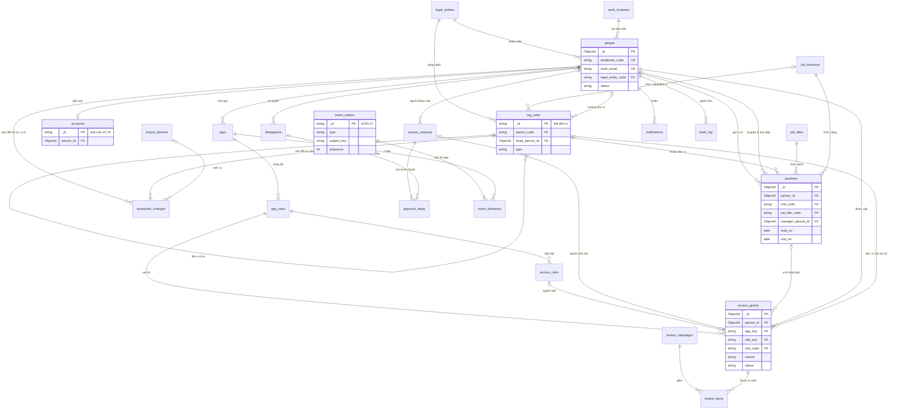
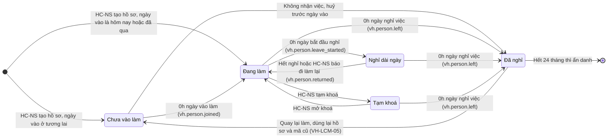
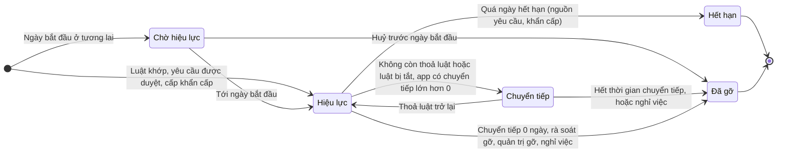
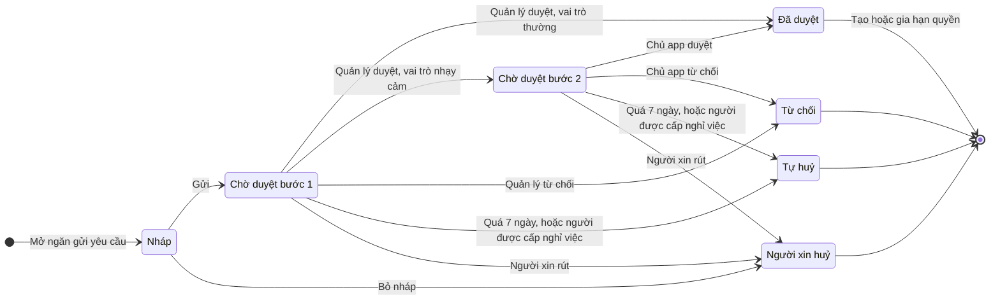
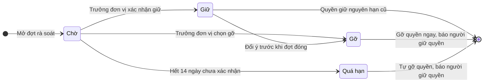
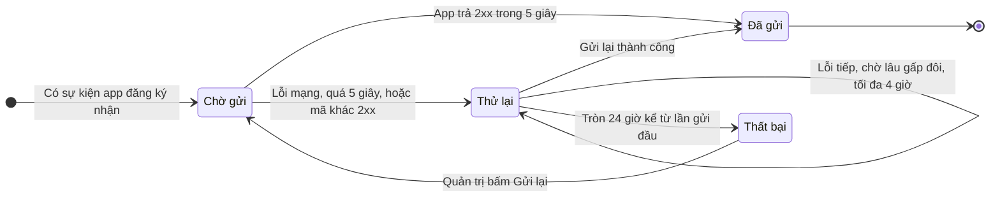

# VC Home — Mô hình dữ liệu, trạng thái, phân loại và thời hạn lưu

Phiên bản 0.1 · 08/10/2026 · Trạng thái: Nháp (chờ duyệt)

## Tóm tắt

- **Tài liệu nói gì:** toàn bộ dữ liệu của VC Home API trong MongoDB, database `vchome`: sơ đồ quan hệ, từ điển dữ liệu của 23 collection ở [README](README.md) mục 9, năm luồng trạng thái, cách lưu thay đổi có ngày hiệu lực, phân loại mức mật, thời hạn lưu và nguồn sự thật của từng loại dữ liệu.
- **Quyết định chính:**
  - Mọi thay đổi hồ sơ, vị trí, cơ cấu đều đi qua `scheduled_changes`, kể cả thay đổi có hiệu lực ngay. Vị trí cũ được **đóng**, không sửa đè (VH-BR-04, VH-BR-07).
  - Đơn vị và danh mục dùng **mã chữ** làm khoá, không đổi sau khi tạo. Mã đơn vị theo đúng quy tắc mã của VClinks để hai bên dùng chung.
  - Mỗi dòng `access_grants` là **một nguồn** của một quyền. Quyền còn hiệu lực khi còn ít nhất một nguồn còn mở (VH-BR-09).
  - Chỉ lưu dữ liệu C0–C1. Không lưu lý do nghỉ dài ngày (thai sản, ốm là dữ liệu sức khoẻ). File Excel gốc xoá sau 30 ngày.
  - Hồ sơ đã nghỉ giữ 24 tháng rồi ẩn danh; nhật ký giữ 24 tháng, chỉ ghi thêm (VH-NFR-08, VH-NFR-09).
- **Có bổ sung so với README mục 9** (chỉ thêm trường, không thêm collection): `org_units.function_code`, `app_roles.unit_scoped`, `apps.people_data_level`, `access_grants.unit_code`. Xem mục 9.
- **Việc còn mở:** Q-10 (thời hạn nhật ký), Q-11 (mẫu mã nhân viên), Q-13 (ngày nghỉ việc), Q-02 (danh mục chức năng).
- **Người duyệt xem kỹ:**
  - mục 3.10 (`access_grants`) và 4.2 (trạng thái quyền);
  - mục 5 (ngày hiệu lực);
  - mục 6 và 7 (mức mật, thời hạn lưu; cần pháp chế);
  - mục 8 (bên nào giữ gốc dữ liệu nào).

## Mục lục

- [1. Quy ước chung](#1-quy-ước-chung)
- [2. Sơ đồ quan hệ](#2-sơ-đồ-quan-hệ)
- [3. Từ điển dữ liệu](#3-từ-điển-dữ-liệu)
- [4. Luồng trạng thái](#4-luồng-trạng-thái)
- [5. Thay đổi có ngày hiệu lực và lưu lịch sử](#5-thay-đổi-có-ngày-hiệu-lực-và-lưu-lịch-sử)
- [6. Phân loại dữ liệu theo mức mật](#6-phân-loại-dữ-liệu-theo-mức-mật)
- [7. Thời hạn lưu, xoá và ẩn danh](#7-thời-hạn-lưu-xoá-và-ẩn-danh)
- [8. Nguồn sự thật theo loại dữ liệu](#8-nguồn-sự-thật-theo-loại-dữ-liệu)
- [9. Đề xuất bổ sung (chưa cấp mã)](#9-đề-xuất-bổ-sung-chưa-cấp-mã)
- [Lịch sử cập nhật](#lịch-sử-cập-nhật)

---

## 1. Quy ước chung

### 1.1 Nơi lưu và cách đặt tên

| Quy ước | Nội dung |
|---|---|
| Database | MongoDB 7 trở lên, database `vchome`, máy chủ tại Việt Nam (thiết kế SSO Q2). Chạy dạng **replica set** (kể cả 1 nút) để dùng được giao dịch nhiều bản ghi (VH-NFR-18) |
| Có từ giai đoạn | GĐ B. Ở GĐ A, VC Home là trang tĩnh, không có database ([thiết kế SSO](ky-thuat/thiet-ke-sso-keycloak.md) mục 3.1); danh mục app nằm trong tệp `apps.yaml`, nhật ký nằm ở Keycloak |
| Tên collection | snake_case, số nhiều, đúng như README mục 9 |
| Tên trường | snake_case tiếng Anh |
| Giá trị liệt kê | Tiếng Việt không dấu, ví dụ `dang_lam`. Riêng `apps.status` giữ giá trị của `catalog.json` (`live`, `coming_soon`…) để không phải đổi tệp đang dùng |
| Khoá `_id` | ObjectId cho dữ liệu phát sinh (người, quyền, yêu cầu…). **Mã chữ** cho đơn vị, danh mục, app, vai trò app (ví dụ `VCP-TBH1`, `NVKD`, `vclinks`) |
| Mã không đổi | Mã nhân viên, mã đơn vị, mã danh mục, khoá app, khoá vai trò: không đổi sau khi tạo, không dùng lại cho đối tượng khác |
| Xoá | Không xoá cứng dữ liệu nghiệp vụ; dùng trạng thái. Chỉ job thời hạn lưu (mục 7) được xoá hoặc ẩn danh |

### 1.2 Kiểu dữ liệu và thời gian

| Kiểu ghi trong bảng | Nghĩa |
|---|---|
| `string` | Chuỗi UTF-8 |
| `ObjectId` | Khoá 12 byte của MongoDB. Trong ví dụ JSON viết dạng chuỗi cho dễ đọc |
| `int`, `int64`, `bool` | Số nguyên, số nguyên lớn, đúng/sai |
| `Date` | Thời điểm, lưu theo **UTC**. Trường có đuôi `_at` |
| `date` | Ngày lịch **giờ Việt Nam**, chuỗi `YYYY-MM-DD`. Trường có đuôi `_on` |
| `enum` | Một trong các giá trị liệt kê ở cột Mô tả |
| `object`, `array<…>` | Đối tượng lồng, mảng |

- Theo VH-BR-22: lưu UTC, hiển thị và tính hiệu lực theo `Asia/Ho_Chi_Minh`.
- Ngày hiệu lực luôn có **cặp** `effective_on` (ngày lịch, để người đọc) và `effective_at` (thời điểm UTC, để máy chạy). Ví dụ hiệu lực 01/12/2026 thì `effective_on = "2026-12-01"`, `effective_at = 2026-11-30T17:00:00Z` (00:00 giờ Việt Nam).

### 1.3 Trường chung

Mọi collection (trừ `audit_log`, `event_outbox`, `event_deliveries`) có thêm các trường sau. Bảng ở mục 3 không nhắc lại.

| Trường | Kiểu | Mô tả |
|---|---|---|
| `created_at`, `updated_at` | Date | Lúc tạo, lúc sửa gần nhất |
| `created_by`, `updated_by` | ObjectId hoặc string | `_id` của người trong `people`, hoặc `"he_thong"`, hoặc khoá app |
| `rev` | int | Số phiên bản bản ghi, tăng 1 mỗi lần sửa. Dùng để chặn hai người ghi đè nhau và làm ETag cho API |

### 1.4 Cột "Mức mật" trong bảng

| Ghi | Nghĩa |
|---|---|
| C0 | Công khai nội bộ: mọi nhân viên xem được trong danh bạ |
| C1 | Nội bộ có phạm vi: chỉ người có phạm vi theo VH-BR-23 và các vai trò ở [02](02-tac-nhan-quy-tac.md) mục 3 |
| — | Không phải dữ liệu cá nhân (cấu hình, khoá kỹ thuật, bộ đếm) |
| Bí mật | Khoá, bí mật ký. Lưu mã hoá, không bao giờ trả qua API |

C2–C3 **không có** trong VC Home (VH-BR-19). Bảng chi tiết ở mục 6.

### 1.5 Thuật ngữ kỹ thuật dùng trong tài liệu

| Thuật ngữ | Giải thích một câu |
|---|---|
| Chỉ mục (index) | Bảng tra phụ giúp tìm nhanh theo một hoặc vài trường |
| Chỉ mục duy nhất (unique) | Chỉ mục cấm hai bản ghi trùng giá trị |
| Chỉ mục một phần (partial) | Chỉ mục chỉ áp cho bản ghi thoả một điều kiện, ví dụ "chỉ vị trí đang hiệu lực" |
| Chỉ mục TTL | Chỉ mục báo MongoDB tự xoá bản ghi khi tới thời điểm ghi trong một trường |
| Giao dịch | Nhóm thao tác ghi: hoặc xong hết, hoặc không có gì thay đổi |

---

## 2. Sơ đồ quan hệ

Sơ đồ chỉ ghi trường dùng để nối. Trường đầy đủ ở mục 3.



---

## 3. Từ điển dữ liệu

Mỗi collection có: mục đích, giai đoạn, bảng trường, chỉ mục, một bản ghi ví dụ (dữ liệu bịa).

### 3.1 `people` — Nhân viên

- **Mục đích:** hồ sơ công việc của mỗi nhân viên (VH-NSU-01, 04). Là "ai là ai" cho mọi app.
- **Giai đoạn:** B.

| Trường | Kiểu | Bắt buộc | Mức mật | Mô tả / ràng buộc |
|---|---|---|---|---|
| `_id` | ObjectId | Có | — | Khoá kỹ thuật |
| `employee_code` | string | Có | C0 | Mã nhân viên, duy nhất toàn tập đoàn, không đổi, không dùng lại kể cả sau khi nghỉ (VH-BR-01). Mẫu theo Q-11, đề xuất `<tiền tố pháp nhân><4 số>`, ví dụ `VCP0123` |
| `full_name` | string | Có | C0 | Họ tên đầy đủ, 2–80 ký tự |
| `name_folded` | string | Có | C0 | Họ tên viết thường, bỏ dấu; hệ thống tự tính để tìm danh bạ |
| `work_email` | string | Có | C0 | Email công ty chính, chữ thường, đuôi `vcprosperous.com` hoặc `vcpart.vn` (VH-BR-02) |
| `previous_emails` | array<string> | Không | C0 | Email cũ khi đổi tên hoặc đổi domain; dùng để gắn tài khoản đúng người (VH-BR-01) |
| `photo` | object | Không | C0 | `{url, source: google\|hcns, updated_at}`. Mặc định lấy ảnh Google; HC-NS thay được bằng ảnh thẻ |
| `work_phone` | string | Không | C0 | SĐT công việc (máy bàn, SIM công ty), 10 số. Không nhận SĐT cá nhân (VH-BR-19) |
| `legal_entity_code` | string | Có | C0 | Pháp nhân ký hợp đồng → `legal_entities` |
| `employee_type` | enum | Có | C1 | `chinh_thuc` · `thu_viec` · `cong_tac_vien` · `thuc_tap` (VH-BR-10) |
| `work_location_code` | string | Không | C1 | Nơi làm việc → `work_locations` (Q-12) |
| `status` | enum | Có | C1 | `chua_vao_lam` · `dang_lam` · `nghi_dai_ngay` · `tam_khoa` · `da_nghi`. Luồng ở mục 4.1 |
| `status_since_at` | Date | Có | C1 | Lúc trạng thái hiện tại có hiệu lực |
| `joined_on` | date | Có | C1 | Ngày vào làm |
| `left_on` | date | Không | C1 | Ngày nghỉ việc = ngày đầu tiên không còn làm (VH-BR-14, Q-13). Đặt trước được |
| `leave` | object | Không | C1 | Nghỉ dài ngày đang có hoặc đã hẹn: `{from_on, to_on, lock_login}` (VH-BR-15). **Không có trường lý do**: thai sản, ốm là dữ liệu sức khoẻ, thuộc loại nhạy cảm |
| `suspension` | object | Không | C1 | Khi `tam_khoa`: `{from_at, reason_code: dinh_chi\|cho_xu_ly\|khac, note}`. `note` tối đa 200 ký tự, không ghi nội dung kỷ luật |
| `primary` | object | Không | C0 / C1 | Bản sao vị trí chính đang hiệu lực, để đọc nhanh: `{position_id, unit_code, job_title_code, job_function_code, manager_person_id}`. `manager_person_id` là C1. Job cập nhật khi vị trí đổi |
| `is_manager` | bool | Có | C1 | Có ít nhất 1 vị trí đang hiệu lực ghi người này là quản lý trực tiếp |
| `head_of_unit_codes` | array<string> | Không | C0 | Các đơn vị người này làm trưởng (VH-ORG-04) |
| `event_seq` | int64 | Có | — | Số thứ tự sự kiện hồ sơ gần nhất của người này (07 mục 6) |
| `grant_event_seq` | object | Không | — | Số thứ tự sự kiện quyền theo từng app, ví dụ `{"vclinks": 6}` |
| `anonymized_at` | Date | Không | — | Lúc ẩn danh (mục 7) |

**Chỉ mục:**
- `employee_code`: duy nhất.
- `work_email`: duy nhất, một phần (chỉ bản ghi còn trường này; bản ghi đã ẩn danh bị xoá trường).
- `previous_emails`; `status`; `primary.unit_code`; `primary.manager_person_id`; `name_folded`.

**Ví dụ:**

```json
{
  "_id": "6705a1f0c2a4b10012ab0123",
  "employee_code": "VCP0123",
  "full_name": "Nguyễn Thị Hoa",
  "name_folded": "nguyen thi hoa",
  "work_email": "hoa.nt@vcpart.vn",
  "previous_emails": [],
  "photo": { "url": "https://lh3.googleusercontent.com/a/vi-du-anh-hoa", "source": "google", "updated_at": "2026-11-02T01:20:00Z" },
  "work_phone": "02473001123",
  "legal_entity_code": "VCPARTS",
  "employee_type": "chinh_thuc",
  "work_location_code": "HN-VP1",
  "status": "dang_lam",
  "status_since_at": "2024-02-29T17:00:00Z",
  "joined_on": "2024-03-01",
  "left_on": null,
  "leave": null,
  "suspension": null,
  "primary": {
    "position_id": "6705a1f0c2a4b10012ac0310",
    "unit_code": "VCP-TBH1",
    "job_title_code": "NVKD",
    "job_function_code": "ban_hang",
    "manager_person_id": "6705a1f0c2a4b10012ab0045"
  },
  "is_manager": false,
  "head_of_unit_codes": [],
  "event_seq": 14,
  "grant_event_seq": { "vclinks": 6, "vcwiki": 2 },
  "anonymized_at": null,
  "created_at": "2026-11-05T02:00:00Z",
  "created_by": "6705a1f0c2a4b10012ab0007",
  "updated_at": "2026-11-12T03:41:00Z",
  "updated_by": "6705a1f0c2a4b10012ab0007",
  "rev": 9
}
```

### 3.2 `accounts` — Tài khoản đăng nhập

- **Mục đích:** nối nhân viên với tài khoản VC ID (`sub`), giữ trạng thái khoá và lần đăng nhập cuối (VH-AUT-08, VH-AUT-06, VH-AUT-07).
- **Giai đoạn:** B.
- Tài khoản công ty **chưa có hồ sơ** vẫn có dòng ở đây, `person_id = null`, để HC-NS thấy trong báo cáo đối chiếu (VH-BR-02, Q-14).

| Trường | Kiểu | Bắt buộc | Mức mật | Mô tả / ràng buộc |
|---|---|---|---|---|
| `_id` | string | Có | C1 | `sub` của VC ID (UUID, không đổi) |
| `person_id` | ObjectId | Không | C1 | → `people`. Gắn rồi thì không tự đổi; gắn lại phải do quản trị hệ thống làm, có lý do (VH-BR-01) |
| `email` | string | Có | C0 | Email trên VC ID ở lần đồng bộ gần nhất |
| `hd` | string | Có | — | Domain Google Workspace của tài khoản |
| `link` | object | Không | C1 | `{method: theo_email\|quan_tri, linked_at, linked_by}` |
| `idp_enabled` | bool | Có | C1 | Bản sao trạng thái bật / khoá trên VC ID |
| `lock` | object | Không | C1 | Khi bị khoá: `{kind: khan_cap\|google\|nghi_viec\|tam_khoa\|nghi_dai_ngay, at, by, reason}`. Lý do bắt buộc với `khan_cap` |
| `google_status` | object | Không | C1 | `{value: active\|suspended\|archived\|deleted, checked_at}` do `vc-provisioner` ghi |
| `last_login_at` | Date | Không | C1 | Lần đăng nhập cuối (lấy từ sự kiện đăng nhập của Keycloak) |
| `last_login_app` | string | Không | C1 | Khoá app của lần đăng nhập cuối |
| `unlinked_at` | Date | Không | C1 | Lúc gỡ liên kết (khi gắn nhầm) |

**Chỉ mục:**
- `person_id`: duy nhất, một phần (chỉ khi `person_id` là ObjectId).
- `email`; `lock.kind`.

**Ví dụ:**

```json
{
  "_id": "6f1c2b7e-4d1a-4c55-9a0e-2f7d9b1c3e41",
  "person_id": "6705a1f0c2a4b10012ab0123",
  "email": "hoa.nt@vcpart.vn",
  "hd": "vcpart.vn",
  "link": { "method": "theo_email", "linked_at": "2026-11-20T01:05:00Z", "linked_by": "he_thong" },
  "idp_enabled": true,
  "lock": null,
  "google_status": { "value": "active", "checked_at": "2026-11-21T00:00:00Z" },
  "last_login_at": "2026-11-21T01:12:00Z",
  "last_login_app": "vclinks",
  "unlinked_at": null,
  "created_at": "2026-10-28T02:15:00Z",
  "created_by": "he_thong",
  "updated_at": "2026-11-21T01:12:00Z",
  "updated_by": "he_thong",
  "rev": 5
}
```

### 3.3 `positions` — Vị trí công tác

- **Mục đích:** bộ (đơn vị, chức danh, chức năng, quản lý trực tiếp, từ ngày, đến ngày) của mỗi người (VH-NSU-02, 03). Một người đang làm có đúng 1 vị trí chính và 0..n kiêm nhiệm (VH-BR-04).
- **Giai đoạn:** B.
- **Giữ lịch sử:** đổi bất kỳ phần nào của bộ trên (kể cả chỉ đổi quản lý) thì **đóng** dòng cũ và **mở** dòng mới. Không sửa đè. Chỉ "sửa nhập nhầm" mới sửa tại chỗ (mục 5.4).
- Collection chỉ chứa vị trí **đã có hiệu lực**. Vị trí hẹn trước nằm ở `scheduled_changes` cho tới ngày hiệu lực.

| Trường | Kiểu | Bắt buộc | Mức mật | Mô tả / ràng buộc |
|---|---|---|---|---|
| `_id` | ObjectId | Có | — | Khoá |
| `person_id` | ObjectId | Có | C1 | → `people` |
| `kind` | enum | Có | C1 | `chinh` · `kiem_nhiem` |
| `unit_code` | string | Có | C0 | → `org_units`. Đơn vị phải đang `hoat_dong` vào ngày bắt đầu |
| `job_title_code` | string | Có | C0 | → `job_titles` |
| `job_function_code` | string | Có | C0 | → `job_functions`. Mặc định lấy theo chức danh, HC-NS sửa được |
| `manager_person_id` | ObjectId | Không | C1 | Quản lý trực tiếp → `people`. Chỉ được trống với người đứng đầu tập đoàn. Không tạo vòng (VH-BR-05) |
| `start_on` | date | Có | C1 | Ngày bắt đầu |
| `end_on` | date | Không | C1 | Ngày làm cuối của vị trí. Trống = chưa kết thúc. Đổi vị trí chính: `end_on` = ngày trước ngày hiệu lực của vị trí mới |
| `start_at`, `end_at` | Date | Có / Không | — | Thời điểm UTC tương ứng: 00:00 giờ VN của `start_on`, và của ngày sau `end_on` |
| `active` | bool | Có | — | `true` khi hôm nay nằm trong [`start_on`, `end_on`]. Job lúc 00:00 giờ VN cập nhật |
| `end_reason` | enum | Không | C1 | `doi_vi_tri` · `doi_quan_ly` · `het_kiem_nhiem` · `nghi_viec` · `don_vi_ngung` · `gop_don_vi` |
| `replaced_by_position_id` | ObjectId | Không | — | Dòng mới thay dòng này |
| `scheduled_change_id` | ObjectId | Không | — | Thay đổi hẹn đã sinh ra dòng này → `scheduled_changes` |
| `manager_missing` | bool | Có | C1 | `true` khi quản lý trực tiếp đã nghỉ; HC-NS được nhắc; trong lúc chờ, trưởng đơn vị tạm duyệt thay (VH-BR-05) |
| `source` | enum | Có | — | `tay` · `lo_nhap` · `khoi_tao_tu_app` (VH-IMP-03) |

**Chỉ mục:**
- `{person_id, active}`.
- `{person_id}`: duy nhất, một phần với điều kiện `kind = "chinh"` và `active = true` (chặn hai vị trí chính cùng lúc).
- `{unit_code, active}`; `{manager_person_id, active}`; `{start_at}`; `{end_at}`.

**Ví dụ:**

```json
{
  "_id": "6705a1f0c2a4b10012ac0311",
  "person_id": "6705a1f0c2a4b10012ab0123",
  "kind": "kiem_nhiem",
  "unit_code": "VCS-CSKH",
  "job_title_code": "NV_CSKH",
  "job_function_code": "cskh",
  "manager_person_id": "6705a1f0c2a4b10012ab0201",
  "start_on": "2026-11-01",
  "end_on": "2027-04-30",
  "start_at": "2026-10-31T17:00:00Z",
  "end_at": "2027-04-30T17:00:00Z",
  "active": true,
  "end_reason": null,
  "replaced_by_position_id": null,
  "scheduled_change_id": "6705a1f0c2a4b10012ad0042",
  "manager_missing": false,
  "source": "tay",
  "created_at": "2026-10-20T03:00:00Z",
  "created_by": "6705a1f0c2a4b10012ab0007",
  "updated_at": "2026-10-31T17:00:05Z",
  "updated_by": "he_thong",
  "rev": 2
}
```

### 3.4 `org_units` — Đơn vị

- **Mục đích:** cây tổ chức nhiều cấp (VH-ORG-01, 04, 05).
- **Giai đoạn:** B.

| Trường | Kiểu | Bắt buộc | Mức mật | Mô tả / ràng buộc |
|---|---|---|---|---|
| `_id` | string | Có | C0 | Mã đơn vị, chữ hoa, 2–30 ký tự theo mẫu `^[A-Z0-9][A-Z0-9_-]{1,29}$`. Đây đúng là quy tắc mã của VClinks (`unitCodeSchema` trong `packages/shared/src/org.ts`), để VClinks dùng thẳng mã. Không đổi sau khi tạo |
| `name` | string | Có | C0 | 2–80 ký tự, không trùng với đơn vị khác cùng cha đang hoạt động |
| `name_folded` | string | Có | C0 | Tên bỏ dấu, viết thường; để kiểm trùng và tìm |
| `short_name` | string | Không | C0 | Tên ngắn trên sơ đồ |
| `type` | enum | Có | C0 | `tap_doan` · `division` · `phong` · `to_nhom` (xem luật đặt cha dưới bảng) |
| `parent_code` | string | Không | C0 | → `org_units`. Trống chỉ với gốc |
| `ancestors` | array<string> | Có | C0 | Mã các tổ tiên từ gốc xuống; hệ thống tự tính để lọc cây con nhanh |
| `division_code` | string | Không | C0 | Division chứa đơn vị này (hoặc chính nó). Trống với đơn vị cấp tập đoàn |
| `legal_entity_code` | string | Có | C0 | → `legal_entities` |
| `function_code` | string | Không | C0 | Chức năng chính của đơn vị (tuỳ chọn) → `job_functions`. Bổ sung so với README mục 9, theo mô hình ORG của VCwiki; app dùng để ánh xạ loại đơn vị (07 mục 8.2) |
| `head_person_id` | ObjectId | Không | C0 | Trưởng đơn vị, tối đa 1 (VH-BR-06). Người này phải có vị trí ở đơn vị này hoặc đơn vị cha trực tiếp |
| `status` | enum | Có | C0 | `hoat_dong` · `ngung` |
| `effective_from_on` | date | Có | C0 | Ngày bắt đầu hoạt động |
| `effective_to_on` | date | Không | C0 | Ngày hoạt động cuối (khi ngừng hoặc gộp) |
| `merged_into_code` | string | Không | C0 | Khi gộp: đơn vị nhận → `org_units` |
| `order` | int | Có | — | Thứ tự trong cùng cha |
| `event_seq` | int64 | Có | — | Số thứ tự sự kiện gần nhất của đơn vị |

**Luật đặt cha** (kiểm ở server, VH-NFR-18):

| Loại | Đặt dưới | Có đơn vị con |
|---|---|---|
| `tap_doan` | Không có cha; chỉ 1 gốc | Có |
| `division` | `tap_doan` | Có |
| `phong` | `tap_doan` (khối chức năng tập đoàn) hoặc `division` | Có (`to_nhom`) |
| `to_nhom` | `division` hoặc `phong` | **Không** (VH-BR-06) |

Đơn vị còn vị trí đang hiệu lực hoặc còn đơn vị con đang hoạt động thì không chuyển sang `ngung` được. Không có thao tác xoá.

**Chỉ mục:**
- `{parent_code, name_folded}`: duy nhất, một phần với `status = "hoat_dong"`.
- `ancestors`; `parent_code`; `division_code`; `head_person_id`; `status`.

**Ví dụ:**

```json
{
  "_id": "VCP-TBH1",
  "name": "Tổ bán hàng HN1",
  "name_folded": "to ban hang hn1",
  "short_name": "Tổ HN1",
  "type": "to_nhom",
  "parent_code": "VCP-KD",
  "ancestors": ["VCPV", "VCP", "VCP-KD"],
  "division_code": "VCP",
  "legal_entity_code": "VCPARTS",
  "function_code": "ban_hang",
  "head_person_id": "6705a1f0c2a4b10012ab0045",
  "status": "hoat_dong",
  "effective_from_on": "2024-01-01",
  "effective_to_on": null,
  "merged_into_code": null,
  "order": 10,
  "event_seq": 3,
  "created_at": "2026-11-05T02:00:00Z",
  "created_by": "6705a1f0c2a4b10012ab0007",
  "updated_at": "2026-11-05T02:00:00Z",
  "updated_by": "6705a1f0c2a4b10012ab0007",
  "rev": 1
}
```

### 3.5 Danh mục: `job_titles`, `job_functions`, `legal_entities`, `work_locations`

- **Mục đích:** danh mục dùng chung cho hồ sơ, cơ cấu và luật cấp quyền (VH-ORG-02, 03, 07).
- **Giai đoạn:** B. Bản đầu theo Q-02.
- Mọi danh mục có `status`: `dang_dung` · `ngung`. Mục `ngung` không chọn được cho dữ liệu mới nhưng vẫn hiện ở dữ liệu cũ.

**`job_titles` — Chức danh**

| Trường | Kiểu | Bắt buộc | Mức mật | Mô tả / ràng buộc |
|---|---|---|---|---|
| `_id` | string | Có | C0 | Mã chức danh, chữ hoa, ví dụ `NVKD` |
| `name` | string | Có | C0 | Ví dụ "Nhân viên kinh doanh" |
| `default_function_code` | string | Có | C0 | Chức năng gợi ý khi chọn chức danh này → `job_functions` |
| `status` | enum | Có | — | `dang_dung` · `ngung` |
| `order` | int | Có | — | Thứ tự hiện |

Chỉ mục: `_id` (sẵn có), `status`.

```json
{ "_id": "NVKD", "name": "Nhân viên kinh doanh", "default_function_code": "ban_hang", "status": "dang_dung", "order": 20, "rev": 1 }
```

**`job_functions` — Chức năng**

| Trường | Kiểu | Bắt buộc | Mức mật | Mô tả / ràng buộc |
|---|---|---|---|---|
| `_id` | string | Có | C0 | Mã chữ thường, ví dụ `ban_hang`, `cskh`, `sale_admin`, `ke_toan`, `ky_thuat`, `kho`, `marketing`, `nhan_su`, `it`, `thi_truong`, `ban_giam_doc` |
| `name` | string | Có | C0 | Ví dụ "Bán hàng" |
| `status` | enum | Có | — | `dang_dung` · `ngung` |
| `order` | int | Có | — | Thứ tự hiện |

Chỉ mục: `status`.

```json
{ "_id": "cskh", "name": "Chăm sóc khách hàng", "status": "dang_dung", "order": 20, "rev": 1 }
```

**`legal_entities` — Pháp nhân**

| Trường | Kiểu | Bắt buộc | Mức mật | Mô tả / ràng buộc |
|---|---|---|---|---|
| `_id` | string | Có | — | Mã pháp nhân, ví dụ `VCPARTS` |
| `name` | string | Có | — | Tên pháp lý |
| `short_name` | string | Có | — | Tên ngắn |
| `employee_code_prefix` | string | Không | — | Tiền tố mã nhân viên khi VC Home tự cấp mã (Q-11 phương án C), ví dụ `VCP` |
| `tax_code` | string | Không | — | Mã số thuế doanh nghiệp (không phải dữ liệu cá nhân) |
| `email_domains` | array<string> | Có | — | Domain email nhân viên pháp nhân này dùng |
| `status` | enum | Có | — | `dang_dung` · `ngung` |

Chỉ mục: `employee_code_prefix` duy nhất, một phần (khi có).

```json
{ "_id": "VCPARTS", "name": "Công ty TNHH VCparts (ví dụ)", "short_name": "VCparts", "employee_code_prefix": "VCP", "tax_code": "0100000000", "email_domains": ["vcpart.vn"], "status": "dang_dung", "rev": 1 }
```

**`work_locations` — Nơi làm việc**

| Trường | Kiểu | Bắt buộc | Mức mật | Mô tả / ràng buộc |
|---|---|---|---|---|
| `_id` | string | Có | — | Mã chữ hoa, ví dụ `HN-VP1` |
| `name` | string | Có | — | Ví dụ "Văn phòng Hà Nội" |
| `kind` | enum | Có | — | `van_phong` · `kho` · `gara` · `cua_hang` · `khac` |
| `address` | string | Không | — | Địa chỉ cơ sở của công ty (không phải địa chỉ người) |
| `legal_entity_code` | string | Có | — | → `legal_entities` |
| `status` | enum | Có | — | `dang_dung` · `ngung` |

Chỉ mục: `{legal_entity_code, status}`; `kind`.

```json
{ "_id": "HN-VP1", "name": "Văn phòng Hà Nội", "kind": "van_phong", "address": "Số 1 phố Ví Dụ, Hà Nội", "legal_entity_code": "VCPARTS", "status": "dang_dung", "rev": 1 }
```

### 3.6 `scheduled_changes` — Thay đổi hẹn ngày hiệu lực

- **Mục đích:** hàng chờ mọi thay đổi hồ sơ, vị trí, cơ cấu có ngày hiệu lực (VH-BR-07, VH-ORG-05). Cách chạy ở mục 5.
- **Giai đoạn:** B.

| Trường | Kiểu | Bắt buộc | Mức mật | Mô tả / ràng buộc |
|---|---|---|---|---|
| `_id` | ObjectId | Có | — | Khoá |
| `kind` | enum | Có | — | Người: `person_create`, `person_update`, `person_status` (vào làm, bắt đầu và kết thúc nghỉ dài ngày, tạm khoá, mở khoá, nghỉ việc). Vị trí: `position_open`, `position_close`. Cơ cấu: `unit_create`, `unit_update` (tên, trưởng đơn vị, chức năng), `unit_move`, `unit_merge`, `unit_deactivate` |
| `target` | object | Có | C1 | `{type: person\|position\|org_unit, id}` |
| `payload` | object | Có | C0 / C1 | Giá trị sau thay đổi, chỉ các trường đổi. Kiểm schema theo `kind`; không nhận trường ngoài từ điển này |
| `group_id` | ObjectId | Có | — | Các thay đổi của cùng một quyết định (ví dụ điều chuyển = đóng vị trí cũ + mở vị trí mới) áp cùng nhau trong một giao dịch |
| `effective_on` | date | Có | C1 | Ngày hiệu lực (giờ VN) |
| `effective_at` | Date | Có | — | 00:00 giờ VN của `effective_on`, đổi ra UTC |
| `status` | enum | Có | — | `cho_ap` · `da_ap` · `da_huy` · `loi` |
| `reason` | string | Không | C1 | Lý do hoặc số quyết định, tối đa 200 ký tự |
| `source` | object | Có | — | `{type: tay\|lo_nhap, import_batch_id}` |
| `applied_at` | Date | Không | — | Lúc áp thật |
| `error` | object | Không | — | `{code, message}` khi `loi` (ví dụ đơn vị đích đã ngừng) |
| `cancelled_at`, `cancelled_by`, `cancel_reason` | Date, ObjectId, string | Không | — | Khi huỷ trước ngày hiệu lực |

**Chỉ mục:**
- `{status, effective_at}` (job lấy việc tới hạn).
- `{target.type, target.id, status}`; `group_id`; `source.import_batch_id`.

**Ví dụ:** điều chuyển anh Minh từ Tổ HN1 sang Tổ HN2 từ 01/12/2026 sinh hai dòng cùng `group_id`; đây là dòng mở vị trí mới.

```json
{
  "_id": "6705a1f0c2a4b10012ad0057",
  "kind": "position_open",
  "target": { "type": "person", "id": "6705a1f0c2a4b10012ab0156" },
  "payload": {
    "kind": "chinh",
    "unit_code": "VCP-TBH2",
    "job_title_code": "NVKD",
    "job_function_code": "ban_hang",
    "manager_person_id": "6705a1f0c2a4b10012ab0046",
    "start_on": "2026-12-01"
  },
  "group_id": "6705a1f0c2a4b10012ad0056",
  "effective_on": "2026-12-01",
  "effective_at": "2026-11-30T17:00:00Z",
  "status": "cho_ap",
  "reason": "QĐ điều chuyển 112/2026",
  "source": { "type": "tay", "import_batch_id": null },
  "applied_at": null,
  "error": null,
  "created_at": "2026-11-20T08:10:00Z",
  "created_by": "6705a1f0c2a4b10012ab0007",
  "updated_at": "2026-11-20T08:10:00Z",
  "updated_by": "6705a1f0c2a4b10012ab0007",
  "rev": 1
}
```

### 3.7 `apps` — Danh mục app

- **Mục đích:** mọi app trong hệ, cấu hình tích hợp, chủ app (VH-APP-01, 03, 06).
- **Giai đoạn:** A là tệp `apps.yaml` sinh ra `catalog.json`; từ B là collection này, `catalog.json` sinh từ đây với cùng đường dẫn và cùng dạng (07 mục 5.10).

| Trường | Kiểu | Bắt buộc | Mức mật | Mô tả / ràng buộc |
|---|---|---|---|---|
| `_id` | string | Có | — | Khoá app, chữ thường, mẫu `^[a-z][a-z0-9_]{1,29}$`, ví dụ `vclinks`. Trùng `client_id` OIDC và tên nhóm `app-<khoá>` |
| `name` | string | Có | — | Tên hiện trên ô app |
| `description` | string | Có | — | Mô tả một dòng |
| `url` | string | Không | — | Địa chỉ mở app. Trống với app `coming_soon` |
| `icon` | string | Có | — | Đường dẫn biểu tượng |
| `kind` | enum | Có | — | `sso` (đăng nhập qua VC ID) · `lien_ket_ngoai` (Gmail, Drive, MISA…, VH-BR-21) |
| `status` | enum | Có | — | `live` · `coming_soon` · `paused` · `retired` (giữ giá trị của `catalog.json`) |
| `order` | int | Có | — | Thứ tự ô |
| `owner_person_ids` | array<ObjectId> | Có với `sso` | C0 | Chủ app, 1–3 người (VH-APP-03) |
| `oidc_client_id` | string | Có với `sso` | — | Client đăng nhập trên VC ID |
| `service_client_id` | string | Không | — | Client máy `<khoá>-service` (07 mục 4) |
| `transition_days` | int | Có | — | Thời gian chuyển tiếp 0–7 ngày, mặc định 0 (VH-APP-06, VH-BR-11) |
| `people_data_level` | enum | Có | — | `C0` · `C1`: mức dữ liệu nhân sự app được nhận qua API và sự kiện. Mặc định `C0`; muốn `C1` phải ghi lý do lúc đưa app vào (VH-QT-11). Bổ sung so với README mục 9 |
| `event_webhook_url` | string | Không | — | URL nhận sự kiện, bắt buộc `https://` |
| `event_types` | array<string> | Không | — | Loại sự kiện app đăng ký nhận |
| `event_secret` | object | Không | Bí mật | Bí mật ký sự kiện, mã hoá AES-256-GCM `{key_id, iv, tag, data, rotated_at}` (VH-NFR-03). Không trả qua API, không ghi log |
| `event_secret_prev` | object | Không | Bí mật | Bí mật cũ trong 7 ngày xoay vòng, cùng dạng, kèm `expires_at` |
| `status_url` | string | Không | — | URL trạng thái ô app VH-API-09 (GĐ E) |
| `event_seq` | int64 | Có | — | Bộ đếm thứ tự sự kiện gửi cho app này (dùng cho `event_deliveries.app_seq`) |
| `onboarding` | object | Không | — | Tiến độ danh sách kiểm ở 07 mục 7: `{item_key: {done_at, by}}` |
| `live_since_on` | date | Không | — | Ngày chuyển sang `live` |

**Chỉ mục:**
- `oidc_client_id`: duy nhất, một phần (khi có).
- `service_client_id`: duy nhất, một phần (khi có).
- `{status, order}`.

**Ví dụ:**

```json
{
  "_id": "vclinks",
  "name": "VClinks",
  "description": "Chăm sóc khách hàng đa kênh",
  "url": "https://vclink.tramaphutung.com/",
  "icon": "/icons/vclinks.svg",
  "kind": "sso",
  "status": "live",
  "order": 10,
  "owner_person_ids": ["6705a1f0c2a4b10012ab0002"],
  "oidc_client_id": "vclinks",
  "service_client_id": "vclinks-service",
  "transition_days": 3,
  "people_data_level": "C1",
  "event_webhook_url": "https://vclink.tramaphutung.com/api/vchome/events",
  "event_types": ["vh.person.joined", "vh.person.updated", "vh.person.moved", "vh.person.left", "vh.person.leave_started", "vh.person.returned", "vh.grant.added", "vh.grant.removed", "vh.org.unit_changed"],
  "event_secret": { "key_id": "k2026a", "iv": "…", "tag": "…", "data": "…", "rotated_at": "2026-12-01T02:00:00Z" },
  "event_secret_prev": null,
  "status_url": null,
  "event_seq": 1842,
  "onboarding": { "oidc_client": { "done_at": "2026-10-29T03:00:00Z", "by": "6705a1f0c2a4b10012ab0003" } },
  "live_since_on": "2026-10-31",
  "created_at": "2026-11-05T02:00:00Z",
  "created_by": "6705a1f0c2a4b10012ab0003",
  "updated_at": "2026-12-01T02:00:00Z",
  "updated_by": "6705a1f0c2a4b10012ab0003",
  "rev": 7
}
```

### 3.8 `app_roles` — Vai trò app

- **Mục đích:** vai trò thô mà mỗi app công bố (VH-APP-02, 05). Chủ app khai cho app của mình.
- **Giai đoạn:** C.

| Trường | Kiểu | Bắt buộc | Mức mật | Mô tả / ràng buộc |
|---|---|---|---|---|
| `_id` | string | Có | — | `<app_key>:<role_key>`, ví dụ `vclinks:nvkd` |
| `app_key` | string | Có | — | → `apps` |
| `role_key` | string | Có | — | Khoá vai trò, mẫu `^[a-z][a-z0-9_]{1,39}$`. Trùng tên client role trên VC ID. Không đổi sau khi tạo |
| `name` | string | Có | — | Tên hiện, ví dụ "Nhân viên kinh doanh" |
| `description` | string | Có | — | Vai trò này làm được gì trong app, 1–3 câu |
| `sensitive` | bool | Có | — | Vai trò nhạy cảm: xin phải qua bước 2 chủ app (VH-APP-05, VH-BR-12) |
| `unit_scoped` | bool | Có | — | Vai trò gắn với một đơn vị; khi `true` quyền phải có `unit_code` và token mang đơn vị trong `vh_roles` (07 mục 2.3). Bổ sung so với README mục 9 |
| `allowed_unit_types` | array<enum> | Không | — | Loại đơn vị được phép (tuỳ chọn), ví dụ `["to_nhom", "phong"]` |
| `default_request_days` | int | Có | — | Hạn mặc định khi xin, mặc định 90 (VH-BR-09) |
| `max_request_days` | int | Có | — | Hạn tối đa, ≤ 365 |
| `status` | enum | Có | — | `dang_dung` · `ngung` (ngừng thì không cấp mới; quyền đang có giữ tới khi gỡ) |
| `order` | int | Có | — | Thứ tự hiện |

**Chỉ mục:** `{app_key, role_key}` duy nhất; `{app_key, status}`.

**Ví dụ:**

```json
{
  "_id": "vclinks:nvkd",
  "app_key": "vclinks",
  "role_key": "nvkd",
  "name": "Nhân viên kinh doanh",
  "description": "Chăm khách mình phụ trách và hội thoại trên nick mình giữ.",
  "sensitive": false,
  "unit_scoped": true,
  "allowed_unit_types": ["to_nhom", "phong"],
  "default_request_days": 90,
  "max_request_days": 180,
  "status": "dang_dung",
  "order": 40,
  "created_at": "2026-11-25T02:00:00Z",
  "created_by": "6705a1f0c2a4b10012ab0002",
  "updated_at": "2026-11-25T02:00:00Z",
  "updated_by": "6705a1f0c2a4b10012ab0002",
  "rev": 1
}
```

### 3.9 `access_rules` — Luật cấp quyền

- **Mục đích:** điều kiện trên hồ sơ → (app, vai trò) (VH-ACC-01, 03; VH-BR-10, 25).
- **Giai đoạn:** C.
- **Không có trường nào cho một người cụ thể** (email, mã nhân viên): schema chặn từ gốc (VH-BR-10).

| Trường | Kiểu | Bắt buộc | Mức mật | Mô tả / ràng buộc |
|---|---|---|---|---|
| `_id` | ObjectId | Có | — | Khoá |
| `app_key`, `role_key` | string | Có | — | → `app_roles` |
| `name` | string | Có | — | Tên dễ hiểu, ví dụ "NVKD các tổ bán hàng VCparts" |
| `conditions` | object | Có | — | Các nhóm điều kiện: `legal_entity_codes`, `division_codes`, `units: [{code, include_sub_units}]`, `job_title_codes`, `job_function_codes`, `employee_types`, `work_location_codes`, `is_manager`, `is_unit_head`. **Và** giữa các nhóm, **hoặc** trong cùng nhóm. Nhóm trống = không giới hạn. Phải có ít nhất 1 nhóm |
| `unit_binding` | object | Có khi vai trò `unit_scoped` | — | Đơn vị ghi vào quyền: `{mode: theo_vi_tri\|division_cua_vi_tri\|co_dinh, unit_code}`. `theo_vi_tri`: đơn vị của vị trí thoả luật; `co_dinh`: một đơn vị cố định (ví dụ gốc cho vai trò toàn tập đoàn) |
| `status` | enum | Có | — | `nhap` · `cho_duyet` · `hieu_luc` · `tat` |
| `version` | int | Có | — | Tăng mỗi lần sửa điều kiện |
| `preview` | object | Không | — | Kết quả xem trước gần nhất: `{at, add_count, remove_count, by}` (VH-ACC-03) |
| `needs_second_approval` | bool | Có | — | `true` khi xem trước ảnh hưởng trên 20 người (VH-BR-25) |
| `submitted_by` | ObjectId | Không | — | Người soạn |
| `approved_by`, `approved_at` | ObjectId, Date | Không | — | Người duyệt thứ hai (khác người soạn) |
| `activated_at`, `deactivated_at` | Date | Không | — | Lúc bật, lúc tắt |
| `next_review_on` | date | Không | — | Hạn rà soát luật nửa năm (VH-BR-16) |

**Chỉ mục:** `{app_key, role_key, status}`; `status`; `next_review_on`.

**Ví dụ:**

```json
{
  "_id": "6705a1f0c2a4b10012ae0007",
  "app_key": "vclinks",
  "role_key": "nvkd",
  "name": "NVKD các tổ bán hàng VCparts",
  "conditions": {
    "division_codes": ["VCP"],
    "job_function_codes": ["ban_hang"],
    "job_title_codes": ["NVKD"]
  },
  "unit_binding": { "mode": "theo_vi_tri", "unit_code": null },
  "status": "hieu_luc",
  "version": 2,
  "preview": { "at": "2026-11-28T03:00:00Z", "add_count": 34, "remove_count": 0, "by": "6705a1f0c2a4b10012ab0003" },
  "needs_second_approval": true,
  "submitted_by": "6705a1f0c2a4b10012ab0003",
  "approved_by": "6705a1f0c2a4b10012ab0002",
  "approved_at": "2026-11-28T07:30:00Z",
  "activated_at": "2026-11-28T07:30:05Z",
  "deactivated_at": null,
  "next_review_on": "2027-05-28",
  "created_at": "2026-11-27T09:00:00Z",
  "created_by": "6705a1f0c2a4b10012ab0003",
  "updated_at": "2026-11-28T07:30:05Z",
  "updated_by": "6705a1f0c2a4b10012ab0002",
  "rev": 4
}
```

### 3.10 `access_grants` — Quyền

- **Mục đích:** "nhân viên X có vai trò R trong app A (tại đơn vị U)" kèm nguồn, hạn, trạng thái (VH-ACC-01, 04, 05, 06; VH-BR-08, 09).
- **Giai đoạn:** C.
- **Mỗi dòng là một nguồn.** Cùng (người, app, vai trò, đơn vị) có thể có nhiều dòng: một từ luật, một từ yêu cầu… **Quyền hiệu lực** là tập (app, vai trò, đơn vị) có ít nhất một dòng ở trạng thái `hieu_luc` hoặc `chuyen_tiep`. Token, API VH-API-06 và sự kiện chỉ nói về quyền hiệu lực, không nói về từng dòng.

| Trường | Kiểu | Bắt buộc | Mức mật | Mô tả / ràng buộc |
|---|---|---|---|---|
| `_id` | ObjectId | Có | — | Khoá |
| `person_id` | ObjectId | Có | C1 | → `people` |
| `employee_code` | string | Có | C0 | Bản sao để tra nhanh |
| `app_key`, `role_key` | string | Có | C1 | → `app_roles` |
| `unit_code` | string | Có khi vai trò `unit_scoped` | C1 | Đơn vị của vai trò (VH-BR-24) → `org_units`. Bổ sung so với README mục 9 |
| `source` | enum | Có | C1 | `luat` · `yeu_cau` · `khan_cap` (VH-BR-09) |
| `rule_id` | ObjectId | Có khi `luat` | — | → `access_rules` |
| `rule_version` | int | Có khi `luat` | — | Phiên bản luật lúc cấp |
| `position_id` | ObjectId | Có khi `luat` | — | Vị trí thoả luật → `positions` |
| `request_id` | ObjectId | Có khi `yeu_cau` | — | → `access_requests` |
| `reason` | string | Có khi `khan_cap` | C1 | Lý do cấp khẩn cấp, 20–300 ký tự |
| `valid_from` | Date | Có | C1 | Bắt đầu hiệu lực |
| `valid_to` | Date | Có khi `yeu_cau`, `khan_cap` | C1 | Hết hạn. `yeu_cau` mặc định +90 ngày, tối đa +365; `khan_cap` tối đa +7 ngày. `luat`: trống |
| `status` | enum | Có | C1 | `cho_hieu_luc` · `hieu_luc` · `chuyen_tiep` · `het_han` · `da_go`. Luồng ở mục 4.2 |
| `open` | bool | Có | — | `true` khi trạng thái là `cho_hieu_luc`, `hieu_luc` hoặc `chuyen_tiep`; dùng cho chỉ mục một phần |
| `transition_until` | Date | Có khi `chuyen_tiep` | C1 | Hết chuyển tiếp = lúc mất luật + `apps.transition_days` |
| `removed_reason` | enum | Có khi `da_go` | C1 | `khong_con_thoa_luat` · `luat_tat` · `ra_soat` · `go_tay` · `nghi_viec` · `huy_truoc_hieu_luc` |
| `removed_at`, `removed_by` | Date, ObjectId/string | Có khi `da_go`, `het_han` | C1 | Lúc và người gỡ (`he_thong` nếu tự động) |
| `idp_synced_at` | Date | Không | — | Lần đẩy sang VC ID thành công gần nhất (VH-ACC-07); job đối chiếu hằng đêm so trường này (VH-NFR-18) |

**Chỉ mục:**
- `{person_id, app_key, role_key, unit_code, source, rule_id, request_id}`: duy nhất, một phần với `open = true` (không cấp trùng một nguồn).
- `{person_id, open}`; `{app_key, open, role_key}`; `{status, valid_to}` (job hết hạn); `{status, transition_until}` (job hết chuyển tiếp); `{rule_id, open}`; `request_id`.

**Ví dụ:** chị Hoa có quyền NVKD tại Tổ HN1 nhờ luật (VH-BR-24).

```json
{
  "_id": "6705a1f0c2a4b10012af1201",
  "person_id": "6705a1f0c2a4b10012ab0123",
  "employee_code": "VCP0123",
  "app_key": "vclinks",
  "role_key": "nvkd",
  "unit_code": "VCP-TBH1",
  "source": "luat",
  "rule_id": "6705a1f0c2a4b10012ae0007",
  "rule_version": 2,
  "position_id": "6705a1f0c2a4b10012ac0310",
  "request_id": null,
  "reason": null,
  "valid_from": "2026-11-28T07:30:05Z",
  "valid_to": null,
  "status": "hieu_luc",
  "open": true,
  "transition_until": null,
  "removed_reason": null,
  "removed_at": null,
  "removed_by": null,
  "idp_synced_at": "2026-11-28T07:31:10Z",
  "created_at": "2026-11-28T07:30:05Z",
  "created_by": "he_thong",
  "updated_at": "2026-11-28T07:31:10Z",
  "updated_by": "he_thong",
  "rev": 2
}
```

### 3.11 `access_requests` — Yêu cầu quyền

- **Mục đích:** yêu cầu quyền ngoại lệ và gia hạn (VH-REQ-01, 04, 05, 06).
- **Giai đoạn:** D.

| Trường | Kiểu | Bắt buộc | Mức mật | Mô tả / ràng buộc |
|---|---|---|---|---|
| `_id` | ObjectId | Có | — | Khoá |
| `requester_person_id` | ObjectId | Có | C1 | Người gửi (chính người được cấp, hoặc quản lý xin thay, VH-REQ-05) |
| `beneficiary_person_id` | ObjectId | Có | C1 | Người được cấp |
| `kind` | enum | Có | C1 | `moi` · `gia_han` |
| `renew_grant_id` | ObjectId | Có khi `gia_han` | — | Quyền được gia hạn → `access_grants` |
| `app_key`, `role_key` | string | Có | C1 | → `app_roles`; vai trò phải `dang_dung` |
| `unit_code` | string | Có khi vai trò `unit_scoped` | C1 | Mặc định là đơn vị vị trí chính của người được cấp |
| `reason` | string | Có | C1 | 20–500 ký tự. Màn nhắc: không ghi thông tin sức khoẻ, lương, giấy tờ tuỳ thân |
| `requested_days` | int | Có | C1 | Mặc định theo `app_roles.default_request_days`, không vượt `max_request_days` |
| `start_on` | date | Có | C1 | Mặc định hôm nay |
| `sensitive` | bool | Có | — | Chụp từ `app_roles.sensitive` lúc gửi |
| `status` | enum | Có | C1 | `nhap` · `cho_duyet_1` · `cho_duyet_2` · `da_duyet` · `tu_choi` · `tu_huy` · `nguoi_xin_huy`. Luồng ở mục 4.3 |
| `open` | bool | Có | — | `true` khi `nhap`, `cho_duyet_1`, `cho_duyet_2` |
| `submitted_at` | Date | Không | C1 | Lúc gửi |
| `due_at` | Date | Không | — | `submitted_at` + 7 ngày; quá hạn thì tự huỷ (VH-BR-13) |
| `reminders` | array<object> | Không | — | `[{step, sent_at}]`; nhắc sau 2 ngày và 5 ngày |
| `decided_at` | Date | Không | C1 | Lúc kết thúc |
| `grant_id` | ObjectId | Không | — | Quyền được tạo hoặc gia hạn |
| `cancel` | object | Không | C1 | `{by, at, reason}` khi `tu_huy` hoặc `nguoi_xin_huy` |

**Chỉ mục:**
- `{beneficiary_person_id, app_key, role_key, unit_code}`: duy nhất, một phần với `open = true` (không có hai yêu cầu đang mở cho cùng một quyền).
- `{status, due_at}`; `{requester_person_id, status}`; `{app_key, status}`.

**Ví dụ:**

```json
{
  "_id": "6705a1f0c2a4b10012b00042",
  "requester_person_id": "6705a1f0c2a4b10012ab0123",
  "beneficiary_person_id": "6705a1f0c2a4b10012ab0123",
  "kind": "moi",
  "renew_grant_id": null,
  "app_key": "vclinks",
  "role_key": "giam_doc_bh",
  "unit_code": "VCP",
  "reason": "Thay giám đốc bán hàng VCparts duyệt chiến dịch Tết trong 30 ngày.",
  "requested_days": 30,
  "start_on": "2027-01-04",
  "sensitive": true,
  "status": "cho_duyet_2",
  "open": true,
  "submitted_at": "2026-12-28T02:00:00Z",
  "due_at": "2027-01-04T02:00:00Z",
  "reminders": [],
  "decided_at": null,
  "grant_id": null,
  "cancel": null,
  "created_at": "2026-12-28T01:55:00Z",
  "created_by": "6705a1f0c2a4b10012ab0123",
  "updated_at": "2026-12-28T06:12:00Z",
  "updated_by": "6705a1f0c2a4b10012ab0045",
  "rev": 3
}
```

### 3.12 `approval_steps` — Bước duyệt

- **Mục đích:** từng bước duyệt của một yêu cầu (VH-REQ-02, 03; VH-BR-12).
- **Giai đoạn:** D.

| Trường | Kiểu | Bắt buộc | Mức mật | Mô tả / ràng buộc |
|---|---|---|---|---|
| `_id` | ObjectId | Có | — | Khoá |
| `request_id` | ObjectId | Có | — | → `access_requests` |
| `step` | int | Có | — | `1` (quản lý) · `2` (chủ app, chỉ vai trò nhạy cảm) |
| `approver_rule` | enum | Có | — | `quan_ly_truc_tiep` · `truong_don_vi_tam` (quản lý đã nghỉ, VH-BR-05) · `quan_ly_cap_tren` (người xin trùng người duyệt) · `chu_app` · `quan_tri_he_thong` (chủ app xin vai trò nhạy cảm của app mình) |
| `assigned_person_ids` | array<ObjectId> | Có | C1 | Người được giao duyệt (bước 2 có thể 1–3 chủ app; một người duyệt là đủ) |
| `decision` | enum | Có | C1 | `cho` · `duyet` · `tu_choi` · `huy` (yêu cầu bị huỷ trước khi tới lượt) |
| `decided_by_person_id` | ObjectId | Không | C1 | Người bấm duyệt |
| `on_behalf_of_person_id` | ObjectId | Không | C1 | Người được duyệt thay, khi duyệt qua uỷ quyền |
| `delegation_id` | ObjectId | Không | — | → `delegations` |
| `comment` | string | Không | C1 | Ý kiến, bắt buộc khi từ chối, tối đa 500 ký tự |
| `decided_at` | Date | Không | C1 | Lúc quyết định |

**Ràng buộc:** người quyết định không được là `beneficiary_person_id` hay `requester_person_id` của yêu cầu (VH-BR-12, 02 mục 6).

**Chỉ mục:** `{request_id, step}` duy nhất; `{assigned_person_ids, decision}`.

**Ví dụ:**

```json
{
  "_id": "6705a1f0c2a4b10012b10085",
  "request_id": "6705a1f0c2a4b10012b00042",
  "step": 1,
  "approver_rule": "quan_ly_truc_tiep",
  "assigned_person_ids": ["6705a1f0c2a4b10012ab0045"],
  "decision": "duyet",
  "decided_by_person_id": "6705a1f0c2a4b10012ab0045",
  "on_behalf_of_person_id": null,
  "delegation_id": null,
  "comment": "Đồng ý trong thời gian anh Long nghỉ phép.",
  "decided_at": "2026-12-28T06:12:00Z",
  "created_at": "2026-12-28T02:00:00Z",
  "created_by": "he_thong",
  "updated_at": "2026-12-28T06:12:00Z",
  "updated_by": "6705a1f0c2a4b10012ab0045",
  "rev": 2
}
```

### 3.13 `delegations` — Uỷ quyền duyệt

- **Mục đích:** người duyệt vắng uỷ cho người khác trong một khoảng thời gian (VH-REQ-03).
- **Giai đoạn:** D.

| Trường | Kiểu | Bắt buộc | Mức mật | Mô tả / ràng buộc |
|---|---|---|---|---|
| `_id` | ObjectId | Có | — | Khoá |
| `delegator_person_id` | ObjectId | Có | C1 | Người uỷ quyền |
| `delegate_person_id` | ObjectId | Có | C1 | Người được uỷ; khác người uỷ quyền; phải đang làm |
| `scope` | object | Có | C1 | `{steps: [1, 2], app_keys: []}`. `app_keys` chỉ dùng cho bước 2 (chủ app) |
| `from_at`, `to_at` | Date | Có | C1 | Khoảng hiệu lực, tối đa 30 ngày |
| `reason` | string | Không | C1 | Ví dụ "Đi công tác" (không ghi lý do sức khoẻ) |
| `status` | enum | Có | — | `hieu_luc` · `het_han` · `da_huy` |
| `cancelled_at` | Date | Không | — | Lúc huỷ sớm |

**Ràng buộc:** người được uỷ không uỷ tiếp; không duyệt yêu cầu của chính mình (VH-BR-12).

**Chỉ mục:** `{delegate_person_id, status, to_at}`; `{delegator_person_id, status, to_at}`.

**Ví dụ:**

```json
{
  "_id": "6705a1f0c2a4b10012b20011",
  "delegator_person_id": "6705a1f0c2a4b10012ab0045",
  "delegate_person_id": "6705a1f0c2a4b10012ab0046",
  "scope": { "steps": [1], "app_keys": [] },
  "from_at": "2027-01-10T01:00:00Z",
  "to_at": "2027-01-17T17:00:00Z",
  "reason": "Đi công tác Đà Nẵng",
  "status": "hieu_luc",
  "cancelled_at": null,
  "created_at": "2027-01-08T08:00:00Z",
  "created_by": "6705a1f0c2a4b10012ab0045",
  "updated_at": "2027-01-08T08:00:00Z",
  "updated_by": "6705a1f0c2a4b10012ab0045",
  "rev": 1
}
```

### 3.14 `review_campaigns` — Đợt rà soát

- **Mục đích:** đợt rà soát quyền ngoại lệ hằng quý (VH-REV-01, 03; VH-BR-16).
- **Giai đoạn:** D.

| Trường | Kiểu | Bắt buộc | Mức mật | Mô tả / ràng buộc |
|---|---|---|---|---|
| `_id` | ObjectId | Có | — | Khoá |
| `period` | string | Có | — | Kỳ, ví dụ `2027-Q1`; duy nhất |
| `name` | string | Có | — | Ví dụ "Rà soát quyền ngoại lệ quý 1/2027" |
| `scope` | object | Có | — | `{sources: ["yeu_cau", "khan_cap"]}` (quyền từ luật không rà từng người) |
| `status` | enum | Có | — | `mo` · `da_dong` |
| `opened_at`, `opened_by` | Date, ObjectId | Có | — | Lúc mở, người mở (quản trị hệ thống) |
| `due_at` | Date | Có | — | `opened_at` + 14 ngày |
| `closed_at` | Date | Không | — | Lúc đóng |
| `totals` | object | Có | — | `{items, giu, go, qua_han, cho}`; cập nhật khi dòng đổi |

**Chỉ mục:** `period` duy nhất; `status`.

**Ví dụ:**

```json
{
  "_id": "6705a1f0c2a4b10012b30001",
  "period": "2027-Q1",
  "name": "Rà soát quyền ngoại lệ quý 1/2027",
  "scope": { "sources": ["yeu_cau", "khan_cap"] },
  "status": "mo",
  "opened_at": "2027-01-04T02:00:00Z",
  "opened_by": "6705a1f0c2a4b10012ab0003",
  "due_at": "2027-01-18T02:00:00Z",
  "closed_at": null,
  "totals": { "items": 46, "giu": 20, "go": 3, "qua_han": 0, "cho": 23 },
  "created_at": "2027-01-04T02:00:00Z",
  "created_by": "6705a1f0c2a4b10012ab0003",
  "updated_at": "2027-01-09T04:00:00Z",
  "updated_by": "he_thong",
  "rev": 27
}
```

### 3.15 `review_items` — Dòng rà soát

- **Mục đích:** một quyền ngoại lệ cần một trưởng đơn vị xác nhận giữ hay gỡ (VH-REV-02, 03).
- **Giai đoạn:** D.

| Trường | Kiểu | Bắt buộc | Mức mật | Mô tả / ràng buộc |
|---|---|---|---|---|
| `_id` | ObjectId | Có | — | Khoá |
| `campaign_id` | ObjectId | Có | — | → `review_campaigns` |
| `grant_id` | ObjectId | Có | — | → `access_grants` |
| `person_id`, `employee_code` | ObjectId, string | Có | C1 | Người giữ quyền |
| `app_key`, `role_key`, `unit_code` | string | Có | C1 | Chụp từ quyền |
| `grant_valid_to` | Date | Có | C1 | Hạn của quyền lúc mở đợt |
| `reviewer_person_id` | ObjectId | Có | C1 | Trưởng đơn vị của vị trí chính của người giữ quyền |
| `reviewer_rule` | enum | Có | — | `truong_don_vi` · `truong_don_vi_cap_tren` (trưởng đơn vị tự rà quyền của mình thì chuyển lên trên, 02 mục 6) |
| `status` | enum | Có | C1 | `cho` · `giu` · `go` · `qua_han`. Luồng ở mục 4.4 |
| `decided_by`, `decided_at` | ObjectId, Date | Không | C1 | Người và lúc quyết định (`he_thong` nếu quá hạn) |
| `comment` | string | Không | C1 | Bắt buộc khi gỡ, tối đa 300 ký tự |
| `removal_applied_at` | Date | Không | — | Lúc quyền thật sự bị gỡ |

**Chỉ mục:** `{campaign_id, grant_id}` duy nhất; `{campaign_id, reviewer_person_id, status}`.

**Ví dụ:**

```json
{
  "_id": "6705a1f0c2a4b10012b40311",
  "campaign_id": "6705a1f0c2a4b10012b30001",
  "grant_id": "6705a1f0c2a4b10012af1388",
  "person_id": "6705a1f0c2a4b10012ab0123",
  "employee_code": "VCP0123",
  "app_key": "vclinks",
  "role_key": "giam_doc_bh",
  "unit_code": "VCP",
  "grant_valid_to": "2027-02-03T02:00:00Z",
  "reviewer_person_id": "6705a1f0c2a4b10012ab0045",
  "reviewer_rule": "truong_don_vi",
  "status": "giu",
  "decided_by": "6705a1f0c2a4b10012ab0045",
  "decided_at": "2027-01-06T03:22:00Z",
  "comment": null,
  "removal_applied_at": null,
  "created_at": "2027-01-04T02:00:00Z",
  "created_by": "he_thong",
  "updated_at": "2027-01-06T03:22:00Z",
  "updated_by": "6705a1f0c2a4b10012ab0045",
  "rev": 2
}
```

### 3.16 `event_outbox` — Sự kiện

- **Mục đích:** mỗi sự kiện gửi app được ghi ở đây **trong cùng giao dịch** với thay đổi sinh ra nó (mẫu "outbox": không có thay đổi nào mà thiếu sự kiện, không có sự kiện nào mà thay đổi bị huỷ) (VH-INT-03). Hợp đồng sự kiện ở [07](07-tich-hop.md) mục 6.
- **Giai đoạn:** C.

| Trường | Kiểu | Bắt buộc | Mức mật | Mô tả / ràng buộc |
|---|---|---|---|---|
| `_id` | string | Có | — | Mã sự kiện, UUID v7 (có thứ tự thời gian) |
| `type` | string | Có | — | Một loại ở README mục 10, ví dụ `vh.person.moved` |
| `spec_version` | string | Có | — | Phiên bản dạng sự kiện, bắt đầu `"1"` |
| `occurred_at` | Date | Có | — | Lúc thay đổi được ghi |
| `effective_at` | Date | Có | — | Lúc thay đổi có hiệu lực (00:00 giờ VN của ngày hiệu lực, hoặc bằng `occurred_at`) |
| `subject` | object | Có | C0 | Người: `{employee_code, sub}`. Đơn vị: `{unit_code}` |
| `stream` | string | Có | — | Luồng thứ tự: `person:<person_id>`, `grant:<person_id>:<app_key>`, `org_unit:<unit_code>` |
| `sequence` | int64 | Có | — | Tăng dần trong từng `stream` (lấy từ `people.event_seq`, `people.grant_event_seq`, `org_units.event_seq`) |
| `correlation_id` | string | Có | — | Mã nối từ thao tác gốc tới app (VH-NFR-17) |
| `data` | object | Có | C0 / C1 | Ảnh chụp đầy đủ sau thay đổi (07 mục 6.6). Lúc gửi, trường C1 bị bỏ với app chỉ được `C0` |
| `target_app_keys` | array<string> | Không | — | Chỉ gửi cho các app này (sự kiện `vh.grant.*` chỉ gửi đúng app của quyền). Trống = mọi app đăng ký loại này |
| `created_at` | Date | Có | — | Lúc ghi |
| `expires_at` | Date | Có | — | `created_at` + 90 ngày; chỉ mục TTL xoá |

**Chỉ mục:** `{stream, sequence}` duy nhất; `{type, created_at}`; `expires_at` TTL.

**Ví dụ:**

```json
{
  "_id": "01938a2e-7c4b-7f10-9a51-3b2c1d0e9f88",
  "type": "vh.grant.added",
  "spec_version": "1",
  "occurred_at": "2026-11-28T07:30:05Z",
  "effective_at": "2026-11-28T07:30:05Z",
  "subject": { "employee_code": "VCP0123", "sub": "6f1c2b7e-4d1a-4c55-9a0e-2f7d9b1c3e41" },
  "stream": "grant:6705a1f0c2a4b10012ab0123:vclinks",
  "sequence": 6,
  "correlation_id": "c-20261128-0730-7f3a",
  "data": {
    "app": "vclinks",
    "change": { "op": "added", "role": "nvkd", "unit": "VCP-TBH1" },
    "roles": [
      { "role": "nvkd", "unit": "VCP-TBH1", "status": "hieu_luc", "valid_to": null, "transition_until": null }
    ]
  },
  "target_app_keys": ["vclinks"],
  "created_at": "2026-11-28T07:30:05Z",
  "expires_at": "2027-02-26T07:30:05Z"
}
```

### 3.17 `event_deliveries` — Lần gửi sự kiện

- **Mục đích:** trạng thái gửi một sự kiện tới một app; nguồn cho kéo dự phòng VH-API-07 (VH-INT-03, 05).
- **Giai đoạn:** C.

| Trường | Kiểu | Bắt buộc | Mức mật | Mô tả / ràng buộc |
|---|---|---|---|---|
| `_id` | ObjectId | Có | — | Khoá |
| `event_id` | string | Có | — | → `event_outbox` |
| `app_key` | string | Có | — | → `apps` |
| `app_seq` | int64 | Có | — | Số thứ tự trong hàng của app (từ `apps.event_seq`); là con trỏ của VH-API-07 |
| `status` | enum | Có | — | `cho_gui` · `da_gui` · `thu_lai` · `that_bai`. Luồng ở mục 4.5 |
| `attempts` | int | Có | — | Số lần đã gửi |
| `first_attempt_at` | Date | Không | — | Lần gửi đầu; mốc tính 24 giờ |
| `next_attempt_at` | Date | Không | — | Lần gửi kế tiếp |
| `last_attempt_at` | Date | Không | — | Lần gửi gần nhất |
| `last_http_status` | int | Không | — | Mã HTTP lần gần nhất (0 nếu không kết nối được) |
| `last_error` | string | Không | — | Lỗi ngắn, tối đa 200 ký tự, không chứa nội dung trả về |
| `duration_ms` | int | Không | — | Thời gian app trả lời |
| `delivered_at`, `failed_at`, `alerted_at` | Date | Không | — | Lúc gửi xong, lúc thất bại, lúc đã cảnh báo (VH-ADM-04) |
| `expires_at` | Date | Có | — | 90 ngày sau lúc kết thúc (gửi xong hoặc thất bại); chỉ mục TTL xoá |

**Chỉ mục:** `{app_key, app_seq}` duy nhất; `{event_id, app_key}` duy nhất; `{status, next_attempt_at}`; `expires_at` TTL.

**Ví dụ:**

```json
{
  "_id": "6705a1f0c2a4b10012b50f01",
  "event_id": "01938a2e-7c4b-7f10-9a51-3b2c1d0e9f88",
  "app_key": "vclinks",
  "app_seq": 1842,
  "status": "da_gui",
  "attempts": 2,
  "first_attempt_at": "2026-11-28T07:30:06Z",
  "next_attempt_at": null,
  "last_attempt_at": "2026-11-28T07:31:07Z",
  "last_http_status": 200,
  "last_error": null,
  "duration_ms": 184,
  "delivered_at": "2026-11-28T07:31:07Z",
  "failed_at": null,
  "alerted_at": null,
  "expires_at": "2027-02-26T07:31:07Z"
}
```

### 3.18 `audit_log` — Nhật ký

- **Mục đích:** ai làm gì, lúc nào, trước/sau, lý do (VH-ADM-01, VH-BR-18). Cũng là nguồn của "Lịch sử thay đổi hồ sơ" (VH-NSU-05).
- **Giai đoạn:** B. Ở GĐ A, nhật ký nằm ở Keycloak (sự kiện đăng nhập và quản trị, giữ 24 tháng) và log của `vc-provisioner`.
- **Chỉ ghi thêm:** API chỉ có thao tác ghi và đọc. Tài khoản MongoDB của VC Home API chỉ có quyền `insert` và `find` trên collection này. Mỗi ngày một dòng `audit.daily_seal` chứa mã băm nối chuỗi các dòng trong ngày; job kiểm hằng ngày báo nếu lệch (VH-NFR-09).

| Trường | Kiểu | Bắt buộc | Mức mật | Mô tả / ràng buộc |
|---|---|---|---|---|
| `_id` | ObjectId | Có | — | Khoá |
| `at` | Date | Có | C1 | Lúc xảy ra (đồng hồ NTP) |
| `actor` | object | Có | C1 | `{type: nguoi\|he_thong\|app\|vc_id, person_id, employee_code, app_key, on_behalf_of_person_id}` |
| `action` | string | Có | C1 | Dạng `đối_tượng.việc`, ví dụ `person.update`, `position.open`, `grant.remove`, `account.lock`, `person.view_c1`, `rule.approve` |
| `target` | object | Có | C1 | `{type, id, label}`; `label` là mã (mã nhân viên, mã đơn vị), không ghi họ tên |
| `before`, `after` | object | Không | C0 / C1 | Chỉ các trường đổi. Không bao giờ chứa bí mật, token |
| `reason` | string | Có khi cấp khẩn cấp, khoá, gỡ tay | C1 | Lý do, tối đa 300 ký tự |
| `ip_prefix` | string | Không | C1 | Địa chỉ IP rút gọn (IPv4 bỏ octet cuối, ví dụ `113.161.20.0/24`) |
| `correlation_id` | string | Có | — | Nối với sự kiện và log |
| `hash` | string | Có | — | SHA-256 của nội dung dòng (dạng chuẩn hoá) |
| `seal` | object | Chỉ dòng `audit.daily_seal` | — | `{day_on, row_count, chain_hash, prev_chain_hash}` |
| `expires_at` | Date | Có | — | `at` + 24 tháng (Q-10); chỉ mục TTL xoá |

**Chỉ mục:** `at`; `{target.type, target.id, at}`; `{actor.person_id, at}`; `{action, at}`; `expires_at` TTL.

**Ví dụ:**

```json
{
  "_id": "6705a1f0c2a4b10012b6a001",
  "at": "2026-11-30T17:00:02Z",
  "actor": { "type": "he_thong", "person_id": null, "employee_code": null, "app_key": null, "on_behalf_of_person_id": null },
  "action": "position.close",
  "target": { "type": "position", "id": "6705a1f0c2a4b10012ac0298", "label": "VCP0156" },
  "before": { "end_on": null, "active": true },
  "after": { "end_on": "2026-11-30", "active": false, "end_reason": "doi_vi_tri" },
  "reason": "QĐ điều chuyển 112/2026",
  "ip_prefix": null,
  "correlation_id": "c-20261201-0000-a91e",
  "hash": "9d1e…c04a",
  "expires_at": "2028-11-30T17:00:02Z"
}
```

### 3.19 `import_batches` — Lô nhập và đối chiếu

- **Mục đích:** một lần nhập Excel nhân sự hoặc cơ cấu, một lần đối chiếu với Google, hoặc một lần lấy dữ liệu khởi đầu từ VClinks, VCwiki (VH-IMP-01, 02, 03; VH-QT-03).
- **Giai đoạn:** B.

| Trường | Kiểu | Bắt buộc | Mức mật | Mô tả / ràng buộc |
|---|---|---|---|---|
| `_id` | ObjectId | Có | — | Khoá |
| `kind` | enum | Có | — | `nhan_su` · `co_cau` · `doi_chieu_google` · `khoi_tao_vclinks` · `khoi_tao_vcwiki` |
| `file_name` | string | Không | — | Tên tệp tải lên |
| `file_sha256` | string | Không | — | Mã băm tệp; cùng tệp tải lại thì báo |
| `file_ref` | string | Không | C1 | Chỗ lưu tạm tệp gốc (ổ mã hoá trên máy chủ); **xoá sau 30 ngày** |
| `file_deleted_at` | Date | Không | — | Lúc xoá tệp gốc |
| `columns_used` | array<string> | Không | — | Cột đã dùng |
| `columns_ignored` | array<string> | Không | — | **Tên** cột lạ bị bỏ qua (ví dụ "CCCD", "Ngày sinh"). Giá trị của các cột này không bao giờ được đọc vào database (VH-BR-19) |
| `status` | enum | Có | — | `da_tai_len` · `da_kiem` · `da_ap` · `da_huy` · `loi` |
| `effective_on` | date | Không | — | Ngày hiệu lực chung của lô (nếu có) |
| `counts` | object | Không | — | `{total, them, doi, khong_doi, loi, canh_bao}`; với đối chiếu Google: `{co_google_khong_ho_so, co_ho_so_khong_google, lech_ten, google_khoa_ho_so_dang_lam}` |
| `rows` | array<object> | Không | C1 | Kết quả từng dòng `{line, key, outcome, messages[]}`; `key` là mã nhân viên hoặc email, mã đơn vị. Tối đa 2.000 dòng |
| `scheduled_change_group_ids` | array<ObjectId> | Không | — | Các nhóm thay đổi lô này sinh ra |
| `uploaded_by`, `uploaded_at` | ObjectId, Date | Có | — | Người và lúc tải |
| `applied_by`, `applied_at` | ObjectId, Date | Không | — | Người và lúc áp |

**Chỉ mục:** `{kind, uploaded_at}`; `status`; `file_sha256`.

**Ví dụ:**

```json
{
  "_id": "6705a1f0c2a4b10012b70004",
  "kind": "nhan_su",
  "file_name": "nhan-su-vcparts-2026-11.xlsx",
  "file_sha256": "4be1…77aa",
  "file_ref": "imports/2026/11/6705a1f0c2a4b10012b70004.xlsx",
  "file_deleted_at": null,
  "columns_used": ["ma_nhan_vien", "ho_ten", "email", "ma_don_vi", "chuc_danh", "email_quan_ly", "loai_nhan_vien", "ngay_vao"],
  "columns_ignored": ["CCCD", "Ngày sinh"],
  "status": "da_ap",
  "effective_on": "2026-11-15",
  "counts": { "total": 212, "them": 198, "doi": 0, "khong_doi": 0, "loi": 0, "canh_bao": 14 },
  "rows": [
    { "line": 17, "key": "VCP0156", "outcome": "them", "messages": ["Quản lý VCP0046 chưa có tài khoản Google"] }
  ],
  "scheduled_change_group_ids": ["6705a1f0c2a4b10012ad0101"],
  "uploaded_by": "6705a1f0c2a4b10012ab0007",
  "uploaded_at": "2026-11-12T02:00:00Z",
  "applied_by": "6705a1f0c2a4b10012ab0007",
  "applied_at": "2026-11-12T02:40:00Z",
  "created_at": "2026-11-12T02:00:00Z",
  "created_by": "6705a1f0c2a4b10012ab0007",
  "updated_at": "2026-11-12T02:40:00Z",
  "updated_by": "6705a1f0c2a4b10012ab0007",
  "rev": 3
}
```

### 3.20 `notifications` — Thông báo

- **Mục đích:** thông báo trong VC Home, kèm email khi cần (VH-HOM-08).
- **Giai đoạn:** D.
- Nội dung chỉ chứa thông tin người nhận được phép xem.

| Trường | Kiểu | Bắt buộc | Mức mật | Mô tả / ràng buộc |
|---|---|---|---|---|
| `_id` | ObjectId | Có | — | Khoá |
| `person_id` | ObjectId | Có | C1 | Người nhận |
| `kind` | enum | Có | — | `cho_duyet` · `yeu_cau_da_duyet` · `yeu_cau_bi_tu_choi` · `yeu_cau_tu_huy` · `quyen_sap_het_han` · `quyen_bi_go` · `ra_soat_mo` · `ra_soat_sap_het_han` · `thieu_quan_ly` · `lo_nhap_xong` |
| `title` | string | Có | C1 | Tối đa 100 ký tự |
| `body` | string | Không | C1 | Tối đa 300 ký tự |
| `link` | string | Không | — | Đường dẫn trong VC Home |
| `related` | object | Không | — | `{type, id}` |
| `read_at` | Date | Không | — | Lúc đọc |
| `email_sent_at` | Date | Không | — | Lúc gửi email |
| `expires_at` | Date | Có | — | `created_at` + 180 ngày; chỉ mục TTL xoá |

**Chỉ mục:** `{person_id, read_at, created_at}`; `expires_at` TTL.

**Ví dụ:**

```json
{
  "_id": "6705a1f0c2a4b10012b80777",
  "person_id": "6705a1f0c2a4b10012ab0045",
  "kind": "cho_duyet",
  "title": "Có 1 yêu cầu quyền chờ anh duyệt",
  "body": "VCP0123 xin VClinks · Giám đốc bán hàng tại VCP trong 30 ngày.",
  "link": "/duyet",
  "related": { "type": "access_request", "id": "6705a1f0c2a4b10012b00042" },
  "read_at": null,
  "email_sent_at": "2026-12-28T02:00:30Z",
  "expires_at": "2027-06-26T02:00:00Z",
  "created_at": "2026-12-28T02:00:00Z",
  "created_by": "he_thong",
  "updated_at": "2026-12-28T02:00:30Z",
  "updated_by": "he_thong",
  "rev": 1
}
```

---

## 4. Luồng trạng thái

### 4.1 Trạng thái nhân viên (`people.status`)



| Trạng thái | Đăng nhập | Quyền | Ghi chú |
|---|---|---|---|
| `chua_vao_lam` | Không (chưa có quyền nào) | Quyền từ luật được tính trước ở trạng thái `cho_hieu_luc` | Vào làm ngày nào thì có ngay quyền ngày đó (VH-LCM-01) |
| `dang_lam` | Có | Theo luật và ngoại lệ | |
| `nghi_dai_ngay` | Có, trừ khi HC-NS chọn khoá (`leave.lock_login`) | Giữ nguyên (VH-BR-15) | Không lưu lý do nghỉ |
| `tam_khoa` | Không: khoá trên VC ID, đăng xuất mọi app | Giữ nguyên dòng quyền, không đẩy vào token | Mở khoá thì có lại ngay. Sự kiện cho app: xem 07 mục 11 |
| `da_nghi` | Không | Gỡ hết, mọi nguồn (VH-BR-14) | Thứ tự 4 bước theo VH-BR-14 |

Khoá khẩn cấp của quản trị hệ thống (VH-AUT-06) **không** đổi `people.status` (quản trị hệ thống không sửa hồ sơ, VH-BR-17); nó ghi vào `accounts.lock` với `kind = khan_cap`.

### 4.2 Trạng thái quyền (`access_grants.status`)



- `chuyen_tiep` chỉ có với nguồn `luat` (VH-BR-11). Ô app hiện "Còn N ngày".
- Gia hạn (VH-REQ-06) được duyệt thì kéo dài `valid_to` của chính dòng đó; dòng vẫn `hieu_luc`; nhật ký ghi hạn cũ và hạn mới.
- Nghỉ việc: mọi dòng đang mở chuyển `da_go` ngay, bỏ qua chuyển tiếp (VH-BR-14).
- Mỗi lần **quyền hiệu lực** (app, vai trò, đơn vị) xuất hiện hoặc biến mất, hệ thống ghi một sự kiện `vh.grant.added` hoặc `vh.grant.removed` và đẩy sang VC ID (VH-ACC-07). Dòng thứ hai cùng quyền (nguồn khác) không sinh sự kiện.

### 4.3 Trạng thái yêu cầu (`access_requests.status`)



- Người duyệt mỗi bước theo VH-BR-12; tự duyệt bị chặn bằng cách chuyển bước lên người khác (`approval_steps.approver_rule`).
- Nhắc người duyệt sau 2 và 5 ngày; ngày thứ 7 tự huỷ và báo người xin (VH-BR-13).
- Nháp không gửi quá 30 ngày thì xoá.

### 4.4 Trạng thái dòng rà soát (`review_items.status`)



- `qua_han` luôn dẫn tới gỡ quyền (`removed_reason = ra_soat`) (VH-BR-16).
- Nếu quyền đã hết hạn hoặc bị gỡ vì lý do khác trong lúc đợt còn mở, dòng đóng ở `go` với `decided_by = "he_thong"` và ghi chú lý do.

### 4.5 Trạng thái gửi sự kiện (`event_deliveries.status`)



- `that_bai` sinh cảnh báo cho quản trị hệ thống và chủ app (VH-ADM-04). App vẫn lấy được sự kiện qua VH-API-07.
- Lịch gửi lại và cách app xác nhận ở [07](07-tich-hop.md) mục 6.

---

## 5. Thay đổi có ngày hiệu lực và lưu lịch sử

### 5.1 Một đường đi cho mọi thay đổi

- Mọi thay đổi hồ sơ, vị trí, cơ cấu đều ghi một hoặc nhiều dòng `scheduled_changes` cùng `group_id`.
- **Ngày hiệu lực là hôm nay hoặc đã qua:** áp ngay khi lưu, trong cùng giao dịch, dòng chuyển thẳng `da_ap` (VH-BR-07).
- **Ngày hiệu lực ở tương lai:** dòng ở `cho_ap`. Hồ sơ hiện "Có thay đổi hẹn ngày dd/mm/yyyy".
- Nhờ vậy, thay đổi ngay và thay đổi hẹn dùng chung một bộ kiểm tra, một cách ghi nhật ký, một cách sinh sự kiện.

### 5.2 Job áp thay đổi

| Bước | Việc |
|---|---|
| 1 | Chạy mỗi phút. Lấy các dòng `cho_ap` có `effective_at` ≤ bây giờ, theo nhóm |
| 2 | Thứ tự trong cùng thời điểm: **cơ cấu trước** (tạo, chuyển, gộp đơn vị), **người sau** (vị trí, trạng thái). Đơn vị phải có trước khi mở vị trí ở đó |
| 3 | Mỗi nhóm áp trong một giao dịch: sửa `people` / `positions` / `org_units`, ghi `audit_log`, ghi `event_outbox` |
| 4 | Kiểm lại ràng buộc lúc áp (đơn vị đích còn hoạt động, quản lý còn làm, không vòng quản lý). Sai thì cả nhóm `loi`, HC-NS được báo, không áp nửa vời |
| 5 | Sau khi áp: tính lại quyền của người bị ảnh hưởng ≤ 5 phút (VH-BR-11, VH-NFR-13) |
| 6 | Chạy lại nhiều lần vẫn ra cùng kết quả (VH-NFR-18): dòng đã `da_ap` bị bỏ qua |

**Kiểm xung đột lúc lưu** (trước khi vào hàng chờ):
- Hai thay đổi đang chờ cùng sửa một trường của cùng đối tượng vào cùng ngày: chặn.
- Mở vị trí ở đơn vị sẽ ngừng trước ngày đó: chặn.
- Đặt quản lý là người sẽ nghỉ trước ngày đó: cảnh báo.

### 5.3 Giữ lịch sử

| Đối tượng | Cách giữ | Xem lại bằng |
|---|---|---|
| Vị trí | Đóng dòng cũ (`end_on`, `active = false`, `end_reason`), mở dòng mới. Không sửa đè (VH-BR-04) | Danh sách `positions` của người, sắp theo `start_on` |
| Trường hồ sơ (tên, email, ảnh, loại nhân viên, nơi làm…) | Sửa tại chỗ trên `people`, nhật ký ghi `before` / `after` | Tab Lịch sử của hồ sơ đọc từ `audit_log` (VH-NSU-05) |
| Trạng thái | `people.status` + `status_since_at`; mỗi lần đổi có dòng nhật ký | Như trên |
| Đơn vị đổi tên, đổi trưởng | Sửa tại chỗ, nhật ký giữ tên cũ | Lịch sử đơn vị đọc từ `audit_log` |
| Đơn vị chuyển cha | Sửa `parent_code`, tính lại `ancestors` cho cả nhánh; nhật ký ghi cha cũ | Như trên |
| Đơn vị gộp, ngừng | Giữ bản ghi, `status = ngung`, `effective_to_on`, `merged_into_code`. Vị trí ở đơn vị cũ được đóng và mở ở đơn vị mới cùng ngày | Mã cũ vẫn tra được; không dùng lại |
| Quyền | Không xoá dòng; chuyển `het_han` / `da_go` kèm lý do | Tra cứu quyền (VH-ACC-08) |

### 5.4 Thay đổi thật và sửa nhập nhầm

| | Thay đổi thật | Sửa nhập nhầm |
|---|---|---|
| Ví dụ | Điều chuyển, thăng chức, đổi quản lý | Gõ sai chức danh lúc nhập, sai ngày bắt đầu |
| Cách lưu | Đóng dòng cũ, mở dòng mới | Sửa tại chỗ dòng đang có |
| Ai làm | HC-NS | HC-NS, **bắt buộc lý do** |
| Nhật ký | `position.close` + `position.open` | `position.correct` kèm trước/sau |
| Sự kiện | Có (`vh.person.moved`) | Có, cùng loại, để app cập nhật theo |

### 5.5 Ví dụ một điều chuyển

Anh Minh (`VCP0156`) chuyển từ Tổ HN1 sang Tổ HN2 từ 01/12/2026. HC-NS lưu ngày 20/11. VClinks có chuyển tiếp 3 ngày.

| Lúc (giờ VN) | Việc xảy ra |
|---|---|
| 20/11 15:10 | Hai dòng `scheduled_changes` cùng nhóm: đóng vị trí ở `VCP-TBH1` (`end_on = 2026-11-30`), mở vị trí ở `VCP-TBH2` (`start_on = 2026-12-01`); trạng thái `cho_ap` |
| 01/12 00:00 | Job áp nhóm: đóng và mở vị trí; sự kiện `vh.person.moved` |
| 01/12 00:00–00:05 | Tính lại quyền: thêm `vclinks:nvkd@VCP-TBH2` (sự kiện `vh.grant.added`); dòng `vclinks:nvkd@VCP-TBH1` chuyển `chuyen_tiep`, `transition_until` = 04/12 00:00 |
| 01/12–03/12 | Anh Minh có cả hai vai trò; VClinks mở bàn giao khách của Tổ HN1 |
| 04/12 00:00 | Dòng `VCP-TBH1` chuyển `da_go`, lý do `khong_con_thoa_luat`; sự kiện `vh.grant.removed` |

---

## 6. Phân loại dữ liệu theo mức mật

Mức mật dùng chung với VClinks và VCwiki (README mục 3). VC Home chỉ có C0 và C1 (VH-BR-19, VH-NFR-07).

| Nhóm trường | Trường | Mức | Ai xem trong VC Home | Trong token | Qua API, sự kiện cho app |
|---|---|---|---|---|---|
| Định danh công việc | Mã nhân viên, họ tên, email công ty, ảnh, SĐT công việc | C0 | Mọi nhân viên (danh bạ) | Có (trừ SĐT) | Có |
| Tổ chức hiện tại | Đơn vị chính (mã, tên), chức danh, chức năng, division, pháp nhân, là trưởng đơn vị nào | C0 | Mọi nhân viên | Có (mã đơn vị, chức danh, chức năng, division) | Có |
| Cơ cấu | Cây đơn vị, tên, loại, trưởng đơn vị | C0 | Mọi nhân viên (sơ đồ tổ chức) | Không | Có |
| Quan hệ quản lý | Quản lý trực tiếp, người dưới quyền, có là quản lý không | C1 | Theo VH-BR-23; HC-NS, kiểm soát | Không | Chỉ app được duyệt `C1` |
| Thông tin làm việc | Ngày vào, loại nhân viên, nơi làm việc | C1 | Như trên | Không | Chỉ app `C1` |
| Trạng thái, lịch sử | Trạng thái, ngày nghỉ, nghỉ dài ngày (chỉ ngày), tạm khoá, lịch sử vị trí, thay đổi hẹn | C1 | Như trên | Không | Chỉ app `C1`; sự kiện vòng đời gửi mọi app đăng ký (chỉ ngày, không lý do) |
| Tài khoản | `sub`, lần đăng nhập cuối, trạng thái khoá | C1 | Chính mình; quản trị hệ thống; kiểm soát | `sub` có (là định danh) | `sub` có |
| Quyền | Quyền, nguồn, hạn, yêu cầu, quyết định duyệt, rà soát | C1 | Chính mình; quản lý (VH-BR-23); chủ app (app mình); quản trị hệ thống; kiểm soát | Vai trò của app nhận token | VH-API-06 chỉ quyền của app gọi |
| Nhật ký | `audit_log` | C1 | Theo 02 mục 3 dòng "Nhật ký" | Không | Không |
| Bí mật | Bí mật ký sự kiện, client secret | Bí mật | Không ai xem lại được sau khi tạo | Không | Không |
| **Không lưu (C2–C3)** | CCCD, ngày sinh, địa chỉ nhà, SĐT cá nhân, lương, hợp đồng, đánh giá, **lý do nghỉ dài ngày, lý do nghỉ việc, thông tin sức khoẻ, kỷ luật** | — | — | — | — |

**Cách chặn C2–C3 lọt vào:**
- Nhập Excel chỉ đọc cột trong từ điển; cột lạ bị bỏ, chỉ ghi tên cột (`import_batches.columns_ignored`).
- Ô chữ tự do (lý do, ý kiến, ghi chú) có giới hạn độ dài và dòng nhắc "Không ghi thông tin sức khoẻ, lương, giấy tờ tuỳ thân". Server cảnh báo khi thấy chuỗi giống số CCCD (12 chữ số liền) hoặc SĐT di động.
- Mỗi lần thêm trường mới vào hồ sơ phải qua BA và pháp chế (08 mục 6).

---

## 7. Thời hạn lưu, xoá và ẩn danh

### 7.1 Bảng thời hạn lưu

| Dữ liệu | Giữ bao lâu | Hết hạn thì | Căn cứ |
|---|---|---|---|
| Hồ sơ đã nghỉ (`people`, `positions`, `accounts`) | 24 tháng kể từ `left_on` | **Ẩn danh** các trường C0 (mục 7.2); giữ mã nhân viên | VH-NFR-08 |
| Hồ sơ "không nhận việc" (chưa từng vào làm) | 90 ngày | Ẩn danh, giữ mã (mã không dùng lại) | Không còn mục đích xử lý |
| Tài khoản VC ID của người đã nghỉ | Khoá ngay ngày nghỉ | Xoá trên Keycloak cùng lúc ẩn danh hồ sơ | VH-BR-14 |
| Nhật ký `audit_log` | 24 tháng | Chỉ mục TTL xoá | VH-BR-18, Q-10 |
| Nhật ký đăng nhập, quản trị của Keycloak | 24 tháng | Keycloak tự xoá | Thiết kế SSO mục 5.1.1 |
| Sự kiện và lần gửi (`event_outbox`, `event_deliveries`) | 90 ngày; VH-API-07 kéo lại được trong 30 ngày | Chỉ mục TTL xoá | Đủ để tra lỗi gửi; nội dung thay đổi đã có trong nhật ký |
| Yêu cầu và bước duyệt đã đóng (`access_requests`, `approval_steps`) | 24 tháng kể từ lúc đóng | Xoá | Bằng chứng kiểm soát, khớp nhật ký |
| Nháp yêu cầu chưa gửi | 30 ngày | Xoá | Không còn dùng |
| Quyền đã hết hoặc đã gỡ (`access_grants`) | 24 tháng kể từ lúc đóng | Xoá | Tra cứu "ai từng có quyền gì" |
| Đợt và dòng rà soát | 24 tháng kể từ lúc đóng đợt | Xoá dòng; giữ số tổng hợp không tên trong báo cáo | VH-REV-03 |
| Uỷ quyền đã hết | 24 tháng | Xoá | Đối chiếu "ai duyệt thay ai" |
| Thay đổi hẹn đã áp hoặc đã huỷ | 24 tháng | Xoá (lịch sử còn ở `positions` và nhật ký) | |
| Lô nhập: tệp gốc | 30 ngày | Xoá tệp, ghi `file_deleted_at` | Tệp có thể chứa cột thừa |
| Lô nhập: kết quả từng dòng | 12 tháng | Xoá `rows`, giữ `counts` | |
| Thông báo | 180 ngày | Chỉ mục TTL xoá | |
| Bản sao lưu | 14 bản ngày, 6 bản tháng (VH-NFR-11) | Tự xoay vòng | Dữ liệu đã xoá còn trong bản sao lưu tối đa 6 tháng; khôi phục bản cũ thì phải chạy lại job ẩn danh và xoá trước khi mở cho người dùng |

### 7.2 Cách ẩn danh hồ sơ

| Trường | Sau ẩn danh |
|---|---|
| `employee_code`, `legal_entity_code`, `joined_on`, `left_on`, `status` | Giữ (để nhật ký và báo cáo còn tra được) |
| `full_name`, `name_folded` | "Nhân viên đã nghỉ <mã>" |
| `work_email`, `previous_emails`, `photo`, `work_phone` | Xoá trường |
| `positions` | Giữ đơn vị, chức danh, ngày; `manager_person_id` giữ (trỏ tới mã, không tên) |
| `accounts` | Xoá dòng |
| Dòng trong `import_batches.rows`, `notifications` còn sót | Xoá |

- Ẩn danh **không đảo ngược**: không giữ bảng nối mã ↔ tên ở bất kỳ đâu khác ngoài bản sao lưu đang xoay vòng.
- Job ẩn danh chạy hằng đêm, có chế độ chạy thử báo trước danh sách (VH-NFR-08), ghi một dòng nhật ký `person.anonymize` mỗi người.

### 7.3 Ghi chú theo NĐ 13/2023 và Luật Bảo vệ dữ liệu cá nhân

Luật Bảo vệ dữ liệu cá nhân có hiệu lực từ 01/01/2026. Bảng dưới là cách VC Home đáp ứng; **pháp chế xác nhận** văn bản hướng dẫn đang áp dụng và các con số thời hạn trước R2 (VH-NFR-08).

| Yêu cầu pháp lý | Cách làm ở VC Home |
|---|---|
| Có mục đích và cơ sở xử lý rõ | Mục đích: quản lý truy cập hệ thống, danh bạ nội bộ, cơ cấu tổ chức. Văn bản thông báo xử lý dữ liệu gửi nhân viên trước R2 |
| Tối thiểu hoá dữ liệu | Chỉ C0–C1 (mục 6). App chỉ nhận `C1` khi được duyệt (`apps.people_data_level`) |
| Dữ liệu nhạy cảm | Không lưu. Đặc biệt không lưu lý do nghỉ dài ngày (sức khoẻ, thai sản) |
| Quyền của người có dữ liệu: xem, sửa | "Hồ sơ của tôi" hiện toàn bộ dữ liệu của mình; đề nghị sửa (VH-NSU-06) |
| Quyền yêu cầu xoá, hạn chế | Khi còn làm việc: giải thích dữ liệu cần cho quản lý truy cập, không xoá. Sau khi nghỉ: theo bảng 7.1. Yêu cầu nhận qua HC-NS, ghi nhật ký, trả lời trong thời hạn pháp chế chốt |
| Thời hạn lưu | Bảng 7.1; job tự xoá, ẩn danh |
| Lưu tại Việt Nam, không chuyển ra nước ngoài | Máy chủ tại Việt Nam (thiết kế SSO Q2); không dùng dịch vụ ngoài để lưu hồ sơ |
| Đánh giá tác động xử lý dữ liệu | Hồ sơ đánh giá lập trước R2, cập nhật khi thêm trường hoặc thêm app nhận `C1` |
| Báo sự cố lộ lọt | Quy trình trong sổ vận hành: báo cơ quan có thẩm quyền trong 72 giờ theo NĐ 13/2023 (pháp chế xác nhận lại theo Luật) |
| Dữ liệu trong app | VC Home không xoá dữ liệu trong app. App nhận `vh.person.left` và tự áp thời hạn lưu của mình |

---

## 8. Nguồn sự thật theo loại dữ liệu

Ký hiệu: **Gốc** = nơi duy nhất được sửa · Bản sao = nhận từ gốc, không sửa · Đọc = chỉ đọc khi cần · — = không có.

| Dữ liệu | VC People (VC Home) | VC ID (Keycloak) | Google Workspace | App |
|---|---|---|---|---|
| Mã nhân viên | **Gốc** | Bản sao (thuộc tính, từ GĐ B) | — | Bản sao |
| Họ tên hiển thị | **Gốc** từ GĐ B (GĐ A lấy từ Google) | Bản sao | Đọc khi đối chiếu (VH-IMP-02); lệch thì báo HC-NS | Bản sao |
| Email công ty | **Gốc** của "email nào là của ai" | Bản sao | **Gốc** của hộp thư, mật khẩu, xác thực 2 bước | Bản sao |
| Ảnh | Gốc khi HC-NS đặt ảnh thẻ | Bản sao | Gốc mặc định (ảnh hồ sơ Google) | Bản sao |
| `sub` | Bản sao (`accounts`) | **Gốc** | — | Bản sao (`idp_sub`) |
| Phiên đăng nhập, đăng xuất, `sid` | — | **Gốc** | Phiên Google riêng | Phiên riêng của app |
| Trạng thái tài khoản Google (bị khoá, bị xoá) | Bản sao (`accounts.google_status`) | Bản sao (khoá theo) | **Gốc** | — |
| Trạng thái làm việc, ngày vào, ngày nghỉ | **Gốc** | Khoá / mở theo | — | Bản sao |
| Vị trí, đơn vị, chức danh, chức năng, quản lý | **Gốc** | Bản sao phần C0 cho token | — | Bản sao; app không sửa (VH-BR-03) |
| Cây đơn vị, trưởng đơn vị | **Gốc** | — | — | Bản sao |
| Danh mục chức danh, chức năng, pháp nhân, nơi làm việc | **Gốc** | — | — | Đọc |
| Danh mục app | **Gốc** (`apps`) | Client OIDC tạo theo | — | Đọc `catalog.json` |
| Vai trò app (danh sách) | **Gốc** (`app_roles`, chủ app khai) | Bản sao (client role) | — | Ánh xạ sang quyền nội bộ |
| Quyền: ai có vai trò gì | **Gốc** (`access_grants`) | Bản sao (nhóm `app-<khoá>`, client role, thuộc tính `vh_roles`) | — | Bản sao (token, VH-API-06, sự kiện) |
| Quyền chi tiết, phạm vi dữ liệu trong app | — | — | — | **Gốc** |
| Dữ liệu nghiệp vụ của app (khách, kênh, kho, lĩnh vực tri thức, mức mật thẻ) | — | — | — | **Gốc** |
| VClinks: gán kênh, quyền tạm thời, trực thay, vai trò tuỳ chỉnh | — | — | — | **Gốc** (VClinks) |
| VCwiki: lĩnh vực, kho, `grants` theo lĩnh vực, cấp bậc, quản lý chuyên môn | — | — | — | **Gốc** (VCwiki); xem mục 9 |
| Nhật ký thao tác VC Home | **Gốc** (`audit_log`) | — | — | — |
| Nhật ký đăng nhập | Bản sao lần đăng nhập cuối | **Gốc** | Nhật ký Google riêng | Nhật ký riêng của app |
| Token máy của app (`vcz_`, `vcmcp_`, token thiết bị) | — | — | — | **Gốc**, không đổi |

**Nguyên tắc khi lệch:** gốc thắng. Bản sao lệch thì job đối chiếu hằng đêm sửa bản sao và báo (VH-NFR-18). Không có đồng bộ hai chiều (Q-06 đề xuất A).

---

## 9. Đề xuất bổ sung (chưa cấp mã)

| # | Đề xuất | Lý do | Ai quyết |
|---|---|---|---|
| 1 | Duyệt các **trường bổ sung** so với README mục 9: `org_units.function_code`, `app_roles.unit_scoped`, `app_roles.allowed_unit_types`, `apps.people_data_level`, `access_grants.unit_code`, các bộ đếm `event_seq` | Cần cho ánh xạ đơn vị ở VClinks, VCwiki (07 mục 8, 9), cho `vh_roles` có đơn vị (VH-BR-24) và cho tối thiểu hoá dữ liệu | Chủ dự án, trưởng nhóm dev |
| 2 | Cân nhắc đưa **cấp bậc (1–7)** và **quản lý chuyên môn** vào VC People | VCwiki đang dùng (`users.org.level`, `functional_manager_id`). Tạm thời VCwiki giữ, VC Home chưa có | Chủ dự án, HC-NS, chủ VCwiki |
| 3 | Bản xem "cơ cấu tại một ngày" (đọc `positions` và nhật ký theo ngày) | Báo cáo theo kỳ, đối chiếu kiểm toán | BA |
| 4 | Xuất nhật ký ra nơi lưu trữ ngoài hằng năm nếu kiểm toán cần 5 năm | Theo phương án ở Q-10 | Kiểm soát, pháp chế |
| 5 | Tạo sẵn tài khoản VC ID (gắn với Google theo mã người dùng Google) ngay khi hồ sơ vào làm | Để `sub` có ngay trong sự kiện `vh.person.joined`, app không phải chờ lần đăng nhập đầu | Trưởng nhóm dev (thử ở phiên kỹ thuật) |

## Lịch sử cập nhật

| Phiên bản | Ngày | Người / phiên | Thay đổi | Căn cứ |
|---|---|---|---|---|
| 0.1 | 08/10/2026 10:16 | Claude Code (vai BA) | Tạo tài liệu: sơ đồ quan hệ, từ điển 23 collection kèm chỉ mục và ví dụ, 5 luồng trạng thái, mô hình thay đổi có ngày hiệu lực, phân loại mức mật, thời hạn lưu và ẩn danh, nguồn sự thật, 5 đề xuất | README bộ tài liệu 0.1 |
