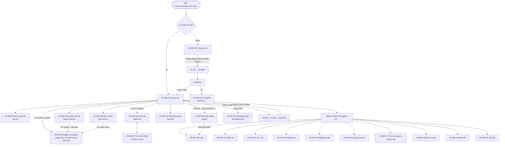

# VC Home — Đặc tả màn hình

Phiên bản 0.2 · 08/10/2026 · Trạng thái: Đã chốt nội dung (chờ đội phát triển rà)

## Tóm tắt

- **Tài liệu nói gì:** sơ đồ trang, menu theo vai trò, khung chung (header, thông báo, thanh chuyển app) và đặc tả đủ 21 màn VH-MH-01…21 của VC Home. Mỗi màn có: mục đích, ai dùng, đường dẫn, giai đoạn, bố cục, trường dữ liệu, hành động, trạng thái rỗng / đang tải / lỗi, kiểm tra nhập liệu, yêu cầu và quy tắc liên quan.
- **Căn cứ:** README, 02 (ma trận quyền, quy tắc) và thiết kế SSO là gốc; câu chữ, giới hạn và luồng chi tiết lấy đúng theo [04-yeu-cau-chuc-nang.md](04-yeu-cau-chuc-nang.md). Chỗ 04 tự lệch nhau hoặc lệch 02 ghi ở mục 9.
- **Nền giao diện:** React + Ant Design, tiếng Việt, cùng token màu và component với dashboard VClinks. Desktop có menu trái và header; dưới 600 px lưới 1 cột, menu thành ngăn kéo. Mọi ngày giờ theo giờ Việt Nam (VH-BR-22).
- **Quyền trên màn theo ma trận 02 mục 3.** Vai trò không bao giờ có quyền thì **ẩn** nút; có quyền nhưng thiếu điều kiện thì **khoá** nút kèm câu giải thích (mục 1.3). Máy chủ luôn kiểm quyền lại.
- **Khung dây ASCII** cho trang chủ (VH-MH-02), hồ sơ của tôi (VH-MH-03), ngăn xin quyền (VH-MH-05), hộp duyệt (VH-MH-08), quản trị nhân sự (VH-MH-11), luật cấp quyền và xem trước (VH-MH-16), cùng header và thanh chuyển app.
- **Quyết định thiết kế chính:**
  - Mọi thay đổi hồ sơ và cơ cấu có ô "Ngày hiệu lực"; cây đơn vị không kéo thả, chỉ có "Chuyển" / "Đổi cơ cấu" có ngày hiệu lực và bắt buộc xem trước.
  - Luật có "Xem trước" bắt buộc (+N / −M người); trên 20 người **hoặc** vai trò nhạy cảm thì "Áp dụng" đổi thành "Gửi duyệt" (VH-BR-25).
  - Hộp duyệt khoá "Duyệt các mục đã chọn" khi có vai trò nhạy cảm; uỷ quyền tối đa 30 ngày.
  - Nhập Excel: tải mẫu → kiểm thử (OK / Cảnh báo / Lỗi) → ghi thật trong 24 giờ; còn dòng lỗi thì không ghi.
  - Quản trị hệ thống khoá, mở khoá, gắn lại tài khoản ở ngăn "Tài khoản" của VH-MH-11; báo cáo nằm ở ngăn "Báo cáo" của VH-MH-17 (menu "Báo cáo" ở nhóm QUẢN LÝ).
- **Đã xử lý:** 12 điểm lệch ở mục 9 (theo [12](12-cau-hoi-rui-ro.md) mục 5) và 8 đề xuất ở mục 10 (theo 12 mục 6). Không còn việc mở.
- **Người duyệt xem kỹ:** bảng menu theo vai trò (mục 3), VH-MH-05 (trường và kiểm tra của yêu cầu quyền), VH-MH-08 (duyệt hàng loạt, uỷ quyền), VH-MH-11 (thao tác trạng thái, ngăn Tài khoản), VH-MH-16 (ngưỡng duyệt hai người), mục 9 và 10.

## Mục lục

- [1. Quy ước chung](#1-quy-ước-chung)
- [2. Sơ đồ trang](#2-sơ-đồ-trang)
- [3. Menu theo vai trò](#3-menu-theo-vai-trò)
- [4. Khung chung: header, thông báo, menu](#4-khung-chung-header-thông-báo-menu)
- [5. Màn cho mọi người (VH-MH-01 đến 07)](#5-màn-cho-mọi-người-vh-mh-01-đến-07)
- [6. Màn cho quản lý (VH-MH-08 đến 10)](#6-màn-cho-quản-lý-vh-mh-08-đến-10)
- [7. Màn quản trị (VH-MH-11 đến 20)](#7-màn-quản-trị-vh-mh-11-đến-20)
- [8. Thành phần trong app khác (VH-MH-21)](#8-thành-phần-trong-app-khác-vh-mh-21)
- [9. Điểm lệch với README, 02 và 04](#9-điểm-lệch-với-readme-02-và-04)
- [10. Đề xuất bổ sung (chưa cấp mã)](#10-đề-xuất-bổ-sung-chưa-cấp-mã)
- [Lịch sử cập nhật](#lịch-sử-cập-nhật)

---

## 1. Quy ước chung

### 1.1 Cách đọc một màn

Mỗi màn có các phần theo đúng thứ tự:

| Phần | Nội dung |
|---|---|
| Thông tin chung | Mục đích; ai dùng và quyền (theo ma trận 02 mục 3); đường dẫn; giai đoạn (GĐ) |
| Bố cục | Các vùng trên màn; màn quan trọng có khung dây ASCII |
| Trường dữ liệu | `\| Trường \| Nguồn \| Hiện cho ai \| Ghi chú \|`. Nguồn ghi tên collection ở README mục 9 |
| Hành động | `\| Nút / thao tác \| Ai \| Kết quả \| Yêu cầu \|` |
| Trạng thái | Rỗng, đang tải, lỗi; câu chữ hiển thị chính xác |
| Kiểm tra nhập liệu | Điều kiện và câu báo lỗi chính xác |
| Yêu cầu và quy tắc liên quan | Mã yêu cầu, quy tắc, quy trình |

Chữ hiển thị đặt trong ngoặc kép "…". Phần thay bằng dữ liệu đặt trong ngoặc nhọn: "Còn {n} ngày".

**Thuật ngữ giao diện dùng một lần:**
- **Ngăn kéo (Drawer):** khung trượt từ cạnh phải, mở trên trang hiện tại.
- **Hộp thoại (Modal):** khung nổi giữa màn, phải đóng mới làm tiếp.
- **Toast:** dòng thông báo nhỏ hiện vài giây ở góc trên.
- **Khung xương (Skeleton):** các thanh xám nhấp nháy thay chỗ nội dung đang tải.

### 1.2 Kích thước và điểm ngắt

| Hạng mục | Giá trị |
|---|---|
| Điểm ngắt | Điện thoại < 600 px · máy tính bảng 600–1199 px · máy tính ≥ 1200 px |
| Menu trái | Rộng 232 px; thu gọn 64 px (chỉ biểu tượng); dưới 600 px thành ngăn kéo mở bằng nút ☰ |
| Header | Cao 56 px, cố định trên cùng |
| Lưới ô app | 4 cột (≥ 1200 px) · 3 cột (900–1199) · 2 cột (600–899) · 1 cột (< 600) |
| Bảng dữ liệu | Dưới 600 px chuyển thành danh sách thẻ, mỗi thẻ một dòng |
| Lề nội dung | 24 px máy tính, 16 px điện thoại |
| Vùng bấm | Tối thiểu 32×32 px máy tính, 44×44 px điện thoại |
| Chữ | Cỡ nội dung 14 px (điện thoại 15 px); tiêu đề trang 20 px |

### 1.3 Nút thiếu quyền: ẩn hay khoá

| Trường hợp | Cách hiện | Ví dụ |
|---|---|---|
| Vai trò không bao giờ có quyền (ô "—" ở ma trận 02) | **Ẩn** nút, tab, mục menu. Không để khoảng trống | Nhân viên không thấy nhóm menu "QUẢN TRỊ" |
| Có quyền nhưng lần này thiếu điều kiện | **Khoá** nút, rê chuột hiện lý do và cách mở | "Duyệt" khoá ở yêu cầu do chính mình gửi: "Không duyệt được yêu cầu của chính bạn." |
| Màn chỉ đọc (đ) | Ẩn mọi nút ghi; đầu trang có nhãn "Chỉ xem" | Kiểm soát ở VH-MH-15 |
| Mở đường dẫn không có quyền | Trang "Bạn không có quyền xem trang này." + nút "Về trang chủ" | Nhân viên gõ `/quan-tri/luat` |

Máy chủ luôn kiểm quyền lại. Ẩn hay khoá chỉ là giao diện.

### 1.4 Câu chuẩn dùng chung

Màn nào ghi mã dưới đây thì câu hiển thị phải đúng từng chữ. `{maLoi}` là 6 ký tự đầu mã yêu cầu API.

| Mã | Khi nào | Câu hiển thị |
|---|---|---|
| `TAI` | Đang tải | Khung xương theo bố cục màn; nút đang gửi hiện vòng quay và chữ "Đang lưu…" |
| `TAI-LAU` | Tải quá 10 giây | "Đang tải lâu hơn bình thường…" |
| `LOI-MANG` | Mất mạng | Dải đỏ dưới header: "Không có kết nối mạng. Kiểm tra mạng rồi thử lại." |
| `LOI-MAY` | Lỗi máy chủ | "Máy chủ đang gặp sự cố. Vui lòng thử lại sau ít phút. Mã lỗi: {maLoi}." + nút "Thử lại" |
| `LOI-TAI` | Không tải được một vùng | "Không tải được {tên vùng}." + nút "Thử lại" (chỉ vùng đó lỗi, phần khác vẫn dùng được) |
| `LOI-403` | API từ chối một thao tác | Toast "Bạn không có quyền thực hiện thao tác này." |
| `LOI-404` | Đối tượng không còn | "Không tìm thấy dữ liệu. Có thể đã bị xoá hoặc bạn không còn quyền xem." |
| `LOI-409` | Người khác vừa sửa | "Dữ liệu vừa được người khác thay đổi. Tải lại để xem bản mới nhất." + nút "Tải lại" |
| `LOI-PHIEN` | Phiên hết hạn | Tự đăng nhập im lặng lại; không được thì về VH-MH-01 với dòng "Phiên đăng nhập đã hết hạn. Vui lòng đăng nhập lại." |
| `RONG-LOC` | Bộ lọc không ra kết quả | "Không có dữ liệu phù hợp bộ lọc." + nút "Xoá bộ lọc" |
| `RONG-TIM` | Ô tìm không ra kết quả | "Không tìm thấy kết quả cho "{q}"." |
| `BAT-BUOC` | Trường bắt buộc để trống | "Nhập {tên trường}" hoặc "Chọn {tên trường}" |
| `DA-LUU` | Lưu thành công | Toast "Đã lưu." (màn có câu riêng thì dùng câu riêng, luôn bắt đầu bằng "Đã …") |

**Văn phong:** gọi người dùng là "bạn"; nút là động từ ("Lưu", "Gửi", "Duyệt", "Từ chối", "Huỷ"); không dùng "OK"; viết "khoá", "huỷ", "uỷ quyền" thống nhất với README.

### 1.5 Ngày hiệu lực trên biểu mẫu

Áp cho mọi biểu mẫu sửa hồ sơ, vị trí, cơ cấu (VH-BR-07):

- Ô "Ngày hiệu lực" bắt buộc, mặc định hôm nay, định dạng `dd/mm/yyyy`.
- Chọn hôm nay hoặc ngày đã qua: lưu xong áp ngay. Toast "Đã lưu, có hiệu lực từ {dd/mm/yyyy}."
- Chọn ngày sau: tạo một dòng ở `scheduled_changes`. Toast "Đã hẹn áp lúc 00:00 ngày {dd/mm/yyyy}." Dòng bị đổi hiện nhãn "Hẹn {dd/mm/yyyy}" và nút "Huỷ hẹn"; đầu hồ sơ có thẻ vàng "Có {n} thay đổi đã hẹn".
- Ngày đã qua quá 30 ngày: cảnh báo, không chặn: "Ngày hiệu lực đã qua {n} ngày. Lịch sử ghi đúng ngày bạn nhập; quyền và sự kiện tính từ lúc lưu." (04 VH-NSU-02).
- Đã có thay đổi hẹn mâu thuẫn: "Đã có thay đổi hẹn ngày {dd/mm/yyyy}: {mô tả}. Thay đổi mới mâu thuẫn với thay đổi này. Huỷ thay đổi cũ và lưu thay đổi mới?" (04 VH-NSU-04).

## 2. Sơ đồ trang



**Bảng đường dẫn:**

| Đường dẫn | Màn | GĐ |
|---|---|---|
| `/` (chưa đăng nhập) | VH-MH-01 Trang chào | A |
| `/callback`, `/silent` | Không giao diện: nhận mã đăng nhập; `/silent` dùng khi tải lại trang | A |
| `/da-dang-xuat`, `/loi` | VH-MH-01 Đã đăng xuất, Lỗi | A |
| `/` (đã đăng nhập) | VH-MH-02 Trang chủ | A |
| `/ho-so` | VH-MH-03 Hồ sơ của tôi | A (bản Google), B (bản VC People) |
| `/quyen-cua-toi` | VH-MH-04 Quyền của tôi; `?xin=1&app={khoá}&role={vai trò}` mở sẵn VH-MH-05 (link sâu app đưa ra khi người dùng thiếu quyền, 04 VH-REQ-01) | C, D |
| `/danh-ba`, `/danh-ba/{maNhanVien}` | VH-MH-06 Danh bạ, thẻ một người | B |
| `/so-do-to-chuc` | VH-MH-07 Sơ đồ tổ chức | B |
| `/duyet` | VH-MH-08 Hộp duyệt | D |
| `/doi-cua-toi` | VH-MH-09 Đội của tôi | B, C |
| `/ra-soat` | VH-MH-10 Rà soát quyền | D |
| `/quan-tri/nhan-su`, `/quan-tri/nhan-su/{maNhanVien}` | VH-MH-11 Quản trị nhân sự (ngăn "Tài khoản" cho quản trị hệ thống) | B |
| `/quan-tri/co-cau` | VH-MH-12 Cơ cấu tổ chức | B |
| `/quan-tri/danh-muc` | VH-MH-13 Danh mục | B |
| `/quan-tri/nhap-du-lieu` | VH-MH-14 Nhập dữ liệu và đối chiếu | B |
| `/quan-tri/ung-dung`, `/quan-tri/ung-dung/{khoá}` | VH-MH-15 App và vai trò app | B, C |
| `/quan-tri/luat`, `/quan-tri/luat/{id}` | VH-MH-16 Luật cấp quyền | C |
| `/quan-tri/tra-cuu-quyen` | VH-MH-17 Tra cứu quyền và báo cáo (`?tab=bao-cao` cho ngăn Báo cáo) | C |
| `/quan-tri/ra-soat` | VH-MH-18 Đợt rà soát | D |
| `/quan-tri/nhat-ky` | VH-MH-19 Nhật ký (GĐ A: nhật ký đăng nhập nằm trong VC ID) | B |
| `/quan-tri/cai-dat` | VH-MH-20 Cài đặt | D |
| `/catalog.json` | Dữ liệu danh mục app công khai (VH-API-08) | A |

Đường dẫn lạ: trang "Không tìm thấy trang này." + nút "Về trang chủ".

## 3. Menu theo vai trò

Menu trái có 4 nhóm. Một người giữ nhiều vai trò thấy **hợp** các mục. Nhóm không còn mục nào thì ẩn.

| Nhóm | Mục menu | Đường dẫn | Màn |
|---|---|---|---|
| CỦA TÔI | Trang chủ · Hồ sơ của tôi · Quyền của tôi | `/`, `/ho-so`, `/quyen-cua-toi` | 02, 03, 04 |
| CÔNG TY | Danh bạ · Sơ đồ tổ chức | `/danh-ba`, `/so-do-to-chuc` | 06, 07 |
| QUẢN LÝ | Hộp duyệt (số chờ) · Đội của tôi · Rà soát quyền (số dòng chưa quyết) · Báo cáo | `/duyet`, `/doi-cua-toi`, `/ra-soat`, `/quan-tri/tra-cuu-quyen?tab=bao-cao` | 08, 09, 10, 17 (ngăn Báo cáo) |
| QUẢN TRỊ | Nhân sự · Cơ cấu tổ chức · Danh mục · Nhập dữ liệu · App và vai trò · Luật cấp quyền · Tra cứu quyền · Đợt rà soát · Nhật ký · Cài đặt | `/quan-tri/…` | 11–20 |

"Báo cáo" đặt ở nhóm QUẢN LÝ để Ban giám đốc và trưởng đơn vị không phải vào nhóm QUẢN TRỊ; đường dẫn vẫn là ngăn "Báo cáo" của VH-MH-17 (README mục 8).

**Mục nhìn thấy theo vai trò** (✓ thấy, (đ) chỉ xem, (p) trong phạm vi vai trò, (a) chỉ app mình, — ẩn):

| Mục menu | Nhân viên | Quản lý | Trưởng ĐV | HC-NS | Quản trị HT | Chủ app | Kiểm soát | BGĐ |
|---|---|---|---|---|---|---|---|---|
| Trang chủ, Hồ sơ của tôi, Quyền của tôi | ✓ | ✓ | ✓ | ✓ | ✓ | ✓ | ✓ | ✓ |
| Danh bạ, Sơ đồ tổ chức | ✓ | ✓ | ✓ | ✓ | ✓ | ✓ | ✓ | ✓ |
| Hộp duyệt | —¹ | ✓ | —¹ | — | ✓² | ✓ | — | — |
| Đội của tôi | — | (p) | (p) | — | — | — | — | — |
| Rà soát quyền | — | — | (p)³ | — | — | — | — | — |
| Báo cáo | — | — | (p) | (p) | ✓ | (a) | (đ) | (đ, chỉ số đếm) |
| Nhân sự | — | — | — | (p) | (đ) + ngăn "Tài khoản" | — | — | — |
| Cơ cấu tổ chức, Danh mục | — | — | — | (p) | — | — | — | — |
| Nhập dữ liệu | — | — | — | (p) | ✓ (đối chiếu, khởi tạo từ app) | — | — | — |
| App và vai trò | — | — | — | — | ✓ | (a) | (đ) | — |
| Luật cấp quyền | — | — | — | — | ✓ | (a) | —⁴ | — |
| Tra cứu quyền | — | — | — | — | ✓ | (a) | (đ) | — |
| Đợt rà soát | — | — | — | — | ✓ | — | (đ) | — |
| Nhật ký | — | — | — | (p: hồ sơ) | ✓ | (a) | (đ) | — |
| Cài đặt | — | — | — | — | ✓ | — | — | — |

Ghi chú:
1. Mục "Hộp duyệt" còn hiện cho bất kỳ ai **đang có việc duyệt**: người được uỷ quyền (VH-REQ-03), trưởng đơn vị duyệt thay khi người xin không có quản lý trực tiếp (VH-BR-05, ghi chú ở 02 mục 3), quản lý cấp trên nhận bước chuyển lên (VH-BR-12). Hết việc và hết uỷ quyền thì ẩn.
2. Quản trị hệ thống thấy hộp duyệt vì ba việc: duyệt bước hai của luật (VH-BR-25); duyệt bước 2 khi chủ app xin vai trò nhạy cảm của chính app mình hoặc app không còn chủ app hợp lệ (VH-BR-12, 04 VH-APP-03); nhận yêu cầu không tìm được người duyệt bước 1 (04 VH-REQ-02 bước 4).
3. "Rà soát quyền" luôn hiện với trưởng đơn vị; ngoài đợt rà soát thì trang báo "Hiện không có đợt rà soát nào đang mở."
4. Ma trận 02 không cho kiểm soát xem luật. Xem đề xuất ở mục 10.
5. Quản trị hệ thống mở "Nhân sự" ở chế độ chỉ đọc (02 mục 3, mỗi lần xem ghi nhật ký) và chỉ thao tác ở ngăn "Tài khoản" (khoá, mở khoá, gắn lại; README mục 8).

**Menu ảnh đại diện (góc phải header), mọi người:** "Hồ sơ của tôi" · "Quyền của tôi" (từ GĐ C) · "Phiên đăng nhập" (từ GĐ D, VH-AUT-10) · "Giao diện tối" / "Giao diện sáng" · "Hướng dẫn sử dụng" · "Đăng xuất".

**Giai đoạn A** chỉ có trang chủ, hồ sơ (bản Google) và menu ảnh đại diện ("Hồ sơ", "Đăng xuất"); chưa có menu trái. Menu trái xuất hiện từ GĐ B.

## 4. Khung chung: header, thông báo, menu

### 4.1 Bố cục header

```
┌──────────────────────────────────────────────────────────────────────────────────────────────┐
│ ☰ (VC) VC Home │ [🔍 Tìm đồng nghiệp: tên, email, SĐT, đơn vị…   Ctrl K] │ (⋮⋮⋮) (🔔 3) (ảnh  Lan ▾) │
└──────────────────────────────────────────────────────────────────────────────────────────────┘
```

| # | Thành phần | Nguồn | Hiện cho ai | Hành vi |
|---|---|---|---|---|
| 1 | Nút ☰ | — | Mọi người, chỉ khi < 600 px | Mở menu trái dạng ngăn kéo |
| 2 | Logo VC Phồn Vinh + chữ "VC Home" | Tĩnh | Mọi người | Bấm về `/` |
| 3 | Ô tìm danh bạ, gợi ý phím "Ctrl K" | `people` (chỉ trường C0) | Mọi người, từ GĐ B | Gõ từ 2 ký tự: danh sách thả xuống tối đa 8 người (ảnh, tên, chức danh · đơn vị). Enter mở `/danh-ba?q=…`. Dưới 600 px thu thành biểu tượng 🔍 |
| 4 | Nút 9 chấm (thanh chuyển app) | `catalog.json`, quyền | Mọi người | Như VH-MH-21; mục "VC Home" đang được chọn |
| 5 | Chuông thông báo, số chưa đọc | `notifications` | Mọi người, từ GĐ D | Số > 99 hiện "99+". Bấm mở ngăn kéo "Thông báo" (mục 4.2) |
| 6 | Ảnh đại diện + tên gọi | `people` (GĐ A: Google) | Mọi người | Mở menu ảnh đại diện (mục 3) |

Dải cảnh báo toàn trang (nếu có) nằm ngay dưới header, tối đa một dải, ưu tiên: mất mạng > "Tài khoản chưa có hồ sơ nhân sự, liên hệ HC-NS" > thông báo bảo trì do quản trị đặt.

### 4.2 Thông báo (VH-HOM-08)

**Theo giai đoạn:** GĐ C gửi thông báo bằng email Gmail công ty (README mục 9, 04 "Quy ước chung cho mục 6–12"). Từ GĐ D thêm chuông và ngăn kéo "Thông báo" trong VC Home.

**Ngăn kéo "Thông báo" (GĐ D):** mới nhất trước, 20 dòng mỗi trang. Mỗi dòng: tiêu đề ngắn, 1–2 câu nội dung, thời gian ("5 phút trước"; quá 24 giờ ghi `dd/mm hh:mm`), chấm xanh nếu chưa đọc. Bấm một dòng: đánh dấu đã đọc và mở màn liên quan. Nút đầu ngăn kéo: "Đánh dấu tất cả đã đọc". Kiểm thông báo mới mỗi 60 giây khi tab đang hiện. Giữ 90 ngày rồi xoá.

**Câu chữ theo loại** (lấy đúng từ 04 VH-HOM-08 và các yêu cầu liên quan):

| Loại | Ai nhận | Câu | Bấm thì mở |
|---|---|---|---|
| Yêu cầu chờ duyệt | Người duyệt | "{Họ tên} xin vai trò {vai trò} trong {app}. Hạn duyệt {dd/mm}." | VH-MH-08 |
| Nhắc duyệt (ngày 2 và ngày 5) | Người duyệt | "Còn {n} yêu cầu chờ bạn duyệt, yêu cầu cũ nhất gửi {dd/mm}." | VH-MH-08 |
| Kết quả yêu cầu | Người xin, người được cấp | "Yêu cầu {vai trò} trong {app} đã được duyệt, có hiệu lực tới {dd/mm/yyyy}." / "… bị từ chối: {lý do}." / "… đã tự huỷ vì quá 7 ngày chưa duyệt xong." | VH-MH-04 |
| Quyền sắp hết hạn (14 và 3 ngày trước) | Người giữ quyền | "Vai trò {vai trò} trong {app} hết hạn ngày {dd/mm}." + liên kết gia hạn | VH-MH-04 |
| Quyền bị gỡ | Người giữ quyền | "Vai trò {vai trò} trong {app} đã bị gỡ: {lý do}." | VH-MH-04 |
| Đợt rà soát mở | Trưởng đơn vị | "Đợt rà soát {tên đợt} mở, có {n} quyền cần bạn xác nhận trước {dd/mm}." | VH-MH-10 |
| Kết quả đề nghị sửa hồ sơ | Người đề nghị | "HC-NS đã {áp dụng/từ chối} đề nghị sửa {trường}." | VH-MH-03 |
| Việc của HC-NS | HC-NS | "Có {n} đề nghị sửa hồ sơ mới." / "{n} vị trí đang thiếu quản lý trực tiếp." | VH-MH-11 |
| Luật chờ duyệt bước hai | Quản trị HT, chủ app | "{Họ tên} gửi luật "{tên luật}" ảnh hưởng {n} người." (câu do 06 đề xuất; 04 chưa ghi) | VH-MH-16 |

Rỗng: "Bạn không có thông báo nào." Mở một thông báo dẫn tới việc đã xong: màn đích hiện trạng thái hiện tại, ví dụ "Yêu cầu này đã được {người} duyệt lúc {hh:mm dd/mm}." Lỗi tải: `LOI-TAI` với tên vùng "thông báo". Nội dung chỉ có thông tin công việc.

### 4.3 Menu trái

- Desktop: mở rộng 232 px, nhớ lựa chọn thu gọn trên trình duyệt (`localStorage` `vchome.menuCollapsed`).
- Mục đang mở tô nền và có `aria-current="page"`.
- Badge số ở "Hộp duyệt" (việc chờ mình) và "Rà soát quyền" (dòng chưa quyết); cập nhật mỗi 60 giây hoặc khi mở lại tab.
- Trạng thái đang tải vai trò: 6 thanh khung xương; không đoán mục menu khi chưa tải xong.
- Không tải được vai trò: menu chỉ còn nhóm "CỦA TÔI" và "CÔNG TY", dải `LOI-TAI` "Không tải được vai trò của bạn." + "Thử lại".

## 5. Màn cho mọi người (VH-MH-01 đến 07)

### VH-MH-01 Trang chào, đã đăng xuất, lỗi

| | |
|---|---|
| **Mục đích** | Cửa vào VC Home khi chưa có phiên; báo đã đăng xuất; báo lỗi đăng nhập bằng câu dễ hiểu |
| **Ai dùng + quyền** | Mọi người, kể cả người chưa đăng nhập. Không hiện dữ liệu cá nhân |
| **Đường dẫn** | `/` (chưa có phiên), `/da-dang-xuat`, `/loi?ma={mã}` |
| **GĐ** | A |

**Bố cục:** một thẻ ở giữa màn, rộng tối đa 420 px: logo VC Phồn Vinh, tiêu đề, một dòng giải thích, nút chính, dòng hỗ trợ "Cần giúp? Gửi email tới {email hỗ trợ}". Dưới 600 px thẻ chiếm hết chiều ngang (lề 16 px).

**Ba biến thể:**

| Biến thể | Tiêu đề | Dòng giải thích | Nút |
|---|---|---|---|
| Trang chào | "VC Home" | "Cổng làm việc của nhân viên VC Phồn Vinh." | "Đăng nhập bằng tài khoản công ty" |
| Đã đăng xuất | "Bạn đã đăng xuất khỏi mọi ứng dụng" | "Phiên ở VC Home, VClinks, VCwiki và các app khác đã đóng." | "Đăng nhập lại" |
| Lỗi | Theo bảng mã lỗi bên dưới | Theo bảng | "Thử lại" (+ nút phụ nếu có) |
| Phiên hết hạn | "Phiên đăng nhập đã hết hạn. Vui lòng đăng nhập lại." | — | "Đăng nhập lại" (chọn tài khoản Google 1 lần rồi về đúng trang đang xem, 04 VH-AUT-05) |

**Trường dữ liệu**

| Trường | Nguồn | Hiện cho ai | Ghi chú |
|---|---|---|---|
| Mã lỗi | Tham số `ma` trên đường dẫn | Mọi người | Mã lạ thì dùng câu "Lỗi chung" |
| Thời điểm lỗi | Đồng hồ trình duyệt, giờ Việt Nam | Mọi người | Hiện dạng "Mã: {mã} · {HH:mm dd/mm/yyyy}" để báo dev |
| Email hỗ trợ | Cấu hình build | Mọi người | Đề xuất `it@vcprosperous.com`, chờ chủ dự án chốt |

**Câu lỗi theo mã** (mã dùng chung ở thiết kế SSO mục 5.2):

| Mã | Tiêu đề | Dòng giải thích | Nút phụ |
|---|---|---|---|
| `outside_domain` | "Tài khoản này không thuộc công ty" | "Hãy chọn tài khoản @vcprosperous.com hoặc @vcpart.vn." | "Chọn tài khoản khác" |
| `app_not_granted` | "Bạn chưa được cấp ứng dụng này" | "Xin quyền trên VC Home hoặc liên hệ quản lý trực tiếp." | "Về trang chủ" |
| `not_granted` | "Bạn chưa có tài khoản trong ứng dụng này" | "Liên hệ quản trị viên của ứng dụng." | "Về trang chủ" |
| `locked` | "Tài khoản đã bị khoá" | "Liên hệ quản trị viên." | — |
| `identity_conflict` | "Tài khoản đang gắn với một định danh khác" | "Quản trị viên đã được báo. Bạn chưa cần làm gì thêm." | — |
| `state_invalid` | "Liên kết đăng nhập đã hết hạn" | "Bấm Thử lại để đăng nhập từ đầu." | — |
| `idp_unreachable` | "Không kết nối được máy chủ đăng nhập" | "Phiên đang mở ở các app vẫn dùng được. Thử lại sau ít phút." | — |
| `cancelled` | "Bạn đã huỷ đăng nhập" | "Bấm Thử lại khi sẵn sàng." | — |
| `no_profile` (từ GĐ B) | Không dùng trang lỗi: vào trang chủ trống, xem VH-MH-02 | | |
| (khác) | "Có lỗi khi đăng nhập" | "Bấm Thử lại. Nếu vẫn lỗi, gửi mã bên dưới cho bộ phận IT." | — |

Các trang do VC ID (Keycloak) tự hiện (xác nhận đăng xuất, sai domain trên trang Google, tài khoản bị khoá) giữ đúng câu ở thiết kế SSO mục 5.1.6, không lặp lại ở đây.

**Hành động**

| Nút / thao tác | Ai | Kết quả | Yêu cầu |
|---|---|---|---|
| "Đăng nhập bằng tài khoản công ty" | Mọi người | Chuyển sang VC ID với gợi ý Google; xong về `/callback` rồi về trang định mở (`next`, chỉ nhận đường dẫn trong VC Home) | VH-AUT-01, VH-AUT-03 |
| "Đăng nhập lại" | Mọi người | Như trên | VH-AUT-04 |
| "Thử lại" | Mọi người | Bắt đầu lại luồng đăng nhập | VH-AUT-01 |
| "Chọn tài khoản khác" | Mọi người | Đăng nhập lại với `prompt=select_account` để Google hiện danh sách tài khoản | VH-AUT-02 |

**Trạng thái:** đang chuyển hướng sau khi bấm nút: nút khoá, chữ "Đang chuyển tới trang đăng nhập…". Trang chào không có trạng thái rỗng. Không có mạng: `LOI-MANG`, nút đăng nhập khoá.

**Kiểm tra nhập liệu:** không có ô nhập. Tham số `next` khác đường dẫn nội bộ thì bỏ qua, về `/`.

**Yêu cầu và quy tắc liên quan:** VH-AUT-01, 02, 03, 04, 05, 09 (đường khẩn cấp không hiện trên trang này; quản trị dùng realm `master` theo thiết kế SSO mục 5.7); VH-BR-02; VH-QT-01, VH-QT-02.

---

### VH-MH-02 Trang chủ

| | |
|---|---|
| **Mục đích** | Chỗ bắt đầu ngày làm việc: biết mình là ai trong công ty, mở app được cấp, thấy app có thể xin |
| **Ai dùng + quyền** | Mọi người đã đăng nhập (ma trận 02: "Đăng nhập, mở app được cấp" ✓ mọi vai trò). Mỗi người chỉ thấy dữ liệu của mình |
| **Đường dẫn** | `/` |
| **GĐ** | A (lưới app theo nhóm VC ID), B (thẻ hồ sơ), C (dòng vai trò, "Còn N ngày"), D ("Có thể xin quyền", "Hết hạn {dd/mm}"), E (số việc chờ trên ô) |

**Bố cục:** từ trên xuống: lời chào; thẻ hồ sơ ngắn; dải việc chờ (nếu có); lưới "Ứng dụng của bạn"; phần "Có thể xin quyền"; phần "Sắp có"; phần "Liên kết hay dùng".

**Khung dây (máy tính, ≥ 1200 px)**

```
┌─ header ─────────────────────────────────────────────────────────────────────────────────────┐
├──────────┬───────────────────────────────────────────────────────────────────────────────────┤
│ menu     │ Chào buổi sáng, Lan                                                               │
│ trái     │ ┌───────────────────────────────────────────────────────────────────────────────┐ │
│          │ │ (ảnh)  Lan · Nguyễn Thị Lan   VCP-0123        [Xem hồ sơ của tôi →]            │ │
│          │ │        Nhân viên kinh doanh · Tổ bán hàng 1    (+1 kiêm nhiệm)                 │ │
│          │ │        Công ty VCparts · lan.nguyen@vcprosperous.com [⧉]                       │ │
│          │ │        Quản lý trực tiếp: Trần Văn Bình                                        │ │
│          │ └───────────────────────────────────────────────────────────────────────────────┘ │
│          │ ⓘ Bạn có 2 yêu cầu chờ duyệt.  [Mở hộp duyệt]                     (GĐ D, nếu có)  │
│          │                                                                                   │
│          │ Ứng dụng của bạn                                                                  │
│          │ ┌───────────────┐ ┌───────────────┐ ┌───────────────┐                             │
│          │ │📌 [icon]   ⋯  │ │ [icon]  (5) ⋯ │ │ [icon]      ⋯ │                             │
│          │ │ VClinks       │ │ VCwiki        │ │ VC AI         │                             │
│          │ │ CSKH đa kênh  │ │ Kho tri thức  │ │ Trợ lý AI     │                             │
│          │ │ NVKD · Tổ BH 1│ │ Thành viên    │ │ Người dùng [Thử nghiệm]                     │
│          │ │ CSKH +1       │ │ [Hết hạn 20/12]                                             │
│          │ │ [Còn 3 ngày]  │ │               │ │               │                             │
│          │ └───────────────┘ └───────────────┘ └───────────────┘                             │
│          │                                                                                   │
│          │ Có thể xin quyền                                                    [Thu gọn ▴]   │
│          │ ┌───────────────┐ ┌───────────────┐                                               │
│          │ │ VCgarage      │ │ VCinvoice     │                                               │
│          │ │ [Xin quyền]   │ │ Đang chờ duyệt│                                               │
│          │ └───────────────┘ └───────────────┘                                               │
│          │ Sắp có                                                              [Thu gọn ▴]   │
│          │ [VCsale (mờ) Sắp có] [VCe (mờ) Sắp có]                                            │
│          │ Liên kết hay dùng                                                                 │
│          │ [Gmail ↗] [Google Drive ↗] [Lịch ↗] [MISA ↗]                                      │
└──────────┴───────────────────────────────────────────────────────────────────────────────────┘
```

Dưới 600 px: lời chào → thẻ hồ sơ (ảnh nhỏ, 2 dòng) → ô app 1 cột (ô dạng hàng ngang: biểu tượng trái, chữ phải; vùng bấm ≥ 44 × 44 px) → "Có thể xin quyền" → "Sắp có" → liên kết dạng chip cuộn ngang.

**Trường dữ liệu**

| Trường | Nguồn | Hiện cho ai | Ghi chú |
|---|---|---|---|
| Lời chào | Giờ Việt Nam + tên gọi | Chính mình | "Chào buổi sáng, {tên gọi}" (trước 12:00), "Chào buổi chiều, {tên gọi}" (12:00–17:59), "Chào buổi tối, {tên gọi}" (04 VH-HOM-02) |
| Ảnh; tên gọi và họ tên; mã nhân viên | `people` (GĐ A: Google) | Chính mình | Lấy từ VC Home API, không lấy từ token (token có thể chậm 5 phút). Không có ảnh: chữ cái đầu trên nền màu cố định theo mã nhân viên |
| Chức danh · đơn vị của vị trí chính | `positions`, `org_units`, `job_titles` | Chính mình | Có kiêm nhiệm: nhãn "+{n} kiêm nhiệm", bấm hiện danh sách "chức danh · đơn vị" |
| Email công ty (nút sao chép), pháp nhân | `people`, `legal_entities` | Chính mình | |
| Quản lý trực tiếp | Vị trí chính → `people` | Chính mình | Bấm tên mở ngăn danh bạ của người đó. Người đứng đầu tập đoàn: ẩn dòng |
| Trạng thái đặc biệt | `people` | Chính mình | "Đang nghỉ dài ngày đến {dd/mm/yyyy}"; "Hồ sơ có hiệu lực từ {dd/mm/yyyy}" (Chưa vào làm) |
| Ô app | `catalog.json` + `groups` (GĐ A, B); `access_grants` còn hiệu lực (từ GĐ C) | Chính mình | App `live` hoặc `beta`. Không có ô của VC Home (`vchome`), app `retired`, app không có quyền (VH-BR-21) |
| Biểu tượng, tên, mô tả một dòng | `apps` | Mọi người | Mô tả cắt ở 1 dòng, rê chuột xem đủ. App `beta` có nhãn "Thử nghiệm" |
| Dòng vai trò | VC Home API (quyền của tôi) | Chính mình | GĐ C. Đọc liền với tên app thành "VClinks · NVKD". Vai trò theo đơn vị kèm tên ngắn đơn vị: "NVKD · Tổ BH 1". Nhiều vai trò: 2 vai trò đầu + "+{n}"; rê chuột hoặc chạm giữ hiện đủ, kèm nguồn từng vai trò |
| Nhãn trên ô | `access_grants` | Chính mình | "Còn {N} ngày" (cam, đang chuyển tiếp, VH-BR-11); "Hết hạn {dd/mm}" (quyền ngoại lệ còn ≤ 14 ngày, GĐ D); "Khẩn cấp" |
| Số việc chờ | VH-API-09 của từng app (chờ tối đa 2 giây mỗi app) | Chính mình | GĐ E; tối đa "99+"; rê chuột hiện từng nhãn và số, bấm nhãn mở đúng chỗ trong app. App không trả lời thì không hiện số |
| Có thể xin quyền | App `live`/`beta` có ít nhất một vai trò đang dùng, mà người dùng chưa có quyền nào còn hiệu lực trong app đó | Chính mình | GĐ D. App đã có yêu cầu đang chờ: nhãn "Đang chờ duyệt" + liên kết xem yêu cầu. Thu gọn được, nhớ trên trình duyệt. Không hiện cho tài khoản chưa gắn hồ sơ |
| Sắp có | `apps.trạng thái = coming_soon` | Mọi người | Ô mờ, nhãn "Sắp có", không bấm được (`aria-disabled="true"`); rê chuột hiện mô tả và "Dự kiến: {thời gian}" nếu có. Thu gọn được |
| Liên kết hay dùng | `apps.loại = liên kết ngoài` (tối đa 12) | Mọi người | Biểu tượng ↗; mở tab mới (`rel="noopener noreferrer"`); không đăng nhập một lần |
| Dải việc chờ | Số yêu cầu chờ mình duyệt, số dòng rà soát chưa quyết | Người duyệt, trưởng đơn vị | GĐ D. "Bạn có {n} yêu cầu chờ duyệt." · "Bạn còn {n} quyền cần rà soát trước {dd/mm/yyyy}." (06 đề xuất thêm; dùng dữ liệu đã có) |

**Hành động**

| Nút / thao tác | Ai | Kết quả | Yêu cầu |
|---|---|---|---|
| Bấm ô app | Người có quyền | Mở app trong cùng tab (vào thẳng, không hỏi đăng nhập) | VH-HOM-01, VH-AUT-03 |
| Ctrl/⌘ + bấm hoặc chuột giữa | Như trên | Mở app ở tab mới | VH-HOM-01 |
| Menu "⋯" trên ô → "Ghim lên đầu" / "Bỏ ghim" | Chính mình | Ô ghim đứng trước theo thứ tự ghim; lưu trên trình duyệt (`localStorage` `vchome.pinned`, tách theo `sub`) | VH-HOM-01, VH-BR-21 |
| Bấm liên kết ngoài | Mọi người | Mở tab mới | VH-HOM-06 |
| "Xem hồ sơ của tôi →" | Chính mình | Mở `/ho-so` | VH-HOM-02 |
| "Xin quyền" trên ô | Chính mình | Mở VH-MH-05 với app đã chọn sẵn | VH-HOM-04, VH-REQ-01 |
| "Mở hộp duyệt" / "Mở rà soát" | Người duyệt / trưởng đơn vị | Mở `/duyet` / `/ra-soat` | VH-HOM-08 |
| "Thu gọn" / "Mở rộng" phần | Mọi người | Nhớ trên trình duyệt | VH-HOM-04, VH-HOM-06 |

**Trạng thái**

| Trạng thái | Hiển thị |
|---|---|
| Đang tải | Thẻ hồ sơ khung xương; 4 ô app khung xương |
| Không có ô app nào | "Bạn chưa được cấp ứng dụng nào. Liên hệ quản trị viên." Từ GĐ D thêm nút "Xin quyền" |
| Từ GĐ B, tài khoản chưa gắn hồ sơ | Không có thẻ hồ sơ, lưới trống, dòng "Tài khoản chưa có hồ sơ nhân sự, liên hệ HC-NS". "Sắp có" và liên kết ngoài vẫn hiện (VH-BR-02) |
| Tài khoản khớp nhiều hồ sơ | "Tài khoản của bạn khớp với nhiều hồ sơ nhân sự. HC-NS đã được báo để sửa." (04 VH-AUT-08) |
| Hồ sơ Đã nghỉ | "Hồ sơ nhân sự của bạn đang ở trạng thái đã nghỉ việc. Liên hệ HC-NS nếu có nhầm lẫn." |
| Hồ sơ Chưa vào làm | "Hồ sơ của bạn có hiệu lực từ {dd/mm/yyyy}." Chưa có ô app |
| Không tải được hồ sơ | Thẻ rút gọn từ token (tên, email, ảnh) + "Chưa tải được hồ sơ." · nút "Thử lại". Lưới app vẫn hiện |
| Không tải được `catalog.json`, còn bản cũ | Dùng bản cũ, dòng nhỏ "Danh sách ứng dụng có thể chưa mới nhất." |
| Không tải được, không có bản cũ | "Chưa tải được danh sách ứng dụng." · nút "Thử lại" |
| Không tải được quyền (GĐ C) | Ô vẫn hiện theo `groups`, không có dòng vai trò, không báo lỗi trên ô |
| Bấm "Xin quyền" khi đã có yêu cầu chờ | "Bạn đã có yêu cầu đang chờ duyệt cho {tên app}." |

**Kiểm tra nhập liệu:** không có ô nhập.

**Yêu cầu và quy tắc liên quan:** VH-HOM-01, 02, 03, 04, 06, 07, 08; VH-AUT-08; VH-INT-07; VH-BR-02, 11, 21, 22; VH-QT-01.

---

### VH-MH-03 Hồ sơ của tôi

| | |
|---|---|
| **Mục đích** | Xem hồ sơ công việc của mình, đề nghị HC-NS sửa chỗ sai, xem lịch sử thay đổi, quản lý phiên đăng nhập |
| **Ai dùng + quyền** | Mọi người, chỉ hồ sơ của chính mình ("Xem hồ sơ của mình", "Đề nghị sửa hồ sơ của mình" ✓ mọi vai trò). Không sửa trực tiếp được |
| **Đường dẫn** | `/ho-so` (ngăn `?tab=thong-tin`, `lich-su`, `de-nghi`, `phien`) |
| **GĐ** | A (bản Google), B (bản VC People), C (liên kết "Quyền của tôi"), D (ngăn "Phiên đăng nhập") |

**GĐ A:** chỉ có ảnh, tên, email, domain, danh sách app được dùng, dòng "Thông tin lấy từ Google Workspace, sửa ở Google" (thiết kế SSO mục 5.3). Từ GĐ B thay bằng bố cục dưới đây.

**Bố cục:** đầu hồ sơ (ảnh, tên, mã, liên hệ, trạng thái) và liên kết "Quyền của tôi"; bốn ngăn "Thông tin", "Lịch sử", "Đề nghị của tôi", "Phiên đăng nhập". Dưới 600 px các ngăn thành danh sách cuộn dọc.

**Khung dây (GĐ B trở đi)**

```
┌──────────────────────────────────────────────────────────────────────────────────────────┐
│ Hồ sơ của tôi                                                    [Quyền của tôi →]        │
│ ┌──────────┐  Lan · Nguyễn Thị Lan                    Mã NV: VCP-0123                   │
│ │  (ảnh)   │  lan.nguyen@vcprosperous.com · SĐT công việc: 0912 345 678                  │
│ └──[Đề nghị sửa]  Đang làm · Chính thức · Vào làm 01/03/2024                             │
│ ─────────────────────────────────────────────────────────────────────────────────────── │
│ [Thông tin] [Lịch sử] [Đề nghị của tôi (1)] [Phiên đăng nhập]                            │
│                                                                                          │
│ Thông tin cá nhân công việc                                                              │
│   Tên gọi: Lan [Đề nghị sửa]   SĐT công việc: 0912 345 678 [Đề nghị sửa]                 │
│   Email phụ: lan.nt@vcpart.vn [Đề nghị sửa]   Nơi làm việc: Kho Hà Nội [Đề nghị sửa]     │
│ Vị trí chính                                                     [Báo thông tin sai]     │
│   Nhân viên kinh doanh · Chức năng: Bán hàng                                             │
│   Tổ bán hàng 1 › Phòng Kinh doanh › VCparts › Tập đoàn VC Phồn Vinh                     │
│   Quản lý trực tiếp: Trần Văn Bình    Từ 01/03/2024                                      │
│   Chuỗi quản lý: Trần Văn Bình › Võ Thanh Tâm › …                                        │
│ Kiêm nhiệm                                                                               │
│   CSKH · Phòng CSKH › VCservice · Quản lý: Lê Thu Hà · 01/09/2026 – 31/12/2026           │
│ Pháp nhân: Công ty VCparts · Loại: Chính thức                                            │
│ Người báo cáo trực tiếp (0)                                                              │
│                                                                                          │
│ ⓘ Thay đổi đã hẹn: Chuyển sang Tổ bán hàng 2 từ 01/11/2026                               │
└──────────────────────────────────────────────────────────────────────────────────────────┘
```

**Trường dữ liệu**

| Trường | Nguồn | Hiện cho ai | Ghi chú |
|---|---|---|---|
| Ảnh, họ tên, tên gọi, mã NV, email công ty, email phụ, SĐT công việc | `people` | Chính mình | Mã NV có nút sao chép. Ảnh mặc định lấy ảnh Google của tài khoản đã gắn |
| Trạng thái, loại nhân viên, ngày vào, nơi làm việc, pháp nhân | `people`, `work_locations`, `legal_entities` | Chính mình | Trạng thái: "Đang làm", "Đang nghỉ dài ngày đến {dd/mm/yyyy}", "Hồ sơ có hiệu lực từ {dd/mm/yyyy}" |
| Vị trí chính: chức danh, chức năng, đơn vị (đường dẫn cây), quản lý trực tiếp, từ ngày; chuỗi quản lý | `positions`, `org_units`, `job_titles`, `job_functions` | Chính mình | Đường dẫn cây bấm được, mở VH-MH-07 tại đơn vị |
| Kiêm nhiệm | `positions` (kiêm nhiệm) | Chính mình | Mỗi dòng có từ ngày – đến ngày ("không thời hạn" nếu trống) |
| Người báo cáo trực tiếp | `positions` | Chính mình | Số người, bấm mở danh sách (chỉ thông tin C0) |
| Thay đổi đã hẹn | `scheduled_changes` | Chính mình | Chỉ đọc |
| Ngăn "Lịch sử" | `audit_log` về hồ sơ của mình | Chính mình | Dòng thời gian mới nhất trước: trường, trước, sau, ngày hiệu lực, người làm (hoặc "Hệ thống"), nguồn, lý do. Lọc theo nhóm (Thông tin, Vị trí, Trạng thái, Tài khoản) và khoảng ngày; tách "Đã áp" và "Đang hẹn"; "Hồ sơ tại ngày…" (04 VH-NSU-05) |
| Ngăn "Đề nghị của tôi" | `profile_change_requests` | Chính mình | Ngày gửi, trường, giá trị đề nghị, trạng thái ("Chờ HC-NS" / "Đã áp dụng" / "Từ chối: {lý do}" / "Đã huỷ") |
| Ngăn "Phiên đăng nhập" | VC ID (phiên chung) | Chính mình | GĐ D. Tối đa 20 phiên, mới nhất trước: trình duyệt và hệ điều hành, IP rút gọn (`113.161.25.x`), lúc bắt đầu, lần dùng cuối, app đã mở trong phiên. Phiên đang dùng có nhãn "Phiên này". Dưới danh sách: "Không nhận ra một phiên? Đăng xuất phiên đó và báo IT." |

**Hành động**

| Nút / thao tác | Ai | Kết quả | Yêu cầu |
|---|---|---|---|
| "Đề nghị sửa" cạnh trường | Chính mình | Mở hộp thoại đề nghị với trường chọn sẵn. Trường đề nghị được: họ tên (sai chính tả), tên gọi, ảnh, SĐT công việc, email phụ, nơi làm việc, ngày vào | VH-NSU-06 |
| "Báo thông tin sai" (phần vị trí) | Chính mình | Hộp thoại mô tả chỗ sai về đơn vị, chức danh, chức năng, quản lý, loại nhân viên; HC-NS sửa bằng thao tác chuẩn | VH-NSU-06 |
| "Gửi" (trong hộp thoại) | Chính mình | Đề nghị "Chờ HC-NS", vào hàng chờ của HC-NS phụ trách pháp nhân; toast "Đã gửi đề nghị tới HC-NS." | VH-NSU-06 |
| "Huỷ đề nghị" (dòng đang chờ) | Chính mình | Đề nghị chuyển "Đã huỷ" | VH-NSU-06 |
| "Đăng xuất" trên một phiên khác | Chính mình | Hỏi "Đăng xuất phiên này? Các app đang mở trên thiết bị đó sẽ phải đăng nhập lại."; VC ID xoá phiên theo `sid`, gửi đăng xuất phía máy chủ tới mọi app | VH-AUT-10 |
| "Đăng xuất mọi phiên khác" | Chính mình | Như trên cho mọi phiên trừ phiên này | VH-AUT-10 |
| "Quyền của tôi →" | Chính mình | Mở `/quyen-cua-toi` (từ GĐ C) | VH-ACC-08 |

**Hộp thoại đề nghị sửa:** trường (chọn sẵn), giá trị hiện tại (chỉ đọc), giá trị đề nghị, lý do (bắt buộc, ≤ 500 ký tự); đề nghị đổi ảnh thì tải ảnh mới. Dòng nhắc cố định: "Không gửi số CCCD, ngày sinh, địa chỉ nhà, lương. VC Home không lưu các thông tin này." Mã nhân viên, email công ty, trạng thái không đề nghị trên VC Home (email do admin Google đổi).

**Trạng thái**

| Trạng thái | Hiển thị |
|---|---|
| Đang tải | Khung xương đầu hồ sơ và 4 dòng |
| Chưa gắn hồ sơ | Không có trang hồ sơ; "Tài khoản chưa có hồ sơ nhân sự, liên hệ HC-NS" |
| Lịch sử rỗng | "Chưa có thay đổi nào." |
| Lịch sử quá 24 tháng | "Lịch sử chi tiết trước {dd/mm/yyyy} đã hết thời hạn lưu. Vị trí công tác vẫn còn ở ngăn Vị trí." |
| Không có đề nghị | "Bạn chưa gửi đề nghị sửa nào." |
| Không tải được phiên | "Chưa tải được danh sách phiên. Thử lại sau." |
| Phiên đã kết thúc trước khi bấm | "Phiên này đã kết thúc." và danh sách tự làm mới |
| Lỗi chung | `LOI-MAY` |

**Kiểm tra nhập liệu** (câu theo 04 VH-NSU-06)

| Ô | Điều kiện | Câu báo |
|---|---|---|
| Giá trị đề nghị | Bắt buộc; khác giá trị hiện tại | "Nhập giá trị đề nghị" · "Giá trị đề nghị giống giá trị hiện tại." |
| Lý do | Bắt buộc, ≤ 500 ký tự | "Nhập lý do (tối đa 500 ký tự)." |
| SĐT công việc | 10 số, bắt đầu bằng 0 | "Số điện thoại gồm 10 chữ số, bắt đầu bằng 0." |
| Ảnh | JPG hoặc PNG, ≤ 2 MB | "Ảnh phải là JPG hoặc PNG, tối đa 2 MB." |
| Trùng đề nghị | Tối đa 1 đề nghị đang chờ mỗi trường | "Bạn đã có đề nghị đang chờ cho trường này (gửi {dd/mm/yyyy}). Huỷ đề nghị cũ nếu muốn gửi lại." |
| Số đề nghị đang chờ | Tối đa 5 | "Bạn đang có 5 đề nghị chờ xử lý. Chờ HC-NS xử lý bớt rồi gửi tiếp." |

Bản nháp đề nghị đang nhập dở được giữ trên trình duyệt để không mất khi phải đăng nhập lại (04 VH-AUT-05).

**Yêu cầu và quy tắc liên quan:** VH-NSU-01, 02, 03, 04, 05, 06; VH-AUT-10; VH-BR-04, 18, 19.

---

### VH-MH-04 Quyền của tôi

| | |
|---|---|
| **Mục đích** | Biết mình đang có vai trò gì trong app nào, từ đâu ra, đến khi nào; xin thêm, gia hạn, theo dõi yêu cầu |
| **Ai dùng + quyền** | Mọi người ("Xem quyền của mình", "Xin quyền cho mình" ✓ mọi vai trò). Chỉ dữ liệu của mình |
| **Đường dẫn** | `/quyen-cua-toi` (ngăn `?tab=quyen`, `yeu-cau`, `lich-su`) |
| **GĐ** | C (xem), D (xin, gia hạn, yêu cầu) |

**Bố cục:** tiêu đề "Quyền của tôi" + nút chính "Xin quyền" (GĐ D) ở góc phải. Ba ngăn: "Quyền đang có", "Yêu cầu của tôi" (GĐ D), "Lịch sử". Dưới 600 px bảng thành thẻ, mỗi thẻ một quyền.

**Trường dữ liệu (ngăn "Quyền đang có")**

| Trường | Nguồn | Hiện cho ai | Ghi chú |
|---|---|---|---|
| App (biểu tượng + tên) | `apps` | Chính mình | Gom theo app; app có nhiều vai trò thì nhiều dòng |
| Vai trò | `app_roles` | Chính mình | Vai trò nhạy cảm có nhãn đỏ "Nhạy cảm" (04 VH-APP-05) |
| Đơn vị phạm vi | Dòng quyền | Chính mình | Ví dụ "Tổ bán hàng 1"; vai trò toàn app để trống (VH-BR-24) |
| Nguồn | `access_grants.nguồn` | Chính mình | Chip: "Luật" (xanh lá), "Được duyệt" (xanh dương), "Khẩn cấp" (đỏ). Một quyền nhiều nguồn thì hiện đủ chip (VH-BR-09). Rê chuột: tên luật / mã yêu cầu, người duyệt, ngày duyệt / người cấp, lý do |
| Hạn dùng | `access_grants` | Chính mình | Luật: "Không hạn". Yêu cầu: dùng đến hết ngày hạn. Khẩn cấp: giờ và ngày hết hạn. Còn ≤ 14 ngày: nhãn cam "Còn {N} ngày" (04 VH-ACC-05) |
| Trạng thái | `access_grants` | Chính mình | "Hiệu lực" · "Chờ hiệu lực từ {dd/mm/yyyy}" · "Chuyển tiếp, gỡ ngày {dd/mm/yyyy}" (cam) |

**Hành động**

| Nút / thao tác | Ai | Kết quả | Yêu cầu |
|---|---|---|---|
| "Xin quyền" | Chính mình | Mở VH-MH-05 trống | VH-REQ-01 |
| "Gia hạn" (dòng nguồn "Được duyệt", còn ≤ 14 ngày) | Chính mình | Mở VH-MH-05 chế độ gia hạn: điền sẵn app, vai trò, đơn vị; lý do bắt buộc (gợi ý "Vẫn cần vì …") | VH-REQ-06 |
| "Gia hạn" không có hoặc bị chặn | — | Quyền chỉ có nguồn "Luật" hoặc "Khẩn cấp": không có nút. Gọi khi chưa tới kỳ: "Chỉ gia hạn được khi còn 14 ngày hoặc ít hơn." Đã có yêu cầu gia hạn: nút khoá, rê chuột "Quyền này đã có yêu cầu gia hạn {mã} đang chờ duyệt." | VH-REQ-06, VH-BR-09 |
| "Rút yêu cầu" (ngăn "Yêu cầu của tôi", dòng đang chờ, chính mình là người gửi) | Người gửi | Hỏi "Rút yêu cầu {app} · {vai trò}?"; yêu cầu chuyển "Người xin huỷ", người duyệt được báo. Người được cấp khi quản lý xin thay thì không rút được | VH-REQ-01, VH-REQ-05 |
| "Gửi lại" (yêu cầu đã tự huỷ) | Người gửi | Mở VH-MH-05 điền sẵn từ yêu cầu cũ | VH-REQ-04 |
| Bấm dòng yêu cầu | Người gửi, người được cấp | Ngăn kéo chi tiết: các bước duyệt, người duyệt, thời điểm, ý kiến | VH-REQ-02 |

**Ngăn "Yêu cầu của tôi":** cột Mã · Ngày gửi · App · Vai trò · Đơn vị · Thời hạn · Người gửi (khi quản lý xin thay) · Trạng thái ("Chờ duyệt bước 1: {tên}", "Chờ duyệt bước 2: {tên}", "Đã duyệt", "Từ chối", "Tự huỷ", "Người xin huỷ") · "Tự huỷ lúc {HH:mm dd/mm}" với yêu cầu đang chờ (VH-BR-13).

**Ngăn "Lịch sử":** mọi lần thêm, gỡ, hết hạn, gia hạn quyền của mình trong 24 tháng (từ `audit_log`): ngày, app, vai trò, việc, nguồn, lý do. Lọc theo app và khoảng ngày.

**Trạng thái**

| Trạng thái | Hiển thị |
|---|---|
| Đang tải | Bảng khung xương 5 dòng |
| Chưa có quyền nào | "Bạn chưa có quyền ứng dụng nào." + nút "Xin quyền" (GĐ D) |
| Không có yêu cầu | "Bạn chưa gửi yêu cầu quyền nào." |
| Hết hạn khi yêu cầu gia hạn còn chờ | Dòng chuyển sang "Lịch sử" với câu "Quyền {vai trò} đã hết hạn trong lúc yêu cầu gia hạn {mã} còn chờ duyệt. Quyền sẽ được cấp lại khi yêu cầu được duyệt." |
| Chưa gắn hồ sơ | "Tài khoản chưa có hồ sơ nhân sự, liên hệ HC-NS" |
| Lỗi | `LOI-MAY` |

**Kiểm tra nhập liệu:** không có ô nhập trên màn này (nhập ở VH-MH-05).

**Yêu cầu và quy tắc liên quan:** VH-ACC-05, VH-ACC-08; VH-HOM-03; VH-REQ-01, 02, 04, 05, 06; VH-APP-05, VH-APP-06; VH-BR-08, 09, 11, 13, 24; VH-QT-08.

---

### VH-MH-05 Ngăn gửi yêu cầu quyền

| | |
|---|---|
| **Mục đích** | Xin một vai trò trong một app, có lý do và thời hạn, biết trước ai sẽ duyệt |
| **Ai dùng + quyền** | Mọi người xin cho mình ("Xin quyền cho mình" ✓). Quản lý và trưởng đơn vị xin thay người trong cây dưới quyền ((p), VH-REQ-05) |
| **Đường dẫn** | Ngăn kéo rộng 480 px, mở trên VH-MH-02, VH-MH-04, VH-MH-09; mở thẳng bằng `/quyen-cua-toi?xin=1&app={khoá}&role={vai trò}`. Dưới 600 px chiếm toàn màn |
| **GĐ** | D |

**Bố cục:** ngăn kéo bên phải gồm: tiêu đề; "Xin cho" (chỉ quản lý); app và vai trò kèm mô tả, nhãn nhạy cảm; đơn vị phạm vi; ngày bắt đầu và thời hạn; lý do có bộ đếm; khối "Người duyệt dự kiến"; chân ngăn có "Huỷ" và "Gửi yêu cầu".

**Khung dây**

```
┌───────────────────────────────────────────────┐
│ Xin quyền ứng dụng                        [×] │
├───────────────────────────────────────────────┤
│ Xin cho  (•) Tôi   ( ) Xin cho người khác     │  ← chỉ hiện với quản lý / trưởng ĐV
│          [Chọn người trong cây dưới quyền ▾]  │
│                                               │
│ Ứng dụng *      [VClinks                    ▾]│
│ Vai trò *       [Giám đốc bán hàng          ▾]│
│                 Xem và phân việc cả division  │  ← mô tả vai trò
│                 [Nhạy cảm, cần chủ app duyệt  │
│                  thêm]                        │
│ Đơn vị phạm vi *[VCparts (Division)         ▾]│  ← khi vai trò gắn đơn vị
│ Ngày bắt đầu    [08/10/2026 📅]               │
│ Thời hạn *      (30) (•90) (180) (365) ngày   │
│                 hoặc [chọn ngày kết thúc 📅]  │
│                 Dùng đến hết ngày 05/01/2027  │
│ Lý do *         ┌───────────────────────────┐ │
│                 │ Thay chị Hà giám sát tổ 2 │ │
│                 │ trong thời gian chị vắng  │ │
│                 └───────────────────────────┘ │
│                 46 / 500 ký tự (tối thiểu 20) │
│  Làm việc gì, vì sao luật hiện tại chưa đủ.   │
│  Không ghi thông tin sức khoẻ, lương, giấy tờ │
│  tuỳ thân.                                    │
│                                               │
│ Người duyệt dự kiến                           │
│  ① Trần Văn Bình — quản lý trực tiếp          │
│  ② Phạm Quốc Huy — chủ app VClinks            │
│ Yêu cầu tự huỷ nếu chưa duyệt xong sau 7 ngày │
├───────────────────────────────────────────────┤
│                       [Huỷ]  [Gửi yêu cầu]    │
└───────────────────────────────────────────────┘
```

**Trường dữ liệu**

| Trường | Nguồn | Hiện cho ai | Ghi chú |
|---|---|---|---|
| Xin cho | Chính mình / người trong cây dưới quyền | Quản lý, trưởng đơn vị | Người thường không thấy dòng này. Người được cấp đang "Chưa vào làm": ngày bắt đầu mặc định = ngày vào làm |
| Ứng dụng | `apps` `live` có ít nhất một vai trò đang dùng | Người xin | Ô chọn có tìm; chọn sẵn khi mở từ ô "Có thể xin quyền" hoặc link sâu |
| Vai trò | `app_roles` đang dùng của app | Người xin | Vai trò đã có hiệu lực tại đơn vị mặc định hiện mờ. Vai trò nhạy cảm có nhãn "Nhạy cảm, cần chủ app duyệt thêm" |
| Mô tả vai trò | `app_roles.mô tả` | Người xin | |
| Đơn vị phạm vi | Vị trí của người được cấp; `allowed_unit_types` của vai trò | Người xin, người duyệt | Bắt buộc khi vai trò gắn đơn vị; mặc định đơn vị vị trí chính. Chọn đơn vị ngoài các vị trí của mình thì hiện cảnh báo vàng; người duyệt cũng thấy |
| Ngày bắt đầu | Người xin | Người xin | Mặc định hôm nay; hẹn trước tối đa 30 ngày |
| Thời hạn | Nút chọn nhanh 30 / 90 / 180 / 365 ngày hoặc chọn ngày kết thúc | Người xin | Mặc định theo vai trò (thường 90, VH-BR-09); tối đa theo vai trò (≤ 365). Dòng tính sẵn "Dùng đến hết ngày {dd/mm/yyyy}" |
| Lý do | Người xin nhập | Người xin, người duyệt | 20–500 ký tự; bộ đếm ký tự; dòng nhắc cố định dưới ô |
| Người duyệt dự kiến | Tính theo 04 VH-REQ-02: quản lý trực tiếp theo vị trí chính → trưởng đơn vị → trưởng đơn vị cha…; uỷ quyền đang có; chủ app | Người xin | Có uỷ quyền: "① Lê Thu Hà — thay Trần Văn Bình". Người xin trùng người duyệt: hiện quản lý cấp trên. Chủ app tự xin vai trò nhạy cảm của app mình: bước 2 hiện "Quản trị hệ thống" |
| Gia hạn (khi mở từ "Gia hạn") | `access_grants` | Người xin | Tiêu đề ngăn kéo "Gia hạn quyền"; dòng "Đang có đến {dd/mm/yyyy}. Hạn mới tính từ ngày hết hạn cũ." |

**Hành động**

| Nút / thao tác | Ai | Kết quả | Yêu cầu |
|---|---|---|---|
| "Gửi yêu cầu" | Người xin | Lưu yêu cầu "Chờ duyệt bước 1", hạn tự huỷ = lúc gửi + 7 ngày; báo người duyệt bước 1; đóng ngăn kéo; toast "Đã gửi yêu cầu. {tên người duyệt} sẽ nhận thông báo." Quản lý xin thay thì người được cấp nhận "{họ tên quản lý} đã xin quyền {vai trò} trong {app} cho bạn." | VH-REQ-01, VH-REQ-02, VH-REQ-05 |
| "Huỷ" / [×] | Người xin | Đóng; đã nhập dở thì hỏi "Bỏ yêu cầu đang soạn?" | — |
| Đổi app | Người xin | Xoá vai trò đã chọn, tính lại người duyệt | — |

**Trạng thái**

| Trạng thái | Hiển thị |
|---|---|
| Đang tải danh sách app, vai trò | Ô chọn hiện "Đang tải…" |
| App không còn vai trò đang dùng | Ô vai trò khoá, dòng "Ứng dụng này chưa có vai trò nào để xin. Liên hệ chủ app {tên}." |
| Đang gửi | Nút "Đang gửi…", khoá |
| Gửi lỗi | Giữ nguyên nội dung đã nhập; `LOI-MAY` trong ngăn kéo. Bản nháp giữ trên trình duyệt nếu phải đăng nhập lại |

**Kiểm tra nhập liệu** (câu theo 04 VH-REQ-01, 05)

| Ô | Điều kiện | Câu báo |
|---|---|---|
| Người được cấp (xin thay) | Bắt buộc; trong cây dưới quyền; chưa nghỉ | "Chọn người được cấp" · "Bạn chỉ xin quyền thay được cho người trong cây dưới quyền của mình." · "{họ tên} đã nghỉ việc, không xin quyền được." |
| Ứng dụng, vai trò | Bắt buộc; còn dùng | "Chọn ứng dụng" · "Chọn vai trò" · "Vai trò này không còn dùng được. Hãy chọn vai trò khác." |
| Quyền đã có | Chưa có quyền hiệu lực trùng | "Bạn đã có vai trò {vai trò} trong {app} tại {đơn vị}." Còn ≤ 14 ngày thì thêm "Quyền hết hạn ngày {dd/mm}. Bấm Gia hạn thay vì gửi yêu cầu mới." |
| Trùng yêu cầu | Chưa có yêu cầu đang mở cùng (app, vai trò, đơn vị) | "Bạn đã có yêu cầu {mã} đang chờ duyệt cho vai trò này." |
| Lý do | Bắt buộc, 20–500 ký tự | "Hãy ghi lý do ít nhất 20 ký tự để người duyệt hiểu việc cần làm." · "Lý do dài tối đa 500 ký tự." |
| Thời hạn | Không vượt tối đa của vai trò | "Vai trò này cho xin tối đa {n} ngày." |
| Ngày bắt đầu | ≤ hôm nay + 30 ngày (trừ người Chưa vào làm) | "Ngày bắt đầu chỉ hẹn trước tối đa 30 ngày." |
| Tách nhiệm | Không xung đột với vai trò đang giữ | "Vai trò này xung đột tách nhiệm với vai trò {vai trò} bạn đang giữ (VH-BR-17). Không gửi được." |

**Yêu cầu và quy tắc liên quan:** VH-REQ-01, 02, 05, 06; VH-HOM-04; VH-APP-05; VH-BR-08, 09, 12, 13, 17; VH-QT-08.

---

### VH-MH-06 Danh bạ công ty

| | |
|---|---|
| **Mục đích** | Tìm đồng nghiệp nhanh: ai, làm gì, ở đâu, liên hệ thế nào |
| **Ai dùng + quyền** | Mọi người thấy thông tin C0 ("Danh bạ" ✓). Người có quan hệ C1 với một hồ sơ (quản lý của cây dưới, quản lý trên vị trí kiêm nhiệm, trưởng đơn vị, HC-NS trong phạm vi, quản trị hệ thống (đ), kiểm soát (đ)) thấy thêm phần C1 ở ngăn chi tiết (VH-BR-23, VH-NSU-08) |
| **Đường dẫn** | `/danh-ba`, `/danh-ba/{maNhanVien}` (ngăn kéo chi tiết một người) |
| **GĐ** | B |

**Bố cục:** thanh lọc trên cùng (ô tìm; pháp nhân, division, đơn vị có ô "Gồm đơn vị con", chức năng, chức danh; người có quyền C1 thấy thêm lọc nơi làm việc, loại nhân viên trong phạm vi của họ). Dưới là lưới thẻ người hoặc bảng (nút "Lưới / Bảng", nhớ trên trình duyệt), 50 người mỗi trang, sắp theo tên (theo tên rồi họ, thứ tự chữ cái tiếng Việt) hoặc theo đơn vị. Mặc định hiện người cùng đơn vị của vị trí chính của người xem. Bấm thẻ mở ngăn kéo chi tiết. Dưới 600 px: danh sách một cột, bộ lọc gom vào nút "Lọc".

**Trường dữ liệu** (bảng phân quyền trường ở 04 VH-NSU-08)

| Trường | Nguồn | Hiện cho ai | Ghi chú |
|---|---|---|---|
| Ảnh, họ tên (tên gọi), mã nhân viên | `people` | Mọi người (C0) | |
| Chức danh · đơn vị · chức năng của vị trí chính và kiêm nhiệm đang hiệu lực | `positions`, `org_units`, `job_titles`, `job_functions` | Mọi người (C0) | Kiêm nhiệm hiện ở ngăn chi tiết |
| Pháp nhân | `legal_entities` | Mọi người (C0) | |
| Email công ty | `people` | Mọi người (C0) | Nút sao chép; bấm mở thư |
| SĐT công việc | `people` | Mọi người (C0) | Bấm để gọi trên điện thoại; trống thì ẩn |
| Nhãn "Tạm vắng" | `people.trạng thái = Nghỉ dài ngày` | Mọi người | Không ghi lý do, không ghi ngày (04 VH-NSU-07, NSU-08). Người "Tạm khoá" hiện như "Đang làm" |
| Email phụ; quản lý trực tiếp, người báo cáo trực tiếp; ngày vào, loại nhân viên, nơi làm việc; trạng thái và ngày; lịch sử vị trí | `people`, `positions` | Người có quan hệ C1 | Khối "Thông tin công việc" và liên kết "Mở hồ sơ đầy đủ"; mỗi lần mở ghi nhật ký `person.view_c1` (VH-BR-18) |
| Quyền app của người đó | `access_grants` | Quản lý, trưởng ĐV (p); quản trị HT; kiểm soát (đ) | Liên kết "Xem quyền" mở VH-MH-09 hoặc VH-MH-17 |

Không hiện người "Chưa vào làm" và "Đã nghỉ".

**Hành động**

| Nút / thao tác | Ai | Kết quả | Yêu cầu |
|---|---|---|---|
| Gõ ô tìm | Mọi người | Tìm theo họ tên, tên gọi, email, mã NV, SĐT công việc, chức danh; không phân biệt dấu và hoa thường; từ 2 ký tự; cập nhật sau khi ngừng gõ 300 ms | VH-NSU-07 |
| Lọc | Mọi người | Lọc danh sách | VH-NSU-07 |
| Bấm thẻ | Mọi người | Mở ngăn kéo chi tiết C0 (thêm C1 nếu có quan hệ) | VH-NSU-07, VH-NSU-08 |
| "Xem trên sơ đồ" | Mọi người | Mở VH-MH-07 tại đơn vị của người đó | VH-ORG-06 |
| "Sao chép email" | Mọi người | Toast "Đã sao chép email." | — |
| "Xuất CSV" | HC-NS (trong phạm vi) | Tải danh sách theo bộ lọc; ghi nhật ký. Nhân viên không có nút này | VH-NSU-07 |

**Trạng thái**

| Trạng thái | Hiển thị |
|---|---|
| Đang tải | 12 thẻ khung xương |
| Không có kết quả | "Không tìm thấy ai khớp '{từ khoá}'. Thử bỏ bớt bộ lọc." |
| Mở quá nhiều hồ sơ (300 ngăn chi tiết mỗi giờ) | "Bạn đã xem quá nhiều hồ sơ trong thời gian ngắn. Thử lại sau 15 phút." (chặn 15 phút, ghi nhật ký, báo quản trị hệ thống) |
| Mở hồ sơ ngoài phạm vi C1 qua đường dẫn | Hiện bản C0, không báo lỗi |
| Mở hồ sơ đã nghỉ hoặc chưa vào làm khi không có quyền | "Không tìm thấy nhân viên." |
| Lỗi tải | "Chưa tải được danh bạ." · nút "Thử lại" |

**Kiểm tra nhập liệu:** ô tìm cần ít nhất 2 ký tự; dưới 2 ký tự hiện danh sách theo bộ lọc, không tìm. Dài tối đa 100 ký tự.

**Yêu cầu và quy tắc liên quan:** VH-NSU-07, VH-NSU-08; VH-ORG-06; VH-BR-15, 19, 23.

---

### VH-MH-07 Sơ đồ tổ chức

| | |
|---|---|
| **Mục đích** | Thấy cơ cấu tập đoàn: đơn vị nào thuộc đâu, ai là trưởng, ai trong đơn vị; người có quyền thì xem thêm cây quản lý |
| **Ai dùng + quyền** | Mọi người: chế độ "Theo đơn vị" (thông tin C0). Chế độ "Theo quản lý" chỉ cho người có quyền C1 với phần cây đó: quản lý (cây dưới mình), trưởng đơn vị (đơn vị mình), HC-NS (phạm vi), quản trị hệ thống, kiểm soát (04 VH-ORG-06). Không sửa được ở màn này; sửa ở VH-MH-12 |
| **Đường dẫn** | `/so-do-to-chuc?donVi={mã}&cheDo=don-vi|quan-ly` |
| **GĐ** | B (C: "Xem cơ cấu tại ngày…" cho HC-NS) |

**Bố cục:** thanh trên: nút chuyển "Theo đơn vị" / "Theo quản lý" (chỉ người có quyền thấy nút thứ hai), chọn pháp nhân, ô tìm đơn vị hoặc người, "Thu gọn tất cả". Vùng chính: sơ đồ nút, mặc định mở tới cấp Division. Mỗi nút đơn vị: tên, loại, trưởng đơn vị (ảnh, tên, chức danh), số người đang làm tính cả đơn vị con. Bấm nút mở bảng bên phải: danh sách người (C0), trưởng trước rồi theo tên; nút "Xem cả đơn vị con". Chế độ "Theo quản lý": mỗi nút là một người, con là người báo cáo trực tiếp theo **vị trí chính** (quản lý trên vị trí kiêm nhiệm không tạo nhánh, VH-BR-05). Dưới 600 px: danh sách lồng nhau thay cho sơ đồ.

**Trường dữ liệu**

| Trường | Nguồn | Hiện cho ai | Ghi chú |
|---|---|---|---|
| Tên, loại, đơn vị cha | `org_units` | Mọi người | Đơn vị "Ngừng" ẩn; HC-NS có ô "Hiện đơn vị ngừng" |
| Trưởng đơn vị | `org_units.trưởng` | Mọi người | Trống: nhãn "Chưa có trưởng" |
| Số người đang làm | Đếm `positions` còn hiệu lực | Mọi người | Gồm cả đơn vị con |
| Danh sách người | `positions`, `people` | Mọi người (C0) | Người kiêm nhiệm có nhãn "Kiêm nhiệm". Không hiện người Chưa vào làm, Đã nghỉ |
| Cây quản lý | `positions` (vị trí chính) | Người có quyền C1 với phần cây | |

**Hành động**

| Nút / thao tác | Ai | Kết quả | Yêu cầu |
|---|---|---|---|
| Mở / thu nút | Mọi người | Hiện / ẩn đơn vị con | VH-ORG-06 |
| Bấm người | Mọi người | Mở ngăn chi tiết ở VH-MH-06 | VH-NSU-07 |
| Đổi chế độ | Người có quyền C1 | Cây đơn vị ↔ cây quản lý | VH-ORG-06, VH-NSU-03 |
| Tìm | Mọi người | Mở và tô sáng đường đi từ gốc, cuộn tới nút | VH-ORG-06 |
| Phóng to / thu nhỏ, kéo khung nhìn | Mọi người | Chỉ đổi khung nhìn; **không** kéo thả được nút | — |
| "Xuất PNG" / "Xuất PDF" | HC-NS | Tải hình nhánh đang xem | VH-ORG-06 |
| "Xem cơ cấu tại ngày…" | HC-NS | Xem trước cơ cấu sau các thay đổi đang hẹn (GĐ C) | VH-ORG-05, VH-ORG-06 |

**Trạng thái**

| Trạng thái | Hiển thị |
|---|---|
| Đang tải | Khung xương 3 tầng nút |
| Chưa có cơ cấu (mới cài) | "Chưa có cơ cấu tổ chức. HC-NS nhập ở mục Quản trị › Nhập dữ liệu." |
| Không tìm thấy | "Không có đơn vị hay người nào khớp '{từ khoá}'." |
| Gọi chế độ "Theo quản lý" khi không có quyền | Không có nút; gọi thẳng API nhận `403` |
| Lỗi | `LOI-MAY` |

**Kiểm tra nhập liệu:** ô tìm ≥ 2 ký tự.

**Yêu cầu và quy tắc liên quan:** VH-ORG-01, 04, 05, 06, 07; VH-NSU-03, VH-NSU-08; VH-BR-05, 06, 23.

---

## 6. Màn cho quản lý (VH-MH-08 đến 10)

### VH-MH-08 Hộp duyệt

| | |
|---|---|
| **Mục đích** | Một chỗ duyệt mọi việc chờ mình: yêu cầu quyền (bước 1, bước 2), luật chờ duyệt bước hai; đặt uỷ quyền khi vắng |
| **Ai dùng + quyền** | Quản lý trực tiếp: duyệt bước 1 (p). Chủ app: bước 2 vai trò nhạy cảm của app mình (p). Quản trị hệ thống: luật chờ duyệt bước hai; bước 2 khi chủ app tự xin hoặc app không còn chủ app hợp lệ; yêu cầu không tìm được người duyệt bước 1 (04 VH-REQ-02). Người được uỷ quyền; trưởng đơn vị duyệt thay khi người xin không có quản lý (VH-BR-05) |
| **Đường dẫn** | `/duyet` (ngăn `?tab=yeu-cau`, `luat`, `da-xu-ly`, `uy-quyen`); `/duyet/{maYeuCau}` mở sẵn ngăn kéo chi tiết |
| **GĐ** | D |

**Bố cục:** bốn ngăn "Yêu cầu quyền", "Luật chờ duyệt", "Đã xử lý", "Uỷ quyền"; thanh lọc; bảng có ô chọn; thanh hành động hàng loạt ở chân bảng; bấm dòng mở ngăn kéo chi tiết bên phải.

**Khung dây**

```
┌────────────────────────────────────────────────────────────────────────────────────────────┐
│ Hộp duyệt                                                                                  │
│ [Yêu cầu quyền (5)] [Luật chờ duyệt (1)] [Đã xử lý] [Uỷ quyền]                             │
│ Lọc: [App ▾] [Bước ▾] [Nhạy cảm ▾]  🔍 Tìm người                                           │
│ ┌──┬────────────────┬─────────────────────┬──────┬───────┬──────────────┬───────────────┐  │
│ │☐ │ Người được cấp │ App · Vai trò       │ Hạn  │ Bước  │ Gửi lúc      │ Còn           │  │
│ ├──┼────────────────┼─────────────────────┼──────┼───────┼──────────────┼───────────────┤  │
│ │☑ │ Nguyễn Thị Lan │ VClinks · Marketing │ 90 n │ 1 / 1 │ 06/10 09:12  │ 5 ngày        │  │
│ │☑ │ Lê Minh Tú     │ VClinks · CSKH      │ 30 n │ 1 / 1 │ 07/10 14:40  │ 6 ngày        │  │
│ │☐ │ Đỗ Văn Nam     │ VClinks · GĐ bán hàng│ 180 n│ 1 / 2 │ 08/10 08:05  │ 7 ngày        │  │
│ │  │ Thay Trần Bình │   [Nhạy cảm]        │      │       │              │               │  │
│ └──┴────────────────┴─────────────────────┴──────┴───────┴──────────────┴───────────────┘  │
│ Đã chọn 2   [Duyệt các mục đã chọn]  [Từ chối các mục đã chọn]                              │
│             (khoá khi có dòng nhạy cảm: "Vai trò nhạy cảm phải duyệt từng yêu cầu.")        │
└────────────────────────────────────────────────────────────────────────────────────────────┘
  Bấm một dòng → ngăn kéo chi tiết bên phải:
  ┌────────────────────────────────────────────┐
  │ Đỗ Văn Nam xin VClinks · Giám đốc bán hàng │
  │ [Nhạy cảm]                                 │
  │ Người gửi: Đỗ Văn Nam (cho chính mình)     │
  │ Vị trí: NVKD · Tổ bán hàng 2               │
  │ Đơn vị phạm vi: VCparts (Division)         │
  │ Lý do: "…"                                 │
  │ Thời hạn: 180 ngày (đến hết 06/04/2027)    │
  │ Quyền đang có ở VClinks: NVKD (Luật)       │
  │ ⚠ Quyền này từng bị gỡ ở rà soát quý 2     │
  │ Các bước: ① Bạn — đang chờ                 │
  │           ② Phạm Quốc Huy (chủ app)        │
  │ Ý kiến [                                ]  │
  │ Thời hạn duyệt (chỉ rút ngắn) [180 ▾]      │
  │                    [Từ chối]  [Duyệt]      │
  └────────────────────────────────────────────┘
```

Dưới 600 px: bảng thành danh sách thẻ, không có ô chọn nhiều; duyệt từng thẻ sau khi mở chi tiết.

**Trường dữ liệu**

| Trường | Nguồn | Hiện cho ai | Ghi chú |
|---|---|---|---|
| Người được cấp, người gửi | `access_requests`, `people` | Người duyệt | Khác nhau khi quản lý xin thay |
| Đơn vị, vị trí của người được cấp; quyền đang có trong app; quyền từ luật | `positions`, `access_grants` | Người duyệt | Để người duyệt biết bối cảnh và phát hiện xin trùng |
| App · vai trò, cờ nhạy cảm, đơn vị phạm vi | `apps`, `app_roles`, `access_requests` | Người duyệt | |
| Lý do, thời hạn, ngày bắt đầu | `access_requests` | Người duyệt | |
| Cảnh báo | Tính | Người duyệt | Vai trò nhạy cảm; đơn vị ngoài vị trí của người được cấp; cùng quyền từng bị gỡ ở rà soát |
| Bước hiện tại / tổng số bước | `approval_steps` | Người duyệt | "1 / 2"; bước đã qua có tên người và thời điểm |
| Duyệt thay | `delegations` | Người được uỷ | Nhãn "Thay {họ tên người uỷ}" |
| Gửi lúc, còn bao lâu tới tự huỷ | `access_requests` | Người duyệt | Còn ≤ 2 ngày: tô màu cảnh báo (04 VH-REQ-04) |
| Ngăn "Luật chờ duyệt" | `access_rules` trạng thái "Chờ duyệt" | Quản trị HT, chủ app của app đó | Tên luật, app · vai trò, người soạn, số người được thêm / mất, lý do cần duyệt (trên 20 người / vai trò nhạy cảm), gửi lúc. Bấm mở VH-MH-16 ở chế độ duyệt |
| Ngăn "Đã xử lý" | `approval_steps` của mình | Người duyệt | 90 ngày gần nhất; quyết định, thời điểm, ý kiến; duyệt thay ghi "Duyệt bởi {B} thay {A}" |
| Ngăn "Uỷ quyền" | `delegations` | Người duyệt | Uỷ quyền đang có, sắp tới, đã hết; người nhận; phạm vi; từ lúc – đến lúc |

**Hành động**

| Nút / thao tác | Ai | Kết quả | Yêu cầu |
|---|---|---|---|
| "Duyệt" (ngăn kéo) | Người duyệt bước hiện tại | Còn bước sau: chuyển bước, báo người duyệt kế. Bước cuối: yêu cầu "Đã duyệt", tạo dòng quyền nguồn yêu cầu, đẩy VC ID, báo người gửi và người được cấp. Toast "Đã duyệt." | VH-REQ-02, VH-ACC-07 |
| Rút ngắn thời hạn khi duyệt | Người duyệt | Chọn hạn ngắn hơn hạn xin | VH-REQ-02 |
| "Từ chối" | Người duyệt | Ý kiến bắt buộc; yêu cầu kết thúc "Từ chối"; báo người gửi và người được cấp kèm ý kiến. Toast "Đã từ chối." | VH-REQ-02 |
| "Duyệt các mục đã chọn" | Người duyệt | Duyệt lần lượt từng mục với thời hạn đã xin; xong báo "Đã duyệt {n} yêu cầu." Mục lỗi liệt kê riêng | VH-REQ-02 |
| "Duyệt các mục đã chọn" bị khoá | — | Khoá khi trong lựa chọn có vai trò nhạy cảm hoặc chọn quá 20 mục. Rê chuột: "Vai trò nhạy cảm phải duyệt từng yêu cầu." / "Chọn tối đa 20 yêu cầu mỗi lần." | VH-APP-05 |
| "Từ chối các mục đã chọn" | Người duyệt | Một ý kiến chung cho mọi mục | VH-REQ-02 |
| "Uỷ quyền duyệt" (ngăn Uỷ quyền) | Người duyệt; quản trị HT đặt hộ khi người duyệt vắng đột xuất (lý do bắt buộc, người uỷ được báo) | Hộp thoại: người được uỷ, từ lúc, đến lúc, phạm vi (bước 1 / bước 2 chọn app / cả hai), ghi chú (không ghi lý do sức khoẻ). Việc đang chờ và việc mới chuyển sang hộp người được uỷ; người uỷ vẫn duyệt được | VH-REQ-03 |
| "Huỷ uỷ quyền" | Người uỷ | Uỷ quyền "Đã huỷ" | VH-REQ-03 |
| Bấm dòng ở ngăn "Luật chờ duyệt" | Quản trị HT, chủ app | Mở `/quan-tri/luat/{id}` ở chế độ duyệt | VH-ACC-03, VH-BR-25 |

Việc mà người được uỷ là người gửi hoặc người được cấp không hiện cho người được uỷ; vẫn ở người uỷ (04 VH-REQ-03). Uỷ quyền không chuyền tiếp và không áp cho rà soát.

**Trạng thái**

| Trạng thái | Hiển thị |
|---|---|
| Đang tải | Bảng khung xương 5 dòng |
| Không có việc chờ | "Không có yêu cầu nào chờ bạn duyệt." |
| Không có luật chờ | "Không có luật nào chờ bạn duyệt." |
| Không còn là người duyệt | "Bạn không còn là người duyệt của yêu cầu này. Yêu cầu đã chuyển cho {họ tên}." |
| Người khác đã quyết | "Yêu cầu này đã được {họ tên} {duyệt / từ chối} lúc {HH:mm dd/mm}." |
| Yêu cầu đã kết thúc (tự huỷ, người xin huỷ) | "Yêu cầu này đã kết thúc ({trạng thái})." |
| Lỗi | `LOI-MAY` |

**Kiểm tra nhập liệu** (câu theo 04 VH-REQ-02, 03)

| Ô | Điều kiện | Câu báo |
|---|---|---|
| Ý kiến khi từ chối | Bắt buộc, 10–500 ký tự | "Hãy ghi lý do từ chối (ít nhất 10 ký tự)." |
| Ý kiến khi duyệt | Không bắt buộc, ≤ 500 ký tự | "Ý kiến dài tối đa 500 ký tự." |
| Thời hạn khi duyệt | ≤ thời hạn xin | "Người duyệt chỉ rút ngắn được thời hạn, không kéo dài." |
| Người được uỷ | Bắt buộc; đang làm, tài khoản không khoá; không phải mình | "Chọn người được uỷ" · "Không uỷ quyền cho chính mình được." · "{họ tên} không nhận uỷ quyền được (đã nghỉ hoặc tài khoản bị khoá)." |
| Khoảng uỷ quyền | Đến lúc sau từ lúc; tối đa 30 ngày; không trùng uỷ quyền khác của mình | "Uỷ quyền tối đa 30 ngày." · "Bạn đã có uỷ quyền cho {họ tên} từ {dd/mm} đến {dd/mm}. Hãy sửa uỷ quyền đó." |
| Duyệt yêu cầu của chính mình | Không bao giờ | Nút "Duyệt" khoá, rê chuột "Không duyệt được yêu cầu của chính bạn." (lớp chặn thứ hai; bình thường yêu cầu đã chuyển lên cấp trên, VH-BR-12) |

**Yêu cầu và quy tắc liên quan:** VH-REQ-02, 03, 04; VH-ACC-03; VH-APP-03, VH-APP-05; VH-HOM-08; VH-BR-05, 12, 13, 17, 25; VH-QT-08, VH-QT-10.

---

### VH-MH-09 Đội của tôi

| | |
|---|---|
| **Mục đích** | Quản lý và trưởng đơn vị xem hồ sơ công việc và quyền của người dưới quyền; xin quyền thay khi cần |
| **Ai dùng + quyền** | Quản lý trực tiếp: người báo cáo trực tiếp và cả cây dưới theo vị trí chính (p). Quản lý ghi trên vị trí kiêm nhiệm: chỉ xem hồ sơ C1 của người kiêm nhiệm đó, không có trong cây (VH-BR-05). Trưởng đơn vị: mọi người có vị trí trong đơn vị mình và đơn vị con (p). Chỉ đọc hồ sơ (VH-BR-23) |
| **Đường dẫn** | `/doi-cua-toi` (ngăn `?tab=nguoi`, `quyen`) |
| **GĐ** | B (hồ sơ), C (ngăn quyền), D (xin quyền thay, cảnh báo sắp hết hạn) |

**Bố cục:** thanh trên: chọn phạm vi "Báo cáo trực tiếp" / "Cả cây dưới" / "Đơn vị tôi phụ trách" (chỉ trưởng đơn vị) / "Kiêm nhiệm tôi quản lý" (nếu có), ô tìm, lọc đơn vị con. Ngăn "Người": bảng người. Ngăn "Quyền" (GĐ C): bảng người × app × vai trò. Bấm người mở ngăn kéo hồ sơ công việc (C1) + quyền của người đó.

**Trường dữ liệu**

| Trường | Nguồn | Hiện cho ai | Ghi chú |
|---|---|---|---|
| Ảnh, họ tên, mã NV, chức danh, đơn vị, chức năng, loại NV, ngày vào, nơi làm việc, trạng thái và ngày | `people`, `positions` | Quản lý, trưởng ĐV trong phạm vi | Mỗi lần tải danh sách ghi 1 dòng nhật ký kèm số người; mỗi lần mở chi tiết ghi `person.view_c1` (04 VH-NSU-08) |
| Quan hệ với tôi | `positions` | Như trên | "Trực tiếp", "Cấp dưới của {tên}", "Trong đơn vị", "Kiêm nhiệm" |
| Thay đổi đã hẹn | `scheduled_changes` | Như trên | Ví dụ "Chuyển sang Phòng CSKH từ 01/11" |
| Quyền: app, vai trò, đơn vị, nguồn, hạn, trạng thái | `access_grants` | Như trên (GĐ C) | Chip nguồn như VH-MH-04 |
| Cảnh báo | Tính | Như trên (GĐ D) | "Hết hạn trong {n} ngày", "Chuyển tiếp còn {n} ngày" |

**Hành động**

| Nút / thao tác | Ai | Kết quả | Yêu cầu |
|---|---|---|---|
| Đổi phạm vi, tìm, lọc | Quản lý, trưởng ĐV | Lọc bảng | VH-NSU-03 |
| Bấm người | Như trên | Ngăn kéo hồ sơ C1 + quyền | VH-NSU-08, VH-ACC-08 |
| "Xin quyền thay" | Quản lý, trưởng ĐV (người trong cây dưới quyền) | Mở VH-MH-05 với "Xin cho người khác" và người đã chọn | VH-REQ-05 |
| "Gia hạn thay" (dòng quyền còn ≤ 14 ngày) | Như trên | Mở VH-MH-05 chế độ gia hạn cho người đó | VH-REQ-05, VH-REQ-06 |
| "Báo thông tin sai" | Như trên | Hộp thoại gửi HC-NS mô tả chỗ sai của người đó | VH-NSU-06 |

**Trạng thái**

| Trạng thái | Hiển thị |
|---|---|
| Đang tải | Bảng khung xương |
| Không có ai dưới quyền | "Bạn chưa có người báo cáo trực tiếp." (menu tự ẩn ở lần tải sau) |
| Lọc không ra | `RONG-LOC` |
| Lỗi | `LOI-MAY` |

**Kiểm tra nhập liệu:** ô tìm ≥ 2 ký tự.

**Yêu cầu và quy tắc liên quan:** VH-NSU-03, 06, 08; VH-ACC-08; VH-REQ-05, 06; VH-BR-05, 23; VH-QT-05, VH-QT-08.

---

### VH-MH-10 Rà soát quyền

| | |
|---|---|
| **Mục đích** | Trưởng đơn vị xác nhận giữ hoặc gỡ từng quyền ngoại lệ được giao cho mình trong đợt rà soát |
| **Ai dùng + quyền** | Trưởng đơn vị: dòng của người có **vị trí chính** trong đơn vị mình (VH-BR-16), cộng dòng được chuyển lên từ đơn vị con không có trưởng hoặc từ chính trưởng đơn vị con (02 mục 6). Xem tiến độ của các đơn vị con, không quyết thay (02 mục 1). Kiểm soát xem ở VH-MH-18. Rà soát không uỷ quyền được |
| **Đường dẫn** | `/ra-soat` (đợt đang mở), `/ra-soat/{maDot}` (đợt cũ, chỉ đọc) |
| **GĐ** | D |

**Bố cục:** đầu trang: tên đợt, "Hạn {HH:mm dd/mm/yyyy} (còn {n} ngày)", thanh tiến độ "{đã quyết} / {tổng} quyền". Dải vàng: "Quyền không được xác nhận trước hạn sẽ tự gỡ." Lọc: người, app, "Chưa quyết", "Nhạy cảm". Bảng dòng rà soát gom theo người giữ quyền; quyền nhạy cảm lên đầu. Ngăn phụ "Tiến độ đơn vị con" (chỉ xem). Dưới 600 px: thẻ từng dòng, nút "Giữ" / "Gỡ" to.

**Trường dữ liệu**

| Trường | Nguồn | Hiện cho ai | Ghi chú |
|---|---|---|---|
| Người giữ quyền, đơn vị | `review_items`, `people`, `positions` | Trưởng ĐV | |
| App · vai trò (nhãn nhạy cảm), đơn vị phạm vi, nguồn | `access_grants`, `app_roles` | Trưởng ĐV | Chỉ quyền ngoại lệ (VH-BR-16) |
| Lý do xin gốc, người duyệt gốc, ngày cấp, hạn | `access_requests`, `approval_steps`, `access_grants` | Trưởng ĐV | Giữ thì hạn không đổi |
| Lần đăng nhập cuối, app đăng nhập cuối | `accounts.last_login_at`, `last_login_app` | Trưởng ĐV | Giúp quyết giữ hay gỡ |
| Quyết định | `review_items` | Trưởng ĐV | "Chưa quyết" / "Giữ" / "Gỡ: {ghi chú}" |

**Hành động**

| Nút / thao tác | Ai | Kết quả | Yêu cầu |
|---|---|---|---|
| "Giữ" (dòng) | Trưởng ĐV | Ghi quyết định ngay | VH-REV-02 |
| "Gỡ" (dòng) | Trưởng ĐV | Hộp thoại ghi chú (gợi ý nhanh: "Không còn làm việc này", "Đã có quyền từ luật", "Không rõ vì sao có"); xác nhận "Gỡ ngay {n} quyền? Muốn cấp lại phải gửi yêu cầu mới." → quyền gỡ ngay, người giữ quyền được báo | VH-REV-02, VH-ACC-06 |
| "Giữ các dòng đã chọn" / "Gỡ các dòng đã chọn" | Trưởng ĐV | Áp cho nhiều dòng; gỡ hàng loạt dùng một ghi chú chung | VH-REV-02 |
| Đổi "Giữ" sang "Gỡ" | Trưởng ĐV | Được tới khi đợt đóng. Từ "Gỡ" không đổi lại được | VH-REV-02 |

**Trạng thái**

| Trạng thái | Hiển thị |
|---|---|
| Không có đợt đang mở | "Hiện không có đợt rà soát nào đang mở." + danh sách đợt cũ (chỉ đọc) |
| Đợt mở nhưng không có dòng giao cho mình | "Không có quyền ngoại lệ nào cần bạn rà soát trong đợt này." |
| Đang tải | Khung xương |
| Đợt đã hết hạn | Toàn trang chỉ đọc; bấm đổi quyết định thì "Đợt rà soát đã hết hạn lúc {HH:mm dd/mm}. Không đổi được quyết định." |
| Dòng không giao cho mình (đơn vị con) | "Dòng này giao cho {họ tên}. Bạn chỉ xem được." |
| Lỗi | `LOI-MAY` |

**Kiểm tra nhập liệu**

| Ô | Điều kiện | Câu báo |
|---|---|---|
| Ghi chú khi gỡ | Bắt buộc, 10–300 ký tự | "Hãy ghi lý do gỡ (ít nhất 10 ký tự)." |
| Đổi "Gỡ" sang "Giữ" | Không cho | "Quyền đã bị gỡ. Muốn cấp lại hãy gửi yêu cầu mới." |

**Yêu cầu và quy tắc liên quan:** VH-REV-01, 02, 03; VH-ACC-06; VH-BR-16, 17, 18; VH-QT-09.

---

## 7. Màn quản trị (VH-MH-11 đến 20)

Mọi màn quản trị dùng chung: cột trái 200 px liệt kê các mục quản trị mà người dùng có quyền (dưới 600 px thay bằng ô chọn đầu trang); nhãn phạm vi ở đầu trang, ví dụ "Phạm vi: VCparts" với HC-NS bị giới hạn pháp nhân; màn chỉ đọc có nhãn "Chỉ xem".

### VH-MH-11 Quản trị: Nhân sự

| | |
|---|---|
| **Mục đích** | HC-NS tạo và giữ hồ sơ nhân sự đúng: thông tin, vị trí chính, kiêm nhiệm, quản lý, trạng thái, vào làm, chuyển, nghỉ; mọi thay đổi có ngày hiệu lực. Quản trị hệ thống khoá, mở khoá, gắn lại tài khoản ở ngăn "Tài khoản" |
| **Ai dùng + quyền** | HC-NS (p: pháp nhân / division được gán): "Tạo, sửa hồ sơ, vị trí, đặt ngày nghỉ". HC-NS **không** cấp quyền app ở màn này (VH-BR-17). Quản trị hệ thống: xem hồ sơ chỉ đọc (mỗi lần xem ghi nhật ký) và thao tác ở ngăn "Tài khoản" (README mục 8). Kiểm soát xem hồ sơ C1 chỉ đọc qua VH-MH-06 và VH-MH-17 |
| **Đường dẫn** | `/quan-tri/nhan-su`, `/quan-tri/nhan-su/{maNhanVien}?tab=thong-tin|vi-tri|trang-thai|lich-su|de-nghi|tai-khoan`, `/quan-tri/nhan-su/moi` |
| **GĐ** | B (hồ sơ, vị trí, trạng thái, tạm khoá, ngăn Tài khoản), C (vào làm, chuyển, nghỉ tự xử lý quyền và sự kiện; khung "Tác động tới quyền"), D (nghỉ dài ngày tự xử lý) |

**Bố cục:** trang danh sách (tìm, lọc, chip cảnh báo, bảng 50 dòng mỗi trang, nút "Thêm nhân viên", "Nhập Excel", "Xuất Excel"); trang chi tiết một người (thanh thao tác, thẻ "thay đổi đã hẹn", sáu ngăn); mọi thao tác mở biểu mẫu dạng ngăn kéo có ô "Ngày hiệu lực".

**Khung dây: danh sách**

```
┌────────────────────────────────────────────────────────────────────────────────────────────┐
│ Nhân sự                         Phạm vi: VCparts         [Nhập Excel]  [+ Thêm nhân viên]   │
│ 🔍 Mã, họ tên, email      [Pháp nhân ▾] [Đơn vị ▾ ☑ gồm con] [Trạng thái ▾] [Loại NV ▾]     │
│ Cảnh báo: (3 Thiếu quản lý) (5 Chưa gắn tài khoản) (2 Email lệch) (4 Có đề nghị sửa)        │
│ ┌────────┬──────────────────┬──────────────────────┬────────────────┬──────────┬──────────┐ │
│ │ Mã NV  │ Họ tên           │ Chức danh · Đơn vị   │ Quản lý        │ T.thái   │ Cảnh báo │ │
│ ├────────┼──────────────────┼──────────────────────┼────────────────┼──────────┼──────────┤ │
│ │VCP-0123│ Nguyễn Thị Lan   │ NVKD · Tổ BH 1       │ Trần Văn Bình  │ Đang làm │ Hẹn 01/11│ │
│ │VCP-0145│ Lê Minh Tú       │ CSKH · Phòng CSKH    │ —              │ Đang làm │ Thiếu QL │ │
│ └────────┴──────────────────┴──────────────────────┴────────────────┴──────────┴──────────┘ │
│                                           1–50 / 312   [‹] 1 2 3 … 7 [›]     [Xuất Excel]   │
└────────────────────────────────────────────────────────────────────────────────────────────┘
```

**Khung dây: chi tiết một người, biểu mẫu "Chuyển vị trí"**

```
┌────────────────────────────────────────────────────────────────────────────────────────────┐
│ ‹ Nhân sự   Nguyễn Thị Lan · VCP-0123 · Đang làm                                            │
│ [Chuyển vị trí] [Thêm kiêm nhiệm] [Đổi quản lý] [Sửa thông tin] [⋯ Trạng thái ▾]             │
│   ⋯: Đặt nghỉ dài ngày · Tạm khoá · Đặt ngày nghỉ việc · Không nhận việc · Nhận lại         │
│ Có 1 thay đổi đã hẹn: Chuyển sang Tổ BH 2 từ 01/11/2026              [Xem] [Huỷ hẹn]        │
│ [Thông tin] [Vị trí] [Trạng thái] [Lịch sử] [Đề nghị sửa (1)] [Tài khoản*]                 │
│ ┌ Chuyển vị trí (ngăn kéo) ──────────────────────────────────────────┐                     │
│ │ Ngày hiệu lực *     [01/11/2026 📅]   (mặc định ngày mai)          │                     │
│ │ Đơn vị mới *        [Tổ bán hàng 2 › Phòng KD › VCparts        ▾]  │                     │
│ │ Chức danh mới *     [Nhân viên kinh doanh                      ▾]  │                     │
│ │ Chức năng *         [Bán hàng                                  ▾]  │                     │
│ │ Quản lý trực tiếp * [Võ Thanh Tâm (gợi ý: trưởng Tổ BH 2)      ▾]  │                     │
│ │ Lý do / số quyết định [QĐ 45/2026/VCP                           ]  │                     │
│ │ ── Tác động tới quyền (chỉ xem, tính theo luật) ─────────────────   │                     │
│ │ + VClinks · nvkd tại Tổ BH 2                                        │                     │
│ │ − VClinks · nvkd tại Tổ BH 1: còn dùng 3 ngày sau ngày hiệu lực     │                     │
│ │ Quyền ngoại lệ giữ nguyên                                           │                     │
│ │                                   [Huỷ]  [Lưu và hẹn 01/11/2026]    │                     │
│ └─────────────────────────────────────────────────────────────────────┘                     │
│ * Ngăn "Tài khoản" chỉ hiện với quản trị hệ thống                                           │
└────────────────────────────────────────────────────────────────────────────────────────────┘
```

**Trường dữ liệu**

| Trường | Nguồn | Hiện cho ai | Ghi chú |
|---|---|---|---|
| Mã nhân viên | `people` | HC-NS (p), QTHT (đ) | Duy nhất toàn tập đoàn, không dùng lại (VH-BR-01). Khoá lại khi hồ sơ đã gắn tài khoản hoặc đã có hiệu lực |
| Họ tên, tên gọi, email công ty, email phụ, ảnh, SĐT công việc | `people` | HC-NS (p), QTHT (đ) | Email đổi được; không tạo người mới. Ảnh mặc định từ Google; HC-NS tải ảnh khác được |
| Pháp nhân, loại nhân viên, nơi làm việc | `people`, `legal_entities`, `work_locations` | HC-NS (p), QTHT (đ) | Sửa thì hỏi ngày hiệu lực (dùng trong luật) |
| Trạng thái, ngày vào, ngày nghỉ | `people` | HC-NS (p), QTHT (đ) | "Chưa vào làm", "Đang làm", "Nghỉ dài ngày", "Tạm khoá", "Đã nghỉ". Không sửa thẳng ô trạng thái; dùng thao tác riêng. Ngăn "Trạng thái" có dòng thời gian trạng thái |
| Tài khoản: đã gắn hay chưa | `accounts` | HC-NS (p) | Chỉ "Đã gắn" / "Chưa gắn" (04 VH-NSU-08) |
| Vị trí công tác (chính, kiêm nhiệm) | `positions` | HC-NS (p), QTHT (đ) | Bảng: loại, đơn vị, chức danh, chức năng, quản lý, từ ngày, đến ngày, trạng thái (hiệu lực / đã đóng / "Hẹn {dd/mm/yyyy}"). Hồ sơ hiện chuỗi quản lý, "Báo cáo trực tiếp ({n})", "Cả cây dưới ({m})" |
| Thay đổi đã hẹn | `scheduled_changes` | HC-NS (p) | "Huỷ hẹn" khi chưa tới ngày |
| Ngăn "Lịch sử" | `audit_log` | HC-NS (p), QTHT (đ) | Như VH-MH-03, thêm xuất CSV (tối đa 10.000 dòng) |
| Ngăn "Đề nghị sửa" | `profile_change_requests` | HC-NS (p) | "Áp dụng" (chỉnh giá trị, chọn ngày hiệu lực) / "Từ chối" (lý do bắt buộc). Chờ quá 5 ngày làm việc: nhãn "Quá hạn" |
| Tác động tới quyền | Tính thử theo luật (bộ tính VH-ACC-03) | HC-NS (p) | GĐ C; chỉ đọc; quyền mất ghi số ngày chuyển tiếp của từng app |
| Cảnh báo (cột) | Tính | HC-NS (p) | "Thiếu quản lý" (VH-BR-05), "Chưa gắn tài khoản", "Email lệch" (VH-MH-14), "Có đề nghị sửa", "Hẹn {dd/mm}" |
| Ngăn "Tài khoản" | `accounts`, VC ID | Chỉ QTHT | `sub`, email lúc gắn, lúc gắn, lần đăng nhập cuối, các cờ khoá đang có (`khan_cap`, `google`, `nghi_viec`, `tam_khoa`, `nghi_dai_ngay`) kèm lý do |

**Hành động**

| Nút / thao tác | Ai | Kết quả | Yêu cầu |
|---|---|---|---|
| "+ Thêm nhân viên" | HC-NS | Biểu mẫu: thông tin + vị trí chính bắt buộc + ngày vào. Ngày vào sau hôm nay: "Chưa vào làm"; hồ sơ hiện "Quyền sẽ có từ ngày vào làm" (GĐ C). Toast "Đã tạo hồ sơ {mã}." Trùng email cũ của người đã nghỉ thì gợi ý "Có thể là {họ tên}, mã {mã NV}, nghỉ ngày {dd/mm/yyyy}. Nhận lại?" | VH-NSU-01, VH-LCM-01, VH-LCM-05 |
| "Sửa thông tin" | HC-NS | Sửa họ tên, tên gọi, email, ảnh, SĐT, loại NV, nơi làm việc, pháp nhân; trường dùng trong luật có ngày hiệu lực | VH-NSU-01, VH-NSU-04 |
| "Chuyển vị trí" | HC-NS | Đóng vị trí chính cũ (đến ngày = ngày trước hiệu lực), mở vị trí mới; không sửa đè (VH-BR-04). Người đang là quản lý của người khác: cảnh báo "Kiểm tra lại quản lý trực tiếp của {n} người đang báo cáo cho {họ tên}." Đang là trưởng đơn vị mà vị trí mới không còn hợp lệ: phải chọn "Bỏ chức trưởng đơn vị {đơn vị}" | VH-NSU-02, VH-LCM-02 |
| "Thêm kiêm nhiệm" / "Kết thúc kiêm nhiệm" | HC-NS | Thêm hoặc đóng vị trí kiêm nhiệm; quá 3 kiêm nhiệm thì cảnh báo, không chặn | VH-NSU-02 |
| "Đổi quản lý" | HC-NS | Đóng bản vị trí cũ, mở bản mới khác quản lý, từ ngày hiệu lực | VH-NSU-03 |
| "Chuyển người báo cáo" | HC-NS | Chọn nhiều người đang báo cáo một quản lý, chọn quản lý mới và ngày hiệu lực | VH-NSU-03 |
| "Huỷ vị trí" | HC-NS | Chỉ vị trí tạo trong 7 ngày gần nhất, lý do bắt buộc; vị trí chính liền trước được mở lại | VH-NSU-02 |
| "Đặt nghỉ dài ngày" | HC-NS | Từ ngày, đến ngày dự kiến (≥ 7 ngày), "Khoá đăng nhập trong thời gian nghỉ" (Có / Không, mặc định Không). **Không ghi loại hay lý do nghỉ** (VH-BR-15, VH-BR-19) | VH-NSU-04, VH-LCM-04 |
| "Ghi nhận quay lại" | HC-NS | Ghi ngày đi làm lại (sớm hơn) hoặc kéo dài | VH-LCM-04 |
| "Tạm khoá" / "Mở tạm khoá" | HC-NS | Lý do chọn từ danh sách (Đình chỉ công tác / Chờ xử lý vi phạm / Khác) + ghi chú ≤ 200 ký tự, ngày hiệu lực. Tạm khoá thêm cờ `tam_khoa`, đăng xuất mọi app trong ≤ 1 phút; quyền giữ nguyên (02 mục 3 ghi chú) | VH-NSU-04 |
| "Đặt ngày nghỉ việc" | HC-NS | Ngày nghỉ (ngày đầu tiên không còn làm) + ghi chú tuỳ chọn; không ghi lý do nghỉ. Màn hiện tác động: số quyền sẽ gỡ theo app, số người đang báo cáo, đơn vị đang làm trưởng, việc duyệt và rà soát đang giữ. Ngày hôm nay hoặc đã qua: hỏi "Nghỉ việc có hiệu lực ngay: khoá tài khoản, gỡ {n} quyền, đăng xuất mọi app. Tiếp tục?" | VH-LCM-03, VH-BR-14 |
| "Không nhận việc" | HC-NS | Hồ sơ "Chưa vào làm" mà người đó không đến: chuyển "Đã nghỉ", lý do bắt buộc; mã NV vẫn không dùng lại | VH-NSU-01, VH-LCM-01 |
| "Nhận lại" (hồ sơ "Đã nghỉ") | HC-NS | Ngày vào làm lại, email, loại NV, vị trí chính mới; giữ mã NV và lịch sử; trạng thái "Chưa vào làm" tới ngày vào | VH-LCM-05, VH-BR-01 |
| "Huỷ hẹn" | HC-NS | Xoá thay đổi đã hẹn chưa áp; ghi nhật ký | VH-NSU-04 |
| "Xuất Excel" | HC-NS | Tải danh sách theo bộ lọc; ghi nhật ký | VH-NSU-01 |
| "Nhập Excel" | HC-NS | Mở VH-MH-14 | VH-IMP-01 |
| "Khoá tài khoản" (ngăn Tài khoản) | QTHT | Hộp khoá: lý do (Nghi lộ tài khoản / Nghỉ việc gấp / Yêu cầu của quản lý / Khác) + mô tả ≥ 10 ký tự; hiện họ tên, mã NV, đơn vị để tránh nhầm; nút "Khoá ngay". Xong: đăng xuất mọi app ≤ 1 phút, báo HC-NS, quản lý, kiểm soát; hiện danh sách việc tay (thu hồi token máy `vcz_`, `vcmcp_`…) | VH-AUT-06 |
| "Mở khoá" (ngăn Tài khoản) | QTHT | Lý do bắt buộc; chỉ gỡ cờ `khan_cap`. Còn cờ khác: "Đã gỡ khoá khẩn cấp. Tài khoản vẫn bị khoá vì: {lý do còn lại}." | VH-AUT-06 |
| "Gỡ gắn" / "Gắn lại" (ngăn Tài khoản) | QTHT | Lý do bắt buộc; nhật ký trước/sau; báo người được gắn lại. HC-NS không có nút này (API trả 403) | VH-AUT-08, VH-BR-01 |

**Trạng thái**

| Trạng thái | Hiển thị |
|---|---|
| Đang tải | Bảng khung xương 10 dòng |
| Chưa có nhân sự | "Chưa có hồ sơ nào trong phạm vi của bạn." + "Thêm nhân viên" + "Nhập Excel" |
| Lọc không ra | `RONG-LOC` |
| Hai người cùng sửa | `LOI-409` |
| VC ID không trả lời khi khoá | "Chưa khoá được vì không kết nối được VC ID. Thử lại, hoặc dùng lệnh vc-provisioner trên máy chủ." |
| Áp thay đổi hẹn lỗi lúc 00:00 | HC-NS nhận "Không áp được thay đổi ngày {dd/mm} của {mã NV}: {lý do}." |
| Lỗi | `LOI-MAY` |

**Kiểm tra nhập liệu** (câu theo 04 VH-NSU-01…04, VH-LCM-01…05, VH-AUT-06)

| Ô | Điều kiện | Câu báo |
|---|---|---|
| Mã nhân viên | Bắt buộc; 3–20 ký tự chữ hoa, số hoặc gạch ngang; chưa từng dùng | "Mã nhân viên gồm 3–20 ký tự chữ hoa, số hoặc gạch ngang." · "Mã nhân viên {mã} đã dùng cho {họ tên} ({trạng thái}). Mã không được dùng lại." |
| Email công ty | Bắt buộc; đuôi hai domain; chưa thuộc hồ sơ khác | "Email phải có đuôi @vcprosperous.com hoặc @vcpart.vn." · "Email {email} đã có trong hồ sơ {mã} – {họ tên}." |
| Email phụ | Khác email công ty | "Email phụ phải khác email công ty." |
| Ảnh | JPG hoặc PNG, ≤ 2 MB | "Ảnh phải là JPG hoặc PNG, tối đa 2 MB." |
| Vị trí chính | Bắt buộc khi tạo; đúng 1 vị trí chính tại mọi ngày | "Chưa có vị trí chính. Chọn đơn vị, chức danh và quản lý trực tiếp." · "Nhân viên đang làm phải có đúng 1 vị trí chính. Vị trí chính mới chồng ngày với vị trí tại {đơn vị} từ {dd/mm/yyyy}." |
| Đơn vị, chức danh | Đang dùng | "Đơn vị {tên} đã ngừng từ {dd/mm/yyyy}. Chọn đơn vị khác." · "Chức danh {tên} đã ngừng dùng. Chọn chức danh khác." |
| Kiêm nhiệm | Không trùng đơn vị và chức danh với vị trí đang có; đến ngày ≥ từ ngày | "Kiêm nhiệm trùng đơn vị và chức danh với một vị trí đang có." · "Đến ngày phải bằng hoặc sau từ ngày." |
| Quản lý trực tiếp | Không tạo vòng; không phải chính mình; đang làm hoặc nghỉ dài ngày; chỉ một người được trống | "Không đặt được: {họ tên A} đang là cấp trên của {họ tên B}. Đặt thế này sẽ tạo vòng." · "Không chọn chính mình làm quản lý trực tiếp." · "Quản lý trực tiếp phải là nhân viên đang làm hoặc đang nghỉ dài ngày." · "Chỉ một người được để trống quản lý trực tiếp (người đứng đầu tập đoàn). Hiện là {họ tên}." |
| Ngày vào | Không cách hôm nay quá 180 ngày (kiểm năm); xa hơn 90 ngày phía trước thì cảnh báo | "Ngày vào cách hôm nay quá 180 ngày. Kiểm lại năm." · Cảnh báo: "Ngày vào làm còn hơn 90 ngày nữa. Kiểm tra lại." |
| Ngày nghỉ việc | Sau ngày vào; không phải người đứng đầu tập đoàn | "Ngày nghỉ việc phải sau ngày vào ({dd/mm/yyyy})." · "Đây là người đứng đầu tập đoàn. Hãy chọn người thay trước khi đặt nghỉ việc." |
| Nghỉ dài ngày | ≥ 7 ngày; không chồng đợt khác; đến ngày sau từ ngày | "Nghỉ dài ngày phải từ 7 ngày trở lên. Nghỉ ngắn hơn không cần khai trên VC Home." · "Đã có đợt nghỉ dài ngày từ {dd/mm} đến {dd/mm}." · "Ngày đi làm lại dự kiến phải sau ngày bắt đầu nghỉ." |
| Nhận lại | Hồ sơ đã nghỉ, chưa ẩn danh; ngày vào lại sau ngày nghỉ | "Hồ sơ này đang làm, không nhận lại được." · "Hồ sơ này đã ẩn danh theo thời hạn lưu. Hãy tạo hồ sơ mới." · "Ngày vào làm lại phải sau ngày nghỉ việc {dd/mm/yyyy}." |
| Phạm vi HC-NS | Hồ sơ thuộc phạm vi | "Bạn chỉ sửa được hồ sơ thuộc {tên pháp nhân hoặc division trong phạm vi}." |
| Lý do khoá (QTHT) | Bắt buộc, ≥ 10 ký tự; không tự khoá mình | "Nhập lý do khoá (ít nhất 10 ký tự)." · "Không tự khoá tài khoản của chính bạn. Nhờ một quản trị hệ thống khác." |
| Ngày hiệu lực | Bắt buộc; quá 30 ngày trước thì cảnh báo (mục 1.5) | "Chọn ngày hiệu lực" |

**Yêu cầu và quy tắc liên quan:** VH-NSU-01, 02, 03, 04, 05, 06; VH-LCM-01, 02, 03, 04, 05; VH-AUT-06, VH-AUT-08; VH-ACC-03; VH-BR-01, 03, 04, 05, 07, 14, 15, 17, 18, 19; VH-QT-02, 04, 05, 06, 07.

---

### VH-MH-12 Quản trị: Cơ cấu tổ chức

| | |
|---|---|
| **Mục đích** | HC-NS dựng và đổi cây đơn vị: thêm, sửa, đặt trưởng đơn vị; đổi tên, chuyển, gộp, ngừng có ngày hiệu lực |
| **Ai dùng + quyền** | HC-NS (p) — "Sửa cơ cấu tổ chức, danh mục". Vai trò khác xem cây ở VH-MH-07 |
| **Đường dẫn** | `/quan-tri/co-cau?donVi={mã}` |
| **GĐ** | B (thêm, sửa, trưởng đơn vị; đổi cha và ngừng áp ngay khi lưu), C ("Đổi cơ cấu" có hẹn ngày, gộp, xem trước tác động; sinh `vh.org.unit_changed`) |

**Bố cục:** trái 360 px: cây đơn vị (mở, thu từng nhánh, tìm theo tên gõ không dấu), ô "Hiện đơn vị đã ngừng". Phải: chi tiết đơn vị đang chọn (thông tin; trưởng đơn vị và lịch sử trưởng; số người đang làm, tách vị trí chính và kiêm nhiệm; số đơn vị con; đường đi từ gốc; danh sách "Thay đổi cơ cấu đang hẹn"; lịch sử). Nút thao tác ở đầu vùng phải. **Không kéo thả trong cây** để tránh chuyển nhầm: con trỏ kéo bị tắt, rê chuột vào cây có gợi ý "Dùng nút Chuyển đơn vị để đổi đơn vị cha." Dưới 900 px: cây và chi tiết thành hai bước (bấm đơn vị → trang chi tiết).

**Trường dữ liệu**

| Trường | Nguồn | Hiện cho ai | Ghi chú |
|---|---|---|---|
| Mã đơn vị | `org_units` | HC-NS | Duy nhất, không dùng lại; không sửa sau khi tạo |
| Tên, tên ngắn, thứ tự, email nhóm, mô tả | `org_units` | HC-NS | Sửa áp ngay |
| Loại | `org_units` | HC-NS | Tập đoàn, Pháp nhân, Division, Phòng, Tổ / Nhóm. Ô loại chỉ hiện loại hợp lệ dưới đơn vị cha |
| Đơn vị cha, đường đi từ gốc | `org_units` | HC-NS | Cây sâu tối đa 8 cấp |
| Pháp nhân | `legal_entities` | HC-NS | Tự lấy theo đơn vị loại Pháp nhân gần nhất phía trên; Division thẳng dưới Tập đoàn thì phải chọn |
| Trưởng đơn vị | `org_units.trưởng` | HC-NS | Tối đa 1 tại một thời điểm (VH-BR-06); trống thì nhãn "Chưa có trưởng" |
| Trạng thái, hiệu lực | `org_units` | HC-NS | "Đang hoạt động", "Ngừng từ {dd/mm/yyyy}" |
| Thay đổi cơ cấu đang hẹn | `scheduled_changes` | HC-NS | Sửa hoặc huỷ được trước ngày hiệu lực; trạng thái "Lỗi khi áp" nếu áp không được |

**Hành động**

| Nút / thao tác | Ai | Kết quả | Yêu cầu |
|---|---|---|---|
| "+ Thêm đơn vị con" | HC-NS | Biểu mẫu mã, tên, loại, pháp nhân | VH-ORG-01 |
| "Sửa thông tin" | HC-NS | Sửa tên, tên ngắn, thứ tự, email nhóm, mô tả; áp ngay | VH-ORG-01 |
| "Chuyển" (GĐ B, áp ngay) / "Đổi cơ cấu" (GĐ C) | HC-NS | Chọn thao tác: Đổi tên / Chuyển / Gộp / Ngừng; ngày hiệu lực (mặc định ngày 1 tháng sau); căn cứ (số quyết định); ghi chú. **Bắt buộc "Xem trước"** trước khi lưu: số người và vị trí bị chuyển, đơn vị con, trưởng đơn vị, số quyền thêm và mất theo từng app, các app nhận sự kiện | VH-ORG-05, VH-ACC-03 |
| Gộp A vào B | HC-NS | A và B cùng loại; mọi vị trí và đơn vị con của A chuyển sang B; A ngừng; quản lý đang là trưởng A đổi sang trưởng B | VH-ORG-05 |
| "Ngừng" | HC-NS | Chỉ khi không còn vị trí hiệu lực (kể cả kiêm nhiệm) và không còn đơn vị con đang hoạt động tại ngày ngừng | VH-ORG-01, VH-BR-06 |
| "Xoá" | HC-NS | Chỉ đơn vị tạo nhầm, chưa từng có vị trí (xoá mềm, ghi nhật ký) | VH-ORG-01 |
| "Đặt trưởng đơn vị" | HC-NS | Chọn nhân viên, ngày hiệu lực; trưởng cũ thôi từ ngày trước. Hỏi "Cập nhật quản lý trực tiếp cho {n} người đang báo cáo trưởng cũ trong đơn vị này?" (mặc định có) | VH-ORG-04 |
| "Huỷ hẹn" | HC-NS | Huỷ thay đổi chưa áp; thay đổi đã áp không huỷ được | VH-ORG-05 |

00:00 ngày hiệu lực áp theo thứ tự Đổi tên → Chuyển → Gộp → Ngừng; mỗi thay đổi "tất cả hoặc không".

**Trạng thái**

| Trạng thái | Hiển thị |
|---|---|
| Cây rỗng | "Chưa có cơ cấu tổ chức." + "Thêm đơn vị gốc" + "Nhập Excel" |
| Chưa chọn đơn vị | Vùng phải: "Chọn một đơn vị ở cây bên trái để xem chi tiết." |
| Áp lỗi | HC-NS và quản trị hệ thống nhận "Không áp được thay đổi cơ cấu {mô tả} ngày {dd/mm/yyyy}: {lý do}. Chưa có gì thay đổi." |
| Đang tải | Cây khung xương |
| Lỗi | `LOI-MAY` |

**Kiểm tra nhập liệu** (câu theo 04 VH-ORG-01, 04, 05)

| Ô | Điều kiện | Câu báo |
|---|---|---|
| Mã đơn vị | 2–30 ký tự chữ hoa, số, gạch ngang hoặc gạch dưới; chưa từng dùng | "Mã đơn vị gồm 2–30 ký tự chữ hoa, số, gạch ngang hoặc gạch dưới." · "Mã {mã} đã dùng cho đơn vị {tên} ({trạng thái}). Mã không được dùng lại." |
| Tên | Không trùng trong cùng đơn vị cha | "Tên {tên} đã có trong cùng đơn vị cha." |
| Loại | Hợp lệ dưới loại cha. Tổ / Nhóm chỉ chứa Tổ / Nhóm con một cấp (02 VH-BR-06) | "{Loại} chỉ đặt dưới {danh sách loại cha}." · "Tổ / Nhóm chỉ chứa được Tổ / Nhóm con một cấp." |
| Đơn vị cha mới | Không nằm trong cây con của đơn vị đang chuyển; cây ≤ 8 cấp | "Không chuyển được: {đơn vị đích} đang nằm dưới {đơn vị}. Chuyển thế này sẽ tạo vòng." · "Cây đơn vị sâu tối đa 8 cấp." |
| Ngừng | Không còn vị trí và đơn vị con hoạt động | "Đơn vị còn {n} vị trí đang hiệu lực và {m} đơn vị con đang hoạt động. Chuyển hết người và đơn vị con trước khi ngừng." |
| Gộp | Cùng loại | "Chỉ gộp được hai đơn vị cùng loại." |
| Đổi cơ cấu | Mỗi đơn vị một thay đổi mỗi ngày; đã xem trước | "Đã có thay đổi hẹn cho {đơn vị} ngày {dd/mm/yyyy}. Mỗi đơn vị chỉ có một thay đổi cơ cấu mỗi ngày." · "Chưa xem trước tác động. Bấm 'Xem trước' trước khi lưu." |
| Huỷ thay đổi đã áp | Không cho | "Thay đổi đã áp không huỷ được. Tạo thay đổi mới để đảo lại." |
| Trưởng đơn vị | Có vị trí ở đơn vị hoặc đơn vị cha trực tiếp; đang làm; đơn vị chưa ngừng | "Người được chọn chưa có vị trí trong {đơn vị} hoặc đơn vị cha trực tiếp. Thêm vị trí (chính hoặc kiêm nhiệm) trước." · "Chỉ chọn được nhân viên đang làm." · "Đơn vị đã ngừng, không đặt trưởng được." |

**Yêu cầu và quy tắc liên quan:** VH-ORG-01, 04, 05, 07; VH-ACC-02, VH-ACC-03; VH-INT-03; VH-BR-06, 07, 18; VH-QT-12.

---

### VH-MH-13 Quản trị: Danh mục

| | |
|---|---|
| **Mục đích** | HC-NS giữ các danh mục dùng chung: chức danh, chức năng, pháp nhân, nơi làm việc |
| **Ai dùng + quyền** | HC-NS (p) — "Sửa cơ cấu tổ chức, danh mục". Riêng pháp nhân: chỉ HC-NS phạm vi toàn tập đoàn thêm, sửa, ngừng; HC-NS theo pháp nhân chỉ xem ngăn này và sửa nơi làm việc của pháp nhân mình hoặc nơi làm việc dùng chung (04 VH-ORG-07) |
| **Đường dẫn** | `/quan-tri/danh-muc?tab=chuc-danh|chuc-nang|phap-nhan|noi-lam-viec` |
| **GĐ** | B |

**Bố cục:** 4 ngăn; mỗi ngăn một bảng có ô tìm, lọc trạng thái, nút "+ Thêm"; bấm dòng mở ngăn kéo sửa.

**Trường dữ liệu**

| Trường | Nguồn | Hiện cho ai | Ghi chú |
|---|---|---|---|
| Chức danh: mã, tên, chức năng mặc định, trạng thái, số người đang giữ | `job_titles` | HC-NS | Mã chữ hoa. Đổi tên chỉ đổi tên hiển thị; luật dùng mã nên quyền không đổi. Ngừng thì tên hiện kèm "(ngừng)" |
| Chức năng: mã, tên, số vị trí, số luật đang dùng (từ GĐ C) | `job_functions` | HC-NS | Mã chữ thường không dấu, không đổi sau khi tạo vì luật dùng mã |
| Pháp nhân: mã, tên đầy đủ, tên ngắn, mã số thuế, đơn vị Pháp nhân trên cây, trạng thái | `legal_entities` | HC-NS | Đổi tên theo đăng ký mới có ngày hiệu lực |
| Nơi làm việc: mã, tên, địa chỉ văn phòng ngắn, pháp nhân (hoặc dùng chung), trạng thái | `work_locations` | HC-NS | Chỉ địa chỉ văn phòng, không có địa chỉ nhà (VH-BR-19) |

**Hành động**

| Nút / thao tác | Ai | Kết quả | Yêu cầu |
|---|---|---|---|
| "+ Thêm" | HC-NS | Tạo mục mới. Thêm chức năng mới: báo quản trị hệ thống (có thể cần luật mới) | VH-ORG-02, 03, 07 |
| "Sửa" | HC-NS | Sửa tên, mô tả; mã không sửa | VH-ORG-02, 03, 07 |
| "Ngừng" | HC-NS | Mục ngừng không chọn được cho vị trí mới; vị trí cũ giữ nguyên. Điều kiện chặn ở bảng kiểm dưới | VH-ORG-02, 03, 07 |
| "Xoá" | HC-NS | Chỉ mục chưa từng được dùng | VH-ORG-02 |
| "Xuất Excel" | HC-NS | Tải danh mục | — |

**Trạng thái:** rỗng "Chưa có {chức danh / chức năng / pháp nhân / nơi làm việc} nào." + "+ Thêm"; đang tải: khung xương; lỗi: `LOI-MAY`.

**Kiểm tra nhập liệu** (câu theo 04 VH-ORG-02, 03, 07)

| Ô | Điều kiện | Câu báo |
|---|---|---|
| Mã chức danh | 2–30 ký tự chữ hoa, số hoặc gạch dưới | "Mã chức danh gồm 2–30 ký tự chữ hoa, số hoặc gạch dưới." |
| Tên chức danh | Không trùng (không phân biệt dấu, hoa thường, khoảng trắng thừa) | "Chức danh '{tên}' đã có (mã {mã})." |
| Ngừng chức danh | Không còn trong luật đang bật (từ GĐ C) | "Chức danh đang dùng trong {n} luật cấp quyền. Sửa hoặc tắt các luật đó trước." |
| Xoá chức danh | Chưa từng dùng | "Chức danh đã được dùng, không xoá được. Hãy chuyển sang Ngừng." |
| Mã chức năng | 2–30 ký tự chữ thường không dấu, số hoặc gạch dưới | "Mã chức năng gồm 2–30 ký tự chữ thường không dấu, số hoặc gạch dưới." |
| Tên chức năng | Không trùng | "Chức năng '{tên}' đã có." |
| Ngừng chức năng | Không còn vị trí hiệu lực và luật đang bật | "Chức năng đang gắn với {n} vị trí và {m} luật cấp quyền. Chuyển vị trí và sửa luật trước khi ngừng." |
| Mã số thuế | 10 chữ số, hoặc 10 chữ số, gạch ngang và 3 chữ số; không trùng | "Mã số thuế gồm 10 chữ số, hoặc 10 chữ số, gạch ngang và 3 chữ số." · "Mã số thuế đã có ở pháp nhân {tên}." |
| Ngừng pháp nhân | Không còn hồ sơ chưa nghỉ, không còn đơn vị gắn | "Pháp nhân còn {n} nhân viên và {m} đơn vị. Chuyển trước khi ngừng." |
| Ngừng nơi làm việc | Không còn nhân viên | "Nơi làm việc còn {n} nhân viên. Chuyển trước khi ngừng." |
| Sửa pháp nhân khi không đủ phạm vi | — | "Chỉ HC-NS phạm vi toàn tập đoàn sửa được danh mục pháp nhân." |

**Yêu cầu và quy tắc liên quan:** VH-ORG-02, 03, 07; VH-BR-10, 19.

---

### VH-MH-14 Quản trị: Nhập dữ liệu và đối chiếu

| | |
|---|---|
| **Mục đích** | Nhập nhân sự và cơ cấu từ Excel an toàn (kiểm thử trước, ghi một lần); đối chiếu với Google Workspace; khởi tạo cây tổ chức từ dữ liệu của VClinks và VCwiki |
| **Ai dùng + quyền** | HC-NS (p): ngăn "Nhập Excel"; xử lý dòng ở "Đối chiếu Google" và "Khởi tạo từ app". Quản trị hệ thống: ngăn "Đối chiếu Google" (✓ đối chiếu; đánh dấu "Không phải người"), tải tệp ở "Khởi tạo từ app"; không ghi hồ sơ (VH-BR-17) |
| **Đường dẫn** | `/quan-tri/nhap-du-lieu?tab=nhap-excel|doi-chieu-google|khoi-tao-tu-app|lich-su` |
| **GĐ** | B (E: đồng bộ tự động từ phần mềm nhân sự, VH-IMP-04) |

**Bố cục ngăn "Nhập Excel":** thanh bước antd `Steps`: ① Tải mẫu → ② Tải tệp lên → ③ Kiểm thử → ④ Ghi thật.

```
① Mẫu: (•) Nhân sự  ( ) Cơ cấu (Đơn vị, Chức danh, Chức năng, Pháp nhân, Nơi làm việc)   [Tải mẫu .xlsx]
② [Kéo thả tệp vào đây hoặc bấm để chọn]   nhansu_vcparts_t10.xlsx · 312 dòng
   Ngày hiệu lực chung của lô [08/10/2026 📅]  (dòng có cột ngay_hieu_luc thì dùng giá trị của dòng)
③ Kết quả kiểm thử:  ✓ OK 290 (Thêm 250 · Đổi 30 · Không đổi 10)   ⚠ Cảnh báo 15   ✖ Lỗi 7
   Tác động tới quyền (GĐ C): +120 người được thêm · −3 người mất       [Tải tệp kết quả]
   Đã bỏ qua cột lạ: CCCD, Ngày sinh. VC Home không lưu các thông tin này.
   Lọc: [Tất cả ▾]
   ┌──────┬──────────┬─────────────────┬──────────┬───────────────────────────────────────────┐
   │ Dòng │ Mã NV    │ Họ tên          │ Kết quả  │ Chi tiết                                  │
   │ 12   │ VCP-0201 │ Phạm Thu Trang  │ ✓ OK     │ Thêm                                      │
   │ 18   │ VCP-0123 │ Nguyễn Thị Lan  │ ⚠ Cảnh báo│ Đổi đơn vị: TO-BH1 → TO-BH2              │
   │ 27   │ VCP-0300 │ Hồ Văn Khải     │ ✖ Lỗi    │ Dòng 27: quản lý {email} tạo vòng quản lý │
   └──────┴──────────┴─────────────────┴──────────┴───────────────────────────────────────────┘
④ ☐ Đã xem cảnh báo
   [Ghi thật]  (khoá: "Còn 7 dòng lỗi. Sửa tệp rồi tải lên lại.")  · Ghi được trong 24 giờ sau khi kiểm
```

**Trường dữ liệu**

| Trường | Nguồn | Hiện cho ai | Ghi chú |
|---|---|---|---|
| Mẫu nhân sự | Tĩnh, sinh từ danh mục hiện có | HC-NS | Một trang, mỗi dòng là một vị trí của một người (người kiêm nhiệm có nhiều dòng). Có trang Hướng dẫn và danh sách chọn cho cột mã |
| Mẫu cơ cấu | Như trên | HC-NS | Trang Đơn vị, Chức danh, Chức năng, Pháp nhân, Nơi làm việc. Thứ tự lần đầu: cơ cấu (bỏ trống trưởng đơn vị) → nhân sự → cơ cấu lần hai để điền trưởng đơn vị |
| Kết quả từng dòng | `import_batches` | HC-NS | OK (Thêm / Đổi kèm trước → sau / Không đổi) · Cảnh báo · Lỗi |
| Tổng hợp lô | `import_batches` | HC-NS | Số dòng theo kết quả; tác động tới quyền (GĐ C); người, đơn vị có trên VC People mà không có trong tệp (chỉ liệt kê, không xoá) |
| Ngăn "Đối chiếu Google" | Google Directory + `people`, `accounts`, `directory_exclusions` | HC-NS (p), QTHT | Các nhóm lệch (ví dụ có hồ sơ chưa có Google; có Google chưa có hồ sơ; Google khoá mà hồ sơ đang làm; email lệch). Mỗi dòng có hành động gợi ý và trạng thái Mới / Đã xử lý / Bỏ qua. Số mỗi nhóm và xu hướng 30 ngày |
| Ngăn "Khởi tạo từ app" | Tệp JSON xuất từ VClinks, VCwiki | QTHT tải tệp; HC-NS xử lý | Mỗi đơn vị một dòng: Khớp cả hai / Chỉ có ở VClinks / Chỉ có ở VCwiki / Xung đột. Người ghép theo email, gợi ý vị trí chính, quản lý, chức năng |
| Ngăn "Lịch sử" | `import_batches` | HC-NS, QTHT | Mọi lô: ai, lúc nào, loại, số dòng, kết quả; tệp gốc và tệp kết quả tải lại được |

**Hành động**

| Nút / thao tác | Ai | Kết quả | Yêu cầu |
|---|---|---|---|
| "Tải mẫu .xlsx" | HC-NS | Tải mẫu mới nhất | VH-IMP-01 |
| Tải tệp lên | HC-NS | Kiểm khuôn tệp; kiểm thử; lô "Đã kiểm"; **không ghi** gì vào hồ sơ. Cột lạ bị bỏ qua, không đọc giá trị | VH-IMP-01, VH-BR-19 |
| "Tải tệp kết quả" | HC-NS | Tệp gốc thêm cột `ket_qua`, `loi` để sửa rồi tải lên lại | VH-IMP-01 |
| "Ghi thật" | HC-NS | Chỉ bật khi 0 dòng lỗi và đã tích "Đã xem cảnh báo"; trong 24 giờ sau khi kiểm (hệ thống kiểm lại với dữ liệu mới nhất). Cả lô hoặc không gì. Hỏi "Ghi {n} dòng vào VC People với ngày hiệu lực {dd/mm/yyyy}?"; xong toast "Đã ghi {n} dòng. Lô số {mã lô}." | VH-IMP-01, VH-BR-07 |
| "Huỷ lô" | HC-NS | Lô chưa ghi chuyển "Đã huỷ" | VH-IMP-01 |
| "Đối chiếu ngay" | QTHT, HC-NS | Chạy đối chiếu (ngoài lịch 06:00 hằng ngày) | VH-IMP-02 |
| "Mở hồ sơ" trên dòng đối chiếu | HC-NS | Mở VH-MH-11 để sửa | VH-IMP-02 |
| "Bỏ qua" (dòng đối chiếu) | HC-NS, QTHT | Lý do bắt buộc; sau 180 ngày tự hiện lại | VH-IMP-02 |
| "Không phải người" | QTHT | Đánh dấu hộp thư chung, tài khoản dịch vụ, phòng họp kèm lý do; không cần hồ sơ, không được cấp quyền app | VH-IMP-02 |
| Tải tệp JSON của VClinks / VCwiki | QTHT | Chỉ giữ trường công việc; ghép đơn vị và người | VH-IMP-03 |
| Chọn cách xử lý dòng: "Theo VClinks", "Theo VCwiki", "Gộp thành một", "Tạo riêng", "Bỏ" | HC-NS | Đặt mã đơn vị, loại, pháp nhân. Không nguồn nào tự thắng | VH-IMP-03 |
| "Xuất tệp nhập" | HC-NS | Sinh mẫu cơ cấu và mẫu nhân sự điền sẵn; ô thiếu tô vàng; nhập lại qua ngăn "Nhập Excel" | VH-IMP-03 |

**Trạng thái**

| Trạng thái | Hiển thị |
|---|---|
| Chưa tải tệp | Vùng kéo thả: "Kéo thả tệp .xlsx vào đây hoặc bấm để chọn (tối đa 5 MB, 2.000 dòng)." |
| Đang kiểm thử | Thanh tiến độ "Đang kiểm {n} / {tổng} dòng…" |
| Đang ghi | Thanh tiến độ; trình duyệt hỏi khi rời trang |
| Tệp đã nhập trước đó | "Tệp này đã được nhập lúc {HH:mm dd/mm} (lô {mã}). Vẫn nhập lại?" |
| Đối chiếu dừng an toàn | "Đối chiếu dừng: Google trả {n} tài khoản, ít hơn 50% lần trước ({m}). Giữ kết quả lần trước." |
| Không đọc được Google | "Không đọc được danh sách tài khoản của {domain}: {lỗi}." |
| Khởi tạo còn xung đột khi xuất | "Còn {n} dòng xung đột chưa chọn cách xử lý." |
| Lỗi | `LOI-MAY` |

**Kiểm tra nhập liệu** (câu theo 04 VH-IMP-01…03)

| Mức | Trường hợp | Câu báo |
|---|---|---|
| Tệp | Sai khuôn | "Tệp không đúng mẫu: thiếu trang {trang}." · "Trang {trang} thiếu cột bắt buộc {cột}." · "Tệp dùng mẫu phiên bản {v}. Hãy tải mẫu mới nhất." |
| Tệp | Quá cỡ | "Tệp quá 5 MB hoặc quá 2.000 dòng. Hãy chia nhỏ." |
| Tệp (cảnh báo) | Cột lạ | "Đã bỏ qua cột lạ: {danh sách}. VC Home không lưu các thông tin này." |
| Dòng (lỗi) | Thiếu, sai dạng | "Dòng {n}: thiếu {cột}." · "Dòng {n}: ngày '{giá trị}' không đúng dạng dd/mm/yyyy." |
| Dòng (lỗi) | Email, mã | "Dòng {n}: email {email} không thuộc @vcprosperous.com hoặc @vcpart.vn." · "Dòng {n}: email {email} đang dùng cho nhân viên {mã khác}." · "Dòng {n}: mã {mã} không có trong danh mục {danh mục}." · "Dòng {n}: mã {mã} thuộc người đã nghỉ. Mã không dùng lại; người cũ quay lại thì dùng 'Nhận lại' (VH-LCM-05)." |
| Dòng (lỗi) | Vòng, vị trí, phạm vi | "Dòng {n}: đơn vị cha {mã} tạo vòng: {A → B → A}." · "Dòng {n}: quản lý {email} tạo vòng quản lý: {A → B → A}." · "Nhân viên {mã}: có {k} vị trí chính đang hiệu lực; cần đúng 1." · "Dòng {n}: trưởng đơn vị {email} không có vị trí ở đơn vị {mã} hoặc đơn vị cha trực tiếp." · "Dòng {n}: bạn không có quyền sửa dữ liệu của pháp nhân {mã}." |
| Dòng (cảnh báo) | Cần xem | "Dòng {n}: quản lý {email} chưa có tài khoản Google." · "Dòng {n}: ngày hiệu lực đã qua hơn 30 ngày; thay đổi sẽ áp ngay." |
| Ghi thật | Còn lỗi; chưa tích | Nút khoá: "Còn {n} dòng lỗi. Sửa tệp rồi tải lên lại." · "Tích ô Đã xem cảnh báo." |
| Bỏ qua dòng đối chiếu | Thiếu lý do | "Hãy ghi lý do bỏ qua." |
| Tệp khởi tạo | Sai cấu trúc | "Tệp {tên} không đúng cấu trúc xuất của {app}: thiếu trường {trường}." |

**Yêu cầu và quy tắc liên quan:** VH-IMP-01, 02, 03, 04; VH-AUT-07, VH-AUT-08; VH-BR-01, 02, 03, 05, 06, 07, 19; VH-QT-03.

---

### VH-MH-15 Quản trị: App và vai trò app

| | |
|---|---|
| **Mục đích** | Giữ danh mục app (ô trên trang chủ, liên kết ngoài, cấu hình tích hợp) và vai trò từng app công bố |
| **Ai dùng + quyền** | Quản trị hệ thống: toàn quyền ("Danh mục app, URL, cấu hình" ✓, "Vai trò app" ✓). Chủ app: xem cấu hình app mình (đ), khai, sửa, ngừng vai trò app mình (p); không sửa URL, client, trạng thái. Kiểm soát: chỉ xem (đ) |
| **Đường dẫn** | `/quan-tri/ung-dung`, `/quan-tri/ung-dung/{khoá}?tab=thong-tin|vai-tro|tich-hop` |
| **GĐ** | A (tệp `apps.yaml` → `catalog.json`, chưa có màn), B (màn danh mục app), C (vai trò, chủ app, nhạy cảm, chuyển tiếp, sự kiện), E (đưa app mới vào theo danh sách kiểm) |

**Bố cục:** danh sách app dạng bảng (biểu tượng, tên, loại, trạng thái, thứ tự, chủ app, số người có quyền). Phần riêng "Liên kết ngoài" (tối đa 12). Bấm app mở trang chi tiết với 3 ngăn: "Thông tin", "Vai trò" (GĐ C), "Tích hợp" (GĐ C). App `vchome` có trong danh sách để giữ vai trò của chính VC Home nhưng không hiện ô trên lưới.

**Trường dữ liệu**

| Trường | Nguồn | Hiện cho ai | Ghi chú |
|---|---|---|---|
| Khoá app | `apps` | QTHT, chủ app, kiểm soát | Ví dụ `vclinks`; không sửa sau khi tạo |
| Tên, mô tả một dòng, biểu tượng | `apps` | Như trên | Biểu tượng SVG hoặc PNG vuông, cạnh ≥ 128 px, ≤ 200 KB |
| Trạng thái | `apps` | Như trên | "Đang chạy" (`live`), "Thử nghiệm" (`beta`), "Sắp có" (`coming_soon`, có ô "Dự kiến"), "Ngừng" (`retired`) |
| URL, thứ tự hiện, mức dữ liệu nhân sự (C0 / C1) | `apps` | Như trên | Mức C1 phải ghi lý do khi đưa app vào (04 VH-NSU-08) |
| Chủ app (1–3 người) | `apps` | Như trên | App `live`/`beta` luôn có ít nhất 1 (từ GĐ C) |
| Thời gian chuyển tiếp (ngày) | `apps` | Như trên | 0–7, mặc định 0 (VH-APP-06, VH-BR-11). Đổi chỉ áp cho lần chuyển tiếp mới |
| Liên kết ngoài: tên, URL, biểu tượng, thứ tự | `apps` | QTHT | Mở tab mới, không đăng nhập một lần |
| Ngăn "Vai trò": khoá, tên, mô tả, nhạy cảm (kèm tiêu chí), gắn đơn vị hay toàn app, loại đơn vị nhận, hạn xin mặc định / tối đa, số người giữ, số luật dùng, trạng thái | `app_roles` | QTHT, chủ app (app mình), kiểm soát (đ) | Tiêu chí nhạy cảm (chọn ít nhất 1): (a) xem dữ liệu nhiều đơn vị hoặc toàn công ty; (b) đọc nội dung trao đổi với khách; (c) quản trị app hoặc cấu hình quyền; (d) xuất hàng loạt dữ liệu khách hoặc nhân viên; (e) duyệt tiền, giá, công nợ; (f) xem nhật ký của người khác. Không đổi phạm vi (đơn vị ↔ toàn app) của vai trò đã cấp |
| Ngăn "Tích hợp": client VC ID, URL trả về, URL back-channel, URL nhận sự kiện, bí mật ký sự kiện (chỉ 4 ký tự cuối), client máy `<khoá app>-service` và scope (`vh.people.read`, `vh.grants.read`), sự kiện gửi lỗi 24 giờ qua, danh sách kiểm 14 mục (người xác nhận, ngày, bằng chứng) | `apps`, `event_deliveries`, cấu hình VC ID | QTHT; chủ app (đ) | Client máy và scope chỉ xem ở đây; khai thật trong cấu hình VC ID dạng code, khoá bí mật giao qua kho bí mật (04 VH-INT-06) |

**Hành động**

| Nút / thao tác | Ai | Kết quả | Yêu cầu |
|---|---|---|---|
| "+ Thêm app" | QTHT | Tạo app trạng thái "Sắp có" | VH-APP-01, VH-APP-04 |
| "+ Thêm liên kết ngoài" | QTHT | Tạo liên kết | VH-HOM-06 |
| "Sửa" (ngăn Thông tin) | QTHT | Lưu; `catalog.json` sinh lại trong ≤ 1 phút | VH-APP-01 |
| Đổi trạng thái "Sắp có" → "Thử nghiệm" | QTHT | Chỉ khi đủ 14 mục danh sách kiểm. "Thử nghiệm" → "Đang chạy" sau ít nhất 2 tuần ổn định và chủ app đồng ý | VH-APP-04 |
| Đổi "Đang chạy" → "Ngừng" | QTHT | Hỏi "App đang có {n} người có quyền. Chuyển sang Ngừng sẽ ẩn app khỏi trang chủ và thanh chuyển app; quyền cũ cần gỡ ở Tra cứu quyền." | VH-APP-01 |
| "+ Thêm vai trò", "Sửa vai trò" | QTHT, chủ app (app mình) | Lưu `app_roles`; đồng bộ client role lên VC ID ≤ 1 phút. Trước khi bật vai trò mới, chủ app xác nhận app đã ánh xạ vai trò | VH-APP-02 |
| Đánh dấu / bỏ đánh dấu "Nhạy cảm" | Đánh dấu: QTHT, chủ app. Bỏ: chỉ QTHT, lý do bắt buộc | Báo chủ app và kiểm soát | VH-APP-05 |
| "Ngừng vai trò" | QTHT, chủ app (app mình) | Màn hiện "{n} người đang có vai trò này" và nút "Gỡ hết" (gỡ dòng ngoại lệ; luật của vai trò phải tắt) | VH-APP-02, VH-ACC-06 |
| "Đặt chủ app" | QTHT | Chọn 1–3 người đang làm; báo người được thêm hoặc bỏ | VH-APP-03 |
| Xem client máy và scope | QTHT, chủ app (đ) | Hiện `apps.service_client_id`, scope đã gán, lần xoay khoá gần nhất (xoay 6 tháng một lần); thu hồi bằng cách tắt client trong cấu hình VC ID | VH-INT-06 |
| "Gửi thử" URL nhận sự kiện | QTHT | Gửi một sự kiện thử có chữ ký; lỗi thì "Gửi thử tới {URL} không thành công: {mã lỗi}. Kiểm tra endpoint của app." | VH-INT-03 |
| "Chạy bộ kiểm" | QTHT | Trên staging: đăng nhập thử; `logout_token` sai (mong 400) và đúng (mong 200); sự kiện thử chữ ký đúng (mong 2xx) và sai (mong 4xx) | VH-APP-04 |
| "Gửi lại sự kiện lỗi" | QTHT | Đưa sự kiện lỗi của app vào hàng gửi lại | VH-INT-03 |

**Trạng thái**

| Trạng thái | Hiển thị |
|---|---|
| Chưa có app | "Chưa có ứng dụng nào trong danh mục." + "+ Thêm app" |
| App chưa có vai trò | Ngăn Vai trò: "Ứng dụng chưa công bố vai trò nào. Không ai được cấp quyền vào app này cho tới khi có vai trò (VH-BR-08)." |
| Không có sự kiện lỗi | "Không có sự kiện gửi lỗi trong 24 giờ qua." |
| App không còn chủ app đang làm | Dải cho QTHT: "{Tên app} không còn chủ app đang làm. Việc duyệt bước 2 đang chuyển cho quản trị hệ thống." |
| Chỉ xem (chủ app ở ngăn Thông tin, kiểm soát) | Nhãn "Chỉ xem", ẩn nút ghi |
| Lỗi | `LOI-MAY` |

**Kiểm tra nhập liệu** (câu theo 04 VH-APP-01…06, VH-HOM-06)

| Ô | Điều kiện | Câu báo |
|---|---|---|
| Khoá app | 2–30 ký tự, bắt đầu bằng chữ thường, chỉ chữ thường, số, gạch dưới; duy nhất | "Khoá app gồm 2–30 ký tự, bắt đầu bằng chữ thường, chỉ có chữ thường, số hoặc gạch dưới." · "Khoá {khoá} đã dùng cho app {tên}." |
| URL | `https://` | "URL phải bắt đầu bằng https://." |
| URL liên kết ngoài; số liên kết | `https://`; tối đa 12 | "Liên kết ngoài phải dùng https://." · "Tối đa 12 liên kết ngoài. Bỏ bớt liên kết ít dùng trước." |
| Biểu tượng | SVG/PNG vuông ≥ 128 px, ≤ 200 KB | "Biểu tượng phải là SVG hoặc PNG vuông, cạnh từ 128 px, tối đa 200 KB." |
| Chuyển trạng thái | Đủ danh sách kiểm | "Chưa đạt hợp đồng tích hợp: còn {n} mục chưa xong. Xem danh sách kiểm." |
| URL trả về | Đầy đủ, không có `*` | "URL trả về phải là địa chỉ đầy đủ, không dùng ký tự *." |
| URL nhận sự kiện | HTTPS | "URL nhận sự kiện phải dùng HTTPS." |
| Chủ app | 1–3 người đang làm | "App đang chạy phải có ít nhất 1 chủ app." · "Mỗi app có tối đa 3 chủ app." · "Chủ app phải là nhân viên đang làm." |
| Thời gian chuyển tiếp | 0–7 | "Thời gian chuyển tiếp từ 0 đến 7 ngày." |
| Khoá vai trò | 2–40 ký tự chữ thường, số, gạch dưới; duy nhất trong app | "Khoá vai trò gồm 2–40 ký tự chữ thường, số hoặc gạch dưới." · "Vai trò {khoá} đã có trong {tên app}." |
| Mô tả vai trò | Bắt buộc | "Nhập mô tả: ai nên có vai trò này và được làm gì." |
| Nhạy cảm | Ít nhất 1 tiêu chí; bỏ đánh dấu chỉ QTHT, có lý do | "Chọn ít nhất một tiêu chí nhạy cảm." · "Chỉ quản trị hệ thống bỏ được đánh dấu nhạy cảm." · "Nhập lý do bỏ đánh dấu nhạy cảm." |
| Ngừng vai trò | Không còn người giữ, không còn luật | "Vai trò đang có {n} người giữ và {m} luật dùng. Gỡ quyền và sửa luật trước khi ngừng." |
| Đổi phạm vi vai trò đã cấp | Không cho | "Không đổi phạm vi của vai trò đã cấp. Tạo vai trò mới rồi chuyển quyền." |
| Chủ app sửa app khác | Không cho | "Bạn chỉ quản vai trò của app mình." |

**Yêu cầu và quy tắc liên quan:** VH-APP-01, 02, 03, 04, 05, 06; VH-HOM-06; VH-INT-03, 06; VH-NSU-08; VH-API-08; VH-BR-08, 11, 17, 20, 21; VH-QT-11.

---

### VH-MH-16 Quản trị: Luật cấp quyền và xem trước

| | |
|---|---|
| **Mục đích** | Soạn luật "vị trí có thuộc tính X thì có vai trò R trong app A", xem trước ai được thêm, ai mất quyền, rồi áp dụng (một người) hoặc gửi người thứ hai duyệt (trên 20 người, hoặc vai trò nhạy cảm); rà soát luật nửa năm |
| **Ai dùng + quyền** | Quản trị hệ thống: soạn mọi luật; duyệt bước hai luật người khác soạn. Chủ app: soạn và duyệt bước hai luật của app mình. Người soạn không duyệt luật của chính mình (VH-BR-25, 02 mục 6) |
| **Đường dẫn** | `/quan-tri/luat`, `/quan-tri/luat/moi`, `/quan-tri/luat/{id}` |
| **GĐ** | C |

**Bố cục:** danh sách luật (bảng: tên, app · vai trò, điều kiện tóm tắt, số người đang hưởng, trạng thái "Nháp" / "Chờ duyệt" / "Hiệu lực" / "Tắt", người soạn, cập nhật, "Tới hạn rà soát"). Lọc theo app, vai trò, trạng thái, "Tới hạn rà soát". Nút "Thêm luật", "Tính lại toàn bộ" (QTHT). Trang luật: trái là biểu mẫu và bộ dựng điều kiện; phải là kết quả xem trước.

**Khung dây**

```
┌───────────────────────────────────────────────────────────────────────────────────────────────┐
│ ‹ Luật cấp quyền   NVKD các tổ bán hàng VCparts                    Trạng thái: Nháp           │
│ ┌ Luật ────────────────────────────────────────┐ ┌ Xem trước ──────────────────────────────────┐│
│ │ Tên luật * [NVKD các tổ bán hàng VCparts   ] │ │ Tính lúc 10:42 08/10/2026 bởi Nguyễn Hùng   ││
│ │ App *      [VClinks ▾]  Vai trò * [nvkd ▾]   │ │  +38 người được thêm quyền                  ││
│ │ Mô tả      [                               ] │ │  −4 người mất quyền                         ││
│ │                                              │ │  2 người đổi nguồn, quyền không đổi         ││
│ │ Áp cho vị trí thoả TẤT CẢ điều kiện:         │ │ [Được thêm (38)] [Mất (4)] [Bị chặn (0)]    ││
│ │ ┌──────────────┬─────────────┬─────────────┐ │ │  VCP-0201 Phạm Thu Trang · Tổ BH 3          ││
│ │ │ Pháp nhân    │ thuộc       │ VCparts   × │ │ │   + VClinks · nvkd · Tổ BH 3                ││
│ │ │ Đơn vị       │ thuộc cây   │ Phòng KD  × │ │ │  VCP-0099 Lê Văn Phúc · mất sau 3 ngày      ││
│ │ │ Chức năng    │ thuộc       │ Bán hàng  × │ │ │   chuyển tiếp, ngày 13/10                   ││
│ │ │ Loại NV      │ không thuộc │ Thực tập  × │ │ │  …                       [Tải Excel]        ││
│ │ └──────────────┴─────────────┴─────────────┘ │ └─────────────────────────────────────────────┘│
│ │ [+ Thêm điều kiện]                           │                                                │
│ │ Cách gắn đơn vị cho quyền: (•) theo vị trí   │                                                │
│ │ ⚠ Luật này làm thay đổi quyền của 42 người   │                                                │
│ │   (trên 20). Cần người thứ hai duyệt trước   │                                                │
│ │   khi có hiệu lực.                           │                                                │
│ │ [Lưu nháp] [Xem trước]        [Gửi duyệt]    │                                                │
│ └──────────────────────────────────────────────┘                                                │
└───────────────────────────────────────────────────────────────────────────────────────────────┘
```

Dưới 900 px: xem trước nằm dưới biểu mẫu.

**Trường dữ liệu**

| Trường | Nguồn | Hiện cho ai | Ghi chú |
|---|---|---|---|
| Tên luật (≤ 120 ký tự), mô tả | `access_rules` | QTHT, chủ app (app mình) | |
| App, vai trò | `apps`, `app_roles` | Như trên | Chủ app chỉ chọn được app mình; vai trò nhạy cảm có nhãn đỏ |
| Điều kiện (thuộc tính, toán tử, giá trị) | `access_rules` | Như trên | Thuộc tính theo VH-BR-10: pháp nhân, division, đơn vị, chức danh, chức năng, loại nhân viên, nơi làm việc, là quản lý, là trưởng đơn vị. Toán tử: "thuộc", "không thuộc", "thuộc cây" (chỉ đơn vị: đơn vị và mọi đơn vị con, cháu), "Có / Không" (là quản lý, là trưởng đơn vị). Điều kiện nối bằng VÀ; trong một điều kiện chọn nhiều giá trị là "một trong". Muốn "hoặc" giữa hai thuộc tính thì tạo hai luật. **Không** có thuộc tính email, mã NV, họ tên |
| Cách gắn đơn vị cho quyền | `access_rules` | Như trên | Vai trò gắn đơn vị: "theo vị trí" (mặc định), "division của vị trí", "đơn vị cố định" (04 VH-ACC-01) |
| Kết quả xem trước | Bộ tính của VH-ACC-02 trên dữ liệu hiện tại | Như trên | Người được thêm; người mất (kèm lúc mất thật sau chuyển tiếp, hoặc "vẫn giữ nhờ quyền ngoại lệ đến {dd/mm/yyyy}" không tính vào "Mất"); người đổi nguồn; "Bị chặn tách nhiệm". Gom theo đơn vị cấp phòng; lọc, tìm |
| Tổng người bị ảnh hưởng | Số người được thêm hoặc mất (một người vừa thêm vừa mất đếm một lần) | Như trên | Quyết định ngưỡng 20 (VH-BR-25; ngưỡng đặt ở VH-MH-20, chỉ hạ, không nâng) |
| Ảnh chụp xem trước | Lưu kèm luật khi gửi duyệt | Người soạn, người duyệt | Số đếm, danh sách, lúc tính, người tính |
| Người duyệt bước hai | QTHT khác hoặc chủ app khác của app đó | Như trên | Không có người soạn trong danh sách |
| Rà soát luật | `next_review_on` = lúc áp + 6 tháng | QTHT, chủ app | Lọc "Tới hạn rà soát" (04 VH-REV-01 bước 10) |
| Lịch sử luật | `audit_log` | Như trên | Mọi lần sửa, áp, tắt, ai duyệt |

**Hành động**

| Nút / thao tác | Ai | Kết quả | Yêu cầu |
|---|---|---|---|
| "Thêm luật" | QTHT, chủ app | Trang luật trống, trạng thái "Nháp" | VH-ACC-01 |
| "+ Thêm điều kiện" / × xoá điều kiện | Người soạn | Đổi điều kiện; kết quả xem trước cũ chuyển xám, ghi "Đã sửa sau lần xem trước" | VH-ACC-01 |
| "Lưu nháp" | Người soạn | Lưu, chưa ảnh hưởng ai | VH-ACC-01 |
| "Xem trước" | Người soạn, người duyệt | Tính trên dữ liệu hiện tại; ≤ 10 giây với 1.000 nhân viên; tải Excel đủ cột | VH-ACC-03 |
| "Áp dụng" (≤ 20 người và vai trò không nhạy cảm) | Người soạn | Hỏi "Áp luật cho {N} người được thêm và {M} người mất quyền?"; luật "Hiệu lực", quyền tính lại ≤ 5 phút (VH-BR-11). Toast "Đã áp luật." | VH-ACC-01, VH-ACC-02 |
| "Gửi duyệt" (trên 20 người, hoặc vai trò nhạy cảm) | Người soạn | Trạng thái "Chờ duyệt"; lưu ảnh chụp; báo người duyệt bước hai | VH-BR-25 |
| "Duyệt" | Người duyệt bước hai (không phải người soạn) | Hệ thống tính lại; số người hoặc danh sách khác ảnh chụp thì hiện phần chênh và yêu cầu xác nhận lại | VH-ACC-03, VH-BR-25 |
| "Từ chối" | Người duyệt bước hai | Ý kiến ≥ 10 ký tự; luật về "Nháp"; người soạn nhận "Luật {tên} bị từ chối: {ý kiến}." | VH-ACC-03 |
| "Tắt luật" | QTHT, chủ app (app mình) | Xem trước số người mất quyền; vượt ngưỡng hoặc vai trò nhạy cảm thì cũng gửi duyệt | VH-ACC-02, VH-BR-25 |
| "Đã rà soát, giữ nguyên" | QTHT, chủ app | `next_review_on` cộng 6 tháng; ghi nhật ký | VH-REV-01, VH-BR-16 |
| "Tính lại toàn bộ" | QTHT | Tính lại quyền của mọi nhân viên | VH-ACC-02 |
| "Nhân bản" | QTHT, chủ app | Tạo nháp mới từ luật này | VH-ACC-01 |

**Dải cảnh báo** (hiện sau "Xem trước"): trên 20 người: "Luật này làm thay đổi quyền của {N+M} người (trên 20). Cần người thứ hai duyệt trước khi có hiệu lực." Vai trò nhạy cảm (mọi số người): "Luật cấp vai trò nhạy cảm. Cần người thứ hai duyệt trước khi có hiệu lực." Nút "Áp dụng" đổi thành "Gửi duyệt".

**Trạng thái**

| Trạng thái | Hiển thị |
|---|---|
| Chưa có luật | "Chưa có luật cấp quyền nào. Quyền hiện chỉ đến từ yêu cầu và cấp khẩn cấp." + "Thêm luật" |
| Chưa xem trước | Vùng phải: "Bấm Xem trước để biết ai được thêm, ai mất quyền." |
| Đang tính | "Đang tính người bị ảnh hưởng…" |
| Không ai đổi | "Luật này hiện không thay đổi quyền của ai." (vẫn cho áp) |
| Dữ liệu đổi từ lúc gửi duyệt | "Số người bị ảnh hưởng đã đổi từ {a} thành {b} kể từ lúc soạn. Xem phần chênh trước khi duyệt." |
| Ảnh chụp cũ | "Kết quả xem trước đã cũ hơn 7 ngày. Hãy xem trước lại." |
| Đang chờ duyệt (người soạn mở lại) | Biểu mẫu chỉ đọc; dải "Đang chờ {tên} duyệt từ {dd/mm HH:mm}." + "Rút lại" |
| Đang tính lại toàn bộ | "Đang có lần tính lại toàn bộ chạy từ {HH:mm}. Hãy chờ xong." |
| Lỗi | `LOI-MAY` |

**Kiểm tra nhập liệu** (câu theo 04 VH-ACC-01, 03)

| Ô | Điều kiện | Câu báo |
|---|---|---|
| Tên luật | Bắt buộc, ≤ 120 ký tự | "Nhập tên luật" |
| App, vai trò | Bắt buộc; vai trò đang dùng; app mình (chủ app) | "Vai trò {vai trò} của {app} đã ngừng dùng, không dùng trong luật được." · "Bạn chỉ soạn được luật cho app mình làm chủ." |
| Điều kiện | Ít nhất 1; không tự mâu thuẫn; giá trị còn dùng | "Luật phải có ít nhất một điều kiện. Muốn cấp cho mọi người, hãy chọn điều kiện 'Loại nhân viên thuộc' với đủ các loại." · "Điều kiện {thuộc tính} tự mâu thuẫn, luật sẽ không khớp ai." · "{giá trị} đã ngừng dùng. Hãy chọn giá trị khác." |
| Cách gắn đơn vị | Bắt buộc với vai trò gắn đơn vị | "Vai trò này gắn với đơn vị. Hãy chọn cách gắn đơn vị cho quyền." |
| Luật trùng | Không trùng điều kiện và vai trò | "Luật này trùng với luật {tên luật}: cùng điều kiện và cùng vai trò." |
| Áp dụng / Gửi duyệt | Đã "Xem trước" sau lần sửa cuối | Nút khoá, rê chuột "Bấm Xem trước sau lần sửa cuối rồi mới áp dụng." |
| Người soạn bấm duyệt | Không cho | "Bạn là người soạn luật này nên không duyệt được." |
| Ý kiến từ chối | ≥ 10 ký tự | "Hãy ghi ý kiến (ít nhất 10 ký tự)." |

**Yêu cầu và quy tắc liên quan:** VH-ACC-01, 02, 03, 07; VH-APP-02, VH-APP-05; VH-REV-01; VH-BR-10, 11, 16, 17, 18, 24, 25; VH-QT-10.

---

### VH-MH-17 Quản trị: Tra cứu quyền và báo cáo

| | |
|---|---|
| **Mục đích** | Trả lời "người này có quyền gì", "ai có vai trò này", "ai có quyền nhờ luật này"; xử lý sự cố quyền (gỡ, cấp khẩn cấp, khoá); xem báo cáo tổng hợp |
| **Ai dùng + quyền** | Quản trị hệ thống: tra cứu mọi người, gỡ quyền, cấp khẩn cấp, khoá tài khoản (từ GĐ C, ngoài ngăn "Tài khoản" của VH-MH-11), tính lại. Chủ app: tra cứu và gỡ quyền trong app mình (p). Kiểm soát: tra cứu, chỉ xem (đ). Ngăn "Báo cáo": thêm Ban giám đốc (chỉ số đếm), trưởng đơn vị (p), HC-NS (p) (README mục 8; 02 mục 3) |
| **Đường dẫn** | `/quan-tri/tra-cuu-quyen?tab=theo-nguoi|theo-app|theo-luat|bao-cao` |
| **GĐ** | C (D: thêm nguồn yêu cầu, ngăn "Yêu cầu", báo cáo quyền ngoại lệ, yêu cầu, rà soát) |

**Bố cục:** 4 ngăn. Ô "Tại ngày" (trong 24 tháng gần nhất) dùng cho ba ngăn tra cứu. Thẻ "Lệch VC ID" ở đầu trang cho QTHT.
- **"Theo người":** ô tìm (họ tên có hoặc không dấu, mã NV, email; ≥ 2 ký tự; gợi ý tối đa 20) → thẻ người (mã, họ tên, đơn vị chính, các vị trí, trạng thái, lần đăng nhập cuối, trạng thái tài khoản) + bảng quyền + thẻ "Lịch sử", "Yêu cầu" (GĐ D), "Bị chặn tách nhiệm".
- **"Theo app":** lọc app, vai trò, đơn vị (có hoặc không gồm con), nguồn, trạng thái, nhạy cảm, hạn trước ngày → mỗi dòng một người × một quyền; tổng người, tổng dòng, đếm theo nguồn. Có danh sách mọi vai trò nhạy cảm của mọi app kèm số người giữ (QTHT, kiểm soát).
- **"Theo luật":** chọn luật → người đang có quyền nhờ luật đó.
- **"Báo cáo":** chọn báo cáo, kỳ, lọc pháp nhân, đơn vị, app.

**Trường dữ liệu**

| Trường | Nguồn | Hiện cho ai | Ghi chú |
|---|---|---|---|
| Thẻ người (C1) | `people`, `positions`, `accounts` | QTHT (đ), kiểm soát (đ); chủ app chỉ C0 | Mỗi lần mở ghi nhật ký xem C1 |
| Quyền: app, vai trò (nhãn nhạy cảm), đơn vị, các nguồn (luật kèm tên; yêu cầu kèm mã; khẩn cấp kèm lý do), từ ngày, hạn, trạng thái, trạng thái đẩy VC ID | `access_grants`, `access_rules`, `access_requests` | QTHT, kiểm soát; chủ app chỉ app mình | Trạng thái: Hiệu lực; Chuyển tiếp còn N ngày; Chờ hiệu lực. Đẩy VC ID: "Đã đẩy lúc {HH:mm}" / "Chờ đẩy" / "Chờ lần đăng nhập đầu" / "Lỗi đẩy: {mã}" |
| Thẻ "Lệch VC ID" | Đối chiếu hằng đêm (VH-ACC-07) | QTHT | Số lệch theo 4 loại; mục tiêu 0 |
| Báo cáo | Tổng hợp (04 VH-ADM-02) | Theo phạm vi | Người dùng theo app (tỉ lệ quyền từ luật, đích ≥ 90%); cấp khẩn cấp; vòng đời (thời gian tới khi có quyền, tới khi khoá; số tài khoản còn quyền sau ngày nghỉ, phải bằng 0); không dùng 90 ngày; lệch; quyền ngoại lệ (GĐ D); yêu cầu (GĐ D); rà soát (GĐ D). Ban giám đốc chỉ thấy số đếm, không có danh sách tên |

**Hành động**

| Nút / thao tác | Ai | Kết quả | Yêu cầu |
|---|---|---|---|
| Tìm người / lọc app, vai trò / chọn luật / chọn "Tại ngày" | QTHT, chủ app, kiểm soát | Hiện bảng; ≤ 2 giây với 1.000 nhân viên | VH-ACC-08 |
| "Gỡ" (chọn một hoặc nhiều dòng nguồn yêu cầu / khẩn cấp) | QTHT; chủ app (app mình) | Lý do 10–300 ký tự; tối đa 200 dòng mỗi lần; hỏi "Gỡ {n} quyền của {k} người? Không hoàn tác được."; gỡ ngay, đẩy VC ID, báo người giữ quyền và quản lý | VH-ACC-06 |
| "Cấp khẩn cấp" | QTHT | Hộp thoại: app, vai trò, đơn vị phạm vi (mặc định đơn vị chính), lý do 20–300 ký tự, hết hạn lúc (ngày giờ; mặc định sau 24 giờ; tối đa 7 ngày). Vai trò nhạy cảm: xác nhận thêm "Vai trò nhạy cảm. Chủ app và kiểm soát sẽ được báo ngay." Cấp ngay; báo người nhận, quản lý, chủ app, kiểm soát | VH-ACC-04 |
| "Khoá tài khoản" / "Mở khoá" | QTHT | Như ngăn "Tài khoản" ở VH-MH-11 | VH-AUT-06 |
| "Tính lại" (một người) | QTHT | Tính lại quyền mặc định của người đó | VH-ACC-02 |
| "Bật ngoại lệ tách nhiệm" (ngăn Theo người) | QTHT **khác** người được miễn | Cặp vai trò, lý do ≥ 10 ký tự, hạn (mặc định 30, tối đa 90 ngày); kiểm soát được báo; hết hạn thì quyền đến sau bị gỡ. Câu lỗi: "Bạn không tự bật ngoại lệ tách nhiệm cho mình được." · "Ngoại lệ tách nhiệm tối đa 90 ngày." | VH-ADM-03 |
| "Đẩy lại sang VC ID" | QTHT | Đẩy lại quyền của người đó | VH-ACC-07 |
| "Tải Excel" | QTHT, chủ app, kiểm soát, người xem báo cáo trong phạm vi | Tải đúng cột và bộ lọc đang xem; ghi nhật ký | VH-ACC-08, VH-ADM-02 |
| Bấm một số đếm ở báo cáo | Người có quyền xem danh sách | Mở danh sách tương ứng ở ngăn tra cứu | VH-ADM-02 |

**Trạng thái**

| Trạng thái | Hiển thị |
|---|---|
| Chưa tìm | "Nhập tên, mã nhân viên hoặc email để tra quyền." |
| Không có kết quả | "Không có ai khớp bộ lọc." |
| Ngoài phạm vi | "Bạn không có quyền xem quyền của người này." |
| Ngày ngoài 24 tháng | "Chỉ tra cứu được trong 24 tháng gần nhất." |
| Báo cáo không có dữ liệu | "Không có dữ liệu trong kỳ đã chọn." |
| Báo cáo ngoài phạm vi | "Bạn không có quyền xem báo cáo này." |
| Lỗi | `LOI-MAY` |

**Kiểm tra nhập liệu** (câu theo 04 VH-ACC-04, 06)

| Ô | Điều kiện | Câu báo |
|---|---|---|
| Lý do gỡ | 10–300 ký tự | "Hãy ghi lý do gỡ (ít nhất 10 ký tự)." |
| Gỡ dòng nguồn luật | Không cho | "Quyền này đến từ luật {tên luật}. Muốn gỡ, hãy sửa hồ sơ của người này hoặc sửa luật." |
| Chủ app gỡ quyền app khác | Không cho | "Bạn chỉ gỡ được quyền trong app mình làm chủ." |
| Số dòng gỡ | ≤ 200 | "Mỗi lần gỡ tối đa 200 quyền. Hãy lọc nhỏ lại." |
| Lý do cấp khẩn cấp | 20–300 ký tự | "Hãy ghi lý do cấp khẩn cấp (ít nhất 20 ký tự)." |
| Hạn khẩn cấp | ≤ 7 ngày từ lúc cấp | "Quyền khẩn cấp tối đa 7 ngày. Cần lâu hơn hãy gửi yêu cầu quyền." |
| Người nhận khẩn cấp | Không phải mình; chưa có quyền trùng; chưa nghỉ, không bị khoá; không xung đột tách nhiệm | "Bạn không tự cấp quyền khẩn cấp cho mình được." · "{họ tên} đã có vai trò {vai trò} trong {app} tại {đơn vị}." · "Không cấp được: tài khoản của {họ tên} đang bị khoá hoặc đã nghỉ việc." · "Không cấp được: vai trò {vai trò} xung đột tách nhiệm với {vai trò khác} mà {họ tên} đang giữ (VH-BR-17)." |

**Yêu cầu và quy tắc liên quan:** VH-ACC-02, 04, 06, 07, 08; VH-AUT-06; VH-ADM-02, VH-ADM-03; VH-APP-05; VH-BR-09, 14, 17, 18, 23; VH-QT-02.

---

### VH-MH-18 Quản trị: Đợt rà soát

| | |
|---|---|
| **Mục đích** | Mở đợt rà soát hằng quý, chỉ định người rà soát khi thiếu, theo dõi tiến độ, xem và tải báo cáo kết quả |
| **Ai dùng + quyền** | Quản trị hệ thống: mở đợt, chỉ định người rà soát, chuyển người rà soát ("Mở đợt rà soát" ✓). Kiểm soát: chỉ xem (đ) |
| **Đường dẫn** | `/quan-tri/ra-soat`, `/quan-tri/ra-soat/{maDot}` |
| **GĐ** | D |

**Bố cục:** danh sách đợt (tên, kỳ, mở lúc, hạn, trạng thái "Mở" / "Đã đóng", tiến độ %, số Giữ / Gỡ / Quá hạn / Chờ). Trang một đợt: thẻ số tổng; bảng theo đơn vị và theo người rà soát (số dòng, đã quyết, còn lại); bảng chi tiết dòng (lọc đơn vị, app, quyết định, nhạy cảm); dòng "Chưa có người rà soát" nổi lên đầu.

**Trường dữ liệu**

| Trường | Nguồn | Hiện cho ai | Ghi chú |
|---|---|---|---|
| Tên đợt, kỳ, mở lúc, hạn | `review_campaigns` | QTHT, kiểm soát | Tên "Rà soát quyền ngoại lệ quý {q}/{yyyy}"; kỳ dạng `2027-Q2`; hạn = lúc mở + 14 ngày (chỉ đọc, VH-BR-16) |
| Phạm vi | Ảnh chụp lúc mở | Như trên | Mọi dòng nguồn yêu cầu, khẩn cấp đang Hiệu lực, trừ dòng hết hạn trước hạn rà soát; quyền cấp sau lúc mở để đợt sau |
| Tiến độ | `review_items` | Như trên | % đã quyết theo đợt, đơn vị, người rà soát |
| Dòng rà soát: người giữ quyền, app · vai trò, người rà soát, quyết định, ghi chú, lúc quyết | `review_items` | Như trên | Người rà soát là trưởng đơn vị của vị trí chính; trống, chính là người giữ quyền, đã nghỉ hoặc đang nghỉ dài ngày thì lên trưởng đơn vị cha |
| Báo cáo đợt | `review_items` | QTHT, kiểm soát; BGĐ (số); trưởng đơn vị (phần mình) | Tổng dòng; Giữ, Gỡ, Quá hạn; tỉ lệ đúng hạn theo người rà soát và đơn vị; danh sách quyền đã gỡ; người rà soát để quá hạn; theo app và vai trò nhạy cảm |

**Hành động**

| Nút / thao tác | Ai | Kết quả | Yêu cầu |
|---|---|---|---|
| "Mở đợt mới" | QTHT | Hiện phạm vi dự kiến: số dòng, số người, số người rà soát | VH-REV-01 |
| "Mở đợt" | QTHT | Tạo đợt, chụp danh sách, báo từng người rà soát (số dòng, hạn, liên kết VH-MH-10). Không huỷ được đợt đang mở | VH-REV-01 |
| "Chỉ định người rà soát" (dòng chưa có) | QTHT | Chọn một trưởng đơn vị; ghi nhật ký. QTHT không tự quyết thay | VH-REV-01 |
| "Chuyển người rà soát" | QTHT | Khi người rà soát nghỉ việc hoặc bắt đầu nghỉ dài ngày (hệ thống cũng tự chuyển lên trưởng đơn vị cấp trên) | VH-REV-01 |
| Tự đóng khi hết hạn | Hệ thống | Dòng còn Chờ chuyển "Quá hạn" và quyền bị gỡ; báo người giữ quyền, người rà soát (chép quản lý của người rà soát); đợt "Đã đóng" khi mọi dòng xong | VH-REV-03, VH-BR-16 |
| "Tải Excel" / "Tải PDF" | QTHT, kiểm soát | Báo cáo đợt; bản PDF lưu kèm đợt làm biên bản, không sửa được; ghi nhật ký | VH-REV-03 |

Lịch: hệ thống nhắc QTHT "Tới kỳ rà soát quý {q}/{năm}. Hãy mở đợt." theo lịch ở VH-MH-20; chưa mở sau 3 ngày thì nhắc lại; sau 7 ngày báo kiểm soát "Đợt rà soát quý {q}/{năm} chưa được mở."

**Trạng thái**

| Trạng thái | Hiển thị |
|---|---|
| Chưa có đợt nào | "Chưa có đợt rà soát nào." + "Mở đợt mới" |
| Không có dòng nào | "Không có quyền ngoại lệ nào cần rà soát." (vẫn cho mở để có biên bản) |
| Đã có đợt đang mở | "Đang có đợt {tên} mở đến {dd/mm}. Đợi đợt đó đóng rồi mới mở đợt mới." |
| Kỳ đã có đợt | "Kỳ {period} đã có đợt rà soát." |
| Gỡ lỗi khi đóng | Cảnh báo vận hành "Đợt rà soát {tên}: {n} dòng gỡ lỗi."; đợt chỉ đóng khi mọi dòng xong |
| Lỗi | `LOI-MAY` |

**Kiểm tra nhập liệu:** không có ô nhập tự do ngoài người được chỉ định (bắt buộc là trưởng đơn vị đang làm: "Chỉ chọn được trưởng đơn vị đang làm.").

**Yêu cầu và quy tắc liên quan:** VH-REV-01, 02, 03; VH-ADM-05; VH-BR-16, 17; VH-QT-09.

---

### VH-MH-19 Quản trị: Nhật ký

| | |
|---|---|
| **Mục đích** | Tra ai đã làm gì, lúc nào, trên đối tượng nào, giá trị trước và sau, lý do; tải cho kiểm toán |
| **Ai dùng + quyền** | Quản trị hệ thống: toàn bộ. Kiểm soát: toàn bộ, chỉ đọc (đ). HC-NS: nhật ký hồ sơ, vị trí, cơ cấu, danh mục trong phạm vi (p: hồ sơ). Chủ app: nhật ký về app, vai trò, luật, quyền của app mình (p). Nhân viên xem nhật ký của mình ở VH-MH-03 và VH-MH-04 (m). Không ai sửa hay xoá được (VH-BR-18) |
| **Đường dẫn** | `/quan-tri/nhat-ky` |
| **GĐ** | B (GĐ A: nhật ký đăng nhập và quản trị nằm ở VC ID, xem trên màn quản trị Keycloak; log của `vc-provisioner`) |

**Bố cục:** thanh lọc trên; bảng nhật ký phân trang (mới nhất trước); bấm dòng mở ngăn kéo so sánh trước / sau. Kiểm soát và QTHT thấy thêm nhãn "Chuỗi niêm phong: hợp lệ đến {dd/mm/yyyy}" (kết quả job kiểm chuỗi hằng ngày, 04 VH-ADM-01).

**Trường dữ liệu**

| Trường | Nguồn | Hiện cho ai | Ghi chú |
|---|---|---|---|
| Thời điểm | `audit_log` | Theo phạm vi | `dd/mm/yyyy HH:mm:ss`, giờ Việt Nam |
| Người làm | `audit_log` | Theo phạm vi | Tên + mã NV; "Hệ thống ({tác vụ})"; sự kiện chép từ VC ID ghi "VC ID" |
| Hành động | `audit_log` | Theo phạm vi | Tạo, sửa, xoá mềm, xem C1, khoá, mở khoá, cấp, gỡ, duyệt, từ chối, áp luật, nhập lô, tải dữ liệu ra… |
| Loại đối tượng, đối tượng, `correlation_id` | `audit_log` | Theo phạm vi | Người, đơn vị, app, luật, quyền, yêu cầu, rà soát, cài đặt, tài khoản |
| Trước, sau | `audit_log` | Theo phạm vi | Ngăn kéo hiện từng trường đổi |
| Lý do | `audit_log` | Theo phạm vi | |
| IP rút gọn | `audit_log` | QTHT, kiểm soát | Ví dụ `113.161.x.x` |

**Hành động**

| Nút / thao tác | Ai | Kết quả | Yêu cầu |
|---|---|---|---|
| Lọc: khoảng thời gian (mặc định 7 ngày), người làm, đối tượng, loại việc, `correlation_id` | Theo phạm vi | Lọc bảng | VH-ADM-01 |
| "Tải CSV" | QTHT, kiểm soát, HC-NS (p), chủ app (p) | Tải theo bộ lọc; tối đa 100.000 dòng; 1 tháng ≤ 30 giây; việc tải cũng ghi một dòng nhật ký | VH-ADM-01 |
| Bấm tên đối tượng | Theo phạm vi | Mở màn của đối tượng (VH-MH-11, 12, 15, 16, 17) nếu người xem có quyền | — |

**Trạng thái**

| Trạng thái | Hiển thị |
|---|---|
| Không có dòng | "Không có dòng nhật ký nào khớp bộ lọc." |
| Đang tải | Khung xương 10 dòng |
| Tải quá giới hạn | "Mỗi lần tải tối đa 100.000 dòng. Hãy thu hẹp bộ lọc." |
| Lỗi | `LOI-MAY` |

**Kiểm tra nhập liệu**

| Ô | Điều kiện | Câu báo |
|---|---|---|
| Khoảng thời gian | Từ ≤ đến; trong 24 tháng gần nhất (VH-BR-18) | "Ngày bắt đầu phải trước ngày kết thúc." · "Nhật ký chỉ giữ 24 tháng." |

**Yêu cầu và quy tắc liên quan:** VH-ADM-01; VH-BR-18, 22; yêu cầu phi chức năng về nhật ký ở [08-phi-chuc-nang.md](08-phi-chuc-nang.md).

---

### VH-MH-20 Quản trị: Cài đặt

| | |
|---|---|
| **Mục đích** | Đặt các con số vận hành ở một chỗ: thời hạn, nhắc, lịch rà soát, đồng bộ, cảnh báo; xem các giá trị do quy tắc cố định |
| **Ai dùng + quyền** | Quản trị hệ thống ("Cài đặt hệ thống" ✓). Kiểm soát được báo mỗi lần sửa và xem lịch sử ở VH-MH-19 |
| **Đường dẫn** | `/quan-tri/cai-dat?tab=quyen|dong-bo|yeu-cau|ra-soat|vong-doi|tach-nhiem|su-kien|nhap|canh-bao|nhat-ky` |
| **GĐ** | D (GĐ B, C: giá trị lấy từ tệp cấu hình với đúng mặc định dưới đây, chưa có màn; 04 VH-ADM-05) |

**Bố cục:** các ngăn theo nhóm. Mỗi dòng: tên cài đặt, giá trị hiện tại, mặc định, giới hạn, căn cứ, nút "Về mặc định". Dòng "Chỉ đọc" có biểu tượng khoá. Băng đỏ đầu trang khi kênh cảnh báo hỏng: "Không gửi được cảnh báo từ {HH:mm}. Kiểm tra kênh cảnh báo."

**Trường dữ liệu** (nguồn `system_settings`; bảng đầy đủ ở 04 VH-ADM-05, trích các dòng chính)

| Ngăn | Cài đặt | Mặc định | Giới hạn | Căn cứ |
|---|---|---|---|---|
| Quyền | Hạn mặc định khi xin (vai trò chưa đặt riêng) | 90 ngày | 1–365 | VH-BR-09 |
| Quyền | Hạn tối đa quyền theo yêu cầu | 365 ngày | Chỉ đọc | VH-BR-09 |
| Quyền | Hạn mặc định / tối đa cấp khẩn cấp | 24 giờ / 7 ngày | 1 giờ – 7 ngày / Chỉ đọc | VH-ACC-04 |
| Quyền | Báo trước khi hết hạn | 14 và 3 ngày | 1–30 ngày | VH-ACC-05, VH-REQ-06 |
| Quyền | Ngưỡng luật lớn cần người thứ hai | 20 người | 1–20 (chỉ hạ) | VH-BR-25 |
| Quyền | Chuyển tiếp mặc định khi thêm app | 0 ngày | 0–7 | VH-BR-11 |
| Đồng bộ VC ID | Cầu dao an toàn; chế độ xử lý lệch | 50 vai trò hoặc 20%; "Chỉ báo" 2 tuần đầu GĐ C rồi "Tự sửa" | 10–500, 5–50%; Chỉ báo / Tự sửa | VH-ACC-07 |
| Yêu cầu | Nhắc duyệt; tự huỷ; hẹn ngày bắt đầu tối đa; uỷ quyền tối đa | Ngày 2 và 5 lúc 08:00; 7 ngày (chỉ đọc); 30 ngày; 30 ngày | Ngày 1–6; —; 0–90; 1–30 | VH-BR-13, VH-REQ-01, VH-REQ-03 |
| Rà soát | Lịch mở đợt; thời hạn đợt; nhắc người rà soát; chu kỳ rà soát luật | 08:00 thứ Hai đầu tháng 1, 4, 7, 10; 14 ngày (chỉ đọc); ngày 7 và 12; 6 tháng (chỉ đọc) | Chọn tháng, thứ, giờ; —; ngày 1–13; — | VH-BR-16, VH-REV-01, 02 |
| Vòng đời | Kiểm tài khoản Google trước ngày vào; nhắc quản lý trước ngày nghỉ; ngưỡng nghỉ dài ngày; mặc định khoá khi nghỉ dài ngày | 3 ngày; 3 ngày; 7 ngày (chỉ đọc); Không | 1–14; 1–14; —; Có / Không | VH-LCM-01, 03, VH-BR-15 |
| Tách nhiệm | Hạn ngoại lệ tách nhiệm | 30 ngày | 1–90 | 02 mục 6, VH-ADM-03 |
| Sự kiện | Hạn trả lời của app; gửi lại tối đa; kéo dự phòng | 5 giây; 24 giờ; 30 ngày | Chỉ đọc (hợp đồng 07) | VH-INT-03, 05 |
| Nhập, đối chiếu | Giờ đối chiếu Google; ngưỡng dừng an toàn; thời gian được ghi sau khi kiểm | 06:00; dưới 50% lần trước; 24 giờ | 00:00–23:59; 30–90%; 1–72 giờ | VH-IMP-01, 02 |
| Cảnh báo | Kênh; không lặp cảnh báo | Telegram + email nhóm vận hành; 60 phút | —; 15–240 phút | VH-ADM-04 |
| Nhật ký | Thời hạn giữ | 24 tháng | Chỉ đọc | VH-BR-18 |
| Phiên (xem) | Hết hạn khi không dùng; tối đa | 12 giờ; 7 ngày | Chỉ đọc (cấu hình VC ID dạng code; đổi cần chủ dự án duyệt) | VH-AUT-05 |

**Hành động**

| Nút / thao tác | Ai | Kết quả | Yêu cầu |
|---|---|---|---|
| Sửa giá trị + "Lưu" | QTHT | Lý do bắt buộc; kiểm giới hạn; áp cho việc phát sinh sau đó, không đổi việc đã tạo (hạn quyền đã cấp, hạn đợt đang mở). Toast "Đã lưu cài đặt." Ghi nhật ký trước / sau, báo kiểm soát | VH-ADM-05 |
| "Về mặc định" (từng dòng) | QTHT | Đưa dòng về giá trị mặc định (vẫn cần lý do khi lưu) | VH-ADM-05 |
| "Gửi cảnh báo thử" | QTHT | Gửi một cảnh báo thử qua các kênh | VH-ADM-04 |

Ngoại lệ tách nhiệm được bật ở VH-MH-17 (ngăn "Theo người"); ngăn "Tách nhiệm" ở đây chỉ đặt hạn mặc định và liệt kê ngoại lệ đang có (chỉ đọc).

**Trạng thái:** đang tải: khung xương biểu mẫu; lỗi lưu: `LOI-MAY`, giữ giá trị đã nhập; hai người cùng sửa: `LOI-409`.

**Kiểm tra nhập liệu** (câu theo 04 VH-ADM-05)

| Ô | Điều kiện | Câu báo |
|---|---|---|
| Giá trị số | Trong giới hạn | "{tên cài đặt} phải trong khoảng {nhỏ nhất}–{lớn nhất}." |
| Dòng chỉ đọc | Không sửa | "Giá trị này do quy tắc {mã quy tắc} đặt. Muốn đổi phải sửa quy tắc." |
| Lý do | Bắt buộc | "Hãy ghi lý do đổi cài đặt." |
| Email người nhận cảnh báo | Đúng định dạng | "Email không hợp lệ." |

**Yêu cầu và quy tắc liên quan:** VH-ADM-03, 04, 05; VH-AUT-05; VH-REQ-01, 03, 04, 06; VH-REV-01, 02; VH-ACC-04, 05, 07; VH-BR-09, 13, 15, 16, 17, 18, 25.

---

## 8. Thành phần trong app khác (VH-MH-21)

### VH-MH-21 Thanh chuyển app

| | |
|---|---|
| **Mục đích** | Từ bất kỳ app nào (VClinks, VCwiki, app sau này) chuyển sang app khác hoặc về VC Home bằng một lần bấm, không đăng nhập lại |
| **Ai dùng + quyền** | Mọi người đã đăng nhập vào app. Danh sách lọc theo quyền của chính người đó |
| **Đường dẫn** | Không có trang riêng. Nút 9 chấm ở header của từng app; dữ liệu đọc qua endpoint của chính app (`GET /api/platform/apps` ở VClinks, `GET /platform/apps` ở VCwiki), endpoint này tải `home.vcprosperous.com/catalog.json` (VH-API-08) và lọc theo quyền |
| **GĐ** | A (lọc theo nhóm `groups`), C (lọc theo vai trò app, hiện nhãn vai trò), E (số việc chờ) |

**Bố cục**

```
 Header của VClinks:  … (🔔) (⋮⋮⋮) (Minh ▾)
                            │
                ┌───────────▼────────────────────┐
                │ (VC) VC Home                    │ ← luôn đứng đầu
                │ ─────────────────────────────── │
                │ [icon] VClinks      ✓ đang mở   │
                │        NVKD                     │ ← nhãn vai trò (GĐ C)
                │ [icon] VCwiki              (5)  │ ← số việc chờ (GĐ E)
                │        Thành viên               │
                │ [icon] VCsale                   │
                └─────────────────────────────────┘
```

Máy tính: `Dropdown` antd rộng 280 px, tối đa 8 app, quá thì cuộn; cùng thứ tự với trang chủ. Dưới 600 px: ngăn kéo toàn màn hình, vùng bấm 44 px. Phím: Tab tới nút, Enter / Space mở, mũi tên chọn, Esc đóng. VC Home cung cấp thành phần React dùng chung; app khác công nghệ làm theo hướng dẫn ở [07](07-tich-hop.md).

**Trường dữ liệu**

| Trường | Nguồn | Hiện cho ai | Ghi chú |
|---|---|---|---|
| "VC Home" | Tĩnh | Mọi người | Mục đầu tiên, mở `home.vcprosperous.com` |
| Biểu tượng, tên app | `catalog.json` | Người có quyền vào app | App `live` hoặc `beta`, lọc theo nhóm (GĐ A, B) hoặc vai trò app (từ GĐ C); **không** hiện ô "Sắp có" và liên kết ngoài (chỉ trang chủ có) |
| Dấu "đang mở" | App hiện tại | Mọi người | App đang dùng có dấu ✓ và nền tô |
| Nhãn vai trò | Claim vai trò app trong token (GĐ C) | Chính mình | Như dòng vai trò trên ô trang chủ, rút gọn 1 dòng (06 đề xuất; 04 VH-HOM-05 chưa ghi) |
| Số việc chờ | VH-API-09 | Chính mình | GĐ E; app không trả lời thì không hiện số |

**Hành động**

| Nút / thao tác | Ai | Kết quả | Yêu cầu |
|---|---|---|---|
| Bấm nút 9 chấm | Mọi người | Mở danh sách | VH-HOM-05 |
| Bấm một app | Người có quyền | Mở app trong cùng tab; đã có phiên VC ID nên vào thẳng | VH-HOM-05, VH-AUT-03 |
| Ctrl/⌘ + bấm | Như trên | Mở tab mới | VH-HOM-05 |
| Bấm "VC Home" | Mọi người | Mở trang chủ VC Home | VH-HOM-05 |

**Trạng thái**

| Trạng thái | Hiển thị |
|---|---|
| Đang tải | 3 dòng khung xương trong danh sách |
| Không tải được danh mục | Dùng bản đệm của app (5 phút; lỗi thì dùng bản cũ); chưa có bản đệm: danh sách chỉ có "VC Home"; không báo lỗi cho người dùng, app ghi log (04 VH-HOM-05) |
| Chỉ có quyền ở app hiện tại | Danh sách có "VC Home" và app hiện tại |

**Kiểm tra nhập liệu:** không có ô nhập. App phải lấy danh mục qua máy chủ của mình (không gọi thẳng từ trình duyệt sang VC Home) để không lộ nhóm, vai trò của người khác; `catalog.json` không chứa dữ liệu cá nhân.

**Yêu cầu và quy tắc liên quan:** VH-HOM-05, 07; VH-AUT-03; VH-INT-01, 07; VH-API-08, 09; VH-BR-20, 21; thiết kế SSO mục 5.4, 5.5 (`AppSwitcher.tsx`, `platform.py`).

---

## 9. Điểm lệch với README, 02 và 04

Các điểm dưới đây cần người duyệt chốt. Tài liệu này **không** sửa file khác; màn hình đặc tả theo cột "Cách 06 đang làm". Câu chữ trên màn lấy theo 04 trừ khi ghi khác ở đây.

| # | Chỗ lệch | Trích nguyên văn | Cách 06 đang làm | Đề xuất sửa |
|---|---|---|---|---|
| 1 | Ma trận 02 không ghi quản trị hệ thống duyệt bước 2, dù VH-BR-12 và 04 có | 02 mục 3: "Duyệt bước 2 (vai trò nhạy cảm) \| — \| — \| — \| — \| — \| (p) \| — \| —" (ô thứ năm là Quản trị HT); VH-BR-12: "chủ app xin vai trò nhạy cảm của chính app mình thì bước 2 chuyển cho quản trị hệ thống" | Hộp duyệt của quản trị hệ thống có bước 2 trong các trường hợp này | Sửa ô Quản trị HT thành "(chỉ khi chủ app tự xin hoặc app không còn chủ app)" |
| 2 | Tổ / Nhóm có đơn vị con hay không | 02 VH-BR-06: "Đơn vị loại Tổ / Nhóm chỉ chứa được Tổ / Nhóm con một cấp"; 04 VH-ORG-01: "Tổ / Nhóm không có đơn vị con."; 04 VH-IMP-01: "Dòng {n}: đơn vị loại Tổ/Nhóm không có đơn vị con." | Theo 02 (cho một cấp Tổ / Nhóm con), câu "Tổ / Nhóm chỉ chứa được Tổ / Nhóm con một cấp." | Sửa hai câu ở 04 theo 02 |
| 3 | Danh bạ hiện người nghỉ dài ngày thế nào | 04 VH-NSU-07: "Nghỉ dài ngày (nhãn "Tạm vắng", không ghi lý do, không ghi ngày)"; 04 VH-LCM-04: "danh bạ hiện "Vắng đến {dd/mm}"" | Theo VH-NSU-07, VH-NSU-08: "Tạm vắng", không ngày | Sửa VH-LCM-04 bước 4 |
| 4 | Tên nút cho cùng một việc ở 04 khác nhau | "Không vào làm" (VH-NSU-01), "Huỷ do không nhận việc" (VH-NSU-04), "Không nhận việc" (VH-LCM-01); "Nhận lại" (VH-LCM-05) và "'Quay lại làm'" (câu lỗi VH-NSU-04); "Đặt ngày nghỉ việc" (VH-NSU-04) và "Nghỉ việc" (VH-LCM-03) | Dùng "Không nhận việc", "Nhận lại", "Đặt ngày nghỉ việc" | Thống nhất tên nút ở 04 |
| 5 | Nhãn nguồn quyền | Bản giao việc cho 06: "Luật / Được duyệt / Khẩn cấp"; 04 VH-HOM-03: ""Theo luật", "Theo yêu cầu", "Khẩn cấp"" | Chip "Luật", "Được duyệt", "Khẩn cấp" ở VH-MH-04, 09, 17 | Chốt một bộ nhãn cho mọi màn |
| 6 | Ai xem báo cáo ở đâu | README mục 8: "VH-MH-17 \| Quản trị: Tra cứu quyền và báo cáo \| … BGĐ và trưởng đơn vị xem báo cáo trong phạm vi"; 04 VH-ADM-02: "trưởng đơn vị xem phần của mình ở VH-MH-09"; 02 mục 3 cho thêm HC-NS (p) | Mọi người xem báo cáo ở ngăn "Báo cáo" của VH-MH-17 (menu "Báo cáo" ở nhóm QUẢN LÝ), gồm HC-NS (p) | Sửa 04 VH-ADM-02 cột Màn hình; thêm HC-NS vào README mục 8 |
| 7 | README mục 8 thiếu người dùng ở VH-MH-19 | README: "VH-MH-19 \| Quản trị: Nhật ký \| Quản trị hệ thống, kiểm soát"; 02: "Nhật ký \| (m) \| — \| — \| (p: hồ sơ) \| ✓ \| (p: app mình) \| (đ) \| —" | HC-NS, chủ app thấy theo phạm vi; nhân viên xem của mình ở VH-MH-03, 04 | Thêm HC-NS, chủ app vào cột "Ai dùng" |
| 8 | README mục 8 thiếu kiểm soát ở VH-MH-15 | README: "VH-MH-15 \| Quản trị: App và vai trò app \| Quản trị hệ thống, chủ app"; 02 cho kiểm soát (đ) ở "Danh mục app" và "Vai trò app" | Kiểm soát xem được, chỉ đọc | Thêm "kiểm soát (xem)" |
| 9 | README mục 8 thiếu người dùng ở VH-MH-08 | README: "VH-MH-08 \| Hộp duyệt (có ngăn Uỷ quyền) \| Quản lý, chủ app" | Thêm quản trị hệ thống, trưởng đơn vị duyệt thay, người được uỷ quyền | Sửa cột "Ai dùng" |
| 10 | App `beta` có được xin quyền không | 04 VH-HOM-04: "app `live` hoặc `beta`"; 04 VH-REQ-01: "App (bắt buộc): app `live` có ít nhất một vai trò đang dùng" | Ô "Có thể xin quyền" theo VH-HOM-04 (live, beta); ô chọn app ở VH-MH-05 theo VH-REQ-01 (live) — hai chỗ lệch nhau | Chốt một quy tắc ở 04 |
| 11 | Nơi bật ngoại lệ tách nhiệm | README mục 9: "`sod_exceptions` … \| C"; README mục 8: VH-MH-20 ở GĐ D; 04 VH-ADM-03 cột Màn hình: "VH-MH-15, VH-MH-16, VH-MH-17" | Bật ở VH-MH-17 ngăn "Theo người" (GĐ C); VH-MH-20 chỉ đặt hạn mặc định | Ghi rõ màn ở 04 VH-ADM-03 |
| 12 | Thiết kế SSO còn xếp màn danh mục app vào "để sau" | Thiết kế SSO mục 14: "Màn quản trị danh mục app và nhóm trong VC Home thay cho sửa `apps.yaml` và màn quản trị Keycloak."; README: "VH-APP-01 \| Danh mục app \| M \| A (tệp tĩnh), B (quản trị trên màn)" | Theo README: màn có từ GĐ B | Ghi chú ở thiết kế SSO mục 14 |

**Trạng thái (BA trưởng, 08/10/2026):** cả 12 điểm đã chốt và sửa ở file gốc theo [12](12-cau-hoi-rui-ro.md) mục 5 (D-BA-30 … D-BA-36). Nhãn nguồn quyền chốt "Luật / Được duyệt / Khẩn cấp"; tên nút chốt "Không nhận việc", "Nhận lại", "Đặt ngày nghỉ việc"; danh bạ hiện "Tạm vắng" không ghi ngày; mọi báo cáo xem ở VH-MH-17; app `beta` được xin quyền; ngoại lệ tách nhiệm quản lý ở VH-MH-17.

## 10. Đề xuất bổ sung (chưa cấp mã)

**Đã xử lý ngày 08/10/2026** ([12](12-cau-hoi-rui-ro.md) mục 6): 1 → kiểm soát xem luật chỉ đọc (02 ma trận, VH-MH-16); 2 → VH-REQ-07; 3 → VH-HOM-09; 4 → gộp VH-HOM-05; 5 → gộp VH-HOM-08; 6 → VH-ADM-06; 7 → để sau; 8 → không làm (rủi ro riêng tư; dùng tra cứu quyền VH-ACC-08).

| # | Đề xuất | Lý do | Ảnh hưởng nếu làm |
|---|---|---|---|
| 1 | Cho kiểm soát xem danh sách luật và điều kiện (chỉ đọc) ở VH-MH-16 | Kiểm soát tra được quyền nguồn "Luật" nhưng không xem được điều kiện; 04 VH-REV-01 bước 10 còn báo kiểm soát khi luật quá hạn rà soát | Thêm dòng ở ma trận 02 |
| 2 | Duyệt hàng loạt ở VH-MH-08 (tối đa 20 mục, không cho vai trò nhạy cảm) | Bản giao việc yêu cầu; 04 VH-REQ-02 chưa nói | Thêm một bước vào 04 VH-REQ-02 |
| 3 | Dải việc chờ trên trang chủ ("Bạn có {n} yêu cầu chờ duyệt.") | Người duyệt thấy việc ngay khi mở VC Home | Dùng dữ liệu đã có; thêm vào 04 VH-HOM-08 |
| 4 | Dòng vai trò trong thanh chuyển app (VH-MH-21) | Người dùng biết mình vào app với vai trò gì | App đọc từ token; thêm vào 04 VH-HOM-05 |
| 5 | Câu thông báo "luật chờ duyệt bước hai" cho quản trị hệ thống và chủ app | 04 VH-HOM-08 chưa có loại thông báo này | Thêm một loại thông báo |
| 6 | Cảnh báo chủ động "người không đăng nhập 90 ngày còn quyền" | 04 VH-ADM-02 mới có báo cáo "Không dùng"; chưa có cảnh báo | Thêm loại thông báo cho quản trị và chủ app |
| 7 | Nút "Báo sai thông tin" trên ngăn chi tiết danh bạ để đồng nghiệp báo HC-NS | 04 VH-NSU-06 chỉ cho người đó tự báo | Mở rộng VH-NSU-06 |
| 8 | Chế độ "Xem như người dùng" cho quản trị hệ thống khi hỗ trợ (chỉ xem, ghi nhật ký) | Trả lời nhanh "sao tôi không thấy app X" | Rủi ro riêng tư; cần quyết định ở 08 |

Các đề xuất màn khác đã có ở 04 mục 13 (ví dụ màn "Tài khoản" riêng, cờ "cho phép xin" trên vai trò, "Trả quyền" ngoại lệ) không lặp lại ở đây.

## Lịch sử cập nhật

| Phiên bản | Ngày | Người / phiên | Thay đổi | Căn cứ |
|---|---|---|---|---|
| 0.2 | 08/10/2026 11:31 | Claude Code (vai BA trưởng) | Ghi kết quả xử lý 8 đề xuất ở mục 10 | Người dùng uỷ quyền chốt toàn bộ câu hỏi và đề xuất ngày 08/10/2026; [12](12-cau-hoi-rui-ro.md) mục 4, 6 |
| 0.1 | 08/10/2026 11:06 | Claude Code (vai BA) | Tạo tài liệu: quy ước chung, sơ đồ trang, menu theo vai trò, khung chung (header, thông báo, menu), đặc tả 21 màn VH-MH-01…21 kèm khung dây cho 6 màn chính; đồng bộ câu chữ và giới hạn với 04; 12 điểm lệch với README, 02, 04; 8 đề xuất chưa cấp mã | README bộ tài liệu 0.1 |
