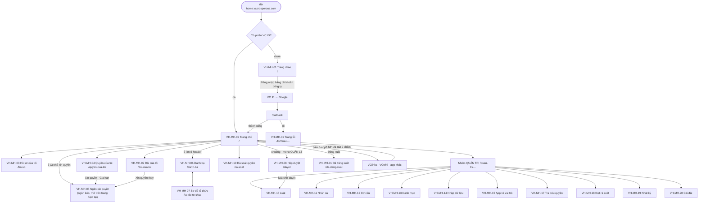

# VC Home — Đặc tả màn hình

Phiên bản 0.1 · 08/10/2026 · Trạng thái: Nháp (chờ duyệt)

## Tóm tắt

- **Tài liệu nói gì:** sơ đồ trang, menu theo vai trò, khung chung (header, chuông, thanh chuyển app) và đặc tả đủ 21 màn VH-MH-01…21 của VC Home. Mỗi màn có: mục đích, ai dùng, đường dẫn, giai đoạn, bố cục, trường dữ liệu, hành động, trạng thái rỗng / đang tải / lỗi, kiểm tra nhập liệu, yêu cầu và quy tắc liên quan.
- **Nền giao diện:** React + Ant Design, tiếng Việt, cùng token màu và component với dashboard VClinks. Desktop có menu trái và header; dưới 600 px lưới 1 cột, menu trái thành ngăn kéo. Mọi ngày giờ theo giờ Việt Nam (VH-BR-22).
- **Quyền trên màn lấy từ ma trận ở [02](02-tac-nhan-quy-tac.md) mục 3.** Vai trò không bao giờ có quyền thì **ẩn** nút; có quyền nhưng thiếu điều kiện thì **khoá** nút kèm câu giải thích (mục 1.3). Máy chủ luôn kiểm quyền lại.
- **Các màn quan trọng có khung dây (ASCII):** trang chủ (VH-MH-02), hồ sơ của tôi (VH-MH-03), ngăn xin quyền (VH-MH-05), hộp duyệt (VH-MH-08), quản trị nhân sự (VH-MH-11), luật cấp quyền và xem trước (VH-MH-16).
- **Quyết định thiết kế chính:**
  - Mọi thay đổi hồ sơ và cơ cấu có ô "Ngày hiệu lực"; không kéo thả để chuyển đơn vị, chỉ có thao tác "Chuyển đơn vị" có ngày hiệu lực.
  - Luật có nút "Xem trước" bắt buộc, hiện "+N / −M người"; trên 20 người thì hiện dải "Cần người thứ hai duyệt".
  - Hộp duyệt khoá "Duyệt các mục đã chọn" khi trong lựa chọn có vai trò nhạy cảm.
  - Nhập Excel đi ba bước: tải mẫu → chạy thử (OK / Cảnh báo / Lỗi) → ghi vào hệ thống; còn dòng lỗi thì không ghi được.
- **Điểm lệch tìm thấy khi viết** (mục 9): README đếm 75 yêu cầu nhưng bảng có 78; chưa có mã màn cho "Báo cáo tổng hợp" của Ban giám đốc; ma trận 02 chưa ghi trưởng đơn vị duyệt thay quản lý và quản trị hệ thống duyệt bước 2 theo VH-BR-12.
- **Việc còn mở:** phân loại trường C0 / C1 cuối cùng chờ [05-du-lieu.md](05-du-lieu.md); câu chữ trên màn VC ID (Keycloak) giữ theo thiết kế SSO mục 5.1.6.
- **Người duyệt xem kỹ:** bảng menu theo vai trò (mục 3), VH-MH-05 (trường và kiểm tra của yêu cầu quyền), VH-MH-08 (quy tắc duyệt hàng loạt), VH-MH-11 (biểu mẫu có ngày hiệu lực), VH-MH-16 (ngưỡng 20 người), mục 9 và 10.

## Mục lục

- [1. Quy ước chung](#1-quy-ước-chung)
- [2. Sơ đồ trang](#2-sơ-đồ-trang)
- [3. Menu theo vai trò](#3-menu-theo-vai-trò)
- [4. Khung chung: header, thông báo, menu](#4-khung-chung-header-thông-báo-menu)
- [5. Màn cho mọi người (VH-MH-01 đến 07)](#5-màn-cho-mọi-người-vh-mh-01-đến-07)
- [6. Màn cho quản lý (VH-MH-08 đến 10)](#6-màn-cho-quản-lý-vh-mh-08-đến-10)
- [7. Màn quản trị (VH-MH-11 đến 20)](#7-màn-quản-trị-vh-mh-11-đến-20)
- [8. Thành phần trong app khác (VH-MH-21)](#8-thành-phần-trong-app-khác-vh-mh-21)
- [9. Điểm lệch với README và 02](#9-điểm-lệch-với-readme-và-02)
- [10. Đề xuất bổ sung (chưa cấp mã)](#10-đề-xuất-bổ-sung-chưa-cấp-mã)
- [Lịch sử cập nhật](#lịch-sử-cập-nhật)

---

## 1. Quy ước chung

### 1.1 Cách đọc một màn

Mỗi màn có các phần theo đúng thứ tự:

| Phần | Nội dung |
|---|---|
| Thông tin chung | Mục đích; ai dùng và quyền (theo ma trận 02 mục 3); đường dẫn; giai đoạn (GĐ) |
| Bố cục | Các vùng trên màn; màn quan trọng có khung dây ASCII |
| Trường dữ liệu | `\| Trường \| Nguồn \| Hiện cho ai \| Ghi chú \|`. Nguồn ghi tên collection ở README mục 9 |
| Hành động | `\| Nút / thao tác \| Ai \| Kết quả \| Yêu cầu \|` |
| Trạng thái | Rỗng, đang tải, lỗi; câu chữ hiển thị chính xác |
| Kiểm tra nhập liệu | Điều kiện và câu báo lỗi chính xác |
| Liên quan | Mã yêu cầu, quy tắc, quy trình |

Chữ hiển thị đặt trong ngoặc kép "…". Phần thay bằng dữ liệu đặt trong ngoặc nhọn: "Còn {n} ngày".

**Thuật ngữ giao diện dùng một lần:**
- **Ngăn kéo (Drawer):** khung trượt từ cạnh phải, mở trên trang hiện tại.
- **Hộp thoại (Modal):** khung nổi giữa màn, phải đóng mới làm tiếp.
- **Toast:** dòng thông báo nhỏ hiện vài giây ở góc trên.
- **Khung xương (Skeleton):** các thanh xám nhấp nháy thay chỗ nội dung đang tải.

### 1.2 Kích thước và điểm ngắt

| Hạng mục | Giá trị |
|---|---|
| Điểm ngắt | Điện thoại < 600 px · máy tính bảng 600–1199 px · máy tính ≥ 1200 px |
| Menu trái | Rộng 232 px; thu gọn 64 px (chỉ biểu tượng); dưới 600 px thành ngăn kéo mở bằng nút ☰ |
| Header | Cao 56 px, cố định trên cùng |
| Lưới ô app | 4 cột (≥ 1200 px) · 3 cột (900–1199) · 2 cột (600–899) · 1 cột (< 600) |
| Bảng dữ liệu | Dưới 600 px chuyển thành danh sách thẻ, mỗi thẻ một dòng |
| Lề nội dung | 24 px máy tính, 16 px điện thoại |
| Vùng bấm | Tối thiểu 32×32 px máy tính, 44×44 px điện thoại |
| Chữ | Cỡ nội dung 14 px (điện thoại 15 px); tiêu đề trang 20 px |

### 1.3 Nút thiếu quyền: ẩn hay khoá

| Trường hợp | Cách hiện | Ví dụ |
|---|---|---|
| Vai trò không bao giờ có quyền (ô "—" ở ma trận 02) | **Ẩn** nút, tab, mục menu. Không để khoảng trống | Nhân viên không thấy nhóm menu "QUẢN TRỊ" |
| Có quyền nhưng lần này thiếu điều kiện | **Khoá** nút, rê chuột hiện lý do và cách mở | "Duyệt" khoá ở yêu cầu do chính mình gửi: "Không duyệt được yêu cầu của chính bạn." |
| Màn chỉ đọc (đ) | Ẩn mọi nút ghi; đầu trang có nhãn "Chỉ xem" | Kiểm soát ở VH-MH-15 |
| Mở đường dẫn không có quyền | Trang "Bạn không có quyền xem trang này." + nút "Về trang chủ" | Nhân viên gõ `/quan-tri/luat` |

Máy chủ luôn kiểm quyền lại. Ẩn hay khoá chỉ là giao diện.

### 1.4 Câu chuẩn dùng chung

Màn nào ghi mã dưới đây thì câu hiển thị phải đúng từng chữ. `{maLoi}` là 6 ký tự đầu mã yêu cầu API.

| Mã | Khi nào | Câu hiển thị |
|---|---|---|
| `TAI` | Đang tải | Khung xương theo bố cục màn; nút đang gửi hiện vòng quay và chữ "Đang lưu…" |
| `TAI-LAU` | Tải quá 10 giây | "Đang tải lâu hơn bình thường…" |
| `LOI-MANG` | Mất mạng | Dải đỏ dưới header: "Không có kết nối mạng. Kiểm tra mạng rồi thử lại." |
| `LOI-MAY` | Lỗi máy chủ | "Máy chủ đang gặp sự cố. Vui lòng thử lại sau ít phút. Mã lỗi: {maLoi}." + nút "Thử lại" |
| `LOI-TAI` | Không tải được một vùng | "Không tải được {tên vùng}." + nút "Thử lại" (chỉ vùng đó lỗi, phần khác vẫn dùng được) |
| `LOI-403` | API từ chối một thao tác | Toast "Bạn không có quyền thực hiện thao tác này." |
| `LOI-404` | Đối tượng không còn | "Không tìm thấy dữ liệu. Có thể đã bị xoá hoặc bạn không còn quyền xem." |
| `LOI-409` | Người khác vừa sửa | "Dữ liệu vừa được người khác thay đổi. Tải lại để xem bản mới nhất." + nút "Tải lại" |
| `LOI-PHIEN` | Phiên hết hạn | Tự đăng nhập im lặng lại; không được thì về VH-MH-01 với dòng "Phiên đăng nhập đã hết hạn. Vui lòng đăng nhập lại." |
| `RONG-LOC` | Bộ lọc không ra kết quả | "Không có dữ liệu phù hợp bộ lọc." + nút "Xoá bộ lọc" |
| `RONG-TIM` | Ô tìm không ra kết quả | "Không tìm thấy kết quả cho "{q}"." |
| `BAT-BUOC` | Trường bắt buộc để trống | "Nhập {tên trường}" hoặc "Chọn {tên trường}" |
| `DA-LUU` | Lưu thành công | Toast "Đã lưu." (màn có câu riêng thì dùng câu riêng, luôn bắt đầu bằng "Đã …") |

**Văn phong:** gọi người dùng là "bạn"; nút là động từ ("Lưu", "Gửi", "Duyệt", "Từ chối", "Huỷ"); không dùng "OK"; viết "khoá", "huỷ", "uỷ quyền" thống nhất với README.

### 1.5 Ngày hiệu lực trên biểu mẫu

Áp cho mọi biểu mẫu sửa hồ sơ, vị trí, cơ cấu (VH-BR-07):

- Ô "Ngày hiệu lực" bắt buộc, mặc định hôm nay, định dạng `dd/mm/yyyy`.
- Chọn hôm nay hoặc ngày đã qua: lưu xong áp ngay. Toast "Đã lưu, có hiệu lực từ {dd/mm/yyyy}."
- Chọn ngày sau: tạo một dòng ở `scheduled_changes`. Toast "Đã hẹn áp lúc 00:00 ngày {dd/mm/yyyy}." Đầu hồ sơ hiện thẻ vàng "Có {n} thay đổi đã hẹn" mở được danh sách và nút "Huỷ hẹn".
- Ngày đã qua quá 30 ngày: hỏi lại "Ngày hiệu lực cách hôm nay {n} ngày. Quyền và sự kiện gửi app sẽ tính như thay đổi mới từ hôm nay. Tiếp tục?" (lùi ngày chỉ để ghi lịch sử đúng; quyền không tính lùi).

## 2. Sơ đồ trang



**Bảng đường dẫn:**

| Đường dẫn | Màn | GĐ |
|---|---|---|
| `/` (chưa đăng nhập) | VH-MH-01 Trang chào | A |
| `/callback`, `/silent` | Không giao diện: nhận mã đăng nhập; `/silent` dùng khi tải lại trang | A |
| `/da-dang-xuat`, `/loi` | VH-MH-01 Đã đăng xuất, Lỗi | A |
| `/` (đã đăng nhập) | VH-MH-02 Trang chủ | A |
| `/ho-so` | VH-MH-03 Hồ sơ của tôi | A (bản Google), B (bản VC People) |
| `/quyen-cua-toi` | VH-MH-04 Quyền của tôi; `?xin=1&app={khoá}` mở sẵn VH-MH-05 | C, D |
| `/danh-ba`, `/danh-ba/{maNhanVien}` | VH-MH-06 Danh bạ, thẻ một người | B |
| `/so-do-to-chuc` | VH-MH-07 Sơ đồ tổ chức | B |
| `/duyet` | VH-MH-08 Hộp duyệt | D |
| `/doi-cua-toi` | VH-MH-09 Đội của tôi | B, C |
| `/ra-soat` | VH-MH-10 Rà soát quyền | D |
| `/quan-tri/nhan-su`, `/quan-tri/nhan-su/{maNhanVien}` | VH-MH-11 Quản trị nhân sự | B |
| `/quan-tri/co-cau` | VH-MH-12 Cơ cấu tổ chức | B |
| `/quan-tri/danh-muc` | VH-MH-13 Danh mục | B |
| `/quan-tri/nhap-du-lieu` | VH-MH-14 Nhập dữ liệu và đối chiếu | B |
| `/quan-tri/ung-dung`, `/quan-tri/ung-dung/{khoá}` | VH-MH-15 App và vai trò app | B, C |
| `/quan-tri/luat`, `/quan-tri/luat/{id}` | VH-MH-16 Luật cấp quyền | C |
| `/quan-tri/tra-cuu-quyen` | VH-MH-17 Tra cứu quyền (tab "Báo cáo tổng hợp" ở mục 9) | C |
| `/quan-tri/ra-soat` | VH-MH-18 Đợt rà soát | D |
| `/quan-tri/nhat-ky` | VH-MH-19 Nhật ký | B |
| `/quan-tri/cai-dat` | VH-MH-20 Cài đặt | D |
| `/catalog.json` | Dữ liệu danh mục app công khai (VH-API-08) | A |

Đường dẫn lạ: trang "Không tìm thấy trang này." + nút "Về trang chủ".

## 3. Menu theo vai trò

Menu trái có 4 nhóm. Một người giữ nhiều vai trò thấy **hợp** các mục. Nhóm không còn mục nào thì ẩn.

| Nhóm | Mục menu | Đường dẫn | Màn |
|---|---|---|---|
| CỦA TÔI | Trang chủ · Hồ sơ của tôi · Quyền của tôi | `/`, `/ho-so`, `/quyen-cua-toi` | 02, 03, 04 |
| CÔNG TY | Danh bạ · Sơ đồ tổ chức | `/danh-ba`, `/so-do-to-chuc` | 06, 07 |
| QUẢN LÝ | Hộp duyệt (số chờ) · Đội của tôi · Rà soát quyền (số dòng chưa xử lý) | `/duyet`, `/doi-cua-toi`, `/ra-soat` | 08, 09, 10 |
| QUẢN TRỊ | Nhân sự · Cơ cấu tổ chức · Danh mục · Nhập dữ liệu · App và vai trò · Luật cấp quyền · Tra cứu quyền · Báo cáo · Đợt rà soát · Nhật ký · Cài đặt | `/quan-tri/…` | 11–20 |

**Mục nhìn thấy theo vai trò** (✓ thấy, (đ) chỉ xem, (p) trong phạm vi vai trò, (a) chỉ app mình, — ẩn):

| Mục menu | Nhân viên | Quản lý | Trưởng ĐV | HC-NS | Quản trị HT | Chủ app | Kiểm soát | BGĐ |
|---|---|---|---|---|---|---|---|---|
| Trang chủ, Hồ sơ của tôi, Quyền của tôi | ✓ | ✓ | ✓ | ✓ | ✓ | ✓ | ✓ | ✓ |
| Danh bạ, Sơ đồ tổ chức | ✓ | ✓ | ✓ | ✓ | ✓ | ✓ | ✓ | ✓ |
| Hộp duyệt | —¹ | ✓ | —¹ | — | ✓² | ✓ | — | — |
| Đội của tôi | — | (p) | (p) | — | — | — | — | — |
| Rà soát quyền | — | — | (p)³ | — | — | — | — | — |
| Nhân sự, Cơ cấu tổ chức, Danh mục | — | — | — | (p) | — | — | — | — |
| Nhập dữ liệu | — | — | — | (p) | ✓ (tab đối chiếu) | — | — | — |
| App và vai trò | — | — | — | — | ✓ | (a) | (đ) | — |
| Luật cấp quyền | — | — | — | — | ✓ | (a) | —⁴ | — |
| Tra cứu quyền | — | — | — | — | ✓ | (a) | (đ) | — |
| Báo cáo (tab của VH-MH-17) | — | — | (p) | (p) | ✓ | (a) | (đ) | (đ) |
| Đợt rà soát | — | — | — | — | ✓ | — | (đ) | — |
| Nhật ký | — | — | — | (p: hồ sơ) | ✓ | (a) | (đ) | — |
| Cài đặt | — | — | — | — | ✓ | — | — | — |

Ghi chú:
1. Mục "Hộp duyệt" còn hiện cho bất kỳ ai **đang có việc duyệt**: người được uỷ quyền (VH-REQ-03), trưởng đơn vị tạm thay quản lý đã nghỉ (VH-BR-05), quản lý cấp trên nhận bước chuyển lên (VH-BR-12). Hết việc và hết uỷ quyền thì ẩn.
2. Quản trị hệ thống thấy hộp duyệt vì hai việc: duyệt bước hai của luật (VH-BR-25) và duyệt bước 2 khi chủ app xin vai trò nhạy cảm của chính app mình (VH-BR-12).
3. "Rà soát quyền" luôn hiện với trưởng đơn vị; ngoài đợt rà soát thì trang báo "Hiện không có đợt rà soát nào đang mở."
4. Ma trận 02 không cho kiểm soát xem luật. Xem đề xuất ở mục 10.

**Menu ảnh đại diện (góc phải header), mọi người:** "Hồ sơ của tôi" · "Quyền của tôi" (từ GĐ C) · "Phiên đăng nhập" (từ GĐ D, VH-AUT-10) · "Giao diện tối" / "Giao diện sáng" · "Hướng dẫn sử dụng" · "Đăng xuất".

**Giai đoạn A** chỉ có trang chủ, hồ sơ (bản Google) và menu ảnh đại diện ("Hồ sơ", "Đăng xuất"); chưa có menu trái. Menu trái xuất hiện từ GĐ B.

## 4. Khung chung: header, thông báo, menu

### 4.1 Bố cục header

```
┌──────────────────────────────────────────────────────────────────────────────────────────────┐
│ ☰ (VC) VC Home │ [🔍 Tìm đồng nghiệp: tên, email, SĐT, đơn vị…   Ctrl K] │ (⋮⋮⋮) (🔔 3) (ảnh  Lan ▾) │
└──────────────────────────────────────────────────────────────────────────────────────────────┘
```

| # | Thành phần | Nguồn | Hiện cho ai | Hành vi |
|---|---|---|---|---|
| 1 | Nút ☰ | — | Mọi người, chỉ khi < 600 px | Mở menu trái dạng ngăn kéo |
| 2 | Logo VC Phồn Vinh + chữ "VC Home" | Tĩnh | Mọi người | Bấm về `/` |
| 3 | Ô tìm danh bạ, gợi ý phím "Ctrl K" | `people` (C0) | Mọi người, từ GĐ B | Gõ từ 2 ký tự: danh sách thả xuống tối đa 8 người (ảnh, tên, chức danh · đơn vị). Enter mở `/danh-ba?q=…`. Dưới 600 px thu thành biểu tượng 🔍 |
| 4 | Nút 9 chấm (thanh chuyển app) | `catalog.json`, quyền | Mọi người | Như VH-MH-21; mục "VC Home" đang được chọn |
| 5 | Chuông thông báo, số chưa đọc | `notifications` | Mọi người, từ GĐ D | Số > 99 hiện "99+". Bấm mở ngăn kéo "Thông báo" (mục 4.2) |
| 6 | Ảnh đại diện + tên gọi | `people` (GĐ A: Google) | Mọi người | Mở menu ảnh đại diện (mục 3) |

Dải cảnh báo toàn trang (nếu có) nằm ngay dưới header, tối đa một dải, ưu tiên: mất mạng > "Tài khoản chưa có hồ sơ nhân sự, liên hệ HC-NS" > thông báo bảo trì do quản trị đặt.

### 4.2 Ngăn kéo thông báo (VH-HOM-08, GĐ D)

| Trường | Nguồn | Ghi chú |
|---|---|---|
| Biểu tượng loại, tiêu đề, một dòng nội dung, thời gian tương đối ("5 phút trước") | `notifications` | Chưa đọc in đậm, có chấm xanh |

**Loại thông báo:**

| Loại | Ai nhận | Câu mẫu | Bấm thì mở |
|---|---|---|---|
| Có yêu cầu chờ duyệt | Người duyệt | "{tên} xin {app} · {vai trò} trong {n} ngày" | VH-MH-08 đúng yêu cầu |
| Nhắc duyệt (sau 2 và 5 ngày) | Người duyệt | "Yêu cầu của {tên} còn {n} ngày trước khi tự huỷ" | VH-MH-08 |
| Kết quả yêu cầu | Người xin | "Đã duyệt: {app} · {vai trò} đến {dd/mm/yyyy}" / "Bị từ chối: {app} · {vai trò}. Lý do: {lý do}" / "Đã tự huỷ vì quá 7 ngày chưa duyệt xong" | VH-MH-04 |
| Quyền sắp hết hạn | Người giữ quyền | "{app} · {vai trò} hết hạn ngày {dd/mm/yyyy}" | VH-MH-04, nút "Gia hạn" |
| Quyền được thêm / bị gỡ | Người giữ quyền | "Bạn có thêm quyền {app} · {vai trò} (theo luật)" / "Đã gỡ {app} · {vai trò}. Lý do: {lý do}" | VH-MH-04 |
| Đợt rà soát mở, sắp hết hạn | Trưởng đơn vị | "Đợt rà soát {tên đợt}: {n} quyền cần bạn xác nhận trước {dd/mm/yyyy}" | VH-MH-10 |
| Luật chờ duyệt bước hai | Quản trị HT, chủ app | "{tên} gửi luật "{tên luật}" ảnh hưởng {n} người" | VH-MH-16 |
| Đề nghị sửa hồ sơ | HC-NS / người đề nghị | "{tên} đề nghị sửa {trường}" / "HC-NS đã {duyệt / từ chối} đề nghị sửa {trường}" | VH-MH-11 / VH-MH-03 |
| Thiếu quản lý | HC-NS | "{n} người đang thiếu quản lý trực tiếp" | VH-MH-11 lọc "Thiếu quản lý" |

Nút ở đầu ngăn kéo: "Đánh dấu đã đọc tất cả". Rỗng: "Bạn không có thông báo nào." Lỗi: `LOI-TAI` với tên vùng "thông báo". Thông báo giữ 90 ngày (đề xuất, chờ 05).

### 4.3 Menu trái

- Desktop: mở rộng 232 px, nhớ lựa chọn thu gọn trên trình duyệt (`localStorage` `vchome.menuCollapsed`).
- Mục đang mở tô nền và có `aria-current="page"`.
- Badge số ở "Hộp duyệt" (yêu cầu chờ mình) và "Rà soát quyền" (dòng chưa xử lý); cập nhật mỗi 60 giây hoặc khi mở lại tab.
- Trạng thái đang tải quyền: 6 thanh khung xương; không đoán mục menu khi chưa tải xong.
- Không tải được vai trò: menu chỉ còn nhóm "CỦA TÔI" và "CÔNG TY", dải `LOI-TAI` "Không tải được vai trò của bạn." + "Thử lại".

## 5. Màn cho mọi người (VH-MH-01 đến 07)

### VH-MH-01 Trang chào, đã đăng xuất, lỗi

| | |
|---|---|
| **Mục đích** | Cửa vào VC Home khi chưa có phiên; báo đã đăng xuất; báo lỗi đăng nhập bằng câu dễ hiểu |
| **Ai dùng + quyền** | Mọi người, kể cả người chưa đăng nhập. Không hiện dữ liệu cá nhân |
| **Đường dẫn** | `/` (chưa có phiên), `/da-dang-xuat`, `/loi?ma={mã}` |
| **GĐ** | A |

**Bố cục:** một thẻ ở giữa màn, rộng tối đa 420 px: logo VC Phồn Vinh, tiêu đề, một dòng giải thích, nút chính, dòng hỗ trợ "Cần giúp? Gửi email tới {email hỗ trợ}". Dưới 600 px thẻ chiếm hết chiều ngang (lề 16 px).

**Ba biến thể:**

| Biến thể | Tiêu đề | Dòng giải thích | Nút |
|---|---|---|---|
| Trang chào | "VC Home" | "Cổng làm việc của nhân viên VC Phồn Vinh." | "Đăng nhập bằng tài khoản công ty" |
| Đã đăng xuất | "Bạn đã đăng xuất khỏi mọi ứng dụng" | "Phiên ở VC Home, VClinks, VCwiki và các app khác đã đóng." | "Đăng nhập lại" |
| Lỗi | Theo bảng mã lỗi bên dưới | Theo bảng | "Thử lại" (+ nút phụ nếu có) |

**Trường dữ liệu**

| Trường | Nguồn | Hiện cho ai | Ghi chú |
|---|---|---|---|
| Mã lỗi | Tham số `ma` trên đường dẫn | Mọi người | Mã lạ thì dùng câu "Lỗi chung" |
| Thời điểm lỗi | Đồng hồ trình duyệt, giờ Việt Nam | Mọi người | Hiện dạng "Mã: {mã} · {HH:mm dd/mm/yyyy}" để báo dev |
| Email hỗ trợ | Cấu hình build | Mọi người | Đề xuất `it@vcprosperous.com`, chờ chủ dự án chốt |

**Câu lỗi theo mã** (mã dùng chung ở thiết kế SSO mục 5.2):

| Mã | Tiêu đề | Dòng giải thích | Nút phụ |
|---|---|---|---|
| `outside_domain` | "Tài khoản này không thuộc công ty" | "Hãy chọn tài khoản @vcprosperous.com hoặc @vcpart.vn." | "Chọn tài khoản khác" |
| `app_not_granted` | "Bạn chưa được cấp ứng dụng này" | "Xin quyền trên VC Home hoặc liên hệ quản lý trực tiếp." | "Về trang chủ" |
| `not_granted` | "Bạn chưa có tài khoản trong ứng dụng này" | "Liên hệ quản trị viên của ứng dụng." | "Về trang chủ" |
| `locked` | "Tài khoản đã bị khoá" | "Liên hệ quản trị viên." | — |
| `identity_conflict` | "Tài khoản đang gắn với một định danh khác" | "Quản trị viên đã được báo. Bạn chưa cần làm gì thêm." | — |
| `state_invalid` | "Liên kết đăng nhập đã hết hạn" | "Bấm Thử lại để đăng nhập từ đầu." | — |
| `idp_unreachable` | "Không kết nối được máy chủ đăng nhập" | "Phiên đang mở ở các app vẫn dùng được. Thử lại sau ít phút." | — |
| `cancelled` | "Bạn đã huỷ đăng nhập" | "Bấm Thử lại khi sẵn sàng." | — |
| `no_profile` (từ GĐ B) | Không dùng trang lỗi: vào trang chủ trống, xem VH-MH-02 | | |
| (khác) | "Có lỗi khi đăng nhập" | "Bấm Thử lại. Nếu vẫn lỗi, gửi mã bên dưới cho bộ phận IT." | — |

Các trang do VC ID (Keycloak) tự hiện (xác nhận đăng xuất, sai domain trên trang Google, tài khoản bị khoá) giữ đúng câu ở thiết kế SSO mục 5.1.6, không lặp lại ở đây.

**Hành động**

| Nút / thao tác | Ai | Kết quả | Yêu cầu |
|---|---|---|---|
| "Đăng nhập bằng tài khoản công ty" | Mọi người | Chuyển sang VC ID với gợi ý Google; xong về `/callback` rồi về trang định mở (`next`, chỉ nhận đường dẫn trong VC Home) | VH-AUT-01, VH-AUT-03 |
| "Đăng nhập lại" | Mọi người | Như trên | VH-AUT-04 |
| "Thử lại" | Mọi người | Bắt đầu lại luồng đăng nhập | VH-AUT-01 |
| "Chọn tài khoản khác" | Mọi người | Đăng nhập lại với `prompt=select_account` để Google hiện danh sách tài khoản | VH-AUT-02 |

**Trạng thái:** đang chuyển hướng sau khi bấm nút: nút khoá, chữ "Đang chuyển tới trang đăng nhập…". Trang chào không có trạng thái rỗng. Không có mạng: `LOI-MANG`, nút đăng nhập khoá.

**Kiểm tra nhập liệu:** không có ô nhập. Tham số `next` khác đường dẫn nội bộ thì bỏ qua, về `/`.

**Liên quan:** VH-AUT-01, 02, 03, 04, 09 (đường khẩn cấp không hiện trên trang này; quản trị dùng realm `master` theo thiết kế SSO mục 5.7); VH-BR-02; VH-QT-01, VH-QT-02.

---

### VH-MH-02 Trang chủ

| | |
|---|---|
| **Mục đích** | Chỗ bắt đầu ngày làm việc: biết mình là ai trong công ty, mở app được cấp, thấy app có thể xin |
| **Ai dùng + quyền** | Mọi người đã đăng nhập (ma trận 02: "Đăng nhập, mở app được cấp" ✓ mọi vai trò). Mỗi người chỉ thấy dữ liệu của mình |
| **Đường dẫn** | `/` |
| **GĐ** | A (lưới app theo nhóm VC ID), B (thẻ hồ sơ), C (nhãn vai trò, "Còn N ngày"), D ("Có thể xin quyền", dải việc chờ), E (số việc chờ trên ô) |

**Khung dây (máy tính, ≥ 1200 px)**

```
┌─ header ─────────────────────────────────────────────────────────────────────────────────────┐
├──────────┬───────────────────────────────────────────────────────────────────────────────────┤
│ menu     │ Chào buổi sáng, Lan                                                               │
│ trái     │ ┌───────────────────────────────────────────────────────────────────────────────┐ │
│          │ │ (ảnh)  Nguyễn Thị Lan                                     [Xem hồ sơ →]       │ │
│          │ │        Nhân viên kinh doanh · Tổ bán hàng 1 · VCparts                         │ │
│          │ │        Quản lý: Trần Văn Bình                                                 │ │
│          │ └───────────────────────────────────────────────────────────────────────────────┘ │
│          │ ⓘ Bạn có 2 yêu cầu chờ duyệt.  [Mở hộp duyệt]                     (GĐ D, nếu có)  │
│          │                                                                                   │
│          │ Ứng dụng của bạn                                                                  │
│          │ ┌───────────────┐ ┌───────────────┐ ┌───────────────┐ ┌───────────────┐           │
│          │ │📌 [icon]      │ │ [icon]   (5)  │ │ [icon]        │ │ [icon]        │           │
│          │ │ VClinks       │ │ VCwiki        │ │ VCsale        │ │ VC AI         │           │
│          │ │ CSKH đa kênh  │ │ Kho tri thức  │ │ Bán hàng, kho │ │ Trợ lý AI     │           │
│          │ │ VClinks · NVKD│ │ VCwiki · Xem  │ │ Sắp có        │ │ Sắp có        │           │
│          │ │ [Còn 3 ngày]  │ │               │ │   (ô mờ)      │ │   (ô mờ)      │           │
│          │ └───────────────┘ └───────────────┘ └───────────────┘ └───────────────┘           │
│          │                                                                                   │
│          │ Liên kết nhanh                                                                    │
│          │ [Gmail ↗] [Google Drive ↗] [Lịch ↗] [MISA ↗]                                      │
│          │                                                                                   │
│          │ Có thể xin quyền                                                                  │
│          │ ┌───────────────┐ ┌───────────────┐                                               │
│          │ │ VCgarage      │ │ VCinvoice     │                                               │
│          │ │ [Xin quyền]   │ │ [Xin quyền]   │                                               │
│          │ └───────────────┘ └───────────────┘                                               │
└──────────┴───────────────────────────────────────────────────────────────────────────────────┘
```

Dưới 600 px: lời chào → thẻ hồ sơ (ảnh nhỏ, 2 dòng) → ô app 1 cột (ô dạng hàng ngang: biểu tượng trái, chữ phải) → liên kết nhanh dạng chip cuộn ngang → "Có thể xin quyền".

**Trường dữ liệu**

| Trường | Nguồn | Hiện cho ai | Ghi chú |
|---|---|---|---|
| Lời chào | Giờ Việt Nam + tên gọi | Chính mình | "Chào buổi sáng" (trước 11:00), "Chào buổi trưa" (11:00–13:29), "Chào buổi chiều" (13:30–17:59), "Chào buổi tối"; tên gọi = từ cuối của họ tên |
| Ảnh, họ tên | `people` (GĐ A: Google) | Chính mình | Không có ảnh: chữ cái đầu trong ô tròn |
| Chức danh, đơn vị, pháp nhân | `positions` (vị trí chính), `org_units`, `legal_entities` | Chính mình | Có kiêm nhiệm: thêm dòng nhỏ "Kiêm: {chức danh} · {đơn vị}" (tối đa 2, còn lại "+{n}") |
| Quản lý trực tiếp | `positions.quản lý` → `people` | Chính mình | Bấm tên mở thẻ người đó ở danh bạ. Người đứng đầu tập đoàn: ẩn dòng |
| Ô app | `apps` + `access_grants` còn hiệu lực (GĐ A: `catalog.json` + `groups`) | Chính mình | Chỉ app có ít nhất một quyền còn hiệu lực (VH-BR-21) |
| Biểu tượng, tên, mô tả một dòng | `apps` | Mọi người | Mô tả cắt ở 1 dòng, rê chuột xem đủ |
| Nhãn vai trò | `access_grants` → `app_roles.tên` | Chính mình | Dạng "VClinks · NVKD". Nhiều vai trò: "VClinks · NVKD, CSKH"; quá 2: "VClinks · NVKD +2" (GĐ C) |
| Huy hiệu "Còn {n} ngày" | `access_grants` đang trong thời gian chuyển tiếp | Chính mình | Màu cam; rê chuột: "Vai trò {vai trò} sẽ gỡ ngày {dd/mm/yyyy} do bạn đã chuyển vị trí." (VH-BR-11) |
| Số việc chờ | VH-API-09 của từng app | Chính mình | GĐ E; số > 99 hiện "99+"; app không trả lời thì không hiện số |
| Ô "Sắp có" | `apps.trạng thái = Sắp có` | Mọi người | Ô mờ, chữ "Sắp có", không bấm được |
| Liên kết ngoài | `apps.loại = Liên kết ngoài` | Mọi người (hoặc theo pháp nhân nếu quản trị đặt) | Có biểu tượng ↗, mở tab mới, không đăng nhập một lần |
| Có thể xin quyền | `apps` đang chạy có ít nhất một vai trò cho phép xin, mà người dùng chưa có vai trò nào | Chính mình | GĐ D. Tối đa 6 ô, còn lại "Xem tất cả" mở VH-MH-04 |
| Dải việc chờ | Số yêu cầu chờ mình duyệt, số dòng rà soát chưa xử lý | Người duyệt, trưởng đơn vị | GĐ D. "Bạn có {n} yêu cầu chờ duyệt." · "Bạn còn {n} quyền cần rà soát trước {dd/mm/yyyy}." |

**Hành động**

| Nút / thao tác | Ai | Kết quả | Yêu cầu |
|---|---|---|---|
| Bấm ô app | Người có quyền | Mở app trong cùng tab (vào thẳng, không hỏi đăng nhập) | VH-HOM-01, VH-AUT-03 |
| Ctrl/⌘ + bấm hoặc chuột giữa | Như trên | Mở app ở tab mới | VH-HOM-01 |
| Ghim / bỏ ghim (biểu tượng 📌 hiện khi rê chuột, hoặc menu "⋯" trên điện thoại) | Chính mình | Ô ghim lên đầu; lưu trên trình duyệt (`localStorage` `vchome.pinned`) | VH-BR-21 |
| Bấm liên kết ngoài | Mọi người | Mở tab mới | VH-HOM-06 |
| "Xem hồ sơ →" | Chính mình | Mở `/ho-so` | VH-HOM-02 |
| "Xin quyền" trên ô | Chính mình | Mở VH-MH-05 với app đã chọn sẵn | VH-HOM-04, VH-REQ-01 |
| "Mở hộp duyệt" / "Mở rà soát" | Người duyệt / trưởng đơn vị | Mở `/duyet` / `/ra-soat` | VH-HOM-08 |

**Trạng thái**

| Trạng thái | Hiển thị |
|---|---|
| Đang tải | Thẻ hồ sơ khung xương; 4 ô app khung xương |
| GĐ A, không có ô app nào | Hình minh hoạ nhỏ + "Bạn chưa được cấp ứng dụng nào. Liên hệ quản trị viên." |
| Từ GĐ B, tài khoản chưa gắn hồ sơ | Ẩn thẻ hồ sơ và lưới app; khung thông tin "Tài khoản chưa có hồ sơ nhân sự, liên hệ HC-NS" + dòng nhỏ "Email đăng nhập: {email}" để HC-NS tra. Liên kết ngoài vẫn hiện (VH-BR-02) |
| Có hồ sơ, chưa có quyền app nào | "Bạn chưa được cấp ứng dụng nào." + nút "Xin quyền" (GĐ D) hoặc "Liên hệ quản lý trực tiếp: {tên}" (trước GĐ D) |
| Không tải được thẻ hồ sơ | `LOI-TAI` "Không tải được hồ sơ." Lưới app vẫn hiện |
| Không tải được danh mục app | Dùng bản lưu gần nhất trên trình duyệt, dòng nhỏ "Đang hiện danh sách lưu lúc {HH:mm}." Chưa có bản lưu: `LOI-TAI` "Không tải được danh sách ứng dụng." |
| Một app không trả số việc chờ | Ô đó không có số; không báo lỗi |

**Kiểm tra nhập liệu:** không có ô nhập.

**Liên quan:** VH-HOM-01, 02, 03, 04, 06, 07, 08; VH-AUT-08; VH-INT-07; VH-BR-02, 11, 21, 22; VH-QT-01.

---

### VH-MH-03 Hồ sơ của tôi

| | |
|---|---|
| **Mục đích** | Xem hồ sơ công việc của mình, đề nghị HC-NS sửa chỗ sai, xem lịch sử thay đổi, quản lý phiên đăng nhập |
| **Ai dùng + quyền** | Mọi người, chỉ hồ sơ của chính mình ("Xem hồ sơ của mình", "Đề nghị sửa hồ sơ của mình" ✓ mọi vai trò). Không sửa trực tiếp được |
| **Đường dẫn** | `/ho-so` (tab: `?tab=thong-tin`, `lich-su`, `de-nghi`, `phien`) |
| **GĐ** | A (bản Google), B (bản VC People), D (tab "Phiên đăng nhập") |

**GĐ A:** chỉ có ảnh, tên, email, domain, danh sách app được dùng, dòng "Thông tin lấy từ Google Workspace, sửa ở Google" (thiết kế SSO mục 5.3). Từ GĐ B thay bằng bố cục dưới đây.

**Khung dây (GĐ B trở đi)**

```
┌──────────────────────────────────────────────────────────────────────────────────────────┐
│ Hồ sơ của tôi                                                       [Đề nghị sửa]        │
│ ┌──────────┐  Nguyễn Thị Lan                     Mã NV: VCP-00123                        │
│ │  (ảnh)   │  lan.nguyen@vcprosperous.com · SĐT công việc: 0912 xxx 678                  │
│ └──────────┘  Đang làm · Chính thức · Vào làm 01/03/2024                                 │
│ ─────────────────────────────────────────────────────────────────────────────────────── │
│ [Thông tin] [Lịch sử thay đổi] [Đề nghị của tôi (1)] [Phiên đăng nhập]                   │
│                                                                                          │
│ Vị trí chính                                                                             │
│   Nhân viên kinh doanh · Chức năng: Bán hàng                                             │
│   Tổ bán hàng 1 › Phòng Kinh doanh › VCparts › Tập đoàn VC Phồn Vinh                     │
│   Quản lý trực tiếp: Trần Văn Bình    Từ 01/03/2024                                      │
│ Kiêm nhiệm                                                                               │
│   CSKH · Phòng CSKH › VCservice · Quản lý: Lê Thu Hà · 01/09/2026 – 31/12/2026           │
│ Pháp nhân: Công ty VCparts · Nơi làm việc: Kho Hà Nội                                    │
│                                                                                          │
│ ⓘ Thay đổi đã hẹn: Chuyển sang Tổ bán hàng 2 từ 01/11/2026                               │
└──────────────────────────────────────────────────────────────────────────────────────────┘
```

**Trường dữ liệu**

| Trường | Nguồn | Hiện cho ai | Ghi chú |
|---|---|---|---|
| Ảnh, họ tên, email công ty, SĐT công việc | `people` | Chính mình | Ảnh lấy theo Google nếu HC-NS chưa đặt ảnh riêng |
| Mã nhân viên | `people` | Chính mình | Có nút sao chép |
| Trạng thái làm việc, loại nhân viên, ngày vào | `people` | Chính mình | Trạng thái: "Đang làm", "Nghỉ dài ngày đến {dd/mm/yyyy}" |
| Vị trí chính: chức danh, chức năng, đơn vị (đường dẫn cây), quản lý, từ ngày | `positions`, `org_units`, `job_titles`, `job_functions` | Chính mình | Đường dẫn cây bấm được, mở VH-MH-07 tại đơn vị |
| Kiêm nhiệm | `positions` (kiêm nhiệm) | Chính mình | Mỗi dòng có từ ngày – đến ngày ("không thời hạn" nếu trống) |
| Pháp nhân, nơi làm việc | `legal_entities`, `work_locations` | Chính mình | |
| Thay đổi đã hẹn | `scheduled_changes` | Chính mình | Chỉ đọc |
| Tab "Lịch sử thay đổi" | `audit_log` lọc theo hồ sơ của mình | Chính mình | Cột: ngày hiệu lực, trường, trước, sau, người sửa (tên HC-NS), lý do. Ma trận 02: nhật ký (m) |
| Tab "Đề nghị của tôi" | Đề nghị sửa (collection chờ 05) | Chính mình | Cột: ngày gửi, trường, giá trị đề nghị, trạng thái ("Chờ HC-NS" / "Đã cập nhật" / "Từ chối: {lý do}") |
| Tab "Phiên đăng nhập" | VC ID (phiên Keycloak) | Chính mình | GĐ D. Cột: thiết bị / trình duyệt, IP rút gọn, đăng nhập lúc, dùng gần nhất, app đang mở. Dòng phiên hiện tại gắn nhãn "Phiên này" |

**Hành động**

| Nút / thao tác | Ai | Kết quả | Yêu cầu |
|---|---|---|---|
| "Đề nghị sửa" | Chính mình | Mở hộp thoại đề nghị (trường dưới); gửi xong toast "Đã gửi đề nghị tới HC-NS." | VH-NSU-06 |
| "Huỷ đề nghị" (dòng đang chờ) | Chính mình | Đề nghị chuyển "Đã huỷ" | VH-NSU-06 |
| "Đăng xuất phiên này" (dòng khác phiên hiện tại) | Chính mình | Phiên đó đóng ở mọi app; toast "Đã đăng xuất phiên trên {thiết bị}." | VH-AUT-10 |
| "Đăng xuất mọi nơi khác" | Chính mình | Đóng mọi phiên trừ phiên này; hỏi xác nhận "Đăng xuất {n} phiên khác khỏi mọi ứng dụng?" | VH-AUT-10 |

**Hộp thoại "Đề nghị sửa hồ sơ":** chọn trường (họ tên, ảnh, SĐT công việc, chức danh, đơn vị, quản lý trực tiếp, nơi làm việc, khác); "Giá trị đúng"; "Ghi chú cho HC-NS"; tệp đính kèm (ảnh, PDF ≤ 5 MB). Dòng nhỏ: "HC-NS của {pháp nhân} sẽ xem và cập nhật. Bạn nhận thông báo khi có kết quả."

**Trạng thái**

| Trạng thái | Hiển thị |
|---|---|
| Đang tải | Khung xương đầu hồ sơ và 4 dòng |
| Chưa gắn hồ sơ | "Tài khoản chưa có hồ sơ nhân sự, liên hệ HC-NS" |
| Lịch sử rỗng | "Chưa có thay đổi nào." |
| Không có đề nghị | "Bạn chưa gửi đề nghị sửa nào." |
| Không tải được phiên | `LOI-TAI` "Không tải được danh sách phiên." |
| Lỗi | `LOI-MAY` |

**Kiểm tra nhập liệu**

| Ô | Điều kiện | Câu báo |
|---|---|---|
| Trường cần sửa | Bắt buộc | "Chọn trường cần sửa" |
| Giá trị đúng | Bắt buộc, 2–200 ký tự | "Nhập giá trị đúng" · "Giá trị dài tối đa 200 ký tự." |
| SĐT công việc | 10 số, bắt đầu bằng 0 | "Số điện thoại gồm 10 chữ số, bắt đầu bằng 0." |
| Tệp đính kèm | ≤ 5 MB; JPG, PNG, PDF | "Tệp vượt quá 5 MB." · "Chỉ nhận JPG, PNG hoặc PDF." |
| Trùng đề nghị | Đã có đề nghị đang chờ cho cùng trường | "Bạn đã có đề nghị đang chờ cho trường này. Huỷ đề nghị cũ hoặc chờ HC-NS xử lý." |

**Liên quan:** VH-NSU-01, 02, 03, 04, 05, 06; VH-AUT-10; VH-BR-04, 18, 19.

---

### VH-MH-04 Quyền của tôi

| | |
|---|---|
| **Mục đích** | Biết mình đang có vai trò gì trong app nào, từ đâu ra, đến khi nào; xin thêm, gia hạn, theo dõi yêu cầu |
| **Ai dùng + quyền** | Mọi người ("Xem quyền của mình", "Xin quyền cho mình" ✓ mọi vai trò). Chỉ dữ liệu của mình |
| **Đường dẫn** | `/quyen-cua-toi` (tab `?tab=quyen`, `yeu-cau`, `lich-su`) |
| **GĐ** | C (xem), D (xin, gia hạn, yêu cầu) |

**Bố cục:** tiêu đề "Quyền của tôi" + nút chính "Xin quyền" (GĐ D) ở góc phải. Ba tab: "Quyền đang có", "Yêu cầu của tôi" (GĐ D), "Lịch sử". Dưới 600 px bảng thành thẻ, mỗi thẻ một quyền.

**Trường dữ liệu (tab "Quyền đang có")**

| Trường | Nguồn | Hiện cho ai | Ghi chú |
|---|---|---|---|
| App (biểu tượng + tên) | `apps` | Chính mình | Gom theo app; app có nhiều vai trò thì nhiều dòng |
| Vai trò | `app_roles` | Chính mình | Vai trò nhạy cảm có nhãn "Nhạy cảm" |
| Nguồn | `access_grants.nguồn` | Chính mình | Chip: "Luật" (xanh lá), "Được duyệt" (xanh dương), "Khẩn cấp" (đỏ). Một quyền có nhiều nguồn thì hiện đủ chip (VH-BR-09) |
| Chi tiết nguồn | Luật: tên luật; Được duyệt: người duyệt, ngày duyệt; Khẩn cấp: người cấp, lý do | Chính mình | Rê chuột trên chip |
| Phạm vi đơn vị | Vị trí sinh ra quyền | Chính mình | Ví dụ "Tại VCparts · Tổ bán hàng 1" (VH-BR-24) |
| Hạn dùng | `access_grants.hạn` | Chính mình | Luật: "Không hạn". Còn ≤ 14 ngày: chữ cam "Hết hạn {dd/mm/yyyy} (còn {n} ngày)" |
| Trạng thái | `access_grants.trạng thái` | Chính mình | "Đang dùng" · "Còn {n} ngày chuyển tiếp" (cam) · "Sắp hết hạn" (cam) |

**Hành động**

| Nút / thao tác | Ai | Kết quả | Yêu cầu |
|---|---|---|---|
| "Xin quyền" | Chính mình | Mở VH-MH-05 trống | VH-REQ-01 |
| "Gia hạn" (dòng nguồn "Được duyệt", còn ≤ 30 ngày) | Chính mình | Mở VH-MH-05 điền sẵn app, vai trò, ô "Lý do" trống; tiêu đề ngăn kéo "Gia hạn quyền" | VH-REQ-06 |
| "Gia hạn" khoá | Chính mình | Dòng chỉ có nguồn "Luật": ẩn nút. Nguồn "Khẩn cấp": khoá, rê chuột "Quyền khẩn cấp không gia hạn được. Hãy gửi yêu cầu quyền thường." Đã có yêu cầu gia hạn đang chờ: khoá, "Đã có yêu cầu gia hạn đang chờ duyệt." | VH-REQ-06, VH-BR-09 |
| "Huỷ yêu cầu" (tab "Yêu cầu của tôi", dòng đang chờ) | Người xin | Hỏi "Huỷ yêu cầu {app} · {vai trò}?"; xong chuyển "Đã huỷ" | VH-REQ-01 |
| Bấm dòng yêu cầu | Người xin | Ngăn kéo chi tiết: các bước duyệt, người duyệt, thời điểm, lý do từ chối | VH-REQ-02 |

**Tab "Yêu cầu của tôi":** cột Ngày gửi · App · Vai trò · Thời hạn xin · Người được cấp (khi quản lý xin thay) · Trạng thái ("Chờ bước 1: {tên}", "Chờ bước 2: {tên}", "Đã duyệt", "Từ chối", "Đã tự huỷ", "Đã huỷ") · "Tự huỷ sau {n} ngày" (với yêu cầu đang chờ, VH-BR-13).

**Tab "Lịch sử":** mọi lần thêm, gỡ, gia hạn quyền của mình (từ `audit_log`): ngày, app, vai trò, việc, nguồn, lý do. Lọc theo app và khoảng ngày.

**Trạng thái**

| Trạng thái | Hiển thị |
|---|---|
| Đang tải | Bảng khung xương 5 dòng |
| Chưa có quyền nào | "Bạn chưa có quyền ứng dụng nào." + nút "Xin quyền" (GĐ D) |
| Không có yêu cầu | "Bạn chưa gửi yêu cầu quyền nào." |
| Chưa gắn hồ sơ | "Tài khoản chưa có hồ sơ nhân sự, liên hệ HC-NS" |
| Lỗi | `LOI-MAY` |

**Kiểm tra nhập liệu:** không có ô nhập trên màn này (nhập ở VH-MH-05).

**Liên quan:** VH-ACC-05, VH-ACC-08; VH-HOM-03; VH-REQ-01, 02, 06; VH-BR-08, 09, 11, 13, 24; VH-QT-08.

---

### VH-MH-05 Ngăn gửi yêu cầu quyền

| | |
|---|---|
| **Mục đích** | Xin một vai trò trong một app, có lý do và thời hạn, biết trước ai sẽ duyệt |
| **Ai dùng + quyền** | Mọi người xin cho mình ("Xin quyền cho mình" ✓). Quản lý và trưởng đơn vị xin thay người dưới quyền ((p), VH-REQ-05) |
| **Đường dẫn** | Ngăn kéo rộng 480 px, mở trên VH-MH-02, VH-MH-04, VH-MH-09; mở thẳng bằng `/quyen-cua-toi?xin=1&app={khoá}`. Dưới 600 px chiếm toàn màn |
| **GĐ** | D |

**Khung dây**

```
┌───────────────────────────────────────────────┐
│ Xin quyền ứng dụng                        [×] │
├───────────────────────────────────────────────┤
│ Xin cho  (•) Tôi   ( ) Người trong đội        │  ← chỉ hiện với quản lý / trưởng ĐV
│          [Chọn người ▾]                       │
│                                               │
│ Ứng dụng *      [VClinks                    ▾]│
│ Vai trò *       [Giám sát                   ▾]│
│                 Xem và phân việc hội thoại    │  ← mô tả vai trò
│                 ⚠ Vai trò nhạy cảm: cần thêm  │
│                   chủ app duyệt               │
│ Lý do *         ┌───────────────────────────┐ │
│                 │ Thay chị Hà giám sát tổ 2 │ │
│                 │ trong thời gian chị nghỉ  │ │
│                 └───────────────────────────┘ │
│                 46 / 500 ký tự (tối thiểu 20) │
│ Thời hạn *      (30) (•90) (180) (365) ngày   │
│                 Hết hạn ngày 06/01/2027       │
│                                               │
│ Người duyệt dự kiến                           │
│  ① Trần Văn Bình — quản lý trực tiếp          │
│  ② Phạm Quốc Huy — chủ app VClinks            │
│ Yêu cầu tự huỷ nếu chưa duyệt xong sau 7 ngày │
├───────────────────────────────────────────────┤
│                       [Huỷ]  [Gửi yêu cầu]    │
└───────────────────────────────────────────────┘
```

**Trường dữ liệu**

| Trường | Nguồn | Hiện cho ai | Ghi chú |
|---|---|---|---|
| Xin cho | Chính mình / người trong cây dưới quyền | Quản lý, trưởng đơn vị | Người thường không thấy dòng này. Danh sách người lấy theo VH-BR-23 |
| Ứng dụng | `apps` đang chạy, có ít nhất một vai trò cho phép xin | Người xin | Ô chọn có tìm; app đã chọn sẵn khi mở từ ô "Có thể xin quyền" |
| Vai trò | `app_roles` của app đã chọn | Người xin | Vai trò người được cấp đã có (bất kỳ nguồn) hiện mờ kèm "(đang có)" |
| Mô tả vai trò | `app_roles.mô tả` | Người xin | |
| Cảnh báo nhạy cảm | `app_roles.nhạy cảm` | Người xin | "Vai trò nhạy cảm: cần thêm chủ app duyệt" |
| Lý do | Người xin nhập | Người xin, người duyệt | 20–500 ký tự; bộ đếm ký tự |
| Thời hạn | Nút chọn 30 / 90 / 180 / 365 ngày | Người xin | Mặc định 90 (VH-BR-09); giá trị lấy từ VH-MH-20. Dòng tính sẵn "Hết hạn ngày {dd/mm/yyyy}" |
| Người duyệt dự kiến | Tính theo VH-BR-12: quản lý theo vị trí chính, uỷ quyền đang có, chủ app | Người xin | Có uỷ quyền: "① Lê Thu Hà — duyệt thay Trần Văn Bình đến {dd/mm}". Người xin là quản lý của chính mình ở bước nào thì hiện người cấp trên. Chủ app xin vai trò nhạy cảm của app mình: bước 2 hiện "Quản trị hệ thống" |
| Gia hạn (chỉ khi mở từ "Gia hạn") | `access_grants` | Người xin | Dòng "Đang có đến {dd/mm/yyyy}. Hạn mới tính từ ngày hết hạn cũ." |

**Hành động**

| Nút / thao tác | Ai | Kết quả | Yêu cầu |
|---|---|---|---|
| "Gửi yêu cầu" | Người xin | Tạo `access_requests` và bước duyệt đầu; gửi thông báo cho người duyệt bước 1; đóng ngăn kéo; toast "Đã gửi yêu cầu. {tên người duyệt} sẽ nhận thông báo." | VH-REQ-01, VH-REQ-02 |
| "Huỷ" / [×] | Người xin | Đóng; đã nhập dở thì hỏi "Bỏ yêu cầu đang soạn?" | — |
| Đổi app | Người xin | Xoá vai trò đã chọn, tính lại người duyệt | — |

**Trạng thái**

| Trạng thái | Hiển thị |
|---|---|
| Đang tải danh sách app, vai trò | Ô chọn hiện "Đang tải…" |
| App không có vai trò cho phép xin | Ô vai trò khoá, dòng "Ứng dụng này chưa mở vai trò nào để xin. Liên hệ chủ app {tên}." |
| Không tính được người duyệt (thiếu quản lý, không có trưởng đơn vị) | Dải vàng "Chưa xác định được người duyệt bước 1 vì hồ sơ thiếu quản lý trực tiếp. Liên hệ HC-NS." Nút "Gửi yêu cầu" khoá |
| Đang gửi | Nút "Đang gửi…", khoá |
| Gửi lỗi | Giữ nguyên nội dung đã nhập; `LOI-MAY` trong ngăn kéo |

**Kiểm tra nhập liệu**

| Ô | Điều kiện | Câu báo |
|---|---|---|
| Xin cho (người trong đội) | Bắt buộc khi chọn "Người trong đội"; phải thuộc cây dưới quyền | "Chọn người được cấp" · "Người này không thuộc đội của bạn." |
| Ứng dụng | Bắt buộc | "Chọn ứng dụng" |
| Vai trò | Bắt buộc; người được cấp chưa có vai trò này | "Chọn vai trò" · "{tên} đã có vai trò này. Dùng Gia hạn nếu sắp hết hạn." |
| Trùng yêu cầu | Chưa có yêu cầu đang chờ cùng (người, app, vai trò) | "Đã có yêu cầu đang chờ duyệt cho vai trò này (gửi ngày {dd/mm/yyyy})." |
| Lý do | Bắt buộc, ≥ 20 ký tự sau khi bỏ khoảng trắng đầu cuối, ≤ 500 | "Nhập lý do" · "Lý do cần ít nhất 20 ký tự (đang có {n})." · "Lý do dài tối đa 500 ký tự." |
| Thời hạn | Một trong 30, 90, 180, 365; không vượt tối đa ở Cài đặt | "Chọn thời hạn" |
| Người được cấp | Trạng thái "Đang làm" hoặc "Nghỉ dài ngày" | "Không xin được quyền cho người đã nghỉ việc." |

**Liên quan:** VH-REQ-01, 02, 05, 06; VH-HOM-04; VH-APP-05; VH-BR-08, 09, 12, 13, 17; VH-QT-08.

---

### VH-MH-06 Danh bạ công ty

| | |
|---|---|
| **Mục đích** | Tìm đồng nghiệp nhanh: ai, làm gì, ở đâu, liên hệ thế nào |
| **Ai dùng + quyền** | Mọi người thấy thông tin C0 ("Danh bạ" ✓). Quản lý, trưởng đơn vị (p), HC-NS (p), quản trị hệ thống (đ), kiểm soát (đ) thấy thêm phần C1 ở thẻ một người (VH-BR-23, VH-NSU-08) |
| **Đường dẫn** | `/danh-ba`, `/danh-ba/{maNhanVien}` (ngăn kéo thẻ một người) |
| **GĐ** | B |

**Bố cục:** thanh lọc trên cùng (ô tìm, pháp nhân, đơn vị có cây con, chức năng, nơi làm việc); dưới là lưới thẻ người (ảnh, tên, chức danh, đơn vị, nút gọi / email) hoặc dạng bảng (nút chuyển "Lưới / Bảng", nhớ trên trình duyệt). Bấm thẻ mở ngăn kéo "Thẻ một người". Dưới 600 px: danh sách một cột, bộ lọc gom vào nút "Lọc".

**Trường dữ liệu**

| Trường | Nguồn | Hiện cho ai | Ghi chú |
|---|---|---|---|
| Ảnh, họ tên, chức danh, đơn vị | `people`, `positions`, `org_units`, `job_titles` | Mọi người (C0) | Chức danh và đơn vị của vị trí chính |
| Email công ty | `people` | Mọi người (C0) | Bấm mở `mailto:` |
| SĐT công việc | `people` | Mọi người (C0) | Bấm gọi trên điện thoại; trống thì ẩn |
| Nơi làm việc | `work_locations` | Mọi người (C0) | |
| Quản lý trực tiếp | `positions` | Mọi người (C0) | Bấm tên mở thẻ quản lý |
| Người báo cáo trực tiếp (số + danh sách) | `positions` | Mọi người (C0) | Trong thẻ một người |
| Trạng thái "Nghỉ dài ngày" | `people` | Mọi người (C0) | Chỉ hiện nhãn "Vắng đến {dd/mm}", không ghi lý do |
| Mã nhân viên, pháp nhân, loại nhân viên, chức năng, ngày vào, kiêm nhiệm, lịch sử vị trí | `people`, `positions` | Người có phạm vi C1 với người đó (VH-BR-23) | Khối "Thông tin công việc" chỉ hiện cho người đủ quyền; mỗi lần mở ghi nhật ký (VH-BR-18) |
| Quyền app của người đó | `access_grants` | Quản lý, trưởng ĐV (p); quản trị HT; kiểm soát (đ) | Liên kết "Xem quyền" mở VH-MH-09 hoặc VH-MH-17 |

Người "Đã nghỉ" không hiện ở danh bạ (phân loại C0 / C1 cuối cùng theo 05).

**Hành động**

| Nút / thao tác | Ai | Kết quả | Yêu cầu |
|---|---|---|---|
| Gõ ô tìm | Mọi người | Tìm theo tên (không dấu cũng ra), email, SĐT, chức danh, đơn vị; kết quả sau 300 ms ngừng gõ | VH-NSU-07 |
| Lọc pháp nhân / đơn vị / chức năng / nơi làm việc | Mọi người | Lọc danh sách; bộ lọc đơn vị có ô "Gồm đơn vị con" (mặc định bật) | VH-NSU-07 |
| Bấm thẻ | Mọi người | Mở ngăn kéo thẻ một người | VH-NSU-07, VH-NSU-08 |
| "Xem trên sơ đồ" | Mọi người | Mở VH-MH-07 tại đơn vị của người đó | VH-ORG-06 |
| "Sao chép email" | Mọi người | Toast "Đã sao chép email." | — |

**Trạng thái**

| Trạng thái | Hiển thị |
|---|---|
| Đang tải | 12 thẻ khung xương |
| Không có kết quả tìm | `RONG-TIM` |
| Bộ lọc không ra | `RONG-LOC` |
| Mở thẻ người không còn / ngoài phạm vi | `LOI-404` |
| Lỗi | `LOI-MAY` |

**Kiểm tra nhập liệu:** ô tìm cần ít nhất 2 ký tự; dưới 2 ký tự hiện danh sách theo bộ lọc, không tìm. Dài tối đa 100 ký tự.

**Liên quan:** VH-NSU-07, VH-NSU-08; VH-ORG-06; VH-BR-19, 23.

---

### VH-MH-07 Sơ đồ tổ chức

| | |
|---|---|
| **Mục đích** | Thấy cơ cấu tập đoàn: đơn vị nào thuộc đâu, ai là trưởng, ai trong đơn vị; hoặc thấy cây quản lý |
| **Ai dùng + quyền** | Mọi người (thông tin C0). Không sửa được ở màn này; sửa ở VH-MH-12 |
| **Đường dẫn** | `/so-do-to-chuc?donVi={mã}&cheDo=don-vi|quan-ly` |
| **GĐ** | B |

**Bố cục:** thanh trên: nút chuyển "Theo đơn vị" / "Theo quản lý", chọn pháp nhân, ô tìm đơn vị hoặc người, nút "Thu gọn tất cả". Vùng chính: cây dạng sơ đồ nút (máy tính) hoặc cây thụt lề (dưới 900 px). Mỗi nút đơn vị: tên, loại (Pháp nhân / Division / Phòng / Tổ), ảnh + tên trưởng đơn vị, số người. Bấm nút mở bảng bên phải: danh sách người trong đơn vị (gồm hoặc không gồm đơn vị con). Chế độ "Theo quản lý": mỗi nút là một người, con là người báo cáo trực tiếp.

**Trường dữ liệu**

| Trường | Nguồn | Hiện cho ai | Ghi chú |
|---|---|---|---|
| Tên, loại, đơn vị cha | `org_units` | Mọi người | Chỉ đơn vị "Đang hoạt động"; đơn vị "Ngừng" ẩn |
| Trưởng đơn vị | `org_units.trưởng` | Mọi người | Trống: "Chưa có trưởng đơn vị" (chữ xám) |
| Số người | Đếm `positions` còn hiệu lực (chính + kiêm nhiệm) | Mọi người | Dạng "12 người (gồm đơn vị con: 45)" |
| Danh sách người | `positions`, `people` | Mọi người (C0) | Người kiêm nhiệm có nhãn "Kiêm nhiệm" |
| Pháp nhân | `legal_entities` | Mọi người | |

**Hành động**

| Nút / thao tác | Ai | Kết quả | Yêu cầu |
|---|---|---|---|
| Mở / đóng nút | Mọi người | Hiện / ẩn đơn vị con | VH-ORG-06 |
| Bấm người | Mọi người | Mở thẻ người ở VH-MH-06 | VH-NSU-07 |
| Đổi chế độ | Mọi người | Cây đơn vị ↔ cây quản lý | VH-ORG-06, VH-NSU-03 |
| Tìm | Mọi người | Mở cây tới nút tìm được, tô sáng 3 giây | VH-ORG-06 |
| Phóng to / thu nhỏ, kéo khung nhìn | Mọi người | Chỉ đổi khung nhìn; **không** kéo thả được nút | — |

**Trạng thái**

| Trạng thái | Hiển thị |
|---|---|
| Đang tải | Khung xương 3 tầng nút |
| Chưa có cơ cấu (mới cài) | "Chưa có cơ cấu tổ chức. HC-NS nhập ở mục Quản trị › Nhập dữ liệu." |
| Không tìm thấy | `RONG-TIM` |
| Lỗi | `LOI-MAY` |

**Kiểm tra nhập liệu:** ô tìm ≥ 2 ký tự.

**Liên quan:** VH-ORG-01, 04, 06, 07; VH-NSU-03; VH-BR-05, 06.

---

## 6. Màn cho quản lý (VH-MH-08 đến 10)

### VH-MH-08 Hộp duyệt

| | |
|---|---|
| **Mục đích** | Một chỗ duyệt mọi việc chờ mình: yêu cầu quyền (bước 1, bước 2) và luật chờ duyệt bước hai; đặt uỷ quyền khi vắng |
| **Ai dùng + quyền** | Quản lý trực tiếp: duyệt bước 1 (p). Chủ app: duyệt bước 2 vai trò nhạy cảm của app mình (p). Quản trị hệ thống: luật chờ duyệt bước hai, bước 2 khi chủ app tự xin (VH-BR-12). Người được uỷ quyền và trưởng đơn vị tạm thay (VH-BR-05) |
| **Đường dẫn** | `/duyet` (tab `?tab=yeu-cau`, `luat`, `da-xu-ly`); `/duyet/{maYeuCau}` mở sẵn ngăn kéo chi tiết |
| **GĐ** | D |

**Khung dây**

```
┌────────────────────────────────────────────────────────────────────────────────────────────┐
│ Hộp duyệt                                              [Uỷ quyền khi vắng]                  │
│ [Yêu cầu quyền (5)] [Luật chờ duyệt (1)] [Đã xử lý]                                         │
│ Lọc: [App ▾] [Bước ▾] [Nhạy cảm ▾]  🔍 Tìm người                                            │
│ ┌──┬────────────────┬─────────────────────┬──────┬───────┬──────────────┬───────────────┐  │
│ │☐ │ Người được cấp │ App · Vai trò       │ Hạn  │ Bước  │ Gửi lúc      │ Tự huỷ sau    │  │
│ ├──┼────────────────┼─────────────────────┼──────┼───────┼──────────────┼───────────────┤  │
│ │☑ │ Nguyễn Thị Lan │ VCwiki · Biên tập   │ 90 n │ 1 / 1 │ 06/10 09:12  │ 5 ngày        │  │
│ │☑ │ Lê Minh Tú     │ VClinks · CSKH      │ 30 n │ 1 / 1 │ 07/10 14:40  │ 6 ngày        │  │
│ │☐ │ Đỗ Văn Nam     │ VClinks · Giám sát ⚠│ 180 n│ 1 / 2 │ 08/10 08:05  │ 7 ngày        │  │
│ └──┴────────────────┴─────────────────────┴──────┴───────┴──────────────┴───────────────┘  │
│ Đã chọn 2   [Duyệt các mục đã chọn]  [Từ chối các mục đã chọn]                              │
│             (khoá khi có dòng ⚠ nhạy cảm: "Vai trò nhạy cảm phải duyệt từng yêu cầu.")      │
└────────────────────────────────────────────────────────────────────────────────────────────┘
  Bấm một dòng → ngăn kéo chi tiết bên phải:
  ┌────────────────────────────────────────────┐
  │ Đỗ Văn Nam xin VClinks · Giám sát ⚠        │
  │ Người xin: Đỗ Văn Nam (cho chính mình)     │
  │ Chức danh · đơn vị: NVKD · Tổ bán hàng 2   │
  │ Lý do: "…"                                 │
  │ Thời hạn: 180 ngày (đến 06/04/2027)        │
  │ Quyền đang có ở VClinks: NVKD (Luật)       │
  │ Các bước: ① Bạn — đang chờ                 │
  │           ② Phạm Quốc Huy (chủ app)        │
  │ Ghi chú duyệt [                         ]  │
  │ Thời hạn duyệt (rút ngắn được) [180 ▾]     │
  │                    [Từ chối]  [Duyệt]      │
  └────────────────────────────────────────────┘
```

Dưới 600 px: bảng thành danh sách thẻ, không có ô chọn nhiều; mỗi thẻ có nút "Duyệt" / "Từ chối" sau khi mở chi tiết.

**Trường dữ liệu**

| Trường | Nguồn | Hiện cho ai | Ghi chú |
|---|---|---|---|
| Người được cấp, người xin | `access_requests`, `people` | Người duyệt | Khác nhau khi quản lý xin thay: "Trần Văn Bình xin cho Nguyễn Thị Lan" |
| Chức danh, đơn vị của người được cấp | `positions` | Người duyệt | Để người duyệt biết bối cảnh |
| App · vai trò, cờ nhạy cảm | `apps`, `app_roles` | Người duyệt | Nhạy cảm có biểu tượng ⚠ và nhãn "Nhạy cảm" |
| Lý do | `access_requests` | Người duyệt | Hiện đủ trong ngăn kéo |
| Thời hạn xin, ngày hết hạn dự kiến | `access_requests` | Người duyệt | |
| Bước hiện tại / tổng số bước | `approval_steps` | Người duyệt | "1 / 2"; bước đã qua có tên người và thời điểm |
| Duyệt thay | `delegations` | Người được uỷ | Nhãn "Duyệt thay {tên}" |
| Gửi lúc, "Tự huỷ sau {n} ngày" | `access_requests` | Người duyệt | Còn ≤ 2 ngày: chữ đỏ (VH-BR-13) |
| Quyền đang có ở app đó | `access_grants` | Người duyệt | Giúp phát hiện xin trùng |
| Tab "Luật chờ duyệt" | `access_rules` trạng thái "Chờ duyệt" | Quản trị HT, chủ app của app đó | Cột: tên luật, app · vai trò, người soạn, +N / −M người, gửi lúc. Bấm mở VH-MH-16 ở chế độ duyệt |
| Tab "Đã xử lý" | `approval_steps` của mình | Người duyệt | 90 ngày gần nhất; quyết định, thời điểm, ghi chú |

**Hành động**

| Nút / thao tác | Ai | Kết quả | Yêu cầu |
|---|---|---|---|
| "Duyệt" (ngăn kéo) | Người duyệt bước hiện tại | Còn bước sau: chuyển bước, báo người duyệt kế. Bước cuối: tạo `access_grants` nguồn "Được duyệt" với hạn đã chốt, đẩy sang VC ID, báo người xin. Toast "Đã duyệt." | VH-REQ-02, VH-ACC-07 |
| Rút ngắn thời hạn khi duyệt | Người duyệt | Chọn hạn ngắn hơn hạn xin (không dài hơn) | VH-REQ-02 |
| "Từ chối" | Người duyệt | Bắt buộc ghi lý do; yêu cầu đóng, báo người xin. Toast "Đã từ chối." | VH-REQ-02 |
| "Duyệt các mục đã chọn" | Người duyệt | Duyệt lần lượt từng mục; xong báo "Đã duyệt {n} yêu cầu." Mục lỗi liệt kê riêng | VH-REQ-02 |
| "Duyệt các mục đã chọn" bị khoá | — | Khoá khi trong lựa chọn có vai trò nhạy cảm, hoặc khi chọn quá 20 mục. Rê chuột: "Vai trò nhạy cảm phải duyệt từng yêu cầu." / "Chọn tối đa 20 yêu cầu mỗi lần." | VH-APP-05 |
| "Từ chối các mục đã chọn" | Người duyệt | Một lý do chung cho mọi mục | VH-REQ-02 |
| Nút "Duyệt" khoá ở yêu cầu của chính mình | — | Rê chuột: "Không duyệt được yêu cầu của chính bạn." (dòng này bình thường không đến hộp của mình; khoá là lớp chặn thứ hai) | VH-BR-12, VH-BR-17 |
| "Uỷ quyền khi vắng" | Người duyệt | Hộp thoại: người nhận uỷ quyền, từ ngày, đến ngày, ghi chú. Đang có uỷ quyền: đầu trang hiện "Bạn đang uỷ quyền cho {tên} đến {dd/mm/yyyy}." + "Huỷ uỷ quyền" | VH-REQ-03 |
| Bấm dòng ở tab "Luật chờ duyệt" | Quản trị HT, chủ app | Mở `/quan-tri/luat/{id}` ở chế độ duyệt | VH-ACC-03, VH-BR-25 |

**Trạng thái**

| Trạng thái | Hiển thị |
|---|---|
| Đang tải | Bảng khung xương 5 dòng |
| Không có việc chờ | Hình minh hoạ + "Không có yêu cầu nào chờ bạn duyệt." |
| Không có luật chờ | "Không có luật nào chờ bạn duyệt." |
| Yêu cầu đã được người khác xử lý (bước chuyển, đã tự huỷ) | Khi bấm "Duyệt": `LOI-409` "Yêu cầu này vừa được xử lý hoặc đã tự huỷ." và dòng biến khỏi danh sách |
| Lỗi | `LOI-MAY` |

**Kiểm tra nhập liệu**

| Ô | Điều kiện | Câu báo |
|---|---|---|
| Lý do từ chối | Bắt buộc, 5–500 ký tự | "Nhập lý do từ chối" · "Lý do cần ít nhất 5 ký tự." |
| Ghi chú duyệt | Không bắt buộc, ≤ 500 ký tự | "Ghi chú dài tối đa 500 ký tự." |
| Thời hạn khi duyệt | ≤ thời hạn xin | "Chỉ rút ngắn được, không kéo dài hơn thời hạn đã xin." |
| Người nhận uỷ quyền | Bắt buộc; đang làm; không phải chính mình | "Chọn người nhận uỷ quyền" · "Không uỷ quyền cho chính bạn." · "Người này đã nghỉ việc." |
| Khoảng uỷ quyền | Từ ngày ≥ hôm nay; đến ngày ≥ từ ngày; dài tối đa 60 ngày (đề xuất) | "Ngày kết thúc phải sau ngày bắt đầu." · "Uỷ quyền tối đa 60 ngày mỗi lần." |

Người được uỷ không thấy yêu cầu của chính mình trong phần duyệt thay; yêu cầu đó chuyển lên quản lý của người uỷ quyền (VH-BR-12).

**Liên quan:** VH-REQ-02, 03, 04; VH-ACC-03; VH-APP-05; VH-HOM-08; VH-BR-05, 12, 13, 17, 25; VH-QT-08, VH-QT-10.

---

### VH-MH-09 Đội của tôi

| | |
|---|---|
| **Mục đích** | Quản lý và trưởng đơn vị xem hồ sơ công việc và quyền của người dưới quyền; xin quyền thay khi cần |
| **Ai dùng + quyền** | Quản lý trực tiếp: người báo cáo trực tiếp và cả cây dưới (p). Trưởng đơn vị: mọi người có vị trí trong đơn vị mình và đơn vị con (p). Chỉ đọc hồ sơ; không sửa (VH-BR-23) |
| **Đường dẫn** | `/doi-cua-toi` (tab `?tab=nguoi`, `quyen`) |
| **GĐ** | B (hồ sơ), C (tab quyền), D (xin quyền thay, cảnh báo sắp hết hạn) |

**Bố cục:** thanh trên: nút chọn phạm vi "Báo cáo trực tiếp" / "Cả cây dưới" / "Đơn vị tôi phụ trách" (chỉ trưởng đơn vị), ô tìm, lọc đơn vị con. Tab "Người": bảng người. Tab "Quyền" (GĐ C): bảng (người × app × vai trò). Bấm người mở ngăn kéo hồ sơ công việc (C1) + quyền của người đó.

**Trường dữ liệu**

| Trường | Nguồn | Hiện cho ai | Ghi chú |
|---|---|---|---|
| Ảnh, họ tên, mã NV, chức danh, đơn vị, chức năng, loại NV, ngày vào, trạng thái | `people`, `positions` | Quản lý, trưởng ĐV trong phạm vi | Mỗi lần mở ngăn kéo hồ sơ ghi nhật ký xem C1 (VH-BR-18) |
| Quan hệ với tôi | `positions` | Như trên | "Trực tiếp", "Cấp dưới của {tên}", "Trong đơn vị" |
| Thay đổi đã hẹn | `scheduled_changes` | Như trên | Ví dụ "Chuyển sang Phòng CSKH từ 01/11" |
| Quyền: app, vai trò, nguồn, hạn | `access_grants` | Như trên (GĐ C) | Chip nguồn như VH-MH-04 |
| Cảnh báo | Tính | Như trên (GĐ D) | "Hết hạn trong {n} ngày", "Đang chuyển tiếp còn {n} ngày" |

**Hành động**

| Nút / thao tác | Ai | Kết quả | Yêu cầu |
|---|---|---|---|
| Đổi phạm vi, tìm, lọc | Quản lý, trưởng ĐV | Lọc bảng | VH-NSU-03 |
| Bấm người | Như trên | Ngăn kéo hồ sơ C1 + quyền | VH-NSU-08, VH-ACC-08 |
| "Xin quyền thay" (trong ngăn kéo hoặc dòng) | Quản lý, trưởng ĐV | Mở VH-MH-05 với "Xin cho: {tên}" chọn sẵn | VH-REQ-05 |
| "Gia hạn thay" (dòng quyền sắp hết hạn) | Như trên | Mở VH-MH-05 chế độ gia hạn cho người đó | VH-REQ-05, VH-REQ-06 |
| "Xuất danh sách" | Như trên | Tải Excel các cột đang hiện; ghi nhật ký | VH-ADM-01 |
| "Đề nghị HC-NS sửa" | Như trên | Hộp thoại giống đề nghị sửa ở VH-MH-03, gắn người được sửa | VH-NSU-06 |

**Trạng thái**

| Trạng thái | Hiển thị |
|---|---|
| Đang tải | Bảng khung xương |
| Không có ai dưới quyền | "Bạn chưa có người báo cáo trực tiếp." (người dùng thấy mục này vì vừa hết vai trò; menu tự ẩn ở lần tải sau) |
| Lọc không ra | `RONG-LOC` |
| Lỗi | `LOI-MAY` |

**Kiểm tra nhập liệu:** ô tìm ≥ 2 ký tự.

**Liên quan:** VH-NSU-03, 06, 08; VH-ACC-08; VH-REQ-05, 06; VH-BR-23; VH-QT-05, VH-QT-08.

---

### VH-MH-10 Rà soát quyền

| | |
|---|---|
| **Mục đích** | Trưởng đơn vị xác nhận giữ hoặc gỡ từng quyền ngoại lệ của người trong đơn vị trong đợt rà soát |
| **Ai dùng + quyền** | Trưởng đơn vị (p: đơn vị mình và đơn vị con). Dòng về quyền của chính trưởng đơn vị không hiện ở đây; chuyển lên trưởng đơn vị cấp trên (02 mục 6) |
| **Đường dẫn** | `/ra-soat` (đợt đang mở), `/ra-soat/{maDot}` (đợt cũ, chỉ đọc) |
| **GĐ** | D |

**Bố cục:** đầu trang: tên đợt, hạn "Hạn xác nhận {dd/mm/yyyy} (còn {n} ngày)", thanh tiến độ "{đã xử lý} / {tổng} quyền". Dải vàng: "Quyền không được xác nhận trước hạn sẽ tự gỡ." Lọc: người, app, đơn vị con, "Chưa xử lý". Bảng dòng rà soát. Thanh dưới cố định: "Giữ các mục đã chọn" · "Gỡ các mục đã chọn" · "Gửi kết quả".

**Trường dữ liệu**

| Trường | Nguồn | Hiện cho ai | Ghi chú |
|---|---|---|---|
| Người giữ quyền, chức danh, đơn vị | `review_items`, `people`, `positions` | Trưởng ĐV | |
| App · vai trò, nhạy cảm | `access_grants`, `app_roles` | Trưởng ĐV | |
| Nguồn | `access_grants` | Trưởng ĐV | "Được duyệt" hoặc "Khẩn cấp" (chỉ quyền ngoại lệ, VH-BR-16) |
| Ngày cấp, hạn hiện tại | `access_grants` | Trưởng ĐV | Giữ thì hạn không đổi |
| Lý do gốc, người duyệt gốc | `access_requests`, `approval_steps` | Trưởng ĐV | Rê chuột hoặc mở dòng |
| Lần dùng app gần nhất | Không có ở VC Home | — | Xem đề xuất ở mục 10 |
| Quyết định | `review_items` | Trưởng ĐV | "Chưa xử lý" / "Giữ" / "Gỡ: {lý do}" |

**Hành động**

| Nút / thao tác | Ai | Kết quả | Yêu cầu |
|---|---|---|---|
| "Giữ" (dòng) | Trưởng ĐV | Đánh dấu giữ; lưu ngay (nháp) | VH-REV-02 |
| "Gỡ" (dòng) | Trưởng ĐV | Hộp thoại chọn lý do nhanh ("Không còn cần", "Đã chuyển việc", "Khác: …"); lưu ngay (nháp) | VH-REV-02 |
| "Giữ các mục đã chọn" / "Gỡ các mục đã chọn" | Trưởng ĐV | Áp cho nhiều dòng; gỡ hàng loạt dùng một lý do | VH-REV-02 |
| "Gửi kết quả" | Trưởng ĐV | Hỏi "Gửi kết quả? {g} quyền giữ, {x} quyền gỡ, {c} quyền chưa xử lý sẽ tự gỡ khi hết hạn." Xong: quyền "Gỡ" bị gỡ ngay, báo người giữ quyền; toast "Đã gửi kết quả rà soát." | VH-REV-02, VH-ACC-06 |
| Sửa quyết định sau khi gửi | Trưởng ĐV | Được sửa dòng "Giữ" thành "Gỡ" tới hết hạn đợt; dòng đã gỡ không khôi phục được (phải xin lại) | VH-REV-02 |

**Trạng thái**

| Trạng thái | Hiển thị |
|---|---|
| Không có đợt đang mở | "Hiện không có đợt rà soát nào đang mở." + danh sách đợt cũ (chỉ đọc) |
| Đợt mở nhưng đơn vị không có quyền ngoại lệ | "Đơn vị của bạn không có quyền ngoại lệ nào cần rà soát trong đợt này." |
| Đang tải | Khung xương |
| Đợt đã hết hạn | Toàn trang chỉ đọc, dải "Đợt đã đóng ngày {dd/mm/yyyy}. Quyền chưa xác nhận đã tự gỡ." |
| Lỗi | `LOI-MAY` |

**Kiểm tra nhập liệu**

| Ô | Điều kiện | Câu báo |
|---|---|---|
| Lý do gỡ | Bắt buộc; "Khác" thì 5–300 ký tự | "Chọn lý do gỡ" · "Nhập lý do gỡ (ít nhất 5 ký tự)." |
| "Gửi kết quả" | Có ít nhất 1 dòng đã xử lý | Nút khoá, rê chuột "Chưa có quyền nào được xử lý." |

**Liên quan:** VH-REV-01, 02, 03; VH-ACC-06; VH-BR-16, 17, 18; VH-QT-09.

---

## 7. Màn quản trị (VH-MH-11 đến 20)

Mọi màn quản trị dùng chung: cột trái 200 px liệt kê các mục quản trị mà người dùng có quyền (dưới 600 px thay bằng ô chọn đầu trang); nhãn phạm vi ở đầu trang, ví dụ "Phạm vi: VCparts" với HC-NS bị giới hạn pháp nhân; màn chỉ đọc có nhãn "Chỉ xem".

### VH-MH-11 Quản trị: Nhân sự

| | |
|---|---|
| **Mục đích** | HC-NS tạo và giữ hồ sơ nhân sự đúng: thông tin, vị trí chính, kiêm nhiệm, quản lý, trạng thái, vào làm, chuyển, nghỉ; mọi thay đổi có ngày hiệu lực |
| **Ai dùng + quyền** | HC-NS (p: pháp nhân / division được gán) — "Tạo, sửa hồ sơ, vị trí, đặt ngày nghỉ". Không vai trò nào khác sửa được. HC-NS **không** cấp quyền app ở màn này (VH-BR-17) |
| **Đường dẫn** | `/quan-tri/nhan-su`, `/quan-tri/nhan-su/{maNhanVien}`, `/quan-tri/nhan-su/moi` |
| **GĐ** | B (hồ sơ, vị trí, trạng thái), C (vào làm, chuyển, nghỉ sinh quyền và sự kiện; khung "Quyền sẽ thay đổi"), D (nghỉ dài ngày, quay lại) |

**Khung dây: danh sách**

```
┌────────────────────────────────────────────────────────────────────────────────────────────┐
│ Nhân sự                         Phạm vi: VCparts         [Nhập Excel]  [+ Thêm nhân viên]   │
│ 🔍 Tên, mã NV, email      [Pháp nhân ▾] [Đơn vị ▾ ☑ gồm con] [Chức danh ▾] [Chức năng ▾]     │
│ [Loại NV ▾] [Trạng thái ▾] [Nơi làm việc ▾] [Cảnh báo ▾]                       [Xuất Excel] │
│ Cảnh báo: (3 Thiếu quản lý) (5 Chưa gắn tài khoản) (2 Lệch Google) (4 Đề nghị sửa chờ)      │
│ ┌────────┬──────────────────┬──────────────────────┬────────────────┬─────────┬──────────┐ │
│ │ Mã NV  │ Họ tên           │ Chức danh · Đơn vị   │ Quản lý        │ T.thái  │ Cảnh báo │ │
│ ├────────┼──────────────────┼──────────────────────┼────────────────┼─────────┼──────────┤ │
│ │VCP-0123│ Nguyễn Thị Lan   │ NVKD · Tổ BH 1       │ Trần Văn Bình  │ Đang làm│ ⏱ hẹn    │ │
│ │VCP-0145│ Lê Minh Tú       │ CSKH · Phòng CSKH    │ —              │ Đang làm│ ⚠ thiếu QL│ │
│ └────────┴──────────────────┴──────────────────────┴────────────────┴─────────┴──────────┘ │
│                                                         1–50 / 312   [‹] 1 2 3 … 7 [›]      │
└────────────────────────────────────────────────────────────────────────────────────────────┘
```

**Khung dây: chi tiết một người, biểu mẫu "Chuyển vị trí"**

```
┌────────────────────────────────────────────────────────────────────────────────────────────┐
│ ‹ Nhân sự   Nguyễn Thị Lan · VCP-0123 · Đang làm                                            │
│ [Chuyển vị trí] [Thêm kiêm nhiệm] [Đổi quản lý] [Sửa thông tin] [⋯ Nghỉ dài ngày / Nghỉ việc]│
│ ⏱ Có 1 thay đổi đã hẹn: Chuyển sang Tổ BH 2 từ 01/11/2026            [Xem] [Huỷ hẹn]        │
│ [Thông tin] [Vị trí công tác] [Trạng thái] [Lịch sử] [Đề nghị sửa (1)]                     │
│ ┌ Chuyển vị trí (ngăn kéo) ──────────────────────────────────────────┐                     │
│ │ Ngày hiệu lực *     [01/11/2026 📅]                                 │                     │
│ │ Đơn vị mới *        [Tổ bán hàng 2 › Phòng KD › VCparts        ▾]  │                     │
│ │ Chức danh mới *     [Nhân viên kinh doanh                      ▾]  │                     │
│ │ Chức năng *         [Bán hàng                                  ▾]  │                     │
│ │ Quản lý trực tiếp * [Võ Thanh Tâm                              ▾]  │                     │
│ │ Lý do / số quyết định [QĐ 45/2026/VCP                           ]  │                     │
│ │ ── Quyền sẽ thay đổi (chỉ xem, tính theo luật) ──────────────────   │                     │
│ │ + VClinks · NVKD tại Tổ BH 2                                        │                     │
│ │ − VClinks · NVKD tại Tổ BH 1 (gỡ sau 3 ngày chuyển tiếp)            │                     │
│ │                                   [Huỷ]  [Lưu và hẹn 01/11/2026]    │                     │
│ └─────────────────────────────────────────────────────────────────────┘                     │
└────────────────────────────────────────────────────────────────────────────────────────────┘
```

**Trường dữ liệu**

| Trường | Nguồn | Hiện cho ai | Ghi chú |
|---|---|---|---|
| Mã nhân viên | `people` | HC-NS (p) | Duy nhất toàn tập đoàn, không dùng lại (VH-BR-01). Không sửa sau khi tạo |
| Họ tên, email công ty, ảnh, SĐT công việc | `people` | HC-NS (p) | Email đổi được; không tạo người mới |
| Pháp nhân, loại nhân viên, nơi làm việc | `people`, `legal_entities`, `work_locations` | HC-NS (p) | Loại: Chính thức, Thử việc, Cộng tác viên, Thực tập |
| Trạng thái, ngày vào, ngày nghỉ | `people` | HC-NS (p) | "Sắp vào làm", "Đang làm", "Nghỉ dài ngày", "Đã nghỉ" |
| Tài khoản đăng nhập | `accounts` | HC-NS (p) | "Đã gắn · đăng nhập gần nhất {dd/mm HH:mm}" hoặc "Chưa gắn" (chỉ xem; gắn lại do quản trị HT, VH-BR-01) |
| Vị trí công tác (chính, kiêm nhiệm) | `positions` | HC-NS (p) | Bảng: loại, đơn vị, chức danh, chức năng, quản lý, từ ngày, đến ngày, trạng thái (đang hiệu lực / đã đóng / đã hẹn) |
| Thay đổi đã hẹn | `scheduled_changes` | HC-NS (p) | Có "Huỷ hẹn" khi chưa tới ngày |
| Lịch sử | `audit_log` | HC-NS (p) | Ai, lúc nào, trường, trước, sau, lý do |
| Đề nghị sửa | Đề nghị từ VH-MH-03, VH-MH-09 | HC-NS (p) | Nút "Áp dụng" (mở biểu mẫu điền sẵn) / "Từ chối" (bắt buộc lý do) |
| Quyền sẽ thay đổi | Tính thử theo luật (VH-ACC-03) | HC-NS (p) | GĐ C, chỉ đọc, không có nút sửa quyền |
| Cảnh báo | Tính | HC-NS (p) | "Thiếu quản lý" (VH-BR-05), "Chưa gắn tài khoản", "Lệch Google" (từ VH-MH-14), "Có thay đổi hẹn" |

**Hành động**

| Nút / thao tác | Ai | Kết quả | Yêu cầu |
|---|---|---|---|
| "+ Thêm nhân viên" | HC-NS | Biểu mẫu: thông tin + vị trí chính + ngày vào (= ngày hiệu lực). Ngày vào sau hôm nay: trạng thái "Sắp vào làm", hẹn kích hoạt 00:00 ngày vào. Toast "Đã tạo hồ sơ {mã}." | VH-NSU-01, VH-LCM-01 |
| "Sửa thông tin" | HC-NS | Sửa họ tên, email, ảnh, SĐT, loại NV, nơi làm việc, có ngày hiệu lực | VH-NSU-01, VH-NSU-04 |
| "Chuyển vị trí" | HC-NS | Đóng vị trí chính cũ (đến ngày = ngày trước hiệu lực), mở vị trí mới; không sửa đè (VH-BR-04) | VH-NSU-02, VH-LCM-02 |
| "Thêm kiêm nhiệm" / "Kết thúc kiêm nhiệm" | HC-NS | Thêm hoặc đóng vị trí kiêm nhiệm, có từ ngày, đến ngày | VH-NSU-02 |
| "Đổi quản lý" | HC-NS | Đổi quản lý của vị trí, có ngày hiệu lực | VH-NSU-03 |
| "Đặt ngày nghỉ việc" | HC-NS | Chọn ngày nghỉ (ngày đầu tiên không còn làm), lý do; hỏi "Đến 00:00 ngày {dd/mm/yyyy}, {tên} bị khoá đăng nhập, gỡ mọi quyền và các app nhận sự kiện nghỉ việc. Tiếp tục?" | VH-LCM-03, VH-BR-14 |
| "Huỷ ngày nghỉ" | HC-NS | Khi chưa tới ngày nghỉ | VH-LCM-03 |
| "Nghỉ dài ngày" | HC-NS | Từ ngày, đến ngày dự kiến, loại (thai sản, ốm dài, đi học, khác), ô "Khoá đăng nhập trong thời gian nghỉ" (mặc định tắt) | VH-LCM-04, VH-BR-15 |
| "Kết thúc nghỉ dài ngày" | HC-NS | Ngày quay lại; gửi `vh.person.returned` | VH-LCM-04 |
| "Cho quay lại làm" (người "Đã nghỉ") | HC-NS | Mở lại hồ sơ cũ cùng mã NV, tạo vị trí mới, ngày vào lại | VH-LCM-05, VH-BR-01 |
| "Huỷ hẹn" | HC-NS | Xoá thay đổi đã hẹn chưa áp; ghi nhật ký | VH-NSU-04 |
| "Xuất Excel" | HC-NS | Tải danh sách theo bộ lọc; ghi nhật ký | VH-NSU-01 |
| "Nhập Excel" | HC-NS | Mở VH-MH-14 | VH-IMP-01 |

**Trạng thái**

| Trạng thái | Hiển thị |
|---|---|
| Đang tải | Bảng khung xương 10 dòng |
| Chưa có nhân sự | "Chưa có hồ sơ nào trong phạm vi của bạn." + "Thêm nhân viên" + "Nhập Excel" |
| Lọc không ra | `RONG-LOC` |
| Hai người cùng sửa | `LOI-409` |
| Lỗi | `LOI-MAY` |

**Kiểm tra nhập liệu**

| Ô | Điều kiện | Câu báo |
|---|---|---|
| Mã nhân viên | Bắt buộc; mẫu do HC-NS chốt (đề xuất chữ, số, gạch nối, 3–20 ký tự); chưa từng dùng | "Nhập mã nhân viên" · "Mã chỉ gồm chữ không dấu, số và dấu gạch nối, 3–20 ký tự." · "Mã nhân viên {mã} đã được dùng (kể cả người đã nghỉ). Mã không dùng lại." |
| Họ tên | Bắt buộc, 2–100 ký tự | "Nhập họ tên" |
| Email công ty | Bắt buộc; đuôi `@vcprosperous.com` hoặc `@vcpart.vn`; chưa gắn hồ sơ khác | "Email phải thuộc @vcprosperous.com hoặc @vcpart.vn." · "Email này đã thuộc hồ sơ {mã} – {tên}." |
| SĐT công việc | Không bắt buộc; 10 số bắt đầu bằng 0 | "Số điện thoại gồm 10 chữ số, bắt đầu bằng 0." |
| Ngày hiệu lực | Bắt buộc | "Chọn ngày hiệu lực" |
| Đơn vị | Bắt buộc; đang hoạt động; trong phạm vi HC-NS | "Chọn đơn vị" · "Đơn vị này đã ngừng." · "Đơn vị ngoài phạm vi của bạn." |
| Chức danh, chức năng | Bắt buộc; đang dùng | "Chọn chức danh" · "Chọn chức năng" |
| Quản lý trực tiếp | Bắt buộc (trừ người đứng đầu tập đoàn); đang làm; không phải chính người đó; không tạo vòng | "Chọn quản lý trực tiếp" · "Không chọn chính người này làm quản lý." · "Không chọn được: {tên} đang ở dưới quyền của người này (tạo vòng quản lý)." · "Người này đã nghỉ việc." |
| Vị trí chính | Đúng 1 vị trí chính còn hiệu lực tại mọi thời điểm | "Nhân viên đang làm phải có đúng 1 vị trí chính." |
| Kiêm nhiệm | Đến ngày ≥ từ ngày; không trùng (đơn vị, chức danh) với vị trí còn hiệu lực | "Ngày kết thúc phải sau ngày bắt đầu." · "Đã có vị trí giống hệt trong khoảng thời gian này." |
| Ngày nghỉ việc | ≥ ngày vào | "Ngày nghỉ phải sau ngày vào làm." |
| Nghỉ dài ngày | Từ 7 ngày trở lên (VH-BR-15) | "Nghỉ dài ngày tính từ 7 ngày trở lên." |
| Lý do | Bắt buộc với nghỉ việc, huỷ hẹn | "Nhập lý do" |

**Liên quan:** VH-NSU-01, 02, 03, 04, 05, 06; VH-LCM-01, 02, 03, 04, 05; VH-ACC-03; VH-BR-01, 03, 04, 05, 07, 14, 15, 17, 18; VH-QT-04, 05, 06, 07.

---

### VH-MH-12 Quản trị: Cơ cấu tổ chức

| | |
|---|---|
| **Mục đích** | HC-NS dựng và đổi cây đơn vị: thêm, đổi tên, chuyển, gộp, ngừng, đặt trưởng đơn vị; mọi đổi có ngày hiệu lực |
| **Ai dùng + quyền** | HC-NS (p) — "Sửa cơ cấu tổ chức, danh mục". Vai trò khác xem cây ở VH-MH-07 |
| **Đường dẫn** | `/quan-tri/co-cau?donVi={mã}` |
| **GĐ** | B (thêm, sửa, trưởng đơn vị), C (đổi tên, chuyển, gộp, ngừng có ngày hiệu lực; sinh sự kiện `vh.org.unit_changed`) |

**Bố cục:** trái 360 px: cây đơn vị có ô tìm và nút "Hiện đơn vị đã ngừng". Phải: chi tiết đơn vị đang chọn (thông tin, trưởng đơn vị, người trong đơn vị, thay đổi đã hẹn, lịch sử). Nút thao tác ở đầu vùng phải. **Không kéo thả trong cây**; con trỏ kéo bị tắt, rê chuột vào cây có gợi ý "Dùng nút Chuyển đơn vị để đổi đơn vị cha." Dưới 900 px: cây và chi tiết thành hai bước (bấm đơn vị → trang chi tiết).

**Trường dữ liệu**

| Trường | Nguồn | Hiện cho ai | Ghi chú |
|---|---|---|---|
| Mã đơn vị | `org_units` | HC-NS | Duy nhất; không sửa sau khi tạo |
| Tên, tên viết tắt | `org_units` | HC-NS | |
| Loại | `org_units` | HC-NS | Tập đoàn, Pháp nhân, Division, Phòng, Tổ / Nhóm |
| Đơn vị cha | `org_units` | HC-NS | Hiện đường dẫn cây |
| Pháp nhân | `legal_entities` | HC-NS | |
| Trưởng đơn vị | `org_units.trưởng` | HC-NS | Tối đa 1 (VH-BR-06) |
| Trạng thái, hiệu lực từ / đến | `org_units` | HC-NS | "Đang hoạt động", "Ngừng từ {dd/mm/yyyy}" |
| Số người (chính / kiêm nhiệm / gồm đơn vị con) | `positions` | HC-NS | |
| Thay đổi đã hẹn, lịch sử | `scheduled_changes`, `audit_log` | HC-NS | |

**Hành động**

| Nút / thao tác | Ai | Kết quả | Yêu cầu |
|---|---|---|---|
| "+ Thêm đơn vị con" | HC-NS | Biểu mẫu mã, tên, loại, pháp nhân, ngày hiệu lực | VH-ORG-01 |
| "Sửa thông tin" | HC-NS | Sửa tên viết tắt, pháp nhân; đổi tên thì dùng "Đổi tên" | VH-ORG-01 |
| "Đổi tên" | HC-NS | Tên mới + ngày hiệu lực; lịch sử giữ tên cũ | VH-ORG-05 |
| "Chuyển đơn vị" | HC-NS | Chọn đơn vị cha mới + ngày hiệu lực; xem trước "{n} người bị ảnh hưởng, quyền theo luật tính lại" | VH-ORG-05 |
| "Gộp vào…" | HC-NS | Chọn đơn vị đích + ngày hiệu lực; mọi vị trí chuyển sang đơn vị đích; đơn vị nguồn "Ngừng" | VH-ORG-05 |
| "Ngừng" | HC-NS | Chỉ khi không còn vị trí hiệu lực tại ngày ngừng | VH-ORG-05, VH-BR-06 |
| "Đặt trưởng đơn vị" / "Bỏ trưởng đơn vị" | HC-NS | Chọn người + ngày hiệu lực | VH-ORG-04 |
| "Huỷ hẹn" | HC-NS | Xoá thay đổi cơ cấu đã hẹn | VH-ORG-05 |

Mọi thao tác đổi cơ cấu hiện ô "Ngày hiệu lực" và "Lý do / số quyết định" theo mục 1.5.

**Trạng thái**

| Trạng thái | Hiển thị |
|---|---|
| Cây rỗng | "Chưa có cơ cấu tổ chức." + "Thêm đơn vị gốc" + "Nhập Excel" |
| Chưa chọn đơn vị | Vùng phải: "Chọn một đơn vị ở cây bên trái để xem chi tiết." |
| Đang tải | Cây khung xương |
| Lỗi | `LOI-MAY` |

**Kiểm tra nhập liệu**

| Ô | Điều kiện | Câu báo |
|---|---|---|
| Mã đơn vị | Bắt buộc, duy nhất, 2–30 ký tự chữ không dấu, số, gạch nối | "Nhập mã đơn vị" · "Mã đơn vị {mã} đã có." |
| Tên | Bắt buộc, 2–150 ký tự; không trùng tên với đơn vị cùng cha | "Nhập tên đơn vị" · "Đơn vị cùng cấp đã có tên này." |
| Loại | Bắt buộc; Tổ / Nhóm không có con | "Chọn loại đơn vị" · "Tổ / Nhóm không có đơn vị con." |
| Đơn vị cha mới | Không phải chính nó hoặc đơn vị con của nó | "Không chuyển được: {tên} là đơn vị con của đơn vị đang chuyển (tạo vòng)." |
| Ngừng | Không còn vị trí hiệu lực tại ngày ngừng | "Đơn vị còn {n} người đang làm. Chuyển hết người trước khi ngừng." |
| Trưởng đơn vị | Có vị trí thuộc đơn vị này hoặc đơn vị cha trực tiếp; đơn vị chưa có trưởng khác cùng thời gian | "Trưởng đơn vị phải có vị trí thuộc đơn vị này hoặc đơn vị cha trực tiếp." · "Đơn vị đã có trưởng là {tên}. Bỏ trưởng cũ trước." |
| Ngày hiệu lực | Bắt buộc | "Chọn ngày hiệu lực" |

**Liên quan:** VH-ORG-01, 04, 05, 07; VH-ACC-02; VH-INT-03; VH-BR-06, 07, 18; VH-QT-12.

---

### VH-MH-13 Quản trị: Danh mục

| | |
|---|---|
| **Mục đích** | HC-NS giữ các danh mục dùng chung: chức danh, chức năng, pháp nhân, nơi làm việc |
| **Ai dùng + quyền** | HC-NS (p) — "Sửa cơ cấu tổ chức, danh mục". Quản trị hệ thống và chủ app thấy danh mục qua ô chọn khi soạn luật (chỉ đọc) |
| **Đường dẫn** | `/quan-tri/danh-muc?tab=chuc-danh|chuc-nang|phap-nhan|noi-lam-viec` |
| **GĐ** | B |

**Bố cục:** 4 tab; mỗi tab một bảng có ô tìm, lọc trạng thái, nút "+ Thêm"; bấm dòng mở ngăn kéo sửa.

**Trường dữ liệu**

| Trường | Nguồn | Hiện cho ai | Ghi chú |
|---|---|---|---|
| Mã, tên, mô tả, trạng thái ("Đang dùng" / "Ngừng") | `job_titles`, `job_functions`, `legal_entities`, `work_locations` | HC-NS | |
| Số người đang dùng | Đếm `positions` / `people` | HC-NS | |
| Số luật đang dùng | Đếm `access_rules` | HC-NS | Chức năng, chức danh, pháp nhân, nơi làm việc đều dùng được trong luật (VH-BR-10) |
| Pháp nhân: tên đầy đủ, mã số thuế, viết tắt | `legal_entities` | HC-NS | |
| Nơi làm việc: địa chỉ ngắn, tỉnh / thành | `work_locations` | HC-NS | Chỉ địa chỉ văn phòng, không phải địa chỉ nhà (VH-BR-19) |

**Hành động**

| Nút / thao tác | Ai | Kết quả | Yêu cầu |
|---|---|---|---|
| "+ Thêm" | HC-NS | Tạo mục mới | VH-ORG-02, 03, 07 |
| "Sửa" | HC-NS | Sửa tên, mô tả; mã không sửa | VH-ORG-02, 03, 07 |
| "Ngừng" / "Dùng lại" | HC-NS | Mục ngừng không chọn được cho vị trí mới; vị trí cũ giữ nguyên | VH-ORG-02, 03, 07 |
| "Xuất Excel" | HC-NS | Tải danh mục | — |

Không có nút xoá. Mục đã tạo chỉ ngừng (README mục 2: không xoá mã).

**Trạng thái:** rỗng "Chưa có {chức danh / chức năng / pháp nhân / nơi làm việc} nào." + "+ Thêm"; đang tải: khung xương; lỗi: `LOI-MAY`.

**Kiểm tra nhập liệu**

| Ô | Điều kiện | Câu báo |
|---|---|---|
| Mã | Bắt buộc, duy nhất trong danh mục, 2–30 ký tự chữ không dấu, số, gạch dưới | "Nhập mã" · "Mã {mã} đã có." |
| Tên | Bắt buộc, 2–150 ký tự, không trùng | "Nhập tên" · "Tên này đã có." |
| Ngừng | Khi còn luật đang áp dùng mục này: cảnh báo, vẫn cho ngừng | "Có {n} luật đang dùng mục này. Ngừng mục không tắt luật; hãy báo quản trị hệ thống xem lại luật." |
| Mã số thuế (pháp nhân) | 10 hoặc 13 số | "Mã số thuế gồm 10 hoặc 13 chữ số." |

**Liên quan:** VH-ORG-02, 03, 07; VH-BR-10, 19.

---

### VH-MH-14 Quản trị: Nhập dữ liệu và đối chiếu

| | |
|---|---|
| **Mục đích** | Nhập nhân sự và cơ cấu từ Excel an toàn (chạy thử trước khi ghi); đối chiếu với Google Workspace; lấy cây tổ chức khởi đầu từ VClinks và VCwiki |
| **Ai dùng + quyền** | HC-NS (p): tab "Nhập Excel", "Nguồn khởi đầu", xem "Đối chiếu Google". Quản trị hệ thống: tab "Đối chiếu Google" (✓ đối chiếu), không ghi hồ sơ |
| **Đường dẫn** | `/quan-tri/nhap-du-lieu?tab=nhap-excel|doi-chieu-google|nguon-khoi-dau|lich-su` |
| **GĐ** | B (E: tab "Đồng bộ tự động" khi có phần mềm nhân sự, VH-IMP-04) |

**Bố cục tab "Nhập Excel":** thanh bước antd `Steps`: ① Tải mẫu → ② Tải file lên → ③ Chạy thử → ④ Ghi vào hệ thống.

```
① Loại dữ liệu: (•) Nhân sự và vị trí  ( ) Cơ cấu đơn vị  ( ) Danh mục      [Tải file mẫu .xlsx]
② [Kéo thả file vào đây hoặc bấm để chọn]   nhansu_vcparts_t10.xlsx · 312 dòng
③ Kết quả chạy thử:  ✓ OK 290   ⚠ Cảnh báo 15   ✖ Lỗi 7          [Tải file kết quả]
   Lọc: [Tất cả ▾]
   ┌──────┬──────────┬─────────────────┬──────────┬───────────────────────────────────────────┐
   │ Dòng │ Mã NV    │ Họ tên          │ Kết quả  │ Chi tiết                                  │
   │ 12   │ VCP-0201 │ Phạm Thu Trang  │ ✓ OK     │ Tạo mới                                   │
   │ 18   │ VCP-0123 │ Nguyễn Thị Lan  │ ⚠ Cảnh báo│ Đổi đơn vị: Tổ BH 1 → Tổ BH 2            │
   │ 27   │ VCP-0300 │ Hồ Văn Khải     │ ✖ Lỗi    │ Quản lý "VCP-9999" không có trong file    │
   └──────┴──────────┴─────────────────┴──────────┴───────────────────────────────────────────┘
④ Ngày hiệu lực của lô: [01/11/2026]   ☐ Tôi đã xem 15 cảnh báo
   [Ghi vào hệ thống]  (khoá: "Còn 7 dòng lỗi. Sửa file rồi tải lại.")
```

**Trường dữ liệu**

| Trường | Nguồn | Hiện cho ai | Ghi chú |
|---|---|---|---|
| File mẫu | Tĩnh, sinh từ danh mục hiện có | HC-NS | Có sheet "Hướng dẫn" và sheet danh mục để chọn |
| Cột file nhân sự | File tải lên | HC-NS | Mã NV, họ tên, email công ty, SĐT công việc, pháp nhân, loại NV, ngày vào, mã đơn vị, mã chức danh, mã chức năng, mã NV quản lý, chính / kiêm nhiệm, từ ngày, đến ngày, nơi làm việc |
| Cột file cơ cấu | File tải lên | HC-NS | Mã đơn vị, tên, loại, mã đơn vị cha, pháp nhân, mã NV trưởng đơn vị |
| Kết quả từng dòng | `import_batches` | HC-NS | "OK" (tạo mới / không đổi / cập nhật) · "Cảnh báo" (ghi được nhưng cần xem) · "Lỗi" (không ghi được) |
| Tổng hợp lô | `import_batches` | HC-NS | Số dòng theo kết quả; người tải, lúc tải; trạng thái lô "Đã chạy thử" / "Đã ghi" / "Đã huỷ" |
| Tab "Đối chiếu Google" | Google Directory (qua `vc-provisioner`) + `people`, `accounts` | HC-NS (p), quản trị HT | Bốn nhóm: "Có hồ sơ, không có tài khoản Google" · "Có tài khoản Google, không có hồ sơ" · "Google đã khoá, hồ sơ đang làm" · "Lệch họ tên / email" |
| Tab "Nguồn khởi đầu" | Cây tổ chức và người dùng đọc từ VClinks, VCwiki (chỉ đọc) | HC-NS | Bảng so sánh cây hai app; xuất ra file mẫu đã điền sẵn để HC-NS sửa rồi nhập |
| Tab "Lịch sử" | `import_batches` | HC-NS, quản trị HT | Mọi lô: ai, lúc nào, loại, số dòng, kết quả, file gốc và file kết quả tải lại được |

**Cảnh báo và lỗi khi chạy thử (câu ở cột "Chi tiết"):**

| Mức | Trường hợp | Câu |
|---|---|---|
| Lỗi | Thiếu cột bắt buộc | "Thiếu cột {tên cột}." (cả lô dừng) |
| Lỗi | Trường bắt buộc trống | "Thiếu {tên trường}." |
| Lỗi | Email ngoài hai domain | "Email phải thuộc @vcprosperous.com hoặc @vcpart.vn." |
| Lỗi | Mã đơn vị, chức danh, chức năng không có | "Không có {đơn vị / chức danh / chức năng} mã {mã}." |
| Lỗi | Quản lý không có trong hệ thống hoặc trong file | "Quản lý "{mã}" không có trong file hoặc hệ thống." |
| Lỗi | Vòng quản lý, vòng đơn vị | "Tạo vòng quản lý: {chuỗi mã}." · "Tạo vòng đơn vị: {chuỗi mã}." |
| Lỗi | Hai vị trí chính cùng lúc | "Nhân viên có 2 vị trí chính trùng thời gian." |
| Lỗi | Trùng mã trong file | "Mã {mã} lặp ở dòng {các dòng}." |
| Lỗi | Ngoài phạm vi HC-NS | "Pháp nhân {tên} ngoài phạm vi của bạn." |
| Cảnh báo | Hồ sơ đã có, dữ liệu khác | "Đổi {trường}: {cũ} → {mới}." |
| Cảnh báo | Người đang làm không có trong file (nhập toàn bộ) | "Có trong hệ thống nhưng không có trong file. Không tự đặt nghỉ việc." |
| Cảnh báo | Đơn vị chưa có trưởng | "Đơn vị {tên} chưa có trưởng đơn vị." |
| Cảnh báo | Email chưa có tài khoản Google | "Chưa thấy tài khoản Google cho email này." |

**Hành động**

| Nút / thao tác | Ai | Kết quả | Yêu cầu |
|---|---|---|---|
| "Tải file mẫu .xlsx" | HC-NS | Tải mẫu theo loại dữ liệu | VH-IMP-01 |
| Tải file lên | HC-NS | Kiểm định dạng; tự chạy thử, **không ghi** gì vào hồ sơ | VH-IMP-01 |
| "Tải file kết quả" | HC-NS | File gốc thêm cột "Kết quả", "Chi tiết" để sửa | VH-IMP-01 |
| "Ghi vào hệ thống" | HC-NS | Chỉ bật khi 0 dòng lỗi và đã tích "Tôi đã xem {n} cảnh báo". Ghi theo ngày hiệu lực của lô; hỏi xác nhận "Ghi {n} dòng vào VC People với ngày hiệu lực {dd/mm/yyyy}?". Xong: toast "Đã ghi {n} dòng. Lô số {mã lô}." | VH-IMP-01, VH-BR-07 |
| "Huỷ lô" | HC-NS | Lô đã chạy thử chưa ghi chuyển "Đã huỷ" | VH-IMP-01 |
| "Chạy đối chiếu ngay" | Quản trị HT, HC-NS | Gọi đối chiếu Google, cập nhật bốn nhóm | VH-IMP-02 |
| "Mở hồ sơ" trên dòng đối chiếu | HC-NS | Mở VH-MH-11 để sửa | VH-IMP-02 |
| "Lấy cây từ VClinks" / "Lấy cây từ VCwiki" | HC-NS | Đọc cây của app (chỉ đọc), hiện bảng so sánh | VH-IMP-03 |
| "Xuất ra file mẫu" | HC-NS | File mẫu cơ cấu điền sẵn từ cây đã chọn | VH-IMP-03 |

**Trạng thái**

| Trạng thái | Hiển thị |
|---|---|
| Chưa tải file | Vùng kéo thả: "Kéo thả file .xlsx vào đây hoặc bấm để chọn (tối đa 5 MB, 5.000 dòng)." |
| Đang chạy thử | Thanh tiến độ "Đang kiểm {n} / {tổng} dòng…" |
| Đang ghi | Thanh tiến độ; không cho đóng trang: trình duyệt hỏi khi rời trang |
| Đối chiếu chưa chạy | "Chưa có kết quả đối chiếu. Bấm Chạy đối chiếu ngay." |
| Đối chiếu khớp hết | "Hồ sơ và Google Workspace khớp nhau." |
| Không đọc được app nguồn | `LOI-TAI` "Không đọc được cây tổ chức của {VClinks / VCwiki}." |
| Lỗi | `LOI-MAY` |

**Kiểm tra nhập liệu**

| Ô | Điều kiện | Câu báo |
|---|---|---|
| File | Đuôi `.xlsx`; ≤ 5 MB; ≤ 5.000 dòng; đúng mẫu (có sheet và dòng tiêu đề) | "Chỉ nhận file .xlsx." · "File vượt quá 5 MB." · "File có quá 5.000 dòng. Chia thành nhiều file." · "File không đúng mẫu. Tải file mẫu và chép dữ liệu vào." |
| Ngày hiệu lực của lô | Bắt buộc | "Chọn ngày hiệu lực" |
| Xác nhận cảnh báo | Bắt buộc khi có cảnh báo | "Tích ô xác nhận đã xem cảnh báo." |

**Liên quan:** VH-IMP-01, 02, 03, 04; VH-AUT-07, VH-AUT-08; VH-BR-01, 02, 03, 05, 06, 07; VH-QT-03.

---

### VH-MH-15 Quản trị: App và vai trò app

| | |
|---|---|
| **Mục đích** | Giữ danh mục app (ô trên trang chủ, liên kết ngoài, cấu hình tích hợp) và vai trò từng app công bố |
| **Ai dùng + quyền** | Quản trị hệ thống: toàn quyền ("Danh mục app, URL, cấu hình" ✓, "Vai trò app" ✓). Chủ app: xem cấu hình app mình (đ), khai và sửa vai trò app mình (p). Kiểm soát: chỉ xem (đ) |
| **Đường dẫn** | `/quan-tri/ung-dung`, `/quan-tri/ung-dung/{khoá}?tab=thong-tin|vai-tro|tich-hop` |
| **GĐ** | A (tệp tĩnh `apps.yaml` → `catalog.json`, chưa có màn), B (màn danh mục app), C (vai trò, chủ app, nhạy cảm, chuyển tiếp, sự kiện), E (checklist đưa app mới vào) |

**Bố cục:** danh sách app dạng bảng (biểu tượng, tên, loại, trạng thái, thứ tự, chủ app, số người có quyền). Bấm app mở trang chi tiết với 3 tab: "Thông tin", "Vai trò" (GĐ C), "Tích hợp" (GĐ C).

**Trường dữ liệu**

| Trường | Nguồn | Hiện cho ai | Ghi chú |
|---|---|---|---|
| Khoá app | `apps` | QTHT, chủ app, kiểm soát | Ví dụ `vclinks`; không sửa sau khi tạo |
| Tên, mô tả một dòng, biểu tượng (SVG ≤ 50 KB) | `apps` | Như trên | |
| Loại | `apps` | Như trên | "App nội bộ" / "Liên kết ngoài" |
| URL | `apps` | Như trên | |
| Trạng thái | `apps` | Như trên | "Đang chạy" / "Sắp có" / "Ngừng" |
| Thứ tự hiện | `apps` | Như trên | Số nhỏ đứng trước (VH-BR-21) |
| Chủ app (1–3 người) | `apps` | Như trên | VH-APP-03 |
| Thời gian chuyển tiếp (ngày) | `apps` | Như trên | 0–7, mặc định 0 (VH-APP-06, VH-BR-11) |
| Hiện cho (liên kết ngoài) | `apps` | Như trên | "Mọi người" hoặc chọn pháp nhân |
| Tab "Vai trò": khoá, tên, mô tả, nhạy cảm, cho phép xin, số người, số luật | `app_roles` | QTHT, chủ app (app mình), kiểm soát (đ) | "Cho phép xin" quyết định vai trò có trong VH-MH-05 không |
| Tab "Tích hợp": client VC ID, URL nhận sự kiện, khoá ký sự kiện (chỉ hiện 4 ký tự cuối), token máy (VH-INT-06), sự kiện gửi lỗi 24 giờ qua, checklist 8 điểm hợp đồng tích hợp | `apps`, `event_deliveries` | QTHT; chủ app (đ) | Khoá và token chỉ hiện **một lần** lúc tạo |

**Hành động**

| Nút / thao tác | Ai | Kết quả | Yêu cầu |
|---|---|---|---|
| "+ Thêm app" / "+ Thêm liên kết ngoài" | QTHT | Tạo mục, trạng thái mặc định "Sắp có" | VH-APP-01, VH-HOM-06 |
| "Sửa" (tab Thông tin) | QTHT | Lưu; ô trên trang chủ và thanh chuyển app đổi trong ≤ 5 phút (bộ đệm `catalog.json`) | VH-APP-01 |
| Đổi trạng thái "Sắp có" → "Đang chạy" | QTHT | Chỉ khi checklist tích hợp đủ 8 điểm (GĐ E) | VH-APP-04 |
| "+ Thêm vai trò", "Sửa vai trò" | QTHT, chủ app (app mình) | Lưu `app_roles`; sửa cờ nhạy cảm ghi nhật ký kèm lý do | VH-APP-02, VH-APP-05 |
| "Ngừng vai trò" | QTHT, chủ app (app mình) | Chỉ khi không còn quyền và luật dùng vai trò | VH-APP-02 |
| "Đặt chủ app" | QTHT | Chọn 1–3 người | VH-APP-03 |
| "Tạo token máy", "Thu hồi token" | QTHT | Token hiện một lần với nút "Sao chép"; dòng "Lưu token này ngay. Bạn sẽ không xem lại được." | VH-INT-06 |
| "Gửi lại sự kiện lỗi" | QTHT | Đưa các sự kiện lỗi của app vào hàng gửi lại | VH-INT-03 |
| "Gửi sự kiện thử" | QTHT | Gửi một sự kiện `vh.test` có chữ ký tới URL nhận | VH-INT-03 |

**Trạng thái**

| Trạng thái | Hiển thị |
|---|---|
| Chưa có app | "Chưa có ứng dụng nào trong danh mục." + "+ Thêm app" |
| App chưa có vai trò | Tab Vai trò: "Ứng dụng chưa công bố vai trò nào. Không ai được cấp quyền vào app này cho tới khi có vai trò (VH-BR-08)." |
| Không có sự kiện lỗi | "Không có sự kiện gửi lỗi trong 24 giờ qua." |
| Chỉ xem (chủ app ở tab Thông tin, kiểm soát) | Nhãn "Chỉ xem", ẩn nút ghi |
| Lỗi | `LOI-MAY` |

**Kiểm tra nhập liệu**

| Ô | Điều kiện | Câu báo |
|---|---|---|
| Khoá app | Bắt buộc, 2–30 ký tự, chữ thường không dấu, số, gạch dưới, bắt đầu bằng chữ; duy nhất | "Khoá chỉ gồm chữ thường, số, gạch dưới, bắt đầu bằng chữ." · "Khoá {khoá} đã có." |
| Tên | Bắt buộc, ≤ 40 ký tự | "Nhập tên ứng dụng" |
| URL | Bắt buộc khi "Đang chạy"; bắt đầu bằng `https://` | "URL phải bắt đầu bằng https://" |
| Biểu tượng | SVG hoặc PNG, ≤ 50 KB | "Biểu tượng tối đa 50 KB, dạng SVG hoặc PNG." |
| Chủ app | 1–3 người đang làm | "Chọn ít nhất 1 chủ app." · "Tối đa 3 chủ app." |
| Thời gian chuyển tiếp | Số nguyên 0–7 | "Thời gian chuyển tiếp từ 0 đến 7 ngày." |
| Khoá vai trò | Bắt buộc, duy nhất trong app, chữ thường, số, gạch dưới | "Khoá vai trò {khoá} đã có trong app này." |
| Ngừng vai trò | Không còn người giữ, không còn luật | "Vai trò đang có {n} người giữ và {m} luật dùng. Gỡ quyền hoặc tắt luật trước." |
| URL nhận sự kiện | `https://`, trả 2xx với sự kiện thử | "URL phải bắt đầu bằng https://" · "Gửi thử thất bại: {mã HTTP}." |

**Liên quan:** VH-APP-01, 02, 03, 04, 05, 06; VH-HOM-06; VH-INT-03, 06; VH-API-08; VH-BR-08, 11, 17, 20, 21; VH-QT-11.

---

### VH-MH-16 Quản trị: Luật cấp quyền và xem trước

| | |
|---|---|
| **Mục đích** | Soạn luật "ai có thuộc tính X thì có vai trò R trong app A", xem trước ai được thêm, ai mất quyền, rồi áp dụng (một người) hoặc gửi người thứ hai duyệt (trên 20 người) |
| **Ai dùng + quyền** | Quản trị hệ thống: soạn mọi luật; duyệt bước hai luật người khác soạn. Chủ app: soạn và duyệt bước hai luật của app mình. Người soạn không duyệt luật của chính mình (VH-BR-25, 02 mục 6) |
| **Đường dẫn** | `/quan-tri/luat`, `/quan-tri/luat/moi`, `/quan-tri/luat/{id}` |
| **GĐ** | C |

**Bố cục:** danh sách luật (bảng: tên, app · vai trò, điều kiện tóm tắt, số người đang hưởng, trạng thái "Nháp" / "Chờ duyệt" / "Đang áp" / "Tắt", người soạn, cập nhật). Lọc theo app, vai trò, trạng thái. Trang luật: trái là biểu mẫu và bộ dựng điều kiện; phải là kết quả xem trước.

**Khung dây**

```
┌───────────────────────────────────────────────────────────────────────────────────────────────┐
│ ‹ Luật cấp quyền   NVKD VCparts vào VClinks                      Trạng thái: Nháp             │
│ ┌ Luật ────────────────────────────────────────┐ ┌ Xem trước ──────────────────────────────────┐│
│ │ Tên luật * [NVKD VCparts vào VClinks       ] │ │ Tính lúc 10:42 08/10/2026                   ││
│ │ App *      [VClinks ▾]  Vai trò * [NVKD ▾]   │ │  +38 người được thêm quyền                  ││
│ │ Mô tả      [                               ] │ │  −4 người mất quyền (sau 3 ngày chuyển tiếp)││
│ │                                              │ │  112 người không đổi                        ││
│ │ Áp cho người thoả TẤT CẢ điều kiện:          │ │ [Được thêm (38)] [Mất quyền (4)] [Không đổi]││
│ │ ┌──────────────┬─────────────┬─────────────┐ │ │  Nguyễn Văn A · NVKD · Tổ BH 3              ││
│ │ │ Pháp nhân    │ là một trong│ VCparts   × │ │ │  Trần Thị B · NVKD · Tổ BH 4                ││
│ │ │ Chức năng    │ là một trong│ Bán hàng  × │ │ │  …                       [Xuất danh sách]   ││
│ │ │ Loại NV      │ không phải  │ Thực tập  × │ │ └─────────────────────────────────────────────┘│
│ │ └──────────────┴─────────────┴─────────────┘ │                                                │
│ │ [+ Thêm điều kiện]                           │                                                │
│ │ ⚠ Luật này làm thay đổi quyền của 42 người   │                                                │
│ │   (trên 20). Cần người thứ hai duyệt trước   │                                                │
│ │   khi có hiệu lực.                           │                                                │
│ │ Người duyệt bước hai: [Phạm Quốc Huy ▾]      │                                                │
│ │ [Lưu nháp] [Xem trước]        [Gửi duyệt]    │                                                │
│ └──────────────────────────────────────────────┘                                                │
└───────────────────────────────────────────────────────────────────────────────────────────────┘
```

Dưới 900 px: xem trước nằm dưới biểu mẫu.

**Trường dữ liệu**

| Trường | Nguồn | Hiện cho ai | Ghi chú |
|---|---|---|---|
| Tên luật, mô tả | `access_rules` | QTHT, chủ app (app mình) | |
| App, vai trò | `apps`, `app_roles` | Như trên | Chủ app chỉ chọn được app mình |
| Điều kiện (thuộc tính, toán tử, giá trị) | `access_rules` | Như trên | Thuộc tính chỉ lấy từ VH-BR-10: pháp nhân, division, đơn vị (ô "gồm đơn vị con"), chức danh, chức năng, loại nhân viên, nơi làm việc, là quản lý, là trưởng đơn vị. Toán tử: "là một trong", "không phải". Các điều kiện nối bằng "và"; muốn "hoặc" thì tạo luật thứ hai. **Không** có thuộc tính email, mã NV, họ tên |
| Kết quả xem trước | Tính từ `people`, `positions`, `access_grants` | Như trên | +N được thêm, −M mất quyền, K không đổi; danh sách từng nhóm có tên, chức danh, đơn vị; thời điểm tính |
| Người bị ảnh hưởng | N + M | Như trên | Quyết định ngưỡng 20 (VH-BR-25) |
| Người duyệt bước hai | QTHT khác hoặc chủ app của app đó | Như trên | Không có người soạn trong danh sách |
| Lịch sử luật | `audit_log` | Như trên | Mọi lần sửa, áp, tắt, ai duyệt |

**Hành động**

| Nút / thao tác | Ai | Kết quả | Yêu cầu |
|---|---|---|---|
| "+ Luật mới" | QTHT, chủ app | Mở trang luật trống, trạng thái "Nháp" | VH-ACC-01 |
| "+ Thêm điều kiện" / × xoá điều kiện | Người soạn | Đổi điều kiện; kết quả xem trước cũ chuyển xám, ghi "Đã sửa sau lần xem trước" | VH-ACC-01 |
| "Lưu nháp" | Người soạn | Lưu, chưa ảnh hưởng ai | VH-ACC-01 |
| "Xem trước" | Người soạn, người duyệt | Tính +N / −M / K trên dữ liệu hiện tại; ≤ 10 giây với 1.000 người | VH-ACC-03 |
| "Áp dụng" (N + M ≤ 20) | Người soạn | Hỏi "Áp luật cho {N} người được thêm và {M} người mất quyền?"; quyền tính lại ngay (VH-BR-11). Toast "Đã áp luật." | VH-ACC-01, VH-ACC-02 |
| "Gửi duyệt" (N + M > 20) | Người soạn | Trạng thái "Chờ duyệt"; báo người duyệt bước hai | VH-BR-25 |
| "Duyệt và áp dụng" | Người duyệt bước hai (không phải người soạn) | Hệ thống tính lại xem trước; con số đổi so với lúc gửi thì hỏi lại "Số người bị ảnh hưởng đã đổi từ {cũ} thành {mới}. Vẫn áp dụng?" | VH-BR-25 |
| "Trả lại" | Người duyệt bước hai | Bắt buộc lý do; luật về "Nháp" | VH-BR-25 |
| "Tắt luật" | QTHT, chủ app (app mình) | Xem trước số người mất quyền; > 20 người thì cũng phải gửi duyệt | VH-ACC-02, VH-BR-25 |
| "Nhân bản" | QTHT, chủ app | Tạo nháp mới từ luật này | VH-ACC-01 |

**Dải cảnh báo** (hiện sau khi "Xem trước" nếu N + M > 20): "Luật này làm thay đổi quyền của {N+M} người (trên 20). Cần người thứ hai duyệt trước khi có hiệu lực." Nút "Áp dụng" đổi thành "Gửi duyệt".

**Trạng thái**

| Trạng thái | Hiển thị |
|---|---|
| Chưa có luật | "Chưa có luật cấp quyền nào. Quyền hiện chỉ đến từ yêu cầu và cấp khẩn cấp." + "+ Luật mới" |
| Chưa xem trước | Vùng phải: "Bấm Xem trước để biết ai được thêm, ai mất quyền." |
| Đang tính | "Đang tính người bị ảnh hưởng…" |
| Xem trước không ai đổi | "Luật này không làm thay đổi quyền của ai." (vẫn áp được) |
| Đang chờ duyệt (người soạn mở lại) | Biểu mẫu chỉ đọc; dải "Đang chờ {tên} duyệt từ {dd/mm HH:mm}." + "Rút lại" |
| Lỗi | `LOI-MAY` |

**Kiểm tra nhập liệu**

| Ô | Điều kiện | Câu báo |
|---|---|---|
| Tên luật | Bắt buộc, 5–120 ký tự, duy nhất | "Nhập tên luật" · "Đã có luật tên này." |
| App, vai trò | Bắt buộc; vai trò đang dùng | "Chọn ứng dụng" · "Chọn vai trò" |
| Điều kiện | Ít nhất 1 điều kiện; mỗi điều kiện có ít nhất 1 giá trị | "Thêm ít nhất một điều kiện." · "Chọn giá trị cho điều kiện {thuộc tính}." |
| Luật trùng | Không có luật đang áp cùng app, vai trò, điều kiện | "Đã có luật giống hệt: {tên luật}." |
| Áp dụng / Gửi duyệt | Phải "Xem trước" sau lần sửa cuối | Nút khoá, rê chuột "Bấm Xem trước sau lần sửa cuối rồi mới áp dụng." |
| Người duyệt bước hai | Bắt buộc khi > 20; khác người soạn | "Chọn người duyệt bước hai" · "Người soạn không tự duyệt luật của mình." |
| Lý do trả lại | Bắt buộc, ≥ 5 ký tự | "Nhập lý do trả lại" |

**Liên quan:** VH-ACC-01, 02, 03, 07; VH-APP-02; VH-BR-10, 11, 17, 18, 24, 25; VH-QT-10.

---

### VH-MH-17 Quản trị: Tra cứu quyền

| | |
|---|---|
| **Mục đích** | Trả lời hai câu: "người này có quyền gì" và "ai có vai trò này"; xử lý sự cố quyền (gỡ, cấp khẩn cấp, khoá khẩn cấp); xem báo cáo tổng hợp |
| **Ai dùng + quyền** | Quản trị hệ thống: tra cứu mọi người, gỡ quyền, cấp khẩn cấp, khoá tài khoản. Chủ app: tra cứu và gỡ quyền trong app mình (p). Kiểm soát: tra cứu, chỉ xem (đ). Tab "Báo cáo tổng hợp": thêm Ban giám đốc (đ), HC-NS (p), trưởng đơn vị (p) — mục 9 điểm 2 |
| **Đường dẫn** | `/quan-tri/tra-cuu-quyen?tab=theo-nguoi|theo-app|bao-cao` |
| **GĐ** | C (D: thêm cột hạn, nguồn "Được duyệt") |

**Bố cục:** 3 tab.
- **"Theo người":** ô tìm người → thẻ hồ sơ công việc (chỉ xem) + trạng thái tài khoản ("Hoạt động" / "Đã khoá: {lý do}") + bảng quyền của người đó.
- **"Theo app":** chọn app, vai trò (có thể "Tất cả vai trò"), nguồn, đơn vị → bảng người.
- **"Báo cáo tổng hợp":** thẻ số và bảng (mục bên dưới).

**Trường dữ liệu**

| Trường | Nguồn | Hiện cho ai | Ghi chú |
|---|---|---|---|
| Hồ sơ công việc (C1) | `people`, `positions` | QTHT (đ), kiểm soát (đ); chủ app chỉ C0 | Mỗi lần mở ghi nhật ký xem C1 |
| Trạng thái tài khoản, đăng nhập gần nhất | `accounts`, VC ID | QTHT, kiểm soát | |
| Quyền: app, vai trò, nguồn, luật / yêu cầu gốc, phạm vi đơn vị, cấp lúc, hạn, trạng thái | `access_grants`, `access_rules`, `access_requests` | QTHT, kiểm soát; chủ app chỉ app mình | Trạng thái gồm "Đang chuyển tiếp, gỡ ngày {dd/mm}" |
| Đồng bộ VC ID | Kết quả đẩy quyền | QTHT | "Đã đẩy lúc {HH:mm}" / "Chờ đẩy" / "Lỗi đẩy: {mã}" (VH-ACC-07) |
| Báo cáo: số người theo trạng thái; số người có quyền theo app và vai trò; số quyền ngoại lệ, khẩn cấp đang có; quyền sắp hết hạn 30 ngày; kết quả đợt rà soát gần nhất; người không đăng nhập 90 ngày còn quyền | Tổng hợp từ các collection | Theo phạm vi vai trò | Chỉ số đếm, không có hồ sơ từng người với BGĐ. Lọc pháp nhân, app, kỳ |

**Hành động**

| Nút / thao tác | Ai | Kết quả | Yêu cầu |
|---|---|---|---|
| Tìm người / chọn app, vai trò | QTHT, chủ app, kiểm soát | Hiện bảng | VH-ACC-08 |
| "Gỡ" (dòng quyền nguồn "Được duyệt" / "Khẩn cấp") | QTHT; chủ app (app mình) | Bắt buộc lý do; gỡ ngay, đẩy VC ID, gửi `vh.grant.removed`, báo người giữ quyền | VH-ACC-06 |
| "Gỡ" ở dòng nguồn "Luật" | — | Khoá, rê chuột "Quyền này đến từ luật {tên}. Sửa luật hoặc hồ sơ để gỡ." | VH-BR-09 |
| "Cấp khẩn cấp" | QTHT | Hộp thoại: app, vai trò, thời hạn 1 / 3 / 7 ngày, lý do bắt buộc; cấp ngay, báo quản lý trực tiếp và kiểm soát | VH-ACC-04 |
| "Khoá tài khoản" | QTHT | Bắt buộc lý do; hỏi "Khoá {tên}? Người này bị đăng xuất khỏi mọi ứng dụng trong vòng 1 phút."; toast "Đã khoá tài khoản." | VH-AUT-06 |
| "Mở khoá" | QTHT | Bắt buộc lý do; chỉ khi hồ sơ không ở trạng thái "Đã nghỉ" | VH-AUT-06 |
| "Đẩy lại sang VC ID" | QTHT | Đẩy lại quyền của người đó | VH-ACC-07 |
| "Xuất Excel" | QTHT, chủ app, kiểm soát, người xem báo cáo | Tải bảng đang lọc; ghi nhật ký | VH-ACC-08, VH-ADM-02 |

**Trạng thái**

| Trạng thái | Hiển thị |
|---|---|
| Chưa tìm | "Nhập tên, mã nhân viên hoặc email để tra quyền." |
| Người không có quyền nào | "{tên} chưa có quyền ứng dụng nào." |
| App · vai trò không ai giữ | "Chưa ai có vai trò này." |
| Báo cáo chưa có dữ liệu kỳ | "Chưa có dữ liệu cho kỳ đã chọn." |
| Lỗi | `LOI-MAY` |

**Kiểm tra nhập liệu**

| Ô | Điều kiện | Câu báo |
|---|---|---|
| Lý do (gỡ, cấp khẩn cấp, khoá, mở khoá) | Bắt buộc, ≥ 10 ký tự (VH-BR-18) | "Nhập lý do (ít nhất 10 ký tự)." |
| Thời hạn khẩn cấp | 1, 3 hoặc 7 ngày (tối đa 7, VH-BR-09) | "Quyền khẩn cấp tối đa 7 ngày." |
| Cấp khẩn cấp cho chính mình | Không cho | "Không tự cấp quyền khẩn cấp cho chính bạn." |
| Khoá chính mình | Không cho | "Không khoá được tài khoản của chính bạn." |

**Liên quan:** VH-ACC-04, 06, 07, 08; VH-AUT-06; VH-ADM-02; VH-BR-09, 14, 17, 18, 23; VH-QT-02.

---

### VH-MH-18 Quản trị: Đợt rà soát

| | |
|---|---|
| **Mục đích** | Mở đợt rà soát hằng quý, theo dõi tiến độ từng đơn vị, nhắc, đóng đợt và xem báo cáo kết quả |
| **Ai dùng + quyền** | Quản trị hệ thống: mở, nhắc, đóng sớm ("Mở đợt rà soát" ✓). Kiểm soát: chỉ xem (đ) |
| **Đường dẫn** | `/quan-tri/ra-soat`, `/quan-tri/ra-soat/{maDot}` |
| **GĐ** | D |

**Bố cục:** danh sách đợt (tên, mở ngày, hạn, trạng thái "Đang mở" / "Đã đóng", tiến độ %, số giữ / gỡ / tự gỡ). Trang một đợt: thẻ số tổng; bảng theo đơn vị (trưởng đơn vị, số dòng, đã xử lý, còn lại, gửi kết quả lúc); bảng chi tiết dòng (lọc đơn vị, app, quyết định).

**Trường dữ liệu**

| Trường | Nguồn | Hiện cho ai | Ghi chú |
|---|---|---|---|
| Tên đợt, ngày mở, hạn | `review_campaigns` | QTHT, kiểm soát | Tên mặc định "Rà soát quý {q}/{yyyy}"; hạn mặc định 14 ngày (VH-BR-16) |
| Phạm vi | `review_campaigns` | Như trên | Mặc định mọi quyền ngoại lệ còn hiệu lực; có thể lọc theo app hoặc pháp nhân |
| Tiến độ theo đơn vị | `review_items` | Như trên | |
| Dòng rà soát: người, app · vai trò, người rà soát, quyết định, lý do, lúc | `review_items` | Như trên | Dòng của trưởng đơn vị tự rà soát chính mình hiện người rà soát là trưởng đơn vị cấp trên |
| Kết quả: giữ, gỡ, tự gỡ do quá hạn | `review_items` | Như trên | Báo cáo VH-REV-03 |

**Hành động**

| Nút / thao tác | Ai | Kết quả | Yêu cầu |
|---|---|---|---|
| "Mở đợt rà soát" | QTHT | Hộp thoại tên, hạn, phạm vi; hiện số dòng sẽ tạo; xác nhận thì tạo dòng, báo từng trưởng đơn vị | VH-REV-01 |
| "Nhắc" (đơn vị hoặc tất cả) | QTHT | Gửi thông báo nhắc tới trưởng đơn vị còn dòng chưa xử lý | VH-REV-01 |
| Tự đóng khi hết hạn | Hệ thống | Dòng chưa xác nhận tự gỡ, báo người giữ quyền và trưởng đơn vị | VH-REV-03, VH-BR-16 |
| "Đóng đợt sớm" | QTHT | Hỏi "Đóng đợt? {n} quyền chưa xác nhận sẽ tự gỡ ngay." | VH-REV-03 |
| "Xuất báo cáo" | QTHT, kiểm soát | Excel kết quả từng dòng; ghi nhật ký | VH-REV-03 |
| "Chuyển người rà soát" | QTHT | Khi trưởng đơn vị nghỉ hoặc vắng: chọn trưởng đơn vị cấp trên | VH-REV-02 |

**Trạng thái**

| Trạng thái | Hiển thị |
|---|---|
| Chưa có đợt nào | "Chưa có đợt rà soát nào." + "Mở đợt rà soát" |
| Phạm vi không có quyền ngoại lệ | Trong hộp thoại mở đợt: "Không có quyền ngoại lệ nào trong phạm vi đã chọn." Nút mở khoá |
| Đã có đợt đang mở | Nút "Mở đợt rà soát" khoá, rê chuột "Đang có đợt {tên} mở đến {dd/mm/yyyy}." |
| Lỗi | `LOI-MAY` |

**Kiểm tra nhập liệu**

| Ô | Điều kiện | Câu báo |
|---|---|---|
| Tên đợt | Bắt buộc, ≤ 100 ký tự | "Nhập tên đợt" |
| Hạn | 7–30 ngày kể từ hôm nay; mặc định 14 | "Hạn rà soát từ 7 đến 30 ngày." |

**Liên quan:** VH-REV-01, 02, 03; VH-ADM-05; VH-BR-16, 17; VH-QT-09.

---

### VH-MH-19 Quản trị: Nhật ký

| | |
|---|---|
| **Mục đích** | Tra ai đã làm gì, lúc nào, trên đối tượng nào, giá trị trước và sau, lý do; xuất cho kiểm toán |
| **Ai dùng + quyền** | Quản trị hệ thống: toàn bộ. Kiểm soát: toàn bộ, chỉ đọc (đ). HC-NS: nhật ký hồ sơ, vị trí, cơ cấu, danh mục trong phạm vi (p: hồ sơ). Chủ app: nhật ký về app, vai trò, luật, quyền của app mình (p). Nhân viên xem nhật ký của mình ở VH-MH-03 và VH-MH-04 (m). Không ai sửa hay xoá được (VH-BR-18) |
| **Đường dẫn** | `/quan-tri/nhat-ky` |
| **GĐ** | B (A: nhật ký đăng nhập nằm ở VC ID, xem trên màn quản trị Keycloak) |

**Bố cục:** thanh lọc trên; bảng nhật ký phân trang (mới nhất trước); bấm dòng mở ngăn kéo chi tiết so sánh trước / sau.

**Trường dữ liệu**

| Trường | Nguồn | Hiện cho ai | Ghi chú |
|---|---|---|---|
| Thời điểm | `audit_log` | Theo phạm vi | `dd/mm/yyyy HH:mm:ss`, giờ Việt Nam |
| Người làm | `audit_log` | Theo phạm vi | Tên + mã NV; hệ thống ghi "Hệ thống ({tác vụ})" ví dụ "Hệ thống (tính lại quyền)" |
| Hành động | `audit_log` | Theo phạm vi | Tạo, sửa, ngừng, xem C1, khoá, mở khoá, cấp, gỡ, duyệt, từ chối, áp luật, nhập lô, xuất… |
| Loại đối tượng, đối tượng | `audit_log` | Theo phạm vi | Hồ sơ, vị trí, đơn vị, danh mục, app, vai trò app, luật, quyền, yêu cầu, rà soát, cài đặt, tài khoản |
| Trước, sau | `audit_log` | Theo phạm vi | Ngăn kéo hiện từng trường đổi |
| Lý do | `audit_log` | Theo phạm vi | |
| IP rút gọn | `audit_log` | QTHT, kiểm soát | Ví dụ `113.161.x.x` |

**Hành động**

| Nút / thao tác | Ai | Kết quả | Yêu cầu |
|---|---|---|---|
| Lọc: khoảng thời gian (mặc định 7 ngày), người làm, hành động, loại đối tượng, đối tượng, app | Theo phạm vi | Lọc bảng | VH-ADM-01 |
| "Xuất" (CSV hoặc Excel) | QTHT, kiểm soát, HC-NS (p), chủ app (p) | Tải theo bộ lọc; tối đa 100.000 dòng mỗi lần; việc xuất cũng ghi một dòng nhật ký | VH-ADM-01 |
| Bấm tên đối tượng | Theo phạm vi | Mở màn của đối tượng (VH-MH-11, 12, 15, 16, 17) nếu người xem có quyền | — |

**Trạng thái**

| Trạng thái | Hiển thị |
|---|---|
| Không có dòng | `RONG-LOC` |
| Đang tải | Khung xương 10 dòng |
| Xuất quá giới hạn | "Kết quả có {n} dòng, vượt 100.000. Thu hẹp khoảng thời gian rồi xuất lại." |
| Lỗi | `LOI-MAY` |

**Kiểm tra nhập liệu**

| Ô | Điều kiện | Câu báo |
|---|---|---|
| Khoảng thời gian | Từ ≤ đến; trong 24 tháng gần nhất (VH-BR-18) | "Ngày bắt đầu phải trước ngày kết thúc." · "Nhật ký chỉ giữ 24 tháng." |

**Liên quan:** VH-ADM-01; VH-BR-18, 22; yêu cầu phi chức năng về nhật ký ở [08-phi-chuc-nang.md](08-phi-chuc-nang.md).

---

### VH-MH-20 Quản trị: Cài đặt

| | |
|---|---|
| **Mục đích** | Đặt các con số vận hành: thời hạn yêu cầu, nhắc, tự huỷ, lịch rà soát, cảnh báo; xem thời hạn phiên; quản lý ngoại lệ tách nhiệm |
| **Ai dùng + quyền** | Quản trị hệ thống ("Cài đặt hệ thống" ✓). Kiểm soát xem thay đổi cài đặt qua VH-MH-19 |
| **Đường dẫn** | `/quan-tri/cai-dat?tab=quyen|rasoat|thongbao|phien|tachnhiem` |
| **GĐ** | D |

**Bố cục:** các tab; mỗi tab là một biểu mẫu với nút "Lưu" ở chân; mỗi ô có dòng giải thích và giá trị mặc định.

**Trường dữ liệu**

| Tab | Trường | Mặc định | Giới hạn | Căn cứ |
|---|---|---|---|---|
| Quyền | Thời hạn được chọn khi xin | 30, 90, 180, 365 ngày | Mỗi giá trị 1–365 | VH-BR-09 |
| Quyền | Thời hạn mặc định | 90 ngày | Thuộc danh sách trên | VH-BR-09 |
| Quyền | Hiện nút "Gia hạn" khi còn | 30 ngày | 7–60 | VH-REQ-06 |
| Quyền | Báo sắp hết hạn trước | 14 và 3 ngày | 1–30 | VH-ACC-05 |
| Quyền | Nhắc người duyệt sau | 2 và 5 ngày | 1–6 | VH-BR-13 |
| Quyền | Tự huỷ yêu cầu sau | 7 ngày | Cố định theo VH-BR-13 (chỉ xem) | VH-BR-13 |
| Rà soát | Chu kỳ | Hằng quý (tháng 1, 4, 7, 10) | Quý / nửa năm | VH-BR-16 |
| Rà soát | Ngày tự mở trong tháng | Ngày 5 | 1–28 | VH-REV-01 |
| Rà soát | Hạn xác nhận | 14 ngày | 7–30 | VH-BR-16 |
| Thông báo | Người nhận cảnh báo vận hành (email, nhóm) | Nhóm vận hành | — | VH-ADM-04 |
| Thông báo | Ngưỡng cảnh báo (đăng nhập lỗi, gửi sự kiện lỗi, đồng bộ Google không chạy) | Theo thiết kế SSO mục 11 | — | VH-ADM-04 |
| Phiên | Hết hạn khi không dùng, tối đa | 12 giờ, 7 ngày | Chỉ xem (đặt trong cấu hình VC ID dạng code) | VH-AUT-05 |
| Tách nhiệm | Danh sách ngoại lệ: người, hai vai trò, lý do, đến ngày | Trống | Tối đa 90 ngày mỗi ngoại lệ (đề xuất) | 02 mục 6 |

**Hành động**

| Nút / thao tác | Ai | Kết quả | Yêu cầu |
|---|---|---|---|
| "Lưu" | QTHT | Hỏi lại nếu đổi giá trị ảnh hưởng yêu cầu đang chờ: "Cài đặt mới áp cho yêu cầu gửi từ bây giờ." Toast "Đã lưu cài đặt." Ghi nhật ký trước / sau | VH-ADM-05 |
| "Khôi phục mặc định" | QTHT | Đưa tab về giá trị mặc định (chưa lưu) | VH-ADM-05 |
| "+ Ngoại lệ tách nhiệm" | QTHT | Hộp thoại người, cặp vai trò, lý do, đến ngày; báo kiểm soát | VH-ADM-03, VH-BR-17 |
| "Kết thúc ngoại lệ" | QTHT | Đóng ngoại lệ ngay | VH-ADM-03 |
| "Gửi cảnh báo thử" | QTHT | Gửi một cảnh báo thử tới người nhận | VH-ADM-04 |

**Trạng thái:** đang tải: khung xương biểu mẫu; lỗi lưu: `LOI-MAY`, giữ giá trị đã nhập; hai người cùng sửa: `LOI-409`.

**Kiểm tra nhập liệu**

| Ô | Điều kiện | Câu báo |
|---|---|---|
| Các ô số | Số nguyên trong giới hạn ở bảng trên | "Nhập số từ {min} đến {max}." |
| Thời hạn mặc định | Thuộc danh sách thời hạn được chọn | "Thời hạn mặc định phải nằm trong danh sách thời hạn." |
| Thời hạn được chọn | Không vượt 365 | "Thời hạn tối đa 365 ngày (VH-BR-09)." |
| Email người nhận | Đúng định dạng | "Email không hợp lệ." |
| Ngoại lệ tách nhiệm | Có lý do ≥ 10 ký tự; đến ngày ≤ 90 ngày; người nhận không phải chính mình | "Nhập lý do (ít nhất 10 ký tự)." · "Ngoại lệ tối đa 90 ngày." · "Không tạo ngoại lệ cho chính bạn." |

**Liên quan:** VH-ADM-03, 04, 05; VH-AUT-05; VH-REQ-04, 06; VH-REV-01; VH-BR-09, 13, 16, 17.

---

## 8. Thành phần trong app khác (VH-MH-21)

### VH-MH-21 Thanh chuyển app

| | |
|---|---|
| **Mục đích** | Từ bất kỳ app nào (VClinks, VCwiki, app sau này) chuyển sang app khác hoặc về VC Home bằng một lần bấm, không đăng nhập lại |
| **Ai dùng + quyền** | Mọi người đã đăng nhập vào app. Danh sách lọc theo quyền của chính người đó |
| **Đường dẫn** | Không có trang riêng. Nút 9 chấm ở header của từng app; dữ liệu đọc qua endpoint của chính app (`GET /api/platform/apps` ở VClinks, `GET /platform/apps` ở VCwiki), endpoint này tải `home.vcprosperous.com/catalog.json` (VH-API-08) và lọc theo quyền |
| **GĐ** | A (lọc theo nhóm `groups`), C (lọc theo vai trò app, hiện nhãn vai trò), E (số việc chờ) |

**Bố cục**

```
 Header của VClinks:  … (🔔) (⋮⋮⋮) (Minh ▾)
                            │
                ┌───────────▼────────────────────┐
                │ (VC) VC Home                    │ ← luôn đứng đầu
                │ ─────────────────────────────── │
                │ [icon] VClinks      ✓ đang mở   │
                │        NVKD                     │ ← nhãn vai trò (GĐ C)
                │ [icon] VCwiki              (5)  │ ← số việc chờ (GĐ E)
                │        Biên tập                 │
                │ [icon] VCsale                   │
                │ ─────────────────────────────── │
                │ Tất cả ứng dụng trên VC Home →  │
                └─────────────────────────────────┘
```

Máy tính: `Dropdown` antd rộng 280 px, tối đa 8 app, quá thì cuộn. Dưới 600 px: ngăn kéo từ dưới lên, chiếm toàn chiều ngang, vùng bấm 44 px. Phím: Enter / Space mở, mũi tên chọn, Esc đóng.

**Trường dữ liệu**

| Trường | Nguồn | Hiện cho ai | Ghi chú |
|---|---|---|---|
| "VC Home" | Tĩnh | Mọi người | Mục đầu tiên, mở `home.vcprosperous.com` |
| Biểu tượng, tên app | `catalog.json` | Người có quyền vào app | Chỉ app trạng thái "Đang chạy"; **không** hiện ô "Sắp có" và liên kết ngoài (chỉ trang chủ có) |
| Dấu "đang mở" | App hiện tại | Mọi người | App đang dùng có dấu ✓ và nền tô |
| Nhãn vai trò | Claim vai trò app trong token (GĐ C) | Chính mình | Như trên ô trang chủ, rút gọn 1 dòng |
| Số việc chờ | VH-API-09 | Chính mình | GĐ E; app không trả lời thì không hiện số |
| "Tất cả ứng dụng trên VC Home →" | Tĩnh | Mọi người | Mở trang chủ VC Home |

**Hành động**

| Nút / thao tác | Ai | Kết quả | Yêu cầu |
|---|---|---|---|
| Bấm nút 9 chấm | Mọi người | Mở danh sách | VH-HOM-05 |
| Bấm một app | Người có quyền | Mở app trong cùng tab; đã có phiên VC ID nên vào thẳng | VH-HOM-05, VH-AUT-03 |
| Ctrl/⌘ + bấm | Như trên | Mở tab mới | VH-HOM-05 |
| Bấm "VC Home" / "Tất cả ứng dụng" | Mọi người | Mở trang chủ VC Home | VH-HOM-05 |

**Trạng thái**

| Trạng thái | Hiển thị |
|---|---|
| Đang tải | 3 dòng khung xương trong danh sách |
| Không tải được danh mục | Dùng bản đệm của app (5 phút); chưa có bản đệm: chỉ hiện "VC Home" và dòng xám "Không tải được danh sách ứng dụng." |
| Chỉ có quyền ở app hiện tại | Danh sách có "VC Home" và app hiện tại |

**Kiểm tra nhập liệu:** không có ô nhập. App phải lấy danh mục qua máy chủ của mình (không gọi thẳng từ trình duyệt sang VC Home) để không lộ nhóm, vai trò của người khác; `catalog.json` không chứa dữ liệu cá nhân.

**Liên quan:** VH-HOM-05, 07; VH-AUT-03; VH-INT-01, 07; VH-API-08, 09; VH-BR-20, 21; thiết kế SSO mục 5.4, 5.5 (`AppSwitcher.tsx`, `platform.py`).

---

## 9. Điểm lệch với README và 02

Các điểm dưới đây cần người duyệt chốt. Tài liệu này **không** sửa README hay 02; màn hình đặc tả theo cách hiểu ghi ở cột "Cách 06 đang làm".

| # | Chỗ lệch | Trích nguyên văn | Cách 06 đang làm | Đề xuất sửa |
|---|---|---|---|---|
| 1 | Tổng số yêu cầu ở README mục 5 | "Tổng: 75 yêu cầu (M: 44 · S: 25 · C: 5 · W: 1)." | Bảng thực có **78** dòng: M 45 · S 25 · C 7 · W 1 | Sửa dòng tổng của README |
| 2 | Báo cáo tổng hợp (VH-ADM-02) chưa có mã màn; Ban giám đốc không có màn nào trong README mục 8 | 02 mục 3: "Báo cáo tổng hợp \| — \| — \| (p) \| (p) \| ✓ \| (p: app mình) \| (đ) \| (đ)" | Đặt tạm thành tab "Báo cáo tổng hợp" của VH-MH-17; menu "Báo cáo" | Cấp mã màn riêng (mục 10, đề xuất 1) |
| 3 | Ma trận 02 không ghi trưởng đơn vị duyệt bước 1, dù VH-BR-05 cho tạm làm | 02 mục 3: "Duyệt bước 1 (quản lý) \| — \| (p) \| — \| — \| — \| — \| — \| —"; VH-BR-05: "trưởng đơn vị tạm làm quản lý cho việc duyệt" | Hộp duyệt hiện cho trưởng đơn vị khi đang thay quản lý | Thêm chú thích vào ô Trưởng ĐV của dòng đó |
| 4 | Ma trận 02 không ghi quản trị hệ thống duyệt bước 2, dù VH-BR-12 có | 02 mục 3: "Duyệt bước 2 (vai trò nhạy cảm) \| — \| — \| — \| — \| — \| (p) \| — \| —" (ô thứ năm là Quản trị HT); VH-BR-12: "chủ app xin vai trò nhạy cảm của chính app mình thì bước 2 chuyển cho quản trị hệ thống" | Hộp duyệt của quản trị hệ thống có bước 2 trong trường hợp này | Sửa ô Quản trị HT thành "(chỉ khi chủ app tự xin)" |
| 5 | README mục 8 thiếu kiểm soát ở VH-MH-15 | README: "VH-MH-15 \| Quản trị: App và vai trò app \| Quản trị hệ thống, chủ app"; 02 mục 3 cho kiểm soát (đ) ở "Danh mục app" và "Vai trò app" | Kiểm soát xem được, chỉ đọc | Thêm "kiểm soát (xem)" vào cột "Ai dùng" |
| 6 | README mục 8 ghi VH-MH-19 chỉ cho quản trị HT, kiểm soát; ma trận cho thêm HC-NS và chủ app | README: "VH-MH-19 \| Quản trị: Nhật ký \| Quản trị hệ thống, kiểm soát"; 02: "Nhật ký \| (m) \| — \| — \| (p: hồ sơ) \| ✓ \| (p: app mình) \| (đ) \| —" | HC-NS, chủ app thấy theo phạm vi; nhân viên xem của mình ở VH-MH-03, 04 | Thêm HC-NS, chủ app vào cột "Ai dùng" |
| 7 | README mục 8 ghi VH-MH-08 cho "Quản lý, chủ app" | README: "VH-MH-08 \| Hộp duyệt \| Quản lý, chủ app" | Thêm quản trị HT (luật bước hai, VH-BR-25; bước 2 VH-BR-12), người được uỷ quyền | Sửa cột "Ai dùng" |
| 8 | VH-BR-16 nói "rà soát luật mỗi nửa năm" nhưng không có yêu cầu, màn hay người làm | 02 VH-BR-16: "Quyền mặc định (từ luật) không rà soát từng người; thay vào đó rà soát luật mỗi nửa năm." | Chưa có màn; ghi đề xuất 3 ở mục 10 | Cấp mã yêu cầu hoặc ghi rõ làm ngoài hệ thống |
| 9 | Phân loại C0 / C1 chưa có danh sách trường | README thuật ngữ: "Mức mật C0–C3 … (C0 công khai nội bộ → C3 nhạy cảm)"; 02: "Danh bạ (thông tin C0)", "hồ sơ công việc đầy đủ (C1)" | Danh bạ hiện ảnh, tên, chức danh, đơn vị, email, SĐT công việc, nơi làm việc, quản lý; phần còn lại là C1 (VH-MH-06) | Chốt danh sách ở 05 |
| 10 | Thiết kế SSO mục 14 xếp "màn quản trị danh mục app" vào "để sau"; README xếp VH-APP-01 màn quản trị ở GĐ B | Thiết kế SSO: "Màn quản trị danh mục app và nhóm trong VC Home thay cho sửa `apps.yaml`…" (mục 14 Để sau); README: "VH-APP-01 \| Danh mục app \| M \| A (tệp tĩnh), B (quản trị trên màn)" | Theo README: màn có từ GĐ B | Ghi chú ở thiết kế SSO rằng README đã đưa việc này vào GĐ B |

## 10. Đề xuất bổ sung (chưa cấp mã)

| # | Đề xuất | Lý do | Ảnh hưởng nếu làm |
|---|---|---|---|
| 1 | Màn "Báo cáo" riêng tại `/bao-cao` cho Ban giám đốc, trưởng đơn vị, HC-NS, chủ app, kiểm soát | BGĐ không nên vào nhóm "QUẢN TRỊ"; báo cáo hiện ghép tạm vào VH-MH-17 | Thêm một mã màn; tách tab "Báo cáo tổng hợp" khỏi VH-MH-17 |
| 2 | Cho kiểm soát xem danh sách luật (chỉ đọc) | Kiểm soát đang tra được quyền nguồn "Luật" nhưng không xem được điều kiện luật | Sửa ma trận 02, thêm cột (đ) ở VH-MH-16 |
| 3 | Màn hoặc chức năng "Rà soát luật nửa năm" (VH-BR-16) | Quy tắc có, chưa có yêu cầu và màn | Thêm yêu cầu REV; có thể tái dùng VH-MH-18 với loại đợt "Luật" |
| 4 | Cột "Lần dùng app gần nhất" ở VH-MH-10 | Trưởng đơn vị quyết giữ / gỡ chính xác hơn | Cần app gửi lần dùng gần nhất (qua VH-API-09 hoặc sự kiện mới) |
| 5 | Lọc "Người không đăng nhập 90 ngày còn quyền" thành cảnh báo chủ động cho quản trị | Phát hiện tài khoản bỏ quên | Dùng `accounts.lần đăng nhập cuối`; thêm một loại thông báo |
| 6 | Cho người dùng chọn nhận thông báo qua email ngoài chuông | Quản lý ít mở VC Home vẫn duyệt kịp, giảm yêu cầu tự huỷ | Thêm cài đặt cá nhân; cần dịch vụ gửi mail |
| 7 | Chế độ "Xem như vai trò" cho quản trị hệ thống khi hỗ trợ người dùng (chỉ xem, có ghi nhật ký) | Xử lý câu hỏi "sao tôi không thấy app X" nhanh hơn | Rủi ro riêng tư; cần quyết định ở 08 |
| 8 | Nút "Báo sai thông tin" ngay trên thẻ người ở danh bạ (gửi HC-NS) | Đồng nghiệp phát hiện sai chức danh, đơn vị nhanh hơn người đó | Mở rộng VH-NSU-06 cho người khác đề nghị |
| 9 | Tìm danh bạ theo giọng nói hoặc gõ không dấu trên điện thoại | Nhân viên kinh doanh hay dùng điện thoại ngoài thị trường | Gõ không dấu đã có ở VH-MH-06; giọng nói để sau |

## Lịch sử cập nhật

| Phiên bản | Ngày | Người / phiên | Thay đổi | Căn cứ |
|---|---|---|---|---|
| 0.1 | 08/10/2026 10:31 | Claude Code (vai BA) | Tạo tài liệu: quy ước chung, sơ đồ trang, menu theo vai trò, khung chung (header, thông báo, menu), đặc tả 21 màn VH-MH-01…21 kèm khung dây cho 6 màn chính, 10 điểm lệch với README và 02, 9 đề xuất chưa cấp mã | README bộ tài liệu 0.1 |
