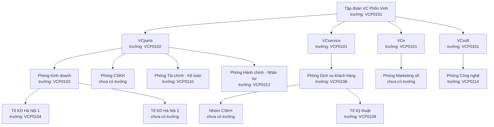

# VC Home — Kế hoạch và kịch bản UAT

Phiên bản 0.2 · 08/10/2026 · Trạng thái: Đã chốt nội dung (chờ đội phát triển rà)

## Tóm tắt

- **Tài liệu nói gì:** kế hoạch UAT (kiểm thử chấp nhận: người dùng thật thử trên staging trước khi lên production) cho VC Home GĐ A–D và phần đầu GĐ E: phạm vi, môi trường, người thử, điều kiện bắt đầu và kết thúc, cách ghi lỗi, bộ dữ liệu thử, 59 ca VH-UAT-01 đến VH-UAT-59, ma trận truy vết về 12 quy trình.
- **Số ca theo giai đoạn:** A 15 ca, B 14 ca, C 15 ca, D 11 ca, E rút gọn 4 ca.
- **Bộ dữ liệu giả:** Tập đoàn VC Phồn Vinh với 4 division (VCparts, VCservice, VCe, VCsoft), 16 đơn vị, 15 nhân viên VCP0101–VCP0115 (một người tạo trong lúc thử), 30 hồ sơ số đông VCP0901–VCP0930, 13 luật thử LT-01 đến LT-13, 5 app thử. Mọi tên, email, mã đều giả.
- **Ca phụ thuộc thời gian** (00:00 ngày hiệu lực, 7 ngày, 14 ngày, hết hạn) chạy bằng "đồng hồ thử": dev chạy job hẹn giờ với giờ giả lập, ghi cả giờ thật và giờ giả lập vào biên bản.
- **Điều kiện kết thúc:** 100% ca có yêu cầu mức M đạt; không còn lỗi Nghiêm trọng hay Cao.
- **Việc cần chuẩn bị** (quyết định ở [12](12-cau-hoi-rui-ro.md) mục 6): admin Google tạo 6 tài khoản thử (mỗi vai trò chính một tài khoản); dev dựng app giả lập nhận sự kiện và đồng hồ thử (đã có giờ ở [10](10-ke-hoach-trien-khai.md) R2); bảng C0/C1 dùng bản ở [05](05-du-lieu.md) mục 6.
- **Người duyệt xem kỹ:** bộ dữ liệu (mục 6); ca nghỉ việc VH-UAT-33; ca luật trên 20 người VH-UAT-36; ca không tự duyệt VH-UAT-47, VH-UAT-48; ca rà soát VH-UAT-53; mục 13 (6 đề xuất, trong đó lệch giai đoạn của VH-ACC-04 và VH-ACC-05).
- **Liên hệ với thiết kế SSO:** 20 ca UAT-SSO ở `ky-thuat/thiet-ke-sso-keycloak.md` mục 9.2 được phủ lại trong các ca GĐ A và B (bảng đối chiếu ở mục 12).

## Mục lục

- [1. Phạm vi](#1-phạm-vi)
- [2. Môi trường thử](#2-môi-trường-thử)
- [3. Vai trò người thử](#3-vai-trò-người-thử)
- [4. Điều kiện bắt đầu và kết thúc](#4-điều-kiện-bắt-đầu-và-kết-thúc)
- [5. Ghi lỗi và mức độ](#5-ghi-lỗi-và-mức-độ)
- [6. Bộ dữ liệu thử](#6-bộ-dữ-liệu-thử)
- [7. Ca UAT giai đoạn A](#7-ca-uat-giai-đoạn-a)
- [8. Ca UAT giai đoạn B](#8-ca-uat-giai-đoạn-b)
- [9. Ca UAT giai đoạn C](#9-ca-uat-giai-đoạn-c)
- [10. Ca UAT giai đoạn D](#10-ca-uat-giai-đoạn-d)
- [11. Ca UAT giai đoạn E (rút gọn)](#11-ca-uat-giai-đoạn-e-rút-gọn)
- [12. Ma trận truy vết rút gọn](#12-ma-trận-truy-vết-rút-gọn)
- [13. Đề xuất bổ sung (chưa cấp mã)](#13-đề-xuất-bổ-sung-chưa-cấp-mã)
- [Lịch sử cập nhật](#lịch-sử-cập-nhật)

---

## 1. Phạm vi

| Trong phạm vi | Ngoài phạm vi |
|---|---|
| **GĐ A (R1):** VC ID, VC Home bản tĩnh, `vc-provisioner`, đăng nhập một lần ở VClinks và VCwiki, đăng xuất chung, khoá khẩn cấp, đường khẩn cấp, quay lui bằng cờ | Đồng bộ tự động từ phần mềm nhân sự (VH-IMP-04) |
| **GĐ B (R2):** VC People, thẻ hồ sơ, danh bạ, che theo người xem, nhập Excel, đối chiếu Google, cây tổ chức, API danh bạ, token máy, nhật ký | Cấp tài khoản theo chuẩn SCIM (VH-INT-08, mức W) |
| **GĐ C (R3):** luật cấp quyền, vào làm, chuyển vị trí, kiêm nhiệm, nghỉ việc, đổi cơ cấu, sự kiện gửi app, kéo sự kiện, mặc định chặn, cấp khẩn cấp, tra cứu | Kiểm thử tải, hiệu năng, sẵn sàng (theo 08, làm riêng) |
| **GĐ D (R4):** xin và duyệt, uỷ quyền, nhắc và tự huỷ, hạn và gia hạn, rà soát quý, nghỉ dài ngày, thông báo, phiên của tôi | Kiểm thử xâm nhập (làm riêng, do đơn vị ngoài) |
| **GĐ E rút gọn (R5):** đưa VCsale vào theo hợp đồng, luật VCsale, số việc chờ trên ô app (nếu làm) | Quy trình bàn giao chi tiết bên trong VClinks (thuộc UAT của VClinks, phiên M1b-11); ở đây chỉ thử VClinks nhận sự kiện và mở bàn giao |
| Hồi quy: mỗi đợt chạy lại các ca của giai đoạn trước có đánh dấu ★ ở mục 12 | VCgarage, VC AI, VCe, VCinvoice |

**Cách chạy theo đợt:** mỗi bản phát hành R1–R5 là một đợt UAT riêng, ngay trước ngày đích của giai đoạn đó (README mục 4).

## 2. Môi trường thử

| Thành phần | Địa chỉ hoặc cách dựng | Ghi chú |
|---|---|---|
| VC ID staging | `https://id-staging.tramaphutung.com`, realm `vc` | Máy 129. Khi chạy VH-UAT-06 đặt tạm thời hạn phiên ngắn, chạy xong trả lại 12 giờ / 7 ngày |
| VC Home staging | Bản staging trên máy 129 (địa chỉ chốt ở 10) | SPA; từ GĐ B có VC Home API và MongoDB staging riêng |
| VClinks, VCwiki staging | Bản chạy thử trên máy 129, đã bật SSO | `AUTH_PROVIDER=oidc`, `AUTH_SSO=on`; từ GĐ C bật `OIDC_REQUIRE_APP_GROUP=1` |
| `vc-provisioner` | Chạy trên staging, đọc Google thật | Chỉ được khoá tài khoản thử (danh sách cho phép); `--dry-run` tắt trong đợt UAT |
| App giả lập nhận sự kiện | Endpoint nhỏ ghi lại mọi sự kiện nhận được; cấu hình trả 200, 500 hoặc chậm theo ý người thử | Khoá app `vctest` trong danh mục staging |
| VCsale staging | Dùng cho GĐ E rút gọn | Có client OIDC riêng trên VC ID staging |
| Google Workspace | Tài khoản thử trên 2 domain do admin Google tạo, bật 2 bước; một Gmail cá nhân giả | Khoá rồi xoá sau đợt UAT cuối |
| Đồng hồ thử | Lệnh chạy job hẹn giờ của VC Home API với giờ giả lập (ví dụ "chạy như 00:00 ngày N+1") | Dev trực chạy; ghi giờ thật và giờ giả lập vào biên bản |
| Bằng chứng | Màn Nhật ký (VH-MH-19), nhật ký sự kiện của Keycloak, log app, nhật ký app giả lập | Chụp màn hình hoặc xuất dòng nhật ký kèm mã ca |

Dữ liệu trên staging là dữ liệu giả hoàn toàn. Không chép dữ liệu nhân sự thật lên staging (VH-BR-19).

**Ngày N:** ngày đầu tiên của đợt UAT. "N+1" là ngày sau đó, theo đồng hồ thử.

## 3. Vai trò người thử

| Vai trò thử | Ai thật đảm nhận (đề xuất) | Dùng tài khoản thử | Làm gì |
|---|---|---|---|
| Điều phối UAT | BA | — | Lịch, phân ca, biên bản, chốt kết quả |
| HC-NS | Nhân sự phụ trách hồ sơ | Cao Thị Thảo (VCP0113) | Hồ sơ, nhập Excel, vòng đời, cơ cấu |
| Quản trị hệ thống | IT phụ trách VC Home, VC ID | Đinh Công Sơn (VCP0114) | Khoá, luật, cấp khẩn cấp, rà soát, đưa app vào |
| Quản lý, trưởng đơn vị | Một trưởng phòng kinh doanh thật | Nguyễn Văn Đức, Hoàng Văn Nam, Ngô Thanh Trinh, Lê Thu Hà, Trần Minh Quang | Duyệt, rà soát, xem đội, bàn giao |
| Nhân viên | Một NVKD và một CSKH thật | Phạm Thị Hoa, Đỗ Thị Lan, Vũ Đình Khoa, Đặng Văn Tú, Trịnh Gia Phúc, Mai Khánh Linh, Mạc Văn Long | Đăng nhập, xem hồ sơ, xin quyền |
| Chủ app VClinks, VCsale | dev002 hoặc người được chỉ định | Lê Thu Hà (VCP0102) | Duyệt bước 2, duyệt luật của app |
| Chủ app VCwiki | Admin VCwiki | Ngô Thanh Trinh (VCP0108) | Duyệt luật VCwiki |
| Kiểm soát | Kiểm soát nội bộ | Lý Hải Yến (VCP0110) | Xem nhật ký, báo cáo, tiến độ rà soát |
| Admin Google | Chủ dự án | Tài khoản admin thật | Tạo, khoá, mở tài khoản thử |
| Dev trực | Dev VC Home | — | Đồng hồ thử, app giả lập, đọc log, sửa lỗi |

Một người thật có thể đóng nhiều tài khoản thử. Mỗi tài khoản dùng một hồ sơ trình duyệt riêng, tránh lẫn phiên.

## 4. Điều kiện bắt đầu và kết thúc

**Bắt đầu một đợt khi:**

1. Bản phát hành của giai đoạn đã lên staging; test tự động xanh.
2. Bộ dữ liệu mục 6 đã nạp và đối chiếu đủ.
3. Tài khoản Google thử đăng nhập được, có 2 bước.
4. App giả lập và đồng hồ thử chạy được.
5. Người thử đã được hướng dẫn 30 phút; có mẫu biên bản.
6. Các ca hồi quy (★) của giai đoạn trước đã đạt.

**Kết thúc một đợt khi:**

1. 100% ca có yêu cầu mức M đạt; ít nhất 90% ca chỉ có yêu cầu mức S, C đạt, phần còn lại có kế hoạch.
2. Không còn lỗi Nghiêm trọng, Cao; lỗi Trung bình có hạn sửa và người chịu trách nhiệm; lỗi Thấp ghi tồn.
3. Ca hỏng đã chạy lại sau khi sửa và đạt.
4. Biên bản ký bởi chủ dự án, HC-NS, QTHT và chủ app có liên quan; lưu ở `vc-platform/docs/uat/<yyyy-mm-dd>/`.
5. Đợt cuối: tài khoản và dữ liệu thử đã khoá hoặc xoá.

**Tạm dừng đợt khi:** có lỗi Nghiêm trọng chặn nhiều ca, hoặc staging không ổn định quá 2 giờ.

**Lịch theo đồng hồ thử** (N là ngày đầu của từng đợt; đợt C và đợt D có N riêng):

| Đợt | Mốc giả lập | Việc chuẩn bị hoặc ca chạy |
|---|---|---|
| C | Ngày N | Tạo hồ sơ Long (ngày vào N+1); nhập chuyển vị trí Lan (N+1); đặt ngày nghỉ Khoa (N+1); kết thúc kiêm nhiệm của Hoa (N+1, chạy sau VH-UAT-32 bước 1–2); đổi tên, gộp đơn vị (N+1) |
| C | 00:00 N+1 | VH-UAT-30, 31, 32, 33, 38 |
| C | 00:00 N+2 | VH-UAT-34 |
| C | 00:00 N+4 | VH-UAT-31, 32 (hết chuyển tiếp 3 ngày của VClinks) |
| D | Ngày N | Linh ghi kỳ nghỉ từ N+1; Lan gửi yêu cầu (VH-UAT-50); Đức đặt uỷ quyền (VH-UAT-49) |
| D | 00:00 N+1 | VH-UAT-54 |
| D | 00:00 N+2 | VH-UAT-51; nhắc lần 1 của VH-UAT-50 |
| D | N+4 | VH-UAT-49 bước 4 |
| D | N+5, N+7 | VH-UAT-50 (nhắc lần 2, tự huỷ) |
| D | N+6 | VH-UAT-52 (nhắc gia hạn, trước hạn 14 ngày) |
| D | Ngày mở đợt rà soát + 14 | VH-UAT-53 |

## 5. Ghi lỗi và mức độ

| Mức | Nghĩa | Ví dụ | Xử lý |
|---|---|---|---|
| Nghiêm trọng | Lộ quyền hoặc dữ liệu; người không được vào lại vào được; mất đăng nhập toàn bộ; nhật ký sửa được | Người đã nghỉ còn mở được VClinks; HC-NS cấp được quyền | Dừng các ca liên quan, sửa trước khi chạy tiếp |
| Cao | Sai quyền của một nhóm; quy trình chính không chạy; không có cách vòng | Luật không cấp quyền cho người mới; sự kiện không gửi | Sửa trong đợt |
| Trung bình | Sai nhưng có cách vòng; thời gian vượt ngưỡng ít | Ô "Còn N ngày" sai số ngày; nhắc gửi trễ vài giờ | Sửa trước khi lên production, hoặc có kế hoạch được duyệt |
| Thấp | Chữ, giao diện, câu thông báo | Lỗi chính tả, lệch lề | Ghi tồn |

**Cách ghi một lỗi:**
- Tạo issue trên GitLab, nhãn `vc-home-uat` và nhãn mức độ; tiêu đề bắt đầu bằng mã ca (ví dụ "VH-UAT-33: VClinks không mở bàn giao").
- Nội dung: tài khoản thử, các bước, kết quả thật và kết quả mong đợi, giờ thật và giờ giả lập, ảnh màn hình, mã lỗi hoặc dòng nhật ký.
- **Không** dán token, cookie, client secret hay mật khẩu vào issue.

**Kết quả mỗi ca:** Đạt / Không đạt / Bị chặn (do lỗi khác) / Không chạy (ghi lý do).

## 6. Bộ dữ liệu thử

Mọi tên người, email, mã nhân viên, mã đơn vị ở đây đều **giả**. Trùng với người thật là ngẫu nhiên. Tên division dùng tên thật của tập đoàn để người thử dễ hình dung.

### 6.1 Cây tổ chức

| Mã đơn vị | Tên | Loại | Đơn vị cha | Trưởng đơn vị |
|---|---|---|---|---|
| VCPV | Tập đoàn VC Phồn Vinh | Tập đoàn | — | VCP0101 |
| VCPARTS | VCparts | Division | VCPV | VCP0102 |
| VCSERVICE | VCservice | Division | VCPV | VCP0101 (vị trí ở đơn vị cha trực tiếp, hợp lệ theo VH-BR-06) |
| VCE | VCe | Division | VCPV | VCP0101 |
| VCSOFT | VCsoft | Division | VCPV | VCP0101 |
| VCPARTS-KD | Phòng Kinh doanh | Phòng | VCPARTS | VCP0103 |
| VCPARTS-KD-HN1 | Tổ KD Hà Nội 1 | Tổ | VCPARTS-KD | VCP0104 |
| VCPARTS-KD-HN2 | Tổ KD Hà Nội 2 | Tổ | VCPARTS-KD | — |
| VCPARTS-CSKH | Phòng CSKH | Phòng | VCPARTS | — |
| VCPARTS-TCKT | Phòng Tài chính – Kế toán | Phòng | VCPARTS | VCP0110 |
| VCPARTS-HCNS | Phòng Hành chính – Nhân sự | Phòng | VCPARTS | VCP0113 |
| VCSERVICE-DVKH | Phòng Dịch vụ khách hàng | Phòng | VCSERVICE | VCP0108 |
| VCSERVICE-CSKH | Nhóm CSKH | Nhóm | VCSERVICE-DVKH | — |
| VCSERVICE-KT | Tổ Kỹ thuật | Tổ | VCSERVICE-DVKH | VCP0109 |
| VCE-MKT | Phòng Marketing số | Phòng | VCE | — |
| VCSOFT-CN | Phòng Công nghệ | Phòng | VCSOFT | VCP0114 |

### 6.2 Danh mục

| Danh mục | Giá trị thử |
|---|---|
| Chức năng | Điều hành, Bán hàng, CSKH, Sale admin, Kế toán, Kỹ thuật, Marketing, Nhân sự, IT |
| Loại nhân viên | Chính thức, Thử việc, Cộng tác viên, Thực tập |
| Pháp nhân | PN-A (cho VCparts), PN-B (cho VCservice), PN-C (cho VCe, VCsoft) |
| Nơi làm việc | Hà Nội, TP. Hồ Chí Minh |

### 6.3 Nhân viên

| Mã | Họ tên | Email | Vị trí chính: đơn vị · chức danh · chức năng | Quản lý trực tiếp | Loại | Dùng cho |
|---|---|---|---|---|---|---|
| VCP0101 | Trần Minh Quang | quang.tm@vcprosperous.com | VCPV · Tổng giám đốc · Điều hành | — | Chính thức | Người đứng đầu; trưởng VCPV, VCSERVICE, VCE, VCSOFT; chủ app VC Home |
| VCP0102 | Lê Thu Hà | ha.lt@vcpart.vn | VCPARTS · Giám đốc division · Điều hành | VCP0101 | Chính thức | Trưởng VCPARTS; chủ app VClinks và VCsale; quản lý mới của Lan |
| VCP0103 | Nguyễn Văn Đức | duc.nv@vcpart.vn | VCPARTS-KD · Trưởng phòng kinh doanh · Bán hàng | VCP0102 | Chính thức | Trưởng phòng KD; uỷ quyền duyệt cho Nam (VH-UAT-49) |
| VCP0104 | Hoàng Văn Nam | nam.hv@vcpart.vn | VCPARTS-KD-HN1 · Tổ trưởng kinh doanh · Bán hàng | VCP0103 | Chính thức | Trưởng Tổ HN1; GS trong VClinks, làm bàn giao |
| VCP0105 | Phạm Thị Hoa | hoa.pt@vcpart.vn | VCPARTS-KD-HN1 · Nhân viên kinh doanh · Bán hàng | VCP0104 | Chính thức | **Kiêm nhiệm:** Nhân viên CSKH tại VCSERVICE-CSKH, quản lý VCP0108, từ N−30 |
| VCP0106 | Đỗ Thị Lan | lan.dt@vcpart.vn | VCPARTS-KD-HN1 · Nhân viên kinh doanh · Bán hàng | VCP0104 | Chính thức | **Chuyển vị trí** N+1 sang VCPARTS-CSKH · Nhân viên CSKH · CSKH, quản lý VCP0102; phụ trách 3 khách thử trên VClinks |
| VCP0107 | Vũ Đình Khoa | khoa.vd@vcpart.vn | VCPARTS-KD-HN1 · Nhân viên kinh doanh · Bán hàng | VCP0104 | Chính thức | **Nghỉ việc** N+1; phụ trách 5 khách thử, giữ 1 nick Zalo thử trên VClinks |
| VCP0108 | Ngô Thanh Trinh | trinh.nt@vcprosperous.com | VCSERVICE-DVKH · Trưởng phòng dịch vụ khách hàng · CSKH | VCP0101 | Chính thức | Trưởng DVKH; chủ app VCwiki |
| VCP0109 | Đặng Văn Tú | tu.dv@vcprosperous.com | VCSERVICE-KT · Tổ trưởng kỹ thuật · Kỹ thuật | VCP0108 | Chính thức | Trưởng Tổ Kỹ thuật (tự rà soát phải chuyển lên) |
| VCP0110 | Lý Hải Yến | yen.lh@vcpart.vn | VCPARTS-TCKT · Kế toán trưởng · Kế toán | VCP0102 | Chính thức | Trưởng TCKT; vai trò kiểm soát |
| VCP0111 | Trịnh Gia Phúc | phuc.tg@vcpart.vn | VCPARTS-KD · Nhân viên sale admin · Sale admin | VCP0103 | Chính thức | Ca hết hạn, xin quyền, cấp khẩn cấp |
| VCP0112 | Mai Khánh Linh | linh.mk@vcprosperous.com | VCE-MKT · Chuyên viên marketing · Marketing | VCP0101 | Chính thức | **Nghỉ dài ngày** từ N+1 tới N+180, không khoá đăng nhập |
| VCP0113 | Cao Thị Thảo | thao.ct@vcprosperous.com | VCPARTS-HCNS · Trưởng phòng hành chính nhân sự · Nhân sự | VCP0102 | Chính thức | HC-NS phạm vi toàn tập đoàn |
| VCP0114 | Đinh Công Sơn | son.dc@vcprosperous.com | VCSOFT-CN · Trưởng phòng công nghệ · IT | VCP0101 | Chính thức | Quản trị hệ thống |
| VCP0115 | Mạc Văn Long | long.mv@vcpart.vn | VCPARTS-KD-HN1 · Nhân viên kinh doanh · Bán hàng | VCP0104 | Thử việc | **Vào làm** N+1; HC-NS tạo hồ sơ trong VH-UAT-30 |

**Tài khoản và hồ sơ phụ:**

| Tài khoản / hồ sơ | Dùng cho |
|---|---|
| `ctv.moi@vcpart.vn` | Tài khoản Google công ty **không** có hồ sơ (VH-UAT-17, 25) |
| `vcpv.uat.canhan@gmail.com` | Gmail cá nhân giả (VH-UAT-03) |
| `thu.khoa@vcprosperous.com` | Tài khoản Google công ty dùng thử khoá ở GĐ A (VH-UAT-09, 10, 25); không có hồ sơ nhân viên |
| VCP0901–VCP0930 | 30 hồ sơ sinh bằng script ở Tổ KD Hà Nội 2; Bán hàng; chính thức; quản lý VCP0103; không có tài khoản Google. Dùng để vượt ngưỡng 20 người (VH-UAT-36, 57) và gộp đơn vị (VH-UAT-38) |
| VCP0930 có thêm `uat.0930@vcpart.vn` | Tài khoản Google cho ca khoá Google trước ngày nghỉ (VH-UAT-34) |

### 6.4 App và vai trò app

| App (khoá) | Trạng thái lúc bắt đầu | Vai trò (★ = nhạy cảm) | Chuyển tiếp | Chủ app |
|---|---|---|---|---|
| VC Home (`vchome`) | Đang chạy | `hcns`, `qtht`★, `kiem_soat`★, `bgd` | 0 ngày | VCP0101 |
| VClinks (`vclinks`) | Đang chạy | `nvkd`, `cskh`, `sale_admin`, `ke_toan`, `marketing`, `giam_sat_bh`, `giam_doc_bh`★, `quan_sat`★, `admin`★ | 3 ngày | VCP0102 |
| VCwiki (`vcwiki`) | Đang chạy | `thanh_vien`, `hoc_vien`, `bien_tap`, `admin`★ | 0 ngày | VCP0108 |
| VCsale (`vcsale`) | Sắp có (tới VH-UAT-56) | `nv_ban_hang`, `ke_toan`, `admin`★ | 1 ngày | VCP0102 |
| App giả lập (`vctest`) | Đang chạy, chỉ trên staging | `xem` | 0 ngày | VCP0114 |

Khoá vai trò VClinks lấy theo code hiện có (`packages/shared/src/org.ts`). VCwiki hiện chỉ có `admin`, `member`; `thanh_vien` ánh xạ sang `member`, `hoc_vien` và `bien_tap` là vai trò thử, chốt khi đưa VCwiki vào theo VH-QT-11.

### 6.5 Luật thử

| Mã | Điều kiện | → Vai trò | Bật lúc |
|---|---|---|---|
| LT-01 | Đơn vị VCPV gồm đơn vị con; loại Chính thức hoặc Thử việc | `vcwiki:thanh_vien` | Đầu đợt C |
| LT-02 | Chức năng Bán hàng; division VCparts | `vclinks:nvkd` | Đầu đợt C |
| LT-03 | Chức năng Bán hàng; division VCparts | `vcsale:nv_ban_hang` | Trong VH-UAT-57 |
| LT-04 | Chức năng CSKH | `vclinks:cskh` | Đầu đợt C |
| LT-05 | Chức năng Sale admin; division VCparts | `vclinks:sale_admin` | Đầu đợt C |
| LT-06 | Chức năng Kế toán | `vclinks:ke_toan` | Đầu đợt C |
| LT-07 | Là trưởng đơn vị; đơn vị Phòng Kinh doanh VCparts gồm đơn vị con | `vclinks:giam_sat_bh` | Đầu đợt C |
| LT-08 | Chức năng Nhân sự | `vchome:hcns` | Đợt B nạp sẵn như quyền; đợt C chuyển thành luật |
| LT-09 | Chức năng Marketing; division VCe | `vclinks:marketing` | Đầu đợt C |
| LT-10 | Chức năng Kỹ thuật; division VCservice | `vcwiki:bien_tap` | Tạo trong VH-UAT-35 |
| LT-11 | Chức năng Bán hàng; division VCparts | `vcwiki:hoc_vien` | Tạo trong VH-UAT-36 |
| LT-12 | Chức năng Điều hành | `vchome:bgd` | Đầu đợt C |
| LT-13 | Là trưởng đơn vị; Phòng Kinh doanh VCparts, không gồm đơn vị con | `vclinks:giam_doc_bh`★ | Soạn trong VH-UAT-35, bị từ chối, không bật |

**Quyền mặc định sau khi bật luật đầu đợt C (rút gọn):** Đức và Nam có `vclinks:nvkd`, `vclinks:giam_sat_bh`; Hoa có `vclinks:nvkd` (Tổ HN1) và `vclinks:cskh` (Nhóm CSKH VCservice); Lan, Khoa và 30 hồ sơ số đông có `vclinks:nvkd`; Trinh có `vclinks:cskh`; Phúc có `vclinks:sale_admin`; Yến có `vclinks:ke_toan`; Linh có `vclinks:marketing`; Quang, Hà có `vchome:bgd`; Thảo có `vchome:hcns`; mọi người có `vcwiki:thanh_vien`. Quang, Hà, Tú, Sơn **không** có vai trò VClinks từ luật.

### 6.6 Quyền ngoại lệ nạp sẵn

| Người | Quyền | Hạn | Dùng ở ca |
|---|---|---|---|
| VCP0105 Hoa | `vcwiki:bien_tap` | N+20 | VH-UAT-52 (gia hạn), 53 (giữ) |
| VCP0107 Khoa | `vcwiki:bien_tap` | N+60 | VH-UAT-33 (gỡ khi nghỉ) |
| VCP0109 Tú | `vclinks:cskh` | N+60 | VH-UAT-53 (tự gỡ) |
| VCP0111 Phúc | `vclinks:ke_toan` | N+2 | VH-UAT-51 (hết hạn) |
| VCP0110 Yến | `vchome:kiem_soat`★ | N+365 | VH-UAT-20, 29, 53 |
| VCP0114 Sơn | `vchome:qtht`★ | N+365 | Mọi ca của QTHT; VH-UAT-53 |

Các quyền trên nạp khi dựng staging, nhật ký ghi "nạp dữ liệu UAT".

## 7. Ca UAT giai đoạn A

| Mã | Tình huống | Điều kiện trước | Các bước | Kết quả mong đợi | Yêu cầu / Quy tắc | GĐ |
|---|---|---|---|---|---|---|
| VH-UAT-01 | Đăng nhập lần đầu bằng email `@vcprosperous.com`, trên máy tính và điện thoại | `quang.tm@vcprosperous.com` chưa đăng nhập lần nào; trình duyệt sạch | 1. Mở VC Home staging trên máy tính 2. Bấm "Đăng nhập bằng tài khoản công ty" 3. Chọn tài khoản, xác thực 2 bước 4. Lặp lại trên điện thoại | Không thấy trang đăng nhập của Keycloak; về trang chủ có ô VClinks, VCwiki, ô VCsale mờ "Sắp có", ô liên kết ngoài; trên điện thoại lưới 1 cột; nhật ký có `login` | VH-AUT-01, VH-HOM-01, VH-HOM-06, VH-MH-01, VH-MH-02, VH-BR-02, VH-BR-21 | A |
| VH-UAT-02 | Đăng nhập bằng email `@vcpart.vn`; tên đổi trên Google | `hoa.pt@vcpart.vn` chưa đăng nhập | 1. Như VH-UAT-01 bước 1–3 2. Admin Google đổi tên hiển thị của Hoa 3. Hoa đăng xuất, đăng nhập lại | (1) Như VH-UAT-01; dev xem token thấy `hd` = `vcpart.vn`; (3) tên mới hiện ở VC Home, VClinks, VCwiki (GĐ A; từ GĐ B xem mục 13 đề xuất 3); đổi lại tên cũ sau ca | VH-AUT-01, VH-BR-02 | A |
| VH-UAT-03 | Gmail cá nhân bị chặn | Gmail `vcpv.uat.canhan@gmail.com` đặt tên giống một nhân viên | 1. Từ VC Home chọn Gmail cá nhân 2. Mở thẳng link VClinks, chọn Gmail cá nhân | Trang tiếng Việt "Tài khoản này không thuộc công ty…", nút "Chọn tài khoản khác"; không tạo user trên VC ID; nhật ký `login_denied` lý do `outside_domain` | VH-AUT-02, VH-ADM-01, VH-BR-02 | A |
| VH-UAT-04 | Đăng nhập một lần giữa các app | Hoa đã đăng nhập VC Home | 1. Bấm ô VClinks 2. Bấm nút 9 chấm, chọn VCwiki 3. Từ VCwiki chọn "VC Home" | Vào thẳng `/conversations` của VClinks và trang chủ VCwiki, không chọn tài khoản lần nào; thanh chuyển app chỉ có app Hoa được dùng | VH-AUT-03, VH-HOM-05, VH-MH-21 | A |
| VH-UAT-05 | Mở link sâu | Một link hội thoại VClinks, một link bài VCwiki | 1. Chưa có phiên: mở link VClinks 2. Đã có phiên: mở link VCwiki | (1) Chọn tài khoản Google một lần rồi vào đúng hội thoại; (2) vào thẳng đúng bài, không hỏi gì | VH-AUT-03 | A |
| VH-UAT-06 | Thời hạn phiên | Staging đặt tạm: hết phiên sau 10 phút không dùng, tối đa 30 phút | 1. Đăng nhập, tải lại VC Home 2. Để yên 11 phút, bấm ô app 3. Dùng liên tục quá 30 phút | (1) Không phải đăng nhập lại; (2) và (3) phải chọn tài khoản lại một lần; trả cấu hình về 12 giờ / 7 ngày sau ca | VH-AUT-05 | A |
| VH-UAT-07 | Đăng xuất từ một app là ra mọi app trong ≤ 10 giây | Hoa mở VC Home, VClinks, VCwiki ở 3 tab | 1. Bấm Đăng xuất trong VClinks, xác nhận 2. Bấm giờ; tải lại tab VCwiki, VC Home | Trang xác nhận "Đăng xuất khỏi mọi ứng dụng VC Phồn Vinh?"; trong ≤ 10 giây VCwiki và VC Home mất phiên; về trang "Đã đăng xuất" | VH-AUT-04, VH-INT-04 | A |
| VH-UAT-08 | Đăng xuất từ VC Home | Như VH-UAT-07 | Bấm Đăng xuất ở VC Home | Không có trang xác nhận; mọi app mất phiên trong ≤ 10 giây | VH-AUT-04, VH-INT-04 | A |
| VH-UAT-09 | Khoá khẩn cấp trong ≤ 1 phút | `thu.khoa@vcprosperous.com` đang mở 3 app | 1. Sơn khoá tài khoản, lý do "UAT" 2. Bấm giờ 3. Người bị khoá thử đăng nhập lại 4. Sơn mở khoá | (2) Mọi app mất phiên ≤ 1 phút; (3) thấy "Tài khoản đã bị khoá. Liên hệ quản trị viên."; nhật ký có người khoá, giờ, lý do; (4) đăng nhập lại được, quyền app không đổi | VH-AUT-06, VH-BR-18 | A |
| VH-UAT-10 | Khoá trên Google thì VC ID khoá trong ≤ 65 phút | Như VH-UAT-09, tài khoản đang mở app | 1. Admin Google tạm ngưng tài khoản 2. Chờ lượt chạy `vc-provisioner` (hoặc chạy tay) 3. Admin Google mở lại tài khoản; chạy lại | (2) ≤ 65 phút mọi app mất phiên, VC ID khoá, nhóm `vc-id-admin` nhận thông báo; (3) VC ID **vẫn khoá**, chỉ có thông báo cho admin | VH-AUT-07, VH-ADM-04, VH-BR-14 | A |
| VH-UAT-11 | Đồng bộ Google dừng khi danh sách bất thường | Dev giả lập Google trả ít hơn 50% số tài khoản lần trước | Chạy `vc-provisioner` | Dừng, không khoá ai; cảnh báo gửi admin | VH-AUT-07, VH-ADM-04 | A |
| VH-UAT-12 | Gắn đúng tài khoản cũ trong app; xung đột định danh | Khoa có user cũ trong VClinks (vai trò, khách, phiếu) và VCwiki (kho, lịch sử học); một user VCwiki thử đã gắn `sub` khác | 1. Khoa đăng nhập SSO lần đầu vào VClinks, rồi VCwiki 2. Đăng nhập bằng tài khoản có email trùng user đã gắn `sub` khác | (1) Giữ nguyên vai trò, khách, phiếu, kho, lịch sử học; nhật ký `user.idp_linked`; (2) bị từ chối `identity_conflict`; admin app được báo | VH-AUT-01, VH-AUT-03, VH-BR-01 | A |
| VH-UAT-13 | VC ID ngừng chạy | Hoa đang có phiên ở VClinks, VCwiki; Lan chưa có phiên | 1. Dev tắt Keycloak staging 2. Hoa tiếp tục dùng VClinks 3. Lan mở VClinks 4. QTHT bật `AUTH_PASSWORD_LOGIN=admin` ở VCwiki; admin VCwiki đăng nhập bằng mật khẩu | (2) Dùng bình thường; (3) câu dễ hiểu theo mã `idp_unreachable`, có nút thử lại; (4) admin vào được, người thường không; cảnh báo vận hành gửi trong 2 phút | VH-AUT-09, VH-ADM-04 | A |
| VH-UAT-14 | Quay lui bằng cờ | Hai app đang dùng SSO | 1. VClinks đặt `AUTH_PROVIDER=google`; VCwiki đặt `AUTH_PASSWORD_LOGIN=on` 2. Đăng nhập theo cách cũ 3. Đặt lại `oidc` và `admin` | (2) Đăng nhập kiểu cũ được, không mất dữ liệu; (3) SSO chạy lại, không ai bị gắn sai tài khoản | VH-AUT-01, VH-AUT-09 | A |
| VH-UAT-15 | Token máy cũ không bị ảnh hưởng (hồi quy) | Token MCP VClinks (`vcz_`), VCwiki (`vcmcp_`), extension, agent máy Zalo thử | Chạy các luồng dùng token máy sau khi bật SSO | Chạy bình thường như trước khi bật SSO | — (thiết kế SSO mục 1.3) | A |

## 8. Ca UAT giai đoạn B

| Mã | Tình huống | Điều kiện trước | Các bước | Kết quả mong đợi | Yêu cầu / Quy tắc | GĐ |
|---|---|---|---|---|---|---|
| VH-UAT-16 | Gắn hồ sơ theo email ở lần đăng nhập đầu | Hồ sơ Tú đã nhập (VH-UAT-24), chưa gắn tài khoản | 1. Tú đăng nhập VC Home 2. Thảo xem hồ sơ Tú 3. Tú đăng xuất, đăng nhập lại | (1) Trang chủ có thẻ hồ sơ của Tú; (2) hồ sơ có lần đăng nhập cuối; nhật ký ghi gắn tài khoản; (3) không gắn lại lần nữa | VH-AUT-08, VH-BR-01 | B |
| VH-UAT-17 | Tài khoản công ty không có hồ sơ | `ctv.moi@vcpart.vn` có trên Google, không có hồ sơ | 1. Đăng nhập VC Home 2. Mở thẳng VClinks | (1) Trang chủ trống, dòng "Tài khoản chưa có hồ sơ nhân sự, liên hệ HC-NS", không có ô app; (2) VClinks từ chối theo cấu hình chuyển tiếp đã chốt ở Q-07 | VH-AUT-08, VH-BR-02, VH-BR-21 | B |
| VH-UAT-18 | Thẻ hồ sơ đúng, có kiêm nhiệm | Hồ sơ Hoa có kiêm nhiệm | Hoa mở trang chủ, rồi Hồ sơ của tôi | Thẻ: ảnh, "Phạm Thị Hoa", "Nhân viên kinh doanh", "Tổ KD Hà Nội 1 · VCparts", quản lý "Hoàng Văn Nam". Hồ sơ của tôi có thêm dòng kiêm nhiệm "Nhân viên CSKH · Nhóm CSKH · VCservice". Không có trường CCCD, ngày sinh, lương, địa chỉ nhà | VH-HOM-02, VH-NSU-01, VH-NSU-02, VH-MH-03, VH-BR-04, VH-BR-19 | B |
| VH-UAT-19 | Đề nghị sửa hồ sơ và lịch sử | Hoa đã đăng nhập | 1. Hoa đề nghị sửa SĐT công việc 2. Thảo duyệt đề nghị 3. Xem lịch sử hồ sơ | Hoa không sửa thẳng được trường nào; sau khi Thảo duyệt, hồ sơ đổi; lịch sử có giá trị trước, sau, người sửa, giờ | VH-NSU-05, VH-NSU-06, VH-BR-18 | B |
| VH-UAT-20 | Danh bạ che theo người xem | Hồ sơ Khoa đầy đủ; bảng C0/C1 từng trường đã chốt ở 05 | 1. Tú (khác cây) tìm "Khoa" trong danh bạ 2. Nam (quản lý Khoa) xem Khoa 3. Thảo (HC-NS) xem Khoa 4. Yến (kiểm soát) xem nhật ký | (1) Chỉ thấy thông tin C0 (họ tên, ảnh, chức danh, đơn vị, email công ty…); (2), (3) thấy thêm C1 (quản lý, loại nhân viên, ngày vào, lịch sử vị trí); (4) có 2 dòng "xem hồ sơ C1" của Nam và Thảo, không có dòng của Tú | VH-NSU-07, VH-NSU-08, VH-MH-06, VH-BR-18, VH-BR-23 | B |
| VH-UAT-21 | Quản lý chỉ xem cây dưới quyền; quản lý vị trí kiêm nhiệm chỉ xem | Cây mục 6.1; Hoa kiêm nhiệm ở Nhóm CSKH VCservice, quản lý kiêm nhiệm là Trinh | 1. Đức mở Đội của tôi 2. Đức mở thẳng URL hồ sơ Yến và Hà 3. Nam mở Đội của tôi 4. Trinh mở Đội của tôi, rồi hồ sơ Hoa | (1) Thấy Nam, Hoa, Lan, Khoa, Phúc và 30 người Tổ HN2; (2) chỉ thấy C0; (3) Nam chỉ thấy người Tổ HN1; (4) Hoa không có trong cây quản lý của Trinh, nhưng Trinh xem được hồ sơ C1 của Hoa; yêu cầu quyền của Hoa không bao giờ tới Trinh | VH-MH-09, VH-NSU-03, VH-NSU-08, VH-BR-05, VH-BR-23 | B |
| VH-UAT-22 | HC-NS không cấp được quyền, không khoá khẩn cấp; HC-NS đặt "Tạm khoá" | Thảo có `vchome:hcns`; VCP0930 có tài khoản `uat.0930@vcpart.vn` | 1. Thảo xem menu quản trị và ngăn Tài khoản của màn Nhân sự 2. Thảo gọi thẳng API gán vai trò app (dev hỗ trợ) 3. Sơn thử gán thêm `vchome:qtht` cho Thảo 4. Thảo đặt hồ sơ VCP0930 "Tạm khoá"; VCP0930 thử đăng nhập; Thảo bỏ trạng thái | (1) Không có mục Luật, Tra cứu quyền, Cấp khẩn cấp; ngăn Tài khoản không có nút khoá, mở khoá, gắn lại; (2) bị từ chối 403, nhật ký ghi; (3) bị chặn vì xung đột tách nhiệm HC-NS và QTHT; (4) đăng nhập bị chặn, nhật ký ghi nguồn khoá `hcns`; bỏ trạng thái thì đăng nhập lại được | VH-ADM-03, VH-MH-11, VH-NSU-04, VH-BR-17 | B |
| VH-UAT-23 | QTHT không sửa được hồ sơ | Sơn có `vchome:qtht` | 1. Sơn mở hồ sơ Hoa 2. Thử sửa trên giao diện và qua API | Hồ sơ chỉ đọc; API trả 403; lần xem hồ sơ ghi nhật ký | VH-ADM-03, VH-BR-17, VH-BR-18 | B |
| VH-UAT-24 | Nhập Excel có lỗi, chạy thử | File mẫu điền đủ mục 6.1–6.3 (trừ Long), cố ý thêm 5 lỗi: vòng quản lý; 1 người 2 vị trí chính; email `@gmail.com`; cột "CCCD"; tổ có đơn vị con | 1. Thảo khai danh mục, tải file, chạy thử 2. Sửa lỗi, chạy thử lại 3. Xác nhận nhập 4. Nhập lại cùng file | (1) Báo đủ 5 lỗi theo dòng, chưa ghi gì; cột CCCD bị bỏ; (2) 0 lỗi; (3) lô ghi; mỗi dòng có nhật ký kèm mã lô; (4) không tạo trùng | VH-IMP-01, VH-ORG-01, VH-ORG-02, VH-ORG-03, VH-ORG-07, VH-NSU-01, VH-BR-04, VH-BR-05, VH-BR-06, VH-BR-19 | B |
| VH-UAT-25 | Đối chiếu Google | Sau VH-UAT-24 | Sơn chạy đối chiếu | Đúng 3 nhóm lệch: có Google không có hồ sơ (`ctv.moi`, `thu.khoa`); có hồ sơ không có Google (30 hồ sơ số đông trừ VCP0930); không có ca Google khoá mà hồ sơ đang làm. Thảo đánh dấu được `thu.khoa` là "không phải nhân viên" kèm lý do | VH-IMP-02, VH-MH-14, VH-BR-01 | B |
| VH-UAT-26 | Lấy dữ liệu khởi đầu từ app; app chuyển chỉ đọc | VClinks, VCwiki staging có cây tổ chức riêng, lệch nhau 2 đơn vị | 1. Thảo xuất file gợi ý 2. Sau khi nối, admin VClinks mở màn cây tổ chức | (1) File có cột nguồn (VClinks / VCwiki), thấy 2 đơn vị lệch; (2) màn nhập cây tổ chức của VClinks chỉ đọc, ghi "Quản lý ở VC Home" | VH-IMP-03, VH-BR-03 | B |
| VH-UAT-27 | Quy tắc cây đơn vị và trưởng đơn vị | Cây mục 6.1 | 1. Đặt VCPARTS làm con của Tổ HN1 2. Thêm đơn vị con cho Tổ HN1 3. Ngừng Tổ HN1 (còn người) 4. Đặt trưởng thứ hai cho Phòng Kinh doanh 5. Đặt Yến làm trưởng Tổ HN1 | Cả 5 bị chặn, câu nói rõ lý do; không thay đổi nào được lưu; sơ đồ tổ chức không đổi | VH-ORG-01, VH-ORG-04, VH-ORG-06, VH-BR-06 | B |
| VH-UAT-28 | Token và API danh bạ cho app | App giả lập có token máy phạm vi đọc danh bạ | 1. Hoa đăng nhập VClinks; dev xem claim 2. App giả lập lấy một nhân viên theo mã và theo `sub`, danh sách theo đơn vị có cây con, chuỗi quản lý, cây đơn vị, danh mục 3. Gọi không có token | (1) Có mã nhân viên, đơn vị, chức danh theo bộ claim GĐ B; không có trường ngoài thông tin công việc; (2) dữ liệu khớp mục 6; (3) 401 | VH-INT-01, VH-INT-02, VH-INT-06, VH-API-01, VH-API-02, VH-API-03, VH-API-04, VH-API-05, VH-BR-19 | B |
| VH-UAT-29 | Nhật ký không sửa, không xoá được | Có nhật ký từ các ca trên | 1. Sơn tìm cách sửa, xoá một dòng trên màn và qua API 2. Yến (kiểm soát) xem, lọc nhật ký 3. Hoa xem nhật ký của mình | (1) Không có nút; API từ chối; lần thử bị ghi lại; (2) xem, lọc được, không sửa được; (3) chỉ thấy dòng về mình | VH-ADM-01, VH-MH-19, VH-BR-18 | B |

## 9. Ca UAT giai đoạn C

| Mã | Tình huống | Điều kiện trước | Các bước | Kết quả mong đợi | Yêu cầu / Quy tắc | GĐ |
|---|---|---|---|---|---|---|
| VH-UAT-30 | Vào làm: luật cấp quyền từ ngày đầu | Luật đầu đợt C đã bật; VClinks và app giả lập nhận sự kiện; tài khoản `long.mv@vcpart.vn` đã có | 1. Ngày N: Thảo tạo hồ sơ Long, ngày vào N+1, Tổ HN1, NVKD, Bán hàng, quản lý Nam 2. Ngày N: Long đăng nhập 3. Đồng hồ 00:00 N+1 4. Long đăng nhập lại, mở VClinks | (2) Gắn tài khoản; trang chủ chưa có ô app; (3) ≤ 5 phút có `vclinks:nvkd` (Tổ HN1) và `vcwiki:thanh_vien`; VClinks nhận `vh.person.joined` và `vh.grant.added`; app giả lập nhận `vh.person.joined`; (4) ô VClinks ghi "NVKD", ô VCwiki ghi "Thành viên"; vào VClinks có vai trò NVKD đúng tổ ngay lần đầu | VH-LCM-01, VH-NSU-04, VH-ACC-01, VH-ACC-02, VH-ACC-07, VH-HOM-03, VH-INT-03, VH-BR-07, VH-BR-10, VH-BR-11 | C |
| VH-UAT-31 | Chuyển vị trí có thời gian chuyển tiếp và bàn giao VClinks | VClinks chuyển tiếp 3 ngày; Lan phụ trách 3 khách thử | 1. Ngày N: Thảo nhập Lan sang Phòng CSKH VCparts, hiệu lực N+1; xem số quyền thêm, mất 2. Đồng hồ 00:00 N+1 3. Lan mở VC Home, VClinks 4. Nam bàn giao 3 khách trong VClinks 5. Đồng hồ 00:00 N+4 | (1) Thấy: thêm `vclinks:cskh`, mất `vclinks:nvkd` sau 3 ngày; (2) vị trí cũ đóng ngày N, vị trí mới mở N+1; ≤ 5 phút có `vclinks:cskh`; VClinks nhận `vh.person.moved` và mở bàn giao 3 khách; (3) ô VClinks ghi "CSKH" và "NVKD · Còn 3 ngày"; (5) `vclinks:nvkd` gỡ, VClinks nhận `vh.grant.removed` và gỡ vai trò ngay dù Lan đang mở VClinks | VH-LCM-02, VH-APP-06, VH-HOM-03, VH-ACC-02, VH-ACC-06, VH-INT-03, VH-BR-04, VH-BR-11 | C |
| VH-UAT-32 | Kiêm nhiệm sinh quyền gắn đơn vị | Hoa kiêm nhiệm Nhóm CSKH VCservice | 1. Hoa đăng nhập VClinks; dev xem claim 2. Hoa mở danh sách khách 3. Thảo đặt kết thúc kiêm nhiệm, hiệu lực N+1; đồng hồ 00:00 N+1, rồi 00:00 N+4 | (1) Token có `nvkd` gắn Tổ HN1 và `cskh` gắn Nhóm CSKH VCservice; (2) phạm vi dữ liệu đúng từng vai trò; (3) N+1 có `vh.person.moved`, ô ghi "CSKH · Còn 3 ngày"; N+4 gỡ `cskh` | VH-NSU-02, VH-INT-01, VH-ACC-02, VH-BR-11, VH-BR-24 | C |
| VH-UAT-33 | Nghỉ việc lúc 00:00: khoá, gỡ, báo app, bàn giao | Khoa đang mở VC Home, VClinks, VCwiki; phụ trách 5 khách, giữ 1 nick; có `vcwiki:bien_tap` (ngoại lệ) | 1. Ngày N: Thảo đặt ngày nghỉ N+1 2. Đồng hồ 00:00 N+1 3. Khoa tải lại các app, thử đăng nhập 4. Xem nhật ký, app giả lập, VClinks | Trong ≤ 5 phút: ① VC ID khoá, mọi app mất phiên; ② mọi quyền gỡ, gồm cả `vcwiki:bien_tap`, không có "Còn N ngày"; ③ `vh.person.left` tới mọi app; VClinks khoá Khoa, mở bàn giao 5 khách và nick, báo GS; ④ vị trí đóng, hồ sơ "Đã nghỉ", không còn trong danh bạ. Giờ trên nhật ký đúng thứ tự ①→④. Đăng nhập lại bị chặn | VH-LCM-03, VH-NSU-04, VH-AUT-06, VH-ACC-06, VH-INT-03, VH-INT-04, VH-NSU-07, VH-BR-14 | C |
| VH-UAT-34 | Google khoá trước ngày nghỉ | VCP0930 có `uat.0930@vcpart.vn`, đang có phiên VC Home | 1. N+1 10:00: admin Google tạm ngưng tài khoản 2. Chờ `vc-provisioner` 3. Thảo đặt ngày nghỉ N+2; đồng hồ 00:00 N+2 | (2) VC ID khoá trong ≤ 65 phút; (3) bước ① bỏ qua vì đã khoá, không báo lỗi; ②–④ chạy đủ; `vh.person.left` gửi | VH-AUT-07, VH-LCM-03, VH-BR-14 | C |
| VH-UAT-35 | Luật nhỏ áp ngay; luật nhỏ cấp vai trò nhạy cảm vẫn cần người thứ hai | LT-10, LT-13 chưa có | 1. Sơn soạn LT-10 (Kỹ thuật + VCservice → `vcwiki:bien_tap`) 2. Xem trước 3. Áp 4. Sơn soạn LT-13 (là trưởng đơn vị; Phòng Kinh doanh VCparts, không gồm đơn vị con → `vclinks:giam_doc_bh`★), xem trước, bấm áp 5. Hà (chủ app VClinks) từ chối | (2) 1 người được thêm (Tú), 0 người mất; (3) không cần người thứ hai; ≤ 5 phút Tú có quyền, VCwiki nhận `vh.grant.added`; nhật ký có luật trước và sau; (4) chỉ 1 người (Đức) nhưng luật ở trạng thái "Chờ duyệt" vì vai trò nhạy cảm; Sơn không tự duyệt được; (5) luật không bật, Đức không có quyền | VH-ACC-01, VH-ACC-02, VH-ACC-03, VH-APP-05, VH-BR-10, VH-BR-25 | C |
| VH-UAT-36 | Luật trên 20 người cần người thứ hai | LT-11 chưa có | 1. Sơn soạn LT-11 (Bán hàng + VCparts → `vcwiki:hoc_vien`), xem trước 2. Sơn bấm áp 3. Sơn thử tự duyệt 4. Trinh (chủ app VCwiki) mở cùng bản xem trước, duyệt | (1) Hơn 20 người được thêm (khoảng 35), chia theo đơn vị; (2) luật ở trạng thái "Chờ duyệt", chưa ai có quyền; (3) bị chặn; (4) luật bật, ≤ 5 phút mọi người trong danh sách có quyền; nhật ký ghi người soạn, người duyệt, số người | VH-ACC-03, VH-MH-16, VH-BR-17, VH-BR-25 | C |
| VH-UAT-37 | Luật theo người cụ thể bị chặn | — | Sơn soạn luật "email = hoa.pt@vcpart.vn → `vclinks:quan_sat`" và luật "mã nhân viên = VCP0105 → `vclinks:quan_sat`" | Không lưu được; câu hướng dẫn đi đường xin quyền | VH-ACC-01, VH-BR-10 | C |
| VH-UAT-38 | Đổi cơ cấu có ngày hiệu lực: đổi tên và gộp | Tổ HN2 có 30 người | 1. Ngày N: Thảo đổi tên Phòng CSKH VCparts thành "Phòng Chăm sóc khách hàng", hiệu lực N+1 2. Thảo thử ngừng Tổ HN2; rồi chuyển 30 người sang Tổ HN1 theo lô và gộp Tổ HN2 vào Tổ HN1, hiệu lực N+1 3. Xem trước 4. Đồng hồ 00:00 N+1 | (2) Ngừng khi còn người bị chặn; chuyển theo lô được; (3) 30 người đổi vị trí, 0 quyền thêm hoặc mất; (4) Tổ HN2 "Ngừng"; tên mới hiện trên sơ đồ tổ chức, danh bạ, thẻ hồ sơ của Lan; app nhận `vh.org.unit_changed` (2 đơn vị) và 30 `vh.person.moved`; không có `vh.grant.*` | VH-ORG-05, VH-ORG-06, VH-ACC-02, VH-INT-03, VH-BR-06, VH-BR-07 | C |
| VH-UAT-39 | Sự kiện có chữ ký, gửi lại, không xử lý trùng | App giả lập đặt trả 500 ở 3 lần đầu | 1. Thảo đổi loại nhân viên của VCP0901 sang Thử việc (sinh `vh.person.updated`) 2. Xem các lần gửi 3. Dev gửi lại đúng sự kiện đó một lần nữa 4. Dev gửi một sự kiện có chữ ký sai | (2) Gửi lại theo lịch tới khi được 200; lần nào cũng có chữ ký; (3) app giả lập nhận nhưng chỉ xử lý một lần (cùng mã sự kiện); (4) app giả lập từ chối; lần gửi lỗi quá ngưỡng thì có cảnh báo | VH-INT-03, VH-ADM-04 | C |
| VH-UAT-40 | Kéo sự kiện dự phòng | App giả lập tắt endpoint | 1. Tắt endpoint 1 giờ; trong lúc đó tạo 3 thay đổi hồ sơ 2. Bật lại; app giả lập kéo sự kiện từ mốc cuối đã nhận | Nhận đủ 3 sự kiện, đúng thứ tự, không thiếu, không thừa; khi lần gửi lại tới sau đó, app không xử lý lại | VH-INT-05, VH-API-07 | C |
| VH-UAT-41 | Token máy đúng phạm vi | Token máy của VClinks và của app giả lập (chỉ đọc danh bạ) | 1. Token VClinks lấy danh sách quyền 2. Token VClinks hỏi quyền của VCwiki 3. Token app giả lập lấy danh sách quyền 4. Sơn thu hồi token app giả lập, gọi lại | (1) Chỉ thấy quyền VClinks; (2) 403; (3) 403; (4) 401; mỗi lần bị từ chối có nhật ký | VH-INT-06, VH-API-06 | C |
| VH-UAT-42 | App mặc định chặn | `OIDC_REQUIRE_APP_GROUP=1`; Quang không có vai trò VClinks | 1. Quang mở thẳng VClinks 2. Dev thêm vai trò lạ `vclinks:khong_ton_tai` cho Phúc trên VC ID staging, Phúc đăng nhập VClinks | (1) VClinks từ chối mã `app_not_granted` với câu tiếng Việt; VC Home không có ô VClinks cho Quang; (2) VClinks bỏ qua vai trò lạ, ghi log; Phúc chỉ có quyền của vai trò thật | VH-INT-01, VH-HOM-01, VH-BR-20, VH-BR-21 | C |
| VH-UAT-43 | Cấp khẩn cấp có lý do, tối đa 7 ngày | — | 1. Sơn cấp Phúc `vclinks:giam_sat_bh` 8 ngày 2. Sửa thành 3 ngày, bỏ trống lý do 3. Ghi lý do, lưu 4. Thảo tìm chức năng cấp khẩn cấp 5. Đồng hồ qua hạn 3 ngày | (1), (2) bị chặn; (3) Phúc có quyền ngay, nhật ký có lý do; Đức và Yến nhận thông báo (GĐ C qua email công ty); (4) không có; (5) quyền tự gỡ, `vh.grant.removed` (cần VH-ACC-05, xem mục 13 đề xuất 4) | VH-ACC-04, VH-ACC-05, VH-BR-09, VH-BR-17, VH-BR-18 | C |
| VH-UAT-44 | Tra cứu "ai có quyền gì" và báo cáo truy cập | Sau các ca trên | 1. Sơn tra vai trò `vclinks:nvkd` 2. Sơn tra người Hoa 3. Hà (chủ app VClinks) tra VClinks, rồi VCwiki 4. Sơn mở báo cáo truy cập | (1) Danh sách có nguồn (luật nào, yêu cầu, khẩn cấp) và hạn; (2) mọi quyền của Hoa kèm đơn vị; (3) Hà thấy VClinks, bị chặn ở VCwiki; (4) số người theo app, vai trò, nguồn | VH-ACC-08, VH-ADM-02, VH-MH-17, VH-BR-17 | C |

## 10. Ca UAT giai đoạn D

| Mã | Tình huống | Điều kiện trước | Các bước | Kết quả mong đợi | Yêu cầu / Quy tắc | GĐ |
|---|---|---|---|---|---|---|
| VH-UAT-45 | Xin quyền, quản lý duyệt | Phúc chưa có `vcwiki:bien_tap` | 1. Phúc mở ô "Có thể xin quyền", chọn VCwiki · Biên tập, đổi hạn 90 thành 60 ngày, ghi lý do; thử đặt 400 ngày 2. Đức nhận thông báo, mở Hộp duyệt, duyệt 3. Phúc xem Quyền của tôi | (1) Mặc định 90 ngày; 400 ngày bị chặn; (2) Hộp duyệt có người, app, vai trò, lý do, hạn; (3) có quyền ngay, hạn 60 ngày tính từ lúc có quyền; ô VCwiki ghi thêm "Biên tập"; Phúc nhận thông báo | VH-REQ-01, VH-REQ-02, VH-HOM-04, VH-HOM-08, VH-ACC-05, VH-MH-04, VH-MH-05, VH-MH-08, VH-BR-09, VH-BR-12 | D |
| VH-UAT-46 | Vai trò nhạy cảm cần chủ app | `vclinks:quan_sat` là vai trò nhạy cảm | 1. Tú xin `vclinks:quan_sat` 30 ngày 2. Trinh (quản lý) duyệt 3. Hà (chủ app VClinks) duyệt 4. Làm lại từ đầu, Hà từ chối | (2) Chưa có quyền; yêu cầu sang Hộp duyệt của Hà; (3) có quyền; (4) dừng, Tú nhận lý do từ chối | VH-REQ-02, VH-APP-05, VH-BR-12 | D |
| VH-UAT-47 | Không tự duyệt: quản lý xin thay, quản lý xin cho mình | Nam là quản lý của Hoa; Đức là quản lý của Nam | 1. Nam xin thay cho Hoa `vclinks:sale_admin` 2. Nam mở Hộp duyệt 3. Đức xin cho chính mình `vcwiki:bien_tap` | (1) Hoa được báo; (2) yêu cầu không nằm ở Hộp duyệt của Nam mà ở của Đức; (3) bước 1 là Hà; Đức không thấy yêu cầu của mình trong Hộp duyệt | VH-REQ-02, VH-REQ-05, VH-BR-12, VH-BR-17 | D |
| VH-UAT-48 | Chủ app xin vai trò nhạy cảm của app mình | Hà là chủ app VClinks | Hà xin `vclinks:admin` | Bước 1: Quang; bước 2 chuyển cho QTHT (Sơn), không phải Hà; Hà không thấy yêu cầu ở bước 2 | VH-REQ-02, VH-BR-12 | D |
| VH-UAT-49 | Uỷ quyền duyệt khi vắng | — | 1. Đức đặt uỷ quyền cho Nam từ N đến N+3 ở Hộp duyệt, ngăn Uỷ quyền 2. Phúc xin `vclinks:marketing` 3. Nam xin `vcwiki:bien_tap` cho chính mình 4. Đồng hồ N+4; Phúc xin thêm `vclinks:ke_toan` | (2) Yêu cầu tới Nam; Nam duyệt được, nhật ký ghi "duyệt thay Nguyễn Văn Đức"; (3) bước 1 của Nam (quản lý là Đức, đang uỷ cho Nam) chuyển lên Hà; (4) hết uỷ quyền, yêu cầu về Đức | VH-REQ-03, VH-MH-08, VH-BR-12 | D |
| VH-UAT-50 | Nhắc và tự huỷ sau 7 ngày | Lan đã chuyển sang Phòng CSKH, quản lý Hà | 1. Ngày N: Lan xin `vcwiki:bien_tap`; Hà không làm gì 2. Đồng hồ N+2, N+5, N+7 | N+2 và N+5: Hà nhận nhắc; N+7: yêu cầu "Đã tự huỷ", Lan nhận thông báo, không có quyền | VH-REQ-04, VH-HOM-08, VH-BR-13 | D |
| VH-UAT-51 | Quyền hết hạn tự gỡ | Phúc có `vclinks:ke_toan` (ngoại lệ) hạn N+2 | Đồng hồ qua hạn | Quyền gỡ; VClinks nhận `vh.grant.removed`; Phúc nhận thông báo; ô VClinks vẫn còn vì Phúc còn `sale_admin` từ luật, chỉ mất "Kế toán" | VH-ACC-05, VH-ACC-06, VH-BR-09, VH-BR-21 | D |
| VH-UAT-52 | Gia hạn quyền sắp hết hạn | Hoa có `vcwiki:bien_tap` hạn N+20; cài đặt nhắc trước 14 ngày | 1. Đồng hồ N+6: Hoa nhận nhắc 2. Hoa bấm Gia hạn, 90 ngày 3. Nam duyệt | (1) Nhắc đúng ngày; (3) quyền không gián đoạn; hạn mới hiện ở Quyền của tôi; nếu không ai duyệt trước hạn thì quyền hết như VH-UAT-51 | VH-REQ-06, VH-ADM-05, VH-MH-20, VH-BR-09 | D |
| VH-UAT-53 | Rà soát quý: giữ, chuyển lên cấp trên, tự gỡ sau 14 ngày | Quyền ngoại lệ còn hiệu lực: Hoa, Tú, Yến, Sơn và các quyền xin ở ca trên | 1. Sơn mở đợt, hạn 14 ngày 2. Nam xem dòng của Hoa, chọn Giữ 3. Xem người rà soát của dòng Tú, Yến, Sơn 4. Hà giữ dòng Yến; Quang giữ dòng Sơn; Trinh không làm gì với dòng `vclinks:cskh` của Tú 5. Đồng hồ ngày 14 6. Yến xem báo cáo đợt | (2) Hạn của Hoa giữ nguyên; (3) Tú, Yến, Sơn là trưởng đơn vị của chính mình nên dòng chuyển lên Trinh, Hà, Quang; (5) `vclinks:cskh` của Tú tự gỡ, Tú và Trinh được báo; (6) báo cáo đúng số giữ, gỡ, tự gỡ; Yến chỉ xem, không sửa | VH-REV-01, VH-REV-02, VH-REV-03, VH-MH-10, VH-MH-18, VH-BR-16, VH-BR-17 | D |
| VH-UAT-54 | Nghỉ dài giữ quyền, app đặt "Vắng", quay lại sớm | Linh nghỉ dài từ N+1 đến N+180, không khoá đăng nhập | 1. Ngày N: Thảo ghi kỳ nghỉ 2. Đồng hồ 00:00 N+1 3. Linh đăng nhập, mở VClinks; Tú tìm Linh trong danh bạ 4. Thảo sửa ngày về thành N+10; đồng hồ 00:00 N+10 | (2) Trạng thái nghỉ dài; quyền giữ nguyên; VClinks nhận `vh.person.leave_started`, đặt Linh "Vắng"; "Chia đều" bỏ Linh; (3) Linh đăng nhập được; danh bạ ghi "Vắng đến …", không ghi lý do; (4) trạng thái đang làm; `vh.person.returned`; VClinks bỏ "Vắng" | VH-LCM-04, VH-INT-03, VH-BR-15, VH-BR-19 | D |
| VH-UAT-55 | Xem và đăng xuất phiên của mình | Hoa đăng nhập trên 2 trình duyệt | Hoa mở danh sách phiên, đăng xuất phiên trên trình duyệt kia | Phiên kia mất ở mọi app trong ≤ 10 giây; phiên đang dùng còn | VH-AUT-10, VH-INT-04 | D |

## 11. Ca UAT giai đoạn E (rút gọn)

| Mã | Tình huống | Điều kiện trước | Các bước | Kết quả mong đợi | Yêu cầu / Quy tắc | GĐ |
|---|---|---|---|---|---|---|
| VH-UAT-56 | Đưa VCsale vào theo hợp đồng tích hợp | VCsale staging ở trạng thái "Sắp có"; Hà là chủ app | 1. Hà khai vai trò VCsale, đánh dấu `admin` nhạy cảm, đặt chuyển tiếp 1 ngày 2. Sơn tạo client staging, cấp token máy cho VCsale 3. Chạy checklist 14 mục (03 mục 13.4); cố ý để endpoint sự kiện của VCsale không kiểm chữ ký 4. Sửa, chạy lại; Sơn chuyển "Đang chạy" | (3) Mục 10 không đạt; không chuyển được "Đang chạy"; ô VCsale vẫn mờ; (4) đạt đủ 14 mục; ô VCsale mở cho người có vai trò VCsale; nhật ký ghi | VH-APP-01, VH-APP-02, VH-APP-03, VH-APP-04, VH-APP-05, VH-APP-06, VH-HOM-06, VH-INT-03, VH-INT-06, VH-MH-15 | E |
| VH-UAT-57 | Luật cho VCsale và sự kiện tới VCsale | Sau VH-UAT-56 | 1. Sơn soạn LT-03 (Bán hàng + VCparts → `vcsale:nv_ban_hang`), xem trước 2. Hà (chủ app VCsale) duyệt 3. Long mở VC Home, bấm ô VCsale | (1) Hơn 20 người, trạng thái "Chờ duyệt"; (2) ≤ 5 phút người trong danh sách có `vcsale:nv_ban_hang`; VCsale nhận `vh.grant.added`; (3) ô VCsale ghi "NV bán hàng"; vào thẳng, không hỏi gì | VH-ACC-01, VH-ACC-03, VH-AUT-03, VH-BR-25 | E |
| VH-UAT-58 | VCsale mặc định chặn | Tú không có vai trò VCsale | Tú mở thẳng link VCsale | Từ chối mã `app_not_granted`, câu tiếng Việt; VCsale không tự tạo vai trò | VH-BR-20 | E |
| VH-UAT-59 | Số việc chờ trên ô app (nếu làm trong bản R5) | VClinks có API trạng thái cho ô app | 1. Hoa mở trang chủ 2. Dev tắt API trạng thái của VClinks, Hoa tải lại | (1) Ô VClinks hiện số hội thoại chờ đúng như trong VClinks; (2) ô vẫn bấm được, không hiện số, không báo lỗi to | VH-HOM-07, VH-INT-07, VH-API-09 | E |

## 12. Ma trận truy vết rút gọn

**Quy trình → ca UAT** (★ = chạy lại làm hồi quy ở các đợt sau):

| Quy trình | Ca UAT |
|---|---|
| VH-QT-01 Đăng nhập và mở app | VH-UAT-01★, 02, 03★, 04★, 05, 06, 12, 13★, 14★, 15, 16, 17★, 18, 42★ |
| VH-QT-02 Đăng xuất và khoá khẩn cấp | VH-UAT-07★, 08, 09★, 10, 11, 55 |
| VH-QT-03 Nhập dữ liệu ban đầu | VH-UAT-24, 25, 26, 27 |
| VH-QT-04 Vào làm | VH-UAT-16, 30★ |
| VH-QT-05 Chuyển vị trí, thăng chức, kiêm nhiệm | VH-UAT-31★, 32 |
| VH-QT-06 Nghỉ việc | VH-UAT-33★, 34 |
| VH-QT-07 Nghỉ dài ngày và quay lại | VH-UAT-54 |
| VH-QT-08 Xin và duyệt quyền ngoại lệ | VH-UAT-43, 45★, 46, 47★, 48, 49, 50, 51, 52 |
| VH-QT-09 Rà soát quyền hằng quý | VH-UAT-53 |
| VH-QT-10 Thêm hoặc sửa luật cấp quyền | VH-UAT-35, 36★, 37, 44 |
| VH-QT-11 Đưa một app mới vào VC Home | VH-UAT-28, 39★, 40, 41, 56, 57, 58, 59 |
| VH-QT-12 Đổi cơ cấu tổ chức | VH-UAT-27, 38 |
| Dùng chung (hồ sơ, danh bạ, tách nhiệm, nhật ký) | VH-UAT-19, 20★, 21, 22★, 23, 29★ |

**Ca UAT-SSO của thiết kế SSO (mục 9.2) → ca ở đây:**

| UAT-SSO | VH-UAT | UAT-SSO | VH-UAT |
|---|---|---|---|
| 01 | 01 | 11 | 12 |
| 02 | 02 | 12 | 12 |
| 03 | 03 | 13 | 12 |
| 04 | 04 | 14 | 42 |
| 05 | 05 | 15 | 15 |
| 06 | 05 | 16 | 13 |
| 07 | 07 | 17 | 14 |
| 08 | 08 | 18 | 06 |
| 09 | 09 | 19 | 02 |
| 10 | 10 | 20 | 01 |

**Độ phủ yêu cầu:** mọi yêu cầu mức M trong README mục 5 có ít nhất một ca ở trên. Yêu cầu chưa có ca: VH-IMP-04 (C, ngoài phạm vi), VH-INT-08 (W, ngoài phạm vi), VH-LCM-05 (C, quay lại làm sau khi nghỉ: thêm ca khi yêu cầu được đưa vào bản R4).

## 13. Đề xuất bổ sung (chưa cấp mã)

**Đã xử lý ngày 08/10/2026** ([12](12-cau-hoi-rui-ro.md) mục 6): 1, 2 → nhận làm công cụ kiểm thử trên staging ([10](10-ke-hoach-trien-khai.md) R2); 3, 4 → đã xử lý (thiết kế SSO mục 5.1.2, D-BA-09); 5 → bảng C0/C1 ở [05](05-du-lieu.md) mục 6 là bản chốt; 6 → dùng **6 tài khoản Google thử** (mỗi vai trò chính một tài khoản: nhân viên, quản lý, trưởng đơn vị, HC-NS, quản trị hệ thống, chủ app), đổi vị trí bằng sửa hồ sơ trên staging; hồ sơ số đông không cần tài khoản Google.

| # | Đề xuất | Vì sao | Liên quan |
|---|---|---|---|
| 1 | Đồng hồ thử trên staging: lệnh chạy các job hẹn giờ của VC Home API (ngày hiệu lực, nhắc, hết hạn, rà soát) với giờ giả lập | 13 ca phụ thuộc mốc 00:00, 7 ngày, 14 ngày; không thể chờ giờ thật | VH-UAT-30 đến 34, 38, 43, 49 đến 54 |
| 2 | App giả lập nhận sự kiện (`vctest`) trong danh mục staging, trả 200, 500 hoặc chậm theo cấu hình | Thử gửi lại, chữ ký, xử lý một lần, kéo sự kiện mà không đụng app thật | VH-UAT-28, 39, 40, 41 |
| 3 | Chốt nguồn tên hiển thị từ GĐ B: Keycloak đang lấy tên từ Google (`syncMode FORCE`), còn VH-BR-03 nói VC People là nguồn sự thật về hồ sơ | Hai nguồn tên có thể lệch; token, thẻ hồ sơ, danh bạ phải hiện cùng một tên | VH-UAT-02, VH-INT-01, VH-BR-03 |
| 4 | Kéo phần "tự gỡ khi hết hạn" của VH-ACC-05 lên GĐ C, ít nhất cho quyền khẩn cấp | VH-ACC-04 (cấp khẩn cấp, hạn tối đa 7 ngày) ở GĐ C nhưng VH-ACC-05 ở GĐ D; ở GĐ C không có gì gỡ quyền khẩn cấp hết hạn | VH-UAT-43, VH-BR-09 |
| 5 | Bảng phân loại C0 / C1 cho từng trường hồ sơ (05) phải chốt trước đợt B | Ca che theo người xem cần danh sách trường chính xác để so | VH-UAT-20, VH-NSU-08 |
| 6 | Quy trình tạo và xoá 18 tài khoản Google thử trên 2 domain (15 nhân viên, `ctv.moi`, `thu.khoa`, `uat.0930`); chủ dự án quyết chi phí bản quyền Google Workspace | UAT cần đăng nhập thật qua Google | Mục 2, 6.3 |

## Lịch sử cập nhật

| Phiên bản | Ngày | Người / phiên | Thay đổi | Căn cứ |
|---|---|---|---|---|
| 0.1 | 08/10/2026 10:18 | Claude Code (vai BA) | Tạo tài liệu: phạm vi, môi trường staging, vai trò người thử, điều kiện bắt đầu và kết thúc, mức độ lỗi, bộ dữ liệu thử (16 đơn vị, 15 nhân viên, 30 hồ sơ số đông, 5 app, 13 luật), 59 ca VH-UAT-01 đến VH-UAT-59 theo GĐ A–E, ma trận truy vết về VH-QT và về UAT-SSO, 6 đề xuất chưa cấp mã | README bộ tài liệu 0.1 |
| 0.2 | 08/10/2026 11:31 | Claude Code (vai BA trưởng) | Ghi kết quả xử lý 6 đề xuất: công cụ kiểm thử trên staging, 6 tài khoản Google thử | Người dùng uỷ quyền chốt toàn bộ câu hỏi và đề xuất ngày 08/10/2026; [12](12-cau-hoi-rui-ro.md) mục 4, 6 |
