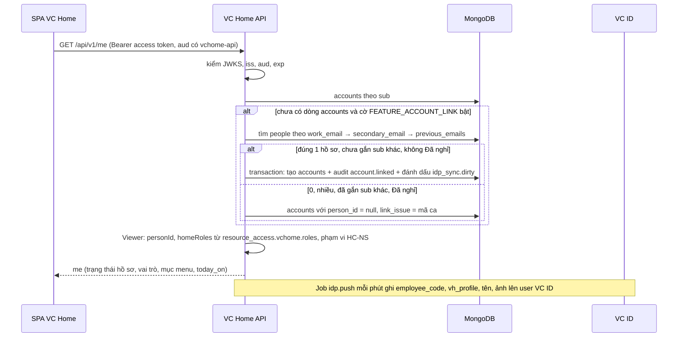
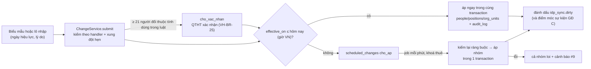

# Kế hoạch code GĐ B: hồ sơ và tổ chức (R2)

Phiên bản 0.1 · 08/10/2026 · Trạng thái: Nháp (chờ đội phát triển rà)

## Tóm tắt

- **Làm gì:** dựng VC Home API (NestJS 10 + MongoDB replica set) và phân hệ VC People theo [khung chung](ke-hoach-code-tong-quan.md): hồ sơ, vị trí chính và kiêm nhiệm, quản lý trực tiếp, trạng thái có ngày hiệu lực, cây đơn vị, trưởng đơn vị, danh mục; danh bạ và sơ đồ tổ chức có che C1 theo người xem; nhập Excel có kiểm thử, đối chiếu Google và VC ID, khởi tạo từ VClinks và VCwiki; danh mục app quản trị trên màn; API danh bạ cho app bằng token máy.
- **Đầu ra:** 11 màn hoặc phần màn của GĐ B (VH-MH-02 phần thẻ hồ sơ, 03, 06, 07, 09, 11, 12, 13, 14, 15, 19); VH-API-01…05; 15 collection nghiệp vụ; token GĐ B có `employee_code` và `vh_profile`; danh sách loại trừ chuyển từ `provisioner/loai-tru.yaml` vào `directory_exclusions` (D-BA-37).
- **Khối lượng:** 25 phiên `B-01`…`B-25`, tổng **142 giờ**, khớp đủ 10 gói việc của [10](../10-ke-hoach-trien-khai.md) mục 2. Lịch 02/11 → 20/11/2026 (tuần T4–T6).
- **Điều kiện bắt đầu:** R1 đã lên và `vc-provisioner` chạy thật; có dev Platform (N10); máy production đã nâng 4 vCPU / 8 GB (N12, D-BA-43); có danh sách người giữ vai trò (N3).
- **Việc chặn:** pháp chế duyệt thông báo xử lý dữ liệu (N4, hạn 13/11) **trước khi nạp dữ liệu nhân sự thật** lên production; tệp Excel của HC-NS (N1); người thử UAT (N5).
- **Quyết định kỹ thuật chính:**
  - Mọi thay đổi hồ sơ, vị trí, cơ cấu đi một đường qua `scheduled_changes`; job áp chạy mỗi phút nên thay đổi hẹn "00:00" bắt đầu áp ngay phút đầu và xong trước 00:05 (VH-NSU-04).
  - VC Home API tự đẩy thuộc tính hồ sơ sang VC ID bằng client `vc-home-api`; `vc-provisioner` không làm việc này ở GĐ B.
  - `vc-provisioner` đọc tệp loại trừ do VC Home API sinh ra; điều kiện vào app vẫn như GĐ A.
  - Vai trò quản trị lấy từ `resource_access.vchome.roles`, phạm vi HC-NS ghi trong tên vai trò `hcns@<mã>`.
  - Google IdP đổi sang `IMPORT` cùng giờ bật đẩy thuộc tính.
- **Lên bản:** lên production ở chế độ chỉ quản trị ngày 13/11 để HC-NS nạp dữ liệu thật; ngày 20/11 bật cho mọi người bằng cờ. Quay lui bằng cờ, không xoá dữ liệu.
- **Người duyệt xem kỹ:** mục 3.3 (điểm khó), mục 3.4 (giả định kỹ thuật, có 22 chỗ tài liệu nghiệp vụ lệch hoặc thiếu), mục 9 (phiên và lịch), mục 11 (thứ tự lên bản).

## Mục lục

- [1. Phạm vi và đầu ra](#1-phạm-vi-và-đầu-ra)
- [2. Điều kiện bắt đầu và phụ thuộc](#2-điều-kiện-bắt-đầu-và-phụ-thuộc)
- [3. Thiết kế kỹ thuật](#3-thiết-kế-kỹ-thuật)
- [4. Dữ liệu](#4-dữ-liệu)
- [5. API](#5-api)
- [6. Job và sự kiện](#6-job-và-sự-kiện)
- [7. Giao diện](#7-giao-diện)
- [8. Thay đổi ở VC ID, VClinks, VCwiki](#8-thay-đổi-ở-vc-id-vclinks-vcwiki)
- [9. Kế hoạch theo phiên](#9-kế-hoạch-theo-phiên)
- [10. Kiểm thử](#10-kiểm-thử)
- [11. Lên bản, chuyển đổi và quay lui](#11-lên-bản-chuyển-đổi-và-quay-lui)
- [12. Rủi ro riêng của giai đoạn](#12-rủi-ro-riêng-của-giai-đoạn)
- [13. Truy vết](#13-truy-vết)
- [Lịch sử cập nhật](#lịch-sử-cập-nhật)

---

## 1. Phạm vi và đầu ra

### 1.1 Yêu cầu của GĐ B

Đối chiếu README mục 5 (cột GĐ = B) và [04](../04-yeu-cau-chuc-nang.md) mục 14. Đặc tả và tiêu chí nghiệm thu ở 04; bảng này chỉ ghi phần làm ở GĐ B.

| Mã | Tên | Ưu tiên | Phần làm ở GĐ B |
|---|---|---|---|
| VH-AUT-08 | Gắn tài khoản đăng nhập với hồ sơ nhân sự | M | Đủ |
| VH-HOM-02 | Thẻ hồ sơ ngắn trên trang chủ | M | Đủ, cộng câu "Bạn bắt đầu làm từ…" của 04 mục 14.2 |
| VH-NSU-01 | Hồ sơ nhân sự | M | Đủ; sự kiện `vh.person.*` để GĐ C |
| VH-NSU-02 | Vị trí công tác chính và kiêm nhiệm | M | Đủ; tính lại quyền để GĐ C |
| VH-NSU-03 | Quản lý trực tiếp và cây quản lý | M | Đủ |
| VH-NSU-04 | Trạng thái làm việc có ngày hiệu lực | M | Ghi, hiển thị, áp theo ngày; tạm khoá tự khoá đăng nhập. Nghỉ dài ngày ghi trạng thái và cờ khoá `nghi_dai_ngay` nếu HC-NS chọn khoá. Nghỉ việc chưa tự khoá (GĐ C); sự kiện, nhắc của nghỉ dài ngày để GĐ D |
| VH-NSU-05 | Lịch sử thay đổi hồ sơ | M | Đủ, có "Hồ sơ tại ngày" |
| VH-NSU-06 | Hồ sơ của tôi và đề nghị sửa | M | Đủ; thông báo trong VC Home để GĐ D |
| VH-NSU-07 | Danh bạ công ty | S | Đủ |
| VH-NSU-08 | Che thông tin theo người xem | M | Đủ, trừ dòng "Quyền app" (GĐ C) |
| VH-NSU-09 | Nhân viên tự sửa tên gọi, ảnh, SĐT công việc | S | Đủ; sự kiện để GĐ C |
| VH-ORG-01 | Cây đơn vị nhiều cấp | M | Đủ; đổi cha và ngừng áp ngay khi lưu (hẹn ngày ở VH-ORG-05, GĐ C) |
| VH-ORG-02 | Danh mục chức danh | M | Đủ; chặn ngừng theo luật để GĐ C |
| VH-ORG-03 | Danh mục chức năng | M | Đủ, seed 10 chức năng (Q-02) |
| VH-ORG-04 | Trưởng đơn vị | M | Đủ |
| VH-ORG-06 | Sơ đồ tổ chức | S | Đủ; "Xem cơ cấu tại ngày" để GĐ C |
| VH-ORG-07 | Danh mục pháp nhân và nơi làm việc | S | Đủ |
| VH-ORG-09 | Gộp mục trùng trong danh mục | S | Đủ; trỏ luật sang mục giữ để GĐ C |
| VH-APP-01 | Danh mục app | M | Quản trị trên VH-MH-15; `catalog.json` sinh từ collection `apps` |
| VH-INT-01 | Bộ claim chuẩn trong token theo giai đoạn | M | Claim GĐ B theo [07](../07-tich-hop.md) mục 2.2: `employee_code`, `vh_profile` |
| VH-INT-02 | API danh bạ và cơ cấu cho app | M | VH-API-01…05 |
| VH-INT-06 | Token máy cho app gọi API VC Home | M | Đủ |
| VH-ADM-01 | Nhật ký thao tác | M | Từ GĐ B: `audit_log`, niêm phong ngày, chép sự kiện VC ID, VH-MH-19 |
| VH-ADM-03 | Vai trò quản trị của chính VC Home | M | Bước 2 (danh sách trên VC ID dạng code), bước 7 (cảnh báo), bước 8; tách nhiệm kiểm khi gán |
| VH-IMP-01 | Nhập nhân sự và cơ cấu từ Excel | M | Đủ; "Tác động tới quyền" để GĐ C |
| VH-IMP-02 | Đối chiếu với Google Workspace | M | Đủ, cộng lô `doi_chieu_vc_id` của 04 mục 14.2 |
| VH-IMP-03 | Lấy dữ liệu khởi đầu từ VClinks và VCwiki | S | Đủ |
| VH-IMP-05 | Hoàn tác lô nhập trong 24 giờ | S | Đủ |

Đã kiểm README mục 5: không còn mã nào có cột GĐ = B ngoài bảng trên.

### 1.2 Yêu cầu của giai đoạn khác có phần làm ở GĐ B

| Mã | GĐ gốc | Phần làm ở GĐ B | Căn cứ |
|---|---|---|---|
| VH-AUT-06 | A | Nút "Khoá tài khoản", "Mở khoá" ở ngăn Tài khoản của VH-MH-11; nhiều cờ khoá | 04 VH-AUT-06 bước 2, 7, 8; D-BA-03 |
| VH-AUT-07 | A | Cờ khoá `google` và `accounts.google_id`, `google_status` trong VC Home | 04 VH-AUT-07 bước 5; 04 mục 14.2 |
| VH-HOM-01 | A | Bước 10: tài khoản chưa gắn hồ sơ thì lưới trống và có câu riêng | 04 VH-HOM-01 |
| VH-HOM-06 | A | Quản trị khai liên kết ngoài trên VH-MH-15; giới hạn theo pháp nhân hoặc chức năng | 04 VH-HOM-06; 04 mục 14.2 |
| VH-ADM-04 | A | Dòng theo dõi 6 (sao lưu MongoDB) và 7–11 | 04 VH-ADM-04 bảng "Danh sách theo dõi" |
| VH-NFR-04, 07, 08, 11, 12 | B | ASVS mức 2, giới hạn tần suất; chỉ C0–C1; job ẩn danh chạy thử; sao lưu MongoDB; hiệu năng danh bạ, sơ đồ | [08](../08-phi-chuc-nang.md) |

### 1.3 Màn

| Màn | Phần làm ở GĐ B | Đường dẫn | Có trên canvas |
|---|---|---|---|
| VH-MH-02 Trang chủ | Thẻ hồ sơ, lời chào, các trạng thái theo hồ sơ; lưới app giữ cách GĐ A | `/` | Có |
| VH-MH-03 Hồ sơ của tôi | Bản VC People: ngăn Thông tin, Lịch sử, Đề nghị của tôi; nút "Sửa" cho 3 trường của VH-NSU-09 | `/ho-so` | Có |
| VH-MH-06 Danh bạ công ty | Đủ | `/danh-ba`, `/danh-ba/{maNhanVien}` | Không |
| VH-MH-07 Sơ đồ tổ chức | Hai chế độ, xuất PNG/PDF cho HC-NS | `/so-do-to-chuc` | Không |
| VH-MH-09 Đội của tôi | Ngăn "Người" và "Báo thông tin sai" | `/doi-cua-toi` | Không |
| VH-MH-11 Quản trị: Nhân sự | Đủ phần GĐ B, cả ngăn Tài khoản | `/quan-tri/nhan-su…` | Không |
| VH-MH-12 Quản trị: Cơ cấu tổ chức | Phần GĐ B (không có "Đổi cơ cấu" hẹn ngày, gộp đơn vị) | `/quan-tri/co-cau` | Không |
| VH-MH-13 Quản trị: Danh mục | 4 ngăn + gộp mục trùng | `/quan-tri/danh-muc` | Không |
| VH-MH-14 Quản trị: Nhập dữ liệu và đối chiếu | Nhập Excel, Đối chiếu Google, Đối chiếu VC ID, Khởi tạo từ app, Lịch sử | `/quan-tri/nhap-du-lieu` | Không |
| VH-MH-15 Quản trị: App và vai trò app | Ngăn "Thông tin" và phần "Liên kết ngoài" | `/quan-tri/ung-dung…` | Không |
| VH-MH-19 Quản trị: Nhật ký | Đủ | `/quan-tri/nhat-ky` | Không |

### 1.4 API cho app

| Mã | Đường dẫn ([07](../07-tich-hop.md) mục 5) | Scope |
|---|---|---|
| VH-API-01 | `GET /api/v1/people/{employee_code}`, `GET /api/v1/people/by-sub/{sub}` | `vh.people.read` |
| VH-API-02 | `GET /api/v1/people` | `vh.people.read` |
| VH-API-03 | `GET /api/v1/people/{employee_code}/managers` | `vh.people.read`, app mức C1 |
| VH-API-04 | `GET /api/v1/org-units`, `GET /api/v1/org-units/{code}` | `vh.people.read` |
| VH-API-05 | `GET /api/v1/catalogs/{job-titles\|job-functions\|legal-entities\|work-locations}` | `vh.people.read` |

VH-API-08 (`catalog.json`) giữ đường dẫn và dạng của GĐ A, chỉ đổi nguồn sinh.

### 1.5 Sự kiện

GĐ B **không phát sự kiện** cho app. Sự kiện `vh.*` và `event_outbox` có từ GĐ C (README mục 10; 04 VH-IMP-01 bước 10: "Lô nhập ban đầu ở GĐ B chưa sinh sự kiện"). GĐ B chỉ để sẵn điểm móc trong bộ áp thay đổi (mục 3.3 điểm 1).

### 1.6 Collection mới

`people`, `accounts`, `positions`, `org_units`, `job_titles`, `job_functions`, `legal_entities`, `work_locations`, `scheduled_changes`, `apps`, `audit_log`, `import_batches`, `profile_change_requests`, `system_settings`, `directory_exclusions` (README mục 9). Collection kỹ thuật: `_job_locks`, `_migrations`.

### 1.7 Không làm ở GĐ B

- Vai trò app, luật, quyền, tính lại quyền, khung "Tác động tới quyền" (GĐ C).
- Sự kiện gửi app, kéo sự kiện, VH-API-06, 07, 10 (GĐ C).
- Tự khoá và gỡ quyền khi nghỉ việc; vào làm có ngay quyền (GĐ C). Ở GĐ B nghỉ việc vẫn theo quy trình tay ([thiết kế SSO](thiet-ke-sso-keycloak.md) mục 11.1).
- Đổi cơ cấu có hẹn ngày, gộp đơn vị (VH-ORG-05, GĐ C).
- Tạo sẵn user trên VC ID cho hồ sơ mới (D-BA-27, GĐ C). Điều kiện vào app vẫn do `vc-provisioner` theo VH-BR-26 GĐ A–B.
- Chủ app, ngăn "Vai trò" và "Tích hợp" của VH-MH-15 (GĐ C).
- Thông báo trong VC Home, email (GĐ C, D); màn Cài đặt VH-MH-20 (GĐ D). Ở GĐ B `system_settings` chỉ sửa bằng lệnh có lý do.
- "Nhận lại" người đã nghỉ (VH-LCM-05, GĐ D); phiên đăng nhập của tôi (VH-AUT-10, GĐ D).
- Sửa code VClinks, VCwiki (0 giờ ở app trong R2).

---

## 2. Điều kiện bắt đầu và phụ thuộc

### 2.1 Bản trước

R1 đã lên (31/10) với các đầu ra của [thiết kế SSO](thiet-ke-sso-keycloak.md) mà GĐ B dùng lại:

| Đầu ra R1 | GĐ B dùng để |
|---|---|
| Repo `vc-platform`, `keycloak/realm/vc.yaml`, CI áp `keycloak-config-cli` | Thêm client, mapper, client role (mục 8.1) |
| SPA `home/` (React, antd, `oidc-client-ts`), `home/apps.yaml` → `catalog.json` | Thêm màn GĐ B; `apps.yaml` thành dữ liệu khởi đầu của `apps` |
| `vc-provisioner` chạy mỗi 15 phút, thuộc tính `vc_trang_thai`, `loai-tru.yaml` | Đổi nguồn danh sách loại trừ (D-BA-37), thêm thuộc tính `vc_khoa` (mục 8.2) |
| Tài khoản dịch vụ Google đọc Directory API (I4, I6) | VC Home API đọc Google khi đối chiếu (VH-IMP-02) |
| Kênh cảnh báo Telegram và email (VH-ADM-04 GĐ A), `backup/` | Thêm cảnh báo 6–11, thêm `mongodump` |
| Staging máy 129 có VC ID staging | Thêm `api-staging.tramaphutung.com`, MongoDB staging |

### 2.2 Đầu vào

| Mã | Đầu vào | Hạn | Chặn phiên |
|---|---|---|---|
| N10 | Dev Platform toàn thời gian | 30/10 | Mọi phiên |
| N12 | Máy production 4 vCPU / 8 GB / 80 GB (D-BA-43) | 30/10 | B-16 (lên production chế độ quản trị) |
| N3 | Tên người giữ `hcns`, `qtht`, `kiem_soat`, `bgd` ([12](../12-cau-hoi-rui-ro.md) mục 4.3) | 24/10 | B-02 (tệp `vchome-roles.yaml`), B-16 |
| N2 | HC-NS rà 10 chức năng | 24/10 | Không chặn: seed bản khởi tạo |
| N1 | Excel nhân sự và cơ cấu theo mẫu VH-IMP-01 | 30/10 | Nhập thử lần 1 (13/11), nạp thật (16–18/11) |
| N4 | Pháp chế duyệt văn bản thông báo xử lý dữ liệu (VH-NFR-08) | 13/11 | Nạp dữ liệu thật lên production; tiêu chí R2 |
| N5 | Người dùng thử UAT theo vai trò | 13/11 | B-25 |
| — | Xuất JSON chỉ đọc cây tổ chức VClinks, VCwiki bằng script ở mục 8.3 (admin của từng app chạy) | 13/11 | Khởi tạo từ app trên production |
| — | 6 tài khoản Google thử, `ctv.moi`, `thu.khoa`, `uat.0930` ([11](../11-uat.md) mục 13 đề xuất 6) | 13/11 | B-24, B-25 |

### 2.3 Quyết định liên quan

| Mã | Nội dung dùng ở GĐ B |
|---|---|
| Q-01 | Excel của HC-NS là dữ liệu khởi đầu; HC-NS là người cập nhật duy nhất từ R2 |
| Q-02 | Seed 10 chức năng; chức danh lấy từ Excel thật, trùng thì gộp bằng VH-ORG-09 |
| Q-04 | Kiêm nhiệm nhiều division, pháp nhân là ca phổ biến trong test |
| Q-06 | Mô hình ORG của VCwiki là điểm xuất phát; mã theo VClinks khi khớp |
| Q-07 | Vai trò quản trị theo chức vụ, mỗi vai trò 2 người; HC-NS phạm vi theo pháp nhân |
| Q-10 | Nhật ký giữ 24 tháng (TTL) |
| Q-11 | Mã nhân viên: dùng mã có sẵn nếu duy nhất; trùng thì thêm tiền tố; chưa có thì cấp `<tiền tố pháp nhân><4 số>` |
| Q-12 | Nơi làm việc có trong VH-API-05 |
| Q-13 | Ngày nghỉ là ngày đầu tiên không còn làm |
| D-BA-01, 03, 04, 05, 06 | Loại đơn vị; nhiều cờ khoá; ba loại email để gắn; quản lý theo vị trí chính; QTHT xem C1 chỉ đọc |
| D-BA-10, 15, 16, 20, 25 | HC-NS ở GĐ B gán trên VC ID; ngăn Tài khoản chỉ QTHT; collection bổ sung; khoá `vchome`; tạm khoá nguồn `hcns` |
| D-BA-19, 28, 29, 31, 33 | Không nhận việc; không lý do nghỉ dài ngày; token chỉ C0 và mã đơn vị; tên nút; "Tạm vắng" |
| D-BA-37, 39, 43 | Danh sách loại trừ; hộp thư chung không vào app; nâng máy |

---

## 3. Thiết kế kỹ thuật

### 3.1 Module thêm và sửa

Theo [khung chung](ke-hoach-code-tong-quan.md) mục 5. Mỗi module chỉ ghi vào collection của mình.

| Module | Thư mục `api/src/` | Việc ở GĐ B | Collection ghi | Phiên |
|---|---|---|---|---|
| Khung | `config/`, `common/`, `db/`, `jobs/` | Biến môi trường, cờ, lỗi, `Clock`, ngày VN, con trỏ, transaction, migration, bộ chạy lịch | `_migrations`, `_job_locks` | B-01 |
| `auth` | `auth/` | Kiểm token VC ID, `Viewer`, `@Can`, `@AppScope`, client Admin API Keycloak (`auth/idp/`) | — | B-02, B-20 |
| `audit` | `audit/` | `AuditService.record(tx, …)`, băm, niêm phong, kiểm chuỗi, tra cứu, CSV | `audit_log` | B-02, B-19 |
| `settings` | `settings/` | Đọc cài đặt có giá trị mặc định; lệnh sửa có lý do | `system_settings` | B-03 |
| `people` | `people/` | Bộ áp thay đổi (`people/changes/`), hồ sơ, ảnh, vị trí, quản lý, trạng thái, lịch sử, hồ sơ tại ngày, đề nghị sửa, tự sửa | `people`, `positions`, `scheduled_changes`, `profile_change_requests` | B-03, 06, 07, 09, 11, 21 |
| `org` | `org/` | Danh mục, cây đơn vị, trưởng đơn vị, gộp mục trùng | `org_units`, `job_titles`, `job_functions`, `legal_entities`, `work_locations` | B-04, 05, 22 |
| `accounts` | `accounts/` | Gắn tài khoản, khoá, đẩy thuộc tính sang VC ID, chép sự kiện VC ID, danh sách loại trừ và tệp cho `vc-provisioner` | `accounts`, `directory_exclusions` | B-08, B-15 |
| `directory` | `directory/` | Danh bạ, sơ đồ, đội của tôi, che C1, giới hạn xem | (đọc) | B-10 |
| `imports` | `imports/` | Mẫu Excel, kiểm thử, ghi, hoàn tác, đối chiếu Google và VC ID, khởi tạo từ app, chỉ số sẵn sàng | `import_batches` | B-13, 14, 15, 16, 23 |
| `apps` | `apps/` | Danh mục app, liên kết ngoài, sinh `catalog.json` | `apps` | B-19 |
| `public-api` | `public-api/` | VH-API-01…05 | (đọc) | B-20 |
| `testing` | `testing/` | Đồng hồ giả lập qua API (chỉ staging), `seed:uat` | — | B-24 |

`scheduled_changes` thuộc `people` (khung chung mục 5). `org` không gọi ngược vào `people`: handler của `org` (`unit_*`) đăng ký vào bộ áp qua token đa nhà cung cấp `CHANGE_HANDLERS` khai ở `common/changes.ts`, tránh vòng phụ thuộc module.

### 3.2 Luồng chính

**Đăng nhập, gắn tài khoản, dựng `Viewer`** (VH-AUT-08 bước 2–3):

**Một thay đổi có ngày hiệu lực** ([05](../05-du-lieu.md) mục 5):

**Khoá và đẩy sang VC ID** (VH-AUT-06, VH-NSU-04, D-BA-03):

| Nguồn khoá | Ai ghi `accounts.locks` | Khi nào gọi VC ID |
|---|---|---|
| `khan_cap` | QTHT trên ngăn Tài khoản | **Gọi VC ID trước** (tắt user, đăng xuất mọi phiên, thêm `khan_cap` vào thuộc tính `vc_khoa`); thành công mới ghi cờ (04 VH-AUT-06 "Không ghi cờ khoá khi chưa khoá thật") |
| `tam_khoa`, `nghi_dai_ngay` | Bộ áp thay đổi (HC-NS) | Ghi cờ trong transaction, rồi gọi ngay sau commit; job `idp.push` thử lại mỗi phút tới khi khớp (≤ 1 phút, VH-NSU-04 tiêu chí 4) |
| `google` | `vc-provisioner` ghi vào `vc_khoa` trên VC ID | Job `vcid.sync` mỗi giờ đọc `vc_khoa` và chép cờ vào `accounts.locks` |

User VC ID bật khi và chỉ khi `vc_khoa` rỗng. Mở khoá khẩn cấp chỉ gỡ `khan_cap`; còn cờ khác thì giữ khoá và hiện câu "Đã gỡ khoá khẩn cấp. Tài khoản vẫn bị khoá vì: {lý do còn lại}." Trước khi bật lại user, API đọc trạng thái Google của chính tài khoản đó (Directory API `users.get`) để không mở một tài khoản Google đang bị khoá mà `vc-provisioner` chưa kịp ghi.

### 3.3 Điểm khó và cách làm

1. **Một đường đi cho mọi thay đổi.** `ChangeService.submit({items[], effective_on, reason, source, actor})` sinh một `group_id`. Mỗi `kind` có handler với ba hàm: `validate(ctx, at)`, `affectedPeople(ctx)`, `apply(tx, ctx)`. Kiểm hợp lệ chạy mô phỏng trên trạng thái tại ngày hiệu lực cộng các thay đổi `cho_ap` trước ngày đó.
   - Xung đột với dòng `cho_ap` cùng đối tượng, cùng trường: trả 409 mã `HEN_XUNG_DOT` kèm câu ở 06 mục 1.5. Gửi lại với `replace_ids` thì huỷ dòng cũ trong cùng transaction.
   - Job `scheduled-changes.apply` chạy mỗi phút, khoá thuê 5 phút. Lấy dòng `cho_ap` có `effective_at ≤ Clock.now()`, xếp theo `effective_at`, rồi cơ cấu (`unit_*`) trước người (`person_*`, `position_*`).
   - Mỗi nhóm áp trong một transaction. Chuyển trạng thái bằng `updateOne({_id, status: 'cho_ap', rev})` nên chạy hai lần không áp hai lần.
   - Áp xong gọi `ChangeHooks.afterApply(tx, change)`. GĐ B móc vào: đánh dấu đẩy VC ID. GĐ C móc thêm outbox và tính lại quyền.
2. **Ngày giờ.** `effective_at` = 00:00 `Asia/Ho_Chi_Minh` của `effective_on` (17:00Z ngày trước). `todayOn()` luôn tính từ `Clock.now()`. Mọi test mốc ngày chạy ở hai giờ biên 16:59:59Z và 17:00:00Z.
3. **Bất biến vị trí chính** (VH-BR-04). Kiểm ở service: các vị trí chính của một người phủ kín [`joined_on`, `left_on`) không chồng, không hở. Chỉ mục một phần `{person_id}` duy nhất với `kind = chinh, active = true` chặn ghi song song.
   - Chuyển vị trí là một nhóm hai dòng `position_close` + `position_open`.
   - Kiêm nhiệm có `end_on` thì tạo luôn dòng hẹn `position_close` ngày `end_on + 1`.
4. **Vòng quản lý và cây đơn vị.** Kiểm vòng quản lý: đi ngược chuỗi tối đa 15 cấp trên trạng thái tại ngày hiệu lực. Đổi cha đơn vị: đích không nằm trong `ancestors` của chính nó; độ sâu ≤ 8. Tính lại `ancestors`, `division_code`, `legal_entity_code` cho cả nhánh trong cùng transaction.
5. **Che C1 theo người xem** (VH-NSU-08, VH-BR-23).
   - `RelationResolver.relations(viewer, person)` trả tập quan hệ: chính mình, quản lý cây dưới, quản lý trên vị trí kiêm nhiệm, trưởng đơn vị, HC-NS trong phạm vi, QTHT, kiểm soát.
   - Cây dưới của người xem tính một lần mỗi yêu cầu bằng BFS trên `positions` chính đang hiệu lực. Với ≤ 1.000 người, một truy vấn và duyệt trong bộ nhớ.
   - Đơn vị do người xem làm trưởng mở rộng qua `org_units.ancestors`.
   - `projectPerson(doc, relations)` đọc bảng che ở `packages/contracts/c1-matrix.ts`, chép đúng bảng 04 VH-NSU-08. Trường không được xem thì không có khoá trong JSON.
   - Hồ sơ Đã nghỉ, Chưa vào làm, hồ sơ huỷ do hoàn tác: người không có quyền nhận 404.
6. **Phạm vi HC-NS.** Vai trò `hcns` (toàn tập đoàn) hoặc `hcns@<mã>`, với `<mã>` là mã pháp nhân hoặc mã đơn vị loại `division`; mã đơn vị gốc nghĩa là toàn tập đoàn (04 VH-ADM-03 bước 1). Hồ sơ trong phạm vi khi `legal_entity_code` thuộc tập pháp nhân, hoặc `division_code` của vị trí chính thuộc tập division.
7. **Gắn tài khoản.** Hai lần đăng nhập cùng lúc: `accounts._id = sub` và chỉ mục duy nhất một phần trên `person_id` chặn gắn đôi; lần thua đọc lại và trả kết quả của lần thắng.
   - `accounts.google_id` lấy từ liên kết `google` của user (Admin API `federated-identity`).
   - Job gắn lần đầu (VH-AUT-08 bước 1) duyệt mọi user realm `vc`, có chế độ chạy thử. Kết quả lên ngăn "Đối chiếu VC ID" của VH-MH-14.
8. **Đẩy thuộc tính sang VC ID** (VH-INT-01, 07 mục 2.2).
   - Thay đổi chạm tới `vh_profile` của ai thì đánh dấu `accounts.idp_sync.dirty_at` của người đó. Ví dụ đổi tên chức danh thì đánh dấu mọi người giữ chức danh đó; đổi tên đơn vị thì đánh dấu người có vị trí chính ở đó.
   - Job `idp.push` mỗi phút gửi `firstName`, `lastName`, `email`, thuộc tính `picture`, `employee_code`, `vh_profile` (JSON dạng chuỗi); băm nội dung, giống lần trước thì bỏ qua.
   - `firstName` là chữ cuối của họ tên, `lastName` là phần còn lại, để `given_name` / `family_name` giống ví dụ ở 07 mục 2.4.
   - Lỗi thì thử lại giãn dần; quá 15 phút báo vận hành.
   - Chỉ chạy khi `FEATURE_IDP_PUSH=on`. Cờ này bật cùng giờ đổi Google IdP sang `IMPORT` (mục 11), để tên trên VC ID không lật qua lật lại giữa Google và VC People.
9. **Nhập Excel lớn** (VH-IMP-01).
   - Kiểm thử chụp `rev` của mọi bản ghi sẽ đụng và danh sách khoá sẽ tạo mới vào `import_batches.snapshot_revs`. "Ghi thật" so lại: lệch một bản ghi là trả "Dữ liệu đã đổi từ lúc kiểm thử. Hãy kiểm thử lại."
   - Ghi cả lô trong **một** transaction qua `ChangeService`. Đặt `transactionLifetimeLimitSeconds=120` cho mongod. B-13 đo 2.000 dòng trên staging phải ≤ 60 giây.
   - Không đạt thì đổi sang ghi theo nhóm 200 với lô ở trạng thái khoá và bù bằng bộ hoàn tác (VH-IMP-05). Ghi vào sổ phiên nếu phải đổi.
10. **Xác nhận hàng loạt ở GĐ B** (VH-BR-25 mở rộng).
    - GĐ B chưa có quyền, nên "số người bị ảnh hưởng" tính bằng số người đổi ít nhất một thuộc tính dùng trong luật: pháp nhân, loại nhân viên, nơi làm việc, đơn vị, chức danh, chức năng của vị trí, trạng thái, là trưởng đơn vị. Từ GĐ C thay bằng số người thêm hoặc mất quyền của VH-ACC-03.
    - Ngưỡng ≥ 21 người lấy từ `system_settings` khoá `bulk.confirm_min_people`, mặc định 21.
    - Áp cho: lô nhập, hoàn tác lô, chuyển đơn vị cha có ≥ 21 người trong nhánh. Không áp cho gộp mục danh mục, vì luật trỏ theo và quyền không đổi (04 VH-ORG-09 tiêu chí 2).
    - QTHT xác nhận không được là người gửi. Lúc áp, số người lệch > 20% so với lúc xác nhận thì quay về chờ xác nhận.
11. **Hoàn tác lô** (VH-IMP-05).
    - Lúc ghi lưu `import_batches.applied_revs` (rev sau lô của từng bản ghi). Hoàn tác chỉ chạy khi rev hiện tại vẫn bằng; lệch thì liệt kê bản ghi.
    - Bản ghi lô đã sửa trả về `before` trong nhật ký có `source.ref = lô`. Bản ghi lô đã tạo được đánh dấu huỷ, không xoá; mã không dùng lại. Dòng hẹn còn chờ của lô bị huỷ.
12. **Hồ sơ tại ngày** (VH-NSU-05 bước 3).
    - Vị trí: lấy `positions` có `start_on ≤ D ≤ end_on`.
    - Trường hồ sơ: lấy giá trị hiện tại rồi đảo `before` của các dòng `audit_log` về người đó có `effective_on > D`, mới trước.
    - Cần trường `effective_on` trong `audit_log` (mục 3.4 điểm 14). Quá 24 tháng thì hiện câu hết thời hạn lưu.
13. **Tệp sinh cho bên ngoài.** `catalog.json` và `loai-tru.yaml` ghi kiểu tệp tạm rồi đổi tên (nguyên tử) vào thư mục chung, sau mỗi thay đổi; một job kiểm băm mỗi phút để tự chữa. Nginx phục vụ `catalog.json` như tệp tĩnh, nên API dừng thì trang chủ và thanh chuyển app vẫn chạy (VH-NFR-10).
14. **Đồng hồ giả lập an toàn.** `CLOCK_MODE=fake` chỉ khởi động được khi `APP_ENV ∈ {staging, test}`; production có giá trị này thì tiến trình thoát ngay khi khởi động. Route `/api/v1/_test/*` chỉ đăng ký khi `APP_ENV=staging`.
15. **Nhật ký không sửa được** (VH-ADM-01 bước 6).
    - Người dùng MongoDB `vchome_api` có vai trò tự định nghĩa: `find`, `insert` trên `audit_log`; `readWrite` trên các collection khác. Người dùng `vchome_migrate` riêng tạo chỉ mục.
    - Mỗi dòng có `hash` là SHA-256 của JSON chuẩn hoá (khoá xếp chữ cái, bỏ `_id`, `hash`).
    - 00:10 ghi dòng `audit.daily_seal` của ngày hôm trước, nối chuỗi với ngày trước đó; 00:20 kiểm lại chuỗi.

### 3.4 Giả định kỹ thuật

Chỗ tài liệu nghiệp vụ lệch nhau hoặc thiếu để code. Cột cuối là cách kế hoạch này làm; BA chốt lại ở tài liệu gốc.

| # | Chỗ lệch hoặc thiếu | Cách làm ở GĐ B |
|---|---|---|
| 1 | Tên claim GĐ B: 04 VH-INT-01 ghi `vh_emp_code`, `vh_unit`… (đề xuất, "chốt ở 07"); 04 VH-AUT-08 ghi `employee_code`, `title`, `unit{code,name}`, `division`, `legal_entity` ("5 claim"); 07 mục 2.2 chốt `employee_code` + `vh_profile` | Theo 07: `employee_code` và `vh_profile` {`unit`, `unit_name`, `division`, `legal_entity`, `title`, `title_name`, `function`}. Tiêu chí "đủ 5 claim" của VH-AUT-08 kiểm trên 2 claim này |
| 2 | Nơi gắn mapper: 04 VH-INT-01 thêm client scope `vc-people`; 07 thêm mapper vào `vc-basic` | Theo 07: thêm vào `vc-basic` |
| 3 | Ai ghi thuộc tính lên VC ID: 07 mục 2.2 ghi `vc-provisioner`; 04 VH-AUT-08 bước 4 và khung chung mục 7 ghi VC Home API | VC Home API ghi bằng client `vc-home-api`; `vc-provisioner` không đổi phần này |
| 4 | 04 VH-ADM-03 bước 2 ghi client `vc-home` | Theo D-BA-20: client `vchome` |
| 5 | Phạm vi HC-NS ở GĐ B chưa có cách ghi trong token | Client role `hcns` (toàn tập đoàn) hoặc `hcns@<mã pháp nhân hoặc mã division>`; không thêm claim mới |
| 6 | Kiểm tách nhiệm khi gán vai trò ở GĐ B (VH-UAT-22 bước 3) trong khi gán nằm ở cấu hình VC ID | CI chặn `keycloak/vchome-roles.yaml` có cặp cấm; `Viewer` bỏ cả hai vai trò xung đột nếu lọt (chặn mặc định) và báo vận hành |
| 7 | 05 mục 3.21: tài khoản trong `directory_exclusions` "không đăng nhập được VC Home"; VH-BR-26 và UAT-SSO-21: vào được VC Home, không có ô app | Theo VH-BR-26 (quyết định mới hơn, D-BA-37) |
| 8 | `directory_exclusions.kind`: 05 có `hop_thu_chung`, `tai_khoan_dich_vu`, `khac`; tệp GĐ A có `dich_vu`, `thu`, `chua_ro_chu` | Dùng hợp: `hop_thu_chung`, `tai_khoan_dich_vu`, `tai_khoan_thu`, `chua_ro_chu`, `khac`; thêm trường `reason` bắt buộc (VH-BR-26). Đổi tên khi chuyển tệp cũ |
| 9 | Ghi `accounts.google_status`: 05 ghi "do `vc-provisioner` ghi" | VC Home API ghi khi đối chiếu Google (hằng ngày, khi bấm, khi mở khoá); cờ khoá `google` chép từ thuộc tính `vc_khoa` của VC ID |
| 10 | 07 mục 5.7 vừa có `GET /catalogs/work-locations` vừa ghi "không có API riêng" | Có endpoint (README VH-API-05, D-BA-13) |
| 11 | Dạng lỗi: 04 VH-INT-02 `{error, message}`; 07 `{error:{code,message,correlation_id}}`; khung chung `{code,message,details}` | API cho app theo 07; API nội bộ cho SPA theo khung chung |
| 12 | Thiếu quản lý khi nhập: 04 VH-IMP-01 mẫu ghi `email_quan_ly` bắt buộc; 04 VH-NSU-03 bước 11 cho trống kèm cảnh báo; 03 VH-QT-03 không cho xác nhận lô | Theo VH-NSU-03 bước 11: cảnh báo "Thiếu quản lý", vẫn ghi được |
| 13 | 03 VH-QT-03 bước 3: VC Home API tự đọc cây của app; 04 VH-IMP-03: QTHT tải tệp JSON | Theo 04: tải JSON; kế hoạch này cung cấp script xuất chỉ đọc (mục 8.3) |
| 14 | `audit_log` ở 05 thiếu ngày hiệu lực và nguồn, trong khi VH-NSU-05 cần cả hai | Thêm `effective_on` (date, tuỳ chọn) và `source {type, ref}` (khung chung mục 6 đã có "nguồn") |
| 15 | Tên gọi: 04 VH-NSU-01 ≤ 30 ký tự; 04 VH-NSU-09 và 05 1–40 ký tự | 1–40 |
| 16 | 06 VH-MH-03 còn nút "Đề nghị sửa" cạnh tên gọi, ảnh, SĐT; 04 VH-NSU-09 cho tự sửa 3 trường này | Theo VH-NSU-09: nút "Sửa"; các trường khác giữ "Đề nghị sửa" |
| 17 | Câu cho người chưa tới ngày vào: 04 VH-AUT-08, 06 VH-MH-02 "Hồ sơ của bạn có hiệu lực từ {dd/mm/yyyy}."; 04 mục 14.2 "Bạn bắt đầu làm từ {dd/mm/yyyy}." | Dải trên trang chủ dùng câu 14.2; thẻ hồ sơ giữ nhãn "Hồ sơ có hiệu lực từ {dd/mm/yyyy}" |
| 18 | 06 VH-MH-14 chưa có nút "Hoàn tác", bước QTHT xác nhận lô lớn, ngăn đối chiếu VC ID | Thêm vào VH-MH-14: nút "Hoàn tác" ở ngăn Lịch sử; trạng thái lô "Chờ QTHT xác nhận"; ngăn `?tab=doi-chieu-vc-id` |
| 19 | Trường thiếu ở 05 so với 04: `job_titles` (cấp bậc, gợi ý là quản lý, mô tả), `legal_entities` (địa chỉ trụ sở), `work_locations` (tỉnh, thành), `org_units` (email nhóm, mô tả, lịch sử trưởng), `apps` (dự kiến, ghi chú nội bộ); `people` cần cờ "Huỷ do hoàn tác" (VH-IMP-05) | Thêm các trường theo 04 (mục 4.2); trạng thái danh mục thêm `da_gop` + `merged_into_code` (VH-ORG-09) |
| 20 | 04 VH-HOM-01 bước 10: tài khoản chưa gắn hồ sơ thì lưới trống từ GĐ B, trong khi VH-BR-26 giữ điều kiện vào app như GĐ A tới GĐ C | Làm đúng VH-HOM-01 trên VC Home khi `FEATURE_HOME_B=on`; mở thẳng app vẫn theo nhóm do `vc-provisioner` cấp. Ghi rõ đây chỉ là giao diện |
| 21 | 11 VH-UAT-17 bước 2 ("VClinks từ chối… Q-07") và VH-UAT-26 bước 2 (màn cây tổ chức VClinks chỉ đọc) cần thay đổi ở VClinks thuộc GĐ C | Đợt UAT B chạy bước 1 của hai ca; bước 2 chuyển sang đợt C |
| 22 | 11 mục 6.2 dùng chức năng "Điều hành", danh mục chốt (Q-02) là `ban_giam_doc` | `seed:uat` ánh xạ "Điều hành" → `ban_giam_doc` |

Thêm: đổi tên pháp nhân (VH-ORG-07 bước 4) ở GĐ B nhận ngày hiệu lực hôm nay hoặc đã qua và lưu lịch sử tên; hẹn ngày tương lai cho pháp nhân làm cùng VH-ORG-05 ở GĐ C.

---

## 4. Dữ liệu

Từ điển trường ở [05](../05-du-lieu.md) mục 3; bảng dưới chỉ ghi chỉ mục, nơi ghi và phần thêm.

### 4.1 Collection và chỉ mục

| Collection | Module ghi | Chỉ mục (theo 05, thêm đánh dấu ✚) | Ghi chú |
|---|---|---|---|
| `people` | `people` | `employee_code` duy nhất; `work_email` duy nhất một phần; `secondary_email` duy nhất một phần ✚; `previous_emails`; `status`; `primary.unit_code`; `primary.manager_person_id`; `name_folded`; `updated_at` ✚ (cho `changed_since`) | Schema zod không có trường cấm (test VH-NSU-01 tiêu chí 6) |
| `accounts` | `accounts` | `person_id` duy nhất một phần; `email`; `locks.kind`; `idp_sync.dirty_at` ✚ một phần | `_id` = `sub` |
| `positions` | `people` | `{person_id, active}`; `{person_id}` duy nhất một phần (`kind = chinh`, `active = true`); `{unit_code, active}`; `{manager_person_id, active}`; `start_at`; `end_at` | |
| `org_units` | `org` | `{parent_code, name_folded}` duy nhất một phần; `ancestors`; `parent_code`; `division_code`; `head_person_id`; `status` | Seed gốc `tap_doan` |
| `job_titles`, `job_functions`, `legal_entities`, `work_locations` | `org` | Theo 05 mục 3.5; `name_folded` ✚ duy nhất một phần trên mục chưa `da_gop` | Seed 10 chức năng (Q-02) |
| `scheduled_changes` | `people` | `{status, effective_at}`; `{target.type, target.id, status}`; `group_id`; `source.import_batch_id` | Trạng thái thêm `cho_xac_nhan` ✚ |
| `apps` | `apps` | `oidc_client_id`, `service_client_id` duy nhất một phần; `{status, order}` | Seed từ `home/apps.yaml` |
| `audit_log` | `audit` | `at`; `{target.type, target.id, at}`; `{actor.person_id, at}`; `{action, at}`; `correlation_id` ✚; `expires_at` TTL | Chỉ `insert`, `find` |
| `import_batches` | `imports` | `{kind, uploaded_at}`; `status`; `file_sha256` | Trạng thái thêm `cho_xac_nhan`, `da_hoan_tac` ✚ |
| `profile_change_requests` | `people` | `{person_id, status}`; `{status, created_at}` | |
| `system_settings` | `settings` | `_id` | Seed giá trị mặc định |
| `directory_exclusions` | `accounts` | `_id` (email) | Nhận từ `loai-tru.yaml` một lần |
| `_job_locks` | `jobs` | `_id` = tên job | `{owner, lease_until, last_run_at, last_ok_at, state}`; `state` giữ con trỏ (ví dụ mốc sự kiện VC ID đã chép) |
| `_migrations` | `db` | `_id` = mã migration | |

### 4.2 Trường thêm so với 05 (giả định kỹ thuật, BA bổ sung vào 05)

| Collection | Trường thêm | Vì sao |
|---|---|---|
| `audit_log` | `effective_on`, `source {type: man_hinh\|job\|api\|nhap_excel\|de_nghi_sua\|lich_hen\|dong_bo_google\|vc_id, ref}` | VH-NSU-05 bước 1, 3 |
| `scheduled_changes` | `status: cho_xac_nhan`; `confirmation {affected_count, requested_by, confirmed_by, confirmed_at, rejected_reason}` | VH-BR-25 |
| `people` | `voided {reason: hoan_tac_lo, batch_id, at}` | VH-IMP-05 bước 3 |
| `positions` | `end_reason` thêm `hoan_tac_lo`, `huy_nham` | VH-IMP-05, VH-NSU-02 bước 9 |
| `accounts` | `link_issue` (`khong_co_ho_so` · `nhieu_ho_so` · `da_gan_sub_khac` · `da_nghi`); `idp_sync {profile_hash, dirty_at, pushed_at, error}` | VH-AUT-08 ngoại lệ; đẩy VC ID |
| `org_units` | `group_email`, `description`, `head_history[] {person_id, from_on, to_on}`, `deleted_at` | VH-ORG-01, 04 |
| `job_titles` | `level` (1–7), `suggest_manager`, `description`, `name_folded`, `merged_into_code`; `status` thêm `da_gop` | VH-ORG-02, 09 |
| `job_functions`, `work_locations` | `name_folded`, `merged_into_code`; `status` thêm `da_gop`; `work_locations.province` | VH-ORG-03, 07, 09 |
| `legal_entities` | `hq_address`, `name_history[] {name, from_on}` | VH-ORG-07 |
| `apps` | `expected_label` (Dự kiến), `internal_note`, `visible_to {legal_entity_codes[], function_codes[]}` | VH-APP-01 bảng trường; 04 mục 14.2 VH-HOM-06 |
| `import_batches` | `snapshot_revs`, `applied_revs`, `confirmation {…}`, `undo {by, at, group_id}`, `rows[].ignored_until` (đối chiếu) | VH-IMP-01, 02, 05 |
| `profile_change_requests` | `kind` (`de_nghi` · `bao_sai`), `reported_by_person_id` | "Báo thông tin sai" của quản lý ở VH-MH-09 |
| `directory_exclusions` | `reason` (bắt buộc), `kind` theo mục 3.4 điểm 8 | VH-BR-26 |

### 4.3 Migration và seed

| Mã migration | Việc | Phiên |
|---|---|---|
| `B0001_indexes` | Tạo mọi chỉ mục ở mục 4.1 | B-01, bổ sung theo phiên |
| `B0002_audit_role` | Vai trò MongoDB `vchome_api` (chỉ `find`, `insert` trên `audit_log`) | B-02 |
| `B0003_settings` | Seed `system_settings` từ `packages/contracts/settings.ts` | B-03 |
| `B0004_root_and_functions` | Đơn vị gốc `tap_doan` (mã lấy từ biến `ROOT_UNIT_CODE`, mặc định `VCPV`); 10 chức năng Q-02 | B-04, B-05 |
| `B0005_apps_from_yaml` | Đọc `home/apps.yaml` vào `apps` nếu collection rỗng; thêm `vchome` | B-19 |
| `pnpm migrate:exclusions` | Lệnh chạy tay một lần: `provisioner/loai-tru.yaml` → `directory_exclusions`, in so sánh | B-15 |

Quy tắc: chỉ thêm trường, chỉ mục; không xoá dữ liệu trong cùng bản (khung chung mục 8). Seed thử: `pnpm seed:uat` nạp bộ dữ liệu [11](../11-uat.md) mục 6.1–6.3 (B-24); `pnpm seed:load` sinh 1.000 hồ sơ, 300 đơn vị giả để đo hiệu năng (B-10).

### 4.4 Tệp ngoài database

| Thư mục (biến) | Nội dung | Phục vụ |
|---|---|---|
| `MEDIA_DIR` | Ảnh hồ sơ đã cắt 400 × 400, bỏ EXIF, tên là 16 ký tự đầu của SHA-256 | nginx `/media/photos/` |
| `IMPORT_DIR` | Tệp Excel gốc và tệp kết quả của lô; ổ mã hoá (VH-NFR-03); xoá tệp gốc sau 30 ngày | Chỉ API |
| `PUBLIC_DIR` | `catalog.json` | nginx `/catalog.json` (`Access-Control-Allow-Origin: *`, `max-age=300`) |
| `SHARED_DIR` | `loai-tru.yaml` cho `vc-provisioner` | Gắn chỉ đọc vào container `provisioner` |

---

## 5. API

### 5.1 Quy ước

- **Hai nhóm đường dẫn tách bạch:**
  - **API cho app:** `/api/v1/people…`, `/api/v1/org-units…`, `/api/v1/catalogs/…` chỉ nhận token máy; token người dùng nhận 403 `not_service_token` (04 VH-INT-06).
  - **API nội bộ cho SPA:** `/api/v1/me…`, `/api/v1/directory/…`, `/api/v1/org-chart/…`, `/api/v1/my-team…`, `/api/v1/admin/…` chỉ nhận token người dùng (`azp = vchome`).
- Lỗi, phân trang `?limit=50&after=`, `rev` và 409 theo khung chung mục 6. Mọi lệnh ghi gửi kèm `rev`. Mọi thay đổi có ngày hiệu lực nhận `effective_on` (`YYYY-MM-DD`), `reason`, `replace_ids?`.
- Không dùng dấu `:` trong đường dẫn (Nest hiểu là tham số): hành động là đường con, ví dụ `POST …/account/lock`.
- Thay đổi API thì cập nhật `packages/contracts` (zod) và JSON Schema trong cùng phiên.

### 5.2 API nội bộ cho SPA

**Của tôi, trang chủ**

| Phương thức + đường dẫn | Dùng cho màn | Quyền | Yêu cầu |
|---|---|---|---|
| `GET /api/v1/me` | Mọi màn (menu, trạng thái hồ sơ, `today_on`); gắn tài khoản lần đầu | Token hợp lệ | VH-AUT-08, VH-ADM-03 bước 8, VH-HOM-01 bước 10 |
| `GET /api/v1/me/profile` | VH-MH-02 thẻ, VH-MH-03 | `ho_so.xem_cua_minh` | VH-HOM-02, VH-NSU-06 |
| `GET /api/v1/me/history?group=&from=&to=&state=` | VH-MH-03 ngăn Lịch sử | `ho_so.xem_cua_minh` | VH-NSU-05 |
| `GET /api/v1/me/profile-at?date=` | VH-MH-03 "Hồ sơ tại ngày" | `ho_so.xem_cua_minh` | VH-NSU-05 |
| `PATCH /api/v1/me/profile` (`nickname`, `work_phone`) · `PUT /api/v1/me/photo` | VH-MH-03 nút "Sửa" | `ho_so.tu_sua` | VH-NSU-09 |
| `GET /api/v1/me/change-requests` · `POST /api/v1/me/change-requests` · `POST /api/v1/me/change-requests/{id}/cancel` | VH-MH-03 | `ho_so.de_nghi_sua` | VH-NSU-06 |

**Danh bạ, sơ đồ, đội**

| Phương thức + đường dẫn | Dùng cho màn | Quyền | Yêu cầu |
|---|---|---|---|
| `GET /api/v1/directory/people?q=&legal_entity=&division=&unit=&include_sub_units=&function=&title=&work_location=&employee_type=&sort=` | VH-MH-06, ô tìm ở header | `danh_ba.xem`; lọc `work_location`, `employee_type` cần `ho_so.xem_c1` trong phạm vi, không có thì 403 | VH-NSU-07, 08 |
| `GET /api/v1/directory/people/{code}` | Ngăn chi tiết VH-MH-06 | `danh_ba.xem` (+ C1 theo quan hệ); 300 lần mỗi giờ | VH-NSU-07 bước 6, 9; VH-NSU-08 |
| `GET /api/v1/directory/export.csv` | VH-MH-06 "Xuất CSV" | `danh_ba.xuat` | VH-NSU-07 bước 8 |
| `GET /api/v1/org-chart/units?root=&include_inactive=` · `GET /api/v1/org-chart/units/{code}/members?include_sub_units=` | VH-MH-07 "Theo đơn vị" | `danh_ba.xem`; `include_inactive` chỉ HC-NS | VH-ORG-06 |
| `GET /api/v1/org-chart/managers?root=` | VH-MH-07 "Theo quản lý" | `ho_so.xem_c1` (p) | VH-ORG-06, VH-NSU-03 |
| `GET /api/v1/my-team?scope=truc_tiep\|ca_cay\|don_vi\|kiem_nhiem&q=&unit=` | VH-MH-09 | `ho_so.xem_c1` (p) | VH-NSU-03, 08 |
| `POST /api/v1/my-team/{code}/report-issue` | VH-MH-09 "Báo thông tin sai" | `ho_so.xem_c1` (p) | VH-NSU-06 |

**Quản trị nhân sự (VH-MH-11)**

| Phương thức + đường dẫn | Dùng cho màn | Quyền | Yêu cầu |
|---|---|---|---|
| `GET /api/v1/admin/people?…` · `GET /api/v1/admin/people.xlsx` | Danh sách, xuất Excel | `nhan_su.xem` | VH-NSU-01 bước 9 |
| `POST /api/v1/admin/people` | "Thêm nhân viên" | `nhan_su.sua` | VH-NSU-01, 02 |
| `GET /api/v1/admin/people/{code}` | Chi tiết (QTHT xem ghi `person.view_c1`) | `nhan_su.xem` | VH-NSU-01, 08 |
| `PATCH /api/v1/admin/people/{code}` · `PUT /api/v1/admin/people/{code}/photo` | "Sửa thông tin" | `nhan_su.sua` | VH-NSU-01 |
| `POST /api/v1/admin/people/{code}/positions/transfer` · `/positions/concurrent` · `/positions/{id}/end` · `/positions/{id}/change-manager` · `/positions/{id}/void` · `/positions/{id}/correct` | Vị trí | `nhan_su.sua` | VH-NSU-02, 03 |
| `POST /api/v1/admin/people/reassign-reports` | "Chuyển người báo cáo" | `nhan_su.sua` | VH-NSU-03 bước 9 |
| `POST /api/v1/admin/people/{code}/status/{suspend\|unsuspend\|leave\|leave-end\|termination\|no-show}` | Thao tác trạng thái | `nhan_su.sua` | VH-NSU-04 |
| `GET /api/v1/admin/people/{code}/history` · `/history.csv` · `/profile-at?date=` | Ngăn Lịch sử | `nhan_su.xem` | VH-NSU-05 |
| `POST /api/v1/admin/scheduled-changes/{groupId}/cancel` | "Huỷ hẹn" | `nhan_su.sua` hoặc `co_cau.sua` theo loại | VH-BR-07 |
| `POST /api/v1/admin/scheduled-changes/{groupId}/confirm` · `/reject` | Xác nhận thay đổi hàng loạt | `nhap.xac_nhan` | VH-BR-25 |
| `GET /api/v1/admin/change-requests?status=` · `POST …/{id}/apply` · `POST …/{id}/reject` | Ngăn Đề nghị sửa | `de_nghi.xu_ly` | VH-NSU-06 |
| `GET /api/v1/admin/people/{code}/account` | Ngăn Tài khoản | `tai_khoan.xem` | VH-AUT-06, 08 |
| `POST /api/v1/admin/people/{code}/account/lock` · `/unlock` | Khoá, mở khoá | `tai_khoan.khoa` | VH-AUT-06 |
| `POST /api/v1/admin/people/{code}/account/unlink` · `/relink` | Gỡ gắn, gắn lại | `tai_khoan.gan_lai` | VH-AUT-08 bước 7 |

**Cơ cấu, danh mục (VH-MH-12, 13)**

| Phương thức + đường dẫn | Dùng cho màn | Quyền | Yêu cầu |
|---|---|---|---|
| `GET /api/v1/admin/org-units` · `POST /api/v1/admin/org-units` · `PATCH /api/v1/admin/org-units/{code}` | Cây, thêm, sửa | `co_cau.sua` | VH-ORG-01 |
| `POST /api/v1/admin/org-units/{code}/move` · `/deactivate` · `DELETE /api/v1/admin/org-units/{code}` | Chuyển, ngừng, xoá mềm | `co_cau.sua` | VH-ORG-01 |
| `POST /api/v1/admin/org-units/{code}/head` · `GET …/{code}/history` | Đặt trưởng đơn vị, lịch sử | `co_cau.sua` | VH-ORG-04 |
| `GET/POST /api/v1/admin/catalogs/{type}` · `PATCH …/{type}/{code}` · `POST …/{type}/{code}/deactivate` · `DELETE …/{type}/{code}` · `GET …/{type}.xlsx` | 4 ngăn danh mục | `co_cau.sua` (pháp nhân: chỉ HC-NS toàn tập đoàn) | VH-ORG-02, 03, 07 |
| `GET /api/v1/admin/catalogs/{type}/duplicates` · `POST /api/v1/admin/catalogs/{type}/merge` | Gộp mục trùng | `co_cau.sua` | VH-ORG-09 |

**Nhập, đối chiếu (VH-MH-14)**

| Phương thức + đường dẫn | Dùng cho màn | Quyền | Yêu cầu |
|---|---|---|---|
| `GET /api/v1/admin/imports/templates/{nhan_su\|co_cau}.xlsx` | "Tải mẫu" | `nhap.excel` | VH-IMP-01 |
| `POST /api/v1/admin/imports` (multipart: tệp, `kind`, `effective_on`) | Tải lên + kiểm thử | `nhap.excel` | VH-IMP-01 |
| `GET /api/v1/admin/imports?kind=` · `GET …/{id}` · `GET …/{id}/result.xlsx` · `GET …/{id}/source.xlsx` | Kết quả, Lịch sử | `nhap.excel`; QTHT xem | VH-IMP-01 |
| `POST /api/v1/admin/imports/{id}/apply` · `/cancel` | "Ghi thật", "Huỷ lô" | `nhap.excel` | VH-IMP-01 |
| `POST /api/v1/admin/imports/{id}/confirm` · `/reject` | QTHT xác nhận lô lớn | `nhap.xac_nhan` | VH-BR-25 |
| `POST /api/v1/admin/imports/{id}/undo` | "Hoàn tác" | `nhap.excel` (+ `nhap.xac_nhan` khi ≥ 21 người) | VH-IMP-05 |
| `POST /api/v1/admin/reconcile/google/run` · `GET …/google/latest` · `POST …/google/rows/{key}/ignore` · `/resolve` | Đối chiếu Google | `doi_chieu.chay` | VH-IMP-02 |
| `GET/POST/DELETE /api/v1/admin/directory-exclusions` | "Không phải người" | `loai_tru.sua` (xem: `doi_chieu.chay`) | VH-IMP-02, VH-BR-26 |
| `POST /api/v1/admin/reconcile/vcid/run` · `GET …/vcid/latest` · `POST /api/v1/admin/accounts/link-all?dry_run=` | Đối chiếu VC ID, gắn lần đầu | `doi_chieu.chay`; `link-all` chỉ QTHT (`tai_khoan.gan_lai`) | VH-AUT-08 bước 1; 04 mục 14.2 |
| `POST /api/v1/admin/bootstrap/{vclinks\|vcwiki}` · `GET /api/v1/admin/bootstrap` · `PATCH …/rows/{key}` · `POST …/export` | Khởi tạo từ app | Tải tệp: `khoi_tao.tai_tep`; quyết dòng, xuất: `nhap.excel` | VH-IMP-03 |
| `GET /api/v1/admin/readiness` | Đầu VH-MH-14: chỉ số lên R2 | `doi_chieu.chay` | 10 mục 6 |

**App, nhật ký, thử nghiệm**

| Phương thức + đường dẫn | Dùng cho màn | Quyền | Yêu cầu |
|---|---|---|---|
| `GET /api/v1/admin/apps` · `GET …/{key}` | VH-MH-15 | `app.xem` | VH-APP-01 |
| `POST /api/v1/admin/apps` · `PATCH …/{key}` · `PUT …/{key}/icon` · `POST …/{key}/status` | VH-MH-15 | `app.sua` | VH-APP-01, VH-HOM-06 |
| `GET /api/v1/admin/audit?from=&to=&actor=&target_type=&target=&action=&correlation_id=` · `GET /api/v1/admin/audit.csv` · `GET /api/v1/admin/audit/seal-status` | VH-MH-19 | `nhat_ky.xem`; CSV: `nhat_ky.xuat` | VH-ADM-01 |
| `GET/POST /api/v1/_test/clock` (`set_to`, `run_due_jobs`) | Đồng hồ thử (chỉ staging) | `he_thong.dong_ho_thu` | 11 đề xuất 1 |
| `GET /api/health` | Giám sát | Công khai | VH-ADM-04 dòng 7 |

### 5.3 API cho app (VH-API-01…05)

| Phương thức + đường dẫn | Dùng cho app | Quyền | Yêu cầu |
|---|---|---|---|
| `GET /api/v1/people/{employee_code}` · `GET /api/v1/people/by-sub/{sub}` (`include=history` chỉ app C1) | VClinks, VCwiki (GĐ C), `vctest` | `@AppScope('vh.people.read')`; trường C1 theo `apps.people_data_level` | VH-API-01, VH-INT-02 |
| `GET /api/v1/people?unit=&include_sub_units=&position_kind=&function=&status=&changed_since=&limit=&cursor=` | Như trên | `vh.people.read` | VH-API-02 |
| `GET /api/v1/people/{employee_code}/managers?max_levels=` | Như trên | `vh.people.read`; app C0 nhận 403 `data_level_denied` | VH-API-03 |
| `GET /api/v1/org-units?status=&changed_since=&root=` · `GET /api/v1/org-units/{code}?include=children,head` | Như trên | `vh.people.read` | VH-API-04 |
| `GET /api/v1/catalogs/job-titles` · `/job-functions` · `/legal-entities` · `/work-locations` (`status=`) | Như trên | `vh.people.read` | VH-API-05 |

Dạng dữ liệu, mã lỗi, `ETag`, `as_of`, `next_cursor`, `X-RateLimit-*`, giới hạn 600 lượt mỗi phút mỗi app, `X-Correlation-Id` theo đúng 07 mục 5.1–5.7. `azp` của token phải khớp `apps.service_client_id` của app `live`, `beta` hoặc `vctest`. Mỗi lần gọi ghi một dòng nhật ký truy cập (client, đường dẫn, số bản ghi), không ghi nội dung trả về (04 VH-INT-02 bước 7).

### 5.4 Quyền `@Can` của GĐ B

Khai ở `packages/contracts/permissions.ts`, sinh từ ma trận [02](../02-tac-nhan-quy-tac.md) mục 3. Dòng "(chưa có dòng)" là quyền kế hoạch này đặt thêm để gắn với yêu cầu; BA bổ sung vào ma trận.

| Quyền | Dòng ma trận 02 | Ai ở GĐ B | Kiểm thêm ở service |
|---|---|---|---|
| `ho_so.xem_cua_minh` | Xem hồ sơ của mình | Người đã gắn hồ sơ | — |
| `ho_so.de_nghi_sua` | Đề nghị sửa hồ sơ của mình | Người đã gắn hồ sơ | ≤ 1 mỗi trường, ≤ 5 đang chờ |
| `ho_so.tu_sua` | (chưa có dòng; VH-NSU-09) | Hồ sơ Đang làm, Nghỉ dài ngày | Chỉ 3 trường |
| `danh_ba.xem` | Danh bạ (C0) | Người đã gắn hồ sơ | — |
| `danh_ba.xuat` | (chưa có dòng; VH-NSU-07 bước 8) | HC-NS (p) | Phạm vi |
| `ho_so.xem_c1` | Xem hồ sơ công việc đầy đủ (C1) của người khác | Quản lý (p), trưởng ĐV (p), HC-NS (p), QTHT (đ), kiểm soát (đ) | `RelationResolver`; ghi `person.view_c1` |
| `nhan_su.xem` | (chưa có dòng; VH-MH-11) | HC-NS (p), QTHT (đ) | QTHT xem ghi nhật ký |
| `nhan_su.sua` | Tạo, sửa hồ sơ, vị trí, đặt ngày nghỉ | HC-NS (p) | Phạm vi pháp nhân, division |
| `de_nghi.xu_ly` | (chưa có dòng; VH-NSU-06 bước 7) | HC-NS (p) | Không xử lý đề nghị của chính mình |
| `co_cau.sua` | Sửa cơ cấu tổ chức, danh mục | HC-NS (p) | Pháp nhân: chỉ HC-NS toàn tập đoàn |
| `nhap.excel` | Nhập Excel | HC-NS (p) | Phạm vi từng dòng |
| `nhap.xac_nhan` | (chưa có dòng; VH-BR-25) | QTHT | Không xác nhận việc của chính mình |
| `doi_chieu.chay` | Đối chiếu Google | HC-NS (p), QTHT | HC-NS chỉ thấy dòng hồ sơ trong phạm vi |
| `loai_tru.sua` | (chưa có dòng; VH-BR-26) | QTHT | Lý do bắt buộc |
| `khoi_tao.tai_tep` | (chưa có dòng; VH-IMP-03) | QTHT | — |
| `tai_khoan.xem` | (chưa có dòng; ngăn Tài khoản, VH-NSU-08) | QTHT, kiểm soát (đ) | — |
| `tai_khoan.khoa` | Khoá tài khoản khẩn cấp | QTHT | Không tự khoá mình |
| `tai_khoan.gan_lai` | (chưa có dòng; VH-AUT-08 bước 7) | QTHT | Lý do bắt buộc |
| `app.xem` | Danh mục app (đ) | QTHT, kiểm soát (đ) | Chủ app từ GĐ C |
| `app.sua` | Danh mục app, URL, cấu hình | QTHT | — |
| `nhat_ky.xem` | Nhật ký | Nhân viên (m), HC-NS (p: hồ sơ), QTHT, kiểm soát (đ) | Lọc theo phạm vi |
| `nhat_ky.xuat` | Nhật ký (tải CSV, VH-MH-19) | HC-NS (p), QTHT, kiểm soát | Lần tải ghi nhật ký |
| `he_thong.dong_ho_thu` | (chưa có dòng; 11 đề xuất 1) | QTHT | Chỉ `APP_ENV=staging` |

Scope cho app: `vh.people.read` (guard `@AppScope`). `vh.grants.read` khai trên VC ID từ GĐ B nhưng chưa có API dùng (GĐ C).

---

## 6. Job và sự kiện

### 6.1 Job

Mọi job chạy trong tiến trình `api`, khoá thuê ở `_job_locks`, giờ là giờ Việt Nam, chạy lại vẫn ra cùng kết quả, có lệnh chạy tay `pnpm job:run <tên>`.

| Job | Lịch | Khoá thuê | Việc | Phiên |
|---|---|---|---|---|
| `scheduled-changes.apply` | Mỗi phút | 5 phút | Áp các nhóm tới hạn (mục 3.3 điểm 1); cảnh báo #9 khi có dòng chờ quá 15 phút hoặc có dòng `loi` | B-03 |
| `audit.daily-seal` | 00:10 | 10 phút | Ghi `audit.daily_seal` của ngày hôm trước | B-02 |
| `audit.verify-chain` | 00:20 | 30 phút | Kiểm chuỗi băm; lệch thì cảnh báo #8 (Khẩn) | B-02 |
| `idp.push` | Mỗi phút | 2 phút | Đẩy thuộc tính, bật/tắt user, đăng xuất theo `accounts` chưa khớp (chỉ khi `FEATURE_IDP_PUSH=on` hoặc có thay đổi khoá) | B-08 |
| `vcid.sync` | Mỗi giờ, phút 7 | 20 phút | Chép sự kiện đăng nhập, đăng xuất, khoá của VC ID vào `audit_log` (`actor.type = vc_id`); cập nhật `last_login_at`, `last_login_app`; tạo dòng `accounts` cho user mới và thử gắn; đọc `vc_khoa`; đếm người giữ `qtht` (cảnh báo #11) | B-08 |
| `accounts.link-all` | Chạy tay (một lần khi chuyển GĐ B) | 30 phút | Gắn mọi user đang có theo email; có chế độ thử | B-08 |
| `google.reconcile` | 06:00 + bấm "Đối chiếu ngay" | 20 phút | Lô `doi_chieu_google`; dừng an toàn < 50%; cập nhật `google_status`, `google_id`; cảnh báo #10 | B-15 |
| `vcid.reconcile` | 02:30 + bấm | 20 phút | Lô `doi_chieu_vc_id`: user chưa gắn, email lệch, thuộc tính lệch so với VC People | B-15 |
| `exclusions.publish` | Sau mỗi thay đổi + mỗi 15 phút kiểm băm | 1 phút | Ghi `SHARED_DIR/loai-tru.yaml` | B-15 |
| `catalog.publish` | Sau mỗi thay đổi + mỗi phút kiểm băm | 1 phút | Ghi `PUBLIC_DIR/catalog.json` (khi `FEATURE_CATALOG_FROM_DB=on`) | B-19 |
| `imports.cleanup` | 03:00 | 10 phút | Xoá tệp gốc quá 30 ngày (`file_deleted_at`); xoá `rows` quá 12 tháng; lô `da_kiem` quá 24 giờ chuyển `da_huy` | B-13 |
| `retention.anonymize` | 03:30 | 30 phút | Ẩn danh theo 05 mục 7; mặc định `RETENTION_MODE=dry_run` chỉ ghi danh sách (VH-NFR-08) | B-09 |

### 6.2 Sự kiện

Không phát sự kiện ở GĐ B (mục 1.5). Điểm móc `ChangeHooks.afterApply(tx, change)` và `people.event_seq` (giữ 0) để GĐ C gắn outbox mà không sửa handler.

### 6.3 Cảnh báo vận hành thêm ở GĐ B

Theo 04 VH-ADM-04 bảng "Danh sách theo dõi", gửi qua kênh của GĐ A. Nội dung không có họ tên, chỉ mã nhân viên.

| # | Theo dõi | Ngưỡng | Mức | Nguồn |
|---|---|---|---|---|
| 6 | Sao lưu MongoDB | Không có bản `mongodump` mới trong 26 giờ | Khẩn | `backup/` |
| 7 | VC Home API | `/api/health` lỗi 2 lần liên tiếp | Khẩn | Giám sát ngoài |
| 8 | Chuỗi băm nhật ký | Lệch | Khẩn | `audit.verify-chain` |
| 9 | Job áp thay đổi hẹn ngày | Dòng chờ áp quá 15 phút, hoặc có dòng Lỗi | Cảnh báo | `scheduled-changes.apply` |
| 10 | Đối chiếu Google | Lỗi, hoặc dừng an toàn | Cảnh báo | `google.reconcile` |
| 11 | Số người giữ `vchome:qtht` | Dưới 2 | Cảnh báo | `vcid.sync` |
| — | Đẩy sang VC ID | Một tài khoản lỗi quá 15 phút | Cảnh báo | `idp.push` (thêm để bảo đảm VH-AUT-08 bước 4) |
| — | Giới hạn danh bạ | Một người vượt 300 ngăn chi tiết mỗi giờ | Cảnh báo | `directory` (04 VH-NSU-07 bước 9) |

---

## 7. Giao diện

### 7.1 Route và thư mục

| Route | Màn | Thư mục `home/src/pages/` | Phiên |
|---|---|---|---|
| `/` | VH-MH-02 phần GĐ B | `VH-MH-02/` | B-11 |
| `/ho-so?tab=thong-tin\|lich-su\|de-nghi` | VH-MH-03 | `VH-MH-03/` | B-11, B-21 |
| `/danh-ba`, `/danh-ba/{maNhanVien}` | VH-MH-06 | `VH-MH-06/` | B-17 |
| `/so-do-to-chuc?donVi=&cheDo=don-vi\|quan-ly` | VH-MH-07 | `VH-MH-07/` | B-17 |
| `/doi-cua-toi?tab=nguoi` | VH-MH-09 | `VH-MH-09/` | B-17 |
| `/quan-tri/nhan-su`, `/quan-tri/nhan-su/moi`, `/quan-tri/nhan-su/{maNhanVien}?tab=…` | VH-MH-11 | `VH-MH-11/` | B-12 |
| `/quan-tri/co-cau?donVi=` | VH-MH-12 | `VH-MH-12/` | B-18 |
| `/quan-tri/danh-muc?tab=chuc-danh\|chuc-nang\|phap-nhan\|noi-lam-viec` | VH-MH-13 | `VH-MH-13/` | B-18, B-22 |
| `/quan-tri/nhap-du-lieu?tab=nhap-excel\|doi-chieu-google\|doi-chieu-vc-id\|khoi-tao-tu-app\|lich-su` | VH-MH-14 | `VH-MH-14/` | B-13, 14, 15, 23 |
| `/quan-tri/ung-dung`, `/quan-tri/ung-dung/{khoá}?tab=thong-tin` | VH-MH-15 | `VH-MH-15/` | B-19 |
| `/quan-tri/nhat-ky` | VH-MH-19 | `VH-MH-19/` | B-19 |

Trang "Bạn không có quyền xem trang này." và "Không tìm thấy trang này." theo 06 mục 1.3, mục 2.

### 7.2 Thành phần dùng chung (`home/src/components/`)

| Thành phần | Dùng ở | Ghi chú |
|---|---|---|
| `AppShell` (menu trái theo vai trò, ô tìm header, dải cảnh báo) | Mọi màn | 06 mục 3, 4.1, 4.3; đọc `/api/v1/me`; khung xương khi đang tải vai trò |
| `EffectiveDateField` | Mọi biểu mẫu hồ sơ, vị trí, cơ cấu | 06 mục 1.5: mặc định hôm nay, toast hai câu, cảnh báo quá 30 ngày, hộp hỏi khi mâu thuẫn |
| `ScheduledBadge`, `ScheduledCard` | VH-MH-03, 09, 11, 12 | "Hẹn {dd/mm/yyyy}", "Có {n} thay đổi đã hẹn", nút "Huỷ hẹn" |
| `PersonDrawer` | VH-MH-02, 06, 07, 09 | Hiện khối C0, thêm khối "Thông tin công việc" khi API có trả |
| `PersonAvatar` | Mọi nơi có người | Chữ cái đầu trên nền màu cố định theo mã nhân viên (VH-HOM-02 bước 6) |
| `OrgUnitPicker`, `PersonPicker`, `CatalogSelect` | Biểu mẫu quản trị | Tìm không dấu; ẩn mục ngừng, `da_gop` |
| `HistoryTimeline` | VH-MH-03, 11 | Lọc nhóm, khoảng ngày, Đã áp / Đang hẹn, "Hồ sơ tại ngày…" |
| `ScopeLabel`, `ReadOnlyBadge` | Màn quản trị | "Phạm vi: VCparts", "Chỉ xem" |
| `ConfirmBulkPanel` | VH-MH-11, 12, 14 | Trạng thái "Chờ QTHT xác nhận", nút Xác nhận / Từ chối cho QTHT |
| `ImportSteps` | VH-MH-14 | antd `Steps`: tải mẫu → tải tệp → kiểm thử → ghi thật |
| `StateViews` | Mọi màn | Câu chuẩn `TAI`, `LOI-*`, `RONG-*` đúng từng chữ 06 mục 1.4 |
| `api/` (TanStack Query) | Mọi màn | Gắn access token; 409 hiện `LOI-409`; 401 làm mới im lặng (`LOI-PHIEN`) |

### 7.3 Ghi chú theo canvas

- [Canvas thiết kế](https://claude.ai/artifact/J8DUrr6ueZMwQMwL7yovEb) có VH-MH-02, VH-MH-03 và bản điện thoại: so khớp màu, khoảng cách, thẻ hồ sơ, ngăn hồ sơ.
- Các màn còn lại của GĐ B chưa có trên canvas: dựng theo khung dây ở 06 và component antd, cùng token màu của canvas. Ảnh chụp màn hình đính vào sổ phiên để người duyệt xem.
- Dưới 600 px: bảng thành danh sách thẻ, sơ đồ tổ chức thành danh sách lồng (06 mục 1.2, VH-ORG-06 bước 5).

### 7.4 Cờ hiển thị

- `FEATURE_HOME_B` trả qua `/api/v1/me`:
  - `off`: SPA giữ y nguyên GĐ A.
  - `admin`: chỉ người có vai trò quản trị thấy menu trái và màn mới; người khác như GĐ A.
  - `on`: mọi người.
- API không chạy: SPA về hành vi GĐ A (lưới theo `groups`, thẻ rút gọn từ token, VH-HOM-02 ngoại lệ).

---

## 8. Thay đổi ở VC ID, VClinks, VCwiki

### 8.1 VC ID

| File (`vc-platform/`) | Thay đổi | Phiên |
|---|---|---|
| `keycloak/realm/vc.yaml` | Client `vchome`: mapper audience thêm `vchome-api` vào access token; client role `hcns`, `qtht`, `kiem_soat`, `bgd` (vai trò `hcns@<mã>` do script tạo theo danh sách) | B-02 |
| `keycloak/realm/vc.yaml` | Client `vc-home-api`: confidential, chỉ service account; vai trò `realm-management`: `view-users`, `manage-users`, `query-groups`, `view-events`, `view-clients` (khung chung mục 7 ghi `manage-clients`; GĐ B chỉ cần đọc client role, `manage-clients` thêm ở GĐ C) | B-02 |
| `keycloak/vchome-roles.yaml` (mới) | Danh sách `email → [vai trò]` theo N3; đổi qua yêu cầu gộp code có người thứ hai duyệt (04 VH-ADM-03 bước 2) | B-02 |
| `api/src/scripts/apply-vchome-roles.ts` (mới) | Đồng bộ client role của `vchome` theo tệp trên (thêm, gỡ); chặn cặp `hcns*`+`qtht`, `kiem_soat`+`qtht`; cảnh báo khi < 2 `qtht`; chỉ gán cho user đã có, liệt kê user chưa có; ghi `audit_log` mỗi thay đổi. CI chạy chế độ kiểm | B-02 |
| `keycloak/realm/vc.yaml` | Client scope `vc-basic`: mapper `employee_code` (thuộc tính → chuỗi), `vh_profile` (thuộc tính → JSON); bật cho ID token, access token, userinfo | B-08 |
| `keycloak/realm/vc.yaml` | User profile: khai `employee_code`, `vh_profile`, `picture`, `vc_trang_thai`, `vc_khoa`, `hd` là chỉ quản trị xem và sửa (07 mục 2.2) | B-08 |
| `keycloak/realm/vc.yaml` | Client scope tuỳ chọn `vh.people.read`, `vh.grants.read` (kèm mapper audience `vchome-api`); client máy `vclinks-service`, `vcwiki-service`; `vctest-service` chỉ ở `vc.staging.yaml` | B-20 |
| `keycloak/realm/vc.yaml` | Google IdP: `syncMode: $(env:GOOGLE_SYNC_MODE)`, mặc định `FORCE`; đổi sang `IMPORT` (thiết kế SSO 5.1.2) bằng cách đặt biến rồi áp lại, **chỉ lúc lên R2** (mục 11.1 bước 10). Nhờ dùng biến, các lần áp `vc.yaml` trước đó không đổi chế độ | B-08, B-25 |
| CI | Sinh token mẫu (3 vị trí, `vh_profile` đủ, 10 nhóm) và kiểm < 4 KB, danh sách claim cho phép (04 VH-INT-01 tiêu chí 4, 5) | B-08 |

### 8.2 `vc-provisioner`

Cách chọn cho D-BA-37: **VC Home API cấp lại tệp**. VC Home API ghi `loai-tru.yaml` cùng định dạng GĐ A vào thư mục chung; `vc-provisioner` chỉ đổi đường dẫn đọc. Không thêm client, không thêm lời gọi mạng, `vc-provisioner` vẫn chạy khi API dừng (dùng bản tệp cuối cùng).

| File | Thay đổi | Phiên |
|---|---|---|
| `provisioner/src/config.ts` | Biến `EXCLUSIONS_FILE` (mặc định `provisioner/loai-tru.yaml`; production trỏ `/shared/loai-tru.yaml`) | B-15 |
| `provisioner/src/exclusions.ts` | Đọc dòng đầu `# generated_at, count, sha256`; sai băm hoặc không đọc được thì dùng bản tốt gần nhất (lưu ở volume riêng của `provisioner`) và cảnh báo; số dòng giảm quá 50% so với bản trước thì dừng cấp nhóm và chờ admin xác nhận (giống ngưỡng an toàn của thiết kế SSO 5.6) | B-15 |
| `provisioner/src/sync.ts` | Khi khoá theo Google: thêm `google` vào thuộc tính `vc_khoa`; lệnh `disable` thêm `khan_cap`, `enable` chỉ gỡ `khan_cap`; không bật user khi `vc_khoa` còn phần tử; bỏ cảnh báo "Google hoạt động lại" khi `vc_khoa` không có `google` | B-08 |
| `compose.yml` | Volume `vchome-shared` gắn ghi vào `api`, chỉ đọc vào `provisioner` | B-16 |

Điều kiện vào app ở GĐ B **giữ như GĐ A**: tài khoản đang hoạt động trên Google, đã bật 2 bước, không thuộc danh sách loại trừ (VH-BR-26). Từ GĐ C điều kiện chuyển sang VC Home API.

### 8.3 VClinks và VCwiki

- **Không sửa code** ở GĐ B. Hai app nhận thêm claim `employee_code`, `vh_profile` và bỏ qua (07 mục 1 nguyên tắc 8). Tên, ảnh trong app cập nhật từ token ở lần đăng nhập sau khi VC Home đẩy sang VC ID (thiết kế SSO 5.4 `syncFromIdp`).
- **Xuất dữ liệu khởi tạo (VH-IMP-03)**: dev Platform viết `vc-platform/api/scripts/export-app-org/vclinks.mongosh.js`, `vcwiki.mongosh.js`. Admin mỗi app chạy trên máy của app bằng người dùng MongoDB chỉ đọc, ra tệp JSON đúng `AppOrgExportV1` (`packages/contracts/imports.ts`). Script chỉ chiếu trường công việc:
  - **VClinks:** `org_units` (`_id`, tên, loại, cha, `active`, `managerUserId` → email); `users` (email, tên, trạng thái, `roleAssignments[].roleKey`, `orgUnitId`). Không lấy SĐT, token, dữ liệu khách.
  - **VCwiki:** `org_units` (`code`, `name`, `kind`, `parent_id`, `head_id` → email, `function`, `active`); `org_functions` (`code`, `name`); `users` (email, tên, `org.unit_ids`, `org.function`, `org.manager_id` → email, `org.position`, `org.status`).
- VC Home vẫn lọc lại theo danh sách trường lúc nhận (04 VH-IMP-03 tiêu chí 5).
- Đầu ra bảng ánh xạ mã đơn vị app → VC People là đầu vào N7 cho GĐ C.

### 8.4 Hạ tầng

| File | Thay đổi | Phiên |
|---|---|---|
| `compose.dev.yml`, `compose.yml` | `mongo:7` chạy `--replSet rs0`, script khởi tạo replica set một node và người dùng `vchome_api`, `vchome_migrate`; `transactionLifetimeLimitSeconds=120`; `api` (cổng 3100); volume `MEDIA_DIR`, `IMPORT_DIR` (ổ mã hoá), `PUBLIC_DIR`, `SHARED_DIR` | B-01, B-16 |
| `home/nginx.conf` | `location /api/` chuyển tới `api:3100` (giới hạn thân 6 MB cho tải Excel, ảnh); `location /media/`; `location = /catalog.json` đọc `PUBLIC_DIR`, có bản dự phòng build sẵn từ `apps.yaml`; CSP thêm `self` cho `/api` | B-01, B-16, B-19 |
| `backup/` | `mongodump --gzip` hằng đêm cùng lịch `pg_dump`, mã hoá trước khi đẩy ra ngoài máy, giữ 14 bản ngày, 6 bản tháng; script khôi phục lên staging (VH-NFR-11) | B-16 |
| `.env.example` | Biến ở mục 11.2 | B-01 và từng phiên |
| `docs/van-hanh.md` | Phần GĐ B: khoá, mở khoá trên màn; xử lý cảnh báo 6–11; chuyển nguồn danh sách loại trừ; đổi `syncMode`; quay lui | B-16, B-25 |

---

## 9. Kế hoạch theo phiên

Model theo khung chung mục 10: Opus cho phiên đụng bảo mật, che dữ liệu, dữ liệu nhiều bước; Sonnet cho màn hình, CRUD, tài liệu. Mỗi phiên xong khi đạt mục 7 của [10](../10-ke-hoach-trien-khai.md) ("xong"), `pnpm ci:local` xanh, đã lên staging, sổ phiên `vc-platform/docs/so-phien.md` có dòng của phiên.

| Phiên | Việc | Đầu vào | Đầu ra / Xong khi | Giờ | Model |
|---|---|---|---|---:|---|
| **B-01** Khung repo, API, MongoDB | Khung chung mục 4–6, 8. `pnpm-workspace.yaml`; `packages/contracts` (`errors.ts`, `dates.ts`, sinh JSON Schema); `api/` NestJS 10: `app.factory.ts` (giới hạn thân, `X-Correlation-Id`, bộ lọc lỗi hai dạng ở mục 5.1), `config/` (zod, cờ `FEATURE_*`), `common/` (`Clock` thật và giả, `todayOn`, `toEffectiveAt`, con trỏ, `withTx` thử lại lỗi tạm, `assertRev`), `db/` (tên collection `C`, chỉ mục, `_migrations`), `jobs/` (bộ chạy lịch, `_job_locks`, giờ VN, `pnpm job:run`); `compose.dev.yml` thêm `mongo` rs0 + `api`; nginx `/api/`; `GET /api/health`; `.env.example`; `pnpm ci:local` | Khung chung; repo `vc-platform` của GĐ A | `docker compose -f compose.dev.yml up` chạy MongoDB replica set và API; `/api/health` 200 kèm trạng thái MongoDB; migration chạy hai lần không lỗi; test `todayOn` đúng ở 16:59:59Z và 17:00:00Z; hai tiến trình cùng chạy thì job thử chạy đúng một lần; `pnpm ci:local` xanh | 6 | Sonnet |
| **B-02** Xác thực, `Viewer`, `@Can`, nhật ký, cấu hình VC ID | VH-ADM-01, VH-ADM-03 (bước 2, 7, 8); VH-BR-17, 18. Kiểm access token bằng `jose` (JWKS, `iss`, `aud` có `vchome-api`, lệch ≤ 60 giây); `Viewer` (cache 60 giây; `homeRoles` từ `resource_access.vchome.roles`, đọc `hcns@<mã>`; bỏ cặp tách nhiệm); `@Can` và `permissions.ts` (mục 5.4) + test ma trận sinh tự động; `AuditService.record(tx,…)` (`hash`, `ip_prefix`, `correlation_id`, `effective_on`, `source`, `expires_at`), vai trò MongoDB chỉ thêm; job niêm phong và kiểm chuỗi; client Admin API Keycloak; mục 8.1 dòng 1–4 | B-01; N3; thiết kế SSO 5.1 | Issuer giả: sai `aud`, hết hạn, sai chữ ký → 401; mọi ô "—" của ma trận trả 403; lỗi ghi nhật ký thì thay đổi không lưu; sửa tay một dòng `audit_log` thì job kiểm báo lệch (VH-ADM-01 tiêu chí 2); `update` trên `audit_log` bằng `vchome_api` bị từ chối (tiêu chí 3); `vchome-roles.yaml` có người giữ `hcns` và `qtht` thì CI đỏ; VH-ADM-03 tiêu chí 1, 5 xanh trên route mẫu (kiểm lại trên route thật ở B-12) | 8 | Opus |
| **B-03** Lõi thay đổi có ngày hiệu lực | VH-BR-07, 22, 25; 05 mục 5; 06 mục 1.5. `people/changes/`: `ChangeService.submit` theo nhóm, handler theo `kind`, kiểm xung đột hẹn, `replace_ids`, áp ngay hoặc `cho_ap`, huỷ hẹn, `cho_xac_nhan` và xác nhận của QTHT (lệch > 20% thì quay lại chờ); job `scheduled-changes.apply` (mục 3.3 điểm 1); `ChangeHooks`; module `settings` + `pnpm settings:set --reason` | B-02 | Test với Clock giả: hẹn 01/12 thì 23:59 30/11 chưa áp, 00:01 01/12 đã áp; job chạy song song hai lần chỉ áp một lần; lỗi giữa nhóm không để lại thay đổi nửa vời, nhóm ở `loi`, có cảnh báo #9; hai thay đổi mâu thuẫn trả 409 kèm câu 06 mục 1.5; người gửi không tự xác nhận được | 5 | Opus |
| **B-04** Danh mục | VH-ORG-02, 03, 07. `org/catalogs/`: CRUD 4 danh mục; so trùng tên đã chuẩn hoá; mã không đổi; ngừng có điều kiện chặn; xoá khi chưa từng dùng; pháp nhân chỉ HC-NS toàn tập đoàn; lịch sử tên pháp nhân; seed 10 chức năng; API mục 5.2 nhóm "Cơ cấu, danh mục" (trừ gộp) | B-03 | VH-ORG-02 tiêu chí 1, 2, 4 (phần dữ liệu); VH-ORG-03 tiêu chí 1, 3, 4; VH-ORG-07 tiêu chí 1–3 có test xanh; mỗi thao tác một dòng nhật ký; câu lỗi đúng 04 | 6 | Sonnet |
| **B-05** Cây đơn vị và trưởng đơn vị | VH-ORG-01, 04; VH-BR-06, 25. `org/units/`: thêm con theo luật đặt cha, sửa, chuyển cha (vòng, ≤ 8 cấp, tính lại `ancestors`, `division_code`, `legal_entity_code` cả nhánh; ≥ 21 người trong nhánh thì chờ QTHT), ngừng, xoá mềm; đặt trưởng có ngày hiệu lực qua `unit_update`, trưởng cũ thôi, lịch sử trưởng, `people.head_of_unit_codes`; tuỳ chọn "cập nhật quản lý cho người đang báo cáo trưởng cũ" chỉ dựng giao kèo ở đây, phần tạo "Đổi quản lý" nối vào handler vị trí ở B-07 (qua `CHANGE_HANDLERS`); migration gốc `tap_doan` | B-03, B-04 | VH-ORG-01 tiêu chí 1–3, 5 và VH-ORG-04 tiêu chí 1 xanh (tiêu chí 2 kiểm ở B-07); 5 thao tác sai của VH-UAT-27 bị chặn đúng câu ở test API; cây 300 đơn vị trả ≤ 300 ms | 8 | Opus |
| **B-06** Hồ sơ nhân viên | VH-NSU-01; VH-BR-01, 19. `people/`: schema zod không có trường cấm; tạo hồ sơ cùng vị trí chính trong một nhóm; kiểm mã (Q-11), email (duy nhất trên 3 loại email), ngày vào; sửa thông tin (trường dùng trong luật qua `person_update` có ngày hiệu lực); khoá mã khi đã gắn hoặc có hiệu lực; "Không nhận việc"; ảnh (`sharp` cắt 400 × 400, bỏ EXIF, `MEDIA_DIR`); phạm vi HC-NS; danh sách quản trị (tìm không dấu, lọc, chip cảnh báo, 50 dòng, xuất Excel) | B-03, B-05 | VH-NSU-01 tiêu chí 1–6 có test; HC-NS pháp nhân A sửa hồ sơ pháp nhân B nhận 403; QTHT mở hồ sơ ghi 1 dòng `person.view_c1` | 6 | Opus |
| **B-07** Vị trí công tác và quản lý | VH-NSU-02, 03; VH-BR-04, 05. Handler `position_open`, `position_close`: chuyển vị trí, thêm và kết thúc kiêm nhiệm, đổi quản lý, huỷ vị trí (7 ngày, mở lại vị trí liền trước), sửa nhập nhầm (`position.correct`, lý do bắt buộc), chuyển người báo cáo; bất biến vị trí chính; vòng quản lý ≤ 15; đúng một người trống quản lý; gợi ý quản lý; `people.primary`, `is_manager`, `manager_missing`; chuỗi quản lý, báo cáo trực tiếp, cả cây dưới; cảnh báo > 3 kiêm nhiệm, quá 30 ngày | B-06 | VH-NSU-02 tiêu chí 1–5; VH-NSU-03 tiêu chí 1–3, 5 (dữ liệu); VH-ORG-04 tiêu chí 2 xanh với Clock giả; hai lệnh tạo vị trí chính chồng ngày gửi song song chỉ một lệnh thành công | 8 | Opus |
| **B-08** Tài khoản, khoá, đồng bộ sang VC ID | VH-AUT-08; VH-INT-01 (GĐ B); VH-AUT-06, 07 (phần GĐ B); D-BA-03. `accounts/`: gắn khi gọi `/api/v1/me` (email chính → phụ → cũ, 4 ca xung đột, câu 04); `accounts.link-all` (thử → thật); gỡ gắn, gắn lại; khoá và mở khoá khẩn cấp (gọi VC ID trước, không tự khoá mình, kiểm Google trước khi bật lại); cờ `tam_khoa`; thuộc tính `vc_khoa`; job `idp.push`, `vcid.sync`; mục 8.1 dòng 5, 6, 8, 9; mục 8.2 dòng `sync.ts`; cờ `FEATURE_ACCOUNT_LINK`, `FEATURE_IDP_PUSH` | B-02, B-06, B-07 | VH-AUT-08 tiêu chí 1–4, 6 có e2e với Keycloak giả; tiêu chí 5 trên Keycloak dev: token kế tiếp có `employee_code`, `vh_profile` đúng; VH-AUT-06 tiêu chí 3, 4 có test; đổi đơn vị chính thì thuộc tính trên VC ID đổi ≤ 5 phút (VH-INT-01 tiêu chí 2); CI token mẫu < 4 KB; VH-UAT-16 bước 1–3 chạy được trên staging | 6 | Opus |
| **B-09** Trạng thái, lịch sử, hồ sơ tại ngày | VH-NSU-04, 05; VH-BR-14 (phần GĐ B), 15, 19. Handler `person_status`: vào làm, nghỉ dài ngày (≥ 7 ngày, không lý do, lựa chọn khoá), quay lại, tạm khoá và mở (cờ `tam_khoa`, đăng xuất ≤ 1 phút), đặt ngày nghỉ việc (đổi trạng thái, đóng vị trí, chưa tự khoá; cảnh báo người đang là quản lý, trưởng), không nhận việc; dòng thời gian trạng thái; lịch sử từ `audit_log` (nhóm, Đã áp / Đang hẹn, CSV ≤ 10.000 dòng); hồ sơ tại ngày (mục 3.3 điểm 12); job `retention.anonymize` chế độ thử | B-07, B-08 | VH-NSU-04 tiêu chí 1, 2, 4, 5 và tiêu chí 3 (phần trạng thái) xanh với Clock giả; VH-NSU-05 tiêu chí 1–5 xanh; tạm khoá trên Keycloak dev làm mất phiên VC Home ≤ 1 phút; job ẩn danh chạy thử in đúng danh sách, không đổi dữ liệu | 5 | Opus |
| **B-10** Danh bạ phía máy chủ, che C1 | VH-NSU-07, 08; VH-BR-23; VH-NFR-07, 12. `directory/`: `RelationResolver`; `packages/contracts/c1-matrix.ts` đúng bảng 04 VH-NSU-08; `projectPerson()`; nhật ký `person.view_c1` và dòng tải danh sách có C1; giới hạn 300 ngăn chi tiết mỗi giờ, chặn 15 phút; tìm không dấu; sắp theo `Intl.Collator('vi')` (tên rồi họ); 404 cho Đã nghỉ, Chưa vào làm; API nhóm "Danh bạ, sơ đồ, đội" và `/api/v1/me/profile`; `pnpm seed:load` | B-07, B-08 | Mỗi ô bảng che có ≥ 1 ca test (VH-NSU-08 tiêu chí 6); VH-NSU-08 tiêu chí 1–5 xanh; VH-NSU-07 tiêu chí 1–4 (máy chủ) xanh; tìm ≤ 1 giây p95 với 1.000 hồ sơ | 6 | Opus |
| **B-11** Khung SPA GĐ B, trang chủ, hồ sơ của tôi, đề nghị sửa | VH-HOM-02, VH-NSU-06, VH-HOM-01 bước 10; VH-MH-02 (phần GĐ B), VH-MH-03. SPA: `api/`, `AppShell` (menu theo 06 mục 3, cờ `FEATURE_HOME_B`), `StateViews`, `PersonAvatar`, `EffectiveDateField`, `HistoryTimeline`; thẻ hồ sơ và các trạng thái (chưa gắn, nhiều hồ sơ, đã nghỉ, chưa vào làm theo mục 3.4 điểm 17), bản rút gọn khi API lỗi; Hồ sơ của tôi 3 ngăn. Máy chủ: `profile_change_requests` (gửi, huỷ, hàng chờ theo phạm vi, áp dụng tạo thay đổi có ngày hiệu lực với nguồn "Đề nghị sửa #{n}", từ chối có lý do, không xử lý của chính mình, "Quá hạn" sau 5 ngày làm việc) | B-09, B-10; canvas VH-MH-02, 03 | VH-HOM-02 tiêu chí 1–5; VH-NSU-06 tiêu chí 1–6 (API và màn người dùng) xanh; so khớp canvas; Playwright: đăng nhập, xem thẻ, gửi và huỷ đề nghị | 8 | Sonnet |
| **B-12** Màn quản trị Nhân sự | VH-MH-11; phía quản trị của VH-NSU-01…06, VH-AUT-06, 08. Danh sách (tìm, lọc, chip cảnh báo, phân trang, xuất Excel); trang chi tiết 6 ngăn; biểu mẫu ngăn kéo có `EffectiveDateField`; thẻ hẹn và "Huỷ hẹn"; ngăn Đề nghị sửa (Áp dụng có chỉnh giá trị và ngày, Từ chối); ngăn Tài khoản chỉ QTHT (hộp khoá có lý do, mở khoá, gỡ gắn, gắn lại, danh sách việc tay); QTHT xem chỉ đọc; `ConfirmBulkPanel` | B-11 | VH-UAT-19, 22 (bước 1, 4), 23 chạy được trên staging; câu chữ đúng 06 VH-MH-11; Playwright: chuyển vị trí hẹn ngày mai, huỷ hẹn | 8 | Sonnet |
| **B-13** Nhập Excel | VH-IMP-01; VH-BR-19, 25. `imports/`: hai mẫu bằng `exceljs` (số phiên bản, trang Hướng dẫn, danh sách chọn); đọc tệp (≤ 5 MB, ≤ 2.000 dòng, chỉ cột trong từ điển, cột lạ chỉ ghi tên); kiểm thử không ghi (mọi lỗi, cảnh báo ở 04; khoá ghép; liệt kê người, đơn vị không có trong tệp); tệp kết quả; `IMPORT_DIR`; "Ghi thật" trong 24 giờ có so `snapshot_revs`, một transaction qua `ChangeService`, `applied_revs`; ≥ 21 người thì chờ QTHT; trùng `file_sha256`; job `imports.cleanup`; ngăn "Nhập Excel", "Lịch sử" | B-09, B-12 | VH-IMP-01 tiêu chí 1–5 có test (tệp 212 dòng, cột "CCCD", 5 lỗi của VH-UAT-24); ghi 2.000 dòng trên staging ≤ 60 giây (mục 3.3 điểm 9); VH-UAT-24 chạy được | 7 | Opus |
| **B-14** Khởi tạo từ VClinks, VCwiki | VH-IMP-03; VH-BR-03, 19. Script xuất ở mục 8.3; zod `AppOrgExportV1`; tải hai tệp (lô `khoi_tao_vclinks`, `khoi_tao_vcwiki`), bỏ trường ngoài danh sách; ghép đơn vị theo tên chuẩn hoá + đường dẫn cha + tỉ lệ thành viên chung (≥ 80% khớp, 30–80% xung đột); ghép người theo email, gợi ý vị trí chính, quản lý, chức năng; quyết định từng dòng; "Xuất tệp nhập" (ô thiếu tô vàng); bảng ánh xạ mã đơn vị; chạy lại được tới lô nhập đầu tiên; ngăn "Khởi tạo từ app" | B-13 | VH-IMP-03 tiêu chí 1–5 có test; tệp xuất qua kiểm thử VH-IMP-01 chỉ lỗi ở ô tô vàng; VH-UAT-26 bước 1 chạy được | 3 | Sonnet |
| **B-15** Đối chiếu Google, danh sách loại trừ, đối chiếu VC ID | VH-IMP-02; 04 mục 14.2 (`doi_chieu_vc_id`); VH-BR-26; D-BA-37. Đọc Directory API từng Workspace; ghép email chính → bí danh → `previous_emails`; 5 nhóm lệch và mức; trạng thái dòng (Mới, Đã xử lý, Bỏ qua 180 ngày); dừng an toàn < 50%; cập nhật `google_status`, `google_id`; `directory_exclusions` (QTHT, lý do, nhật ký); `exclusions.publish`; `pnpm migrate:exclusions`; lô `doi_chieu_vc_id`; mục 8.2 dòng `config.ts`, `exclusions.ts`; ngăn "Đối chiếu Google", "Đối chiếu VC ID" | B-08, B-13 | VH-IMP-02 tiêu chí 1–4 xanh với Google giả; tệp sinh ra trùng tệp cũ từng email; `vc-provisioner sync --dry-run` trước và sau khi đổi nguồn ra cùng danh sách "ai được vào app"; VH-UAT-25 chạy được | 4 | Opus |
| **B-16** Lên production chế độ quản trị | 10 mục 6 (R2); VH-NFR-11; VH-ADM-04 dòng 6–11. `compose.yml` production (MongoDB rs, `api`, các volume); nginx; `backup/` thêm `mongodump` + khôi phục thử; cảnh báo; áp `vc.yaml` (giữ `GOOGLE_SYNC_MODE=FORCE`); `pnpm idp:apply-home-roles` theo N3; cờ `FEATURE_HOME_B=admin`, cờ khác `off`; `GET /api/v1/admin/readiness`; sổ vận hành phần GĐ B | B-15; N12, N3 | `/api/health` production xanh; khôi phục thử `mongodump` lên staging đạt; người dùng thường không thấy gì mới; HC-NS, QTHT thấy menu quản trị; nhập thử lần 1 tệp N1 (chỉ kiểm thử, không ghi) chạy được | 4 | Sonnet |
| **B-17** Màn danh bạ, sơ đồ tổ chức, đội của tôi | VH-MH-06, 07, 09; VH-NSU-07, 08; VH-ORG-06. Danh bạ (lưới / bảng, lọc theo quyền, ngăn chi tiết C0/C1, "Xem trên sơ đồ", xuất CSV cho HC-NS); sơ đồ (hai chế độ, mở tới cấp Division, tìm và tô đường đi, danh sách lồng dưới 600 px, xuất PNG/PDF cho HC-NS); Đội của tôi (phạm vi, quan hệ với tôi, thay đổi hẹn, "Báo thông tin sai") | B-10, B-11 | VH-ORG-06 tiêu chí 1–5; VH-NSU-07 tiêu chí 5; VH-UAT-20, 21 chạy được; sơ đồ 300 đơn vị hiện ≤ 2 giây | 6 | Sonnet |
| **B-18** Màn cơ cấu và danh mục | VH-MH-12, 13; VH-ORG-01, 02, 03, 04, 07. Cây trái 360 px, chi tiết phải, không kéo thả, "Chuyển", "Ngừng", "Xoá", "Đặt trưởng đơn vị" (hỏi cập nhật quản lý), thay đổi đang hẹn; 4 ngăn danh mục, ngăn kéo sửa, xuất Excel | B-05, B-12 | VH-UAT-27 chạy được trên màn (5 thao tác bị chặn đúng câu); VH-ORG-04 tiêu chí 3 (cùng B-17); câu chữ đúng 06 VH-MH-12, 13 | 6 | Sonnet |
| **B-19** Danh mục app, `catalog.json`, màn nhật ký | VH-APP-01 (GĐ B), VH-HOM-06 (quản trị, 14.2), VH-ADM-01 (xem); VH-MH-15, 19. `apps/`: migration từ `apps.yaml`, CRUD, kiểm biểu tượng, ≤ 12 liên kết ngoài, `visible_to`, `catalog.publish`; so `catalog.json` sinh từ DB với tệp GĐ A trước khi bật `FEATURE_CATALOG_FROM_DB`; màn VH-MH-15 ngăn Thông tin (kiểm soát chỉ xem). Nhật ký: lọc theo phạm vi, ngăn kéo trước/sau, CSV ≤ 100.000 dòng (stream), nhãn "Chuỗi niêm phong: hợp lệ đến…" | B-02, B-12 | VH-APP-01 tiêu chí 2–4 xanh; VH-HOM-06 tiêu chí 2, 3; VH-ADM-01 tiêu chí 4 (phần nhân viên), 5; VH-UAT-29 chạy được | 6 | Sonnet |
| **B-20** API cho app và token máy | VH-INT-02, VH-INT-06; VH-API-01…05; VH-NFR-04. `public-api/`: `@AppScope`, từ chối token người dùng, `azp` → app, `people_data_level`, cursor, `changed_since`, `as_of`, ETag/304, giới hạn 600 lượt mỗi phút, lỗi dạng 07, nhật ký truy cập; mục 8.1 dòng 7; JSON Schema gửi đội app; `vc-platform/docs/api-cho-app.md` | B-10, B-19 | VH-INT-02 tiêu chí 1, 4, 5; VH-INT-06 tiêu chí 1–4 (trên VC ID staging); VH-NSU-03 tiêu chí 4 (≤ 300 ms); test hợp đồng khớp ví dụ 07 mục 5.3–5.7 | 4 | Opus |
| **B-21** Tự sửa tên gọi, ảnh, SĐT | VH-NSU-09. `PATCH /api/v1/me/profile`, `PUT /api/v1/me/photo` (áp ngay, `photo.source = nhan_vien`, nhật ký "Tự sửa {trường}", đánh dấu đẩy VC ID); nút "Sửa" trên VH-MH-03 cho 3 trường | B-11 | VH-NSU-09 tiêu chí 1–3 xanh | 3 | Sonnet |
| **B-22** Gộp mục trùng trong danh mục | VH-ORG-09. Gợi ý cặp (bỏ dấu bằng nhau hoặc khác ≤ 2 ký tự); chọn mục giữ, mục gộp, hiện số vị trí; gộp trong một transaction (vị trí trỏ sang mục giữ, `people.primary`, `default_function_code`), mục gộp `da_gop`; một dòng `catalog.merge` ghi số bản ghi; nhập Excel dùng mã đã gộp thì cảnh báo và tự đổi; đánh dấu đẩy VC ID; màn trên VH-MH-13 | B-18 | VH-ORG-09 tiêu chí 1, 3 xanh; tiêu chí 2 ghi chú "kiểm ở GĐ C khi có luật" | 4 | Sonnet |
| **B-23** Hoàn tác lô nhập | VH-IMP-05; VH-BR-25. Nút "Hoàn tác" trong 24 giờ; so `applied_revs`, liệt kê bản ghi đã sửa; đảo giá trị theo nhật ký của lô; bản ghi lô tạo đánh dấu huỷ (mã không dùng lại); huỷ dòng hẹn của lô; ≥ 21 người chờ QTHT; nhật ký `import.undo` | B-13 | VH-IMP-05 tiêu chí 1–3 xanh (lô 50 người) | 3 | Opus |
| **B-24** Công cụ kiểm thử trên staging | [11](../11-uat.md) đề xuất 1, 2; mục 6. `testing/`: `GET/POST /api/v1/_test/clock` (đặt giờ, chạy job tới hạn, chỉ staging); app giả lập `vctest` (`api/test/vctest/`: nhận sự kiện ghi lại, trả 200 / 500 / chậm theo cấu hình; lệnh gọi VH-API bằng `vctest-service`); app `vctest` trong danh mục staging; `pnpm seed:uat` nạp 11 mục 6.1–6.3 (cả 30 hồ sơ sinh tự động, mục 3.4 điểm 22) và vai trò `vchome` của Thảo, Sơn, Yến | B-20; tài khoản Google thử | Đặt đồng hồ "00:00 N+1" thì thay đổi hẹn N+1 được áp; `CLOCK_MODE=fake` với `APP_ENV=production` thì tiến trình thoát; `vctest` gọi được VH-API-01…05 (VH-UAT-28 bước 2, 3); `seed:uat` chạy lại được, dữ liệu khớp mục 6 | 6 | Sonnet |
| **B-25** UAT, sửa lỗi, lên R2 | 10 mục 6 (R2); VH-UAT-16…29; VH-NFR-04, 12. Chạy 14 ca trên staging với người thử (N5), ghi lỗi, sửa; quét OWASP ZAP; đo hiệu năng danh bạ, sơ đồ, API; biên bản `vc-platform/docs/uat/<ngày>/`; các bước 20/11 ở mục 11.1 (kiểm tiêu chí, đổi `syncMode` và bật đẩy cùng giờ, bật cờ) | B-16…B-24; N4, N5 | Mọi ca của GĐ B đạt (trừ bước 2 của VH-UAT-17, 26 chuyển sang đợt C, mục 3.4 điểm 21); 0 lỗi Nghiêm trọng, Cao; tiêu chí R2 ở mục 11.5 đạt; cờ đã bật trên production | 6 | Opus |
| | **Tổng** | | | **142** | |

**Khớp gói việc của [10](../10-ke-hoach-trien-khai.md) mục 2:**

| Gói việc ở 10 | Giờ | Phiên |
|---|---:|---|
| Khung VC Home API, xác thực, vai trò VC Home, nhật ký | 14 | B-01 (6), B-02 (8) |
| VC People: hồ sơ, vị trí, quản lý, trạng thái, lịch sử, thay đổi hẹn ngày | 24 | B-03 (5), B-06 (6), B-07 (8), B-09 (5) |
| Cơ cấu: cây đơn vị, trưởng đơn vị, danh mục | 14 | B-04 (6), B-05 (8) |
| Màn người dùng | 20 | B-10 (6), B-11 (8), B-17 (6) |
| Màn quản trị | 20 | B-12 (8), B-18 (6), B-19 (6) |
| Nhập Excel, đối chiếu Google, khởi tạo từ app | 14 | B-13 (7), B-14 (3), B-15 (4) |
| Token GĐ B, gắn tài khoản, API danh bạ, token máy | 10 | B-08 (6), B-20 (4) |
| Yêu cầu nhận thêm: VH-NSU-09 (3), VH-ORG-09 (4), VH-IMP-05 (3) | 10 | B-21 (3), B-22 (4), B-23 (3) |
| Công cụ kiểm thử: đồng hồ giả lập, app giả lập `vctest` | 6 | B-24 (6) |
| Test, UAT, sửa lỗi | 10 | B-16 (4), B-25 (6) |
| **Cộng** | **142** | 25 phiên |

**Lịch theo tuần** ([10](../10-ke-hoach-trien-khai.md) mục 3). Khoảng 47 giờ mỗi tuần; phần vượt sức một người do Claude Code bù (10 mục 2).

| Tuần | Ngày | Phiên | Giờ | Mốc |
|---|---|---|---:|---|
| T4 | 02–06/11 | B-01, B-02, B-03, B-04, B-05, B-06, B-07 | 47 | Khung API, cơ cấu, hồ sơ và vị trí chạy trên staging |
| T5 | 09–13/11 | B-08, B-09, B-10, B-11, B-12, B-13, B-14, B-15, B-16 | 51 | N4 duyệt (13/11); 13/11 lên production chế độ quản trị; **nhập thử Excel lần 1** (chỉ kiểm thử) |
| T6 | 16–20/11 | 16/11: B-17, B-19 · 17/11: B-20, B-24 · 18/11: B-18, B-21, B-22 · 19–20/11: B-23, B-25 | 44 | 16–18/11 HC-NS nạp dữ liệu thật; 18/11 đổi nguồn danh sách loại trừ; 19/11 bật gắn tài khoản; **R2 20/11** |

Mốc "Nhập thử Excel lần 1" ở 10 mục 3 ghi T4; kế hoạch này dời sang 13/11 vì bộ kiểm thử Excel cần hồ sơ và vị trí đã xong (B-13), và dữ liệu nhân sự thật chỉ được đưa lên production (không lên staging, [11](../11-uat.md) mục 2) sau khi N4 được duyệt. Nếu trễ: VH-ORG-09 và VH-IMP-05 (B-22, B-23, 7 giờ) rời sang tuần đầu R3 trước tiên (10 mục 2).

---

## 10. Kiểm thử

### 10.1 Test tự động

| Nhóm | Viết gì | Phiên |
|---|---|---|
| Unit ngày giờ | `todayOn`, `toEffectiveAt` ở giờ biên; Clock giả | B-01 |
| Ma trận quyền | Sinh từ `permissions.ts`: mỗi vai trò × mỗi route, mong đợi 200 hoặc 403; vai trò `hcns@<mã>` ngoài phạm vi trả 403 | B-02, cập nhật mỗi phiên có route |
| Bảng che C1 | Sinh từ `c1-matrix.ts`: mỗi ô của bảng 04 VH-NSU-08 một ca, kiểm cả "khoá không có trong JSON" | B-10 |
| Quy tắc | VH-BR-04 (chồng, hở vị trí chính), 05 (vòng, một người trống), 06 (loại cha, ≤ 8 cấp, tổ lồng một cấp, một trưởng), 07 (áp ngay hoặc hẹn), 19 (schema không có trường cấm; cột lạ không đọc giá trị), 22, 23, 25 (≥ 21, người thứ hai, lệch > 20%), 26 (tệp loại trừ) | B-03…B-15 |
| Bộ áp thay đổi và job | Chạy hai lần, chạy song song, lỗi giữa nhóm, thứ tự cơ cấu trước người sau | B-03 |
| E2E API | `mongodb-memory-server` chế độ replica set + issuer giả (`jose`) + Keycloak Admin API giả + Google Directory giả; supertest | Mọi phiên máy chủ |
| Nhật ký | Ghi trong transaction; không có route sửa, xoá; người dùng DB không `update`; chuỗi băm phát hiện sửa | B-02, B-19 |
| Nhập Excel | Tệp mẫu 212 dòng; 5 lỗi của VH-UAT-24; cột "CCCD"; 2.000 dòng; dữ liệu đổi sau kiểm thử; hoàn tác | B-13, B-23 |
| Hợp đồng API cho app | So dạng trả về với ví dụ 07 mục 5.3–5.7; JSON Schema chụp lại; app C0 không có trường C1 | B-20 |
| Token | Token mẫu < 4 KB; danh sách claim cho phép | B-08 |
| E2E SPA (Playwright) | Đăng nhập, thẻ hồ sơ, đề nghị sửa; HC-NS thêm nhân viên, chuyển vị trí hẹn ngày, huỷ hẹn; nhập Excel kiểm thử; danh bạ che C1 | B-11, B-12, B-13, B-17 |
| Hiệu năng | Dữ liệu `seed:load`: danh bạ ≤ 1 giây, sơ đồ 300 đơn vị ≤ 2 giây, API cho app ≤ 300 ms (p95) | B-10, B-17, B-20, B-25 |
| Bảo mật | OWASP ZAP trên staging; rà ASVS mức 2 các nhóm xác thực, kiểm soát truy cập, kiểm đầu vào (VH-NFR-04). SPA gửi token qua header `Authorization`, không dùng cookie nên không có bề mặt CSRF | B-25 |

### 10.2 Ca UAT của GĐ B

Bộ dữ liệu [11](../11-uat.md) mục 6 nạp bằng `pnpm seed:uat`. Mọi ca chạy trong B-25.

| Ca | Tình huống rút gọn | Phiên làm phần chính |
|---|---|---|
| VH-UAT-16 | Gắn hồ sơ theo email ở lần đăng nhập đầu | B-08, B-11 |
| VH-UAT-17 | Tài khoản công ty không có hồ sơ (bước 2 chuyển đợt C) | B-08, B-11 |
| VH-UAT-18 | Thẻ hồ sơ đúng, có kiêm nhiệm | B-06, B-07, B-11 |
| VH-UAT-19 | Đề nghị sửa hồ sơ và lịch sử | B-09, B-11, B-12 |
| VH-UAT-20 | Danh bạ che theo người xem | B-10, B-17 |
| VH-UAT-21 | Quản lý chỉ xem cây dưới quyền; quản lý kiêm nhiệm chỉ xem | B-10, B-17 |
| VH-UAT-22 | HC-NS không cấp quyền, không khoá khẩn cấp; đặt "Tạm khoá" | B-02, B-09, B-12 |
| VH-UAT-23 | QTHT không sửa được hồ sơ | B-02, B-12 |
| VH-UAT-24 | Nhập Excel có lỗi, chạy thử | B-13 |
| VH-UAT-25 | Đối chiếu Google | B-15 |
| VH-UAT-26 | Lấy dữ liệu khởi đầu từ app (bước 2 chuyển đợt C) | B-14 |
| VH-UAT-27 | Quy tắc cây đơn vị và trưởng đơn vị | B-05, B-18 |
| VH-UAT-28 | Token và API danh bạ cho app | B-08, B-20, B-24 |
| VH-UAT-29 | Nhật ký không sửa, không xoá được | B-02, B-19 |

Ca hồi quy ★ của GĐ A (VH-UAT-01, 03, 04, 07, 09, 13, 14) chạy lại trong B-25 vì GĐ B đổi `vc.yaml` và `vc-provisioner`.

---

## 11. Lên bản, chuyển đổi và quay lui

### 11.1 Thứ tự lên production

| # | Ngày | Bước | Ai | Kiểm |
|---|---|---|---|---|
| 1 | trước 30/10 | Nâng máy 4 vCPU / 8 GB (N12) | Chủ dự án | RAM rảnh > 3 GB khi chạy GĐ A |
| 2 | 13/11 | B-16: `compose up` `mongo`, `api`; migration tự chạy; nginx `/api/`, `/media/`; `mongodump` + khôi phục thử; cảnh báo 6–11 | Dev Platform | `/api/health` xanh |
| 3 | 13/11 | Áp `vc.yaml` (audience `vchome-api`, client `vc-home-api`, mapper `employee_code`, `vh_profile`, user profile), giữ `GOOGLE_SYNC_MODE=FORCE`; `pnpm idp:apply-home-roles` theo N3 | Dev Platform (QTHT) | Token chưa gắn hồ sơ không có claim `vh_*`; ca hồi quy đăng nhập GĐ A đạt |
| 4 | 13/11 | `FEATURE_HOME_B=admin`; (sau N4) HC-NS chạy kiểm thử tệp N1 (không ghi) | HC-NS | Báo cáo lỗi để HC-NS sửa tệp |
| 5 | 16–18/11 | (Sau N4) Khởi tạo từ app → nhập cơ cấu → nhập nhân sự → đối chiếu Google → sửa; lô ≥ 21 người QTHT xác nhận | HC-NS, QTHT | Chỉ số sẵn sàng tăng dần |
| 6 | 17/11 | Thông báo trước 3 ngày, hướng dẫn 1 trang; tuần đầu có người trực (10 mục 6) | BA, HC-NS | — |
| 7 | 18/11 | `pnpm migrate:exclusions`; so tệp sinh ra với tệp cũ; `vc-provisioner` đổi `EXCLUSIONS_FILE`; `sync --dry-run` so danh sách "ai được vào app"; `FEATURE_EXCLUSIONS_FROM_DB=on` | QTHT | Danh sách không đổi |
| 8 | 19/11 | `accounts.link-all` chạy thử → xem ngăn Đối chiếu VC ID → chạy thật; `FEATURE_ACCOUNT_LINK=on` | QTHT | Tỉ lệ đã gắn; 4 ca xung đột có người xử lý |
| 9 | 20/11 sáng | Kiểm tiêu chí R2 (mục 11.5) | Chủ dự án, BA | Biên bản UAT ký |
| 10 | 20/11, ngoài giờ | Trong cùng một giờ: đặt `GOOGLE_SYNC_MODE=IMPORT` và áp lại `vc.yaml`, bật `FEATURE_IDP_PUSH=on`; đợi `idp.push` chạy hết; `FEATURE_CATALOG_FROM_DB=on` (sau khi so `catalog.json` mới với tệp đang chạy); `FEATURE_PUBLIC_API=on`; `FEATURE_HOME_B=on` | Dev Platform | Đăng nhập lại thấy tên theo VC People; trang chủ có thẻ hồ sơ; `catalog.json` không đổi nội dung |

### 11.2 Cờ tính năng và biến môi trường

| Biến | Giá trị | Mặc định | Tắt thì |
|---|---|---|---|
| `FEATURE_HOME_B` | `off` · `admin` · `on` | `off` | SPA như GĐ A |
| `FEATURE_ACCOUNT_LINK` | `on` · `off` | `off` | Không gắn tài khoản mới; tài khoản đã gắn giữ nguyên |
| `FEATURE_IDP_PUSH` | `on` · `off` | `off` | Không ghi thuộc tính hồ sơ lên VC ID (khoá vẫn đẩy) |
| `FEATURE_PUBLIC_API` | `on` · `off` | `off` | VH-API-01…05 trả 503 |
| `FEATURE_CATALOG_FROM_DB` | `on` · `off` | `off` | nginx phục vụ `catalog.json` build từ `apps.yaml` |
| `FEATURE_EXCLUSIONS_FROM_DB` | `on` · `off` | `off` | Không ghi `loai-tru.yaml`; `vc-provisioner` đọc tệp cũ |
| `FEATURE_IMPORT` | `on` · `off` | `on` | Ẩn ngăn nhập (khung chung mục 8) |
| `RETENTION_MODE` | `dry_run` · `apply` | `dry_run` | — |
| `CLOCK_MODE` | `real` · `fake` | `real` | `fake` chỉ khi `APP_ENV` là `staging` hoặc `test` |

Cột "Mặc định" là giá trị production. Staging bật từng cờ ngay từ phiên làm ra tính năng đó để chạy UAT.
| Biến khác của `api` | `APP_ENV`, `MONGO_URL`, `OIDC_ISSUER`, `OIDC_AUDIENCE=vchome-api`, `KC_BASE_URL`, `KC_REALM=vc`, `KC_ADMIN_CLIENT_ID=vc-home-api`, `KC_ADMIN_CLIENT_SECRET`, `ROOT_UNIT_CODE`, `GOOGLE_SA_KEY_FILE`, `GOOGLE_WORKSPACES` (domain → tài khoản admin để uỷ quyền), `MEDIA_DIR`, `IMPORT_DIR`, `PUBLIC_DIR`, `SHARED_DIR`, `PUBLIC_BASE_URL`; kênh cảnh báo dùng lại biến của GĐ A | | |
| Biến của `provisioner` | `EXCLUSIONS_FILE` | | |
| Biến khi áp `vc.yaml` | `GOOGLE_SYNC_MODE` (`FORCE` · `IMPORT`) | `FORCE` | Tên, email, ảnh lấy lại từ Google ở lần đăng nhập sau |

### 11.3 Migration

Migration chạy tự động lúc `api` khởi động (`_migrations`), chỉ tạo collection, chỉ mục, seed. Không có migration nào sửa dữ liệu GĐ A: GĐ A không có MongoDB; `apps.yaml` và `loai-tru.yaml` chỉ được đọc, giữ nguyên trong repo làm bản dự phòng.

### 11.4 Quay lui

| Tình huống | Làm gì | Mất gì |
|---|---|---|
| Màn mới lỗi | `FEATURE_HOME_B=off` (hoặc `admin`) | Không; đăng nhập và lưới app không phụ thuộc API (tiêu chí R2 "tắt được màn mới mà không ảnh hưởng đăng nhập") |
| Tên trên VC ID sai sau khi đẩy | `FEATURE_IDP_PUSH=off` + đặt `GOOGLE_SYNC_MODE=FORCE` và áp lại `vc.yaml`; lần đăng nhập sau tên lấy lại từ Google | Thuộc tính `employee_code`, `vh_profile` còn trên user; xoá bằng `pnpm idp:clear-profile` nếu cần |
| Gắn tài khoản sai | `FEATURE_ACCOUNT_LINK=off`; QTHT gỡ gắn từng dòng (có nhật ký) | Không |
| Danh sách loại trừ sai | `vc-provisioner` trỏ lại `provisioner/loai-tru.yaml`; `FEATURE_EXCLUSIONS_FROM_DB=off` | Thay đổi danh sách trên màn sau 18/11 phải nhập lại tay vào tệp |
| `catalog.json` sai | `FEATURE_CATALOG_FROM_DB=off` | Không |
| API cho app lỗi | `FEATURE_PUBLIC_API=off` (app chưa dùng tới GĐ C) | Không |
| Lô nhập sai | Hoàn tác trong 24 giờ (VH-IMP-05); quá hạn thì lô sửa bổ sung | Không |
| Hỏng nặng MongoDB | Khôi phục bản `mongodump` gần nhất (RPO 24 giờ, RTO 4 giờ, VH-NFR-11); trong lúc chờ để `FEATURE_HOME_B=off` | Thay đổi sau bản sao lưu |

### 11.5 Tiêu chí lên R2

Theo [10](../10-ke-hoach-trien-khai.md) mục 6, tất cả phải đạt:

| Tiêu chí | Cách đo trong hệ thống |
|---|---|
| Các ca UAT của GĐ B đạt | Biên bản B-25; bước 2 của VH-UAT-17, 26 ghi "chuyển đợt C" |
| ≥ 98% nhân viên đang làm có hồ sơ đủ | `GET /api/v1/admin/readiness`: số hồ sơ `dang_lam`, `nghi_dai_ngay`, `tam_khoa` đạt đủ cả 4 điều kiện chia cho tổng. Điều kiện: (1) đủ trường bắt buộc của 04 VH-NSU-01; (2) đúng một vị trí chính; (3) có quản lý trực tiếp (trừ người đứng đầu) và `manager_missing = false`; (4) có `work_email` khớp một tài khoản Google, hoặc để trống có chủ ý (người không có tài khoản Google) |
| Báo cáo đối chiếu Google còn 0 lỗi mức cao | Lô `doi_chieu_google` mới nhất. **Giả định mức:** cao là nhóm 1 (có Google, không hồ sơ, chưa đánh dấu "không phải người"), nhóm 4 (Google khoá, hồ sơ đang làm), nhóm "hồ sơ đã nghỉ, Google còn hoạt động"; trung bình là nhóm 3 (lệch tên, email); thấp là nhóm 2 (có hồ sơ, không có Google). BA chốt lại bảng mức ở 04 VH-IMP-02 |
| Pháp chế duyệt N4 | Văn bản duyệt lưu ở `vc-platform/docs/uat/<ngày>/` |

---

## 12. Rủi ro riêng của giai đoạn

| Rủi ro | Mức | Cách giảm |
|---|---|---|
| Dữ liệu HC-NS (N1) trễ hoặc sai nhiều, không đạt 98% trước 20/11 | Cao | Khởi tạo từ app (B-14) để HC-NS không nhập từ số 0; nhập thử từ 13/11; chỉ số sẵn sàng hiện hằng ngày; nếu thiếu thì lùi R2, không hạ ngưỡng |
| Nạp dữ liệu nhân sự thật trước khi có văn bản thông báo (N4) | Cao | Bước 4, 5 mục 11.1 chỉ chạy sau N4; staging chỉ dùng dữ liệu giả |
| 142 giờ trong 3 tuần vượt sức một người | Cao | Claude Code làm khung và màn từ đặc tả; rời B-22, B-23 (7 giờ) sang R3 trước tiên |
| Đổi `syncMode` sang `IMPORT` làm tên lật hoặc mất ảnh | Trung bình | Đổi cùng giờ với bật đẩy; kiểm trên staging trước; quay lui về `FORCE` |
| Gắn nhầm tài khoản rồi đẩy hồ sơ người khác vào token | Cao | Chỉ gắn khi khớp đúng một hồ sơ; chạy thử `link-all` và xem ngăn Đối chiếu VC ID trước khi bật; đẩy chỉ bật ở R2 |
| Danh sách loại trừ chuyển sai làm hộp thư chung có nhóm app | Cao | So tệp từng dòng; `vc-provisioner` dừng khi số dòng giảm > 50%; `sync --dry-run` so danh sách "ai được vào app" |
| Che C1 sai làm lộ thông tin quản lý, ngày vào | Cao | Bảng che là dữ liệu dùng chung cho mã và test; mỗi ô một ca; API không trả khoá bị che (không chỉ ẩn ở giao diện) |
| Transaction 2.000 dòng vượt giới hạn | Trung bình | Đo ở B-13; phương án ghi theo nhóm có bù ở mục 3.3 điểm 9 |
| Hai bên cùng ghi `vc_khoa` (`vc-provisioner` và VC Home API) | Trung bình | Mỗi bên chỉ thêm, gỡ phần tử của mình; `vcid.sync` đối chiếu mỗi giờ; bật user chỉ khi danh sách rỗng |
| Nhầm `CLOCK_MODE=fake` lên production | Thấp | Tiến trình thoát khi khởi động; route `_test` không đăng ký ngoài staging |
| Keycloak bản đã ghim không đưa thuộc tính JSON vào claim đúng kiểu | Thấp | SSO-00 đã thử mapper JSON (`vh_roles`); kiểm lại với `vh_profile` ở B-08; dự phòng: claim chuỗi JSON, app tự parse |
| RAM máy production khi thêm MongoDB và API | Trung bình nếu chưa nâng | N12 trước B-16; giới hạn `wiredTigerCacheSizeGB=1`; cảnh báo RAM > 80% (GĐ A) |

---

## 13. Truy vết

| Yêu cầu | Phiên | Ca UAT |
|---|---|---|
| VH-AUT-08 | B-08, B-11, B-12, B-15 | VH-UAT-16, 17 |
| VH-HOM-02 | B-11 | VH-UAT-18 |
| VH-NSU-01 | B-06, B-12 | VH-UAT-18, 24 |
| VH-NSU-02 | B-07, B-12 | VH-UAT-18 |
| VH-NSU-03 | B-07, B-12, B-17 | VH-UAT-21 |
| VH-NSU-04 | B-09, B-12 | VH-UAT-22 |
| VH-NSU-05 | B-09, B-11, B-12 | VH-UAT-19 |
| VH-NSU-06 | B-11, B-12 | VH-UAT-19 |
| VH-NSU-07 | B-10, B-17 | VH-UAT-20 |
| VH-NSU-08 | B-10, B-17 | VH-UAT-20, 21 |
| VH-NSU-09 | B-21 | (test tự động; BA thêm ca) |
| VH-ORG-01 | B-05, B-18 | VH-UAT-27 |
| VH-ORG-02 | B-04, B-18 | VH-UAT-24 |
| VH-ORG-03 | B-04, B-18 | VH-UAT-24 |
| VH-ORG-04 | B-05, B-07, B-18 | VH-UAT-27 |
| VH-ORG-06 | B-10, B-17 | VH-UAT-27 |
| VH-ORG-07 | B-04, B-18 | VH-UAT-24 |
| VH-ORG-09 | B-22 | (test tự động; BA thêm ca) |
| VH-APP-01 | B-19 | (test tự động; ca hồi quy GĐ A) |
| VH-INT-01 | B-08 | VH-UAT-28 |
| VH-INT-02 | B-20 | VH-UAT-28 |
| VH-INT-06 | B-20, B-24 | VH-UAT-28 |
| VH-ADM-01 | B-02, B-08, B-19 | VH-UAT-29 |
| VH-ADM-03 | B-02, B-16 | VH-UAT-22, 23 |
| VH-IMP-01 | B-13 | VH-UAT-24 |
| VH-IMP-02 | B-15 | VH-UAT-25 |
| VH-IMP-03 | B-14 | VH-UAT-26 |
| VH-IMP-05 | B-23 | (test tự động; BA thêm ca) |
| VH-AUT-06 (phần GĐ B) | B-08, B-12 | VH-UAT-22 bước 1 |
| VH-AUT-07 (phần GĐ B) | B-08, B-15 | VH-UAT-25 |
| VH-HOM-01 bước 10 | B-11 | VH-UAT-17 |
| VH-HOM-06 (quản trị) | B-19 | (test tự động) |
| VH-ADM-04 dòng 6–11 | B-02, B-03, B-08, B-15, B-16 | (diễn tập cảnh báo trong B-25) |
| VH-NFR-04, 07, 08, 11, 12 | B-10, B-16, B-17, B-25 | — |

| Màn hoặc API | Phiên |
|---|---|
| VH-MH-02, 03 | B-11, B-21 |
| VH-MH-06, 07, 09 | B-17 |
| VH-MH-11 | B-12 |
| VH-MH-12, 13 | B-18, B-22 |
| VH-MH-14 | B-13, B-14, B-15, B-23 |
| VH-MH-15, 19 | B-19 |
| VH-API-01…05 | B-20 |

Mọi yêu cầu của GĐ B có ít nhất một phiên. Ba yêu cầu mức S nhận thêm ngày 08/10/2026 (VH-NSU-09, VH-ORG-09, VH-IMP-05) chưa có ca VH-UAT ở 11; kế hoạch này kiểm bằng test tự động, BA bổ sung ca nếu cần.

---

## Lịch sử cập nhật

| Phiên bản | Ngày | Người / phiên | Thay đổi | Căn cứ |
|---|---|---|---|---|
| 0.1 | 08/10/2026 14:07 | Claude Code (vai trưởng nhóm kỹ thuật) | Tạo kế hoạch code GĐ B: phạm vi, điều kiện, thiết kế module và luồng, 22 giả định kỹ thuật, dữ liệu, API nội bộ và API cho app, quyền `@Can`, job, giao diện, thay đổi ở VC ID và `vc-provisioner`, 25 phiên 142 giờ, kiểm thử và ca UAT, lên bản và quay lui, rủi ro, truy vết | [Khung chung](ke-hoach-code-tong-quan.md) 0.1; README, 02, 04 (gồm mục 14), 05, 06, 07, 08, 10, 11, 12 bản ngày 08/10/2026; [thiết kế SSO](thiet-ke-sso-keycloak.md) 0.4 |
