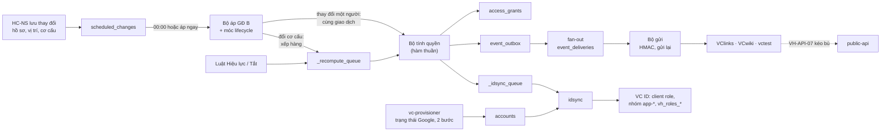

# Kế hoạch code GĐ C: quyền theo luật và vòng đời (R3)

Phiên bản 0.3 · 08/10/2026 · Trạng thái: Nháp (chờ đội phát triển rà)

## Tóm tắt

- **Làm gì:** biến VC People thành nguồn của quyền. App công bố vai trò; luật theo thuộc tính hồ sơ sinh quyền mặc định; quyền tự tính lại khi hồ sơ, cơ cấu hoặc luật đổi; vào làm, chuyển vị trí, nghỉ việc chạy đúng 00:00; quyền được đẩy sang VC ID (client role, nhóm `app-*`, claim `vh_roles`); app nhận sự kiện có chữ ký và kéo bù được.
- **Đầu ra:** 9 module mới hoặc mở rộng của VC Home API (`apps` phần vai trò, `rules`, `grants`, `lifecycle`, `idsync`, `events`, `notifications` phần email, `reports`, `public-api` VH-API-06, 07, 10); 6 collection nghiệp vụ mới và 4 collection kỹ thuật; 9 màn có phần GĐ C; sửa `vc.yaml`, `vc-provisioner`, VClinks và VCwiki.
- **Khối lượng:** 24 phiên VC Home `C-01`…`C-24` = **112 giờ**; VClinks `C-L-01`…`C-L-05` = 20 giờ; VCwiki `C-W-01`…`C-W-05` = 20 giờ. **Tổng 152 giờ**, khớp [10](../10-ke-hoach-trien-khai.md) mục 2 bảng R3.
- **Lịch:** tuần T7–T9 (23/11 → 11/12/2026). Chạy ngầm trên production 30/11 → 07/12 với `FEATURE_GRANTS_PUSH=off`; so khớp ≥ 98% thì bật thật ngày 10/12; R3 ngày 11/12.
- **Điều kiện bắt đầu:** R2 đã lên với khung GĐ B theo [khung chung](ke-hoach-code-tong-quan.md) (mục 2.1); N6, N7 (20/11); N8 (27/11, chậm nhất trước buổi sáng 30/11); kết quả thử SSO-00 điểm (7) mapper `vh_roles` và (8) tạo sẵn user.
- **Việc chặn chưa có mã ở 10 mục 4:** admin Google tạo hộp thư gửi `no-reply@vcprosperous.com` và uỷ quyền `gmail.send` cho tài khoản dịch vụ (email GĐ C, D-BA-14); dev VClinks và dev VCwiki mỗi người khoảng 3 ngày trong T7–T9.
- **Cách làm chính:** một bộ tính thuần (không đụng database) dùng chung cho tính lại, xem trước và tính thử; thay đổi của một người tính lại trong cùng giao dịch, thay đổi lớn đi hàng đợi; dữ liệu, nhật ký, sự kiện và hàng đẩy VC ID ghi trong cùng một giao dịch. `vc-provisioner` chỉ còn đọc Google; điều kiện vào app chuyển về VC Home (D-BA-37).
- **Người duyệt xem kỹ:** mục 3.3 (bộ tính quyền), 3.5 (đẩy VC ID và điều kiện vào app), 3.8 (sự kiện), 3.11 (27 giả định kỹ thuật ở chỗ tài liệu lệch nhau), 11 (chạy ngầm, bật thật, quay lui), 12 (khoảng trống cho vai trò chỉ cấp qua yêu cầu cho tới R4).

## Mục lục

- [Tóm tắt](#tóm-tắt)
- [1. Phạm vi và đầu ra](#1-phạm-vi-và-đầu-ra)
- [2. Điều kiện bắt đầu và phụ thuộc](#2-điều-kiện-bắt-đầu-và-phụ-thuộc)
- [3. Thiết kế kỹ thuật](#3-thiết-kế-kỹ-thuật)
- [4. Dữ liệu](#4-dữ-liệu)
- [5. API](#5-api)
- [6. Job và sự kiện](#6-job-và-sự-kiện)
- [7. Giao diện](#7-giao-diện)
- [8. Thay đổi ở VC ID, VClinks, VCwiki](#8-thay-đổi-ở-vc-id-vclinks-vcwiki)
- [9. Kế hoạch theo phiên](#9-kế-hoạch-theo-phiên)
- [10. Kiểm thử](#10-kiểm-thử)
- [11. Lên bản, chuyển đổi và quay lui](#11-lên-bản-chuyển-đổi-và-quay-lui)
- [12. Rủi ro riêng của giai đoạn](#12-rủi-ro-riêng-của-giai-đoạn)
- [13. Truy vết](#13-truy-vết)
- [Lịch sử cập nhật](#lịch-sử-cập-nhật)

---

## 1. Phạm vi và đầu ra

### 1.1 Yêu cầu của GĐ C

Đối chiếu README mục 5 cột GĐ và 04 mục 14. Ngoài danh sách được giao, README còn một mã có GĐ C là **VH-ADM-01** ("A trở đi"): GĐ C ghi nhật ký cho mọi đối tượng mới (vai trò app, luật, quyền, sự kiện, đẩy VC ID).

| Mã | Tên | Ưu tiên | Làm ở GĐ C (kỹ thuật) | Phiên |
|---|---|---|---|---|
| VH-HOM-03 | Hiện vai trò trên ô app | S | `GET /api/v1/me/grants`; dòng vai trò, "+n", "Còn N ngày", "Khẩn cấp" | C-21 |
| VH-ORG-05 | Đổi cơ cấu có ngày hiệu lực | S | Hẹn đổi tên, chuyển, gộp, ngừng; xem trước bắt buộc; áp tất cả hoặc không | C-18 |
| VH-APP-02 | Vai trò của từng app | M | `app_roles`, client role trên VC ID, ngăn "Vai trò" VH-MH-15 | C-01, C-02, C-13 |
| VH-APP-03 | Chủ app | M | 1–3 chủ app đang làm, `Viewer.appOwnerOf`, phạm vi chủ app | C-01, C-02 |
| VH-APP-05 | Vai trò nhạy cảm | M | Tiêu chí, bỏ cờ chỉ QTHT, luật luôn cần người thứ hai, báo kiểm soát | C-01, C-07, C-15 |
| VH-APP-06 | Thời gian chuyển tiếp từng app | S | `apps.transition_days`, trạng thái `chuyen_tiep`, nhập muộn | C-01, C-05, C-06 |
| VH-ACC-01 | Luật cấp quyền mặc định | M | `rules`: điều kiện, loại trừ, cách gắn đơn vị, nháp, phiên bản | C-04, C-05, C-08 |
| VH-ACC-02 | Tính lại quyền | M | Bộ tính thuần, hàng đợi, khoá theo người, lần chạy an toàn 00:05 | C-05, C-06 |
| VH-ACC-03 | Xem trước tác động | M | Xem trước luật, ảnh chụp, duyệt hai người; tác động một người cho VH-MH-11 | C-07, C-08, C-16 |
| VH-ACC-04 | Cấp khẩn cấp | S | Cấp ≤ 7 ngày, nhắc 24 giờ, hết hạn bằng job hẹn giờ quyền | C-06, C-15 |
| VH-ACC-06 | Gỡ quyền | M | Gỡ ≤ 200 dòng, danh mục lý do, "Gỡ hết" khi ngừng vai trò | C-15 |
| VH-ACC-07 | Đẩy quyền sang VC ID | M | `idsync`: đẩy 30 giây, cầu dao, tạo sẵn user, đối chiếu hằng đêm | C-13, C-14 |
| VH-ACC-08 | Tra cứu quyền | M | Theo người, app, luật, "Tại ngày"; tải Excel | C-21, C-22 |
| VH-LCM-01 | Vào làm | M | Tính trước Chờ hiệu lực, 00:00 bật, T−3 kiểm Google, báo quản lý | C-16 |
| VH-LCM-02 | Chuyển vị trí | M | Tính lại trong giao dịch, `roles_in_transition`, báo quản lý mới | C-16 |
| VH-LCM-03 | Nghỉ việc theo ngày hiệu lực | M | 4 bước đúng thứ tự VH-BR-14, kiểm sau 00:15 | C-17 |
| VH-INT-01 | Bộ claim (phần GĐ C) | M | `resource_access.<client>.roles`, `vh_roles.<app>` theo từng client, cỡ token < 4 KB | C-13 |
| VH-INT-03 | Sự kiện gửi app | M | Outbox, ký HMAC, gửi lại, thứ tự theo luồng | C-10, C-11, C-12 |
| VH-INT-05 | Kéo sự kiện dự phòng | S | VH-API-07 theo `app_seq` | C-12 |
| VH-INT-09 | Sự kiện báo trước | S | `vh.person.change_scheduled` | C-19 |
| VH-INT-10 | Sự kiện thử, nút "Gửi thử" | S | `vh.test.ping` gửi đồng bộ, không vào luồng | C-20 |
| VH-ADM-02 | Báo cáo truy cập | S | 5 báo cáo GĐ C, BGĐ chỉ số đếm, tóm tắt tháng | C-22 |
| VH-ADM-01 | Nhật ký thao tác (phần GĐ C) | M | Hành động mới ở mục 4.6, ghi trong cùng giao dịch | Mọi phiên; kiểm ở C-24 |

### 1.2 Yêu cầu giai đoạn trước có phần làm ở GĐ C

| Mã | Phần GĐ C | Phiên |
|---|---|---|
| VH-APP-01 | Trường dùng từ GĐ C: chủ app bắt buộc với `live`/`beta`, thời gian chuyển tiếp, URL nhận sự kiện, bí mật ký | C-01, C-12 |
| VH-ADM-03 | Bước 3, 5, 6, 7: vai trò `vchome:*` qua luật, chặn tách nhiệm, ngoại lệ tách nhiệm, luôn ≥ 2 `vchome:qtht` | C-09, C-15, C-24 |
| VH-ADM-04 | Dòng 12–17 của danh sách theo dõi | C-06, C-11, C-13, C-14, C-17 |
| VH-AUT-06, 07; VH-NSU-04 | Phát `vh.person.locked` / `unlocked` khi khoá khẩn cấp, khoá do Google, HC-NS tạm khoá | C-14, C-17 |
| VH-AUT-08 | Gắn tài khoản xong thì đẩy quyền ngay (≤ 10 giây) và SPA lấy lại token | C-13, C-21 |
| VH-NSU-09 | Tự sửa tên gọi, ảnh, SĐT thì gửi `vh.person.updated` | C-10 |
| VH-IMP-02 | Báo cáo lệch VC ID lưu như lô `doi_chieu_vc_id`; quyền bị chặn ghi `grant.blocked_sod` (04 mục 14.2) | C-14, C-15 |
| VH-BR-25 với VH-IMP-01, 05, VH-ORG-09 | Lô nhập, hoàn tác lô, gộp danh mục làm đổi quyền từ 21 người thì QTHT xác nhận | C-18 |

### 1.3 Màn hình

| Màn | Phần GĐ C | Phiên |
|---|---|---|
| VH-MH-02 Trang chủ | Dòng vai trò, nhãn "Còn {N} ngày", "Khẩn cấp" | C-21 |
| VH-MH-04 Quyền của tôi | Ngăn "Quyền đang có", "Lịch sử" (chỉ xem) | C-21 |
| VH-MH-09 Đội của tôi | Ngăn "Quyền" | C-21 |
| VH-MH-11 Nhân sự | Khung "Tác động tới quyền" (chỉ xem); người nhận bàn giao (VH-INT-09) | C-16, C-19, C-21 |
| VH-MH-12 Cơ cấu | Hộp "Đổi cơ cấu" có hẹn ngày, danh sách thay đổi đang hẹn | C-18 |
| VH-MH-15 App và vai trò | Ngăn "Vai trò", chủ app, chuyển tiếp; ngăn "Tích hợp" (URL, bí mật, lần gửi 7 ngày, "Gửi lại", "Gửi thử") | C-02, C-12, C-20 |
| VH-MH-16 Luật cấp quyền | Toàn màn; thêm ngăn "Thay đổi hàng loạt chờ xác nhận" cho QTHT | C-08, C-18 |
| VH-MH-17 Tra cứu quyền và báo cáo | Toàn màn | C-22 |
| VH-MH-21 Thanh chuyển app | Nhãn vai trò (thành phần ở VC Home; VClinks, VCwiki tự gắn) | C-21, C-L-04, C-W-04 |

### 1.4 API cho app

| Mã | Đường dẫn (theo [07](../07-tich-hop.md) mục 5) | Phiên |
|---|---|---|
| VH-API-06 | `GET /api/v1/apps/{app_key}/grants` | C-12 |
| VH-API-07 | `GET /api/v1/events?after=&limit=&types=` | C-12 |
| VH-API-10 | `GET /api/v1/apps/{app_key}/roles` | C-12 |

### 1.5 Sự kiện

Mọi sự kiện GĐ C ở README mục 10: `vh.person.joined`, `vh.person.updated`, `vh.person.moved`, `vh.person.left`, `vh.person.locked`, `vh.person.unlocked`, `vh.person.change_scheduled`, `vh.grant.added`, `vh.grant.removed`, `vh.org.unit_changed`, `vh.test.ping`. Nơi phát ở mục 6.2.

### 1.6 Collection mới

Nghiệp vụ (README mục 9, cột C): `app_roles`, `access_rules`, `access_grants`, `event_outbox`, `event_deliveries`, `sod_exceptions`. Kỹ thuật (bắt đầu bằng `_`, khung chung mục 3): `_recompute_queue`, `_idsync_queue`, `_email_outbox`, `_grant_blocks`. Chi tiết ở mục 4.

### 1.7 Không làm ở GĐ C

- Xin, duyệt, uỷ quyền, gia hạn, xin thay (VH-REQ-01…07, VH-HOM-04, VH-MH-05, VH-MH-08): GĐ D. Nguồn `yeu_cau` có trong schema nhưng chưa có đường tạo, trừ dữ liệu UAT trên staging (GT-22).
- Hết hạn quyền theo yêu cầu (VH-ACC-05): GĐ D. GĐ C chỉ làm hết hạn quyền khẩn cấp và hết chuyển tiếp (D-BA-09).
- Rà soát quý và rà soát luật nửa năm (VH-REV-01…04): GĐ D. GĐ C chỉ ghi `next_review_on` và nút "Đã rà soát, giữ nguyên" ở VH-MH-16.
- Thông báo trong VC Home, chuông (VH-HOM-08, `notifications`): GĐ D. GĐ C chỉ gửi email.
- Nghỉ dài ngày, quay lại (VH-LCM-04, 05), `vh.person.leave_started`, `vh.person.returned`: GĐ D.
- Màn cài đặt (VH-ADM-05): GĐ D. GĐ C đổi `system_settings` bằng API có lý do của GĐ B.
- Cờ "cho phép xin" (VH-APP-07): chỉ đặt giá trị mặc định khi tạo vai trò; chưa có giao diện.
- Cảnh báo quyền không dùng (VH-ADM-06): GĐ D. GĐ C chỉ có báo cáo "Không dùng".
- Bộ kiểm tự động đưa app vào và nút "Chạy bộ kiểm" (VH-APP-04): GĐ E.
- Chuyển tiếp riêng từng vai trò; xác thực lại khi dùng vai trò nhạy cảm (D-BA-38); gửi sự kiện theo lô: để sau.

## 2. Điều kiện bắt đầu và phụ thuộc

### 2.1 Từ bản trước

Kế hoạch này chỉ dựa vào [khung chung](ke-hoach-code-tong-quan.md) để biết GĐ B có gì. Phiên đầu tuần T7 (C-01) đọc code `vc-platform` thật; chỗ nào GĐ B làm khác bảng dưới thì chỉnh kế hoạch này trước khi code (DoR, 10 mục 7).

| Thành phần GĐ B | GĐ C dùng để |
|---|---|
| `auth`: `Viewer`, `@Can`, `@AppScope`, issuer giả cho test, bảng quyền sinh từ ma trận 02 | Thêm quyền mới (mục 3.10), `Viewer.appOwnerOf`, `homeRoles` từ `access_grants` |
| `audit`: `AuditService.record(tx, …)`, `correlation_id` | Mọi thao tác GĐ C |
| `jobs`: `_job_locks`, bộ chạy lịch, `Clock`, `POST /api/v1/_test/clock` | Đăng ký 13 job mới (mục 6.1) vào đồng hồ giả |
| `people`: `scheduled_changes` và bộ áp mỗi phút (05 mục 5.2) | Móc `lifecycle` vào trước và sau khi áp |
| `org`: cây, `ancestors`, trưởng đơn vị, gộp mục danh mục (VH-ORG-09) | Bộ tính, đổi cơ cấu có hiệu lực |
| `accounts`: nhiều khoá (D-BA-03), khoá khẩn cấp, `directory_exclusions`, `google_status`, gắn tài khoản VH-AUT-08 | Điều kiện vào app, sự kiện khoá |
| `apps`: collection `apps`, `catalog.json` động, ngăn "Thông tin" của VH-MH-15 | Thêm ngăn "Vai trò", "Tích hợp" |
| `public-api`: VH-API-01…05, guard token máy, 600 lượt/phút, dạng lỗi 07 mục 5.1 | Thêm VH-API-06, 07, 10 |
| `settings`: `system_settings` có lý do | 5 khoá mới (mục 4.5) |
| Đồng bộ thuộc tính hồ sơ sang VC ID qua client `vc-home-api` (VH-INT-01 GĐ B) | `idsync` mở rộng cùng client Admin API |
| `imports`: đối chiếu Google, lô `import_batches`; job chép sự kiện đăng nhập VC ID vào `audit_log` (VH-ADM-01 bước 3) | Lô `doi_chieu_vc_id`; báo cáo "Không dùng" |
| Công cụ staging: đồng hồ giả lập, app giả lập `vctest` | UAT đợt C, gửi sự kiện |
| `packages/contracts`: mã lỗi, quyền, JSON Schema | Hợp đồng sự kiện cho app |

### 2.2 Đầu vào từ bên ngoài

| Đầu vào | Ai | Hạn | Chặn phiên |
|---|---|---|---|
| N6 Bảng ánh xạ vai trò VClinks, VCwiki sang vai trò app | Chủ app | 20/11 | C-02 (seed), C-L-01, C-W-01 |
| N7 Bảng ánh xạ mã đơn vị cũ sang mã mới | HC-NS + chủ app | 20/11 | C-09, C-L-03, C-W-03 |
| N8 Bộ luật cấp quyền bản đầu, đã duyệt | Chủ dự án + chủ app | 27/11 | C-09 (chạy ngầm 30/11) |
| N3 Người giữ vai trò (Q-07) | Chủ dự án | Đã có từ R2 | C-09 (luật `vchome:*`), C-24 |
| N5 Người dùng thử theo vai trò; 6 tài khoản Google thử (11 đề xuất 6) | Chủ dự án | Đã có từ R2 | C-23, C-24 |
| Hộp thư `no-reply@vcprosperous.com` và uỷ quyền toàn miền `gmail.send` cho tài khoản dịch vụ (chưa có mã ở 10 mục 4) | Admin Google | 23/11 | C-03 (staging dùng chế độ `log` nếu chưa có) |
| Kết quả SSO-00 điểm (7) mapper `vh_roles` JSON theo client và (8) tạo sẵn user có liên kết Google | Dev GĐ A | Đã có từ R1 | C-13 |
| Dev VClinks (Dev002) và dev VCwiki, mỗi người khoảng 3 ngày | Chủ dự án | T7–T9 | C-L-*, C-W-* |

### 2.3 Quyết định liên quan

- **Q-05** vai trò thô; **Q-06** app chỉ đọc hồ sơ, cơ cấu; **Q-07** mỗi vai trò 2 người (luôn ≥ 2 `vchome:qtht`); **Q-12** nơi làm việc là thuộc tính luật; **Q-13** khoá lúc 00:00 ngày đầu không còn làm; **Q-14** tài khoản chưa có hồ sơ giữ nhóm mặc định 30 ngày sau R3.
- **D-BA-03** nhiều khoá cùng lúc; **D-BA-07** từ 21 người cần người thứ hai, vai trò nhạy cảm luôn cần; **D-BA-09** job hẹn giờ quyền có từ GĐ C; **D-BA-10** HC-NS qua luật từ GĐ C; **D-BA-13** trường của `vh.person.updated`, `vh.org.unit_changed`; **D-BA-14** thông báo GĐ C bằng email; **D-BA-17** toán tử "không thuộc"; **D-BA-18** thứ tự theo luồng; **D-BA-20** khoá `vchome`; **D-BA-25** tạm khoá nguồn `hcns`; **D-BA-26** app tạm ngưng token máy cá nhân khi `vh.person.locked`; **D-BA-27** tạo sẵn user VC ID; **D-BA-29** token chỉ có C0, mã đơn vị, vai trò của app nhận; **D-BA-32** nhãn nguồn "Luật / Được duyệt / Khẩn cấp"; **D-BA-34, 35** VH-MH-17 là nơi xem báo cáo và quản ngoại lệ tách nhiệm.
- **D-BA-37** từ GĐ C điều kiện vào app do VC Home quyết: có hồ sơ "Đang làm" + bật 2 bước + không thuộc danh sách loại trừ. **D-BA-40** quy trình nghỉ việc tay (thiết kế SSO 11.1) chỉ còn là dự phòng sau R3.

## 3. Thiết kế kỹ thuật

### 3.1 Module thêm và sửa

Theo [khung chung](ke-hoach-code-tong-quan.md) mục 5. Mỗi module chỉ ghi vào collection của mình; module khác gọi service.

| Module | GĐ C thêm | Ghi vào | Phiên |
|---|---|---|---|
| `apps` | Vai trò app, chủ app, chuyển tiếp, cấu hình nhận sự kiện, bí mật ký | `apps`, `app_roles` | C-01, C-02, C-12 |
| `rules` | Luật, nháp, phiên bản, xem trước, duyệt hai người, cổng xác nhận thay đổi hàng loạt | `access_rules` | C-04, C-07, C-08, C-18 |
| `grants` | Bộ tính, hàng đợi tính lại, job hẹn giờ quyền, khẩn cấp, gỡ, tách nhiệm | `access_grants`, `sod_exceptions`, `_recompute_queue`, `_grant_blocks` | C-05, C-06, C-15 |
| `lifecycle` | Móc vào bộ áp `scheduled_changes`; vào làm, chuyển, nghỉ việc; đổi cơ cấu có hiệu lực; báo trước | Không có collection riêng (gọi `people`, `org`, `accounts`, `grants`) | C-16…C-19 |
| `idsync` | Trạng thái mong muốn, hàng đẩy, tạo sẵn user, đối chiếu hằng đêm, cầu dao, điều kiện vào app | `_idsync_queue` (báo cáo lệch qua `imports`) | C-13, C-14 |
| `events` | Ghi outbox, nội dung sự kiện, fan-out, bộ gửi, ký, gửi lại, gửi thử | `event_outbox`, `event_deliveries` | C-06, C-10, C-11, C-20 |
| `notifications` | Email Gmail (phần GĐ C) | `_email_outbox` | C-03 |
| `reports` | Tra cứu quyền, báo cáo truy cập, tóm tắt tháng | Không (chỉ đọc) | C-22 |
| `public-api` | VH-API-06, 07, 10 | Không (chỉ đọc) | C-12 |
| `accounts` (sửa) | Nhận trạng thái Google và 2 bước từ `vc-provisioner`; khoá và mở khoá phát sự kiện | `accounts` | C-14, C-17 |
| `people`, `org` (sửa) | Gọi `EventsService.emit` và `RecomputeQueue.enqueue` trong giao dịch; trường `handover_to_person_id` | Như GĐ B | C-06, C-10, C-19 |
| `auth` (sửa) | `Viewer.appOwnerOf`; `homeRoles` đọc `access_grants` app `vchome` khi `HOME_ROLES_SOURCE=grants` | — | C-01, C-24 |

### 3.2 Luồng chính



Ba nguyên tắc:
1. **Một giao dịch cho một thay đổi gốc:** dòng quyền, `audit_log`, `event_outbox`, `_idsync_queue`, `_email_outbox` cùng commit hoặc cùng huỷ (khung chung mục 6).
2. **Một bộ tính cho mọi chỗ:** tính lại, xem trước luật, tác động tới một người (VH-MH-11), tính thử cho `roles_in_transition` đều gọi cùng hàm thuần `computeDesired()` và `planChanges()`.
3. **Gọi ra ngoài (Keycloak, app, Gmail) không nằm trong giao dịch:** chỉ đọc hàng đợi đã commit, có thử lại, idempotent.

### 3.3 Bộ tính quyền (VH-ACC-02)

**Đầu vào** (nạp một lần cho mỗi lượt, giữ trong bộ nhớ):
- `PersonSnapshot`: `status`, `employee_type`, `work_location_code`, `is_manager`, `head_of_unit_codes`, các vị trí còn hiệu lực (Chưa vào làm: các vị trí `position_open` hẹn ở ngày vào làm trong `scheduled_changes`).
- `OrgIndex`: mỗi đơn vị có `type`, `parent_code`, `ancestors`, `division_code`, `legal_entity_code`, `status`, `head_person_id`; bảng con trực tiếp.
- `CompiledRule[]`: luật `hieu_luc` với vai trò `dang_dung`, kèm `unit_scoped`, `allowed_unit_types`, `sensitive` của vai trò.
- Ngữ cảnh: `apps.transition_days`, `sod_exceptions` còn hạn, nguồn kích hoạt `{type, id, at}`.

**Tập mong muốn D** (phác thảo):

```ts
// api/src/grants/engine/compute.ts (phác thảo)
export function computeDesired(p: PersonSnapshot, rules: CompiledRule[], org: OrgIndex): DesiredGrant[] {
  if (p.status === 'da_nghi') return [];
  const positions = p.status === 'chua_vao_lam' ? p.futurePositions : p.activePositions; // VH-BR-24
  const out = new Map<string, DesiredGrant>();
  for (const r of rules) {
    for (const pos of positions) {
      if (!matchPerson(r, p) || !matchPosition(r, pos)) continue;          // loại NV, nơi làm, là quản lý; chức danh, chức năng
      for (const scope of scopeUnits(r, p, pos, org)) {                    // is_unit_head = Có → các đơn vị người này làm trưởng (GT-06)
        if (!matchUnit(r, scope, org)) continue;                           // pháp nhân, division, đơn vị (thuộc cây), danh sách loại trừ
        const unit = bindUnit(r, scope, org);                              // theo_vi_tri · division_cua_vi_tri · co_dinh · null
        if (unit === SKIP) continue;                                       // sai loại đơn vị nhận: ghi cảnh báo vào xem trước
        const key = `${r.app}|${r.role}|${unit ?? '-'}|${r.id}`;
        const cur = out.get(key);
        if (!cur || better(pos, cur.position)) out.set(key, { app: r.app, role: r.role, unit, ruleId: r.id, ruleVersion: r.version, position: pos });
      }
    }
  }
  return [...out.values()];
}
```

- Điều kiện nối bằng VÀ giữa các nhóm, HOẶC trong một nhóm; nhóm trống là không giới hạn; mỗi nhóm có danh sách loại trừ cùng loại (05 mục 3.9, D-BA-17). Loại trừ đơn vị nhận `{code, include_sub_units}` như nhóm đơn vị (GT-17).
- `better()`: vị trí chính trước, rồi `start_on` sớm hơn, rồi `_id` nhỏ hơn, để kết quả không phụ thuộc thứ tự đọc (GT-09).

**So với tập hiện có C** (`planChanges(D, C, effectiveBefore, ctx)` trả danh sách thao tác, chưa ghi gì):

| Trường hợp | Thao tác | Sự kiện |
|---|---|---|
| Trong D, chưa có trong C; người Đang làm | Tạo dòng `luat` Hiệu lực, `valid_from` = bây giờ | `vh.grant.added` nếu quyền hiệu lực (app, vai trò, đơn vị) mới xuất hiện |
| Trong D, chưa có; người Chưa vào làm | Tạo dòng Chờ hiệu lực, `valid_from` = 00:00 ngày vào làm | Không |
| Trong D, đang Chuyển tiếp trong C | Về Hiệu lực, xoá `transition_until` | Không |
| Trong C, không còn trong D; app N = 0 | Đã gỡ, lý do `luat_tat` hoặc `khong_con_thoa_luat` | `vh.grant.removed` nếu quyền hiệu lực biến mất |
| Trong C, không còn trong D; app N ≥ 1 | Chuyển tiếp, `transition_until` = `trigger.at` + N × 24 giờ (GT-07) | Không |
| Dòng Chờ hiệu lực không còn trong D | Đã gỡ `huy_truoc_hieu_luc` | Không |
| Trong D nhưng xung đột tách nhiệm | Không tạo; ghi `_grant_blocks`, nhật ký `grant.blocked_sod`, báo QTHT một lần | Không |

- `trigger.at` là lúc thay đổi gốc được áp (00:00:xx với thay đổi hẹn; lúc lưu với nhập muộn VH-BR-11; lúc luật chuyển Hiệu lực hay Tắt). Hàng đợi chậm vài phút không làm lệch ngày gỡ.
- "Còn N ngày" tính theo ngày lịch giờ Việt Nam: N = ngày(`transition_until` − 1 ms) − hôm nay + 1. Ví dụ VH-HOM-03 tiêu chí 2: hiệu lực 01/12, gỡ 04/12 00:00 → 01/12 "Còn 3 ngày", 03/12 "Còn 1 ngày".
- Chỉ đụng dòng nguồn `luat`. Quyền ngoại lệ không bị tính lại; quyền hiệu lực (gộp mọi nguồn) chỉ dùng để quyết có sinh sự kiện hay không.
- **Tách nhiệm** (VH-BR-17, 02 mục 6, VH-ADM-03 bước 5): cặp `vchome:hcns` + `vchome:qtht`, `vchome:kiem_soat` + `vchome:qtht`. Vai trò "đến sau" (chưa hiệu lực trước lượt tính, từ mọi nguồn) bị chặn nếu không có `sod_exceptions` còn hạn. Hai vai trò cùng đến trong một lượt thì chặn vai trò nhạy cảm `qtht` (GT-08).
- **Sự kiện quyền:** so tập quyền hiệu lực trước và sau theo từng app; mỗi thay đổi một sự kiện; `data.roles` là ảnh chụp sau khi áp lần lượt từng thay đổi (07 mục 6.6).

**Idempotent và đồng thời:**
- D chỉ phụ thuộc dữ liệu; `planChanges` trả rỗng khi C đã khớp D. Chạy toàn bộ hai lần: lần hai 0 thao tác, 0 sự kiện (VH-ACC-02 tiêu chí 2).
- Mỗi người một giao dịch. Chỉ mục duy nhất một phần `open = true` của `access_grants` (05 mục 3.10) chặn tạo trùng; xung đột ghi (`WriteConflict`) thì thử lại cả giao dịch tối đa 3 lần, sau đó ghi lỗi và cảnh báo (VH-ACC-02 ngoại lệ). Không bao giờ để một người nửa vời.
- `_recompute_queue` có một dòng mỗi người (duy nhất theo `person_id`) và khoá thuê `locked_until`: không có hai worker tính cùng một người.

**Khi nào tính:**

| Nguồn | Cách | Ai bị tính |
|---|---|---|
| Thay đổi một người (hồ sơ, vị trí, trạng thái, quản lý) áp lúc 00:00 hoặc áp ngay | **Trong cùng giao dịch** với thay đổi (có ngay `roles_in_transition` cho `vh.person.moved`) | Người đó; quản lý cũ và mới (thuộc tính "là quản lý") |
| Đổi cơ cấu, đổi trưởng đơn vị, gộp danh mục, lô nhập | Ghi `_recompute_queue` trong cùng giao dịch | Cây con của đơn vị; trưởng cũ, mới; người dùng mục danh mục |
| Luật Hiệu lực, sửa, Tắt | Ghi `_recompute_queue` | Mọi người Chưa vào làm, Đang làm, Nghỉ dài ngày, Tạm khoá (≤ 1.000 người) |
| Lần chạy an toàn 00:05 | Job | Mọi nhân viên; chênh thì sửa, ghi "phát hiện bởi lần chạy an toàn", cảnh báo dòng 12 |
| QTHT bấm "Tính lại" | API | Một người hoặc toàn bộ (chặn chạy chồng, câu 04 VH-ACC-02) |

**Hiệu năng:** nạp `OrgIndex` và luật một lần mỗi lượt; một người ≤ 5 giây; 1.000 người và 100 luật ≤ 5 phút (VH-NFR-13). Đo ở C-06 trên máy dev, đo lại ở C-23 trên staging.

**Test thuộc tính** (fast-check, C-05): bộ sinh cây đơn vị theo luật đặt cha (05 mục 3.4), 1–50 người có 1–3 vị trí, 1–15 luật ngẫu nhiên (gồm loại trừ, "là quản lý", "là trưởng đơn vị", 3 cách gắn đơn vị). Bộ tính mẫu viết thẳng từ 04 VH-ACC-01 bước 5–6 theo cách đơn giản nhất (vòng lặp lồng, không tối ưu). Chín thuộc tính:
1. `computeDesired` bằng bộ tính mẫu.
2. Áp `planChanges` rồi tính lại: 0 thao tác.
3. Đảo thứ tự luật, vị trí: D không đổi.
4. Thêm một giá trị loại trừ không bao giờ làm D lớn hơn.
5. Không thao tác nào đụng dòng `yeu_cau`, `khan_cap`.
6. Dòng mất luật vào Chuyển tiếp khi và chỉ khi N ≥ 1 và người chưa Đã nghỉ.
7. Không lúc nào hai vai trò xung đột cùng hiệu lực khi không có ngoại lệ.
8. Số `vh.grant.added` = |E_sau \ E_trước|, số `vh.grant.removed` = |E_trước \ E_sau|.
9. Người Đã nghỉ có D rỗng; người Chưa vào làm chỉ có dòng Chờ hiệu lực.

### 3.4 Luật, xem trước và duyệt hai người

- **Lưu luật:** bản đang chạy nằm ở trường gốc của `access_rules` (`conditions`, `unit_binding`, `version`, `status`). Sửa luật Hiệu lực tạo `draft` (bản nháp có `kind`: `sua` · `tat`); bản đang chạy vẫn áp tới khi nháp được áp (VH-ACC-01 bước 10). Mỗi lần áp đẩy bản cũ vào `versions[]`; "Khôi phục bản trước" tạo nháp từ phần tử của `versions` rồi đi lại xem trước và duyệt (04 mục 14.2).
- **Kiểm ở schema:** zod `strict()` không có khoá email, mã nhân viên, họ tên (VH-BR-10, VH-UAT-37); tự mâu thuẫn (cùng giá trị ở danh sách thuộc và loại trừ); giá trị ngừng; trùng điều kiện và vai trò với luật khác; vai trò ngừng; vai trò gắn đơn vị mà thiếu `unit_binding`. Câu lỗi đúng 04 VH-ACC-01.
- **Xem trước** (VH-ACC-03): chạy `computeDesired` hai lần cho mọi người (tập luật hiện tại và tập luật nếu áp), so theo quyền hiệu lực có tính cả quyền ngoại lệ. Kết quả: số đếm, danh sách "Được thêm", "Mất" (kèm lúc mất thật sau chuyển tiếp hoặc "vẫn giữ nhờ quyền ngoại lệ đến …"), "Bị chặn tách nhiệm", gom theo đơn vị cấp phòng. Không ghi gì vào `access_grants`. ≤ 10 giây với 1.000 người. Ảnh chụp (số đếm, danh sách, lúc tính, người tính) lưu ở `draft.preview`.
- **Cần người thứ hai** khi tổng người bị ảnh hưởng ≥ ngưỡng + 1 (ngưỡng ở `system_settings` `rules.second_approval_threshold`, mặc định 20, chỉ hạ được) hoặc vai trò đích nhạy cảm (VH-BR-25, D-BA-07). Người duyệt là QTHT khác người soạn, hoặc chủ app của app đó; người soạn không duyệt được (02 mục 6).
- **Lúc duyệt:** tính lại xem trước. Có chênh so với ảnh chụp thì hiện phần chênh và đòi xác nhận lại (`confirm_diff`). Chênh quá 20% số người bị ảnh hưởng thì không áp, luật về Nháp kèm ghi chú "cần xem trước và duyệt lại" (VH-BR-25 bản 02 v0.3). Ảnh chụp cũ hơn 7 ngày thì bắt xem trước lại.
- **Áp:** luật chuyển Hiệu lực (hoặc Tắt), `version` + 1, `next_review_on` = lúc áp + 6 tháng, xếp hàng tính lại. Email người duyệt khi gửi duyệt và người soạn khi bị từ chối (ý kiến ≥ 10 ký tự).

### 3.5 Đẩy sang VC ID và điều kiện vào app

**Trạng thái mong muốn của một tài khoản** (04 VH-ACC-07 bước 1, D-BA-37, Q-14):

```
desired(account):
  nếu account.locks không rỗng      → bỏ qua, giữ nguyên trên VC ID (VH-ACC-07 bước 4); đẩy lại khi mở khoá
  nếu account chưa gắn hồ sơ:
      hôm nay < transition.no_profile_until và đủ điều kiện kiểu GĐ A (Google hoạt động, 2 bước, không loại trừ)
                                     → nhóm app-vclinks, app-vcwiki; không client role (Q-14)
      ngược lại                      → không nhóm app
  nếu có hồ sơ:
      đủ = status "Đang làm" và google_status.two_sv và không thuộc directory_exclusions
      không đủ                       → không nhóm app, không client role; vc_trang_thai = chua_bat_2_buoc | loai_tru
      đủ                             → với mỗi app có ≥ 1 quyền hiệu lực: nhóm app-<khoá>, client role <vai trò>,
                                       thuộc tính vh_roles_<khoá> (mỗi {role, unit} một giá trị JSON); vc_trang_thai = du_dieu_kien
```

- "Đang làm" ở GĐ C; GĐ D thêm "Nghỉ dài ngày không khoá" (VH-BR-15).
- Dữ liệu Google (trạng thái, 2 bước) do `vc-provisioner` gửi sang mỗi 15 phút (mục 8.2). Job `google.reconcile` của GĐ B (06:00 và "Đối chiếu ngay") cũng ghi `accounts.google_status`; hai nguồn cùng ghi được, bản có `checked_at` mới hơn thắng. Dữ liệu cũ hơn 2 giờ thì `idsync` chỉ thêm, không gỡ gì theo điều kiện này, và cảnh báo (dừng an toàn).
- **Hàng đẩy:** mọi thay đổi quyền hiệu lực, gắn tài khoản, khoá, mở khoá, đổi điều kiện ghi `_idsync_queue` (một dòng mỗi tài khoản). Worker mỗi 30 giây: đọc trạng thái thật trên VC ID (client role của các client trong danh mục, nhóm `app-*`, thuộc tính), tính chênh, thêm thiếu, bỏ thừa, rồi gọi `GrantsService.markSynced(personId, at)` để ghi `idp_synced_at`. Chỉ đụng nhóm `app-*` và client role của app có trong danh mục; nhóm khác như `vc-id-admin` không đụng.
- **Ghi thuộc tính:** Admin API thay cả bản đồ thuộc tính khi `PUT` user, nên luôn đọc rồi ghi lại đủ, không làm mất `employee_code`, `vh_profile` của GĐ B và `vc_trang_thai`.
- **`vh_roles` nhiều giá trị:** mỗi `{role, unit}` là một giá trị chuỗi JSON của thuộc tính `vh_roles_<khoá>`; mapper bật `multivalued` và kiểu JSON nên claim ra mảng đối tượng. Cách này tránh giới hạn độ dài một giá trị thuộc tính (GT-23). Phần của một app vượt 2 KB thì không ghi, đặt `vh_roles_overflow = true` (07 mục 2.5).
- **Thử lại:** 30 giây, 2 phút, 10 phút, 30 phút, rồi mỗi giờ; lỗi 3 lần liên tiếp hoặc chậm quá 15 phút thì cảnh báo dòng 14.
- **Cầu dao:** một lượt định gỡ quá 50 vai trò hoặc quá 20% số vai trò đang quản (khoá `idsync.breaker_max_roles`, `idsync.breaker_max_percent`) mà không khớp thay đổi đã duyệt thì dừng, không gỡ gì, cảnh báo Khẩn (dòng 13). Mỗi dòng hàng đẩy mang `cause` (`luat_da_duyet`, `nghi_viec`, `go_tay`, `tinh_lai`, `bat_that`…); dòng có `cause` đã duyệt không tính vào ngưỡng. QTHT xem danh sách rồi bấm "Cho chạy tiếp" (ghi nhật ký).
- **Tạo sẵn user** (D-BA-27): người Chưa vào làm hoặc Đang làm chưa có `accounts`: tìm user VC ID theo email (`exact`); có thì tạo dòng `accounts` (`link.method = theo_email`, `linked_by = he_thong`); chưa có mà Google đã có tài khoản (theo báo cáo của `vc-provisioner`) thì tạo user và gắn liên kết `google` bằng `google_id`, `link.method = tao_san`. Nhờ đó `vh.person.joined` có `sub`.
- **Lần đăng nhập đầu:** VH-AUT-08 gắn tài khoản xong gọi `idsync.pushNow()` (chờ tối đa 10 giây); SPA gọi `signinSilent()` để lưới app có đủ ô (VH-ACC-07 bước 9).
- **`FEATURE_GRANTS_PUSH=off`** (chạy ngầm): worker vẫn tính chênh và ghi số đếm theo loại, không gọi API ghi nào. `vc-provisioner` vẫn quản nhóm mặc định như GĐ A–B.

**Đối chiếu hằng đêm** (01:30, và lệnh tay sau khi khôi phục VC ID): so mọi user realm `vc` với VC Home, 4 loại lệch (04 VH-ACC-07 bảng). Lưu lô `import_batches.kind = doi_chieu_vc_id` (04 mục 14.2). Chế độ ở `idsync.reconcile_mode`: `chi_bao` 2 tuần đầu sau R3 rồi `tu_sua` (VC Home thắng, VH-BR-03); "Vai trò lạ" chỉ báo, không tự xoá.

**`vc-provisioner` còn làm gì sau khi bật thật:**

| Việc | Trước bật thật (GĐ A–B, chạy ngầm) | Sau bật thật |
|---|---|---|
| Đọc Google mỗi 15 phút, mỗi Workspace | Có | Có; gửi trạng thái và 2 bước sang VC Home API |
| Khoá VC ID khi Google `suspended` / `archived` / xoá; không tự mở | Có | Có (giữ làm lớp bảo vệ thứ hai); VC Home ghi khoá `google` và phát `vh.person.locked` |
| Dừng an toàn khi danh sách Google bất thường | Có | Có |
| Cấp, gỡ nhóm `app-vclinks`, `app-vcwiki` theo điều kiện vào app | Có | **Không** (`PROVISIONER_MANAGE_APP_GROUPS=off`); `idsync` làm |
| Ghi `vc_trang_thai`, tạo sẵn user | Có | **Không**; `idsync` làm |
| Lệnh tay `disable`, `enable`, `report`, `sync` | Có | Giữ làm đường khẩn cấp khi VC Home API không chạy |

### 3.6 Vòng đời

`lifecycle` móc vào bộ áp `scheduled_changes` của GĐ B qua hai điểm: `beforeApply(group)` (khoá VC ID khi nghỉ việc) và `inTransaction(tx, group)` (tính lại, sự kiện, email). Thay đổi áp ngay (ngày hôm nay hoặc đã qua) đi cùng đường (05 mục 5.1).

| Việc | Cách làm | Yêu cầu |
|---|---|---|
| Lưu hồ sơ ngày vào ở tương lai | Tính trước bằng bộ tính trên vị trí hẹn; tạo dòng Chờ hiệu lực; email quản lý (câu VH-LCM-01 bước 4) | VH-LCM-01 |
| T−3 ngày | Job 07:45 hằng ngày: hồ sơ vào làm sau 3 ngày mà Google chưa có tài khoản thì email HC-NS và admin Google | VH-LCM-01 bước 5 |
| 00:00 ngày vào | Hồ sơ Đang làm, mở vị trí (GĐ B); cùng giao dịch: `vh.person.joined`, dòng Chờ hiệu lực → Hiệu lực, `vh.grant.added` từng quyền, xếp hàng đẩy | VH-LCM-01 bước 6 |
| "Không nhận việc" | Hồ sơ Đã nghỉ (`khong_vao_lam`), dòng Chờ hiệu lực → Đã gỡ `huy_truoc_hieu_luc`; không sự kiện | VH-LCM-01 bước 9 |
| Chuyển vị trí, kiêm nhiệm, đổi quản lý | Cùng giao dịch: đóng, mở vị trí; tính lại người đó và quản lý cũ, mới; `vh.person.moved` kèm `roles_in_transition`; email nhân viên, quản lý cũ, mới; email quản lý mới danh sách quyền ngoại lệ (04 mục 14.2) | VH-LCM-02 |
| Tác động tới quyền trước khi lưu | `POST /api/v1/admin/people/{code}/grant-impact` chạy bộ tính trên thay đổi dự kiến; trả quyền thêm, mất (kèm ngày gỡ từng app), ngoại lệ giữ nguyên | VH-ACC-03 (14.2), VH-LCM-02 bước 2 |
| Nghỉ việc | `LeaverFlow` dưới đây | VH-LCM-03 |
| Khoá, mở khoá | `vh.person.locked` khi tài khoản chuyển từ không khoá sang có khoá (`khan_cap`, `google`, `tam_khoa`); `vh.person.unlocked` khi hết mọi khoá; khoá `nghi_viec` không phát `locked` (đã có `left`) (GT-26) | VH-AUT-06, 07, VH-NSU-04; D-BA-03, 25, 26 |

**`LeaverFlow`** (VH-BR-14, VH-LCM-03; 00:00 ngày nghỉ hoặc ngay khi xác nhận):

```
① accounts.lockForLeave: thêm khoá nghi_viec (giao dịch riêng, nhật ký account.lock)
   → Admin API: enabled=false, POST /users/{id}/logout (VC ID gửi back-channel tới mọi app)
   → lỗi thì thử lại mỗi phút trong 15 phút rồi cảnh báo Khẩn "Chưa khoá được tài khoản của {mã NV} trên VC ID."; bước ② vẫn chạy
   → đã bị khoá trước (Google khoá, khoá khẩn cấp) thì coi như xong, không báo lỗi (VH-UAT-34)
② một giao dịch: mọi dòng đang mở → Đã gỡ (nghi_viec), bỏ qua chuyển tiếp; vh.grant.removed từng quyền; _idsync_queue
③ cùng giao dịch: vh.person.left (ngày nghỉ, đơn vị chính cuối, last_manager, last_unit_head)
④ cùng giao dịch: đóng vị trí (end_on = ngày trước ngày nghỉ, end_reason = nghi_viec), bỏ chức trưởng,
   đánh dấu manager_missing cho vị trí trỏ tới người này, people.status = da_nghi; email HC-NS danh sách thiếu quản lý, đơn vị mất trưởng
00:15 job kiểm sau: tài khoản đã khoá, không còn dòng mở; sai thì cảnh báo Khẩn (dòng 17)
```

Bước ②–④ trong một giao dịch, nhật ký ghi lần lượt nên giờ trên nhật ký đúng thứ tự ①→④ (VH-UAT-33). Việc dở của GĐ D (yêu cầu, rà soát, uỷ quyền) để móc sẵn, GĐ D điền. Nhắc quản lý D−3 bằng job 07:45.

### 3.7 Đổi cơ cấu có hiệu lực và xác nhận thay đổi hàng loạt

- **Lưu** (VH-ORG-05): chọn thao tác Đổi tên, Chuyển, Gộp, Ngừng; ngày hiệu lực mặc định ngày 1 tháng sau; căn cứ. Bắt buộc gọi xem trước trước khi lưu: API trả `preview_id` (băm của dữ liệu vào và lúc tính); lưu phải gửi `preview_id` còn khớp, không thì câu "Chưa xem trước tác động…". Mỗi đơn vị một thay đổi mỗi ngày.
- **Xem trước:** số người, số vị trí bị chuyển, đơn vị con, trưởng đơn vị, số quyền thêm và mất theo app (bộ tính chạy trên cây giả định), luật đang trỏ tới đơn vị sẽ ngừng, app sẽ nhận sự kiện.
- **Áp lúc 00:00:** thứ tự Đổi tên → Chuyển → Gộp → Ngừng; cơ cấu trước, người sau (05 mục 5.2). Gộp A vào B: đóng vị trí ở A (`end_on` = ngày hiệu lực − 1), mở vị trí ở B cùng chức danh, chức năng; vị trí có quản lý là trưởng A đổi sang trưởng B. **Một giao dịch cho cả nhóm** (tất cả hoặc không, 04 VH-ORG-05 bước 5; GT-11). Lỗi thì nhóm `loi`, email HC-NS và QTHT câu "Không áp được thay đổi cơ cấu …".
- **Sự kiện và quyền:** `vh.org.unit_changed` cho từng đơn vị (gồm `head_changed`), `vh.person.moved` cho từng người bị chuyển; `roles_in_transition` lấy bằng tính thử (hàm thuần, cùng `trigger.at` với lượt tính lại sau đó nên trùng kết quả); người bị ảnh hưởng xếp hàng tính lại (≤ 5 phút).
- **Cổng xác nhận thay đổi hàng loạt** (`BulkImpactGate`, VH-BR-25): đổi cơ cấu, lô nhập Excel, hoàn tác lô (VH-IMP-05), gộp mục danh mục (VH-ORG-09) mà làm thêm hoặc mất quyền của từ 21 người trở lên thì lưu ở trạng thái chờ xác nhận (`scheduled_changes.confirmation.required = true`, hoặc lô chưa áp). QTHT xác nhận ở ngăn "Thay đổi hàng loạt chờ xác nhận" của VH-MH-16 (GĐ D chuyển vào Hộp duyệt; GT-16). Tới ngày hiệu lực mà chưa xác nhận thì không áp, đánh dấu lỗi `chua_xac_nhan`, email HC-NS, QTHT. Lúc áp số người lệch quá 20% bản đã xác nhận thì không áp, đòi xác nhận lại.

### 3.8 Sự kiện

**Ghi** (`EventsService.emit(tx, …)`, gọi trong giao dịch của thay đổi gốc):
- Cấp `sequence` bằng `$inc` trên bộ đếm của luồng: `people.event_seq` (luồng `person:<id>`), `people.grant_event_seq.<app>` (luồng `grant:<id>:<app>`), `org_units.event_seq` (luồng `org_unit:<mã>`) (05 mục 3.16).
- `_id` UUID v7; `correlation_id` lấy từ yêu cầu gốc; `data` là ảnh chụp đầy đủ sau thay đổi theo 07 mục 6.6, dựng bằng hàm trong `packages/contracts/events/` (zod, sinh JSON Schema cho app).
- `vh.person.updated` gồm tên, tên gọi, email, ảnh, SĐT công việc, loại nhân viên, pháp nhân, nơi làm việc (D-BA-13; GT-05).

**Fan-out** (job mỗi giây): đọc outbox mới theo thứ tự `_id`; với mỗi app có `event_webhook_url` và đăng ký loại đó (riêng `vh.grant.*` chỉ app của quyền), tạo `event_deliveries` với `app_seq` từ `$inc apps.event_seq`, sao `stream`, `sequence`. Bỏ sự kiện tạo trước `apps.events_since` (lúc app bật nhận) để app mới bật không bị dồn sự kiện cũ; app tự đồng bộ toàn bộ qua API khi bật.

**Gửi** (`events.dispatch`, mỗi app một hàng):
1. Với app A, lấy các dòng `cho_gui`, `thu_lai`; theo từng `stream` chỉ xét dòng có `sequence` nhỏ nhất (dòng trước đó đã `da_gui` hoặc `that_bai`), và chỉ gửi khi `next_attempt_at` ≤ bây giờ. Tối đa `EVENTS_DISPATCH_CONCURRENCY` (mặc định 4) luồng song song mỗi app; giữ dòng bằng khoá thuê `locked_until` 30 giây.
2. Chiếu theo `apps.people_data_level`: app `C0` không có trường từ `status` trở xuống của ảnh chụp người và các trường quản lý (07 mục 6.6; 04 VH-INT-03 tiêu chí 5).
3. Tuần tự hoá JSON một lần, ký trên đúng các byte đó, `POST` với header 07 mục 6.3, chờ tối đa 5 giây.
4. `2xx` → `da_gui`. Lỗi → `thu_lai`, lịch chờ 07 mục 6.4 (1, 2, 4… phút, tối đa 4 giờ, dao động ±20%); tròn 24 giờ từ lần gửi đầu → `that_bai`, cảnh báo QTHT và chủ app (dòng 16).

```ts
// api/src/events/sign.ts (phác thảo); app kiểm bằng verifyVhSignature ở 07 mục 6.3
export function signHeaders(rawBody: Buffer, secrets: Buffer[], now: Date): Record<string, string> {
  const ts = Math.floor(now.getTime() / 1000).toString();
  const sig = secrets
    .map((s) => 'sha256=' + createHmac('sha256', s).update(`${ts}.`).update(rawBody).digest('hex'))
    .join(', ');
  return { 'X-VH-Timestamp': ts, 'X-VH-Signature': sig };
}
```

- Header gồm `X-VH-Event-Id`, `X-VH-Event-Type`, `X-VH-Timestamp`, `X-VH-Signature`, `X-Correlation-Id`. Dạng chữ ký theo 07 (`sha256=`; GT-02).
- **Bí mật:** sinh 32 byte ngẫu nhiên, hiện một lần ở VH-MH-15, lưu AES-256-GCM bằng khoá `EVENT_SECRET_KEK` (VH-NFR-03). Xoay: trong 7 ngày ký bằng cả bí mật mới và cũ.
- **Gửi thử** (VH-INT-10): `vh.test.ping` dựng tại chỗ, ký thật, gửi đồng bộ từ yêu cầu của người bấm; không ghi `event_outbox`, không có `sequence`, không gửi lại; ghi một dòng `event_deliveries` `is_test = true`, `app_seq` trống (GT-10). Trả mã HTTP, thời gian, lỗi rút gọn ≤ 200 ký tự.
- **Kéo bù** (VH-API-07): trả `event_deliveries` của app gọi theo `app_seq` (không có dòng thử), nội dung chiếu như khi đẩy, `limit` ≤ 500; mốc cũ hơn 30 ngày thì `410 cursor_expired`; thiếu scope loại nào thì không thấy loại đó (07 mục 4.3).

### 3.9 Thông báo email

`NotificationsService.email(tx, to[], template, vars)` ghi `_email_outbox` trong giao dịch; job mỗi 30 giây gửi qua Gmail API (tài khoản dịch vụ uỷ quyền gửi thay `no-reply@vcprosperous.com`, scope `gmail.send`, thư viện `google-auth-library` + `fetch`), thử lại 5 lần, lỗi thì cảnh báo; email không chặn nghiệp vụ. Mẫu ở `packages/contracts/email-templates.ts`, câu lấy đúng 04, 06; nội dung chỉ thông tin công việc, không token, không lý do nghỉ. `EMAIL_MODE=log` ở dev; staging chỉ gửi tới danh sách cho phép.

| Mẫu | Người nhận | Căn cứ |
|---|---|---|
| Cấp khẩn cấp; cấp lặp lại trong 30 ngày; còn 24 giờ hết hạn | Người nhận, quản lý trực tiếp, chủ app, kiểm soát; người cấp | VH-ACC-04 bước 6, 7, 9 |
| Quyền bị gỡ tay | Người giữ quyền, quản lý trực tiếp | VH-ACC-06 bước 5 |
| Cấp, gỡ vai trò nhạy cảm; đổi cờ nhạy cảm | Kiểm soát; chủ app | VH-APP-05 bước 2–4 |
| Luật chờ duyệt bước hai; luật bị từ chối | QTHT khác, chủ app; người soạn | VH-ACC-03; 06 mục 4.2 |
| Vào làm (báo quản lý); T−3 chưa có Google | Quản lý; HC-NS, admin Google | VH-LCM-01 |
| Chuyển vị trí; quyền ngoại lệ của người chuyển tới | Nhân viên, quản lý cũ, mới; quản lý mới | VH-LCM-02 |
| Nghỉ việc (khi lưu, D−3); thiếu quản lý, đơn vị mất trưởng | Quản lý; HC-NS | VH-LCM-03 |
| Thay đổi cơ cấu lỗi khi áp; chờ QTHT xác nhận | HC-NS, QTHT | VH-ORG-05, VH-BR-25 |
| Bị chặn tách nhiệm; ngoại lệ tách nhiệm bật, hết hạn | QTHT, kiểm soát | VH-ACC-02 bước 12, VH-ADM-03 |
| App không còn chủ app đang làm | QTHT | VH-APP-03 bước 5 |
| Tài khoản chưa có hồ sơ sắp mất nhóm app (R3 + 23 ngày) | HC-NS | Q-14, VH-ACC-07 |
| Tóm tắt tháng (ngày 1, 08:00) | QTHT, kiểm soát | VH-ADM-02 bước 5 |

Cảnh báo vận hành (VH-ADM-04) không đi kênh này; dùng kênh Telegram và email nhóm vận hành có từ GĐ A.

### 3.10 Phân quyền

Quyền mới khai ở `packages/contracts/permissions.ts`, sinh test từ ma trận [02](../02-tac-nhan-quy-tac.md) mục 3. Service kiểm thêm phạm vi (app mình, cây dưới quyền, pháp nhân).

| `@Can` | Ai (02 mục 3) | Phạm vi kiểm ở service |
|---|---|---|
| `vai_tro_app.xem` | QTHT; chủ app; kiểm soát (đ) | Chủ app chỉ app mình |
| `vai_tro_app.sua` | QTHT; chủ app | Chủ app chỉ app mình; "Bạn chỉ quản vai trò của app mình." |
| `vai_tro_app.bo_nhay_cam` | QTHT | Lý do bắt buộc |
| `app.gui_thu` | QTHT; chủ app (GT-24) | App mình |
| `luat.xem` | QTHT; chủ app; kiểm soát (đ) (02 v0.3; GT-13) | App mình |
| `luat.soan` | QTHT; chủ app | App mình |
| `luat.duyet_buoc_hai` | QTHT; chủ app | Không phải người soạn; chủ app chỉ app mình |
| `quyen.xem_nguoi_khac` | Quản lý (p), trưởng ĐV (p), QTHT, chủ app (app mình), kiểm soát (đ) | VH-BR-23 |
| `quyen.cap_khan_cap` | QTHT | Không tự cấp |
| `quyen.go` | QTHT; chủ app | Chủ app chỉ app mình; dòng `luat` không gỡ tay |
| `quyen.tinh_lai` | QTHT | — |
| `quyen.day_vc_id` | QTHT | Đẩy lại, "Cho chạy tiếp" cầu dao, chạy đối chiếu |
| `tach_nhiem.ngoai_le` | QTHT | Khác người được miễn |
| `thay_doi_hang_loat.xac_nhan` | QTHT | — |
| `bao_cao.xem` | Trưởng ĐV (p), HC-NS (p), QTHT, chủ app (app mình), kiểm soát (đ), BGĐ (đ, chỉ số đếm) | BGĐ chặn danh sách tên ở server |

Dùng lại quyền GĐ B: `app.sua` (chủ app, chuyển tiếp, URL sự kiện, bí mật), `app.xem`, `co_cau.sua` (đổi cơ cấu), `nhan_su.sua` (tác động tới quyền, người nhận bàn giao), `tai_khoan.khoa`. Tên thật theo `permissions.ts` của GĐ B.

API cho app: `@AppScope('vh.grants.read')` cho VH-API-06, 10; VH-API-07 lọc theo scope. API máy nội bộ: guard `@ServiceClient('vc-provisioner')` với scope mới `vh.internal.google`.

### 3.11 Giả định kỹ thuật

Chỗ tài liệu nghiệp vụ lệch hoặc thiếu để code; kế hoạch chọn như sau (đã liệt kê trong báo cáo cho người điều phối):

| Mã | Chỗ lệch hoặc thiếu | Chọn |
|---|---|---|
| GT-01 | Khung chung không mô tả chi tiết GĐ B (điểm móc của bộ áp `scheduled_changes`, đường `vc-provisioner` ghi `google_status`, job chép đăng nhập có `app_key`, tiền tố API quản trị của SPA) | Theo mục 2.1; C-01 đối chiếu code thật. API SPA GĐ C đặt dưới `/api/v1/admin/…`, `/api/v1/me/…`, `/api/v1/team/…`; GĐ B dùng tiền tố khác thì theo GĐ B |
| GT-02 | Chữ ký: 04 VH-INT-03 ghi `v1=<hex>`, 07 mục 6.3 ghi `sha256=<hex>` | Theo 07 (có mã mẫu app dùng) |
| GT-03 | VH-API-06: 04 ghi `GET /api/v1/grants`, 07 ghi `/api/v1/apps/{app_key}/grants`; VH-API-07: 04 `limit` ≤ 1.000, 07 ≤ 500 | Theo 07 (04 ghi "chốt ở 07") |
| GT-04 | Vai trò VCwiki: 04 VH-APP-02 ví dụ `admin`, `member`; 01, 07 mục 9.3 ghi `quan_tri`, `thanh_vien`, `bien_tap`; 11 mục 6.4 thêm `hoc_vien` | Theo 07; `hoc_vien` chỉ là vai trò thử trên staging |
| GT-05 | `vh.person.updated`: 07 mục 6.6 chỉ liệt kê 4 trường; 07 mục 6.1 và D-BA-13 có thêm tên gọi, SĐT, pháp nhân, nơi làm việc | Theo D-BA-13 |
| GT-06 | "Là trưởng đơn vị = Có" kết hợp điều kiện đơn vị: chưa rõ xét đơn vị của vị trí hay đơn vị làm trưởng | Xét trên đơn vị làm trưởng (đơn vị của vị trí hoặc con trực tiếp); khớp VH-UAT-35 (chỉ Đức) và 11 mục 6.5 (Quang không có vai trò VClinks) |
| GT-07 | Ngày gỡ chuyển tiếp: VH-APP-06 "00:00 ngày hiệu lực + N", VH-ACC-02 "lúc mất luật + N ngày", VH-BR-11 nhập muộn "tính từ lúc áp" | `transition_until` = lúc thay đổi gốc được áp + N × 24 giờ; trùng ví dụ của VH-APP-06 khi áp lúc 00:00 |
| GT-08 | Hai vai trò xung đột tách nhiệm cùng đến trong một lượt | Chặn vai trò nhạy cảm (`qtht`) |
| GT-09 | Hai vị trí cùng sinh một khoá (app, vai trò, đơn vị, luật) | Một dòng; vị trí đại diện: chính trước, `start_on` sớm hơn |
| GT-10 | `vh.test.ping` không vào luồng, nhưng 05 bắt `app_seq` bắt buộc và duy nhất | Không ghi outbox; dòng `event_deliveries` thử có `app_seq` trống, chỉ mục duy nhất một phần `is_test = false` |
| GT-11 | Khung chung mục 11 đề xuất chia lô 200 người mỗi giao dịch; 04 VH-ORG-05 đòi "tất cả hoặc không" | Một giao dịch cho cả nhóm, giới hạn 1.000 vị trí (lớn hơn thì HC-NS tách); đo ở C-23 |
| GT-12 | Lý do ngoại lệ tách nhiệm: 05 ≥ 20 ký tự, 06 ≥ 10 ký tự | Theo 05 (≥ 20), câu lỗi sửa theo |
| GT-13 | 06 menu ghi kiểm soát không thấy "Luật cấp quyền" (chú thích 4), 02 v0.3 cho kiểm soát xem (đ) | Theo 02 |
| GT-14 | VH-ACC-07 bước 10 và thiết kế SSO 5.1.7 còn `defaultGroups` trong realm; 5.1.3 và D-BA-37 bỏ nhóm mặc định | "Nhóm mặc định" là nhóm `vc-provisioner` cấp; xoá `defaultGroups` khỏi `vc.yaml` nếu còn |
| GT-15 | 10 mục 6 gọi cờ là `access_push`; khung chung gọi `FEATURE_GRANTS_PUSH` | Cùng một cờ, dùng tên `FEATURE_GRANTS_PUSH` |
| GT-16 | VH-BR-25 thay đổi hàng loạt cần QTHT xác nhận nhưng chưa có màn cho việc này ở GĐ C (Hộp duyệt là GĐ D) | Ngăn "Thay đổi hàng loạt chờ xác nhận" ở VH-MH-16, email QTHT; áp cùng luật lệch > 20% |
| GT-17 | 05 có danh sách loại trừ đơn vị nhưng không nói có gồm đơn vị con | Loại trừ đơn vị có `include_sub_units` như nhóm đơn vị |
| GT-18 | Vai trò chỉ cấp qua yêu cầu (ví dụ `vclinks:admin`) không có đường cấp ở GĐ C | N8 phải phủ bằng luật (vai trò nhạy cảm nên luôn có người thứ hai); phần còn lại cấp khẩn cấp tới R4; ghi ở rủi ro R-02 |
| GT-19 | 07 mục 8.2 ánh xạ `nhom_thi_truong` theo chức năng `thi_truong`, nhưng 12 mục 4.2 không có chức năng này | VClinks thêm bảng ghi đè loại đơn vị theo mã (C-L-03) |
| GT-20 | VH-UAT-34 ghi khoá Google "≤ 65 phút", D-BA-40 là ≤ 20 phút | Theo D-BA-40 |
| GT-21 | 07 mục 2.2 nói `vc-provisioner` ghi thuộc tính GĐ B, C; khung chung đặt việc này ở module `idsync` | Theo khung chung |
| GT-22 | Dữ liệu UAT 11 mục 6.6 có quyền ngoại lệ nguồn yêu cầu, nhưng `access_requests` là GĐ D | `seed:uat` tạo dòng `yeu_cau` có `request_id` trống và `seed_ref = "uat"`, chỉ chạy khi `APP_ENV=staging` |
| GT-23 | Thuộc tính `vh_roles_<app>` một giá trị JSON có thể chạm giới hạn độ dài giá trị thuộc tính | Thuộc tính nhiều giá trị, mỗi `{role, unit}` một giá trị; kiểm ở C-13 trên bản Keycloak đã ghim |
| GT-24 | "Gửi thử": 06 VH-MH-15 chỉ cho QTHT; 04 VH-INT-10 và VH-INT-03 bước 10 cho cả chủ app | Theo 04: QTHT và chủ app (app mình) |
| GT-25 | Email GĐ C cần hộp thư gửi và uỷ quyền Gmail, chưa có trong 10 mục 4 | Ghi là đầu vào mục 2.2; thiếu thì staging chạy `EMAIL_MODE=log` |
| GT-26 | Khoá chồng khoá (D-BA-03) phát `vh.person.locked` mấy lần | Chỉ khi chuyển từ không khoá sang có khoá; `unlocked` khi hết mọi khoá; khoá `nghi_viec` không phát `locked` |
| GT-27 | Dòng vai trò trên ô app khi chạy ngầm sẽ là quyền chưa đẩy thật | API trả `roles_visible = false` khi `FEATURE_GRANTS_PUSH=off`; ô app vẫn theo `groups` (06 VH-MH-02 trạng thái "Không tải được quyền") |

## 4. Dữ liệu

### 4.1 Collection mới

Trường, ví dụ, trạng thái theo [05](../05-du-lieu.md); bảng dưới chỉ ghi phần kỹ thuật.

| Collection | 05 | Ghi chú kỹ thuật |
|---|---|---|
| `app_roles` | 3.8 | `_id` = `<app>:<role>`; seed theo N6 |
| `access_rules` | 3.9 | Thêm `description`, `draft`, `versions[]` (mục 4.2) |
| `access_grants` | 3.10, 4.2 | Một dòng một nguồn; `open` cho chỉ mục một phần |
| `event_outbox` | 3.16 | TTL 90 ngày |
| `event_deliveries` | 3.17, 4.5 | Thêm `stream`, `sequence`, `locked_until` |
| `sod_exceptions` | 3.21 | Lý do ≥ 20 ký tự (GT-12) |

### 4.2 Trường bổ sung vào collection có sẵn (so với 05)

| Collection | Trường | Vì sao |
|---|---|---|
| `apps` | `owner_person_ids`, `transition_days`, `event_webhook_url`, `event_types`, `event_secret`, `event_secret_prev`, `event_seq` (có ở 05; thêm nếu GĐ B chưa có); **`events_since`** (mới) | Fan-out bỏ sự kiện trước lúc app bật nhận |
| `app_roles` | **`sensitive_criteria`** (mảng `a`…`f`), **`mapping_confirmed_at`**, **`mapping_confirmed_by`** | VH-APP-05 bước 1; VH-APP-02 bước 8 |
| `access_rules` | **`description`**, **`draft`** `{kind: sua·tat, conditions, unit_binding, name, status: nhap·cho_duyet, preview{at, by, add_count, remove_count, items[], warnings[]}, submitted_by, submitted_at, rejected{by, at, comment}}`, **`versions[]`** `{version, conditions, unit_binding, activated_at, approved_by, deactivated_at}` | VH-ACC-01 bước 10, 04 mục 14.2 (lưu mọi phiên bản) |
| `access_grants` | **`notified_expiring_at`**, **`seed_ref`** (chỉ staging) | Nhắc 24 giờ một lần; GT-22 |
| `event_deliveries` | **`stream`**, **`sequence`**, **`locked_until`** | Giữ thứ tự theo luồng, khoá thuê |
| `accounts` | **`google_status.two_sv`**, **`google_status.excluded`**; `link.method` thêm giá trị **`tao_san`** | Điều kiện vào app (D-BA-37); tạo sẵn user (D-BA-27) |
| `scheduled_changes` | **`confirmation`** `{required, snapshot_count, confirmed_by, confirmed_at}`, **`preview_id`**, **`handover_to_person_id`** | VH-BR-25 hàng loạt; VH-ORG-05 bắt xem trước; VH-INT-09 |
| `import_batches` | Dùng `kind = doi_chieu_vc_id` (đã có ở 05) | Báo cáo lệch VC ID |

### 4.3 Collection kỹ thuật

| Collection | Trường chính | Dọn |
|---|---|---|
| `_recompute_queue` | `person_id` (duy nhất), `reasons[]` `{type, id, at}`, `enqueued_at`, `locked_until`, `attempts`, `last_error` | Xoá khi tính xong |
| `_idsync_queue` | `kind` (`account` · `client_role` · `precreate`), `key`, `cause`, `next_attempt_at`, `attempts`, `locked_until` | Xoá khi đẩy xong |
| `_email_outbox` | `to[]`, `template`, `vars`, `status`, `attempts`, `next_attempt_at`, `sent_at` | TTL 30 ngày sau khi gửi |
| `_grant_blocks` | `person_id`, `app_key`, `role_key`, `unit_code`, `conflict_with`, `first_at`, `notified_at`, `cleared_at` | Giữ 24 tháng như dòng quyền |

### 4.4 Chỉ mục

Theo 05 cho 6 collection mới, thêm:
- `access_grants`: `{status, valid_from}` (job bật Chờ hiệu lực); `{app_key, valid_from}` (tra "Tại ngày").
- `event_deliveries`: `{app_key, status, stream, sequence}`; `{app_key, app_seq}` duy nhất một phần `is_test = false` (thay chỉ mục duy nhất của 05; GT-10).
- `_recompute_queue`: `person_id` duy nhất; `{locked_until}`. `_idsync_queue`: `{kind, key}` duy nhất; `{next_attempt_at}`. `_email_outbox`: `{status, next_attempt_at}`. `_grant_blocks`: `{person_id, app_key, role_key, unit_code}` duy nhất một phần `cleared_at = null`.
- `sod_exceptions`: `{person_id, conflict, to_on}`.

### 4.5 Migration, seed, cài đặt

- **Migration** (chạy lúc khởi động, chỉ thêm, `_migrations`): `c001-app-roles`, `c002-access-rules`, `c003-access-grants`, `c004-events`, `c005-sod-exceptions`, `c006-technical-queues`, `c007-fields-gd-c` (trường mục 4.2 với giá trị mặc định), `c008-settings-gd-c`.
- **Seed:**
  - `pnpm seed:app-roles` từ `api/src/scripts/seed/app-roles.r3.json` (N6): `vclinks` 10 vai trò (07 mục 8.3), `vcwiki` 3 vai trò (07 mục 9.3), `vchome` 4 vai trò, `vctest` vai trò `xem` (chỉ staging). Áp lại không tạo trùng.
  - `pnpm seed:rules` từ `rules.r3.json` (N8): mỗi luật vẫn chạy xem trước, ghi người duyệt theo biên bản N8 (`approved_by`, lý do "Duyệt bộ luật bản đầu N8 ngày …"), rồi chuyển Hiệu lực. Gồm luật `vchome:*` (VH-ADM-03 bước 3); script `compare-home-roles` so với danh sách GĐ B trước khi đổi `HOME_ROLES_SOURCE`.
  - `pnpm seed:uat` mở rộng cho 11 mục 6.4–6.6 (luật LT-01…13, quyền ngoại lệ nạp sẵn, GT-22) và đăng ký `vctest` nhận mọi loại sự kiện.
- **Cài đặt** (`system_settings`, sửa bằng API GĐ B, bắt buộc lý do):

| Khoá | Mặc định | Căn cứ |
|---|---|---|
| `rules.second_approval_threshold` | 20 (chỉ hạ) | VH-BR-25, 04 VH-ADM-05 |
| `idsync.reconcile_mode` | `chi_bao` (đổi `tu_sua` sau 2 tuần) | VH-ACC-07 bước 7 |
| `idsync.breaker_max_roles` | 50 | VH-ACC-07 bước 8 |
| `idsync.breaker_max_percent` | 20 | VH-ACC-07 bước 8 |
| `transition.no_profile_until` | Ngày R3 + 30 | Q-14 |

### 4.6 Hành động nhật ký mới (VH-ADM-01)

`app_role.create`, `app_role.update`, `app_role.stop`, `app_role.sensitive_on`, `app_role.sensitive_off`, `app.owners_change`, `app.transition_change`, `app.event_config`, `app.event_secret_rotate`; `rule.create`, `rule.update_draft`, `rule.preview`, `rule.submit`, `rule.withdraw`, `rule.approve`, `rule.reject`, `rule.apply`, `rule.deactivate`, `rule.restore`, `rule.reviewed`; `grant.create`, `grant.activate`, `grant.transition`, `grant.revert_transition`, `grant.remove`, `grant.expire`, `grant.emergency`, `grant.blocked_sod`, `grant.export`, `grant.recompute_all`; `sod_exception.create`, `sod_exception.end`, `sod_exception.expire`; `idsync.push`, `idsync.precreate`, `idsync.breaker_hold`, `idsync.breaker_release`, `idsync.reconcile`; `event.resend`, `event.test`; `org_change.schedule`, `org_change.cancel`, `org_change.apply`, `org_change.fail`; `bulk.confirm`; `report.export`. Mỗi dòng có `correlation_id` trùng với sự kiện sinh ra (VH-ADM-01 tiêu chí 1).

## 5. API

### 5.1 API nội bộ cho SPA

Mọi lệnh sửa gửi kèm `rev` (409 `LOI-409`); lỗi dạng khung chung mục 6; câu lỗi lấy đúng 04, 06.

| Phương thức + đường dẫn | Dùng cho màn | Quyền | Yêu cầu |
|---|---|---|---|
| `GET /api/v1/admin/apps/{appKey}/roles` | VH-MH-15 | `vai_tro_app.xem` | VH-APP-02 |
| `POST /api/v1/admin/apps/{appKey}/roles` | VH-MH-15 | `vai_tro_app.sua` | VH-APP-02, 05 |
| `PATCH /api/v1/admin/apps/{appKey}/roles/{roleKey}` | VH-MH-15 | `vai_tro_app.sua`; bỏ nhạy cảm cần `vai_tro_app.bo_nhay_cam` | VH-APP-02, 05 |
| `POST /api/v1/admin/apps/{appKey}/roles/{roleKey}/stop` | VH-MH-15 | `vai_tro_app.sua` | VH-APP-02 bước 6 |
| `POST /api/v1/admin/apps/{appKey}/roles/{roleKey}/remove-all` | VH-MH-15 "Gỡ hết" | `quyen.go` | VH-ACC-06 bước 7 |
| `PATCH /api/v1/admin/apps/{appKey}` (chủ app, chuyển tiếp, URL và loại sự kiện) | VH-MH-15 | `app.sua` | VH-APP-03, 06; VH-INT-03 |
| `POST /api/v1/admin/apps/{appKey}/event-secret` (sinh hoặc xoay; trả bí mật một lần) | VH-MH-15 "Tích hợp" | `app.sua` | VH-INT-03 bước 9 |
| `GET /api/v1/admin/apps/{appKey}/deliveries?days=7&status=` | VH-MH-15 "Tích hợp" | `app.xem` (QTHT, chủ app đ, kiểm soát đ) | VH-INT-03 bước 10 |
| `POST /api/v1/admin/apps/{appKey}/deliveries/resend` (một dòng hoặc mọi dòng `that_bai`) | VH-MH-15 | `app.sua` | VH-INT-03 bước 8 |
| `POST /api/v1/admin/apps/{appKey}/events/test` | VH-MH-15 "Gửi thử" | `app.gui_thu` | VH-INT-10 |
| `GET /api/v1/admin/rules?app=&role=&status=&review_due=` | VH-MH-16 | `luat.xem` | VH-ACC-01 |
| `POST /api/v1/admin/rules`; `PUT /api/v1/admin/rules/{id}/draft` | VH-MH-16 | `luat.soan` | VH-ACC-01 |
| `GET /api/v1/admin/rules/{id}` | VH-MH-16 | `luat.xem` | VH-ACC-01 |
| `POST /api/v1/admin/rules/{id}/preview`; `GET …/preview.xlsx` | VH-MH-16 | `luat.soan` hoặc `luat.duyet_buoc_hai` | VH-ACC-03 |
| `POST /api/v1/admin/rules/{id}/apply` · `/submit` · `/withdraw` · `/deactivate` · `/clone` · `/reviewed` | VH-MH-16 | `luat.soan` | VH-ACC-01, VH-BR-25 |
| `POST /api/v1/admin/rules/{id}/versions/{v}/restore` | VH-MH-16 | `luat.soan` | 04 mục 14.2 |
| `POST /api/v1/admin/rules/{id}/approve` (kèm `confirm_diff`) · `/reject` | VH-MH-16 | `luat.duyet_buoc_hai`, khác người soạn | VH-BR-25 |
| `GET /api/v1/admin/bulk-confirmations?status=cho_xac_nhan`; `POST …/{id}/confirm` | VH-MH-16 ngăn "Thay đổi hàng loạt" | `thay_doi_hang_loat.xac_nhan` | VH-BR-25 |
| `POST /api/v1/admin/grants/recompute` (toàn bộ); `POST /api/v1/admin/people/{code}/recompute` | VH-MH-16, 17 | `quyen.tinh_lai` | VH-ACC-02 bước 6 |
| `GET /api/v1/me/grants` (trả `roles_visible`, GT-27); `GET /api/v1/me/grants/history?app=&from=&to=` | VH-MH-02, 04, thanh chuyển app | Mọi người có hồ sơ | VH-HOM-03, VH-ACC-08 |
| `GET /api/v1/team/grants?scope=truc_tiep·ca_cay·don_vi·kiem_nhiem` | VH-MH-09 | `quyen.xem_nguoi_khac` (cây dưới quyền) | VH-ACC-08 bước 10 |
| `GET /api/v1/admin/grants/by-person/{code}?at=` | VH-MH-17 "Theo người" | `quyen.xem_nguoi_khac` | VH-ACC-08 |
| `GET /api/v1/admin/grants?app=&role=&unit=&include_sub_units=&source=&status=&sensitive=&expires_before=&at=` | VH-MH-17 "Theo app" | `quyen.xem_nguoi_khac` | VH-ACC-08 |
| `GET /api/v1/admin/grants/by-rule/{ruleId}` | VH-MH-17 "Theo luật" | `quyen.xem_nguoi_khac` | VH-ACC-08 bước 7 |
| `GET /api/v1/admin/grants/export.xlsx?…` | VH-MH-17 | `quyen.xem_nguoi_khac`; ghi nhật ký | VH-ACC-08 bước 9 |
| `GET /api/v1/admin/sensitive-roles` | VH-MH-17 | QTHT, kiểm soát | VH-APP-05 bước 5 |
| `POST /api/v1/admin/grants/emergency` | VH-MH-17 | `quyen.cap_khan_cap` | VH-ACC-04 |
| `POST /api/v1/admin/grants/remove` (≤ 200 id, lý do 10–300) | VH-MH-17 | `quyen.go` | VH-ACC-06 |
| `GET`, `POST /api/v1/admin/sod-exceptions`; `POST …/{id}/end`; `GET /api/v1/admin/grant-blocks` | VH-MH-17 | `tach_nhiem.ngoai_le` (xem: QTHT, kiểm soát) | VH-ADM-03 |
| `GET /api/v1/admin/idsync/status/{code}`; `POST /api/v1/admin/idsync/push/{code}` | VH-MH-17 | `quyen.xem_nguoi_khac`; `quyen.day_vc_id` | VH-ACC-07 |
| `GET /api/v1/admin/idsync/breaker`; `POST …/breaker/release`; `GET …/reconcile/latest`; `POST …/reconcile/run` | VH-MH-17 thẻ "Lệch VC ID" | `quyen.day_vc_id` | VH-ACC-07 bước 6, 8 |
| `POST /api/v1/admin/people/{code}/grant-impact` | VH-MH-11 | `nhan_su.sua` (GĐ B) | VH-ACC-03 (14.2), VH-LCM-02 |
| `POST /api/v1/admin/org-changes/preview`; `POST /api/v1/admin/org-changes` (kèm `preview_id`); `GET …?status=cho_ap`; `PATCH`, `DELETE …/{groupId}` | VH-MH-12 | `co_cau.sua` (GĐ B) | VH-ORG-05 |
| `GET /api/v1/reports/{report}?period=&legal_entity=&unit=&app=`; `GET …/export.xlsx` | VH-MH-17 "Báo cáo" | `bao_cao.xem` theo phạm vi | VH-ADM-02 |

`{report}`: `nguoi-dung-theo-app`, `cap-khan-cap`, `vong-doi`, `khong-dung`, `lech`. Báo cáo "Không dùng" đọc lần đăng nhập theo app từ `audit_log` (`actor.type = vc_id`, job GĐ B).

### 5.2 API cho app

Theo [07](../07-tich-hop.md) mục 5.1–5.2: lỗi `{error: {code, message, correlation_id}}`, phân trang `cursor`, ETag, 600 lượt mỗi phút, ≤ 300 ms p95, ghi nhật ký truy cập (không ghi nội dung).

| Phương thức + đường dẫn | Dùng cho app | Quyền (scope) | Yêu cầu |
|---|---|---|---|
| `GET /api/v1/apps/{app_key}/grants?employee_code=&sub=&role=&unit=&include_sub_units=&status=&changed_since=&limit=&cursor=` | VClinks, VCwiki: đối chiếu đêm, `vh_roles_overflow` | `vh.grants.read`; `app_key` khác app của token → `403 app_mismatch` | VH-API-06 (07 mục 5.8) |
| `GET /api/v1/events?after=&limit=&types=` | VClinks, VCwiki: khởi động, mỗi 15 phút | `vh.people.read` thấy `vh.person.*`, `vh.org.*`; `vh.grants.read` thấy `vh.grant.*` | VH-API-07 (07 mục 5.9) |
| `GET /api/v1/apps/{app_key}/roles` | App kiểm bảng ánh xạ vai trò | `vh.grants.read`, đúng app | VH-API-10 (07 mục 5.12) |

### 5.3 API máy nội bộ

| Phương thức + đường dẫn | Ai gọi | Quyền | Yêu cầu |
|---|---|---|---|
| `PUT /api/v1/internal/google-accounts` (lô ≤ 200: email, `google_id`, trạng thái, `two_sv`, `checked_at`) | `vc-provisioner` mỗi 15 phút | Token máy client `vc-provisioner`, scope `vh.internal.google` | VH-AUT-07, D-BA-37 |

### 5.4 Mã lỗi mới

Khai ở `packages/contracts/errors.ts`, câu đúng 04: `vai_tro_trung`, `vai_tro_dang_dung`, `doi_pham_vi_vai_tro`, `chu_app_toi_da`, `chu_app_cuoi`, `luat_khong_dieu_kien`, `luat_thuoc_tinh_cam`, `luat_trung`, `luat_mau_thuan`, `luat_gia_tri_ngung`, `luat_thieu_gan_don_vi`, `tu_duyet`, `xem_truoc_cu`, `xem_truoc_chenh`, `khan_cap_qua_han`, `khan_cap_tu_cap`, `khan_cap_trung`, `tach_nhiem`, `go_dong_luat`, `go_qua_200`, `chua_xem_truoc`, `co_cau_trung_ngay`, `tinh_lai_dang_chay`, `qtht_cuoi`. API cho app thêm `app_mismatch`, `cursor_expired` (07 mục 5.1).

## 6. Job và sự kiện

### 6.1 Job

Mọi job dùng `_job_locks` (khoá thuê, một tiến trình chạy), đọc giờ từ `Clock`, đăng ký vào đồng hồ giả lập của staging. Giờ là giờ Việt Nam.

| Job | Lịch | Khoá | Việc | Phiên |
|---|---|---|---|---|
| `lifecycle.apply-scheduled` (GĐ B, mở rộng) | Mỗi phút | `job:scheduled` | Áp nhóm tới hạn; móc `beforeApply` / `inTransaction` của GĐ C; bỏ nhóm chờ QTHT xác nhận | C-16, C-17, C-18 |
| `grants.recompute-worker` | Mỗi 5 giây | Theo người (`_recompute_queue.locked_until`) | Tính lại người trong hàng; cảnh báo hàng chờ quá 5 phút (dòng 12) | C-06 |
| `grants.safety-run` | 00:05 hằng ngày | `job:safety` | Tính lại mọi người sau khi job 00:00 áp xong; chênh thì sửa và cảnh báo | C-06 |
| `grants.timer` (job hẹn giờ quyền) | Mỗi 15 phút | `job:grant-timer` | Chờ hiệu lực → Hiệu lực; hết chuyển tiếp → Đã gỡ; khẩn cấp quá `valid_to` → Hết hạn; nhắc khẩn cấp còn 24 giờ; ngoại lệ tách nhiệm hết hạn → gỡ vai trò đến sau; cảnh báo nếu job không chạy quá 30 phút (dòng 15) | C-06, C-15 |
| `idsync.push` | Mỗi 30 giây | `job:idsync` | Đẩy hàng `_idsync_queue`, tạo sẵn user, client role | C-13 |
| `idsync.reconcile` | 01:30 hằng ngày | `job:reconcile` | Đối chiếu 4 loại lệch, lưu lô `doi_chieu_vc_id` | C-14 |
| `idsync.no-profile-warning` | 07:45 hằng ngày | `job:no-profile` | Ngày `transition.no_profile_until` − 7: email HC-NS danh sách tài khoản chưa có hồ sơ | C-14 |
| `events.fanout` | Mỗi giây | `job:fanout` | Tạo `event_deliveries`, cấp `app_seq` | C-10 |
| `events.dispatch` | Liên tục (mỗi giây) | Theo dòng (`locked_until`) | Gửi, ký, gửi lại, Thất bại | C-11 |
| `events.alert` | Mỗi 15 phút | `job:event-alert` | App có sự kiện chờ quá 1 giờ; sự kiện `that_bai` (dòng 16) | C-11 |
| `lifecycle.daily-checks` | 07:45 hằng ngày | `job:lifecycle-daily` | T−3 kiểm Google; D−3 nhắc quản lý | C-16, C-17 |
| `lifecycle.leaver-postcheck` | 00:15 hằng ngày | `job:leaver-check` | Người nghỉ hôm nay: đã khoá, không còn dòng mở (dòng 17) | C-17 |
| `notifications.email-send` | Mỗi 30 giây | `job:email` | Gửi `_email_outbox` qua Gmail | C-03 |
| `reports.monthly-summary` | Ngày 1 hằng tháng, 08:00 | `job:monthly` | Email tóm tắt tháng trước cho QTHT, kiểm soát (VH-ADM-02 bước 5) | C-22 |

### 6.2 Sự kiện phát ra

Hợp đồng ở 07 mục 6; nội dung dựng trong `packages/contracts/events/`.

| Sự kiện | Luồng | Phát ở | Phiên |
|---|---|---|---|
| `vh.person.joined` | `person` | `lifecycle` khi hồ sơ có hiệu lực (00:00 ngày vào hoặc áp ngay) | C-10, C-16 |
| `vh.person.updated` | `person` | `people` (sửa trường hồ sơ, VH-NSU-09 tự sửa) | C-10 |
| `vh.person.moved` | `person` | `lifecycle` (vị trí, quản lý, sửa nhập nhầm, gộp đơn vị) kèm `roles_in_transition` | C-10, C-16, C-18 |
| `vh.person.left` | `person` | `LeaverFlow` bước ③ | C-17 |
| `vh.person.locked`, `vh.person.unlocked` | `person` | `accounts` (khẩn cấp, Google, HC-NS tạm khoá) | C-14, C-17 |
| `vh.person.change_scheduled` | `person` | `lifecycle` khi tạo, đổi ngày, huỷ thay đổi hẹn nghỉ việc hoặc đổi vị trí chính | C-19 |
| `vh.grant.added`, `vh.grant.removed` | `grant:<người>:<app>` | `grants` (tính lại, khẩn cấp, gỡ, hết hạn, nghỉ việc), chỉ gửi app của quyền | C-06, C-15, C-17 |
| `vh.org.unit_changed` | `org_unit` | `org` (sửa ngay của GĐ B và đổi có hiệu lực, gồm `head_changed`) | C-10, C-18 |
| `vh.test.ping` | Không có | `events` khi bấm "Gửi thử" | C-20 |

### 6.3 Cảnh báo vận hành thêm ở GĐ C

Dòng 12–17 của 04 VH-ADM-04: tính lại chậm hoặc lần chạy an toàn thấy lệch (C-06); cầu dao đẩy VC ID (C-13); đẩy lỗi 3 lần, chậm quá 15 phút, đối chiếu đêm có lệch (C-13, C-14); job hẹn giờ quyền không chạy quá 30 phút (C-06); sự kiện chờ quá 1 giờ hoặc Thất bại, gửi thêm chủ app (C-11); 00:15 ngày nghỉ còn tài khoản chưa khoá hoặc còn quyền (C-17). Dùng kênh và cơ chế không lặp 60 phút có từ GĐ A–B.

## 7. Giao diện

Thiết kế giao diện trên [canvas](https://claude.ai/artifact/J8DUrr6ueZMwQMwL7yovEb) (có VH-MH-02, 04+05, 16, 21 và bản điện thoại). Màn chưa có trên canvas (VH-MH-09 ngăn Quyền, 11 khung tác động, 12 hộp đổi cơ cấu, 15 ngăn Vai trò và Tích hợp, 17) dựng theo đặc tả 06 bằng component antd, cùng token màu. Câu chữ đúng 06; nút thiếu quyền ẩn hoặc khoá theo 06 mục 1.3.

### 7.1 Route và thư mục

| Route | Thư mục | Phần GĐ C | Phiên |
|---|---|---|---|
| `/` | `home/src/pages/VH-MH-02/` | Dòng vai trò, "+n" (popover khi rê chuột, chạm giữ), nhãn cam "Còn {N} ngày", "Khẩn cấp"; ẩn khi `roles_visible = false` | C-21 |
| `/quyen-cua-toi?tab=quyen·lich-su` | `home/src/pages/VH-MH-04/` | Bảng gom theo app, chip nguồn, hạn, trạng thái; ngăn "Lịch sử" 24 tháng | C-21 |
| `/doi-cua-toi?tab=quyen` | `home/src/pages/VH-MH-09/` | Bảng người × app × vai trò theo phạm vi | C-21 |
| `/quan-tri/nhan-su/{maNhanVien}` | `home/src/pages/VH-MH-11/` | Khung "Tác động tới quyền" trên biểu mẫu chuyển vị trí, kiêm nhiệm, nghỉ việc; ô "Người nhận bàn giao (gợi ý)" | C-19, C-21 |
| `/quan-tri/co-cau` | `home/src/pages/VH-MH-12/` | Hộp "Đổi cơ cấu" (thao tác, ngày hiệu lực, căn cứ, "Xem trước" bắt buộc); danh sách "Thay đổi cơ cấu đang hẹn" | C-18 |
| `/quan-tri/ung-dung/{khoá}?tab=thong-tin·vai-tro·tich-hop` | `home/src/pages/VH-MH-15/` | Chủ app, chuyển tiếp; ngăn "Vai trò"; ngăn "Tích hợp" (URL, loại sự kiện, bí mật hiện một lần, lần gửi 7 ngày, "Gửi lại", "Gửi thử") | C-02, C-12, C-20 |
| `/quan-tri/luat`, `/quan-tri/luat/moi`, `/quan-tri/luat/{id}` | `home/src/pages/VH-MH-16/` | Toàn màn theo khung dây 06; ngăn "Thay đổi hàng loạt chờ xác nhận" cho QTHT | C-08, C-18 |
| `/quan-tri/tra-cuu-quyen?tab=theo-nguoi·theo-app·theo-luat·bao-cao` | `home/src/pages/VH-MH-17/` | 4 ngăn, "Tại ngày", thẻ "Lệch VC ID", hộp thoại gỡ, cấp khẩn cấp, ngoại lệ tách nhiệm | C-22 |
| Header (mọi trang) | `home/src/app/` | Menu "Quyền của tôi" (ảnh đại diện, nhóm CỦA TÔI); thanh chuyển app có nhãn vai trò | C-21 |

### 7.2 Thành phần dùng chung (`home/src/components/`)

`GrantSourceChip` ("Luật" xanh lá, "Được duyệt" xanh dương, "Khẩn cấp" đỏ; D-BA-32) · `RoleLine` (dòng vai trò trên ô app) · `TransitionBadge` ("Còn {N} ngày") · `SensitiveTag` (nhãn đỏ "Nhạy cảm") · `ConditionBuilder` (thuộc tính, toán tử, giá trị; không có email, mã NV, họ tên) · `ImpactPreview` (Được thêm, Mất, Bị chặn; dùng ở VH-MH-11, 12, 16) · `GrantTable` (bảng quyền, thành thẻ dưới 600 px) · `EmergencyGrantDialog`, `RemoveGrantsDialog`, `SodExceptionDialog` · `AppSwitcher` (bản React có nhãn vai trò; VClinks dùng lại, VCwiki làm theo 07).

### 7.3 Ghi chú theo canvas

- Ô app giữ kích thước của canvas; dòng vai trò cắt 1 dòng, "+n" mở popover; nhãn "Còn N ngày" cam như canvas VH-MH-02.
- VH-MH-16: hai cột (biểu mẫu trái, xem trước phải) ở ≥ 900 px; dưới 900 px xem trước nằm dưới; nút "Áp dụng" đổi thành "Gửi duyệt" khi vượt ngưỡng hoặc vai trò nhạy cảm.
- Lighthouse trợ năng ≥ 90 cho mọi màn mới (VH-NFR-16).

## 8. Thay đổi ở VC ID, VClinks, VCwiki

### 8.1 VC ID (`vc-platform/keycloak/`)

| File / chỗ | Thay đổi | Phiên |
|---|---|---|
| `realm/vc.yaml`: client scope `vc-access` | Gắn mặc định cho client app; bật "thêm vào ID token" cho mapper vai trò client (07 mục 2.2) để có `resource_access.<client>.roles` trong `id_token` | C-13 |
| `realm/vc.yaml`: từng client app (`vclinks`, `vcwiki`, `vchome`, `vctest`) | Mapper `vh_roles`: thuộc tính `vh_roles_<khoá>`, claim `vh_roles.<khoá>`, kiểu JSON, nhiều giá trị, vào ID token và access token; giữ `fullScopeAllowed: false` để mỗi client chỉ thấy vai trò của mình | C-13 |
| `realm/vc.yaml`: client máy | Thêm scope `vh.grants.read` cho `vclinks-service`, `vcwiki-service`, `vctest-service`; client mới `vc-provisioner` (chỉ service account, scope `vh.internal.google`, `aud` `vchome-api`) | C-12, C-14 |
| `realm/vc.yaml`: client `vc-home-api` | Bảo đảm vai trò `manage-users`, `view-users`, `query-groups`, `manage-clients` (khung chung mục 7) | C-13 |
| Hồ sơ người dùng (Keycloak ≥ 24) | Thuộc tính `vh_roles_*`, `vh_roles_overflow` chỉ quản trị sửa, người dùng không thấy | C-13 |
| `defaultGroups` | Xoá nếu còn (GT-14) | C-13 |
| Cấu hình `@vc/realm-apply` | Công cụ không bao giờ xoá nhóm và client role (nhóm không khai trong `vc.yaml` chỉ được báo), nên áp lại `vc.yaml` không xoá thứ VC Home tạo; C-13 giữ ca test áp hai lần để khoá hành vi này | C-13 |
| CI | Job dựng Keycloak dev, áp `vc.yaml`, cấp token cho người mẫu (3 vị trí, 10 app, 5 vai trò mỗi app), kiểm `id_token` và access token < 4 KB và danh sách claim cho phép (VH-INT-01 tiêu chí 4, 5) | C-13 |

### 8.2 `vc-provisioner` (`vc-platform/provisioner/`)

| File | Thay đổi | Phiên |
|---|---|---|
| `src/sync.ts` | Cờ `PROVISIONER_MANAGE_APP_GROUPS` (`on` tới lúc bật thật, `off` sau đó). Khi `off`: không cấp, gỡ `/app-*`, không ghi `vc_trang_thai`, không tạo sẵn user. Luôn giữ: khoá VC ID khi Google `suspended` / `archived` / xoá, không tự mở, dừng an toàn khi danh sách bất thường | C-14 |
| `src/vchome.ts` (mới) | Sau mỗi lượt đọc Google, gửi `PUT /api/v1/internal/google-accounts` theo lô 200; token máy client `vc-provisioner`, giữ token tới 30 giây trước hạn | C-14 |
| `src/cli.ts` | `report` thêm cột "VC Home quyết"; `disable`, `enable` giữ làm đường khẩn cấp khi VC Home API không chạy | C-14 |
| `.env.example` | `PROVISIONER_MANAGE_APP_GROUPS`, `VCHOME_API_URL`, `VCHOME_CLIENT_ID=vc-provisioner`, `VCHOME_CLIENT_SECRET` (bí mật chỉ trong `.env` máy chủ) | C-14 |
| Test | Google và Keycloak giả: cờ `off` không đụng `/app-*`; Google khoá vẫn khoá; gửi trạng thái đúng lô | C-14 |

### 8.3 VClinks: thay đổi theo file

Dev VClinks (Dev002 + Claude Code), theo [07](../07-tich-hop.md) mục 8. Tài liệu theo §13 của VClinks. Hai cờ: `ORG_SOURCE` (`local` · `vchome`), `ROLE_SOURCE` (`local` · `shadow` · `vchome`; `shadow` = dùng vai trò cũ, so với VC Home và ghi lệch).

| File | Thay đổi | Phiên |
|---|---|---|
| `apps/api/src/scripts/export-role-snapshot.ts` (mới) | Xuất ảnh chụp vai trò hiện có (email, `employeeCode` nếu có, `idpSub`, vai trò theo N6, đơn vị theo N7) ra JSON trên máy chủ cho công cụ so khớp | C-L-01 |
| `apps/api/src/vchome/vchome.module.ts` (mới) | Gom các service dưới đây | C-L-02 |
| `apps/api/src/vchome/vchome-events.controller.ts` (mới) | `POST /api/vchome/events` công khai; đọc `rawBody`; kiểm chữ ký `sha256=` (hai bí mật khi xoay), giờ lệch ≤ 5 phút; trùng `X-VH-Event-Id` thì 200; lưu hộp nhận rồi trả 2xx trong 5 giây; chữ ký sai trả 401 | C-L-02 |
| `apps/api/src/vchome/signature.ts` (mới) | `verifyVhSignature` theo 07 mục 6.3 | C-L-02 |
| `apps/api/src/vchome/vchome-inbox.service.ts` (mới) | Xử lý hộp nhận tuần tự theo luồng; bỏ `sequence` cũ; có lỗ thì vẫn áp ảnh chụp (07 mục 6.5) | C-L-02 |
| `apps/api/src/vchome/vchome-client.ts` (mới) | Token máy `vclinks-service`; gọi VH-API-01, 02, 04, 06, 07, 10 | C-L-02 |
| `apps/api/src/vchome/vchome-sync.service.ts` (mới) | Kéo VH-API-07 lúc khởi động và mỗi 15 phút; đối chiếu đêm bằng `changed_since`; gặp 410 thì đồng bộ toàn bộ | C-L-02 |
| `apps/api/src/vchome/unit-mapping.ts` (mới) | Ánh xạ loại đơn vị 07 mục 8.2 (`VCPV` ↔ `GOC`, gộp nhóm ngoài cây bán hàng về đơn vị cao nhất cùng chức năng, ghi log `org.collapsed`); bảng ghi đè theo mã cho `nhom_thi_truong` (GT-19) | C-L-03 |
| `apps/api/src/vchome/vchome-apply.service.ts` (mới) | Áp sự kiện theo 07 mục 8.6: `joined` tạo người dùng; `updated`; `moved` cập nhật đơn vị chính và tạo bàn giao `doi_don_vi`; `grant.*` thêm, gỡ gán vai trò nguồn `vchome` (đơn vị sai loại thì từ chối riêng dòng đó, ghi `role.vchome_rejected`); `left` chạy bước "Khóa ngay" sẵn có của VClinks (PQ-33) với người làm `vchome` và mở bàn giao; `locked` tạm khoá, tạm ngưng token MCP cá nhân, lệnh gửi đã duyệt chuyển `Cần duyệt lại`; `unlocked`; `change_scheduled` đặt hoặc bỏ cờ "Sắp nghỉ" (PQ-82); `org.unit_changed`. Chế độ `shadow` chỉ ghi lệch | C-L-03 |
| `apps/api/src/org/people.service.ts` | Nhận gán vai trò nguồn `vchome` (không sửa tay được); `syncFromVchome()`; giữ dữ liệu vai trò cũ ít nhất 30 ngày để quay lui | C-L-03 |
| `apps/api/src/handover/handover.service.ts` | `onMoved()` tạo bàn giao `doi_don_vi`; `onOffboard()` nhận người làm `vchome` | C-L-03 |
| `apps/api/src/tokens/tokens.service.ts` | `suspendPersonal(userId)`, `resumePersonal(userId)` (D-BA-26) | C-L-03 |
| `apps/api/src/auth/auth.service.ts` | `ROLE_SOURCE=vchome`: đọc `resource_access.vclinks.roles`, không có vai trò đã ánh xạ thì `app_not_granted`; vai trò lạ bỏ qua, ghi log; `vh_roles_overflow` thì gọi VH-API-06, lỗi thì `idp_unreachable`; `AUTH_SELF_SIGNUP` theo Q-14 | C-L-04 |
| `apps/api/src/org/org.controller.ts`, `org.service.ts`, `org-import.service.ts`, `user-import.service.ts` | `ORG_SOURCE=vchome`: các route sửa cây, nhập lô, tạo, sửa người dùng, gán, gỡ vai trò, `change-unit`, `offboard` trả `409 managed_by_vchome`; khoá riêng `tam_khoa` của VClinks giữ nguyên | C-L-04 |
| `apps/api/src/app.factory.ts` | Giữ `rawBody` cho thêm `/api/vchome/events` | C-L-02 |
| `apps/api/src/db/db.service.ts` | Collection `vchome_events_seen` (TTL 7 ngày), `vchome_inbox`, `vchome_streams`, `vchome_sync_state`; trường `role_assignments.source`; chỉ mục `users.employeeCode` | C-L-02, C-L-03 |
| `packages/shared/src/org.ts`, `permissions.ts` | Mã lỗi `managed_by_vchome`; nguồn `vchome` | C-L-03 |
| `apps/web/src/components/AppSwitcher.tsx` | Nhãn vai trò (VH-MH-21) | C-L-04 |
| `apps/web/src/pages/admin/*` (cây tổ chức, người dùng) | Dải chỉ đọc "Quản lý ở VC Home", ẩn nút sửa khi `ORG_SOURCE=vchome` | C-L-04 |
| `.env.example` | `ROLE_SOURCE`, `ORG_SOURCE`, `VCHOME_API_URL`, `VCHOME_CLIENT_ID=vclinks-service`, `VCHOME_CLIENT_SECRET`, `VCHOME_EVENT_SECRETS`, `VCHOME_TENANT_ID` | C-L-02 |
| `apps/api/src/vchome/*.spec.ts`, `apps/api/test/vchome-events.e2e-spec.ts` (mới) | Chữ ký đúng, sai, giờ lệch 6 phút; trùng `id`; thứ tự luồng; nghỉ việc mở bàn giao; khoá tạm ngưng token; đơn vị sai loại | C-L-05 |
| `docs/02-yeu-cau/dac-ta/01-phan-quyen.md` (PQ-10, PQ-42), `docs/04-ky-thuat/api/vchome-ket-noi.md` (mới), `docs/06-van-hanh/` | Người dùng tạo trước từ VC Home, nguồn vai trò `vchome`, không duyệt lại vai trò nhạy cảm; cách bật, quay lui | C-L-01, C-L-05 |

### 8.4 VCwiki: thay đổi theo file

Dev VCwiki, theo [07](../07-tich-hop.md) mục 9 và quy trình của repo **BA → DESIGN → Code → UAT** (`tiktok-to-text/CLAUDE.md`).

**Mã mới.** Đối chiếu ngày 08/10/2026: `docs/BA.md` (v0.62) có SYS-01…SYS-42 (không có SYS-40, chưa có SYS-60); `docs/DESIGN.md` có tới TK-17; `docs/UAT.md` có tới UAT-SYS-59. SYS-60 và TK-35 đã giữ cho SSO ở GĐ A (thiết kế SSO mục 5.5). GĐ C dùng:
- **SYS-44** "Nối VC Home: cơ cấu tổ chức và người dùng nhận từ VC People (ORG thành bên đọc), nhận sự kiện có chữ ký".
- **SYS-45** "Vai trò hệ thống từ VC Home, mặc định chặn".
- **TK-36** (Phần VIII của DESIGN, mẫu Phần 0 mục 0.6); mã SCR kế tiếp nếu thêm dải "Quản lý ở VC Home" ở màn `/org`.
- Ca `UAT-SYS-NN` số kế tiếp còn trống. Commit ghi `SYS-44 TK-36: …`, `SYS-45 TK-36: …`.
- Phiên C-W-01 đối chiếu lại cả ba file trước khi ghi; số đã bị dùng thì lấy số kế tiếp còn trống. (Thiết kế SSO mục 2.2 ghi "SYS lớn nhất là SYS-59" là nhầm với ca UAT-SYS-59; không đánh số lại SYS-60.)

| File | Thay đổi | Phiên |
|---|---|---|
| `docs/BA.md` | SYS-44, SYS-45 ở mục 6.3; sửa 1.4 (kiến trúc), 2 (phạm vi), 6.1 (vai trò hệ thống), 15.9 (ORG-01…04, 06, 08 ghi phần nhận từ VC Home); lịch sử có giờ | C-W-01 |
| `docs/DESIGN.md` | TK-36: luồng sự kiện, ánh xạ 07 mục 9.2, 9.3, cờ, quay lui | C-W-01 |
| `backend/scripts/export_role_snapshot.py` (mới) | Ảnh chụp vai trò (`admin`/`member` theo N6, `grants` `editor` theo đơn vị) cho công cụ so khớp | C-W-01 |
| `backend/app/config.py` | `ORG_SOURCE`, `ROLE_SOURCE`, `VCHOME_API_URL`, `VCHOME_CLIENT_ID=vcwiki-service`, `VCHOME_CLIENT_SECRET`, `VCHOME_EVENT_SECRETS` | C-W-02 |
| `backend/app/vchome.py` (mới) | Router `POST /vchome/events` (dưới tiền tố `/api`): đọc `await request.body()`, kiểm chữ ký theo mẫu Python 07 mục 6.3, chống trùng `vchome_events_seen` (TTL 7 ngày), hộp nhận, xử lý theo luồng | C-W-02 |
| `backend/app/vchome_client.py` (mới) | Token máy `vcwiki-service`; VH-API-01, 02, 04, 06, 07, 10 bằng `httpx` | C-W-02 |
| `backend/app/worker.py` | Kéo VH-API-07 lúc khởi động và mỗi 15 phút; đối chiếu đêm | C-W-02 |
| `backend/app/org.py` | `apply_person_snapshot()`, `apply_unit_snapshot()` theo 07 mục 9.2 (bảng mã chức năng); `ORG_SOURCE=vchome` khoá các route ở 07 mục 9.2 với `409 managed_by_vchome`; `vh.person.left` chạy đường ORG-08 (khoá, thu hồi phiên và `vcmcp_`, chuyển vai trò cho `last_manager`) | C-W-03 |
| `backend/app/spaces.py` | `unit_grants[].unit_code`; đơn vị gộp chuyển sang `merged_into_code`, giữ quyền cao hơn; đơn vị ngừng hiện nhãn và báo chủ kho (07 mục 9.4) | C-W-03 |
| `backend/app/auth.py` | `ROLE_SOURCE=vchome`: `quan_tri` → `users.role = admin`, `thanh_vien` → `member`, không có vai trò thì từ chối (mặc định chặn); `vh_roles_overflow` gọi VH-API-06; `vh.person.locked` / `unlocked` tạm ngưng, bật lại token `vcmcp_` | C-W-04 |
| `backend/app/policy.py` | `bien_tap` → dòng `grants` `editor` nguồn `vchome`, phạm vi đơn vị trong `vh_roles[].unit`, không sửa, không uỷ quyền tiếp | C-W-04 |
| `frontend/src/…` (header, màn `/org`, Người dùng) | Nhãn vai trò ở nút 9 chấm; dải chỉ đọc "Quản lý ở VC Home" | C-W-04 |
| `backend/tests/test_vchome_su_kien.py`, `test_vchome_vai_tro.py`, `test_org_ban_doc.py` (mới) | Chữ ký, giờ lệch, trùng, thứ tự; ánh xạ vai trò; route bị khoá; nghỉ việc, khoá token | C-W-05 |
| `docs/UAT.md`; BA, DESIGN | Thêm ca; đổi nhãn "Đã làm @commit" | C-W-05 |

## 9. Kế hoạch theo phiên

Mỗi phiên làm trong một phiên chat Claude Code, cập nhật sổ phiên `vc-platform/docs/so-phien.md`, commit dạng `VH-C-05: <việc> (VH-ACC-02)`. Model theo VClinks CLAUDE.md §15.7: Opus cho bộ tính quyền, bảo mật, dữ liệu nhiều bước; Sonnet cho màn hình, CRUD, tài liệu.

### 9.1 VC Home

| Phiên | Việc | Đầu vào | Đầu ra / Xong khi | Giờ | Model |
|---|---|---|---|---:|---|
| **C-01** Vai trò app: dữ liệu và API | Đối chiếu code GĐ B với mục 2.1. Migration `app_roles` (05 mục 3.8, trường mục 4.2). API thêm, sửa, ngừng vai trò; tiêu chí nhạy cảm, bỏ cờ chỉ QTHT có lý do (VH-APP-02, 05); chủ app 1–3 người đang làm, không bỏ người cuối (VH-APP-03); `transition_days` 0–7 (VH-APP-06); `Viewer.appOwnerOf`; quyền `vai_tro_app.*`; nhật ký | R2; 04 VH-APP-02, 03, 05, 06; 05 mục 3.7, 3.8 | E2E đạt tiêu chí VH-APP-02 #3–5, VH-APP-03 #1, 2, VH-APP-05 #3, 4, VH-APP-06 #3; test ma trận các dòng "Vai trò app" xanh | 5 | Sonnet |
| **C-02** Màn vai trò app, client role, seed | VH-MH-15 ngăn "Thông tin" (chủ app, chuyển tiếp) và "Vai trò" (bảng, thêm, sửa, ngừng, tiêu chí, xác nhận đã ánh xạ); `ensureClientRole()` qua `_idsync_queue` loại `client_role`; `seed:app-roles` theo N6; dải "không còn chủ app" + email | C-01; N6; canvas; 06 VH-MH-15 | Staging: thêm `thu_kho` thì client `vclinks` có client role trong ≤ 1 phút (VH-APP-02 #1); Playwright: chủ app chỉ thấy app mình, kiểm soát "Chỉ xem" (VH-APP-03 #5); seed chạy 2 lần không trùng | 5 | Sonnet |
| **C-03** Email công ty | Module `notifications` phần email: `_email_outbox` trong giao dịch, job gửi Gmail API, thử lại, cảnh báo; mẫu câu mục 3.9; `EMAIL_MODE`, danh sách cho phép ở staging | Hộp thư `no-reply@` và uỷ quyền `gmail.send` (mục 2.2) | Unit test MIME tiếng Việt có dấu; e2e: giao dịch huỷ thì không có email; staging gửi tới tài khoản thử | 3 | Sonnet |
| **C-04** Luật: dữ liệu, kiểm, phiên bản | Module `rules`: `access_rules` + `draft`, `versions`; schema zod `strict` (VH-BR-10), loại trừ (D-BA-17), mâu thuẫn, giá trị ngừng, trùng, cách gắn đơn vị; máy trạng thái; sửa luật Hiệu lực tạo nháp; khôi phục bản trước; quyền `luat.*` phạm vi app | C-01; 04 VH-ACC-01; 05 mục 3.9 | Tiêu chí VH-ACC-01 #2, 3, 5 xanh; VH-UAT-37 ở mức API; mỗi câu ở cột Ngoại lệ của VH-ACC-01 có test | 4 | Sonnet |
| **C-05** Bộ tính quyền | `grants/engine/`: `computeDesired`, `planChanges`, `effectiveSet` theo mục 3.3; VH-BR-24, trưởng đơn vị (GT-06), 3 cách gắn đơn vị, loại đơn vị nhận, vị trí đại diện, chuyển tiếp và nhập muộn (VH-BR-11, GT-07), tách nhiệm (VH-BR-17), Chưa vào làm, Đã nghỉ; bộ tính mẫu và 9 thuộc tính fast-check | C-04; 04 VH-ACC-01 bước 5–6, VH-ACC-02 bước 7–12 | Độ phủ dòng `engine/` ≥ 95% (VH-NFR-19 đòi ≥ 80%); 9 thuộc tính xanh với 2.000 lần sinh; VH-ACC-01 #1, #6 và VH-ACC-02 #2, #6 ở mức unit | 7 | Opus |
| **C-06** Điều phối tính lại, job hẹn giờ quyền, ghi outbox | `_recompute_queue` ghi trong giao dịch gốc; worker 5 giây, khoá theo người, giao dịch một người (dòng quyền, `audit_log`, `event_outbox` qua `events/outbox.writer.ts` với nội dung `vh.grant.*`, `_idsync_queue`), thử lại 3 lần; móc vào service GĐ B (hồ sơ, vị trí, cơ cấu, gộp danh mục); tính lại toàn bộ (chặn chồng); lần chạy an toàn 00:05; `grants.timer` 15 phút; cảnh báo dòng 12, 15 | C-05; 05 mục 5.2 | Đồng hồ giả: VH-ACC-02 #1, #3, #4, #5 xanh; chạy toàn bộ 2 lần, lần hai 0 thay đổi; 1.000 người, 100 luật ≤ 5 phút trên máy dev | 5 | Opus |
| **C-07** Xem trước và duyệt hai người | VH-ACC-03 theo mục 3.4: tính hai tập, đếm, danh sách, gom phòng, ≤ 10 giây, ảnh chụp, Excel; ngưỡng từ cài đặt, vai trò nhạy cảm luôn cần người thứ hai, không tự duyệt; duyệt thì tính lại, chênh thì xác nhận, lệch > 20% thì duyệt lại; ảnh cũ 7 ngày; từ chối; tắt luật; API tác động một người; email luật chờ duyệt, bị từ chối | C-05, C-06, C-03 | Tiêu chí VH-ACC-03 #1–5, VH-ACC-01 #4 xanh; VH-UAT-35, 36 ở mức e2e API | 5 | Opus |
| **C-08** Màn luật cấp quyền | VH-MH-16: danh sách, lọc, "Tới hạn rà soát"; trang luật (biểu mẫu, `ConditionBuilder`, cách gắn đơn vị); `ImpactPreview`; dải cảnh báo; Áp dụng, Gửi duyệt, Duyệt, Từ chối, Rút lại, Tắt, Nhân bản, "Đã rà soát, giữ nguyên", "Tính lại toàn bộ"; chỉ đọc cho kiểm soát (GT-13) | C-07; canvas VH-MH-16; 06 | Playwright VH-UAT-35, 36 trên dev; câu chữ đúng 06; dưới 900 px xem trước nằm dưới | 5 | Sonnet |
| **C-09** Chạy ngầm trên production, công cụ so khớp | Lên production bản "R3-ngầm" (`FEATURE_GRANTS=on`, `FEATURE_GRANTS_PUSH=off`); `seed:app-roles`, `seed:rules` (N8, gồm luật `vchome:*`); `pnpm shadow:compare` so ảnh chụp VClinks, VCwiki theo (người, app, vai trò) và (người, app, vai trò, đơn vị), xuất Excel trên máy chủ (xoá sau 30 ngày); lịch so mỗi sáng | C-01…C-08; N6, N7, N8; ảnh chụp từ C-L-01, C-W-01 | Báo cáo so khớp ngày đầu gửi chủ app; biên bản `vc-platform/docs/uat/<ngày>/chay-ngam.md` chỉ có số đếm, không tên | 3 | Sonnet |
| **C-10** Nội dung sự kiện, phát từ mọi service, fan-out | `packages/contracts/events/`: phong bì và `data` mọi loại GĐ C (07 mục 6.2, 6.6), sinh JSON Schema; gắn `EventsService.emit` vào `people`, `org`, `accounts` (D-BA-13, `head_changed`); `events.fanout`, `app_seq`, `events_since`; chiếu C0/C1 | C-06; 07 mục 6 | Mỗi loại có test schema; giao dịch huỷ không còn sự kiện; VH-INT-03 #5 xanh | 5 | Opus |
| **C-11** Bộ gửi sự kiện | `events.dispatch` theo mục 3.8: hàng mỗi app, thứ tự theo luồng, ký `sha256=`, header, 5 giây, gửi lại có giãn cách và dao động, Thất bại sau 24 giờ; xoay bí mật 7 ngày; "Gửi lại"; `events.alert` (dòng 16); cờ `FEATURE_EVENTS`; nâng `vctest` (200, 500, chậm, kiểm chữ ký) | C-10 | Tiêu chí VH-INT-03 #1–4 xanh (chữ ký kiểm bằng đúng mã mẫu 07); VH-UAT-39 trên staging; p95 tới app ≤ 1 phút (VH-NFR-13) | 6 | Opus |
| **C-12** API cho app, cấu hình nhận sự kiện | VH-API-06, 07, 10 trong `public-api` (scope, `app_mismatch`, `cursor_expired`, phân trang, ETag); scope `vh.grants.read` cho client máy trong `vc.yaml`; ngăn "Tích hợp" VH-MH-15: URL HTTPS, loại sự kiện, sinh và xoay bí mật (AES-256-GCM, hiện một lần), lần gửi 7 ngày, "Gửi lại sự kiện lỗi" | C-10, C-11 | VH-INT-02 #2, 3 và VH-INT-05 #1–3 xanh; VH-UAT-40, 41 trên staging | 5 | Opus |
| **C-13** Đẩy quyền sang VC ID | Module `idsync` theo mục 3.5: trạng thái mong muốn, điều kiện vào app (D-BA-37), hàng đẩy 30 giây, đọc thật rồi tính chênh, thử lại, cầu dao, tạo sẵn user (D-BA-27), đẩy ngay ở lần đăng nhập đầu, `vc_trang_thai`, chế độ ghi chênh khi push tắt; sửa `vc.yaml` theo mục 8.1; job CI cỡ token | C-06, C-02; SSO-00 (7), (8) | VH-ACC-07 #1, 3, 4, 5, 6 xanh với Keycloak giả và trên staging; VH-INT-01 #3, 4 trong CI; áp `vc.yaml` hai lần không mất client role | 6 | Opus |
| **C-14** Đối chiếu đêm, điều kiện vào app, `vc-provisioner` | `idsync.reconcile` 4 loại lệch, lô `doi_chieu_vc_id`, chế độ Chỉ báo/Tự sửa; Q-14 (`transition.no_profile_until`, nhắc HC-NS); `PUT /api/v1/internal/google-accounts`; sửa `vc-provisioner` theo mục 8.2; khoá `google` phát `vh.person.locked`; API đẩy lại, "Cho chạy tiếp", chạy đối chiếu | C-13 | VH-ACC-07 #2 xanh; VH-UAT-34 bước 2 (khoá qua VC Home phát `locked`); staging: đổi cờ provisioner không ai mất nhóm ngoài danh sách dự kiến | 5 | Opus |
| **C-15** Khẩn cấp, gỡ, tách nhiệm | VH-ACC-04 (kiểm, ≤ 7 ngày, đẩy ưu tiên, email 4 bên, nhắc 24 giờ, lặp 30 ngày); VH-ACC-06 (≤ 200 dòng, lý do, chặn dòng luật, chủ app chỉ app mình, "Gỡ hết"); `sod_exceptions`, `_grant_blocks`, báo một lần; VH-ADM-03 bước 5–7 (luôn ≥ 2 `vchome:qtht`); báo kiểm soát khi cấp, gỡ vai trò nhạy cảm | C-06, C-13, C-03 | VH-ACC-04 #1–5, VH-ACC-06 #1–5, VH-ADM-03 #2–4 xanh; VH-UAT-43 tới bước 5 với đồng hồ giả | 5 | Opus |
| **C-16** Vào làm, chuyển vị trí | `lifecycle` móc vào bộ áp GĐ B; tính lại trong giao dịch; vào làm: Chờ hiệu lực, 00:00, T−3, email quản lý, "Không nhận việc"; chuyển: `roles_in_transition`, email các bên, quyền ngoại lệ cho quản lý mới; `grant-impact` | C-06, C-10, C-13, C-03 | VH-LCM-01 #1, 3, 4, 5 và VH-LCM-02 #1–5 xanh; VH-UAT-30, 31, 32 phần VC Home trên staging với đồng hồ giả | 4 | Opus |
| **C-17** Nghỉ việc, khoá | `LeaverFlow` (mục 3.6); nghỉ việc ngay ≤ 1 phút; D−3; kiểm sau 00:15; `vh.person.locked` / `unlocked` từ khoá khẩn cấp và HC-NS tạm khoá, mở khi hết mọi khoá (GT-26) | C-16, C-14 | VH-LCM-03 #1–5 xanh; VH-UAT-33, 34 trên staging; diễn tập nghỉ việc ≤ 1 phút | 4 | Opus |
| **C-18** Đổi cơ cấu có hiệu lực, xác nhận hàng loạt | VH-ORG-05 theo mục 3.7 (xem trước bắt buộc, `preview_id`, một thay đổi mỗi đơn vị mỗi ngày, thứ tự áp, một giao dịch, sự kiện, tính thử); `BulkImpactGate` cho đổi cơ cấu, lô nhập, hoàn tác lô, gộp danh mục; ngăn "Thay đổi hàng loạt chờ xác nhận" ở VH-MH-16; hộp "Đổi cơ cấu" ở VH-MH-12 | C-16, C-07 | VH-ORG-05 #1–5 xanh; VH-UAT-38 trên staging; lô 21 người chờ QTHT xác nhận | 3 | Opus |
| **C-19** Sự kiện báo trước | VH-INT-09: `vh.person.change_scheduled` khi tạo, đổi ngày, huỷ thay đổi hẹn nghỉ việc hoặc đổi vị trí chính; `kind`, `status`, `new_primary_unit`, `handover_to`; ô người nhận bàn giao ở VH-MH-11; không có lý do | C-10, C-16 | VH-INT-09 #1–3 xanh; `vctest` nhận đủ `hen`, `doi_ngay`, `huy` | 4 | Sonnet |
| **C-20** Gửi thử | VH-INT-10 theo mục 3.8: gửi đồng bộ, ký thật, `is_test`, không vào luồng, không gửi lại; nút "Gửi thử" và kết quả ở ngăn Tích hợp; câu 04 | C-11, C-12 | VH-INT-10 #1–3 xanh | 2 | Sonnet |
| **C-21** Quyền của tôi, ô app, đội, thanh chuyển app | `GET /api/v1/me/grants`, `team/grants`; VH-MH-02 dòng vai trò, "+n", nhãn; VH-MH-04 hai ngăn; VH-MH-09 ngăn "Quyền"; khung "Tác động tới quyền" ở VH-MH-11; thanh chuyển app có nhãn vai trò, `AppSwitcher` giao hai app; `signinSilent()` sau lần gắn tài khoản đầu | C-06, C-16; canvas VH-MH-02, 04 | VH-HOM-03 #1, 2, 4 xanh; Playwright các màn; Lighthouse trợ năng ≥ 90 | 5 | Sonnet |
| **C-22** Tra cứu và báo cáo | Module `reports` + VH-MH-17: 4 ngăn, "Tại ngày", thẻ "Lệch VC ID", trạng thái đẩy, hộp thoại gỡ, cấp khẩn cấp, khoá, tính lại, đẩy lại, ngoại lệ tách nhiệm; Excel ghi nhật ký; 5 báo cáo GĐ C, BGĐ chỉ số đếm, phạm vi trưởng ĐV, HC-NS, chủ app; tóm tắt tháng | C-15, C-14 | VH-ACC-08 #1–5 và VH-ADM-02 #1, 3, 4 xanh; VH-UAT-44 trên staging; tra cứu ≤ 2 giây với 20.000 dòng | 7 | Sonnet |
| **C-23** Dữ liệu UAT, hiệu năng, diễn tập | `seed:uat` cho 11 mục 6.4–6.6; kịch bản đồng hồ giả đợt C (11 mục 4); test tải 1.000 người, 100 luật, 20.000 quyền (VH-NFR-13, 14); diễn tập nghỉ việc và quay lui cờ trên staging; gói tài liệu cho rà soát bảo mật độc lập trước R3 (08 mục 6) | C-01…C-22 | Số đo đạt ngưỡng 08; biên bản diễn tập; người rà nhận gói | 4 | Sonnet |
| **C-24** UAT đợt C, so khớp cuối, bật thật | Chạy VH-UAT-30…44 và ca hồi quy ★; sửa lỗi; so khớp ngầm cuối; bật thật theo mục 11.2; đối chiếu VC Home ↔ VC ID = 0; theo dõi 24 giờ; lên R3 | C-23; 7 ngày chạy ngầm | Tiêu chí R3 (mục 11.4) đạt; biên bản ký lưu `vc-platform/docs/uat/<ngày>/` | 5 | Opus |
| | **Tổng VC Home** | | | **112** | |

### 9.2 VClinks

| Phiên | Việc | Đầu vào | Đầu ra / Xong khi | Giờ | Model |
|---|---|---|---|---:|---|
| **C-L-01** Thiết kế, tài liệu, ảnh chụp vai trò | Chủ VClinks duyệt ánh xạ 07 mục 8.2, 8.3 (N6, N7); viết `docs/04-ky-thuat/api/vchome-ket-noi.md`; `export-role-snapshot.ts` | N6, N7; 07 mục 8 | Tài liệu được duyệt; ảnh chụp đầu tiên chạy được trên production (cho C-09) | 3 | Sonnet |
| **C-L-02** Nhận sự kiện và đồng bộ | Module `vchome/`: controller, chữ ký, chống trùng, hộp nhận, thứ tự luồng, client VH-API, kéo 15 phút, đối chiếu đêm; `rawBody` | C-L-01; JSON Schema từ C-10; staging có C-11 | Test chữ ký, trùng, thứ tự xanh; nhận `vctest` gửi lại từ VC Home staging | 5 | Opus |
| **C-L-03** Áp sự kiện | `unit-mapping.ts`, `vchome-apply.service.ts`; bàn giao `doi_don_vi`; "Khóa ngay" khi `left`; tạm ngưng token khi `locked`; cờ "Sắp nghỉ" từ `change_scheduled`; chế độ `shadow` ghi lệch | C-L-02 | E2E: nghỉ việc mở bàn giao 5 khách và nick (VH-UAT-33 phần VClinks); chuyển tổ mở bàn giao (VH-UAT-31) | 5 | Opus |
| **C-L-04** Đăng nhập theo vai trò, khoá màn sửa | `auth.service.ts` đọc vai trò VC Home, mặc định chặn, `vh_roles_overflow`; `ORG_SOURCE=vchome` trả `409 managed_by_vchome`; giao diện chỉ đọc; nhãn vai trò ở thanh chuyển app | C-L-03; C-13 trên staging | VH-UAT-42 phần VClinks; VH-UAT-32 (phạm vi theo `vh_roles[].unit`); `pnpm ci:local` xanh | 4 | Opus |
| **C-L-05** Test, chạy song song, bật cờ | E2E đủ ca 8.3; staging với VC Home; một tuần `ROLE_SOURCE=shadow` trên production, báo cáo lệch cho chủ app; ngày bật: đồng bộ toàn bộ rồi `ROLE_SOURCE=vchome`, `ORG_SOURCE=vchome`; cập nhật tài liệu §13 | C-L-04; C-24 | Lệch đã được chủ VClinks xác nhận; cờ bật ngày 10/12; quay lui thử trên staging đạt | 3 | Sonnet |
| | **Tổng VClinks** | | | **20** | |

### 9.3 VCwiki

| Phiên | Việc | Đầu vào | Đầu ra / Xong khi | Giờ | Model |
|---|---|---|---|---:|---|
| **C-W-01** BA, DESIGN, ảnh chụp vai trò | Đối chiếu mã; viết SYS-44, SYS-45 (BA), TK-36 (DESIGN), ca UAT; `export_role_snapshot.py` | N6, N7; 07 mục 9 | Người duyệt VCwiki duyệt BA và DESIGN; ảnh chụp đầu tiên chạy được (cho C-09) | 3 | Sonnet |
| **C-W-02** Nhận sự kiện, client VC Home | `vchome.py`, `vchome_client.py`, job trong `worker.py`, cấu hình | C-W-01; JSON Schema từ C-10; staging có C-11 | Pytest chữ ký, giờ lệch, trùng, thứ tự xanh; nhận sự kiện từ VC Home staging | 5 | Opus |
| **C-W-03** ORG thành bên đọc | `org.py` áp ảnh chụp người, đơn vị; khoá route; nghỉ việc theo ORG-08; `spaces.py` chia sẻ theo đơn vị; chế độ `shadow` | C-W-02 | Test ORG-01…04, 08 cũ vẫn xanh ở `ORG_SOURCE=local`; VH-UAT-33 phần VCwiki (gỡ `bien_tap`, khoá `vcmcp_`) | 5 | Opus |
| **C-W-04** Vai trò từ VC Home | `auth.py` ánh xạ vai trò, mặc định chặn, overflow; `policy.py` `bien_tap`; token `vcmcp_` khi khoá, mở khoá; nhãn vai trò ở header | C-W-03; C-13 trên staging | VH-UAT-30 (ô VCwiki "Thành viên"), VH-UAT-35 phần VCwiki (`bien_tap` có hiệu lực ≤ 5 phút) | 4 | Opus |
| **C-W-05** Test, UAT, bật cờ | Pytest mới và cũ; staging với VC Home; một tuần `shadow`; bật `vchome` ngày 10/12; UAT.md; nhãn "Đã làm @commit" ở BA, DESIGN | C-W-04; C-24 | Toàn bộ pytest xanh; lệch được chủ VCwiki xác nhận; cờ bật | 3 | Sonnet |
| | **Tổng VCwiki** | | | **20** | |

### 9.4 Tổng và độ phủ gói việc

| Gói việc ở 10 mục 2 (R3) | Giờ ở 10 | Phiên | Giờ phiên |
|---|---:|---|---:|
| Vai trò app, chủ app, nhạy cảm, chuyển tiếp | 10 | C-01, C-02 | 10 |
| Bộ luật: điều kiện, tính lại, xem trước, duyệt hai người | 26 | C-04, C-05, C-06, C-07, C-08 | 26 |
| Quyền: lưu, gỡ, khẩn cấp; đẩy VC ID; đối chiếu đêm | 16 | C-13, C-14, C-15 | 16 |
| Vòng đời (job 00:00), đổi cơ cấu có hiệu lực (gồm email báo các bên) | 14 | C-03, C-16, C-17, C-18 | 14 |
| Sự kiện, kéo dự phòng, VH-API-06, 07 (và 10) | 16 | C-10, C-11, C-12 | 16 |
| Màn: quyền của tôi, ô app, tra cứu, đội của tôi, báo cáo | 12 | C-21, C-22 | 12 |
| Yêu cầu nhận thêm VH-INT-09 (4), VH-INT-10 (2) | 6 | C-19, C-20 | 6 |
| Test, UAT, chạy ngầm 1 tuần | 12 | C-09, C-23, C-24 | 12 |
| **Cộng phần VC Home** | **112** | 24 phiên | **112** |
| VClinks | 20 | C-L-01…05 | 20 |
| VCwiki | 20 | C-W-01…05 | 20 |
| **Tổng chung** | **152** | 34 phiên | **152** |

### 9.5 Lịch theo tuần

Tuần theo [10](../10-ke-hoach-trien-khai.md) mục 3. Một dev Platform khoảng 40 giờ mỗi tuần; Claude Code bù phần vượt.

| Tuần | Ngày | Phiên VC Home | Phiên app | Mốc |
|---|---|---|---|---|
| T7 | 23–27/11 | Theo thứ tự C-01 → C-08 (39 giờ); C-08 xong trước 27/11 để duyệt luật trên màn | C-L-01, C-W-01 (25–26/11) | Chủ dự án và chủ app duyệt luật N8 (27/11); hợp đồng sự kiện giữ đúng 07 mục 6, không đổi trong R3 |
| T8 | 30/11–04/12 | C-09 (sáng 30/11), rồi C-10 → C-16 (39 giờ); C-10 xong thì giao JSON Schema sự kiện cho hai app (01/12) | C-L-02, C-L-03, C-W-02, C-W-03 (01–03/12); C-L-04, C-W-04 (03–04/12) | **Bắt đầu chạy ngầm 30/11**; VClinks, VCwiki nhận sự kiện ở chế độ `shadow` từ khoảng 03/12 |
| T9 | 07–11/12 | Theo thứ tự C-17 → C-23 (07–09/12); C-24 (09–10/12) (34 giờ) | C-L-05, C-W-05 (08–10/12) | Kết thúc tuần ngầm 07/12; so khớp cuối 08/12; thông báo người dùng 08/12; **bật thật 10/12** (ngoài giờ); **R3 11/12** |

## 10. Kiểm thử

### 10.1 Test tự động

`pnpm ci:local` xanh trước khi gộp (khung chung mục 9).

| Nhóm | Viết gì | Phiên |
|---|---|---|
| Unit bộ tính | Mỗi toán tử, thuộc tính, loại trừ, trưởng đơn vị, cách gắn đơn vị, loại đơn vị nhận, vị trí đại diện, chuyển tiếp, nhập muộn, tách nhiệm, Chưa vào làm, Đã nghỉ | C-05 |
| Thuộc tính (fast-check) | 9 thuộc tính mục 3.3 | C-05 |
| E2E tính lại | Từng loại nguồn kích hoạt; idempotent; giao dịch huỷ; khoá theo người; 00:05; job hẹn giờ quyền tắt 2 giờ rồi bật làm bù đúng một lần | C-06 |
| Luật, xem trước, duyệt | Câu lỗi VH-ACC-01; 20 và 21 người; vai trò nhạy cảm; tự duyệt; chênh; lệch > 20%; ảnh chụp 7 ngày | C-04, C-07 |
| Ma trận quyền | Các dòng của 02 mục 3 liên quan GĐ C; mỗi ô "—" trả 403; chủ app VCwiki không đụng được VClinks | C-01, C-04, C-15, C-22 |
| Sự kiện | Schema từng loại (zod và JSON Schema khớp); ký rồi kiểm bằng đúng `verifyVhSignature` của 07; sửa 1 byte thì sai; lịch gửi lại; 24 giờ; thứ tự luồng; chiếu C0; gửi thử không tăng `sequence`; xoay bí mật | C-10, C-11, C-20 |
| API cho app | Scope, `app_mismatch`, `cursor_expired`, phân trang, ETag, 429 | C-12 |
| `idsync` | Máy chủ giả Admin API: chênh, thử lại, cầu dao, tạo sẵn user, điều kiện vào app, dữ liệu Google cũ, Q-14, đối chiếu 4 loại, không đụng `vc-id-admin` | C-13, C-14 |
| Vòng đời | Đồng hồ giả: vào làm, không nhận việc, chuyển, kiêm nhiệm, nghỉ việc đúng thứ tự ①→④, khoá chồng khoá, đổi cơ cấu tất cả hoặc không, cổng xác nhận | C-16…C-18 |
| SPA | Playwright: VH-MH-02, 04, 09, 15, 16, 17 | C-02, C-08, C-21, C-22 |
| Hiệu năng | 1.000 người, 100 luật: toàn bộ ≤ 5 phút, một người ≤ 5 giây, xem trước ≤ 10 giây; tra cứu ≤ 2 giây với 20.000 dòng; VH-API ≤ 300 ms p95; báo cáo ≤ 5 giây | C-06, C-23 |
| Cỡ token | CI Keycloak: < 4 KB, danh sách claim cho phép | C-13 |
| App | VClinks jest + e2e; VCwiki pytest | C-L-05, C-W-05 |

### 10.2 Ca UAT GĐ C và phiên phủ

Chạy trên staging với bộ dữ liệu 11 mục 6, đồng hồ giả theo lịch 11 mục 4 (ngày N, 00:00 N+1, N+2, N+4).

| Ca | Tình huống | Phiên làm phần chính |
|---|---|---|
| VH-UAT-30 | Vào làm: luật cấp quyền từ ngày đầu | C-16, C-13, C-21, C-L-03, C-W-04 |
| VH-UAT-31 | Chuyển vị trí, chuyển tiếp 3 ngày, bàn giao VClinks | C-16, C-06, C-21, C-L-03 |
| VH-UAT-32 | Kiêm nhiệm sinh quyền gắn đơn vị | C-05, C-13, C-16, C-L-04 |
| VH-UAT-33 | Nghỉ việc lúc 00:00 | C-17, C-L-03, C-W-03 |
| VH-UAT-34 | Google khoá trước ngày nghỉ | C-14, C-17 |
| VH-UAT-35 | Luật nhỏ áp ngay; luật nhạy cảm cần người thứ hai | C-07, C-08, C-W-04 |
| VH-UAT-36 | Luật trên 20 người cần người thứ hai | C-07, C-08 |
| VH-UAT-37 | Luật theo người cụ thể bị chặn | C-04 |
| VH-UAT-38 | Đổi tên và gộp đơn vị có hiệu lực | C-18 |
| VH-UAT-39 | Chữ ký, gửi lại, không xử lý trùng | C-11 |
| VH-UAT-40 | Kéo sự kiện dự phòng | C-12 |
| VH-UAT-41 | Token máy đúng phạm vi | C-12 |
| VH-UAT-42 | App mặc định chặn | C-13, C-L-04, C-W-04 |
| VH-UAT-43 | Cấp khẩn cấp có lý do, tối đa 7 ngày, tự gỡ | C-15, C-06 |
| VH-UAT-44 | Tra cứu và báo cáo truy cập | C-22 |

Cả 15 ca chạy lại ở C-24. VH-INT-09, VH-INT-10, VH-APP-02, 03 không có ca VH-UAT riêng ở 11: nghiệm thu bằng tiêu chí ở 04 (e2e của C-19, C-20, C-01, C-02) và thử tay trên staging trong C-24.

**Hồi quy (★ ở 11 mục 12)** chạy đầu đợt C: VH-UAT-01, 03, 04, 07, 09, 13, 14, 17, 20, 22, 29. VH-UAT-17 trong 30 ngày đầu sau R3 mong đợi theo Q-14 (tài khoản chưa có hồ sơ vẫn giữ nhóm mặc định).

## 11. Lên bản, chuyển đổi và quay lui

### 11.1 Cờ và biến môi trường

| Biến | Nơi | Khi lên R3-ngầm (30/11) | Khi bật thật (10/12) | Quay lui |
|---|---|---|---|---|
| `FEATURE_GRANTS` | `api` | `on`: tính quyền, màn vai trò, luật cho QTHT và chủ app | `on` | `off`: ẩn màn GĐ C, dừng hàng đợi tính lại; dòng quyền giữ nguyên |
| `FEATURE_GRANTS_PUSH` (= `access_push` ở 10; GT-15) | `api` | `off`: chỉ ghi chênh | `on` | `off` + `PROVISIONER_MANAGE_APP_GROUPS=on` |
| `FEATURE_EVENTS` | `api` | `off`; `on` từ khoảng 03/12 khi hai app nhận ở chế độ `shadow` | `on` | `off`: outbox vẫn ghi; bật lại thì gửi bù đúng thứ tự |
| `HOME_ROLES_SOURCE` | `api` | `claim` | `grants` (sau khi `compare-home-roles` khớp) | `claim` |
| `PROVISIONER_MANAGE_APP_GROUPS` | `vc-provisioner` | `on` | `off` | `on` (nhóm mặc định GĐ A về trong ≤ 15 phút) |
| `ROLE_SOURCE` | VClinks, VCwiki | `local`, rồi `shadow` | `vchome` | `local` (vai trò cũ giữ ít nhất 30 ngày) |
| `ORG_SOURCE` | VClinks, VCwiki | `local` | `vchome` | `local` |
| `EMAIL_MODE` | `api` | `gmail` (production); `log` ở dev, staging chỉ gửi danh sách cho phép | | |
| `EVENT_SECRET_KEK`, `EVENT_SECRET_KEK_ID`, `GMAIL_SENDER`, `GMAIL_SA_KEY_FILE`, `EVENTS_DISPATCH_CONCURRENCY`, `IDSYNC_INTERVAL_MS` | `api` | Đặt trong `.env` máy chủ (quyền 600), không vào git | | |

### 11.2 Thứ tự lên production

1. **Cuối T7:** migration GĐ C (chỉ thêm, tự chạy lúc khởi động); `seed:app-roles`; client role tạo trên VC ID.
2. **30/11 sáng (C-09):** lên R3-ngầm ngoài giờ (gián đoạn ≤ 5 phút, VH-NFR-19); `seed:rules` (N8) → hàng đợi tính toàn bộ; so khớp ngày đầu.
3. **01–04/12:** lên tiếp từng phần sau cờ (sự kiện, API cho app, `idsync` chế độ ghi chênh, vòng đời). VClinks, VCwiki lên bản nhận sự kiện ở `ROLE_SOURCE=shadow`, `ORG_SOURCE=local`; đặt URL và bí mật nhận sự kiện; bật `FEATURE_EVENTS`.
4. **07/12:** hết tuần ngầm. **08/12:** so khớp cuối, chủ app xác nhận phần lệch; diễn tập nghỉ việc và quay lui trên staging; thông báo người dùng (trước 3 ngày, 10 mục 6).
5. **10/12, ngoài giờ (C-24):**
   1. Sao lưu PostgreSQL của Keycloak và MongoDB `vchome`.
   2. `PROVISIONER_MANAGE_APP_GROUPS=off`.
   3. `FEATURE_GRANTS_PUSH=on`; lượt đẩy đầu có `cause = bat_that`; cầu dao giữ lại để QTHT xem danh sách gỡ (người có hồ sơ mà không có vai trò app từ luật), rồi bấm "Cho chạy tiếp".
   4. Chạy đối chiếu ngay: phải 0 lệch; không bằng 0 thì quay lui (mục 11.5).
   5. `HOME_ROLES_SOURCE=grants`.
   6. VClinks, VCwiki đồng bộ toàn bộ qua VH-API-02, 04, 06 rồi đặt `ROLE_SOURCE=vchome`, `ORG_SOURCE=vchome`.
   7. Trực 24 giờ; tuần đầu có người trực hỗ trợ (RR-12).
6. **11/12:** R3.
7. **Sau R3:** khoảng 24/12 đổi `idsync.reconcile_mode` sang `tu_sua` (sau 2 tuần, có lý do). Ngày R3 + 23: email HC-NS danh sách tài khoản chưa có hồ sơ. Ngày R3 + 30 (10/01/2027): `idsync` bỏ nhóm mặc định của tài khoản chưa có hồ sơ; VClinks đặt `AUTH_SELF_SIGNUP=0`.

### 11.3 Chạy ngầm 1 tuần

- **Tính gì:** VC Home tính quyền thật từ luật N8 nhưng không đẩy sang VC ID; `idsync` chỉ ghi chênh giữa trạng thái mong muốn và VC ID.
- **So với gì:** ảnh chụp vai trò đang dùng thật ở VClinks, VCwiki (C-L-01, C-W-01), chạy mỗi sáng. Ghép người theo `sub`, rồi mã nhân viên, rồi email.
- **Chỉ số:** tỉ lệ khớp = |A ∩ V| / |A ∪ V| với A là tập (người, app, vai trò) ở app (đã ánh xạ theo N6), V là tập quyền hiệu lực VC Home tính. Báo thêm tỉ lệ khớp có đơn vị (VClinks). Tài khoản chưa có hồ sơ (Q-14) và vai trò chỉ cấp qua yêu cầu (GT-18) tách thành hai danh sách riêng, không tính vào tỉ lệ nhưng phải được chủ app xem.
- **Xử lý lệch:** sai luật thì sửa luật (xem trước, duyệt); sai hồ sơ thì HC-NS sửa; vai trò cũ không còn đúng thì chủ app xác nhận cho mất. Mỗi lệch còn lại có chủ app ký.
- **Hai app:** song song chạy chế độ `shadow` (07 mục 8.7 bước 6, 9.6 bước 4), ghi lệch giữa sự kiện nhận được và dữ liệu của mình.
- **Kết quả:** biên bản ở `vc-platform/docs/uat/<ngày>/chay-ngam.md` chỉ có số đếm; danh sách tên ở Excel trên máy chủ, xoá sau 30 ngày (không đưa dữ liệu nhân sự vào repo, RR-13).

### 11.4 Tiêu chí lên R3

Theo 10 mục 6, cộng phần kỹ thuật:
1. Các ca UAT GĐ C (VH-UAT-30…44) đạt; ca hồi quy ★ đạt; biên bản ký (11 mục 4).
2. Chạy ngầm đủ 7 ngày; khớp ≥ 98%; phần lệch được chủ app xác nhận.
3. Đối chiếu VC Home ↔ VC ID bằng 0 lệch ngay sau lượt đẩy đầu.
4. Diễn tập nghỉ việc trên staging ≤ 1 phút.
5. Số đo hiệu năng đạt 08 VH-NFR-13, 14 với dữ liệu giả 1.000 người.
6. Rà soát bảo mật độc lập phần GĐ C xong (08 mục 6), không còn lỗi Nghiêm trọng, Cao.
7. Cảnh báo dòng 12–17 đã diễn tập gửi tới đúng người.

### 11.5 Quay lui

| Tình huống | Làm gì | Ảnh hưởng |
|---|---|---|
| Đẩy sang VC ID sai, nhiều người mất app | `FEATURE_GRANTS_PUSH=off`, `PROVISIONER_MANAGE_APP_GROUPS=on` | Trong ≤ 15 phút tài khoản đủ điều kiện kiểu GĐ A có lại nhóm mặc định; client role đã đẩy giữ nguyên tới khi sửa |
| App xử lý vai trò sai | App đặt `ROLE_SOURCE=local` (vai trò cũ còn giữ ≥ 30 ngày) | Chỉ app đó; VC Home vẫn chạy |
| Cây tổ chức trong app sai | App đặt `ORG_SOURCE=local` | Màn sửa của app mở lại |
| Bộ tính sai | `FEATURE_GRANTS=off` dừng tính; sửa; "Tính lại toàn bộ" | Dòng quyền giữ nguyên lúc dừng |
| Sự kiện gây lỗi ở app | `FEATURE_EVENTS=off` hoặc xoá URL của app đó | Outbox vẫn ghi; app kéo bù khi bật lại |
| Vai trò `vchome:*` sai | `HOME_ROLES_SOURCE=claim` | VC Home dùng danh sách GĐ B |
| Migration | Chỉ thêm trường, collection, chỉ mục; code cũ bỏ qua | Không cần đảo |

## 12. Rủi ro riêng của giai đoạn

| Mã | Rủi ro | Mức | Cách giảm |
|---|---|---|---|
| R-01 | Bộ tính hoặc luật sai làm nhiều người mất quyền cùng lúc | Cao | Test thuộc tính so với bộ tính mẫu; xem trước bắt buộc; người thứ hai (VH-BR-25); chạy ngầm 1 tuần; cầu dao; chuyển tiếp theo app; cờ quay lui |
| R-02 | Vai trò chỉ cấp qua yêu cầu (ví dụ `vclinks:admin`) không có đường cấp từ R3 tới R4 (GT-18) | Cao | N8 phủ bằng luật theo chức danh (người thứ hai duyệt); danh sách người còn thiếu lập trong tuần ngầm; phần còn lại cấp khẩn cấp có lý do mới mỗi lần (kiểm soát được báo); chủ dự án biết khoảng 42 ngày này |
| R-03 | Công cụ áp realm xoá client role, nhóm do VC Home tạo khi áp lại `vc.yaml` | Cao nếu xảy ra | `@vc/realm-apply` không xoá nhóm, client role (D-BA-49); test áp hai lần trong C-13; đối chiếu đêm phát hiện "Thiếu trên VC ID" |
| R-04 | Mapper `vh_roles` JSON nhiều giá trị không chạy trên bản Keycloak đã ghim | Trung bình | Kết quả SSO-00 (7); phương án dự phòng: mapper kịch bản, hoặc app đọc VH-API-06 (07 mục 2.5) |
| R-05 | Giao dịch đổi cơ cấu lớn quá thời hạn giao dịch MongoDB (GT-11) | Trung bình | Giới hạn 1.000 vị trí mỗi nhóm; đo ở C-23; HC-NS tách nhóm khi lớn hơn |
| R-06 | N8 hoặc người duyệt luật trễ làm tuần ngầm ngắn hơn 7 ngày | Cao | N8 hạn 27/11; `seed:rules` ghi duyệt theo biên bản; nếu trễ: lên R3 với `FEATURE_GRANTS_PUSH=off` (code đã chạy, VC ID giữ nhóm GĐ A) và bật thật khi đủ 7 ngày |
| R-07 | Không khoá được VC ID lúc 00:00 ngày nghỉ (Keycloak lỗi) | Trung bình | Thử lại 15 phút, cảnh báo Khẩn; `vc-provisioner disable` làm đường tay; quy trình tay thiết kế SSO 11.1 còn làm dự phòng |
| R-08 | App hiểu sai thứ tự hoặc chữ ký sự kiện | Trung bình | Hợp đồng 07 mục 6 không đổi trong R3; JSON Schema giao app ngày 01/12 (C-10); test chữ ký bằng đúng mã mẫu 07; `vctest`; app áp ảnh chụp đầy đủ nên lỗ thứ tự không gây sai lâu |
| R-09 | Thiếu hộp thư gửi và uỷ quyền Gmail | Trung bình | Đầu vào mục 2.2 hạn 23/11; email không chặn nghiệp vụ; thiếu thì ghi log và cảnh báo |
| R-10 | Dev VClinks, VCwiki không đủ 3 ngày đúng tuần T8 | Trung bình | Phiên app nhỏ, độc lập; chế độ `shadow` cho phép bật app muộn hơn VC Home vài ngày; quay lui riêng từng app |
| R-11 | Tài khoản chưa có hồ sơ mất app ngày R3 + 30 | Trung bình | Báo HC-NS trước 7 ngày; báo cáo đối chiếu Google hằng tuần |
| R-12 | Dữ liệu 2 bước từ Google cũ (provisioner hỏng) làm gỡ nhầm | Thấp | Dữ liệu cũ hơn 2 giờ thì không gỡ theo điều kiện vào app; cảnh báo |
| R-13 | Một dev, khối lượng T7, T8 khoảng 39 giờ mỗi tuần | Cao | Claude Code viết khung từ đặc tả; màn theo canvas; phiên Sonnet cho màn; nếu trễ thì C-22 (báo cáo) và C-19, C-20 (mức S) dời sang tuần đầu R4 trước, không ảnh hưởng tiêu chí R3 trừ VH-UAT-44 |

## 13. Truy vết

| Yêu cầu | Phiên | Ca UAT / tiêu chí |
|---|---|---|
| VH-HOM-03 | C-06, C-21 | VH-UAT-30, 31; 04 VH-HOM-03 #1, 2, 4 |
| VH-ORG-05 | C-10, C-18 | VH-UAT-38 |
| VH-APP-02 | C-01, C-02, C-13 | 04 VH-APP-02 #1–5 |
| VH-APP-03 | C-01, C-02 | 04 VH-APP-03 #1, 2, 5 |
| VH-APP-05 | C-01, C-02, C-07, C-15 | VH-UAT-35; 04 VH-APP-05 #2–4 |
| VH-APP-06 | C-01, C-05, C-06 | VH-UAT-31 |
| VH-ACC-01 | C-04, C-05, C-08 | VH-UAT-35, 37 |
| VH-ACC-02 | C-05, C-06 | VH-UAT-30, 31, 32, 38 |
| VH-ACC-03 | C-07, C-08, C-16, C-21 | VH-UAT-35, 36 |
| VH-ACC-04 | C-06, C-15 | VH-UAT-43 |
| VH-ACC-06 | C-15, C-17 | VH-UAT-31, 33 |
| VH-ACC-07 | C-13, C-14 | VH-UAT-30, 42 |
| VH-ACC-08 | C-21, C-22 | VH-UAT-44 |
| VH-LCM-01 | C-13, C-16 | VH-UAT-30 |
| VH-LCM-02 | C-16 | VH-UAT-31, 32 |
| VH-LCM-03 | C-17 | VH-UAT-33, 34 |
| VH-INT-01 (phần GĐ C) | C-13, C-L-04, C-W-04 | VH-UAT-32, 42 |
| VH-INT-03 | C-10, C-11, C-12, C-L-02, C-W-02 | VH-UAT-39 |
| VH-INT-05 | C-12 | VH-UAT-40 |
| VH-INT-09 | C-19, C-L-03 | 04 VH-INT-09 #1–3 |
| VH-INT-10 | C-20 | 04 VH-INT-10 #1–3 |
| VH-ADM-02 | C-22 | VH-UAT-44 |
| VH-ADM-01 (phần GĐ C) | Mọi phiên; kiểm ở C-24 | VH-UAT-29★ |
| VH-API-06, 07, 10 | C-12 | VH-UAT-40, 41 |
| VH-ADM-03 (bước 3, 5–7) | C-09, C-15, C-24 | 04 VH-ADM-03 #2–4 |
| VH-ADM-04 (dòng 12–17) | C-06, C-11, C-13, C-14, C-17 | Diễn tập C-23 |
| VH-AUT-06, 07; VH-NSU-04 (sự kiện khoá) | C-14, C-17 | VH-UAT-34 |
| VH-AUT-08 (đẩy ở lần đầu) | C-13, C-21 | VH-UAT-30 |
| VH-BR-25 thay đổi hàng loạt | C-18 | VH-UAT-38; e2e lô 21 người |

Mọi yêu cầu của GĐ C ở mục 1.1 đều có phiên.

## Lịch sử cập nhật

| Phiên bản | Ngày | Người / phiên | Thay đổi | Căn cứ |
|---|---|---|---|---|
| 0.3 | 08/10/2026 15:52 | Claude Code (code GĐ A) | Công cụ áp realm là `@vc/realm-apply` (không xoá nhóm, client role) thay `keycloak-config-cli`; sửa cấu hình C-13 và R-03 | [12](../12-cau-hoi-rui-ro.md) D-BA-49 |
| 0.2 | 08/10/2026 14:28 | Claude Code (vai BA trưởng, soát chéo) | Soát chéo với GĐ B, D: mã VCwiki SYS-44, SYS-45 (BA.md hiện tới SYS-42; GĐ A dùng SYS-43, D-BA-44); đường dẫn `/my-team` theo GĐ B; hai nguồn ghi `google_status` (bản mới hơn thắng) | Soát chéo 3 kế hoạch code ngày 08/10/2026; [12](../12-cau-hoi-rui-ro.md) D-BA-44…48 |
| 0.1 | 08/10/2026 14:10 | Claude Code (vai trưởng nhóm kỹ thuật) | Tạo kế hoạch code GĐ C: phạm vi 23 yêu cầu, thiết kế bộ tính quyền, luật, đẩy VC ID, vòng đời, sự kiện; dữ liệu, API, job; thay đổi ở VC ID, `vc-provisioner`, VClinks, VCwiki; 24 phiên VC Home (112 giờ) và 10 phiên app (40 giờ), tổng 152 giờ; chạy ngầm và bật thật; 27 giả định kỹ thuật | Brief kế hoạch code GĐ B–D ngày 08/10/2026; [khung chung](ke-hoach-code-tong-quan.md) 0.1; README, 02, 04, 05, 06, 07, 08, 10, 11, 12 bản 08/10/2026; đọc `tiktok-to-text/docs/BA.md` v0.62 |
