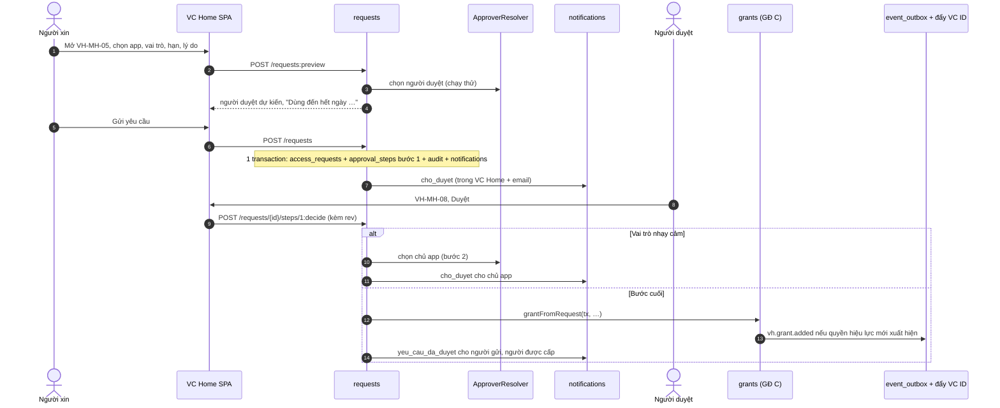

# Kế hoạch code GĐ D: xin quyền, duyệt, rà soát (R4)

Phiên bản 0.1 · 08/10/2026 · Trạng thái: Nháp (chờ đội phát triển rà)

## Tóm tắt

- **Làm gì:** thêm vào VC Home API và SPA đường xin quyền ngoại lệ có người duyệt 1–2 bước, uỷ quyền, nhắc, tự huỷ, duyệt nhiều; hạn dùng và gia hạn; rà soát quý quyền ngoại lệ và rà soát luật nửa năm; thông báo trong VC Home (chuông, ngăn kéo); nghỉ dài ngày, quay lại làm; lịch ngày nghỉ công ty làm đồng hồ; cài đặt hệ thống; xem và đăng xuất phiên của mình; cảnh báo quyền không dùng 90 ngày. Kèm một việc ở VClinks: chuyển phiên từ `localStorage` sang cookie httpOnly và chống CSRF (D-BA-42).
- **Đầu ra:** 2 module mới (`requests`, `reviews`), sửa 11 module có sẵn và `packages/contracts`, 7 collection GĐ D, 2 sự kiện mới (`vh.person.leave_started`, `vh.person.returned`), phần GĐ D của 15 màn (VH-MH-01…05, 08…11, 13, 15…18, 20) và chuông thông báo; 11 ca VH-UAT-45…55 đạt; R4 lên **22/01/2027**.
- **Khối lượng:** 22 phiên. D-01…D-21 cho VC Home **116 giờ** (khớp [10](../10-ke-hoach-trien-khai.md) mục 2, bảng R4), D-L-01 cho VClinks **8 giờ**; tổng **124 giờ**. Lịch T10–T14 (14/12/2026 → 22/01/2027); 28/12–03/01 chỉ trực sự cố.
- **Điều kiện bắt đầu:** R3 đã lên production (bộ tính quyền, job hẹn giờ quyền, outbox, đẩy VC ID, email); dev Platform toàn thời gian; HC-NS gửi lịch nghỉ 2027 của từng pháp nhân (N11, hạn 11/12/2026).
- **Việc chặn:**
  - Lịch nghỉ 2027 (N11) phải có trên production **trước khi bật xin quyền**. Thiếu lịch thì yêu cầu gửi sát Tết Nguyên đán (khoảng 06/02/2027) sẽ tự huỷ ngay trong kỳ nghỉ.
  - Client `vc-home-api` trên VC ID cần thêm vai trò `view-events` (đọc sự kiện đăng nhập theo app).
  - Dev VClinks rảnh 1 ngày trong T11 cho D-L-01.
- **Quay lui:** mọi phần GĐ D nằm sau cờ `FEATURE_*`; tắt xin quyền không ảnh hưởng quyền theo luật (tiêu chí R4, 10 mục 6). VClinks có cờ `AUTH_SESSION_TRANSPORT` để quay về Bearer.
- **Người duyệt xem kỹ:**
  - mục 3.4: 33 giả định kỹ thuật, nhất là GA-01 (đếm đồng hồ 7 và 14 ngày), GA-03, GA-04, GA-05 (người duyệt khi vắng, uỷ quyền, uỷ quyền cho rà soát), GA-06 (rà soát luật);
  - mục 3.3.2: thuật toán chọn người duyệt;
  - mục 9: các phiên và lịch qua kỳ nghỉ Tết dương lịch;
  - mục 11: thứ tự bật cờ ngày 22/01.

## Mục lục

- [1. Phạm vi và đầu ra](#1-phạm-vi-và-đầu-ra)
- [2. Điều kiện bắt đầu và phụ thuộc](#2-điều-kiện-bắt-đầu-và-phụ-thuộc)
- [3. Thiết kế kỹ thuật](#3-thiết-kế-kỹ-thuật)
- [4. Dữ liệu](#4-dữ-liệu)
- [5. API](#5-api)
- [6. Job và sự kiện](#6-job-và-sự-kiện)
- [7. Giao diện](#7-giao-diện)
- [8. Thay đổi ở VC ID, VClinks, VCwiki](#8-thay-đổi-ở-vc-id-vclinks-vcwiki)
- [9. Kế hoạch theo phiên](#9-kế-hoạch-theo-phiên)
- [10. Kiểm thử](#10-kiểm-thử)
- [11. Lên bản, chuyển đổi và quay lui](#11-lên-bản-chuyển-đổi-và-quay-lui)
- [12. Rủi ro riêng của giai đoạn](#12-rủi-ro-riêng-của-giai-đoạn)
- [13. Truy vết](#13-truy-vết)
- [Lịch sử cập nhật](#lịch-sử-cập-nhật)

---

## 1. Phạm vi và đầu ra

### 1.1 Yêu cầu của GĐ D

Đã đối chiếu [README](../README.md) mục 5: đúng 23 mã có cột GĐ = D, không thiếu mã nào so với danh sách giao.

| Mã | Tên | Ưu tiên | Ghi chú phạm vi |
|---|---|---|---|
| VH-AUT-10 | Xem và đăng xuất các phiên của chính mình | C | Qua Keycloak Admin API theo `sid` |
| VH-HOM-04 | Ô "Có thể xin quyền" | S | Chỉ vai trò `requestable` (VH-APP-07) |
| VH-HOM-08 | Thông báo trong VC Home | S | Chuông, ngăn kéo, kiểm mỗi 60 giây; email cho các loại ở 04 mục 14.2 |
| VH-HOM-09 | Dải "Việc đang chờ bạn" trên trang chủ | C | Nhận thêm 08/10 |
| VH-ORG-08 | Lịch ngày nghỉ của công ty | S | Nhận thêm; đồng hồ yêu cầu và rà soát |
| VH-APP-07 | Vai trò app "cho phép xin" | S | Nhận thêm |
| VH-ACC-05 | Quyền có hạn dùng, tự gỡ khi hết hạn | M | Phần nguồn `yeu_cau` (nguồn `khan_cap` đã có ở GĐ C, D-BA-09) |
| VH-ACC-09 | Người giữ quyền tự trả quyền ngoại lệ | S | Nhận thêm |
| VH-REQ-01 | Gửi yêu cầu quyền | M | |
| VH-REQ-02 | Luồng duyệt: quản lý trực tiếp, thêm chủ app nếu vai trò nhạy cảm | M | Theo VH-BR-12 bản mới |
| VH-REQ-03 | Uỷ quyền duyệt khi vắng | S | |
| VH-REQ-04 | Nhắc duyệt và tự huỷ yêu cầu quá hạn | S | Đồng hồ không tính ngày nghỉ (VH-ORG-08) |
| VH-REQ-05 | Quản lý xin quyền thay cho người dưới quyền | C | |
| VH-REQ-06 | Gia hạn quyền sắp hết hạn | S | |
| VH-REQ-07 | Duyệt nhiều yêu cầu một lần | S | Nhận thêm; tối đa 20, không vai trò nhạy cảm |
| VH-REV-01 | Mở đợt rà soát định kỳ | S | |
| VH-REV-02 | Trưởng đơn vị xác nhận hoặc gỡ | S | Người rà soát theo VH-BR-16 bản mới |
| VH-REV-03 | Tự gỡ quyền không được xác nhận và báo cáo kết quả | S | |
| VH-REV-04 | Rà soát luật nửa năm | S | Nhận thêm; `review_campaigns.kind = luat` |
| VH-LCM-04 | Nghỉ dài ngày và quay lại | S | Sự kiện `vh.person.leave_started`, `vh.person.returned` |
| VH-LCM-05 | Quay lại làm sau khi đã nghỉ | C | `vh.person.joined` có `rejoin: true` |
| VH-ADM-05 | Cài đặt hệ thống (thời hạn, nhắc, lịch rà soát) | S | Màn VH-MH-20; GĐ B, C chỉ có tệp cấu hình |
| VH-ADM-06 | Cảnh báo quyền không dùng 90 ngày | S | Nhận thêm |

**Phần GĐ D của yêu cầu thuộc giai đoạn khác:**

| Mã | Phần làm ở GĐ D |
|---|---|
| VH-AUT-01 (mã lỗi `app_not_granted`) | Trang lỗi VH-MH-01 thêm nút "Xin quyền" (04 mục 1, bảng mã lỗi) |
| VH-ADM-02 | 3 báo cáo có cột GĐ = D: "Quyền ngoại lệ", "Yêu cầu", "Rà soát"; tóm tắt tháng thêm số yêu cầu tự huỷ theo người duyệt (VH-REQ-04 bước 7) |
| VH-LCM-03 bước 9 | Dọn việc dở khi nghỉ việc: yêu cầu, bước duyệt, dòng rà soát, uỷ quyền (các collection này có từ GĐ D) |
| VH-INT-03 | 2 loại sự kiện mới; cờ `rejoin` của `vh.person.joined` |
| VH-MH-09, VH-MH-17 | "Xin quyền thay", "Gia hạn thay", cảnh báo sắp hết hạn; ngăn "Yêu cầu" và nguồn yêu cầu ở tra cứu |
| D-BA-42 | VClinks: phiên cookie httpOnly, chống CSRF (phiên D-L-01) |

### 1.2 Màn

| Màn | Phần làm ở GĐ D | Canvas |
|---|---|---|
| VH-MH-01 | Nút "Xin quyền" ở trang lỗi `app_not_granted` | Có (màn 01) |
| VH-MH-02 | Phần "Có thể xin quyền"; nhãn "Hết hạn {dd/mm}" trên ô app; dải "Việc đang chờ bạn"; nút "Xin quyền" khi không có ô app | Có (màn 02) |
| VH-MH-03 | Ngăn "Phiên đăng nhập"; mục "Phiên đăng nhập" ở menu ảnh đại diện | Có (màn 03, chưa có ngăn này) |
| VH-MH-04 | Nút "Xin quyền", ngăn "Yêu cầu của tôi", "Gia hạn", "Trả quyền", "Rút yêu cầu", "Gửi lại" | Có (màn 04 + 05) |
| VH-MH-05 | Ngăn kéo gửi yêu cầu: cho mình, xin thay, gia hạn; link sâu `?xin=1&app=&role=` | Có (màn 04 + 05) |
| VH-MH-08 | Hộp duyệt 4 ngăn (Yêu cầu quyền, Luật chờ duyệt, Đã xử lý, Uỷ quyền), duyệt nhiều tối đa 20 | Có (màn 08) |
| VH-MH-09 | "Xin quyền thay", "Gia hạn thay", cảnh báo "Hết hạn trong {n} ngày" | Không |
| VH-MH-10 | Rà soát quyền | Không |
| VH-MH-11 | "Đặt nghỉ dài ngày" tự xử lý (sửa ngày về, về sớm), "Nhận lại", gợi ý "Nhận lại?" | Không |
| VH-MH-13 | Ngăn "Ngày nghỉ" | Không |
| VH-MH-15 | Cột "Cho phép xin" ở ngăn "Vai trò" | Không |
| VH-MH-16 | Lọc "Tới hạn rà soát" theo đợt rà soát luật; nút "Đã rà soát, giữ nguyên" | Có (màn 16) |
| VH-MH-17 | Ngăn "Yêu cầu" (Theo người); báo cáo D; nút "Gỡ" / "Giữ thêm 90 ngày" ở báo cáo "Không dùng" | Không |
| VH-MH-18 | Đợt rà soát (quý và luật) | Không |
| VH-MH-20 | Cài đặt | Không |
| Khung chung (06 mục 4.2) | Chuông, ngăn kéo "Thông báo", số trên menu "Hộp duyệt", "Rà soát quyền" | Có (header trên mọi màn) |

Canvas: [https://claude.ai/artifact/J8DUrr6ueZMwQMwL7yovEb](https://claude.ai/artifact/J8DUrr6ueZMwQMwL7yovEb). Màn không có trên canvas dựng theo khung dây ở 06 với cùng token màu.

### 1.3 API, sự kiện, collection mới

- **API nội bộ cho SPA:** 54 đường dẫn mới hoặc sửa, chi tiết ở mục 5.2.
- **API cho app (VH-API):** không thêm đường mới. VH-API-06 tự có thêm dòng nguồn `yeu_cau`; VH-API-07 trả thêm 2 loại sự kiện mới (mục 5.3).
- **Sự kiện:** `vh.person.leave_started`, `vh.person.returned` (mới); `vh.person.joined` có `rejoin: true`; `vh.grant.added` / `vh.grant.removed` sinh từ duyệt, hết hạn, rà soát, tự trả (mục 6.2).
- **Collection GĐ D:** `access_requests`, `approval_steps`, `delegations`, `review_campaigns`, `review_items`, `notifications`, `company_holidays` (mục 4). Collection kỹ thuật mới: `_job_state`; GridFS `review_reports` cho biên bản PDF.

### 1.4 Không làm ở GĐ D

- Số việc chờ trên ô app (VH-HOM-07, VH-INT-07, VH-API-09): GĐ E.
- Xác thực lại khi dùng vai trò nhạy cảm (D-BA-38): GĐ E.
- Vai trò phó đơn vị, tạm quyền trưởng đơn vị; gửi sự kiện theo lô (12 mục 6 "Để sau").
- Chạy Keycloak 2 bản (D-BA-41): trước khi VCsale nối vào, không thuộc R4.
- Nháp yêu cầu lưu ở máy chủ (trạng thái `nhap`): giữ nháp trên trình duyệt (GA-12).
- Thông báo đẩy của trình duyệt, Telegram cho người dùng: tài liệu không yêu cầu.
- VCwiki: không có việc bắt buộc (07 mục 9.5 ghi sự kiện nghỉ dài là "không bắt buộc").
- VClinks: không đổi token máy `vcz_`, `/mcp`, extension, agent máy Zalo, SSE (chỉ đổi cách gửi phiên người dùng).

## 2. Điều kiện bắt đầu và phụ thuộc

### 2.1 Bản trước và đầu vào

| Hạng mục | Cần gì | Khi nào | Chặn |
|---|---|---|---|
| R3 | Lên production 11/12/2026; quyền theo luật bật thật | Trước D-02 | Toàn bộ GĐ D |
| R3 chạy thật ≥ 1 tuần (khung chung mục 2) | Áp cho **lúc bật cờ GĐ D trên production** (22/01), không chặn bắt đầu code 14/12. Lỗi R3 phát sinh trong T10 được ưu tiên trước phiên D | 18/12/2026 | Bật cờ |
| N11 | Lịch ngày nghỉ năm 2027 của từng pháp nhân (VH-ORG-08) | 11/12/2026 | Bật `FEATURE_REQUESTS`, `FEATURE_REVIEWS` |
| N3 | Ít nhất 2 người giữ `vchome:qtht`, chủ app của từng app (Q-07) | Đã có từ R2 | Nhánh "giao quản trị hệ thống" của bộ chọn người duyệt |
| N5, 6 tài khoản Google thử (11 đề xuất 6) | Người thử UAT theo vai trò | Trước D-21 | UAT |
| Keycloak | Client `vc-home-api` có `view-users`, `manage-users` (đã có) và `view-events` (thêm nếu GĐ B, C chưa thêm); realm bật sự kiện đăng nhập (thiết kế SSO mục 5.1.1) | D-14, D-18 | VH-AUT-10, VH-ADM-06 |
| Công cụ staging (GĐ B) | Đồng hồ giả lập `POST /api/v1/_test/clock`, app giả lập `vctest` | Có từ R2 | Ca UAT theo mốc giờ |
| Dev VClinks | 1 ngày (Dev002) | T11 | D-L-01 |

### 2.2 Thứ có sẵn từ GĐ B, C mà GĐ D gọi

Kế hoạch này chỉ dựa vào khung chung ([ke-hoach-code-tong-quan.md](ke-hoach-code-tong-quan.md) mục 5–7). Tên hàm dưới đây là tên dự kiến. Nếu GĐ B, C đặt tên khác thì phiên GĐ D dùng tên có sẵn; nếu thiếu thì phiên đó thêm một lớp mỏng trong giờ của mình.

| Module (GĐ) | GĐ D dùng | Phiên dùng |
|---|---|---|
| `common` (B) | `Clock`, ngày giờ VN, `rev`, tiện ích transaction có thử lại, `projectPerson` | Mọi phiên |
| `audit` (B) | `AuditService.record(tx, …)` | Mọi phiên ghi |
| `jobs` (B) | Bộ chạy lịch dùng `_job_locks`; đăng ký job để đồng hồ giả chạy được | D-01, 03, 06, 07, 10, 12, 17, 18 |
| `auth` (B) | `Viewer`, `@Can`, `packages/contracts/permissions.ts`, test ma trận | Mọi phiên API |
| `people`, `org` (B) | Vị trí chính, quản lý trực tiếp, trưởng đơn vị, đơn vị cha, pháp nhân của người | D-02, 07, 12, 13 |
| `accounts` (B) | Trạng thái khoá (`locks`), `KeycloakAdminClient` | D-12, 13, 14, 18 |
| `settings` (B) | `SettingsService.get(key)` với giá trị mặc định theo 04 VH-ADM-05 | D-03, 06, 07, 14 |
| `apps` (B, C) | `apps.owner_person_ids`, `app_roles` (`sensitive`, `default_request_days`, `max_request_days`, `requestable`, `status`) | D-02, 15 |
| `grants` (C) | Bộ tính quyền: thêm dòng nguồn `yeu_cau`, gỡ dòng có lý do, kiểm "quyền hiệu lực còn nguồn khác", sinh `vh.grant.*`, đẩy VC ID, cầu dao; job hẹn giờ quyền 15 phút; kiểm tách nhiệm (`grant.blocked_sod`) | D-03, 06, 07, 15, 18 |
| `rules` (C) | Luật chờ duyệt bước hai, xem trước, tắt luật theo VH-BR-25 | D-05, 17, 19 |
| `lifecycle` (C) | Job 00:00 áp `scheduled_changes`; điểm móc sau khi áp (người chuyển, người nghỉ) | D-03, 07, 12, 13 |
| `events` (C) | Ghi `event_outbox` trong transaction | D-12, 13 |
| `notifications` (C) | Gửi email qua Gmail API | D-10 |
| `reports` (C) | Báo cáo VH-ADM-02 phần GĐ C, tóm tắt tháng | D-09, 18 |

### 2.3 Quyết định liên quan

- Q-03 (luồng duyệt), Q-07 (2 người mỗi vai trò, chủ app), Q-08 (90 ngày, tối đa 365, nhạy cảm tối đa 90), Q-09 (quý cho ngoại lệ, nửa năm cho luật): [12](../12-cau-hoi-rui-ro.md) mục 4.
- D-BA-03 (nhiều khoá), D-BA-09 (job hẹn giờ quyền có từ GĐ C), D-BA-10 (HC-NS xin qua yêu cầu từ GĐ D), D-BA-11 (bước 1 chỉ quản lý trực tiếp), D-BA-12 (người rà soát), D-BA-14 (thông báo trong VC Home từ GĐ D), D-BA-15, D-BA-35 (người dùng VH-MH-08), D-BA-28 (không ghi lý do nghỉ), D-BA-30 (QTHT duyệt bước 2 thay), D-BA-32 (nhãn nguồn "Được duyệt"), D-BA-33 ("Tạm vắng"), D-BA-36 (app `beta` xin được), D-BA-42 (VClinks cookie): [12](../12-cau-hoi-rui-ro.md) mục 5.
- VH-BR-09, VH-BR-12, VH-BR-16 bản sửa ngày 08/10/2026 ([02](../02-tac-nhan-quy-tac.md) mục 4) thắng các đoạn cũ ở 04, 06 khi lệch (mục 3.4).

## 3. Thiết kế kỹ thuật

### 3.1 Module thêm và sửa

| Module | Mới / sửa | Việc ở GĐ D | File chính (trong `api/src/`) |
|---|---|---|---|
| `requests` | Mới | Yêu cầu, bước duyệt, uỷ quyền, nhắc, tự huỷ, duyệt nhiều, chuyển người duyệt | `requests/requests.controller.ts`, `approvals.controller.ts`, `delegations.controller.ts`, `requests.service.ts`, `approver-resolver.ts`, `delegations.service.ts`, `requests.jobs.ts`, `requests.repo.ts` |
| `reviews` | Mới | Rà soát quý, rà soát luật, báo cáo đợt | `reviews/admin-reviews.controller.ts`, `my-reviews.controller.ts`, `rule-reviews.controller.ts`, `campaigns.service.ts`, `reviewer-resolver.ts`, `rule-reviews.service.ts`, `review-report.service.ts`, `reviews.jobs.ts` |
| `notifications` | Sửa | Thêm thông báo trong VC Home; một cửa `notify()` cho cả email; danh mục loại và câu | `notifications/notifications.service.ts`, `notification-kinds.ts`, `notifications.controller.ts`, `email.job.ts` |
| `org` | Sửa | `company_holidays`, `WorkCalendarService`, gợi ý ngày nghỉ | `org/holidays.controller.ts`, `holidays.service.ts`, `work-calendar.service.ts`, `vn-holiday-suggest.ts` |
| `grants` | Sửa | Dòng nguồn `yeu_cau` từ yêu cầu, kéo dài hạn khi gia hạn, hết hạn và báo trước, tự trả, quyền không dùng, điểm móc khi dòng đóng | `grants/request-grants.service.ts`, `expiry.service.ts`, `unused.service.ts`, `grant-hooks.ts` |
| `lifecycle` | Sửa | Bắt đầu, kết thúc nghỉ dài; nhận lại; gọi điểm móc cho `requests`, `reviews` | `lifecycle/leave.handler.ts`, `rehire.handler.ts`, `lifecycle-hooks.ts` |
| `people` | Sửa | Trường `leave.returned_on`, lệnh "Nhận lại", gợi ý theo email cũ | `people/leave.service.ts`, `rehire.service.ts` |
| `accounts` | Sửa | `app_logins`; kéo sự kiện LOGIN; phiên của tôi | `accounts/my-sessions.controller.ts`, `login-sync.job.ts`, `keycloak-admin.client.ts` (thêm `listUserSessions`, `deleteSession`, `listEvents`) |
| `apps` | Sửa | Sửa `requestable`; chặn vai trò nhạy cảm có `max_request_days` > 90 | `apps/app-roles.service.ts` |
| `settings` | Sửa | Sửa có lý do, giới hạn, chỉ đọc, về mặc định, báo kiểm soát | `settings/settings.controller.ts`, `settings.service.ts` |
| `reports` | Sửa | 3 báo cáo GĐ D, tóm tắt tháng, thao tác ở "Không dùng" | `reports/exception-grants.report.ts`, `requests.report.ts`, `reviews.report.ts` |
| `rules` | Sửa | `next_review_on` theo đợt rà soát luật; mở sửa, tắt từ dòng rà soát | `rules/rules.service.ts` |
| `auth` | Sửa | `Viewer.delegatedFrom`; quyền mới ở `permissions.ts` | `auth/viewer.builder.ts` |
| `packages/contracts` | Sửa | Zod DTO các API mục 5, mã lỗi D, loại thông báo, khoá cài đặt, JSON Schema | `requests.ts`, `reviews.ts`, `notifications.ts`, `holidays.ts`, `settings.ts`, `errors.ts`, `permissions.ts` |

Mỗi module chỉ ghi collection của mình (khung chung mục 5). `requests` gọi `GrantsService` để tạo quyền; `grants` báo cho `requests`, `reviews` qua điểm móc (`GrantHooks.onClosed(tx, grant, reason)`); `lifecycle` báo qua `LifecycleHooks` (`onPersonMoved`, `onLeaveStarted`, `onLeaveEnded`, `onPersonLeft`, `onAccountLocked`). Điểm móc chạy trong cùng transaction khi việc nhẹ (đóng dòng rà soát, huỷ yêu cầu); việc nặng (tính lại người duyệt) để job 15 phút làm.

### 3.2 Luồng chính

**Xin và duyệt** (VH-QT-08):



**Rà soát quý** (VH-QT-09): QTHT xem trước → mở đợt (chụp danh sách, chọn người rà soát, tính hạn) → trưởng đơn vị Giữ / Gỡ (Gỡ là gỡ quyền ngay) → nhắc ngày 7, 12 → hết hạn: dòng còn Chờ chuyển Quá hạn và gỡ quyền → đợt đóng, sinh biên bản PDF, gửi báo cáo.

**Nghỉ dài ngày** (VH-QT-07): HC-NS lưu kỳ nghỉ → 00:00 ngày bắt đầu: trạng thái `nghi_dai_ngay`, khoá nếu chọn, `vh.person.leave_started`, dòng rà soát của người này chuyển lên → bước duyệt đang giao người này chờ 2 ngày làm việc rồi chuyển (GA-03) → 00:00 ngày về: `dang_lam`, mở đúng khoá `nghi_dai_ngay`, `vh.person.returned`.

### 3.3 Điểm khó và cách làm

#### 3.3.1 Đồng hồ không tính ngày nghỉ (VH-ORG-08, VH-BR-13, VH-BR-16)

`WorkCalendarService` (module `org`) là chỗ duy nhất tính hạn. Hai cách đếm, chọn theo đúng chữ của từng quy tắc (GA-01, GA-02):

| Cách đếm | Ngày được đếm | Dùng cho |
|---|---|---|
| `khong_tinh_ngay_nghi` | Mọi ngày, trừ ngày có trong `company_holidays` áp cho pháp nhân đó (hoặc toàn tập đoàn) | Tự huỷ 7 ngày và nhắc ngày 2, 5 (VH-BR-13); hạn 14 ngày và nhắc ngày 7, 12 của rà soát quý (VH-BR-16); nhắc mở đợt sau 3 và 7 ngày |
| `ngay_lam_viec` | Thứ Hai đến thứ Bảy, trừ ngày nghỉ công ty (VH-ORG-08 bước 3, VH-NFR-10) | "2 ngày làm việc" (VH-BR-12, quản lý vắng); "3 ngày làm việc" (04 mục 14.2, VH-LCM-04); "14 ngày làm việc" (VH-REV-04) |

```ts
// api/src/org/work-calendar.service.ts (phác thảo)
type CountRule = 'khong_tinh_ngay_nghi' | 'ngay_lam_viec';
/** Cộng `days` ngày "được đếm" vào `start`: thời gian trong ngày không được đếm bị bỏ qua. */
addElapsed(start: Date, days: number, rule: CountRule, legalEntity: string | null): Date;
/** Mốc hh:mm của ngày được đếm thứ k sau ngày của `start` (nhắc 08:00 ngày 2, ngày 5…). */
nthCountedDayAt(start: Date, k: number, hhmm: string, rule: CountRule, legalEntity: string | null): Date;
isCounted(dayVn: string, rule: CountRule, legalEntity: string | null): boolean;
```

- **Cách tính:** đi từng ngày lịch giờ Việt Nam từ `start`. Ngày được đếm góp phần thời gian còn lại của ngày đó; ngày không được đếm góp 0. Ví dụ: gửi 15:00 thứ Hai 02/03, không có ngày nghỉ: nhắc 08:00 04/03 và 08:00 07/03, tự huỷ 15:00 09/03 (đúng 04 VH-REQ-04). Gửi trong ngày nghỉ: đồng hồ bắt đầu 00:00 ngày được đếm đầu tiên.
- **Pháp nhân:** đồng hồ yêu cầu dùng pháp nhân của **người được cấp** (GA-30). Đợt rà soát quý có một hạn chung, chỉ trừ ngày nghỉ toàn tập đoàn (GA-08).
- **Chụp lúc tạo:** khi gửi yêu cầu, lưu `due_at`, `reminder_plan` (các mốc nhắc theo cài đặt lúc đó) và `next_reminder_at`. Đổi cài đặt sau đó không đổi việc đã tạo (VH-ADM-05 bước 2).
- **Sửa lịch nghỉ:** sau khi commit, `HolidaysService` gọi `RequestsService.recomputeDeadlines()` và `ReviewsService.recomputeDeadlines()`: chỉ tính lại việc còn mở có `due_at` > bây giờ, chỉ thay các mốc nhắc chưa gửi; ghi `audit_log` hành động `deadline.recomputed`. Việc đã quá hạn giữ nguyên (VH-ORG-08 bước 4).
- **Bộ nhớ đệm:** ngày nghỉ của 2 năm quanh `Clock.now()` giữ trong bộ nhớ, xoá khi lịch đổi. Mọi hàm nhận `Clock` để đồng hồ giả chạy đúng.
- **Công tắc Chủ nhật:** hằng số `CLOCK_SKIPS_SUNDAY = false` cho cách đếm `khong_tinh_ngay_nghi`. Nếu BA chốt theo VH-ORG-08 bước 3 (bỏ cả Chủ nhật) thì đổi thành `true` và sửa tiêu chí ở GA-01; không phải sửa chỗ khác.

#### 3.3.2 Chọn người duyệt (VH-REQ-02, VH-BR-12, VH-BR-05, VH-BR-17)

`ApproverResolver.resolve(request, step, at)` là hàm thuần (đọc dữ liệu, không ghi), dùng cho xem trước ở VH-MH-05, lúc tạo bước, job tính lại và lúc kiểm người bấm. Kết quả: `{ approver_rule, assigned_person_ids, notes[] }`.

Ký hiệu: B là người được cấp, R là người gửi. "Hợp lệ" = trạng thái `dang_lam` hoặc `nghi_dai_ngay`, tài khoản không có khoá, không phải R, không phải B. Người nghỉ dài **có khoá đăng nhập** là không hợp lệ ngay.

**Bước 1** (dừng ở người hợp lệ đầu tiên):

1. Quản lý trực tiếp trên vị trí chính của B; B `chua_vao_lam` thì theo vị trí sẽ có hiệu lực (`quan_ly_truc_tiep`). Quản lý của vị trí kiêm nhiệm không bao giờ duyệt (D-BA-05).
2. Không có, đã nghỉ, không có tài khoản hoặc bị khoá: trưởng đơn vị của vị trí chính của B, rồi trưởng đơn vị cha, đi dần lên gốc, bỏ qua B (`truong_don_vi_tam`).
3. Ứng viên trùng R (quản lý xin thay): lên quản lý trực tiếp của R (`quan_ly_cap_tren`), rồi lặp lại các điều trên.
4. Ứng viên có uỷ quyền bước 1 đang hiệu lực mà **mọi** người được uỷ đều là R hoặc B: trong thời gian uỷ quyền, bước chuyển lên quản lý trực tiếp của ứng viên (`quan_ly_cap_tren`); hết uỷ quyền thì job trả về ứng viên (GA-04, VH-UAT-49 bước 3–4, 03 mục 10).
5. Ứng viên đang nghỉ dài (không khoá), **không** có uỷ quyền bước 1: vẫn giao ứng viên. Khi đã qua 2 ngày làm việc kể từ `max(assigned_at, leave.from_on, lúc uỷ quyền cuối kết thúc)`, chuyển cho trưởng đơn vị theo điều 2 (`truong_don_vi_tam`) (VH-BR-12 bản mới; GA-03).
6. Lên tới gốc vẫn không có: giao mọi QTHT trừ R, B (`quan_tri_he_thong`) và báo HC-NS loại `thieu_quan_ly`.

**Bước 2** (chỉ vai trò nhạy cảm, mở khi bước 1 Duyệt): mọi chủ app hợp lệ trừ R, B và người đã quyết bước 1 (`chu_app`); không còn ai thì mọi QTHT trừ R, B (`quan_tri_he_thong`). Nhánh này phủ cả "chủ app xin vai trò nhạy cảm của app mình" (VH-UAT-48) và "người duyệt bước 1 là chủ app duy nhất".

**Vòng lặp an toàn:** tối đa 20 lần nhảy; quá thì giao QTHT và cảnh báo vận hành (cây quản lý có vòng là lỗi dữ liệu, VH-BR-05).

**Ai thấy và ai bấm được:**
- Hộp duyệt của X gồm bước `cho` mà X nằm trong `assigned_person_ids`, cộng bước của người đã uỷ cho X (uỷ quyền trực tiếp, đang hiệu lực, đúng phạm vi bước và app), trừ yêu cầu mà X là R hoặc B. Không chuyền tiếp (VH-REQ-03 bước 3).
- Lúc bấm, máy chủ chạy lại `resolve()` và kiểm uỷ quyền. Không còn hợp lệ thì trả câu "Bạn không còn là người duyệt của yêu cầu này. Yêu cầu đã chuyển cho {họ tên}." Bước 2: người bấm khác người đã quyết bước 1.

**Tính lại:** job `requests.timers` (15 phút) chạy `resolve()` cho mọi bước `cho`. Kết quả khác `assigned_person_ids` thì cập nhật, ghi `assigned_at`, `audit_log` (`approval_step.reassigned`, trước / sau, lý do), báo người mới loại `cho_duyet`. Đồng hồ 7 ngày không đặt lại. Điểm móc của `lifecycle` (đổi quản lý, nghỉ việc, khoá, đổi trưởng đơn vị) gọi tính lại ngay cho người liên quan để không phải chờ 15 phút.

#### 3.3.3 Quyết định duyệt, tạo quyền, đua với tự huỷ

- Một quyết định = một transaction:
  - đọc yêu cầu theo `{_id, status, rev}`;
  - cập nhật bước với điều kiện `decision = 'cho'`;
  - đổi trạng thái yêu cầu;
  - tạo bước 2 hoặc gọi `GrantsService.grantFromRequest(tx, …)`;
  - ghi `audit_log` và `notifications`.
- Job tự huỷ cũng sửa đúng tài liệu đó trong transaction, điều kiện `{open: true, due_at ≤ now}`. MongoDB báo xung đột ghi cho bên đến sau; tiện ích transaction thử lại, đọc thấy trạng thái mới và trả câu "Yêu cầu này đã kết thúc (Tự huỷ)." hoặc "Yêu cầu này đã được {họ tên} {duyệt / từ chối} lúc {HH:mm dd/mm}." (VH-REQ-04 ngoại lệ, VH-REQ-02).
- Kiểm tách nhiệm (02 mục 6) **cả lúc gửi và lúc duyệt bước cuối**. Bị chặn lúc duyệt thì yêu cầu không đổi, trả câu tách nhiệm, ghi `grant.blocked_sod` (04 mục 14.2).
- Vai trò chuyển `ngung` hoặc app chuyển `paused` / `retired` khi yêu cầu đang chờ: yêu cầu Tự huỷ, `cancel.reason = vai_tro_ngung`, báo người xin (03 mục 10). Tắt cờ `requestable` thì yêu cầu đang chờ vẫn xử lý tiếp (VH-APP-07 bước 3).
- Gửi yêu cầu: chỉ mục duy nhất một phần `{beneficiary_person_id, app_key, role_key, unit_code}` với `open = true` chặn gửi trùng khi bấm hai lần.

#### 3.3.4 Duyệt nhiều (VH-REQ-07)

- `POST /api/v1/approvals:bulk-decide` nhận tối đa 20 mục `{id, rev}`.
- Máy chủ kiểm lại trước khi làm:
  - quá 20 mục: 422 "Chọn tối đa 20 yêu cầu mỗi lần.";
  - có mục vai trò nhạy cảm (đọc `access_requests.sensitive`, không tin SPA): 422 "Vai trò nhạy cảm phải duyệt từng yêu cầu.".
- Từng mục chạy **một transaction riêng** qua đúng hàm của 3.3.3, nên mỗi mục có một dòng quyết định trong `approval_steps` và một dòng nhật ký. Các dòng nhật ký dùng chung `correlation_id`.
- Trả kết quả từng mục (`ok` / mã lỗi). SPA hiện "Đã duyệt {n} yêu cầu." và liệt kê mục lỗi (06 VH-MH-08).
- Từ chối nhiều: một ý kiến chung ≥ 10 ký tự, chép vào từng bước.

#### 3.3.5 Hạn quyền và gia hạn (VH-ACC-05, VH-REQ-06, VH-BR-09)

- **Hạn tối đa** = `min(app_roles.max_request_days, cài đặt 365, nếu nhạy cảm thì 90)`. `apps` chặn lưu vai trò nhạy cảm có `max_request_days` > 90; migration kéo các vai trò cũ về 90 (mục 4.3).
- **Ngày bắt đầu thật** S = `max(start_on, ngày duyệt bước cuối)` (GA-13). Ngày dùng cuối L = S + số ngày − 1; `valid_to` = 00:00 giờ Việt Nam của L + 1. S ở tương lai thì dòng `cho_hieu_luc`, job hẹn giờ quyền của GĐ C bật lúc 00:00.
- **Người duyệt rút ngắn:** số ngày duyệt ≤ số ngày xin; dài hơn thì 422 "Người duyệt chỉ rút ngắn được thời hạn, không kéo dài."
- **Gia hạn (`kind = gia_han`):**
  - Mở được khi còn ≤ N ngày tới hạn, hoặc đã hết hạn trong 7 ngày qua. N là giá trị lớn nhất của cài đặt "Báo trước khi hết hạn", mặc định 14 (GA-14).
  - Duyệt trước hạn cũ: L mới = L cũ + số ngày, không quá ngày duyệt + hạn tối đa. Hàm `GrantsService.extendValidTo` kéo dài `valid_to` của chính dòng đó, ghi nhật ký hạn cũ và hạn mới, không sinh sự kiện.
  - Duyệt sau khi dòng đã Hết hạn: tạo dòng mới từ lúc duyệt, có `vh.grant.added`.
- **Hết hạn:** job `grants.timers` (GĐ C, 15 phút) thêm điều kiện `source = 'yeu_cau'`, dùng lại đường chuyển `het_han` của nguồn khẩn cấp. Bộ tính quyền chỉ sinh `vh.grant.removed` khi quyền hiệu lực không còn nguồn nào (VH-ACC-05 tiêu chí 4). Có yêu cầu gia hạn đang chờ thì báo câu riêng của VH-ACC-05.
- **Báo trước 14 và 3 ngày:** chạy mỗi 15 phút, gửi từ 08:00 ngày L − 14 và L − 3, cho người giữ quyền, chép quản lý trực tiếp. Chống gửi trùng bằng `dedupe_key = het_han:{grantId}:{n}`. Ngày báo rơi vào ngày nghỉ thì gửi 08:00 ngày được đếm liền trước (GA-15).

#### 3.3.6 Rà soát quý (VH-REV-01…03, VH-BR-16)

- **Mở đợt:**
  - Một transaction tạo `review_campaigns` và mọi `review_items`. Số dòng thực tế vài trăm; quá 5.000 dòng thì báo lỗi để chia đợt.
  - Phạm vi: dòng nguồn `yeu_cau`, `khan_cap` đang `hieu_luc` có `valid_to` > `due_at`.
  - Mỗi loại đợt chỉ một đợt `mo`; `period` duy nhất (`2027-Q2`).
- **Người rà soát** (`ReviewerResolver`, VH-BR-16 bản mới):
  - trưởng đơn vị của vị trí chính của người giữ quyền;
  - trống, chính là người giữ quyền, đã nghỉ, bị khoá, hoặc đang nghỉ dài **không** có uỷ quyền bước 1: lên trưởng đơn vị cha;
  - tới gốc vẫn không có: `reviewer_person_id = null`, dòng "Chưa có người rà soát", QTHT chỉ định một trưởng đơn vị đang làm.
  - Người giữ quyền chuyển vị trí trong đợt: giữ người rà soát đã gán (03 mục 11).
- **Uỷ quyền áp cho rà soát** (GA-05): uỷ quyền có phạm vi bước 1 của người rà soát cho người được uỷ quyết thay. Ghi `on_behalf_of_person_id`, `delegation_id`; người được uỷ không quyết dòng về chính mình.
- **Quyết định:**
  - Giữ: ghi quyết định, hạn quyền không đổi.
  - Gỡ: trong cùng transaction gọi `GrantsService.remove(tx, grantId, 'ra_soat', {bypassBreaker: true})`, vì cầu dao đồng bộ không chặn thay đổi đã duyệt (VH-REV-03). Ghi `removal_applied_at`, báo người giữ quyền.
  - Đổi Giữ sang Gỡ được tới khi đợt đóng; Gỡ sang Giữ thì chặn.
- **Đóng đợt** (job `reviews.timers`, 15 phút, khi `now ≥ due_at`):
  - Xử lý từng lô 100 dòng còn `cho`, mỗi lô một transaction: chuyển `qua_han`, gỡ quyền, gom thông báo.
  - Dòng lỗi để lần chạy sau thử lại và cảnh báo vận hành. Đợt chỉ `da_dong` khi không còn dòng `cho`.
  - Đóng xong: tính `totals`, sinh PDF biên bản một lần (lưu GridFS `review_reports`, ghi `sha256` vào `review_campaigns.report_pdf`, không có API sửa), gửi báo cáo theo VH-REV-03 bước 6.
- **Điểm móc dòng quyền đóng vì lý do khác** (hết hạn, nghỉ việc, gỡ tay, tự trả): dòng rà soát đang mở đóng ở `go`, `decided_by = he_thong`, ghi chú lý do (05 mục 4.4).
- **PDF:** thư viện `pdfkit` với phông có dấu tiếng Việt (giấy phép OFL) để trong repo; đường dẫn phông qua `PDF_FONT_PATH`. Excel dùng `exceljs` như GĐ B.

#### 3.3.7 Rà soát luật nửa năm (VH-REV-04)

- Job `reviews.schedule` tạo đợt `kind = luat`, `period = 2027-H2`… vào 08:00 ngày 01/01 và 01/07.
- Mỗi luật `hieu_luc` một dòng (`review_items.rule_id`). Dòng giao theo `app_key`: mọi chủ app của app đó lúc quyết; app không có chủ thì QTHT.
- Ngày tạo đợt là ngày nghỉ toàn tập đoàn (01/01 luôn là ngày nghỉ): đợt vẫn tạo đúng ngày, thông báo dời sang 08:00 ngày làm việc kế tiếp (GA-32).
- Hạn 14 ngày làm việc (GA-02, GA-07).
- **Quyết định:**
  - "Giữ": đặt `access_rules.next_review_on` = ngày mở đợt kế tiếp.
  - "Sửa": đánh dấu dòng `sua`, mở VH-MH-16 ở chế độ sửa theo VH-QT-10.
  - "Tắt": đánh dấu `tat`, mở luồng tắt luật có xem trước và duyệt theo VH-BR-25 (của GĐ C).
- Quá hạn: dòng còn chờ chuyển `qua_han`, **không** đụng luật; báo QTHT và kiểm soát; đợt đóng.
- VH-MH-16: lọc "Tới hạn rà soát" là luật có dòng `cho` trong đợt luật đang mở; nút "Đã rà soát, giữ nguyên" là quyết định "Giữ" của dòng đó (GA-06).

#### 3.3.8 Thông báo trong VC Home và email (VH-HOM-08)

- **Một cửa:** `NotificationService.notify(tx, {to, kind, vars, link, related, dedupeKey?})`.
  - Câu lấy từ danh mục `packages/contracts/notification-kinds.ts` (mục 6.3).
  - Ghi `notifications` trong cùng transaction với việc gây ra thông báo.
  - Đặt `email_wanted = true` với các loại ở 04 mục 14.2 (yêu cầu chờ duyệt, nhắc duyệt, quyền sắp hết hạn, đợt rà soát, luật chờ duyệt bước hai) và VH-ADM-06.
  - Các chỗ gọi email trực tiếp của GĐ B, C đổi sang `notify()` (GA-10).
- **Gửi email:** job `notifications.email` (mỗi phút) gửi qua Gmail API của GĐ C sau khi transaction đã commit. Thử lại 5 lần, giãn dần; lỗi thì ghi `email_error`, thông báo trong VC Home vẫn còn (VH-REQ-04 ngoại lệ). Email **không** chứa lý do xin quyền (văn bản tự do, có thể lỡ chứa dữ liệu cá nhân).
- **Gom:** loại có `dedupeKey` (ví dụ `nhac_duyet:{personId}:{ngày}`, `de_nghi_sua_ho_so:{personId}`) cập nhật thông báo chưa đọc cùng khoá thay vì thêm dòng mới (GA-11).
- **Xem:**
  - Danh sách 20 dòng mỗi trang, chỉ thông báo tạo trong 90 ngày; chỉ mục TTL xoá ở 180 ngày (GA-09).
  - `GET /notifications/unread-count` rẻ (đếm theo chỉ mục), SPA hỏi mỗi 60 giây khi tab đang hiện.
  - API chỉ trả thông báo có `person_id` = người gọi (VH-HOM-08 tiêu chí 5).

#### 3.3.9 Nghỉ dài ngày và nhận lại (VH-LCM-04, 05, VH-BR-15)

- **Bắt đầu nghỉ** (`lifecycle.apply` 00:00, hoặc ngay khi HC-NS lưu ngày đã qua), một transaction mỗi người:
  - `people.status = nghi_dai_ngay`;
  - nếu `leave.lock_login`: thêm khoá `{kind: nghi_dai_ngay}` vào `accounts.locks`, gọi khoá và đăng xuất trên VC ID qua đường khoá của GĐ C;
  - `vh.person.leave_started` (payload 07 mục 6.6);
  - gọi `LifecycleHooks.onLeaveStarted`: dòng rà soát chuyển lên, uỷ quyền mà người này là người được uỷ kết thúc nếu tài khoản bị khoá.
- **Kết thúc nghỉ** (00:00 ngày `to_on` + 1, hoặc 00:00 ngày `returned_on` nếu HC-NS ghi về sớm):
  - `dang_lam`;
  - **chỉ** gỡ khoá `nghi_dai_ngay`; còn khoá khác (khẩn cấp, Google) thì tài khoản vẫn khoá (VH-LCM-04 bước 8, D-BA-03);
  - `vh.person.returned` có `returned_on`.
- Khoá vì nghỉ dài không sinh `vh.person.locked`; app đọc `lock_login` trong `leave_started` (GA-19).
- **Nhắc:**
  - HC-NS: 08:00 ngày làm việc thứ 3 trước ngày về dự kiến (04 mục 14.2).
  - Người nghỉ là người duyệt: lúc HC-NS lưu kỳ nghỉ, nhắc người đó đặt uỷ quyền (03 mục 9 bước 3).
- **Không lưu lý do:** DTO zod dùng `.strict()` rồi bỏ trường lạ trước khi lưu, nên trường lạ không bao giờ vào database (VH-LCM-04 tiêu chí 4).
- **Nhận lại:**
  - Dùng lại hồ sơ và mã; trạng thái `chua_vao_lam` với `joined_on` mới, vị trí mới qua `scheduled_changes`.
  - 00:00 ngày vào làm lại:
    1. `dang_lam`;
    2. gỡ khoá `nghi_viec` nếu `accounts.google_id` vẫn khớp tài khoản Google hiện tại (cùng `sub`);
    3. tính lại quyền;
    4. `vh.person.joined` với `rejoin: true`, rồi `vh.grant.added` (07 mục 6.6, GA-16).
  - Google đã xoá và tạo lại: không mở khoá; nhắc QTHT gắn lại 3 ngày trước.
  - Quyền ngoại lệ, yêu cầu, uỷ quyền cũ không khôi phục.

#### 3.3.10 Phiên của tôi qua Keycloak (VH-AUT-10)

- API có `{sub}` trên đường dẫn và luôn so với `viewer.sub`: khác là 403 `LOI-403`, kể cả QTHT (VH-AUT-10 tiêu chí 3). QTHT đăng xuất người khác bằng ngăn "Tài khoản" của VH-MH-11 (GĐ B).
- **Xem:** `GET /admin/realms/vc/users/{sub}/sessions` qua client `vc-home-api`. Sắp xếp `start` mới nhất trước, lấy 20.
  - Map `clients` sang tên app qua `apps.oidc_client_id`.
  - IP rút gọn: IPv4 thay số cuối bằng `x`; IPv6 giữ 3 nhóm đầu rồi `::x` (GA-24).
  - "Phiên này" là phiên có `id` bằng claim `sid` trong access token của người gọi.
- **Đăng xuất một phiên:** kiểm `sid` có trong danh sách của chính mình (không có thì 404 "Phiên này đã kết thúc."), rồi `DELETE /admin/realms/vc/sessions/{sid}`. Keycloak gửi back-channel tới mọi app có phiên đó (kiểm ở D-01 trên Keycloak dev).
- **"Đăng xuất mọi phiên khác":** lặp xoá từng phiên trừ `sid` hiện tại. Mỗi phiên ghi một dòng `session.revoked_by_user`.
- Keycloak không trả lời: 503 với câu "Chưa tải được danh sách phiên. Thử lại sau."
- Trình duyệt và hệ điều hành: Keycloak Admin API không trả user agent, nên cột này ẩn trừ khi D-14 tìm được nguồn (GA-24).
- VC Home SPA ở trình duyệt bị đăng xuất mất phiên theo cơ chế của GĐ A (UAT-SSO-07). Access token còn hạn của nó (≤ 5 phút) vẫn được API nhận tới khi hết hạn (GA-31).

#### 3.3.11 Lần đăng nhập app cuối (VH-ADM-06)

Chọn cách đọc sự kiện `LOGIN` của VC ID theo client, **không** dùng `accounts.last_login_at` / `last_login_app` vì hai trường đó chỉ giữ app của lần đăng nhập cuối cùng (GA-22).

- Job `accounts.app_logins` (mỗi giờ):
  - gọi `GET /admin/realms/vc/events?type=LOGIN&dateFrom=…&first=…&max=500`;
  - map `clientId` → khoá app qua `apps.oidc_client_id`;
  - cập nhật `accounts.app_logins.<app_key>` = giá trị lớn nhất.
- Con trỏ (thời điểm và các `id` sự kiện cùng mili giây) lưu ở `_job_state`. Chạy lại không làm sai vì chỉ lấy giá trị lớn nhất.
- **Lần chạy đầu:** nạp ngược 120 ngày (VC ID giữ nhật ký đăng nhập 24 tháng), để tuần đầu không báo nhầm.
- **Vì sao đủ:** Keycloak ghi `LOGIN` mỗi lần một app nhận đăng nhập, kể cả khi đi qua phiên chung có sẵn. Phiên của app tối đa 7 ngày (VH-AUT-05), nên người dùng app đều đặn có ít nhất một `LOGIN` mỗi tuần.
- **Job thứ Hai 08:00** (`grants.unused_alert`):
  - Lấy dòng quyền mở có nguồn `yeu_cau` hoặc `khan_cap`, hoặc vai trò nhạy cảm (mọi nguồn). Quyền thường từ luật không vào danh sách (VH-ADM-06 bước 4).
  - Lần đăng nhập app đó cuối cùng (chưa từng thì lấy `valid_from`) cũ hơn 90 ngày.
  - Bỏ qua dòng có `unused_ack.until` > hôm nay.
  - Gom theo app, báo chủ app (trong VC Home và email); app không có chủ thì báo QTHT.
- **"Giữ thêm 90 ngày"** ghi `access_grants.unused_ack = {until, by, at}` cho mọi dòng mở của người đó trong app đó (GA-23). "Gỡ" dùng API gỡ tay của GĐ C (VH-ACC-06); dòng nguồn luật không có nút "Gỡ".

#### 3.3.12 Cài đặt có lý do (VH-ADM-05)

- Mỗi khoá cài đặt khai trong `packages/contracts/settings.ts`: kiểu, nhỏ nhất, lớn nhất, chỉ đọc, mã quy tắc, nhóm, mặc định đúng bảng 04 VH-ADM-05.
- `PUT` kiểm giới hạn, `rev`, lý do bắt buộc; ghi `audit_log` trước / sau; báo kiểm soát loại `cai_dat_doi`.
- Dòng chỉ đọc trả 422 với câu "Giá trị này do quy tắc {mã quy tắc} đặt. Muốn đổi phải sửa quy tắc."
- **Áp cho việc mới:** dịch vụ đọc cài đặt lúc tạo việc và chụp vào tài liệu (`reminder_plan`, `due_at` của yêu cầu và đợt). Đổi cài đặt sau đó không đổi việc đã tạo (VH-ADM-05 tiêu chí 1).
- Ngăn "Phiên (xem)" đọc từ cấu hình VC ID, chỉ hiện.

### 3.4 Giả định kỹ thuật

Các điểm tài liệu nghiệp vụ lệch nhau hoặc thiếu. Kế hoạch đã chọn như cột "Cách làm"; BA sửa tài liệu nguồn hoặc báo đổi trước phiên ghi ở cột cuối.

| Mã | Chỗ lệch hoặc thiếu | Cách làm trong kế hoạch | Ảnh hưởng phiên |
|---|---|---|---|
| GA-01 | Đồng hồ 7 ngày, 14 ngày: VH-ORG-08 bước 3 và tiêu chí 1 chỉ đếm thứ Hai–thứ Bảy (bỏ Chủ nhật); còn VH-BR-13, VH-BR-16, VH-REQ-04 (bước 1, tiêu chí 2: tự huỷ 09/03), VH-REV-03 tiêu chí 1 (hạn 19/04), VH-UAT-50 (tự huỷ N+7), VH-UAT-53 đều đếm cả Chủ nhật | Chỉ trừ ngày trong `company_holidays` (cách đếm `khong_tinh_ngay_nghi`). Hệ quả: VH-ORG-08 tiêu chí 1 tính từ Chủ nhật 14/02 thay vì thứ Hai 15/02. Đổi được bằng hằng số `CLOCK_SKIPS_SUNDAY` | D-01, D-03, D-07 |
| GA-02 | "N ngày làm việc" ở VH-BR-12 (2 ngày), 04 mục 14.2 VH-LCM-04 (3 ngày), VH-REV-04 (14 ngày) chưa định nghĩa | Thứ Hai–thứ Bảy trừ ngày nghỉ công ty (VH-ORG-08 bước 3, VH-NFR-10) | D-01, D-03, D-12, D-17 |
| GA-03 | Quản lý nghỉ dài không uỷ quyền: VH-BR-12 bản mới và 03 mục 9 "sau 2 ngày làm việc chuyển trưởng đơn vị"; VH-REQ-02 bước 5, VH-LCM-04 bước 4 và tiêu chí 3 "chuyển ngay lên quản lý của người đó" | Theo VH-BR-12 (thuật toán 3.3.2 điều 5). Riêng người nghỉ có khoá đăng nhập thì chuyển ngay (không hợp lệ). BA sửa VH-REQ-02 bước 5, VH-LCM-04 bước 4 và tiêu chí 3 | D-02, D-03, D-12 |
| GA-04 | Người được uỷ là người xin: VH-REQ-03 bước 5 "việc vẫn ở người uỷ"; 03 mục 10 và VH-UAT-49 bước 3 "chuyển lên quản lý của người uỷ" | Theo 03 và VH-UAT-49 (điều 4 của 3.3.2); hết uỷ quyền thì trả về người uỷ | D-02, D-03 |
| GA-05 | Uỷ quyền cho rà soát: VH-BR-16 bản mới và 03 mục 11 "áp cả cho rà soát"; VH-REQ-03 bước 9, VH-REV-02 bước 9, 06 VH-MH-08, VH-MH-10 "không" | Theo VH-BR-16: uỷ quyền có bước 1 phủ rà soát quý; uỷ quyền bước 2 của app phủ dòng rà soát luật của app đó. Người rà soát nghỉ dài có uỷ quyền thì giữ dòng, không thì chuyển lên | D-07, D-08, D-17 |
| GA-06 | Rà soát luật: VH-REV-01 bước 10 và tiêu chí 5, 06 VH-MH-16 dùng hạn riêng từng luật (`next_review_on` = lúc áp + 6 tháng); VH-REV-04 mở đợt chung 01/01, 01/07 | Theo VH-REV-04 (đợt `kind = luat`); `next_review_on` = ngày mở đợt kế tiếp; nút "Đã rà soát, giữ nguyên" quyết dòng của đợt. BA sửa VH-REV-01 bước 10, tiêu chí 5 | D-17 |
| GA-07 | `review_items` chỉ có `grant_id` và trạng thái Chờ / Giữ / Gỡ / Quá hạn; rà soát luật cần dòng theo luật và "Sửa", "Tắt" | Thêm `rule_id`; thêm trạng thái `sua`, `tat` cho đợt luật; quá hạn đợt luật là `qua_han`, không đụng luật | D-17 |
| GA-08 | Ngày nghỉ riêng pháp nhân với đợt rà soát quý có một hạn chung | Hạn đợt chỉ trừ ngày nghỉ toàn tập đoàn | D-07 |
| GA-09 | Thông báo: 04 VH-HOM-08 và 06 mục 4.2 "giữ 90 ngày"; 05 mục 3.20, 7.1 TTL 180 ngày | Danh sách chỉ hiện 90 ngày (đạt tiêu chí 4); TTL xoá ở 180 ngày | D-10 |
| GA-10 | `notifications.kind` ở 05 thiếu nhiều loại; email ở GĐ C gửi cho mọi loại | Mở rộng danh sách loại (mục 6.3). Từ R4 chỉ gửi email cho các loại ở 04 mục 14.2 và VH-ADM-06; loại khác chỉ có trong VC Home. Ghi rõ trong thông báo phát hành | D-10 |
| GA-11 | Câu nhắc duyệt: 06 mục 4.2 gom theo người ("Còn {n} yêu cầu…"); 04 VH-REQ-04 bước 3 theo từng yêu cầu | Trong VC Home: một thông báo gom theo người duyệt mỗi lượt (câu 06). Email: liệt kê từng yêu cầu bằng câu 04 | D-03, D-10 |
| GA-12 | Trạng thái `nhap` (05 mục 4.3) và "nháp quá 30 ngày thì xoá" | Không lưu nháp ở máy chủ; nháp giữ trên trình duyệt (06 VH-MH-05). Không có job xoá nháp | D-02, D-04 |
| GA-13 | Ngày bắt đầu khi duyệt muộn hơn `start_on` | S = `max(start_on, ngày duyệt)`; hạn tính từ S (VH-UAT-45 "tính từ lúc có quyền") | D-03 |
| GA-14 | Cửa sổ "Gia hạn" cố định 14 ngày trong khi cài đặt "Báo trước" sửa được 1–30 | Cửa sổ = giá trị lớn nhất của cài đặt "Báo trước khi hết hạn" (mặc định 14) để nút và thông báo khớp nhau | D-06 |
| GA-15 | Thông báo sắp hết hạn rơi vào ngày nghỉ (VH-ORG-08 tiêu chí 2: không nhắc vào ngày nghỉ) | Gửi 08:00 ngày được đếm liền trước | D-06 |
| GA-16 | 04 VH-LCM-05 ghi cờ `rehire = true`; 07 mục 6.6 ghi `rejoin: true` | Dùng `rejoin` (hợp đồng 07) | D-13 |
| GA-17 | 05 `people.leave` chỉ có `from_on`, `to_on`, `lock_login`; 07 payload có `returned_on` | Thêm `leave.returned_on` | D-12 |
| GA-18 | Danh bạ khi nghỉ dài: VH-UAT-54 bước 3 "Vắng đến …"; D-BA-33, VH-LCM-04 "Tạm vắng", không ghi ngày | Theo D-BA-33 (12 mục 5 thắng). BA sửa VH-UAT-54 | D-12, D-21 |
| GA-19 | Khoá vì nghỉ dài có sinh `vh.person.locked` không | Không (07 mục 6.1 chỉ liệt kê khoá khẩn cấp, Google, HC-NS tạm khoá); app đọc `lock_login` | D-12 |
| GA-20 | Brief ghi nguồn quyền `duoc_duyet`; 05 mục 3.10 ghi `yeu_cau` | Mã `yeu_cau`, nhãn "Được duyệt" (D-BA-32) | D-03 |
| GA-21 | VH-ADM-05 cho kiểm soát xem cài đặt; ma trận 02 mục 3 dòng "Cài đặt hệ thống" chỉ QTHT | Theo ma trận: chỉ QTHT mở VH-MH-20; kiểm soát được báo và xem ở VH-MH-19 (06 VH-MH-20) | D-14 |
| GA-22 | VH-ADM-06 cần lần đăng nhập theo từng app; `accounts` chỉ có lần cuối của một app | Thêm `accounts.app_logins`, kéo sự kiện `LOGIN` của VC ID (3.3.11) | D-18 |
| GA-23 | "Giữ thêm 90 ngày" chưa có nơi lưu | `access_grants.unused_ack` trên mọi dòng mở của người đó trong app | D-18 |
| GA-24 | VH-AUT-10 cột trình duyệt, hệ điều hành; IP rút gọn cho IPv6 | Ẩn cột nếu VC ID không có; IPv6 giữ 3 nhóm đầu + `::x` | D-14 |
| GA-25 | VH-AUT-10 tiêu chí 3 "gọi với `sub` của người khác" | Đường dẫn có `{sub}`, khác người gọi là 403 | D-14 |
| GA-26 | 11 mục 6.6 nạp `vchome:kiem_soat`★, `vchome:qtht`★ hạn N+365, trái VH-BR-09 (nhạy cảm tối đa 90) | Seed đặt N+90 (VH-UAT-53 không đổi). BA sửa 11 mục 6.6 | D-20 |
| GA-27 | 06 chưa đặc tả ngăn "Ngày nghỉ" của VH-MH-13 | Dựng theo 04 VH-ORG-08 (trường, hành động, câu lỗi) với khuôn bảng của VH-MH-13 | D-01 |
| GA-28 | Câu nghỉ dài dưới 7 ngày: 04 VH-LCM-04 "Nghỉ dài ngày tính từ 7 ngày…"; 06 VH-MH-11 "Nghỉ dài ngày phải từ 7 ngày trở lên…" | Màn dùng câu 06, API trả câu 04 qua mã lỗi chung; BA chọn một | D-12 |
| GA-29 | VClinks xử lý `vh.person.leave_started` / `returned` (07 mục 8.6, VH-UAT-54) không có giờ ở R4 | Giả định đã làm trong 20 giờ VClinks của GĐ C (làm "theo 07"). Nếu chưa: cần khoảng 2 giờ VClinks ngoài 124 giờ | D-21 |
| GA-30 | VH-ORG-08 "pháp nhân của người đó" với yêu cầu có người gửi và người được cấp khác nhau | Dùng pháp nhân của người được cấp | D-01, D-03 |
| GA-31 | VH-AUT-10 tiêu chí 2 "mất phiên ở mọi app trong ≤ 10 giây" với chính VC Home (SPA không có phiên máy chủ) | SPA mất phiên theo cơ chế GĐ A (UAT-SSO-07); VC Home API nhận access token còn hạn (≤ 5 phút). Không thêm back-channel cho VC Home API ở GĐ D | D-14 |
| GA-32 | VH-REV-04 mở đợt ngày 01/01 (ngày nghỉ) trong khi VH-ORG-08 không nhắc vào ngày nghỉ | Tạo đợt đúng ngày; thông báo dời sang 08:00 ngày làm việc kế tiếp; hạn đếm từ ngày đó | D-17 |
| GA-33 | 03 mục 10: "người xin **hoặc** người được cấp nghỉ việc thì yêu cầu tự huỷ"; 04 VH-REQ-02 bước 14 chỉ ghi người được cấp | Theo 03: cả hai trường hợp đều Tự huỷ (`cancel.reason` ghi rõ) | D-03 |

Câu cho các thông báo tài liệu chưa ghi được đánh dấu "đề xuất" ở mục 6.3; BA duyệt trước D-10.

## 4. Dữ liệu

Trường đầy đủ ở [05](../05-du-lieu.md) mục 3.11–3.15, 3.20, 3.21. Dưới đây chỉ ghi chỉ mục, chủ module và phần thêm.

### 4.1 Collection GĐ D

| Collection | Module | Chỉ mục (ngoài `_id`) | Ghi chú |
|---|---|---|---|
| `access_requests` | `requests` | `{beneficiary_person_id, app_key, role_key, unit_code}` duy nhất một phần `open = true`; `{status, due_at}`; `{open, next_reminder_at}`; `{requester_person_id, status}`; `{app_key, status}` | Không lưu nháp (GA-12) |
| `approval_steps` | `requests` | `{request_id, step}` duy nhất; `{assigned_person_ids, decision}`; `{decision, assigned_at}` | Người quyết khác người gửi, người được cấp (kiểm ở service, có test) |
| `delegations` | `requests` | `{delegate_person_id, status, to_at}`; `{delegator_person_id, status, to_at}` | Chặn trùng khoảng bằng truy vấn trong transaction |
| `review_campaigns` | `reviews` | `period` duy nhất (`YYYY-Qn`, `YYYY-Hn` không trùng nhau); `{kind, status}` | `report_pdf` trỏ GridFS `review_reports` |
| `review_items` | `reviews` | `{campaign_id, grant_id}` duy nhất một phần (có `grant_id`); `{campaign_id, rule_id}` duy nhất một phần (có `rule_id`); `{campaign_id, reviewer_person_id, status}`; `{grant_id, status}` | `reviewer_person_id` được trống khi "Chưa có người rà soát" |
| `notifications` | `notifications` | `{person_id, read_at, created_at}`; `{person_id, created_at: -1}`; `{person_id, dedupe_key, read_at}`; `{email_wanted, email_sent_at}` một phần (`email_wanted = true`); TTL `expires_at` | `expires_at` = `created_at` + 180 ngày |
| `company_holidays` | `org` | `{from_on, to_on}`; `legal_entity_codes` | Ngày đã qua chỉ đọc; xoá mềm bằng `deleted_at` |

### 4.2 Trường thêm so với 05

| Collection | Trường | Kiểu | Vì sao |
|---|---|---|---|
| `access_requests` | `reminder_plan`, `next_reminder_at` | array<Date>, Date | Chụp lịch nhắc lúc gửi (VH-ADM-05 tiêu chí 1); chỉ mục cho job |
| `access_requests` | `cancel.reason` thêm `vai_tro_ngung`, `nguoi_xin_nghi`, `nguoi_duoc_cap_nghi` | enum | 3.3.3; 03 mục 10 |
| `approval_steps` | `assigned_at` | Date | Tính 2 ngày làm việc khi người duyệt vắng (GA-03) |
| `delegations` | `admin_reason` | string | QTHT đặt hộ phải ghi lý do (VH-REQ-03 bước 8), khác ghi chú `reason` |
| `review_campaigns` | `report_pdf` `{gridfs_id, sha256, size, generated_at}`, `notified_at` | object, Date | Biên bản không sửa được; dời thông báo khi mở vào ngày nghỉ |
| `review_items` | `rule_id`; `on_behalf_of_person_id`, `delegation_id`; trạng thái `sua`, `tat` | ObjectId, enum | GA-05, GA-07 |
| `notifications` | `kind` mở rộng (mục 6.3); `dedupe_key`, `email_wanted`, `email_attempts`, `email_error` | string, bool, int, string | GA-10, GA-11 |
| `accounts` | `app_logins` `{<app_key>: Date}` | object | GA-22 |
| `access_grants` | `unused_ack` `{until, by, at}` | object | GA-23 |
| `people` | `leave.returned_on` | date | GA-17 |
| `company_holidays` | `deleted_at`, `rev` | Date, int | Xoá mềm (05 mục 1.1: không xoá cứng dữ liệu nghiệp vụ) |
| `_job_state` (kỹ thuật, mới) | `_id` (tên con trỏ), `value`, `updated_at` | — | Con trỏ sự kiện VC ID; trạng thái nhắc mở đợt theo kỳ |

BA cập nhật 05 theo bảng này (bản 0.3) trong tuần T10.

### 4.3 Migration

Chạy tự động lúc khởi động (`_migrations`), chỉ thêm, không xoá (khung chung mục 8).

| Mã | Việc | Phiên |
|---|---|---|
| `D-001-holidays` | Tạo `company_holidays`, chỉ mục; tạo `_job_state` | D-01 |
| `D-002-notifications` | Chỉ mục `notifications` gồm TTL | D-10 |
| `D-003-requests` | Tạo `access_requests`, `approval_steps`, `delegations`, chỉ mục mục 4.1 | D-02 |
| `D-004-grants-d` | Chỉ mục `access_grants` `{source, status, valid_to}`, `{app_key, open, source}` | D-06 |
| `D-005-app-roles` | `requestable` còn trống thì đặt: vai trò thường `true`, nhạy cảm `false`. Vai trò nhạy cảm có `max_request_days` > 90 thì đặt 90; danh sách ghi nhật ký và gửi chủ app | D-15 |
| `D-006-reviews` | Tạo `review_campaigns`, `review_items`, GridFS bucket `review_reports` | D-07 |
| `D-007-rules-review` | Luật `hieu_luc` có `next_review_on` trống: đặt `2027-07-01` (đợt luật đầu tiên sau R4) | D-17 |
| `D-008-settings` | Thêm khoá cài đặt GĐ D còn thiếu với giá trị mặc định 04 VH-ADM-05 (không ghi đè giá trị đã có) | D-14 |

### 4.4 Seed

- `pnpm seed:uat` thêm phần GĐ D (D-20):
  - quyền ngoại lệ nạp sẵn theo 11 mục 6.6 (hạn hai vai trò nhạy cảm theo GA-26);
  - lịch nghỉ thử không chạm khoảng N…N+14 của đợt UAT;
  - khoá cài đặt mặc định.
- Lệnh vận hành `pnpm holidays:import <tệp.xlsx>` (D-01): nhập N11, `source = hcns`, người xác nhận là HC-NS chạy lệnh; chạy thử trước (`--dry-run`).
- Lệnh `pnpm leave:sync-events --dry-run` (D-12): phát `vh.person.leave_started` một lần cho người đang `nghi_dai_ngay` lúc bật `FEATURE_LEAVE`, để app biết người đang vắng từ trước R4.

## 5. API

### 5.1 Quyền mới trong `packages/contracts/permissions.ts`

| Khoá | Dòng ma trận 02 mục 3 | Ai |
|---|---|---|
| `quyen.xin` | Xin quyền cho mình | Mọi vai trò |
| `quyen.xin_thay` | Xin quyền thay người dưới quyền | Quản lý (p), trưởng đơn vị (p) |
| `yeu_cau.duyet` | Duyệt bước 1, Duyệt bước 2 | Người được giao hoặc được uỷ (kiểm động ở service, 3.3.2); guard cho mọi người đã gắn hồ sơ đi qua |
| `uy_quyen.dat_ho` | (VH-REQ-03 bước 8, ngoài ma trận) | QTHT |
| `ra_soat.xac_nhan` | Rà soát (xác nhận, gỡ) | Trưởng đơn vị (p), người được uỷ; kiểm soát (đ) |
| `ra_soat.mo` | Mở đợt rà soát | QTHT; kiểm soát chỉ đọc qua `ra_soat.xem` |
| `cai_dat.sua` | Cài đặt hệ thống | QTHT |
| `quyen.tra` | (VH-ACC-09, dữ liệu của mình) | Mọi vai trò (m) |
| `phien.cua_minh`, `thong_bao.cua_minh` | (dữ liệu của mình) | Mọi vai trò (m) |
| `quyen.xem_khong_dung` | Báo cáo tổng hợp (dòng "Không dùng") | QTHT, chủ app (p) |

Dùng lại khoá của GĐ B, C: `danh_muc.sua` (ngày nghỉ), `nhan_su.sua` (nghỉ dài, nhận lại), `quyen.go` (gỡ ở VH-ADM-06), `vai_tro_app.sua` (cờ cho phép xin). Nếu GĐ B, C đặt tên khác thì theo tên đã có. Test ma trận thêm mọi API ở 5.2: ô "—" phải trả 403.

### 5.2 API nội bộ cho SPA (`/api/v1`)

| Phương thức + đường dẫn | Dùng cho màn/app | Quyền (@Can hoặc scope) | Yêu cầu |
|---|---|---|---|
| `GET /me/requestable-apps` | VH-MH-02 "Có thể xin quyền" | `quyen.xin`; cần hồ sơ | VH-HOM-04, VH-APP-07 |
| `GET /requests/form?app=&role=&for=` | VH-MH-05: vai trò cho xin, đơn vị cho phép, hạn mặc định và tối đa, quyền đã có | `quyen.xin`; `for` khác mình thì `quyen.xin_thay` + cây dưới quyền | VH-REQ-01, 05, VH-APP-07 |
| `POST /requests:preview` | VH-MH-05: người duyệt dự kiến, "Dùng đến hết ngày", lỗi kiểm | Như trên | VH-REQ-01, 02 |
| `POST /requests` | VH-MH-05 "Gửi yêu cầu" (`kind` `moi` / `gia_han`, cho mình / xin thay) | Như trên | VH-REQ-01, 05, 06 |
| `GET /me/requests?status=` | VH-MH-04 ngăn "Yêu cầu của tôi" (người gửi hoặc người được cấp) | `quyen.xin` (m) | VH-REQ-01, 05 |
| `GET /requests/{id}` | Ngăn kéo chi tiết ở VH-MH-04, VH-MH-08 | Người gửi, người được cấp, người duyệt và người được uỷ của bước, QTHT; kiểm soát (đ) | VH-REQ-02 |
| `POST /requests/{id}:withdraw` | VH-MH-04 "Rút yêu cầu" | Chỉ người gửi | VH-REQ-01, 05 |
| `GET /approvals?tab=yeu-cau\|da-xu-ly&app=&step=&sensitive=&q=` | VH-MH-08 | `yeu_cau.duyet` (lọc theo 3.3.2) | VH-REQ-02, 03 |
| `POST /requests/{id}/steps/{step}:decide` | VH-MH-08 ngăn kéo: duyệt, từ chối, rút ngắn hạn | `yeu_cau.duyet` + kiểm lại lúc bấm | VH-REQ-02, VH-BR-12 |
| `POST /approvals:bulk-decide` | VH-MH-08 thanh hành động | `yeu_cau.duyet`, từng mục | VH-REQ-07 |
| `GET /delegations?vai=uy\|duoc_uy` | VH-MH-08 ngăn "Uỷ quyền" | (m) | VH-REQ-03 |
| `POST /delegations` | VH-MH-08 "Uỷ quyền duyệt" | Người duyệt (có người dưới quyền hoặc là chủ app) cho chính mình; `uy_quyen.dat_ho` khi `delegator` là người khác | VH-REQ-03 |
| `POST /delegations/{id}:cancel` | VH-MH-08 "Huỷ uỷ quyền" | Người uỷ; `uy_quyen.dat_ho` | VH-REQ-03 |
| `GET /me/grants` (GĐ C, thêm `days_left`, `renewable`, `pending_renewal`, `returnable`) | VH-MH-04, VH-MH-02 (nhãn "Hết hạn") | (m) | VH-ACC-05, VH-REQ-06, VH-ACC-09 |
| `POST /me/grants/{id}:return` | VH-MH-04 "Trả quyền" | `quyen.tra` (m); chỉ dòng `yeu_cau` đang hiệu lực | VH-ACC-09 |
| `GET /team/grants?expiring=1` (GĐ C, thêm cảnh báo) | VH-MH-09 | Quản lý (p), trưởng đơn vị (p) | VH-REQ-05, 06 |
| `GET /admin/reviews?kind=` | VH-MH-18 danh sách đợt | `ra_soat.mo`; kiểm soát (đ) | VH-REV-01, 04 |
| `GET /admin/reviews:preview` | VH-MH-18 "Mở đợt mới" | `ra_soat.mo` | VH-REV-01 |
| `POST /admin/reviews` | VH-MH-18 "Mở đợt" | `ra_soat.mo` | VH-REV-01 |
| `GET /admin/reviews/{id}`, `GET /admin/reviews/{id}/items?unit=&app=&status=&sensitive=` | VH-MH-18 một đợt | `ra_soat.mo`; kiểm soát (đ) | VH-REV-01, 03 |
| `POST /admin/reviews/{id}/items/{itemId}:assign` | VH-MH-18 "Chỉ định / Chuyển người rà soát" | `ra_soat.mo` | VH-REV-01 |
| `GET /admin/reviews/{id}/report.xlsx`, `GET /admin/reviews/{id}/report.pdf` | VH-MH-18 "Tải Excel", "Tải PDF" | QTHT, kiểm soát; trưởng đơn vị chỉ phần đơn vị mình (lọc ở máy chủ) | VH-REV-03 |
| `GET /reviews/current` | VH-MH-10: dòng của tôi (gồm dòng được uỷ), tiến độ đơn vị con | `ra_soat.xac_nhan` | VH-REV-02 |
| `GET /reviews/{campaignId}` | VH-MH-10 đợt cũ (chỉ đọc) | `ra_soat.xac_nhan` | VH-REV-02 |
| `POST /reviews/items:decide` | VH-MH-10 "Giữ" / "Gỡ", một hoặc nhiều dòng | Người rà soát của dòng hoặc người được uỷ | VH-REV-02 |
| `GET /rule-reviews/current` | VH-MH-16 lọc "Tới hạn rà soát"; VH-MH-18 đợt luật | Chủ app (p), QTHT; kiểm soát (đ) | VH-REV-04 |
| `POST /rule-reviews/items/{id}:decide` | VH-MH-16 "Đã rà soát, giữ nguyên" / "Sửa" / "Tắt" | Chủ app (p); QTHT cho app chưa có chủ | VH-REV-04 |
| `GET /notifications?after=` | Ngăn kéo "Thông báo" | `thong_bao.cua_minh` | VH-HOM-08 |
| `GET /notifications/unread-count` | Chuông | `thong_bao.cua_minh` | VH-HOM-08 |
| `POST /notifications/{id}:read`, `POST /notifications:read-all` | Ngăn kéo | `thong_bao.cua_minh` | VH-HOM-08 |
| `GET /me/pending-work` | VH-MH-02 dải "Việc đang chờ bạn"; số trên menu | (m) | VH-HOM-09 |
| `GET /admin/holidays?year=` | VH-MH-13 ngăn "Ngày nghỉ" | `danh_muc.sua` (p) | VH-ORG-08 |
| `POST /admin/holidays`, `PATCH /admin/holidays/{id}`, `DELETE /admin/holidays/{id}` | Như trên (sửa, xoá chỉ ngày chưa tới) | `danh_muc.sua` (p: pháp nhân) | VH-ORG-08 |
| `POST /admin/holidays/{id}:confirm` | Xác nhận dòng gợi ý | `danh_muc.sua` (p) | VH-ORG-08 |
| `PUT /people/{code}/leave` (GĐ B có thì sửa) | VH-MH-11 "Đặt nghỉ dài ngày", kéo dài, ghi ngày đi làm lại | `nhan_su.sua` (p) | VH-LCM-04 |
| `GET /people:match-previous?email=` | VH-MH-11 gợi ý "Nhận lại?" | `nhan_su.sua` (p) | VH-LCM-05 |
| `POST /people/{code}:rehire` | VH-MH-11 "Nhận lại" | `nhan_su.sua` (p) | VH-LCM-05 |
| `PATCH /apps/{key}/roles/{role}` (GĐ C, thêm `requestable`) | VH-MH-15 cột "Cho phép xin" | `vai_tro_app.sua` (QTHT, chủ app p) | VH-APP-07 |
| `GET /admin/grants/unused?app=` | VH-MH-17 báo cáo "Không dùng" | `quyen.xem_khong_dung` | VH-ADM-06 |
| `POST /admin/grants/unused:keep` | VH-MH-17 "Giữ thêm 90 ngày" | `quyen.xem_khong_dung` | VH-ADM-06 |
| `GET /reports/exception-grants`, `/reports/requests`, `/reports/reviews` | VH-MH-17 ngăn "Báo cáo" | Theo VH-ADM-02 (BGĐ chỉ số đếm) | VH-ADM-02 phần GĐ D |
| `GET /admin/requests?person=&status=` | VH-MH-17 ngăn "Yêu cầu" (Theo người) | QTHT; chủ app (p); kiểm soát (đ) | VH-ACC-08, VH-REQ-02 |
| `GET /admin/settings` | VH-MH-20 | `cai_dat.sua` | VH-ADM-05 |
| `PUT /admin/settings/{key}`, `POST /admin/settings/{key}:reset` | VH-MH-20 "Lưu", "Về mặc định" (kèm `reason`, `rev`) | `cai_dat.sua` | VH-ADM-05 |
| `GET /accounts/{sub}/sessions` | VH-MH-03 ngăn "Phiên đăng nhập" | `phien.cua_minh`; `{sub}` khác người gọi là 403 | VH-AUT-10 |
| `DELETE /accounts/{sub}/sessions/{sid}`, `POST /accounts/{sub}/sessions:revoke-others` | Như trên | Như trên | VH-AUT-10 |
| `POST /_test/clock` (GĐ B) | Staging, UAT | QTHT, chỉ `APP_ENV=staging` | Chạy cả job GĐ D |

Mọi `POST` / `PUT` / `PATCH` / `DELETE` sửa tài liệu gửi kèm `rev`; lệch thì 409 `LOI-409`. Danh sách phân trang `?limit=50&after=` (khung chung mục 6).

### 5.3 API cho app (VH-API)

Không thêm đường mới. Thay đổi đi theo dữ liệu:
- VH-API-06 trả cả quyền hiệu lực có nguồn `yeu_cau`. App không thấy nguồn, chỉ thấy quyền hiệu lực (04 mục 6, quy ước chung).
- VH-API-07 trả thêm `vh.person.leave_started`, `vh.person.returned`.
- `catalog.json` không đổi.

### 5.4 Mã lỗi

Khai ở `packages/contracts/errors.ts` theo tiền tố, câu lấy đúng 04 và 06:

| Tiền tố | Nhóm | Ví dụ mã → câu |
|---|---|---|
| `YC-` | Gửi yêu cầu | `YC-DA-CO` → "Bạn đã có vai trò {vai trò} trong {app} tại {đơn vị}."; `YC-KHONG-NHAN` → "Vai trò này không nhận yêu cầu. Liên hệ chủ app {tên}." |
| `DUYET-` | Duyệt | `DUYET-KHONG-CON` → "Bạn không còn là người duyệt của yêu cầu này. Yêu cầu đã chuyển cho {họ tên}."; `DUYET-NHIEU-20` → "Chọn tối đa 20 yêu cầu mỗi lần." |
| `UQ-` | Uỷ quyền | `UQ-CHINH-MINH` → "Không uỷ quyền cho chính mình được." |
| `GH-` | Gia hạn | `GH-CHUA-TOI-KY` → "Chỉ gia hạn được khi còn 14 ngày hoặc ít hơn." (số theo GA-14) |
| `TRA-` | Tự trả quyền | `TRA-KHONG-DUOC` (dòng luật hoặc khẩn cấp) |
| `RS-` | Rà soát | `RS-DANG-MO` → "Đang có đợt {tên} mở đến {dd/mm}. Đợi đợt đó đóng rồi mới mở đợt mới." |
| `NN-` | Ngày nghỉ | `NN-TRUNG` → "Ngày {dd/mm/yyyy} đã có trong lịch nghỉ ({tên})." |
| `NDN-`, `NL-` | Nghỉ dài, nhận lại | Câu ở 06 VH-MH-11 (GA-28) |
| `CD-` | Cài đặt | `CD-NGOAI-GIOI-HAN`, `CD-CHI-DOC`, `CD-THIEU-LY-DO` |
| `PHIEN-` | Phiên | `PHIEN-DA-KET-THUC` → "Phiên này đã kết thúc."; `PHIEN-VCID-LOI` → "Chưa tải được danh sách phiên. Thử lại sau." |

Mã HTTP: 422 cho vi phạm quy tắc có câu riêng; 409 cho `rev` lệch và cho "người khác đã quyết" (khung chung mục 6).

## 6. Job và sự kiện

### 6.1 Job

Mọi job đăng ký với bộ chạy của GĐ B, giữ khoá thuê `_job_locks:<tên>`, dùng `Clock.now()`, chạy lại nhiều lần vẫn ra cùng kết quả (VH-NFR-18). Việc "lúc 08:00" là mốc lưu sẵn trong tài liệu (`next_reminder_at`…), job 15 phút gửi khi mốc ≤ bây giờ, nên dừng máy rồi bật lại thì làm bù. Khi đồng hồ giả nhảy nhiều ngày, bộ chạy của GĐ B phải đi lần lượt qua từng mốc tới hạn (11 mục 4).

| Job | Lịch | Việc | Phiên |
|---|---|---|---|
| `requests.timers` | 15 phút | Tự huỷ yêu cầu có `due_at` ≤ bây giờ; tính lại người duyệt các bước `cho` (3.3.2); uỷ quyền hết hạn; báo người được uỷ lúc uỷ quyền bắt đầu; gửi nhắc tới hạn theo `next_reminder_at`, gom theo người nhận | D-03 |
| `grants.timers` (GĐ C, thêm) | 15 phút | Dòng `yeu_cau` quá `valid_to` → `het_han`; thông báo hết hạn; báo trước 14 và 3 ngày | D-06 |
| `reviews.schedule` | 15 phút | Nhắc QTHT mở đợt quý theo lịch cài đặt (08:00 thứ Hai đầu tháng 1, 4, 7, 10), nhắc lại sau 3 ngày, báo kiểm soát sau 7 ngày (trạng thái lưu `_job_state`); mở đợt luật 08:00 ngày 01/01 và 01/07 | D-07, D-17 |
| `reviews.timers` | 15 phút | Nhắc ngày 7, 12; đóng đợt quá `due_at` (quý: quá hạn thì gỡ; luật: quá hạn thì báo); thử lại dòng lỗi; sinh PDF | D-07, D-17 |
| `lifecycle.apply` (GĐ C, thêm) | 00:00, lần an toàn 00:05 | Bắt đầu và kết thúc nghỉ dài; nhận lại có hiệu lực | D-12, D-13 |
| `lifecycle.notices` | 15 phút | 3 ngày làm việc trước ngày về dự kiến (HC-NS); 3 ngày trước ngày nhận lại khi cần gắn lại tài khoản (QTHT) | D-12, D-13 |
| `accounts.app_logins` | Mỗi giờ | Kéo `LOGIN` từ VC ID → `accounts.app_logins` | D-18 |
| `grants.unused_alert` | 08:00 thứ Hai | VH-ADM-06 | D-18 |
| `org.holiday_suggest` | 08:00 ngày 01/12 | Gợi ý ngày nghỉ năm sau theo Bộ luật Lao động (`source = goi_y`), báo HC-NS | D-01 |
| `notifications.email` | Mỗi phút | Gửi email chờ, thử lại tối đa 5 lần | D-10 |
| TTL `notifications.expires_at` | MongoDB | Xoá thông báo sau 180 ngày | D-10 |

Theo dõi: mỗi job ghi lần chạy xong vào `_job_locks`. Job 15 phút không chạy quá 30 phút thì cảnh báo vận hành (dùng chung cơ chế của VH-ACC-05 ngoại lệ, VH-ADM-04).

### 6.2 Sự kiện phát ra

Ghi `event_outbox` trong cùng transaction (khung chung mục 6). Nội dung theo [07](../07-tich-hop.md) mục 6.6.

| Sự kiện | Khi nào | Luồng | Ghi chú | Phiên |
|---|---|---|---|---|
| `vh.person.leave_started` | 00:00 ngày bắt đầu nghỉ dài (hoặc ngay khi lưu ngày đã qua) | `person` | `leave: {from_on, to_on, lock_login}`; không có lý do | D-12 |
| `vh.person.returned` | 00:00 ngày về | `person` | `leave: {from_on, to_on, returned_on}` | D-12 |
| `vh.person.joined` | 00:00 ngày nhận lại | `person` | `rejoin: true` (GA-16) | D-13 |
| `vh.grant.added` | Duyệt xong và quyền có hiệu lực ngay; tới ngày bắt đầu; gia hạn sau khi đã hết hạn | `grant` của app | Do bộ tính quyền GĐ C sinh khi quyền hiệu lực mới xuất hiện | D-03, D-06 |
| `vh.grant.removed` | Hết hạn, rà soát gỡ, quá hạn rà soát, tự trả, gỡ ở VH-ADM-06 | `grant` của app | Chỉ khi quyền hiệu lực không còn nguồn nào | D-06, D-07, D-15, D-18 |

Không sinh sự kiện: gia hạn trước hạn; thêm hoặc bớt một nguồn mà quyền hiệu lực không đổi; khoá vì nghỉ dài (GA-19).

### 6.3 Loại thông báo

Câu "theo 06" lấy đúng 06 mục 4.2; "theo 04" lấy đúng đoạn được trỏ. Dòng "đề xuất" là câu kế hoạch đặt ra vì tài liệu chưa có, BA duyệt trước D-10. Cột Email theo 04 mục 14.2 (GA-10).

| `kind` | Khi | Người nhận | Câu | Email | Mở |
|---|---|---|---|---|---|
| `cho_duyet` | Có bước chờ mới, hoặc bước chuyển người | Người được giao (và người được uỷ) | Theo 06 "Yêu cầu chờ duyệt" | Có | `/duyet/{mã}` |
| `nhac_duyet` | Mốc nhắc ngày 2, ngày 5 | Như trên | Theo 06 "Nhắc duyệt" (gom); email liệt kê từng yêu cầu bằng câu 04 VH-REQ-04 bước 3 | Có | `/duyet` |
| `yeu_cau_da_duyet`, `yeu_cau_bi_tu_choi`, `yeu_cau_tu_huy` | Kết thúc yêu cầu | Người gửi, người được cấp | Theo 06 "Kết quả yêu cầu"; tự huỷ dùng câu 04 VH-REQ-04 bước 5 | Không | `/quyen-cua-toi?tab=yeu-cau` |
| `yeu_cau_bi_rut` | Người gửi rút | Người duyệt đang chờ | Đề xuất: "{Họ tên} đã rút yêu cầu {mã}." | Không | `/duyet` |
| `xin_thay` | Quản lý xin thay | Người được cấp | Theo 06 VH-MH-05 ("{họ tên quản lý} đã xin quyền {vai trò} trong {app} cho bạn.") | Không | `/quyen-cua-toi?tab=yeu-cau` |
| `uy_quyen` | Uỷ quyền tạo, bắt đầu, tự kết thúc; QTHT đặt hộ | Người được uỷ; người uỷ | Đề xuất: "{Họ tên} uỷ quyền duyệt cho bạn từ {dd/mm} đến {dd/mm}." / "Uỷ quyền cho {họ tên} đã kết thúc: {lý do}." | Không | `/duyet?tab=uy-quyen` |
| `nhac_uy_quyen` | HC-NS lưu kỳ nghỉ dài của người đang là người duyệt | Người nghỉ | Đề xuất: "Bạn nghỉ từ {dd/mm}. Hãy đặt uỷ quyền duyệt để yêu cầu không phải chờ." | Không | `/duyet?tab=uy-quyen` |
| `quyen_sap_het_han` | 14 và 3 ngày trước | Người giữ quyền, chép quản lý | Theo 06 "Quyền sắp hết hạn" | Có | `/quyen-cua-toi` |
| `quyen_het_han` | Hết hạn | Người giữ quyền | Theo 04 VH-ACC-05 bước 6 và câu ngoại lệ "đã hết hạn trong lúc yêu cầu gia hạn…" | Không | `/quyen-cua-toi?tab=lich-su` |
| `quyen_bi_go` | Rà soát gỡ, quá hạn rà soát, gỡ tay | Người giữ quyền | Theo 06 "Quyền bị gỡ"; quá hạn dùng câu 04 VH-REV-03 bước 3 | Không | `/quyen-cua-toi?tab=lich-su` |
| `quyen_tu_tra` | Tự trả | Quản lý trực tiếp | Đề xuất: "{Họ tên} đã trả vai trò {vai trò} trong {app}." | Không | `/doi-cua-toi?tab=quyen` |
| `ra_soat_mo` | Mở đợt quý | Người rà soát | Theo 06 "Đợt rà soát mở" | Có | `/ra-soat` |
| `ra_soat_nhac` | Ngày 7, 12 | Người rà soát còn dòng Chờ | Theo 04 VH-REV-02 bước 7 | Có | `/ra-soat` |
| `ra_soat_qua_han` | Đóng đợt | Người rà soát, chép quản lý của họ | Đề xuất: "Đợt {tên đợt}: {n} quyền bạn chưa xác nhận đã tự gỡ." | Có | `/ra-soat/{maDot}` |
| `ra_soat_bao_cao` | Đợt đóng | QTHT, kiểm soát, BGĐ (số), trưởng đơn vị (phần mình) | Đề xuất: "Đợt {tên đợt} đã đóng: giữ {a}, gỡ {b}, tự gỡ {c}." | Có | `/quan-tri/ra-soat/{maDot}` hoặc báo cáo |
| `nhac_mo_dot` | Tới lịch; sau 3 ngày; sau 7 ngày | QTHT; kiểm soát (lần sau 7 ngày) | Theo 04 VH-REV-01 bước 1 và ngoại lệ | Có | `/quan-tri/ra-soat` |
| `ra_soat_luat` | Mở đợt luật | Chủ app (QTHT nếu app chưa có chủ) | Theo 04 VH-REV-01 bước 10 ("Luật {tên} tới hạn rà soát."), gom theo app | Có | `/quan-tri/luat?loc=toi-han-ra-soat` |
| `ra_soat_luat_qua_han` | Quá 14 ngày làm việc | QTHT, kiểm soát | Đề xuất: "Đợt {tên đợt}: {n} luật chưa được rà soát. Luật vẫn bật." | Có | `/quan-tri/ra-soat/{maDot}` |
| `luat_cho_duyet` | Luật chờ người thứ hai (GĐ C) | QTHT, chủ app | Theo 06 (câu 06 đề xuất, chờ 04) | Có | `/quan-tri/luat/{id}` |
| `quyen_khong_dung` | Thứ Hai 08:00 | Chủ app (QTHT nếu chưa có chủ) | Đề xuất: "{n} người có quyền trong {app} không đăng nhập 90 ngày." | Có | `/quan-tri/tra-cuu-quyen?tab=bao-cao&bc=khong-dung&app={khoá}` |
| `de_nghi_sua_ho_so`, `ket_qua_de_nghi`, `thieu_quan_ly` | Luồng GĐ B, C | HC-NS; người đề nghị | Theo 06 "Việc của HC-NS", "Kết quả đề nghị sửa hồ sơ" (gom theo HC-NS) | Không | VH-MH-11, VH-MH-03 |
| `nghi_dai_sap_ve` | 3 ngày làm việc trước ngày về | HC-NS | Theo 04 VH-LCM-04 bước 5 | Không | `/quan-tri/nhan-su/{mã}` |
| `nhan_lai_gan_lai` | 3 ngày trước ngày nhận lại, tài khoản Google đổi | QTHT | Đề xuất: "{Họ tên} vào làm lại ngày {dd/mm}; cần gắn lại tài khoản." | Không | `/quan-tri/nhan-su/{mã}?tab=tai-khoan` |
| `ngay_nghi_goi_y` | 01/12 | HC-NS | Đề xuất: "Đã có gợi ý lịch nghỉ năm {yyyy}. Hãy xác nhận hoặc sửa." | Không | `/quan-tri/danh-muc?tab=ngay-nghi` |
| `cai_dat_doi` | Sửa cài đặt | Kiểm soát | Đề xuất: "{Họ tên} đổi "{tên cài đặt}" từ {cũ} thành {mới}: {lý do}." | Không | `/quan-tri/nhat-ky` |
| `lo_nhap_xong` | (GĐ B) | HC-NS | Giữ như GĐ B | Không | VH-MH-14 |

## 7. Giao diện

### 7.1 Route và thư mục

| Route | Thư mục / tệp | Phiên |
|---|---|---|
| `/quyen-cua-toi?tab=quyen\|yeu-cau\|lich-su` | `home/src/pages/VH-MH-04/` (thêm `RequestsTab.tsx`, `RequestDetailDrawer.tsx`, nút "Gia hạn", "Trả quyền") | D-04, D-06, D-15 |
| Ngăn kéo VH-MH-05 (mở từ `/`, `/quyen-cua-toi`, `/doi-cua-toi`; `?xin=1&app=&role=`) | `home/src/pages/VH-MH-05/RequestDrawer.tsx`, gắn ở `home/src/app/` để mở trên mọi trang | D-04, D-06 |
| `/` | `home/src/pages/VH-MH-02/RequestableApps.tsx`, `PendingWorkBanner.tsx`, nhãn trên ô app | D-04, D-06, D-19 |
| `/ho-so` ngăn "Phiên đăng nhập" | `home/src/pages/VH-MH-03/SessionsTab.tsx` | D-14 |
| `/duyet`, `/duyet/{maYeuCau}` | `home/src/pages/VH-MH-08/` (`RequestsTab`, `RulesTab`, `DoneTab`, `DelegationsTab`, `ApprovalDrawer`, `BulkBar`) | D-05, D-16 |
| `/doi-cua-toi` | `home/src/pages/VH-MH-09/` (nút "Xin quyền thay", "Gia hạn thay", cột cảnh báo) | D-04, D-06 |
| `/ra-soat`, `/ra-soat/{maDot}` | `home/src/pages/VH-MH-10/` | D-08 |
| `/quan-tri/nhan-su/{mã}` | `home/src/pages/VH-MH-11/` (hộp thoại nghỉ dài, "Nhận lại", gợi ý) | D-12, D-13 |
| `/quan-tri/danh-muc?tab=ngay-nghi` | `home/src/pages/VH-MH-13/HolidaysTab.tsx` | D-01 |
| `/quan-tri/ung-dung/{khoá}` ngăn "Vai trò" | `home/src/pages/VH-MH-15/` (cột "Cho phép xin") | D-15 |
| `/quan-tri/luat?loc=toi-han-ra-soat` | `home/src/pages/VH-MH-16/` | D-17 |
| `/quan-tri/tra-cuu-quyen` | `home/src/pages/VH-MH-17/` (ngăn "Yêu cầu", báo cáo D, thao tác "Không dùng") | D-09, D-18 |
| `/quan-tri/ra-soat`, `/quan-tri/ra-soat/{maDot}` | `home/src/pages/VH-MH-18/` | D-08, D-17 |
| `/quan-tri/cai-dat?tab=…` | `home/src/pages/VH-MH-20/` | D-14 |
| `/loi?ma=app_not_granted&app=` | `home/src/pages/VH-MH-01/` (nút "Xin quyền") | D-04 |
| Header, menu | `home/src/app/NotificationBell.tsx`, `NotificationDrawer.tsx`; số trên menu "Hộp duyệt", "Rà soát quyền"; mục "Phiên đăng nhập" ở menu ảnh đại diện | D-11, D-19, D-14 |

Gọi API qua `home/src/api/` (TanStack Query):
- `useUnreadCount` (`refetchInterval: 60_000`, `refetchIntervalInBackground: false`);
- `usePendingWork` (khi tải trang và mỗi 5 phút; số trên menu đọc cùng dữ liệu);
- `useApprovals`, `useMyRequests`, `useReviewItems`.

Sau một thao tác ghi thì làm mới các khoá liên quan (`approvals`, `pending-work`, `notifications`).

### 7.2 Thành phần dùng chung (`home/src/components/`)

| Thành phần | Dùng ở |
|---|---|
| `DurationPicker`: nút 30 / 90 / 180 / 365 ngày, chọn ngày kết thúc, dòng "Dùng đến hết ngày {dd/mm/yyyy}", giới hạn theo vai trò | VH-MH-05, VH-MH-08 (rút ngắn) |
| `ApproverPreview`: "① {họ tên} — quản lý trực tiếp", "thay {họ tên}", "Quản trị hệ thống" | VH-MH-05, ngăn kéo chi tiết |
| `ReasonInput`: bộ đếm ký tự, dòng nhắc cố định, nhỏ nhất / lớn nhất | VH-MH-05, 08, 10, 20 |
| `CountdownTag`: "Còn {N} ngày", "Hết hạn {dd/mm}", tô cảnh báo khi ≤ 2 ngày | VH-MH-02, 04, 08, 09, 10 |
| `SensitiveTag`: "Nhạy cảm" (đỏ) | VH-MH-04, 05, 08, 10 |
| `SourceChip` (GĐ C): "Luật", "Được duyệt", "Khẩn cấp" | VH-MH-04, 09, 10 |
| `BulkBar`: thanh chọn nhiều, khoá khi vượt giới hạn hoặc có dòng không cho, câu rê chuột | VH-MH-08, 10 |
| `RelativeTime`: "5 phút trước"; quá 24 giờ thì `dd/mm HH:mm` | Ngăn kéo thông báo, VH-MH-08 |
| `ConfirmWithReason`: hộp xác nhận có ô lý do bắt buộc | VH-MH-10 (Gỡ), 18, 20, VH-MH-17 (Giữ thêm 90 ngày) |

### 7.3 Ghi chú theo canvas

- **VH-MH-04 + 05, VH-MH-08 có trên canvas:** bám bố cục, màu chip nguồn, vị trí nút chính; khung dây ở 06 là phần chữ. Lệch giữa canvas và 06 thì câu chữ theo 06, bố cục theo canvas.
- **Dưới 600 px:**
  - VH-MH-05 chiếm toàn màn;
  - VH-MH-08 thành thẻ, không có ô chọn nhiều;
  - VH-MH-10 thẻ với nút "Giữ" / "Gỡ" to (vùng bấm ≥ 44 × 44 px, 06 mục 1.2).
- **Nút thiếu quyền:**
  - vai trò không bao giờ có quyền thì ẩn;
  - có quyền nhưng thiếu điều kiện thì khoá kèm lý do (06 mục 1.3), ví dụ nút "Duyệt" khoá với "Không duyệt được yêu cầu của chính bạn.".
- **Màn đích của thông báo đã xử lý xong:** hiện trạng thái hiện tại, ví dụ "Yêu cầu này đã được {người} duyệt lúc {hh:mm dd/mm}." (06 mục 4.2).
- **Nháp VH-MH-05:** giữ ở `sessionStorage` theo `sub` để không mất khi phải đăng nhập lại; xoá khi gửi xong hoặc khi đăng xuất.

## 8. Thay đổi ở VC ID, VClinks, VCwiki

### 8.1 VC ID

| Tệp | Thay đổi | Phiên |
|---|---|---|
| `keycloak/realm/vc.yaml` | Client `vc-home-api`: thêm vai trò `realm-management` `view-events` (nếu GĐ B, C chưa có). Kiểm realm có `eventsEnabled: true` và loại `LOGIN` được lưu (thiết kế SSO mục 5.1.7) | D-18 |
| (kiểm, không sửa) | `DELETE /admin/realms/vc/sessions/{sid}` có gửi back-channel tới VClinks, VCwiki trên Keycloak bản đang ghim; sự kiện `LOGIN` qua phiên chung có `clientId` của app đích | D-01 |

### 8.2 VClinks: phiên cookie httpOnly và chống CSRF (D-L-01)

**Hiện trạng** (đọc ngày 08/10/2026; GĐ A, phiên SSO-08 sẽ thêm `oidc.client.ts` và đường `/auth/oidc/callback`, vẫn trả token qua `#session=`):
- `apps/api/src/auth/auth.controller.ts` trả phiên `vcs_` trong fragment `/login#session=…`.
- `apps/web/src/api.ts` lưu ở `localStorage['vclinks.token']` và gửi `Authorization: Bearer`. 14 tệp web gọi `getToken()`; SSE ở `components/layout/RealtimeBridge.tsx` dùng `fetch` có Bearer.
- `auth.guard.ts` nhận Bearer `vcs_` (phiên) và `vcz_` (token máy).
- `session.service.ts` lưu băm sha256, `listMine` và `revokeOthers` so phiên hiện tại bằng token Bearer.

**Thiết kế:**

| Hạng mục | Cách làm |
|---|---|
| Cookie phiên | `__Host-vcl_session=<vcs_…>`; `HttpOnly; Secure; SameSite=Lax; Path=/`; `Max-Age` 7 ngày (máy chủ vẫn hết hạn sau 12 giờ không dùng, D-BA-23). Dev không HTTPS: `SESSION_COOKIE_SECURE=0` và tên không có tiền tố `__Host-` |
| Cookie CSRF | `__Host-vcl_csrf=<ngẫu nhiên>`; không `HttpOnly` (web đọc được); `Secure; SameSite=Strict; Path=/`. `sessions.csrfHash` = sha256 của giá trị, gắn với phiên |
| Kiểm CSRF | Chỉ khi xác thực **bằng cookie** và phương thức là `POST`, `PUT`, `PATCH`, `DELETE`. Phải có header `X-CSRF-Token` bằng cookie CSRF và khớp `csrfHash` của phiên. Thêm kiểm `Origin` (nếu có) thuộc `PUBLIC_BASE_URL` hoặc `Sec-Fetch-Site` là `same-origin`. Sai thì 403 mã `csrf_invalid` |
| Không kiểm CSRF | Yêu cầu dùng Bearer `vcz_` (token máy, không phải thông tin tự gửi kèm); đường `@Public` (webhook, `POST /api/auth/backchannel-logout`, callback đăng nhập); `/mcp`, `/mcp/dev`; `GET` (gồm SSE) |
| Đăng nhập | Callback (`/auth/oidc/callback`, và `/auth/google/callback` nếu còn) tạo phiên, đặt 2 cookie trên phản hồi 302, chuyển tới `/login?ok=1&next=…` (không còn fragment) |
| Đăng xuất | `POST /api/auth/logout` (có CSRF): thu hồi phiên, xoá 2 cookie (`Max-Age=0`), trả `redirect` tới VC ID như GĐ A |
| Chế độ chuyển | `AUTH_SESSION_TRANSPORT=bearer\|both\|cookie`. `both`: nhận cookie và Bearer `vcs_` (cũ), cho phép `POST /api/auth/session/adopt`. `cookie`: Bearer `vcs_` bị từ chối 401; Bearer `vcz_` vẫn nhận. `bearer`: như hiện nay (đường quay lui) |
| Chuyển phiên cũ | Web lúc khởi động thấy `localStorage['vclinks.token']` thì gọi `POST /api/auth/session/adopt` với Bearer cũ. Máy chủ tạo phiên mới (cùng `userId`, `device`, `sid`), thu hồi phiên cũ, đặt cookie; web xoá khoá `localStorage`. Chế độ `cookie`: web chỉ xoá khoá, người dùng đăng nhập lại một lần (một lần bấm qua VC ID) |
| Đăng nhập bằng token nội bộ | Production giữ `AUTH_TOKEN_LOGIN=0` (D-BA-24). Môi trường bật: token dán vào chỉ giữ trong bộ nhớ (mất khi tải lại trang), gửi Bearer, không ghi `localStorage` |
| CORS | Không bật `credentials` (web và API cùng nguồn) |

**Thay đổi theo file:**

| File | Thay đổi |
|---|---|
| `apps/api/src/auth/session-cookie.ts` (mới) | Đọc biến môi trường; `readSessionCookie(req)`, `setSessionCookies(res, token, csrf)`, `clearSessionCookies(res)`; phân tích header `Cookie` (không thêm thư viện) |
| `apps/api/src/auth/csrf.ts` (mới) | Sinh token, `verifyCsrf(req, session)`, kiểm `Origin` / `Sec-Fetch-Site` |
| `apps/api/src/auth/auth.guard.ts` | Lấy token từ cookie trước, Bearer sau theo `AUTH_SESSION_TRANSPORT`; ghi `req.authVia = 'cookie' \| 'bearer'`; gọi `verifyCsrf` khi `authVia = 'cookie'` và phương thức ghi |
| `apps/api/src/auth/auth.controller.ts` | Callback đặt cookie thay fragment; `logout` xoá cookie; `sessions`, `revoke-others` lấy phiên hiện tại từ cookie; thêm `POST /auth/session/adopt`; `GET /auth/config` trả thêm `sessionTransport` |
| `apps/api/src/auth/session.service.ts` | `SessionDoc.csrfHash`; `create()` trả `{token, csrf}`; thêm `adopt(oldToken)`; `listMine`, `revokeOthers` nhận băm của phiên hiện tại |
| `apps/api/src/auth/token.service.ts` | Ở chế độ `cookie` không nhận `vcs_` qua Bearer |
| `apps/api/src/app.factory.ts` | `enableCors` không `credentials`; `app.set('trust proxy', …)` giữ như hiện nay |
| `packages/shared` | Mã lỗi `csrf_invalid`; `AuthConfig.sessionTransport` |
| `apps/web/src/api.ts` | Bỏ `TOKEN_KEY`, `setToken`, `getToken`. `api()` gửi `credentials: 'same-origin'` và `X-CSRF-Token` (đọc cookie) cho phương thức ghi. 401 thì về `/login`. `mediaObjectUrl`, `attachmentObjectUrl` bỏ header. `logout()` gửi CSRF rồi đi tới `redirect`. Thêm `adoptLegacySession()` |
| `apps/web/src/state/session.tsx` (mới) | `SessionProvider` gọi `/api/me` một lần; `useSession()`, `hasSession()` thay mọi chỗ `!!getToken()` |
| `apps/web/src/App.tsx` | `RequireAuth` dùng `useSession()` |
| `apps/web/src/pages/LoginPage.tsx` | Bỏ `takeSessionFromHash`; `?ok=1` thì tải `/api/me` rồi đi `next`; form token (nếu bật) giữ token trong bộ nhớ |
| `apps/web/src/components/layout/RealtimeBridge.tsx` | `fetch` SSE không còn header `Authorization` (cookie tự đi kèm); giữ nguyên bộ đọc luồng |
| `apps/web/src/pages/admin/auditApi.ts`, `pages/admin/adminApi.ts`, `pages/reports/reportsApi.ts` | Bỏ header Bearer khi tải tệp |
| `apps/web/src/components/**/*Api.ts`, `state/permissions.tsx`, `components/layout/shellApi.ts` | `enabled: hasSession()` |
| `apps/api/test/auth-cookie.e2e-spec.ts` (mới) | Ca ở mục "Kiểm thử" dưới |
| `.env.example` | `AUTH_SESSION_TRANSPORT=both`, `SESSION_COOKIE_NAME`, `SESSION_COOKIE_SECURE=1`, `CSRF_COOKIE_NAME` |

**Không đổi:** token `vcz_` và mọi nơi dùng (extension, agent máy Zalo, MCP, ingest), webhook, back-channel logout, cách SSE gửi sự kiện, `sessions` vẫn chỉ lưu băm.

**Kiểm thử:**
- e2e bằng `supertest.agent` (giữ cookie):
  - đăng nhập OIDC với issuer giả đặt đủ 2 cookie đúng thuộc tính;
  - `POST` thiếu hoặc sai `X-CSRF-Token` → 403; `Origin` lạ → 403;
  - Bearer `vcz_` gọi `POST` không cần CSRF;
  - chế độ `cookie` từ chối Bearer `vcs_`;
  - `adopt` thu hồi phiên cũ;
  - back-channel thu hồi theo `sid` → lần gọi sau 401;
  - đăng xuất xoá cookie;
  - SSE nhận sự kiện bằng cookie.
- Web: test `api.ts` gắn header CSRF.
- Thử tay trên staging: đăng nhập SSO, SSE, tải ảnh và tệp, xuất Excel, đăng xuất, extension. DevTools không còn `vclinks.token`; `document.cookie` không thấy cookie phiên.

**Tài liệu VClinks** (quy định §13 của VClinks):
- `docs/04-ky-thuat/api/dang-nhap-oidc.md` thêm mục cookie và CSRF;
- `docs/02-yeu-cau/dac-ta/00-giao-dien-chung.md` MH-UI-02 (token nội bộ chỉ giữ trong bộ nhớ);
- `docs/02-yeu-cau/dac-ta/01-phan-quyen.md` mục 2.7 "Loại token";
- `CLAUDE.md` §9, §14 và `AGENTS.md`;
- sổ phiên.

Commit ghi mã phiên D-L-01 và mã đặc tả VClinks liên quan.

### 8.3 VCwiki

Không có việc bắt buộc. VCwiki nhận `vh.person.leave_started` / `returned` là tuỳ chọn (07 mục 9.5). Phiên VCwiki đã là cookie `HttpOnly; Secure; SameSite=Lax` từ GĐ A.

## 9. Kế hoạch theo phiên

Model theo VClinks CLAUDE.md §15.7: Opus cho phiên đụng bảo mật, bộ chọn người duyệt, bộ tính quyền, dữ liệu nhiều bước; Sonnet cho màn hình, CRUD, báo cáo. Mỗi phiên xong khi `pnpm ci:local` xanh, `packages/contracts` và JSON Schema đã cập nhật, sổ phiên đã ghi (khung chung mục 10).

| Phiên | Việc | Đầu vào | Đầu ra / Xong khi | Giờ | Model |
|---|---|---|---|---:|---|
| **D-01** Lịch ngày nghỉ và đồng hồ | VH-ORG-08: `company_holidays`, API, ngăn "Ngày nghỉ" VH-MH-13 (GA-27), job gợi ý 01/12, lệnh `holidays:import`; `WorkCalendarService` hai cách đếm (3.3.1, GA-01, GA-02, GA-30); cờ `FEATURE_*` của GĐ D; migration `D-001`; kiểm nhanh Keycloak dev (mục 8.1) | R3; N11 (bản nháp đủ) | ≥ 15 ca unit cho lịch: ví dụ 02/03 của VH-REQ-04, 05/04 của VH-REV-03, VH-ORG-08 tiêu chí 1 theo GA-01, ngày nghỉ riêng pháp nhân, qua năm, ngày làm việc. VH-ORG-08 tiêu chí 2, 3 có test. API CRUD có test 403. Lịch Tết 2027 nhập được trên staging. Ghi chú kết quả kiểm Keycloak | 5 | Opus |
| **D-02** Gửi yêu cầu, chọn người duyệt | VH-REQ-01, VH-REQ-05, VH-REQ-02 phần chọn người (3.3.2, VH-BR-12, VH-BR-05, VH-BR-17; GA-03, GA-04); module `requests`, contracts, migration `D-003`; API `form`, `:preview`, gửi, rút, "Yêu cầu của tôi", `requestable-apps` (VH-HOM-04); kiểm trùng, tách nhiệm, hạn tối đa (nhạy cảm 90); thông báo `cho_duyet`, `xin_thay` | D-01, D-10; `grants`, `apps` GĐ C | Bảng ca `ApproverResolver` ≥ 25 ca phủ mọi nhánh, gồm dữ liệu VH-UAT-47, 48, 49. Test thuộc tính (cây tổ chức ngẫu nhiên): không bao giờ giao người gửi hoặc người được cấp, luôn dừng. Có test cho VH-REQ-01 tiêu chí 1–4, VH-REQ-05 tiêu chí 1–3 | 8 | Opus |
| **D-03** Duyệt, uỷ quyền, nhắc, tự huỷ | VH-REQ-02 (quyết định, bước 2, kiểm lại lúc bấm, chuyển người bước 13, 14), VH-REQ-03, VH-REQ-04 (VH-BR-13; GA-11); tạo quyền qua `GrantsService` (3.3.5: GA-13, cap 90); job `requests.timers`; điểm móc nghỉ việc (VH-LCM-03 bước 9, phần yêu cầu và uỷ quyền), vai trò ngừng; API `approvals`, `:decide`, `delegations` | D-02 | e2e với đồng hồ giả: kịch bản VH-UAT-50 (nhắc N+2, N+5; tự huỷ N+7) và VH-UAT-49 bằng API. Test song song duyệt / tự huỷ: chỉ một bên thắng, câu đúng. Có test cho VH-REQ-02 tiêu chí 1–6, VH-REQ-03 tiêu chí 1–4, VH-REQ-04 tiêu chí 1–4. Job chạy hai lần cùng kết quả | 7 | Opus |
| **D-04** Màn xin quyền | VH-MH-05 (cho mình, xin thay, link sâu `?xin=1`, người duyệt dự kiến, nháp `sessionStorage`); VH-MH-04 nút "Xin quyền", ngăn "Yêu cầu của tôi", chi tiết, "Rút yêu cầu", "Gửi lại"; VH-MH-02 phần "Có thể xin quyền" (VH-HOM-04); VH-MH-09 "Xin quyền thay"; VH-MH-01 nút "Xin quyền"; theo canvas màn 04 + 05 | D-02, D-03 | Playwright: VH-UAT-45 bước 1 (mặc định 90, 400 ngày bị chặn); VH-HOM-04 tiêu chí 1–4; VH-UAT-47 bước 1. Câu chữ khớp 06. Dưới 600 px ngăn kéo chiếm toàn màn | 6 | Sonnet |
| **D-05** Hộp duyệt | VH-MH-08 ngăn "Yêu cầu quyền" (lọc, chi tiết, cảnh báo, rút ngắn hạn, "Còn" tô màu khi ≤ 2 ngày), "Luật chờ duyệt" (đọc GĐ C, mở VH-MH-16), "Đã xử lý" (90 ngày), "Uỷ quyền" (tạo, huỷ, QTHT đặt hộ); mục menu "Hộp duyệt" hiện theo việc; theo canvas màn 08 | D-03 | Playwright trên seed: VH-UAT-45 bước 2, VH-UAT-46, VH-UAT-48, VH-UAT-49 bước 1–2. Trạng thái "không còn là người duyệt", "người khác đã quyết", "đã kết thúc" hiện đúng câu | 5 | Sonnet |
| **D-06** Hạn dùng và gia hạn | VH-ACC-05 phần `yeu_cau` (job hết hạn, báo trước 14 và 3 ngày, GA-15, câu khi gia hạn còn chờ); VH-REQ-06 (`kind = gia_han`, kéo dài cùng dòng / dòng mới, GA-14); migration `D-004`; VH-MH-04 "Còn N ngày", "Gia hạn"; VH-MH-09 "Gia hạn thay", cảnh báo; VH-MH-02 nhãn "Hết hạn {dd/mm}" | D-03 | e2e đồng hồ giả: VH-ACC-05 tiêu chí 1–4, VH-REQ-06 tiêu chí 1–4; kịch bản VH-UAT-51, VH-UAT-52 bằng API xanh (`vctest` nhận đúng sự kiện) | 8 | Opus |
| **D-07** Rà soát quý: nghiệp vụ | VH-REV-01 (lịch nhắc mở đợt, xem trước, mở, chụp, `ReviewerResolver` theo VH-BR-16 bản mới, GA-05, GA-08), VH-REV-02 (quyết định một và nhiều dòng, gỡ ngay), VH-REV-03 (đóng đợt, quá hạn tự gỡ, thử lại, PDF); nhắc ngày 7 và 12; điểm móc dòng quyền đóng; người rà soát nghỉ việc hoặc nghỉ dài (VH-LCM-03 bước 9 phần rà soát); migration `D-006` | D-01, D-06, D-10 | e2e một đợt đầy đủ trên dữ liệu 11 mục 6 với đồng hồ giả (VH-UAT-53 bước 1–5). Có test cho VH-REV-01 tiêu chí 1–4, VH-REV-02 tiêu chí 1–5, VH-REV-03 tiêu chí 1–3. Gỡ lỗi giữa chừng thì đợt chưa đóng | 8 | Opus |
| **D-08** Màn rà soát | VH-MH-10 (gom theo người, lọc, Giữ / Gỡ, chọn nhiều, tiến độ đơn vị con, đợt cũ chỉ đọc); VH-MH-18 (danh sách đợt, mở đợt có xem trước, chỉ định và chuyển người rà soát, tiến độ theo đơn vị và người) | D-07 | Playwright VH-UAT-53 bước 1–4. Kiểm soát chỉ xem (không có nút ghi). Điện thoại hiện thẻ có nút to | 5 | Sonnet |
| **D-09** Báo cáo rà soát và báo cáo GĐ D | VH-REV-03 bước 5–7 (số liệu, Excel, PDF biên bản lưu kèm, gửi QTHT, kiểm soát, BGĐ chỉ số, trưởng đơn vị phần mình); VH-ADM-02 phần GĐ D ("Quyền ngoại lệ", "Yêu cầu", "Rà soát"; tóm tắt tháng thêm số tự huỷ theo người duyệt); VH-MH-17 ngăn "Yêu cầu" | D-07 | VH-REV-03 tiêu chí 3–5; BGĐ gọi API không nhận tên (test); PDF tải được, `sha256` khớp; VH-UAT-53 bước 6; báo cáo ≤ 5 giây với 1.000 người (VH-ADM-02) | 5 | Sonnet |
| **D-10** Thông báo: phần máy chủ | VH-HOM-08: `notifications` trong VC Home, `notify()` một cửa (thay chỗ gọi email của GĐ B, C), danh mục loại và câu (mục 6.3), email theo 04 mục 14.2 (GA-10), gom bằng `dedupe_key` (GA-11), job gửi email, API danh sách 90 ngày (GA-09), số chưa đọc, đọc, đọc hết; migration `D-002` | D-01; BA duyệt câu "đề xuất" ở 6.3 | VH-HOM-08 tiêu chí 4, 5 có test; email lỗi không chặn thông báo trong VC Home; mỗi loại có test câu chữ; luồng GĐ B, C cũ vẫn gửi đúng người | 6 | Sonnet |
| **D-11** Chuông và ngăn kéo | Khung chung 06 mục 4.2: chuông ("99+"), ngăn kéo 20 dòng mỗi trang, thời gian tương đối, chấm chưa đọc, bấm thì đọc và mở màn, "Đánh dấu tất cả đã đọc", hỏi mỗi 60 giây khi tab hiện; màn đích hiện trạng thái hiện tại | D-10, D-05 | Playwright: VH-HOM-08 tiêu chí 1, 3 (hai tab, về 0 trong ≤ 60 giây); VH-UAT-45 bước 2 (Đức thấy thông báo ≤ 60 giây) | 4 | Sonnet |
| **D-12** Nghỉ dài ngày | VH-LCM-04, VH-BR-15 (3.3.9): xử lý 00:00 bắt đầu và kết thúc, khoá tuỳ chọn, chỉ gỡ khoá `nghi_dai_ngay`, `returned_on` (GA-17), sự kiện (GA-19), nhắc HC-NS 3 ngày làm việc trước, nhắc đặt uỷ quyền, hệ quả với người duyệt (GA-03) và người rà soát; lệnh `leave:sync-events`; VH-MH-11 hộp thoại nghỉ dài (GA-28) | D-03, D-07 | VH-LCM-04 tiêu chí 1–5; kịch bản VH-UAT-54 bằng API với `vctest` nhận đúng 2 sự kiện; trường lạ không vào database; danh bạ hiện "Tạm vắng" (GA-18) | 5 | Opus |
| **D-13** Nhận lại | VH-LCM-05: "Nhận lại" (API, VH-MH-11), gợi ý theo email cũ, 00:00 ngày vào lại: mở khoá `nghi_viec` khi Google cũ, `vh.person.joined` `rejoin: true` (GA-16), `vh.grant.added`; nhắc QTHT gắn lại; không khôi phục quyền cũ | D-12 | VH-LCM-05 tiêu chí 1–4 e2e; hồ sơ đã ẩn danh bị chặn đúng câu | 3 | Opus |
| **D-14** Cài đặt và phiên của tôi | VH-ADM-05 (3.3.12): VH-MH-20, API sửa có lý do, giới hạn, chỉ đọc, về mặc định, báo kiểm soát (GA-21), migration `D-008`. VH-AUT-10 (3.3.10): ngăn "Phiên đăng nhập" VH-MH-03, API theo `{sub}` (GA-25), IP rút gọn (GA-24), "Phiên này" theo `sid`, mục menu ảnh đại diện | D-10 | VH-ADM-05 tiêu chí 1–4; VH-AUT-10 tiêu chí 1–4 trên staging (3 trình duyệt, mất phiên ở VClinks, VCwiki trong ≤ 10 giây); VH-UAT-55 | 6 | Opus |
| **D-15** Cho phép xin và tự trả quyền | VH-APP-07: cột "Cho phép xin" ở VH-MH-15, mặc định theo nhạy cảm, migration `D-005`, lọc ở VH-MH-04, 05 và ô "Có thể xin quyền", câu cho link sâu, bộ nhớ đệm ≤ 60 giây. VH-ACC-09: nút "Trả quyền", `tu_tra`, báo quản lý, đóng dòng rà soát | D-03, D-06 | VH-APP-07 tiêu chí 1–3; VH-ACC-09 tiêu chí 1–3 (`vctest` nhận hoặc không nhận `vh.grant.removed` đúng ca) | 5 | Opus |
| **D-16** Duyệt nhiều | VH-REQ-07 (3.3.4): API `bulk-decide` tối đa 20, chặn vai trò nhạy cảm ở máy chủ, mỗi mục một transaction, một dòng quyết định, một dòng nhật ký; thanh hành động và hộp xác nhận liệt kê người, vai trò ở VH-MH-08 | D-05 | VH-REQ-07 tiêu chí 1–3; gửi 21 mục → 422; trộn mục nhạy cảm → 422; một mục lỗi không chặn mục khác | 4 | Opus |
| **D-17** Rà soát luật nửa năm | VH-REV-04 (3.3.7; GA-06, GA-07, GA-02): đợt `kind = luat` ngày 01/01 và 01/07, dòng theo luật giao chủ app, "Giữ" / "Sửa" / "Tắt" nối VH-MH-16 và VH-QT-10, VH-BR-25; quá 14 ngày làm việc thì báo, không tắt luật; báo cáo tỉ lệ; VH-MH-18 lọc loại đợt; VH-MH-16 lọc "Tới hạn rà soát"; migration `D-007` | D-07, D-08 | VH-REV-04 tiêu chí 1–3; VH-REV-01 tiêu chí 5 viết lại theo GA-06 và đạt | 6 | Sonnet |
| **D-18** Cảnh báo quyền không dùng 90 ngày | VH-ADM-06 (3.3.11; GA-22, GA-23): `vc.yaml` thêm `view-events`, job `accounts.app_logins` có nạp ngược 120 ngày, job thứ Hai 08:00, thông báo và email chủ app, VH-MH-17 "Gỡ" / "Giữ thêm 90 ngày" | D-10, D-06 | VH-ADM-06 tiêu chí 1–3 với sự kiện VC ID giả; chạy lại job không đổi kết quả | 3 | Sonnet |
| **D-19** Dải "Việc đang chờ bạn" | VH-HOM-09: `GET /me/pending-work` đếm 5 loại (yêu cầu chờ tôi gồm uỷ quyền, dòng rà soát chờ tôi, luật chờ tôi duyệt bước hai, đề nghị sửa hồ sơ chờ HC-NS, quyền của tôi còn ≤ 14 ngày), tối đa 3 dòng, việc gấp trước; làm mới khi tải và mỗi 5 phút; lỗi thì ẩn; số trên menu "Hộp duyệt", "Rà soát quyền" dùng chung | D-05, D-07, D-06 | VH-HOM-09 tiêu chí 1–3 (API lỗi: lưới app hiện ≤ 1,5 giây, VH-NFR-12); truy vấn ≤ 100 ms với 1.000 người (explain dùng chỉ mục) | 5 | Sonnet |
| **D-20** Chuẩn bị UAT | `seed:uat` phần GĐ D (11 mục 6.6 theo GA-26, lịch nghỉ thử, cài đặt); kịch bản đồng hồ thử đợt D (11 mục 4) thành script; Playwright hồi quy GĐ D; ma trận quyền phủ mọi API mục 5.2; rà ASVS mức 2 phần mới (VH-NFR-04); thông báo phát hành 1 trang | D-01…D-19 | `pnpm ci:local` xanh; độ phủ dòng lệnh `requests` ≥ 80% (VH-NFR-19); staging đủ điều kiện bắt đầu đợt UAT (11 mục 4) | 4 | Sonnet |
| **D-21** UAT đợt D và sửa lỗi | Chạy VH-UAT-45…55 và các ca hồi quy ★ của GĐ A–C (11 mục 12) với người thật; sửa lỗi (lỗi đụng quyền dùng Opus); biên bản ở `vc-platform/docs/uat/<ngày>/` | D-20; N5, 6 tài khoản Google thử | 11/11 ca GĐ D đạt; không còn lỗi Nghiêm trọng, Cao; biên bản ký; tiêu chí R4 (mục 11.4) đạt | 8 | Sonnet |
| | **Cộng VC Home** | | | **116** | |
| **D-L-01** VClinks: phiên cookie httpOnly và chống CSRF | D-BA-42; mục 8.2 (dev VClinks, repo `vclinks`) | SSO-08, SSO-12 xong; thiết kế SSO mục 2.1, 5.4 | VClinks `pnpm ci:local` xanh; e2e cookie mới xanh; thử tay staging đạt; `vcz_`, MCP, extension, SSE chạy; tài liệu VClinks đã sửa | 8 | Opus |
| | **Tổng** | | | **124** | |

**Phủ gói việc của 10 mục 2 (bảng R4):**

| Gói việc (10 mục 2) | Giờ | Phiên |
|---|---:|---|
| Xin quyền, duyệt 1–2 bước, uỷ quyền, nhắc, tự huỷ, xin thay (VH-REQ-01…05, VH-HOM-04) | 26 | D-02 (8), D-03 (7), D-04 (6), D-05 (5) |
| Hạn dùng, gia hạn, job hết hạn (VH-ACC-05, VH-REQ-06) | 8 | D-06 (8) |
| Rà soát quý (VH-REV-01…03) | 18 | D-07 (8), D-08 (5), D-09 (5) |
| Thông báo trong VC Home (VH-HOM-08) | 10 | D-10 (6), D-11 (4) |
| Nghỉ dài ngày, quay lại làm (VH-LCM-04, 05) | 8 | D-12 (5), D-13 (3) |
| Cài đặt, xem phiên của mình (VH-ADM-05, VH-AUT-10) | 6 | D-14 (6) |
| Yêu cầu nhận thêm: ORG-08 (5), APP-07 (2), ACC-09 (3), REQ-07 (4), REV-04 (6), ADM-06 (3), HOM-09 (5) | 28 | D-01 (5), D-15 (2 + 3), D-16 (4), D-17 (6), D-18 (3), D-19 (5) |
| Test, UAT | 12 | D-20 (4), D-21 (8) |
| **Cộng phần VC Home** | **116** | |
| VClinks: chuyển phiên sang cookie httpOnly + chống CSRF (D-BA-42) | 8 | D-L-01 (8) |
| **Tổng** | **124** | |

**Lịch theo tuần** (tuần T theo [10](../10-ke-hoach-trien-khai.md) mục 3; một người làm khoảng 40 giờ mỗi tuần, phần dư dành cho soát mã, lên staging, sửa lỗi):

| Tuần | Ngày | Phiên | Giờ | Mốc |
|---|---|---|---:|---|
| T10 | 14–18/12/2026 | D-01, D-10, D-02, D-03, D-04 | 32 | Lịch nghỉ 2027 (N11) nhập trên staging; BA duyệt câu "đề xuất" mục 6.3 và GA-01…GA-33 |
| T11 | 21–25/12 | D-05, D-16, D-06, D-15, D-18; D-L-01 (dev VClinks, 21–22/12) | 25 (+ 8 VClinks) | Luồng xin, duyệt, gia hạn chạy trên staging; VClinks cookie lên staging chế độ `both` |
| — | 28/12/2026–03/01/2027 | Không có phiên; chỉ trực sự cố (10 mục 3) | 0 | Không lên production. VClinks staging chạy `both` qua kỳ nghỉ để soi lỗi |
| T12 | 04–08/01/2027 | D-07, D-08, D-09, D-11, D-14 | 28 | VClinks cookie lên production 06/01 (chế độ `both`) |
| T13 | 11–15/01 | D-12, D-13, D-17, D-19, D-20 | 23 | Đóng băng tính năng 15/01; staging sẵn sàng đợt UAT D |
| T14 | 18–22/01 | D-21 | 8 | VClinks chuyển `cookie` 19/01; production nhận code GĐ D 21/01 (cờ tắt); **R4 bật cờ 22/01** |
| | | **Cộng** | **116** (+ 8) | |

Đợt UAT D dùng đồng hồ thử theo 11 mục 4 nên gói được trong T14 (N là 18/01 trên staging, các mốc N+1…N+14 chạy bằng đồng hồ giả).

## 10. Kiểm thử

### 10.1 Test tự động

| Nhóm | Nội dung | Phiên |
|---|---|---|
| Unit: lịch | `WorkCalendarService` hai cách đếm; ngày nghỉ theo pháp nhân; qua năm; tính lại khi sửa lịch | D-01 |
| Unit: người duyệt | Bảng ca theo từng nhánh VH-BR-12 (quản lý đã nghỉ, không quản lý, trưởng đơn vị là người được cấp, quản lý xin thay, uỷ quyền cho người xin, quản lý nghỉ dài có và không uỷ quyền, có khoá, chủ app duy nhất, chủ app tự xin, lên tới gốc) | D-02, D-03 |
| Thuộc tính | Sinh ngẫu nhiên cây tổ chức, quản lý, uỷ quyền: kết quả không chứa người gửi, người được cấp; không chuyền tiếp uỷ quyền; luôn dừng | D-02 |
| Unit: hạn | `valid_from`, `valid_to` (VN), duyệt muộn, rút ngắn, cap 90 nhạy cảm, gia hạn trước và sau hạn, cửa sổ gia hạn | D-03, D-06 |
| Unit: người rà soát | Trưởng đơn vị trống, tự rà, nghỉ, nghỉ dài có và không uỷ quyền, tới gốc | D-07 |
| Unit: thông báo | Mỗi `kind` sinh đúng câu, đúng người, đúng cờ email; gom theo `dedupe_key` | D-10 |
| Unit: khác | IP rút gọn; kiểm cài đặt; bỏ trường lạ ở nghỉ dài | D-12, D-14 |
| Ma trận quyền | Sinh từ 02 mục 3 cho mọi API mục 5.2: ô "—" trả 403; người không được giao gọi `:decide` trả 403; `{sub}` khác người gọi trả 403 | D-02…D-19, D-20 |
| E2E API | `mongodb-memory-server` replica set, issuer giả, đồng hồ giả: xin → duyệt 1 và 2 bước → quyền → sự kiện ở `vctest`; nhắc và tự huỷ; hết hạn; gia hạn; đợt rà soát đầy đủ; đợt luật; nghỉ dài; nhận lại; tự trả; duyệt nhiều | Mỗi phiên nghiệp vụ |
| Đồng thời | Duyệt và tự huỷ cùng lúc; hai người duyệt bước 2 cùng lúc; bấm gửi hai lần | D-03 |
| Idempotent | Mỗi job chạy hai lần liền trên cùng dữ liệu: không gửi trùng thông báo, không trùng sự kiện; dừng 2 giờ rồi chạy: làm bù đúng một lần (VH-ACC-05 tiêu chí 2) | D-03, D-06, D-07, D-18 |
| E2E SPA (Playwright) | VH-MH-04, 05, 08, 10, 18, 20, chuông; bản điện thoại cho VH-MH-05, 08, 10 | D-04, 05, 08, 11, 14, 20 |
| VClinks | Mục 8.2 "Kiểm thử" | D-L-01 |

Độ phủ dòng lệnh của `requests` và `reviews` ≥ 80% (VH-NFR-19).

### 10.2 Ca UAT GĐ D

Theo [11](../11-uat.md) mục 10; lịch đồng hồ thử ở 11 mục 4.

| Ca | Tình huống | Phiên làm ra | Ghi chú |
|---|---|---|---|
| VH-UAT-45 | Xin quyền, quản lý duyệt | D-02, D-03, D-04, D-05, D-06, D-11 | Hạn tính từ lúc có quyền (GA-13) |
| VH-UAT-46 | Vai trò nhạy cảm cần chủ app | D-02, D-03, D-05 | |
| VH-UAT-47 | Không tự duyệt: quản lý xin thay, quản lý xin cho mình | D-02, D-04, D-05 | |
| VH-UAT-48 | Chủ app xin vai trò nhạy cảm của app mình | D-02, D-05 | Bước 2 giao QTHT |
| VH-UAT-49 | Uỷ quyền duyệt khi vắng | D-03, D-05 | Bước 3 theo GA-04 |
| VH-UAT-50 | Nhắc và tự huỷ sau 7 ngày | D-01, D-03, D-10 | Đếm theo GA-01 |
| VH-UAT-51 | Quyền hết hạn tự gỡ | D-06 | |
| VH-UAT-52 | Gia hạn quyền sắp hết hạn | D-06, D-14 | |
| VH-UAT-53 | Rà soát quý: giữ, chuyển lên, tự gỡ sau 14 ngày | D-07, D-08, D-09 | Seed theo GA-26 |
| VH-UAT-54 | Nghỉ dài giữ quyền, app đặt "Vắng", quay lại sớm | D-12 | Danh bạ theo GA-18; VClinks theo GA-29 |
| VH-UAT-55 | Xem và đăng xuất phiên của mình | D-14 | |

Tất cả chạy ở D-21; dữ liệu và kịch bản ở D-20. VH-LCM-05 chưa có ca UAT (11 mục 12); thử bằng e2e ở D-13. VH-REV-04, VH-ADM-06, VH-HOM-09, VH-ORG-08, VH-APP-07, VH-ACC-09, VH-REQ-07 chưa có ca VH-UAT: thử theo tiêu chí nghiệm thu ở 04 mục 14 trong D-21.

## 11. Lên bản, chuyển đổi và quay lui

### 11.1 Cờ tính năng

| Cờ | Bật gì | Tắt thì |
|---|---|---|
| `FEATURE_INAPP_NOTIFY` | Chuông, ngăn kéo; ghi `notifications` | Chỉ email như GĐ C (job email vẫn chạy cho các loại cũ) |
| `FEATURE_REQUESTS` | Xin quyền, duyệt, duyệt nhiều, uỷ quyền, gia hạn, tự trả, ô "Có thể xin quyền", dải việc chờ phần yêu cầu | API trả 404, màn ẩn nút; job `requests.timers` dừng. Quyền đã cấp từ yêu cầu vẫn giữ tới hạn; job hết hạn của `grants` **luôn chạy** |
| `FEATURE_REVIEWS` | Rà soát quý và luật, nhắc mở đợt | Không mở đợt mới; đợt đang mở dừng đồng hồ đóng (xem 11.3) |
| `FEATURE_LEAVE` | Xử lý nghỉ dài 00:00, sự kiện, nhận lại | HC-NS vẫn lưu được kỳ nghỉ như GĐ B, chưa xử lý tự động |

Cài đặt (VH-MH-20), lịch ngày nghỉ, phiên của tôi, cảnh báo không dùng không có cờ (rủi ro thấp, chỉ đọc hoặc chỉ QTHT dùng).

### 11.2 Thứ tự lên production

1. **06/01:** VClinks lên bản D-L-01, `AUTH_SESSION_TRANSPORT=both`; theo dõi lỗi 401, 403 `csrf_invalid` một tuần.
2. **19/01:** VClinks chuyển `cookie` (trước hạn 22/01 của D-BA-42).
3. **21/01:**
   - VC Home API và SPA bản GĐ D lên production, mọi cờ GĐ D tắt; migration `D-001`…`D-008` chạy;
   - `vc.yaml` áp thêm `view-events`;
   - HC-NS chạy `pnpm holidays:import` cho lịch 2027 (chạy thử trước) và xác nhận trên VH-MH-13.
4. **22/01, sáng**, bật theo thứ tự, mỗi bước kiểm nhật ký và cảnh báo 30 phút:
   1. `FEATURE_INAPP_NOTIFY`;
   2. `FEATURE_REQUESTS`;
   3. `FEATURE_LEAVE`: chạy `pnpm leave:sync-events --dry-run`, người duyệt xem danh sách, rồi chạy thật;
   4. `FEATURE_REVIEWS`.
5. **Sau R4:**
   - đợt quý đầu theo lịch là 05/04/2027 (quý 2); QTHT có thể mở tay đợt `2027-Q1` nếu muốn có biên bản sớm;
   - đợt luật đầu là 01/07/2027;
   - job cảnh báo không dùng chạy thứ Hai 25/01, sau lần nạp ngược.

Truyền thông (10 mục 6): báo trước 3 ngày (19/01), hướng dẫn 1 trang, có người trực hỗ trợ tuần đầu tới trước Tết Nguyên đán (25/01–05/02). Thông báo phát hành ghi rõ: từ R4 chỉ một số loại thông báo còn gửi email (GA-10).

### 11.3 Quay lui

- **VC Home:** tắt cờ theo bảng 11.1. Dữ liệu chỉ thêm, nên quay code về bản R3 cũng được (code R3 không đọc các collection mới).
- **Tắt `FEATURE_REQUESTS` khi đang có yêu cầu mở:** yêu cầu giữ nguyên trạng thái, đồng hồ 7 ngày vẫn chạy. Bật lại thì job tự huỷ các yêu cầu đã quá `due_at` và báo người gửi như thường; người gửi bấm "Gửi lại". Báo trước điều này trong thông báo quay lui.
- **Tắt `FEATURE_REVIEWS`:** chỉ tắt khi không có đợt đang mở (đợt quý đầu là 05/04/2027, nên trong tháng đầu sau R4 luôn tắt được). Nếu buộc phải tắt giữa đợt thì bật lại trước hạn đóng; quá hạn thì đợt đóng ngay và tự gỡ theo VH-REV-03.
- **VClinks:** `AUTH_SESSION_TRANSPORT=bearer` đưa về cách cũ. Phiên cookie đang có vẫn hợp lệ ở máy chủ; người dùng đăng nhập lại một lần để nhận token Bearer.

### 11.4 Tiêu chí lên R4

Theo [10](../10-ke-hoach-trien-khai.md) mục 6, tất cả phải đạt:
- Các ca UAT GĐ D (VH-UAT-45…55) đạt; điều kiện kết thúc đợt ở 11 mục 4.
- Thử đủ luồng duyệt 1 bước và 2 bước với người thật.
- Thông báo tới đúng người (trong VC Home và email).
- Tắt được việc xin quyền mà không ảnh hưởng quyền theo luật: diễn tập tắt `FEATURE_REQUESTS` trên staging, so VH-API-06 trước và sau, chỉ khác ở các dòng mới tạo trong lúc thử.

Thêm cho kế hoạch này:
- lịch nghỉ 2027 đã có trên production;
- `view-events` đã áp;
- VClinks đang ở chế độ `cookie` không lỗi;
- cảnh báo "job không chạy quá 30 phút" đã thử.

## 12. Rủi ro riêng của giai đoạn

| Rủi ro | Mức | Cách giảm |
|---|---|---|
| Cách đếm đồng hồ (GA-01) bị đổi sau khi code, sai hạn tự huỷ và tự gỡ | Trung bình | Một chỗ tính duy nhất (`WorkCalendarService`), công tắc `CLOCK_SKIPS_SUNDAY`, bảng ca test; BA chốt GA-01 trong T10 trước D-03 |
| Bộ chọn người duyệt sai: yêu cầu treo hoặc giao nhầm người (lỗ hổng quyền) | Cao | Hàm thuần có bảng ca và test thuộc tính; kiểm lại lúc bấm; job tính lại 15 phút; nhật ký mỗi lần chuyển; báo cáo "bước giao QTHT" trong tóm tắt tháng |
| Thiếu lịch nghỉ 2027 khi bật, yêu cầu tự huỷ giữa Tết Nguyên đán | Cao | N11 là việc chặn; không bật `FEATURE_REQUESTS` khi chưa có Tết 2027 trong `company_holidays` (kiểm trong lệnh bật) |
| Đợt rà soát tự gỡ hàng loạt vì người rà soát quên | Trung bình | Nhắc ngày 7, 12 cả email; số "Chờ" trên VH-MH-18 và dải việc chờ; đợt đầu (quý 2/2027) có buổi hướng dẫn trưởng đơn vị |
| Kỳ nghỉ 28/12–03/01 và Tết Nguyên đán làm dồn việc, trễ R4 | Trung bình | Phiên ưu tiên M và có ca UAT làm trước. Nếu trễ, rời sau R4 theo thứ tự: VH-HOM-09 (C), VH-LCM-05 (C, không có ca UAT), VH-REV-04 (đợt đầu 01/07/2027), VH-ADM-06. Không rời phần có ca VH-UAT-45…55 |
| Keycloak bản đang ghim không gửi back-channel khi admin xoá phiên, hoặc sự kiện `LOGIN` thiếu `clientId` | Thấp | Kiểm ở D-01. Dự phòng: VH-AUT-10 gọi `POST /users/{id}/logout` khi người dùng chọn "Đăng xuất mọi phiên khác" (báo trước là phiên này cũng mất); VH-ADM-06 dùng `CODE_TO_TOKEN` |
| Email Gmail API vượt hạn mức hoặc làm phiền | Thấp | Chỉ các loại ở 04 mục 14.2; nhắc gom theo người; thử lại có giãn |
| Đổi VClinks sang cookie làm hỏng đăng nhập, SSE, tải tệp | Trung bình | Chế độ `both` một tuần trên staging qua kỳ nghỉ và một tuần trên production; quay lui bằng một biến môi trường; extension và token máy không đổi |
| Lý do xin quyền (văn bản tự do) chứa dữ liệu nhạy cảm | Thấp | Dòng nhắc dưới ô (04 VH-REQ-01); không đưa lý do vào email, thông báo, sự kiện; chỉ người duyệt, người gửi, QTHT, kiểm soát xem |
| Một dev làm cả máy chủ và giao diện | Cao | Màn có canvas (04 + 05, 08) làm trước; Claude Code viết khung màn từ 06; phiên giao diện dùng Sonnet |

## 13. Truy vết

| Yêu cầu | Phiên | Ca UAT |
|---|---|---|
| VH-AUT-10 | D-14 | VH-UAT-55 |
| VH-HOM-04 | D-02, D-04 | VH-UAT-45 |
| VH-HOM-08 | D-10, D-11 | VH-UAT-45, 50 |
| VH-HOM-09 | D-19 | (tiêu chí 04 mục 14) |
| VH-ORG-08 | D-01 | (tiêu chí 04 mục 14); gián tiếp VH-UAT-50, 53 |
| VH-APP-07 | D-15 | (tiêu chí 04 mục 14) |
| VH-ACC-05 | D-06 | VH-UAT-45, 51 |
| VH-ACC-09 | D-15 | (tiêu chí 04 mục 14) |
| VH-REQ-01 | D-02, D-04 | VH-UAT-45 |
| VH-REQ-02 | D-02, D-03, D-05 | VH-UAT-45, 46, 47, 48 |
| VH-REQ-03 | D-03, D-05 | VH-UAT-49 |
| VH-REQ-04 | D-01, D-03 | VH-UAT-50 |
| VH-REQ-05 | D-02, D-04 | VH-UAT-47 |
| VH-REQ-06 | D-06 | VH-UAT-52 |
| VH-REQ-07 | D-16 | (tiêu chí 04 mục 14) |
| VH-REV-01 | D-07, D-08 | VH-UAT-53 |
| VH-REV-02 | D-07, D-08 | VH-UAT-53 |
| VH-REV-03 | D-07, D-09 | VH-UAT-53 |
| VH-REV-04 | D-17 | (tiêu chí 04 mục 14) |
| VH-LCM-04 | D-12 | VH-UAT-54 |
| VH-LCM-05 | D-13 | (e2e; 11 chưa có ca) |
| VH-ADM-05 | D-14 | VH-UAT-52 (cài đặt nhắc) |
| VH-ADM-06 | D-18 | (tiêu chí 04 mục 14) |
| VH-ADM-02 (phần GĐ D) | D-09 | VH-UAT-53 bước 6 |
| VH-LCM-03 bước 9 (phần GĐ D) | D-03, D-07 | Hồi quy VH-UAT-33 ★ |
| VH-INT-03 (sự kiện mới) | D-12, D-13 | VH-UAT-54 |
| VH-AUT-01 (nút "Xin quyền" ở `app_not_granted`) | D-04 | — |
| D-BA-42 (VClinks) | D-L-01 | Hồi quy VH-UAT-01★, 04★, 07★ trên VClinks |

Số yêu cầu GĐ D chưa có phiên: **0** (23/23).

## Lịch sử cập nhật

| Phiên bản | Ngày | Người / phiên | Thay đổi | Căn cứ |
|---|---|---|---|---|
| 0.1 | 08/10/2026 14:06 | Claude Code (vai trưởng nhóm kỹ thuật) | Tạo kế hoạch code GĐ D: phạm vi 23 yêu cầu và phần GĐ D của yêu cầu khác, module `requests`, `reviews` và 11 module sửa, thuật toán đồng hồ và chọn người duyệt, 33 giả định kỹ thuật, dữ liệu và migration, API, job, sự kiện, loại thông báo, giao diện, VClinks cookie httpOnly + CSRF, 22 phiên (116 giờ VC Home + 8 giờ VClinks = 124 giờ), lịch T10–T14, kiểm thử, lên bản, rủi ro, truy vết | Brief kế hoạch code GĐ B–D ngày 08/10/2026; khung chung `ke-hoach-code-tong-quan.md` 0.1; 02, 04, 05, 06, 07, 10, 11, 12 bản 08/10/2026; đọc code `vclinks/apps/api/src/auth`, `vclinks/apps/web/src` |
