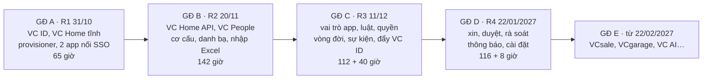

# Kế hoạch code VC Home: khung chung GĐ A–D

Phiên bản 0.1 · 08/10/2026 · Trạng thái: Nháp (chờ đội phát triển rà)

## Tóm tắt

- **Tài liệu nói gì:** khung chung để code VC Home từ GĐ A tới GĐ D: công nghệ đã chọn, cấu trúc repo `vc-platform`, các module của VC Home API và giai đoạn thêm từng module, quy ước code dùng chung (lỗi, thời gian, nhật ký, mức mật, đồng thời), cách xác thực và phân quyền, môi trường, kiểm thử, cách chia phiên làm việc.
- **Bộ kế hoạch code gồm 4 phần:** GĐ A ở [thiet-ke-sso-keycloak.md](thiet-ke-sso-keycloak.md) (65 giờ). GĐ B ở [ke-hoach-code-gd-b.md](ke-hoach-code-gd-b.md) (142 giờ). GĐ C ở [ke-hoach-code-gd-c.md](ke-hoach-code-gd-c.md) (112 giờ VC Home + 40 giờ hai app). GĐ D ở [ke-hoach-code-gd-d.md](ke-hoach-code-gd-d.md) (116 giờ VC Home + 8 giờ VClinks). Tổng khoảng **483 giờ**, khớp [10](../10-ke-hoach-trien-khai.md).
- **Quyết định kỹ thuật chính:**
  - VC Home API dùng **cùng stack với VClinks**: NestJS 10, TypeScript, driver MongoDB gốc (không mongoose), zod, jest + mongodb-memory-server + supertest. Đội không phải học thêm.
  - MongoDB 7 chạy **replica set một node** để có transaction: ghi dữ liệu, nhật ký và sự kiện trong cùng một transaction (mẫu outbox).
  - **Không thêm Redis.** Lịch chạy và hàng gửi sự kiện dựa trên MongoDB, có khoá thuê (lease) để không chạy trùng.
  - Đồng hồ tiêm được (`Clock`) để staging chạy **đồng hồ giả lập** cho các ca UAT theo mốc 00:00, 7 ngày, 14 ngày.
- **Nguyên tắc:** tài liệu nghiệp vụ (02, 04, 05, 06, 07) là nguồn sự thật. Kế hoạch code lệch với tài liệu nghiệp vụ thì sửa kế hoạch. Câu chữ hiển thị lấy đúng từng chữ ở 04, 06.
- **Đề xuất cần chủ dự án duyệt:** nâng máy chủ production lên **4 vCPU / 8 GB RAM trước R2** vì từ GĐ B máy chạy thêm MongoDB và VC Home API (D-BA-43).
- **Người duyệt xem kỹ:** mục 3 (công nghệ), mục 5 (module theo giai đoạn), mục 7 (xác thực, phân quyền), mục 10 (cách chia phiên).

## Mục lục

- [1. Cách đọc bộ kế hoạch code](#1-cách-đọc-bộ-kế-hoạch-code)
- [2. Lộ trình và phụ thuộc](#2-lộ-trình-và-phụ-thuộc)
- [3. Công nghệ đã chọn](#3-công-nghệ-đã-chọn)
- [4. Cấu trúc repo vc-platform](#4-cấu-trúc-repo-vc-platform)
- [5. Module của VC Home API theo giai đoạn](#5-module-của-vc-home-api-theo-giai-đoạn)
- [6. Quy ước code dùng chung](#6-quy-ước-code-dùng-chung)
- [7. Xác thực và phân quyền](#7-xác-thực-và-phân-quyền)
- [8. Môi trường, cấu hình và triển khai](#8-môi-trường-cấu-hình-và-triển-khai)
- [9. Kiểm thử chung](#9-kiểm-thử-chung)
- [10. Cách chia phiên và làm việc](#10-cách-chia-phiên-và-làm-việc)
- [11. Rủi ro kỹ thuật chung](#11-rủi-ro-kỹ-thuật-chung)
- [Lịch sử cập nhật](#lịch-sử-cập-nhật)

---

## 1. Cách đọc bộ kế hoạch code

| Đọc | Khi nào |
|---|---|
| Bản này | Trước khi code bất kỳ giai đoạn nào |
| [thiet-ke-sso-keycloak.md](thiet-ke-sso-keycloak.md) | GĐ A: VC ID, VC Home tĩnh, `vc-provisioner`, sửa VClinks và VCwiki |
| [ke-hoach-code-gd-b.md](ke-hoach-code-gd-b.md) | GĐ B: VC Home API, VC People, cơ cấu, danh bạ, nhập Excel |
| [ke-hoach-code-gd-c.md](ke-hoach-code-gd-c.md) | GĐ C: vai trò app, luật, quyền, vòng đời, sự kiện, đẩy sang VC ID, phần VClinks và VCwiki |
| [ke-hoach-code-gd-d.md](ke-hoach-code-gd-d.md) | GĐ D: xin và duyệt quyền, rà soát, thông báo, nghỉ dài ngày, cài đặt, VClinks đổi phiên sang cookie |

Mỗi phiên trong kế hoạch ghi mã yêu cầu (VH-xxx-NN), màn hình (VH-MH-NN), quy tắc (VH-BR-NN) và ca UAT (VH-UAT-NN). Dev mở đúng mục của 04, 05, 06, 07 theo mã đó.

## 2. Lộ trình và phụ thuộc



| GĐ | Bản | Thời gian | Giờ VC Home | Giờ ở app | Ai làm | Điều kiện bắt đầu |
|---|---|---|---:|---:|---|---|
| A | R1 | 13/10 → 31/10/2026 | 65 | (trong 65) | Dev002 + Claude Code | I1–I9 của thiết kế SSO |
| B | R2 | 02/11 → 20/11/2026 | 142 | 0 | Dev Platform + Claude Code | R1 lên; có dev Platform (N10); máy chủ đã nâng (D-BA-43); N1, N3 |
| C | R3 | 23/11 → 11/12/2026 | 112 | 40 | Dev Platform; dev VClinks, dev VCwiki mỗi người khoảng 3 ngày | R2 lên; N6, N7, N8 |
| D | R4 | 14/12/2026 → 22/01/2027 | 116 | 8 | Dev Platform; dev VClinks 1 ngày | R3 lên và chạy thật ≥ 1 tuần; N11 |
| | | | **435** | **48** | | Tổng khoảng **483 giờ** |

Không có dev Platform trước 30/10 thì R1 vẫn lên, B–D dời sang sau Tết, giữ nguyên thứ tự (12 mục 4).

## 3. Công nghệ đã chọn

| Phần | Chọn | Vì sao |
|---|---|---|
| VC Home API | NestJS 10, TypeScript 5, Node 22 | Cùng VClinks; dev chuyển qua lại không phải học |
| Database | MongoDB 7, **replica set một node**, driver `mongodb` 6 (không mongoose) | Cùng VClinks; transaction cho mẫu outbox (dữ liệu + nhật ký + sự kiện cùng commit) |
| Kiểm dữ liệu vào | zod, schema đặt ở `packages/contracts` | Dùng chung cho API, SPA, provisioner và làm hợp đồng cho app |
| JWT | `jose` (`createRemoteJWKSet`, `jwtVerify`, `SignJWT` cho test) | Đã chọn ở GĐ A cho VClinks |
| Excel | `exceljs` | VClinks đang dùng |
| Lịch chạy, hàng gửi | Tự viết trên MongoDB: collection kỹ thuật `_job_locks` (khoá thuê có hạn), vòng lặp trong tiến trình | Không thêm Redis cho một tiến trình; đủ cho ≤ 1.000 người, ≤ 50 app |
| Gọi Keycloak | Admin REST API qua client `vc-home-api` (service account), thư viện fetch mỏng tự viết | Ít phụ thuộc; chỉ dùng vài endpoint |
| Gửi email (GĐ C) | Gmail API bằng tài khoản dịch vụ uỷ quyền gửi thay `no-reply@vcprosperous.com` | Thông báo GĐ C bằng email công ty (README mục 9) |
| SPA | React 18, antd 5, Vite, `oidc-client-ts`, react-router 6, TanStack Query 5 | GĐ A đã dựng; token màu theo [canvas thiết kế](https://claude.ai/artifact/J8DUrr6ueZMwQMwL7yovEb) |
| Test | jest + `mongodb-memory-server` (chế độ replica set) + supertest; Playwright cho SPA | Cùng VClinks |
| Quản lý gói | pnpm workspace | Cùng VClinks |

Collection kỹ thuật bắt đầu bằng `_` (`_job_locks`, `_migrations`) không phải dữ liệu nghiệp vụ nên không có trong README mục 9.

## 4. Cấu trúc repo vc-platform

Mở rộng từ thiết kế SSO mục 6 (GĐ A đã có `keycloak/`, `home/`, `provisioner/`, `backup/`):

```
vc-platform/
├─ pnpm-workspace.yaml
├─ packages/
│  └─ contracts/              (GĐ B) zod schema + kiểu TypeScript: DTO, mã lỗi, payload sự kiện, hằng số vai trò
│     └─ json-schema/         sinh từ zod, gửi đội app (07)
├─ api/                       (GĐ B) VC Home API
│  ├─ src/
│  │  ├─ main.ts · app.module.ts · app.factory.ts
│  │  ├─ config/              đọc biến môi trường, kiểm bằng zod, cờ tính năng
│  │  ├─ common/              lỗi, phân trang, Clock, ngày giờ VN, rev, chiếu C0/C1, tiện ích transaction
│  │  ├─ db/                  kết nối, tên collection, chỉ mục, migration (`_migrations`)
│  │  ├─ auth/                kiểm token VC ID, Viewer, guard theo ma trận 02 mục 3, token máy của app
│  │  ├─ audit/               ghi `audit_log` trong transaction, tra cứu
│  │  ├─ jobs/                bộ chạy lịch dùng `_job_locks`
│  │  ├─ <module nghiệp vụ>/  mục 5
│  │  └─ scripts/             seed, migrate, công cụ vận hành
│  └─ test/                   e2e, fixtures (bộ dữ liệu 11 mục 6), app giả lập `vctest`
├─ home/                      SPA (GĐ A) + màn GĐ B–D
│  └─ src/
│     ├─ app/                 khung: header, menu theo vai trò, ngăn kéo thông báo
│     ├─ pages/<mã màn>/      một thư mục mỗi màn VH-MH-NN
│     ├─ components/          ô app, chip nguồn quyền, bảng, bộ dựng điều kiện…
│     └─ api/                 client gọi VC Home API (TanStack Query)
├─ provisioner/               (GĐ A) đối chiếu Google, điều kiện vào app
├─ keycloak/ · backup/ · docs/
└─ compose.yml · compose.dev.yml (thêm `mongo` replica set và `api` từ GĐ B)
```

## 5. Module của VC Home API theo giai đoạn

| Module | GĐ | Nội dung | Collection chính |
|---|---|---|---|
| `config`, `common`, `db`, `auth`, `audit`, `jobs` | B | Khung | `audit_log`, `_job_locks`, `_migrations` |
| `org` | B | Cây đơn vị, trưởng đơn vị, danh mục, gộp mục trùng; đổi cơ cấu có hiệu lực (C); lịch ngày nghỉ (D) | `org_units`, `job_titles`, `job_functions`, `legal_entities`, `work_locations`, `company_holidays` (D) |
| `people` | B | Hồ sơ, vị trí chính và kiêm nhiệm, quản lý, trạng thái, lịch sử, thay đổi hẹn ngày, đề nghị sửa, tự sửa | `people`, `positions`, `scheduled_changes`, `profile_change_requests` |
| `directory` | B | Danh bạ, sơ đồ tổ chức, đội của tôi, che C1 theo người xem | (đọc `people`, `positions`, `org_units`) |
| `accounts` | B | Gắn tài khoản VC ID với hồ sơ, khoá, danh sách loại trừ; thay `provisioner/loai-tru.yaml` | `accounts`, `directory_exclusions` |
| `imports` | B | Nhập Excel, đối chiếu Google và VC ID, khởi tạo từ VClinks và VCwiki, hoàn tác 24 giờ | `import_batches` |
| `apps` | B, C | Danh mục app trên màn và `catalog.json` động (B); vai trò app, chủ app, nhạy cảm, chuyển tiếp, cho phép xin (C, D) | `apps`, `app_roles` |
| `settings` | B | Cài đặt hệ thống có lý do (màn sửa ở D) | `system_settings` |
| `public-api` | B, C | VH-API-01…05 (B); 06, 07, 10 (C) cho app, xác thực bằng token máy | (đọc) |
| `rules` | C | Luật, điều kiện, xem trước, duyệt hai người, rà soát luật (D) | `access_rules` |
| `grants` | C | Bộ tính quyền, nguồn quyền, chuyển tiếp, khẩn cấp, tách nhiệm, tự trả (D) | `access_grants`, `sod_exceptions` |
| `lifecycle` | C, D | Job 00:00 áp thay đổi hẹn, vào làm, chuyển, nghỉ việc (C); nghỉ dài, quay lại (D) | `scheduled_changes` |
| `idsync` | C | Đẩy vai trò app và nhóm sang VC ID; tạo sẵn user; đối chiếu hằng đêm; thay phần "điều kiện vào app" của `vc-provisioner` | — |
| `events` | C | Outbox, ký HMAC, gửi lại, kéo dự phòng, gửi thử | `event_outbox`, `event_deliveries` |
| `notifications` | C, D | Email (C); chuông và ngăn kéo (D) | `notifications` (D) |
| `reports` | C | Báo cáo truy cập, tra cứu quyền | (đọc) |
| `requests` | D | Xin quyền, duyệt 1–2 bước, uỷ quyền, nhắc, tự huỷ, duyệt nhiều | `access_requests`, `approval_steps`, `delegations` |
| `reviews` | D | Rà soát quý quyền ngoại lệ, rà soát luật nửa năm | `review_campaigns`, `review_items` |

Mỗi module chỉ ghi vào collection của mình. Module khác cần thì gọi service, không ghi thẳng.

## 6. Quy ước code dùng chung

| Hạng mục | Quy ước |
|---|---|
| Lớp | Controller mỏng (kiểm zod, gọi service); service giữ nghiệp vụ; repository là các hàm truy vấn theo collection. Không đặt nghiệp vụ trong controller |
| Lỗi | Trả `{ "code": "<mã>", "message": "<câu tiếng Việt>", "details"?: … }`. Câu lấy đúng 04, 06; mã lỗi khai ở `packages/contracts/errors.ts`. 400 nhập sai · 401 thiếu hoặc hỏng token · 403 không đủ quyền (`LOI-403`) · 404 (`LOI-404`) · 409 người khác vừa sửa (`LOI-409`) hoặc vi phạm quy tắc · 422 vi phạm quy tắc nghiệp vụ có câu riêng |
| Đồng thời | Mọi tài liệu sửa được có trường `rev` (số nguyên). Lệnh sửa gửi kèm `rev`; lệch thì 409 `LOI-409` |
| Thời gian | Thời điểm lưu `Date` (UTC). Ngày hiệu lực lưu chuỗi `yyyy-mm-dd` theo **giờ Việt Nam** (05). Job "00:00" là 00:00 `Asia/Ho_Chi_Minh` (VH-BR-22). Không gọi `new Date()` trực tiếp trong nghiệp vụ: dùng `Clock.now()` |
| Đồng hồ giả lập | `CLOCK_MODE=fake` chỉ bật được khi `APP_ENV=staging` hoặc test; API quản trị `POST /api/v1/_test/clock` (chỉ `vchome:qtht`, chỉ staging) đặt giờ và chạy job tới hạn (11 đề xuất 1) |
| Nhật ký | Mọi thao tác ghi đi qua `AuditService.record(tx, …)` **trong cùng transaction**; `audit_log` chỉ thêm, không sửa, không xoá (VH-BR-18). Ghi người làm, việc, đối tượng, trước, sau, lý do, nguồn (`man_hinh` · `job` · `api` · `nhap_excel`) |
| Mức mật | Mọi phản hồi có dữ liệu người đi qua `projectPerson(doc, viewer)` của `common/`: C0 cho mọi người; C1 chỉ khi có quan hệ theo VH-BR-23. Mỗi lần xem C1 của người khác ghi nhật ký. Không có C2, C3 trong VC Home (VH-BR-19) |
| Phân trang | `?limit=50&after=<con trỏ>`; tối đa 200 |
| Định danh | `_id` là ObjectId; mã nghiệp vụ (`employee_code`, mã đơn vị, khoá app) duy nhất, không đổi sau khi tạo |
| Sự kiện | `event_id` là UUID v7; ghi `event_outbox` trong cùng transaction với thay đổi; bộ gửi đọc outbox (07) |
| Cờ tính năng | `FEATURE_<TÊN>=on|off` để lên code trước, bật sau (ví dụ `FEATURE_GRANTS_PUSH` chạy ngầm ở R3) |
| Log | JSON một dòng; không ghi token, `code`, dữ liệu C1, nội dung Excel |
| Văn phong | Comment trong code tiếng Anh; giao diện, tài liệu, câu lỗi tiếng Việt (giống VClinks CLAUDE.md §12.6) |
| Commit | `VH-B-03: <việc> (VH-NSU-01, VH-NSU-02)`; một phiên một hoặc vài commit; tài liệu theo §13 của VClinks |

## 7. Xác thực và phân quyền

**SPA gọi VC Home API:**
- SPA gửi access token của VC ID (client `vchome`). Thêm mapper audience `vchome-api` vào client `vchome` (làm ở phiên đầu GĐ B).
- API kiểm chữ ký qua JWKS, `iss`, `aud` chứa `vchome-api`, `exp` (lệch ≤ 60 giây).
- Tìm `accounts` theo `sub` → hồ sơ `people`. Không có hồ sơ: chỉ dùng được các API không cần hồ sơ (trang chủ rút gọn, VH-BR-02).

**Đối tượng `Viewer`** (dựng một lần mỗi yêu cầu, có cache 60 giây theo `sub`):

| Trường | Nguồn | Từ GĐ |
|---|---|---|
| `sub`, `personId`, `employeeCode` | Token, `accounts` | B |
| `homeRoles` (`hcns`, `qtht`, `kiem_soat`, `bgd`) kèm phạm vi | Claim `resource_access.vchome.roles` ở GĐ B (quản trị gán trên VC ID theo danh sách Q-07); từ GĐ C là quyền app `vchome` trong `access_grants`, đẩy sang VC ID như app khác | B |
| `managerOf` (cây dưới quyền), `headOf` (đơn vị làm trưởng) | `positions`, `org_units` | B |
| `appOwnerOf` | `apps.owners` | C |
| `delegatedFrom` | `delegations` đang hiệu lực | D |

**Guard theo ma trận 02 mục 3:** mỗi ô của ma trận là một quyền có tên trong `packages/contracts/permissions.ts`, ví dụ `nhan_su.sua`, `luat.duyet_buoc_hai`. Controller khai `@Can('nhan_su.sua')`; service kiểm thêm phạm vi (pháp nhân, cây dưới quyền, app của mình). Bảng quyền có test sinh từ ma trận: mỗi ô "—" phải trả 403.

**App gọi VC Home API (VH-API):** token máy của client `<app>-service` (client credentials), scope `vh.people.read`, `vh.grants.read` (07 mục 4). Guard riêng `@AppScope('vh.people.read')`; app chỉ đọc được dữ liệu C0 cộng mã đơn vị, và quyền của chính app mình.

**VC Home API gọi VC ID:** client `vc-home-api` (service account) với vai trò `manage-users`, `view-users`, `query-groups`, `manage-clients` giới hạn ở realm `vc`. Khai trong `keycloak/realm/vc.yaml`, bí mật trong `.env` máy chủ.

## 8. Môi trường, cấu hình và triển khai

| Môi trường | Thêm từ GĐ B |
|---|---|
| Dev | `compose.dev.yml` thêm `mongo` (replica set `rs0`, một node) và `api` (cổng 3100); SPA dev gọi `http://localhost:3100` |
| Staging (máy 129) | `api-staging.tramaphutung.com`; `CLOCK_MODE=fake` được phép; app giả lập `vctest` nhận sự kiện |
| Production (máy I1) | `home.vcprosperous.com/api` (nginx chuyển tiếp tới `api`); cùng máy với VC ID |

**Máy production:** từ GĐ B máy chạy Keycloak, PostgreSQL, MongoDB, VC Home API, nginx, provisioner. 2 vCPU / 4 GB (Q2) sẽ thiếu RAM. **Đề xuất nâng lên 4 vCPU / 8 GB, 80 GB SSD trước R2** (D-BA-43, chủ dự án duyệt chi phí).

**Biến môi trường chính của `api`** (đầy đủ trong `.env.example` mỗi giai đoạn bổ sung):

```
APP_ENV=production|staging|dev
MONGO_URL=mongodb://mongo:27017/vchome?replicaSet=rs0
OIDC_ISSUER=https://id.vcprosperous.com/realms/vc
OIDC_AUDIENCE=vchome-api
KC_ADMIN_CLIENT_ID=vc-home-api      KC_ADMIN_CLIENT_SECRET=…
CLOCK_MODE=real|fake
FEATURE_IMPORT=on  FEATURE_GRANTS=off  FEATURE_GRANTS_PUSH=off  FEATURE_EVENTS=off  FEATURE_REQUESTS=off
```

**Sao lưu MongoDB:** `mongodump` hằng đêm cùng lịch với `pg_dump` (thiết kế SSO mục 7), giữ 14 bản ngày và 6 bản tháng, một bản ra ngoài máy, khôi phục thử hằng tháng (VH-NFR-10, 11).

**Lên bản:** theo thứ tự ở mỗi kế hoạch giai đoạn; migration chạy tự động lúc khởi động (`_migrations`), chỉ thêm trường hoặc chỉ mục, không xoá dữ liệu trong cùng bản.

## 9. Kiểm thử chung

| Lớp | Làm gì | Chạy khi |
|---|---|---|
| Unit | Bộ tính quyền, điều kiện luật, ngày hiệu lực, chiếu C0/C1, ký HMAC: mỗi quy tắc VH-BR có ít nhất một ca | Mỗi commit |
| Ma trận quyền | Sinh tự động từ 02 mục 3: mỗi vai trò × mỗi quyền, mong đợi 200 hoặc 403 | Mỗi commit |
| E2E API | `mongodb-memory-server` replica set + issuer giả (ký token bằng `jose`); gọi qua supertest | Mỗi commit |
| E2E SPA | Playwright với Keycloak dev và API dev, dữ liệu seed | Trước mỗi bản |
| UAT | Ca VH-UAT ở [11](../11-uat.md) trên staging, bộ dữ liệu 11 mục 6 (`pnpm seed:uat`), 6 tài khoản Google thử, đồng hồ giả lập | Tuần cuối mỗi bản |

`pnpm ci:local` = typecheck + lint + unit + e2e API, phải xanh trước khi gộp (giống VClinks).

## 10. Cách chia phiên và làm việc

- **Một phiên** là một việc 2–8 giờ, làm trong một phiên chat Claude Code. Mỗi phiên ghi: mã phiên, việc, đầu vào, đầu ra, xong khi, giờ, model.
- **Mã phiên:** `SSO-NN` (GĐ A), `B-NN`, `C-NN`, `D-NN`. Không dùng lại mã.
- **Model** theo VClinks CLAUDE.md §15.7: Opus cho phiên đụng bảo mật, bộ tính quyền, dữ liệu nhiều bước; Sonnet cho màn hình, CRUD, tài liệu.
- **Sẵn sàng và xong** theo [10](../10-ke-hoach-trien-khai.md) mục 7. Thêm: phiên có màn hình thì so với canvas thiết kế và câu chữ 06; phiên có API thì cập nhật `packages/contracts` và JSON Schema.
- **Sổ phiên:** `vc-platform/docs/so-phien.md`, mỗi phiên tự cập nhật dòng của mình (giống VClinks M1).

## 11. Rủi ro kỹ thuật chung

| Rủi ro | Mức | Cách giảm |
|---|---|---|
| Thiếu RAM khi một máy chạy cả Keycloak và MongoDB | Cao nếu không nâng máy | D-BA-43; giám sát RAM > 80% (thiết kế SSO mục 11) |
| Transaction MongoDB chậm khi đổi cơ cấu lớn | Trung bình | Chia lô 200 người mỗi transaction; mỗi lô có sự kiện riêng; đo ở staging với 1.000 hồ sơ giả |
| Bộ tính quyền sai làm nhiều người mất quyền | Cao | Chạy ngầm 1 tuần ở R3; xem trước bắt buộc; duyệt hai người (VH-BR-25); test thuộc tính (sinh ngẫu nhiên hồ sơ và luật, so với cách tính đơn giản) |
| Lệch giữa VC Home và VC ID | Trung bình | Đẩy có thử lại; đối chiếu hằng đêm (VH-NFR-18) |
| Một dev làm cả backend và frontend | Cao | Ưu tiên màn theo canvas có sẵn; dùng component antd; Claude Code viết khung màn từ đặc tả 06 |

## Lịch sử cập nhật

| Phiên bản | Ngày | Người / phiên | Thay đổi | Căn cứ |
|---|---|---|---|---|
| 0.1 | 08/10/2026 14:05 | Claude Code (vai BA trưởng, kiến trúc) | Tạo khung chung cho kế hoạch code GĐ A–D: công nghệ, repo, module theo giai đoạn, quy ước code, xác thực và phân quyền, môi trường, kiểm thử, cách chia phiên | Người dùng yêu cầu "lên plan code từng phase" ngày 08/10/2026; 10 bản 0.3 |
