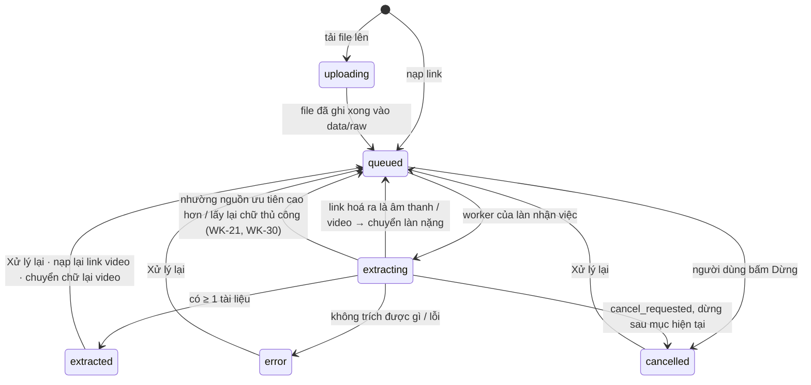
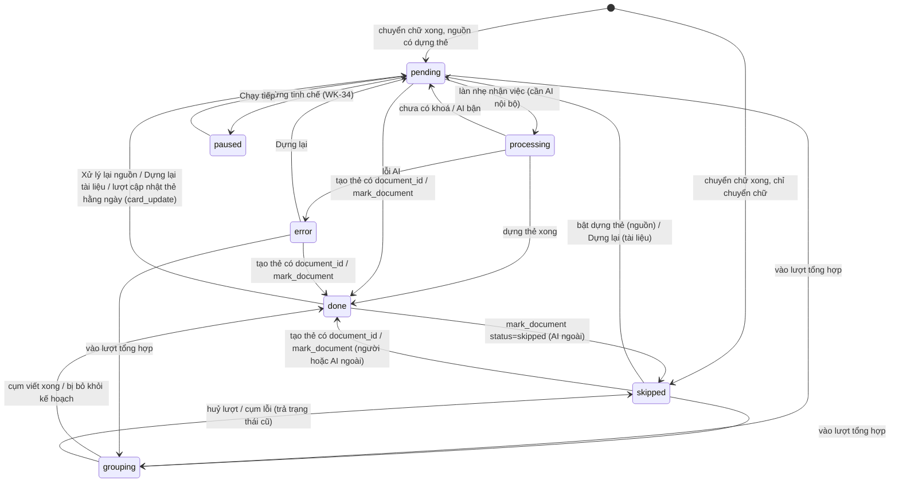
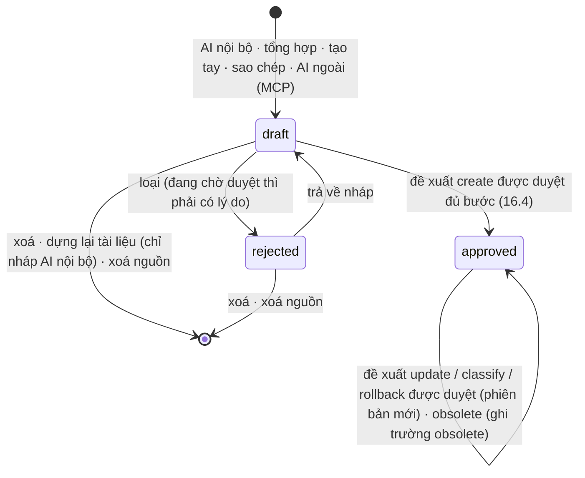
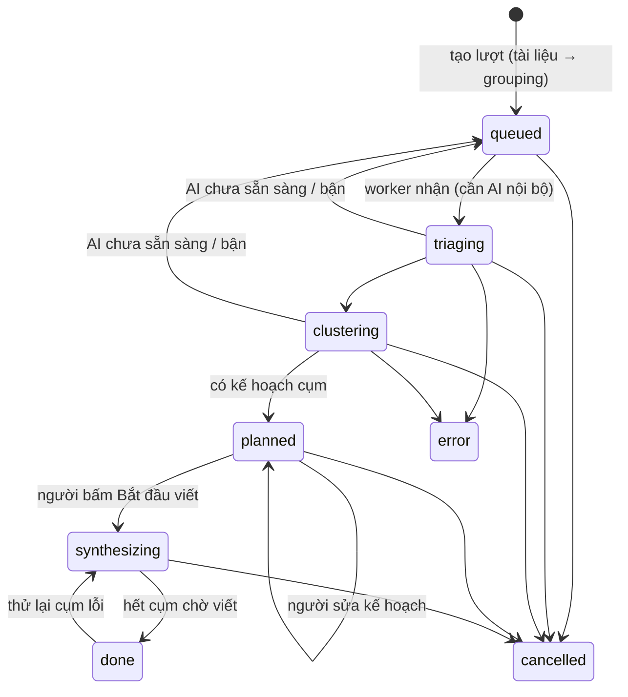
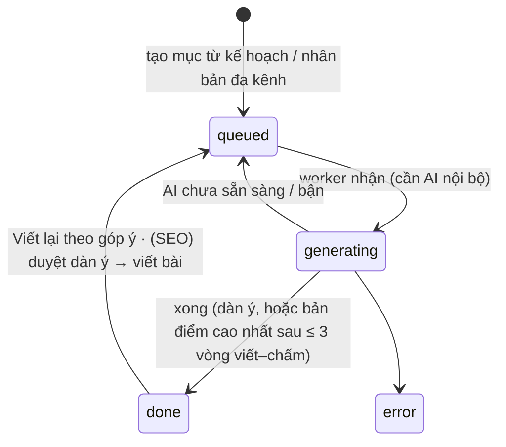
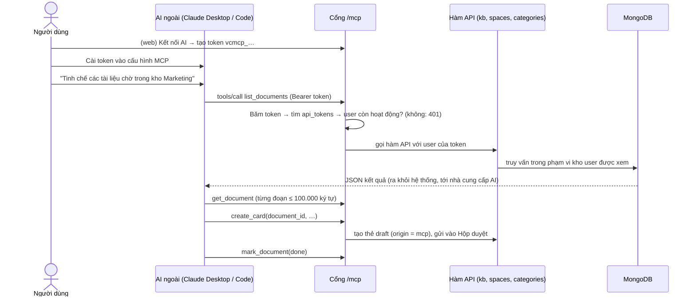
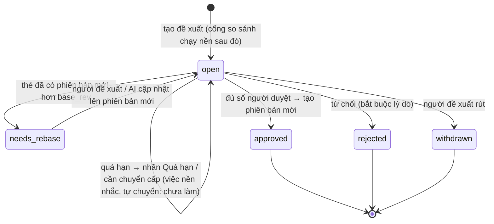

# Tài liệu phân tích nghiệp vụ (BA) — VC Content Engine

> Chuyển đổi kho tri thức (Kho tư liệu → VCWIKI, gồm Kho video mạng xã hội) · Content Engine (tự động hoá nội dung marketing) · Cơ cấu tổ chức và phân quyền · Quản trị vòng đời tri thức · Học tập

---

## 0. Kiểm soát tài liệu

### 0.1 Thông tin tài liệu

| Thuộc tính                  | Giá trị                                                                                                                                                            |
| ----------------------------- | -------------------------------------------------------------------------------------------------------------------------------------------------------------------- |
| Mã tài liệu                | CE-BA-001                                                                                                                                                            |
| Tên tài liệu               | Tài liệu phân tích nghiệp vụ — VC Content Engine                                                                                                              |
| Phiên bản hiện hành       | **0.62**                                                                                                                                                       |
| Trạng thái                  | **Dự thảo** — chờ duyệt                                                                                                                                   |
| Ngày phát hành phiên bản | 01/10/2026                                                                                                                                                           |
| Chủ sở hữu tài liệu      | Bùi Thọ Anh                                                                                                                                                        |
| Người phê duyệt           | *(chưa phân công)*                                                                                                                                              |
| Mức phân loại thông tin   | Nội bộ — không gửi ra ngoài công ty                                                                                                                           |
| Nơi lưu bản gốc           | Repo git dự án`TIKTIKTOTEXT`, đường dẫn `docs/BA.md`. Bản trong git là bản duy nhất có hiệu lực, mọi bản in / bản sao đều chỉ để tham khảo |

### 0.2 Lịch sử sửa đổi

Mọi thay đổi nội dung đều phải ghi vào bảng này **trước khi** commit. Dòng mới nhất nằm trên cùng.

| Phiên bản | Ngày      | Loại thay đổi           | Mô tả thay đổi                                                                                                                                                                                                                                                                                                                                                                                                                                                                                                                                                                                                                                                                                                                                                                                                  | Mục bị ảnh hưởng                                              | Người soạn                         | Người duyệt | Trạng thái                    | Tham chiếu cấu hình                             |
| ----------- | ---------- | -------------------------- | ------------------------------------------------------------------------------------------------------------------------------------------------------------------------------------------------------------------------------------------------------------------------------------------------------------------------------------------------------------------------------------------------------------------------------------------------------------------------------------------------------------------------------------------------------------------------------------------------------------------------------------------------------------------------------------------------------------------------------------------------------------------------------------------------------------------- | ------------------------------------------------------------------ | ------------------------------------- | -------------- | ------------------------------- | -------------------------------------------------- |
| 0.62 | 05/10/2026 | Bổ sung vận hành | **SYS-42** chuyển dữ liệu sang máy chủ khác: một lệnh xuất trọn MongoDB, chỉ mục vector Qdrant, file thô, media kèm checksum và số liệu đối chiếu; một lệnh nạp ở máy đích, kiểm trước khi ghi, không ghi đè DB có dữ liệu nếu không yêu cầu, so số liệu sau khi nạp. Ghi lúc 05/10/2026 15:19:30 (UTC+7) | Mục 11.1 | Bùi Thọ Anh (Claude Code) | — | Đã làm — chờ UAT người dùng | DESIGN v0.39 mục 12.6 (OPS-01) |
| 0.61 | 03/10/2026 | Đổi hành vi vận hành | SYS-41: model Ollama tự nhả khỏi RAM/GPU sau 60 giây không có lời gọi; máy chủ dừng thì nhả ngay; không kill daemon dùng chung | Mục 6.3, 6.6, 11.1 | Codex | Theo yêu cầu trong chat | Đã làm @8f2564a — chờ UAT người dùng | DESIGN v0.38, TK-17 |
| 0.60 | 01/10/2026 | Triển khai | LRN-18…24: TK-16 / SCR-16.2, khoa–bộ môn–môn, giáo trình / giáo án / lớp, học liệu, thực hành và thi; giữ lịch sử legacy | Mục 17.13 | Codex | — | Đã triển khai — chờ UAT người dùng | @39d56dc · codex/mon-hoc-crud |
| 0.59 | 01/10/2026 | Đổi hành vi + bổ sung (Đích) | LRN-24: bài học gồm nhiều học liệu video, slide, thẻ, podcast, talk show; giáo án toàn môn chia nhiều buổi ánh xạ nhiều–nhiều với bài giáo trình | Mục 17.13 | Codex | — | Chờ duyệt wireframe | codex/mon-hoc-crud |
| 0.58 | 01/10/2026 | Bổ sung (Đích) | LRN-22…23: tạo giáo trình theo môn / đối tượng và soạn giáo án từng buổi, chọn giáo án mẫu cho lớp; chưa DESIGN / code | Mục 17.13 | Codex | — | Chờ duyệt wireframe | codex/mon-hoc-crud |
| 0.57 | 01/10/2026 | Đổi hành vi + bổ sung (Đích) | LRN-18…21: khoa / bộ môn / môn / bài, đào tạo liên khoa, giáo trình theo đối tượng, thực hành và dự án thực tiễn; wireframe chờ duyệt, chưa DESIGN / code | Mục 17.13 | Codex | — | Chờ duyệt wireframe | codex/mon-hoc-crud |
| 0.56 | 01/10/2026 | Đổi hành vi | SYS-39: AI local tra cứu nghiệp vụ bằng công cụ đọc MCP với quyền người chat; đọc hướng dẫn theo câu hỏi, không chỉ trang đang mở | 14.8 | Codex | Theo yêu cầu trong chat | Đã làm @71e052a | SCR-22.2 |
| 0.55 | 01/10/2026 | Đổi hành vi | SYS-38: trò chuyện tự chuyển Ollama khi Claude CLI không hoạt động; chỉ trả lời chữ / hướng dẫn, giữ lịch sử và quyền, không gọi lại thao tác đã chạy | 14.8 | Codex | Theo yêu cầu trong chat | Đã triển khai @0c44273 | SCR-22.1; kiểm thử tự động đạt, chờ nghiệm thu mô hình thật |
| 0.54 | 01/10/2026 | Sửa lỗi | WK-26: hoàn tất chuyển nguồn / tài liệu sang cây v2 và ẩn cây cũ; chặn tham chiếu còn lại, sao lưu trước ghi, quay lui; DESIGN LV-01 | Mục 4.3, 4.5 | Codex | — | Dự thảo | codex/hoan-tat-cay-linh-vuc |
| 0.53        | 30/09/2026 | Sửa đổi (theo code) | **LRN-15…17 hoàn tất TK-15a–d**: thư viện cây khoá / danh sách bài có thứ tự, soạn và sắp bài trong khoá, tạo / sửa / phát hành / sao chép lộ trình chuỗi khoá, hiển thị tiến độ và khoá thứ tự học; link `/learn/paths` chuyển về Thư viện. Script chuyển dữ liệu mới chỉ chạy QA, chưa chạy DB thật | Mục 0.1, 17.12 | Bùi Thọ Anh (Codex) | — | Dự thảo | `feature/tk15d-thu-vien-khoa` |
| 0.52        | 30/09/2026 | Sửa đổi (theo code) | **LRN-15, LRN-17** phần API (DESIGN v0.31 TK-15b): xem cây khoá (số bài mỗi nút) và một khoá (bài đánh số theo người xem, kết quả kiểm tra của mình); chủ nhánh (nút hoặc nút cha) / L&D sắp thứ tự mặc định, đặt thi khoá (kiểm ma trận rút đủ câu từ các bài đã phát hành) và điểm đạt bài (mặc định 70); kiểm tra sau bài chấm đạt / chưa đạt, làm lại được, lấy lượt cao nhất; AI ngoài qua MCP đọc được cây khoá và một khoá (không đáp án, không bài C3). Bắt đầu thi khoá làm cùng lộ trình chuỗi khoá (TK-15c) | Mục 0.1, 17.10 | Bùi Thọ Anh (Claude Code) | — | Dự thảo | nhánh `feature/tk15b-api-khoa` |
| 0.51        | 30/09/2026 | Sửa đổi (theo code) | **LRN-15** phần dữ liệu (DESIGN v0.30 TK-15a): bài học có khoá + thứ tự, người soạn gắn / đổi khoá (đổi được cả bài đã phát hành), đổi tên / xoá nhánh cây kéo theo bài; script chuyển dữ liệu `chuyen_khoa_hoc.py` (chạy thử QA: 23 bài, 0 bài *Chưa xếp khoá*, 14 bài hoà số thẻ — chọn theo lĩnh vực chính của thẻ, thẻ đầu bài). Chưa chạy trên DB thật | Mục 0.1, 17.10 | Bùi Thọ Anh (Claude Code) | — | Dự thảo | nhánh `feature/tk15a-du-lieu-khoa` |
| 0.50        | 30/09/2026 | Sửa đổi | **Đợt UI-3** (DESIGN v0.29 Phần V mục 9.4, nhánh `ui/ui-3`) — cập nhật trạng thái theo code: **GOV-13** Trả về đề xuất đã làm (trả về kèm lý do, *Cần sửa* + *Sửa và gửi lại*, dòng *Đề xuất cần sửa* ở *Việc của tôi*, MCP); **SYS-35** chia sẻ kho theo đơn vị đã làm; **SYS-36** đăng nhập gần nhất đã làm; màn Học tập (Học tập của tôi, Thư viện, Lộ trình, Thiết kế lộ trình, Làm bài, Chấm bài), Cơ cấu tổ chức, Kho & chia sẻ, Người dùng & lĩnh vực chuyển giao diện mới (SYS-26…29) — trạng thái trên URL (SYS-28), bàn phím (SYS-29). Không đổi luật nghiệp vụ ngoài ba mã trên. Chờ chủ sản phẩm chốt: DESIGN V.10 Q9–Q12 | Mục 0.1, 6.7, 6.8, 16 | Bùi Thọ Anh (Claude Code) | — | Dự thảo | nhánh `ui/ui-3` |
| 0.49        | 30/09/2026 | Sửa đổi (đổi hành vi) | Chủ sản phẩm đổi mô hình học tập: **mỗi nút của cây chủ đề là một khoá học**, khoá gồm các bài học đánh số tăng dần (mỗi bài tổng hợp nhiều thẻ); **lộ trình học là chuỗi khoá xếp theo trình tự**; **kiểm tra sau mỗi bài, thi sau mỗi khoá, lộ trình không thi**; bỏ trang danh sách *Lộ trình học* `/learn/paths`, xem khoá và lộ trình ở Thư viện. Mục mới 17.12, mã mới **LRN-15, LRN-16, LRN-17** (*Đích — chưa làm*, DESIGN v0.27 **TK-15**, **SCR-16.1**); LRN-03 ghi chú sẽ được thay; vấn đề mở 37–42 đã chốt cùng ngày (cấp trên sắp khoá và bài cho cấp dưới trong lộ trình; học theo thứ tự — đạt kiểm tra mới sang bài sau, xong khoá mới sang khoá sau; hạn theo từng khoá). Mô hình tuần → bài (17.2, 17.4) vẫn là hiện trạng tới khi TK-15 làm xong | Mục 0.1, 12, 17.2, 17.10, 17.12 | Bùi Thọ Anh (Claude Code) | — | Dự thảo | nhánh `docs/khoa-hoc-theo-chu-de` |
| 0.48        | 30/09/2026 | Bổ sung + sửa đổi | Chủ sản phẩm chốt 3 câu hỏi của đợt UI-2 (DESIGN Phần V mục 10): **Q6** Tiến độ tinh chế giữ theo DESIGN (tab theo trạng thái + bảng tài liệu), bản vẽ canvas sửa theo; **Q7** thêm yêu cầu **GOV-13 Trả về đề xuất** (người duyệt trả đề xuất cho người đề xuất sửa tiếp, đề xuất không bị đóng) — mục 16.3, 16.8; **Q8** danh sách phát tối đa **1.000 thẻ** (trước 500) — WK-40 | Bùi Thọ Anh |
| 0.47        | 30/09/2026 | Sửa đổi | **Đợt UI-2** (DESIGN v0.22 Phần V mục 9.2, nhánh `ui/ui-2`): **SYS-27** đã làm — menu nhóm theo việc (4 nhóm, 16 mục thường trực + *Việc của tôi* + 2 mục cố định), trang đầu `/` *Việc của tôi* gom việc chờ kèm số, huy hiệu số việc trên menu, *Xưởng chiến dịch* đổi tên *Chiến dịch* (đường dẫn giữ); **SYS-28** thêm Kho tư liệu (mọi lọc), Tiến độ tinh chế, Hộp duyệt hàng loạt lên URL; Hộp duyệt: xử lý xong tự mở đề xuất kế, *Hoàn tác* trong 8 giây (chưa gửi cho tới khi hết giờ). Việc chưa làm cần quyết: nút *Trả về* đề xuất (GOV, DESIGN V.10 Q7). Không đổi luật nghiệp vụ | Mục 0.1, 6.7 | Bùi Thọ Anh (Claude Code) | — | Dự thảo | nhánh `ui/ui-2` |
| 0.46        | 30/09/2026 | Sửa đổi (theo code) | Ghép hai nhánh: bảng thuật ngữ dịch tự cập nhật trong job đêm từ tài liệu và thẻ ngành ô tô (mục 13, bảng `glossary`); Thư viện bài học báo lý do chưa soạn được + cảnh báo ít thẻ đã duyệt, `/org` cây trống có hướng dẫn cho admin (yêu cầu 6ab79386…2750bd08, mục 9 dòng LRN) | Mục 9, 13 (DESIGN v0.20) | Bùi Thọ Anh (Claude Code) | — | Dự thảo | nhánh `chore/ghep-2-nhanh` |
| 0.45        | 30/09/2026 | Sửa đổi | **Đợt UI-1 Nền móng** (DESIGN v0.18 Phần V mục 9.1, nhánh `ui/ui-1-nen-tang`) — cập nhật trạng thái theo code: **SYS-26** một phần (token màu / chữ / khoảng cách / lớp đạt AA, công tắc *Theo máy / Sáng / Tối*, bộ biểu tượng SVG, thư viện component nền — các màn chưa chuyển); **SYS-28** thêm `useUrlState` dùng chung; **SYS-29** có kiểm tự động (ESLint jsx-a11y, axe mọi route) và 4 component bàn phím theo WAI-ARIA; **SYS-30** ESLint cấm `confirm` / `prompt` / `alert`; **SYS-32** đã làm phần vỏ: `robots.txt`, **404 thật** (máy chủ + trang *Không tìm thấy* trong app — đường dẫn lạ không còn tự về `/`), **301** link cũ, `noindex`, tiêu đề + mô tả theo màn, ảnh xem trước. Không đổi luật nghiệp vụ | Mục 0.1, 6.7 | Bùi Thọ Anh (Claude Code) | — | Dự thảo | nhánh `ui/ui-1-nen-tang` |
| 0.44        | 30/09/2026 | Bổ sung | **Bốn yêu cầu phát sinh khi làm mẫu giao diện mới** (mục 6.8): SYS-35 chia sẻ kho theo đơn vị; SYS-36 ghi và hiện lần đăng nhập gần nhất; SYS-37 tạo lại token MCP trong một thao tác; CE-33 lịch sử phiên bản bài Viết nhanh (xem, so sánh, khôi phục). Thiết kế: DESIGN v0.5 SCR-19.1, 21.1, 20.1, 13.1 | Mục 0.1, 5.11, 6.8, 10, 13.7 | Bùi Thọ Anh (Claude Code) | — | Dự thảo | nhánh `ui/thiet-ke-lai` |
| 0.43        | 30/09/2026 | Sửa đổi | **Xử lý nợ kỹ thuật** (DESIGN v0.14 Phần I mục 13, nhánh `fix/no-ky-thuat`) — viết lại BA theo code mới: **WK-32** lượt cập nhật thẻ hằng ngày dời mặc định `CARD_UPDATE_AT` **01:00 → 07:45**, sau job vector đêm (00:30 → dừng êm 07:30) — trước đây trùng khung, cả hai xin chung chỗ AI nên cập nhật thẻ vẫn phải chờ; nhãn tài liệu *Chờ cập nhật thẻ (đêm nay)* → *(lượt hằng ngày)*; *Ưu tiên* nguồn vẫn làm ngay. Mục 11.1: **bản QA** có script `start_qa.sh` (127.0.0.1:8300, DB `tiktok_to_text_qa`, từ chối DB thật); `start_*.sh` tự dò `mongod.conf`; `numpy` bắt buộc, `torch` + `transformers` ở `backend/requirements-ml.txt` (setup.sh cài mặc định). Không đổi yêu cầu nào khác (phiên đăng nhập FE gom một nguồn, gom biến môi trường về `config.py`, `HUONG_DAN.md` trỏ `/guide` là việc kỹ thuật) | Mục 0.1, 4.x (WK-32), 5 (WK-32), 9, 11.1 | Bùi Thọ Anh (Claude Code) | — | Dự thảo | nhánh `fix/no-ky-thuat` |
| 0.42        | 30/09/2026 | Bổ sung | Trang theo dõi worktree hiện **nội dung trò chuyện các phiên Claude** dạng thẻ (kéo ngang / cuộn dọc) và lưới `/tro-chuyen`, để đọc lại không phải chuyển tab (DESIGN v0.13 mục 0.8.4). Công cụ dev, không đổi yêu cầu nghiệp vụ nào | Mục 0.1 | Bùi Thọ Anh (Claude Code) | — | Dự thảo | nhánh `chore/xem-tro-chuyen` |
| 0.41        | 30/09/2026 | Sửa | **Xem video và ghi chép song song** (đổi cách làm của WK-45, tiêu chí giữ nguyên): bấm *Xem video* ở tài liệu thì ô *Ghi chép khi xem* nằm cạnh video (video dính khi cuộn), mốc giây tự gắn lúc bắt đầu gõ, Ctrl / ⌘ + Enter lưu, bấm *▶ mm:ss* tua video tại chỗ. DESIGN v0.12 SCR-03.2; UAT-WK-037; /guide mục nạp tư liệu. e2e `notes.spec.js` | Mục 4.5 | Bùi Thọ Anh (Claude Code thực hiện) | — | Dự thảo | `@af31b6b` |
| 0.40        | 30/09/2026 | Sửa | `bash ra_nhanh.sh --xem` thành một lệnh: tự bật trang theo dõi worktree chạy nền và mở cửa sổ; `--xem-tat` để tắt (DESIGN v0.11 mục 0.8.4). Công cụ dev, không đổi yêu cầu nghiệp vụ nào | Mục 0.1 | Bùi Thọ Anh (Claude Code) | — | Dự thảo | nhánh `chore/xem-mot-lenh` |
| 0.39        | 30/09/2026 | Bổ sung | **Ghi chép theo nguồn và từng đơn vị (WK-45)**: mỗi nguồn (kênh, album, thư mục) và mỗi tài liệu trong nguồn (một video, một file) có nhiều ghi chép của người dùng — collection mới `kb_notes` (≤ 2000 ký tự / ghi chép, mốc thời gian `t` cho video / ghi âm); ai xem được nguồn thì ghi được, sửa / xoá: tác giả hoặc chủ kho (`policy.py`: `note.read`, `note.create`, `note.moderate`, `note.edit`); xoá nguồn xoá ghi chép. Chi tiết nguồn có khung *Ghi chép* + nút *Ghi chép (n)* từng tài liệu (tick *Gắn mốc thời gian hiện tại* khi đang xem video); tab mới **Ghi chép** `/kb/notes` của Kho tư liệu để tìm lại / xem lại theo cả kênh hay từng đơn vị (lọc kho, nguồn, tài liệu, chữ, của tôi, loại — ghi chú của người nạp WK-44 hiện là mục *Khi nạp*). AI dựng thẻ / tổng hợp nhận khối *Ghi chép của người dùng* (thay khối *Ghi chú của người nạp*, cùng lời dặn). MCP: `get_source` trả `notes`, `claim_documents` trả `notes`. API `GET/POST /kb/notes`, `PATCH/DELETE /kb/notes/{id}`. DESIGN 0.10 Phần II mục 12, SCR-03.1; UAT-WK-032…036; /guide mục nạp tư liệu. Test `test_ghi_chep_nguon.py`, e2e `notes.spec.js` | Mục 0.1, 4.5, 7, 8, 9, 10, Phụ lục A | Bùi Thọ Anh (Claude Code thực hiện) | — | Dự thảo | nhánh `feat/ghi-chep-nguon` |
| 0.38        | 30/09/2026 | Sửa | Trang theo dõi worktree (`bash ra_nhanh.sh --xem`) mở được thành tab trong VS Code qua `http://127.0.0.1:8900` (DESIGN v0.9 mục 0.8.4). Công cụ dev, không đổi yêu cầu nghiệp vụ nào | Mục 0.1 | Bùi Thọ Anh (Claude Code) | — | Dự thảo | nhánh `chore/bang-nhanh` |
| 0.37        | 30/09/2026 | Bổ sung | **Quản lý nhánh và worktree** (DESIGN v0.6 Phần 0 mục 0.8.4): script `ra_nhanh.sh` rà nhánh chưa merge `develop` (nhãn «bỏ quên?» sau 3 ngày không ghi lý do), dọn worktree + nhánh đã merge; đóng việc = merge + xoá worktree / nhánh; kiểm số phiên bản BA / DESIGN trên `develop` trước khi merge. Không đổi yêu cầu nghiệp vụ nào | Mục 0.1, 0.4 | Bùi Thọ Anh (Claude Code) | — | Dự thảo | nhánh `chore/ra-nhanh` |
| 0.36        | 30/09/2026 | Bổ sung | **Ghi chú của người nạp trên nguồn (WK-44)**: khung nạp `/kb` thêm ô *Ghi chú của bạn* (không bắt buộc, ≤ 2000 ký tự, có nhãn, gợi ý, bộ đếm) — điều người dùng thích, vì sao lưu, cần chú ý; lưu ở `kb_sources.note` (trường đã có nhưng trước đây giao diện không gửi, không giới hạn, không dùng). Sửa trong chi tiết nguồn (`PUT /kb/sources/{id}/note`, quyền `source.write`). AI dựng thẻ và tổng hợp theo cụm nhận khối *Ghi chú của người nạp* làm gợi ý phân loại / nhấn mạnh, không chép vào thẻ. MCP: `list_sources` / `get_source` trả `note`, `claim_documents` trả `source_note`. DESIGN 0.5 Phần II mục 11; UAT thêm ca UAT-WK-012…014; /guide mục nạp nguồn. Test `test_ghi_chu_nguon.py`, e2e `knowledge.spec.js` | Mục 0.1, 4.5, 7, 8, 9, 10 | Bùi Thọ Anh (Claude Code thực hiện) | — | Dự thảo | nhánh `feat/ghi-chu-nguon` |
| 0.35        | 30/09/2026 | Bổ sung | **Quy tắc xử lý yêu cầu chỉnh sửa** (mục 0.4 trỏ sang `docs/DESIGN.md` Phần 0 mục 0.8, DESIGN v0.4): mọi yêu cầu sửa thứ đã thiết kế / đã code được phân loại trước khi code — sửa lỗi / đổi hành vi / đổi cách làm / code lệch tài liệu — và báo loại cho người yêu cầu; đổi hành vi đi đủ BA → DESIGN → Code → UAT → đóng; không xoá mục cũ, không tái sử dụng mã; đụng dữ liệu đang có thì phải có cách chuyển dữ liệu, script một lần và cách quay lui, chạy thử trên DB QA / UAT trước. Không đổi yêu cầu nghiệp vụ nào | Mục 0.1, 0.4 | Bùi Thọ Anh (Claude Code) | — | Dự thảo | nhánh `docs/quy-trinh-chinh-sua` |
| 0.34        | 30/09/2026 | Bổ sung | **Chuẩn hoá quy trình BA → DESIGN → Code → UAT** (mục 0.4): thay đổi nghiệp vụ ghi BA trước, rồi đặc tả cách làm trong `docs/DESIGN.md` (Phần 0, mã `SCR-` / `CMP-` / `AIX-` / `SEO-`), rồi mới code; commit nhắc cả mã BA lẫn mã DESIGN. **Yêu cầu giao diện mới SYS-26…34** (mục 6.7): hệ thống thiết kế chung đạt WCAG AA, menu theo việc + *Việc của tôi*, trạng thái trang trên URL, trợ năng, hợp đồng cho AI agent, tầng đọc máy `/llms.txt` + `.md`, SEO vỏ app (robots, 404 thật, 301, meta), cổng tri thức công khai, hiệu năng. Thiết kế chi tiết ở DESIGN v0.3 Phần V–VI (thay `docs/ke-hoach-giao-dien-ai-agent-seo.md`) | Mục 0.1, 0.4, 6.7, 9, 10, 11.1 | Bùi Thọ Anh (Claude Code) | — | Dự thảo | nhánh `docs/design-ui` |
| 0.33        | 29/09/2026 | Bổ sung | **Cờ `KB_WORKERS`** (mục 11.1): `KB_WORKERS=off` chạy BE không bật worker nền (pipeline, tổng hợp, xưởng chiến dịch, cổng so sánh) để dev API / giao diện không nạp AI; mặc định bật. Script thử nghiệm `backend/scripts/asr_nghe_doan.py` (Whisper chỉ nghe + Claude `claude -p` đoán câu, so với bản chép hiện tại và phụ đề TikTok; chỉ đọc DB, kết quả ở `output/asr_nghe_doan/`) — công cụ đo, chưa thay luồng chép chữ. `docs/DESIGN.md` 0.2 ghi theo | Mục 0.1, 11.1 | Bùi Thọ Anh (Claude Code) | — | Dự thảo | develop |
| 0.32        | 29/09/2026 | Sửa đổi + bổ sung | **Rà toàn bộ BA theo code** (`develop` @ `9ff73e4`) và **viết lại theo code đang chạy**, phần thiết kế chưa làm gom vào các danh sách *Chưa làm (backlog)*: bảng trạng thái 1.2 (WK chạy AI qua Claude API / Claude Code CLI / AI local; CE có Viết nhanh, Dự án marketing, đăng Facebook; SYS 46 tool MCP; ORG / GOV / LRN ghi đúng phần đã triển khai ở đợt 1–2); tác nhân + kiến trúc 1.3–1.4 (làn `redo`, `kb/ai_slot.py` một việc nặng một lúc, Qdrant, job đêm, Claude Code CLI, bỏ làn crawl / `LOCAL_AI_CONCURRENCY`); WK: dịch là bước riêng của ai_slot + bảng thuật ngữ + kiểm tra tự động tối thiểu (4.6, 13.8), AI crawl (4.7) chuyển backlog, WK-05 / 16 / 20 / 26 / 36 sửa trạng thái, tag chung (TT-09), video TikTok nhúng tự phát lại khi chuyển tab (WK-29); **mã mới WK-38…43** (bản đồ tri thức, tìm video theo chủ đề, danh sách phát + nghe thẻ, thảo luận + bình chọn tháng, tinh chế trực tiếp, dọn hàng chờ bằng embedding) và **GOV-12** duyệt hàng loạt; CE: kiểm tra tự động thật (5.5, 5.8), xuất chỉ `.md`, quyền dự án (sửa = editor, `reviewer` dự án chưa có tác dụng), 6 tab dự án, bảng Kênh / kế hoạch / lịch là đợt 3–4; SYS: cây lĩnh vực mọi người sửa, SYS-17 / 18…24 một phần, 14.3 đủ 46 tool, 14.9 kênh yêu cầu phát triển mới; ORG-09 / 11 / 12, GOV-01 / 03 / 07 / 09, cổng so sánh TRÙNG / NHIỄU vẫn tạo đề xuất (ẩn mặc định), thẻ lỗi thời giữ `approved`, sơ đồ trạng thái thẻ 13.3; LRN-02 / 10 / 11 / 13; mô hình dữ liệu (thêm `card_embeddings`, `wiki_comments`, `wiki_votes`, `wiki_playlists`, `wiki_topic_maps`, `glossary`, `chat_threads`, `chat_messages`, `dev_requests`, `studio_quick`, `studio_fb_targets`), API, màn hình, ma trận truy vết; 11.1–11.3 (Qdrant, bản QA :8300, rủi ro, cột trạng thái lộ trình CE), 12 (đóng #13, #14; thêm #35, #36) + **12.1 Lỗi / rủi ro phát hiện khi rà code** (chưa sửa code); 18.1 mục 5, **18.12** trạng thái đợt 3. Tạo kèm hai tài liệu: `docs/DESIGN.md` (thiết kế kỹ thuật theo code) và `docs/UAT.md` (danh sách chức năng UAT bàn giao) | Mục 0.1, 0.6, 1.2–1.4, 2, 3.2, 4.1, 4.5–4.7, 5, 5.5, 5.7–5.11, 5.13, 6.2–6.6, 7, 8, 9, 10, 11.1–11.3, 12, 12.1, 13.3, 13.5, 13.6a, 13.6b, 13.8, 14.3, 14.4, 14.6–14.9, 15.7–15.9, 16.1–16.8, 17.9, 17.10, 18.1, 18.12 | Bùi Thọ Anh (Claude Code rà code) | — | Dự thảo | Nhánh `docs/ba-design-uat` |
| 0.31        | 28/09/2026 | Bổ sung | **Đăng Facebook từ Content Engine** (mục 5.14, CE-21 đợt 1): trang **Kênh Facebook** `/studio/facebook` — kết nối **Fanpage** bằng access token (token người dùng lấy mọi Fanpage người đó quản trị, có `FB_APP_ID` / `FB_APP_SECRET` thì đổi sang dài hạn để Page token không hết hạn; token không trả ra API), khai báo **nhóm** / **trang cá nhân** (tên + link). Bài Viết nhanh *Bài Facebook* và bài MXH chiến dịch **đã duyệt** có khung *Đăng Facebook*: Fanpage đăng ngay (kèm bình luận đầu) hoặc **hẹn giờ** 10 phút – 30 ngày bằng `scheduled_publish_time` của Graph API, huỷ hẹn giờ, kiểm tra bài hẹn đã lên; nhóm / trang cá nhân **đăng hỗ trợ** (Facebook bỏ quyền đăng thay trang cá nhân từ 2018, đóng Groups API 04/2024): chép bài + mở nhóm / Facebook ở tab mới, người đăng dán link bài đã đăng về để ghi nhận. Mỗi lần đăng lưu ở `publications[]` của nội dung, đăng xong ghi `published_url` / `published_at`. Test `test_dang_facebook.py`, e2e `dang-facebook.spec.js` (Graph API giả, cổng `8700 + E2E_SLOT`) | Mục 0.1, 5.12, 5.14, CE-21; `app/studio/facebook.py`, `pages/FacebookTargets.jsx`, `components/facebookPublish.jsx` | Bùi Thọ Anh (Claude Code thực hiện) | — | Dự thảo | Nhánh `feat/dang-facebook` |
| 0.30        | 28/09/2026 | Bổ sung | **Claude Code CLI làm AI dự phòng, chạy trước AI local** khi Claude API không dùng được (chưa có `ANTHROPIC_API_KEY`, key sai, hết quota): việc thuần chữ (dựng thẻ, tổng hợp, Xưởng chiến dịch, Viết nhanh…) chạy `claude -p` bằng tài khoản Claude đăng nhập trên máy chủ (`kb/cli_ai.py`, cùng cơ chế /chat), mỗi lúc một lượt; CLI lỗi / chưa cài thì AI local làm thay; việc có ảnh / PDF vẫn chờ Claude API. `CLAUDE_CLI_FIRST=off`: AI local trước, CLI chỉ nhận việc dài quá context local; `CLAUDE_CLI_FALLBACK=off` tắt hẳn CLI. trạng thái AI (`wiki.ai_status`, dùng ở `/api/kb/status`, trạng thái Xưởng chiến dịch, Viết nhanh) có thêm `ai.cli {ready, first}`; thông báo ở Kho tư liệu và Xưởng chiến dịch ghi đúng AI đang chạy. `usage.model` = `cli:<model>`. Test `test_cli_ai.py` | Mục 6.6, 14.2; `app/kb/cli_ai.py`, `app/kb/wiki.py` | Bùi Thọ Anh (Claude Code thực hiện) | — | Dự thảo | — |
| 0.29        | 28/09/2026 | Bổ sung | **Hướng dẫn /guide thân thiện với AI + giao diện soạn khoá cho AI điều khiển trình duyệt** (sau lần chạy thử 28/09 tạo khoá *Hội nhập VC Phồn Vinh – T10/2026*: AI mất nhiều bước vì ô nhập không có định danh, ô tìm thẻ chậm / lẫn, lời nhắn toàn chỗ trống). (1) Mục `soan-khoa` viết lại thành **checklist đánh số cho AI yếu**: mỗi bước 5 phần (vào đâu / bấm gì / giá trị / chờ gì / kiểm tra), Bước 0 chuẩn bị (auth/me, users — thiếu người thì dừng, không tự tạo; kho chia sẻ; chọn thẻ qua `GET /api/categories` → `GET /api/wiki/cards?status=approved&category=…`, bảng slug cho khoá hội nhập), **ví dụ đã điền đủ** (2 tuần, 6 thẻ thật, 12 câu), quy tắc viết câu, bảng xử lý tình huống, API tương đương từng bước kèm JSON, **lời nhắn rút gọn** (snippet). (2) **Bản thuần văn bản**: `GET /guide.md`, `GET /guide/<id>.md` (text/markdown), `GET /api/guide`, `GET /api/guide/<id>` (`app/guide.py`, router đăng ký trước SPA; không cần đăng nhập) — AI không chạy JS vẫn đọc được; `<link rel=alternate>` ở index.html. (3) Giao diện /learn: mọi ô / nút luồng câu hỏi – bài học – lộ trình – giao có **data-testid ổn định** (q-*, lesson-*, path-*, assign-*) + aria-label đúng tên hiển thị; ô tìm thẻ (`CardPicker`): "Đang tìm…", xoá gợi ý cũ khi gõ, debounce 250 ms, **tìm theo tiêu đề trước** (`GET /wiki/cards?match=title` — tiền tố rồi chứa đủ từ, không chạy semantic / rerank) rồi mới theo nghĩa, chip đủ tiêu đề + nhãn *Đã duyệt* + `data-card-id`, dán id thẻ 24 hex gắn thẳng; form câu hỏi **nhớ Loại / Độ khó / Mức nhận thức / Kho** (localStorage), mặc định kho chia sẻ, cảnh báo vàng khi chọn kho cá nhân, nút **Lưu, duyệt và tạo câu tiếp** (giữ thẻ căn cứ); **Nhập nhiều câu (JSON/CSV)** có mẫu tải về + xem trước + kiểm luật 17.6 (`src/questionImport.js`); ô chọn kho ghi rõ *(chia sẻ)* / *(cá nhân)*; textarea an toàn IME (`TextArea`, không đẩy state khi đang ghép dấu). (4) Lỗi API: `ApiError` mang status + endpoint; 5xx / mất kết nối ghi "503 GET /api/… — máy chủ bận…" và `ErrorBox` có nút **Thử lại**. Nguyên nhân 503 / "Failed to fetch" quan sát được: BE khởi động lại khi `start_web.sh` tự nạp commit mới (uvicorn trả 503 lúc tắt dần, rồi từ chối kết nối vài giây) — không phải lỗi `/api/learn/lessons`. Test: `test_guide_md.py`, e2e `soan-khoa-checklist.spec.js` (chạy đúng checklist bằng data-testid), `guide.spec.js` | Mục 14.8, 17.6; `frontend/src/pages/guide/content.js`, `pages/learn/*`, `app/guide.py`, `app/kb/routes.py` | Bùi Thọ Anh (Claude Code thực hiện) | — | Dự thảo | — |
| 0.28        | 28/09/2026 | Sửa đổi | Cập nhật mục 5 theo hiện trạng sau đợt 1–2 của Dự án marketing: trạng thái đầu mục 5 + *đường đi chuẩn*, ghi chú tầng dự án ở 5.1, backlog 5.12 nhóm C / D, tiêu đề 5.13. **Hướng dẫn sử dụng /guide** viết lại cụm Content Engine: mục *Content Engine: đường đi chuẩn*, *Dự án marketing*, *Phân tích 7P*, *Xưởng chiến dịch* (mới), *Viết nhanh*; câu hỏi thường gặp thêm phần marketing | Mục 0.1, 5, 5.1, 5.12, 5.13; `frontend/src/pages/guide/content.js` | Bùi Thọ Anh (Claude Code thực hiện) | — | Dự thảo | Nhánh `feat/du-an-marketing` |
| 0.27        | 28/09/2026 | Bổ sung | **Hướng dẫn tạo khoá học từ A đến Z** cho người mới ở trang `/guide` (mục `tao-khoa-hoc`, sau mục *Soạn bài, lộ trình, giao và chấm*): bảng thành phần khoá học, 7 bước đúng tên nút / ô nhập (quyền soạn → kho lưu → thẻ đã duyệt → ngân hàng câu hỏi → bài học → lộ trình tạo tay / AI dựng nháp → giao → người học và chấm), bảng lỗi khi *Phát hành* và cách sửa, danh sách kiểm; **3 lời nhắn sao chép cho Claude** (`snippets` trong `content.js`, Guide.jsx dựng khung + nút *Sao chép*): qua MCP vc-content (`generate_questions`, `design_path`), Claude Code điều khiển trình duyệt, Claude Code gọi API. `app/guide.py` bóc thêm `snippets` (nối vào body cho `read_guide`), gợi ý mục cho `/learn/paths`, `/learn/design`, `/learn/library`, `/learn/grading`. Video hướng dẫn quay bằng Playwright (`e2e/video-tao-khoa-hoc.spec.js`, chỉ chạy khi `RECORD_GUIDE=1`) → `output/huong-dan/tao-khoa-hoc.webm` / `.mp4`. Ghi rõ: khoá *tự ghi danh* (`open_enroll`) chưa có nút bật trên web (chỉ seed khoá mẫu đặt) — backlog LRN-14. Test `test_chat_nhanh.py` (+1), e2e `guide.spec.js` | Mục 0.1, 14.8 | Bùi Thọ Anh (Claude Code thực hiện) | — | Dự thảo | — |
| 0.26        | 28/09/2026 | Bổ sung | **Chat nhanh** — cửa sổ trò chuyện với Claude nổi ở góc dưới bên phải mọi trang (`components/QuickChat.jsx`) thay cho nút *Hỏi Claude* chuyển sang trang `/chat`: mở / thu nhỏ / mở rộng thành trang, danh sách cuộc trò chuyện, nhớ trạng thái trong trình duyệt, điện thoại chiếm cả màn; **mỗi câu gửi kèm trang đang mở** (đường dẫn + tiêu đề tab) và BE thêm mục hướng dẫn liên quan (`chat.context_line`); Claude **đọc Hướng dẫn sử dụng** qua tool MCP `read_guide` (`app/guide.py` bóc từ `guide/content.js`, không chép sang file thứ hai); system prompt chỉ cách hiểu đường dẫn trang (`/wiki?card=` → `get_card`…). Backlog SYS-25: chat nhanh trả lời bằng AI local trước, Claude khi AI local không đủ. Mục 14.8; test `test_chat_nhanh.py`, e2e `chat-nhanh.spec.js` | Mục 0.1, 11.2, 14.8 | Bùi Thọ Anh (Claude Code) | — | Dự thảo | — |
| 0.25        | 28/09/2026 | Bổ sung | **Phân tích 7P của dự án marketing** (mục 5.13, CE-27, đợt 2): khung 7P (`analysis.FRAMEWORKS`, khung khác thêm sau), AI soạn nháp từ mục tiêu + tài nguyên + thẻ ghim với mã căn cứ (mã bịa bị lọc), sửa tay, soạn lại theo yêu cầu, chủ dự án **chốt** thành phiên bản `final` không sửa nữa; chiến dịch / Viết nhanh trong dự án lưu `analysis_id` lúc tạo và nạp phân tích vào prompt chiến lược, viết mục, Viết nhanh (`ai.analysis_text`); collection `studio_analyses`; tab *Phân tích* ở trang dự án; test `test_phan_tich_7p.py`, e2e `phan-tich-7p.spec.js`; /guide | Mục 5.13, 7, 8, 9, 10 | Bùi Thọ Anh (Claude Code thực hiện) | — | Dự thảo | Nhánh `feat/du-an-marketing` |
| 0.24        | 28/09/2026 | Bổ sung | **Dự án marketing bốn cấp** (mục 5.13, CE-25…CE-32; thiết kế đã chốt, **đợt 1 đã triển khai**: CE-25 dự án + thành viên, CE-26 kho tài nguyên R/S/P/D + thẻ K / khoá L ghim, CE-32 phân quyền hai lớp `project.*`; chiến dịch / Viết nhanh chọn dự án khi tạo hoặc gán sau; trang `/studio/projects`, collection `studio_projects`, test `test_du_an.py`, e2e `du-an.spec.js`, mục /guide): Dự án (thành viên + vai trò, kho tài nguyên R/S/P/D, thẻ + khoá ghim, phân tích 7P có phiên bản và chốt) → Kế hoạch kỳ (thời gian, kênh, KPI, duyệt) → Chiến dịch (đợt / thường xuyên, thuộc kế hoạch) → Nội dung theo kênh (lịch đăng, luồng duyệt 4 trạng thái, link + số liệu). Bảng phân quyền hai lớp kho + dự án. Backlog 5.12 nhóm C, D trỏ sang 5.13 | Mục 5, 5.12, 5.13 | Bùi Thọ Anh (Claude Code thực hiện) | — | Dự thảo | Nhánh `feat/du-an-marketing` |
| 0.23        | 27/09/2026 | Bổ sung | **Viết nhanh** trong Content Engine (mục 5.11, CE-22…CE-24): 14 loại nội dung lẻ không cần lập chiến dịch — Bài Facebook / LinkedIn, Tin Zalo, Caption, Kịch bản TikTok / Reels / Shorts, Ý tưởng series video, Bài blog SEO, Meta, Mô tả sản phẩm, Landing page, Quảng cáo Facebook / Google, Email, Ý tưởng nội dung; thang chấm `general`; chuyển thể giữa các loại. Danh sách chức năng Content Engine đã thống nhất đưa vào backlog 5.12 | Mục 5, 5.11, 5.12, 9 | Bùi Thọ Anh (Claude Code thực hiện) | — | Dự thảo | Nhánh `feat/viet-nhanh` |
| 0.22        | 28/09/2026 | Bổ sung + sửa đổi      | **Chạy tiếp tất cả** kèm lấy lại chữ video lỗi trong các kênh khớp bộ lọc — việc tự động, chạy sau khi hết nguồn chờ chuyển chữ; video lỗi **≥ 3 lần** (`VIDEO_MAX_AUTO_RETRY`) máy thôi tự thử (cả khi quét lại kênh), vẫn lấy lại thủ công được; lỗi **vĩnh viễn** (video chỉ dành cho hội viên kênh, video đã gỡ / riêng tư) thì không tự thử lại ngay từ lần lỗi đầu; lưu **số lần + lịch sử lỗi + nhóm lỗi** từng video, bảng *⚠ Video lỗi* lọc theo nhóm lỗi / số lần, chi tiết kênh *Chỉ hiện video lỗi* (WK-37). *Lấy lại chữ* thủ công **ưu tiên**: kênh đang chạy nhường sau video hiện tại. Sửa WK-21: *Ưu tiên* có hiệu lực **giữa hai làn** (một lúc chỉ một việc chuyển chữ — ai_slot), trước đây bấm Ưu tiên một PDF / link thì kênh video không nhường | Mục 0.1, 4.2, 4.5, 7, 8, 9, 10, 13.1, 13.2 | Bùi Thọ Anh (Claude Code theo code) | — | Dự thảo | Đã commit |
| 0.21        | 27/09/2026 | Bổ sung                | **Liên kết tra cứu** gắn nhánh lĩnh vực (WK-36): trường `categories.links` `[{label ≤ 80, url http(s), note ≤ 200}]` (≤ 20 mục); trang VCWIKI lọc một nhánh hiện khung *Liên kết tra cứu* (gộp link nhánh cha) phía trên danh sách thẻ, bấm mở tab mới — dùng cho web tra mã phụ tùng các hãng VCPV phân phối (các web này chặn nhúng iframe nên không nhúng khung). Sửa ở *Sửa cây lĩnh vực* (ô nhiều dòng `Tên \| URL \| ghi chú`), API `POST/PATCH /categories`, MCP `create_category` / `update_category` (`links`, `[]` = xoá); `GET /categories` và `list_categories` trả `links` | Mục 0.1, 4.3, 4.5, 7, 8, 9, 10 | Bùi Thọ Anh (Claude Code thực hiện) | — | Dự thảo | nhánh `feature/linh-vuc-lien-ket-tra-ma` |
| 0.20        | 27/09/2026 | Sửa đổi | Viết lại *Tìm thẻ* (4.4) theo code: cách xếp v2 — nhánh chữ BM25F nhiều trường (không còn xếp theo `updated_at`, không bắt buộc đủ mọi từ), RRF có trọng số theo độ dài câu, cổng cho thẻ chỉ khớp chữ, `text_score`, rerank 15 thẻ đầu. WK-22: thẻ bộ nhớ AI không nằm trong kết quả tìm có `q` (trừ lọc `type` / `include_ai_memory`). Đo bằng `eval_search.py` | Mục 4.4, WK-22, Phụ lục A | Bùi Thọ Anh (Claude Code thực hiện yêu cầu 6ab85363…e539) | — | Dự thảo | Đã merge vào develop |
| 0.19        | 27/09/2026 | Bổ sung                | **Tìm theo nội dung** ở Kho tư liệu (WK-35): tab Nguồn có công tắc *Theo tên / Theo nội dung*; chế độ nội dung gọi `GET /kb/documents/semantic` khi bấm Tìm / Enter, mỗi tài liệu một thẻ (nhãn khớp theo nghĩa / từ khoá / cả hai, ≤ 3 đoạn trích tô từ khoá, mốc `▶ mm:ss`); bấm mốc mở chi tiết nguồn, bung video của tài liệu và phát từ giây đó (`?source=&doc=&t=`). API / MCP `search_documents`: mỗi đoạn thêm `time` (giây của mốc `[mm:ss]` gần nhất), mỗi tài liệu thêm `key`, `source_title`, `source_kind`, `platform`, `space_name`. Số 0.18 đã có nhánh khác dùng nên bỏ qua | Mục 0.1, 4.4, 4.5, 8, 9, 10 | Bùi Thọ Anh (Claude Code thực hiện) | — | Dự thảo | nhánh `feature/tim-theo-noi-dung` |
| 0.18        | 27/09/2026 | Sửa đổi                | Hoàn thiện xem dữ liệu thô (WK-29) sau kiểm thử bằng Chrome thật: video YouTube tắt nhúng / riêng tư / đã gỡ báo rõ lý do + nút Mở trên YouTube (sửa nút mất chữ), player không sẵn sàng sau 8 giây thì hiện link mở ngoài dưới khung; trình xem PDF của bản Word / PowerPoint chuyển đổi hiện và tải về đúng tên file (bỏ blob: URL); ghi nhận đồng bộ chữ TikTok chạy được (tua + tô sáng); `start_web.sh` cảnh báo khi thiếu LibreOffice, ghi yêu cầu LibreOffice vào môi trường máy chủ | Mục 0.1, 4.5, 10, 11.1 | Bùi Thọ Anh (Claude Code thực hiện) | — | Dự thảo | nhánh `feature/xem-hoan-thien` |
| 0.17        | 27/09/2026 | Bổ sung + sửa đổi      | Lấy lại chữ **nhiều video trong một kênh** theo từng video ở làn riêng (WK-30); **gợi ý ngôn ngữ lời nói** theo caption (WK-31); **cập nhật thẻ VCWIKI 1 lần / ngày** khi chữ tài liệu đổi — thẻ đã duyệt nhận đề xuất sửa chờ duyệt (WK-32); nút **Ưu tiên** có hiệu lực ngay: kênh đang chạy nhường làn sau video hiện tại (WK-21 sửa); **Ngừng lấy chữ / Chạy tiếp tất cả** theo bộ lọc ở danh sách nguồn (WK-33); **Ngừng tinh chế / Chạy tiếp** ở Tiến độ tinh chế, trạng thái tài liệu mới `paused` chặn cả AI ngoài qua MCP (WK-34). Mã WK-28, WK-29 và số 0.15, 0.16 đã có nhánh khác dùng nên bỏ qua | Mục 0.1, 4.2, 4.5, 7, 8, 9, 10, 13.1, 13.2, 14.5 | Bùi Thọ Anh (Claude Code theo code) | — | Dự thảo | Đã commit |
| 0.16        | 27/09/2026 | Bổ sung                | Xem dữ liệu thô ngay trong Kho tư liệu (WK-29): nút Xem cho file thô (PDF, ảnh, văn bản, audio / video), Word / PowerPoint chuyển PDF bằng LibreOffice, Excel / CSV thành lưới HTML có tab sheet (cache `data/preview/`); nhúng YouTube / TikTok trong chi tiết nguồn, bấm câu transcript để tua, câu đang phát được tô sáng; API `raw?inline=1`, `preview/{path}`, `documents/{id}?segments=1` | Mục 4.5, 8, 10 | Bùi Thọ Anh (Claude Code thực hiện) | | Chờ duyệt | nhánh `feature/xem-truc-tiep` |
| 0.14        | 26/09/2026 | Sửa đổi + bổ sung      | Rà lại theo code sau 0.13. Ghi phần đã làm: lời nói giữ **tiếng gốc** (Whisper mặc định `auto`, không ép `vi`) + bản dịch tiếng Việt theo từng câu cho video, ghi âm, video tải lên (`kb/translate.py`; TT-17 *Đã triển khai*, WK-24 *Một phần*). **Chỗ BA lệch code thì viết lại theo code**: mục 4.6 và 13.8 mô tả đúng cách đang chạy (dịch từng câu trong bước chuyển chữ, không trạng thái, không kiểm tra tự động, bản dịch nằm trong văn bản tài liệu), phần thiết kế chưa làm chuyển thành backlog; sửa theo 1.4, 4.1, 4.2, 7, 8, 9, 10, 11.2, 14.2, SYS-19; tra link → tài liệu đã nạp để mở nguồn / thẻ tại chỗ trong chat và thẻ (`POST /kb/documents/lookup`); chế độ xem *Lộ trình* ở VCWIKI khi lọc theo lĩnh vực (WK-06); cây lĩnh vực mọi người dùng sửa được, đọc tài liệu giữ bảng + tiêu đề (`DOC_ENGINE`), tìm thẻ và tầng thô theo nghĩa (đã ghi ở các commit tương ứng); môi trường kiểm thử tay UAT (`start_uat.sh`) và `start_web.sh` tự nạp code mới (11.1) | Mục 0.1, 1.4, 3.1, 3.2, 4.1, 4.2, 4.5, 4.6, 7, 8, 9, 10, 11.1, 11.2, 13.8, 14.2, 14.7 | Bùi Thọ Anh (Claude Code rà code) | — | Dự thảo | Chưa commit |
| 0.13        | 26/09/2026 | Sửa đổi + bổ sung      | Chuẩn bị dùng thử (đã quyết 26/09, thư ký thay anh Thọ Anh — 18.10): MCP `review_change` **không duyệt** (chỉ xem / nhận xét / từ chối, SYS-12); người duyệt bước 2 ngoài kho chỉ xem đề xuất mình được giao + ghi `access_log`; `change_kind` ghi trong `record_revision`; luật bước 2 + đọc bài qua lộ trình chuyển vào `policy.py`; xác nhận 4 luật luồng I + điểm đạt mặc định 70 (17.7); ẩn menu Học tập theo quyền (`can_design`, `can_grade`); cập nhật hợp đồng dữ liệu (mục 7) và API (mục 8) | Mục 7, 8, 14.6, 16.8, 17.7, 17.10, 18.9, 18.10 | Bùi Thọ Anh (Claude Code thực hiện, nhánh `feat/chuan-bi-dung-thu`) | — | Dự thảo | Chưa merge |
| 0.12        | 26/09/2026 | Bổ sung + sửa đổi      | Đưa phần lệch *Phân loại VCwiki v2* vào GOV / LRN cho đợt 2–3: duyệt 2 bước mọi thẻ theo `level` + `min_approvers` (16.4), `change_kind` minor / major (16.3), chu kỳ rà soát mặc định theo loại thẻ (16.6), học lại khi bản major (17.4), chọn / xếp thẻ theo bậc + bước quy trình và form 6 ô (17.5), sinh câu hỏi theo loại thẻ (17.6), 3 chỉ số báo cáo (17.9); bảng phân việc cho luồng F, H, I, K, L, M + backlog GOV-11, WK-28 + ưu tiên dùng thử (18.2) | Mục 16.3, 16.4, 16.6, 16.8, 17.4, 17.5, 17.6, 17.9, 18.2 | Bùi Thọ Anh (Claude Code thực hiện yêu cầu 6ab75472…8be9) | —             | Dự thảo                       | Đã merge vào develop                               |
| 0.11        | 26/09/2026 | Bổ sung + sửa đổi      | Phân loại VCwiki v2 bước 1: cây lĩnh vực **4 cấp** + slug đặt tay, mã hiển thị, scope note, người chủ nhánh, cây v2 7 khối (WK-26, mục 4.3); 4 loại thẻ `sop` / `checklist` / `template` / `kpi` và trường phân loại `level`, `division`, `process_steps`, `effective_at`, `review_cycle_months` (WK-27, mục 4.4); slug lĩnh vực lạ khi ghi thẻ → 400 thay vì bỏ lặng | Mục 4.3, 4.4, 4.5, 7, 10, Phụ lục A | Bùi Thọ Anh (Claude Code thực hiện yêu cầu 6ab73b14…eab662) | —             | Dự thảo                       | Đã merge vào develop                               |
| 0.10        | 26/09/2026 | Bổ sung + sửa đổi      | Đưa VCWIKI từ dùng cá nhân sang dùng toàn công ty. Thêm 3 phân hệ: **ORG — Cơ cấu tổ chức và phân quyền** (mục 15: cây đơn vị Tập đoàn → Division → Phòng + trục chức năng, cây quản lý, vai trò chức năng, mức mật C0–C3, gom kiểm tra quyền về `policy.py`; cấp bậc để sau), **GOV — Quản trị vòng đời tri thức** (mục 16: cổng so sánh MỚI / TRÙNG / BỔ SUNG / MÂU THUẪN / NHIỄU, đề xuất thay đổi, duyệt 1 người / 2 người kiểm tra chéo, lịch sử phiên bản + rollback, trường ISO), **LRN — Học tập** (mục 17: bài học, ngân hàng câu hỏi, lộ trình năm / tháng phân tầng, AI thiết kế lộ trình theo prompt, thi, chấm tự luận AI + người, lưu lượt làm). Thêm mục 18 **Kế hoạch triển khai song song cho nhiều agent**. Đưa *lịch sử phiên bản thẻ* vào phạm vi | Mục 0.5, 0.6, 1.2, 1.3, 2, 6, 7, 8, 9, 10, 12, 13.3, 15–18 | Bùi Thọ Anh (Claude hỗ trợ soạn) | —             | Dự thảo                       | Chưa commit                                       |
| 0.9         | 25/09/2026 | Bổ sung + sửa đổi      | Định vị lại: TikTok → Text chỉ là**một nhánh** của chuyển đổi kho tri thức; đổi tên phân hệ TT thành **Kho video mạng xã hội** (giữ mã TT). Đề xuất **AI local** chạy trên MacBook Pro M4 (SYS-17). Mở rộng **cổng MCP** (SYS-18…24, mục 14.7). Thêm **AI crawl web** (WK-25, mục 4.7). Thêm **song ngữ** cho nguồn không phải tiếng Việt: giữ bản gốc + bản dịch tiếng Việt (WK-24, TT-17, mục 4.6). Mục 2: đưa các hạng mục mới cùng SYS-12…16, WK-23 vào phạm vi triển khai code ngay                                                                                                                                                                                                                        | Mục 0.6, 1.1–1.4, 2, 3, 4.1, 4.2, 4.5–4.7, 6.3, 6.5, 6.6, 7–14 | Bùi Thọ Anh (Claude hỗ trợ soạn) | —             | Dự thảo (đã thay bằng 0.10) | Chưa commit                                       |
| 0.8         | 24/09/2026 | Bổ sung + sửa đổi      | Rà lại theo code hiện tại. Thêm mục 13**Luồng trạng thái** (nguồn, tài liệu, thẻ, lượt tổng hợp, chiến dịch, nội dung, token) và mục 14 **Xử lý dữ liệu giữa AI nội bộ và AI ngoài qua MCP** (vùng xử lý, dữ liệu gửi đi, phân quyền, phối hợp trên cùng tài liệu, khoảng trống). Ghi nhận phần đã có mà BA chưa mô tả: cổng MCP + token API (SYS-08…11), tổng hợp VCWIKI theo cụm (WK-20), ưu tiên + dự kiến thời gian xong (WK-21), thẻ bộ nhớ AI (WK-22). Đề xuất (chưa triển khai) SYS-12…16, WK-23 để kiểm soát AI ngoài. Sửa trạng thái nguồn cho đúng code (`uploading`, `extracted`, `synth`), tài liệu (`grouping`), tên màn hình *Kho tư liệu*. Cập nhật mục 7, 8, 9, 10, 11.2, 12 | Mục 0.6, 1.2–1.4, 4.1, 4.2, 4.5, 6, 7–14                        | Bùi Thọ Anh (Claude hỗ trợ soạn) | —             | Dự thảo (đã thay bằng 0.9) | Chưa commit                                       |
| 0.7         | 24/09/2026 | Sửa đổi                 | Triển khai 3 luồng Content Engine: chiến dịch đa luồng, luồng ① bài SEO (tải trang đối thủ người dùng dán + sitemap, nghiên cứu từ khoá, cụm chủ đề, dàn ý duyệt trước, bài + gói on-page, kiểm tra on-page tự động), luồng ③ bài MXH (kênh, người đứng tên, 3 mở đầu, UTM), giám khảo theo luồng, nhân bản đa kênh. Cập nhật trạng thái CE-13…CE-16, CE-18…CE-20 và mô hình dữ liệu thực tế                                                                                                                                                                                                                                                                                                                                                    | Mục 1.2, 5, 7, 9, 10                                              | Bùi Thọ Anh (Claude hỗ trợ soạn) | —             | Dự thảo (đã thay bằng 0.8) | Chưa commit                                       |
| 0.6         | 24/09/2026 | Tái cấu trúc + bổ sung | Gộp TikTok → Text vào VCWIKI thành**Kho tri thức**: lượt quét thay bằng nguồn video, Kho video / Kênh thành tab, chuyển dữ liệu cũ một lần. Mở rộng nguồn: Google Docs / Sheets / Slides / Drive, Word / PowerPoint / Excel, ghi âm, video tải lên, album ảnh chụp, dán ảnh Ctrl+V. Thêm tầng chữ chuẩn (mỗi loại một AI / công cụ chuyển thành chữ, Claude chép chữ ảnh / PDF scan / khung hình), tuỳ chọn chỉ chuyển chữ, hai làn xử lý. Chốt: video 2 GB / ghi âm 500 MB, ghi âm cuộc họp khuyến nghị lưu kho cá nhân, Google riêng tư dùng service account (để sau). Thêm WK-11…WK-19; TT-01, 02, 06 loại bỏ; TT-03…05, 10, 14 sửa đổi                                                                                         | Mục 1.2–1.4, 3, 4.1, 4.2, 4.5, 7, 8, 9, 10                       | Bùi Thọ Anh (Claude hỗ trợ soạn) | —             | Dự thảo (đã thay bằng 0.7) | Chưa commit                                       |
| 0.5         | 24/09/2026 | Bổ sung + sửa đổi      | Content Engine chia thành 3 luồng đầu ra: (1) bài viết website chuẩn SEO, (2) kịch bản video ngắn TikTok / Reels / Shorts, (3) bài đăng Facebook cá nhân / Fanpage / LinkedIn / kênh ngoài khác. Thêm lõi dùng chung, luồng SEO, luồng bài mạng xã hội, nhân bản đa kênh; tách CE-12 thành CE-13…CE-21. Cập nhật trạng thái CE (đã triển khai một phần)                                                                                                                                                                                                                                                                                                                                                                                                                  | Mục 1.2, 5, 7, 9, 10, 11.3, 12                                    | Bùi Thọ Anh (Claude hỗ trợ soạn) | —             | Dự thảo (đã thay bằng 0.6) | Chưa commit                                       |
| 0.4         | 24/09/2026 | Tái cấu trúc + bổ sung | Hợp nhất 3 tài liệu (`BA.md`, `BA-marketing-automation.md`, `BA-vcwiki.md`) thành một. Thêm mục 0 Kiểm soát tài liệu. Đổi mã yêu cầu sang tiền tố theo phân hệ (TT-, WK-, CE-, SYS-). Thêm cột trạng thái triển khai và ma trận truy vết. Cập nhật TikTok → Text: bắt buộc đăng nhập (v0.1 ghi ngoài phạm vi). Ghi nhận Module A của Content Engine chính là VCWIKI                                                                                                                                                                                                                                                                                                                                                                                                | Toàn bộ                                                          | Bùi Thọ Anh (Claude hỗ trợ soạn) | —             | Dự thảo (đã thay bằng 0.5) | Chưa commit                                       |
| 0.3         | 24/09/2026 | Bổ sung                   | BA VCWIKI: nguồn PDF / ảnh / website / video, lưu thô → trích xuất → thẻ tri thức, cây lĩnh vực chuyên môn, phân quyền theo kho, tài khoản người dùng                                                                                                                                                                                                                                                                                                                                                                                                                                                                                                                                                                                                                                         | Mục 4, 6, 7                                                       | Bùi Thọ Anh (Claude hỗ trợ soạn) | —             | Dự thảo (đã thay bằng 0.4) | `0362405` — `docs/BA-vcwiki.md`               |
| 0.2         | 24/09/2026 | Bổ sung                   | BA luồng tự động hoá marketing (Content Engine): kho kiến thức, kho viral, playbook, xưởng kịch bản, lên tuyến nội dung, vòng học, lộ trình                                                                                                                                                                                                                                                                                                                                                                                                                                                                                                                                                                                                                                                       | Mục 5                                                             | Bùi Thọ Anh (Claude hỗ trợ soạn) | —             | Dự thảo (đã thay bằng 0.4) | `0362405` — `docs/BA-marketing-automation.md` |
| 0.1         | 24/09/2026 | Tạo mới                  | BA TikTok → Text bản web: tách FE / BE, lưu MongoDB, lượt quét, kho video, kênh, xuất Excel                                                                                                                                                                                                                                                                                                                                                                                                                                                                                                                                                                                                                                                                                                                | Mục 3                                                             | Bùi Thọ Anh (Claude hỗ trợ soạn) | —             | Dự thảo (đã thay bằng 0.4) | `0362405` — `docs/BA.md` (bản cũ)           |

**Loại thay đổi** dùng một trong các giá trị: *Tạo mới · Bổ sung · Sửa đổi · Sửa lỗi · Loại bỏ · Tái cấu trúc*.

### 0.3 Quy tắc đánh số phiên bản

| Dạng                        | Khi nào dùng                                                                                                                                                       | Ví dụ    |
| ---------------------------- | -------------------------------------------------------------------------------------------------------------------------------------------------------------------- | ---------- |
| `0.x`                      | Bản dự thảo, chưa được phê duyệt. Mỗi lần sửa nội dung tăng`x`                                                                                       | 0.4 → 0.5 |
| `1.0`                      | Bản đầu tiên được phê duyệt, làm căn cứ phát triển và nghiệm thu                                                                                     | —         |
| `N.x` (tăng số phụ)     | Bổ sung / sửa**không** làm thay đổi phạm vi hay yêu cầu đã duyệt: thêm chi tiết, làm rõ, sửa lỗi chính tả, thêm yêu cầu mới độc lập | 1.0 → 1.1 |
| `N+1.0` (tăng số chính) | Thay đổi phạm vi, sửa / bỏ yêu cầu đã duyệt, đổi kiến trúc hay mô hình dữ liệu có ảnh hưởng dữ liệu cũ                                      | 1.3 → 2.0 |

Sửa chính tả, định dạng không đổi nghĩa: vẫn tăng số phụ và ghi *Sửa lỗi* trong lịch sử.

### 0.4 Quy trình thay đổi tài liệu

1. **Đề xuất:** người đề xuất ghi rõ lý do, yêu cầu / mục bị ảnh hưởng. Có thể dùng issue trên GitLab hoặc gửi trực tiếp cho chủ sở hữu tài liệu.
2. **Đánh giá ảnh hưởng:** chủ sở hữu kiểm tra các mục liên quan (dữ liệu, API, màn hình, quyền) theo ma trận truy vết ở mục 10.
3. **Soạn thảo:** sửa nội dung, tăng phiên bản theo mục 0.3, thêm một dòng vào bảng 0.2, cập nhật cột *Trạng thái triển khai* của yêu cầu liên quan.
4. **Rà soát và phê duyệt:** người phê duyệt duyệt qua merge request. Khi được duyệt, ghi tên người duyệt, đổi trạng thái thành *Đã duyệt* và ghi mã commit vào cột *Tham chiếu cấu hình*.
5. **Phát hành:** merge vào nhánh chính. Các bản cũ vẫn truy xuất được qua lịch sử git, không xoá.

**Thứ tự phát triển sản phẩm (từ v0.34):** mọi thay đổi đi **BA → DESIGN → Code → UAT**. BA ghi *làm gì, vì sao, thế nào là đạt* (mã yêu cầu + tiêu chí chấp nhận); `docs/DESIGN.md` ghi *làm thế nào* (màn `SCR-`, component `CMP-`, API, dữ liệu) với nhãn *Đích — chưa làm*; code làm theo mục DESIGN, commit nhắc cả hai mã; UAT thêm ca theo mã. Chi tiết, ngoại lệ (sửa lỗi, viết theo code, thử nghiệm) và điều kiện sẵn sàng / hoàn thành: DESIGN Phần 0.

**Yêu cầu chỉnh sửa (từ v0.35):** trước khi code, phân loại yêu cầu (sửa lỗi / đổi hành vi / đổi cách làm / code lệch tài liệu), báo loại cho người yêu cầu, rồi làm theo DESIGN Phần 0 mục 0.8. Đổi hành vi thì sửa tiêu chí chấp nhận của mã cũ hoặc thêm mã mới ở BA trước. Merge xong thì xoá worktree + nhánh; tình hình nhánh chưa merge xem bằng `bash ra_nhanh.sh` (DESIGN 0.8.4).

Nguyên tắc:

- Không sửa trực tiếp trên nhánh chính mà không qua bước 4.
- Code thay đổi hành vi nghiệp vụ phải đi kèm cập nhật BA **và DESIGN** trong cùng merge request; code lệch DESIGN thì sửa DESIGN trước.
- Mỗi yêu cầu có mã cố định. Yêu cầu bị bỏ thì ghi *Loại bỏ* ở cột trạng thái, **không tái sử dụng mã**.

### 0.5 Chuẩn tham chiếu

Tài liệu được soạn và kiểm soát theo tinh thần các chuẩn dưới đây. Đây là cách áp dụng nội bộ, không phải chứng nhận.

| Chuẩn                                                                              | Áp dụng trong tài liệu này                                                                                |
| ----------------------------------------------------------------------------------- | -------------------------------------------------------------------------------------------------------------- |
| ISO 9001:2015, điều 7.5.3 — Kiểm soát thông tin dạng văn bản               | Nhận diện tài liệu, phiên bản, phê duyệt, nơi lưu, lưu giữ bản cũ (mục 0.1–0.4)                |
| ISO/IEC/IEEE 15289:2019 — Nội dung hồ sơ vòng đời phần mềm                 | Thông tin nhận diện, lịch sử sửa đổi, trạng thái tài liệu                                          |
| ISO/IEC/IEEE 12207:2017 — Quy trình vòng đời phần mềm (quản lý cấu hình) | Tài liệu là một hạng mục cấu hình, quản lý bằng git, mỗi phiên bản gắn mã commit               |
| ISO/IEC/IEEE 29148:2018 — Kỹ thuật yêu cầu                                     | Mã yêu cầu duy nhất, tiêu chí chấp nhận, truy vết yêu cầu ↔ dữ liệu / API / màn hình (mục 10) |
| ISO/IEC 27001:2022 — An toàn thông tin                                           | Phân loại thông tin*Nội bộ*, phân quyền truy cập dữ liệu theo kho (mục 6); mức mật C0–C3, quyền tối thiểu, tách quản trị hệ thống khỏi quyền đọc nội dung, nhật ký truy cập (mục 15)                         |
| ISO 9001:2015, điều 7.1.6 — Tri thức của tổ chức; điều 7.2 — Năng lực | Tri thức được xác định, duy trì, sẵn có theo mức cần; năng lực được đào tạo và đánh giá, có hồ sơ (mục 16, 17) |
| ISO 30401:2018 — Hệ thống quản lý tri thức | Vòng đời tri thức: tạo → chắt lọc → duyệt → phổ biến → rà soát → lỗi thời; vai trò chịu trách nhiệm (mục 16) |
| ISO 10015:2019 — Quản lý năng lực và phát triển con người | Xác định nhu cầu, thiết kế, thực hiện và đánh giá kết quả học tập (mục 17) |

### 0.6 Thuật ngữ

| Thuật ngữ                   | Giải thích                                                                                                                                                                                       |
| ----------------------------- | -------------------------------------------------------------------------------------------------------------------------------------------------------------------------------------------------- |
| Lượt quét (job)            | *(tên cũ)* Lần chạy CLI `tiktok_to_text.py`. Trên web đã gộp vào Kho tư liệu: nạp kênh / link là một nguồn (từ v0.6) |
| Nguồn                        | Dữ liệu thô người dùng nạp vào VCWIKI: file PDF, ảnh, link website, link video / kênh / playlist                                                                                         |
| Tài liệu                    | Nội dung chữ trích từ một nguồn. Một nguồn có thể sinh nhiều tài liệu                                                                                                                 |
| Thẻ tri thức                | Đơn vị kiến thức độc lập bóc từ tài liệu (framework, case study, khái niệm…)                                                                                                        |
| VCWIKI                        | Tập hợp thẻ tri thức đã duyệt                                                                                                                                                               |
| Kho (space)                   | Nơi chứa nguồn và thẻ, là đơn vị phân quyền                                                                                                                                             |
| Lĩnh vực                    | Nhánh trong cây phân loại chuyên môn dùng chung                                                                                                                                             |
| ADN viral                     | Cấu trúc được bóc từ video viral: hook, nhịp, cảm xúc, format                                                                                                                            |
| Playbook                      | Bộ nguyên tắc tổng hợp cho một ngách nội dung                                                                                                                                              |
| Kho tư liệu                 | Tên trên giao diện của Kho tri thức (tầng thô): nguồn đã nạp + tài liệu đã chuyển thành chữ, chưa phân tích                                                                   |
| Làn (lane)                   | Hàng chờ chuyển chữ:*làn nhẹ* (web, PDF, ảnh, Google, Office) và *làn nặng* (video, ghi âm — cần Whisper)                                                                         |
| Lượt tổng hợp (synth run) | Một lần AI sàng lọc → gom cụm → viết thẻ cho nhiều tài liệu ngắn, lặp ý của cùng một nguồn (vd cả kênh video)                                                                 |
| AI nội bộ                   | AI do chính hệ thống gọi, chạy nền trên máy chủ: công cụ local (Whisper, Tesseract, AI local Ollama), Claude API bằng khoá chung của máy chủ, và Claude Code CLI (`claude -p`) bằng tài khoản Claude đăng nhập trên máy chủ |
| AI ngoài                     | AI do người dùng tự dùng (Claude Desktop, Claude Code, agent khác hỗ trợ MCP), kết nối vào hệ thống qua cổng MCP bằng token cá nhân                                               |
| MCP                           | Model Context Protocol — chuẩn để AI gọi công cụ (tool) của hệ thống. Cổng:`/mcp`                                                                                                     |
| Token API                     | Chuỗi`vcmcp_…` đại diện cho một tài khoản khi AI ngoài gọi cổng MCP                                                                                                                   |
| Thẻ bộ nhớ AI              | Thẻ loại`skill` / `memory` / `context` do AI ngoài tự ghi vào VCWIKI để phiên sau đọc lại                                                                                         |
| Chuyển đổi kho tri thức   | Toàn bộ quá trình biến dữ liệu thô (video, tài liệu, website, ghi âm…) thành chữ chuẩn rồi thành thẻ VCWIKI. Kho video mạng xã hội (TT) là một nhánh của quá trình này |
| AI local                      | Mô hình ngôn ngữ lớn (LLM) chạy ngay trên máy chủ Mac (Apple Silicon), không gửi dữ liệu ra ngoài. Là một phần của AI nội bộ (mục 6.6)                                        |
| AI crawl web                  | Tác nhân tự dò và tải nhiều trang của một website theo mục tiêu người dùng mô tả, dùng AI để lọc trang liên quan (mục 4.7) — *Chưa làm (backlog)* |
| Chỗ AI (ai_slot)              | Cơ chế cho một việc nặng (chép chữ, dịch, vector hoá, tinh chế) chạy một lúc trên máy chủ, dùng chung giữa máy chủ và job đêm (`kb/ai_slot.py`, mục 1.4) |
| Tầng thô vector               | Văn bản tài liệu Kho tư liệu cắt đoạn, tính embedding và nạp vào Qdrant (`doc_chunks`) để tìm theo nghĩa (mục 4.4) |
| Job đêm                       | Tác vụ launchd `com.vcpv.nightly-vectors` chạy 00:30: tính embedding thẻ + nạp tầng thô vào Qdrant (`nightly_vectors.sh`) |
| Bản gốc / bản dịch        | Nguồn không phải tiếng Việt luôn giữ bản chữ nguyên văn ngôn ngữ gốc và có thêm bản dịch tiếng Việt đi kèm (mục 4.6)                                                       |
| Đơn vị | Một nút trong cây tổ chức: Tập đoàn → Division (VCpart, VCsoft, VCgarage…) → Phòng → Nhóm (mục 15.2) |
| Chức năng | Trục thứ hai của cơ cấu, cắt ngang các đơn vị: Kinh doanh, Marketing, Tài chính – Kế toán, Kỹ thuật… (mục 15.2) |
| Cây quản lý | Quan hệ *quản lý trực tiếp* (`manager_id`) giữa người với người; căn cứ để giao bài học và xem kết quả (mục 15.2) |
| Vai trò chức năng | Quyền giao cho một người trong một phạm vi (đơn vị / lĩnh vực): Biên tập viên, Người duyệt, Chủ sở hữu lĩnh vực… Không phụ thuộc cấp bậc (mục 15.4) |
| Mức mật | C0 Nội bộ chung · C1 Nội bộ đơn vị · C2 Hạn chế · C3 Mật (mục 15.5) |
| Cổng so sánh | Bước AI đối chiếu thẻ đề xuất với thẻ đã có, xếp loại MỚI / TRÙNG / BỔ SUNG / MÂU THUẪN / NHIỄU (mục 16.2) |
| Đề xuất thay đổi | Yêu cầu tạo / sửa / gộp / đổi mức mật / cho lỗi thời / rollback một thẻ đã duyệt; chỉ có hiệu lực sau khi duyệt (mục 16.3) |
| Phiên bản thẻ | Một bản ghi nội dung thẻ không sửa được trong `card_revisions`; thẻ luôn trỏ tới phiên bản hiệu lực (mục 16.5) |
| Lộ trình học | Kế hoạch học theo năm / tháng do cấp trên thiết kế cho người dưới quyền (mục 17) |
| Bài học | Chuỗi thẻ đã duyệt (ghim phiên bản) + phần diễn giải + câu hỏi luyện tập (mục 17.2) |
| Lượt làm bài | Một lần làm bài luyện tập / bài thi: ảnh chụp đề, câu trả lời, điểm, nhận xét; không sửa được (mục 17.8) |
| Rubric | Bảng tiêu chí chấm câu tự luận: tiêu chí, điểm tối đa, mô tả mức đạt (mục 17.6) |

---

## 1. Tổng quan hệ thống

### 1.1 Mục tiêu

- **Chuyển đổi kho tri thức:** tập trung mọi dữ liệu nội dung (video mạng xã hội, tài liệu, website, ghi âm…) và kiến thức chuyên môn của VC Phồn Vinh vào một nơi, chuyển thành chữ chuẩn rồi tinh chế thành VCWIKI, có tìm kiếm và phân quyền. Nguồn tiếng nước ngoài luôn có bản gốc và bản dịch tiếng Việt.
- Biến tri thức đó thành **nội dung chất lượng cao** (kịch bản video ngắn có khả năng viral, bài SEO, bài mạng xã hội). Ưu tiên chất lượng hơn số lượng.
- Cho AI — AI nội bộ (Claude API, AI local) và AI ngoài của từng người qua MCP — cùng làm việc trên kho tri thức theo đúng quyền.

### 1.2 Phân hệ và trạng thái

Chuyển đổi kho tri thức là trục chính của hệ thống. **TikTok → Text chỉ là một phần của trục này:** là nhánh xử lý nguồn *video mạng xã hội* (TikTok, YouTube, Facebook…) — chuyển lời nói thành chữ và giữ thêm số liệu viral. Các nhánh khác (website, Google, PDF, Office, ảnh, ghi âm, video tải lên, crawl web) đi chung một luồng: nạp → lưu thô → chữ chuẩn (+ bản dịch tiếng Việt) → thẻ VCWIKI.

```
                         CHUYỂN ĐỔI KHO TRI THỨC (WK)
 Video / kênh MXH ─┐  ◄── nhánh TT: Kho video mạng xã hội (số liệu viral, kênh, Excel)
 Website, crawl web ┤
 Google, PDF, Office┤──► Lưu thô ──► Chữ chuẩn (bản gốc) ──► Bản dịch tiếng Việt* ──► Thẻ VCWIKI ──► Content Engine (CE)
 Ảnh, ghi âm, video ┘                                          * khi nguồn không phải tiếng Việt
```

| Mã | Phân hệ                                              | Mô tả                                                                                                                                                                                                                                                                                                                                                                                             | Trạng thái                                                                                                                                   |
| --- | ------------------------------------------------------ | --------------------------------------------------------------------------------------------------------------------------------------------------------------------------------------------------------------------------------------------------------------------------------------------------------------------------------------------------------------------------------------------------- | ---------------------------------------------------------------------------------------------------------------------------------------------- |
| WK  | Chuyển đổi kho tri thức (Kho tư liệu + VCWIKI)   | Một cửa nạp mọi nguồn (video / kênh mạng xã hội, bài viết,**crawl cả website bằng AI**, Google Docs / Sheets / Slides / Drive, PDF, Word / PowerPoint / Excel, ảnh chụp, ghi âm, video tải lên) → lưu thô → bản chữ chuẩn → **bản dịch tiếng Việt với nguồn tiếng nước ngoài** → (tuỳ chọn) thẻ tri thức; phân loại lĩnh vực, phân quyền | Đã triển khai. Bước AI chạy bằng Claude API khi có khoá; chưa có khoá / hết quota thì việc thuần chữ chạy Claude Code CLI (`claude -p`) rồi AI local (mục 6.6). Song ngữ (WK-24): một phần — lời nói (video, ghi âm), có bảng thuật ngữ. **Chưa làm (backlog):** AI crawl web (WK-25) |
| TT  | Kho video mạng xã hội*(tên cũ: TikTok → Text)* | **Nhánh video mạng xã hội của WK**: kho video (số liệu viral, lời nói bản gốc + bản dịch, tag, xuất Excel), thống kê kênh. Quét / nạp kênh, video làm ở Kho tri thức (từ v0.6)                                                                                                                                                                                        | Đã triển khai; song ngữ lời nói cho video (TT-17) đã chạy |
| CE  | Content Engine                                         | 3 luồng đầu ra — bài website chuẩn SEO · kịch bản video ngắn · bài mạng xã hội — trên lõi chung: kho tham chiếu, playbook, lên tuyến nội dung, xưởng viết + giám khảo, vòng học                                                                                                                                                                                        | Triển khai một phần — 3 luồng có bản đầu (Xưởng chiến dịch), Viết nhanh 14 loại (5.11), Dự án marketing đợt 1–2 + phân tích 7P (5.13), đăng Facebook (5.14 — Fanpage tự động / hẹn giờ; nhóm, trang cá nhân đăng hỗ trợ). **Chưa làm (backlog):** kho viral, playbook, vòng học, kế hoạch kỳ, lịch đăng, đăng LinkedIn / CMS |
| SYS | Nền tảng chung                                       | Đăng nhập, người dùng, kho, lĩnh vực;**AI local** (mục 6.6); cổng MCP + token API cho AI ngoài (mục 6.5, 14)                                                                                                                                                                                                                                                                      | Đã triển khai: AI local (SYS-17 — dịch, embedding, sàng lọc), Claude Code CLI làm AI dự phòng, cổng MCP 46 tool + 1 prompt (SYS-18…24 một phần), Trò chuyện Claude + Chat nhanh (14.8), kênh yêu cầu phát triển (14.9), một việc nặng một lúc (`kb/ai_slot.py`), tìm theo nghĩa (bge-m3 + Qdrant). **Chưa làm (backlog):** nhật ký tool MCP (SYS-14), phạm vi / hạn dùng token (SYS-15), SYS-16, hạn mức AI theo người, MCP resources |
| ORG | Cơ cấu tổ chức và phân quyền *(mới v0.10)* | Cây đơn vị (Tập đoàn → Division → Phòng) + trục chức năng, cây quản lý, vai trò chức năng theo phạm vi, mức mật C0–C3, một điểm kiểm tra quyền `policy.py` cho web, AI nội bộ, chat và MCP. Cấp bậc: để sau | Triển khai một phần (đợt 1–2): ORG-01…04, 06…08, 10, 14 đã chạy (cây đơn vị, chức năng, hồ sơ, nhập Excel, vai trò + uỷ quyền, nghỉ việc, `policy.py` một điểm kiểm tra quyền); ORG-13 phần kho; ORG-05 phần dữ liệu; ORG-09 phần trường + thừa kế (bài học, câu hỏi, đề xuất `classify`); ORG-11 mới ghi một loại sự kiện; ORG-12 chỉ ở Học tập. **Chưa làm (backlog):** luật theo cấp bậc (ORG-05), lọc quyền xem theo mức mật (luồng G), API / màn nhật ký truy cập, kho đơn vị (luồng J) |
| GOV | Quản trị vòng đời tri thức *(mới v0.10)* | Cổng so sánh tri thức mới / trùng / mâu thuẫn, đề xuất thay đổi, duyệt 1 người hoặc 2 người kiểm tra chéo, lịch sử phiên bản + rollback, mã tài liệu, ngày hiệu lực, rà soát định kỳ, lỗi thời | Triển khai phần lớn (đợt 1–2): đề xuất thay đổi (GOV-02, trừ `merge`), duyệt 1 / 2 người (GOV-04, 05), cổng so sánh chạy nền cho mọi thẻ gửi duyệt (GOV-03), lịch sử phiên bản + rollback (GOV-01, 07), Hộp duyệt, duyệt hàng loạt, cập nhật thẻ khi tài liệu gốc đổi (WK-32); GOV-06, 08 một phần. **Chưa làm (backlog):** GOV-09 (mã tài liệu, việc nền nhắc rà soát — mới có trường `effective_at`, `review_cycle_months`), GOV-10, đề xuất `merge`, việc nền nhắc hạn / chuyển cấp |
| LRN | Học tập *(mới v0.10)* | Bài học từ thẻ đã duyệt, ngân hàng câu hỏi trắc nghiệm / tự luận, lộ trình năm / tháng do cấp trên thiết kế (có AI theo prompt), luyện tập, thi, chấm AI + người, lưu mọi lượt làm, báo cáo | Triển khai phần chính (đợt 1–2 + khoá mẫu 27/09): LRN-01…09 (LRN-05 chưa gửi nhắc hạn), LRN-12 một phần (chưa chấm lại), LRN-13 một phần (MCP `my_assignments`, `design_path`, `generate_questions`), tự ghi danh khoá mở. **Chưa làm (backlog):** LRN-10 báo cáo (API trả 501), LRN-11 `stale` |

### 1.3 Tác nhân

| Tác nhân                                                                   | Mô tả                                                                                                                                                                                                                                                                                                                                                                                                                    |
| ---------------------------------------------------------------------------- | -------------------------------------------------------------------------------------------------------------------------------------------------------------------------------------------------------------------------------------------------------------------------------------------------------------------------------------------------------------------------------------------------------------------------- |
| Quản trị viên                                                             | Quản lý tài khoản, cây lĩnh vực, duyệt đề xuất lĩnh vực. *(v0.10)* Quản lý cơ cấu tổ chức; **không** tự động đọc nội dung C1–C3 (mục 15.4)                                                                                                                                                                                                                                                                                                                                                       |
| Thành viên                                                                 | Nhân viên các khối (marketing, kinh doanh, tài chính – kế toán, đào tạo, kỹ thuật). Nạp nguồn (video, tài liệu, ghi âm, website cần crawl…), duyệt thẻ, lên nội dung                                                                                                                                                                                                                              |
| Worker nền                                                                  | Tiến trình trong BE: Kho tư liệu làn nhẹ (bài viết / file, kiêm bước dịch `dich`, dựng thẻ và lượt cập nhật thẻ hằng ngày 07:45) · làn nặng (Whisper) · làn lấy lại chữ từng video (`redo`) · tổng hợp theo cụm (`kb-synth`) · Xưởng chiến dịch (kiêm đăng Facebook hẹn giờ) · cổng so sánh (`gov-novelty`) · luồng nền `card-embeddings`, `card-text-index`. Mọi việc nặng dùng chung một chỗ (`kb/ai_slot.py`). Ngoài BE: job đêm vector hoá (00:30, launchd). Làn crawl: *Chưa làm (backlog)* |
| Nguồn ngoài                                                                | TikTok, YouTube, Facebook… (qua yt-dlp), website, Google Docs / Drive (link công khai)                                                                                                                                                                                                                                                                                                                                   |
| Whisper                                                                      | Nhận dạng giọng nói, chạy local. Nhận dạng**đúng ngôn ngữ gốc** của nguồn, không dịch                                                                                                                                                                                                                                                                                                                |
| Claude (Anthropic API) —*AI nội bộ, đám mây*                         | Do máy chủ gọi bằng`ANTHROPIC_API_KEY`. Tầng chữ: chép chữ ảnh, trang PDF scan, khung hình video, tách bài viết khó lấy. Phân loại, dựng thẻ, tổng hợp theo cụm; viết nội dung và chấm điểm; dịch dự phòng khi AI local không đạt                                                                                                                                                      |
| **AI local** — *AI nội bộ, chạy trên máy* (SYS-17, đã triển khai) | LLM chạy ngay trên máy chủ Mac qua **Ollama** (mặc định `gemma3:12b` + embedding `bge-m3`), không gửi dữ liệu ra ngoài, không tốn phí theo lượt. Việc đang giao: **dịch lời nói sang tiếng Việt** (WK-24), sàng lọc tổng hợp cụm, cổng so sánh, **embedding** cho tìm theo nghĩa, AI dự phòng cuối cùng khi Claude API và CLI không dùng được. Lọc trang crawl (WK-25), kho nhạy cảm chỉ AI local: *Chưa làm (backlog)*. Model theo RAM máy ở mục 6.6 |
| **Claude Code CLI** — *AI nội bộ, tài khoản Claude trên máy chủ* | Lệnh `claude -p` chạy bằng tài khoản Claude đăng nhập trên máy chủ, không cần `ANTHROPIC_API_KEY` (`kb/cli_ai.py`). Dùng cho: trợ lý Trò chuyện Claude / Chat nhanh (mục 14.8); AI dự phòng việc thuần chữ khi Claude API không dùng được (mục 6.6); script `ai_refine.sh` chạy nhiều phiên Claude tinh chế hàng chờ qua MCP |
| **AI crawl web** (WK-25 — *Chưa làm (backlog)*)                                   | Tác nhân của hệ thống: nhận URL gốc / sitemap + mục tiêu bằng lời → dò link, dùng AI local chấm độ liên quan từng trang → tải và tách nội dung chính → mỗi trang một tài liệu. Tuân thủ robots.txt, tốc độ thấp (mục 4.7)                                                                                                                                                             |
| AI ngoài (qua MCP)                                                          | Claude Desktop / Claude Code / agent của người dùng, gọi tool ở`/mcp` bằng token của người đó; chỉ làm được những gì người đó được làm. Hiện có 46 tool (mục 14.3): tra cứu, tìm theo nghĩa, tinh chế hàng chờ, lĩnh vực, duyệt (không duyệt cuối), học tập, kênh yêu cầu phát triển. Nạp file, crawl web, song ngữ, tổng hợp theo cụm, Xưởng chiến dịch qua MCP: *Chưa làm (backlog, mục 14.7)*                                                                                                                         |
| **Quản lý (cấp trên)** *(v0.10)* | Người có người dưới quyền trong cây quản lý (mục 15.2). Thiết kế và giao lộ trình học cho người dưới quyền, chấm / xác nhận bài tự luận, xem kết quả của cây dưới quyền |
| **Người học** *(v0.10)* | Mọi nhân viên. Học bài được giao, luyện tập, thi, xem kết quả và nhận xét của mình |
| **Người đóng góp / Biên tập viên / Người duyệt / Chủ sở hữu lĩnh vực** *(v0.10)* | Vai trò chức năng trong vòng đời tri thức (mục 15.4, 16) |
| **Quản lý đào tạo (L&D)**, **Kiểm soát tài liệu**, **Kiểm toán** *(v0.10)* | Vai trò chức năng: lộ trình toàn công ty · mã / hiệu lực / rà soát tài liệu · chỉ đọc nhật ký (mục 15.4) |

### 1.4 Kiến trúc

```
frontend/ (React + Vite) ──HTTP /api, cookie phiên─────────────────────┐
Claude Desktop / Claude Code / agent (AI ngoài) ──HTTP /mcp, Bearer─────┤
                                                                        ▼
                                                              backend/ (FastAPI)
   ├─ Đăng nhập, người dùng, kho, lĩnh vực, tổ chức (org.py), một điểm kiểm tra quyền (policy.py)
   ├─ Token API vcmcp_… (lưu SHA-256, thu hồi được, lần dùng cuối; phạm vi / hạn dùng SYS-15: chưa làm)
   ├─ Cổng MCP (mcp_server.py): 46 tool (danh sách: mục 14.3, Phụ lục A.6) · 1 prompt tinh_che_hang_cho
   │     ├─ Tools: tra cứu · tìm theo nghĩa · nạp link · tinh chế hàng chờ · lĩnh vực · duyệt (không duyệt cuối) · học tập · yêu cầu phát triển
   │     ├─ Kiểm soát: gọi lại đúng hàm API (giữ quyền theo policy.py) · token Bearer, 401 trước khi mở phiên · chỉ nhận host nội máy (MCP_ALLOWED_HOSTS để mở thêm)
   │     └─ Chưa làm (backlog): resources, prompt khác, nhật ký tool (SYS-14), phạm vi token, hạn mức AI
   ├─ Kho video mạng xã hội (TT): API đọc bảng videos (bản gốc + bản dịch), xuất Excel
   ├─ Kho tư liệu: API + pipeline nền
   │     ├─ Làn nhẹ · làn nặng (Whisper) · làn lấy lại chữ (redo) — một việc nặng một lúc (kb/ai_slot.py); làn crawl: chưa làm
   │     ├─ Bộ đọc nguồn: video · web (kèm bài Reddit) · google · pdf · office · image · audio · video_file (site — AI crawl: chưa làm)
   │     ├─ Tầng chữ: Whisper (lời nói, đúng ngôn ngữ gốc) · Claude (ảnh, PDF scan, khung hình) · Tesseract (dự phòng)
   │     ├─ Tầng dịch (kb/translate.py): lời nói ≠ tiếng Việt → bước dịch riêng của ai_slot, AI local dịch từng câu (Claude dự phòng), kèm bảng thuật ngữ
   │     ├─ Claude API → Claude Code CLI → AI local: phân loại + dựng thẻ (từng tài liệu) · tổng hợp theo cụm (synth.py)
   │     ├─ AI local: sàng lọc, cổng so sánh, embedding (tìm theo nghĩa)
   │     └─ Cổng so sánh (gov-novelty) · cập nhật thẻ hằng ngày (card_update)
   ├─ Xưởng chiến dịch (studio/): chiến lược, kế hoạch, viết + chấm · Viết nhanh · Dự án marketing · đăng Facebook
   ├─ Học tập (learn/) · Trò chuyện Claude (chat.py) · Hướng dẫn (guide.py) · Yêu cầu phát triển (devreq.py)
   ├─ Dữ liệu thô: data/raw/<source_id>/ (text/<khoá>.md bản chữ — gồm mục bản dịch nếu có; transcript.vi.srt)
   └─ MongoDB (database tiktok_to_text) · Qdrant (tầng thô, 127.0.0.1:6333) · data/raw, output/media, data/tts
          │
          ├─ chỉ trong máy: Whisper (mlx / faster), Tesseract, Ollama gemma3:12b + bge-m3 (:11434), reranker bge-reranker-v2-m3, LibreOffice
          └─ gọi ra ngoài: Anthropic API (khoá máy chủ) · Claude Code CLI (tài khoản Claude trên máy) · Facebook Graph API · edge-tts · Google CSE · nguồn nạp (yt-dlp, web, Google)
```

- Whisper và AI local cùng dùng GPU / bộ nhớ hợp nhất của Mac. Máy chủ hiện có 24 GB: Whisper, `gemma3:12b` và `bge-m3` không nạp cùng lúc. `kb/ai_slot.py` cho **một việc nặng chạy một lúc** theo thứ tự xử lý thô → dịch → vector hoá tầng thô → tinh chế → vector hoá thẻ; khoá dùng chung giữa máy chủ và job đêm (`flock` file `data/ai_slot-<db>.lock`); đổi bước thì nhả model của bước cũ; trạng thái hiện ở `kb_jobs/_id = ai_slot`. `AI_ONE_JOB=off`: các việc chạy song song như trước (máy RAM lớn).
- Cổng MCP và web dùng chung một tiến trình BE, chung dữ liệu; khác nhau ở cách xác thực (cookie phiên / token API). Chi tiết mục 14.
- **Cổng MCP:** AI ngoài làm được phần lớn việc tra cứu, tinh chế, đề xuất, học tập như trên web — trừ quản trị người dùng / thành viên kho, xoá dữ liệu hàng loạt và **duyệt cuối** (thẻ, kịch bản). *Chưa làm (backlog, mục 14.7):* nhật ký tool, phạm vi token, phạm vi `ai` + hạn mức cho tool tốn khoá AI công ty, resources, các nhóm tool nạp file / crawl / song ngữ / tổng hợp / Xưởng chiến dịch.
- CLI `tiktok_to_text.py` vẫn dùng được độc lập.

### 1.5 Nguyên tắc xuyên suốt

1. **Lưu thô trước, xử lý sau.** Dữ liệu gốc không bị sửa. Mọi kết quả xử lý truy ngược được về nguồn.
2. **Mọi ý tưởng / thẻ phải có căn cứ.** AI chỉ dùng nội dung có trong tài liệu và phải trích dẫn nguồn.
3. **Người duyệt cuối.** AI đề xuất, người quyết định.
4. **Học cấu trúc, không chép nội dung** của kênh khác. Chỉ dùng cho nghiên cứu nội bộ.
5. **Câu chuyện thật.** Nội dung theo góc nhìn nhân vật chỉ dùng trải nghiệm thật của nhân vật đó.

---

## 2. Phạm vi

**Trong phạm vi v1 — đã triển khai:** toàn bộ phân hệ TT, WK, SYS như mô tả ở mục 3, 4, 6 (các yêu cầu có trạng thái *Đã triển khai*).

**Trong phạm vi v1 — triển khai code ngay (chốt ở v0.9):**

| Thứ tự | Hạng mục                                     | Yêu cầu                     | Lý do thứ tự                                                                |
| -------- | ---------------------------------------------- | ----------------------------- | ------------------------------------------------------------------------------ |
| 1        | Kiểm soát cổng MCP                          | SYS-12…16, WK-23 (mục 14.6) | Là điều kiện trước khi mở thêm tool ghi cho AI ngoài                  |
| 2        | AI local trên Mac                             | SYS-17 (mục 6.6)             | Nền cho dịch, lọc trang crawl, embedding — không tốn phí theo lượt    |
| 3        | Song ngữ: bản gốc + bản dịch tiếng Việt | WK-24, TT-17 (mục 4.6)       | Dùng AI local; áp cho nguồn mới và chạy bù dữ liệu cũ                |
| 4        | AI crawl web                                   | WK-25 (mục 4.7)              | Dùng AI local để lọc trang; dùng lại bộ đọc web và`studio/serp.py` |
| 5        | Mở rộng cổng MCP                            | SYS-18…24 (mục 14.7)        | Mở dần theo nhóm tool, sau khi 1–4 xong                                    |

*Trạng thái theo code (29/09/2026):* 1 — một phần (SYS-12 đã chặn duyệt qua MCP, SYS-13 ghi `origin = mcp` + `refined_by` khi tạo; SYS-14, 15, 16: *Chưa làm (backlog)*; WK-23 thay bằng cơ chế nhận việc `claimed_by`). 2 — đã triển khai (mục 6.6). 3 — một phần: lời nói + bảng thuật ngữ (mục 4.6). 4 — *Chưa làm (backlog)*. 5 — một phần: 46 tool (mục 14.3, 14.7).

Mỗi hạng mục hoàn thành khi: code + test e2e (Playwright) cho luồng chính, cập nhật hướng dẫn trong app (`frontend/src/pages/guide/content.js` — trang `/guide`), cập nhật cột *Trạng thái* trong BA này và ma trận truy vết (mục 10) trong cùng merge request (quy tắc 0.4).

**Trong phạm vi v1 — đưa VCWIKI ra dùng toàn công ty (chốt ở v0.10):**

| Thứ tự | Hạng mục | Yêu cầu | Lý do thứ tự |
| --- | --- | --- | --- |
| 1 | Cơ cấu tổ chức + gom kiểm tra quyền về `policy.py` | ORG-01…04, 06…08, 10, 13, 14 (mục 15) | Là gốc của mọi thứ phía sau: duyệt, mức mật, giao bài học, xem kết quả đều hỏi "ai được làm gì" |
| 2 | Lịch sử phiên bản thẻ + cổng so sánh | GOV-01, 03, 07 (mục 16) | Không phụ thuộc tổ chức, làm song song với 1 |
| 3 | Đề xuất thay đổi + luồng duyệt + mức mật | GOV-02, 04…06, 08; ORG-09, 11, 12 (mục 15, 16) | Cần 1 và 2 |
| 4 | Học tập | LRN-01…13 (mục 17) | Lõi dữ liệu làm song song với 2; AI thiết kế lộ trình cần mức mật (3) |
| 5 | ISO + rà soát định kỳ, báo cáo, tích hợp | GOV-09, 10; LRN-10, 12 | Sau cùng |

Cách chia việc cho nhiều agent code cùng lúc: **mục 18**. Tiêu chí hoàn thành giống các hạng mục v0.9 ở trên.

**Ngoài phạm vi v1:**

| Hạng mục                                                  | Kế hoạch                                                                                                                  |
| ----------------------------------------------------------- | --------------------------------------------------------------------------------------------------------------------------- |
| Đăng nhập Google Workspace / SSO                         | Chờ quyết định (mục 12)                                                                                                |
| Phân quyền theo kho cho Kho video mạng xã hội          | Giai đoạn sau; hiện dùng chung cho người đã đăng nhập                                                            |
| Ghi Google Sheet từ web                                    | Vẫn dùng CLI                                                                                                              |
| Tìm kiếm theo nghĩa trong Content Engine (video viral, insight) | *Chưa làm (backlog)* — Content Engine GĐ1 (mục 5). Phần đã làm: tìm thẻ VCWIKI lai chữ + nghĩa + rerank (`search_cards`, `GET /wiki/cards?q=`) và tìm tầng thô qua Qdrant (`search_documents`, `GET /kb/documents/semantic`) — mục 4.4 |
| Tự nạp lại nguồn định kỳ | Giai đoạn sau *(lịch sử phiên bản thẻ đưa vào phạm vi ở v0.10 — GOV-01)* (crawl lại định kỳ của WK-25 cũng để sau; bản đầu crawl lại bằng tay)                          |
| Crawl trang cần đăng nhập, vượt paywall / captcha     | Không làm                                                                                                                 |
| Dịch sang ngôn ngữ khác ngoài tiếng Việt             | Không làm ở v1                                                                                                           |
| Chạy nhiều lượt quét song song                         | Không làm, vì giới hạn GPU                                                                                             |
| Các luật dựa trên cấp bậc | Để sau (ORG-05, đợt 4). Phần dữ liệu cấp bậc + bảng ánh xạ đã có (v0.12, mục 15.3); luật quyền vẫn dùng vai trò chức năng + cây quản lý |
| Nối với HRM / ERP để đồng bộ nhân sự tự động | Để sau; bản đầu nhập Excel / CSV (ORG-04) |

---

## 3. Phân hệ TT — Kho video mạng xã hội

> **Đổi tên ở v0.9** (tên cũ: *TikTok → Text*). Phân hệ không chỉ xử lý TikTok và không chỉ “chuyển thành chữ”: nó là **nhánh video mạng xã hội của chuyển đổi kho tri thức** (mục 1.2) — nhận video / kênh từ TikTok, YouTube, Facebook, Instagram…, chuyển lời nói thành chữ (bản gốc + bản dịch tiếng Việt), giữ số liệu viral và thống kê kênh để phục vụ VCWIKI và Content Engine. Mã yêu cầu `TT-` giữ nguyên để không phá truy vết (quy tắc 0.4). Tên CLI `tiktok_to_text.py` và database `tiktok_to_text` giữ nguyên.

### 3.1 Luồng (từ v0.6)

Lượt quét (`jobs`) đã gộp vào Kho tri thức (mục 4). Quét kênh / video nghĩa là nạp link vào Kho tri thức; bộ đọc video (`backend/app/kb/adapters/video.py`) làm đúng việc của worker lượt quét cũ và ghi kết quả vào bảng `videos`:

```
[Người dùng] --nạp link kênh / video (@kenh, link TikTok, YouTube…)--> nguồn video (kb_sources, làn nặng)
    Bộ đọc video:
      1. Quét danh sách video (N video mới nhất, 0 = tất cả)
      2. Với mỗi video:
           đã có trong nguồn này & không "force"      -> bỏ qua
           đã OK trong bảng videos (nguồn khác / cũ)  -> dùng lại bản chữ, không tải lại
           còn lại: phụ đề có sẵn, không có thì tải video -> Whisper -> ghi bảng videos
         kiểm tra cờ dừng sau mỗi video; nghỉ ngẫu nhiên giữa các video
      3. Mỗi video thành một tài liệu (mặc định chỉ chuyển chữ, không dựng thẻ)
    Nạp lại link kênh đã có = quét lại, chỉ lấy video mới
```

- Bảng `jobs` giữ nguyên để tra lịch sử, không còn được ghi. Lần khởi động đầu sau khi nâng cấp, mỗi kênh trong bảng `videos` thành một nguồn trong kho chung **Kho video TikTok** (mọi người trong công ty được xem), mỗi video thành một tài liệu chỉ chuyển chữ — không chạy lại Whisper, không gọi AI (WK-19).
- **Trạng thái video**: `ok` (có lời nói) · `no_speech` (chỉ có nhạc) · `error` (lưu thông báo lỗi).
- **Video tiếng nước ngoài (từ v0.9, TT-17):** Whisper nhận dạng đúng ngôn ngữ gốc (không ép `vi`, không dùng chế độ `translate` của Whisper vì chỉ dịch ra tiếng Anh); sau đó tầng dịch tạo bản tiếng Việt cho lời nói, caption và từng đoạn phụ đề. Chi tiết mục 4.6. **Đã làm (26/09/2026):** ngôn ngữ mặc định `auto` ở web, API, MCP `start_scan` và CLI (`--language auto`); lựa chọn còn *Tự nhận (giữ tiếng gốc + dịch tiếng Việt)* / *Ép tiếng Việt* / *Ép tiếng Anh* / *Ép tiếng Trung*; `videos.language` là ngôn ngữ Whisper nhận ra (hoặc ngôn ngữ phụ đề có sẵn); chữ Hán / Nhật / Thái / Lào / Khmer / Myanmar nối câu không chèn dấu cách.

**Quy tắc kỹ thuật bắt buộc:** không dùng định dạng `bestaudio` với TikTok, vì luồng audio riêng là nhạc nền gốc và khiến Whisper nhận dạng sai. Phải lấy bản video nhỏ nhất có kèm audio.

### 3.2 Yêu cầu chức năng

| Mã   | Chức năng             | Quy tắc / tiêu chí chấp nhận                                                                                                                                                                                                                                                                                                                                                                                                                                                                                                                                                                                                                                                                                                                                                                                                                                                                                                                                  | Trạng thái                                                                                                    |
| ----- | ----------------------- | ------------------------------------------------------------------------------------------------------------------------------------------------------------------------------------------------------------------------------------------------------------------------------------------------------------------------------------------------------------------------------------------------------------------------------------------------------------------------------------------------------------------------------------------------------------------------------------------------------------------------------------------------------------------------------------------------------------------------------------------------------------------------------------------------------------------------------------------------------------------------------------------------------------------------------------------------------------------ | --------------------------------------------------------------------------------------------------------------- |
| TT-01 | Tạo lượt quét       | Nhập 1–50 target, mỗi dòng một mục:`@kenh`, `kenh`, link kênh, link video. Tham số: số video mới nhất mỗi kênh (0 = tất cả), ngôn ngữ (`vi` / `en` / `auto`), engine (`auto` / `mlx` / `faster` / `phowhisper`), model, cookies trình duyệt, nghỉ 0–30 giây, chạy lại video lỗi (mặc định bật), chuyển chữ lại video đã có (`force`)                                                                                                                                                                                                                                                                                                                                                                                                                                                                                                                                                                        | Loại bỏ ở v0.6 — thay bằng WK-01, WK-11                                                                    |
| TT-02 | Hàng đợi             | Một lượt quét chạy tại một thời điểm, lượt mới vào cuối hàng                                                                                                                                                                                                                                                                                                                                                                                                                                                                                                                                                                                                                                                                                                                                                                                                                                                                                       | Loại bỏ ở v0.6 — thay bằng WK-17                                                                           |
| TT-03 | Theo dõi tiến độ    | Tổng / đã xử lý / OK / lỗi / bỏ qua, video và bước đang chạy, %, 500 dòng nhật ký gần nhất                                                                                                                                                                                                                                                                                                                                                                                                                                                                                                                                                                                                                                                                                                                                                                                                                                                        | Sửa đổi ở v0.6 — tiến độ theo nguồn (WK-03, WK-04)                                                     |
| TT-04 | Hủy                    | Lượt đang chờ: hủy ngay. Lượt đang chạy: dừng sau video hiện tại                                                                                                                                                                                                                                                                                                                                                                                                                                                                                                                                                                                                                                                                                                                                                                                                                                                                                       | Sửa đổi ở v0.6 — nút Dừng của nguồn (WK-04)                                                            |
| TT-05 | Chạy lại              | Tạo lượt mới cùng target và tham số, bật`retry_failed`                                                                                                                                                                                                                                                                                                                                                                                                                                                                                                                                                                                                                                                                                                                                                                                                                                                                                                   | Sửa đổi ở v0.6 — nạp lại link / Quét lại chỉ lấy video mới (WK-11)                                  |
| TT-06 | Xóa lượt quét       | Không xóa được lượt đang chạy. Video đã thu được vẫn giữ lại                                                                                                                                                                                                                                                                                                                                                                                                                                                                                                                                                                                                                                                                                                                                                                                                                                                                                      | Loại bỏ ở v0.6 — xoá nguồn (WK-04); video đã thu vẫn giữ trong bảng`videos`                        |
| TT-07 | Kho video               | Phân trang 20 / 50 / 100. Lọc: kênh, trạng thái, tag, khoảng ngày đăng. Tìm**không dấu** trong lời nói + caption + ghi chú. Sắp xếp theo ngày đăng, lượt xem, thích, bình luận, chia sẻ, thời lượng                                                                                                                                                                                                                                                                                                                                                                                                                                                                                                                                                                                                                                                                                                                             | Đã triển khai — tab Video của Kho tri thức (v0.6)                                                         |
| TT-08 | Chi tiết video         | Số liệu, caption, lời nói (sao chép), phụ đề theo mốc thời gian, tốc độ nói (bình thường ~22–26 ký tự/giây), mở video gốc                                                                                                                                                                                                                                                                                                                                                                                                                                                                                                                                                                                                                                                                                                                                                                                                                   | Đã triển khai                                                                                                |
| TT-09 | Làm giàu dữ liệu    | Gắn tag (một bộ từ vựng chung — tag video lan sang tài liệu Kho tư liệu và thẻ VCWIKI dẫn về video; tag tài liệu lan sang thẻ; tài liệu / thẻ mới thừa kế tag của nguồn, video, tài liệu), ghi chú, sửa lời nói tay (đánh dấu `edited`)                                                                                                                                                                                                                                                                                                                                                                                                                                                                                                                                                                                                                                                                                                                                                                                                                                                                                                     | Đã triển khai                                                                                                |
| TT-10 | Chuyển chữ lại       | Tạo lượt quét 1 video với`force = true`. Nếu thất bại thì giữ kết quả cũ. Nhiều video trong một kênh: WK-30 (ghi đè ngay trong nguồn kênh, không tạo nguồn mới)                                                                                                                                                                                                                                                                                                                                                                                                                                                                                                                                                                                                                                                                                                                                                                                                                                                                            | Sửa đổi ở v0.6 — xếp lại nguồn video của đúng link đó với`force`, giữ tuỳ chọn cũ           |
| TT-11 | Tải SRT                | Sinh file`.srt` từ các đoạn phụ đề đã lưu                                                                                                                                                                                                                                                                                                                                                                                                                                                                                                                                                                                                                                                                                                                                                                                                                                                                                                              | Đã triển khai                                                                                                |
| TT-12 | Kênh                   | Số video, số video có lời nói, lỗi, tổng / trung bình lượt xem, tổng thích, video mới nhất                                                                                                                                                                                                                                                                                                                                                                                                                                                                                                                                                                                                                                                                                                                                                                                                                                                           | Đã triển khai — tab Kênh của Kho tri thức (v0.6)                                                         |
| TT-13 | Xuất Excel             | Xuất đúng tập đang lọc (≤ 5.000 dòng), cùng cột và định dạng với file Excel của CLI                                                                                                                                                                                                                                                                                                                                                                                                                                                                                                                                                                                                                                                                                                                                                                                                                                                                | Đã triển khai                                                                                                |
| TT-14 | Tổng quan              | Số video, số kênh, tổng thời lượng, số lỗi, lượt quét gần đây, top 5 video nhiều lượt xem                                                                                                                                                                                                                                                                                                                                                                                                                                                                                                                                                                                                                                                                                                                                                                                                                                                        | Sửa đổi ở v0.6 — thêm số nguồn, số thẻ VCWIKI;*nguồn nạp gần đây* thay lượt quét gần đây |
| TT-15 | Nhập dữ liệu cũ     | Script nhập`output/cache` + `output/srt` vào MongoDB; chạy lại không tạo trùng                                                                                                                                                                                                                                                                                                                                                                                                                                                                                                                                                                                                                                                                                                                                                                                                                                                                          | Đã triển khai                                                                                                |
| TT-16 | Bắt buộc đăng nhập | Mọi màn hình và API của phân hệ yêu cầu đăng nhập; dữ liệu dùng chung cho mọi tài khoản                                                                                                                                                                                                                                                                                                                                                                                                                                                                                                                                                                                                                                                                                                                                                                                                                                                          | Đã triển khai (thêm ở v0.4)                                                                                |
| TT-17 | Video song ngữ         | Nạp kênh / video mà **ngôn ngữ lời nói không phải tiếng Việt**: (1) ngôn ngữ mặc định `auto` (web, API, MCP `start_scan`, CLI), vẫn ép được `vi` / `en` / `zh`; (2) `videos.language` = ngôn ngữ nhận ra; (3) giữ nguyên `transcript`, `segments`, `caption` bản gốc; bản dịch lời nói từng câu (cùng mốc thời gian) + caption ở `videos.translation`; (4) chi tiết video có tab *Bản dịch tiếng Việt*; (5) chuyển chữ lại thì dịch lại. Chi tiết mục 4.6 | Đã triển khai (26/09/2026). Chưa làm: song ngữ hai cột, SRT `vi` / `bi`, tìm + lọc theo bản dịch / ngôn ngữ, cột Excel, sửa tay bản dịch, chạy bù video cũ |

---

## 4. Phân hệ WK — Chuyển đổi kho tri thức (Kho tư liệu + VCWIKI)

### 4.1 Nguồn dữ liệu và cách xử lý

| Loại nguồn                                                                                          | Cách nạp                                                                                 | Lưu thô                                                                            | Chuyển thành chữ (tầng 1)                                                                                                                                                                                              |
| ----------------------------------------------------------------------------------------------------- | ------------------------------------------------------------------------------------------ | ------------------------------------------------------------------------------------ | -------------------------------------------------------------------------------------------------------------------------------------------------------------------------------------------------------------------------- |
| **Video mạng xã hội** — video lẻ, kênh, playlist (TikTok, YouTube, Facebook, Instagram…) | Dán link hoặc`@kenh`                                                                   | info.json, phụ đề gốc, transcript từng video                                    | Phụ đề có sẵn → bản chữ đã có trong bảng`videos` → Whisper; có mốc `[mm:ss]`. Ghi vào bảng `videos` (số liệu viral). Mặc định chỉ chuyển chữ Video chỉ có phụ đề tự động của nền tảng thì bản chữ Whisper được so với phụ đề đó, lưu `videos.subtitle_check {agreement, wer, diffs}` (`kb/asr_compare.py`) |
| **Cả website — AI crawl** *(v0.9, WK-25)*                                                   | Dán URL gốc / sitemap + mô tả mục tiêu, giới hạn số trang                         | HTML gốc từng trang,`crawl.json` (danh sách URL, điểm liên quan, lý do bỏ) | AI dò link, AI local chấm độ liên quan, trafilatura tách nội dung; mỗi trang một tài liệu. Chi tiết mục 4.7                                                                                                   |
| **Bài viết / link website**                                                                   | Dán link                                                                                  | HTML gốc                                                                            | trafilatura giữ nội dung chính (bỏ menu, quảng cáo, bình luận). Lấy được < 300 ký tự thì Claude tách nội dung chính từ chữ thô của trang. Link trỏ tới file thì chuyển bộ đọc theo loại file. Link bài **Reddit** đọc qua JSON công khai: bài + ≤ 200 bình luận; bài có video thì chuyển làn nặng |
| **Google Docs / Sheets / Slides / file Drive**                                                  | Dán link chia sẻ “Bất kỳ ai có đường liên kết”                                 | File xuất (md / xlsx / pdf) hoặc file gốc trên Drive                             | Docs → Markdown (bỏ ảnh nhúng); Sheets → mỗi trang tính một bảng Markdown; Slides → PDF; file Drive → bộ đọc theo loại file. Kiểm tra quyền ngay khi dán link                                            |
| **PDF**                                                                                         | Tải file (≤ 100 MB) hoặc dán link                                                      | File gốc                                                                            | pypdf lấy lớp chữ từng trang; pdfplumber dựng lại bảng kẻ ô thành bảng Markdown (ghép vào đúng chỗ trong chữ pypdf), dòng chữ cỡ lớn thành tiêu đề `#` / `##` (`DOC_ENGINE`, mặc định `markitdown`; `legacy` = chỉ pypdf; `docling` nếu đã cài). Trang scan gửi thẳng cho Claude (tối đa 300 trang), chưa có AI thì Tesseract (tối đa 80 trang). Chia phần ≤ 120.000 ký tự, giữ`[Trang n]`                                |
| **Word / PowerPoint / Excel** (.docx, .pptx, .xlsx)                                             | Tải file hoặc dán link                                                                  | File gốc                                                                            | Giữ tiêu đề, danh sách, bảng, chữ đậm. Word / PowerPoint đọc bằng markitdown (`DOC_ENGINE`), chưa cài hoặc lỗi thì python-docx / python-pptx. PowerPoint: mỗi slide một mục `## Slide n: tiêu đề` kèm ghi chú người trình bày. Excel: mỗi trang tính một tài liệu (≤ 3.000 dòng)                                                           |
| **Ảnh / ảnh chụp màn hình** (png, jpg, webp, gif, heic…)                                  | Tải file, kéo thả, dán Ctrl+V. Nhiều ảnh gộp được thành một tài liệu (album) | File gốc                                                                            | Claude chép nguyên văn; chưa có AI thì Tesseract. Album ≤ 20 ảnh mỗi tài liệu, giữ thứ tự`## Ảnh n`. Gửi kèm tối đa 6 ảnh cho bước dựng thẻ                                                      |
| **Ghi âm** (mp3, m4a, wav, ogg, opus, aac, amr…)                                              | Tải file (≤ 500 MB)                                                                      | File gốc, transcript.srt, segments.json                                             | Whisper có mốc`[mm:ss]`; mỗi 30 phút một tài liệu. Người nạp chọn loại: bài giảng / cuộc họp / phỏng vấn / ghi chú giọng nói (gợi ý cho AI khi dựng thẻ)                                        |
| **Video tải lên** (mp4, mov, webm, mkv…)                                                     | Tải file (≤ 2 GB)                                                                        | File gốc, audio.m4a, frames/, transcript                                            | Như ghi âm, thêm khung hình tại điểm đổi cảnh (≤ 12): Claude chép chữ trên hình (Tesseract dự phòng), trộn theo thời gian`[mm:ss] (trên hình) …`                                                   |

- **Tự nhận diện link** theo thứ tự: Google → video (hơn 1.000 trang yt-dlp hỗ trợ) → ảnh → website. `@kenh` hiểu là kênh TikTok. Link website trả về PDF / ảnh / Office / ghi âm / video thì tự chuyển bộ đọc tương ứng; ghi âm / video chuyển sang làn nặng.
- **Mở rộng nguồn mới** (Threads, podcast, Notion…): viết thêm một *bộ đọc nguồn* theo giao diện chung trong `backend/app/kb/adapters/`. Hàng đợi, API, giao diện, phân loại và phân quyền không phải sửa.
- **Chống trùng** trong cùng một kho: cùng link, cùng mã file Google, cùng file (SHA-256), album cùng tập ảnh. Riêng link video / kênh đã có: nạp lại nghĩa là quét lại để lấy video mới.
- **Ngôn ngữ (WK-24):** lời nói (video, ghi âm, video tải lên) được nhận diện ngôn ngữ; lời nói không phải tiếng Việt giữ bản gốc nguyên văn và có thêm bản dịch tiếng Việt trong cùng tài liệu. Tài liệu chữ chưa nhận diện / dịch. Chi tiết mục 4.6.
- **Bản chữ chuẩn:** mỗi tài liệu lưu thành `data/raw/<id>/text/<khoá>.md` và `kb_documents.text`, ghi công cụ đã dùng (`text_engine`) để về sau chạy lại đúng nhóm nguồn khi có AI tốt hơn. Nguyên tắc: chép nguyên văn, không tóm tắt — tóm tắt và bóc ý là việc của bước dựng thẻ.

### 4.2 Luồng xử lý

```
 Người dùng nạp ──► [1] LƯU THÔ ──► [2] CHUYỂN THÀNH CHỮ (+ [2b] DỊCH LỜI NÓI) ──► [3] PHÂN LOẠI + DỰNG THẺ (AI) ──► [4] DUYỆT ──► VCWIKI
 (link, file,        data/raw/<id>/   text/<khoá>.md (gốc + mục bản dịch)          wiki_cards (nháp)            (đã duyệt)
  crawl website)                      làn nhẹ | nặng | crawl                         bỏ qua nếu "chỉ chuyển chữ"
                                      [2b] chỉ lời nói ≠ tiếng Việt, trong làn nặng
```

- Bước [2b] nằm trong bước [2] (làn nặng, ngay sau Whisper), nên xong trước bước [3]: dựng thẻ đọc văn bản tài liệu gồm cả bản gốc lẫn bản dịch và viết thẻ bằng tiếng Việt. Nguồn “chỉ chuyển chữ” **vẫn được dịch** — bản dịch là một phần của tầng chữ, không phải của VCWIKI.
- Bước [2] có hai làn: *làn nhẹ* (bài viết, PDF, ảnh, Google, Office — kiêm luôn bước [3]) và *làn nặng* (video, ghi âm — cần Whisper); thêm làn *lấy lại chữ* (`redo`). Mọi việc nặng chạy lần lượt qua `kb/ai_slot.py` (mục 1.4).
- **Một lúc chỉ một việc nặng** (27/09/2026, `backend/app/kb/ai_slot.py`): năm bước — xử lý thô (mọi làn, kể cả `redo`), dịch sang tiếng Việt, vector hoá tầng thô (job đêm), tinh chế (dựng thẻ, tổng hợp theo cụm), vector hoá thẻ — dùng chung một chỗ. Chỗ trống thì **bước đứng trước làm trước** (cùng bước: chờ trước làm trước), nên Whisper chép xong cả loạt rồi mới dịch, dịch xong mới tinh chế. Đơn vị giữ chỗ: một nguồn / một video / một tài liệu / một lượt vector; việc dài (kênh, sàng lọc) có bước đứng trước chờ thì nhường sau mục hiện tại rồi chạy tiếp. Rời bước chép chữ thì nhả model Whisper, rời bước dịch / tinh chế thì nhả gemma (Ollama `keep_alive: 0`). Video mạng xã hội nói tiếng nước ngoài: lúc chép chữ chỉ đánh dấu chờ dịch (`translate_pending`), bước dịch thêm bản tiếng Việt và dựng lại bản chữ; tài liệu chờ dịch chưa được dựng thẻ (kể cả qua MCP `claim_documents`). Ghi âm / video tải lên vẫn dịch ngay trong lượt chép. Khung hàng chờ ở Kho tư liệu và trang tổng hợp báo *▶ Đang làm …* / *⏸ Tạm dừng, làm sau …* (`GET /kb/queue` → `ai_job`). `AI_ONE_JOB=off` trả về chạy song song, dịch ngay như trước.
- **Dựng thẻ VCWIKI** chọn theo từng lần nạp: *tự động* (video mạng xã hội chỉ chuyển chữ, loại khác dựng thẻ) · *dựng cho tất cả* · *chỉ chuyển chữ*. Nguồn chỉ chuyển chữ bật dựng thẻ về sau được, cho cả nguồn hoặc từng tài liệu.
- Chưa cấu hình AI thì bước [1], [2] vẫn chạy. Tài liệu chờ ở trạng thái *chờ AI* và tự chạy tiếp khi có khoá.
- Tắt máy giữa chừng: khi bật lại, việc đang dở được xếp hàng lại.
- **Xử lý lại nguồn:** file thì chuyển chữ lại từ dữ liệu thô; link thì tải lại (Google = đồng bộ bản mới nhất, kênh = quét video mới); sau đó dựng lại thẻ nếu nguồn có dựng thẻ. **Dựng lại tài liệu:** chỉ chạy lại AI. Dựng lại chỉ thay thẻ nháp, thẻ đã duyệt được giữ.
- **Xóa nguồn:** xóa dữ liệu thô, tài liệu và thẻ nháp. Thẻ đã duyệt được giữ lại và đánh dấu "nguồn đã xoá".
- **Ưu tiên và dự kiến thời gian (WK-21):** trong mỗi làn, nguồn ưu tiên cao làm trước, cùng mức thì nạp trước làm trước. Người có quyền sửa bấm *Ưu tiên* để đưa nguồn lên đầu hàng (cao hơn cả nguồn đang chạy ở **cả hai làn** — một lúc chỉ một việc chuyển chữ; tài liệu chờ dựng thẻ của nguồn cũng lên trước). Kênh / playlist đang chạy, kể cả ở làn kia, **nhường sau video hiện tại** (về hàng chờ, nhật ký ghi *Tạm nhường*), nguồn ưu tiên chạy ngay, xong thì kênh tự chạy tiếp và bỏ qua video đã làm (kể cả khi đang *chuyển chữ lại* cả kênh — `options.force_since`). Nguồn một file (ghi âm, PDF…) đang chạy thì làm xong file đó. Mỗi nguồn đang chờ hiện thứ tự trong hàng và thời điểm dự kiến xong, tính từ tốc độ thực tế của các nguồn cùng loại đã xong gần đây (`kb/eta.py`).
- **Lấy lại chữ từng video (WK-30):** trong nguồn kênh, chọn nhiều video (hoặc cả kênh, video ít chữ, video lỗi) → mỗi video là một việc ở **làn `redo`** riêng: làm lần lượt từng video, xen kẽ giữa các nguồn. Việc chọn tay được **ưu tiên**: đi trước nguồn đang chờ, kênh đang chạy nhường sau video hiện tại (trừ khi chính kênh đó đang chạy — chờ kênh xong). Tài liệu ghi đè tại chỗ, trạng thái / tiến độ của nguồn giữ nguyên.
- **Video lỗi (WK-37):** mỗi lần lấy chữ một video lỗi (quét kênh, lấy lại thủ công, lấy lại tự động) được đếm (`fail_count`) và ghi lịch sử (`fail_log`: lúc, lỗi, nhóm lỗi, cách chạy); lấy chữ được thì bộ đếm về 0, lịch sử giữ lại để thống kê. *Chạy tiếp tất cả* xếp lấy lại chữ các video lỗi dưới 3 lần trong kênh khớp bộ lọc — **sau khi hết nguồn chờ chuyển chữ**. Từ 3 lần lỗi — hoặc ngay lần đầu nếu là lỗi vĩnh viễn (chỉ dành cho hội viên kênh, video đã gỡ / riêng tư; YouTube báo *try again later* là bị chặn tạm, vẫn tự thử) — máy thôi tự thử (cả khi quét lại kênh; *Chuyển chữ lại* cả kênh vẫn thử); người dùng vẫn chọn *Lấy lại chữ* thủ công. Bảng *⚠ Video lỗi* gom video lỗi mọi kênh theo nhóm lỗi để tìm chỗ cải tiến.
- **Cập nhật thẻ khi nội dung đổi (WK-32):** tài liệu đã có thẻ mà chữ đổi (lấy lại chữ, quét lại) **không** dựng lại ngay mà chờ lượt hằng ngày (`CARD_UPDATE_AT`, mặc định 07:45 — sau job vector đêm, v0.38); nút *Ưu tiên* của nguồn làm ngay. Thẻ đã duyệt → AI viết **đề xuất sửa** vào hộp duyệt (GOV, không sửa thẳng); thẻ nháp AI dựng lại, AI được báo các thẻ đã có để không viết trùng.
- **Dừng / chạy tiếp hàng loạt (WK-33, WK-34):** danh sách nguồn có *Ngừng lấy chữ* / *Chạy tiếp tất cả* theo bộ lọc đang xem; trang Tiến độ tinh chế có *Ngừng tinh chế* / *Chạy tiếp tất cả* theo kho + ô tìm. Mỗi lần bấm chỉ áp cho việc đang có lúc đó — nguồn / tài liệu mới về sau vẫn vào hàng chờ như thường.
- **Tổng hợp theo cụm (WK-20):** nguồn nhiều tài liệu ngắn, lặp ý (kênh video) không nên dựng thẻ từng tài liệu. Người dùng chạy *Tổng hợp VCWIKI*: AI sàng lọc từng tài liệu → gom thành cụm chủ đề → **người duyệt kế hoạch** (đổi tên, lĩnh vực, số thẻ, chuyển / bỏ tài liệu) → AI viết 1–3 thẻ mỗi cụm, mỗi thẻ dẫn nhiều tài liệu nguồn. Nguồn video / web mặc định gắn tag `nguon-ben-ngoai`.

Trạng thái nguồn, tài liệu, thẻ và các chuyển trạng thái chi tiết: **mục 13**.

- **Trạng thái nguồn** hiển thị (`overall`) = trạng thái xử lý thô (`uploading` · `queued` · `extracting` · `error` · `cancelled`) hoặc, khi đã chuyển chữ xong, suy ra từ tài liệu: `building` / `waiting_ai` · `synth` · `refine_paused` · `transcribed` · `done`.
- **Trạng thái tài liệu (bước vào VCWIKI):** `skipped` chỉ chuyển chữ · `pending` chờ AI · `processing` AI đang đọc · `grouping` đang trong lượt tổng hợp · `done` đã vào VCWIKI · `error` lỗi AI · `paused` người dùng ngừng tinh chế (WK-34).
- **Trạng thái thẻ:** `draft` → `approved` (được dùng để sinh nội dung) hoặc `rejected`.

### 4.3 Phân loại theo lĩnh vực chuyên môn

**Cây lĩnh vực:** dùng chung toàn công ty, tối đa **4 cấp** *(v0.11, WK-26: Mảng → Chuyên ngành → Chuyên môn → Đầu việc)*. Quản trị viên quản lý (thêm, đổi tên, ẩn). Mỗi lĩnh vực có mã (`slug`, cũng là đường dẫn `/wiki?category=…`) và mô tả ngắn — đổi tên thì slug đổi theo, dữ liệu đã gắn chuyển sang slug mới, link cũ vẫn mở được; AI dựa vào mô tả để phân loại. Cây mặc định (cây v1, còn hiệu lực cho thẻ cũ tới khi chuyển sang cây v2):

| Cấp 1                                    | Cấp 2                                                                                                                                                                                                                                                |
| ----------------------------------------- | ----------------------------------------------------------------------------------------------------------------------------------------------------------------------------------------------------------------------------------------------------- |
| **Marketing**                       | Chiến lược & thương hiệu ·**Tâm lý khách hàng** · **Chân dung khách hàng** · Nội dung & mạng xã hội · Video ngắn / TikTok · SEO · Quảng cáo trả phí · Copywriting · Nghiên cứu thị trường & đối thủ |
| **Bán hàng & CSKH**               | Kỹ năng bán hàng · Chăm sóc khách hàng · Đàm phán · Kênh phân phối                                                                                                                                                                   |
| **Tài chính**                     | Phân tích tài chính · Quản trị dòng tiền · Ngân sách & kế hoạch · Đầu tư & huy động vốn                                                                                                                                          |
| **Kế toán**                       | Kế toán tài chính · Kế toán quản trị · Thuế · Chứng từ & quy trình                                                                                                                                                                     |
| **Nhân sự & quản trị**          | Tuyển dụng · Đào tạo & phát triển · Lãnh đạo & quản lý đội ngũ · Văn hoá doanh nghiệp                                                                                                                                            |
| **Ngành ô tô**                   | Kỹ thuật ô tô · Phụ tùng · Dịch vụ garage · Hướng nghiệp ngành ô tô                                                                                                                                                                  |
| **Công nghệ & chuyển đổi số** | AI & tự động hoá · Phần mềm quản trị · Dữ liệu & phân tích                                                                                                                                                                              |
| **Pháp lý**                       | Hợp đồng · Sở hữu trí tuệ · Quy định ngành                                                                                                                                                                                                |

**Gắn lĩnh vực ở từng lớp dữ liệu**

| Lớp          | Ai gắn                                | Quy tắc                                                               |
| ------------- | -------------------------------------- | ---------------------------------------------------------------------- |
| Nguồn (thô) | Người nạp chọn (không bắt buộc) | Được gợi ý cho AI, và áp cho tài liệu / thẻ khi chưa có AI |
| Tài liệu    | AI                                     | 1 lĩnh vực chính + tối đa 3 lĩnh vực phụ                       |
| Thẻ (tinh)   | AI gắn, người sửa được          | 1–3 lĩnh vực,**chỉ chọn trong cây**                        |

- AI **không tự thêm nhánh**. Khi không có nhánh phù hợp, AI ghi đề xuất vào hàng chờ; đề xuất trùng tên được gộp và đếm số lần. Quản trị viên quyết định thêm hay bỏ.
- Lọc theo một nhánh sẽ ra cả các nhánh con.
- Thẻ lưu theo mã lĩnh vực, nên đổi tên lĩnh vực không làm mất liên kết. Ẩn nhánh cha thì ẩn cả nhánh con; dữ liệu cũ giữ nguyên.
  - Nhánh con ẩn theo cha được đánh dấu `hidden_by = <slug cha>`; hiện lại nhánh cha thì các nhánh con này hiện lại cùng, nhánh con đã ẩn riêng từ trước vẫn ẩn.
  - Cha đang ẩn thì không thêm, không hiện được nhánh con (web + MCP `create_category`) — không có nút mồ côi trong cây đang dùng.
  - Thẻ đang gắn nhánh đã ẩn vẫn sửa được: slug đang có trên thẻ được giữ, chỉ slug mới thêm phải còn trong cây.

**Cây v2 — 8 khối × 4 tầng (WK-26, v0.11):** theo *Phân loại VCwiki v2* ngày 26/09/2026 (VCWIKI context `phan-loai-vcwiki-v2`): khối 0 Nền ngành ô tô (`nen`), 6 mảng Marketing (`mkt`), Bán hàng & CSKH (`bh`), Tài chính – Kế toán (`tckt`), Hành chính nhân sự (`hcns`), Quản lý tập trung (`qltt`), Mua hàng & chuỗi cung ứng (`mh`), và khối 7 Sản phẩm & giải pháp VCPV (`san-pham-vcpv`: 7.1 VCpart · 7.2 VCsoft · 7.3 VCOBD · 7.4 VCE · 7.5 VCservice · 7.6 VCmedia) — ngày 27/09/2026 tách từ nhánh 0.5 `nen.san-pham-vcpv` lên cấp gốc; slug cũ giữ trong `old_slugs` nên link cũ vẫn mở đúng nhánh.

| Nội dung | Quy định |
| --- | --- |
| Slug | Mặc định sinh từ tên nối sau slug cha. Quản trị viên **đặt tay** được khi tạo nhánh (vd `mkt.digital.seo`): chữ thường không dấu, số, gạch ngang, phải nối sau slug cha; trùng → 409 |
| Mã hiển thị | `code`, vd `1.3.2` |
| Scope note | 4 dòng *Gồm / Không gồm → nhánh đúng / Dễ nhầm với — phân biệt / Ví dụ thẻ*, ≤ 2.000 ký tự; đưa vào prompt AI dựng thẻ ngay dưới nhánh |
| Người chủ nhánh | `owner_id` (giám đốc chuyên ngành, đặt cho node tầng 2): duyệt và rà soát thẻ trong nhánh |
| Liên kết tra cứu *(v0.21, WK-36)* | `links` `[{label, url, note}]`: tên ≤ 80 ký tự, url bắt buộc `http(s)://` có tên miền, ghi chú ≤ 200, tối đa 20 mục; sai → 422 (web) / lỗi nêu trường (MCP). Lọc VCWIKI theo nhánh → hiện link của nhánh và các nhánh cha (trùng url bỏ), mở tab mới `rel=noopener noreferrer`. Không nhúng iframe: web tra mã phụ tùng các hãng chặn nhúng (X-Frame-Options / CSP `frame-ancestors`) |
| Nạp cây | `scripts/seed_tree_v2.py` (dữ liệu ở `app/tree_v2.py`, scope note theo mã ở `scripts/data/scope_notes_v2.json` — 249 nhánh tầng 2–4; seed không xoá mô tả / scope note bằng chuỗi rỗng và không đè scope note đã sửa tay sau lần seed trước, `scope_note_seed`): tầng 1–3 của 8 khối (thêm 1.1.6 *Sản phẩm & danh mục marketing (4P)* sau bước A2) + tầng 4 mẫu của SEO (1.3.1.x) và *Kỹ năng làm việc cá nhân* (4.3.3.1 Giao tiếp & ứng xử công sở · 4.3.3.2 Quản lý thời gian & hiệu suất cá nhân · 4.3.3.3 Làm việc với sếp), *Quảng cáo sàn & GMV Max* (2.5.4.1 GMV Max · 2.5.4.2 Quảng cáo video, C-Ads & tệp khách · 2.5.4.3 Quảng cáo livestream · 2.5.4.4 Tài khoản, ngân sách & đo lường ads), *Livestream & affiliate / KOC* (2.5.5.1 Kỹ năng host & kịch bản live · 2.5.5.2 Xây đội & vận hành phiên live · 2.5.5.3 Affiliate, KOC & booking · 2.5.5.4 Setup phòng live & kỹ thuật) — 266 nhánh; slug tầng 3 ngắn (2 vế × 2 từ, tên dễ cắt sai thì đặt tay); mặc định chạy thử, `--apply` mới ghi; chạy lại cập nhật theo slug, không đụng nhánh cũ và thẻ. Nhánh nạp mang `scheme = v2` |
| Chạy song song | Cây v1 giữ nguyên để 1.365 thẻ cũ không hỏng. Khi đã có cây v2, **AI dựng thẻ chỉ chọn trong cây v2**; người vẫn gán được nhánh v1 tới khi chuyển thẻ xong (yêu cầu riêng) |
| Vệ sinh tag | `scripts/clean_tags_v2.py` (bảng ở `app/kb/tags_v2.py`): gộp tag gần nghĩa (vd `koc`, `booking-koc` → `affiliate-koc`), tag kênh → `nguon-<kênh>` (19 kênh), xoá 15 tag trùng tên nhánh; áp cho thẻ, tài liệu, video; mặc định chạy thử, `--apply` mới ghi, chạy lại không đổi gì; không đổi trạng thái / ngày sửa / phiên bản thẻ. Tối đa 5 tag / thẻ là quy tắc cho thẻ mới — script chỉ báo số thẻ vượt |
| Giải tán cây cũ (LV-01) | Sau khi thẻ đã chuyển: chuyển lĩnh vực nguồn / tài liệu theo bảng ánh xạ v2 rồi ẩn cây cũ; con mới kế thừa scheme v2. Chạy thử mặc định, chỉ ghi trên QA / UAT; chặn nếu còn tham chiếu khác hoặc đích không hợp lệ. Lưu trước / sau trước khi ghi, quay lui đúng cả trường thiếu và cây ẩn riêng. **Đã làm @9f8ef41**, QA mẫu đạt; chưa chạy dữ liệu thật |
| Chuyển thẻ sang cây v2 | `scripts/apply_card_decisions.py` (logic `app/kb/apply_v2.py`) áp bảng quyết định A2 `scripts/data/vcwiki_card_decisions_v2.csv` (1.538 thẻ): mã node → slug qua `code`; tên node viết tắt vẫn nhận nếu trùng phần lớn từ (cảnh báo), khác hẳn → loại dòng; enum sai → loại dòng. Mỗi thẻ đổi ghi phiên bản `Xếp theo cây v2 (A2 26/09)` (có bản chụp nội dung cũ trước nếu thẻ chưa có phiên bản / có sửa chưa ghi phiên bản) → quay về bản trước = lĩnh vực, loại, tag cũ; không đổi status, updated_at. Độ tin cậy thấp → tag `xem-lai-phan-loai` + `fields.phan_loai_v2_note`. Thẻ không có dòng → xếp tạm theo bảng mục 12 + tag `chua-xep-v2`, xuất `scripts/data/chua_co_dong.csv`. Dọn rác XML do AI gọi tool lỗi (cắt phần tràn, đưa về đúng trường nếu trường trống); xoá thẻ test. Chạy thử mặc định, `--apply` mới ghi, chạy lại 0 thay đổi |
| QA v1 kho VCWIKI (26/09) | `scripts/apply_qa_v1.py` (logic `app/kb/qa_v1.py`) áp 5 file `scripts/data/qa_v1_*`: tạo 65 nhánh tầng 4 (mã + scope note, scheme v2, đã có theo slug thì bỏ qua); đổi nhánh CHÍNH của 460 thẻ (giữ nhánh phụ, bỏ nhánh phụ trùng); 63 thẻ trùng → `rejected` (không xoá cứng) + `fields.duplicate_of` + tag `trung-lap`, rút đề xuất đang mở; thẻ giữ có ghi chú gộp → `fields.qa_merge_notes` + tag `can-gop-noi-dung`; tag `the-mong` (75 thẻ), `can-sua-noi-dung` + `fields.qa_issue` (43 cặp). Mỗi thẻ đổi gom thành MỘT phiên bản lý do `QA v1 …` (bản chụp nội dung cũ trước nếu cần) → quay về bản trước = nhánh + tag cũ (status thẻ trùng đặt lại tay). Không sửa nội dung thẻ, không đổi updated_at. Meta `qa_v1`. Chạy thử mặc định, `--apply` mới ghi, chạy lại 0 thay đổi |
| Slug lạ khi ghi thẻ | Web và MCP trả **400 kèm danh sách slug sai** (trước v0.11: bỏ lặng). Pipeline AI dùng structured output nên chỉ chọn slug trong cây; slug lạ từ AI local bị bỏ |

### 4.4 Thẻ tri thức

| Loại thẻ                             | Dùng cho                                                                                                                                                                                                                           | Ví dụ                                                     |
| -------------------------------------- | ----------------------------------------------------------------------------------------------------------------------------------------------------------------------------------------------------------------------------------- | ----------------------------------------------------------- |
| `framework`                          | Mô hình, quy trình, kỹ năng áp dụng được                                                                                                                                                                                  | AIDA, quy trình chốt sale 5 bước                        |
| `concept`                            | Khái niệm, định nghĩa                                                                                                                                                                                                          | Điểm hoà vốn, customer persona                          |
| `case_study`                         | Tình huống thực tế                                                                                                                                                                                                              | Chiến dịch X của thương hiệu Y                        |
| `regulation`                         | Quy định, chuẩn mực, văn bản pháp lý (có số hiệu, hiệu lực)                                                                                                                                                            | Quy định hoá đơn điện tử                            |
| `insight`                            | Sự thật về khách hàng / thị trường                                                                                                                                                                                          | "Khách garage quyết định theo lời thợ quen"           |
| `hook`                               | Công thức mở đầu thu hút                                                                                                                                                                                                      | "Ra trường ngành X, lương tháng đầu của anh là…" |
| `lesson`                             | Bài học, nguyên tắc ngắn                                                                                                                                                                                                       | —                                                          |
| `sop` *(v0.11)* | Quy trình từng bước, có đầu vào – đầu ra | Quy trình mở ca xưởng |
| `checklist` *(v0.11)* | Danh sách kiểm tra trước / sau một việc | Checklist on-page trước khi đăng bài |
| `template` *(v0.11)* | Mẫu biểu, mẫu email, mẫu báo cáo | Mẫu brief bài SEO |
| `kpi` *(v0.11)* | Định nghĩa chỉ số: công thức, nguồn số, tần suất, ngưỡng | Tỷ lệ chốt đơn theo tuyến |
| `skill` · `memory` · `context` | **Thẻ bộ nhớ AI** (WK-22) — chỉ AI ngoài ghi qua MCP: cách làm một việc · sở thích / quyết định của người dùng · bối cảnh dự án, thuật ngữ. Bước dựng thẻ tự động không sinh ra loại này | “Quy trình tinh chế tài liệu vào VCWIKI”             |

**Nội dung một thẻ:**

- tiêu đề, tóm tắt 1–2 câu, nội dung chi tiết (markdown);
- ý chính, khi nào dùng, ví dụ;
- **trích dẫn căn cứ** — câu nguyên văn lấy từ tài liệu;
- lĩnh vực, loại thẻ, tag;
- phân loại v2 (WK-27): cấp độ người đọc, division, bước quy trình, ngày hiệu lực, chu kỳ rà soát (bảng dưới);
- nguồn (loại, tên, link);
- trạng thái duyệt, người duyệt.

**Phân loại v2 trên thẻ (WK-27, v0.11)** — trường có kiểu, kiểm tra ở web và MCP (sai → 400 nêu tên trường); danh sách giá trị trong `backend/app/kb/classify.py`:

| Trường | Giá trị | Số giá trị / thẻ | Thẻ cũ chưa có |
| --- | --- | --- | --- |
| `level` | `dieu-hanh` · `thiet-ke` · `van-hanh` · `thuc-thi` · `nhap-mon` | 0–1 | null |
| `division` | `vcpart` · `vcsoft` · `vcobd` · `vcservice` · `vce` · `vcmedia` · `tap-doan` | ≥ 1, mặc định `tap-doan` | coi như `[tap-doan]` |
| `process_steps` | `qt.<chuỗi>.<a\|b\|c\|d>`, vd `qt.ban-hang-b2b.c`; 8 chuỗi đã mở (mục 10 của Phân loại v2) | 0–2 | `[]` |
| `effective_at`, `review_cycle_months` → `next_review_at` | Ngày hiệu lực; chu kỳ 1–60 tháng; ngày rà soát = hiệu lực + chu kỳ (BA 16.6). Quá hạn → nhãn *Cần rà soát* | 0–1 | null |

- `version` = `current_revision` (GOV-01); người duyệt và lý do sửa từng bản nằm ở `card_revisions` (`approved_by`, `reason`) — không thêm trường `approver` / `change_log` trùng. Ba trục `level`, `division`, `process_steps` nằm trong snapshot phiên bản.
- Danh sách thẻ (`GET /api/wiki/cards`) và MCP `search_cards` lọc theo `level`, `division`, `process_step` (nhiều giá trị, dấu phẩy; `division=tap-doan` gồm cả thẻ cũ), kết hợp được với lĩnh vực, loại, trạng thái; `include_ai_memory=true` để tìm có `q` gồm cả thẻ bộ nhớ AI.
- **Tìm thẻ** (`GET /api/wiki/cards?q=`, MCP `search_cards`; `kb/card_search.py`, `kb/lexical.py`, `kb/embeddings.py`, `kb/rerank.py` — cách xếp v2 từ 27/09/2026, yêu cầu 6ab85363…e539): mọi bước chạy trong đúng tập thẻ người dùng xem được sau mọi bộ lọc (`policy.visible_filter` qua `space_scope`; kênh MCP dùng chung bộ lọc web, không lọc `status` nên có cả thẻ `rejected`). (1) **Thẻ bộ nhớ AI** (`skill` / `memory` / `context`, WK-22) không nằm trong kết quả tìm có `q` — trừ khi lọc `type` hoặc `include_ai_memory=true` (web + MCP); duyệt / lọc không `q` vẫn hiện; đọc chính thức bằng MCP `recall_memory`. (2) **Nhánh chữ**: chỉ mục BM25F trong RAM (`lexical.FieldIndex`) — tách từ tiếng Việt không dấu (NFC, chữ thường, `đ`→`d`; âm tiết trừ từ dừng tối thiểu + cặp âm tiết liền nhau + số hiệu / mã giữ dạng liền như `123/2020/nd-cp`); trọng số trường tiêu đề 3 · tag 2,5 · tóm tắt 2 · ý chính 1,5 · khi nào dùng 1,2 · nội dung (thân bài + ví dụ + trường tự thêm) 1, mỗi trường chuẩn hoá độ dài riêng (thẻ rất dài không được lợi); thẻ chứa ít nhất một từ của câu hỏi là ứng viên, lấy 300 thẻ điểm cao nhất — **không xếp theo `updated_at`**. Chỉ mục dựng ở lần tìm đầu (~1 giây / 1.500 thẻ); thẻ tạo / sửa / duyệt / quay về bản cũ (đổi `updated_at`) được đọc lại ngay lúc tìm, tag lan từ tài liệu gọi `card_search.touch`; đọc lại > 200 thẻ (hoặc > 5 %) hay chỉ mục cũ hơn 30 phút thì dựng lại nền. (3) **Nhánh nghĩa**: embedding câu hỏi (bge-m3, AI local) so với embedding thẻ; ngưỡng độ giống 0,52 (`SEARCH_SEMANTIC_MIN`), chỉ giữ thẻ kém thẻ tốt nhất ≤ 0,10 (`SEARCH_SEMANTIC_MARGIN` — đo 27/09: 0,08 làm rơi thẻ đúng ý, giữ 0,10), tối đa 30 thẻ. (4) **Gộp** bằng reciprocal rank fusion có trọng số (k = 60): câu ≥ 6 âm tiết thì nghĩa : chữ = 2 : 1 và chỉ gộp trên thẻ gần nghĩa, thẻ chỉ khớp chữ xếp sau mọi thẻ gần nghĩa (chỉ lấp chỗ khi nhánh nghĩa trả ít); câu ngắn 1 : 1. Thẻ chỉ khớp chữ chỉ được nhận khi cả thẻ phủ ≥ 70 % idf các âm tiết câu hỏi và riêng tiêu đề / tag / tóm tắt phủ ≥ 40 % (câu dài: 50 % và có khớp ở tiêu đề / tag / tóm tắt). Hoà điểm xếp theo độ giống nghĩa → điểm chữ → id. (5) **Rerank** (`kb/rerank.py`, cross-encoder `BAAI/bge-reranker-v2-m3` chạy trong tiến trình máy chủ bằng torch — Apple Silicon dùng MPS; dữ liệu không rời máy): chấm lại 15 thẻ đầu (`card_search.RERANK_HEAD` — v2 luôn đủ ứng viên, 30 làm p95 tăng ~50 %; ≤ `RERANK_TOPN` = 30; câu dài không đưa phần đuôi chỉ khớp chữ vào rerank) trên tiêu đề + tóm tắt + ý chính + khi nào dùng + đầu thân bài (800 ký tự, 384 token); thẻ đã chấm xếp theo điểm rerank, đứng trên phần còn lại; `RERANK_MIN` (0 = không bỏ thẻ nào) bỏ thẻ đã chấm dưới ngưỡng. Reranker không lấy khoá GPU của Whisper: chấm quá `RERANK_TIMEOUT_MS` (2.500) thì trả thứ tự chưa rerank + `reranked: false` (lượt dở chạy nốt ở luồng riêng, lượt sau không chờ); lỗi lúc chấm nghỉ 60 giây, thiếu model nghỉ 5 phút. `RERANK=0` tắt (mặc định bật). Model tải một lần vào bộ đệm HuggingFace, nạp lười ở lượt tìm đầu, rảnh 1 giờ thì nhả RAM. Mỗi thẻ kèm `match` = `text` / `semantic` / `both`, `semantic_score`, `text_score` (BM25F), `rerank_score` (0–1) và `reranked`. AI local tắt / lỗi hoặc `SEARCH_SEMANTIC=0` → chỉ nhánh chữ (thẻ phủ ≥ 60 % idf câu hỏi, xếp BM25F, rồi rerank nếu có), trả `semantic: false` (lỗi embedding thì nghỉ 60 giây mới thử lại). `SEARCH_RANKING=v1` quay về cách xếp cũ (regex đủ mọi từ, BM25 một trường, RRF đều, không bỏ thẻ bộ nhớ AI) — đường lui, bỏ khi v2 chạy ổn. Embedding thẻ lưu ở `card_embeddings` (`_id` = id thẻ, model, hash nội dung, marker = `updated_at`, vector float32), tính nền sau mỗi lần tạo / sửa / duyệt đề xuất / quay về bản cũ / pipeline dựng thẻ — không bao giờ chặn việc ghi thẻ; thẻ thiếu embedding lúc tìm được xếp lịch tính. Chạy bù thẻ cũ: `backend/scripts/backfill_embeddings.py [--dry-run]`. Đo chất lượng: `backend/scripts/eval_search.py` + `tests/data/search_golden.json` (chế độ `cards-hybrid-v2` = hiện tại; `cards-hybrid-rerank` = cách xếp v1).
- **Tìm tầng thô lai (nghĩa + từ khoá)** (`GET /api/kb/documents/semantic?q=&status=&space_id=`, MCP `search_documents`, `kb/doc_vectors.py`): tìm trong *nội dung* tài liệu Kho tư liệu, kể cả tài liệu chưa tinh chế. Văn bản cắt thành đoạn ~1.500 ký tự gối nhau 200, lưu ở **Qdrant** (cơ sở dữ liệu vector chạy trên máy, `127.0.0.1:6333`, dữ liệu `data/qdrant`, collection `doc_chunks`; payload document_id, source_id, space_id, chunk, start, text, hash). Mỗi đoạn hai vector: `dense` (bge-m3 của tiêu đề + đoạn) và `lexical` (vector thưa từ khoá không dấu, âm tiết + cặp âm tiết, tf bão hoà; collection khai báo `modifier: idf` nên Qdrant tự tính IDF → BM25; tính bằng CPU, không cần GPU). Tìm: nhánh nghĩa (cosine ≥ 0,50 `RAW_SEMANTIC_MIN` — ngưỡng thang cosine chỉ áp cho nhánh này) và nhánh từ khoá chạy **song song**, mỗi nhánh gom theo tài liệu; gộp **RRF mức tài liệu** trong Python (k = 60, trọng số `RAW_RRF_DENSE` : `RAW_RRF_SPARSE` = 1 : 1) — không dùng fusion trong Qdrant (đo 27/09: gộp ở mức đoạn trong Qdrant kém hơn cả chỉ tìm từ khoá). Rồi lọc lại bằng MongoDB theo phạm vi quyền + trạng thái — Qdrant không bao giờ là nơi quyết định quyền (kể cả nhánh từ khoá). Cuối cùng reranker (như tìm thẻ) chấm `RAW_RERANK_DOCS` (10) tài liệu đầu, mỗi tài liệu 1 đoạn tốt nhất, bỏ tài liệu có điểm < `RAW_RERANK_MIN` (0,005). Mỗi tài liệu kèm `score` (RRF), `match` = `dense` / `sparse` / `both`, `semantic_score`, `text_score`, `rerank_score`, `reranked` và ≤ 3 `passages` (mỗi đoạn có `match`, `start` = vị trí ký tự, đọc tiếp bằng `get_document offset`, `time` = giây của mốc `[mm:ss]` / `[h:mm:ss]` đầu dòng gần nhất — mốc cuối cùng đứng trước đầu đoạn, không có thì mốc đầu tiên trong đoạn, không vượt qua dòng tiêu đề `#` sang mục khác, văn bản không mốc → `null`; đoạn khớp cả hai nhánh đứng trước; `time` tính trên văn bản gốc của tài liệu, đọc một lần cho cả trang kết quả). API web kèm thêm tên nguồn / nền tảng / kho cho thẻ kết quả. `RAW_HYBRID=0` hoặc collection chưa có vector thưa → chỉ nhánh nghĩa; AI local tắt → chỉ nhánh từ khoá. Qdrant không sẵn sàng hoặc `RAW_SEMANTIC=0` → `available: false`. Tách từ tiếng Việt dùng chung với tìm thẻ (`kb/lexical.py`); đổi cách tách từ thì phải nạp lại vector thưa (đổi `SCHEMA`). Nạp **ban đêm**, không nạp lúc chuyển chữ (tránh tranh GPU): `setup_vector_db.sh` cài Qdrant + launchd `com.vcpv.qdrant` (luôn chạy) và `com.vcpv.nightly-vectors` (00:30 mỗi đêm → `nightly_vectors.sh`: chạy bù embedding thẻ rồi `scripts/index_raw_vectors.py --until 07:30`, chỉ tài liệu mới / đổi, xoá đoạn của tài liệu đã xoá; dừng giữa chừng thì đêm sau chạy tiếp). Toàn kho ~8.700 tài liệu ≈ 18–20 nghìn đoạn, ~7 đoạn/giây ≈ 1 giờ lần đầu. Ô tìm trên web: chế độ *Theo nội dung* ở tab Nguồn (WK-35).
- AI dựng thẻ (dựng từng tài liệu và tổng hợp theo cụm) điền 3 trục bằng structured output, chỉ chọn trong danh sách; không chắc thì để trống / `tap-doan` / rỗng.

**AI dựng thẻ**

| Nội dung               | Quy định                                                                                                 |
| ----------------------- | ---------------------------------------------------------------------------------------------------------- |
| Model                   | Mặc định`claude-opus-5`, đổi qua biến `WIKI_MODEL` (vd `claude-haiku-4-5` để giảm chi phí) |
| Định dạng kết quả  | Structured output, luôn đúng cấu trúc JSON. Lĩnh vực chỉ được chọn trong danh sách mã        |
| Giới hạn              | Tối đa 12 thẻ mỗi tài liệu. Không thêm kiến thức ngoài tài liệu, không bịa số liệu        |
| Khi bị từ chối nhầm | Bật tham số`fallbacks` để API tự chạy lại trên model dự phòng                                  |
| Khoá API sai           | Tạm dừng 5 phút rồi thử lại                                                                          |
| Quá tải / lỗi mạng  | Chờ 30 giây rồi thử lại                                                                               |
| Chi phí ước tính    | Tài liệu ~10.000 ký tự: khoảng 0,05–0,1 USD với Opus 5, khoảng 0,01–0,02 USD với Haiku 4.5       |

### 4.5 Yêu cầu chức năng

| Mã   | Chức năng                                    | Tiêu chí chấp nhận                                                                                                                                                                                                                                                                                                                                                                                                                                                                                                                                                                                                                               | Trạng thái                                                                                                              |
| ----- | ---------------------------------------------- | ---------------------------------------------------------------------------------------------------------------------------------------------------------------------------------------------------------------------------------------------------------------------------------------------------------------------------------------------------------------------------------------------------------------------------------------------------------------------------------------------------------------------------------------------------------------------------------------------------------------------------------------------------- | ------------------------------------------------------------------------------------------------------------------------- |
| WK-01 | Nạp link                                      | ≤ 50 link, mỗi dòng một link (dòng`#` bỏ qua, `@kenh` = kênh TikTok); hiển thị loại tự nhận diện; chọn kho, lĩnh vực, tag; kênh / playlist chọn số video tối đa (0 = tất cả, mặc định 0 = tất cả; màn *Tìm video theo chủ đề* mặc định 20), cookie trình duyệt, ngôn ngữ lời nói                                                                                                                                                                                                                                                                                                                                                                                  | Đã triển khai (sửa ở v0.6)                                                                                           |
| WK-02 | Tải file                                      | Kéo thả / chọn / dán nhiều file: PDF, ảnh, Word / PowerPoint / Excel (≤ 100 MB), ghi âm (≤ 500 MB), video (≤ 2 GB); có thanh tiến độ tải lên; ghi thẳng xuống đĩa (không nạp cả file vào RAM); báo file sai định dạng, quá dung lượng, trùng                                                                                                                                                                                                                                                                                                                                                                         | Đã triển khai (sửa ở v0.6)                                                                                           |
| WK-03 | Danh sách nguồn                              | Lọc theo kho, loại, lĩnh vực, trạng thái; tìm theo tên / link / tag; hiện số tài liệu, số thẻ; tự làm mới khi có nguồn đang chạy                                                                                                                                                                                                                                                                                                                                                                                                                                                                                                | Đã triển khai                                                                                                          |
| WK-04 | Chi tiết nguồn                               | Tải dữ liệu thô; xem tài liệu (chữ trích được, tóm tắt, độ hữu ích, trạng thái AI); nhật ký; xử lý lại, dừng, xoá, dựng lại từng tài liệu; sửa tag tài liệu (`PUT /kb/documents/{id}/tags`, lan sang thẻ dẫn về), bộ tag chung `GET /kb/tags`                                                                                                                                                                                                                                                                                                                                                                                                                                                                             | Đã triển khai                                                                                                          |
| WK-05 | Dựng thẻ                                     | Mỗi tài liệu → tối đa 12 thẻ, có lĩnh vực, trích dẫn căn cứ, độ hữu ích 0–10                                                                                                                                                                                                                                                                                                                                                                                                                                                                                                                                                      | Đã triển khai (chạy với Claude API / Claude Code CLI / AI local — mục 6.6) |
| WK-06 | Duyệt VCWIKI                                  | Lọc theo cây lĩnh vực (gồm nhánh con), loại, trạng thái, tag, kho; tìm không dấu + theo nghĩa (mục 4.4); lọc theo lĩnh vực xem dạng *Lộ trình* hoặc *Lưới* (mục 9). Link trong nội dung thẻ trùng tài liệu đã nạp mở modal nguồn tại chỗ                                                                                                                                                                                                                                                                                                                                                                                                                                                                                                                                                         | Đã triển khai                                                                                                          |
| WK-07 | Chi tiết / sửa thẻ                          | Sửa mọi trường, đổi lĩnh vực; duyệt / loại / trả về nháp; xem nguồn gốc                                                                                                                                                                                                                                                                                                                                                                                                                                                                                                                                                               | Đã triển khai                                                                                                          |
| WK-08 | Tạo thẻ tay                                  | Chọn kho, loại, lĩnh vực; mặc định là nháp                                                                                                                                                                                                                                                                                                                                                                                                                                                                                                                                                                                                  | Đã triển khai                                                                                                          |
| WK-09 | Sao chép thẻ                                 | Từ kho có quyền xem sang kho có quyền sửa; bản sao là thẻ nháp, ghi nguồn sao chép                                                                                                                                                                                                                                                                                                                                                                                                                                                                                                                                                       | Đã triển khai                                                                                                          |
| WK-10 | Đề xuất lĩnh vực                          | AI ghi đề xuất; người dùng thêm vào cây hoặc bỏ                                                                                                                                                                                                                                                                                                                                                                                                                                                                                                                                                                                           | Đã triển khai                                                                                                          |
| WK-11 | Ô nạp chung                                  | Một khung cho link + file + ảnh dán (Ctrl+V); danh sách mục kèm loại tự nhận diện; tuỳ chọn chỉ hiện khi cần (số video / kênh, cookie, ngôn ngữ lời nói, loại ghi âm, gộp ảnh); báo dòng không phải link; lọc danh sách nguồn theo loại có đếm số; mở chi tiết nguồn bằng link`?source=`                                                                                                                                                                                                                                                                                                                  | Đã triển khai (v0.6)                                                                                                   |
| WK-12 | Tầng chữ chuẩn                              | Mỗi tài liệu có bản chữ Markdown chép nguyên văn, đánh dấu vị trí (`[mm:ss]`, `[Trang n]`, `## Ảnh n`), lưu file `.md` cạnh dữ liệu thô, ghi `text_engine`; panel chi tiết hiện công cụ đã dùng                                                                                                                                                                                                                                                                                                                                                                                                                 | Đã triển khai (v0.6)                                                                                                   |
| WK-13 | Tuỳ chọn dựng thẻ                          | Tự động / tất cả / chỉ chuyển chữ; bật dựng thẻ về sau cho cả nguồn hoặc từng tài liệu; nạp lại / chuyển chữ lại giữ lựa chọn cũ của nguồn                                                                                                                                                                                                                                                                                                                                                                                                                                                                              | Đã triển khai (v0.6)                                                                                                   |
| WK-14 | Ghi âm, video tải lên                       | Whisper có mốc thời gian, chia 30 phút mỗi tài liệu; video thêm chữ trên hình từ khung hình chính; nghe / xem lại trong panel chi tiết; loại ghi âm làm gợi ý cho AI                                                                                                                                                                                                                                                                                                                                                                                                                                                            | Đã triển khai (v0.6). **Chưa làm (backlog):** trình phát đồng bộ transcript cho file tải lên (đã có cho video YouTube / TikTok nhúng — WK-29, 35), thẻ bấm tới đúng phút, tách người nói       |
| WK-15 | Google Docs / Sheets / Slides / Drive          | Chỉ link công khai; kiểm tra quyền khi dán (công khai / chưa chia sẻ / không tìm thấy / chưa hỗ trợ), mục không nạp được bị loại khỏi lần nạp kèm hướng dẫn mở quyền; chống trùng theo mã file; “Đồng bộ lại” tải bản mới nhất                                                                                                                                                                                                                                                                                                                                                                           | Đã triển khai (v0.6). Chưa: tài liệu riêng tư qua service account, tự đồng bộ định kỳ, cả thư mục Drive |
| WK-16 | Claude chép chữ                              | Ảnh, trang PDF scan, khung hình video, bài viết lấy được quá ít chữ. Lỗi hoặc chưa có khoá thì dùng Tesseract, ghi rõ trong nhật ký. Model đặt riêng bằng`TEXT_MODEL` (mặc định như `WIKI_MODEL`)                                                                                                                                                                                                                                                                                                                                                                                                                   | Đã triển khai (v0.6); chỉ Claude API đọc ảnh / PDF — CLI và AI local không nhận, chưa có khoá thì Tesseract |
| WK-17 | Hai làn xử lý                               | Làn nặng (Whisper) và làn nhẹ — từ 27/09/2026 dùng chung một chỗ với vector hoá / tinh chế, một lúc một việc (mục 4.2, `ai_slot`); link hoá ra là ghi âm / video tự chuyển sang làn nặng                                                                                                                                                                                                                                                                                                                                                                                                                                                                                                                                     | Đã triển khai (v0.6)                                                                                                   |
| WK-18 | Word / PowerPoint / Excel                      | .docx, .pptx, .xlsx tải lên, qua link hoặc file Drive                                                                                                                                                                                                                                                                                                                                                                                                                                                                                                                                                                                             | Đã triển khai (v0.6)                                                                                                   |
| WK-19 | Gộp TikTok → Text                            | Lượt quét thay bằng nguồn video; Kho video và Kênh thành tab của Kho tri thức; đường dẫn cũ`/jobs`, `/videos`, `/channels` tự chuyển; dữ liệu cũ chuyển một lần vào kho chung “Kho video TikTok” (chạy lại không trùng); công cụ MCP `start_scan` / `get_scan` giữ tên, chạy qua nguồn                                                                                                                                                                                                                                                                                                                 | Đã triển khai (v0.6)                                                                                                   |
| WK-20 | Tổng hợp VCWIKI theo cụm                    | Chỉ chạy khi nguồn đã chuyển chữ xong và có ≥ 2 tài liệu chưa vào VCWIKI; mỗi nguồn một lượt đang chạy. Sàng lọc theo lô 12 tài liệu (đọc 8.000 ký tự đầu mỗi tài liệu), độ hữu ích < 4 đề xuất bỏ; gom cụm (> 150 tài liệu thì gom riêng theo lĩnh vực cấp 1);**người duyệt kế hoạch trước khi viết**; mỗi cụm 1–3 thẻ, mỗi thẻ có trích dẫn + mốc thời gian từ nhiều tài liệu (`sources`); tránh trùng thẻ đã có cùng lĩnh vực; huỷ được, cụm lỗi thử lại riêng; ghi chi phí token                                                            | Đã triển khai (v0.8 ghi nhận) — trang `/wiki/synth/:id`; sàng lọc bằng AI local trước (`TRIAGE_ENGINE`), gom cụm + viết thẻ theo thứ tự Claude API → CLI → AI local |
| WK-21 | Ưu tiên và dự kiến thời gian             | Nút Ưu tiên / Bỏ ưu tiên — kênh đang chạy (cả ở làn kia, 28/09/2026) nhường sau video hiện tại rồi chạy tiếp (27/09/2026); hiện vị trí trong hàng chờ và thời điểm dự kiến xong theo làn; ước lượng theo loại nguồn (giây media, số video, MB file) và lịch sử thực tế                                                                                                                                                                                                                                                                                                                                                                                                                                                 | Đã triển khai (v0.8 ghi nhận)                                                                                         |
| WK-22 | Thẻ bộ nhớ AI                               | AI ngoài ghi / đọc / xoá thẻ`skill`, `memory`, `context` qua MCP; ghi lại cùng loại + `memory_key` trong cùng kho thì cập nhật, không tạo trùng; mặc định vào kho cá nhân; hiển thị trong VCWIKI như thẻ thường khi duyệt cây / lọc (kể cả lọc `type`), nhưng **không nằm trong kết quả tìm có `q`** (web + MCP `search_cards`) trừ khi lọc `type` hoặc `include_ai_memory=true` — đọc bằng `recall_memory` (từ 27/09/2026)                                                                                                                                                                                                                                                                                                                                                                                                   | Đã triển khai (v0.8 ghi nhận)                                                                                         |
| WK-24 | Song ngữ: bản gốc + bản dịch tiếng Việt | Lời nói (video mạng xã hội, ghi âm, video tải lên) không phải tiếng Việt: giữ bản gốc, thêm bản dịch tiếng Việt từng câu (giữ mốc `[mm:ss]`) thành mục riêng trong cùng tài liệu; ghi âm / video tải lên lưu thêm `transcript.vi.srt`; `meta.language`, `meta.translated`. AI local trước, Claude dự phòng, không có AI thì bỏ qua. Chi tiết mục 4.6 | Một phần — lời nói (video, ghi âm, video tải lên), kèm bảng thuật ngữ và kiểm tra tự động tối thiểu (mục 4.6). **Chưa làm (backlog):** dịch tài liệu chữ, trạng thái / dịch lại / sửa tay, panel chuyển bản, màn quản lý thuật ngữ, chạy bù dữ liệu cũ |
| WK-25 | AI crawl web                                   | Nạp URL gốc / sitemap + mục tiêu bằng lời; giới hạn độ sâu (≤ 3), số trang (≤ 500), mẫu URL gồm / loại trừ; tuân thủ robots.txt, ≤ 1 yêu cầu / giây / tên miền; AI local chấm độ liên quan từng trang (Claude dự phòng), người xem được danh sách trang giữ / bỏ + lý do và chỉnh trước khi tải; mỗi trang một tài liệu; chống trùng theo URL chuẩn hoá + băm nội dung; crawl lại chỉ lấy trang mới / đổi; trang chạy JavaScript dùng trình duyệt không giao diện. Chi tiết mục 4.7                                                                                           | **Chưa làm (backlog)** — chưa có bộ đọc `site`, làn crawl, API, tool MCP |
| WK-26 | Cây lĩnh vực 4 cấp *(v0.11)* | Tạo được nhánh cấp 4 (web, MCP `create_category`), cấp 5 bị từ chối; slug đặt tay nối sau slug cha; mã hiển thị, scope note, người chủ nhánh (web, MCP `update_category`); slug lạ khi ghi thẻ → 400 kèm danh sách; `scripts/seed_tree_v2.py` nạp 8 khối tầng 1–3 + tầng 4 mẫu SEO kèm scope note tầng 1–2; có cây v2 thì AI chỉ chọn trong cây v2 | Đã triển khai (develop, 26/09/2026; khối 7 tách ngày 27/09); LV-01 @9f8ef41 hoàn tất 01/10/2026, chưa chuyển DB thật |
| WK-27 | Trường phân loại v2 + 4 loại thẻ *(v0.11)* | `sop`, `checklist`, `template`, `kpi` tạo / sửa / lọc được ở web và MCP; `level`, `division`, `process_steps`, `effective_at`, `review_cycle_months` ghi / đọc / lọc ở web và MCP, sai → 400 nêu trường; thẻ cũ đọc ra mặc định; AI dựng thẻ điền 3 trục | Đã triển khai (develop, 26/09/2026); gán giá trị cho thẻ cũ là yêu cầu riêng |
| WK-29 | Xem dữ liệu thô ngay trong app *(v0.16)* | Mỗi file thô có nút **Xem** mở khung xem lớn (Esc / bấm nền để đóng, có Mở tab mới + Tải về): PDF trong iframe (`raw?inline=1`), ảnh, văn bản (hiện dạng chữ, không chạy HTML, cắt ở 1,5 MB), audio / video. Word / PowerPoint (.doc .docx .odt .rtf .ppt .pptx .odp) → PDF bằng LibreOffice; Excel / CSV (.xls .xlsx .xlsm .ods .csv) → trang HTML lưới có tab sheet, giữ ô gộp, định dạng số / ngày, tối đa 2000 dòng × 100 cột / sheet. Kết quả chuyển đổi lưu cache ngoài thư mục thô, đổi file thì dựng lại, xoá nguồn thì xoá cache. Lỗi: 415 loại không hỗ trợ, 422 file hỏng, 503 thiếu LibreOffice, 504 quá 90 giây. Nguồn là link YouTube / TikTok một video mà không có file media cục bộ → nhúng video ở đầu chi tiết nguồn (chỉ tải player khi bấm ảnh bìa); nguồn kênh / nhiều video → nút Xem video từng tài liệu, mỗi lúc một video. Tài liệu video có mốc thời gian → Xem chữ hiện theo câu `[mm:ss]`, bấm câu thì video tua tới đó, câu đang phát được tô sáng (đã kiểm với cả YouTube và TikTok player v1 trên Chrome thật). *(v0.18)* Player báo lỗi (YouTube trả cùng mã 150 cho video tắt nhúng, riêng tư và id không tồn tại nên không tách được lý do) → thay khung bằng thông báo "Không xem được video này trong app — chủ kênh tắt nhúng, video riêng tư hoặc đã bị gỡ" + nút **Mở trên YouTube / TikTok ↗**; player không báo sẵn sàng sau 8 giây (lỗi iframe không bắn sự kiện, mạng chặn tên miền video…) → giữ nguyên player, hiện thêm dòng "Video chưa phát được? Mở trên … ↗" ngay dưới khung. Bản PDF của Word / PowerPoint nạp thẳng từ URL `preview` (FE chỉ gọi trước một lượt để chờ chuyển đổi và bắt lỗi, BE trả lần sau từ cache — chuyển đổi một lần) → thanh công cụ trình xem PDF hiện và tải về đúng tên `<tên file>.pdf`, không còn tên UUID. *(29/09/2026)* Video TikTok nhúng đang phát không tự dừng khi chuyển tab / cửa sổ: player TikTok báo dừng lúc trang bị ẩn hoặc mất focus thì app xin phát lại; người dùng tự bấm dừng thì giữ dừng; không áp cho YouTube | Đã triển khai (27/09/2026) |
| WK-30 | Lấy lại chữ nhiều video trong kênh *(v0.17)* | Chi tiết nguồn kênh: ô chọn từng video (Shift chọn dải), chọn nhanh *Tất cả / Ít chữ* (lời nói < 50 ký tự) */ Lỗi* (video lỗi chưa có tài liệu cũng hiện để chọn); hộp xác nhận: số video, tổng thời lượng, ngôn ngữ (gợi ý WK-31, tuỳ chọn dùng cho cả nguồn), cảnh báo lời nói đã sửa tay; không giới hạn số video; làn `redo` làm lần lượt từng video, xen kẽ nguồn, bỏ qua nguồn đang quét cả kênh; tiến độ *Lấy lại chữ n/N*, *Dừng lấy lại chữ* bỏ video còn chờ; video lỗi ghi vào `videos` trạng thái lỗi | Đã triển khai (27/09/2026) |
| WK-31 | Gợi ý ngôn ngữ lời nói *(v0.17)* | Đoán theo chữ viết caption / tiêu đề (chữ Hán + dấu câu toàn chiều rộng → Trung, dấu tiếng Việt → Việt, La-tinh → Anh; ≥ 60 % cùng tiếng mới gợi ý, không thì *Tự nhận*). Khi dán link kênh: đọc bảng `videos` của kênh, chưa có thì 5 video mới nhất qua yt-dlp (một lần thử, TikTok chặn thì không gợi ý). Trong hộp lấy lại chữ: báo khi nguồn đang ép sai ngôn ngữ. Ngôn ngữ Whisper nhận ra chỉ tin khi nguồn để *Tự nhận*. Chỉ là gợi ý, người dùng vẫn chọn | Đã triển khai (27/09/2026) |
| WK-32 | Cập nhật thẻ khi nội dung tài liệu đổi *(v0.17)* | Tài liệu có thẻ (không tính thẻ bị loại) mà chữ đổi → `card_update = waiting`, giữ `wiki_status`; chữ không đổi thì không làm gì. Mỗi ngày lúc `CARD_UPDATE_AT` (07:45 từ v0.38, trước đó 01:00 — chạy sau job vector đêm) thả một lượt (mỗi ngày một lần, an toàn khi nhiều tiến trình); *Ưu tiên* nguồn thả ngay. Thẻ đã duyệt (không lỗi thời) → AI so bản chữ mới, chỉ khi thẻ sai / thiếu mới tạo đề xuất `update` origin `ai` (rút đề xuất AI cũ còn mở của thẻ); nháp AI dựng lại với danh sách thẻ đã có. Nhãn *Chờ cập nhật thẻ (lượt hằng ngày)* ở tài liệu | Đã triển khai (27/09/2026) |
| WK-33 | Ngừng lấy chữ / Chạy tiếp tất cả *(v0.17)* | Hai nút ở thanh lọc danh sách nguồn, áp cho nguồn khớp bộ lọc (kho, loại, trạng thái, lĩnh vực, ô tìm), bỏ qua nguồn không có quyền sửa; đếm trước + xác nhận. Ngừng: đang chờ → `cancelled`, đang chạy → dừng sau mục hiện tại, bỏ hàng chờ lấy lại chữ. Chạy tiếp: `cancelled` → `queued` giữ thứ tự nạp; nguồn `error` chỉ chạy lại khi đang lọc trạng thái Lỗi; kèm lấy lại chữ video lỗi trong kênh (WK-37) | Đã triển khai (27/09/2026) |
| WK-34 | Ngừng / chạy tiếp tinh chế *(v0.17)* | Trang Tiến độ tinh chế: *Ngừng tinh chế* / *Chạy tiếp tất cả* theo kho + ô tìm (đếm trước + xác nhận), tab *Đã dừng*, thao tác cho tài liệu đã chọn. Ngừng: `pending` → `paused` — ra khỏi hàng Chờ AI nên máy chủ và AI ngoài (`claim_documents`, `list_documents` mặc định) đều không nhận; tài liệu đang đọc dở làm nốt. Chạy tiếp: `paused` → `pending`; phiên `ai_refine.sh` đã thoát khi hết hàng chờ thì phải chạy lại. Trang còn có bảng tổng hợp theo kho (`GET /kb/refine/summary`), danh sách tài liệu lọc theo trạng thái (`GET /kb/refine/documents`) và thao tác hàng loạt *đưa vào hàng chờ / bỏ qua / ưu tiên / ngừng / chạy tiếp* (`POST /kb/refine/bulk`) | Đã triển khai (27/09/2026) |
| WK-35 | Tìm theo nội dung trong Kho tư liệu *(v0.19)* | Tab Nguồn `/kb`: công tắc *Theo tên / Theo nội dung* cạnh ô tìm. Chế độ nội dung chỉ gọi tìm khi bấm *Tìm* / Enter (không theo từng phím), tôn trọng bộ lọc kho; có trạng thái đang tìm / không có kết quả / lỗi / *chưa sẵn sàng* (Qdrant hoặc AI local tắt → gợi ý tìm theo tên). Chế độ + câu tìm nằm trong URL (`?mode=content&q=`) để chia sẻ / quay lại. Kết quả: mỗi tài liệu một thẻ — tiêu đề, nguồn · nền tảng · kho, nhãn khớp (*Theo nghĩa* / *Từ khoá* / *Nghĩa + từ khoá*), ≤ 3 đoạn trích tô từ khoá (không phân biệt dấu, không chèn HTML thô), mỗi đoạn có `▶ mm:ss` khi có `time` (+ link mở YouTube đúng giây). Bấm tiêu đề → mở chi tiết nguồn, hiện chữ tài liệu đó; bấm `▶ mm:ss` → mở chi tiết nguồn, bung video của tài liệu (video đầu drawer với nguồn một video, video của từng tài liệu với kênh, file media tải lên / tải về dùng `#t=`), phát từ giây đó, câu đang phát được tô. Link `?source=<id>&doc=<docId>&t=<giây>`; link cũ `?source=` vẫn mở như trước | Đã triển khai (27/09/2026) |
| WK-36 | Liên kết tra cứu theo lĩnh vực *(v0.21)* | Nhánh lĩnh vực có `links` → `/wiki?category=<slug>` hiện khung *Liên kết tra cứu* phía trên danh sách thẻ (cả chế độ Lộ trình và Lưới): mỗi link một thẻ bấm được gồm tên, ghi chú, tên miền (nhánh cha thì ghi *từ <tên nhánh>*), mở tab mới; không có link thì không hiện khung. Sửa trên web (*Sửa cây lĩnh vực* → *Sửa*: ô nhiều dòng `Tên \| https://… \| ghi chú`, dòng thiếu URL báo lỗi) và MCP `create_category` / `update_category(links=[…])` (thay cả danh sách, `[]` xoá, không truyền thì giữ); `list_categories` chỉ kèm `links` khi nhánh có | Đã triển khai (28/09/2026) |
| WK-37 | Lấy lại chữ video lỗi, giới hạn 3 lần *(v0.22)* | *▶ Chạy tiếp tất cả* đếm thêm video lỗi (chưa có tài liệu) trong nguồn video / kênh khớp bộ lọc — mọi trạng thái trừ nguồn đang chờ / đang chạy / sắp chạy lại (chúng tự quét lại video lỗi) — và xếp vào `kb_redo` dạng tự động (`auto`), không trùng việc đang chờ; hộp xác nhận ghi số video sẽ lấy lại và số video bỏ qua vì đã lỗi ≥ `VIDEO_MAX_AUTO_RETRY` (mặc định 3) hoặc lỗi vĩnh viễn (`members_only`, `unavailable` — không tự thử lần nào, kể cả dữ liệu cũ chưa có `error_kind`: phân loại lại theo lời lỗi). Việc tự động chỉ chạy khi không còn nguồn `queued`. Mỗi lần lỗi: `videos.fail_count` +1, `fail_log` (≤ 20 lần gần nhất), `error_kind` theo nhóm (hội viên, đã gỡ / riêng tư, không lấy được dữ liệu tải, bị chặn 403/429 / *try again later*, mạng, không thấy file, Whisper, khác), lời lỗi bỏ mã màu. Tab Nguồn: nút *⚠ Video lỗi* mở bảng video lỗi mọi kênh (theo kho / ô tìm / lĩnh vực) — lọc nhóm lỗi (có đếm), *còn tự thử / dừng tự thử*, nhãn *Lỗi n/3* hoặc *không tự thử lại* (lỗi vĩnh viễn), *Lịch sử lỗi*, *Lấy lại chữ* (thủ công, ưu tiên). Chi tiết kênh: nhóm lỗi, *Lỗi n/3*, lịch sử lỗi, ô *Chỉ hiện video lỗi* | Đã triển khai (28/09/2026) |
| WK-38 | Bản đồ tri thức *(ghi nhận 29/09/2026)* | Trang `/wiki/graph`: đồ thị kiểu Obsidian nối thẻ ↔ lĩnh vực, tag, cùng nguồn, chủ đề AI; lọc theo kho / lĩnh vực. *AI phân tích chủ đề* gom thẻ thành chủ đề và cặp liên quan, lưu ở `wiki_topic_maps` theo (kho, lĩnh vực, người). Xuất Obsidian vault `.zip` (mỗi thẻ một file Markdown) | Đã triển khai |
| WK-39 | Tìm video theo chủ đề *(ghi nhận 29/09/2026)* | Trang `/discover`: nhập chủ đề → AI tách từ khoá (sửa được) → tìm YouTube (yt-dlp), TikTok (DuckDuckGo / Bing), Google (CSE hoặc Bing) → AI local chấm độ liên quan 0–10 → người chọn → *Tải về kho* nạp qua `POST /kb/sources/links` (tuỳ chọn lấy cả kênh, mặc định 20 video / kênh) | Đã triển khai |
| WK-40 | Danh sách phát + nghe thẻ *(ghi nhận 29/09/2026)* | Nút *🔊 Nghe thẻ* đọc thẻ thành giọng nói bằng edge-tts (giọng Hoài My / Nam Minh), đệm mp3 ở `data/tts`, lỗi thì dùng giọng trình duyệt. Danh sách phát riêng tư / công khai (`/playlists`), mỗi danh sách tối đa **1.000 thẻ** *(v0.48, trước 500)*, thêm thẻ từ chi tiết thẻ (*≡+ Danh sách phát*); trình phát `/playlists/:id`: trộn, lặp, tự chuyển thẻ, phím tắt, Media Session | Đã triển khai |
| WK-41 | Thảo luận và bình chọn tháng *(ghi nhận 29/09/2026)* | Bình luận nhiều tầng trên thẻ (sửa / xoá bình luận của mình); chấm 1–5 sao cho thẻ và bình luận — không tự chấm, mỗi người một lượt / đối tượng, tính theo tháng; bảng xếp hạng `/leaderboard?month=` | Đã triển khai |
| WK-42 | Tinh chế trực tiếp *(ghi nhận 29/09/2026)* | Trang `/refine/live` cập nhật trực tiếp qua SSE (`GET /kb/refine/stream`): bộ đếm, biểu đồ 60 phút, việc AI đang làm, nguồn đang chép chữ, nhật ký trực tiếp, bảng *Vừa vào VCWIKI* | Đã triển khai |
| WK-43 | Dọn hàng chờ tinh chế bằng embedding *(công cụ quản trị, ghi nhận 29/09/2026)* | `scripts/suggest_queue_cleanup.py` dùng embedding đề xuất tài liệu trong hàng chờ đã có thẻ tương ứng (`da_co`) hoặc trùng tài liệu khác (`trung`); chỉ đề xuất, xuất CSV cho người xem; người duyệt xong mới chạy `apply()` chuyển tài liệu sang `done` | Đã triển khai (chạy tay) |
| WK-44 | Ghi chú của người nạp *(ghi nhận 30/09/2026)* | (1) Khung nạp `/kb` có ô *Ghi chú của bạn* (không bắt buộc) có nhãn, dòng gợi ý và bộ đếm *n/2000 ký tự*; ghi chú lưu vào `kb_sources.note` của mọi nguồn tạo trong lượt nạp (link, file, ghi âm, ảnh dán), bỏ khoảng trắng hai đầu; nạp xong ô được xoá. (2) Quá 2000 ký tự → 422, không tạo nguồn. (3) Chi tiết nguồn (`/kb?source=<id>`): người sửa được nguồn (`source.write`, editor trở lên) sửa / xoá ghi chú và bấm *Lưu ghi chú* — toast báo kết quả, nhật ký nguồn ghi *Sửa ghi chú của người nạp*; người chỉ xem thấy nội dung, không có ô sửa; người ngoài kho → 404. (4) AI dựng thẻ từng tài liệu và tổng hợp theo cụm (sàng lọc, gom cụm, viết thẻ) nhận khối **Ghi chú của người nạp** tách khỏi nội dung tài liệu, được dặn chỉ dùng làm gợi ý chọn lĩnh vực và ý nhấn mạnh — không chép vào thẻ, không coi là sự thật, không trích làm `evidence`. (5) Sửa ghi chú chỉ áp cho lần dựng thẻ / tổng hợp sau, thẻ đã có không tự dựng lại. (6) MCP: `list_sources` / `get_source` trả `note`, `claim_documents` trả `source_note`, `add_links` nhận `note` | Đã triển khai (v0.36) |
| WK-45 | Ghi chép theo nguồn và từng đơn vị *(ghi nhận 30/09/2026)* | Yêu cầu chủ sản phẩm: "Mỗi đơn vị nguồn (1 video; 1 file; …) cũng cần có thêm phần ghi chú cho người dùng ghi chép lại; để giúp AI phân loại và cũng để người dùng ghi chép; cần có 1 màn quản lý những ghi chép này để người dùng dễ tìm lại và xem lại cả kênh hay 1 đơn vị nguồn." (1) Một nguồn và mỗi tài liệu trong nguồn có **nhiều** ghi chép; mỗi ghi chép ≤ 2000 ký tự, không được trống (bỏ khoảng trắng hai đầu), quá dài / trống → 422; tài liệu phải thuộc đúng nguồn (khác → 404). Tài liệu video / ghi âm có thể gắn **mốc thời gian** (giây) — chi tiết nguồn có ô *Gắn mốc thời gian hiện tại* khi đang phát video nhúng; ghi chép hiện *▶ mm:ss*, bấm mở đúng tài liệu và giây. (2) Quyền: ai **xem được** nguồn thì đọc và thêm ghi chép (kể cả người chỉ xem); **sửa / xoá**: tác giả (khi còn xem được kho) hoặc **chủ kho**; editor không sửa ghi chép của người khác (403); người ngoài kho → 404. (3) Chi tiết nguồn: khung *Ghi chép (n)* liệt kê ghi chép cả nguồn + mọi tài liệu (lọc *Tất cả / Chỉ cả nguồn / Tài liệu này*), ô thêm ghi chép cho cả nguồn; mỗi tài liệu có nút *Ghi chép (n)* mở danh sách + ô thêm cho riêng tài liệu đó; thêm ghi chép ghi một dòng nhật ký nguồn *Thêm ghi chép (…)*. (4) Màn **Ghi chép** — tab thứ 4 của Kho tư liệu `/kb/notes`: tìm chữ, lọc kho, **nguồn** (xem cả kênh), **tài liệu** (khi đã chọn nguồn), *Chỉ của tôi*, loại (*Ghi chép* / *Khi nạp*); mọi bộ lọc + trang trên URL; kết quả mới nhất trước, gom theo nguồn (tên nguồn, nền tảng, *Mở nguồn*), mỗi mục có chữ, link tài liệu, người viết, thời gian tương đối, *Sửa* / *Xoá* (hộp xác nhận) khi được phép; chỉ thấy kho mình xem được. Ghi chú của người nạp (WK-44) giữ nguyên chỗ cũ, hiện ở màn này là mục *Khi nạp* (sửa / xoá theo quyền WK-44). (5) AI dựng thẻ từng tài liệu nhận khối **Ghi chép của người dùng** = ghi chú của người nạp + ghi chép cả nguồn + ghi chép của chính tài liệu đó (mới nhất trước, tổng ≤ 4000 ký tự); tổng hợp theo cụm (sàng lọc, gom cụm, viết thẻ) nhận ghi chép cả nguồn + của các tài liệu trong lô / cụm, ghi rõ thuộc tài liệu nào; lời dặn như WK-44 (gợi ý phân loại / nhấn mạnh, không chép vào thẻ, không coi là sự thật, không làm `evidence`). Ghi chép mới áp cho lần dựng / tổng hợp sau. (6) Xoá nguồn xoá mọi ghi chép của nguồn và tài liệu. (7) MCP: `get_source` trả `notes` + `documents[].note_count`; `claim_documents` trả `notes` (cả nguồn + tài liệu) cạnh `source_note`; không thêm tool | Đã triển khai (v0.39) — `@6e292a3` |

### 4.6 Song ngữ — nguồn không phải tiếng Việt (WK-24, TT-17)

**Quy tắc gốc:** bản chữ luôn là **nguyên văn ngôn ngữ người nói** (nguyên tắc 1.5.1 — dữ liệu gốc không bị sửa). Bản dịch tiếng Việt là **lớp thêm**, không thay bản gốc, và luôn ghi rõ là dịch máy. Hiện áp cho **lời nói** (video mạng xã hội, ghi âm, video tải lên) và caption video; tài liệu chữ (PDF, Office, web, ảnh) chưa dịch.

**Luồng** (`backend/app/kb/translate.py`; video mạng xã hội: bước dịch riêng của ai_slot sau khi chép xong cả loạt — `translate_pending`; ghi âm / video tải lên: dịch ngay trong lượt chép; `AI_ONE_JOB=off`: dịch ngay như trước):

```
Whisper chép đúng tiếng gốc ──► ngôn ngữ nhận ra = vi ──► không dịch
(hoặc phụ đề có sẵn)         └─► ≠ vi ──► dịch từng câu: AI local ──lỗi──► Claude ──lỗi / chưa có AI──► bỏ qua (bản gốc vẫn lưu)
```

| Bước | Quy định (theo code) |
| --- | --- |
| Nhận diện ngôn ngữ | Mặc định `language = auto`: Whisper tự nhận và ghi lại ngôn ngữ (`Transcriber.detected_language`); video có phụ đề sẵn lấy mã ngôn ngữ phụ đề; PhoWhisper chỉ nghe tiếng Việt nên coi là `vi`. Người nạp vẫn ép được ngôn ngữ: *Ép tiếng Việt* / *Ép tiếng Anh* / *Ép tiếng Trung* (web, API, MCP `start_scan`, CLI `--language`) |
| Khi nào dịch | Ngôn ngữ nhận ra ≠ `vi` và có câu lời nói → luôn dịch, không có tuỳ chọn tắt. Caption video chỉ dịch khi lời nói đã dịch được |
| Công cụ | `local_ai.structured_call(engine="local")`: AI local trước; AI local lỗi mạng hoặc trả JSON hỏng thì Claude (model mặc định của máy chủ). Không có AI nào sẵn sàng → bỏ qua bước dịch, ghi nhật ký *chưa dịch sang tiếng Việt*. Chưa phân biệt kho “chỉ AI local” (SYS-16 chưa làm) — AI local lỗi thì câu lời nói được gửi lên Claude. Ghi `translation.engine` = tên model đã dùng |
| Cách dịch | Dịch **từng câu** Whisper, đánh số, nhiều câu một lượt; mỗi lượt ≤ 600 ký tự gốc (chữ Hán / Kana / Thái tính gấp 3) cho vừa context AI local. Prompt yêu cầu dịch đúng câu của số đó, dịch theo ngữ cảnh câu xung quanh, giữ thuật ngữ (kèm nguyên văn trong ngoặc nếu khó), không tóm tắt. Câu dịch giữ `start` / `end` của câu gốc; câu AI bỏ sót thì bỏ. Mỗi lô kèm ≤ 20 cặp thuật ngữ khớp trong bảng `glossary` (`kb/glossary.py`, nạp bằng `scripts/build_glossary.py`); Whisper nhận thuật ngữ tiếng gốc làm initial prompt. AI local bận thì chờ 15 giây rồi 60 giây trước khi bỏ |
| Kiểm tra | Kiểm tra tự động tối thiểu: câu bị bỏ trống hoặc còn chữ gốc (Hán / Kana / Hangul / Kirin / Thái) ngoài ngoặc thì dịch lại một lượt kèm nhắc sửa; nhật ký ghi số câu dịch được / tổng số câu. Chưa chấm chất lượng bản dịch |
| Nối câu | Tiếng Trung, Quảng Đông, Nhật, Thái, Lào, Khmer, Myanmar nối câu không chèn dấu cách; ngắt đoạn nhận cả `。？！` |
| Lưu — video mạng xã hội | `videos.language` = ngôn ngữ nhận ra; `videos.translation = {lang: "vi", source_lang, engine, segments [{start, end, text}], text, caption}`; `transcript` / `segments` / `caption` giữ nguyên bản gốc. Tài liệu Kho tư liệu của video có các mục *Caption*, *Caption (dịch tiếng Việt)*, *Lời nói (tiếng … — nguyên bản)*, *Lời nói (dịch tiếng Việt)* ngay trong `text`; `meta.language`, `meta.translated` |
| Lưu — ghi âm, video tải lên | `text` chia *Nguyên bản (tiếng …)* + *Bản dịch tiếng Việt* (đoạn có mốc `[mm:ss]`); dữ liệu thô thêm `transcript.vi.srt` + `segments.vi.json` cạnh `transcript.srt`; `meta.language`, `meta.translated` |
| Dịch lại | Không có nút riêng: *Chuyển chữ lại* (`POST /videos/{id}/retranscribe`, *Thử lại* nguồn) chạy lại cả chuyển chữ lẫn dịch, ghi đè bản dịch cũ. Chưa sửa tay được bản dịch |
| Dựng thẻ, tìm kiếm | Bản dịch nằm chung văn bản tài liệu nên dựng thẻ, tìm chữ tài liệu và tìm tầng thô theo nghĩa đọc cả hai bản. Tìm ở Kho video (`videos.search_text` = transcript + caption + ghi chú) **chưa** gồm bản dịch |
| AI ngoài qua MCP | `get_video` trả cả `translation`; `get_document` trả văn bản tài liệu (đã có mục bản dịch). Chưa có tham số `lang` |
| Dữ liệu cũ | Không chạy bù: video / ghi âm nạp trước 26/09/2026 chưa có bản dịch; muốn có thì chuyển chữ lại |

**Hiển thị:** chi tiết video tiếng nước ngoài có tab *Lời nói (nguyên bản)* và tab *Bản dịch tiếng Việt* (caption dịch, từng câu kèm mốc, dòng ghi *Dịch máy từ … (engine) — bản gốc ở tab Lời nói*). Tài liệu Kho tư liệu hiện hai mục nguyên bản / bản dịch nối tiếp nhau.

**Chưa làm (backlog WK-24 / TT-17):** dịch tài liệu chữ + nhận diện ngôn ngữ cho chữ; chấm chất lượng bản dịch; trạng thái dịch hiển thị cho người dùng (13.8); nút *Dịch lại* / sửa tay bản dịch (không ghi đè bản đã sửa); chế độ xem *Song ngữ* hai cột, nhãn `EN → VI`, lọc theo ngôn ngữ; SRT `vi` / `bi`, cột Excel bản dịch; tìm video trong bản dịch; màn / API quản lý bảng thuật ngữ trên web; kho “chỉ AI local”; MCP `lang = orig | vi | bi`; chạy bù dữ liệu cũ.

### 4.7 AI crawl web (WK-25) — *Chưa làm (backlog)*

> Toàn bộ mục này là thiết kế, code chưa có (không có bộ đọc `site`, làn crawl, API `/kb/sources/site`, tool `crawl_site`).

Dùng khi cần cả một website (trang kiến thức của hãng, blog chuyên ngành, trang đối thủ, tài liệu hướng dẫn) thay vì dán từng link. Tác nhân **AI crawl web** chạy trong **làn crawl** riêng để không chặn làn nhẹ.

```
URL gốc / sitemap + mục tiêu ("chỉ lấy bài về bảo dưỡng xe điện")
  ──► [1] DÒ: robots.txt, sitemap.xml, link nội bộ (≤ độ sâu, cùng tên miền, theo mẫu gồm / loại trừ)
  ──► [2] LỌC: AI local chấm điểm liên quan 0–10 từ URL + tiêu đề + 1.000 ký tự đầu → giữ ≥ ngưỡng (mặc định 6)
  ──► [3] XEM TRƯỚC: người dùng thấy danh sách trang giữ / bỏ + lý do, sửa được rồi bấm Tải   (bỏ qua được: "tải luôn")
  ──► [4] TẢI + TÁCH: HTTP (trang JS: trình duyệt không giao diện) → trafilatura → Claude tách nếu < 300 ký tự
  ──► [5] Mỗi trang = 1 tài liệu của nguồn `site` ──► [2b] dịch nếu ≠ tiếng Việt ──► [3] dựng thẻ / tổng hợp theo cụm
```

| Nội dung     | Quy định                                                                                                                                                                                                                                                                                     |
| ------------- | ---------------------------------------------------------------------------------------------------------------------------------------------------------------------------------------------------------------------------------------------------------------------------------------------- |
| Đầu vào    | URL gốc hoặc sitemap; mục tiêu crawl bằng lời (không bắt buộc); độ sâu 1–3 (mặc định 2); số trang tối đa 1–500 (mặc định 100); mẫu URL gồm / loại trừ; ngôn ngữ ưu tiên; tuỳ chọn dựng thẻ như WK-13 (mặc định: tổng hợp theo cụm sau khi tải xong) |
| Tuân thủ    | Đọc và tuân thủ`robots.txt`; ≤ 1 yêu cầu / giây / tên miền, nghỉ ngẫu nhiên; User-Agent ghi rõ tên hệ thống; không đăng nhập, không vượt paywall / captcha; không crawl ngoài tên miền gốc; chỉ dùng cho nghiên cứu nội bộ (nguyên tắc 1.5.4)          |
| AI dùng      | AI local cho bước lọc (rẻ, nhiều trang); Claude chỉ khi AI local chưa cấu hình hoặc để tách trang khó. Ghi chi phí token nếu dùng Claude                                                                                                                                      |
| Chống trùng | Chuẩn hoá URL (bỏ tham số theo dõi`utm_*`, `#`, dấu `/` cuối); băm nội dung chính — trang khác URL nhưng cùng nội dung chỉ giữ một. Trong cùng kho, crawl lại website đã có = cập nhật nguồn đó                                                              |
| Crawl lại    | Bấm*Crawl lại*: chỉ tải trang mới hoặc đã đổi (so `ETag` / `Last-Modified` / băm nội dung); trang đổi nội dung → tài liệu về `pending`, thẻ đã duyệt giữ nguyên. Crawl định kỳ: giai đoạn sau                                                            |
| Theo dõi     | Tiến độ: đã dò / đã lọc / giữ / đã tải / lỗi; nhật ký; dừng được giữa chừng; dự kiến thời gian (WK-21)                                                                                                                                                                |
| Dùng lại    | Bộ đọc web hiện có (`kb/adapters/web.py`) cho bước tách; phần tải sitemap của `studio/serp.py`. Xưởng chiến dịch được chọn nguồn `site` làm trang đối thủ / sitemap                                                                                              |
| MCP           | Tool`crawl_site`, `get_crawl`, `update_crawl_plan` (SYS-18)                                                                                                                                                                                                                              |

---

## 5. Phân hệ CE — Content Engine (tự động hoá nội dung marketing)

> Trạng thái: **triển khai một phần** — cả 3 luồng đã có bản đầu trong Xưởng chiến dịch `/studio` (v0.7); **Viết nhanh** `/studio/quick` cho nội dung lẻ (v0.23, mục 5.11); **Dự án marketing** `/studio/projects` gom tài nguyên, thẻ học, thành viên và **phân tích 7P** có căn cứ làm tầng trên chiến dịch (v0.24–0.25, mục 5.13, đợt 1–2 của mô hình 4 cấp). Đã có đăng Facebook (mục 5.14: Fanpage tự động / hẹn giờ, nhóm và trang cá nhân đăng hỗ trợ). **Chưa làm (backlog):** kế hoạch kỳ, lịch đăng + luồng duyệt theo kênh (5.13 đợt 3–4), kho viral dùng chung, playbook, vòng học, đăng LinkedIn / CMS website (mục 5.10, 5.12).
>
> **Đường đi chuẩn từ v0.25:** tạo *Dự án* (kho tài nguyên R/S/P/D + thẻ ghim K) → AI soạn *phân tích 7P*, người sửa, chủ dự án chốt → lập *chiến dịch trong dự án* (tham chiếu và 7P nạp sẵn) → duyệt kịch bản / bài → *Viết nhanh trong dự án* cho bài lẻ. Chiến dịch và Viết nhanh không thuộc dự án vẫn dùng như cũ.

Content Engine có **3 luồng đầu ra**, dùng chung một lõi (brief, VCWIKI, kho tham chiếu, giọng thương hiệu, giám khảo AI, duyệt, vòng học):

| Luồng                 | Đầu ra                               | Nền tảng                                                                                                  | Đơn vị sản xuất    |
| ---------------------- | -------------------------------------- | ----------------------------------------------------------------------------------------------------------- | ----------------------- |
| ① SEO                 | Bài viết website chuẩn SEO          | Website công ty (blog, trang dịch vụ / sản phẩm)                                                       | Bài (pillar / cluster) |
| ② Video ngắn         | Kịch bản sản xuất video            | TikTok, Facebook / Instagram Reels, YouTube Shorts                                                          | Tập trong series       |
| ③ Bài mạng xã hội | Bài đăng dạng chữ + gợi ý hình | Facebook cá nhân, Fanpage, LinkedIn, kênh ngoài khác (Zalo OA, nhóm, diễn đàn, trang đối tác…) | Bài đăng             |

Mục 5.1–5.6 mô tả lõi chung và luồng ② (thiết kế ban đầu). Mục 5.7 mô tả phần dùng chung khi có 3 luồng, 5.8 luồng ①, 5.9 luồng ③.

### 5.1 Bức tranh tổng thể

```
 NGUỒN                    KHO DỮ LIỆU                    TẦNG TƯ DUY                    XƯỞNG (3 LUỒNG)
 (1) Kiến thức     ──►  A. VCWIKI (phân hệ WK)  ──┐                                   ┌─► ① Bài SEO ─────────┐
 (2) Tham chiếu    ──►  B. Kho tham chiếu        ─┼──►  C. Playbook theo luồng ──►  D ─┼─► ② Kịch bản video ──┼─► Duyệt ─► Đăng
     (video viral, top Google, bài MXH) + ADN     │                               ▲     └─► ③ Bài MXH ─────────┘
 (6) Brief người dùng ─────────────────────────────┴──►  E. Lên tuyến nội dung ───┘
 F. Vòng học: số liệu sau khi đăng (TikTok / Search Console / Meta / LinkedIn) ──► so với dự đoán ──► cập nhật Playbook
```

Kho B, Playbook C, Xưởng D và Vòng học F đều **tách theo luồng** vì mỗi luồng có nguồn tham chiếu, cấu trúc đầu ra, thang chấm và chỉ số đo khác nhau (mục 5.7).

*(v0.24)* Phía trên Xưởng D có tầng **Dự án marketing** (mục 5.13): kho tham chiếu B của một dự án (video R, trang web S, bài mẫu P, tài liệu D), thẻ VCWIKI ghim K và phân tích 7P đã chốt là đầu vào mặc định cho mọi chiến dịch / Viết nhanh trong dự án — thay cho việc mỗi brief dán tham chiếu riêng.

**Module A = VCWIKI** (mục 4). Giai đoạn đầu **tuyển tay khoảng 50 framework và 30 case study** đã duyệt, không nạp đại trà.

### 5.2 Module B — Kho nội dung viral

**Thu thập**

| Kênh                              | Cách lấy                                                                                                          | Giai đoạn |
| ---------------------------------- | ------------------------------------------------------------------------------------------------------------------- | ----------- |
| TikTok — kênh / video            | Phân hệ TT                                                                                                        | Có sẵn    |
| TikTok — theo hashtag / từ khoá | yt-dlp hoặc trình duyệt tự động;**cần kiểm chứng**. Phương án dự phòng: người dùng dán link | GĐ1        |
| TikTok — bình luận              | 100–300 bình luận đầu mỗi video viral                                                                         | GĐ1        |
| SEO                                | Google Trends, Search Console, công cụ từ khoá, top 10 kết quả Google                                         | GĐ5        |
| Facebook                           | Meta Ad Library, nhập tay link, dịch vụ bên thứ ba                                                             | GĐ5        |

**Độ viral** — so với chính kênh đó, không dùng lượt xem tuyệt đối:

| Chỉ số             | Công thức                                            | Ý nghĩa                           |
| -------------------- | ------------------------------------------------------ | ----------------------------------- |
| Outlier score        | lượt xem ÷ trung vị 30 video gần nhất của kênh | > 3 là video “nổ” bất thường |
| Tỷ lệ chia sẻ     | shares ÷ views                                        | Tín hiệu viral mạnh nhất        |
| Tỷ lệ bình luận  | comments ÷ views                                      | Gây tranh luận / đồng cảm      |
| Tỷ lệ tương tác | (likes + comments + shares) ÷ views                   |                                     |
| Tốc độ            | views ÷ số ngày từ khi đăng                      | Xu hướng đang lên               |

`viral_score` (0–100) là tổ hợp có trọng số, chuẩn hoá theo ngách.

**ADN viral** — AI mổ xẻ mỗi video viral thành các trường sau:

| Trường                | Nội dung                                                                          |
| ----------------------- | ---------------------------------------------------------------------------------- |
| `hook_text`           | Câu mở đầu trong 3 giây đầu                                                 |
| `hook_type`           | số liệu gây sốc / câu hỏi / phản trực giác / POV / kể chuyện dở dang… |
| `structure`           | Các nhịp theo giây                                                              |
| `emotion`             | Cảm xúc chủ đạo                                                               |
| `format`              | Hình thức video                                                                  |
| `persona_voice`       | Giọng nhân vật                                                                  |
| `topic`, `audience` | Chủ đề, đối tượng                                                           |
| `why_it_works`        | Lý do hiệu quả, gắn với framework trong VCWIKI                                |
| `cta`                 | Lời kêu gọi hành động                                                        |

**Insight khán giả:** gom bình luận thành câu hỏi, nỗi lo và cách nói thật của khán giả. Đây cũng là căn cứ để tối ưu sản phẩm.

### 5.3 Module C — Playbook theo ngách

| Phần                                                                                          | Lấy từ                                                         |
| ---------------------------------------------------------------------------------------------- | ---------------------------------------------------------------- |
| Top 10–20 kiểu hook hiệu quả, kèm ví dụ thật                                           | ADN viral, xếp theo viral_score                                 |
| 3–5 khung kịch bản thắng                                                                   | ADN viral + framework trong VCWIKI                               |
| Bản đồ insight khán giả theo tần suất                                                   | Bình luận                                                      |
| Nguyên tắc nên / không nên (vd không mở đầu bằng chào hỏi, thời lượng tối ưu) | Thống kê + VCWIKI                                              |
| Góc chưa ai khai thác                                                                       | Câu hỏi nhiều nhưng ít video trả lời tốt                 |
| Gợi ý tối ưu sản phẩm                                                                    | Nỗi lo khán giả ↔ điểm sản phẩm cần bổ sung / nói rõ |

### 5.4 Module E — Lên tuyến nội dung từ brief

```
 Brief ─► ① Phân tích brief ──(thiếu thông tin?)──► hỏi lại (3–5 câu)
        ─► ② Tìm trong kho: video viral · insight · thẻ VCWIKI · Kho chuyện nhân vật
        ─► ③ Kiểm tra độ phủ ──(thiếu?)──► tự tạo lượt crawl bổ sung → quay lại ②
        ─► ④ Bản đồ insight → 3–5 trụ nội dung
        ─► ⑤ Series 12–20 tập (hook, thông điệp, format, căn cứ, điểm dự đoán)
        ─► ⑥ Người dùng duyệt / sửa ─► ⑦ Chuyển tập sang Xưởng kịch bản
```

**Ví dụ brief:** *“Series hướng nghiệp cho học sinh cấp 3, sinh viên ngành ô tô, góc nhìn anh trai ruột đang làm ngành ô tô nói cho em.”*

- **Brief sau khi phân tích:**
  - Nền tảng: TikTok, video 45–90 giây.
  - Đối tượng: học sinh lớp 10–12, sinh viên ngành công nghệ ô tô, phụ huynh.
  - Giọng: xưng “anh” – “em”, thẳng thắn, nói cả mặt khó của nghề.
  - Mục tiêu: hướng nghiệp đúng, xây niềm tin.
- **Câu hệ thống hỏi lại:**
  1. Nhân vật là ai thật? Cần nạp **Kho chuyện** gồm 10–20 trải nghiệm thật.
  2. Series bao nhiêu tập, đăng với tần suất nào?
  3. CTA cuối video là gì?
  4. Có giới hạn nào không (vd không hứa hẹn mức lương)?
- **Trụ nội dung:** Sự thật ngành ô tô · Chọn trường, chọn hướng · Tiền và lộ trình nghề · Kỹ năng không ai dạy · Chuyện thật của anh.
- **Tập mẫu:**

| # | Tên tập                                           | Hook 3 giây đầu                                                               | Căn cứ                                                                               |
| - | --------------------------------------------------- | -------------------------------------------------------------------------------- | -------------------------------------------------------------------------------------- |
| 1 | Nếu em định học ô tô, nghe anh nói 60 giây  | “Em định học ô tô vì thích xe? Anh nói thật: lý do đó chưa đủ.” | Video viral dạng lời khuyên người đi trước; bình luận hỏi “có nên học” |
| 2 | Lương của anh: năm 1, năm 3, năm 5            | “Tháng lương đầu tiên của anh là con số này.”                        | Kho chuyện; tỷ lệ chia sẻ cao ở video “lương thật”                           |
| 3 | Cao đẳng hay đại học? Anh từng chọn sai      | “Nếu được chọn lại, anh sẽ không học…”                               | Kho chuyện; framework “sai lầm → bài học”                                       |
| 4 | Con gái học ô tô được không?                | “Người giỏi chẩn đoán nhất xưởng anh là một bạn nữ.”              | Câu hỏi lặp lại nhiều; góc ít video khai thác                                  |
| 5 | 3 thứ đi thực tập xưởng hỏi ngay ngày đầu | “Ngày đầu thực tập, anh bị hỏi đúng 3 câu này.”                     | Framework listicle                                                                     |
| 6 | Lần đầu anh làm hỏng xe khách                 | “Chiếc xe đó tốn của anh nửa tháng lương.”                            | Kho chuyện; kể chuyện dở dang, kể tiếp ở tập sau                               |

### 5.5 Module D — Xưởng kịch bản video ngắn (luồng ②)

**Luồng:**

1. Sinh 10 hook, chọn ra top 3.
2. Viết kịch bản đầy đủ cho top 3.
3. Giám khảo AI chấm điểm. Dưới 80 điểm thì sửa, tối đa 3 vòng.
4. Kiểm tra tự động (không AI): tốc độ lời thoại ≤ 3,2 từ/giây, phân cảnh bắt đầu từ 0 và phủ hết thời lượng (±3 giây), caption ≤ 150 ký tự, 5–8 hashtag. Trùng lặp với video nguồn (`similarity_risk`), số liệu có căn cứ, đúng giọng nhân vật do giám khảo AI chấm.
5. Người duyệt chọn một bản; 2 hook còn lại giữ để thử A/B.

**Đầu ra:** hook (lời + chữ trên màn hình + hình mở đầu), thân theo giây (lời thoại, chữ, cảnh quay / B-roll), kết + CTA, caption + 5–8 hashtag, ghi chú quay, căn cứ.

**Thang điểm giám khảo (100 điểm):**

| Tiêu chí                            | Điểm |
| ------------------------------------- | ------ |
| Sức mạnh hook                       | 25     |
| Giữ chân người xem                | 20     |
| Đúng insight khán giả             | 15     |
| Chân thật, đúng giọng nhân vật | 15     |
| Rõ ràng, một thông điệp         | 10     |
| Khả năng chia sẻ                   | 10     |
| An toàn và chính xác              | 5      |

Mỗi series chỉ làm **3–4 kịch bản mỗi tuần**.

### 5.6 Module F — Vòng học

1. Gắn link video đã đăng vào kịch bản.
2. Lấy số liệu sau 24 giờ / 72 giờ / 7 ngày.
3. So sánh với điểm dự đoán và kết quả A/B hook.
4. Cập nhật Playbook.
5. Báo cáo tuần và đề xuất 3 tập tiếp theo.

### 5.7 Ba luồng đầu ra — phần dùng chung và phần riêng

**So sánh 3 luồng**

| Thành phần                           | ① Bài website SEO                                                                                                              | ② Video ngắn                                                      | ③ Bài mạng xã hội                                                                                              |
| -------------------------------------- | -------------------------------------------------------------------------------------------------------------------------------- | ------------------------------------------------------------------- | ------------------------------------------------------------------------------------------------------------------- |
| Mục tiêu chính                      | Lượt truy cập tự nhiên từ Google, khách tìm đúng nhu cầu, chuyển đổi trên website                                 | Tiếp cận rộng, nhận diện, niềm tin                            | Tương tác với cộng đồng, uy tín cá nhân / thương hiệu, dẫn về website                                |
| Kho tham chiếu (B)                    | Top 10 kết quả Google cho từ khoá (mã**S1, S2…**), câu hỏi “Mọi người cũng hỏi”                             | Video viral đã chuyển chữ (mã**R1, R2…**)               | Bài MXH hiệu quả do người dùng dán link / dán nội dung (mã**P1, P2…**); video viral R…            |
| ADN tham chiếu                        | Loại trang, độ dài, dàn ý H2/H3, chủ đề con / thực thể, câu hỏi được trả lời, điểm yếu                      | Mục 5.2                                                            | Kiểu mở đầu, cấu trúc, độ dài, định dạng (chữ / ảnh / album / link), kiểu CTA, bình luận nổi bật |
| Lên tuyến (E)                        | Cụm chủ đề: 1 bài trụ (pillar) + 6–15 bài vệ tinh (cluster), lịch đăng                                               | Series N tập (mục 5.4)                                            | Lịch bài theo tuần theo kênh                                                                                    |
| Đơn vị đầu ra                     | Bài viết + gói on-page                                                                                                        | Kịch bản sản xuất theo giây                                    | Bài đăng + biến thể mở đầu + gợi ý hình                                                                  |
| Kiểm tra tự động (không dùng AI) | Độ dài meta, H1, cấp heading, vị trí từ khoá, alt ảnh, link nội bộ, trùng lặp                                       | Tốc độ đọc lời thoại so với thời lượng                   | Độ dài theo kênh, số hashtag, link có UTM                                                                     |
| Giám khảo AI                         | Thang 100 — mục 5.8                                                                                                            | Thang 100 — mục 5.5                                               | Thang 100 — mục 5.9                                                                                               |
| Xuất bản                             | Bản đầu: hồ sơ chiến dịch .md (bài Markdown + khối JSON-LD). Sau: xuất HTML, đẩy nháp lên CMS                                                           | Hồ sơ sản xuất .md (đã có)                                   | Sao chép để đăng tay; Facebook: Fanpage đăng / hẹn giờ qua Graph API, nhóm và trang cá nhân đăng hỗ trợ (mục 5.14). Sau: LinkedIn qua API                        |
| Vòng học (F) — chỉ số             | Search Console: lượt hiển thị, click, CTR, vị trí trung bình sau 14 / 30 / 90 ngày; GA4: thời gian đọc, chuyển đổi | Lượt xem so với trung vị kênh, giữ chân, chia sẻ (mục 5.6) | Tiếp cận, tương tác, bình luận, chia sẻ, click link (UTM → GA4)                                            |

**Phần dùng chung cho cả 3 luồng**

- **Brief và chiến dịch:** một chiến dịch chọn một hoặc nhiều luồng. Chiến lược (khán giả, định vị, thông điệp, trụ nội dung) lập một lần, dùng cho mọi luồng; kế hoạch có lịch theo từng kênh.
- **VCWIKI** (mã K…) và **Kho chuyện** (CE-07) là nguồn sự thật duy nhất; AI không được bịa số liệu, trải nghiệm — áp dụng nguyên tắc ở `backend/app/studio/ai.py` cho cả 3 luồng.
- **Người đứng tên** (CE-18): hồ sơ giọng của người thật đứng tên nội dung — chức danh, lĩnh vực, cách xưng hô, câu cửa miệng, chủ đề được / không được nói, 3–5 bài mẫu do chính người đó viết. Dùng cho FB cá nhân, LinkedIn cá nhân, tác giả bài SEO (E-E-A-T) và nhân vật video. Người đứng tên phải đồng ý và duyệt nội dung đăng dưới tên mình.
- **Xưởng viết + giám khảo:** cùng cơ chế viết → kiểm tra tự động → giám khảo chấm → dưới 80 điểm thì sửa, tối đa 3 vòng → giữ bản điểm cao nhất → người duyệt. Khác nhau ở schema đầu ra và thang chấm.
- **Trạng thái duyệt** và **xuất hồ sơ** như luồng ② hiện có.

**Nhân bản đa kênh (CE-20)** — một nội dung gốc sinh nội dung con ở luồng khác, giữ liên kết cha – con:

```
 Chủ đề gốc ─► ① Bài SEO trụ ─┬─► ② 3–5 video ngắn (mỗi video một ý trong bài; mô tả dẫn link về bài)
                              └─► ③ 5–10 bài MXH (FB cá nhân / Fanpage / LinkedIn; link về bài có UTM)
 Chiều ngược: ② video nổ bất thường ─► ① bài SEO đào sâu câu hỏi trong bình luận ─► ③ bài MXH
```

- Nội dung con không lặp nguyên văn nội dung gốc: mỗi kênh một góc, một mở đầu riêng.
- Link ra ngoài luôn gắn UTM (`utm_source` = kênh, `utm_medium` = `social` / `video`, `utm_campaign` = mã chiến dịch) để vòng học đo được kênh nào dẫn khách về.

### 5.8 Luồng ① — Bài viết website chuẩn SEO

**Luồng:**

```
 Brief SEO ─► ① Nghiên cứu từ khoá ─► ② Phân tích top 10 Google ─► ③ Cụm chủ đề + lịch đăng ─► người duyệt
          ─► ④ Dàn ý từng bài ─► người duyệt ─► ⑤ Viết bài + gói on-page ─► ⑥ Kiểm tra tự động + giám khảo (≤ 3 vòng)
          ─► ⑦ Người duyệt ─► ⑧ Xuất / đẩy lên CMS ─► ⑨ Vòng học: Search Console, làm mới bài khi tụt hạng
```

| Bước                    | Nội dung                                                                                                                                                                                                                                                                                                                                                                |
| ------------------------- | ------------------------------------------------------------------------------------------------------------------------------------------------------------------------------------------------------------------------------------------------------------------------------------------------------------------------------------------------------------------------ |
| Brief SEO                 | Website, sản phẩm / dịch vụ, đối tượng, khu vực (toàn quốc / tỉnh — ảnh hưởng SEO địa phương cho garage), từ khoá hạt giống, trang đích chuyển đổi, danh sách URL đã có trên site (sitemap)                                                                                                                                            |
| ① Nghiên cứu từ khoá | Mở rộng từ khoá (AI gợi ý + dữ liệu thật: Search Console của site, Google Trends, công cụ từ khoá nếu có). Gom theo**ý định tìm kiếm**: tìm hiểu / so sánh / mua / địa phương. Mỗi bài **một từ khoá chính**; không nhắm từ khoá mà bài có sẵn trên site đã nhắm (tránh các trang tự tranh hạng với nhau) |
| ② Phân tích top 10     | Tải trang top 10 bằng bộ nạp website của VCWIKI (`kb/adapters/web.py`). ADN mỗi trang: loại trang, số chữ, dàn ý H2/H3, chủ đề con / thực thể, câu hỏi được trả lời, điểm yếu. Kết luận: độ dài mục tiêu, chủ đề con bắt buộc, **khoảng trống** chưa trang nào làm tốt                                               |
| ③ Cụm chủ đề         | 1 bài trụ + 6–15 bài vệ tinh, sơ đồ liên kết nội bộ (vệ tinh ↔ trụ, trụ → trang đích), lịch đăng                                                                                                                                                                                                                                                   |
| ④ Dàn ý                | H1, H2/H3, ý chính mỗi mục, câu hỏi sẽ trả lời, chỗ cần số liệu / chuyện thật / ảnh.**Duyệt dàn ý trước khi viết** để sửa hướng sớm và tiết kiệm chi phí AI                                                                                                                                                                        |
| ⑤ Viết bài             | Theo dàn ý đã duyệt, đầu ra ở bảng dưới                                                                                                                                                                                                                                                                                                                       |
| ⑧ Xuất                  | Bản đầu: hồ sơ chiến dịch .md (bài Markdown + JSON-LD, bỏ nội dung `rejected`) để dán vào CMS; xuất HTML chưa làm. Sau: đẩy bản nháp qua API của CMS (vd WordPress REST API) — người vẫn bấm đăng                                                                                                                                                                                                                     |

**Đầu ra mỗi bài:**

| Trường                                                       | Yêu cầu                                                                                                                                |
| -------------------------------------------------------------- | ---------------------------------------------------------------------------------------------------------------------------------------- |
| `h1`, `slug`                                               | Slug không dấu, ngắn, chứa từ khoá chính                                                                                          |
| `meta_title`                                                 | ≈ 50–60 ký tự, từ khoá chính ở đầu                                                                                             |
| `meta_description`                                           | ≈ 120–155 ký tự, có lợi ích + lời mời bấm                                                                                      |
| `primary_keyword`, `secondary_keywords`, `search_intent` |                                                                                                                                          |
| `body`                                                       | Markdown có H2/H3; đoạn mở trả lời ngay câu hỏi chính trong 2–3 câu đầu; đoạn ngắn, có danh sách / bảng khi phù hợp |
| `faq`                                                        | 3–6 câu hỏi thật từ “Mọi người cũng hỏi” / bình luận                                                                       |
| `internal_links`                                             | `[{anchor, url, vị trí}]` — chỉ URL có trong sitemap đã nạp                                                                    |
| `external_links`                                             | Nguồn uy tín cho số liệu (cơ quan nhà nước, hãng xe, nghiên cứu)                                                              |
| `images`                                                     | `[{vị trí, mô tả cần chụp / thiết kế, alt, tên file}]` — ưu tiên ảnh thật của xưởng / sản phẩm                      |
| `schema`                                                     | JSON-LD:`Article` / `BlogPosting`, `BreadcrumbList`; thêm `Product`, `LocalBusiness`, `Course` khi đúng loại trang       |
| `author`                                                     | Người đứng tên (CE-18) — tác giả có chuyên môn thật                                                                          |
| `cta`                                                        | Dẫn về trang đích trong brief                                                                                                        |
| `sources`, `facts_to_verify`                               | Mã K… / S… đã dùng; mọi số liệu cần kiểm chứng                                                                               |

**Kiểm tra tự động (không dùng AI, chạy trước giám khảo):** đúng một H1; heading không nhảy cấp; từ khoá chính có trong meta title, H1, slug, đoạn đầu và ít nhất một H2; không lặp từ khoá bất thường; độ dài meta; mọi ảnh có alt; số link nội bộ ≥ mức tối thiểu và đều nằm trong sitemap; độ dài ≥ 70% số chữ mục tiêu (`target_words`, AI đặt theo trung vị top 10). Độ giống với trang top 10 và bài có sẵn trên site: giám khảo AI đánh giá (`similarity_risk`), chưa đo tự động. Ngưỡng code: meta title 30–60 ký tự, meta description 70–160, ≥ 2 link nội bộ, mật độ từ khoá chính ≤ 3%.

**Thang điểm giám khảo SEO (100 điểm), ngưỡng 80:**

| Tiêu chí                                               | Điểm |
| -------------------------------------------------------- | ------ |
| Đáp ứng đúng ý định tìm kiếm                   | 20     |
| Chuyên môn, kinh nghiệm thật, chính xác (E-E-A-T)  | 20     |
| Độ phủ chủ đề so với top 10 + lấp khoảng trống | 15     |
| Cấu trúc, dễ đọc, trả lời nhanh                   | 15     |
| On-page (lấy từ kết quả kiểm tra tự động)        | 10     |
| Liên kết nội bộ và nguồn dẫn                      | 10     |
| Chuyển đổi: CTA, đúng trang đích                  | 10     |

**Lưu ý chính sách:** Google coi việc sản xuất hàng loạt trang chủ yếu để thao túng xếp hạng là spam, bất kể người hay AI viết. Luồng ① giữ nguyên tắc chất lượng hơn số lượng: mỗi bài phải có giá trị riêng (kinh nghiệm thật, số liệu của công ty, ảnh thật), có người đứng tên và người duyệt.

### 5.9 Luồng ③ — Bài đăng mạng xã hội

**Đặc điểm từng kênh:**

| Kênh              | Người đứng tên / giọng                                                                                                  | Dạng bài                                                        | Lưu ý                                                                                                       |
| ------------------ | ----------------------------------------------------------------------------------------------------------------------------- | ----------------------------------------------------------------- | ------------------------------------------------------------------------------------------------------------- |
| Facebook cá nhân | Người thật (lãnh đạo, chuyên gia, kỹ thuật viên). Ngôi thứ nhất, kể chuyện, góc nhìn riêng; bán hàng kín | Chữ dài vừa, ảnh thật, album                                 | Không đăng tự động được (Meta không cho ứng dụng đăng lên trang cá nhân) → luôn đăng tay |
| Fanpage            | Giọng thương hiệu                                                                                                         | Chữ + ảnh, album / carousel, video, bài dẫn link, bình chọn | CTA rõ: nhắn tin, gọi, đặt lịch. Đăng ngay hoặc hẹn giờ (10 phút – 30 ngày) qua Graph API — mục 5.14                       |
| LinkedIn           | Chuyên nghiệp, B2B (VCsoft, tuyển dụng, đối tác), cá nhân hoặc trang công ty                                       | Bài chữ, carousel PDF, bài dài (article)                      | 2–3 dòng đầu trước “xem thêm” quyết định; 3–5 hashtag                                            |
| Kênh ngoài khác | Theo quy định từng nơi: Zalo OA / nhóm Zalo, nhóm Facebook, diễn đàn chuyên ngành, trang đối tác, bài PR       | Chữ, thường kèm link                                          | Tuân nội quy nhóm; giảm tính quảng cáo; ghi rõ khi là bài tài trợ                                 |

**Bài dẫn link ra ngoài:** bài có nhiệm vụ đưa người đọc về website (bài SEO ở luồng ①, trang đích, form đăng ký). Bài phải đứng được một mình (người không bấm vẫn nhận được giá trị), link có UTM. Với Facebook / LinkedIn, hệ thống đề xuất 2 phương án — link trong bài và link ở bình luận đầu — để thử A/B ở vòng học, vì link ra ngoài thường bị cho là giảm tiếp cận (**cần kiểm chứng** bằng số liệu của chính kênh).

**Luồng:**

```
 Brief (hoặc chọn nội dung gốc để nhân bản) + chọn kênh + người đứng tên
   ─► ① Tham chiếu: bài MXH hiệu quả (dán link / dán nội dung) · video viral R… · thẻ VCWIKI K…
   ─► ② Lịch bài theo tuần, theo kênh — tỷ trọng mặc định: 70% giá trị · 20% tương tác / đời thường · 10% bán hàng (Playbook điều chỉnh)
   ─► ③ Viết bài ─► ④ Kiểm tra tự động + giám khảo (≤ 3 vòng) ─► ⑤ Người đứng tên / người duyệt ─► ⑥ Đăng: sao chép đăng tay, hoặc Đăng Facebook (Fanpage qua API / nhóm, trang cá nhân đăng hỗ trợ — 5.14) ─► ⑦ Vòng học
```

- Crawl Facebook / LinkedIn vướng điều khoản và dễ bị chặn → bản đầu **chỉ nhận tham chiếu do người dùng dán vào**, không crawl.

**Đầu ra mỗi bài:** kênh, người đứng tên, 3 phương án mở đầu (2–3 dòng đầu), thân bài (xuống dòng thoáng, đọc trên điện thoại), CTA, hashtag theo kênh, gợi ý hình (mô tả ảnh cần chụp; carousel thì mô tả từng trang), bình luận đầu / bình luận ghim, link có UTM, giờ đăng đề xuất, căn cứ K… / P… / R…, `facts_to_verify`.

**Thang điểm giám khảo bài MXH (100 điểm), ngưỡng 80:**

| Tiêu chí                                                                   | Điểm |
| ---------------------------------------------------------------------------- | ------ |
| Mở đầu (2–3 dòng đầu) đủ sức giữ người đọc bấm “xem thêm” | 25     |
| Giá trị / insight thật cho người đọc                                  | 20     |
| Đúng giọng người đứng tên và đúng văn hoá kênh                 | 15     |
| Kích tương tác: bình luận, chia sẻ, lưu                              | 15     |
| Dễ đọc trên điện thoại                                                | 10     |
| CTA và link phù hợp mục tiêu                                            | 10     |
| An toàn và chính xác                                                     | 5      |

### 5.10 Yêu cầu chức năng

| Mã   | Chức năng                           | Tiêu chí chấp nhận                                                                                                                                                         | Trạng thái                                                                                                                                                                                                                                                                                            |
| ----- | ------------------------------------- | ------------------------------------------------------------------------------------------------------------------------------------------------------------------------------ | ------------------------------------------------------------------------------------------------------------------------------------------------------------------------------------------------------------------------------------------------------------------------------------------------------- |
| CE-01 | Crawl TikTok theo hashtag / từ khoá | Lấy được danh sách video theo hashtag, có phương án dự phòng dán link                                                                                              | Chưa triển khai                                                                                                                                                                                                                                                                                       |
| CE-02 | Thu thập bình luận                 | 100–300 bình luận đầu mỗi video viral                                                                                                                                    | Chưa triển khai                                                                                                                                                                                                                                                                                       |
| CE-03 | Chấm viral_score                     | Theo công thức mục 5.2, chuẩn hoá theo ngách                                                                                                                             | Một phần — chấm theo kênh (đột biến so với trung vị 30 video, chia sẻ, tương tác, bình luận) khi chọn tham chiếu; chưa chuẩn hoá theo ngách, chưa lưu vào`videos`                                                                                                            |
| CE-04 | ADN viral                             | Đủ các trường ở mục 5.2 cho mỗi video viral                                                                                                                            | Một phần — AI mổ xẻ ADN cho video tham chiếu của từng chiến dịch (Xưởng chiến dịch); chưa lưu thành kho`content_dna` dùng chung                                                                                                                                                     |
| CE-05 | Insight khán giả                    | Gom cụm bình luận, có tần suất và link bình luận gốc                                                                                                                 | Chưa triển khai                                                                                                                                                                                                                                                                                       |
| CE-06 | Playbook theo ngách                  | Đủ các phần ở mục 5.3, có phiên bản                                                                                                                                   | Chưa triển khai                                                                                                                                                                                                                                                                                       |
| CE-07 | Kho chuyện nhân vật                | Nhân vật + 10–20 trải nghiệm thật đã duyệt                                                                                                                            | Chưa triển khai                                                                                                                                                                                                                                                                                       |
| CE-08 | Lên tuyến nội dung từ brief       | Theo luồng mục 5.4; mỗi tập có căn cứ bấm xem được                                                                                                                  | Đã triển khai (bản đầu) — Xưởng chiến dịch`/studio`: brief + video tham chiếu + thẻ VCWIKI → chiến lược, chiến dịch, kế hoạch N tập có mã căn cứ R…/K…. Chưa có: hỏi lại trước khi lập (câu hỏi mở được ghi vào kết quả), tự crawl bổ sung, Kho chuyện |
| CE-09 | Xưởng kịch bản                    | Theo luồng và thang điểm mục 5.5; ngưỡng 80 điểm                                                                                                                      | Đã triển khai (bản đầu) — kịch bản sản xuất theo giây + giám khảo AI thang 100, dưới 80 tự sửa tối đa 3 vòng, giữ bản điểm cao nhất; 2 hook A/B; người duyệt / viết lại theo góp ý; xuất hồ sơ .md. Chưa có: sinh 10 hook chọn top 3                             |
| CE-10 | Vòng học                            | Theo mục 5.6; báo cáo tuần. Mở rộng cho 3 luồng theo chỉ số ở mục 5.7 (Search Console, Meta, LinkedIn, TikTok)                                                      | Chưa triển khai                                                                                                                                                                                                                                                                                       |
| CE-11 | Tìm kiếm theo nghĩa                | Embedding đa ngôn ngữ chạy local (vd bge-m3) cho video, thẻ, insight                                                                                                      | Một phần — thẻ VCWIKI (web + MCP `search_cards`, `kb/embeddings.py`, `card_embeddings`); tài liệu tầng thô (API + MCP `search_documents`, Qdrant `doc_chunks`, nạp ban đêm — mục 4.4); chưa có video riêng, insight, ô tìm tài liệu trên web                                                                                                                                                                                                                                                                                       |
| CE-12 | ~~Mở rộng SEO, Facebook~~          | —                                                                                                                                                                             | Loại bỏ ở v0.5 — tách thành CE-13…CE-21                                                                                                                                                                                                                                                          |
| CE-13 | Chiến dịch đa luồng               | Brief chọn một hoặc nhiều luồng ① ② ③ và kênh; chiến lược lập một lần; kế hoạch có lịch theo kênh. Chiến dịch đã có được coi là luồng ②        | Đã triển khai (bản đầu) — form chọn luồng, chiến lược chung, kế hoạch riêng từng luồng (`plans.<luồng>`), mỗi luồng một tab                                                                                                                                                      |
| CE-14 | Nghiên cứu từ khoá                | Mở rộng + gom theo ý định tìm kiếm; mỗi bài một từ khoá chính; cảnh báo khi trùng từ khoá với bài có sẵn trong sitemap                                   | Một phần — AI gợi ý 15–30 từ khoá theo ý định (không bịa lượng tìm kiếm), kế hoạch mỗi bài một từ khoá, tránh URL có trong sitemap. Chưa có dữ liệu Search Console / công cụ từ khoá, chưa đối chiếu tự động từ khoá với trang có sẵn                     |
| CE-15 | Phân tích top 10 Google             | ADN đủ trường ở mục 5.8 cho mỗi trang, mã S…; kết luận độ dài, chủ đề con bắt buộc, khoảng trống                                                          | Đã triển khai (bản đầu) — người dùng dán tối đa 10 link top Google, hệ thống tải + trích nội dung, AI mổ xẻ từng trang. Không tự tìm trên Google                                                                                                                               |
| CE-16 | Xưởng bài SEO                      | Dàn ý duyệt trước khi viết; đầu ra đủ trường mục 5.8; kiểm tra tự động; giám khảo thang 100, ngưỡng 80, tối đa 3 vòng; xuất Markdown + HTML + JSON-LD | Đã triển khai (bản đầu) — dàn ý → duyệt → bài; 13–15 phép kiểm tra on-page tự động (2 phép chỉ chạy khi có sitemap / trang đích và số chữ mục tiêu) quy ra 10 điểm on-page; xem trước kiểu Google; xuất Markdown + JSON-LD. Chưa xuất HTML                                                                                                    |
| CE-17 | Chuyển thể video theo nền tảng    | Từ một kịch bản gốc ra bản TikTok / Reels / Shorts: độ dài, chữ trên màn hình, caption, hashtag, tiêu đề (Shorts), CTA theo nền tảng                         | Chưa triển khai                                                                                                                                                                                                                                                                                       |
| CE-18 | Người đứng tên                   | Hồ sơ giọng theo mục 5.7; có xác nhận đồng ý; nội dung đứng tên người thật phải được chính người đó duyệt                                           | Một phần — trang`/studio/authors`, hồ sơ + bài mẫu + xác nhận đồng ý; kênh cá nhân bắt buộc có người đứng tên đã đồng ý. Chưa có bước người đứng tên tự duyệt riêng; đồng ý chỉ kiểm tra lúc tạo bài, không kiểm tra lại lúc đăng Facebook |
| CE-19 | Xưởng bài mạng xã hội           | Theo kênh ở mục 5.9; 3 phương án mở đầu; gợi ý hình; bình luận đầu; link có UTM; giám khảo thang 100, ngưỡng 80                                           | Đã triển khai (bản đầu) — bài mẫu do người dùng dán (mã P…), UTM do hệ thống gắn, kiểm tra độ dài / hashtag / đoạn văn theo kênh, xem trước, sao chép; bài đã duyệt đăng được lên Facebook (5.14)                                                                                                                   |
| CE-20 | Nhân bản đa kênh                  | Từ nội dung gốc (bài SEO / kịch bản / bài MXH) tạo nội dung con ở luồng khác; lưu liên kết cha – con; không lặp nguyên văn                                 | Đã triển khai (bản đầu) — 1–5 bản con mỗi lần,`parent_id`, mỗi bản chọn ý khác các bản đã có                                                                                                                                                                                     |
| CE-21 | Xuất bản tự động                 | Đẩy nháp lên CMS website; đặt lịch Fanpage / LinkedIn qua API. FB cá nhân luôn đăng tay                                                                            | Một phần (v0.31) — Facebook theo mục 5.14: Fanpage đăng / hẹn giờ qua Graph API, nhóm và trang cá nhân đăng hỗ trợ + dán link. Chưa có: LinkedIn, CMS website, ảnh / video kèm bài                                                                                                                                                                                                                                                                                       |
| CE-22 | Viết nhanh — nội dung lẻ           | Chọn loại → form ngắn → AI viết, không cần chiến dịch; ô nhập / schema / kiểm tra / hiển thị khai báo theo loại; kênh cá nhân bắt buộc người đứng tên đã đồng ý; thẻ VCWIKI làm căn cứ (K…); tư liệu dán + link tham khảo (S1) | Đã triển khai (bản đầu) — 14 loại, 5 nhóm (`studio/quick.py`), trang `/studio/quick`, `/studio/quick/:id` |
| CE-23 | Kiểm tra + giám khảo cho Viết nhanh | Kiểm tra tự động theo loại (giới hạn ký tự RSA / Meta Ads / meta SEO / tiêu đề email, số phương án, on-page SEO, độ dài MXH); giám khảo tuỳ chọn, ngưỡng 80, tối đa 2 vòng; loại không có thang riêng dùng thang `general` | Đã triển khai (bản đầu) |
| CE-24 | Sửa, duyệt, chuyển thể nội dung lẻ | Sửa theo góp ý (trên bản đang có) / viết lại bản khác; duyệt / loại / về nháp, ghi chú người duyệt; chuyển thể sang loại khác giữ liên kết cha – con (`parent_id`, mã G1); sao chép toàn bộ hoặc từng phần | Đã triển khai (bản đầu) |

**Tiêu chí thành công sau GĐ4:**

- ≥ 30% số tập vượt 2 lần trung vị lượt xem của kênh;
- ≥ 60% kịch bản được duyệt ngay lần đầu.


### 5.11 Viết nhanh — nội dung lẻ không cần chiến dịch

Dùng khi cần **một** nội dung (một bài Facebook, một email, một bộ quảng cáo…) mà không lập chiến dịch. Chiến dịch nhiều bài, nhiều kênh vẫn làm ở Xưởng chiến dịch.

```
 Chọn loại ─► form (ô theo loại) ─► [tải link tham khảo S1] ─► AI viết ─► kiểm tra tự động ─► giám khảo (tuỳ chọn) ─► < 80 thì sửa (≤ 2 vòng)
          ─► người dùng: sao chép · sửa theo góp ý · viết lại · duyệt / loại · chuyển thể sang loại khác (G1 = nội dung gốc)
```

| Nhóm             | Loại (khoá)                                                                                                          | Thang chấm            |
| ---------------- | ---------------------------------------------------------------------------------------------------------------------- | ---------------------- |
| Mạng xã hội      | Bài Facebook (`fb_post`: Fanpage / cá nhân / nhóm), Bài LinkedIn (`linkedin_post`), Tin Zalo (`zalo`), Caption + hashtag (`caption`) | social / general       |
| Video ngắn       | Kịch bản TikTok / Reels / Shorts (`short_video`), Ý tưởng series video (`video_ideas`)                                 | video / không chấm     |
| SEO & website    | Bài blog chuẩn SEO (`seo_article`, tự lập dàn ý), Meta (`meta_tags`), Mô tả sản phẩm (`product_desc`), Landing page (`landing_page`) | seo / general          |
| Quảng cáo & email | Quảng cáo Facebook / Instagram (`fb_ads`), Quảng cáo Google tìm kiếm RSA (`google_ads`), Email marketing (`email`)    | general                |
| Lên ý tưởng      | Ý tưởng & tiêu đề nội dung (`ideas`)                                                                                   | không chấm             |

- Loại trùng Xưởng chiến dịch dùng lại schema + kiểm tra + thang chấm của luồng tương ứng (`ai.WRITE_SCHEMAS`, `checks.py`). Loại mới dùng thang `general` (mục tiêu 20 · tiêu đề / mở đầu 20 · thuyết phục 20 · giọng 15 · CTA 10 · quy cách kênh 10 · an toàn 5).
- Đầu vào chung: chủ đề, sản phẩm / thương hiệu, đối tượng, giọng văn, CTA, tư liệu dán, link tham khảo. Link muốn dẫn về được gắn UTM bằng code (`utm_campaign=viet-nhanh`).
- Lưu ở collection `studio_quick`, thuộc một kho (mặc định kho cá nhân), quyền xem / sửa theo kho như chiến dịch. Worker Xưởng xử lý Viết nhanh trước việc chiến dịch.
- API: `GET /api/studio/quick/types`, `POST|GET /api/studio/quick`, `GET|PATCH|DELETE /api/studio/quick/{id}`, `POST /api/studio/quick/{id}/rewrite` (`feedback` rỗng = viết bản mới từ đầu, có góp ý = sửa trên bản đang có; cả hai về `draft` ngay khi xếp hàng). `POST` nhận thêm `project_id`, `parent_id` (chuyển thể), `judge`, `use_wiki`; `GET` lọc `type`, `q`, `mine`, `review_status`, `project_id`, `page`, `page_size`; `PATCH` nhận `review_status`, `note`, `project_id`. Loại mặc định không chấm: caption, ý tưởng series video, meta, ý tưởng (người dùng bật được).
- **Phiên bản (CE-33, *chưa làm*):** mỗi lượt viết / viết lại / sửa tay lưu một phiên bản để xem, so sánh, khôi phục — tiêu chí ở mục 6.8.

### 5.12 Backlog Content Engine (danh sách chức năng đã thống nhất 27/09/2026)

| Nhóm | Chức năng | Trạng thái |
| ---- | --------- | ---------- |
| A. Viết nhanh | MXH, video ngắn, SEO / website, quảng cáo, email, ý tưởng | Đã làm (CE-22…24). Chưa có: kịch bản livestream, kịch bản YouTube dài + mô tả, chữ thumbnail, thông cáo báo chí |
| B. Công cụ biến đổi | Viết lại / rút gọn / kéo dài / đổi giọng / dịch Việt ↔ Anh nội dung dán vào; video trong Kho → bài viết; chấm điểm bài có sẵn | Một phần — chuyển thể giữa các loại Viết nhanh (CE-24); còn lại chưa làm. CE-17 chuyển thể video theo nền tảng chưa làm |
| C. Thương hiệu & nguồn liệu | Hồ sơ thương hiệu theo công ty con (USP, giọng, từ cấm, CTA chuẩn) dùng cho mọi công cụ viết; người đứng tên tự duyệt (CE-18); Kho chuyện (CE-07); thư viện mẫu prompt do đội tự lưu | Một phần — kho tài nguyên + thẻ ghim theo dự án (CE-26, v0.24) và phân tích 7P có căn cứ, chốt phiên bản (CE-27, v0.25) đã làm ở 5.13. Chưa làm: hồ sơ thương hiệu theo công ty con, người đứng tên tự duyệt, Kho chuyện, thư viện mẫu prompt |
| D. Quản lý nội dung | Thư viện nội dung chung (Viết nhanh + chiến dịch), lịch nội dung theo kênh (kéo thả), luồng duyệt nháp → chờ duyệt → đã duyệt → đã đăng có bình luận | Một phần — danh sách *Nội dung đã viết* của Viết nhanh; dự án gom chiến dịch + Viết nhanh, tab *Chiến dịch* / *Viết nhanh* của dự án (CE-25, v0.24). Mô hình 4 cấp Dự án → Kế hoạch kỳ → Chiến dịch → Nội dung theo kênh ở 5.13: còn kế hoạch kỳ (CE-28, 29), lịch kéo thả + luồng duyệt 4 trạng thái (CE-30) |
| E. Nghiên cứu | Kho viral + ADN dùng chung, insight bình luận, Playbook (CE-01…06) | Chưa làm |
| F. Đo và đăng | Gắn link đã đăng + số liệu, so với điểm dự đoán (CE-10); xuất bản tự động (CE-21) | Một phần — đăng Facebook (Fanpage tự động / hẹn giờ, nhóm và trang cá nhân đăng hỗ trợ) ghi link đã đăng (5.14, v0.31). Chưa làm: số liệu, so với điểm dự đoán, LinkedIn, CMS |

### 5.13 Dự án marketing — bốn cấp quản lý (chốt 28/09/2026; đợt 1–2 đã triển khai, đợt 3–4 chưa)

> Trạng thái: **triển khai một phần** — thiết kế chốt với Bùi Thọ Anh 28/09/2026 sau khi brainstorm; mã CE-25…CE-32. Đợt 1 (CE-25, 26, 32 + gán chiến dịch / Viết nhanh vào dự án) làm ở v0.24, đợt 2 (CE-27 phân tích 7P) ở v0.25; các đợt sau ở cuối mục. Mục này thay phần "Quản lý nội dung" (nhóm D) và một phần nhóm C của backlog 5.12.

Hiện `/studio` lấy **chiến dịch** làm gốc: brief, video tham chiếu, trang top Google, bài mẫu, thẻ VCWIKI, người đứng tên đều gắn vào từng chiến dịch, làm chiến dịch nào dán lại từ đầu. Mô hình mới đưa những thứ dùng chung lên **Dự án**, thêm **Kế hoạch kỳ** để quản lý theo thời gian, chiến dịch trở thành hành động trong kế hoạch, và mọi nội dung sinh ra đều thuộc một **kênh**.

```
 Công ty con (space)          ← quyền viewer / editor / owner như mọi kho (mục 6)
 └─ ① DỰ ÁN  "Marketing xưởng VCS"
      ├─ Thành viên + vai trò dự án
      ├─ Kho tài nguyên tham chiếu (R… video, S… trang web, P… bài mẫu, D… tài liệu Kho tư liệu)
      ├─ Thẻ học tập ghim (K… thẻ VCWIKI, L… khoá /learn)
      ├─ Phân tích (7P; khung khác thêm sau) — có phiên bản, phải "chốt" mới dùng
      └─ ② KẾ HOẠCH KỲ  "Quý 4/2026"  — thời gian, mục tiêu, KPI theo kênh, ngân sách, duyệt
           └─ ③ CHIẾN DỊCH  "Bảo dưỡng mùa mưa" (đợt) · "Nuôi kênh TikTok" (thường xuyên)
                └─ ④ NỘI DUNG THEO KÊNH  bài SEO · kịch bản · bài đăng — kênh, lịch đăng, duyệt, link đã đăng, số liệu
 Viết nhanh: nội dung lẻ, chọn dự án (tuỳ chọn) → nạp thẻ ghim + phân tích đã chốt (tài nguyên R/S/P/D và gán vào chiến dịch: đợt 4)
```

**Vì sao bốn cấp:** kế hoạch đi theo *thời gian* (quý này đăng gì, kênh nào bao nhiêu bài, KPI bao nhiêu), chiến dịch đi theo *thông điệp / sự kiện* (có bắt đầu – kết thúc). Kế hoạch kỳ được lập và duyệt trước, chiến dịch phải nằm trong một kế hoạch đã duyệt; một chiến dịch kéo qua hai kỳ thì thuộc kỳ bắt đầu và hiện ở lịch của cả hai.

#### Cấp ① Dự án (`studio_projects`)

| Trường | Ý nghĩa |
| ------ | ------- |
| `space_id`, `name`, `goal`, `description`, `status` | Thuộc một kho (công ty con). `status`: `active` / `archived`. Xoá cứng chỉ khi chưa có chiến dịch / bài Viết nhanh gắn vào (409 "hãy lưu trữ"), có rồi thì lưu trữ (khi có kế hoạch kỳ: thêm điều kiện chưa có kế hoạch). Xoá dự án không xoá các bản phân tích `studio_analyses` |
| `members[]` `{user_id, role}` | Vai trò dự án: `owner` (sửa mọi thứ, chốt phân tích, duyệt kế hoạch), `editor` (tạo / sửa tài nguyên, chiến dịch, nội dung), `reviewer` (duyệt nội dung), `viewer` (chỉ đọc). Người tạo dự án là `owner` |
| `resources[]` `{ref, kind, …}` | Kho tài nguyên tham chiếu dùng chung. `kind`: `video` (Kho video, mã R…), `url` (trang web đã tải + trích, mã S…), `social_post` (bài mẫu dán, mã P…, có `channel` theo kênh MXH của luồng ③, ≥ 20 ký tự), `document` (tài liệu Kho tư liệu, mã D…). Mỗi mục có `note` (vì sao tham khảo) và ảnh chụp nội dung lúc thêm |
| `cards[]` `{ref, card_id}`, `courses[]` `{ref, course_id}` | Thẻ VCWIKI ghim (K…) và khoá học `/learn` ghim (L…) để đội tự học trước khi làm |
| `analysis_id` | Phiên bản phân tích **đã chốt** đang dùng (xem `studio_analyses`) |

**Phân tích (`studio_analyses`)** — mỗi bản: `project_id`, `space_id`, `framework` (`7p`; sau này `swot`, `stp`, `persona` — thêm vào `analysis.FRAMEWORKS`), `version` (tăng dần theo dự án + khung), `state` (`draft` / `final`), `status` (sinh AI: `idle` / `queued` / `generating` / `error`, dùng chung `worker._run_ai`), `summary`, `open_questions[]`, `feedback` (yêu cầu khi soạn lại), `usage`, `sections{}` (7P: `product` sản phẩm, `price` giá, `place` phân phối, `promotion` truyền thông, `people` con người, `process` quy trình, `physical` bằng chứng hữu hình), mỗi mục có `text` và `evidence[]` (mã căn cứ R/S/P/D/K bấm xem được như kế hoạch chiến dịch). AI soạn nháp từ tài nguyên + thẻ + mục tiêu dự án (`analysis.project_context`: toàn bộ ảnh chụp, ngân sách 1.500–3.000 ký tự mỗi mục, tối đa 90.000 ký tự; mã căn cứ AI bịa bị lọc bỏ); người sửa (mã căn cứ phải có trong dự án, mục phải thuộc khung); `owner` bấm **chốt** → `final`, không sửa / xoá nữa, muốn đổi thì tạo phiên bản mới (bản trống hoặc AI, có thể soạn lại theo yêu cầu). Chiến dịch / Viết nhanh lưu `analysis_id` lúc tạo và nạp vào mọi prompt (`ai.analysis_text`: chiến lược, viết mục, Viết nhanh) nên đổi phân tích sau không làm lệch căn cứ cũ.

#### Cấp ② Kế hoạch kỳ (`studio_plans`)

| Trường | Ý nghĩa |
| ------ | ------- |
| `project_id`, `name`, `period{from, to}` | Kỳ theo tháng / quý / năm; hai kế hoạch cùng dự án không chồng kỳ |
| `goals` (chữ), `budget` (số, tuỳ chọn) | Mục tiêu kỳ, ngân sách |
| `channels[]` `{channel, per_week, kpi[{metric, target}]}` | Kênh bật trong kỳ, tần suất, chỉ tiêu (vd TikTok 3 video / tuần, 50 000 lượt xem; SEO 4 bài / tháng, 20 từ khoá top 10) |
| `analysis_id` | Phân tích đã chốt dùng cho kỳ |
| `status`, `approved_by`, `approved_at` | `draft` → `approved` (owner dự án hoặc owner kho) → `closed`. Chỉ kế hoạch `approved` mới tạo được chiến dịch |

#### Cấp ③ Chiến dịch (`campaigns` — mở rộng bảng có sẵn)

Thêm vào chiến dịch hiện có: `project_id`, `plan_id` (bắt buộc với chiến dịch tạo trong dự án; chiến dịch cũ để trống, gán sau được), `kind` (`burst` đợt có `start` – `end`; `always_on` thường xuyên nuôi kênh, chạy suốt kỳ), `channels[]` (kênh bật, phải nằm trong kênh của kế hoạch), `kpi[]`. Brief chiến dịch **không dán lại tham chiếu**: chọn từ kho tài nguyên và thẻ ghim của dự án (mặc định lấy hết), phân tích đã chốt được nạp vào prompt chiến lược. Chiến dịch không có dự án vẫn dùng như v0.7 (mục 5.4–5.9).

#### Cấp ④ Nội dung theo kênh (`campaign_scripts`, `studio_quick` — mở rộng)

**Kênh** (thiết kế đợt 4, *chưa làm*): bảng dùng chung mở rộng từ `ai.CHANNELS`, mỗi kênh thuộc một luồng sản xuất có sẵn. Hiện tại `ai.CHANNELS` có 5 kênh của luồng ③ (`fb_personal`, `fanpage`, `linkedin`, `linkedin_page`, `other`); Viết nhanh thêm `fb_group`, `zalo` (`quick.EXTRA_CHANNELS`); chiến dịch chưa chọn được `fb_group` / `zalo`, chưa có kênh `seo`, `tiktok`, `reels`, `shorts`.

| Kênh (`channel`) | Luồng | Ghi chú |
| ---------------- | ----- | ------- |
| `seo` website / blog | ① | Bài SEO |
| `tiktok`, `reels`, `shorts` | ② | Một kịch bản gốc → chuyển thể theo nền tảng (CE-17) thành 3 nội dung, giữ `parent_id` |
| `fanpage`, `fb_personal`, `fb_group`, `linkedin`, `linkedin_page`, `zalo`, `other` | ③ | Kênh cá nhân (`fb_personal`, `linkedin`) bắt buộc có người đứng tên đã đồng ý (CE-18) |

Mỗi nội dung thêm: `project_id`, `plan_id`, `campaign_id` (Viết nhanh: để trống được, gán sau), `channel`, `scheduled_at` (ngày giờ đăng dự kiến), `review_status` (`draft` → `pending` → `approved` → `published`; kèm `review_log[]` bình luận duyệt), `published_url`, `metrics{}` (lượt xem, tương tác, chia sẻ, click — nhập tay đợt đầu, CE-10 nối API sau), `owner_id` (người làm). Lịch đăng là *thuộc tính* của nội dung, không phải cấp riêng: trang **Lịch** của dự án gom nội dung của mọi chiến dịch theo tuần / tháng, lọc theo kênh, kéo thả đổi `scheduled_at`. Việc phụ (quay, dựng, thiết kế ảnh) chưa làm ở đợt này.

#### Phân quyền (CE-32)

Hai lớp, kiểm tra một điểm ở `policy.py` (ORG-10):

| Hành động | Ai được |
| --------- | ------- |
| Xem dự án, kế hoạch, chiến dịch, nội dung | `viewer` kho **hoặc** thành viên dự án bất kỳ |
| Tạo dự án | `editor` kho trở lên; người tạo thành `owner` dự án |
| Sửa tên, mục tiêu, mô tả dự án | `editor` dự án trở lên, hoặc `editor` kho |
| Thêm / bớt / đổi vai trò thành viên, lưu trữ / mở lại, chốt phân tích, xoá dự án (duyệt kế hoạch — đợt 3) | `owner` dự án hoặc `owner` kho |
| Thêm tài nguyên, thẻ ghim; tạo / sửa kế hoạch nháp, chiến dịch, nội dung | `editor` dự án trở lên, hoặc `editor` kho |
| Duyệt / loại nội dung | Hiện tại (đợt 1–2): người có quyền sửa kho chứa nội dung (`editor` kho) — hành động `project.review` đã khai báo nhưng chưa dùng. Thiết kế đợt 4 (CE-30): `reviewer` dự án trở lên, hoặc `editor` kho |
| Nội dung đứng tên người thật | Chính người đứng tên duyệt được bài của mình dù không có vai trò khác (CE-18) |
| Xoá | Dự án: `owner` dự án hoặc `owner` kho, khi chưa có chiến dịch / bài Viết nhanh gắn vào. Kế hoạch: khi chưa có chiến dịch. Chiến dịch / nội dung: `editor` trở lên, nội dung `published` không xoá, chỉ lưu trữ |

Quyền hiệu lực = cao hơn giữa vai trò kho quy đổi (`viewer`→`viewer`, `editor`→`editor`, `owner`→`owner`) và vai trò dự án (`policy.project_role`, hành động `project.read / review / write / manage`). Không có ngoại lệ cho quản trị viên (ORG-13). Không xem được → 404, xem được mà thiếu quyền → 403. *Đợt 1:* chiến dịch và bài Viết nhanh vẫn theo quyền **kho** như cũ (dự án chỉ là bộ lọc `project_id`); thành viên dự án ngoài kho xem được dự án, tài nguyên, thẻ ghim nhưng chưa xem được chiến dịch / bài — đợt 4 (CE-30) mở theo bảng trên.

#### Màn hình và API

| Trang | Nội dung |
| ----- | -------- |
| `/studio/projects` | Danh sách dự án theo kho, tạo mới, lưu trữ |
| `/studio/projects/{id}` | Hiện có (v0.24–0.25), 6 tab: **Tổng quan** (mục tiêu, mô tả, phân tích hiện hành, thành viên + vai trò) · **Tài nguyên** (thêm từ Kho video / Kho tư liệu / dán link / dán bài) · **Thẻ học** (tìm và ghim thẻ, khoá) · **Phân tích** (7P: nháp AI, sửa, chốt, lịch sử phiên bản) · **Chiến dịch** · **Viết nhanh**. *Đợt 3–4 (chưa làm):* **Kế hoạch**, **Lịch** (tuần / tháng theo kênh, kéo thả), **Nội dung** (bảng lọc theo kênh, trạng thái, người làm) |
| `/studio` (chiến dịch), `/studio/quick` | Ô *Thuộc dự án* (đã có, chỉ dự án mình sửa được): kho khoá theo dự án; ô tham chiếu để trống thì lấy video / trang web / bài mẫu của dự án, thẻ ghim đứng trước. *Đợt 3–4 (chưa làm):* ô chọn kế hoạch, thay hẳn phần dán tham chiếu bằng chọn từ kho dự án |

API tiền tố `/api/studio` — **đã có:** `projects` (CRUD, `members`, `resources`, `cards`, `courses`, `pick/*`), `projects/{id}/analyses` (tạo nháp AI, PATCH, `finalize`); `campaigns` và `quick` có `project_id` (`GET campaigns?project_id`). **Đợt 3–4 (chưa làm):** `projects/{id}/plans` (CRUD, `approve`, `close`), `projects/{id}/calendar?from&to&channel`, `projects/{id}/contents?channel&status`, `contents/{id}` (PATCH `scheduled_at`, `review_status` + bình luận, `published_url`, `metrics`); `plan_id`, `channel` cho `campaigns` / `quick`; MCP `list_projects`, `get_project`, `list_contents` (cổng MCP hiện chưa có tool nào về Content Engine).

#### Yêu cầu chức năng

| Mã | Chức năng | Tiêu chí chấp nhận | Trạng thái |
| -- | --------- | ------------------ | ---------- |
| CE-25 | Dự án | CRUD; thuộc kho; thành viên + vai trò; lưu trữ; chiến dịch / Viết nhanh cũ gán được vào dự án | Đã triển khai (v0.24) — `/studio/projects`, `studio_projects`; xoá cứng chỉ khi chưa có chiến dịch / bài gắn vào (409), có rồi thì lưu trữ; gán ở trang chiến dịch / bài (`PATCH project_id`, chỉ dự án cùng kho) |
| CE-26 | Kho tài nguyên và thẻ ghim của dự án | Thêm / bớt 4 loại tài nguyên và thẻ / khoá ghim; mỗi mục có mã tham chiếu bấm xem được; chiến dịch trong dự án chọn từ kho này thay vì dán lại | Đã triển khai (v0.24) — R video (chấm viral như chiến dịch, cần đã chuyển chữ) · S trang web (tải + trích như top Google) · P bài mẫu · D tài liệu Kho tư liệu (chỉ tài liệu xem được) · K thẻ · L khoá; mã tăng dần theo loại, xoá không đánh lại; tối đa 60 tài nguyên, 40 thẻ, 40 khoá. Chiến dịch trong dự án: kho = kho dự án; video / trang web / bài mẫu của dự án là mặc định khi form để trống, thẻ ghim đứng trước thẻ tìm được; Viết nhanh trong dự án nhận thẻ ghim |
| CE-27 | Phân tích 7P | AI nháp đủ 7 mục có căn cứ; sửa tay; chốt thành phiên bản `final`; kế hoạch / chiến dịch nạp phân tích đã chốt vào prompt; đổi phân tích không lệch căn cứ cũ | Đã triển khai (v0.25) — `studio/analysis.py`, worker `_analysis_next` (chạy sau Viết nhanh, trước chiến dịch), tab *Phân tích* của dự án; chiến dịch + Viết nhanh trong dự án nạp bản đã chốt; kế hoạch kỳ nạp ở đợt 3; `tests/test_phan_tich_7p.py`, e2e `phan-tich-7p.spec.js` |
| CE-28 | Kế hoạch kỳ | CRUD; kỳ không chồng; kênh + tần suất + KPI; duyệt; chỉ kế hoạch đã duyệt tạo được chiến dịch | Chưa triển khai |
| CE-29 | Chiến dịch trong kế hoạch | `kind` đợt / thường xuyên; kênh nằm trong kế hoạch; KPI; brief lấy tài nguyên dự án; chiến dịch không dự án vẫn chạy như cũ | Chưa triển khai |
| CE-30 | Nội dung theo kênh + lịch | Mọi nội dung có kênh; `scheduled_at`; luồng duyệt 4 trạng thái có bình luận; link đã đăng + số liệu nhập tay; lịch dự án kéo thả | Chưa triển khai |
| CE-31 | Viết nhanh trong dự án | Chọn dự án thì nạp phân tích + tài nguyên; gán bài vào chiến dịch / kênh sau khi viết | Một phần (v0.24, v0.25) — chọn dự án khi viết (`?project=`), thẻ ghim + phân tích 7P đã chốt làm căn cứ, gán / bỏ gán dự án ở trang bài. Chưa có: gán vào chiến dịch / kênh (đợt 4) |
| CE-32 | Phân quyền dự án | Bảng ở trên; kiểm tra một điểm `policy.py`; unit test từng ô | Một phần (v0.24) — đúng cho các hàng dự án / thành viên / tài nguyên / phân tích; hàng duyệt nội dung theo vai trò dự án (`project.review` chưa dùng), kế hoạch chưa có. `policy.PROJECT_ACTIONS` / `project_role` / `visible_projects_filter`; mời thành viên theo email, đổi vai trò, không bỏ chủ dự án cuối cùng; `tests/test_du_an.py` |

**Đợt triển khai:** đợt 1 khung dự án (CE-25, 26, 32) và gán chiến dịch / Viết nhanh vào dự án — *đã làm v0.24*; đợt 2 phân tích 7P (CE-27) — *đã làm v0.25*; đợt 3 kế hoạch kỳ + chiến dịch trong kế hoạch (CE-28, 29); đợt 4 kênh, lịch, duyệt, số liệu (CE-30, 31). Hồ sơ thương hiệu theo công ty con (backlog C) làm chen giữa đợt 1 và 2 nếu cần giọng chuẩn cho 7P.


**Chưa làm (backlog 5.13 — rà code 29/09/2026):**

- Kế hoạch kỳ `studio_plans` (CRUD, kỳ không chồng, kênh + tần suất + KPI, duyệt / đóng) — CE-28.
- Chiến dịch trong kế hoạch: `plan_id`, `kind` (burst / always_on), `channels[]`, `kpi[]` — CE-29.
- Nội dung theo kênh + lịch kéo thả + luồng duyệt 4 trạng thái có `review_log[]`, `metrics{}` nhập tay — CE-30 (`review_status` hiện chỉ có draft / approved / rejected).
- Bảng kênh dùng chung mở rộng (seo, tiktok, reels, shorts; fb_group, zalo cho chiến dịch).
- Tab dự án *Kế hoạch* / *Lịch* / *Nội dung*; ô chọn kế hoạch; thay hẳn phần dán tham chiếu khi chọn dự án.
- API `plans`, `calendar`, `contents`, `contents/{id}`; tool MCP `list_projects`, `get_project`, `list_contents`.
- Vai trò `reviewer` dự án duyệt nội dung; thành viên dự án ngoài kho xem / làm chiến dịch, bài — CE-30, CE-32.
- Viết nhanh trong dự án nạp tài nguyên R/S/P/D; gán bài vào chiến dịch / kênh — CE-31.
- Người đứng tên tự duyệt bài đứng tên mình — CE-18.
- Xuất HTML, đẩy nháp lên CMS (WordPress REST) — CE-16, CE-21; đo tự động độ giống văn bản với trang top 10 / bài có sẵn (5.8); sinh 10 hook chọn top 3 (CE-09, hiện chỉ 2 hook A/B).

### 5.14 Đăng Facebook — Fanpage, nhóm, trang cá nhân (CE-21 đợt 1, v0.31)

> Trạng thái: **đã triển khai** 28/09/2026 theo yêu cầu của Bùi Thọ Anh ("VCwiki đăng được bài trên Facebook cá nhân / fanpage / group"). Code: `app/studio/facebook.py`, trang `/studio/facebook`, khung *Đăng Facebook* ở trang bài Viết nhanh và ngăn bài MXH của chiến dịch.

**Giới hạn của Facebook quyết định cách làm** (không phải lựa chọn của hệ thống):

| Đích | Facebook cho ứng dụng đăng thay? | Cách hệ thống đăng |
| ---- | -------------------------------- | ------------------ |
| Fanpage | Có — Graph API `POST /{page-id}/feed` với Page access token, quyền `pages_manage_posts` + `pages_read_engagement` | **Tự động**: đăng ngay (kèm bình luận đầu `POST /{post-id}/comments`) hoặc **hẹn giờ** (`published=false` + `scheduled_publish_time`, 10 phút – 30 ngày; Facebook tự đăng, máy chủ không cần chạy lúc đó) |
| Nhóm | Không — Groups API bị Meta đóng từ 04/2024 | **Đăng hỗ trợ**: chép bài vào bộ nhớ tạm, mở nhóm ở tab mới, người đăng dán + đăng, rồi dán link bài về |
| Trang cá nhân | Không — quyền `publish_actions` bị bỏ từ 2018 | **Đăng hỗ trợ** như nhóm; có link thì mở thêm được hộp chia sẻ `facebook.com/sharer`. Bài đứng tên người thật: người đứng tên phải đã đồng ý lúc tạo bài (CE-18); việc duyệt trước khi đăng do người có quyền sửa kho làm — bước người đứng tên tự duyệt chưa có (backlog CE-18) |

Tự động hoá trình duyệt đăng nhập tài khoản cá nhân (giả lập bấm) **không làm**: vi phạm điều khoản Facebook, dễ bị khoá tài khoản.

**Kênh Facebook (`studio_fb_targets`)** — thuộc một kho; ai *sửa được kho* thì thêm / xoá kênh và đăng lên kênh đó, ai xem được kho thì thấy kênh.

| Trường | Ý nghĩa |
| ------ | ------- |
| `space_id`, `kind` (`page` / `group` / `profile`), `name`, `url` | Nhóm bắt buộc có link `facebook.com` để mở khi đăng; link chỉ nhận tên miền Facebook |
| `fb_id`, `token`, `token_kind` | Chỉ Fanpage. `token` là Page access token, **không bao giờ trả ra API**. `token_kind`: `page` (dán thẳng Page token), `user_long` (token người dùng đã đổi dài hạn → Page token không hết hạn), `user_short` (token ngắn hạn → mất kết nối sau ~1–2 giờ, giao diện cảnh báo) |
| `status`, `error`, `checked_at` | `ok` / `error`. Đăng gặp lỗi token (mã 190) hoặc bấm *Kiểm tra kết nối* thất bại thì chuyển `error` kèm câu tiếng Việt |

Kết nối Fanpage: dán access token → `GET /me?metadata=1` phân biệt Page token / token người dùng; token người dùng thì (có `FB_APP_ID` + `FB_APP_SECRET`) đổi sang dài hạn qua `oauth/access_token?grant_type=fb_exchange_token`, rồi `GET /me/accounts` lấy mọi Fanpage cùng Page token. Kết nối lại cùng Fanpage trong cùng kho thì cập nhật, không nhân đôi. Cấu hình: `FB_GRAPH_URL`, `FB_GRAPH_VERSION` (mặc định `v23.0`), `FB_APP_ID`, `FB_APP_SECRET` (`app/config.py`).

**Đăng một nội dung** — nhận bài Viết nhanh loại `fb_post` và bài `campaign_scripts` luồng `social`; phải **đã duyệt** (`review_status = approved`, chưa duyệt → 409). Bài soạn sẵn (`GET /draft`): mở đầu phương án 1 + thân bài + hashtag (như *Sao chép*), link UTM nếu chưa nằm trong bài, bình luận đầu; người đăng sửa được trước khi gửi. Kênh gợi ý theo kênh của bài (`fanpage` → Fanpage, `fb_group` → nhóm, `fb_personal` → trang cá nhân).

Mỗi lần đăng thêm một mục vào `publications[]` của nội dung: `id`, `target_id`, `target_kind`, `target_name` (bản chụp), `mode` (`api` / `manual`), `message`, `link`, `first_comment`, `scheduled_at`, `status`, `post_id`, `url`, `error`, `warning`, `by`, `at`. Trạng thái:

| `status` | Nghĩa | Chuyển tiếp |
| -------- | ----- | ----------- |
| `published` | Đã lên Facebook, có `url` | — (nội dung ghi `published_url`, `published_at`) |
| `scheduled` | Fanpage hẹn giờ; nội dung ghi `scheduled_at` | *Kiểm tra bài hẹn giờ* (`is_published`) → `published`; *Huỷ hẹn giờ* xoá bài hẹn trên Facebook → `cancelled` |
| `manual` | Đăng hỗ trợ, chờ dán link | Dán link `facebook.com` → `published`; *Bỏ* → `cancelled` |
| `error` | Facebook từ chối (lỗi giữ nguyên câu tiếng Việt) | Đăng lại tạo lần đăng mới |
| `cancelled` | Đã huỷ | — |

Bình luận đầu chỉ đăng khi đăng ngay; đăng bài được mà bình luận lỗi thì ghi `warning`, bài vẫn tính đã đăng.

**API** (tiền tố `/api/studio/facebook`): `GET status`; `GET targets?space_id`; `POST targets/pages` `{space_id?, token}`; `POST targets` `{space_id?, kind: group|profile, name, url}`; `PATCH / DELETE targets/{id}`; `POST targets/{id}/check`; `GET draft?source=quick|script&id`; `POST publish` `{source, id, target_id, message, link, first_comment, scheduled_at?}`; `POST publications/confirm` `{source, id, publication_id, url}`; `POST publications/cancel`; `POST publications/refresh?source&id`. Lỗi Facebook trả 400 kèm câu tiếng Việt (token hết hạn, thiếu quyền, bị chặn spam…).

**Chưa làm (backlog):** ảnh / video kèm bài (`/{page-id}/photos`, nhiều ảnh), số liệu bài đăng qua Insights (CE-10), LinkedIn, mã hoá token khi lưu, tool MCP đăng bài, lịch đăng gom theo dự án (CE-30).

---

## 6. Phân hệ SYS — Tài khoản, phân quyền và an toàn dữ liệu

> **Từ v0.10:** quyền theo kho ở mục 6.2 vẫn giữ cho kho cá nhân và kho chia sẻ tự lập. Tri thức chính thức của công ty dùng mô hình phân quyền theo tổ chức ở **mục 15**; mọi kiểm tra quyền (mục 6 và 15) đi qua một điểm duy nhất `backend/app/policy.py` (ORG-10).

### 6.1 Tài khoản và vai trò hệ thống

| Vai trò         | Quyền                                                                                                                                                                    |
| ---------------- | ------------------------------------------------------------------------------------------------------------------------------------------------------------------------- |
| Quản trị viên | Tạo / khoá tài khoản, đặt lại mật khẩu, quản lý cây lĩnh vực, duyệt đề xuất lĩnh vực.**Không** tự động xem kho cá nhân của người khác |
| Thành viên     | Dùng hệ thống, có kho cá nhân, tạo kho chia sẻ                                                                                                                    |

- Lần chạy đầu, hệ thống yêu cầu tạo tài khoản quản trị. Các tài khoản sau do quản trị viên tạo.
- Đăng nhập bằng email + mật khẩu (≥ 8 ký tự, mã hoá scrypt). Phiên đăng nhập 14 ngày, cookie httpOnly.
- Khoá tài khoản hoặc đặt lại mật khẩu sẽ đăng xuất người đó khỏi mọi thiết bị. Khoá tài khoản thu hồi luôn mọi token API của người đó. Người dùng tự đổi được mật khẩu.
- Quên mật khẩu quản trị: chạy `backend/scripts/create_user.py` trên máy chủ.

### 6.2 Kho và quyền trong kho

| Loại kho     | Đặc điểm                                                                                                           |
| ------------- | ---------------------------------------------------------------------------------------------------------------------- |
| Kho cá nhân | Mỗi người có sẵn một kho. Mặc định chỉ mình thấy, chủ kho mời được người khác. Không xoá được |
| Kho chia sẻ  | Ai cũng tạo được; người tạo là chủ kho                                                                       |

| Quyền                | Xem nguồn / thẻ | Nạp nguồn, sửa / duyệt / xoá thẻ | Quản lý thành viên; sửa / xoá kho |
| --------------------- | ----------------- | -------------------------------------- | --------------------------------------- |
| Chủ kho (owner)      | ✓                | ✓                                     | ✓                                      |
| Được sửa (editor) | ✓                | ✓                                     | —                                      |
| Chỉ xem (viewer)     | ✓                | —                                     | —                                      |

- **Công khai trong công ty:** mọi người đã đăng nhập đều xem được, không cần mời.
- Thành viên tự rời kho được. Kho chia sẻ chỉ xoá được khi đã trống.
- Người không có quyền nhận **“không tìm thấy”** thay vì “không có quyền”, để không lộ sự tồn tại của kho. File thô chỉ tải được khi có quyền xem kho chứa nó.
- Cây lĩnh vực dùng chung: mọi người xem và thêm / sửa / ẩn / xoá nhánh (SYS-06); chỉ quản trị viên gán chủ nhánh.

### 6.3 Yêu cầu chức năng

| Mã        | Chức năng                    | Tiêu chí chấp nhận                                                                                                                                                                                                                                                                                                                                                                                                                                                                                                                                           | Trạng thái                                                                                                                                                                                                                                                                                                              |
| ---------- | ------------------------------ | ---------------------------------------------------------------------------------------------------------------------------------------------------------------------------------------------------------------------------------------------------------------------------------------------------------------------------------------------------------------------------------------------------------------------------------------------------------------------------------------------------------------------------------------------------------------- | ------------------------------------------------------------------------------------------------------------------------------------------------------------------------------------------------------------------------------------------------------------------------------------------------------------------------- |
| SYS-01     | Cài đặt lần đầu          | Chưa có tài khoản nào → màn hình tạo quản trị viên; có rồi thì khoá chức năng này                                                                                                                                                                                                                                                                                                                                                                                                                                                             | Đã triển khai                                                                                                                                                                                                                                                                                                          |
| SYS-02     | Đăng nhập / đăng xuất    | Sai thông tin → báo chung “Sai email hoặc mật khẩu”; tài khoản bị khoá → từ chối                                                                                                                                                                                                                                                                                                                                                                                                                                                                  | Đã triển khai                                                                                                                                                                                                                                                                                                          |
| SYS-03     | Quản lý người dùng        | (QT) tạo, đổi vai trò, khoá / mở, đặt lại mật khẩu; không tự hạ quyền hay tự khoá mình                                                                                                                                                                                                                                                                                                                                                                                                                                                         | Đã triển khai                                                                                                                                                                                                                                                                                                          |
| SYS-04     | Đổi mật khẩu               | Người dùng tự đổi, phải nhập mật khẩu hiện tại                                                                                                                                                                                                                                                                                                                                                                                                                                                                                                       | Đã triển khai                                                                                                                                                                                                                                                                                                          |
| SYS-05     | Quản lý kho                  | Tạo kho, đổi tên / mô tả, bật / tắt công khai, mời theo email kèm quyền, đổi quyền, gỡ, rời, xoá kho trống                                                                                                                                                                                                                                                                                                                                                                                                                                    | Đã triển khai                                                                                                                                                                                                                                                                                                          |
| SYS-06     | Quản lý lĩnh vực           | Mọi người dùng (web /wiki, /admin và MCP) thêm, sửa, ẩn / hiện, xoá nhánh (mọi cấp, kể cả cấp 1) cùng nhánh con — còn thẻ / tài liệu / nguồn / lộ trình học thì chọn nhánh nhận dữ liệu, chuyển sang rồi xoá; còn phạm vi quyền / chức năng tổ chức thì phải gỡ trước; tối đa 4 cấp; gán chủ nhánh chỉ QT                                                                                                                                                                                                                                                                                                                                                                                                                                                                                                                   | Đã triển khai                                                                                                                                                                                                                                                                                                          |
| SYS-07     | Trạng thái AI                | Hiển thị có / chưa cấu hình AI, model, lỗi khoá                                                                                                                                                                                                                                                                                                                                                                                                                                                                                                          | Đã triển khai                                                                                                                                                                                                                                                                                                          |
| SYS-08     | Token API                      | Người dùng tự tạo token có tên gợi nhớ ở trang*Kết nối AI* hoặc bằng `backend/scripts/create_token.py`; token dạng `vcmcp_…` chỉ hiện một lần; chỉ lưu SHA-256; danh sách hiện 4 ký tự cuối, lúc tạo, lần dùng cuối; tự thu hồi được                                                                                                                                                                                                                                                                                  | Đã triển khai (v0.8 ghi nhận)                                                                                                                                                                                                                                                                                         |
| SYS-09     | Cổng MCP                      | `/mcp` (Streamable HTTP); thiếu / sai token trả 401 trước khi mở phiên; mỗi tool xác thực lại token và gọi đúng hàm API của web, nên quyền theo kho giữ nguyên; lỗi API trả về thành lỗi tool tiếng Việt                                                                                                                                                                                                                                                                                                                            | Đã triển khai (v0.8 ghi nhận)                                                                                                                                                                                                                                                                                         |
| SYS-10     | Giới hạn truy cập cổng MCP | Mặc định chỉ nhận kết nối từ chính máy chủ (chống DNS rebinding); mở ra ngoài phải qua tên miền HTTPS và khai báo`MCP_ALLOWED_HOSTS`; không mở cổng 8000 trực tiếp ra Internet                                                                                                                                                                                                                                                                                                                                                         | Đã triển khai (v0.8 ghi nhận)                                                                                                                                                                                                                                                                                         |
| SYS-11     | Trang Kết nối AI             | Địa chỉ cổng, tạo / thu hồi token, lệnh cài sẵn cho Claude Code và cấu hình Claude Desktop, bảng tool AI dùng được (bảng hiện là danh sách cứng 8 nhóm trong `Connect.jsx`, chưa đủ 46 tool và còn ghi "duyệt thẻ" — xem 12.1) | Đã triển khai (v0.8 ghi nhận)                                                                                                                                                                                                                                                                                         |
| SYS-17     | AI local                       | Máy chủ gọi LLM chạy local qua API tương thích OpenAI (Ollama mặc định,`LOCAL_LLM_URL`); cấu hình model theo việc: `LOCAL_LLM_MODEL` (dịch, sàng lọc, lọc trang crawl), `LOCAL_EMBED_MODEL` (embedding); chọn công cụ theo việc: `TRANSLATE_ENGINE`, `TRIAGE_ENGINE` = `local` / `claude`; chưa cài hoặc máy tắt AI local thì tự rơi về Claude, không lỗi; trang trạng thái AI (SYS-07) hiện AI local: có / chưa, model, tốc độ (token/giây), RAM dùng; ghi `engine = local:<model>` ở mọi kết quả | Đã làm một phần (v0.9):`kb/local_ai.py`, model mặc định `gemma3:12b` (đổi từ `gemma3:27b` ngày 26/09/2026 — 27b chiếm ~17 GB, quá nặng cho máy 24 GB RAM) + `bge-m3`, sàng lọc tổng hợp theo cụm (`TRIAGE_ENGINE`), trạng thái trong `/kb/status` → `ai.local`, `start_web.sh` kiểm tra Ollama. Đã thêm: dịch lời nói (`kb/translate.py`), embedding thẻ + tài liệu (`kb/embeddings.py`, `kb/doc_vectors.py`), cổng so sánh (`NOVELTY_ENGINE=local`), thứ tự dự phòng Claude API → `claude -p` → AI local (6.6); `/kb/status` → `ai.local {ready, url, model, embed_model, models, error}`, `ai.cli {ready, first}`. **Chưa làm (backlog):** lọc trang crawl (chờ WK-25), màn hình trạng thái AI local (tốc độ token/giây, RAM), ghi `engine = local:<model>` ở mọi kết quả |
| SYS-18…24 | Mở rộng cổng MCP | Xem mục 14.7 | Một phần: SYS-22 (tìm theo nghĩa gộp vào `search_cards` / `search_documents`), SYS-23 (1 prompt, chưa có resource). **Chưa làm (backlog):** SYS-18 (`upload_file`, `crawl_site`…), 19, 20, 21, 24 |
| SYS-41 | Ollama tự nhả model khi rảnh | Sau lời gọi AI local cuối cùng 60 giây, model chữ và embedding phải rời RAM/GPU; có lời gọi mới trong thời gian chờ thì hoãn nhả, không cắt ngang việc đang chạy. Khi máy chủ web dừng thì nhả ngay. Giữ daemon Ollama để lượt sau tự nạp lại; cho phép đặt `LOCAL_AI_IDLE_SECONDS` (`0` = ngay, số âm = giữ hành vi cũ). Không đổi dữ liệu | Đã làm @8f2564a — TK-17; chờ UAT người dùng |

### 6.4 An toàn dữ liệu

- Mật khẩu không lưu dạng đọc được. Khoá API chỉ nằm trong biến môi trường máy chủ.
- Dữ liệu thô không bị sửa sau khi lưu. Đường dẫn tải file thô được kiểm tra để không đọc được file ngoài thư mục của nguồn.
- Không lưu file video sau khi nhận dạng giọng nói.
- Nội dung crawl chỉ dùng cho nghiên cứu nội bộ; giao diện có nhắc không đăng lại nội dung của kênh khác.
- Token API chỉ lưu dạng băm (SHA-256), không xem lại được; lộ token thì thu hồi và tạo token mới.
- Dữ liệu gửi cho AI nội bộ (Claude API) và dữ liệu AI ngoài đọc qua MCP được kiểm soát theo mục 14. AI local không gửi dữ liệu ra khỏi máy chủ.
- AI crawl web (khi làm WK-25, hiện *chưa làm*) phải tuân thủ robots.txt, tốc độ thấp, không đăng nhập / vượt paywall (mục 4.7).

### 6.5 Kết nối AI ngoài qua MCP

- Mỗi người dùng tự tạo token cho AI của mình. AI cầm token **hành động với đúng quyền của người đó**: thấy kho người đó xem được, sửa kho người đó sửa được; không có quyền quản trị riêng cho AI.
- Mọi tool MCP đều xác thực lại token và gọi lại hàm API sẵn có (`kb/routes.py`, `kb/changes.py`, `spaces.py`, `categories.py`, `main.py`, `learn/*`, `devreq.py`, `spec.py`, `guide.py`), nên mọi quy tắc ở mục 6.2 (404 thay cho “không có quyền”, file thô theo quyền kho…) áp dụng y hệt.
- Luồng dữ liệu, phạm vi và khoảng trống kiểm soát: **mục 14**.
- **Hiện có 46 tool + 1 prompt** (mục 14.3). Giữ ba giới hạn: không quản trị người dùng / thành viên kho, không xoá hàng loạt, **không duyệt cuối**. Mở rộng tiếp (nạp file, crawl web, bản gốc / bản dịch, tổng hợp theo cụm, Xưởng chiến dịch, theo dõi hàng chờ, *resources*): *Chưa làm (backlog)* — **mục 14.7**.

### 6.6 AI local trên máy chủ Mac (SYS-17)

**Vì sao cần:** dịch toàn bộ nguồn tiếng nước ngoài (WK-24), lọc hàng trăm trang khi crawl (WK-25), sàng lọc tài liệu và tạo embedding là các việc **nhiều lượt, không cần model mạnh nhất**. Chạy bằng Claude API thì tốn phí theo lượt và phải gửi dữ liệu ra ngoài. AI local chạy ngay trên máy chủ Mac: không phí theo lượt, dữ liệu không rời máy, dùng được cho kho nhạy cảm (SYS-16). Claude vẫn giữ các việc cần chất lượng cao: dựng thẻ, tổng hợp theo cụm, Xưởng chiến dịch, chép chữ ảnh.

**Đang chạy (29/09/2026):** Ollama trên máy chủ 24 GB, `LOCAL_LLM_MODEL = gemma3:12b`, `LOCAL_EMBED_MODEL = bge-m3`, context `LOCAL_LLM_CTX = 4096` (việc dài hơn chuyển CLI / chờ Claude); việc giao: dịch lời nói, sàng lọc tổng hợp cụm, cổng so sánh, embedding thẻ + tầng thô, AI dự phòng cuối cùng. Một việc nặng một lúc với Whisper qua `kb/ai_slot.py` (mục 1.4).

**Tiết kiệm pin (SYS-41):** sau 60 giây không còn lời gọi cùng model, máy chủ gửi `keep_alive: 0` để nhả model chữ hoặc embedding khỏi RAM/GPU. Lời gọi mới huỷ đồng hồ cũ; model chỉ được nhả sau khi mọi lời gọi đồng thời đã xong. Dừng máy chủ thì nhả cả hai ngay. Tiến trình API Ollama không bị kill vì có thể đang được công cụ khác dùng; lượt AI local kế tiếp tự nạp model lại và có thể chậm hơn. `LOCAL_AI_IDLE_SECONDS=0` nhả ngay, số âm giữ model như trước. Không có chuyển dữ liệu; quay lui bằng giá trị âm.

**Nền chạy:** **Ollama** — cài một lệnh, tự dùng GPU Metal của Apple Silicon, có API tương thích OpenAI ở `http://127.0.0.1:11434`, quản lý / đổi model đơn giản. Phương án thay thế: **MLX-LM** (hoặc LM Studio chạy MLX) — nhanh hơn trên Apple Silicon, cùng họ MLX với `mlx-whisper` đang dùng, nhưng vận hành thủ công hơn. Code chỉ gọi API chuẩn OpenAI nên đổi nền chạy không phải sửa code.

**Model gợi ý theo cấu hình MacBook Pro M4** (bản lượng tử hoá 4-bit; RAM là bộ nhớ hợp nhất dùng chung với hệ điều hành, Whisper, MongoDB):

| Cấu hình máy    | LLM chính (dịch, sàng lọc, lọc trang)                                                                               | Đọc ảnh (dự phòng Tesseract)                   | Embedding                                                          | Ghi chú                                                                                                 |
| ------------------ | ------------------------------------------------------------------------------------------------------------------------ | --------------------------------------------------- | ------------------------------------------------------------------ | -------------------------------------------------------------------------------------------------------- |
| M4, 16–24 GB      | **Qwen3 8B** (~5 GB) hoặc **Gemma 3 12B** (~8 GB)                                                           | Qwen2.5-VL 7B (~6 GB), chỉ nạp khi cần           | **bge-m3** (~1,2 GB, đa ngôn ngữ, tốt với tiếng Việt) | Một việc nặng một lúc với Whisper (`kb/ai_slot.py`) — cấu hình đang chạy: 24 GB, Gemma 3 12B |
| M4 Pro, 24–48 GB  | **Qwen3 30B-A3B** (MoE, ~18 GB, nhanh vì mỗi token chỉ chạy ~3B tham số) hoặc **Gemma 3 27B** (~17 GB) | Gemma 3 27B đọc được ảnh, hoặc Qwen2.5-VL 7B | bge-m3                                                             | **Khuyến nghị cho máy văn phòng** — dịch tốt, đủ nhanh để chạy song song với Whisper |
| M4 Max, 64–128 GB | **Qwen3 32B** (dày, ~20 GB) hoặc model lớn hơn cùng họ                                                       | Qwen2.5-VL 32B                                      | bge-m3                                                             | Có thể giữ nhiều model trong RAM cùng lúc, chạy 2–3 việc song song                              |

- Đây là **danh sách ứng viên**, không phải chốt: trước khi dùng phải chạy thử trên 30–50 tài liệu thật (Anh / Trung / Nhật / Hàn → Việt, có thuật ngữ ô tô, tài chính, marketing) và so với bản Claude; chọn model theo chất lượng + tốc độ đo được (mục 12, vấn đề 18). Tên / phiên bản model lấy theo bản mới nhất trên Ollama tại thời điểm triển khai.
- Tiêu chí chọn: đúng nghĩa và đúng thuật ngữ, giữ đúng định dạng Markdown / mốc thời gian, tiếng Việt tự nhiên; tốc độ ≥ 20 token/giây với LLM chính.
- AI local không phải lựa chọn đầu cho dựng thẻ VCWIKI, viết nội dung Xưởng chiến dịch, chấm điểm giám khảo — chỉ nhận các việc này khi cả Claude API lẫn Claude Code CLI không dùng được (thứ tự dưới đây). Kho “chỉ AI local” (SYS-16): *Chưa làm (backlog)*.
- Vận hành: Ollama chạy như dịch vụ nền (`brew services start ollama`), chỉ nghe `127.0.0.1`; `start_web.sh` kiểm tra Ollama và model đã tải, thiếu thì báo cách cài; không mở cổng 11434 ra mạng.
- *(v0.30)* **Thứ tự khi Claude API không dùng được** (`kb/wiki.py → _fallback`): (1) việc thuần chữ chạy **Claude Code CLI** (`claude -p`, tài khoản Claude đăng nhập trên máy chủ, `kb/cli_ai.py`, một lượt một lúc, tối đa `CLAUDE_CLI_TIMEOUT` giây); (2) CLI lỗi / chưa cài → AI local; (3) việc có ảnh / PDF bắt buộc → chờ Claude API. `CLAUDE_CLI_FIRST=off` đảo lại: AI local trước, CLI chỉ nhận việc dài quá context local hoặc khi AI local chưa chạy. CLI dùng hạn mức gói Claude của tài khoản đăng nhập, không ghi chi phí theo token.

---

### 6.7 Giao diện người dùng, AI agent và SEO *(v0.34)*

Mục tiêu: người dùng mới tự làm được việc chính không cần hướng dẫn; AI agent (Claude in Chrome, MCP, Claude đọc URL) dùng được app như người; bot tìm kiếm không index nhầm trang nội bộ và index đúng lớp công khai. Thiết kế chi tiết: DESIGN Phần V (giao diện) và Phần VI (AI, SEO). Nền móng AI agent (hộp thoại trong app thay `confirm` / `prompt`, toast 8 giây, landmark) đã làm 28/09/2026.

| Mã | Chức năng | Tiêu chí chấp nhận | Trạng thái |
| --- | --- | --- | --- |
| SYS-26 | Hệ thống thiết kế chung | Mọi màn dùng chung token (màu, chữ, khoảng cách, bo góc, lớp) và thư viện component; không mã màu cứng ngoài token; cặp chữ / nền đạt tương phản WCAG AA (≥ 4,5:1 chữ thường, ≥ 3:1 thành phần); biểu tượng SVG kèm chữ hoặc nhãn; sáng / tối theo máy hoặc người dùng chọn | Một phần *(v0.45, UI-1)* — token đạt AA, công tắc sáng / tối, biểu tượng SVG, component nền (`PageHeader`, `Tabs`, `FilterBar`, `DataTable`, `ActionMenu`, `Modal` / `Drawer`, `Tree`); các màn chuyển sang ở UI-2…4 (DESIGN V.4–V.6, V.9.1) |
| SYS-27 | Menu theo việc và *Việc của tôi* | Menu nhóm theo việc (Tri thức · Nội dung · Học tập · Tổ chức), ≤ 16 mục thường trực; trang đầu `/` gom việc chờ của người đăng nhập (chờ duyệt, bài được giao, bài chờ chấm, nội dung cần sửa, nguồn lỗi) kèm số; tên menu = tiêu đề trang = tiêu đề tab; **không đổi đường dẫn đang có** | Đã làm *(v0.47, UI-2)* — 16 mục thường trực (DESIGN V.3, SCR-00, 01) |
| SYS-28 | Trạng thái trang trên URL | Tab, bộ lọc, trang số, chế độ xem, đối tượng đang mở (popup) nằm trên URL; dán link cho người khác (có quyền) thấy đúng màn đó; nút Quay lại của trình duyệt quay về trạng thái trước; sửa / tạo không thay danh sách tại chỗ | Một phần — VCWIKI, Kho video, Hộp duyệt, *(v0.47)* Kho tư liệu (mọi bộ lọc, ngăn kéo nạp `?add=1`), Tiến độ tinh chế, Duyệt hàng loạt đã có; Học tập, Tổ chức, Content Engine chưa. *(v0.45)* có `useUrlState` + popup theo URL (`useUrlOverlay`) dùng chung cho các màn chuyển ở UI-2…4 |
| SYS-29 | Trợ năng | Mọi hành động làm được bằng bàn phím (Tab, Enter, Esc, mũi tên trong cây / tab / menu); mọi ô nhập có nhãn; trạng thái bằng chữ; kiểm tra tự động axe-core 0 lỗi *critical* / *serious* trên mọi route | Một phần — *(v0.45, UI-1)* axe chạy mọi route (chưa xanh ở màn cũ), ESLint jsx-a11y; menu, cây, tab, popup dùng chung đi được bằng bàn phím |
| SYS-30 | Thân thiện AI điều khiển trình duyệt | Không hộp thoại gốc của trình duyệt; thông báo ≥ 8 giây có vùng đọc; mỗi nút có tên duy nhất trong ngữ cảnh ("Xoá thẻ: …"); mọi chỗ bấm là nút / liên kết thật; `data-testid` theo quy ước; mọi chỗ chọn file có đường dán nội dung thay thế; Claude in Chrome chạy trọn gói test không cần người bấm hộ ngoài chọn file | Một phần — hộp thoại, toast, landmark, màn lõi đã làm 28/09/2026; *(v0.45)* ESLint chặn hộp thoại gốc |
| SYS-31 | Tầng đọc máy không cần JS | `/llms.txt` giới thiệu app, route, cổng MCP, OpenAPI, hướng dẫn; mỗi đối tượng có trang (thẻ, nguồn, bài học, dự án, chiến dịch) có bản `.md` theo quyền người đọc, không có quyền → 401 / 403 chữ rõ; trang SPA gắn `link rel="alternate"` tới bản `.md` | Một phần — mới có `/guide.md`, `/guide/<id>.md`, `/api/guide` |
| SYS-32 | SEO vỏ ứng dụng | `robots.txt` đúng; đường dẫn không tồn tại trả **404** thật (không trả trang app với mã 200); link cũ chuyển **301**; trang sau đăng nhập `noindex`; tiêu đề + mô tả theo trang; ảnh xem trước khi chia sẻ link | Đã làm *(v0.45, UI-1)* — trang đối tượng mới có tên đối tượng trong tiêu đề khi màn chuyển sang `PageHeader` (UI-2…4) |
| SYS-33 | Cổng tri thức công khai | Kho bật cờ *Công khai ra web* (chỉ chủ kho + admin) thì thẻ **đã duyệt**, mức mật C0 của kho đó hiện ở `wiki.vcprosperous.com` (`PUBLIC_BASE_URL`) dạng HTML render sẵn, có sitemap, dữ liệu cấu trúc (Article, BreadcrumbList), `canonical`; không lộ email / tên người / thẻ mật; tắt cờ thì gỡ khỏi cổng và sitemap. Hướng dẫn `/guide` có bản HTML công khai | Chưa làm (chốt 28/09/2026) |
| SYS-34 | Hiệu năng giao diện | Tải trang theo từng màn (không một khối); LCP < 2,5 s, CLS < 0,1 trên trang công khai; Lighthouse SEO và Accessibility ≥ 95 trên trang công khai, Accessibility ≥ 90 sau đăng nhập | Chưa làm |

### 6.8 Yêu cầu phát sinh từ mẫu giao diện mới *(v0.44)*

Khi vẽ mẫu toàn bộ màn theo DESIGN Phần V (30/09/2026), bốn chỗ giao diện đích cần chức năng mà code chưa có. Chủ sản phẩm chốt đưa vào BA. Thiết kế: DESIGN SCR-19.1, 21.1, 20.1, 13.1.

| Mã | Chức năng | Tiêu chí chấp nhận | Trạng thái |
| --- | --- | --- | --- |
| SYS-35 | Chia sẻ kho theo đơn vị | Chủ kho (và quản trị viên) cấp quyền *Xem* hoặc *Sửa* cho **một đơn vị** trong cơ cấu tổ chức (ORG), tuỳ chọn *gồm đơn vị con*. Người thuộc đơn vị (tính tại thời điểm truy cập) có quyền đó; vào đơn vị thì tự có, rời đơn vị thì tự mất. Một người vừa được mời riêng vừa thuộc đơn vị thì lấy **quyền cao hơn**. Quyền *Quản lý* (chủ kho) không cấp theo đơn vị. Người không có quyền vẫn nhận "không tìm thấy" (mục 6.2). Danh sách thành viên kho hiện riêng nhóm *Đơn vị* kèm số người hiện có. Gỡ đơn vị khỏi kho thì người chỉ có quyền qua đơn vị mất quyền ngay | Đã làm *(v0.50, UI-3)* — DESIGN SCR-19.1 |
| SYS-36 | Đăng nhập gần nhất | Mỗi lần đăng nhập web thành công ghi thời điểm vào tài khoản. Trang *Người dùng & lĩnh vực* (chỉ quản trị viên) hiện cột *Đăng nhập gần nhất*, sắp xếp được, lọc *không đăng nhập ≥ 30 ngày*; chưa đăng nhập lần nào ghi "Chưa đăng nhập". Người không phải quản trị viên không xem được thông tin này của người khác. Dùng MCP bằng token không tính là đăng nhập (đã có `last_used_at` của token) | Đã làm *(v0.50, UI-3)* — DESIGN SCR-21.1 |
| SYS-37 | Tạo lại token | Ở trang *Kết nối AI*, người dùng chọn một token của mình → *Tạo lại token*: hỏi xác nhận, nêu rõ AI đang dùng token cũ sẽ mất kết nối; đồng ý thì token cũ bị thu hồi và token mới cùng tên được tạo **trong một thao tác**, token mới hiện một lần kèm nút sao chép. Token cũ gọi `/mcp` nhận 401. Không tạo lại được token của người khác | Chưa làm |
| CE-33 | Lịch sử phiên bản bài Viết nhanh | Mỗi lần AI viết, viết lại, sửa theo góp ý hoặc người dùng sửa tay và lưu → thêm một **phiên bản** (số thứ tự, nguồn tạo, điểm giám khảo nếu có, người, thời điểm). Xem danh sách phiên bản; chọn hai bản để so sánh khác biệt; *Khôi phục* một bản cũ = tạo phiên bản mới có nội dung bản đó (không xoá lịch sử). Đánh dấu bản đang dùng và bản đã duyệt. Giữ tối đa 30 phiên bản mỗi bài, quá thì bỏ bản cũ nhất trừ bản đã duyệt. Quyền xem / khôi phục theo quyền kho của bài. Các vòng chấm của giám khảo trong một lượt viết vẫn là một phiên bản (bản điểm cao nhất) | Chưa làm |

## 7. Mô hình dữ liệu (MongoDB, database `tiktok_to_text`)

| Collection               | Phân hệ | Trường chính                                                                                                                                                                                                                                                                                                                                                                                                                                                                                                                                                                                                                                                                      |
| ------------------------ | --------- | ------------------------------------------------------------------------------------------------------------------------------------------------------------------------------------------------------------------------------------------------------------------------------------------------------------------------------------------------------------------------------------------------------------------------------------------------------------------------------------------------------------------------------------------------------------------------------------------------------------------------------------------------------------------------------------ |
| `videos`               | TT        | `_id` = ID video; url, channel_handle, channel_name, posted_at, duration, views, likes, comments, shares, caption, transcript, segments `[{start, end, text}]`, status (`ok` / `no_speech` / `error`), error, engine, model, language, chars_per_sec, tags, note, edited, search_text (không dấu), job_id (dữ liệu cũ), source_id (nguồn đã chuyển chữ video này, từ v0.6), text_engine, transcript_source, translation `{lang: "vi", source_lang, engine, segments [{start, end, text}], text, caption}` (bản dịch lời nói + caption khi `language` ≠ `vi`, từ 26/09/2026 — mục 4.6 *Hiện trạng*). `language` là ngôn ngữ Whisper nhận ra (trước đây là ngôn ngữ ép, mặc định `vi`). Video lỗi (WK-37): fail_count (số lần lỗi liên tiếp, về 0 khi lấy chữ được), fail_log `[{at, error, kind, via: scan / redo / auto}]` (≤ 20), error_kind, last_failed_at · `subtitle_check {agreement, wer, diffs}` — so bản chữ Whisper với phụ đề tự động của nền tảng (`kb/asr_compare.py`) |
| `jobs`                 | TT        | *(không còn ghi từ v0.6, giữ để tra lịch sử)* targets, options, status, cancel_requested, progress `{total, processed, ok, failed, skipped}`, current, logs (500 dòng cuối), error, created_at, started_at, finished_at                                                                                                                                                                                                                                                                                                                                                                                                                                                |
| `users`                | SYS       | email (duy nhất), name, password_hash, role (`admin` / `member`), active                                                                                                                                                                                                                                                                                                                                                                                                                                                                                                                                                                                                        |
| `sessions`             | SYS       | token, user_id, expires_at (tự xoá khi hết hạn)                                                                                                                                                                                                                                                                                                                                                                                                                                                                                                                                                                                                                                  |
| `spaces`               | SYS       | name, description, type (`personal` / `shared`), owner_id, visibility (`private` / `org`), members `[{user_id, role}]`                                                                                                                                                                                                                                                                                                                                                                                                                                                                                                                                                     |
| `categories`           | SYS       | slug (duy nhất, vd`marketing.tam-ly-khach-hang`), name, description, parent_id, path (mã các tổ tiên), level (1–4), order, active; *v0.11:* code, scope_note, owner_id, scheme (`v2` = cây 8 khối); *v0.21:* links `[{label, url, note}]`                                                                                                                                                                                                                                                                                                                                                                                                                                                                                                                                                   |
| `category_suggestions` | WK        | name, parent_slug, reason, count, document_ids, status                                                                                                                                                                                                                                                                                                                                                                                                                                                                                                                                                                                                                               |
| `kb_sources`           | WK        | space_id, kind (`video` / `web` / `google` / `pdf` / `office` / `image` / `audio` / `video_file`), lane (`light` / `heavy`), url / file `{name, stored_name, size, sha256}`, files (album ảnh), google `{type, id}`, platform, categories, tags, note (ghi chú của người nạp ≤ 2000 ký tự, gợi ý cho AI — WK-44), options `{limit, language, cookies_from_browser, backend, model, sleep, force, build_wiki, audio_type}`, status (`uploading` / `queued` / `extracting` / `extracted` / `error` / `cancelled`), priority, cancel_requested, delete_requested, media_duration, progress `{total, processed, ok, failed, skipped}`, logs (300 dòng cuối), started_at, finished_at, legacy, created_by, yielded_at (đang nhường nguồn ưu tiên), options.force_since (chuyển chữ lại bị ngắt), redo_served_at (lượt phục vụ làn `redo`), title, worker `{host, pid}` (tiến trình đang chạy nguồn — khởi động lại thì nguồn của tiến trình chết được trả về hàng chờ) |
| `kb_documents`         | WK        | source_id, space_id, key, title, text (bản chữ chuẩn), chars, text_file, text_engine, meta, images, wiki_status (`skipped` / `pending` / `processing` / `grouping` / `done` / `error` / `paused`), wiki_error, wiki_at, priority, summary, relevance, categories, primary_category, card_count, ai_usage, url (chỉ mục thưa — tra link → tài liệu), meta.language / meta.translated (tài liệu lời nói), card_update (`waiting` / `queued`, WK-32), text_changed_at, paused_at, tags (thừa kế từ nguồn / video, lan sang thẻ), translate_pending / translating (bước dịch ai_slot), claimed_by / claimed_at / partial (AI ngoài nhận việc qua MCP `claim_documents`), refined_by `{kind, label, model}`, wiki_retry_at, wiki_started_at |
| `kb_notes`             | WK        | *(v0.39, WK-45)* Ghi chép của người dùng: space_id, source_id, doc_id (null = ghi chép cả nguồn), text (≤ 2000 ký tự, không trống), t (giây trong video / ghi âm, null = không mốc), created_by, created_at, updated_at. Nhiều ghi chép / nguồn / tài liệu; xoá nguồn thì xoá theo. Chỉ mục (space_id, created_at −1), (source_id, doc_id, created_at −1), (created_by, created_at −1); tìm chữ bằng regex không phân biệt hoa thường |
| `kb_redo`              | WK        | Việc lấy lại chữ từng video (WK-30): source_id, key (id video), url, title, language (null = theo nguồn), auto (true = xếp tự động khi *Chạy tiếp tất cả*, chạy sau nguồn mới — WK-37), status (`queued` / `running` / `done` / `error`), error, requested_by, created_at, started_at, finished_at; việc xong giữ 1 ngày để đếm tiến độ |
| `kb_jobs`              | WK        | Mốc việc định kỳ / trạng thái nền: `_id = card_update` → last_day, ran_at (lượt cập nhật thẻ hằng ngày, WK-32); `_id = ai_slot` → kind, detail, since, pid, updated_at (việc nặng đang giữ chỗ, mục 1.4) |
| `wiki_cards`           | WK        | space_id, source_id, document_id, source`{kind, title, url}`, sources `[{document_id, title, url, quote, timestamp}]` (thẻ tổng hợp), type (11 loại tri thức + `skill` / `memory` / `context`), *v0.11:* level, division, process_steps, effective_at, review_cycle_months, next_review_at, title, summary, body, key_points, when_to_use, example, evidence, tags, categories, status, origin (`ai` / `manual` / `copy` / `mcp`), memory_key (thẻ bộ nhớ AI), synth_run_id, copied_from, source_deleted, created_by, reviewed_by, reviewed_at, refined_by (thẻ tạo qua MCP: ứng dụng, model, tên token), search_text, fields (trường tự thêm qua MCP `update_card`), edited_by, obsolete |
| `wiki_synth_runs`      | WK        | space_id, source_id, source_kind, external, status (`queued` / `triaging` / `clustering` / `planned` / `synthesizing` / `done` / `error` / `cancelled`), stage, progress, docs `[{id, prev_status, relevance, summary, category, topics, keep, reason}]`, clusters `[{key, title, category, doc_ids, primary_id, n_cards, note, status, card_ids, error}]`, usage, logs, created_by                                                                                                                                                                                                                                                                              |
| `api_tokens`           | SYS       | `_id` = SHA-256 của token, user_id, name, hint (4 ký tự cuối), created_at, last_used_at, internal (`"chat"` — token tạm của khung chat, xoá khi lượt xong, không hiện ở `/connect`) |
| `card_embeddings`        | WK        | Một vector / thẻ: `_id` = id thẻ, model (`bge-m3`), hash, marker, dim, vector float32 nhị phân, embedded_at — tìm thẻ theo nghĩa (`kb/embeddings.py`). Tầng thô (theo đoạn) nằm ở Qdrant collection `doc_chunks`, không ở MongoDB |
| `wiki_comments`          | WK        | Bình luận thẻ nhiều tầng (WK-41): card_id, space_id, user_id, parent_id, body, month, created_at, updated_at, deleted / deleted_by (xoá mềm); chỉ mục (card_id, created_at), (month, user_id) |
| `wiki_votes`             | WK        | Lượt chấm 1–5 sao cho thẻ / bình luận (WK-41): target (thẻ / bình luận), target_id, card_id, space_id, giver_id, receiver_id, stars, month, created_at, updated_at; chỉ mục **unique** (target_id, giver_id) |
| `wiki_playlists`         | WK        | Danh sách phát (WK-40): owner_id, name, description, visibility (`private` / `public`), items `[{card_id, added_at}]`, created_at, updated_at |
| `wiki_topic_maps`        | WK        | Bản đồ chủ đề AI (WK-38) theo (space_id, category, owner_id): status, topics, links (cặp liên quan), overview, card_count, usage, error, created_at, finished_at |
| `glossary`, `glossary_raw` | WK      | Bảng thuật ngữ dịch: `_id` (tiếng Việt viết thường), vi, terms {zh, en}, heard (chữ máy nghe nhầm), videos, cards, channels, categories, note, status (auto / approved / rejected); `glossary_raw`: thuật ngữ thô theo nguồn (video, tài liệu, thẻ; nguồn sửa sau lần rút thì rút lại). Nạp bằng `scripts/build_glossary.py` từ tài liệu tiếng Việt lĩnh vực `nganh-o-to` / kênh sửa xe và thẻ VCWIKI ngành ô tô chưa bị loại; gộp khi ≥ 3 nguồn (thẻ tính ×2) ở ≥ 2 kênh, thẻ đã duyệt thì một thẻ đủ; job đêm chạy `update` (≤ 150 nguồn / 90 phút) *(v0.46)*. Dùng khi dịch (≤ 20 cặp mỗi lô) và làm initial prompt cho Whisper (mục 4.6) |
| `chat_threads`           | SYS       | Cuộc trò chuyện Claude (14.8): user_id, title, message_count, cost_usd, claude_session_id, search_text, created_at, updated_at |
| `chat_messages`          | SYS       | thread_id, user_id, role, content, status (`queued` / `running` / `done` / `error`), context (trang đang mở), tools, error, duration_ms, cost_usd, usage, model |
| `dev_requests`           | SYS       | Yêu cầu phát triển (14.9): title, description, acceptance, priority (`low` / `normal` / `high` / `urgent`), status (`new` / `in_progress` / `needs_info` / `done` / `rejected` / `cancelled`), created_by, claimed_by, claimed_at, log, report |
| `meta`                 | SYS       | Cờ các bước chuyển dữ liệu chạy một lần, vd`merge_tiktok_into_kb_v1`                                                                                                                                                                                                                                                                                                                                                                                                                                                                                                                                                                                                     |

Thư mục `data/raw/<source_id>/` chứa dữ liệu thô của từng nguồn; `text/<khoá>.md` là bản chữ chuẩn (ngôn ngữ gốc, kèm mục bản dịch tiếng Việt nếu là lời nói tiếng nước ngoài) của từng tài liệu; ghi âm / video tải lên có thêm `transcript.vi.srt`, `segments.vi.json`.

**Bổ sung ở v0.9 (song ngữ, AI crawl, AI local, MCP mở rộng)** — trạng thái theo code 29/09/2026 ghi trong từng dòng; dòng ghi *Chưa làm (backlog)* là thiết kế chưa có trong code:

| Collection                   | Trường thêm                                                                                                                                                                                                                              |
| ---------------------------- | ------------------------------------------------------------------------------------------------------------------------------------------------------------------------------------------------------------------------------------------- |
| `videos`                   | *Đã làm (26/09/2026, mô tả ở bảng trên):* `language` nhận diện tự động, `translation {lang, source_lang, engine, segments, text, caption}`. Chưa làm: trạng thái, sửa tay bản dịch |
| `kb_sources` | *Chưa làm (backlog, WK-25):* kind thêm `site`; lane thêm `crawl`; `language` (ngôn ngữ chủ đạo); `crawl {seed, goal, depth, max_pages, include, exclude, threshold, pages: [{url, depth, score, reason, keep, status, etag, last_modified, hash}], stage}` |
| `kb_documents`             | Chưa làm: `language` / `translation` riêng cho tài liệu chữ, `embedding_at`. Lời nói đã dịch nằm trong `text` + `meta.language` / `meta.translated` |
| `wiki_cards` | *Chưa làm (backlog):* `source_language`; `evidence[].quote_vi` |
| `glossary` | Đã có trong code — xem dòng `glossary`, `glossary_raw` ở bảng trên |
| `card_embeddings` | Đã làm cho thẻ (xem bảng trên); tầng thô ở Qdrant `doc_chunks`. Bảng `kb_embeddings` chung cho thẻ + tài liệu như thiết kế cũ: không làm |
| `api_tokens` | *Chưa làm (backlog):* `scopes` (`read` / `write` / `ai`), `space_ids`, `expires_at` (SYS-15) |
| `mcp_audit` *(chưa làm — backlog)* | user_id, token_id, tool, target (loại + id), args tóm tắt, result (ok / lỗi), at (SYS-14)                                                                                                                                               |
| `ai_quota` *(chưa làm — backlog)* | user_id, ngày, token / chi phí AI công ty đã dùng qua MCP (SYS-21)                                                                                                                                                                    |

**Bổ sung ở v0.10 (ORG, GOV, LRN — đã triển khai ở đợt 1–2; trường thiết kế chưa dùng ghi *chưa làm* trong dòng):**

| Collection | Phân hệ | Trường chính |
| --- | --- | --- |
| `org_units` *(mới)* | ORG | name, code (vd `VCPART`, `VCPART-MKT`), kind (`group` / `division` / `department` / `team`), parent_id, path (mã tổ tiên), function (chức năng của phòng, tuỳ chọn), head_id (trưởng đơn vị), active, order |
| `org_functions` *(mới)* | ORG | code (`sales` / `marketing` / `finance` / `tech`…), name, active |
| `users` | ORG | thêm `org {unit_ids [đơn vị chính trước, sau là kiêm nhiệm], function, position (chức danh), manager_id, functional_manager_id, level (1–7 hoặc null — ORG-05 phần dữ liệu), status (`active` / `left`)}`; `org_functions.category_root`; collection `org_level_map` (`_id = default`, `levels {"1"…"7": {own, other}}`) |
| `grants` *(mới)* | ORG | user_id, role (`editor` / `reviewer` / `category_owner` / `lnd` / `doc_control` / `auditor`), scope `{unit_id, category, function}` (bỏ trống = không giới hạn theo chiều đó; đơn vị / lĩnh vực gồm nhánh con), delegated_from, valid_from, valid_to, created_by |
| `access_log` *(mới)* | ORG | user_id, channel (`web` / `mcp` / `chat` / `ai`), action, target (loại + id), classification, at — hiện chỉ ghi `change.read_as_reviewer` (bảng dưới); ghi đọc C2 / C3, xuất dữ liệu, đổi quyền, đổi mức mật: *chưa làm (ORG-11)* |
| `wiki_cards` | GOV | thêm `classification` (`C0`…`C3`), `min_level` (dùng khi có ORG-05), `allow_user_ids` (C2 / C3), `owner_unit_id`, `current_revision`, `doc_code`, `version`, `effective_at`, `review_cycle_months`, `next_review_at`, `owner_id`, `obsolete {at, by, reason, replaced_by}` (thẻ vẫn giữ status `approved`; nhãn *Lỗi thời* tính theo trường `obsolete`). *Chưa làm:* `doc_code` (GOV-09), `min_level`, `allow_user_ids` |
| `card_revisions` *(mới)* | GOV | card_id, rev (1, 2, 3…), snapshot (toàn bộ trường nội dung + classification), change_request_id, reason, author_id, approved_by[], created_at. **Chỉ ghi thêm, không sửa, không xoá** |
| `change_requests` *(mới)* | GOV | kind (`create` / `update` / `merge` / `classify` / `obsolete` / `rollback`), card_id, base_rev, proposal (nội dung đề xuất), diff, novelty `{verdict, related [{card_id, rev, score}], reason, engine}`, approval_class (`single` / `dual`), approvals `[{user_id, step, decision, comment, at, on_behalf_of}]`, status (`open` / `needs_rebase` / `approved` / `rejected` / `withdrawn`), due_at, escalated_to, origin (`ai` / `manual` / `mcp`), created_by |
| `categories` | GOV | thêm `approval_class` (`single` / `dual`), `default_classification`, `review_cycle_months`, `owner_id` |
| `lessons` *(mới)* | LRN | title, objectives, owner_unit_id, items `[{card_id, rev}]`, narrative (phần diễn giải), practice_question_ids, classification (= mức cao nhất của các thẻ), status (`draft` / `published`; `stale` khai báo nhưng chưa có code đặt — LRN-11), created_by, ai `{prompt, engine}` |
| `questions` *(mới)* | LRN | kind (`single` / `multi` / `essay`), stem, options `[{text, correct}]`, rubric `[{criterion, max, descriptor}]`, model_answer, card_refs `[{card_id, rev}]`, difficulty (1–5), bloom (`remember` / `understand` / `apply` / `analyze`), status (`draft` / `approved`; `stale` chưa có code đặt — LRN-11), created_by |
| `learning_paths` *(mới)* | LRN | title, period (`year` / `month`), year, month, owner_id, owner_unit_id, parent_path_id (khung cấp trên), required_items (không được bỏ khi kế thừa), modules `[{week, lesson_ids, due_at}]`, exam `{blueprint [{category, difficulty, kind, count}], duration_min, pass_score, attempts}`, status (`draft` / `published` / `closed`), ai `{prompt, plan, engine}` |
| `assignments` *(mới)* | LRN | path_id, learner_id, assigned_by, due_at, status (`assigned` / `in_progress` / `completed` / `overdue`), progress |
| `attempts` *(mới)* | LRN | assignment_id, learner_id, kind (`practice` / `exam`), paper (ảnh chụp đề: câu hỏi + thứ tự đáp án), answers, auto_score, ai_grading `[{question_id, score, per_criterion, feedback, engine}]`, human_grading `[{question_id, score, reason}]`, feedback (nhận xét của cấp trên), final_score, passed, started_at, submitted_at, finalized_by, finalized_at, appeal `{text, at, answer}`. **Không sửa sau khi chốt** |

**Hợp đồng dữ liệu đã triển khai ở đợt 1–2 + chuẩn bị dùng thử** *(cập nhật 26/09/2026 — bổ sung bảng v0.10 ở trên theo code; trường đã có ở bảng trên không nhắc lại)*:

| Collection | Phân hệ | Trường thêm / chốt |
| --- | --- | --- |
| `users` | ORG | `org.level` (1–7 hoặc null), `org.status` (`active` / `left`); `org.unit_ids` phần tử đầu là đơn vị chính |
| `org_functions` | ORG | `category_root` (slug gốc cây lĩnh vực của chức năng — để tính mảng *của mình* / *khác* khi chọn bậc nội dung) |
| `org_level_map` *(mới)* | ORG | `_id = "default"`, `levels {"1"…"7": {own [bậc nội dung], other [bậc nội dung]}}` — bảng ánh xạ cấp bậc → bậc thẻ (`policy.content_levels_for`), sửa qua `GET/PUT /org/level-map` |
| `access_log` | ORG | `action` thêm `change.read_as_reviewer` (người duyệt bước 2 ngoài kho mở đề xuất — `target {kind: "change_request", id}`, `classification` của thẻ, `channel` web / mcp) |
| `wiki_cards` | GOV | `edited_by` [user_id] (người sửa nội dung thẻ nháp trên web — tính là tác giả, bốn mắt), `current_revision`, `version` |
| `card_revisions` | GOV | `change_kind` (`minor` / `major`) — ghi **ngay khi tạo** phiên bản qua tham số `record_revision(..., change_kind=…)`, không `$set` sau (chỉ ghi thêm); thiếu = phiên bản không qua đề xuất (bản đầu, ghi lại nội dung chưa có phiên bản) |
| `change_requests` | GOV | `space_id`, `summary`, `change_kind`, `proposal {set, unset}`, `novelty_ai` (kết quả gốc của AI), `novelty_override {verdict, reason, by, at}`, `novelty_status` (`pending` / `done` / `skipped`), `novelty_retry_at`, `author_ai`, `submitted_by`, `step_started_at`, `due_at`, `escalate_at`, `target_rev` (rollback), `obsolete {reason, replaced_by}`, `revision` (số phiên bản tạo ra), `decided_at`, `step2_label`, `step2_ids` (người bước 2 lúc chốt), `withdrawn_by_system`, `updated_at`; `approval_class` luôn `dual` (v0.12); `approvals[].decision` thêm `comment` |
| `gov_locks` *(mới)* | GOV | `_id` = card_id + hạn khoá — khoá theo thẻ khi áp đề xuất, tự hết hạn 60 giây |
| `meta` | GOV | `_id = "gov_settings"`: `min_approvers` (1 / 2, mặc định 2), `sla_days` (3), `escalate_days` (6); `_id = "gov_revisions_v1"`: cờ chuyển thẻ cũ thành bản 1 |
| `lessons` | LRN | `space_id`, `published_at`, `published_by`, `updated_at`; `ai {path_id, engine}` (bài AI dựng); khoá mẫu (17.11): `sample_key`, `sample_lesson` (số bài 1…8), `ai {engine, source: "seed"}` |
| `questions` | LRN | `space_id`, `explanation`, `classification` (= cao nhất của thẻ căn cứ), `origin` (`manual` / `ai` / `seed`), `approved_by`, `approved_at`, `updated_at`; khoá mẫu (17.11): `sample_key`, `sample_role` (`practice` / `exam_essay`), `sample_card` (câu theo thẻ), `sample_idx` (tự luận thứ mấy) |
| `learning_paths` | LRN | `description`, `created_by`, `created_at`, `updated_at`, `published_at`, `published_by`; `exam` = `{blueprint [{category, difficulty, kind, count}], blueprint_note (mô tả chữ), duration_min (30; AI dựng 45), pass_score (% tổng điểm, **mặc định 70**), attempts (1), scope (`path` / `bank`)}`; `ai {prompt, user_prompt, form, engine, no_ai_reason, original, plan, gaps, notes, levels_source, candidate_total, candidate_ids, dropped_ids, learner_ids, lesson_ids, space_id, channel, created_at, saved_at, edited_in_paths_at}` (chỉ bản AI dựng); khoá mẫu / tự ghi danh (17.11): `sample_key`, `is_sample`, `open_enroll`, `enroll_days` (hạn tự ghi danh, mặc định số tuần × 7), `audience {function, level, category, division}`, `hours_per_week` |
| `assignments` | LRN | `lesson_ids` (bài của lộ trình lúc giao), `year`, `month`, `created_at`, `progress {opened [lesson_id], exam {attempt_id, final_score, max_score, passed}}`; `status = completed` khi đạt / hết lượt thi, hoặc (lộ trình không có thi) học xong mọi bài; `self_enrolled` (tự ghi danh khoá `open_enroll` — `assigned_by` = người tạo lộ trình) |
| `attempts` | LRN | `lesson_id` (luyện tập, `assignment_id = null`), `path_id`, `max_score`, `auto_max`, `auto_items`, `saved_at`, `deadline_at`, `duration_min`, `pass_score` (chụp lúc bắt đầu; thiếu = 70), `auto_submitted`, `ai_status` (`pending` / `done` / `unavailable` / `error`), `ai_error`, `ai_feedback`, `graded_items`; `appeal {text, at, answer, …}` |

**Dự kiến cho Content Engine:**

- `sources` (nguồn crawl theo lịch);
- `comments`, `content_dna`, `audience_insights`, `playbooks`;
- `personas` + `story_bank`;
- chuỗi `briefs` → `series` → `episodes` → `scripts` — bản đầu đã có: `campaigns` (brief, ảnh chụp tham chiếu, strategy, plan.episodes) và `campaign_scripts` (một kịch bản mỗi tập, điểm giám khảo, trạng thái duyệt);
- `performance`.

`videos` sẽ được mở rộng thành `contents` để chứa nhiều nền tảng.

**3 luồng — đã triển khai (v0.7), khác thiết kế v0.5 ở chỗ giữ tên collection cũ:**

- `campaigns` thêm `flows`, `targets` (số mục mỗi luồng), `plans` (kế hoạch theo luồng; bản ghi cũ lưu ở `plan` được hiểu là `plans.video`), `brief.seo`, `brief.social`, `competitors` (trang đối thủ S… + nội dung đã tải), `site_urls` (sitemap + URL dán tay), `social_refs` (bài mẫu P…), `authors` (ảnh chụp hồ sơ người đứng tên A…). Bản ghi cũ không có `flows` được hiểu là `["video"]`.
- `campaign_scripts` giữ tên, chứa mọi nội dung: thêm `flow`, `step` (bài SEO: `outline` → `article`), `outline`, `checks`, `parent_id`; nội dung nhân bản đánh số từ 1001. Dữ liệu cũ được gán `flow = "video"` khi khởi động. Có `publications[]`, `published_url`, `published_at`, `scheduled_at` khi đăng Facebook (mục 5.14, v0.31); `outline_approved_by/at`, `reviewed_by/at`, `rounds[]`, `usage`, `feedback`. Chưa có `metrics` (chờ vòng học CE-10).
- `studio_authors` — hồ sơ người đứng tên theo kho (CE-18).
- `studio_projects` *(v0.24)* — dự án marketing (mục 5.13): `space_id`, `name`, `goal`, `description`, `status` (`active` / `archived`), `members[{user_id, role: owner|editor|reviewer|viewer}]`, `resources[{ref R…/S…/P…/D…, kind, title, note, text (ảnh chụp), …}]`, `cards[{ref K…, card_id, title, type, status}]`, `courses[{ref L…, course_id, title}]`, `counters{R,S,P,D,K,L}` (mã tăng dần, không đánh lại), `analysis_id` (phân tích đã chốt hiện hành). `campaigns.project_id`, `studio_quick.project_id` (null = không thuộc dự án); `campaigns.analysis_id`, `studio_quick.analysis_id` *(v0.25)* ảnh chụp phân tích lúc tạo.
- `studio_analyses` *(v0.25)* — phân tích dự án theo khung (7P): xem mục 5.13 *Phân tích*.
- `studio_quick` *(v0.23)* — bài Viết nhanh: `type`, `space_id`, `project_id`, `analysis_id`, `inputs{…theo loại}`, `judge`, `use_wiki`, `author` (ảnh chụp A1), `parent_id` (chuyển thể), `cards[K…]`, `source_page` (trang S1 đã tải), `content`, `review`, `checks`, `score`, `rounds[]`, `usage`, `feedback`, `note`, `review_status` (`draft` / `approved` / `rejected`), `status` (`queued` / `generating` / `done` / `error`), `stage`, `title`, `publications[]`, `published_url`, `published_at`. Chỉ mục: (space_id, created_at), (status, created_at), (project_id, created_at).
- `studio_fb_targets` *(v0.31)* — kênh Facebook theo kho (mục 5.14): `space_id`, `kind` (`page` / `group` / `profile`), `name`, `url`, `fb_id`, `token` (lưu thô, không trả ra API), `token_kind`, `status`, `error`, `checked_at`, `created_by`. Chỉ mục: (space_id, kind, name), (space_id, fb_id).
- Trang đối thủ, sitemap và bài mẫu lưu trong chính chiến dịch; tách thành `serp_snapshots` / `site_pages` dùng chung khi cần tái sử dụng giữa các chiến dịch.

---

## 8. API (tiền tố `/api`)

| Nhóm                          | Endpoint                                                                                                                                                                                                                                                                                                                                                                                                                                                                                                                                                                                                                       | Yêu cầu liên quan      |
| ------------------------------ | ------------------------------------------------------------------------------------------------------------------------------------------------------------------------------------------------------------------------------------------------------------------------------------------------------------------------------------------------------------------------------------------------------------------------------------------------------------------------------------------------------------------------------------------------------------------------------------------------------------------------------ | ------------------------- |
| Hệ thống                     | `GET /health` (không cần đăng nhập) · `GET /stats`                                                                                                                                                                                                                                                                                                                                                                                                                                                                                                                                                                   | TT-14                     |
| Kho video                      | `GET /videos` · `GET/PATCH/DELETE /videos/{id}` · `POST /videos/{id}/retranscribe` · `GET /videos/{id}/srt` · `GET /tags` · `GET /channels` · `GET /export.xlsx`                                                                                                                                                                                                                                                                                                                                                                                                                                           | TT-07…13                 |
| Đăng nhập                   | `GET/POST /auth/setup` · `POST /auth/login` · `POST /auth/logout` · `GET /auth/me` · `POST /auth/me/password`. `login`, `setup`, `me` trả thêm cờ menu Học tập `can_design`, `can_grade` (`policy.learn_flags`, 26/09)                                                                                                                                                                                                                                                                                                                                                                                                                                                                                                    | SYS-01, 02, 04, LRN-06            |
| Người dùng                  | `GET /users` (mọi thành viên đăng nhập xem được danh sách, kèm hồ sơ tổ chức — để chọn người chia sẻ kho / giao bài) · `POST /users` (QT) · `PATCH /users/{id}` (QT)                                                                                                                                                                                                                                                                                                                                                                                                                                                                                                                                                           | SYS-03                    |
| Kho                            | `GET/POST /spaces` · `GET/PATCH/DELETE /spaces/{id}` · `POST /spaces/{id}/members` · `PATCH/DELETE /spaces/{id}/members/{user_id}`                                                                                                                                                                                                                                                                                                                                                                                                                                                                                  | SYS-05                    |
| Lĩnh vực                     | `GET /categories` · `POST /categories` · `PATCH /categories/{id}` (`owner_id`: QT; `links` thay cả danh sách — v0.21) · `DELETE /categories/{id}` (nhánh rỗng) · `GET /categories/suggestions` · `POST /categories/suggestions/{id}/accept` · `…/reject`                                                                                                                                                                                                                                                                                                                                                                                                                                   | SYS-06, WK-10             |
| Token API                      | `GET /auth/tokens` · `POST /auth/tokens` · `DELETE /auth/tokens/{id}` (chỉ token của chính mình)                                                                                                                                                                                                                                                                                                                                                                                                                                                                                                                   | SYS-08                    |
| Hàng chờ                     | `GET /kb/queue` (hàng chờ từng làn + dự kiến thời gian, chỉ nguồn trong kho xem được) · `POST /kb/sources/{id}/priority` `{top}`                                                                                                                                                                                                                                                                                                                                                                                                                                                                            | WK-21                     |
| Lấy lại chữ, dừng hàng loạt *(v0.17)* | `POST /kb/sources/{id}/retranscribe` `{document_ids, video_ids, language, save_language}` · `POST /kb/sources/{id}/retranscribe/cancel` · `GET /kb/detect-language?url=` (gợi ý ngôn ngữ) · `POST /kb/sources/stop-all` / `resume-all` `{space_id, kind, q, category, status, dry_run}` (resume-all trả thêm `failed_videos`, `failed_exhausted`, `max_auto_retry` — WK-37) · `GET /kb/failed-videos?space_id&q&category&error_kind&exhausted&page` (video lỗi mọi kênh + đếm theo nhóm lỗi) · `POST /kb/refine/bulk` thêm `action = pause / resume` và `dry_run`. `GET /kb/sources/{id}` (video) trả thêm `failed_videos` (kèm `fail_count`, `error_kind`, `error_label`, `fail_log`), `max_auto_retry`, `redo`, `language_hint`, `documents[].speech_chars / edited`; `docs.card_update`, `docs.paused` | WK-30…34, 37 |
| Ghi chép *(v0.39)* | `GET /kb/notes?space_id=&source_id=&doc_id=&q=&mine=1&kind=note\|intake&page=&page_size=` → `{items, total, page, page_size}` (ghi chép + mục *Khi nạp*, mới nhất trước, kèm tên nguồn / nền tảng / tài liệu / người viết, `can_edit`) · `POST /kb/notes` `{source_id, doc_id?, text, t?}` · `PATCH /kb/notes/{id}` `{text?, t?}` · `DELETE /kb/notes/{id}`. `GET /kb/sources/{id}` trả thêm `notes`, `can_note`, `documents[].note_count` | WK-45 |
| Tổng hợp theo cụm           | `POST /kb/sources/{id}/synth` `{external}` · `GET /kb/sources/{id}/synth` · `GET /wiki/synth/{run_id}` · `PUT /wiki/synth/{run_id}/plan` · `POST /wiki/synth/{run_id}/start` · `…/cancel` · `POST /wiki/synth/{run_id}/clusters/{key}/retry`                                                                                                                                                                                                                                                                                                                                                            | WK-20                     |
| Dự án marketing *(v0.24)* | Tiền tố `/studio/projects`: `GET` (lọc `space_id`, `q`, `status`), `POST`, `GET\|PATCH\|DELETE /{id}`, `POST /{id}/members` (`email` hoặc `user_id`, `role`), `PATCH\|DELETE /{id}/members/{user_id}`, `POST /{id}/resources` (`kind` video / url / social_post / document), `GET\|DELETE /{id}/resources/{ref}`, `POST /{id}/cards` · `DELETE /{id}/cards/{ref}`, `POST /{id}/courses` · `DELETE /{id}/courses/{ref}`, `GET /{id}/pick/videos\|documents\|courses`. Phân tích *(v0.25)*: `GET\|POST /{id}/analyses` (`framework`, `mode` ai / blank, `feedback`), `GET\|PATCH\|DELETE /{id}/analyses/{aid}` (PATCH `summary`, `sections{key: {text, evidence[]}}`, `open_questions`; chỉ nháp), `POST /{id}/analyses/{aid}/regenerate` (`feedback`), `POST /{id}/analyses/{aid}/finalize` (chủ dự án). `campaigns` và `quick`: `project_id` khi tạo, `PATCH project_id` để gán / bỏ gán, `?project_id=` để lọc | CE-25…27, 31, 32 |
| Xưởng chiến dịch           | Tiền tố`/studio`: `status`, `references`, `wiki-cards`, `authors…`, `campaigns…` (tạo, sửa, `regenerate`, `export.md`), `GET campaigns?project_id`, `POST campaigns/{id}/scripts` (xếp hàng viết thêm), `scripts/{id}` (PATCH `review_status`, `note`; `rewrite`, `article`, `repurpose`, xoá)                                                                                                                                                                                                                                                                                                                                                                               | CE-08…20                 |
| Viết nhanh *(v0.23)* | Tiền tố `/studio/quick`: `GET /types`, `POST` (type, inputs, project_id, parent_id, judge, use_wiki), `GET` (type, q, mine, review_status, project_id, page, page_size), `GET` / `PATCH` / `DELETE /{id}`, `POST /{id}/rewrite` | CE-22…24, 31 |
| Đăng Facebook *(v0.31)* | Tiền tố `/studio/facebook`: `GET status`, `GET targets`, `POST targets/pages`, `POST targets`, `PATCH` / `DELETE targets/{id}`, `POST targets/{id}/check`, `GET draft`, `POST publish`, `POST publications/confirm` / `cancel` / `refresh` (chi tiết mục 5.14) | CE-21 |
| **Cổng MCP**            | `GET/POST/DELETE /mcp` — **không** có tiền tố `/api`, xác thực `Authorization: Bearer vcmcp_…` (không dùng cookie). Danh sách tool: mục 14.3                                                                                                                                                                                                                                                                                                                                                                                                                                                           | SYS-09, 10                |
| Nguồn                         | `GET /kb/status` · `GET /kb/detect?url=` · `POST /kb/sources/links` · `POST /kb/sources/files` · `GET /kb/sources` · `GET /kb/sources/{id}` · `GET /kb/sources/{id}/raw/{path}` (`?inline=1` để xem trong trình duyệt) · `GET /kb/sources/{id}/preview/{path}` (Word / PowerPoint → PDF, bảng tính → HTML, WK-29) · `POST /kb/sources/{id}/retry` · `…/cancel` · `DELETE /kb/sources/{id}` · `GET /kb/documents/{id}` (`?segments=1` trả mốc thời gian câu của video, WK-29) · `POST /kb/documents/lookup` `{urls[≤200]}` → `{url: {source_id, document_id}}` (link nào là tài liệu / nguồn đã nạp mà mình xem được; khớp cả bản bỏ `?` / `#` / `/` cuối) · `POST /kb/documents/{id}/rebuild` · `POST /kb/sources/{id}/build-wiki` · `PUT /kb/sources/{id}/note` `{note}` → `{note}` (sửa ghi chú của người nạp, ≤ 2000 ký tự, quyền `source.write` — WK-44; `POST /kb/sources/links` và `…/files` nhận `note` cùng giới hạn). `detect` trả thêm quyền truy cập (`access`) với link Google; `POST /kb/sources/files` nhận thêm `merge_images`, `build_wiki`, `language`, `audio_type`. `language` mặc định `auto` ở `POST /kb/sources/links`, `POST /kb/sources/files` và `POST /videos/{id}/retranscribe`; `GET /kb/status` trả danh sách *Tự nhận* / *Ép tiếng Việt* / *Ép tiếng Anh* / *Ép tiếng Trung*. *(Gỡ ở v0.6: `/jobs…`, `/options`)* | WK-01…05, 11…19, 44, SYS-07 |
| Tìm theo nội dung *(v0.19)* | `GET /kb/documents/semantic?q=&space_id=&status=&limit=` → `{available, items}`; mỗi item: tài liệu (kèm `key`) + `score`, `match`, `semantic_score`, `text_score`, `rerank_score`, `reranked`, `source_title`, `source_kind`, `platform`, `space_name`, `passages[{start, match, semantic_score, text_score, rerank_score, time, text}]` — `time` = giây của mốc `[mm:ss]` gần nhất (null nếu văn bản không có mốc). MCP `search_documents` trả cùng cấu trúc (có `time`) | WK-35 |
| VCWIKI                         | `GET/POST /wiki/cards` · `GET/PATCH/DELETE /wiki/cards/{id}` · `POST /wiki/cards/{id}/copy` · `GET /wiki/tags`                                                                                                                                                                                                                                                                                                                                                                                                                                                                                                      | WK-06…09                 |
| VCWIKI — tương tác *(ghi nhận 29/09/2026)* | `GET /wiki/cards/{id}/audio` (mp3 edge-tts) · `GET/POST /wiki/cards/{id}/comments` · `PATCH/DELETE /wiki/comments/{id}` · `PUT /wiki/cards/{id}/vote` · `PUT /wiki/comments/{id}/vote` · `GET /wiki/leaderboard?month=` · `GET/POST /playlists` · `GET/PATCH/DELETE /playlists/{id}` · `POST /playlists/{id}/items` · `DELETE /playlists/{id}/items/{card_id}` | WK-40, 41 |
| Bản đồ tri thức *(ghi nhận 29/09/2026)* | `GET /wiki/graph?space_id&category&status` · `POST /wiki/graph/analyze` (AI phân tích chủ đề, 202) · `GET /wiki/graph/vault.zip` (Obsidian vault) | WK-38 |
| Tìm video theo chủ đề *(ghi nhận 29/09/2026)* | `POST /kb/discover/keywords` · `POST /kb/discover/search`; nạp qua `POST /kb/sources/links` | WK-39 |
| Tiến độ tinh chế | `GET /kb/refine/summary` · `GET /kb/refine/documents` · `POST /kb/refine/bulk` · `GET /kb/refine/live` · `GET /kb/refine/stream` (SSE) | WK-34, 42 |
| Tag chung | `PUT /kb/documents/{id}/tags` (lan sang thẻ dẫn về) · `GET /kb/tags`; `PATCH /videos/{id}` với `tags` lan sang tài liệu và thẻ | TT-09, WK-04 |
| Trò chuyện Claude *(v0.26)* | `GET /chat/status` · `GET/POST /chat/threads` · `GET/PATCH/DELETE /chat/threads/{id}` · `POST /chat/threads/{id}/messages` · `POST /chat/messages/{id}/cancel` · `GET /chat/messages/{id}/stream` (SSE) | 14.8 |
| Hướng dẫn *(v0.29)* | `GET /api/guide` · `GET /api/guide/{id}`; ngoài tiền tố `/api`, không cần đăng nhập: `GET /guide.md`, `GET /guide/{id}.md` | 14.8 |
| Song ngữ | Không có API riêng: bản dịch trả trong `GET /videos/{id}` (`translation`) và trong văn bản `GET /kb/documents/{id}`; dịch lại = `POST /videos/{id}/retranscribe` / `POST /kb/sources/{id}/retry`. `GET /videos/{id}/srt` chỉ có bản gốc. *(Chưa làm: `?lang=orig\|vi\|bi`, `translate`, `PATCH …/translation`, `/glossary`)* | WK-24, TT-17 |
| AI crawl *(chưa làm — backlog)*  | `POST /kb/sources/site` `{url, goal, depth, max_pages, include, exclude, auto}` · `GET /kb/sources/{id}/crawl` · `PUT /kb/sources/{id}/crawl/plan` · `POST /kb/sources/{id}/crawl/start` · `POST /kb/sources/{id}/recrawl`                                                                                                                                                                                                                                                                                                                                                                                     | WK-25                     |
| Trạng thái AI, tìm theo nghĩa | Không có API riêng: `GET /kb/status` → `ai` (`wiki.ai_status()`: `ai.local {ready, url, model, embed_model, models, error}`, `ai.cli {ready, first}`); việc nặng đang chạy ở `GET /kb/queue` → `ai_job`; tìm theo nghĩa nằm trong `GET /wiki/cards?q=` (thẻ) và `GET /kb/documents/semantic` (tầng thô). `GET /search/semantic`, `local_ai.tokens_per_sec`: không làm | SYS-07, SYS-17, SYS-22 |
| Tổ chức *(v0.10)* | `GET/POST /org/units` · `PATCH /org/units/{id}` · `GET/POST /org/functions` · `GET /org/tree` · `PATCH /org/users/{id}` · `POST /org/users/{id}/offboard` · `POST /org/import` (Excel / CSV, `dry_run`) · `GET /org/grants` · `POST /org/grants` · `DELETE /org/grants/{id}` · `POST /org/delegations` · `GET /org/me` (đơn vị, người quản lý, người dưới quyền, vai trò) · `GET /org/access-log` (chưa làm — 501, ORG-11) · `PATCH /org/functions/{id}` (gồm `category_root`) · `GET/PUT /org/level-map` (bảng ánh xạ cấp bậc → bậc nội dung, QT) | ORG-01…14 |
| Quản trị tri thức *(v0.10)* | `GET /wiki/cards/{id}/revisions` · `GET /wiki/cards/{id}/revisions/{rev}` · `GET /wiki/cards/{id}/diff?from=&to=` · `POST /wiki/changes` · `GET /wiki/changes` (`inbox=1` chờ tôi duyệt · `mine=1` · `status` · `card_id` · `limit`) · `GET /wiki/changes/{id}` (người duyệt bước 2 ngoài kho: chỉ đề xuất mình được giao, ghi `access_log`) · `POST /wiki/changes/{id}/decide` `{decision: approve / reject / comment, comment, change_kind}` (chỉ web duyệt — SYS-12) · `POST /wiki/changes/{id}/rebase` · `POST /wiki/changes/{id}/withdraw` `{reason}` · `POST /wiki/changes/{id}/novelty` `{verdict, reason}` (người duyệt đổi kết quả cổng so sánh) · `GET/PUT /wiki/review-settings` `{min_approvers}` (xem: mọi người; sửa: QT) · `POST /wiki/cards/{id}/rollback` `{rev, reason}` (thẻ approved → đề xuất `rollback`) · `POST /wiki/novelty` (chạy cổng so sánh cho một thẻ nháp) · `GET /wiki/reviews/due` (chưa làm — 501, GOV-09). `POST /wiki/changes` `{kind, card_id, summary, change_kind, changes, rev, replaced_by}`; `kind = merge` → 501. Duyệt hàng loạt: `POST /wiki/bulk-review/preview`, `POST /wiki/bulk-review/decide` (GOV-12) | GOV-01…10, GOV-12 |
| Học tập *(v0.10)* | `GET/POST /learn/lessons` · `GET/PATCH /learn/lessons/{id}` · `GET/POST /learn/questions` · `PATCH /learn/questions/{id}` · `POST /learn/generate/questions` · `GET/POST /learn/paths` · `GET/PATCH /learn/paths/{id}` · `POST /learn/paths/design` `{prompt, learners, form, title}` (AI thiết kế → nháp) · `GET /learn/paths/design/options` (dữ liệu form 6 ô) · `GET /learn/paths/design/drafts` (nháp AI của tôi) · `GET/PUT /learn/paths/{id}/design` (xem / lưu nháp AI, `overwrite`) · `POST /learn/paths/{id}/publish` · `POST /learn/paths/{id}/assign` · `GET /learn/me` (việc được giao + cờ `can_design`, `can_grade`; mỗi việc thêm `is_sample`, `self_enrolled`, `weeks`, `started`, `next_lesson_id`) · `GET /learn/catalog` (khoá mở tự ghi danh + trạng thái khoá mẫu cho người soạn — 17.11) · `POST /learn/paths/{id}/enroll` (tự ghi danh khoá `open_enroll`) · `GET /learn/questions?sample=` (lọc câu của khoá mẫu) · `POST /learn/lessons/{id}/practice` (tự luyện tập câu đã duyệt của bài học, không cần được giao — `attempts.kind = practice`, `assignment_id = null`, `lesson_id`; nộp bằng 2 endpoint dưới, chấm + chốt ngay, trả điểm + đáp án + giải thích) · `POST /learn/assignments/{id}/attempts` `{kind}` · `GET /learn/attempts/{id}` (bài làm / kết quả — người học, cấp trên trong cây, người giao, L&D trong phạm vi) · `PUT /learn/attempts/{id}/answers` · `POST /learn/attempts/{id}/submit` · `GET /learn/grading?inbox=1` · `POST /learn/attempts/{id}/finalize` `{scores, feedback}` · `POST /learn/attempts/{id}/appeal` (người học gửi / người chấm trả lời) · `GET /learn/reports?unit_id=&path_id=` (chưa làm — 501, LRN-10) | LRN-01…13 |

- Các danh sách nhận `space_id`, `category` (gồm nhánh con), `q`, `type`, `status`, `tag`, `page`, `page_size`.
- Lỗi trả về dạng `{"detail": "<thông báo tiếng Việt>"}`:

| Mã | Khi nào                                       |
| --- | ---------------------------------------------- |
| 400 | Dữ liệu sai                                  |
| 401 | Chưa đăng nhập                             |
| 403 | Không đủ quyền (khi đã được xem)      |
| 404 | Không tìm thấy, hoặc không có quyền xem |
| 409 | Xung đột trạng thái                        |

---

## 9. Màn hình

Bảng dưới ghi **nội dung nghiệp vụ** từng màn. Bố cục, component, URL, nút chính và việc cần sửa giao diện của từng màn: DESIGN Phần V mục 7 (`SCR-00…23`); luật chung giao diện: yêu cầu SYS-26…34 (mục 6.7).

| Nhóm | Màn hình                                                    | Nội dung                                                                                                                                                                                                                                                          | Yêu cầu              |
| ----- | ------------------------------------------------------------- | ------------------------------------------------------------------------------------------------------------------------------------------------------------------------------------------------------------------------------------------------------------------ | ---------------------- |
| Chung | Đăng nhập / Cài đặt lần đầu                          | Email, mật khẩu; lần đầu tạo quản trị viên                                                                                                                                                                                                                | SYS-01, 02             |
| Chung | Thanh bên                                                    | Menu theo phân hệ, người đang đăng nhập, đổi mật khẩu, đăng xuất                                                                                                                                                                                    | SYS-04                 |
| Chung | Tổng quan                                                    | Thẻ số liệu (video, kênh, thời lượng, video lỗi, nguồn, thẻ VCWIKI), nguồn nạp gần đây, top video                                                                                                                                                   | TT-14                  |
| WK    | Kho tri thức — tab Nguồn`/kb`                            | Ô nạp chung, lọc theo loại (có đếm), danh sách nguồn có tiến độ, panel chi tiết (trình phát ghi âm / video, album ảnh, tài liệu + công cụ chuyển chữ, dựng thẻ, dữ liệu thô, nhật ký); ô *Ghi chú của bạn* ở khung nạp và trong panel chi tiết (sửa + *Lưu ghi chú*, WK-44)                                               | WK-01…05, 11…19, 44  |
| WK    | *(v0.17)* Lấy lại chữ, dừng / chạy tiếp | Tab Nguồn: nút *⏹ Ngừng lấy chữ* / *▶ Chạy tiếp tất cả* / *⚠ Video lỗi* (bảng video lỗi mọi kênh, WK-37) ở thanh lọc; gợi ý ngôn ngữ dưới ô *Ngôn ngữ lời nói* khi dán link kênh. Chi tiết nguồn kênh: ô chọn video, *Tất cả / Ít chữ / Lỗi*, *Chỉ hiện video lỗi*, nhãn *Lỗi n/3* + *Lịch sử lỗi*, thanh *Đã chọn n video · Lấy lại chữ*, hộp xác nhận, thanh tiến độ lấy lại chữ, nhãn *Chờ cập nhật thẻ (đêm nay)*. Tiến độ tinh chế `/refine`: *⏸ Ngừng tinh chế* / *▶ Chạy tiếp tất cả*, tab *Đã dừng* | WK-30…34 |
| WK    | *(v0.19)* Tìm theo nội dung (tab Nguồn `/kb?mode=content&q=`) | Công tắc *Theo tên / Theo nội dung* + ô tìm + nút *Tìm* + chọn kho; khi ở chế độ nội dung ẩn chip loại nguồn, lọc trạng thái / lĩnh vực, nút dừng / chạy tiếp và bảng nguồn. Danh sách thẻ kết quả (tiêu đề, nguồn · nền tảng · kho, nhãn khớp, ≤ 3 đoạn trích tô từ khoá, `▶ mm:ss` + `↗`). Bấm → chi tiết nguồn cuộn tới tài liệu (viền đỏ bên trái), video phát từ giây của đoạn | WK-35 |
| WK    | *(v0.21)* Liên kết tra cứu (`/wiki?category=`) | Khung *Liên kết tra cứu* trên danh sách thẻ khi nhánh đang lọc (hoặc nhánh cha) có link: lưới thẻ link (tên ↗, ghi chú, tên miền), điện thoại 2 cột / 1 cột; sửa ở drawer *Sửa cây lĩnh vực* | WK-36 |
| WK    | Kho tri thức — tab Video`/kb/videos`                      | Bộ lọc, bảng, xuất Excel, lập chiến dịch, panel chi tiết video (video tiếng nước ngoài: tab *Lời nói (nguyên bản)* + *Bản dịch tiếng Việt*)                                                                                                                                                                                             | TT-07…13              |
| WK    | Kho tri thức — tab Kênh`/kb/channels`                    | Bảng thống kê kênh                                                                                                                                                                                                                                             | TT-12                  |
| WK    | *(v0.39)* Kho tri thức — tab Ghi chép `/kb/notes` | Thanh lọc (tìm chữ, Kho, Nguồn, Tài liệu, Loại, Chỉ của tôi, Xoá lọc — trên URL); chọn nguồn thì có ô thêm ghi chép cho nguồn / tài liệu đang lọc; kết quả gom theo nguồn (tên + nền tảng + *Chỉ nguồn này* + *Mở nguồn*), mỗi mục: nhãn *Khi nạp* nếu là ghi chú của người nạp, link tài liệu, *▶ mm:ss*, người viết, thời gian, *Sửa* / *Xoá*; phân trang. Chi tiết nguồn: khung *Ghi chép (n)* + nút *Ghi chép (n)* từng tài liệu | WK-45 |
| WK    | VCWIKI                                                        | Cây lĩnh vực, bộ lọc, lưới thẻ; lọc theo lĩnh vực thì mặc định chế độ *Lộ trình* (chia chặng A / B / C… theo bậc từ thấp lên cao, thẻ không bậc vào chặng *Chưa xếp bậc*; trong chặng xếp theo bước quy trình → loại → thẻ cũ trước; công tắc *Lộ trình / Lưới* nhớ qua `?view=`, tải tối đa 1.000 thẻ), panel xem / sửa / duyệt / sao chép, tạo thẻ tay; thẻ bộ nhớ AI hiện nhãn*Skill AI / Ghi nhớ AI / Bối cảnh AI*                                                                                               | WK-06…09, 22          |
| WK | Tổng hợp VCWIKI`/wiki/synth/:id` | Tiến độ sàng lọc / gom cụm, bảng tài liệu (độ hữu ích, lý do giữ / bỏ), sửa kế hoạch cụm, bắt đầu viết, huỷ, thử lại cụm lỗi, thẻ đã tạo, chi phí token | WK-20 |
| WK | Chi tiết thẻ VCWIKI — tương tác | *🔊 Nghe thẻ*, *≡+ Danh sách phát*, chấm sao, khung *Thảo luận*; thẻ đã duyệt có *Đề xuất sửa* / *Đề xuất lỗi thời* (không sửa trực tiếp) | WK-40, 41; GOV-02 |
| WK | Bản đồ tri thức `/wiki/graph` | Đồ thị thẻ ↔ lĩnh vực / tag / cùng nguồn / chủ đề AI, lọc kho + lĩnh vực; nút *AI phân tích chủ đề*; *Xuất Obsidian vault* | WK-38 |
| WK | Tìm video theo chủ đề `/discover` | Nhập chủ đề → từ khoá AI (sửa được) → kết quả YouTube / TikTok / Google kèm điểm liên quan → chọn → *Tải về kho* | WK-39 |
| WK | Tiến độ tinh chế `/refine` | Bảng theo kho, danh sách tài liệu theo trạng thái (tab *Đã dừng*), thao tác hàng loạt đưa vào hàng chờ / bỏ qua / ưu tiên / ngừng / chạy tiếp | WK-34 |
| WK | Tinh chế trực tiếp `/refine/live` | Bộ đếm, biểu đồ 60 phút, việc AI đang làm, nguồn đang chép chữ, nhật ký trực tiếp, bảng *Vừa vào VCWIKI* (SSE) | WK-42 |
| WK | Danh sách phát `/playlists`, trình phát `/playlists/:id` | Danh sách của tôi / công khai; trình phát đọc thẻ (trộn, lặp, tự chuyển, phím tắt, Media Session) | WK-40 |
| WK | Bình chọn tháng `/leaderboard` | Bảng xếp hạng theo tháng | WK-41 |
| Chung | *(v0.26)* Chat nhanh (mọi trang, trừ `/chat`) | Nút nổi *✺ Hỏi Claude* góc dưới phải mở cửa sổ chat 420×640 tại chỗ (điện thoại: cả màn hình): màn chào + gợi ý (*Trang này dùng thế nào?*…), luồng đang theo dõi, thanh tiêu đề ☰ danh sách / ＋ mới / ⤢ mở rộng sang `/chat/:id` / — thu nhỏ; trạng thái mở + luồng nhớ trong `localStorage`; nằm dưới lớp phủ khung thẻ / modal. Mỗi câu gửi kèm `context` = đường dẫn + tiêu đề tab khi khác lần trước | — |
| Chung | Trò chuyện với Claude `/chat` | Link thẻ (`/wiki?card=`) / nguồn (`/kb?source=`) trong câu trả lời mở ngay tại chỗ (panel thẻ, modal nguồn); link ngoài (TikTok, web…) trùng tài liệu đã nạp cũng mở modal nguồn; link trần `https://…` tự thành link. Ctrl / ⌘ / Shift-click hoặc chuột giữa vẫn mở tab mới | — |
| SYS | Kết nối AI`/connect` | Địa chỉ cổng MCP, tạo / thu hồi token, lệnh cài cho Claude Code / Claude Desktop, bảng tool (danh sách cứng 8 nhóm), liên kết cho AI agent (`/guide.md`, `/api/guide`, `/mcp`, `/openapi.json`). *Chưa làm (backlog):* chọn phạm vi token, kho được phép, hạn dùng; nhật ký gọi tool; hạn mức AI | SYS-08…11 |
| WK    | Song ngữ trong chi tiết video / tài liệu | Video: tab *Lời nói (nguyên bản)* + *Bản dịch tiếng Việt*; tài liệu: mục nguyên bản + mục bản dịch nối tiếp. Chọn ngôn ngữ khi nạp: *Tự nhận* / *Ép …*. *(Chưa làm: nhãn `EN → VI`, song ngữ hai cột, trạng thái / dịch lại, sửa bản dịch, tải theo bản)* | WK-24, TT-17 |
| WK | *(chưa làm — backlog)* Crawl website trong ô nạp chung | Nhận URL gốc → hiện tuỳ chọn crawl (mục tiêu, độ sâu, số trang, mẫu URL); màn xem trước danh sách trang giữ / bỏ + lý do; tiến độ dò / lọc / tải | WK-25 |
| SYS | *(chưa làm — backlog)* Quản trị — AI local, Bảng thuật ngữ | Trạng thái Ollama, model đang dùng, tốc độ; chọn công cụ theo việc; quản lý thuật ngữ dịch | SYS-17, WK-24 |
| SYS | Trạng thái AI (băng báo trên `/kb`, Xưởng chiến dịch, Viết nhanh) | AI chưa sẵn sàng + lý do; đang chạy bằng Claude Code CLI / AI local khi Claude API tạm dừng; việc nặng đang giữ chỗ (ai_slot) | SYS-07 |
| SYS   | Kho & chia sẻ                                                | Kho của tôi, kho được chia sẻ / công khai, quản lý thành viên                                                                                                                                                                                           | SYS-05                 |
| SYS   | Quản trị                                                    | Người dùng; cây lĩnh vực + đề xuất của AI                                                                                                                                                                                                                | SYS-03, 06, WK-10      |
| CE    | Xưởng chiến dịch`/studio`                               | Brief, chọn video tham chiếu, chiến lược + kế hoạch, kịch bản từng tập, chấm điểm, duyệt                                                                                                                                                            | CE-08, 09              |
| CE    | Chọn luồng khi tạo chiến dịch                            | Tick ① SEO / ② Video / ③ MXH + kênh; tab kết quả theo luồng                                                                                                                                                                                                 | CE-13                  |
| CE    | Xưởng SEO (tab Bài SEO)                                    | Từ khoá, top 10, cụm chủ đề, dàn ý, bài viết + xem trước kiểu Google, kết quả kiểm tra                                                                                                                                                             | CE-14…16              |
| CE    | Xưởng bài MXH (tab Bài MXH)                               | Lịch bài theo kênh, bài + biến thể mở đầu, xem trước theo kênh, nút sao chép                                                                                                                                                                         | CE-19, 20              |
| CE    | Dự án marketing `/studio/projects`, `/studio/projects/{id}` *(v0.24)* | Danh sách dự án theo kho; trang dự án: tab Tổng quan (mục tiêu, thành viên + vai trò, phân tích hiện hành), Tài nguyên (thêm video / trang web / bài mẫu / tài liệu, xem, bỏ), Thẻ học (ghim thẻ, khoá), Phân tích *(v0.25: các phiên bản 7P, AI soạn nháp / bản trống, sửa, soạn lại theo yêu cầu, chốt, xoá nháp, chip căn cứ bấm được)*, Chiến dịch, Viết nhanh; nút lập chiến dịch / viết nhanh trong dự án | CE-25…27, 32 |
| CE | Người đứng tên`/studio/authors` | Danh sách, hồ sơ giọng, bài mẫu | CE-18 |
| CE | Viết nhanh `/studio/quick`, `/studio/quick/{id}` *(v0.23)* | Chọn loại (5 nhóm, 14 loại), form theo loại, thuộc dự án / kho, danh sách *Nội dung đã viết* (lọc loại, trạng thái duyệt); trang bài: hiển thị theo loại, sao chép, duyệt / loại / về nháp, chỉnh tiếp theo góp ý, viết bản mới, chuyển thể, gán dự án, ghi chú, đăng Facebook | CE-22…24, 31 |
| CE | Kênh Facebook `/studio/facebook` *(v0.31)* | Kết nối Fanpage bằng token, thêm nhóm / trang cá nhân, kiểm tra kết nối, xoá; khung *Đăng Facebook* ở bài đã duyệt (Viết nhanh, bài MXH chiến dịch) | CE-21 |
| CE    | *(dự kiến)* Kho viral, Playbook, Báo cáo                |                                                                                                                                                                                                                                                                    | CE-01…07, 10          |
| ORG | *(v0.10)* Cơ cấu tổ chức `/org` | Cây đơn vị + chức năng, danh sách người theo đơn vị, sửa người quản lý / kiêm nhiệm, nhập Excel (xem trước, báo lỗi từng dòng), vai trò chức năng + uỷ quyền | ORG-01…08, 14 |
| ORG | *(v0.10)* Nhật ký truy cập `/org/audit` *(chưa làm)* | Lọc theo người, thẻ, mức mật, kênh (web / MCP / chat) | ORG-11 |
| GOV | *(v0.10)* Hộp duyệt `/wiki/review` | Đề xuất chờ mình duyệt, xếp theo hạn; so sánh hai phiên bản; kết quả cổng so sánh + thẻ liên quan; duyệt / trả về / từ chối kèm lý do; đề xuất quá hạn. 4 tab: *Chờ tôi duyệt* · *Tôi đề xuất* · *Gần đây* · *Duyệt hàng loạt* (`?tab=bulk`, `?ids=`: xem trước rồi duyệt / từ chối nhiều đề xuất). Đề xuất TRÙNG / NHIỄU ẩn mặc định, bấm *Hiện* để xem | GOV-02, 04…06, 08, 12 |
| GOV | *(v0.10)* Tab Lịch sử trong panel thẻ VCWIKI | Danh sách phiên bản, ai sửa / ai duyệt / lý do, xem diff, rollback (chủ sở hữu lĩnh vực); nhãn mức mật, ngày hiệu lực, hạn rà soát (mã tài liệu: chưa làm — GOV-09) | GOV-01, 07, 09; ORG-09 |
| LRN | *(v0.10)* Học tập của tôi `/learn` | Việc được giao theo tháng, tiến độ, đọc bài học, luyện tập, vào thi, xem kết quả + nhận xét, gửi phản hồi | LRN-05, 06, 07 |
| LRN | *(v0.10)* Thiết kế lộ trình `/learn/design` | Ô prompt + chọn người học (người / đơn vị / chức năng trong cây dưới quyền) → bản nháp của AI (tuần → bài → thẻ → câu hỏi) → sửa → phát hành → giao; hiện khung lộ trình cấp trên | LRN-03, 04 |
| LRN | *(v0.10)* Bài học & ngân hàng câu hỏi `/learn/library` | Soạn bài từ thẻ, sinh câu hỏi bằng AI, duyệt câu hỏi. Người chưa có quyền soạn thấy lý do (chưa trong cơ cấu / không có cấp dưới trực tiếp / chưa có vai trò Biên tập viên hoặc Quản lý đào tạo), admin có link sang `/org`; người soạn thấy cảnh báo khi dưới 20 thẻ đã duyệt dùng được. `/org` khi cây trống: hướng dẫn 3 bước cho admin *(v0.46)* | LRN-01, 02 |
| LRN | *(v0.10)* Chấm bài `/learn/grading` | Bài tự luận chờ chấm: câu trả lời, điểm AI theo rubric, sửa điểm (bắt buộc lý do khi chênh lệch), nhận xét bắt buộc | LRN-08 |
| LRN | *(v0.10)* Báo cáo học tập `/learn/reports` *(chưa làm)* | Tỷ lệ hoàn thành, điểm theo người / đơn vị, bản đồ nhiệt người × lĩnh vực, câu bị sai nhiều | LRN-10, 12 |

---

## 10. Ma trận truy vết

| Yêu cầu                          | Dữ liệu                                                                                                  | Mã nguồn chính                                                                                                                                                                                                                                                                      |
| ---------------------------------- | ---------------------------------------------------------------------------------------------------------- | -------------------------------------------------------------------------------------------------------------------------------------------------------------------------------------------------------------------------------------------------------------------------------------- |
| TT-01…06 (thay bằng WK-11…19)   | `kb_sources`, `kb_documents`, `videos`                                                               | `backend/app/kb/adapters/video.py`, `kb/pipeline.py`, `backend/app/worker.py` (Whisper dùng chung)                                                                                                                                                                              |
| TT-07…13                          | `videos`                                                                                                 | `backend/app/main.py`, `frontend/src/pages/Knowledge.jsx` (tab), `Videos.jsx`, `VideoDetail.jsx`, `Channels.jsx`                                                                                                                                                             |
| TT-14                              | `videos`, `kb_sources`, `wiki_cards`                                                                 | `backend/app/main.py`, `frontend/src/pages/Dashboard.jsx`                                                                                                                                                                                                                          |
| TT-15                              | `videos`                                                                                                 | `backend/scripts/import_cache.py`                                                                                                                                                                                                                                                    |
| TT-16, SYS-01…04                  | `users`, `sessions`                                                                                    | `backend/app/auth.py`, `frontend/src/App.jsx`, `pages/Login.jsx`, `pages/Admin.jsx`                                                                                                                                                                                            |
| SYS-05                             | `spaces`                                                                                                 | `backend/app/spaces.py`, `frontend/src/pages/Spaces.jsx`                                                                                                                                                                                                                           |
| SYS-06, WK-10                      | `categories`, `category_suggestions`                                                                   | `backend/app/categories.py`, `frontend/src/pages/Admin.jsx`                                                                                                                                                                                                                        |
| WK-01…04                          | `kb_sources`, `kb_documents`, `data/raw/`                                                            | `backend/app/kb/routes.py`, `kb/pipeline.py`, `kb/adapters/`, `frontend/src/pages/Knowledge.jsx`                                                                                                                                                                               |
| WK-05, SYS-07                      | `kb_documents`, `wiki_cards`                                                                           | `backend/app/kb/wiki.py`, `kb/pipeline.py`                                                                                                                                                                                                                                         |
| WK-11…19                          | `kb_sources`, `kb_documents`, `videos`, `meta`, `data/raw/<id>/text/`                            | `backend/app/kb/routes.py`, `kb/pipeline.py`, `kb/adapters/` (audio, google, office, image, pdf, web, video), `kb/ai_text.py`, `kb/media.py`, `kb/migrate.py`, `backend/app/mcp_server.py`, `frontend/src/pages/Knowledge.jsx`, `frontend/src/App.jsx`               |
| WK-06…09                          | `wiki_cards`                                                                                             | `backend/app/kb/routes.py`, `frontend/src/pages/Wiki.jsx`                                                                                                                                                                                                                          |
| CE-03, 04, 08, 09, 13…16, 19, 20  | `campaigns`, `campaign_scripts`, `videos`, `wiki_cards`                                            | `backend/app/studio/` (`ai.py` prompt + schema theo luồng, `checks.py` kiểm tra tự động + UTM, `serp.py` tải trang đối thủ / sitemap, `worker.py`, `routes.py`, `export.py`), `frontend/src/pages/Studio.jsx`, `pages/Campaign.jsx`, `e2e/studio.spec.js` |
| CE-18                              | `studio_authors`                                                                                         | `backend/app/studio/routes.py`, `frontend/src/pages/Authors.jsx`                                                                                                                                                                                                                   |
| CE-25, 26, 32                      | `studio_projects`, `campaigns.project_id`, `studio_quick.project_id`                                | `backend/app/studio/projects.py`, `policy.py` (`project_role`, `PROJECT_ACTIONS`), `frontend/src/pages/Projects.jsx`, `Project.jsx`; test `tests/test_du_an.py`, e2e `du-an.spec.js` |
| CE-27                              | `studio_analyses`, `studio_projects.analysis_id`, `campaigns.analysis_id`, `studio_quick.analysis_id` | `backend/app/studio/analysis.py`, `worker._analysis_next`, `ai.analysis_text`, `frontend/src/pages/ProjectAnalysis.jsx`; test `tests/test_phan_tich_7p.py`, e2e `phan-tich-7p.spec.js` |
| CE-22, 23, 24                      | `studio_quick`                                                                                           | `backend/app/studio/quick.py` (danh mục loại, prompt, kiểm tra, văn bản sao chép), `quick_routes.py`, `worker.py` (`_quick_next`), `frontend/src/pages/QuickWrite.jsx`, `e2e/viet-nhanh.spec.js`, `tests/test_viet_nhanh.py` |
| WK-20                              | `wiki_synth_runs`, `kb_documents`, `wiki_cards`                                                      | `backend/app/kb/synth.py`, `kb/routes.py`, `frontend/src/pages/Synth.jsx`                                                                                                                                                                                                        |
| WK-21                              | `kb_sources`, `kb_documents`                                                                           | `backend/app/kb/eta.py`, `kb/pipeline.py` (`set_priority`, `queue_position`), `kb/routes.py`                                                                                                                                                                                 |
| WK-30, WK-33, WK-37 | `kb_redo`, `kb_sources`, `kb_documents`, `videos` | `backend/app/kb/redo.py`, `kb/video_errors.py`, `kb/pipeline.py` (làn `redo`, `should_yield`), `kb/adapters/video.py`, `kb/routes.py`, `frontend/src/pages/Knowledge.jsx` |
| WK-31 | `videos`, `kb_sources` | `backend/app/kb/langguess.py`, `kb/routes.py` (`/kb/detect-language`), `frontend/src/pages/Knowledge.jsx` |
| WK-32 | `kb_documents`, `kb_jobs`, `wiki_cards`, `change_requests` | `backend/app/kb/card_update.py`, `kb/pipeline.py` (`save_document`, `_wiki_next`), `kb/wiki.py` |
| WK-34, WK-42 | `kb_documents` | `backend/app/kb/refine.py`, `mcp_server.py` (`list_documents`), `frontend/src/pages/Refine.jsx`, `RefineLive.jsx` |
| WK-35 | `kb_documents` (`text` đọc để tính `time`), `kb_sources`, `spaces` | `backend/app/kb/doc_vectors.py` (`passage_time`, `time_marks`, `search`), `kb/routes.py` (`semantic_documents`), `mcp_server.py` (`search_documents`), `tests/test_doc_vectors.py`, `frontend/src/components/ContentSearch.jsx`, `frontend/src/contentSearch.js` (+ `.test.js`), `frontend/src/pages/Knowledge.jsx` (`Sources`, `SourceDetail` `docId` / `startAt`) |
| WK-36 | `categories.links` | `backend/app/categories.py` (`CategoryLink`, `tree`), `mcp_server.py` (`create_category`, `update_category`, `list_categories`), `frontend/src/pages/Wiki.jsx` (`CategoryLinks`), `components/categoryEditor.jsx`, `tests/test_linh_vuc_lien_ket.py` |
| WK-38 | `wiki_cards`, `wiki_topic_maps` | `backend/app/kb/graph.py`, `frontend/src/pages/WikiGraph.jsx`, `components/graph.jsx` |
| WK-39 | `kb_sources` | `backend/app/kb/discover.py`, `frontend/src/pages/Discover.jsx` |
| WK-40 | `wiki_playlists`, `data/tts/` | `backend/app/kb/playlists.py`, `kb/tts.py`, `kb/routes.py` (`/wiki/cards/{id}/audio`), `frontend/src/pages/Playlists.jsx`, `Player.jsx`, `components/listen.jsx`, `components/playlist.jsx` |
| WK-41 | `wiki_comments`, `wiki_votes` | `backend/app/kb/social.py`, `kb/routes.py` (comments, vote, leaderboard), `frontend/src/pages/Leaderboard.jsx`, `components/social.jsx` |
| WK-43 | `kb_documents` | `backend/app/kb/queue_cleanup.py`, `backend/scripts/suggest_queue_cleanup.py` |
| WK-44 | `kb_sources.note` | `backend/app/kb/routes.py` (`LinksIn.note`, `add_files`, `put_source_note`), `kb/wiki.py` (`NOTE_MAX`, `uploader_note`, `build_cards`), `kb/synth.py` (`note_of`), `mcp_server.py` (`list_sources`, `_claim_out`), `frontend/src/pages/Knowledge.jsx` (`NoteField`, `SourceNote`), `tests/test_ghi_chu_nguon.py` |
| WK-45 | `kb_notes`, `kb_sources.note` (mục *Khi nạp*) | `backend/app/kb/notes.py` (collection, `for_prompt`, xoá theo nguồn), `kb/note_routes.py` (API), `policy.py` (`note.*`), `kb/wiki.py` (`user_notes_block`, `build_cards`), `kb/synth.py` (`note_of`), `kb/pipeline.py` (`delete_source_data`), `kb/routes.py` (`get_source`: `notes`, `note_count`), `mcp_server.py` (`get_source`, `_claim_out`), `frontend/src/pages/KbNotes.jsx`, `components/kbNotes.jsx`, `notes.js`, `pages/Knowledge.jsx` (`SourceNotes`, `DocNotes`), `tests/test_ghi_chep_nguon.py`, `e2e/notes.spec.js` |
| TT-09 (tag chung) | `videos.tags`, `kb_documents.tags`, `wiki_cards.tags` | `backend/app/kb/tags.py`, `main.py` (`PATCH /videos/{id}`), `kb/routes.py` (`/kb/documents/{id}/tags`, `/kb/tags`), `kb/pipeline.py` |
| CE-21 (đợt 1) | `studio_fb_targets`, `campaign_scripts.publications`, `studio_quick.publications` | `backend/app/studio/facebook.py`, `config.py` (`FB_GRAPH_URL`, `FB_GRAPH_VERSION`, `FB_APP_ID`, `FB_APP_SECRET`), `frontend/src/pages/FacebookTargets.jsx`, `components/facebookPublish.jsx`; test `tests/test_dang_facebook.py`, e2e `dang-facebook.spec.js` |
| Mục 14.8, 14.9 (trò chuyện, hướng dẫn, yêu cầu phát triển) | `chat_threads`, `chat_messages`, `api_tokens.internal`, `dev_requests` | `backend/app/chat.py`, `guide.py`, `devreq.py`, `mcp_server.py`, `frontend/src/pages/Chat.jsx`, `components/QuickChat.jsx`, `pages/Guide.jsx`, `pages/guide/content.js` |
| WK-22                              | `wiki_cards`                                                                                             | `backend/app/mcp_server.py` (`save_memory`, `recall_memory`, `forget_memory`), `kb/wiki.py` (`AI_CARD_TYPES`)                                                                                                                                                              |
| WK-26 | `categories` (`code`, `scope_note`, `owner_id`, `scheme`); `wiki_cards.tags`, `kb_documents.tags`, `videos.tags` (vệ sinh tag) | `backend/app/categories.py`, `app/tree_v2.py`, `scripts/seed_tree_v2.py`, `app/kb/tags_v2.py`, `scripts/clean_tags_v2.py`, `tests/test_tags_v2.py`, `app/kb/apply_v2.py`, `scripts/apply_card_decisions.py`, `tests/test_apply_v2.py`, `app/kb/qa_v1.py`, `scripts/apply_qa_v1.py`, `tests/test_qa_v1.py`, `mcp_server.py` (`create_category`, `update_category`, `list_categories`), `frontend/src/pages/Admin.jsx`, `tests/test_phan_loai_v2.py` |
| WK-27 | `wiki_cards` (`level`, `division`, `process_steps`, `effective_at`, `review_cycle_months`, `next_review_at`) | `backend/app/kb/classify.py`, `kb/routes.py`, `kb/wiki.py`, `kb/synth.py`, `kb/pipeline.py`, `kb/revisions.py`, `mcp_server.py`, `frontend/src/components/CardClassFields.jsx`, `pages/Wiki.jsx`, `tests/test_phan_loai_v2.py` |
| WK-29 | `data/raw/<id>/`, `data/preview/<id>/` (cache), `videos.segments` | `backend/app/kb/preview.py` (mới), `kb/routes.py` (`raw_file`, `get_document`), `kb/pipeline.py`, `frontend/src/components/FilePreview.jsx`, `components/videoEmbed.jsx`, `src/videoEmbed.js`, `pages/Knowledge.jsx`, `start_web.sh` (cảnh báo thiếu LibreOffice, v0.18) |
| SYS-08…11                         | `api_tokens`, `users`                                                                                  | `backend/app/auth.py`, `backend/app/mcp_server.py`, `backend/app/main.py` (gắn `/mcp`), `backend/scripts/create_token.py`, `frontend/src/pages/Connect.jsx`, `frontend/src/pages/guide/content.js`                                                                                      |
| Mục 13 (trạng thái)             | `kb_sources`, `kb_documents`, `wiki_cards`, `wiki_synth_runs`, `campaigns`, `campaign_scripts` | `kb/pipeline.py`, `kb/routes.py` (`source_out`), `kb/synth.py`, `studio/worker.py`, `studio/routes.py`, `frontend/src/format.js` (nhãn trạng thái)                                                                                                                    |
| WK-24, TT-17 | `videos.language`, `videos.translation`, `kb_documents.text` / `meta`, `data/raw/<id>/transcript.vi.srt` | `backend/app/kb/translate.py`, `kb/glossary.py`, `scripts/build_glossary.py`, `kb/pipeline.py` (`translate_pending`, `_translate_next`), `kb/adapters/video.py`, `kb/adapters/audio.py`, `kb/media.py`, `backend/app/worker.py`, `tiktok_to_text.py`, `frontend/src/pages/VideoDetail.jsx`, `backend/tests/test_translate.py` |
| WK-25 *(chưa làm — backlog)* | `kb_sources.crawl`, `kb_documents` | Chưa có file (thiết kế: `kb/adapters/site.py`, `kb/crawl.py`; dùng lại `kb/adapters/web.py`, `studio/serp.py`) |
| SYS-17, SYS-22 | `card_embeddings`, Qdrant `doc_chunks`, `kb_jobs` (`ai_slot`) | `backend/app/kb/local_ai.py`, `kb/cli_ai.py`, `kb/wiki.py` (`_fallback`, `ai_status`), `kb/translate.py`, `kb/embeddings.py`, `kb/doc_vectors.py`, `kb/card_search.py`, `kb/lexical.py`, `kb/rerank.py`, `kb/ai_slot.py`, `config.py`, `start_web.sh`, `nightly_vectors.sh`, `setup_vector_db.sh`, `scripts/index_raw_vectors.py`, `scripts/backfill_embeddings.py` |
| SYS-12, 13, 18…24 (một phần); SYS-14…16 *(chưa làm)* | `api_tokens`, `wiki_cards.refined_by`; `mcp_audit`, `ai_quota` *(chưa có)* | `backend/app/mcp_server.py`, `auth.py`, `frontend/src/pages/Connect.jsx` |
| Mục 14 (AI nội bộ ↔ AI ngoài) | Mọi collection đọc / ghi qua MCP                                                                        | `kb/wiki.py` (`structured_call`), `kb/ai_text.py`, `kb/synth.py`, `studio/ai.py`, `mcp_server.py`                                                                                                                                                                          |
| ORG-01…04, 06…08, 14 *(v0.10, đã triển khai)* | `org_units`, `org_functions`, `users.org`, `grants` | `backend/app/org.py` (API `/api/org/*`, `import_org`), `auth.py` (`lock_user`, `org_brief`, `GET /users?unit_id=&no_unit=`), `backend/scripts/import_org.py`, `frontend/src/pages/Org.jsx`, `Admin.jsx`; test `backend/tests/test_org.py`, `frontend/e2e/org.spec.js` |
| ORG-05 phần dữ liệu *(v0.12)* | `users.org.level`, `org_functions.category_root`, `org_level_map` | `backend/app/org.py` (`LEVEL_NAMES`, `DEFAULT_LEVEL_MAP`, `/api/org/level-map`, cột Cấp bậc khi nhập), `policy.py` (`content_levels_for`), `spec.py`, `frontend/src/pages/Org.jsx` (tab Cấp bậc), `tests/test_org_level.py`, `frontend/e2e/org.spec.js` |
| ORG-13 *(v0.10, đã triển khai — luồng B)* | `chat_threads` | `backend/app/policy.py` (hành động `chat.read`), `chat.py` (bỏ ngoại lệ admin), `backend/tests/test_org13_admin.py` |
| ORG-09…12 *(v0.10, một phần)* | `wiki_cards.classification`, `lessons` / `questions.classification`, `access_log` | `backend/app/policy.py` (`effective_classification`, `inherit_classification`), `org.py` (`log_access`), `kb/changes.py` (đề xuất `classify`, `change.read_as_reviewer`), `learn/generate.py`, `learn/designer.py`, `learn/grading.py` (chặn C3 gửi AI) |
| ORG-10 *(v0.10)* | `spaces` | `backend/app/policy.py` (`can` / `require` / `visible_filter` / `load_space` / `editable_space_ids`) — `spaces.py`, `categories.py`, `main.py`, `chat.py`, `mcp_server.py`, `kb/routes.py`, `kb/graph.py`, `kb/discover.py`, `kb/refine.py`, `kb/playlists.py`, `studio/routes.py`, `studio/refs.py` gọi lại; `backend/tests/test_policy.py`, `test_policy_single_point.py` (quét mã, chặn tự kiểm tra quyền ngoài `policy.py`) — **Đã xong (luồng B)** |
| GOV-01, 07 *(v0.10)* | `card_revisions`, `wiki_cards` | `backend/app/kb/revisions.py` (mới), `kb/revision_routes.py` (mới), `backend/scripts/migrate_revisions.py` (mới), `frontend/src/pages/Wiki.jsx` (tab *Lịch sử*); test `backend/tests/test_revisions.py`, `frontend/e2e/revisions.spec.js` |
| GOV-02, 04…06, 08 *(v0.10)* | `change_requests`, `card_revisions`, `meta` (`gov_settings`) | `backend/app/kb/changes.py`, `kb/routes.py`, `kb/pipeline.py`, `kb/synth.py`, `mcp_server.py`, `frontend/src/pages/Review.jsx` (mới), `pages/Wiki.jsx`; test `backend/tests/test_changes.py`, `frontend/e2e/review.spec.js` |
| GOV-12 *(duyệt hàng loạt)* | `change_requests` | `backend/app/kb/bulk_review.py`, `frontend/src/pages/BulkReview.jsx`, `pages/Review.jsx` |
| GOV-13 *(trả về, đã làm v0.50)* | `change_requests` (`returned`, `approvals[]` quyết định `return`) | `backend/app/kb/changes.py` (`decide` nhận `return`, `resubmit`), `inbox.py` (`returned_to_me`), `mcp_server.py` (`review_change`, `propose_card_change` `resubmit_change_id`), `frontend/src/pages/review/*`; DESIGN Phần VIII TK-04d |
| GOV-03 *(v0.10)* | `change_requests.novelty` | `backend/app/kb/novelty.py`, `kb/changes.py` (worker `gov-novelty`, `submit_new_cards`, `submit_draft`; đã nối pipeline, tổng hợp cụm, MCP), `kb/local_ai.py` (embedding), `backend/tests/test_novelty.py`, `backend/tests/data/novelty_cases.json` (35 ca có nhãn), `backend/scripts/eval_novelty.py` |
| GOV-09, 10 *(v0.10, chưa làm)* | `wiki_cards` (`effective_at`, `review_cycle_months`, `next_review_at` đã có trường), `categories` | Chưa có file — GOV-09 chưa triển khai; `GET /wiki/reviews/due` trả 501 (`kb/changes.py`) |
| LRN-01…13 *(v0.10)* | `lessons`, `questions`, `learning_paths`, `assignments`, `attempts` | `backend/app/learn/` (mới: `models.py`, `routes.py`, `attempts.py`, `designer.py`, `generate.py`, `grading.py`, `paths.py`, `sample.py`), `frontend/src/pages/learn/` (`MyLearning.jsx`, `Library.jsx`, `Lesson.jsx`, `Design.jsx`, `Paths.jsx`, `PathEdit.jsx`, `Attempt.jsx`, `Grading.jsx`), `frontend/e2e/learn.spec.js`, `frontend/e2e/design.spec.js` (mới), `backend/tests/test_learn_*.py`. Đã có (luồng E): LRN-01, 02 phần tạo tay, 09; (luồng H): LRN-02 phần AI (`generate.py`), LRN-04 (`designer.py`, `Design.jsx`, `test_learn_ai.py`). Luồng I: `learn/paths.py`, `learn/grading.py`, trang `MyLearning.jsx` (`/learn`), `Paths.jsx`, `PathEdit.jsx` (`/learn/paths`), `Attempt.jsx` (`/learn/attempts/{id}`), `Grading.jsx` (`/learn/grading`), `frontend/e2e/learn-path.spec.js`, `backend/tests/test_learn_paths.py` — LRN-03, 05…08, 12 (phần gọn). Khoá mẫu (17.11): `learn/sample.py`, `seeds/sample_course_nvkd_b2b.yaml`, `scripts/seed_sample_course.py`, `tests/test_sample_course.py`, `frontend/e2e/sample-course.spec.js` |
| SYS-26…34 *(v0.34, giao diện / AI / SEO)* | `spaces.public_web` (SYS-33, chưa có) | `frontend/src/styles.css`, `components/*` (thư viện CMP), `App.jsx` (→ `routes.js`), mọi `pages/*`; BE: `main.py` (`spa`, robots, 404, 301), `guide.py`; thiết kế: `docs/DESIGN.md` Phần V–VI |
| SYS-35…37, CE-33 *(v0.44, chưa làm)* | `spaces.unit_grants` (SYS-35), `users.last_login_at` (SYS-36), `api_tokens` (SYS-37), `studio_quick_versions` (CE-33) | Dự kiến: `backend/app/policy.py`, `spaces.py`, `auth.py`, `studio/quick.py`; `pages/Spaces.jsx`, `Admin.jsx`, `Connect.jsx`, `QuickWrite.jsx`; thiết kế DESIGN SCR-19.1, 21.1, 20.1, 13.1 |

Khi thêm hoặc sửa yêu cầu, cập nhật bảng này trong cùng lần thay đổi.

---

## 11. Yêu cầu phi chức năng, rủi ro và lộ trình

### 11.1 Yêu cầu phi chức năng

- **Triển khai:** chạy local. FE dev tại `http://localhost:5173`, hoặc BE phục vụ bản build tại `http://localhost:8000` (`bash start_web.sh`, cổng đổi bằng biến `PORT`). `start_web.sh` **tự nạp code mới theo commit**: 10 giây một lần xem nhánh đang chạy có commit mới không; có thì build lại FE nếu `frontend/` đổi, cài lại thư viện nếu `requirements.txt` đổi, thử import rồi khởi động lại BE nếu `backend/` đổi; import lỗi thì giữ máy chủ cũ. Không theo file đang sửa dở; đang ở nhánh khác / đang merge thì chờ; `--no-auto` để tắt. **Tắt worker nền khi dev:** đặt `KB_WORKERS=off` (hoặc `0` / `false` / `no`) thì BE chỉ chạy API + giao diện, không bật pipeline chuyển chữ / dựng thẻ, tổng hợp cụm, xưởng chiến dịch, cổng so sánh (`config.py` `KB_WORKERS_ON`, `main.py` lifespan) — nguồn, chiến dịch, đề xuất nạp lúc này nằm ở hàng chờ tới khi bật lại; mặc định `on`. **Bản QA** dùng chung cho kiểm thử: `bash start_qa.sh` (v0.38) — `http://127.0.0.1:8300`, `MONGO_DB=tiktok_to_text_qa` (đổi được, tên phải có `_qa`; trỏ DB thật `tiktok_to_text` thì từ chối chạy), dữ liệu thô `output/qa_raw`, AI tắt mặc định (`--ai` bật), không tự nạp code mới; bản thật ở cổng `8000`. Các script `start_*.sh` tự bật MongoDB nếu chưa chạy, dò `mongod.conf` (`MONGOD_CONF` → `/usr/local/etc` → `/opt/homebrew/etc`).
- **Kiểm thử tay (UAT):** `bash start_uat.sh` dựng môi trường tách hẳn bản thật — BE `:8400`, FE `http://127.0.0.1:5400`, DB `tiktok_to_text_uat`, dữ liệu thô ở `output/uat/`, mặc định **không có AI** (`--ai` bật, `--reset` dựng lại từ đầu, `--seed-only` chỉ dựng lại dữ liệu mẫu bằng `scripts/seed_uat.py`). Kịch bản 10 gói P01–P10 cho Claude in Chrome ở `docs/test-claude-extension/` (mở `bo-test.html` để copy prompt).
- **Hiệu năng:** API đọc < 500 ms với 10.000 video.
- **Giao diện, trợ năng, AI agent, SEO (v0.34):** đạt WCAG 2.2 mức AA (tương phản, bàn phím, nhãn); axe-core 0 lỗi critical / serious; vùng bấm ≥ 32 px (điện thoại ≥ 44 px); tôn trọng `prefers-reduced-motion`; dùng được ở màn 360 px. Chi tiết SYS-26…34 (mục 6.7), thiết kế DESIGN Phần V–VI.
- **Chuyển máy chủ (SYS-42, v0.62):** xuất được toàn bộ dữ liệu (database, chỉ mục vector, file thô, media) thành một bó có checksum và số liệu đối chiếu; nạp ở máy đích phải kiểm được trước khi ghi, không ghi đè dữ liệu đang có nếu người vận hành không yêu cầu, và báo lệch số liệu sau khi nạp. Khoá / biến môi trường và model AI không nằm trong bó. Cách làm: DESIGN 12.6.
- **Độ bền:** một nguồn / video lỗi không làm dừng phần còn lại; việc dở dang tự chạy tiếp sau khi khởi động lại.
- **Môi trường:** venv dựng bằng Python arm64 trên Mac Apple Silicon. Cần `ffmpeg`, `tesseract`, `poppler`; dữ liệu OCR tiếng Việt nằm ở `data/tessdata`. Ollama + `gemma3:12b` + `bge-m3` (mục 6.6); **Qdrant** 1.19.1 chạy thẳng trên máy, chỉ nghe `127.0.0.1:6333`, dữ liệu `data/qdrant`, cài bằng `bash setup_vector_db.sh` (kèm launchd `com.vcpv.qdrant` và job đêm `com.vcpv.nightly-vectors` lúc 00:30, `caffeinate` giữ máy thức khi chạy); **Claude Code CLI** đăng nhập tài khoản Claude (AI dự phòng, trợ lý chat); `torch` + `transformers` cho reranker `bge-reranker-v2-m3` (`backend/requirements-ml.txt`, `setup.sh` cài mặc định, `--no-ml` bỏ — thiếu thì tìm kiếm không rerank và log báo rõ); `numpy` bắt buộc (`backend/requirements.txt`). AI crawl web (trình duyệt không giao diện): *chưa làm (backlog)*. *(v0.18)* **LibreOffice** (`brew install --cask libreoffice`) để xem trước Word / PowerPoint / .xls / .ods trong app (WK-29) — không bắt buộc: thiếu thì chỉ các loại file đó báo 503 "Máy chủ chưa cài LibreOffice", PDF / .xlsx / .csv / ảnh / media vẫn xem được. Máy chủ dò theo thứ tự: biến `SOFFICE_BIN`, `soffice` / `libreoffice` trong PATH, `/Applications/LibreOffice.app/Contents/MacOS/soffice`; `start_web.sh` dò cùng thứ tự và in một dòng cảnh báo kèm lệnh cài khi không thấy, không chặn khởi động.
- **Hiệu năng dịch (v0.9):** AI local dịch ≥ 20 token/giây; tài liệu 10.000 ký tự dịch xong < 5 phút trên M4 Pro. Dịch không làm chậm chuyển chữ của nguồn khác quá 20%. *(Mục tiêu thiết kế cho M4 Pro, chưa đo trên máy chủ 24 GB hiện tại; dịch chạy như bước riêng của ai_slot nên không chạy song song với chép chữ.)*

### 11.2 Rủi ro

| Rủi ro                                                                       | Cách xử lý                                                                                                                                                                                                                                        |
| ----------------------------------------------------------------------------- | ---------------------------------------------------------------------------------------------------------------------------------------------------------------------------------------------------------------------------------------------------- |
| TikTok chặn crawl                                                            | Crawl từ IP văn phòng, tốc độ thấp, dùng cookies trình duyệt; dự phòng: dán link                                                                                                                                                        |
| AI bịa trải nghiệm, số liệu                                              | Bắt buộc trích dẫn căn cứ; chỉ dùng Kho chuyện đã duyệt; người duyệt cuối                                                                                                                                                            |
| Sao chép nội dung người khác                                             | Chỉ học cấu trúc; kiểm tra độ giống với nguồn                                                                                                                                                                                              |
| Nội dung cho học sinh cần chính xác                                      | Rà soát thông tin tuyển sinh / lương, không hứa hẹn                                                                                                                                                                                         |
| Điều khoản TikTok / Facebook                                               | Chỉ nghiên cứu nội bộ, tốc độ thấp, không đăng lại                                                                                                                                                                                      |
| Chi phí AI tăng khi nạp đại trà                                         | Tuyển tay nguồn giai đoạn đầu; có thể đổi`WIKI_MODEL` sang Haiku; nguồn nhiều tài liệu ngắn dùng tổng hợp theo cụm (WK-20) thay vì dựng từng tài liệu; hoặc để AI ngoài của người dùng tinh chế qua MCP (mục 14) |
| Lộ token API                                                                 | Token chỉ hiện một lần, lưu dạng băm, thu hồi được, có*lần dùng cuối* để phát hiện bất thường; cổng mặc định chỉ nhận kết nối nội máy. Chưa có hạn dùng / phạm vi token (mục 14.6)                           |
| Dữ liệu nội bộ đi ra nhà cung cấp AI ngoài theo tài khoản cá nhân | AI ngoài đọc tới đâu, dữ liệu đó ra khỏi hệ thống theo điều khoản của tài khoản AI người dùng dùng. Cần quy định loại tài khoản AI được phép kết nối (mục 12, 14.6)                                              |
| Bản dịch máy sai nghĩa / sai thuật ngữ | Luôn giữ bản gốc, bản dịch ghi rõ dịch máy + model (mục 4.6). Có bảng thuật ngữ (≤ 20 cặp mỗi lô) và kiểm tra tự động tối thiểu (câu trống / còn chữ gốc thì dịch lại một lượt). Chưa có: chấm chất lượng bản dịch, sửa tay bản dịch |
| AI local chiếm RAM / GPU, làm chậm Whisper | Một việc nặng một lúc (`kb/ai_slot.py`), đổi bước thì nhả model; model theo RAM (mục 6.6); vector hoá tầng thô chạy ban đêm; Ollama tự giải phóng model khi rảnh |
| Crawl bị chặn / vi phạm điều khoản website *(khi làm WK-25)* | Tuân thủ robots.txt, ≤ 1 yêu cầu / giây, User-Agent rõ ràng, giới hạn số trang, không vượt đăng nhập; chỉ nghiên cứu nội bộ |
| AI ngoài dùng MCP mở rộng làm tốn khoá AI công ty | Hiện chỉ có token theo người + lần dùng cuối. *Chưa làm (backlog):* phạm vi `ai`, hạn mức theo người / ngày, nhật ký tool (SYS-14, 21) |
| AI ngoài duyệt thẻ thay người | **Đã chặn:** `update_card` không duyệt được thẻ — `status=approved` trên thẻ nháp chỉ gửi thẻ vào Hộp duyệt; thẻ đã duyệt chỉ đổi qua đề xuất (`propose_card_change`); `review_change` không có quyết định `approve` (SYS-12). Người duyệt trên web |
| Token Facebook lộ khi lộ DB | Token Fanpage lưu thô trong `studio_fb_targets.token`, không trả ra API. *Chưa làm (backlog):* mã hoá token khi lưu (mục 5.14) |

### 11.3 Lộ trình Content Engine

| Giai đoạn | Thời gian | Kết quả bàn giao | Trạng thái (29/09/2026) |
| --- | --- | --- | --- |
| GĐ1 — Kho viral TikTok có ADN | 2–3 tuần | CE-01…05 | Chưa làm |
| GĐ2 — VCWIKI tuyển chọn + Playbook | 1–2 tuần (song song) | ~50 framework + ~30 case study đã duyệt; CE-06 cho ngách hướng nghiệp ô tô | Chưa làm |
| GĐ3 — Lên series + Xưởng kịch bản | 2–3 tuần | CE-07…09 | Đã có bản đầu (CE-08, 09); CE-07 chưa làm |
| GĐ4 — Vòng học | 1–2 tuần | CE-10 | Chưa làm |
| GĐ5 — Chiến dịch đa luồng + luồng ③ bài MXH | 1–2 tuần | CE-13, CE-18, CE-19, CE-20; CE-17 (chuyển thể video) | Đã có bản đầu; CE-17 chưa làm |
| GĐ6 — Luồng ① bài SEO | 2–3 tuần | CE-14, CE-15, CE-16 | Đã có bản đầu |
| GĐ7 — Xuất bản tự động + vòng học đa kênh + tìm theo nghĩa | sau | CE-21, CE-10 (mở rộng), CE-11 | Một phần — CE-21 đợt 1 (đăng Facebook) đã làm 28/09/2026; tìm theo nghĩa cho VCWIKI / tầng thô đã có (CE-11 cho Content Engine chưa) |

Luồng ③ làm trước luồng ① vì dùng lại gần như toàn bộ Xưởng chiến dịch hiện có (brief, chiến lược, vòng viết – chấm) và không cần tải trang Google; luồng ① cần thêm nghiên cứu từ khoá, top 10 và sitemap. Cả hai luồng đã có bản đầu (v0.7) — vấn đề mở 13 đã đóng.

**Chi phí vận hành tham khảo:**

- Giai đoạn đầu, chạy trên Mac văn phòng: chi phí AI dưới 50 USD/tháng.
- Thuê cloud cho 15.000 video/tháng: khoảng 75 USD/tháng nếu không cần proxy, 165–300 USD/tháng nếu cần proxy.

---

## 12. Vấn đề mở — cần chốt

| #  | Vấn đề                                                                                                                                                            | Phương án hiện tại                                                                                                                        | Người quyết định   |
| -- | -------------------------------------------------------------------------------------------------------------------------------------------------------------------- | ---------------------------------------------------------------------------------------------------------------------------------------------- | ----------------------- |
| 1  | Cây lĩnh vực mặc định đã đủ chưa? Có thêm nhánh cho từng công ty con (VC Part, VC Garage, VC Edu…) không?                                          | Dùng cây ở mục 4.3                                                                                                                         | *(chưa phân công)* |
| 2  | Quản trị viên có được xem mọi kho, kể cả kho cá nhân, không?                                                                                            | **Không**, để bảo vệ quyền riêng tư                                                                                              |                         |
| 3  | Có tạo sẵn kho chia sẻ theo phòng ban không? *(v0.10: thay bằng tri thức gắn đơn vị — mục 15.8)*                                                                                                                   | Chưa tạo                                                                                                                                     |                         |
| 4  | Đăng nhập bằng email + mật khẩu hay Google Workspace?                                                                                                          | Email + mật khẩu                                                                                                                             |                         |
| 5  | Series hướng nghiệp ô tô: nhân vật “anh trai” là ai, có quay video được không?                                                                        | Chưa có                                                                                                                                      |                         |
| 6  | Mục tiêu chuyển đổi cuối series: thương hiệu, tuyển sinh / đào tạo hay tuyển dụng?                                                                    | Chưa có                                                                                                                                      |                         |
| 7  | Danh sách 10–20 kênh TikTok tham khảo cho ngách hướng nghiệp / ô tô                                                                                        | Chưa có                                                                                                                                      |                         |
| 8  | Ai là người duyệt thẻ tri thức, kịch bản và tài liệu BA này? *(v0.10: thẻ tri thức theo vai trò Người duyệt / Chủ sở hữu lĩnh vực — mục 16.4; BA vẫn cần chỉ định)*                                                                                             | Chưa phân công                                                                                                                              |                         |
| 9  | Website nào làm luồng ① SEO trước, chạy CMS gì (WordPress / tự viết)? Có quyền Search Console không?                                                    | Chưa có                                                                                                                                      |                         |
| 10 | Công cụ dữ liệu từ khoá: chỉ dùng Search Console + Google Trends, hay mua công cụ trả phí (vd Ahrefs)?                                                   | Search Console + Trends                                                                                                                        |                         |
| 11 | Những ai đứng tên FB cá nhân / LinkedIn? Đã đồng ý chưa?                                                                                                 | Chưa có                                                                                                                                      |                         |
| 12 | “Kênh ngoài khác” gồm cụ thể những kênh nào (Zalo OA, nhóm, diễn đàn, báo / trang đối tác)?                                                       | Zalo OA, nhóm Facebook                                                                                                                        |                         |
| 13 | Thứ tự làm luồng: ③ MXH trước ① SEO? | **Đã đóng** — cả hai luồng đã triển khai bản đầu (v0.7) | |
| 14 | AI ngoài qua MCP được phép duyệt thẻ (`approved`) không? | **Đã làm: không** — MCP chỉ gửi thẻ vào Hộp duyệt, người duyệt trên web (nguyên tắc 1.5.3, mục 16.4) | |
| 15 | Tài khoản AI nào được kết nối MCP (Claude Team / Enterprise của công ty hay tài khoản cá nhân)? Có cho mở cổng MCP ra Internet (qua tunnel) không? | Chưa quy định; cổng đang chỉ nhận nội máy                                                                                             |                         |
| 16 | Token API có cần hạn dùng, phạm vi chỉ đọc / giới hạn kho, và nhật ký từng lần gọi tool không? | Chưa có — chỉ ghi *lần dùng cuối*; khoá tài khoản / nghỉ việc thu hồi mọi token (ORG-08) | |
| 18 | Chọn model AI local nào, máy chủ Mac cấu hình RAM bao nhiêu? | Đang chạy: máy 24 GB, `gemma3:12b` + `bge-m3`, context 4096 (việc dài hơn chuyển CLI / chờ Claude). Nâng máy ≥ 48 GB + model lớn hơn: chưa chốt (mục 6.6) | |
| 19 | Bản dịch máy có cần người rà trước khi dùng cho Content Engine không?                                                                                    | Không bắt buộc; thẻ VCWIKI vẫn qua duyệt; nội dung xuất bản từ nguồn nước ngoài cần người đọc bản gốc kiểm tra số liệu |                         |
| 20 | Ai quản lý bảng thuật ngữ dịch (ô tô, tài chính, marketing)?                                                                                               | Quản trị viên, mỗi khối góp thuật ngữ                                                                                                  |                         |
| 21 | Hạn mức AI công ty cho mỗi người khi gọi qua MCP (USD / ngày)?                                                                                               | Chưa có                                                                                                                                      |                         |
| 22 | Danh sách website được phép crawl, có cần quản trị viên duyệt tên miền không?                                                                          | Mọi thành viên crawl được, giới hạn 500 trang / lần                                                                                   |                         |
| 17 | Việc tinh chế VCWIKI giao cho AI nội bộ (khoá công ty, tự động) hay AI ngoài (người dùng tự làm qua MCP), hay chia theo loại nguồn?                 | Cả hai cùng chạy; quy tắc phối hợp ở mục 14.5                                                                                          |                         |
| 23 | Phòng chức năng (Kinh doanh, Marketing, TCKT…) nằm ở cấp Tập đoàn (dùng chung), trong từng Division, hay cả hai? | **Thiết kế hỗ trợ cả hai** (mục 15.2): phòng đặt được dưới Tập đoàn hoặc dưới Division, luôn gắn `function`. Cần chốt danh sách thực tế | Bùi Thọ Anh |
| 24 | Nguồn danh sách nhân sự (người quản lý trực tiếp, đơn vị, chức năng): Excel hay ERP? | Excel / CSV theo mẫu (ORG-04) | |
| 25 | Thang cấp bậc (7 cấp: thực tập sinh → TGĐ) — áp chung toàn công ty? | **Để sau (ORG-05)**. Đề xuất: một thang chung, chức danh từng phòng quy về thang này | |
| 26 | Lĩnh vực nào thuộc loại *chính sách / quy trình* (duyệt 2 người)? Ai là chủ sở hữu từng lĩnh vực? | Duyệt 2 người kiểm tra chéo cho chính sách / quy trình (**đã chốt**); danh sách lĩnh vực cần chốt | |
| 27 | Hạn duyệt đề xuất (SLA) | 3 ngày làm việc nhắc, 6 ngày chuyển lên quản lý trực tiếp của người duyệt | |
| 28 | Điểm tự luận: AI hay người là điểm cuối? | **Đã chốt:** lưu cả hai; cấp trên được giữ điểm AI nhưng **bắt buộc viết nhận xét** cho nhân viên; chênh lệch ≥ 20% thang điểm phải ghi lý do (LRN-08) | Bùi Thọ Anh |
| 29 | Có thẻ mật chỉ một số người xem không? | **Đã chốt: có** — mức mật C0–C3 (mục 15.5) | Bùi Thọ Anh |
| 30 | Kết quả học tập / thi có dùng cho đánh giá KPI, lương thưởng không? Lưu bao lâu? | Chưa chốt. Đề xuất lưu ≥ 5 năm (hồ sơ năng lực theo ISO 9001 điều 7.2); nếu dùng cho KPI cần thông báo trước cho nhân viên | |
| 31 | Ngưỡng đạt, số lần thi lại, thi trên máy công ty hay bất kỳ đâu? | Đạt ≥ 70%, 1 lần thi chính thức + 1 lần thi lại do người giao mở | |
| 32 | Thông báo (giao bài, sắp hết hạn, cần duyệt) gửi qua kênh nào? | Trong ứng dụng + email; Zalo để sau | |
| 33 | Bài học đã phát hành: người dưới quyền của người soạn có được xem theo **cây quản lý** (không cần kho chia sẻ) không? *(QA đợt 2, lỗi B2)* | Chưa chốt. Hiện quyền xem bài học theo **kho** (như thẻ): bài trong kho cá nhân chỉ người soạn thấy. Giao diện mặc định kho chia sẻ và cảnh báo trước khi phát hành trong kho cá nhân (18.8). Khi có LRN-05 (giao bài) cần chốt: người được giao xem bài theo `assignment` hay vẫn theo kho | |
| 34 | Có cho nhiều Tập đoàn gốc, Nhóm đặt thẳng dưới Tập đoàn, hai đơn vị trùng tên cùng cha không? *(QA đợt 2, U3)* | Chưa chốt — code đang cho phép cả ba | |
| 35 | Token Facebook (Page token dài hạn) có phải mã hoá khi lưu không? | Chưa chốt — hiện lưu thô trong `studio_fb_targets.token`, không trả ra API (mục 5.14) | |
| 36 | Bài đứng tên người thật có bắt buộc người đứng tên tự duyệt trước khi đăng không? | Chưa chốt — hiện chỉ cần đồng ý lúc tạo bài + người có quyền sửa kho duyệt (CE-18, 5.14) | |
| 37 | Ai sắp thứ tự bài / khoá? Khoá là nút cây dùng chung toàn công ty *(v0.49, 17.12)* | **Đã chốt 30/09/2026** (Bùi Thọ Anh): **cấp trên sắp xếp khoá học cho cấp dưới** — trong lộ trình, người soạn lộ trình xếp khoá và sắp lại bài trong từng khoá; thứ tự mặc định ở Thư viện do chủ nhánh / L&D sắp (17.12 luật 2, 6a) | |
| 38 | Người học có phải đi theo thứ tự không? *(v0.49)* | **Đã chốt 30/09/2026** (Bùi Thọ Anh): **có** — đạt kiểm tra bài mới sang bài sau, xong khoá mới sang khoá khác (17.12 luật 6b); học lẻ từ Thư viện không khoá | |
| 39 | Kỳ năm / tháng và khung năm kế thừa (17.4) còn dùng cho lộ trình chuỗi khoá không? *(v0.49)* | **Đã chốt 30/09/2026** (Bùi Thọ Anh): năm / tháng thành thuộc tính lọc; bỏ kế thừa khung (thay bằng *Sao chép lộ trình*); mục bắt buộc thành khoá bắt buộc (17.12 luật 6d) | |
| 40 | Hạn một mốc cho cả lộ trình hay từng khoá? *(v0.49)* | **Đã chốt 30/09/2026** (Bùi Thọ Anh): **hạn theo từng khoá**, tính nối tiếp từ ngày giao; hạn lộ trình = hạn khoá cuối (17.12 luật 6c) | |
| 41 | Kiểm tra sau bài và luyện tập hiện có — gộp hay tách? *(v0.49)* | **Đã chốt 30/09/2026** (Bùi Thọ Anh): **gộp** — làm lại được, lấy lượt điểm cao nhất, xem giải thích sau khi nộp (17.12 luật 6e) | |
| 42 | Khoá mẫu *Kỹ năng bán hàng B2B cho NVKD mới* (17.11) chuyển sang mô hình mới thế nào? *(v0.49)* | **Đã chốt 30/09/2026** (Bùi Thọ Anh): 8 bài vào **một** khoá ở nút bán hàng B2B (thứ tự theo tuần cũ), thi 15 + 2 câu thành thi khoá; lộ trình mẫu = chuỗi một khoá | |

### 12.1 Lỗi / rủi ro phát hiện khi rà code 29/09/2026

Ghi nhận khi đối chiếu BA với code (`develop` @ `9ff73e4`). **Chưa sửa code** — đây là danh sách để xếp việc, không phải yêu cầu nghiệp vụ.

| Mã | Mô tả | File:dòng | Mức độ |
| --- | --- | --- | --- |
| R-01 | Ô *Của mọi người* ở `/chat` vẫn hiện cho quản trị viên nhưng BE đã bỏ qua `all` từ ORG-13 — gây hiểu nhầm là xem được chat của người khác (18.7 quyết định 7 giao luồng G gỡ, chưa gỡ) | `frontend/src/pages/Chat.jsx:62–66`, `backend/app/chat.py:335–341` | Thấp |
| R-02 | `frontend/src/pages/Users.jsx` không được import ở đâu (`Admin.jsx` có hàm `Users` riêng) — file thừa | `frontend/src/pages/Users.jsx` | Thấp |
| R-03 | Route `_todo` trong `learn/routes.py` đăng ký lại `POST /generate/questions`, `POST /paths/design` (trả 501); chỉ không hỏng vì `designer.router` được đăng ký trước trong `main.py` — đổi thứ tự là hai tính năng trả 501 | `backend/app/learn/routes.py:650–662` | Trung bình |
| R-04 | System prompt của trợ lý chat chỉ Claude gọi `get_synth`, `get_campaign` — hai tool này không có trong cổng MCP; Claude không đọc được lượt tổng hợp / chiến dịch từ đường dẫn trang | `backend/app/chat.py:107` | Trung bình |
| R-05 | Bảng tool trên `/connect` cứng 8 dòng, ghi `create_card / update_card` là "… duyệt thẻ" (trái SYS-12), thiếu 38 / 46 tool | `frontend/src/pages/Connect.jsx:12–21` | Thấp |
| R-06 | `GET /users` trả danh sách mọi người dùng (kèm hồ sơ tổ chức) cho mọi thành viên — có chủ đích (chọn người chia sẻ kho / giao bài) nhưng cần chủ sản phẩm xác nhận phạm vi lộ thông tin | `backend/app/auth.py:284–302` | Trung bình |
| R-07 | Quyền dự án `project.review` khai báo nhưng không nơi nào gọi; duyệt / loại nội dung chiến dịch, Viết nhanh chỉ theo `space.write` của kho — vai trò `reviewer` dự án không có tác dụng | `backend/app/policy.py:74, 80–81`, `studio/routes.py:485–495`, `studio/quick_routes.py:152–164` | Trung bình |
| R-08 | Đăng Facebook chỉ kiểm tra `review_status = approved`; không kiểm tra lại `consent` của người đứng tên lúc đăng (chỉ kiểm tra lúc tạo bài) | `backend/app/studio/facebook.py:301–309`, `studio/routes.py:341–345`, `studio/quick_routes.py:86–95` | Trung bình |
| R-09 | Token Fanpage lưu thô trong `studio_fb_targets.token` (không trả ra API, nhưng lộ DB là lộ token đăng bài) | `backend/app/studio/facebook.py:36, 191–217` | Trung bình |
| R-10 | Ghim khoá học vào dự án không kiểm tra người ghim có quyền xem khoá — biết id là ghim được và thấy tiêu đề khoá | `backend/app/studio/projects.py:379–395` | Thấp |
| R-11 | Xoá dự án không xoá các bản phân tích `studio_analyses` của dự án (dữ liệu mồ côi) | `backend/app/studio/projects.py:206–214` | Thấp |
| R-12 | Thẻ lỗi thời (trường `obsolete`) chưa bị loại khỏi gợi ý thẻ ở Xưởng chiến dịch và bài học — `studio/`, `learn/` không đọc `obsolete` | `backend/app/studio/`, `backend/app/learn/` | Trung bình |
| R-13 | `PATCH` / `DELETE /videos/{id}` chỉ cần đăng nhập, không kiểm tra quyền kho (khớp "dữ liệu dùng chung" của TT-16, mục 2) — cần lưu ý khi bàn giao: mọi người xoá được video | `backend/app/main.py:282, 303` | Trung bình |
| R-14 | `visible_filter` nhận tham số `channel` nhưng không dùng — mới lọc theo kho, chưa loại C3 theo kênh MCP / chat (chờ luồng G) | `backend/app/policy.py:227–233` | Trung bình |

---

## 13. Luồng trạng thái

Mục này mô tả mọi đối tượng có vòng đời trong hệ thống: trạng thái, ai / cái gì làm chuyển trạng thái, và điều kiện. Sơ đồ viết bằng Mermaid (GitLab và VS Code hiển thị được); **bảng chuyển trạng thái là căn cứ nghiệm thu**, sơ đồ chỉ để nhìn nhanh.

Quy ước chung cho mọi hàng đợi nền:

- Worker lấy việc bằng một lệnh cập nhật nguyên tử (`find_one_and_update`), nên hai luồng không nhận trùng một việc.
- Tắt máy giữa chừng: khi khởi động lại, việc đang chạy dở trở về trạng thái chờ (`extracting` → `queued`, `processing` → `pending`, `triaging` / `clustering` → `queued`, cụm `running` → `pending`, `generating` → `queued`).
- Chưa có khoá AI hoặc khoá sai: việc cần AI **đứng chờ**, không báo lỗi; khoá sai thì tạm dừng 5 phút rồi thử lại. AI quá tải / lỗi mạng: trả việc về hàng chờ, nghỉ 30 giây.

### 13.1 Nguồn (`kb_sources.status`)



| Từ                                       | Sang                    | Tác nhân / sự kiện                                                                           | Điều kiện, ghi chú                                                                                                                                                                           |
| ----------------------------------------- | ----------------------- | ------------------------------------------------------------------------------------------------ | ------------------------------------------------------------------------------------------------------------------------------------------------------------------------------------------------ |
| —                                        | `uploading`           | Người dùng tải file (web)                                                                    | File đang được chép vào`data/raw/<id>/`; chống trùng theo SHA-256 trước khi tạo                                                                                                     |
| —                                        | `queued`              | Nạp link (web hoặc MCP`add_links` / `start_scan`)                                          | Link trùng trong cùng kho: báo trùng; riêng nguồn video không đang chạy thì**xếp lại** để quét video mới                                                                   |
| `uploading`                             | `queued`              | Hệ thống                                                                                       | Ghi file xong mới xếp hàng (lưu thô trước)                                                                                                                                                |
| `queued`                                | `extracting`          | Worker làn nhẹ / nặng                                                                         | Thứ tự:`priority` giảm dần, rồi `created_at` tăng dần                                                                                                                                 |
| `queued`                                | `cancelled`           | Người có quyền sửa                                                                          | Dừng ngay                                                                                                                                                                                       |
| `extracting`                            | `extracted`           | Worker                                                                                           | Có ít nhất 1 tài liệu (mới hoặc đã có)                                                                                                                                                 |
| `extracting`                            | `error`               | Worker                                                                                           | Không trích được nội dung, hoặc lỗi bộ đọc (lưu thông báo)                                                                                                                         |
| `extracting`                            | `cancelled`           | Người dùng bấm Dừng →`cancel_requested`                                                  | Bộ đọc kiểm tra cờ sau mỗi mục (video, trang…); tài liệu đã có vẫn giữ                                                                                                            |
| `extracting`                            | `queued` (làn nặng) | Bộ đọc web phát hiện file âm thanh / video                                                 | `MoveToHeavyLane`                                                                                                                                                                              |
| `extracting` | `queued` | Worker: có nguồn cùng làn `priority` cao hơn đang chờ (nút *Ưu tiên*) | Kiểm tra giữa hai video của kênh; ghi `yielded_at`, giữ `options.force` + `force_since`; lần sau chạy tiếp, bỏ qua video đã làm |
| `queued` / `extracting` ↔ `cancelled` | | Người dùng: *Ngừng lấy chữ* / *Chạy tiếp tất cả* theo bộ lọc (WK-33) | Như Dừng / Xử lý lại từng nguồn; `error` chỉ chạy lại khi đang lọc Lỗi |
| `extracted` / `error` / `cancelled` | `queued`              | Người có quyền sửa:*Xử lý lại*; nạp lại link video; *Chuyển chữ lại* một video | Không cho khi đang`queued` / `extracting` (409). `force` chỉ áp dụng một lần                                                                                                        |
| bất kỳ                                  | *(xoá)*              | Người có quyền sửa                                                                          | Đang`extracting`: đặt `delete_requested`, pipeline xoá khi dừng xong. Lượt tổng hợp đang chạy của nguồn bị huỷ. Thẻ đã duyệt được giữ, đánh dấu `source_deleted` |

**Trạng thái hiển thị (`overall`)** — tính lúc đọc, không lưu:

| Điều kiện (xét theo thứ tự)                                                 | `overall`                                | Nhãn                                                                              |
| --------------------------------------------------------------------------------- | ------------------------------------------ | ---------------------------------------------------------------------------------- |
| `status` ∈ `uploading`, `queued`, `extracting`, `error`, `cancelled` | =`status`                                | Đang tải lên · Chờ xử lý · Đang chuyển thành chữ · Lỗi · Đã dừng |
| Còn tài liệu`pending` / `processing`                                       | `building` (có AI) hoặc `waiting_ai` | Đang dựng VCWIKI · Chờ cấu hình AI                                           |
| Còn tài liệu`grouping`                                                       | `synth`                                  | Đang tổng hợp VCWIKI                                                            |
| Còn tài liệu `paused` | `refine_paused` | Đã dừng tinh chế |
| Có tài liệu`skipped`, chưa có tài liệu `done`                          | `transcribed`                            | Đã chuyển chữ                                                                  |
| Còn lại                                                                         | `done`                                   | Hoàn tất                                                                         |

Ưu tiên (`priority`) đổi **thứ tự** trong hàng chờ; nguồn đang chạy (cả ở làn kia khi bật ai_slot) có mức thấp hơn thì nhường (`extracting → queued`, WK-21); lấy lại chữ thủ công ở nguồn khác cũng làm kênh đang chạy nhường. Lấy lại chữ từng video (WK-30) **không** đổi trạng thái nguồn — tiến độ riêng trong `kb_redo`.

### 13.2 Tài liệu (`kb_documents.wiki_status`)

Đây là trạng thái trung tâm để AI nội bộ và AI ngoài phối hợp (mục 14.5).



| Từ                                   | Sang                               | Tác nhân                                                                                       | Ghi chú                                                                                                                                                                                                         |
| ------------------------------------- | ---------------------------------- | ------------------------------------------------------------------------------------------------ | ---------------------------------------------------------------------------------------------------------------------------------------------------------------------------------------------------------------- |
| —                                    | `pending` / `skipped`          | Pipeline, tầng 1                                                                                | Theo lựa chọn*Dựng thẻ VCWIKI* của nguồn (tự động / tất cả / chỉ chuyển chữ). **Chuyển chữ lại nguồn ghi đè trạng thái** của tài liệu cùng khoá về `pending` / `skipped` |
| `skipped`                           | `pending`                        | Người dùng:*Dựng thẻ* cho cả nguồn                                                      | Chỉ tài liệu`skipped`                                                                                                                                                                                       |
| bất kỳ                              | `pending`                        | Người dùng:*Dựng lại* một tài liệu                                                     | Khi dựng xong, thẻ**nháp do AI nội bộ tạo** của tài liệu bị thay; thẻ đã duyệt, thẻ tạo tay / qua MCP giữ nguyên                                                                         |
| `pending`                           | `processing`                     | Làn nhẹ, chỉ khi AI nội bộ sẵn sàng                                                       | Theo`priority` rồi `created_at`                                                                                                                                                                             |
| `processing`                        | `done` / `error` / `pending` | Làn nhẹ                                                                                        | `pending` khi chưa có khoá hoặc AI bận (thử lại sau)                                                                                                                                                    |
| `skipped` / `pending` / `error` | `grouping`                       | Tạo lượt tổng hợp; thử lại cụm lỗi                                                      | Tài liệu bị khoá: tầng 2 không dựng, MCP không đưa vào hàng chờ mặc định. Lưu`prev_status` trong lượt                                                                                       |
| `grouping`                          | `done`                           | Lượt tổng hợp                                                                                | Cụm viết xong, hoặc tài liệu không nằm trong cụm nào (ghi lý do bỏ qua vào`summary`)                                                                                                               |
| `grouping`                          | trạng thái cũ                   | Huỷ lượt · lỗi ở bước sàng lọc / gom cụm · cụm lỗi khi kết thúc                  | Trả về`prev_status`                                                                                                                                                                                          |
| `skipped` / `pending` / `error` | `done`                           | Người (web) hoặc AI ngoài: tạo thẻ kèm`document_id`; AI ngoài: `mark_document(done)` | *Tinh chế thủ công*: pipeline không dựng lại nữa                                                                                                                                                        |
| `done`                              | `skipped`                        | AI ngoài:`mark_document(skipped)`                                                             | Trả về hàng chờ tinh chế                                                                                                                                                                                    |
| `pending` | `paused` | Người có quyền sửa: *Ngừng tinh chế* (theo kho + ô tìm, hoặc tài liệu đã chọn) | Không nằm ở hàng Chờ AI: làn nhẹ, `claim_documents`, `list_documents` mặc định đều bỏ qua; `processing` làm nốt |
| `paused` | `pending` | Người có quyền sửa: *Chạy tiếp* | *Đưa vào hàng chờ AI* / *Bỏ qua* cũng nhận tài liệu `paused` |
| `done` (có thẻ, chữ đổi) | giữ `done`, `card_update = waiting` → `pending` + `queued` | Pipeline khi ghi tài liệu; lượt hằng ngày 07:45 hoặc *Ưu tiên* nguồn | Dựng xong đặt `card_update = null`; thẻ đã duyệt chỉ nhận đề xuất sửa (WK-32) |

### 13.3 Thẻ VCWIKI (`wiki_cards.status`)



Thẻ tri thức `approved` không đổi trạng thái trực tiếp (400 — *tạo đề xuất lỗi thời*), sửa nội dung thì thành đề xuất `update`, xoá thì 409. Thẻ bộ nhớ AI (`skill` / `memory` / `context`) không qua luồng này: đổi trạng thái, sửa, xoá trực tiếp.

| Nguồn gốc (`origin`) | Tạo bởi                                                                                               | Trạng thái đầu | Bị xoá tự động khi                                                     |
| ------------------------ | ------------------------------------------------------------------------------------------------------- | ------------------ | --------------------------------------------------------------------------- |
| `ai`                   | Dựng thẻ từng tài liệu, hoặc lượt tổng hợp (có`synth_run_id`, `sources[]`)               | `draft`          | Dựng lại tài liệu (nếu còn`draft`); xoá nguồn (nếu chưa duyệt) |
| `manual` | Người tạo tay trên web | `draft`          | Xoá nguồn (nếu chưa duyệt)                                             |
| `copy`                 | Sao chép sang kho khác                                                                                | `draft`          | —                                                                          |
| `mcp` | AI ngoài gọi `create_card` (kèm `refined_by`: ứng dụng, model, tên token) hoặc `save_memory` (thẻ bộ nhớ AI) | `draft` | Thẻ tri thức: xoá nguồn (nếu chưa duyệt). Thẻ bộ nhớ AI: chỉ khi AI ngoài `forget_memory` hoặc người xoá |

> **Từ v0.10 (GOV):** thẻ `approved` không còn sửa / đổi trạng thái trực tiếp. Mọi thay đổi nội dung, mức mật, lỗi thời hay rollback đi qua **đề xuất thay đổi** (mục 16.3); thẻ lỗi thời vẫn giữ `status = approved`, nhãn *Lỗi thời* tính theo trường `obsolete`. Thẻ `draft` gửi duyệt tạo đề xuất `create`; cổng so sánh (mục 16.2) chạy nền sau đó và ghi kết quả vào đề xuất.

- Đổi trạng thái ghi `reviewed_by`, `reviewed_at`.
- Xưởng chiến dịch gợi ý thẻ `draft` và `approved` (bỏ `rejected`), xếp thẻ `approved` lên trước. Nghĩa là thẻ nháp — kể cả thẻ AI ngoài tạo — vẫn có thể thành căn cứ K… của chiến dịch; người tạo chiến dịch cần xem trạng thái thẻ khi chọn.
- `recall_memory` bỏ qua thẻ `rejected`: người dùng *Loại* một thẻ bộ nhớ AI là cách tắt nó mà không xoá.

### 13.4 Lượt tổng hợp (`wiki_synth_runs.status`) và cụm



| Đối tượng | Trạng thái                                                | Chuyển                                 | Ghi chú                                                                                                            |
| ------------- | ----------------------------------------------------------- | --------------------------------------- | ------------------------------------------------------------------------------------------------------------------- |
| Lượt        | `queued` → `triaging` → `clustering` → `planned` | Worker tổng hợp                       | Sàng lọc theo lô 12 tài liệu; gom cụm. Lỗi →`error`, tài liệu trả trạng thái cũ                     |
| Lượt        | `planned`                                                 | **Người**                       | Sửa kế hoạch chỉ được ở trạng thái này (409 nếu khác); cụm đã viết xong giữ nguyên               |
| Lượt        | `planned` → `synthesizing`                             | Người bấm*Bắt đầu*              | —                                                                                                                  |
| Cụm          | `pending` → `running` → `done` / `error`          | Worker, lần lượt từng cụm          | AI bận → cụm về`pending`. `error` → *Thử lại cụm* → `pending`, lượt quay lại `synthesizing`   |
| Lượt        | `synthesizing` → `done`                                | Worker, khi không còn cụm`pending` | Tài liệu ngoài cụm →`done` (bỏ qua có lý do); tài liệu của cụm lỗi → trạng thái cũ               |
| Lượt        | →`cancelled`                                             | Người, hoặc xoá nguồn              | Từ mọi trạng thái đang hoạt động; kết quả AI về sau bị bỏ; tài liệu còn khoá trả trạng thái cũ |

Mỗi nguồn chỉ có một lượt hoạt động (`queued` … `synthesizing`); tạo lượt mới khi đang có thì trả về lượt cũ.

### 13.5 Chiến dịch (`campaigns.status`) và trang đối thủ

| Từ                   | Sang                            | Tác nhân                                 | Ghi chú                                                                                                                                                                                      |
| --------------------- | ------------------------------- | ------------------------------------------ | --------------------------------------------------------------------------------------------------------------------------------------------------------------------------------------------- |
| —                    | `queued`                      | Người tạo chiến dịch                  | Chụp lại dữ liệu tham chiếu tại thời điểm tạo (video R…, thẻ K…, trang đối thủ S… ở`pending`, bài mẫu P…, người đứng tên A…)                                     |
| `queued`            | `generating`                  | Worker Xưởng, khi AI nội bộ sẵn sàng | Hiển thị `waiting_ai` nếu đang `queued` mà chưa có AI nào sẵn sàng (khoá Claude, `claude -p` hoặc AI local). Khởi động lại máy chủ: `generating` → `queued`. AI bận / hết quota tạm: về `queued`, ghi `error = "Thử lại sau: …"` |
| `generating`        | `generating` (theo `stage`) | Worker                                     | `serp` (tải trang đối thủ `pending` → `ok` / `error`, tải sitemap) → `strategy` → `plan_<luồng>` cho từng luồng chưa có kế hoạch                                   |
| `generating`        | `ready`                       | Worker                                     | Đủ chiến lược + kế hoạch mọi luồng                                                                                                                                                   |
| `generating`        | `queued`                      | Worker                                     | AI chưa sẵn sàng / bận; phần đã có (chiến lược, kế hoạch luồng) được giữ, lần sau làm tiếp                                                                               |
| `generating`        | `error`                       | Worker                                     | Lỗi khác; hoặc luồng video mà video tham chiếu đã bị xoá                                                                                                                            |
| `ready` / `error` | `queued`                      | Người:*Dựng lại*                     | Không cho khi đang`queued` / `generating` (409). `all`: xoá chiến lược + kế hoạch; `plan`: giữ chiến lược, lập lại kế hoạch các luồng (cần đã có chiến lược) |

### 13.6 Nội dung (`campaign_scripts`: kịch bản, bài SEO, bài MXH)

Mỗi nội dung có hai trục trạng thái độc lập: **xử lý** (`status`, do worker) và **duyệt** (`review_status`, do người). Bài SEO có thêm **bước** (`step`: `outline` → `article`).



| Trục             | Chuyển                                                     | Tác nhân                              | Điều kiện                                                                                                                    |
| ----------------- | ----------------------------------------------------------- | --------------------------------------- | ------------------------------------------------------------------------------------------------------------------------------- |
| `status`        | `queued` → `generating` → `done`                    | Worker                                  | Mỗi vòng: viết → kiểm tra tự động → giám khảo; ≥ 80 điểm thì dừng; tối đa 3 vòng, giữ bản điểm cao nhất |
| `step` (SEO)    | `outline` → `article`                                  | Người duyệt dàn ý (*Viết bài*) | Chỉ khi đã có dàn ý; ghi`outline_approved_by`; `status` về `queued`                                                |
| `status`        | `done` / `error` → `queued`                          | Người:*Viết lại* kèm góp ý     | Không cho khi đang`queued` / `generating`                                                                                 |
| `review_status` | `draft` → `approved` / `rejected` (và ngược lại) | Người có quyền sửa                 | Chỉ khi`status = done` và đã có nội dung; ghi `reviewed_by`. Viết xong một bản mới luôn đặt lại `draft`     |
| —                | xoá                                                        | Người                                 | Không cho khi đang`generating`. Mục `error` có thể tạo lại từ kế hoạch                                            |

Xuất hồ sơ `.md` lấy mọi nội dung trừ `rejected`. Lần đăng Facebook (`publications[].status`): xem bảng ở mục 5.14.

### 13.6a Viết nhanh (`studio_quick`)

| Trục | Chuyển | Tác nhân | Điều kiện |
| --- | --- | --- | --- |
| `status` | `queued` → `generating` → `done` / `error` | Worker Xưởng | Viết → kiểm tra → giám khảo (nếu bật `judge`, tối đa `STUDIO_QUICK_MAX_ROUNDS = 2` vòng). AI bận / lỗi tạm: về `queued`. Khởi động lại máy chủ: `generating` → `queued` |
| `status` | `done` / `error` → `queued` | Người: *Viết lại* (có góp ý = sửa trên bản đang có; không góp ý = viết bản mới) | Không cho khi đang `queued` / `generating` (409); đặt `review_status = draft` ngay lúc xếp hàng |
| `review_status` | `draft` ↔ `approved` / `rejected` | Người có quyền sửa kho | Chỉ khi đã có nội dung (không đòi `status = done`) |
| — | xoá | Người | Không cho khi đang `generating` |

### 13.6b Phân tích dự án (`studio_analyses`)

Hai trục: **xử lý** `status` (`idle` / `queued` / `generating` / `error` — tạo bằng AI thì `queued`, bản trống thì `idle`) và **chốt** `state` (`draft` → `final`). Chốt cần quyền `project.manage` và ít nhất một mục có chữ; bản `final` không sửa / xoá / soạn lại được, trở thành phân tích hiện hành của dự án (`studio_projects.analysis_id`).

### 13.7 Token API (`api_tokens`)

| Sự kiện                                                                 | Kết quả                                                                                                             |
| ------------------------------------------------------------------------- | --------------------------------------------------------------------------------------------------------------------- |
| Người dùng tạo (web / script)                                         | Bản ghi mới, token gốc trả về**một lần**                                                                 |
| AI ngoài gọi`/mcp` với token hợp lệ, tài khoản còn hoạt động | Cập nhật`last_used_at`                                                                                            |
| Người dùng thu hồi                                                    | Xoá bản ghi → lần gọi sau nhận 401                                                                              |
| Quản trị viên khoá tài khoản                                        | Xoá mọi token của người đó; token cũ (nếu còn sót) cũng bị từ chối vì tài khoản không hoạt động |
| Người dùng tạo lại token (SYS-37, *chưa làm*)                         | Thu hồi token cũ và tạo token mới cùng tên trong một thao tác; token mới trả về **một lần**; token cũ gọi `/mcp` nhận 401 |
| Đặt lại mật khẩu                                                     | **Không** thu hồi token (khác với phiên web) — xem 14.6                                                   |

### 13.8 Bản dịch

Bản dịch **không có trạng thái riêng** (không có `translation.status`). Video mạng xã hội: lúc chép chữ đánh dấu `kb_documents.translate_pending = true`; bước dịch (ai_slot `dich`) chạy sau khi hết việc chép chữ, đặt `translating` trong lúc dịch và dựng lại bản chữ khi xong; tài liệu chờ dịch không được dựng thẻ. Ghi âm / video tải lên dịch ngay trong lượt chép. `AI_ONE_JOB=off`: dịch ngay như trước. Có `videos.translation` / `meta.translated = true` là đã dịch; không có thì là tiếng Việt, dịch lỗi hoặc lúc đó chưa có AI (xem nhật ký nguồn). Dịch lỗi không làm nguồn lỗi. Chuyển chữ lại thì dịch lại và ghi đè.

**Nguồn `site` (AI crawl) — *chưa làm (backlog)*:** thiết kế thêm các bước trong `crawl.stage`: `discovering` → `scoring` → `planned` (chờ người xem trước, bỏ qua nếu chọn *tải luôn*) → `fetching` → trạng thái nguồn thường (`extracted`…). Tắt máy giữa chừng: về `queued` và làm tiếp từ trang chưa tải.

---

## 14. Xử lý dữ liệu: AI nội bộ và AI ngoài qua MCP

### 14.1 Hai cách AI làm việc với dữ liệu

| Tiêu chí                    | **AI nội bộ** (hệ thống tự chạy)                                                                                                         | **AI ngoài qua MCP** (người dùng tự dùng)                                                                                                                                                                                                                                                                |
| ----------------------------- | ---------------------------------------------------------------------------------------------------------------------------------------------------- | -------------------------------------------------------------------------------------------------------------------------------------------------------------------------------------------------------------------------------------------------------------------------------------------------------------------- |
| Là gì                       | Công cụ chạy trên máy chủ (Whisper, Tesseract, trafilatura, pypdf, ffmpeg…) +**AI local** (Ollama, v0.9) + Claude API do máy chủ gọi | Claude Desktop, Claude Code hoặc agent hỗ trợ MCP trên máy người dùng                                                                                                                                                                                                                                        |
| Ai khởi động               | Worker nền, tự động khi có việc trong hàng chờ                                                                                               | Người dùng ra lệnh cho AI của mình trong phiên chat                                                                                                                                                                                                                                                           |
| Xác thực                    | Không đại diện người dùng; ghi kết quả vào kho của nguồn,`created_by` = người nạp                                                   | Token API`vcmcp_…` của một người; mọi thao tác mang quyền người đó                                                                                                                                                                                                                                     |
| Khoá / chi phí AI           | `ANTHROPIC_API_KEY` của công ty, đặt trong biến môi trường máy chủ; ghi token tiêu thụ (`ai_usage`, `usage`)                       | Gói / tài khoản AI của người dùng; hệ thống không thấy và không ghi chi phí                                                                                                                                                                                                                            |
| Model                         | Cố định theo cấu hình:`WIKI_MODEL`, `TEXT_MODEL`, `SYNTH_TRIAGE_MODEL`, `STUDIO_MODEL`                                                  | Người dùng tự chọn                                                                                                                                                                                                                                                                                              |
| Cách làm việc              | Prompt + schema JSON cố định (structured output); kết quả luôn đúng cấu trúc                                                               | AI tự quyết gọi tool nào, theo`instructions` của cổng MCP và skill người dùng cài (vd `vcwiki-bien-tap`)                                                                                                                                                                                              |
| Dữ liệu ra khỏi hệ thống | Đúng phần mô tả ở 14.2, gửi tới Anthropic API theo hợp đồng API của công ty                                                             | Mọi thứ AI đọc qua tool (14.3) đi tới nhà cung cấp AI của người dùng theo điều khoản tài khoản đó                                                                                                                                                                                                 |
| Việc làm được            | Chuyển chữ, dịch, crawl web, dựng thẻ, tổng hợp theo cụm, Xưởng chiến dịch                                                               | Hiện tại: tra cứu, tinh chế tài liệu thành thẻ, sửa thẻ, gắn tag, ghi bộ nhớ AI, nạp link, ưu tiên nguồn.**Sau mở rộng (14.7):** thêm tải file, crawl web, song ngữ, tổng hợp theo cụm, Xưởng chiến dịch, tìm theo nghĩa. Vẫn **không** duyệt cuối, không quản trị |
| Khi không có                | Chưa có khoá: tầng chữ dùng Tesseract, việc cần AI đứng chờ                                                                               | Không ảnh hưởng hệ thống                                                                                                                                                                                                                                                                                       |

Hai cách **dùng chung dữ liệu** (MongoDB, `data/raw/`) và chung quy tắc trạng thái ở mục 13, nên có thể chạy song song; quy tắc phối hợp ở 14.5.

### 14.2 AI nội bộ — dữ liệu được xử lý ở đâu

**Vùng A — chỉ xử lý trên máy chủ, không gửi nội dung đi đâu:**

| Bước                                                                     | Công cụ                                                    | Ghi chú                                                                                                 |
| -------------------------------------------------------------------------- | ------------------------------------------------------------ | -------------------------------------------------------------------------------------------------------- |
| Tải nguồn                                                                | yt-dlp, HTTP (web, Google export, sitemap, trang đối thủ) | Chỉ gửi đi**đường link** / cookie trình duyệt người dùng chọn tới đúng trang nguồn |
| Lời nói → chữ                                                          | Whisper (mlx / faster-whisper / PhoWhisper), ffmpeg          | Chạy trên máy; file video mạng xã hội xoá sau khi nhận dạng                                     |
| Chữ trong file                                                            | trafilatura, pypdf + pdfplumber, markitdown (docx / pptx), openpyxl (xlsx) | —                                                                                                       |
| OCR dự phòng                                                             | Tesseract (`data/tessdata`)                                | Dùng khi chưa có khoá hoặc Claude lỗi                                                              |
| Kiểm tra on-page, độ dài, hashtag, UTM                                 | `studio/checks.py`                                         | Không dùng AI                                                                                          |
| Dự kiến thời gian, chấm viral theo kênh                               | `kb/eta.py`, `studio/refs.py`                            | Tính từ dữ liệu có sẵn                                                                             |
| Dịch sang tiếng Việt, sàng lọc, lọc trang crawl, embedding*(v0.9)* | AI local qua Ollama (`127.0.0.1:11434`)                    | Toàn văn tài liệu chỉ đi trong máy; kho “chỉ AI local” (SYS-16) dừng ở vùng này            |

**Vùng B — gửi tới Claude API bằng khoá công ty** (`kb/wiki.py → structured_call`, `kb/ai_text.py`):

| Bước                              | Dữ liệu gửi đi                                                                                                                                                                                                                                          | Giới hạn                                                                          | Kết quả lưu                                                                                      |
| ----------------------------------- | ----------------------------------------------------------------------------------------------------------------------------------------------------------------------------------------------------------------------------------------------------------- | ----------------------------------------------------------------------------------- | --------------------------------------------------------------------------------------------------- |
| Tầng chữ (WK-16)                  | Ảnh (thu về cạnh dài ≤ 1.568 px), trang PDF scan, khung hình video, chữ thô của bài viết khó tách                                                                                                                                              | 10 ảnh / 20 trang PDF mỗi lần gọi; ≤ 300 trang; ≤ 12 khung hình              | Bản chữ`text/<khoá>.md`, `text_engine = claude:<model>`                                      |
| Dựng thẻ từng tài liệu (WK-05) | Toàn văn tài liệu, tiêu đề, link nguồn, loại ghi âm, lĩnh vực người nạp gợi ý, cây lĩnh vực; ảnh của tài liệu                                                                                                                       | Tài liệu đã chia phần ≤ 120.000 ký tự; ≤ 6 ảnh, mỗi ảnh ≤ 5 MB         | Thẻ`draft`, `origin = ai`; tóm tắt, độ hữu ích, lĩnh vực của tài liệu; `ai_usage` |
| Dịch dự phòng | Câu lời nói Whisper tiếng nước ngoài (đánh số, ≤ 600 ký tự gốc mỗi lượt) + tên ngôn ngữ gốc; caption video | Khi AI local lỗi mạng / trả JSON hỏng; hoặc AI local không chạy mà có khoá Claude | `videos.translation.engine` / nhật ký nguồn ghi model đã dùng |
| Tổng hợp — sàng lọc (WK-20)    | 8.000 ký tự đầu mỗi tài liệu, tiêu đề, lượt xem                                                                                                                                                                                                 | Lô 12 tài liệu                                                                   | Độ hữu ích, tóm tắt 1 dòng, chủ đề (trong lượt)                                         |
| Tổng hợp — viết thẻ            | Toàn văn các tài liệu trong cụm + tiêu đề ≤ 80 thẻ đã có cùng lĩnh vực                                                                                                                                                                     | ≤ 120.000 ký tự mỗi cụm (bỏ bớt tài liệu ít hữu ích, có ghi nhật ký) | Thẻ`draft` dẫn nhiều nguồn                                                                    |
| Xưởng chiến dịch (CE)           | Brief; video tham chiếu (caption ≤ 400, lời nói ≤ 1.800 ký tự mỗi video); thẻ K… (nội dung ≤ 1.200 ký tự); trang đối thủ (≤ 3.000 ký tự); bài mẫu (≤ 3.000); hồ sơ + bài mẫu người đứng tên (≤ 2.500); danh sách URL site | ≤ 30 video, 10 trang đối thủ, 20 bài mẫu, 500 URL                             | Chiến lược, kế hoạch, nội dung, điểm giám khảo,`usage`                                  |

Nguyên tắc chung của vùng B:

- Chỉ gửi dữ liệu **thuộc đúng nguồn / chiến dịch đang xử lý**, không gửi dữ liệu kho khác.
- Prompt yêu cầu chỉ dùng nội dung được gửi, trích dẫn căn cứ, không bịa số liệu (nguyên tắc 1.5).
- Kết quả của AI luôn ở dạng nháp (`draft`) và chờ người duyệt.

### 14.3 AI ngoài qua MCP — luồng kết nối và dữ liệu



**Danh sách tool hiện có** (46 tool + 1 prompt `tinh_che_hang_cho`, `backend/app/mcp_server.py`; danh sách sinh tự động ở Phụ lục A.6; phần mở rộng chưa làm ở 14.7):

| Nhóm | Tool | Đọc / ghi | Phạm vi, giới hạn |
| --- | --- | --- | --- |
| Chung | `whoami`, `list_spaces`, `list_categories`, `stats` | Đọc | Theo quyền người dùng |
| Tra cứu hệ thống | `get_system_spec`, `read_ba`, `read_guide` | Đọc | Thông số sinh từ code (Phụ lục A), tài liệu BA này, hướng dẫn `/guide` |
| Lĩnh vực | `create_category`, `update_category`, `delete_category` | Ghi | Như web (SYS-06): mọi người dùng thêm / sửa / ẩn / xoá nhánh; gán chủ nhánh chỉ QT; xoá nhánh còn dữ liệu phải chỉ `move_to` |
| VCWIKI | `search_cards`, `get_card` | Đọc | Kho xem được; ≤ 100 kết quả mỗi trang; tìm lai chữ + nghĩa + rerank |
| VCWIKI | `create_card` | Ghi | Luôn `draft`, `origin = mcp` + `refined_by` (ứng dụng, model, tên token). Có `document_id` → thẻ dẫn về tài liệu; tài liệu nhận qua `claim_documents` chỉ xong khi gọi `mark_document done`. Không ghi kho → cùng kho tài liệu (nếu được sửa), không thì kho cá nhân |
| VCWIKI | `update_card` | Ghi | Cần quyền sửa kho; thẻ nháp sửa thẳng, `status=approved` chỉ **gửi vào Hộp duyệt** (không duyệt); thẻ đã duyệt thì dùng `propose_card_change` |
| Bộ nhớ AI | `save_memory`, `recall_memory`, `forget_memory` | Ghi / đọc / xoá | Chỉ thẻ `skill` / `memory` / `context`; mặc định kho cá nhân; `forget_memory` không xoá được thẻ tri thức thường |
| Kho tư liệu | `list_sources`, `get_source`, `list_documents`, `get_document`, `search_documents` | Đọc | `list_documents` mặc định là hàng chờ tinh chế, cũ trước; `get_document` đọc theo đoạn (`offset`, 1.000–100.000 ký tự); `search_documents` tìm tầng thô theo nghĩa (Qdrant) |
| Hàng chờ tinh chế | `claim_documents`, `mark_document` | Ghi | Nhận **một tài liệu một lần** (`processing` + `claimed_by`); 20 phút không đọc / tạo thẻ thì tự trả về hàng chờ; `mark_document` đặt `done` (kể cả không tạo thẻ) hoặc trả về `skipped`; cần quyền sửa |
| Kho tư liệu | `add_links`, `start_scan`, `get_scan`, `prioritize_source` | Ghi / đọc | Như nạp link trên web (≤ 50 link, video ≤ 5.000 mỗi kênh); `start_scan` = chỉ chuyển chữ |
| Tag | `list_tags`, `tag_document`, `tag_video` | Đọc / ghi | Bộ tag dùng chung cho video, tài liệu, thẻ; thẻ dẫn về tài liệu / video nhận theo |
| Kho video | `search_videos`, `get_video`, `list_channels` | Đọc | Dùng chung cho mọi người đã đăng nhập (như web, TT-16) — không lọc theo kho |
| Duyệt (GOV) | `list_review_queue`, `review_change`, `propose_card_change` | Đọc / ghi | Hộp duyệt của mình; `review_change` chỉ `view` / `comment` / `reject` — `approve` báo lỗi kèm link duyệt trên web (SYS-12); `propose_card_change` tạo đề xuất `update` / `classify` / `obsolete` / `rollback` cho thẻ đã duyệt |
| Học tập (LRN) | `design_path`, `generate_questions`, `my_assignments` | Ghi (nháp) / đọc | AI thiết kế lộ trình → bản nháp; sinh câu hỏi nháp từ thẻ (không gửi thẻ C3); xem việc được giao. Không làm bài / chốt điểm |
| Yêu cầu phát triển | `submit_request`, `list_requests`, `get_request`, `claim_request`, `update_request`, `reply_request` | Đọc / ghi | Chỉ quản trị viên — mục 14.9 |

**Hiện chưa có qua MCP:** tải file lên, đọc / tải file thô (`data/raw`), xoá nguồn, xoá thẻ tri thức, quản lý kho / thành viên / người dùng, Xưởng chiến dịch, Viết nhanh, Dự án marketing, tổng hợp theo cụm, resources. Thiết kế mở rộng (chưa làm): mục 14.7.

### 14.4 Phân quyền và dấu vết

| Nội dung            | AI nội bộ                                                                | AI ngoài qua MCP                                                                                                           |
| -------------------- | -------------------------------------------------------------------------- | --------------------------------------------------------------------------------------------------------------------------- |
| Phạm vi đọc       | Chỉ dữ liệu của việc đang xử lý                                    | Mọi kho người cầm token xem được,**kể cả kho chia sẻ của người khác** và kho công khai trong công ty |
| Phạm vi ghi         | Kho của nguồn / chiến dịch                                             | Kho người cầm token có quyền sửa; mặc định kho cá nhân                                                           |
| Duyệt thẻ | Không bao giờ | **Không** — chỉ xem / nhận xét / từ chối; duyệt trên web (SYS-12) |
| Ai được ghi nhận | `created_by` = người nạp / người tạo chiến dịch; `origin = ai` | `created_by` / `reviewed_by` = người cầm token; `origin = mcp` + `refined_by` (ứng dụng, model, tên token) cho thẻ tạo qua MCP và bộ nhớ AI |
| Nhật ký            | Nhật ký nguồn / lượt tổng hợp; token tiêu thụ từng bước        | Chỉ`last_used_at` của token                                                                                             |
| Lỗi                 | Ghi vào trạng thái`error` + thông báo                               | Trả về AI dạng lỗi tool (tiếng Việt), không ghi vào hệ thống                                                      |

Hệ quả cần lưu ý: một thành viên kết nối AI ngoài thì **dữ liệu của mọi kho người đó xem được** có thể được gửi tới nhà cung cấp AI của người đó. Chủ kho chia sẻ hiện không biết và không chặn được việc này.

### 14.5 Phối hợp khi cả hai cùng xử lý một tài liệu

Trạng thái tài liệu (13.2) là “khoá” giữa hai bên:

| Tình huống                                                                  | Hành vi hiện tại                                                                                                     | Quy tắc vận hành                                                                          |
| ----------------------------------------------------------------------------- | ----------------------------------------------------------------------------------------------------------------------- | -------------------------------------------------------------------------------------------- |
| Tài liệu`pending` khi máy chủ **có** khoá AI                    | Làn nhẹ sẽ tự dựng thẻ;`list_documents` của AI ngoài vẫn liệt kê                                           | AI ngoài nên lọc`status=skipped` (tài liệu chỉ chuyển chữ) để không làm trùng |
| Tài liệu`pending` khi máy chủ **chưa có** khoá                 | Nằm chờ vô thời hạn                                                                                                | Đây là hàng chờ phù hợp cho AI ngoài tinh chế                                       |
| AI ngoài tạo thẻ cho tài liệu`pending` / `error`                     | Tài liệu →`done`, pipeline không dựng lại                                                                       | Đúng thiết kế: AI ngoài “nhận” tài liệu                                            |
| AI ngoài tạo thẻ đúng lúc làn nhẹ đang`processing` tài liệu đó | Không bị chặn; khi AI nội bộ xong sẽ thêm thẻ của nó →**thẻ trùng ý**                               | Tránh bằng quy tắc trên; đề xuất chặn ở 14.6                                        |
| Tài liệu đang`grouping` (lượt tổng hợp)                              | Không nằm trong hàng chờ mặc định của MCP; nhưng`mark_document` / `create_card` theo id vẫn chạy được | Không tinh chế tài liệu đang tổng hợp; đề xuất chặn ở 14.6                       |
| *Dựng lại* / *Xử lý lại* nguồn sau khi AI ngoài đã tinh chế     | Tài liệu về`pending`, AI nội bộ dựng thêm thẻ; thẻ của AI ngoài được giữ                               | Chỉ xử lý lại khi thật cần (nguồn đổi nội dung)                                    |
| Người dùng *Ngừng tinh chế* (WK-34) | Tài liệu `pending` → `paused`: `claim_documents` không giao, `list_documents` mặc định không liệt kê (mô tả tool ghi rõ không tinh chế tài liệu `paused`) | AI ngoài đang giữ tài liệu (`processing`) làm nốt; chạy tiếp thì chạy lại `ai_refine.sh` |
| AI ngoài thấy tài liệu không đáng giữ                                 | `mark_document(done)`                                                                                                 | Ghi`summary` lý do để người sau hiểu                                                 |

**Luồng tinh chế khuyến nghị cho AI ngoài** (khớp `instructions` của cổng MCP và skill `vcwiki-bien-tap`):

1. `recall_memory` — nạp skill / ghi nhớ / bối cảnh đã lưu.
2. `list_documents` (ưu tiên `status=skipped`) → `get_document` đọc hết các đoạn.
3. `search_cards` để tránh trùng thẻ đã có.
4. `create_card` kèm `document_id` (thẻ `draft`) — hoặc `mark_document(done, summary)` nếu không có gì đáng giữ.
5. Người có quyền duyệt thẻ trên web.
6. `save_memory` khi học được cách làm hay / điều người dùng muốn.

### 14.6 Khoảng trống và yêu cầu đề xuất

| Mã    | Yêu cầu                                                                                                                                                                                                            | Lý do                                                                   | Trạng thái                                                  |
| ------ | -------------------------------------------------------------------------------------------------------------------------------------------------------------------------------------------------------------------- | ------------------------------------------------------------------------ | ------------------------------------------------------------- |
| SYS-12 | Cổng MCP không cho đổi`status` của thẻ tri thức sang `approved` / `rejected` (chỉ người duyệt trên web); thẻ bộ nhớ AI có thể ngoại lệ                                                      | Nguyên tắc 1.5.3*Người duyệt cuối*; vấn đề mở 14             | Đã triển khai phần duyệt: MCP `update_card` chỉ gửi duyệt; MCP `review_change` **chặn `approve`** (chỉ xem / nhận xét / từ chối, lỗi kèm đường dẫn `/wiki/review?change=<id>`), `changes.decide` từ kênh khác web cũng từ chối (đã quyết 26/09) |
| SYS-13 | Thẻ tạo / sửa qua MCP ghi`origin = mcp` và tên token (vd “Claude Desktop”) | Phân biệt thẻ AI ngoài với thẻ người tạo tay; đo chất lượng | Đã triển khai phần tạo: `create_card`, `save_memory` ghi `origin = mcp` + `refined_by` (ứng dụng, model, tên token); sửa qua `update_card` chưa ghi |
| SYS-14 | Nhật ký gọi tool MCP: người, token, tool, đối tượng, thời điểm; ít nhất với tool ghi và`get_document` | Truy vết dữ liệu nào đã ra ngoài (ISO/IEC 27001) | **Chưa làm (backlog)** |
| SYS-15 | Token có hạn dùng, phạm vi (chỉ đọc / đọc-ghi) và giới hạn kho; đặt lại mật khẩu thì thu hồi token | Giảm thiệt hại khi lộ token | **Chưa làm (backlog)** |
| SYS-16 | Chủ kho chọn được “không cho AI ngoài đọc kho này”;*(v0.9)* thêm lựa chọn “chỉ AI local” — mọi bước AI của kho (dịch, dựng thẻ, tổng hợp) chạy bằng AI local, không gửi Claude API | Kho chứa dữ liệu nhạy cảm (tài chính, nhân sự, ghi âm họp) | **Chưa làm (backlog)** |
| WK-23 | `create_card` / `mark_document` qua MCP từ chối tài liệu đang `processing` hoặc `grouping` (409) | Tránh thẻ trùng và phá lượt tổng hợp (14.5) | Thay bằng cơ chế nhận việc: tài liệu AI ngoài nhận qua `claim_documents` chuyển `processing` + `claimed_by` nên máy chủ và phiên khác không làm trùng; 409 như thiết kế: **chưa làm** — cần chốt lại yêu cầu |

### 14.7 Mở rộng cổng MCP (SYS-18…24) — *thiết kế v0.9; phần lớn chưa làm (backlog)*

> **Hiện trạng 29/09/2026:** cổng có 46 tool (14.3). Trong bảng dưới mới có: tìm theo nghĩa (gộp vào `search_cards`, `search_documents` thay cho `semantic_search` — SYS-22), 1 prompt `tinh_che_hang_cho` (SYS-23 một phần). Các tool còn lại, resources, nhật ký tool, phạm vi / hạn mức token: **chưa làm (backlog)**.

**Mục tiêu:** AI ngoài của người dùng làm được gần như mọi việc người đó làm trên web, để người dùng có thể giao trọn một đầu việc (“crawl trang hãng X, dịch, tinh chế vào VCWIKI rồi lập chiến dịch 10 video”) trong một phiên chat.

**Ba giới hạn giữ nguyên:** (1) không có tool quản trị (người dùng, lĩnh vực, thành viên kho, đổi quyền); (2) không xoá hàng loạt — chỉ xoá từng đối tượng mình tạo, cần phạm vi `write`; (3) **không duyệt cuối** — thẻ VCWIKI, kế hoạch tổng hợp đã chạy, kịch bản / bài viết chỉ được đưa về *chờ duyệt*, người duyệt trên web (SYS-12).

**Điều kiện trước (làm trước hoặc cùng lúc):** SYS-12 chặn duyệt · SYS-13 `origin = mcp` · SYS-14 nhật ký tool · SYS-15 phạm vi + hạn dùng token · SYS-16 kho chặn AI ngoài · WK-23 chống ghi đè tài liệu đang xử lý.

| Mã    | Nhóm                         | Tool / thành phần mới                                                                                                                                                                                                                                                                                                                                                                                                                                                         | Phạm vi token                                     | Quy tắc                                                                                                                                                                         |
| ------ | ----------------------------- | -------------------------------------------------------------------------------------------------------------------------------------------------------------------------------------------------------------------------------------------------------------------------------------------------------------------------------------------------------------------------------------------------------------------------------------------------------------------------------- | -------------------------------------------------- | -------------------------------------------------------------------------------------------------------------------------------------------------------------------------------- |
| SYS-18 | Nạp nguồn đầy đủ        | `upload_file` (nội dung base64 ≤ 20 MB, hoặc URL file để máy chủ tự tải — tới giới hạn của WK-02) · `crawl_site`, `get_crawl`, `update_crawl_plan` (WK-25) · `reprocess_source`, `cancel_source` · `set_build_wiki` (bật dựng thẻ cho nguồn / tài liệu) · `delete_source` (chỉ nguồn do chính token đó tạo, còn thẻ đã duyệt thì giữ)                                                                                       | `write`                                          | Như trên web: chống trùng, giới hạn dung lượng, quyền sửa kho                                                                                                          |
| SYS-19 | Song ngữ + chữ có mốc     | `get_document(lang = orig \| vi \| bi)` · `get_video(lang)` · `translate_document`, `translate_video` (dịch lại) · `update_translation` (sửa bản dịch) · `get_transcript` (từng đoạn có `start` / `end`, gốc + dịch) · `list_glossary`                                                                                                                                                                                                           | đọc:`read`; dịch lại / sửa: `write`       | Vẫn **không** trả file nhị phân thô (video, âm thanh, ảnh gốc). *Hiện trạng (26/09/2026): chưa có tool nào ở dòng này; `get_video` trả kèm `translation`, `get_document` trả văn bản đã gồm mục bản dịch (mục 4.6)* |
| SYS-20 | Tổng hợp theo cụm          | `start_synth` · `get_synth` · `update_synth_plan` (đổi tên, lĩnh vực, số thẻ, chuyển / bỏ tài liệu) · `run_synth` · `cancel_synth` · `retry_cluster`                                                                                                                                                                                                                                                                                                 | `write` + `ai`                                 | Chạy bằng khoá công ty → tính hạn mức. Kế hoạch do AI ngoài đề xuất;`run_synth` chỉ khi người dùng xác nhận trong phiên chat. Thẻ sinh ra vẫn `draft` |
| SYS-21 | Xưởng chiến dịch          | `list_campaigns`, `get_campaign` · `create_campaign` (brief, luồng ①②③, video / thẻ / trang đối thủ tham chiếu) · `generate_campaign` · `get_script`, `list_scripts` · `rewrite_script`, `write_article`, `repurpose` · `save_script` (AI ngoài **tự viết** nội dung bằng gói AI của người dùng rồi lưu — không tốn khoá công ty, vẫn qua kiểm tra tự động `studio/checks.py`) · `export_campaign` (Markdown) | `write`; tool gọi AI công ty cần thêm `ai` | Nội dung luôn ở trạng thái chờ duyệt. Hạn mức AI công ty theo người / ngày (`ai_quota`)                                                                           |
| SYS-22 | Tìm theo nghĩa + liên kết | `semantic_search` (embedding AI local trên thẻ + tài liệu, lọc theo kho / lĩnh vực / ngôn ngữ) · `find_related` (thẻ / tài liệu gần nghĩa với một thẻ) · `suggest_category` (ghi đề xuất lĩnh vực vào hàng chờ WK-10)                                                                                                                                                                                                                           | `read` (đề xuất: `write`)                   | Chỉ trong kho xem được                                                                                                                                                       |
| SYS-23 | MCP resources + prompts       | **Resources:** `vcwiki://card/{id}`, `kb://document/{id}?lang=…`, `kb://source/{id}`, `kb://video/{id}` — AI client đính kèm được vào hội thoại. **Prompts** (mẫu lệnh chuẩn, hiện trong menu của Claude Desktop / Code): `tinh-che-tai-lieu`, `crawl-website`, `dich-va-kiem-tra`, `lap-chien-dich`, `tong-hop-kenh`                                                                                                              | theo tool tương ứng                             | Nội dung prompt khớp skill`vcwiki-bien-tap` và luồng khuyến nghị 14.5                                                                                                    |
| SYS-24 | Theo dõi việc chạy lâu    | `get_queue` (hàng chờ các làn + dự kiến xong, WK-21) · `wait_for(source_id \| run_id, timeout ≤ 60 s)` trả về khi đổi trạng thái · gửi *progress notification* MCP khi tool chạy lâu                                                                                                                                                                                                                                                                      | `read`                                           | Tránh AI ngoài gọi dò liên tục                                                                                                                                             |

**Tổng số tool nếu làm hết bảng trên:** khoảng 70 (46 hiện có + ~24 mới). Trang *Kết nối AI* (SYS-11) cần hiện bảng tool theo nhóm và phạm vi token cần có — hiện là danh sách cứng 8 nhóm (12.1, R-05).

**Luồng mẫu sau mở rộng** (một phiên chat):

1. `crawl_site(url, goal)` → `wait_for` → `get_crawl` → người dùng xác nhận → `update_crawl_plan` / tải.
2. Tài liệu tiếng Anh tự dịch (WK-24) → `get_document(lang = bi)` để đối chiếu.
3. `start_synth` → `update_synth_plan` → người dùng xác nhận → `run_synth` → thẻ `draft` → người duyệt trên web.
4. `create_campaign` từ thẻ đã duyệt → `generate_campaign` hoặc AI ngoài tự viết rồi `save_script` → người duyệt trên web.

---

### 14.8 Trợ lý AI trong app — Trò chuyện Claude và Chat nhanh *(v0.26)*

**Cách chạy (đã triển khai, `backend/app/chat.py`):** mỗi lượt hỏi chạy Claude Code CLI ở chế độ nền (`claude -p`, tài khoản Claude đăng nhập trên máy chủ), chỉ có công cụ của cổng MCP VCWIKI (mục 14.3) với token tạm cấp riêng cho người đang chat → Claude thấy / sửa đúng những gì người đó có quyền. Lịch sử ở `chat_threads` / `chat_messages`; FE theo dõi lượt đang chạy qua SSE. Quyền đọc luồng: `policy.py` (`chat.read`, ORG-13).

**Hai giao diện, cùng một cuộc trò chuyện:**

| Giao diện | Ở đâu | Dùng khi |
| --- | --- | --- |
| **Chat nhanh** (`components/QuickChat.jsx`) | Cửa sổ nổi góc dưới bên phải mọi trang; nút *✺ Hỏi Claude* mở / thu nhỏ; ⤢ mở rộng | Hỏi về thứ đang xem mà không rời trang: "trang này dùng thế nào", "tóm tắt thẻ này", "video này nói gì" |
| **Trò chuyện Claude** (`pages/Chat.jsx`, `/chat`) | Trang đầy đủ, danh sách cuộc trò chuyện bên trái | Giao việc dài (tinh chế hàng chờ, nạp link, quét kênh), đọc lại lịch sử |

**Bối cảnh trang:** Chat nhanh gửi kèm mỗi câu `context` = đường dẫn + tiêu đề tab của trang đang mở (chỉ khi khác lần gửi trước, để không lặp). BE dựng dòng `[Người dùng đang mở trang: … — mục hướng dẫn liên quan: …]` (`chat.context_line`, `guide.for_path`) đặt trước câu hỏi; system prompt chỉ cách hiểu đường dẫn (`/wiki?card=<id>` → `get_card`, `/kb?source=<id>` → `get_source`, `/kb/videos?video=` → `get_video`, `/wiki/synth/<id>`, `/studio/<id>`: system prompt còn nhắc `get_synth` / `get_campaign` nhưng cổng MCP chưa có hai tool này (SYS-20, 21 backlog; lỗi R-04 ở 12.1) — Claude trả lời theo hướng dẫn, `/wiki?category=` → `search_cards`…). Trang `/chat` giữ cách cũ: `?from=` gắn vào câu đầu.

**Hướng dẫn đọc không cần JS *(v0.29)*:** `GET /guide.md` (cả hướng dẫn, text/markdown), `GET /guide/<id>.md` (một mục; lời nhắn sao chép bọc khối code), `GET /api/guide` (mục lục + đường .md), `GET /api/guide/<id>` (JSON) — router trong `app/guide.py`, đăng ký trước route SPA, không cần đăng nhập (nội dung vốn công khai trong bundle). Mục `soan-khoa` là **checklist cho AI điều khiển trình duyệt**: mỗi ô / nút ghi kèm `data-testid` (q-*, lesson-*, path-*, assign-*), Bước 0 chuẩn bị qua API, ví dụ đã điền, bảng xử lý tình huống, lời nhắn rút gọn cho model nhỏ.

**Đọc Hướng dẫn sử dụng:** nguồn duy nhất là `frontend/src/pages/guide/content.js` (trang `/guide`); `backend/app/guide.py` bóc từng mục (id, tiêu đề, nhóm người đọc, nút mở trang, thân markdown) khi file đổi — không chép sang file thứ hai. Tool MCP `read_guide(section | query | path)` cho cả chat trong app lẫn AI ngoài (Claude Desktop); system prompt của chat liệt kê mục lục và yêu cầu trả lời câu "làm thế nào / nút ở đâu" theo hướng dẫn, kèm link `/guide#<id>`. Khi sửa giao diện: sửa `content.js` cùng lượt (trang hướng dẫn và câu trả lời của Claude cùng đổi). *(v0.27)* Mục có thể kèm `snippets` (lời nhắn sao chép cho Claude, vd mục *Tạo một khoá học từ A đến Z*): `guide.py` bóc thành `[{title, text}]` và nối vào cuối `body` để `read_guide` trả cùng mục; `for_path` gợi ý mục này cho `/learn/paths`, `/learn/design`.

**Dự phòng khi Claude CLI không hoạt động (SYS-38, 01/10/2026) — Đã triển khai @0c44273:**

| Mã | Yêu cầu | Tiêu chí chấp nhận | Trạng thái |
| --- | --- | --- | --- |
| SYS-38 | Trò chuyện dự phòng Ollama khi CLI lỗi | CLI chạy trước; lỗi chuyển local cho chữ / hướng dẫn, giữ lịch sử, quyền và nút Dừng; không lặp công cụ. Chi tiết dưới đây | Đã triển khai @0c44273 — SCR-22.1 |

- Áp dụng cả trang Trò chuyện Claude và Chat nhanh: Claude CLI vẫn chạy trước; thiếu CLI, chưa đăng nhập, hết hạn mức, lỗi tiến trình, quá giờ hoặc không có kết quả hợp lệ thì tự chuyển Ollama với `AI_FALLBACK=local` (mặc định). `off` giữ lỗi CLI.
- Ollama phải đang chạy và có model cấu hình ở mục 6.6; không tự cài / tải model. Nếu cả hai không sẵn sàng, báo rõ lý do và cho phép gửi lại.
- AI local chỉ trả lời bằng chữ từ câu hỏi, lịch sử của chính cuộc trò chuyện và hướng dẫn công khai liên quan; không có công cụ tra / sửa VCWIKI, không nói đã thao tác dữ liệu. Giao diện ghi rõ *AI local* và giới hạn này.
- Đã bấm Dừng hoặc CLI đã gọi công cụ: không tự chạy lại qua local. Nếu chỉ có chữ dở từ CLI thì thay bằng câu trả lời local, không ghép hai câu trả lời. Lượt local vẫn dừng được.
- Lịch sử không mất khi chuyển CLI → local → CLI; lượt quay lại Claude mở phiên mới với bối cảnh gần nhất, không lặp câu hỏi hiện tại. Nội dung vượt khả năng local báo rút ngắn, không cắt âm thầm câu hỏi.
- Tiêu chí chấp nhận: kiểm tự động thiếu CLI / CLI lỗi / timeout / thành công, hai AI cùng lỗi, tắt dự phòng, dừng, công cụ đã chạy, lưu và phát lại SSE, quyền người dùng, lịch sử và giới hạn context. Thiết kế **SCR-22.1**; không thay backlog local-trước SYS-25.

**SYS-39 — Công cụ tra cứu nghiệp vụ cho AI local — Đã làm @71e052a:**

| Mã | Yêu cầu | Tiêu chí chấp nhận | Trạng thái |
| --- | --- | --- | --- |
| SYS-39 | AI local đọc nghiệp vụ như MCP | Tra cứu thẻ / nguồn / tài liệu / video / kho / lĩnh vực / học tập / số liệu và đọc Hướng dẫn, BA, hiện trạng bằng công cụ MCP hiện có, đúng quyền người chat; hiện nhật ký công cụ và dẫn liên kết kết quả | Đã làm @71e052a — SCR-22.2 |

- Máy chủ thực thi công cụ đọc cho model; mỗi lượt cấp token tạm riêng và thu hồi khi xong. Không cấp quyền truy vấn MongoDB tuỳ ý hoặc thông tin kết nối DB cho model.
- Chỉ yêu cầu tra cứu / trả lời trong đợt này; công cụ ghi, duyệt, xoá không được cấp. AI local nói rõ khi người dùng yêu cầu thao tác ngoài phạm vi.
- Hướng dẫn được tìm theo nội dung câu hỏi, kể cả không có trang hoặc đang mở trang khác. Câu “thêm video để chuyển đổi dữ liệu như thế nào” phải đọc được mục nạp tư liệu và hướng dẫn thao tác thực tế, kèm `/guide#nap-tu-lieu`.
- Vòng tra cứu có giới hạn, kiểm tham số và model yêu cầu công cụ ngoài danh sách; kết quả dài được trích đoạn có nhãn, giữ ngân sách context. Không gửi JSON điều khiển cho người dùng; chỉ phát câu trả lời và nhật ký công cụ.
- Tiêu chí: thử model thật `gemma3:12b` với câu hỏi video, kiểm quyền kho riêng / token thu hồi / chặn công cụ ghi / tham số sai / dừng / giới hạn lượt / SSE / lịch sử. SYS-38 giữ làm dự phòng; thiết kế mới SCR-22.2 mở rộng giới hạn chữ của SCR-22.1.

**Backlog:**

| Mã | Yêu cầu | Thiết kế dự kiến | Trạng thái |
| --- | --- | --- | --- |
| SYS-25 | Chat nhanh dùng **AI local trước, Claude sau** | Câu hỏi không cần công cụ (cách dùng app theo hướng dẫn, tóm tắt thẻ / nguồn đang mở đã có sẵn chữ) trả lời bằng AI local (mục 6.6, `kb/local_ai.py`) với bối cảnh = mục hướng dẫn liên quan + nội dung trang; AI local chưa sẵn sàng, câu hỏi cần thao tác dữ liệu (tìm, tạo / sửa thẻ, nạp link…) hoặc AI local trả lời không chắc → chuyển sang Claude như hiện nay. Cần: bộ định tuyến (rule theo ý định + `AI_FALLBACK`), hiển thị "trả lời bởi AI local / Claude" trong luồng, đo chất lượng trước khi bật mặc định | Chưa triển khai — làm sau khi dùng thử Chat nhanh |
| — | Báo có trả lời mới khi cửa sổ đang thu nhỏ | Chấm đỏ trên nút *Hỏi Claude* khi lượt chạy xong lúc cửa sổ đóng | Chưa triển khai |

### 14.9 Kênh yêu cầu phát triển *(ghi nhận 29/09/2026)*

Kênh để Claude Desktop gửi yêu cầu tính năng / sửa lỗi cho Claude Code làm trên code của app (`backend/app/devreq.py`, collection `dev_requests`). Tách khỏi thẻ VCWIKI vì yêu cầu có vòng đời, không phải tri thức. **Chỉ quản trị viên** dùng được (yêu cầu dẫn tới sửa code). Không có màn hình web; đi hoàn toàn qua 6 tool MCP:

| Tool | Ai dùng | Việc |
| --- | --- | --- |
| `submit_request` | Claude Desktop | Gửi yêu cầu: tiêu đề, mô tả, tiêu chí chấp nhận, mức ưu tiên (`low` / `normal` / `high` / `urgent`) |
| `list_requests`, `get_request` | Cả hai | Xem danh sách (lọc trạng thái, `open` = new / in_progress / needs_info) và chi tiết + nhật ký |
| `claim_request` | Claude Code | Nhận một yêu cầu theo thứ tự: việc làm dở được trả lại trước, rồi ưu tiên cao, rồi cũ trước; `new` → `in_progress`, ghi `claimed_by`, `claimed_at`. Mỗi người giữ tối đa **một** yêu cầu `in_progress` (khoá ở DB) |
| `update_request` | Claude Code | Báo tiến độ (`in_progress`), hỏi lại (`needs_info`), báo cáo kết quả (`done` + `report`) hoặc từ chối (`rejected`) |
| `reply_request` | Claude Desktop | Trả lời câu hỏi: `needs_info` → `new` (chờ nhận lại); `cancel = true` để huỷ yêu cầu (`cancelled`) |

Vòng đời: `new` → `in_progress` → (`needs_info` → `new`) → `done` / `rejected`; `cancelled` do người gửi. Yêu cầu `in_progress` quá 3 giờ không cập nhật tự trả về `new` cho phiên khác nhận.

## 15. Phân hệ ORG — Cơ cấu tổ chức và phân quyền *(v0.10)*

### 15.1 Vì sao cần

Quyền theo kho (mục 6.2) đủ khi một người tự dùng hoặc một nhóm nhỏ mời nhau. Khi cả công ty dùng thì mọi câu hỏi về quyền đều gắn với tổ chức: *ai được duyệt thẻ quy trình của phòng Kỹ thuật VCgarage? thẻ giá vốn ai được xem? trưởng phòng được giao bài học cho ai? ai được xem điểm thi của nhân viên?* Mời tay từng người vào từng kho thì không quản được, và đổi phòng / nghỉ việc sẽ để lại quyền thừa.

Nguyên tắc: **quyền được tính lại ở mỗi lần kiểm tra từ thuộc tính hiện tại** của người và của đối tượng (kiểu ABAC), không lưu sẵn danh sách "ai xem được gì". Người chuyển phòng thì quyền đổi ngay, không cần ai gỡ tay.

### 15.2 Cơ cấu tổ chức — ma trận hai trục

**Trục 1 — cây đơn vị** (quản lý bằng `org_units`, tối đa 4 tầng):

```
Tập đoàn VC Phồn Vinh
 ├─ Khối / phòng chức năng tập đoàn (vd TCKT tập đoàn, Nhân sự, Marketing tập đoàn)   ← phòng đặt thẳng dưới Tập đoàn
 ├─ VCpart
 │    ├─ Phòng Kinh doanh      (function = sales)
 │    ├─ Phòng Marketing       (function = marketing)
 │    └─ Phòng Kho vận …
 ├─ VCgarage
 │    ├─ Phòng Kỹ thuật → Nhóm (tuỳ chọn)
 │    └─ Phòng Kinh doanh …
 └─ VCsoft, VCedu, VCOBD, VCservice, VCmedia …
```

**Trục 2 — chức năng** (`org_functions`): Kinh doanh, Marketing, Tài chính – Kế toán, Kỹ thuật, Nhân sự, Đào tạo, CNTT, Vận hành… Mỗi phòng gắn một chức năng, mỗi người có một chức năng chính. Trục này cho phép nói "toàn bộ người làm Marketing ở mọi Division" mà không phải liệt kê từng phòng.

**Mỗi người** (`users.org`):

| Trường | Ý nghĩa | Dùng cho |
| --- | --- | --- |
| `unit_ids` | Đơn vị chính (phần tử đầu) + đơn vị kiêm nhiệm | Phạm vi thẻ nội bộ đơn vị (C1), phạm vi vai trò chức năng |
| `function` | Chức năng chính | Giao bài / lọc theo chức năng, thẻ nội bộ theo chức năng |
| `manager_id` | Quản lý trực tiếp (tuyến hành chính) | **Cây quản lý**: giao lộ trình, chấm bài, xem kết quả, chuyển cấp khi quá hạn duyệt |
| `functional_manager_id` | Quản lý chuyên môn (tuyến chức năng, tuỳ chọn) — vd GĐ Marketing tập đoàn với marketer ở VCpart | Được giao lộ trình chuyên môn và xem kết quả **của các lộ trình mình giao** |
| `position` | Chức danh hiển thị (tự do theo từng phòng) | Hiển thị |
| `level` | Cấp bậc 1–7 | *(v0.12)* Nhập được trên `/org` (Sửa hồ sơ) và cột **Cấp bậc** của file nhập Excel / CSV; null = chưa xếp, mọi màn hình chạy bình thường. Chỉ là dữ liệu — chưa có luật quyền theo cấp (15.3) |

Ví dụ: *chị A — marketer của VCpart*: `unit_ids = [VCPART-MKT]`, `function = marketing`, `manager_id` = trưởng phòng Marketing VCpart, `functional_manager_id` = GĐ Marketing tập đoàn.

Ràng buộc: không tạo vòng quản lý (A quản lý B, B quản lý A); đơn vị còn người thì không xoá, chỉ ẩn.

### 15.3 Cấp bậc — phần dữ liệu đã có, luật để sau

Một thang 7 cấp dùng chung toàn công ty (1 Thực tập sinh · 2 Nhân viên · 3 Key staff · 4 Leader · 5 Trưởng phòng · 6 Giám đốc · 7 Tổng giám đốc); chức danh từng phòng quy về thang này.

**Phần dữ liệu (quyết định 26/09/2026, v0.12):**

| Dữ liệu | Quy định |
| --- | --- |
| `users.org.level` | 1–7 hoặc null; quản trị viên nhập trên `/org` hoặc cột *Cấp bậc* khi nhập Excel / CSV (trống = null; file không có cột này thì giữ cấp bậc đang có; ngoài 1–7 → lỗi ở xem trước, cả file không ghi) |
| `org_functions.category_root` | Slug nhánh gốc cây lĩnh vực ứng với chức năng (vd Kinh doanh → `bh`, Marketing → `mkt`) — là *mảng của mình* của người có chức năng chính đó; quản trị viên sửa ở tab *Chức năng* |
| Bảng ánh xạ `org_level_map` | Mỗi cấp 1–7 có hai danh sách bậc nội dung (`level` của thẻ, 4.4): `own` (mảng của mình) và `other` (mảng khác). Mặc định theo Phân loại v2 mục 11: 1 TTS own/other nhập môn · 2 NV own thực thi, other nhập môn · 3 Key staff own thực thi + vận hành, other nhập môn · 4 Leader own vận hành, other thực thi · 5 TP own vận hành + thiết kế, other vận hành · 6 GĐ own thiết kế, other điều hành · 7 TGĐ own điều hành + thiết kế, other điều hành. `GET /api/org/level-map` (mọi tài khoản), `PUT` (quản trị); tab *Cấp bậc* trên `/org` |
| Hàm đọc | `policy.content_levels_for(user, category_root)` → danh sách bậc nội dung hợp người đó ở mảng đó; chưa có cấp → `[]`. Chỉ để **chọn nội dung** (lộ trình học 17.5, phân phối thẻ GOV-11) — không chặn quyền |
| `GET /api/org/me` | Trả thêm `level`, `level_name`, `category_root` của chức năng chính |

**Luật theo cấp vẫn để sau** (đợt 4). Trong lúc chưa có:

- Luật cần "đủ cấp" (vd cấp duyệt tối thiểu, `min_level` của thẻ C2) dùng **vai trò chức năng** (15.4) thay thế.
- "Cấp trên" = người đứng trên trong **cây quản lý**, không so cấp bậc.
- Khi bật ORG-05 chỉ thêm luật vào `policy.py`, không đổi mô hình dữ liệu.

### 15.4 Vai trò chức năng

Vai trò được cấp cho một người **trong một phạm vi** (`grants`): theo đơn vị (gồm đơn vị con), theo lĩnh vực (gồm nhánh con), theo chức năng — bỏ trống chiều nào thì không giới hạn chiều đó. Vai trò **không phụ thuộc cấp bậc**: key staff hiểu nghề có thể là Người duyệt thẻ kỹ thuật, còn trưởng phòng hành chính thì không.

| Vai trò | Mã | Được làm | Thường giao cho |
| --- | --- | --- | --- |
| Người đóng góp | *(mặc định, không cần cấp)* | Nạp nguồn, tạo đề xuất thẻ / sửa thẻ, bình luận | Mọi người |
| Biên tập viên | `editor` | Tinh chế, gộp trùng, xử lý hàng chờ, sửa đề xuất trước khi gửi duyệt | Key staff, người được chỉ định |
| Người duyệt | `reviewer` | Duyệt / trả về / từ chối đề xuất trong phạm vi | Chuyên gia của lĩnh vực |
| Chủ sở hữu lĩnh vực | `category_owner` | Duyệt bước 2 (loại 2 người), đặt / hạ mức mật, rollback, cho lỗi thời, xử lý mâu thuẫn, đặt chu kỳ rà soát | Trưởng phòng, GĐ khối |
| Quản lý đào tạo | `lnd` | Tạo lộ trình và giao bài cho mọi người trong phạm vi; xem báo cáo học tập của phạm vi | HR / Đào tạo |
| Kiểm soát tài liệu | `doc_control` | Cấp mã tài liệu, ngày hiệu lực, theo dõi rà soát. **Không duyệt nội dung** | Thư ký ISO |
| Kiểm toán | `auditor` | Chỉ đọc nhật ký truy cập và lịch sử duyệt | Kiểm soát nội bộ |
| Quản trị hệ thống | `users.role = admin` | Tài khoản, cơ cấu tổ chức, cấp vai trò, lĩnh vực. **Không tự động đọc nội dung C1–C3** | IT |

**Uỷ quyền** (ORG-07): người có vai trò uỷ quyền cho người khác trong khoảng thời gian (`valid_from`, `valid_to`), vd khi nghỉ phép. Nhật ký ghi "B duyệt thay A". Không uỷ quyền tiếp được.

### 15.5 Mức mật

| Mức | Tên | Ai xem được |
| --- | --- | --- |
| C0 | Nội bộ chung | Mọi tài khoản đang hoạt động, kể cả thực tập sinh |
| C1 | Nội bộ đơn vị | Thành viên đơn vị sở hữu thẻ (`owner_unit_id`) và đơn vị con + những người đứng trên họ trong cây quản lý + người có vai trò trong phạm vi đơn vị đó |
| C2 | Hạn chế | Như C1 nhưng chỉ gồm: **quản lý** (người có người dưới quyền), người có vai trò `reviewer` / `category_owner` trong phạm vi, và `allow_user_ids`. Khi có ORG-05 thêm điều kiện `level ≥ min_level` |
| C3 | Mật | Chỉ `allow_user_ids` + chủ sở hữu lĩnh vực. Mọi lượt xem ghi nhật ký |

Quy tắc:

1. **Thừa kế từ nguồn.** Thẻ bóc từ tài liệu nhận mức mật của kho / tài liệu nguồn (mặc định theo lĩnh vực: `categories.default_classification`). Thẻ tổng hợp từ nhiều nguồn lấy **mức cao nhất**. Bài học lấy mức cao nhất của các thẻ trong bài. Không có cách nào để AI "tóm tắt" thẻ mật thành thẻ mức thấp hơn.
2. **Nâng mức** do người duyệt làm được; **hạ mức** là một đề xuất thay đổi loại `classify`, chỉ chủ sở hữu lĩnh vực duyệt.
3. **C3 chỉ xử lý bằng AI local** (mục 6.6): không gửi Claude API, không trả qua cổng MCP, không đưa vào chat.
4. Không có quyền thì nhận **404 "không tìm thấy"** như mục 6.2 — không lộ sự tồn tại của thẻ.
5. Nhật ký `access_log` ghi mọi lượt đọc C2 / C3, xuất dữ liệu, đổi quyền, đổi mức mật.

### 15.6 Luật quyền theo hành động

**Tri thức**

| Hành động | Ai được | Ghi chú |
| --- | --- | --- |
| Xem thẻ | Theo mức mật 15.5 | Áp cho danh sách, tìm kiếm, graph, embedding, chat, MCP |
| Tạo đề xuất (mới / sửa / gộp) | Mọi người xem được thẻ gốc | AI nội bộ và AI ngoài cũng chỉ tạo đề xuất |
| Duyệt đề xuất loại thường | 1 người có vai trò `reviewer` hoặc `category_owner` trong phạm vi | Không tự duyệt đề xuất của mình |
| Duyệt đề xuất loại chính sách / quy trình | **2 người kiểm tra chéo**: bước 1 `reviewer` (chuyên môn), bước 2 `category_owner` | 2 người khác nhau, đều khác người đề xuất |
| Đề xuất MÂU THUẪN | Như trên + bắt buộc có chủ sở hữu lĩnh vực của thẻ cũ | |
| Rollback, cho lỗi thời, hạ mức mật | `category_owner` | Là đề xuất thay đổi, có lý do, có log |
| Cấp mã tài liệu, ngày hiệu lực | `doc_control` | |

**Học tập**

| Hành động | Ai được |
| --- | --- |
| Soạn bài học, câu hỏi | Mọi quản lý, `editor`, `lnd` — chỉ từ thẻ **đã duyệt** mình xem được |
| Thiết kế và giao lộ trình | Quản lý: chỉ cho người **trong cây dưới quyền mình** (theo `manager_id`, mọi tầng). Quản lý chuyên môn: cho người có `functional_manager_id` là mình. `lnd`: mọi người trong phạm vi |
| Xem bài làm, điểm | Bản thân; mọi người đứng trên trong cây quản lý; người giao lộ trình đó; `lnd` trong phạm vi. **Đồng nghiệp ngang cấp không xem được** |
| Chấm / chốt điểm tự luận | Người giao lộ trình hoặc quản lý trực tiếp của người học |
| Xem báo cáo tổng hợp | Quản lý (cây dưới quyền), `lnd` (phạm vi) |

**Quản trị**

| Hành động | Ai được |
| --- | --- |
| Sửa cơ cấu tổ chức, cấp vai trò | `admin` |
| Xem nhật ký truy cập | `auditor`, `admin` (không xem được nội dung thẻ qua nhật ký) |

### 15.7 Nguyên tắc kỹ thuật

1. **Một điểm quyết định:** `backend/app/policy.py` là nơi duy nhất trả lời câu hỏi quyền. Ba nhóm hàm:
   - `can(user, action, resource) -> bool` — kiểm tra từng hành động;
   - `visible_filter(user, kind, channel="web") -> dict` — điều kiện MongoDB để mọi truy vấn danh sách / tìm kiếm / graph / embedding dùng chung; `channel` ∈ `web` / `mcp` / `chat` / `ai_internal`; hiện chỉ lọc theo kho, tham số `channel` chưa có tác dụng — loại C3 theo kênh chờ luồng G (backlog);
   - `subordinates(user)`, `assignable_learners(user)`, `result_viewers(learner)` — các câu hỏi về cây quản lý.
   Đã gom về `policy.py` (luồng B, 47 chỗ gọi), **giữ nguyên hành vi**; `tests/test_policy_single_point.py` chặn kiểm tra quyền ngoài `policy.py`.
2. **AI luôn chạy bằng quyền của người gọi**, không có quyền riêng. Chat đã đi qua MCP bằng token của từng người nên kế thừa đúng quyền khi lớp quyền đúng.
3. **Lọc ở tầng truy vấn**, không dựa vào lời dặn trong prompt.
4. **Quy tắc giao nhau khi AI dựng bài học / lộ trình:** chỉ dùng thẻ mà **người thiết kế xem được VÀ mọi người học được giao xem được**. Nếu không, GĐ dựng bài từ thẻ C2 giao cho thực tập sinh là lộ thẻ mật.
5. Luật quyền phải có **unit test** (`backend/tests/test_policy.py`) chạy bảng ca kiểm thử lấy từ 15.6.

### 15.8 Quan hệ với kho hiện có

- **Kho cá nhân** giữ nguyên: là nơi nháp riêng. Muốn thành tri thức chính thức thì tạo đề xuất sang đơn vị.
- **Kho chia sẻ** tự lập giữ nguyên quyền mời tay (mục 6.2) cho nhóm dự án, nội dung trong đó chưa phải tri thức chính thức.
- **Kho đơn vị** *(chưa làm — backlog, luồng J; `spaces.type` hiện chỉ có `personal` / `shared`)* (`spaces.type = "unit"`, gắn `unit_id`): mỗi đơn vị có một kho; quyền **suy ra từ tổ chức**, không mời tay. Thẻ đã duyệt của công ty nằm ở đây, có mức mật và `owner_unit_id`.
- Chuyển dữ liệu *(chưa làm)*: kho chia sẻ đang có được gắn sang đơn vị tương ứng nếu chủ kho đồng ý; thẻ cũ nhận mức C1 (hoặc C0 nếu kho đang công khai trong công ty).

### 15.9 Yêu cầu chức năng

| Mã | Chức năng | Tiêu chí chấp nhận | Trạng thái |
| --- | --- | --- | --- |
| ORG-01 | Cây đơn vị | (QT) thêm / sửa / ẩn / sắp xếp đơn vị, tối đa 4 tầng, mã duy nhất; phòng đặt được dưới Tập đoàn hoặc dưới Division; không xoá đơn vị còn người | Đã triển khai (v0.10, luồng A). Loại đơn vị phải thấp hơn cha (Tập đoàn > Division > Phòng > Nhóm), gốc là Tập đoàn; ẩn đơn vị thì ẩn cả nhánh con |
| ORG-02 | Danh mục chức năng | (QT) thêm / sửa / ẩn; gắn chức năng cho phòng và cho người | Đã triển khai (v0.10, luồng A). Mã chức năng không đổi được sau khi tạo |
| ORG-03 | Hồ sơ tổ chức của người | Đơn vị chính + kiêm nhiệm, chức năng, quản lý trực tiếp, quản lý chuyên môn, chức danh; chặn vòng quản lý; `level` để trống được | Đã triển khai (v0.10, luồng A) |
| ORG-04 | Nhập hàng loạt | Tải Excel / CSV theo mẫu (email, họ tên, mã đơn vị, chức năng, email quản lý, email quản lý chuyên môn, chức danh); chế độ xem trước báo lỗi từng dòng; chạy lại không tạo trùng | Đã triển khai (v0.10, luồng A): màn `/org` + `backend/scripts/import_org.py`. File còn dòng lỗi thì không ghi dòng nào; tài khoản mới nhận mật khẩu ngẫu nhiên hiện một lần |
| ORG-05 | Cấp bậc | Thang 7 cấp chung + luật theo cấp | Phần dữ liệu + ánh xạ đã làm theo quyết định 26/09/2026 (v0.12, 15.3): `users.org.level`, `org_functions.category_root`, `org_level_map`, `policy.content_levels_for`, nhập trên `/org` + Excel. **Luật theo cấp để sau** (đợt 4) |
| ORG-06 | Vai trò chức năng | Cấp / thu hồi vai trò theo phạm vi đơn vị / lĩnh vực / chức năng; xem "ai có quyền gì ở đâu" | Đã triển khai (v0.10, luồng A). Thu hồi không xoá — cho hết hạn, ghi `revoked_at` / `revoked_by`. Danh sách mặc định gồm cả vai trò **sắp hiệu lực** (`upcoming`); cấp trùng xét khoảng thời gian chồng nhau (18.8) |
| ORG-07 | Uỷ quyền | Có thời hạn, tự hết hạn, ghi "thay mặt" trong mọi quyết định | Đã triển khai (v0.10, luồng A): uỷ quyền có hạn, không uỷ quyền tiếp, thu hồi vai trò gốc thì uỷ quyền hết; uỷ quyền trùng (cùng vai trò, cùng người nhận, thời gian chồng nhau) → 409; vai trò chưa tới ngày hiệu lực chưa uỷ quyền được (18.8). Ghi "thay mặt" trong quyết định duyệt: luồng F đọc `delegated_from` |
| ORG-08 | Nghỉ việc / chuyển phòng | Khoá tài khoản thu hồi phiên + token; vai trò và thẻ / lĩnh vực đang sở hữu chuyển cho quản lý trực tiếp; lịch sử giữ tên; chuyển phòng thì quyền đổi ngay | Đã triển khai phần tổ chức (v0.10, luồng A): khoá + thu hồi phiên / token, vai trò chuyển cho quản lý (ghi `transferred_from`), người dưới quyền chuyển sang quản lý của người nghỉ. Chuyển thẻ / lĩnh vực đang sở hữu: chờ trường `owner_id` (GOV, luồng K). **Đi làm lại:** quản trị viên mở khoá tài khoản người đã nghỉ (màn Người dùng, hoặc nút "Cho đi làm lại" ở `/org`) thì `org.status` về `active`, lần nghỉ việc chuyển vào `users.org_history`; vai trò đã bàn giao không tự trả lại (18.8) |
| ORG-09 | Mức mật C0–C3 | Trường `classification` trên thẻ, bài học; thừa kế từ nguồn; lấy mức cao nhất khi tổng hợp; hạ mức qua đề xuất | Một phần: trường `classification` trên thẻ (đổi qua đề xuất `classify`, hạ mức do chủ lĩnh vực duyệt), bài học, câu hỏi (= mức cao nhất của thẻ căn cứ); thiếu trường coi như C1. **Chưa làm (backlog):** thừa kế từ nguồn / `default_classification`, `allow_user_ids`, `min_level`, lọc quyền xem theo mức (luồng G) |
| ORG-10 | Một điểm kiểm tra quyền | Mọi route web, MCP, chat, graph, discover, studio gọi `policy.py`; **toàn bộ e2e hiện có vẫn chạy đúng**; unit test cho bảng 15.6 | Đã triển khai (luồng B) |
| ORG-11 | Nhật ký truy cập | Ghi đọc C2 / C3, xuất dữ liệu, đổi quyền, đổi mức mật; màn hình lọc cho kiểm toán | Một phần: `access_log` ghi `change.read_as_reviewer` (GOV-05). **Chưa làm (backlog):** ghi đọc C2 / C3, xuất dữ liệu, đổi quyền, đổi mức mật; API đọc (`GET /org/access-log` trả 501) và màn kiểm toán `/org/audit` |
| ORG-12 | C3 và AI | C3 không gửi Claude API (chỉ AI local), không trả qua MCP / chat | Một phần: Học tập không gửi thẻ C3 cho AI (sinh câu hỏi, thiết kế lộ trình, chấm tự luận). **Chưa làm (backlog):** C3 chỉ AI local ở pipeline dựng thẻ; không trả C3 qua MCP / chat |
| ORG-13 | Tách quản trị khỏi nội dung | `admin` không tự động đọc C1–C3 và kho cá nhân người khác | Đã triển khai (luồng B) — phần kho; C1–C3 chờ luồng G. Ngoại lệ có kiểm soát (đã quyết 26/09): người duyệt bước 2 ở ngoài kho (chủ nhánh, admin thay TGĐ) chỉ xem **đề xuất mình được giao duyệt**, mỗi lần xem ghi `access_log` (GOV-05) |
| ORG-14 | Sơ đồ tổ chức | Xem cây đơn vị, người trong đơn vị, ai quản lý ai; mỗi người xem được "người quản lý của tôi / người dưới quyền của tôi" | Đã triển khai (v0.10, luồng A) |

**Chưa làm (backlog ORG — rà code 29/09/2026):** luật quyền theo cấp bậc, `min_level` (ORG-05); thừa kế mức mật từ nguồn / `categories.default_classification`, `allow_user_ids` (ORG-09); `visible_filter` lọc C0–C3 theo đơn vị / danh sách và loại C3 theo kênh `mcp` / `chat` (ORG-10, luồng G); ghi đọc C2 / C3, xuất dữ liệu, đổi quyền, đổi mức mật + `GET /org/access-log` + màn `/org/audit` (ORG-11); C3 chỉ AI local ở pipeline, không trả C3 qua MCP / chat (ORG-12); kho đơn vị `spaces.type = unit` và chuyển kho chia sẻ sang đơn vị (15.8, luồng J).

---

## 16. Phân hệ GOV — Quản trị vòng đời tri thức *(v0.10)*

### 16.1 Luồng

```
Nạp nguồn ─► Chữ chuẩn ─► AI tinh chế (thẻ nháp) ─► CỔNG SO SÁNH ─► Đề xuất thay đổi ─► Duyệt (1 hoặc 2 người) ─► Phiên bản hiệu lực
                                                         │                                                              │
                                                         └─ TRÙNG / NHIỄU: vẫn có đề xuất, hộp duyệt ẩn mặc định                           ├─► Rà soát định kỳ (hết hạn → "cần rà soát")
                                                                                                                         ├─► Học tập (bài học ghim phiên bản)
                                                                                                                         └─► Lỗi thời (thay bằng thẻ khác)
```

### 16.2 Cổng so sánh — AI lọc trước có phải tri thức mới không

Chạy cho **mọi** thẻ nháp gửi duyệt, bất kể nguồn gốc (AI nội bộ, tổng hợp theo cụm, tạo tay, AI ngoài qua MCP). **Cách chạy (đợt 2):** gửi duyệt tạo đề xuất `create` với `novelty_status = pending`; worker nền `gov-novelty` chạy `novelty.classify` sau đó (AI local trước — `NOVELTY_ENGINE=local`); chưa có AI thì xếp bằng luật heuristic (`engine = heuristic`) rồi tự chạy lại sau 10 phút; `POST /wiki/novelty` xếp chạy lại cho một thẻ. Các bước: tìm tối đa 10 thẻ gần nhất trong phạm vi người đề xuất xem được (tìm theo nghĩa bằng embedding AI local nếu có — dùng chung embedding thẻ lưu ở `card_embeddings` với tìm thẻ theo nghĩa, không thì tìm chữ không dấu) → AI xếp loại + nêu lý do + chỉ ra thẻ liên quan.

| Kết quả | Nghĩa | Xử lý |
| --- | --- | --- |
| **MỚI** | Chưa có thẻ nào nói ý này | Tạo đề xuất `create`, vào hộp duyệt |
| **TRÙNG** | Đã có thẻ nói cùng ý, không thêm gì | Vẫn tạo đề xuất `create` nhưng hộp duyệt **ẩn mặc định** (bấm *Hiện* để xem); *Duyệt hàng loạt* loại ra trừ khi bật ô *Gộp thẻ NHIỄU / TRÙNG*. Người duyệt từ chối hoặc đổi kết quả |
| **BỔ SUNG** | Thẻ cũ đúng nhưng thiếu — nguồn mới thêm chi tiết, ví dụ, số liệu | Đề xuất `create` giữ nguyên, hộp duyệt hiện thẻ nháp cạnh thẻ cũ (tự đổi thành đề xuất `update` lên thẻ cũ: *chưa làm*) |
| **MÂU THUẪN** | Nói ngược thẻ đã duyệt | Đề xuất `create` giữ nguyên (tự đổi thành `update`: *chưa làm*); **bắt buộc chủ sở hữu lĩnh vực của thẻ cũ tham gia duyệt**; hộp duyệt hiện hai nội dung cạnh nhau |
| **NHIỄU** | Không có giá trị tri thức | Như TRÙNG: vẫn có đề xuất, ẩn mặc định ở hộp duyệt, loại khỏi duyệt hàng loạt (đánh dấu riêng tài liệu: *chưa làm*) |

AI chỉ **đề xuất** kết quả; người đề xuất và người duyệt đổi được (vd AI bảo TRÙNG nhưng người thấy là BỔ SUNG). Kết quả + lý do + thẻ liên quan lưu ở `change_requests.novelty`. Mục tiêu đo: tỷ lệ người duyệt đổi kết quả của AI < 20% (*chưa có báo cáo đo*). **Chưa làm (backlog):** TRÙNG không tạo đề xuất mà gắn nguồn mới làm bằng chứng cho thẻ cũ (`sources[]`); NHIỄU đánh dấu tài liệu; tự đổi `create` thành `update` khi BỔ SUNG / MÂU THUẪN.

### 16.3 Đề xuất thay đổi

Thẻ đã duyệt **không bao giờ bị sửa trực tiếp** — kể cả bởi người có quyền duyệt. Mọi thay đổi là một đề xuất (giống merge request nhưng cho một thẻ):

| Loại | Khi nào |
| --- | --- |
| `create` | Thẻ mới |
| `update` | Sửa nội dung thẻ (BỔ SUNG, MÂU THUẪN, sửa tay) |
| `merge` | *Chưa làm (API trả 501)* — gộp 2+ thẻ trùng thành một; thẻ bị gộp ghi lỗi thời, trỏ sang thẻ còn lại |
| `classify` | Đổi mức mật, đổi lĩnh vực / đơn vị sở hữu |
| `obsolete` | Cho thẻ lỗi thời (có thể kèm thẻ thay thế) |
| `rollback` | Quay về nội dung một phiên bản cũ |



"Trả về sửa" không phải trạng thái riêng: người duyệt ghi nhận xét, đề xuất vẫn `open`, người đề xuất sửa rồi gửi lại. *(v0.48, GOV-13)* Người duyệt có thêm quyết định **Trả về**: bắt buộc ghi lý do; đề xuất vẫn `open` nhưng mang cờ *đã trả về* — rời hộp *Chờ tôi duyệt* của mọi người duyệt, vào hộp *Tôi đề xuất* của người đề xuất với nhãn *Cần sửa*; người đề xuất sửa rồi bấm *Gửi lại* thì đề xuất quay về đúng bước đang duyệt, hạn duyệt tính lại từ lúc gửi lại; các lượt duyệt của bước trước vẫn giữ.

**Mức thay đổi `change_kind`** *(v0.12, Phân loại v2 mục 15.3)* — mỗi đề xuất `update` / `classify` / `merge` mang một trong hai mức; người đề xuất chọn, người duyệt sửa được trước khi duyệt; ghi vào phiên bản tạo ra (`card_revisions.change_kind`):

| Mức | Khi nào | Hệ quả |
| --- | --- | --- |
| `minor` | Sửa chữ, chính tả, tag, phân loại (lĩnh vực, bậc, division, bước quy trình) — không đổi kết luận | Người đã học bản trước **không** phải học lại (17.4) |
| `major` | Đổi nội dung chính: kết luận, số liệu, các bước của quy trình | Người đã đạt bài có thẻ này nhận bài **học lại** trong lộ trình tháng sau (17.4); câu hỏi gắn thẻ `stale` (LRN-11) — *hai hệ quả này chưa làm (backlog)* |

### 16.4 Luồng duyệt

- **Mọi thẻ duyệt 2 bước** *(v0.12 — anh Thọ Anh chốt 26/09, thay cho chia `single` / `dual` theo lĩnh vực)*:

  | Bước | Người duyệt |
  | --- | --- |
  | 1 | Người có vai trò duyệt trong phạm vi của thẻ (đơn vị sở hữu + lĩnh vực), hệ thống gợi ý |
  | 2 | Theo `level` của thẻ: `nhap-mon` / `thuc-thi` / `van-hanh` → **chủ nhánh tầng 2** của lĩnh vực chính (`categories.owner_id` của nhánh tầng 2 chứa `categories[0]`; chưa gán thì admin) · `thiet-ke` / `dieu-hanh` → **TGĐ** (tạm thời: admin). Thẻ chưa có `level` → như `van-hanh` |

  `approval_class` của lĩnh vực giữ làm cấu hình, mặc định `dual`. Cấu hình hệ thống **số người duyệt tối thiểu** `min_approvers` (mặc định 2): giai đoạn dùng thử chỉ có một người duyệt thì đặt 1 — khi đó bước 2 gộp vào bước 1 nhưng vẫn ghi đủ `approvals[]`. Đề xuất `classify` hạ mức mật, `rollback`, `obsolete` luôn cần chủ sở hữu lĩnh vực.
- **Bốn mắt:** không ai tự duyệt đề xuất của mình; người bước 2 khác người bước 1 (trừ khi `min_approvers = 1`). *Tác giả* tính theo người viết nội dung, không theo người bấm gửi duyệt: đề xuất `create` → người tạo thẻ + người đã sửa nội dung thẻ nháp trên web (`wiki_cards.edited_by`); loại khác → người đề xuất. Tác giả không duyệt được bước nào *(sửa lỗi QA N-1, 26/09)*.
- **Chọn người duyệt:** hệ thống gợi ý người có vai trò phù hợp trong phạm vi (đơn vị sở hữu + lĩnh vực của thẻ), ưu tiên người ít việc tồn nhất; người đề xuất không tự chọn.
- **SLA** (vấn đề mở 27): hạn 3 ngày làm việc mỗi bước; quá hạn hộp duyệt hiện nhãn *Quá hạn*, quá 6 ngày hiện *cần chuyển cấp*. *Chưa làm (backlog, GOV-06):* việc nền gửi nhắc, tự chuyển cho quản lý trực tiếp của người duyệt / người được uỷ quyền (`escalated_to` hiện luôn trống).
- Quyết định lưu trong `approvals[]`: ai, bước nào, duyệt / từ chối, nhận xét, lúc nào, thay mặt ai.

### 16.5 Lịch sử phiên bản và rollback — vì sao không dùng nhánh kiểu GitLab

**Chọn mô hình phiên bản tuyến tính + đề xuất thay đổi** (như Wikipedia / Confluence), không dùng nhánh kiểu git:

- Thẻ là văn bản ngắn, độc lập; không có nhu cầu nhánh sống lâu hay gộp nhiều nhánh.
- Người dùng là nhân viên các phòng, không làm code; nhánh / merge / conflict khó hiểu và dễ sai.
- Mỗi đề xuất đã là một "nhánh dùng một lần" dựng trên `base_rev`; khi thẻ đã lên bản mới thì đề xuất chuyển `needs_rebase`, AI gợi ý cập nhật, người đề xuất xác nhận. Như vậy có đủ lợi ích của git (lịch sử, diff, xem xét trước khi gộp, quay lui) mà không có phần phức tạp.

Quy tắc:

1. `card_revisions` **chỉ ghi thêm**: mỗi lần duyệt tạo một phiên bản mới chứa toàn bộ nội dung (không chỉ diff), ai đề xuất, ai duyệt, lý do.
2. `wiki_cards` luôn giữ nội dung của phiên bản hiệu lực + `current_revision`.
3. **Rollback = tạo phiên bản mới có nội dung của bản cũ**. Không xoá, không ghi đè lịch sử.
4. Thẻ hiện có được chuyển thành phiên bản 1 (một lần, cờ trong `meta`).
5. Xoá thẻ đã duyệt không còn: thay bằng `obsolete`. Chỉ thẻ nháp chưa từng duyệt mới xoá được.

### 16.6 Trường theo ISO

Mô hình trên đáp ứng yêu cầu kiểm soát thông tin dạng văn bản (ISO 9001 điều 7.5.3) và vòng đời tri thức (ISO 30401) khi thêm:

| Trường | Ý nghĩa |
| --- | --- |
| `doc_code` | *Chưa làm (GOV-09)* — mã tài liệu, cấp tự động theo mẫu `<đơn vị>-<lĩnh vực>-<số>` (vd `VCGARAGE-KT-0012`), không tái sử dụng |
| `version` | Số phiên bản hiển thị (= `current_revision`) |
| `effective_at` | Ngày hiệu lực (mặc định lúc duyệt; đặt được ngày trong tương lai cho quy trình mới) |
| `review_cycle_months`, `next_review_at` | Chu kỳ rà soát; quá hạn → thẻ hiện nhãn *cần rà soát*, chủ sở hữu nhận việc. **Mặc định theo `type`** *(v0.12)*: `regulation` 12, `sop` 6, `kpi` 12, `template` 12 tháng; loại khác theo lĩnh vực (mặc định 12). Trường đã có từ WK-27 (người nhập tay); mặc định theo loại + việc nền hằng ngày + nhãn *cần rà soát*: *chưa làm (GOV-09)* |
| `owner_id` | Người chịu trách nhiệm nội dung |
| `obsolete` | Lỗi thời: ngày, người, lý do, thẻ thay thế. Duyệt đề xuất `obsolete` ghi trường này, thẻ vẫn giữ `status = approved`; thẻ lỗi thời xem được (nhãn *Lỗi thời*), bị khoá đề xuất mới và rút đề xuất đang mở. Loại khỏi bài học / Xưởng chiến dịch: *chưa làm* (12.1, R-12) |

### 16.7 Ảnh hưởng tới phần đang có

- `PATCH /wiki/cards/{id}` với thẻ `approved`: chuyển thành tạo đề xuất `update` (web hiện nút *Đề xuất sửa* thay cho *Sửa*).
- MCP `update_card` trên thẻ đã duyệt: tạo đề xuất (khớp SYS-12 — AI ngoài không duyệt cuối). MCP `create_card`: gửi vào Hộp duyệt, cổng so sánh chạy nền.
- Làn nhẹ và tổng hợp theo cụm: thẻ AI tạo tự gửi duyệt (`changes.submit_new_cards`), cổng so sánh chạy nền trên đề xuất.
- Xưởng chiến dịch gợi ý thẻ `approved` trước; *chưa loại thẻ lỗi thời* (backlog, 12.1 R-12).

### 16.8 Yêu cầu chức năng

| Mã | Chức năng | Tiêu chí chấp nhận | Trạng thái |
| --- | --- | --- | --- |
| GOV-01 | Lịch sử phiên bản | `card_revisions` chỉ ghi thêm; mỗi lần duyệt tạo bản mới; xem danh sách, xem bản cũ, diff hai bản; chuyển dữ liệu cũ thành bản 1 | Đã triển khai phần lõi (luồng C, đợt 1): ghi / xem / diff / chuyển thẻ cũ thành bản 1, tab *Lịch sử*. Mỗi lần duyệt đề xuất tạo phiên bản mới kèm người duyệt, lý do, `change_kind` (luồng F, đợt 2) |
| GOV-02 | Đề xuất thay đổi | 6 loại ở 16.3; thẻ đã duyệt không sửa trực tiếp được qua web / MCP; `needs_rebase` khi base cũ | Đã triển khai bản dùng thử (luồng F, đợt 2): `create` / `update` / `classify` / `obsolete` / `rollback` (`merge` để sau — API trả 501); `PATCH` thẻ approved (web, MCP `update_card`) → đề xuất `update`; thẻ AI (làn nhẹ, tổng hợp cụm, MCP `create_card`) tự vào hộp duyệt; `needs_rebase` + cập nhật lên bản mới; xoá thẻ approved → 409; quay về bản cũ của thẻ approved → đề xuất `rollback`. *Sửa lỗi QA (26/09, nhánh `fix/qa-duyet-tri-thuc`):* loại thẻ xét cả trước và sau khi sửa — thẻ bộ nhớ AI đổi sang loại tri thức phải qua đề xuất (thẻ approved → đề xuất `update` mức major; thẻ nháp → chỉ gửi duyệt), không còn ra thẻ tri thức approved thiếu đề xuất / phiên bản (web + MCP); thẻ lỗi thời không nhận đề xuất sửa / lỗi thời / quay về (409) và duyệt lỗi thời thì hệ thống rút các đề xuất đang mở của thẻ; so sánh đề xuất chuẩn hoá (thiếu trường = rỗng = mặc định, `next_review_at` chỉ đi theo ngày hiệu lực / chu kỳ); trường lạ trong `changes` → 400 nêu tên trường; nhãn "Đổi phân loại" cho đề xuất chỉ đổi tag / phân loại; web đề xuất sửa bằng form trong trang (tóm tắt + mức thay đổi) |
| GOV-03 | Cổng so sánh | 5 kết quả ở 16.2, có lý do + thẻ liên quan; chạy cho mọi nguồn gốc thẻ; người đổi được kết quả; đo tỷ lệ đổi | Đã triển khai (đợt 2): mọi thẻ nháp gửi duyệt đi qua cổng so sánh chạy nền (worker `gov-novelty`, AI local trước — `NOVELTY_ENGINE=local`); chưa có AI thì heuristic rồi tự chạy lại sau 10 phút; `POST /wiki/novelty` chạy lại; người duyệt đổi được kết quả. Ngưỡng độ giống 0,70 hiệu chỉnh trên 35 ca mẫu (đúng 35/35) — cần đo lại trên dữ liệu thật. **Chưa làm:** đo tỷ lệ người đổi kết quả |
| GOV-04 | Hộp duyệt | Danh sách đề xuất chờ mình, sắp theo hạn; diff; kết quả cổng so sánh; duyệt / từ chối / nhận xét | Đã triển khai (luồng F, đợt 2): `/wiki/review` — chờ tôi duyệt / tôi đề xuất / gần đây (lọc trạng thái), dạng lưới thẻ có phân trang (`page` / `page_size`, tổng đếm thật sau khi lọc quyền), chi tiết mở popup giữa màn hình; diff; kết quả cổng so sánh + thẻ gần (người đổi được kết quả, lưu riêng kết quả AI gốc); đề xuất TRÙNG / NHIỄU ẩn mặc định; MCP `list_review_queue`, `review_change`, `propose_card_change` |
| GOV-05 | Luật duyệt | 2 bước cho mọi thẻ, bước 2 theo `level` (16.4); `min_approvers` cấu hình được (mặc định 2); `change_kind` minor / major (16.3); bốn mắt; gợi ý người duyệt; ghi `approvals[]` | Đã triển khai (luồng F, đợt 2): bước 1 = người duyệt trong kho (`card.review`) hoặc người bước 2; bước 2 theo `level` (chủ nhánh tầng 2 / TGĐ tạm là admin; chưa gán chủ → admin); `rollback` / `obsolete` / hạ mức mật / MÂU THUẪN → chủ lĩnh vực; `min_approvers` trong `meta.gov_settings` (admin sửa trên hộp duyệt); duyệt xong → `record_revision` (+ `change_kind`), thẻ chưa có phiên bản được ghi bản 1 trước; thẻ bậc thực thi / vận hành vừa duyệt → sinh câu hỏi nháp chạy nền (17.6). Luật chọn người bước 2 ở `policy.step2_reviewers` (26/09 — trước ở `kb/changes.step2_rule`, nay là lớp gọi lại); `change_kind` ghi ngay trong `record_revision`. *Sửa lỗi QA (26/09):* bốn mắt theo tác giả nội dung (16.4), người bấm ✓ Duyệt trên thẻ nháp của người khác được ghi là bước 1 (`submitted_by`); chốt đề xuất nguyên tử — mỗi lượt duyệt / từ chối là cập nhật có điều kiện theo trạng thái + lượt duyệt đã có, áp lên thẻ trong khoá theo thẻ (`gov_locks`) và chỉ khi `base_rev` = `current_revision` (lệch → `needs_rebase`); bấm đúp / gọi đồng thời chỉ ghi một lượt, lượt kia 409; người bước 2 duy nhất không thấy đề xuất ở bước 1; lưu người duyệt bước 2 lúc chốt (`step2_label`, `step2_ids`); từ chối thiếu lý do không ghi gì; chỉ người duyệt đổi kết quả cổng so sánh; không nhận xét vào đề xuất đã đóng; người duyệt bước 2 ngoài kho xem nội dung thẻ ngay trong đề xuất (không hiện link mở thẻ). *Chuẩn bị dùng thử (26/09):* người ngoài kho chỉ xem đề xuất **mình được giao** (đang mở: là người bước 2 hiện tại; đã đóng: người bước 2 lúc chốt hoặc đã duyệt / từ chối), người ngoài kho khác → 404; mỗi lần mở ghi `access_log` (`action = change.read_as_reviewer`, kênh web / mcp) |
| GOV-06 | Hạn duyệt | Nhắc và chuyển cấp theo 16.4; hiện đề xuất quá hạn | Một phần (luồng F, đợt 2): hạn 3 ngày làm việc mỗi bước, nhãn *Quá hạn* / *cần chuyển cấp* (6 ngày) trên hộp duyệt; chưa có việc nền nhắc và tự chuyển cấp |
| GOV-07 | Rollback | Chủ sở hữu lĩnh vực chọn phiên bản cũ → tạo bản mới, có lý do | Đã triển khai: thẻ đã duyệt → đề xuất `rollback`, chủ sở hữu lĩnh vực phải duyệt bước 2; thẻ nháp → quay về ngay (quyền `card.rollback`) |
| GOV-08 | Xử lý mâu thuẫn | Hiện hai nội dung cạnh nhau; bắt buộc chủ sở hữu thẻ cũ; kết quả: giữ cũ / thay mới / gộp / tách theo điều kiện áp dụng | Một phần (luồng F, đợt 2): hộp duyệt hiện thẻ nháp cạnh thẻ cũ khi TRÙNG / BỔ SUNG / MÂU THUẪN; MÂU THUẪN → bước 2 là chủ lĩnh vực của thẻ cũ. Chưa có các lựa chọn kết quả gộp / tách, chưa tự đổi `create` thành `update` lên thẻ cũ |
| GOV-09 | Trường ISO + rà soát | Trường ở 16.6; việc nền hằng ngày đánh dấu *cần rà soát*; lỗi thời có thẻ thay thế | **Chưa làm (backlog)** — mới có trường `effective_at`, `review_cycle_months`, `next_review_at` (WK-27); chưa có `doc_code`, việc nền đánh dấu *cần rà soát*, mặc định theo loại thẻ; `GET /wiki/reviews/due` trả 501 |
| GOV-10 | Tín hiệu từ học tập | Câu hỏi có tỷ lệ sai ≥ 60% (≥ 10 lượt) → gợi ý rà lại thẻ gốc cho chủ sở hữu | **Chưa làm (backlog)** |
| GOV-12 | Duyệt hàng loạt *(ghi nhận 29/09/2026)* | Tab *Duyệt hàng loạt* ở `/wiki/review` (`?tab=bulk`, `?ids=`): chọn nhiều đề xuất, xem trước (`POST /wiki/bulk-review/preview`) rồi duyệt / từ chối một lần (`POST /wiki/bulk-review/decide`) theo đúng luật duyệt từng đề xuất; đề xuất TRÙNG / NHIỄU bị loại trừ khi bật ô *Gộp thẻ NHIỄU / TRÙNG* | Đã triển khai (đợt 2, 18.10) |
| GOV-13 | Trả về đề xuất *(ghi nhận 30/09/2026, v0.48)* | Người duyệt đủ quyền ở bước hiện tại chọn *Trả về* kèm lý do (bắt buộc) trên đề xuất `open`: đề xuất không đóng, không tạo phiên bản; người đề xuất nhận việc *Cần sửa* (hộp *Tôi đề xuất*, *Việc của tôi*); sửa nội dung đề xuất rồi *Gửi lại* → về lại hộp của người duyệt bước đó, hạn duyệt tính lại; lịch sử `approvals[]` ghi lượt trả về (ai, bước, lý do, lúc nào); đề xuất đã trả về không duyệt / từ chối được cho tới khi gửi lại (người đề xuất vẫn *Rút* được); qua MCP: `review_change` nhận `return` như `reject` (không bị chặn như `approve`) | Đã làm *(v0.50, UI-3)* — DESIGN TK-04d |

*Mã GOV-11 đã dành cho "phân phối thẻ mới theo cấp bậc + bản tin tuần" (backlog 18.2) nên duyệt hàng loạt nhận GOV-12.*

**Chưa làm (backlog GOV — rà code 29/09/2026):** đề xuất `merge` (GOV-02); TRÙNG gắn nguồn làm bằng chứng cho thẻ cũ, NHIỄU đánh dấu tài liệu, tự đổi `create` → `update` khi BỔ SUNG / MÂU THUẪN, đo tỷ lệ người đổi kết quả (GOV-03, 08); việc nền nhắc hạn, tự chuyển cấp, chuyển cho người được uỷ quyền (GOV-06); `doc_code`, việc nền *cần rà soát*, `GET /wiki/reviews/due`, chu kỳ mặc định theo loại (GOV-09); tín hiệu từ học tập (GOV-10); loại thẻ lỗi thời khỏi Xưởng chiến dịch / bài học (16.6).

---

## 17. Phân hệ LRN — Học tập *(v0.10)*

### 17.1 Mục tiêu

Biến VCWIKI từ *kho để tra* thành *nơi học*: mỗi tháng / năm, cấp trên thiết kế lộ trình học cho người dưới quyền từ thẻ đã duyệt; nhân viên học, luyện tập, thi; mọi bài làm được lưu làm hồ sơ năng lực (ISO 9001 điều 7.2, ISO 10015). Cấp trên có thể **ra lệnh bằng prompt để AI thiết kế** rồi sửa theo ý mình.

### 17.2 Khái niệm

> *(v0.49)* Mô hình dưới đây (lộ trình = tuần → bài, thi cuối kỳ) là **hiện trạng**. Mô hình đích đã chốt — nút cây chủ đề = khoá học, lộ trình = chuỗi khoá — ở **mục 17.12**.

```
Lộ trình năm (khung — đơn vị cấp trên)
   └─ Lộ trình tháng (đơn vị / nhóm, kế thừa khung, được thêm)
         ├─ Tuần 1: Bài học A, Bài học B     ── mỗi bài: thẻ (ghim phiên bản) + diễn giải + câu luyện tập
         ├─ Tuần 2: …
         └─ Bài thi cuối tháng (ma trận đề rút từ ngân hàng câu hỏi)
                      │
        Giao cho: người · đơn vị · chức năng (trong cây dưới quyền)
                      │
        Lượt làm bài (luyện tập nhiều lần · thi 1 lần + thi lại) ─► Chấm ─► Kết quả + nhận xét ─► Báo cáo
```

- **Bài học** ghim thẻ theo phiên bản (vd thẻ #12 bản 3). Thẻ lên bản mới → bài học chuyển `stale`, người soạn nhận thông báo cập nhật (không tự đổi nội dung người đang học).
- **Ngân hàng câu hỏi** dùng chung, mỗi câu gắn thẻ + phiên bản làm căn cứ.

### 17.3 Luồng

1. Cấp trên mở *Thiết kế lộ trình*, gõ prompt + chọn người học.
2. AI dựng bản nháp (17.5) → cấp trên sửa: thêm / bớt bài, đổi thứ tự, sửa câu hỏi, chỉnh ma trận đề.
3. **Phát hành** → khoá nội dung; **giao** → mỗi người học nhận một `assignment`, có hạn.
4. Người học đọc bài, làm luyện tập (xem đáp án + giải thích ngay, làm lại được).
5. Thi cuối kỳ: đề rút theo ma trận, giới hạn thời gian.
6. Chấm: trắc nghiệm tự động; tự luận AI chấm theo rubric → cấp trên xác nhận + nhận xét (17.7).
7. Người học xem kết quả + nhận xét, gửi phản hồi một lần nếu không đồng ý.
8. Báo cáo cho cấp trên; câu bị sai nhiều → tín hiệu rà lại thẻ (GOV-10).

### 17.4 Lộ trình phân tầng

- Lộ trình năm của đơn vị cấp trên là **khung**; đơn vị / quản lý cấp dưới tạo lộ trình tháng **kế thừa** khung (`parent_path_id`): được thêm bài, đổi thứ tự, **không được bỏ** mục bắt buộc (`required_items`).
- Mỗi cấp chỉ thiết kế và giao cho **người trong cây dưới quyền** (15.6). `lnd` tạo lộ trình chung cho cả phạm vi.
- Một người học có thể nhận nhiều lộ trình (từ quản lý trực tiếp, từ quản lý chuyên môn, từ L&D); trang *Học tập của tôi* gộp theo tháng.
- Thẻ trong bài học bị `obsolete` → lộ trình đang chạy hiện cảnh báo cho người giao.

**Cần học lại** *(v0.12)*: thẻ lên phiên bản `major` (16.3) → người đã **đạt** bài có thẻ đó được thêm bài học lại (chỉ phần thẻ đổi) vào lộ trình tháng sau, nhãn *học lại*; bản `minor` không ảnh hưởng. Luồng I (hoặc đợt 3 nếu I chưa kịp).

### 17.5 AI thiết kế lộ trình theo prompt

Ví dụ prompt: *"Tháng 10 cho nhóm KTV mới vào của VCgarage: tập trung chẩn đoán OBD, 4 tuần, mỗi tuần 2 bài, cuối tháng thi 20 câu trắc nghiệm + 2 câu tự luận, ưu tiên tình huống thực tế."*

Ràng buộc bắt buộc:

1. Chỉ dùng thẻ **`approved`, còn hiệu lực**, trong **giao của phạm vi xem của người thiết kế và của mọi người học** (15.7 quy tắc 4). Không dùng C3.
2. Mọi bài / câu hỏi **trích mã thẻ + phiên bản**. Không có thẻ cho một chủ đề thì AI ghi *"thiếu tri thức: …"* trong bản nháp — không tự viết nội dung — và gợi ý tạo đề xuất thẻ (sang GOV).
3. Kết quả trả về theo JSON schema (dùng lại `structured_call` ở `kb/wiki.py`):
   `{title, period, weeks: [{week, lessons: [{title, objectives, cards: [{card_id, rev}], narrative, practice: [question]}]}], exam: {blueprint, duration_min, pass_score}, gaps: [{topic, reason}]}`
4. Nội dung C2 được gửi Claude API như các bước AI hiện có; nếu kho chọn *chỉ AI local* (SYS-16) thì chạy AI local.
5. Lưu prompt + bản nháp của AI trong `learning_paths.ai` để truy vết.

**Chọn và xếp thẻ theo Phân loại v2** *(v0.12)*:

1. Chỉ thẻ `approved` (như ràng buộc 1). Chọn thẻ có **bậc nội dung** (`level`) hợp cấp bậc người học theo bảng ánh xạ cấp bậc 1–7 → bậc nội dung (Phân loại v2 mục 11; phần dữ liệu: yêu cầu R2, ORG-05 phần dữ liệu). Chưa có bảng ánh xạ thì người thiết kế chọn bậc trong form.
2. Trong một chủ đề: xếp theo `process_steps` (bước a → d của chuỗi quy trình), rồi theo bậc `nhap-mon` → `thuc-thi` → `van-hanh` → `thiet-ke` → `dieu-hanh`; thẻ cùng vị trí xếp theo loại `concept` → `framework` → `sop` / `checklist` → `case_study` → `kpi`.
3. Báo *thiếu tri thức* theo **nhánh (node) + bậc**: vd "4.3.3.2 Quản lý thời gian — thiếu thẻ bậc thực thi".
4. Lọc thêm theo `division` của người học (thẻ `tap-doan` luôn dùng được).

**Form prompt 6 ô** (trang `/learn/design`, ghép thành prompt, người dùng sửa tự do trước khi gửi): (1) đối tượng — cấp bậc + mảng + division; (2) mục tiêu sau kỳ (một câu, đo được); (3) thời lượng — tháng / năm; (4) số giờ học mỗi tuần; (5) nhánh bắt buộc (1–3 node hoặc chuỗi quy trình); (6) cách đánh giá (kiểm tra sau bài / thi cuối kỳ, điểm đạt).

Thiết kế lộ trình năm: cùng cơ chế, đầu ra là 12 chủ đề tháng + mục bắt buộc; lộ trình tháng dựng chi tiết sau.

### 17.6 Câu hỏi

| Loại | Nội dung | Chấm |
| --- | --- | --- |
| Trắc nghiệm một đáp án / nhiều đáp án | Đề, 2–6 phương án, đáp án đúng, giải thích (trích thẻ) | Tự động; nhiều đáp án: đúng hết mới có điểm (cấu hình được) |
| Tự luận | Đề (ưu tiên tình huống), **rubric** (tiêu chí, điểm tối đa, mô tả mức đạt), đáp án mẫu | AI chấm theo từng tiêu chí + người xác nhận (17.7) |

*(v0.29)* Form câu hỏi trên web (tab *Ngân hàng câu hỏi*): mọi ô có `data-testid` ổn định (`q-kind`, `q-difficulty`, `q-space`, `q-stem`, `q-option-1..6`, `q-correct-1..6`, `q-explanation`, `q-card-search`, `q-save-draft`, `q-save-approve`, `q-save-approve-next`); nhớ Loại / Độ khó / Mức nhận thức / Kho của câu vừa lưu, mặc định kho chia sẻ (cảnh báo vàng khi chọn kho cá nhân); **Lưu, duyệt và tạo câu tiếp** giữ thẻ căn cứ; **Nhập nhiều câu (JSON/CSV)** — định dạng giống body `POST /learn/questions`, xem trước và kiểm luật trên đây trước khi gửi từng câu (BE kiểm lại). Ô tìm thẻ căn cứ gọi `GET /wiki/cards?status=approved&match=title&q=` (tiêu đề, nhanh) rồi mới tìm theo nghĩa; dán id thẻ gắn thẳng.

- Mỗi câu có độ khó 1–5 và mức nhận thức (nhớ / hiểu / vận dụng / phân tích); ma trận đề chọn theo lĩnh vực × độ khó × loại.
- AI sinh câu hỏi → trạng thái `draft` → người soạn duyệt. Chỉ câu `approved` vào bài thi.
- Thẻ căn cứ lên phiên bản mới → câu hỏi `stale`, không rút vào đề thi mới tới khi được xem lại.

**Sinh câu hỏi theo loại thẻ** *(v0.12, Phân loại v2 mục 11)* — ánh xạ vào **3 kind có sẵn**, không thêm kind mới:

| `type` thẻ | Kind | Dạng câu |
| --- | --- | --- |
| `sop` | multi (hoặc essay ngắn) | Sắp xếp bước / điền bước thiếu |
| `checklist` | multi | Chọn mục còn thiếu |
| `template` | essay | Điền mẫu; AI chấm theo rubric |
| `kpi` | single | Tính toán từ số liệu cho sẵn, đáp án số |
| `framework`, `concept` | single / multi | Định nghĩa, ghép khái niệm, áp dụng khung |
| `case_study`, `lesson`, `insight` | essay | Tình huống: bạn quyết thế nào, vì sao |
| `regulation` | single | Đúng / sai có mốc hiệu lực |

- **Sinh khi duyệt thẻ:** thẻ bậc `thuc-thi` / `van-hanh` được duyệt (đề xuất `approved`) → AI tự sinh **≥ 2 câu nháp** gắn `card_id` + phiên bản, giao người duyệt thẻ xác nhận. LRN-11 (`stale`) giữ nguyên.

### 17.7 Thi và chấm

- Đề rút ngẫu nhiên theo ma trận, xáo thứ tự câu và phương án; giới hạn thời gian; lưu nháp tự động; hết giờ tự nộp.
- 1 lượt thi chính thức; thi lại do người giao mở (vấn đề mở 31).
- **Chấm tự luận (đã chốt):** hệ thống lưu **song song điểm AI và điểm người**. Cấp trên được giữ nguyên điểm AI, nhưng:
  - **bắt buộc viết nhận xét** cho người học trước khi chốt (AI soạn nháp nhận xét được, cấp trên đọc và sửa);
  - điểm người lệch điểm AI ≥ 20% thang điểm của câu thì **bắt buộc ghi lý do**;
  - chỉ khi chốt thì người học mới thấy điểm + nhận xét.
  Mục đích: cấp trên thật sự đọc bài và giúp nhân viên tiến bộ, không bấm cho qua.
- Người học gửi phản hồi một lần / bài thi; người chấm trả lời, có thể chấm lại (ghi lịch sử).
- **Luật hoàn thành và điểm đạt** *(luồng I đặt, đã quyết 26/09 — thư ký thay anh Thọ Anh, 18.10 điểm 5)*:
  1. Bài thi **chỉ trắc nghiệm tự chốt** ngay khi nộp (điểm = điểm tự chấm); có câu tự luận thì chờ người chấm chốt.
  2. `pass_score` là **% tổng điểm** của đề (đạt khi điểm / điểm tối đa × 100 ≥ `pass_score`). **Mặc định 70** ở mọi chỗ tạo lộ trình / bài thi (màn *Lộ trình học*, màn *Thiết kế lộ trình*, AI dựng nháp, MCP `design_path`); thiếu giá trị thì hiểu là 70, không bao giờ là 0.
  3. Lộ trình **không có bài thi** hoàn thành khi người học **học xong mọi bài**.
  4. Bài học **có câu luyện tập** tính "đã học" khi **luyện tập xong** (nộp một lượt); bài không có câu luyện tập tính "đã học" khi đã mở bài.

### 17.8 Lưu trữ

- `attempts` lưu **ảnh chụp đề** (nội dung câu hỏi, thứ tự phương án lúc làm) — câu hỏi sửa sau không làm đổi bài đã làm.
- Sau khi chốt, lượt làm **không sửa được**; chấm lại tạo bản ghi chấm mới, giữ bản cũ.
- Thời hạn lưu: vấn đề mở 30 (đề xuất ≥ 5 năm).

### 17.9 Báo cáo — *chưa làm (backlog LRN-10)*

> Thiết kế dưới đây chưa có trong code: `GET /learn/reports` trả 501. Hiện người học xem kết quả của mình ở `/learn`, người chấm xem ở `/learn/grading`.

- Cá nhân: lộ trình, tiến độ, điểm từng bài, nhận xét, xu hướng theo tháng.
- Đơn vị / cây dưới quyền: tỷ lệ hoàn thành đúng hạn, điểm trung bình, phân bố điểm, người chưa đạt.
- **Bản đồ nhiệt người × lĩnh vực** để biết ai yếu phần nào.
- Câu hỏi bị sai nhiều → gợi ý rà lại thẻ gốc (GOV-10) hoặc sửa câu hỏi.
- *(v0.12)* Thêm 3 chỉ số: **% hoàn thành lộ trình theo đơn vị**; **câu sai ≥ 60% (≥ 10 lượt) → việc viết lại thẻ** giao chủ nhánh tầng 2 (GOV-10); **thẻ approved chưa ai học** (theo nhánh, bậc).

### 17.10 Yêu cầu chức năng

| Mã | Chức năng | Tiêu chí chấp nhận | Trạng thái |
| --- | --- | --- | --- |
| LRN-01 | Bài học | Tạo tay hoặc bằng AI từ thẻ đã duyệt; ghim phiên bản; mức mật = cao nhất của thẻ; `stale` khi thẻ đổi | Phần tạo tay đã triển khai (luồng E, đợt 1): tạo / sửa bản nháp / phát hành (khoá, sửa bằng bản sao), ghim `current_revision`, đọc đúng bản ghim từ `card_revisions` (chưa có thì nội dung hiện tại + cờ `pinned_rev_missing`), mức mật thừa kế; tạo bằng AI: qua Thiết kế lộ trình (LRN-04, *Lưu nháp* dựng bài học nháp); `stale` (LRN-11): chưa làm |
| LRN-02 | Ngân hàng câu hỏi | 3 loại câu ở 17.6; AI sinh từ thẻ; duyệt câu; gắn thẻ + phiên bản, độ khó, mức nhận thức | Phần tạo tay đã triển khai (luồng E, đợt 1): 3 loại câu + kiểm tra hợp lệ, gắn thẻ + phiên bản, độ khó, mức nhận thức, duyệt, lọc. AI sinh câu đã triển khai (luồng H, đợt 2): `POST /learn/generate/questions` `{card_id, n}` + nút *AI sinh câu hỏi* ở `/learn/design` + tool MCP `generate_questions` — kind theo `type` thẻ (bảng 17.6 v0.12, 3 kind có sẵn), câu `draft` `origin = ai` gắn `card_id` + phiên bản, qua kiểm tra hợp lệ của ngân hàng câu hỏi (câu sai luật bị bỏ), AI không sẵn sàng → 503; thẻ C3 → 403 "Thẻ mật C3 không gửi AI ngoài" trước khi gọi AI (web, MCP, hàm cho F — sửa lỗi QA vòng 2). Sinh khi duyệt thẻ: đã nối (luồng F) — duyệt thẻ bậc `thuc-thi` / `van-hanh` tự sinh 2 câu nháp chạy nền, người duyệt thẻ là người tạo câu |
| LRN-03 | Lộ trình năm / tháng | Tạo, kế thừa khung, mục bắt buộc, phát hành (khoá nội dung) | Đã triển khai (luồng I, đợt 2): `learn/paths.py`, trang `/learn/paths`: tạo / sửa nháp (tuần → bài học, hạn tuần, mục bắt buộc, ma trận đề), kế thừa khung năm đã phát hành của cấp trên (điền sẵn tuần 1 + `required_items` của khung, chặn bỏ mục bắt buộc; bài C0 / C1 của khung mở cho người soạn cấp dưới dù không ở trong kho, bài C2 / C3 vẫn theo kho và lỗi nêu tên bài — QA vòng 2), phát hành khoá nội dung (bài học nháp của người tạo phát hành cùng; ma trận không đủ câu thì từ chối). Mở / sửa / phát hành được bản nháp AI (H) cùng collection. Xem lộ trình: người tạo; người soạn thấy thêm khung đã phát hành của cấp trên; nhân viên chỉ thấy lộ trình được giao; trường `ai` (prompt, người học) chỉ người tạo, cấp quản lý của người tạo, L&D (QA vòng 2). *(v0.49)* Mô hình tuần → bài sẽ được thay bằng lộ trình = chuỗi khoá (LRN-15…17, mục 17.12); lộ trình đã có giữ nguyên dữ liệu, nhãn *kiểu cũ* |
| LRN-04 | AI thiết kế lộ trình | Theo 17.5: quy tắc giao phạm vi xem, trích thẻ, báo thiếu tri thức, lưu prompt | Đã triển khai (luồng H, đợt 2): `learn/designer.py`, trang `/learn/design` (form 6 ô ghép prompt sửa tự do), tool MCP `design_path`. Chọn thẻ bằng code: `approved`, không C3, loại thẻ tri thức, giao phạm vi xem người thiết kế + người học (`policy.visible_to_all`), `division` (+ `tap-doan`), nhánh bắt buộc (slug lĩnh vực / `qt.<chuỗi>`), bậc theo bậc chọn tay > bảng ánh xạ cấp bậc trong form > `policy.content_levels_for` người học; xếp nhánh → `process_steps` → bậc → loại; tối đa 40 thẻ gửi AI (mã rút gọn k1…, mã lạ bị bỏ); thiếu tri thức theo node + bậc tính bằng code + AI bổ sung. Không có AI → nháp chia tuần bằng code, nhãn *Không có AI*. Lưu `learning_paths` `draft` với `ai {prompt, form, original, plan, engine, gaps, …}`; *Lưu nháp* dựng bài học nháp + `modules`; lưu lại cập nhật bài nháp tại chỗ (giữ câu luyện tập), chỉ ghi phần bài AI: tuần / bài thêm tay, chủ đề + hạn tuần, thời gian / điểm đạt, bài thi đã tắt ở màn Lộ trình được giữ (cảnh báo "đã sửa ở màn Lộ trình" + lựa chọn *Ghi đè* rõ ràng), mục bắt buộc trỏ bài không còn bị bỏ kèm thông báo; thẻ không còn dùng được (C3, bỏ duyệt, người học không xem được) được đánh dấu + nêu tên khi lưu (QA vòng 2). Endpoint thêm ngoài mục 8 (chờ điều phối chốt): `GET /learn/paths/design/options`, `GET /learn/paths/design/drafts`, `GET/PUT /learn/paths/{id}/design`. Chưa: lộ trình năm dựng 12 chủ đề riêng (hiện dùng chung cơ chế, đơn vị là tháng) |
| LRN-05 | Giao bài | Theo người / đơn vị / chức năng, **chỉ trong cây dưới quyền** (hoặc phạm vi `lnd`); hạn; nhắc trước hạn 3 ngày và khi quá hạn | Đã triển khai phần chính (luồng I, đợt 2): giao theo người / đơn vị / chức năng lọc qua `policy.assignable_learners` (người ngoài cây -> 403), người được giao xem được bài C0 / C1 của lộ trình dù không ở trong kho (đề xuất cho vấn đề mở 33 — chờ chốt), bài C2 / C3 vẫn theo kho: người không xem được bị bỏ qua kèm lý do; hạn mặc định (23:59 giờ Việt Nam ngày cuối kỳ); nhắc hạn mới **hiển thị** *sắp hạn* (≤ 3 ngày) / *quá hạn* — việc nền gửi thông báo chưa có |
| LRN-06 | Học tập của tôi | Việc được giao theo tháng, đọc bài, luyện tập có giải thích, tiến độ | Đã triển khai (luồng I, đợt 2): `GET /learn/me`, trang `/learn` — gộp theo tháng / năm, tiến độ bài học (luyện tập xong, hoặc đã mở bài không có câu luyện tập — luật 17.7 đã quyết 26/09), vào thi, xem kết quả; lộ trình không có thi hoàn thành khi học xong mọi bài. Menu *Thiết kế lộ trình*, *Lộ trình học* chỉ hiện với người soạn được (`can_design`), *Chấm bài* với người có bài để chấm (`can_grade`) — API vẫn tự kiểm quyền |
| LRN-07 | Thi | Ma trận đề, xáo câu / phương án, giới hạn thời gian, tự lưu, tự nộp | Đã triển khai (luồng I, đợt 2): `learn/grading.py` — ma trận lĩnh vực (gồm nhánh con) × độ khó × loại, chỉ câu `approved` người tạo xem được và thẻ căn cứ người học xem được, xáo câu + phương án, `deadline_at`, tự lưu, hết giờ server tự nộp (trình duyệt tự nộp lúc hết giờ cũng gắn nhãn *tự nộp*); số lượt thi theo `exam.attempts` (mặc định 1); `pass_score` % tổng điểm, mặc định 70 (17.7). Mở thêm lượt thi lại theo từng người: chưa (vấn đề mở 31) |
| LRN-08 | Chấm tự luận | Theo 17.7: điểm AI + điểm người, nhận xét bắt buộc, lý do khi lệch ≥ 20% | Đã triển khai (luồng I, đợt 2): AI chấm sơ bộ theo rubric chạy nền (`structured_call`, AI không sẵn sàng -> để trống điểm AI; câu gắn thẻ C3 không gửi AI), nhận xét nháp đánh số theo vị trí câu trong đề, lưu song song `ai_grading` / `human_grading`, nhận xét bắt buộc (có nháp của AI), lệch ≥ 20% thang điểm câu bắt buộc lý do, chỉ người giao / quản lý trực tiếp chốt; trang `/learn/grading`; bài chỉ trắc nghiệm tự chốt (17.7, đã quyết 26/09) |
| LRN-09 | Lưu lượt làm | Ảnh chụp đề, không sửa sau khi chốt, lịch sử chấm lại | Đã triển khai phần lõi (luồng E, đợt 1): `learn/attempts.py` — ảnh chụp đề (xáo câu + phương án, không gửi đáp án xuống FE), chấm tự động, chốt, khoá 409 sau khi chốt; luyện tập theo bài học. Luyện tập dở (chưa nộp) được **làm tiếp**, không tạo lượt mới (18.8). Lịch sử chấm lại: luồng I |
| LRN-10 | Báo cáo | Theo 17.9, lọc theo đơn vị / lộ trình / tháng, xuất Excel | **Chưa làm (backlog)** — `GET /learn/reports` trả 501, chưa có màn `/learn/reports` |
| LRN-11 | Câu hỏi lỗi thời | Thẻ đổi phiên bản → câu hỏi + bài học `stale`, thông báo người soạn | **Chưa làm (backlog)** — `stale` có trong kiểu dữ liệu nhưng không có code đặt |
| LRN-12 | Phản hồi phiếu | Người học gửi phản hồi một lần / bài thi; người chấm trả lời / chấm lại | Đã triển khai một phần (luồng I, đợt 2): phản hồi một lần + người chấm trả lời; **chấm lại** (bản ghi chấm mới, giữ bản cũ — 17.8) chưa |
| LRN-13 | MCP cho học tập | Tool: `my_assignments`, `get_lesson`, `design_path` (chỉ tạo **nháp** lộ trình, phát hành trên web), `generate_questions` (nháp). AI ngoài **không** làm bài thi, không chốt điểm | Một phần: MCP `my_assignments`, `design_path` (nháp), `generate_questions` (nháp) đã có. **Chưa làm:** `get_lesson`. AI ngoài không làm bài thi, không chốt điểm (đúng thiết kế) |
| LRN-15 | Khoá học theo cây chủ đề | Theo 17.12 luật 1–3: mỗi nút là một khoá; bài có số thứ tự, đổi khoá xếp cuối; Thư viện hiện cây, cho soạn / sắp thứ tự bài, đặt thi khoá | **Đã làm** (TK-15a–d): dữ liệu + chuyển QA, API / MCP, quyền, UI Thư viện theo cây; script chưa chạy DB thật |
| LRN-16 | Lộ trình là chuỗi khoá | Theo 17.12 luật 6–8: xếp khoá / bài, hạn từng khoá, học theo thứ tự, giao bài; danh sách lộ trình trong Thư viện, `/learn/paths` chuyển về Thư viện | **Đã làm** (TK-15c–d): tạo qua Stepper; sửa, phát hành, sao chép, giao; hiển thị và chặn thứ tự ở người học |
| LRN-17 | Kiểm tra sau bài, thi sau khoá | Theo 17.12 luật 4–5: bài hoàn thành khi đạt kiểm tra; khoá hoàn thành khi xong bài và đạt thi khoá | **Đã làm** (TK-15b–c): kiểm tra sau bài, thi khoá, chấm / tiến độ theo assignment |

**Chưa làm (backlog LRN — rà code 29/09/2026):** việc nền gửi nhắc trước hạn 3 ngày / quá hạn (LRN-05); mở thêm lượt thi lại cho từng người (LRN-07, vấn đề mở 31); báo cáo học tập, xuất Excel, bản đồ nhiệt, câu sai ≥ 60% (LRN-10); câu hỏi / bài học `stale` khi thẻ lên bản mới, *cần học lại* theo `change_kind = major` (LRN-11); chấm lại sau phản hồi (LRN-12); tool `get_lesson` (LRN-13); lộ trình năm dựng 12 chủ đề tháng riêng (LRN-04); nút bật *tự ghi danh* trên web (LRN-14).

### 17.11 Khoá mẫu *(27/09/2026 — yêu cầu 6ab889cd…9949de)*

Mở /learn lần đầu là đã có một khoá thật để học thử và làm mẫu cho khách SME: **"Kỹ năng bán hàng B2B cho NVKD mới"** — 4 tuần, 8 bài, 16 thẻ tính điểm (+ 1 thẻ đọc thêm), thi 15 trắc nghiệm + 2 tự luận tình huống gara, 30 phút, đạt từ 70%, 1 lượt.

- **Định nghĩa khoá** ở `backend/seeds/sample_course_nvkd_b2b.yaml` (tuần → bài → mã thẻ, ma trận đề, 2 câu tự luận + rubric + đáp án mẫu). 16 thẻ ở kho org *Kho video TikTok* — nhân viên nào cũng xem được; không dùng thẻ kho cá nhân.
- **`sample_key`** (`nvkd-b2b-v1`) gắn trên mọi bản ghi của khoá (`learning_paths`, `lessons`, `questions`) → seed chạy lại không tạo trùng; `--reset` xoá theo khoá rồi dựng lại. Đổi danh sách thẻ = tăng `sample_key`.
- **`is_sample`** (nhãn *Khoá mẫu*) và **`open_enroll`** (mọi người tự ghi danh) trên `learning_paths`, đặt lúc phát hành.
- **Seed** `backend/scripts/seed_sample_course.py` (lõi `backend/app/learn/sample.py`), chạy theo bước, mỗi bước dừng khi cần người:
  - a) kiểm 16 thẻ: tồn tại · không C3 · `approved` · ở kho org. Chưa duyệt → in link tab *Duyệt hàng loạt* đã lọc đúng các thẻ (`/wiki/review?tab=bulk&ids=…`), **mã thoát 2**.
  - b) dựng qua đúng hàm của API (quyền `learn.author` + sửa được kho org): 2 câu nháp / thẻ bằng `learn.generate` (loại câu theo bảng 17.6, độ khó ≤ 4), 2 câu tự luận tình huống gara (độ khó 5 — dòng ma trận tự luận `difficulty = 5` chỉ rút trúng 2 câu này), 8 bài học ghim `current_revision` (diễn giải AI viết từ thẻ, AI không sẵn sàng thì tóm tắt + ý chính; luôn kèm mã thẻ + phiên bản), lộ trình tháng nháp + ma trận đề.
  - c) câu còn nháp → in link ngân hàng câu hỏi đã lọc theo khoá (`/learn/library?tab=questions&sample=nvkd-b2b-v1&status=draft`), **mã thoát 3**. Ngân hàng câu hỏi có *chọn nhiều → Duyệt đã chọn* (người bấm, từng câu qua `PATCH /learn/questions/{id}`, ghi người duyệt từng câu).
  - d) phát hành (`publish_path` — ma trận đề phải rút đủ câu), đặt `is_sample` + `open_enroll`, **ghi danh người chạy**, giao thêm `--assign email,…` (qua `assign_path`, chỉ người trong phạm vi giao); hạn = ngày giao + 28 ngày, 23:59 giờ VN.
  - e) `SEED_SAMPLE_COURSE=1` khi khởi động server: chạy a–d ở luồng nền nếu chưa có khoá mẫu phát hành; không đủ điều kiện thì chỉ ghi log. Người chạy: `SEED_SAMPLE_AS` (email), mặc định quản trị viên đầu tiên.
  - `--dry-run` chỉ đọc; `--export` ghi bản xem trước `output/khoa-mau-nvkd-b2b.md` (tuần → bài → thẻ: mã, tên, nhánh, bậc, phiên bản + đề thi mẫu + rubric).
- **Không có đường nào tự duyệt**: seed không duyệt thẻ, không duyệt câu, không nới bốn mắt / `min_approvers` / SYS-12 — mọi bước duyệt là người bấm trên web.
- **Người chạy seed cần `learn.author`** (có cấp dưới trực tiếp, hoặc vai trò `editor` / `lnd`): tài khoản quản trị trơn **không** đủ — cấp vai trò L&D ở `/org`.
- **Tự ghi danh (phần gọn của LRN-14 — yêu cầu 6ab889ee…949df hoàn thiện)**: `GET /learn/catalog` liệt kê khoá `published` + `open_enroll`; `POST /learn/paths/{id}/enroll` tạo `assignment` với `self_enrolled = true`, **`assigned_by` = người tạo lộ trình** (người đó chấm bài; người học không tự chấm mình), hạn = hôm nay + `enroll_days` (mặc định số tuần × 7), 23:59 giờ VN. Bài C2 / C3 người học không xem được → 403 (như giao bài, 15.7 quy tắc 4).
- **Trang /learn lần đầu mở (F2)**: thẻ khoá có tên, số tuần / bài, hạn, thanh tiến độ, nhãn *Khoá mẫu* / *Được giao*, *tự ghi danh* thay cho *giao bởi*, nút **Bắt đầu → Tiếp tục học** mở đúng bài đầu tiên chưa xong; khu *Khoá mở — tự ghi danh*; người soạn / L&D thấy khung *"Khoá mẫu chờ duyệt N thẻ, M câu"* + nút tới hộp duyệt khi khoá mẫu chưa phát hành; chưa có gì thì lời dẫn tới Thư viện bài học, không để trống trơn. Đọc bài + luyện tập dùng được ở 375 px.


### 17.12 Khoá học theo cây chủ đề, lộ trình là chuỗi khoá *(v0.49 — Đích, chưa làm)*

> Chủ sản phẩm chốt 30/09/2026 (Bùi Thọ Anh). Thay mô hình ở 17.2 / 17.4. Cho tới khi DESIGN **TK-15** làm xong, mô hình tuần → bài vẫn là hiện trạng; lộ trình đã có giữ nguyên dữ liệu và chạy tiếp, mang nhãn *kiểu cũ*.

**Khái niệm**

```
Cây chủ đề (cây lĩnh vực, mục 4.3)
  └─ mỗi nút = một Khoá học
        ├─ Bài 1, Bài 2, Bài 3 …   ── mỗi bài tổng hợp nhiều thẻ VCWIKI (ghim phiên bản, LRN-01)
        │     └─ Kiểm tra sau bài
        └─ Thi sau khoá
Lộ trình học = chuỗi khoá xếp theo trình tự:  Khoá A → Khoá B → Khoá C   (không có thi riêng)
  └─ Giao cho người · đơn vị · chức năng (LRN-05) → người học đi hết từng khoá
```

Ví dụ: nút *Nền ngành ô tô › Kỹ thuật ô tô › Sửa chữa & bảo dưỡng định kỳ* là một khoá gồm các bài gắn thẳng vào nút đó; nút con *Lịch & hạng mục bảo dưỡng* là một khoá khác. Lộ trình *"Nhân sự mới xưởng — tháng đầu"* = *Dụng cụ & an toàn xưởng* → *Cấu tạo & nguyên lý hệ thống* → *Lịch & hạng mục bảo dưỡng*.

**Luật**

1. **Mọi nút của cây là một khoá.** Khoá gồm các bài gắn **trực tiếp** vào nút đó. Nút cha vừa là khoá riêng vừa là nhóm chứa khoá con; bài của nút con **không** tính vào khoá cha. Nút chưa có bài = khoá rỗng, không xếp vào lộ trình được.
2. **Mỗi bài học thuộc đúng một khoá** và có **số thứ tự** trong khoá (1, 2, 3… liền nhau). Thứ tự **mặc định** ở Thư viện: người soạn thêm bài vào cuối khoá, chủ nhánh (16.4) hoặc L&D sắp lại; chuyển bài sang khoá khác thì bài xếp cuối khoá mới. Người học chỉ thấy các bài mình xem được (quyền kho, mức mật như hiện nay); số thứ tự đánh trên các bài đó.
3. **Bài học tổng hợp nhiều thẻ tri thức** (giữ LRN-01: ghim phiên bản, mức mật = cao nhất của thẻ). Lĩnh vực của thẻ trong bài không bắt buộc trùng nút của khoá.
4. **Kiểm tra sau mỗi bài:** bộ câu hỏi của bài, chấm tự động theo 17.7, điểm đạt mặc định 70%. Bài có câu kiểm tra *hoàn thành* khi **đạt**; bài không có câu kiểm tra *hoàn thành* khi đã mở (giữ 17.7 luật 4).
5. **Thi sau mỗi khoá:** đề rút theo ma trận từ câu hỏi `approved` căn cứ vào thẻ của các bài trong khoá; thời gian, số lượt, chấm tự luận theo 17.7. Khoá *hoàn thành* khi mọi bài hoàn thành **và đạt** thi khoá; khoá không đặt thi hoàn thành khi mọi bài hoàn thành.
6. **Lộ trình không có bài thi.** Lộ trình hoàn thành khi mọi khoá trong chuỗi hoàn thành.
6a. **Cấp trên sắp xếp khoá học cho cấp dưới:** người soạn lộ trình (cấp trên, trong cây dưới quyền — 15.6; L&D theo phạm vi) chọn khoá, xếp thứ tự khoá và **sắp lại thứ tự bài trong từng khoá** cho lộ trình đó (bỏ bài cũng được, không thêm bài ngoài khoá); thứ tự này chỉ áp dụng cho lộ trình, không đổi thứ tự mặc định ở Thư viện.
6b. **Học theo thứ tự trong lộ trình:** bài sau chỉ mở khi người học **đạt** kiểm tra bài trước (bài không có câu kiểm tra: khi đã mở); khoá sau chỉ mở khi khoá trước **hoàn thành** (gồm đạt thi khoá). Học lẻ từ Thư viện không bị khoá thứ tự.
6c. **Hạn theo từng khoá:** mỗi khoá trong lộ trình có số ngày học; hạn khoá tính nối tiếp từ ngày giao; hạn lộ trình = hạn khoá cuối; người giao sửa được hạn từng khoá.
6d. **Kỳ năm / tháng** chỉ còn là thuộc tính tuỳ chọn để lọc; **bỏ kế thừa khung năm** (17.4) cho lộ trình chuỗi khoá — thay bằng *Sao chép lộ trình*; *mục bắt buộc* thành *khoá bắt buộc*.
6e. **Kiểm tra sau bài gộp với luyện tập** (17.7 luật 4): câu luyện tập của bài là bài kiểm tra; làm lại được, lấy lượt điểm cao nhất, xem giải thích sau khi nộp.
7. Một khoá được nằm trong nhiều lộ trình. Người đã hoàn thành khoá ở lộ trình trước thì khoá đó tính hoàn thành ở lộ trình sau (không học lại), trừ bài *học lại* theo 17.4 (thẻ lên bản `major`).
8. **Thư viện** là nơi xem cây khoá, bài của từng khoá và danh sách lộ trình. Trang danh sách *Lộ trình học* riêng bỏ; link cũ chuyển về Thư viện. Trang một lộ trình (sửa, giao, đã giao) vẫn giữ. Quyền soạn (`learn.author`), quyền giao, hạn giữ như LRN-01, LRN-05.

**Dữ liệu ở mức khái niệm:** bài học thêm *khoá* (một nút cây) và *số thứ tự*; khoá thêm *bài thi khoá* (ma trận đề, thời gian, điểm đạt); lộ trình thêm *danh sách khoá theo thứ tự*; bài đã giao ghi tiến độ theo khoá. Chuyển dữ liệu cũ và cách quay lui: DESIGN TK-15.

**Vấn đề mở 37–42** (mục 12): đã chốt 30/09/2026 — luật 2, 6a–6e ở trên; khoá mẫu theo vấn đề mở 42.

---

### 17.13 Đích — đào tạo nội bộ theo khoa và thực tiễn (01/10/2026)

**Phân loại:** đổi hành vi và bổ sung nghiệp vụ. **Trạng thái:** ghi nhận yêu cầu chủ sản phẩm; wireframe đã duyệt qua yêu cầu triển khai 01/10/2026; DESIGN TK-16 / SCR-16.2 đã triển khai @39d56dc trên nhánh codex/mon-hoc-crud, chờ UAT người dùng. Mục 17.12 và LRN-15…17 giữ mô hình legacy; mục 17.13 mô tả chức năng mới @39d56dc, gộp develop theo yêu cầu chủ sản phẩm ngày 01/10/2026; UAT người dùng vẫn chờ.

| Mã mới | Yêu cầu | Tiêu chí chấp nhận | Trạng thái |
| --- | --- | --- | --- |
| LRN-18 | Tổ chức đào tạo và môn liên khoa | Khoa → Bộ môn → Môn học → Bài học; đơn vị phụ trách, giảng viên và người học là quan hệ riêng; không tự suy quyền hoặc bậc chuyên môn từ chức danh. Môn có đơn vị phụ trách; chương trình dùng môn từ nhiều khoa, không nhân bản môn. Lớp / đợt học phân công giảng viên và người học. Một người có thể đồng thời giảng dạy và học | Đã triển khai — chờ UAT người dùng |
| LRN-19 | Thiết kế bài / giáo trình theo đối tượng | Chọn đối tượng, chuyên môn hiện tại, điều kiện đầu vào, mục tiêu và đầu ra trước khi chọn nội dung; lý thuyết, ví dụ, câu hỏi và thực hành phù hợp đối tượng. Chức danh không mặc nhiên là bậc chuyên môn. Chương trình chọn tổ hợp bài theo mục tiêu, số Bài 1 / Bài 2 là số hiển thị theo tổ hợp, không thuộc tên bài | Đã triển khai — chờ UAT người dùng |
| LRN-20 | Thực hành và dự án cuối môn | Có bài tập sau bài và dự án tổng hợp cuối môn; nhiệm vụ gắn thực tiễn, dữ liệu đầu vào, sản phẩm nộp, thời hạn, làm cá nhân / nhóm, tiêu chí chấm, người hướng dẫn và người chấm. Lý thuyết, thực hành, dự án có yêu cầu đạt riêng; không xem việc mở bài / đạt trắc nghiệm là đã hoàn thành dự án | Đã triển khai — chờ UAT người dùng |
| LRN-21 | Thư viện và soạn nội dung trực tiếp | CRUD nhánh phân loại, môn, bài trong phạm vi quyền; tab Chương trình → Môn → Bài; cây bấm môn xổ bài. Trong tạo bài cho phép tạo môn còn thiếu, chọn thẻ VCWIKI có xem trước và tạo câu hỏi ngay ở bộ chọn; câu hỏi mới là nháp theo quy trình duyệt hiện hành | Đã triển khai — chờ UAT người dùng |
| LRN-22 | Quản lý giáo trình | Tạo giáo trình có tên, môn phụ trách, đối tượng, đầu ra, tổ hợp bài, lý thuyết, thực hành, dự án và tiêu chí đánh giá; lưu nháp → người khác duyệt → phát hành; sửa bằng bản sao có phiên bản, chặn xoá bản đang dùng. Giáo trình dùng lại trong chương trình và lớp phù hợp | Đã triển khai — chờ UAT người dùng |
| LRN-23 | Soạn giáo án và sử dụng trong lớp | Từ giáo trình soạn giáo án từng buổi: bài sử dụng, đối tượng, mục tiêu, giảng viên, hình thức, tài liệu / dụng cụ, hoạt động và thời lượng, việc giảng viên / người học, đánh giá cuối buổi, bài tập sau buổi; giáo án mẫu tái sử dụng, chọn cho lớp và có điều chỉnh riêng theo lớp | Đã triển khai — chờ UAT người dùng |
| LRN-24 | Bài học đa phương tiện | Một bài có nhiều học liệu theo thứ tự: video, file trình chiếu / slide, thẻ VCWIKI, podcast và talk show dạng video hoặc âm thanh; người học xem / đọc / nghe. Người soạn đặt tên, nguồn kho / liên kết / tệp, bắt buộc hoặc tham khảo; có phụ đề / bản chép lời khi có. Thực hành, dự án và kiểm tra tách khỏi học liệu. Không bắt buộc mọi bài có thẻ VCWIKI; mọi loại học liệu vẫn tuân quyền truy cập và phiên bản | Đã triển khai — chờ UAT người dùng |

**Kết quả triển khai 17.13 — 01/10/2026:** môn bắt buộc với bài mới, không yêu cầu giáo trình / giáo án; giáo trình xếp bài độc lập, chương trình liên khoa, lớp / lộ trình chụp nội dung phát hành. Học liệu nhiều loại theo thứ tự, nguồn kho / tệp / HTTPS, phụ đề và bản chép lời, kiểm quyền và ghim phiên bản. Nhiệm vụ thực hành / dự án có hạn, rubric, phân công hướng dẫn / chấm, lịch sử làm lại và minh chứng đóng góp nhóm. Công nhận tương đương thủ công chỉ miễn học liệu / kiểm tra cùng bài, không miễn dự án đích. Thi cuối môn dùng cơ chế thi / chấm hiện hành. Cơ chế legacy giữ kết quả cũ và được ghi nhãn trong UI. Bảng ánh xạ chuyển dữ liệu thật chưa lập / chưa chạy; chỉ thử dữ liệu tạm QA và quay lui. Hai ví dụ VCS 2027 / SEO website X dùng trong test, không nạp dữ liệu giả vào chức năng. UAT-LRN-52…61 chờ người dùng; kiểm tra tự động không thay thế nghiệm thu.

**Quan hệ đã chốt với chủ sản phẩm:** bài học thuộc môn; tạo bài bắt buộc chọn môn, không bắt buộc chọn giáo trình / giáo án. Giáo trình tham chiếu và xếp bài; giáo án chọn giáo trình rồi phân bổ bài cho buổi. Một bài được dùng trong nhiều giáo trình và nhiều buổi. Tạo bài từ giáo trình điền sẵn môn / đối tượng và thêm vào giáo trình đó khi lưu; tạo từ kho bài của môn chưa cần giáo trình. Sau khi lưu bài có thể đưa vào giáo trình. Tham chiếu giáo án trên bài là thông tin sử dụng, không phải quan hệ sở hữu.

**Khái niệm đích:** chương trình học là khung đào tạo dùng chung (môn, tổ hợp bài, lý thuyết / thực hành / dự án và đầu ra); giáo trình là gói nội dung giảng dạy của môn cho một đối tượng / mục tiêu; lộ trình cá nhân chọn phần cần học theo khoảng thiếu năng lực. Không tạo khoa hay môn riêng chỉ vì khác chức danh. Cấu trúc đào tạo không tự thay thế cây lĩnh vực tri thức hoặc cây tổ chức phân quyền; ánh xạ và cách quản lý sẽ được chốt trong DESIGN sau khi duyệt wireframe. Quyền học liên khoa không tự mở quyền xem dữ liệu mật hoặc quyền chấm / giao bài.

**Cập nhật cấu trúc giáo án:** mỗi môn có giáo trình và giáo án mặc định, có thể thêm bản phù hợp đối tượng / mục tiêu. Giáo án là kế hoạch dạy toàn môn, gồm nhiều buổi; một buổi dùng nhiều bài và một bài dạy ở nhiều buổi. Tên bài không chứa số; số hiển thị theo tổ hợp giáo trình / chương trình. Nội dung học liệu là video / slide / thẻ / podcast / talk show; bài học là đơn vị có đầu ra, học liệu, thực hành và kiểm tra. Định dạng tệp, lưu trữ, quyền, ghim phiên bản, phụ đề và tiêu chí ghi nhận xem / nghe / đọc sẽ chốt trong DESIGN; chưa thay quy tắc hoàn thành của hệ thống đang chạy.

**Giáo trình và giáo án:** giáo trình là bộ nội dung của môn cho đối tượng / mục tiêu; giáo án là kế hoạch tổ chức dạy từng buổi dựa trên giáo trình. Điều chỉnh của lớp không ghi đè giáo án mẫu hoặc nội dung đã được sử dụng. Mô hình phiên bản, quyền sửa / duyệt và dữ liệu chuyển / quay lui được chốt sau khi duyệt wireframe.

**Thiết kế ngược từ đầu ra:** chọn người học → xác định kết quả cần đạt → chọn lý thuyết / ví dụ / thẻ → thiết kế thực hành → đặt tiêu chí đánh giá. Cùng chủ đề có các tổ hợp nội dung và nhiệm vụ khác nhau. Tái sử dụng bài chỉ khi mục tiêu / bậc / phiên bản phù hợp; chưa tự công nhận tương đương học tập giữa mọi giáo trình.

**Ví dụ thực tiễn bắt buộc trong wireframe:**

- Dự án cuối môn: **Xây dựng kế hoạch kinh doanh 2027 cho xưởng VCS**. Thực tập sinh thu thập và phân tích dữ liệu; staff lập kế hoạch hoạt động / bán hàng từng phần; trưởng phòng tổng hợp kế hoạch và phân công; giám đốc đánh giá phương án, nguồn lực và rủi ro. Sản phẩm dự kiến: bản kế hoạch, ngân sách, chỉ tiêu, tiến độ và bản trình bày. Nhiệm vụ / tiêu chí cho từng đối tượng do người thiết kế xác định, không suy ra cứng từ chức danh.
- Dự án cuối môn: **Xây dựng kế hoạch SEO cho website X**. Dữ liệu hiện trạng website, khách hàng và đối thủ; sản phẩm: đánh giá hiện trạng, bộ từ khóa, kế hoạch nội dung, việc kỹ thuật, lịch triển khai và chỉ tiêu đo lường. Thực hành thiết kế kế hoạch, không tự thao tác / công bố lên website thật.
- Một dự án có thể giao nhiều đối tượng / nhóm, với nhiệm vụ và tiêu chí khác nhau; cần phân biệt kết quả nhóm và minh chứng đóng góp từng người.

**Điểm cần chốt trước code:** ánh xạ khoa / bộ môn với tổ chức và lĩnh vực; giáo trình có phiên bản và đối tượng dùng chung; quyền giảng dạy / hướng dẫn / chấm; quy tắc hoàn thành, làm lại và công nhận tương đương; định dạng nộp bài, rubric và trọng số; quản lý lớp / nhóm. Khi thay dữ liệu hiện hữu phải có kế hoạch chuyển và quay lui trong DESIGN; chưa chạy chuyển dữ liệu hoặc thay quyền.

---

## 18. Kế hoạch triển khai song song cho nhiều agent *(v0.10)*

Mục này dùng để giao việc cho nhiều phiên Claude Code chạy cùng lúc. Mỗi luồng việc (A, B, C…) là một agent.

### 18.1 Nguyên tắc chung

1. **Mỗi agent một git worktree + một nhánh** `feat/<mã-luồng>-<tên>` tạo từ `develop`. Không sửa trực tiếp `develop`.
2. **Hợp đồng trước, code sau.** Đợt 0 chốt: schema các collection (mục 7), chữ ký hàm `policy.py`, danh sách endpoint (mục 8). Agent ở đợt sau **không tự đổi hợp đồng**; cần đổi thì dừng lại, ghi vào mô tả merge request để người điều phối quyết.
3. **Sở hữu file:** trong một đợt, mỗi file chỉ một luồng được sửa (bảng 18.3). Luồng khác cần thay đổi ở file đó thì ghi yêu cầu cho luồng sở hữu, hoặc chờ đợt sau.
4. **File dùng chung** (`backend/app/main.py` — đăng ký router, `frontend/src/App.jsx` — route + menu, `frontend/src/api.js`, `backend/app/mcp_server.py`): mỗi luồng chỉ **thêm** vào khối đánh dấu của mình (`# --- LRN ---` … `# --- /LRN ---`), không sửa dòng của luồng khác. Đợt 0 tạo sẵn các khối này.
5. **Môi trường riêng:** mỗi agent có số khe `E2E_SLOT = n` (1, 2, 3…). Chạy thử: `MONGO_DB=tiktok_to_text_<mã-luồng>`, `RAW_DIR` / `MEDIA_DIR` / `TTS_DIR` riêng, BE cổng `8000 + n`, FE cổng `5173 + n`. E2E: `frontend/playwright.config.js` đọc `E2E_SLOT` qua `frontend/e2e/slot.js` (đã làm ở F0): BE cổng `8100 + n`, FE `5180 + n`, Graph API giả `8700 + n`, DB `tiktok_to_text_e2e_<n>` (xoá sạch mỗi lần chạy), thư mục `output/e2e_<n>`. Pytest: DB `tiktok_to_text_pytest_<E2E_SLOT>`. Nhờ vậy hai agent chạy e2e cùng lúc không xoá DB của nhau.
6. **Chuyển dữ liệu** chạy một lần, cờ riêng trong `meta` theo tên luồng (vd `gov_revisions_v1`), chạy lại không hỏng dữ liệu.
7. **Định nghĩa xong** (mỗi luồng): unit test (nếu có luật) + e2e Playwright cho luồng chính pass; **toàn bộ e2e hiện có vẫn pass**; cập nhật cột *Trạng thái* của yêu cầu, ma trận truy vết (mục 10), hướng dẫn trong app (`frontend/src/pages/guide/content.js` — trang `/guide`) trong cùng merge request (quy tắc 0.4).
8. **Thứ tự merge** trong một đợt theo bảng 18.2; sau mỗi merge người điều phối chạy lại toàn bộ e2e trên `develop` rồi mới merge luồng tiếp theo. Luồng sau rebase lên `develop` mới nhất trước khi merge.

### 18.2 Các đợt và luồng việc

**Đợt 0 — Nền móng (1 agent, làm trước, các đợt sau chờ đợt này)**

| Luồng | Việc | Yêu cầu | Kết quả bàn giao |
| --- | --- | --- | --- |
| **F0** | Tạo collection + index cho `org_units`, `org_functions`, `grants`, `access_log`, `card_revisions`, `change_requests`, `lessons`, `questions`, `learning_paths`, `assignments`, `attempts`; thêm trường mới vào `users`, `wiki_cards`, `categories` (mục 7). Tạo `backend/app/policy.py` với đủ chữ ký hàm (15.7) — **triển khai tạm bằng luật kho hiện tại**. Khung `backend/tests/` (pytest, database test riêng, fixture cây tổ chức mẫu 1 Tập đoàn · 2 Division · 5 phòng · 12 người). Router rỗng `org`, `wiki/changes`, `learn` trả 501 để FE làm được. Khối đánh dấu trong file dùng chung. Fixture e2e tạo tổ chức mẫu (`frontend/e2e/fixtures.js`). `playwright.config.js` đọc `E2E_SLOT` (18.1 quy tắc 5) | Nền cho ORG, GOV, LRN | Hợp đồng chốt, `develop` chạy được, e2e cũ pass — **Đã xong 26/09/2026** (xem 18.6) |

**Đợt 1 — 5 agent song song**

| Luồng | Việc | Yêu cầu | Phụ thuộc | Thứ tự merge |
| --- | --- | --- | --- | --- |
| **A — Tổ chức** | CRUD đơn vị, chức năng, hồ sơ tổ chức của người, nhập Excel / CSV, vai trò + uỷ quyền, nghỉ việc / chuyển phòng, màn hình `/org` | ORG-01…04, 06…08, 14 | F0 | 1 |
| **B — Gom quyền** | Chuyển ~50 chỗ kiểm tra quyền ở ~10 file sang `policy.py`, **không đổi hành vi**; unit test bảng quyền hiện tại; tách `admin` khỏi quyền đọc nội dung | ORG-10, 13 | F0 | 2 |
| **C — Phiên bản thẻ** | `kb/revisions.py`, script chuyển thẻ cũ thành bản 1, API revisions / diff / rollback (router riêng `kb/revision_routes.py`), tab *Lịch sử* trong panel thẻ | GOV-01, 07 | F0 | 3 |
| **D — Cổng so sánh** | `kb/novelty.py`: tìm thẻ gần (embedding AI local nếu có, không thì tìm chữ), prompt + JSON schema 5 kết quả, hàm thuần `classify(draft, user) -> verdict`; bộ mẫu kiểm thử ≥ 30 cặp thẻ có nhãn; **chưa nối vào pipeline** | GOV-03 | F0 | 4 |
| **E — Lõi học tập** | Gói `backend/app/learn/`: bài học, ngân hàng câu hỏi (tạo tay), lượt làm bài (luyện tập), lưu ảnh chụp đề; trang `frontend/src/pages/learn/` (thư viện bài học, làm bài luyện tập). Dùng `policy.py` qua chữ ký đã chốt | LRN-01, 02 (phần tạo tay), 09 | F0 | 5 |

**Đợt 2 — 5 agent song song** (bắt đầu khi đợt 1 đã merge)

| Luồng | Việc | Yêu cầu | Phụ thuộc | Thứ tự merge |
| --- | --- | --- | --- | --- |
| **F — Đề xuất + duyệt** | `kb/changes.py`: 6 loại đề xuất, `needs_rebase`, luật `single` / `dual`, bốn mắt, gợi ý người duyệt, SLA + chuyển cấp, xử lý mâu thuẫn; **nối** revisions (C) + cổng so sánh (D) vào `kb/routes.py`, `kb/pipeline.py`, `kb/synth.py`, `mcp_server.py`; màn hình `/wiki/review` | GOV-02, 04…06, 08 | A, B, C, D | 1 |
| **G — Mức mật** | Luật C0–C3 trong `policy.py` (thừa kế, lấy mức cao nhất, kênh MCP / chat loại C3), `access_log` + màn hình kiểm toán, C3 chỉ AI local trong `kb/wiki.py`. Cung cấp hàm `policy.inherit_classification(sources)` cho F gọi — **G không sửa pipeline** | ORG-09, 11, 12 | A, B | 2 |
| **H — AI học tập** | `learn/designer.py` (thiết kế lộ trình theo prompt, quy tắc giao phạm vi xem, báo thiếu tri thức), `learn/generate.py` (sinh câu hỏi + rubric), trang `/learn/design` | LRN-02 (AI), 04, 11 | A, B, E | 3 |
| **I — Lộ trình, giao bài, thi, chấm** | Lộ trình năm / tháng + kế thừa khung, giao bài trong cây dưới quyền, nhắc hạn, thi (ma trận đề, xáo, giờ), chấm tự luận AI + người, nhận xét bắt buộc, phản hồi phiếu; trang `/learn`, `/learn/grading` | LRN-03, 05…08, 12 | A, B, E | 4 |
| **J — Chuyển dữ liệu kho** | Loại kho `unit`, gắn kho chia sẻ cũ vào đơn vị (có xác nhận chủ kho), gán mức mật mặc định cho thẻ cũ, gán `owner_unit_id` | 15.8 | A, B | 5 |

**Đợt 3 — 4 agent song song**

| Luồng | Việc | Yêu cầu | Phụ thuộc |
| --- | --- | --- | --- |
| **K — ISO + rà soát** | Mã tài liệu, ngày hiệu lực, chu kỳ rà soát, việc nền hằng ngày, lỗi thời + thẻ thay thế | GOV-09 | F |
| **L — Báo cáo + tín hiệu** | Báo cáo học tập, bản đồ nhiệt, xuất Excel; câu sai nhiều → gợi ý rà thẻ | LRN-10, GOV-10 | F, I |
| **M — MCP** | Tool đề xuất thay đổi (thay `update_card` trên thẻ đã duyệt), tool học tập (LRN-13); cập nhật `instructions` cổng MCP và skill `vcwiki-bien-tap` — gồm quy tắc tinh chế đủ 5 trục Phân loại v2 (bảng bổ sung dưới, mục 8) | LRN-13, 16.7 | F, G, H, I |
| **N — Tích hợp + QA** | E2E xuyên phân hệ (nạp → cổng so sánh → duyệt 2 người → bài học → giao → thi → chấm → báo cáo); bộ ca kiểm thử quyền theo bảng 15.6 (mỗi vai trò × mỗi hành động × mỗi mức mật); hướng dẫn `/guide`; cập nhật trạng thái BA | Toàn bộ | K, L, M |

**Bổ sung từ Phân loại VCwiki v2 cho đợt 2–3** *(v0.12, 26/09/2026)* — phần lệch giữa quyết định 26/09 (VCWIKI context `phan-loai-vcwiki-v2`) và BA 16–17 đã viết. Không có yêu cầu code riêng: các luồng dưới đây làm theo mục BA đã sửa.

**Ưu tiên của anh Thọ Anh (26/09 12:15):** giai đoạn này hoàn thiện **tính năng cơ bản để dùng thử**, làm gọn, không cần đủ hết — hai chuỗi: *nạp → sàng (cổng so sánh) → duyệt → phiên bản* và *thiết kế lộ trình → giao bài → học → thi → chấm*. Việc nào không cần cho dùng thử thì người điều phối đẩy xuống đợt sau.

| # | Nội dung | BA | Luồng | Đợt |
| --- | --- | --- | --- | --- |
| 1 | Mọi thẻ duyệt 2 bước; bước 2 theo `level` (chủ nhánh tầng 2 / TGĐ tạm là admin); `min_approvers` cấu hình (mặc định 2, dùng thử đặt 1) | 16.4, GOV-05 | F | 2 |
| 2 | Đề xuất có `change_kind` minor / major, ghi vào phiên bản | 16.3 | F | 2 |
| 3 | Sinh câu hỏi theo `type` → 3 kind có sẵn; duyệt thẻ bậc thực thi / vận hành → tự sinh ≥ 2 câu nháp | 17.6, LRN-02 | H | 2 |
| 4 | Thiết kế lộ trình: chọn thẻ theo bậc hợp cấp bậc + `division`, xếp theo `process_steps` rồi bậc, báo thiếu theo node + bậc; form 6 ô | 17.5, LRN-04 | H | 2 |
| 5 | Thẻ lên bản `major` → người đã đạt nhận bài học lại tháng sau | 17.4 | I (không kịp thì đợt 3) | 2–3 |
| 6 | `review_cycle_months` mặc định theo `type` (regulation 12, sop 6, kpi 12, template 12) | 16.6, GOV-09 | K | 3 |
| 7 | Báo cáo thêm: % hoàn thành theo đơn vị; câu sai ≥ 60% (≥ 10 lượt) → việc viết lại thẻ cho chủ nhánh; thẻ approved chưa ai học | 17.9, LRN-10, GOV-10 | L | 3 |
| 8 | `instructions` MCP + skill `vcwiki-bien-tap`: tinh chế thẻ điền đủ 5 trục (lĩnh vực v2 theo scope note, bậc, loại, division, bước quy trình) | 16.7, 4.4 | M | 3 |

**Backlog chưa xếp đợt** (làm sau khi dùng thử): phân phối thẻ mới theo cấp bậc × mảng × division + bản tin tuần (đề xuất mã **GOV-11**); bảng độ phủ nhánh × bậc (đề xuất mã **WK-28**, node trống = danh sách nguồn cần nạp).

**Đợt 4 — để sau:** ORG-05 cấp bậc + luật theo cấp (`min_level`, cấp duyệt tối thiểu). Phần **dữ liệu** của ORG-05 (cấp bậc 1–7 trên hồ sơ + bảng ánh xạ cấp bậc → bậc nội dung) làm sớm theo yêu cầu R2 vì mục 4 ở trên cần.

### 18.3 Sở hữu file theo đợt

| File / thư mục | Đợt 0 | Đợt 1 | Đợt 2 | Đợt 3 |
| --- | --- | --- | --- | --- |
| `backend/app/policy.py` | F0 | B | G | N (chỉ sửa lỗi) |
| `backend/app/org.py`, `backend/scripts/import_org.py`, `frontend/src/pages/Org.jsx` | F0 (khung) | A | — | — |
| `backend/app/auth.py`, `frontend/src/pages/Users.jsx`, `Admin.jsx` | F0 | A | — | — |
| `backend/app/spaces.py`, `categories.py`, `kb/graph.py`, `kb/discover.py`, `kb/refine.py`, `kb/playlists.py`, `studio/routes.py`, `studio/refs.py` | — | B | J (`spaces.py`) | — |
| `backend/app/kb/routes.py` | — | B | F | K |
| `backend/app/kb/revisions.py`, `kb/revision_routes.py`, `backend/scripts/migrate_revisions.py` | — | C | F (gọi, không sửa) | K |
| `frontend/src/pages/Wiki.jsx` | — | C | F | K |
| `backend/app/kb/novelty.py` | — | D | F (gọi, không sửa) | — |
| `backend/app/kb/pipeline.py`, `kb/synth.py` | — | — | F | — |
| `backend/app/kb/wiki.py` | — | — | G | — |
| `backend/app/kb/changes.py`, `frontend/src/pages/Review.jsx` | — | — | F | K |
| `backend/app/learn/models.py`, `learn/routes.py` | F0 (khung) | E | I | L |
| `backend/app/learn/designer.py`, `learn/generate.py`, `frontend/src/pages/learn/Design.jsx` | — | — | H | — |
| `backend/app/learn/grading.py`, `frontend/src/pages/learn/` (trừ `Design.jsx`) | — | E | I | L |
| `backend/app/learn/reports.py` | — | — | — | L |
| `backend/app/mcp_server.py` | F0 (khối) | — | F (chỉ `update_card` / `create_card`) | M |
| `backend/app/chat.py` | — | B | G | — |
| `main.py`, `App.jsx`, `api.js` | F0 (khối) | mỗi luồng khối của mình | mỗi luồng khối của mình | mỗi luồng khối của mình |
| `frontend/e2e/<luồng>.spec.js` | F0 (`fixtures.js`, `playwright.config.js`) | mỗi luồng file riêng | mỗi luồng file riêng | N |
| `docs/BA.md`, `frontend/src/pages/guide/content.js` | F0 | mỗi luồng chỉ sửa dòng yêu cầu của mình | như đợt 1 | N |

### 18.4 Người điều phối

Bùi Thọ Anh + một phiên Claude Code chính (không code tính năng) làm điều phối: giao việc theo bảng 18.2, trả lời khi agent cần đổi hợp đồng, review, merge theo thứ tự, chạy toàn bộ e2e sau mỗi merge, cập nhật mục 0.2.

**Mẫu lệnh giao cho một agent:**

```
Bạn là agent luồng <mã> — <tên luồng> của dự án TIKTIKTOTEXT.
Đọc docs/BA.md: mục 15–18, và mục <mục nghiệp vụ của luồng>.
Làm các yêu cầu: <mã yêu cầu>. Nhánh: feat/<mã>-<tên>, tạo từ develop mới nhất.
Chỉ sửa các file luồng <mã> sở hữu ở bảng 18.3 (đợt <n>); file dùng chung chỉ thêm trong khối "# --- <mã> ---".
Không đổi schema / chữ ký policy.py / endpoint đã chốt; cần đổi thì dừng và ghi lý do.
Môi trường: E2E_SLOT=<n>; chạy thử MONGO_DB=tiktok_to_text_<mã>, BE cổng <8000+n>, FE cổng <5173+n>.
Xong khi: test của luồng + toàn bộ e2e cũ pass; cập nhật Trạng thái yêu cầu + mục 10 trong BA; hướng dẫn `/guide` nếu có màn hình mới.
Báo cáo cuối: file đã sửa, test đã chạy (kết quả thật), điểm cần người điều phối quyết.
```

### 18.5 Rủi ro khi làm song song

| Rủi ro | Cách xử lý |
| --- | --- |
| Hai agent sửa cùng file → xung đột khi merge | Bảng sở hữu 18.3; khối đánh dấu trong file dùng chung; merge tuần tự + rebase |
| Hợp đồng lệch giữa BE và FE | Đợt 0 chốt endpoint + schema; router trả 501 cho FE làm trước; đổi hợp đồng phải qua điều phối |
| Luồng B (gom quyền) làm lệch hành vi hiện tại | B không thêm luật mới; unit test + toàn bộ e2e cũ phải pass trước khi merge; B merge sớm trong đợt 1 |
| E2E song song đụng dữ liệu nhau | Database, cổng, thư mục `data/` riêng từng agent |
| Chuyển dữ liệu chạy chồng hoặc chạy hai lần | Cờ `meta` riêng từng luồng; script idempotent; sao lưu MongoDB trước khi merge luồng có chuyển dữ liệu (C, J) |
| Luật quyền sai làm lộ thẻ mật | Luồng N chạy bộ ca kiểm thử quyền đầy đủ (vai trò × hành động × mức mật) trước khi mở cho toàn công ty; bật C2 / C3 sau cùng |

### 18.6 Kết quả đợt 0 (F0) — 26/09/2026

| Hạng mục | Kết quả |
| --- | --- |
| Collection + index | `org.py` (`org_units`, `org_functions`, `grants`, `access_log`, index `users.org.*`) · `kb/revisions.py` (`card_revisions`, unique `card_id + rev`) · `kb/changes.py` (`change_requests`) · `learn/models.py` (`lessons`, `questions`, `learning_paths`, `assignments` unique `path_id + learner_id`, `attempts`). Trường mới trên `wiki_cards` / `categories` chưa ghi vào dữ liệu — hàm đọc coi thiếu trường là giá trị mặc định (`classification` thiếu = C1, `approval_class` thiếu = single) |
| `policy.py` | Đủ chữ ký theo 15.7: `can`, `require`, `visible_filter`, `visible_to_all`, `readable_space_ids`, `effective_classification`, `inherit_classification`, `subordinates`, `assignable_learners`, `result_viewers`. Luật tri thức = quyền kho hiện tại (chưa có chỗ nào trong code cũ gọi `policy.py` — việc của luồng B). Luật học tập theo cây quản lý đã chạy thật |
| API | 50 endpoint (42 đường dẫn) theo mục 8 trả **501 "Chưa triển khai (mã yêu cầu)"**, cần đăng nhập; `GET /api/org/me` chạy thật. Luồng nào làm endpoint thì bỏ nó khỏi danh sách `STUBS` trong `backend/tests/test_contract.py` |
| Khối đánh dấu | `backend/app/main.py` (import, `ensure_indexes`, `include_router`), `backend/app/mcp_server.py`, `frontend/src/App.jsx` (import, menu, route), `frontend/src/api.js` — các khối `ORG` / `GOV` / `LRN` |
| Test backend | `backend/tests/` (pytest, `backend/requirements-dev.txt`): DB `tiktok_to_text_pytest_<E2E_SLOT>` xoá trước mỗi test; fixture `org_sample` (1 Tập đoàn · 2 Division · 5 phòng · 12 người, 1 L&D phạm vi VCGARAGE); `client.login(user)`. Chạy: `cd backend && ../.venv/bin/python -m pytest` |
| E2E | `frontend/e2e/slot.js` + `playwright.config.js` đọc `E2E_SLOT`; `fixtures.js` có `seedOrg(page)` (cùng cây tổ chức với pytest, mã đơn vị có hậu tố riêng mỗi lần gọi), `E2E_OUT`; `foundation.spec.js` |
| Chưa làm trong F0 | Trường mới trên `users.org` chưa có màn hình / API ghi (luồng A). Mốc e2e trước F0: 29 qua, 3 hỏng có sẵn (`graph.spec` 503 ≠ 202, `knowledge.spec` "AI chưa sẵn sàng", `studio.spec` "Chờ cấu hình AI") — cả 3 do máy chạy test có AI local nên app không ở trạng thái "chưa có AI"; không thuộc phạm vi F0 |

### 18.7 Kết quả đợt 1 — 26/09/2026

| Luồng | Nhánh / commit | Kết quả |
| --- | --- | --- |
| A — Tổ chức | `feat/A-to-chuc` `66b7d82` | ORG-01…04, 06…08, 14; màn hình `/org`; nhập Excel / CSV + `backend/scripts/import_org.py` |
| B — Gom quyền | `feat/B-gom-quyen` `9c9bb73` | ORG-10, 13: 47 chỗ kiểm tra quyền chuyển sang `policy.py`; `test_policy_single_point.py` chặn kiểm tra quyền ngoài `policy.py`; admin không còn đọc chat người khác |
| C — Phiên bản thẻ | `feat/C-phien-ban` `73335cb` | GOV-01, 07: `card_revisions`, diff, rollback, tab *Lịch sử*; chuyển thẻ cũ thành bản 1 (cờ `gov_revisions_v1`) |
| D — Cổng so sánh | `feat/D-cong-so-sanh` `260611b` | GOV-03 lõi: `kb/novelty.py`; bộ mẫu 35 ca; gemma3:12b + bge-m3: 83% trước ngưỡng, 100% với ngưỡng embedding 0,70 (ngưỡng chỉnh trên chính bộ mẫu — cần dữ liệu thật để chỉnh lại) |
| E — Lõi học tập | `feat/E-hoc-tap` `f22bda0` | LRN-01, 02 (tạo tay), 09; bổ sung `POST /api/learn/lessons/{id}/practice`; `learn/attempts.py` cho luồng I |

Sau khi merge cả 5 luồng vào `develop`: pytest 159/159; e2e 36 qua, 3 hỏng có sẵn (mục 18.6).

**Quyết định của người điều phối cho đợt 2:**

1. Luồng F: khi duyệt đề xuất đầu tiên của một thẻ chưa có phiên bản thì tự tạo bản 1 từ nội dung hiện tại trước khi áp đề xuất; `PATCH` thẻ `approved` chuyển thành tạo đề xuất (16.7). Rollback đi qua đề xuất loại `rollback` do chủ sở hữu lĩnh vực duyệt; endpoint `POST /cards/{id}/rollback` của luồng C giữ lại làm hàm nội bộ khi đề xuất được duyệt.
2. Luồng F: cổng so sánh chạy trong worker nền, không trong request web. Kết quả `engine = "heuristic"` là tạm — xếp hàng chạy lại khi AI sẵn sàng. Lưu riêng kết quả gốc của AI và kết quả sau khi người sửa để đo tỷ lệ đổi (mục tiêu < 20%). Mặc định `NOVELTY_ENGINE=local` (việc nhiều lượt — mục 6.6).
3. Mọi thẻ tạo mới phải có `search_text` (luồng D dựa vào trường này khi kho > 2.000 thẻ).
4. Câu trắc nghiệm: 2–6 phương án (luồng E đã làm), sửa BA 17.6 từ "4–6".
5. Luồng I thêm `GET /api/learn/attempts/{id}` (xem một lượt làm — hàm quyền `load_attempt` đã có).
6. Các trường luồng A và E thêm ngoài mục 7 (`grants.revoked_*`, `users.org_left`, `questions.space_id / explanation / classification`, `attempts.lesson_id / max_score …`) được chấp nhận; luồng N cập nhật mục 7. `org_units.path` là danh sách **id** tổ tiên (không phải mã).
7. Gỡ ô "xem tất cả" cho admin trong `frontend/src/pages/Chat.jsx` (không còn tác dụng sau ORG-13) — giao luồng G.

### 18.8 Sửa lỗi QA đợt 2 — Học tập, Tổ chức (26/09/2026)

Nhánh `fix/qa-hoc-tap-to-chuc`. Không đổi luật quyền. Hành vi đổi và điểm chạm hợp đồng (quy tắc 18.1.2):

| Lỗi | Thay đổi | Hợp đồng |
| --- | --- | --- |
| B1 | Ô radio không còn giãn 100% (form câu một đáp án, màn làm bài) | — |
| B2 | Form bài học mới mặc định **kho chia sẻ** người soạn sửa được (ưu tiên kho có người xem); chọn kho cá nhân thì có gợi ý; bấm Phát hành hiện hộp xác nhận trong trang, bài ở kho cá nhân thì cảnh báo "chỉ bạn xem được". Có cho người dưới quyền xem theo cây quản lý không: vấn đề mở 33 | Bài học trả thêm `space_only_owner` |
| B3 | Tạo bản sao bài của người khác: tự bỏ câu luyện tập mình không xem được, báo số câu bị bỏ | — |
| B4 | Mở khoá (`PATCH /users/{id}` `active: true`) người đã nghỉ việc = đi làm lại: `org.status = active`, `org_left` chuyển vào `org_history`. Màn `/org` có nút "Cho đi làm lại"; câu báo lỗi nhập Excel chỉ đúng chỗ mở khoá | Trường mới `users.org_history` |
| B5 | Tên bài học, đề câu hỏi, phương án, tiêu chí rubric, tên đơn vị, tên chức năng: bỏ khoảng trắng đầu / cuối, toàn khoảng trắng → 422 nêu tên trường | — |
| B6 | Uỷ quyền trùng → 409 (muốn gia hạn: thu hồi rồi uỷ quyền lại). Chọn chặn thay vì gộp để không âm thầm đổi thời hạn người khác đã thấy | — |
| B7 | Vai trò chưa tới ngày bắt đầu: uỷ quyền báo "chưa tới ngày hiệu lực"; `GET /org/grants` mặc định gồm vai trò sắp hiệu lực (cờ `upcoming`, nhãn trên giao diện), thu hồi được; cấp trùng xét khoảng thời gian chồng nhau; nghỉ việc chuyển cả vai trò sắp hiệu lực | `GET /org/grants` mặc định đổi từ "đang hiệu lực" sang "chưa hết hạn"; trả thêm `upcoming` |
| B8 | Luyện tập: nút "Lưu nháp, làm tiếp sau" lưu câu trả lời; `POST /lessons/{id}/practice` còn lượt chưa nộp cùng bộ câu thì **trả lại lượt đó** (`resumed: true`). Chọn làm tiếp thay vì xoá lượt dở vì 17.7 yêu cầu lưu nháp tự động và 17.8 giữ mọi lượt làm làm hồ sơ | Trả thêm `resumed` |
| B9 | `PUT /attempts/{id}/answers`: `null` = xoá câu trả lời cho cả 3 loại câu | — |
| U2, U5, U6, U7 | `PATCH /org/units` trả tên trưởng đơn vị (`head`); hiện lại đơn vị cha thì hỏi hiện cả nhánh con đang ẩn; bảng xem trước nhập Excel đưa cột Kết quả lên thứ hai; màn hẹp nút "Hỏi Claude" gọn lại, cuối trang chừa chỗ | — |

Góp ý chưa làm (cần quyết nghiệp vụ): U1 nhãn mức mật khi ORG-09 chưa áp dụng; U3 (vấn đề mở 34); U4 phương án trùng nội dung; U7 (phần còn lại) sửa hồ sơ không tự lấy chức năng theo phòng như nhập Excel.

### 18.9 Thay đổi hợp đồng ngoài đợt — Phân loại v2 (WK-26, WK-27), 26/09/2026

Yêu cầu `6ab73b14…eab662` (kênh yêu cầu phát triển Claude Desktop → Claude Code), nhánh `feature/req-eab662-phan-loai-v2`. Theo quy tắc 18.1.2, các điểm chạm hợp đồng đã chốt ở đợt 0 ghi lại đây để người điều phối và các luồng đang chạy nắm:

| Hợp đồng | Thay đổi | Ảnh hưởng tới luồng khác |
| --- | --- | --- |
| `kb/revisions.py` `SNAPSHOT_FIELDS` (luồng C) | **Thêm** `level`, `division`, `process_steps` (+ nhãn trong `FIELD_LABELS`) | Snapshot / so sánh / quay về bản cũ gồm 3 trục phân loại. Giá trị mặc định không ghi vào thẻ nên thẻ và phiên bản cũ không bị coi là "có thay đổi chưa ghi phiên bản". Luồng F (đề xuất thay đổi) cần đưa 3 trường vào `proposal` khi áp đề xuất |
| Schema `categories` (mục 7) | **Thêm** `code`, `scope_note`, `owner_id`, `scheme`; `level` tối đa 4 | Chỉ thêm trường; `owner_id` trùng tên với trường GOV đã dự kiến ở mục 7 (cùng nghĩa: người chủ nhánh) |
| Schema `wiki_cards` (mục 7) | **Thêm** `level`, `division`, `process_steps`, `effective_at`, `review_cycle_months`, `next_review_at`; `type` thêm `sop` / `checklist` / `template` / `kpi` | Ba trường ISO `effective_at`, `review_cycle_months`, `next_review_at` là của GOV (16.6), làm trước ở đây với đúng tên BA; luồng GOV dùng lại, không tạo trường mới. LRN sinh câu hỏi theo `type` (Phân loại v2 mục 11) cần biết 4 loại mới |
| API `GET /api/wiki/cards` (mục 8) | **Thêm** tham số `level`, `division`, `process_step`; `type` nhận nhiều giá trị (dấu phẩy) | Không đổi tham số cũ |
| Hành vi ghi thẻ (web + MCP) | Slug lĩnh vực lạ → **400** thay vì bỏ lặng; MCP `create_card` / `update_card` không còn trả `ignored_categories` | AI ngoài phải dùng slug có trong cây (`list_categories`); `save_memory` truyền `categories` lạ cũng bị từ chối |
| MCP (`mcp_server.py`, ngoài khối đánh dấu) | Tool mới `update_category`; `create_category`, `list_categories`, `create_card`, `update_card`, `search_cards` thêm tham số | Chỉ thêm tham số tuỳ chọn, tool cũ gọi như trước vẫn chạy |
| Pipeline AI (`kb/wiki.py`, `kb/synth.py`) | Structured output thêm 3 trục; đã nạp cây v2 (`scheme = v2`) thì AI chỉ chọn trong cây v2 (`categories.ai_list`) | Luồng D (cổng so sánh) đọc thẻ mới có thêm trường, không đổi trường cũ |
| `kb/revisions.py` `SNAPSHOT_FIELDS` (sửa lỗi QA, nhánh `fix/qa-mcp-kenh-yeu-cau`) | **Thêm** `effective_at`, `review_cycle_months` (+ nhãn "Ngày hiệu lực", "Chu kỳ rà soát (tháng)"); quay về bản cũ tính lại `next_review_at` | Đổi ngày hiệu lực / chu kỳ để lại vết phiên bản (ISO 9001 7.5.3, BA 16.6). Thẻ đã có ngày hiệu lực trước bản vá sẽ hiện "có thay đổi chưa ghi phiên bản" cho tới lần ghi phiên bản kế tiếp. Luồng F đưa 2 trường vào `proposal` |
| `next_review_at` (sửa lỗi QA) | Cộng **tháng lịch** thay vì 30 ngày × tháng; ngày không có ở tháng đích → ngày cuối tháng | Thẻ cũ giữ `next_review_at` đã lưu tới lần sửa ngày / chu kỳ kế tiếp |
| Schema `categories` (sửa lỗi QA) | **Thêm** `hidden_by` (slug nhánh cha đã ẩn dây chuyền) | Chỉ thêm trường |
| Schema `dev_requests` (sửa lỗi QA) | **Thêm** unique partial index `one_claim_per_user` (`claimed_by`, `status = in_progress`) — mỗi người giữ tối đa một yêu cầu kể cả khi `claim_request` gọi đồng thời; khởi động nhả các yêu cầu giữ thừa của dữ liệu cũ | Không đổi API |
| `learning_paths.exam` (luồng H + I, người điều phối gộp) | `blueprint` luôn là **danh sách dòng ma trận** `[{category, difficulty, kind, count}]` (mục 7); mô tả chữ của AI / người thiết kế ở `exam.blueprint_note`. Lưu lại ở màn thiết kế (H) không đè ma trận, số lượt thi, phạm vi đề đã điền ở màn lộ trình (I) | Dữ liệu cũ còn `blueprint` dạng chữ: coi như chưa có ma trận |
| Luồng F — đề xuất + duyệt (đợt 2) | `PATCH /wiki/cards/{id}` (và MCP `update_card`) trên thẻ `approved`: không sửa thẻ, trả thẻ hiện tại kèm `change` + `notice`; `CardPatch` **thêm** `reason` (lý do loại / nhận xét duyệt), `change_summary`, `change_kind`; `status = approved` trên thẻ nháp = gửi duyệt + ghi một lượt duyệt nếu người bấm đủ điều kiện (MCP chỉ gửi duyệt — SYS-12); đổi trạng thái thẻ approved → 400; `DELETE` thẻ approved → 409. `POST /wiki/cards/{id}/rollback` trên thẻ approved → tạo đề xuất `rollback` (trả `{change}`), thẻ nháp vẫn quay về ngay (router `changes` đăng ký trước router luồng C). Endpoint **mới**: `GET/PUT /wiki/review-settings` (`min_approvers` 1 / 2, admin), `POST /wiki/changes/{id}/novelty` (người đổi kết quả cổng so sánh). `change_requests` **thêm** `space_id`, `summary`, `change_kind`, `novelty_ai`, `novelty_override`, `novelty_status`, `novelty_retry_at`, `author_ai`, `step_started_at`, `escalate_at`, `target_rev`, `obsolete`, `revision`, `decided_at`; `proposal` = `{set, unset}`. `card_revisions.change_kind` đặt ngay sau `record_revision` (hàm của luồng C chưa nhận tham số này). MCP **thêm** `list_review_queue`, `review_change`, `propose_card_change`; `create_card` trả thêm `change_request` | Luồng K (đợt 3) nên thêm tham số `change_kind` vào `revisions.record_revision`; luồng I đọc `card_revisions.change_kind = major` để giao học lại; luồng G có thể chuyển luật bước 2 (`kb/changes.step2_rule`) vào `policy.py` |
| Luồng F — sửa lỗi QA (nhánh `fix/qa-duyet-tri-thuc`, 26/09) | `change_requests` **thêm** `submitted_by` (người bấm gửi duyệt; `created_by` của đề xuất `create` = người tạo thẻ), `step2_label` / `step2_ids` (người bước 2 lúc chốt), `withdrawn_by_system`; `wiki_cards` **thêm** `edited_by` (người sửa nội dung thẻ nháp trên web — tính là tác giả); collection **mới** `gov_locks` (khoá theo thẻ khi áp đề xuất, tự hết hạn 60 giây). Hành vi: `POST /wiki/changes/{id}/decide` gọi đồng thời → một lượt thắng, lượt kia **409**; đề xuất cùng base duyệt đồng thời → cái sau `needs_rebase`; nhận xét vào đề xuất đã đóng → 409; thẻ lỗi thời: PATCH / `POST /wiki/changes` (update / classify / obsolete / rollback) → **409**; `POST /wiki/changes/{id}/novelty` chỉ người duyệt (người đề xuất → 403); `POST /wiki/novelty` trên thẻ bộ nhớ AI → 400; `POST /wiki/changes` với `changes` có trường lạ → 400 (MCP `propose_card_change` báo lỗi nêu tên trường). `change_out` **thêm** `can_open_card`, `can_override_novelty`; `kind_label` = "Đổi phân loại" khi `update` chỉ đổi tag / lĩnh vực / bậc / division / bước quy trình / mức mật. PATCH thẻ: loại thẻ xét sau khi sửa (bộ nhớ AI → loại tri thức phải qua đề xuất) | Luồng G (mức mật) dùng `changes.authors()` thay `_author()` (đã bỏ); luồng K ghi `change_kind` qua `record_revision` vẫn như cũ (chưa đổi hàm luồng C) |
| Chuẩn bị dùng thử (nhánh `feat/chuan-bi-dung-thu`, 26/09) | `revisions.record_revision` **thêm** tham số `change_kind` (ghi cùng lượt chèn); `kb/changes.py` bỏ `$set change_kind` sau khi ghi. `policy.py` **thêm** `step2_reviewers`, `tier2_owner`, `category_owner`, `admin_ids`, `classification_rank`, `card_after_change`, `TOP_LEVELS`, `VIA_ASSIGNMENT`, `assigned_lesson_ids`, `frame_lesson_ids`, `via_assignment_filter`, `can_read_via_assignment`, `learn_flags` (`changes.step2_rule` / `tier2_owner` / `category_owner` giữ làm lớp gọi lại; `learn/routes.VIA_ASSIGNMENT`, `assigned_lesson_ids`, `frame_lesson_ids` bỏ — dùng `policy.*`). `changes.decide` **thêm** `channel` (khác `web` → không duyệt được); `changes.load_change` **thêm** `channel`, ghi `access_log` khi người duyệt ngoài kho mở đề xuất; `changes.can_view` siết: người ngoài kho chỉ xem đề xuất mình được giao. MCP `review_change`: `approve` → lỗi. `/auth/me`, `/auth/login`, `/auth/setup`, `/learn/me` **thêm** `can_design`, `can_grade`. `learn/models.py` **thêm** `DEFAULT_PASS_SCORE = 70`, `pass_score_of` | Luồng G (mức mật) đọc luật bước 2 / đọc qua lộ trình ở `policy.py`; luồng I / K đọc `card_revisions.change_kind` như cũ; người duyệt bước 2 ngoài kho không còn thấy đề xuất đã đóng mà mình không ra quyết định |


### 18.10 Kết quả đợt 2 — 26/09/2026

Người điều phối: phiên Claude Code chính (yêu cầu `6ab75499…8bea` của Claude Desktop). F, H, I chạy song song (worktree + `E2E_SLOT` riêng); **G (mức mật) và J (chuyển dữ liệu kho) để sau khi anh Thọ Anh dùng thử** — F / H / I chạy đúng với luật kho hiện tại. Thứ tự merge thực tế H → I → F (lệch 18.2 vì H / I xong trước và không chạm file của F; F rebase theo).

| Luồng | Nhánh / commit merge | Kết quả |
| --- | --- | --- |
| Sửa lỗi QA Học tập + Tổ chức | `fix/qa-hoc-tap-to-chuc` → `3f0ecd6` | 9 lỗi + góp ý UX (18.8) |
| Sửa lỗi QA MCP + Phân loại v2 | `fix/qa-mcp-kenh-yeu-cau` → `bd0ebb1` | 13 lỗi cổng MCP / kênh yêu cầu + 12 lỗi Phân loại v2 (18.9) |
| H — AI học tập | `feat/H-ai-hoc-tap` → `46a371d` | LRN-04, LRN-02 phần AI: `learn/designer.py` (chọn thẻ theo bậc + division + bước quy trình, báo thiếu theo nhánh + bậc, form 6 ô, không có AI thì dựng bằng code), `learn/generate.py` (câu nháp theo loại thẻ), `/learn/design`, MCP `design_path`, `generate_questions` |
| I — Lộ trình, giao bài, thi, chấm | `feat/I-lo-trinh-thi` → `6b066ac` (+ `a8aeb42` gộp H + I: `exam.blueprint` là danh sách ma trận, mô tả ở `blueprint_note`) | LRN-03, 05…08, 12 một phần: `learn/paths.py`, `learn/grading.py`, `/learn`, `/learn/paths`, `/learn/grading`, thi có giờ + tự nộp, AI chấm sơ bộ tự luận + người chốt (nhận xét bắt buộc, lý do khi lệch ≥ 20%), MCP `my_assignments`. Vấn đề mở 33 làm theo đề xuất: người được giao đọc bài C0 / C1 qua lộ trình |
| F — Đề xuất + duyệt | `feat/F-de-xuat-duyet` → `a7b92ea` | GOV-02, 04…06, 08 phần lõi: `kb/changes.py` (5 loại đề xuất, `needs_rebase`, `change_kind`, 2 bước theo `level`, `min_approvers` ở `meta.gov_settings`, bốn mắt, SLA hiển thị), cổng so sánh chạy nền (worker `gov-novelty`), PATCH thẻ approved → đề xuất, rollback thẻ approved qua đề xuất, `/wiki/review`, MCP `list_review_queue`, `review_change`, `propose_card_change`; duyệt thẻ bậc thực thi / vận hành → sinh câu hỏi nháp chạy nền |

Sau khi merge hết trên `develop`: **pytest 236/236; e2e 48 qua, 3 hỏng có sẵn (18.6)**.

**Để lại (đợt 3 / sau dùng thử):** đề xuất `merge` (501); việc nền nhắc hạn + tự chuyển cấp (GOV-06); BỔ SUNG / MÂU THUẪN tự chuyển thành `update` lên thẻ cũ, gộp / tách (GOV-08); LRN-11 `stale` + "cần học lại" theo `change_kind` major; lộ trình năm có bước dựng 12 chủ đề riêng; chấm lại sau phản hồi; nhắc hạn giao bài; thêm lượt thi riêng từng người (vấn đề mở 31).

**Cần anh Thọ Anh quyết (ghi từ báo cáo các luồng):**

1. Nội dung AI viết (pipeline, MCP `create_card` / `update_card`): người nạp / chủ token được tính là người thứ hai nên tự duyệt được — cần cho giai đoạn một người duyệt, nhưng qua MCP có thể lách bốn mắt với sửa đổi của chính mình. — **Chờ anh quyết trực tiếp** (giữ nguyên hành vi hiện tại; từ 26/09 MCP không còn bấm duyệt được — điểm 2 — nên chủ token phải tự duyệt trên web).
2. MCP `review_change` cho AI duyệt thay chủ token — trái tinh thần SYS-12; có chặn `approve` qua MCP không (chỉ cho nhận xét / từ chối)? — **đã quyết 26/09 (thư ký thay anh Thọ Anh)**, nhánh `feat/chuan-bi-dung-thu`: **đã chặn**: `review_change` chỉ xem / nhận xét / từ chối; `approve` trả lỗi kèm đường dẫn `/wiki/review?change=<id>` để người bấm duyệt trên web; `changes.decide` từ kênh khác web cũng từ chối (SYS-12).
3. Người duyệt bước 2 (chủ nhánh, admin thay TGĐ) xem được đề xuất dù không ở trong kho — ngoại lệ so với ORG-13. — **đã quyết 26/09 (thư ký thay anh Thọ Anh)**, nhánh `feat/chuan-bi-dung-thu`: **giới hạn + ghi nhật ký**: người ngoài kho chỉ xem đề xuất mình được giao duyệt (đang mở: là người bước 2 hiện tại; đã đóng: người bước 2 lúc chốt hoặc đã duyệt / từ chối) — người khác 404 như trước; mỗi lần mở ghi `access_log` (`change.read_as_reviewer`). Người bước 2 cũ không còn được giao (vd đổi chủ nhánh) mất quyền xem.
4. `card_revisions.change_kind` được `$set` ngay sau `record_revision` (lệch nhẹ "chỉ ghi thêm") — đề xuất luồng K thêm tham số vào `record_revision`. Luật bước 2 đang ở `changes.py`, luật "đọc bài qua lộ trình" đang ở `learn/routes.py` — luồng G chuyển vào `policy.py`. — **đã quyết 26/09 (thư ký thay anh Thọ Anh)**, nhánh `feat/chuan-bi-dung-thu`: `record_revision(..., change_kind=…)` ghi ngay khi tạo phiên bản, bỏ `$set` sau; luật bước 2 → `policy.step2_reviewers(card, change)`, đọc bài qua lộ trình → `policy.can_read_via_assignment(user, lesson)` / `policy.via_assignment_filter(user)` / `policy.VIA_ASSIGNMENT`; nơi cũ gọi hàm mới, không đổi hành vi (test cũ giữ nguyên).
5. Luật luồng I tự đặt: bài thi chỉ trắc nghiệm tự chốt; `pass_score` tính % tổng điểm; lộ trình không có thi hoàn thành khi học xong mọi bài; bài có câu luyện tập tính "đã học" khi luyện tập xong. — **đã quyết 26/09 (thư ký thay anh Thọ Anh)**, nhánh `feat/chuan-bi-dung-thu`: **xác nhận cả 4 luật** (ghi ở 17.7, LRN-06…08); `pass_score` mặc định 70 ở mọi chỗ tạo lộ trình / bài thi (màn Lộ trình, màn Thiết kế, AI dựng nháp, MCP `design_path`), thiếu giá trị hiểu là 70 (trước đây lượt thi thiếu `pass_score` bị coi là 0).
6. Menu *Thiết kế lộ trình* hiện với mọi người (người không có quyền soạn thấy 403) — có ẩn không. — **đã quyết 26/09 (thư ký thay anh Thọ Anh)**, nhánh `feat/chuan-bi-dung-thu`: **đã ẩn**: `/auth/me` (+ `login`, `setup`) và `/learn/me` trả `can_design` (`learn.author`), `can_grade` (`learn.report` hoặc đã giao lộ trình); menu *Thiết kế lộ trình*, *Lộ trình học* theo `can_design`, *Chấm bài* theo `can_grade`. API vẫn tự kiểm quyền như cũ.
7. Hợp đồng mới ngoài mục 8 (ghi ở 18.9 và báo cáo từng luồng): `/wiki/review-settings`, `/wiki/changes/{id}/novelty`, `/learn/paths/design/*`, `/learn/attempts/{id}`, các trường thêm của `learning_paths`, `assignments`, `attempts`, `change_requests` — luồng N cập nhật mục 7 / 8. — **đã quyết 26/09 (thư ký thay anh Thọ Anh)**, nhánh `feat/chuan-bi-dung-thu`: **đã ghi** vào mục 7 (bảng "Hợp đồng dữ liệu đã triển khai ở đợt 1–2 + chuẩn bị dùng thử") và mục 8 (Đăng nhập, Tổ chức, Quản trị tri thức, Học tập).
   - *Duyệt hàng loạt*: **anh Thọ Anh đồng ý trực tiếp (26/09) — đã làm** (`backend/app/kb/bulk_review.py`, tab *Duyệt hàng loạt* ở `/wiki/review`). Lọc thẻ nháp theo nhánh (gồm nhánh con) / bậc / division / loại / độ tin cậy → chọn nhiều → Duyệt / Từ chối với một nhận xét chung. Chỉ người bấm trên web (REST chỉ nhận phiên đăng nhập, token MCP bị 401). Mỗi thẻ đi đúng đường duyệt đơn lẻ: `submit_draft` (nếu chưa gửi duyệt) → `decide` — bốn mắt, `min_approvers`, chốt nguyên tử, ghi phiên bản. Mặc định loại thẻ tag `xem-lai-phan-loai`, `chua-xep-v2`, thẻ cổng so sánh xếp NHIỄU / TRÙNG và (khi duyệt) thẻ chưa có kết quả cổng so sánh — bật từng ô để gộp. Phạm vi: thẻ trong kho mình xem được; người duyệt bước 2 ngoài kho vẫn duyệt từng thẻ (access_log). Tối đa 200 thẻ / lượt gọi, giao diện tự chia lượt. Điểm 1 (cờ `self_ai`) vẫn chờ anh quyết.
8. *(QA luồng F, 26/09 — điểm 1 ở trên vẫn chờ anh quyết; điểm 2, 3 đã xử lý 26/09)* Đề xuất đổi lĩnh vực sang nhánh có chủ khác: bước 2 là **chủ nhánh mới**, chủ nhánh hiện tại không tham gia và không xem được đề xuất — có cần cả chủ nhánh cũ duyệt không?
9. `min_approvers = 1`: một biên tập viên trong kho duyệt xong một mình cả thẻ bậc **thiết kế / điều hành** (lẽ ra TGĐ). "Bước 2 gộp vào bước 1" có nên chỉ cho người đủ điều kiện bước 2 gộp không?
10. Thẻ lỗi thời: hiện chặn mọi đề xuất sửa / quay về (409) — có cần luồng "khôi phục" thẻ lỗi thời (đề xuất riêng, chủ lĩnh vực duyệt) không? Việc lỗi thời chưa ghi dòng trong tab *Lịch sử*.
11. Người sửa nội dung thẻ nháp trên web (`edited_by`) tính là tác giả — kể cả chỉ sửa chính tả thẻ AI dựng. Giai đoạn một người duyệt: người nạp sửa thẻ AI rồi sẽ không tự duyệt được, cần người thứ hai. Giữ vậy hay chỉ tính người sửa phần nội dung chính?
12. *(QA vòng 2 Học tập)* Nhiều người học khác cấp trong một lần thiết kế: bậc nội dung lấy **hợp** (TTS nhận cả thẻ *thực thi* khi chọn chung với nhân viên cấp 2) — giữ, lấy giao, hay tách lộ trình theo cấp?
13. Thẻ gắn nhiều mảng (vd `mkt` + `nen`) bị coi là "mảng khác" → thẻ nhập môn lọt vào lộ trình của người mà mảng mình chỉ *thực thi*. Tính theo lĩnh vực chính (phần tử đầu)?
14. Thiếu tri thức theo chuỗi quy trình tính cả bậc `own` + `other` (chuỗi không gắn mảng) → báo "thiếu nhập môn" ở chuỗi bán hàng cho NV KD cấp 2. Chuỗi có cần gắn mảng?
15. Đạt bài thi → lộ trình *Hoàn thành* dù chưa học hết bài. Có bắt buộc học xong (hoặc xong mục bắt buộc) mới được thi / mới hoàn thành?
16. Giao với hạn đã qua được chấp nhận (việc lập tức *Quá hạn*). Chặn hay chỉ cảnh báo?
17. Câu tự luận bỏ trống được gán điểm "AI" = 0 bằng luật (kể cả khi không có AI) → người chấm cho > 20% thang điểm phải ghi lý do lệch. Có coi đây là điểm AI không?
18. Bản nháp AI không kế thừa được khung năm (màn thiết kế chưa có ô *Kế thừa khung*, `parent_path_id` luôn null) — có cần thêm?
19. Tháng mặc định ở form thiết kế / MCP `design_path` là tháng hiện tại (cuối tháng thì gần hết kỳ). Mặc định tháng sau như màn *Lộ trình mới*?
20. MCP `design_path` với email không có trả "Không có người dùng …" — lộ email tồn tại hay không với người có quyền soạn; chấp nhận trong nội bộ?
21. Quản lý cấp dưới giao lại khung năm của cấp trên (người giao = mình) — đúng ý "giao lại"?
22. Cấp trên hiện **không** xem được lộ trình do cấp dưới tạo (chỉ xem ngược lên khung của cấp trên + kết quả người học qua `learn.view_result`). Có cần cho cấp trên / L&D xem lộ trình của cấp dưới (khi đó thấy cả `ai`)?
### 18.11 Khoá mẫu /learn — 27/09/2026 (yêu cầu 6ab889cd…9949de)

| Việc | Kết quả |
| --- | --- |
| Duyệt hàng loạt (B) | Đã vào `develop` (`e9dfcc7`); tab *Duyệt hàng loạt* nhận `?ids=` (lọc đúng danh sách thẻ, `f9a5d2e`) |
| 16 thẻ trên DB thật | **Đã approved 27/09** (anh Thọ Anh bấm duyệt trên web). Vướng lúc duyệt: 16 thẻ tạo trước v0.10, lần chuyển dữ liệu ghi `origin = manual`, `created_by` = anh → bốn mắt chặn chính anh (DB chỉ có 1 tài khoản). Anh **tự chạy** lệnh đổi `origin → ai` (+ `author_ai` trên đề xuất `create` đang mở, trường `origin_fix` ghi lý do trên thẻ); code luồng duyệt không đổi |
| Seed a–e | `learn/sample.py` + `scripts/seed_sample_course.py` (17.11): mã thoát 0 / 1 / 2 / 3, idempotent theo `sample_key`, `--reset`, `--assign`, `--export`, cờ `SEED_SAMPLE_COURSE=1` |
| API + trang | `GET /learn/catalog`, `POST /learn/paths/{id}/enroll`, lọc `sample` ở ngân hàng câu hỏi; /learn F2; *Duyệt đã chọn* ở ngân hàng câu hỏi |
| AI giả e2e | `learn_ai_fake` (meta DB e2e / `LEARN_AI_FAKE=1`) nay giả cả **chấm tự luận** (`grading.ai_call`) — không bao giờ có hiệu lực trên DB thật |
| Test | `tests/test_sample_course.py` (8 ca: dừng ở thẻ chưa duyệt không ghi gì, lỗi cứng, người không có `learn.author` bị từ chối, bốn mắt, luồng đủ + chạy lại + reset, danh mục, NV ngoài kho ghi danh → 8 bài → thi 8 + 7 + 2 → chốt → Đạt); e2e `sample-course.spec.js` (L&D duyệt 16 thẻ từ khung ở /learn → seed mã 3 → duyệt 34 câu *Duyệt đã chọn* → seed mã 0 hai lần → NV 375 px ghi danh, Bắt đầu, học, thi, L&D chốt → Đạt) |

Việc còn lại trên DB thật (anh chạy tay, theo thứ tự): cấp vai trò L&D cho tài khoản chạy seed ở `/org` → `seed_sample_course.py` (mã 3) → duyệt câu ở link in ra → chạy lại (mã 0). Tự luận của người học tự ghi danh do người tạo khoá chấm.

### 18.12 Trạng thái đợt 3 theo code — 29/09/2026

Chưa có lượt đợt 3 riêng; rà code cho thấy:

| Luồng | Trạng thái |
| --- | --- |
| K — ISO + rà soát | Chưa làm. Chỉ có trường `effective_at`, `review_cycle_months`, `next_review_at` (từ WK-27); `GET /wiki/reviews/due` trả 501 |
| L — Báo cáo + tín hiệu | Chưa làm (`GET /learn/reports` trả 501) |
| M — MCP | Phần lớn đã có, làm cùng đợt 2 (F, H, I): `propose_card_change`, `list_review_queue`, `review_change`, `design_path`, `generate_questions`, `my_assignments`. Còn: `get_lesson` |
| N — Tích hợp + QA | Chưa làm như một luồng riêng |

---

<!-- AUTO:SYSTEM-SPEC:START — sinh bởi backend/scripts/sync_ba.py từ backend/app/spec.py, đừng sửa tay -->
## Phụ lục A — Thông số hệ thống (sinh tự động từ code)

Phần này phản ánh **đúng những gì code đang chạy**, sinh lại bằng `backend/scripts/sync_ba.py`; `backend/tests/test_ba_sync.py` báo lỗi khi code đổi mà phụ lục chưa sinh lại. Các mục khác của BA mô tả ý đồ nghiệp vụ, có thể gồm phần chưa triển khai — khi lệch, phụ lục này là hiện trạng. AI qua MCP đọc cùng dữ liệu bằng tool `get_system_spec`.

### A.1 Thẻ VCWIKI

| Loại (`type`) | Dùng cho | Chỉ bộ nhớ AI |
| --- | --- | --- |
| `framework` | Mô hình, quy trình, kỹ năng có thể áp dụng |  |
| `concept` | Khái niệm, định nghĩa |  |
| `case_study` | Tình huống thực tế của một doanh nghiệp / chiến dịch |  |
| `regulation` | Quy định, chuẩn mực, văn bản pháp lý (ghi rõ số hiệu, hiệu lực nếu có) |  |
| `insight` | Sự thật về khách hàng, thị trường, hành vi |  |
| `hook` | Công thức mở đầu, mẫu câu thu hút sự chú ý |  |
| `lesson` | Bài học, nguyên tắc ngắn gọn |  |
| `sop` | Quy trình từng bước, có đầu vào – đầu ra |  |
| `checklist` | Danh sách kiểm tra trước / sau một việc |  |
| `template` | Mẫu biểu, mẫu email, mẫu báo cáo |  |
| `kpi` | Định nghĩa chỉ số: công thức, nguồn số, tần suất, ngưỡng |  |
| `skill` | Kỹ năng AI: cách làm một việc cụ thể, từng bước, khi nào dùng | có |
| `memory` | Ghi nhớ AI: sở thích, quyết định, phản hồi của người dùng | có |
| `context` | Bối cảnh AI: dự án, tổ chức, thuật ngữ, quy ước cần biết khi làm việc | có |

- Trạng thái: `draft` · `approved` · `rejected`; thẻ mới luôn là `draft`.
- Trường: `type` · `title` · `summary` · `body` · `key_points` · `when_to_use` · `example` · `evidence` · `categories` · `tags` · `fields` · `level` · `division` · `process_steps` · `effective_at` · `review_cycle_months`.
- Trường tự thêm (`fields`): tối đa 30 trường / thẻ, tên ≤ 60 ký tự, giá trị ≤ 4000 ký tự. Trường tự do {tên: giá trị} trên từng thẻ, ngoài các trường có kiểu dưới đây.

### A.2 Cây lĩnh vực

- Tối đa **4 cấp**. Slug: slug cha + '.' + tên không dấu nối gạch ngang, hoặc admin đặt tay (vd mkt.digital.seo, phải nối sau slug cha); đổi tên thì slug đổi theo (sinh từ tên mới hoặc đặt tay) — nhánh con và thẻ / tài liệu / nguồn / đề xuất đang mở / chức năng tổ chức / phạm vi quyền / lộ trình học gắn slug cũ chuyển theo; slug cũ lưu ở old_slugs, link và lệnh gán dùng slug cũ vẫn tra ra nhánh.
- Ai sửa cây: mọi người dùng (policy category.edit), web /wiki + /admin và MCP create_category / update_category / delete_category; gán chủ nhánh (owner_id) chỉ admin (category.owner). pipeline AI dựng thẻ không tự thêm nhánh — ghi đề xuất vào hàng chờ, người dùng duyệt; AI qua MCP thêm / sửa trực tiếp theo quyền người dùng.
- Slug chưa có trong cây khi gán cho thẻ: 400 kèm danh sách slug sai (web và MCP); pipeline AI bỏ slug lạ. Thẻ lưu danh sách slug; lọc một nhánh ra cả nhánh con.

### A.3 Phân quyền

- Vai trò hệ thống `admin`: quản trị: người dùng, cây lĩnh vực, tổ chức, nhật ký — KHÔNG tự đọc nội dung kho của người khác (ORG-13).
- Vai trò hệ thống `member`: người dùng thường.
- Vai trò trong kho (thấp → cao): `viewer` · `editor` · `owner`.

| Hành động trên kho | Vai trò kho tối thiểu |
| --- | --- |
| `space.read` | `viewer` |
| `space.write` | `editor` |
| `space.manage` | `owner` |
| `source.read` | `viewer` |
| `source.write` | `editor` |
| `document.read` | `viewer` |
| `document.write` | `editor` |
| `card.read` | `viewer` |
| `card.write` | `editor` |
| `card.propose` | `viewer` |
| `card.review` | `editor` |
| `card.approve_final` | `editor` |
| `card.rollback` | `editor` |
| `card.classify` | `editor` |
| `note.read` | `viewer` |
| `note.create` | `viewer` |
| `note.moderate` | `owner` |

- Hành động khác (luật riêng trong `policy.can`): `note.edit` · `chat.read` · `org.manage` · `audit.read` · `category.edit` · `category.owner` · `learn.author` · `learn.assign` · `learn.view_result` · `learn.grade` · `learn.report` · `learn.course.arrange` · `project.read` · `project.review` · `project.write` · `project.manage`.
- Dự án marketing: vai trò dự án (thấp → cao) `viewer` · `reviewer` · `editor` · `owner`; hành động → vai trò tối thiểu: `project.read` → `viewer`, `project.review` → `reviewer`, `project.write` → `editor`, `project.manage` → `owner` (vai trò hiệu lực = cao hơn giữa vai trò kho chứa dự án và vai trò thành viên dự án).
- Vai trò chức năng theo tổ chức: `editor` · `reviewer` · `category_owner` · `lnd` · `doc_control` · `auditor`. Mức mật: `C0` · `C1` · `C2` · `C3`.
- Mọi kiểm tra quyền đi qua backend/app/policy.py.
- Không xem được -> 404 'không tìm thấy'; xem được mà thiếu quyền -> 403.
- Kho công khai trong công ty: mọi người là viewer.
- Mức mật chưa áp dụng lên thẻ (ORG-09 chưa triển khai); bản ghi không có mức mật coi như C1.

### A.4 Tổ chức

- Loại đơn vị (cao → thấp): Tập đoàn (`group`) > Division (`division`) > Phòng (`department`) > Nhóm (`team`); tối đa 4 tầng.
- Cấp bậc nhân sự: {'1': 'Thực tập sinh', '2': 'Nhân viên', '3': 'Key staff', '4': 'Leader', '5': 'Trưởng phòng', '6': 'Giám đốc', '7': 'Tổng giám đốc'}.

### A.5 Học tập

- `QuestionKind`: `single` · `multi` · `essay`.
- `Bloom`: `remember` · `understand` · `apply` · `analyze`.
- `LessonStatus`: `draft` · `published` · `stale`.
- `QuestionStatus`: `draft` · `approved` · `stale`.
- `PathStatus`: `draft` · `published` · `closed`.
- `AssignmentStatus`: `assigned` · `in_progress` · `completed` · `overdue`.
- `AttemptKind`: `practice` · `exam`.

### A.6 Cổng MCP

| Tool | Việc |
| --- | --- |
| `whoami` | Người dùng mà token này đại diện |
| `get_system_spec` | Hệ thống ĐANG hỗ trợ gì, đọc thẳng từ code: loại / trạng thái / trường của thẻ, giới hạn cây lĩnh vực, phân quyền (kèm quyền của chính… |
| `read_ba` | Đọc tài liệu phân tích nghiệp vụ docs/BA.md — ý đồ, luồng, yêu cầu (mã WK-, ORG-, GOV-, LRN-…) kèm trạng thái triển khai |
| `read_guide` | Đọc Hướng dẫn sử dụng của app (trang /guide — cách dùng từng màn hình, tên nút / tab đúng như giao diện, câu hỏi thường gặp) |
| `list_spaces` | Các kho (space) bạn xem được (kho cá nhân, kho chia sẻ, kho công khai) kèm quyền của bạn |
| `list_categories` | Cây lĩnh vực tối đa 4 cấp (Mảng → Chuyên ngành → Chuyên môn → Đầu việc): slug, mã hiển thị (code, vd 1.3.2), tên, mô tả, cấp, người chủ… |
| `create_category` | Thêm một nhánh (node) vào cây lĩnh vực (mọi người dùng) |
| `update_category` | Sửa một nhánh cây lĩnh vực (mọi người dùng): tên (đổi tên thì slug đổi theo — sinh từ tên mới, hoặc đặt tay bằng new_slug dạng <slug… |
| `delete_category` | Xoá hẳn một nhánh cây lĩnh vực cùng mọi nhánh con (mọi cấp, kể cả cấp 1; mọi người dùng) |
| `search_cards` | Tìm thẻ VCWIKI theo từ khoá (tiêu đề, tóm tắt, nội dung, tag — xếp theo độ khớp) và theo nghĩa (khi máy chủ có AI local embedding: thẻ cùng… |
| `get_card` | Toàn bộ nội dung một thẻ VCWIKI (body, ý chính, khi nào dùng, ví dụ, trích dẫn nguồn) |
| `create_card` | Tạo thẻ VCWIKI mới (trạng thái draft) |
| `update_card` | Sửa thẻ, đổi loại thẻ (type) hoặc đổi trạng thái duyệt |
| `save_memory` | Ghi skill / ghi nhớ / bối cảnh của bạn (AI) vào VCWIKI để các phiên sau đọc lại bằng recall_memory |
| `recall_memory` | Đọc lại skill / ghi nhớ / bối cảnh AI đã ghi (mới cập nhật trước, bỏ thẻ bị loại) |
| `forget_memory` | Xoá hẳn một thẻ skill / ghi nhớ / bối cảnh AI đã lỗi thời hoặc sai |
| `list_sources` | Nguồn đã nạp (link web, video, file) |
| `get_source` | Chi tiết một nguồn và danh sách tài liệu đã trích xuất (dùng get_document để đọc văn bản) |
| `prioritize_source` | Ưu tiên xử lý trước một nguồn: đưa lên đầu hàng chờ của làn (video / ghi âm dùng chung làn Whisper), tài liệu chờ dựng thẻ cũng được làm… |
| `get_document` | Văn bản đã trích xuất của một tài liệu |
| `list_documents` | Tài liệu trong Kho tư liệu (văn bản đã chuyển chữ), cũ trước |
| `search_documents` | Tìm trong NỘI DUNG tài liệu Kho tư liệu (tầng thô: bản chép lời video, bài viết, file) — theo nghĩa và theo từ khoá cùng lúc, rồi reranker… |
| `mark_document` | Đánh dấu tài liệu đã tinh chế xong (done — kể cả khi không có gì đáng tạo thẻ), trả về hàng chờ (skipped), hoặc trả lại hàng chờ AI… |
| `claim_documents` | Nhận việc từ hàng "Chờ AI" (pending) để bạn tự tinh chế — MỖI LẦN MỘT TÀI LIỆU: làm xong hẳn (mark_document done) rồi mới nhận tiếp, để nếu… |
| `list_tags` | Tag đang dùng trên thẻ VCWIKI và tài liệu, kèm số lượng, nhiều trước |
| `tag_document` | Gắn / gỡ tag trên một tài liệu (đơn vị nhỏ nhất của Kho tư liệu, vd một video đã chuyển chữ) |
| `add_links` | Nạp link vào Kho tư liệu: bài viết, video / kênh / playlist mạng xã hội, Google Docs / Sheets / Slides / file Drive (chia sẻ công khai)… |
| `search_videos` | Tìm video đã chuyển chữ theo lời nói / caption / ghi chú |
| `get_video` | Toàn bộ transcript và số liệu của một video |
| `tag_video` | Gắn / gỡ tag trên một video trong Kho video (id từ search_videos) |
| `list_channels` | Các kênh đã quét: số video, lượt xem, lượt thích, trung bình view, lần đăng gần nhất |
| `stats` | Tổng quan: số video, số giờ đã chuyển chữ, số kênh, số nguồn / thẻ, video top view, nguồn nạp gần đây |
| `start_scan` | Quét kênh (@handle hoặc link) / link video TikTok, YouTube…: tải về, chuyển lời nói thành chữ, lưu vào Kho tư liệu (chỉ chuyển chữ, không… |
| `get_scan` | Tiến độ quét / chuyển chữ một nguồn (trạng thái, số video đã xử lý / lỗi, 20 dòng nhật ký cuối) |
| `submit_request` | Gửi yêu cầu phát triển (tính năng mới / sửa lỗi) cho Claude Code làm trên code của app này |
| `list_requests` | Danh sách yêu cầu phát triển, mới cập nhật trước |
| `get_request` | Chi tiết yêu cầu: mô tả, tiêu chí nghiệm thu, nhánh / commit, báo cáo kết quả và nhật ký hỏi–đáp |
| `claim_request` | (Claude Code) Nhận MỘT yêu cầu để làm — làm dở / ưu tiên cao / cũ trước |
| `update_request` | (Claude Code) Ghi tiến độ yêu cầu đang giữ |
| `reply_request` | (Người gửi) Trả lời câu hỏi của Claude Code (yêu cầu needs_info quay lại hàng chờ, được làm trước), bổ sung ý cho yêu cầu, hoặc mở lại yêu… |
| `list_review_queue` | Hộp duyệt của tôi: đề xuất thay đổi thẻ VCWIKI đang chờ tôi duyệt ở bước hiện tại, hạn gần trước |
| `review_change` | Xem / nhận xét / trả về / từ chối một đề xuất thay đổi thẻ |
| `propose_card_change` | Tạo đề xuất thay đổi cho thẻ ĐÃ DUYỆT (thẻ nháp thì sửa thẳng bằng update_card) |
| `design_path` | Thiết kế lộ trình học NHÁP (BA 17.5) từ thẻ VCWIKI đã duyệt — không phát hành, không giao |
| `generate_questions` | AI sinh n (1–6) câu hỏi NHÁP cho một thẻ đã duyệt, loại câu theo loại thẻ (BA 17.6: sop / checklist → nhiều đáp án, kpi / regulation → một… |
| `my_assignments` | Lộ trình học được giao cho tôi, gộp theo tháng: bài học (đã học / chưa), hạn (due_state: ok / soon — còn ≤ 3 ngày / overdue / done), bài… |
| `list_courses` | Cây khoá học: mỗi nút của cây lĩnh vực (list_categories) là một khoá |
| `get_course` | Một khoá học (slug nút cây): bài theo thứ tự (no = 1, 2, 3… trên các bài tôi xem được), bài nào có kiểm tra sau bài (has_quiz), kết quả… |
<!-- AUTO:SYSTEM-SPEC:END -->
