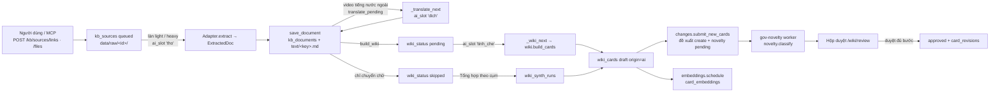
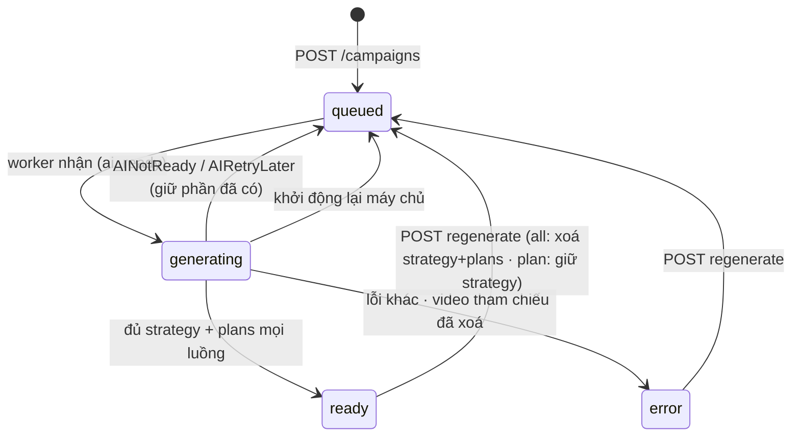
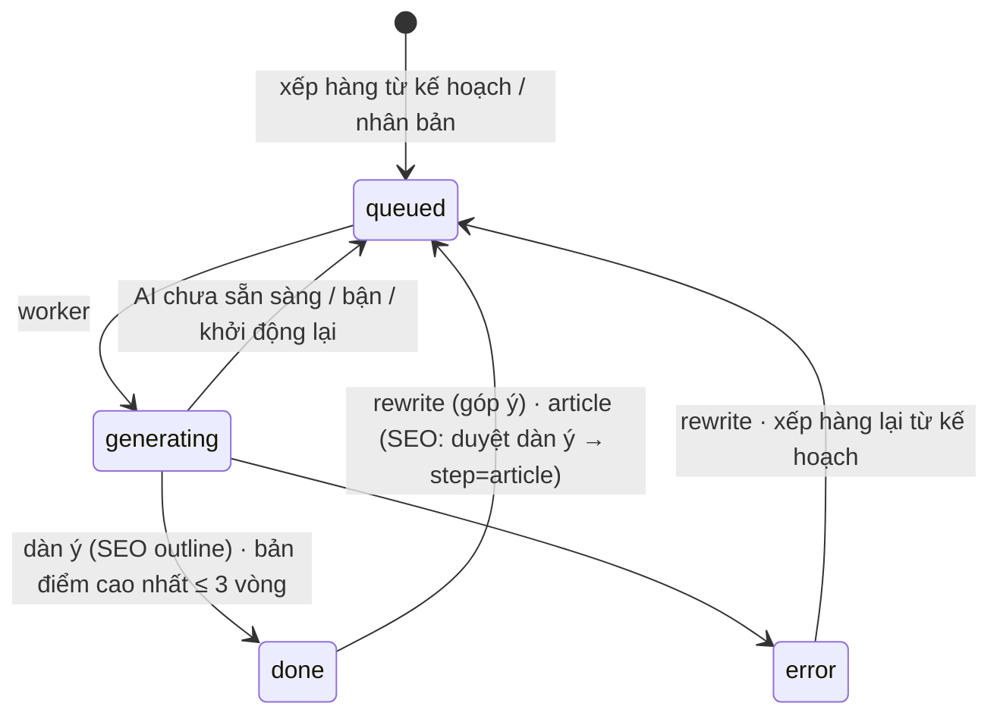
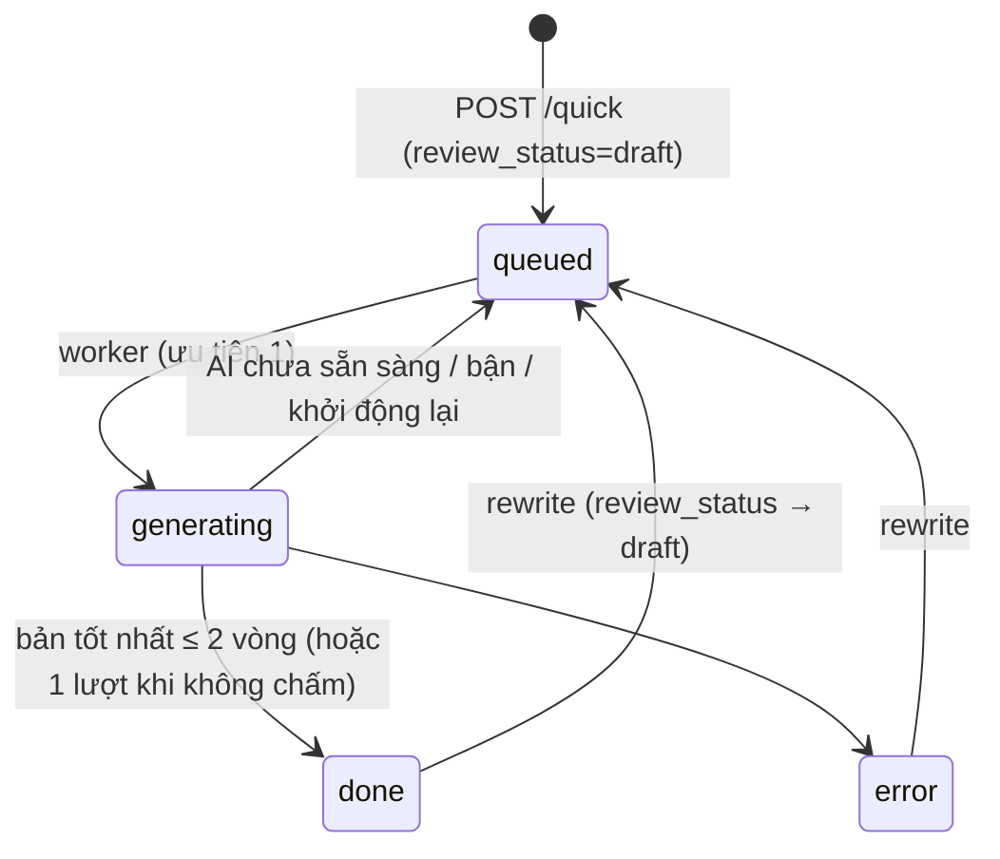
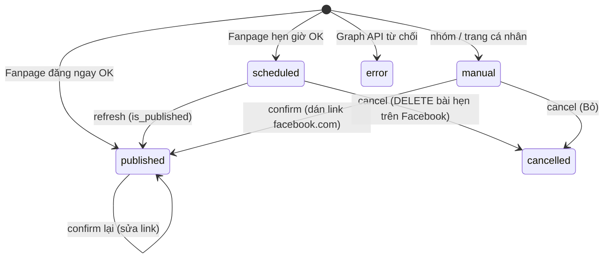

# Tài liệu thiết kế (Design) — VC Content Engine

> Tài liệu nằm **giữa BA và code**: BA nói *làm gì, vì sao*; tài liệu này nói *làm thế nào* — kiến trúc, API, dữ liệu (Phần I–IV, dựng ngược từ code `develop` @ `9ff73e4`, 29/09/2026), hệ thống thiết kế giao diện và đặc tả từng màn (Phần V), hợp đồng cho AI agent và SEO (Phần VI), ma trận truy vết từng mã BA tới thiết kế, code, ca UAT (Phần VII) và thiết kế đích cho mọi yêu cầu BA chưa có code (Phần VIII, mã `TK-`). Mọi thay đổi đi theo **Phần 0: BA → DESIGN → Code → UAT**. Đi kèm `docs/BA.md` (v0.60) và `docs/UAT.md`.

---

## 0. Kiểm soát tài liệu

| Thuộc tính | Giá trị |
| --- | --- |
| Mã tài liệu | CE-TD-001 |
| Tên tài liệu | Tài liệu thiết kế — VC Content Engine |
| Phiên bản hiện hành | **0.39** |
| Trạng thái | **Đã duyệt** Phần V–VI (v0.15) — Bùi Thọ Anh, 30/09/2026 |
| Ngày phát hành | 01/10/2026 |
| Chủ sở hữu tài liệu | Bùi Thọ Anh |
| Căn cứ | Phần I–IV: code `develop` @ `9ff73e4` (số dòng `file:dòng` theo commit này, lệch dần khi code đổi). Phần V–VI: rà `frontend/src` @ `9efa2e9` (30/09/2026). Phần VII–VIII: `docs/BA.md` v0.45, `docs/UAT.md` v0.3, code `develop` @ `cce4163` (30/09/2026) |
| Tài liệu liên quan | `docs/BA.md` (CE-BA-001) · `docs/UAT.md` (CE-UAT-001) · `docs/test-claude-extension/` (gói test P01–P10) · `docs/ke-hoach-giao-dien-ai-agent-seo.md` (kế hoạch 28/09, **đã gộp vào Phần VI**) · Bản vẽ giao diện (canvas): https://claude.ai/artifact/HLvAeZTmVkqJUEci1wMUwE (Phần V) |
| Nguyên tắc | Mỗi mục mang nhãn trạng thái (Phần 0 mục 0.3): *Hiện trạng* mô tả đúng code đang chạy; *Đích* là thiết kế đã chốt chờ code. Luật nghiệp vụ chỉ nằm ở BA |

**Lịch sử sửa đổi**

| Phiên bản | Ngày | Loại thay đổi | Mô tả | Người thực hiện |
| --- | --- | --- | --- | --- |
| 0.39 | 05/10/2026 | Bổ sung vận hành | SYS-42 / OPS-01 (mục 12.6): `export_du_lieu.sh` + `import_du_lieu.sh` xuất / nạp trọn bộ MongoDB, snapshot Qdrant, `data/raw`, `output/media` để chuyển máy chủ; checksum + so số bản ghi. Ghi lúc 05/10/2026 15:19:30 (UTC+7) — **Đã làm** (commit ngay sau dòng này) | Bùi Thọ Anh (Claude Code) |
| 0.38 | 03/10/2026 | Đổi hành vi vận hành | SYS-41 / TK-17: đặt lại đồng hồ rảnh theo từng model Ollama, nhả RAM/GPU sau 60 giây và lúc BE dừng; không kill daemon; **Đã làm @8f2564a** | Codex |
| 0.37 | 01/10/2026 | Đổi hành vi + bổ sung | TK-16, SCR-16.2: đào tạo độc lập cây tri thức; LRN-18…24, snapshot và chuyển QA; Đã làm @39d56dc, chờ UAT người dùng | Codex |
| 0.36 | 01/10/2026 | Đổi hành vi | SYS-39 SCR-22.2: bộ công cụ đọc MCP cho AI local, vòng điều khiển JSON dùng được với Gemma; quyền theo token, hướng dẫn theo câu hỏi | Codex |
| 0.35 | 01/10/2026 | Đổi hành vi | SYS-38, SCR-22.1 **đã làm @0c44273**: Claude CLI lỗi → Ollama cho trò chuyện; giữ lịch sử, dừng lượt, SSE và giới hạn công cụ | Codex |
| 0.34 | 01/10/2026 | Sửa lỗi + chuyển dữ liệu | **LV-01 WK-26 đã làm @9f8ef41**: hoàn tất giải tán cây cũ, kế thừa scheme v2, nhật ký trước khi ghi, quay lui có kiểm xung đột; không chuyển phạm vi quyền / khoá học | Codex |
| 0.33 | 30/09/2026 | Sửa đổi (theo code) | **TK-15d hoàn tất UI LRN-15…17**: Thư viện khoá / lộ trình, builder chuỗi khoá, sửa / phát hành / sao chép, người học theo thứ tự, redirect 301; bổ sung UAT-LRN-51 và cập nhật hướng dẫn | Codex |
| 0.32 | 30/09/2026 | Sửa đổi (theo code) | **TK-15c**: lộ trình `kind=courses` (1–30 khoá, không kế thừa / thi ở cấp lộ trình), validate bài thuộc khoá, phát hành không tự phát hành bài nháp; giao chụp `plan` và hạn từng khoá lúc giao, kiểm soát thứ tự bài / khoá, hoàn thành theo kiểm tra + thi, thi khoá gắn lượt với lộ trình để người giao chấm tự luận; sao chép lộ trình; đổi / gộp nhánh cập nhật lộ trình, snapshot và tiến độ. TK-15b đã merge `develop` @ `d095045` | Codex |
| 0.31 | 30/09/2026 | Sửa đổi (theo code) | **TK-15b** làm trên nhánh `feature/tk15b-api-khoa`: `learn/course_api.py` (mới — `GET /learn/courses`, `GET /learn/courses/{slug}`, `PUT …/order`, `PUT …/settings`), collection `courses` (unique `category`, `SLUG_FIELDS`; gộp nhánh giữ cài đặt của nút đích), hành động `learn.course.arrange` (L&D; chủ nhánh nút / nút cha; chuỗi chưa có chủ → quản trị viên), kiểm tra sau bài chốt kèm `passed` theo `lesson_pass_score` của khoá, MCP READ `list_courses`, `get_course` (bỏ bài C3). Sửa thiết kế: (1) **bắt đầu thi khoá chuyển sang TK-15c** — người chấm tự luận là người giao lộ trình, cần `assignments.plan`; (2) kiểm ma trận thi khoá khi đặt **không lọc theo quyền xem của người đặt** (chủ nhánh thường không xem được ngân hàng câu của người soạn — chỉ trả số lượng), lúc thi vẫn lọc theo thẻ người học xem được | Bùi Thọ Anh (Claude Code) |
| 0.30 | 30/09/2026 | Sửa đổi (theo code) | **TK-15a** làm trên nhánh `feature/tk15a-du-lieu-khoa`: `learn/courses.py` (mới — `check_course`, `next_seq`, `append`, `guess_category`), `lessons.category` + `seq` + index, `POST/PATCH /lessons` nhận `category` (đổi khoá được cả bài đã phát hành, chỉ người soạn bài), `SLUG_FIELDS` + `usage` thêm bài học, xoá nhánh nối bài vào cuối khoá nhận, script `chuyen_khoa_hoc.py`. Sửa thiết kế sau chạy thử trên DB QA (23 bài, 14 bài hoà số thẻ, cách cũ chọn theo chữ cái cho kết quả sai): phân xử hoà thêm **lĩnh vực chính của thẻ** (đứng đầu `categories`) và **thẻ đầu bài** trước nút sâu hơn. `SLUG_FIELDS` cho `courses`, `learning_paths.courses`, `assignments.plan` dời sang TK-15b / c (trường chưa có) | Bùi Thọ Anh (Claude Code) |
| 0.29 | 30/09/2026 | Sửa đổi | **Đóng đợt UI-3** (nhánh `ui/ui-3`, 7 nhánh con): mục V.9.4 *Đã làm* @c2b1aa3 kèm kết quả đo và các sửa khi gộp; nhãn *Đã làm* cho SCR-15, 16, 17, 18, 19 (+ 19.1 SYS-35), 21 (+ 21.1 SYS-36) và TK-04d (GOV-13) kèm chỗ lệch thiết kế; mục 10 thêm *Chờ chốt* Q9–Q12; Phần I mục 13 thêm #18 | Bùi Thọ Anh (Claude Code) |
| 0.28 | 30/09/2026 | Bổ sung | Phần V mục 9.4 **cách làm đợt UI-3** (*Đích — đang làm* `ui/ui-3`): 7 nhánh con (GOV-13 Trả về đề xuất; Học tập của tôi + Làm / Chấm bài TPL-A2; Thư viện + Bài học; Lộ trình + Thiết kế lộ trình với `Stepper`; Cơ cấu tổ chức; Kho & chia sẻ + SYS-35 chia sẻ theo đơn vị; Người dùng & lĩnh vực + SYS-36 đăng nhập gần nhất), bảng file từng nhánh; nền: `DataTable` `rowTestId` / `className`, `Tabs` route `className` | Bùi Thọ Anh (Claude Code) |
| 0.27 | 30/09/2026 | Bổ sung | Thiết kế đích cho **BA 0.49 mục 17.12** (đổi hành vi, chủ sản phẩm chốt 30/09): **TK-15 Khoá học theo cây chủ đề, lộ trình là chuỗi khoá** (dữ liệu `lessons.category` + `seq`, collection mới `courses`, `learning_paths.kind = courses`, tiến độ theo khoá, kiểm tra sau bài, thi sau khoá, script chuyển dữ liệu `chuyen_khoa_hoc.py` có chạy thử và `--undo`, chia 4 nhánh TK-15a–d); **SCR-16.1** Thư viện theo khoá + tab Lộ trình, bỏ mục menu *Lộ trình học* (`/learn/paths` → 301 về Thư viện); Phần VII thêm LRN-15…17. Số 0.26 đã dành cho nhánh `ui/ui-3`. Vấn đề mở 37–42 chốt cùng ngày: cấp trên sắp khoá + bài trong khoá cho lộ trình của cấp dưới, học theo thứ tự (đạt kiểm tra → bài sau, xong khoá → khoá sau, BE chặn 409), hạn từng khoá, bỏ kế thừa khung (+ `POST /paths/{id}/copy`). Làm code sau khi `ui3/c-library`, `ui3/d-paths` merge | Bùi Thọ Anh (Claude Code) |
| 0.25 | 30/09/2026 | Sửa | Sửa lỗi sau chốt Q8: `pages/Wiki.jsx` còn cắt *Lưu kết quả lọc thành danh sách phát* ở 500 thẻ → dùng `TIMELINE_MAX` (1.000, khớp `playlists.MAX_ITEMS`); mục V.10 bảng đề xuất Q6–Q8 trước khi chốt mất dòng tiêu đề → thêm lại, ghi rõ là bản đề xuất giữ để lần lại | Bùi Thọ Anh (Claude Code) |
| 0.24 | 30/09/2026 | Sửa đổi | Chủ sản phẩm chốt **Q6–Q8** (Phần V mục 10): Q6 Tiến độ tinh chế giữ theo chữ DESIGN, bản vẽ sửa theo; Q7 thêm **GOV-13 Trả về đề xuất** (BA 0.48) — thiết kế **TK-04d**, SCR-09 bỏ ghi chú "BE chưa có"; Q8 danh sách phát tối đa **1.000 thẻ** — `kb/playlists.py` `MAX_ITEMS` 500 → 1000 (*Đã làm* cùng nhánh), Phần II mục 7. Mục 9.3 cập nhật ba dòng SCR-04, 06, 09. Phần VII dựng lại theo BA 0.48 (170 mã, thêm GOV-13; trạng thái SYS-27, 28 theo UI-2) | Bùi Thọ Anh (Claude — Cowork) |
| 0.23 | 30/09/2026 | Bổ sung | Phần V mục **9.3 Trạng thái giao diện và việc cho bản vẽ** — bàn giao bên thiết kế làm lại canvas: tình trạng UI-1…5 (UI-1, UI-2 đã làm; UI-3 là đợt code kế tiếp), ba loại việc (A vẽ lại theo code, B rà theo DESIGN, C vẽ mới), bảng việc theo màn có thứ tự ưu tiên, gồm các khối / màn mới từ Phần VIII (SCR-24, SCR-25, tab Kế hoạch / Nội dung / Lịch / Báo cáo của dự án, crawl website, thông báo, token có phạm vi…) và Chờ chốt Q6–Q8. Không đổi code | Bùi Thọ Anh (Claude — Cowork) |
| 0.22 | 30/09/2026 | Sửa đổi | **Đóng đợt UI-2** (nhánh `ui/ui-2`, 6 nhánh con chạy song song): mục V.9.2 *Đã làm* @fdfa743 kèm kết quả đo và các sửa khi gộp; nhãn *Đã làm* cho mục 3 (menu 16 mục), SCR-00, 01, 03, 04, 06, 09 kèm phần còn lại; mục 10 thêm *Chờ chốt* Q6–Q8 | Bùi Thọ Anh (Claude Code) |
| 0.21 | 30/09/2026 | Bổ sung | Phần V mục 9.2 **cách làm đợt UI-2** (*Đích — đang làm* `ui/ui-2`): chia 6 nhánh con theo màn (API đếm việc, vỏ SCR-00, Việc của tôi SCR-01, Kho tư liệu + Tiến độ tinh chế SCR-03/04, VCWIKI SCR-06, Hộp duyệt SCR-09 theo TPL-A2), bảng file từng nhánh được sửa; nền dùng chung `Notice`, `StatusBadge` + `statuses.js`, `CardGrid`, `toast` có nút hành động; hợp đồng `GET /api/me/inbox/counts`; *Hoàn tác* bằng hoãn gửi 8 giây | Bùi Thọ Anh (Claude Code) |
| 0.20 | 30/09/2026 | Bổ sung (theo code) | Ghép hai nhánh làm trước quy trình: (1) `feature/glossary-tu-dong` — `kb/glossary.py` rút thuật ngữ từ tài liệu tiếng Việt `nganh-o-to` / kênh sửa xe và thẻ VCWIKI (thẻ tính ×2, thẻ đã duyệt một thẻ đủ), `glossary_raw` theo nguồn, rút lại khi nguồn sửa; `nightly_vectors.sh` chạy `build_glossary.py update --limit 150 --minutes 90` giữa backfill embedding và nạp tầng thô. (2) `feature/req-2750bd-thu-vien-ly-do` — `GET /api/learn/lessons` trả thêm `author_status` (lý do không soạn được, `policy.learn_author_status`, chỉ giải thích) hoặc `approved_cards` / `few_approved_threshold` (cảnh báo < 20 thẻ đã duyệt); `can_author` vẫn lấy từ `policy.can("learn.author")`; `/org?tab=` mở đúng tab cho admin, `/org` cây trống hiện hướng dẫn 3 bước | Bùi Thọ Anh (Claude Code) |
| 0.19 | 30/09/2026 | Bổ sung | **Phần VII Ma trận truy vết** BA → DESIGN → Code → UAT: 169 mã yêu cầu (BA v0.45) + 3 mã đề xuất, mỗi mã một dòng (trạng thái theo BA, mục DESIGN, file code, ca UAT), tổng hợp theo phân hệ, danh sách mã thiếu ca UAT. **Phần VIII Thiết kế đích**, mã mới `TK-01`…`TK-14`, cho mọi mã *Chưa làm* / *Một phần* chưa có thiết kế: nền an toàn MCP (SYS-13…16, WK-23), mức mật theo kênh + nhật ký truy cập (ORG-09…12, màn SCR-24), thông báo + lịch việc nền, GOV phần còn (GOV-02, 03, 06, 08, 09), liên thông GOV ↔ LRN (LRN-11, GOV-10), học tập phần còn (LRN-05, 07, 10, 12, 13, 14; màn SCR-25), mở rộng MCP (SYS-18…24), AI crawl web (WK-25), kế hoạch kỳ (CE-28, 29), nội dung theo kênh + lịch + duyệt 4 trạng thái (CE-18, 30…32), vòng học + số liệu (CE-10, 21), nghiên cứu nội dung (CE-01…07, 11, 17), song ngữ + AI local phần còn (WK-14, 24, TT-17, SYS-17), Chat nhanh AI local trước (SYS-25); thứ tự làm theo đợt A–E. Phần 0 mục 0.4 thêm tiền tố `TK-`, mục 0.5 thêm việc cập nhật Phần VII; Phần I mục 13 nợ #6, #11 trỏ tới TK-01, TK-08. Không đổi code | Bùi Thọ Anh (Claude — Cowork) |
| 0.18 | 30/09/2026 | Sửa đổi | **Đóng đợt UI-1 Nền móng** (nhánh `ui/ui-1-nen-tang`): mục V.9.1 đổi sang *Đã làm* @8fbd4c1 kèm kết quả đo (lint, axe, curl); nhãn *Đã làm* cho TOK (mục 4), CMP-00…05, 07, 08, 15, 17, 22 (mục 5), AIX-01 ESLint, kiểm chứng tự động, SEO-01…05 (Phần VI); Phần I mục 8.2 / 8.3 / 8.4 viết lại theo code (`routes.js`, `RouteMeta`, trang *Không tìm thấy* thay cho chuyển về `/`, 301 ở BE, `tokens.css` / `components.css`); mục 13 #16 một phần | Bùi Thọ Anh (Claude Code) |
| 0.17 | 30/09/2026 | Bổ sung | Phần V mục 9.1 **cách làm đợt UI-1 Nền móng** (*Đích — đang làm* `ui/ui-1-nen-tang`): file và cách làm cho token + công tắc giao diện, biểu tượng, `routes.js` dữ liệu thuần (khác ví dụ mục 3.2: không import trang), `usePageMeta`, `useUrlState`, 8 component tự viết theo WAI-ARIA APG, trang mẫu `/dev/ui` chỉ ở dev, ESLint jsx-a11y, axe, SEO-01…05 (giữ `Navigate` FE làm dự phòng khi dev) | Bùi Thọ Anh (Claude Code) |
| 0.16 | 30/09/2026 | Sửa + bổ sung | Sau khi xem mẫu giao diện (canvas 37 bảng; nhánh `ui/thiet-ke-lai` ghi số 0.5, đổi số khi gộp vào `develop`): luật `h1` tách hai loại màn (màn mục menu: `h1` = tên menu; trang đối tượng: `h1` = tên đối tượng, tên menu ở breadcrumb); thêm mẫu **TPL-A2 Hàng chờ chia đôi** cho Hộp duyệt (SCR-09) và Chấm bài (SCR-17); nối yêu cầu BA mới SYS-35 (SCR-19), SYS-36 (SCR-21), SYS-37 (SCR-20), CE-33 (SCR-13) | Bùi Thọ Anh (Claude Code) |
| 0.15 | 30/09/2026 | Duyệt | Chủ sản phẩm duyệt v0.3 (nhánh `ui/thiet-ke-lai` ghi số 0.4, đổi số khi gộp); chốt Q1–Q5 Phần V mục 10 theo đề xuất; chọn tự viết component (không thêm thư viện UI); sửa `--border-strong` cho đạt 3:1; làm mẫu giao diện toàn bộ màn trước khi code; gộp xử lý nợ kỹ thuật Phần I mục 13 vào đợt làm lại giao diện | Bùi Thọ Anh (Claude Code) |
| 0.14 | 30/09/2026 | Sửa đổi | **Xử lý nợ kỹ thuật Phần I mục 13** (nhánh `fix/no-ky-thuat`, không đổi nghiệp vụ trừ giờ mặc định WK-32): #3 FE một nguồn phiên, `/api/auth/me` gọi một lần (mục 8.1, 8.3); #8 `lib_mongo.sh` dò `mongod.conf` (mục 5.5, 12.1); #9 `start_qa.sh` (mục 4, 10); #10 `numpy` vào `backend/requirements.txt`, `backend/requirements-ml.txt` (torch, transformers), cảnh báo khi thiếu (mục 3.1, 12.1); #12 `HUONG_DAN.md` trỏ về `/guide`; #13 rà lại — giữ `TRANSCRIBE_LOCK` (mục 7.1); #14 mọi biến môi trường đọc ở `config.py` (mục 5); #15 `CARD_UPDATE_AT` mặc định 07:45 sau job vector đêm (mục 5.4, 6.3, Phần II). Mục 13 thêm cột *Trạng thái* | Bùi Thọ Anh (Claude Code) |
| 0.13 | 30/09/2026 | Bổ sung | Mục 0.8.4: trang theo dõi thêm **nội dung trò chuyện các phiên Claude** — mục *Phiên Claude 24 giờ qua* thành dải thẻ (kéo ngang giữa phiên, cuộn dọc trong thẻ, giãn thẻ được), trang riêng `/tro-chuyen` xếp lưới (chọn số cột, chiều cao, khoảng thời gian); đọc từ log `~/.claude/projects`, tự cập nhật mỗi 5 giây qua `/api/tro-chuyen`. *Đã làm @chore/xem-tro-chuyen* | Bùi Thọ Anh (Claude Code) |
| 0.12 | 30/09/2026 | Bổ sung | Phần V **SCR-03.2 Xem video và ghi chép song song** (đổi cách làm, WK-45 giữ nguyên): bấm *Xem video* ở tài liệu → dòng tài liệu thành hai cột, video phải dính khi cuộn, ô *Ghi chép khi xem* + danh sách + chữ bên trái; mốc giây bật sẵn, chốt lúc bắt đầu gõ; Ctrl / ⌘ + Enter lưu; bấm *▶ mm:ss* tua player tại chỗ; nguồn một video dùng cùng bố cục ở đầu ngăn kéo; điện thoại xếp dọc | Bùi Thọ Anh (Claude Code) |
| 0.11 | 30/09/2026 | Sửa | Mục 0.8.4: `bash ra_nhanh.sh --xem` thành **một lệnh** — tự bật trang chạy nền nếu chưa chạy (log `output/logs/ra_nhanh.log`) rồi mở cửa sổ trình duyệt mặc định; chạy lại không bật trùng; `--xem-tat` để tắt. VS Code không cho lệnh ngoài mở tab *Simple Browser* (extension không có URI handler), nên tab VS Code vẫn mở tay | Bùi Thọ Anh (Claude Code) |
| 0.10 | 30/09/2026 | Bổ sung | Phần II mục 12 **Ghi chép theo nguồn và từng đơn vị** (WK-45): collection `kb_notes` (nhiều ghi chép / nguồn / tài liệu, mốc `t`), API `GET/POST /kb/notes`, `PATCH/DELETE /kb/notes/{id}`, luật `note.*` trong `policy.py`, khối *Ghi chép của người dùng* thay *Ghi chú của người nạp* trong prompt dựng thẻ / tổng hợp, MCP `get_source` / `claim_documents` trả `notes`; Phần V **SCR-03.1**: tab *Ghi chép* `/kb/notes` + khung ghi chép trong chi tiết nguồn; Phần II mục 7, 8.1 thêm collection / route | Bùi Thọ Anh (Claude Code) |
| 0.9 | 30/09/2026 | Sửa | Mục 0.8.4: trang theo dõi mở được **thành tab trong VS Code** — `ra_nhanh.py --cong <cổng>` phục vụ trang qua `http://127.0.0.1:8900` (chỉ nghe 127.0.0.1, chỉ nhận Host 127.0.0.1 / localhost), `bash ra_nhanh.sh --xem` dùng chế độ này thay `open` file (máy đặt VS Code mở `.html` nên hiện ra mã nguồn thay vì trang) | Bùi Thọ Anh (Claude Code) |
| 0.8 | 30/09/2026 | Bổ sung | Mục 0.8.4 thêm **trang theo dõi** `ra_nhanh.py` / `bash ra_nhanh.sh --xem`: HTML trên máy (`output/ra_nhanh.html`, tự dựng lại mỗi 30 giây) ghép git, tiến trình trong worktree, log phiên Claude Code và agent nền (việc được giao, phiên giao), merge gần đây | Bùi Thọ Anh (Claude Code) |
| 0.7 | 30/09/2026 | Bổ sung | Gắn link **bản vẽ giao diện** (canvas *VC Content Engine — Giao diện mới*, 37 bảng, 6 trang) vào *Tài liệu liên quan* và đầu Phần V, kèm bảng đối chiếu trang canvas ↔ mã `TOK-` / `CMP-` / `SCR-` ↔ đợt UI-1…4 | Bùi Thọ Anh (Claude Code) |
| 0.6 | 30/09/2026 | Bổ sung | **Phần 0 mục 0.8.4 Quản lý nhánh và worktree**: script `ra_nhanh.sh` (bảng nhánh chưa merge `develop`, nhãn «bỏ quên?», `--ngan` cho hook đầu phiên, `--don` dọn worktree + nhánh đã merge, `--ghi` lý do để dở); hook `SessionStart` của Claude Code (*Đích — chưa làm*, cần chủ repo tự thêm); bước ⑤ thêm dọn worktree + nhánh; kiểm số phiên bản tài liệu trên `develop` trước khi merge | Bùi Thọ Anh (Claude Code) |
| 0.5 | 30/09/2026 | Bổ sung | Phần II mục 11 **Ghi chú của người nạp** (WK-44): trường `kb_sources.note` ≤ 2000 ký tự, `PUT /kb/sources/{id}/note`, khối *Ghi chú của người nạp* trong prompt dựng thẻ / tổng hợp, ô nhập ở khung nạp + chi tiết nguồn, MCP | Bùi Thọ Anh (Claude Code) |
| 0.4 | 30/09/2026 | Bổ sung | **Phần 0 mục 0.8 Xử lý yêu cầu chỉnh sửa**: phân loại trước khi code (sửa lỗi / đổi hành vi / đổi cách làm / code lệch tài liệu) và báo loại cho người yêu cầu, không phân loại được thì hỏi lại; các bước ①→⑤ khi đổi hành vi hoặc cách làm (không xoá / sửa đè mục *Đã làm*, thêm mục con theo 0.6); quy tắc giữ truy vết (mã không tái sử dụng, mọi thay đổi có dòng lịch sử, không sửa đè lịch sử git, đụng dữ liệu MongoDB thì có cách chuyển dữ liệu + script một lần + cách quay lui, chạy thử trên DB QA / UAT trước). Mục 0.2 trỏ sang 0.8; `CLAUDE.md` thêm quy tắc | Bùi Thọ Anh (Claude Code) |
| 0.3 | 30/09/2026 | Tái cấu trúc + bổ sung | Dựng lại tài liệu thành cầu nối BA → code: thêm **Phần 0** quy trình phát triển (vai trò tài liệu, luồng thay đổi, nhãn trạng thái, mã `TOK-`/`CMP-`/`TPL-`/`SCR-`/`AIX-`/`SEO-`, DoR/DoD, mẫu mục thiết kế); **Phần V** thiết kế lại giao diện (vấn đề hiện trạng, nguyên tắc, menu mới 15 mục theo việc, token màu đạt WCAG AA, chữ, khoảng cách, biểu tượng SVG, 22 component, 6 mẫu trang, đặc tả 24 màn SCR-00…23, quy ước chữ, lộ trình UI-1…5, câu hỏi chờ chốt); **Phần VI** hợp đồng AI agent, tầng đọc máy, SEO (gộp kế hoạch 28/09 kèm trạng thái đã làm) | Bùi Thọ Anh (Claude Code rà code FE) |
| 0.2 | 29/09/2026 | Bổ sung | Cờ `KB_WORKERS` (tắt worker nền khi dev), script đo `asr_nghe_doan.py` | Bùi Thọ Anh (Claude Code) |
| 0.1 | 29/09/2026 | Tạo mới | Dựng từ code: kiến trúc chung (Phần I), WK/TT/GOV (Phần II), CE (Phần III), SYS/ORG/LRN (Phần IV) | Bùi Thọ Anh (Claude Code rà code) |

**Cấu trúc tài liệu**

| Phần | Nội dung | Người đọc chính |
| --- | --- | --- |
| 0 — Quy trình | BA → DESIGN → Code → UAT, nhãn trạng thái, mã thiết kế, DoR / DoD, mẫu mục, xử lý yêu cầu chỉnh sửa | **Mọi người, mọi agent — đọc trước tiên** |
| I — Kiến trúc chung | Tiến trình, cấu hình, điều phối AI, frontend, bảo mật, môi trường, kiểm thử, vận hành, nợ kỹ thuật | Mọi dev |
| II — WK · TT · GOV | Kho tư liệu, Kho video MXH, VCWIKI, tìm kiếm, quản trị vòng đời tri thức | Dev phần tri thức |
| III — CE | Xưởng chiến dịch, Viết nhanh, Dự án 4 cấp, phân tích 7P, đăng Facebook | Dev Content Engine |
| IV — SYS · ORG · LRN | Đăng nhập, kho, `policy.py`, tổ chức, MCP, chat, hướng dẫn, kênh yêu cầu, học tập | Dev nền tảng / học tập |
| V — Giao diện (UX/UI) | Nguyên tắc, kiến trúc thông tin, token, component, mẫu trang, đặc tả từng màn, quy ước chữ, lộ trình | Dev FE, người thiết kế, người duyệt giao diện |
| VI — AI và SEO | Hợp đồng cho AI điều khiển trình duyệt, tầng đọc máy (`/llms.txt`, `.md`), SEO và cổng công khai | Dev FE / BE, người viết test agent |
| VII — Ma trận truy vết | Mỗi mã yêu cầu BA → mục DESIGN → file code → ca UAT, tổng hợp theo phân hệ, khoảng trống UAT | Mọi người nhận một mã yêu cầu; người duyệt, người viết UAT |
| VIII — Thiết kế đích (`TK-`) | Thiết kế dữ liệu, API, việc nền, quyền, MCP, màn hình, kiểm chứng cho yêu cầu BA chưa có code; thứ tự làm theo đợt | Dev BE / FE, người điều phối |

---

## Phần 0 — Quy trình phát triển: BA → DESIGN → Code → UAT

> Áp dụng từ v0.3 (30/09/2026). Mọi thay đổi sản phẩm, dù nhỏ, đi đúng thứ tự dưới đây. Người làm có thể là người hay AI (Claude Code, `/nhan-viec`), luật như nhau.

### 0.1 Vai trò từng tài liệu

| Tài liệu | Trả lời câu hỏi | Chứa | Không chứa |
| --- | --- | --- | --- |
| `docs/BA.md` (CE-BA-001) | **Làm gì, vì sao, thế nào là đạt** | Mã yêu cầu (`WK-`, `CE-`, `SYS-`…), luật nghiệp vụ, tiêu chí chấp nhận, quyền, dữ liệu ở mức khái niệm, trạng thái triển khai | Tên file, tên component, CSS, chi tiết API ngoài hợp đồng |
| `docs/DESIGN.md` (CE-TD-001, tài liệu này) | **Làm thế nào** | Kiến trúc, module, API, collection, luồng xử lý (Phần I–IV); hệ thống thiết kế, mẫu trang, đặc tả từng màn (Phần V); hợp đồng cho AI agent và SEO (Phần VI) | Luật nghiệp vụ mới chưa có trong BA |
| Code (`backend/`, `frontend/`) | Chạy thật | Hiện thực đúng DESIGN | Hành vi chưa có trong BA / DESIGN |
| `docs/UAT.md` (CE-UAT-001) | **Kiểm thế nào** | Ca kiểm thử theo mã yêu cầu BA và mã màn `SCR-` | — |

### 0.2 Luồng một thay đổi

```
 Yêu cầu (người dùng / Desktop qua dev_requests / lỗi QA)
   │
   ▼
 ① BA ── thêm / sửa mã yêu cầu + tiêu chí chấp nhận, tăng phiên bản BA, dòng lịch sử
   │      (đổi giao diện thuần tuý không đổi luật: chỉ ghi dòng lịch sử + mã SYS-26…34 liên quan)
   ▼
 ② DESIGN ── đặc tả cách làm: màn nào (SCR-), mẫu trang (TPL-), component (CMP-), API, dữ liệu;
   │          đánh dấu mục là «Đích — chưa làm»; tăng phiên bản DESIGN
   ▼
 ③ Code ── làm theo mục DESIGN, commit nhắc mã BA + mã DESIGN ("SCR-07, WK-35: …")
   │        test đơn vị / e2e / axe; lệch thiết kế thì SỬA DESIGN TRƯỚC rồi mới đổi code
   ▼
 ④ UAT ── thêm / sửa ca trong UAT.md theo mã; chạy gói Claude in Chrome nếu đụng giao diện
   │
   ▼
 ⑤ Đóng ── DESIGN đổi «Đích» → «Đã làm @<commit>»; BA đổi trạng thái triển khai; merge develop
```

Ba nhánh rẽ được phép:

| Trường hợp | Làm gì |
| --- | --- |
| Sửa lỗi không đổi hành vi đã mô tả | Bỏ qua ① ②, commit ghi mã yêu cầu bị lỗi; nếu DESIGN mô tả sai thì sửa DESIGN cùng commit |
| Code đã chạy trước khi có tài liệu (hiện trạng) | Viết BA + DESIGN **theo code** (nguyên tắc "BA theo code"), phần muốn khác đi ghi là «Đích» |
| Thử nghiệm nhanh (spike) | Nhánh `spike/…`, không merge develop cho tới khi có ① ② |

Yêu cầu *sửa* một thứ đã thiết kế hoặc đã code: phân loại trước theo mục 0.8.

### 0.3 Nhãn trạng thái trong DESIGN

Mỗi mục thiết kế (màn, component, quy ước) mang đúng một nhãn:

| Nhãn | Nghĩa |
| --- | --- |
| **Hiện trạng** | Mô tả đúng code đang chạy ở `develop` |
| **Đích — chưa làm** | Thiết kế đã chốt, chưa có code. Đây là việc chờ làm |
| **Đích — đang làm** `nhánh` | Có nhánh đang làm |
| **Đã làm** `@commit` | Code đã khớp thiết kế. Khi mọi mục của một màn đã làm, gộp lại thành *Hiện trạng* |
| **Chờ chốt** | Còn câu hỏi cho chủ sản phẩm, ghi câu hỏi ngay dưới |

### 0.4 Mã thiết kế và truy vết

| Tiền tố | Dùng cho | Ví dụ |
| --- | --- | --- |
| `TOK-` | Nhóm token (màu, chữ, khoảng cách…) — Phần V mục 4 | `TOK-COLOR` |
| `CMP-` | Component dùng chung — Phần V mục 5 | `CMP-05 DataTable` |
| `TPL-` | Mẫu trang — Phần V mục 6 | `TPL-A Danh sách + chi tiết` |
| `SCR-` | Màn hình — Phần V mục 7 | `SCR-03 Kho tư liệu` |
| `AIX-` | Hợp đồng cho AI agent — Phần VI mục 1–2 | `AIX-04 Tên hành động` |
| `SEO-` | Hạng mục SEO — Phần VI mục 3 | `SEO-02 404 thật` |
| `TK-` | Thiết kế đích cho yêu cầu BA chưa có code (dữ liệu, API, việc nền, quyền, MCP) — Phần VIII | `TK-08 AI crawl web` |

Truy vết đi một chiều, mỗi tầng trỏ về tầng trên:

```
BA  SYS-26…34, WK-…, CE-…   ◄── DESIGN  SCR-/CMP-/AIX-/SEO- (cột "Yêu cầu BA")
                             ◄── commit  "SCR-03 WK-35: …"
                             ◄── UAT     cột "Mã yêu cầu BA" + "Mã màn"
```

Mã không tái sử dụng. Bỏ một mục thì ghi *Loại bỏ* kèm lý do, giữ dòng.

### 0.5 Điều kiện sẵn sàng làm (Definition of Ready) và hoàn thành (Definition of Done)

**Sẵn sàng làm** khi: có mã yêu cầu trong BA với tiêu chí chấp nhận; mục DESIGN có nhãn *Đích — chưa làm*, nêu rõ màn / component / API bị đụng; câu hỏi *Chờ chốt* đã được trả lời.

**Hoàn thành** khi, cho một thay đổi có giao diện:

- [ ] Dùng component và token của Phần V; không thêm mã màu cứng, không `style={{…}}` cho bố cục (chỉ cho giá trị động như chiều rộng thanh tiến độ).
- [ ] Đạt hợp đồng AI agent Phần VI mục 1 (checklist AIX) cho các phần tử mới.
- [ ] `h1` đúng luật Phần V mục 2 nguyên tắc 3 (màn mục menu: = tên menu; trang đối tượng: = tên đối tượng + breadcrumb); trạng thái mới nằm trên URL nếu người dùng cần mở lại.
- [ ] `npm test`, e2e của màn, `a11y.spec.js` (khi đã có) xanh; pytest nếu đụng BE.
- [ ] DESIGN đổi nhãn sang *Đã làm @commit*; BA cập nhật trạng thái; UAT có ca tương ứng.
- [ ] Dòng của mã BA ở **Phần VII** cập nhật (trạng thái, mục DESIGN, file code, ca UAT); mã BA mới thêm dòng mới.
- [ ] `content.js` (Hướng dẫn) cập nhật nếu người dùng thấy khác.

### 0.6 Mẫu mục thiết kế cho một thay đổi

Dán vào đúng mục của Phần V (màn) hoặc phần phân hệ (BE), rồi điền:

```markdown
#### SCR-xx.y <tên thay đổi>  — Đích — chưa làm
- Yêu cầu BA: <mã> (BA mục …)
- Mẫu trang / component: TPL-…, CMP-…
- Thay đổi giao diện: <bố cục, nút chính, tab, URL>
- API / dữ liệu: <route, trường mới — hoặc "không đổi">
- AI agent: <tên hành động, data-testid mới, URL mở lại>
- Kiểm chứng: <e2e / ca UAT / gói Claude in Chrome>
```

### 0.7 Với AI làm việc trên repo

- Trước khi code một yêu cầu: đọc mục BA theo mã, rồi mục DESIGN liên quan (tìm theo mã `SCR-` / tên file trong cột *File*). Không có mục DESIGN → viết mục theo 0.6 trước, trong cùng nhánh.
- `/nhan-viec`: báo cáo `update_request` ghi cả mã BA lẫn mã DESIGN đã đụng.
- Thấy code lệch DESIGN khi đang làm việc khác: không tự sửa lặng; ghi vào bảng *Giới hạn đã biết* (Phần I mục 13) hoặc báo lại.

### 0.8 Xử lý yêu cầu chỉnh sửa

> Áp dụng từ v0.4 (30/09/2026) cho mọi yêu cầu sửa một thứ đã thiết kế hoặc đã code, dù người yêu cầu là ai và người làm là người hay AI. Mục đích: mọi thay đổi đều lần ngược được ra lý do nghiệp vụ qua chuỗi BA ↔ DESIGN ↔ commit ↔ UAT.

#### 0.8.1 Bước đầu tiên: phân loại và báo loại

Trước khi đụng code, xếp yêu cầu vào **đúng một** loại dưới đây và **nói rõ loại** cho người yêu cầu (trong cuộc trò chuyện, hoặc `update_request` nếu đến từ `/nhan-viec`):

| Loại | Dấu hiệu | Làm gì |
| --- | --- | --- |
| **Sửa lỗi** | Code làm sai so với BA / DESIGN đã mô tả | Không sửa BA, DESIGN; sửa code luôn. Commit ghi mã yêu cầu bị lỗi. Nếu chính DESIGN mô tả sai thì sửa DESIGN trong cùng commit |
| **Đổi hành vi / luật nghiệp vụ** | Người dùng muốn hệ thống làm khác điều BA đang ghi (luật, quyền, tiêu chí chấp nhận, dữ liệu ở mức khái niệm) | Đi đủ các bước ①→⑤ ở 0.8.2, **bắt đầu từ BA** |
| **Đổi cách làm** (luật giữ nguyên) | Đổi giao diện, API, cấu trúc dữ liệu, thuật toán… mà tiêu chí chấp nhận trong BA không đổi | Bắt đầu từ ② DESIGN; BA chỉ thêm dòng lịch sử nếu có liên quan |
| **Code lệch tài liệu** | Code đã chạy khác BA / DESIGN, và hành vi đang chạy là hành vi muốn giữ | Viết lại BA và DESIGN **theo code**; phần muốn khác đi ghi «Đích» hoặc đưa vào backlog |

Không phân loại được (ví dụ không rõ đó là lỗi hay ý muốn mới) thì **hỏi lại người yêu cầu, không đoán**.

#### 0.8.2 Các bước khi đổi hành vi hoặc cách làm

| Bước | Việc | Ghi chú |
| --- | --- | --- |
| ① BA | Sửa tiêu chí chấp nhận của mã cũ, hoặc thêm **mã mới** nếu khác hẳn; tăng phiên bản BA; thêm dòng *Lịch sử sửa đổi* | Loại *đổi cách làm* bỏ qua bước này (chỉ thêm dòng lịch sử nếu liên quan) |
| ② DESIGN | **Không xoá, không sửa đè** mục đã «Đã làm @commit»; thêm mục con theo mẫu 0.6 (ví dụ `SCR-03.2 … — Đích — chưa làm`) ngay dưới mục cũ; tăng phiên bản DESIGN; thêm dòng lịch sử | Mục cũ giữ nguyên để đọc được thiết kế trước đó và commit đã làm nó |
| ③ Code | Làm trên nhánh riêng; commit ghi mã BA + mã DESIGN (`SCR-03.2 WK-35: …`); thấy code lệch thiết kế thì sửa DESIGN trước rồi mới đổi code | Theo 0.2 bước ③ |
| ④ UAT | Sửa ca cũ hoặc thêm ca mới theo mã trong `docs/UAT.md`; chạy lại e2e và các ca bị ảnh hưởng | Ca cũ không còn đúng thì ghi «Loại bỏ» kèm lý do, không xoá |
| ⑤ Đóng | DESIGN đổi mục con sang «Đã làm @commit»; BA cập nhật cột trạng thái triển khai; merge develop; **xoá worktree + nhánh vừa merge** (0.8.4) | Theo DoD 0.5 |

#### 0.8.3 Quy tắc giữ truy vết

- **Mã không tái sử dụng.** Bỏ một mục (yêu cầu BA, mục DESIGN, ca UAT) thì ghi «Loại bỏ» kèm lý do và **giữ dòng đó**.
- **Mọi thay đổi tài liệu đều có dòng lịch sử**: phiên bản, ngày, loại thay đổi, mô tả, người thực hiện.
- **Không sửa đè lịch sử git**: không force-push, không `--amend` / rebase commit đã đẩy lên.
- **Đụng dữ liệu đang có** (đổi tên / kiểu trường, đổi giá trị trạng thái, tách / gộp collection trong MongoDB): mục DESIGN phải ghi thêm
  - cách chuyển dữ liệu cũ sang dạng mới (trường nào, giá trị cũ → mới, bản ghi thiếu trường xử lý ra sao);
  - script chạy một lần trong `backend/scripts/` (chạy lại lần hai không làm hỏng dữ liệu, có chế độ chạy thử chỉ đếm);
  - cách quay lui (script ngược, hoặc sao lưu collection trước khi chạy — Phần I mục 12.5);
  - chạy thử trên DB QA (`:8300`, `tiktok_to_text_qa`) hoặc UAT (`:8400`, `tiktok_to_text_uat`) trước — kiểm `MONGO_DB` của tiến trình theo Phần I mục 10 — **không ghi thẳng vào DB thật** (`:8000`, `tiktok_to_text`).

#### 0.8.4 Quản lý nhánh và worktree

> Áp dụng từ v0.6. Lý do: nhiều phiên (người, Claude Code, `/nhan-viec`) làm song song trên worktree riêng; rà 30/09/2026 thấy 22 worktree + 58 nhánh đã merge không dọn và 3 nhánh có việc chưa vào `develop` mà không ai nhắc (`feature/glossary-tu-dong`, `feature/req-2750bd-thu-vien-ly-do`, `feature/req-cb1980b-tang-tho-lai`).

| Việc | Cách làm |
| --- | --- |
| Xem trực quan | **Một lệnh** `bash ra_nhanh.sh --xem`: chưa chạy thì bật nền `python3 ra_nhanh.py --cong 8900 --lap 30` (cổng đổi bằng `RA_NHANH_PORT`, log `output/logs/ra_nhanh.log`), rồi mở cửa sổ trình duyệt ở `http://127.0.0.1:8900`; trang tự dựng lại mỗi 30 giây; chạy lại lệnh chỉ mở thêm cửa sổ; tắt bằng `bash ra_nhanh.sh --xem-tat`. Muốn xem thành tab trong VS Code: Cmd+Shift+P → *Simple Browser: Show* → dán địa chỉ (lệnh ngoài không mở được tab này; mở file `.html` trực tiếp thì VS Code hiện mã nguồn). `--mo` vẫn mở bằng trình duyệt mặc định. Ghép bốn nguồn chỉ đọc: git (nhánh, commit chưa vào `develop`, file đang sửa), tiến trình đang đứng trong worktree (`lsof`), log phiên Claude Code ở `~/.claude/projects` (tên phiên, yêu cầu đầu; agent nền đọc từ `subagents/*.meta.json`: worktree, việc được giao, phiên giao), merge gần đây. Nhóm: **Đang làm** (tiến trình / file / phiên / agent hoạt động trong 30 phút), còn việc chưa merge (bỏ quên? / chưa merge / đã merge còn sửa / mới tạo), phiên 24 giờ, merge gần đây, chờ dọn. Trang chỉ nằm trên máy (có đoạn yêu cầu người dùng) — không đăng lên mạng, không commit. **Trò chuyện** (chỉ khi phục vụ qua cổng): mục *Phiên Claude 24 giờ qua* là dải thẻ, mỗi thẻ một phiên — tin anh, lời đáp Claude (bỏ thinking và kết quả lệnh; lệnh gọi tool gộp thành một dòng «⚙ Bash ×3»), tin gửi chen giữa lượt; kéo ngang giữa phiên, cuộn dọc trong thẻ, kéo góc để giãn, ⤢ phóng thẻ. `/tro-chuyen` là lưới toàn màn hình (chọn 1–4 cột / tự động, chiều cao thẻ, 1 / 6 / 24 giờ; lựa chọn nhớ trong trình duyệt). Dữ liệu `GET /api/tro-chuyen?gio=` (tối đa 16 phiên, 120 tin cuối mỗi phiên, cache theo mtime file log), cập nhật 5 giây/lần không tải lại trang: thẻ đang cuộn giữa chừng giữ nguyên chỗ, đang ở cuối thì bám cuối; phiên có hoạt động trong 2 phút viền xanh. Phần còn lại của trang chính thay bằng fetch mỗi 30 giây thay cho meta refresh (để không mất chỗ cuộn). Mở file `.html` trực tiếp (không qua cổng) thì vẫn là bảng như cũ |
| Xem tình hình | `bash ra_nhanh.sh` — bảng nhánh còn commit chưa vào `develop` (số commit, số ngày từ commit cuối, file sửa chưa commit, lý do / commit cuối) + số worktree / nhánh đã merge chờ dọn + worktree đã merge mà còn sửa chưa commit |
| Nhắc đầu phiên | Hook `SessionStart` của Claude Code chạy `bash ra_nhanh.sh --ngan` (im lặng khi không có gì) — **Đích — chưa làm**: AI không được tự sửa cấu hình hook, chủ repo thêm vào `.claude/settings.json` (đoạn cấu hình dưới bảng) |
| Đóng việc | Merge xong thì xoá worktree + nhánh ngay (`git worktree remove <đường dẫn>`, `git branch -d <nhánh>`) — nằm trong bước ⑤ ở 0.8.2 |
| Dọn tồn | `bash ra_nhanh.sh --don`: chỉ xoá worktree + nhánh **đã merge** `develop`; git tự từ chối worktree còn sửa / file chưa track (giữ lại, báo «GIỮ»); bỏ qua nhánh mới tạo hoặc mới đổi trong 24 giờ (phiên khác vừa mở); không đụng `develop`, `main`, cây chính |
| Để dở có chủ đích | Nhánh chưa merge quá 3 ngày (`RA_NHANH_NGAY`) mà không ghi lý do mang nhãn **«bỏ quên?»**. Xử lý một trong ba: merge; ghi lý do `bash ra_nhanh.sh --ghi <nhánh> "chờ …"` (lưu ở `git config branch.<nhánh>.description`, chỉ trên máy này); hoặc bỏ — ghi «Loại bỏ» + lý do ở mục BA / DESIGN liên quan rồi `git branch -D` |
| Số phiên bản tài liệu | Nhiều nhánh cùng tăng phiên bản BA / DESIGN sẽ trùng số. Trước khi merge: xem `Phiên bản hiện hành` trên `develop`, trùng thì đổi số của nhánh mình sang số kế tiếp (sửa dòng lịch sử trong nhánh, không sửa dòng đã merge) |

Đoạn hook cho `.claude/settings.json`:

```json
{
  "hooks": {
    "SessionStart": [
      { "matcher": "startup|resume",
        "hooks": [ { "type": "command",
                     "command": "f=\"$CLAUDE_PROJECT_DIR/ra_nhanh.sh\"; [ -f \"$f\" ] && bash \"$f\" --ngan 2>/dev/null || true",
                     "timeout": 30, "statusMessage": "Rà nhánh chưa merge develop" } ] }
    ]
  }
}
```

---

## Phần I — Kiến trúc chung
### 1. Mục đích và phạm vi tài liệu

**Mục đích.** Mô tả kiến trúc chung mà mọi phân hệ dùng: tiến trình, cấu hình, điều phối AI, frontend, bảo mật, môi trường, kiểm thử, vận hành. Người mới đọc tài liệu này trước, rồi mới đọc thiết kế từng phân hệ.

**Trong phạm vi:**

- `backend/app/main.py` (khởi động, đăng ký router, middleware), `config.py`, `db.py`, `auth.py` (phần phiên đăng nhập, token).
- Điều phối AI: `kb/ai_slot.py`, `kb/wiki.py` (`structured_call`, `_fallback`), `kb/cli_ai.py`, `kb/local_ai.py`, `worker.py` (Whisper).
- Tìm theo nghĩa ở mức hạ tầng: `kb/embeddings.py`, `kb/doc_vectors.py` (Qdrant), `kb/rerank.py`.
- Script gốc repo (`setup.sh`, `start_web.sh`, `start_uat.sh`, `start_qa.sh`, `lib_mongo.sh`, `setup_vector_db.sh`, `nightly_vectors.sh`, `ai_refine.sh`, `tiktok_to_text.py`) và `backend/scripts/*`.
- Frontend: `App.jsx`, `api.js`, `session.jsx`, `hooks.js`, `main.jsx`, `styles.css`, `vite.config.js`, `package.json`.
- Kiểm thử: `backend/tests`, `frontend/src/*.test.js`, `frontend/e2e` (Playwright), `scripts/eval_search.py`.

**Ngoài phạm vi:** luật nghiệp vụ từng phân hệ (nguồn, thẻ, duyệt, học tập, Content Engine, tổ chức) — xem thiết kế phân hệ và BA mục 3–17.

---

### 2. Tổng quan kiến trúc

Một tiến trình Python (FastAPI + uvicorn) làm tất cả: phục vụ API `/api/*`, bản build FE, cổng MCP `/mcp`, và các worker nền (luồng thread). Tiến trình thứ hai chỉ chạy ban đêm (job vector hoá). Mọi dịch vụ phụ nằm trên cùng máy Mac (Apple Silicon, 24 GB RAM), chỉ nghe `127.0.0.1`.

```
 Trình duyệt (React SPA)                      AI ngoài: Claude Desktop / Claude Code / agent
   │  HTTP, cookie vc_session (httpOnly)          │  HTTP /mcp, Authorization: Bearer vcmcp_…
   ▼                                              ▼
 ┌──────────────────────────── uvicorn app.main:app (cổng 8000) ─────────────────────────────┐
 │ Middleware require_login (/api/* trừ PUBLIC_PATHS)  ·  CORS chỉ localhost:5173 (dev)        │
 │ Router: auth · guide · spaces · categories · kb/* · chat · studio/* · org · GOV · learn/*   │
 │ /mcp  → mcp_server (FastMCP, stateless, chống DNS rebinding, 46 tool, 1 prompt)             │
 │ /assets, /{path} → frontend/dist (bản build Vite)                                           │
 │ Worker nền (thread): kb-light · kb-heavy · kb-redo · synth · studio · changes (cổng so sánh)│
 │        └── tất cả việc nặng xin "chỗ" ở kb/ai_slot.py (một việc một lúc)                    │
 └───────┬──────────────┬───────────────┬──────────────┬─────────────┬───────────────┬────────┘
         │              │               │              │             │               │
   MongoDB :27017   Qdrant :6333   Ollama :11434   Whisper       Claude API     claude CLI
   (tiktok_to_text) (doc_chunks)   gemma3:12b      mlx-whisper   (anthropic SDK, (claude -p,
                                   bge-m3          / faster-     ANTHROPIC_      tài khoản Claude
                                                   whisper       API_KEY)        trên máy)
   Ổ đĩa: data/raw, output/media, data/tts, data/qdrant, data/tessdata, output/logs
   Gọi ra ngoài khác: yt-dlp (TikTok/YouTube/Facebook), web, Google, Facebook Graph API, edge-tts, Google CSE

 launchd (ngoài uvicorn):  com.vcpv.qdrant (KeepAlive)  ·  com.vcpv.nightly-vectors (00:30 → nightly_vectors.sh)
 CLI độc lập:              tiktok_to_text.py (TikTok → Excel / Google Sheet), ai_refine.sh (nhiều phiên claude -p qua MCP)
```

**Hai cửa vào, một điểm kiểm quyền.** Web xác thực bằng cookie phiên (`auth.user_from_request`), MCP bằng token `vcmcp_…` (`auth.user_from_api_token`). Cả hai gọi lại cùng hàm nghiệp vụ và cùng `policy.py`, nên AI ngoài chỉ làm được việc người cầm token làm được.

**Dữ liệu.** MongoDB là nguồn sự thật. Qdrant chỉ là chỉ mục dựng lại được từ MongoDB (tầng thô). File thô nằm dưới `RAW_DIR/<source_id>/`.

---

### 3. Công nghệ và phiên bản

#### 3.1 Backend (Python 3.13.3, venv `.venv` arm64)

| Gói | Yêu cầu (`requirements*.txt`) | Bản đang cài | Dùng cho |
| --- | --- | --- | --- |
| fastapi | ≥ 0.115 | 0.141.1 | API |
| uvicorn[standard] | ≥ 0.30 | 0.53.0 | máy chủ ASGI |
| pymongo | ≥ 4.8 | 4.18.1 | MongoDB |
| anthropic | ≥ 1.0 | 1.8.0 | Claude API (stream, `output_config` JSON schema, beta server-side fallback) |
| mcp | ≥ 2.2 | 2.2.0 | cổng MCP (FastMCP, streamable HTTP) |
| yt-dlp | ≥ 2025.1.1 | 2026.8.19 | tải video / metadata; `curl_cffi` ≥ 0.10 giả trình duyệt |
| mlx-whisper / faster-whisper | `setup.sh` chọn theo máy | 0.4.3 / 1.2.1 | nhận dạng giọng nói |
| markitdown[pdf,docx,pptx,xlsx] | ≥ 0.1.8 | 0.1.8 | đọc file thành Markdown (`DOC_ENGINE`) |
| pypdf, python-docx, python-pptx, trafilatura | | | đọc PDF / Office / trang web |
| pillow, pillow-heif | | | ảnh, HEIC |
| openpyxl, gspread | | 3.1.5 | xuất Excel; Google Sheet (CLI) |
| edge-tts | ≥ 7.0 | | đọc thẻ bằng giọng tiếng Việt |
| python-multipart | | | tải file lên |
| httpx | (kéo theo) | 0.28.1 | gọi Ollama, Qdrant, Graph API |
| torch + transformers | torch ≥ 2.5, transformers ≥ 4.56 (`backend/requirements-ml.txt`, `setup.sh` cài mặc định, `--no-ml` bỏ) | torch 2.14.0, transformers 5.17.0 | reranker `BAAI/bge-reranker-v2-m3`; thiếu thì tìm không rerank, log `Reranker: TẮT — thiếu thư viện …` một lần |
| numpy | ≥ 2.0 (`backend/requirements.txt`) | 2.5.3 | cosine, BM25, dọn hàng chờ; thiếu thì Python thuần + log cảnh báo lúc import (`queue_cleanup` bắt buộc) |
| pytest | ≥ 8.0 (`requirements-dev.txt`) | 9.1.1 | kiểm thử |

Hệ thống: `ffmpeg`/`ffprobe`, `tesseract` + `poppler` (OCR, dữ liệu `data/tessdata`), MongoDB (`mongod`, `mongosh`), Ollama, Qdrant 1.19.1 (bản chạy thẳng `~/.local/qdrant/qdrant`), LibreOffice (tuỳ chọn, xem trước Office), Claude Code CLI `claude` (tuỳ chọn).

#### 3.2 Frontend (`frontend/package.json`)

| Gói | Phiên bản | Ghi chú |
| --- | --- | --- |
| react, react-dom | ^18.3.1 | không dùng thư viện UI / state ngoài |
| react-router-dom | ^6.30.6 | `BrowserRouter` |
| vite | ^5.4.21 | build + dev server, proxy `/api` |
| @vitejs/plugin-react | ^4.7.0 | |
| @playwright/test | ^1.63.0 | e2e Chromium |

Lệnh: `npm run dev | build | preview | test` (`node --test src/`) `| e2e | e2e:headed | e2e:ui | e2e:report`.

#### 3.3 Model AI mặc định

| Việc | Model | Biến |
| --- | --- | --- |
| Dựng thẻ, tổng hợp, chép chữ ảnh / PDF scan | `claude-opus-5` | `WIKI_MODEL`, `TEXT_MODEL`, `SYNTH_TRIAGE_MODEL` |
| Xưởng chiến dịch / Viết nhanh | theo `WIKI_MODEL` | `STUDIO_MODEL` |
| Trợ lý chat | model mặc định của CLI | `CHAT_MODEL` |
| AI local: dịch, sàng lọc, cổng so sánh | `gemma3:12b` (Ollama) | `LOCAL_LLM_MODEL` |
| Embedding thẻ + tầng thô | `bge-m3` (Ollama) | `LOCAL_EMBED_MODEL` |
| Rerank | `BAAI/bge-reranker-v2-m3` (torch, MPS) | `RERANK_MODEL` |
| Whisper | `mlx-community/whisper-large-v3-turbo` (mlx) · `large-v3` (faster) · `vinai/PhoWhisper-large` | chọn trong tuỳ chọn nguồn (`tiktok_to_text.py:57-60`) |
| `ai_refine.sh` | `sonnet` | `CLAUDE_MODEL` |

---

### 4. Cấu trúc thư mục repo

```
TIKTIKTOTEXT/
├─ tiktok_to_text.py          CLI gốc + lõi tải / Whisper dùng lại trong BE (worker.py import)
├─ requirements.txt           gói CLI (yt-dlp, openpyxl, gspread)
├─ setup.sh                   cài venv arm64 + gói + mlx-whisper / faster-whisper
├─ start_web.sh               chạy bản thật :8000 (tự nạp theo commit) / --dev / --reload / --no-auto
├─ start_uat.sh               môi trường UAT :8400 + FE :5400, DB tiktok_to_text_uat
├─ start_qa.sh                bản QA 127.0.0.1:8300, DB tiktok_to_text_qa (từ chối DB thật), --ai / --vite / --reload
├─ lib_mongo.sh               hàm chung start_*.sh: dò mongod.conf, bật MongoDB
├─ setup_vector_db.sh         cài Qdrant + 2 job launchd (--remove để gỡ)
├─ nightly_vectors.sh         job đêm: embedding thẻ + nạp tầng thô vào Qdrant
├─ ai_refine.sh               nhiều phiên claude -p tinh chế hàng chờ qua MCP
├─ HUONG_DAN.md               hướng dẫn chạy máy chủ + MCP + CLI cũ; người dùng app đọc /guide
├─ backend/
│  ├─ app/
│  │  ├─ main.py             lifespan, middleware, router, /mcp, phục vụ FE build, API video + /api/stats
│  │  ├─ config.py           nơi duy nhất đọc biến môi trường (mục 5)
│  │  ├─ db.py               kết nối Mongo, index videos/jobs, hàm dùng chung (unaccent, tag, regex tìm)
│  │  ├─ auth.py             đăng nhập, phiên, người dùng, token API
│  │  ├─ policy.py           một điểm kiểm quyền (ORG)
│  │  ├─ spaces.py, categories.py, tree_v2.py, org.py
│  │  ├─ mcp_server.py       cổng MCP
│  │  ├─ chat.py             trợ lý Trò chuyện Claude (claude -p)
│  │  ├─ devreq.py           kênh yêu cầu phát triển (Desktop → Code)
│  │  ├─ guide.py            bóc /guide cho AI (guide.md)
│  │  ├─ spec.py             thông số hệ thống sinh từ code (Phụ lục A BA, MCP get_system_spec)
│  │  ├─ worker.py           Whisper dùng chung
│  │  ├─ kb/                 Kho tư liệu + VCWIKI + GOV (pipeline, adapters/, wiki, ai_slot, cli_ai, local_ai,
│  │  │                      embeddings, doc_vectors, rerank, card_search, changes, revisions, …)
│  │  ├─ studio/             Content Engine (routes, quick, projects, analysis, facebook, worker, …)
│  │  └─ learn/              Học tập
│  ├─ scripts/               script vận hành / chuyển dữ liệu / đo (mục 12.4)
│  ├─ seeds/                 dữ liệu mẫu (khoá mẫu YAML)
│  ├─ tests/                 pytest (52 file test_*.py), tests/data/search_golden.json
│  ├─ requirements.txt, requirements-ml.txt (torch, transformers), requirements-dev.txt
├─ frontend/
│  ├─ src/                   App.jsx, api.js, pages/, components/, pages/learn/, pages/guide/content.js
│  ├─ e2e/                   Playwright (36 spec), slot.js, global.setup.js
│  ├─ dist/                  bản build (BE phục vụ)
│  └─ vite.config.js, playwright.config.js
├─ docs/                     BA.md, test-claude-extension/ (P01–P10 cho Claude in Chrome), kế hoạch khác
├─ data/                     raw/, tts/, tessdata/, qdrant/, ai_slot-<db>.lock|.wait
├─ output/                   media/, logs/, uat/, e2e_<n>/, eval/, cache/ (CLI)
└─ models/                   model tải về (Whisper / reranker)
```

---

### 5. Cấu hình

*Đã làm @0b9e881* (nợ KT #14): mọi biến môi trường của `backend/app` đọc ở **một nơi** — `backend/app/config.py`; module khác import từ đó (giữ tên hằng cục bộ cũ, vd `from ..config import CHAT_TIMEOUT as TIMEOUT`). Hằng đọc lúc import (đổi phải khởi động lại); vài biến đọc lúc gọi qua hàm (`anthropic_key_set`, `preview_dir`, `soffice_bin_env`, `mcp_allowed_hosts`, `learn_ai_fake`, `seed_sample_course`, `seed_sample_as`). Ngoại lệ: `chat.py`, `kb/adapters/ocr.py` chép `os.environ` cho tiến trình con. Test `test_config_mot_noi.py` chặn đọc biến ở chỗ khác. Cột *Dùng ở* dưới đây là module dùng giá trị. Không có file `.env` được nạp tự động trong code; `start_*.sh` đặt biến trước khi chạy uvicorn.

#### 5.1 Chung, dữ liệu, worker (`backend/app/config.py`)

| Biến | Mặc định | Ý nghĩa |
| --- | --- | --- |
| `MONGO_URI` | `mongodb://127.0.0.1:27017` | kết nối MongoDB (timeout chọn máy chủ 3 s — `db.py:13`) |
| `MONGO_DB` | `tiktok_to_text` | tên database. UAT `tiktok_to_text_uat`, QA `tiktok_to_text_qa`, e2e `tiktok_to_text_e2e[_n]`, pytest `tiktok_to_text_pytest_<slot>` |
| `MEDIA_DIR` | `output/media` | file media tạm / giữ lại |
| `RAW_DIR` | `data/raw` | dữ liệu thô từng nguồn |
| `TTS_DIR` | `data/tts` | mp3 đọc thẻ (bộ đệm) |
| `TESSDATA_PREFIX` | `data/tessdata` | dữ liệu OCR tiếng Việt + Anh |
| `DOC_ENGINE` | `markitdown` | `markitdown` / `docling` / `legacy` |

Hằng (không đổi bằng biến): `MAX_UPLOAD_MB` 100, ghi âm 500 MB, video tải lên 2048 MB, `MAX_DOC_CHARS` 120 000, `AUDIO_CHUNK_SEC` 30 phút, `MAX_ALBUM_IMAGES` 20, `EXPORT_LIMIT` 5000, `JOB_LOG_LIMIT` 500, `MAX_TARGETS` 50, các giới hạn `STUDIO_*` (`config.py:47-55`).

#### 5.2 AI

| Biến | Mặc định | Ý nghĩa | Dùng ở |
| --- | --- | --- | --- |
| `ANTHROPIC_API_KEY` / `ANTHROPIC_AUTH_TOKEN` | trống | có một trong hai thì gọi Claude API | `kb/wiki.py:143-144` |
| `WIKI_MODEL` | `claude-opus-5` | model dựng thẻ | `config.py:22` |
| `TEXT_MODEL` | = `WIKI_MODEL` | tầng chữ (ảnh, PDF scan, khung hình) | `config.py:23` |
| `SYNTH_TRIAGE_MODEL` | = `WIKI_MODEL` | tổng hợp cụm — sàng lọc | `config.py:24` |
| `STUDIO_MODEL` | = `WIKI_MODEL` | Content Engine | `config.py:47` |
| `AI_FALLBACK` | `local` | Claude không dùng được: `local` = chuyển CLI / AI local; `off` = chờ | `config.py:31` |
| `CLAUDE_QUOTA_PAUSE` | `900` | giây nghỉ Claude sau lỗi hết quota | `config.py:32` |
| `CLAUDE_CLI_FALLBACK` | `on` | cho dùng `claude -p` làm dự phòng | `kb/cli_ai.py:18` |
| `CLAUDE_CLI_FIRST` | `on` | việc thuần chữ chạy CLI trước AI local | `kb/cli_ai.py:19` |
| `CLAUDE_CLI_TIMEOUT` | `1200` | giây / lượt CLI | `kb/cli_ai.py:20` |
| `CLAUDE_BIN` | `which claude` hoặc `~/.local/bin/claude` | đường dẫn CLI | `kb/cli_ai.py:21`, `chat.py:42` |
| `LOCAL_LLM_URL` | `http://127.0.0.1:11434` | Ollama (API tương thích OpenAI) | `config.py:26` |
| `LOCAL_AI_IDLE_SECONDS` | `60` | số giây rảnh trước khi nhả model Ollama; `0` nhả ngay, số âm không tự nhả | `config.py` |
| `LOCAL_LLM_MODEL` | `gemma3:12b` | LLM local | `config.py:27` |
| `LOCAL_EMBED_MODEL` | `bge-m3` | embedding | `config.py:28` |
| `LOCAL_LLM_CTX` | `4096` | context Ollama; việc dài hơn 80% không đưa sang local | `config.py:35` |
| `TRIAGE_ENGINE` | `local` | sàng lọc tổng hợp: `local` (lỗi thì Claude) / `claude` | `config.py:29` |
| `NOVELTY_ENGINE` | `auto` (bị đặt `local` nếu không khai báo — `kb/changes.py:89-90`) | cổng so sánh | `kb/novelty.py:37` |
| `NOVELTY_EMBED` / `NOVELTY_EMBED_MIN` | `1` / `0.70` | cổng so sánh dùng embedding, ngưỡng | `kb/novelty.py:38,45` |
| `KB_WORKERS` | `on` | `off`/`0`/`false`/`no`: không bật worker nền (pipeline, tổng hợp, xưởng, cổng so sánh) — dùng khi dev | `config.py:16` |
| `AI_ONE_JOB` | `on` | một việc nặng một lúc | `kb/ai_slot.py:40` |
| `AI_SLOT_LOCK` | `data/ai_slot-<MONGO_DB>.lock` | file khoá giữa tiến trình | `kb/ai_slot.py:43` |
| `LEARN_AI_FAKE` | — | `1`: AI học tập trả kết quả giả (test) | `learn/generate.py:70` |

#### 5.3 Tìm kiếm

| Biến | Mặc định | Ý nghĩa | Dùng ở |
| --- | --- | --- | --- |
| `SEARCH_SEMANTIC` | `1` | tìm thẻ theo nghĩa | `kb/embeddings.py:44` |
| `SEARCH_SEMANTIC_MIN` / `_MARGIN` / `_TOPK` | `0.52` / `0.10` / `30` | ngưỡng, biên, số thẻ lấy | `kb/embeddings.py:45-47` |
| `SEARCH_EMBED_TIMEOUT` | `8` | giây chờ embedding câu hỏi | `kb/embeddings.py:48` |
| `SEARCH_RANKING` | `v2` | cách xếp hạng thẻ | `kb/card_search.py:28` |
| `RERANK` / `RERANK_MODEL` / `RERANK_TOPN` / `RERANK_MIN` / `RERANK_TIMEOUT_MS` | `1` / `BAAI/bge-reranker-v2-m3` / `30` / `0` / `2500` | reranker | `kb/rerank.py:28-32` |
| `QDRANT_URL` | `http://127.0.0.1:6333` | Qdrant | `kb/doc_vectors.py:42` |
| `RAW_SEMANTIC` / `RAW_SEMANTIC_MIN` | `1` / `0.50` | tìm tầng thô theo nghĩa | `kb/doc_vectors.py:43-44` |
| `RAW_RERANK_MIN` / `RAW_RERANK_DOCS` | `0.005` / `10` | rerank tầng thô | `kb/doc_vectors.py:48-49` |
| `RAW_HYBRID` / `RAW_RRF_DENSE` / `RAW_RRF_SPARSE` | `1` / `1` / `1` | tìm lai RRF mức tài liệu | `kb/doc_vectors.py:51-53` |
| `CLEANUP_COVER_SIM` / `_COVER_RATIO` / `_DUP_SIM` / `_DUP_RATIO` | `0.72` / `0.8` / `0.92` / `0.8` | đề xuất dọn hàng chờ | `kb/queue_cleanup.py:31-34` |

#### 5.4 Chat, MCP, tích hợp, xem trước, lịch

| Biến | Mặc định | Ý nghĩa | Dùng ở |
| --- | --- | --- | --- |
| `CHAT_MODEL` | trống (mặc định CLI) | model trợ lý | `chat.py:43` |
| `CHAT_ACCESS` | `all` | `all` / `admin` — ai dùng được `/chat` | `chat.py:44` |
| `CHAT_MAX_PARALLEL` | `2` | số lượt chat chạy cùng lúc | `chat.py:45` |
| `CHAT_TIMEOUT` | `900` | giây / lượt | `chat.py:46` |
| `CHAT_SANDBOX` | `~/.vc-content-engine/chat` | thư mục làm việc của CLI chat | `chat.py:48` |
| `CHAT_MCP_URL` | trống (= `/mcp` của chính máy) | MCP cho trợ lý | `chat.py:50` |
| `MCP_ALLOWED_HOSTS` | trống | host thêm ngoài 127.0.0.1 / localhost (tunnel) | `mcp_server.py:1014` |
| `FB_GRAPH_URL` / `FB_GRAPH_VERSION` | `https://graph.facebook.com` / `v23.0` | Facebook Graph API | `config.py:58-59` |
| `FB_APP_ID` / `FB_APP_SECRET` | trống | đổi token dài hạn | `config.py:60-61` |
| `GOOGLE_CSE_KEY` / `GOOGLE_CSE_ID` | — | tìm video theo chủ đề | `kb/discover.py:41-42` |
| `PREVIEW_MAX_ROWS` / `_MAX_COLS` / `PREVIEW_TIMEOUT` / `PREVIEW_DIR` | `2000` / `100` / `90` / — | xem trước file | `kb/preview.py:40-55` |
| `SOFFICE_BIN` | dò PATH / `/Applications/LibreOffice.app` | LibreOffice | `kb/preview.py:64` |
| `VIDEO_MAX_AUTO_RETRY` | `3` | lần tự thử lại video lỗi | `kb/video_errors.py:18` |
| `CARD_UPDATE_AT` | `07:45` (trước 30/09/2026: `01:00`) | giờ gom cập nhật thẻ khi tài liệu gốc đổi — sau job vector đêm (mục 6.3) | `kb/card_update.py` |
| `SEED_SAMPLE_COURSE` / `SEED_SAMPLE_AS` | — | `1`: tự dựng khoá mẫu /learn lúc khởi động, thay mặt email | `learn/sample.py:466-471` |
| `APP_BASE_URL` | trống | link trong khoá mẫu (script) | `scripts/seed_sample_course.py:83` |

#### 5.5 Biến của script

| Biến | Mặc định | Script |
| --- | --- | --- |
| `PORT` | `8000` | `start_web.sh` |
| `MONGOD_CONF` | dò `/usr/local/etc/mongod.conf` rồi `/opt/homebrew/etc/mongod.conf` | `start_web.sh`, `start_uat.sh`, `start_qa.sh` qua `lib_mongo.sh` — chỉ dùng khi MongoDB chưa chạy |
| `MONGO_DB` (QA) | `tiktok_to_text_qa` | `start_qa.sh` — tên phải có `_qa`, là `tiktok_to_text` thì từ chối chạy |
| `API_TARGET` | `http://127.0.0.1:8000` | proxy Vite (`vite.config.js`), UAT đặt `:8400`, e2e đặt cổng BE slot |
| `E2E_SLOT` | `0` | e2e + pytest (mục 11) |
| `E2E_RELOAD` | — | e2e: BE `--reload` |
| `NIGHT_AT` / `QDRANT_VERSION` | `00:30` / `v1.19.1` | `setup_vector_db.sh` |
| `STOP_AT` | `07:30` | `nightly_vectors.sh` (dừng êm) |
| `CLAUDE_MODEL` / `QUOTA_WAIT` | `sonnet` / `0` | `ai_refine.sh` |
| `OLLAMA_CONTEXT_LENGTH` | (của Ollama) | tăng cùng `LOCAL_LLM_CTX` |

---

### 6. Khởi động và tiến trình nền

#### 6.1 Lifespan (`backend/app/main.py:61-105`)

Thứ tự lúc khởi động:

1. Tạo index: `db`, `auth`, `spaces`, `categories` (+ `seed_defaults`), `kb_pipeline`, `kb_redo`, `kb_synth`, `kb_social`, `kb_playlists`, `kb_graph`, `chat`, `devreq`, `studio`, `studio_facebook`, `org`, `kb_revisions`, `kb_changes`, `learn_models`.
2. Chuyển dữ liệu một lần (cờ trong `meta`): `kb_revisions.migrate_existing()` (`gov_revisions_v1`), `kb_migrate.run()` (gộp kho video cũ vào Kho tư liệu).
3. `learn_sample.auto_seed()` — chỉ khi `SEED_SAMPLE_COURSE=1`.
4. Bật worker nền: `kb_changes.worker`, `kb_pipeline.pipeline`, `kb_synth.worker`, `studio_worker` — chỉ khi `KB_WORKERS_ON` (biến `KB_WORKERS`, mặc định `on`); `KB_WORKERS=off` in `[worker] KB_WORKERS=off — bỏ qua …` và bỏ cả bốn (dev API / FE không nạp AI).
5. Chạy `mcp_server.mcp.session_manager` suốt vòng đời app.
6. Tắt: dừng các worker đã bật (uvicorn `--timeout-graceful-shutdown 10`).

#### 6.2 Worker nền trong BE

| Worker | Luồng | Việc | Xin chỗ `ai_slot` |
| --- | --- | --- | --- |
| Pipeline `kb-light` | `kb/pipeline.py:181-229` | nguồn làn nhẹ (web, file, ảnh, Google); khi rảnh: dịch, dựng thẻ; mỗi 60 s gọi `card_update.tick()` | `tho`, `dich`, `tinh_che` |
| Pipeline `kb-heavy` | như trên | video, ghi âm (Whisper) | `tho` |
| Pipeline `kb-redo` | như trên | lấy lại chữ video lỗi / chép lại | `tho` |
| Tổng hợp cụm | `kb/synth.py` | sàng lọc → gom cụm → viết thẻ | `tinh_che` |
| Xưởng | `studio/worker.py` | chiến lược, kế hoạch, viết + chấm; đăng Facebook hẹn giờ | theo việc |
| Cổng so sánh | `kb/changes.py` | xếp loại đề xuất mới (AI local trước) | — |
| Embedding thẻ | `kb/embeddings.py` (MODE `thread`) | tính vector thẻ mới / đổi | `vector_the` |

Việc dở dang được chạy tiếp sau khi khởi động lại (trạng thái nằm trong MongoDB). Trang `/refine` và `GET /api/kb/queue` hiện `ai_job` = `ai_slot.status()` (`kb/routes.py:154-158`).

#### 6.3 Tiến trình ngoài BE (launchd, cài bằng `setup_vector_db.sh`)

| Nhãn | Lịch | Chạy | Log |
| --- | --- | --- | --- |
| `com.vcpv.qdrant` | `RunAtLoad` + `KeepAlive` | `~/.local/qdrant/qdrant`, lưu `data/qdrant/storage`, nghe 127.0.0.1, tắt telemetry | `output/logs/qdrant.log` |
| `com.vcpv.nightly-vectors` | 00:30 hằng ngày (`NIGHT_AT`); máy ngủ thì chạy bù khi thức | `nightly_vectors.sh` | `output/logs/nightly_vectors.log` |

`nightly_vectors.sh`: `caffeinate -i` giữ máy thức → bật Ollama nếu chưa chạy → `launchctl kickstart` Qdrant nếu chưa sẵn sàng → `scripts/backfill_embeddings.py` (thẻ) → `scripts/index_raw_vectors.py --until $STOP_AT` (tầng thô, chỉ phần mới / đổi, dừng êm lúc 07:30, đêm sau làm tiếp). Job này xin chỗ `vector_tho` qua cùng file khoá với máy chủ, nên không chạy chồng Whisper / gemma. Chạy ngay: `launchctl kickstart gui/$(id -u)/com.vcpv.nightly-vectors`.

Lượt cập nhật thẻ hằng ngày (`CARD_UPDATE_AT`, WK-32) mặc định **07:45** — sau khi job đêm dừng êm lúc `STOP_AT` 07:30 (*Đã làm @be8a957*, nợ KT #15). Trước đây 01:00 rơi giữa khung job đêm: cả hai xin `ai_slot`, `vector_tho` ưu tiên hơn `tinh_che` nên cập nhật thẻ vẫn chờ, chen giữa các lượt vector thì nhả / nạp lại gemma ↔ bge-m3. Đổi `STOP_AT` / `NIGHT_AT` thì đặt `CARD_UPDATE_AT` sau giờ dừng.

---

### 7. Điều phối AI

#### 7.1 Một việc nặng một lúc (`kb/ai_slot.py`)

- Lý do: máy 24 GB, Whisper + gemma3:12b + bge-m3 nạp cùng lúc thì tràn RAM sang swap.
- Năm loại việc theo thứ tự ưu tiên: `tho` (xử lý thô) → `dich` → `vector_tho` → `tinh_che` → `vector_the`.
- `hold(kind, detail)`: hàng đợi có vé trong tiến trình (`threading.Condition`), sau đó `flock` trên `data/ai_slot-<MONGO_DB>.lock` giữa các tiến trình; tiến trình đang chờ ghi `<pid> <kind>` vào file `.wait`. Mỗi DB một khoá, nên pytest / e2e không tranh với máy chủ thật.
- Đổi bước thì chạy `on_leave` của bước cũ (nhả model Whisper — `worker.py:36-52`; nhả gemma — `local_ai.unload_llm`, `keep_alive: 0`).
- Việc dài gọi `should_yield()`: có bước ưu tiên hơn đang chờ thì lưu dở, nhường, chạy tiếp sau.
- Trạng thái ghi vào `kb_jobs/_id: "ai_slot"` để giao diện báo "đang làm A — B, C tạm dừng".
- `AI_ONE_JOB=off`: tắt, các làn chạy song song như cũ. Whisper vẫn còn khoá riêng `TRANSCRIBE_LOCK` (`worker.py`). Rà lại 30/09 (nợ KT #13, @081fb9c): khi `ai_slot` bật, khoá này luôn trống (mọi lời gọi Whisper nằm trong `hold("tho")`); khi `AI_ONE_JOB=off`, làn nặng và làn lấy lại chữ chạy song song và `TRANSCRIBE_LOCK` là lớp duy nhất giữ an toàn luồng cho model dùng chung → **giữ**.

#### TK-17 Ollama tự nhả model khi rảnh — Đã làm @8f2564a

- **Yêu cầu BA:** SYS-41 (BA mục 6.3, 6.6, 11.1). Loại thay đổi: đổi hành vi vận hành.
- **Luồng:** `local_ai.local_call`, `local_ai.embed` và `chat_local.answer` gọi `begin_use` / `end_use`: huỷ đồng hồ rảnh lúc bắt đầu, đếm số lời gọi đồng thời theo model, rồi đặt lại đồng hồ khi lời gọi cuối kết thúc. Hết `LOCAL_AI_IDLE_SECONDS` gọi API native Ollama với `keep_alive: 0`: `/api/generate` cho model chữ, `/api/embed` cho model embedding.
- **An toàn:** không nhả khi còn lời gọi cùng model; lỗi API dọn không làm hỏng kết quả công việc; endpoint tương thích OpenAI không phải Ollama được phép bỏ qua API dọn. Lifespan BE gọi `unload_all()` sau khi dừng worker. Không kill tiến trình Ollama vì có thể được ứng dụng khác dùng.
- **Cấu hình / dữ liệu:** mặc định 60 giây; `0` nhả ngay; số âm tắt tự nhả. Không đổi MongoDB, không cần chuyển dữ liệu. Quay lui vận hành bằng giá trị âm; quay lui code bỏ bộ hẹn giờ và lời gọi ở lifespan.
- **Đánh đổi:** lượt đầu sau khi model đã nhả phải nạp lại nên chậm hơn; các batch sát nhau trong 60 giây không nạp lại.
- **Kiểm chứng:** `backend/tests/test_local_ai_idle.py`; UAT-SYS-59; kiểm tay `ollama ps` có model khi đang chạy và trống sau thời gian rảnh.

#### 7.2 Thứ tự nhà cung cấp AI (`kb/wiki.py:307-…` `structured_call`, `:218-253` `_fallback`)

```
structured_call(system, content, schema)
  ├─ ai_ready()? không → AINotReady
  ├─ claude_off() = None (có key, key đúng, không trong thời gian nghỉ quota)
  │     → Claude API (stream, output_config json_schema; opus-5 / fable: beta server-side fallback)
  │         ├─ AuthenticationError → ghi _auth_error, nghỉ 5 phút
  │         ├─ lỗi hết quota (QUOTA_RE) → nghỉ CLAUDE_QUOTA_PAUSE giây, chuyển _fallback
  │         └─ RateLimit thường → AIRetryLater
  └─ Claude không dùng được → _fallback
        ├─ AI_FALLBACK != local → AIRetryLater (chờ)
        ├─ nội dung có ảnh / PDF bắt buộc → AIRetryLater "chờ Claude"
        ├─ CLAUDE_CLI_FIRST (mặc định) và CLI sẵn sàng → claude -p   (thành công thì trả)
        ├─ AI local chưa sẵn sàng → thử CLI (nếu chưa thử) → không được thì AIRetryLater
        ├─ việc dài > 80% LOCAL_LLM_CTX (≈ 3 ký tự / token) → CLI
        └─ AI local (Ollama /v1 chat, JSON schema); đầu vào ≥ 95% context → CLI
```

- CLI (`kb/cli_ai.py`): `claude -p --output-format json --json-schema … --system-prompt-file … --tools "" --setting-sources project --no-session-persistence`, chạy trong thư mục tạm trống (không nạp `CLAUDE.md` / hook của repo), một lượt một lúc (`threading.Lock`), `usage.model` ghi `cli:<model>`.
- Nhãn model trong `usage`: `claude-…`, `cli:<model>`, `local:gemma3:12b` — dùng để ghi *ai tinh chế* trên thẻ (`db.refiner`).
- Trạng thái cho FE: `wiki.ai_status()` → `{ready, model, text_model, error, local, cli: {ready, first}, claude_paused}` trong `GET /api/kb/options` (`kb/routes.py:135`).

#### 7.3 Whisper

- `worker.Whisper` giữ đúng một model trong RAM (khoá theo backend, model, ngôn ngữ). Backend `auto`: `mlx` trên Apple Silicon, không thì `faster` (`tiktok_to_text.py:171`).
- Nhận dạng đúng ngôn ngữ gốc; dịch là bước riêng (`dich`) sau cả loạt.

#### 7.4 Embedding và vector

- Thẻ: `card_embeddings` trong MongoDB (một vector / thẻ, bge-m3), tính nền (`embeddings.MODE = "thread"`), tính bù bằng `scripts/backfill_embeddings.py`.
- Tầng thô: Qdrant collection `doc_chunks`, đoạn 1500 ký tự chồng 200, vector dày `dense` + vector thưa `lexical` (`kb/lexical.py`), `SCHEMA = 2` (đổi thì tự nạp lại). Tìm lai RRF mức tài liệu làm trong Python, rerank 10 tài liệu đầu.

---

### 8. Kiến trúc frontend

#### 8.1 Khởi động

`main.jsx`: `BrowserRouter` → `App`. **Một nguồn phiên duy nhất** là state `session` trong `App` (*Đã làm @c807d00*, nợ KT #3 — bỏ `AuthProvider` / `auth.jsx`). `App` tự kiểm phiên (`api.me()`, **một lần** mỗi lần tải trang — `useRef` chặn lần chạy effect thứ hai của StrictMode); lỗi thì gọi `api.setupStatus()` để biết cần tạo quản trị viên đầu tiên (`needs_setup`) → hiện `Login`. Có phiên thì dựng khung: thanh bên (`NAV`), `Routes`, `QuickChat` (Chat nhanh mọi trang), `DialogHost`, `ToastHost`. `SessionContext` (`session.jsx`) cấp `user` cho trang (`useSession()`).

#### 8.2 Bảng đường dẫn (`frontend/src/routes.js`, dựng `Routes` ở `App.jsx` — từ @8fbd4c1, DESIGN V.9.1)

Quyền: *Đăng nhập* = mọi tài khoản đã đăng nhập (dữ liệu vẫn lọc theo kho / `policy.py` ở API). Cờ `can_design`, `can_grade` từ `/api/auth/me` (`policy.learn_flags`, `policy.py:307-314`) chỉ ẩn menu, API tự kiểm quyền.

| Đường dẫn | Trang | Mục menu (nhóm) | Quyền |
| --- | --- | --- | --- |
| `/` | `Dashboard` | Tổng quan | Đăng nhập |
| `/chat`, `/chat/:id` | `Chat` | Trò chuyện Claude | Đăng nhập; `CHAT_ACCESS=admin` thì chỉ admin (API) |
| `/guide` | `Guide` | Hướng dẫn sử dụng | Đăng nhập (bản `.md` công khai ở BE) |
| `/kb`, `/kb/videos`, `/kb/channels` | `Knowledge` (tab sources / videos / channels) | Kho tư liệu (Tri thức) | Đăng nhập |
| `/discover` | `Discover` | Tìm video theo chủ đề | Đăng nhập |
| `/refine`, `/refine/live` | `Refine`, `RefineLive` | Tiến độ tinh chế | Đăng nhập |
| `/wiki` | `Wiki` | VCWIKI | Đăng nhập |
| `/wiki/graph` | `WikiGraph` | Bản đồ tri thức | Đăng nhập |
| `/wiki/synth/:id` | `Synth` | — | Đăng nhập |
| `/wiki/review` | `Review` | Hộp duyệt (Duyệt tri thức) | Đăng nhập (việc duyệt theo vai trò) |
| `/playlists`, `/playlists/:id` | `Playlists`, `Player` | Danh sách phát | Đăng nhập |
| `/leaderboard` | `Leaderboard` | Bình chọn tháng | Đăng nhập |
| `/studio/projects`, `/studio/projects/:id` | `Projects`, `Project` | Dự án marketing (Content Engine) | Đăng nhập |
| `/studio/quick`, `/studio/quick/:id` | `QuickWrite`, `QuickPiece` | Viết nhanh | Đăng nhập |
| `/studio`, `/studio/new`, `/studio/:id` | `Studio`, `Campaign` | Xưởng chiến dịch | Đăng nhập |
| `/studio/authors` | `Authors` | Người đứng tên | Đăng nhập |
| `/studio/facebook` | `FacebookTargets` | Kênh Facebook | Đăng nhập |
| `/spaces` | `Spaces` | Kho & chia sẻ (Chia sẻ) | Đăng nhập |
| `/connect` | `Connect` | Kết nối AI | Đăng nhập |
| `/learn/library` | `learn/Library` | Thư viện bài học (Học tập) | Đăng nhập |
| `/learn/lessons/:id` | `learn/Lesson` | — | Đăng nhập |
| `/learn/design` | `learn/Design` | Thiết kế lộ trình | menu khi `can_design` |
| `/learn` | `learn/MyLearning` | Học tập của tôi | Đăng nhập |
| `/learn/paths`, `/learn/paths/:id` | `learn/Paths`, `learn/PathEdit` | Lộ trình học | menu khi `can_design` |
| `/learn/attempts/:id` | `learn/Attempt` | — | Đăng nhập |
| `/learn/grading` | `learn/Grading` | Chấm bài | menu khi `can_grade` |
| `/admin` | `Admin` | Người dùng & lĩnh vực (Quản trị) | chỉ `role = admin` (route không dựng cho người khác → trang *Không tìm thấy*) |
| `/org` | `Org` | Cơ cấu tổ chức (Tổ chức) | Đăng nhập (sửa theo quyền ở API) |
| `/jobs`, `/jobs/*`, `/channels` | chuyển về `/kb`, `/kb/channels` | — | link cũ: BE trả **301** (`seo.py`, SEO-03); FE chuyển hướng dự phòng khi chạy vite dev |
| `/videos` | chuyển về `/kb/videos` giữ query | — | như trên |
| `/dev/ui` | `dev/UiKit` (Thư viện component) | — | chỉ khi chạy dev (`import.meta.env.DEV`), không có trong bản build |
| `*` | `NotFound` — *Không tìm thấy trang* (từ @8fbd4c1; trước đó chuyển về `/`) | — | BE trả **404** thật cho đường dẫn ngoài `dist/routes.json` (SEO-02) |

Tiêu đề tab (từ @8fbd4c1): `RouteMeta` trong `App.jsx` lấy route khớp trong `routes.js` (`matchRoute`, route tĩnh thắng route tham số) → `usePageMeta` (`pageMeta.js`) đặt tiêu đề `<màn> · VC Content Engine`, `meta description`, `link rel=canonical`; trang đặt tên đối tượng bằng `usePageMeta({ object })` hoặc `PageHeader` có breadcrumb. `usePageTitle` cũ (12 trang) giữ làm lớp mỏng đặt nguyên tiêu đề.

#### 8.3 Gọi API (`frontend/src/api.js`)

- Một hàm `request(method, path, body)` gọi `/api…` cùng origin (Vite proxy khi dev). JSON hoặc `FormData`.
- Lỗi thành `ApiError {status, endpoint, detail, retryable}`: 422 dịch sang câu tiếng Việt theo ô (`FIELD_VI`, `validationMsg`); 5xx kèm mã + endpoint + gợi ý "bấm Thử lại"; mất kết nối = status 0.
- 401 ngoài `/auth/*`: gọi `onUnauthorized` (App bỏ phiên → màn đăng nhập) — đường duy nhất; `fetch` riêng ngoài `api.js` (vd `FilePreview.jsx`) gọi `notifyUnauthorized()`. Không còn sự kiện `auth:expired`.
- Tải file lớn dùng `XMLHttpRequest` để báo tiến độ (`upload`).
- Hook chung (`hooks.js`): `useFetch(fn, deps, interval)` (tự làm mới theo chu kỳ — Tổng quan 4 s), `useDebounced`, `usePageTitle` (xuất lại từ `pageMeta.js`). Từ @8fbd4c1: `urlState.js` `useUrlState`, `pageMeta.js` `usePageMeta`, `theme.js`.

#### 8.4 Giao diện

*Hiện trạng* dưới đây; thiết kế đích (token, component, mẫu trang, đặc tả từng màn) ở **Phần V**, hợp đồng AI agent / SEO ở **Phần VI**.


- Từ @8fbd4c1 (UI-1): `tokens.css` (token Phần V mục 4, sáng / tối theo máy hoặc `data-theme`) → `styles.css` (~1180 dòng, CSS cũ, đọc token; còn mã màu cứng) → `components.css` (component mới tiền tố `ui-`). Trước UI-1: một file `styles.css`, biến màu ở `:root`, tự đổi theo `prefers-color-scheme: dark`.
- Responsive: ≤ 1000 px lưới về một cột; ≤ 720 px thanh bên thành thanh ngang cuộn, ẩn nhóm menu và chữ thương hiệu, menu tài khoản mở xuống (`styles.css:458-480`).
- Tiếp cận: link "Bỏ qua tới nội dung", `aria-*` trên menu, `data-testid` cho e2e.
- Hướng dẫn trong app: `pages/guide/content.js` là nguồn duy nhất; BE bóc thành `/guide.md`, `/guide/<id>.md`, `/api/guide` (`backend/app/guide.py`), MCP `read_guide`.

---

### 9. Bảo mật chung

| Chủ đề | Hiện trạng | Nơi |
| --- | --- | --- |
| Mật khẩu | scrypt (n=2^14, r=8, p=1, muối 16 byte), so bằng `hmac.compare_digest`; tối thiểu 8 ký tự | `auth.py:44-56, 181, 202` |
| Phiên | token `secrets.token_urlsafe(32)` lưu `sessions`, TTL index theo `expires_at`, 14 ngày; cookie `vc_session` `httponly`, `samesite=lax`, **không** `secure` (chạy HTTP nội bộ) | `auth.py:28-29, 79-83` |
| Chặn API | middleware `require_login`: mọi `/api/*` cần phiên, trừ `PUBLIC_PATHS` = `/api/health`, `/api/auth/login`, `/api/auth/setup`, `/api/guide` | `main.py:113-122`, `auth.py:31` |
| Tạo quản trị đầu tiên | `POST /api/auth/setup` chỉ khi chưa có người dùng nào (409 nếu đã có) | `auth.py:216-223` |
| Khoá tài khoản | `active=false`, xoá mọi phiên, thu hồi mọi token | `auth.py:134-139` |
| Token MCP | `vcmcp_` + 32 byte; chỉ lưu SHA-256; hiện một lần; `last_used_at`; token tạm của chat có cờ `internal` và bị ẩn khỏi danh sách | `auth.py:106-131, 266` |
| Cổng MCP | 401 trước khi vào phiên; chống DNS rebinding, chỉ host 127.0.0.1 / localhost / ::1 + `MCP_ALLOWED_HOSTS` | `mcp_server.py:1012-1043` |
| CORS | chỉ `http://localhost:5173`, `http://127.0.0.1:5173` (dev); bản build cùng origin | `main.py:109-110` |
| Bí mật | `ANTHROPIC_API_KEY`, `FB_APP_SECRET`, Google CSE key qua biến môi trường; Page token Facebook lưu trong MongoDB | `config.py`, `studio/facebook.py` |
| Dịch vụ phụ | MongoDB, Qdrant, Ollama chỉ nghe 127.0.0.1, không có mật khẩu | `setup_vector_db.sh`, cấu hình máy |
| CLI con | `claude -p` chạy trong thư mục tạm, không công cụ (`--tools ""`); chat lọc biến `CLAUDECODE*` khỏi môi trường con | `kb/cli_ai.py`, `chat.py:210` |
| Script chuyển dữ liệu | UAT từ chối nếu `MONGO_DB` không có đuôi `_uat`; pytest assert tên DB `tiktok_to_text_pytest_` | `seed_uat.py:22-24`, `conftest.py:28` |

Chưa có: giới hạn số lần đăng nhập sai, phạm vi / hạn dùng token (SYS-15), nhật ký tool MCP (SYS-14), HTTPS.

---

### 10. Môi trường

| Môi trường | BE | FE | Database | Dữ liệu thô | AI | Cách chạy |
| --- | --- | --- | --- | --- | --- | --- |
| **Bản thật** | `:8000` (phục vụ luôn FE build) | `http://localhost:8000` | `tiktok_to_text` | `data/raw`, `output/media`, `data/tts` | đủ (Claude API nếu có key → CLI → Ollama) | `bash start_web.sh` — tự nạp code mới theo commit của nhánh đang chạy (`develop`), 10 s một lần |
| Dev | `:8000` `--reload` | Vite `:5173` (HMR) | như bản thật (cẩn thận) | như bản thật | đủ; `KB_WORKERS=off` để tắt worker | `bash start_web.sh --dev` |
| **QA** | `127.0.0.1:8300` | theo BE (`frontend/dist` sẵn có, không build) hoặc `--vite` → `http://127.0.0.1:5300` | `tiktok_to_text_qa` (đổi được, tên phải có `_qa`; `tiktok_to_text` → từ chối) | `output/qa_raw`, `output/qa_media`, `output/qa_tts` | tắt mặc định như UAT; `--ai` bật | `bash start_qa.sh [--ai] [--vite] [--reload]` (*Đã làm @df28008*) — in khung DB / thư mục / AI / nhánh @ commit; **không** tự nạp code mới |
| **UAT** | `127.0.0.1:8400` | Vite `http://127.0.0.1:5400` (proxy → 8400) | `tiktok_to_text_uat` | `output/uat/{raw,media,tts}` | tắt mặc định (key rỗng, `LOCAL_LLM_URL=http://127.0.0.1:1`); `--ai` bật | `bash start_uat.sh [--ai] [--reset] [--seed-only]` |
| E2E | `8100 + n` | `5180 + n` | `tiktok_to_text_e2e[_n]` (xoá mỗi lượt) | `output/e2e[_n]` | tắt (`AI_FALLBACK=off`, `SEARCH_SEMANTIC=0`), Graph API giả `8700 + n` | `npm run e2e` |
| Pytest | không chạy lifespan | — | `tiktok_to_text_pytest_<E2E_SLOT>` (xoá mỗi test) | — | tắt CLI (`CLAUDE_CLI_FALLBACK=off`), tắt tìm nghĩa / rerank | `../.venv/bin/python -m pytest` |

Ghi chú:

- UAT mở bằng `127.0.0.1` để cookie không đè phiên của bản thật ở `localhost:8000`.
- Trước khi ghi "trên QA" phải kiểm `MONGO_DB` của tiến trình theo cổng (`ps eww <pid>`) — 8000 là bản thật.
- `ai_slot` khoá theo tên DB, nên các môi trường trên cùng máy không chờ nhau, nhưng vẫn tranh RAM / GPU thật.

---

### 11. Kiểm thử

| Bộ | Vị trí | Chạy | Ghi chú |
| --- | --- | --- | --- |
| Unit / API backend | `backend/tests/` (52 file) | `cd backend && E2E_SLOT=<tên> ../.venv/bin/python -m pytest` | DB riêng theo slot, xoá mỗi test; fixture `org_sample`; `client` = TestClient; không chạy worker / MCP lifespan. Nhiều phiên cùng slot 0 sẽ lỗi `OperationFailure` giả |
| Đồng bộ BA | `tests/test_ba_sync.py` | trong pytest | trượt khi Phụ lục A của BA lệch code → `scripts/sync_ba.py` (ghi) / `--check` |
| Unit frontend | `src/*.test.js` (contentSearch, questionImport, timeline, videoEmbed) | `cd frontend && npm test` | `node --test` |
| E2E | `frontend/e2e/*.spec.js` (36 spec) | `cd frontend && E2E_SLOT=n npm run e2e` | tuần tự 1 worker; `global.setup.js` tạo admin; báo cáo `output/e2e[_n]/report` |
| UAT tay | `docs/test-claude-extension/P01…P10` + `bo-test.html` | Claude in Chrome trên UAT | xem `docs/UAT.md` |
| Đo tìm kiếm | `scripts/eval_search.py` + `tests/data/search_golden.json` (89 ca) | `--db`, `--modes`, `--embed-missing`, `--compare a.json b.json` | chỉ đọc; kết quả `output/eval/search-<ngày>-<nhãn>.{md,json}` |
| Đo cổng so sánh | `scripts/eval_novelty.py` | `--engine auto|local` | DB tạm riêng |
| Đo ASR | `scripts/asr_check.py`, `scripts/asr_nghe_doan.py` | | so Whisper với phụ đề; `asr_nghe_doan.py run/report` thử luồng hai tầng Whisper chỉ nghe + `claude -p` đoán câu (chỉ đọc DB, ghi `output/asr_nghe_doan/`) |

---

### 12. Triển khai và vận hành

#### 12.1 Cài lần đầu

1. `brew install ffmpeg tesseract poppler mongodb-community node`; `brew install --cask ollama-app` (tuỳ chọn `libreoffice`).
2. `bash setup.sh` — dựng `.venv` arm64, cài `requirements.txt` + `backend/requirements.txt` + `backend/requirements-ml.txt` (torch + transformers, ~1 GB; `--no-ml` bỏ) + `mlx-whisper`.
3. `ollama pull gemma3:12b && ollama pull bge-m3`.
4. `bash setup_vector_db.sh` — Qdrant + job đêm.
5. (tuỳ chọn) `claude` CLI đăng nhập tài khoản Claude — dự phòng AI + trợ lý chat.
6. `bash start_web.sh` → mở `http://localhost:8000` → màn *Tạo tài khoản quản trị đầu tiên*. MongoDB chưa chạy thì script tự bật bằng `mongod.conf` dò được (`lib_mongo.sh`: `MONGOD_CONF` → `/usr/local/etc` → `/opt/homebrew/etc`; `/usr/local` trước vì máy chủ hiện tại có cả hai file trỏ hai `dbPath` khác nhau, dữ liệu thật ở `/usr/local/var/mongodb`).

#### 12.2 Cập nhật code

- Bản thật tự nạp theo commit: merge vào `develop` trên cây chính → trong ~15 s: build FE nếu `frontend/` đổi (`npm install` nếu `package*` đổi), `pip install -r backend/requirements.txt` nếu một file `requirements.txt` đổi (`requirements-ml.txt` đổi thì cài tay), thử `import app.main` (lỗi thì giữ máy chủ cũ), rồi khởi động lại BE nếu `backend/` đổi. Không theo file sửa dở, bỏ qua khi đang ở nhánh khác / đang merge.
- Khởi động lại tay: `kill <pid>` tiến trình trên cổng 8000 (không tắt sau 15 s thì `kill -9`), chạy lại `start_web.sh`. Script từ chối chạy khi cổng đang bận để máy chủ mới không giành việc dở.

#### 12.3 Log và theo dõi

| Thành phần | Log |
| --- | --- |
| BE | stdout của `start_web.sh` (dòng `[tự nạp …]`, `[worker]`, `ai_slot: …`, `[whisper]`) |
| Nguồn / tài liệu | nhật ký trong MongoDB (`kb/pipeline.log`), xem ở `/kb`, `/refine` |
| Qdrant | `output/logs/qdrant.log` |
| Job đêm | `output/logs/nightly_vectors.log` |
| `ai_refine.sh` | `output/ai_refine/worker<n>.log` |
| Sức khoẻ | `GET /api/health` (ping MongoDB, không cần đăng nhập); Qdrant `/readyz`; Ollama `/api/version` |

#### 12.4 Script vận hành (`backend/scripts/`, chạy từ `backend/` bằng `../.venv/bin/python`)

| Nhóm | Script |
| --- | --- |
| Tài khoản / token | `create_user.py` (đặt lại mật khẩu, `--admin`), `create_token.py` |
| Dữ liệu mẫu | `seed_uat.py`, `seed_sample_course.py`, `seed_tree_v2.py` |
| Vector | `backfill_embeddings.py`, `index_raw_vectors.py` |
| Hàng chờ | `release_claims.py`, `suggest_queue_cleanup.py` |
| Chuyển dữ liệu một lần | `migrate_revisions.py`, `fix_origin_v010.py`, `clean_tags_v2.py`, `apply_card_decisions.py`, `apply_qa_v1.py`, `import_cache.py`, `import_org.py` |
| Đo / thử | `eval_search.py`, `eval_novelty.py`, `asr_check.py`, `build_glossary.py`, `test_nguon_ngoai_ngu.py` |
| Tài liệu | `sync_ba.py` |

Script chuyển dữ liệu mặc định chạy thử, `--apply` mới ghi, chạy lại báo 0 thay đổi.

#### 12.5 Sao lưu

- **Chưa làm (backlog):** không có job sao lưu tự động. Hiện dựa vào `mongodump` tay trước khi chạy script chuyển dữ liệu (ghi trong docstring `apply_qa_v1.py`, `apply_card_decisions.py`, `clean_tags_v2.py`) và trước merge luồng có chuyển dữ liệu (BA 18.5).
- Cần sao lưu: database `tiktok_to_text`, thư mục `data/raw` (bản gốc không tái tạo được), `output/media` (nếu giữ media). Dựng lại được: `data/qdrant` (chạy lại `index_raw_vectors.py`), `data/tts`, `card_embeddings`.
- Lệnh gợi ý: `mongodump --db tiktok_to_text --archive=backup/tiktok_to_text-$(date +%F).gz --gzip`; khôi phục `mongorestore --archive=… --gzip --nsInclude='tiktok_to_text.*'`.

---

#### 12.6 Chuyển dữ liệu sang máy chủ khác (OPS-01) — *Đã làm* (SYS-42, 05/10/2026)

- **Xuất** ở máy nguồn: `bash export_du_lieu.sh` → `output/migration/<YYYYMMDD-HHMM>/` gồm `mongo/<db>.archive.gz` (`mongodump --gzip`) + `<db>.counts.txt` (số bản ghi từng collection), `qdrant/<collection>.snapshot` (snapshot qua API Qdrant, xoá bản tạm trong Qdrant sau khi chép) + `.info.json` (số điểm), `files/raw.tar.gz` (`RAW_DIR`), `files/media.tar` (`MEDIA_DIR`, không gzip vì media đã nén), `files/preview.tar.gz` nếu có, `MANIFEST.txt`, `SHA256SUMS`, bản sao `import_du_lieu.sh`. Đọc cùng biến môi trường với `config.py`; tự bật MongoDB qua `lib_mongo.sh`.
- Tuỳ chọn xuất: `--mongo-tat-ca` (mọi DB trên mongod trừ `admin/config/local`, `*_pytest_*`, `*_e2e*`, `*_test_*`), `--khong-file`, `--khong-qdrant` (máy đích nạp lại bằng `index_raw_vectors.py`), `--tts` (bộ đệm, mặc định bỏ), `--dich DIR`.
- **Nạp** ở máy đích (đã cài theo 12.1, MongoDB + Qdrant chạy): chép bó bằng `rsync`, chạy `bash <bó>/import_du_lieu.sh --kiem-tra` (chỉ kiểm checksum, báo sẽ nạp gì) rồi chạy không cờ. DB đích có dữ liệu thì dừng, trừ khi `--drop`; `--mongo-db TEN` đổi tên DB khi bó có một DB. Qdrant nạp bằng `POST /collections/<c>/snapshots/upload?priority=snapshot` (thay collection cùng tên). Cuối cùng so số bản ghi / số điểm bó ↔ đích, lệch thì thoát mã 1.
- **Không có trong bó:** biến môi trường / khoá (Anthropic, Facebook…), model Ollama / Whisper, đăng nhập Claude CLI — cài lại ở máy đích. Bó chứa `users`, `api_tokens`, `sessions`: chỉ chuyển qua SSH, không đẩy lên kho chung.
- **Quay lui:** máy nguồn không bị ghi gì (chỉ đọc + snapshot tạm). Máy đích: `--kiem-tra` trước; nạp nhầm thì xoá DB đích / collection Qdrant rồi nạp lại.
- Đã thử 05/10/2026: xuất `tiktok_to_text` (54 collection, 59.766 bản ghi), `doc_chunks` (56.790 điểm), 75.600 file thô, 109 media — 2,8 GB; nạp ngược vào DB tạm khớp toàn bộ số bản ghi và số file.

### 13. Giới hạn đã biết và nợ kỹ thuật

| # | Vấn đề | Ảnh hưởng | Nơi | Trạng thái |
| --- | --- | --- | --- | --- |
| 1 | Một máy 24 GB chạy mọi thứ; `ai_slot` tuần tự hoá việc nặng | hàng chờ dài khi nạp nhiều video | `kb/ai_slot.py` | Chưa xử lý |
| 2 | Không có sao lưu tự động | mất dữ liệu nếu hỏng ổ | mục 12.5 | Chưa xử lý |
| 3 | Hai cơ chế phiên song song ở FE: `AuthProvider` (`auth.jsx`) và state riêng trong `App.jsx`; `/api/auth/me` gọi hai lần lúc tải trang; 401 vừa gọi `onUnauthorized` vừa phát `auth:expired` | thừa, dễ lệch | `main.jsx`, `App.jsx:99-112`, `api.js:65-68` | *Đã làm @c807d00* — một nguồn phiên (state `App`), `/me` một lần, 401 chỉ qua `onUnauthorized` |
| 4 | API kho video `PATCH/DELETE /api/videos/{id}`, `/api/export.xlsx` chỉ cần đăng nhập, không kiểm vai trò; số liệu video ở Tổng quan không lọc theo kho | mọi thành viên xoá / sửa được video | `main.py:285-310, 379`; BA mục 2 (phân quyền kho video: giai đoạn sau) | Chưa xử lý |
| 5 | Cookie không `Secure`, không giới hạn đăng nhập sai, không HTTPS | chỉ an toàn trong mạng nội bộ / máy | `auth.py:83` | Chưa xử lý |
| 6 | Token MCP không phạm vi / hạn dùng, không nhật ký tool | lộ token = toàn quyền của người đó | `auth.py`, BA 12 #16 | Chưa xử lý — thiết kế **TK-01** (Phần VIII) |
| 7 | MongoDB / Qdrant / Ollama không xác thực | dựa vào chỉ nghe 127.0.0.1 | | Chưa xử lý |
| 8 | `start_web.sh`, `start_uat.sh` khởi động `mongod --config /usr/local/etc/mongod.conf` (đường dẫn Homebrew Intel); Apple Silicon là `/opt/homebrew/etc/mongod.conf` | máy hiện tại có cả hai file nên chạy được; máy Apple Silicon mới chỉ có `/opt/homebrew/...` thì tự bật MongoDB hỏng | `start_web.sh`, `start_uat.sh` | *Đã làm @999793a* — `lib_mongo.sh` dò `MONGOD_CONF` → `/usr/local` → `/opt/homebrew` (không đảo: máy hiện tại có 2 `dbPath` khác nhau) |
| 9 | Bản QA `:8300` không có script, không tự nạp code | dễ chạy nhầm DB / bản cũ | mục 10 | *Đã làm @df28008* — `start_qa.sh`, từ chối DB thật |
| 10 | `numpy`, `torch`, `transformers` không nằm trong requirements | máy mới thiếu rerank, tính cosine chậm, không báo lỗi | `kb/embeddings.py:39-42`, `kb/rerank.py` | *Đã làm @0f719df* — `numpy` trong `backend/requirements.txt`; `backend/requirements-ml.txt`; log cảnh báo khi thiếu |
| 11 | `kb/adapters/reddit.py` có file nhưng chưa đăng ký; AI crawl web (WK-25) chưa có | | `kb/adapters/__init__.py` | Chưa xử lý — WK-25 thiết kế ở **TK-08** (Phần VIII) |
| 12 | `HUONG_DAN.md` chỉ còn nội dung CLI; BA vẫn yêu cầu cập nhật file này | tài liệu lệch | BA v0.32 mục 0.5 | *Đã làm @a189273* — `HUONG_DAN.md` trỏ `/guide`, chỉ giữ chạy máy chủ / MCP / CLI; BA đã không còn yêu cầu (từ 0.32) |
| 13 | Whisper có cả `TRANSCRIBE_LOCK` lẫn `ai_slot` | hai lớp khoá, khó theo dõi | `worker.py:22` | *Đã rà @081fb9c — giữ khoá*: cần khi `AI_ONE_JOB=off` (hai làn Whisper song song); ghi lý do ở `worker.py`, mục 7.1 |
| 14 | Biến môi trường rải ở nhiều module (không gom hết về `config.py`) | khó biết đủ cấu hình | mục 5 | *Đã làm @0b9e881* — `config.py` là nơi duy nhất đọc biến; test chặn tái phạm |
| 15 | Thời điểm job đêm (00:30–07:30) và `CARD_UPDATE_AT` (01:00) trùng khung; cả hai xin chỗ `ai_slot` | cập nhật thẻ đêm chờ job vector (tinh_che xếp sau vector_tho) | `kb/card_update.py`, `nightly_vectors.sh` | *Đã làm @be8a957* — `CARD_UPDATE_AT` mặc định 07:45 (sau `STOP_AT` 07:30) |
| 16 | Giao diện chưa có token chữ / khoảng cách, 5 kiểu tab, 4 lớp popup, `Modal` chung chưa trang nào dùng, tương phản màu chính dưới AA, một bundle JS — *một phần đã xử lý @8fbd4c1 (UI-1): token đạt AA, component chung có sẵn; màn cũ chưa chuyển, bundle vẫn một khối (928 KB, SEO-09 ở UI-4)* | khó sửa đồng loạt, AI agent kẹt ở vài màn, SEO chưa có | Phần V mục 1, Phần VI | Chưa xử lý |
| 17 | e2e `viet-nhanh.spec.js` (test *chọn loại, viết bài Facebook…*) trượt khi chạy cả bộ: `dang-facebook.spec.js` chạy trước để lại bài Viết nhanh loại `fb_post` trong DB e2e, bảng lịch sử lọc `fb_post` có 3 dòng thay vì 1. Chạy riêng thì xanh; lặp lại được trên `develop` @ `d869101` (ghi nhận khi làm UI-1, 30/09/2026) | bộ e2e đầy đủ báo 1 lỗi giả | `frontend/e2e/viet-nhanh.spec.js:76`, `dang-facebook.spec.js` |
| 18 | `kb/changes.py` `suggested_reviewers` chỉ gợi ý người trong `spaces.members`, chưa gợi ý người có quyền qua đơn vị (SYS-35) — vẫn lọc qua `policy.can` nên không sai quyền (ghi nhận UI-3, 30/09/2026) | gợi ý người duyệt thiếu người | `backend/app/kb/changes.py` |

---


## Phần II — WK (Kho tư liệu + VCWIKI), TT (Kho video MXH), GOV (Quản trị vòng đời tri thức)

Căn cứ: nhánh `develop` HEAD `9ff73e4` (29/09/2026). Mọi đường dẫn tính từ gốc repo. Số dòng lấy theo cây làm việc hiện tại.

Tài liệu này mô tả **cái đang chạy**. Phần BA đã được viết lại theo code ở `docs/BA.md` v0.32.

---

### 1. Tổng quan kiến trúc

```
 Trình duyệt (React + Vite, frontend/src)          AI ngoài (Claude Desktop / Code)
      │  /api/*  (cookie phiên)                          │  /mcp  (Bearer vcmcp_…)
      ▼                                                   ▼
 ┌──────────────────────────── backend/app (FastAPI, một tiến trình) ────────────────────────────┐
 │ main.py: middleware require_login (/api/* trừ PUBLIC_PATHS) · include_router · lifespan        │
 │                                                                                                │
 │ Router:  kb/routes.py (/api: kb/*, wiki/cards*, wiki/synth*, comments, votes, leaderboard)     │
 │          kb/preview.py · kb/playlists.py · kb/graph.py · kb/refine.py · kb/discover.py         │
 │          kb/changes.py (/api/wiki: changes, novelty, review-settings, rollback)                │
 │          kb/revision_routes.py (/api/wiki: revisions, diff) · kb/bulk_review.py                │
 │          categories.py (/api/categories) · main.py (/api/videos, /api/channels, /api/stats…)  │
 │                                                                                                │
 │ Worker nền (thread daemon, bật trong lifespan):                                               │
 │   kb-light · kb-heavy · kb-redo (Pipeline) · kb-synth · gov-novelty · studio                   │
 │   + thread theo yêu cầu: card-embeddings, card-text-index, wiki-topic-map, câu hỏi LRN         │
 │                                                                                                │
 │ Kiểm tra quyền: policy.py (load_space, can, require, visible_filter, editable_space_ids)       │
 └──────────────┬─────────────────────┬───────────────────────┬──────────────────────────────────┘
                ▼                     ▼                       ▼
         MongoDB tiktok_to_text   data/raw/<source_id>/   Dịch vụ cục bộ: Whisper (mlx/faster), Ollama :11434
         (+ _uat khi UAT)         data/tts, data/preview  (gemma3:12b, bge-m3), Qdrant :6333, LibreOffice,
                                                          reranker bge-reranker-v2-m3 (torch MPS)
                                  Ra ngoài: Anthropic API, `claude -p` (CLI), yt-dlp, web, Google, edge-tts, DDG/Bing
```

Nguyên tắc thiết kế thấy được trong code:

1. **Lưu thô trước, xử lý sau.**
   - File tải lên được ghi thẳng xuống `data/raw/<id>/`, chép theo từng khúc 1 MB và băm SHA-256 (`routes._stream_to`), rồi mới xếp hàng.
   - Bản chữ chuẩn được ghi ra `text/<khoá>.md` và `kb_documents.text` (`pipeline.save_document`).
2. **Worker lấy việc bằng `find_one_and_update` nguyên tử**, sắp theo `priority` giảm dần rồi `created_at` tăng dần. Khi khởi động lại, việc dở được trả về hàng chờ (`Pipeline.start`, `SynthWorker.start`, `NoveltyWorker.start`, `redo.ensure_indexes`).
3. **Một lúc chỉ một việc nặng** (`kb/ai_slot.py`), để Whisper, gemma và bge-m3 không cùng nạp trên máy 24 GB.
4. **Một điểm kiểm tra quyền** là `policy.py`. Không có quyền xem thì trả 404, không có quyền ghi thì trả 403.
5. **Thẻ đã duyệt không bị sửa thẳng.** Mọi thay đổi đi qua `change_requests` (GOV), và phiên bản chỉ ghi thêm.

---

### 2. Danh sách module

#### 2.1 Backend — tầng thô (Kho tư liệu) và TT

| File | Trách nhiệm |
|---|---|
| `backend/app/kb/routes.py` (1.421 dòng) | API nguồn, tài liệu, thẻ, tổng hợp, bình luận / sao / bảng xếp hạng, đọc thẻ (`/audio`); `source_out` tính `overall`; các lệnh hàng loạt stop-all / resume-all |
| `backend/app/kb/pipeline.py` | Class `Pipeline` có 3 thread (`light`, `heavy`, `redo`). Tầng 1 là `_extract_next`, bước dịch là `_translate_next`, tầng 2 là `_wiki_next`. Ngoài ra: `save_document`, `set_priority`, `queue_position`, `delete_source_data` |
| `backend/app/kb/adapters/` | Bộ đọc nguồn. `__init__.py` giữ `ADAPTERS` theo thứ tự nhận diện link: google → video → image → web. Các bộ: `video.py` (yt-dlp + Whisper, ghi `videos`), `web.py` (trafilatura; bài Reddit gọi `reddit.py`), `google.py`, `pdf.py`, `office.py`, `image.py`, `audio.py` (ghi âm / video tải lên), `docmd.py` (markitdown / pdfplumber / docling theo `DOC_ENGINE`), `ocr.py` (Tesseract), `base.py` (`Context`, `ExtractedDoc`, `MoveToHeavyLane`) |
| `backend/app/kb/media.py` | ffmpeg / ffprobe, cắt khúc 30 phút, gọi Whisper với initial prompt lấy từ `glossary` |
| `backend/app/worker.py` | Singleton `Whisper`, `TRANSCRIBE_LOCK` (khoá GPU), `release()` nhả model |
| `backend/app/kb/ai_text.py` | Claude chép chữ ảnh, trang PDF scan, khung hình, làm sạch bài viết (`TEXT_MODEL`) |
| `backend/app/kb/translate.py` | Dịch từng câu lời nói sang tiếng Việt (AI local trước), dùng bảng thuật ngữ, dịch lại câu còn sót chữ gốc |
| `backend/app/kb/glossary.py` | Bảng thuật ngữ `glossary` / `glossary_raw`; `hints()`, `whisper_prompt()`; nạp bằng `scripts/build_glossary.py` |
| `backend/app/kb/langguess.py` | Gợi ý ngôn ngữ lời nói (WK-31) |
| `backend/app/kb/redo.py` | Hàng `kb_redo`: lấy lại chữ từng video, thủ công hoặc tự động (WK-30, 37) |
| `backend/app/kb/video_errors.py` | Phân nhóm lỗi video, `fail_count`, `fail_log`, `VIDEO_MAX_AUTO_RETRY` |
| `backend/app/kb/asr_compare.py` | So Whisper với phụ đề nền tảng, ghi `videos.subtitle_check` |
| `backend/app/kb/eta.py` | Dự kiến thời gian xong theo làn (WK-21) |
| `backend/app/kb/preview.py` | Xem Office (LibreOffice → PDF), bảng tính → HTML; cache `data/preview` (WK-29) |
| `backend/app/kb/migrate.py` | Lần đầu gộp `videos` cũ vào kho chung "Kho video TikTok" (WK-19) |
| `backend/app/kb/tags.py` | Một bộ tag chung; lan tag video → tài liệu → thẻ |
| `backend/app/kb/discover.py` | Tìm video theo chủ đề: AI local tách từ khoá và chấm liên quan; tìm qua YouTube / DuckDuckGo / Bing / Google CSE |
| `backend/app/kb/queue_cleanup.py` | Đề xuất dọn hàng chờ bằng embedding (chỉ chạy qua script) |
| `backend/app/main.py` | API Kho video: `/api/videos*`, `/api/channels`, `/api/tags`, `/api/export.xlsx`, `/api/stats` |
| `backend/app/db.py` | Kết nối, `videos`, `jobs`, `unaccent`, `search_regex`, `clean_tags`, `build_search_text` |

#### 2.2 Backend — VCWIKI (tầng tinh), tìm kiếm, AI

| File | Trách nhiệm |
|---|---|
| `backend/app/kb/wiki.py` | Loại thẻ (`CARD_TYPES` 11 loại + `AI_CARD_TYPES`); `build_cards`; `structured_call` với chuỗi dự phòng; `ai_ready`, `ai_status` |
| `backend/app/kb/cli_ai.py` | Chạy `claude -p` trong thư mục tạm, schema JSON, mỗi lúc một lượt |
| `backend/app/kb/local_ai.py` | Ollama API kiểu OpenAI: `local_call`, `structured_call(engine="local")`, `embed`, `unload_llm` |
| `backend/app/kb/ai_slot.py` | Chỗ chạy việc nặng dùng chung; khoá flock giữa các tiến trình |
| `backend/app/kb/classify.py` | Trường phân loại v2 `level`, `division`, `process_steps`, `effective_at`, `review_cycle_months` → `next_review_at` |
| `backend/app/kb/synth.py` | Tổng hợp theo cụm, `SynthWorker` (thread `kb-synth`) |
| `backend/app/kb/card_update.py` | Cập nhật thẻ khi chữ tài liệu đổi (07:45 hằng ngày, sau job vector đêm) |
| `backend/app/kb/refine.py` | Tiến độ tinh chế: summary, documents, bulk, live, SSE stream |
| `backend/app/kb/embeddings.py` | Vector thẻ `card_embeddings` (bge-m3), `semantic_search`, thread `card-embeddings` |
| `backend/app/kb/lexical.py` | Tách từ tiếng Việt không dấu, BM25 / BM25F (`FieldIndex`), vector thưa cho Qdrant |
| `backend/app/kb/card_search.py` | Xếp hạng v2: BM25F + nghĩa + RRF có trọng số, cổng phủ từ, rerank 15 thẻ đầu |
| `backend/app/kb/rerank.py` | Cross-encoder `BAAI/bge-reranker-v2-m3` chạy trong tiến trình |
| `backend/app/kb/doc_vectors.py` | Tìm tầng thô lai trên Qdrant `doc_chunks`, lọc lại quyền bằng Mongo |
| `backend/app/kb/graph.py` | Bản đồ tri thức, AI phân tích chủ đề (`wiki_topic_maps`), xuất Obsidian vault |
| `backend/app/kb/playlists.py`, `kb/tts.py` | Danh sách phát thẻ; đọc thẻ bằng edge-tts |
| `backend/app/kb/social.py` | Bình luận, chấm sao, bảng xếp hạng tháng |
| `backend/app/categories.py`, `backend/app/tree_v2.py` | Cây lĩnh vực 4 cấp, slug / đổi tên / chuyển dữ liệu, `links`, đề xuất lĩnh vực; dữ liệu cây v2 (8 khối) |
| `backend/app/kb/tags_v2.py`, `apply_v2.py`, `qa_v1.py` | Vệ sinh tag, chuyển thẻ sang cây v2, QA v1 (chạy qua script, chạy thử mặc định) |

#### LV-01 Giải tán cây lĩnh vực cũ — *Đã làm @9f8ef41*

- Yêu cầu BA: **WK-26**, BA mục 4.3. Phân loại: sửa lỗi cây v1 / v2 trùng sau khi chuyển thẻ.
- Giao diện / AI agent: giữ API; nhánh con tạo mới kế thừa `scheme` của cha để AI chọn được nhánh v2. Cây cũ được ẩn, không xoá.
- Dữ liệu: lấy cây gốc `scheme=v2`; bổ sung scheme cho con thiếu. Theo `OLD_MAP`, chuyển `kb_documents.categories`, `primary_category`, `kb_sources.categories` sang slug v2; bỏ slug trùng, giữ thứ tự và trường vốn thiếu. Đích phải tồn tại, thuộc v2 và đang hiện. Không có cây v2 / nhánh cũ chưa ánh xạ / thẻ còn lĩnh vực cũ thì chặn toàn bộ.
- Kiểm mọi tham chiếu còn lại trong `categories.SLUG_FIELDS` (đề xuất mở, quyền, chức năng, bài / khoá / lộ trình, chủ đề, đề xuất lĩnh vực). Còn dùng cây cũ thì chặn và báo số lượng; không tự chuyển phạm vi quyền hoặc dữ liệu học tập. Phải tạm dừng tác vụ / sửa cây khi chạy chuyển dữ liệu.
- Chuyển dữ liệu: `backend/scripts/retire_old_tree.py`, mặc định chạy thử. `--apply` chỉ cho QA / UAT (và DB pytest khi kiểm thử), từ chối DB thật. Trước lần ghi đầu tiên, lưu nhật ký BSON JSON độc quyền và đồng bộ xuống đĩa: tên DB, từng bản ghi, trường trước / sau (phân biệt thiếu và null), cả active / hidden_by / scheme của cây. So khớp trạng thái cũ khi ghi; thay đổi đồng thời thì dừng, nhật ký phục hồi phần đã ghi. Chạy lại 0 thay đổi.
- Quay lui: `--undo <nhật-ký>` mặc định chỉ kiểm tra; thêm `--apply` mới ghi. Chặn sai DB, nhật ký không hợp lệ hoặc trường đã bị sửa sau chuyển. Kiểm tất cả trước khi ghi, bỏ qua bản đã phục hồi; khôi phục chính xác trường thiếu, nhánh ẩn riêng và scheme cũ. Nhật ký chỉ giữ trên máy, không commit.
- Kiểm chứng: **67 ca pytest liên quan đạt**, cú pháp Hướng dẫn và `git diff --check` sạch; `test_apply_v2.py`, `test_linh_vuc_crud.py`, `test_retire_tree.py`; QA mẫu trên MongoDB riêng `127.0.0.1:27029` / `tiktok_to_text_qa` đạt chạy thử → chuyển → chạy lại → quay lui → quay lui lần hai (4 bản ghi phục hồi chính xác); chạy chuyển / quay lui trên QA bằng dữ liệu mẫu có tên riêng, không đụng bản thật. UAT-WK-075…077; cập nhật hướng dẫn cây v2.

#### 2.3 Backend — GOV

| File | Trách nhiệm |
|---|---|
| `backend/app/kb/changes.py` (1.152 dòng) | `change_requests`: tạo, `decide` (bốn mắt, 2 bước, chốt nguyên tử + `gov_locks`), `rebase`, `withdraw`, `_apply` → `record_revision`; `NoveltyWorker`; phạm vi xem của người duyệt ngoài kho + `access_log`; API `/api/wiki/changes*` |
| `backend/app/kb/novelty.py` | Cổng so sánh: `find_candidates` (embedding / chữ) và `classify` (5 kết quả, AI hoặc heuristic) |
| `backend/app/kb/revisions.py` | `card_revisions` chỉ ghi thêm; `record_revision`, `diff`, `rollback`, `migrate_existing` |
| `backend/app/kb/revision_routes.py` | `/api/wiki/cards/{id}/revisions`, `/diff`, rollback thẻ nháp |
| `backend/app/kb/bulk_review.py` | Duyệt hàng loạt: preview + decide, mỗi thẻ đi đúng đường duyệt đơn lẻ |
| `backend/app/policy.py` | `step2_reviewers`, các action `card.review` / `card.rollback` / … |

#### 2.4 Frontend

| Route | Trang | Thành phần chính |
|---|---|---|
| `/` | `pages/Dashboard.jsx` | Thẻ số liệu, nguồn gần đây, top video (`GET /stats`) |
| `/kb` (`?source=&doc=&t=`, `?mode=content&q=`) | `pages/Knowledge.jsx` tab Nguồn | Ô nạp chung, danh sách nguồn, ngăn chi tiết nguồn. Dùng `ContentSearch`, `FilePreview`, `videoEmbed` (`VideoEmbed`, `TranscriptSync`, `createSync`), `aiJob` (`AiJobNote`), `pickers` |
| `/kb/videos` (`?v=`) | `Knowledge` → `Videos.jsx` + ngăn `VideoDetail.jsx` | Lọc, bảng, xuất Excel, lập chiến dịch; tab Lời nói / Bản dịch / Phụ đề / Caption |
| `/kb/channels` | `Knowledge` → `Channels.jsx` | Thống kê kênh |
| `/discover` | `Discover.jsx` | Phân tích từ khoá → tìm → chọn → hộp *Tải N video về kho* |
| `/refine`, `/refine/live` | `Refine.jsx`, `RefineLive.jsx` | Tiến độ, tab theo trạng thái, thao tác hàng loạt; trang trực tiếp qua SSE |
| `/wiki` (`?category=&view=&card=`) | `Wiki.jsx` | Cây lĩnh vực, bộ lọc, Lộ trình / Lưới, ngăn thẻ (Nội dung / Lịch sử, sao, nghe, danh sách phát, thảo luận, đề xuất sửa / lỗi thời). Dùng `CardClassFields`, `categoryEditor`, `social`, `listen`, `playlist` |
| `/wiki/graph` | `WikiGraph.jsx` | `components/graph.jsx` (`ForceGraph`) |
| `/wiki/synth/:id` | `Synth.jsx` | Kế hoạch cụm, *Viết thẻ*, huỷ, chạy lại cụm |
| `/wiki/review` (`?tab=inbox\|mine\|all\|bulk&ids=&change=`) | `Review.jsx` + `BulkReview.jsx` | Hộp duyệt, chi tiết đề xuất, diff, cổng so sánh, cài đặt `min_approvers` |
| `/playlists`, `/playlists/:id` | `Playlists.jsx`, `Player.jsx` | Danh sách phát, trình phát giọng đọc |
| `/leaderboard` | `Leaderboard.jsx` | Bảng bình chọn tháng |
| `/jobs/*`, `/videos`, `/channels` | Chuyển hướng tới `/kb`, `/kb/videos`, `/kb/channels` | WK-19 |

- Route và menu nằm ở `frontend/src/App.jsx:53-94, 160-212`.
- Lời gọi API gom trong `frontend/src/api.js`. Lưu ý: file này khai báo một số khoá hai lần (dòng 107–124 và 127–135); khi đó khoá khai sau được dùng.

---

### 3. Đường xử lý: nguồn → thô → chữ → dịch → thẻ



#### 3.1 Nạp nguồn

- **Link** (`POST /api/kb/sources/links`, `routes.py:245`):
  - Tối đa 50 link. Link được chuẩn hoá (`@kenh` → link kênh TikTok), rồi nhận diện loại theo `URL_ORDER`.
  - Chống trùng trong cùng kho theo `url` hoặc `google.id`. Nguồn video đã có mà không đang chạy thì **xếp lại để quét video mới** (`requeue`).
  - Tuỳ chọn nằm trong `SourceOptions`: `limit` (mặc định `DEFAULT_VIDEO_LIMIT = 0` = tất cả), `language` `auto`, `cookies_from_browser`, `backend` (Whisper), `sleep`, `force`, `build_wiki`, `audio_type`.
  - `build_wiki = None`: video mạng xã hội chỉ chuyển chữ, loại khác dựng thẻ (`resolve_options`).
- **File** (`POST /api/kb/sources/files`, multipart):
  - Giới hạn dung lượng: `MAX_UPLOAD_MB = 100`, riêng `audio` 500 MB và `video_file` 2048 MB (`config.py:36-37`).
  - Ghi theo khúc, chống trùng SHA-256. `merge_images` gộp nhiều ảnh thành album (≤ 20 ảnh, `MAX_ALBUM_IMAGES`).
- **Làn xử lý:** `Adapter.lane` quyết định làn — `heavy` cho video, audio, video_file; `light` cho loại còn lại. Link web hoá ra là media thì ném `MoveToHeavyLane` và nguồn chuyển sang làn nặng.

#### 3.2 Tầng 1 — chuyển thành chữ (`Pipeline._extract_next`)

1. `redo.manual_waiting()` có việc thì nhường cho làn redo.
2. Nhận nguồn: `find_one_and_update({status: queued, lane}, {status: extracting, worker: {host, pid}})`.
3. `Context` gồm `raw_dir`, `options`, `log`, `cancelled()`, `existing_keys`, `progress()`, `should_yield()` và `defer_translation = ai_slot.ENABLED`.
4. Mỗi `ExtractedDoc` không rỗng được `save_document`:
   - Ghi file `.md`, cập nhật (upsert) theo `(source_id, key)`, gắn tag của nguồn và video.
   - Tài liệu đã có thẻ mà chữ đổi thì chỉ đặt `card_update = waiting` và giữ `wiki_status` (WK-32).
5. Kết thúc: `extracted` (có ≥ 1 tài liệu), `error`, `cancelled`, hoặc về `queued` khi phải nhường (`yielded_at`, giữ `options.force_since`).
6. Nguồn bị xoá lúc đang chạy (`delete_requested`) thì `_after_extract` xoá dữ liệu.

`should_yield()` trả đúng khi có một trong ba điều kiện:
- Có nguồn `queued` với `priority` cao hơn (khi ai_slot bật thì xét cả hai làn).
- Có việc lấy lại chữ thủ công ở nguồn khác.
- `ai_slot.should_yield()` báo có bước đứng trước đang chờ.

#### 3.3 Video mạng xã hội (TT) — `adapters/video.py`

- yt-dlp lấy danh sách video: `limit` video mới nhất, 0 = tất cả.
- Mỗi video được xử lý theo thứ tự sau:
  - Đã có trong nguồn và không `force` thì bỏ qua.
  - Đã OK trong `videos` thì dùng lại bản chữ.
  - Còn lại: lấy phụ đề có sẵn; không có thì tải bản video nhỏ nhất có kèm audio (không dùng `bestaudio` với TikTok), rồi chạy Whisper.
- Ghi bảng `videos`: số liệu viral, `segments`, `language`, `translation`, `subtitle_check`, `fail_count` / `fail_log` / `error_kind`.
- Mỗi video là một tài liệu có `meta.video_id`.
- Giữa các video: kiểm tra cờ dừng, `should_yield`, và nghỉ `sleep` giây.

#### 3.4 Dịch (WK-24, TT-17)

- **Video mạng xã hội** (khi ai_slot bật):
  - Lúc chép chữ đặt `translate_pending`.
  - `_translate_next` (thread làn nhẹ, chỗ `dich`) nhận tài liệu và đặt `translating`.
  - Gọi `translate.translate_segments` và `translate_caption`, ghi `videos.translation`, rồi dựng lại tài liệu bằng `video_document`.
- **Ghi âm / video tải lên:** dịch ngay trong lượt chép. Ghi `transcript.vi.srt` và `segments.vi.json`.
- **Cách gọi AI:**
  - Lô ≤ 600 ký tự gốc (chữ Hán / Kana / Thái tính gấp 3).
  - Gọi `local_ai.structured_call(engine="local")`: gemma trước, lỗi thì chuyển sang chuỗi Claude.
  - Mỗi lô kèm ≤ 20 cặp thuật ngữ từ `glossary`.
  - Câu bỏ trống hoặc còn chữ gốc thì dịch lại một lượt.

#### 3.5 Tầng 2 — dựng thẻ (`Pipeline._wiki_next`)

1. Chỉ chạy khi `wiki.ai_ready()`. Nhận tài liệu `pending`, không `translate_pending`, và `wiki_retry_at` rỗng hoặc đã tới hạn.
2. Nếu `card_update == queued`: `card_update.propose_updates` so thẻ đã duyệt với chữ mới và tạo đề xuất `update` origin `ai`.
3. `wiki.build_cards` gửi prompt kèm cây lĩnh vực (chỉ cây v2 khi đã có), `classify.AI_RULES` và ≤ 5 MB ảnh, rồi nhận kết quả structured output. Prompt quy định tối đa 12 thẻ.
4. Xoá thẻ nháp AI cũ của tài liệu (và rút đề xuất). Chèn thẻ mới với `status = draft`, `origin = ai`, `refined_by`, `search_text`, tag thừa kế. Đề xuất lĩnh vực mới ghi vào `category_suggestions`.
5. `embeddings.schedule` và `changes.submit_new_cards` → đề xuất `create`.
6. Xử lý lỗi:
   - `AINotReady` → tài liệu về `pending`.
   - `AIRetryLater` → `wiki_retry_at` = +`CLAUDE_QUOTA_PAUSE` (900 giây) nếu Claude tắt, không thì +60 giây.
   - Lỗi khác → `error`.

#### 3.6 Tổng hợp theo cụm (WK-20) — `kb/synth.py`

```
POST /kb/sources/{id}/synth → run queued (tài liệu skipped/pending/error → grouping, lưu prev_status)
  kb-synth: triaging  — lô 12 tài liệu × 8.000 ký tự, local_ai (TRIAGE_ENGINE=local), relevance < 4 → đề xuất bỏ
            clustering — wiki.structured_call (32k token), > 150 tài liệu thì gom theo lĩnh vực cấp 1
            planned    — NGƯỜI sửa kế hoạch (PUT /plan), bấm Bắt đầu (POST /start)
            synthesizing — từng cụm pending→running→done/error, 1–3 thẻ/cụm, sources[] nhiều tài liệu
            done       — tài liệu ngoài cụm → done (card_count 0); tài liệu của cụm lỗi → trả trạng thái cũ
  cancelled từ mọi trạng thái đang hoạt động; mỗi nguồn một lượt hoạt động
```

#### 3.7 Máy trạng thái

**Nguồn `kb_sources.status`**

```
uploading → queued → extracting → extracted | error | cancelled
extracting → queued   (MoveToHeavyLane · nhường ưu tiên / redo / ai_slot)
extracted|error|cancelled → queued   (Xử lý lại, nạp lại link video, chuyển chữ lại)
queued|extracting ↔ cancelled        (Dừng / Ngừng lấy chữ / Chạy tiếp tất cả)
```

`overall` được tính lúc đọc (`routes.source_out`):
- `status` thuộc {uploading, queued, extracting, error, cancelled} thì lấy luôn `status`.
- Còn tài liệu pending / processing → `building` nếu AI sẵn sàng, không thì `waiting_ai`.
- Còn tài liệu `grouping` → `synth`.
- Còn tài liệu `paused` → `refine_paused`.
- Có tài liệu `skipped` mà chưa có tài liệu `done` → `transcribed`.
- Còn lại → `done`.

**Tài liệu `kb_documents.wiki_status`**

```
skipped | pending → processing (làn nhẹ hoặc MCP claim_documents: claimed_by) → done | error | pending
skipped | pending | error → grouping (synth) → done | prev_status
pending ↔ paused (Ngừng / Chạy tiếp tinh chế)
done --(chữ đổi)--> card_update waiting → 07:45 (CARD_UPDATE_AT) / Ưu tiên → pending + card_update queued
cờ phụ: translate_pending / translating (bước dịch), wiki_retry_at (lùi lại), partial (AI ngoài làm dở)
```

**Việc lấy lại chữ `kb_redo.status`:** `queued → running → done | error`. Có hai loại việc: thủ công (ưu tiên) và `auto` (chỉ chạy khi không còn nguồn `queued`). Việc xong được giữ 1 ngày.

**Thẻ `wiki_cards.status`**

```
draft --(đề xuất create được duyệt đủ bước)--> approved
draft --(loại; đang chờ duyệt thì cần lý do)--> rejected --(về nháp)--> draft
approved: không đổi status trực tiếp (400), không xoá (409); nội dung đổi qua đề xuất
approved + obsolete{...}: lỗi thời (status vẫn approved), khoá mọi đề xuất mới
Thẻ bộ nhớ AI (skill/memory/context): không qua duyệt, đổi status trực tiếp
```

**Đề xuất `change_requests.status`**

```
open → approved (đủ bước, _apply + record_revision) | rejected (bắt buộc lý do) | withdrawn
open → needs_rebase (thẻ lên bản mới / base_rev lệch) → open (POST /rebase)
novelty_status: pending → running → done (engine heuristic → chạy lại sau 10 phút) | skipped
```

---

### 4. Worker nền và cách khởi động

Mọi worker được khởi động trong `main.py` `lifespan`.

| Worker / thread | Nơi tạo | Việc | Khởi động |
|---|---|---|---|
| `kb-light`, `kb-heavy` | `Pipeline.__init__` (`pipeline.py:184`) | Tầng 1 theo làn. Riêng `light` làm thêm: dịch, tầng 2 và `card_update.safe_tick()` mỗi 60 giây | `kb_pipeline.pipeline.start()` |
| `kb-redo` | cùng chỗ | `redo.run_next()` dưới `ai_slot.hold("tho")` | cùng |
| `kb-synth` | `synth.SynthWorker` | Lập kế hoạch cụm và viết thẻ, dưới `hold("tinh_che")` | `kb_synth.worker.start()` |
| `gov-novelty` | `changes.NoveltyWorker` | Cổng so sánh cho đề xuất có `novelty_status = pending`; chạy lại kết quả heuristic | `kb_changes.worker.start()` |
| `studio` | `studio/worker.py` | Xưởng chiến dịch (ngoài phạm vi) | `studio_worker.start()` |
| `card-embeddings` | `embeddings.schedule` | Nhúng vector thẻ theo lô 32, dưới `hold("vector_the")` | Theo yêu cầu |
| `card-text-index` | `card_search` | Dựng lại chỉ mục BM25F (sau 30 phút, hoặc khi delta > 200 hay 5 %) | Theo yêu cầu |
| `wiki-topic-map` | `graph.py:293` | AI phân tích chủ đề | `POST /wiki/graph/analyze` |
| Sinh câu hỏi | `changes.spawn` | Thẻ bậc thực thi / vận hành vừa lên phiên bản → câu hỏi nháp (LRN) | Sau khi duyệt |
| Job đêm (tiến trình riêng) | `nightly_vectors.sh` (launchd `com.vcpv.nightly-vectors`, 00:30) | `backfill_embeddings.py` rồi `index_raw_vectors.py --until 07:30`, dưới `hold("vector_tho")` | `setup_vector_db.sh` |
| Qdrant | launchd `com.vcpv.qdrant` | `127.0.0.1:6333`, dữ liệu `data/qdrant` | `setup_vector_db.sh` |

Các việc chạy một lần lúc khởi động: `ensure_indexes` các module, `categories.seed_defaults`, `revisions.migrate_existing` (cờ `meta.gov_revisions_v1`), `kb_migrate.run` (cờ `merge_tiktok_into_kb_v1`).

#### 4.1 `ai_slot` — một lúc một việc nặng

```
Thứ tự ưu tiên:  tho (1) > dich (2) > vector_tho (3) > tinh_che (4) > vector_the (5)
Trong tiến trình: hàng đợi ticket (rank, ticket) trên Condition
Giữa tiến trình:  flock data/ai_slot-<MONGO_DB>.lock + file .wait "<pid> <kind>"
Trạng thái UI:    kb_jobs {_id:"ai_slot"} → GET /kb/queue → ai_job {enabled, order, running, paused}
Rời bước:         tho → Whisper.release(); dich / tinh_che → Ollama keep_alive:0 (unload_llm)
AI_ONE_JOB=off:   tắt, các việc chạy song song
```

- Việc dài nhường giữa chừng: kênh video nhường giữa hai video, sàng lọc synth nhường giữa hai lô, khi `should_yield()` báo có bước đứng trước đang chờ.
- Bộ test dùng DB khác nên có file khoá khác, không đụng máy chủ thật.

---

### 5. Gọi AI

| Việc | Hàm | Thứ tự engine | Model / cấu hình |
|---|---|---|---|
| Dựng thẻ, gom cụm, viết thẻ cụm, đề xuất sửa thẻ (card_update), AI phân tích chủ đề | `wiki.structured_call` | Claude API → `claude -p` → AI local. `CLAUDE_CLI_FIRST=off` đổi thành API → local; CLI chỉ nhận việc quá dài | `WIKI_MODEL = claude-opus-5`; Opus 5 / Fable dùng thêm `fallbacks` phía máy chủ |
| Chép chữ ảnh, PDF scan, khung hình, làm sạch bài viết | `ai_text.*` → `wiki.structured_call` | **Chỉ Claude API.** Có ảnh / PDF thì `_fallback` trả `AIRetryLater`; chưa có khoá thì Tesseract | `TEXT_MODEL` (= `WIKI_MODEL`) |
| Dịch lời nói | `local_ai.structured_call(engine="local")` | AI local → chuỗi Claude | `LOCAL_LLM_MODEL = gemma3:12b`, `LOCAL_LLM_CTX = 4096` |
| Sàng lọc tổng hợp | `local_ai.structured_call(engine=TRIAGE_ENGINE)` | local trước | `TRIAGE_ENGINE = local`, `SYNTH_TRIAGE_MODEL` |
| Cổng so sánh | `novelty.classify` | `NOVELTY_ENGINE = local` (đặt trong `changes.py:89`); không có AI thì heuristic | Ngưỡng embedding `NOVELTY_EMBED_MIN = 0.70` |
| Tìm video theo chủ đề (từ khoá, chấm liên quan) | `local_ai.structured_call` | local → Claude | — |
| Bảng thuật ngữ (rút thuật ngữ) | `local_ai.structured_call` | local | script |
| Embedding thẻ, embedding đoạn tầng thô | `local_ai.embed` | Chỉ local | `LOCAL_EMBED_MODEL = bge-m3` |
| Rerank | `rerank.score` | torch trong tiến trình (MPS → CUDA → CPU) | `BAAI/bge-reranker-v2-m3`, timeout 2,5 giây |
| Đọc thẻ thành giọng nói | `tts.stream` | edge-tts (dịch vụ Microsoft) | Giọng `vi-VN-HoaiMyNeural` / `vi-VN-NamMinhNeural` |
| Whisper | `worker.Whisper` | mlx / faster / phowhisper (`auto`) | Khoá GPU `TRANSCRIBE_LOCK` |

- **Trạng thái AI:**
  - `wiki.ai_ready()` đúng khi có khoá (kể cả hết quota) hoặc `AI_FALLBACK = local` và AI local hoặc CLI sẵn sàng.
  - Khoá sai → tạm dừng Claude 300 giây. Hết quota → tạm dừng `CLAUDE_QUOTA_PAUSE` (900 giây) và chạy dự phòng.
- **CLI (`kb/cli_ai.py`):**
  - Chạy trong thư mục tạm rỗng với `--tools ""`, `--no-session-persistence`, `--json-schema`.
  - Một `threading.Lock` toàn tiến trình, timeout `CLAUDE_CLI_TIMEOUT = 1200` giây.
  - Engine ghi là `cli:<model>`, không tính chi phí token.
- **Ghi dấu vết:** mỗi thẻ và tài liệu ghi `refined_by {kind, label, model}` và `ai_usage`. Model AI local có tiền tố `local:`, model CLI có tiền tố `cli:`.

---

### 6. Kiến trúc tìm kiếm

#### 6.1 Tìm thẻ — `GET /api/wiki/cards?q=` (`routes.py:833-980`)

```
Bộ lọc quyền: space_scope → policy.visible_filter(user,"card") + category (gồm nhánh con) + type/status/tag/level/division/process_step
q có, không lọc type, không include_ai_memory → loại skill/memory/context
match=title  → title_page (regex search_text, ≤ 2.000 thẻ, không nghĩa/rerank)
còn lại (SEARCH_RANKING=v2):
  nhánh chữ   lexical.FieldIndex BM25F (title 3 · tags 2,5 · summary 2 · key_points 1,5 · when_to_use 1,2 · body 1), top 300
  nhánh nghĩa embeddings.semantic_search: cosine ≥ 0,52, cách thẻ tốt nhất ≤ 0,10, top 30 (card_embeddings, cache RAM)
  gộp         card_search.hybrid: RRF k=60; câu ≥ 6 âm tiết nghĩa:chữ = 2:1; cổng phủ idf 70 % / 40 % (dài: 50 % / 0)
  rerank      15 thẻ đầu (RERANK_HEAD) bằng bge-reranker-v2-m3 trên title+summary+key_points+when_to_use+body (800 ký tự)
  không có nhánh nghĩa → card_search.text_only (phủ ≥ 60 %)
```

- Chỉ mục BM25F nằm trong RAM, dựng lười ở lần tìm đầu. Thẻ đổi (`updated_at`) được đọc lại lúc tìm (delta). `card_search.touch()` được gọi khi tag lan sang thẻ.
- Đo chất lượng bằng `backend/scripts/eval_search.py`. Theo ghi nhớ dự án, số nền của v2 là 0,722.

#### 6.2 Tìm tầng thô — `GET /api/kb/documents/semantic` (`doc_vectors.search`)

- **Qdrant collection `doc_chunks`:**
  - Mỗi đoạn 1.500 ký tự, gối nhau 200 ký tự.
  - Hai vector: `dense` (bge-m3, Cosine) và sparse `lexical` (`modifier: idf`, chỉ số là crc32 của âm tiết và cặp âm tiết).
  - Payload index: `document_id`, `source_id`, `space_id`, `chunk`.
- **Tìm:**
  - Nhánh dense (ngưỡng 0,50) và nhánh sparse chạy song song, `query/groups` theo `document_id` (tối đa 3 đoạn mỗi tài liệu).
  - Gộp RRF ở mức tài liệu trong Python.
  - **Lọc lại quyền bằng Mongo `kb_documents`** — Qdrant không bao giờ quyết định quyền.
  - Rerank 10 tài liệu đầu; bỏ tài liệu có điểm < 0,005.
  - Tính `time` từ mốc `[mm:ss]` trong văn bản.
- **Nạp dữ liệu:** chỉ chạy ban đêm (`index_raw_vectors.py`), không nạp lúc chép chữ. Hash của đoạn 0 là dấu "đã nạp".
- **Khi thiếu hạ tầng:** Qdrant tắt hoặc `RAW_SEMANTIC=0` → `available: false`. AI local tắt → chỉ nhánh sparse.

#### 6.3 Tìm Kho video

`GET /api/videos?q=` dùng `db.search_regex` trên `videos.search_text` (không dấu, gồm transcript + caption + ghi chú). Chưa gồm bản dịch.

---

### 7. MongoDB (DB `tiktok_to_text`; UAT `tiktok_to_text_uat`)

| Collection | Trường chính | Chỉ mục (nơi tạo) |
|---|---|---|
| `videos` | `_id` = id video, url, channel_handle/name, posted_at, duration, views/likes/comments/shares, caption, transcript, segments, status (`ok`/`no_speech`/`error`), language, translation, translation_pending, subtitle_check, tags, note, edited, search_text, source_id, fail_count, fail_log, error_kind | channel_handle; status; posted_at -1; views -1; tags (`db.py:20-24`) |
| `jobs` | Lượt quét cũ, chỉ đọc | (status, created_at) |
| `kb_sources` | space_id, kind, lane, url / file / files / google, platform, categories, tags, note, options, status, priority, cancel_requested, delete_requested, progress, logs (300), worker, yielded_at, redo_served_at, media_duration, created_by | (space_id, created_at -1); (status, lane, priority -1, created_at); (space_id, google.id) (`pipeline.py:45-47`) |
| `kb_documents` | source_id, space_id, key, title, text, text_file, text_engine, meta (video_id, language, translated…), images, url, tags, wiki_status, wiki_error, wiki_retry_at, wiki_started_at, wiki_at, priority, summary, relevance, categories, primary_category, card_count, ai_usage, refined_by, claimed_by, claimed_at, partial, translate_pending, translating, card_update, text_changed_at, paused_at | **unique** (source_id, key); (wiki_status, priority -1, created_at); (wiki_status, wiki_at -1); tags; meta.video_id sparse; url sparse |
| `kb_notes` | space_id, source_id, doc_id (null = cả nguồn), text (≤ 2000), t (giây hoặc null), created_by, created_at, updated_at — WK-45, mục 12 | (space_id, created_at -1); (source_id, doc_id, created_at -1); (created_by, created_at -1) (`notes.py`) |
| `kb_redo` | source_id, key, url, title, language, auto, status, error, requested_by, timestamps | (source_id, status, created_at); (status, created_at) |
| `kb_jobs` | `_id = card_update` {last_day, ran_at}; `_id = ai_slot` {kind, detail, since, pid} | — |
| `wiki_cards` | space_id, source_id, document_id, source{}, sources[] (thẻ cụm), type, title, summary, body, key_points, when_to_use, example, evidence, fields, tags, categories, level, division, process_steps, effective_at, review_cycle_months, next_review_at, status, origin (`ai`/`manual`/`copy`/`mcp`), memory_key, synth_run_id, copied_from, source_deleted, created_by, edited_by, reviewed_by/at, refined_by, search_text, current_revision, version, classification, obsolete{} | (space_id, status, created_at -1); document_id; sources.document_id; tags; (space_id, type, memory_key) |
| `card_embeddings` | `_id` = card_id, model, hash, marker, dim, vector (float32 nhị phân), embedded_at | `_id` |
| `wiki_synth_runs` | space_id, source_id, status, stage, progress, docs[], clusters[], usage, logs, created_by | (source_id, created_at -1); status |
| `category_suggestions` | name, parent_slug, reason, count, document_ids, status | (status, created_at -1) |
| `categories` | slug, name, description, parent_id, path, level 1–4, order, active, hidden_by, code, scope_note, owner_id, scheme, links[], old_slugs | slug **unique**; path (`categories.py:85-86`) |
| `glossary`, `glossary_raw` | Thuật ngữ vi, terms{zh, en}, heard, status; thô theo video | — |
| `wiki_comments` | card_id, space_id, user_id, parent_id, body, month, deleted… | (card_id, created_at); (month, user_id) |
| `wiki_votes` | target, target_id, giver_id, receiver_id, card_id, stars, month | **unique** (target_id, giver_id); card_id; month |
| `wiki_playlists` | owner_id, name, description, visibility, items[{card_id, added_at}] (≤ 1.000 — `MAX_ITEMS`, v0.24) | (owner_id, updated_at -1); (visibility, updated_at -1) |
| `wiki_topic_maps` | space_id, category, owner_id, status, topics[], links[], overview, usage | (space_id, category, owner_id, created_at -1) |
| `change_requests` | kind, card_id, space_id, base_rev, proposal{set, unset}, summary, change_kind, novelty, novelty_ai, novelty_override, novelty_status, novelty_retry_at, approval_class (`dual`), approvals[], status, step_started_at, due_at, escalate_at, origin, author_ai, submitted_by, target_rev, obsolete{}, revision, step2_label, step2_ids, decided_at | (status, due_at); card_id; created_by; approvals.user_id; (novelty_status, novelty_retry_at) |
| `card_revisions` | card_id, rev, snapshot, change_request_id, reason, author_id, approved_by[], change_kind, created_at. **Chỉ ghi thêm** | **unique** (card_id, rev -1); change_request_id |
| `gov_locks` | `_id` = card_id; bản ghi quá 60 giây bị xoá tay trong `card_lock` (không có TTL index) | — |
| `meta` | `gov_settings` {min_approvers, sla_days, escalate_days}; `gov_revisions_v1`; `merge_tiktok_into_kb_v1`; `qa_v1` | — |

Dữ liệu ngoài MongoDB:
- `data/raw/<source_id>/` — file gốc, `text/*.md`, `transcript.srt` / `.vi.srt`, `segments*.json`, `frames/`.
- `data/preview/<source_id>/` — cache xem trước.
- `data/tts/` — mp3 đệm của giọng đọc.
- `data/qdrant/` — dữ liệu Qdrant.

---

### 8. Bảng API (tiền tố `/api`, mọi route cần đăng nhập)

Quy ước quyền: "xem kho" = `*.read` (viewer), "sửa kho" = `*.write` (editor) theo `policy.load_space` / `policy.can`. QT = quản trị viên.

#### 8.1 Kho tư liệu — nguồn, tài liệu (WK)

| Method | Đường dẫn | Mục đích | Quyền |
|---|---|---|---|
| GET | `/kb/status` | AI, bộ đọc, đuôi file, giới hạn, ngôn ngữ, loại thẻ | Đăng nhập |
| GET | `/kb/queue` | Hàng chờ theo làn + ETA + `ai_job` | Chỉ nguồn trong kho xem được |
| GET | `/kb/detect?url=` | Nhận diện loại link; Google thì kiểm quyền truy cập | Đăng nhập |
| GET | `/kb/detect-language?url=` | Gợi ý ngôn ngữ lời nói | Đăng nhập |
| POST | `/kb/sources/links` | Nạp link | `source.write` (không chọn kho thì kho cá nhân) |
| POST | `/kb/sources/files` | Tải file (multipart) | `source.write` |
| GET | `/kb/sources` | Danh sách, lọc kho / loại / trạng thái / lĩnh vực / q | Xem kho |
| GET | `/kb/sources/{id}` | Chi tiết, tài liệu, video lỗi, redo, gợi ý ngôn ngữ | `source.read` |
| GET | `/kb/sources/{id}/raw/{path}` (`?inline=1`) | Tải hoặc xem file thô | `source.read` |
| GET | `/kb/sources/{id}/preview/{path}` | Office → PDF / HTML | `source.read` |
| POST | `/kb/sources/{id}/retry` · `/cancel` · `/priority` `{top}` | Xử lý lại · dừng · ưu tiên | `source.write` |
| DELETE | `/kb/sources/{id}` | Xoá (giữ thẻ đã duyệt) | `source.write` |
| POST | `/kb/sources/stop-all` · `/resume-all` | Ngừng / chạy tiếp theo bộ lọc (`dry_run`) | Từng nguồn phải `source.write` |
| POST | `/kb/sources/{id}/retranscribe` · `/retranscribe/cancel` | Lấy lại chữ từng video | `source.write` |
| GET | `/kb/failed-videos` | Video lỗi mọi kênh + đếm theo nhóm | Xem kho |
| POST | `/kb/sources/{id}/build-wiki` | Bật dựng thẻ cho nguồn | `source.write` |
| GET | `/kb/notes?space_id=&source_id=&doc_id=&q=&mine=&kind=&page=&page_size=` | Ghi chép + mục *Khi nạp* (WK-45, mục 12) | Kho xem được; `source_id` / `doc_id` cần `source.read` / `document.read` |
| POST · PATCH · DELETE | `/kb/notes` · `/kb/notes/{id}` | Thêm / sửa / xoá ghi chép | `note.create` (xem được nguồn) · `note.edit` (tác giả hoặc chủ kho) |
| GET | `/kb/documents/{id}` (`?segments=1`) | Tài liệu (chữ, mốc câu) | `document.read` |
| POST | `/kb/documents/{id}/rebuild` | Dựng lại thẻ | `document.write` |
| PUT | `/kb/documents/{id}/tags` | Gắn tag, lan sang thẻ | `document.write` |
| GET | `/kb/tags` | Bộ tag chung | Xem kho |
| POST | `/kb/documents/lookup` | Link → tài liệu / nguồn đã nạp | Xem kho |
| GET | `/kb/documents/semantic` | Tìm theo nội dung (Qdrant) | Lọc quyền bằng Mongo |
| POST | `/kb/sources/{id}/synth` · GET `/kb/sources/{id}/synth` | Tạo / xem lượt tổng hợp | `source.write` / xem |
| GET | `/wiki/synth/{run}` · PUT `/plan` · POST `/start` · `/cancel` · `/clusters/{key}/retry` | Điều khiển lượt tổng hợp | Xem / sửa kho |
| GET | `/kb/refine/summary` · `/kb/refine/documents` · `/kb/refine/live` · `/kb/refine/stream` (SSE) | Tiến độ tinh chế | Xem kho |
| POST | `/kb/refine/bulk` `{action: queue\|skip\|top\|untop\|pause\|resume, dry_run}` | Thao tác hàng loạt | Chỉ kho sửa được |
| POST | `/kb/discover/keywords` · `/kb/discover/search` | Tìm video theo chủ đề | Đăng nhập (không kiểm kho) |

#### 8.2 Kho video (TT)

| Method | Đường dẫn | Mục đích | Quyền |
|---|---|---|---|
| GET | `/stats` | Tổng quan | Đăng nhập; số nguồn / thẻ theo kho xem được |
| GET | `/videos` | Danh sách, lọc, sắp xếp, phân trang | Đăng nhập (dùng chung) |
| GET / PATCH / DELETE | `/videos/{id}` | Xem · sửa tag / ghi chú / lời nói · xoá | Đăng nhập (không kiểm kho) |
| POST | `/videos/{id}/retranscribe` | Chuyển chữ lại (nguồn video `force`) | Đăng nhập |
| GET | `/videos/{id}/srt` | Tải SRT bản gốc | Đăng nhập |
| GET | `/tags` · `/channels` · `/export.xlsx` | Tag video · thống kê kênh · Excel (≤ 5.000 dòng) | Đăng nhập |

#### 8.3 VCWIKI

| Method | Đường dẫn | Mục đích | Quyền |
|---|---|---|---|
| GET / POST | `/wiki/cards` | Danh sách, tìm / tạo thẻ tay | Xem / `card.write` |
| GET / PATCH / DELETE | `/wiki/cards/{id}` | Xem · sửa (thẻ approved → đề xuất) · xoá (approved → 409) | `card.read` / `card.write` |
| POST | `/wiki/cards/{id}/copy` | Sao chép sang kho khác | Xem nguồn + `card.write` kho đích |
| GET | `/wiki/tags` | Tag thẻ | Xem |
| GET | `/wiki/cards/{id}/audio?voice=&rate=` | mp3 đọc thẻ | `card.read` |
| GET / POST | `/wiki/cards/{id}/comments` | Thảo luận | `card.read` |
| PATCH / DELETE | `/wiki/comments/{id}` | Sửa (tác giả) / xoá mềm (tác giả hoặc `card.write`) | — |
| PUT | `/wiki/cards/{id}/vote` · `/wiki/comments/{id}/vote` | Chấm 1–5 sao (0 = gỡ), không tự chấm, khoá sau tháng | `card.read` |
| GET | `/wiki/leaderboard?month=` | Bảng bình chọn | Đăng nhập |
| GET / POST | `/playlists` | Danh sách phát (`scope=mine\|public`) | Đăng nhập |
| GET / PATCH / DELETE | `/playlists/{id}`; POST `/items`; DELETE `/items/{card_id}` | Quản lý danh sách phát | Chủ danh sách; công khai thì xem được |
| GET | `/wiki/graph` · POST `/wiki/graph/analyze` · GET `/wiki/graph/vault.zip` | Bản đồ tri thức | Xem; analyze một kho cần `space.write` |
| GET / POST / PATCH / DELETE | `/categories…`, `/categories/suggestions…` | Cây lĩnh vực, đề xuất | QT cho phần quản trị (xem `categories.py`) |

#### 8.4 GOV (`/api/wiki`)

| Method | Đường dẫn | Mục đích | Quyền |
|---|---|---|---|
| POST | `/wiki/changes` | Tạo đề xuất `update` / `classify` / `obsolete` / `rollback` (`merge` → 501) | Xem thẻ (người chỉ xem cũng đề xuất được) |
| GET | `/wiki/changes?inbox=&mine=&status=&card_id=&page=` | Hộp duyệt | Lọc theo `can_view` |
| GET | `/wiki/changes/{id}` | Chi tiết (+ diff, novelty, gợi ý người duyệt) | Kho, hoặc người duyệt bước 2 được giao (ghi `access_log`) |
| POST | `/wiki/changes/{id}/decide` `{approve\|reject\|comment}` | Duyệt / từ chối / nhận xét | `can_decide`: bốn mắt, bước 1 `card.review`, bước 2 theo `step2_reviewers` |
| POST | `/wiki/changes/{id}/rebase` · `/withdraw` · `/novelty` | Cập nhật lên bản mới · rút · đổi kết quả cổng so sánh | Người đề xuất / người duyệt |
| GET / PUT | `/wiki/review-settings` | `min_approvers` | Xem: mọi người; sửa: QT |
| POST | `/wiki/novelty` | Chạy lại cổng so sánh cho thẻ nháp | `card.write` |
| POST | `/wiki/cards/{id}/rollback` | approved → đề xuất; nháp → quay về ngay | `card.read` / `card.rollback` |
| GET | `/wiki/cards/{id}/revisions` · `/revisions/{rev}` · `/diff?from=&to=` | Lịch sử phiên bản | `card.read` |
| POST | `/wiki/bulk-review/preview` · `/decide` | Duyệt hàng loạt (≤ 200 thẻ / lượt) | Chỉ phiên web; từng thẻ qua `can_decide` |
| GET | `/wiki/reviews/due` | Rà soát định kỳ | 501 (GOV-09 chưa làm) |

---

### 9. Luật duyệt (GOV) theo code

```
Gửi duyệt (thẻ nháp) ─► change_requests{kind:create, novelty_status:pending, approval_class:dual}
                         │  gov-novelty: find_candidates (≤10, trong phạm vi người đề xuất) → classify
                         ▼
Bước 1: người có card.review trong kho (hoặc người bước 2)     ┐  bốn mắt: tác giả = created_by + edited_by
Bước 2: policy.step2_reviewers theo level:                      │  (create) / người đề xuất (loại khác)
   nhap-mon / thuc-thi / van-hanh / trống → chủ nhánh tầng 2 của categories[0] (chưa gán → QT)
   thiet-ke / dieu-hanh → TGĐ (tạm QT)
   rollback / obsolete / hạ mức mật / MÂU THUẪN có thẻ liên quan → chủ sở hữu lĩnh vực (owner_required)
min_approvers = 1: một người đủ điều kiện duyệt xong, approvals[] vẫn ghi 2 bước
Chốt: find_one_and_update có điều kiện + card_lock(gov_locks) + base_rev == current_revision (lệch → needs_rebase)
_apply: bản 1 nếu thiếu → set/unset → record_revision(change_kind) → các đề xuất khác → needs_rebase
SLA: due_at = 3 ngày làm việc/bước, escalate_at = 6 ngày → chỉ hiện nhãn (chưa có việc nền)
```

---

### 10. Quyết định thiết kế và ràng buộc

1. **Làn và ai_slot thay vì hàng đợi ngoài** (Celery / Redis): mọi thứ chạy trong một tiến trình FastAPI bằng thread daemon và MongoDB. Nhờ vậy vận hành đơn giản trên một máy Mac, đổi lại là không mở rộng ngang được.
2. **Máy 24 GB:** Whisper, gemma3:12b và bge-m3 không nạp cùng lúc. Vì vậy thứ tự tho → dich → vector → tinh chế được ép bằng `ai_slot`, và việc dịch video tách khỏi bước chép chữ.
3. **Claude là lựa chọn đầu, nhưng không bắt buộc.** Chưa có `ANTHROPIC_API_KEY` thì việc thuần chữ chạy `claude -p` rồi AI local. Việc có ảnh / PDF chỉ Claude API làm.
4. **Qdrant chỉ tìm, không phân quyền.** Kết quả luôn được lọc lại bằng `policy.visible_filter` trong Mongo.
5. **Tìm thẻ không dùng `$text` của Mongo.** Chỉ mục BM25F tự viết trong RAM (~1 giây cho 1.500 thẻ), cập nhật theo delta. Nhược điểm: mỗi tiến trình có một bản chỉ mục riêng.
6. **GOV kiểu Wikipedia** (phiên bản tuyến tính + đề xuất), không phải nhánh git. `card_revisions` chỉ ghi thêm và chụp toàn bộ nội dung. Rollback là tạo một bản mới.
7. **Thẻ lỗi thời vẫn giữ `status = approved`**, đánh dấu bằng `obsolete{}`. Hiện chỉ GOV đọc trường này.
8. **Kho video (`videos`) dùng chung**, không phân quyền theo kho: `PATCH` / `DELETE /videos/{id}` chỉ cần đăng nhập.
9. **Điểm cần lưu ý khi bàn giao** (chưa kiểm chứng bằng chạy thử):
   - `refine_summary` và `live_snapshot` gọi `space_scope(..., kind="card")` rồi dùng bộ lọc đó cho `kb_documents` / `kb_sources` (`refine.py:57, 200`), trong khi `refine_documents` và `bulk` truyền `kind="document"`. Cần kiểm tra `visible_filter` với từng loại.
   - `discover` không kiểm tra quyền kho và gọi dịch vụ tìm kiếm bên ngoài.
   - `playlists.get_playlist` tự kiểm tra chủ sở hữu thay vì gọi `policy.py`, trái nguyên tắc ORG-10.
   - `api.js` khai báo trùng khoá.
10. **Bật / tắt bằng biến môi trường:**
    - `AI_ONE_JOB`, `KB_WORKERS`, `SEARCH_RANKING`, `SEARCH_SEMANTIC`, `RERANK`, `RAW_SEMANTIC`, `RAW_HYBRID`.
    - `CLAUDE_CLI_FIRST`, `CLAUDE_CLI_FALLBACK`, `AI_FALLBACK`, `NOVELTY_ENGINE`, `TRIAGE_ENGINE`, `DOC_ENGINE`.
    - `CARD_UPDATE_AT`, `VIDEO_MAX_AUTO_RETRY`.
11. **UAT:** `start_uat.sh` dựng BE `:8400`, FE `:5400`, DB `tiktok_to_text_uat`, dữ liệu thô ở `output/uat/`. Mặc định không có AI (`seed_uat.py` xoá `ANTHROPIC_API_KEY` và trỏ `LOCAL_LLM_URL` tới cổng chết); `--ai` bật AI.

### 11. Ghi chú của người nạp (WK-44) — *Đã làm* `feat/ghi-chu-nguon`

- **Yêu cầu BA:** WK-44 (BA mục 4.5). Màn: SCR-03 Kho tư liệu (Phần V mục 7).
- **Dữ liệu:** dùng lại trường có sẵn `kb_sources.note` (chuỗi, mặc định `""`; trước đây API nhận nhưng giao diện không gửi và AI không đọc). Giới hạn `wiki.NOTE_MAX = 2000` ký tự, bỏ khoảng trắng hai đầu. Không thêm collection, không migrate.
- **API:**
  - `POST /kb/sources/links`: `LinksIn.note = Field("", max_length=NOTE_MAX)` → quá dài 422 (MCP `add_links` báo `ToolError`).
  - `POST /kb/sources/files`: form `note`, quá dài → 422 *"Ghi chú tối đa 2000 ký tự"* trước khi nhận file.
  - `PUT /kb/sources/{id}/note` `{note}` → `{note}` (`routes.put_source_note`): `load(..., "source.write")` — editor trở lên của kho; viewer 403, ngoài kho 404. Đổi thật mới ghi `$set note` + dòng nhật ký *Sửa ghi chú của người nạp*. Không đẩy tài liệu về hàng chờ: ghi chú mới áp cho lần dựng thẻ / tổng hợp sau.
  - `GET /kb/sources`, `GET /kb/sources/{id}` trả `note` sẵn qua `out(src)`.
- **Prompt AI:** `wiki.uploader_note(source)` dựng khối riêng, rỗng khi không có ghi chú:
  ```
  Ghi chú của người nạp (lời người dùng khi nạp nguồn, KHÔNG phải nội dung tài liệu — chỉ dùng làm gợi ý phân loại
  lĩnh vực và chọn ý cần nhấn mạnh; không chép vào thẻ, không coi là sự thật, không trích làm evidence):
  <ghi_chu_nguoi_nap>…</ghi_chu_nguoi_nap>
  ```
  - `wiki.build_cards`: nối vào phần đầu (sau *Người nạp gợi ý lĩnh vực*, trước `<tai_lieu>`); `SYSTEM_TEMPLATE` thêm một quy tắc nhắc cùng ý.
  - `synth.note_of(run)` đọc ghi chú của nguồn, đưa vào sàng lọc (`_triage`, đầu nội dung), gom cụm (`_cluster`) và viết thẻ cụm (`_write_cards`, phần đầu).
  - `card_update.propose_updates` (đề xuất sửa thẻ đã duyệt) chưa dùng ghi chú.
- **MCP:** `list_sources` giữ thêm `note`; `get_source` trả nguyên nguồn; `claim_documents` trả `source_note` của nguồn cho từng tài liệu nhận việc (docstring dặn không chép vào thẻ). Chưa có tool sửa ghi chú qua MCP.
- **Frontend (`pages/Knowledge.jsx`):**
  - `NoteField`: `<label htmlFor>` *Ghi chú của bạn (không bắt buộc)*, `textarea maxLength=2000`, dòng gợi ý + bộ đếm `n/2000 ký tự` (`aria-describedby`, bộ đếm `aria-live=polite`).
  - Khung nạp `AddPanel`: ô ở dưới hàng Kho / Lĩnh vực / Tag, `data-testid="kb-add-note"`; gửi `note` cho cả link (JSON) và file (form); nạp xong xoá ô.
  - Chi tiết nguồn `SourceNote` (dưới chip lĩnh vực): `can_edit` → ô `kb-source-note` + nút *Lưu ghi chú* `kb-source-note-save` (tắt khi chưa đổi) + *Huỷ sửa*; lưu xong `toast()` và nạp lại. Drawer tự làm mới 3 giây / lần khi đang xử lý nhưng không ghi đè bản nháp đang sửa. Người chỉ xem: khối chữ *Ghi chú của người nạp* (`kb-source-note`), ẩn khi trống.
- **Kiểm chứng:** `backend/tests/test_ghi_chu_nguon.py` (lưu, giới hạn, quyền, prompt có khối ghi chú, synth + MCP); e2e `knowledge.spec.js` (nhập khi nạp, sửa + lưu trong chi tiết nguồn); UAT-WK-012…014.

### 12. Ghi chép theo nguồn và từng đơn vị (WK-45) — *Đã làm* `@6e292a3`

- **Yêu cầu BA:** WK-45 (BA mục 4.5). Màn: SCR-03.1 (Phần V mục 7). Loại thay đổi (Phần 0 mục 0.8.1): **đổi hành vi** — chức năng mới, WK-44 giữ nguyên.
- **Dữ liệu — collection mới `kb_notes`** (`backend/app/kb/notes.py`, chỉ giữ dữ liệu, không kiểm quyền):
  `{_id, space_id, source_id, doc_id | null (null = ghi chép cả nguồn), text (≤ TEXT_MAX = 2000, bỏ khoảng trắng hai đầu, không trống), t (giây, 0…86400 | null), created_by, created_at, updated_at}`.
  - Chỉ mục (`notes.ensure_indexes`, gọi ở `main.lifespan`): (space_id, created_at −1) cho màn danh sách; (source_id, doc_id, created_at −1) cho chi tiết nguồn + prompt; (created_by, created_at −1) cho *Chỉ của tôi*. Tìm chữ: `$regex` (`re.escape`, không phân biệt hoa thường) — không dùng `$text` (tiếng Việt, số bản ghi nhỏ).
  - `kb_sources.note` (WK-44) **không đổi**; màn ghi chép hiện nó là mục giả `kind = "intake"`, `id = "intake:<source_id>"`, thời gian = `created_at` của nguồn, sửa / xoá qua `PUT /kb/sources/{id}/note` như cũ (quyền `source.write`).
  - Không migrate dữ liệu cũ (collection mới, rỗng). Quay lui: gỡ route + drop `kb_notes`; WK-44 không bị ảnh hưởng.
  - Xoá theo: `pipeline.delete_source_data` → `notes.delete_for_source` (mọi đường xoá nguồn: `DELETE /kb/sources/{id}`, xoá khi đang trích xuất trong `_after_extract`); tài liệu mồ côi bị xoá trong `_wiki_next` → `notes.delete_for_document`.
- **Quyền (`policy.py`, ORG-10):** thêm vào `SPACE_ACTIONS` `note.read` → viewer, `note.create` → viewer, `note.moderate` → owner; hành động riêng `note.edit` (resource = bản ghi `kb_notes`): `can(note.read)` **và** (`created_by` = người dùng **hoặc** `can(note.moderate)`). `require` trả 404 khi không xem được kho, 403 khi xem được mà không phải tác giả / chủ kho. Test: `tests/test_policy.py::test_note_rules`. Phụ lục A của BA sinh lại (`scripts/sync_ba.py`).
- **API (`backend/app/kb/note_routes.py`, router riêng, `main.py` include sau `kb_routes`):**
  - `GET /kb/notes?space_id=&source_id=&doc_id=&q=&mine=1&kind=(note|intake)&page=&page_size≤100` → `{items, total, page, page_size}`. Phạm vi: `doc_id` → `load(document.read)` (lệch `source_id` → 404) → nguồn của nó; `source_id` → `load(source.read)`; `space_id` → `load_space(note.read)`; không có → `visible_filter`. `doc_id` chỉ lấy ghi chép của tài liệu (bỏ mục *Khi nạp*). Ghi chép của nguồn đang chờ xoá (`delete_requested`) không hiện. Trộn hai danh sách đã sắp (`created_at −1, _id −1`): lấy `page × page_size` đầu mỗi bên rồi cắt trang. Mỗi mục: `id, kind, text, t, source_id, source_title, source_url, source_platform, source_kind, space_id, space_name, doc_id, doc_title, doc_url, created_by, author_name, created_at, updated_at, can_edit`.
  - `POST /kb/notes {source_id, doc_id?, text, t?}` → 201 + mục: `load(sources, note.create)`; tài liệu phải thuộc nguồn (404); ghi `logs` nguồn *Thêm ghi chép («tên tài liệu» | cả nguồn) — tên người*.
  - `PATCH /kb/notes/{id} {text?, t?}` (gửi `t: null` = bỏ mốc) · `DELETE /kb/notes/{id}` → 204: `policy.require(note.edit)`.
  - `GET /kb/sources/{id}` thêm `notes` (mọi ghi chép của nguồn, ≤ 500, mới nhất trước — `note_routes.notes_of_source`), `can_note`, `documents[].note_count`.
- **Prompt AI (`wiki.user_notes_block(source, doc_ids, doc_titles, notes)`)** — thay khối WK-44 ở mọi chỗ gọi; `uploader_note(source)` còn lại = `user_notes_block(source, notes=[])` cho tương thích:
  ```
  Ghi chép của người dùng — gồm Ghi chú của người nạp (khi nạp nguồn) và ghi chép thêm về nguồn / từng tài liệu
  (lời người dùng, KHÔNG phải nội dung tài liệu — chỉ dùng làm gợi ý phân loại lĩnh vực và chọn ý cần nhấn mạnh;
  không chép vào thẻ, không coi là sự thật, không trích làm evidence):
  <ghi_chu_nguoi_nap>…</ghi_chu_nguoi_nap>
  <ghi_chep_nguoi_dung>
  - [cả nguồn] …
  - [tài liệu này · 01:23] …          (tổng hợp: [tài liệu «tên»])
  </ghi_chep_nguoi_dung>
  ```
  - Nội dung: ghi chú của người nạp + ghi chép cả nguồn + ghi chép của `doc_ids` (`notes.for_prompt`, ≤ 200 bản ghi, mới nhất trước); tổng `USER_NOTES_MAX = 4000` ký tự (ghi chép cuối bị cắt nếu còn ≥ 200 ký tự, không thì bỏ). Rỗng khi không có gì.
  - `wiki.build_cards`: `user_notes_block(source, [doc._id])` ở phần đầu, trước `<tai_lieu>`; quy tắc trong `SYSTEM_TEMPLATE` nhắc cả hai tên khối.
  - `synth.note_of(run, docs)`: sàng lọc — ghi chép của các tài liệu trong lô (`TRIAGE_BATCH`); gom cụm — của các tài liệu trong nhóm; viết thẻ cụm — của các tài liệu đưa vào cụm (`used`).
  - `card_update.propose_updates` chưa dùng (như WK-44).
- **MCP (`mcp_server.py`, không thêm tool):** `get_source` trả `notes`, `documents[].note_count` (qua `kb.get_source`); `_claim_out` (`claim_documents`) trả `notes: [{scope: source|document, text, t, created_at}]` cạnh `source_note`; docstring dặn không chép vào thẻ.
- **Frontend:** `api.js` `kbNotes`, `addKbNote`, `updateKbNote`, `deleteKbNote`; `src/notes.js` (hàm thuần: `readNoteFilters`, `withNoteFilter`, `noteHref`, `groupBySource`, `relativeTime` — `notes.test.js`); `components/kbNotes.jsx` (`NoteForm`, `NoteItem`, `NoteList`); `pages/KbNotes.jsx` (tab); `Knowledge.jsx` (`SourceNotes`, `DocNotes`, tab thứ 4). Chi tiết giao diện: SCR-03.1.
- **Kiểm chứng:** `backend/tests/test_ghi_chep_nguon.py` (CRUD, giới hạn, quyền viewer / editor / chủ kho / người ngoài, lọc source / doc / q / mine / kind, phân trang trộn *Khi nạp*, xoá nguồn xoá ghi chép, prompt dựng thẻ + tổng hợp + MCP), `test_policy.py::test_note_rules`; e2e `frontend/e2e/notes.spec.js`; UAT-WK-032…036.

---


## Phần III — CE (Content Engine)

> Viết từ code nhánh `develop` (commit `9ff73e4`, 29/09/2026). Mọi đường dẫn tính từ gốc repo.
> Phạm vi: Xưởng chiến dịch (3 luồng ① SEO · ② video ngắn · ③ MXH), Viết nhanh, Dự án marketing + phân tích 7P, Người đứng tên, Đăng Facebook.
> Chỗ nào thiết kế BA chưa có code thì ghi rõ "chưa làm".

---

### 1. Bức tranh chung

```
                          ┌──────────────── Dự án marketing (studio_projects) ────────────────┐
                          │ thành viên + vai trò · tài nguyên R/S/P/D · thẻ ghim K · khoá L    │
                          │ phân tích 7P (studio_analyses, chốt = final) ─► project.analysis_id │
                          └───────────────┬─────────────────────────────┬──────────────────────┘
                                          │ project_id, analysis_id     │ project_id, analysis_id
                                          ▼                             ▼
 Kho video (videos) ─► refs.py ─┐   Chiến dịch (campaigns)          Viết nhanh (studio_quick)
 VCWIKI (wiki_cards) ─► refs ───┼─► brief ─► strategy ─► plans.<luồng>    loại + form ─► 1 nội dung
 Trang web (serp.py) ───────────┤            │                              │
 Người đứng tên (studio_authors)┘            ▼                              ▼
                                  Nội dung (campaign_scripts)      viết ─► kiểm tra ─► chấm (tuỳ chọn)
                                  viết ─► kiểm tra ─► chấm ≤3 vòng          │
                                             │ duyệt (review_status=approved)│
                                             └──────────────┬───────────────┘
                                                            ▼
                                   Đăng Facebook (studio_fb_targets, publications[])
                                   Fanpage: Graph API ngay / hẹn giờ · Nhóm, cá nhân: đăng hỗ trợ
```

Nguyên tắc xuyên suốt (code thực thi):
- **Ảnh chụp lúc tạo:** chiến dịch chụp tham chiếu (R/K/S/P/A) và `analysis_id`; dự án chụp nội dung tài nguyên lúc thêm — dữ liệu gốc đổi sau không làm lệch căn cứ (`routes.py:359-379`, `projects.py:276-314`).
- **Mã căn cứ** R/S/P/A/K (chiến dịch), R/S/P/D/K/L (dự án), K/S1/A1/G1 (Viết nhanh); prompt bắt AI chỉ dùng mã có trong dữ liệu (`ai.py:55-56`, `quick.py` SYSTEM); phân tích 7P lọc bỏ mã bịa (`analysis.py:126-134`).
- **AI không viết URL / UTM:** link UTM do code gắn (`worker.py:326-345`, `checks.utm_url`).
- **Không bịa:** mọi prompt yêu cầu đánh dấu `[cần xác minh: …]`, `[cần chuyện thật: …]` và `facts_to_verify`.
- **Quyền một điểm:** mọi kiểm tra qua `policy.py` (`can`, `require`, `load_space`, `visible_filter`, `project_role`).

---

### 2. Danh sách module

#### 2.1 Backend `backend/app/studio/`

| File | Dòng | Trách nhiệm |
| ---- | ---- | ----------- |
| `__init__.py` | 34 | Khai báo collection `campaigns`, `campaign_scripts`, `studio_authors`, `studio_quick`, `studio_projects`, `studio_analyses`; `ensure_indexes()` (và di trú `flow="video"` cho dữ liệu cũ) |
| `routes.py` | 573 | Router `/api/studio`: `status`, xem trước tham chiếu, thẻ VCWIKI, Người đứng tên (CRUD), Chiến dịch (tạo, danh sách, sửa, dựng lại, xoá, xếp hàng viết), Nội dung (xem, duyệt, viết lại, viết bài SEO, nhân bản đa kênh, xoá), xuất `.md`. Helper dùng chung: `can_edit`, `overall` (`waiting_ai`), `assign_project`, `AUTHOR_SNAPSHOT` |
| `worker.py` | 348 | `StudioWorker` — một luồng nền duy nhất xử lý hàng đợi theo thứ tự Viết nhanh → phân tích 7P → chiến dịch → nội dung; `_run_ai` chuẩn hoá lỗi; gắn link UTM |
| `ai.py` | 608 | Prompt + JSON schema cho 3 luồng: `BASE_SYSTEM`, `CHANNELS`, `brief_text`/`refs_text`/`pages_text`/`posts_text`/`authors_text`/`cards_text`/`analysis_text`, chiến lược (`strategy_schema`, `generate_strategy`), kế hoạch (`PLAN_SCHEMAS`, `generate_plan`), viết (`WRITE_SCHEMAS`, `WRITE_TASKS`, `write_piece`), giám khảo (`RUBRICS`, `JUDGE_RULES`, `judge_piece`) |
| `checks.py` | 153 | Kiểm tra tự động không AI: video (tốc độ đọc, phân cảnh, caption, hashtag), SEO (13–15 phép on-page, `onpage_score`), MXH (3 mở đầu, độ dài theo kênh, hashtag, đoạn văn, URL trần, người đứng tên); `utm_url` |
| `refs.py` | 93 | Chọn video tham chiếu trong `videos` + chấm `viral_score` (đột biến so trung vị 30 video của kênh 40 · chia sẻ 25 · tương tác 20 · bình luận 15); tìm thẻ VCWIKI liên quan theo từ khoá (ưu tiên thẻ đã duyệt, bỏ thẻ AI-skill) |
| `serp.py` | 52 | Tải trang web (requests + trafilatura → markdown, đề mục, số chữ; < 200 ký tự = lỗi) và đọc sitemap (kể cả sitemap index, ≤ 10 sitemap con) |
| `export.py` | 246 | Dựng hồ sơ chiến dịch Markdown (chiến lược, kế hoạch từng luồng, từng nội dung; SEO kèm JSON-LD) |
| `quick.py` | 715 | Danh mục 14 loại Viết nhanh (`TYPES`: ô nhập, schema, nhiệm vụ, thang chấm, kiểm tra, cách hiển thị, văn bản sao chép), `clean_inputs`, `context`, `write`, `run_checks`, `title_of`, `text_*` |
| `quick_routes.py` | 184 | Router `/api/studio/quick` |
| `projects.py` | 434 | Router `/api/studio/projects`: dự án, thành viên, tài nguyên R/S/P/D, ghim thẻ K / khoá L, tìm để thêm (`pick/*`); `load_project`, `resources_of`, `project_names` |
| `analysis.py` | 306 | Router `/api/studio/projects/{id}/analyses`: phân tích theo khung (`FRAMEWORKS` — hiện chỉ `7p`), `project_context`, `generate`, `clean_sections`, `load_final` |
| `facebook.py` | 451 | Router `/api/studio/facebook`: kênh Facebook (`studio_fb_targets`), gọi Graph API, đăng / hẹn giờ / đăng hỗ trợ, xác nhận, huỷ, làm mới |

Phụ thuộc ngoài thư mục: `app/kb/wiki.py` (`structured_call`, `ai_ready`, `ai_status`, `AINotReady`, `AIRetryLater`), `app/kb/routes.py` (`load`, `out`, `oid`, `space_scope`, `names_of`, `space_names`), `app/policy.py`, `app/spaces.py` (`personal_space`), `app/kb/pipeline.py` (`cards`, `documents`), `app/learn/models.py` (`learning_paths`), `app/config.py` (`STUDIO_*`, `FB_*`), `app/main.py:33-38, 76-77, 90-104, 136-140` (đăng ký router, chỉ mục, khởi động worker).

#### 2.2 Frontend `frontend/src/`

| Route (`App.jsx:166-174`) | Trang | Nội dung chính |
| ------------------------- | ----- | -------------- |
| `/studio` | `pages/Studio.jsx` | Danh sách chiến dịch |
| `/studio/new` | `pages/Studio.jsx` (`creating`) — `NewCampaign` | Form brief: dự án / kho, chọn luồng ①②③, brief chung + brief SEO (website, trang đích, từ khoá, khu vực, sitemap) + brief MXH (kênh, tần suất, link), video tham chiếu (`RefTable`), link đối thủ, URL site, bài mẫu, người đứng tên, thẻ VCWIKI |
| `/studio/:id` | `pages/Campaign.jsx` | Tab Chiến lược · Chiến dịch · Video ngắn / Bài SEO / Bài MXH (theo luồng có) · Tham chiếu; `PlanTab` (chọn mục → xếp hàng viết), `ScriptDrawer` (nội dung, điểm, kiểm tra, duyệt / loại, viết lại, duyệt dàn ý & viết bài, nhân bản, xoá, **Đăng Facebook**); gán dự án; dựng lại; xoá; xuất `.md` |
| `/studio/quick` | `pages/QuickWrite.jsx` | Chọn loại (5 nhóm) → form theo `fields`, thuộc dự án / kho, giám khảo, dùng VCWIKI; danh sách *Nội dung đã viết* (lọc loại, trạng thái duyệt) |
| `/studio/quick/:id` | `QuickWrite.jsx` → `QuickPiece` | Hiển thị theo `sections` của loại, sao chép toàn bộ / từng phần, duyệt / loại / về nháp, *Chỉnh tiếp* (góp ý), *Viết bài mới từ đầu vào này*, *Chuyển thể sang* loại khác, gán dự án, ghi chú, xoá, **Đăng Facebook** (loại `fb_post`) |
| `/studio/projects` | `pages/Projects.jsx` | Danh sách dự án (Đang chạy / Đã lưu trữ / Tất cả), tạo dự án |
| `/studio/projects/:id` | `pages/Project.jsx` (+ `ProjectAnalysis.jsx`) | 6 tab: Tổng quan · Tài nguyên · Thẻ học · Phân tích · Chiến dịch · Viết nhanh |
| `/studio/authors` | `pages/Authors.jsx` | Hồ sơ người đứng tên |
| `/studio/facebook` | `pages/FacebookTargets.jsx` | Kết nối Fanpage bằng token, thêm nhóm / trang cá nhân, kiểm tra kết nối, xoá |

Component: `components/facebookPublish.jsx` (`FacebookPublish` — khung đăng + lịch sử lần đăng, map kênh bài → loại đích: `fanpage→page`, `fb_group→group`, `fb_personal→profile`), `components/pickers.jsx` (`ProjectSelect`, `SpaceSelect`). Gọi API ở `frontend/src/api.js:248-314`. *Lưu ý:* `components/social.jsx` là bình chọn / thảo luận thẻ VCWIKI, **không** thuộc CE.

---

### 3. Xưởng chiến dịch — luồng xử lý

#### 3.1 Tạo chiến dịch (`POST /api/studio/campaigns`, `routes.py:307-381`)

1. Quyền: có `project_id` → `project.write` trên dự án, kho = kho của dự án (cần `space.read`); không có → `space.write` trên kho chọn hoặc kho cá nhân.
2. Tham chiếu mặc định từ dự án khi form để trống: video R (`resources_of(project,"video")`), trang web S (tối đa 10), bài mẫu P (tối đa 20).
3. Kiểm tra theo luồng: `video` cần ≥ 1 video đã chuyển chữ khớp bộ lọc; `seo` cần từ khoá hạt giống; `social` cần ≥ 1 kênh; kênh cá nhân cần ≥ 1 người đứng tên **đã đồng ý**.
4. Thẻ VCWIKI: `refs.find_cards` theo `wiki_query` (hoặc tên + sản phẩm + mục tiêu + đối tượng [+ từ khoá SEO]); thẻ ghim của dự án đứng trước.
5. `targets[luồng] = min(weeks × per_week, 30)`.
6. Ghi `campaigns` với ảnh chụp `references[R…]`, `cards[K…]`, `competitors[S…, status=pending]`, `site_urls`, `social_refs[P…]`, `authors[A…]`, `status=queued`.

#### 3.2 Worker — chiến dịch (`worker.py:153-196`)

```
queued ──(find_one_and_update)──► generating
   stage "serp": tải trang đối thủ pending → ok/error; đọc sitemap (1 lần, sitemap_fetched)
   load_inputs: video đầy đủ theo R…, thẻ theo K…, pages, posts, authors, site_urls, analysis (bản final)
   luồng video mà không còn video nào → error "Video tham chiếu đã bị xoá khỏi kho"
   chưa có strategy → stage "strategy" → ai.generate_strategy        (lưu ngay, lần sau không làm lại)
   mỗi luồng chưa có plans.<luồng> → stage "plan_<luồng>" → ai.generate_plan  (lưu từng luồng)
       social: kênh AI ghi sai → ép về kênh đầu tiên của brief
──► ready (generated_at)
```

Máy trạng thái `campaigns.status`:



`overall = "waiting_ai"` khi `queued` và `wiki.ai_ready()` sai (`routes.py:178-179`). Dựng lại bị chặn 409 khi `queued/generating`; `part=plan` cần đã có chiến lược.

#### 3.3 Nội dung (`campaign_scripts`) — xếp hàng và viết

- `POST /campaigns/{id}/scripts {flow, episodes[], feedback}` (`routes.py:450-472`): tạo mục `queued` cho số mục kế hoạch chọn; mục đã có mà không lỗi thì bỏ qua (`skipped`); mục `error` thì xếp lại.
- Worker `_script_next` (`worker.py:200-266`):
  - Bối cảnh `ai.piece_context`: brief, phân tích 7P, thẻ (K theo `episode.cards`), theo luồng: video R (theo `episode.refs` hoặc top 3, tối đa 5) · SEO: trang đối thủ, URL site, trang đích, `seo_research` · MXH: bài mẫu, người đứng tên **kèm bài mẫu**, kênh; `chien_dich` + `chien_luoc` rút gọn; mục kế hoạch; nếu là bản con: nội dung gốc (≤ 15.000 ký tự) + danh sách bản con đã có để chọn ý khác.
  - SEO bước `outline`: 1 lượt `write_piece("outline")` → `done` (không chấm).
  - Còn lại: vòng `i < STUDIO_MAX_ROUNDS (3)`: viết → (MXH) gắn link UTM → `checks.run` → (SEO) điểm on-page tự động → `judge_piece` → giữ bản điểm cao nhất → dừng khi `total ≥ 80`. Lưu `content, review, checks, score, rounds[], usage`, `review_status = draft`.



Trục duyệt `review_status`: `draft ⇄ approved ⇄ rejected`, chỉ khi `status=done` và có `content` (`routes.py:489-492`), ghi `reviewed_by/at`; viết xong bản mới đặt lại `draft`. Bài SEO: `step` `outline → article` bằng `POST /scripts/{id}/article` (ghi `outline_approved_by/at`).

Nhân bản đa kênh (`POST /scripts/{id}/repurpose`, `routes.py:526-551`): 1–5 bản con sang luồng khác, số mục từ 1001 trở lên (`DERIVED_BASE`), `parent_id`, `episode.derived{from_flow, from_no, index, count}`; sang MXH cần chọn kênh, kênh cá nhân cần chiến dịch có người đứng tên.

Xoá chiến dịch xoá luôn mọi `campaign_scripts` của nó (`routes.py:442-447`). Xoá nội dung chặn khi `generating`.

#### 3.4 Luồng dữ liệu vào AI (tóm tắt prompt)

| Lượt | System | Dữ liệu (thẻ XML) | Schema | max_tokens |
| ---- | ------ | ----------------- | ------ | ---------- |
| Chiến lược | `BASE_SYSTEM` | `<brief>`, `<phan_tich_du_an>`, `<video_tham_chieu>` (lời nói ≤ 1.800 ký tự/video), `<vcwiki>`, [SEO] `<trang_doi_thu>` + `<url_tren_website>` (100), [MXH] `<bai_mxh_mau>` + `<nguoi_dung_ten>` | `strategy_schema(flows)`: brief_analysis, reference_analysis (ADN), insights, strategy, campaign, [seo_research], [social_analysis] | 32.000 |
| Kế hoạch từng luồng | `BASE_SYSTEM` | brief, thẻ, + theo luồng, `<chien_luoc_da_duyet>` | `PLAN_SCHEMAS[flow]` → `episodes[]` đánh số từ 1 | 32.000 |
| Viết | `BASE_SYSTEM` | `piece_context` + [dàn ý đã duyệt] + `WRITE_TASKS` + [bản trước + nhận xét giám khảo + kiểm tra] + [góp ý người duyệt] | `WRITE_SCHEMAS[video|outline|seo|social]` | 32.000 (SEO) / 24.000 |
| Chấm | `judge_system(flow)` — "giám khảo khó tính", thang `RUBRICS`, luật `JUDGE_RULES` | bối cảnh + `<ban_can_cham>` + `<kiem_tra_tu_dong>` | `judge_schema`: scores, strengths, fixes (3–6), similarity_risk, verdict | 8.000 |

Mọi lượt đi qua `kb.wiki.structured_call` (Claude structured output, stream; hết quota / chưa có khoá thì dự phòng `claude -p` rồi AI local Ollama cho việc thuần chữ; `AIRetryLater` khi tạm bận). Model: `STUDIO_MODEL` (mặc định = `WIKI_MODEL`). Tổng điểm do code cộng lại (`score_total`, kẹp theo điểm tối đa từng tiêu chí); tiêu chí `onpage` của SEO lấy từ kiểm tra tự động (`AUTO_SCORED`).

Thang chấm (`ai.py:456-493`): `video` (hook 25 · giữ chân 20 · insight 15 · chân thật 15 · rõ ràng 10 · chia sẻ 10 · an toàn 5), `seo` (ý định 20 · E-E-A-T 20 · độ phủ 15 · dễ đọc 15 · on-page 10 · liên kết 10 · chuyển đổi 10), `social` (mở đầu 25 · giá trị 20 · giọng 15 · tương tác 15 · dễ đọc 10 · CTA 10 · an toàn 5), `general` cho Viết nhanh (mục tiêu 20 · tiêu đề 20 · thuyết phục 20 · giọng 15 · CTA 10 · quy cách 10 · an toàn 5).

#### 3.5 Kiểm tra tự động (`checks.py`)

| Luồng | Phép kiểm tra |
| ----- | ------------- |
| ② video | lời thoại ≤ 3,2 từ/giây · phân cảnh từ 0 và hết thời lượng (±3 s) · caption ≤ 150 ký tự · 5–8 hashtag |
| ① SEO | meta title 30–60 · meta description 70–160 · slug không dấu ≤ 75 · không H1 trong thân · heading không nhảy cấp, bắt đầu H2 · từ khoá trong meta title / H1 / slug / đoạn mở / ≥ 1 H2 · mật độ ≤ 3% · có ảnh và đủ alt · ≥ 2 link nội bộ · [link nội bộ thuộc sitemap / trang đích] · [≥ 70% số chữ mục tiêu] |
| ③ MXH | đủ 3 mở đầu · mỗi mở đầu ≤ 200 ký tự · độ dài theo kênh (`CHANNELS.max_chars`) · số hashtag theo kênh · đoạn ≤ 350 ký tự · không URL trần trong thân · [kênh cá nhân: có người đứng tên] |

UTM: `utm_source` theo kênh (facebook / linkedin / other), `utm_medium=social`, `utm_campaign` = slug tên chiến dịch (Viết nhanh: `viet-nhanh`), `utm_content` = `<kênh>-<số mục>` (Viết nhanh: `<kênh>-<6 ký tự cuối id>`); giữ tham số sẵn có, thay `utm_*` cũ.

---

### 4. Viết nhanh (`quick.py`, `quick_routes.py`)

- **Danh mục khai báo** (`quick.TYPES`) — thêm loại mới chỉ cần thêm một mục: `group`, `label`, `fields` (giao diện dựng form từ đây), `schema`, `task`, `rubric`, `judge` (mặc định), `checks`, `text` (văn bản sao chép), `sections` (cách hiển thị).

| Nhóm | Loại (khoá) — thang · chấm mặc định |
| ---- | ----------------------------------- |
| Mạng xã hội | `fb_post` social ✓ (kênh fanpage / fb_personal / fb_group) · `linkedin_post` social ✓ · `zalo` general ✓ · `caption` general ✗ |
| Video ngắn | `short_video` video ✓ · `video_ideas` general ✗ |
| SEO & website | `seo_article` seo ✓ (tự lập dàn ý, không có bước duyệt dàn ý) · `meta_tags` general ✗ · `product_desc` general ✓ · `landing_page` general ✓ |
| Quảng cáo & email | `fb_ads`, `google_ads`, `email` — general ✓ |
| Lên ý tưởng | `ideas` general ✗ |

- **Tạo** (`quick_routes.py:74-121`): quyền như chiến dịch; `clean_inputs` kiểm tra bắt buộc, độ dài, giá trị select, link `http(s)`; người đứng tên phải xem được và đã đồng ý; kênh cá nhân (`fb_personal`, `linkedin`) bắt buộc có; `parent_id` = chuyển thể (nội dung gốc phải xong); thẻ VCWIKI tối đa 8 + thẻ ghim dự án đứng trước; lưu `analysis_id` của dự án.
- **Worker** `_quick_next` (`worker.py:270-324`) — chạy **trước** mọi việc khác: tải `source_url` thành S1 (một lần) → `quick.context` (yêu cầu, thẻ, 7P, tư liệu dán, S1, [SEO: URL site + trang đích], người đứng tên kèm bài mẫu, kênh, [G1 nội dung gốc]) → vòng viết – kiểm tra – chấm tối đa `STUDIO_QUICK_MAX_ROUNDS = 2` (không chấm: 1 lượt) → `title_of`.
- **Viết lại:** có góp ý → sửa trên bản đang có (`previous = content`); không góp ý → viết bản mới; `review_status` về `draft` ngay khi xếp hàng.
- **Duyệt:** `PATCH review_status` khi đã có `content` (không đòi `status=done`).



---

### 5. Mô hình 4 cấp — phần đã có

```
 Kho (spaces) ── quyền viewer / editor / owner
 └─ ① Dự án (studio_projects)          ĐÃ CÓ (v0.24)  members[], resources[], cards[], courses[], counters{}, analysis_id
      ├─ Phân tích (studio_analyses)   ĐÃ CÓ (v0.25)  framework=7p, version, state draft→final, status AI
      ├─ ② Kế hoạch kỳ (studio_plans)  CHƯA LÀM (CE-28)
      │    └─ ③ Chiến dịch (campaigns.project_id)       ĐÃ CÓ gán dự án; plan_id / kind / channels / kpi CHƯA LÀM (CE-29)
      │         └─ ④ Nội dung (campaign_scripts)         kênh / lịch / duyệt 4 trạng thái / metrics CHƯA LÀM (CE-30)
      └─ Viết nhanh (studio_quick.project_id)          ĐÃ CÓ; gán vào chiến dịch CHƯA LÀM (CE-31)
```

#### 5.1 Dự án (`projects.py`)
- Tạo: `space.write` trên kho (hoặc kho cá nhân); người tạo là `owner` (`members[0]`).
- Tài nguyên (`POST /{id}/resources`, tối đa 60): `video` (phải có trong Kho video và đã chuyển chữ; chụp số liệu viral + transcript), `url` (tải bằng `serp.fetch_page`, lỗi → 400), `social_post` (≥ 20 ký tự, kênh thuộc `ai.CHANNELS`), `document` (tài liệu Kho tư liệu **xem được**, chụp ≤ 20.000 ký tự). Mã tăng theo loại từ `counters`, không đánh lại khi xoá; chống trùng (409).
- Ghim thẻ (≤ 40, bỏ thẻ AI-skill, phải xem được) và khoá học `/learn` (≤ 40; *không kiểm tra quyền xem khoá*).
- Xoá dự án: `project.manage`, chỉ khi chưa có chiến dịch / bài Viết nhanh gắn vào (409). Bản phân tích của dự án không bị xoá theo.

#### 5.2 Phân quyền dự án (`policy.py:74-83, 148-178`)

Vai trò hiệu lực = cao nhất giữa vai trò kho (viewer / editor / owner) và vai trò thành viên dự án (viewer < reviewer < editor < owner). Không ngoại lệ admin.

| Hành động | Vai trò tối thiểu | Endpoint dùng |
| --------- | ----------------- | ------------- |
| `project.read` | viewer | xem dự án, tài nguyên, phân tích, `pick/*`, lọc chiến dịch / bài theo dự án |
| `project.review` | reviewer | *khai báo, chưa dùng* |
| `project.write` | editor | sửa tên / mục tiêu / mô tả, tài nguyên, ghim, tạo / sửa / soạn lại / xoá nháp phân tích, tạo chiến dịch / bài trong dự án, gán dự án |
| `project.manage` | owner | lưu trữ / mở lại (`status`), thành viên, chốt phân tích, xoá dự án |

Không xem được → 404, xem được mà thiếu quyền → 403 (`policy.require`). Danh sách dự án: `visible_projects_filter` = kho xem được **hoặc** là thành viên. Chiến dịch / bài vẫn theo quyền **kho** (đợt 1).

#### 5.3 Phân tích 7P (`analysis.py`)

```mermaid
stateDiagram-v2
    state "state = draft" as D {
        [*] --> idle: mode=blank
        [*] --> queued: mode=ai
        queued --> generating: worker (ưu tiên 2)
        generating --> idle: xong (clean_sections lọc mã bịa)
        generating --> queued: AI chưa sẵn sàng / bận
        generating --> error
        idle --> queued: regenerate(feedback)
        error --> queued: regenerate
    }
    D --> final: finalize (project.manage, idle, ≥ 1 mục có chữ)
    final --> [*]: không sửa / soạn lại / xoá; project.analysis_id = bản này
```



- `project_context`: mục tiêu + mô tả dự án, mọi tài nguyên với ngân sách ký tự theo loại (video 1.500, url 2.500, bài mẫu 2.500, tài liệu 3.000), tổng ≤ 90.000 ký tự, cộng thẻ ghim.
- `version` tăng theo (dự án, khung); tạo bản AI cần dự án có mục tiêu hoặc tài nguyên hoặc thẻ ghim.
- PATCH: mục phải thuộc khung, mã căn cứ phải có trong dự án (R/S/P/D/K/L), chỉ khi `draft` và không đang chạy AI.
- Chiến dịch / Viết nhanh lưu `analysis_id` lúc tạo; `load_final` chỉ đọc bản `final` → nạp `ai.analysis_text` vào chiến lược, viết mục, Viết nhanh.

---

### 6. Đăng Facebook (`facebook.py`)

#### 6.1 Kết nối
```
Người dùng dán token ─► GET /me?fields=id,name,link&metadata=1
   metadata.type == page  ─► 1 Fanpage, token_kind = page
   ngược lại (token người dùng):
      có FB_APP_ID + FB_APP_SECRET ─► GET oauth/access_token?grant_type=fb_exchange_token ─► token dài hạn (user_long)
      không có ─► giữ token ngắn hạn (user_short, giao diện cảnh báo mất kết nối sau ~1–2 giờ)
      ─► GET /me/accounts?fields=id,name,link,access_token ─► mọi Fanpage + Page token
─► upsert studio_fb_targets theo (space_id, kind=page, fb_id)  → kết nối lại không nhân đôi
```
- Token lưu thô trong Mongo, `target_out` bỏ trường `token` khỏi mọi phản hồi.
- Nhóm / trang cá nhân: khai báo tay `{kind, name, url}`; nhóm bắt buộc link; link chỉ nhận `facebook.com`, `fb.com`, `fb.me`, `fb.watch`.
- `POST targets/{id}/check`: `GET /{page_id}?fields=id,name` → `ok` / `error`.
- Cấu hình: `FB_GRAPH_URL` (mặc định `https://graph.facebook.com`), `FB_GRAPH_VERSION` (`v23.0`), `FB_APP_ID`, `FB_APP_SECRET` (`config.py:56-61`). Lỗi Graph dịch sang tiếng Việt (`_explain`: 190 token hết hạn, 10/200–299 thiếu quyền, 368 bị chặn spam, 100/33 không thấy trang).

#### 6.2 Đăng
- Nguồn: `quick` (chỉ `type = fb_post`) hoặc `script` (chỉ `flow = social`); phải có `content` và `review_status = approved` (409). Quyền: `space.write` trên bài **và** trên kênh.
- `GET draft`: `quick.text_post` (mở đầu 1 + thân + [link nếu đặt trong bài] + hashtag), `link` UTM nếu chưa nằm trong chữ, `first_comment`.
- Fanpage: `POST /{page}/feed {message, link?}`; hẹn giờ thêm `published=false, scheduled_publish_time` (10 phút – 30 ngày, giờ UTC). Đăng ngay mới đăng bình luận đầu (`POST /{post}/comments`); lỗi bình luận → `warning`. Lỗi đăng → lưu lần đăng `error`, trả 400; mã 190 → đánh dấu kênh `error`.
- Nhóm / cá nhân: lần đăng `manual`, trả `open_url` (link nhóm / trang) và `share_url` (`facebook.com/sharer`) khi có link.
- Nội dung ghi `published_url`, `published_at` (đăng ngay / xác nhận / làm mới thấy đã lên) hoặc `scheduled_at` (hẹn giờ).



---

### 7. Worker nền

- Một luồng `threading.Thread(name="studio", daemon=True)` (`worker.py:63-88`), khởi động trong `lifespan` (`main.py:90-104`).
- Vòng lặp: nếu `wiki.ai_ready()` → lấy **một** việc theo ưu tiên `_quick_next` → `_analysis_next` → `_campaign_next` → `_script_next` (mỗi hàm `find_one_and_update {status: queued} → generating`, cũ nhất trước); không có việc hoặc AI chưa sẵn sàng → nghỉ 2 giây.
- `_run_ai`: `AINotReady` → `queued` + `error` (không đếm là đã xử lý); `AIRetryLater` → `queued`, "Thử lại sau: …", ngủ 30 giây; lỗi khác → `error` (≤ 500 ký tự).
- Khởi động: đưa mọi bản ghi `generating` của 4 collection về `queued`.
- Chiến dịch làm từng bước và lưu ngay (serp → strategy → plan từng luồng) nên bị ngắt giữa chừng thì lần sau làm tiếp.

---

### 8. MongoDB — collection, trường chính, chỉ mục

| Collection | Trường chính | Chỉ mục (`studio/__init__.py:20-34`, `facebook.py:46-48`) |
| ---------- | ------------ | ---------------------------------------------------------- |
| `campaigns` | `space_id`, `project_id`, `analysis_id`, `created_by`, `name`, `brief{…, seo{}, social{}}`, `flows[]`, `targets{}`, `episodes_target`, `reference_filter`, `references[R]`, `cards[K]`, `competitors[S{url,status,title,words,headings,text}]`, `site_urls[]`, `sitemap_fetched`, `sitemap_error`, `social_refs[P]`, `authors[A]`, `status`, `stage`, `error`, `strategy{}`, `plans{video,seo,social}` (cũ: `plan`), `usage`, `generated_at` | (space_id, created_at −1) · (status, created_at) · (project_id, created_at −1) |
| `campaign_scripts` | `campaign_id`, `space_id`, `flow`, `episode_no` (bản con ≥ 1001), `episode{…, derived, channel, author}`, `step` (outline/article), `outline`, `outline_approved_by/at`, `content`, `review`, `checks[]`, `score`, `rounds[]`, `usage`, `note`, `feedback`, `status`, `stage`, `error`, `review_status`, `reviewed_by/at`, `parent_id`, `publications[]`, `published_url`, `published_at`, `scheduled_at` | (campaign_id, flow, episode_no) · (status, created_at). Khởi động: gán `flow="video"` cho bản ghi cũ |
| `studio_authors` | `space_id`, `name`, `title`, `expertise`, `voice`, `catchphrases`, `topics_ok`, `topics_avoid`, `samples[≤5]`, `consent`, `consent_note`, `created_by` | (space_id, name) |
| `studio_quick` | `type`, `space_id`, `project_id`, `analysis_id`, `inputs{}`, `judge`, `use_wiki`, `author`, `parent_id`, `cards[K]`, `source_page`, `title`, `content`, `review`, `checks`, `score`, `rounds`, `usage`, `feedback`, `note`, `review_status`, `reviewed_by/at`, `status`, `stage`, `error`, `publications[]`, `published_url`, `published_at`, `scheduled_at` | (space_id, created_at −1) · (status, created_at) · (project_id, created_at −1) |
| `studio_projects` | `space_id`, `name`, `goal`, `description`, `status` (active/archived), `created_by`, `members[{user_id, role, added_at}]`, `resources[{ref, kind, note, added_by, added_at, …ảnh chụp}]`, `cards[{ref, card_id, title, type, status, summary}]`, `courses[{ref, course_id, title}]`, `counters{R,S,P,D,K,L}`, `analysis_id` | (space_id, updated_at −1) · (members.user_id) |
| `studio_analyses` | `project_id`, `space_id`, `framework`, `version`, `state`, `status`, `stage`, `error`, `summary`, `sections{key:{text, evidence[]}}`, `open_questions[]`, `feedback`, `usage`, `created_by`, `finalized_by/at` | (project_id, version −1) · (status, created_at) |
| `studio_fb_targets` | `space_id`, `kind`, `name`, `url`, `fb_id`, `token`, `token_kind`, `status`, `error`, `checked_at`, `created_by` | (space_id, kind, name) · (space_id, fb_id) |

Đọc thêm (không ghi): `videos`, `wiki_cards`, `kb_documents`, `learning_paths`, `users`, `spaces`.

---

### 9. Bảng API

Mọi endpoint cần đăng nhập (cookie phiên, `auth.current_user`). "Kho" = quyền kho qua `policy`; "Dự án" = `policy.project_role`.

#### 9.1 Xưởng chiến dịch — `/api/studio` (`routes.py`)

| Method | Đường dẫn | Mục đích | Quyền |
| ------ | --------- | -------- | ----- |
| GET | `/status` | Trạng thái AI, giới hạn, luồng, kênh, thang chấm | đăng nhập |
| GET | `/references?q&channel&tag&limit` | Xem trước video tham chiếu + viral_score | đăng nhập |
| GET | `/wiki-cards?q&limit` | Thẻ VCWIKI liên quan | thẻ xem được |
| GET / POST | `/authors` | Danh sách / tạo người đứng tên | xem kho / `space.write` |
| PATCH / DELETE | `/authors/{id}` | Sửa / xoá | `space.write` |
| POST | `/campaigns` | Tạo chiến dịch | `space.write` hoặc `project.write` |
| GET | `/campaigns?space_id&q&project_id&page&page_size` | Danh sách | kho xem được (+ `project.read`) |
| GET | `/campaigns/{id}` | Chi tiết (kế hoạch, tóm tắt nội dung, tham chiếu) | `space.read` |
| PATCH | `/campaigns/{id}` | Đổi tên, gán / bỏ dự án (cùng kho) | `space.write` + `project.write` |
| POST | `/campaigns/{id}/regenerate` `{part: all|plan}` | Dựng lại | `space.write` |
| DELETE | `/campaigns/{id}` | Xoá kèm nội dung | `space.write` |
| POST | `/campaigns/{id}/scripts` `{flow, episodes, feedback}` | Xếp hàng viết | `space.write` |
| GET | `/campaigns/{id}/export.md` | Hồ sơ Markdown (bỏ `rejected`) | `space.read` |
| GET / PATCH / DELETE | `/scripts/{id}` | Xem / duyệt + ghi chú / xoá | `space.read` / `space.write` |
| POST | `/scripts/{id}/rewrite` | Viết lại theo góp ý | `space.write` |
| POST | `/scripts/{id}/article` | SEO: duyệt dàn ý, viết bài | `space.write` |
| POST | `/scripts/{id}/repurpose` `{flow, channel, count, feedback}` | Nhân bản đa kênh | `space.write` |

#### 9.2 Viết nhanh — `/api/studio/quick` (`quick_routes.py`)

| Method | Đường dẫn | Mục đích | Quyền |
| ------ | --------- | -------- | ----- |
| GET | `/types` | Danh mục nhóm / loại / ô nhập / hiển thị + trạng thái AI | đăng nhập |
| POST | `/` (gốc) | Tạo bài (type, inputs, project_id, parent_id, judge, use_wiki, space_id) | `space.write` hoặc `project.write` |
| GET | `?type&q&mine&review_status&project_id&page&page_size` | Danh sách | kho xem được |
| GET / PATCH / DELETE | `/{id}` | Xem / duyệt, ghi chú, gán dự án / xoá | `space.read` / `space.write` |
| POST | `/{id}/rewrite` `{feedback}` | Viết lại | `space.write` |

#### 9.3 Dự án — `/api/studio/projects` (`projects.py`, `analysis.py`)

| Method | Đường dẫn | Mục đích | Quyền |
| ------ | --------- | -------- | ----- |
| GET / POST | `/` (gốc) | Danh sách (space_id, q, status=active\|archived\|all) / tạo | visible / `space.write` |
| GET / PATCH / DELETE | `/{id}` | Xem / sửa (status cần manage) / xoá | read / write·manage / manage |
| POST | `/{id}/members` `{email|user_id, role}` | Thêm hoặc đổi vai trò | manage |
| PATCH / DELETE | `/{id}/members/{user_id}` | Đổi vai trò / bỏ (giữ ≥ 1 owner) | manage |
| POST | `/{id}/resources` | Thêm tài nguyên | write |
| GET / DELETE | `/{id}/resources/{ref}` | Xem (kèm text) / bỏ | read / write |
| POST / DELETE | `/{id}/cards`, `/{id}/cards/{ref}` | Ghim / bỏ thẻ | write |
| POST / DELETE | `/{id}/courses`, `/{id}/courses/{ref}` | Ghim / bỏ khoá | write |
| GET | `/{id}/pick/videos|documents|courses` | Tìm để thêm | read |
| GET / POST | `/{id}/analyses` `{framework, mode, feedback}` | Danh sách / tạo | read / write |
| GET / PATCH / DELETE | `/{id}/analyses/{aid}` | Xem / sửa nháp / xoá nháp | read / write |
| POST | `/{id}/analyses/{aid}/regenerate` | AI soạn lại theo yêu cầu | write |
| POST | `/{id}/analyses/{aid}/finalize` | Chốt | manage |

#### 9.4 Facebook — `/api/studio/facebook` (`facebook.py`)

| Method | Đường dẫn | Mục đích | Quyền |
| ------ | --------- | -------- | ----- |
| GET | `/status` | Phiên bản Graph, đã cấu hình app chưa | đăng nhập |
| GET | `/targets?space_id` | Danh sách kênh (không có token) | kho xem được |
| POST | `/targets/pages` `{space_id?, token}` | Kết nối Fanpage | `space.write` |
| POST | `/targets` `{space_id?, kind: group|profile, name, url}` | Thêm nhóm / trang cá nhân | `space.write` |
| PATCH / DELETE | `/targets/{id}` | Sửa tên / link, xoá | `space.write` |
| POST | `/targets/{id}/check` | Kiểm tra token Fanpage | `space.write` |
| GET | `/draft?source&id` | Bài soạn sẵn + lịch sử lần đăng | `space.read` |
| POST | `/publish` | Đăng / hẹn giờ / tạo lần đăng hỗ trợ | `space.write` (bài + kênh) |
| POST | `/publications/confirm` | Dán link bài đã đăng | `space.write` |
| POST | `/publications/cancel` | Bỏ lần đăng hỗ trợ / huỷ hẹn giờ | `space.write` |
| POST | `/publications/refresh?source&id` | Hỏi Facebook bài hẹn giờ đã lên chưa | `space.read` |

---

### 10. Quyết định thiết kế và ràng buộc

1. **Giữ tên collection cũ** (`campaigns`, `campaign_scripts`) cho 3 luồng, phân biệt bằng `flow`; dữ liệu trước 3 luồng hiểu là `video` (`ai.flows_of`, `worker.plans_of`).
2. **Structured output + schema chặt** (`additionalProperties: false`, mọi trường bắt buộc) cho mọi lượt AI; tổng điểm do code tính, không tin AI cộng.
3. **Giám khảo tách khỏi người viết**, vòng sửa có trần (3 / 2 vòng) và giữ bản điểm cao nhất — chi phí có giới hạn, người duyệt vẫn là cổng cuối.
4. **Một worker, ưu tiên việc ngắn** (Viết nhanh → 7P → chiến dịch → nội dung) để người đang chờ một bài không bị chiến dịch dài chặn. Hệ quả: không chạy song song; một chiến dịch 30 mục × 3 luồng có thể chiếm hàng đợi lâu.
5. **Không crawl Google / Facebook**: người dùng dán link top Google (≤ 10) và bài mẫu; `serp.py` chỉ tải trang được dán.
6. **Facebook theo giới hạn nền tảng**: chỉ Fanpage đăng qua API; nhóm và cá nhân đăng hỗ trợ; không tự động hoá trình duyệt. Hẹn giờ giao cho Facebook nên máy chủ không cần chạy lúc đến giờ, nhưng trạng thái `published` chỉ cập nhật khi người dùng bấm *Kiểm tra* (không có job tự làm mới).
7. **Dự án là tầng lọc + nguồn mặc định**, chưa đổi quyền của chiến dịch / bài (đợt 1).

**Rủi ro / điểm cần biết khi bàn giao**
- Thành viên dự án không thuộc kho: xem được dự án nhưng tạo chiến dịch / bài trong dự án sẽ bị chặn ở bước `load_space(..., "space.read")` với kho riêng tư, và không xem được chiến dịch / bài của dự án.
- `project.review` chưa dùng; người đứng tên không có bước tự duyệt; đăng Facebook không kiểm tra lại `consent`.
- Token Fanpage lưu thô (chưa mã hoá). `publications/refresh` chỉ cần quyền xem nhưng ghi dữ liệu.
- Kênh chiến dịch không có `fb_group`, `zalo` (chỉ Viết nhanh có) — bài MXH chiến dịch gợi ý đích Facebook chỉ cho `fanpage` / `fb_personal`.
- Xoá dự án không xoá `studio_analyses` mồ côi; xoá kênh Facebook giữ bản chụp tên trong `publications[]`, nhưng không huỷ được bài hẹn giờ qua app nữa (409).
- Ghim khoá học không kiểm tra quyền xem khoá.
- Tài nguyên dự án lưu nhúng trong bản ghi dự án (≤ 60 bản chụp, tài liệu tới 20.000 ký tự, trang web tới 15.000) — mỗi lần tải dự án đầy đủ đọc cả mảng này; danh sách dự án đã loại `resources` / `cards` / `courses` khỏi phép chiếu.

**Kiểm thử tự động hiện có:** `backend/tests/test_viet_nhanh.py`, `test_du_an.py`, `test_phan_tich_7p.py`, `test_dang_facebook.py` (giả lập Graph API bằng monkeypatch `requests.request`); e2e `frontend/e2e/studio.spec.js`, `viet-nhanh.spec.js`, `du-an.spec.js`, `phan-tich-7p.spec.js`, `dang-facebook.spec.js`.

---


## Phần IV — SYS (nền tảng), ORG (tổ chức, phân quyền), LRN (học tập)

*Viết từ code nhánh `develop` (HEAD `9ff73e4`), 29/09/2026. Mọi mô tả là hiện trạng; phần chưa làm ghi rõ "chưa có". Đường dẫn tính từ gốc repo `gốc repo`.*

### 1. Tổng quan

```
Trình duyệt (React + Vite, frontend/src)          Claude Desktop / Claude Code / agent
   │  HTTP /api/* + cookie vc_session                 │  HTTP /mcp + Authorization: Bearer vcmcp_…
   ▼                                                  ▼
FastAPI backend/app/main.py ─────────────────────────────────────────────────────────────
   middleware require_login (main.py:113) ── /api/* trừ PUBLIC_PATHS phải có phiên
   │
   ├─ auth.py        đăng nhập, phiên, người dùng, token API
   ├─ spaces.py      dữ liệu kho + API kho  ──┐
   ├─ org.py         cây đơn vị, chức năng, vai trò, uỷ quyền, nghỉ việc, cấp bậc, access_log
   ├─ policy.py      ĐIỂM QUYẾT ĐỊNH QUYỀN DUY NHẤT ◄── mọi route web, MCP, chat, learn, kb, studio hỏi ở đây
   ├─ categories.py  cây lĩnh vực
   ├─ mcp_server.py  cổng MCP (46 tool, 1 prompt) → gọi lại đúng hàm API
   ├─ chat.py        Trò chuyện Claude: claude -p + MCP bằng token tạm
   ├─ devreq.py      kênh yêu cầu phát triển (chỉ qua MCP)
   ├─ guide.py       /guide.md, /api/guide — bóc từ frontend/src/pages/guide/content.js
   ├─ spec.py        thông số hệ thống từ code (MCP get_system_spec, read_ba; sync_ba.py)
   └─ learn/         học tập: routes, paths, designer, generate, grading, attempts, sample, models
   ▼
MongoDB (database theo MONGO_DB, mặc định tiktok_to_text; UAT tiktok_to_text_uat)
```

Khởi động (`main.py:60–106`, lifespan): tạo index từng module (`auth`, `spaces`, `categories`, `chat`, `devreq`, `org`, `kb_revisions`, `kb_changes`, `learn_models`), chuyển dữ liệu một lần (`kb_revisions.migrate_existing`), khoá mẫu tự dựng nếu `SEED_SAMPLE_COURSE=1` (`learn_sample.auto_seed`), chạy worker nền, mở session manager MCP.

### 2. Xác thực và phiên (`backend/app/auth.py`)

| Nội dung | Cách làm |
|---|---|
| Mật khẩu | `hashlib.scrypt` (n=2^14, r=8, p=1, salt 16 byte) lưu dạng `scrypt$<salt hex>$<digest hex>`; so bằng `hmac.compare_digest` (`auth.py:44–56`). Độ dài 8–200 ký tự (pydantic) |
| Phiên | `secrets.token_urlsafe(32)` làm `_id` của `sessions`, `expires_at = now + 14 ngày`; index TTL `expireAfterSeconds=0` tự xoá. Cookie `vc_session`, `httponly`, `samesite=lax`, `max_age` 14 ngày; **không** đặt `secure` (máy chủ nội bộ HTTP) |
| Gắn người dùng | Middleware `require_login` (`main.py:113–122`) đọc cookie → `user_from_request` (phiên còn hạn + `users.active = true`) → `request.state.user`; thiếu → 401 "Cần đăng nhập". `current_user` / `require_admin` là dependency |
| Đường công khai | `PUBLIC_PATHS = /api/health, /api/auth/login, /api/auth/setup, /api/guide` (`auth.py:31`); `/guide.md`, `/guide/<id>.md` nằm ngoài `/api` nên cũng công khai; `/mcp` xác thực riêng bằng token |
| Cài đặt lần đầu | `GET /auth/setup` → `needs_setup`; `POST /auth/setup` chỉ khi `users` rỗng, tạo `admin`, mở phiên; có rồi → 409 |
| Đăng nhập | Sai email / mật khẩu → 401 "Sai email hoặc mật khẩu" (không phân biệt); đúng mà `active = false` → 403 "Tài khoản đã bị khoá". Trả `session_user` = `public_user` + cờ `can_design`, `can_grade` (`policy.learn_flags`) |
| Đổi mật khẩu | `POST /auth/me/password {current, new}` — sai mật khẩu hiện tại → 400. Không huỷ các phiên khác |
| Vai trò hệ thống | `users.role ∈ {admin, member}`. Admin chỉ để quản trị (người dùng, cơ cấu tổ chức, gán chủ nhánh, xem nhật ký) — **không** có ngoại lệ đọc nội dung (ORG-13) |
| Quản lý người dùng | `POST /users`, `PATCH /users/{id}` (admin). Không tự hạ quyền / tự khoá → 400. `active=false` → `lock_user`: `active=false`, xoá mọi `sessions`, xoá mọi `api_tokens` (`auth.py:134–140`). Đặt `password` → xoá mọi phiên (token API **giữ**). Mở khoá người có `org.status = left` → `org.status = active`, đẩy lần nghỉ vào `org_history` |
| Tạo người dùng | `create_user` (email chữ thường, trùng → 409) luôn tạo kho cá nhân (`spaces.create_personal_space`). Script khẩn cấp: `backend/scripts/create_user.py` |

#### Token API (MCP)

- `issue_api_token`: `vcmcp_` + `token_urlsafe(32)`; lưu `_id = sha256(token)`, `user_id`, `name`, `hint` (4 ký tự cuối), `created_at`, `last_used_at`. Token gốc chỉ trả một lần (`POST /auth/tokens`).
- `user_from_api_token`: kiểm tiền tố, tìm theo hash, cập nhật `last_used_at`, trả người dùng nếu `active`.
- `GET /auth/tokens` liệt kê token của mình, bỏ token `internal` (token tạm của chat). `DELETE /auth/tokens/{id}` với `id` = 16 ký tự đầu của hash.
- **Chưa có:** phạm vi (`read` / `write` / `ai`), giới hạn kho, hạn dùng, thu hồi khi đặt lại mật khẩu (SYS-15).
- Script: `backend/scripts/create_token.py`.

### 3. Kho và mô hình quyền trong kho (`spaces.py` + `policy.py`)

`spaces`: `name`, `description`, `type` (`personal` / `shared`), `owner_id`, `visibility` (`private` / `org`), `members [{user_id, role, added_at}]`, `created_at`. Index: `members.user_id`, `visibility`.

| Vai trò trong kho | Suy ra từ | Hạng (`ROLE_RANK`) |
|---|---|---|
| owner | `members.role` (người tạo) | 3 |
| editor | `members.role` | 2 |
| viewer | `members.role`, **hoặc** kho `visibility = org` mà không là thành viên | 1 |

Luật API kho (`spaces.py`):

- `GET /spaces` luôn đảm bảo có kho cá nhân; liệt kê kho `policy.visible_spaces_filter` (thành viên hoặc `visibility = org`), kho của mình trước.
- `POST /spaces` → kho `shared`, người tạo là owner. `PATCH`, `DELETE`, thêm / đổi quyền thành viên cần `space.manage` (owner). Kho cá nhân không xoá được (400); kho còn nguồn / thẻ → 409.
- Thêm thành viên theo email (người `active`); chủ kho không đổi được quyền của mình; không gán `owner` cho người khác (400).
- Gỡ thành viên: owner gỡ người khác; mọi thành viên tự rời được.
- `load_space` (qua `policy.load_space`): id sai / không có / không xem được → **404 "Không tìm thấy kho"**; xem được mà thiếu quyền → 403 "Bạn chỉ có quyền xem kho này" / "Chỉ chủ kho được thực hiện".

### 4. `policy.py` — điểm quyết định quyền duy nhất (ORG-10)

```
            web route   MCP tool (mcp_server._call)   chat (qua MCP)   learn/*   kb/*   studio/*
                 \              |                          |              |        |       /
                  └─────────────┴──────────┬───────────────┴──────────────┴────────┴──────┘
                                           ▼
   policy.can(user, action, resource, channel) / require(...) / load_space(...)
   policy.visible_filter(user, kind, channel) → {"space_id": {"$in": readable_space_ids}}
   policy.subordinates / assignable_learners / result_viewers / learn_flags
   policy.step2_reviewers(card, change) · can_read_via_assignment · via_assignment_filter
                                           ▼
                   dữ liệu: spaces (spaces.py), users.org + grants (org.py), categories
```

- `tests/test_policy_single_point.py` quét mã, chặn module khác tự so vai trò; `tests/test_policy.py` chạy bảng ca 15.6.
- Quy ước lỗi (`require`): không xem được (hành động `*.read` tương ứng cũng sai) → 404 "Không tìm thấy …"; xem được mà thiếu quyền → 403.
- MCP / chat **không có quyền riêng**: mỗi tool gọi `_user(ctx)` (xác thực lại token) rồi gọi đúng hàm API với người đó; `HTTPException` đổi thành `ToolError` tiếng Việt.

Bảng hành động (`policy.can`, `policy.py:167–206`):

| Hành động | Luật |
|---|---|
| `space.read/write/manage`, `source.*`, `document.*`, `card.read/write/propose/review/approve_final/rollback/classify` | Vai trò kho ≥ `SPACE_ACTIONS[action]` (viewer / editor / owner). `card.propose` = viewer; `card.review`, `approve_final`, `rollback`, `classify` = editor (luồng F đã thay luật bước 2 bằng `step2_reviewers`) |
| `project.read/review/write/manage` | Vai trò hiệu lực dự án = max(vai trò kho chứa dự án, `members.role` dự án); thang viewer < reviewer < editor < owner |
| `chat.read` | Chỉ người tạo cuộc trò chuyện (kể cả admin cũng không) |
| `org.manage` | `role = admin` |
| `category.edit` | Mọi người dùng đăng nhập |
| `category.owner` | `role = admin` (gán chủ nhánh) |
| `audit.read` | admin hoặc có grant `auditor` còn hiệu lực |
| `learn.author` | Có cấp dưới trực tiếp, hoặc grant `editor` / `lnd` |
| `learn.assign` | `learner_id ∈ assignable_learners(user)` = cây dưới quyền (mọi tầng) ∪ tuyến chức năng (1 tầng) ∪ phạm vi L&D (đơn vị + con; không phạm vi = toàn công ty), trừ bản thân |
| `learn.view_result` | `user ∈ result_viewers` = người học + chuỗi quản lý phía trên + người giao + L&D có phạm vi chứa đơn vị người học |
| `learn.grade` | Người giao lộ trình hoặc quản lý trực tiếp của người học |
| `learn.report` | Có cấp dưới trực tiếp hoặc grant `lnd` |

`learn_flags` (`policy.py:307`): `can_design = learn.author`; `can_grade = learn.report` hoặc đã từng giao lộ trình. FE chỉ dùng để ẩn menu.

### 5. Mức mật C0–C3 (hiện trạng)

| Thành phần | Có | Chưa |
|---|---|---|
| Kiểu `Classification = C0…C3` | `policy.py:41` | |
| Đọc mức | `effective_classification`: thiếu / lạ → **C1** | |
| Thừa kế | `inherit_classification` (lấy cao nhất): bài học (thẻ + câu luyện tập), câu hỏi (thẻ căn cứ), bài học AI dựng | Thẻ nhận mức theo nguồn / `categories.default_classification` |
| Đổi mức thẻ | Đề xuất `classify`; hạ mức → chủ lĩnh vực duyệt bước 2 (`step2_reviewers`) | |
| Lọc xem theo mức | — | `visible_filter` chỉ theo kho; `channel` không có tác dụng (luồng G) |
| Mở bài qua lộ trình | Bài C0 / C1 đã phát hành trong lộ trình được giao hoặc khung năm của cấp trên đọc được dù ngoài kho (`VIA_ASSIGNMENT_LEVELS`) | |
| C3 và AI | Học tập: sinh câu hỏi 403, thiết kế lộ trình loại C3, AI chấm bỏ câu gắn C3 | Pipeline, MCP, chat |

### 6. Cơ cấu tổ chức (`org.py`)

```
org_units (tối đa 4 tầng, kind giảm dần)          org_functions (trục ngang)
 group ─ division ─ department ─ team             code (không đổi), name, category_root, active
   path = [id tổ tiên], parent_id, code duy nhất (A-Z0-9-), function, head_id, active, order

users.org = {unit_ids [chính, kiêm nhiệm…], function, position, manager_id,
             functional_manager_id, level 1–7|null, status active|left}
users.org_left {at, by, note} · users.org_history [...]

grants: user_id, role ∈ {editor, reviewer, category_owner, lnd, doc_control, auditor},
        scope {unit_id, category, function}, delegated_from, valid_from, valid_to,
        created_by, revoked_at/by/reason, transferred_from
org_level_map: _id "default", levels {"1".."7": {own [...], other [...]}}
access_log: user_id, channel, action, target {kind, id}, classification, at
```

- **Cây quản lý:** `subordinate_ids` duyệt BFS theo `org.manager_id` (mọi tầng) hoặc `functional_manager_id` (1 tầng), chống vòng bằng tập đã thăm; `manager_chain` đi lên tối đa 20 tầng. `PATCH /org/users/{id}` chặn tạo vòng quản lý (`cycle_path`).
- **Đơn vị:** loại con phải thấp hơn cha; gốc là Tập đoàn; ẩn đơn vị ẩn cả nhánh con; còn người thì không xoá (chỉ ẩn).
- **Vai trò chức năng:** cấp (`POST /org/grants`, admin), thu hồi không xoá mà cho hết hạn (`valid_to`, `revoked_*`); cấp trùng xét khoảng thời gian chồng nhau; danh sách mặc định gồm vai trò sắp hiệu lực.
- **Uỷ quyền** (`POST /org/delegations`, người đang có vai trò): có hạn, ghi `delegated_from`, không uỷ tiếp, trùng → 409, vai trò chưa hiệu lực không uỷ được.
- **Nghỉ việc** (`POST /org/users/{id}/offboard`, admin): `lock_user` + `org.status = left`, `level = null`; mọi grant hết hạn và chuyển cho cấp trên gần nhất còn làm (`transferred_from`), uỷ quyền nhận chỉ hết hạn; người dưới quyền trực tiếp chuyển sang người đó; bỏ `functional_manager_id` trỏ tới người nghỉ; bỏ `head_id` đơn vị. Không tự xử lý cho chính mình (400), đã nghỉ → 409.
- **Nhập hàng loạt** (`POST /org/import?dry_run=`): Excel / CSV; xem trước báo lỗi từng dòng; có dòng lỗi thì không ghi dòng nào; tài khoản mới nhận mật khẩu ngẫu nhiên hiện một lần; cột *Cấp bậc* tuỳ chọn. Script `backend/scripts/import_org.py`.
- **Cấp bậc:** `LEVEL_NAMES` 1–7, `DEFAULT_LEVEL_MAP`; `GET /org/level-map` (mọi người), `PUT` (admin, đủ 7 cấp, giá trị trong `CONTENT_LEVELS`). `policy.content_levels_for` chỉ để chọn nội dung.
- **Nhật ký truy cập:** `log_access(user, channel, action, kind, target_id, classification)`; hiện chỉ gọi ở `kb/changes.py:913` (`change.read_as_reviewer`). `GET /org/access-log` → 501.

### 7. Cổng MCP (`mcp_server.py`)

- **Transport:** Streamable HTTP, `stateless_http=True` (máy chủ khởi động lại không làm client dính "Session not found"); gắn ở `/mcp` (GET / POST / DELETE, `main.py:158`), không qua middleware cookie.
- **Chặn sớm:** `_MCPEndpoint` đọc `Authorization: Bearer`, gọi `user_from_api_token`; sai → 401 JSON `invalid_token` + `WWW-Authenticate` trước khi vào phiên.
- **Chống DNS rebinding:** `TransportSecuritySettings` chỉ nhận host `127.0.0.1`, `localhost`, `[::1]` + `MCP_ALLOWED_HOSTS` (origin `https://<host>`).
- **Mỗi tool:** `_user(ctx)` xác thực lại → gọi hàm API → `_dump` JSON. Chú thích `READ` / `WRITE` / `DESTRUCTIVE` (ToolAnnotations).
- **Ghi dấu:** `create_card` đặt `origin = mcp`, `refined_by {kind: mcp, label (Claude Code / Claude Desktop theo User-Agent, không rõ thì tên token), model do AI khai, user_id, token}`; `save_memory` đặt `origin = mcp`.
- **Chặn duyệt:** `review_change(decision=approve)` báo lỗi kèm `/wiki/review?change=<id>`; `update_card` trên thẻ approved tạo đề xuất.

46 tool theo nhóm:

| Nhóm | Tool |
|---|---|
| Chung / tra cứu hệ thống | `whoami`, `get_system_spec`, `read_ba`, `read_guide`, `list_spaces`, `stats` |
| Lĩnh vực | `list_categories`, `create_category`, `update_category`, `delete_category` (DESTRUCTIVE) |
| VCWIKI | `search_cards` (chữ + theo nghĩa), `get_card`, `create_card`, `update_card` |
| Bộ nhớ AI | `save_memory`, `recall_memory`, `forget_memory` |
| Kho tư liệu | `list_sources`, `get_source`, `prioritize_source`, `get_document`, `list_documents`, `search_documents`, `mark_document`, `claim_documents`, `add_links`, `start_scan`, `get_scan` |
| Tag | `list_tags`, `tag_document`, `tag_video` |
| Kho video | `search_videos`, `get_video`, `list_channels` |
| Duyệt tri thức | `list_review_queue`, `review_change`, `propose_card_change` |
| Học tập | `design_path` (nháp), `generate_questions` (nháp), `my_assignments` (chỉ đọc), `list_courses`, `get_course` (chỉ đọc, TK-15b) |
| Yêu cầu phát triển (admin) | `submit_request`, `list_requests`, `get_request`, `claim_request`, `update_request`, `reply_request` |

Prompt: `tinh_che_hang_cho`. Resource: chưa có.

### 8. Trò chuyện Claude + Chat nhanh (`chat.py`, `pages/Chat.jsx`, `components/QuickChat.jsx`)

```mermaid
sequenceDiagram
  participant FE as FE (/chat hoặc Chat nhanh)
  participant API as chat.py
  participant CLI as claude -p (tiến trình con)
  participant MCP as /mcp (cùng máy chủ)
  FE->>API: POST /chat/threads/{id}/messages {text, context}
  API->>API: ghi tin người dùng + tin trợ lý (queued); tạo Run; luồng nền
  API->>API: Semaphore(CHAT_MAX_PARALLEL=2) → issue_api_token (internal=chat)
  API->>CLI: --mcp-config (file 0600, Bearer token tạm) --strict-mcp-config --tools "" --allowedTools mcp__vcwiki --permission-mode dontAsk --setting-sources project --output-format stream-json [--resume session]
  CLI->>MCP: tool call với token tạm (đúng quyền người chat)
  CLI-->>API: stream-json (chữ, tool, kết quả, chi phí)
  API-->>FE: GET /chat/messages/{id}/stream (SSE, phát lại từ đầu, ping mỗi ~15 giây)
  API->>API: xong: xoá token tạm + file cấu hình; lưu content, tools, cost_usd, usage, model; lưu claude_session_id
```

- **Không dùng Anthropic API** — chạy Claude Code CLI (`CLAUDE_BIN`, tài khoản Claude đăng nhập trên máy chủ). Chỉ có công cụ MCP VCWIKI; thư mục trống `CHAT_SANDBOX` (mặc định `~/.vc-content-engine/chat`); bỏ biến môi trường `CLAUDECODE*`.
- **Nối hội thoại** bằng `--resume <claude_session_id>`; phiên mất → mở phiên mới kèm 12 lượt gần nhất từ DB.
- **Bối cảnh trang:** `context` (đường dẫn + tiêu đề tab) → `context_line` thêm `[Người dùng đang mở trang: … — mục hướng dẫn liên quan: …]` (`guide.for_path`). System prompt liệt kê mục lục hướng dẫn, cách hiểu đường dẫn (có nhắc `get_synth`, `get_campaign` — tool chưa tồn tại).
- **Biến môi trường:** `CHAT_ACCESS` (`all` / `admin`), `CHAT_MAX_PARALLEL` (2), `CHAT_TIMEOUT` (900 giây), `CHAT_MODEL`, `CHAT_MCP_URL`, `CHAT_SANDBOX`.
- **Quyền:** chỉ người tạo đọc / ghi luồng (`chat.read`); một lượt đang chạy thì gửi tiếp → 409; xoá luồng đang chạy → 409; CLI chưa cài → 503.
- **Khởi động:** xoá token `internal=chat` sót, đánh dấu tin `queued/running` thành lỗi "Máy chủ khởi động lại khi đang trả lời".
- Chat nhanh: cửa sổ nổi mọi trang trừ `/chat`, nhớ trạng thái trong `localStorage` (bọc try/catch), cùng API, ⤢ mở `/chat/:id`.

#### SCR-22.1 Ollama dự phòng cho trò chuyện — *Đã làm* @0c44273

- **Yêu cầu BA:** SYS-38 (BA 14.8), chỉ trò chuyện; SYS-25 / TK-14 local-trước giữ backlog.
- **Mẫu trang / component:** SCR-22 / TPL-E; dùng vùng trạng thái, chữ `muted small`, thông báo sẵn có, không thêm bố cục / màu.
- **Thay đổi giao diện:** `/chat` và Chat nhanh dùng chung `Thread`: hiện model `local:<model>` là *AI local*, ghi rõ không tra / sửa VCWIKI; khi chuyển phát lại chữ bằng SSE `reset`. Thông báo không sẵn sàng phản ánh cả CLI và local; cập nhật `guide/content.js`.
- **API / dữ liệu:** giữ route. `/chat/status` thêm `local` (ready, model, error), `fallback`; `available` = đúng quyền và (CLI chạy được hoặc local sẵn sàng khi bật dự phòng). Kiểm CLI bằng file thực thi / PATH. `send_message` dùng cùng điều kiện; không tạo tin nếu cả hai thiếu. Các trường `model`, `usage`, `cost_usd`, `content`, `error`, `claude_session_id` hiện có được dùng lại; SSE `status` thêm `model` và `note`, SSE `reset` xoá chữ dở. Không thêm collection / trường bắt buộc; dữ liệu cũ thiếu model vẫn hiển thị Claude. Không cần chuyển dữ liệu; quay lui bằng `AI_FALLBACK=off` hoặc revert commit (model local cũ vẫn là chuỗi hợp lệ).
- **Điều phối `chat.py`:** thử CLI, vẫn thử mở phiên mới khi `resume` mất; phát hiện exit khác 0, lỗi / JSON hỏng, thiếu result cuối hoặc câu trả lời rỗng. Nếu lỗi và `AI_FALLBACK=local`, chưa dừng, chưa có `run.tools` thì gọi `chat_local.py`. Khi local bắt đầu, bỏ phiên Claude cũ để lần CLI kế gửi lịch sử DB; cả phiên đầu và phiên mất đều gửi lịch sử, không đưa câu hỏi hiện tại hai lần. Giữ chi phí CLI đã phát sinh nếu có. Token MCP / file tạm luôn được dọn. Không fallback lỗi quyền hay lỗi DB.
- **Ollama `chat_local.py`:** API tương thích OpenAI `/v1/chat/completions`, stream chữ, model / URL từ `config.py`; timeout và dừng huỷ request HTTP. Giữ chỗ `ai_slot.hold('tinh_che', cancelled=...)` để tránh nạp cùng Whisper. `ai_slot` thêm tham số huỷ tuỳ chọn (mặc định giữ hành vi cũ), kiểm cờ khi chờ hàng đợi nội bộ / khoá liên tiến trình, gỡ vé và nhả tài nguyên nếu huỷ; bấm Dừng kết thúc lượt ngay cả khi chưa có chỗ. Prompt riêng không hứa công cụ, chỉ lấy lịch sử trong thread đã kiểm quyền và trích hướng dẫn công khai `guide.for_path`. Chừa token trả lời trong `LOCAL_LLM_CTX`, ước lượng 3 ký tự/token; câu hiện tại quá dài từ chối, chỉ bỏ các lượt cũ nguyên lượt. Local lỗi / trả rỗng / cắt output / stream thiếu kết thúc: lưu lỗi, không thử vòng về Claude.
- **AI agent:** không thêm hành động ghi / quyền / tool MCP; nhãn model có `data-testid="chat-engine"`, các URL cũ giữ nguyên.
- **Kiểm chứng:** `tests/test_chat_fallback.py`, `test_chat_local.py`, `test_ai_slot_cancel.py` (giả CLI và HTTP local, DB test riêng), ca E2E SSE và Chat nhanh + kiểm a11y; UAT-SYS-50…55. UAT-SYS-34 cũ đánh Loại bỏ khi có dự phòng.

#### SCR-22.2 Công cụ nghiệp vụ cho AI local — Đã làm @71e052a

- **Yêu cầu BA:** SYS-39, BA 14.8; mở rộng SCR-22.1, giữ nguyên mục đã làm trước đó.
- **Mẫu trang / component:** SCR-22 / TPL-E; dùng danh sách ToolCall hiện có, nhãn AI local và giới hạn “tra cứu theo quyền, chưa tạo / sửa / xoá”. Hướng dẫn sử dụng cập nhật cùng code.
- **API / dữ liệu:** các API nghiệp vụ đã có được gọi qua hàm tool MCP, không mở cổng DB. `chat_local_tools.py` lấy đăng ký READ của MCP kèm danh sách tên cho phép rõ ràng, dùng schema Pydantic hiện có để kiểm tham số, chặn tên / khoá không khai báo. Token tạm gắn người chat (`internal=chat`) cấp khi local tra cứu, xoá trong finally; kiểm lại token mỗi tool. Thực thi ở thread để không chặn vòng lặp huỷ HTTP. Nhật ký nằm ở `chat_messages.tools` hiện có; SSE tool/tool_result như Claude.
- **Model:** Gemma không cần hỗ trợ native function calling. Bộ điều phối gửi JSON schema `{tool: tên hoặc rỗng, arguments: object}` qua API OpenAI-compatible không stream; tối đa 5 lượt chọn công cụ. Catalog gọn gồm tên, mô tả, tên tham số; tham số đầy đủ vẫn được máy chủ validate. Sau tra cứu gọi luồng trả lời chữ hiện có; JSON điều khiển không phát SSE chữ. Timeout CHAT_TIMEOUT bao cả tra cứu + trả lời; Dừng huỷ HTTP, không gọi công cụ kế tiếp, token thu hồi.
- **Nối dữ liệu:** kết quả tài liệu dài giữ metadata thiết yếu và ưu tiên phần lời nói / thân bài; tối đa 6000 ký tự mỗi kết quả trước khi cân context. Câu tổng hợp nguồn / tài liệu không tự nạp hướng dẫn trang. Chọn hướng dẫn theo từ khoá câu hỏi + đường dẫn (câu video chọn `nap-tu-lieu`), thực thi read_guide trước khi model trả lời. Kết quả công cụ được trích đoạn theo câu hỏi, có nhãn lược bớt; mỗi request tính token gồm catalog, hệ thống, câu hiện tại và dữ liệu tool, bỏ lịch sử cũ nguyên cặp khi thiếu chỗ; không cắt câu hiện tại âm thầm. Không nhúng tất cả schema dài vào context 4096. Các kết quả là dữ liệu tham khảo, không phải chỉ dẫn thay đổi quyền.
- **Quay lui:** không thêm collection / trường bắt buộc, không chuyển dữ liệu; revert commit hoặc AI_FALLBACK=off. Nhật ký tool local có cùng cấu trúc tool Claude nên đọc được bằng bản cũ.
- **Kiểm chứng:** tests/test_chat_local_tools.py (quyền / validation / giới hạn / gọi công cụ rồi trả lời), hồi quy local/cancel/chat/SSE; Playwright nhãn và tool; UAT-SYS-56…58 + thử thật câu hỏi video.

### 9. Hướng dẫn `/guide` (`guide.py`, `pages/Guide.jsx`, `pages/guide/content.js`)

- `content.js` là **nguồn duy nhất** (22 mục: `bat-dau`, `tim-doc`, …, `hoc-tap`, `soan-khoa`, `tao-khoa-hoc`, `claude`, `quan-tri`, `hoi-dap`). `guide.py` bóc bằng regex từng mục (id, tiêu đề, nhóm người đọc, nút mở trang, thân markdown, `snippets`), đọc lại khi `mtime` đổi.
- `for_path(path)` gợi ý ≤ 3 mục theo `PATH_HINTS` + nút mở trang (khớp dài hơn trước).
- Đầu ra: `GET /guide.md`, `GET /guide/{id}.md` (text/markdown), `GET /api/guide` (mục lục + đường .md), `GET /api/guide/{id}` (JSON) — không cần đăng nhập. Tool MCP `read_guide(section | query | path)`.

### 10. Kênh yêu cầu phát triển (`devreq.py`)

```
new ──claim_request──► in_progress ──update(needs_info, note)──► needs_info ──reply_request──► new
  │                         │  └─ update(done|rejected, report{summary,…}) ──► done / rejected
  └─ reply(cancel) ─► cancelled          (3 giờ không cập nhật → release_stale trả về new)
```

- Chỉ qua MCP; mọi hàm gọi `_admin(user)` → 403 "Chỉ quản trị viên dùng kênh yêu cầu phát triển".
- `dev_requests`: title, description, acceptance, priority (`low/normal/high/urgent`, `priority_rank`), status, created_by, claimed_by, claimed_at, log (tối đa 200 mục `{at, by, by_name, via, kind, text}`), report `{summary, changes, tests, verify, followups}`.
- Index: `(status, priority_rank desc, created_at)`, `(created_by, updated_at desc)`, **unique partial** `one_claim_per_user` trên `claimed_by` khi `status = in_progress` (mỗi người giữ tối đa 1). Claim đồng thời thua → 409.
- `claim_request` lấy yêu cầu `new` ưu tiên cao nhất, cũ nhất. Kết thúc bắt buộc `report.summary`; `needs_info` bắt buộc `note`.

### 11. Học tập (`backend/app/learn/`)

| File | Vai trò |
|---|---|
| `models.py` | Collection, kiểu trạng thái, index, `DEFAULT_PASS_SCORE = 70` |
| `routes.py` | Bài học, ngân hàng câu hỏi, luyện tập theo bài, lưu / nộp lượt làm; `require_author`, `pin_cards`, `lesson_classification` |
| `paths.py` | Lộ trình năm / tháng, phát hành, giao, catalog, tự ghi danh, `/learn/me` |
| `designer.py` | AI thiết kế lộ trình (form 6 ô), lưu nháp AI, `POST /generate/questions` |
| `generate.py` | AI sinh câu nháp theo loại thẻ; `draft_questions_for_card` (nối vào duyệt thẻ ở `kb/changes.py:641`) |
| `attempts.py` | Lõi lượt làm: ảnh chụp đề, chấm tự động, chốt, khoá |
| `grading.py` | Thi (ma trận đề, giờ, tự nộp), AI chấm tự luận nền, chốt điểm, phản hồi |
| `sample.py` + `scripts/seed_sample_course.py` | Khoá mẫu `nvkd-b2b-v1` từ `backend/seeds/sample_course_nvkd_b2b.yaml` |

```
Thẻ approved ──pin_cards (ghim current_revision)──► lessons (draft → published, khoá; sửa = bản sao)
     │                                                   │
     └─► questions (draft → approved; origin manual/ai/seed; card_refs {card_id, rev})
                                                         ▼
learning_paths (draft → published; year = khung, month kế thừa parent_path_id + required_items)
     │   exam {blueprint [{category, difficulty, kind, count}], duration_min, pass_score=70, attempts=1, scope}
     ▼ assign (policy.assignable_learners) / enroll (open_enroll)
assignments (unique path_id + learner_id; lesson_ids chụp lúc giao; progress {opened, exam})
     ▼
attempts: practice (lesson_id, tự chốt) | exam (paper xáo câu + phương án, deadline_at)
     └─ submit → auto_score → (có tự luận) ai_status pending → AI rubric nền → finalize (người) → appeal (1 lần)
```

Luật chính:

- **Soạn:** `learn.author`; chỉ thẻ `approved`, không chờ xoá, người soạn xem được. Kho lưu = kho chọn (phải sửa được) hoặc kho cá nhân. Bài học đã phát hành → 409 khi sửa.
- **Câu hỏi:** single (đúng 1 đúng), multi (≥ 1 đúng), 2–6 phương án; essay cần rubric tổng > 0. Ngân hàng câu hỏi (có đáp án) chỉ người soạn xem.
- **Phát hành lộ trình:** cần ≥ 1 bài; bài phải có thẻ; có thi thì cần ma trận và rút đủ câu; bài nháp của người tạo phát hành cùng.
- **Giao:** chỉ lộ trình published; người ngoài `assignable_learners` → 403; bài C2 / C3 người học không xem được → bỏ qua người đó kèm lý do; hạn mặc định 23:59 giờ VN ngày cuối kỳ.
- **Thi:** đề rút câu `approved` người tạo xem được + thẻ căn cứ người học xem được; hết giờ server tự nộp (`expire_due` ở mọi lần đọc / ghi); `pass_score` là % tổng điểm, thiếu = 70.
- **Chấm:** trắc nghiệm tự động; chỉ trắc nghiệm → tự chốt; tự luận → AI chấm theo rubric (`structured_call`, lỗi / không có AI → `ai_status unavailable`), người chốt (`learn.grade`): nhận xét bắt buộc, lệch điểm AI ≥ 20% thang câu → bắt buộc lý do; đã chốt → 409.
- **Phản hồi:** người học 1 lần sau khi chốt; người chấm trả lời 1 lần. Chấm lại: chưa có.
- **AI thiết kế:** chọn thẻ bằng code (approved, không C3, loại thẻ tri thức, giao phạm vi xem người thiết kế + mọi người học `visible_to_all`, division, nhánh, bậc); ≤ 40 thẻ gửi AI dưới mã k1…; không AI → nháp dựng bằng code `ai.engine = code`. Lưu prompt + form + bản gốc AI trong `learning_paths.ai`.
- **Khoá mẫu:** `sample_key`, `is_sample`, `open_enroll`; seed không tự duyệt thẻ / câu; người chạy cần `learn.author`; mã thoát 2 (thẻ chưa duyệt), 3 (câu còn nháp).

### 12. MongoDB — collection trong phạm vi

| Collection | Module | Trường chính | Index |
|---|---|---|---|
| `users` | auth, org | email, name, password_hash, role, active, created_at, org {…}, org_left, org_history | `email` unique; `org.unit_ids`, `org.manager_id`, `org.functional_manager_id`, `org.function` |
| `sessions` | auth | `_id` token, user_id, created_at, expires_at | `expires_at` TTL 0 |
| `api_tokens` | auth, chat | `_id` sha256, user_id, name, hint, created_at, last_used_at, internal | `user_id` |
| `spaces` | spaces | xem mục 3 | `members.user_id`, `visibility` |
| `org_units` | org | name, code, kind, parent_id, path, function, head_id, active, order | `code` unique, `parent_id`, `path` |
| `org_functions` | org | code, name, category_root, active | `code` unique |
| `org_level_map` | org | `_id default`, levels, updated_at, updated_by | — |
| `grants` | org | xem mục 6 | `(user_id, role)`, `scope.unit_id` |
| `access_log` | org | user_id, channel, action, target, classification, at | `at`; `(user_id, at)`; `(target.kind, target.id)` |
| `chat_threads` | chat | user_id, title, message_count, cost_usd, claude_session_id, search_text, created_at, updated_at | `(user_id, updated_at desc)` |
| `chat_messages` | chat | thread_id, user_id, role, content, status, context, tools, error, started_at, finished_at, duration_ms, cost_usd, usage, model | `(thread_id, created_at)` |
| `dev_requests` | devreq | xem mục 10 | 3 index (mục 10) |
| `lessons` | learn | title, objectives, owner_unit_id, space_id, items [{card_id, rev}], narrative, practice_question_ids, classification, status, created_by, published_at/by, ai, sample_key | `items.card_id`; `(owner_unit_id, status)` |
| `questions` | learn | kind, stem, options, rubric, model_answer, explanation, card_refs, difficulty, bloom, status, space_id, classification, origin, approved_by/at | `card_refs.card_id`; `(status, difficulty)` |
| `learning_paths` | learn | title, period, year, month, owner_id, owner_unit_id, parent_path_id, required_items, modules, exam, status, ai, is_sample, open_enroll | `(owner_id, year desc, month desc)`; `parent_path_id` |
| `assignments` | learn | path_id, learner_id, assigned_by, due_at, status, lesson_ids, progress, self_enrolled | `(learner_id, due_at)`; `(path_id, learner_id)` unique |
| `attempts` | learn | assignment_id, lesson_id, path_id, learner_id, kind, paper, answers, auto_score, ai_grading, human_grading, feedback, final_score, passed, deadline_at, submitted_at, finalized_by/at, appeal | `(assignment_id, kind)`; `(learner_id, submitted_at desc)`; `finalized_at` |

### 13. Bảng API (tiền tố `/api` trừ khi ghi khác)

| Phương thức | Đường dẫn | Mục đích | Quyền |
|---|---|---|---|
| GET | `/auth/setup` | Cần tạo admin đầu tiên? | Công khai |
| POST | `/auth/setup` | Tạo admin đầu tiên | Công khai, chỉ khi chưa có người dùng |
| POST | `/auth/login` · `/auth/logout` | Đăng nhập / đăng xuất | Công khai / có phiên |
| GET | `/auth/me` | Người đang đăng nhập + cờ Học tập | Đăng nhập |
| POST | `/auth/me/password` | Đổi mật khẩu | Đăng nhập |
| GET / POST | `/auth/tokens` | Liệt kê / tạo token MCP | Đăng nhập (token của mình) |
| DELETE | `/auth/tokens/{id}` | Thu hồi | Chủ token |
| GET | `/users` | Danh sách người dùng (+ `org`; lọc `q`, `unit_id`, `no_unit`) | Mọi thành viên |
| POST / PATCH | `/users`, `/users/{id}` | Tạo / sửa vai trò, khoá, đặt lại mật khẩu | admin |
| GET / POST | `/spaces` | Kho xem được / tạo kho chia sẻ | Đăng nhập |
| GET / PATCH / DELETE | `/spaces/{id}` | Xem / sửa / xoá kho trống | viewer / owner / owner |
| POST, PATCH, DELETE | `/spaces/{id}/members[/{user_id}]` | Mời, đổi quyền, gỡ / rời | owner (tự rời: thành viên) |
| GET | `/org/tree`, `/org/units`, `/org/functions`, `/org/me`, `/org/level-map`, `/org/grants` | Đọc cơ cấu | Đăng nhập |
| POST / PATCH | `/org/units`, `/org/functions`, `/org/users/{id}` | Sửa cơ cấu, hồ sơ | `org.manage` |
| POST | `/org/import?dry_run=` | Nhập Excel / CSV | `org.manage` |
| POST / DELETE | `/org/grants`, `/org/grants/{id}` | Cấp / thu hồi vai trò | `org.manage` |
| POST | `/org/delegations` | Uỷ quyền vai trò của mình | Người có vai trò |
| POST | `/org/users/{id}/offboard` | Nghỉ việc | `org.manage` |
| PUT | `/org/level-map` | Sửa bảng cấp bậc | `org.manage` |
| GET | `/org/access-log` | Nhật ký truy cập | **501** |
| GET | `/chat/status` | CLI có sẵn, quyền, số lượt chạy | Đăng nhập |
| GET / POST | `/chat/threads` | Luồng của mình / tạo | `CHAT_ACCESS` |
| GET / PATCH / DELETE | `/chat/threads/{id}` | Xem / đổi tên / xoá | Người tạo |
| POST | `/chat/threads/{id}/messages` | Gửi câu hỏi | Người tạo |
| POST | `/chat/messages/{id}/cancel` | Dừng lượt | Người tạo |
| GET | `/chat/messages/{id}/stream` | SSE | Người tạo |
| GET | `/guide`, `/guide/{id}`; `/guide.md`, `/guide/{id}.md` (không `/api`) | Hướng dẫn | Công khai |
| GET / POST | `/learn/lessons` | Bài xem được / tạo | Đăng nhập / `learn.author` |
| GET / PATCH | `/learn/lessons/{id}` | Xem / sửa nháp, phát hành | Xem theo kho hoặc qua lộ trình / người soạn |
| POST | `/learn/lessons/{id}/practice` | Luyện tập | Người xem được bài |
| GET / POST / PATCH | `/learn/questions[/{id}]` | Ngân hàng câu hỏi | `learn.author` + kho |
| POST | `/learn/generate/questions` | AI sinh câu nháp | `learn.author`; C3 → 403; không AI → 503 |
| GET / POST | `/learn/paths` | Lộ trình | Người tạo / người soạn / người được giao |
| GET / PATCH | `/learn/paths/{id}` | Xem / sửa nháp | Người tạo sửa khi nháp |
| POST | `/learn/paths/{id}/publish`, `/assign` | Phát hành / giao | Người tạo / `learn.assign` |
| POST | `/learn/paths/design`; GET `/design/options`, `/design/drafts`; GET / PUT `/paths/{id}/design` | AI thiết kế | `learn.author` |
| GET | `/learn/catalog`; POST `/learn/paths/{id}/enroll` | Khoá mở, tự ghi danh | Đăng nhập |
| GET | `/learn/me` | Học tập của tôi | Đăng nhập |
| POST | `/learn/assignments/{id}/attempts` | Bắt đầu luyện tập / thi | Người học |
| GET | `/learn/attempts/{id}` | Xem lượt làm | `learn.view_result` |
| PUT / POST | `/learn/attempts/{id}/answers`, `/submit` | Lưu / nộp | Chính người học |
| GET | `/learn/grading?inbox=` | Hàng chờ chấm | Theo cây / người giao |
| POST | `/learn/attempts/{id}/finalize`, `/appeal` | Chốt điểm / phản hồi | `learn.grade` / người học + người chấm |
| GET | `/learn/reports` | Báo cáo | **501** |
| GET/POST/DELETE | `/mcp` (không `/api`) | Cổng MCP | Bearer token |

### 14. Frontend (`frontend/src/App.jsx`)

| Đường dẫn | Trang | Ghi chú quyền hiển thị |
|---|---|---|
| (chưa đăng nhập) | `pages/Login.jsx` | Màn tạo admin khi `needs_setup` |
| `/spaces` | `Spaces.jsx` | Mọi người |
| `/connect` | `Connect.jsx` | Mọi người — token, lệnh cài, bảng tool cứng 8 dòng |
| `/admin` | `Admin.jsx` (tab Người dùng, Lĩnh vực) | Route chỉ đăng ký khi `user.role === 'admin'` |
| `/org` | `Org.jsx` (Sơ đồ; admin thêm Chức năng, Cấp bậc, Vai trò chức năng, Nhập Excel) | Mọi người xem sơ đồ + "của tôi" |
| `/chat`, `/chat/:id` | `Chat.jsx` | Ô "Của mọi người" (admin) không còn tác dụng |
| mọi trang trừ `/chat` | `components/QuickChat.jsx` | |
| thanh bên | `components/ChangePassword.jsx` | Đổi mật khẩu |
| `/guide` | `Guide.jsx` + `pages/guide/content.js` | |
| `/learn` | `learn/MyLearning.jsx` | Mọi người |
| `/learn/library` | `learn/Library.jsx` (bài học, ngân hàng câu hỏi) | Người soạn |
| `/learn/lessons/:id` | `learn/Lesson.jsx` | |
| `/learn/design` | `learn/Design.jsx` | Menu khi `can_design` |
| `/learn/paths`, `/learn/paths/:id` | `learn/Paths.jsx`, `PathEdit.jsx` | Menu khi `can_design` |
| `/learn/attempts/:id` | `learn/Attempt.jsx` | |
| `/learn/grading` | `learn/Grading.jsx` | Menu khi `can_grade` |

Không có route: `/org/audit`, `/learn/reports`. `pages/Users.jsx` không được dùng.

### 15. Kiểm thử và công cụ

- pytest: `backend/tests/test_policy.py`, `test_policy_single_point.py`, `test_org.py`, `test_org_level.py`, `test_org13_admin.py`, `test_learn_*.py`, `test_chat_nhanh.py`, `test_devreq.py`, `test_guide_md.py`, `test_qa_mcp_fixes.py`, `test_ba_sync.py`.
- e2e: `frontend/e2e/org.spec.js`, `learn.spec.js`, `design.spec.js`.
- UAT: `backend/scripts/seed_uat.py` (DB `tiktok_to_text_uat`, 13 tài khoản mật khẩu `Test@12345`), `start_uat.sh [--ai|--reset]` (BE :8400, FE `http://127.0.0.1:5400`), kịch bản `docs/test-claude-extension/P01…P10`.
- `backend/scripts/sync_ba.py --check`: Phụ lục A khớp code (29/09/2026).

---

## Phần V — Thiết kế giao diện (UX/UI)

> Yêu cầu BA: SYS-26 (hệ thống thiết kế), SYS-27 (kiến trúc thông tin), SYS-28 (trạng thái trên URL), SYS-29 (trợ năng). Nhãn trạng thái theo Phần 0 mục 0.3. Căn cứ hiện trạng: rà `frontend/src` @ `9efa2e9` (30/09/2026).

**Bản vẽ giao diện:** canvas *VC Content Engine — Giao diện mới* — https://claude.ai/artifact/HLvAeZTmVkqJUEci1wMUwE (37 bảng, máy tính 1440 px + điện thoại 390 px; artifact riêng tư, người khác cần được chia sẻ mới mở được). Đặc tả chữ trong Phần V là căn cứ để code; bản vẽ minh hoạ. Bản vẽ và chữ lệch nhau thì ghi *Chờ chốt* ở mục 10, không tự chọn một bên.

| Trang canvas | Bảng vẽ | Mã DESIGN | Đợt (mục 9) |
| --- | --- | --- | --- |
| Nền móng | Token (màu, chữ, khoảng cách, biểu tượng); thư viện component | `TOK-*` (mục 4), `CMP-01…22` (mục 5) | UI-1 |
| Vỏ + Tri thức | Vỏ app + Việc của tôi (sáng, tối), Đăng nhập, Kho tư liệu (+ ngăn kéo nguồn `?source=`), Tiến độ tinh chế, Tìm video, VCWIKI (+ ngăn kéo thẻ `?card=`), Bản đồ tri thức, Tổng hợp, Hộp duyệt, Danh sách phát | `SCR-00…10` | UI-2 |
| Nội dung | Dự án marketing (+ trang đối tượng), Chiến dịch (+ tạo nhiều bước), Viết nhanh, Cài đặt nội dung | `SCR-11…14` | UI-4 |
| Học tập | Học tập của tôi, Thư viện bài học, Lộ trình học, Làm bài, Chấm bài | `SCR-15…17` | UI-3 |
| Tổ chức + khác | Cơ cấu tổ chức, Kho & chia sẻ, Kết nối AI, Người dùng & lĩnh vực, Trò chuyện Claude, Hướng dẫn | `SCR-18…23` | UI-3 / UI-4 |
| Điện thoại | Việc của tôi, menu Thêm, Kho tư liệu, thẻ VCWIKI toàn màn, Làm bài (≤ 640 px, thanh dưới 5 nút) | `SCR-00` (menu), `SCR-01`, `03`, `06`, `17` bản điện thoại | theo đợt của màn |

### 1. Hiện trạng và vấn đề

App có 30 màn, 81 file FE (`Users.jsx`, `ChangePassword.jsx` không được dùng), một file `styles.css` 1.178 dòng. Nền móng cho AI agent đã có từ 28/09 (hộp thoại trong app, toast 8 giây, `Modal` có tên, landmark). Vấn đề còn lại chia ba nhóm:

**Người dùng**

| # | Vấn đề | Ví dụ |
| --- | --- | --- |
| U1 | Menu 27 mục trong 8 nhóm, nhóm theo phân hệ kỹ thuật chứ không theo việc cần làm; có nhóm chỉ một mục (*Duyệt tri thức*, *Tổ chức*, *Quản trị*) | Người duyệt phải kéo xuống gần cuối menu mới thấy *Hộp duyệt* |
| U2 | Việc của một người nằm rải nhiều màn | Chờ duyệt ở `/wiki/review`, bài được giao ở `/learn`, bài chờ chấm ở `/learn/grading`, không nơi nào gom lại |
| U3 | Mỗi màn tự dựng thanh lọc, tab, bảng, popup theo kiểu riêng | Tab ở Knowledge khác tab ở Project, Campaign, Org; nhiều nút cùng cấp trên một hàng |
| U4 | Ký hiệu Unicode / emoji thay biểu tượng (`⏹ ▶ ⚠ ✦ ⚡ ☺ f ⌁`) | Hiển thị khác nhau giữa máy, không có nghĩa rõ, trình đọc màn hình đọc sai |
| U5 | Tương phản màu chưa đạt WCAG AA | Chữ trắng trên màu chính `#e8335a` = 4,16:1 (cần 4,5); mục menu đang chọn 3,55:1; nút chính ở chế độ tối 3,2:1; chữ phụ trên nền xám 4,35:1 |
| U6 | Kiểu chữ nhỏ, `h3` viết hoa màu xám dùng như tiêu đề khu | Khó đọc khi nội dung dài (thẻ, bài học, kịch bản) |
| U7 | Điện thoại: thanh bên thành thanh cuộn ngang 27 mục | Khó tìm, không thấy nhóm |

**AI agent** — xem Phần VI mục 1; tóm tắt: 26 chỗ bấm trên `tr`/`div`/`li`, tab không phải tablist, một số popup chưa mở lại được bằng URL, nhiều trang giữ thông báo bằng state riêng thay vì `toast()`, file chỉ chọn được bằng hộp chọn file.

**SEO** — mọi đường dẫn trả 200 + vỏ SPA, chưa robots / sitemap / meta theo trang; xem Phần VI mục 3.

### 2. Nguyên tắc thiết kế

1. **Một màn, một việc chính.** Mỗi vùng tối đa **một nút chính** (`btn-primary`); hành động phụ là nút thường; hành động hiếm hoặc nguy hiểm vào menu **Thêm ▾** (`CMP-07`).
2. **Việc của tôi trước, kho dữ liệu sau.** Người mở app thấy ngay việc cần làm (duyệt, học, chấm, nội dung chờ sửa), rồi mới đến danh mục.
3. **Tên thống nhất ba nơi.** Có hai loại màn:
   - **Màn mục menu** (danh sách, trang đầu nhóm, cài đặt): tên mục menu = `h1` = tiêu đề tab trình duyệt.
   - **Trang đối tượng** (route `/…/:id`: dự án, chiến dịch, bài viết nhanh, bài học, lộ trình, cuộc trò chuyện, danh sách phát, lượt tổng hợp): `h1` = **tên đối tượng**; tên mục menu nằm ở breadcrumb (`Nhóm › Mục menu › <tên>`); tiêu đề tab = "<tên đối tượng> · <mục menu>"; mục menu cha vẫn sáng trên thanh bên.
   - Đối tượng mở trong `Drawer`/`Modal` không đổi `h1` của màn; tên đối tượng nối vào tiêu đề tab.
4. **Mọi trạng thái nhìn thấy đều có URL.** Tab, bộ lọc, trang số, đối tượng đang mở. Dán link cho đồng nghiệp là thấy đúng thứ mình thấy — AI agent cũng vậy.
5. **Chữ trước, màu sau.** Trạng thái luôn có chữ; màu chỉ bổ trợ. Biểu tượng luôn đi kèm chữ hoặc `aria-label`.
6. **Tiếng Việt đời thường, động từ + đối tượng.** "Nạp nguồn", "Gửi duyệt thẻ", không "Submit", không "OK". Xem mục 8.
7. **Dùng lại trước, viết mới sau.** Màn mới ghép từ mẫu trang (`TPL-`) và component (`CMP-`); thiếu thì thêm component vào thư viện rồi mới dùng.
8. **Không đổi URL đang có.** Tái cấu trúc menu và bố cục, không đổi đường dẫn (link trong thẻ, chat, MCP, tài liệu vẫn chạy). Đường dẫn mới chỉ thêm, không thay.

### 3. Kiến trúc thông tin (SYS-27) — *Đã làm* @fdfa743 (UI-2: menu thực tế **16 mục** trong 4 nhóm + *Việc của tôi* + 2 mục cố định dưới — *Hộp duyệt* và *Cài đặt nội dung* nằm trong nhóm; `routes.js` trường `nav`, `navMenu`, `navActivePath`; tìm nhanh Ctrl/⌘K vẫn *Đích — P3*)

#### 3.1 Menu mới: nhóm theo việc

Từ 8 nhóm / 27 mục → **5 nhóm + 2 mục cố định**, mỗi nhóm có một trang đầu nhóm. Không đổi route; chỉ đổi `NAV` và thêm tab con trong trang.

| Nhóm (thứ tự) | Mục menu | Route | Ghi chú |
| --- | --- | --- | --- |
| *(cố định, trên cùng)* | **Việc của tôi** | `/` | Thay *Tổng quan*; xem `SCR-01`. Số việc chờ hiện dạng huy hiệu cạnh tên |
| **Tri thức** | Kho tư liệu | `/kb` | Tab trong trang: *Nguồn · Video · Kênh · Tiến độ tinh chế* (`/refine` giữ route, hiện như tab thứ 4) · nút *Tìm video theo chủ đề* (`/discover`) trong đầu trang |
| | VCWIKI | `/wiki` | Tab trong trang: *Thẻ · Bản đồ* (`/wiki/graph`) · *Danh sách phát* (`/playlists`) · *Bình chọn tháng* (`/leaderboard`) |
| | Hộp duyệt | `/wiki/review` | Chuyển từ nhóm riêng *Duyệt tri thức* vào đây; huy hiệu số đề xuất chờ tôi |
| **Nội dung** (Content Engine) | Dự án marketing | `/studio/projects` | |
| | Viết nhanh | `/studio/quick` | |
| | Chiến dịch | `/studio` | Đổi tên hiển thị *Xưởng chiến dịch* → *Chiến dịch* (ngắn, đúng đối tượng) |
| | Cài đặt nội dung | `/studio/authors` | Tab: *Người đứng tên* (`/studio/authors`) · *Kênh Facebook* (`/studio/facebook`) |
| **Học tập** | Học tập của tôi | `/learn` | Đưa lên đầu nhóm (mọi người dùng) |
| | Thư viện bài học | `/learn/library` | |
| | Lộ trình học | `/learn/paths` | khi `can_design`; *Thiết kế lộ trình* (`/learn/design`) thành nút chính trong trang này |
| | Chấm bài | `/learn/grading` | khi `can_grade`; huy hiệu số bài chờ |
| **Tổ chức** | Cơ cấu tổ chức | `/org` | |
| | Kho & chia sẻ | `/spaces` | |
| | Kết nối AI | `/connect` | |
| | Người dùng & lĩnh vực | `/admin` | chỉ admin |
| *(cố định, dưới cùng)* | Trò chuyện Claude · Hướng dẫn | `/chat`, `/guide` | Hai liên kết nhỏ phía trên hộp tài khoản |

Menu còn **15 mục** hiện thường trực (so với 27). Mục được gộp vào tab vẫn là route riêng, vẫn vào thẳng bằng URL, `NavLink` của mục cha sáng khi đang ở route con (so khớp theo danh sách `children` trong `routes.js`).

#### 3.2 Một nguồn route duy nhất — `CMP-00 routes.js`

Tạo `frontend/src/routes.js` là **nguồn duy nhất** cho: `NAV` (menu), `Routes` (App.jsx), tiêu đề + mô tả trang (`usePageMeta`), tab con của nhóm, `routes.json` cho BE (404 thật SEO-02, `/llms.txt` AIX-21), và bảng route trong `content.js`.

```js
// frontend/src/routes.js — mỗi phần tử một màn
{ id: 'kb', path: '/kb', title: 'Kho tư liệu', group: 'Tri thức',
  description: 'Nạp link, file, ghi âm; theo dõi chuyển chữ và dựng thẻ',
  icon: 'inbox', page: () => import('./pages/Knowledge'),
  tabs: ['kb', 'kb-videos', 'kb-channels', 'refine'],   // tab con hiển thị trong trang
  need: null, admin: false, scr: 'SCR-03' }
```

Build: `vite.config.js` thêm plugin nhỏ ghi `dist/routes.json` (`[{path, title, description, public:false}]`).

#### 3.3 Điều hướng phụ

| Thành phần | Thiết kế |
| --- | --- |
| Đường dẫn vị trí (breadcrumb) | Trang con có đối tượng: `Nội dung › Dự án marketing › <tên dự án>`; `nav aria-label="Vị trí"`, phần tử cuối `aria-current="page"` |
| Tìm nhanh `Ctrl/⌘ K` | Hộp tìm chung: nhảy tới màn (theo `routes.js`), thẻ VCWIKI, nguồn, dự án theo tên. `role="combobox"` + `listbox`. *Đích — P3* |
| Huy hiệu số việc | Lấy từ một API gom `GET /api/me/inbox/counts` (mới, SCR-01) — không gọi 4 API riêng |

#### 3.4 Điện thoại (≤ 640 px)

Thanh bên ẩn, thay bằng **thanh dưới 5 nút**: *Việc của tôi · Tri thức · Nội dung · Học tập · Thêm* (mở ngăn kéo menu đầy đủ). Nút *Hỏi Claude* nổi lên trên thanh dưới. Popup chi tiết mở toàn màn hình (đã có ở `Modal full`).
### 4. Hệ thống thiết kế — token (SYS-26) — *Đã làm* @8fbd4c1 (`tokens.css`, UI-1; mã màu cứng còn trong `styles.css` chuyển theo màn ở UI-2…4)

**Hiện trạng** (`styles.css:1-45`): 18 biến màu sáng / tối, `--radius` 10px, `--shadow`. Không có token cỡ chữ, khoảng cách, z-index, bóng lớp nổi, phông. Ngoài `:root` còn 32 mã hex, 17 `rgba()`, 136 khai báo `font-size` với **14 cỡ khác nhau**, bo góc 11 giá trị, ~9 bóng lớp nổi, 13 ngưỡng màn hình khác nhau (380 → 1000 px); 122 `style={{}}` trong JSX (nhiều nhất: Wiki 22, Review 19, Org 16, BulkReview 11, WikiGraph 10).

**Luật:** CSS mới chỉ dùng biến `var(--…)`. Token đặt ở đầu `styles.css` (tách file `tokens.css` import đầu tiên). Đổi token ⇒ sửa ở một chỗ.

#### 4.1 TOK-COLOR — màu

Giữ nhận diện hồng-đỏ của VC Content Engine, hạ độ sáng màu chính để đạt AA. Mọi cặp chữ / nền dưới đây đã đo tỉ lệ tương phản (WCAG 2.2, chữ thường cần ≥ 4,5:1, thành phần giao diện ≥ 3:1).

| Token | Sáng | Tối | Dùng cho | Hiện tại → mới |
| --- | --- | --- | --- | --- |
| `--bg` | `#f6f7f9` | `#0f1115` | Nền trang | giữ |
| `--surface` | `#ffffff` | `#171a21` | Thẻ, bảng, popup | giữ |
| `--surface-2` | `#f1f3f6` | `#1f232c` | Đầu bảng, hover, ô phụ | giữ |
| `--border` | `#e3e6eb` | `#2a2f3a` | Viền trang trí | giữ |
| `--border-strong` | `#8b93a1` | `#626b7a` | **Viền ô nhập, checkbox** (thành phần cần ≥ 3:1) | mới; 3,10:1 trên `--surface` sáng, 3,2:1 tối (bản 0.3 ghi `#c4c9d2`/`#3d4452` chỉ đạt 1,66/1,78:1 — sửa ở 0.15) |
| `--text` | `#1b1f27` | `#e6e8ec` | Chữ chính | giữ |
| `--muted` | `#5b6472` | `#9099a8` | Chữ phụ | `#6b7280` (4,35:1 trên `--surface-2`) → `#5b6472` (5,38:1) |
| `--primary` | `#c81e4a` | `#ff5c80` | Nút chính, liên kết, mục đang chọn | `#e8335a` (4,16:1 với chữ trắng) → `#c81e4a` (5,61:1) |
| `--primary-hover` | `#a8173d` | `#ff7a97` | Hover nút chính | |
| `--on-primary` | `#ffffff` | `#1b0a10` | Chữ trên nền `--primary` | mới; tối dùng chữ đậm vì trắng trên `#ff4d73` chỉ 3,2:1 |
| `--primary-soft` | `#fde8ed` | `#3a1a24` | Nền mục menu đang chọn, chip chọn | giữ; chữ trên nó dùng `--primary` mới (≥ 4,5:1) |
| `--good` · `--good-soft` | `#15803d` · `#dcfce7` | `#4ade80` · `#14301f` | Đạt, đã duyệt, xong | giữ |
| `--bad` · `--bad-soft` | `#c62828` · `#fde2e2` | `#f87171` · `#3a1818` | Lỗi, xoá, từ chối | giữ |
| `--warn` · `--warn-soft` | `#b45309` · `#fef3c7` | `#fbbf24` · `#3a2c10` | Chờ, cảnh báo, quá hạn sắp tới | giữ |
| `--info` · `--info-soft` | `#1d4ed8` · `#dbeafe` | `#60a5fa` · `#172a4a` | Đang chạy, thông tin | giữ |
| `--focus` | `#2563eb` | `#93c5fd` | Vòng tiêu điểm bàn phím | mới; hiện dùng `--primary-soft` (gần như không thấy) |
| `--overlay` | `rgba(16,24,40,.45)` | `rgba(0,0,0,.6)` | Nền mờ sau popup | gom các `rgba` rải rác |
| `--brand-tiktok` · `--brand-tiktok-2` | `#fe2c55` · `#25f4ee` | như sáng | Chỉ dùng cho nhãn nền tảng | gom mã hex rời |
| `--chart-1…8` | bảng 8 màu của `graph.jsx` `TOPIC_COLORS` | | Đồ thị, biểu đồ | chuyển từ JS sang CSS biến (JS đọc qua `getComputedStyle`) |

Chế độ tối: giữ tự theo `prefers-color-scheme`, **thêm** công tắc trong menu tài khoản (*Theo máy / Sáng / Tối*) ghi `data-theme` trên `<html>` + `localStorage`.

#### 4.2 TOK-TYPE — chữ

Phông hệ thống (không tải phông ngoài — nhanh, đủ dấu tiếng Việt). Cỡ nền **15px** (từ 14px) cho vùng nội dung đọc dài; bảng và thanh lọc giữ 14px.

| Token | Cỡ / dòng | Dùng cho | Thay cho |
| --- | --- | --- | --- |
| `--fs-xs` | 12 / 16 | Nhãn phụ, chú thích, huy hiệu | 10px, 11px, 12px |
| `--fs-sm` | 13 / 18 | Đầu bảng, meta, nút nhỏ | 12.5px, 13px |
| `--fs-md` | 14 / 20 | Bảng, form, nút, menu | 14px |
| `--fs-base` | 15 / 24 | Nội dung đọc (thẻ, bài học, kịch bản, chat) | 15px, 16px |
| `--fs-lg` | 18 / 26 | `h2` tiêu đề khu | 16px, 17px, 18px |
| `--fs-xl` | 22 / 30 | `h1` tiêu đề trang | 20px, 22px |
| `--fs-2xl` | 28 / 36 | Số liệu lớn (Stat), trang công khai | 24px, 26px, 30px, 36px |

`h3` bỏ kiểu viết hoa xám (khó đọc tiếng Việt có dấu), thành chữ đậm `--fs-md` màu `--text`. Kiểu "nhãn nhóm viết hoa" chỉ còn ở nhóm menu (`.nav-group`). Số dùng `font-variant-numeric: tabular-nums` trong bảng và đồng hồ.

#### 4.3 TOK-SPACE, TOK-SHAPE, TOK-LAYER, TOK-MOTION

| Nhóm | Token | Giá trị |
| --- | --- | --- |
| Khoảng cách (thang 4) | `--sp-1…8` | 4, 8, 12, 16, 20, 24, 32, 48 px |
| Bo góc | `--r-sm` · `--r-md` · `--r-lg` · `--r-pill` | 6 · 8 · 12 · 999 px (thay 11 giá trị hiện có; `--radius` cũ = `--r-lg` giai đoạn chuyển) |
| Bóng | `--shadow-1` (thẻ) · `--shadow-2` (menu thả, gợi ý) · `--shadow-3` (popup, ngăn kéo) | thay ~9 bóng rời |
| Lớp (z-index) | `--z-sticky` 10 · `--z-dropdown` 100 · `--z-quickchat` 200 · `--z-overlay` 300 · `--z-dialog` 400 · `--z-toast` 500 | hiện đặt số tay từng chỗ; Chat nhanh nằm dưới popup (đúng BA 9) |
| Chuyển động | `--dur-fast` 120ms · `--dur` 200ms · `--ease` `cubic-bezier(.2,.8,.2,1)` | tắt hết khi `prefers-reduced-motion: reduce` |
| Vùng bấm | tối thiểu 32×32 px (desktop), 44×44 px (≤ 640 px) | WCAG 2.5.8 |

#### 4.4 TOK-BP — ngưỡng màn hình

Gom 13 ngưỡng về **3**: `--bp-sm` **640px** (điện thoại), `--bp-md` **1000px** (máy tính bảng / cửa sổ hẹp), `--bp-lg` **1400px** (màn rộng — vùng nội dung tối đa). CSS dùng đúng ba giá trị này (`@media (max-width: 640px)`, `1000px`); `@custom-media` nếu thêm PostCSS.

#### 4.5 TOK-ICON — biểu tượng

Thay ký hiệu Unicode / emoji (`⏹ ▶ ⚠ ✦ ⚡ ☺ f ⌁ ⤓ ⟳ ◎ ▣ ✎ ☑ ⌬ 🎬 🎯 🔊`) bằng **bộ SVG nội tuyến** trong `components/icons.jsx` (vẽ lại theo nét 1,75px, ô 20×20, `currentColor`; lấy hình từ bộ mã nguồn mở Lucide — giấy phép ISC — copy SVG vào file, không thêm thư viện). Luật:

- `<Icon name="…" />` luôn `aria-hidden="true"`; nghĩa nằm ở chữ bên cạnh hoặc `aria-label` của nút.
- Nút chỉ có biểu tượng: bắt buộc `aria-label` + `title` (AIX-04).
- Danh mục tên biểu tượng cố định trong `icons.jsx` (≈ 40 hình: inbox, book, check-square, sparkles, pencil, zap, users, link, play, pause, stop, alert, refresh, search, filter, more, close, chevron…, star, headphones, list-plus, graph, folder, file, upload, download, copy, trash, eye, lock, building, key, message, help, sun, moon, external).

### 5. Thư viện component (CMP) — *Đích — chưa làm* trừ khi ghi khác

*Đã làm* @8fbd4c1 (UI-1, mục 9.1): CMP-00 `routes.js`, CMP-01 `PageHeader`, CMP-02 `FilterBar`, CMP-03 `Tabs`, CMP-04 `Segmented`, CMP-05 `DataTable` (chưa có `Pagination` theo link — dùng `Pagination` cũ), CMP-07 `ActionMenu` / `RowActions`, CMP-08 `Modal` / `Drawer` (`Overlay.jsx`, `useUrlOverlay`), CMP-15 `usePageMeta` / `useUrlState`, CMP-17 `Tree`, CMP-22 `Icon`. Component có sẵn, xem ở `/dev/ui` khi chạy dev; **chưa màn nào dùng** — các màn chuyển ở UI-2…4.

Nơi đặt: `frontend/src/components/`. Mỗi component có: mục tiêu, cấu trúc, hợp đồng trợ năng + AI (AIX), `data-testid`. Trang **không** tự dựng lại các mẫu này.

| Mã | Component | Thay cho (hiện trạng) | Hợp đồng chính |
| --- | --- | --- | --- |
| CMP-00 | `routes.js` | `NAV` + `Routes` + `RouteTitle` rời trong `App.jsx` | Nguồn duy nhất cho menu, route, tiêu đề, mô tả, `routes.json` (mục 3.2) |
| CMP-01 | `PageHeader` | `.page-head` viết tay ở 30 trang | Props `title`, `description`, `crumbs`, `actions` (≤ 1 nút chính + ≤ 2 nút phụ + `ActionMenu`), `meta` (huy hiệu). Render `header > h1` (đúng 1 `h1`/trang), gọi `usePageMeta`. `data-testid="page-title"` |
| CMP-02 | `Toolbar` / `FilterBar` | `.toolbar`, `.filters`, `.fchip`, `.kind-chips`, `.guide-chip` (5 kiểu) | `form role="search" aria-label="Lọc <đối tượng>"`; mỗi ô có nhãn; mọi giá trị đồng bộ URL qua `useUrlState`; nút *Xoá lọc* khi có lọc; đếm kết quả `role="status"` ("128 nguồn") |
| CMP-03 | `Tabs` | `.tabs` (nút / liên kết), `.tabs-top`, `.tabs-page`, `.refine-tabs`, `.view-toggle`; ARIA không đều (6 trang tablist, 3 trang `group`, 5 trang không vai trò) | Hai kiểu: **`Tabs kind="route"`** (tab là route: `nav` + `NavLink`, `aria-current`) và **`Tabs kind="panel"`** (`role="tablist"`/`tab`/`tabpanel`, `aria-controls`, mũi tên trái phải, giá trị ở `?tab=`). Có số đếm (`tab-count`) dạng chữ |
| CMP-04 | `Segmented` | `.view-toggle`, `role="radiogroup"` tự viết | Chọn 1 trong 2–4 chế độ xem (*Lưới / Lộ trình*), `role="radiogroup"`, giá trị ở `?view=` |
| CMP-05 | `DataTable` | `table.table` + `tr onClick` (26 chỗ) | Cột khai báo; ô tiêu đề là `<Link>` tới URL đối tượng (không `onClick` trên `tr`); `caption` (ẩn `.sr-only` nếu cần); `th scope="col"`; cột hành động cuối có `RowActions`; `data-id`/`data-status` trên `tr`; chọn nhiều qua checkbox có nhãn "Chọn <tên>"; thanh hàng loạt `BulkBar` hiện "Đã chọn N" `role="status"`; trạng thái tải / rỗng / lỗi bên trong bảng; `Pagination` + `?page=`. Bỏ `cursor:pointer` toàn cục cho `tr` (`styles.css:231`) |
| CMP-06 | `CardGrid` + `ItemCard` | `.card-grid` + `.wiki-card`, `.lrn-tile` | `ul` → `li > article`; tiêu đề `h3 > Link`; huy hiệu trạng thái chữ; hành động trong `RowActions` |
| CMP-07 | `RowActions` / `ActionMenu` | Hàng nút ghost dài, nhiều `btn-danger-text` | ≤ 2 nút hiện + menu **Thêm ▾** (`button aria-haspopup="menu"` + `role="menu"`, phím mũi tên, Esc). Mục nguy hiểm ở cuối, chữ đỏ, luôn qua `confirmDialog`. `aria-label` kèm tên đối tượng (AIX-04) |
| CMP-08 | `Modal` / `Drawer` | `Modal` có sẵn (`modalFull.jsx:43`) nhưng **0 trang dùng**; ~11 file tự dựng overlay; 4 lớp CSS (`.modal`, `.dialog-box`, `.drawer.card-modal`/`.source-modal`, `.discover-modal`) | Một component, hai dáng: `Modal` (giữa, ≤ 640px rộng) và `Drawer` (ngăn kéo phải, có nút *Toàn màn hình*). Tự `aria-labelledby`, bẫy tiêu điểm, trả tiêu điểm, Esc, khoá cuộn nền. Prop `urlKey` (ví dụ `card`) để mở/đóng bằng query (AIX-05). Tiêu đề đối tượng nối vào tiêu đề tab |
| CMP-09 | `confirmDialog` / `promptDialog` | — | **Hiện trạng** (`dialog.jsx`) — đầy đủ |
| CMP-10 | `toast()` | Trang tự `setMsg` / `setTimeout` (Learn, Design, QuickWrite:40, RefineLive:121, Library:621…) | **Hiện trạng** (`toast.jsx`). Luật: phản hồi sau hành động dùng `toast()`; thông tin cần giữ trên trang (kết quả nhập, lỗi form) dùng `Notice` tại chỗ |
| CMP-11 | `Notice` | `.notice`, `.panel` làm thông báo | Bốn tông `info / good / warn / bad`, có biểu tượng + chữ; `role="status"` hoặc `role="alert"` (bad) |
| CMP-12 | `Field` | `label` / `placeholder` làm nhãn không đều | `label` thật + `hint` + `error` (`aria-describedby`, `aria-invalid`); đánh dấu bắt buộc bằng chữ "(bắt buộc)" không chỉ dấu `*` |
| CMP-13 | `FileOrPaste` | `input type=file` ẩn trong `label.btn` | Vùng kéo thả + nút chọn file + ô **dán nội dung / link / bảng CSV** (AIX-09); báo kết quả trong `Notice` |
| CMP-14 | `StatusBadge` | `Badge`, `SourceStatus`, `VideoStatus`, `StatusBadge` (learn) — 4 bảng ánh xạ rời | Một bảng ánh xạ trạng thái → (chữ, tông) theo `statuses.js` dùng chung cho mọi collection (BA mục 13); luôn chữ + `data-status` |
| CMP-15 | `usePageMeta` / `useUrlState` | `usePageTitle`; mỗi trang tự `useSearchParams` | `usePageMeta({title, object, description, alternateMd, canonical})` (SEO-04, AIX-23). `useUrlState(schema)` đọc / ghi nhiều tham số một lúc, bỏ giá trị mặc định khỏi URL, `replace` khi gõ, `push` khi đổi tab |
| CMP-16 | `Stepper` | Các bước tự dựng (Campaign, Design, Synth) | `ol`, bước hiện tại `aria-current="step"`, bước xong có chữ "đã xong" |
| CMP-17 | `Tree` | `CategoryTree` (disclosure), cây Org, cây Library | Một cây dùng chung `role="tree"`/`treeitem`, `aria-expanded`, `aria-level`, phím mũi tên; chọn nút ghi URL (`?category=`, `?unit=`) |
| CMP-18 | `EmptyState` | `Empty` | **Hiện trạng** (`ui.jsx`); thêm prop `action` (nút gợi ý: "Nạp nguồn đầu tiên") |
| CMP-19 | `Loading`, `ErrorBox`, `Pagination`, `Stat`, `SrOnly`, `TextArea` | — | **Hiện trạng** (`ui.jsx`) |
| CMP-20 | `CopyButton` | Nhiều nút sao chép tự viết + `setTimeout` đổi chữ | Sao chép + `toast('Đã sao chép <gì>')`; `aria-label="Sao chép <gì>"` |
| CMP-21 | `AppShell` | Thanh bên + `UserBox` trong `App.jsx` | Thanh bên theo `routes.js` (mục 3.1), huy hiệu số việc, thanh dưới điện thoại (3.4), công tắc giao diện sáng / tối, `QuickChat` |
| CMP-22 | `Icon` | Ký hiệu Unicode | Mục 4.5 |

### 6. Mẫu trang (TPL)

Mọi màn thuộc một trong sáu mẫu. Mẫu quyết định bố cục, chỗ đặt nút chính, và đối tượng mở ra ở đâu.

| Mẫu | Bố cục | Đối tượng mở ở | Màn dùng |
| --- | --- | --- | --- |
| **TPL-A Danh sách + chi tiết** | `PageHeader` → `Tabs` (nếu có) → `FilterBar` → `DataTable` hoặc `CardGrid` → `Pagination` | `Drawer` với `urlKey` (`?card=`, `?source=`) — giữ nguyên danh sách phía sau | Kho tư liệu, VCWIKI, Hộp duyệt, Dự án, Chiến dịch, Viết nhanh (danh sách), Thư viện bài học, Người đứng tên, Chấm bài |
| **TPL-A2 Hàng chờ chia đôi** | `PageHeader` → `Tabs` → `FilterBar`; màn chia hai cột (≥ 1000px): trái danh sách gọn (`DataTable` ít cột, hàng đang mở `aria-current="true"`), phải khung chi tiết cố định (`section aria-labelledby`, nút chính ở chân khung); xử lý xong một mục thì tự mở mục kế tiếp và báo `toast()`. < 1000px: khung chi tiết thành `Drawer` | Khung phải theo `urlKey` (`?change=`, `?attempt=`) — dán link mở đúng mục | Hộp duyệt, Chấm bài |
| **TPL-B Trang đối tượng có tab** | `PageHeader` (breadcrumb, tên đối tượng, huy hiệu trạng thái, nút chính theo trạng thái) → `Tabs kind="panel"` (`?tab=`) → nội dung tab | Route riêng `/…/:id` | Dự án, Chiến dịch, Bài viết nhanh, Lộ trình (sửa), Bài học, Chi tiết video |
| **TPL-C Luồng nhiều bước** | `PageHeader` → `Stepper` → một bước một lúc; chân trang cố định *Quay lại · Lưu nháp · Tiếp* | Bước ở `?step=` | Tạo chiến dịch, Thiết kế lộ trình, Tổng hợp VCWIKI, Tìm video theo chủ đề |
| **TPL-D Theo dõi** | `PageHeader` → hàng `Stat` (`dl`) → khu nội dung; tự làm mới trong `aria-live="off"`, có chữ "Cập nhật lúc hh:mm" | — | Việc của tôi, Tiến độ tinh chế, Tinh chế trực tiếp, Bình chọn tháng |
| **TPL-E Tập trung** (đọc / làm bài) | Cột giữa ≤ 760px, chữ `--fs-base`, ẩn thanh bên tuỳ chọn; thanh trên mảnh: quay lại + tiến độ | — | Bài học, Làm bài thi, Trình phát, Trò chuyện Claude, Hướng dẫn |
| **TPL-F Cài đặt / quản trị** | `PageHeader` → `Tabs kind="panel"` hoặc danh sách khu bên trái (≥ 1000px) → các khu `section aria-labelledby`, mỗi khu một `card` có nút lưu riêng | `Modal` cho tạo / sửa nhỏ | Kho & chia sẻ, Kết nối AI, Người dùng & lĩnh vực, Cơ cấu tổ chức, Kênh Facebook, Đăng nhập |

**Luật chung cho mọi mẫu:** đúng một `h1`; nút chính ở góc phải `PageHeader` (điện thoại: cuối trang, dính đáy); sửa / tạo **không** thay thế danh sách tại chỗ — dùng `Drawer`/`Modal` có `urlKey` hoặc route riêng (để nút *Quay lại* của trình duyệt hoạt động).
### 7. Đặc tả từng màn (SCR)

Mỗi màn: mẫu trang, bố cục đích, URL, nút chính, việc cần sửa so với hiện trạng (rà code 30/09/2026), yêu cầu BA. Cột *AI* liệt kê điểm vi phạm hợp đồng AIX (Phần VI mục 1). Ưu tiên: **P1** màn lõi dùng hằng ngày / có gói test P01–P05; **P2** thường dùng; **P3** phụ. Mọi mục là *Đích — chưa làm* nếu không ghi khác.

#### SCR-00 Vỏ ứng dụng — `App.jsx`, `components/QuickChat.jsx`, `ChangePassword.jsx` · CMP-21 · P1 — *Đã làm* @fdfa743 (UI-2; `components/AppShell.jsx`, `chatContext.js`))

| Khu | Hiện trạng | Đích |
| --- | --- | --- |
| Menu | `NAV` 27 mục / 8 nhóm, biểu tượng Unicode, `nav-group` là `div role=heading` | `routes.js` (CMP-00); 5 nhóm / 15 mục (mục 3.1); `Icon` SVG; huy hiệu số việc (Hộp duyệt, Chấm bài, Việc của tôi) |
| Thương hiệu | Emoji 🎬 | Logo SVG thật (dùng chung favicon, SEO-05) |
| Tài khoản | `UserBox`: menu mở lên, đổi mật khẩu, đăng xuất | Thêm *Giao diện: Theo máy / Sáng / Tối*; menu `role="menu"`, `aria-expanded`, Esc đóng |
| Tiêu đề tab | `RouteTitle` theo mục menu khớp dài nhất | `usePageMeta` (CMP-15): `<Đối tượng> · <Màn> · VC Content Engine` |
| Chat nhanh | Nút nổi *✺ Hỏi Claude*; `context` = đường dẫn + tiêu đề tab | `role="complementary" aria-label="Chat nhanh"`; `context` thêm `h1`, bộ lọc đang bật, id đối tượng đang mở (AIX-12); trên điện thoại nằm trên thanh dưới |
| Điện thoại | Thanh bên thành thanh cuộn ngang ≤ 767px | Thanh dưới 5 nút + ngăn kéo (mục 3.4) |

Yêu cầu BA: SYS-04, SYS-26, SYS-27.

#### SCR-01 Việc của tôi (thay *Tổng quan*) — `/`, `Dashboard.jsx` · TPL-D · P1 — *Đã làm* @fdfa743 (UI-2; `content_fix` = bài Viết nhanh AI viết lỗi của tôi → `/studio/quick?status=error`))

**Hiện trạng:** `h1` *Tổng quan*, nút *+ Nạp nguồn*, 6 ô số liệu trộn video + VCWIKI (không bấm được — ô *Video lỗi* ghi "nạp lại link" mà không có link), 2 danh sách *nguồn gần đây* / *top video*, tự làm mới 4 giây.

**Đích:**

```
┌ Việc của tôi ─────────────────────────────── [+ Nạp nguồn] ┐
│ Chào <tên>. Hôm nay có 7 việc chờ bạn.                      │
├─────────────────────────────────────────────────────────────┤
│ ▸ Chờ tôi duyệt (3)        → /wiki/review                   │
│ ▸ Bài học được giao (2)    → /learn     (hạn gần nhất: 3 ngày)│
│ ▸ Bài chờ chấm (1)         → /learn/grading                 │
│ ▸ Nội dung cần sửa (1)     → /studio/quick?status=needs_fix │
│ ▸ Nguồn lỗi của tôi (0)    → /kb?status=error&mine=1        │
├──────────────── Số liệu kho (thu gọn được) ─────────────────┤
│ Nguồn · Thẻ VCWIKI · Video · Video lỗi — mỗi ô là liên kết   │
│ Nguồn nạp gần đây            │ Thẻ mới duyệt                 │
└─────────────────────────────────────────────────────────────┘
```

- Mỗi dòng việc là `a` thật tới màn đã lọc sẵn; dòng 0 việc hiện mờ, không ẩn (agent biết có loại việc đó).
- API mới `GET /api/me/inbox/counts` → `{review, learn_due, grading, content_fix, sources_error}` (gom từ `policy.py`; không thêm luật mới). Huy hiệu menu dùng cùng API.
- Ô số liệu thành liên kết (*Video lỗi* → `/kb/videos?status=error`). Thay *top video* bằng *thẻ mới duyệt* (nhiều người dùng hơn); top video giữ ở `/kb/videos?sort=views`.
- Tự làm mới 30 giây (từ 4 giây), vùng `aria-live="off"`, chữ "Cập nhật lúc hh:mm".

Yêu cầu BA: TT-14 (số liệu), SYS-27 (mới: Việc của tôi).

#### SCR-02 Đăng nhập / cài đặt lần đầu — `Login.jsx` · TPL-F · P2

Giữ bố cục; `h1` (không `h2`); lỗi gắn vào form bằng `aria-describedby`; nhãn thật cho ô; `noindex`. Là trang duy nhất bot thấy khi chưa đăng nhập ngoài lớp công khai → có `description` và liên kết tới `/guide` công khai (SEO-06).

#### SCR-03 Kho tư liệu — `/kb` (+ `/kb/videos`, `/kb/channels`, `/refine`), `Knowledge.jsx` (1.256 dòng), `Videos.jsx`, `VideoDetail.jsx`, `Channels.jsx`, `ContentSearch.jsx` · TPL-A · P1 — *Đã làm* @fdfa743 (UI-2; `pages/kb/*`; còn lại: `VideoDetail` chưa sang `Drawer`, tab Nguồn chưa chọn nhiều / hành động từng hàng vì BE chưa có API hàng loạt theo id))

**Hiện trạng (tab Nguồn):** trên bảng xếp chồng 6 khối: 2 băng AI, khung nạp luôn mở, hàng đợi làn, chip loại, thanh lọc có cả 3 nút hàng loạt (*▶ Chạy tiếp tất cả*, *⏹ Ngừng lấy chữ*, *⚠ Video lỗi*). ~10 chip + 5 nút + 1 nút chính cùng lúc. Bộ lọc (kho, loại, trạng thái, lĩnh vực, `q`, trang) là state cục bộ — mất khi tải lại, không chia sẻ được (khác Video và VCWIKI đã ở URL). `tr onClick` (`:242`, có `Link` bên trong). Thông báo dừng là state riêng (`stopMsg`). Chi tiết nguồn là ngăn kéo `?source=&doc=&t=` (tốt), chân có tới 4 nút.

**Đích:**

```
┌ Kho tư liệu ──────────── [Tìm video theo chủ đề] [+ Nạp nguồn] ┐
│ Tabs(route): Nguồn · Video · Kênh · Ghi chép · Tiến độ tinh chế │
├───────────────────────────────────────────────────────────────┤
│ [AiJobBanner — chỉ khi AI chưa sẵn sàng / đang chạy dự phòng]    │
│ FilterBar: [Theo tên|Theo nội dung] [ô tìm] Kho▾ Loại▾ Trạng thái▾│
│            Lĩnh vực▾  (128 nguồn)  [Xoá lọc]      [Thao tác ▾]   │
│ DataTable: Tiêu đề(Link) · Loại · Kho · Tiến độ · Trạng thái · … │
└───────────────────────────────────────────────────────────────┘
```

- **Nạp nguồn** thành nút chính mở `Drawer urlKey="add"` (`?add=1`, nhận thêm `&space_id=`) chứa khung nạp hiện có (dán link / kéo thả / ghi âm / dán ảnh) và ô **Ghi chú của bạn** (WK-44 — điều người nạp thích / cần chú ý, AI dùng làm gợi ý phân loại; thiết kế chi tiết ở Phần II); không chiếm chỗ thường trực. Kéo thả file vào bất kỳ đâu trên trang vẫn mở ngăn kéo này.
- Hàng đợi làn (`LaneQueue`) chuyển xuống tab *Tiến độ tinh chế* (cùng chủ đề "đang xử lý").
- Chip loại gộp vào ô chọn *Loại ▾* có đếm (`Video (42)`).
- Ba nút hàng loạt vào menu **Thao tác ▾** (CMP-07) ở cuối thanh lọc, tên đầy đủ "Ngừng lấy chữ các nguồn đang lọc", "Chạy tiếp tất cả nguồn đang lọc", "Xem video lỗi mọi kênh".
- Mọi bộ lọc lên URL: `?space_id=&kind=&status=&category=&q=&mode=&page=` (`useUrlState`).
- `DataTable`: bỏ `tr onClick`; tiêu đề là `Link to="?source=<id>"`; `data-id`, `data-status`, `data-kind`.
- Chi tiết nguồn: `Drawer` (CMP-08) với tab `?stab=` *Nội dung · Tài liệu · Thẻ · Dữ liệu thô · Nhật ký*; chân tối đa 1 nút chính theo trạng thái + **Thêm ▾**.
- **Video** (`Videos.jsx`): giữ bộ lọc URL (đã tốt); 9 ô lọc → 4 ô thường trực (tìm, kênh, trạng thái, sắp xếp) + *Lọc thêm ▾* (thẻ, ngày, thứ tự). `VideoDetail`: thêm `aria-modal`; tab lên URL `?vtab=`; nút "Mở trên TikTok ↗" theo nền tảng thật ("Mở trên YouTube ↗"). ✎ chỉ dùng cho "Ghi chú"; "Lập chiến dịch" dùng biểu tượng riêng.
- **Kênh**: đổi cột *Nguồn* → *Nền tảng*; thêm nút *Quét lại kênh* trên hàng (gọi lại API nạp link kênh).
- **Tìm theo nội dung** (`ContentSearch`): tiêu đề kết quả là `a href="?source=…&doc=…&t=…"` thay `button` (mở tab mới, sao chép link được).
- Tách `Knowledge.jsx` thành `pages/kb/{Sources,AddSource,SourceDetail,LaneQueue}.jsx` (mỗi file < 400 dòng) khi làm màn này.

Yêu cầu BA: WK-01…05, 11…19, 33, 35, 37, 44, 45; TT-07…13. Gói test: P01.

#### SCR-03.1 Ghi chép theo nguồn và từng đơn vị — *Đã làm* `@6e292a3`
- Yêu cầu BA: WK-45 (BA mục 4.5). Thiết kế BE: Phần II mục 12.
- Mẫu trang / component: TPL-A (tab thứ 4 của Kho tư liệu), tab route (`TABS` trong `Knowledge.jsx`), FilterBar (`section.filters.card`), `SpaceSelect`, `Empty`, `ErrorBox`, `Loading`, `Pagination`, `Badge`, `confirmDialog`, `toast()`.
- Thay đổi giao diện:
  - Tab **Ghi chép** `/kb/notes` (`pages/KbNotes.jsx`, route trong `App.jsx`): `h1` giữ *Kho tư liệu*, tab *Ghi chép* `aria-current=page`. FilterBar: ô tìm (trễ 350 ms), *Kho*, *Nguồn* (100 nguồn mới nhất của kho + nguồn đang chọn), *Tài liệu* (khi đã chọn nguồn, kèm số ghi chép), *Loại* (*Ghi chép* / *Khi nạp*), *Chỉ của tôi*, *Xoá lọc*. Mọi bộ lọc + trang trên URL `?q=&space_id=&source_id=&doc_id=&mine=1&kind=&page=` (`useSearchParams`; dùng `source_id` để không đụng `?source=` của ngăn kéo); đổi kho bỏ nguồn / tài liệu, đổi nguồn bỏ tài liệu, đổi lọc về trang 1. Đã chọn nguồn → thẻ *Ghi chép cho cả nguồn / cho: <tài liệu>* (`NoteForm`) phía trên kết quả. Kết quả gom theo nguồn: `h2` = biểu tượng loại + tên nguồn, dòng phụ loại · nền tảng · kho, link *Chỉ nguồn này* (lọc cả kênh) và *Mở nguồn* (`/kb?source=`); mỗi ghi chép: nhãn *Khi nạp* nếu là ghi chú của người nạp, link tài liệu `/kb?source=&doc=&t=`, link *▶ mm:ss* khi có mốc, người viết, thời gian tương đối (`<time dateTime>`), chữ (giữ xuống dòng), *Sửa* (tại chỗ) / *Xoá* (`confirmDialog`, nút *Xoá ghi chép*) khi `can_edit`. Rỗng: câu gợi ý theo có / không lọc. Thông báo bằng `toast()`.
  - Chi tiết nguồn: khối **Ghi chép (n)** dưới *Ghi chú của người nạp* (`SourceNotes`): lọc nhanh *Tất cả / Chỉ ghi chép cả nguồn / Tài liệu này* (khi mở kèm `?doc=`), danh sách, ô *Ghi chép cho cả nguồn*, link *Xem ở màn Ghi chép* (`/kb/notes?source_id=`). Mỗi dòng tài liệu thêm nút **Ghi chép (n)** (`aria-expanded`) mở `DocNotes`: danh sách của tài liệu + ô *Ghi chép cho: <tên>*; video tài liệu đang nhúng (hoặc video đầu ngăn kéo) → ô *Gắn mốc thời gian hiện tại* lấy giây player báo gần nhất qua `createSync().on` (chưa phát → nhắc *bấm phát video trước*). File media tải lên (`<audio>` / `<video>` gốc) chưa gắn mốc được — *Đích* sau.
  - CSS: lớp `.source-notes`, `.note-list`, `.note-item`, `.note-meta`, `.note-text`, `.note-form`, `.doc-notes`, `.note-group`, `.note-add-card` chỉ dùng token có sẵn (`--border`), không mã màu mới, không `style={{…}}`.
- API / dữ liệu: Phần II mục 12.
- AI agent (AIX): link thật cho tài liệu / mốc / nguồn (không `onClick` trên hàng); mọi ô có `label`; `aria-label` duy nhất cho *Sửa ghi chép: …*, *Xoá ghi chép: …*, *Ghi chép của tài liệu: <tên> (n)*, *Mở nguồn: …*, *Chỉ xem ghi chép của nguồn: …*, *Mở tại mm:ss*. `data-testid`: `kb-notes-list` (vùng kết quả), `kb-notes-group` (`data-id` = nguồn), `kb-note-list`, `kb-note-item` (`data-id`, `data-kind`), `kb-note-add` (form), `kb-note-save`, `kb-note-stamp`, `kb-note-edit`, `kb-note-edit-save`, `kb-note-delete`, `kb-notes-search`, `kb-notes-filter-space`, `kb-notes-filter-source`, `kb-notes-filter-doc`, `kb-notes-filter-kind`, `kb-notes-filter-mine`, `kb-notes-empty`, `kb-source-notes`, `kb-source-notes-scope`, `kb-doc-notes`, `kb-doc-notes-panel`. URL mở lại: `/kb/notes?…`, `/kb?source=&doc=&t=`.
- Kiểm chứng: `frontend/e2e/notes.spec.js`, `src/notes.test.js`; UAT-WK-032…036; `content.js` mục *Nạp tư liệu vào Kho* (phần **Ghi chép**).

#### SCR-03.2 Xem video và ghi chép song song — *Đã làm* `@af31b6b`
- Yêu cầu BA: WK-45 (tiêu chí giữ nguyên). Loại thay đổi (Phần 0 mục 0.8.1): **đổi cách làm** — chỉ đổi chỗ đặt khung ghi chép. Yêu cầu chủ sản phẩm 30/09/2026: "thiết kế vị trí để người dùng vừa xem video vừa comment luôn được" (SCR-03.1 để ô ghi chép ở đầu ngăn kéo hoặc dưới video, phải cuộn qua lại).
- Mẫu trang / component: ngăn kéo chi tiết nguồn (SCR-03), `VideoEmbed` + `createSync`, `NoteForm` / `NoteList` (`components/kbNotes.jsx`), `DocNotes`, `DocText` (`Knowledge.jsx`).
- Thay đổi giao diện:
  - Bấm **Xem video** ở một tài liệu (hoặc mở `?source=&doc=&t=` tới video nhúng) → dòng tài liệu thành bố cục xem (`.doc-row-watch`, `data-testid="kb-watch"`): cột trái = thông tin tài liệu → khung **Ghi chép khi xem (n)** (`DocNotes watch`, nền `--surface-2`, viền trái `--primary`) → chữ tài liệu (câu sáng theo giây đang phát); cột phải `.watch-video` rộng `min(340px, 36%)`, `position: sticky; top: 0` trong thân ngăn kéo — cuộn đọc chữ / ghi chép video vẫn ở trong tầm mắt. Nút *Ghi chép (n)* của dòng ẩn khi đang xem (khung đã mở sẵn).
  - Khung khi xem: ô ghi ở **trên**, danh sách ghi chép của video ở dưới (cao tối đa 40vh, tự cuộn). `NoteForm watch`: ô *Gắn mốc thời gian* bật sẵn; mốc **chốt lúc bắt đầu gõ** (video vẫn chạy trong lúc gõ), xoá trắng ô thì bỏ chốt; nhãn hiện *(mm:ss — lúc bắt đầu gõ)*, chưa phát thì *(bấm phát video trước)*; **Ctrl / ⌘ + Enter** lưu; lưu xong giữ con trỏ trong ô. Mốc *▶ mm:ss* trong danh sách vẫn là link thật `/kb?source=&doc=&t=` nhưng bấm thì tua player tại chỗ (`NoteItem onSeek`, `aria-label` *Tua tới mm:ss*).
  - Nguồn một video (video ở đầu ngăn kéo): cùng bố cục `.watch-pane` — khung *Ghi chép khi xem* trái, video phải.
  - ≤ 720 px: xếp dọc — video trên cùng (cao ≤ 45vh, không dính), hàng nút, rồi tài liệu + ô ghi ngay dưới video.
  - Không đổi: ô *Ghi chú của bạn* (WK-44) và khung *Ghi chép (n)* cả nguồn ở đầu ngăn kéo; màn `/kb/notes`. File media tải lên (`<audio>` / `<video>` gốc) vẫn chưa gắn mốc — *Đích* như SCR-03.1.
  - CSS: `.doc-row-watch`, `.watch-pane`, `.watch-main`, `.watch-video`, `.doc-notes-watch`, `.note-form-watch` — chỉ token có sẵn.
- API / dữ liệu: không đổi (dùng `POST /kb/notes` với `t`). Không migrate, quay lui = revert commit.
- AI agent (AIX): giữ nhãn ô (*Ghi chép khi xem (n)*), `data-testid` `kb-watch` (`id="doc-<id>"` trên dòng), `kb-note-add`, `kb-note-stamp`, `kb-note-save`; link mốc vẫn có `href`.
- Kiểm chứng: e2e `notes.spec.js` › *xem video và ghi chép song song* (ô nằm trái video, mốc bật sẵn, Ctrl+Enter lưu, con trỏ ở lại ô); UAT-WK-037; `/guide` mục *Nạp tư liệu vào Kho* (phần **Ghi chép**).

#### SCR-04 Tiến độ tinh chế — `/refine`, `/refine/live`, `Refine.jsx`, `RefineLive.jsx` · TPL-D · P2 — *Đã làm* @fdfa743 (UI-2; làm theo chữ DESIGN — bản vẽ canvas SCR-04 khác, xem mục 10 Q6))

**Hiện trạng:** hai trang cho một khái niệm (bộ đếm + việc đang chạy lặp lại ở cả hai). `Refine`: đầu trang có chọn kho + 2 nút hàng loạt + nút chính *Theo dõi trực tiếp*; tab trạng thái nằm dưới nhiều khối số liệu; tab có `role=tab` nhưng `aria-controls` trỏ vào khu lọc, không có `tabpanel`; hai bộ nút hàng loạt tên gần giống nhau; tiêu đề tài liệu không bấm được.

**Đích:** một màn, là tab thứ 4 của Kho tư liệu.

- Đầu: `Stat` 6 ô + dải trạng thái (màu từ token, không `style` màu tay) + công tắc **Trực tiếp** (`Segmented`: *Tổng hợp / Trực tiếp*, `?view=live`). `/refine/live` giữ route, mở sẵn `?view=live`.
- Chế độ *Tổng hợp*: `Tabs kind="panel"` theo trạng thái (`?status=`) → `DataTable` tài liệu (tiêu đề là link `/kb?source=…&doc=…`) → một menu **Thao tác ▾** duy nhất cho hàng đã chọn / đang lọc (*Đưa vào hàng chờ, Ưu tiên, Bỏ qua, Ngừng, Chạy tiếp*).
- Chế độ *Trực tiếp*: biểu đồ 60 phút, việc AI đang làm, nguồn đang chép chữ, nhật ký `role="log"`, bảng *Vừa vào VCWIKI*.
- `q`, trang lên URL; thông báo qua `toast()`.

Yêu cầu BA: WK-34, WK-42.

#### SCR-05 Tìm video theo chủ đề — `/discover`, `Discover.jsx` · TPL-C · P3

**Hiện trạng:** form nhiều chặng trong một thẻ; mọi thứ là state cục bộ (tải lại / Quay lại mất từ khoá và kết quả); bộ lọc nền tảng trông như tab nhưng là `role=group`; ô số khó hiểu ("0 = mọi video khớp").

**Đích:** `Stepper` 3 bước `?step=`: **1 Chủ đề** → **2 Từ khoá** (AI gợi ý, sửa được) → **3 Chọn video** (bảng có checkbox, lọc nền tảng bằng `Segmented`). `?q=&kw=&platforms=` trên URL để quay lại được; kết quả tìm cache theo `q` phía BE (hoặc gọi lại). Nhãn ô số viết lại: "Số video tối đa mỗi nền tảng" / "Chỉ lấy video từ … lượt xem". Nút cuối: *Tải về kho và chuyển chữ (n video)*. Mở từ nút đầu trang Kho tư liệu.

Yêu cầu BA: WK-39.

#### SCR-06 VCWIKI — `/wiki`, `Wiki.jsx` (725 dòng), `social.jsx`, `playlist.jsx`, `listen.jsx`, `pickers.jsx`, `CardClassFields.jsx` · TPL-A · P1 — *Đã làm* @fdfa743 (UI-2; `pages/wiki/*`; lưu kết quả lọc thành danh sách phát tối đa **500** theo `kb/playlists.py MAX_ITEMS` — xem mục 10 Q8; chưa có mức mật trên huy hiệu (TK-03)))

**Hiện trạng:** đầu trang 4 nút (*◎ Bản đồ*, *★ Bảng bình chọn*, *▶ Lưu thành danh sách phát*, *+ Thẻ mới*); cây lĩnh vực bên trái + ngăn kéo *Sửa cây*; bộ lọc 5 ô + số ô phân loại thay đổi; URL đã giữ `?card`, `?view`, `?page`, bộ lọc (tốt). Lưới thẻ `article onClick` không `data-testid`; mục lộ trình là `button`. Popup thẻ gom ~10 vùng tương tác, chân tới 6 nút cho bản nháp; tab *Nội dung / Lịch sử* không lên URL, không `tabpanel`. Từ chối ghi là *Loại* (Hộp duyệt ghi *Từ chối*). *Lưu thành danh sách phát* chỉ lưu 30 thẻ của trang hiện tại. `CategoryPicker` là `div role=button` chứa `button` lồng; popover không Esc. 22 `style={{}}`.

**Đích:**

- `Tabs kind="route"` đầu trang: **Thẻ** (`/wiki`) · **Bản đồ** (`/wiki/graph`) · **Danh sách phát** (`/playlists`) · **Bình chọn tháng** (`/leaderboard`). Đầu trang còn 1 nút chính *+ Thẻ mới* + menu **Thêm ▾** (*Lưu kết quả lọc thành danh sách phát* — lưu **toàn bộ** kết quả lọc, tối đa 1.000, *Sửa cây lĩnh vực*).
- Bộ lọc: `FilterBar` hiện tìm, kho, loại, trạng thái; *Lọc thêm ▾* chứa thẻ tag + phân loại (bậc, khối, bước quy trình).
- Lưới: `CardGrid` — `li > article` có `h3 > Link to="?card=<id>"`, `data-testid="wiki-card"`, `data-id`, `data-status`, `data-kind`; lộ trình: mục là `Link`.
- **Popup thẻ** (`Drawer urlKey="card"`, có *Toàn màn hình*): đầu = tiêu đề + huy hiệu (trạng thái, loại, bậc, mức mật) + hàng tương tác nhỏ (★ bình chọn, *Nghe*, *+ Danh sách phát*, *Sao chép link*); `Tabs kind="panel"` `&ctab=`: **Nội dung · Thảo luận (n) · Lịch sử · Duyệt**; chân: 1 nút chính theo trạng thái (nháp → *Gửi duyệt*; chờ duyệt + có quyền → *Duyệt*; đã duyệt → *Đề xuất sửa*) + *Sửa* + **Thêm ▾** (*Về nháp, Từ chối, Sao chép sang kho, Đề xuất lỗi thời, Xoá*). Đổi chữ *Loại* → **Từ chối** (thống nhất mục 8).
- Form sửa thẻ: nhóm 12 ô thành 3 `fieldset` (*Nội dung* · *Phân loại* · *Nguồn và hiệu lực*), ô dài dùng `--fs-base`.
- `CategoryPicker`: nút mở là `button aria-haspopup="dialog"`, popover là `Modal` nhỏ có Esc / bấm ngoài để đóng; `CategoryTree` dùng `Tree` (CMP-17).
- Bỏ 22 `style={{}}` (`TITLE_H3` → lớp CSS).

Yêu cầu BA: WK-06…10, 26, 27, 36, 40, 41; GOV-01, 02, 07. Gói test: P01, P03.

#### SCR-07 Bản đồ tri thức — `/wiki/graph`, `WikiGraph.jsx`, `graph.jsx` · TPL-A (biến thể đồ thị) · P3

**Hiện trạng:** nút *✦ Danh sách thẻ* (✦ ở chỗ khác nghĩa là "AI"), *⤓ Xuất Obsidian vault*, nút chính *✦ AI phân tích*; lớp hiển thị, `q`, chế độ danh sách là state cục bộ; bảng thay thế `graph-list` có nhưng tắt mặc định.

**Đích:** là tab *Bản đồ* của VCWIKI (bỏ nút *Danh sách thẻ*). `Segmented` *Đồ thị / Danh sách* `?view=list`; lớp + `q` lên URL; ✦ chỉ dùng cho hành động AI; hướng dẫn thao tác (cuộn, kéo, bấm đúp) hiện một dòng trên khung đồ thị; màu chủ đề đọc từ `--chart-*`.

Yêu cầu BA: WK-38.

#### SCR-08 Tổng hợp VCWIKI — `/wiki/synth/:id`, `Synth.jsx` · TPL-C · P2

**Hiện trạng:** `h1` chung chung "Tổng hợp VCWIKI theo chủ đề" không nêu nguồn; có stepper tự dựng; chuyển tài liệu giữa cụm bằng `select` từng dòng; màu nhật ký đoán theo ký tự ✗/⚠ trong chữ.

**Đích:** `h1` = "Tổng hợp: <tên nguồn>", breadcrumb `Tri thức › Kho tư liệu › <nguồn> › Tổng hợp`; `Stepper` (CMP-16) `?step=`; mỗi cụm là `article` có `h3` tên cụm + `RowActions`; nhật ký có trường `level` từ BE (không đoán theo ký tự). Chân dính đáy: *Lưu kế hoạch · Huỷ lượt · [Viết thẻ (n)]*.

Yêu cầu BA: WK-20.

#### SCR-09 Hộp duyệt — `/wiki/review`, `Review.jsx`, `BulkReview.jsx` · TPL-A2 · P1 — *Đã làm* @fdfa743 (UI-2; `pages/review/*`; còn lại: nút *Trả về* (GOV-13, thiết kế TK-04d — mục 10 Q7 đã chốt, làm ở UI-3), ô tìm / lọc lĩnh vực (API `/wiki/changes` chưa có `q` / `category`), chọn nhiều ở tab *Chờ tôi duyệt*, `Segmented` lưới ↔ bảng))

**Hiện trạng:** tab *Chờ tôi duyệt · Tôi đề xuất · Gần đây · Duyệt hàng loạt* (`?tab`, `?change`, `?page`, `?size`, `?status` — tốt) nhưng không `tabpanel`; ô cấu hình quản trị (*số người duyệt tối thiểu*) nằm ở đầu trang; lưới `article onClick`; popup luôn tên "Chi tiết đề xuất"; thông báo là state riêng; 19 + 11 `style={{}}`. Duyệt hàng loạt: đoạn giải thích dài, bộ lọc cục bộ, phải bấm *Xem danh sách*, hiện slug thô ("xem-lai-phan-loai", mã lý do bỏ qua), tiêu đề thẻ không phải link.

**Đích:**

- Đầu trang không còn cấu hình; *Số người duyệt tối thiểu* chuyển sang `/admin` tab *Duyệt* (SCR-21).
- `Tabs kind="panel"` có số đếm: *Chờ tôi duyệt (3)*…; danh sách `CardGrid` hoặc `DataTable` (chọn bằng `Segmented`), tiêu đề `Link to="?change=<id>"`.
- Khung chi tiết TPL-A2 theo `?change=` (màn hẹp: `Drawer urlKey="change"`): tiêu đề = "Đề xuất: <tên thẻ>"; hai cột *Bản hiện tại* / *Bản đề xuất* có `aria-label`, khác biệt bằng `ins`/`del`; kết quả cổng so sánh là `Notice`; chân: **Duyệt** (chính) · *Trả về* · *Từ chối* (bắt buộc lý do — `Field` có lỗi dạng chữ) · Thêm ▾ (*Nhận xét, Rút đề xuất*).
- Duyệt hàng loạt: bộ lọc lên URL và tự tải khi đổi (bỏ nút *Xem danh sách*); nhãn tiếng Việt thay slug (bảng ánh xạ ở `statuses.js`, CMP-14); tiêu đề thẻ là link mở `?change=` trong tab mới; `BulkBar` "Đã chọn N" + *Duyệt N thẻ* (chính) / *Từ chối N thẻ*.
- Phản hồi qua `toast()`.

Yêu cầu BA: GOV-02, 04…06, 08, 12. Gói test: P01.

#### SCR-10 Danh sách phát, Trình phát, Bình chọn tháng — `/playlists`, `/playlists/:id`, `/leaderboard` · TPL-A / TPL-E / TPL-D · P3

- **Danh sách phát:** tab của VCWIKI; *+ Danh sách mới* mở `Modal` (không form chèn tại chỗ); ô ghi `data-testid="playlist-tile"`.
- **Trình phát** (TPL-E): thêm breadcrumb `VCWIKI › Danh sách phát › <tên>`; `h1` = tên danh sách (tên thẻ đang phát là `h2`); thanh điều khiển dùng `Icon` SVG thay emoji (🔀 🔁 🔂 ⏮ ⏭ ⏸); trộn / lặp / tự chuyển lên URL (`?shuffle=1&repeat=one`); `aria-pressed` cho công tắc; hàng đợi có `data-testid`. Phím tắt hiện trong `title` của nút.
- **Bình chọn tháng:** tab của VCWIKI (bỏ link "← Về VCWIKI" trong mô tả); tên thành viên là link hồ sơ (`/org?person=`); bỏ `style` `RANK_TH`.

Yêu cầu BA: WK-40, WK-41.
#### SCR-11 Dự án marketing — `/studio/projects`, `/studio/projects/:id`, `Projects.jsx`, `Project.jsx`, `ProjectAnalysis.jsx` · TPL-A + TPL-B · P2

**Hiện trạng:** danh sách: thẻ lọc chỉ một ô trạng thái (nặng nề), lọc không lên URL, `tr onClick` + `Link`, ngăn kéo tạo thiếu `aria-modal` / Esc. Trang dự án: `?tab=` có (tốt) nhưng tab là nút `aria-pressed`; đầu trang 3 nút phụ, không nút chính; mỗi tab mở bằng một đoạn giải thích dài; loại tài nguyên mã một chữ (R/S/P/D/K/L); nút *Bỏ* ghim thẻ / khoá học không xác nhận, không `aria-label`. Phân tích 7P: luôn ở chế độ sửa (mọi mục là ô nhập), phiên bản đang xem không lên URL, có lúc 2 nút chính.

**Đích:**

- Danh sách: `FilterBar` một dòng (tìm + trạng thái) trên URL; `DataTable` cột tên là link.
- Trang dự án (TPL-B): breadcrumb `Nội dung › Dự án marketing › <tên>`; nút chính theo ngữ cảnh tab (*+ Thêm tài nguyên*, *+ Chiến dịch*, *+ Viết nhanh*) đặt ở đầu tab, đầu trang chỉ còn **Thêm ▾** (*Sửa, Lưu trữ / Mở lại, Xoá*). `Tabs kind="panel"` *Tổng quan · Tài nguyên · Thẻ học · Phân tích · Chiến dịch · Viết nhanh*. Đoạn giải thích thu thành một dòng + liên kết *Tìm hiểu* tới mục `/guide#…`.
- Tài nguyên: tên loại bằng chữ đầy đủ (*Video tham chiếu, Trang web, Bài mẫu, Tài liệu, Thẻ VCWIKI, Khoá học*) + `Icon`; xem tài nguyên là `Drawer urlKey="res"`; *Bỏ* qua `confirmDialog` và `aria-label="Bỏ ghim: <tên>"`.
- Phân tích 7P: **chế độ đọc mặc định**, nút *Sửa* mới chuyển 7 mục thành ô nhập; phiên bản ở `?ver=`; một nút chính mỗi lúc (*AI soạn nháp 7P* khi chưa có bản; *Chốt phiên bản* khi đang ở bản nháp); căn cứ là chip chọn từ danh sách tài nguyên (không gõ mã cách dấu phẩy).

Yêu cầu BA: CE-25…27, 31, 32. BA 5.13.

#### SCR-12 Chiến dịch — `/studio`, `/studio/new`, `/studio/:id`, `Studio.jsx`, `Campaign.jsx` (871 dòng) · TPL-A + TPL-C + TPL-B · P2

**Hiện trạng:** danh sách: `q`, trang không lên URL. Tạo mới: một form dài ~30 ô trong 3–5 thẻ, nút *Lập chiến dịch* ở tận cuối, dòng "Còn thiếu: …" xa ô bị thiếu, ô lọc video không nhãn, không lưu nháp (rời trang là mất). Trang chiến dịch: đầu trang 4 nút phụ, không nút chính; tab chiến lược ~10 thẻ xếp chồng; bảng kế hoạch: bấm hàng khi xong thì mở, chưa xong thì chọn (hành vi ẩn); ngăn kéo kịch bản (`?script=` — tốt) gom đọc / duyệt / chấm / ghi chú / đăng / viết lại / chuyển thể, có lúc 3 nút chính; nút *Xoá* nằm giữa *Sao chép* và khối đăng Facebook; `SeoBody` sinh `h1` thứ hai.

**Đích:**

- **Tạo chiến dịch** (TPL-C): `Stepper` `?step=` **1 Brief → 2 Luồng đầu ra (① SEO / ② Video / ③ MXH) → 3 Tham chiếu (video, VCWIKI) → 4 Xem lại và lập**. Mỗi bước kiểm tra riêng, lỗi hiện ngay dưới ô (`Field`); nháp tự lưu `localStorage` theo người dùng + nút *Lưu nháp* (khi có API nháp — *Chờ chốt*). Ô lọc video có nhãn.
- **Trang chiến dịch** (TPL-B): đầu trang nút chính theo trạng thái (*Viết các tập đã chọn* / *Duyệt tất cả đạt ngưỡng*) + **Thêm ▾** (*Xuất hồ sơ .md, Lập lại kế hoạch, Lập lại tất cả, Gán dự án, Xoá*). Tab chiến lược chia `section` có `h2` + mục lục neo bên phải (≥ 1000px).
- Bảng kế hoạch: cột checkbox riêng có nhãn "Chọn tập <n>: <tiêu đề>"; tiêu đề là link `?script=<id>` (luôn mở, không đổi nghĩa theo trạng thái); bảng chiến lược / KPI có `caption` + `th scope`.
- **Ngăn kéo nội dung** (dùng chung với Viết nhanh — xem SCR-13): `Tabs kind="panel"` `&ptab=` **Nội dung · Kiểm tra và điểm · Đăng · Chỉnh tiếp**; chân: một nút chính theo trạng thái (*Duyệt* / *Duyệt dàn ý và viết bài*), *Sao chép toàn bộ*, **Thêm ▾** (*Về nháp, Từ chối, Viết lại, Nhân bản, Xoá* — Xoá cuối, qua xác nhận). Đăng Facebook chỉ ở tab *Đăng*.
- Xem trước bài SEO: tiêu đề bài hiển thị bằng `h2.seo-preview-title` (giữ cỡ như `h1`), không sinh `h1` thứ hai.
- Tách `Campaign.jsx` thành `pages/studio/{CampaignPage,StrategyTab,PlanTab,SeoTab,SocialTab,PieceDrawer}.jsx`.

Yêu cầu BA: CE-08, 09, 13…16, 19, 20. BA 5.4–5.10.

#### SCR-13 Viết nhanh — `/studio/quick`, `/studio/quick/:id`, `QuickWrite.jsx` · TPL-A + TPL-B · P2

**Hiện trạng:** chưa chọn loại thì danh sách loại hiện hai lần trên máy tính (menu trái + lưới); lịch sử có bộ lọc cục bộ; `CopyBtn` tự `setTimeout` 1,5 giây; trang bài có lúc 2 nút chính, ~6 nút phụ, *Xoá* chìm cuối cột phải; hàng *Chuyển thể* trộn ô chọn + 2 nút.

**Đích:**

- Trang `/studio/quick`: **Tabs kind="panel"** `?tab=` *Viết mới · Đã viết (n)*. *Viết mới*: lưới 5 nhóm / 14 loại (một lần), chọn loại → form (URL `?type=` giữ). *Đã viết*: `FilterBar` (loại, trạng thái duyệt, dự án) trên URL + `DataTable`.
- Trang bài (TPL-B): cùng bố cục ngăn kéo nội dung SCR-12 nhưng full trang; `CopyButton` (CMP-20) dùng `toast`; *Chuyển thể* thành `Modal` "Chuyển thể sang…" (chọn loại → mở form với đầu vào cũ).
- Nhóm radio mở đầu (`name="hook"`) đặt tên theo id bài (`hook-<id>`) để không đụng nhau khi nhiều khối trên một trang.

- **SCR-13.1 Lịch sử phiên bản** — *Đích — chưa làm*. Yêu cầu BA: CE-33. Trang bài: nút *Phiên bản (N)* ở `PageHeader` mở `Drawer urlKey="versions"` rộng 780px (đủ chỗ so sánh hai cột): danh sách phiên bản (số, nguồn *AI viết / Viết lại / Sửa theo góp ý / Người sửa*, điểm giám khảo, người, lúc; bản đang dùng và bản đã duyệt có huy hiệu chữ); chọn hai bản → so sánh hai cột `ins`/`del`; *Khôi phục bản này* (xác nhận) tạo phiên bản mới. API: `GET /api/studio/quick/{id}/versions`, `GET …/versions/{n}`, `POST …/versions/{n}/restore`; lưu `studio_quick_versions`. Kiểm chứng: e2e viết lại 2 lần → 3 phiên bản, khôi phục bản 1 → bản 4 có nội dung bản 1.

Yêu cầu BA: CE-22…24, 31, 33. BA 5.11.

#### SCR-14 Cài đặt nội dung — Người đứng tên `/studio/authors`, Kênh Facebook `/studio/facebook` · TPL-F · P3

**Hiện trạng:** breadcrumb lệch (*‹ Xưởng chiến dịch* ở Người đứng tên, *‹ Viết nhanh* ở Kênh Facebook) dù cả hai là mục menu ngang hàng; hồ sơ không có URL; Kênh Facebook: 2 form cài đặt đẩy danh sách kênh xuống dưới, 2 nút chính cùng lúc.

**Đích:** một nhóm `Tabs kind="route"` *Người đứng tên · Kênh Facebook* dưới `h1` "Cài đặt nội dung"; bỏ breadcrumb sai. Người đứng tên: `CardGrid` + `Drawer urlKey="author"`; *Xoá* trong **Thêm ▾** của ngăn kéo. Kênh Facebook: **danh sách kênh lên đầu**, nút chính *+ Thêm kênh* mở `Modal` chọn *Fanpage (token)* hoặc *Nhóm / trang cá nhân*; hướng dẫn lấy token là liên kết tới `/guide#dang-facebook`; nút *Kiểm tra kết nối*, *Xoá* có `data-testid` + `aria-label` kèm tên kênh.

Yêu cầu BA: CE-18, CE-21. BA 5.14.

#### SCR-15 Học tập của tôi — `/learn`, `learn/MyLearning.jsx` · TPL-D · P1 — *Đã làm* @c2b1aa3 (UI-3; `?tab=learning|done|enroll`))

**Hiện trạng:** thẻ khoá mẫu chờ, 4 ô số liệu, các tháng (`h2`) chứa thẻ bài giao; một thẻ có thể có 2 nút chính (*Tiếp tục bài* + *Vào thi*); danh mục tự ghi danh mỗi thẻ một nút chính; không lọc, không URL; 5 `style={{}}`; không dùng `toast`.

**Đích:** `Tabs kind="panel"` `?tab=` **Đang học (n) · Đã xong · Tự ghi danh**. Mỗi thẻ bài giao: tên lộ trình, hạn ("còn 3 ngày" — chữ + màu `--warn` khi ≤ 3 ngày), thanh tiến độ `role="progressbar"`, **một** nút chính là việc kế tiếp (*Tiếp tục bài 3* hoặc *Vào thi* khi đã học xong), các liên kết phụ (*Xem kết quả*). Danh mục ghi danh: nút thường *Ghi danh*, xác nhận qua `toast`.

Yêu cầu BA: LRN-05…07, LRN-14 (tự ghi danh).

#### SCR-16 Soạn học liệu — Thư viện `/learn/library`, Bài học `/learn/lessons/:id`, Lộ trình `/learn/paths[/:id]`, Thiết kế `/learn/design`, `learn/Library.jsx` (695), `Lesson.jsx`, `Paths.jsx`, `PathEdit.jsx`, `Design.jsx` · TPL-A / TPL-B / TPL-C · P1 — *Đã làm* @c2b1aa3 (UI-3; `pages/learn/library/*`, `pages/learn/paths/*`, `components/Stepper.jsx`; route mới `/learn/lessons/new`, `/learn/lessons/:id/edit`; còn lại: *Sinh câu hỏi từ thẻ* trong Ngân hàng câu hỏi — mục 10 Q11; vùng kéo thả `FileOrPaste` (CMP-13) chưa có — giữ ô dán + chọn file; bố cục khoá học theo cây chủ đề là SCR-16.1 riêng))

**Hiện trạng chung:** sửa bài, sửa câu hỏi, nhập câu hỏi, tạo lộ trình đều **thay cả danh sách tại chỗ** bằng form (không URL, nút Quay lại của trình duyệt đưa ra khỏi trang, mất ngữ cảnh). Không trang nào dùng `toast` (phản hồi bằng state `msg` / `result`); `Library:621` tự đóng sau 1,5 giây. Library, Design không đặt tiêu đề tab. Bộ lọc ngân hàng câu hỏi không lên URL. Form câu hỏi có 2 nút chính cạnh nhau; xác nhận phát hành bài học dùng `.panel role=alertdialog` tự dựng thay `confirmDialog`. Design xếp chồng 3 công cụ không liên quan (form prompt, trình sửa nháp, sinh câu hỏi). PathEdit xếp *Sửa · Giao · Danh sách đã giao* thành một trang dài.

**Đích:**

- **Thư viện** (TPL-A): `Tabs kind="panel"` *Bài học · Ngân hàng câu hỏi* (đã có tablist, thêm `tabpanel`); bộ lọc câu hỏi (`?status=&category=&kind=`) ghi URL. Sửa / tạo bài học → route `/learn/lessons/:id/edit` và `/learn/lessons/new`; sửa câu hỏi → `Drawer urlKey="q"`; *Nhập nhiều câu* → `Modal` với `FileOrPaste` (đã có ô dán — giữ). Form câu hỏi: một nút chính *Lưu và duyệt*, nút phụ *Lưu, tạo câu tiếp*. Phát hành qua `confirmDialog`.
- **Bài học** (TPL-E): chế độ luyện tập lên URL `?practice=1` (tải lại không mất); bỏ `window.scrollTo` thủ công (cuộn tới `h1` bằng tiêu điểm).
- **Lộ trình** danh sách: `FilterBar` (năm, tháng, trạng thái, *của tôi*); *+ Lộ trình mới* nút chính → *Thiết kế lộ trình* (AI) hoặc *Lộ trình trống* (menu nút tách).
- **Sửa lộ trình** (TPL-B): `Tabs kind="panel"` `?tab=` **Nội dung · Giao bài · Đã giao (n) · Đề thi**; kết quả giao qua `toast`.
- **Thiết kế lộ trình** (TPL-C): `Stepper` `?step=` **1 Mục tiêu và người học → 2 Bản nháp AI → 3 Sửa → 4 Phát hành**; *Sinh câu hỏi AI* chuyển sang Ngân hàng câu hỏi (nút *Sinh câu hỏi từ thẻ*), không gắn cuối trang thiết kế; chọn bản nháp cũ bằng `?id=` (giữ).

Yêu cầu BA: LRN-01…04, 11. Gói test: P03, P04.

#### SCR-16.1 Thư viện theo khoá học, lộ trình trong Thư viện — *Đã làm TK-15d*

- **Yêu cầu BA:** LRN-15, LRN-16, LRN-17 (BA 0.49 mục 17.12). Thiết kế BE: **TK-15**. Vấn đề mở 37–42 (BA mục 12) đã chốt 30/09/2026 — BA 17.12 luật 6a–6e.
- **Đã làm:** `Library.jsx` có tab Khoá học / Lộ trình / Ngân hàng câu hỏi, cây khoá, danh sách bài theo thứ tự, gán khoá khi soạn, sắp bài, đặt thi; Stepper tạo chuỗi khoá; trang lộ trình hỗ trợ sửa / phát hành / sao chép; trang người học hiển thị khoá và bài bị khoá theo thứ tự; `/learn/paths` → 301 Thư viện.
- **Mẫu trang / component:** TPL-A (Thư viện), TPL-C (trình xếp khoá), TPL-B (trang một lộ trình — giữ). CMP-17 `Tree`, `Tabs kind="panel"`, `DataTable`, `FilterBar`, `Stepper`, `confirmDialog`, `toast`.
- **Thay đổi giao diện:**
  - Thư viện `/learn/library`: `Tabs` `?tab=` **Khoá học · Lộ trình · Ngân hàng câu hỏi** (tab *Bài học* cũ thành *Khoá học*; mặc định *Khoá học*).
  - *Khoá học*: trái `Tree` cây chủ đề, `?course=<slug>`; mỗi nút = một khoá, số bên phải = **số bài của chính khoá** (không cộng nút con; nút cha có bài ở nút con thì `title` ghi "gồm n bài ở khoá con"); nút có dòng *Chưa xếp khoá* ở cuối cây cho bài chưa có nút (chỉ người soạn thấy). Phải: `h2` tên khoá + mô tả nút; danh sách bài `<ol>` đánh số 1…n (số, tên, số thẻ, trạng thái, nhãn *Có kiểm tra*; người học thấy thêm tiến độ của mình); người soạn có quyền sắp (TK-15 quyền) thấy nút **↑ / ↓** mỗi hàng (bấm được bằng bàn phím, không chỉ kéo thả) và nút chính **+ Bài học trong khoá này** (mở `/learn/lessons/new?course=<slug>`); khối **Thi sau khoá** (ma trận đề, thời gian, điểm đạt, số lượt; sửa trong `Drawer urlKey="exam"`).
  - *Lộ trình*: thay trang danh sách `Paths.jsx` — `FilterBar` (trạng thái, *của tôi*, năm / tháng — thuộc tính lọc, BA 17.12 luật 6d) trên URL; `DataTable` (tên → `/learn/paths/:id`, số khoá, số người được giao, trạng thái, nhãn *kiểu cũ* cho `kind = weeks`). Nút chính **+ Lộ trình mới** → trình xếp khoá `Stepper` `?step=` **1 Chọn khoá** (cây có checkbox, chỉ nút có bài) → **2 Xếp thứ tự** (↑ / ↓ khoá, số ngày học mỗi khoá; mở một khoá để ↑ / ↓ hoặc bỏ bài trong khoá cho lộ trình này — `data-testid` `path-builder-lesson-<slug>-<n>`) → **3 Tên, mô tả** → *Lưu nháp* mở `/learn/paths/:id`. *Thiết kế lộ trình* (AI) giữ ở menu nút tách.
  - Trang một lộ trình `/learn/paths/:id`: lộ trình `kind = courses` — tab *Nội dung* là danh sách khoá theo thứ tự (không có tab *Đề thi*); `kind = weeks` giữ nguyên như SCR-16.
  - Học tập của tôi (SCR-15): lộ trình chuỗi khoá hiện *Khoá 1 → Khoá 2…*, trong khoá là bài đánh số; bài / khoá chưa mở theo thứ tự (BA 17.12 luật 6b) hiện khoá kèm lý do "Hoàn thành *Bài 2* để mở".
- **Đường dẫn và menu:** bỏ mục menu *Lộ trình học* (`routes.js` id `paths`: `kind` `menu` → `redirect`), menu nhóm Học tập còn *Học tập của tôi · Thư viện · Chấm bài* (+ *Thiết kế lộ trình* theo quyền như hiện nay) — sửa Phần V mục 3 khi *Đã làm*. `/learn/paths` → **301** `/learn/library?tab=paths` (BE, SEO-03) + chuyển hướng dự phòng FE; `/learn/paths/:id` giữ, `parent` = `/learn/library?tab=paths`; `design.parent` = `/learn/library?tab=paths`. `guide.py` gợi ý mục `tao-khoa-hoc` cho `/learn/library`, `/learn/paths/:id`; `content.js` mục *Tạo một khoá học từ A đến Z* viết lại theo khoá / lộ trình chuỗi khoá (cùng lượt).
- **API / dữ liệu:** TK-15.
- **AI agent:** `data-testid` `course-tree`, `course-lesson-<n>`, `course-move-up-<n>`, `course-move-down-<n>`, `course-new-lesson`, `course-exam`, `path-builder`, `path-builder-course-<slug>`, `path-builder-step`; URL mở lại `?tab=&course=&step=`; tên hành động theo AIX-04 (*Thêm bài vào khoá*, *Xếp lên*, *Xếp xuống*, *Lưu lộ trình nháp*).
- **Kiểm chứng:** routes unit test, UAT UAT-LRN-51; kiểm tra giao diện a11y/e2e là bước UAT bàn giao.

#### SCR-17 Làm bài, chấm bài — `/learn/attempts/:id`, `/learn/grading`, `Attempt.jsx`, `Grading.jsx` · TPL-E / TPL-A2 · P1 — *Đã làm* @c2b1aa3 (UI-3; `pages/learn/grading/*`; `GET /learn/grading` trả thêm `learner_unit`, `learner_unit_id`, `due_at` cho lọc *Đơn vị* / *Hạn*))

**Hiện trạng:** Làm bài đã tốt về trợ năng (đồng hồ `role=timer`, nhắc 5 / 1 phút, `fieldset`, xác nhận nộp). Chấm bài: bảng có `caption` + tab trên URL (tốt) nhưng hàng hiện con trỏ tay mà không bấm được; không lọc / tìm / phân trang.

**Đích:** Làm bài: thêm `?q=<số câu>` để mở lại đúng câu; tự lưu báo "Đã lưu lúc hh:mm" `role="status"` (giữ). Chấm bài theo TPL-A2: trái `DataTable` bài chờ chấm (người học kèm đơn vị, lộ trình, nộp lúc, trạng thái; tên là link `?attempt=<id>`), `FilterBar` (lộ trình, đơn vị, hạn), `Pagination`; phải khung chấm bài đang mở: câu tự luận, điểm AI sơ bộ, ô điểm, nhận xét (bắt buộc), nút chính **Chốt điểm** (có xác nhận, giữ như code) — chốt xong tự mở bài kế tiếp. Hàng không có con trỏ tay.

Yêu cầu BA: LRN-07, 08.

#### SCR-18 Cơ cấu tổ chức — `/org`, `Org.jsx` (831 dòng) · TPL-F · P1 — *Đã làm* @c2b1aa3 (UI-3; `pages/org/*`; khối canvas chưa có trong DESIGN — mục 10 Q9))

**Hiện trạng:** khối *Của tôi* luôn nằm trên tab; tab (1 cho mọi người, 5 cho admin) là nút thường, không URL; cây `role=tree` nhưng không phím mũi tên, `aria-expanded` luôn `true`; mỗi hàng admin có 5 nút (↑ ↓ Sửa, + Đơn vị con, Ẩn / Hiện); form sửa chèn vào hàng làm cây nhảy; chọn nhiều cần Ctrl/⌘; đơn vị đang chọn không lên URL; phản hồi bằng `setMsg`; 16 `style={{}}`. Nhập CSV có ô dán (tốt).

**Đích:**

- `Tabs kind="panel"` `?tab=` **Sơ đồ · Của tôi · Chức năng · Cấp bậc · Vai trò chức năng · Nhập dữ liệu** (4 tab cuối chỉ admin). *Của tôi* thành tab riêng (mở mặc định nếu người dùng không phải admin).
- Sơ đồ: `Tree` (CMP-17) bên trái, `?unit=<id>`; bảng người của đơn vị bên phải; hồ sơ `Drawer urlKey="person"` (AIX-05). Hàng cây chỉ hiện tên + số người; thao tác đơn vị trong **Thêm ▾** của đơn vị đang chọn; sửa / thêm đơn vị con → `Modal`.
- Chọn nhiều người: checkbox có nhãn thay `select multiple`.
- Tách `Org.jsx` thành `pages/org/{OrgTree,UnitPanel,PersonDrawer,Mine,Functions,Levels,Roles,Import}.jsx`.

Yêu cầu BA: ORG-01…08, 14. Gói test: P05, P08.

#### SCR-19 Kho & chia sẻ — `/spaces`, `Spaces.jsx` · TPL-F · P1 — *Đã làm* @c2b1aa3 (UI-3; `pages/spaces/*`; chưa có công tắc *Công khai ra web* (chờ SEO-08)))

**Hiện trạng:** quản lý kho mở rộng ngay trong thẻ (thẻ dài, nhiều thẻ mở cùng lúc → nhiều nút chính); *Nạp nguồn* không chọn sẵn kho; *Xoá kho* là liên kết nhỏ; công tắc công khai áp dụng ngay không xác nhận; nhảy từ `h1` xuống `h3`.

**Đích:** `CardGrid` hai khu `h2` *Kho của tôi* / *Được chia sẻ với tôi*; *Quản lý* mở `Drawer urlKey="space"` với tab *Thông tin · Thành viên · Nguy hiểm* (xoá kho ở tab cuối, xác nhận nhập tên kho); đổi công khai / riêng tư qua `confirmDialog` nêu hệ quả ("Mọi người trong công ty sẽ đọc được 128 thẻ"); *Nạp nguồn* mở `/kb?add=1&space_id=<id>`. Khi có SEO-08: thêm công tắc *Công khai ra web (wiki.vcprosperous.com)* ở tab *Thông tin*, chỉ chủ kho + admin.

- **SCR-19.1 Chia sẻ theo đơn vị** — *Đã làm* @c2b1aa3 (`spaces.unit_grants[] = {unit_id, role, include_children, granted_by, at}`; `policy.py` `space_role` lấy quyền cao nhất giữa mời riêng / đơn vị / kho công khai, `visible_spaces_filter` thêm điều kiện đơn vị; `tests/test_chia_se_don_vi.py`; dữ liệu cũ thiếu trường = `[]`, quay lui = revert, dọn `db.spaces.updateMany({}, {$unset: {unit_grants: 1}})`). Yêu cầu BA: SYS-35. Khung chi tiết kho, tab *Thành viên*: hai nhóm *Người* và *Đơn vị*; `Modal` *Chia sẻ kho* có `Segmented` *Người · Đơn vị*; chọn đơn vị bằng `Tree` (CMP-17) kèm ô *Gồm đơn vị con*; quyền *Xem / Sửa*. Hàng đơn vị ghi số người hiện có. API: `POST /api/spaces/{id}/units` `{unit_id, role, include_children}`, `PATCH|DELETE /api/spaces/{id}/units/{unit_id}`; `spaces.unit_grants[]`; hàm tính quyền kho (`policy.py`) gộp quyền theo người và theo đơn vị (lấy quyền cao hơn). Kiểm chứng: pytest người thuộc đơn vị con thấy kho khi `include_children`; rời đơn vị thì mất quyền.

Yêu cầu BA: SYS-05, 35; SYS-33 (cờ `public_web`). Gói test: P02.

#### SCR-20 Kết nối AI — `/connect`, `Connect.jsx` · TPL-F · P2

**Hiện trạng:** thân thiện agent (testid, liên kết cho agent, toast); `h1` "Kết nối AI (MCP)" lệch tên menu; trang dài; 2 khối lệnh không có nút sao chép; bảng tool dùng `.table` nên hiện con trỏ tay.

**Đích:** `h1` "Kết nối AI"; `Tabs kind="panel"` **Token của tôi · Cách kết nối · AI làm được gì · Dành cho AI agent**; token mới hiện trong `output` + `CopyButton`, mỗi khối lệnh có `CopyButton`; thêm `/llms.txt` vào khối *Dành cho AI agent* (AIX-21).

- **SCR-20.1 Tạo lại token** — *Đích — chưa làm*. Yêu cầu BA: SYS-37. Mỗi hàng token trong tab *Token của tôi*: **Thêm ▾ › Tạo lại token…** → `confirmDialog` nêu rõ "AI đang dùng token cũ sẽ mất kết nối"; xong hiện token mới một lần trong `output` + `CopyButton`, giữ tên cũ. API: `POST /api/tokens/{id}/rotate` (thu hồi + tạo trong một thao tác, trả token gốc). Kiểm chứng: pytest token cũ 401, token mới dùng được, tên giữ nguyên.

Yêu cầu BA: SYS-08…11, 37.

#### SCR-21 Người dùng & lĩnh vực — `/admin`, `Admin.jsx`, (`Users.jsx` bỏ) · TPL-F · P2 — *Đã làm* @c2b1aa3 (UI-3; `pages/admin/*`, `Users.jsx` đã xoá, menu tài khoản dùng `ChangePassword.jsx`))

**Hiện trạng:** `h1` "Quản trị" lệch tên menu; tab nút thường, không URL; đổi vai trò áp dụng ngay khi chọn, *Khoá* không xác nhận (trong khi `Users.jsx` — không được dùng — có xác nhận và bố cục bảng tốt hơn); mật khẩu ban đầu hiện chữ rõ; không tìm người dùng; phản hồi `setMsg`.

**Đích:** `h1` "Người dùng & lĩnh vực"; `Tabs kind="panel"` `?tab=` **Người dùng · Lĩnh vực · Duyệt** (tab *Duyệt* nhận ô *số người duyệt tối thiểu* chuyển từ Hộp duyệt); *Người dùng* dùng bố cục bảng của `Users.jsx` (`DataTable` + `FilterBar` tìm theo tên / email / vai trò) rồi **xoá `Users.jsx`**; đổi vai trò và khoá qua `confirmDialog`; ô mật khẩu `type="password"` + nút *Hiện*; `toast`. Xoá luôn `ChangePassword.jsx` (không dùng) **hoặc** dùng nó thay form đổi mật khẩu trong `UserBox` (có ô nhập lại, có nhãn) — chọn cách sau.

- **SCR-21.1 Đăng nhập gần nhất** — *Đã làm* @c2b1aa3 (`auth.record_login()` ở đăng nhập / cài đặt lần đầu; lọc / sắp xếp phía trình duyệt trên tối đa 200 người API trả). Yêu cầu BA: SYS-36. Bảng *Người dùng* thêm cột *Đăng nhập gần nhất* (ngày giờ tương đối + `title` ngày giờ đầy đủ; chưa từng → "Chưa đăng nhập"); `FilterBar` thêm lọc *Không đăng nhập ≥ 30 ngày*; sắp xếp theo cột này. BE: `users.last_login_at` ghi khi đăng nhập web thành công (`auth.py`); trả trong `GET /api/users` (chỉ quản trị). Kiểm chứng: pytest đăng nhập cập nhật trường; người không phải quản trị không nhận trường này.

Yêu cầu BA: SYS-03, 06, 36; WK-10; GOV-04.

#### SCR-22 Trò chuyện Claude, Chat nhanh — `/chat[/:id]`, `Chat.jsx`, `QuickChat.jsx` · TPL-E · P2

**Hiện trạng:** luồng là link thật, `role=log aria-live`, ô soạn có nhãn (tốt). `h1` luồng có `style` cỡ chữ; 2 nút chính; 🗑 ở chế độ gọn; tìm luồng không lên URL; Chat nhanh: mọi nút là ký hiệu (có `aria-label`), 1 `testid`, `autoFocus` giành tiêu điểm khi mở luồng.

**Đích:** `h1` "Trò chuyện Claude" (khớp menu) ở màn chào; trong luồng `h1` = tên luồng (lớp CSS, không `style`); *+ Cuộc trò chuyện mới* là nút thường, *Gửi* là nút chính duy nhất; `?q=` tìm luồng; Chat nhanh dùng `Icon` + `data-testid` cho từng nút (`qchat-list`, `qchat-new`, `qchat-expand`, `qchat-min`), bỏ `autoFocus` khi mở từ danh sách (chỉ focus khi người dùng bấm *Hỏi Claude*).

Yêu cầu BA: BA 14.8.

#### SCR-23 Hướng dẫn — `/guide`, `Guide.jsx`, `guide/content.js` · TPL-E · P2

**Hiện trạng:** `h1` "Hướng dẫn sử dụng VCWIKI" lệch menu; `q`, đối tượng đọc không lên URL; hai mục `soan-khoa` + `tao-khoa-hoc` chiếm ~45% file, trang một cuộn dài.

**Đích:** `h1` "Hướng dẫn sử dụng"; `?q=&aud=`; mục lục dính bên trái (≥ 1000px); mục dài tách mục con `h3` có neo; thêm mục **Dành cho AI agent** (AIX-24) và mục **Quy trình phát triển** (tóm tắt Phần 0 cho người đề xuất yêu cầu); khi chưa đăng nhập, `/guide` là HTML tĩnh (SEO-06). Chèn liên kết *Tìm hiểu* từ các màn (SCR-11, 14) tới `#id` tương ứng.

### 8. Quy ước chữ trên giao diện

| Chủ đề | Quy ước |
| --- | --- |
| Chính tả | Thống nhất **Xoá, Huỷ, Loại bỏ** (dấu kiểu cũ như BA); không trộn *Xóa / Hủy* (hiện trộn ở `VideoDetail.jsx`, `Videos.jsx`) |
| Từ chối | **Từ chối** cho mọi nơi không nhận một đề xuất / thẻ / bài (thay *Loại* ở Wiki, Campaign, QuickWrite) |
| Dừng | **Ngừng** cho việc dài có thể chạy tiếp (*Ngừng lấy chữ*, *Ngừng tinh chế*); **Dừng** chỉ cho phát / ghi âm; nút đi kèm luôn là **Chạy tiếp** |
| "Kho" | *Kho* = không gian chia sẻ (space). Tên màn giữ *Kho tư liệu*, *Kho video* nhưng trong cột / nhãn dùng **Kho** chỉ cho space; cột nền tảng ghi **Nền tảng** |
| Nút | Động từ + đối tượng, ≤ 4 từ hiện; nếu mơ hồ, `aria-label` đầy đủ: "Nạp nguồn", "Gửi duyệt", "Xuất Excel (tải file)" |
| Ký hiệu AI | Biểu tượng *sparkles* chỉ dùng cho hành động gọi AI (thay ✦ đang dùng lẫn cho liên kết thường) |
| Thông báo thành công | "Đã <động từ> <đối tượng>": "Đã gửi duyệt thẻ *Mã lỗi DTC là gì*" |
| Lỗi | Nói việc xảy ra + cách sửa: "Không nạp được link: trang yêu cầu đăng nhập. Tải file về rồi kéo vào đây." |
| Rỗng | Nói vì sao rỗng + nút làm tiếp: "Chưa có nguồn nào trong kho này. [Nạp nguồn đầu tiên]" |
| Số và ngày | `1.234`, `12,5%`, `30/09/2026`, `14:05`; thời gian tương đối cho mốc gần ("3 phút trước", "còn 3 ngày") kèm `title` ngày đầy đủ |
| Mô tả đầu trang | Một câu ≤ 20 từ; phần giải thích dài chuyển vào `/guide` và gắn liên kết *Tìm hiểu* |
| Mã nội bộ | Không hiện slug / mã thô cho người dùng (*xem-lai-phan-loai*, *chua-xep-v2*, mã lý do); luôn qua bảng nhãn (`statuses.js`) |

### 9. Lộ trình làm giao diện

Mỗi đợt là một nhánh, merge `develop` khi e2e + axe (từ đợt UI-1) xanh. Làm theo thứ tự; trong đợt có thể chia agent theo nhóm file như BA mục 18.

| Đợt | Nội dung | Mã | Kết quả kiểm chứng |
| --- | --- | --- | --- |
| **UI-1 Nền móng** | Token (mục 4) + sửa tương phản; `Icon`; `routes.js` + `usePageMeta` + `useUrlState`; `PageHeader`, `Tabs`, `FilterBar`, `DataTable`, `ActionMenu`, `Drawer` dùng `Modal`; `a11y.spec.js` + `jsx-a11y`; SEO-01…05 (robots, 404 thật, 301, meta, vỏ `index.html`) | TOK-*, CMP-00…08, 15, 22; AIX-01, 11; SEO-01…05 | axe chạy mọi route (chưa cần xanh); `curl /khong-co` → 404; tương phản AA ở token |
| **UI-2 Vỏ + màn lõi** | Menu mới + thanh dưới điện thoại (SCR-00); Việc của tôi (SCR-01 + API inbox); Kho tư liệu + Tiến độ tinh chế (SCR-03, 04); VCWIKI (SCR-06); Hộp duyệt (SCR-09) | SCR-00, 01, 03, 04, 06, 09 | Gói P01 bằng Claude in Chrome: 0 lần nhờ người bấm; axe 0 serious trên các màn này |
| **UI-3 Học tập + Tổ chức** | SCR-15…19, 21 | | Gói P02–P05, P08 |
| **UI-4 Content Engine + còn lại** | SCR-05, 07, 08, 10…14, 20, 22, 23; AIX-21…24 (`/llms.txt`, `.md` đối tượng) ; SEO-06, 07, 09 | | axe 0 serious toàn app; Claude fetch `/llms.txt` trả lời đúng "làm sao nạp nguồn" |
| **UI-5 Cổng công khai** | SEO-08, 10, 11 | | Lighthouse SEO / A11y ≥ 95 trên `/p/…`; Search Console nhận sitemap |

Ước lượng: UI-1 4–5 ngày, UI-2 6–7 ngày, UI-3 4–5 ngày, UI-4 5–6 ngày, UI-5 4–6 ngày (làm bằng nhiều agent song song, rút được còn khoảng một nửa thời gian lịch).

#### 9.1 Đợt UI-1 Nền móng — cách làm — *Đã làm* @8fbd4c1

- Yêu cầu BA: SYS-26 (token, biểu tượng, sáng / tối), SYS-28 (`useUrlState`, `urlKey`), SYS-29 (bàn phím, axe, jsx-a11y), SYS-30 (AIX-01 ESLint, AIX-11), SYS-32 (SEO-01…05). Đợt này **không đổi màn nào** ngoài vỏ (tiêu đề tab, trang 404, công tắc giao diện); các màn chuyển sang component mới ở UI-2…4.
- Nguồn hình: canvas *VC Content Engine — Giao diện mới* bảng `Main` (token, 48 biểu tượng) và `Components` (CMP-01…22). Lấy bố cục, nhãn, `aria-*`; không chép markup.

| Hạng mục | Mã | File | Cách làm |
| --- | --- | --- | --- |
| Token | TOK-* | `src/tokens.css` (import trước `styles.css`) | Khối biến lấy nguyên từ canvas. Sáng ở `:root`; tối ở `@media (prefers-color-scheme: dark)` với `:root:not([data-theme="light"])` **và** ở `:root[data-theme="dark"]` (người dùng chọn thắng máy). Tên cũ giữ làm bí danh giai đoạn chuyển: `--radius` = `--r-lg`, `--shadow` = `--shadow-1`. `styles.css` bỏ khối biến cũ, `h3` bỏ kiểu viết hoa xám (mục 4.2), vòng tiêu điểm dùng `--focus`. Mã màu cứng còn lại trong `styles.css` chuyển theo màn ở UI-2…4 |
| Công tắc giao diện | TOK-COLOR, CMP-04 | `src/theme.js`, `App.jsx` (`UserBox`), `index.html` | *Theo máy / Sáng / Tối* (`Segmented`, `role="radiogroup"`) trong menu tài khoản; ghi `data-theme` trên `<html>` + `localStorage` khoá `vc-theme`; đoạn script nhỏ trong `index.html` đặt `data-theme` trước khi vẽ để không chớp màu |
| Biểu tượng | CMP-22, TOK-ICON | `components/icons.jsx` | 48 hình của canvas (nét Lucide, ô 24, vẽ 20px / 16px), `<Icon name size />` luôn `aria-hidden`; tên lạ báo lỗi ở dev |
| Nguồn route | CMP-00 | `src/routes.js` | **Dữ liệu thuần, không import trang** (khác ví dụ mục 3.2 `page: () => import(…)`): để Node — plugin Vite, `npm test` — đọc được. `App.jsx` giữ bảng `PAGES` id → component và dựng `Routes` từ `routes.js`. Tải trang theo route (`React.lazy`) để sang UI-4 (SEO-09). Menu `NAV` vẫn ở `App.jsx` tới UI-2 (SCR-00 đổi menu) |
| `routes.json` | SEO-02, AIX-21 | `vite.config.js` (plugin `routes-json`) | Build ghi `dist/routes.json` = `[{path, title, description, public}]` (đường dẫn có `:id`) |
| Meta trang | CMP-15, SEO-04 | `src/pageMeta.js` | `usePageMeta({title, object, description, canonical, alternateMd})`: tiêu đề tab `<đối tượng> · <màn> · VC Content Engine`, `meta description`, `link rel=canonical` (đường dẫn + chỉ tham số id đối tượng), `link rel=alternate type=text/markdown`. Vỏ gọi theo route khớp trong `routes.js`; trang đặt `object` khi mở đối tượng. `usePageTitle` cũ giữ làm lớp mỏng gọi `usePageMeta` cho tới khi các trang chuyển |
| Trạng thái URL | CMP-15 | `src/urlState.js` | `useUrlState(schema)`: đọc / ghi nhiều tham số một lúc, bỏ giá trị mặc định khỏi URL, `replace` khi gõ, `push` khi đổi tab / mở đối tượng; phần tính thuần (`parseUrlState`, `buildSearch`) có test đơn vị |
| Component | CMP-01…08, 17 | `components/PageHeader.jsx`, `Tabs.jsx`, `Segmented.jsx`, `FilterBar.jsx`, `DataTable.jsx`, `ActionMenu.jsx`, `Overlay.jsx` (`Modal`, `Drawer`), `Tree.jsx`; CSS ở `src/components.css` tiền tố `ui-` (không đụng lớp cũ `.tabs`, `.drawer`, `.modal` các trang đang dùng) | Tự viết, không thư viện UI. Bốn component khó theo WAI-ARIA APG: **Modal / Drawer** (bẫy Tab, Esc, trả tiêu điểm về nút mở, khoá cuộn nền, `aria-labelledby`, `urlKey` mở / đóng bằng query, nhiều lớp chồng thì Esc chỉ đóng lớp trên cùng); **ActionMenu** (nút `aria-haspopup="menu"` `aria-expanded`, `role="menu"`/`menuitem`, ↑ ↓ Home End, gõ chữ nhảy mục, Esc / Tab đóng và trả tiêu điểm, mục nguy hiểm cuối có ngăn cách); **Tree** (`role="tree"`/`treeitem`/`group`, `aria-level`, `aria-expanded`, `aria-selected`, một điểm Tab — roving tabindex, ↑ ↓ → ← Home End Enter); **Tabs** `kind="panel"` (`tablist`/`tab`/`tabpanel`, ← → Home End, chọn theo tiêu điểm, `?tab=`) và `kind="route"` (`nav` + `NavLink` `aria-current`). `Modal` cũ ở `modalFull.jsx` giữ cho Wiki / Review / Knowledge tới khi các màn đó chuyển (UI-2) |
| Trang mẫu | — | `pages/dev/UiKit.jsx`, route `/dev/ui` | Trang *Thư viện component* chỉ có khi chạy dev (`import.meta.env.DEV` — vite dev, e2e); không có trong bản build, không có trong `routes.json`. e2e bàn phím chạy trên trang này |
| 404 trong app | SEO-02 | `pages/NotFound.jsx` | Đường dẫn lạ không còn tự về `/`: hiện `h1` *Không tìm thấy trang* + liên kết *Về Việc của tôi* (đổi tên ở UI-2) |
| Lint | AIX-01, SYS-29 | `eslint.config.js`, `npm run lint` | ESLint 9 + `eslint-plugin-jsx-a11y` (bộ `recommended`) + `eslint-plugin-react-hooks` + `no-restricted-globals` (`confirm`, `prompt`, `alert`). File mới (component, `routes.js`, `pageMeta.js`, `urlState.js`) mức **lỗi**; trang cũ mức **cảnh báo** cho tới khi chuyển ở UI-2…4 (số cảnh báo ghi trong lịch sử phiên bản) |
| axe | SYS-29 | `e2e/a11y.spec.js`, `@axe-core/playwright` | Chạy mọi route trong `routes.js` (`:id` thay bằng id không tồn tại); ghi bảng số lỗi theo route + mức vào `output/e2e*/a11y.json`. Chưa bắt buộc xanh (mục 9); `A11Y_STRICT=1` thì trượt khi có *critical* / *serious* |
| robots | SEO-01 | `backend/app/seo.py` (router) | `GET /robots.txt` như bảng SEO-01; `index.html` thêm `meta robots noindex, nofollow` |
| 404 thật | SEO-02 | `backend/app/seo.py`, `main.py` `spa()` | `spa()` chỉ trả `index.html` khi đường dẫn khớp mẫu trong `dist/routes.json` (hoặc là file tĩnh trong `dist/`); còn lại **404** + HTML ngắn "Không tìm thấy trang" có link về `/`. Thiếu `routes.json` (bản build cũ) thì giữ hành vi cũ (200) và ghi cảnh báo log |
| 301 | SEO-03 | `backend/app/seo.py` | `/videos` → `/kb/videos`, `/channels` → `/kb/channels`, `/jobs`, `/jobs/*` → `/kb`, giữ query. `Navigate` phía FE **giữ lại** làm dự phòng khi chạy vite dev (không có BE đứng trước FE) — khác ý "bỏ `Navigate`" ở bảng SEO-03 |
| Vỏ `index.html` | SEO-05 | `index.html`, `public/favicon.svg`, `public/apple-touch-icon.png` (180), `public/og.png` (1200×630) | Logo chữ **VC** trên nền `--primary` (như `brand-mark` của canvas); `theme-color` hai màu; Open Graph + Twitter card; bỏ favicon emoji |

- AI agent: `data-testid` mới — `page-title` (PageHeader), `theme-switch`, `not-found`; trang mẫu `/dev/ui` dùng `uikit-*`. Tiêu đề tab đổi theo đối tượng đang mở khi trang gọi `usePageMeta({object})`.
- Kết quả @8fbd4c1: `npm test` 39 ca xanh; `npm run lint` **0 lỗi**, 86 cảnh báo ở trang cũ (nhãn thiếu liên kết 30, `autoFocus` 22, `exhaustive-deps` 8, còn lại rải rác); axe 39 route: 8 *critical* / 18 *serious* trước khi sửa hai ô chọn dùng chung (`SpaceSelect` lọc, `ProjectSelect` nhận `ariaLabel`) — còn `select-name` ở `/studio/new`, `target-size` ở `/wiki`, `/learn/library`, `scrollable-region-focusable` ở `/guide` (UI-2…4); trang mẫu `/dev/ui` 0 *critical* / *serious*; cặp màu token đạt AA cả sáng lẫn tối (kiểm trong `a11y.spec.js`); `curl` bản build: `/khong-co` 404, `/videos?channel=a` 301, `/dev/ui` 404. Thêm ngoài bảng: hai biểu tượng `maximize` / `minimize` cho nút Toàn màn hình của Drawer; z-index của popup cũ quy về thang `--z-*` (hộp xác nhận nằm trên Drawer mới, toast trên cùng).
- Kiểm chứng: `npm test` (routes, urlState, pageMeta); `npm run lint` 0 lỗi; e2e `ui-components.spec.js` (bàn phím Modal / Drawer, ActionMenu, Tree, Tabs; `urlKey`), `seo-shell.spec.js` (tiêu đề tab, 404 trong app, công tắc giao diện), `a11y.spec.js`; pytest `test_seo_shell.py` (robots, 404, 301, route hợp lệ 200); ca UAT `UAT-CORE-020…026`.

#### 9.2 Đợt UI-2 Vỏ + màn lõi — cách làm — *Đã làm* @fdfa743

- Yêu cầu BA: SYS-26, 27 (menu theo việc, *Việc của tôi*), 28, 29, 30; màn lõi WK / GOV theo từng SCR. Q1, Q2 (mục 10) áp dụng ở đợt này: `/` đổi tên *Việc của tôi*, *Xưởng chiến dịch* → *Chiến dịch* (route giữ).
- Làm song song bằng 6 nhánh con từ `ui/ui-2`, mỗi nhánh một worktree + một khe e2e; nhánh chỉ sửa **file của mình** (bảng dưới). Cần sửa file dùng chung ngoài phần được giao thì ghi vào báo cáo, không tự sửa.
- Nền dùng chung làm trước trên `ui/ui-2` (không nhánh con nào sửa lại): `components/Notice.jsx` (CMP-11), `components/StatusBadge.jsx` + `src/statuses.js` (CMP-14; mỗi màn thêm bảng nhãn vào đúng khối có tên màn), `components/CardGrid.jsx` (CMP-06), `toast(text, { action: { label, onClick }, onExpire })` (nút *Hoàn tác* cho TPL-A2), `api.inboxCounts()`.

| Nhánh | Màn / hạng mục | File được sửa | e2e |
| --- | --- | --- | --- |
| `ui2/a-inbox` | API `GET /api/me/inbox/counts` (BE) | `backend/app/inbox.py` (mới), đăng ký router ở `main.py`, `backend/tests/test_inbox.py`; tham số `mine=1` cho `GET /api/kb/sources` nếu chưa có | pytest |
| `ui2/b-shell` | SCR-00 vỏ: menu 5 nhóm / 15 mục từ `routes.js` (thêm trường `nav`), huy hiệu số việc, thanh dưới điện thoại + ngăn kéo menu, menu tài khoản `role="menu"`, logo SVG, Chat nhanh `role="complementary"` + ngữ cảnh AIX-12; đổi tiêu đề *Tổng quan* → *Việc của tôi*, *Xưởng chiến dịch* → *Chiến dịch* (`routes.js`, `h1` của `Studio.jsx`) | `App.jsx`, `routes.js`, `components/AppShell.jsx` (mới), `components/QuickChat.jsx`, `Studio.jsx` (chỉ chữ `h1`), CSS vỏ trong `components.css` khối `/* SCR-00 */`, e2e điều hướng | `navigation.spec.js`, `chat-nhanh.spec.js`, `shell.spec.js` (mới) + mọi spec gọi `nav(page, 'Tổng quan' / 'Xưởng chiến dịch')` |
| `ui2/c-home` | SCR-01 *Việc của tôi* (TPL-D) + lọc `?status=` ở danh sách Viết nhanh | `pages/Dashboard.jsx`, `pages/QuickWrite.jsx` (chỉ phần lọc danh sách), CSS khối `/* SCR-01 */` | `home.spec.js` (mới), test số liệu cũ ở `navigation.spec.js` chuyển sang đây |
| `ui2/d-kb` | SCR-03 Kho tư liệu (tab Nguồn: `FilterBar` + `DataTable` + `?add=1` ngăn kéo nạp + *Thao tác ▾* + mọi lọc lên URL gồm `mine=1`; tab route *Nguồn · Video · Kênh · Ghi chép · Tiến độ tinh chế*; tách file `pages/kb/*`) + SCR-04 Tiến độ tinh chế (một màn, `?view=live`) | `pages/Knowledge.jsx` → `pages/kb/*.jsx`, `Refine.jsx`, `RefineLive.jsx`, `ContentSearch.jsx`, `KbNotes.jsx` (chỉ đầu trang / tab), khối `/* SCR-03/04 */` ở `statuses.js`, CSS khối `/* SCR-03 */` | `knowledge.spec.js`, `notes.spec.js`, `failed-videos.spec.js`, `videos.spec.js` |
| `ui2/e-wiki` | SCR-06 VCWIKI: tab route *Thẻ · Bản đồ · Danh sách phát · Bình chọn tháng* (component `WikiTabs` gắn cả ở `WikiGraph`, `Playlists`, `Leaderboard`), `CardGrid`, popup thẻ = `Drawer urlKey="card"` + `Tabs` `&ctab=`, chân 1 nút chính theo trạng thái + *Thêm ▾*, *Loại* → *Từ chối*, `CategoryPicker` → `Modal`, cây → `Tree` | `pages/Wiki.jsx` (tách `pages/wiki/*`), `WikiGraph.jsx` / `Playlists.jsx` / `Leaderboard.jsx` (chỉ đầu trang), `components/pickers.jsx` (`CategoryPicker`, `CategoryTree`), `social.jsx`, `playlist.jsx`, khối `/* SCR-06 */` | `wiki*.spec.js`, `card-modal.spec.js`, `playlists.spec.js`, `graph.spec.js`, `revisions.spec.js` |
| `ui2/f-review` | SCR-09 Hộp duyệt theo **TPL-A2**: trái `DataTable` gọn (hàng đang mở `aria-current`), phải khung chi tiết theo `?change=` (< 1000px: `Drawer`); xong một mục tự mở mục kế + `toast()` *Hoàn tác*; *Số người duyệt tối thiểu* chuyển sang `/admin` tab *Duyệt*; Duyệt hàng loạt: lọc lên URL tự tải, nhãn tiếng Việt, `BulkBar` | `pages/Review.jsx` (tách `pages/review/*`), `BulkReview.jsx`, `Admin.jsx` (chỉ thêm tab *Duyệt*), khối `/* SCR-09 */` | `review.spec.js`, `bulk-review.spec.js`, `admin.spec.js` |

**Hợp đồng `GET /api/me/inbox/counts`** (đăng nhập; chỉ đếm, không thêm luật — mỗi số bằng đúng số dòng màn đích hiện ra với cùng bộ lọc):

```json
{ "review": 3, "learn_due": 2, "learn_next_due": "2026-10-03T00:00:00Z", "grading": 1,
  "content_fix": 1, "sources_error": 0, "updated_at": "2026-09-30T10:00:00Z" }
```

| Khoá | Đếm gì | Màn đích (link dòng việc) |
| --- | --- | --- |
| `review` | Đề xuất sửa thẻ đang chờ **tôi** duyệt (tab *Chờ tôi duyệt*) | `/wiki/review` |
| `learn_due` · `learn_next_due` | Bài / lộ trình được giao cho tôi chưa xong; hạn gần nhất (null nếu không hạn) | `/learn` |
| `grading` | Bài thi chờ tôi chấm (0 khi không có quyền chấm) | `/learn/grading` |
| `content_fix` | Bài Viết nhanh của tôi đang ở trạng thái cần sửa (trạng thái cụ thể theo code, ghi lại ở mục này khi làm) | `/studio/quick?status=<trạng thái>` |
| `sources_error` | Nguồn **tôi nạp** đang lỗi, trong kho tôi xem được | `/kb?status=error&mine=1` |

- Vỏ gọi API này khi tải và mỗi 60 giây (huy hiệu *Việc của tôi*, *Hộp duyệt*, *Chấm bài*); *Việc của tôi* tự làm mới 30 giây, chữ "Cập nhật lúc hh:mm".
- **Hoàn tác ở TPL-A2:** BE chưa có lệnh huỷ duyệt → *Duyệt / Trả về / Từ chối* **hoãn gửi 8 giây**: mục biến khỏi danh sách ngay, mục kế mở ra, toast "Đã duyệt: <tên> · [Hoàn tác]"; bấm *Hoàn tác* thì mục quay lại, không gọi API; hết giờ / đóng toast / rời trang (`pagehide` → `fetch(..., { keepalive: true })`) thì gửi thật; gửi lỗi thì toast lỗi + mục quay lại danh sách.
- Kiểm chứng đợt: e2e các spec trên + `a11y.spec.js` (0 *serious* trên `/`, `/kb`, `/refine`, `/wiki`, `/wiki/review`), `ui-components.spec.js`; pytest `test_inbox.py`; ca UAT mới theo SCR.
- Kết quả @fdfa743 (nhánh con: a-inbox `9d50ea0`, b-shell `b84d58a` `9f9fcf6`, c-home `a226d0e`, d-kb `4b01a8f`…`c9a31b0`, e-wiki `d49156f`…`5be9bf6`, f-review `6b72d07` `2fd0fd1`; sửa khi gộp trên `ui/ui-2`): pytest **582** đạt; e2e cả bộ **115/116** (trượt duy nhất `viet-nhanh.spec.js:22` — lỗi có sẵn, Phần I mục 13 #17); `npm test` 52 đạt; lint 0 lỗi, 67 cảnh báo (UI-1: 86); axe 39 route còn 3 *critical* + 2 *serious*, chỉ ở `/studio/new` (`select-name`) và `/guide` (`scrollable-region-focusable`) — màn UI-4; các màn UI-2 0 lỗi mọi mức.
- Sửa khi gộp: link *Nội dung cần sửa* → `?status=error` và `GET /api/studio/quick` nhận `status` (`queued` / `generating` / `idle` / `error`); `stop-all` / `resume-all` nhận `mine` (trước đó thao tác hàng loạt ở `/kb?mine=1` chạm cả nguồn người khác); `Overlay`: Esc khi tiêu điểm ở `body`, cho tiêu điểm vào popup cũ `aria-modal`, lớp mở sau nằm trên (`z-index` theo thứ tự mở), con của thân khung không co; `/refine` là tab của Kho tư liệu (tiêu đề tab = `h1`); e2e chạy `reducedMotion: 'reduce'` (axe đo màu giữa hiệu ứng mờ dần báo nhầm tương phản warn 4,37:1 — token thật 4,51:1).
- `learn_due` đếm thẳng `assignments` (không gọi `my_assignments`, hàm này tự chuyển lộ trình không bài thi sang *completed*) → số có thể lệch một nhịp so với `/learn` trước lần mở đầu. Phần VIII (TK) dự kiến thêm `review_due`, `unread` vào cùng API khi làm thông báo.
- Hướng dẫn (`content.js`) cập nhật: menu theo việc, *Chiến dịch*, khung thẻ bên phải, Hộp duyệt chia đôi + *Hoàn tác*, Tiến độ tinh chế là tab, *Số người duyệt tối thiểu* ở `/admin` tab *Duyệt*.

#### 9.3 Trạng thái giao diện và việc cho bản vẽ (bàn giao bên thiết kế) — cập nhật 30/09/2026

> Thêm ở v0.23. Dùng khi giao bên thiết kế **làm lại bản vẽ canvas** (https://claude.ai/artifact/HLvAeZTmVkqJUEci1wMUwE). Căn cứ: `develop` @ `c95456b` (sau UI-2), DESIGN 0.22, Phần VIII (TK). Nguyên tắc giữ nguyên: **chữ DESIGN là căn cứ, bản vẽ minh hoạ**; vẽ chỗ nào khác chữ thì ghi *Chờ chốt* ở mục 10, không tự chọn.

**Tình trạng các đợt**

| Đợt | Trạng thái | Ghi chú |
| --- | --- | --- |
| UI-1 Nền móng | **Đã làm** @8fbd4c1 | Token, công tắc sáng / tối, biểu tượng SVG, component nền, `routes.js`, SEO-01…05 |
| UI-2 Vỏ + màn lõi | **Đã làm** @fdfa743 | SCR-00, 01, 03, 04, 06, 09; Q6–Q8 đã chốt (mục 10, v0.24) |
| UI-3 Học tập + Tổ chức | Chưa làm — **đợt code kế tiếp** | SCR-15…19, 21 |
| UI-4 Content Engine + còn lại | Chưa làm | SCR-05, 07, 08, 10…14, 20, 22, 23 |
| UI-5 Cổng công khai | Chưa làm | SEO-08, 10, 11 |
| Màn / tab mới từ Phần VIII | Chưa làm, **chưa có bản vẽ** | TK-01…14 — xem bảng C |

**Ba loại việc cho bản vẽ**

| Loại | Nghĩa | Làm gì |
| --- | --- | --- |
| **A — Vẽ lại theo code** | Màn đã code xong (UI-2); canvas vẽ trước khi code nên lệch bản chạy thật | Chụp / đối chiếu bản đang chạy (`http://localhost:8000`, hoặc UAT `:8400`), sửa bảng vẽ cho khớp; chỗ code chưa làm theo canvas thì ghi Chờ chốt |
| **B — Rà và vẽ lại theo DESIGN** | Màn chưa code (UI-3, UI-4); canvas là căn cứ minh hoạ cho đợt code tới | Đối chiếu từng bảng với đặc tả SCR ở mục 7 (đã sửa sau khi vẽ: luật `h1` hai loại màn, TPL-A2, Q1–Q5) + thêm các khối mới của Phần VIII rơi vào màn đó |
| **C — Vẽ mới** | Màn / tab / khối chưa có trên canvas | Vẽ máy tính 1440 px; màn người dùng thường mở trên điện thoại vẽ thêm 390 px |

**Bảng việc theo màn** (thứ tự ưu tiên: B của UI-3 trước vì là đợt code kế tiếp → A → B của UI-4 → C theo đợt A–E của Phần VIII)

| Ưu tiên | Màn | Loại | Việc cho bản vẽ | Căn cứ |
| --- | --- | --- | --- | --- |
| 1 | SCR-15 Học tập của tôi | B + C | Tab *Đang học · Đã xong · Tự ghi danh*; thêm dòng *Cần học lại (n)* | SCR-15; TK-05 |
| 1 | SCR-16 Soạn học liệu | B + C | Route sửa bài / câu hỏi, Stepper thiết kế lộ trình; thêm nhãn *Lỗi thời* (stale) + nút *Cập nhật theo bản n*; tab *Giao bài* thêm công tắc *Cho tự ghi danh*; gợi ý bài *Học lại* khi tạo lộ trình | SCR-16; TK-05, TK-06 |
| 1 | SCR-17 Làm bài, chấm bài | B + C | Chấm bài theo TPL-A2; nút *Mở thêm lượt thi*, *Chấm lại* (sau phản hồi, có lịch sử chấm) | SCR-17; TK-06 |
| 1 | SCR-18 Cơ cấu tổ chức | B | Tab *Sơ đồ · Của tôi · Chức năng · Cấp bậc · Vai trò chức năng · Nhập dữ liệu*, cây + hồ sơ `Drawer` | SCR-18 |
| 1 | SCR-19 Kho & chia sẻ | B + C | Ngăn kéo kho *Thông tin · Thành viên · Nguy hiểm*; **mới:** chia sẻ theo đơn vị (SCR-19.1), nhóm radio *AI được dùng kho này* (mở / không cho AI ngoài / chỉ AI local) | SCR-19, 19.1; TK-01 |
| 1 | SCR-21 Người dùng & lĩnh vực | B + C | Cột *Đăng nhập gần nhất* (SCR-21.1); **mới:** tab *AI local* (trạng thái Ollama, model, tốc độ, RAM) và tab *Thuật ngữ* | SCR-21, 21.1; TK-13 |
| 1 | **SCR-25 Báo cáo học tập** `/learn/reports` (mới) | C | TPL-D: bộ lọc đơn vị / lộ trình / tháng, 4 ô số, bảng người, **bản đồ nhiệt người × lĩnh vực dạng bảng có số**, câu sai nhiều, thẻ chưa ai học, *Xuất Excel* | TK-06 |
| 2 | SCR-00 Vỏ | A + C | Vẽ lại menu 16 mục / 4 nhóm + thanh dưới điện thoại như bản chạy; **mới:** nút chuông thông báo + ngăn kéo danh sách thông báo | SCR-00; TK-03 |
| 2 | SCR-01 Việc của tôi | A | Vẽ lại theo bản chạy (dòng việc có số, số liệu kho thu gọn); thêm dòng *Cần rà soát*, *Thông báo chưa đọc* khi có TK-03 / TK-04 | SCR-01 |
| 2 | SCR-03 Kho tư liệu | A + C | Vẽ lại tab *Nguồn · Video · Kênh · Ghi chép · Tiến độ tinh chế*, ngăn kéo nạp `?add=1`; **mới:** nút *Crawl cả website* + hộp tuỳ chọn, tab *Trang* trong nguồn website (bảng giữ / bỏ, điểm AI, *Tải N trang*); tab *Song ngữ* hai cột ở chi tiết video; trình phát đồng bộ cho ghi âm tải lên | SCR-03; TK-08, TK-13 |
| 2 | SCR-04 Tiến độ tinh chế | A | Vẽ lại theo bản chạy — **Q6 đã chốt: theo chữ DESIGN** (tab theo trạng thái + bảng tài liệu), bỏ hàng chờ chuyển chữ / video lỗi theo nhóm / 5 ô số của canvas cũ | SCR-04; mục 10 Q6 |
| 2 | SCR-06 VCWIKI | A + C | Vẽ lại tab *Thẻ · Bản đồ · Danh sách phát · Bình chọn tháng*, khung thẻ bên phải; **mới:** chip mức mật C0–C3 + *Ai xem được*, chip *Cần rà soát* + nút *Đã rà — còn đúng*; **Q8 đã chốt:** *Lưu kết quả lọc thành danh sách phát* tối đa 1.000 thẻ | SCR-06; TK-02, TK-04 |
| 2 | SCR-09 Hộp duyệt | A + C | Vẽ lại TPL-A2 + *Hoàn tác*; **mới:** tab *Cần rà soát*, nhãn *Đã chuyển cấp*, nút theo kết quả cổng so sánh (*Gắn làm bằng chứng*, *Đánh dấu nhiễu*, *Chuyển thành đề xuất sửa thẻ cũ*, *Kết luận mâu thuẫn*), đề xuất *Gộp thẻ*; **Q7 đã chốt:** nút *Trả về* (hộp nhập lý do bắt buộc) + nhãn *Cần sửa* / nút *Gửi lại* ở tab *Tôi đề xuất* (TK-04d) | SCR-09; TK-04; Q7 |
| 3 | SCR-11 Dự án marketing | B + C | Theo SCR-11; **mới:** tab *Kế hoạch* (thẻ theo kỳ, ngăn kéo sửa kế hoạch: kỳ, mục tiêu, bảng kênh · bài/tuần · KPI, *Duyệt*), tab *Nội dung* (bảng lọc kênh / trạng thái / người làm), tab *Lịch* (tháng / tuần, kéo thả **và** nút *Đổi ngày*), tab *Báo cáo* tuần | SCR-11; TK-09, 10, 11 |
| 3 | SCR-12 Chiến dịch | B + C | Form tạo nhiều bước: chọn kế hoạch → loại đợt / thường xuyên + ngày → kênh; ngăn nội dung thêm khối *Duyệt* (4 trạng thái + lịch sử) và *Số liệu* | SCR-12; TK-09, 10 |
| 3 | SCR-13 Viết nhanh | B + C | Theo SCR-13; **mới:** SCR-13.1 lịch sử phiên bản; khối *Duyệt*, *Số liệu*, gán chiến dịch / kênh | SCR-13, 13.1; TK-10 |
| 3 | SCR-14 Cài đặt nội dung | B + C | Người đứng tên gắn tài khoản; đăng Facebook kèm ảnh | SCR-14; TK-10, 11 |
| 3 | SCR-20 Kết nối AI | B + C | SCR-20.1 *Tạo lại token*; **mới:** form tạo token có *Quyền* (đọc / ghi / AI), *Kho*, *Hạn dùng*; cột quyền, hạn; ngăn kéo *Nhật ký* gọi tool; bảng tool theo nhóm sinh từ máy chủ | SCR-20, 20.1; TK-01, 07 |
| 3 | SCR-22 Trò chuyện Claude | B + C | Nhãn *Trả lời bởi AI local / Claude*, nút *Hỏi lại bằng Claude*, chấm đỏ trên nút *Hỏi Claude* | SCR-22; TK-14 |
| 3 | SCR-05, 07, 08, 10, 23 | B | Rà theo đặc tả SCR tương ứng | mục 7 |
| 4 | **SCR-24 Nhật ký truy cập** `/org/audit` (mới) | C | TPL-A: bộ lọc người / hành động / kênh / mức mật / ngày, bảng (không hiện nội dung thẻ), *Xuất CSV*, tab *Gọi tool MCP* | TK-02 |
| 5 | Cổng công khai `/p/…` | C | Trang thẻ công khai, trang lĩnh vực, trang chủ `/p` (không JS) | SEO-08 (UI-5) |

**Quy định chung cho bản vẽ mới:** dùng token và component đã có trong code (`tokens.css`, `components/*` — xem trang mẫu `/dev/ui` khi chạy dev); mỗi màn chỉ một nút chính; trạng thái bằng chữ + màu (AIX-07); thao tác kéo thả luôn có nút thay thế (AIX); có bản tối; màn Học tập, Việc của tôi, VCWIKI, Kho tư liệu vẽ thêm bản điện thoại 390 px.

#### 9.4 Đợt UI-3 Học tập + Tổ chức — cách làm — *Đã làm* @c2b1aa3

- Yêu cầu BA: LRN-01…08, 11, 14 (SCR-15…17); ORG-01…08, 14 (SCR-18); SYS-03, 05, 06, **35**, **36** (SCR-19, 19.1, 21, 21.1); **GOV-13** Trả về đề xuất (TK-04d, chốt Q7). SYS-37 (tạo lại token, SCR-20) và CE-33 để UI-4.
- Cách chạy như UI-2 (mục 9.2): 7 nhánh con từ `ui/ui-3`, mỗi nhánh một worktree + một khe e2e, chỉ sửa **file của mình**; cần file dùng chung ngoài phần được giao thì ghi báo cáo. Nền đã làm trước trên `ui/ui-3`: `DataTable` nhận `rowTestId`, `className`; `Tabs kind="route"` nhận `className`; `SelectField` không tràn ngang; `statuses.js` có khối riêng mỗi màn.

| Nhánh | Màn / hạng mục | File được sửa | e2e / pytest |
| --- | --- | --- | --- |
| `ui3/a-return` | **GOV-13 / TK-04d** đầy đủ: BE `decide` nhận `return` (lý do bắt buộc, 409 khi đã trả về), `POST /wiki/changes/{id}/resubmit`, inbox loại đề xuất trả về, `GET /api/me/inbox/counts` thêm `returned_to_me`, MCP `review_change(return)` + `propose_card_change(resubmit_change_id)`; FE nút *Trả về* ở khung chi tiết (hoãn gửi + *Hoàn tác* như Duyệt / Từ chối), tab *Tôi đề xuất* nhãn *Cần sửa* + *Sửa và gửi lại*, lịch sử lượt trả về / gửi lại; dòng *Đề xuất cần sửa* ở *Việc của tôi* | `backend/app/kb/changes.py`, `policy.py` (nếu cần), `mcp_server.py`, `inbox.py`, `tests/test_tra_ve_de_xuat.py`; `pages/review/*`, `pages/Dashboard.jsx` (một dòng việc), khối SCR-09 của `statuses.js` / `components.css` | `review.spec.js`, `home.spec.js` |
| `ui3/b-learn` | SCR-15 Học tập của tôi (tab `?tab=`, một nút chính / thẻ, `toast`), SCR-17 Làm bài (`?q=`), Chấm bài theo **TPL-A2** (trái `DataTable` + `FilterBar` + phân trang, phải khung chấm `?attempt=`, *Chốt điểm* có xác nhận, chốt xong mở bài kế) | `pages/learn/{MyLearning,Attempt,Grading}.jsx` (+ `pages/learn/grading/*` nếu tách), khối SCR-15/17 | `learn.spec.js`, `learn-path.spec.js`, `sample-course.spec.js` (dòng liên quan) |
| `ui3/c-library` | SCR-16 Thư viện + Bài học: tab panel + `tabpanel`, lọc câu hỏi lên URL, sửa / tạo bài học → route `/learn/lessons/new`, `/learn/lessons/:id/edit`, sửa câu hỏi `Drawer urlKey="q"`, *Nhập nhiều câu* `Modal` + ô dán, một nút chính, phát hành qua `confirmDialog`, `toast`; Bài học `?practice=1`, bỏ `window.scrollTo` | `pages/learn/{Library,Lesson}.jsx` (+ `pages/learn/library/*`), `routes.js` (thêm 2 route), `App.jsx` (bảng `PAGES`), khối SCR-16 | `library-tree.spec.js`, `soan-khoa-checklist.spec.js`, `video-tao-khoa-hoc.spec.js`, `learn.spec.js` (dòng liên quan) |
| `ui3/d-paths` | SCR-16 Lộ trình: danh sách `FilterBar` + *+ Lộ trình mới* (menu *Thiết kế lộ trình* / *Lộ trình trống*); Sửa lộ trình TPL-B `Tabs` `?tab=` *Nội dung · Giao bài · Đã giao (n) · Đề thi*; Thiết kế lộ trình TPL-C `Stepper` (CMP-16, viết mới trong `components/Stepper.jsx`) `?step=` 1–4, *Sinh câu hỏi AI* chuyển sang Ngân hàng câu hỏi | `pages/learn/{Paths,PathEdit,Design}.jsx` (+ `pages/learn/paths/*`), `components/Stepper.jsx` (mới), khối SCR-16b | `design.spec.js`, `learn-path.spec.js` (dòng liên quan) |
| `ui3/e-org` | SCR-18 Cơ cấu tổ chức: tab `?tab=` (*Của tôi* thành tab), `Tree` + `?unit=`, bảng người, hồ sơ `Drawer urlKey="person"`, thao tác đơn vị trong *Thêm ▾*, sửa / thêm đơn vị `Modal`, chọn nhiều bằng checkbox; tách `pages/org/*` | `pages/Org.jsx` → `pages/org/*`, khối SCR-18 | `org.spec.js`, `org-qa.spec.js` |
| `ui3/f-spaces` | SCR-19 Kho & chia sẻ (`CardGrid` hai khu, `Drawer urlKey="space"` tab *Thông tin · Thành viên · Nguy hiểm*, đổi công khai / riêng tư qua `confirmDialog`, *Nạp nguồn* → `/kb?add=1&space_id=`) + **SCR-19.1 / SYS-35** chia sẻ theo đơn vị (BE `spaces.unit_grants`, API units, `policy.py` gộp quyền người + đơn vị, lấy quyền cao hơn; FE nhóm *Đơn vị* + `Modal` *Chia sẻ kho*) | `pages/Spaces.jsx` (+ `pages/spaces/*`), `backend/app/spaces.py`, `policy.py` (phần quyền kho), `tests/test_chia_se_don_vi.py`, khối SCR-19 | `spaces.spec.js` |
| `ui3/g-admin` | SCR-21 Người dùng & lĩnh vực (`Tabs` `?tab=` *Người dùng · Lĩnh vực · Duyệt*, `DataTable` + `FilterBar`, đổi vai trò / khoá qua `confirmDialog`, mật khẩu `type=password` + *Hiện*, `toast`, xoá `Users.jsx`; form đổi mật khẩu dùng `ChangePassword.jsx`) + **SCR-21.1 / SYS-36** đăng nhập gần nhất (`users.last_login_at` ở `auth.py`, cột + lọc ≥ 30 ngày, chỉ quản trị viên) | `pages/Admin.jsx` (+ `pages/admin/*`), `pages/Users.jsx` (xoá), `components/ChangePassword.jsx`, `backend/app/auth.py` (ghi `last_login_at`), route danh sách người dùng, `tests/test_dang_nhap_gan_nhat.py`, khối SCR-21 | `admin.spec.js`, `auth.spec.js` (dòng liên quan) |

- Điểm tiếp giáp: nhánh `a-return` và `b…g` cùng đụng `Dashboard.jsx` / `inbox.py` chỉ ở nhánh `a`; `policy.py` đụng ở `a` (nếu cần) và `f` — hai phần khác hàm, gộp tay nếu xung đột; `routes.js` / `App.jsx` chỉ nhánh `c`; `components/ChangePassword.jsx` chỉ nhánh `g` (menu tài khoản ở `AppShell.jsx` đang dùng `Modal` riêng — `g` có thể thay bằng `ChangePassword`, ghi báo cáo).
- Kiểm chứng đợt: e2e các spec trên + `a11y.spec.js` (0 *serious* / *critical* trên `/learn*`, `/org`, `/spaces`, `/admin`), `ui-components.spec.js`; pytest cả bộ; gói P02–P05, P08 (Claude in Chrome) khi anh chạy UAT; ca UAT mới theo SCR.
- Kết quả @c2b1aa3 (nhánh con: a-return `16f11d9`, b-learn `84275a5`, c-library `ca9aac9`, d-paths `bea1e61`, e-org `998878a`, f-spaces `d61b07c`, g-admin `8c2e87c`; sửa khi gộp trên `ui/ui-3`): pytest **603** đạt; e2e cả bộ **123/124** (trượt duy nhất `viet-nhanh.spec.js:22`, Phần I mục 13 #17); `npm test` 65 đạt; lint 0 lỗi, 46 cảnh báo (UI-2: 67); axe 41 route — các màn UI-3 0 lỗi mọi mức, còn 3 *critical* + 2 *serious* ở `/studio/new`, `/guide` (UI-4).
- Sửa khi gộp: Chấm bài lọc *Đơn vị* / *Hạn* (API trả thêm trường); Ngân hàng câu hỏi lọc theo nhánh lĩnh vực (`GET /learn/questions?category=`, như bài học); Duyệt hàng loạt bỏ qua đề xuất đang trả về với lý do riêng; lời chỉ dẫn sinh câu hỏi ở Thiết kế lộ trình khớp chức năng đang có; menu tài khoản dùng `ChangePassword` (có ô nhập lại); `DataTable` cột nhận `sort` → `aria-sort`; API chia sẻ theo đơn vị vào `api.js`; `only_owner_sees` tính cả kho đã chia sẻ cho đơn vị; biểu tượng `arrow-up` / `arrow-down` / `eye-off`; hai lần gộp CSS mất dấu `}` — đã trả lại (kiểm cân ngoặc sau mỗi lần gộp).

### 10. Câu hỏi đã chốt (30/09/2026)

Chủ sản phẩm đồng ý cả năm đề xuất.

| # | Câu hỏi | Chốt |
| --- | --- | --- |
| Q1 | Đổi *Tổng quan* thành *Việc của tôi* ở `/` (số liệu kho thu xuống dưới)? | Đồng ý — người dùng mở app để làm việc, số liệu vẫn còn |
| Q2 | Đổi tên hiển thị *Xưởng chiến dịch* → *Chiến dịch*? | Đồng ý; route `/studio` giữ |
| Q3 | Tăng cỡ chữ nội dung đọc từ 14px lên 15px? | Đồng ý cho thẻ, bài học, kịch bản, chat; bảng giữ 14px |
| Q4 | Màu chính đậm hơn (`#e8335a` → `#c81e4a`) để đạt AA? | Đồng ý; giữ tông hồng-đỏ nhận diện |
| Q5 | Nháp *Tạo chiến dịch* lưu phía máy chủ (API mới) hay chỉ `localStorage`? | `localStorage` ở UI-4, API sau nếu cần làm chung |

**Đã chốt (UI-2, 30/09/2026)** — chủ sản phẩm trả lời ngày 30/09/2026

| # | Câu hỏi | Chốt |
| --- | --- | --- |
| Q6 | Bản vẽ canvas SCR-04 (hàng chờ chuyển chữ, video lỗi theo nhóm, 5 ô số liệu) khác chữ DESIGN (tab theo trạng thái + bảng tài liệu). Code đang theo chữ DESIGN | **Giữ theo DESIGN**; bản vẽ canvas sửa theo code (mục 9.3, loại A); ô *Video lấy chữ lỗi* bổ sung ở UI-4 nếu cần |
| Q7 | Nút *Trả về* ở Hộp duyệt cần BE có quyết định mới | **Có** — BA 0.48 thêm **GOV-13 Trả về đề xuất**; thiết kế Phần VIII **TK-04d**; làm ở UI-3 |
| Q8 | *Lưu kết quả lọc thành danh sách phát* tối đa 1.000 (DESIGN) nhưng BE giới hạn 500 | **1.000** — `kb/playlists.py` `MAX_ITEMS = 1000` (*Đã làm* ở v0.24), khớp `TIMELINE_MAX` của FE |

*Bản đề xuất trước khi chốt (giữ để lần lại — Phần 0 mục 0.8.3):*

| # | Câu hỏi | Đề xuất lúc hỏi |
| --- | --- | --- |
| Q6 | Bản vẽ canvas SCR-04 (hàng chờ chuyển chữ, video lỗi theo nhóm, 5 ô số liệu) khác chữ DESIGN (tab theo trạng thái + bảng tài liệu). Code đang theo chữ DESIGN | Giữ theo DESIGN; bổ sung ô *Video lấy chữ lỗi* ở UI-4 nếu cần |
| Q7 | Nút *Trả về* ở Hộp duyệt cần BE có quyết định mới (hiện chỉ *Duyệt / Từ chối / Nhận xét*) — thêm vào BA GOV? | Thêm mã BA mới (trả về cho người đề xuất sửa tiếp, đề xuất không bị đóng) rồi làm ở UI-3 |
| Q8 | *Lưu kết quả lọc thành danh sách phát* tối đa 1.000 (DESIGN) nhưng BE giới hạn 500 | Giữ 500 (đủ dùng, danh sách phát dài khó nghe hết) và sửa DESIGN; hoặc nâng `MAX_ITEMS` |


**Chờ chốt (UI-3, 30/09/2026)**

| # | Câu hỏi | Đề xuất |
| --- | --- | --- |
| Q9 | Canvas SCR-18 có thêm khối *Người phụ trách* (đổi trưởng đơn vị), ô *Tìm đơn vị*, công tắc *Hiện đơn vị đã ẩn (n)*, nút *Nhập Excel* / *Thêm đơn vị* ở đầu trang — DESIGN chưa ghi, code chưa làm | Làm ở UI-4 khi bên thiết kế vẽ lại canvas theo code (mục 9.3) |
| Q10 | Thư viện: nút phụ *Lưu, tạo câu tiếp* vẫn **lưu và duyệt** câu hỏi (như trước), chỉ đổi chữ | Giữ — người soạn dùng nút này khi soạn loạt câu đã chắc; muốn giữ nháp thì bấm *Lưu nháp* |
| Q11 | Nút *Sinh câu hỏi từ thẻ* ở Ngân hàng câu hỏi (DESIGN SCR-16) chưa có; hiện sinh câu hỏi AI theo từng thẻ ở bước *Sửa* của Thiết kế lộ trình | Làm cùng SCR-16.1 (khoá học theo cây chủ đề) |
| Q12 | Quản trị viên thấy nút *Quản lý* ở mọi kho mình xem được để cấp quyền theo đơn vị (BA SYS-35 cho quản trị viên cấp), nhưng vẫn không đọc nội dung kho riêng người khác (ORG-13) | Giữ như code |
---

## Phần VI — Thân thiện AI và SEO

> Thay cho `docs/ke-hoach-giao-dien-ai-agent-seo.md` (28/09/2026). File kế hoạch cũ giữ làm lịch sử; mọi cập nhật từ nay ghi ở đây. Yêu cầu BA: SYS-30, 31, 32, 33, 34.

App phục vụ ba loại người đọc:

| Người đọc | Nhìn app qua | Cần |
| --- | --- | --- |
| Người dùng | Màn hình, chuột, bàn phím, điện thoại | Phần V |
| **AI điều khiển trình duyệt** (Claude in Chrome, computer use, Playwright do AI viết) | Cây trợ năng + ảnh chụp; bấm theo tên phần tử; không chọn được file; không đọc kịp thông báo biến mất nhanh; kẹt ở hộp thoại gốc của trình duyệt | Mục 1 |
| **AI đọc không chạy JS** (Claude fetch URL, bot tìm kiếm) | HTML thô trả về từ máy chủ; SPA chỉ là vỏ `index.html` | Mục 2, 3 |

### 1. Hợp đồng cho AI điều khiển trình duyệt (AIX)

Mỗi mục là luật bắt buộc cho mọi phần tử mới (checklist của Definition of Done, Phần 0 mục 0.5).

| Mã | Luật | Cách làm | Trạng thái |
| --- | --- | --- | --- |
| AIX-01 | Không hộp thoại gốc của trình duyệt | `confirmDialog` / `promptDialog` (`components/dialog.jsx`); nút OK mang tên hành động thật ("Xoá thẻ", "Nộp bài thi"). ESLint `no-restricted-globals` cho `confirm`, `prompt`, `alert` | **Đã làm** `2594923` (0 lần `window.confirm/prompt/alert`); ESLint **Đã làm** @8fbd4c1 (`no-restricted-globals`, `no-restricted-properties`) |
| AIX-02 | Thông báo đủ lâu và được đọc | `toast()` (`components/toast.jsx`): 8 giây, `role="status"`, dừng đếm khi trỏ / tiêu điểm, nút đóng, lịch sử 5 tin. Lỗi: `ErrorBox role="alert"` | Host **Đã làm**; mới 8 trang gọi `toast()` — Learn, Refine, Review, Knowledge, Org, Admin… vẫn giữ thông báo bằng state riêng (`msg`, `result`) → *Đích* (xem Phần V mục 7) |
| AIX-03 | Mọi thứ bấm được là `button` hoặc `a` thật | Hàng bảng: tiêu đề là `<Link>`; không `onClick` trên `tr`/`div`/`li` mà không có phần tử bấm được bên trong (`CMP-05`) | *Đích* — còn 26 chỗ (đa số đã có `Link` bên trong, nhưng bấm hàng chỉ chạy bằng chuột; Campaign bấm hàng đổi nghĩa theo trạng thái) |
| AIX-04 | Tên hành động duy nhất trong ngữ cảnh | `aria-label="<Động từ> <loại>: <tên>"`, chữ hiện có thể ngắn. Ví dụ `aria-label="Xoá thẻ: Mã lỗi DTC là gì"`; nút chỉ có ký hiệu bắt buộc `aria-label` + `title` | Một phần |
| AIX-05 | Popup có tên và mở lại được bằng URL | `Modal` (`CMP-08`) tự gắn `aria-labelledby`; mỗi popup đối tượng có query (`?card=`, `?source=`, `?v=`, `?person=`…) | `Modal` có sẵn (`modalFull.jsx:43`) nhưng **chưa trang nào dùng** — ~11 file tự dựng overlay, 5 ngăn kéo CE thiếu `aria-modal` / Esc; query còn thiếu ở Org, Library, Authors, Projects, Spaces → *Đích* |
| AIX-06 | Tab là tablist và nằm trên URL | `CMP-03 Tabs`: `role="tablist"`, `aria-selected`, `?tab=` | *Đích* (nhiều trang tự viết tab) |
| AIX-07 | Trạng thái bằng chữ, không chỉ màu | `Badge` có chữ; `data-status` trên phần tử bao; tiến độ `role="progressbar"` + chữ "3/10" | Một phần |
| AIX-08 | Tải / rỗng / lỗi phân biệt được | `Loading role="status"`, `Empty` có câu gợi ý hành động, `ErrorBox` có nút Thử lại | **Đã làm** ở component; trang dùng chưa đều |
| AIX-09 | Không chỉ có đường chọn file | Mọi `input type="file"` có đường thay thế: dán link / dán văn bản / dán bảng CSV (`CMP-13 FileOrPaste`) | *Đích* — Org nhập Excel, Library nhập câu hỏi |
| AIX-10 | `data-testid` theo quy ước | `<màn>-<đối tượng>-<hành động>`, chữ thường không dấu gạch nối (`wiki-card-open`, `kb-source-row`); hàng dữ liệu thêm `data-id`, `data-status`, `data-kind` | 361 điểm; phủ chưa đều |
| AIX-11 | Cấu trúc trang đọc được | Một `h1` theo luật Phần V mục 2 nguyên tắc 3 (`CMP-01 PageHeader`); landmark `nav`/`main`/`aside`; bảng có `caption` + `th scope`; cây `role="tree"` | Một phần |
| AIX-12 | Ngữ cảnh cho Chat nhanh | `QuickChat` gửi đường dẫn + `h1` + bộ lọc đang bật + id đối tượng đang mở | *Đích* (hiện gửi đường dẫn + tiêu đề tab) |

**Kiểm chứng tự động** (*Đã làm* @8fbd4c1 — chạy được, chưa xanh ở màn cũ, xem Phần V mục 9.1):

- `frontend/e2e/a11y.spec.js` dùng `@axe-core/playwright` trên mọi route trong `routes.json` (xem SEO-02): **0 lỗi critical / serious**.
- ESLint `eslint-plugin-jsx-a11y` mức lỗi (nhãn, vai trò, phím) + `no-restricted-globals`.
- Gói `docs/test-claude-extension/P11-than-thien-ai-agent.md`: Claude in Chrome chạy chuỗi việc xuyên màn (nạp nguồn → xem thẻ → đề xuất sửa → duyệt → giao bài học) không cần người bấm hộ ngoài chọn file.

### 2. Tầng đọc máy không cần JS

| Mã | Hạng mục | Thiết kế | Trạng thái |
| --- | --- | --- | --- |
| AIX-20 | Hướng dẫn dạng Markdown | `/guide.md`, `/guide/<id>.md`, `/api/guide` bóc từ `content.js` (`guide.py`); MCP `read_guide` | **Hiện trạng** |
| AIX-21 | `/llms.txt` | File gốc do BE sinh: giới thiệu hệ thống (3 câu), cách đăng nhập, bảng route + tên màn (từ `routes.json`), đường dẫn `.md`, cổng MCP `/mcp`, `/openapi.json`, `/guide.md`. Không lộ dữ liệu | *Đích — chưa làm* |
| AIX-22 | `.md` theo đối tượng | `GET /wiki/cards/<id>.md`, `/kb/sources/<id>.md`, `/learn/lessons/<id>.md`, `/studio/projects/<id>.md`, `/studio/<id>.md`: Markdown theo quyền của phiên (cookie) hoặc token MCP; không có quyền → **401/403 chữ rõ**, không trả vỏ SPA. Dùng lại `policy.py` như API JSON | *Đích — chưa làm* |
| AIX-23 | `link rel="alternate"` | Trang SPA đang mở đối tượng gắn `<link rel="alternate" type="text/markdown" href="….md">` (hook `usePageMeta`, `CMP-15`) | *Đích — chưa làm* (hiện chỉ `/guide.md` trong `index.html`) |
| AIX-24 | Mục "Dành cho AI agent" trong Hướng dẫn | `content.js` thêm mục: đăng nhập, quy ước tên nút, `data-testid`, `/llms.txt`, MCP, `.md`, giới hạn (chọn file) | *Đích — chưa làm* |
| AIX-25 | Trạng thái trang dạng JSON | `/api/ui/state?path=…` trả tiêu đề, bộ lọc, hành động có thể làm, id đối tượng | *Chờ chốt* — chỉ làm nếu AIX-01…12 chưa đủ cho agent |

### 3. SEO

**Nhận định:** app nằm sau đăng nhập, bot không index được gì ngoài trang đăng nhập. SEO có giá trị thật ở hai chỗ: (1) **vỏ sạch** — bot không nhận nhầm hàng nghìn URL nội bộ là trang thật, không lộ dữ liệu; (2) **lớp công khai** — Hướng dẫn và cổng tri thức `wiki.vcprosperous.com` (đã chốt 28/09/2026).

| Mã | Hạng mục | Thiết kế | Trạng thái |
| --- | --- | --- | --- |
| SEO-01 | `robots.txt` | BE trả: `Allow: /guide`, `/p/`, `/llms.txt`, `/sitemap.xml`; `Disallow: /api/`, `/mcp`. Trang sau đăng nhập mang `<meta name="robots" content="noindex, nofollow">` (gắn trong `index.html` mặc định; cổng công khai render riêng nên không bị ảnh hưởng) | **Đã làm** @8fbd4c1 (`backend/app/seo.py`) |
| SEO-02 | 404 thật | Build FE xuất `frontend/dist/routes.json` từ bảng route (một nguồn duy nhất: `frontend/src/routes.js`, xem `CMP-00`). `main.py` `spa()` chỉ trả `index.html` khi đường dẫn khớp mẫu trong `routes.json`; còn lại **404** kèm trang HTML ngắn "Không tìm thấy" có link về `/` | **Đã làm** @8fbd4c1 (`seo.spa_response`; thiếu `routes.json` thì giữ 200 + cảnh báo log; FE có trang *Không tìm thấy*) |
| SEO-03 | 301 cho link cũ | `/videos` → `/kb/videos`, `/jobs/*` → `/kb`, `/channels` → `/kb/channels` chuyển hướng **301 ở BE**, giữ query; bỏ `Navigate` ở `App.jsx` | **Đã làm** @8fbd4c1 — 301 ở BE; `Navigate` FE **giữ** làm dự phòng khi chạy vite dev (mục V.9.1) |
| SEO-04 | Meta theo trang | `usePageMeta({ title, description, canonical, alternateMd })` thay `usePageTitle`: tiêu đề "`<Tên đối tượng> · <Tên màn> · VC Content Engine`", `description` theo màn (lấy từ `routes.js`), `canonical` = đường dẫn không query ngoài id đối tượng | **Đã làm** @8fbd4c1 (`pageMeta.js`, `RouteMeta`; tên đối tượng vào tiêu đề khi màn chuyển sang `PageHeader` / `usePageMeta({object})`) |
| SEO-05 | Vỏ `index.html` | Giữ `lang="vi"`, `description`; thêm `theme-color` (hai màu sáng / tối), favicon SVG + PNG 180 thật trong `public/` (thay emoji `data:`), Open Graph + Twitter card cơ bản (tên app, mô tả, ảnh 1200×630) để link chia sẻ nội bộ hiện đẹp | **Đã làm** @8fbd4c1 (`public/favicon.svg`, `apple-touch-icon.png`, `og.png`) |
| SEO-06 | Hướng dẫn công khai HTML | `/guide` khi **chưa đăng nhập**: BE render HTML tĩnh từ `content.js` (qua `guide.py`, Jinja): `h1`/`h2` theo mục, `id` neo, `BreadcrumbList` + `FAQPage` (mục Hỏi đáp) JSON-LD. Đã đăng nhập → SPA như cũ | *Đích — chưa làm* |
| SEO-07 | `sitemap.xml` | BE sinh động: `/guide`, `/guide/<id>`, và trang cổng công khai (SEO-08) với `lastmod` = ngày duyệt thẻ | *Đích — chưa làm* |
| SEO-08 | Cổng tri thức công khai | Kho có cờ `public_web = true` (chủ kho + admin bật): thẻ **đã duyệt**, mức mật C0 lộ ra `/p/<slug>-<id>`; `/p/linh-vuc/<slug>`; `/p` trang chủ. BE render sẵn (Jinja, không JS); slug không dấu (chuyển hàm bỏ dấu `text.js` sang Python dùng chung); JSON-LD `Article` (tác giả = tên đơn vị, không email), `BreadcrumbList`, `Organization`; ảnh bắt buộc `alt`; `canonical` về `PUBLIC_BASE_URL` (mặc định `https://wiki.vcprosperous.com`). Trang app `/wiki?card=` của thẻ công khai trỏ `canonical` sang bản `/p/` | *Đích — chưa làm*; cần mục BA SYS-33 (đã thêm v0.34) |
| SEO-09 | Hiệu năng | `React.lazy` theo route cho các trang > 400 dòng (Knowledge, Campaign, Org, Wiki, Library, QuickWrite, Project, Design, Studio) + `Suspense` với `Loading`; ảnh thumbnail `loading="lazy"` + `width`/`height`; gọi `/api/auth/me` song song khi tải bundle. Ngân sách: LCP < 2,5 s, CLS < 0,1, INP < 200 ms trên `/`, `/guide`, `/p/…`; bundle đầu < 250 KB gzip | *Đích — chưa làm* (hiện một khối, 0 `lazy`) |
| SEO-10 | Kiểm chứng | Lighthouse CI trên trang công khai: SEO ≥ 95, Accessibility ≥ 95, Best Practices ≥ 90; trang sau đăng nhập Accessibility ≥ 90 | *Đích — chưa làm* |
| SEO-11 | Bài SEO của Content Engine | Khi có SEO-08: nút "Đăng lên cổng công khai" cho bài SEO đã duyệt, dùng lại render `/p/` | *Chờ chốt* — backlog CE |

---

## Phần VII — Ma trận truy vết BA → DESIGN → Code → UAT

> Thêm ở v0.19 (30/09/2026). Trả lời một câu hỏi cho từng mã yêu cầu trong BA: **thiết kế nằm ở đâu, code ở file nào, ca UAT nào kiểm nó**. Trước bản này, khoảng hai phần ba số mã yêu cầu trong BA (111 / 168 khi rà BA v0.43) không xuất hiện ở đâu trong DESIGN, nên người (hay AI) nhận một mã phải tự dò. Căn cứ: `docs/BA.md` v0.48, `docs/UAT.md` v0.4 và code `develop` @ `dbb0242` (dựng lại ở v0.24; bản đầu v0.19 theo BA v0.45).

### VII.1 Cách đọc

| Cột | Nghĩa |
| --- | --- |
| **Mã BA**, **Chức năng** | Mọi dòng trong các bảng yêu cầu chức năng của BA (mục 3.2, 4.5, 5.10, 5.13, 6.3, 6.7, 14.6, 14.7, 14.8, 15.9, 16.8, 17.10): 170 mã, cộng 3 mã chỉ nhắc ở văn bản (WK-28, GOV-11 — đề xuất ở BA 18.2; LRN-14 — BA 17.11) |
| **Trạng thái (BA v0.48)** | Rút gọn từ cột trạng thái của BA: *Đã làm* · *Một phần* (BA ghi "đã triển khai" nhưng còn liệt kê phần "chưa") · *Chưa làm* · *Loại bỏ* / *Thay thế*. BA là nơi quyết định trạng thái; bảng này chỉ chép lại |
| **Mục DESIGN** | `II §3.1` = Phần II mục 3.1. `SCR-` / `TPL-` / `CMP-` = Phần V; `AIX-` / `SEO-` = Phần VI. **`TK-xx`** = Phần VIII — thiết kế đích cho phần chưa có code. Mã *Một phần* ghi cả chỗ mô tả phần đã làm lẫn `TK-` cho phần còn lại |
| **Code chính** | Lấy từ BA mục 10 (ma trận truy vết cũ), bỏ tiền tố `backend/app/`, `frontend/src/`, tối đa 3 file (`+n` = còn n file). Mã chưa làm ghi file **dự kiến** theo mục `TK-` |
| **UAT** | Ca trong `docs/UAT.md` có cột *Mã yêu cầu BA* chứa mã đó (khoảng `WK-01…04` được bung ra), tối đa 3 ca, `+n` = còn n ca |

Quy tắc giữ bảng:

- **Thêm mã BA mới** (hoặc đổi trạng thái) thì sửa dòng tương ứng ở đây **trong cùng nhánh** — thuộc Definition of Done (Phần 0 mục 0.5). Mã loại bỏ giữ dòng, trạng thái *Loại bỏ*.
- Một mục DESIGN đổi nhãn sang *Đã làm @commit* thì dòng của mã đó bỏ `TK-` khỏi cột *Mục DESIGN* và điền file thật vào cột *Code chính*.
- Bảng dựng bán tự động: cột *Chức năng*, *Trạng thái*, *Code chính*, *UAT* đọc từ BA / UAT bằng script một lần (không commit); cột *Mục DESIGN* điền tay. Lệch giữa bảng và BA thì **BA đúng**, sửa bảng.

### VII.2 Bảng truy vết theo phân hệ
#### VII.2.1 TT — Kho video mạng xã hội

| Mã BA | Chức năng | Trạng thái | Mục DESIGN | Code chính | UAT |
| --- | --- | --- | --- | --- | --- |
| TT-01 | Tạo lượt quét | Loại bỏ | Thay bằng WK-01, 03, 04, 11, 17 — II §3.1, §3.7 | — | — |
| TT-02 | Hàng đợi | Loại bỏ | Thay bằng WK-01, 03, 04, 11, 17 — II §3.1, §3.7 | — | — |
| TT-03 | Theo dõi tiến độ | Đã làm (sửa v0.6) | Thay bằng WK-01, 03, 04, 11, 17 — II §3.1, §3.7 | `kb/adapters/video.py`, `kb/pipeline.py`, `worker.py` | — |
| TT-04 | Hủy | Đã làm (sửa v0.6) | Thay bằng WK-01, 03, 04, 11, 17 — II §3.1, §3.7 | `kb/adapters/video.py`, `kb/pipeline.py`, `worker.py` | — |
| TT-05 | Chạy lại | Đã làm (sửa v0.6) | Thay bằng WK-01, 03, 04, 11, 17 — II §3.1, §3.7 | `kb/adapters/video.py`, `kb/pipeline.py`, `worker.py` | UAT-WK-008 |
| TT-06 | Xóa lượt quét | Loại bỏ | Thay bằng WK-01, 03, 04, 11, 17 — II §3.1, §3.7 | — | — |
| TT-07 | Kho video | Đã làm | II §2.4, §8.2 · SCR-03 | `main.py`, `pages/Knowledge.jsx`, `Videos.jsx` +2 | UAT-TT-001, UAT-WK-007 |
| TT-08 | Chi tiết video | Đã làm | II §3.3, §8.2 · SCR-03, 03.2 | `main.py`, `pages/Knowledge.jsx`, `Videos.jsx` +2 | UAT-TT-002 |
| TT-09 | Làm giàu dữ liệu | Đã làm | II §2.1 (`tags.py`), §8.2 | `main.py`, `pages/Knowledge.jsx`, `Videos.jsx` +6 | UAT-TT-003 |
| TT-10 | Chuyển chữ lại | Đã làm (sửa v0.6) | II §3.7, §8.2 | `main.py`, `pages/Knowledge.jsx`, `Videos.jsx` +2 | UAT-TT-005 |
| TT-11 | Tải SRT | Đã làm | II §8.2 | `main.py`, `pages/Knowledge.jsx`, `Videos.jsx` +2 | UAT-TT-004 |
| TT-12 | Kênh | Đã làm | II §8.2 · SCR-03 | `main.py`, `pages/Knowledge.jsx`, `Videos.jsx` +2 | UAT-TT-007 |
| TT-13 | Xuất Excel | Đã làm | II §8.2 | `main.py`, `pages/Knowledge.jsx`, `Videos.jsx` +2 | UAT-TT-006 |
| TT-14 | Tổng quan | Đã làm (sửa v0.6) | II §8.2 (`/stats`) · SCR-01 | `main.py`, `pages/Dashboard.jsx` | UAT-CORE-016, UAT-TT-008 |
| TT-15 | Nhập dữ liệu cũ | Đã làm | I §12.4 (`import_cache.py`) | `scripts/import_cache.py` | — |
| TT-16 | Bắt buộc đăng nhập | Đã làm | I §9 · IV §2 | `auth.py`, `App.jsx`, `pages/Login.jsx` +1 | UAT-TT-010 |
| TT-17 | Video song ngữ | Một phần | II §3.4 · SCR-03 · phần còn: **TK-13** | `kb/translate.py`, `kb/glossary.py`, `scripts/build_glossary.py` +8 | UAT-WK-031 |

#### VII.2.2 WK — Kho tư liệu + VCWIKI

| Mã BA | Chức năng | Trạng thái | Mục DESIGN | Code chính | UAT |
| --- | --- | --- | --- | --- | --- |
| WK-01 | Nạp link | Đã làm | II §3.1, §8.1 · SCR-03 | `kb/routes.py`, `kb/pipeline.py`, `pages/Knowledge.jsx` | UAT-WK-002, UAT-WK-006, UAT-WK-007 +2 |
| WK-02 | Tải file | Đã làm | II §3.1, §8.1 · SCR-03 | `kb/routes.py`, `kb/pipeline.py`, `pages/Knowledge.jsx` | UAT-WK-003, UAT-WK-004, UAT-WK-005 +1 |
| WK-03 | Danh sách nguồn | Đã làm | II §3.7, §8.1 · SCR-03 | `kb/routes.py`, `kb/pipeline.py`, `pages/Knowledge.jsx` | UAT-WK-020, UAT-WK-072 |
| WK-04 | Chi tiết nguồn | Đã làm | II §3.7, §8.1 · SCR-03 | `kb/routes.py`, `kb/pipeline.py`, `pages/Knowledge.jsx` | UAT-WK-020, UAT-WK-022, UAT-WK-062 +1 |
| WK-05 | Dựng thẻ | Đã làm | II §3.5, §5 | `kb/wiki.py`, `kb/pipeline.py` | UAT-WK-040, UAT-WK-072 |
| WK-06 | Duyệt VCWIKI | Đã làm | II §3.7, §9 · SCR-06, 09 | `kb/routes.py`, `pages/Wiki.jsx` | UAT-CORE-065, UAT-WK-061, UAT-WK-062 +2 |
| WK-07 | Chi tiết / sửa thẻ | Đã làm | II §8.3 · SCR-06 | `kb/routes.py`, `pages/Wiki.jsx` | UAT-WK-064, UAT-WK-074 |
| WK-08 | Tạo thẻ tay | Đã làm | II §8.3 · SCR-06 | `kb/routes.py`, `pages/Wiki.jsx` | UAT-WK-060, UAT-WK-074 |
| WK-09 | Sao chép thẻ | Đã làm | II §8.3 | `kb/routes.py`, `pages/Wiki.jsx` | UAT-WK-065, UAT-WK-074 |
| WK-10 | Đề xuất lĩnh vực | Đã làm | II §8.3 · SCR-21 | `categories.py`, `pages/Admin.jsx` | UAT-WK-067, UAT-WK-074 |
| WK-11 | Ô nạp chung | Đã làm | II §3.1 · SCR-03 | `kb/adapters/video.py`, `kb/pipeline.py`, `worker.py` +7 | UAT-WK-001, UAT-WK-002 |
| WK-12 | Tầng chữ chuẩn | Đã làm | II §3.2 | `kb/adapters/video.py`, `kb/pipeline.py`, `worker.py` +7 | UAT-WK-003 |
| WK-13 | Tuỳ chọn dựng thẻ | Đã làm | II §3.1 (`build_wiki`) | `kb/adapters/video.py`, `kb/pipeline.py`, `worker.py` +7 | UAT-WK-004, UAT-WK-022, UAT-WK-041 +2 |
| WK-14 | Ghi âm, video tải lên | Một phần | II §2.1, §3.2 · phần còn: **TK-13** | `kb/adapters/video.py`, `kb/pipeline.py`, `worker.py` +7 | UAT-WK-010 |
| WK-15 | Google Docs / Sheets / Slides / Drive | Một phần | II §2.1 (`google.py`) | `kb/adapters/video.py`, `kb/pipeline.py`, `worker.py` +7 | UAT-WK-002 |
| WK-16 | Claude chép chữ | Một phần | II §2.1 (`ai_text.py`), §5 | `kb/adapters/video.py`, `kb/pipeline.py`, `worker.py` +7 | UAT-CORE-065 |
| WK-17 | Hai làn xử lý | Đã làm | II §3.1, §4 · I §7.1 | `kb/adapters/video.py`, `kb/pipeline.py`, `worker.py` +7 | UAT-CORE-067, UAT-CORE-075, UAT-WK-001 +1 |
| WK-18 | Word / PowerPoint / Excel | Đã làm | II §2.1 (`office.py`, `docmd.py`) | `kb/adapters/video.py`, `kb/pipeline.py`, `worker.py` +7 | UAT-WK-011 |
| WK-19 | Gộp TikTok → Text | Đã làm | II §2.1 (`migrate.py`), §2.4 | `kb/adapters/video.py`, `kb/pipeline.py`, `worker.py` +7 | UAT-TT-009, UAT-WK-007 |
| WK-20 | Tổng hợp VCWIKI theo cụm | Đã làm | II §3.6 · SCR-08 | `kb/synth.py`, `kb/routes.py`, `pages/Synth.jsx` | UAT-WK-045, UAT-WK-046 |
| WK-21 | Ưu tiên và dự kiến thời gian | Đã làm | II §2.1 (`eta.py`), §8.1 | `kb/eta.py`, `kb/pipeline.py`, `kb/routes.py` | UAT-WK-023 |
| WK-22 | Thẻ bộ nhớ AI | Đã làm | IV §7 · II §3.7 | `mcp_server.py`, `kb/wiki.py` | — |
| WK-23 | MCP không ghi đè tài liệu đang xử lý | Thay thế (chờ chốt lại) | IV §7 (`claim_documents`) · **TK-01** | dự kiến `mcp_audit.py`, `auth.py`, `mcp_server.py` | — |
| WK-24 | Song ngữ: bản gốc + bản dịch tiếng Việt | Một phần | II §3.4 · phần còn: **TK-13** | `kb/translate.py`, `kb/glossary.py`, `scripts/build_glossary.py` +8 | UAT-WK-031 |
| WK-25 | AI crawl web | Chưa làm | **TK-08** | dự kiến `kb/adapters/site.py`, `kb/crawl.py` | — |
| WK-26 | Cây lĩnh vực 4 cấp | Đã làm | II §2.2 · LV-01 | `categories.py`, `kb/retire_tree.py`, `scripts/retire_old_tree.py` +12 | UAT-WK-060, UAT-WK-066, UAT-WK-075…077 |
| WK-27 | Trường phân loại v2 + 4 loại thẻ | Đã làm | II §2.2 (`classify.py`) | `kb/classify.py`, `kb/routes.py`, `kb/wiki.py` +7 | UAT-WK-060 |
| WK-29 | Xem dữ liệu thô ngay trong app | Đã làm | II §2.1 (`preview.py`) · SCR-03 | `kb/preview.py`, `kb/routes.py`, `kb/pipeline.py` +5 | UAT-WK-021, UAT-WK-029, UAT-WK-030 |
| WK-30 | Lấy lại chữ nhiều video trong kênh | Đã làm | II §2.1 (`redo.py`), §3.7 | `kb/redo.py`, `kb/video_errors.py`, `kb/pipeline.py` +3 | UAT-WK-025 |
| WK-31 | Gợi ý ngôn ngữ lời nói | Đã làm | II §2.1 (`langguess.py`), §8.1 | `kb/langguess.py`, `kb/routes.py`, `pages/Knowledge.jsx` | UAT-WK-009 |
| WK-32 | Cập nhật thẻ khi nội dung tài liệu đổi | Đã làm | II §3.5, §3.7 · I §6.3 | `kb/card_update.py`, `kb/pipeline.py`, `kb/wiki.py` | UAT-CORE-078, UAT-WK-047 |
| WK-33 | Ngừng lấy chữ / Chạy tiếp tất cả | Đã làm | II §3.7, §8.1 | `kb/redo.py`, `kb/video_errors.py`, `kb/pipeline.py` +3 | UAT-WK-026 |
| WK-34 | Ngừng / chạy tiếp tinh chế | Đã làm | II §3.7, §8.1 · SCR-04 | `kb/refine.py`, `mcp_server.py`, `pages/Refine.jsx` +1 | UAT-WK-042, UAT-WK-043, UAT-WK-073 |
| WK-35 | Tìm theo nội dung trong Kho tư liệu | Đã làm | II §6.2 · SCR-03 | `kb/doc_vectors.py`, `kb/routes.py`, `mcp_server.py` +5 | UAT-CORE-076, UAT-WK-028, UAT-WK-033 |
| WK-36 | Liên kết tra cứu theo lĩnh vực | Đã làm | II §2.2 | `categories.py`, `mcp_server.py`, `pages/Wiki.jsx` +2 | UAT-WK-066 |
| WK-37 | Lấy lại chữ video lỗi, giới hạn 3 lần | Đã làm | II §2.1 (`video_errors.py`) | `kb/redo.py`, `kb/video_errors.py`, `kb/pipeline.py` +3 | UAT-WK-027 |
| WK-38 | Bản đồ tri thức | Đã làm | II §2.2 (`graph.py`) · SCR-07 | `kb/graph.py`, `pages/WikiGraph.jsx`, `components/graph.jsx` | UAT-WK-068 |
| WK-39 | Tìm video theo chủ đề | Đã làm | II §2.1 (`discover.py`) · SCR-05 | `kb/discover.py`, `pages/Discover.jsx` | UAT-TT-011 |
| WK-40 | Danh sách phát + nghe thẻ | Đã làm | II §2.2 · SCR-10 | `kb/playlists.py`, `kb/tts.py`, `kb/routes.py` +4 | UAT-WK-069, UAT-WK-070, UAT-WK-074 |
| WK-41 | Thảo luận và bình chọn tháng | Đã làm | II §2.2 · SCR-10 | `kb/social.py`, `kb/routes.py`, `pages/Leaderboard.jsx` +1 | UAT-WK-071, UAT-WK-074 |
| WK-42 | Tinh chế trực tiếp | Đã làm | II §2.2 (`refine.py`) · SCR-04 | `kb/refine.py`, `mcp_server.py`, `pages/Refine.jsx` +1 | UAT-WK-044, UAT-WK-073 |
| WK-43 | Dọn hàng chờ tinh chế bằng embedding | Đã làm | II §2.1 · I §12.4 | `kb/queue_cleanup.py`, `scripts/suggest_queue_cleanup.py` | — |
| WK-44 | Ghi chú của người nạp | Đã làm | II §11 · SCR-03 | `kb/routes.py`, `kb/wiki.py`, `kb/synth.py` +3 | UAT-WK-012, UAT-WK-013, UAT-WK-014 |
| WK-45 | Ghi chép theo nguồn và từng đơn vị | Đã làm | II §12 · SCR-03.1, 03.2 | `kb/notes.py`, `kb/note_routes.py`, `policy.py` +11 | UAT-WK-032, UAT-WK-033, UAT-WK-034 +3 |
| WK-28 | Bảng độ phủ nhánh × bậc | Đề xuất (BA 18.2, chưa có dòng yêu cầu) | Chưa thiết kế — chờ BA | — | — |

#### VII.2.3 CE — Content Engine

| Mã BA | Chức năng | Trạng thái | Mục DESIGN | Code chính | UAT |
| --- | --- | --- | --- | --- | --- |
| CE-01 | Crawl TikTok theo hashtag / từ khoá | Chưa làm | **TK-12** | dự kiến `studio/viral.py` | — |
| CE-02 | Thu thập bình luận | Chưa làm | **TK-12** | dự kiến `studio/viral.py` | — |
| CE-03 | Chấm viral_score | Một phần | III §2.1 (`refs.py`), §3.4 · phần còn: **TK-12** | `ai.py`, `checks.py`, `serp.py` +6 | UAT-CE-010 |
| CE-04 | ADN viral | Một phần | III §2.1 (`refs.py`), §3.4 · phần còn: **TK-12** | `ai.py`, `checks.py`, `serp.py` +6 | UAT-CE-017 |
| CE-05 | Insight khán giả | Chưa làm | **TK-12** | dự kiến `studio/viral.py` | — |
| CE-06 | Playbook theo ngách | Chưa làm | **TK-12** | dự kiến `studio/viral.py` | — |
| CE-07 | Kho chuyện nhân vật | Chưa làm | **TK-12** | dự kiến `studio/viral.py` | — |
| CE-08 | Lên tuyến nội dung từ brief | Một phần | III §3.1–3.4 · SCR-12 | `ai.py`, `checks.py`, `serp.py` +6 | UAT-CE-010, UAT-CE-014, UAT-CE-015 +2 |
| CE-09 | Xưởng kịch bản | Một phần | III §3.3, §3.5 · SCR-12 | `ai.py`, `checks.py`, `serp.py` +6 | UAT-CE-030, UAT-CE-033, UAT-CE-034 +1 |
| CE-10 | Vòng học | Chưa làm | **TK-11** | dự kiến `studio/metrics.py` | — |
| CE-11 | Tìm kiếm theo nghĩa | Một phần | I §7.4 · II §6 · phần còn: **TK-12** | dự kiến `studio/viral.py` | — |
| CE-12 | ~~Mở rộng SEO, Facebook~~ | Loại bỏ | Loại bỏ (tách CE-13…21) | — | — |
| CE-13 | Chiến dịch đa luồng | Đã làm | III §3.1, §3.2 · SCR-12 | `ai.py`, `checks.py`, `serp.py` +6 | UAT-CE-011, UAT-CE-013, UAT-CE-017 |
| CE-14 | Nghiên cứu từ khoá | Một phần | III §3.4 · SCR-12 | `ai.py`, `checks.py`, `serp.py` +6 | UAT-CE-011, UAT-CE-018 |
| CE-15 | Phân tích top 10 Google | Đã làm | III §2.1 (`serp.py`), §3.2 | `ai.py`, `checks.py`, `serp.py` +6 | UAT-CE-013, UAT-CE-018 |
| CE-16 | Xưởng bài SEO | Một phần | III §3.3, §3.5 · SCR-12 | `ai.py`, `checks.py`, `serp.py` +6 | UAT-CE-031, UAT-CE-038 |
| CE-17 | Chuyển thể video theo nền tảng | Chưa làm | **TK-12** | dự kiến `studio/viral.py` | — |
| CE-18 | Người đứng tên | Một phần | III §8, §9.1 · SCR-14 · phần còn: **TK-10** | `studio/routes.py`, `pages/Authors.jsx` | UAT-CE-001, UAT-CE-002, UAT-CE-003 +5 |
| CE-19 | Xưởng bài mạng xã hội | Đã làm | III §3.3, §3.5 · SCR-12 | `ai.py`, `checks.py`, `serp.py` +6 | UAT-CE-013, UAT-CE-032, UAT-CE-137 |
| CE-20 | Nhân bản đa kênh | Đã làm | III §9.1 (`repurpose`) | `ai.py`, `checks.py`, `serp.py` +6 | UAT-CE-035, UAT-CE-036 |
| CE-21 | Xuất bản tự động | Một phần | III §6 · SCR-14 · phần còn: **TK-11** | `studio/facebook.py`, `config.py`, `pages/FacebookTargets.jsx` +3 | UAT-CE-110, UAT-CE-111, UAT-CE-112 +13 |
| CE-22 | Viết nhanh — nội dung lẻ | Đã làm | III §4 · SCR-13 | `studio/quick.py`, `quick_routes.py`, `worker.py` +3 | UAT-CE-050, UAT-CE-051, UAT-CE-052 +2 |
| CE-23 | Kiểm tra + giám khảo cho Viết nhanh | Đã làm | III §4 · SCR-13 | `studio/quick.py`, `quick_routes.py`, `worker.py` +3 | UAT-CE-053, UAT-CE-054 |
| CE-24 | Sửa, duyệt, chuyển thể nội dung lẻ | Đã làm | III §4 · SCR-13 | `studio/quick.py`, `quick_routes.py`, `worker.py` +3 | UAT-CE-055, UAT-CE-056, UAT-CE-057 +2 |
| CE-25 | Dự án | Một phần | III §5.1, §9.3 · SCR-11 | `studio/projects.py`, `policy.py`, `pages/Projects.jsx` +3 | UAT-CE-020, UAT-CE-070, UAT-CE-078 +1 |
| CE-26 | Kho tài nguyên và thẻ ghim của dự án | Đã làm | III §5.1, §9.3 · SCR-11 | `studio/projects.py`, `policy.py`, `pages/Projects.jsx` +3 | UAT-CE-071, UAT-CE-072, UAT-CE-073 +1 |
| CE-27 | Phân tích 7P | Đã làm | III §5.3 · SCR-11 | `studio/analysis.py`, `pages/ProjectAnalysis.jsx`, `tests/test_phan_tich_7p.py` +1 | UAT-CE-090, UAT-CE-091, UAT-CE-092 +3 |
| CE-28 | Kế hoạch kỳ | Chưa làm | **TK-09** | dự kiến `studio/plans.py` | — |
| CE-29 | Chiến dịch trong kế hoạch | Chưa làm | **TK-09** | dự kiến `studio/plans.py` | — |
| CE-30 | Nội dung theo kênh + lịch | Chưa làm | **TK-10** | dự kiến `studio/contents.py`, `studio/channels.py` | — |
| CE-31 | Viết nhanh trong dự án | Một phần | III §4, §5 · phần còn: **TK-10** | dự kiến `studio/contents.py`, `studio/channels.py` | UAT-CE-081 |
| CE-32 | Phân quyền dự án | Một phần | III §5.2 · phần còn: **TK-10** | `studio/projects.py`, `policy.py`, `pages/Projects.jsx` +3 | UAT-CE-074, UAT-CE-075, UAT-CE-076 +2 |
| CE-33 | Lịch sử phiên bản bài Viết nhanh | Chưa làm | SCR-13.1 | dự kiến `studio/quick.py`, `pages/QuickWrite.jsx` | — |

#### VII.2.4 SYS — Nền tảng, MCP, giao diện

| Mã BA | Chức năng | Trạng thái | Mục DESIGN | Code chính | UAT |
| --- | --- | --- | --- | --- | --- |
| SYS-01 | Cài đặt lần đầu | Đã làm | IV §2 · SCR-02 | `auth.py`, `App.jsx`, `pages/Login.jsx` +1 | UAT-CORE-020, UAT-CORE-021, UAT-CORE-022 +2 |
| SYS-02 | Đăng nhập / đăng xuất | Đã làm | IV §2 · SCR-02 | `auth.py`, `App.jsx`, `pages/Login.jsx` +1 | UAT-CORE-001, UAT-CORE-002, UAT-CORE-003 +10 |
| SYS-03 | Quản lý người dùng | Đã làm | IV §2 · SCR-21 | `auth.py`, `App.jsx`, `pages/Login.jsx` +1 | UAT-CORE-004, UAT-CORE-025, UAT-CORE-031 +9 |
| SYS-04 | Đổi mật khẩu | Đã làm | IV §2 · SCR-00 | `auth.py`, `App.jsx`, `pages/Login.jsx` +1 | UAT-CORE-007, UAT-CORE-008, UAT-CORE-009 +2 |
| SYS-05 | Quản lý kho | Đã làm | IV §3 · SCR-19 | `spaces.py`, `pages/Spaces.jsx` | UAT-CORE-041, UAT-SYS-11, UAT-SYS-12 +9 |
| SYS-06 | Quản lý lĩnh vực | Đã làm | II §8.3 · SCR-21 | `categories.py`, `pages/Admin.jsx` | UAT-SYS-16, UAT-SYS-24 |
| SYS-07 | Trạng thái AI | Đã làm | I §7.2 · II §5 | `kb/wiki.py`, `kb/pipeline.py` | UAT-CORE-060, UAT-CORE-068, UAT-SYS-28 +1 |
| SYS-08 | Token API | Đã làm | IV §2 · SCR-20 | `auth.py`, `mcp_server.py`, `main.py` +3 | UAT-SYS-19, UAT-SYS-22, UAT-SYS-23 |
| SYS-09 | Cổng MCP | Đã làm | IV §7 | `auth.py`, `mcp_server.py`, `main.py` +3 | UAT-CORE-012, UAT-SYS-20, UAT-SYS-21 +1 |
| SYS-10 | Giới hạn truy cập cổng MCP | Đã làm | IV §7 · I §9 | `auth.py`, `mcp_server.py`, `main.py` +3 | UAT-SYS-27 |
| SYS-11 | Trang Kết nối AI | Đã làm | SCR-20 | `auth.py`, `mcp_server.py`, `main.py` +3 | UAT-SYS-19 |
| SYS-12 | Cổng MCP không duyệt cuối thẻ | Đã làm | IV §7 · II §8.4 | `mcp_server.py`, `auth.py`, `pages/Connect.jsx` | UAT-SYS-25 |
| SYS-13 | Ghi dấu thẻ tạo / sửa qua MCP | Một phần | IV §7 · phần còn: **TK-01** | `mcp_server.py`, `auth.py`, `pages/Connect.jsx` | UAT-SYS-26 |
| SYS-14 | Nhật ký gọi tool MCP | Chưa làm | **TK-01** | dự kiến `mcp_audit.py`, `auth.py`, `mcp_server.py` | — |
| SYS-15 | Token có hạn dùng, phạm vi, giới hạn kho | Chưa làm | **TK-01** | dự kiến `mcp_audit.py`, `auth.py`, `mcp_server.py` | — |
| SYS-16 | Kho chặn AI ngoài / chỉ AI local | Chưa làm | **TK-01** | dự kiến `mcp_audit.py`, `auth.py`, `mcp_server.py` | — |
| SYS-17 | AI local | Một phần | I §3.3, §7.2 · II §5 · phần còn: **TK-13** | `kb/local_ai.py`, `kb/cli_ai.py`, `kb/wiki.py` +13 | UAT-CORE-061, UAT-CORE-062, UAT-SYS-29 |
| SYS-18 | Nạp nguồn đầy đủ | Chưa làm | **TK-07** | dự kiến `mcp_server.py`, `mcp_tools/` | — |
| SYS-19 | Song ngữ + chữ có mốc | Chưa làm | **TK-07** | dự kiến `mcp_server.py`, `mcp_tools/` | — |
| SYS-20 | Tổng hợp theo cụm | Chưa làm | **TK-07** | dự kiến `mcp_server.py`, `mcp_tools/` | — |
| SYS-21 | Xưởng chiến dịch | Chưa làm | **TK-07** | dự kiến `mcp_server.py`, `mcp_tools/` | — |
| SYS-22 | Tìm theo nghĩa + liên kết | Một phần | II §6 · IV §7 · phần còn: **TK-07** | `kb/local_ai.py`, `kb/cli_ai.py`, `kb/wiki.py` +16 | UAT-CORE-072, UAT-CORE-074, UAT-CORE-076 +1 |
| SYS-23 | MCP resources + prompts | Một phần | IV §7 · phần còn: **TK-07** | `mcp_server.py`, `auth.py`, `pages/Connect.jsx` | — |
| SYS-24 | Theo dõi việc chạy lâu | Chưa làm | **TK-07** | dự kiến `mcp_server.py`, `mcp_tools/` | — |
| SYS-25 | Chat nhanh dùng AI local trước | Chưa làm | **TK-14** | dự kiến `chat_router.py` | — |
| SYS-26 | Hệ thống thiết kế chung | Một phần | V §4–6, §9.1 | `App.jsx`, `routes.js`, `main.py` +1 | UAT-CORE-024 |
| SYS-27 | Menu theo việc và Việc của tôi | Đã làm | V §3 · SCR-00, 01 | `App.jsx`, `routes.js`, `main.py` +1 | UAT-CORE-014, UAT-CORE-015, UAT-CORE-016 +2 |
| SYS-28 | Trạng thái trang trên URL | Một phần | V §7 · VI AIX-05, 06 | `App.jsx`, `routes.js`, `main.py` +1 | UAT-WK-072 |
| SYS-29 | Trợ năng | Một phần | V §2 · VI §1 | `App.jsx`, `routes.js`, `main.py` +1 | UAT-CORE-019, UAT-CORE-029 |
| SYS-30 | Thân thiện AI điều khiển trình duyệt | Một phần | VI §1 | `App.jsx`, `routes.js`, `main.py` +1 | UAT-CORE-029 |
| SYS-31 | Tầng đọc máy không cần JS | Một phần | VI §2 | `App.jsx`, `routes.js`, `main.py` +1 | — |
| SYS-32 | SEO vỏ ứng dụng | Đã làm | VI SEO-01…05 · V §9.1 | `App.jsx`, `routes.js`, `main.py` +1 | UAT-CORE-025, UAT-CORE-026, UAT-CORE-027 +1 |
| SYS-33 | Cổng tri thức công khai | Chưa làm | VI SEO-08 · SCR-19 | dự kiến `App.jsx`, `routes.js`, `main.py` +1 | — |
| SYS-34 | Hiệu năng giao diện | Chưa làm | VI SEO-09, 10 | dự kiến `App.jsx`, `routes.js`, `main.py` +1 | — |
| SYS-35 | Chia sẻ kho theo đơn vị | Chưa làm | SCR-19.1 · kho đơn vị: **TK-02** | dự kiến `policy.py`, `spaces.py`, `pages/Spaces.jsx` | — |
| SYS-36 | Đăng nhập gần nhất | Chưa làm | SCR-21.1 | dự kiến `auth.py`, `pages/Admin.jsx` | — |
| SYS-37 | Tạo lại token | Chưa làm | SCR-20.1 · IV §2 | dự kiến `auth.py`, `pages/Connect.jsx` | — |
| SYS-38 | Trò chuyện dự phòng Ollama khi CLI lỗi | Đã làm | IV §8 · **SCR-22.1** | `chat.py`, `chat_local.py`, `kb/ai_slot.py` +3 | UAT-SYS-50…55 |
| SYS-39 | AI local tra cứu nghiệp vụ | Đã làm @71e052a | IV §8 · SCR-22.2 | `chat_local.py`, `chat_local_tools.py`, `pages/Chat.jsx` | UAT-SYS-56…58 |
| SYS-41 | Ollama tự nhả model khi rảnh | Đã làm @8f2564a | I §7.1 · **TK-17** | `kb/local_ai.py`, `chat_local.py`, `main.py`, `config.py` | UAT-SYS-59 |

#### VII.2.5 ORG — Tổ chức, phân quyền

| Mã BA | Chức năng | Trạng thái | Mục DESIGN | Code chính | UAT |
| --- | --- | --- | --- | --- | --- |
| ORG-01 | Cây đơn vị | Đã làm | IV §6 · SCR-18 | `org.py`, `auth.py`, `scripts/import_org.py` +4 | UAT-ORG-02, UAT-ORG-03, UAT-ORG-10 |
| ORG-02 | Danh mục chức năng | Đã làm | IV §6 · SCR-18 | `org.py`, `auth.py`, `scripts/import_org.py` +4 | UAT-ORG-04 |
| ORG-03 | Hồ sơ tổ chức của người | Đã làm | IV §6 · SCR-18 | `org.py`, `auth.py`, `scripts/import_org.py` +4 | UAT-ORG-05 |
| ORG-04 | Nhập hàng loạt | Đã làm | IV §6 · SCR-18 | `org.py`, `auth.py`, `scripts/import_org.py` +4 | UAT-ORG-06 |
| ORG-05 | Cấp bậc | Một phần | IV §6 · SCR-18 (luật theo cấp: đợt 4, chưa thiết kế) | `org.py`, `policy.py`, `spec.py` +3 | UAT-ORG-04, UAT-ORG-09 |
| ORG-06 | Vai trò chức năng | Đã làm | IV §6 · SCR-18 | `org.py`, `auth.py`, `scripts/import_org.py` +4 | UAT-ORG-07 |
| ORG-07 | Uỷ quyền | Một phần | IV §6 · SCR-18 | `org.py`, `auth.py`, `scripts/import_org.py` +4 | UAT-ORG-08 |
| ORG-08 | Nghỉ việc / chuyển phòng | Một phần | IV §6 · SCR-18 | `org.py`, `auth.py`, `scripts/import_org.py` +4 | UAT-ORG-11, UAT-ORG-12, UAT-SYS-10 |
| ORG-09 | Mức mật C0–C3 | Một phần | IV §5 · **TK-02** | `policy.py`, `org.py`, `kb/changes.py` +3 | — |
| ORG-10 | Một điểm kiểm tra quyền | Đã làm | IV §4 · phần luồng G: **TK-02** | `policy.py`, `org.py`, `kb/changes.py` +18 | UAT-CORE-034, UAT-SYS-31 |
| ORG-11 | Nhật ký truy cập | Một phần | IV §5, §6 · **TK-02** | `policy.py`, `org.py`, `kb/changes.py` +3 | UAT-ORG-13, UAT-ORG-14 |
| ORG-12 | C3 và AI | Một phần | IV §5, §6 · **TK-02** | `policy.py`, `org.py`, `kb/changes.py` +3 | UAT-LRN-33 |
| ORG-13 | Tách quản trị khỏi nội dung | Đã làm | IV §2, §4 | `policy.py`, `chat.py`, `tests/test_org13_admin.py` | UAT-ORG-13, UAT-SYS-18, UAT-SYS-33 |
| ORG-14 | Sơ đồ tổ chức | Đã làm | IV §6 · SCR-18 | `org.py`, `auth.py`, `scripts/import_org.py` +4 | UAT-ORG-01 |

#### VII.2.6 GOV — Vòng đời tri thức

| Mã BA | Chức năng | Trạng thái | Mục DESIGN | Code chính | UAT |
| --- | --- | --- | --- | --- | --- |
| GOV-01 | Lịch sử phiên bản | Đã làm | II §2.3 (`revisions.py`), §8.4 | `kb/revisions.py`, `kb/revision_routes.py`, `scripts/migrate_revisions.py` +3 | UAT-GOV-002, UAT-GOV-009 |
| GOV-02 | Đề xuất thay đổi | Một phần | II §3.7, §8.4 · `merge`: **TK-04** | `kb/changes.py`, `kb/routes.py`, `kb/pipeline.py` +6 | UAT-GOV-001, UAT-GOV-005, UAT-GOV-007 +4 |
| GOV-03 | Cổng so sánh | Một phần | II §2.3, §9 · phần còn: **TK-04** | `kb/novelty.py`, `kb/changes.py`, `kb/local_ai.py` +2 | UAT-GOV-012, UAT-GOV-017 |
| GOV-04 | Hộp duyệt | Đã làm | II §8.4 · SCR-09 | `kb/changes.py`, `kb/routes.py`, `kb/pipeline.py` +6 | UAT-GOV-005, UAT-GOV-012, UAT-GOV-018 |
| GOV-05 | Luật duyệt | Một phần | II §9 | `kb/changes.py`, `kb/routes.py`, `kb/pipeline.py` +6 | UAT-GOV-001, UAT-GOV-002, UAT-GOV-003 +6 |
| GOV-06 | Hạn duyệt | Một phần | II §9 · **TK-03**, **TK-04** | `kb/changes.py`, `kb/routes.py`, `kb/pipeline.py` +6 | UAT-GOV-016, UAT-GOV-018 |
| GOV-07 | Rollback | Đã làm | II §8.4 | `kb/revisions.py`, `kb/revision_routes.py`, `scripts/migrate_revisions.py` +3 | UAT-GOV-010 |
| GOV-08 | Xử lý mâu thuẫn | Một phần | II §9 · **TK-04** | `kb/changes.py`, `kb/routes.py`, `kb/pipeline.py` +6 | — |
| GOV-09 | Trường ISO + rà soát | Chưa làm | **TK-04** | dự kiến `kb/changes.py`, `kb/review_due.py` | — |
| GOV-10 | Tín hiệu từ học tập | Chưa làm | **TK-05** | dự kiến `learn/stale.py` | — |
| GOV-12 | Duyệt hàng loạt | Đã làm | II §2.3 (`bulk_review.py`) · SCR-09 | `kb/bulk_review.py`, `pages/BulkReview.jsx`, `pages/Review.jsx` | UAT-GOV-015, UAT-GOV-019 |
| GOV-13 | Trả về đề xuất | Chưa làm | SCR-09 · **TK-04d** | dự kiến `kb/changes.py`, `policy.py`, `pages/review/*` | — |
| GOV-11 | Phân phối thẻ mới theo cấp bậc + bản tin tuần | Đề xuất (BA 18.2, mã đã dành) | Chưa thiết kế — chờ BA; dùng hạ tầng **TK-03** | — | — |

#### VII.2.7 LRN — Học tập

| Mã BA | Chức năng | Trạng thái | Mục DESIGN | Code chính | UAT |
| --- | --- | --- | --- | --- | --- |
| LRN-01 | Bài học | Một phần | IV §11 · SCR-16 · `stale`: **TK-05** | `learn/routes.py`, `pages/learn/Lesson.jsx` | UAT-LRN-03, UAT-LRN-05, UAT-LRN-08 |
| LRN-02 | Ngân hàng câu hỏi | Đã làm | IV §11 · SCR-16 | `learn/routes.py`, `learn/generate.py`, `pages/learn/Library.jsx` | UAT-LRN-06, UAT-LRN-07, UAT-LRN-08 +3 |
| LRN-03 | Lộ trình năm / tháng | Đã làm | IV §11 · SCR-16 | `learn/paths.py`, `pages/learn/Paths.jsx`, `pages/learn/PathEdit.jsx` | UAT-LRN-09, UAT-LRN-10, UAT-LRN-25 |
| LRN-04 | AI thiết kế lộ trình | Một phần | IV §11 · SCR-16 | `learn/designer.py`, `pages/learn/Design.jsx` | UAT-LRN-24, UAT-LRN-25, UAT-LRN-26 |
| LRN-05 | Giao bài | Một phần | IV §11 · SCR-15 · nhắc hạn: **TK-03**, **TK-06** | `learn/paths.py`, `policy.py` | UAT-LRN-11, UAT-LRN-12, UAT-LRN-13 +1 |
| LRN-06 | Học tập của tôi | Đã làm | IV §11 · SCR-15 | `learn/paths.py`, `pages/learn/MyLearning.jsx` | UAT-LRN-01, UAT-LRN-02 |
| LRN-07 | Thi | Một phần | IV §11 · SCR-17 · thi lại: **TK-06** | `learn/grading.py`, `pages/learn/Attempt.jsx` | UAT-LRN-14, UAT-LRN-15 |
| LRN-08 | Chấm tự luận | Đã làm | IV §11 · SCR-17 | `learn/grading.py`, `pages/learn/Grading.jsx` | UAT-LRN-16, UAT-LRN-17, UAT-LRN-18 +1 |
| LRN-09 | Lưu lượt làm | Đã làm | IV §11 · SCR-17 | `learn/attempts.py` | UAT-LRN-04, UAT-LRN-20, UAT-LRN-22 |
| LRN-10 | Báo cáo | Chưa làm | **TK-06** | dự kiến `learn/reports.py` | — |
| LRN-11 | Câu hỏi lỗi thời | Chưa làm | **TK-05** | dự kiến `learn/stale.py` | — |
| LRN-12 | Phản hồi phiếu | Một phần | IV §11 · chấm lại: **TK-06** | `learn/grading.py` | UAT-LRN-23 |
| LRN-13 | MCP cho học tập | Một phần | IV §7, §11 · `get_lesson`: **TK-06** | `mcp_server.py` | UAT-LRN-32 |
| LRN-14 | Tự ghi danh | Một phần (BA 17.11; nút bật trên web chưa có) | IV §11 · SCR-15 | `learn/paths.py` | — |
| LRN-15 | Khoá học theo cây chủ đề | Đã làm (TK-15a–d) | SCR-16.1 · **TK-15** | `learn/courses.py`, `learn/course_api.py`, `learn/paths.py`, `learn/routes.py`, `categories.py`, `policy.py`, `mcp_server.py`, `scripts/chuyen_khoa_hoc.py`, `pages/learn/Library.jsx`, `pages/learn/library/CoursesPanel.jsx` | UAT-LRN-39 … UAT-LRN-43, UAT-LRN-50, UAT-LRN-51 |
| LRN-16 | Lộ trình là chuỗi khoá | Đã làm (TK-15c–d) | SCR-16.1 · SCR-15 · **TK-15** | `learn/paths.py`, `pages/learn/paths/CoursePathBuilder.jsx`, `pages/learn/PathEdit.jsx`, `pages/learn/MyLearning.jsx`, `routes.js` | UAT-LRN-46 … UAT-LRN-49, UAT-LRN-51 |
| LRN-17 | Kiểm tra sau bài, thi sau khoá | Đã làm (TK-15b–c) | **TK-15** | `learn/course_api.py`, `learn/courses.py`, `learn/routes.py`, `learn/grading.py`, `learn/paths.py`, `pages/learn/MyLearning.jsx` | UAT-LRN-44, UAT-LRN-45, UAT-LRN-48, UAT-LRN-51 |

### VII.3 Tổng hợp và khoảng trống

| Phân hệ | Đã làm | Một phần | Chưa làm | Loại bỏ / thay thế | Tổng |
| --- | ---: | ---: | ---: | ---: | ---: |
| TT | 13 | 1 | 0 | 3 | 17 |
| WK | 38 | 4 | 1 | 1 | 44 |
| CE | 9 | 12 | 11 | 1 | 33 |
| SYS | 14 | 9 | 14 | 0 | 37 |
| ORG | 8 | 6 | 0 | 0 | 14 |
| GOV | 4 | 5 | 3 | 0 | 12 |
| LRN | 5 | 6 | 2 | 0 | 13 |
| **Cộng** | **91** | **43** | **32** | **5** | **170** |

*(Chưa tính 3 mã đề xuất WK-28, GOV-11, LRN-14.)*

**Khoảng trống thiết kế.** 75 mã *Chưa làm* / *Một phần* đều đã có chỗ trong DESIGN:

- SYS-26…34 (giao diện, AI agent, SEO) → Phần V và VI (đã có từ v0.3); SYS-35, 36, 37, CE-33 → SCR-19.1, 21.1, 20.1, 13.1 (v0.16).
- ORG-05 luật theo cấp bậc → BA để đợt 4, **chưa thiết kế** (chờ BA chốt luật).
- WK-28, GOV-11 → mã đề xuất, **chưa có tiêu chí trong BA** nên chưa thiết kế.
- Còn lại → Phần VIII, `TK-01` … `TK-14`.

**Khoảng trống UAT.** Mã đã làm (hoặc một phần) mà chưa có ca nào trong `docs/UAT.md` ghi mã đó ở cột *Mã yêu cầu BA*:

| Mã | Ghi chú |
| --- | --- |
| TT-03, TT-04 | Đã thay bằng WK-03, WK-04 (có ca) — chỉ cần ghi thêm mã cũ vào ca UAT-WK tương ứng |
| TT-15, WK-43 | Chạy bằng script (`import_cache.py`, `suggest_queue_cleanup.py`) — cần ca "chạy thử / `--apply`" ở Phần B UAT |
| WK-22 | Thẻ bộ nhớ AI qua MCP (`save_memory`, `recall_memory`, `forget_memory`) — cần ca MCP |
| CE-11 | Tìm theo nghĩa: ca hiện ghi WK-35 / SYS-22, nên ghi thêm CE-11 |
| SYS-23, SYS-31 | Có ca ở Phần B (UAT-CORE) nhưng cột mã BA chưa ghi mã SYS |
| ORG-09 | Mức mật (phần đã làm: đề xuất `classify`, thừa kế ở bài học) — cần ca |
| GOV-08 | Hộp duyệt hiện thẻ nháp cạnh thẻ cũ khi MÂU THUẪN — cần ca |

---

## Phần VIII — Thiết kế đích cho yêu cầu chưa làm (`TK-`)

> Thêm ở v0.19 (30/09/2026). Mọi mục trong phần này mang nhãn **Đích — chưa làm** (Phần 0 mục 0.3) trừ chỗ ghi *Chờ chốt*. Luật nghiệp vụ vẫn ở BA; ở đây chỉ nói **làm thế nào** cho phần BA đã chốt mà code chưa có — dữ liệu, API, việc nền, quyền, MCP, màn hình, kiểm chứng — theo đúng kiến trúc đang chạy (Phần I–IV). Chỗ nào BA chưa đủ để thiết kế, mục ghi *Chờ chốt* kèm câu hỏi và phương án đề xuất; con số nào chưa đo đều là **đề xuất**.

### VIII.0 Quy ước chung cho mọi mục TK

| Chủ đề | Quy ước |
| --- | --- |
| Mã | `TK-01` … `TK-15` (*v0.27* thêm TK-15), không tái sử dụng. Commit ghi mã TK + mã BA: `TK-01 SYS-14: nhật ký gọi tool MCP`. Mục TK tách làm nhiều nhánh được (vd `TK-04a`, `TK-04b`); mục con ghi trạng thái riêng |
| Quyền | Chỉ qua `policy.py` (ORG-10): hành động mới thêm vào `Action` + bảng ca trong `tests/test_policy.py`; `tests/test_policy_single_point.py` phải còn xanh |
| Collection mới | `ensure_indexes()` gọi trong `main.lifespan`; khai báo ở module sở hữu; thêm vào bảng MongoDB của Phần tương ứng khi *Đã làm* |
| Cấu hình | Biến môi trường mới chỉ đọc ở `config.py` (`test_config_mot_noi.py`), thêm dòng ở Phần I mục 5 |
| Việc nền | Việc theo giờ / hằng ngày chạy qua **lịch việc nền `TK-03`**, không thêm thread riêng. Việc gọi AI nặng xin chỗ `ai_slot` (Phần I mục 7.1) |
| Dữ liệu có sẵn | Đổi trường / trạng thái đang có: script một lần trong `backend/scripts/`, chạy thử mặc định, `--apply` mới ghi, chạy lại không đổi gì, có cách quay lui; chạy trên QA `:8300` trước (Phần 0 mục 0.8.3) |
| MCP | Chỉ **thêm** tool / tham số tuỳ chọn; không đổi nghĩa tool cũ (Claude Desktop của người dùng đang dùng). Tool mới đi qua kiểm phạm vi token + nhật ký của `TK-01` |
| Giao diện | Màn mới / tab mới dựng bằng token, component, mẫu trang Phần V (đợt UI-1 đã xong @8fbd4c1) và đạt hợp đồng AIX Phần VI. Màn mới nhận mã `SCR-24` trở đi |
| Đóng mục | Nhãn đổi *Đích — đang làm `nhánh`* → *Đã làm @commit*; sửa dòng tương ứng ở Phần VII; BA đổi trạng thái; UAT thêm ca |

### VIII.1 Thứ tự làm đề xuất

```
 Đợt A — nền an toàn                 Đợt B — vòng đời tri thức + học tập
 TK-01 phạm vi token, nhật ký MCP ─┐  TK-03 thông báo + lịch việc nền ─┬─► TK-04 GOV phần còn
 TK-02 mức mật theo kênh ──────────┤                                    ├─► TK-05 GOV ↔ LRN (stale, tín hiệu)
                                   │                                    └─► TK-06 LRN phần còn (báo cáo, nhắc hạn)
                                   ▼
 Đợt C — nạp + AI ngoài              Đợt D — Content Engine 4 cấp          Đợt E — nghiên cứu, tiện ích
 TK-08 AI crawl web ──► TK-07 mở rộng MCP ◄── TK-09 kế hoạch kỳ ─► TK-10 nội dung theo kênh ─► TK-11 vòng học ─► TK-12 nghiên cứu
 TK-13 song ngữ phần còn                                                                             TK-14 Chat nhanh AI local
```

| Đợt | Mục | Vì sao thứ tự này | Ước lượng (đề xuất, chưa đo) |
| --- | --- | --- | --- |
| A | TK-01, TK-02 | Mở rộng MCP (TK-07) và crawl (TK-08) làm tăng dữ liệu ra ngoài; phải có phạm vi token, nhật ký, chặn C3 theo kênh trước | 5–7 ngày |
| B | TK-03 → TK-04, TK-05, TK-06 | Ba mục sau cần nhắc hạn / thông báo; TK-03 là hạ tầng chung, cũng phục vụ *Việc của tôi* (SCR-01) | 8–10 ngày |
| C | TK-08 → TK-07, TK-13 | Tool crawl của TK-07 cần TK-08; phần còn lại của TK-07 làm song song được | 8–10 ngày |
| D | TK-09 → TK-10 → TK-11 | Đúng thứ tự BA 5.13 (đợt 3 rồi đợt 4); số liệu (TK-11) gắn vào nội dung theo kênh (TK-10) | 10–12 ngày |
| E | TK-12, TK-14 | Nhiều câu *Chờ chốt*, cần dữ liệu đo từ TK-11 / dùng thử Chat nhanh | theo từng phần |

Giao diện của các mục TK dựng trên nền UI-1 (Phần V mục 9.1, đã xong) và theo lịch UI-2…5: màn nào chưa chuyển sang component mới thì phần TK làm luôn phần chuyển của màn đó, không vá thêm vào giao diện cũ.

---

### TK-01 Nền an toàn cổng MCP — *Đích — chưa làm*

- **Yêu cầu BA:** SYS-13 (phần sửa qua MCP), SYS-14, SYS-15, SYS-16, WK-23 (BA 14.6); vấn đề mở 15, 16, 21. Xử lý nợ kỹ thuật #6 (Phần I mục 13).
- **Loại thay đổi:** chức năng mới + đổi cách xác thực MCP (không đổi luật quyền hiện có).
- **Màn:** SCR-20 Kết nối AI, SCR-19 Kho & chia sẻ.

**Dữ liệu**

| Collection / trường | Thiết kế |
| --- | --- |
| `api_tokens` thêm `scopes` | Mảng con của `read` / `write` / `ai`. `read`: tool đọc; `write`: tool ghi / xoá; `ai`: tool xếp việc chạy AI bằng khoá công ty (tổng hợp, chiến dịch, dịch lại). Token cũ thiếu trường = đủ ba quyền (giữ hành vi, không script) |
| `api_tokens.space_ids` | `null` = mọi kho người đó xem được; mảng = chỉ các kho này (giao với quyền thật) |
| `api_tokens.expires_at` | Token mới mặc định 90 ngày (1–365); `null` chỉ quản trị viên đặt được. Token cũ `null` → trang Kết nối AI hiện nhãn *Không hạn — nên tạo lại* |
| `api_tokens.revoked_reason` | Lý do khi hệ thống thu hồi (đặt lại mật khẩu, nghỉ việc, hết hạn) — chỉ để hiển thị; token bị thu hồi vẫn xoá như hiện nay |
| **`mcp_audit`** (mới) | `{at, user_id, token_id (16 ký tự đầu hash), token_name, client (Claude Code / Claude Desktop / tên token), tool, kind (read / write / destructive), target {kind, id} \| null, args (tóm tắt ≤ 500 ký tự: chuỗi dài thay bằng độ dài), result (ok / error), error (≤ 300), duration_ms, classification (mức mật cao nhất đã trả, nếu biết)}`. Chỉ mục `(at −1)`, `(user_id, at −1)`, `(target.kind, target.id, at −1)`; TTL theo `MCP_AUDIT_DAYS` (đề xuất 400 ngày) |
| `spaces.ai_policy` | `open` (mặc định, thiếu trường = `open`) · `no_external` (AI ngoài — MCP và Trò chuyện Claude — không thấy kho này) · `local_only` (như `no_external` + mọi bước AI của kho chạy AI local) |

**Xác thực và kiểm phạm vi**

- `auth.token_context(raw) -> (user, token) | None`: như `user_from_api_token` nhưng trả cả bản ghi token và **từ chối token hết hạn**. Hàm cũ giữ, gọi hàm mới.
- `mcp_server`: thay `@mcp.tool(annotations=…)` bằng decorator `@tool(kind=READ|WRITE|DESTRUCTIVE, ai=False)` bọc ngoài:
  1. `token_context` → không có → `ToolError("Token không hợp lệ, đã hết hạn hoặc đã bị thu hồi")`;
  2. kiểm phạm vi: READ cần `read`, WRITE / DESTRUCTIVE cần `write`, `ai=True` cần thêm `ai` → thiếu: `ToolError("Token này thiếu quyền <x> — tạo token mới ở /connect")`;
  3. đặt `contextvars` `policy.REQUEST = {channel: "mcp", token_space_ids}`;
  4. chạy tool; `finally` ghi một dòng `mcp_audit` (ghi lỗi không làm hỏng lượt gọi).
- `policy.readable_space_ids(user, channel)` / `visible_spaces_filter`: khi `channel ∈ {mcp, chat}` bỏ kho có `ai_policy ≠ open` và giao với `token_space_ids` nếu có. Mọi `visible_filter` / `load_space` đi qua đây nên không phải sửa từng route.
- Trò chuyện Claude dùng token tạm `internal` như cũ, kênh `chat`, phạm vi đủ ba quyền — nhưng cũng không thấy kho `no_external` / `local_only` (Claude chạy qua CLI là AI ngoài).
- Đặt lại mật khẩu (`PATCH /users/{id}` có `password`) → thu hồi mọi token không `internal`, `revoked_reason = "Đặt lại mật khẩu"`. Tự đổi mật khẩu: *Chờ chốt* (đề xuất ô *Thu hồi mọi token* bật sẵn).

**Kho chỉ AI local (`local_only`)**

- `kb/wiki.py` thêm `engine_for(space_id, classification=None) -> "auto" | "local"`; `build_cards`, `synth`, `translate`, `card_update`, `novelty`, `studio/worker` gọi `structured_call(…, engine=engine_for(...))`.
- `engine = "local"`: không dùng Claude API, không dùng `claude -p`; AI local chưa sẵn sàng → `AINotReady` (việc chờ, **không** rơi sang Claude). Ảnh / PDF scan chỉ Tesseract.
- Đổi `ai_policy` của kho không xử lý lại dữ liệu cũ; hộp xác nhận nói rõ điều đó.

**SYS-13 phần còn:** `update_card` / `propose_card_change` qua MCP ghi `change_requests.origin = "mcp"`, `author_ai = refiner` (trường đã có); sửa thẻ nháp ghi `wiki_cards.last_edit = {origin: "mcp", refined_by, at}`.

**WK-23 — *Chờ chốt*:** BA ghi cần chốt lại. Đề xuất: `create_card(document_id)` / `mark_document` trên tài liệu `processing` mà `claimed_by` khác token đang gọi, hoặc đang `grouping` → 409 `ToolError("Tài liệu đang được <ai> xử lý / đang trong lượt tổng hợp")`.

**API**

| Method | Đường dẫn | Mục đích | Quyền |
| --- | --- | --- | --- |
| POST | `/auth/tokens` `{name, scopes[], space_ids[]\|null, expires_days}` | Tạo token có phạm vi | Đăng nhập; `expires_days = 0` chỉ admin |
| GET | `/auth/tokens` | Thêm `scopes`, `space_ids`, `expires_at`, `expired` | Token của mình |
| GET | `/auth/tokens/{id}/audit?page` | Nhật ký gọi tool của token mình | Chủ token |
| GET | `/org/mcp-audit?user_id&tool&kind&result&from&to&page` | Nhật ký toàn hệ thống | `audit.read` |
| PATCH | `/spaces/{id}` `{ai_policy}` | Đổi chính sách AI của kho | `space.manage` |

**MCP:** `whoami` trả thêm `scopes`, `space_ids`, `expires_at`. Tool `get_system_spec(topic="mcp")` liệt kê phạm vi cần của từng tool (đọc từ decorator).

**Giao diện:** SCR-20 (làm cùng SCR-20.1 *Tạo lại token*, SYS-37 — token tạo lại giữ nguyên phạm vi, kho, hạn của token cũ) — form *Tạo token* thêm *Quyền* (3 ô chọn, mặc định Đọc + Ghi), *Kho* (Tất cả / chọn), *Hạn dùng*; bảng token thêm cột *Quyền*, *Hạn*, *Lần dùng cuối*, nút *Nhật ký* (`Drawer urlKey="token"`). SCR-19 — tab *Thông tin* của kho thêm nhóm radio *AI được dùng kho này* (3 lựa chọn, mỗi lựa chọn một câu hệ quả), đổi qua `confirmDialog`.

**Kiểm chứng:** `tests/test_token_pham_vi.py` (thiếu quyền → lỗi, hết hạn → 401, giới hạn kho), `test_mcp_audit.py` (mỗi tool ghi một dòng, lỗi cũng ghi, không chép nội dung dài), `test_kho_chi_ai_local.py` (`build_cards` gọi engine local; AI local tắt → tài liệu chờ, không gọi Claude; MCP / chat không thấy kho); e2e `ket-noi-ai.spec.js`; UAT thêm ca SYS-14, 15, 16.

**Chờ chốt:** thời hạn lưu `mcp_audit` (đề xuất 400 ngày); hạn token mặc định 90 ngày; WK-23; tự đổi mật khẩu có thu hồi token không; vấn đề mở 15 (tài khoản AI nào được kết nối, có mở MCP ra Internet không).

---

### TK-02 Mức mật theo kênh và nhật ký truy cập — *Đích — chưa làm*

- **Yêu cầu BA:** ORG-09 (phần còn), ORG-10 (luồng G), ORG-11, ORG-12; BA 15.5–15.7.
- **Loại thay đổi:** chức năng mới; đổi `visible_filter` (điểm quyền duy nhất) nên mọi e2e hiện có phải còn xanh.
- **Phụ thuộc:** TK-01 (biến kênh `REQUEST.channel`, `engine_for`). **Không** gồm kho đơn vị (BA 15.8, luồng J) — xem *Chờ chốt*.
- **Màn:** SCR-06 (nhãn mức mật trên thẻ), màn mới **SCR-24 Nhật ký truy cập** `/org/audit`.

**Dữ liệu**

| Collection / trường | Thiết kế |
| --- | --- |
| `wiki_cards.allow_user_ids` | Người được xem thêm (C2 / C3). Đổi qua đề xuất `classify` như mức mật |
| `wiki_cards.owner_unit_id` | Đơn vị sở hữu (C1 / C2 xét theo đơn vị này). Thiếu → lấy đơn vị chính của `created_by` lúc duyệt |
| `categories.default_classification` | `C0`…`C3` hoặc `null` (kế thừa nhánh cha; gốc `null` = C1) |
| `kb_sources.classification`, `kb_documents.classification` | Tuỳ chọn khi nạp; mặc định theo lĩnh vực đã chọn, không có thì C1 |
| `access_log` (có) | Thêm hành động: `card.read` (mở chi tiết thẻ C2 / C3), `data.export` (xuất vault, Excel, `export.md`, `.md` của AIX-22), `grant.create` / `grant.revoke` / `delegation.create`, `classification.change`. Chỉ mục có đủ |

Không script chuyển dữ liệu: thiếu `classification` tiếp tục hiểu là C1 (`effective_classification`), bộ lọc Mongo viết `{classification: {$in: ["C0", "C1", null]}}`. Quay lui: bỏ code, trường thêm vô hại.

**Bộ lọc xem theo mức (`policy.visible_filter`, luồng G)** — dựng một lần mỗi lượt gọi từ `policy.class_context(user)` (đơn vị trong phạm vi quản lý, grant `reviewer` / `category_owner` còn hiệu lực, nhánh lĩnh vực sở hữu):

```
{ space_id ∈ readable_space_ids(user, channel) }                  # cổng kho giữ nguyên (chưa có kho đơn vị)
AND $or [
  { classification ∈ [C0, C1, null] },
  { classification: C2, $or: [ {allow_user_ids: user},
                               {owner_unit_id ∈ đơn vị user quản lý / có vai trò reviewer, category_owner} ] },
  { classification: C3, $or: [ {allow_user_ids: user}, {categories.0 ∈ nhánh user sở hữu} ] } ]
AND ( channel ∈ {mcp, chat} → classification ≠ C3 )               # ORG-12
```

- Áp cho mọi `kind` có `classification`: thẻ, bài học, câu hỏi, tài liệu, nguồn; tìm theo nghĩa (thẻ lọc sau khi lấy ứng viên như hiện nay), Qdrant (đã lọc lại bằng Mongo), bản đồ tri thức, danh sách phát, playlist công khai.
- Chỉ mục mới `wiki_cards (space_id, classification)`.
- `can(user, "card.read", card)` dùng cùng luật (một hàm `class_allows(ctx, doc)`), không viết hai lần.

**Thừa kế mức (ORG-09):** `_wiki_next` → thẻ nhận `max(document, source, default của lĩnh vực)`; tổng hợp cụm → mức cao nhất của các tài liệu trong cụm; bài học / câu hỏi giữ cách đang làm (`inherit_classification`). Người duyệt nâng mức được ngay trong hộp duyệt; hạ mức vẫn là đề xuất `classify`.

**C3 và AI (ORG-12):** `engine_for(space, classification)` của TK-01 trả `local` khi thẻ / tài liệu C3; MCP và chat không bao giờ nhận C3 (bộ lọc trên). Chat nhanh đang mở trang một thẻ C3 → bối cảnh trang chỉ gửi đường dẫn, không gửi tiêu đề.

**Nhật ký (ORG-11):** `org.log_access` gọi ở `GET /wiki/cards/{id}` (C2 / C3), MCP `get_card` (C2), mọi đường xuất dữ liệu, `org.py` cấp / thu hồi vai trò, `changes._apply` khi đổi mức. Danh sách / tìm kiếm **không** ghi từng dòng (chỉ mở chi tiết) — *Chờ chốt*.

**API:** `GET /org/access-log?user_id&action&target_kind&target_id&classification&channel&from&to&page&page_size` (thay 501) và `GET /org/access-log/export.csv` — quyền `audit.read`. Kết quả chỉ có mã + mức mật của đối tượng, **không** có tiêu đề / nội dung thẻ (BA 15.6: kiểm toán không đọc nội dung qua nhật ký).

**SCR-24 Nhật ký truy cập** — `/org/audit`, `pages/OrgAudit.jsx`, TPL-A: `FilterBar` (người, hành động, kênh, mức mật, khoảng ngày) ghi URL; `DataTable` cột Thời điểm · Người · Kênh · Hành động · Đối tượng (loại + mã) · Mức mật; nút *Xuất CSV*; tab thứ hai *Gọi tool MCP* đọc `mcp_audit` (TK-01). Menu: nhóm Tổ chức, chỉ hiện với `audit.read`.

**Kiểm chứng:** mở rộng `tests/test_policy.py` bằng bảng ca C0–C3 × (người trong kho, quản lý, reviewer, category_owner, `allow_user_ids`, admin) × kênh (web, mcp, chat); `test_access_log.py`; `test_c3_ai_local.py`; e2e `org-audit.spec.js`; UAT ORG-09, 11, 12.

**Chờ chốt:**

1. **Kho đơn vị (luồng J) và SYS-35:** BA 0.44 thêm SYS-35 *chia sẻ kho theo đơn vị* (`spaces.unit_grants`, thiết kế SCR-19.1). Đề xuất coi SYS-35 là bước 1 của luồng J — không làm thêm `spaces.type = unit` riêng. Cần anh chốt trước khi làm C0 "mọi người trong công ty" vượt cổng kho.
2. Ghi nhật ký khi C2 hiện trong danh sách / kết quả tìm, hay chỉ khi mở chi tiết (đề xuất: chỉ mở chi tiết + xuất).
3. Thời hạn lưu `access_log` (đề xuất 5 năm, cùng hồ sơ ISO — vấn đề mở 30).

---

### TK-03 Thông báo và lịch việc nền — *Đích — chưa làm*

- **Yêu cầu BA:** hạ tầng cho GOV-06, GOV-09, GOV-10, LRN-05, LRN-11, SYS-27 (*Việc của tôi*); vấn đề mở 32 (kênh: trong ứng dụng + email; Zalo để sau).
- **Loại thay đổi:** chức năng mới, không đổi luật.
- **Màn:** SCR-00 (chuông thông báo), SCR-01 (API đếm việc).

**Lịch việc nền `backend/app/scheduler.py`**

- Một thread `scheduler` bật trong `lifespan` (theo `KB_WORKERS`), 60 giây một vòng, duyệt bảng `JOBS = [Job(name, at="07:50" | every=timedelta(hours=1), fn)]`.
- Khoá theo việc bằng `kb_jobs` (`_id = "sched:<name>"`): `find_one_and_update` đặt `lease_until = now + 10 phút` khi `lease_until < now` → hai tiến trình cùng DB (bản thật + dev) không chạy trùng. Ghi `last_run`, `last_day`, `last_error`.
- Việc hằng ngày chạy bù khi máy tắt qua giờ (so `last_day`). Giờ theo `Asia/Ho_Chi_Minh`.
- Việc đăng ký: `gov_sla` (mỗi giờ, TK-04) · `review_due` 07:50 (TK-04) · `learn_due` 08:00 (TK-06) · `question_signal` 08:05 (TK-05) · `email_digest` 08:10 · `metrics_pull` mỗi giờ (TK-11). `card_update.safe_tick()` (WK-32) chuyển sang đây ở bước sau — không bắt buộc cùng nhánh.

**Thông báo `backend/app/notify.py`**

| Collection / trường | Thiết kế |
| --- | --- |
| **`notifications`** (mới) | `{user_id, kind, title, body (≤ 500), link (đường dẫn trong app), target {kind, id}, dedup_key, created_at, read_at, emailed_at}`. Chỉ mục `(user_id, read_at, created_at −1)`; **unique** `(user_id, dedup_key)` khi có `dedup_key`; TTL `created_at` 180 ngày |
| `users.notify_prefs` | `{email: "instant" \| "daily" \| "off"}`, mặc định `daily` |

- `notify.send(user_ids, kind, title, body, link, target, dedup_key)`: ghi bản ghi (trùng `dedup_key` thì bỏ qua); `kind` khẩn (`review_escalated`, `learn_overdue`) và người chọn `instant` → gửi email ngay.
- Email qua SMTP: `SMTP_HOST`, `SMTP_PORT`, `SMTP_USER`, `SMTP_PASSWORD`, `SMTP_FROM`, `APP_BASE_URL` (thêm ở `config.py`). Chưa cấu hình → chỉ trong ứng dụng, log cảnh báo một lần.
- Nội dung thông báo **không** chép nội dung thẻ: chỉ tiêu đề việc + đường dẫn; mở đường dẫn thì `policy` kiểm lại. Thẻ C2 / C3: tiêu đề thay bằng mã (`Thẻ #…`).

**API**

| Method | Đường dẫn | Mục đích |
| --- | --- | --- |
| GET | `/me/notifications?unread=1&page` | Thông báo của mình |
| POST | `/me/notifications/read` `{ids[] \| all: true}` | Đánh dấu đã đọc |
| GET / PUT | `/me/notify-prefs` | Cách nhận email |
| GET | `/me/inbox/counts` | `{review, review_due, learn_due, grading, content_fix, sources_error, unread}` — SCR-01 và huy hiệu menu (gom từ `policy`, không luật mới) |

Chỉ trả dữ liệu của chính người gọi, không cần hành động quyền mới.

**Giao diện:** SCR-00 — nút chuông ở thanh đầu (`aria-label="Thông báo: 3 chưa đọc"`), mở `Drawer urlKey="tb"` danh sách + *Đánh dấu đã đọc tất cả*; hỏi lại 60 giây một lần (không websocket). Trang hồ sơ thêm *Nhận email thông báo*. SCR-01 dùng `/me/inbox/counts`.

**Kiểm chứng:** `tests/test_scheduler.py` (lease hai tiến trình, chạy bù, lỗi một việc không dừng việc khác), `test_thong_bao.py` (dedup, prefs, SMTP giả); e2e `thong-bao.spec.js`.

**Chờ chốt:** máy chủ SMTP (Google Workspace của `@vcprosperous.com`?) và địa chỉ gửi; giờ gửi bản tổng hợp; kênh Zalo (giai đoạn sau).

---

### TK-04 Vòng đời tri thức — phần còn của GOV — *Đích — chưa làm*

- **Yêu cầu BA:** GOV-06 (nhắc, chuyển cấp), GOV-09 (mã tài liệu, rà soát định kỳ), GOV-13 (trả về đề xuất, BA 0.48), GOV-02 (đề xuất `merge`), GOV-03 / GOV-08 (phần còn của cổng so sánh và mâu thuẫn), loại thẻ lỗi thời khỏi Xưởng / bài học (BA 16.6, 12.1 R-12).
- **Phụ thuộc:** TK-03. **Màn:** SCR-09 Hộp duyệt, SCR-06 VCWIKI.
- Chia nhánh gợi ý: `TK-04a` hạn duyệt + rà soát (GOV-06, 09) · `TK-04b` cổng so sánh + mâu thuẫn + `merge` (GOV-02, 03, 08) · `TK-04c` loại thẻ lỗi thời · `TK-04d` trả về đề xuất (GOV-13, làm cùng UI-3).

**TK-04a — hạn duyệt và chuyển cấp (GOV-06)**

- Việc `gov_sla` (mỗi giờ) duyệt `change_requests {status: open}` theo chỉ mục `(status, due_at)` có sẵn:
  - `due_at < now`, chưa nhắc bước này → `notify` người duyệt của bước hiện tại (bước 1: người có `card.review` trong kho, tối đa 5 người ít việc tồn nhất; bước 2: `step2_ids`), `dedup_key = change:<id>:due:<bước>`;
  - `escalate_at < now` và `escalated_to` trống → người nhận chuyển cấp = người đang được **uỷ quyền** vai trò duyệt (grant `delegated_from`) nếu có, không thì `org.manager_id` của người duyệt bước đó (bước 1 nhiều người: của người được gợi ý đầu tiên). Ghi `escalated_to`, `escalated_at`, thêm dòng `approvals[]`-log `{kind: "escalate"}`; `notify` khẩn.
- `policy.can_decide`: người trong `escalated_to` duyệt được bước đó (vẫn giữ bốn mắt), quyết định ghi *thay mặt* người duyệt gốc.
- Hộp duyệt: nhãn *Đã chuyển cấp cho <tên>* cạnh *Quá hạn*.

**TK-04a — mã tài liệu và rà soát định kỳ (GOV-09)**

| Hạng mục | Thiết kế |
| --- | --- |
| `doc_code` | Cấp tự động khi đề xuất `create` của thẻ loại tri thức được duyệt lần đầu: `<mã đơn vị sở hữu>-<mã lĩnh vực tầng 2>-<4 chữ số>` (vd `VCGARAGE-KT-0012`). Bộ đếm `counters {_id: "doc_code:<tiền tố>", seq}` tăng bằng `$inc` nguyên tử; không tái sử dụng kể cả khi thẻ lỗi thời. Thiếu đơn vị → `VCPV` |
| Người có vai trò `doc_control` | Sửa được mã một lần (đề xuất `classify` có trường `doc_code`), có log |
| Chu kỳ mặc định | `classify.REVIEW_CYCLE_DEFAULT = {regulation: 12, sop: 6, kpi: 12, template: 12}`; loại khác theo `categories.review_cycle_months` (mới, kế thừa nhánh cha) hoặc 12. Áp khi duyệt nếu thẻ chưa có chu kỳ → `next_review_at = effective_at + chu kỳ` |
| Việc `review_due` 07:50 | Thẻ `approved`, không `obsolete`, `next_review_at ≤ hôm nay` → `review_state = "due"` + `notify` chủ sở hữu (`owner_id`, không có thì chủ lĩnh vực), `dedup_key = card:<id>:review:<next_review_at>` |
| Rà xong, còn đúng | `POST /wiki/cards/{id}/reviewed {note}` (chủ sở hữu / chủ lĩnh vực): không tạo phiên bản; ghi `last_reviewed_at/by`, `review_log[]` (≤ 50), dời `next_review_at` thêm một chu kỳ, bỏ `review_state` |
| Rà xong, cần sửa | Nút *Đề xuất sửa* / *Cho lỗi thời* như hiện có; duyệt xong tự bỏ `review_state` |
| API | `GET /wiki/reviews/due?scope=mine\|all&category&page` thay 501 (`mine`: thẻ mình sở hữu; `all`: chủ lĩnh vực / admin theo phạm vi) |
| Giao diện | SCR-09 thêm tab *Cần rà soát* (`?tab=due`); SCR-06 chip *Cần rà soát* trên thẻ + nút *Đã rà — còn đúng* |
| Chuyển dữ liệu | `backend/scripts/backfill_doc_code.py`: cấp mã cho thẻ `approved` cũ theo thứ tự `reviewed_at`, đặt chu kỳ mặc định cho thẻ chưa có; chạy thử mặc định; quay lui bằng `$unset` các thẻ có `doc_code_backfill: true` |

**TK-04b — cổng so sánh, mâu thuẫn, gộp (GOV-02, 03, 08)**

- Kết quả cổng so sánh (`change_requests.novelty`) thêm nút hành động trong hộp duyệt, người bấm quyết — AI không tự làm:

  | Kết quả | Nút | Việc |
  | --- | --- | --- |
  | TRÙNG | *Gắn làm bằng chứng cho thẻ cũ* | Thêm `{source_id, document_id, added_at, by}` vào `sources[]` của thẻ cũ (không đổi nội dung → không tạo phiên bản, ghi log thẻ); đề xuất `create` → `withdrawn` kèm `merged_into` |
  | NHIỄU | *Đánh dấu tài liệu là nhiễu* | `kb_documents.noise = {by, at, reason}`; tài liệu bị loại khỏi hàng chờ tinh chế và tổng hợp cụm; đề xuất → `withdrawn` |
  | BỔ SUNG / MÂU THUẪN | *Chuyển thành đề xuất sửa thẻ cũ* | AI (`structured_call`) soạn nội dung hợp nhất thẻ cũ + thẻ nháp; người xem, sửa, gửi → đề xuất `update` (mức `major` mặc định với MÂU THUẪN) lên thẻ cũ; đề xuất `create` → `withdrawn`, hai đề xuất trỏ nhau |
  | MÂU THUẪN | *Kết luận* (GOV-08) | Chọn một trong: giữ thẻ cũ (từ chối) · thay bằng nội dung mới (như trên) · gộp · tách theo điều kiện áp dụng (tạo 2 thẻ, mỗi thẻ có trường `applies_when`) |

- **Đề xuất `merge`** (thay 501): `POST /wiki/changes {kind: "merge", card_id: <thẻ giữ lại>, merge_ids: [...], proposal, summary}`. Duyệt bước 2 là chủ lĩnh vực của thẻ giữ lại. `_apply`: ghi phiên bản mới cho thẻ giữ lại; mỗi thẻ bị gộp nhận `obsolete {reason: "Gộp", replaced_by}` và rút đề xuất đang mở của nó; bài học chứa thẻ bị gộp chuyển `stale` (TK-05).
- **Đo tỷ lệ người đổi kết quả AI (GOV-03):** `GET /wiki/novelty/stats?from&to` → `{total, overridden, rate, matrix[ai][người]}` từ `novelty_ai` / `novelty_override` (đã lưu). Hiện ở phần cài đặt của Hộp duyệt (admin). Mục tiêu BA: < 20%.

**TK-04c — loại thẻ lỗi thời**

- `studio/refs.find_cards`, `learn/designer` (chọn thẻ), `learn/routes.pin_cards`, ghim thẻ dự án: thêm điều kiện `obsolete: {$exists: false}`; thẻ đã ghim trước đó mà lỗi thời → hiện nhãn *Lỗi thời* + liên kết thẻ thay thế.
- Lộ trình đang chạy có bài chứa thẻ lỗi thời → cảnh báo cho người giao (TK-05).

**TK-04d — Trả về đề xuất (GOV-13, BA 0.48; chốt Q7)** — *Đã làm* @c2b1aa3 (lý do trả về đi ở trường `comment` như `reject`, `note` chỉ dùng khi gửi lại; `proposal` khi gửi lại ghi đè từng trường; `?status=returned` lọc đề xuất đang trả về; `change_out` thêm `returned`, `can_return`, `can_resubmit`; Duyệt hàng loạt bỏ qua đề xuất đang trả về với lý do riêng; thông báo `change_returned` chờ TK-03)

| Hạng mục | Thiết kế |
| --- | --- |
| Dữ liệu | `change_requests.returned = {by, at, step, note} \| null` (không có trường = chưa trả về). `approvals[]` thêm mục `{user_id, step, decision: "return", note, at, on_behalf_of}`. Không trạng thái mới — `status` vẫn `open` (BA 16.3). Không chuyển dữ liệu cũ |
| API | `POST /wiki/changes/{id}/decide {decision: "return", note}` — `note` bắt buộc (thiếu → 400 "Cần ghi lý do trả về"); quyền như duyệt bước hiện tại (`can_decide`, bốn mắt); đề xuất đã `returned` → 409. `POST /wiki/changes/{id}/resubmit {proposal?, summary?, note?}` — chỉ người đề xuất (hoặc tác giả nội dung); bỏ `returned`, ghi `approvals[]` `{decision: "resubmit"}`, đặt lại `step_started_at` / `due_at` / `escalate_at` (hạn tính lại); nếu thẻ đã lên bản mới → `needs_rebase` như hiện nay |
| Luật | Đề xuất `returned` không duyệt / từ chối được (409) cho tới khi gửi lại; người đề xuất vẫn *Rút* được. Lượt duyệt của bước trước giữ nguyên. Thao tác nguyên tử như `decide` hiện có (cập nhật có điều kiện + `gov_locks`) |
| Hộp duyệt | `GET /wiki/changes?inbox=1` loại đề xuất có `returned`; `?mine=1` hiện nhãn *Cần sửa* + lý do. `GET /api/me/inbox/counts` thêm khoá `returned_to_me` (dòng *Đề xuất cần sửa* ở SCR-01) |
| MCP | `review_change(decision="return", note)` được phép (như `reject`); `propose_card_change` thêm tham số `resubmit_change_id` để AI ngoài sửa và gửi lại đề xuất bị trả về của chính người đó |
| Giao diện (SCR-09) | Nút *Trả về* cạnh *Duyệt* / *Từ chối* ở khung chi tiết TPL-A2: mở hộp nhập lý do (bắt buộc), gửi xong mục biến khỏi danh sách + toast *Hoàn tác* 8 giây như hai nút kia. Tab *Tôi đề xuất*: nhãn *Cần sửa*, lý do trả về, nút chính *Sửa và gửi lại* (form đề xuất sửa trong trang). Lịch sử đề xuất hiện lượt *Trả về* / *Gửi lại* |
| Thông báo | Khi có TK-03: `notify` người đề xuất (`change_returned`) và người duyệt bước đó khi gửi lại |
| Kiểm chứng | `tests/test_tra_ve_de_xuat.py` (thiếu lý do → 400, trả về → rời inbox, duyệt khi đang trả về → 409, gửi lại → về đúng bước + hạn mới, bốn mắt, MCP `return`); e2e `review.spec.js` thêm ca trả về → gửi lại; UAT GOV-13 |

**Kiểm chứng:** `tests/test_han_duyet.py` (nhắc một lần, chuyển cấp, uỷ quyền, bốn mắt vẫn giữ), `test_ra_soat_dinh_ky.py`, `test_doc_code.py` (đồng thời không trùng mã), `test_gop_the.py`, `test_cong_so_sanh_hanh_dong.py`; e2e `review.spec.js` thêm tab *Cần rà soát*; UAT GOV-06, 08, 09.

**Chờ chốt:** người nhận chuyển cấp của bước 1 khi nhiều người cùng duyệt được; `doc_code` tự cấp hay chỉ `doc_control` cấp (đề xuất: tự cấp, `doc_control` sửa được); danh sách mã đơn vị / mã lĩnh vực dùng trong `doc_code`.

---

### TK-05 Liên thông tri thức ↔ học tập — *Đích — chưa làm*

- **Yêu cầu BA:** LRN-11 (câu hỏi / bài học `stale`), *cần học lại* khi thẻ đổi `major` (BA 17.4), GOV-10 (tín hiệu từ học tập); LRN-01 phần `stale`.
- **Phụ thuộc:** TK-03. **Màn:** SCR-16 (Thư viện), SCR-15 (Học tập của tôi).

**Khi thẻ lên phiên bản mới** — `revisions.record_revision` gọi `learn.stale.on_card_revision(card_id, rev, change_kind, obsolete)` (đồng bộ, chỉ cập nhật bản ghi, không gọi AI):

| Đối tượng | `minor` | `major` hoặc lỗi thời / gộp |
| --- | --- | --- |
| Câu hỏi `approved` có `card_refs.card_id` (rev cũ hơn) | Ghi `rev_behind = true` (chỉ thông tin), vẫn vào đề | `status = stale` + `stale_reason {card_id, from_rev, to_rev, change_kind, at}`; không rút vào đề mới |
| Bài học `published` ghim thẻ | Không đổi | `status = stale` (người đang học vẫn đọc bản ghim); `notify` người soạn, `dedup_key = lesson:<id>:stale:<rev>` |
| Người đã **đạt** bài chứa thẻ | — | Thêm bản ghi `retake_queue {learner_id, lesson_id, card_id, from_rev, to_rev, status: pending}` |

- **Gỡ `stale`:** người soạn mở câu / bài → *Cập nhật theo bản <n>* → ghim lại `rev` mới; câu hỏi quay về `draft` (duyệt lại như câu mới), bài học tạo bản sao nháp như sửa bài đã phát hành hiện nay.
- **Cần học lại:** khi quản lý / L&D tạo lộ trình tháng sau cho người có `retake_queue` đang chờ, màn *Lộ trình* gợi ý thêm các bài *Học lại* (người thiết kế chọn, không tự thêm); giao xong → `status = assigned`, học xong → `done`. Trang `/learn` của người học hiện dòng *Cần học lại (n)*. Collection `retake_queue`: chỉ mục `(learner_id, status)`, `(lesson_id)`.

**Tín hiệu câu sai nhiều (GOV-10)** — việc `question_signal` 08:05:

- Gom `attempts` đã chốt 90 ngày gần nhất theo câu: tỷ lệ sai ≥ 60% và ≥ 10 lượt → bản ghi `question_signals {question_id, card_id, rate, n, period, status: open|handled}` + `notify` chủ nhánh tầng 2 của thẻ gốc (`policy.tier2_owner`), `dedup_key = qsignal:<question_id>:<tháng>`.
- Người nhận chọn: *Rà lại thẻ* (mở thẻ, tạo đề xuất sửa) · *Sửa câu hỏi* · *Bỏ qua* (ghi lý do). Danh sách hiện ở Báo cáo học tập (TK-06) và Hộp duyệt tab *Cần rà soát*.

**Kiểm chứng:** `tests/test_stale.py` (minor không stale, major stale, lỗi thời, gộp; đề thi không rút câu stale), `test_hoc_lai.py`, `test_tin_hieu_cau_sai.py`; UAT LRN-11, GOV-10.

**Chờ chốt:** câu hỏi gỡ `stale` có phải duyệt lại không (đề xuất: có — về nháp); cửa sổ tính tỷ lệ sai 90 ngày.

---

### TK-06 Học tập — phần còn — *Đích — chưa làm*

- **Yêu cầu BA:** LRN-10 (báo cáo), LRN-05 (nhắc hạn), LRN-07 (mở thêm lượt thi), LRN-12 (chấm lại), LRN-13 (`get_lesson`), LRN-14 (bật tự ghi danh trên web); vấn đề mở 30, 31.
- **Phụ thuộc:** TK-03 (nhắc hạn), TK-05 (tín hiệu câu sai hiện trong báo cáo). **Màn:** màn mới **SCR-25 Báo cáo học tập** `/learn/reports`; SCR-16, SCR-17.

**Báo cáo (LRN-10)** — `backend/app/learn/reports.py`, thay `GET /learn/reports` 501:

| Endpoint | Trả về |
| --- | --- |
| `GET /learn/reports/summary?unit_id&include_sub=1&path_id&month` | Số người được giao, hoàn thành đúng hạn, tỷ lệ hoàn thành, điểm trung bình, tỷ lệ đạt, phân bố điểm 10 khoảng, % hoàn thành theo đơn vị con |
| `GET /learn/reports/people?…&status=not_passed\|overdue&page` | Mỗi người: lộ trình, tiến độ, điểm từng bài thi, trạng thái |
| `GET /learn/reports/heatmap?unit_id&month&depth=2` | Ma trận người × lĩnh vực (tầng `depth`): % điểm đúng của câu có thẻ thuộc nhánh |
| `GET /learn/reports/questions?min_attempts=10` | Câu sai nhiều + tín hiệu TK-05 |
| `GET /learn/reports/uncovered?category&level` | Thẻ `approved` chưa nằm trong bài học đã phát hành nào / chưa ai học (theo nhánh, bậc) |
| `GET /learn/reports/export.xlsx?…` | Các bảng trên, mỗi bảng một sheet (`openpyxl`) |

- Quyền: `learn.report`; phạm vi người học = `policy.assignable_learners(user)` (cây dưới quyền + tuyến chức năng + L&D). Dòng điểm từng người lọc thêm bằng `policy.result_viewers` — đồng nghiệp ngang cấp không bao giờ thấy điểm của nhau (BA 15.6).
- Tính bằng aggregation Mongo trên `assignments` / `attempts` với `learner_id ∈ phạm vi` (quy mô vài nghìn lượt, không cần bảng tổng hợp sẵn). Cần chỉ mục mới `attempts (path_id, finalized_at)`.
- **SCR-25** (TPL-D): `FilterBar` (đơn vị, gồm đơn vị con, lộ trình, tháng) trên URL; 4 ô số liệu; bảng người (`DataTable`, lọc *Chưa đạt* / *Quá hạn*); bản đồ nhiệt là **bảng** có số trong ô + màu nền theo token (đọc được bằng trình đọc màn hình, AIX-07); khối *Câu sai nhiều*, *Thẻ chưa ai học*; nút *Xuất Excel (tải file)*. Menu: nhóm Học tập, hiện khi `can_report` (cờ mới trong `learn_flags`).

**Nhắc hạn (LRN-05)** — việc `learn_due` 08:00: `assignments` chưa xong có `due_at` trong 3 ngày tới → `notify` người học (`learn_due_soon`); quá hạn → người học + người giao (`learn_overdue`, khẩn); `dedup_key = assign:<id>:<loại>`.

**Mở thêm lượt thi (LRN-07)** — `POST /learn/assignments/{id}/retake {extra: 1, reason}` (quyền `learn.grade`): `assignments.exam_extra += extra`, ghi `retake_log[]`, `notify` người học. `grading.start_exam` cho phép khi số lượt đã làm < `exam.attempts + exam_extra`.

**Chấm lại (LRN-12)** — `POST /learn/attempts/{id}/regrade {scores[], comment, reason}` (người chốt ban đầu hoặc quản lý trực tiếp của người học), chỉ khi có phản hồi của người học: đẩy `human_grading` hiện tại vào `grading_history[]`, ghi bản mới, tính lại `final_score` / `passed`, `notify` người học. Lượt làm vẫn không sửa được câu trả lời (BA 17.8).

**MCP `get_lesson` (LRN-13)** — tool READ `get_lesson(lesson_id)`: bài xem được (kho hoặc qua lộ trình — `policy.can_read_via_assignment`), thẻ ghim đúng phiên bản, câu luyện tập **không kèm đáp án**; C3 không trả (TK-02).

**Bật tự ghi danh (LRN-14)** — trang sửa lộ trình, tab *Giao bài*: công tắc *Cho mọi người tự ghi danh* + *Số ngày học* → `PATCH /learn/paths/{id} {open_enroll, enroll_days}` (cho phép trên lộ trình đã phát hành, chỉ hai trường này; người tạo).

**Kiểm chứng:** `tests/test_bao_cao_hoc_tap.py` (phạm vi: quản lý chỉ thấy cây dưới quyền, L&D theo phạm vi, ngang cấp không thấy điểm), `test_nhac_han.py`, `test_thi_lai.py`, `test_cham_lai.py`, `test_mcp_get_lesson.py`; e2e `bao-cao-hoc-tap.spec.js`; UAT LRN-10, 12, 13.

**Chờ chốt:** vấn đề mở 30 (kết quả học có dùng cho KPI / lương không, lưu bao lâu — ảnh hưởng ai xem báo cáo); vấn đề mở 31 (số lượt thi lại tối đa); lộ trình năm dựng 12 chủ đề tháng riêng (LRN-04 phần còn) — chưa thiết kế, chờ dùng thử.

---

### TK-07 Mở rộng cổng MCP — *Đích — chưa làm*

- **Yêu cầu BA:** SYS-18 … SYS-24 (BA 14.7), tool Content Engine `list_projects`, `get_project`, `list_contents` (BA 5.13); sửa lỗi R-04 (system prompt chat nhắc `get_synth`, `get_campaign` chưa có) và R-05 (bảng tool cứng ở `/connect`) của BA 12.1.
- **Phụ thuộc:** TK-01 (phạm vi token, nhật ký — **bắt buộc trước**), TK-02 (không trả C3), TK-08 (tool crawl), TK-10 (`list_contents`).
- **Ba giới hạn giữ nguyên (BA 14.7):** không tool quản trị; không xoá hàng loạt; không duyệt cuối.

**Tổ chức code:** `mcp_server.py` (1.057 dòng) giữ phần lõi (khởi tạo `mcp`, decorator `@tool` của TK-01, helper). Tool mới đặt ở gói `backend/app/mcp_tools/` — `kb.py`, `synth.py`, `studio.py`, `learn.py`, `queue.py` — mỗi file có `register(mcp)`; `mcp_server.py` gọi các `register` ở cuối file. Mọi tool gọi lại **hàm nghiệp vụ** của route (không gọi HTTP nội bộ), nên quyền đi qua `policy` như web.

| Mã | Tool mới (phạm vi) | Gọi lại | Ghi chú |
| --- | --- | --- | --- |
| SYS-18 | `upload_file(space_id, filename, content_base64 \| url, note)` (write) | lõi của `POST /kb/sources/files` tách thành `routes.ingest_bytes` | ≤ 20 MB base64; URL thì máy chủ tự tải tới giới hạn WK-02; chống trùng SHA-256 như web |
| | `reprocess_source`, `cancel_source`, `set_build_wiki` (write) | `/retry`, `/cancel`, `/build-wiki` | |
| | `delete_source(source_id)` (write, DESTRUCTIVE) | `DELETE /kb/sources/{id}` | Chỉ nguồn có `created_via.token_id` = token đang gọi (trường mới ghi khi nạp qua MCP); thẻ đã duyệt giữ |
| | `crawl_site`, `get_crawl`, `update_crawl_plan` (write) | TK-08 | |
| SYS-19 | `get_document(…, lang = orig \| vi \| bi)`, `get_video(…, lang)` (read) | tham số tuỳ chọn thêm vào tool cũ; mặc định giữ đầu ra hiện tại | |
| | `get_transcript(document_id \| video_id, lang, start, end)` (read) | `segments*.json`, `videos.segments` / `translation` | Trả từng đoạn `{start, end, text, vi}`; không trả file nhị phân |
| | `translate_document`, `translate_video` (write + ai), `update_translation` (write), `list_glossary(q)` (read) | `translate.py`, `glossary.py` | Dịch lại = đặt `translate_pending` như web |
| SYS-20 | `start_synth`, `get_synth`, `update_synth_plan`, `run_synth(run_id, confirm)`, `cancel_synth`, `retry_cluster` (write + ai, `get_synth` read) | `kb/synth.py` + route `/wiki/synth/*` | `run_synth` chỉ chạy khi `confirm = true`; docstring dặn AI chỉ đặt `true` sau khi người dùng đồng ý trong phiên chat. Thẻ sinh ra vẫn `draft` |
| SYS-21 | `list_campaigns`, `get_campaign`, `list_scripts`, `get_script`, `export_campaign` (read) · `create_campaign`, `generate_campaign`, `rewrite_script`, `write_article`, `repurpose` (write + ai) · `save_script(script_id, content)` (write) | `studio/routes.py` | `save_script`: AI ngoài tự viết bằng gói của người dùng rồi lưu — chạy `checks.py`, `review_status` luôn `draft` / `pending`; không tốn khoá công ty |
| | `list_projects`, `get_project` (read), `list_contents` (read, sau TK-10) | `studio/projects.py` | |
| SYS-22 | `find_related(card_id \| document_id, k ≤ 20)` (read), `suggest_category(name, parent_slug, reason, document_ids)` (write) | `embeddings`, `doc_vectors`, `categories` | Tìm theo nghĩa đã gộp vào `search_cards` / `search_documents` (giữ) |
| SYS-23 | **Resources** `vcwiki://card/{id}`, `kb://document/{id}{?lang}`, `kb://source/{id}`, `kb://video/{id}` | `@mcp.resource` mẫu URI, xác thực như tool | |
| | **Prompts** `tinh-che-tai-lieu`, `crawl-website`, `dich-va-kiem-tra`, `lap-chien-dich`, `tong-hop-kenh` (+ `tinh_che_hang_cho` có sẵn) | nội dung ở `backend/app/mcp_prompts/*.md` | Một nguồn chữ; khớp skill `vcwiki-bien-tap` và luồng BA 14.5 |
| SYS-24 | `get_queue()` (read) | `/kb/queue` | Hàng chờ + dự kiến xong (WK-21) |
| | `wait_for(kind: source \| synth \| campaign \| script \| crawl, id, timeout ≤ 60)` (read) | đọc DB 2 giây / lần trong tool | Trả khi trạng thái đổi hoặc hết giờ; gửi `ctx.report_progress` mỗi lần đọc nếu client hỗ trợ |

**Hạn mức AI công ty (SYS-21, vấn đề mở 21):** collection `ai_quota {_id: "<user_id>:<ngày>", user_id, day, calls, input_tokens, output_tokens, cost_usd}`; cộng dồn ở `studio/worker._run_ai`, `synth`, `translate` khi việc có `requested_via = "mcp"` (trường mới ghi lúc tạo việc qua MCP). Tool có `ai` kiểm trước khi xếp việc: vượt `MCP_AI_DAILY_USD` (config) → `ToolError("Đã hết hạn mức AI công ty hôm nay (x USD). Việc có thể làm tiếp trên web hoặc tự viết rồi dùng save_script")`.

**Bảng tool ở `/connect` (R-05):** `GET /api/mcp/tools` sinh từ registry (`mcp.list_tools()` + phạm vi của decorator + nhóm theo module) → SCR-20 hiện bảng theo nhóm, cột *Phạm vi cần*. `get_system_spec(topic="mcp")` đọc cùng nguồn.

**Trò chuyện Claude (R-04):** sau khi có `get_synth`, `get_campaign`, system prompt của `chat.py` giữ nguyên câu hướng dẫn; trước đó bỏ hai tên tool khỏi prompt.

**Kiểm chứng:** `tests/test_mcp_mo_rong.py` — mỗi tool: thiếu phạm vi → lỗi, người không có quyền kho → lỗi "không tìm thấy", có dòng `mcp_audit`, `run_synth` không `confirm` → lỗi; `test_ai_quota.py`. UAT: chạy luồng mẫu BA 14.7 bằng Claude Desktop trên UAT (`--ai`).

**Chờ chốt:** mức `MCP_AI_DAILY_USD` (đề xuất 5 USD / người / ngày); tool đăng bài Facebook qua MCP (BA 5.14 backlog) — đề xuất **không** làm (đăng là việc người bấm).

---

### TK-08 AI crawl web — *Đích — chưa làm*

- **Yêu cầu BA:** WK-25 (BA 4.7 — luồng, đầu vào, tuân thủ, chống trùng, crawl lại, theo dõi, MCP); SYS-17 phần *lọc trang crawl*; nợ kỹ thuật #11.
- **Loại thay đổi:** chức năng mới. **Màn:** SCR-03 Kho tư liệu (ô nạp chung + ngăn chi tiết nguồn).

**Dữ liệu**

| Collection / trường | Thiết kế |
| --- | --- |
| `kb_sources` `kind = "site"`, `lane = "crawl"` | Thêm vào kiểu có sẵn |
| `kb_sources.crawl` | `{seed, goal, depth (1–3, mặc định 2), max_pages (1–500, mặc định 100), include[], exclude[], language, threshold (mặc định 6), auto (bool), stage, counts {found, filtered, kept, fetched, error}, robots_blocked, started_at, finished_at}` |
| **`kb_crawl_pages`** (mới) | `{source_id, url, norm_url, depth, title, snippet (≤ 1.000 ký tự), status (found / kept / dropped / fetched / unchanged / error / robots), score, reason, decided_by (ai / user), etag, last_modified, content_hash, doc_key, error, fetched_at}`. Chỉ mục **unique** `(source_id, norm_url)`, `(source_id, status)`. Tách khỏi `kb_sources` vì tới 500 trang / nguồn |

Trang tải xong là **tài liệu thường** của nguồn (`kb_documents`, `key = "page:" + sha1(norm_url)[:16]`, `meta {url, depth}`) nên dịch (WK-24), dựng thẻ, tổng hợp cụm, ghi chép (WK-45), tìm theo nội dung (WK-35) dùng lại nguyên.

**Luồng (`backend/app/kb/crawl.py` + `kb/adapters/site.py`)**

```
POST /kb/sources/site ─► kb_sources{kind: site, status: queued, crawl.stage: discover}
 thread kb-crawl (Pipeline thêm làn thứ tư, không xin ai_slot cho bước mạng):
  discover  robots.txt (urllib.robotparser, cache theo tên miền) · sitemap (studio/serp.read_sitemap) · BFS link nội bộ
            cùng tên miền gốc, ≤ depth, lọc include / exclude (glob → regex), chuẩn hoá URL → kb_crawl_pages found
  filter    lô 10 trang: URL + tiêu đề + 1.000 ký tự đầu → local_ai.structured_call(engine="local")
            {items:[{url, score 0–10, reason}]} dưới ai_slot.hold("tinh_che"); score ≥ threshold → kept, còn lại dropped
            AI local chưa sẵn sàng: kho open → Claude; kho local_only / thẻ C3 → giữ hết, reason "chưa có AI lọc"
  planned   auto = false → status "planned" (chờ người: sửa giữ / bỏ, bấm Tải)          ◄── PUT /crawl/plan
  fetch     từng trang kept: HTTP (≤ 1 yêu cầu / giây / tên miền + nghỉ ngẫu nhiên 0,2–0,8 s, timeout 20 s, ≤ 5 MB,
            chỉ text/html) → adapters/web.extract (trafilatura); < 300 ký tự → ai_text làm sạch (nếu được dùng Claude)
            → băm nội dung: trùng trang đã có trong nguồn → bỏ → save_document
  done      status extracted; build_wiki theo tuỳ chọn (mặc định: tổng hợp theo cụm sau khi tải xong)
 Dừng: cancel_requested kiểm giữa từng trang; nhường ưu tiên như làn khác (should_yield)
```

- **Chuẩn hoá URL:** hạ chữ tên miền, bỏ `#…`, bỏ tham số `utm_*`, `fbclid`, `gclid`, `mc_cid`, sắp tham số còn lại, bỏ `/` cuối. Trong cùng kho, crawl lại website đã có (`seed` chuẩn hoá trùng) = cập nhật nguồn đó.
- **Tuân thủ (BA 4.7):** tôn trọng robots (trang bị chặn ghi `status = robots`), User-Agent `CRAWL_UA` = `VCContentEngine/1.0 (nghiên cứu nội bộ; +<APP_BASE_URL>)`, không gửi cookie, không đăng nhập, không vượt captcha / paywall, không ra ngoài tên miền gốc.
- **Crawl lại:** `POST /crawl/recrawl` → dò lại (trang mới thành `found` → lọc), tải có điều kiện (`If-None-Match` / `If-Modified-Since`, không có thì so `content_hash`): không đổi → `unchanged`; đổi → `save_document` → thẻ đã duyệt đi đường WK-32 (cập nhật thẻ qua đề xuất). Crawl định kỳ: giai đoạn sau.
- **Trạng thái nguồn:** thêm `planned` vào máy trạng thái nguồn (Phần II mục 3.7) và `overall`; nhãn trong `statuses.js`: *Chờ bạn chọn trang*.
- **Cấu hình mới:** `CRAWL_MAX_PAGES` (500), `CRAWL_RATE` (1.0 yêu cầu / giây), `CRAWL_UA`, `CRAWL_TIMEOUT` (20).

**API** (theo BA mục 8)

| Method | Đường dẫn | Mục đích | Quyền |
| --- | --- | --- | --- |
| POST | `/kb/sources/site` `{url, goal, depth, max_pages, include, exclude, language, threshold, auto, space_id, categories, note, build_wiki}` | Tạo nguồn crawl | `source.write` |
| GET | `/kb/sources/{id}/crawl?status&page&page_size` | Tiến độ + danh sách trang | `source.read` |
| PUT | `/kb/sources/{id}/crawl/plan` `{keep: [url], drop: [url]}` | Người sửa kế hoạch | `source.write` |
| POST | `/kb/sources/{id}/crawl/start` · `/crawl/recrawl` | Tải các trang giữ · crawl lại | `source.write` |
| POST | `/kb/sources/{id}/cancel` (có sẵn) | Dừng giữa chừng | `source.write` |

**Giao diện (SCR-03):** ô nạp chung nhận ra URL gốc / sitemap → hiện nút phụ *Crawl cả website* mở `Modal` tuỳ chọn (mục tiêu bằng lời, độ sâu, số trang, mẫu gồm / loại trừ, *Tải luôn không cần xem trước*). Ngăn chi tiết nguồn `site` thêm tab *Trang* (`?tab=pages`): bộ đếm *đã dò / đã lọc / giữ / đã tải / lỗi*, `DataTable` (URL, điểm, lý do, trạng thái) có ô chọn để đổi giữ ↔ bỏ, nút chính *Tải N trang*; dự kiến thời gian theo WK-21. Xưởng chiến dịch được chọn nguồn `site` làm trang đối thủ (tải sẵn, không tải lại).

**Kiểm chứng:** `tests/test_crawl.py` dùng máy chủ HTTP giả trong test (robots chặn một đường, sitemap index, vòng link, trang trùng nội dung khác URL, `utm_`, trang > 5 MB, ETag) — không gọi mạng thật; `test_crawl_loc_ai.py` (AI giả, ngưỡng, kho `local_only`); e2e `crawl.spec.js` (AI tắt: lọc giữ hết, người bỏ vài trang, tải); UAT WK-25.

**Chờ chốt:** vấn đề mở 22 (tên miền được crawl — có cần quản trị viên duyệt không); trang chỉ hiện nội dung bằng JavaScript (đề xuất: bản đầu không render, ghi lỗi *Trang cần JavaScript*; sau này thêm Playwright nếu cần); link PDF / Office trong site (đề xuất: nạp thành tài liệu bằng bộ đọc có sẵn, tính vào `max_pages`).

---

### TK-09 Kế hoạch kỳ và chiến dịch trong kế hoạch — *Đích — chưa làm*

- **Yêu cầu BA:** CE-28, CE-29 (BA 5.13, đợt 3). **Màn:** SCR-11 Dự án (tab mới *Kế hoạch*), SCR-12 Chiến dịch (form tạo).
- **Loại thay đổi:** chức năng mới; chiến dịch không thuộc dự án chạy như cũ.

**Bảng kênh dùng chung `studio/channels.py`** (làm ở đây vì kế hoạch cần; TK-10 dùng tiếp): gộp `ai.CHANNELS` + `quick.EXTRA_CHANNELS` + kênh mới thành một bảng `CHANNELS = {key: {label, flow (seo / video / social), personal, max_chars, hashtags, publisher}}`: `seo`; `tiktok`, `reels`, `shorts`; `fanpage`, `fb_personal`, `fb_group`, `linkedin`, `linkedin_page`, `zalo`, `other`. `ai.CHANNELS` và `quick.EXTRA_CHANNELS` đọc lại từ đây (không đổi khoá cũ).

**Dữ liệu**

| Collection / trường | Thiết kế |
| --- | --- |
| **`studio_plans`** (mới) | Theo BA 5.13: `{project_id, space_id, name, period {kind: month \| quarter \| year, from, to}, goals, budget, channels [{channel, per_week, kpi [{metric, target}]}], analysis_id, status (draft / approved / closed), approved_by/at, closed_by/at, created_by, created_at, updated_at}`. Chỉ mục `(project_id, period.from)`, `(project_id, status)` |
| `campaigns` thêm | `plan_id`, `kind` (`burst` / `always_on`), `start`, `end`, `channels[]`, `kpi[]` — đều tuỳ chọn; chiến dịch cũ để trống |

- **Kỳ không chồng:** tạo / sửa kế hoạch → 409 nếu có kế hoạch cùng dự án (mọi trạng thái) mà `from ≤ to_mới` và `to ≥ from_mới`.
- **Duyệt:** `draft → approved` (`project.manage` hoặc chủ kho) cần ≥ 1 kênh. Sửa kế hoạch đã duyệt → về `draft` (hỏi xác nhận); chiến dịch đã có giữ nguyên nhưng không tạo chiến dịch mới tới khi duyệt lại. `closed` sau ngày cuối kỳ (người bấm) — khoá tạo chiến dịch.
- **Chiến dịch trong dự án:** `POST /studio/campaigns` có `project_id` → bắt buộc `plan_id` của kế hoạch `approved` cùng dự án; `channels ⊆ plan.channels`; `burst`: `start` / `end` nằm trong kỳ (kéo qua kỳ sau được, thuộc kỳ bắt đầu — BA); `always_on`: `start` / `end` = kỳ. Chiến dịch trong dự án tạo trước khi có tính năng này (`plan_id` trống) vẫn chạy; trang chiến dịch hiện *Chưa gán kế hoạch* + nút gán.
- **Prompt:** `ai.plan_text(plan)` (kỳ, mục tiêu, kênh + tần suất + KPI, ngân sách) nối vào prompt chiến lược sau khối phân tích; phân tích dùng `plan.analysis_id` nếu có, không thì của dự án.
- **Quyền:** không thêm hành động — tạo / sửa kế hoạch `project.write`, duyệt / đóng `project.manage` (bảng CE-32).

**API:** `GET/POST /studio/projects/{id}/plans` · `GET/PATCH/DELETE /studio/plans/{pid}` (xoá khi chưa có chiến dịch) · `POST /studio/plans/{pid}/approve` · `/close` · `/reopen`. `POST /studio/campaigns`, `PATCH /studio/campaigns/{id}` nhận thêm `plan_id`, `kind`, `start`, `end`, `channels`, `kpi`.

**Giao diện:** SCR-11 tab *Kế hoạch* (`?tab=plans`): thẻ theo kỳ (tên, kỳ, trạng thái, số chiến dịch, KPI chính), nút chính *+ Kế hoạch kỳ*; chi tiết `Drawer urlKey="plan"`: kỳ (chọn tháng / quý / năm), mục tiêu, ngân sách, bảng kênh (kênh · bài / tuần · KPI), nút *Duyệt kế hoạch* (chỉ người có quyền). SCR-12 form tạo chiến dịch: chọn dự án → chọn kế hoạch (chỉ bản đã duyệt) → loại đợt / thường xuyên + ngày → kênh (ô chọn giới hạn theo kế hoạch).

**Kiểm chứng:** `tests/test_ke_hoach_ky.py` (chồng kỳ, duyệt, quyền, chiến dịch ngoài kênh → 400, chiến dịch không dự án không đổi), `test_channels.py` (khoá cũ còn nguyên); e2e `ke-hoach-ky.spec.js`; UAT CE-28, 29.

---

### TK-10 Nội dung theo kênh, lịch và duyệt 4 trạng thái — *Đích — chưa làm*

- **Yêu cầu BA:** CE-30, CE-31 (phần còn), CE-32 (phần còn: vai trò `reviewer` dự án, thành viên ngoài kho), CE-18 (người đứng tên tự duyệt); vấn đề mở 36.
- **Phụ thuộc:** TK-09. **Màn:** SCR-11 (tab mới *Nội dung*, *Lịch*), SCR-12, SCR-13.
- **Loại thay đổi:** đổi dữ liệu có sẵn (`review_status`) → có script chuyển + quay lui.

**Dữ liệu** — áp cho cả `campaign_scripts` và `studio_quick` (gọi chung là *nội dung*):

| Trường | Thiết kế |
| --- | --- |
| `channel` | Khoá của `studio/channels.py`. Bài MXH lấy từ `episode.channel` / `inputs.channel`; SEO = `seo`; kịch bản video = kênh chọn khi viết (chưa có → trống, hiện *Chưa chọn kênh*) |
| `project_id`, `plan_id`, `campaign_id` | `campaign_scripts` chép từ chiến dịch (để lọc một truy vấn); Viết nhanh gán được `campaign_id` sau khi viết |
| `review_status` | `draft → pending → approved → published`; `rejected` giữ làm trạng thái phụ (*Từ chối*, viết lại thì về `draft`) |
| `review_log[]` | `{at, by, action (submit / approve / reject / comment / publish / reopen), note}` |
| `author_approval` | `{by, at}` — người đứng tên tự duyệt (CE-18) |
| `metrics`, `metrics_log[]` | `{views, reactions, comments, shares, clicks, measured_at, source: manual \| api}`; nhập tay ở đây, TK-11 nối API |
| `owner_id` | Người làm nội dung |
| `studio_authors.user_id` (mới) | Gắn hồ sơ người đứng tên với tài khoản (tuỳ chọn) |

**Chuyển dữ liệu** `backend/scripts/migrate_content_status_v1.py`: `approved` + có `publications[]` `published` → `published`; điền `channel`, `project_id`, `plan_id` theo luật trên; lưu giá trị cũ vào `_migr_v1 {review_status}`. Chạy thử mặc định, `--apply`, `--revert` (trả `review_status` cũ, bỏ trường mới). Chạy trên QA trước.

**Luật**

- **Duyệt (CE-30, CE-32):** gửi duyệt `draft → pending` (`content.write`); `pending → approved | rejected` (`content.review` — `reviewer` dự án trở lên, hoặc `editor` kho); `approved → published` khi có lần đăng `published` (Facebook) hoặc người dán `published_url`. Không tự duyệt nội dung mình viết (bốn mắt như GOV) — trừ khi dự án có một người (cờ `projects.solo`).
- **Người đứng tên (CE-18):** nội dung trên kênh cá nhân có người đứng tên gắn tài khoản → phải có `author_approval` trước `approved`; người đứng tên thấy bài của mình trong *Việc của tôi* và duyệt được dù không có vai trò khác. Lúc đăng Facebook kiểm lại `consent` còn hiệu lực (sửa rủi ro Phần III mục 10).
- **Quyền một điểm:** thêm `content.read / write / review` vào `policy`: nội dung có `project_id` → vai trò dự án hiệu lực (`project_role`); không có → vai trò kho như hiện nay. Thành viên dự án ngoài kho đọc / làm được nội dung trong dự án theo vai trò (sửa rủi ro Phần III mục 10). Route `/studio/scripts/*`, `/studio/quick/*` chuyển từ `load_space` sang `policy.require(content.*)`.
- **API cũ giữ nghĩa:** `PATCH /scripts/{id}` / `/quick/{id}` với `review_status: approved` từ `draft` đi thẳng qua `pending` (ghi hai dòng log) để giao diện cũ và e2e còn chạy.

**API mới**

| Method | Đường dẫn | Mục đích |
| --- | --- | --- |
| GET | `/studio/projects/{id}/contents?channel&status&owner&campaign_id&from&to&page` | Bảng nội dung của dự án — gộp hai collection bằng `$unionWith` |
| GET | `/studio/projects/{id}/calendar?from&to&channel` | Nội dung có `scheduled_at` / `published_at` trong khoảng |
| PATCH | `/studio/contents/{loại}:{id}` `{scheduled_at, owner_id, channel, campaign_id}` | Đổi lịch, người làm, kênh, gán chiến dịch (`loại` = `script` / `quick`) |
| POST | `/studio/contents/{loại}:{id}/review` `{action, note}` | Gửi duyệt / duyệt / từ chối / nhận xét / mở lại |
| PUT | `/studio/contents/{loại}:{id}/metrics` | Nhập số liệu tay |

**Viết nhanh trong dự án (CE-31):** `quick.context` nạp thêm tài nguyên R / S / P / D của dự án (ngân sách ký tự như chiến dịch, người bỏ chọn được từng mục); sau khi viết gán vào chiến dịch / kênh bằng `PATCH /studio/contents/…`.

**Giao diện:** SCR-11 tab *Nội dung* (`?tab=contents`): `FilterBar` (kênh, trạng thái, người làm, chiến dịch) + `DataTable` + thao tác hàng loạt *Gửi duyệt*; tab *Lịch* (`?tab=calendar&view=month|week&d=`): lưới theo ngày, thẻ nội dung màu theo kênh + chữ trạng thái; kéo thả đổi ngày, **và** nút *Đổi ngày* trên mỗi thẻ (bàn phím / AI agent không kéo thả được — AIX); SCR-12 / SCR-13 ngăn nội dung thêm khối *Duyệt* (trạng thái, lịch sử, nhận xét) và *Số liệu*.

**Kiểm chứng:** `tests/test_noi_dung_theo_kenh.py` (chuyển trạng thái, bốn mắt, reviewer dự án, người đứng tên tự duyệt, thành viên ngoài kho), `test_migrate_content_status.py` (chạy hai lần không đổi, `--revert`), `test_policy.py` thêm ca `content.*`; e2e `lich-noi-dung.spec.js`; UAT CE-30, 31, 32, 18.

**Chờ chốt:** vấn đề mở 36 (bài đứng tên người thật có bắt buộc người đó tự duyệt — thiết kế trên giả định **có** khi người đứng tên gắn tài khoản); việc phụ (quay, dựng, thiết kế ảnh) — BA để sau.

---

### TK-11 Vòng học và số liệu sau khi đăng — *Đích — chưa làm*

- **Yêu cầu BA:** CE-10 (BA 5.6, 5.7), CE-21 phần còn (ảnh kèm bài, LinkedIn, CMS, mã hoá token); vấn đề mở 9, 10, 35.
- **Phụ thuộc:** TK-10 (`metrics`, `published_url`), TK-03 (lịch việc nền, thông báo). **Màn:** SCR-11 (tab mới *Báo cáo*).

**Lấy số liệu** — việc `metrics_pull` (mỗi giờ) chọn nội dung `published` có `published_url` tới mốc **24 giờ, 72 giờ, 7 ngày** sau `published_at` mà chưa đo mốc đó:

| Kênh | Nguồn | Ghi chú |
| --- | --- | --- |
| Fanpage | Graph API `/{post-id}?fields=shares,comments.summary(true),reactions.summary(true)` + `/{post-id}/insights` (`post_impressions`, `post_clicks`) bằng Page token có sẵn | Thiếu quyền `read_insights` → chỉ lấy phần công khai |
| TikTok, Reels, Shorts, YouTube | Chỉ đọc metadata của `published_url` qua yt-dlp (như `adapters/video`, không tải video) | Không cần tài khoản |
| Nhóm / trang cá nhân Facebook, Zalo, LinkedIn | Nhập tay (TK-10) | API không cho |
| SEO (website) | Search Console — *Chờ chốt* (vấn đề mở 9, 10) | |

Mỗi lần đo đẩy `metrics_log[] {checkpoint, …}` và cập nhật `metrics`.

**So với dự đoán:** video: `outperform = views ÷ trung vị 30 video gần nhất của kênh` (cùng công thức `refs.viral_score`); Fanpage: tỷ lệ tương tác so trung vị 30 bài gần nhất của trang; hook A/B (CE-09): ghi hook nào được dùng khi đăng (trường `hook_used`) để so. Lưu `metrics.vs_prediction {score_judge, outperform}`.

**Báo cáo tuần** — việc thứ Hai 08:30 cho mỗi dự án có nội dung đăng trong tuần: gom số liệu → `studio_reports {project_id, week, data {theo kênh, top 3, bottom 3, tương quan điểm giám khảo ↔ kết quả}, ai_summary, next_ideas [3, kèm căn cứ]}`; `ai_summary` / `next_ideas` qua `structured_call` (Claude, như Xưởng) với mã căn cứ là nội dung đã đăng; `notify` chủ dự án. Tab *Báo cáo* (`?tab=reports&week=`) của SCR-11 hiện báo cáo, nút *Lập chiến dịch từ ý tưởng này*. Cập nhật Playbook: TK-12.

**CE-21 phần còn**

- **Ảnh kèm bài Fanpage:** `POST /{page-id}/photos` (`published=false`) cho từng ảnh rồi `/{page-id}/feed` với `attached_media`; ảnh lấy từ tài nguyên dự án hoặc tải lên (≤ 10 ảnh, ≤ 4 MB / ảnh). Video kèm bài: giai đoạn sau.
- **Mã hoá token (vấn đề mở 35):** `studio_fb_targets.token` mã hoá AES-GCM với khoá `FB_TOKEN_KEY` (config; thiếu khoá → lưu như cũ + cảnh báo); script `encrypt_fb_tokens.py` chạy một lần, có `--revert`.
- **LinkedIn, CMS website (WordPress REST):** giao diện chung `studio/publishers/{facebook,linkedin,wordpress}.py` với `publish(content, target) -> publication`. LinkedIn, WordPress: *Chờ chốt* (vấn đề mở 9, 11 — tài khoản, website nào).

**Kiểm chứng:** `tests/test_so_lieu.py` (Graph giả, yt-dlp giả, mốc đo không trùng), `test_bao_cao_tuan.py`, `test_ma_hoa_token.py`; e2e `dang-facebook.spec.js` thêm ảnh; UAT CE-10, 21.

**Chờ chốt:** vấn đề mở 9, 10, 11, 35; ai nhận báo cáo tuần ngoài chủ dự án.

---

### TK-12 Nghiên cứu nội dung: kho viral, insight, playbook — *Đích — chưa làm (phần lớn Chờ chốt)*

- **Yêu cầu BA:** CE-01, 02, 03 (phần còn), 04 (phần còn), 05, 06, 07, 11 (phần còn), 17 (BA 5.2, 5.3, 5.5); vấn đề mở 5, 6, 7.
- **Phụ thuộc:** TK-11 (dữ liệu đo để cập nhật Playbook). Thứ tự làm gợi ý trong mục: 12a → 12b → 12c → 12d → 12e.

| Phần | Thiết kế | Trạng thái |
| --- | --- | --- |
| **12a Lưu điểm viral và ADN (CE-03, 04)** | `videos.viral {score, outlier, share_rate, comment_rate, engagement, velocity, niche, computed_at}` tính bằng `refs.viral_score` khi video vào kho / làm mới số liệu; collection `content_dna {video_id, flow, hook_text, hook_type, structure[], emotion, format, persona_voice, topic, audience, why_it_works, card_refs[], cta, model, created_at}` — ADN mổ xẻ một lần, chiến dịch / dự án sau dùng lại (hiện mỗi chiến dịch mổ xẻ lại). Chuẩn hoá theo ngách = bách phân vị trong ngách | Đích; định nghĩa **ngách** *Chờ chốt* (đề xuất: lĩnh vực cấp 2 của video hoặc tag chọn tay) |
| **12b Chuyển thể video theo nền tảng (CE-17)** | `POST /studio/contents/script:{id}/adapt {platforms: [tiktok, reels, shorts]}` → mỗi nền tảng một nội dung con (`parent_id`, `channel`) theo bảng luật nền tảng trong `studio/channels.py` (độ dài, chữ trên màn hình, caption, hashtag, tiêu đề Shorts, CTA); dùng lại `repurpose` + `checks.py` | Đích |
| **12c Kho chuyện nhân vật (CE-07)** | `story_bank {space_id, author_id, title, story, tags, consent {by, at}, status (draft / approved)}`; trang con của *Người đứng tên*; prompt Xưởng / Viết nhanh chọn chuyện đã duyệt thay cho `[cần chuyện thật: …]` | Đích; vấn đề mở 5 |
| **12d Bình luận và insight (CE-02, 05)** | yt-dlp `getcomments` (TikTok / YouTube) ≤ 300 bình luận đầu / video viral → `video_comments {video_id, cid, text, likes, at}`; gom cụm bằng embedding `bge-m3` + AI local đặt nhãn → `audience_insights {niche, clusters [{label, kind: hỏi / lo / cách nói, count, examples [cid]}], computed_at}`; tìm theo nghĩa trên insight (CE-11 phần còn) | *Chờ chốt* — yt-dlp lấy bình luận TikTok cần kiểm chứng độ ổn định |
| **12e Playbook theo ngách (CE-06)** | `playbooks {niche, flow, version, state (draft / final), sections {hooks, frameworks, insights, rules, gaps, product_hints}, evidence, usage}` — mô hình phiên bản như `studio_analyses` (AI nháp → người sửa → chốt); đầu vào: `content_dna`, `audience_insights`, thẻ VCWIKI, số liệu TK-11; chiến dịch trong ngách nạp playbook đã chốt vào prompt | Đích sau 12a, 12d |
| **12f Crawl TikTok theo hashtag / từ khoá (CE-01)** | Phương án chính: dán danh sách link (đã có) + *Tìm video theo chủ đề* (WK-39); tự crawl hashtag bằng yt-dlp / trình duyệt tự động: **không làm** tới khi kiểm chứng được (BA 5.2) | *Chờ chốt* |

**Kiểm chứng:** mỗi phần một file test + UAT theo mã CE tương ứng; phần AI dùng AI giả trong test như `LEARN_AI_FAKE`.

**Chờ chốt:** định nghĩa ngách; vấn đề mở 5, 6, 7 (series hướng nghiệp, mục tiêu chuyển đổi, danh sách kênh tham khảo); độ ổn định lấy bình luận TikTok.

---

### TK-13 Song ngữ, bảng thuật ngữ và AI local — phần còn — *Đích — chưa làm*

- **Yêu cầu BA:** WK-24 (phần còn), TT-17 (phần còn), WK-14 (phần còn), SYS-17 (phần còn); BA 4.6, 6.6; vấn đề mở 18, 19, 20.
- **Màn:** SCR-03 (chi tiết video / tài liệu), SCR-21 (Quản trị — tab mới *AI local*, *Thuật ngữ*).

| Hạng mục | Thiết kế |
| --- | --- |
| **Dịch tài liệu chữ (WK-24)** | Tài liệu không phải tiếng Việt (nhận diện ngôn ngữ chữ bằng `langguess` mở rộng cho văn bản — tỷ lệ ký tự / từ dừng) → `translate_pending` như video; `translate.translate_markdown` dịch theo đoạn (giữ Markdown, bảng, mã), ghi mục *Bản dịch tiếng Việt* nối sau bản gốc như lời nói hiện nay |
| **Trạng thái dịch (BA 13.8)** | `kb_documents.translation {status: pending / running / done / error, engine, at, error, edited_by}`; nút *Dịch lại*, *Sửa bản dịch* (ô chữ theo đoạn); sửa tay đánh dấu `edited`, dịch lại hỏi xác nhận ghi đè |
| **Song ngữ hai cột (TT-17)** | Chi tiết video tab *Song ngữ*: hai cột theo đoạn có mốc giờ; SRT tải được `orig` / `vi` / `bi` (`GET /videos/{id}/srt?lang=`); tìm + lọc theo ngôn ngữ và theo chữ bản dịch (`search_text` thêm bản dịch); cột *Ngôn ngữ*, *Bản dịch* trong Excel |
| **Chạy bù dữ liệu cũ** | `backend/scripts/backfill_translation.py --lang en,zh,…` xếp `translate_pending` cho tài liệu / video chưa dịch; chạy thử mặc định |
| **Trình phát đồng bộ cho file tải lên (WK-14)** | Dùng lại `TranscriptSync` (SCR-03.2) cho `audio` / `video_file` qua `raw_file?inline=1`; thẻ tạo từ ghi âm lưu `evidence[].t` → bấm tới đúng phút. Tách người nói: *Chờ chốt* (cần model diarization) |
| **Màn thuật ngữ (WK-24, vấn đề mở 20)** | SCR-21 tab *Thuật ngữ*: `DataTable` `glossary` (vi, en, zh, nghe nhầm, trạng thái), sửa / duyệt / thêm; `POST /admin/glossary/rebuild` chạy `build_glossary.py` nền. Quyền: admin + vai trò mới `glossary_editor` (grant, *Chờ chốt*) |
| **Màn AI local (SYS-17)** | SCR-21 tab *AI local*: Ollama sống / chết, model đang nạp, model đã tải, tốc độ token / giây (đo bằng lượt thử 64 token khi bấm *Đo*), RAM máy (`vm_stat`), trạng thái `ai_slot`; `GET /admin/ai-local` (admin) |
| **Ghi engine ở mọi kết quả (SYS-17)** | Mọi nơi gọi `structured_call` ghi `usage.model` (`claude-…` / `cli:<model>` / `local:<model>`) vào bản ghi kết quả — rà thêm: bản dịch, cổng so sánh, sàng lọc, lọc trang crawl |

**Kiểm chứng:** `tests/test_dich_tai_lieu.py`, `test_srt_song_ngu.py`, `test_glossary_api.py`; e2e `song-ngu.spec.js`; UAT WK-24, TT-17, SYS-17.

**Chờ chốt:** vấn đề mở 18 (máy chủ ≥ 48 GB, model lớn hơn), 19 (bản dịch có cần người rà trước khi dùng cho Content Engine), 20 (ai quản lý thuật ngữ); tách người nói.

---

### TK-14 Chat nhanh dùng AI local trước — *Đích — chưa làm*

- **Yêu cầu BA:** SYS-25 và việc *báo có trả lời mới khi cửa sổ thu nhỏ* (BA 14.8). BA ghi: làm sau khi dùng thử Chat nhanh.
- **Màn:** SCR-22 Trò chuyện Claude, Chat nhanh.

**Bộ định tuyến `backend/app/chat_router.py`** — chạy trước khi mở `claude -p`:

```
câu hỏi + bối cảnh trang ─► luật ý định (từ khoá + mẫu câu):
   hỏi cách dùng ("làm sao", "ở đâu", "nút", "là gì" + đường dẫn có mục hướng dẫn)   → local
   tóm tắt / giải thích thứ đang mở, chữ đã có sẵn (thẻ, tài liệu ≤ 80% LOCAL_LLM_CTX)  → local
   cần thao tác / tìm dữ liệu (tìm, tạo, sửa, nạp, duyệt, lập, giao…)                   → claude (như hiện nay)
 ─► local: prompt = mục hướng dẫn liên quan (guide.for_path) + nội dung trang; trả JSON {answer, confident}
      confident = false hoặc AI local lỗi / chưa sẵn sàng → chuyển claude
      (ngoại lệ: trang thuộc kho local_only — TK-01 — không chuyển, trả lời "AI local chưa trả lời được câu này")
```

- Tin trả lời ghi `chat_messages.engine = local:<model> | claude-cli`; giao diện hiện nhãn nhỏ *Trả lời bởi AI local* / *Claude*, nút *Hỏi lại bằng Claude*.
- Bật bằng `CHAT_LOCAL_FIRST` (config, mặc định `off`) — chỉ bật mặc định sau khi đo: bộ 50 câu hỏi thật, tỷ lệ trả lời đúng của AI local ≥ 85% (đề xuất).
- **Chấm đỏ:** lượt chạy xong khi cửa sổ Chat nhanh thu nhỏ → chấm trên nút *Hỏi Claude* (`aria-label` thêm "có trả lời mới"), xoá khi mở.

**Kiểm chứng:** `tests/test_chat_router.py` (luật ý định, rơi về Claude, kho `local_only`); script đo `backend/scripts/eval_chat_local.py` (bộ câu hỏi + đáp án mong đợi, ghi `output/eval/`); UAT SYS-25.

**Chờ chốt:** bộ câu hỏi đo và ngưỡng bật mặc định.

---

### TK-15 Khoá học theo cây chủ đề, lộ trình là chuỗi khoá — *Đích — chưa làm*

- **Yêu cầu BA:** LRN-15, LRN-16, LRN-17 (BA 0.49 mục 17.12); đụng LRN-01, 03, 05, 06, 07. Vấn đề mở 37–42 **đã chốt 30/09/2026** (BA 17.12 luật 2, 6a–6e).
- **Loại thay đổi (0.8.1):** đổi hành vi, **đụng dữ liệu** (`lessons`, `learning_paths`, `assignments`) — có script chuyển + quay lui (0.8.3).
- **Phụ thuộc:** `ui3/c-library`, `ui3/d-paths` merge trước (SCR-16.1). Không cần TK-03 (nhắc hạn làm sau như TK-06).
- **Màn:** SCR-16.1, SCR-15, SCR-17 (thi khoá dùng lại màn làm bài).

**Dữ liệu**

| Collection | Thay đổi | Ghi chú |
| --- | --- | --- |
| `lessons` | + `category` (slug **một** nút, `null` = *Chưa xếp khoá*), + `seq` (số nguyên, khoá sắp xếp trong khoá, cách nhau 10) | Index `(category, seq)`. Số thứ tự hiển thị 1…n tính lúc đọc trên các bài người xem thấy (BA 17.12 luật 2), không lưu. Bài sửa bằng bản sao (LRN-01) giữ `category`, `seq` của bản gốc |
| `courses` *(mới, `learn/courses.py`)* | `_id`, `category` (unique), `exam` {`blueprint` [{difficulty, kind, count}], `duration_min`, `pass_score` = 70, `attempts` = 1} hoặc `null`, `lesson_pass_score` (mặc định 70), `updated_by`, `updated_at` | Tạo khi lần đầu đặt thi / điểm đạt cho khoá; chưa có bản ghi = khoá không thi. Đề thi khoá rút câu `approved` có `card_refs.card_id` ∈ thẻ của các bài **đã phát hành** trong khoá |
| `learning_paths` | + `kind` (`courses` \| `weeks`), + `courses` [{`category`, `days`, `required`, `lesson_ids`}] (kind `courses`; `lesson_ids` = thứ tự bài cấp trên sắp cho lộ trình, `null` = theo thứ tự mặc định của khoá lúc giao; chỉ gồm bài của khoá); `exam` phải `null` với kind `courses` | Không có `kind` = `weeks` (kiểu cũ, `modules` giữ nguyên) |
| `assignments` | + `plan` [{`category`, `lesson_ids`, `due_at`}] chụp lúc giao (như `lesson_ids` hiện nay); + `progress.courses` {slug: {`lessons_done` [], `exam_attempt_id`, `done_at`}} | Bài thêm vào khoá sau khi giao không đổi phần đã giao |
| `attempts` | Kiểm tra sau bài dùng lại `kind = practice` (`lesson_id`) + `passed` theo `lesson_pass_score`; thi khoá `kind = exam` + `course` (slug) + `assignment_id` (hoặc `null` khi học lẻ) | Vấn đề mở 41 đề xuất gộp luyện tập = kiểm tra: làm lại được, lấy lượt điểm cao nhất |
| `categories.SLUG_FIELDS` | + `("lessons", "category")` *(TK-15a, `usage` đếm "bài học" — xoá nhánh còn bài cần `move_to`, bài nối vào cuối khoá nhận theo thứ tự cây rồi `seq`)*; TK-15b / c thêm `("courses", "category")`, `("learning_paths", "courses.$[].category")`, `("assignments", "plan.$[].category")` | Đổi slug / xoá nhánh `move_to` kéo theo bài, khoá, lộ trình. Gộp hai nút có bản ghi `courses`: giữ `exam` của nút đích, bài của nút bị xoá nối vào cuối (`seq` lớn hơn bài cuối) |

**Quyền** (thêm vào `policy.py` `Action` + ca trong `tests/test_policy.py`)

| Hành động | Ai | Ghi chú |
| --- | --- | --- |
| `learn.course.add` — gắn bài vào khoá | `learn.author` sửa được bài đó | Bài mới vào cuối khoá |
| `learn.course.arrange` — sắp thứ tự **mặc định**, đặt thi khoá, điểm đạt bài | chủ nhánh của nút hoặc nút cha (16.4), `lnd` | BA 17.12 luật 2 |
| Sắp khoá + bài trong khoá **cho một lộ trình** | người soạn lộ trình (`learn.author`, giao trong cây dưới quyền — `policy.assignable_learners`) | BA 17.12 luật 6a (cấp trên sắp cho cấp dưới); không cần `learn.course.arrange` |
| Xem khoá | mọi người đăng nhập | Chỉ thấy bài xem được (`lesson_scope`), khoá không có bài xem được thì số = 0 |

**API** (tiền tố `/api/learn`)

| Endpoint | Việc |
| --- | --- |
| `GET /courses` | Cây khoá: [{`category`, `lesson_count` (bài xem được gắn thẳng), `has_exam`, `my_done`}] + `unassigned` (số bài *Chưa xếp khoá*, chỉ người soạn). Thay `category_counts` của `GET /lessons` cho tab *Khoá học* (giữ trường cũ cho tới khi FE chuyển xong) |
| `GET /courses/{slug}` | Nút (tên, mô tả, đường dẫn), bài theo `seq` kèm số thứ tự, `exam`, `lesson_pass_score`, tiến độ của người xem, `can_arrange` |
| `PUT /courses/{slug}/order` `{lesson_ids}` | Sắp lại (phải đủ đúng các bài hiện có trong khoá mà người sắp xem được; bài người sắp không xem được giữ vị trí tương đối); đánh lại `seq` 10, 20… |
| `PUT /courses/{slug}/settings` `{exam, lesson_pass_score}` | Đặt thi khoá; kiểm ma trận rút đủ câu như phát hành lộ trình hiện nay |
| `POST /courses/{slug}/exam/start` `{assignment_id}` | *(TK-15c — dời từ 15b: người chấm tự luận = người giao, cần `plan`)* Bắt đầu thi khoá trong lộ trình được giao: cần mọi bài của khoá theo `plan` hoàn thành; rút đề bằng `grading._pool(khoá như lộ trình một tuần, None, người học)` + `draw` |
| `POST /lessons`, `PATCH /lessons/{id}` | + `category` (bắt buộc khi tạo mới qua SCR-16.1; API cũ không gửi thì `null`); nhánh lạ / đã ẩn → 400; đổi `category` → `seq` = cuối khoá mới, chọn lại khoá đang ở giữ chỗ, gửi `null` = *Chưa xếp khoá*. PATCH **chỉ** `category` đổi được cả bài đã phát hành (xếp bài, không phải nội dung), chỉ người soạn bài (`learn.author` + sửa được kho) — kèm trường nội dung thì luật cũ (đã phát hành → 409) *(TK-15a)* |
| `POST /paths` `{kind: "courses", title, description, courses[]}`, `PATCH /paths/{id}` | Kind `courses`: `courses` 1–30 khoá, không trùng, không rỗng; `courses[].lesson_ids` (nếu có) chỉ gồm bài của khoá đó → sai 400; `exam` → 400; `period` / `year` / `month` tuỳ chọn, `parent_path_id` → 400 (bỏ kế thừa khung) |
| `POST /paths/{id}/copy` | *Sao chép lộ trình* thành nháp mới của người gọi (thay kế thừa khung, BA 17.12 luật 6d) |
| `POST /paths/{id}/publish` | Kind `courses`: mọi khoá có ≥ 1 bài đã phát hành; bài nháp của người tạo trong các khoá **không** tự phát hành (khác kind `weeks`) — báo tên bài nháp bị bỏ |
| `POST /paths/{id}/assign` | Chụp `plan` (bài đã phát hành người học xem được, theo `courses[].lesson_ids` nếu cấp trên đã sắp, không thì theo `seq`); hạn từng khoá nối tiếp theo `days` từ ngày giao, người giao sửa được hạn từng khoá qua `PATCH /assignments/{id}/plan` (BA 17.12 luật 6c); người học đã hoàn thành khoá ở lộ trình khác → khoá đánh dấu hoàn thành sẵn (BA 17.12 luật 7) |
| `GET /learn/me` | Kind `courses`: trả khoá → bài, trạng thái mở / khoá theo thứ tự (BA 17.12 luật 6b: bài sau mở khi đạt kiểm tra bài trước, khoá sau mở khi khoá trước hoàn thành), bài kế tiếp. BE chặn cả khi gọi thẳng: mở bài / bắt đầu kiểm tra / thi khoá chưa tới lượt trong lộ trình → 409 kèm tên bài cần xong trước |

Hoàn thành (hàm `progress.recompute(assignment)` gọi sau mỗi lượt nộp / mở bài): bài xong = đạt kiểm tra (hoặc đã mở nếu không có câu); khoá xong = mọi bài xong + đạt thi khoá (nếu có); lộ trình xong = mọi khoá `required` xong → `assignments.status = completed`.

**MCP:** `design_path` giữ nghĩa cũ (nháp kind `weeks`); thêm tham số tuỳ chọn `kind="courses"` (AI chọn khoá theo prompt thay vì thẻ) ở nhánh sau — không đổi nghĩa tool cũ (VIII.0). Tool mới READ `list_courses()`, `get_course(slug)` (không kèm đáp án, bỏ bài C3 — ORG-12) — *Đã làm TK-15b* (`mcp_server.py`, hàm `list_courses_for`, `get_course_for`).

**Chuyển dữ liệu — `backend/scripts/chuyen_khoa_hoc.py`**

- Mặc định **chạy thử**: in số bài sẽ gắn khoá (theo từng nút), số bài *Chưa xếp khoá*, số lộ trình gắn `kind = weeks`; `--apply` mới ghi; `--undo` quay lui.
- Trước `--apply`: `mongodump --db $MONGO_DB --collection lessons` và `learning_paths` vào `output/backup/khoa-hoc-<giờ>/` (Phần I mục 12.5); script dừng nếu dump lỗi.
- `lessons` chưa có `category`: `courses.guess_category` trên `wiki_cards.categories` của `items.card_id` (thẻ trùng tính một lần, chỉ nhánh có trong cây), xét lần lượt: số thẻ có lĩnh vực → số thẻ đặt lĩnh vực đó **đầu tiên** (lĩnh vực chính) → thẻ chứa lĩnh vực đứng **đầu bài** → nút sâu hơn → slug theo chữ cái (sửa sau chạy thử QA 30/09: 14/23 bài hoà số thẻ); báo cáo liệt kê bài hoà để người soạn kiểm lại; bài không có thẻ nào có lĩnh vực → `category = null` (*Chưa xếp khoá*, người soạn tự chọn). Ghi `migrated.khoa_hoc = <giờ chạy>`.
- `seq` (chỉ bài chưa có): trong mỗi khoá, xếp theo vị trí bài trong lộ trình đã phát hành gần nhất có bài đó (tuần, thứ tự trong tuần), còn lại theo `created_at`; đánh 10, 20…
- `learning_paths` chưa có `kind` → `kind = weeks` + `migrated.khoa_hoc`. **Không** tự đổi lộ trình cũ sang chuỗi khoá; `assignments` cũ chạy tiếp theo `modules`.
- Khoá mẫu (vấn đề mở 42, đã chốt): `sample.py` + `seeds/sample_course_nvkd_b2b.yaml` thêm `category` chung cho 8 bài và `course_exam` (15 + 2 câu); seed tạo lộ trình kind `courses` một khoá. Khoá mẫu đã seed trên DB thì chạy `seed_sample_course.py --reset` sau khi chuyển.
- Chạy lại lần hai: không đổi gì (chỉ đụng bản ghi thiếu trường). `--undo`: `$unset seq` (+ `category` nếu script gắn — cờ `migrated.khoa_hoc_set_category`) và `kind` ở bản ghi có `migrated.khoa_hoc`; bài có `updated_at` sau giờ chạy (người soạn đã sửa / đổi khoá) giữ lại, in danh sách; hoặc `mongorestore --drop` từ bản dump. `--no-backup` chỉ dùng trong test.
- Thứ tự chạy: QA `:8300` (`tiktok_to_text_qa`) → UAT `:8400` → anh chạy trên DB thật. Kiểm `MONGO_DB` của tiến trình trước (Phần I mục 10).

**Chia nhánh**

| Nhánh | Phần | Phụ thuộc |
| --- | --- | --- |
| TK-15a `feature/tk15a-du-lieu-khoa` — *Đích — đang làm* | Trường + index, `SLUG_FIELDS`, script chuyển, `POST/PATCH /lessons` `category` | — |
| TK-15b `feature/tk15b-api-khoa` — *Đã làm* @ `d095045` | `learn/course_api.py`: API khoá, quyền, kiểm tra đạt / chưa đạt, cài đặt thi khoá, MCP | TK-15a |
| TK-15c `feature/tk15c-lo-trinh-chuoi-khoa` — *Đã làm BE* | `paths.py` kind `courses`, giao chụp `plan`, tiến độ / chặn thứ tự, thi khoá, sao chép và slug refs | TK-15b |
| TK-15d `feature/tk15d-thu-vien-khoa` — *Đã làm* | SCR-16.1, SCR-15, redirect `/learn/paths`, `content.js`, `guide.py` | TK-15b, TK-15c |

**Kiểm chứng:** `tests/test_khoa_hoc.py`, `tests/test_lo_trinh_chuoi_khoa.py`, `tests/test_api_khoa_hoc.py`, `tests/test_chuyen_khoa_hoc.py`, `test_policy.py`; kiểm thử UI `npm test`, build và backend SEO redirect. Không chạy migration trên DB thật.

**Chờ chốt:** không còn (vấn đề mở 37–42 đã chốt 30/09/2026). AI thiết kế lộ trình theo khoá (LRN-04 phần mới) chưa thiết kế chi tiết.

---


### TK-16 Đào tạo theo khoa, học liệu và thực hành — Đã làm @39d56dc
- Yêu cầu BA: LRN-18…24 (17.13), đổi hành vi và bổ sung nghiệp vụ. Wireframe đã được chủ sản phẩm duyệt qua yêu cầu triển khai 01/10/2026; ghi nhận này thay trạng thái chờ duyệt của bàn giao, không sửa lịch sử.
- Mô hình: collection riêng `learning_nodes` (faculty → department → subject); `parent_id` bắt buộc đúng loại. Không ánh xạ tự động với category hay org. `owner_unit_id`, `teacher_ids` chỉ là quan hệ nghiệp vụ; không sinh quyền. Mọi bản ghi mang `space_id`, `created_by`, `classification` và quyền kho hiện hành.
- `lessons.subject_id` tham chiếu môn bắt buộc khi tạo mới; trường category / seq cũ giữ nguyên phục vụ lộ trình đã giao. Tên bài không có tiền tố Bài + số; số năm / số liệu trong tên vẫn hợp lệ. `audience`, `current_level`, `entry`, `outcome` là chữ do người soạn xác định, không suy từ chức danh.
- `learning_documents`: kind curriculum / plan / program / class / route. Giáo trình thuộc môn, `lesson_ids` có thứ tự riêng; `task_ids` tham chiếu bài tập / dự án của giáo trình và chụp khi phát hành. Giáo án tham chiếu giáo trình, `sessions` nhiều–nhiều bài (chỉ bài của giáo trình), hoạt động có phút và việc của hai phía. Chương trình là danh sách giáo trình liên khoa. Lớp tham chiếu giáo án đã phát hành và snapshot độc lập; điều chỉnh trên bản lớp. Lộ trình cá nhân tham chiếu chương trình và giáo trình đã phát hành, mục tiêu / năng lực hiện tại, learner_ids, snapshot; giao trong `policy.assignable_learners` và kiểm quyền đọc từng bài. Không tự công nhận tương đương; người giao / quản lý chấm ghi quyết định có minh chứng theo cùng bài / phiên bản.
- Vòng đời tài liệu: draft → approved → published, duyệt bằng người khác có learn.author + space.write; xuất bản chỉ bản đã duyệt, kiểm toàn bộ tham chiếu phát hành. Bản đã duyệt / phát hành khoá; sửa bằng copy có `version`, `source_id`. Chụp nội dung phụ thuộc khi phát hành / giao; tham chiếu mới không được âm thầm thay ảnh chụp. Xoá chỉ bản nháp của tác giả còn quyền kho, chặn nếu có tham chiếu / kết quả; bản phát hành giữ nguyên.
- API CRUD: `/api/learn/structure`, `/api/learn/documents`; `/documents/{id}/approve|publish|copy`. Optimistic revision khi sửa / duyệt để tránh ghi đè; `DELETE /lessons/{id}` chỉ nháp chưa dùng. Tạo bài từ giáo trình qua `curriculum_id`, điền subject / audience, thêm cuối danh sách bằng cập nhật nguyên tử; chặn giáo trình khoá. Không bắt chọn giáo án.
- Học liệu: `materials` theo thứ tự, kind video / slides / card / podcast / talk_video / talk_audio; source link / file / repository. Link HTTPS không tải ở server, không chấp nhận URL nội bộ; đường dẫn file qua API có phiên và kiểm quyền kho. File mp4/webm/mp3/m4a/ogg/wav/pdf/pptx tối đa 50 MB, tên lưu UUID, checksum sha256, bản ghi file bất biến, mức mật khai báo không được hạ khi dùng. Nguồn kho chỉ file học liệu có quyền; thẻ ghim bằng cơ chế revisions hiện hành. Phụ đề VTT qua file cùng quyền; bản chép lời inline. Slide PDF mở đọc, PPTX tải bằng link có quyền. Không có player giả hoặc tự cấp quyền cho link bên ngoài.
- Thực hành tách `learning_tasks`: exercise / project, lesson_id hoặc subject_id, nhiệm vụ, đầu vào, sản phẩm, hướng dẫn, mode individual / group, rubric có trọng số tổng 100, pass_score, mentor / grader, required, max_attempts. `/tasks/{id}/assign` kiểm quyền giao, người chấm qua learn.grade của từng người (không tự chấm), chụp nhiệm vụ và rubric + hạn ở `learning_work`. Nhóm có thành viên cụ thể; nộp cần minh chứng từng thành viên. Nộp / chấm CAS, mỗi lần nộp lưu bản mới, chốt điểm bất biến, làm lại theo max_attempts giữ lịch sử, nhận xét bắt buộc. Không suy quyền chấm từ teacher_ids; cả người hướng dẫn / chấm phải xem được kho nhiệm vụ, kiểm lại khi mở. Nhiệm vụ nháp → người khác duyệt → phát hành; nội dung khoá, sửa bằng copy; khi giao vào lớp / lộ trình, ghi document_id để kết quả không tự dùng cho lớp khác.
- Hoàn thành mới: học liệu bắt buộc có xác nhận xem/đọc/nghe; kiểm tra đạt 70% mặc định; tất cả thực hành / dự án bắt buộc đạt rubric. Mở bài không hoàn thành thực hành. Kết quả học cũ giữ luật cũ. Công nhận tương đương bằng `/documents/{id}/equivalencies`: người giao / quản lý có learn.grade, không tự công nhận; cùng ID bài bất biến, kết quả gốc thực học hoàn thành, không nối chuỗi công nhận. Chỉ miễn học liệu / kiểm tra, thực hành / dự án của lớp đích vẫn phải đạt; quyết định lưu bất biến.
- Chuyển dữ liệu: script `chuyen_mon_hoc.py` mặc định dry-run, chỉ cho DB QA/UAT, yêu cầu bảng mapping category → subject_id được người quản lý lập; không tự biến category thành khoa. Snapshot journal trước thay subject_id trên bài nháp; bài phát hành và assignments / attempts tuyệt đối không sửa. Idempotent, undo kiểm xung đột; chặn DB thật kể cả --apply. Legacy đọc được, giao diện ghi kiểu cũ. QA phải kiểm trước dùng thật.
- Kiểm chứng: backend tests cho quyền liên khoa, tham chiếu, thứ tự, snapshot, lifecycle, nộp/chấm và rollback; frontend lint/build + UAT-LRN-52…61. Hai dự án VCS 2027 / SEO website X chỉ là dữ liệu test, không seed vào hệ thống.

#### SCR-16.2 Thư viện đào tạo — Đã làm @39d56dc
- Yêu cầu BA: LRN-18…24; TPL-A / TPL-B / TPL-C, PageHeader, Tabs, Tree, Drawer, Notice, ErrorBox, token Phần V.
- Tab Chương trình học → Môn học → Bài học, thêm Ngân hàng câu hỏi và Lộ trình kiểu cũ. Cây khoa/bộ môn/môn, bấm môn xổ bài; màn môn có Bài học · Giáo trình · Giáo án. CRUD qua form thật; không dữ liệu mô phỏng. Soạn giáo trình chọn bài và đổi thứ tự; giáo án nhiều buổi với bài chọn từ giáo trình; lớp copy mẫu không sửa mẫu.
- Soạn bài: môn bắt buộc, tạo môn ngay bộ chọn giữ form; đầu vào/đầu ra; học liệu theo thứ tự, tải file, player video/audio, xem PDF; chọn thẻ xem trước bằng Drawer; tạo câu bằng QuestionDrawer hiện hành. Phát hành không cần thẻ nếu có học liệu.
- URL mở lại: `/learn/library?tab=subjects&subject=<id>`, `?tab=programs|lessons`; `/learn/lessons/new?subject=<id>&curriculum=<id>`. data-testid `training-*`, `material-*`, `work-*`; nhãn tiếng Việt, trạng thái tải/rỗng/lỗi, bàn phím và responsive 640px. Nội dung riêng cần phiên, không public SEO; metadata route hiện hành giữ nguyên.
- Kiểm chứng: UAT-LRN-52…61; trang thực hành dùng form nhiệm vụ, giao/nộp/chấm thật; công nhận tương đương bằng quyết định có minh chứng, không tự động.


**Bổ sung triển khai TK-16 (01/10/2026):** tiến độ mới tại `/documents/{id}/progress`, xác nhận xem/đọc/nghe `/receipt` (không tự đánh dấu khi mở). Kiểm tra chỉ nhận lượt sau ngày phát hành lớp/lộ trình. Thực hành/dự án tính theo snapshot nhiệm vụ bắt buộc, đúng document_id; chưa giao nhiệm vụ thì chưa đạt. Seed mẫu và AI lộ trình legacy giữ cơ chế cũ qua hàm nội bộ; API POST bài mới luôn cần môn. Không tự migrate seed hay gán cây tổ chức / tri thức. Học liệu kiểu card nằm chung thứ tự materials, ghim revision bằng pin_cards hiện hành; danh sách items legacy được giữ phục vụ câu kiểm tra / kết quả cũ.

**Thi cuối môn theo giáo trình TK-16:** giáo trình có exam theo schema ExamIn hiện hành (ma trận, thời lượng, điểm đạt, số lượt; scope=path). Khi phát hành chụp pool câu đã duyệt vào trường riêng `_exam_pool`, không trả trường này qua API kể cả trong snapshot lồng. Khi người học đã hoàn thành các bài của giáo trình mới mở thi; `/documents/{id}/exams/{curriculum_id}/start` tái sử dụng attempts / timed exam / tự lưu / tự nộp / chấm tự luận hiện hành. Assignment phục vụ quyền chấm gắn `training_document_id`, không xuất hiện trong danh sách lộ trình legacy; người giao lớp/lộ trình chấm theo learn.grade. Tiến độ lớp đòi đạt mọi bài thi được cấu hình và dự án bắt buộc. Không đổi exam đã chụp khi mẫu môn thay đổi.


**Truy vết TK-16 / SCR-16.2:** LRN-18 → training.py cấu trúc / quyền; LRN-19,22 → tài liệu, LessonForm / TrainingPanel; LRN-20 → practical.py / PracticalPanel; LRN-21 → Library / TrainingPanel / common CardPicker; LRN-23 → sessions / snapshots; LRN-24 → materials.py / MaterialsForm. Ca UAT-LRN-52…61. Script QA `kiem_tra_chuyen_mon_qa.py` kiểm dry-run, apply, apply lần hai và undo trên bản ghi tạm, dọn sau thử. Chưa chuyển dữ liệu thật.


**Khoá phiên bản câu kiểm tra TK-16:** khi bài mới phát hành, chụp các câu đã duyệt vào `_practice_pool` riêng; lượt luyện tập sau dùng bản chụp, vẫn kiểm quyền thẻ căn cứ. Giáo trình rút pool từ câu đã chụp của các bài, không đọc đè nội dung câu bị sửa ở ngân hàng. Không trả `_practice_pool` / đáp án trong API bài hoặc snapshot tài liệu. Bài legacy chưa có pool giữ cơ chế cũ, không chuyển dữ liệu lịch sử.

Bài thi mới lưu mức mật câu đã chụp trong paper; chấm AI kiểm cả mức mật bản chụp và mức hiện hành, không gửi câu C3 ngoài dù ngân hàng thay đổi mức mật sau phát hành.

**Kiểm chứng SCR-16.2:** E2E `frontend/e2e/training.spec.js` chạy 2 kịch bản nghiệp vụ (soạn môn / bài / câu, xem trước, giáo trình duyệt–phát hành, giáo án hai buổi dùng cùng bài; nộp / chấm dự án SEO), cộng 2 ca setup; tất cả đạt. Màn 375px không tràn, axe không critical/serious. Lint phần sửa sạch; lint toàn frontend 0 lỗi, 46 cảnh báo có sẵn ngoài phạm vi; build đạt với cảnh báo dung lượng bundle hiện hành.

**Phiên bản bài học TK-16 / SCR-16.2:** `/lessons/{id}/copy` tạo nháp có source_id / version, cùng môn / kho với bản gốc và kiểm lại quyền nguồn. UI Tạo phiên bản mới mở trang soạn; bản gốc / kết quả cũ không sửa. Bài legacy chưa có môn cần được phân loại tường minh trước, không tự suy cây.

**Kết quả backend bản chốt 01/10/2026:** 120/120 ca hồi quy học tập đạt; 13 ca TK-16 nằm trong tổng này, kiểm cả VCS 2027 / SEO website X, tham chiếu, thứ tự, snapshot, quyền, file, thực hành, công nhận tương đương, thi và bảo vệ C3. Chuyển / quay lui QA dữ liệu tạm đạt. UAT người dùng chưa nghiệm thu.
