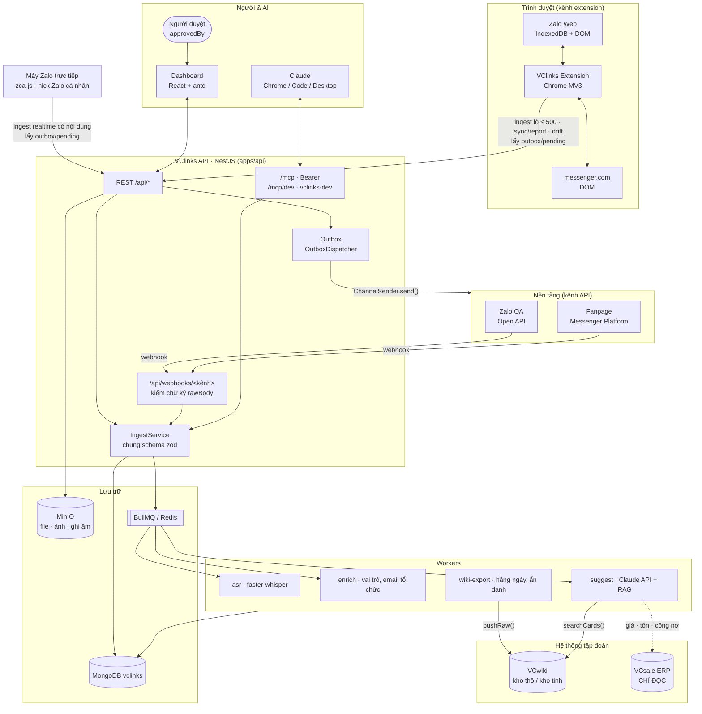
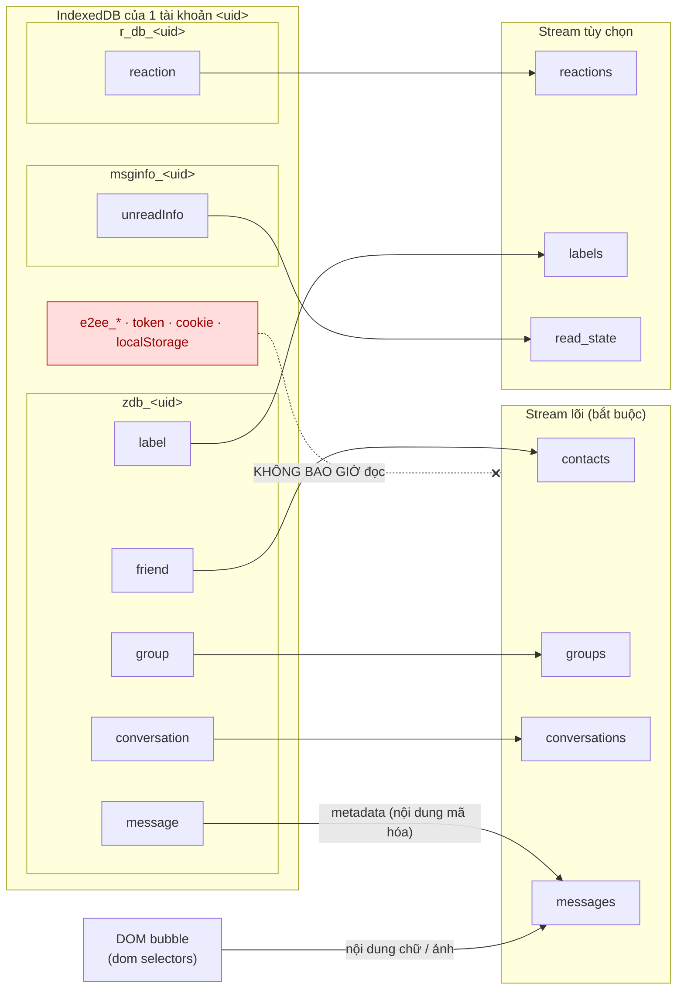
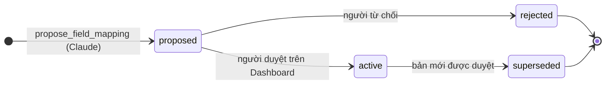
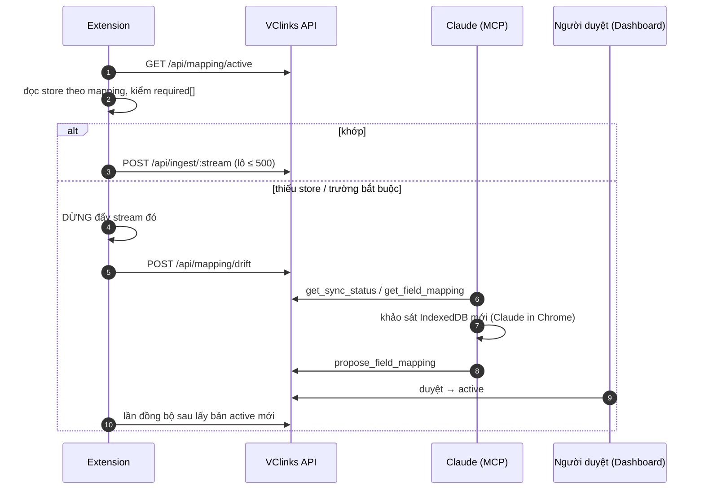
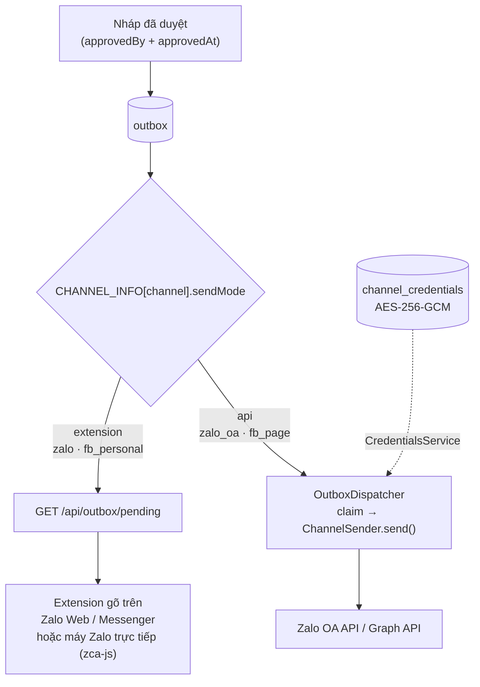
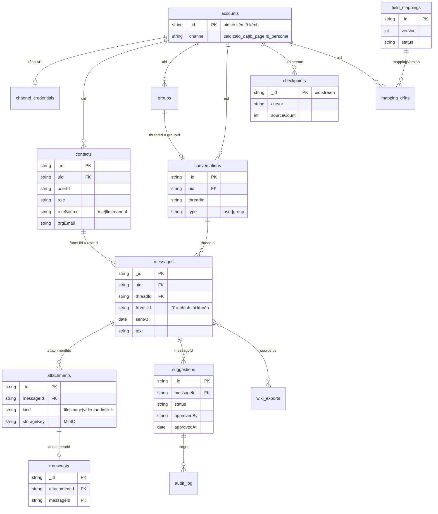
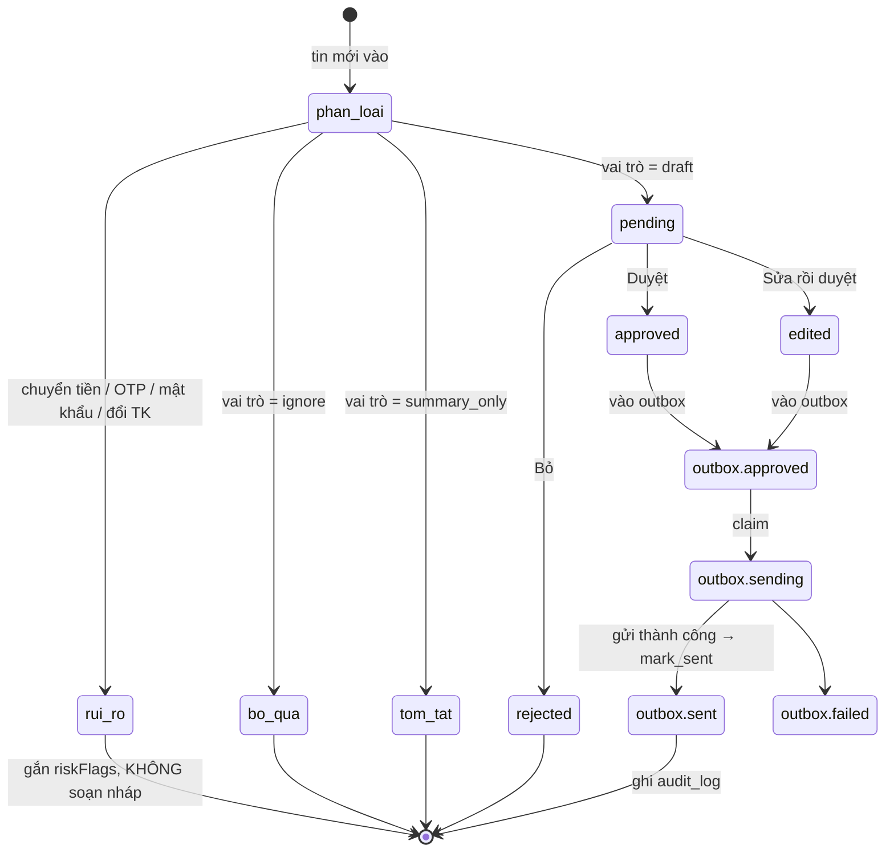
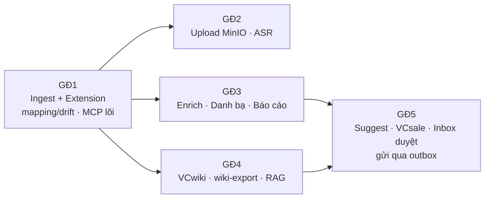

# CLAUDE.md — Dự án VClinks

Phiên bản 1.13 · 07/10/2026 · Trạng thái: Đang áp dụng

> Sơ đồ trong file viết bằng **Mermaid**: GitHub / VS Code vẽ thành hình cho người đọc, còn Claude đọc thẳng dạng văn bản. Sơ đồ là **mô hình chuẩn**; chữ bên cạnh giải thích chi tiết. Khi đổi kiến trúc, sửa cả hai.

## Mô hình



## Tóm tắt

- **VClinks** là nền tảng chăm sóc khách hàng đa kênh của VC Phồn Vinh: Zalo cá nhân, Zalo OA, Fanpage Facebook, Facebook cá nhân. **VC Zalo** là phân hệ kênh Zalo cá nhân, không phải hệ riêng.
- **3 nhiệm vụ:** lưu tập trung dữ liệu mọi kênh; phân tích danh bạ (vai trò, email tổ chức); gợi ý trả lời. **Người duyệt từng tin rồi mới gửi.**
- **Nhận tin:** kênh extension (Zalo, FB cá nhân) đọc IndexedDB/DOM theo **bảng ánh xạ chỉ khai báo**; lệch cấu trúc → báo drift → Claude đề xuất bản mới → người duyệt. Nick Zalo ở chế độ trực tiếp của máy Zalo nhận realtime qua zca-js (extension chỉ còn đồng bộ dữ liệu cũ). Kênh API (OA, Fanpage) nhận qua webhook có kiểm chữ ký.
- Mọi kênh ghi vào **chung** `IngestService` + schema zod, khóa idempotent `_id = ${uid}:${id gốc}`, uid mang tiền tố kênh.
- **Stack:** NestJS + MongoDB `vclinks` + MinIO + BullMQ; Dashboard React + antd; MCP `/mcp` cho Claude, `/mcp/dev` cho quy trình BA → Design → Code.
- **Tích hợp:** VCwiki (đẩy tri thức thô đã ẩn danh, lấy thẻ tri thức làm ngữ cảnh), VCsale **chỉ đọc** (giá, tồn, công nợ).
- **Bất biến (§12):** không gửi khi thiếu `approvedBy` + `approvedAt`; không lưu token phiên, khóa E2EE, OTP (trừ hai ngoại lệ lưu mã hóa ở §12.2); log không chứa nội dung tin; tuân thủ NĐ 13/2023.
- **Lộ trình (§11):** GĐ1 ingest → GĐ2 ghi âm → GĐ3 danh bạ → GĐ4 VCwiki → GĐ5 gợi ý + gửi. Câu hỏi còn mở với chủ dự án: §14.
- **Tài liệu md:** mọi AI làm theo §13 (tóm tắt → mục lục → lịch sử có ngày giờ).
- **Làm việc tiết kiệm (§15):** hỏi gom một lần có đề xuất mặc định, báo cáo ≤ 15 dòng, skill `khoi-dong-phien` / `chot-commit` / `ban-giao`.

## Mục lục

- [1. Bối cảnh](#1-bối-cảnh)
- [2. Luồng tổng thể](#2-luồng-tổng-thể)
- [3. Cấu trúc dữ liệu Zalo Web (đã khảo sát 28/09/2026)](#3-cấu-trúc-dữ-liệu-zalo-web-đã-khảo-sát-28092026)
- [4. Extension, bảng ánh xạ trường và MCP Server](#4-extension-bảng-ánh-xạ-trường-và-mcp-server)
- [5. Mô hình dữ liệu MongoDB (vclinks)](#5-mô-hình-dữ-liệu-mongodb-vclinks)
- [6. Tích hợp VCwiki](#6-tích-hợp-vcwiki)
- [7. Tích hợp VCsale (chỉ đọc)](#7-tích-hợp-vcsale-chỉ-đọc)
- [8. Gợi ý trả lời](#8-gợi-ý-trả-lời)
- [9. Dashboard (apps/web: React + Ant Design + Vite)](#9-dashboard-appsweb-react--ant-design--vite)
- [10. Cấu trúc repo](#10-cấu-trúc-repo)
- [11. Giai đoạn triển khai](#11-giai-đoạn-triển-khai)
- [12. Nguyên tắc bắt buộc](#12-nguyên-tắc-bắt-buộc)
- [13. Quy định tài liệu Markdown (bắt buộc với mọi AI, chốt 04/10/2026)](#13-quy-định-tài-liệu-markdown-bắt-buộc-với-mọi-ai-chốt-04102026)
- [14. Những điểm cần hỏi chủ dự án trước khi code](#14-những-điểm-cần-hỏi-chủ-dự-án-trước-khi-code)
- [15. Làm việc tiết kiệm](#15-làm-việc-tiết-kiệm)
- [Lịch sử cập nhật](#lịch-sử-cập-nhật)

---

## 1. Bối cảnh

- **Chủ dự án:** Bùi Thọ Anh, Chủ tịch VC Phồn Vinh (VCprosperous). Tập đoàn gồm các division VCparts, VCe, VCservice, VCsoft, VCOBD, VCmedia.
- **VClinks** (chốt tên ngày 28/09/2026; package `@vclinks/*`, database `vclinks`; database và storage key cũ `vczalo`, `vcconnect` tự chuyển về) là nền tảng; **VC Zalo là phân hệ kênh Zalo cá nhân của VClinks** (D8-02, 30/09/2026), không phải hệ riêng. VClinks là nền tảng **chăm sóc khách hàng đa kênh**, cùng loại với Pancake và Salework. Các kênh: **Zalo cá nhân, Zalo OA, Fanpage Facebook, Facebook cá nhân** (xem §4.4). Dự án có 3 nhiệm vụ:
  1. Lưu trữ tập trung dữ liệu của mọi kênh: tin nhắn, danh bạ, nhóm, đính kèm, ghi âm đã chuyển thành chữ.
  2. Phân tích danh bạ: vai trò của từng liên hệ, và đối chiếu với nhân sự/email trong tổ chức (`@vcprosperous.com`).
  3. Gợi ý trả lời tin nhắn. **Người dùng duyệt từng tin rồi mới gửi.**
- **Nguồn dữ liệu Zalo cá nhân:** **VClinks Extension** (Chrome MV3, `apps/extension`) đọc trực tiếp IndexedDB của Zalo Web (`chat.zalo.me`) và đẩy dữ liệu vào VClinks API qua REST. Extension **không cào giao diện**, nên Zalo đổi UI không ảnh hưởng. Chỉ khi Zalo đổi *cấu trúc IndexedDB* thì mới cần cập nhật bảng ánh xạ trường.
- **Vai trò của Claude (Claude in Chrome / Claude Code) qua MCP:** khi extension báo *schema drift*, Claude khảo sát IndexedDB mới và đề xuất bảng ánh xạ mới (`propose_field_mapping`). Claude cũng theo dõi trạng thái đồng bộ, tra cứu hội thoại và (GĐ5) gửi nháp đã duyệt. Các tool `ingest_*` qua MCP chỉ là **đường dự phòng** cho lô nhỏ.
- **Hệ thống liên quan:**
  - **VCwiki:** kho tri thức của tập đoàn. Tác nhân AI là trung tâm. Có một kho tri thức thô chưa xử lý và một kho tri thức đã xử lý, cả hai đều có chỉ mục vector.
  - **VCsale:** ERP mảng phụ tùng, dùng MongoDB, giao diện React + Ant Design, có MCP riêng.
- **Quy ước kỹ thuật của tập đoàn:** NestJS (TypeScript), MongoDB, React + Ant Design. Giao diện tiếng Việt, múi giờ `Asia/Ho_Chi_Minh`.

## 2. Luồng tổng thể

Sơ đồ kiến trúc: xem [Mô hình](#mô-hình) ở đầu file. Các bước theo số thứ tự:

```
Zalo Web (IndexedDB trên trình duyệt)
   │ ① VClinks Extension: đọc store trong whitelist theo bảng ánh xạ, lọc bỏ token/khóa,
   │   chuẩn hóa, chia lô 500 → POST /api/ingest/:stream (token thiết bị)
   │   Lệch cấu trúc → dừng đẩy, báo drift → Claude khảo sát → propose_field_mapping → người duyệt
   ▼
VClinks API (REST /api/*)  +  MCP Server (/mcp, Streamable HTTP, Bearer)
   │ ② checkpoint · sync status · field mapping · ingest_* dự phòng · (sau) upload, search, gửi nháp
   ▼
VClinks API (NestJS) ──► MongoDB `vclinks`  +  MinIO (file, ảnh, ghi âm)
   │                        │
   │ ③ Hàng đợi BullMQ: ASR (Whisper) · Enrich danh bạ · Suggest (Claude API)
   │                        │
   ├──► ④ VCwiki: đẩy "tri thức thô" từ chat · đọc thẻ tri thức làm ngữ cảnh gợi ý
   ├──► ⑤ VCsale MCP/API: tra giá, tồn, công nợ khi khách hỏi hàng (chỉ đọc)
   ▼
Dashboard (React + antd): Inbox duyệt nháp · Danh bạ & vai trò · Báo cáo
   │ ⑥ Nháp đã duyệt → Claude lấy qua MCP → gõ và gửi trên Zalo Web → mark_sent
```

## 3. Cấu trúc dữ liệu Zalo Web (đã khảo sát 28/09/2026)

Dữ liệu nằm dạng rõ trong IndexedDB, mỗi tài khoản một bộ DB theo `<uid>`. Trình duyệt hiện có **2 tài khoản**.

| DB                | Store                                                                                             | Trường chính                                                                                                                                                       |
| ----------------- | ------------------------------------------------------------------------------------------------- | --------------------------------------------------------------------------------------------------------------------------------------------------------------------- |
| `zdb_<uid>`     | `message` (key `msgId`)                                                                       | `msgId, cliMsgId, fromUid, toUid, dName, msgType, originMsgType, message, sendDttm, serverTime, quote, mentions, properties, paramsExt, e2eeStatus, syncFromMobile` |
|                   | `friend` (key `userId`)                                                                       | `displayName, zaloName, username, phoneNumber, avatar, gender, isFr, bizInfo, oaInfo, lastActionTime`                                                               |
|                   | `conversation`, `group`, `group_info`, `label`, `zcloud`, `file`, `image`, `link` | hội thoại, nhóm, nhãn, đính kèm                                                                                                                                |
| `msginfo_<uid>` | `ThreadMsg`, `Quotes`, `unreadInfo`                                                         | trạng thái đọc, trích dẫn                                                                                                                                       |
| `r_db_<uid>`    | `reaction`                                                                                      | cảm xúc                                                                                                                                                             |

⛔ **Tuyệt đối không nhận và không lưu:** `e2ee_session`, `e2ee_*key*`, `e2ee_identity`, `refresh_token`, cookie, bất kỳ token nào. Schema ingest phải **từ chối** payload có các trường này.

Ánh xạ mặc định store → stream (nguồn sự thật: `DEFAULT_FIELD_MAPPING` trong `packages/shared/src/mapping.ts`). Stream lõi là bắt buộc. Stream tùy chọn thì bảng ánh xạ được phép bỏ trống, khi đó extension bỏ qua stream đó.



## 4. Extension, bảng ánh xạ trường và MCP Server

### 4.1 VClinks Extension (`apps/extension`)

- Content script trên `chat.zalo.me` liệt kê `indexedDB.databases()`, nhận diện mọi `zdb_<uid>` (nhiều tài khoản, ngang nhau).
- Chỉ mở các store có trong **whitelist** của bảng ánh xạ. Không bao giờ mở store `e2ee_*`, không đọc cookie hay `localStorage`.
- Thứ tự đồng bộ: account → contacts → groups → conversations → messages. Đồng bộ tăng dần theo checkpoint từ API. Chạy định kỳ bằng `chrome.alarms` và có nút "Đồng bộ ngay".
- Gửi kèm **số bản ghi gốc** của từng store (`POST /api/sync/report`) để Dashboard đối chiếu với số bản ghi trong MongoDB.
- Kiểm tra dữ liệu đọc được với bảng ánh xạ. Nếu thiếu store hoặc thiếu trường bắt buộc: **dừng đẩy stream đó** và gửi `POST /api/mapping/drift`.
- **Chrome driver** (`tools/chrome-driver`, `pnpm driver`): Chrome for Testing riêng, CDP cổng 9333, chạy bản build của `main` và trỏ API `http://localhost:3000`. Là máy thu/gửi Zalo mặc định trên máy chủ dự án, dùng chung giữa các phiên Claude; chỉ gửi vào **danh sách hội thoại do chủ dự án chỉ định** (`onlyThreadIds`, đặt bằng `pnpm driver:config --only-threads`; hiện là nhóm "test nhom" `g615140573867383475`, người "test that" thêm khi có mã); Dashboard khóa ô soạn ở hội thoại khác, đó là chủ đích, không phải lỗi. Thêm hay bớt hội thoại trong danh sách chỉ khi chủ dự án nói tên; agent không tự thêm, không dùng `--all-threads`, không mở hội thoại khách (chốt 05/10/2026, UAT trên nick thật). Xem `docs/06-van-hanh/chrome-driver.md`.

### 4.2 Bảng ánh xạ trường (field mapping)

- Là JSON **chỉ khai báo, không chứa code**, có số phiên bản, lưu trong collection `field_mappings`. Extension lấy bản `active` qua `GET /api/mapping/active`.
- Nội dung (`fieldMappingSpecSchema`): `{ streams: { <stream>: { dbPrefix, store, fields: { tênChuẩn: đườngDẫnGốc }, required[] } }, dom?: { selector bubble Zalo Web } }`. Đường dẫn trường và tên store bị chặn nếu trùng mẫu nhạy cảm (`sensitive.ts`).
- Luồng cập nhật: Claude gọi `propose_field_mapping` (trạng thái `proposed`) → người duyệt trên Dashboard (trạng thái `active`) → extension tự áp dụng ở lần đồng bộ sau.





### 4.3 MCP Server (module `/mcp` trong `apps/api`)

Dùng SDK `@modelcontextprotocol/sdk` với transport Streamable HTTP, xác thực bằng Bearer token cá nhân. Mọi tool ghi dữ liệu đều **idempotent**, upsert theo `_id = ${uid}:${id gốc}`. Mỗi lô tối đa 500 bản ghi. Response phải ngắn gọn: `{accepted, updated, rejected[], checkpoint}`, không trả lại dữ liệu đã gửi.

| Tool                                         | Input chính                         | Việc                                                                                                   |
| -------------------------------------------- | ------------------------------------ | ------------------------------------------------------------------------------------------------------- |
| `register_account`                         | `uid, label`                       | Khai báo tài khoản Zalo                                                                              |
| `get_checkpoint`                           | `uid, stream`                      | Trả mốc`sendDttm`/`lastUpdateTime` đã đồng bộ                                                |
| `get_sync_status`                          | `uid?`                             | Số bản ghi gốc và số bản ghi trong DB theo từng stream, các drift đang mở                     |
| `get_field_mapping`                        | –                                   | Bảng ánh xạ đang áp dụng, cùng drift gần nhất                                                  |
| `propose_field_mapping`                    | `mapping, note`                    | Đề xuất bảng ánh xạ mới, chờ người duyệt trên Dashboard                                     |
| `ingest_messages`                          | `uid, items[]`                     | (Dự phòng) Upsert tin nhắn, rồi đẩy job ASR/Suggest nếu cần                                     |
| `ingest_contacts`                          | `uid, items[]`                     | (Dự phòng) Upsert danh bạ, rồi đẩy job Enrich                                                     |
| `ingest_groups` / `ingest_conversations` | `uid, items[]`                     | (Dự phòng) Upsert nhóm và hội thoại                                                               |
| `create_upload_url`                        | `messageId, fileName, mime, size`  | Trả presigned PUT URL của MinIO (hết hạn sau 15 phút). File nhị phân**không** đi qua MCP |
| `confirm_upload`                           | `uploadId, checksum`               | Xác nhận upload xong và tạo job ASR nếu là audio                                                  |
| `list_pending_suggestions`                 | `uid?, limit`                      | Nháp đã được người dùng duyệt trên Dashboard, chờ gửi                                      |
| `mark_sent`                                | `suggestionId, sentAt, zaloMsgId?` | Ghi nhận đã gửi vào audit log                                                                      |
| `search_messages`                          | `query, threadId?, from?, to?`     | Tìm lại hội thoại (full-text + vector)                                                              |
| `get_contact_profile`                      | `userId`                           | Vai trò, division, email tổ chức, ghi chú                                                           |

REST `/api/ingest/:stream` và MCP `ingest_*` dùng **chung** schema zod và chung service.

Thêm file `docs/04-ky-thuat/api/mcp-client-guide.md` hướng dẫn cách Claude gọi tool. Nội dung: thứ tự đồng bộ (account → contacts → groups → conversations → messages → attachments), cách đọc checkpoint, cách xử lý lô bị reject, và **quy trình xử lý drift** (khảo sát IndexedDB → đề xuất bảng ánh xạ).

### 4.3a MCP phát triển `vclinks-dev` (`/mcp/dev`)

Kênh yêu cầu thay đổi giữa chủ dự án (Claude Desktop) và các phiên Claude Code, token scope `dev`. Mỗi yêu cầu đi qua các chặng **BA → Design → Code**; hết chặng thì chờ chủ dự án duyệt (`review_request`) rồi mới sang chặng sau. Claude Code nhận việc bằng `claim_request`, nộp bằng `update_request status=review`. Xem `docs/04-ky-thuat/api/dev-mcp.md`.

### 4.4 Kênh (multi-channel)

Mỗi tài khoản đã kết nối là một doc `accounts` có `channel`. `uid` của tài khoản mang **tiền tố theo kênh** để khóa `_id = ${uid}:${id gốc}` không trùng giữa các kênh. Nguồn sự thật là `packages/shared/src/channels.ts`.

| Kênh              | `channel`     | Tiền tố uid | Nhận tin                                         | Gửi tin                      | Code                                     |
| ------------------ | --------------- | ------------- | ------------------------------------------------- | ----------------------------- | ---------------------------------------- |
| Zalo cá nhân     | `zalo`        | (không)      | Máy Zalo trực tiếp: zca-js listener (có nội dung). Extension: IndexedDB (metadata) + DOM (nội dung), dùng để đồng bộ dữ liệu cũ | zca-js `sendMessage` (máy Zalo trực tiếp) hoặc Extension gõ trên Zalo Web | `tools/chrome-driver/farm-direct.js`, `apps/extension/src` |
| Facebook cá nhân | `fb_personal` | `fb_`       | Extension: DOM trên messenger.com                | Extension gõ trên Messenger | `apps/extension/src/messenger/`        |
| Zalo OA            | `zalo_oa`     | `zoa_`      | Webhook Zalo OA Open API                          | API chính thức, server gửi | `apps/api/src/channels/zalo-oa/`       |
| Fanpage Facebook   | `fb_page`     | `fbp_`      | Webhook Messenger Platform                        | Graph API Send, server gửi   | `apps/api/src/channels/facebook-page/` |

- Mọi kênh ghi vào **cùng** collection (`contacts`, `conversations`, `messages`) qua **cùng** `IngestService` và schema zod. Tin do chính tài khoản gửi đi có `fromUid = '0'`.
- **Kênh API** (OA, Fanpage): webhook ở `/api/webhooks/<kênh>` (`@Public`, bắt buộc kiểm chữ ký trên `req.rawBody`). Tin đã duyệt được `OutboxDispatcher` gửi phía server: claim → `ChannelSender.send()` → result. Extension và MCP **không bao giờ** nhận tin của kênh API.
- **Kênh extension** (Zalo, FB cá nhân): extension nhận tin đã duyệt qua `/api/outbox/pending` như hiện nay. Nick Zalo chạy chế độ trực tiếp của máy Zalo (zca-js) cũng nhận qua đường này (agent máy Zalo, token ingest) và gửi ngay khi nick đã gắn.


- **Facebook cá nhân không có API chính thức.** Tự động hóa tài khoản cá nhân trái điều khoản của Meta, có rủi ro bị khóa tài khoản. Chủ dự án đã chấp nhận rủi ro này (28/09/2026). Giữ nhịp gửi chậm, giống người thật, và không bao giờ gửi hàng loạt.

## 5. Mô hình dữ liệu MongoDB (`vclinks`)

- `accounts { _id: uid, channel, label, ownerName, lastSyncAt }`
- `channel_credentials { _id: uid, channel, iv, tag, data (AES-256-GCM), expiresAt, updatedAt }`: token tích hợp của kênh API, chỉ đọc/ghi qua `CredentialsService`
- `contacts { _id, uid, userId, displayName, zaloName, phone, avatar, isFriend, isOA, bizInfo, lastActionTime, role, roleConfidence, roleSource: 'rule'|'llm'|'manual', division, orgEmail, orgDepartment, orgMatchConfidence, tags[], notes }`
  - `role` ∈ `khach_hang | dai_ly_gara | nha_cung_cap | nhan_vien | quan_ly | doi_tac | ngan_hang | co_quan_nha_nuoc | gia_dinh_ban_be | oa_doanh_nghiep | khac`
- `groups { _id, uid, groupId, name, memberIds[], adminIds[], labels[], purpose, division }`
- `conversations { _id, uid, threadId, type: 'user'|'group', lastMsgAt, unread, labels[] }`
- `messages { _id, uid, threadId, msgId, cliMsgId, fromUid, senderName, msgType, originMsgType, text, quoteRef, mentions[], sentAt: Date, attachmentIds[], raw }`
  - Index: `(uid, threadId, sentAt)`, text index cho `text`.
- `attachments { _id, messageId, kind: file|image|video|audio|link, url, fileName, size, mime, storageKey, checksum, status }`
- `transcripts { _id, attachmentId, messageId, text, lang: 'vi', model, durationSec }`
  - Khi chuyển chữ xong, cập nhật `messages.text = "[Ghi âm] " + text`.
- `suggestions { _id, messageId, threadId, draft, context{wikiCards[], saleLookups[]}, riskFlags[], status: pending|approved|edited|rejected|sent, finalText, approvedBy, approvedAt, sentAt }`
- `wiki_exports { _id, sourceType, sourceIds[], vcwikiRawId, status, exportedAt }`
- `audit_log { actor, action, target, at, detail }`
- `checkpoints { _id: ${uid}:${stream}, uid, stream, cursor, sourceCount, sourceCountAt, lastIngestAt }`
- `field_mappings { _id, version, status: proposed|active|rejected|superseded, spec, note, proposedBy, approvedBy, approvedAt }`
- `mapping_drifts { _id, uid, stream, mappingVersion, detail, status: open|resolved, at }`
- `api_tokens { _id, name, hash (sha256), scopes: dashboard|ingest|mcp[], createdAt, lastUsedAt, revokedAt }`
- Vector index trên `messages.text` và `transcripts.text`, cùng embedding model với VCwiki để có thể truy vấn chéo.

Quan hệ chính (khóa nghiệp vụ `_id = ${uid}:${id gốc}`; chỉ ghi trường dùng để nối, trường đầy đủ xem danh sách trên):



## 6. Tích hợp VCwiki

- **VClinks → VCwiki (nạp tri thức thô):**
  - Worker hằng ngày trích từ chat các nội dung có giá trị tri thức: câu hỏi khách hay gặp, thông tin sản phẩm và mã phụ tùng, chính sách giá/bảo hành được nhắc tới, quyết định nội bộ.
  - Kết quả đẩy vào **kho tri thức thô** của VCwiki, gắn nguồn (`threadId`, `msgIds`, thời điểm).
  - **Không đẩy thẳng vào kho chính thức:** con người duyệt trong VCwiki như luồng hiện hành.
  - Ẩn danh số điện thoại và dữ liệu cá nhân của khách trước khi xuất.
- **VCwiki → VClinks (ngữ cảnh gợi ý):** Worker Suggest truy vấn vector VCwiki để lấy thẻ tri thức liên quan (sales playbook, thông tin sản phẩm, quy chế) và đưa vào prompt.
- **Chưa rõ giao diện kết nối của VCwiki (API, MCP hay DB):** tạo `packages/vcwiki-client` dạng adapter có interface rõ ràng (`pushRaw()`, `searchCards()`). Hỏi chủ dự án endpoint thật. Trong lúc chờ, dùng mock.

## 7. Tích hợp VCsale (chỉ đọc)

Khi tin nhắn có mã OE, VIN hoặc tên phụ tùng, Worker Suggest gọi VCsale (MCP/API) để tra giá, tồn và công nợ khách, rồi đưa vào nháp. Làm qua adapter `packages/vcsale-client`, bắt đầu bằng mock. **Không bao giờ ghi dữ liệu sang VCsale.**

## 8. Gợi ý trả lời

- **Prompt gồm:** 30 tin gần nhất của hội thoại, hồ sơ người gửi (vai trò, division), thẻ VCwiki, kết quả tra VCsale, playbook giọng văn (`config/playbook.yaml`: xưng hô theo vai trò, độ dài, mẫu câu).
- **Chống prompt injection:** nội dung tin nhắn được bọc trong khối dữ liệu và đánh dấu là không đáng tin. Model chỉ soạn nháp, không làm theo yêu cầu nằm trong tin nhắn. Các yêu cầu chuyển tiền, gửi file, đổi thông tin tài khoản, OTP hay mật khẩu thì gắn `riskFlags` và **không soạn nháp**.
- **Phân loại xử lý theo vai trò:** `draft` (soạn nháp) / `summary_only` (chỉ tóm tắt) / `ignore` (bỏ qua). Cấu hình được trong playbook.
- **Học từ phản hồi:** lưu cặp (nháp, bản anh sửa) để tinh chỉnh playbook. Theo dõi chỉ số tỉ lệ duyệt không sửa.

Vòng đời một nháp (`suggestions.status`), sau khi duyệt thì chuyển sang `outbox` (`OUTBOX_STATUSES` trong `packages/shared/src/outbox.ts`):



> Bất biến: **không có cạnh nào vào `outbox` mà không đi qua `approved`/`edited`** (§12.1).

## 9. Dashboard (`apps/web`: React + Ant Design + Vite)

1. **Inbox:** hội thoại có tin mới, nháp gợi ý, các nút Duyệt / Sửa / Bỏ. Duyệt xong nháp vào hàng đợi chờ Claude gửi.
2. **Danh bạ:** bảng lọc theo vai trò/division, sửa tay vai trò và email tổ chức (sửa tay luôn ưu tiên), xem lịch sử chat.
3. **Báo cáo:** liên hệ theo vai trò/division, top hội thoại theo lưu lượng, thời gian phản hồi trung bình, tin chưa trả lời quá 24h, khối lượng ghi âm.
4. **Đăng nhập:** SSO Google Workspace, chỉ cho phép domain `vcprosperous.com` và `vcpart.vn` (danh sách: `COMPANY_DOMAINS` trong `packages/shared/src/org.ts`).

## 10. Cấu trúc repo

```
vclinks/
├─ apps/
│  ├─ api/        NestJS: REST cho Dashboard, nghiệp vụ, hàng đợi
│  ├─ extension/  Chrome MV3: đọc IndexedDB Zalo Web → REST ingest
│  └─ web/        React + antd
│  (MCP server là module trong api, expose /mcp)
├─ workers/
│  ├─ asr/        Python + faster-whisper (large-v3, vi)
│  ├─ enrich/     phân loại vai trò, map email tổ chức
│  ├─ suggest/    Claude API + RAG VCwiki + tra VCsale
│  └─ wiki-export/
├─ packages/
│  ├─ shared/     zod schema, types dùng chung (MCP ↔ API ↔ web)
│  ├─ vcwiki-client/
│  └─ vcsale-client/
├─ config/playbook.yaml
├─ docker-compose.yml   mongo, redis, minio, api, web, workers
├─ TAI-LIEU.md          file quản lý tài liệu cấp dự án (§13)
└─ docs/                tài liệu theo vòng đời: 01-quan-ly-du-an · 02-yeu-cau · 03-thiet-ke ·
                        04-ky-thuat · 05-kiem-thu · 06-van-hanh · 07-demo (quy chuẩn: docs/README.md)
```

Link các artifact trên claude.ai (canvas thiết kế giao diện "VClinks UI Design", biên bản BA): `docs/03-thiet-ke/artifacts.md`.

Kế hoạch code M1 theo phiên chat (mỗi phiên một task có đầu vào / đầu ra, bản đồ tính năng → phiên để sửa đúng phiên cũ): `docs/01-quan-ly-du-an/m1/ke-hoach-phien-chat.md`. Trạng thái từng phiên ghi ở sổ phiên `docs/01-quan-ly-du-an/m1/so-phien.md` (mỗi phiên tự cập nhật dòng của mình).

## 11. Giai đoạn triển khai



| GĐ         | Phạm vi                                                                                                                                                                                                                                                                                                                                                         | Tiêu chí xong                                                                                                                        |
| ----------- | ---------------------------------------------------------------------------------------------------------------------------------------------------------------------------------------------------------------------------------------------------------------------------------------------------------------------------------------------------------------- | -------------------------------------------------------------------------------------------------------------------------------------- |
| **1** | Monorepo, docker-compose, schema zod, MongoDB, REST ingest + VClinks Extension, bảng ánh xạ trường + drift, MCP server với`register_account`, `get_checkpoint`, `get_sync_status`, `*_field_mapping`, `ingest_*`; Dashboard xem hội thoại và đối chiếu đồng bộ. Tạm đăng nhập bằng token nội bộ, chạy local + Cloudflare Tunnel | Extension đẩy được toàn bộ tin, danh bạ, nhóm của 2 tài khoản. Số bản ghi khớp IndexedDB. Chạy lại không sinh trùng |
| **2** | `create_upload_url`, `confirm_upload`, MinIO, worker ASR                                                                                                                                                                                                                                                                                                     | Ghi âm lên MinIO và có transcript tiếng Việt gắn vào tin                                                                       |
| **3** | Worker enrich, trang Danh bạ và Báo cáo, map email tổ chức (Google Workspace Directory API hoặc file CSV nhân sự)                                                                                                                                                                                                                                       | Trên 80% liên hệ có vai trò. Nhân viên nội bộ map được email                                                               |
| **4** | `vcwiki-client`, worker wiki-export, RAG                                                                                                                                                                                                                                                                                                                       | Tri thức thô từ chat xuất hiện trong kho thô VCwiki, có nguồn và đã ẩn danh                                                |
| **5** | Worker suggest, `vcsale-client`, Inbox duyệt, `list_pending_suggestions`, `mark_sent`                                                                                                                                                                                                                                                                      | Nháp đúng ngữ cảnh, duyệt rồi gửi qua Claude, có audit log đầy đủ                                                         |

## 12. Nguyên tắc bắt buộc

1. **Không gửi khi chưa duyệt:** không có đường nào gửi tin Zalo mà thiếu `approvedBy` + `approvedAt`.
2. **Không lưu bí mật:** không lưu token/cookie phiên của người dùng, không khóa E2EE, không mật khẩu, không OTP. Ngoại lệ thứ nhất: token tích hợp chính thức của kênh API (Zalo OA, Page access token) được lưu **mã hóa** trong `channel_credentials` (khóa `CREDENTIALS_KEY`), không bao giờ log, không bao giờ trả qua API/MCP. Ngoại lệ thứ hai (06/10/2026, dev002, `docs/01-quan-ly-du-an/ke-hoach-zalo-truc-tiep-zca-js.md` §5): phiên Zalo cá nhân của nick kết nối trực tiếp (cookie, imei, userAgent) được lưu **mã hóa AES-256-GCM** trong volume của máy Zalo (khóa `ZALO_FARM_SESSION_KEY`), chỉ agent máy Zalo đọc; không vào MongoDB, không ghi log, không trả qua API/MCP; xóa khi ngắt kết nối. Khóa giải mã nội dung tin (`cipher_key`) chỉ nằm trong bộ nhớ của phiên. Khi chuyển một nick từ Zalo Web sang kết nối trực tiếp, agent được đọc phiên đó (cookie zalo.me, `z_uuid`, userAgent) từ hồ sơ Chrome của chính nick trên máy Zalo và lưu ngay theo cách trên; phiên không ra khỏi container.
3. **Bảo mật hệ thống:** mã hóa at-rest cho MongoDB và MinIO. API và MCP đặt sau HTTPS + xác thực. Log không chứa nội dung tin nhắn.
4. **Tuân thủ Nghị định 13/2023/NĐ-CP về dữ liệu cá nhân:**
   - Dữ liệu bên thứ ba chỉ phục vụ vận hành nội bộ.
   - Có cấu hình thời hạn lưu trữ.
   - Có chức năng xóa theo liên hệ.
   - Ẩn danh khi xuất sang VCwiki.
5. **Viết test:** unit test cho schema ingest (bao gồm test từ chối trường nhạy cảm), e2e test cho luồng MCP ingest → Dashboard.
6. **Code và giao diện:** code comment bằng tiếng Anh, UI và tài liệu người dùng bằng tiếng Việt.
7. **Tài liệu Markdown:** theo §13 (tóm tắt → mục lục + nội dung → lịch sử có ngày giờ; quản lý phiên bản 3 tầng).

## 13. Quy định tài liệu Markdown (bắt buộc với mọi AI, chốt 04/10/2026)

Mục đích: người đọc nắm nhanh nội dung và kiểm duyệt được. Danh sách file cũ phải sửa lại theo quy định này (hồi tố): `docs/01-quan-ly-du-an/hoi-to-tai-lieu-md.md`.

**Phạm vi:** mọi file `.md` mà AI (Claude, Codex…) tạo mới hoặc sửa trong repo, nếu dài **từ 1.500 ký tự** (≈ ½ trang A4) trở lên. File ngắn hơn được miễn.

**Bố cục một file, theo đúng thứ tự:**

0. **Tiêu đề và một dòng trạng thái:** `Phiên bản x.y · dd/mm/yyyy · Trạng thái (Nháp / Chờ duyệt / Đã duyệt)`.
1. **`## Tóm tắt`:** 5–10 gạch đầu dòng, gồm: tài liệu nói gì, kết luận hoặc quyết định chính, việc còn mở, và người duyệt cần xem kỹ chỗ nào.
2. **`## Mục lục`:** liệt kê các mục `##` kèm link. Nội dung chi tiết nằm ngay sau mục lục.
3. **`## Lịch sử cập nhật`:** đặt cuối file. Bảng có các cột `| Phiên bản | Ngày | Người / phiên | Thay đổi | Căn cứ |`, dòng mới nhất ở trên cùng. Cột Ngày ghi **cả ngày và giờ** `dd/mm/yyyy HH:mm` (giờ Việt Nam, lấy bằng `TZ=Asia/Ho_Chi_Minh date '+%d/%m/%Y %H:%M'` ngay trước lệnh commit, không ghi trước rồi sửa lại). **Không** viết lịch sử ở đầu file.

Sơ đồ **không bắt buộc** (chủ dự án bỏ yêu cầu ngày 04/10/2026). File nào đã có sơ đồ, kể cả mục `## Mô hình` thêm khi hồi tố, thì giữ nguyên.

**Cấu trúc thư mục `docs/` (quy chuẩn, chốt 04/10/2026):** tài liệu xếp theo vòng đời phần mềm (ISO/IEC/IEEE 12207, 15289). Tài liệu mới phải đặt đúng thư mục; không tạo file `.md` nằm thẳng trong `docs/` ngoài `docs/README.md`. Bảng chi tiết và quy tắc đặt tên: [docs/README.md](docs/README.md).

| Thư mục | Đặt vào đây |
|---|---|
| `01-quan-ly-du-an/` | Kế hoạch, chi phí, sổ quyết định chủ dự án, biên bản họp, rủi ro, tiến độ |
| `02-yeu-cau/` | BA tổng, đặc tả `dac-ta/`, personas, hồ sơ rà soát `ra-soat/` |
| `03-thiet-ke/` | Thiết kế giao diện, kiến trúc, quyết định kỹ thuật |
| `04-ky-thuat/` | API `api/`, kết nối kênh `kenh/`, khảo sát nền tảng ngoài (`zalo-web/`…) |
| `05-kiem-thu/` | Dữ liệu kiểm thử, kế hoạch kiểm thử, biên bản UAT `uat/<yyyy-mm-dd>/` |
| `06-van-hanh/` | Cài đặt, triển khai, chạy, sao lưu, xử lý sự cố |
| `07-demo/` | Kịch bản và nguồn dựng demo, video, tài liệu đào tạo |

Tên thư mục và file: viết thường, tiếng Việt không dấu, nối bằng `-`; thư mục cấp 1 có số `NN-`; hồ sơ theo đợt dùng ngày `yyyy-mm-dd`. File nhị phân lớn (video) không đưa vào git. Code chỉ được trỏ tới tài liệu bằng đường dẫn đầy đủ từ gốc repo (`docs/04-ky-thuat/...`); chuyển file thì sửa cả code (ví dụ `apps/api/src/devreq/spec-docs.service.ts`).

**Quản lý phiên bản theo 3 tầng:**

| Tầng | Ở đâu | Nội dung |
|---|---|---|
| File | Mục Lịch sử cập nhật trong chính file | Từng lần commit: phiên bản, ngày giờ, thay đổi, căn cứ |
| Thư mục | `README.md` của thư mục | Bảng `\| File \| Tóm tắt 1 dòng \| Phiên bản \| Cập nhật \| Trạng thái \|`. File đổi phiên bản thì sửa luôn dòng của nó trong bảng |
| Dự án | `TAI-LIEU.md` ở gốc repo | Danh sách thư mục, mỗi thư mục có tóm tắt nhanh các file và link tới `README.md` của thư mục |

- Thư mục chỉ có hồ sơ rà soát (`docs/02-yeu-cau/ra-soat/**`) được gộp vào `README.md` của thư mục cha gần nhất, không cần README riêng cho từng vòng.
- **Đánh số phiên bản:** file mới bắt đầu `0.1`; bản chủ dự án duyệt lên `1.0`. Trong một phiên chỉ tăng số cuối **một lần, lúc commit** (cùng một dòng Lịch sử và một lần cập nhật README thư mục), kể cả khi sửa file nhiều lần; làm bằng skill `chot-commit`. File cũ giữ cách đánh số đang dùng (ví dụ `v1.4.5`). Sửa chính tả hay định dạng không tăng phiên bản.
- **`AGENTS.md`** (cho Codex và agent khác) là bản sao nguyên văn của `CLAUDE.md`, chỉ khác tiêu đề, ghi chú đầu file và bảng lịch sử. Sửa `CLAUDE.md` thì chép sang `AGENTS.md` trong cùng commit.
- **Sửa một file cũ chưa đạt quy định:** tối thiểu phải thêm dòng vào mục Lịch sử cập nhật (tạo mục nếu chưa có) và cập nhật `README.md` của thư mục. Việc nâng cấp đủ ba phần làm theo danh sách hồi tố.

## 14. Những điểm cần hỏi chủ dự án trước khi code

- Endpoint và phương thức kết nối của VCwiki (API, MCP hay DB?), embedding model đang dùng.
- Endpoint MCP/API của VCsale.
- Hạ tầng triển khai: server nội bộ hay cloud (Azure?), domain cho MCP.
- Nguồn danh sách nhân sự để map email (Google Workspace Directory hay file HR).
- ~~Tài khoản Zalo nào là tài khoản chính~~: hai tài khoản ngang nhau (chốt 28/09/2026).
- ~~Hạ tầng GĐ1~~: chạy local + Cloudflare Tunnel; Dashboard GĐ1 đăng nhập bằng token nội bộ, SSO Google làm ở GĐ3 (chốt 28/09/2026).
- VCwiki có MCP `vc-content`: Kho tư liệu là tầng thô, VCWIKI là tầng tinh. Cần xác nhận đây là kênh tích hợp cho GĐ4.

## 15. Làm việc tiết kiệm

Mục tiêu: ít lượt chat, ít token. Thủ tục chi tiết nằm trong skill `.claude/skills/` (chỉ nạp khi cần).

**15.1 Bối cảnh cố định** (không hỏi lại; điều kiện đổi thì sửa dòng này và báo chủ dự án một câu):
- Một người điều phối là chủ dự án, không chuyên IT, làm 8 giờ/ngày, tính thời gian theo giờ; là quản trị Google Workspace.
- Tối đa 5 agent chạy cùng lúc (chốt 04/10/2026), model do chat điều phối chỉ định; nhánh gác cổng đạt thì gộp ngay vào `main`. Có 1 Chrome driver và 1 nick Zalo test.
- Gói Max 20x; Claude Code dùng tối đa khoảng 75% hạn mức tuần.
- Git trên máy, sao lưu lên GitLab. Không có nhánh `dev`, không mở PR/MR; phiên gác cổng gộp vào `main` trên máy.

**15.2 Hỏi:** gom vào **một lần**, đánh số `Q1, Q2…` (tối đa 5), mỗi câu có **đề xuất mặc định**. Điều đã có ở 15.1, tài liệu hoặc code thì tự tra. Chủ dự án trả lời theo mã (`Q1: OK · Q3: B`); "theo đề xuất" là đồng ý hết; câu không trả lời thì làm theo đề xuất. Không hỏi "còn gì không" cuối lượt; chỉ hỏi khi bị chặn.

**15.3 Tự quyết và phải hỏi:**
- **Tự làm rồi báo:** việc đảo ngược được: sửa tài liệu, commit trên máy, gộp nhánh đã kiểm tra không xung đột, xóa nhánh đã gộp (`git branch -d`), dọn worktree đã gộp.
- **Phải hỏi, kèm bảng rủi ro ngắn:** việc không đảo ngược được hoặc tốn tiền: xóa thứ chưa có bản sao, `push --force`, đưa dữ liệu lên dịch vụ ngoài, gửi tin cho khách thật, đổi cài đặt tài khoản hay thanh toán.

**15.4 Trả lời:** báo cáo **≤ 15 dòng** (đã làm gì, kết quả, việc cần chủ dự án quyết), không chép diff, không kể từng bước. Gọi file bằng **tên kèm một câu mô tả**, không chỉ ghi số phiên bản. Tiếng Việt dễ hiểu; gặp thuật ngữ IT thì giải thích một câu.

**15.5 "BTW":** tin mở đầu bằng "BTW" là câu hỏi tạt ngang: trả lời ≤ 5 dòng, không sửa file, rồi quay lại việc đang làm.

**15.6 Đọc và chạy:** đọc đúng đoạn cần (`grep -n` hoặc theo dòng), không đọc lại nguyên file dài trong một phiên. Gộp nhiều sửa đổi vào **một script** mỗi đợt.

**15.7 Model:** Sonnet cho git, dọn dẹp, sửa tài liệu, màn hình, CRUD. Opus cho lập kế hoạch, phiên khó theo kế hoạch M1 §4.3, việc soát ở gác cổng khi nhịp có phiên Opus. Chat điều phối nhịp luôn chạy Sonnet. Đang chạy Opus mà gặp việc lặt vặt dài thì nhắc chủ dự án `/model sonnet`.

**15.8 Ngữ cảnh dài:** hội thoại dài hoặc đã bị nén một lần thì đề xuất mở chat mới, dùng skill `ban-giao`. Mở phiên dùng `khoi-dong-phien`; chốt commit dùng `chot-commit`.

## Lịch sử cập nhật

| Phiên bản | Ngày | Người / phiên | Thay đổi | Căn cứ |
|---|---|---|---|---|
| 1.13 | 07/10/2026 14:55 | Claude Code (dev002) | §9 mục 4: đăng nhập nhận thêm domain `vcpart.vn` bên cạnh `vcprosperous.com` | dev002 07/10/2026 |
| 1.12 | 06/10/2026 14:39 | Claude Code (dev002) | §12.2 thêm ngoại lệ thứ hai: phiên zca-js của nick máy Zalo trực tiếp lưu mã hóa AES-256-GCM trên volume máy Zalo (khóa `ZALO_FARM_SESSION_KEY`), agent được đọc phiên Zalo Web của chính nick để chuyển sang trực tiếp; §4.4 dòng Zalo cá nhân và sơ đồ: nhận realtime và gửi qua máy Zalo trực tiếp (zca-js), extension còn để đồng bộ dữ liệu cũ; Tóm tắt cập nhật theo | dev002 06/10/2026 (kế hoạch zca-js §5; yêu cầu làm luồng nhận, gửi realtime) |
| 1.11 | 05/10/2026 08:20 | Claude Code | §4.1: driver gửi vào danh sách hội thoại chủ dự án chỉ định (UAT nick thật: "test nhom", "test that"), thay cho chỉ nhóm "Kiểm thử vclink" | Chủ dự án 05/10/2026 (Q4 đồng ý) |
| 1.10 | 04/10/2026 21:20 | Claude Code | §4.1: khóa chỉ gửi nhóm test giữ tới khi chủ dự án tự dùng thử xong và nói mở; ô soạn bị khóa ở hội thoại khác là chủ đích | Chủ dự án 04/10/2026 |
| 1.9 | 04/10/2026 19:53 | Claude Code · Đợt 1 điều phối | §15.1: tối đa 5 agent (trước 2), model do chat điều phối chỉ định, xong đến đâu gộp đến đấy | Chủ dự án 04/10/2026 |
| 1.8 | 04/10/2026 15:16 | Claude Code | §15.7: model gác cổng khớp kế hoạch M1 (chat điều phối Sonnet, soát bằng Opus khi nhịp có phiên Opus) | Chủ dự án đồng ý 04/10/2026 15:16 |
| 1.7 | 04/10/2026 15:04 | Claude Code | Thêm §15 Làm việc tiết kiệm (3 skill trong `.claude/skills/`); §13 đổi: chỉ tăng phiên bản và ghi lịch sử một lần mỗi phiên, lúc commit, giờ lấy bằng `date` | Yêu cầu chủ dự án 04/10/2026 |
| 1.6 | 04/10/2026 13:50 | Claude Code | §10: kế hoạch M1 chuyển vào `docs/01-quan-ly-du-an/m1/`, thêm sổ phiên `so-phien.md` | Chủ dự án duyệt 04/10/2026 13:50 |
| 1.5 | 04/10/2026 13:34 | Claude Code | §13 thêm quy chuẩn cấu trúc thư mục `docs/` (7 thư mục theo vòng đời, quy tắc đặt tên); §10 cây repo thêm `TAI-LIEU.md` và các thư mục `docs/`; cập nhật đường dẫn tài liệu theo cấu trúc mới | Chủ dự án duyệt cấu trúc docs/ 04/10/2026 13:34 |
| 1.4 | 04/10/2026 13:23 | Claude Code | §13: bỏ yêu cầu sơ đồ (chỉ còn tóm tắt, mục lục, lịch sử; sơ đồ đã có giữ nguyên); cột Ngày của lịch sử ghi cả giờ `dd/mm/yyyy HH:mm`; sửa §12.7 và Tóm tắt cho khớp | Yêu cầu chủ dự án 04/10/2026 13:23 |
| 1.3 | 04/10/2026 | Claude Code | Hồi tố theo §13: sơ đồ kiến trúc lên đầu (Mô hình), thêm Tóm tắt, Mục lục, dòng phiên bản; §13 thêm quy tắc AGENTS.md là bản sao nguyên văn | `docs/ke-hoach/hoi-to-tai-lieu-md.md` #1 |
| 1.2 | 04/10/2026 | Claude Code | Thêm §13 quy định tài liệu Markdown, §12.7; mục câu hỏi đổi thành §14 | Yêu cầu chủ dự án 04/10/2026 |
| 1.1 | 04/10/2026 | Claude Code | Mô hình hoá bằng 8 sơ đồ Mermaid (§2.1, §3, §4.2, §4.4, §5, §8, §11); §4.2 sửa mô tả bảng ánh xạ cho khớp `mapping.ts` | Yêu cầu chủ dự án 04/10/2026 |
| 1.0 | 28/09–04/10/2026 | Chủ dự án, Claude | Các bản trước khi có bảng lịch sử (xem `git log -- CLAUDE.md`) | — |
