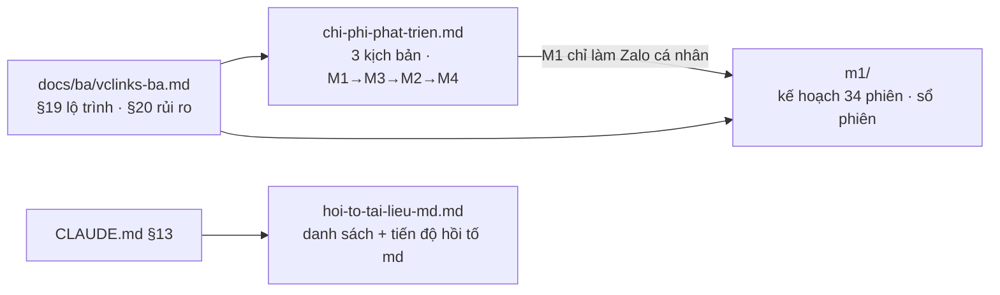

# Quản lý dự án — thư mục `docs/01-quan-ly-du-an/`

Phiên bản 0.14 · 07/10/2026 · Trạng thái: Đang áp dụng

## Mô hình

## Tóm tắt

- Hồ sơ quản lý dự án (theo ISO/IEC/IEEE 15289): kế hoạch, chi phí, sổ quyết định của chủ dự án, tiến độ hồi tố tài liệu md.
- **Sổ quyết định** (v1.1, tài liệu sống): mọi câu chủ dự án cần chốt (QĐ, TS, TT, D8, D9), chuyển từ `docs/ba/` sang đây ngày 04/10/2026.
- **Chi phí** (v0.7, nháp): dự báo lại 05/10/2026 theo số đo M1 (2 dev dùng AI viết 100% code): hoàn thiện M4 13/11 / 27/11 / 31/12/2026, tổng năm đầu 672 / 831 / 1.226 triệu; ba kịch bản cũ (2 dev) giữ làm tham chiếu; số lấy từ `chi-phi-phat-trien.xlsx` sheet "Dự báo lại".
- **Mốc M1** (thư mục `m1/`): kế hoạch 34 phiên chat (v1.4, đã duyệt 04/10/2026: 18 nhịp cho 2 agent, model, trần token) và sổ phiên (v0.3, tài liệu sống); mốc chạy thật dời sang 26/10/2026 (chốt 04/10/2026). `chi-phi-phat-trien.md` đã ghi mốc thực tế, các mốc M3 / M2 / M4 chưa dời theo.
- **Hồi tố md** (đang làm): danh sách 95 file theo mức quan trọng và thời gian, đánh dấu việc đã xong.
- Chỗ cần xem: `m1/ke-hoach-phien-chat.md` §3 ghi E5 chặn "M1b-11", có lẽ đúng là M1b-12; sơ đồ §4 vẽ phụ thuộc C7/C8 khác với chữ.

## Mục lục

- [Danh sách file](#danh-sách-file)
- [Lịch sử cập nhật](#lịch-sử-cập-nhật)

## Danh sách file

| File | Tóm tắt 1 dòng | Phiên bản | Cập nhật | Trạng thái | Ghi chú |
|---|---|---|---|---|---|
| [m1/](m1/README.md) | Thư mục mốc M1: kế hoạch 38 phiên chat (v1.9, đo lại thời gian 05/10) và sổ phiên (v0.23) | — | 05/10/2026 | Kế hoạch đã duyệt; sổ phiên đang áp dụng | Chi tiết ở [m1/README.md](m1/README.md) |
| [chi-phi-phat-trien.md](chi-phi-phat-trien.md) | Thời gian và chi phí VClinks: dự báo lại 05/10/2026 theo số đo M1 (2 dev dùng AI, nút thắt là đầu vào ngoài), bóc tách mảnh M1→M3→M2→M4; ba kịch bản cũ 2 dev làm tham chiếu | 0.7 | 05/10/2026 | Nháp để thống nhất | Bảo trì kịch bản tiêu cực 20,5 vs 12 × 1,7 = 20,4 (do làm tròn) |
| [hoi-to-tai-lieu-md.md](hoi-to-tai-lieu-md.md) | Danh sách hồi tố 95 file md theo CLAUDE.md §13: mức quan trọng, thời gian, tiến độ | 0.7 | 04/10/2026 | Hoàn tất | — |
| [ke-hoach-tong-the-chat-da-kenh.md](ke-hoach-tong-the-chat-da-kenh.md) | Kế hoạch tổng hộp thư đa kênh B0–B6 (Zalo, OA, Fanpage, WhatsApp): phân quyền, phân kênh, phân khách, khoảng 204 giờ | 0.1 | 05/10/2026 | Nháp (chờ duyệt) | Q1–Q6 chờ chủ dự án |
| [ke-hoach-kenh-zalo-oa-fanpage.md](ke-hoach-kenh-zalo-oa-fanpage.md) | Chi tiết bước B4: kênh Zalo OA và Fanpage theo vccar-service; phần gửi tin OA hoãn sang B6 | 0.1 | 05/10/2026 | Nháp (chờ duyệt) | — |
| [ke-hoach-zalo-ca-nhan-quet-qr.md](ke-hoach-zalo-ca-nhan-quet-qr.md) | Kết nối nick Zalo cá nhân bằng quét QR ngay trên Dashboard: khuyến nghị máy Zalo trên máy chủ (dùng lại fleet M1a-01), 7 bước 114 giờ, sức chứa máy 129 khoảng 8–10 nick; bản đầu P1–P3 đã chạy trên máy 129; người giữ nick tự ngắt được nick của mình | 0.3 | 07/10/2026 | Chờ duyệt | Q1–Q5 chờ chủ dự án |
| [ke-hoach-zalo-truc-tiep-zca-js.md](ke-hoach-zalo-truc-tiep-zca-js.md) | Nick Zalo cá nhân nhận và gửi tin trực tiếp bằng zca-js (realtime, có nội dung ngay), tiện ích chỉ còn đồng bộ lần đầu (P0: zca-js không lấy được lịch sử trước lúc quét QR); đổi quy tắc §12.2; 7 bước 94 giờ, chi tiết P2–P4; P2, P3 (nhận và gửi realtime) chạy trên máy 129, P4 đã viết code, P5 xong phần không cần triển khai | 0.2 | 06/10/2026 | Chờ duyệt | dev002 quyết định |
| [ke-hoach-ket-noi-vcsales.md](ke-hoach-ket-noi-vcsales.md) | Kết nối VClinks với VCsales: 14 chức năng (đợt 1, đợt 2), ứng dụng chỉ đọc `vclinks-bridge` trong repo VCsales thay vì sửa dịch vụ đang chạy, hợp đồng API 12 đường, việc hai phía V0–V13 / C0–C12 (đợt 1 khoảng 57 giờ, đợt 2 khoảng 37 giờ), thử trên máy dev `.10` và 129 | 0.1 | 07/10/2026 | Chờ duyệt | Q1–Q5 đã trả lời; đợt 1 gần xong, đợt 2 đã làm C11, C12 (mục 12); C7 chờ khách test; Q6, Q7 mở |
| [lo-trinh-ai-trung-tam-vclinks-vcwiki.md](lo-trinh-ai-trung-tam-vclinks-vcwiki.md) | Lộ trình sản phẩm VClinks, VCwiki và AI trung tâm (AI Gatekeeper): vai trò từng app, mô hình 5 lớp, 8 điểm điều chỉnh kế hoạch Gatekeeper, 5 giai đoạn tới Q2/2027, KPI, nhân sự, Q1–Q9 | 0.1 | 07/10/2026 | Nháp (chờ duyệt) | Q2 (ai gửi tin cho khách), Q3 (lịch so với M1) quan trọng nhất |
| [quyet-dinh-chu-du-an.md](quyet-dinh-chu-du-an.md) | Sổ sống các câu chủ dự án cần chốt: 94 QĐ, 13 TT, 60 TS, theo mục A–I và hai đợt Buổi 8, Buổi 9 | QĐ-, TS-, TT- | 1.2 | 04/10/2026 | Tài liệu sống | QĐ-94 đã trả lời nhưng bảng trạng thái còn chờ; trả lời TS-33 ở Buổi 8 có vẻ gắn nhầm mã; QĐ-87 trả lời không khớp phương án; số 🔴 chưa cập nhật sau Buổi 8 |

## Lịch sử cập nhật

| Phiên bản | Ngày | Người / phiên | Thay đổi | Căn cứ |
|---|---|---|---|---|
| 0.14 | 07/10/2026 16:33 | Claude Code (dev002) | Thêm lo-trinh-ai-trung-tam-vclinks-vcwiki.md (0.1); cùng phiên: ke-hoach-zalo-ca-nhan-quet-qr.md lên 0.3 (người giữ nick tự ngắt nick của mình) | Yêu cầu dev002 07/10/2026 |
| 0.13 | 07/10/2026 12:12 | Claude Code (dev002) | ke-hoach-zalo-truc-tiep-zca-js.md lên 0.2 (chi tiết P2–P4; P2, P3 chạy trên máy 129; cùng phiên: tiến độ P4, P5); cùng phiên: thêm ke-hoach-ket-noi-vcsales.md (0.1); ke-hoach-ket-noi-vcsales.md: tiến độ đợt 2 | Yêu cầu dev002 06/10/2026 |
| 0.12 | 06/10/2026 09:40 | Claude Code (dev002) | Thêm kế hoạch kết nối Zalo cá nhân trực tiếp bằng zca-js | Yêu cầu dev002 06/10/2026 |
| 0.11 | 05/10/2026 18:17 | Claude Code (dev002) | Thêm 3 kế hoạch nháp: tổng thể đa kênh, kênh OA/Fanpage, Zalo cá nhân quét QR | Yêu cầu dev002 05/10/2026 |
| 0.10 | 05/10/2026 05:01 | Claude Code | Chi phí lên 0.7 (dự báo lại theo thực tế), dòng `m1/` theo kế hoạch 1.9 | Chủ dự án 05/10/2026 |
| 0.9 | 04/10/2026 18:35 | Claude Code | Dòng `m1/` theo kế hoạch v1.4 | Chủ dự án chốt 04/10/2026 |
| 0.8 | 04/10/2026 14:42 | Claude Code | Kế hoạch M1 đã duyệt (v1.0), sổ phiên v0.3 | Chủ dự án duyệt 04/10/2026 14:42 |
| 0.7 | 04/10/2026 14:18 | Claude Code | Cập nhật tóm tắt và dòng `m1/` theo kế hoạch v0.5 (mốc 26/10), sổ phiên v0.2; dòng chi phí lên v0.6 | Chủ dự án chốt 04/10/2026 |
| 0.6 | 04/10/2026 13:50 | Claude Code | Tạo thư mục `m1/`: `ke-hoach-m1-phien-chat.md` chuyển thành `m1/ke-hoach-phien-chat.md`, tách sổ phiên sang `m1/so-phien.md`; bỏ ghi chú "chưa vào git" (đã commit) | Chủ dự án duyệt 04/10/2026 13:50 |
| 0.5 | 04/10/2026 13:43 | Claude Code | `hoi-to-tai-lieu-md.md` lên 0.7, hoàn tất | Chủ dự án 04/10/2026 13:43 |
| 0.4 | 04/10/2026 13:42 | Claude Code | Cập nhật phiên bản `hoi-to-tai-lieu-md.md` lên 0.6 | Chủ dự án 04/10/2026 13:42 |
| 0.3 | 04/10/2026 13:33 | Claude Code | Thư mục `ke-hoach/` đổi thành `01-quan-ly-du-an/`; `m1-phien-chat.md` đổi tên `ke-hoach-m1-phien-chat.md`; thêm sổ quyết định (chuyển từ `docs/ba/`) | Chủ dự án duyệt cấu trúc docs/ 04/10/2026 13:33 |
| 0.2 | 04/10/2026 13:23 | Claude Code | Cập nhật phiên bản `hoi-to-tai-lieu-md.md` lên 0.5 | Yêu cầu chủ dự án 04/10/2026 13:23 |
| 0.1 | 04/10/2026 | Claude Code | Tạo file quản lý thư mục | CLAUDE.md §13 |
