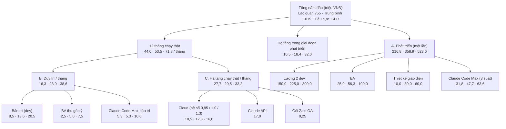
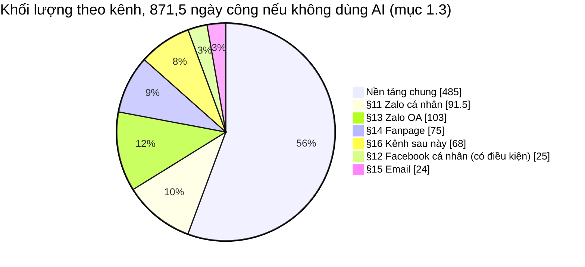
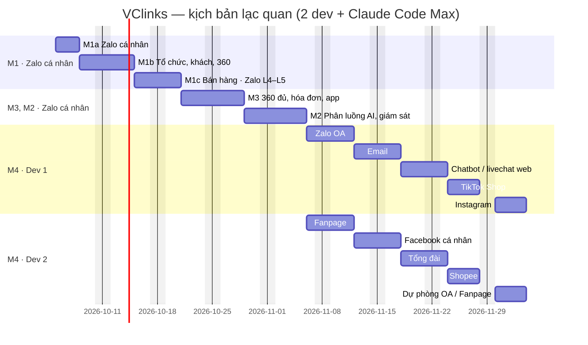

# VClinks — Chi phí phát triển, duy trì và hạ tầng

Phiên bản 0.7 · 05/10/2026 · Trạng thái: **Nháp để thống nhất** (dự báo lại theo thực tế, chờ chủ dự án duyệt)

> Người yêu cầu: Thọ Anh Bùi.
> Bảng tính: [chi-phi-phat-trien.xlsx](chi-phi-phat-trien.xlsx). Số trong file này lấy từ bảng tính với tham số hiện tại. Sửa tham số trong bảng tính thì số ở đây cũng phải cập nhật.
> Căn cứ phạm vi: [../ba/vclinks-ba.md](../02-yeu-cau/vclinks-ba.md) §19 Lộ trình, §20 Rủi ro.

## Mô hình

Cấu trúc chi phí theo **ba kịch bản cũ, giả định 2 dev** (triệu VNĐ, thứ tự Lạc quan · Trung bình · Tiêu cực), số lấy từ mục 1.1 và mục 2:

Khối lượng 871,5 ngày công chia theo kênh (mục 1.3). Timeline kịch bản lạc quan ở mục 1.2.

## Tóm tắt

- **Tài liệu nói gì:** thời gian và chi phí phát triển, duy trì, hạ tầng của VClinks theo ba kịch bản lạc quan / trung bình / tiêu cực; số lấy từ `chi-phi-phat-trien.xlsx`.
- **Dự báo cũ sai (đo ngày 05/10/2026):** dự báo cũ giả định 2 dev và M1 mất 12 ngày làm việc (kế hoạch theo phiên: 128 giờ, mốc 26/10). Thực tế 2 dev dùng AI viết 100% code, chạy tối đa 5 agent song song; 33/38 phiên M1 đã gộp sau **9,5 giờ** chạy, nhanh hơn kế hoạch khoảng **14 lần**.
- **Nút thắt mới không phải code:** 27/38 phiên còn "⛔ một phần", chờ đầu vào ngoài (E1–E8: nick công ty, API VCsales, thiết kế MH-SZ-15, API key…) hoặc chờ thử tay trên Zalo thật. Thời gian từ nay do **chờ** quyết định; 2 dev nên nhận phần thử tay thay chủ dự án.
- **Dự báo lại (mục [Dự báo lại 05/10/2026](#dự-báo-lại-05102026)):** M1 chạy thật **15/10 / 26/10 / 02/11**; hoàn thiện M4 **13/11/2026 / 27/11/2026 / 31/12/2026** (cũ: 03/12 / 04/01 / 03/02). Meta App Review và Zalo OA Open API tạm tính 1 ngày (chủ dự án 05/10/2026).
- **Chi phí lại (triệu VNĐ):** phát triển **136 / 179 / 340** (cũ 217 / 359 / 524); duy trì 16,3 / 23,9 / 38,6 mỗi tháng (như cũ); tổng năm đầu **672 / 831 / 1.226** (cũ 755 / 1.019 / 1.417), giảm 11–18%. Lương 2 dev vẫn là khoản lớn nhất của giai đoạn phát triển; tiết kiệm đến từ rút thời gian (1,5 / 1,75 / 3 tháng thay vì 2 / 3 / 4).
- **Hạ tầng chạy thật** (27,7–33,2 triệu/tháng, trong đó Claude API 17 triệu) chiếm gần một nửa tổng năm đầu. Muốn giảm tiếp thì xem lại lưu lượng gợi ý AI và báo giá cloud.
- **Mục 1–2 giữ nguyên** làm tham chiếu kịch bản 2 dev; khối lượng 871,5 ngày công (mục 1.3) vẫn dùng để chia số phiên giữa các mảnh.
- **Đã chốt 05/10/2026:** 2 dev dùng AI viết 100% code; 2 dev nhận phần thử tay, UAT và đốc đầu vào kỹ thuật; 3 suất Claude Code Max; Meta App Review và Zalo OA Open API tạm tính 1 ngày. **Chờ chốt:** ngân sách (DK-3) theo kịch bản nào.
- **Người duyệt cần xem kỹ:** bảng mốc theo mảnh (điều kiện của từng mảnh) và giả định 1 ngày cho Meta App Review / Zalo OA (thực tế lâu hơn thì Fanpage, Zalo OA ở M4 lùi theo).

## Mục lục

- [Dự báo lại 05/10/2026](#dự-báo-lại-05102026)
- [1. Kết quả (giả định cũ: 2 dev)](#1-kết-quả-giả-định-cũ-2-dev)
- [2. Bóc tách chi phí](#2-bóc-tách-chi-phí)
- [3. Giả định](#3-giả-định)
- [4. Cấu trúc bảng tính](#4-cấu-trúc-bảng-tính)
- [5. Việc tiếp theo](#5-việc-tiếp-theo)
- [Lịch sử cập nhật](#lịch-sử-cập-nhật)

---

## Dự báo lại 05/10/2026

Bảng tính: sheet **"Dự báo lại"** trong `chi-phi-phat-trien.xlsx`. Ô nền vàng là giả định chờ chủ dự án xác nhận.

### Số đo M1 (đến 05/10/2026 05:00)

| Chỉ số | Kế hoạch | Thực tế | Nguồn |
|---|---:|---:|---|
| Số phiên M1 | 34 | 38 | Sổ phiên: thêm M1b-17, M1b-18 (sửa lỗi UAT), M1c-11, M1c-12 |
| Phiên đã gộp vào `main` | | 33 (+1 chờ gác cổng) | Còn M1a-07, M1c-11, M1c-12, M1c-10 |
| Giờ máy của 33 phiên đã gộp | 137 giờ | 9,5 giờ chạy | Kế hoạch §4.3; git log 15:05 04/10 → 00:17 05/10 |
| Tốc độ so với kế hoạch | | ≈ 14 lần | 5 agent song song, gác cổng gộp ngay |
| Lượt gọi model | | Opus 3.428 · Sonnet 1.767 · Fable 37 | Nhật ký Claude Code trên máy |
| % hạn mức tuần | trần 75% | 8% đầu đợt 1, cuối đợt 7 **chưa đọc** | Nhật ký nhịp |
| Phiên "⛔ một phần" | | 27 / 38 | Chờ E1–E8 hoặc chủ dự án thử tay |

Vì sao dự báo cũ sai:
- **Giả định tốc độ sai:** bảng chi phí tính 2 dev dùng AI cần tốc độ 9,9 lần so với không dùng AI và vẫn mất 2–4 tháng; thực tế 2 dev dùng AI viết 100% code, chạy nhiều agent cùng lúc nên phần code M1 xong trong khoảng một ngày.
- **Giả định số agent sai:** kế hoạch M1 tính 2 agent làm lần lượt; từ 19:53 04/10 chạy 5 agent, nhánh nào đạt thì gộp ngay.
- **Ước giờ theo tốc độ người:** "giờ máy" ở kế hoạch §4.3 gần với giờ của một dev dùng AI, không phải giờ agent. Bảng §4.3 còn tự lệch: cộng đủ 34 phiên là 154 giờ, Tóm tắt ghi 107 giờ.
- **Bỏ sót phần chờ:** dự báo cũ chia thời gian theo khối lượng code; thực tế phần còn lại hầu hết là chờ đầu vào, thử trên Zalo thật (1 driver, 1 nick) và UAT với người dùng.

### Bóc tách mảnh: phiên, việc chờ, mốc

Số phiên ước tính theo tỷ lệ của M1: 295,5 ngày công ↔ 38 phiên, tức khoảng 8 ngày công (không dùng AI) mỗi phiên. Phần code mỗi mảnh chỉ mất 1–3 ngày làm việc; mốc do cột "Điều kiện" quyết định.

| Mảnh | Ngày công (không AI) | Phiên ước | Lạc quan | Trung bình | Tiêu cực | Điều kiện quyết định thời gian |
|---|---:|---:|---|---|---|---|
| M1 code | 295,5 | 38 | 06/10 | 06/10 | 07/10 | Còn 5 phiên |
| **M1 chạy thật** (đội VCparts) | | | **15/10** | **26/10** | **02/11** | E2 nick công ty, E5 API VCsales, E6 thiết kế MH-SZ-15, E7 quyết định T-36 / C3 / QĐ-04, E8 Claude API key; chủ dự án thử tay các phiên ⛔; UAT |
| M3 · 360 đủ, hóa đơn, app | 155 | 20 | 07/10 – 23/10 | 12/10 – 06/11 | 19/10 – 20/11 | Code song song lúc chờ M1. API VCsales / VCinvoice / VCdms (TT-01, 05, 06); QĐ-01 app điện thoại |
| M2 · phân luồng AI, giám sát, L6–L7 | 126 | 16 | 26/10 – 06/11 | 09/11 – 20/11 | 23/11 – 11/12 | Cần dữ liệu thật của 2 tuần baseline sau M1; NĐ 13 |
| M4 · 9 kênh còn lại | 295 | 38 | 02/11 – 13/11 | 16/11 – 27/11 | 07/12 – 31/12 | Meta App Review (Fanpage), đăng ký Zalo OA Open API tạm tính 1 ngày, **nộp tuần 05/10**; mỗi kênh cần tài khoản thật để thử |
| **Hoàn thiện M4** | 871,5 | 112 | **13/11/2026** | **27/11/2026** | **31/12/2026** | Cũ: 03/12/2026 · 04/01/2027 · 03/02/2027 |

Ghi chú:
- **Lạc quan** = mọi đầu vào E1–E8 đến đúng hạn ở kế hoạch M1 §3, chủ dự án thử tay mỗi ngày. **Trung bình** = giữ mốc M1 26/10 đã chốt. **Tiêu cực** = API ERP (VCsales, VCinvoice, VCdms) trễ 2–4 tuần.
- **Token:** 112 phiên trong 6–15 tuần, khoảng 8–19 phiên mỗi tuần, thấp hơn nhiều mức làm được trong một ngày của M1. Trần 75% tuần chưa phải nút thắt, nhưng cần đọc `/usage` cuối mỗi đợt để thay số đo cho đúng.
- **Thời gian của chủ dự án** là nguồn lực hiếm nhất: duyệt, làm việc với VCsales, HCNS, Meta. Khi code không còn là nút thắt, 2 dev nên dành phần lớn thời gian cho **thử tay trên Zalo thật, UAT, đốc đầu vào kỹ thuật** (API VCsales, App Review, Zalo OA) để anh chỉ còn duyệt. Đây là cách rút mốc rẻ nhất.

### Chi phí ba kịch bản mới (triệu VNĐ)

Người làm như cũ: 2 dev (75 triệu/tháng cho cả hai), dùng AI viết 100% code. Khác cũ ở thời gian (theo mốc mới) và việc 2 dev tự thử tay nên bớt người kiểm thử.

| Khoản | Lạc quan | Trung bình | Tiêu cực | Cách tính |
|---|---:|---:|---:|---|
| Thời gian hoàn thiện | 1,5 tháng | 1,75 tháng | 3 tháng | Theo mốc M4 ở trên (cũ 2 / 3 / 4 tháng) |
| Lương 2 dev | 112,5 | 131,2 | 225,0 | 75 triệu × tháng |
| Claude Code Max khi phát triển | 23,9 | 27,8 | 47,7 | 3 suất (2 dev + chủ dự án) × 5,3 triệu × tháng |
| Người kiểm thử / BA | 0 | 10,9 | 37,5 | 25 triệu × 0% / 25% / 50% × tháng (2 dev tự thử tay) |
| Thiết kế giao diện | 0 | 8,8 | 30,0 | 20 triệu × 0% / 25% / 50% × tháng |
| **A. Phát triển** | **136,3** | **178,8** | **340,2** | Cũ: 216,8 / 358,9 / 523,6 |
| Hạ tầng thử trong giai đoạn phát triển | 7,8 | 10,8 | 24,0 | Cloud × hệ số × 50% × tháng |
| **B. Duy trì / tháng** | **16,3** | **23,9** | **38,6** | Như cũ: bảo trì dev 5 / 8 / 12 ngày công, Claude 1 / 1 / 2 suất, BA 10% / 20% / 30% |
| **C. Hạ tầng chạy thật / tháng** | **27,7** | **29,5** | **33,2** | Như cũ (mục 2C) |
| **Tổng năm đầu** | **672** | **831** | **1.226** | Cũ: 755 / 1.019 / 1.417 (giảm 11% / 18% / 14%) |
| Mỗi tháng sau khi hoàn thiện | 44,0 | 53,5 | 71,8 | Như cũ |
| Mỗi tháng trễ mốc tốn thêm | 96 | 108 | 121 | Cũ: 114 / 126 / 139 |

- **Mỗi tháng trễ vẫn tốn khoảng 100 triệu** (chủ yếu lương dev), nên đốc đầu vào ngoài (E2, E5–E8, API ERP) là việc đáng tiền nhất: trễ một tuần chờ API là mất khoảng 25 triệu.
- **Không tính:** công của chủ dự án; phí "Extra usage" nếu vượt hạn mức gói (đang bật, kế hoạch M1 §4.5); phần đã làm tới 04/10/2026.

## 1. Kết quả (giả định cũ: 2 dev)

> Mục 1 và 2 là dự báo bản 0.6 (2 dev, 2 / 3 / 4 tháng), giữ làm tham chiếu. Số dùng để quyết định: mục [Dự báo lại 05/10/2026](#dự-báo-lại-05102026).

### 1.1 Ba kịch bản (triệu VNĐ)

| | Lạc quan | Trung bình | Tiêu cực |
|---|---:|---:|---:|
| Thời gian hoàn thiện | **2 tháng** | 3 tháng | 4 tháng |
| M1 xong (đội VCparts dùng thật, trên Zalo cá nhân) | 20/10/2026 (thực tế dời sang 26/10, xem ghi chú) | 02/11/2026 | 16/11/2026 |
| Bắt đầu M4 (các kênh khác) | 06/11/2026 | 01/12/2026 | 24/12/2026 |
| Hoàn thiện M4 | 03/12/2026 | 04/01/2027 | 03/02/2027 |
| **A. Phát triển (một lần)** | **216,8** | **358,9** | **523,6** |
| **B. Duy trì / tháng** | **16,3** | **23,9** | **38,6** |
| **C. Hạ tầng chạy thật / tháng** | **27,7** | **29,5** | **33,2** |
| Hạ tầng trong giai đoạn phát triển (cả kỳ) | 10,5 | 18,4 | 32,0 |
| **Tổng năm đầu** (phát triển + 12 tháng chạy thật) | **755** | **1.019** | **1.417** |
| Chi phí mỗi tháng sau khi hoàn thiện | 44,0 | 53,5 | 71,8 |
| Bình quân mỗi người dùng / tháng (30 người) | 1,5 | 1,8 | 2,4 |
| Mỗi tháng trễ mốc tốn thêm | 114 | 126 | 139 |

Ghi chú về các kịch bản:
- **Mốc M1 thực tế 26/10/2026** (chốt 04/10/2026): kế hoạch M1 chia 34 phiên thành 18 nhịp cho một người điều phối 2 agent, ước khoảng 128 giờ kể cả dự phòng. Nếu không bù được ở M3 / M2 thì các mốc sau lùi khoảng 4 ngày làm việc; chưa tính lại chi phí.
- **Lạc quan** chính là mốc anh đặt: 2 tháng, Zalo cá nhân 3 ngày, Khách hàng 360 thêm 2 ngày.
- **Trung bình** và **Tiêu cực** kéo dài thời gian, tăng mức tham gia của BA và thiết kế, tăng ngày công bảo trì và cấu hình cloud. Vì rủi ro đã nằm trong kịch bản nên bảng không cộng thêm % dự phòng.
- **Tham chiếu:** nếu 2 dev làm theo cách thông thường, không dùng AI, thì mất khoảng 19,8 tháng và 2.055 triệu cho phần phát triển.

### 1.2 Thứ tự làm và timeline M1 → M3 → M2 → M4

Bắt đầu thứ Hai **05/10/2026**, tính ngày làm việc thứ Hai – thứ Sáu. Thứ tự làm theo anh chốt ngày 04/10/2026:
- **M1, M3, M2 chỉ làm trên Zalo cá nhân.** Làm M3 trước M2.
- **M4 làm các kênh còn lại, mỗi kênh 4 ngày.** 2 dev làm song song 2 kênh. 9 kênh chia thành 5 lượt, nên M4 mất 5 × 4 = 20 ngày ở kịch bản lạc quan. Kịch bản trung bình và tiêu cực tính 5 và 6 ngày mỗi kênh.
- M1a và Khách hàng 360 lấy theo số ngày đặt cho từng kịch bản. Thời gian còn lại chia cho M1b, M1c, M3, M2 theo tỷ lệ khối lượng ước lượng.

| Mảnh · kênh | Khối lượng nếu không dùng AI (ngày công) | Lạc quan | Trung bình | Tiêu cực |
|---|---:|---|---|---|
| M1a — Zalo cá nhân (máy chủ, danh bạ) | 52,5 | 3 ngày · 05/10 – 07/10 | 5 ngày · 05/10 – 09/10 | 8 ngày · 05/10 – 14/10 |
| M1b — Tổ chức, khách, **360 cơ bản** | 135 | 5 ngày · 08/10 – 14/10 | 9 ngày · 12/10 – 22/10 | 13 ngày · 15/10 – 02/11 |
| ↳ trong đó Khách hàng 360 | | 2 ngày | 3 ngày | 5 ngày |
| M1c — Bán hàng trong chat · Zalo cá nhân L4–L5 | 108 | 4 ngày · 15/10 – 20/10 | 7 ngày · 23/10 – 02/11 | 10 ngày · 03/11 – 16/11 |
| M3 — 360 đủ, hóa đơn, app điện thoại | 155 | 6 ngày · 21/10 – 28/10 | 11 ngày · 03/11 – 17/11 | 15 ngày · 17/11 – 07/12 |
| M2 — Phân luồng AI, giám sát · Zalo cá nhân L6–L7 | 126 | 6 ngày · 29/10 – 05/11 | 9 ngày · 18/11 – 30/11 | 12 ngày · 08/12 – 23/12 |
| M4 — 9 kênh còn lại, 5 lượt | 295 | 20 ngày · 06/11 – 03/12 | 25 ngày · 01/12 – 04/01/2027 | 30 ngày · 24/12 – 03/02/2027 |
| **Cộng** | **871,5** | **44 ngày** | **66 ngày** | **88 ngày** |
| **Tốc độ cần so với không dùng AI, cả kỳ** | | **9,9 lần** | **6,6 lần** | **5,0 lần** |
| ↳ phần Zalo cá nhân (M1 → M2) | | 12,0 lần | 7,0 lần | 5,0 lần |
| ↳ phần các kênh (M4) | | 7,4 lần | 5,9 lần | 4,9 lần |

**M4 theo lượt** (kịch bản lạc quan; số trong ngoặc là ngày công nếu không dùng AI):

| Lượt | Dev 1 | Dev 2 | Ngày |
|---|---|---|---|
| 1 | Zalo OA, gồm ZNS (103) | Fanpage (75) | 06/11 – 11/11 |
| 2 | Email (24) | Facebook cá nhân (25), *có điều kiện* | 12/11 – 17/11 |
| 3 | Chatbot / livechat web (23) | Tổng đài (13) | 18/11 – 23/11 |
| 4 | TikTok Shop (11) | Shopee (11) | 24/11 – 27/11 |
| 5 | Instagram (10) | Dự phòng: làm nốt Zalo OA / Fanpage | 30/11 – 03/12 |

Timeline của kịch bản lạc quan (mốc chủ dự án):

**Nhận định:**
- **M1 xong sớm hơn 8 ngày** (20/10 thay vì 28/10) vì Zalo OA ra khỏi M1. Kế hoạch theo phiên ngày 04/10/2026 dời mốc thực tế sang **26/10**. Đội VCparts dùng thật trên Zalo cá nhân. Baseline 2 tuần (D2-17) cũng chỉ đo trên Zalo cá nhân.
- **Phần Zalo cá nhân (M1 → M2) cần tốc độ gấp 12 lần**, cao hơn mức chung 9,9 lần. Lý do: M4 chiếm 20 trong 44 ngày (45% thời gian) nhưng chỉ có 34% khối lượng. Phần thời gian còn lại cho M1 → M2 vì thế bị ép.
- **4 ngày mỗi kênh vừa sức với 7 kênh nhỏ:** TikTok, Shopee, Instagram, tổng đài, Email, chatbot web, FB cá nhân (10–25 ngày công, cần 2,5–6 lần).
- **4 ngày không đủ cho Zalo OA và Fanpage.** Zalo OA 103 ngày công cần tốc độ khoảng 26 lần, Fanpage 75 ngày công cần khoảng 19 lần. Ước lượng của hai kênh này gồm cả CSKH trực OA (ticket, SLA 15 phút), chatbot, quảng cáo, chiến dịch, khảo sát, báo cáo kênh.
  - **Đề xuất:** khi làm M1 → M2 trên Zalo cá nhân, viết ticket, SLA, chatbot, chiến dịch, báo cáo theo kênh ở dạng **không phụ thuộc kênh**. Khi đó M4 chỉ còn phần riêng của từng kênh: kết nối, nhận, gửi, quy tắc của nền tảng (cửa sổ gửi OA, cửa sổ 24h + HUMAN_AGENT của Meta). Đổi lại, khối lượng M1 → M2 tăng thêm.
  - Một suất ở lượt 5 để trống, dùng làm dự phòng cho OA / Fanpage.
- **Đội CSKH trên Zalo OA phải chờ tới M4** (sớm nhất 06/11 – 11/11). Vòng CSKH soạn → NVKD duyệt (D9) và đặc tả 04 chạy trên OA sẽ lùi theo. Nếu đội CSKH cần dùng sớm, có thể đưa Zalo OA lên lượt đầu của M4 như bảng trên, hoặc tách riêng ra trước M3.
- **Zalo cá nhân 3 ngày: khả thi**, vì phân hệ đã chạy thật (UAT 13/13). Việc mới trong M1a là chuyển Chrome driver lên cloud. Cần thử sớm xem Zalo có nghi ngờ đăng nhập từ IP của trung tâm dữ liệu không.
- **Khách hàng 360 trong 2 ngày: chỉ kịp bản cơ bản** (hồ sơ, dòng thời gian, liên kết mã KH). Phần 360 đầy đủ nằm ở M3 và phụ thuộc API của VCsales.
- **Có những việc tốn thời gian chờ, tốc độ code không rút ngắn được.** Vì kênh dồn về M4, các thủ tục với nền tảng **phải nộp ngay từ M1** để kịp lượt 1 (06/11):
  - Meta duyệt App Review cho Fanpage;
  - đăng ký ứng dụng Zalo OA Open API và quyền gửi tin.

  Ngoài ra còn:
  - baseline 2 tuần, là điều kiện để qua M1b (D2-17);
  - VCsales mở API báo giá (M1c, M3);
  - UAT với người dùng thật;
  - app điện thoại, đang chờ QĐ-01.

  Kịch bản lạc quan chỉ giữ được nếu các đầu vào này sẵn sàng đúng lúc. Nếu không, thực tế sẽ rơi vào kịch bản trung bình hoặc tiêu cực.

### 1.3 Khối lượng theo kênh (BA tổng Phần II) × mảnh

Ngày công ước lượng, tính theo cách làm không dùng AI. Số này tự cộng từ sheet "Khối lượng" sang sheet "Theo kênh". Cột xếp theo thứ tự làm.

| Kênh | M1a | M1b | M1c | M3 | M2 | M4 | Cộng | Tỷ trọng |
|---|---:|---:|---:|---:|---:|---:|---:|---:|
| Nền tảng chung | – | 135 | 94 | 155 | 101 | – | 485 | 56% |
| §11 Zalo cá nhân | 52,5 | – | 14 | – | 25 | – | 91,5 | 10% |
| §12 Facebook cá nhân *(có điều kiện)* | – | – | – | – | – | 25 | 25 | 3% |
| §13 Zalo OA | – | – | – | – | – | 103 | 103 | 12% |
| §14 Fanpage | – | – | – | – | – | 75 | 75 | 9% |
| §15 Email | – | – | – | – | – | 24 | 24 | 3% |
| §16 Kênh sau này | – | – | – | – | – | 68 | 68 | 8% |
| **Cộng** | **52,5** | **135** | **108** | **155** | **126** | **295** | **871,5** | |

**Từng kênh làm gì qua các mảnh:**

| Kênh | M1 | M3 | M2 | M4 — mỗi kênh 4 ngày |
|---|---|---|---|---|
| **Nền tảng chung** | Khung ứng dụng, phân quyền, owner, 360 cơ bản, bảo mật, baseline; báo giá VCsales, phiếu CSKH ⇄ NVKD, gợi ý AI, ghi âm, tìm kiếm, báo cáo cơ bản | 360 đủ, hóa đơn và công nợ, VCdms, MCP cho nhân viên, app điện thoại, AI tại chỗ | Phân loại AI → phiếu việc; NĐ 13; bật VCsoft, VCe; dashboard đủ, báo cáo tháng, phân tích liên kênh; kèm cặp, hội thoại mẫu; deal VCedu / B2B, tenant không ERP | – |
| **§11 Zalo cá nhân** | M1a: máy chủ Chrome driver, trạng thái nick, danh bạ (L3), UAT. M1c: L4–L5 | – | L6–L7: nhóm chat, gán nhãn, chuyển tiếp; L7 còn lại; giám sát nick: nhịp gửi, phiên rớt, tỷ lệ trả lời | – |
| **§12 Facebook cá nhân** | – | – | – | Nối nick thật, nhận, gửi text, ảnh / file, giám sát nick, báo cáo kênh *(có điều kiện, OQ-42)* |
| **§13 Zalo OA** | – | – | – | Nối OA thật, cửa sổ gửi, chia sẻ thông tin, gửi báo giá; CSKH trực OA, ticket, SLA; bot ngoài giờ, menu, chatbot; ZNS *(có điều kiện)*; quảng cáo, nuôi lead; chiến dịch, khảo sát, báo cáo |
| **§14 Fanpage** | – | – | – | Messenger (cửa sổ 24h, App Review), bình luận, bot ngoài giờ, quảng cáo click-to-message, lead, chiến dịch, báo cáo Page |
| **§15 Email** | – | – | – | Đọc hộp thư chung, dòng thời gian 360; trả lời từ VClinks, hộp thư NVKD |
| **§16 Kênh sau này** | – | – | – | Chatbot web tự phục vụ, livechat website, TikTok Shop, Shopee chat, Instagram, tổng đài cloud |

Dashboard và phân tích liên kênh làm ở M2 khi mới có Zalo cá nhân. Kênh nào nối ở M4 thì tự hiện trên dashboard, vì mọi kênh ghi vào cùng `contacts`, `conversations`, `messages`.

Hai kênh có điều kiện là **Facebook cá nhân** (25 ngày công) và **ZNS** (9 ngày công, nằm trong lượt Zalo OA). Nếu anh không bật Facebook cá nhân, M4 còn 8 kênh = 4 lượt = 16 ngày. 4 ngày dôi ra trả lại cho M1 → M2. Chi phí không đổi.

## 2. Bóc tách chi phí

### A. Phát triển (một lần)

| Khoản | Lạc quan | Trung bình | Tiêu cực | Cách tính |
|---|---:|---:|---:|---|
| Lương 2 dev | 150,0 | 225,0 | 300,0 | 75 triệu/tháng × số tháng |
| BA | 25,0 | 56,3 | 100,0 | 25 triệu × mức tham gia 50% / 75% / 100% × số tháng |
| Thiết kế giao diện | 10,0 | 30,0 | 60,0 | 20 triệu × mức tham gia 25% / 50% / 75% × số tháng |
| Claude Code Max | 31,8 | 47,7 | 63,6 | 3 suất (2 dev + 1 BA/thiết kế) × 5,3 triệu × số tháng |
| **Cộng** | **216,8** | **358,9** | **523,6** | |

- **BA:** viết thêm đặc tả theo góp ý, chuẩn bị UAT và làm việc với người dùng. Bộ đặc tả 00–07 đã có nên không tính lại.
- **Thiết kế giao diện:** lô TK1 đã chốt. Phần còn lại là TK2, các màn mới (MH-SZ-15, MH-OA-20) và bản điện thoại.

### B. Duy trì (hằng tháng sau khi hoàn thiện)

| Khoản | Lạc quan | Trung bình | Tiêu cực | Cách tính |
|---|---:|---:|---:|---|
| Bảo trì (dev) | 8,5 | 13,6 | 20,5 | 5 / 8 / 12 ngày công × 1,7 triệu/ngày |
| BA thu góp ý, viết yêu cầu thay đổi | 2,5 | 5,0 | 7,5 | 25 triệu × 10% / 20% / 30% |
| Claude Code Max cho bảo trì | 5,3 | 5,3 | 10,6 | 1 / 1 / 2 suất |
| **Cộng / tháng** | **16,3** | **23,9** | **38,6** | |

Đơn giá ngày công dev = 75 triệu ÷ 2 người ÷ 22 ngày ≈ 1,7 triệu/ngày. Việc bảo trì gồm: sửa bảng ánh xạ khi Zalo đổi cấu trúc, xử lý sự cố, hỗ trợ người dùng.

### C. Hạ tầng (thuê cloud toàn bộ)

| Khoản (cấu hình chuẩn) | Triệu VNĐ/tháng |
|---|---:|
| Máy ảo ứng dụng: API, web, worker, Redis (4 vCPU, 8 GB) | 1,8 |
| MongoDB: 4 vCPU, 8 GB, SSD 200 GB, mã hóa ổ đĩa | 2,2 |
| Lưu trữ đối tượng 500 GB (thay MinIO) | 0,6 |
| Máy ảo Chrome driver: 8 vCPU, 16 GB, có giao diện đồ họa, 10–15 nick | 3,5 |
| Máy ảo Chrome driver dự phòng (để tắt, chỉ trả tiền ổ đĩa) | 0,3 |
| Máy ảo ASR faster-whisper (8 vCPU, 16 GB, chạy CPU) | 2,8 |
| Sao lưu, snapshot hằng ngày | 0,6 |
| Băng thông, IP tĩnh | 0,3 |
| Tên miền, Cloudflare, chứng chỉ | 0,2 |
| **Cộng cloud** | **12,3** |
| Claude API: gợi ý trả lời (Sonnet 5.5) 461 USD + phân loại tin (Haiku 4.5) 180 USD | 17,0 |
| Gói Zalo OA (3 triệu/năm) | 0,25 |

Hệ số cấu hình cloud theo kịch bản là 0,85 / 1,0 / 1,3, nên cloud chạy thật tốn 10,5 / 12,3 / 16,0 triệu/tháng.
- Trong giai đoạn phát triển chỉ cần môi trường thử, tính bằng 50% cloud chạy thật.
- Chi phí Claude API như nhau ở cả ba kịch bản vì lưu lượng đã chốt: 30 người dùng, 3.000 tin/ngày, 40% tin cần soạn nháp.
- Báo giá cloud là giả định theo mặt bằng cloud trong nước (Viettel IDC, FPT, VNG, Bizfly). Nên đặt dữ liệu tại Việt Nam theo NĐ 13.

## 3. Giả định

**Đã chốt (04/10/2026):**
- 2 dev, lương 75 triệu/tháng đã gồm mọi khoản.
- Thuê cloud toàn bộ.
- Lưu lượng như mục 2C.
- Gói Zalo OA 3 triệu/năm.
- Dùng Claude Code Max 20x (200 USD/suất).
- Mốc của kịch bản lạc quan.
- Thứ tự M1 → M3 → M2 → M4. M1 → M2 chỉ làm Zalo cá nhân. M4 làm các kênh còn lại, mỗi kênh 4 ngày, 2 dev làm song song.

**Còn chờ xác nhận** (trong bảng tính là ô nền vàng):

| # | Giả định | Giá trị hiện tại | Ai xác nhận |
|---|---|---|---|
| 1 | Lương BA / thiết kế giao diện, nếu thuê toàn thời gian | 25 / 20 triệu/tháng | Anh / HCNS |
| 2 | Báo giá cloud từng khoản | Như mục 2C | Nhà cung cấp cloud |
| 3 | Thông số kịch bản trung bình và tiêu cực: thời gian, mức tham gia, ngày bảo trì, hệ số cloud, ngày cho mỗi kênh ở M4 (5 / 6) | Sheet "Kịch bản" | Anh |
| 4 | Tỷ giá | 26.500 VNĐ/USD | Kế toán |
| 5 | Tin ZNS | Chưa bật, để 0 | Khi có kế hoạch gửi ZNS (M2) |

**Không tính:**
- Phần đã làm tới 04/10/2026: code nền, VC Zalo, bộ đặc tả BA.
- Công của chủ dự án duyệt.
- Chi phí phía ERP để VCsales/VCinvoice mở API.

## 4. Cấu trúc bảng tính

| Sheet | Nội dung | Sửa ở đâu |
|---|---|---|
| Dự báo lại | Số đo M1, ba kịch bản mới với 2 dev dùng AI (thông số, chi phí, mốc theo mảnh); lấy giá từ Tham số, Hạ tầng, Tổng hợp | Ô xanh dương / nền vàng ở mục 2 và mốc ở mục 4 |
| Hướng dẫn | Phân nhóm chi phí, kịch bản, quy ước màu, các điểm đã chốt | — |
| Tổng hợp | Ba kịch bản × phát triển / duy trì / hạ tầng, tổng năm đầu, chi phí mỗi tháng trễ, tham chiếu không dùng AI | Không sửa (toàn công thức) |
| Tiến độ | Timeline M1 → M3 → M2 → M4 theo ba kịch bản, tốc độ cần cả kỳ và từng phần (Zalo cá nhân / các kênh) | Không sửa (lấy từ Kịch bản và Khối lượng) |
| Kịch bản | Thời gian, ngày cho Zalo / 360, ngày cho mỗi kênh ở M4, số kênh ở M4, mức tham gia của BA và thiết kế, bảo trì, số suất Claude, hệ số cloud | Cột B–D |
| Tham số | Ngày bắt đầu, lương dev / BA / thiết kế, giá Claude Code Max, tỷ giá, giá Claude API | Cột B |
| Hạ tầng | Báo giá cloud, lưu lượng và token Claude API, Zalo OA | Cột B |
| Theo kênh | Khối lượng theo kênh Phần II × mảnh, tự cộng | Không sửa |
| Khối lượng | 54 hạng mục, mỗi hạng mục gắn kênh theo Phần II, × 6 vai trò, tính theo cách làm không dùng AI, có căn cứ đặc tả | Cột C–H |

Quy ước màu: chữ xanh dương là số nhập tay, nền vàng là giả định chờ xác nhận, chữ đen là công thức, chữ xanh lá là số lấy từ sheet khác.

## 5. Việc tiếp theo

1. **Tuần 05/10 (2 dev):** nộp Meta App Review (Fanpage) và đăng ký ứng dụng Zalo OA Open API. Dự báo tạm tính 1 ngày; nếu thực tế lâu hơn thì cập nhật mốc M4.
2. **Tuần 05/10 (2 dev):** đốc các đầu vào E2, E5, E6, E7, E8 (kế hoạch M1 §3) và thử tay các phiên "⛔ một phần" theo sổ phiên; đây là điều kiện để M1 chạy thật 15/10 thay vì 26/10.
3. Mở code M3 ngay khi đợt M1 cuối gộp xong, không chờ M1 chạy thật (agent đang rảnh trong lúc chờ đầu vào).
4. Cuối mỗi đợt đọc `/usage` và ghi vào nhật ký nhịp, để thay số % token trong sheet "Dự báo lại".
5. Xin báo giá cloud từ 2–3 nhà cung cấp trong nước; hạ tầng chạy thật giờ là khoản lớn nhất.
6. Chốt ngân sách (DK-3) theo một kịch bản của mục Dự báo lại, ghi vào §19 của BA tổng và đánh dấu bản này là "Đã duyệt".

## Lịch sử cập nhật

| Phiên bản | Ngày | Người / phiên | Thay đổi | Căn cứ |
|---|---|---|---|---|
| 0.7 | 05/10/2026 05:01 | Claude Code | Thêm mục Dự báo lại 05/10/2026 và sheet "Dự báo lại" trong xlsx: số đo M1, lý do dự báo cũ sai, bóc tách mảnh (phiên, điều kiện, mốc), ba kịch bản chi phí mới (2 dev dùng AI viết 100% code và nhận phần thử tay, 3 suất Claude, App Review / Zalo OA tạm tính 1 ngày, 1,5 / 1,75 / 3 tháng); Tóm tắt và §5 viết lại; mục 1–2 giữ làm tham chiếu 2 dev | Chủ dự án 05/10/2026: dự báo thời gian và chi phí không đúng sau 34 phiên; "2 dev dùng AI để code 100%"; sổ phiên, git log |
| 0.6 | 04/10/2026 14:24 | Claude Code | Ghi mốc M1 thực tế 26/10/2026 (Tóm tắt, bảng 1.1, ghi chú kịch bản, nhận định 1.2, §5 việc 2 và 4); chưa dời mốc M3 / M2 / M4, chưa tính lại xlsx | Chủ dự án dời mốc 04/10/2026; kế hoạch M1 v0.5 §4.4 |
| 0.5 | 04/10/2026 13:35 | Claude Code | Cập nhật đường dẫn tài liệu theo cấu trúc `docs/` mới; nội dung không đổi | Chủ dự án duyệt cấu trúc docs/ 04/10/2026 13:35 |
| 0.5 | 04/10/2026 | Claude Code | Hồi tố theo CLAUDE.md §13: thêm Mô hình, Tóm tắt, Mục lục, Lịch sử | docs/ke-hoach/hoi-to-tai-lieu-md.md |
| 0.4 | 04/10/2026 | — | Đổi thứ tự làm theo chủ dự án. – M1 chỉ làm Zalo cá nhân. Zalo OA ra khỏi M1b, M1c. – Sau M1 làm **M3 rồi mới M2**. Hai mảnh này cũng chỉ làm trên Zalo cá nhân. Việc nền tảng của M4 cũ (dashboard đủ, kèm cặp, deal VCedu / B2B, giám sát nick Zalo) chuyển vào M2. – M4 chỉ còn **9 kênh còn lại, mỗi kênh 4 ngày, 2 dev làm song song 2 kênh**: Zalo OA (gồm ZNS), Fanpage, Facebook cá nhân, Email, chatbot / livechat web, TikTok Shop, Shopee, Instagram, tổng đài. – Giữ mốc 2 / 3 / 4 tháng nên chi phí không đổi. Sheet "Kịch bản" thêm "Ngày cho mỗi kênh ở M4" (4 / 5 / 6) và "Số kênh ở M4" (9). Sheet "Tiến độ" thêm tốc độ cần cho từng phần. | Chủ dự án chốt thứ tự làm 04/10/2026 |
| 0.3.2 | 04/10/2026 | — | Chia hạng mục theo danh sách kênh của Phần II (§11–§16) cộng nhóm "Nền tảng chung". – M4 (giám sát, phân tích, mở rộng) tách xuống từng kênh: Zalo cá nhân, Facebook cá nhân, Zalo OA, Fanpage, Email, kênh sau này. – Bot ngoài giờ / chatbot tách theo OA, Fanpage, web; marketing tách theo OA và Fanpage. – Thêm livechat website (§16). – Thêm sheet "Theo kênh". Khối lượng tăng lên 871,5 ngày công. Chi phí không đổi. | BA tổng Phần II (§11–§16) |
| 0.3.1 | 04/10/2026 | — | Đối chiếu với BA tổng §10 và §19. Tách từng kênh thành hạng mục riêng: – thêm Facebook cá nhân (có điều kiện, OQ-42), Zalo cá nhân L4–L7, ZNS; – tách Zalo OA, Fanpage (Messenger / bình luận), Email (đọc ở M3, trả lời ở M4), TikTok, Shopee, Instagram, tổng đài; – thêm mục 1.3 "Kênh theo mảnh". Khối lượng tăng từ 743,5 lên 815,5 ngày công. Chi phí không đổi (tính theo thời gian), tốc độ cần tăng. | BA tổng §10, §19 |
| 0.3 | 04/10/2026 | — | – Ba kịch bản lạc quan / trung bình / tiêu cực. – Bóc tách chi phí thành phát triển / duy trì / hạ tầng. – Thêm chi phí BA và thiết kế giao diện. – Thêm timeline M1a → M4. – Theo các điểm chủ dự án chốt: lương 2 dev 75 triệu/tháng đã gồm mọi khoản; thuê cloud toàn bộ; lưu lượng chốt; gói Zalo OA 3 triệu/năm. | Các điểm chủ dự án chốt |
| 0.2 | — | — | 2 dev, Claude Code Max, mốc 2 tháng. | — |
| 0.1 | — | — | Bản khung. | — |
