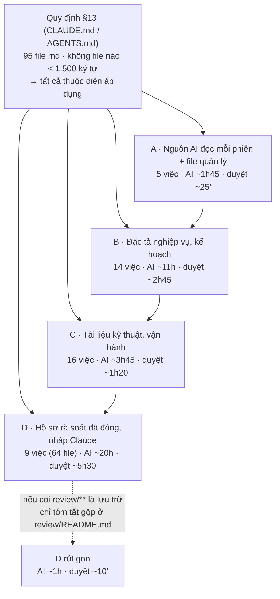
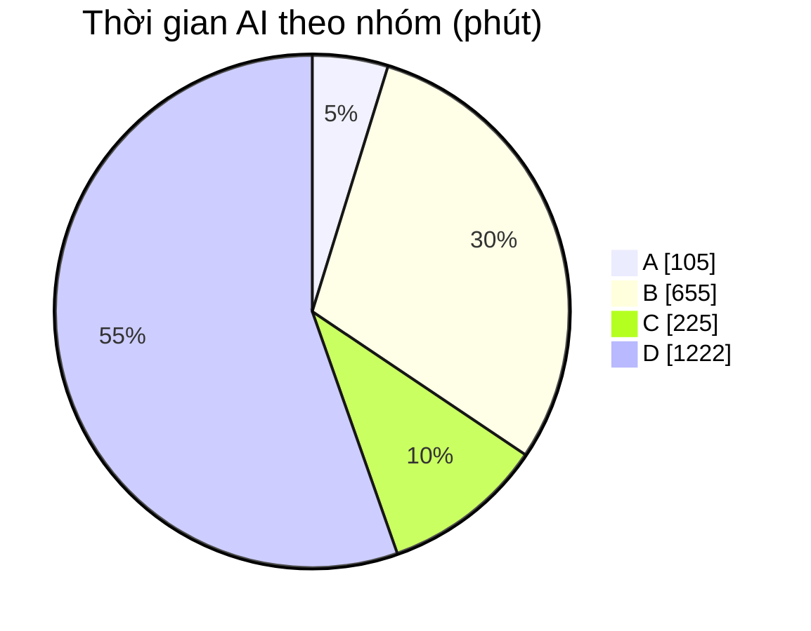

# Hồi tố tài liệu Markdown theo quy định §13

Phiên bản 0.7 · 04/10/2026 · Trạng thái: Hoàn tất

## Mô hình

## Tóm tắt

- **Đổi quy định 04/10/2026 13:23:** chủ dự án bỏ yêu cầu sơ đồ. Mỗi file chỉ cần **tóm tắt, mục lục, lịch sử** (cột Ngày ghi `dd/mm/yyyy HH:mm`); file đã có sơ đồ giữ nguyên. Việc còn lại (mục 2, các dòng chưa ✅) làm theo quy định mới, thời gian AI ước còn khoảng 70% số trong bảng.
- Quy định §13 (chốt 04/10/2026) bắt buộc mọi file md từ 1.500 ký tự trở lên có đủ 4 phần theo thứ tự: mô hình → tóm tắt → mục lục + nội dung → lịch sử cập nhật. Phiên bản được quản lý theo 3 tầng: file, `README.md` thư mục, `TAI-LIEU.md` của dự án.
- Đã đo cả **95 file** và không file nào ngắn hơn ngưỡng. Hiện chỉ 9 file có mục lục, 11 file có sơ đồ Mermaid, 4 file có mục tóm tắt. Lịch sử phiên bản thường nằm ở đầu file; riêng các đặc tả `00`–`07` có lịch sử dồn thành một đoạn rất dài.
- Danh sách xếp theo 4 nhóm quan trọng **A → D**, trong mỗi nhóm thì xếp theo mức người và AI dùng đến.
- Tổng ước tính nếu làm đủ: **AI ~37 giờ**, **anh duyệt ~10 giờ**. Riêng nhóm A–C mất AI ~16,5 giờ và anh duyệt ~4,5 giờ.
- Nhóm D (61 file hồ sơ rà soát đã đóng) chiếm hơn nửa thời gian. Anh cần quyết: làm đủ, hay coi đây là lưu trữ và chỉ tóm tắt gộp (xem mục 4).
- Cần tạo mới 5 file quản lý: `TAI-LIEU.md`, `docs/README.md`, `docs/01-quan-ly-du-an/README.md`, `docs/04-ky-thuat/kenh/README.md`, `docs/ba/review/README.md`.
- **Đã xoá** (chủ dự án duyệt 04/10/2026) `Claude outputs/doi-chieu-luong-A-B.md`, vì đây là bản nháp cũ chưa duyệt của `docs/02-yeu-cau/ra-soat/doi-chieu-luong-A-B.md`.
- **Chủ dự án chốt 04/10/2026:** làm CLAUDE.md và AGENTS.md trước (đã xong), sau đó làm các file trong `docs/`. File BA trong `docs/02-yeu-cau/` đang được một phiên khác sắp xếp lại, nên làm sau khi phiên đó commit để tránh ghi đè.
- Chỗ người duyệt nên xem: mục 4 (các việc cần anh quyết).

## Mục lục

1. [Tiêu chí xếp hạng và ước tính](#1-tiêu-chí-xếp-hạng-và-ước-tính)
2. [Danh sách hồi tố](#2-danh-sách-hồi-tố)
3. [Cách chia phiên làm](#3-cách-chia-phiên-làm)
4. [Việc cần chủ dự án quyết](#4-việc-cần-chủ-dự-án-quyết)

## 1. Tiêu chí xếp hạng và ước tính

**Mức quan trọng:**

| Nhóm | Gồm | Lý do |
|---|---|---|
| A | CLAUDE.md, AGENTS.md, các file quản lý cấp dự án / thư mục | Mọi phiên AI đọc; sai ở đây lan ra mọi tài liệu khác |
| B | BA tổng, sổ quyết định, đặc tả `00`–`07`, dữ liệu kiểm thử, kế hoạch | Anh duyệt và tra nhiều nhất; căn cứ để code M1 |
| C | Hướng dẫn kỹ thuật, kênh, vận hành, UAT đã qua | Dev / AI tra khi làm phần liên quan |
| D | Hồ sơ rà soát đã đóng, nháp trong `Claude outputs/` | Chỉ để tra lại |

**Ước tính thời gian** (phút, theo số ký tự thật đo ngày 04/10/2026):

| Độ dài file | AI làm | Anh duyệt (đọc sơ đồ + tóm tắt) |
|---|---|---|
| < 10K ký tự | 10 | 5 |
| 10K – 40K | 20 | 5 |
| 40K – 150K | 40 | 10 |
| > 150K (đặc tả `00`–`07`) | 60 | 15 |
| File quản lý mới | 15–30 | 5 |

Thời gian AI gồm: đọc hết file, dựng sơ đồ và kiểm tra sơ đồ vẽ được, viết tóm tắt, viết mục lục, chuyển lịch sử xuống cuối thành bảng, và cập nhật `README.md` thư mục.

## 2. Danh sách hồi tố

Cột "Đang có" tính theo dấu hiệu tự dò (có mục lục, có sơ đồ, có lịch sử). Chưa file nào có đủ cả 4 phần.

| # | Nhóm | File | Độ dài | Đang có | AI (phút) | Duyệt (phút) | Ghi chú |
|---|---|---|---|---|---|---|---|
| 1 | A | `CLAUDE.md` | 31K | ✅ xong 04/10 (v1.3) | 15 | 5 | Mọi phiên Claude đọc đầu tiên; đã có sơ đồ, §13, lịch sử — còn thiếu: dồn sơ đồ kiến trúc lên đầu, tóm tắt, mục lục |
| 2 | A | `AGENTS.md` | 18K | ✅ xong 04/10 (v1.2) | 20 | 5 | Bản cho Codex; chép theo CLAUDE.md (kể cả sơ đồ) |
| 3 | A | `TAI-LIEU.md` | — | ✅ xong 04/10 (v0.1) | 30 | 5 | MỚI — file quản lý cấp dự án; tạo khung trước, điền dần khi xong từng thư mục |
| 4 | A | `docs/README.md` | — | ✅ xong 04/10 (v0.1) | 20 | 5 | MỚI — quản lý các file nằm thẳng trong docs/ |
| 5 | A | `docs/02-yeu-cau/README.md` | 10K | ✅ xong 04/10 (v1.1) | 20 | 5 | Đã là mục lục thư mục ba/; thêm cột phiên bản, trạng thái + 4 phần |
| 6 | B | `docs/02-yeu-cau/vclinks-ba.md` | 137K | ✅ xong 04/10 (v0.6.2) | 40 | 10 | BA tổng, căn cứ của mọi đặc tả |
| 7 | B | `docs/01-quan-ly-du-an/quyet-dinh-chu-du-an.md` | 67K | ✅ xong 04/10 (v1.1) | 40 | 10 | Sổ quyết định sống (QĐ, TS, D8, D9) — anh tra nhiều nhất |
| 8 | B | `docs/01-quan-ly-du-an/ke-hoach-m1-phien-chat.md` | 34K | ✅ xong 04/10 (v0.2) | 20 | 5 | Kế hoạch code M1 theo phiên; phiên code đọc trước khi làm |
| 9 | B | `docs/02-yeu-cau/dac-ta/01-phan-quyen.md` | 293K | ✅ xong 04/10 (v1.5.1) | 60 | 15 | Thắng khi lệch về quyền |
| 10 | B | `docs/02-yeu-cau/dac-ta/02-khach-da-kenh.md` | 288K | ✅ xong 04/10 (v1.5.1) | 60 | 15 | Thắng khi lệch về định danh, định tuyến |
| 11 | B | `docs/02-yeu-cau/dac-ta/00-giao-dien-chung.md` | 284K | ✅ xong 04/10 (v1.5.1) | 60 | 15 | Nguồn chuẩn route, màu, mã lỗi; lịch sử đầu file rất dài cần chuyển xuống cuối |
| 12 | B | `docs/02-yeu-cau/dac-ta/03-sale-zalo-ca-nhan.md` | 244K | ✅ xong 04/10 (v1.5.1) | 60 | 15 | Phân hệ VC Zalo — làm trước trong M1; chưa có mục lục |
| 13 | B | `docs/02-yeu-cau/dac-ta/04-cskh-zalo-oa.md` | 251K | ✅ xong 04/10 (v1.5.1) | 60 | 15 |  |
| 14 | B | `docs/02-yeu-cau/dac-ta/05-marketing-quang-cao-chatbot.md` | 267K | ✅ xong 04/10 (v1.4.7) | 60 | 15 |  |
| 15 | B | `docs/02-yeu-cau/dac-ta/06-hoa-don-cong-no.md` | 246K | ✅ xong 04/10 (v1.4.6) | 60 | 15 |  |
| 16 | B | `docs/02-yeu-cau/dac-ta/07-bao-cao-va-chia-khach.md` | 241K | ✅ xong 04/10 (v1.5.1) | 60 | 15 |  |
| 17 | B | `docs/05-kiem-thu/du-lieu-kiem-thu.md` | 122K | ✅ xong 04/10 (v1.6) | 40 | 10 | Bộ dữ liệu TD dùng chung cho UAT |
| 18 | B | `docs/01-quan-ly-du-an/chi-phi-phat-trien.md` | 17K | ✅ xong 04/10 (v0.5) | 20 | 5 |  |
| 19 | B | `docs/01-quan-ly-du-an/README.md` | — | ✅ xong 04/10 (v0.1) | 15 | 5 | MỚI — quản lý thư mục ke-hoach/ (gồm cả file hồi tố này) |
| 20 | C | `docs/04-ky-thuat/api/mcp-client-guide.md` | 7K | ✅ xong 04/10 (v1.1) | 10 | 5 | Claude gọi tool MCP theo file này |
| 21 | C | `docs/04-ky-thuat/api/rest-api.md` | 4K | ✅ xong 04/10 (v1.1) | 10 | 5 |  |
| 22 | C | `docs/04-ky-thuat/api/dev-mcp.md` | 4K | ✅ xong 04/10 (v1.1) | 10 | 5 |  |
| 23 | C | `docs/06-van-hanh/chrome-driver.md` | 7K | ✅ xong 04/10 (v1.1) | 10 | 5 |  |
| 24 | C | `docs/04-ky-thuat/zalo-web/zalo-web-extraction.md` | 28K | ✅ xong 04/10 (v1.1) | 20 | 5 |  |
| 25 | C | `docs/04-ky-thuat/zalo-web/zalo-dom-selectors.md` | 14K | ✅ xong 04/10 (v1.1) | 20 | 5 |  |
| 26 | C | `docs/04-ky-thuat/zalo-web/zalo-web-feature-map.md` | 26K | ✅ xong 04/10 (v1.1) | 20 | 5 |  |
| 27 | C | `docs/04-ky-thuat/kenh/zalo-oa.md` | 10K | ✅ xong 04/10 (v1.1) | 20 | 5 |  |
| 28 | C | `docs/04-ky-thuat/kenh/facebook-page.md` | 7K | ✅ xong 04/10 (v1.1) | 10 | 5 |  |
| 29 | C | `docs/04-ky-thuat/kenh/facebook-personal.md` | 14K | ✅ xong 04/10 (v1.1) | 20 | 5 |  |
| 30 | C | `docs/04-ky-thuat/kenh/README.md` | — | ✅ xong 04/10 (v0.1) | 15 | 5 | MỚI |
| 31 | C | `README.md` | 5K | ✅ xong 04/10 (v1.1) | 10 | 5 | README repo cho dev |
| 32 | C | `apps/extension/README.md` | 6K | ✅ xong 04/10 (v1.1) | 10 | 5 |  |
| 33 | C | `docs/03-thiet-ke/artifacts.md` | 6K | ✅ xong 04/10 (v1.1) | 10 | 5 |  |
| 34 | C | `docs/02-yeu-cau/personas.md` | 5K | ✅ xong 04/10 (v1.1) | 10 | 5 |  |
| 35 | C | `docs/05-kiem-thu/uat/2026-09-29/README.md` | 14K | ✅ xong 04/10 (v1.1) | 20 | 5 | Biên bản UAT đã qua — chỉ để tra lại |
| 36 | D | Danh sách hồ sơ rà soát (mục "Hồ sơ rà soát" trong `docs/02-yeu-cau/README.md`, thay cho `review/README.md` riêng) | — | ✅ xong 04/10 | 30 | 5 | Quản lý gộp 61 file `ra-soat/` theo §13 |
| 37 | D | `docs/02-yeu-cau/ra-soat/doi-chieu-luong-A-B.md` | 25K | ✅ xong 04/10 (v1.1) | 20 | 5 | Đã duyệt |
| 38 | D | `docs/02-yeu-cau/ra-soat/khop-du-lieu.md` | 18K | ✅ xong 04/10 (v1.1) | 20 | 5 |  |
| 39 | D | `docs/02-yeu-cau/ra-soat/dac-ta-vong-1/*` | 679K (34 file) | ✅ xong 04/10 (v1.1) | 690 | 175 | Gói 34 file góp ý + xử lý vòng 1 (đã đóng) |
| 40 | D | `docs/02-yeu-cau/ra-soat/tk1/**` | 174K (13 file) | ✅ xong 04/10 (v1.1) | 230 | 65 | Gói 13 file lô thiết kế TK1 (đã đóng) |
| 41 | D | `docs/02-yeu-cau/ra-soat/tk2/**` | 138K (12 file) | ✅ xong 04/10 (v1.1) | 210 | 60 | Gói 12 file lô thiết kế TK2 |
| 42 | D | `docs/07-demo/03-sale-zalo/README.md` | 2K | ✅ xong 04/10 (v1.1) | 10 | 5 |  |
| 43 | D | `docs/07-demo/video/VClinks_demo_kich_ban.md` (chuyển từ `Claude outputs/demo-video/`) | 6K | ✅ xong 04/10 (v0.2) | 10 | 5 |  |
| 44 | D | `Claude outputs/doi-chieu-luong-A-B.md` | 24K | ✅ đã xoá 04/10 | 2 | 2 | Bản nháp CŨ của review/doi-chieu-luong-A-B.md — đề xuất XOÁ thay vì hồi tố |
| Nhóm | Số việc | AI | Anh duyệt |
|---|---|---|---|
| A | 5 | 1h45 | 25' |
| B | 14 | 10h55 | 2h45 |
| C | 16 | 3h45 | 1h20 |
| D | 9 (64 file) | 20h20 | 5h25 |
| **Tổng** | **44** | **~36h45** | **~9h55** |

## 3. Cách chia phiên làm

Mỗi phiên AI nên làm khoảng 2–3 giờ, mỗi phiên một nhóm file liền nhau. Như vậy anh duyệt được theo lô và ngữ cảnh của AI không bị quá tải.

| Phiên | Việc | AI |
|---|---|---|
| H1 | #1–#5 (nhóm A), tạo khung `TAI-LIEU.md` | ~1h45 |
| H2 | #6–#8 (BA tổng, sổ quyết định, kế hoạch M1) | ~1h40 |
| H3 | #9–#11 (01, 02, 00) | 3h |
| H4 | #12–#14 (03, 04, 05) | 3h |
| H5 | #15–#19 (06, 07, dữ liệu kiểm thử, chi phí, README ke-hoach) | ~3h15 |
| H6 | #20–#35 (nhóm C) | ~3h45 |
| H7… | Nhóm D, tùy quyết định ở mục 4 | 1h – 20h |

## 4. Việc cần chủ dự án quyết

1. **Hồ sơ rà soát đã đóng (`docs/02-yeu-cau/ra-soat/**`, 61 file):** làm đủ 3 phần (tóm tắt, mục lục, lịch sử) cho từng file (AI ~20h), hay ghi thêm vào §13 một ngoại lệ "hồ sơ lưu trữ"? Với ngoại lệ, file gốc giữ nguyên và chỉ `review/README.md` có sơ đồ cùng tóm tắt gộp từng vòng (AI ~1h).
2. **Xoá `Claude outputs/doi-chieu-luong-A-B.md`** (bản nháp cũ, đã có bản duyệt trong `docs/02-yeu-cau/ra-soat/`)?
3. **Thứ tự nhóm B:** em đặt sổ quyết định và kế hoạch M1 lên trước các đặc tả. Anh muốn ưu tiên đặc tả nào trước không?

## Lịch sử cập nhật

| Phiên bản | Ngày | Người / phiên | Thay đổi | Căn cứ |
|---|---|---|---|---|
| 0.7 | 04/10/2026 13:43 | Claude Code | Xong `README.md` gốc và `apps/extension/README.md`: **hoàn tất hồi tố toàn bộ danh sách** | Chủ dự án 04/10/2026 13:43 |
| 0.6 | 04/10/2026 13:42 | Claude Code | Xong hồ sơ rà soát 61 file (chủ dự án chọn làm đủ); xoá bản nháp `Claude outputs/doi-chieu-luong-A-B.md`; còn lại `README.md` gốc và `apps/extension/README.md` | Chủ dự án 04/10/2026 13:42 |
| 0.5 | 04/10/2026 13:35 | Claude Code | Cập nhật đường dẫn tài liệu theo cấu trúc `docs/` mới; nội dung không đổi | Chủ dự án duyệt cấu trúc docs/ 04/10/2026 13:35 |
| 0.5 | 04/10/2026 13:23 | Claude Code | Ghi đổi quy định §13 (bỏ sơ đồ, lịch sử có giờ); ước lại thời gian việc còn lại | Yêu cầu chủ dự án 04/10/2026 13:23 |
| 0.4 | 04/10/2026 | Claude Code | Xong nhóm A, B và phần `docs/` của C, D: BA tổng, sổ quyết định, đặc tả 00–07, dữ liệu kiểm thử, kế hoạch, artifacts, personas, demo; tạo `TAI-LIEU.md`, `docs/ke-hoach/README.md`, nâng cấp `docs/ba/README.md`. Chuyển video demo sang `docs/ba/demo/video/`. Bước "sửa tài liệu theo code" bị chủ dự án huỷ và đã khôi phục | Trả lời của chủ dự án 04/10/2026 |
| 0.3 | 04/10/2026 | Claude Code | Xong 13 việc trong `docs/`: 8 file kỹ thuật, 3 file kênh, UAT, 2 file quản lý mới (`docs/README.md`, `docs/channels/README.md`). Chỗ tài liệu lệch code ghi ở cột Ghi chú của `docs/README.md` | Trả lời của chủ dự án 04/10/2026 |
| 0.2 | 04/10/2026 | Claude Code | Xong #1 CLAUDE.md, #2 AGENTS.md; ghi thứ tự chủ dự án chốt (docs/ trước); đang làm nhóm C trong docs/ | Trả lời của chủ dự án 04/10/2026 |
| 0.1 | 04/10/2026 | Claude Code | Bản đầu: đo 95 file, xếp 4 nhóm, ước tính thời gian | CLAUDE.md §13 |
