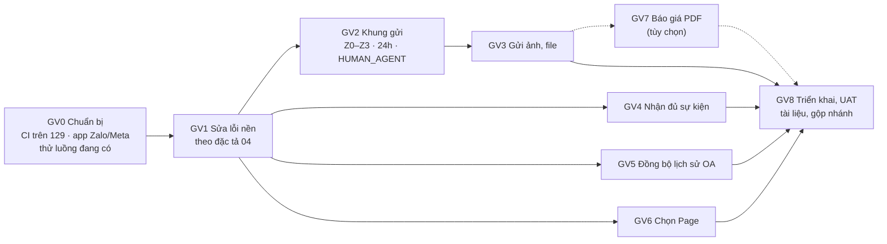

# Kế hoạch tích hợp Zalo OA và Fanpage — Đợt A (lõi chat)

Phiên bản 0.1 · 05/10/2026 · Trạng thái: Nháp (chờ duyệt) · Là chi tiết của bước B4 trong [kế hoạch tổng thể](ke-hoach-tong-the-chat-da-kenh.md)

## Tóm tắt

- **Cập nhật cùng ngày (dev002):** phần **gửi tin Zalo OA** tạm gác sang B6 của kế hoạch tổng thể: khung gửi có chặn và tin có phí (GV2 phần OA), gửi ảnh và file qua OA (GV3 phần OA), báo giá PDF (GV7). Vẫn làm: sửa lỗi nền (GV1), nhận đủ sự kiện (GV4), đồng bộ lịch sử OA (GV5), chọn Page (GV6), Fanpage gửi ảnh và file, và hiển thị vùng khung gửi OA (không thêm chặn mới).
- **Tài liệu nói gì:** kế hoạch đưa phần **kết nối và chat Zalo OA, Fanpage Facebook** vào VClinks, học từ code `vccar-service` (CSKH garage). Code viết trên máy dev, **không chạy trên máy dev**: kiểm thử tự động và chạy thử đều làm trên máy 192.168.1.129 (`https://vclink.tramaphutung.com`). Zalo cá nhân làm ở đợt sau.
- **Phát hiện chính:** VClinks **đã có lõi** OA và Fanpage chạy trọn vòng: kết nối OAuth, token mã hóa và tự làm mới, webhook kiểm chữ ký, nhận tin, trả lời chữ qua outbox, 30 ca test e2e. `vccar-service` có thêm: gửi ảnh và file, khung gửi 48h / 24h kèm `HUMAN_AGENT`, đồng bộ lịch sử OA, chọn Page khi kết nối, ZNS.
- **Quyết định:** **không chép module của vccar-service** (ở vài điểm nó yếu hơn: token để chữ thường, bỏ echo, chỉ giữ tệp đầu, giữ link CDN hết hạn). Chỉ bổ sung các năng lực còn thiếu, theo kiến trúc VClinks và đặc tả `docs/02-yeu-cau/dac-ta/04-cskh-zalo-oa.md` (§3 khung gửi, §4 quy tắc OA-xx).
- **Đợt A gồm 9 gói việc (GV0–GV8):** chuẩn bị và CI trên máy 129, sửa lỗi nền theo đặc tả, khung gửi Z0–Z3 và 24h, gửi ảnh và file, nhận đủ sự kiện, đồng bộ lịch sử OA, chọn Page, gửi báo giá (tùy chọn), triển khai và UAT.
- **Ước lượng:** khoảng **66 giờ công** (thêm 8 giờ tùy chọn), tức 8–9 ngày cho 1 người; chạy song song agent sau GV1 thì khoảng 4–5 ngày lịch. Chưa tính thời gian chờ Zalo và Meta.
- **Ngoài phạm vi (Đợt B trở đi):** ZNS / tin mẫu, tin chào và ngoài giờ, menu và chatbot, yêu cầu chia sẻ thông tin, bình luận Fanpage, quảng cáo Click-to-Messenger, báo cáo OA.
- **Cần trước khi thử thật:** app Zalo và app Meta **riêng cho VClinks** (không dùng chung app của vccar-service), một OA và một Page để thử kèm tài khoản tester, biến môi trường trên máy 129, file xác minh domain cho Zalo.
- **Việc còn mở:** Q1–Q5 ở [§11](#11-câu-hỏi-cần-chốt).
- **Người duyệt xem kỹ:** [§5 quyết định kỹ thuật](#5-quyết-định-kỹ-thuật), GV2 khung gửi, [§10 rủi ro](#10-rủi-ro) (Meta / Zalo, bí mật lộ trong repo vccar-service), và việc kéo một phần M4 lên làm trước (Q5).

## Mục lục

- [Mô hình](#mô-hình)
- [1. Bối cảnh và mục tiêu](#1-bối-cảnh-và-mục-tiêu)
- [2. Nguồn đã đọc](#2-nguồn-đã-đọc)
- [3. So sánh vccar-service và VClinks](#3-so-sánh-vccar-service-và-vclinks)
- [4. Phạm vi Đợt A](#4-phạm-vi-đợt-a)
- [5. Quyết định kỹ thuật](#5-quyết-định-kỹ-thuật)
- [6. Gói việc](#6-gói-việc)
- [7. Thứ tự và ước lượng](#7-thứ-tự-và-ước-lượng)
- [8. Kiểm thử](#8-kiểm-thử)
- [9. Triển khai trên máy 129](#9-triển-khai-trên-máy-129)
- [10. Rủi ro](#10-rủi-ro)
- [11. Câu hỏi cần chốt](#11-câu-hỏi-cần-chốt)
- [12. Phụ lục: endpoint và bài học từ vccar-service](#12-phụ-lục-endpoint-và-bài-học-từ-vccar-service)
- [Lịch sử cập nhật](#lịch-sử-cập-nhật)

---

## Mô hình

## 1. Bối cảnh và mục tiêu

- **Yêu cầu (dev002, 05/10/2026):** đọc logic kết nối Zalo OA, chat Zalo OA và Facebook trong `vccar-service`, rồi tích hợp vào VClinks. Code đầy đủ ở máy dev, đẩy lên máy 129 để thử; máy dev không dùng để chạy code. Zalo cá nhân làm sau.
- **Vị trí trong lộ trình:** Zalo OA (BA §13, đặc tả 04) và Fanpage (BA §14) nằm ở **M4** (chi phí v0.7: 06/11–11/11/2026). Đợt A kéo **phần lõi chat** lên trước. Nghiệp vụ CSKH trên OA (ticket OA, ZNS, chatbot, chiến dịch) vẫn ở M4, nên chủ dự án cần biết (Q5).
- **Mục tiêu đo được:**
  1. Kết nối được OA thật và Page thật trên máy 129.
  2. Nhận đủ chữ, ảnh, file, sticker, ghi âm, video, vị trí; ảnh và file xem được sau khi link gốc hết hạn.
  3. Trả lời bằng chữ, ảnh, file khi còn trong khung gửi.
  4. Chặn đúng khi ngoài khung, với câu nhắc đúng chữ của đặc tả 04 §3.2.
  5. Đồng bộ được lịch sử OA sau khi kết nối, không sinh tin trùng.
  6. `pnpm ci:local` xanh (chạy trên máy 129).

## 2. Nguồn đã đọc

**vccar-service** (`C:\Users\NCC\Desktop\vccar-service`):
- Backend `vccar-service/apps/workshop-manager/src/care-reminder/`: `zalo/*` (zalo-oa.service.ts 811 dòng, zalo-webhook.service.ts), `facebook/*` (facebook-page.service.ts 762 dòng, facebook-webhook.service.ts 540 dòng), `services/care-inbox.service.ts` (819 dòng), `inbox-files-client.service.ts`, `inbox-scope.service.ts`, các schema `inbox-*`.
- Frontend `vccar-web/src/pages/workshop-management/customer-care/` (inbox.tsx, general-config.tsx, trang callback) và `features/workshop-management/customer-care/`.
- Tài liệu: `HUONG_DAN_TAO_ZALO_OA_APP.md`, `RUNBOOK_ZALO_OA_PRODUCTION.md`, `PLAN_ZALO_INBOX_ATTACHMENTS.md`, `PLAN_ZALO_INBOX_REALTIME.md`, `PLAN_CSKH_FACEBOOK.md`, `PLAN_FACEBOOK_MULTI_PAGE.md`, `RUNBOOK_FACEBOOK_DEV_TENANT.md`, `vccar-service/RUNBOOK_FACEBOOK_APP_REVIEW.md`, `vccar-service/PLAN_FIX_ZALO_OA_CROSS_TENANT.md`.

**VClinks:**
- `apps/api/src/channels/**`, `apps/api/src/outbox/*`, `apps/api/src/attachments/*`, `apps/api/src/accounts/health.ts`.
- `apps/web/src/pages/channels/*`, `apps/web/src/components/chat/ChatPane.tsx`, `Composer.tsx`.
- Test `apps/api/test/zalo-oa.e2e-spec.ts` (11 ca), `facebook-page.e2e-spec.ts` (14 ca), `channels.e2e-spec.ts` (5 ca).
- Tài liệu `docs/04-ky-thuat/kenh/*`, BA §13–14, đặc tả `docs/02-yeu-cau/dac-ta/04-cskh-zalo-oa.md` (§3, §4, MH-OA-01…04).

## 3. So sánh vccar-service và VClinks

**Zalo OA**

| Năng lực | vccar-service | VClinks hiện tại | Hướng xử lý |
|---|---|---|---|
| Kết nối OAuth v4 + PKCE | Có, **1 OA / tenant** | Có, nhiều OA | Giữ VClinks |
| Lưu token | Chữ thường trong Mongo | Mã hóa AES-256-GCM (`channel_credentials`) | Giữ VClinks |
| Làm mới token | Khi dùng; khóa trong bộ nhớ, chỉ chạy được 1 tiến trình | Quét 30 phút + khi dùng; khóa Mongo, chống dùng refresh token hai lần | Giữ VClinks |
| Kiểm chữ ký webhook | Có | Có; sai chữ ký trả 401 (đúng OA-03) | Giữ; xác nhận khóa ký là **OA Secret Key** |
| Sự kiện nhận | `user_send_*` (chỉ tệp đầu), follow / unfollow; **bỏ echo** | `user_send_*` đủ loại, echo `oa_send_*`; bỏ follow / unfollow, đã xem | Thêm follow / unfollow, đã nhận / đã xem (GV4) |
| Webhook của OA đã ngắt | Bỏ qua | **Vẫn nhận** (lệch OA-03) | Sửa (GV1) |
| Ảnh, file khách gửi | Giữ link CDN (hết hạn) | Tải về GridFS | Giữ VClinks |
| Gửi chữ | `/v3.0/oa/message/cs` | Có, 25 mã lỗi tiếng Việt, làm mới token rồi thử lại 1 lần | Giữ VClinks |
| Gửi ảnh, file | `upload/image`, `upload/file` | **Chưa có** | Thêm (GV3) |
| Khung gửi | Chặn sau 48h (cục bộ) | **Chưa kiểm trước khi gửi**; chỉ dựa vào lỗi Zalo | Thêm Z0–Z3 theo đặc tả (GV2) |
| Đồng bộ lịch sử | `listrecentchat` + `conversation`, 10 × 10, không phân trang | **Chưa có** | Thêm, có phân trang (GV5) |
| Tin gửi đi gộp với echo | Lưu `message_id` | Thiếu `cliMsgId` → có thể gắn nhầm "Gửi từ điện thoại", bong bóng trùng | Sửa (GV1, OA-04) |
| ZNS / tin mẫu | Có (tạo, duyệt, gửi) | Chưa có | Đợt B |

**Fanpage Facebook**

| Năng lực | vccar-service | VClinks hiện tại | Hướng xử lý |
|---|---|---|---|
| Kết nối | Chọn Page; giữ user token (chữ thường) để thêm Page sau | Nối **mọi** Page được cấp; không lưu user token | Thêm bước chọn Page (GV6); vẫn không lưu user token lâu dài |
| Trường webhook | messages, postbacks, optins, reads, feed, referrals; **không echo** | messages, message_echoes, postbacks | Giữ echo; thêm message_reads (GV4) |
| Tệp khách gửi | Chỉ tệp đầu, giữ link CDN | Đủ tệp, nhưng **không tải được** (danh sách host chặn CDN của Meta) | Sửa (GV1) |
| Gửi chữ | RESPONSE trong 24h, `HUMAN_AGENT` tới 7 ngày | RESPONSE; chặn sau 24h | Thêm `HUMAN_AGENT` có cờ (GV2) |
| Gửi ảnh, file | `/me/message_attachments` → `attachment_id` | **Chưa có** | Thêm (GV3) |
| Token hỏng | Lỗi 190 → ERROR | Lỗi 190 → đánh dấu, nhưng **vẫn cho gửi**, sức khỏe tài khoản luôn "xanh" | Sửa (GV1) |
| Bình luận (feed) | Nhận, chưa trả lời | Chưa có | Đợt B |

**Chung**

| Năng lực | vccar-service | VClinks hiện tại | Hướng xử lý |
|---|---|---|---|
| Mô hình hộp thư | Collection riêng `inbox_conversations` / `inbox_messages`, trạng thái NEW/OPEN/… | `conversations` / `messages` chung mọi kênh qua `IngestService`; gửi qua outbox có duyệt | Giữ VClinks |
| Realtime | socket.io qua notification-service | SSE | Giữ VClinks |
| Phân quyền | Theo team / owner (`assigneeIds`) | Ma trận quyền + `channel_access` | Giữ VClinks |
| Chống bấm Gửi hai lần (OA-32) | Không | Chưa có | Thêm (GV1) |
| Đánh dấu tin trả lời ngoài VClinks (OA-31) | Không | Chưa có | Thêm (GV1) |
| Kiểm thử | Script thăm dò thủ công | 30 ca e2e với máy chủ giả | Mở rộng cho từng gói |

## 4. Phạm vi Đợt A

**Trong phạm vi**
- Kết nối: OA (đã có, sửa lỗi nền), Page có bước chọn Page (MH-OA-01 phần kết nối; BA §14 C1).
- Nhận: đủ loại tin và sự kiện follow / unfollow, đã nhận / đã xem; tải tệp về VClinks cho cả hai kênh.
- Gửi: chữ, ảnh, file; khung gửi Z0–Z3 (OA) và 24h / `HUMAN_AGENT` (Fanpage) ở API, dispatcher và giao diện (MH-OA-03 dải khung, MH-OA-04 ô soạn phần chữ / ảnh / file).
- Đồng bộ lịch sử OA sau khi kết nối.
- Sức khỏe tài khoản kênh API (token hỏng → đỏ, khóa gửi).
- Tùy chọn: gửi báo giá PDF qua OA / Page (BA §13 C4, §14 C4).

**Ngoài phạm vi (Đợt B trở đi)**
- OA: ZNS / tin mẫu và chi phí (MH-OA-11…14, 19), tin chào / ngoài giờ (MH-OA-08), menu và chatbot (MH-OA-09), quy tắc tự động (MH-OA-10), yêu cầu chia sẻ thông tin (OA-09, OA-10, OA-37), tin nút / danh sách, đồng bộ tag OA (MH-OA-15), khảo sát (MH-OA-16), báo cáo OA (MH-OA-17).
- Fanpage: bình luận (F6.1–F6.4), quảng cáo Click-to-Messenger, nhập lịch sử qua Conversations API.
- Zalo cá nhân: đợt riêng, sau Đợt A.

## 5. Quyết định kỹ thuật

1. **Không chép module vccar-service.** Năng lực mới viết vào `apps/api/src/channels/zalo-oa/` và `facebook-page/`, theo đúng mẫu đang có (sender, mapper, store, credentials).
2. **Mọi tin gửi đi qua outbox và có người duyệt** (CLAUDE.md §12.1, OA-01): bấm Gửi là duyệt. Ảnh và file cũng đi đường này, không có đường gửi tắt.
3. **Không lùi về chuẩn thấp hơn của vccar-service:** không lưu token chữ thường, không lưu user token Facebook lâu dài, không bỏ echo, không chỉ giữ tệp đầu, không giữ link CDN, không dùng khóa trong bộ nhớ.
4. **Một phép tính khung gửi cho mọi nơi** (đặc tả §3.2): một hàm dùng chung trong `packages/shared`, ngưỡng lấy từ `send_policy` của kênh, admin sửa được. Dải khung chat, chip danh sách, API và dispatcher đều gọi cùng hàm.
5. **Tệp gửi đi:** người dùng tải lên VClinks (GridFS, `MediaService` đang có). Sender đọc tệp từ GridFS và tải lên Zalo / Meta **ngay lúc gửi**, không giữ `attachment_id` lâu (id của Meta chỉ dùng được cho đúng Page đó).
6. **Echo là nguồn sự thật cho tin đã gửi.** Tin gửi từ VClinks ghi `cliMsgId = externalMsgId` để gộp với echo (OA-04). Echo không khớp lệnh outbox nào là tin trả lời ngoài VClinks (`sendSource = ngoai_vclinks`, OA-31).
7. **Lỗi từ nền tảng luôn thắng tính toán của VClinks** (đặc tả §3.2): Zalo `-230` / `-232` → Z3; `-213` / `-244` hoặc unfollow → Z0; Meta `10` / `2018278` → hết 24h.
8. **CI chạy trên máy 129** trong container tạm, không chạy trên máy dev (theo yêu cầu).

## 6. Gói việc

### GV0 — Chuẩn bị, CI trên máy 129, thử luồng đang có (6h)

- Nhánh `feat/kenh-oa-fanpage`.
- Thêm `tools/deploy/server-129/ci.sh`:
  - đồng bộ cây làm việc sang `~/vclinks/ci` trên máy 129;
  - chạy `pnpm install --frozen-lockfile && pnpm ci:local` trong container `node:20`;
  - giữ bộ nhớ đệm pnpm và file chạy của `mongodb-memory-server` trong volume để lần sau nhanh.
- nginx của web phục vụ file xác minh domain của Zalo từ một thư mục gắn ngoài (`~/vclinks/public-verify`), để không phải build lại khi đổi file.
- Cấu hình app Zalo và app Meta (§9), ghi biến môi trường vào `~/vclinks/.env` trên máy 129.
- Thử luồng **đang có** với OA và Page thật: kết nối, nhận chữ / ảnh, trả lời chữ, echo. Ghi kết quả vào `docs/04-ky-thuat/kenh/zalo-oa.md` §9 (khóa ký, `state` trên callback, echo `msg_id` có bằng `message_id` lúc gửi không).
- Đo giới hạn tệp thật của Zalo và Meta (định dạng, dung lượng) để dùng ở GV3.

**Xong khi:** CI xanh trên máy 129; OA và Page thật nhận và trả lời chữ được; các giả định §9 của `zalo-oa.md` đã kiểm chứng.

### GV1 — Sửa lỗi nền theo đặc tả (8h)

| Việc | Căn cứ | File chính |
|---|---|---|
| Bỏ qua webhook của OA không ở trạng thái đã kết nối | OA-03 | `apps/api/src/channels/zalo-oa/zalo-oa.webhook.service.ts` |
| Tin OA gửi từ VClinks ghi `cliMsgId` để gộp với echo; không gắn nhầm "Gửi từ điện thoại" | OA-04 | `zalo-oa.sender.ts`, `apps/api/src/conversations/conversations.service.ts` |
| Echo không khớp lệnh outbox → `sendSource = ngoai_vclinks` | OA-31 | mapper hai kênh, `ingest.service.ts` |
| Sức khỏe kênh API: OA `needsReconnect`, Page `tokenInvalidAt` hoặc mất token → đỏ, có lý do; outbox từ chối; ô soạn khóa | OA-23 | `apps/api/src/accounts/health.ts`, `outbox.service.ts`, `facebook-page.sender.ts` |
| Khóa chống trùng mỗi lần bấm Gửi (`clientRequestId`, chỉ mục unique theo người gửi) | OA-32 | `packages/shared/src/outbox.ts`, `outbox.service.ts`, `Composer.tsx` |
| Cho tải tệp từ CDN của Meta (`fbcdn.net`, `fbsbx.com`) với tin của kênh `fb_page`; giữ chặn IP nội bộ | BA §14 C2 | `apps/api/src/attachments/url-fetcher.ts` |
| Sửa link tài liệu cũ `docs/channels/*.md` | — | `ZaloOaSection.tsx`, `FacebookPageSection.tsx` |

**Xong khi:** mỗi việc có ca e2e; ca cũ vẫn xanh.

### GV2 — Khung gửi (12h)

- `packages/shared`: `send-policy.ts` gồm ngưỡng mặc định và hàm `sendWindow(channel, T, policy, flags)` trả về vùng, thời gian còn lại và câu hiển thị.
  - Zalo OA: Z1 miễn phí ≤ 48h (sắp hết khi còn ≤ 6h, rất gấp khi còn ≤ 30 phút); Z2 48h–7 ngày; Z3 quá 7 ngày; Z0 bỏ quan tâm. Chữ hiển thị đúng bảng đặc tả 04 §3.2.
  - Fanpage: trong 24h gửi `RESPONSE`; 24h–7 ngày gửi `MESSAGE_TAG` + `HUMAN_AGENT` khi bật `FB_HUMAN_AGENT=1`; còn lại chặn.
- **Mốc T** = lần tương tác cuối của khách mà VClinks thấy (`user_send_*`, follow, postback), lưu trên hội thoại, cập nhật khi nhận tin.
- **API:** `GET /api/conversations/:id` trả thêm `sendWindow`. Outbox kiểm khung **trước khi nhận lệnh** (OA-05) và dispatcher kiểm lại **ngay trước khi gọi nền tảng** (đặc tả §3.5 bước 2).
- **Z2:** cờ `allowPaidCs` theo từng OA, mặc định tắt. Khi bật, ô soạn mở hộp xác nhận chi phí trước khi gửi.
- **Lỗi nền tảng** cập nhật vùng của hội thoại ngay (ghi "Zalo báo hết khung").
- **Web:** dải khung trên khung chat (đếm ngược mỗi phút, không cần tải lại), chip trên danh sách hội thoại, ô soạn khóa kèm câu nhắc; tin khách mới tới cập nhật T qua realtime.

**Xong khi:** test đơn vị cho hàm tính ở mọi mốc biên; e2e chặn / cho gửi theo từng vùng; giao diện hiện đúng chữ.

### GV3 — Gửi ảnh và file (14h)

- **Outbox:** cho phép `send_image` và `send_file` với kênh `zalo_oa`, `fb_page` (sửa chặn ở `apps/api/src/outbox/outbox.service.ts:259`). Giới hạn định dạng và dung lượng theo kênh lưu trong `CHANNEL_INFO`, lấy số đã đo ở GV0.
- **`ChannelSender.send`** nhận tệp đọc từ GridFS.
- **Zalo OA:**
  - Ảnh: `POST /v2.0/oa/upload/image` → `attachment_id` → tin `template` loại `media`; chú thích đi kèm trong `text`.
  - File: `POST /v2.0/oa/upload/file` → `token` → tin `file`; chú thích gửi thành tin chữ riêng.
- **Fanpage:** `POST /me/message_attachments` (multipart `filedata`) → `attachment_id` → gửi; chú thích gửi thành tin chữ riêng.
- **Web:** hàng công cụ ảnh / file trong `ChatPane` cho hội thoại OA / Page (ẩn sticker, danh thiếp, bình chọn, @nhắc tên). Báo lỗi giới hạn **trước** khi tải lên.

**Xong khi:** e2e với máy chủ giả Zalo / Graph cho tải lên, gửi, lỗi; trên máy 129 gửi được ảnh và file thật.

### GV4 — Nhận đủ sự kiện (6h)

- **Zalo:**
  - `follow` / `unfollow` → mở lại / chuyển Z0, ghi dòng thời gian (OA-19).
  - `user_received_message` / `user_seen_message` → trạng thái đã nhận / đã xem của tin OA.
  - Giữ `admin_id` (người trả lời trên app OA) để báo cáo OA-31.
- **Fanpage:** `message_reads` → đã xem; tin bị thu hồi (`is_deleted`) → đánh dấu đã xóa. Thêm `message_reads` vào trường đăng ký, kèm nút "Đăng ký lại webhook" cho Page đã nối trước đó.

**Xong khi:** mỗi sự kiện có ca e2e.

### GV5 — Đồng bộ lịch sử Zalo OA (6h)

- `POST /api/channels/zalo-oa/:uid/sync`, tự chạy một lần sau khi kết nối, có nút trên thẻ OA ở trang Kênh.
- Gọi `GET /v2.0/oa/listrecentchat` (tăng `offset`, `count` ≤ 10), rồi `GET /v2.0/oa/conversation` cho từng khách (`count` ≤ 10, phân trang tới giới hạn số ngày / số tin cấu hình được).
- Hướng tin theo `src`. Id `zoa_<oaId>:<message_id>` trùng id của webhook nên không sinh tin trùng (OA-04). Ghi qua `IngestService`.
- Gọi chậm; gặp lỗi `-32` thì lùi lại. Lỗi Zalo nằm **trong thân HTTP 200**, phải kiểm từng phản hồi.
- *Tùy chọn (4h):* nhập lịch sử Fanpage qua Conversations API.

**Xong khi:** e2e với máy chủ giả (phân trang, chống trùng, lỗi giữa chừng); trên máy 129 lịch sử OA thật hiện đủ.

### GV6 — Chọn Fanpage khi kết nối (6h)

- Callback lưu danh sách Page và page token **đã mã hóa** vào một bản ghi chờ sống 10 phút. Không lưu user token.
- Web: hộp chọn Page, hiện Page đã nối và Page đã thuộc nơi khác → `POST /api/channels/facebook-page/connect-pages`.
- "Thêm Page" = đăng nhập Facebook lại rồi chọn thêm.

**Xong khi:** e2e cho chọn một phần, bản ghi chờ hết hạn, Page đã nối.

### GV7 — Gửi báo giá qua OA / Page (tùy chọn, 4h)

- `send_quote` trên OA / Page = gửi file PDF báo giá qua đường GV3, vẫn qua `QuoteGate` như Zalo cá nhân và chịu khung gửi.

### GV8 — Triển khai và UAT trên máy 129 (8h)

- Chạy CI trên máy 129, `tools/deploy/server-129/sync.sh`, đăng ký webhook ở Zalo / Meta, kết nối OA và Page thật.
- UAT theo danh sách ở [§8](#8-kiểm-thử); ghi biên bản vào `docs/05-kiem-thu/uat/<yyyy-mm-dd>/`.
- Cập nhật `docs/04-ky-thuat/kenh/zalo-oa.md`, `facebook-page.md` (bảng mã lỗi đủ, giới hạn đã đo), README thư mục, `TAI-LIEU.md`; gộp nhánh vào `main` qua phiên gác cổng.

## 7. Thứ tự và ước lượng

| Gói | Giờ | Làm sau | Song song được với |
|---|---:|---|---|
| GV0 Chuẩn bị, CI | 6 | — | — |
| GV1 Sửa lỗi nền | 8 | GV0 | — |
| GV2 Khung gửi | 12 | GV1 | GV4, GV5, GV6 |
| GV3 Gửi ảnh, file | 14 | GV2 (cùng sửa ô soạn và outbox) | GV4, GV5, GV6 |
| GV4 Nhận đủ sự kiện | 6 | GV1 | GV2, GV5, GV6 |
| GV5 Đồng bộ lịch sử OA | 6 | GV1 | GV2, GV4, GV6 |
| GV6 Chọn Page | 6 | GV1 | GV2, GV4, GV5 |
| GV7 Báo giá PDF (tùy chọn) | 4 | GV3 | — |
| GV8 Triển khai, UAT | 8 | tất cả | — |
| **Cộng** | **66** (+4 GV7, +4 lịch sử Fanpage) | | |

- 1 người: khoảng 8–9 ngày làm việc.
- Sau GV1 chạy 3 agent song song (một agent làm GV2 → GV3, hai agent chia GV4, GV5, GV6): khoảng 4–5 ngày lịch.
- **Chưa tính thời gian chờ bên ngoài:** tạo app Zalo / Meta, đưa app Meta lên Live, App Review của Meta (thường 1–3 tuần, chỉ cần cho khách thật, không chặn UAT với tester).

## 8. Kiểm thử

**Tự động**
- Test đơn vị: hàm khung gửi (mọi mốc biên), map sự kiện, map lỗi.
- Test e2e với máy chủ giả Zalo / Graph, theo mẫu `apps/api/test/zalo-oa.e2e-spec.ts`.
- `pnpm ci:local` chạy trên máy 129 bằng `tools/deploy/server-129/ci.sh`, không chạy trên máy dev.

**UAT với OA và Page thật (máy 129)**

| # | Ca thử | Kỳ vọng |
|---|---|---|
| 1 | Kết nối OA | Thẻ OA hiện tên, hạn token; lịch sử gần đây tự đồng bộ, không trùng |
| 2 | Kết nối Facebook có 2 Page, chọn 1 | Chỉ Page được chọn nối và nhận tin |
| 3 | Khách gửi chữ, ảnh, file, sticker, ghi âm, vị trí | Hiện đúng loại; ảnh / file xem được sau 24h |
| 4 | Trả lời chữ, ảnh, file từ VClinks | Khách nhận; VClinks hiện một bong bóng, không trùng |
| 5 | Trả lời từ app OA / Business Suite | Hiện trong VClinks, đánh dấu ngoài VClinks |
| 6 | Hội thoại OA còn trong 48h | Dải khung đếm ngược đúng chữ, đổi màu ở mốc 6h và 30 phút |
| 7 | Hội thoại OA quá 7 ngày (hoặc chỉnh ngưỡng để thử) | Ô soạn khóa, câu nhắc đúng đặc tả; API cũng từ chối |
| 8 | Khách bỏ quan tâm OA | Hội thoại Z0, khóa gửi |
| 9 | Fanpage quá 24h, `FB_HUMAN_AGENT` tắt / bật | Tắt: chặn; bật: gửi được tới 7 ngày |
| 10 | Thu hồi quyền OA / Page (token hỏng) | Tài khoản đỏ, khóa gửi, có nút kết nối lại; tin chờ thành "Lỗi gửi", không tự gửi lại |
| 11 | Bấm Gửi hai lần liên tiếp | Chỉ một tin đi |
| 12 | Nhân viên không được gán kênh OA | Không thấy hội thoại OA |

## 9. Triển khai trên máy 129

- **Địa chỉ:** `https://vclink.tramaphutung.com`. Cập nhật code: `tools/deploy/server-129/sync.sh` (build lại và khởi động lại container; dữ liệu giữ nguyên).
- **App Zalo** (developers.zalo.me, app riêng cho VClinks):
  - Official Account Callback URL: `https://vclink.tramaphutung.com/api/channels/zalo-oa/callback`
  - Webhook URL: `https://vclink.tramaphutung.com/api/webhooks/zalo-oa`
  - Sự kiện: `user_send_*`, `oa_send_*`, `follow`, `unfollow`, `user_received_message`, `user_seen_message`.
  - Xác minh domain `vclink.tramaphutung.com` trước; bật đủ 5 nhóm quyền; webhook chỉ chạy sau khi admin OA cấp quyền cho app.
  - Biến: `ZALO_OA_APP_ID`, `ZALO_OA_SECRET_KEY` (App Secret), `ZALO_OA_WEBHOOK_SECRET` (**OA Secret Key** ở trang Webhook, khác App Secret).
- **App Meta** (app riêng cho VClinks):
  - Valid OAuth Redirect URI: `https://vclink.tramaphutung.com/api/channels/facebook-page/callback`
  - Webhook (sản phẩm **Page**): `https://vclink.tramaphutung.com/api/webhooks/facebook`, trường `messages`, `message_echoes`, `messaging_postbacks`, `message_reads`.
  - App phải ở chế độ **Live** (cần URL chính sách quyền riêng tư) mới nhận tin thật; người thử phải có vai trò trong app cho tới khi App Review xong.
  - Biến: `FB_APP_ID`, `FB_APP_SECRET`, `FB_VERIFY_TOKEN`; sau khi Meta duyệt tính năng Human Agent mới đặt `FB_HUMAN_AGENT=1`.
- **Cách ghi biến:** ghi thẳng vào `~/vclinks/.env` trên máy 129 (không dán khóa vào chat), rồi khởi động lại API.
- **Quay lui:** chạy `sync.sh` từ commit trước. Đợt A chỉ thêm trường, không đổi lược đồ cũ, nên quay lui không phải sửa dữ liệu.

## 10. Rủi ro

| Rủi ro | Mức | Cách giảm |
|---|---|---|
| Dùng chung app Zalo / Meta với vccar-service: đổi webhook làm vccar-service mất tin | Cao | App riêng cho VClinks (Q2) |
| App Meta ở chế độ Development không nhận tin thật; App Review mất 1–3 tuần | Cao | Đưa app lên Live và thử bằng tài khoản có vai trò; nộp App Review sớm, song song |
| Bí mật nằm trong repo vccar-service: App Secret và Webhook Secret Zalo bản dev (`RUNBOOK_ZALO_OA_PRODUCTION.md`), mật khẩu tài khoản reviewer Meta (`RUNBOOK_FACEBOOK_APP_REVIEW.md`), verify token (`RUNBOOK_FACEBOOK_DEV_TENANT.md`) | Cao | Đổi các khóa đó; không chép sang VClinks |
| Chính sách Zalo (khung gửi, phí, ZBS) và Meta (tag) thay đổi | Trung bình | Ngưỡng cấu hình được; lỗi nền tảng thắng tính toán |
| Giới hạn tệp của Zalo / Meta chưa có số liệu chắc chắn | Trung bình | Đo ở GV0, lưu cấu hình |
| OA thử chỉ khoảng 100 người quan tâm, khóa sau khoảng 30 ngày | Thấp | UAT cuối dùng OA thật của công ty |
| Kéo một phần M4 lên trước, đụng các phiên M1 đang sửa `outbox` / `ChatPane` | Trung bình | Nhánh riêng, gộp qua gác cổng, báo chủ dự án (Q5) |
| MongoDB dùng chung của máy 129 hỏng khi khởi động lại máy (đợi mạng) | Trung bình | Sửa dịch vụ `mongod` đợi mạng sẵn sàng (cần sudo) |

## 11. Câu hỏi cần chốt

| Mã | Câu hỏi | Đề xuất |
|---|---|---|
| Q1 | Phạm vi Đợt A như §4 (lõi chat; ZNS, tin chào, chatbot, chia sẻ thông tin, bình luận Fanpage để Đợt B)? | Đồng ý |
| Q2 | Tạo app Zalo và app Meta riêng cho VClinks? | Có. Không dùng chung app của vccar-service |
| Q3 | Tin tư vấn Zalo có phí (Z2, 48h–7 ngày)? | Mặc định tắt (`allowPaidCs = false`) như đặc tả |
| Q4 | Fanpage gửi bằng `HUMAN_AGENT` trong 24h–7 ngày? | Code sẵn, mặc định tắt; bật sau khi Meta duyệt |
| Q5 | Làm trên nhánh `feat/kenh-oa-fanpage`, gộp sau UAT; báo chủ dự án việc kéo một phần M4 lên trước? | Đồng ý; báo chủ dự án trước khi gộp |

## 12. Phụ lục: endpoint và bài học từ vccar-service

**Zalo OA**
- OAuth (VClinks đã có): `https://oauth.zaloapp.com/v4/oa/permission?app_id&redirect_uri&code_challenge&state`; đổi mã: `POST https://oauth.zaloapp.com/v4/oa/access_token` (header `secret_key`, form `code`, `app_id`, `grant_type`, `code_verifier`).
- Thông tin OA: `GET https://openapi.zalo.me/v2.0/oa/getoa`.
- Gửi: `POST https://openapi.zalo.me/v3.0/oa/message/cs`.
- Tải ảnh: `POST https://openapi.zalo.me/v2.0/oa/upload/image` (multipart `file`) → `data.attachment_id` → `attachment: {type: 'template', payload: {template_type: 'media', elements: [{media_type: 'image', attachment_id}]}}`.
- Tải file: `POST https://openapi.zalo.me/v2.0/oa/upload/file` → `data.token` → `attachment: {type: 'file', payload: {token}}`.
- Upload của ZNS (`business.openapi.zalo.me/upload/image`) trả id khác, **không** dùng được cho tin tư vấn.
- Lịch sử: `GET /v2.0/oa/listrecentchat?data={"offset":0,"count":10}` (mỗi dòng là một tin; khách là `from_*` khi `src = 1`, `to_*` khi `src = 0`); `GET /v2.0/oa/conversation?data={"user_id":"…","offset":0,"count":10}`. `count` > 10 trả lỗi `-210`.
- Zalo trả lỗi **trong thân HTTP 200** (`error != 0`), phải kiểm từng phản hồi.
- Khóa ký webhook là **OA Secret Key** ở trang Webhook của app, khác App Secret dùng cho OAuth.
- `redirect_uri` phải khớp từng byte giữa trang cấu hình app và code; xác minh domain trước; bật đủ 5 nhóm quyền; lưu URL webhook gặp lỗi 408 thì thử lại.
- Zalo cần phản hồi webhook trong khoảng 2 giây, lỗi nhiều lần sẽ tắt webhook.
- ZNS (Đợt B): host `https://business.openapi.zalo.me` (`/message/template`, `/template/create`, `/template/all`, `/template/info/v2`); tham số rỗng trả `-1122`, ngày phải dạng DD/MM/YYYY (`-1124`); tạo / sửa mẫu tối đa 100 lần / ngày / app.

**Facebook**
- Đăng nhập: `https://www.facebook.com/v21.0/dialog/oauth` với `pages_show_list, pages_messaging, pages_manage_metadata, pages_read_engagement` → `/oauth/access_token` → `fb_exchange_token` → `/me/accounts`.
- Đăng ký webhook cho Page: `POST /{page-id}/subscribed_apps?subscribed_fields=…`. Đổi danh sách trường thì Page đã nối phải đăng ký lại.
- Gửi: `POST /me/messages` với `messaging_type: RESPONSE`, hoặc `MESSAGE_TAG` + `tag: HUMAN_AGENT`.
- Tệp: `POST /me/message_attachments` multipart `filedata` + `message={"attachment":{"type":"image|file","payload":{"is_reusable":true}}}` → `attachment_id` (chỉ dùng được với đúng Page đó).
- Hồ sơ khách: `GET /{psid}?fields=name,profile_pic`.
- Bài học:
  - App Development chỉ nhận payload "Test" từ trang quản trị, không nhận tin thật; phải Live.
  - Trang Webhooks chọn sản phẩm **Page** (không phải Permissions); tắt "attach client certificate" vì làm hỏng kiểm chữ ký.
  - Human Agent là tính năng duyệt riêng trong App Review, dễ bỏ sót.
  - Theo kế hoạch của vccar-service, từ 27/04/2026 các tag khác ngoài `HUMAN_AGENT` trả lỗi 100.

## Lịch sử cập nhật

| Phiên bản | Ngày | Người / phiên | Thay đổi | Căn cứ |
|---|---|---|---|---|
| 0.1 | 05/10/2026 16:18 | Claude Code · dev002 | Tạo kế hoạch Đợt A: so sánh vccar-service và VClinks, 9 gói việc, ước lượng, kiểm thử, triển khai máy 129, rủi ro, câu hỏi; cùng ngày: gác phần gửi tin Zalo OA sang B6, gắn vào bước B4 của kế hoạch tổng thể | Yêu cầu dev002 05/10/2026 |
