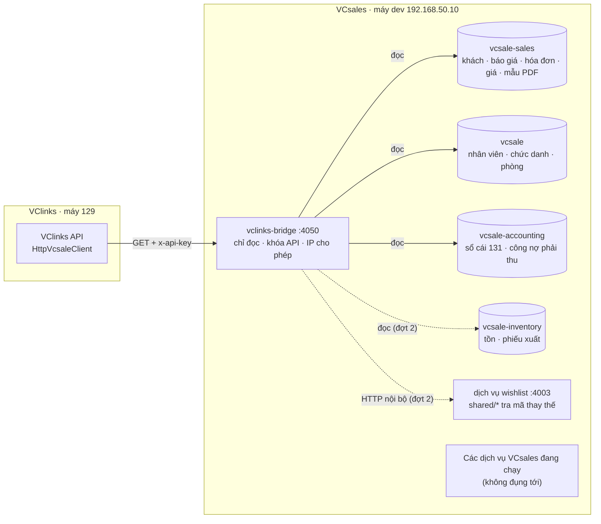

# Kế hoạch kết nối VClinks với VCsales

Phiên bản 0.1 · 07/10/2026 · Trạng thái: Chờ duyệt

## Tóm tắt

- **Mục tiêu:** các màn VClinks đang chạy bằng dữ liệu giả (liên kết mã KH, khối thương mại ở hồ sơ khách, cờ "Nợ quá hạn", gửi báo giá) chuyển sang dữ liệu thật của VCsales. Thêm tra hàng (giá, tồn), giao hàng theo từng dòng, "Việc VCsales" cho Sale admin. **VClinks chỉ đọc VCsales** (CLAUDE.md §7).
- **Phía VCsales:** viết một ứng dụng mới, chỉ đọc, tên `vclinks-bridge`, trong repo VCsales (nhánh `feat/vclinks-api`). Không sửa dịch vụ đang chạy. Có khóa API riêng. Chạy thử trên máy dev `192.168.50.10` cổng 4050, từ thư mục riêng.
- **Lý do không chạy bản copy các dịch vụ VCsales:** tên nhóm Kafka cố định, hơn 20 job hẹn giờ không có cờ tắt, lúc khởi động có ghi dữ liệu. Bản copy sẽ giành tin của bản đang chạy và chạy job hai lần (mục 3.2).
- **Phía VClinks:** nối thật 9 hàm đã có trong `packages/vcsale-client`, thêm 4 hàm (nợ nhiều khách, nhân viên kinh doanh, giao hàng, tra hàng thật), đổi trạng thái báo giá theo 11 trạng thái của VCsales, rồi làm các màn đợt 2.
- **Khối lượng:** đợt 1 khoảng 57 giờ (VCsales 32, VClinks 25), đợt 2 khoảng 37 giờ. Vá bảo mật cổng API VCsales khoảng 12 giờ, làm trên nhánh riêng, đội VCsales quyết. Mốc: đợt 1 xong 13/10, đợt 2 xong 20/10, trước mốc lên chính thức M1 26/10/2026.
- **Đã chốt 07/10/2026:** VClinks giữ Zalo OA / Fanpage; khóa API chỉ đọc; nợ lấy từ sổ cái kế toán; DB dev VCsales chỉ đọc; nhánh đẩy lên GitLab, gộp `develop` do đội VCsales quyết (mục 10).
- **Q1–Q5 đã trả lời "theo đề xuất" (07/10/2026).** dev002 báo VCsoft / Hùng Phạm rằng kế hoạch này làm phần API "E5" (Q5).
- **Tiến độ (mục 12):** phía VCsales xong V0–V9, bridge chạy trên `.10`. Phía VClinks xong C0–C6 và C8, máy 129 đã đọc VCsales thật. C7 xong phần gỡ mã giả, còn chờ khách test trên VCsales dev (Q2) để gắn Con Hùng.
- **Đợt 2 đã làm C11 và C12** (07/10/2026): danh mục VCsales (xem trước, nạp toàn bộ, đồng bộ thay đổi mỗi giờ) và Việc VCsales (02 MH-DK-12). Tài liệu: `docs/04-ky-thuat/api/viec-vcsales.md`.
- **Còn mở:** Q6 (ghép tay nhân viên thiếu email), Q7 (nạp danh mục thật trên 129) ở mục 11; báo đội VCsales các lỗi tìm thấy ở mục 12.
- **Người duyệt xem kỹ:** mục 4 (cách đổi trạng thái báo giá, cách tính nợ) và mục 8 (dữ liệu khách thật nằm trên máy test; lỗ hổng sẵn có của VCsales).

## Mục lục

- [1. Phạm vi](#1-phạm-vi)
- [2. Hiện trạng hai bên](#2-hiện-trạng-hai-bên)
- [3. Kiến trúc kết nối](#3-kiến-trúc-kết-nối)
- [4. Hợp đồng API của vclinks-bridge](#4-hợp-đồng-api-của-vclinks-bridge)
- [5. Việc phía VCsales](#5-việc-phía-vcsales)
- [6. Việc phía VClinks](#6-việc-phía-vclinks)
- [7. Môi trường chạy và kiểm thử](#7-môi-trường-chạy-và-kiểm-thử)
- [8. Rủi ro và cách giảm](#8-rủi-ro-và-cách-giảm)
- [9. Lịch](#9-lịch)
- [10. Quyết định đã chốt](#10-quyết-định-đã-chốt)
- [11. Câu hỏi còn mở](#11-câu-hỏi-còn-mở)
- [12. Tiến độ](#12-tiến-độ)
- [Lịch sử cập nhật](#lịch-sử-cập-nhật)

## 1. Phạm vi

| # | Chức năng | Tích hợp | Đợt | Ghi chú |
|---|---|---|---|---|
| 1 | Kết nối an toàn máy với máy | Có, bắt buộc | 1 | Khóa API của `vclinks-bridge` (V1) |
| 2 | Bản nối thật trong VClinks | Có, bắt buộc | 1 | C1, C2 |
| 3 | Tìm khách theo SĐT / MST / mã / tên | Có | 1 | V2 |
| 4 | Nạp danh mục khách và đồng bộ thay đổi | Có, bản gọn | API đợt 1, màn đợt 2 | V3, C11 |
| 5 | Khối thương mại ở hồ sơ khách | Có | 1 | V4 |
| 6 | Danh sách báo giá, gửi PDF vào chat | Có | 1 | V5, C4 |
| 7 | Nút "Tạo báo giá trên VCsales" | Có (đường link) | 1 | Màn tạo báo giá VCsales chưa nhận mã khách qua đường link; tạm mở màn trống |
| 8 | Tra hàng: giá theo loại khách, tồn từng kho | Có, bản tra nhanh | 2 | V10, C9 |
| 9 | Đơn và giao hàng theo từng dòng | Có | 2 | V11, C10 |
| 10 | Báo khi đơn đổi trạng thái | Chưa | – | VCsales chưa có webhook ra ngoài |
| 11 | Công nợ (cờ quá hạn, tổng nợ) | Có, giới hạn | 1 | V6, C3; không bao giờ đưa cho AI |
| 12 | "Việc VCsales" cho Sale admin | Có | 2 | C12; Sale admin làm tay trên VCsales |
| 13 | Ghép nhân viên VCsales với người dùng VClinks | Có, bắt buộc | 1 | V7, C5 |
| 14 | Hóa đơn, doanh số, KPI | Không (giai đoạn sau) | – | Thuộc VCsales / VCinvoice |

## 2. Hiện trạng hai bên

**VClinks** (nhánh `feat/giao-dien-moi`):

- `packages/vcsale-client` có 9 hàm chỉ đọc: `listCustomers`, `searchCustomers`, `getCustomer`, `getCommerce`, `searchProducts`, `listQuotes`, `getQuote`, `getQuoteFiles`, `getQuoteCreateUrl`. Bộ test của gói bắt buộc mọi hàm là `list|get|search` và chỉ gọi GET.
- Các màn đã dùng gói này: liên kết mã KH (`ErpLinkModal`), đối chiếu mã KH, khối thương mại (`CommerceBlock`), cờ "Nợ quá hạn", tab Tra hàng, ngăn Báo giá và hộp gửi báo giá, phiếu CSKH có báo giá.
- **Tất cả đang chạy bản giả** (`MockVcsaleClient`, 23 khách `KH-TEST-xxxx`). Bản thật `HttpVcsaleClient` chỉ báo lỗi "Chưa có API VCsales (E5)". Biến môi trường: `VCSALE_MODE`, `VCSALE_URL`, `VCSALE_TOKEN`.
- Chưa có: đơn và giao hàng, danh sách "Việc VCsales", gọi nợ theo lô (cờ nợ đang gọi từng khách, tối đa 1.000 lần).

**VCsales** (repo `vcpart-sale/vcpart-server-sale`, nhánh chính `develop`):

- NestJS chia nhiều dịch vụ sau một cổng API (cổng 4000). Trên máy dev `.10` (kiểm 07/10/2026), mỗi dịch vụ một DB trên cùng một máy chủ MongoDB:
  - `vcsale`: đăng nhập, quản trị, danh mục phụ tùng.
  - `vcsale-sales`: bán hàng.
  - `vcsale-accounting`: kế toán.
  - `vcsale-inventory`: kho.
  - `vcsale-purchase`: mua hàng.
- **Đăng nhập:** chỉ có đăng nhập người dùng bằng mã thông báo (JWT, hạn 1 ngày). Thiết kế khóa API (`API_KEY_DESIGN.md`) chưa có code. Không có MCP. Không có webhook báo ra ngoài; sự kiện chỉ chạy nội bộ qua Kafka.
- **Lỗ hổng sẵn có** (đọc code, chưa thử):
  - Không kiểm chữ ký mã thông báo.
  - Tin header `x-gateway` / `x-user-id` do bên ngoài gửi.
  - Đường `shared/*` không cần đăng nhập, kể cả vài đường ghi dữ liệu.
  - Có đường lách bằng header `ProductLookupScreenOneClass`.
  - Cổng API ghi nhật ký cả header.
  - Vài file `.env` có trong git.
- **API có sẵn nhưng lỗi:**
  - `GET /customers/code/:code` lọc sai trường, nên luôn báo không tìm thấy.
  - `/receivables/overdue` và `/receivables/aging` lọc sai.
  - Chi tiết báo giá theo id không lọc theo quyền.
- **Dữ liệu trên máy dev `.10`** (07/10/2026):
  - 4.567 khách, 1.235 báo giá, 421 hóa đơn bán, 17.692 dòng giá.
  - 7.478 bút toán, nhưng chỉ **4** bút toán tài khoản 131 và **2** dòng công nợ phải thu. Nợ thực tế nằm ở 421 hóa đơn bán còn nợ.
  - 1.581 khách có SĐT, không khách nào có MST. Chỉ 16 / 44 nhân viên có email.
  - 4.770 dòng tồn kho, 720 phiếu xuất.
- **Số liệu khác trong `PLAN-CSKH-VCSALE.md`** là một bản DB khác: 10.049 khách nhưng chỉ 3.409 khách có SĐT; 1.195 số dùng chung cho 2.864 khách. Tìm theo SĐT vì vậy phải trả về nhiều khách.
- **Mô hình dữ liệu:**
  - Báo giá chính là đơn hàng: 11 trạng thái, không có số phiên bản, không có hạn hiệu lực.
  - Giá theo "loại khách" (GARAGE / RETAIL), không có hạng A/B/C.
  - Khách có nhiều nhân viên phụ trách (`data_viewer`), không có người chính.
  - Email nhân viên không bắt buộc duy nhất.

## 3. Kiến trúc kết nối

### 3.1 Sơ đồ

- **`vclinks-bridge`** là một ứng dụng NestJS mới trong thư mục `apps/vclinks-bridge` của repo VCsales.
  - Có: các kết nối đọc DB, kiểm khóa API, danh sách IP cho phép, giới hạn tần suất, nhật ký gọi (không ghi nội dung), `/health`.
  - Không có: Kafka, job hẹn giờ, việc ghi dữ liệu lúc khởi động, middleware của `packages/core`.
- **Kết nối DB:**
  - Bridge mở **một kết nối đọc** tới máy chủ MongoDB rồi đọc 4 DB: `vcsale-sales`, `vcsale`, `vcsale-accounting`, `vcsale-inventory`. Tên từng DB đặt trong biến môi trường, để máy chính thức đặt tên khác cũng chạy được.
  - Danh mục phụ tùng không đọc DB mà gọi qua dịch vụ wishlist đang chạy, vì máy dev có 2 bản dữ liệu phụ tùng (`vcsale` và `vcsale-wishlist`).
  - Trên dev, bridge dùng tạm chuỗi kết nối của dịch vụ bán hàng (chuỗi này có quyền ghi, nhưng code bridge không ghi). Khi lên chính thức, tạo một tài khoản MongoDB chỉ có quyền đọc 4 DB này.
- **Khóa API:** đặt ở header `x-api-key`. Ứng dụng giữ bản băm sha256 trong biến môi trường `VCLINKS_API_KEY_SHA256` (có thể 2 giá trị để đổi khóa không gián đoạn) và so sánh kiểu chống dò thời gian. Không thêm bảng nào vào DB.
- **Chỉ GET:** mọi đường đều là GET. Đọc nợ nhiều khách dùng tham số `codes=` (tối đa 100 mã).
- **Trên máy dev:** VClinks gọi thẳng `http://192.168.50.10:4050`, không qua cổng API của VCsales, vì cổng API đang ghi nhật ký cả header nên sẽ lộ khóa.
- **Lên chính thức:** đội VCsales chọn chạy `vclinks-bridge` như một dịch vụ riêng, hoặc đưa vào cổng API sau khi vá nhật ký và bảo mật (V12, V13).

### 3.2 Vì sao không sửa thẳng các dịch vụ đang chạy

| Phương án | Ưu | Nhược |
|---|---|---|
| **A. Ứng dụng mới `vclinks-bridge`** (chọn) | Không đụng dịch vụ đang chạy; thử trên máy dev chung mà không ảnh hưởng ai; phần sửa gọn trong một thư mục, đội VCsales dễ duyệt; gỡ là xong | Đọc thẳng DB của nhiều dịch vụ, nên VCsales đổi cấu trúc dữ liệu thì bridge phải sửa theo (giảm bằng bộ kiểm thử hợp đồng); PDF báo giá dựng lại bằng mẫu của VCsales |
| B. Thêm đường mới vào sales / accounting, chạy bản copy trên cổng khác | Dùng lại hàm sẵn có | Không có cờ tắt Kafka và job hẹn giờ: bản copy giành tin Kafka, chạy job hai lần (chốt sổ kỳ, phân bổ phí ship, gửi nhắc CSKH), ghi dữ liệu lúc khởi động. Muốn an toàn phải sửa khởi động của 6 dịch vụ |
| C. Sửa thẳng bản đang chạy trên máy dev | Nhanh | Phá việc của Hùng Phạm (nhánh `test/dms-develop-2609` đang chạy) và mọi người đang dùng máy dev |

## 4. Hợp đồng API của vclinks-bridge

Tiền tố `/v1`, mọi đường là GET, cần header `x-api-key`. Lỗi trả `{ code, message }` không kèm chi tiết kỹ thuật. Thiết kế chi tiết (cấu trúc ứng dụng, câu truy vấn từng đường, số liệu thật máy dev): `docs/04-ky-thuat/api/vclinks-bridge.md`.

| # | Đường | Trả về | Nguồn | Đợt |
|---|---|---|---|---|
| 1 | `/health` | `{ ok, db: {sales, accounting}, version }`, không cần khóa | – | 1 |
| 2 | `/v1/customers/search?q=&limit=` | Mọi khách khớp SĐT (đã chuẩn hóa), MST, mã hoặc tên, tối đa 20 | `vcsale-sales.customers` | 1 |
| 3 | `/v1/customers/:code` | Một khách (kiểu `VcsaleCustomer`) | `vcsale-sales.customers`, `customertypes`; email người phụ trách từ `vcsale.users` | 1 |
| 4 | `/v1/customers?updatedSince=&cursor=&limit=` | Trang khách đổi từ thời điểm, sắp theo `updatedAt`, `_id`; có cả khách ngừng | `vcsale-sales.customers` | 1 |
| 5 | `/v1/customers/:code/commerce` | Loại khách, doanh số 12 tháng, nợ, báo giá đang mở, đơn gần nhất | `vcsale-sales.quotations`, nợ (đường 9) | 1 |
| 6 | `/v1/customers/:code/quotes` | Báo giá của khách, mới nhất trước | `vcsale-sales.quotations` | 1 |
| 7 | `/v1/quotes/:id` | Một báo giá (theo `_id`, kèm `code`) | `vcsale-sales.quotations`, `quotationitems` | 1 |
| 8 | `/v1/quotes/:id/pdf` | File PDF dựng bằng mẫu báo giá đang dùng của VCsales | `vcsale-sales.template_pdfs` + dữ liệu báo giá | 1 |
| 9 | `/v1/debts?codes=a,b,c` | Mỗi mã: tổng nợ, nợ quá hạn, hạn gần nhất, ngày quá hạn cũ nhất, nguồn tính | `vcsale-accounting` (`journalentries`, `partner_opening_balances`, `receivables`); dự phòng `vcsale-sales.invoices` + `vatinvoices` | 1 |
| 10 | `/v1/staff` | Nhân viên kinh doanh: tên, email, chức danh, phòng, còn làm hay không, cờ email thiếu / trùng | `vcsale.users`, `positions`, `departments` | 1 |
| 11 | `/v1/parts/search?q=&customerCode=&limit=` | Phụ tùng: mã, tên, hãng, giá theo loại khách, tồn theo kho (thường / VAT). **Không bao giờ trả giá nhập** | dịch vụ wishlist `shared/*`, `vcsale-sales.unitprices`, `vcsale-inventory.inventorystocks` | 2 |
| 12 | `/v1/quotes/:id/delivery` | Từng dòng: số yêu cầu, đã xuất, còn lại, ngày xuất, trạng thái dòng | `vcsale-sales.quotationitems`, `vcsale-inventory.inventoryexports` + `inventoryexportdetails` | 2 |

**Cách đổi dữ liệu sang kiểu của VClinks:**

- **Trạng thái báo giá:**

  | Trạng thái VCsales | Trạng thái VClinks | Gửi cho khách được không |
  |---|---|---|
  | `NOT_QUOTED`, `QUOTE_REQUESTED` | `draft` (chưa đủ giá) | Không |
  | `FULLY_QUOTED`, giảm giá đang chờ duyệt | `pending` | Không |
  | `FULLY_QUOTED`, giảm giá bị trả lại / từ chối | `draft` | Không |
  | `FULLY_QUOTED`, không cần duyệt hoặc đã duyệt | `approved` | Có, khi còn hạn |
  | `ORDER_REQUESTED` … `INVOICED` | `ordered` (mới: đã chốt) | Có (Q3) |
  | `CANCELLED` | `cancelled` | Không |

  Kèm theo `erpStatus` (trạng thái gốc) và nhãn tiếng Việt, ví dụ "Chờ xuất kho".
- **Phiên bản báo giá:** VCsales không có. Bridge tự tính `version` từ `updatedAt` của báo giá, `updatedAt` mới nhất của các dòng, số dòng và tổng tiền. Báo giá đổi thì `version` đổi, và VClinks chặn gửi bản cũ (BR16). Hệ thống tự cập nhật (ví dụ xuất kho) cũng làm đổi `version`; việc này an toàn vì chỉ làm VClinks đọc lại.
- **Hạn báo giá:** VCsales không lưu. Tạm tính ngày báo giá + 7 ngày, khớp với số ngày in sẵn trong mẫu báo giá Excel của VCsales.
- **Khách:**
  - `type`: tên loại khách.
  - `phones`: số chính cùng các số phụ, đã chuẩn hóa về dạng `0xxxxxxxxx`.
  - `salespersons`: mọi nhân viên trong `data_viewer` kèm email. `salespersonEmail` là người đầu tiên còn làm và có email.
  - `status`: `isActive=false` thì `inactive`; khách đã xóa không trả về.
  - `mergedInto`: luôn null, vì VCsales chưa có gộp mã.
- **Doanh số 12 tháng:** tổng tiền các báo giá "Hoàn tất" và "Đã xuất hóa đơn" có ngày báo giá trong 12 tháng gần nhất.
- **Báo giá đang mở:** "Đủ giá" và còn hạn.
- **Đơn gần nhất:** báo giá mới nhất ở trạng thái từ "Chờ đặt hàng" trở đi, không tính đã hủy.
- **Nợ:**
  - Tổng nợ = số dư tài khoản 131 của đối tác kế toán (`customers.partnerId`), gồm số dư đầu kỳ nhập tay. Khách chưa có bút toán 131 thì tính từ hóa đơn bán và hóa đơn VAT còn nợ (máy dev đang ở trường hợp này).
  - Quá hạn và hạn gần nhất lấy từ công nợ phải thu còn mở; nếu không có thì từ hạn thanh toán của hóa đơn.
  - Nhiều khách chung một đối tác thì gắn cờ `sharedPartner`.
  - Khách chưa có đối tác thì tính từ hóa đơn bán và hóa đơn VAT, gắn `source: 'invoices'`.
  - Dữ liệu nợ không bao giờ vào AI (C3, `sensitivity.ts`).
- **Cần đội VCsales xác nhận:** cách tính doanh số 12 tháng, hạn báo giá 7 ngày, và khi nào thì "đủ giá" được xem là gửi được cho khách.

## 5. Việc phía VCsales

Claude làm trên nhánh `feat/vclinks-api` tách từ `develop` mới nhất. Sửa code trên máy dev002 (thư mục `vcsale`), build và chạy hoàn toàn trên máy `.10`. Hùng Phạm hoặc đội VCsales duyệt.

| # | Việc | Giờ | Đợt | Xong khi |
|---|---|---|---|---|
| V0 | Chuẩn bị: nhánh mới, thư mục chạy riêng `~/vclinks-bridge` trên `.10`, tiến trình pm2 `vclinks-bridge-dev` cổng 4050. Chuỗi kết nối DB chép từ file env của dịch vụ đang chạy bằng script, không hiện ra màn hình | 3 | 1 | `/health` trả `ok` từ máy 129 |
| V1 | Khung ứng dụng: kết nối DB chỉ đọc, khóa API, danh sách IP, giới hạn tần suất, chỉ GET, nhật ký gọi không nội dung, lỗi không lộ chi tiết | 4 | 1 | Gọi thiếu hoặc sai khóa trả 401, sai IP trả 403 |
| V2 | Tìm khách: SĐT chuẩn hóa (dùng lại `normalizeVnPhone`), MST, mã, tên (chữ thoát ký tự đặc biệt) | 3 | 1 | Một số dùng chung trả đủ các khách |
| V3 | Khách theo mã; danh sách khách đổi từ thời điểm (con trỏ) | 2 | 1 | Duyệt hết 10.049 khách không trùng, không sót |
| V4 | Khối thương mại theo mã | 4 | 1 | Khớp màn hồ sơ khách VCsales ở 5 khách mẫu |
| V5 | Báo giá: danh sách, chi tiết, PDF, đổi trạng thái, phiên bản | 6 | 1 | PDF mở được, nội dung khớp bản VCsales tự in |
| V6 | Nợ nhiều khách: sổ cái 131 và công nợ phải thu; dự phòng từ hóa đơn | 5 | 1 | Khớp màn "Sổ công nợ" VCsales ở 5 khách mẫu |
| V7 | Danh sách nhân viên kinh doanh có email | 1 | 1 | Có cờ email thiếu / trùng. Quản trị VCsales điền email công ty cho nhân viên (hiện 16 / 44 có email) |
| V8 | Kiểm thử: jest cho các hàm thuần (SĐT, trạng thái, phiên bản, gom nợ), script gọi thử mọi đường trên `.10` | 3 | 1 | Toàn bộ đạt trên máy `.10` |
| V9 | README của ứng dụng: cách chạy, tên biến môi trường, danh sách API | 1 | 1 | – |
| V10 | Tra hàng: mã / mã thay thế / VIN / tên → giá theo loại khách, tồn theo kho | 6 | 2 | Không có trường giá nhập trong kết quả |
| V11 | Giao hàng theo từng dòng của báo giá | 4 | 2 | Báo giá xuất kho một phần hiện đúng số còn lại |
| V12 | Vá bảo mật cổng API, nhánh riêng `fix/gateway-auth` (Q4): kiểm chữ ký mã thông báo, bỏ header do bên ngoài gửi, khóa `shared/*`, bỏ đường lách, che header trong nhật ký, gỡ `.env` khỏi git | 12 | Riêng | Đội VCsales thử và duyệt |
| V13 | Lên chính thức: chạy bridge trên máy thật, thêm chỉ mục `customerCode` và `updatedAt`, đường qua cổng API | – | Sau | Đội VCsales làm |

**Cộng:** đợt 1 khoảng 32 giờ, đợt 2 khoảng 10 giờ, V12 khoảng 12 giờ.

## 6. Việc phía VClinks

Code trên nhánh `feat/giao-dien-moi`. Mọi build, test và triển khai trên máy 129 như hiện nay.

| # | Việc | Giờ | Đợt | Xong khi |
|---|---|---|---|---|
| C0 | Cấu hình máy 129: `VCSALE_MODE=http`, `VCSALE_URL`, khóa ghi thẳng vào `~/vclinks/.env`, không hiện ra màn hình | 0,5 | 1 | API khởi động ở chế độ thật |
| C1 | `HttpVcsaleClient`: 9 hàm, chờ tối đa 5 giây, thử lại 1 lần, báo đúng loại lỗi; kiểm thử với máy chủ giả | 6 | 1 | Bộ test của gói đạt, vẫn chỉ GET |
| C2 | Đổi kiểu dữ liệu: báo giá có `id`, trạng thái `ordered` và trạng thái gốc; khách có nhiều nhân viên phụ trách; thêm `getDebtSummaries`, `listSalesStaff` (bản giả cập nhật theo) | 3 | 1 | Kiểm kiểu sạch |
| C3 | Cờ "Nợ quá hạn" gọi theo lô 100 mã thay vì từng khách | 2 | 1 | 1.000 khách chỉ tốn 10 lần gọi |
| C4 | Ngăn Báo giá: nhãn "Đã chốt" và trạng thái gốc; quy tắc gửi theo bảng mục 4 | 3 | 1 | Báo giá chưa đủ giá không gửi được |
| C5 | Ghép nhân viên phụ trách VCsales với người dùng VClinks theo email; danh sách chưa ghép được | 3 | 1 | Hiện số ghép được / chưa ghép |
| C6 | Theo dõi kết nối: gọi `/health` 5 phút một lần, báo lỗi ERR-ERP; bộ nhớ đệm theo BA (nợ 15 phút, đơn 5 phút, danh mục 1 ngày, báo giá luôn đọc mới) | 2 | 1 | Tắt bridge thì VClinks báo lỗi đúng, không treo |
| C7 | Chuyển dữ liệu thử: sao lưu rồi gỡ liên kết mã giả `KH-TEST-xxxx`; gắn hội thoại Con Hùng với khách test trên VCsales dev (Q2) | 2 | 1 | Hồ sơ Con Hùng hiện khối thương mại thật |
| C8 | Tài liệu (`docs/04-ky-thuat/api/gui-bao-gia.md`, `mo-hinh-khach.md`, tài liệu hợp đồng API) và ca kiểm thử trong bộ test | 3 | 1 | – |
| C9 | Tra hàng thật; AI gợi ý dùng chung lớp kết nối (chỉ thấy giá niêm yết và tồn, không thấy nợ) | 4 | 2 | Tab Tra hàng ra dữ liệu thật |
| C10 | Giao hàng theo dòng trong ngăn Báo giá | 5 | 2 | Trả lời được "hàng đến đâu" |
| C11 | Đồng bộ khách theo thay đổi (mỗi giờ) và màn "Nạp danh mục khách VCsales" | 6 | 2 | Lần chạy sau chỉ lấy khách đã đổi |
| C12 | "Việc VCsales" cho Sale admin (MH-DK-12): tạo mã, sửa SĐT / email, đổi người phụ trách, gộp mã; có đường link sang màn VCsales | 12 | 2 | Sale admin đánh dấu xong; lần đồng bộ sau gợi ý mã mới |

**Cộng:** đợt 1 khoảng 25 giờ, đợt 2 khoảng 27 giờ.

## 7. Môi trường chạy và kiểm thử

**Máy dev VCsales `192.168.50.10`:**
- Không đụng `~/vc_configs/vcpart-server-sale` (nhánh `test/dms-develop-2609` của Hùng Phạm) và các tiến trình pm2 đang chạy.
- Bridge chạy từ `~/vclinks-bridge`, tiến trình pm2 `vclinks-bridge-dev`, cổng 4050. Thư viện cài riêng (khoảng 1,4 GB; máy còn 229 GB trống).
- **Gỡ:** `pm2 delete vclinks-bridge-dev` rồi xóa thư mục; VCsales không bị ảnh hưởng.
- **Đã kiểm 07/10:** máy 129 gọi tới được `.10` (cổng 4000 và 6969 đều trả lời). Nếu tường lửa chặn 4050 thì cần người có sudo mở cổng. Lần gọi đầu sẽ ghi lại IP nguồn để đặt danh sách IP cho phép, vì hai máy khác dải mạng.

**Máy VClinks 129:**
- Đổi sang chế độ thật bằng biến môi trường rồi khởi động lại API.
- **Quay lại:** đặt `VCSALE_MODE=mock`.

**Dữ liệu thử:**
- Dùng DB dev VCsales chỉ đọc.
- Để thử gửi báo giá trên hội thoại Con Hùng, cần 1 khách test và 1 báo giá test trên VCsales dev, do dev002 tạo bằng giao diện VCsales (Q2). Không gắn Con Hùng với khách thật.

**Các lớp kiểm thử:**
1. Hàm thuần: jest ở VCsales, bộ test gói `vcsale-client` ở VClinks. Chạy trên máy server.
2. Script gọi thử mọi đường của bridge từ máy 129.
3. Bộ test VClinks: thêm ca PQ / KH / BG cho dữ liệu thật vào `docs/05-kiem-thu/uat/2026-10-06/bo-test-toan-he-thong.md`.
4. Chạy thật trên Con Hùng: liên kết mã khách test, xem khối thương mại, gửi PDF báo giá test, cờ nợ.

## 8. Rủi ro và cách giảm

| Rủi ro | Mức | Cách giảm |
|---|---|---|
| Kế hoạch trùng phần API "E5" mà kế hoạch M1 giao cho VCsoft (hạn 12/10) | Cao | Q5: báo VCsoft / đội VCsales trước khi làm |
| Bridge đọc thẳng DB, VCsales đổi cấu trúc dữ liệu thì bridge hỏng | Trung bình | Bộ kiểm thử hợp đồng trong repo VCsales; README ghi rõ các trường đang dùng |
| DB dev VCsales chứa khách thật (tên, SĐT); VClinks 129 lưu bản chụp | Trung bình | Chỉ dùng nội bộ (NĐ 13); không gắn Con Hùng với khách thật; xóa bản chụp khi thôi thử |
| PDF dựng lại khác bản VCsales tự in | Trung bình | So từng bản với PDF VCsales ở V5; sau khi vá bảo mật thì có thể gọi thẳng chức năng in của VCsales |
| Nợ sổ cái và công nợ phải thu lệch nhau; có khách thiếu đối tác kế toán | Trung bình | Ghi nguồn tính; kiểm 5 khách mẫu với màn "Sổ công nợ" |
| DB dev chỉ có 2 dòng công nợ phải thu, nên phần "quá hạn" gần như trống khi thử | Trung bình | Thử tổng nợ bằng sổ cái (7.478 bút toán); nhờ đội kế toán / VCsales xác nhận cách tính quá hạn trên dữ liệu thật |
| Trên dev, bridge dùng chuỗi kết nối có quyền ghi | Thấp | Code bridge không có lệnh ghi; khi lên chính thức tạo tài khoản MongoDB chỉ đọc |
| Tìm theo SĐT ra nhiều khách (1.195 số dùng chung) | Thấp | Đã có bước Sale admin xác nhận liên kết |
| Lỗ hổng sẵn có của cổng API VCsales | Cao khi mở ra Internet | Dev: gọi thẳng bridge trong mạng nội bộ, có danh sách IP. Chính thức: V12 trước |
| Máy dev dùng chung với người khác | Thấp | Thư mục, cổng, tên pm2 riêng; dev002 báo Hùng Phạm trước |
| Truy vấn nợ nặng trên DB dev | Thấp | Tối đa 100 mã mỗi lần gọi, dùng chỉ mục sẵn có; VClinks lưu đệm 15 phút |

## 9. Lịch

Tính theo 8 giờ làm mỗi ngày. Bài thử chuyển giao nick Zalo trực tiếp (P4.0, sau 10:16 ngày 08/10) chạy song song và chiếm khoảng nửa ngày.

| Thời gian | Việc | Cổng kiểm tra |
|---|---|---|
| 07–10/10 | V0–V7: bridge đợt 1 chạy trên `.10` | Script gọi thử từ máy 129 đạt |
| 10–13/10 | C0–C8, V8, V9: VClinks chạy thật, chạy thử trên Con Hùng | Bộ ca đợt 1 đạt; dev002 duyệt |
| 14–20/10 | V10, V11, C9–C12: đợt 2 | Bộ ca đợt 2 đạt |
| 21–24/10 | Dự phòng; bàn giao nhánh VCsales cho đội VCsales; V12 nếu đội VCsales đồng ý | Đội VCsales nhận nhánh |
| 26/10 | Mốc lên chính thức M1 | – |

## 10. Quyết định đã chốt

dev002 chốt ngày 07/10/2026; các câu không trả lời được làm theo đề xuất (CLAUDE.md §15.2):

1. VClinks giữ việc nhận tin Zalo OA / Fanpage. Hộp thư CSKH trong VCsales tắt phần nhận webhook; cần đội VCsales đồng ý.
2. Kết nối máy với máy bằng khóa API chỉ đọc.
3. Ở M1, VClinks chỉ đọc VCsales. Việc tạo hoặc sửa trên VCsales do Sale admin làm tay.
4. Nợ lấy từ sổ cái kế toán.
5. Chạy thử trên máy dev `.10` bằng bản riêng, cổng riêng, không đụng bản đang chạy. Sau khi đọc code, bản riêng là một ứng dụng mới thay cho bản copy dịch vụ (mục 3.2, Q1).
6. DB dev VCsales chỉ đọc. Khóa API để trong biến môi trường, không thêm bảng.
7. Vá bảo mật làm trên nhánh riêng, đội VCsales duyệt.
8. dev002 báo Hùng Phạm trước khi chạy dịch vụ mới trên `.10`.
9. Nhánh `feat/vclinks-api` đẩy lên GitLab `vcpart-sale`; việc gộp vào `develop` do đội VCsales quyết.

## 11. Câu hỏi còn mở

Q1–Q5 dev002 trả lời "theo đề xuất" ngày 07/10/2026:

- **Q1.** Làm phía VCsales bằng ứng dụng mới chỉ đọc `vclinks-bridge`, không sửa dịch vụ đang chạy: Có.
- **Q2.** dev002 tạo 1 khách test (SĐT của nick Con Hùng) và 1 báo giá test trên VCsales dev bằng giao diện, để thử trên Con Hùng: Có. **Đang chờ** dev002 tạo.
- **Q3.** Báo giá đã chốt thành đơn vẫn gửi lại được cho khách (để đối chiếu): Có. Chưa đủ giá, chờ duyệt giảm giá, đã hủy thì chặn.
- **Q4.** Vá bảo mật cổng API VCsales: Claude chuẩn bị nhánh sau đợt 1 để đội VCsales duyệt và thử: Có.
- **Q5.** Báo VCsoft / đội VCsales rằng kế hoạch này làm phần API "E5": Có, dev002 nhắn.

Còn mở:

- **Q6.** VCsales có 28 / 40 nhân viên kinh doanh chưa có email. Chờ quản trị VCsales điền email công ty, hay làm thêm màn ghép tay theo tên trong VClinks (khoảng 3 giờ)? Đề xuất: chờ điền email; nếu tới 20/10 vẫn thiếu nhiều thì làm ghép tay.
- **Q7.** Nạp danh mục khách VCsales dev vào máy 129 ngay bây giờ? "Xem trước" cho thấy sẽ tạo 4.567 hồ sơ, chỉ 1 khách có người phụ trách, và quy tắc gộp chạy trên hồ sơ của nick thật. Đề xuất: chưa nạp; chờ điền email nhân viên (Q6); trước khi nạp thì sao lưu các collection khách.

## 12. Tiến độ

Cập nhật 07/10/2026.

| Việc | Trạng thái | Bằng chứng |
|---|---|---|
| V0–V7: bridge đợt 1 | Xong | Nhánh `feat/vclinks-api` trên GitLab (commit `c7691101f`, `2a39d3c14`); pm2 `vclinks-bridge-dev` cổng 4050 trên `.10` |
| V8: kiểm thử | Xong | 43 test hàm thuần đạt trên `.10`; script gọi thử từ máy 129 đạt mọi đường |
| V9: README | Xong | `apps/vclinks-bridge/README.md` |
| C0: cấu hình máy 129 | Xong | `VCSALE_MODE=http`; bản `.env` cũ lưu ở `~/vclinks/backups/env-20261007-1050-truoc-vcsale-http`. Quay lại: đặt `VCSALE_MODE=mock` rồi chạy lại API |
| C1–C4 | Xong | Lớp nối thật, kiểu dữ liệu mới, cờ nợ theo lô 100 mã, ngăn Báo giá theo trạng thái VCsales (chỉ PDF) |
| C5: ghép nhân viên | Xong phần theo email | Quản trị → Cài đặt → Kết nối VCsales: 40 nhân viên, 1 đã ghép, 11 chưa có tài khoản VClinks, 28 thiếu email. Ghép tay: Q6 |
| C6: theo dõi kết nối | Xong | Kiểm 5 phút một lần, 30 giây khi đang mất; nợ lưu đệm 15 phút. Tắt bridge thì VClinks báo lỗi sau 3–5 ms, không treo; bật lại tự về |
| C7: dữ liệu thử | Một nửa | Đã sao lưu (`~/vclinks/backups/20261007-1111-truoc-go-ma-KH-TEST.json`) rồi gỡ mã giả khỏi Con Hùng (hồ sơ duy nhất dính mã giả). Chờ khách test (Q2) để gắn lại |
| C8: tài liệu, ca kiểm thử | Xong | `docs/04-ky-thuat/api/vclinks-bridge.md`, `gui-bao-gia.md`, `mo-hinh-khach.md`; mảng VS trong `docs/05-kiem-thu/uat/2026-10-06/bo-test-toan-he-thong.md` |
| C11: đồng bộ khách, màn "Danh mục VCsales" | Xong (đợt 2) | Xem trước / nạp toàn bộ / đồng bộ thay đổi mỗi giờ, một lần chạy một lúc; khách xóa không tạo hồ sơ; mã mới khớp phiếu đang chờ được giữ để gắn. "Xem trước" trên 129: 4.567 khách, 1 đặt được người phụ trách. Chưa nạp thật (Q7) |
| C12: Việc VCsales (MH-DK-12) | Xong (đợt 2) | 4 loại việc, nhận xử lý 15 phút, kiểm trùng, mở VCsales tạo mã, gắn mã, trả sale, đồng bộ tự đóng / mở lại việc, lọc 4a, báo trùng. Bridge trả thêm `id` khách (commit `9de661a88`) để mở trang sửa khách |

Test tự động trên máy 129 (07/10/2026): kiểm kiểu sạch; web 139, shared 207, `vcsale-client` 20, API unit 1.770, API e2e 469, đều đạt.

**Phát hiện khi chạy thật, cần báo đội VCsales:**

- **Lỗi đọc số tiền bằng chữ** trong `apps/sales`: 1.080.000 ₫ in ra "Không trăm linh một triệu…". Bridge đã sửa trong bản chép của mình.
- **Dịch vụ wishlist trên dev đọc nhầm DB `vcsale`** thay vì `vcsale-wishlist` (1 / 88 phụ tùng tìm thấy). Bridge lấy tên, mã phụ tùng từ dòng giá khi thiếu.
- **`yarn.lock` của `develop`** có gói đòi Node ≥ 22.12, máy dev chạy Node 20.19.

**Phát hiện khác:**

- Máy `.10` thấy máy 129 với IP `192.168.50.1` (router đổi địa chỉ), nên lọc IP yếu; khóa API là lớp bảo vệ chính.
- Khi mã KH không còn trên VCsales, khối Thương mại trước đây vẫn hiện số cũ như thật. Đã sửa: báo "Mã KH … không còn trên VCsales".

## Lịch sử cập nhật

| Phiên bản | Ngày | Người / phiên | Thay đổi | Căn cứ |
|---|---|---|---|---|
| 0.1 | 07/10/2026 12:12 | Claude Code (dev002) | Tạo kế hoạch kết nối VClinks với VCsales: phạm vi 14 chức năng, kiến trúc `vclinks-bridge`, hợp đồng API 12 đường, việc hai phía (V0–V13, C0–C12), môi trường thử trên máy `.10` và 129, rủi ro, lịch, quyết định, Q1–Q5; cùng phiên: Q1–Q5 đã trả lời, mục 12 Tiến độ (V0–V9, C0–C6, C8 xong; C7 một nửa), Q6; tiến độ đợt 2 (C11, C12), Q7 | Yêu cầu dev002 07/10/2026 ("lên plan đầy đủ cho t cả vclink lẫn vcsale"); đọc code VCsales nhánh `test/dms-develop-2609` và VClinks nhánh `feat/giao-dien-moi` |
