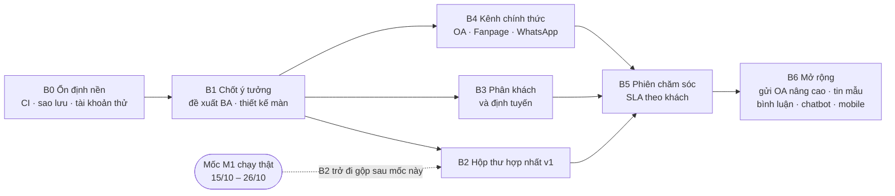

# Kế hoạch tổng thể: chat đa kênh, phân quyền và vận hành VClinks

Phiên bản 0.1 · 05/10/2026 · Trạng thái: Nháp (chờ duyệt)

## Tóm tắt

- **Tài liệu nói gì:** kế hoạch tổng thể gom mọi khuyến nghị ngày 05/10/2026: ổn định máy chạy thử 192.168.1.129, **hộp thư hợp nhất** cho Zalo cá nhân, Zalo OA, Fanpage và **WhatsApp** (kênh mới), vận hành **phân quyền – phân tài khoản kênh – phân khách hàng**, và kiểm thử.
- **Mục tiêu một câu:** nhân viên không phải nghĩ về kênh, chỉ nghĩ về khách; quản lý nhìn một màn biết ai đang lo khách nào, qua kênh nào.
- **7 bước (B0–B6):** ổn định nền → chốt ý tưởng và thiết kế → hộp thư hợp nhất v1 → phân khách và định tuyến → kênh chính thức và WhatsApp → phiên chăm sóc, SLA theo khách → mở rộng.
- **Ước lượng:** khoảng **204 giờ** cho B0–B5 (≈ 25 ngày công một người, có AI hỗ trợ). Hai dev chạy song song B2, B3, B4: khoảng 3–4 tuần lịch, chưa tính thời gian chờ Meta / Zalo.
- **Bảo vệ mốc M1:** đội VCparts chạy thật 15/10 (hạn cuối 26/10). B0–B1 làm ngay vì rủi ro thấp; B2 trở đi làm trên nhánh riêng, gộp sau khi M1 chạy ổn định (Q1).
- **Đã đổi so với kế hoạch Zalo OA / Fanpage v0.1:** phần **gửi tin Zalo OA** (khung có phí, ảnh, file, báo giá) tạm gác sang B6. Kế hoạch đó thành chi tiết của B4.
- **Việc của người có quyền** (không phải dev): sửa dịch vụ MongoDB máy 129 đợi mạng (sudo), đổi các khóa bí mật bị lộ trong repo vccar-service, đăng ký sớm Meta Business / WhatsApp / app Zalo riêng, quyết hạ tầng chạy thật.
- **Việc còn mở:** Q1–Q6 ở [§9](#9-câu-hỏi-cần-chốt).
- **Người duyệt xem kỹ:** [§3 nguyên tắc](#3-năm-nguyên-tắc-thiết-kế-hộp-thư-hợp-nhất), [§5 các bước](#5-các-bước-thực-hiện), lịch [§6](#6-lịch-đề-xuất) so với mốc M1, và [§8 rủi ro](#8-rủi-ro).

## Mục lục

- [Mô hình](#mô-hình)
- [1. Bối cảnh](#1-bối-cảnh)
- [2. Hiện trạng ngày 05/10/2026](#2-hiện-trạng-ngày-05102026)
- [3. Năm nguyên tắc thiết kế hộp thư hợp nhất](#3-năm-nguyên-tắc-thiết-kế-hộp-thư-hợp-nhất)
- [4. Ba lớp vận hành: phân quyền, phân kênh, phân khách](#4-ba-lớp-vận-hành-phân-quyền-phân-kênh-phân-khách)
- [5. Các bước thực hiện](#5-các-bước-thực-hiện)
- [6. Lịch đề xuất](#6-lịch-đề-xuất)
- [7. Phân công](#7-phân-công)
- [8. Rủi ro](#8-rủi-ro)
- [9. Câu hỏi cần chốt](#9-câu-hỏi-cần-chốt)
- [10. Đo thành công](#10-đo-thành-công)
- [11. Tài liệu liên quan](#11-tài-liệu-liên-quan)
- [Lịch sử cập nhật](#lịch-sử-cập-nhật)

---

## Mô hình

## 1. Bối cảnh

- VClinks đã xong phần lớn M1 cho **Zalo cá nhân** (đồng bộ, gửi qua extension, phân quyền, khách hàng 360, phiếu CSKH, báo cáo). Bản chạy thử đặt ở `https://vclink.tramaphutung.com` (máy 192.168.1.129), đăng nhập Google đã chạy.
- Ngày 05/10/2026 dev002 yêu cầu: tích hợp Zalo OA và Facebook (học từ vccar-service), lên ý tưởng chat khi có đủ Zalo, Facebook, WhatsApp, Zalo OA, và làm rõ phân quyền / phân tài khoản Zalo / phân khách hàng. Một người duyệt cho biết chưa nắm ba mục cuối hoạt động thế nào.
- Lộ trình gốc: Zalo OA, Fanpage thuộc M4 (chi phí v0.7: 06/11–11/11/2026); **WhatsApp chưa có trong BA**.

## 2. Hiện trạng ngày 05/10/2026

| Mảng | Đã có | Chưa có |
|---|---|---|
| Zalo cá nhân | Đồng bộ, gửi qua extension, nick, trực thay, bàn giao (M1) | Chưa nối nick nào vào máy 129 |
| Zalo OA | Kết nối, token mã hóa, webhook, nhận tin, trả lời chữ, 11 ca test | Lệch đặc tả (OA ngắt vẫn nhận tin, trùng bong bóng, token hỏng vẫn "xanh"); đồng bộ lịch sử; khung gửi |
| Fanpage | Kết nối, webhook, nhận tin, trả lời chữ trong 24h, 14 ca test | Chọn Page; tải ảnh của khách (CDN Meta bị chặn); gửi ảnh, file |
| WhatsApp | — | Toàn bộ |
| Hộp thư | Danh sách theo hội thoại, lọc Của tôi / Chưa phân công, chip SLA, realtime, mẫu câu, nháp AI | Gom theo khách, hàng việc theo độ gấp, ô soạn chọn kênh |
| Phân quyền | Cây tổ chức, 10 vai trò, khoảng 160 thao tác, quyền tạm thời, gán kênh, nhật ký, cảnh báo | Tab "Quyền hiệu lực" có code nhưng chưa gắn vào trang Quản trị |
| Phân khách | Owner, hàng Chưa phân công, bàn giao, gộp hồ sơ an toàn | Trạng thái làm việc (Vắng, Đi thị trường…), định tuyến kênh chung, chia khách tự động, CSKH tạm giữ, leo thang |
| Hạ tầng thử | Máy 129: API, web, worker ghi âm, MongoDB chung, Cloudflare tunnel | CI trên máy chủ, sao lưu tự động, MongoDB đợi mạng khi khởi động máy |

## 3. Năm nguyên tắc thiết kế hộp thư hợp nhất

1. **Khách là trung tâm, kênh chỉ là đường đi.** Một khách nhắn cả Zalo lẫn WhatsApp vẫn là một việc.
2. **Một màn hình, một cách làm cho mọi kênh.** Khác biệt kênh chỉ hiện ở ô soạn và dải khung gửi, đọc từ bảng năng lực C4 / chính sách C5 (BA §2.3).
3. **Hộp thư là hàng việc.** Sắp theo độ gấp: quá SLA → sắp hết khung gửi → cần trả lời → chờ khách.
4. **Mặc định trả lời qua kênh khách vừa dùng;** đổi kênh phải chọn tay, nút Gửi ghi rõ tên kênh.
5. **Máy làm phần máy làm được** (nhận diện khách, chia việc, đếm giờ, gợi ý mẫu); người quyết và bấm gửi (BR07, §12.1 CLAUDE.md).

**Quy tắc đề xuất thêm (chờ chủ dự án):**
- **BR-M1:** mỗi khách có tối đa một **phiên chăm sóc** mở trong mỗi division: một người xử lý, một đồng hồ SLA, bất kể khách nhắn bao nhiêu kênh.
- **BR-M2:** mặc định trả lời qua kênh của tin khách mới nhất.
- **BR-M3:** không gộp thật hội thoại của các kênh; "xem chung theo khách" chỉ là cách hiển thị, tránh gửi nhầm kênh.
- **BR-M4:** thứ tự hàng việc như nguyên tắc 3, thêm "khách đang có báo giá / đơn mở" trước nhóm còn lại.
- **BR-M5:** WhatsApp chỉ qua API chính thức (WhatsApp Business Platform), không tự động hóa WhatsApp cá nhân.

## 4. Ba lớp vận hành: phân quyền, phân kênh, phân khách

Mỗi lần mở hoặc trả lời một hội thoại, hệ thống ghép ba lớp. **Thấy chưa chắc được gửi; mặc định là chặn.** Nguồn chuẩn: đặc tả `01-phan-quyen.md` §2, `02-khach-da-kenh.md` §5.2, `03-sale-zalo-ca-nhan.md`.

| Lớp | Câu hỏi hệ thống trả lời | Cách làm | Làm ở đâu |
|---|---|---|---|
| Phân quyền | Bạn là ai trong tổ chức? | Vai trò tại một đơn vị → phạm vi Của tôi / Tổ / Division / Tập đoàn; quyền tạm thời khi cần xem ngoài phạm vi | Quản trị → Cây tổ chức, Người dùng, Vai trò & quyền, Quyền tạm thời |
| Phân kênh | Bạn cầm kênh nào? | Nick cá nhân: đúng 1 người giữ, vắng thì trực thay. OA, Fanpage, WhatsApp: gán cho nhóm mức Trực & gửi / Chỉ xem / Lead | Quản trị → Gán kênh, Token & thiết bị |
| Phân khách | Khách này của ai? | 1 owner mỗi division; tin mới về owner, chưa có owner vào hàng Chưa phân công; đổi owner chỉ qua bàn giao hoặc yêu cầu chuyển | Khách hàng, Quản trị → bàn giao |

**Bổ sung để dễ vận hành (B0, B3):**
- **"Ai thấy khách này?":** chọn một khách → ai thấy, ai gửi được, vì sao.
- **Bản đồ kênh:** mọi nick / OA / Page / WhatsApp, người giữ hoặc nhóm trực, ai trực thay hôm nay, xanh / đỏ.
- **Việc cần làm của quản trị:** nick chưa có người giữ, kênh chưa gán nhóm, khách chưa có owner quá 24h, quyền tạm thời sắp hết hạn.
- **Tài khoản thử theo vai trò:** mỗi vai trò một tài khoản giả để đào tạo và kiểm tra.

## 5. Các bước thực hiện

### B0 — Ổn định nền (12h dev + việc của người có quyền)

| Việc | Giờ | Ai |
|---|---:|---|
| Commit Dockerfile sửa lỗi build và thư mục `tools/deploy/server-129/`, đẩy GitLab | 1 | Dev |
| `tools/deploy/server-129/ci.sh`: chạy `pnpm ci:local` trong container trên máy 129 | 3 | Dev |
| Sao lưu hằng ngày database `vclinks` (giữ 7 bản) | 2 | Dev |
| Tài khoản thử theo vai trò trên máy 129 (`tools/seed/tai-khoan-thu.js`, đánh dấu THU) | 1 | Dev |
| Gắn tab "Quyền hiệu lực" vào trang Quản trị ("Ai thấy khách này?" bản đầu) | 3 | Dev |
| Ghi tài liệu vận hành máy 129 vào `docs/06-van-hanh/` | 2 | Dev |
| Sửa dịch vụ `mongod*` đợi mạng khi khởi động; kiểm tra MongoDB có mật khẩu | — | Người có sudo |
| Đổi khóa bí mật bị lộ trong repo vccar-service (Zalo dev, verify token, tài khoản reviewer Meta) | — | Chủ app Zalo / Meta |
| Đăng ký sớm: xác minh doanh nghiệp trên Meta, số WhatsApp doanh nghiệp, app Zalo và app Meta riêng cho VClinks | — | Chủ dự án |

**Xong khi:** CI xanh trên máy 129; có bản sao lưu; người duyệt đăng nhập được từng vai trò để tự xem khác biệt.

### B1 — Chốt ý tưởng và thiết kế (12h + chờ duyệt)

- Đề xuất BA trong `docs/02-yeu-cau/`: hộp thư hợp nhất (§3), phiên chăm sóc, BR-M1…M5, chương connector **WhatsApp** theo khuôn C1–C7, thêm cột WhatsApp vào bảng BA §17, các màn vận hành ở §4 (6h).
- Thiết kế màn trên canvas "VClinks UI Design": hộp thư hợp nhất, ô soạn đa kênh, bản đồ kênh, "Ai thấy khách này?" (4h).
- Họp chốt Q1–Q6 với chủ dự án (2h).

**Xong khi:** chủ dự án duyệt đề xuất và màn hình.

### B2 — Hộp thư hợp nhất v1 (40h)

| Việc | Giờ |
|---|---:|
| Danh sách gom theo khách: một dòng một khách, huy hiệu các kênh; mở ra có thanh chọn kênh | 8 |
| Hàng việc theo độ gấp: Quá SLA · Sắp hết khung gửi · Cần trả lời · Chờ khách | 6 |
| Ô soạn "Gửi qua [kênh]": mặc định kênh tin khách mới nhất; công cụ theo năng lực kênh; câu nhắc khi hết khung | 8 |
| Banner "khách vừa nhắn qua kênh khác"; dòng thời gian chung mọi kênh | 4 |
| Đóng kèm kết quả 1 chạm (Hỏi giá · Đặt hàng · Khiếu nại · Không cần); tự đóng khi chờ khách quá N ngày, tự mở lại khi khách nhắn | 4 |
| Phím tắt: J/K chuyển việc, E xong, `/` mẫu câu, Alt+A nháp AI | 2 |
| Test tự động và UAT | 8 |

**Xong khi:** UAT với nick Zalo test thật trên máy 129 cộng dữ liệu mẫu đa kênh.

### B3 — Phân khách và định tuyến (44h)

| Việc | Căn cứ | Giờ |
|---|---|---:|
| Trạng thái làm việc: Trực tuyến · Đi thị trường · Vắng (tự bật sau 30 phút không hoạt động) · Ngoại tuyến · cờ Nghỉ phép | 00 MH-UI-05, 02 DK-47 | 6 |
| Bộ định tuyến kênh chung theo loại yêu cầu: Bán hàng → owner, Hậu mãi → CSKH, chưa có owner → Chưa phân công | 02 §5.2 | 10 |
| Chia khách tự động: vòng tròn, khu vực, theo tải; bỏ qua người Vắng / Ngoại tuyến / Nghỉ phép; cấu hình theo division | BA F4.1, F12.9; 02 DK-62 | 8 |
| CSKH tạm giữ khi owner vắng (chỉ gửi mẫu giữ khách); leo thang quá 15 phút / 30 phút | 02 DK-24, DK-48 | 8 |
| Màn Bản đồ kênh và Việc cần làm của quản trị | §4 | 6 |
| Test và UAT phân quyền bằng tài khoản thử từng vai trò | 01 UAT | 6 |

**Xong khi:** ca UAT định tuyến của đặc tả 02 chạy đúng; người duyệt tự kiểm bằng tài khoản thử.

### B4 — Kênh chính thức và WhatsApp (64h + chờ Meta / Zalo)

Chi tiết Zalo OA và Fanpage: [ke-hoach-kenh-zalo-oa-fanpage.md](ke-hoach-kenh-zalo-oa-fanpage.md) (phần gửi tin OA đã gác sang B6).

| Kênh | Việc | Giờ |
|---|---|---:|
| Zalo OA | Sửa lệch đặc tả (OA-03 bỏ qua OA đã ngắt, OA-04 gộp tin gửi với echo, OA-23 sức khỏe token, OA-31 tin trả lời ngoài VClinks, OA-32 chống bấm Gửi hai lần) | 6 |
| Zalo OA | Đồng bộ lịch sử sau khi kết nối (`listrecentchat`, `conversation`, tối đa 10 / lần, có phân trang) | 6 |
| Zalo OA | Hiển thị vùng khung gửi Z0–Z3 trên khung chat (chỉ hiển thị, chưa thêm chặn mới) | 2 |
| Fanpage | Chọn Page khi kết nối (bản ghi chờ mã hóa 10 phút, không giữ user token) | 6 |
| Fanpage | Tải ảnh, file khách gửi (cho phép CDN của Meta); sức khỏe token chặn gửi khi hỏng | 4 |
| Fanpage | Gửi ảnh, file (`/me/message_attachments`) | 8 |
| WhatsApp | Connector mới theo C1–C7: kết nối số doanh nghiệp (token lưu mã hóa), webhook kiểm chữ ký, nhận đủ loại tin, gửi chữ / ảnh / file trong 24h, danh tính theo SĐT để gộp hồ sơ, màn kết nối, test e2e | 32 |

**Xong khi:** OA, Page, số WhatsApp thật trên máy 129 nhận và trả lời được; hội thoại hiện chung trong hộp thư B2.

### B5 — Phiên chăm sóc và SLA theo khách (32h)

| Việc | Giờ |
|---|---:|
| Mô hình **phiên chăm sóc**: 1 khách – 1 phiên mở mỗi division – 1 người xử lý – 1 đồng hồ SLA (BR-M1) | 12 |
| Chuyển "chưa trả lời", SLA, FRT và báo cáo sang tính theo phiên; giữ số cũ để so sánh | 12 |
| Gộp việc đa kênh tự động (tin cách nhau ≤ 30 phút, cùng division) | 4 |
| Test, đối chiếu số liệu trước / sau | 4 |

**Xong khi:** báo cáo theo phiên khớp kiểm tra tay trên dữ liệu thử; không còn hội thoại bị trả lời trùng giữa các kênh.

### B6 — Mở rộng (ước lượng khi chọn)

- Zalo OA gửi nâng cao: khung gửi có chặn, tin có phí Z2, ảnh, file, báo giá PDF (kế hoạch OA GV2, GV3, GV7).
- Tin mẫu: ZNS / ZBS của Zalo, template WhatsApp (cần khách đồng ý nhận), bảng đơn giá.
- Fanpage: bình luận (F6.1–F6.4), quảng cáo Click-to-Messenger.
- Kênh chính thức: tin chào, tin ngoài giờ, chatbot đã duyệt.
- Bản điện thoại tối giản cho sale đi thị trường.
- Facebook cá nhân (có điều kiện, OQ-42).

## 6. Lịch đề xuất

| Thời gian | Việc | Ghi chú |
|---|---|---|
| 06–07/10 | B0 | Song song: người có quyền sửa máy 129; chủ dự án bắt đầu đăng ký Meta / WhatsApp / Zalo |
| 08–10/10 | B1 | Chờ chủ dự án duyệt |
| 13–26/10 | Ưu tiên mốc M1 chạy thật; chỉ sửa lỗi M1 | B2, B3, B4 chỉ code trên nhánh, không gộp |
| 27/10–07/11 | B2 và B3 (dev 1), B4 (dev 2) | Gộp từng phần sau CI xanh và UAT trên máy 129 |
| 10–14/11 | B5 | Sau khi B2–B4 chạy ổn 1 tuần |
| Từ 17/11 | B6 theo thứ tự chủ dự án chọn | Trùng khoảng M4 trong kế hoạch chi phí |

Các mốc phụ thuộc thời gian chờ bên ngoài: xác minh doanh nghiệp Meta, App Review, số WhatsApp. Chưa có thì B4 làm và thử bằng tài khoản tester.

## 7. Phân công

| Người | Việc |
|---|---|
| Dev (dev002) + Claude Code | Code, CI và triển khai trên máy 129, UAT kỹ thuật, tài liệu kỹ thuật |
| Chủ dự án | Duyệt đề xuất BA và màn hình, chốt Q1–Q6, tài khoản doanh nghiệp Meta / WhatsApp / Zalo, quyết hạ tầng chạy thật |
| Người quản trị máy 129 (có sudo) | Dịch vụ MongoDB, tường lửa, sao lưu ra ngoài máy |
| Admin Google Workspace / Cloudflare | Đăng nhập Google, tên miền (đã xong cho bản thử) |
| Người dùng thử (NVKD, CSKH, giám sát) | UAT B2, B3, B5 |

## 8. Rủi ro

| Rủi ro | Mức | Cách giảm |
|---|---|---|
| Làm song song với mốc M1 chạy thật, đụng các phần lõi (hộp thư, outbox) | Cao | Nhánh riêng, gộp sau 26/10, bật bằng cờ tính năng |
| Máy 129 dùng chung: MongoDB hỏng khi khởi động máy, ổ đĩa từng đầy 90%, chưa sao lưu | Cao | B0: sửa `mongod`, sao lưu, theo dõi ổ; chạy thật trên máy riêng (Q5) |
| Thời gian chờ Meta (xác minh doanh nghiệp, App Review, WhatsApp) | Cao | Đăng ký ngay ở B0; thử bằng tài khoản tester |
| Đổi cách tính SLA sang theo phiên làm lệch báo cáo | Trung bình | Làm ở B5 sau khi có số liệu B2; chạy song song cách cũ và mới để so |
| Gộp nhầm khách giữa các kênh | Trung bình | Giữ quy tắc gộp an toàn D8-05; BR-M3 không gộp thật hội thoại |
| Nick Zalo cá nhân bị khóa khi thử | Trung bình | Chỉ dùng nick test, giữ danh sách hội thoại được phép gửi |
| Khóa bí mật lộ trong repo vccar-service | Cao | Đổi khóa ở B0 |
| Chi phí tin mẫu (ZNS, WhatsApp) | Thấp lúc này | Để B6, nhập bảng đơn giá trước khi bật |

## 9. Câu hỏi cần chốt

| Mã | Câu hỏi | Đề xuất |
|---|---|---|
| Q1 | Thứ tự với mốc M1: B0–B1 làm ngay, B2 trở đi gộp sau 26/10? | Đồng ý |
| Q2 | WhatsApp dùng cho ai? | Nhà cung cấp, đối tác nước ngoài, khách quốc tế; nhóm mua hàng / xuất nhập khẩu trực |
| Q3 | SLA tính theo khách (phiên chăm sóc) thay vì theo từng hội thoại? | Có, làm ở B5 |
| Q4 | Đưa Zalo cá nhân (nick test) lên máy 129 ngay ở B2 để thử hộp thư với dữ liệu thật? | Có; chỉ nick test, giữ danh sách hội thoại được phép gửi |
| Q5 | Máy 129 chỉ để thử; chạy thật trên máy riêng hoặc cloud (đóng câu hạ tầng ở CLAUDE.md §14)? | Có |
| Q6 | App Zalo và app Meta (Fanpage, WhatsApp) riêng cho VClinks, không dùng chung với vccar-service? | Có |

## 10. Đo thành công

- Thời gian phản hồi đầu tiên (FRT) trung vị và % hội thoại trả lời trong SLA, so với số đo baseline M1b-15.
- % tin trả lời còn trong khung miễn phí (OA 48h, Fanpage / WhatsApp 24h).
- Số lần một khách bị hai người trả lời trùng giữa các kênh: mục tiêu 0.
- % khách có owner sau 24h; số hội thoại nằm ở hàng Chưa phân công quá 1 giờ làm việc.
- Người duyệt tự trả lời được "ai thấy khách này, vì sao" bằng màn "Ai thấy khách này?".

## 11. Tài liệu liên quan

- Chi tiết Zalo OA, Fanpage: [ke-hoach-kenh-zalo-oa-fanpage.md](ke-hoach-kenh-zalo-oa-fanpage.md).
- BA tổng: `docs/02-yeu-cau/vclinks-ba.md` (§2.3 connector, §5.2 hộp thư, §5.4 danh tính, §5.5 phân công, §7 quy tắc, §17 so sánh kênh).
- Đặc tả: `docs/02-yeu-cau/dac-ta/01-phan-quyen.md`, `02-khach-da-kenh.md`, `03-sale-zalo-ca-nhan.md`, `04-cskh-zalo-oa.md`.
- Kế hoạch M1: `docs/01-quan-ly-du-an/m1/ke-hoach-phien-chat.md`; chi phí và mốc: `docs/01-quan-ly-du-an/chi-phi-phat-trien.md`.
- Triển khai máy 129: `tools/deploy/server-129/` (`compose.yml`, `sync.sh`).

## Lịch sử cập nhật

| Phiên bản | Ngày | Người / phiên | Thay đổi | Căn cứ |
|---|---|---|---|---|
| 0.1 | 05/10/2026 16:18 | Claude Code · dev002 | Tạo kế hoạch tổng thể: hiện trạng, 5 nguyên tắc hộp thư hợp nhất, ba lớp phân quyền / phân kênh / phân khách, 7 bước B0–B6 có giờ, lịch theo mốc M1, phân công, rủi ro, Q1–Q6, đo thành công | Yêu cầu dev002 05/10/2026 |
