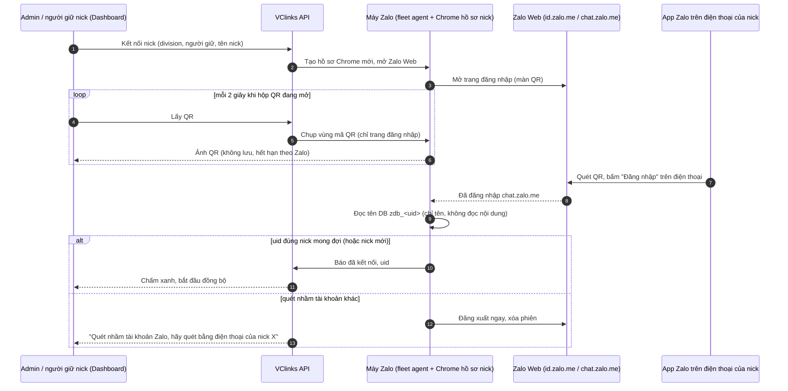

# Kế hoạch tích hợp Zalo cá nhân bằng quét mã QR

Phiên bản 0.3 · 07/10/2026 · Trạng thái: Chờ duyệt (đã làm bản đầu trên nhánh `feat/giao-dien-moi`)

## Tóm tắt

- **Mục tiêu:** người giữ nick tự kết nối nick Zalo công ty vào VClinks bằng cách **quét mã QR hiện ngay trên Dashboard**, giống đăng nhập Zalo Web. Khi mất phiên thì cũng quét lại ngay trên Dashboard. Không cần người trực mở noVNC, không cần cài tiện ích trên máy nhân viên, nick chạy 24/7 trên máy chủ.
- **Khuyến nghị: phương án A, "máy Zalo trên máy chủ".** Mỗi nick là một hồ sơ Chrome chạy Zalo Web trên máy chủ, cùng tiện ích VClinks đang có. Mã QR được chụp từ trang đăng nhập Zalo rồi chuyển lên Dashboard. Phương án này dùng lại gần hết phần đã làm ở M1a-01 (`pnpm fleet`, `watchdog`, image Docker) và **giữ nguyên bất biến §12.2**: cookie phiên nằm trong hồ sơ Chrome, VClinks không lưu.
- **Không khuyến nghị phương án B**, tức thư viện giao thức không chính thức (ví dụ zca-js). Với cách này VClinks phải tự lưu cookie và khóa phiên (trái §12.2 và §3), dễ bị Zalo khóa hơn, và hỏng mỗi khi Zalo đổi giao thức.
- **Hai lớp an toàn chính:**
  - Chỉ chụp ảnh trang đăng nhập, không bao giờ chụp trang chat.
  - Nếu quét nhầm tài khoản Zalo khác thì hệ thống tự đăng xuất ngay.
- **Sức chứa:** máy 129 (đo 05/10/2026: 16 luồng CPU, 31 GB RAM, còn trống khoảng 12 GB) chạy được khoảng **8–10 nick**. Nhiều hơn thì cần một máy riêng đặt ở văn phòng. Không chạy trên cloud vì IP trung tâm dữ liệu dễ bị Zalo nghi.
- **Khối lượng:** khoảng **114 giờ dev**, chia 7 bước. Bước P0 (thử kỹ thuật, 16 giờ) làm ngay bằng một nick phụ, không đụng nick UAT. Phần còn lại làm sau mốc chạy thật M1 (26/10).
- **Việc còn mở:** Q1–Q5 ở mục 9 (phương án, loại nick, ai được xem QR, nơi chạy, nick phụ cho P0).
- **Người duyệt nên xem kỹ:** mục 4 (bảo mật, nick cá nhân của nhân viên theo NĐ 13) và mục 8 (rủi ro Zalo hạn chế nick).
- **Cập nhật 05/10/2026 (bản 0.2):** đã đối chiếu tài liệu Pancake "Zalo Cá nhân" (cùng cách: quét QR trên web, sau đó không đăng nhập chat.zalo.me ở chỗ khác, nút đồng bộ tin cũ gửi yêu cầu về điện thoại). Đã làm bản đầu P1–P3 trên máy 129 (máy Zalo, API, hộp thoại QR, test e2e 8/8); xem mục 11. Còn chờ: thử đăng nhập bằng nick phụ thật (Q5), P4–P6.

## Mục lục

- [Mô hình](#mô-hình)
- [1. Bối cảnh và mục tiêu](#1-bối-cảnh-và-mục-tiêu)
- [2. Ba phương án và khuyến nghị](#2-ba-phương-án-và-khuyến-nghị)
- [3. Thiết kế phương án khuyến nghị](#3-thiết-kế-phương-án-khuyến-nghị)
- [4. Bảo mật, quyền riêng tư, tuân thủ](#4-bảo-mật-quyền-riêng-tư-tuân-thủ)
- [5. Hạ tầng và sức chứa](#5-hạ-tầng-và-sức-chứa)
- [6. Các bước thực hiện](#6-các-bước-thực-hiện)
- [7. Lịch đề xuất và quan hệ với M1](#7-lịch-đề-xuất-và-quan-hệ-với-m1)
- [8. Rủi ro](#8-rủi-ro)
- [9. Câu hỏi cần chốt](#9-câu-hỏi-cần-chốt)
- [10. Đo thành công](#10-đo-thành-công)
- [11. Tiến độ thực hiện (05/10/2026)](#11-tiến-độ-thực-hiện-05102026)
- [12. Tài liệu liên quan](#12-tài-liệu-liên-quan)
- [Lịch sử cập nhật](#lịch-sử-cập-nhật)

## Mô hình



## 1. Bối cảnh và mục tiêu

**Hiện trạng ngày 05/10/2026:**

- Nick Zalo cá nhân vào VClinks theo hai đường:
  - **Tiện ích trên máy nhân viên:** ghép với VClinks bằng mã 6 số (PQ-52, Admin nhập ở MH-PQ-08).
  - **Chrome driver / fleet trên máy chủ:** mỗi nick một hồ sơ Chrome (M1a-01, `docs/06-van-hanh/chrome-driver.md`).
- Khi nick mất phiên, `watchdog` báo `account.session_lost` và Dashboard báo đỏ ("Cần Tú quét mã QR…"). Muốn quét lại phải có **người trực mở noVNC** (xem màn hình máy chủ từ xa) để thấy mã QR.
- Tồn tại đã ghi trong tài liệu driver:
  - Chưa thử trên máy Linux (E1).
  - Chưa thử từ 3 nick thật trở lên (E2).
  - Chưa thử hai phiên web cùng một nick.
  - Driver chung hay bị chặn khi có người chạm vào tab, nên chủ dự án đã phải mở một cửa sổ lấy nội dung riêng (05/10/2026).

**Mục tiêu:**

1. Kết nối nick mới **≤ 3 phút** từ lúc bấm đến khi chấm xanh, do Admin và người giữ nick tự làm trên Dashboard.
2. Quét lại khi mất phiên **≤ 2 phút**, do người giữ nick tự làm, không cần người trực.
3. Mỗi nick chạy trên máy chủ trong một cửa sổ **không ai chạm vào**. Nhờ đó việc lấy nội dung tin (cần tab rảnh 15 giây) luôn chạy được.
4. Giữ nguyên bất biến §12:
   - Không gửi khi chưa duyệt.
   - Không lưu cookie, token, khóa E2EE, mật khẩu, OTP trong VClinks.
   - Log không chứa nội dung tin.

## 2. Ba phương án và khuyến nghị

| Tiêu chí | **A. Máy Zalo trên máy chủ + QR trên Dashboard** | B. Thư viện giao thức không chính thức (zca-js…) | C. Tiện ích trên máy nhân viên (hiện trạng) |
|---|---|---|---|
| Cách chạy | Chrome thật chạy Zalo Web trên máy chủ, mỗi nick một hồ sơ; tiện ích VClinks đọc và gửi như bây giờ | Thư viện đăng nhập QR rồi gọi thẳng API nội bộ của Zalo, không cần trình duyệt | Nhân viên tự mở Zalo Web trên Chrome của mình, có tiện ích VClinks |
| Tuân thủ §12.2 (không lưu phiên) | **Đạt**: phiên nằm trong hồ sơ Chrome trên máy chủ, như một trình duyệt; VClinks không đọc cookie hay storage | **Không đạt**: VClinks phải lưu cookie, imei, khóa phiên để chạy | Đạt |
| Rủi ro bị Zalo hạn chế | Trung bình: giống người dùng Zalo Web thật; giảm bằng IP văn phòng và nhịp gửi chậm | Cao hơn: đặc trưng máy khách khác Zalo Web, dễ bị phát hiện | Thấp nhất |
| Tài nguyên | 0,5–0,8 GB RAM mỗi nick (ước tính, đo ở P0) | Rất nhẹ | Không tốn máy chủ |
| Khi Zalo đổi | Đã có bảng ánh xạ + báo lệch cấu trúc (drift) + Claude đề xuất bản mới | Thư viện hỏng tới khi có người sửa, ngoài tầm kiểm soát | Như A |
| Dùng lại code | Gần hết: tiện ích, fleet, watchdog, image Docker, báo phiên | Phải viết lại đường nhận và gửi | Có sẵn |
| Nick online 24/7 | Có | Có | Chỉ khi máy nhân viên bật và mở Zalo Web |
| **Kết luận** | **Khuyến nghị làm** | Không làm (chỉ cân nhắc lại nếu cần hàng trăm nick và chủ dự án chấp nhận sửa §12) | Giữ làm đường dự phòng |

## 3. Thiết kế phương án khuyến nghị

### 3.1 Thành phần

| Thành phần | Có sẵn | Làm thêm |
|---|---|---|
| **Máy Zalo** (container Docker trên máy 129): Xvfb (màn hình ảo, vì Zalo Web cần Chrome có giao diện) + Chrome + tiện ích VClinks + watchdog + noVNC | `tools/chrome-driver/cloud/Dockerfile`, `fleet.js`, `watchdog.js` | Chạy được trên máy 129, mỗi nick giới hạn RAM; hồ sơ tạo và xóa động thay vì sửa tay `fleet.json` |
| **Fleet agent**: dịch vụ HTTP nội bộ trong máy Zalo (chỉ nghe `127.0.0.1`, có khóa bí mật chung với API) | — | Tạo, bật, tắt hồ sơ; chụp mã QR; bấm "lấy mã mới" khi QR hết hạn; đọc tên DB `zdb_<uid>`; đăng xuất và xóa hồ sơ |
| **VClinks API** | Báo phiên `POST /api/accounts/:uid/session`, nick mới chờ xác nhận, ghép thiết bị PQ-52 | Bảng `zalo_slots`, các endpoint ở mục 3.6, nhật ký `zalo.*` |
| **Dashboard** | Chấm nick đỏ, Bản đồ kênh, Quản trị › Việc cần làm | Hộp thoại "Kết nối nick Zalo", nút "Quét lại QR", nút "Ngắt kết nối" |

### 3.2 Luồng kết nối nick mới

1. Admin vào **Kênh › Kết nối nick Zalo**, chọn division, người giữ nick (người cầm điện thoại) và đặt tên nick. Admin tick xác nhận đây là **nick công ty** (xem mục 4).
2. API tạo một "chỗ" (`zalo_slots`). Fleet agent tạo hồ sơ Chrome mới và mở Zalo Web ở màn QR.
3. Hộp thoại hiện mã QR, tự làm mới mỗi 2 giây, đếm ngược đến khi mã hết hạn. Hết hạn thì agent tự bấm "lấy mã mới".
   - Admin có thể **gửi đường dẫn** cho người giữ nick để họ tự mở hộp thoại trên máy mình.
   - Chỉ người giữ nick và Admin xem được mã QR.
4. Người giữ nick mở app Zalo trên điện thoại, quét mã, bấm **Đăng nhập** trên điện thoại.
   - Nếu Zalo hỏi "đồng bộ tin nhắn gần đây" thì chọn đồng ý.
   - Hộp thoại hướng dẫn từng bước, trạng thái chuyển: "Chờ quét" → "Đã quét, xác nhận trên điện thoại" → "Đang kết nối".
5. Agent đọc **tên** các DB `zdb_<uid>` để biết uid vừa đăng nhập (không đọc nội dung, không đọc cookie hay localStorage).
6. API ghi nhận nick: tạo `accounts` với division và người giữ nick đã chọn ở bước 1, nên không phải chờ duyệt "nick mới" như PQ-52. Token thiết bị cấp thẳng cho tiện ích trong hồ sơ, không cần mã 6 số.
7. Tiện ích đồng bộ như hiện nay: danh bạ → nhóm → hội thoại → tin. Lấy nội dung 7 ngày theo M1a-08. Hộp thoại báo "Đã kết nối" và số hội thoại đã nhận.
8. Gửi tin vẫn đi qua lệnh gửi đã duyệt (§12.1) và nhịp gửi chậm (M1a-06). Giai đoạn thử chỉ gửi vào hội thoại chủ dự án chỉ định (§4.1).

### 3.3 Quét lại khi mất phiên

- Watchdog thấy màn QR thì báo `session_lost` (lý do `qr`).
- Dashboard hiện chấm đỏ kèm nút **"Quét lại QR"**:
  - Hiện cho người giữ nick ở chấm nick và popover "Nick của tôi".
  - Hiện cho Admin ở Bản đồ kênh và Việc cần làm.
- Bấm nút thì mở cùng hộp thoại QR như mục 3.2. Quét xong, watchdog báo `ok` trong ≤ 2 phút và API ghi `account.session_restored`.
- **Chống quét nhầm:** chỗ này đã gắn uid. Nếu tài khoản vừa đăng nhập có uid khác:
  - Agent đăng xuất ngay và xóa phiên vừa vào.
  - API ghi `zalo.wrong_account`, không nhận dữ liệu (API vốn từ chối nạp cho nick chưa đăng ký).
  - Hộp thoại báo: "Bạn vừa quét bằng tài khoản Zalo khác. Hãy quét bằng điện thoại đang dùng nick <tên nick>."

### 3.4 Ngắt kết nối và bàn giao nick

- **Ngắt kết nối** (Admin với mọi nick; người giữ nick với nick của mình, chốt 07/10/2026; có xác nhận):
  - Agent đăng xuất Zalo Web và xóa toàn bộ hồ sơ Chrome của nick.
  - API đánh dấu nick ngừng nhận và ghi nhật ký.
  - Lịch sử tin đã lưu trong VClinks giữ nguyên, theo thời hạn lưu trữ (§12.4).
- **Bàn giao nick** (MH-PQ-04, QT-SZ-11): mục "Đã quét lại QR" trong danh sách việc bàn giao đổi thành nút **"Quét lại QR bằng điện thoại người giữ mới"**. Hồ sơ cũ bị xóa trước khi người mới quét. Cờ "chưa an toàn sau bàn giao" giữ như hiện nay.

### 3.5 Màn hình

```
┌──────────────────────────────── Kết nối nick Zalo ─────────────────────────────────┐
│  Nick: Tú VCparts · Division VCparts · người giữ: Lê Anh Tú                         │
│                                                                                    │
│   ┌──────────────┐   1. Mở Zalo trên điện thoại của nick Tú VCparts                 │
│   │              │   2. Bấm biểu tượng quét mã QR trong app và quét mã này          │
│   │   [MÃ QR]    │   3. Bấm "Đăng nhập" trên điện thoại; nếu hỏi đồng bộ tin thì    │
│   │              │      chọn đồng ý                                                 │
│   └──────────────┘                                                                 │
│   Mã đổi sau 0:42 · [Lấy mã mới]       Trạng thái: ● Chờ quét                      │
│                                                                                    │
│   Chỉ quét bằng điện thoại của nick này. Quét nhầm tài khoản khác sẽ bị đăng xuất. │
│                                          [Gửi đường dẫn cho người giữ]  [Đóng]      │
└────────────────────────────────────────────────────────────────────────────────────┘
```

Trạng thái trong hộp thoại: Chờ quét → Đã quét, xác nhận trên điện thoại → Đang kết nối → Đã kết nối (n hội thoại). Các trạng thái lỗi:
- "Mã hết hạn": bấm lấy mã mới.
- "Quét nhầm tài khoản".
- "Zalo yêu cầu xác minh thêm": chuyển Admin xử lý qua noVNC; hệ thống không tự làm.
- "Máy Zalo đầy": đã đạt số nick tối đa.

Khi chủ dự án duyệt hướng này, sẽ vẽ màn hình chính thức trên canvas "VClinks UI Design".

### 3.6 Dữ liệu và API mới

| Mục | Nội dung |
|---|---|
| Bảng `zalo_slots` | `_id, uid?, label, divisionId, holderUserId, state (cho_quet \| da_ket_noi \| mat_phien \| da_ngat), createdBy, createdAt, connectedAt?, lastQrAt?`. Không có cookie hay token |
| `POST /api/zalo/slots` | Admin tạo chỗ cho nick mới, trả `slotId` |
| `GET /api/zalo/slots/:id/qr` | Người giữ nick hoặc Admin lấy ảnh QR hiện tại. Trả `{state, image?, expiresAt?}`; ảnh đi thẳng từ agent, không lưu, không log; giới hạn tần suất |
| `POST /api/zalo/slots/:id/refresh` | Lấy mã QR mới |
| `POST /api/accounts/:uid/rescan` | Mở lại màn QR cho nick đã có |
| `DELETE /api/zalo/slots/:id` (bản đã làm) | Admin hoặc người giữ nick ngắt kết nối: đăng xuất và xóa hồ sơ |
| Nhật ký | `zalo.slot_created`, `zalo.qr_viewed` (một dòng mỗi lần mở hộp thoại, không có ảnh), `zalo.connected`, `zalo.wrong_account`, `zalo.disconnected` |
| Quyền | Tạo chỗ: Admin. Ngắt kết nối: Admin với mọi nick, người giữ nick với nick của mình (chốt 07/10/2026). Quét lại: người giữ nick (`giu_nick`) và Admin. Cần thêm một dòng vào ma trận `01-phan-quyen.md` (chờ duyệt) |

### 3.7 Những việc hệ thống không bao giờ làm

- Không tự nhập mật khẩu hay OTP, không tự xử lý CAPTCHA hay bước xác minh của Zalo. Gặp những bước này thì chuyển cho người qua noVNC.
- Không chụp màn hình trang chat. Agent chỉ chụp vùng mã QR khi tab đang ở trang đăng nhập `id.zalo.me`.
- Không đọc cookie, localStorage, store `e2ee_*`. Không lưu ảnh QR.
- Không cho người khác ngoài người giữ nick và Admin xem mã QR.

## 4. Bảo mật, quyền riêng tư, tuân thủ

- **§12.2:**
  - Phiên Zalo nằm trong thư mục hồ sơ Chrome trên máy chủ, coi như bí mật: quyền 700, không sao lưu ra ngoài, không chép sang máy khác, xóa khi ngắt kết nối.
  - Nên đặt thư mục hồ sơ trên ổ mã hóa (cần người có sudo trên máy 129).
  - DB VClinks không có trường nào chứa cookie hay token phiên. Sẽ thêm test để kiểm.
- **Truy cập máy Zalo:**
  - noVNC chỉ nghe nội bộ, ra ngoài qua Cloudflare Tunnel có Cloudflare Access (chỉ email công ty) và mật khẩu VNC.
  - Fleet agent chỉ nghe `127.0.0.1`.
- **NĐ 13/2023 và nick cá nhân của nhân viên:** khuyến nghị **chỉ kết nối nick công ty** (SIM và tài khoản thuộc công ty). Nếu kết nối nick riêng của nhân viên thì công ty sẽ đọc được cả tin nhắn riêng tư của họ. Trường hợp này cần văn bản đồng ý của nhân viên và cách loại bớt hội thoại riêng (chờ Q2). Hộp thoại kết nối bắt Admin tick xác nhận loại nick và lưu vào nhật ký.
- **Điều khoản Zalo:** Zalo không có API chính thức cho tài khoản cá nhân, nên mọi cách tự động hóa nick cá nhân đều có rủi ro bị hạn chế. Cách giảm rủi ro:
  - Dùng IP văn phòng, mỗi IP không quá số nick ở mục 5.
  - Gửi chậm như người thật (M1a-06), không gửi hàng loạt.
  - Kênh chăm sóc khách số lượng lớn dùng Zalo OA (bước B4 của kế hoạch tổng).

## 5. Hạ tầng và sức chứa

| Mục | Số liệu |
|---|---|
| Máy 129 (đo 05/10/2026) | Intel i5-14400, 16 luồng; RAM 31 GB, đang dùng 17 GB (Kafka, n8n, MongoDB…), còn trống khoảng 12 GB; ổ đĩa còn 143 GB; Ubuntu 22.04, không có màn hình (chạy Xvfb trong container) |
| Mỗi nick (ước tính, đo ở P0) | RAM 0,5–0,8 GB; ổ đĩa 1–3 GB cho hồ sơ Chrome và dữ liệu Zalo Web; CPU thấp, tăng khi đồng bộ |
| Máy 129 chạy được | Khoảng **8–10 nick**, chừa lại 4 GB cho các dịch vụ khác |
| Hơn 10 nick | Một máy riêng đặt ở văn phòng (32–64 GB RAM, khoảng 30–60 nick), có UPS, cùng mạng văn phòng |
| Không dùng | Máy ảo cloud: IP trung tâm dữ liệu dễ bị Zalo nghi (E1 chưa thử); nếu bắt buộc thì phải thử 48 giờ trước |

## 6. Các bước thực hiện

| Bước | Việc | Giờ | Xong khi |
|---|---|---:|---|
| **P0** Thử kỹ thuật | Chạy image máy Zalo trên máy 129 với **một nick phụ** (không dùng nick UAT); chụp QR qua CDP; đăng nhập; đo RAM và ổ đĩa mỗi nick; theo dõi 48 giờ xem Zalo có đăng xuất hay đòi xác minh; thử hai phiên web cùng một nick; khởi động lại container | 16 | Báo cáo thử trong `docs/04-ky-thuat/zalo-web/`, có số đo; trả lời được E1, E2 và câu hỏi hai phiên |
| **P1** Máy Zalo | Container chạy dài hạn trên máy 129; fleet agent HTTP; tạo và xóa hồ sơ động; giới hạn RAM mỗi nick; watchdog dùng chung | 24 | Tạo và xóa được hồ sơ bằng lệnh; khởi động lại máy vẫn tự chạy |
| **P2** API | `zalo_slots`, các endpoint mục 3.6, kiểm tra uid, nhật ký, quyền, test e2e (giả lập agent); thêm dòng ma trận quyền | 16 | Test e2e đạt: tạo chỗ, QR, quét nhầm, ngắt kết nối, không lưu bí mật |
| **P3** Dashboard | Hộp thoại kết nối và quét lại, nút ở chấm nick, Bản đồ kênh, Việc cần làm, nút bàn giao | 20 | Admin kết nối nick mới và người giữ quét lại được mà không cần noVNC |
| **P4** Lần đầu và độ bền | Hướng dẫn đồng bộ tin từ điện thoại; tiến độ đồng bộ trong hộp thoại; cảnh báo khi nhiều nick rớt cùng lúc; báo "máy Zalo đầy" | 12 | Nick mới thấy tin 7 ngày; rớt 3 nick trong 5 phút thì Admin nhận cảnh báo |
| **P5** Bảo mật và vận hành | Ổ mã hóa cho hồ sơ (cần sudo), Cloudflare Access cho noVNC, tài liệu vận hành `docs/06-van-hanh/`, quy trình xử lý sự cố | 10 | Danh sách kiểm tra bảo mật đạt; tài liệu vận hành đã duyệt |
| **P6** Kiểm thử chấp nhận | UAT trên máy 129: kết nối, quét lại, quét nhầm, ngắt kết nối, bàn giao; gửi chỉ vào hội thoại được chỉ định; thử 2–3 nick công ty | 16 | UAT đạt, chủ dự án đồng ý cho chạy với nick thật |
| | **Cộng** | **114** | Khoảng 14–15 ngày làm việc của một dev |

## 7. Lịch đề xuất và quan hệ với M1

- Mốc chạy thật M1 là 26/10/2026. Kế hoạch này **không đụng đường chạy của M1**: P0 chạy trong container riêng trên máy 129, nick phụ chỉ nhận tin, không gửi.
- **P0: 06–08/10/2026.** Có kết quả P0 thì chủ dự án chốt làm tiếp hay đổi hướng.
- **P1–P6: sau 26/10/2026, trên nhánh riêng.** Đề xuất xếp trước bước B3 của kế hoạch tổng vì nó làm kênh Zalo cá nhân bền hơn. Dự kiến 27/10–14/11 với một dev; hai dev dùng AI thì nhanh hơn.
- Phương án C (tiện ích trên máy nhân viên) vẫn giữ làm đường dự phòng.

## 8. Rủi ro

| Rủi ro | Khả năng | Ảnh hưởng | Giảm thiểu |
|---|---|---|---|
| Zalo đăng xuất hoặc hạn chế nick chạy trên máy chủ | Trung bình | Cao | P0 theo dõi 48 giờ; IP văn phòng; giới hạn số nick mỗi IP; nhịp gửi chậm; quét lại ≤ 2 phút |
| Zalo không cho hai phiên web cùng lúc, đăng nhập máy chủ đá phiên trên máy nhân viên | Chưa rõ | Trung bình | Thử ở P0; nếu đúng thì nhân viên dùng Dashboard và app điện thoại, không mở Zalo Web riêng |
| Quét nhầm tài khoản, hoặc người ngoài thấy mã QR | Thấp | Trung bình | Kiểm uid rồi tự đăng xuất; QR chỉ cho người giữ nick và Admin; không lưu ảnh; ghi nhật ký `zalo.qr_viewed` |
| Zalo đòi xác minh thêm hoặc hiện CAPTCHA | Thấp | Trung bình | Không tự xử lý; báo Admin làm qua noVNC |
| Máy 129 hết RAM khi thêm nick | Trung bình | Cao | Giới hạn RAM mỗi nick; chặn tạo chỗ khi đầy; kế hoạch máy riêng khi hơn 10 nick |
| Máy 129 tắt thì mọi nick rớt cùng lúc | Thấp | Cao | Container tự chạy lại; cảnh báo rớt hàng loạt; UPS; tiện ích trên máy nhân viên làm dự phòng |
| Zalo đổi giao diện trang đăng nhập làm hỏng việc chụp QR | Trung bình | Thấp | Chụp theo vùng mã QR có kiểm tra; hỏng thì vẫn quét qua noVNC; bảng ánh xạ và drift cho phần chat |
| Lộ thư mục hồ sơ Chrome (lấy được phiên Zalo) | Thấp | Cao | Quyền 700, ổ mã hóa, không sao lưu ra ngoài, xóa khi ngắt; người giữ nick luôn tự đăng xuất được phiên máy tính này từ app Zalo trên điện thoại (mục thiết bị đăng nhập; kiểm tên mục ở P0) |

## 9. Câu hỏi cần chốt

| Mã | Câu hỏi | Đề xuất mặc định |
|---|---|---|
| Q1 | Chọn phương án nào? | **A** (máy Zalo trên máy chủ + QR trên Dashboard); không làm B |
| Q2 | Kết nối loại nick nào? | **Chỉ nick công ty** (SIM và tài khoản thuộc công ty). Nick riêng của nhân viên thì để sau, cần văn bản đồng ý |
| Q3 | Ai được xem mã QR và quét lại? | **Người giữ nick** (nick của mình) và **Admin**; tạo chỗ mới chỉ Admin; ngắt kết nối: Admin, và người giữ nick với nick của mình (dev002 chốt 07/10/2026) |
| Q4 | Chạy ở đâu? | **Máy 129** cho P0 và tối đa khoảng 10 nick; hơn 10 nick thì mua máy riêng đặt ở văn phòng; không dùng cloud |
| Q5 | Nick nào dùng cho P0? | **Một nick phụ mới** (SIM công ty), không dùng nick UAT đang chạy trên Chrome driver để khỏi làm rớt phiên UAT |

## 10. Đo thành công

- Kết nối nick mới: trung vị ≤ 3 phút, không cần người trực; quét lại: ≤ 2 phút.
- Nick online ≥ 99% giờ làm việc trong 2 tuần đầu chạy thử.
- Không có cookie hay token phiên nào trong DB VClinks (có test kiểm).
- 100% lần quét nhầm tài khoản bị đăng xuất trong ≤ 30 giây.
- Không lần nào Zalo hạn chế nick trong 2 tuần chạy thử (nếu có thì dừng và báo chủ dự án).

## 11. Tiến độ thực hiện (05/10/2026)

| Bước | Trạng thái | Ghi chú |
|---|---|---|
| P0 thử kỹ thuật | Một phần | Chrome trong container chạy được trên máy 129 (cần `seccomp=unconfined` để giữ sandbox Chrome); mã QR chụp được và tự đổi; 616 MB RAM khi ở màn QR. **Chưa đăng nhập bằng nick thật** (chờ nick phụ, Q5), nên chưa đo được RAM khi đã đăng nhập và chưa theo dõi 48 giờ |
| P1 máy Zalo | Bản đầu xong | `tools/chrome-driver/farm-agent.js`, `farm-lib.js`, `farm/Dockerfile`; dịch vụ `zalo-farm` (profile `farm`) trên máy 129, tối đa 4 nick |
| P2 API | Bản đầu xong | `apps/api/src/zalo-farm/`, bảng `zalo_slots`, 7 route có quyền, chống quét nhầm, nhật ký `zalo.*`; test e2e 8/8 với máy Zalo giả |
| P3 Dashboard | Bản đầu xong | Kênh › "Kết nối bằng mã QR", mục Máy Zalo, "Quét lại QR" trong popover Nick, "Đồng bộ tin nhắn cũ" |
| P4–P6 | Chưa làm | Tiến độ đồng bộ, cảnh báo rớt hàng loạt, ổ mã hóa, profile seccomp riêng, UAT với nick thật |

Theo tài liệu Pancake: Zalo **chỉ giữ một phiên web** cho mỗi nick, nên hộp thoại dặn không đăng nhập chat.zalo.me ở chỗ khác và không quét bằng nick đang chạy trên Chrome driver.

## 12. Tài liệu liên quan

- `CLAUDE.md` §4.1 (Chrome driver, chỉ gửi hội thoại được chỉ định), §12 (bất biến).
- `docs/06-van-hanh/chrome-driver.md`: fleet, watchdog, noVNC, E1/E2.
- `docs/02-yeu-cau/dac-ta/03-sale-zalo-ca-nhan.md`: MH-SZ-12a (nick của tổ, cần quét QR), QT-SZ-11 (bàn giao), D53 (mã ghép).
- `docs/02-yeu-cau/dac-ta/01-phan-quyen.md`: PQ-52 (ghép thiết bị), MH-PQ-04 (bàn giao), MH-PQ-08.
- `docs/01-quan-ly-du-an/ke-hoach-tong-the-chat-da-kenh.md`: kế hoạch tổng B0–B6.

## Lịch sử cập nhật

| Phiên bản | Ngày | Người / phiên | Thay đổi | Căn cứ |
|---|---|---|---|---|
| 0.3 | 07/10/2026 16:33 | Claude Code (dev002) | Người giữ nick tự ngắt kết nối được nick của mình (mục 3.4, bảng API, dòng Quyền, Q3); Admin vẫn ngắt mọi nick; ghi đường API thật `DELETE /api/zalo/slots/:id` | dev002 07/10/2026: "những nick được kết nối zalo thì phải được ngắt kết nối chứ" |
| 0.2 | 05/10/2026 19:02 | Claude Code (dev002) | Đối chiếu tài liệu Pancake; thêm mục 12 Tiến độ (bản đầu P1–P3 trên máy 129, việc còn lại) | Tài liệu Pancake "Zalo Cá nhân"; yêu cầu dev002 05/10/2026 "đọc hiểu và thực hiện" |
| 0.1 | 05/10/2026 18:17 | Claude Code (dev002) | Tạo kế hoạch: so sánh 3 phương án, khuyến nghị A, thiết kế luồng, bảo mật, sức chứa máy 129, 7 bước 114 giờ, Q1–Q5 | Yêu cầu dev002 05/10/2026 |
