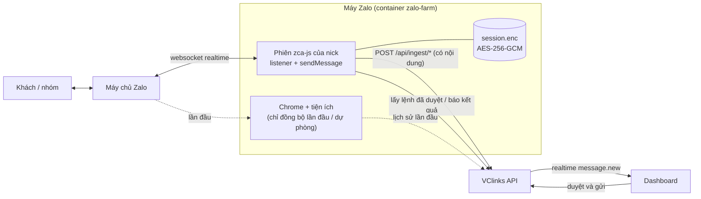

# Kế hoạch kết nối Zalo cá nhân trực tiếp bằng zca-js

Phiên bản 0.2 · 06/10/2026 · Trạng thái: Đang làm (P2, P3 chạy trên máy 129; P4 đã viết code; P5 xong phần không cần triển khai; chờ P4.0)

## Tóm tắt

- **Vấn đề:** nick Zalo cá nhân hiện nhận và gửi tin **qua Zalo Web và tiện ích VClinks** trong Chrome của máy Zalo:
  - Tin mới trễ khoảng 4 giây, có lúc lâu hơn.
  - Muốn đọc nội dung phải mở hội thoại, nên khách thấy "Đã xem".
  - Gửi tin bằng cách gõ phím giả trên giao diện.
  - Nhóm bị ẩn thì không đọc được.
  - Mỗi nick tốn một Chrome khoảng 600 MB.
- **Giải pháp:** thêm chế độ **"Trực tiếp"** cho máy Zalo. Mỗi nick là một phiên **zca-js**: thư viện mã nguồn mở, giấy phép MIT, bản 2.2.0 ngày 09/09/2026, khoảng 480 nghìn lượt tải mỗi tuần. Nó nói chuyện thẳng với máy chủ Zalo như Zalo Web.
  - Tin đến qua kênh realtime, **có sẵn nội dung**.
  - Tin gửi đi bằng hàm `sendMessage`.
  - Tiện ích và Chrome **chỉ còn dùng cho đồng bộ lịch sử lần đầu** và làm đường dự phòng. Phép thử P0 ngày 06/10/2026 xác nhận **zca-js không lấy được tin trước lúc quét QR** (mục 11), nên lần đầu bắt buộc đi qua Chrome rồi chuyển phiên sang zca-js (bước P4).
- **Giao diện gần như không đổi:**
  - Hộp thoại "Kết nối nick Zalo bằng mã QR" hiện mã QR do zca-js tạo, thay cho mã chụp từ Chrome.
  - Luồng gắn nick, chống quét nhầm, ngắt kết nối giữ nguyên.
  - Tin đến trên Dashboard có nội dung ngay, không còn "Đang chờ nội dung".
- **Đổi quy tắc §12.2 (bắt buộc):** phiên Zalo của nick (cookie, mã thiết bị imei, userAgent) được lưu **mã hóa AES-256-GCM trong volume của máy Zalo**.
  - Chỉ agent máy Zalo đọc phiên này.
  - Phiên không vào MongoDB, không ghi log, không trả qua API hay MCP, và bị xóa khi ngắt kết nối.
  - Đã sửa trong `CLAUDE.md` và `AGENTS.md` bản 1.12 (06/10/2026), kèm câu cho việc chuyển phiên từ Zalo Web (P4).
- **Rủi ro chính:**
  - Zalo khóa nick: chính thư viện cảnh báo "could get your account locked or banned".
  - Mỗi nick chỉ một phiên web: mở chat.zalo.me ở nơi khác thì kết nối trực tiếp bị ngắt.
  - Phụ thuộc thư viện cộng đồng.
  - Cách giảm rủi ro: thử trước trên nick phụ, giữ nhịp gửi chậm, khóa đúng phiên bản thư viện, đọc kỹ code thư viện.
- **Khối lượng:** khoảng **94 giờ**, chia 7 bước (88 giờ lúc lập, thêm 6 giờ khi chi tiết hóa P2–P4). Bước P0 (thử kỹ thuật, 12 giờ) trả lời các câu chưa chắc: mã tin có trùng với dữ liệu tiện ích không, lấy được lịch sử không, Zalo có hạn chế không.
- **Tiến độ 06/10/2026:** dev002 yêu cầu làm luôn cả luồng nhận và gửi realtime (P2 + P3): sau khi quét QR, tin mới về Hộp thư có nội dung, tin bấm gửi trên Dashboard đi ngay bằng zca-js (dev002 bỏ công tắc "Gửi tin từ Dashboard", 11:45). **Tiện ích Chrome chỉ còn một việc: đồng bộ dữ liệu cũ về cơ sở dữ liệu** (P4). Kết quả ở mục 11.
- **Tiếp theo (mục 12):** theo dõi nick tới 08/10/2026 10:16 → P4.0 thử chuyển phiên Chrome → zca-js (code P4 đã có trên máy 129) → P6. P5 đã làm phần không cần triển khai: danh sách kiểm bảo mật đạt 11/12 mục, sổ tay `docs/06-van-hanh/may-zalo-truc-tiep.md` (mục 11). Câu còn mở: Q5, Q8 ở mục 9.
- **Người quyết định:** dev002 (06/10/2026). Thay đổi nằm trên nhánh `feat/giao-dien-moi`, gộp vào `main` theo quy trình gác cổng thường lệ.
- **Người duyệt cần xem kỹ:** mục 5 (đổi quy tắc §12.2, bảo mật phiên) và mục 8 (rủi ro khóa nick).

## Mục lục

- [Mô hình](#mô-hình)
- [1. So sánh hai cách](#1-so-sánh-hai-cách)
- [2. Thiết kế](#2-thiết-kế)
- [3. Luồng nhận tin](#3-luồng-nhận-tin)
- [4. Luồng gửi tin](#4-luồng-gửi-tin)
- [5. Đổi quy tắc và bảo mật phiên](#5-đổi-quy-tắc-và-bảo-mật-phiên)
- [6. Danh sách chỉnh sửa theo file](#6-danh-sách-chỉnh-sửa-theo-file)
- [7. Các bước thực hiện](#7-các-bước-thực-hiện)
- [8. Rủi ro](#8-rủi-ro)
- [9. Câu hỏi còn mở](#9-câu-hỏi-còn-mở)
- [10. Tài liệu liên quan](#10-tài-liệu-liên-quan)
- [11. Tiến độ](#11-tiến-độ)
- [12. Kế hoạch chi tiết P2–P4](#12-kế-hoạch-chi-tiết-p2p4)
- [Lịch sử cập nhật](#lịch-sử-cập-nhật)

## Mô hình

## 1. So sánh hai cách

| Tiêu chí | Hiện tại: Chrome + tiện ích | Trực tiếp: zca-js |
|---|---|---|
| Tin mới lên Dashboard | 1–4 giây khung tin; nội dung khoảng 4 giây, có lúc lâu hơn | Dưới 1 giây, có nội dung ngay |
| Khách thấy "Đã xem" khi đọc nội dung | Có, vì phải mở hội thoại | Không, vì không mở gì (`sendSeenEvent` chỉ gửi khi mình muốn) |
| Nhóm ẩn, hội thoại ngoài danh sách | Không đọc được | Nhận bình thường |
| Tên người gửi, tên nhóm | Đọc từ màn hình, còn thiếu | `getUserInfo`, `getGroupInfo`, `getAllFriends`, `getAllGroups` trả chữ thường |
| Gửi tin | Gõ phím giả trên giao diện, mở hội thoại | `sendMessage` (có trả lời tin), `uploadAttachment`, `sendSticker` |
| Tài nguyên mỗi nick | Khoảng 600 MB (1 Chrome) | Khoảng vài chục MB (1 kết nối websocket); ước tính, đo ở P0 |
| Lưu phiên đăng nhập | Trong hồ sơ Chrome trên volume máy Zalo | Tệp phiên mã hóa trên volume máy Zalo (đổi quy tắc §12.2) |
| Khi Zalo đổi | Đổi giao diện thì sửa bảng ánh xạ | Đổi giao thức thì chờ thư viện cập nhật |
| Rủi ro khóa nick | Có, chưa đo | Có, thư viện tự cảnh báo, chưa đo |

## 2. Thiết kế

- **Chỗ chạy:** ngay trong container `zalo-farm` đang có. Mỗi chỗ nick (`zalo_slots`) có thêm trường `mode`:
  - `browser`: cách hiện tại.
  - `direct`: phiên zca-js. Mặc định cho nick mới sau P6.
- **Agent máy Zalo** (`tools/chrome-driver/farm-agent.js`) thêm mô-đun `farm-direct.js`. Mỗi nick ở chế độ `direct` có một đối tượng `Zalo` / `API` của zca-js, sống trong bộ nhớ của agent.
- **API VClinks gần như giữ nguyên:**
  - Agent gọi đúng các đường tiện ích đang gọi, bằng token ingest của máy Zalo: `/api/ingest/*`, `/api/outbox/pending`, `/api/outbox/:id/claim`, `/api/outbox/:id/result`, `/api/accounts/:uid/session`.
  - Nhờ vậy dữ liệu đi qua **chung `IngestService` và schema zod** (CLAUDE.md §4.4).
- **Hộp thoại QR giữ nguyên.** Agent trả đúng dạng `GET /slots/:id` đang có (`page`, `view`, `qr`, `uids`), các sự kiện `loginQR` của zca-js khớp gần như một-một:

| Sự kiện zca-js | Agent trả cho API | Hộp thoại hiện |
|---|---|---|
| `QRCodeGenerated` (ảnh base64) | `page: login, view: qr, qr: data:image/png…` | Mã QR |
| `QRCodeExpired` | Tự gọi `retry()`, `view: expired` | "Mã QR vừa hết hạn, đang lấy mã mới…" |
| `QRCodeScanned` | `view: scanned` | "Đã quét, hãy bấm Đăng nhập trên điện thoại" |
| `QRCodeDeclined` | `view: declined` | "Điện thoại đã từ chối đăng nhập, quét lại" |
| `GotLoginInfo` → `getOwnId()` | Lưu phiên mã hóa, `page: chat, uids: [ownId]` | Đã kết nối (gắn nick như hiện nay) |

- **Kết nối lại:**
  - Khi container khởi động, agent đọc `session.enc` của từng nick rồi gọi `zalo.login(credentials)` và `listener.start({ retryOnClose: true })`.
  - Phiên hết hạn thì nick đỏ "Cần quét lại QR", như hiện nay.
- **Mở Zalo Web ở nơi khác:** listener đóng với mã `DuplicateConnection` (3000) hoặc `KickConnection` (3003). Agent báo `account.session_lost` với lý do mới `duplicate_web`, Dashboard hiện "Nick đang mở Zalo Web ở nơi khác". Không tự kết nối lại để giành phiên, người giữ nick quyết định.

## 3. Luồng nhận tin

1. `listener.on('message')`: chuyển `TMessage` sang mục ingest.
   - `msgId`, `cliMsgId` lấy nguyên từ Zalo.
   - `threadId` lấy theo quy ước của tiện ích: nhóm có tiền tố `g`. P0 xác nhận zca-js trả mã nhóm **không có** `g` (ví dụ `4816372702126795745`), nên agent thêm `g` khi nạp; mã người là uid như tiện ích. `msgId` là số 13 chữ số, `cliMsgId` là thời điểm gửi tính bằng mili giây. Còn phải so một tin cụ thể giữa tiện ích và zca-js ở P4, để tin cũ và tin mới vào chung một hội thoại và không bị trùng.
   - `fromUid` = `'0'` khi tin là của chính nick (`isSelf`).
   - `sentAt` = `ts`.
2. **Nội dung:**
   - Chữ (`content` là chuỗi) vào `text`.
   - Ảnh, file, link, thẻ (`content.href`, `thumb`, `title`) đi qua `/api/ingest/message-content` theo đúng schema nội dung đang có.
   - Ghi âm có URL thì chuyển sang luồng ASR sẵn có.
   - Tin đã đủ nội dung có `contentStatus = complete`, nên Dashboard không còn hiện "Đang chờ nội dung".
3. **Sự kiện khác:**
   - `reaction` vào stream reactions.
   - `undo` (thu hồi) đặt cờ `recalled`.
   - `seen_messages` / `delivered_messages` cập nhật trạng thái tin của mình.
   - `group_event` cập nhật thành viên nhóm.
   - `friend_event` cập nhật danh bạ, lời mời kết bạn.
4. **Danh bạ và nhóm:** lúc kết nối và mỗi 30 phút, agent gọi `getAllFriends`, `getAllGroups`, `getGroupInfo` rồi nạp vào contacts / groups có tên chữ thường. Lỗi "tên hiện mã số" hết.
5. **Không tự gửi "Đã xem".** Có thể thêm sau: khi người dùng mở hội thoại trên Dashboard thì gọi `sendSeenEvent`, nhưng làm thành tùy chọn.
6. **Lịch sử lần đầu** (đã thử ở P0, 06/10/2026, kết quả ở mục 11):
   - `getGroupChatHistory`: Zalo trả lỗi 404 cho mọi nhóm, địa chỉ này đã bị bỏ.
   - `listener.requestOldMessages(loại, lastId)` chỉ trả tin **mới hơn** `lastId` mà Zalo đã giao cho chính phiên này, tức từ lúc quét QR trở đi. Không có tin nào trước lúc quét, kể cả khi điện thoại đã đồng bộ lên Zalo Web (dữ liệu đồng bộ nằm trong trình duyệt nhận đồng bộ, không nằm trên máy chủ cho thiết bị mới).
   - Vì vậy lần đầu **bắt buộc** chạy Chrome và tiện ích để lấy lịch sử, rồi **chuyển phiên sang zca-js**. Agent lấy cookie, imei, userAgent của chính hồ sơ Chrome đó, tắt Chrome, rồi `zalo.login()`. Người giữ nick chỉ quét QR một lần (bước P4).
7. **Bù tin lúc mất kết nối:** mỗi lần kết nối lại, agent gọi `requestOldMessages` với mã tin mới nhất đã nạp của từng loại (người, nhóm). Zalo trả các tin đến trong lúc agent tắt; P0 đã thấy agent khởi động lại lấy đủ 14 tin nhóm và 1 tin người đến trong lúc nghỉ.

## 4. Luồng gửi tin

1. Dashboard tạo lệnh gửi đã duyệt, có `approvedBy` và `approvedAt` như hiện nay (§12.1 không đổi).
2. Agent hỏi `/api/outbox/pending?uid=` (long-poll), rồi nhận lệnh bằng `claim`.
3. Agent gọi `api.sendMessage({ msg, quote? }, threadId, ThreadType)`.
   - Gửi ảnh hoặc file thì `uploadAttachment` trước.
   - Thả cảm xúc dùng `addReaction`, thu hồi dùng `undo`.
4. Agent báo `result` kèm `msgId` mà Zalo trả về; Dashboard đổi sang "Đã gửi". Tin cũng quay về qua listener với `isSelf`, nhưng ghi đè an toàn vì khóa idempotent.
5. **Giữ nhịp gửi chậm** (M1a-06), không gửi hàng loạt. Không có công tắc gửi theo nick (dev002 bỏ ngày 06/10/2026): nick đã gắn là gửi. Lỗi của Zalo được dịch thành lý do ngắn bằng tiếng Việt, lệnh chuyển sang `failed`.

## 5. Đổi quy tắc và bảo mật phiên

**Đoạn thêm vào CLAUDE.md §12.2 và AGENTS.md (bước P1):**

> Ngoại lệ thứ hai (06/10/2026, dev002): phiên Zalo cá nhân của nick kết nối trực tiếp (cookie, imei, userAgent) được lưu **mã hóa AES-256-GCM** trong volume của máy Zalo (khóa `ZALO_FARM_SESSION_KEY`), chỉ agent máy Zalo đọc; không vào MongoDB, không ghi log, không trả qua API / MCP; xóa khi ngắt kết nối. Khóa giải mã nội dung tin (`cipher_key`) chỉ nằm trong bộ nhớ của phiên.

§4.4 (bảng kênh) đổi dòng Zalo cá nhân thành: nhận bằng "zca-js listener (máy Zalo) hoặc Extension", gửi bằng "zca-js sendMessage hoặc Extension".

**Biện pháp đi kèm:**
- Tệp `session.enc` có quyền 600. Thư mục máy Zalo có quyền 700. Không sao lưu ra ngoài máy.
- Khóa `ZALO_FARM_SESSION_KEY` (32 byte ngẫu nhiên) nằm trong `.env` của máy chủ, không vào git.
- Agent không ghi cookie, imei hay nội dung tin ra log. Có test e2e kiểm DB và log không chứa cookie.
- **Khóa phiên bản** `zca-js@2.2.0` trong lockfile, không tự cập nhật. P0 đọc code thư viện, kiểm thư viện chỉ gọi các tên miền của Zalo.
- Ngắt kết nối thì dừng listener, xóa `session.enc`, và nhắc người giữ nick đăng xuất thiết bị trong app Zalo.

## 6. Danh sách chỉnh sửa theo file

| Khu vực | File | Sửa |
|---|---|---|
| Máy Zalo | `tools/chrome-driver/farm-direct.js` (mới) | Quản lý phiên zca-js theo nick: QR, lưu và đọc phiên mã hóa, kết nối lại, listener, chuyển tin sang ingest, nhận lệnh và gửi, báo phiên |
| | `tools/chrome-driver/farm-agent.js` | `mode` theo chỗ nick; `start`/`state`/`reset`/`DELETE` gọi sang `farm-direct.js` khi `mode = direct`; bỏ đếm trang trắng cho nick trực tiếp |
| | `tools/chrome-driver/farm/Dockerfile` | Cài `zca-js@2.2.0` (và `sharp` nếu gửi ảnh từ tệp) |
| | `tools/chrome-driver/test/farm-direct.test.js` (mới) | Chuyển `TMessage` sang ingest (chữ, ảnh, file, của mình, nhóm), sự kiện QR sang trạng thái, mã đóng sang lý do mất phiên |
| | `tools/chrome-driver/farm-direct-map.js` (mới, P2) | Hàm thuần: tin, cảm xúc, thu hồi, bạn bè, nhóm của zca-js sang mục ingest (mục 12.3) |
| API | `apps/api/src/ingest/ingest.service.ts` (P2) | Nạp lại tin thu hồi (`msgType '20'`) không đổi `sentAt` của tin đã có; cảm xúc cập nhật từng người thay vì ghi đè cả bảng |
| | `apps/api/src/ingest/sent-text.ts`, `apps/api/src/outbox/*` (P3) | Tin nhiều dòng gửi thành một tin (nếu Q6 chọn vậy); tra tin gốc để trả lời tin (`quote-source`) |
| | `apps/api/src/zalo-farm/*` (P4) | `POST /api/zalo/slots/:id/handover` và `/rollback`, trạng thái "Đang chuyển", nhật ký `zalo.slot_handover` |
| Dùng chung | `packages/shared/src/zalo-farm.ts` | `ZALO_SLOT_MODES = ['browser','direct']`; `mode` trong `createZaloSlotSchema` và `ZaloSlotView` |
| | `packages/shared/src/session.ts` | Thêm lý do `duplicate_web` |
| API | `apps/api/src/zalo-farm/*` | Lưu `mode`, truyền khi `start`; hiện lý do "đang mở Zalo Web ở nơi khác" |
| | `apps/api/test/e2e/zalo-farm.e2e-spec.ts` | Chỗ nick `direct`; không lưu bí mật |
| Web | `apps/web/src/components/channels/ZaloQrDialog.tsx` | Chọn cách kết nối (mặc định "Trực tiếp"); trạng thái "điện thoại từ chối" |
| | `apps/web/src/pages/channels/ZaloFarmSection.tsx` | Cột "Cách kết nối"; nút "Chuyển sang trực tiếp" cho nick đang chạy Chrome |
| Quy tắc, tài liệu | `CLAUDE.md`, `AGENTS.md` | §12.2 ngoại lệ thứ hai, §4.4 bảng kênh |
| | `docs/06-van-hanh/chrome-driver.md` | Mục chế độ trực tiếp: bật, khóa phiên, xử lý mất phiên |
| | `docs/06-van-hanh/may-zalo-truc-tiep.md` (mới, P5) | Sổ tay vận hành nick trực tiếp: trạng thái, xử lý sự cố, việc không được làm, danh sách kiểm bảo mật |
| Máy Zalo (P5) | `tools/chrome-driver/farm/direct/check-hosts.js` (mới) | Chạy khi build image: code zca-js chỉ được có tên miền của Zalo, bản mới có tên miền lạ thì build dừng |
| | `tools/chrome-driver/test/farm-deps.test.js` (mới) | Khóa đúng một phiên bản, lockfile có mã sha512 từ npm registry, cài không chạy script |
| | `docs/04-ky-thuat/zalo-web/` (mới) | Báo cáo P0: mã tin, lịch sử, độ trễ, tài nguyên, 48 giờ theo dõi |

## 7. Các bước thực hiện

| Bước | Việc | Giờ | Xong khi |
|---|---|---:|---|
| **P0** Thử kỹ thuật | Script riêng trong container máy Zalo, dùng **nick phụ**, không dùng Hữu Hùng. Kiểm: `loginQR`; nghe 30 phút; mã `msgId`, `cliMsgId`, `threadId` trùng dữ liệu tiện ích; dạng nội dung chữ, ảnh, file; tin của mình; `requestOldMessages`, `getGroupChatHistory` lấy được bao xa; gửi 1 tin vào hội thoại thử; đăng nhập lại bằng phiên đã lưu; mở chat.zalo.me nơi khác ra mã 3000; RAM; theo dõi 48 giờ | 12 | Báo cáo P0 có số đo; chốt cách đồng bộ lần đầu |
| **P1** Phiên trực tiếp | `farm-direct.js`: QR sang trạng thái, lưu phiên mã hóa, kết nối lại, mất phiên; sửa §12.2 trong CLAUDE.md, AGENTS.md | 20 | Kết nối và quét lại bằng QR trên Dashboard ở chế độ trực tiếp |
| **P2** Nhận tin | Chuyển tin, nội dung, cảm xúc, thu hồi, nhóm, danh bạ sang ingest; bù tin khi kết nối lại; test bằng mẫu tổng hợp (chi tiết mục 12.3) | 18 | Tin đến hiện trên Dashboard dưới 2 giây, đủ nội dung và tên |
| **P3** Gửi tin | Nhận lệnh, `sendMessage`, trả lời tin, ảnh và file, nhịp gửi, lỗi tiếng Việt (mục 12.4) | 13 | Gửi từ Dashboard tới hội thoại thử, có "Đã gửi" |
| **P4** Lần đầu và chuyển đổi | P4.0 thử chuyển phiên Chrome → zca-js; luồng nick mới quét một lần; nút "Chuyển sang trực tiếp" / "Quay về Zalo Web" (mục 12.5) | 15 | Nick mới quét QR một lần là có lịch sử và nhận realtime |
| **P5** Bảo mật, vận hành | Khóa phiên, quyền tệp, khóa phiên bản thư viện, đọc code thư viện, tài liệu vận hành, test "không lưu bí mật" | 8 | Danh sách kiểm bảo mật đạt |
| **P6** Kiểm thử chấp nhận | 2–3 nick, đo độ trễ và tài nguyên, theo dõi 48 giờ | 8 | Đạt, đặt `direct` làm mặc định |
| | **Cộng** | **94** | Khoảng 12 ngày làm việc của 1 dev |

## 8. Rủi ro

| Rủi ro | Khả năng | Ảnh hưởng | Giảm thiểu |
|---|---|---|---|
| Zalo khóa hoặc hạn chế nick dùng zca-js | Chưa rõ (thư viện tự cảnh báo) | Cao | P0 trên nick phụ, theo dõi 48 giờ; nhịp gửi chậm; không gửi hàng loạt; Chrome làm dự phòng |
| Mã tin của zca-js khác dữ liệu tiện ích, sinh tin trùng | Thấp | Trung bình | P0 so khớp; nếu khác thì có bảng nối mã trước khi nạp |
| Người giữ nick mở chat.zalo.me, phiên trực tiếp bị đá | Trung bình | Trung bình | Báo đỏ ngay ("đang mở Zalo Web ở nơi khác"), hướng dẫn trong hộp thoại; không tự giành lại phiên |
| Zalo đổi giao thức, thư viện hỏng | Trung bình | Cao | Khóa phiên bản; theo dõi bản mới; quay về chế độ Chrome trong vài phút (công tắc theo nick) |
| Thư viện cộng đồng có mã độc hoặc gửi phiên ra ngoài | Thấp | Rất cao | Đọc code và kiểm tên miền ở P0; khóa phiên bản; container không cần mạng ra ngoài trừ Zalo và API |
| Lộ tệp phiên | Thấp | Cao | Mã hóa, quyền 600/700, không sao lưu; người giữ nick đăng xuất thiết bị trong app khi cần |
| Lịch sử lần đầu bằng zca-js không đủ | **Đã xảy ra** (P0: không lấy được tin trước lúc quét QR) | Thấp | Dùng Chrome và tiện ích cho lần đầu rồi chuyển phiên (P4) |

## 9. Câu hỏi còn mở

| Mã | Câu hỏi | Đề xuất |
|---|---|---|
| Q1 | Nick nào dùng cho P0? | **Đã chốt:** "Nick trực tiếp thử" (nick phụ), không dùng Hữu Hùng và nick UAT |
| Q2 | Khi người dùng mở hội thoại trên Dashboard, có báo "Đã xem" cho khách không? | Chưa: mặc định không báo; làm tùy chọn sau |
| Q3 | Sau P6, chế độ Chrome giữ lại để làm gì? | Giữ cho đồng bộ lần đầu (bắt buộc, theo kết quả P0) và làm dự phòng khi zca-js hỏng |
| Q4 | Làm P2 (nhận tin) ngay, trong lúc theo dõi nick 48 giờ tới 08/10/2026 10:16? | **Đã chốt 06/10/2026 (dev002):** làm ngay cả P2 và P3. Mỗi ngày triển khai lại agent tối đa 3 lần (mỗi lần nick đăng nhập lại) |
| Q5 | Làm P4 (chuyển phiên Chrome → zca-js) sau P2 và P3? | Có, nhưng chen **P4.0 thử chuyển phiên (3 giờ)** ngay sau khi hết 48 giờ, trước khi viết P4: nếu Zalo không nhận phiên chuyển thì P4 đổi sang cách quét QR hai lần |
| Q6 | Tin nhiều dòng gửi thế nào? | **Đã làm theo đề xuất:** một tin có xuống dòng (như người gõ Shift+Enter), ít lần gọi Zalo hơn. API không cắt chữ tin dội về (`mirrorSentText` bỏ qua `contentSource: 'direct'`). Tiện ích vẫn gửi mỗi dòng một tin |
| Q7 | P3 gửi thật vào hội thoại nào? | **Đã chốt 06/10/2026 (dev002):** bỏ hẳn công tắc "Gửi tin từ Dashboard"; nick máy Zalo đã gắn gửi ngay mọi hội thoại khi người dùng bấm gửi (vẫn qua `approvedBy`, `approvedAt`) |
| Q8 | Tin cũ chưa có nội dung sau khi chuyển phiên (không còn Chrome để đọc màn hình)? | Trước khi chuyển, để Chrome tự đọc nội dung hội thoại 7 ngày gần nhất (không mở hội thoại chưa đọc), tối đa 30 phút; phần còn thiếu hiện "Nội dung cũ, chưa lấy trước khi chuyển" |

## 10. Tài liệu liên quan

- `docs/01-quan-ly-du-an/ke-hoach-zalo-ca-nhan-quet-qr.md`: máy Zalo và QR trên Dashboard (phương án A đang chạy; zca-js là phương án B ở đó).
- `docs/06-van-hanh/chrome-driver.md`: mục Máy Zalo.
- `docs/04-ky-thuat/zalo-web/zalo-web-extraction.md`: cách tiện ích đọc Zalo Web.
- `CLAUDE.md` §3, §4.4, §12.

## 11. Tiến độ

| Ngày | Việc | Kết quả |
|---|---|---|
| 06/10/2026 | Đọc code `zca-js@2.2.0` | Chỉ gọi tên miền Zalo (`id.zalo.me`, `chat.zalo.me`, `wpa.chat.zalo.me`…) và `registry.npmjs.org` (kiểm tra bản mới, đã tắt bằng `checkUpdate: false`); không `eval`, không chạy lệnh hệ thống; tắt `logging`, bật `selfListen` |
| 06/10/2026 | Khóa phiên bản | `tools/chrome-driver/farm/direct/package-lock.json`: 31 gói, đều có mã toàn vẹn; image cài bằng `npm ci --ignore-scripts` |
| 06/10/2026 | Chế độ trực tiếp trong máy Zalo (P0 + khung P1) | `farm-direct.js`: QR của zca-js hiện trên hộp thoại Dashboard sau khoảng 8 giây; lưu phiên AES-256-GCM `session.enc` (khóa `ZALO_FARM_SESSION_KEY` trên máy 129); kết nối lại bằng phiên đã lưu; báo mất phiên `duplicate_web` / `direct_down`; nhật ký thăm dò `probe.jsonl` chỉ ghi mã và loại tin. Chưa nạp tin vào Hộp thư, chưa gửi (P2, P3). Test: máy Zalo 15, API 27, web 125 |
| 06/10/2026 10:14 | Làm sạch máy 129 trước phép thử (yêu cầu dev002) | Ngắt cả 3 chỗ nick máy Zalo (xóa phiên trên máy chủ); xóa 12.736 bản ghi trong 30 bảng dữ liệu tài khoản (8 tài khoản: 7 nick giả + Hữu Hùng; tin, hội thoại, danh bạ, nhóm, ảnh, 294 hồ sơ khách…); giữ người dùng, tổ chức, vai trò, token, nhật ký. Sao lưu trước: `~/vclinks/backups/20261006-1014-truoc-xoa-tai-khoan.archive.gz` (109 MB, quyền 600; đã khôi phục thử vào MongoDB tạm, đủ 30/30 bảng). Tạo lại chỗ "Nick trực tiếp thử" sạch |
| 06/10/2026 10:16–10:27 | Phép thử Q1: dev002 quét QR chỗ "Nick trực tiếp thử" (nick đã đồng bộ lịch sử từ điện thoại lên Zalo Web trước đó) | **Kết nối:** được, 41 nhóm, 289 bạn bè; tin mới (chữ, cảm xúc, đã nhận) đến ngay. **Đăng nhập lại** bằng phiên đã lưu sau khi cập nhật máy Zalo: 0,4 giây, không quét lại. **Lịch sử:** `getGroupChatHistory` lỗi 404 ở cả 4 nhóm thử; `requestOldMessages` lần đầu trả 0 tin, sau khi khởi động lại trả đúng các tin từ 10:20 (sau lúc quét), hỏi từ mã `1` hay từ mã tin đầu tiên cũng không có tin nào cũ hơn. **Kết luận:** zca-js không lấy được lịch sử trước lúc quét QR; lần đầu đi qua Chrome rồi chuyển phiên (P4). **Mã:** nhóm không có tiền tố `g`. Thêm lệnh thăm dò `POST /slots/:id/probe-history` của agent |
| 06/10/2026 11:25 | P2 + P3 bản đầu (dev002: làm luôn luồng nhận và gửi realtime; tiện ích Chrome chỉ còn đồng bộ dữ liệu cũ) | **Nhận:** `farm-direct.js` + `farm-direct-map.js` nạp tin, tin của chính nick, thu hồi, cảm xúc, bạn bè (289), nhóm (41) qua `/api/ingest/*`. Trên máy 129 sau triển khai: 68 tin, 100% có nội dung, 0 tin chờ nội dung; từ lúc gửi tới lúc vào DB **0,3–0,4 giây**; ảnh 16/16 và file 2/2 sao lưu sang kho công ty (thêm `dlfl.vn`, `flchat.vn` vào danh sách tải). Bù tin khi kết nối lại bằng `cursor.json` (có phiên bản bộ chuyển: đổi bộ chuyển thì nạp lại các tin Zalo còn giữ). Bộ chuyển sửa theo cấu trúc thật ở tệp thăm dò: cuộc gọi (`chat.recommended` có `callId`), thu hồi đến dạng tin `chat.undo`. **Gửi:** khi bật "Gửi tin từ Dashboard" (mặc định tắt): chữ (nhiều dòng thành một tin), trả lời tin, @nhắc tên, ảnh, file, báo giá, danh thiếp, cảm xúc, ghim, đọc / chưa đọc, kết bạn, bình chọn; chưa có sticker. **API:** `contentSource: 'direct'` (tiện ích đồng bộ lại không xóa nội dung), thu hồi giữ giờ gửi, cảm xúc gộp từng lần thả, lệnh gửi kèm tin gốc (`target`). **Test trên máy 129:** máy Zalo 33/33, API unit 1755/1755, e2e 34/34 bộ + 20/20 bộ cũ, web 125/125, dùng chung 202/202. **Chưa gửi thật** (chờ dev002 bật công tắc và gửi thử). Nick đăng nhập lại 4 lần trong ngày do triển khai. 11:40: dev002 gửi thử một file khi công tắc gửi còn tắt, lệnh nằm "Đang chờ gửi". 11:45: dev002 bỏ hẳn công tắc "Gửi tin từ Dashboard" (API, agent cả chế độ Chrome lẫn trực tiếp, Dashboard): nick đã gắn là gửi ngay |
| 06/10/2026 14:25 | Lấp chỗ thiếu của nick trực tiếp (dev002 đồng ý thứ tự: chỗ thiếu trước, P4 sau) | **Số chưa đọc:** API tự đếm cho nick trực tiếp (tin khách mới +1, tin của nick đặt lại; nick đọc nhóm trên điện thoại → 0); trên máy 129 có ngay 2 hội thoại, 3 tin chưa đọc. **Trạng thái tin của nick:** "Đã gửi" khi đến, "Đã nhận / Đã xem" theo sự kiện `delivered_messages` / `seen_messages` của zca-js qua route mới `/api/ingest/message-status`, chỉ đi lên. **Sticker:** sticker đến hiện ảnh (từ mã sticker); Dashboard có ô tìm sticker của Zalo cho nick trực tiếp (`GET /api/zalo/stickers`, chạy thật: "chào" ra 40 sticker), gửi bằng `sendSticker`. Danh thiếp gửi kèm mã Zalo khi chọn người trong hội thoại. Test trên máy 129: máy Zalo 37/37, API unit 1759/1759, e2e 419/419 + 140/140 bộ cũ, web 133/133. Nick đăng nhập lại lần 6 trong ngày |
| 06/10/2026 14:39 | P4 viết code, chưa chạy thật | **Agent:** `POST /slots/:id/handover` đọc phiên hồ sơ Chrome (cookie zalo.me, `z_uuid`, userAgent), tắt Chrome, `zalo.login()` bằng phiên đó, lưu `session.enc`; Zalo từ chối hoặc khác tài khoản thì bật lại Chrome. `POST /slots/:id/rollback` về Zalo Web bằng hồ sơ giữ lại (7 ngày, rồi tự xóa). Nick tạo "Trực tiếp, lấy cả tin cũ" chạy Zalo Web 30 phút sau lần quét đầu rồi tự chuyển (Q8 theo đề xuất: tiện ích tự đọc nội dung gần đây, không mở hội thoại chưa đọc). **API:** `POST /api/zalo/slots/:id/handover`, `/rollback` (Admin), tạo nick với `history`, đồng bộ chế độ từ agent, tin cũ chưa có nội dung lúc chuyển được đánh dấu `contentGone`. **Dashboard:** lựa chọn "Trực tiếp, lấy cả tin cũ (khuyên dùng)", nút "Chuyển sang trực tiếp" / "Quay về Zalo Web". §12.2 thêm câu cho phép đọc phiên Zalo Web của chính nick khi chuyển. Test trên máy 129: máy Zalo 39/39, API e2e 421/421, unit 1759/1759, bộ cũ 140/140, web 133/133. **Chưa triển khai:** triển khai cùng phép thử P4.0 sau 08/10/2026 10:16 (Q2: không có nick phụ thứ hai) |
| 06/10/2026 15:12 | Lời mời kết bạn, dòng hệ thống nhóm, "đang soạn tin" (dev002: làm tiếp) | **Lời mời kết bạn:** agent đọc lời mời nhận (`getFriendRecommendations`, loại 2) và đã gửi (`getSentFriendRequest`) lúc kết nối, mỗi 30 phút, khi có sự kiện kết bạn; gửi danh sách đầy đủ tới route của tiện ích. Chạy thật: 17 lời mời nhận, 51 đã gửi; trước đó nick trực tiếp không chấp nhận được lời mời nào từ Dashboard. **Nhóm:** sự kiện nhóm thành dòng hệ thống (mã `sys:…`, không làm lệch con trỏ bù tin), không tính chưa đọc, không kêu chuông; Dashboard thêm câu "phó nhóm". **Đang soạn tin:** route `POST /api/ingest/typing` → sự kiện realtime `typing` → đầu khung chat. Triển khai cả `zalo-farm` (có code P4, bộ chuyển 3: nạp lại 198 tin từ sáng, sticker cũ có ảnh); lựa chọn "Trực tiếp, lấy cả tin cũ" tạm khóa tới P4.0. Đo: 1 nick trực tiếp khoảng 115 MB RAM cả container. Test trên máy 129: máy Zalo 43/43, API e2e 423/423, unit 1759/1759, bộ cũ 140/140, web 134/134. Nick đăng nhập lại lần 7 trong ngày |
| 06/10/2026 15:34 | P5 phần không cần triển khai máy Zalo (dev002 đồng ý Q1) | **Test "phiên không ra khỏi máy Zalo":** chạy đủ đường đăng nhập QR, đăng nhập lại bằng phiên đã lưu, nhận tin, đang soạn, gửi lỗi; cookie, imei, userAgent, khóa không có trong lời gọi API, log, trạng thái trả API, tệp cạnh phiên. **Đọc code zca-js lần 2:** chỉ tên miền Zalo; tìm thấy câu lỗi "Invalid context" chứa cả phiên (chỉ xảy ra lúc đăng nhập, agent không ghi ra) nên thêm lớp lọc câu lỗi trước khi báo kết quả gửi; thêm `check-hosts.js` chạy khi build image; test khóa phiên bản (`farm-deps`). **Kiểm thật trên máy 129 (chỉ đọc):** quyền 700/600 đúng, `.env` 600, agent chỉ nghe 127.0.0.1, log `zalo-farm` và `api` 0 dòng có từ của phiên, MongoDB 2.816 bản ghi 0 dấu vết, không sao lưu volume. Danh sách kiểm 11/12 đạt; mục chặn mạng ra của container để sau P6. Sổ tay `docs/06-van-hanh/may-zalo-truc-tiep.md`. Chưa triển khai máy Zalo (giữ đợt theo dõi): lớp lọc và bước kiểm khi build có hiệu lực ở lần triển khai cùng P4.0. Test máy Zalo 47/47 trên máy 129 |
| Chờ | Theo dõi nick 48 giờ (tới 08/10/2026 10:16); so một tin giữa tiện ích và zca-js | Nick không bị khóa hay hạn chế; `msgId` khớp thì P2 nạp thẳng, không cần bảng nối mã |

## 12. Kế hoạch chi tiết P2–P4

Lập ngày 06/10/2026, sau phép thử Q1. Căn cứ: code `farm-direct.js`, `farm-agent.js`, hợp đồng ingest và outbox trong `apps/api`, kiểu dữ liệu của `zca-js@2.2.0` trong container máy Zalo.

### 12.1 Hiện trạng trên máy 129 (06/10/2026 10:35)

- Máy Zalo có một chỗ nick: "Nick trực tiếp thử" (`zs_8c589d7135b239fa`, chế độ trực tiếp, đã gắn uid, người giữ `TD-U-KD1`). Phiên báo `ok` từ 10:16; agent khởi động lại lúc 10:26 đọc lại phiên đã lưu, không phải quét lại.
- MongoDB `vclinks`: 1 tài khoản (nick này), **0 tin, 0 hội thoại, 0 danh bạ, 0 nhóm, 0 lệnh gửi**. Hộp thư trống là đúng: agent mới ghi tệp thăm dò `probe.jsonl` (chỉ mã và loại tin).
- Phần P1 đã có: QR trực tiếp trên hộp thoại, lưu `session.enc`, kết nối lại, báo `duplicate_web` / `direct_down`, Dashboard có lựa chọn "Trực tiếp" và nhãn "Trực tiếp (thử)".
- Phần P1 còn thiếu: đoạn ngoại lệ §12.2 trong `CLAUDE.md` / `AGENTS.md` (mục 5). Làm trong commit đầu tiên của P2.

### 12.2 Thứ tự và lịch

| Thời điểm | Việc | Điều kiện |
|---|---|---|
| 06/10 chiều – 07/10 | P2 nhận tin | Chỉ đọc, không gửi; triển khai lại agent tối đa 3 lần mỗi ngày (Q4) |
| 08/10 sáng | P3 viết phần gửi, test đơn vị | Chưa gửi thật |
| 08/10 10:16 | Hết 48 giờ theo dõi: kiểm 5 dấu hiệu ở mục 12.6 | Đạt mới đi tiếp |
| 08/10 chiều | P3 gửi thật vào nhóm thử (Q7); P4.0 thử chuyển phiên | Tối đa 10 tin thử |
| 09–10/10 | P4 | Theo kết quả P4.0 |
| Từ 12/10 | P5, P6 (2–3 nick, theo dõi 48 giờ) | Nhánh chưa gộp `main`, không ảnh hưởng M1 lên chạy 15/10 |

### 12.3 P2: Nhận tin (18 giờ)

Nguyên tắc: agent gọi đúng các đường ingest tiện ích đang gọi, bằng token ingest của máy Zalo. Chỉ sửa API ở hai chỗ nhỏ (P2.4).

| Bước | Việc | File | Giờ |
|---|---|---|---:|
| P2.0 | Thăm dò "hình dạng" nội dung: mỗi `msgType` ghi một lần cây khóa và kiểu giá trị của `content`, `params`, `propertyExt`, **không ghi giá trị**. Chạy nửa ngày trên nick thử (41 nhóm, đủ loại tin) | `farm-direct.js` | 1 |
| P2.1 | Bộ chuyển thuần: tin zca-js sang mục `messages` và mục `message-content` (bảng dưới) | `farm-direct-map.js` (mới) | 5 |
| P2.2 | Hàng đợi nạp: gom 300 ms hoặc 100 mục; thứ tự groups → contacts → messages → message-content; lỗi mạng thì thử lại có giãn cách; sau mỗi lô thành công ghi con trỏ `cursor.json` (chỉ mã tin lớn nhất của từng loại người / nhóm, quyền 600) | `farm-direct.js` | 3 |
| P2.3 | Danh bạ và nhóm (mục dưới) | `farm-direct.js`, `farm-direct-map.js` | 3 |
| P2.4 | Cảm xúc và thu hồi; sửa API: (1) nạp lại tin thu hồi không đổi `sentAt` của tin đã có, (2) cảm xúc cập nhật từng người thay vì ghi đè cả bảng | `farm-direct-map.js`, `ingest.service.ts`, `schemas.ts` | 3 |
| P2.5 | Bù tin: mỗi lần listener `connected`, gọi `requestOldMessages(loại, con trỏ)` và nạp như tin thường. Bỏ vòng thăm dò lịch sử và `probeAccount` của P0 | `farm-direct.js` | 1 |
| P2.6 | Dashboard: bỏ chữ "chưa đưa tin vào Hộp thư" ở nhãn "Trực tiếp (thử)"; ẩn nút "Lấy nội dung" với nick trực tiếp. Thêm ngoại lệ §12.2 vào `CLAUDE.md`, `AGENTS.md` | `ZaloFarmSection.tsx`, trang hội thoại, `CLAUDE.md`, `AGENTS.md` | 1 |
| P2.7 | Test, triển khai lên máy 129, đo độ trễ | | 2 |

**Chuyển một tin** (`listener.on('message')`):

| Trường ingest | Lấy từ zca-js | Ghi chú |
|---|---|---|
| `msgId`, `cliMsgId` | `data.msgId`, `data.cliMsgId` | Khớp tiện ích hay không: kiểm ở P4.0 |
| `threadId` | người: `m.threadId`; nhóm: `'g' + m.threadId` | Thiếu `g` thì API coi là hội thoại người, lệnh gửi và @nhắc tên hỏng |
| `fromUid` | `m.isSelf ? '0' : data.uidFrom` | zca-js tự đổi `uidFrom` `'0'` thành uid của mình; phải đổi lại `'0'` như tiện ích |
| `toUid` | nhóm: `'g' + data.idTo`; người: `data.idTo` | |
| `senderName` | `data.dName` | Chữ thường, không mã hóa |
| `sentAt` | `Number(data.ts)` | |
| `msgType` | `data.msgType` | Ví dụ `webchat`, `chat.photo`, `share.file` |
| `text` | `data.content` khi là chuỗi | Kèm `contentStatus: 'complete'` |
| `quote`, `mentions` | `data.quote`, `data.mentions` | API đọc được `TQuote` như hiện nay |
| `raw` | `stripSensitive()` của phần không phải nội dung (`propertyExt`, `paramsExt`, `ttl`, `cmd`, `st`, `at`, `realMsgId`) | Mọi mục đều `.strict()`: khóa lạ phải nằm trong `raw` |

- **Tin có đính kèm:** mục `messages` mang `contentStatus: 'pending'`, ngay sau đó một mục `message-content` ghép theo `cliMsgId`:
  - `chat.photo` → `images` (link https của Zalo).
  - `share.file` → `files` (`name`, `size`, `ext`, `url`; cỡ tệp đọc từ `params`).
  - `chat.voice` → `voice` (`url`, `durationSec`); `chat.video.msg` → `video`.
  - Link, thẻ → `links` / `card`; vị trí → `location`.
  - Sticker, GIF → `text` `[Sticker]` / `[GIF]`, `contentStatus: 'complete'` ngay trên mục `messages` (mục `message-content` chỉ có sticker sẽ bị API bỏ).
  - Loại chưa biết → `text` `[Loại tin chưa hỗ trợ]`, ghi `msgType` vào tệp thăm dò để bổ sung.
  - Danh sách cuối cùng chốt theo kết quả P2.0.
- **Chỉ nạp khi đã gắn nick:** `registry[id].uid` có và bằng uid của phiên. Trước đó giữ tối đa 500 mục trong bộ nhớ. Không gọi `POST /api/accounts` (sẽ bỏ qua bước chống quét nhầm).
- **Thông báo Dashboard:** API tự phát `message.new` cho tin của khách trong 15 phút gần nhất, `message.content` khi nội dung đến sau; agent không cần làm gì thêm.

**Danh bạ và nhóm:**
- Lúc online: `getAllGroups` (bảng mã nhóm → phiên bản), so với `groupVers.json` đã lưu, rồi `getGroupInfo` cho nhóm mới hoặc đổi: mỗi lần tối đa 50 nhóm, cách nhau 2 giây. Ra mục `groups` (`groupId` có `g`, `name`, `avatar`, `memberIds`, `adminIds`, `creatorId`) và `conversations` (`type: 'group'`). Bỏ khóa `e2ee` khỏi `raw` (API từ chối cả mục nếu thấy).
- `getAllFriends` lúc online và mỗi 6 giờ ra `contacts` (`isFr` 0/1 đổi thành `isFriend` true/false, `phoneNumber` → `phone`).
- Người lạ nhắn (không có trong bạn bè): `getUserInfo` gom 10 giây một lần, nhớ trong bộ nhớ.
- Mỗi 30 phút gọi lại `getAllGroups`; sự kiện `group_event` làm mới riêng nhóm đó (gom 10 giây).
- Giữ nhịp gọi thấp, gần với lúc Zalo Web mở và chạy bình thường.

**Cảm xúc, thu hồi, đã xem:**
- `reaction`: tin đích là `content.rMsg[].gMsgID`; mã chữ (`/-heart`…) đổi ra số theo nghịch đảo `REACTION_CODE`. API hiện ghi đè cả bảng cảm xúc, nên thêm kiểu cập nhật từng người, nếu không mỗi lần thả sẽ xóa cảm xúc của người khác.
- `undo`: nạp lại tin đích (`content.globalMsgId`, `content.cliMsgId`) với `msgType: '20'`. API giữ nội dung cũ và đặt `recalled`; sửa để không đổi `sentAt` của tin đã có.
- `seen_messages`, `delivered_messages`: để sau P6, Dashboard chưa dùng.

**Xong khi:**
- Tin người và nhóm hiện trên Hộp thư dưới 2 giây, đủ nội dung, tên người gửi, tên nhóm; ảnh và file mở được; tin thu hồi hiện "[Đã thu hồi]".
- Khởi động lại agent không mất tin và không sinh trùng.
- Test đạt: `farm-direct-map.test.js` (mẫu tổng hợp theo cây khóa của P2.0, không có nội dung thật: chữ, ảnh, file, sticker, tin của mình, nhóm có `g`, trích dẫn, thu hồi, cảm xúc); API e2e cho thu hồi giữ `sentAt` và cảm xúc gộp; kiểm DB và log không có cookie. Chạy trên máy 129 theo cách hiện hành.

### 12.4 P3: Gửi tin (13 giờ)

| Bước | Việc | Giờ |
|---|---|---:|
| P3.1 | Vòng gửi theo nick: chạy khi phiên online và đã gắn nick (công tắc `sendEnabled` bỏ ngày 06/10/2026). Hỏi `GET /api/outbox/pending?uid=&wait=20&onlyThreads=<nhóm thử>`; kiểm lại `approvedBy`, `approvedAt` trước khi nhận (§12.1); `claim`; gặp 409 "chưa tới nhịp gửi" thì chờ vòng sau | 3 |
| P3.2 | Gửi chữ: `sendMessage({ msg }, threadId bỏ g, ThreadType)`. Lấy `cliMsgId` từ tin dội về (`selfListen`) khớp theo `msgId`, chờ tối đa 8 giây; báo `result { ok, sentAt, cliMsgId, cliMsgIds }`. Thiếu `cliMsgId` thì Dashboard tưởng tin gửi từ điện thoại | 2 |
| P3.3 | Tin nhiều dòng theo Q6. Nếu một tin: sửa `sent-text.ts` để một `cliMsgId` nhận cả đoạn (hiện chỉ nhận dòng cuối) | 1 |
| P3.4 | Trả lời tin (`replyToCliMsgId`): zca-js cần đủ tin gốc (`content`, `msgType`, `uidFrom`, `msgId`, `cliMsgId`, `ts`, `ttl`). Agent giữ 2.000 tin gần nhất của mỗi nick **trong bộ nhớ**; không có thì hỏi API (đường mới `quote-source` trả mã, loại, người gửi, giờ, chữ của tin gốc) | 2 |
| P3.5 | Lệnh khác (`commands=1`): ảnh, file (`GET /api/media/:id` thành `Buffer`, kích thước ảnh tự đọc từ đầu tệp, không cài `sharp`); thả cảm xúc (`addReaction`); thu hồi (`undo`). Lệnh chưa hỗ trợ (danh thiếp, bình chọn, ghim, kết bạn) trả lỗi "Nick trực tiếp chưa hỗ trợ lệnh này" | 3 |
| P3.6 | Lỗi của Zalo dịch ra lý do ngắn tiếng Việt; test; gửi thật vào nhóm thử sau 08/10 10:16 | 2 |

- Nhịp gửi do API chặn lúc `claim` (mặc định cách 1,5 giây, tối đa 20 tin mỗi phút, chỉnh theo nick). Agent không gửi hàng loạt, không tự thử lại một lệnh đã lỗi.
- **Xong khi:** gửi từ Dashboard tới nhóm thử, hiện "Đã gửi" dưới 3 giây, đúng chữ và đúng tin được trả lời; test chứng minh không có đường gửi nào thiếu `approvedBy` / `approvedAt`.

### 12.5 P4: Lần đầu và chuyển phiên (15 giờ)

**P4.0 Thử chuyển phiên (3 giờ, sau 08/10 10:16, trên nick thử):**
1. Tạo chỗ nick chế độ Chrome cho nick thử và quét QR. Phiên trực tiếp sẽ bị đá ra (mã 3000), đúng như dự kiến. Để tiện ích đồng bộ.
2. Agent đọc phiên của chính hồ sơ Chrome đó qua CDP: cookie của tên miền `zalo.me`, `z_uuid` (imei) trong localStorage của `chat.zalo.me`, userAgent. Tắt Chrome, rồi `zalo.login()`.
3. Kiểm:
   - Đăng nhập được không; điện thoại có bị đăng xuất phiên web hay báo thiết bị lạ không.
   - `requestOldMessages` có trả các tin đến trong lúc chuyển không.
   - **Cùng một tin** có `msgId` / `cliMsgId` giống nhau giữa tiện ích và zca-js không (câu còn treo từ P0).
4. Không chuyển được thì đổi P4 sang cách quét QR hai lần: Chrome lấy lịch sử, rồi quét QR trực tiếp.

**P4 (12 giờ):**
- Agent `handover(id)`: đọc phiên Chrome → lưu `session.enc` → dừng Chrome (giữ hồ sơ 7 ngày làm dự phòng rồi xóa) → zca-js đăng nhập → đổi `mode` sang `direct` (registry của agent và `zalo_slots`) → bù tin. Lỗi ở bước nào thì bật lại Chrome.
- Luồng nick mới, mặc định "Trực tiếp":
  - QR do Chrome tạo; tiện ích đồng bộ lịch sử và đọc nội dung hội thoại gần đây (Q8).
  - Tự chuyển khi đồng bộ xong, hoặc sau 30 phút.
  - Hộp thoại hiện tiến độ "Đang lấy tin cũ… x%", rồi "Đã chuyển sang trực tiếp".
  - Lựa chọn phụ "Trực tiếp, không lấy tin cũ" là cách P0 đang chạy.
- Nick đang chạy Chrome: nút "Chuyển sang trực tiếp" và "Quay về Zalo Web" ở mục Máy Zalo (Admin).
- API: `POST /api/zalo/slots/:id/handover` và `/rollback`, quyền như "Quét lại QR", trạng thái "Đang chuyển", nhật ký `zalo.slot_handover`.
- Ngoại lệ §12.2 thêm một câu: agent được đọc cookie và imei từ hồ sơ Chrome của chính máy Zalo để chuyển phiên; phiên không ra khỏi container.
- **Xong khi:** nick mới quét QR một lần là có lịch sử và nhận tin realtime; quay về Chrome được trong 2 phút.

### 12.6 Theo dõi 48 giờ (tới 08/10/2026 10:16)

Kiểm mỗi sáng và lúc hết hạn:
1. `accounts.session.state` của nick vẫn `ok`; log máy Zalo không có `closed` mã 3000 / 3003 ngoài lúc triển khai.
2. App Zalo trên điện thoại không báo hạn chế, không bị đăng xuất; mục thiết bị đăng nhập chỉ có một phiên web.
3. Nick vẫn nhắn, nhận bình thường trên điện thoại.
4. Không có tin hệ thống của Zalo về vi phạm hay hoạt động bất thường.
5. Số lần nick đăng nhập lại do triển khai không quá 3 lần mỗi ngày.

Đạt cả 5 thì làm tiếp P3 gửi thật và P4.0. Không đạt thì dừng, quay về chế độ Chrome, ghi vào mục 11.

## Lịch sử cập nhật

| Phiên bản | Ngày | Người / phiên | Thay đổi | Căn cứ |
|---|---|---|---|---|
| 0.2 | 06/10/2026 11:25 | Claude Code (dev002) | P2, P3 bản đầu chạy trên máy 129 (mục 11; Tóm tắt; Q4, Q6, Q7 đã chốt; tiện ích Chrome chỉ còn đồng bộ dữ liệu cũ). Thêm mục 12 Kế hoạch chi tiết P2–P4: hiện trạng máy 129, lịch theo mốc hết 48 giờ, P2 nhận tin (bảng chuyển trường, đính kèm, danh bạ, nhóm, cảm xúc, thu hồi, bù tin), P3 gửi tin (lấy `cliMsgId` từ tin dội về, trả lời tin, lệnh khác), P4.0 thử chuyển phiên và P4, 5 dấu hiệu theo dõi 48 giờ. Mục 7: P2 18, P3 13, P4 15 giờ, cộng 94. Mục 6 thêm file. Mục 9 thêm Q4–Q8. Tóm tắt: §12.2 chưa sửa, việc tiếp theo. Cùng phiên, mục 11 thêm tiến độ: bỏ công tắc "Gửi tin từ Dashboard"; số chưa đọc, "Đã nhận / Đã xem", sticker; P4 viết code; lời mời kết bạn, dòng hệ thống nhóm, "đang soạn tin"; P5 phần không cần triển khai (mục 6 thêm 3 file; Tóm tắt: §12.2 đã sửa, tiếp theo) | Yêu cầu dev002 06/10/2026 (lên kế hoạch; làm luôn luồng nhận, gửi realtime; làm tiếp theo thứ tự); đọc code `farm-direct.js`, hợp đồng ingest / outbox của API, kiểu dữ liệu `zca-js@2.2.0` trên máy 129 |
| 0.1 | 06/10/2026 10:27 | Claude Code (dev002) | Kết quả phép thử Q1 (mục 3, 8, 11 và Tóm tắt): zca-js không lấy được lịch sử trước lúc quét QR, `getGroupChatHistory` lỗi 404, mã nhóm không có `g`, thêm bước bù tin khi kết nối lại. Thêm mục 11 Tiến độ (P0 bắt đầu: đọc code thư viện, khóa phiên bản, chế độ trực tiếp có QR trên Dashboard). Tạo kế hoạch: so sánh với cách hiện tại, thiết kế chế độ trực tiếp trong máy Zalo, luồng nhận và gửi, đổi quy tắc §12.2, danh sách file, 7 bước 88 giờ, rủi ro | Yêu cầu dev002 06/10/2026; README và mã kiểu của `zca-js@2.2.0` trên npm |
