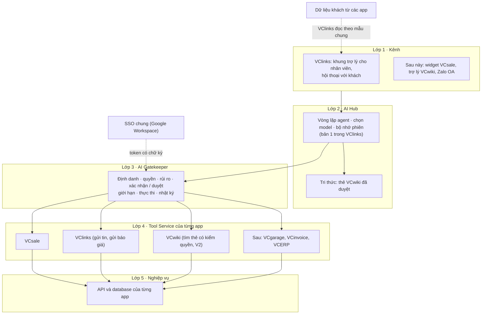
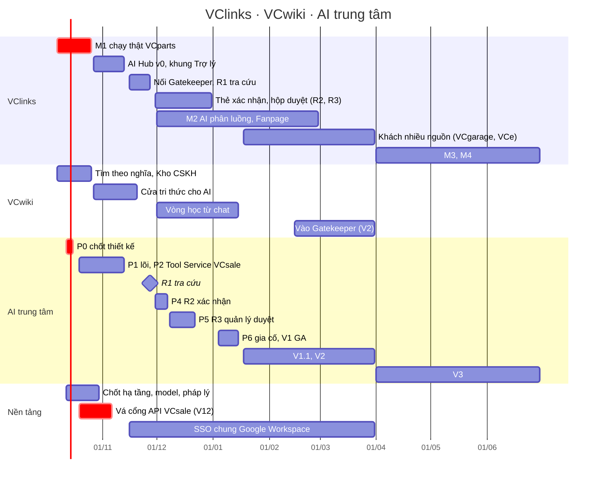

# Lộ trình VClinks, VCwiki và AI trung tâm của VC Phồn Vinh

Phiên bản 0.1 · 07/10/2026 · Trạng thái: Nháp (chờ duyệt)

## Tóm tắt

- **Tài liệu nói gì:** lộ trình sản phẩm (góc nhìn Product Owner) của **VClinks** và **VCwiki** trong bức tranh **AI trung tâm** của tập đoàn, mà lõi là **AI Gatekeeper** (đặc tả VCS-AI-GK-SPEC 2.0, 06/10/2026). Đây là tài liệu định hướng, không phải tài liệu code.
- **Tầm nhìn một câu:** nhân viên hỏi và nhờ **một AI** làm việc trên mọi app của tập đoàn, AI chỉ làm đúng phần người đó được làm, việc rủi ro có người quyết; khách mua của đơn vị nào cũng được chăm sóc ở một nơi, bằng tri thức chung của công ty.
- **Vai trò:**
  - VClinks: cửa giao tiếp (kênh khách và trợ lý AI cho nhân viên) và trung tâm khách hàng.
  - VCwiki: kho tri thức, tức nguồn sự thật để AI trả lời; kiêm đào tạo và nội dung.
  - Gatekeeper: cửa kiểm soát mọi lệnh AI.
  - Các app nghiệp vụ (VCsale, VCgarage, VCe, VCinvoice, VCERP): hệ thống gốc của dữ liệu.
- **5 giai đoạn:**
  - GĐ0: giữ mốc M1 và chốt nền (đến 26/10/2026).
  - GĐ1: nền móng AI, R1 tra cứu (đến 30/11).
  - GĐ2: AI làm thay có kiểm soát, Gatekeeper V1 vận hành chính thức (đến giữa 01/2027).
  - GĐ3: mở rộng sang app khác và SSO chung (Q1/2027).
  - GĐ4: tự động hoá sâu (Q2/2027).
- **Điều chỉnh so với kế hoạch Gatekeeper (mục 5):**
  - Lùi phần nối VClinks sau 26/10 để giữ mốc M1.
  - Giả định A1 chưa đúng: VClinks chưa có agent gọi công cụ, nên cộng 8–12 ngày công.
  - Công cụ gửi tin và gửi báo giá cho khách thuộc VClinks, không thuộc VCsale.
  - VCwiki cấp tri thức cho VClinks ngay (chỉ đọc thẻ đã duyệt), không đợi bản V2.
  - VCsale phải vá cổng API (V12) trước khi mở công cụ cho AI.
- **KPI chính:** thời gian tạo và gửi báo giá giảm ≥ 40%; ≥ 80% đề xuất của AI được xác nhận không phải sửa; ≥ 90% câu tra cứu trả lời đúng; 0 sự cố vượt quyền; ≥ 60% nháp trả lời khách được duyệt không sửa.
- **Việc còn mở:** Q1–Q9 ở mục 10. Quan trọng nhất là Q2 (ai sở hữu việc gửi tin cho khách) và Q3 (lịch Gatekeeper so với mốc M1).
- **Người duyệt xem kỹ:** mục 3 (vai trò từng app), mục 5 (điểm điều chỉnh), mục 6 và 7 (lộ trình, lịch), mục 10 (quyết định).

## Mục lục

- [1. Tầm nhìn và nguyên tắc](#1-tầm-nhìn-và-nguyên-tắc)
- [2. Hiện trạng ngày 07/10/2026](#2-hiện-trạng-ngày-07102026)
- [3. Vai trò của từng sản phẩm](#3-vai-trò-của-từng-sản-phẩm)
- [4. AI trung tâm: 5 lớp](#4-ai-trung-tâm-5-lớp)
- [5. Đối chiếu với kế hoạch AI Gatekeeper 2.0](#5-đối-chiếu-với-kế-hoạch-ai-gatekeeper-20)
- [6. Lộ trình theo giai đoạn](#6-lộ-trình-theo-giai-đoạn)
- [7. Lịch tổng](#7-lịch-tổng)
- [8. Chỉ số thành công](#8-chỉ-số-thành-công)
- [9. Nhân sự và năng lực](#9-nhân-sự-và-năng-lực)
- [10. Quyết định cần chốt](#10-quyết-định-cần-chốt)
- [11. Rủi ro](#11-rủi-ro)
- [12. Tài liệu liên quan](#12-tài-liệu-liên-quan)
- [Lịch sử cập nhật](#lịch-sử-cập-nhật)

## 1. Tầm nhìn và nguyên tắc

**Tầm nhìn:** một AI cho cả tập đoàn. Nhân viên VCparts, VCservice, VCe… hỏi và nhờ AI tra cứu, soạn, gửi, chốt việc trên mọi app. AI chỉ làm được đúng phần người đó được làm. Khách hàng, dù mua phụ tùng, sửa xe hay học khóa học, được chăm sóc ở một nơi, bằng tri thức đã duyệt của công ty.

**Bảy nguyên tắc sản phẩm** (ràng buộc mọi giai đoạn):

1. **Một khách, một hồ sơ.** VClinks là trung tâm khách hàng. Dữ liệu khách từ các app đổ về bằng cách VClinks đọc; không app nào ghi thẳng vào VClinks.
2. **Một nguồn tri thức.** Câu trả lời cho khách và cho nhân viên lấy từ thẻ VCwiki đã duyệt. AI không tự nghĩ ra chính sách, giá, bảo hành.
3. **Một cửa kiểm soát AI.** Mọi việc AI làm thay người (đọc dữ liệu nghiệp vụ, tạo nháp, gửi, chốt) đi qua Gatekeeper. Không có tài khoản AI toàn quyền.
4. **Người quyết việc rủi ro.**
   - Việc đọc thì AI tự chạy.
   - Việc người dùng tự làm được thì chính người đó bấm xác nhận.
   - Việc vượt ngưỡng thì quản lý duyệt.
   - Nguyên tắc này khớp với nguyên tắc "không gửi khi chưa duyệt" (CLAUDE.md §12.1) của VClinks.
5. **Mỗi app giữ dữ liệu và quyền của mình.** Không gom database. App nghiệp vụ là bên kiểm quyền cuối cùng.
6. **Che dữ liệu cá nhân trước khi vào model.** Dữ liệu mức C3 không ra AI ngoài. Tuân thủ NĐ 13/2023 và Luật Bảo vệ dữ liệu cá nhân (hiệu lực 01/01/2026).
7. **Làm theo lát cắt dọc, phát hành từng đợt nhỏ** chạy thật với nhóm thử, có số đo trước và sau.

## 2. Hiện trạng ngày 07/10/2026

| Sản phẩm | Đã có | Chưa có hoặc đang vướng |
|---|---|---|
| **VClinks** | <ul><li>Hộp thư Zalo cá nhân, gồm nick kết nối trực tiếp.</li><li>Zalo OA.</li><li>Phân quyền theo cây tổ chức, vai trò tùy chỉnh.</li><li>Hồ sơ khách và gộp hồ sơ.</li><li>Gửi báo giá trong chat.</li><li>Đọc VCsales thật qua `vclinks-bridge`.</li><li>Việc VCsales và danh mục khách.</li><li>Nháp trả lời bằng AI (đang dùng thẻ VCwiki giả).</li><li>Chạy thử trên máy 129; mốc chạy thật với đội VCparts 15/10, hạn cuối 26/10.</li></ul> | <ul><li>Chưa có agent gọi công cụ (mới có "Nháp AI").</li><li>Chưa có khung trợ lý AI cho nhân viên.</li><li>Chưa đọc VCwiki thật.</li><li>Khách mới có một nguồn là VCsales.</li></ul> |
| **VCwiki** | <ul><li>Chạy trên máy 129, cổng 8000.</li><li>3.269 thẻ, trong đó 1.791 thẻ đã duyệt: VCservice 662, VCe 644, VCparts 350, VCOBD 99, chưa gán division 881.</li><li>Kho tư liệu có 167 nguồn, 20.775 tài liệu.</li><li>Cổng MCP 46 công cụ, token theo từng người.</li><li>Đã làm một phần các phân hệ tổ chức, vòng đời tri thức, học tập và Content Engine.</li></ul> | <ul><li>Tìm theo nghĩa đang tắt trên server: thiếu model `bge-m3`, Qdrant chưa có dữ liệu.</li><li>Thiếu khóa Claude API.</li><li>Ít thẻ chính sách / CSKH (khoảng 76).</li><li>Token chưa giới hạn phạm vi; chưa ghi nhật ký công cụ.</li><li>Chưa nhận nạp văn bản bằng token.</li></ul> |
| **AI Gatekeeper** | <ul><li>Bản đặc tả 2.0.</li><li>Pilot VClinks → VCsale 9 công cụ, 43 ngày công, 8 tuần nếu bắt đầu 12/10.</li></ul> | <ul><li>Chờ lãnh đạo chốt D1–D7.</li><li>Chưa có nhóm Platform.</li></ul> |
| **VCsale** | `vclinks-bridge` chỉ đọc, chạy trên máy dev | <ul><li>Cổng API chưa kiểm chữ ký token và còn tin header gửi từ ngoài (việc V12).</li><li>Chưa có Tool Service.</li></ul> |
| **Nền tảng chung** | VClinks đăng nhập bằng Google Workspace | <ul><li>Chưa có SSO chung: VCsale, VCwiki dùng tài khoản riêng.</li><li>Ba hệ có ba cây tổ chức và phân quyền riêng.</li><li>Chưa chốt hạ tầng chạy thật.</li><li>Chưa chốt nhà cung cấp model và pháp lý dữ liệu.</li></ul> |

## 3. Vai trò của từng sản phẩm

| Sản phẩm | Là gì trong bức tranh AI | Sở hữu | Không làm |
|---|---|---|---|
| **VClinks** | Cửa giao tiếp và trung tâm khách hàng | <ul><li>Hội thoại mọi kênh.</li><li>Hồ sơ khách đã gộp, kèm mã của khách ở từng app.</li><li>Duyệt và gửi tin ra khách (§12.1).</li><li>Giao diện AI: khung trợ lý, thẻ xác nhận, hộp duyệt trên điện thoại.</li><li>AI Hub bản 1.</li></ul> | <ul><li>Không giữ dữ liệu nghiệp vụ gốc (đơn, kho, công nợ).</li><li>Không ghi thẳng sang app khác.</li></ul> |
| **VCwiki** | Kho tri thức: nguồn sự thật để AI trả lời | <ul><li>Thẻ đã duyệt: chính sách, sản phẩm, kỹ thuật, quy trình.</li><li>Vòng đời duyệt và mức mật của thẻ.</li><li>Học tập.</li><li>Content Engine.</li></ul> | <ul><li>Không giữ dữ liệu khách.</li><li>Không trả lời khách trực tiếp; câu trả lời đi qua VClinks.</li></ul> |
| **AI Hub** | Bộ điều phối AI: hiểu yêu cầu, chọn công cụ, gọi model, lấy tri thức | <ul><li>Vòng lặp agent.</li><li>Bộ nhớ phiên.</li><li>Chọn model.</li></ul> | Không giữ quyền hay khóa của app nghiệp vụ |
| **AI Gatekeeper** | Cửa kiểm soát mọi lệnh AI | <ul><li>Danh mục công cụ và chính sách rủi ro.</li><li>Xác nhận và duyệt.</li><li>Nhật ký.</li><li>Nút tắt khẩn cấp.</li></ul> | <ul><li>Không phải AI.</li><li>Không thay API của app.</li><li>Không chặn thao tác thường trên app.</li></ul> |
| **App nghiệp vụ** (VCsale, VCgarage, VCe, VCinvoice, VCERP) | Hệ thống gốc của dữ liệu | <ul><li>Dữ liệu, nghiệp vụ, kiểm quyền cuối.</li><li>Mở hai cửa theo mẫu chung:<ol><li>đọc dữ liệu khách cho VClinks;</li><li>Tool Service cho Gatekeeper.</li></ol></li></ul> | Không cho AI vào database |

**AI Hub đặt ở đâu:** bản 1 nằm trong VClinks cho nhanh, đúng giả định của kế hoạch Gatekeeper. Thiết kế phải tách được. Khi có kênh AI thứ hai (widget trong VCsale, trợ lý của VCwiki), AI Hub tách thành dịch vụ riêng dùng chung (GĐ3).

## 4. AI trung tâm: 5 lớp

- **Lệnh AI** đi từ trên xuống: kênh → AI Hub → Gatekeeper → Tool Service → nghiệp vụ.
- **Dữ liệu khách** đi đường riêng: các app mở API chỉ đọc, VClinks đọc về và gộp hồ sơ (cách VCsales đang chạy). Dữ liệu khách không đi qua Gatekeeper.
- **Tri thức:** AI Hub đọc thẻ VCwiki đã duyệt. Từ GĐ2, câu hỏi và câu trả lời hay từ chat (đã ẩn danh) chảy ngược vào Kho tư liệu của VCwiki, chờ người duyệt rồi thành thẻ.

## 5. Đối chiếu với kế hoạch AI Gatekeeper 2.0

**Giữ nguyên:**
- 8 nguyên tắc thiết kế (NT-01…08).
- 4 mức rủi ro.
- Chuỗi token T1, T2, T3.
- Danh mục công cụ theo chuẩn MCP.
- 3 đợt phát hành R1–R3.
- KPI và 16 tiêu chí nghiệm thu.
- Phương án A (V1 đầy đủ, không làm PoC riêng).

**Đề xuất điều chỉnh:**

| # | Điểm | Kế hoạch Gatekeeper | Đề xuất | Lý do |
|---|---|---|---|---|
| 1 | Lịch nối VClinks (P3) | Tuần 3–4 (26/10–06/11), R1 tuần 4 | Làm sau 26/10. R1 khoảng 23–27/11; V1 vận hành chính thức (GA) khoảng giữa 01/2027 | Trùng mốc chạy thật M1 của VClinks (15/10, hạn 26/10). Đội VClinks phải giữ M1 |
| 2 | Giả định A1: VClinks có agent gọi công cụ | Coi như đã có | Chưa đúng. VClinks mới có "Nháp AI" (soạn nháp trả lời khách); chưa có vòng lặp agent, chưa có khung trợ lý cho nhân viên. Cộng 8–12 ngày công làm "AI Hub v0" | Đúng con số cộng thêm ở mục 17 của kế hoạch |
| 3 | Công cụ gửi ra khách | `vcsale.quotation.send`, `vcsale.message.send` | Thành công cụ của VClinks: `vclinks.quotation.send`, `vclinks.message.send`. VCsale giữ công cụ dữ liệu: tìm khách, tìm hàng, tồn, đơn, tạo nháp báo giá, chốt đơn, cập nhật tồn | <ul><li>VClinks đã sở hữu kênh khách (chốt 07/10: VClinks giữ Zalo OA / Fanpage), nhịp gửi theo nick, người giữ nick, duyệt §12.1, và luồng gửi báo giá PDF.</li><li>Tránh hai đường gửi tin cho cùng một khách.</li></ul> |
| 4 | Tri thức VCwiki | Đưa vào ở V2 (Q1/2027) | VClinks đọc thẻ VCwiki đã duyệt, mức C0, ngay ở GĐ1 cho nháp trả lời khách, bằng token máy có phạm vi hẹp. Đưa vào Gatekeeper ở V2 như kế hoạch | <ul><li>Chỉ đọc, câu hỏi đã che nên rủi ro thấp.</li><li>Giá trị cao: tính năng F7.3 của M1c cần ngay.</li></ul> |
| 5 | VCsale tin token của Gatekeeper | Mặc định VCsale kiểm được | Vá cổng API VCsale (V12: kiểm chữ ký token, bỏ header từ ngoài, khóa `shared/*`) là **điều kiện bắt buộc** trước P2 | Phát hiện khi nối VCsales ngày 07/10: cổng hiện tin header, không kiểm chữ ký |
| 6 | Tenant pilot | Một doanh nghiệp khách hàng | VCparts nội bộ (tenant `vcpv`), 5–10 NVKD đã dùng VClinks hằng ngày sau M1 | Có sẵn người dùng thật, đo baseline được ngay |
| 7 | Định danh | Bảng `identity_links` cho V1, SSO là dự án riêng | Đồng ý cho V1; mở dự án **SSO chung bằng Google Workspace** từ GĐ1, đích GĐ3 | VClinks đã dùng Google Workspace; ba hệ đang có ba bộ tài khoản |
| 8 | Phân loại dữ liệu | 4 loại dữ liệu khi gửi vào model | Một bảng chung C0–C3 cho Gatekeeper, VClinks (cổng mức mật) và VCwiki (mức mật thẻ) | Ba hệ đang có ba cách phân loại; AI cần một luật |

## 6. Lộ trình theo giai đoạn

### GĐ0 · Giữ mốc M1 và chốt nền (07/10 → 26/10/2026)

**Mục tiêu:** VClinks chạy thật với đội VCparts; lãnh đạo chốt kiến trúc AI; VCwiki sẵn sàng làm nguồn tri thức.

| Làn | Việc |
|---|---|
| VClinks | <ul><li>Hoàn tất M1: nick Zalo trực tiếp P4.0 (sau 08/10); thử VCsales đợt 1 trên Con Hùng (khách test); sửa lỗi theo UAT.</li><li>**Không nhận tính năng mới.**</li><li>Đo baseline: thời gian tạo và gửi báo giá, thời gian trả lời tin đầu.</li></ul> |
| VCwiki | <ul><li>Bật tìm theo nghĩa trên server: tải `bge-m3`, dựng dữ liệu cho Qdrant.</li><li>Chốt AI dựng thẻ: khóa Claude API hay AI local.</li><li>Sao lưu.</li><li>Lập **Kho CSKH**: mỗi division (VCparts, VCservice, VCe) có một người chịu trách nhiệm. Viết và duyệt thẻ chính sách bảo hành, đổi trả, giao hàng, thanh toán, và 50 câu khách hỏi nhiều nhất.</li><li>Gắn mức C0 cho thẻ dùng được với khách.</li></ul> |
| AI trung tâm | <ul><li>Gatekeeper P0 (từ 12/10, 3 ngày công): lãnh đạo chốt D1–D7 và Q1–Q9 của tài liệu này.</li><li>Khảo sát API VCsale cho các công cụ.</li><li>Chốt model và điều khoản dữ liệu.</li></ul> |
| Nền tảng | <ul><li>Đội VCsales lên kế hoạch V12.</li><li>Chốt hạ tầng chạy thật cho VClinks, VCwiki, Gatekeeper: máy chủ nội bộ hay cloud.</li><li>Pháp chế rà Luật Bảo vệ dữ liệu cá nhân.</li></ul> |

**Qua giai đoạn khi:**
- M1 chạy thật ≥ 1 tuần, không có sự cố lớn.
- D1–D7 và Q1–Q9 đã chốt.
- Tìm theo nghĩa của VCwiki đã chạy.
- Kho CSKH có ≥ 30 thẻ đã duyệt.

### GĐ1 · Nền móng AI (27/10 → 30/11/2026)

**Mục tiêu:** AI tra cứu dữ liệu thật đúng quyền (R1); nháp trả lời khách dùng tri thức thật.

| Làn | Việc |
|---|---|
| VClinks | <ul><li>**AI Hub v0:** vòng lặp agent gọi công cụ, khung "Trợ lý" cho nhân viên, hiện trạng thái lệnh.</li><li>Nối Gatekeeper (P3) cho 4 công cụ tra cứu → **R1**.</li><li>Nháp trả lời khách dùng thẻ VCwiki thật (F7.3), đo tỉ lệ duyệt không sửa.</li><li>Phần còn lại của VCsales đợt 2 (tra hàng, giao hàng theo dòng) nếu còn sức (mục 9).</li><li>Nạp danh mục khách VCsales thật khi email nhân viên đã đủ.</li></ul> |
| VCwiki | <ul><li>**Cửa tri thức cho AI:** token máy có phạm vi và hạn dùng (SYS-15), nhật ký công cụ (SYS-14); chỉ trả thẻ đã duyệt, lọc theo division và mức mật.</li><li>Kho CSKH lên 100 thẻ.</li><li>Quy trình cập nhật thẻ khi chính sách đổi.</li></ul> |
| AI trung tâm | <ul><li>Gatekeeper P1 (lõi, định danh).</li><li>P2: Tool Service của VCsale cho 7 công cụ dữ liệu, sau khi chuyển 2 công cụ gửi sang VClinks.</li><li>Dashboard cơ bản.</li></ul> |
| Nền tảng | <ul><li>V12 xong trước khi P2 lên staging.</li><li>Bảng `identity_links` VClinks ↔ VCsale.</li><li>Khởi động dự án SSO chung.</li></ul> |

**Qua giai đoạn (R1) khi:**
- Đạt AC-01…05 của kế hoạch Gatekeeper.
- 1 tuần không sự cố quyền.
- Bộ 50 câu tiếng Việt đúng ≥ 90%.
- Nháp trả lời có trích dẫn thẻ VCwiki.

### GĐ2 · AI làm thay có kiểm soát (01/12/2026 → giữa 01/2027)

**Mục tiêu:**
- R2: AI tạo nháp, gửi sau khi người dùng bấm xác nhận.
- R3: việc vượt ngưỡng qua quản lý duyệt.
- Gatekeeper V1 vận hành chính thức.

| Làn | Việc |
|---|---|
| VClinks | <ul><li>Thẻ xác nhận trong khung trợ lý: xem trước, Gửi / Hủy, hết hạn sau 15 phút.</li><li>Công cụ gửi báo giá và gửi tin của VClinks đi qua lệnh gửi sẵn có; người bấm là người duyệt (§12.1).</li><li>Hộp duyệt trên điện thoại cho quản lý.</li><li>Agent báo kết quả sau khi lệnh được duyệt.</li><li>Bắt đầu M2: AI phân luồng thành phiếu việc, Fanpage.</li></ul> |
| VCwiki | <ul><li>**Vòng học từ chat:** VClinks đẩy câu hỏi và câu trả lời đã ẩn danh vào Kho tư liệu → thẻ nháp → người duyệt. Cần VCwiki nhận nạp văn bản bằng token (SYS-18).</li><li>Báo cáo "câu khách hỏi mà VCwiki chưa có thẻ" để biên tập bổ sung.</li></ul> |
| AI trung tâm | <ul><li>Gatekeeper P4 (R2), P5 (R3).</li><li>P6: gia cố, màn quản trị, sổ tay vận hành, bộ test 10 mối đe dọa.</li><li>**V1 GA khoảng giữa 01/2027.**</li></ul> |
| Nền tảng | <ul><li>Báo cáo KPI so với baseline sau 2 tuần chạy R2.</li><li>Phân công trực sự cố.</li></ul> |

**Qua giai đoạn (GA) khi:**
- Đạt 16 tiêu chí nghiệm thu AC-01…16.
- Thời gian tạo và gửi báo giá giảm ≥ 40%.
- ≥ 80% lệnh được xác nhận không phải sửa.

### GĐ3 · Mở rộng sang app khác (Q1/2027)

**Mục tiêu:** AI và chăm sóc khách dùng được cho VCservice và VCe; 2–3 đơn vị chạy thật. Có nghỉ Tết (khoảng đầu tháng 2), nên tính bớt sức.

| Làn | Việc |
|---|---|
| VClinks | <ul><li>**Trung tâm khách nhiều nguồn:** lớp kết nối dùng chung; nối VCgarage (gara nội bộ VCservice, QĐ-20) và VCe theo mẫu "VClinks đọc".</li><li>Chip nguồn khách, báo cáo theo nguồn.</li><li>Hoàn tất M2; bắt đầu M3 (hồ sơ 360 đầy đủ, VCinvoice).</li></ul> |
| VCwiki | <ul><li>Vào Gatekeeper thành công cụ `vcwiki.card.search` có kiểm quyền theo người (V2).</li><li>Trợ lý chat của VCwiki dùng chung AI Hub.</li><li>Nối học tập với VClinks: bài học từ hội thoại mẫu.</li></ul> |
| AI trung tâm | <ul><li>Gatekeeper V1.1: thêm công cụ VCsale (công nợ, lịch hẹn), thêm tenant.</li><li>V2:<ul><li>Tool Service cho VCgarage và VCinvoice.</li><li>Gatekeeper thành MCP server, để nhân viên dùng Claude Desktop với đúng quyền (khớp mục "MCP cho nhân viên" ở M3 của VClinks).</li><li>Widget AI trong VCsale.</li></ul></li><li>Tách AI Hub thành dịch vụ riêng.</li></ul> |
| Nền tảng | <ul><li>SSO chung chạy cho VClinks, VCsale, VCwiki; bỏ `identity_links`.</li><li>Danh bạ tổ chức một nguồn (HR) cho cả ba hệ.</li></ul> |

**Qua giai đoạn khi:**
- Một app mới đưa được 5–8 công cụ lên AI trong ≤ 2 tuần (MT-05).
- 2–3 tenant chạy thật.
- 0 sự cố lộ dữ liệu chéo tenant.

### GĐ4 · Tự động hoá sâu (Q2/2027)

**Mục tiêu:** AI chủ động chạy nền theo lịch nhưng vẫn qua người duyệt; chi phí AI tối ưu.

| Làn | Việc |
|---|---|
| VClinks | <ul><li>Xong M3: nhắc mua lại, theo dõi báo giá treo.</li><li>M4: dashboard, kèm cặp, chiến dịch, deal VCe, tenant không có ERP.</li></ul> |
| VCwiki | <ul><li>Content Engine dùng câu hỏi phổ biến của khách (đã ẩn danh) để lên nội dung.</li><li>Rà soát tri thức định kỳ.</li></ul> |
| AI trung tâm | <ul><li>Gatekeeper V3: VCERP; tự thu hẹp quyền gửi ra ngoài sau khi agent đọc dữ liệu nhạy cảm; chọn model theo chi phí.</li><li>Agent chạy nền theo lịch (nhắc nợ, nhắc mua lại, báo giá treo): luôn tạo việc chờ người xác nhận, không tự gửi.</li></ul> |
| Nền tảng | Đánh giá mở VClinks và Gatekeeper cho doanh nghiệp ngoài tập đoàn (tenant thuê) |

## 7. Lịch tổng

**Các mốc chính:**
- 15/10/2026: VCparts chạy thật VClinks.
- 26/10: hạn cuối M1.
- Khoảng 27/11: R1 tra cứu.
- Khoảng 07/12: R2 xác nhận.
- Khoảng 22/12: R3 quản lý duyệt.
- Giữa 01/2027: Gatekeeper V1 GA.
- 31/03/2027: VCservice, VCe chạy trên AI chung.

## 8. Chỉ số thành công

| Chỉ số | Đo thế nào | Đích | Giai đoạn |
|---|---|---|---|
| Thời gian tạo và gửi một báo giá | Baseline đo ở GĐ0, so sau 2 tuần chạy R2 | Giảm ≥ 40% | GĐ2 |
| Đề xuất của AI được xác nhận không phải sửa | Số xác nhận / (xác nhận + hủy) | ≥ 80% | GĐ2 |
| Câu tra cứu trả lời đúng | Bộ 50 câu tiếng Việt | ≥ 90% | GĐ1 |
| Nháp trả lời khách được duyệt không sửa | Cặp (nháp AI, bản người sửa) của VClinks (F15.6) | ≥ 60% | GĐ1 → GĐ2 |
| Câu khách hỏi có thẻ VCwiki trả lời được | Mẫu 200 câu thật mỗi tháng | ≥ 70% | GĐ2 |
| Người dùng hoạt động hằng tuần trong nhóm thử | Người có ≥ 3 phiên / tuần | ≥ 60% | GĐ1 → GĐ2 |
| Sự cố vượt quyền hoặc lộ dữ liệu chéo | Nhật ký và bộ test bảo mật | 0 | Mọi giai đoạn |
| Lệnh AI có đủ chuỗi nhật ký | Đếm theo `correlation_id` | 100% | Mọi giai đoạn |
| Thời gian chờ quản lý duyệt (trung vị) | Bảng duyệt | < 30 phút trong giờ làm việc | GĐ2 |
| Thời gian đưa một app mới lên AI | Từ lúc bắt đầu Tool Service tới khi bật | ≤ 2 tuần | GĐ3 |
| Khách có hồ sơ gộp từ ≥ 2 nguồn | Hồ sơ VClinks có mã ở ≥ 2 app | Đo nền rồi đặt đích | GĐ3 |

## 9. Nhân sự và năng lực

| Làn | Ai làm | Năng lực cần | Ghi chú |
|---|---|---|---|
| VClinks | 2 dev hiện có (có AI hỗ trợ) | <ul><li>GĐ0 dồn cho M1.</li><li>GĐ1: AI Hub v0 (8–12 ngày công), nối Gatekeeper (khoảng 5 ngày công), phần còn lại của VCsales đợt 2.</li></ul> | GĐ1 là lúc chật nhất. Thiếu sức thì ưu tiên AI Hub v0 và R1, dời tra hàng / giao hàng |
| AI Gatekeeper | 1 backend toàn thời gian mới (nhóm Platform), BA / Architect 4,75 ngày công | P1 cần người làm liên tục 3 tuần | Chưa có người là rủi ro lớn nhất của lịch |
| VCsale | Đội VCsales / VCsoft | <ul><li>V12 (khoảng 12 giờ).</li><li>Tool Service: 8 ngày công.</li><li>Phần đọc: bridge đã có.</li></ul> | V12 phải xong trước P2 |
| VCwiki | Chủ sở hữu VCwiki và biên tập viên Kho CSKH ở mỗi division | 2–4 giờ / tuần / division ở GĐ0–GĐ1 | Việc của người làm nghiệp vụ, không phải việc dev |
| QA | QA chung | 4,75 ngày công cho Gatekeeper và UAT của VClinks | Dồn vào tuần R1 và GA |

## 10. Quyết định cần chốt

Mỗi câu có đề xuất. Trả lời theo mã (`Q1: OK · Q3: B`); câu không trả lời thì làm theo đề xuất.

- **Q1.** Đồng ý vai trò từng sản phẩm và mô hình 5 lớp (mục 3, 4)? Đề xuất: đồng ý.
- **Q2.** Công cụ gửi tin và gửi báo giá cho khách là của VClinks, không phải của VCsale (mục 5, điểm 3)? Đề xuất: đồng ý.
- **Q3.** Lùi phần nối VClinks sau 26/10: R1 khoảng 23–27/11, Gatekeeper V1 GA khoảng giữa 01/2027? Đề xuất: đồng ý. Giữ mốc M1 quan trọng hơn đi sớm 3 tuần.
- **Q4.** Làm AI Hub v0 trong VClinks, thiết kế để tách được; tách thành dịch vụ riêng ở GĐ3? Đề xuất: đồng ý.
- **Q5.** VClinks đọc VCwiki ngay ở GĐ1 (thẻ đã duyệt, mức C0, token máy) cho nháp trả lời khách; đưa vào Gatekeeper ở V2? Đề xuất: đồng ý.
- **Q6.** Vá cổng API VCsale (V12) là điều kiện trước khi mở Tool Service? Đề xuất: đồng ý.
- **Q7.** Mở dự án SSO chung bằng Google Workspace từ GĐ1, đích GĐ3? Đề xuất: đồng ý.
- **Q8.** Một bảng phân loại dữ liệu chung C0–C3 cho VClinks, VCwiki và Gatekeeper, pháp chế duyệt ở GĐ0? Đề xuất: đồng ý.
- **Q9.** Tenant thử là VCparts nội bộ với 5–10 NVKD? Đề xuất: đồng ý.

## 11. Rủi ro

| Rủi ro | Khả năng | Ảnh hưởng | Cách giảm |
|---|---|---|---|
| Đội VClinks quá tải ở GĐ1 (vá lỗi sau M1, AI Hub v0, VCsales đợt 2) | Cao | Trễ R1 | Thứ tự ưu tiên ở mục 9; dời tra hàng và giao hàng theo dòng |
| Chưa có backend toàn thời gian cho Gatekeeper | Trung bình | Trễ cả lộ trình AI | Chốt nhân sự ở P0 (D7) |
| VCsale chưa vá cổng API kịp | Trung bình | Chặn P2 | Làm V12 từ GĐ0; giao diện VClinks vẫn đọc qua bridge |
| VCwiki thiếu tri thức CSKH | Cao | AI trả lời yếu, nhân viên mất tin | Kho CSKH có người chịu trách nhiệm; đo "câu chưa có thẻ" |
| Vướng pháp lý khi gửi dữ liệu lên model cloud | Trung bình | Chặn chạy thật | Chốt ở GĐ0; che dữ liệu cá nhân; dữ liệu C3 chỉ chạy AI local |
| Máy 129 đang chạy chung nhiều hệ (VClinks, VCwiki, một bản VCsales, web khác) | Cao | Tranh CPU (chuyển giọng nói, dựng vector); hỏng một máy là dừng hết | Chốt hạ tầng chạy thật ở GĐ0; Gatekeeper cần PostgreSQL, Redis, 2 bản chạy |
| Ba hệ phân quyền riêng lệch nhau | Trung bình | AI làm sai quyền | Gatekeeper tự tra quyền; app kiểm quyền cuối; SSO và danh bạ chung ở GĐ3 |
| Phạm vi phình (kênh mới, Content Engine, học tập) | Cao | Mất tập trung, trễ mốc | Mỗi giai đoạn một mục tiêu chính; việc khác vào backlog |

## 12. Tài liệu liên quan

- Đặc tả AI Gatekeeper: `VCsoft_AI_Gatekeeper_V1_Plan.html` (VCS-AI-GK-SPEC 2.0, 06/10/2026). File nằm ngoài repo, ở thư mục "AI adapter" của dev002.
- Lộ trình VClinks M1a–M4: `docs/02-yeu-cau/vclinks-ba.md` (mục Lộ trình).
- Kế hoạch tổng chat đa kênh (B0–B6): `docs/01-quan-ly-du-an/ke-hoach-tong-the-chat-da-kenh.md`.
- Kế hoạch kết nối VCsales (bridge, đợt 1–2, V12): `docs/01-quan-ly-du-an/ke-hoach-ket-noi-vcsales.md`.
- Việc VCsales và danh mục khách: `docs/04-ky-thuat/api/viec-vcsales.md`.
- Gợi ý trả lời AI của VClinks: `docs/04-ky-thuat/api/goi-y-ai.md`.
- BA của VCwiki: repo `tiktok-to-text`, file `docs/BA.md` (phân hệ WK, CE, SYS, ORG, GOV, LRN; mở rộng MCP SYS-18…24).

## Lịch sử cập nhật

| Phiên bản | Ngày | Người / phiên | Thay đổi | Căn cứ |
|---|---|---|---|---|
| 0.1 | 07/10/2026 14:05 | Claude Code (dev002) | Tạo lộ trình: tầm nhìn, hiện trạng, vai trò từng sản phẩm, mô hình 5 lớp, đối chiếu với kế hoạch Gatekeeper 2.0 (8 điểm điều chỉnh), 5 giai đoạn GĐ0–GĐ4, lịch tổng, KPI, nhân sự, Q1–Q9, rủi ro | Yêu cầu dev002 07/10/2026 ("m là 1 productOwner hãy lên lộ trình phát triển cho t"); đặc tả VCS-AI-GK-SPEC 2.0; BA VClinks và BA VCwiki; kiểm tra VCwiki trên máy 129 ngày 07/10 |
