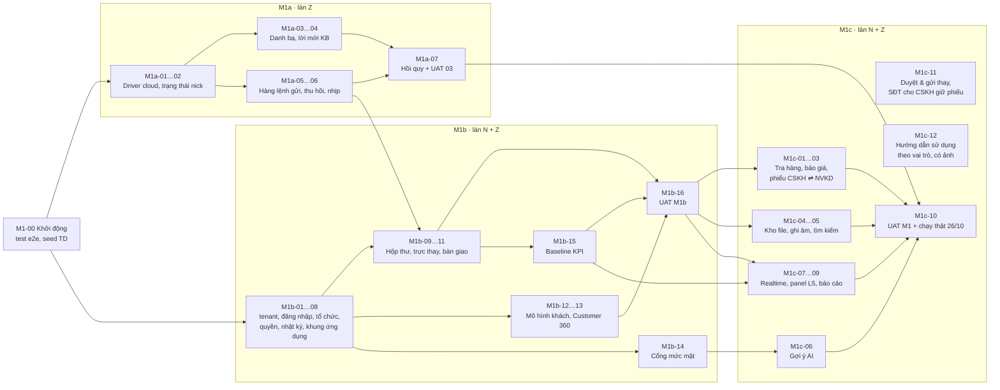
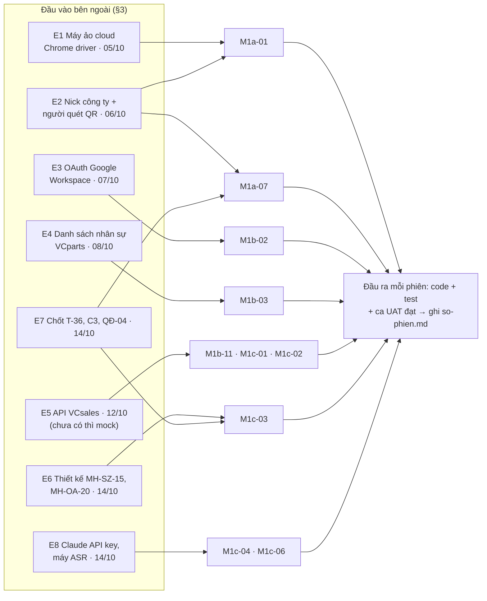
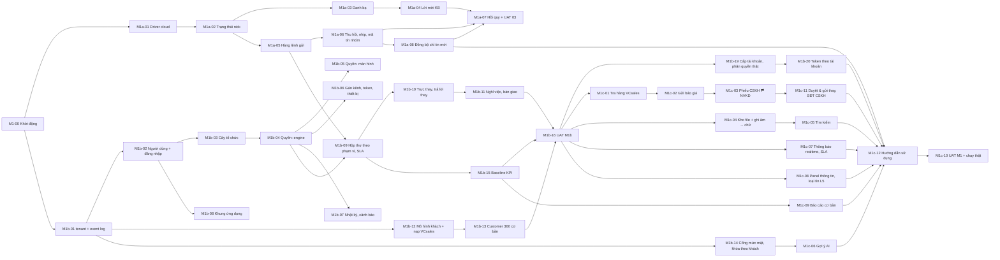

# Kế hoạch code M1 theo phiên chat

Phiên bản 1.11 · 05/10/2026 · Trạng thái: **Đã duyệt** (chủ dự án duyệt 04/10/2026 14:42)

> Căn cứ: [BA tổng](../../02-yeu-cau/vclinks-ba.md) §19 (M1a / M1b / M1c), [chi phí v0.7](../chi-phi-phat-trien.md) (M1 chỉ làm Zalo cá nhân, Zalo OA ra M4), đặc tả [00–07](../../02-yeu-cau/README.md), canvas [VClinks UI Design](https://claude.ai/artifact/8cAKkTjtb94BTCWFoErv1p) lô TK1 (đã chốt) và TK2.
> Mốc (chủ dự án dời ngày 04/10/2026, theo §4.4): bắt đầu 05/10 · T1 05–09/10 nhịp 1–6 · T2 12–16/10 nhịp 7–13 · T3 19–23/10 nhịp 14–18 · **26/10/2026 chạy thật với đội VCparts**, bắt đầu baseline 2 tuần. Mốc cũ của kịch bản lạc quan là 20/10.

## Mô hình

Ba mốc M1a → M1b → M1c, các phiên gộp theo nhóm và phụ thuộc chính. Đồ thị phụ thuộc chi tiết từng phiên ở §4.



Đầu vào bên ngoài (§3) chặn phiên nào, và đầu ra chung của mỗi phiên:



## Tóm tắt

- **Mục đích:** chia việc code M1 thành **37 phiên chat** (bổ sung M1c-11, M1c-12, rồi M1a-08, M1b-19, M1b-20 ngày 05/10/2026), mỗi phiên một task có mã, đầu vào, đầu ra và mục "Xác nhận xong"; sổ phiên ([so-phien.md](so-phien.md)) và bản đồ tính năng → phiên (§7) để sửa đúng phiên cũ.
- **Phạm vi M1 (chốt 04/10/2026):** chỉ kênh Zalo cá nhân; tổ chức, phân quyền, owner, Customer 360 cơ bản, báo giá VCsales, phiếu CSKH ⇄ NVKD, gợi ý AI, ghi âm → chữ, tìm kiếm, báo cáo cơ bản. Zalo OA, Fanpage, FB cá nhân, Email sang M4.
- **Mốc (dời ngày 04/10/2026):** **26/10/2026 chạy thật với đội VCparts**, bắt đầu baseline 2 tuần. Mốc cũ của kịch bản lạc quan là 20/10.
- **Cách chạy (chốt 04/10/2026, §4):** một người điều phối là chủ dự án; tối đa **2 agent** chạy cùng lúc; một Chrome driver và một nick Zalo dùng chung, có khóa driver; **18 nhịp** (từ nhịp 5 gộp đôi thành đợt, §4.4), mỗi nhịp hoặc đợt có phiên gác cổng soát nhánh rồi mới gộp vào `main` trên máy và đẩy lên GitLab để sao lưu (không dùng PR / Merge Request, §1.2).
- **Model (§4.2, §4.3):** mặc định Sonnet 5.5; 11 phiên khó bắt đầu bằng Opus 5.5. Nâng lên một nấc (Sonnet → Opus → Fable) khi gặp dấu hiệu D1–D4; Fable vẫn trượt thì dừng, đánh ⛔.
- **Bổ sung 05/10/2026 (§4.4 "Đợt bổ sung"):** M1a-08 sửa đồng bộ tin (chỉ lấy tin mới, không gửi lại tin đã có), M1b-19 cấp tài khoản và phân quyền cho người dùng thật, M1b-20 sinh token riêng cho từng tài khoản; M1c-12 (hướng dẫn theo vai trò) mở rộng thêm phần "chức năng cơ bản" và chạy sau ba phiên này.
- **Thời gian (§4.4, đo lại 05/10/2026):** dự kiến cũ 107–128 giờ (16 ngày) đã sai. Thực tế 33/38 phiên gộp xong sau 9,5 giờ chạy (≈ 14 lần nhanh hơn) nhờ 5 agent song song. Phần còn lại chủ yếu là **chờ** đầu vào E1–E8 và chủ dự án thử tay (27 phiên "⛔ một phần"). Mốc chạy thật: **15/10 nếu đầu vào đúng hạn**, 26/10 giữ làm hạn cuối. Dự báo các mảnh sau: [chi phí v0.7](../chi-phi-phat-trien.md#dự-báo-lại-05102026).
- **Token (§4.5):** Claude Code dùng tối đa khoảng 75% hạn mức tuần của gói Max, phần còn lại để dành cho Claude Desktop; đo bằng `/usage` sau mỗi nhịp.
- **8 đầu vào bên ngoài E1–E8** (máy ảo cloud, nick công ty, OAuth Google, danh sách nhân sự, API VCsales, thiết kế MH-SZ-15, quyết định của chủ dự án, Claude API key), hạn 05/10–14/10.
- **Quy ước:** theo CLAUDE.md §12, D8-01 (đặc tả là nguồn sự thật), D8-02 (ẩn / khóa nút thiếu quyền); mỗi phiên `pnpm ci:local` xanh (= typecheck + test + test:e2e).
- **Việc còn mở (§8):** câu 3, xử lý M1c-03 nếu chưa có thiết kế MH-SZ-15 (cần chốt trước nhịp 16); câu 4, MH-PQ-13 (NĐ 13) giữ ngoài M1 (cần chốt trước nhịp 10). Câu 1, 2 đã chốt.
- **Người duyệt cần xem kỹ:** bảng nhịp và giờ ở §4.4, các biện pháp phòng rủi ro driver ở §4.6, đầu vào ngoài ở §3 (hạn có kịp không), và tiêu chí "Xác nhận xong" của từng phiên ở §5.

## Mục lục

- [1. Cách dùng tài liệu này](#1-cách-dùng-tài-liệu-này)
- [2. Phạm vi M1 (chốt 04/10/2026)](#2-phạm-vi-m1-chốt-04102026)
- [3. Đầu vào bên ngoài phải có trước](#3-đầu-vào-bên-ngoài-phải-có-trước)
- [4. Thứ tự, nhịp chạy và model](#4-thứ-tự-nhịp-chạy-và-model)
- [5. Các phiên](#5-các-phiên)
- [6. Sổ phiên](#6-sổ-phiên)
- [7. Bản đồ tính năng → phiên](#7-bản-đồ-tính-năng--phiên)
- [8. Câu hỏi cho chủ dự án trước khi bắt đầu](#8-câu-hỏi-cho-chủ-dự-án-trước-khi-bắt-đầu)
- [Lịch sử cập nhật](#lịch-sử-cập-nhật)

---

## 1. Cách dùng tài liệu này

### 1.1 Một phiên chat = một task

- Mỗi phiên có **mã** (`M1b-04`), **đầu vào** (đọc gì, phiên nào phải xong trước, cần ai cung cấp gì) và **đầu ra** (code, test, ca UAT phải đạt). Chỉ khi đạt hết mục **Xác nhận xong** thì đánh dấu ✅.
- Phiên không vượt phạm vi của mình. Thấy việc ngoài phạm vi thì ghi vào cột "Việc phát sinh" của [sổ phiên](so-phien.md), không tự làm.
- Phiên quá lớn (sau 1 ngày chưa xong) thì tách: `M1b-04` → `M1b-04a`, `M1b-04b`, ghi lại vào [sổ phiên](so-phien.md).

### 1.2 Mở một nhịp mới (một chat điều phối, các phiên là agent con)

Chốt 04/10/2026: mỗi nhịp **một chat duy nhất** do Sonnet điều phối; mỗi phiên trong nhịp là một agent con (model theo §4.3) làm trên worktree riêng. Chủ dự án chỉ theo dõi một cửa sổ.

1. Mở một chat Claude Code mới ở repo, gõ `/model sonnet`, đặt tên `/rename N<số nhịp> · điều phối` (ví dụ `/rename N2 · điều phối`).
2. Tra §4.4 để biết phiên nào thuộc nhịp, rồi dán câu mở đầu sau (điền `<n>`, mã phiên, ranh giới giữa các phiên song song):

   ```
   Điều phối nhịp <n> (hoặc đợt <n>, §4.4; từ đợt 1 mỗi agent làm lần lượt hai phiên)
   trong docs/01-quan-ly-du-an/m1/ke-hoach-phien-chat.md
   (§4.4: phiên nào, §4.3: model nào). Mở đầu dùng skill khoi-dong-phien.
   Chat này chạy Sonnet và chỉ điều phối, không tự code.
   0. Nhịp trước đã gác cổng và gộp vào main chưa? Chưa thì làm bước 4 cho nhịp trước trước.
   1. Mỗi phiên của nhịp: gọi một agent con (Agent tool, chạy nền, model đúng §4.3), giao:
      làm trên worktree /Users/apple/projects/vclinks-wt/<mã>, nhánh m1/<mã>-<slug> tạo từ main;
      API cổng riêng; đọc mục phiên + "Đầu vào"; BƯỚC 1 chỉ viết kế hoạch ≤ 10 dòng
      rồi DỪNG, chưa code; ranh giới với phiên chạy song song: <ghi cụ thể>;
      theo §4.2 (gặp D1–D4 thì dừng và báo), §4.6 nếu dùng Chrome driver.
   2. Gom kế hoạch của các agent thành MỘT tin cho tôi (≤ 15 dòng, câu hỏi đánh số Q1…
      kèm đề xuất mặc định). Tôi trả lời OK thì gọi tiếp từng agent (SendMessage) làm
      BƯỚC 2: code, pnpm ci:local, commit trên nhánh, cập nhật dòng phiên trong
      so-phien.md (🟡), báo "chờ gác cổng".
   3. Agent báo D1–D4: báo tôi một câu; tôi đồng ý thì chạy lại agent đó bằng model
      cao hơn theo §4.2 (phần dở đã commit trên nhánh).
   4. Khi mọi agent xong, gác cổng: soát nhánh so với main, ci:local, CLAUDE.md §12,
      từng mục "Xác nhận xong" (nhịp có phiên Opus thì giao việc soát cho một agent Opus).
      Báo đạt / trượt ≤ 15 dòng. Tôi nói "gộp" thì gộp vào main trên máy, ghi commit
      gộp và Nhật ký nhịp vào so-phien.md; nhắc tôi việc chuẩn bị cho 2 nhịp tới.
      Mỗi lần gộp xong, trên thư mục main: pnpm install --frozen-lockfile && pnpm
      --filter "./packages/*" build, rồi khởi động lại API dev nếu đang chạy.
      Chưa nối GitLab thì bỏ qua bước đẩy.
   ```

3. Chủ dự án trả lời "OK" ở bước 2 và "gộp" ở bước 4; không phải mở thêm chat cho phiên hay cho gác cổng.
4. Agent con không mở lại được bằng `/resume`; sửa về sau theo §1.3 (phiên `.fix`).

**Phiên lẻ** (phiên `.fix`, `.retry`, hoặc phiên tài liệu) vẫn mở một chat riêng, dán câu sau:

   ```
   Làm phiên <mã> trong docs/01-quan-ly-du-an/m1/ke-hoach-phien-chat.md.
   Làm trên git worktree riêng, nhánh m1/<mã>-<slug> tạo từ main; API chạy cổng riêng.
   Đọc mục của phiên đó, đọc hết phần "Đầu vào", rồi lên kế hoạch ngắn (≤ 10 dòng,
   tiếng Việt dễ hiểu) và chờ tôi trả lời OK trước khi code.
   Theo §4.2 (gặp dấu hiệu D1–D4 thì báo để nâng model, không tự thử mãi)
   và §4.6 (đọc khóa driver trước khi dùng Chrome driver).
   Xong thì chạy đủ mục "Xác nhận xong" và báo kết quả từng mục.
   ```

Kết thúc phiên (lẻ hay agent con): commit trên nhánh của phiên, điền dòng của phiên trong [sổ phiên](so-phien.md) (trạng thái 🟡, nhánh, tên người chạy), báo "chờ gác cổng". **Không mở PR / Merge Request** (chủ dự án chốt 04/10/2026): phiên gác cổng so nhánh với `main`, gộp ngay trên máy, rồi đẩy `main` lên GitLab để sao lưu.

### 1.3 Sửa một tính năng đã làm: quay lại phiên cũ

1. Tra **§7 Bản đồ tính năng → phiên** để biết tính năng thuộc phiên nào.
2. Phiên làm bằng agent con (từ M1-00 trở đi) không mở lại được. Chat điều phối cũ mở lại được bằng `/resume`, nhưng chỉ còn bản tóm tắt, không còn ngữ cảnh của agent con.
3. Vì vậy sửa luôn bằng phiên mới tên `<mã>.fix-<n> · <việc>` (ví dụ `M1a-03.fix-1 · SĐT trống`), câu đầu: *"Sửa tính năng của phiên `<mã>`. Đọc mục phiên đó và commit gộp `<mã commit>` ghi trong sổ phiên trước."*
4. Ghi lần sửa vào cột "Lần sửa" của phiên trong [sổ phiên](so-phien.md). Sửa làm đổi hành vi thì cập nhật cả đặc tả liên quan (theo chu trình ở [docs/02-yeu-cau/README.md](../../02-yeu-cau/README.md)).

### 1.4 Quy ước chung cho mọi phiên

- Theo [CLAUDE.md](../../../CLAUDE.md) §12: không gửi khi chưa duyệt, không lưu bí mật, log không chứa nội dung tin, code comment tiếng Anh, UI tiếng Việt.
- Nút thiếu quyền theo **D8-02**: vai trò không bao giờ có quyền thì ẩn, có quyền nhưng thiếu điều kiện tạm thời thì khóa + tooltip.
- Màn hình làm theo **đặc tả** (nguồn sự thật, D8-01); canvas chỉ để xem bố cục. Tên artboard ↔ mã màn: [docs/03-thiet-ke/artifacts.md](../../03-thiet-ke/artifacts.md).
- Dữ liệu thử dùng bộ **TD** ở [du-lieu-kiem-thu.md](../../05-kiem-thu/du-lieu-kiem-thu.md); seed qua `pnpm seed:td` (tạo ở M1-00; mỗi phiên thêm một file `tools/seed/data/<tên>.js`, không sửa file dùng chung; dọn bằng `pnpm seed:td --clean`).
- Mỗi phiên tối thiểu: `pnpm ci:local` xanh (= `typecheck && test && test:e2e`; `pnpm test` một mình chỉ chạy unit, không đủ); có test cho logic mới; tính năng chạm extension thì thử thật trên Chrome driver (`pnpm driver`, [docs/06-van-hanh/chrome-driver.md](../../06-van-hanh/chrome-driver.md)), chỉ gửi vào nhóm test.

## 2. Phạm vi M1 (chốt 04/10/2026)

| Có trong M1 | Không có trong M1 |
|---|---|
| Kênh **Zalo cá nhân** (VC Zalo) | Zalo OA, ZNS, Fanpage, FB cá nhân, Email (M4) |
| Tổ chức, phân quyền, nhật ký, owner, chia hội thoại, trực thay, bàn giao | NĐ 13 vận hành, xuất dữ liệu (M2, ngoài phần nền khóa theo khách) |
| Customer 360 **cơ bản**, gộp theo D8-05, liên kết mã KH, nạp khách từ VCsales | Gộp/tách thủ công, tìm khách, xung đột owner (TK2, MH-DK-04…08, 11…14) |
| Tra giá, tồn, gửi báo giá VCsales; phiếu báo giá / hậu mãi **NVKD tạo tay** + vòng duyệt | AI tự tạo phiếu (M2, D9-05) |
| Gợi ý AI (không C3), ghi âm → chữ, tìm kiếm toàn văn, báo cáo cơ bản | Nhóm chat L6, L7 (M2); app / web điện thoại (QĐ-01, M3) |

## 3. Đầu vào bên ngoài phải có trước

| # | Cần gì | Ai cung cấp | Chặn phiên | Hạn |
|---|---|---|---|---|
| E1 | Máy ảo cloud cho Chrome driver (8 vCPU, 16 GB, có GUI), IP tĩnh | Chủ dự án / nhà cung cấp cloud | M1a-01 (phần cloud). **Chốt 04/10/2026: chưa có thì chạy trên máy Mac của chủ dự án, không chặn tiến độ** | 05/10 |
| E2 | Danh sách 10–15 nick công ty + người giữ điện thoại quét QR (§21 câu 27) | Chủ dự án | M1a-01, M1a-07 | 06/10 |
| E3 | OAuth client Google Workspace (domain `vcprosperous.com`) | Admin Google Workspace | M1b-02 | 07/10 |
| E4 | Danh sách nhân sự VCparts: tổ, giám sát, NVKD, CSKH (file hoặc Directory) | HCNS | M1b-03 | 08/10 |
| E5 | API VCsales: tìm khách, danh mục khách, giá theo khách, tồn, báo giá + PDF (TT-01, §21 câu 8, 13) | VCsoft (team VCsales) | M1b-11, M1c-01, M1c-02 (chạy mock nếu chưa có) | 12/10 |
| E6 | Thiết kế MH-SZ-15 (khay "Chờ tôi duyệt", chip phiếu) và MH-OA-20 phần phiếu | Designer (TK2, bước 4) | M1c-03 | 14/10 |
| E7 | Chủ dự án chốt: T-36 (§21 câu 28), giá tham khảo C3 (câu 31), QĐ-04 (mở gửi cho khách thật) | Chủ dự án | M1c-03, M1a-07 | 14/10 |
| E8 | Claude API key cho worker suggest; máy ASR (hoặc chạy CPU trên máy ứng dụng) | Chủ dự án | M1c-04, M1c-06 | 14/10 |

## 4. Thứ tự, nhịp chạy và model

Chốt với chủ dự án ngày 04/10/2026:
- **Một người điều phối** là chủ dự án, không chuyên IT. Có **tối đa 2 agent Claude Code chạy cùng lúc** (gọi là Agent 1 và Agent 2).
- Hai agent dùng chung **một Chrome driver** và **một nick Zalo thử nghiệm**.
- Thời gian tính theo **giờ làm việc của chủ dự án, 8 giờ mỗi ngày**, không chia việc theo ngày.
- "Làn Z / làn N" ghi ở tiêu đề các phiên (§5) chỉ còn dùng để nói loại việc: làn Z là extension và Zalo, làn N là nền tảng API và web. Phiên nào do agent nào làm thì xem §4.4.

Đồ thị phụ thuộc: phiên ở đầu mũi tên chỉ bắt đầu khi phiên ở gốc mũi tên đã xong.



### 4.1 Cách vận hành: một người điều phối, hai agent

| Quy tắc | Chủ dự án làm | Agent làm |
|---|---|---|
| **Tối đa 5 agent cùng lúc** (chốt 04/10/2026 19:53, trước là 2) | Mở **một** chat điều phối (§1.2); chat này gọi tới 5 agent con, model do chat điều phối chỉ định theo §4.3 | Mỗi agent làm trên một git worktree riêng và chạy API ở cổng riêng, để không ghi đè việc của nhau |
| **Duyệt kế hoạch trước khi code** | Đọc kế hoạch ngắn (≤ 10 dòng, tiếng Việt), trả lời "OK" hoặc "sai phạm vi" | Không code trước khi chủ dự án trả lời OK |
| **Cắt lỗ** | Không phải làm gì | Nâng model hoặc dừng theo §4.2, không tự thử lại mãi |
| **Lưu phần dở thường xuyên** | Không phải làm gì | Commit trên nhánh của phiên sau mỗi bước. Phiên đứt giữa chừng cũng không mất việc |
| **Không sửa file dùng chung cùng lúc** | Không phải làm gì | Trong một nhịp, agent nào cần sửa `packages/shared` thì báo trước; nhánh nào sửa `packages/shared` được gộp trước, agent kia cập nhật nhánh của mình theo `main` sau đó |
| **Phiên gác cổng cuối mỗi nhịp** | Đọc báo cáo đạt / trượt, trả lời "gộp" hoặc "trả lại" | Soát hai nhánh, chạy test, gộp vào `main` trên máy khi chủ dự án đồng ý, rồi đẩy `main` lên GitLab |
| **Phiên quá lớn** | Duyệt việc tách phiên | Quá 1,5 lần giờ dự kiến mà chưa xong thì đề nghị tách theo §1.1 (`M1b-04a`, `M1b-04b`) |
| **Một Chrome driver, một nick Zalo** | Giữ điện thoại của nick test, quét lại QR khi cần | Theo khóa driver và các quy ước ở §4.6 |

**Một nhịp diễn ra như sau:**

1. Mở một chat điều phối (Sonnet) và dán câu mở nhịp (§1.2). Chat gọi hai agent con, mỗi agent một model theo §4.3.
2. Mỗi agent con viết một kế hoạch ngắn rồi dừng; chat điều phối gom thành một tin. Chủ dự án đọc và trả lời "OK".
3. Agent con code, chạy test, thử trên driver (theo khóa ở §4.6), rồi ghi vào sổ phiên (🟡 chờ gác cổng).
4. Khi cả hai agent con xong, chính chat điều phối làm **gác cổng** theo bước 4 của câu mở nhịp (§1.2). Nội dung soát:

   - đối chiếu từng mục "Xác nhận xong" của từng phiên;
   - chạy `pnpm ci:local` (typecheck, test, test:e2e), kiểm nguyên tắc CLAUDE.md §12;
   - báo đạt / trượt từng mục bằng tiếng Việt dễ hiểu; chủ dự án trả lời "gộp" thì gộp vào `main` trên máy, ghi mã commit gộp vào sổ phiên, rồi đẩy `main` lên GitLab; mục trượt thì ghi lại để phiên gốc sửa.
   - **sau mỗi lần gộp**, trên thư mục `main` (không phải worktree): `pnpm install --frozen-lockfile` rồi `pnpm --filter "./packages/*" build`, sau đó khởi động lại API dev nếu đang chạy. Lý do: agent chạy test trong worktree riêng có `node_modules` và `dist` của riêng nó; `main` không tự cài thư viện mới hay biên dịch lại `packages/*` (sự cố 04/10/2026 21:01: API trên `main` báo 34 lỗi, xem Nhật ký nhịp trong sổ phiên).

   Việc soát do một agent con Opus 5.5 làm nếu trong nhịp có phiên chạy Opus; các nhịp còn lại chat điều phối (Sonnet) tự soát.
5. Gộp xong thì chủ dự án gõ `/usage`, đọc số % hạn mức tuần, rồi nhờ phiên gác cổng ghi vào mục "Nhật ký nhịp" trong [sổ phiên](so-phien.md) (xem §4.5).
6. **Phiên gác cổng nhắc việc chủ dự án:** đọc cột "Lưu ý" ở §4.4 và các đầu vào ở §3, rồi báo những việc chủ dự án phải chuẩn bị cho **nhịp sau và nhịp sau nữa**, kèm hạn chót. Ví dụ: *"Nhịp 6 cần một Zalo khác để thử lời mời kết bạn. Anh mượn trước khi bắt đầu nhịp 6."* Sau đó sang nhịp tiếp theo.

### 4.2 Model và điều kiện nâng model

**Thang model:** Sonnet 5.5 → Opus 5.5 → Fable 5.1 → dừng.

- **Mặc định là Sonnet 5.5.**
- **Bắt đầu thẳng bằng Opus 5.5** nếu phiên thuộc một trong các loại sau:
  - đụng nguyên tắc §12: gửi tin, bí mật, phân quyền, dữ liệu cá nhân;
  - có migration trên dữ liệu thật;
  - có máy trạng thái nhiều nhánh;
  - đọc DOM hoặc IndexedDB của Zalo. Loại này dễ vỡ, mà chỉ có một nick nên mỗi lần thử lại đều tốn kém.
- Không dùng Haiku cho phiên code.

**Nâng lên một nấc khi gặp một trong các dấu hiệu sau:**

| Mã | Dấu hiệu |
|---|---|
| D1 | Cùng một lỗi test hoặc typecheck đã sửa 2 vòng vẫn đỏ |
| D2 | Một mục "Xác nhận xong" thử 2 lần vẫn trượt |
| D3 | Đã quá 1,5 lần giờ máy dự kiến (§4.3), hoặc ngữ cảnh bị nén 2 lần, mà chưa xong |
| D4 | Phiên gác cổng phát hiện agent làm ngoài phạm vi phiên hoặc vi phạm §12. Phần sai đó phải làm lại bằng model cao hơn |

**Cách nâng:**

1. Agent tự nhận ra dấu hiệu, commit và đẩy phần đang làm dở, ghi vào cột "Nâng model" của sổ phiên, rồi báo chủ dự án một câu, ví dụ: *"Phiên M1b-04 gặp D2, đề nghị nâng lên Opus 5.5."*
2. Chủ dự án đồng ý thì chat điều phối chạy lại agent con đó bằng model cao hơn, câu đầu: *"Làm tiếp phiên `<mã>`. Đọc nhánh `m1/<mã>-<slug>` và cột Nâng model trong sổ phiên trước."* (Agent con không đổi model giữa chừng được, nên mỗi lần nâng là một lượt chạy mới trên cùng nhánh.)
3. Đã nâng model thì không hạ lại trong phiên đó.

**Dừng (cắt lỗ):** nếu Fable 5.1 vẫn gặp dấu hiệu thì agent dừng, đánh ⛔ vào sổ phiên, ghi rõ đang vướng gì và **không thử thêm**. Chủ dự án chọn một trong ba hướng: tách phiên, giảm phạm vi, hoặc hỏi người ngoài.

### 4.3 Bảng phiên: model, driver, thứ tự

- **Driver:** **Có** là thử thật nhiều lần, giữ khóa driver lâu. **Ngắn** là chỉ thử 1–2 lần. **—** là không dùng driver.
- **Giờ máy:** số giờ agent tự làm, ước tính sơ bộ.
- **Phải xong trước:** phiên chỉ được bắt đầu khi mọi phiên trong cột này đã ✅ (nhánh đã gộp vào `main`) và đã có các đầu vào bên ngoài được nêu. Đây là các ràng buộc **lần lượt**.
- **Song song với:** phiên chạy cùng nhịp, do agent kia làm.

| Mã | Model đầu | Vì sao | Driver | Giờ máy | Nhịp · Agent | Song song với | Phải xong trước |
|---|---|---|---|---|---|---|---|
| M1-00 | Sonnet | Khung test, seed: việc quen thuộc | — | 3 | 1 · A1 | (chạy một mình) | — |
| M1a-01 | **Opus** | Hạ tầng đa hồ sơ, watchdog, chạy trên cloud | Có | 6 | 2 · A1 | M1b-01 | M1-00 · E1, E2 |
| M1a-02 | Sonnet | API trạng thái và giao diện | Có | 4 | 3 · A1 | M1b-02 | M1a-01 |
| M1a-03 | **Opus** | Đọc DOM danh bạ Zalo | Có | 5 | 4 · A1 | M1b-03 | M1a-02 |
| M1a-04 | Sonnet | Lệnh outbox mới, dựa trên M1a-05 | Có | 4 | 6 · A1 | M1b-05 | M1a-03 · Zalo thứ hai (§4.6) |
| M1a-05 | **Opus** | Máy trạng thái outbox, §12.1 | Có | 6 | 5 · A1 | M1b-04 | M1a-02 |
| M1a-06 | **Opus** | Khớp mã tin IndexedDB ↔ DOM, thu hồi | Có | 5 | 7 · A1 | M1b-08 | M1a-05 |
| M1a-07 | Sonnet | Chạy ca hồi quy, sửa lỗi nhỏ | Có (dài) | 6 | 12 · A1 | M1b-11 | M1a-01…06 · E2, E7 |
| M1a-08 | **Opus** | Lọc theo mốc đồng bộ, chạm dữ liệu thật, dễ mất tin nếu sai | Có | 5 | bổ sung · A1 | M1b-19, M1c-11 | M1a-06 |
| M1b-01 | **Opus** | Migration `tenant_id` trên dữ liệu thật | — | 6 | 2 · A2 | M1a-01 | M1-00 |
| M1b-02 | Sonnet | Đăng nhập Google: mẫu quen thuộc, có gác cổng | — | 4 | 3 · A2 | M1a-02 | M1b-01 · E3 |
| M1b-03 | Sonnet | Thêm, sửa, xóa và nhập lô | — | 4 | 4 · A2 | M1a-03 | M1b-02 · E4 |
| M1b-04 | **Opus** | Engine phân quyền, test sinh từ ma trận | — | 6 | 5 · A2 | M1a-05 | M1b-03 |
| M1b-05 | Sonnet | Màn hình, thành phần dùng chung | — | 4 | 6 · A2 | M1a-04 | M1b-04 |
| M1b-06 | Sonnet | Gán kênh, token | Ngắn | 3 | 11 · A2 | M1b-15 | M1b-04 |
| M1b-07 | Sonnet | Nhật ký, lọc, quy tắc cảnh báo | — | 3 | 10 · A2 | M1b-14 | M1b-04 |
| M1b-08 | Sonnet | Khung giao diện | — | 4 | 7 · A2 | M1a-06 | M1b-02 |
| M1b-09 | Sonnet | Truy vấn hộp thư, tính SLA | Ngắn | 5 | 8 · A2 | M1b-12 | M1b-04, M1a-05 |
| M1b-10 | **Opus** | Quyền tạm thời và `reapprove` outbox, §12.1 | Ngắn | 5 | 9 · A2 | M1b-13 | M1b-09 |
| M1b-11 | Sonnet | Thao tác bàn giao, thu quyền | — | 3 | 12 · A2 | M1a-07 | M1b-10 |
| M1b-12 | **Opus** | Migration khách, quy tắc gộp D8-05 | — | 5 | 8 · A1 | M1b-09 | M1b-01 · E5 hoặc mock |
| M1b-13 | Sonnet | Trang Customer 360 | — | 4 | 9 · A1 | M1b-10 | M1b-12 |
| M1b-14 | **Opus** | Bảo mật: mức mật, mã hóa theo khách | — | 5 | 10 · A1 | M1b-07 | M1b-01 |
| M1b-15 | Sonnet | Job tính KPI, xuất CSV | — | 3 | 11 · A1 | M1b-06 | M1b-09 |
| M1b-16 | Sonnet | Chạy ca UAT M1b | — | 6 | 13 · A1 | M1c-06 | M1b-01…15 |
| M1b-19 | Sonnet | Nhập lô, gán vai trò: dựa trên M1b-03…05 | — | 4 | bổ sung · A2 | M1a-08, M1c-11 | M1b-18 · E4 (hoặc danh sách chủ dự án gửi) |
| M1b-20 | Sonnet | Token: dựa trên M1b-06 | Ngắn | 3 | bổ sung · A2 | M1a-08 | M1b-19 |
| M1c-01 | Sonnet | Tra cứu chỉ đọc qua client | — | 3 | 14 · A2 | M1c-04 | M1b-16 · E5 hoặc mock |
| M1c-02 | Sonnet | Hộp gửi, lệnh `send_quote` | Có | 4 | 15 · A2 | M1c-05 | M1c-01 |
| M1c-03 | **Opus** | Máy trạng thái phiếu, "CSKH không có đường gửi" | — | 6 | 16 · A2 | M1c-08 | M1c-02 · E6, E7 |
| M1c-04 | Sonnet | Kho file, worker ASR | Có | 5 | 14 · A1 | M1c-01 | M1b-16 · E8 |
| M1c-05 | Sonnet | Tìm kiếm theo quyền | — | 3 | 15 · A1 | M1c-02 | M1c-04 |
| M1c-06 | **Opus** | Chống prompt injection, `gate()`, riskFlags | — | 5 | 13 · A2 | M1b-16 | M1b-14 · E8 |
| M1c-07 | Sonnet | Đẩy realtime | — | 4 | 17 · A1 | M1c-09 | M1b-08, M1b-09 |
| M1c-08 | Sonnet | Panel, loại tin L5 (sai DOM nhiều thì nâng theo D1) | Có | 4 | 16 · A1 | M1c-03 | M1c-04 |
| M1c-09 | Sonnet | Trang báo cáo | — | 4 | 17 · A2 | M1c-07 | M1b-15 |
| M1c-11 | **Opus** | Mở 3 ô quyền chờ điều kiện, đụng §12.1 (người duyệt thay) | — | 3 | trước 18 · A2 | M1c-09 | M1c-03, M1b-10 |
| M1c-12 | Sonnet | Tài liệu, chụp màn hình (§15.7) | Ngắn | 7 | trước 18 · A3 | — | M1c-01…09, M1c-11, M1a-08, M1b-19, M1b-20 |
| M1c-10 | Sonnet | UAT toàn M1, triển khai | Có | 7 | 18 · A1 (A2 sửa lỗi) | — | mọi phiên M1 · E7 |

Tổng: 12 phiên bắt đầu bằng Opus, 24 phiên bắt đầu bằng Sonnet (tính cả M1c-11, M1c-12 bổ sung 05/10/2026).

### 4.4 Nhịp và đợt chạy

Bảng này thay bảng chia ngày cho "dev 1 / dev 2" của bản 0.3. Bảng cũ vẫn xem lại được trong git, ở commit `904daeb`.

**Điều chỉnh 04/10/2026 sau nhịp 4:** nhịp 1–4 đã xong trong một buổi chiều, nhanh hơn ước tính 5–8 lần (kế hoạch 22 giờ, thực tế khoảng 4 giờ máy); phần chậm là driver, nick Zalo và chờ chủ dự án duyệt, không phải agent hay token (tuần mới dùng 7%). Vì vậy từ nhịp 5, **mỗi đợt gộp 2 nhịp liên tiếp**: gác cổng, duyệt kế hoạch và `/usage` làm một lần cho cả đợt. Nhịp 13 (UAT M1b) và nhịp 18 chạy riêng một đợt.

**Điều chỉnh 04/10/2026 19:53 (giữa đợt 1):** tối đa **5 agent** cùng lúc; model do chat điều phối chỉ định theo §4.3. **Xong đến đâu gác cổng và gộp đến đấy:** nhánh nào gác cổng đạt thì gộp ngay vào `main`, không chờ cả đợt và không chờ chủ dự án nói "gộp"; phiên nào đã đủ "Phải xong trước" trên `main` thì mở ngay khi có chỗ, không chờ đợt. Agent tự làm theo đề xuất mặc định, không chờ duyệt kế hoạch. Hai nhánh xung đột thì điều phối cho hai agent thống nhất; chỉ hỏi chủ dự án khi đụng nghiệp vụ hoặc §12. Bảng đợt dưới đây chỉ còn là thứ tự ưu tiên.

**Quy tắc chạy đợt:**
- Mỗi agent làm **lần lượt hai phiên** của nó trong đợt. Agent con viết kế hoạch ngắn cho cả hai phiên rồi dừng; chủ dự án trả lời "OK" một lần.
- Phiên thứ hai chỉ bắt đầu khi `pnpm ci:local` của phiên thứ nhất xanh và đã commit. Gặp D1–D4 (§4.2) ở bất cứ phiên nào thì dừng, báo, không làm tiếp phiên sau.
- Đợt sau chỉ bắt đầu khi gác cổng của đợt trước đã gộp xong các nhánh vào `main`. Gác cổng soát từng phiên một (từng nhánh), không soát gộp.
- Phụ thuộc giữa hai phiên của cùng đợt chỉ nằm trong **cùng một agent** (đã kiểm tra với cột "Phải xong trước" ở §4.3); phiên của agent kia không phải chờ.
- **Chủ dự án ngồi** là số giờ chủ dự án phải trực tiếp làm trong đợt: duyệt kế hoạch, đọc báo cáo, thử trên giao diện.

**Đã xong (nhịp 1–4):** M1-00 · M1a-01, M1b-01 · M1a-02, M1b-02 · M1a-03, M1b-03. Chi tiết trong [sổ phiên](so-phien.md).

| Đợt | Gồm nhịp | Agent 1 (lần lượt) | Agent 2 (lần lượt) | Chủ dự án ngồi | Lưu ý |
|---|---|---|---|---|---|
| 1 | 5+6 | M1a-05 · Opus → M1a-04 · Sonnet | M1b-04 · Opus → M1b-05 · Sonnet | 2 | Hai Opus, cả hai sửa `packages/shared` (báo trước). **M1a-04 cần Zalo mượn:** chủ dự án chuẩn bị trước khi đợt bắt đầu; chưa có thì code trước, thử sau |
| 2 | 7+8 | M1a-06 · Opus → M1b-12 · Opus | M1b-08 · Sonnet → M1b-09 · Sonnet | 2 | M1b-12 dùng E5 hoặc mock |
| 3 | 9+10 | M1b-13 · Sonnet → M1b-14 · Opus | M1b-10 · Opus → M1b-07 · Sonnet | 2 | |
| 4 | 11+12 | M1b-15 · Sonnet → M1a-07 · Sonnet | M1b-06 · Sonnet → M1b-11 · Sonnet | 3 | UAT VC Zalo với 1 nick; M1a-07 ✅ khi có E2 |
| 5 | 13 | M1b-16 · Sonnet | M1c-06 · Opus | 5 | UAT M1b; M1c-06 cần E8 (hạn 14/10) |
| 6 | 14+15 | M1c-04 · Sonnet → M1c-05 · Sonnet | M1c-01 · Sonnet → M1c-02 · Sonnet | 2 | M1c-04 và M1c-02 cùng dùng driver: theo khóa §4.6; E5, E8 |
| 7 | 16+17 | M1c-08 · Sonnet → M1c-07 · Sonnet | M1c-03 · Opus → M1c-09 · Sonnet | 2 | M1c-03 cần E6, E7 |
| 8 | 18 | M1c-10 · Sonnet | sửa lỗi UAT | 8 | Đội VCparts chạy thật |

**Ước tính còn lại (đo lại 05/10/2026 05:00):**
- Bảng đợt trên đã chạy xong đợt 1–7 trong khoảng 9,5 giờ (15:05 04/10 → 00:17 05/10). Còn 5 phiên: M1c-08 (chờ gác cổng), M1c-11, M1c-12, M1a-07 (chờ E2, E7), M1c-10. Code còn khoảng **một đợt, nửa ngày**.
- **Nút thắt là phần chờ, không phải agent:** 27/38 phiên đánh "✅ · ⛔ một phần", tức code đã gộp nhưng còn mục "Xác nhận xong" chờ đầu vào ngoài (E1 máy cloud, E2 nick công ty, E4 nhân sự, E5 API VCsales, E6 thiết kế MH-SZ-15, E7 quyết định, E8 API key) hoặc chờ chủ dự án thử tay trên Zalo thật.
- **Mốc chạy thật:** 15/10/2026 nếu E2, E5–E8 đến đúng hạn ở §3 và chủ dự án thử tay mỗi ngày; **26/10/2026 giữ làm hạn cuối**; tiêu cực 02/11/2026 nếu API VCsales trễ.
- Agent rảnh trong lúc chờ: mở code M3 ngay sau đợt cuối M1 (dự báo các mảnh sau ở [chi phí v0.7](../chi-phi-phat-trien.md#dự-báo-lại-05102026)).
- Chạm hạn mức token (§4.5) thì dời đợt, không bỏ mục "Xác nhận xong".

**Đợt bổ sung (chủ dự án yêu cầu 05/10/2026), chạy trước M1c-12 và M1c-10:**

| Agent | Phiên (lần lượt) | Lưu ý |
|---|---|---|
| A1 | M1a-08 · Opus | Dùng driver nhiều: giữ khóa §4.6; chỉ đọc dữ liệu thật, không xóa bản trùng khi chưa hỏi |
| A2 | M1b-19 · Sonnet → M1b-20 · Sonnet | Áp tài khoản vào DB thật chỉ sau khi chủ dự án duyệt bản chạy thử; đổi token của driver làm cuối cùng, giữ khóa driver |
| (song song) | M1c-11 · Opus | Như kế hoạch cũ |
| Sau cùng | M1c-12 → M1c-10 | M1c-12 viết cả phần tài khoản, token, đồng bộ mới |

### 4.5 Hạn mức token

- Claude Code của chủ dự án đăng nhập bằng gói **Claude Max 20x**, **dùng chung hạn mức** với Claude Desktop và claude.ai. Có hạn mức theo khung vài giờ và hạn mức theo tuần; hết tuần thì được làm mới.
- **Trần cho Claude Code là khoảng 75% hạn mức tuần.** Chạm mức này thì dừng mở phiên và nhịp mới cho tới khi hạn mức tuần được làm mới. 25% còn lại để dành cho Desktop (email, tra cứu, việc văn phòng).
- Chạm hạn mức khung vài giờ giữa nhịp thì chờ làm mới. Không đổi sang model khác chỉ để lách hạn mức.
- **Đo sau mỗi nhịp:** chủ dự án gõ `/usage`, số % được ghi vào "Nhật ký nhịp" trong sổ phiên.
- **Sau nhịp 2:** số nhịp làm được mỗi tuần ≈ 75% ÷ (% trung bình mỗi nhịp). Nếu không đủ cho kế hoạch tuần thì **dời nhịp sang tuần sau**. Không hạ model của các phiên bắt buộc chạy Opus (§4.2).
- **Số phiên Opus theo tuần:** T1 có 5 phiên (M1a-01, M1b-01, M1a-03, M1a-05, M1b-04), T2 có 5 phiên (M1a-06, M1b-12, M1b-10, M1b-14, M1c-06), T3 có 1 phiên (M1c-03). T1 và T2 là hai tuần dễ chạm trần nhất.
- **"Extra usage" đang bật:** vượt hạn mức gói thì bị **tính thêm tiền** theo lượng dùng. Chủ dự án tự bật hoặc tắt trong claude.ai → Settings → Usage; agent không đổi cài đặt này.

### 4.6 Phòng rủi ro: một Chrome driver, một nick Zalo

Chọn phương án A: một driver dùng chung, hai agent xếp hàng khi thử thật (chủ dự án chốt 04/10/2026). Cách ghép nhịp ở §4.4 đã tránh để hai phiên cùng dùng driver nhiều ("Có") rơi vào cùng một nhịp.

**Khóa driver** là file `~/.vclinks-driver.lock` trên máy dự án. File này nằm ngoài git để mọi worktree đều thấy. Không ghi khóa vào sổ phiên, vì sổ phiên nằm trong git và mỗi worktree có một bản riêng, agent này sẽ không thấy khóa của agent kia.

```
nội dung một dòng:  <mã phiên> · <dd/mm HH:mm> · <việc đang thử>
ví dụ:              M1a-03 · 06/10 14:20 · thử đọc danh bạ
```

| Rủi ro | Biện pháp | Ai làm |
|---|---|---|
| Agent này khởi động lại driver đúng lúc agent kia đang thử | Trước mỗi lần chạy `pnpm driver`, `pnpm driver:config`, trỏ driver sang API khác hay gửi tin thử: đọc file khóa. Không có file thì ghi khóa vào; xong việc thì xóa file | Agent |
| Agent đứt giữa chừng, quên xóa khóa, làm agent kia chờ mãi | Thấy khóa thì chờ và báo chủ dự án. Khóa quá 60 phút không cập nhật giờ thì coi như hết hạn: báo chủ dự án rồi mới ghi đè | Agent, chủ dự án xác nhận |
| Thử bằng code chưa gộp làm lệch kết quả của agent kia | API `:3000` chỉ chạy code `main`. Muốn thử code của worktree thì chạy API ở cổng riêng, trỏ driver sang trong lúc giữ khóa, thử xong trỏ về `:3000` rồi mới xóa khóa | Agent |
| Nick test bị Zalo đăng xuất, cảnh báo hoặc khóa | Chỉ gửi vào nhóm "Kiểm thử vclink" (`onlyThreadIds`), giữ nhịp gửi giống người thật, không chạy script gửi lặp. Bị đăng xuất thì **cả hai agent dừng phần thử thật**, đánh ⛔, báo chủ dự án quét QR. Agent không bao giờ tự đăng nhập hay nhập OTP (§12.2) | Agent dừng, chủ dự án quét QR |
| Hai phiên Zalo Web cùng mở một nick, Zalo đẩy nhau ra | Không mở nick test trên Chrome thường khi driver đang chạy | Chủ dự án |
| Gửi nhầm ra khách thật | Giữ `onlyThreadIds` cho tới khi có QĐ-04; mọi tin phải có người duyệt (§12.1) | Agent, gác cổng kiểm |
| M1a-04 cần một Zalo khác để gửi lời mời kết bạn | Mượn Zalo trên điện thoại của một nhân viên (không đưa vào VClinks); chuẩn bị trước nhịp 6. Gác cổng nhịp 4 và 5 nhắc chủ dự án | Chủ dự án mượn, gác cổng nhắc |
| M1a-01 đòi ≥ 3 nick trên máy ảo cloud, M1a-07 đòi 100% nick công ty, nhưng hiện chỉ có 1 nick và chưa có máy ảo | Làm và thử với 1 nick trên máy Mac trước. Phần nhiều nick chờ E2, phần cloud chờ E1. M1a-01 chỉ đánh ✅ khi có E1 và E2, M1a-07 khi có E2 | Agent ghi ⛔ một phần trong sổ |

## 5. Các phiên

Mỗi phiên ghi: **Đầu vào** (tài liệu, phiên trước, đầu vào ngoài ở §3) · **Việc** · **Đầu ra** · **Xác nhận xong** (điều kiện để đánh ✅).

### M1-00 · Khởi động

- **Đầu vào:** CLAUDE.md; [du-lieu-kiem-thu.md](../../05-kiem-thu/du-lieu-kiem-thu.md); cấu trúc test hiện có (`apps/extension/test`, `packages/shared/test`).
- **Việc:**
  - Khung test e2e cho API (NestJS + MongoDB thật trên database tạm `vclinks_test_*`), lệnh `pnpm test:e2e`.
  - Khung seed `pnpm seed:td`: chạy lại không sinh trùng, mỗi phiên sau thêm một file `tools/seed/data/<tên>.js` của mình (tự được nạp), có `--clean` để dọn. Phiên này seed tài khoản Zalo, khách, hội thoại, tin mẫu đang có.
  - CI cục bộ: `pnpm typecheck && pnpm test && pnpm test:e2e`.
- **Đầu ra:** `apps/api/test/e2e/`, `tools/seed/`, script trong `package.json`.
- **Xác nhận xong:**
  - [ ] `pnpm test:e2e` chạy một ca mẫu ingest → đọc hội thoại, xanh.
  - [ ] `pnpm seed:td` chạy 2 lần, số bản ghi không đổi lần thứ hai.
  - [ ] README ghi cách chạy test, seed.

### M1a-01 · Chrome driver đa nick trên cloud · làn Z

- **Đầu vào:** E1, E2 (chưa có E1 thì làm và thử trên máy Mac của chủ dự án; chuyển lên cloud khi có E1); [docs/06-van-hanh/chrome-driver.md](../../06-van-hanh/chrome-driver.md); BA D8-08, R8-01, §21 câu 25, 27; `tools/chrome-driver`.
- **Việc:**
  - Driver chạy **N hồ sơ Chrome** (mỗi nick một hồ sơ, một tab Zalo), cấu hình bằng file, tự khởi động lại khi treo.
  - Chạy được trên máy ảo Linux có GUI (systemd hoặc docker), API trỏ theo biến môi trường.
  - Watchdog: nick mất phiên / tab chết / extension im quá ngưỡng → sự kiện `account.session_lost` gửi API (dùng ở M1a-02 để báo đỏ).
  - Thử và ghi lại: Zalo có nghi đăng nhập từ IP trung tâm dữ liệu không; một nick mở 2 phiên web cùng lúc thì sao.
- **Đầu ra:** `tools/chrome-driver/` (đa hồ sơ), `docs/06-van-hanh/chrome-driver.md` (mục "Chạy trên cloud", quy trình quét lại QR, người trực).
- **Xác nhận xong:**
  - [ ] ≥ 3 nick thật chạy đồng thời trên máy ảo cloud, đồng bộ tin về API.
  - [ ] Tắt tay một hồ sơ: API nhận `session_lost` ≤ 5 phút; khởi động lại tự hồi phục khi phiên còn hạn.
  - [ ] Kết quả thử IP và hai phiên web ghi vào tài liệu.

### M1a-02 · Trạng thái nick và trang Đồng bộ góc sale · làn Z

- **Đầu vào:** M1a-01; 03 MH-SZ-12 (12a, 12b), quy tắc SZ-10, SZ-14; 03 §8 việc D2, D3, D5, D6, D8, D31, D41, D53; canvas artboard 10e.
- **Việc:**
  - `GET /api/accounts/:uid/health` gom presence → xanh / vàng / đỏ / "Chưa an toàn"; chấm trên thanh điều hướng, chip tiêu đề khung chat, popover (nick của tổ để sau M1b-04 nối quyền).
  - Khóa gửi khi nick đỏ hoặc "Chưa an toàn" (API từ chối, UI khóa ô soạn + tooltip); API từ chối lệnh ngoài `onlyThreadIds` thay vì treo.
  - Dịch lỗi extension sang câu nghiệp vụ (bảng QT-SZ-02); sửa chữ "VCLinks" → "VClinks"; nhãn nick không hiện uid.
  - `/sync` bản rút gọn cho sale (MH-SZ-12b).
  - Extension hiện mã ghép 6 số và tự xoay vòng token (01 PQ-52).
- **Đầu ra:** `apps/api/src/accounts`, `apps/web/src/components` (chấm trạng thái), `apps/extension/src/popup*`, test.
- **Xác nhận xong:**
  - [ ] Ngắt mạng hồ sơ driver: chấm chuyển đỏ, ô soạn khóa, câu lỗi đúng QT-SZ-02.
  - [ ] Gửi vào thread ngoài `onlyThreadIds` bị từ chối ngay với câu nghiệp vụ.
  - [ ] Không chỗ nào trên UI còn hiện `Zalo 4762…` hay "VCLinks".
  - ~~Ca UAT-SZ-59 đạt~~: bỏ, UAT-SZ-59 kiểm chứng khi dùng thật (chủ dự án chốt 04/10/2026).

### M1a-03 · Danh bạ Zalo · làn Z

- **Đầu vào:** M1a-02; 03 MH-SZ-09, BA §11.6 L3 (F1–F3); 03 §8 D11; [zalo-dom-selectors.md](../../04-ky-thuat/zalo-web/zalo-dom-selectors.md), [zalo-web-extraction.md](../../04-ky-thuat/zalo-web/zalo-web-extraction.md); artboard nhóm 11.
- **Việc:** ContactReader đọc DOM danh bạ (tên, tên gợi nhớ, SĐT khi hồ sơ hiển thị) → stream `contacts`; trang Danh bạ (lọc theo nick, tìm, mở hội thoại); SĐT dùng thành phần ẩn SĐT (tạm hiện đủ cho tới M1b-05).
- **Đầu ra:** `apps/extension/src` (reader + selector), `apps/api/src/contacts`, `apps/web/src/pages/ContactsPage.tsx`, test reader bằng DOM mẫu.
- **Xác nhận xong:**
  - [ ] Số bạn bè trên trang Danh bạ khớp Zalo Web của nick thử (sai lệch ghi lý do).
  - [ ] Đổi tên gợi nhớ trên điện thoại → VClinks cập nhật ở lần đồng bộ sau.
  - [ ] Chạy lại đồng bộ không sinh trùng.

### M1a-04 · Lời mời kết bạn · làn Z

- **Đầu vào:** M1a-03; 03 MH-SZ-10, QT-SZ-12, quy tắc nhịp SZ-09; 03 §8 D11, D35, D47; story KD-11.
- **Việc:** stream lời mời theo nick; lệnh outbox `friend_accept`, `friend_reject`, `friend_request` (có duyệt, có nhịp); hộp kết bạn một bước (tên gợi nhớ + lời chào); chấp nhận xong khách có hồ sơ.
- **Đầu ra:** extension sender actions, `packages/shared` (lệnh mới), API outbox, web.
- **Xác nhận xong:**
  - [ ] Nick test nhận lời mời từ nick khác → hiện trên VClinks ≤ 1 chu kỳ đồng bộ; bấm Chấp nhận → Zalo Web đổi theo.
  - [ ] Gửi 2 lời mời liên tiếp nhanh hơn nhịp SZ-09 → lệnh thứ hai bị giữ, không bị bỏ.
  - [ ] UAT-SZ-82 đạt.

### M1a-05 · Hàng lệnh gửi và chống gửi trùng · làn Z

- **Đầu vào:** M1a-02; 03 MH-SZ-13, SZ-11, SZ-24, SZ-28; 03 §8 D4, D26, D39, D42, D43, D46; 00 §2 (route `/outbox`).
- **Việc:** route `/outbox` + mục menu "Lệnh gửi" có badge; `POST /outbox/:id/cancel`; trạng thái `Quá hạn` sau 30 phút, `Chờ xác nhận gửi` khi nick nối lại mà lệnh chờ > 2 phút (dispatcher không giao); "Duyệt bởi"; thông báo nổi không tự đóng khi lệnh lỗi; ô soạn 2.000 ký tự; nhãn `Gửi từ điện thoại`. (Phần `Cần duyệt lại` theo người giữ nick làm ở M1b-10.)
- **Đầu ra:** `apps/api/src/outbox`, `packages/shared` (máy trạng thái outbox), web drawer/route, test máy trạng thái.
- **Xác nhận xong:**
  - [ ] Test đơn vị phủ mọi chuyển trạng thái outbox mới.
  - [ ] Tắt nick 3 phút, có lệnh chờ → nối lại: lệnh sang `Chờ xác nhận gửi`, không tự gửi.
  - [ ] UAT-SZ-56, UAT-SZ-76 đạt.

### M1a-06 · Thu hồi, mã tin nhóm, giới hạn tần suất · làn Z

- **Đầu vào:** M1a-05; BA VCL-INT-11, §11.7; 03 §8 D33; [zalo-web-feature-map.md](../../04-ky-thuat/zalo-web/zalo-web-feature-map.md).
- **Việc:** thử và hoàn thiện: đọc tin thu hồi đúng ở nhóm và 1-1; mã tin nhóm khớp giữa IndexedDB và DOM; giới hạn nhịp gửi theo nick (cấu hình được, không gửi hàng loạt); trả lời trích dẫn tự cuộn tìm tin gốc + nút `Gửi không trích dẫn`.
- **Đầu ra:** extension, `packages/shared` (giới hạn nhịp), cập nhật feature map.
- **Xác nhận xong:**
  - [ ] Thu hồi tin trên điện thoại → bong bóng VClinks đổi "Tin đã thu hồi" ở cả 1-1 và nhóm.
  - [ ] 10 lệnh gửi liên tiếp được giãn đúng nhịp cấu hình, không lệnh nào mất.
  - [ ] Trả lời trích dẫn một tin cũ ngoài màn hình thành công trên driver.

### M1a-07 · Hồi quy và UAT phân hệ VC Zalo · làn Z

- **Đầu vào:** M1a-01…06; E2, E7 (QĐ-04); 03 §7 (7.1, 7.2); `tools/chrome-driver/uat.js`; [docs/05-kiem-thu/uat/2026-09-29](../../05-kiem-thu/uat/2026-09-29).
- **Việc:** chạy toàn bộ ca hồi quy 03 §7.2 và ca UAT mới của M1a trên driver cloud với nick thật; lập danh sách lỗi, sửa lỗi nhỏ ngay (lỗi lớn mở `.fix` của phiên gốc theo §1.3).
- **Đầu ra:** `docs/05-kiem-thu/uat/2026-10-xx/` (biên bản, ảnh, thời gian đo), cập nhật sổ phiên.
- **Xác nhận xong:**
  - [ ] 100% ca hồi quy đạt hoặc có lỗi được ghi kèm phiên sửa.
  - [ ] 100% nick công ty (E2) đã nối, chạy ổn 24 giờ liên tục.
  - [ ] Đo thời gian tin vào ≤ 10 giây p90 (TS-14), gửi ≤ 2 giây.

### M1a-08 · Đồng bộ tin: chỉ lấy tin mới, không gửi lại tin đã có · làn Z

Bổ sung 05/10/2026: chủ dự án thấy tin đã có trong hệ thống (cùng metadata) vẫn bị đồng bộ lại. Yêu cầu: mỗi lần đồng bộ **chỉ lấy tin mới, dừng ở điểm đã có trong VClinks**.

- **Đầu vào:** M1a-06; `apps/extension/src/sync.ts` (lọc theo checkpoint, cửa sổ `RECENT_OVERLAP_MS`, mẫu drift `DRIFT_SAMPLE_SIZE`, "full pass" khi có bản ghi `backdated`), `quick-sync.ts`; `apps/api/src/ingest/ingest.service.ts` (`accepted / updated / unchanged`); collection `checkpoints`; 03 §7.2 ca đồng bộ; Chrome driver (§4.6).
- **Việc:**
  - **Đo trước khi sửa:** trên driver, chạy "Đồng bộ ngay" hai lần liên tiếp không có tin mới; ghi theo từng stream số bản ghi đọc, gửi lên, `accepted`, `updated`, `unchanged`. Lần hai phải gần 0; ghi số thật làm mốc.
  - **Tìm nguồn gửi lại**, kiểm từng nghi vấn: (a) phát hiện `backdated` → gửi lại **toàn bộ** store; (b) cửa sổ tin gần gửi lại mọi tin trong khoảng thời gian, kể cả tin không đổi trạng thái; (c) bản ghi trong mẫu drift bỏ qua lọc checkpoint; (d) tin thu hồi luôn qua lọc; (e) nội dung từ DOM bubble ghi lại tin cũ; (f) checkpoint không tiến khi một lô bị từ chối; (g) cùng một tin nhưng khác `_id` (`msgId` ↔ `cliMsgId`, tin nhóm mã khác) nên sinh bản trùng.
  - **Sửa:** đọc theo chỉ mục thời gian từ mới về cũ và **dừng tại mốc đã có**; khi Zalo nạp lịch sử cũ (cuộn lên) thì hỏi API danh sách mã tin đã có trong khoảng đó và chỉ gửi phần thiếu, bỏ "full pass"; cửa sổ tin gần chỉ gửi tin có metadata đổi (so dấu vân tay metadata, giữ ở extension); API gặp bản ghi trùng metadata thì tính `unchanged`, không ghi lại, không đẩy job, không phát sự kiện / realtime.
  - **Ưu tiên lấy nội dung (chủ dự án chốt 05/10/2026, Q2 = A):** nội dung chữ phải đọc từ màn hình Zalo Web (IndexedDB mã hóa), đo 04/10: ≈ 1.100 tin/giờ, ~17 hội thoại/giờ, thứ tự "mới nhất trước" làm nhóm bận nhất chiếm hàng đầu (nick chính còn 5.254 tin chờ / 145 hội thoại). Sửa kế hoạch `GET /api/autosync/plan` và lượt sâu: (1) hội thoại đang chờ trả lời / quá SLA lên đầu; (2) lấy **7 ngày gần nhất của mọi hội thoại** trước (ngưỡng cấu hình được), lượt sâu dừng ở ngưỡng ngày thay vì cuộn tới đầu lịch sử Web; (3) tin cũ hơn chỉ lấy khi Dashboard bấm "Lấy nội dung" hoặc khi không còn việc trong 7 ngày; giữ nguyên quy tắc không mở hội thoại chưa đọc.
  - **Cửa sổ lấy nội dung riêng (Q4 = có):** việc đọc màn hình chỉ chạy khi tab Zalo rảnh 15 giây, nên driver chung (9333) hay bị chặn khi có người / phiên Claude khác chạm. Cửa sổ fleet `VClinks · nick-02` (cổng 9342) là cửa sổ lấy nội dung chuyên dụng, không ai chạm; driver chung giữ để gửi và UAT. Ghi rõ trong `docs/06-van-hanh/chrome-driver.md`.
  - **Đã làm trước (05/10/2026, commit `81ccd50`):** tin gửi từ VClinks được ghi nội dung ngay lúc mark_sent (`contentSource=outbox`), không chờ extension đọc lại màn hình (đo trước: 4–27 phút). Phiên này không làm lại.
  - **Rà dữ liệu đã có:** script chỉ đọc đếm tin trùng (cùng `uid, threadId, fromUid, sentAt, msgType, text` nhưng khác `_id`) trên `vclinks`; xuất báo cáo. **Không tự xóa**: gộp hay xóa bản trùng phải hỏi chủ dự án (kèm sao lưu).
- **Đầu ra:** sửa extension + ingest; endpoint tra mã tin đã có (dùng chung schema zod); `tools/scripts/dem-tin-trung` (chỉ đọc); test; ghi chú `docs/04-ky-thuat/api/dong-bo-tin-moi.md`.
- **Xác nhận xong:**
  - [ ] Hai lần đồng bộ liên tiếp không có tin mới: lần hai `accepted = 0`, số tin gửi lên chỉ gồm tin đổi trạng thái (≤ số tin trong cửa sổ gần), không job, không sự kiện.
  - [ ] Có N tin mới: gửi đúng N tin mới (+ tin đổi trạng thái); log cho thấy đọc dừng tại mốc đã có, không quét toàn store.
  - [ ] Cuộn lên nạp lịch sử cũ trên Zalo Web: chỉ phần chưa có được gửi, không chạy lại toàn bộ.
  - [ ] Không mất tin: so số tin IndexedDB ↔ MongoDB theo từng hội thoại của nhóm test khớp trước và sau sửa.
  - [ ] Script đếm trùng chạy trên dữ liệu thật, báo cáo gửi chủ dự án; sau sửa không phát sinh bản trùng mới.
  - [ ] Unit test cho bộ lọc mốc và dấu vân tay; e2e "đồng bộ hai lần"; ca đồng bộ 03 §7.2 đạt.
  - [ ] Ưu tiên: với dữ liệu nick thật, tin 7 ngày gần nhất của mọi hội thoại có nội dung trước tin cũ; hội thoại quá SLA được lấy trước; đo lại tin/giờ và thời gian tới khi hết tin chờ 7 ngày, ghi vào `docs/04-ky-thuat/api/dong-bo-tin-moi.md`.

### M1b-01 · Nền dữ liệu: tenant_id và nhật ký sự kiện · làn N

- **Đầu vào:** M1-00; BA §2.2 (#6, #7, #10), §8; CLAUDE.md §5.
- **Việc:** thêm `tenant_id` vào mọi collection và mọi truy vấn (migration cho dữ liệu cũ); collection `events` chỉ ghi thêm (ingest, outbox, thay đổi quyền, owner…) có API đọc theo đối tượng; tách tiến trình connector (ingest, dispatcher) chạy được độc lập với web.
- **Đầu ra:** `apps/api/src/db`, migration script, `apps/api/src/events`, test.
- **Xác nhận xong:**
  - [ ] Migration chạy trên bản sao database thật, đếm bản ghi trước = sau.
  - [ ] Test e2e: dữ liệu tenant A không đọc được bằng phiên tenant B.
  - [ ] Tắt web, connector vẫn nhận ingest và giao outbox.

### M1b-02 · Người dùng và đăng nhập · làn N

- **Đầu vào:** M1b-01; E3; 00 MH-UI-02; 01 §2 (mô hình), PQ-52 (token thiết bị); CLAUDE.md §9.4.
- **Việc:** collection `users`; đăng nhập Google Workspace chỉ domain `vcprosperous.com`; phiên đăng nhập, đăng xuất, hết phiên; giữ token thiết bị cho extension và token MCP; trang đăng nhập theo MH-UI-02.
- **Đầu ra:** `apps/api/src/auth`, `apps/api/src/users`, `apps/web/src/pages/LoginPage.tsx`, seed TD người dùng (U-…).
- **Xác nhận xong:**
  - [ ] Đăng nhập bằng tài khoản ngoài domain bị từ chối với câu đúng đặc tả.
  - [ ] Extension và MCP vẫn chạy bằng token như cũ.
  - [ ] Các trạng thái của MH-UI-02 (đăng nhập lỗi, hết phiên, ngoài domain) chạy đúng đặc tả.

### M1b-03 · Cây tổ chức, người dùng, nhập lô · làn N

- **Đầu vào:** M1b-02; E4; 01 MH-PQ-01, 02, 03, 15; 01 §2.2 cây tổ chức.
- **Việc:** CRUD cây tổ chức (division → tổ → tổ con), người dùng (form Thêm người, các tab), nhập lô từ file.
- **Đầu ra:** API + màn hình Quản trị, seed cây tổ chức TD.
- **Xác nhận xong:**
  - [ ] Nhập file nhân sự VCparts (E4) tạo đúng cây và người.
  - [ ] Ca UAT-PQ của MH-PQ-02, 03, 15 đạt (UAT-PQ-7, 9, 40, 63–65, 81, 82, 93).

### M1b-04 · Phân quyền: engine và chặn ở API · làn N

- **Đầu vào:** M1b-03; 01 §2, §3 ma trận quyền, §4 quy tắc PQ-xx; 01 §0 tóm tắt quyết định; D8-04, D9-04.
- **Việc:** vai trò, quyền, phạm vi (của tôi / tổ / division), quyền tạm thời; một hàm kiểm quyền dùng chung cho REST, MCP và truy vấn danh sách (lọc ngay trong truy vấn, không lọc sau); mọi endpoint hiện có gắn quyền; ẩn SĐT phía API.
- **Đầu ra:** `apps/api/src/authz`, `packages/shared` (mã quyền), test bảng ma trận (mỗi ô ma trận một ca).
- **Xác nhận xong:**
  - [ ] Test tự sinh từ ma trận 01 §3 xanh 100%.
  - [ ] Không endpoint nào thiếu khai báo quyền (test quét route).
  - [ ] Ca "không được thấy" của 01 §7.2 đạt ở mức API.

### M1b-05 · Phân quyền: màn hình · làn N

- **Đầu vào:** M1b-04; 01 MH-PQ-05, 11, 12; D8-02; 00 §5.5.
- **Việc:** màn Vai trò và ma trận quyền; 4 dạng "Không có quyền" + Xin quyền (người duyệt là GĐ division); thành phần ẩn SĐT / email dùng chung, có nhật ký khi bấm xem; áp D8-02 cho mọi nút hiện có.
- **Đầu ra:** web components dùng chung, màn quản trị.
- **Xác nhận xong:**
  - [ ] UAT-PQ-103, 111, 113, 117, 120 và UAT-UI-38…40 đạt.
  - [ ] Viewer không thấy ô soạn; NVKD không thấy UID, "Xem nội dung gốc" (03 §8 D17).

### M1b-06 · Gán kênh, token và thiết bị, token MCP · làn N

- **Đầu vào:** M1b-04; 01 MH-PQ-06, 08, 09; PQ-52.
- **Việc:** gán nick cho người / tổ (người giữ nick); quản lý token thiết bị (ghép 6 số từ M1a-02), thu hồi; token MCP cá nhân theo quyền người dùng.
- **Đầu ra:** API + màn hình.
- **Xác nhận xong:**
  - [ ] UAT-PQ-50, 66, 68, 91 đạt.
  - [ ] Thu hồi token thiết bị → extension dừng đẩy ≤ 1 phút và báo cần ghép lại.

### M1b-07 · Nhật ký truy cập và cảnh báo bất thường · làn N

- **Đầu vào:** M1b-04; 01 MH-PQ-10, 14.
- **Việc:** nhật ký xem SĐT, mở hội thoại nick sale (CSKH, D9-04), xuất dữ liệu, đổi quyền; lọc theo người / hành động / ngày; quy tắc cảnh báo bất thường.
- **Đầu ra:** API + màn hình.
- **Xác nhận xong:**
  - [ ] UAT-PQ-28, 72, 86, 87, 88 đạt.
  - [ ] Log ứng dụng không chứa nội dung tin (test quét log mẫu).

### M1b-08 · Khung ứng dụng chung · làn N

- **Đầu vào:** M1b-02; 00 MH-UI-01, 03, 04 (chỉ tên khách, SĐT, mã KH), 05, 06; 00 §2 sơ đồ điều hướng, §6 lỗi chuẩn, §7 tương tác; artboard nhóm 0.
- **Việc:** menu trái theo vai trò, header, trung tâm thông báo (chưa realtime đủ, M1c-07 nối), Ctrl+K, `/me` + trạng thái online / ca, trang lỗi 404 / 500 / mất mạng.
- **Đầu ra:** `apps/web/src/components/AppLayout.tsx` và các trang mới.
- **Xác nhận xong:**
  - [ ] Menu của từng vai trò TD khớp 00 §2.
  - [ ] Ctrl+K tìm theo tên, SĐT, mã KH ≤ 1 giây trên dữ liệu seed.
  - [ ] Kịch bản 00 §7.5 đạt; UAT-PQ-97 đạt.

### M1b-09 · Hộp thư theo phạm vi, owner, chưa trả lời, SLA · làn N

- **Đầu vào:** M1b-04, M1a-05; 03 MH-SZ-01, 02, SZ-21, SZ-22; 00 MH-UI-10, UI-TP-03; BA 5.5 (F12.3); 03 §8 D1, D22, D23, D27, D44.
- **Việc:** "Của tôi / Chưa phân công / Tất cả" + lọc nick, thẻ, đã ghim; owner và người xử lý trên hội thoại (nick cá nhân: người giữ nick, L5 của 02); `unansweredSince` tính cả tin từ điện thoại; sắp "chờ lâu nhất"; chip SLA theo lịch làm việc division; bộ lọc của giám sát (Quá SLA, Người phụ trách).
- **Đầu ra:** `apps/api/src/conversations`, web danh sách hội thoại, test tính `unansweredSince`.
- **Xác nhận xong:**
  - [ ] Trả lời từ app Zalo điện thoại → hội thoại hết "chưa trả lời", dừng SLA.
  - [ ] UAT-SZ-86, 87 và UAT-BC-17 đạt.
  - [ ] NVKD chỉ thấy hội thoại thuộc nick mình giữ (kiểm bằng 2 user TD).

### M1b-10 · Trực thay, trả lời thay, quyền tạm thời · làn N

- **Đầu vào:** M1b-09; 01 MH-PQ-07; 03 QT-SZ-10, SZ-23, SZ-27; 03 §8 D24, D28, D40, D52.
- **Việc:** yêu cầu / duyệt quyền tạm thời, trực thay; ô soạn và bong bóng ghi "trả lời thay"; biến `{ten_nguoi_giu_nick}`; `Cần duyệt lại` (`POST /outbox/:id/reapprove` chỉ người giữ nick / trực thay); lệnh fetch / mark_read tự động chỉ khi người xem là người giữ nick; loại người nghỉ phép khỏi chia đều; tóm tắt trực thay 18:00.
- **Đầu ra:** API authz + outbox + web.
- **Xác nhận xong:**
  - [ ] UAT-PQ-71, 85, 99 và UAT-SZ-54 đạt.
  - [ ] Giám sát mở hội thoại của NVKD không làm tin bị đánh dấu đã đọc trên Zalo.

### M1b-11 · Nghỉ việc và bàn giao · làn N

- **Đầu vào:** M1b-10; 01 MH-PQ-04, R11; 03 QT-SZ-11; 03 §8 D29, D41; story GS-05.
- **Việc:** bàn giao toàn bộ khách và nick trong một thao tác, checklist, bản ghi bàn giao; người cũ mất quyền ngay; nick "Chưa an toàn" tới khi xác nhận đã đăng xuất; lệnh chờ chuyển `Cần duyệt lại`.
- **Đầu ra:** API + màn hình.
- **Xác nhận xong:**
  - [ ] UAT-PQ-67, 95 và UAT-DK-67 đạt.
  - [ ] Sau bàn giao, phiên của người cũ gọi API hội thoại cũ nhận 403.

### M1b-12 · Mô hình khách và nạp danh mục VCsales · làn Z (sau M1a)

- **Đầu vào:** M1b-01; E5 (hoặc mock); 02 §0, §4, §9 (mô hình dữ liệu); BA Q1, D3-09, D8-05, D8-06; 02 MH-DK-10.
- **Việc:** `contacts` hiện có thành danh tính kênh; thêm `customer_accounts`, `customer_contacts`, `contact_points`, `identity_links`; tạo `packages/vcsale-client` (interface + mock + bản thật khi có E5); nạp danh mục khách, owner lần đầu; liên kết mã KH; tự gộp chỉ khi đủ 3 điều kiện D8-05, hoàn tác một chạm.
- **Đầu ra:** `apps/api/src/customers`, `packages/vcsale-client`, migration, test quy tắc gộp.
- **Xác nhận xong:**
  - [ ] Test quy tắc DK (02 §7) cho tự gộp / không tự gộp xanh 100%.
  - [ ] Nạp danh mục mock (hoặc thật) chạy lại không sinh trùng.
  - [ ] UAT-DK-27, 87 đạt.

### M1b-13 · Customer 360 cơ bản · làn Z

- **Đầu vào:** M1b-12; 02 MH-DK-01, 02, 03, 09; 00 MH-UI-09 (#M1–#M8); artboard nhóm 3.
- **Việc:** trang Customer 360 (hồ sơ, danh tính, dòng thời gian hợp nhất); panel phải rút gọn trong khung chat; danh tính chưa xác nhận; cảnh báo đa kênh (cài sẵn, M1 chỉ có Zalo); mở 360 ≤ 3 giây.
- **Đầu ra:** `apps/web/src/pages/CustomerPage.tsx`, panel phải, API.
- **Xác nhận xong:**
  - [ ] UAT-DK-13…18, 25, 26, 38, 73, 79 đạt (phần không cần kênh M4).
  - [ ] Mở 360 của khách nhiều tin nhất trên dữ liệu thật ≤ 3 giây.

### M1b-14 · Cổng mức mật và khóa theo khách · làn N

- **Đầu vào:** M1b-01; BA §2.2 (#8, #9), VCL-AI-14, D5-13, D5-09, VCL-ADM-14, 15.
- **Việc:** phân loại mức mật C0–C3 cho tin và ngữ cảnh; hàm `gate()` bắt buộc trước mọi lời gọi AI ngoài; mã hóa nội dung theo khóa từng khách, ẩn danh = hủy khóa; danh sách đã xóa áp lại khi khôi phục backup.
- **Đầu ra:** `apps/api/src/security`, test.
- **Xác nhận xong:**
  - [ ] Test: ngữ cảnh có C3 không bao giờ đi tới client AI (mock client ghi lại mọi lời gọi).
  - [ ] Hủy khóa một khách → tin của khách đó không đọc được, khách khác không ảnh hưởng.

### M1b-15 · Đo baseline KPI · làn Z

- **Đầu vào:** M1b-09; BA §1 mục tiêu G1–G6, D2-17; 07 §3 (KPI-xx: FRT, % quá SLA, tin quá 2 giờ, % trả lời trong VClinks, % đăng nhập).
- **Việc:** ghi sự kiện cần cho KPI (từ `events`); job tính hằng ngày; xuất CSV cho chủ dự án. Chưa cần màn báo cáo (M1c-09).
- **Đầu ra:** `apps/api/src/metrics`, job, lệnh xuất.
- **Xác nhận xong:**
  - [ ] Số FRT, quá SLA của 1 ngày dữ liệu seed khớp tính tay.
  - [ ] Job chạy hằng ngày, có file CSV mẫu gửi chủ dự án.

### M1b-16 · UAT M1b (chung hai làn)

- **Đầu vào:** M1b-01…15; 01 §7.2; 02 §11; 00 §7.5.
- **Việc:** chạy ca UAT thuộc phạm vi M1b với bộ TD; sửa lỗi theo §1.3.
- **Đầu ra:** `docs/05-kiem-thu/uat/2026-10-xx/m1b.md`.
- **Xác nhận xong:**
  - [ ] 100% ca "không được thấy" (01 M1) đạt.
  - [ ] Mọi người dùng VCparts đăng nhập được, mỗi khách có một owner.

### M1b-19 · Cấp tài khoản người dùng và phân quyền thật · làn N

Bổ sung 05/10/2026: phần code người dùng, cây tổ chức, quyền đã có (M1b-02…05, M1b-18) nhưng mới chạy trên dữ liệu TD. Phiên này **sinh tài khoản thật** cho đội VCparts và gán quyền đúng, sẵn sàng cho UAT M1.

- **Đầu vào:** M1b-02, 03, 04, 05, 18; E4 (file nhân sự; chưa có thì chủ dự án gửi danh sách tay); 01 §2, §3 ma trận quyền, `ROLE_LABELS`, `packages/shared/src/permissions.ts`; `docs/04-ky-thuat/api/quan-tri-to-chuc.md`, `phan-quyen.md`; ghi chú gác cổng M1b-03 (người chưa có vai trò vẫn đăng nhập được; nhập lô không gói transaction).
- **Việc:**
  - **Mẫu vai trò theo chức danh:** bảng chức danh → vai trò + phạm vi mặc định (NVKD, CSKH, giám sát tổ, GĐ division, Admin…), sửa được trên màn Quản trị.
  - **Sinh tài khoản hàng loạt** từ file: chạy thử (dry-run) trước, ra bảng "sẽ tạo / sẽ đổi / lỗi" (email ngoài domain, trùng email, thiếu đơn vị, chức danh chưa có mẫu); chủ dự án duyệt rồi mới áp; nhập lô gói transaction; chạy lại không trùng.
  - **Chặn người chưa có vai trò:** đăng nhập được nhưng chỉ thấy trang "Chưa được cấp quyền, liên hệ Admin" (câu theo đặc tả 01).
  - **Bảng quyền hiệu lực toàn đội:** mỗi người một dòng (vai trò, phạm vi, nick được gán, quyền tạm thời), xuất CSV để chủ dự án soát trước khi mở UAT.
  - Thêm, khóa, đổi vai trò một người lẻ trên màn hình có nhật ký (M1b-07).
- **Đầu ra:** API + màn "Cấp tài khoản hàng loạt" trong Quản trị; script `pnpm users:provision --file <xlsx> [--apply]`; seed TD bổ sung; cập nhật `quan-tri-to-chuc.md`.
- **Xác nhận xong:**
  - [ ] Chạy thử file E4 (hoặc danh sách tay) ra bảng đúng; chủ dự án duyệt; áp vào `vclinks` thật, chạy lại lần hai không đổi gì.
  - [ ] Mỗi vai trò thử một người trên DB UAT: menu, dữ liệu thấy được đúng ma trận 01 §3; ca "không được thấy" 01 §7.2 vẫn đạt.
  - [ ] Người chưa có vai trò đăng nhập chỉ thấy trang chưa được cấp quyền, API trả 403.
  - [ ] Bảng quyền hiệu lực CSV khớp `ROLE_MATRIX` (test so tự động); `pnpm ci:local` xanh.

### M1b-20 · Sinh token riêng cho từng tài khoản · làn N

Bổ sung 05/10/2026: mỗi người, mỗi nick, mỗi máy có token riêng, thay token dùng chung còn sót. Nối tiếp M1b-06 (đã có ghép mã 6 số, token MCP cá nhân, thu hồi).

- **Đầu vào:** M1b-19, M1b-06; 01 MH-PQ-08, 09, PQ-52; `docs/04-ky-thuat/api/phan-quyen.md` mục 7; ghi chú M1b-06 trong sổ phiên (cờ `AUTHZ_LEGACY_TOKENS`, token "Chrome driver - extension" chưa gắn nick, chưa giới hạn nhập sai mã, chưa xoay vòng 180 ngày, chưa báo chủ token khi bị thu hồi); CLAUDE.md §12.2.
- **Việc:**
  - **Màn "Token theo tài khoản":** mỗi người một dòng, các token của họ theo loại (thiết bị / đồng bộ, tác tử gửi, MCP), nick gắn kèm, hạn, lần dùng cuối; Admin sinh mã ghép hàng loạt cho các nick đã có người giữ (M1b-19), mỗi mã gắn đúng một nick và một người.
  - Token chỉ hiện **một lần**, lưu băm sha256, không bao giờ vào log; hạn dùng và nhắc xoay vòng 180 ngày; thông báo cho chủ token khi bị thu hồi; khóa ghép sau 5 lần nhập sai mã.
  - **Thay token dùng chung:** driver chuyển sang token gắn nick test (làm cuối phiên, giữ khóa driver §4.6, thử "Đồng bộ ngay" sau khi đổi); liệt kê chỗ còn dùng `AUTHZ_LEGACY_TOKENS` và tắt nếu được (e2e / công cụ dev chuyển sang token gắn người).
- **Đầu ra:** API + màn hình; cập nhật `phan-quyen.md` mục 7 và `docs/06-van-hanh/chrome-driver.md` (cách ghép lại driver).
- **Xác nhận xong:**
  - [ ] Mỗi người / nick / máy một token; token của người A đọc nick B → 403; token MCP chỉ thấy dữ liệu trong quyền của chủ.
  - [ ] Driver chạy bằng token gắn nick test, đồng bộ và gửi trong nhóm test vẫn đạt.
  - [ ] Nhập sai mã ghép 5 lần bị khóa; thu hồi → 401 ≤ 1 phút, chủ token nhận thông báo.
  - [ ] Quét log và DB: không có chuỗi token gốc; `AUTHZ_LEGACY_TOKENS` tắt hoặc có danh sách lý do còn giữ; `pnpm ci:local` xanh.

### M1c-01 · Tra hàng VCsales trong khung chat · làn N

- **Đầu vào:** M1b-16; E5; BA F9.1, BR18; 03 §8 D30; story KD-06; `packages/vcsale-client`.
- **Việc:** tab `Tra hàng` ở panel phải: tìm theo tên, mã OE, dòng xe; giá theo chính sách của khách đang chat, tồn; `Chèn vào tin`. Chỉ đọc VCsales.
- **Đầu ra:** vcsale-client (giá, tồn), API, web.
- **Xác nhận xong:**
  - [ ] Tra "má phanh Vios 2019" trả kết quả ≤ 2 giây, giá đúng chính sách khách TD.
  - [ ] Không có lời gọi ghi nào sang VCsales (test client).

### M1c-02 · Gửi báo giá · làn N

- **Đầu vào:** M1c-01; E5; 03 MH-SZ-05i; BA F9.2, F9.5–F9.7, BR16, BR17; 03 §8 D9; story KD-07.
- **Việc:** hộp gửi báo giá (lấy bản mới nhất ngay trước khi gửi, chặn hết hạn / hủy / khác khách); lệnh `send_quote` trên extension (PDF hoặc ảnh); `quote_sends`; dòng thời gian "Đã gửi báo giá số …"; nút "Tạo báo giá" mở VCsales đúng khách.
- **Đầu ra:** API, extension, web, test chặn.
- **Xác nhận xong:**
  - [ ] Gửi báo giá thật (hoặc PDF mock) vào nhóm test trên driver.
  - [ ] Báo giá hết hạn / của khách khác không gửi được.
  - [ ] UAT-SZ thuộc MH-SZ-05i đạt.

### M1c-03 · Phiếu báo giá / hậu mãi, CSKH ⇄ NVKD duyệt · làn N

- **Đầu vào:** M1c-02; E6, E7; BA §3.2 D9-01…05, F9.15, BR20, BR21; 03 QT-SZ-13…15, MH-SZ-04 #8b, MH-SZ-15; 04 MH-OA-20 (phần phiếu, bỏ phần OA); 07 KPI-31…33; 03 §8 D48.
- **Việc:** chế độ chọn tin (≤ 10 tin + ảnh, ghi âm); nút "Chuyển CSKH soạn báo giá" / "Chuyển hậu mãi cho CSKH"; hàng việc Bán hàng / Hậu mãi; máy trạng thái phiếu D9-02 (trả lại bắt buộc lý do, T-36); khay "Chờ tôi duyệt" + chip phiếu; **Duyệt & gửi = duyệt lệnh gửi qua nick**; báo giám sát khi chờ > 20′ hoặc trả lại quá T-36; trạng thái `Chờ hãng`; nút `AI trích nhu cầu` (dùng M1c-06, có thể bật sau).
- **Đầu ra:** `apps/api/src/workitems`, web, test máy trạng thái.
- **Xác nhận xong:**
  - [ ] Test máy trạng thái phủ mọi chuyển, có test "CSKH không có đường gửi qua nick".
  - [ ] UAT-SZ-94, 96 và UAT-PQ-119…122 đạt.

### M1c-04 · Kho file và ghi âm → chữ · làn Z

- **Đầu vào:** M1b-16; E8; BA 5.3, C4, C5, C10, C11; CLAUDE.md §4.3 (`create_upload_url`, `confirm_upload`), §5 (`attachments`, `transcripts`); 03 §8 D19, D36; `apps/api/src/media` (đang dùng GridFS).
- **Việc:** tải ảnh, file, ghi âm, video về kho công ty (quyết định giữ GridFS hay chuyển object storage, ghi lý do); `create_upload_url` / `confirm_upload`; worker ASR faster-whisper tiếng Việt; bản chữ dưới trình phát, tốc độ 1x/1.5x/2x, `Đang chuyển chữ…`; `messages.text = "[Ghi âm] " + text`.
- **Đầu ra:** `workers/asr/`, `apps/api/src/media`, docker-compose, web.
- **Xác nhận xong:**
  - [ ] Ghi âm 30 giây gửi vào nick test → có bản chữ ≤ 1 phút (KD-05).
  - [ ] File cũ quá hạn link Zalo vẫn mở được từ kho.

### M1c-05 · Tìm kiếm toàn văn · làn Z

- **Đầu vào:** M1c-04; 03 MH-SZ-14; 00 MH-UI-04 (phần nội dung); BA I2, I4; 03 §8 D13; story KD-15.
- **Việc:** `/search` toàn cục theo quyền, tìm trong hội thoại, nhảy tới tin bằng `?msg=`; gồm bản chữ ghi âm; tìm SĐT, mã OE, biển số.
- **Đầu ra:** API search, web.
- **Xác nhận xong:**
  - [ ] Kết quả ≤ 2 giây trên database thật.
  - [ ] Không trả tin ngoài phạm vi quyền (test 2 user TD).
  - [ ] Bấm kết quả mở đúng tin, tô sáng.

### M1c-06 · Gợi ý trả lời AI · làn N

- **Đầu vào:** M1b-14; E8; BA F7.3, BR07; CLAUDE.md §8; `config/playbook.yaml`; story KD-10.
- **Việc:** worker suggest (Claude API, model mới nhất), mọi ngữ cảnh qua `gate()`; nội dung tin bọc khối dữ liệu không đáng tin; `riskFlags` cho chuyển tiền / OTP / đổi tài khoản và không soạn nháp; nháp hiện dưới ô soạn có nguồn; lưu cặp (nháp, bản sửa); chỉ số tỉ lệ duyệt không sửa.
- **Đầu ra:** `workers/suggest/`, API suggestions, web.
- **Xác nhận xong:**
  - [ ] Bộ ca prompt injection mẫu: 0 nháp làm theo lệnh trong tin; ca OTP / chuyển tiền có cờ, không nháp.
  - [ ] Không đường nào gửi nháp mà thiếu người bấm gửi.

### M1c-07 · Thông báo realtime và SLA 15 phút · làn Z

- **Đầu vào:** M1b-08, M1b-09; BA F4.3, J1, J2; 00 MH-UI-03; story GS-01; 03 §8 D26, D31.
- **Việc:** đẩy realtime (SSE / WebSocket) tin mới, lệnh lỗi, nick đỏ; thông báo trình duyệt; giám sát nhận thông báo hội thoại quá SLA của tổ (chỉ giờ làm việc).
- **Đầu ra:** API realtime, web.
- **Xác nhận xong:**
  - [ ] Tin vào hiện trên Dashboard ≤ 5 giây sau khi API nhận.
  - [ ] Hội thoại quá 15 phút giờ làm việc → giám sát nhận thông báo; ngoài giờ không báo.

### M1c-08 · Panel thông tin hội thoại và loại tin L5 · làn Z

- **Đầu vào:** M1c-04; 03 MH-SZ-07; BA §11.6 L4, L5 (C9, C10, C17, C21, C22); 03 §8 D10, D14, D15.
- **Việc:** panel thông tin (thành viên, ảnh, file, link, báo giá đã gửi, tìm trong hội thoại); hiển thị video, vị trí, cuộc gọi, nhắc hẹn; menu chuột phải trên tin (Sao chép, Tạo nhắc việc); nháp theo hội thoại.
- **Đầu ra:** web, extension (đọc loại tin mới).
- **Xác nhận xong:**
  - [ ] UAT-SZ-86, 90 đạt.
  - [ ] Mỗi loại tin L5 có một mẫu thật hiển thị đúng.

### M1c-09 · Báo cáo cơ bản · làn N

- **Đầu vào:** M1b-15; 07 MH-BC-01, 02, 03, 06 (phần cơ bản), §2 BC-xx, §3 KPI-xx; story GS-06.
- **Việc:** khung trang báo cáo + bộ lọc; dashboard NVKD, dashboard tổ; báo cáo hiệu suất chi tiết + xuất Excel; số liệu từ job M1b-15.
- **Đầu ra:** API reports, web.
- **Xác nhận xong:**
  - [ ] Số trên dashboard khớp dữ liệu thô (BC-xx) trên seed.
  - [ ] UAT-BC-1, 2, 7, 8, 10, 12 đạt (phần không cần kênh M4).

### M1c-11 · Duyệt & gửi thay, SĐT cho CSKH giữ phiếu · làn N

Bổ sung 05/10/2026: M1c-03 để lại 3 ô ma trận "chờ điều kiện" (`docs/04-ky-thuat/api/phan-quyen.md` §4) vì engine chưa kiểm được điều kiện. Phiên này mở đúng 3 ô đó, không mở ô nào khác trong 28 ô.

- **Đầu vào:** M1c-03, M1b-10; đặc tả 01 `workitem.approve` (GĐ: DV, GS: TỔ, "trả lời thay"), `cust.phone_full` cột CS và PQ-45 (người giữ ticket mở luôn thấy SĐT), UAT-PQ-102; BA D9-01…05.
- **Việc:**
  - Điều kiện `on_behalf` cho `workitem.approve`: GĐ (trong division) và GS (trong tổ) được **Duyệt & gửi thay** phiếu CSKH khi người giữ nick không duyệt. Lệnh gửi ghi `approvedBy` = người duyệt thay và "thay cho" người giữ nick; ô soạn, bong bóng ghi "trả lời thay" (dùng lại M1b-10); nhật ký ghi ai, lúc nào, thay ai.
  - Điều kiện `ticket_open` cho `cust.phone_full` của CS: đang giữ phiếu mở của khách thì **luôn thấy đủ SĐT** (mỗi phiếu một dòng nhật ký); ngoài phiếu thì bấm "Hiện" trong phạm vi KÊNH, có nhật ký.
- **Đầu ra:** điều kiện trong `apps/api/src/authz`, sửa `apps/api/src/workitems`, web; cập nhật `phan-quyen.md` §4 (3 ô bỏ "chờ điều kiện").
- **Xác nhận xong:**
  - [ ] Test ma trận: đúng 3 ô chuyển từ ✖ sang được, 25 ô còn lại vẫn ✖.
  - [ ] Test: GS tổ khác / GĐ division khác không duyệt thay được; lệnh duyệt thay có `approvedBy` + `approvedAt` đúng người duyệt; CSKH vẫn không có đường tự gửi.
  - [ ] Test: CSKH thấy đủ SĐT khi phiếu mở, đóng phiếu thì về che; UAT-PQ-102 đạt.

### M1c-12 · Hướng dẫn sử dụng theo vai trò, có ảnh (chung hai làn)

Bổ sung 05/10/2026: đội VCparts cần tài liệu tự học trước UAT M1 và ngày chạy thật 26/10. Phiên này **chỉ viết về tính năng đã chạy trên `main`**: tính năng còn ⛔ trong sổ phiên ghi "chưa có trong bản này", không mô tả trước.

- **Đầu vào:** mọi phiên M1b, M1c đã gộp (trừ M1c-10), M1a-08, M1b-19, M1b-20; §7 bản đồ tính năng → phiên (danh mục gốc); sổ phiên (cột trạng thái ⛔); đặc tả 00–07 (mã MH-…); `docs/02-yeu-cau/personas.md`; ma trận quyền `packages/shared/src/permissions.ts` và chữ báo lỗi thật (`NO_ACCESS_TEXT`, `apps/api/src/authz/effective-rights.ts`); dữ liệu seed `docs/05-kiem-thu/du-lieu-kiem-thu.md`; Chrome driver (chụp extension trên Zalo Web).
- **Việc:**
  - Lập danh mục tính năng từ code thật (route `apps/web/src/pages`, mã MH-…) đối chiếu §7; mỗi tính năng một mục, ghi phiên đã làm ra nó.
  - **Trang theo vai trò** (10 vai trò, `ROLE_LABELS`): "Việc hằng ngày của bạn", trỏ tới các mục tính năng vai trò đó dùng; nói rõ thấy gì, không thấy gì, vì sao (phạm vi TĐ / DV / TỔ / CT / NICK / KÊNH…) bằng lời thường và ví dụ.
  - **Trang chung:** Bắt đầu (đăng nhập, khung ứng dụng, cài extension, ghép thiết bị); Quản trị (cây tổ chức, phân quyền, gán kênh và người giữ nick, token, nhật ký, quyền hiệu lực); Xử lý sự cố (nick chưa an toàn, drift, lệnh gửi lỗi, không thấy khách).
  - **Mỗi mục tính năng** theo khuôn: mục đích một câu → ai dùng được → các bước đánh số, **mỗi bước một ảnh chụp có khoanh và số chú thích** → kết quả mong đợi → lỗi hay gặp, cách xử lý → hỏi đáp.
  - **Sơ đồ Mermaid** cho các luồng nhiều bước: soạn → duyệt → gửi (kèm duyệt & gửi thay), xin quyền tạm thời, đăng ký vắng / trực nick, phiếu CSKH ⇄ NVKD, báo giá.
  - **Ảnh chụp tự động** bằng script trên DB seed (không dùng dữ liệu khách thật; tên, SĐT là dữ liệu giả), chạy lại được khi giao diện đổi (`pnpm docs:shots`). Ảnh extension chụp trên driver trong nhóm test, theo khóa §4.6.
  - **Bảng tra nhanh một trang** cho mỗi vai trò, in được.
  - **Chức năng cơ bản theo vai trò** (bổ sung 05/10/2026): mỗi trang vai trò mở đầu bằng 5–7 việc cơ bản nhất của vai trò đó (ví dụ NVKD: đăng nhập, xem hộp thư của tôi, trả lời khách, tra hàng, gửi báo giá; Admin: cấp tài khoản, gán nick, sinh token), làm được trong 15 phút đầu; kèm phần tài khoản và token (M1b-19, M1b-20) và đồng bộ tin (M1a-08: vì sao chỉ thấy tin mới, khi nào bấm "Đồng bộ ngay").
  - **Bản HTML** dựng từ các file md (mục lục, tìm kiếm, bấm ảnh để phóng to), phục vụ tĩnh từ web; Dashboard thêm mục menu "Hướng dẫn" mở đúng trang vai trò của người đang đăng nhập.
- **Đầu ra:** `docs/07-demo/huong-dan-su-dung/` (`README.md` quản lý thư mục kèm bảng tính năng → mục, `00-bat-dau.md`, `vai-tro/<vai-tro>.md`, `tinh-nang/<nhom>.md`, `quan-tri.md`, `xu-ly-su-co.md`, `anh/`); script chụp `tools/docs-shots/`; bản HTML `apps/web/public/huong-dan/`, mục menu trong web; cập nhật `docs/07-demo/README.md`, `TAI-LIEU.md`.
- **Xác nhận xong:**
  - [ ] Mọi dòng §7 đã ✅ trên `main` có mục hướng dẫn; dòng còn ⛔ ghi "chưa có trong bản này".
  - [ ] Mỗi vai trò có phần "chức năng cơ bản"; một người mới của vai trò đó làm xong các việc cơ bản trong 15 phút chỉ nhờ hướng dẫn.
  - [ ] Mỗi bước có ảnh; `pnpm docs:shots` chạy lại sạch; soát ảnh không có tên / SĐT / nội dung chat thật.
  - [ ] Chủ dự án làm theo hướng dẫn, không cần hỏi: gán người giữ nick, xin và duyệt quyền tạm thời, soạn → duyệt → gửi một tin trong nhóm test.
  - [ ] Mỗi trang vai trò đúng với ma trận quyền: test so tên quyền trong trang với `ROLE_MATRIX`, không hứa quyền vai trò đó không có.
  - [ ] Mọi file md đúng CLAUDE.md §13; HTML mở được từ menu "Hướng dẫn".

### M1c-10 · UAT M1 và chạy thật (chung hai làn)

- **Đầu vào:** mọi phiên M1; E7; hướng dẫn sử dụng M1c-12 (phát cho đội trước UAT).
- **Việc:** UAT toàn bộ M1 với người dùng thật VCparts; sửa lỗi theo §1.3; triển khai cloud; mở gửi cho khách thật theo QĐ-04; bắt đầu baseline.
- **Đầu ra:** `docs/05-kiem-thu/uat/2026-10-xx/m1.md`; cập nhật BA §11.5 hiện trạng, §19.
- **Xác nhận xong:**
  - [ ] Hồi quy 03 §7.2 + UAT M1b + UAT M1c đạt.
  - [ ] Đội VCparts làm việc một ngày trọn trên VClinks; baseline bắt đầu chạy.

## 6. Sổ phiên

Sổ phiên (trạng thái, nhánh, commit gộp, người chạy, lần sửa, việc phát sinh) nằm ở file riêng [so-phien.md](so-phien.md) để kế hoạch đã duyệt không bị sửa hằng ngày và hai làn không conflict. Mọi chỗ "ghi vào §6" trong file này nghĩa là ghi vào sổ phiên.

## 7. Bản đồ tính năng → phiên

Tra bảng này khi cần sửa một tính năng (§1.3). Tính năng đã có trước M1 (đồng bộ L0, tín hiệu L1, gửi L2, mẫu câu, sticker…) ghi "trước M1": sửa bằng phiên mới tên `pre-M1.fix-<n> · <việc>`, tra commit qua `git log --grep`.

| Tính năng / màn hình | Phiên |
|---|---|
| Đồng bộ IndexedDB, bảng ánh xạ, drift, autosync | trước M1 |
| Đồng bộ chỉ lấy tin mới, dừng tại mốc đã có, chống gửi lại / trùng tin | M1a-08 |
| Ô soạn, ảnh, file, danh thiếp, bình chọn, @nhắc tên, mẫu câu, số tài khoản, sticker | trước M1 (giới hạn 2.000 ký tự: M1a-05) |
| Chrome driver, chạy nhiều nick, watchdog, quét lại QR | M1a-01 |
| Chấm trạng thái nick, khóa gửi khi nick đỏ, câu lỗi extension, `/sync` của sale, mã ghép 6 số | M1a-02 |
| Danh bạ (MH-SZ-09), tên gợi nhớ, SĐT Zalo | M1a-03 |
| Lời mời kết bạn (MH-SZ-10), gửi lời mời | M1a-04 |
| Hàng lệnh gửi `/outbox` (MH-SZ-13), hủy lệnh, Quá hạn, Chờ xác nhận gửi | M1a-05 |
| Cần duyệt lại, reapprove | M1b-10 |
| Thu hồi, mã tin nhóm, nhịp gửi, trả lời trích dẫn | M1a-06 |
| `tenant_id`, nhật ký sự kiện, tách connector | M1b-01 |
| Đăng nhập (MH-UI-02), phiên | M1b-02 |
| Cây tổ chức, người dùng, nhập lô (MH-PQ-01…03, 15) | M1b-03 |
| Cấp tài khoản hàng loạt cho người thật, mẫu vai trò theo chức danh, chặn người chưa có vai trò, bảng quyền hiệu lực toàn đội | M1b-19 |
| Ma trận quyền, kiểm quyền API, ẩn SĐT phía API | M1b-04 |
| Màn vai trò (MH-PQ-05), Không có quyền / Xin quyền (MH-PQ-11), ẩn SĐT trên UI (MH-PQ-12) | M1b-05 |
| Gán kênh (MH-PQ-06), token thiết bị (MH-PQ-08), token MCP (MH-PQ-09) | M1b-06 |
| Token theo tài khoản, sinh mã ghép hàng loạt, khóa nhập sai, xoay vòng, thay token dùng chung của driver | M1b-20 |
| Nhật ký truy cập (MH-PQ-10), cảnh báo bất thường (MH-PQ-14) | M1b-07 |
| Menu, header, Ctrl+K, `/me`, trang lỗi (MH-UI-01, 04, 05, 06) | M1b-08 |
| Trung tâm thông báo (MH-UI-03): khung | M1b-08 · realtime: M1c-07 |
| Hộp thư Của tôi / Chưa phân công, chưa trả lời, chip SLA, bộ lọc GS (MH-SZ-01, MH-UI-10) | M1b-09 |
| Trực thay, trả lời thay, quyền tạm thời (MH-PQ-07) | M1b-10 |
| Nghỉ việc, bàn giao (MH-PQ-04), nick Chưa an toàn | M1b-11 |
| Mô hình khách, tự gộp D8-05, liên kết mã KH (MH-DK-10), nạp khách VCsales | M1b-12 |
| Customer 360, dòng thời gian, panel 360 rút gọn (MH-DK-01…03, 09, MH-UI-09) | M1b-13 |
| Cổng mức mật, khóa theo khách | M1b-14 |
| Số liệu baseline, job KPI, CSV | M1b-15 |
| Tra hàng, giá, tồn VCsales (tab Tra hàng) | M1c-01 |
| Gửi báo giá (MH-SZ-05i), `quote_sends` | M1c-02 |
| Phiếu báo giá / hậu mãi, chọn tin, khay Chờ tôi duyệt (MH-SZ-15), Chờ hãng | M1c-03 |
| Kho file, tải đính kèm, ghi âm → chữ | M1c-04 |
| Tìm kiếm toàn văn, tìm trong hội thoại (MH-SZ-14) | M1c-05 |
| Gợi ý AI, riskFlags, playbook | M1c-06 |
| Realtime, thông báo trình duyệt, cảnh báo quá SLA cho GS | M1c-07 |
| Panel thông tin hội thoại (MH-SZ-07), video, vị trí, cuộc gọi, menu chuột phải tin, nháp | M1c-08 |
| Báo cáo (MH-BC-01, 02, 03, 06) | M1c-09 |
| Duyệt & gửi thay phiếu CSKH (GĐ, GS), SĐT đủ cho CSKH đang giữ phiếu | M1c-11 |
| Hướng dẫn sử dụng (trang theo vai trò, chức năng cơ bản, ảnh chụp, bản HTML, menu "Hướng dẫn") | M1c-12 |

## 8. Câu hỏi cho chủ dự án trước khi bắt đầu

1. ~~Duyệt cách chia 34 phiên và hai làn Z / N? Hai dev là ai?~~ Chốt 04/10/2026: một người điều phối, 2 agent, 18 nhịp (§4). Mốc chạy thật dời sang 26/10/2026, giữ phạm vi.
2. ~~Đồng ý làm đăng nhập Google ngay ở M1b-02 thay vì GĐ3 (cần E3)?~~ Chốt 04/10/2026: đồng ý; chủ dự án là quản trị Google Workspace, tự tạo OAuth client (E3) trước 06/10.
3. (Chốt trước nhịp 16.) MH-SZ-15 chưa có thiết kế (E6). Nếu tới 14/10 chưa có, M1c-03 code theo đặc tả và khung canvas gần nhất, hay lùi phiên này sang sau M1?
4. (Chốt trước nhịp 10.) 01 MH-PQ-13 (phiếu Xóa / Xuất theo NĐ 13) thuộc lô TK1 nhưng bảng chi phí v0.4 xếp "NĐ 13 vận hành" vào M2. Giữ ngoài M1 (chỉ làm phần nền khóa theo khách ở M1b-14)?

## Lịch sử cập nhật

| Phiên bản | Ngày | Người / phiên | Thay đổi | Căn cứ |
|---|---|---|---|---|
| 1.11 | 05/10/2026 09:22 | Claude Code | M1a-08 thêm: ưu tiên lấy nội dung (Q2 = A: 7 ngày gần nhất mọi hội thoại, quá SLA trước, ngưỡng cấu hình), cửa sổ lấy nội dung riêng nick-02 (Q4), ghi nhận việc đã làm trước (mirror tin gửi, commit 81ccd50), thêm tiêu chí xác nhận | Chủ dự án 05/10/2026: Q1 OK, Q2 A, Q3 có, Q4 có; số đo trên dữ liệu thật 05/10 |
| 1.10 | 05/10/2026 08:09 | Claude Code | Thêm 3 phiên M1a-08 (đồng bộ chỉ lấy tin mới, chống gửi lại), M1b-19 (cấp tài khoản và phân quyền thật), M1b-20 (token riêng cho từng tài khoản); M1c-12 thêm phần chức năng cơ bản theo vai trò; sơ đồ, §4.3, §4.4 đợt bổ sung, §5, §7; §1.2 sửa đường dẫn worktree | Chủ dự án 05/10/2026: "cập nhật thêm phiên chat cho M1" |
| 1.9 | 05/10/2026 05:01 | Claude Code | Tóm tắt "Thời gian" và §4.4 "Ước tính còn lại" đo lại theo thực tế (33/38 phiên sau 9,5 giờ, nút thắt là đầu vào ngoài và thử tay, mốc 15/10 nếu đầu vào đúng hạn, 26/10 hạn cuối); trỏ chi phí v0.7 | Chủ dự án 05/10/2026: dự báo không đúng; sổ phiên, git log |
| 1.8 | 05/10/2026 04:54 | Claude Code | Thêm phiên M1c-12 (hướng dẫn sử dụng theo vai trò, có ảnh, bản HTML) chạy trước M1c-10: sơ đồ, §4.3, §5, §7 | Chủ dự án 05/10/2026: "bổ sung một phiên viết hướng dẫn sử dụng các tính năng, chi tiết đầy đủ trực quan" |
| 1.7 | 05/10/2026 04:34 | Claude Code | Thêm phiên M1c-11 (Duyệt & gửi thay; SĐT đủ cho CSKH giữ phiếu): sơ đồ, §4.3, §5, §7 | Chủ dự án 05/10/2026: "phiên riêng chưa có trong kế hoạch thì bổ sung" |
| 1.6 | 04/10/2026 21:03 | Claude Code · chẩn đoán sự cố | §1.2 bước 4, §4: sau mỗi lần gộp, trên `main` chạy `pnpm install --frozen-lockfile` và build `packages/*`, khởi động lại API dev | Chủ dự án yêu cầu ghi nhận 04/10/2026 |
| 1.5 | 04/10/2026 19:53 | Claude Code · Đợt 1 điều phối | §4.1, §4.4: tối đa 5 agent, model do điều phối chỉ định; xong đến đâu gác cổng và gộp đến đấy, phiên đủ phụ thuộc thì mở ngay; bảng đợt thành thứ tự ưu tiên | Chủ dự án 04/10/2026 ("một lúc có 5 agent chạy", "nghiệm thu đến đâu merge code đến đấy") |
| 1.4 | 04/10/2026 18:35 | Claude Code | §4.4: nhịp 1–4 đã xong; từ nhịp 5 gộp đôi thành 8 đợt (mỗi agent làm lần lượt hai phiên, gác cổng một lần mỗi đợt); ước tính còn lại theo tốc độ thật; mốc 26/10 giữ làm hạn cuối | Chủ dự án chốt 04/10/2026; sổ phiên và lịch sử commit nhịp 1–4 |
| 1.3 | 04/10/2026 18:00 | Claude Code · N4 điều phối | M1a-02 bỏ mục xác nhận UAT-SZ-59 (kiểm chứng khi dùng thật) | Chủ dự án chốt 04/10/2026 18:00 |
| 1.2 | 04/10/2026 15:22 | Claude Code (gác cổng nhịp 2) | Gộp nhánh M1-00 vào `main`: hai bản 1.1 song song (dòng dưới) hợp nhất | Chủ dự án nói "gộp" 04/10/2026 15:22 |
| 1.1 | 04/10/2026 15:16 | Claude Code | Mỗi nhịp một chat điều phối (Sonnet) gọi agent con thay vì 2 cửa sổ riêng; gác cổng do chính chat điều phối làm; sửa §1.2, §1.3, §4.1, §4.2 | Chủ dự án đồng ý 04/10/2026 15:16 |
| 1.1b | 04/10/2026 15:12 | Claude Code (M1-00) | §1.4, Tóm tắt phiên và M1-00: mỗi phiên chạy `pnpm ci:local` (không chỉ `pnpm test`); seed mỗi phiên một file riêng, có `--clean` | Rà soát cuối M1-00 theo yêu cầu chủ dự án 04/10/2026 |
| 1.0 | 04/10/2026 14:42 | Claude Code | Chủ dự án duyệt kế hoạch; §8 câu 2 chốt (đăng nhập Google ở M1b-02); câu 3, 4 ghi hạn chốt | Chủ dự án duyệt 04/10/2026 14:42 |
| 0.6 | 04/10/2026 14:38 | Claude Code | Bỏ bước mở PR: phiên commit trên nhánh, gác cổng gộp vào `main` trên máy và đẩy lên GitLab để sao lưu (§1.2, §1.3, §4.1, §4.2, §4.3, §4.4, §6, Tóm tắt) | Chủ dự án chọn cách A 04/10/2026 |
| 0.5 | 04/10/2026 14:18 | Claude Code | Dời mốc chạy thật từ 20/10 sang 26/10/2026 (dòng mốc ở đầu file, Tóm tắt, sơ đồ Mô hình, §4.4, §8); §4.1 thêm bước 6: phiên gác cổng nhắc chủ dự án việc cần chuẩn bị cho 2 nhịp tới; §4.4 và §4.6 ghi gác cổng nhịp 4, 5 nhắc mượn Zalo cho M1a-04; §3, M1a-01, §4.6: chưa có E1 thì chạy trên máy Mac, không chặn | Chủ dự án chốt 04/10/2026: dời mốc, giữ phạm vi; yêu cầu báo trước việc mượn nick |
| 0.4 | 04/10/2026 14:11 | Claude Code | §4 viết lại thành "Thứ tự, nhịp chạy và model": cách vận hành một người điều phối và 2 agent, phiên gác cổng (4.1); thang model và dấu hiệu nâng D1–D4 (4.2); bảng 34 phiên gồm model, driver, giờ, nhịp, song song, phải xong trước (4.3); 18 nhịp tính theo giờ, thay bảng ngày dev 1 / dev 2 (bảng cũ ở commit `904daeb`) (4.4); trần token 75% hạn mức tuần (4.5); phòng rủi ro một driver, một nick, khóa `~/.vclinks-driver.lock` (4.6). Sửa §1.2, Tóm tắt, §8 câu 1 | Chủ dự án chốt 04/10/2026: 34 phiên, một người, một nick Zalo test, phương án A, 8 giờ/ngày, trần 75% |
| 0.3 | 04/10/2026 13:50 | Claude Code | Chuyển vào thư mục `m1/`, đổi tên từ `ke-hoach-m1-phien-chat.md`; tách §6 Sổ phiên sang `so-phien.md` (§6 chỉ còn trỏ sang); sửa câu mở phiên §1.2 trỏ đúng file; đầu ra UAT M1a-07, M1b-16, M1c-10 đổi sang `docs/05-kiem-thu/uat/2026-10-xx/`| Chủ dự án duyệt 04/10/2026 13:50 |
| 0.2 | 04/10/2026 13:35 | Claude Code | Cập nhật đường dẫn tài liệu theo cấu trúc `docs/` mới; nội dung không đổi | Chủ dự án duyệt cấu trúc docs/ 04/10/2026 13:35 |
| 0.2 | 04/10/2026 | Claude Code | Hồi tố theo CLAUDE.md §13: thêm Mô hình, Tóm tắt, Mục lục, Lịch sử | docs/ke-hoach/hoi-to-tai-lieu-md.md |
| 0.1 | 04/10/2026 | — | Bản nháp đầu: 34 phiên, hai làn Z / N, sổ phiên, bản đồ tính năng → phiên | BA tổng §19, chi phí v0.4, đặc tả 00–07, canvas TK1 / TK2 |
