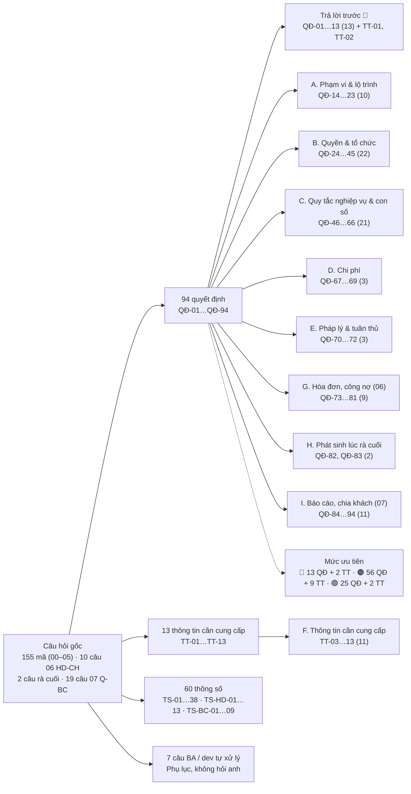
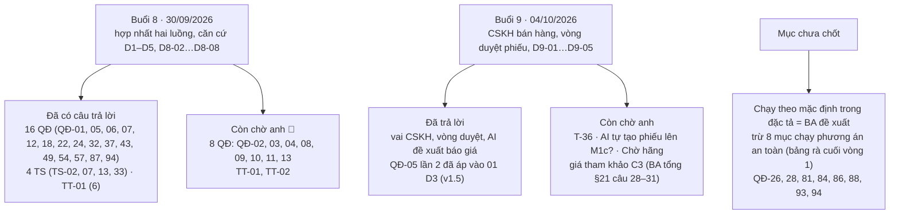
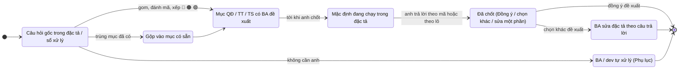

# Quyết định cần anh Thọ Anh chốt — sau góp ý vòng 1

Phiên bản 1.2 · 04/10/2026 · Trạng thái: Tài liệu sống

| | |
|---|---|
| **Ngày** | 29/09/2026 · lịch sử cập nhật: xem [cuối file](#lịch-sử-cập-nhật) |
| **Người lập** | BA trưởng (Claude) |
| **Gom từ** | Sổ xử lý vòng 1 `00…07-xu-ly.md` · câu hỏi mở trong đặc tả `00…07` · BA tổng `../02-yeu-cau/vclinks-ba.md` §21 (câu còn mở) · CLAUDE.md §14 (câu còn mở) · lượt rà cuối vòng 1 (`../02-yeu-cau/ra-soat/dac-ta-vong-1/ra-cuoi.md`) |
| **Không hỏi lại** | BA tổng §3 Q1–Q4 đã chốt. §21 câu 3, 4, 11 (phần hộp thư nào đọc), 12 đã trả lời. §21 câu 9 đã đặc tả theo BR09 (mỗi division một owner, 01 D10) |
| **Kết quả gộp** | 155 mã câu hỏi gốc (00–05) + 10 câu của 06 (HD-CH-1…10) + 2 câu phát sinh lúc rà cuối → **96 mục**: **83 quyết định** (QĐ-01…QĐ-83) + 13 thông tin cần cung cấp (TT-01…TT-13); các con số gom vào **51 thông số** (TS-01…TS-38 và TS-HD-01…TS-HD-13). **Sau vòng 1 của 07:** + 19 câu Q-BC → **107 mục**: **94 quyết định** (thêm QĐ-84…94) + 13 TT; **60 thông số** (thêm TS-BC-01…09). 7 câu gốc là việc của BA / dev, không hỏi anh (xem Phụ lục) |

## Mô hình

Cấu trúc sổ: câu hỏi gốc được gom thành ba họ mã (QĐ, TT, TS) và chia theo mục A…I.

Trạng thái theo đợt trả lời của anh (Buổi 8, Buổi 9) và mặc định đang chạy:

Vòng đời một câu hỏi trong sổ:

## Tóm tắt

- Sổ sống gom mọi câu cần anh Thọ Anh chốt sau góp ý vòng 1: **94 quyết định** (QĐ-01…94), **13 thông tin cần cung cấp** (TT-01…13) và **60 thông số** (TS-01…38, TS-HD-01…13, TS-BC-01…09); 7 câu gốc là việc BA / dev, không hỏi anh.
- Phân theo mục: 🔴 Trả lời trước 13 QĐ + TT-01, TT-02; A Phạm vi 10 · B Quyền 22 · C Quy tắc nghiệp vụ 21 · D Chi phí 3 · E Pháp lý 3 · G Hóa đơn (06) 9 · H Rà cuối 2 · I Báo cáo (07) 11 QĐ; F 11 TT. Mức: 🔴 13 QĐ + 2 TT, 🟠 56 QĐ + 9 TT, 🟢 25 QĐ + 2 TT.
- **Buổi 8 (30/09/2026)** đã trả lời 16 QĐ (trong đó 5 mục 🔴: QĐ-01, 05, 06, 07, 12), 4 TS (TS-02, 07, 13, 33) và TT-01 (6), căn cứ D1–D5 và D8-02…D8-08.
- **Buổi 9 (04/10/2026)** chốt luồng CSKH bán hàng (D9-01…D9-05): CSKH soạn → NVKD duyệt / trả lại → gửi qua nick; AI chỉ tạo đề xuất báo giá, báo giá thật trên VCsales; QĐ-05 lần 2 đã áp vào 01 D3.
- Quyết định nặng nhất: QĐ-01 điện thoại bản tối thiểu ở M1; QĐ-05 CSKH đọc toàn văn hội thoại khách trong đội (trừ gia đình / bạn bè, QĐ-38); QĐ-12 cổng mức mật trước mọi lời gọi AI ngoài; QĐ-57 tự gộp hồ sơ thu hẹp.
- **Còn chờ anh (🔴):** QĐ-02, 03, 04, 08, 09, 10, 11, 13 và TT-01, TT-02; từ Buổi 9 còn T-36, kéo AI tự tạo phiếu lên M1c, `Chờ hãng`, giá tham khảo C3 (BA tổng §21 câu 28–31).
- Tới khi anh chốt, đặc tả chạy theo BA đề xuất; 8 mục (QĐ-26, 28, 81, 84, 86, 88, 93, 94) đang chạy phương án an toàn hơn (bảng "Trạng thái sau rà cuối vòng 1").
- Người duyệt cần xem kỹ: bảng "Trả lời trước (🔴)", hai mục "Trả lời sau Buổi 8 / 9", và phụ lục "Các chỗ hai file đang lệch" (QĐ-28, QĐ-05).

## Mục lục

- [Trả lời sau Buổi 9 (04/10/2026, CSKH bán hàng và vòng duyệt phiếu)](#trả-lời-sau-buổi-9-04102026-cskh-bán-hàng-và-vòng-duyệt-phiếu)
- [Trả lời sau Buổi 8 (30/09/2026, hợp nhất hai luồng)](#trả-lời-sau-buổi-8-30092026-hợp-nhất-hai-luồng)
- [Cách trả lời](#cách-trả-lời)
- [Trả lời trước (🔴)](#trả-lời-trước-)
- [Bảng thông số đề xuất](#bảng-thông-số-đề-xuất)
- [A. Phạm vi & lộ trình](#a-phạm-vi--lộ-trình)
- [B. Quyền & tổ chức](#b-quyền--tổ-chức)
- [C. Quy tắc nghiệp vụ & con số](#c-quy-tắc-nghiệp-vụ--con-số)
- [D. Chi phí](#d-chi-phí)
- [E. Pháp lý & tuân thủ](#e-pháp-lý--tuân-thủ)
- [F. Thông tin cần cung cấp](#f-thông-tin-cần-cung-cấp)
- [G. Hóa đơn, công nợ (06) — thêm lúc rà cuối vòng 1](#g-hóa-đơn-công-nợ-06--thêm-lúc-rà-cuối-vòng-1)
- [H. Phát sinh lúc rà cuối vòng 1](#h-phát-sinh-lúc-rà-cuối-vòng-1)
- [I. Báo cáo chung và chia khách (07) — thêm sau vòng 1 của 07](#i-báo-cáo-chung-và-chia-khách-07--thêm-sau-vòng-1-của-07)
- [Trạng thái sau rà cuối vòng 1 (mặc định đang chạy trong đặc tả)](#trạng-thái-sau-rà-cuối-vòng-1-mặc-định-đang-chạy-trong-đặc-tả)
- [Phụ lục: bảng truy vết mã gốc](#phụ-lục-bảng-truy-vết-mã-gốc)
- [Lịch sử cập nhật](#lịch-sử-cập-nhật)

## Trả lời sau Buổi 9 (04/10/2026, CSKH bán hàng và vòng duyệt phiếu)

Anh hỏi luồng "khách hỏi giá trên Zalo cá nhân → AI tạo báo giá nháp → chăm sóc bán hàng kiểm, sửa → NVKD kiểm và gửi khách", tương tự cho khiếu nại bảo hành; đồng ý đề xuất BA. Quyết định ghi ở BA tổng §3.2.

| Mục | Trả lời | Căn cứ |
|---|---|---|
| Vai "chăm sóc bán hàng" | CSKH hiện có, hai hàng việc Bán hàng / Hậu mãi; không thêm vai | D9-01 |
| Vòng duyệt | CSKH soạn → `Chờ NVKD duyệt` ⇄ `Trả lại` (lý do bắt buộc) → gửi qua nick; kênh chính thức CSKH gửi thẳng | D9-02, 01 PQ-119, PQ-120 |
| AI tạo báo giá nháp | AI tạo **đề xuất báo giá** trong VClinks; báo giá thật tạo trên VCsales | D9-03, giữ Q4 |
| **QĐ-05** (lần 2) | **Đã áp vào 01 D3** (v1.5): CSKH đọc toàn văn, không gửi qua nick | D9-04 |
| Mốc bật | M1c phiếu tạo tay; M2 AI tự tạo | D9-05 (đề xuất) |

**Còn chờ anh:** T-36 = 2 lần trả lại? · có kéo AI tự tạo phiếu lên M1c? · `Chờ hãng` cập nhật tay hay đọc ERP; ai báo kết quả bảo hành khi khách chỉ chat Zalo sale · giá tham khảo C3 chỉ hiện cho CSKH giữ phiếu, không gửi AI ngoài (BA tổng §21 câu 28–31).

## Trả lời sau Buổi 8 (30/09/2026, hợp nhất hai luồng)

Anh duyệt bảng đối chiếu [doi-chieu-luong-A-B.md](../02-yeu-cau/ra-soat/doi-chieu-luong-A-B.md). Các mục dưới đây **đã có câu trả lời**, lấy từ quyết định của luồng A (D1–D5) hoặc quyết định mới D8-02…D8-08 (BA tổng §3.1). Đặc tả 00–07 sửa theo ở lượt rà tới.

| Mục | Trả lời | Căn cứ |
|---|---|---|
| **QĐ-01** 🔴 | **B**: web trên điện thoại bản tối thiểu ở M1 | D2-14, VCL-INB-09 |
| **QĐ-05** 🔴 | **Rộng hơn C**: CSKH đọc hồ sơ và toàn văn hội thoại của khách trong đội, trừ hội thoại gia đình/bạn bè (QĐ-38); mỗi lần mở hội thoại trên nick sale ghi nhật ký. **Sửa 01 D3**, PQ chú thích (34), (36) | D4-10, D8-04 |
| **QĐ-06** 🔴 | **A**, cộng: khách mới trên OA/Fanpage/web do CSKH trực nhận trước rồi giao NVKD theo khu vực; CSKH gửi thẳng từ Zalo công ty của mình và trong nhóm Zalo về phiếu của mình. Hạn: phản hồi 15′ (TS-02 = 15′) | D8-04, D5-01, D4-23, D4-15 |
| **QĐ-07** 🔴 | **A** | G-16, BA-46 |
| **QĐ-12** 🔴 | **A** + cổng mức mật trước mọi lời gọi AI ngoài; C3 không qua MCP | D2-15, D5-13, VCL-AI-14 |
| QĐ-18 | Chatbot web tự phục vụ 24/7 (FAQ, tình trạng đơn sau xác thực, không báo giá); OA, Fanpage: bot ngoài giờ; trong giờ AI chỉ gợi ý | D4-16 |
| QĐ-22 | **A**: tiếp tục tự xây | Đề xuất BA, không ai phản đối |
| QĐ-24 | **B**, nhưng bước chọn lý do chỉ để ghi nhật ký, không chặn quyền đọc của ban giám đốc | D2-09 |
| QĐ-32 | **A**: NV thị trường là vai riêng | Ánh xạ vai, BA tổng §4 |
| QĐ-37 | Xuất kèm SĐT: kiểm soát nội bộ duyệt; xuất không SĐT: giám đốc division duyệt | V8-27 |
| QĐ-43 | **B**: bật mặc định, giám sát huỷ được | D4-13 |
| QĐ-49 | **B**, thời gian theo T-18 (2 ngày làm việc khi phiếu xong) và T-19 (24 giờ làm việc khi không phiếu), thay TS-13 7 ngày | D4-18 |
| QĐ-54 | **A**: xưng tên người gửi thật | D4-20 |
| QĐ-57 | **A thu hẹp**: tự gộp chỉ khi trùng SĐT đã xác thực **và** một phía là danh tính mới **và** cùng người phụ trách; có hoàn tác. Sửa BR05, 02 L10, L11 | D8-05 |
| QĐ-87 | Cảnh báo theo T-31 = max(2 × chu kỳ mua, 90 ngày); không tự thu hồi; GS tự tay thu hồi được | D4-13 |
| QĐ-94 | **C** tới hết baseline 2–4 tuần, rồi **A** | D2-17 |
| TS-02 | **15′** | D4-15 |
| TS-07 | **Bỏ.** Thay bằng người thay tạm: 10′ trả lời tạm lượt đó, "Nghỉ" hoặc vắng 2 giờ làm việc thì giữ trọn. CSKH tạm giữ (02 DK-24) chỉ còn khi owner chưa có người thay tạm | D4-20 |
| TS-13 | Theo T-18, T-19 | D4-18 |
| TS-33 | **72 giờ**; người duyệt: giám sát cấp trên hoặc back office được chỉ định | D3-14, D4-02 |
| TT-01 (6) | Owner trong VClinks; trường "NV phụ trách" của VCsales chỉ để nạp lần đầu và so lệch. Duyệt giảm giá, công nợ ở VCsales (VCdms là phân hệ của VCsales) | D8-06, D8-07 |

**Còn chờ anh (🔴):** QĐ-02 marketing ở M1/M2, QĐ-03 ZNS lẻ, QĐ-04 ngày mở gửi Zalo cho khách thật, QĐ-08 báo giá cho khách chưa có mã KH, QĐ-09 lead từ nick sale, QĐ-10 ghi công quảng cáo, QĐ-11 máy giữ nick (nay gắn với D8-08: nick chạy trên máy chủ công ty), QĐ-13 ba văn bản pháp lý; TT-01, TT-02.

## Cách trả lời

- Mỗi mục đã có **BA đề xuất**. Anh chỉ cần ghi một trong ba cách:
  - `QĐ-05: Đồng ý đề xuất`
  - `QĐ-05: B` (chọn phương án khác)
  - `QĐ-05: B, nhưng …` (sửa một phần)
- Trả lời theo lô được. Ví dụ: **"Đồng ý mọi đề xuất trừ QĐ-05, QĐ-12"**, rồi ghi riêng hai mã đó.
- Con số (SLA, ngưỡng, thời hạn) nằm chung ở **Bảng thông số đề xuất**. Sửa theo mã: `TS-05: 20 phút`.
- Mục **TT** là thông tin, không phải lựa chọn. Anh giao người gửi, hoặc chỉ định đầu mối để BA hỏi trực tiếp.
- Tới khi anh chốt, đặc tả chạy theo đề xuất BA (đã viết sẵn trong đặc tả v1.1). Anh chọn khác thì BA sửa lại đặc tả.

**Mức ưu tiên**

| Ký hiệu | Nghĩa | Số mục |
|---|---|---|
| 🔴 | Chặn thiết kế hoặc dev MVP. Cần trả lời trước | 13 QĐ + 2 TT |
| 🟠 | Cần trước GĐ2 hoặc trước ngày đưa MVP cho cả đội | 56 QĐ + 9 TT (gồm QĐ-84, 86, 92, 94 của 07) |
| 🟢 | Để sau được | 25 QĐ + 2 TT (gồm QĐ-85, 87…91, 93 của 07) |

---

## Trả lời trước (🔴)

Nếu chỉ có 15 phút, anh trả lời 15 mục này. Đặc tả đang chạy theo đề xuất BA; phần lớn chỉ cần "Đồng ý".

| Mã | Câu hỏi | Phương án | BA đề xuất | Chưa chốt thì chặn | Mã gốc |
|---|---|---|---|---|---|
| **QĐ-01** | Có giao diện VClinks trên **điện thoại** ở MVP không? | **A.** Giữ GĐ2. Sale dùng app Zalo; tin trả lời từ điện thoại vẫn về VClinks và tính đã trả lời. **B.** MVP bản tối thiểu: "Của tôi" + "Chưa trả lời", đọc hội thoại, trả lời chữ / ảnh / mẫu câu / số tài khoản, danh sách lead "Cần gọi" + bấm gọi + ghi kết quả một chạm, thông báo đẩy, công tắc "Đi thị trường". Phần còn lại GĐ2. **C.** Đủ MH-UI-11 ngay MVP | **B.** Ba vai trò (NVKD, NV thị trường, giám sát) cùng xếp Chặn ở điểm này. Tránh cảnh "sáng làm VClinks, chiều làm Zalo". Lưu ý: thông báo đẩy trên iPhone cần iOS 16.4+ và thêm web vào màn hình chính | MH-UI-11, MH-MK-12; cách tính "Đi thị trường" (QĐ-06); TS-23, TS-24 | 00 Q-13; 03 Q14; 05 D-MK-12 |
| **QĐ-02** | **Marketing ở MVP** gồm những gì? | **A.** Theo BA tổng: lead + Hộp thư lead + bảng lead → báo giá; chatbot / livechat web GĐ3. **B.** A + tin chào / ngoài giờ Fanpage có tối đa 3 nút trả lời nhanh và hỏi SĐT (cấu hình, không có trình dựng) + bảng theo chiến dịch (lead, chi phí, CPL, báo giá, đơn, chi phí / đơn, tách khách mới / cũ) + khối Xử lý lead + xuất Excel. Widget website **GĐ2 có điều kiện**: Hộp thư lead chạy ổn ≥ 1 tháng, có số lượt truy cập, đã chốt người trực; thiếu điều kiện thì chỉ làm form + đồng ý. **C.** B + widget website ngay MVP | **B.** Nhập chi phí ở MVP mà chưa có CPL thì giám đốc "duyệt ngân sách mù". Tin chào Fanpage cùng loại tin chào OA đã có ở MVP | 05 §11 lộ trình; MH-MK-10; kênh chatbot web | 05 D-MK-1, D-MK-14; 02 §12 câu 1; 05 P-MK #5 |
| **QĐ-03** | Đưa **gửi tin mẫu (ZNS) lẻ** lên MVP? | **A.** Lên MVP: gửi lẻ + 2 mẫu "Tiếp nhận yêu cầu", "Kết quả xử lý yêu cầu". Sale admin nộp mẫu cho Zalo ngay (Zalo duyệt khoảng 2–3 ngày). **B.** Giữ GĐ2; khách quá 48 giờ thì CSKH gọi điện. **C.** Nới chặn gửi ngoài khung 48 giờ (không nên: trái BA §2.2.4, có thể bị Zalo từ chối hoặc tính phí) | **A.** Bảo hành thường mất 5–10 ngày, lúc có kết quả khách đã ra khỏi khung 48 giờ. Chi phí nhỏ (chỉ gửi lẻ, 2 mẫu). Chọn A thì QĐ-26 (người duyệt mẫu) và QĐ-67 (ngân sách) cũng thành 🔴 | MH-OA-11, MH-OA-12; phạm vi MVP của CSKH OA | 04 CH-3; Q-OA-15 |
| **QĐ-04** | Khi nào **mở gửi tin Zalo ra khách thật** (bỏ giới hạn nhóm test)? | **A.** Khi đạt hồi quy + bộ UAT của 03; chấp nhận "mỗi dòng một tin" tới GĐ2. **B.** Như A, **cộng** đã sửa xong gửi tin nhiều dòng thành một tin. **C.** Như B; nếu chưa sửa kịp thì tạm chặn xuống dòng trên kênh Zalo và báo rõ | **B**, dự phòng **C.** Khách nhận 5 tin rời cho một câu trả lời trông thiếu chuyên nghiệp. Anh là người ký cho mở | Ngày đưa Zalo cá nhân cho cả đội VCparts | 03 Q9, Q10; 03 P-KD #6 (Chặn) |
| **QĐ-05** | **CSKH đọc được gì** trong lịch sử chat giữa sale và khách? | **A.** Giữ 01 D3: chỉ dòng tóm tắt (ai, kênh, lúc nào); đọc toàn văn khi hội thoại gắn ticket của mình hoặc xin quyền tạm. **B.** A + khối **"Cam kết đã nêu"** 7 ngày (giá, hẹn giao, đổi / trả; kèm kênh, người, giờ, một dòng trích) tự trích + ghi chú "Sale đã hứa" do sale ghi, ghim trên ticket và hồ sơ 360. **C.** CSKH đang giữ ticket được đọc toàn văn (chỉ đọc) mọi kênh 30 ngày, ghi nhật ký | **B.** CSKH đủ thông tin để trả lời "anh Nam hứa…" (5–10 lần / ngày) mà không mở toàn bộ chat nick cá nhân; ít lộ dữ liệu theo NĐ 13. Xem lại sau UAT | 01 D3; 02 MH-DK-09; 04 MH-OA-03 | 02 CH-1; 04 CH-1; Q-OA-13; §21 câu 10 (phần đọc); 02 §12 câu 2 |
| **QĐ-06** | Khách **đã có sale** nhắn OA / Fanpage: CSKH được trả lời gì, sale có **hạn trả lời** bao lâu? | **A.** CSKH trả lời thẳng việc hậu mãi (bảo hành, khiếu nại, tình trạng đơn), không nêu giá. Hỏi giá thuộc sale, có hạn (TS-05). Quá hạn: báo sale + giám sát. Quá gấp đôi (TS-06): CSKH gửi câu giữ khách đã duyệt (không giá), chuyển **người trực bán hàng** của tổ; tổ chưa có lịch trực thì chuyển giám sát. Sale "Vắng" (TS-07) thì CSKH tạm giữ ngay. **B.** Chỉ tạm giữ khi sale vắng; sale đang trực tuyến mà không trả lời thì không có hạn. **C.** Mọi hỏi giá vào CSKH trước, CSKH mời sale vào | **A.** Đây là chỗ CSKH và sale dễ đổ lỗi nhau nhất. **Rà cuối vòng 1:** 02 và 04 đã cùng chạy **15′ / 30′** (TS-05, TS-06). "Đi thị trường" đã chốt nội bộ theo thong-nhat #2 (vẫn nhận tin khách mình, hạn trả lời chạy, không gây tạm giữ) — không còn phụ thuộc QĐ-01 | 02 DK-24, DK-31; 04 OA-11, OA-12; MH-OA-02, 17, 18; MH-UI-05 | §21 câu 10; 02 §12 câu 2, 4; 02 CH-2, CH-3; 04 CH-2; Q-OA-06, Q-OA-14; 01 Q-PQ-01; 00 Q-14 |
| **QĐ-07** | Tin sale gửi **từ app Zalo trên điện thoại** (ngoài VClinks) có tính vào chỉ số hiệu suất (FRT, % quá SLA)? | **A.** Tính mọi nguồn cho lọc, SLA và KPI; thêm chỉ số riêng "% tin trả lời qua VClinks" để theo dõi việc chuyển đổi. **B.** Lọc và SLA tính mọi nguồn; KPI chỉ tính tin qua VClinks. **C.** Chỉ tính tin qua VClinks cho cả SLA | **A.** NVKD và giám sát cùng đề nghị. B tạo hai con số FRT khác nhau cho cùng một hội thoại; C báo quá SLA sai, nhắc sai người | Báo cáo hiệu suất F10.2; 03 SZ-21, SZ-22 | 03 Q11; 00 Q12 (đã chuyển sang 03) |
| **QĐ-08** | Khách mới **chưa có mã KH**: sale gửi báo giá thế nào? | **A.** Bắt buộc Sale admin liên kết mã KH trước. **B.** Gửi theo **số báo giá** VCsales: chỉ khi người lập báo giá = người gửi, báo giá đã duyệt, còn hiệu lực; liên kết mã KH làm sau, có nhắc Sale admin. **C.** VCsales tạo mã KH tạm khi lập báo giá cho khách mới | **B** nếu API VCsales tra được theo số báo giá; không thì **C.** A làm mất khách mới trong lúc chờ Sale admin | Gửi báo giá MVP (F9.1–F9.7); MH-SZ-05i | 03 Q20; §21 câu 14 |
| **QĐ-09** | Người lạ nhắn **nick Zalo cá nhân của sale** (thường do quảng cáo) có tự tạo lead? | **A.** Không; sale tự bấm "Tạo lead". **B.** Có, tự tạo; sale gắn "Khách biết qua…"; gộp hồ sơ thì nhận lại điểm chạm quảng cáo; bật / tắt theo division, mặc định bật. Không gửi gì tự động qua nick; marketing chỉ thấy thẻ lead | **B.** Quảng cáo có in số Zalo sale sẽ bị đếm thiếu lead, marketing đánh giá sai chiến dịch | 05 §2.3b, MK-21; ingest Zalo cá nhân | 05 D-MK-15; 05 P-MK #1 (Chặn) |
| **QĐ-10** | Đơn nào được **ghi công cho quảng cáo**? | **A.** Mọi đơn của mã KH trong cửa sổ (garage cũ mua định kỳ làm số đẹp giả). **B.** Chỉ đơn gắn báo giá của lead (sót khách mới đặt thẳng). **C.** Đơn gắn báo giá của lead + với khách mới thêm đơn đầu tiên trong cửa sổ; khách cũ chỉ tính đơn gắn báo giá; một đơn một lead; tách khách mới / cũ; công thuộc điểm chạm đầu của lead. Cửa sổ ở TS-26 | **C.** Chặt mà không sót khách mới. Nếu VCsales chưa nối đơn ↔ báo giá: tạm tính "khách mới: đơn đầu tiên; khách cũ: không tính", ghi rõ trên dashboard | Mô hình dữ liệu lead ↔ đơn; dashboard marketing | 05 D-MK-9, D-MK-11; Q-MK-7; 05 P-GD #1 (Chặn) |
| **QĐ-11** | Nick Zalo công ty dùng trên **máy nào**, ai thu nick khi nghỉ việc? | **A.** Chỉ máy công ty: laptop cài extension, điện thoại và SIM của công ty. **B.** Cho dùng máy cá nhân, nhưng SIM / số đăng ký Zalo là của công ty; extension ghép bằng mã, thu hồi khi nghỉ; nghỉ việc thì đổi mật khẩu Zalo và đăng xuất thiết bị cũ ngay tại buổi bàn giao. **C.** Tự do (không đạt BR08) | **B ngay, tiến tới A.** Người thu nick: giám sát của tổ làm cùng HC-NS; Admin VClinks xác nhận trên checklist. VClinks không giữ mật khẩu | 03 QT-SZ-11; 01 PQ-33, PQ-51; cài extension cho đội | 01 Q-PQ-22; 03 Q18 |
| **QĐ-12** | Dữ liệu khách đi qua **Claude** (MCP, AI gợi ý) có bị coi là chuyển dữ liệu cá nhân ra nước ngoài theo NĐ 13? | **A.** Tạm áp 4 biện pháp: MCP chỉ mở cho nhóm dự án; SĐT / email luôn ẩn qua MCP với mọi vai trò; tên khách lẻ viết tắt; AI gợi ý chỉ nhận nội dung đã ẩn SĐT. Hỏi pháp chế, chỉ mở rộng khi có kết luận. **B.** Dừng mọi dữ liệu khách qua Claude tới khi có hồ sơ. **C.** Coi là không chuyển ra nước ngoài, mở rộng ngay | **A.** Giữ được việc đang chạy, không mở rộng rủi ro. Đây cũng là mâu thuẫn trong BA tổng (§1 nguyên tắc 4 và §1.2) | Mở MCP cho nhân viên; AI gợi ý (GĐ2); QĐ-36 | 01 Q-PQ-18; 01 L13 |
| **QĐ-13** | Ba **văn bản pháp lý** cần có trước MVP do ai soạn, ai duyệt? (1) Quy định dùng nick công ty và VClinks, nhân viên ký khi nhận nick ("nick công ty chỉ dùng việc công"). (2) Câu đồng ý và thông báo xử lý dữ liệu cá nhân, link chính sách của từng division. (3) Pháp chế trả lời: nút "Đồng ý và gửi" có thay được ô tích? SĐT khách tự để công khai trong bình luận có được xử lý thành lead? Sale kết bạn / gọi lead chưa có ô đồng ý có vi phạm, ai chịu? | **A.** Pháp chế soạn / duyệt cả ba trước MVP; BA gửi bản nháp. **B.** Dùng bản nháp BA ở MVP, pháp chế rà trong GĐ2. **C.** Chỉ làm (1) | **A.** Trong lúc chờ: giữ ô tích; thông báo + link chính sách ở tin đầu tiên. Văn bản (1) chi phí thấp, giảm lo ngại "bị soi" của NVKD | Triển khai từng division; form lead, tin chào; MH-OA-08 | 01 Q-PQ-21 (a); 03 Q19 (phần bản xác nhận); 05 Q-MK-14; Q-OA-10; Q-MK-2 (trang chính sách website) |
| **TT-01** | **VCsales cung cấp gì qua API?** Anh chỉ định một đầu mối dev VCsales và hạn trả lời | Cần biết: (1) báo giá: danh sách theo mã KH, chi tiết, trạng thái, PDF / link xem, tra theo **số báo giá**, cho VClinks báo ngược "đã gửi lúc…"; (2) tìm khách theo SĐT; (3) đơn **kèm mã báo giá** lập ra đơn; (4) công nợ và hạn nợ; (5) doanh số division theo kỳ; (6) có trường "NV phụ trách" không, ai sửa khi đổi owner; (7) có trường "nguồn khách" không; (8) mở màn tạo báo giá bằng link kèm mã KH; (9) mẫu PDF gọn cho điện thoại; (10) danh sách SĐT gắn ≥ 2 mã KH (để dọn dữ liệu ban đầu); (11) cách xác thực; **(12) [07]** VCsales có trả sẵn **chu kỳ mua lại** theo khách không (07 Q-BC-07: không có thì VClinks tự tính trung vị khoảng cách giữa các đơn 12 tháng, ≥ 3 đơn, KPI-18); **(13) [07]** báo cáo VCsales làm chuẩn đối chiếu (QĐ-92), API danh sách báo giá theo **ngày tạo**, trạng thái "Đã chốt" có **ngày chốt** (`erp_closed_at`, KPI-14), **NV phụ trách theo đơn** (07 BC-05, KPI-16) | Anh chỉ định đầu mối; BA gửi danh sách câu trong ngày. Trong lúc chờ: sale tải PDF từ VCsales, gửi như file thường | Gửi báo giá MVP; owner (Q1); QĐ-08, QĐ-10, QĐ-15, QĐ-17 | §21 câu 7, 8, 13, 15, 16; 02 §12 câu 12; 02 CH-7 (a); 05 Q-MK-6, Q-MK-15; Q-OA-20; 04 P-KT H2, H3 |
| **TT-02** | **Danh sách kênh** và **nick test** | (1) Số OA, Fanpage, nick Zalo cá nhân theo division; OA nào đã xác thực, gói OA nào; ai giữ quyền quản trị. (2) Một nick Zalo test phụ và một hội thoại 1-1 test để thêm vào danh sách được gửi (UAT kết bạn, chat 1-1) | Gửi (2) trước, để chạy UAT-SZ-16, 35–41 | Nối OA + Fanpage thật; phân quyền kênh; UAT 03 | §21 câu 2; Q-OA-01, Q-OA-02; 03 Q3 |

---

## Bảng thông số đề xuất

Mọi con số đều sửa được trên hệ thống sau này (Admin hoặc giám đốc). Chạy 2–4 tuần rồi xem lại. "Giờ làm" = giờ làm việc ở TS-01.

| Mã | Thông số | BA đề xuất | Ghi chú / chỗ đang lệch | Mức | Mã gốc |
|---|---|---|---|---|---|
| TS-01 | Giờ làm việc | T2–T7, 08:00–17:30; từng division sửa được | | 🔴 | 04 CH-9; Q-OA-07; §21 câu 6 |
| TS-02 | CSKH phản hồi tin đầu | 30′ giờ làm | Hạn của đội tính từ tin khách | 🔴 | 04 CH-9 |
| TS-03 | CSKH phản hồi khiếu nại | 15′ giờ làm | | 🔴 | 04 CH-9 |
| TS-04 | Xử lý bảo hành | 2 ngày làm việc | | 🟠 | 04 CH-9 |
| TS-05 | Sale trả lời hỏi giá của khách mình (lần 1) | 15′ giờ làm → báo sale + giám sát | P-CS muốn 30′, P-GD muốn 15′. **Rà cuối: 02 và 04 đã cùng chạy 15′** (02 DK-48, 04 MH-OA-18) | 🔴 | 02 CH-3; 04 CH-2 |
| TS-06 | Hỏi giá quá gấp đôi (lần 2) | 30′ tính từ tin khách → CSKH gửi câu giữ khách + chuyển người trực bán hàng / giám sát | **Rà cuối: 02 đã bỏ "+30′"**, 02 và 04 cùng 30′ | 🔴 | 02 CH-3; 04 CH-2 |
| TS-07 | Sale "Vắng" để CSKH tạm giữ | 30′ không hoạt động trong giờ làm (hoạt động gồm gửi tin từ mọi nguồn, kể cả app Zalo) | Thay mốc 15′ của DK-24 cũ; 00 MH-UI-05 v1.2 cũng 30′ (một tham số division, người dùng không tự đặt) | 🔴 | 02 CH-2; 02 §12 câu 4 |
| TS-08 | Tự chuyển "Ngoại tuyến" | 30′ ngoài ca | Rà cuối: 00 v1.2 bỏ "Tạm vắng" (đổi thành "Vắng" = TS-07) và mốc "2′ sau khi đóng tab" | 🟢 | 00 Q6 (Q-UI-6) |
| TS-09 | SLA liên hệ lead | 5′ khách đang chat · 15′ lead chỉ có SĐT · 30′ khi người nhận "Đi thị trường". Hẹn liên hệ ≤ 2 giờ, một lần. Lead đêm chia lúc mở cửa, giãn 5′ / lead | Ngoại lệ không thu hồi ở QĐ-52 | 🔴 | 05 D-MK-6 |
| TS-10 | Sale không phải owner xin nêu giá | Owner 10′ không phản hồi → giám sát của owner duyệt | Chỉ áp dụng nếu QĐ-46 = A | 🟠 | 02 CH-4 |
| TS-11 | Yêu cầu CSKH nhận khách chờ giám sát | 15′ → chuyển người trực thay; không có thì CSKH nhận, owner được báo | | 🟠 | 01 Q-PQ-01 |
| TS-12 | Khóa trả lời khi người khác đang trả lời / gom "cùng một yêu cầu" | 10′ / 60′ | | 🟠 | 02 §12 câu 5 |
| TS-13 | Tự chuyển "Chờ khách" sang "Đã xong" | Sau 7 ngày khách im; giám đốc sửa theo division | Bật hay không ở QĐ-49 | 🟠 | 00 Q-18 |
| TS-14 | Tin khách về VClinks khi nick đang xanh | ≤ 10 giây (p90), đo thực tế trước khi cam kết | Rà cuối: 00 v1.2 đã theo (Zalo qua extension ≤ 10 giây p90, kênh API ≤ 5 giây) | 🔴 | 03 Q13 |
| TS-15 | Trạng thái nick (xanh / vàng / đỏ) và hạn lệnh chờ gửi | 2′ / 10′ / 60′; lệnh chờ quá 30′ thì hết hạn | | 🟠 | 03 Q1 |
| TS-16 | Nick đỏ báo người giữ nick + giám sát + Admin | > 15′ trong giờ làm | | 🟠 | 03 Q13 |
| TS-17 | Lệnh gửi lỗi / quá hạn chưa xử lý báo giám sát | > 30′ trong giờ làm | | 🟠 | 03 Q13 |
| TS-18 | Lời mời kết bạn chưa xử lý | > 4 giờ làm báo người giữ nick; > 1 ngày làm việc báo giám sát | | 🟠 | 03 Q13 |
| TS-19 | Người giữ nick "đang hoạt động" (hỏi trước khi trả lời thay) | Đang trực tuyến trên VClinks hoặc nick gửi tin trong 5′ | | 🟠 | 03 Q13 |
| TS-20 | Lấy nội dung hàng loạt | Nhịp 3 giây, tối đa 20 hội thoại / lần | | 🟠 | 03 Q13 |
| TS-21 | Kết bạn / tạo nhóm qua VClinks | 30 giây / lệnh; tối đa 20 lời mời / nick / ngày | Chưa có số "an toàn" đã kiểm chứng với Zalo; giữ thấp, theo dõi | 🟠 | 03 Q2 |
| TS-22 | Cảnh báo cửa sổ gửi Fanpage | "Sắp hết" khi còn 2 giờ; "Rất gấp" khi còn 30′ | | 🟢 | 00 Q-15 |
| TS-23 | Phiên đăng nhập | Máy tính: 12 giờ không hoạt động. Điện thoại: "Ghi nhớ 30 ngày" cho NVKD, NV thị trường, giám sát; thu hồi được; khóa tài khoản là hủy ngay. Tắt token nội bộ khi SSO chạy ổn 2 tuần | Phần điện thoại chỉ cần nếu QĐ-01 ≠ A | 🟠 | 00 Q2, Q-2 |
| TS-24 | Hồ sơ 360 lưu trên điện thoại khi mất mạng | Khách đã mở trong 24 giờ, ≤ 30 khách, xóa khi đăng xuất, không lưu ảnh / file. Tải sẵn "khách tuyến hôm nay": GĐ2 cùng VCdms | Chỉ cần nếu QĐ-01 ≠ A | 🟠 | 00 Q-16 |
| TS-25 | Giữ SĐT "ngừng dùng" trước khi coi là số mới | 12 tháng | | 🟢 | 02 §12 câu 9 |
| TS-26 | Cửa sổ lead / cửa sổ ghi nhận đơn | Lead: 30 ngày. Đơn: 60 ngày **từ lúc tạo lead**; VCedu 90 ngày; dashboard xem lứa 7 / 30 / 60 ngày | | 🔴 | 05 D-MK-11; Q-MK-7 |
| TS-27 | Gán đơn cho OA (báo cáo "OA ra doanh số") | Đơn cùng mã KH trong 14 ngày sau hội thoại OA | Chỉ cần nếu QĐ-17 = A | 🟠 | 04 CH-7 |
| TS-28 | Ngân sách tin OA | Báo giám đốc + kế toán ở 80%; dừng ZNS lẻ và tin có phí ở 100% (ZNS giao dịch tự động không dừng, chỉ báo) | Chỉ cần nếu QĐ-67 = A | 🟠 | 04 CH-4 |
| TS-29 | Xuất Excel | Tối đa 50.000 dòng / lần | | 🟢 | 00 Q9 |
| TS-30 | Xuất danh sách khách | Không kèm SĐT: tự do tới 500 dòng; vượt 500 hoặc kèm SĐT: cần duyệt (người duyệt ở QĐ-37) | | 🟠 | 01 Q-PQ-19 |
| TS-31 | Token MCP | NVKD: 90 ngày. Vai trò phạm vi rộng (giám đốc, sale admin, kiểm soát): 30 ngày, ≤ 300 khách / ngày | Chỉ mở sau QĐ-12 | 🟠 | 01 Q-PQ-09 |
| TS-32 | Lưu nhật ký | 24 tháng; riêng sổ NĐ 13, xuất kèm SĐT, xóa dữ liệu: 5 năm (pháp chế xác nhận) | | 🟠 | 01 Q-PQ-07 |
| TS-33 | Hạn xử lý yêu cầu dữ liệu cá nhân (NĐ 13) | Tạm 15 ngày, pháp chế chốt số ngày theo loại | | 🟠 | 01 Q-PQ-20 |
| TS-34 | Ngưỡng cảnh báo bất thường R1–R11 | Dùng mặc định PQ-46, chạy 1 tháng rồi chỉnh | | 🟠 | 01 Q-PQ-07 |
| TS-35 | "Cam kết đã nêu" hiện cho CSKH | 7 ngày gần nhất | Chỉ cần nếu QĐ-05 = B | 🔴 | 04 CH-1 |
| TS-36 | Trưởng marketing xem lead đang tranh chấp | Quyền tạm 24 giờ, giám sát đồng ý | | 🟠 | 05 D-MK-3 |
| TS-37 | Đồng bộ Google Workspace | Đối chiếu mỗi giờ; "Chờ kích hoạt" quá 14 ngày nhắc Admin | Chỉ cần nếu QĐ-34 = B | 🟠 | 01 Q-PQ-12 |
| TS-38 | Nhắc lead chưa chia ở hàng tổ | Quá 30′ giờ làm → nhắc GS tổ một lần | Thêm lúc rà cuối (05 MK-31) | 🟠 | 05 P-GS #16 |

**Thông số hóa đơn, công nợ (06, thêm lúc rà cuối vòng 1).** Chạy theo đề xuất tới khi anh sửa; chi tiết ở `../02-yeu-cau/dac-ta/06-hoa-don-cong-no.md` và `../02-yeu-cau/ra-soat/dac-ta-vong-1/06-xu-ly.md`.

| Mã | Thông số | BA đề xuất | Ghi chú / chỗ đang lệch | Mức | Chỗ dùng |
|---|---|---|---|---|---|
| TS-HD-01 | Khoảng chờ owner trước mỗi lần nhắc nợ / đối chiếu (lẻ và chiến dịch) | 2 giờ làm việc | **Lệch ý kiến:** P-KD, BA 2 giờ; P-GD 4 giờ cho chiến dịch | 🟠 | 06 HD-51; 04 OA-36, MH-OA-12, 13 |
| TS-HD-02 | "Owner vừa chat với khách" | Tin 2 chiều trong 4 giờ, mọi kênh | | 🟠 | 06 HD-30 (g) |
| TS-HD-03 | "Báo giá mở" | Báo giá gửi trong 3 ngày làm việc, chưa chốt / hủy | | 🟠 | 06 HD-30 (g) |
| TS-HD-04 | Hạn owner "Tôi tự nhắc" | 1 ngày làm việc; quá hạn trả về kế toán | | 🟠 | 06 HD-53 |
| TS-HD-05 | "Xin giữ lại" tối đa | 3 ngày làm việc; giám đốc quyết trong 1 ngày làm việc | | 🟠 | 06 HD-51 |
| TS-HD-06 | Tạm hoãn "Khách chiến lược" tối đa | 30 ngày, gia hạn giám đốc duyệt lại | | 🟠 | 06 HD-31 |
| TS-HD-07 | Chip quá hạn trên hội thoại | Từ 1 ngày quá hạn; chữ đỏ từ 30 ngày | P-KD muốn > 0; P-GD muốn ≥ 30 → hai mức màu | 🟠 | 06 HD-55; 00 MH-UI-07; 03 MH-SZ-01 #9o |
| TS-HD-08 | Báo KT + GS khi báo giá cho khách quá hạn > 60 ngày | ≥ 50.000.000 ₫ | | 🟠 | 06 HD-55; 03 MH-SZ-05i |
| TS-HD-09 | Giờ gửi mặc định chiến dịch nhắc nợ / đối chiếu | 10:30 | Sau giờ nhập sao kê | 🟠 | 06 HD-50; 04 MH-OA-13 |
| TS-HD-10 | Cửa sổ thu sau nhắc; cắt kỳ | 7 ngày; theo ngày thu | | 🟠 | 06 HD-58; 04 MH-OA-14 |
| TS-HD-11 | Giờ chụp số cuối kỳ | 17:30 ngày làm việc cuối tháng | | 🟢 | 06 HD-57 |
| TS-HD-12 | Hạn phiếu 3 ngày làm việc đầu tháng | 2 ngày làm việc (ngày thường 1) | | 🟢 | 06 HD-13 |
| TS-HD-13 | Đơn đã giao chưa có HĐ tô đỏ | Sau 3 ngày | Không phải thời hạn luật (Q-HD-03) | 🟢 | 06 MH-HD-02 #8 |

**Thông số báo cáo và chia khách (07, thêm sau vòng 1 của 07).** Chạy theo đề xuất tới khi anh sửa; chi tiết ở `../02-yeu-cau/dac-ta/07-bao-cao-va-chia-khach.md` §11 và `../02-yeu-cau/ra-soat/dac-ta-vong-1/07-xu-ly.md`. TS-BC-08, 09 là hai câu "mới (TS)" của 07 (Q-BC-08, Q-BC-12).

| Mã | Thông số | BA đề xuất | Ghi chú / ý kiến vai | Mức | Chỗ dùng |
|---|---|---|---|---|---|
| TS-BC-01 | Từ lúc chụp tới lúc **khóa** số chụp (nhận tin về trễ) | 24 giờ | Số chụp "tạm → khóa"; P-GS #1 (Chặn) | 🟠 | 07 BC-15 (b) |
| TS-BC-02 | Ngưỡng **độ phủ kênh** tô vàng "Số có thể thiếu" | 90% | P-BGD #2 (Chặn) | 🟠 | 07 BC-27, KPI-29 |
| TS-BC-03 | Cảnh báo chạy thử: một người nhận > n hội thoại mới / ngày làm việc | 15 | P-GD #10 | 🟢 | 07 RT-13 |
| TS-BC-04 | Cửa sổ "Quay về bản trước ngay" (không cần chạy thử) | 24 giờ | P-GD #8 | 🟢 | 07 RT-20 |
| TS-BC-05 | Theo dõi cảnh báo sau áp dụng quy tắc chia | 2 ngày làm việc | P-GD #8 | 🟢 | 07 RT-21 |
| TS-BC-06 | Tự chấp nhận bản chụp bổ sung nếu XEM không phản hồi | 3 ngày làm việc | P-BGD #4; 06 HD-57 (f) dùng chung | 🟢 | 07 BC-15 (d) |
| TS-BC-07 | Ngưỡng Δ xấu đưa vào dải "Cần chú ý" | 3 điểm (tỷ lệ) / 20% (thời gian) | P-BGD #7 | 🟢 | 07 MH-BC-05 #0a |
| TS-BC-08 | Ngưỡng tô vàng ô "% quá SLA" trên bảng theo NVKD | 20%, GĐ sửa được; thay bằng mục tiêu division khi đã đặt (07 BC-29 b) | Phương án: 10% · 20% · không tô. P-GD: 20% | 🟢 | 07 MH-BC-03 #3; mã gốc Q-BC-08 |
| TS-BC-09 | Nhắc GS khi hội thoại nằm ở "Chưa phân công" quá … | 30′ giờ làm (cùng TS-38 của lead) | Phương án: 15′ · 30′ · 60′. P-GD: 30′ | 🟢 | 07 MH-RT-06 #4; mã gốc Q-BC-12 |

---

## A. Phạm vi & lộ trình

🔴 đã ở trên: QĐ-01 (điện thoại), QĐ-02 (marketing MVP), QĐ-03 (ZNS lẻ), QĐ-04 (mở gửi khách thật).

| Mã | Mức | Câu hỏi | Phương án | BA đề xuất | Chưa chốt thì chặn | Mã gốc |
|---|---|---|---|---|---|---|
| QĐ-14 | 🟠 | Kéo hàng việc "Chờ tạo mã KH" / "Cần cập nhật VCsales" và "Đổi SĐT chính" lên MVP? | **A.** Giữ GĐ2. **B.** Lên MVP; khách vào hàng khi sale bấm tay hoặc phễu sang "Chốt đơn"; khách lẻ mua một lần không bắt buộc mã KH (Sale admin đóng việc với lý do) | **B.** Sale admin cần hàng việc này ngay khi sale gửi báo giá trong VClinks | MH-DK-12 | 02 CH-5 |
| QĐ-15 | 🟠 | Kéo "Chuyển tiếp tới một hội thoại" và "3 đơn gần nhất" + cảnh báo công nợ quá hạn lên MVP? | **A.** Giữ lộ trình. **B.** Chuyển tiếp **một đích** lên MVP; "3 đơn gần nhất" giữ GĐ2; cảnh báo công nợ quá hạn lên MVP nếu API trả hạn nợ. **C.** Cả hai lên MVP | **B.** Chuyển ảnh sang nhóm kho / kỹ thuật là việc hằng ngày | MH-SZ-04, MH-SZ-07 | 03 Q21 |
| QĐ-16 | 🟠 | Trước GĐ2 có làm tạm "Gửi cho kế toán" từ một tin (khách đòi hóa đơn)? **(Rà cuối: gộp 06 HD-CH-3 — bản nhanh MH-HD-01 lên MVP)** | **A.** Chờ GĐ2. **B.** Bản tối giản ở MVP: chuột phải tin → phiếu yêu cầu kèm tối đa 10 tin nguồn; kế toán xử lý tay trên VCinvoice, gắn HĐ kiểu M3. **C.** Nhắc việc kèm link (không khả thi: kế toán không mở được hội thoại) | **B**, đặc tả ở 06 MH-HD-01 bản nhanh: giữ trường bắt buộc (HD-03), "Gắn hóa đơn" kiểu M3, cảnh báo "MST khác lần trước", kèm việc "Khách xin hóa đơn · chưa có phiếu" (HD-54). P-KT, P-GD, P-KD cùng chọn B (= HD-CH-3 A) | File 06; KD-17; 00 menu "Yêu cầu hóa đơn" | 03 Q22; 06 HD-CH-3 |
| QĐ-17 | 🟠 | Làm báo cáo "OA ra doanh số" không? | **A.** Phễu theo OA: hội thoại bán hàng → báo giá → đơn → doanh số, chi phí tin / đơn; doanh số ghi cho owner, OA chỉ ghi nguồn. **B.** Chỉ đếm hỏi giá, chuyển sale, thời gian sale trả lời. **C.** Để GĐ3 | **A, làm ở GĐ2.** Cần API đơn VCsales (TT-01) | MH-OA-17 | 04 CH-7; Q-OA-18 |
| QĐ-18 | 🟢 | AI trên website **tự trả lời** khách hay chỉ gợi ý? | **A + C.** Chỉ gợi ý cho người trực và chuyển người. **B.** AI tự trả lời trong phạm vi an toàn | **A + C.** B sớm nhất GĐ3, sau ≥ 3 tháng dữ liệu, anh + GĐBH ký; bật ngoài giờ trước; chủ đề đầu: giờ mở cửa, địa chỉ, cách đặt hàng | 05 §3.6 | 05 D-MK-2 |
| QĐ-19 | 🟢 | Giữ "Nhắc bảo dưỡng" cho OA VCparts? | **A.** Bỏ ở OA VCparts, ưu tiên nhắc mua lại theo chu kỳ (BA Q2); chỉ giữ cho OA VCservice khi có dữ liệu VCgarage. **B.** Giữ cho mọi OA | **A** | MH-OA-13 | 04 CH-10; Q-OA-09 |
| QĐ-20 | 🟢 | VClinks có phục vụ các **gara đang thuê VCgarage** (nhiều khách thuê)? | **A.** Chỉ gara nội bộ (VCservice). **B.** Cả gara thuê: thêm cấp "Khách thuê" trên division | **A** tới hết GĐ3; B là một sản phẩm riêng, cần dự án riêng | Cây tổ chức 01 | 01 Q-PQ-14; §21 câu 21 |
| QĐ-21 | 🟢 | Ranh giới **VCCRM** và VClinks? | **A.** VCCRM giữ hợp đồng, cơ hội; VClinks giữ hội thoại và tương tác. **B.** Gộp một hệ | **A**, tránh hai CRM chồng nhau. Cần biết VCCRM đã có phần tương tác chưa | Phạm vi GĐ3 (deal B2B, VCedu) | §21 câu 22 |
| QĐ-22 | 🟢 | Đóng câu "tự xây hay mua Pancake / Salework"? | **A.** Đóng: tiếp tục tự xây. **B.** Mua song song | **A.** Zalo cá nhân đã chạy thật (UAT 12/12), phần giá trị nằm ở tích hợp VCsales / VCwiki | – | §21 câu 1 |
| QĐ-23 | 🟢 | Thêm vai trò marketing (NVMK, TMK) và kênh chatbot web vào BA tổng? | **A.** Có. **B.** Không | **A.** File 01 đã thêm vai trò; mã kỹ thuật của kênh BA tự thống nhất | BA tổng §4, §10 | 05 D-MK-4, D-MK-5 |

## B. Quyền & tổ chức

🔴 đã ở trên: QĐ-05 (CSKH đọc chat của sale), QĐ-11 (thiết bị giữ nick).

| Mã | Mức | Câu hỏi | Phương án | BA đề xuất | Chưa chốt thì chặn | Mã gốc |
|---|---|---|---|---|---|---|
| QĐ-24 | 🟠 | Ban giám đốc / kiểm soát nội bộ đọc **nguyên văn** chat với điều kiện gì? | **A.** Đọc tự do, ghi nhật ký từng lần. **B.** Số liệu, 360, tóm tắt thì tự do; nguyên văn phải chọn lý do (kiểm tra định kỳ / vụ việc số… / khiếu nại / yêu cầu pháp luật); mỗi tuần gửi anh bản tóm tắt "đã đọc N hội thoại theo lý do…"; qua MCP chỉ nhận tóm tắt. **C.** Không đọc nguyên văn, chỉ qua quyền tạm | **B** (P-BGD đồng ý) | Màn Kiểm soát 01 | 01 Q-PQ-05 |
| QĐ-25 | 🟠 | Ai là **người thứ hai** duyệt khi cấp vai trò nhạy cảm (tập đoàn chỉ có một Admin)? | **A.** Giám đốc bán hàng, chéo division → kiểm soát duyệt; Admin, kiểm soát → anh duyệt. **B.** Mọi thay đổi nhạy cảm → anh. **C.** VCsoft cử Admin thứ hai | **A.** Cần trước ngày cấp quyền cho cả đội | PQ-42; go-live | 01 Q-PQ-17 |
| QĐ-26 | 🟠 | Ai duyệt **nội dung gửi hàng loạt / tự động** (mẫu ZNS, kịch bản chatbot, khối khuyến mãi / chính sách), ai nộp mẫu cho Zalo? | **A.** Giám đốc division / GĐBH duyệt nội dung bán hàng và khối khuyến mãi / chính sách; trưởng marketing duyệt kịch bản thường; pháp chế xem một lần câu pháp lý trong mẫu khung; Sale admin nộp mẫu cho Zalo; division không có trưởng marketing thì GĐBH duyệt; vắng thì ủy quyền tạm. **B.** Một người chung tập đoàn (marketing hoặc pháp chế) duyệt mọi mẫu | **A.** Người chịu trách nhiệm doanh số duyệt nội dung bán hàng. Thành 🔴 nếu QĐ-03 = A | OA-18, MH-OA-11; 05 §3.5 | 04 CH-11; Q-OA-04; 05 D-MK-8; Q-MK-1 (phần duyệt); §21 câu 20 (phần duyệt) |
| QĐ-27 | 🟠 | Marketing tổ chức thế nào? | **A.** Mỗi division một nhóm marketing. **B.** Một phòng chung (VCmedia?) phục vụ nhiều division | Theo thực tế của anh; hệ thống làm được cả hai qua gán kênh. Cần biết để đặt phạm vi xem lead | 01 phạm vi MK; 05 §4.6 | 05 Q-MK-1 |
| QĐ-28 | 🟠 | Marketing thấy gì về lead? | **A.** Xem hội thoại **trước khi giao** (bot, form, bình luận); sau khi giao chỉ thấy tiến trình không nội dung, lý do chọn sẵn, được "Không đồng ý" với đánh giá Kém / Không hợp lệ (giám sát quyết); trưởng marketing xem lead tranh chấp bằng quyền tạm (TS-36). **B.** Giữ 01 bản cũ: mất hẳn nội dung, không xem trước khi giao | **A.** Ba vai trò góp ý đồng ý. **Hai file đang lệch:** 01 PQ-20 cấm xem trước khi giao, 05 cho xem → chọn A thì BA sửa 01 | 01 PQ-20; 05 §4.6 | 05 D-MK-3; 01 Q-PQ-03 |
| QĐ-29 | 🟠 | Marketing có được **trả lời** lead? | **A.** Mặc định không; Admin bật theo kênh. **B.** Luôn được | **A** | 01 PQ-21 | 01 Q-PQ-02 |
| QĐ-30 | 🟠 | CSKH tìm đúng đủ SĐT của khách ngoài phạm vi có thấy **thẻ tối thiểu** (tên, người phụ trách, ticket đang mở, nút "Báo người phụ trách" / "Tạo ticket"; không nội dung, không số liệu thương mại)? | **A.** Không, giữ PQ-03. **B.** Có, ghi nhật ký mỗi lần tìm | **B.** Khách gọi hotline là việc hằng ngày của CSKH | MH-UI-04 | 00 Q-17 |
| QĐ-31 | 🟠 | NVKD có được **chặn / hủy kết bạn** trên nick công ty? | **A.** Được, có xác nhận + nhật ký. **B.** Chỉ giám sát trở lên. **C.** NVKD chỉ chặn người lạ chưa gắn khách (spam) | **B** (P-GS đồng ý); spam nhiều thì C. Giảm rủi ro người sắp nghỉ xóa khách | MH-SZ-09 | 03 Q8 |
| QĐ-32 | 🟠 | NV thị trường có đồng thời là owner của khách? | **A.** Hai vai trò khác nhau. **B.** Có; người kiêm thì dùng vai trò NVKD | **A**; ai kiêm thì gán vai trò NVKD | 01 phạm vi TUYẾN; 02 | 01 Q-PQ-08; §21 câu 18 (phần vai trò) |
| QĐ-33 | 🟠 | NVKD **đổi tổ**: khách đi theo người hay ở lại tổ cũ? | **A.** Hỏi mỗi lần, mặc định đi theo. **B.** Mặc định ở lại (khách thuộc công ty); giám đốc chọn "đi theo" kèm lý do. **C.** Luôn ở lại | **B** (P-BGD cùng ý) | PQ-54 | 01 Q-PQ-11 |
| QĐ-34 | 🟠 | Nguồn danh sách nhân viên và **khóa tài khoản** theo Google Workspace? | **A.** Chỉ nhập tay / file. **B.** Mỗi giờ đối chiếu Google: tài khoản Google bị tạm ngưng / xóa thì VClinks tự khóa, hủy phiên, thu hồi token, hủy lệnh gửi, báo mở bàn giao; thêm người vẫn làm tay. **C.** Đồng bộ hai chiều cả thêm người | **B.** Cần anh cho cấp quyền đọc Google Directory | UAT-PQ-74 | 01 Q-PQ-12; CLAUDE.md §14 (nguồn nhân sự) |
| QĐ-35 | 🟠 | SĐT khách của **chính owner** hiện sẵn thì khó phát hiện người sắp nghỉ chép danh sách. Xử lý thế nào? | **A.** Owner luôn thấy; phát hiện bằng cảnh báo mở hồ sơ, xuất, AI. **B.** Như A; người có cờ "Sắp nghỉ" phải bấm "Hiện" (ghi nhật ký) cả với khách của mình. **C.** Owner luôn phải bấm "Hiện" | **B.** Không làm chậm việc hằng ngày, siết đúng giai đoạn rủi ro | 01 D6; 02, 03 | 01 Q-PQ-15 |
| QĐ-36 | 🟠 | Token MCP (cho Claude đọc dữ liệu) cho giám đốc, sale admin, kiểm soát nội bộ? | **A.** Như NVKD. **B.** Hạn ngắn (TS-31), người thứ hai duyệt khi tạo, giới hạn số khách / ngày, cảnh báo IP mới. **C.** Không cấp ở MVP | **B**, chỉ mở sau QĐ-12 | PQ-43 | 01 Q-PQ-09; §21 câu 24 (phần token) |
| QĐ-37 | 🟠 | Xuất danh sách khách **kèm SĐT**: ai duyệt? | **A.** Kiểm soát nội bộ. **B.** Giám đốc khác cùng division hoặc kiểm soát. **C.** Anh | **A** (P-BGD cùng ý); trần dòng ở TS-30 | PQ-48 | 01 Q-PQ-19 |
| QĐ-38 | 🟠 | Hội thoại với **gia đình / bạn bè** trên nick công ty có ẩn khỏi giám sát, giám đốc, kiểm soát? | **A.** Ẩn; chỉ người giữ nick thấy; người khác cần quyền tạm có lý do. **B.** Không ẩn, chỉ lưu thông tin chung, không lưu nội dung. **C.** Như hội thoại khách | **A** (P-BGD đề xuất) | 00, 03 | 01 Q-PQ-21 (b) |
| QĐ-39 | 🟠 | Có cảnh báo rủi ro nick (nick giảm bạn bè bất thường; tin có số tài khoản lạ; danh thiếp không phải khách) và ai xem? | **A.** Không làm. **B.** Cảnh báo mềm, không chặn gửi; giám sát + giám đốc xem. **C.** Như B nhưng chỉ kiểm soát / giám đốc xem | **B, làm ở GĐ2.** Bản xác nhận của NVKD làm ngay (QĐ-13). UAT-SZ-59 bỏ khỏi UAT, kiểm chứng khi dùng thật (chốt 04/10/2026) | UAT-SZ-58 | 03 Q19 (phần cảnh báo) |
| QĐ-40 | 🟠 | Livechat website: **ai trực** trong giờ? | **A.** NVKD theo quy tắc giao lead. **B.** CSKH trực chung rồi chuyển NVKD | **B**, khớp cách CSKH trực OA / Fanpage. Phải chốt trước khi mở widget (QĐ-02) | 05 GĐ2 | 05 Q-MK-9 |
| QĐ-41 | 🟢 | Mỗi lần cấp quyền "Hỗ trợ kỹ thuật" cho Admin có báo kiểm soát nội bộ? | **A.** Có. **B.** Không | **A** (P-BGD đề xuất) | D9 | 01 Q-PQ-06 |
| QĐ-42 | 🟢 | Cần vai trò "Trưởng nhóm CSKH / marketing" riêng, hay cờ "Trưởng nhóm" là đủ? | **A.** Cờ Trưởng nhóm. **B.** Vai trò riêng | **A** | 01 §2.1 | 01 Q-PQ-13 |
| QĐ-43 | 🟢 | Division có cho NVKD **tự nhận** hội thoại chưa phân công? | **A.** Tắt mặc định, giám đốc bật. **B.** Bật mặc định | **A** | 03 | 01 Q-PQ-10 |
| QĐ-44 | 🟢 | Người được @nhắc trong ghi chú mà không có quyền xem có tự được đọc hội thoại? | **A.** Không; ô @ chỉ gợi ý người xem được. **B.** Có, quyền tạm | **A** | MH-UI-08 | 00 Q19 |
| QĐ-45 | 🟢 | Khách dùng nhiều division: người ngoài division có thấy dòng "có hoạt động" (không nội dung)? | **A.** Thấy tên owner và "có hoạt động" để phối hợp. **B.** Ẩn hẳn | **A** (đã đặc tả ở 02 DK-26, 01 D10) | 02 DK-26 | 02 §12 câu 7; §21 câu 23 |

## C. Quy tắc nghiệp vụ & con số

🔴 đã ở trên: QĐ-06 (CSKH và khách của sale), QĐ-07 (tin từ điện thoại), QĐ-08 (báo giá chưa mã KH), QĐ-09 (lead từ nick sale), QĐ-10 (ghi nhận đơn). Con số: xem Bảng thông số.

| Mã | Mức | Câu hỏi | Phương án | BA đề xuất | Chưa chốt thì chặn | Mã gốc |
|---|---|---|---|---|---|---|
| QĐ-46 | 🟠 | Sale **không phải owner** muốn nêu giá cho khách đã có owner? | **A.** "Xin owner đồng ý": tin chờ, owner một chạm Đồng ý / Để tôi trả lời; quá hạn (TS-10) thì giám sát duyệt; người "chăm chung" được nêu giá. **B.** "Vẫn gửi" + lý do, owner và giám sát được báo sau | **A.** Giá đã nói không rút lại được. Số lần xin chỉ để giám sát xem, không chấm điểm | 02 DK-31 | 02 CH-4; 02 §12 câu 6 |
| QĐ-47 | 🟠 | CSKH có được gửi **giá niêm yết công khai** cho lead chưa có owner? | **A.** Được, chỉ giá niêm yết, không chiết khấu, rồi chuyển NVKD. **B.** Không, luôn chuyển NVKD | **A.** Giờ cao điểm lead chờ lâu thì mất | 02, 04 | 02 CH-6 |
| QĐ-48 | 🟠 | Khách / lead mới chưa có owner **chia thế nào**? | **A.** Giao cho tổ theo khu vực, trong tổ chia vòng tròn; giám đốc bật được giao thẳng cho NVKD. **B.** Theo loại khách (garage / đại lý / lẻ). **C.** CSKH / marketing lọc trước rồi giao | **A.** Khớp mặc định 01 PQ-22 | 01 PQ-22; 05 quy tắc giao lead | §21 câu 5; 02 §12 câu 11; 01 Q-PQ-04 |
| QĐ-49 | 🟠 | Hội thoại "Chờ khách" lâu ngày có **tự sang "Đã xong"**? | **A.** Không. **B.** Có, sau TS-13, có dòng sự kiện | **B** | §3.3 00; báo cáo | 00 Q-18 |
| QĐ-50 | 🟠 | Tin khách chỉ có sticker / "ok" / "cảm ơn", và **hội thoại nhóm**, có tính "Chưa trả lời" / SLA? | **A.** Mọi tin đều tính, sale bấm "Không cần trả lời". **B.** Tự bỏ qua khi tin cuối chỉ là sticker hoặc câu ngắn trong danh sách giám đốc cấu hình. Nhóm: **N1** không tính; **N2** chỉ tính nhóm đã gắn khách, tin của nhân viên nội bộ trong nhóm tính là đã trả lời; **N3** tính mọi nhóm | **A + B, và N2** | 03 SZ-21 | 03 Q12 |
| QĐ-51 | 🟠 | **Công lead** khi lead đổi người; có dùng cho KPI / thưởng? | **A.** Người gọi đầu tiên. **B.** Người giữ lead cuối. **C.** Người giữ lead lúc có báo giá đầu tiên (không có báo giá: lúc có đơn); giám sát điều chỉnh một lần có lý do | **C.** Chỉ là số tham khảo cho họp tổ, **chưa gắn thưởng** tới khi chạy thật một quý. Số chỉ nằm trong VClinks, không ghi VCsales | 05 MK-25 | 05 D-MK-13; 05 P-KD câu hỏi 1 |
| QĐ-52 | 🟠 | Lead quá SLA có bị **thu hồi** không, và "Đi thị trường" bật thế nào? | **A.** Thu hồi mọi lead quá hạn. **B.** Không tự thu hồi: khách cũ, lead từ Zalo cá nhân, lead có hẹn, lead tranh chấp; "Đi thị trường" nhân viên tự bật **hoặc** theo ca, có nhật ký | **B.** Con số ở TS-09 | 05 §4.4; MH-MK-12 | 05 D-MK-6; 05 P-KD #3 (Chặn) |
| QĐ-53 | 🟠 | Doanh số phát sinh khi **trực thay / trả lời thay** tính cho ai? Khách mới kết bạn vào nick người vắng thì ai là owner? | **A.** Tính cho owner; người trực chỉ được tính số tin / FRT (cột "Trả lời hộ"); khách mới vào nick người vắng thì owner là người giữ nick. **B.** Chia tỉ lệ do giám sát chọn. **C.** Tính cho người chốt đơn | **A** | 03; báo cáo | 01 Q-PQ-16 |
| QĐ-54 | 🟠 | Trả lời thay: **xưng tên ai** với khách? | **A.** Tên người gửi thật ("em là {tên}, trưởng nhóm của {người giữ nick}"). **B.** Tên người giữ nick. **C.** Không xưng tên | **A.** Không mạo danh | QT-SZ-10 | 03 Q17 |
| QĐ-55 | 🟠 | Có **tự lấy nội dung trước** các hội thoại "Của tôi" có tin mới (khách sẽ thấy "Đã xem")? | **A.** Không; người giữ nick bấm nút. **B.** Có, theo công tắc cá nhân, mặc định tắt. **C.** Lấy khi rê chuột ≥ 1 giây | **A** cho MVP; xem lại B sau khi đo | QT-SZ-01 | 03 Q15; 03 P-KD #4 |
| QĐ-56 | 🟠 | Cho sale bấm **"Xóa nháp trên Zalo rồi gửi"**? | **A.** Không; nhờ Admin xóa nháp trên máy chạy Zalo. **B.** Có: hộp xác nhận hiện nguyên văn nháp sẽ xóa; nhật ký lưu nháp đã xóa. **C.** Extension tự xóa nháp cũ | **B.** Vẫn do người bấm, có dấu vết. Không chọn C | QT-SZ-02 | 03 Q16 |
| QĐ-57 | 🟠 | Tự gộp hồ sơ khi hai danh tính **cùng người phụ trách** (mở rộng BR05)? | **A.** Cho tự gộp trong trường hợp này. **B.** Mọi trường hợp này đều qua người duyệt | **A.** Giảm việc cho Sale admin; hai hồ sơ đã có lịch sử vẫn luôn qua người duyệt | 02 kịch bản A | 02 §12 câu 3 |
| QĐ-58 | 🟠 | **Dọn dữ liệu ban đầu**: có bật chế độ "Dọn ban đầu" (không hạn 2 ngày, không báo)? | **A.** Có; đánh dấu SĐT "Dùng chung nhiều khách" trước lần gộp đầu (dữ liệu ở TT-01); đo số gợi ý gộp ở UAT để bố trí Sale admin. **B.** Không | **A** | 02 lần gộp đầu | 02 CH-7 (b), (c) |
| QĐ-59 | 🟠 | Hiệu suất **cá nhân** CSKH tính từ lúc nào? | **A.** Hạn của đội tính từ tin khách; hiệu suất cá nhân tính từ lúc nhận xử lý. **B.** Cá nhân cũng tính từ tin khách | **A** | MH-OA-17 | 04 CH-9; 04 P-CS H3 |
| QĐ-60 | 🟠 | Chiến dịch định kỳ và ZNS tự động có được **duyệt một lần**? | **A.** Giám đốc duyệt một lần "chiến dịch thường trực" (mẫu, điều kiện lọc, lịch, trần tin / chi phí); đổi điều kiện hoặc vượt trần thì dừng, duyệt lại. **B.** Duyệt từng lần. **C.** ZNS tự động không cần duyệt, chiến dịch duyệt từng lần | **A.** Vẫn có người duyệt nội dung và chi phí; nhắc nợ không bị chậm khi giám đốc đi công tác | OA-16; MH-OA-13 | 04 CH-6; Q-OA-17 |
| QĐ-61 | 🟠 | Kịch bản chatbot có **số tiền / khuyến mãi**? | **A.** Chặn hẳn mọi số tiền, %, chữ khuyến mãi. **B.** Chỉ cảnh báo. **C.** Giá sản phẩm / tồn / chiết khấu riêng luôn chặn; câu khuyến mãi chung được khi có nhãn Khuyến mãi + hiệu lực + GĐBH duyệt | **C**, bộ lọc chữ mở rộng như P-GD đề nghị | 05 §3.5 | 05 D-MK-7 |
| QĐ-62 | 🟠 | **Nhập và khóa chi phí** quảng cáo? | **A.** Chỉ trưởng marketing nhập. **B.** Nhân viên marketing nhập, trưởng marketing khóa kỳ. **C.** Nhân viên nhập, trưởng đề nghị khóa, GĐBH xác nhận | **B**; mở khóa cần GĐBH duyệt có lý do. Quy ước: VND, **trước VAT**; tài khoản USD nhập số quy đổi + tỷ giá; bản chụp báo cáo lúc khóa | MK-17; MH-MK-10 | 05 D-MK-10; Q-MK-5 |
| QĐ-63 | 🟠 | **Tắt quyền trả lời** trên trang / app Zalo OA để mọi trả lời đi qua VClinks? | **A.** Tắt; chỉ admin giữ quyền để cấu hình. **B.** Giữ; báo cáo tách dòng "Trả lời ngoài VClinks" | **A.** Không tắt thì SLA, FRT và kiểm soát nội dung đều sai | Đo SLA OA | 04 CH-8; Q-OA-11 |
| QĐ-64 | 🟢 | Khu vực của lead lấy từ đâu khi khách không khai? | **A.** Hỏi trong kịch bản, không bắt buộc. **B.** Suy từ IP | **A.** Không suy từ IP (dữ liệu vị trí là dữ liệu cá nhân) | 05 | 05 Q-MK-8 |
| QĐ-65 | 🟢 | "Tên gợi nhớ" của khách: chỉ lưu trong VClinks hay đổi cả trên Zalo? | **A.** Chỉ VClinks. **B.** Đổi cả trên Zalo | **A** ở MVP; B xét sau khi khảo sát Zalo Web | MH-SZ-09 | 03 Q4 |
| QĐ-66 | 🟢 | Trang mở đầu theo vai trò (CSKH vào `/cskh`…) và màu thanh menu (xanh kiểu Zalo trên khung antd chuẩn) có đúng ý? | **A.** Như đặc tả. **B.** Anh chỉnh | **A** | MH-UI-01 | 00 Q3, Q8 |

## D. Chi phí

| Mã | Mức | Câu hỏi | Phương án | BA đề xuất | Chưa chốt thì chặn | Mã gốc |
|---|---|---|---|---|---|---|
| QĐ-67 | 🟠 | **Ngân sách tin** Zalo OA có bắt buộc và có trần cứng? | **A.** Ngân sách tháng bắt buộc theo OA, chia theo loại (ZNS lẻ, chiến dịch, tự động, tin có phí); ngưỡng ở TS-28; chiến dịch mới chỉ duyệt khi giám đốc nâng ngân sách; có hạn mức ZNS lẻ / người / ngày. **B.** Bắt buộc nhưng chỉ cảnh báo. **C.** Không bắt buộc, cảnh báo 80% | **A**, trừ ZNS giao dịch tự động (xác nhận / trạng thái đơn) không dừng ở 100%. Thành 🔴 nếu QĐ-03 = A | MH-OA-01, 13, 19 | 04 CH-4; Q-OA-03, Q-OA-16 |
| QĐ-68 | 🟠 | Ai **nạp tiền** tài khoản ZBS; hóa đơn VAT của Zalo xuất cho tập đoàn hay từng division? | **A.** Mỗi pháp nhân sở hữu OA tự nạp và nhận hóa đơn. **B.** Tập đoàn nạp chung, chia chi phí theo báo cáo VClinks | **A** nếu mỗi division là một pháp nhân riêng; kế toán xác nhận | Báo cáo chi phí tin | 04 CH-4 (phần ZBS); 04 P-KT H4 |
| QĐ-69 | 🟠 | Có dùng **tin tư vấn có phí** (48 giờ – 7 ngày)? | **A.** Mặc định tắt; giám đốc division bật khi đã có hạn mức (QĐ-67); người gửi xác nhận chi phí từng tin. **B.** Luôn tắt, hết 48 giờ thì dùng ZNS. **C.** Bật sẵn | **A** | OA-05 | 04 CH-5; Q-OA-05 |

## E. Pháp lý & tuân thủ

🔴 đã ở trên: QĐ-12 (dữ liệu qua Claude), QĐ-13 (ba văn bản pháp lý).

| Mã | Mức | Câu hỏi | Phương án | BA đề xuất | Chưa chốt thì chặn | Mã gốc |
|---|---|---|---|---|---|---|
| QĐ-70 | 🟠 | **Thời hạn lưu nhật ký** | **A.** 24 tháng mọi loại. **B.** 24 tháng; riêng sổ NĐ 13, xuất kèm SĐT, xóa dữ liệu: 5 năm | **B**, pháp chế xác nhận số năm (TS-32) | 01 nhật ký | 01 Q-PQ-07 |
| QĐ-71 | 🟠 | Yêu cầu xóa dữ liệu theo NĐ 13: hạn xử lý, chứng từ phải giữ, bản trên VCwiki có xóa? | Pháp chế chốt số ngày; kế toán cho danh sách chứng từ phải giữ; VCwiki: **A.** xóa bản thô (còn gắn nguồn), giữ thẻ đã tinh chế không còn dữ liệu nhận diện. **B.** Xóa cả hai | **A**; hạn tạm 15 ngày (TS-33) | PQ-50; file 06 | 01 Q-PQ-20 |
| QĐ-72 | 🟠 | Bản sao nhật ký độc lập (Admin không sửa được) do ai giữ; cảnh báo ngoài giờ gửi qua kênh nào? | Kho: **A.** Bucket riêng do kiểm soát nội bộ giữ khóa. **B.** Gửi mã kiểm tra hằng ngày qua email cho kiểm soát. Kênh: email cho mọi cảnh báo, thêm Zalo OA nội bộ cho cảnh báo nặng (R4, R6, R11) | **A** + kênh như trên | Tổng quan kiểm soát 01 | 01 Q-PQ-23 |

## F. Thông tin cần cung cấp

🔴 đã ở trên: TT-01 (VCsales API), TT-02 (danh sách kênh, nick test).

| Mã | Mức | Cần gì | Ai có thể cung cấp | Để làm gì | Mã gốc |
|---|---|---|---|---|---|
| TT-03 | 🟠 | **VCwiki**: kết nối qua MCP `vc-content` (Kho tư liệu = tầng thô, VCWIKI = tầng tinh) hay API riêng? Embedding model? Có đặt được nhãn "dùng cho chatbot"? Ai duyệt nội dung trước khi gửi khách? | Anh / đội VCwiki | GĐ4 xuất tri thức thô; AI gợi ý; thư viện nội dung marketing | §21 câu 20; 05 Q-MK-12; CLAUDE.md §14 |
| TT-04 | 🟠 | **Hạ tầng triển khai** sau giai đoạn chạy local + Cloudflare Tunnel: máy chủ nội bộ hay cloud (Azure?), domain cho API / MCP | Anh / VCsoft | Mã hóa lưu trữ, HTTPS, go-live | CLAUDE.md §14 |
| TT-05 | 🟠 | **VCinvoice**: API tra hóa đơn theo mã KH / mã đơn, lấy PDF / link, nhận yêu cầu xuất hóa đơn? Hóa đơn đang gửi khách tự động hay tay? | Dev VCinvoice / kế toán | File 06; QĐ-16 | §21 câu 19 |
| TT-06 | 🟠 | **VCdms**: API đọc lượt ghé thăm / check-in theo mã KH, nhận đề xuất lịch ghé thăm? | Dev VCdms | GĐ2; "khách tuyến hôm nay" (TS-24) | §21 câu 18 (phần API) |
| TT-07 | 🟠 | VCdms, VCinvoice có dùng **chung mã KH VCsales** không, hay cần bảng đối chiếu? | VCsoft | Hồ sơ 360 GĐ2 | §21 câu 17 |
| TT-08 | 🟠 | Danh sách **hộp thư chung** (sales@, cskh@…) và người phụ trách thông báo bằng văn bản cho nhân viên trước khi đọc hộp thư cá nhân | Anh / HC-NS | Email GĐ2 (Q3) | §21 câu 11 (phần còn lại) |
| TT-09 | 🟠 | Danh mục chuẩn **loại ticket, nguyên nhân, kết quả** | Trưởng CSKH | MH-OA-05, 06 | Q-OA-08 |
| TT-10 | 🟠 | **Website** từng division: ai quản trị, nhúng được script không, có trang chính sách dữ liệu cá nhân chưa, lượt truy cập / tháng | Marketing / VCsoft | Widget GĐ2 (điều kiện ở QĐ-02) | 05 Q-MK-2 |
| TT-11 | 🟠 | **Quảng cáo**: Zalo Ads dùng dạng nào, xuất lead form được không, link / QR OA nhận tham số nguồn không? Có dùng Facebook Lead Ads không? Tài khoản quảng cáo Meta của công ty hay agency chạy hộ? | Marketing | Gắn nguồn lead; quyền đọc chi phí (GĐ3) | 05 Q-MK-3, Q-MK-4 |
| TT-12 | 🟢 | Các sản phẩm **VCgarage, VCedu, VCCRM, VCdms, VCinvoice** đã có MCP chưa; nếu chưa có làm theo mẫu chung (Streamable HTTP, token cá nhân, đọc tự do / ghi thành đề xuất) không? | VCsoft | Tích hợp GĐ2–3 | §21 câu 24 (phần MCP) |
| TT-13 | 🟢 | **Tổng đài / nhật ký cuộc gọi**: công ty (hoặc VCdms) có ghi cuộc gọi không? Hotline từng division hiện trên widget là số nào? Lead hội chợ nhập tay theo mẫu file nào? | Anh / marketing | Bằng chứng "Đã liên hệ" (GĐ3); widget; nhập lead | 05 Q-MK-10, Q-MK-11, Q-MK-13 |

## G. Hóa đơn, công nợ (06) — thêm lúc rà cuối vòng 1

Câu gốc ở `../02-yeu-cau/dac-ta/06-hoa-don-cong-no.md` §9.1 và `../02-yeu-cau/ra-soat/dac-ta-vong-1/06-xu-ly.md` (ý kiến ba vai P-KT, P-KD, P-GD). HD-CH-3 trùng QĐ-16 nên gộp vào QĐ-16. Tới khi anh chốt, 06 chạy theo **BA đề xuất**.

| Mã | Mức | Câu hỏi | Phương án | BA đề xuất | Chưa chốt thì chặn | Mã gốc |
|---|---|---|---|---|---|---|
| QĐ-73 | 🟠 | **Mức tích hợp VCinvoice** | **A.** M1: VCinvoice mở API nhận phiếu + đọc HĐ + sự kiện phát hành. **B.** M2: chỉ đọc HĐ, PDF, link; kế toán lập HĐ trên VCinvoice từ phiếu, VClinks tự gắn. **C.** M3: chưa có API, kế toán gắn số HĐ và tải PDF tay | **B, làm C trước để chạy ngay**; đề nghị VCsoft làm I6 (link sâu điền sẵn) sớm, tách khỏi I7. P-KT, P-GD cùng chọn B. Cần VCsoft trả lời 06 §9.3 câu 5 | 06 MH-HD-03, 05, 06; TT-05 | 06 HD-CH-1 |
| QĐ-74 | 🟠 | Tin nhắc nợ ghi **tổng hay từng khoản**? | **A.** Tổng còn nợ đến hạn + số khoản + hạn sớm nhất; chi tiết qua link. **B.** Mỗi khoản một tin. **C.** Tổng + tối đa 3 khoản | **A**, tách `{so_qua_han}` / `{so_den_han}`, có `{so_lieu_tinh_toi}` = mốc sao kê. Sale admin nộp lại mẫu ZNS có các tham số này | 04 MH-OA-11; 06 HD-27, HD-50 | 06 HD-CH-2 |
| QĐ-75 | 🟠 | Kế toán **gõ tin tự do** trả lời khách về thanh toán? | **A.** Chỉ mẫu "Thanh toán" đã duyệt, kênh chính thức, trong khung; ngoài ra nhờ owner. **B.** Cho gõ tự do trên kênh chính thức trong hội thoại có phản hồi thanh toán | **A**, xem lại sau 1 tháng theo số lần "Nhờ owner trả lời" (P-GD) | 01 PQ-24, chú thích (39); 06 HD-40 | 06 HD-CH-4 |
| QĐ-76 | 🟠 | **Gửi hóa đơn cho nhiều khách một lần?** | **A.** Gửi từng HĐ, "chuyển sang HĐ kế tiếp". **B.** "Gửi hóa đơn hàng loạt" qua kênh chính thức, mẫu đã duyệt, người bấm là người duyệt, không cần giám đốc duyệt | **B từ GĐ2** với điều kiện của P-GD: chỉ kênh chính thức (không nick cá nhân), tính vào ngân sách và hạn mức ZNS lẻ / người / ngày của QĐ-67; QĐ-67 không chọn trần cứng thì giữ A | 06 MH-HD-05, 06 | 06 HD-CH-5 |
| QĐ-77 | 🟢 | **Nguồn tra MST** | VCsales master data · VCinvoice · nguồn ngoài | VCsales master data để điền và so; dịch vụ tra của VCinvoice (nếu có) để xem tình trạng; **không** nguồn ngoài, không cào trang tra cứu | 06 MH-HD-01 | 06 HD-CH-6 |
| QĐ-78 | 🟢 | Email VCinvoice đã gửi có tính là "đã gửi" hóa đơn? | Tính · Không tính | Tính khi gửi thành công; lỗi / bị trả về → "Chưa gửi" + chip "Email VCinvoice lỗi" (cần I9 trả lỗi); không ghi ngược sang VCinvoice | 06 MH-HD-06 | 06 HD-CH-7 |
| QĐ-79 | 🟢 | VClinks tự gửi email hóa đơn **trước GĐ3**? | Có · Không | **Không**, giữ GĐ3 (P-KT, P-GD đồng ý) | – | 06 HD-CH-8 |
| QĐ-80 | 🟠 | Nhắc thanh toán / đối chiếu công nợ có tính vào **trần "2 tin chăm sóc / 7 ngày"** của 04 OA-29? | **A.** Tính chung một trần. **B.** Trần riêng: 1 tin / khoản / 7 ngày và tối đa 2 tin mục đích thanh toán / account / 7 ngày trên mọi OA; không tính vào trần chăm sóc; cảnh báo khi khách vừa nhận tin marketing trong 3 ngày. **C.** Không trần cho nhắc nợ | **B** (06 HD-64; 04 OA-29 v1.3 đã ghi mặc định này) | 04 OA-29, MH-OA-13; 06 HD-64 | 06 HD-CH-9 (P-GD #8) |
| QĐ-81 | 🟠 | Kế toán được **tạo phiếu "Xuất mới" không có tin nguồn** cho đơn đã giao mà chưa ai xin hóa đơn? | **A.** Không; kế toán chỉ thấy tab "Đơn chưa có HĐ" và "Nhờ owner tạo phiếu". **B.** Được, khi khách có hồ sơ xuất HĐ mặc định; ghi chú nguồn bắt buộc; owner được báo. **C.** Như B + hệ thống nhắc theo ngày giao khi sắp quá thời hạn xuất theo luật | **B**; C chỉ sau khi pháp chế trả lời Q-HD-03. **Đặc tả đang chạy A** (nút ẩn, 01 `invoice_req.create` KT ✖) vì đổi vai trò ở 06 HD-01 cần anh đồng ý | 06 HD-01, MH-HD-02 #8; 01 §3.3 | 06 HD-CH-10 (P-KT #10) |

## H. Phát sinh lúc rà cuối vòng 1

| Mã | Mức | Câu hỏi | Phương án | BA đề xuất | Chưa chốt thì chặn | Mã gốc |
|---|---|---|---|---|---|---|
| QĐ-82 | 🟢 | Lead của **khách đã có owner** khi owner Vắng lâu (nhiều giờ / ngày): có cho người khác gọi lead không? | **A.** Không; lead về owner, CSKH chỉ tạm giữ hội thoại theo 02 DK-24; GS nhắc owner. **B.** Sau một thời hạn (tham số), GS giao lead cho người khác trong tổ; owner không đổi | **A** (đặc tả 05 v1.2 đang chạy A để khớp 02). Xét B sau 1 tháng nếu số lead khách cũ quá SLA cao | 05 §4.4; 02 DK-24 | 05 Phụ lục C.6 |
| QĐ-83 | 🟠 | Ai **soạn** và ai **duyệt** **bảng phí hậu mãi** (phí đổi trả, bảo hành ngoài điều kiện…) mà CSKH dùng khi trả lời khách? | **A.** Giám sát CSKH soạn, giám đốc division duyệt (theo OA-18). **B.** Kế toán soạn, giám đốc duyệt. **C.** Theo QĐ-26 (người duyệt nội dung chung) | **A** (mặc định đang chạy ở 04 MH-OA-18, OA-39). Chọn C thì đổi cùng QĐ-26 | 04 MH-OA-18, OA-39 | 04 Phụ lục F.3 |

## I. Báo cáo chung và chia khách (07) — thêm sau vòng 1 của 07

Nguồn: `../02-yeu-cau/dac-ta/07-bao-cao-va-chia-khach.md` v1.1 §11 và sổ `../02-yeu-cau/ra-soat/dac-ta-vong-1/07-xu-ly.md` (vai góp ý: **P-GD** Thắng, giám đốc bán hàng; **P-GS** Hương, giám sát Tổ HN1; **P-BGD** ban giám đốc / kiểm soát). Tới khi anh chốt, 07 chạy theo cột "Mặc định đang chạy" trong ngoặc; chỗ khác BA đề xuất ghi ở mục "Trạng thái" bên dưới.

**Câu 07 trùng mục đã có (không thêm mã mới):** Q-BC-01 → **QĐ-07** · Q-BC-02 → **QĐ-53** · Q-BC-03 → **QĐ-50** · Q-BC-04 → **QĐ-49**, TS-13 · Q-BC-05 → **QĐ-48** · Q-BC-07 → **TT-01** (12) · Q-BC-08 → **TS-BC-08** · Q-BC-12 → **TS-BC-09**.

**Ý kiến vai 07 cho các mục đã có** (không phải quyết định; không vai nào phản đối đề xuất BA):

| Mục | P-GD | P-GS | P-BGD |
|---|---|---|---|
| QĐ-07 (Q-BC-01) | A | Xin tính theo giờ gửi thật (đã sửa 07 BC-24, 03 SZ-21 k) | – |
| QĐ-53 (Q-BC-02) | A | – | – |
| QĐ-50 (Q-BC-03) | A + B, N2 | – | – |
| QĐ-48 (Q-BC-05) | A; "Đại lý" là ngoại lệ; cần tỷ lệ khu vực "Chưa rõ" (đã thêm 07 RT-12 d) | – | – |

| Mã | Mức | Câu hỏi | Phương án | BA đề xuất | Chưa chốt thì chặn | Mã gốc |
|---|---|---|---|---|---|---|
| QĐ-84 | 🟠 | Ban giám đốc (XEM) có xem **hiệu suất từng NVKD**? | **A.** Không, chỉ tới tổ. **B.** Có, chỉ đọc. **C.** Có, ghi nhật ký mỗi lần mở. **A+.** A cho màn thường ngày + cột ngoại lệ **không tên** trên dòng tổ ("NVKD vượt ngưỡng % quá SLA: {n}", "Khách tập trung ở một người: {x}%") + khi có vụ việc xem từng người qua **quyền tạm thời** của 01 (lý do, nhật ký, GĐ division được báo) | **A+** (đang chạy A, khớp 04 MH-OA-17 #5). Không soi từng người hằng ngày nhưng kiểm soát vẫn có đường xuống khi cần. **Ý kiến vai:** P-BGD chọn A+ (P-BGD #10); P-GD chọn A | 07 MH-BC-05 #2 (cột ngoại lệ), MH-BC-06, MH-BC-08 | 07 Q-BC-06 |
| QĐ-85 | 🟢 | **Giờ chụp số cuối kỳ** của báo cáo hiệu suất? | **A.** 02:00 ngày đầu kỳ sau (sau đồng bộ bù). **B.** 17:30 ngày làm việc cuối kỳ (cùng TS-HD-11). **C.** 23:59 | **A**; phần số VCsales trong số chụp chụp cùng giờ TS-HD-11 nếu kế toán cần khớp công nợ. **Ý kiến vai:** P-GD A + phần VCsales cùng TS-HD-11; P-BGD như P-GD | 07 BC-15, MH-BC-09 | 07 Q-BC-09 |
| QĐ-86 | 🟠 | Hội thoại mới chưa có owner (OA / Fanpage / web): **quy tắc giao lead (05)** hay **quy tắc chia khách (07)**; có **gộp hai màn**? | **A.** Tách như hiện tại: người lạ / chưa có mã KH → lead (05 `/leads/rules`); account đã có mã KH / đã mua → chia khách (07 `/settings/routing`). **B.** Gộp một nơi `/settings/routing`, hai nhóm "Lead" và "Khách chưa có owner" dùng chung điều kiện khu vực; `/leads/rules` chỉ giữ SLA liên hệ, thu hồi, cửa sổ ghi nhận. **C.** Mọi hội thoại mới đều là lead | **B** (đang chạy **A** + mức tối thiểu 07 RT-19 / 05 MH-MK-08 v1.4.2: thử một khách chạy cả hai động cơ, cảnh báo khu vực lệch hai chiều, lịch sử chung). Mở khu vực mới là việc của một người; hai màn thì có lúc sửa một quên một, khách miền mới rơi về tổ cũ mà không ai biết. Chi phí B: 05 tách phần chia người khỏi `/leads/rules`. **Ý kiến vai:** P-GD chọn B, nếu chưa kịp thì bắt buộc RT-19 (a), (b) (P-GD #3, Chặn) | 07 RT-01, RT-19; 05 MH-MK-08; 02 DK-62 | 07 Q-BC-10 |
| QĐ-87 | 🟢 | GS **thu hồi khách bỏ rơi** từ nấc nào? | **A.** Mọi nấc. **B.** Từ nấc thứ hai (mặc định 60 ngày). **C.** Chỉ GĐ thu hồi | **B.** **Ý kiến vai:** P-GD B | 07 MH-BC-07 #6 | 07 Q-BC-11 |
| QĐ-88 | 🟢 | **Tóm tắt đầu giờ** cho GS / GĐ? | **A.** Không. **B.** Thông báo trong ứng dụng 08:00 hằng ngày. **C.** B + email. **B-thứ Hai.** Chỉ 08:00 thứ Hai cho GĐ và GS: so sánh tổ tuần trước (số chụp) + Δ, "Hỏi giá owner quá hạn" theo tổ, đề xuất quy tắc đang chờ, cảnh báo sau áp dụng; bấm mở "Họp tuần" | **B-thứ Hai** (đang chạy **A**: GS mở báo cáo tổ với kỳ "Ngày làm việc trước"). Một thông báo mỗi tuần, không thêm chuông hằng ngày. **Ý kiến vai:** P-GD chọn B cho GĐ và GS, chỉ thứ Hai (P-GD #14); P-GS xin mặc định kỳ "Ngày làm việc trước" (đã sửa) | 07 MH-BC-03, 04; 00 MH-UI-03 | 07 Q-BC-13 |
| QĐ-89 | 🟢 | Có **ca làm việc từng người** (khác lịch division) để chia khách và tính SLA? | **A.** Không: lịch division + trạng thái (Trực tuyến, Ngoại tuyến, Nghỉ phép). **B.** Có ca riêng, GS cài | **A** (00 §3.4; 07 RT-07). **Ý kiến vai:** P-GD A | 00 MH-UI-05 #8; 07 RT-07 | 07 Q-BC-14 |
| QĐ-90 | 🟢 | Báo cáo **thời gian trực tuyến** từng người có hiện cho GS / GĐ? | **A.** Không. **B.** Có, chỉ GS / GĐ, chỉ tổng giờ theo ngày | **A.** Dễ bị hiểu là chấm công, nhân viên phản ứng. **Ý kiến vai:** P-GD A; P-BGD A | – | 07 Q-BC-15 |
| QĐ-91 | 🟢 | **Chi phí AI** (lần gọi MCP, nháp AI, ước tính tiền) theo division vào báo cáo chung? | **A.** GĐ3. **B.** MVP | **A.** **Ý kiến vai:** P-GD A; P-BGD A, nhưng chi phí ZNS và quảng cáo lên MVP (đã thêm 07 MH-BC-05 #2c, 04 MH-OA-19 #7, 05 MH-MK-10 #11a) | – | 07 Q-BC-16; 01-P-BGD #16 |
| QĐ-92 | 🟠 | Đối chiếu VCsales: **báo cáo VCsales nào** làm chuẩn, lọc theo **trường ngày nào** (ngày tạo / ngày duyệt báo giá; ngày đơn / ngày giao cho doanh số)? Báo giá nội bộ, khách vãng lai có loại khỏi mẫu số KPI-26? | **A.** Ngày tạo báo giá + trạng thái "Đã duyệt". **B.** Ngày duyệt. **C.** Theo báo cáo VCsales anh chỉ định | **A**; màn hình ghi "Báo cáo VCsales: chờ xác nhận" tới khi VCsoft trả lời TT-01 (13). **Ý kiến vai:** P-GD nêu (P-GD #2, Chặn — phần màn hình đã sửa) | 07 BC-23, KPI-26 | 07 Q-BC-17 |
| QĐ-93 | 🟢 | Đưa **KPI-15 "Giá trị báo giá đang mở"** lên MVP? | **A.** Giữ GĐ2. **B.** MVP khi có TT-01 (biểu đồ phễu vẫn GĐ2) | **B** (đang chạy **A** vì đổi giai đoạn cần anh): cùng nguồn `QuoteShare` + trạng thái VCsales với KPI-13, 14. **Ý kiến vai:** P-GD xin lên MVP (P-GD #12) | 07 KPI-15, MH-BC-04 | 07 Q-BC-18 |
| QĐ-94 | 🟠 | **Chỉ tiêu G1–G6** của VClinks là bao nhiêu, ai đặt? | **A.** Anh chốt một bộ cho tập đoàn; XEM sửa được, có nhật ký. **B.** Mỗi division một bộ. **C.** Chưa đặt, chỉ theo dõi Δ | **A** (đang chạy **C**: thẻ ghi "Chưa đặt chỉ tiêu"). Số để bàn: G1 ≤ 5% lượt chờ quá 15′, G2 FRT ≤ 10′, G3 ≥ 90%, G4 ≥ 80% báo giá đi qua VClinks và ≤ 1 giờ làm tới báo giá, G5 = 100% độ phủ kênh (BA §1), G6 ≥ 80%. **Ý kiến vai:** P-BGD cần chỉ tiêu để dashboard trả lời G1–G6 (P-BGD #1, Chặn — phần màn hình đã sửa) | 07 BC-28, BC-29 (a); 01 `config.report_target` | 07 Q-BC-19 |

## Trạng thái sau rà cuối vòng 1 (mặc định đang chạy trong đặc tả)

- **Mọi QĐ chưa chốt đều đã có mặc định viết sẵn trong đặc tả** (00 v1.3, 01 v1.3, 02 v1.3, 03 v1.3, 04 v1.3, 05 v1.3, 06 v1.2; **07 v1.1** cho QĐ-84…94, bản trỏ ở 00–06 v1.4.2); dev làm theo mặc định đó, anh chọn khác thì BA sửa. Mặc định = **BA đề xuất**, trừ các mục dưới đây (đặc tả đang chạy phương án an toàn hơn / theo 01 tới khi anh chốt):

| Mã | BA đề xuất | Đặc tả đang chạy | Lý do |
|---|---|---|---|
| QĐ-26 | A (TMK duyệt kịch bản thường; GĐBH duyệt khối khuyến mãi / chính sách) | Theo 01 (`bot.publish`, `template.auto_approve`, `zns_template.approve`): **giám đốc division** duyệt mọi phiên bản; TMK soạn, đề xuất | Thong-nhat #7, #21: 01 là nguồn chuẩn quyền; chọn A thì sửa cùng lúc 01, 04 OA-18, 05 |
| QĐ-28 | A (marketing xem hội thoại trước khi giao) | **B** theo 01 PQ-20: marketing không xem lại hội thoại sau khi lead có owner | 01 thắng về quyền; chọn A thì BA sửa 01 |
| QĐ-81 | B (kế toán tạo phiếu không tin nguồn) | **A** (nút ẩn) | Đổi vai trò kế toán cần anh đồng ý |
| QĐ-84 (07) | A+ | **A** (XEM tới tổ; cột ngoại lệ ẩn) | Mở rộng quyền xem của XEM cần anh đồng ý |
| QĐ-86 (07) | B (gộp một màn) | **A** + mức tối thiểu RT-19 | Gộp làm 05 phải tách phần chia người; chờ anh |
| QĐ-88 (07) | B-thứ Hai | **A** (không tóm tắt) | Thêm thông báo mới cần anh đồng ý |
| QĐ-93 (07) | B | **A** (GĐ2) | Đổi giai đoạn |
| QĐ-94 (07) | A (bộ chỉ tiêu tập đoàn) | **C** ("Chưa đặt chỉ tiêu") | Số chỉ tiêu do anh chốt |

- **Đã chốt nội bộ BA (không cần anh):** mã kênh chatbot web `web_chat` (thong-nhat #1); nghĩa "Đi thị trường" (thong-nhat #2: vẫn nhận tin khách mình, hạn trả lời chạy, không tạm giữ, không nhận hội thoại mới, có nhận lead) — **thay** câu "nếu QĐ-01 = A thì tính như Vắng" ở QĐ-06; hạn trả lời của owner 15′ / 30′ ở cả 02 và 04 (chỉ còn chờ anh sửa số TS-05, TS-06); "Không có quyền" gộp 403 / 404 đối tượng (01 MH-PQ-11); trang mặc định marketing `/leads`.
- **Chặn thiết kế / dev MVP vẫn là 13 QĐ 🔴 + TT-01, TT-02** ở đầu file. Thêm lúc rà cuối không có mục 🔴 mới.

---

## Phụ lục: bảng truy vết mã gốc

### Mã gốc → mục trong file này

| File | Mã gốc | → |
|---|---|---|
| 00 đặc tả §9 + sổ 00 | Q2, Q-2 | TS-23 |
| | Q3, Q8 | QĐ-66 |
| | Q6 | TS-08 |
| | Q9 | TS-29 |
| | Q12 (đã đóng, chuyển 03 Q11) | QĐ-07 |
| | Q-13 (P-KD #1) | QĐ-01 |
| | Q-14 | QĐ-06 |
| | Q-15 | TS-22 |
| | Q-16 (P-TT #2) | TS-24 |
| | Q-17 | QĐ-30 |
| | Q-18 | QĐ-49, TS-13 |
| | Q19 | QĐ-44 |
| 01 đặc tả §9 + sổ 01 | Q-PQ-01 | QĐ-06, TS-11 |
| | Q-PQ-02 | QĐ-29 |
| | Q-PQ-03 | QĐ-28 |
| | Q-PQ-04 | QĐ-48 |
| | Q-PQ-05 | QĐ-24 |
| | Q-PQ-06 | QĐ-41 |
| | Q-PQ-07 | QĐ-70, TS-32, TS-34 |
| | Q-PQ-08 | QĐ-32 |
| | Q-PQ-09 | QĐ-36, TS-31 |
| | Q-PQ-10 | QĐ-43 |
| | Q-PQ-11 | QĐ-33 |
| | Q-PQ-12 | QĐ-34, TS-37 |
| | Q-PQ-13 | QĐ-42 |
| | Q-PQ-14 | QĐ-20 |
| | Q-PQ-15 | QĐ-35 |
| | Q-PQ-16 | QĐ-53 |
| | Q-PQ-17 | QĐ-25 |
| | Q-PQ-18, L13 | QĐ-12 |
| | Q-PQ-19 | QĐ-37, TS-30 |
| | Q-PQ-20 | QĐ-71, TS-33 |
| | Q-PQ-21 (a) / (b) | QĐ-13 / QĐ-38 |
| | Q-PQ-22 | QĐ-11 |
| | Q-PQ-23 | QĐ-72 |
| 02 đặc tả §12 + sổ 02 | §12 câu 1 | QĐ-02 |
| | §12 câu 2 | QĐ-05, QĐ-06 |
| | §12 câu 3 | QĐ-57 |
| | §12 câu 4 | QĐ-06, TS-07 |
| | §12 câu 5 | TS-12 |
| | §12 câu 6 | QĐ-46 |
| | §12 câu 7 | QĐ-45 |
| | §12 câu 9 | TS-25 |
| | §12 câu 11 | QĐ-48 |
| | §12 câu 12 | TT-01 |
| | CH-1 | QĐ-05 |
| | CH-2 | QĐ-06, TS-07 |
| | CH-3 | QĐ-06, TS-05, TS-06 |
| | CH-4 | QĐ-46, TS-10 |
| | CH-5 | QĐ-14 (a, c); QĐ-08 (b) |
| | CH-6 | QĐ-47 |
| | CH-7 (a) / (b), (c) | TT-01 / QĐ-58 |
| 03 đặc tả §10 + sổ 03 | Q1 | TS-15 |
| | Q2 | TS-21 |
| | Q3 | TT-02 |
| | Q4 | QĐ-65 |
| | Q8 | QĐ-31 |
| | Q9, Q10 | QĐ-04 |
| | Q11 | QĐ-07 |
| | Q12 | QĐ-50 |
| | Q13 | TS-14, TS-16…TS-20 |
| | Q14 | QĐ-01 |
| | Q15 | QĐ-55 |
| | Q16 | QĐ-56 |
| | Q17 | QĐ-54 |
| | Q18 | QĐ-11 |
| | Q19 | QĐ-13 (bản xác nhận), QĐ-39 (cảnh báo) |
| | Q20 | QĐ-08 |
| | Q21 | QĐ-15 |
| | Q22 | QĐ-16 |
| 04 đặc tả §9 + sổ 04 | Q-OA-01, Q-OA-02 | TT-02 |
| | Q-OA-03, Q-OA-16, CH-4 | QĐ-67, QĐ-68, TS-28 |
| | Q-OA-04, CH-11 | QĐ-26 |
| | Q-OA-05, CH-5 | QĐ-69 |
| | Q-OA-06, Q-OA-14, CH-2 | QĐ-06 |
| | Q-OA-07, CH-9 | QĐ-59, TS-01…TS-04 |
| | Q-OA-08 | TT-09 |
| | Q-OA-09, CH-10 | QĐ-19 |
| | Q-OA-10 | QĐ-13 |
| | Q-OA-11, CH-8 | QĐ-63 |
| | Q-OA-13, CH-1 | QĐ-05, TS-35 |
| | Q-OA-15, CH-3 | QĐ-03 |
| | Q-OA-17, CH-6 | QĐ-60 |
| | Q-OA-18, CH-7 | QĐ-17, TS-27 |
| | Q-OA-20 | TT-01 |
| 05 đặc tả §12 + sổ 05 | D-MK-1, D-MK-14 | QĐ-02 |
| | D-MK-2 | QĐ-18 |
| | D-MK-3 | QĐ-28, TS-36 |
| | D-MK-4, D-MK-5 | QĐ-23 |
| | D-MK-6 | QĐ-52, TS-09 |
| | D-MK-7 | QĐ-61 |
| | D-MK-8 | QĐ-26 |
| | D-MK-9, D-MK-11, Q-MK-7 | QĐ-10, TS-26 |
| | D-MK-10, Q-MK-5 | QĐ-62 |
| | D-MK-12 | QĐ-01 |
| | D-MK-13 | QĐ-51 |
| | D-MK-15 | QĐ-09 |
| | Q-MK-1 | QĐ-27, QĐ-26 |
| | Q-MK-2 | TT-10, QĐ-13 |
| | Q-MK-3, Q-MK-4 | TT-11 |
| | Q-MK-6, Q-MK-15 | TT-01 |
| | Q-MK-8 | QĐ-64 |
| | Q-MK-9 | QĐ-40 |
| | Q-MK-10, Q-MK-11, Q-MK-13 | TT-13 |
| | Q-MK-12 | TT-03 |
| | Q-MK-14 | QĐ-13 |
| BA tổng §21 | câu 1 | QĐ-22 |
| | câu 2 | TT-02 |
| | câu 5 | QĐ-48 |
| | câu 6 | TS-01…TS-03 |
| | câu 7, 8, 13, 15, 16 | TT-01 |
| | câu 10 | QĐ-05, QĐ-06 |
| | câu 11 (phần còn lại) | TT-08 |
| | câu 14 | QĐ-08 |
| | câu 17 | TT-07 |
| | câu 18 | QĐ-32 (vai trò), TT-06 (API) |
| | câu 19 | TT-05 |
| | câu 20 | TT-03, QĐ-26 |
| | câu 21 | QĐ-20 |
| | câu 22 | QĐ-21 |
| | câu 23 | QĐ-45 |
| | câu 24 | QĐ-36 (token), TT-12 (MCP) |
| CLAUDE.md §14 | VCwiki, VCsale endpoint, hạ tầng, nguồn nhân sự | TT-03, TT-01, TT-04, QĐ-34 |
| 06 đặc tả §9.1 + sổ 06 (rà cuối) | HD-CH-1 | QĐ-73 |
| | HD-CH-2 | QĐ-74 |
| | HD-CH-3 | QĐ-16 (gộp) |
| | HD-CH-4 | QĐ-75 |
| | HD-CH-5 | QĐ-76 (liên quan QĐ-67) |
| | HD-CH-6 | QĐ-77 |
| | HD-CH-7 | QĐ-78 |
| | HD-CH-8 | QĐ-79 |
| | HD-CH-9 | QĐ-80 |
| | HD-CH-10 | QĐ-81 |
| | TS-HD-01…13 | Bảng thông số (mục 06) |
| | Q-HD-01…12 (kế toán / pháp chế), §9.3 (VCsoft) | Không đưa vào: hỏi pháp chế / VCsoft trực tiếp (06 §9.2, §9.3); TT-05 |
| Rà cuối vòng 1 | 04 Phụ lục F.3 (bảng phí hậu mãi) | QĐ-83 |
| | 05 Phụ lục C.6 (lead khách cũ khi owner vắng lâu) | QĐ-82 |
| | 05 MK-31 (nhắc lead chưa chia) | TS-38 |
| 07 đặc tả §11 + sổ 07 (sau vòng 1 của 07) | Q-BC-01 | QĐ-07 |
| | Q-BC-02 | QĐ-53 |
| | Q-BC-03 | QĐ-50 |
| | Q-BC-04 | QĐ-49, TS-13 |
| | Q-BC-05 | QĐ-48 |
| | Q-BC-06 | QĐ-84 |
| | Q-BC-07 | TT-01 (12) |
| | Q-BC-08 | TS-BC-08 |
| | Q-BC-09 | QĐ-85 (liên quan TS-HD-11) |
| | Q-BC-10 | QĐ-86 |
| | Q-BC-11 | QĐ-87 |
| | Q-BC-12 | TS-BC-09 |
| | Q-BC-13 | QĐ-88 |
| | Q-BC-14 | QĐ-89 |
| | Q-BC-15 | QĐ-90 |
| | Q-BC-16 | QĐ-91 |
| | Q-BC-17 | QĐ-92, TT-01 (13) |
| | Q-BC-18 | QĐ-93 |
| | Q-BC-19 | QĐ-94 |
| | TS-BC-01…07 | Bảng thông số (mục 07) |

### Không đưa vào (BA / dev tự xử lý, không cần anh)

| Mã gốc | Lý do |
|---|---|
| 00 Q5 | Phân công file đặc tả là việc nội bộ BA |
| 00 Q10; 05 D-MK-5 (mã kênh) | Mã kỹ thuật kênh chatbot web — **đã chốt `web_chat`** (thong-nhat #1), mọi file đã theo |
| 02 §12 câu 8; Q-OA-12 | Cửa sổ gửi OA, sự kiện, giới hạn API: dev kiểm chứng với OA thật |
| 02 §12 câu 10 | Độ tin cậy SĐT lấy từ hồ sơ Zalo: dev khảo sát rồi BA đặt quy tắc |
| 03 Q6 | Gửi báo giá một lệnh hay hai lệnh: dev chọn theo khảo sát Zalo Web |
| Q-OA-19 | Chỗ đặc tả khung gửi Fanpage: việc BA — **đã giao 05 §2.2a** (thong-nhat #22) |
| 01 D1–D16 | Quyết định BA đã đặc tả, không có góp ý phản đối; ngoại lệ 01 D3 (QĐ-05) và PQ-20 (QĐ-28) |

### Các chỗ hai file đang lệch (BA sửa theo câu trả lời)

| Điểm | File A | File B | Mục |
|---|---|---|---|
| ~~Hạn sale trả lời hỏi giá~~ **Hết lệch (rà cuối):** 02, 04 cùng 15′ / 30′ | 02 CH-3: 30′ (cũ) | 04 CH-2: 15′ | TS-05, TS-06 |
| ~~Mốc "Vắng" để CSKH tạm giữ~~ **Hết lệch:** 00, 02 cùng 30′ | 00 / DK-24 cũ: 15′ | 02 CH-2: 30′ | TS-07 |
| ~~Tin về VClinks khi nick xanh~~ **Hết lệch:** 00 v1.2 theo 03 | 00: ≤ 5 giây (cũ) | 03: ≤ 10 giây | TS-14 |
| ~~KPI tin gửi từ điện thoại~~ **Hết lệch:** 00 đã chuyển câu sang 03 | 00 Q12 cũ: chỉ tính tin qua VClinks | 03 Q11: tính mọi nguồn | QĐ-07 |
| Marketing xem hội thoại trước khi giao — **đặc tả đang chạy theo 01** (05 v1.2 ghi "dev theo 01") | 01 PQ-20: không | 05 v1.1: có | QĐ-28 |
| CSKH đọc chat của sale | 02 CH-1 đề xuất B (tóm tắt + cam kết) | 04 CH-1 đề xuất C (cùng ý, thêm ghi chú "Sale đã hứa") | QĐ-05 gộp làm một |

## Lịch sử cập nhật

| Phiên bản | Ngày | Người / phiên | Thay đổi | Căn cứ |
|---|---|---|---|---|
| 1.2 | 04/10/2026 18:00 | Claude Code · N4 điều phối | QĐ-39: UAT-SZ-59 bỏ khỏi UAT, kiểm chứng khi dùng thật | Chủ dự án chốt 04/10/2026 18:00 |
| 1.1 | 04/10/2026 13:35 | Claude Code | Cập nhật đường dẫn tài liệu theo cấu trúc `docs/` mới; nội dung không đổi | Chủ dự án duyệt cấu trúc docs/ 04/10/2026 13:35 |
| 1.1 | 04/10/2026 | Claude Code | Hồi tố theo CLAUDE.md §13: thêm Mô hình, Tóm tắt, Mục lục; chuyển lịch sử xuống bảng; 5 chỗ trỏ "CLAUDE.md §13" (câu còn mở) sửa thành §14 vì CLAUDE.md đổi số mục ngày 04/10/2026 | docs/ke-hoach/hoi-to-tai-lieu-md.md |
| — | 04/10/2026 | BA trưởng (Claude) | Thêm mục "Trả lời sau Buổi 9" (CSKH bán hàng và vòng duyệt phiếu); đổi mã tham số số lần trả lại phiếu sang T-36 | D9-01…D9-05, BA tổng §3.2; commit `043e9db`, `fc4bbd5` |
| — | 30/09/2026 | BA trưởng (Claude) | Thêm mục "Trả lời sau Buổi 8" (hợp nhất hai luồng) | D8-02…D8-08, [doi-chieu-luong-A-B.md](../02-yeu-cau/ra-soat/doi-chieu-luong-A-B.md); commit `4317926` |
| — | 29/09/2026 | BA trưởng (Claude) | **cập nhật sau vòng 1 của 07** (29/09/2026, nhận việc từ `review/dac-ta-vong-1/07-xu-ly.md`): câu hỏi 07 Q-BC-01…19 → gộp 5 câu vào QĐ / TT có sẵn, thêm **QĐ-84…94** (mục I), **TS-BC-01…09**, bổ sung TT-01 (12), (13) | `review/dac-ta-vong-1/07-xu-ly.md` |
| — | 29/09/2026 | BA trưởng (Claude) | **cập nhật rà cuối vòng 1** (29/09/2026): thêm câu hỏi của 06 (HD-CH-1…10 → QĐ-73…81, HD-CH-3 gộp vào QĐ-16), QĐ-82, QĐ-83, TS-38, TS-HD-01…13; đánh dấu mặc định đang chạy (mục "Trạng thái sau rà cuối vòng 1") | `review/dac-ta-vong-1/ra-cuoi.md` |
| 1.0 | 29/09/2026 | BA trưởng (Claude) | Bản đầu: gom câu hỏi sau góp ý vòng 1; các bản trước khi có bảng lịch sử xem `git log -- docs/ba/quyet-dinh-chu-du-an.md` (trước đó ở `docs/ba/review/quyet-dinh-chu-du-an.md`) | Sổ xử lý vòng 1 `00…07-xu-ly.md` |
