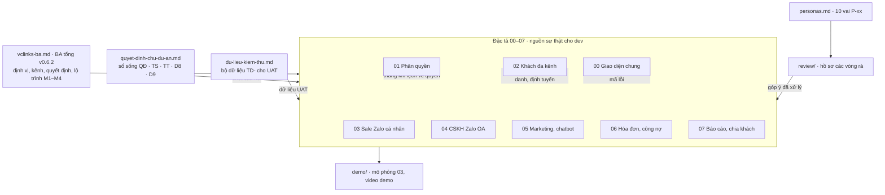
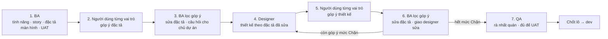

# Yêu cầu (BA tổng, đặc tả) — thư mục `docs/02-yeu-cau/`

Phiên bản 1.7 · 07/10/2026 · Trạng thái: Đang áp dụng

## Mô hình



## Tóm tắt

- Hồ sơ yêu cầu (theo IEEE 29148): BA tổng `vclinks-ba.md`, 8 đặc tả `dac-ta/00…07` (màn hình + quy tắc + UAT), personas và hồ sơ rà soát `ra-soat/`.
- Liên quan ở thư mục khác: sổ quyết định → `../01-quan-ly-du-an/`, dữ liệu kiểm thử → `../05-kiem-thu/`, demo → `../07-demo/`, link canvas thiết kế → `../03-thiet-ke/artifacts.md`.
- Ngày 04/10/2026 mọi file chính đã hồi tố theo CLAUDE.md §13: có tóm tắt, mục lục; lịch sử chuyển từ đầu file xuống bảng cuối file. Mục `## Mô hình` thêm khi hồi tố được giữ nguyên, dù từ 04/10/2026 13:23 sơ đồ không còn bắt buộc.
- Bản hiện hành: BA tổng **0.6.2**; đặc tả 00, 01, 02, 03, 04, 07 **1.5.1**; 05 **1.4.7**; 06 **1.4.6**; dữ liệu kiểm thử **1.6**; sổ quyết định **1.1**.
- Nhiều file có **dòng phiên bản ở đầu file chậm hơn lịch sử** (ví dụ ghi 1.4.5 trong khi lịch sử đã có v1.5); bản hồi tố lấy số cao nhất trong lịch sử.
- **Quyết định D9 (04/10) chưa lan hết**: CSKH đọc toàn văn hội thoại (01 D3 v1.5, QĐ-05 đã chốt) nhưng 01, 02, 04 còn chỗ ghi luật cũ hoặc "Chờ chốt QĐ-05"; 06 chưa có mục D9. Chi tiết ở cột Ghi chú.
- Hồ sơ `ra-soat/` (61 file) đã hồi tố đủ tóm tắt, mục lục, lịch sử (chủ dự án chọn làm đủ, 04/10/2026); danh sách ở mục Hồ sơ rà soát.
- Chỗ cần xem: cột Ghi chú của bảng Tài liệu (các điểm lệch do agent hồi tố phát hiện, **chưa sửa**).

## Mục lục

- [Tài liệu](#tài-liệu)
- [Cấu trúc thư mục](#cấu-trúc-thư-mục)
- [Lô thiết kế](#lô-thiết-kế)
- [Chu trình làm việc](#chu-trình-làm-việc)
- [Vai trò đọc tài liệu nào](#vai-trò-đọc-tài-liệu-nào)
- [Sổ góp ý](#sổ-góp-ý)
- [Hồ sơ rà soát](#hồ-sơ-rà-soát)
- [Lịch sử cập nhật](#lịch-sử-cập-nhật)

---

BA tổng: [vclinks-ba.md](vclinks-ba.md) (v0.6.2, phần chi tiết của mảnh M1 trong lộ trình M1–M4 của luồng A). Đối chiếu hai luồng: [review/doi-chieu-luong-A-B.md](ra-soat/doi-chieu-luong-A-B.md). Ước tính chi phí: [../ke-hoach/chi-phi-phat-trien.md](../01-quan-ly-du-an/chi-phi-phat-trien.md).

**VC Zalo** là phân hệ kênh Zalo cá nhân của VClinks (D8-02): extension trên Zalo Web + connector + các màn hình sale Zalo (03); dùng chung lõi, hộp thư, database với mọi kênh khác. Thiết kế giao diện: https://claude.ai/artifact/8cAKkTjtb94BTCWFoErv1p (mọi link artifact của dự án: [../artifacts.md](../03-thiet-ke/artifacts.md)). Mô phỏng luồng sale Zalo cá nhân (03): https://claude.ai/artifact/HgWK3uPEPjZdxWUidPPEnv

## Tài liệu

| File | Tóm tắt 1 dòng | Mã màn hình / UAT | Phiên bản | Cập nhật | Trạng thái | Ghi chú (điểm lệch chưa sửa) |
|---|---|---|---|---|---|---|
| [vclinks-ba.md](vclinks-ba.md) | BA tổng: nền tảng omnichannel, từng kênh, quyết định Q/D8/D9, user story, lộ trình M1–M4, rủi ro, câu hỏi | — | 0.6.2 | 04/10/2026 | Nháp để thống nhất phạm vi | Tiêu đề còn "(v0.6.1)"; §10 ghi UAT 12/12, §19 ghi 13/13; §3 tiêu đề 29/09 nhưng chứa quyết định 30/09, 04/10; Q1 lệch bảng §1 về owner VCsales |
| [00-giao-dien-chung.md](dac-ta/00-giao-dien-chung.md) | Giao diện chung: khung app, điều hướng, 11 màn MH-UI, thành phần UI-TP, câu lỗi chuẩn, quy ước | MH-UI- / UAT-UI- | 1.5.4 | 07/10/2026 | Nháp để thống nhất | Phụ lục còn `/admin/retention` (đã thay ở v1.3); tên phương án điện thoại ngược với QĐ-01; Q-UI 12 mở, 2 mở một phần |
| [01-phan-quyen.md](dac-ta/01-phan-quyen.md) | Nguồn chuẩn về quyền: cây tổ chức, vai trò, phạm vi, gán kênh, quyền tạm thời, ẩn SĐT, MCP, nhật ký, 15 màn MH-PQ | MH-PQ- / UAT-PQ- | 1.5.3 | 07/10/2026 | Nháp để thống nhất | D3 v1.5 chưa lan: chú thích (36), §8 L1, CS-05, ô `conv.view` của CS ở §3.1, §2.9, §9 và Phụ lục #26 còn luật cũ / QĐ-05 mở; §7.1 hứa bỏ bảng mã cũ ở v1.5; §7.2 thiếu nhóm p; T-36 chờ xác nhận |
| [02-khach-da-kenh.md](dac-ta/02-khach-da-kenh.md) | Một khách nhiều kênh: định danh, gộp/tách hồ sơ, định tuyến, trạng thái owner, tạm giữ, Customer 360 | MH-DK- / UAT-DK- | 1.5.1 | 04/10/2026 | Nháp để thống nhất | UAT-DK-61 trái §5.3 v1.5; nhiều chỗ "Chờ chốt QĐ-05" đã chốt; §11.4 giờ làm có nghỉ trưa trái TS-01; DK-61 trái §4.13a; ô UAT-DK-96 lệch cột |
| [03-sale-zalo-ca-nhan.md](dac-ta/03-sale-zalo-ca-nhan.md) | Sale và giám sát dùng VC Zalo: quy trình, quy tắc SZ, màn MH-SZ, UAT, CSKH soạn báo giá NVKD duyệt | MH-SZ- / UAT-SZ- | 1.5.2 | 04/10/2026 | Chờ duyệt | Danh mục §5 thiếu MH-SZ-15; MH-SZ-01 có hai dòng #9p; D16 còn "Nhóm" (đã đổi "Tổ"); đường dẫn cũ `review/vong-1-dac-ta/`; 19 câu hỏi mở |
| [04-cskh-zalo-oa.md](dac-ta/04-cskh-zalo-oa.md) | CSKH qua Zalo OA: khung gửi Z0–Z3, ticket/SLA, ZNS và chiến dịch, phiếu báo giá CSKH→NVKD (D9) | MH-OA- / UAT-OA- | 1.5.1 | 04/10/2026 | Nháp để UAT và chốt phạm vi | MH-OA-06 thiếu trạng thái mới của OA-48; §5 thiếu MH-OA-20; quyền CSKH đọc hội thoại nick sale lệch (OA-40, UAT-OA-147, OA-12); CSKH báo giá khách có owner (§1.3 vs OA-47) |
| [05-marketing-quang-cao-chatbot.md](dac-ta/05-marketing-quang-cao-chatbot.md) | Lead đa nguồn từ quảng cáo, chatbot website, giao sale theo SLA, đo CPL và đơn VCsales; khung gửi Fanpage | MH-MK- / UAT-MK- | 1.4.7 | 04/10/2026 | Nháp, chờ chốt câu hỏi §12 | MH-MK-06 ghi 8 trạng thái, §2.4 có 9; UAT-MK-45 ngày CD2 lệch §10.1; nguồn TD-L-A lệch `../05-kiem-thu/du-lieu-kiem-thu.md` |
| [06-hoa-don-cong-no.md](dac-ta/06-hoa-don-cong-no.md) | Hóa đơn VAT (VCinvoice) và công nợ (VCsales): phiếu xuất HĐ, gửi HĐ, nhắc nợ báo trước owner, phản hồi thanh toán | MH-HD- / UAT-HD- | 1.4.6 | 04/10/2026 | Chờ designer (có thể đã cũ) | Chưa có mục D9 như 00–05, 07 (cần rà quyền CS ở §1.3, HD-25, HD-55); §9.3 câu 1 hỏi S1…S8 nhưng có S1…S11; 30 câu hỏi mở |
| [07-bao-cao-va-chia-khach.md](dac-ta/07-bao-cao-va-chia-khach.md) | KPI dùng chung, dashboard báo cáo theo vai trò, số chụp cuối kỳ và quy tắc chia khách `/settings/routing` | MH-BC-, MH-RT- / UAT-BC-, UAT-RT- | 1.5.1 | 04/10/2026 | Đã xử lý góp ý vòng 1, chờ designer | KPI-31…34 chưa xếp loại ở §3.5b; trạng thái "chờ designer" có thể đã cũ |
| [personas.md](personas.md) | 10 vai giả định P-xx cho agent đóng vai khi góp ý đặc tả BA và thiết kế | P- | 1.1 | 04/10/2026 | Đang áp dụng | P-BGD chưa có tên persona |
| [ra-soat/](ra-soat/) | Hồ sơ các vòng rà: góp ý từng vai, sổ xử lý, QA (61 file) — danh sách ở mục [Hồ sơ rà soát](#hồ-sơ-rà-soát) | — | 1.1 | 04/10/2026 | Lưu trữ | Đã hồi tố §13 |

## Cấu trúc thư mục

```
docs/02-yeu-cau/
├─ README.md                  file này: danh sách file, lô thiết kế, chu trình BA
├─ vclinks-ba.md              BA tổng (v0.6.2)
├─ personas.md                chân dung vai trò P-xx dùng cho các vòng góp ý
├─ dac-ta/00…07-*.md          đặc tả màn hình + quy tắc + UAT — nguồn sự thật
└─ ra-soat/                   hồ sơ các vòng rà — đã xử lý xong thì chỉ để tra lại
   ├─ doi-chieu-luong-A-B.md  Buổi 8: đối chiếu luồng A ↔ B (đã duyệt)
   ├─ khop-du-lieu.md         khớp 7 đặc tả với bộ TD
   ├─ dac-ta-vong-1/          góp ý đặc tả vòng 1: <số>-<vai>.md, <số>-xu-ly.md, qa.md, thong-nhat.md, ra-cuoi.md
   ├─ tk1/                    lô thiết kế TK1 (cũ gọi D1): vong-1…3/<vai>.md, qa.md, qa-xac-nhan.md
   └─ tk2/                    lô thiết kế TK2 (cũ gọi D2): vong-1/<vai>.md + xu-ly-*.md, ghi-chu.md, qa.md
```

Vòng mới thêm thư mục kế tiếp theo cùng quy ước (`dac-ta-vong-2/`, `tk2/vong-2/`…). Ngày 04/10/2026 (lần 2): `docs/ba/` tách theo cấu trúc chuẩn — đặc tả vào `dac-ta/`, `review/` đổi thành `ra-soat/`, sổ quyết định, dữ liệu kiểm thử, demo chuyển sang `01-`, `05-`, `07-`. Sắp xếp lại ngày 04/10/2026 (lần 1): đường dẫn cũ `review/vong-*-thiet-ke*`, `review/qa-*.md`, `review/quyet-dinh-chu-du-an.md`, `review/personas.md` đã đổi; nội dung không đổi.

## Lô thiết kế

> Từ 30/09/2026 (V8-01): lô **D1** đọc là **TK1**, lô **D2** đọc là **TK2**, để không nhầm với mã quyết định D1-xx của luồng A. Canvas và đặc tả cũ còn ghi D1/D2, đọc tương đương. TK1 phủ M1; TK2 phủ phần còn lại của M1c và M2–M3. Fanpage (05 §2.2a) đã vẽ ở TK1 nhưng làm ở **M2** (D5-12, D8-03).

Chốt 29/09/2026 (BA trưởng). Quyết định BA sau QA xác nhận D1: người duyệt xin quyền là **GĐ division** (theo 01 PQ-30); giám sát vào `/channels` **chỉ xem** kênh của tổ; MH-UI-04 tách như bảng dưới. Trên canvas, menu của lô D1 **ẩn** mục thuộc lô sau; màn nào phụ thuộc quyết định 🔴 chưa chốt thì ghi mã QĐ.

| Lô | Màn | Mã |
|---|---|---|
| **D1 — MVP lõi** | Khung ứng dụng, đăng nhập, thông báo, **tìm kiếm toàn cục Ctrl+K (chỉ theo tên khách, SĐT, mã KH)**, trạng thái của tôi và trang `/me`, trang lỗi | MH-UI-01…06 |
| | Hộp thư đa kênh, khung chat và ô soạn chuẩn, panel 360 rút gọn, danh sách hội thoại | MH-UI-07…10 |
| | "Không có quyền" (4 dạng), xin quyền | MH-PQ-11 |
| | Sale Zalo: hộp thư, menu hội thoại, khung chat, thao tác tin, ô soạn + các hộp thoại, gửi báo giá, tin nhắn nhanh, thông tin người gửi, trạng thái nick và Đồng bộ, **Lệnh gửi** (cả phạm vi Tổ của tôi) | MH-SZ-01…06, 08, 12, 13 |
| | Giám sát: trả lời thay, trực thay, nghỉ việc và bàn giao, tổ của tôi | MH-SZ (QT-SZ-10/11), MH-PQ-04, 07 |
| | CSKH OA: hộp thư CSKH, khung chat OA, ô soạn OA, tạo ticket, chi tiết ticket, **Ticket của tôi**, tạm giữ, SLA và giờ làm việc; **[30/09·D8-13] tin chào / tin ngoài giờ Zalo OA (MVP)** — đã vẽ cùng đợt D2 (artboard "14 OaAuto"), tính vào D1 / MVP | MH-OA-02…08, 18 |
| | Khung gửi Fanpage (hết cửa sổ, `HUMAN_AGENT`) | 05 §2.2a |
| | Khách đa kênh: Customer 360 cơ bản, dòng thời gian, cảnh báo đa kênh, danh tính chưa xác nhận, liên kết mã KH | MH-DK-01…03, 09, 10 |
| | Quản trị: cây tổ chức, người dùng (+ form Thêm người, các tab), vai trò, gán kênh, token và thiết bị, token MCP, nhật ký, cảnh báo, NĐ 13 (phiếu Xóa và Xuất, tab Thời hạn lưu trữ), nhập lô | MH-PQ-01…03, 05, 06, 08…10, 12…15 |
| | Kênh kết nối | MH-OA-01, trang `/channels` |
| **D2** | Danh bạ, lời mời kết bạn, tạo nhóm, panel thông tin và kho media, tìm kiếm **nội dung tin nhắn** (trong hội thoại và toàn cục) | MH-SZ-07, 09…11, 14; phần nội dung của MH-UI-04 |
| | Gộp hồ sơ, tách, gắn tay danh tính, tìm khách, xung đột owner, đối chiếu mã KH | MH-DK-04…08, 11…14 |
| | Bình luận Fanpage, marketing và lead | MH-MK-01…12 |
| | Hóa đơn và công nợ | MH-HD-01…13 |
| | Báo cáo, quy tắc chia khách | MH-BC-, MH-RT- (07) |
| | **[04/10·D9]** Phiếu CSKH soạn – NVKD duyệt: khay "Chờ tôi duyệt" và chip phiếu trên khung chat (03), hàng việc Bán hàng / Hậu mãi và phiếu báo giá, trạng thái Chờ hãng (04) | MH-SZ-15, MH-OA-20 |
| | ZNS, menu OA và chatbot, quy tắc tự động, chiến dịch, tag, khảo sát (**[30/09·D8-13]** tin chào MH-OA-08 chuyển lên D1 / MVP) | MH-OA-09…17, 19 |
| **Điện thoại** | Theo QĐ-01 (chưa chốt) | MH-UI-11, MH-MK-12, MH-HD-13 |

### Trạng thái lô (cập nhật 30/09/2026)

- **D1: Chốt thiết kế** (canvas bản 15), trừ bản điện thoại (chờ QĐ-01). QA xác nhận: 0 lỗi nghiêm trọng, 9/9 quy tắc then chốt đạt ([review/tk1/qa-xac-nhan.md](ra-soat/tk1/qa-xac-nhan.md)); 4 vai không còn góp ý mức Chặn sau lượt 3. Việc nhỏ để dev / vòng sau:
  - Màn 3a vẽ theo mốc KB07 cũ; dữ liệu v1.3 đã dời KB07 sang hôm qua — sửa khi vẽ D2.
  - R11 lúc 10:08 lệch giờ mẫu 10:00 (dữ liệu).
  - 10e chưa có bản rút gọn cho sale (góc sale của `/sync` theo 03 MH-SZ-12b).
  - Mã câu hỏi cũ (CH-1, Q20, Q21) còn trên canvas.
  - Bảng phí hậu mãi (04) thuộc **D2**.
- **D2: Thiết kế bản đầu xong 30/09 (canvas bản 20), đã gỡ vênh theo D8-02…17.** 64/66 màn đã vẽ trên 31 artboard (24 file chính + 7 phần 2, tính cả 6 Search "D1/D2" và 14 OaAuto) (2 màn điện thoại chờ QĐ-01). 32 chỗ vênh giữa các đặc tả do designer ghi lại đã xử lý: 16 chỗ chủ dự án chốt (D8-02…D8-17, 30/09/2026), phần còn lại BA tự xử lý (câu chữ, dữ liệu mẫu, thiếu dòng). Ghi chú bàn giao và bảng quyết định: [review/tk2/ghi-chu.md](ra-soat/tk2/ghi-chu.md). Quyết định dùng chung cho mọi màn: **D8-02** nút thiếu quyền — vai trò không bao giờ có quyền thì **ẩn**, có quyền nhưng thiếu điều kiện tạm thời thì **khóa + tooltip** (00 §5.5, 01 MH-PQ-11). Tiếp theo: bước 5 (người dùng từng vai góp ý thiết kế D2) → bước 6 → bước 7 QA.

### Buổi 9 (04/10/2026): CSKH bán hàng và vòng duyệt phiếu

Quyết định **D9-01…D9-05** (BA tổng §3.2): "chăm sóc bán hàng" là CSKH hiện có với hai **hàng việc** Bán hàng / Hậu mãi; phiếu báo giá và phiếu hậu mãi có vòng **CSKH soạn → NVKD Duyệt & gửi / Trả lại**; AI chỉ tạo **đề xuất báo giá**, báo giá thật vẫn trên VCsales; 01 D3 sửa theo D4-10 (CSKH đọc toàn văn hội thoại, không gửi qua nick). File đã sửa: `vclinks-ba.md` v0.6, 00, 01, 02, 03, 04, 07 (v1.5), `../05-kiem-thu/du-lieu-kiem-thu.md` v1.5, `../01-quan-ly-du-an/quyet-dinh-chu-du-an.md`. Màn mới MH-SZ-15, MH-OA-20 thuộc lô **TK2**, cần designer vẽ (bước 4 của chu trình). Còn chờ anh: T-36, mốc AI tự tạo phiếu, nguồn trạng thái Chờ hãng, giá tham khảo C3 (BA tổng §21 câu 28–31).

## Chu trình làm việc

Mỗi lô tính năng đi qua vòng lặp dưới đây cho tới khi người dùng các vai trò không còn góp ý mức **Chặn**.



| Bước | Ai làm | Đầu vào | Đầu ra |
|---|---|---|---|
| 1 | Agent BA | BA tổng, code hiện có | `docs/ba/0x-*.md` |
| 2 | Agent người dùng, **mỗi vai trò một agent**, chỉ vai trò liên quan tới tài liệu | Đặc tả + [personas.md](personas.md) | `review/dac-ta-vong-<n>/<số đặc tả>-<mã vai trò>.md` |
| 3 | BA (phiên chính) | Các góp ý | Đặc tả đã sửa; sổ xử lý `*-xu-ly.md` cùng thư mục vòng |
| 4 | Agent designer | Đặc tả đã sửa | Canvas thiết kế cập nhật |
| 5 | Agent người dùng | Canvas + đặc tả | `review/tk<lô>/vong-<n>/<mã vai trò>.md` |
| 6 | BA | Các góp ý | Đặc tả sửa, việc cho designer |
| 7 | Agent QA | Đặc tả + canvas | `review/dac-ta-vong-<n>/qa.md` (rà đặc tả) · `review/tk<lô>/qa.md` (rà thiết kế) |

**Mức góp ý:** **Chặn** (không dùng được cho công việc của vai trò, phải sửa trước khi chốt) · **Nên sửa** (dùng được nhưng tốn công, dễ sai) · **Gợi ý** (hay hơn nếu có).

**Quy tắc lọc góp ý (BA):**
- Góp ý mâu thuẫn giữa hai vai trò → ưu tiên nguyên tắc bắt buộc (CLAUDE.md §12, BA §2.2, §7), rồi tới vai trò trực tiếp dùng màn hình đó.
- Góp ý đổi nghiệp vụ, phạm vi hoặc giai đoạn → không tự sửa, ghi thành câu hỏi cho chủ dự án (BA §21).
- Mỗi góp ý có một dòng trong sổ góp ý: Đã sửa / Chuyển designer / Hỏi chủ dự án / Không làm (có lý do).

## Vai trò đọc tài liệu nào

| Tài liệu | Vai trò góp ý |
|---|---|
| 00 Giao diện chung | P-KD, P-CS, P-TT |
| 01 Phân quyền | P-AD, P-GS, P-BGD |
| 02 Khách đa kênh | P-KD, P-CS, P-SA |
| 03 Sale Zalo cá nhân | P-KD, P-GS |
| 04 CSKH Zalo OA | P-CS, P-KT, P-GD |
| 05 Marketing, chatbot | P-MK, P-KD, P-GD |
| 06 Hóa đơn, công nợ | P-KT, P-KD, P-GD |
| 07 Báo cáo, chia khách | P-GD, P-GS, P-BGD |
| Thiết kế (mỗi lô) | Mọi vai trò có màn hình trong lô |

## Sổ góp ý

Không có file sổ chung. Mỗi vòng có sổ xử lý riêng nằm cùng thư mục góp ý: `review/dac-ta-vong-1/<số đặc tả>-xu-ly.md` (đặc tả) và `review/tk2/vong-1/xu-ly-*.md` (thiết kế TK2). TK1 xử lý thẳng trong đặc tả và các file QA.

## Hồ sơ rà soát

Mọi file trong `ra-soat/` đã hồi tố theo CLAUDE.md §13 (tóm tắt, mục lục, lịch sử) ngày 04/10/2026; nội dung gốc giữ nguyên. Phiên bản 1.1, trạng thái **Lưu trữ (đã xử lý)** — riêng `doi-chieu-luong-A-B.md` ghi "Đã duyệt 30/09/2026".

### Gốc ra-soat/

| File | Tóm tắt 1 dòng |
|---|---|
| [doi-chieu-luong-A-B.md](ra-soat/doi-chieu-luong-A-B.md) | Buổi 8 đối chiếu luồng A và B, đã duyệt: D8-02…D8-08, rà hiểu nhầm "VC Zalo song song" |
| [khop-du-lieu.md](ra-soat/khop-du-lieu.md) | Khớp 7 đặc tả với TD: 767/767 ca UAT gắn TD, 15 xung đột, còn C-13 |

### Đặc tả vòng 1 (dac-ta-vong-1/)

| File | Tóm tắt 1 dòng |
|---|---|
| [00-P-CS.md](ra-soat/dac-ta-vong-1/00-P-CS.md) | Lan (CSKH) góp ý 00: 17 góp ý, 4 Chặn; nhận khách, cửa sổ gửi, ghi chú nhầm, tìm SĐT |
| [00-P-KD.md](ra-soat/dac-ta-vong-1/00-P-KD.md) | Minh (NVKD) góp ý 00: 18 góp ý, 3 Chặn; mobile GĐ2, tin app Zalo, "Tạm vắng" 15 phút |
| [00-P-TT.md](ra-soat/dac-ta-vong-1/00-P-TT.md) | Dũng (NV thị trường) góp ý 00: 14 góp ý, 4 Chặn; màn điện thoại, mất mạng, tin chờ gửi |
| [00-xu-ly.md](ra-soat/dac-ta-vong-1/00-xu-ly.md) | Xử lý 49 góp ý (11 Chặn) cho 00: 43 sửa, 4 hỏi chủ dự án, 2 designer; đặc tả v1.1 |
| [01-P-AD.md](ra-soat/dac-ta-vong-1/01-P-AD.md) | Quân (Admin) góp ý 01: 18 góp ý, 5 Chặn; nhập lô, Admin tự nâng quyền, nghỉ việc, NĐ 13 |
| [01-P-BGD.md](ra-soat/dac-ta-vong-1/01-P-BGD.md) | BGĐ / kiểm soát góp ý 01: 16 góp ý, 7 Chặn; cảnh báo ít, MCP, dữ liệu qua Claude, NĐ 13 |
| [01-P-GS.md](ra-soat/dac-ta-vong-1/01-P-GS.md) | Hương (giám sát) góp ý 01: 19 góp ý, 4 Chặn; GS giữ nick, hiện SĐT, bàn giao nick |
| [01-xu-ly.md](ra-soat/dac-ta-vong-1/01-xu-ly.md) | Xử lý 53 góp ý (16 Chặn) cho 01: 40 sửa, 14 câu Q-PQ, 3 màn mới; còn Q-PQ-18 |
| [02-P-CS.md](ra-soat/dac-ta-vong-1/02-P-CS.md) | Lan (CSKH) góp ý 02: 16 góp ý, 4 Chặn; không đọc được cam kết sale, owner không trả lời |
| [02-P-KD.md](ra-soat/dac-ta-vong-1/02-P-KD.md) | Minh (NVKD) góp ý 02: 18 góp ý, 4 Chặn; tin từ app Zalo, offline 15 phút, "Vẫn gửi" |
| [02-P-SA.md](ra-soat/dac-ta-vong-1/02-P-SA.md) | Ngọc (sale admin) góp ý 02: 18 góp ý, 5 Chặn; tự gộp SĐT, hàng theo cặp, tách account |
| [02-xu-ly.md](ra-soat/dac-ta-vong-1/02-xu-ly.md) | Xử lý 52 góp ý (13 Chặn) cho 02: 50 sửa, 7 câu CH-1…CH-7, 3 màn mới |
| [03-P-GS.md](ra-soat/dac-ta-vong-1/03-P-GS.md) | Giám sát Hương góp ý 03: 18 ý (5 Chặn); thiếu góc nhìn tổ, trả lời thay, bàn giao nick |
| [03-P-KD.md](ra-soat/dac-ta-vong-1/03-P-KD.md) | NVKD Minh góp ý 03: 25 ý (7 Chặn); thiếu dùng trên điện thoại, lọc Chưa trả lời, tra hàng |
| [03-xu-ly.md](ra-soat/dac-ta-vong-1/03-xu-ly.md) | Xử lý 43 góp ý 03: 30 sửa, 11 hỏi chủ dự án; đặc tả lên v1.1, 14 câu hỏi Q |
| [04-P-CS.md](ra-soat/dac-ta-vong-1/04-P-CS.md) | CSKH Lan góp ý 04: 24 ý (4 Chặn); không thấy sale đã hứa gì, hỏi giá không SLA |
| [04-P-GD.md](ra-soat/dac-ta-vong-1/04-P-GD.md) | GĐ Thắng góp ý 04: 18 ý (5 Chặn); thiếu trần chi phí, báo cáo doanh số OA, SLA |
| [04-P-KT.md](ra-soat/dac-ta-vong-1/04-P-KT.md) | Kế toán Hà góp ý 04: 20 ý (6 Chặn); thiếu luồng hóa đơn, nhắc nợ sai người / số tiền |
| [04-xu-ly.md](ra-soat/dac-ta-vong-1/04-xu-ly.md) | Xử lý 62 góp ý 04: 42 sửa, 8 hỏi (CH-1…11), 12 chuyển file 06/01 |
| [05-P-GD.md](ra-soat/dac-ta-vong-1/05-P-GD.md) | GĐ Thắng góp ý 05: 20 ý (3 Chặn); "Thành đơn" quá rộng, chưa đối chiếu VCsales |
| [05-P-KD.md](ra-soat/dac-ta-vong-1/05-P-KD.md) | NVKD Minh góp ý 05: 18 ý (3 Chặn); thiếu bản điện thoại, lead qua Zalo, thu hồi khi đang gọi |
| [05-P-MK.md](ra-soat/dac-ta-vong-1/05-P-MK.md) | Marketing Tùng góp ý 05: 24 ý (5 Chặn); lead Zalo cá nhân, Thành đơn cần mã KH, quyền NVMK |
| [05-xu-ly.md](ra-soat/dac-ta-vong-1/05-xu-ly.md) | Xử lý 62 góp ý 05: 56 sửa, 6 hỏi; 18 câu hỏi D-MK, UAT tổng 69 ca |
| [06-P-GD.md](ra-soat/dac-ta-vong-1/06-P-GD.md) | Giám đốc bán hàng góp ý 06: 14 góp ý (5 Chặn) về tuổi nợ theo tổ, số cuối kỳ, khớp VCsales |
| [06-P-KD.md](ra-soat/dac-ta-vong-1/06-P-KD.md) | NVKD góp ý 06: 14 góp ý (3 Chặn) về báo trước khi nhắc nợ, đang chốt đơn, điện thoại |
| [06-P-KT.md](ra-soat/dac-ta-vong-1/06-P-KT.md) | Kế toán góp ý 06: 15 góp ý (3 Chặn) về người nhận thanh toán, hồ sơ đổi MST, sao kê |
| [06-xu-ly.md](ra-soat/dac-ta-vong-1/06-xu-ly.md) | BA xử lý 43 góp ý đặc tả 06 lên v1.1: 40 đã sửa, 3 hỏi chủ dự án |
| [07-P-BGD.md](ra-soat/dac-ta-vong-1/07-P-BGD.md) | Ban giám đốc góp ý 07: 12 góp ý (3 Chặn) về mục tiêu G1–G6, độ phủ, xuất Excel |
| [07-P-GD.md](ra-soat/dac-ta-vong-1/07-P-GD.md) | Giám đốc bán hàng góp ý 07: 14 góp ý (3 Chặn) về số quý, đối chiếu VCsales, hai bộ quy tắc |
| [07-P-GS.md](ra-soat/dac-ta-vong-1/07-P-GS.md) | Giám sát góp ý 07: 15 góp ý (3 Chặn) về tin về trễ, nghỉ đột xuất, đề xuất giảm tải |
| [07-xu-ly.md](ra-soat/dac-ta-vong-1/07-xu-ly.md) | BA xử lý 41 góp ý đặc tả 07 lên v1.1: 37 đã sửa, 3 hỏi chủ dự án, 1 chuyển file |
| [qa.md](ra-soat/dac-ta-vong-1/qa.md) | QA rà nhất quán 00–05 v1.1: 69 lỗi (13 nghiêm trọng), 114 việc chuyển file chưa làm |
| [ra-cuoi.md](ra-soat/dac-ta-vong-1/ra-cuoi.md) | Rà cuối vòng 1: sửa 33 chỗ lệch, 00–05 lên v1.3, 06 lên v1.2; đủ để bắt đầu MVP |
| [thong-nhat.md](ra-soat/dac-ta-vong-1/thong-nhat.md) | BA trưởng chốt cách thống nhất 30 mâu thuẫn QA vòng 1 và nguồn chuẩn theo chủ đề |

### Thiết kế TK1 (tk1/)

| File | Tóm tắt 1 dòng |
|---|---|
| [qa-xac-nhan.md](ra-soat/tk1/qa-xac-nhan.md) | QA xác nhận TK1: đạt có điều kiện; 0 NT, 8 TB, 10 Nhẹ; còn 5 màn phải vẽ bổ sung |
| [qa.md](ra-soat/tk1/qa.md) | QA lượt đầu TK1: 2 NT, 14 TB, 13 Nhẹ, 18 lệch dữ liệu; chưa chốt, giao việc cho designer |
| [P-CS.md](ra-soat/tk1/vong-1/P-CS.md) | Lan (CSKH) lượt 1: 19 góp ý, 6 Chặn; cửa sổ gửi OA sai, thiếu luồng ticket |
| [P-GS.md](ra-soat/tk1/vong-1/P-GS.md) | Hương (GS) lượt 1: 17 góp ý, 5 Chặn; thiếu góc nhìn giám sát, trực thay, nghỉ việc |
| [P-KD.md](ra-soat/tk1/vong-1/P-KD.md) | Minh (NVKD) lượt 1: 20 góp ý, 3 Chặn; không báo nick mất kết nối, gửi lỗi |
| [P-AD.md](ra-soat/tk1/vong-2/P-AD.md) | Quân (Admin) lượt 2: 14 góp ý, 4 Chặn; thiếu 11 màn quản trị Admin |
| [P-CS.md](ra-soat/tk1/vong-2/P-CS.md) | Lan lượt 2: 13/19 góp ý cũ đã sửa tốt; 10 góp ý mới, 2 Chặn (cam kết, danh tính) |
| [P-GS.md](ra-soat/tk1/vong-2/P-GS.md) | Hương lượt 2: 12/17 góp ý cũ đã sửa tốt; 7 góp ý mới, không Chặn |
| [P-KD.md](ra-soat/tk1/vong-2/P-KD.md) | Minh lượt 2: 12/20 góp ý cũ đã sửa tốt; 9 góp ý mới, 1 Chặn (gửi trùng khi nick đỏ) |
| [P-AD.md](ra-soat/tk1/vong-3/P-AD.md) | Quân lượt 3: 12/14 góp ý cũ đã sửa tốt, đủ 11 màn; 5 góp ý mới, không Chặn |
| [P-CS.md](ra-soat/tk1/vong-3/P-CS.md) | Lan lượt 3: 12/16 góp ý cũ đã sửa tốt, 3 Chặn xong; 6 góp ý mới, không Chặn |
| [P-GS.md](ra-soat/tk1/vong-3/P-GS.md) | Hương lượt 3: 7/11 góp ý cũ đã sửa tốt; 3 góp ý mới, không Chặn |
| [P-KD.md](ra-soat/tk1/vong-3/P-KD.md) | Minh lượt 3: 8/12 góp ý cũ đã sửa tốt; 5 góp ý mới, không Chặn; còn thiếu bản điện thoại |

### Thiết kế TK2 (tk2/)

| File | Tóm tắt 1 dòng |
|---|---|
| [ghi-chu.md](ra-soat/tk2/ghi-chu.md) | Ghi chú bàn giao thiết kế TK2: 64/66 màn, 32 chỗ vênh đặc tả, quyết định D8-02…D8-30 |
| [qa.md](ra-soat/tk2/qa.md) | QA thiết kế TK2 vòng 1: Đạt có điều kiện, 0 nghiêm trọng, 8 trung bình, 12 nhẹ |
| [P-CS.md](ra-soat/tk2/vong-1/P-CS.md) | Góp ý TK2 vai CSKH (Lan): 1 Chặn tìm SĐT ngoài phạm vi, 9 Nên sửa, 3 Gợi ý |
| [P-GD.md](ra-soat/tk2/vong-1/P-GD.md) | Góp ý TK2 vai GĐ bán hàng (Thắng): 1 Chặn bật quy tắc OA, 8 Nên sửa, 6 Gợi ý |
| [P-GS.md](ra-soat/tk2/vong-1/P-GS.md) | Góp ý TK2 vai giám sát (Hương): 1 Chặn phân xử lead tranh chấp, 8 Nên sửa, 4 Gợi ý |
| [P-KD.md](ra-soat/tk2/vong-1/P-KD.md) | Góp ý TK2 vai NVKD (Minh): 0 Chặn, 12 Nên sửa (công nợ, tìm khách), 3 Gợi ý |
| [P-KT.md](ra-soat/tk2/vong-1/P-KT.md) | Góp ý TK2 vai kế toán (Hà): 1 Chặn chiến dịch nhắc nợ lệch Công nợ, 6 Nên sửa, 4 Gợi ý |
| [P-MK.md](ra-soat/tk2/vong-1/P-MK.md) | Góp ý TK2 vai marketing (Tùng, Nhung): 0 Chặn, 7 Nên sửa, 5 Gợi ý |
| [P-SA.md](ra-soat/tk2/vong-1/P-SA.md) | Góp ý TK2 vai sale admin (Ngọc): 1 Chặn cặp gộp bị chặn hai mã KH, 6 Nên sửa, 4 Gợi ý |
| [xu-ly-KH.md](ra-soat/tk2/vong-1/xu-ly-KH.md) | Sổ BA xử lý góp ý TK2 nhóm khách đa kênh: 14/15 đã sửa, 3 câu hỏi KH-Q1…Q3 |
| [xu-ly-OAHDBC.md](ra-soat/tk2/vong-1/xu-ly-OAHDBC.md) | Sổ BA xử lý góp ý TK2 nhóm OA, hóa đơn, báo cáo: 2 Chặn đã sửa, 7 câu hỏi |
| [xu-ly-SZMK.md](ra-soat/tk2/vong-1/xu-ly-SZMK.md) | Sổ BA xử lý góp ý TK2 nhóm sale Zalo, marketing: 2 Chặn đã sửa, 3 câu hỏi |

## Lịch sử cập nhật

| Phiên bản | Ngày | Người / phiên | Thay đổi | Căn cứ |
|---|---|---|---|---|
| 1.7 | 07/10/2026 14:55 | Claude Code (dev002) | Dòng 00-giao-dien-chung.md lên 1.5.4 (người giữ nick / chỗ máy Zalo thấy mục "Kết nối kênh"; đăng nhập nhận cả @vcpart.vn); 01-phan-quyen.md lên 1.5.3 (PQ-10 thêm domain vcpart.vn) | dev002 07/10/2026 |
| 1.6 | 06/10/2026 15:46 | Claude Code (dev002) | Dòng 01-phan-quyen.md lên 1.5.2 (PQ-10: mọi mail công ty đăng nhập được, tự tạo người dùng không vai trò); 00-giao-dien-chung.md lên 1.5.3 (MH-UI-02 theo PQ-10) | dev002 06/10/2026 |
| 1.5 | 04/10/2026 22:59 | Agent Sonnet · M1b-17 | Dòng 00-giao-dien-chung.md lên 1.5.2 (khớp giao diện hiện tại: menu biểu tượng, phím tắt, tiêu đề tab) | Phiên M1b-17 |
| 1.4 | 04/10/2026 13:42 | Claude Code | Thêm mục Hồ sơ rà soát: 61 file `ra-soat/` kèm tóm tắt 1 dòng, sau khi hồi tố §13 | Chủ dự án yêu cầu làm đủ hồ sơ rà soát 04/10/2026 13:42 |
| 1.3 | 04/10/2026 13:33 | Claude Code | `docs/ba/` đổi thành `docs/02-yeu-cau/`: đặc tả vào `dac-ta/`, `review/` thành `ra-soat/`; bỏ khỏi bảng các file đã chuyển thư mục (sổ quyết định, dữ liệu kiểm thử, demo); vẽ lại cây thư mục | Chủ dự án duyệt cấu trúc docs/ 04/10/2026 13:33 |
| 1.2 | 04/10/2026 13:23 | Claude Code | Sửa dòng tóm tắt theo §13 mới (sơ đồ không bắt buộc, sơ đồ đã có giữ nguyên) | Yêu cầu chủ dự án 04/10/2026 13:23 |
| 1.1 | 04/10/2026 | Claude Code | Hồi tố theo CLAUDE.md §13: thêm Mô hình, Tóm tắt, Mục lục, Lịch sử; bảng Tài liệu thành bảng quản lý thư mục (thêm BA tổng, sổ quyết định, dữ liệu kiểm thử, personas, demo, review; cột phiên bản, trạng thái, ghi chú lệch); thêm `demo/video/` vào cấu trúc thư mục | `docs/ke-hoach/hoi-to-tai-lieu-md.md` |
| 1.0 | 30/09–04/10/2026 | BA | Các bản trước khi có bảng lịch sử, gồm sắp xếp lại thư mục ngày 04/10/2026 (xem `git log -- docs/ba/README.md`) | — |
