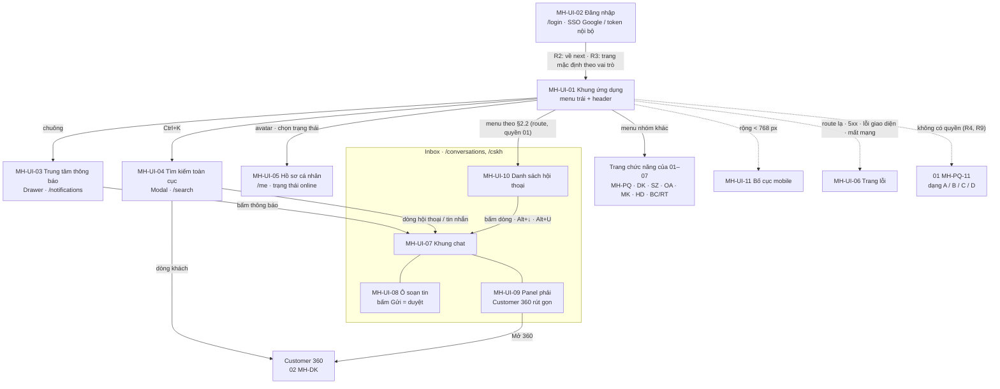
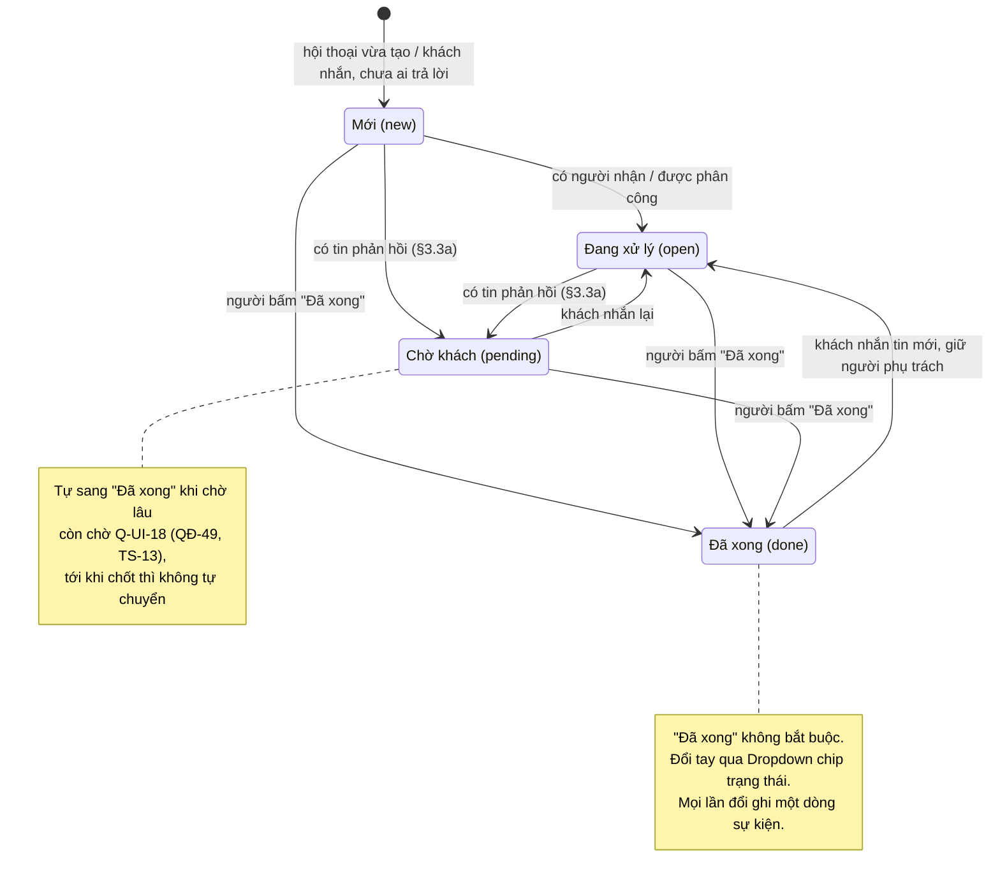
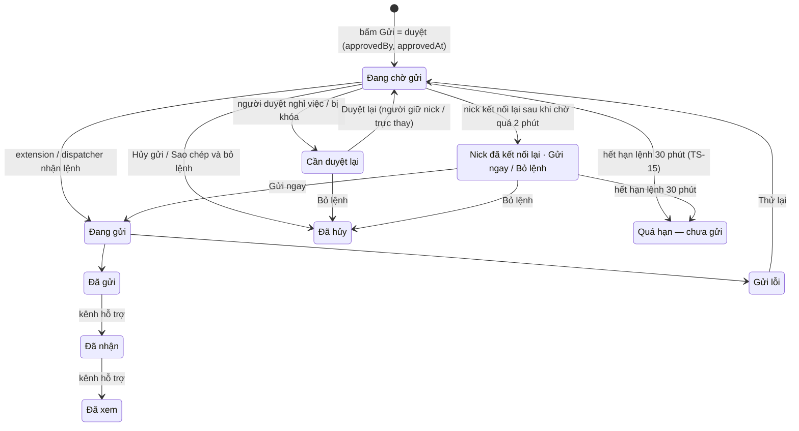
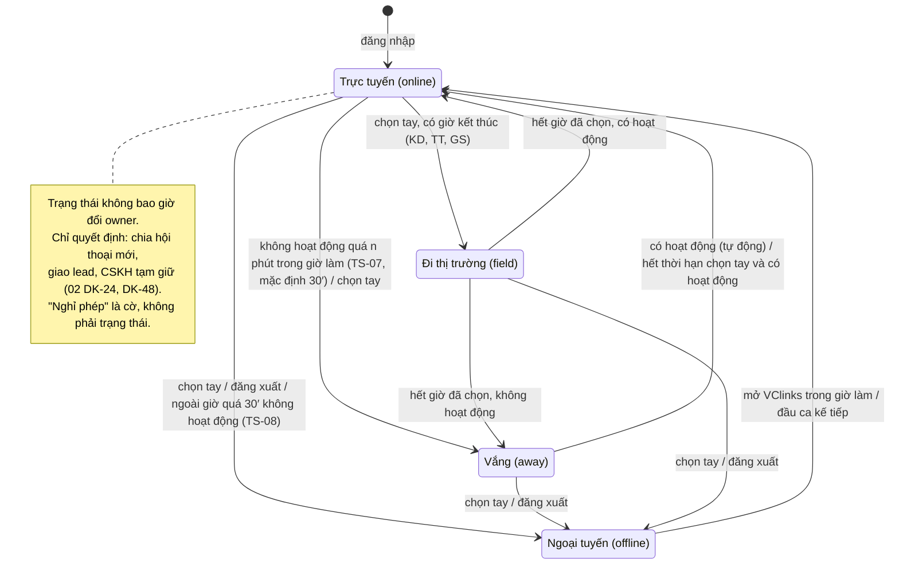

# VClinks — Đặc tả giao diện chung (MH-UI)

Phiên bản 1.5.4 · 07/10/2026 · Trạng thái: Nháp để thống nhất

> **Tài liệu gốc về giao diện** của VClinks: khung ứng dụng, điều hướng, thành phần dùng chung và quy ước. Mọi file đặc tả chức năng (`MH-PQ-*`, `MH-DK-*`, `MH-SZ-*`, `MH-OA-*`, `MH-MK-*`) dùng lại các quy ước ở đây và chỉ mô tả phần khác biệt.
> Người yêu cầu: Thọ Anh Bùi
> Căn cứ: [BA tổng v0.4](../vclinks-ba.md) (§4 vai trò, §5 tính năng nền tảng, §9 phi chức năng, §11 Zalo cá nhân, §17 so sánh kênh, §18 user story); code `apps/web` trên nhánh `main` (commit `f106e3b`); nghiệm thu [UAT 29/09/2026](../../05-kiem-thu/uat/2026-09-29/README.md).
> **Thứ tự ưu tiên khi lệch:** về **quyền** (ai xem, ai gửi, ai thấy SĐT, trang / hộp "Không có quyền" MH-PQ-11) thì [01 phân quyền](01-phan-quyen.md) thắng; về **định danh, gộp hồ sơ, định tuyến, trạng thái owner và tạm giữ** thì [02 khách đa kênh](02-khach-da-kenh.md) thắng; khung gửi Zalo OA (Z0–Z3), ZNS → [04](04-cskh-zalo-oa.md); khung gửi Fanpage (24 giờ, `HUMAN_AGENT`) → [05](05-marketing-quang-cao-chatbot.md) §2.2a; hóa đơn, công nợ → [06](06-hoa-don-cong-no.md).
> **[v1.2] File này là nguồn chuẩn duy nhất** ([thong-nhat-vong-1](../ra-soat/dac-ta-vong-1/thong-nhat.md) Nguyên tắc 2) về: **route và menu** (§2), **màu, chip** (§3.1–§3.4a, UI-TP-*), **câu chữ chung**, **mã lỗi `ERR-*`** (§6), **bố cục** (§3.7), **nhãn bong bóng** (§3.3a, MH-UI-07), **bảng trạng thái người dùng** (MH-UI-05). File khác chỉ trỏ tới đây, không chép lại.

## Mô hình

**Bản đồ màn hình và điều hướng** (MH-UI-01…11; route và menu đầy đủ ở §2):



**Trạng thái hội thoại** (§3.3, chip UI-TP-02):



**Trạng thái tin / lệnh gửi** (MH-UI-07 "Trạng thái gửi", "Tin đang chờ gửi", "Chống gửi trùng khi nick mất kết nối"):



**Trạng thái người dùng** (MH-UI-05, nguồn chuẩn duy nhất):



## Tóm tắt

- **Phạm vi:** tài liệu gốc về giao diện VClinks — khung ứng dụng, điều hướng, 11 màn dùng chung (MH-UI-01…11), 18 thành phần UI-TP, câu thông báo và mã lỗi chuẩn, phím tắt, realtime, khả năng tiếp cận, hiệu năng, kèm ca UAT-UI-01…136. File chức năng 01–07 dùng lại quy ước ở đây và chỉ mô tả phần khác biệt.
- **Nguồn chuẩn duy nhất (từ v1.2):** route và menu (§2), màu và chip (§3.1–§3.4a, UI-TP-*), câu chữ chung, mã `ERR-*` (§6), bố cục (§3.7), nhãn bong bóng (§3.3a, MH-UI-07), bảng trạng thái người dùng (MH-UI-05). Khi lệch: quyền theo 01, định danh / định tuyến / tạm giữ theo 02, khung gửi OA theo 04, Fanpage theo 05, hóa đơn theo 06.
- **Quy ước then chốt:** bấm "Gửi" là bước duyệt (`approvedBy`, `approvedAt`), nháp AI không bao giờ tự gửi; ghi chú nội bộ là khung riêng, ô soạn không có chế độ; tin từ điện thoại của nick cũng là tin phản hồi; "Chưa trả lời" khác "Chưa đọc"; SLA "Sắp quá" khi còn ≤ 25% hạn; SĐT ẩn, bấm "Hiện" 60 giây có ghi nhật ký; mọi giờ theo Asia/Ho_Chi_Minh.
- **Trạng thái người dùng không bao giờ đổi owner**, chỉ quyết định chia hội thoại mới, giao lead và CSKH tạm giữ. Lệnh gửi khi nick mất kết nối: chờ quá 2 phút thì không tự gửi mà hỏi "Gửi ngay / Bỏ lệnh", quá 30 phút thành "Quá hạn — chưa gửi".
- **Quyết định đã định hình file:** D8-02 (nút thiếu quyền ẩn hay khóa, §5.5), D8-04 (khách ngoài phạm vi chỉ hiện tên + người phụ trách), D8-05, 06, 07, 08, 17 (cột vai trò ở bảng route), D8-11 (tìm kiếm khớp đủ mọi từ, mặc định "Tất cả thời gian"), D8-26 (MK chỉ chạy chiến dịch Nuôi lead), D9-04 (CSKH đọc được hội thoại trên nick cá nhân của khách trong division, chỉ đọc).
- **Câu hỏi mở (§9):** 21 câu Q-UI; **12 còn mở** (Q-UI-2, 3, 6, 8, 9, 13, 15, 16, 18, 19, 20, 21), 2 mở một phần (Q-UI-5: trang `/templates`, `/media`, `/tasks` chưa có màn; Q-UI-17: phần ticket chờ QĐ-30), 7 đã đóng. Câu lớn nhất là mobile ở MVP (Q-UI-13 → QĐ-01): các ca UAT-UI-108…116 chưa tính vào tiêu chí xong lô.
- **Hiện trạng code:** §8.2 liệt kê 22 điểm phải sửa so với code `main` (`f106e3b`); §8.3 có 13 điểm lệch với BA tổng v0.4 cần cập nhật BA tổng.
- **Người duyệt nên xem kỹ:** bảng route §2.2 (cột vai trò theo khóa 01 và chú thích ⁽¹⁾–⁽¹⁸⁾); bảng trạng thái MH-UI-05; bảng "Khi nào chặn gửi" ở MH-UI-08; quy tắc nhận dạng mã OE / mã KH ở MH-UI-04 #3 (BA đề xuất, chờ xác nhận); mục "Điểm còn vướng cần file khác" cuối Phụ lục.

## Mục lục

- [1. Mục tiêu, phạm vi, cách đọc](#1-mục-tiêu-phạm-vi-cách-đọc)
- [2. Sơ đồ điều hướng](#2-sơ-đồ-điều-hướng)
- [3. Quy ước nền](#3-quy-ước-nền)
- [4. Màn hình](#4-màn-hình)
- [5. Thư viện thành phần dùng chung](#5-thư-viện-thành-phần-dùng-chung)
- [6. Trạng thái chung và thông báo lỗi chuẩn](#6-trạng-thái-chung-và-thông-báo-lỗi-chuẩn)
- [7. Quy ước tương tác](#7-quy-ước-tương-tác)
- [8. Đối chiếu hiện trạng và điểm lệch](#8-đối-chiếu-hiện-trạng-và-điểm-lệch)
- [9. Câu hỏi mở](#9-câu-hỏi-mở)
- [Phụ lục: đồng bộ vòng 1b](#phụ-lục-đồng-bộ-vòng-1b)
- [Lịch sử cập nhật](#lịch-sử-cập-nhật)

---

## 1. Mục tiêu, phạm vi, cách đọc

### 1.1 Mục tiêu

1. Mọi màn hình VClinks trông và hành xử giống nhau: cùng khung, cùng chip kênh, cùng cách báo lỗi, cùng phím tắt.
2. Người kiểm thử (UAT) đối chiếu được từng chữ hiển thị mà không phải hỏi lại.
3. Giữ nguyên những gì **đã có** trong code và đã qua UAT 29/09/2026 (khung chat Zalo, ô soạn, thanh công cụ soạn, trang Đồng bộ, trang Kênh). Chỉ bổ sung, không làm lại.

### 1.2 Phạm vi

| Trong phạm vi | Ngoài phạm vi (file khác mô tả) |
|---|---|
| Khung ứng dụng: menu trái, header, vùng nội dung | Nội dung nghiệp vụ của từng trang (Khách hàng, Ticket, Chiến dịch…) |
| Đăng nhập, thông báo, tìm kiếm toàn cục, hồ sơ cá nhân, trang lỗi | Phân quyền chi tiết theo vai trò × division × kênh → `MH-PQ` |
| Khung chat chuẩn, ô soạn chuẩn, panel phải rút gọn, danh sách hội thoại chuẩn | Phần riêng của từng kênh trong khung chat / ô soạn → `MH-SZ` (Zalo cá nhân), `MH-OA` (Zalo OA), `MH-MK` (Fanpage, chatbot web) |
| Thư viện thành phần, trạng thái rỗng / tải / lỗi, thông báo lỗi chuẩn | Customer 360 đầy đủ, gộp hồ sơ → `MH-DK` |
| Phím tắt, realtime, khả năng tiếp cận, hiệu năng, bố cục mobile | Quy tắc chia hội thoại → `MH-DK` (02); SLA và giờ làm việc division (giá trị cụ thể) → 04 MH-OA-18 (**[v1.2]** sửa trỏ "MH-PQ", 01 không có màn này) |
| **[v1.2]** Cây menu và bảng route **đầy đủ** của mọi file (§2) | Nội dung từng trang Kế toán → `MH-HD` (06) |

### 1.3 Ký hiệu hiện trạng

| Ký hiệu | Nghĩa |
|---|---|
| ✅ **Đã có** | Có trong code `main` `f106e3b`, câu chữ ghi trong tài liệu này lấy đúng từ code |
| 🟡 **Có một phần** | Có trong code nhưng tài liệu này đổi hoặc bổ sung (ghi rõ phần đổi) |
| 🆕 **Mới** | Chưa có trong code |

Giai đoạn theo BA tổng §19: *Đã có* · *MVP* · *GĐ2* · *GĐ3*.

### 1.4 Khuôn đặc tả một màn hình (mọi file MH-* dùng chung)

Mỗi màn hình có đủ các mục sau, theo đúng thứ tự:

1. **Thông tin chung**: mã, tên, mục đích, ai dùng (vai trò), route, mở từ đâu, hiện trạng, giai đoạn.
2. **Wireframe**: khối ASCII trong ```` ``` ````, nhãn thật, đúng vị trí các vùng.
3. **Bảng thành phần**: `# | Thành phần (nhãn hiển thị) | Loại (component antd) | Dữ liệu / nguồn | Bắt buộc | Kiểm tra hợp lệ / quy tắc | Mặc định`.
4. **Bảng hành động**: `Nút / thao tác | Điều kiện hiện / bật | Kết quả | Thông báo (chữ chính xác)`.
5. **Trạng thái**: rỗng, đang tải, lỗi, không có quyền, mất kết nối; mỗi trạng thái ghi câu chữ hiển thị.
6. **Quyền**: vai trò nào thấy, làm được gì.
7. **Kịch bản UAT**: `Mã TC | Tiền điều kiện | Bước thực hiện | Dữ liệu (TD) | Kết quả mong đợi`. **[v1.4]** Cột "Dữ liệu (TD)" ghi mã của [bộ dữ liệu chung](../../05-kiem-thu/du-lieu-kiem-thu.md) ở đầu ô (người dùng `TD-U-…`, khách `TD-K…`, hội thoại `TD-H…`, nhóm test `TD-G01`…); ca cần kênh thật chưa có ghi "Chờ TT-02".

Quy ước viết:
- Chữ hiển thị đặt trong ngoặc kép "…". Phần thay bằng dữ liệu đặt trong ngoặc nhọn: "Nhập tin nhắn tới {tên hội thoại}".
- Nếu một trạng thái dùng đúng câu chuẩn ở §6, chỉ cần ghi mã câu (ví dụ `ERR-403`).
- Thành phần dùng chung ghi mã `UI-TP-xx` (§5), không mô tả lại.

### 1.5 Mã và tên

| Loại | Mẫu | Ví dụ |
|---|---|---|
| Màn hình | `MH-<nhóm>-<số 2 chữ số>` | `MH-UI-07`, `MH-SZ-03` |
| Kịch bản UAT | `UAT-<nhóm>-<số 2–3 chữ số>` (đánh tiếp, không dùng lại số) | `UAT-UI-21` |
| Thành phần dùng chung | `UI-TP-<số>` | `UI-TP-01` Chip kênh |
| Câu thông báo chuẩn | `ERR-…`, `EMP-…`, `LOAD-…` | `ERR-NET` |
| Nhóm | `UI` giao diện chung · `PQ` phân quyền · `DK` khách đa kênh · `SZ` sale Zalo cá nhân · `OA` CSKH Zalo OA · `MK` marketing, quảng cáo, chatbot web · **[v1.2]** `HD` hóa đơn, công nợ (06) | |
| **[v1.2]** Câu hỏi chờ chốt | `<tiền tố file>-<số>`: `Q-UI-` (00), `Q-PQ-` (01), `CH-DK-` (02), `Q-SZ-` (03), `CH-OA-` / `Q-OA-` (04), `Q-MK-` / `D-MK-` (05), `HD-CH-` (06). Quyết định gửi chủ dự án mang mã `QĐ-nn` / `TS-nn` / `TT-nn` ([quyet-dinh-chu-du-an.md](../../01-quan-ly-du-an/quyet-dinh-chu-du-an.md)) | `Q-UI-13` → `QĐ-01` |

### 1.6 Vai trò và viết tắt

Danh sách vai trò theo BA tổng §4. **File `MH-PQ` là nguồn chuẩn về quyền**; bảng dưới chỉ dùng để quyết định menu nào hiện với ai.

| Viết tắt | Vai trò | Phạm vi dữ liệu mặc định (BA F12.7) |
|---|---|---|
| AD | Admin hệ thống | Cấu hình, kênh, người dùng; không xem nội dung chat trừ khi được cấp |
| GD | Giám đốc bán hàng | Toàn division |
| GS | Giám sát bán hàng | Khách của các NVKD trong tổ |
| KD | Nhân viên kinh doanh (NVKD) | Khách mình phụ trách + mọi hội thoại trên nick mình giữ (01 `CT`, `NICK`) |
| CS | Nhân viên CSKH | **[v1.1]** Mọi hội thoại trên kênh chính thức mình trực (OA, Fanpage, chat web) + hội thoại gắn ticket giao cho mình; **[v1.5·D9-04]** hội thoại trên nick cá nhân của mọi khách trong division, chỉ đọc + ghi chú, mỗi lần mở ghi nhật ký (01 D3 v1.5, D4, `KÊNH`, `TK`); ~~nick cá nhân chỉ khi gắn ticket của mình~~ |
| SA | Sale admin | Hồ sơ khách và phần thương mại; không xem nội dung chat trừ khi được cấp; **[v1.4.3·D8-16]** ngoại lệ: đoạn trích chứa thông tin cần nhập ở việc VCsales (01 PQ-25) |
| TT | NV thị trường (VCdms) | Khách trên tuyến mình phụ trách; gửi tin qua kênh được gán cho chính mình (01 `TUYẾN`, PQ-26) |
| KT | Kế toán | Yêu cầu xuất hóa đơn, hóa đơn, công nợ, phản hồi thanh toán (06); **không** mở hội thoại (01 D11) |
| MK | NV marketing (01 D5) | Lead chưa giao trên kênh được gán; chiến dịch, quảng cáo, chatbot web, bình luận |
| XEM | Quan sát (ban giám đốc, kiểm soát) — **[v1.2]** = `quan_sat`, cột **QS** ở ma trận 01 | Chỉ đọc |

**[v1.2]** Viết tắt ở file này ↔ ma trận 01 §3: GD = GĐ, XEM = QS; các mã khác giữ nguyên. "Trưởng nhóm" (cờ quản lý đơn vị của CS, MK, SA, KT, TT) theo 01 §2.1.

### 1.7 Dữ liệu kiểm thử chung (dùng cho mọi file MH-*)

**[v1.4]** Dữ liệu kiểm thử: dùng bộ chung [du-lieu-kiem-thu.md](../../05-kiem-thu/du-lieu-kiem-thu.md) (mã `TD-…`). Bảng DL-01…DL-15 cũ đã bỏ; mọi ca UAT của file này ghi mã TD ở cột "Dữ liệu (TD)". Mốc thời gian theo TD §1.3: **T** = 10:00 thứ Ba; ngày cụ thể trong file lấy **T = 29/09/2026** làm ví dụ.

**Đối chiếu mã cũ → TD** (mã DL giữ trong ngoặc tới hết v1.4 để truy vết):

| TD | Giá trị trong bộ chung | (Mã cũ) |
|---|---|---|
| TD-U-KD1 | Nguyễn Văn Minh · NVKD · `minh.uat@vcprosperous.com` · Tổ HN1 · giữ nick TD-NK01 "Minh VCparts" | (DL-01 Nguyễn Văn An) |
| TD-U-GS1 | Nguyễn Thị Hương · Giám sát bán hàng Tổ HN1, cấp trên của Minh | (DL-02 Trần Thị Bình) |
| TD-U-GD | Trịnh Văn Thắng · Giám đốc bán hàng VCparts | (DL-03 Lê Văn Cường) |
| TD-U-AD | Đặng Văn Quân · Admin hệ thống | (DL-04) |
| TD-U-CS1 | Phạm Thị Lan · CSKH, trực TD-OA1, TD-FP1, TD-WEB1 | (DL-05 Phạm Thu Dung) |
| TD-U-QS | Phan Quốc Vinh · Ban giám đốc / Kiểm soát (XEM) | (DL-06) |
| TD-U-OUT | `nguoila.uat@example.vn` · tài khoản ngoài domain | (DL-07) |
| TD-K01 | Garage Minh Phát · TD-C01a anh Tuấn (chủ) `0900 000 101` · `KH-TEST-0101` · owner Minh · công nợ TD-CN1 12.000.000 ₫ trong hạn, hạn T+6 ngày · đơn gần nhất TD-DH3 `DH-2026-0480` "Đã xác nhận" · ticket TD-TK0142 "Má phanh kêu", người xử lý Lan · hội thoại Zalo TD-H01 (NK01), OA TD-H20 | (DL-08) |
| TD-K12 | Garage Hòa Bình · `0900 000 960` · owner Hải (TD-U-KD4, Tổ HN2) — ngoài phạm vi của Minh | (DL-09) |
| TD-G01 + TD-NK01 | Nhóm "Kiểm thử vclink" (`g6910418193163461340`) trên nick driver. **Mọi lệnh gửi thật chỉ vào nhóm này** (BA ZR9) | (DL-10) |
| TD-MC1 | Mẫu `baohanh` "Chính sách bảo hành" | (DL-11) |
| TD-MC7 | Tin dài 2.001 ký tự (thử giới hạn 2.000, MH-UI-08 #6) | (DL-12) |
| TD-U-KT | Đỗ Thu Hà · Kế toán VCparts | (DL-13 Đỗ Thị Hằng) |
| TD-U-MK | Vũ Thanh Tùng · NV marketing, mức `lead` trên TD-OA1, TD-FP1 | (DL-14 Vũ Minh Khoa) |
| TD-U-SA | Ngô Bích Ngọc · Sale admin | (DL-15 Ngô Thu Trang) |

Ngoài ra file này dùng: TD-U-GS2, TD-U-KD2, TD-U-KD4, TD-U-CS2, TD-U-TT (UAT-UI-108…115), TD-K07, TD-K13, TD-K19, TD-L-A, TD-H05…H32, TD-KB02, TD-KB09, TD-KB16, TD-KB20, TD-MC2, TD-MC6, TD-FB1, TD-TB2.

**Dữ liệu đặc thù của file này** (chưa có trong bộ chung; đã đề xuất đưa vào TD):

| Mã | Dữ liệu | Dùng ở |
|---|---|---|
| TD-U-CHUA (đề xuất) | `moi.uat@vcprosperous.com`: email đúng domain nhưng **chưa** được Admin thêm vào VClinks | UAT-UI-13 |
| Tin nền TD-H01 (đề xuất) | Trên TD-H01, anh Tuấn lúc T−1 ngày 16:02: "Còn má phanh Vios 2019 không em?"; một tin chứa biển số "30G-123.45"; một ghi âm đã chuyển chữ có cụm "bảo hành" | UAT-UI-26, 27, 31, 86; wireframe MH-UI-07, 09 |
| Tin nền mã OE TD-H01 (đề xuất) **[v1.4.4·R1]** | Trên TD-H01, anh Tuấn lúc T−1 ngày 16:05: "Em báo giá má phanh 04465-0D130 cho anh nhé" (mã OE viết có gạch) | UAT-UI-134, 135 |
| Bản chụp VCsales | Số liệu thương mại TD-K01 lấy lúc 08:14 (T−1h46′) | Panel MH-UI-09, UAT-UI-113 |
| Dời mốc cửa sổ gửi | TD-H30 tin cuối T−23h35′ (UAT-UI-85) / T−23h40′ (UAT-UI-105); TD-H22 tin cuối T−47h32′ / T−47h35′; TD-H27 tin khách lúc 09:00 (UAT-UI-126) | UAT-UI-85, 105, 126 |
| TD-H90 (đề xuất) | 5.000 hội thoại nạp thử gán cho TD-U-KD1 (đo hiệu năng) | UAT-UI-131 |

Ca cần kênh thật chưa có (nick Zalo test phụ, hội thoại 1-1, app Zalo trên điện thoại của nick TD-NK01, OA / Fanpage thật) ghi **"Chờ TT-02"** ở cột Dữ liệu (TD) (TD §8.5).

### 1.8 Môi trường kiểm thử

- Trình duyệt: Chrome bản ổn định mới nhất. Màn hình chuẩn **1440×900**, kiểm thêm **1366×768** (**[v1.1]** laptop phổ biến của sale; tiêu chí: vùng tin nhắn hiện ít nhất 6 bong bóng một dòng khi menu thu gọn và panel phải ẩn), **1280×800** (tối thiểu desktop) và **390×844** (mobile, DevTools "iPhone 12 Pro"), **360×800**.
- **[v1.1]** Mobile kiểm trên **điện thoại thật**, không chỉ DevTools: 1 máy Android tầm trung màn 6,1–6,5 inch (Chrome) và 1 iPhone màn 6,1 inch (Safari). Có một lượt đọc ngoài trời nắng, độ sáng tối đa, cầm máy cách mắt 30 cm; một lượt mạng yếu (DevTools "Slow 3G" nối vào máy thật) và một lượt chế độ máy bay.
- Dashboard: `http://localhost:5173` (dev) hoặc bản build trỏ API `http://localhost:3000`. Kênh Zalo cá nhân chạy qua Chrome driver (`pnpm driver`); khi extension đang gửi, không thao tác tay trong cửa sổ Zalo của driver (BA ZR8).
- Múi giờ máy kiểm thử để bất kỳ; mọi giờ hiển thị phải là giờ Asia/Ho_Chi_Minh. Để kiểm tra, đổi múi giờ máy sang UTC và xác nhận giờ trên màn hình không đổi.

---

## 2. Sơ đồ điều hướng

**[v1.2] §2 là nguồn duy nhất về route và menu** (thống nhất #5). Mọi route của 01–06 được gom ở đây; file khác chỉ ghi mã màn và trỏ về §2. Muốn thêm hoặc đổi route: sửa §2 trước. Cột vai trò lấy đúng **khóa quyền của 01 §3** (thống nhất #6): mục hiện (✓ / 👁) khi vai trò có khóa ghi ở cột "Khóa (01)" với phạm vi khác `✖` và khác `YC`; chỉ có `YC` thì **không** hiện mục, mở bằng link khi đang có quyền tạm thời.

### 2.1 Cây menu

```
VClinks
├─ LÀM VIỆC
│  ├─ Hội thoại ............... /conversations            (/conversations/:id)
│  ├─ Hộp thư CSKH ............ /cskh                     (/cskh/:id) chế độ xem CSKH của cùng inbox (MH-OA-02)
│  ├─ Lệnh gửi ................ /outbox                   [v1.2] hàng lệnh gửi qua nick (03 MH-SZ-13), badge đỏ
│  ├─ Bình luận ............... /comments
│  ├─ Việc cần làm ............ /tasks
│  ├─ Ticket .................. /tickets                  (/tickets/:id)
│  └─ Yêu cầu hóa đơn ......... /invoice-requests         (/invoice-requests/:id) [v1.2] → 06
├─ KHÁCH HÀNG
│  ├─ Khách hàng .............. /customers                (/customers/:id = Customer 360, /customers/:id/timeline)
│  ├─ Danh bạ kênh ............ /contacts                 (/contacts/requests, /contacts/groups)
│  ├─ Gợi ý gộp hồ sơ ......... /customers/merge-suggestions   [v1.2] thay /customers/merge
│  ├─ Xung đột owner .......... /customers/owner-conflicts     [v1.2]
│  ├─ Việc VCsales ............ /customers/erp-tasks           [v1.2]
│  ├─ Đối chiếu mã KH ......... /customers/erp-matching        [v1.2] thay /customers/erp-link
│  └─ Nhật ký hồ sơ ........... /customers/data-log            [v1.2]
├─ KẾ TOÁN [v1.2]
│  ├─ Hóa đơn ................. /invoices
│  ├─ Công nợ ................. /debts
│  ├─ Phản hồi thanh toán ..... /payment-replies          (/payment-replies/:id)
│  └─ Người nhận thanh toán ... /debts/billing-contacts    [v1.3] 06 MH-HD-12
├─ MARKETING
│  ├─ Hộp thư lead ............ /leads                    (/leads/:id) [v1.2]
│  ├─ Quy tắc giao lead ....... /leads/rules              [v1.2]
│  ├─ Chiến dịch gửi tin ...... /campaigns                (/campaigns/new, /campaigns/:id) [v1.2] đổi tên từ "Chiến dịch & ZNS"
│  ├─ Mẫu tin ZNS ............. /campaigns/zns-templates  [v1.2] thay /zns/templates
│  ├─ Chi phí tin mẫu ......... /campaigns/costs          [v1.2] thay /zns/chi-phi
│  ├─ Quảng cáo ............... /ads/campaigns            (/ads/sources, /ads/campaigns/:id)
│  ├─ Chatbot web ............. /chatbot                  (/chatbot/:widgetId/settings, /chatbot/flows/:flowId/edit, /chatbot/:widgetId/preview)
│  └─ Tự động hóa ............. /automations              (/automations/:id) [v1.2] thay /automation/rules
├─ BÁO CÁO .................... /reports                  (/reports/performance, /reports/care, /reports/data-quality, /reports/snapshots [v1.4.1] → 07; /reports/cskh, /reports/marketing, /reports/invoice)
│                                 [v1.4.3·mục 26] MỘT mục menu, không có menu con; các route con là TAB trong trang (07 MH-BC-01 #1), hiện theo §2.2 dòng ↳ và ⁽¹⁷⁾
├─ NỘI DUNG
│  ├─ Mẫu câu ................. /templates
│  ├─ Thư viện media .......... /media
│  └─ Nội dung VCwiki ......... /content/vcwiki           [v1.2]
└─ QUẢN TRỊ
   ├─ Kết nối kênh ............ /channels                 (/channels/zalo-oa/:uid)
   ├─ Đồng bộ ................. /sync
   ├─ Người dùng .............. /admin/users              (/admin/users/new, /:id, /:id/offboard, /import)
   ├─ Cây tổ chức ............. /admin/org
   ├─ Vai trò & quyền ......... /admin/roles              (/admin/roles/:key)
   ├─ Gán kênh ................ /admin/channel-access     [v1.2]
   ├─ Quyền tạm thời .......... /admin/access-requests    [v1.2]
   ├─ Token & thiết bị ........ /admin/tokens             [v1.2] đổi tên từ "Token & MCP"
   ├─ Nhật ký truy cập ........ /admin/audit              [v1.2] đổi tên từ "Nhật ký"
   ├─ Cảnh báo ................ /admin/alerts             [v1.2]
   ├─ Yêu cầu dữ liệu cá nhân . /privacy-requests         (/privacy-requests/:code) [v1.2] thay /admin/privacy
   ├─ SLA & giờ làm việc ...... /settings/sla             [v1.2] thay /admin/routing (phần SLA)
   ├─ Quy tắc chia khách ...... /settings/routing         [v1.2] thay /admin/routing (phần chia khách); [v1.4.1] màn 07 MH-RT-01…06
   ├─ Cấu hình hóa đơn ........ /admin/invoice-settings   [v1.2]
   └─ Thời hạn lưu trữ ........ /privacy-requests?tab=retention   [v1.3] tab của 01 MH-PQ-13, thay /admin/retention

Menu tài khoản (avatar góc phải, không nằm ở menu trái)
├─ Hồ sơ của tôi .............. /me                       (MH-UI-05)
├─ Token MCP của tôi .......... /settings/tokens          (01 MH-PQ-09) [v1.2]
├─ Hoạt động của tôi .......... /settings/activity        (01 MH-PQ-10 lọc sẵn chính mình) [v1.2]
├─ Yêu cầu quyền của tôi ...... /admin/access-requests?tab=mine   (01 MH-PQ-07) [v1.2]
└─ Phiếu NĐ 13 tôi ghi nhận ... /privacy-requests?tab=mine        (01 MH-PQ-13) [v1.2]

Ngoài menu (mở từ header hoặc link)
├─ Đăng nhập .................. /login
├─ Tìm kiếm (trang kết quả) ... /search?q=&type=&channel=&uid=&from=&to=&sender=   (MH-UI-04; 03 MH-SZ-14 dùng cùng route)
├─ Thông báo (trang đầy đủ) ... /notifications
├─ Customer 360 từ VC ERP ..... /customers/by-erp/:erp/:maKH
├─ Không có quyền ............. /403                      [v1.2] → 01 MH-PQ-11
└─ Không tìm thấy trang ....... mọi route không khớp (hiện tại chỗ, không đổi URL, MH-UI-06)
```

### 2.2 Bảng route

Cột vai trò: ✓ thấy menu và thao tác theo quyền · 👁 thấy, chỉ đọc (các nút ghi ẩn) · – ẩn. Cột "Màn hình (file)" là **màn chủ quản**; file đó đặc tả nội dung, file này chỉ giữ route, tên menu, icon, badge. Quyền chi tiết trong trang theo 01.

| Menu | Route | Màn hình (file) | Khóa (01) | Icon (antd) | AD | GD | GS | KD | CS | SA | TT | KT | MK | XEM | Hiện trạng |
|---|---|---|---|---|---|---|---|---|---|---|---|---|---|---|---|
| **LÀM VIỆC** | | | | | | | | | | | | | | | |
| Hội thoại | `/conversations`, `/conversations/:id` | MH-UI-07/08/09/10 (00); phần kênh: MH-SZ-01, 03 (03), MH-OA-03 (04), MH-MK-09 (05) | `conv.view` | `MessageOutlined` | – ⁽¹⁾ | ✓ | ✓ | ✓ | ✓ | – ⁽¹⁾ | ✓ | – ⁽²⁾ | ✓ | 👁 | ✅ (menu tên "Tin nhắn") |
| Hộp thư CSKH | `/cskh`, `/cskh/:id` | MH-OA-02, MH-OA-03 (04) | `conv.view` (`KÊNH`) | `InboxOutlined` | – | 👁 | – | – | ✓ | – | – | – | – | 👁 | 🆕 |
| Lệnh gửi **[v1.2]** | `/outbox?scope=mine\|team&status=` | MH-SZ-13 (03) | `conv.reply` trên `NICK` (lệnh của tôi); GS `TỔ`, GĐ `DV` (lệnh của tổ / division) | `ClockCircleOutlined` | – | ✓ | ✓ | ✓ ⁽³⁾ | – | – | ✓ ⁽³⁾ | – | – | – | 🟡 (API `GET /outbox` có; trang mới) |
| Bình luận | `/comments` | MH-MK-09 (05) | `conv.view` (Fanpage · Bình luận) | `CommentOutlined` | – | ✓ | ✓ | – | ✓ | – | – | – | ✓ ⁽⁴⁾ | 👁 | 🆕 |
| Việc cần làm | `/tasks` | Chưa có màn riêng; tạm dùng tab "Việc" MH-UI-09 và MH-DK-01 (02) | `reminder.own` | `CheckSquareOutlined` | – | ✓ | ✓ | ✓ | ✓ | ✓ | ✓ | ✓ | ✓ **[v1.2]** | – | 🆕 |
| Ticket | `/tickets`, `/tickets/:id` | MH-OA-07, MH-OA-06 (04) | `ticket.view` | `CustomerServiceOutlined` | – | ✓ | ✓ | ✓ **[v1.2]** (khách của tôi) | ✓ | – | ✓ **[v1.2]** (tuyến) | – | – | 👁 | 🆕 |
| Yêu cầu hóa đơn | `/invoice-requests`, `/invoice-requests/:id` | **[v1.2]** MH-HD-02, MH-HD-03 (06) | `invoice_req.create`, `invoice_req.process` | `FileTextOutlined` | – | ✓ | ✓ | ✓ | ✓ **[v1.2]** | ✓ | – | ✓ | – | 👁 | 🆕 |
| **KHÁCH HÀNG** | | | | | | | | | | | | | | | |
| Khách hàng | `/customers`, `/customers/:id` (`?tab=`), `/customers/:id/timeline` | MH-DK-08, MH-DK-01, MH-DK-03 (02) | `cust.view` | `ContactsOutlined` | – | ✓ | ✓ | ✓ | ✓ | ✓ | ✓ | ✓ ⁽⁵⁾ | ✓ | 👁 | 🆕 |
| Danh bạ kênh | `/contacts`, `/contacts/requests`, `/contacts/groups` | MH-SZ-09, MH-SZ-10 (03) | `friend.respond`, `conv.view` trên `NICK` | `UserAddOutlined` | – | ✓ ⁽³⁾ | ✓ ⁽³⁾ | ✓ | – | – **[v1.2]** | ✓ ⁽³⁾ | – | – | – | 🆕 |
| Gợi ý gộp hồ sơ | `/customers/merge-suggestions`, `/customers/merge-suggestions/:id`; gộp tay `/customers/merge?a=&b=` | MH-DK-04, MH-DK-05 (02) | `cust.merge` | `MergeCellsOutlined` | – | ✓ | ✓ | ✓ ⁽⁶⁾ | – | ✓ | – | – | – | – | 🆕 |
| Xung đột owner **[v1.2]** | `/customers/owner-conflicts` | MH-DK-11 (02) | `cust.handover`, `cust.transfer_approve` | `SwapOutlined` | – | ✓ | ✓ | – | – | – | – | – | – | 👁 | 🆕 |
| Việc VCsales **[v1.2]** | `/customers/erp-tasks?tab=create\|update` | MH-DK-12 (02) | `cust.erp_link` (SA xử lý); KD owner xem phiếu của mình | `ToolOutlined` | – | 👁 | 👁 | ✓ ⁽⁷⁾ | – | ✓ | – | – | – | – | 🆕 |
| Đối chiếu mã KH **[v1.2]** | `/customers/erp-matching` | MH-DK-13 (02) | `cust.erp_link` | `LinkOutlined` | – | 👁 **[v1.4.3·D8-17]** | – | 👁 ⁽⁷⁾ | – | ✓ | – | – | – | – | 🆕 |
| Nhật ký hồ sơ **[v1.2]** | `/customers/data-log?tab=log\|shared` | MH-DK-14 (02) | `cust.edit` (SA `DV`); GS, GĐ xem trong phạm vi | `HistoryOutlined` | – | 👁 | 👁 | – | – | ✓ | – | – | – | – | 🆕 |
| **KẾ TOÁN [v1.2]** | | | | | | | | | | | | | | | |
| Hóa đơn | `/invoices` | MH-HD-06 (06) | `invoice.view`, `invoice.send` | `ReconciliationOutlined` | – | ✓ | ✓ | ✓ | 👁 ⁽⁸⁾ | 👁 | 👁 ⁽⁸⁾ | ✓ | – | 👁 | 🆕 |
| Công nợ | `/debts` | MH-HD-07 (06) | `cust.debt` | `WalletOutlined` | – | ✓ | 👁 | 👁 | – | 👁 | 👁 ⁽⁸⁾ | ✓ | – | 👁 | 🆕 |
| Phản hồi thanh toán | `/payment-replies`, `/payment-replies/:id` | MH-HD-08 (06) | `payment_reply.process` (**[v1.3]** 01 đã thêm) | `TransactionOutlined` | – | 👁 | – | – | – | – | – | ✓ | – | – | 🆕 |
| Người nhận thanh toán **[v1.3]** | `/debts/billing-contacts` | MH-HD-12 (06) | `billing_contact.import`, `billing_contact.edit` | `IdcardOutlined` | – | 👁 | 👁 | – | – | ✓ | – | ✓ | – | – | 🆕 |
| **MARKETING** | | | | | | | | | | | | | | | |
| Hộp thư lead **[v1.2]** | `/leads`, `/leads/:id`; KD: `/leads?view=mine` | MH-MK-06, 07, 12 (05) | `lead.view`; `lead.card` (thẻ rút gọn) | `AimOutlined` | – | ✓ | 👁 | 👁 ⁽⁹⁾ | ✓ | – | – | – | ✓ | 👁 | 🆕 |
| Quy tắc giao lead **[v1.2]** | `/leads/rules` | MH-MK-08 (05) | `lead.route` | `ApartmentOutlined` | – | ✓ | 👁 | – | – | – | – | – | 👁 | – | 🆕 |
| Chiến dịch gửi tin | `/campaigns`, `/campaigns/new`, `/campaigns/:id` (`?tab=bao-cao`) | MH-OA-13, MH-OA-14 (04); chiến dịch nhắc nợ 06 MH-HD-07 | `campaign.create`, `campaign.report` | `NotificationOutlined` | – | ✓ | 👁 | – | ✓ ⁽¹⁰⁾ | – **[v1.2]** | – | ✓ | ✓ ⁽¹⁸⁾ **[v1.4.5·D8-26]** | 👁 | 🆕 |
| Mẫu tin ZNS **[v1.2]** | `/campaigns/zns-templates`, `/campaigns/zns-templates/:id` | MH-OA-11 (04) | `zns_template.edit`, `zns_template.approve` | `FileProtectOutlined` | – | ✓ | – | – | – | ✓ | – | – | ✓ | – | 🆕 |
| Chi phí tin mẫu **[v1.2]** | `/campaigns/costs?thang=` | MH-OA-19 (04) | `cost.view`, `cost.edit_actual` (**[v1.3]** 01 đã thêm, thống nhất #18) | `DollarOutlined` | – | ✓ | – | – | 👁 ⁽¹⁰⁾ **[v1.4.3·D8-08]** | – | – | ✓ | – | 👁 | 🆕 |
| Quảng cáo | `/ads/campaigns`, `/ads/campaigns/:id`, `/ads/sources` (`/ads` chuyển tới `/ads/campaigns`) | MH-MK-02, MH-MK-01 (05) | `ads.manage`; `ads.connect` | `FundOutlined` | ✓ ⁽¹¹⁾ | ✓ | – | – | – | – | – | – | ✓ | 👁 | 🆕 |
| Chatbot web | `/chatbot`, `/chatbot/:widgetId/settings`, `/chatbot/flows/:flowId/edit`, `/chatbot/:widgetId/preview` | MH-MK-03, 04, 05 (05) | `bot.edit`, `bot.publish`, `bot.kill` | `RobotOutlined` | ✓ ⁽¹¹⁾ | ✓ | – | – | 👁 ⁽¹⁰⁾ | – | – | – | ✓ | – | 🆕 |
| Tự động hóa | `/automations`, `/automations/:id` | MH-OA-10 (04) | `automation.edit` | `BranchesOutlined` | – **[v1.2]** | ✓ (bật / tắt) | – | – | ✓ ⁽¹⁰⁾ **[v1.4.3·D8-07]** (tạo, sửa; GĐ bật) | – | – | – | – **[v1.2]** | – | 🆕 |
| **BÁO CÁO** | `/reports` (`?scope=mine\|team\|division\|group&team=&division=&period=&snapshot=`), `/reports/:tab` | **[v1.4.1]** Chung (F10.1, F10.2): **07 MH-BC-01…05** (chủ quản 07); `/reports/cskh` MH-OA-17 (04); `/reports/marketing` MH-MK-10 (05); `/reports/invoice` MH-HD-10 (06) | `report.*` | `LineChartOutlined` | ✓ ⁽¹²⁾ | ✓ | ✓ | ✓ | ✓ ⁽¹⁰⁾ | ✓ ⁽¹²⁾ | – | ✓ ⁽¹²⁾ | ✓ | 👁 | 🆕 |
| ↳ Tổng quan **[v1.4.3·mục 26]** | `/reports` (tab mặc định) | 07 MH-BC-02…05 (theo phạm vi) | `report.volume` hoặc `report.performance` | `LineChartOutlined` | ✓ ⁽¹²⁾ | ✓ | ✓ | ✓ (Dashboard của tôi) | ✓ ⁽¹⁰⁾ | – | – | – | – | 👁 | 🆕 |
| ↳ Hiệu suất chi tiết **[v1.4.1]** | `/reports/performance?group=user\|team\|channel\|account\|day` | 07 MH-BC-06 | `report.performance`, `report.export` | `LineChartOutlined` | – | ✓ | ✓ | – **[v1.4.3·D8-05]** (KD chỉ có "Dashboard của tôi") | ✓ ⁽¹⁰⁾ | – | – | – | – | 👁 (tới tổ) | 🆕 |
| ↳ Chăm sóc khách **[v1.4.1]** | `/reports/care?tab=abandoned\|repurchase\|quotes` | 07 MH-BC-07 | `report.care` | `LineChartOutlined` | – | ✓ | ✓ | ✓ (của tôi) | – | – | – | – | – | 👁 | 🆕 |
| ↳ Chất lượng dữ liệu **[v1.4.1]** | `/reports/data-quality` | 07 MH-BC-08 | `report.data_quality` | `LineChartOutlined` | ✓ ⁽¹²⁾ | ✓ | – | – | – | ✓ | – | – | – | 👁 | 🆕 |
| ↳ CSKH **[v1.4.3·mục 26]** | `/reports/cskh` | 04 MH-OA-17 | `report.ticket` | `LineChartOutlined` | – | ✓ | – | – | ✓ ⁽¹⁰⁾ | – | – | – | – | 👁 | 🆕 |
| ↳ Marketing **[v1.4.3·mục 26]** | `/reports/marketing` | 05 MH-MK-10 | `report.source` | `LineChartOutlined` | – | ✓ | ✓ (tổ) | – | – | – | – | – | ✓ | 👁 | 🆕 |
| ↳ Hóa đơn và thu nợ **[v1.4.3·mục 26]** | `/reports/invoice` | 06 MH-HD-10 | `report.invoice` | `LineChartOutlined` | – | ✓ | ✓ (tổ) | – | – | – | – | ✓ | – | 👁 | 🆕 |
| ↳ Số chụp cuối kỳ **[v1.4.1]** | `/reports/snapshots?division=&type=week\|month\|quarter\|year` **[v1.4.2]** (07 BC-15: số chụp quý, năm riêng); xem một bản `/reports?snapshot={id}` | 07 MH-BC-09 | `report.*` theo tab | `LineChartOutlined` | – | ✓ | ✓ | – | – | – | – | – | – | 👁 | 🆕 |
| **NỘI DUNG** | | | | | | | | | | | | | | | |
| Mẫu câu | `/templates` | Chưa có trang riêng; hộp MH-SZ-06 (03) | `template.use`, `template.personal`, `template.group_manage`, `template.company`, `template.bank` | `SnippetsOutlined` | – | ✓ | ✓ | ✓ | ✓ | ✓ | ✓ | ✓ | ✓ | – | 🟡 (đang là hộp thoại trong ô soạn) |
| Thư viện media | `/media` | Chưa có màn (03) | `media.use`, `media.manage` | `PictureOutlined` | – | ✓ | ✓ | ✓ | ✓ | ✓ | ✓ | ✓ **[v1.2]** | ✓ | 👁 **[v1.2]** | 🆕 |
| Nội dung VCwiki **[v1.2]** | `/content/vcwiki` | MH-MK-11 (05) | theo 05 (01 chưa có khóa riêng) | `BookOutlined` | – | 👁 | – | 👁 | – | – | – | – | ✓ | – | 🆕 |
| **QUẢN TRỊ** (`SettingOutlined`) | | | | | | | | | | | | | | | |
| Kết nối kênh | `/channels`, `/channels/zalo-oa/:uid` (`?tab=`) | Khung: code hiện có (chưa có màn chung); OA: MH-OA-01, 08, 09, 15, 16 (04); Fanpage: 05 | `channel.connect`, `channel.device`, `channel.confirm`; xem `channel.status`; **[v1.4.3·D8-06]** tab nội dung OA: `bot.edit`, `bot.publish` | `ApiOutlined` | ✓ | 👁 (+ duyệt nội dung ⁽¹⁶⁾) | 👁 **[v1.4.2]** (chỉ kênh của tổ mình, 01 MH-PQ-06 phạm vi `TỔ`) | – ⁽¹³⁾ | ✓ ⁽¹⁰⁾ ⁽¹⁶⁾ **[v1.4.3·D8-06]**; không trưởng nhóm: – ⁽¹³⁾ | – | – ⁽¹³⁾ | – | – ⁽¹³⁾ | 👁 | ✅ (menu tên "Kênh kết nối") |
| Đồng bộ | `/sync` | MH-SZ-12b (03) | `sync.view`; `mapping.approve` | `SyncOutlined` | ✓ | 👁 **[v1.2]** | – | – ⁽¹³⁾ | – | – | – | – | – | 👁 **[v1.2]** | ✅ |
| Người dùng | `/admin/users`, `/admin/users/new`, `/admin/users/:id`, `/admin/users/:id/offboard`, `/admin/users/import` | MH-PQ-02, 03, 04, 15 (01) | `user.view`, `user.edit`, `user.lock`, `user.offboard` | `UserOutlined` | ✓ | ✓ **[v1.2]** | ✓ **[v1.2]** | – | – | – | – | – | – | 👁 **[v1.2]** | 🆕 |
| Cây tổ chức | `/admin/org` | MH-PQ-01 (01) | `org.view`, `org.edit` | `ApartmentOutlined` | ✓ | 👁 | 👁 **[v1.2]** | – | – | 👁 **[v1.2]** | – | – | – | 👁 **[v1.2]** | 🆕 |
| Vai trò & quyền | `/admin/roles`, `/admin/roles/:key` | MH-PQ-05 (01) | `role.view`, `role.edit` | `SafetyOutlined` | ✓ | 👁 **[v1.2]** | 👁 **[v1.2]** | – | – | – | – | – | – | 👁 **[v1.2]** | 🆕 |
| Gán kênh **[v1.2]** | `/admin/channel-access` | MH-PQ-06 (01) | `channel.access` | `DeploymentUnitOutlined` | ✓ | ✓ | – | – | – | – | – | – | – | – | 🆕 |
| Quyền tạm thời **[v1.2]** | `/admin/access-requests?tab=` | MH-PQ-07 (01) | `grant.approve`, `grant.cover`, `grant.revoke`, `role.approve` | `FieldTimeOutlined` | ✓ | ✓ | ✓ | – ⁽¹⁴⁾ | ✓ ⁽¹⁰⁾ | – ⁽¹⁴⁾ | – ⁽¹⁴⁾ | – ⁽¹⁴⁾ | – ⁽¹⁴⁾ | 👁 ⁽¹⁵⁾ | 🆕 |
| Token & thiết bị | `/admin/tokens` | MH-PQ-08 (01) | `token.manage`, `device.pair` | `KeyOutlined` | ✓ | – | – | – | – | – | – | – | – | – | 🆕 |
| Nhật ký truy cập | `/admin/audit` | MH-PQ-10 (01) | `audit.view` | `AuditOutlined` | ✓ | ✓ | ✓ **[v1.2]** | – ⁽¹⁴⁾ | – ⁽¹⁴⁾ | – ⁽¹⁴⁾ | – ⁽¹⁴⁾ | – ⁽¹⁴⁾ | – ⁽¹⁴⁾ | 👁 | 🆕 |
| Cảnh báo **[v1.2]** | `/admin/alerts` (`?tab=rules`) | MH-PQ-14 (01) | `alert.handle`, `alert.config` | `AlertOutlined` | ✓ | ✓ | ✓ | – | – | – | – | – | – | 👁 | 🆕 |
| Yêu cầu dữ liệu cá nhân **[v1.2]** | `/privacy-requests`, `/privacy-requests/:code` | MH-PQ-13 (01) | `cust.privacy_request`, `cust.privacy_execute`; `privacy.intake` | `LockOutlined` | ✓ | ✓ | – ⁽¹⁴⁾ | – ⁽¹⁴⁾ | – ⁽¹⁴⁾ | – ⁽¹⁴⁾ | – ⁽¹⁴⁾ | – ⁽¹⁴⁾ | – ⁽¹⁴⁾ | 👁 | 🆕 |
| SLA & giờ làm việc **[v1.2]** | `/settings/sla?division=` | MH-OA-18 (04) | `config.sla` | `ScheduleOutlined` | 👁 | ✓ | 👁 | – | – | – | – | – | – | 👁 | 🆕 |
| Quy tắc chia khách **[v1.2]** | `/settings/routing?division=&tab=rules\|proposals\|results\|history\|settings` | **[v1.4.1] 07 MH-RT-01…06** (chủ quản 07; nghiệp vụ định tuyến vẫn theo 02 §5.9a) | `config.sla` (GĐ sửa, GS xem), `config.routing_propose` (GS đề xuất), `config.abandon` | `ShareAltOutlined` | 👁 | ✓ | 👁 | – | – | – | – | – | – | 👁 | 🆕 |
| Cấu hình hóa đơn **[v1.2]** | `/admin/invoice-settings?division=` | MH-HD-11 (06) | `invoice_settings.edit` (**[v1.3]**) | `ControlOutlined` | – | ✓ | – | – | – | – | – | 👁 ⁽¹⁰⁾ | – | – | 🆕 |
| Thời hạn lưu trữ **[v1.2]** | **[v1.3]** `/privacy-requests?tab=retention` | 01 MH-PQ-13 tab "Thời hạn lưu trữ" (PQ-55, UAT-PQ-94) | `config.retention` | `HourglassOutlined` | ✓ (đề xuất) | – | – | – | – | – | – | – | – | ✓ (duyệt) | 🆕 |

Chú thích:
- ⁽¹⁾ AD, SA chỉ có `conv.view` = `YC`: không có mục menu; mở hội thoại bằng link khi đang có quyền tạm thời (01 §2.6).
- ⁽²⁾ KT không có `conv.view` (01 D11, PQ-23); chỉ thấy tin nguồn đính trong phiếu yêu cầu hóa đơn (06).
- ⁽³⁾ Chỉ hiện khi người dùng đang **giữ** hoặc **trực thay** ít nhất một nick cá nhân (01 §2.5, D13). "Lệnh gửi" với GS, GĐ hiện luôn (lệnh của tổ / division).
- ⁽⁴⁾ MK thấy và ghi chú; nút trả lời công khai / nhắn riêng chỉ bật khi Admin bật mức `gui` cho kênh (01 PQ-21, thống nhất #8, **[Chờ chốt QĐ-29]**).
- ⁽⁵⁾ KT chỉ thấy tên, mã KH, thông tin xuất hóa đơn (01 chú thích (13)).
- ⁽⁶⁾ KD chỉ khi có ít nhất một gợi ý chờ mình duyệt (quy tắc menu 4).
- ⁽⁷⁾ KD chỉ khi có phiếu / đề xuất của mình (02 MH-DK-12, MH-DK-13).
- ⁽⁸⁾ CS trong phạm vi `TK`, TT trong phạm vi `TUYẾN` (01 `invoice.view`, `cust.debt`); **[v1.3]** 06 §4.0 đã theo.
- ⁽⁹⁾ KD thấy "Lead của tôi" (`lead.card` `CT`), không thấy hàng "Lead chưa giao".
- ⁽¹⁰⁾ Chỉ người có cờ **Trưởng nhóm** (01 §2.1: phạm vi `NH`). CS: chiến dịch khảo sát, "Đề xuất sửa" chatbot, **[v1.4.3·D8-07]** **tạo, sửa** quy tắc tự động (lưu ở trạng thái tắt; GĐ division bật / tắt, 01 chú thích (40)), trực thay, báo cáo nhóm, **[v1.4.3·D8-08]** xem chi phí tin mẫu **chỉ xem** (khóa `cost.view` phạm vi `NH`, không nhập chi phí thực), **[v1.4.3·D8-06]** tab nội dung "Kết nối kênh" ⁽¹⁶⁾. KT: xem cấu hình hóa đơn.
- ⁽¹¹⁾ AD: Quảng cáo chỉ tab "Nguồn quảng cáo" (`ads.connect`); Chatbot web chỉ nút "Tắt khẩn cấp" (`bot.kill`).
- ⁽¹²⁾ AD: chỉ số đếm theo kênh / nick, không tên khách (01 (26)); SA: tab "Chất lượng dữ liệu"; KT: tab "Hóa đơn và thu nợ".
- ⁽¹³⁾ Có `channel.status` / `sync.view` trong phạm vi nick / kênh của mình nhưng **không** hiện mục trong nhóm "Quản trị" (để KD, CS, TT, MK không có nhóm "Quản trị", khớp 01 UAT-PQ-06). **[v1.4.3·D8-06]** Ngoại lệ: CS có cờ Trưởng nhóm (giám sát CSKH) thấy nhóm "Quản trị" với một mục "Kết nối kênh" ⁽¹⁶⁾. **[v1.5.4]** Ngoại lệ thứ hai: người giữ nick, hoặc người được Admin chọn làm người giữ của một chỗ trên máy Zalo chưa ngắt, cũng thấy mục "Kết nối kênh" để tự mở mã QR / quét lại nick của mình (trang chỉ hiện nick của họ; `GET /api/me/permissions` trả `zaloSlotHolder`). Xem trạng thái ở chấm nick trên header (03 MH-SZ-12a, có link "Xem đồng bộ" → `/sync` lọc nick của mình) và dải `CH-DOWN` (§6.3).
- ⁽¹⁴⁾ Người chỉ có `grant.request` / `audit.view` "Của tôi" / `privacy.intake`: dùng menu tài khoản ("Yêu cầu quyền của tôi", "Hoạt động của tôi", "Phiếu NĐ 13 tôi ghi nhận") và menu "⋯" trên hội thoại / hồ sơ ("Ghi nhận yêu cầu dữ liệu cá nhân"). **[v1.3]** 01 §5 đã xác nhận cách đặt này (cả "Đồng bộ" ở ⁽¹³⁾), khớp 01 UAT-PQ-06; hết lệch.
- ⁽¹⁵⁾ XEM chỉ tab "Thay đổi vai trò chờ duyệt" (01 §5).
- ⁽¹⁶⁾ **[v1.4.3·D8-06]** **Giám sát CSKH** (CS có cờ Trưởng nhóm) vào "Kết nối kênh" nhưng **chỉ các tab nội dung** của OA mình trực: "Tin chào, ngoài giờ" (`?tab=tu-dong`, 04 MH-OA-08), "Menu, chatbot" (`?tab=chatbot`, MH-OA-09), "Tag" (`?tab=tag`, MH-OA-15), "Khảo sát" (`?tab=khao-sat`, MH-OA-16): soạn nháp, gửi duyệt. **GĐ division duyệt trước khi bật** (nút duyệt / xuất bản theo `bot.publish`, không tự duyệt PQ-27). Kết nối / ngắt kênh, token, thiết bị, "Nick chờ xác nhận" **chỉ Admin** (`channel.connect`, `channel.device`, `device.pair`): với giám sát CSKH các tab / nút đó **ẩn** theo §5.5 (vai trò không bao giờ có quyền). Trong danh sách `/channels` giám sát CSKH chỉ thấy OA / kênh chính thức mình trực (01 `channel.status` `KÊNH`).
- ⁽¹⁷⁾ **[v1.4.3·mục 26]** Menu trái chỉ có **một** mục "Báo cáo"; hiện khi người dùng có ít nhất một tab (dòng ↳). Tab trong trang theo 07 MH-BC-01 #1 và các dòng ↳ ở trên (cột đã đủ mọi vai trò, lấy từ 01 §3.7): AD chỉ "Tổng quan" (số đếm theo kênh / nick) và "Chất lượng dữ liệu"; SA chỉ "Chất lượng dữ liệu"; KT chỉ "Hóa đơn và thu nợ"; MK chỉ "Marketing"; CS trưởng nhóm "Tổng quan", "Hiệu suất" (lọc nhóm CSKH), "CSKH"; TT không có mục Báo cáo; XEM mọi tab ở chế độ 👁 (vẫn có "Xuất Excel" theo `report.export` TĐ +NK và "Chấp nhận bản chụp bổ sung" theo `report.snapshot_accept`, 07 MH-BC-09). Tab thuộc giai đoạn chưa bật: ẩn (quy tắc menu 3).
- ⁽¹⁸⁾ **[v1.4.5·D8-26]** MK (NVMK, TMK) chỉ tạo, xem, chạy chiến dịch mục đích **Nuôi lead** (04 MH-OA-13 nguồn "Từ lead", OA-44; 01 `campaign.create` MK phạm vi Nuôi lead); danh sách chỉ có chiến dịch Nuôi lead của division; GĐBH duyệt, người tạo không tự duyệt.

**Quy tắc menu:**
1. Nhóm menu không còn mục nào hiện với người dùng thì ẩn cả tiêu đề nhóm.
2. Mục chỉ đọc (👁) hiện bình thường; các nút ghi trên trang đó ẩn. **[v1.4.3·D8-02]** Nút trên trang có quyền ghi: ẩn hay khóa theo §5.5.
3. Menu **không** hiện mục thuộc giai đoạn chưa triển khai. Cờ bật/tắt theo môi trường (`features` trong cấu hình web). Trong UAT MVP, các mục GĐ2–GĐ3 phải không có mặt. **[v1.2]** Nhóm KẾ TOÁN và "Yêu cầu hóa đơn" là GĐ2 theo 06 (bản nhanh MVP chờ `HD-CH-3`).
4. **[v1.1]** "Gợi ý gộp hồ sơ" với KD chỉ hiện khi có ít nhất một gợi ý chờ mình duyệt (badge số gợi ý); GS, GD, SA luôn thấy. Mục "Danh bạ kênh" có tooltip "Bạn bè và lời mời kết bạn theo từng nick Zalo / Facebook cá nhân" để phân biệt với "Khách hàng".
5. **[v1.1]** "Hộp thư CSKH" (`/cskh`) và "Hội thoại" (`/conversations`) là **hai chế độ xem của cùng một inbox**: cùng dữ liệu, cùng quyền, cùng khung chat. `/cskh` thêm bộ lọc Loại ticket, SLA, Khung gửi, hàng "Chờ khách" và cột nhãn theo MH-OA-02. CSKH trực ở `/cskh` (trang mặc định, R3); mở `/conversations` vẫn thấy đúng các hội thoại đó. NVKD không có `/cskh`. **[v1.2]** Không có nhóm menu "CSKH" riêng (04 §2 bỏ đề xuất nhóm "CSKH", "Tin mẫu (ZNS)"): "Hộp thư CSKH", "Ticket" ở LÀM VIỆC; "Mẫu tin ZNS", "Chi phí tin mẫu" ở MARKETING.
6. **[v1.2]** "Chiến dịch gửi tin" (`/campaigns`) là chiến dịch **gửi tin** (ZNS, tin OA, nhắc nợ, nuôi lead); khác "chiến dịch quảng cáo" gắn nguồn lead ở "Quảng cáo" (`/ads/campaigns`, 05 MH-MK-02).
7. **[v1.2]** "Lệnh gửi" (`/outbox`) mở hàng lệnh gửi MH-SZ-13 dạng trang (từ menu) hoặc Drawer (từ nút ⏳ trên tiêu đề khung chat, lọc hội thoại đó). Trạng thái lệnh và nút theo 03; riêng lệnh **"Cần duyệt lại"** (người duyệt nghỉ việc / bị khóa, thống nhất #9) có nút **"Duyệt lại"** chỉ với người đang giữ nick hoặc trực thay, **không** có nút "Thử lại"; "Bỏ lệnh" vẫn có. Lệnh chờ khi nick mất kết nối: xem MH-UI-07 "Chống gửi trùng khi nick mất kết nối".
8. Badge trên mục menu:

| Mục | Badge | Nguồn |
|---|---|---|
| Hội thoại | Số hội thoại **chưa trả lời** trong phạm vi "Của tôi" (≥ 100 hiện "99+"). **[v1.1]** Có tin gửi lỗi chưa xử lý: thêm chấm đỏ góc icon tới khi gửi lại thành công hoặc bỏ tin | cập nhật realtime |
| Hộp thư CSKH **[v1.1]** | Số hội thoại "Chưa phân công" trên kênh mình trực + số "Của tôi" quá SLA (hiện dạng "{a} · {b}" khi mở rộng, chỉ tổng khi thu gọn) | realtime |
| Lệnh gửi **[v1.2]** | Badge **đỏ** = số lệnh "Gửi lỗi" + "Quá hạn — chưa gửi" + "Cần duyệt lại" của tôi; GS, GĐ cộng thêm của tổ / division (03 SZ-24, MH-SZ-13) | realtime |
| Bình luận | Số bình luận chưa trả lời | realtime |
| Việc cần làm | Số việc đến hạn hôm nay và quá hạn | mỗi 60 giây |
| Ticket | Số ticket quá SLA của tôi | realtime |
| Yêu cầu hóa đơn **[v1.2]** | KT: số phiếu "Chờ kế toán"; người bán: số phiếu "Cần bổ sung" của tôi (06) | realtime |
| Danh bạ kênh **[v1.2]** | Số lời mời kết bạn chưa xử lý của các nick mình giữ (03 MH-SZ-10) | mỗi 60 giây |
| Phản hồi thanh toán **[v1.2]** | Số mục "Mới" (06 MH-HD-08) | realtime |
| Kết nối kênh | Chấm đỏ khi có kênh trạng thái đỏ | mỗi 60 giây |
| Đồng bộ | Chấm vàng khi có lệch cấu trúc (drift) đang mở | mỗi 60 giây |

**[v1.2] Route cũ đã thay** (file nguồn đổi theo; code không cần giữ route cũ vì chưa làm):

| Route cũ | Ở file | Route mới |
|---|---|---|
| `/zns/templates`, `/zns/templates/:id` | 04 MH-OA-11 | `/campaigns/zns-templates`, `/campaigns/zns-templates/:id` |
| `/zns/campaigns`, `/zns/campaigns/new`, `/zns/campaigns/:id` | 04 MH-OA-13, 14; 06 | `/campaigns`, `/campaigns/new`, `/campaigns/:id` |
| `/zns/chi-phi` | 04 MH-OA-19 | `/campaigns/costs` |
| `/automation/rules`, `/automation/rules/:id` | 04 MH-OA-10 | `/automations`, `/automations/:id` |
| `/admin/routing` | 00 v1.1 | `/settings/sla` (SLA, giờ làm việc) và `/settings/routing` (quy tắc chia khách) |
| `/admin/privacy` | 00 v1.1 | `/privacy-requests` (phiếu NĐ 13) và `/privacy-requests?tab=retention` (thời hạn lưu trữ) |
| `/admin/retention` **[v1.3]** | 00 v1.2 | `/privacy-requests?tab=retention` (01 đặc tả thành tab của MH-PQ-13) |
| `/customers/merge` | 00 v1.1 | `/customers/merge-suggestions` (gộp tay giữ `/customers/merge?a=&b=` của 02) |
| `/customers/erp-link` | 00 v1.1 | `/customers/erp-matching` |
| `/ads` | 00 v1.1, 05 | `/ads/campaigns` (`/ads` chuyển tới đây) |

### 2.3 Quy tắc route

| # | Quy tắc |
|---|---|
| R1 | Giữ nguyên route đang có: `/login`, `/conversations`, `/conversations/:id`, `/sync`, `/channels`. `:id` là `{uid}:{threadId}` đã `encodeURIComponent` (✅ đã có). |
| R2 | Chưa đăng nhập mà mở route bất kỳ → chuyển `/login?next={route gốc}`; đăng nhập xong quay về đúng route gốc. (🟡 hiện luôn về `/conversations`.) |
| R3 | Vào `/` hoặc đăng nhập không có `next` → trang mặc định theo vai trò: KD, GS, TT → `/conversations?view=mine`; **[v1.1]** CS → `/cskh` (chưa bật `/cskh` thì `/conversations?view=mine`); TT trên điện thoại khi đã có dữ liệu tuyến VCdms (GĐ2) → "Khách tuyến hôm nay" (MH-UI-11 #M9); GD, XEM → `/reports`; AD → `/channels`; **[v1.2]** SA → `/customers/erp-matching` (02 MH-DK-13, thay `/customers/erp-link` không có màn); KT → `/invoice-requests` (06 MH-HD-02); **[v1.3]** MK → `/leads` (05 MH-MK-06 Hộp thư lead — việc hằng ngày của NVMK, lead chờ giao có SLA; dashboard `/reports/marketing` mở từ menu Báo cáo; thay `/campaigns` của v1.1 và `/reports/marketing` của v1.2). Người có nhiều vai trò: lấy vai trò đứng trước trong danh sách này. Trong MVP, trang nào chưa có thì về `/conversations` (KT, AD: về `/me`). **[Chờ chốt QĐ-66]** |
| R4 | **[v1.2]** Mở route không có quyền → hiện **01 MH-PQ-11 dạng A** ("Bạn không có quyền truy cập trang này") **tại chỗ** (URL giữ nguyên), không lộ dữ liệu. |
| R5 | Route không tồn tại → hiện MH-UI-06 dạng "404 trang" tại chỗ. (🟡 hiện chuyển về `/conversations`.) |
| R6 | Bộ lọc, tab, trang của bảng nằm trên query string (`?view=mine&channel=zalo&page=2`) để chép link gửi đồng nghiệp là mở ra đúng như vậy. Người nhận link chỉ thấy phần trong phạm vi của họ. |
| R7 | Link từ VC ERP: `/customers/by-erp/:erp/:maKH` (ví dụ `/customers/by-erp/vcsales/KH-TEST-0101`) → chuyển tới `/customers/:id` nếu tìm thấy **và** có quyền. **[v1.2]** Không tìm thấy **hoặc** không có quyền → cùng một màn **01 MH-PQ-11 dạng B** ("Không tìm thấy hoặc bạn không có quyền xem", "Mã: {maKH}"), không phân biệt hai trường hợp (01 NT8: không lộ sự tồn tại). BA §6 ghi `vclinks/customers/by-erp/<mã KH>`; thêm `:erp` vì một khách có một mã KH mỗi bộ ERP (BR11). |
| R8 | Tiêu đề tab trình duyệt: "{Tên trang} · VClinks"; có hội thoại **chưa trả lời** trong "Của tôi" (cùng số với badge menu Hội thoại) thì thêm tiền tố "({n}) ". Ví dụ "(3) Hội thoại · VClinks". **[v1.5.2·L-08]** Hiện tại: tiêu đề cố định "VClinks", tiền tố "(n) " chỉ hiện khi tab ẩn và có tin mới (n = số tin mới), mất khi quay lại tab; tên menu là "Tin nhắn". **[v1.1]** đổi từ "chưa đọc" sang "chưa trả lời" (§3.3a). |
| R9 **[v1.2]** | Link tới **đối tượng** (hội thoại, khách, lead, ticket, phiếu) ngoài phạm vi hoặc không tồn tại → **01 MH-PQ-11 dạng B** tại chỗ; thiếu quyền **thao tác** → **[v1.4.3·D8-02]** theo §5.5: vai trò **không bao giờ** có quyền đó thì **ẩn** nút; có quyền nhưng thiếu điều kiện tạm thời thì nút khóa **dạng C** (tooltip lý do); mất quyền khi đang mở → **dạng D**. File này không định nghĩa câu 403 riêng. |
| R10 **[v1.2]** | Route mới hoặc đổi tên: sửa §2.1, §2.2 trước, sau đó file chủ quản ghi mã màn và trỏ về §2. Không file nào tự đặt route ngoài §2. |

---

## 3. Quy ước nền

### 3.1 Màu chung (design token)

Dùng antd 5 `ConfigProvider` với `colorPrimary` = `#0068FF` (✅ đã có). Màu giao diện là biến CSS trên `:root`, chế độ tối đổi biến qua `:root[data-theme='dark']` (✅ đã có trong `styles.css`).

| Token | Sáng | Tối | Dùng cho |
|---|---|---|---|
| `--accent` / `colorPrimary` | `#0068FF` | `#4B8DFF` | Nút chính, liên kết, viền focus |
| `--rail-bg` | `#0068FF` | `#0B3D91` | Nền menu trái |
| `--bg` / `--panel` | `#FFFFFF` | `#141414` / `#1B1D21` | Nền trang / khối |
| `--chat-bg` | `#E2E9F1` | `#0F1216` | Nền vùng tin nhắn |
| `--bubble-in` / `--bubble-out` | `#FFFFFF` / `#E5EFFF` | `#24272C` / `#1F3A66` | Bong bóng khách / của mình |
| `--note-bg` 🆕 | `#FFF8E1` | `#3A3222` | Nền ghi chú nội bộ |
| `--note-border` 🆕 | `#FFD666` | `#8C6D1F` | Viền ghi chú nội bộ |
| `--danger` | `#F04438` | `#F04438` | Lỗi, xóa |
| `--unread` | `#FA3E3E` | `#FA3E3E` | Badge chưa đọc |
| `--muted` | `#7589A3` | `#8B98A9` | Chữ phụ |

**Quy tắc dùng màu:** vàng, cam và đỏ trên chip chỉ dành cho **cảnh báo** (SLA sắp quá / quá hạn, cửa sổ gửi sắp hết / hết, lỗi). **[v1.4.1]** Vàng đặc chỉ dùng cho SLA "Sắp quá"; vùng OA Z2 "Có phí" dùng **cam đặc** (§3.4a, 04 §3.2). Chip trạng thái hội thoại và chip kênh không dùng vàng, cam, đỏ. Không truyền thông tin chỉ bằng màu: chip nào cũng có chữ, icon nào cũng có tooltip.

**[v1.1] Ba kiểu chip, nhìn là biết loại** (P-CS #9):

| Kiểu | Dùng cho | Hình dạng |
|---|---|---|
| **Nhạt** | Chip kênh (UI-TP-01) | Nền nhạt cùng tông, chữ đậm màu kênh, **luôn có icon kênh** ở mọi cỡ |
| **Viền** | Chip trạng thái hội thoại (UI-TP-02), tag | Nền trắng (tối: nền panel), viền 1 px, chữ xám đậm hoặc màu trạng thái |
| **Đặc** | Chip cảnh báo: SLA (UI-TP-03), cửa sổ gửi (UI-TP-17), gửi lỗi | Nền đặc vàng / cam / đỏ, chữ trắng hoặc đen đạt 4,5:1, có icon ⏰ / ⏱ / ⚠ |

Designer chọn mã màu cụ thể theo ba kiểu trên và kiểm lại tương phản (việc cho designer, sổ xử lý).

### 3.2 Kênh: mã, màu, icon (chốt)

Nguồn sự thật trong code: `packages/shared/src/channels.ts` (`CHANNEL_INFO`) và lớp `.channel-badge--{mã}` trong `styles.css`.

| Kênh | Mã `channel` | Chip (chữ) | Màu nền chip (chữ trắng) | Tương phản | Icon trong chip / góc avatar | Hiện trạng |
|---|---|---|---|---|---|---|
| Zalo cá nhân | `zalo` | "Zalo" | `#0068FF` | 4,8:1 | Logo Zalo đơn sắc (SVG `channel-zalo.svg`); dự phòng `MessageOutlined` | ✅ giữ màu |
| Zalo OA | `zalo_oa` | "OA" | `#087A4D` | 5,4:1 | Logo Zalo + dấu tích (`channel-zalo-oa.svg`); dự phòng `SafetyCertificateOutlined` | 🟡 đổi từ `#0A8F5B` (4,1:1, chưa đạt AA) |
| Fanpage · Messenger | `fb_page` (loại hội thoại `user`) | "Fanpage" | `#3B5998` | 6,8:1 | Logo Messenger đơn sắc; dự phòng `FacebookFilled` | 🟡 đổi từ `#1877F2` (4,2:1 và gần trùng xanh Zalo) |
| Fanpage · Bình luận | `fb_page` (loại hội thoại `comment`) | "Bình luận" | `#C2410C` | 5,2:1 | `CommentOutlined` | 🆕 |
| Facebook cá nhân | `fb_personal` | "FB" | `#6B4FBB` | 6,1:1 | Logo Facebook đơn sắc; dự phòng `FacebookOutlined` | ✅ giữ màu |
| Email | `email` | "Email" | `#C5221F` | 5,8:1 | `MailOutlined` | 🆕 (cần thêm mã vào `CHANNELS`) |
| Chatbot web | `web_chat`, tiền tố uid `web_` (**[v1.2]** chốt theo thống nhất #1; 05 sửa `webchat` → `web_chat`) | "Web" | `#0E7C86` | 5,0:1 | `GlobalOutlined` | 🆕 (cần thêm mã vào `CHANNELS`) |

Quy tắc:
- Tên đầy đủ (cột "Kênh") dùng trong tooltip, tiêu đề, bộ lọc; chữ ngắn (cột "Chip") dùng trong chip.
- Chip luôn đi cùng chữ; không bao giờ chỉ hiện chấm màu.
- **[v1.1]** Chip kênh dùng kiểu **Nhạt** (§3.1) và **luôn có icon kênh, kể cả cỡ `small`** trên danh sách hội thoại, để phân biệt bằng hình chứ không chỉ bằng màu (P-KD #15, P-CS #9). Huy hiệu kênh góc avatar (UI-TP-04) bật mặc định trên danh sách hội thoại.
- **[v1.1] Cần designer chọn lại** (giữ mã kênh, chỉ đổi màu): **Email** bỏ đỏ `#C5221F`, **Bình luận** bỏ cam `#C2410C` (trùng màu cảnh báo); **Fanpage** tách hẳn khỏi tông xanh dương của Zalo; **FB cá nhân** giữ tím nhưng trạng thái "Chờ khách" và vùng Z2 (có phí) của OA không còn dùng tím (§3.3, §3.4a); **OA** và **Web** tách xa nhau và xa xanh lá "còn hạn". Màu trong bảng trên là giá trị hiện hành cho tới khi designer chốt.
- Tin do bot hoặc tin tự động gửi (chỉ kênh chính thức) mang thêm chip xám "Tự động" với icon `RobotOutlined`.
- **[v1.2] Nguồn chuẩn màu chip kênh là bảng trên** (thống nhất #12). File khác (02 §1.4, 04, 05) không ghi mã màu riêng, chỉ trỏ §3.2.
- **[v1.2] Biến thể "chip + tên tài khoản kênh"** (UI-TP-01 dạng `withAccount`, thống nhất #12): chip kênh (icon + chữ ngắn) + dấu "·" + **tên đặt** của tài khoản kênh, ví dụ "Zalo · Minh VCparts", "OA · VCparts", "Fanpage · Phụ tùng VCparts". Tên dài quá 24 ký tự cắt "…", tooltip tên đầy đủ + tên kênh đầy đủ. Tài khoản chưa đặt tên: "Zalo · Nick chưa đặt tên" (chữ cam, MH-UI-07 #5); **không bao giờ** hiện ID số. Dùng ở: dòng thời gian 360 (02 MH-DK-03), panel "Liên lạc gần đây" (MH-UI-09 #8b), "Tài khoản kênh được dùng" (MH-UI-05), bộ chọn tài khoản kênh (MH-UI-01 #6), kênh gửi trong hộp gửi hóa đơn (06 MH-HD-05). Danh sách hội thoại dùng chip ngắn (không tên tài khoản) + tên nick ở dòng 2 (MH-UI-10 #7).

### 3.3 Trạng thái hội thoại

| Trạng thái | Mã | Chip (kiểu **Viền**, §3.1) | Khi nào chuyển tự động |
|---|---|---|---|
| Mới | `new` | "Mới" · viền và chữ xanh đậm, chữ đậm 600 | Hội thoại vừa tạo, hoặc khách nhắn mà chưa ai trong công ty trả lời |
| Đang xử lý | `open` | "Đang xử lý" · viền xám, chữ xám đậm, icon `SyncOutlined` | Có người nhận / được phân công; hoặc khách nhắn lại khi đang "Chờ khách" |
| Chờ khách | `pending` | "Chờ khách" · viền xám nhạt, chữ xám, icon `HourglassOutlined` | Có **tin phản hồi** (§3.3a) và khách chưa nhắn lại |
| Đã xong | `done` | "Đã xong" · không viền, chữ xám nhạt, icon `CheckOutlined` | Do người bấm "Đã xong". Khách nhắn tin mới → tự về "Đang xử lý", giữ người phụ trách (BA BR04) |

**[v1.1]** Bỏ màu `blue` / `cyan` / `purple` cho trạng thái: xanh dương trùng chip Zalo, tím trùng FB cá nhân và vùng có phí của OA (P-CS #9, #17). Designer chốt màu cụ thể trong kiểu Viền.

Đổi tay: chip trạng thái trên tiêu đề khung chat là một `Dropdown`, chọn giá trị khác. Mọi lần đổi (tay hoặc tự động) ghi một dòng sự kiện trong khung chat (MH-UI-07).

**[v1.1] "Đã xong" không bắt buộc** (P-KD #13). Không bấm "Đã xong" thì không bị tính gì trong báo cáo; hội thoại "Chờ khách" nằm dưới cùng khi sắp "Ưu tiên xử lý" và không vào "Chưa trả lời". Việc tự chuyển "Chờ khách" lâu ngày sang "Đã xong" là **[Chờ chốt Q-UI-18 → QĐ-49, TS-13]**; tới khi chốt: không tự chuyển.

### 3.3a Tin phản hồi và "Chưa trả lời" **[v1.1]**

Định nghĩa dùng chung cho mọi file (SLA, bộ lọc "Chưa trả lời", trạng thái, badge, báo cáo). Khớp 03 **SZ-21, SZ-22** (Zalo cá nhân) và 04 **OA-31** (FRT).

| Loại tin gửi ra khách | Tính là **tin phản hồi**? | Nhãn trên bong bóng (MH-UI-07) | Gán cho người |
|---|---|---|---|
| Gửi từ VClinks (ô soạn, thanh công cụ, báo giá) | Có | "Gửi bởi {tên}" theo quy tắc MH-UI-07 | Người bấm gửi |
| Trả lời thay / trực thay | Có | "Gửi bởi {tên} (trả lời thay {người})"; **[v1.3]** người đang **trực thay** (01 PQ-32): "Gửi bởi {tên} (trực thay {người})" | Người bấm gửi |
| **Nick cá nhân gửi ngoài VClinks** (app Zalo / Messenger trên điện thoại, Zalo PC; tin về qua đồng bộ, không có lệnh outbox tương ứng) | **Có** | **"Gửi từ điện thoại"** (chữ xám 11 px, icon `MobileOutlined`; tooltip "Tin gửi từ app trên điện thoại hoặc máy khác của nick {tên nick}, đã đồng bộ về VClinks lúc {HH:mm}") | Người giữ nick (VClinks không biết ai cầm máy, SZ-22) |
| Kênh API gửi ngoài VClinks (trang quản lý OA, Meta Business Suite) | Có | "Gửi từ {trang quản lý OA / Meta Business Suite}" | Không gán nhân viên (OA-31) |
| Tin tự động: tin chào, ngoài giờ, chatbot, khảo sát, tin tự động của quy tắc | **Không** | chip "Tự động" (§3.2) | – (**[v1.2]** mọi tin tự động phải dùng **mẫu / kịch bản đã duyệt**; `approvedBy` = người duyệt phiên bản mẫu, `approvedAt` = lúc duyệt phiên bản; người bật quy tắc không tự duyệt mẫu — quy tắc chung ở 01, thống nhất #21. Rê chuột chip "Tự động": "Tin tự động theo {tên mẫu / kịch bản} · duyệt bởi {tên} lúc {HH:mm dd/MM/yyyy}") |
| Ghi chú nội bộ | Không (không ra khách) | – | – |

Hệ quả của **tin phản hồi**: dừng đồng hồ SLA của lượt đó; hội thoại chuyển "Chờ khách"; rời bộ lọc "Chưa trả lời"; FRT tính theo tin đó. Nhãn "Gửi từ điện thoại" chỉ để biết đường gửi, **không** mang nghĩa bị trừ điểm. Có tính vào chỉ số hiệu suất cá nhân (KPI) hay không là câu hỏi 03 **Q11** **[Chờ chốt QĐ-07]**; đề xuất BA: tính như tin gửi qua VClinks, báo cáo chỉ tách thêm cột "qua VClinks / từ điện thoại" để xem.

**[v1.2] Nhãn hiển thị và mã dữ liệu** (thống nhất #11): chữ trên bong bóng luôn theo bảng trên; mã dữ liệu `sendSource = ngoai_vclinks` (03 SZ-22, 02 §1.3 gọi khái niệm là "tin gửi ngoài VClinks") **không** hiện ra giao diện. Kênh API: "Gửi từ trang quản lý OA" (Zalo OA, 04), "Gửi từ Meta Business Suite" (Fanpage, 05).

**Chưa trả lời** = tin cuối cùng khách nhìn thấy trong hội thoại là **tin của khách** (không tính ghi chú, dòng sự kiện, tin tự động). Khác với **Chưa đọc** (badge của kênh): đọc trên điện thoại làm mất "Chưa đọc" nhưng hội thoại vẫn "Chưa trả lời".

### 3.4 SLA

SLA là hạn phản hồi đầu tiên và hạn phản hồi tiếp theo của hội thoại, chỉ tính trong giờ làm việc. Giá trị theo kênh do **[v1.2]** 04 MH-OA-18 "SLA và giờ làm việc" (`/settings/sla`) cấu hình (sửa trỏ "MH-PQ": 01 không có màn này). **[v1.1]** "Giờ làm việc" là **lịch làm việc của division** (GĐ cấu hình, gồm nghỉ trưa và ngày lễ), không theo ca của từng người; nghỉ trưa trong lịch thì SLA tạm dừng. Đồng hồ dừng khi có **tin phản hồi** (§3.3a).

| Mức | Điều kiện | Chip đủ (tiêu đề khung chat) | Chip ngắn (danh sách, **[v1.1]**) | Màu |
|---|---|---|---|---|
| Còn hạn | Thời gian còn lại > 25% hạn SLA | "Còn {n} phút" (≥ 60 phút: "Còn {h} giờ {m} phút") | **không hiện** | xanh lá nhạt |
| Sắp quá | Còn lại ≤ 25% hạn SLA và > 0 | "Sắp quá · còn {n} phút" | "⏰ {n}′" | vàng đặc |
| Quá hạn | Đã quá hạn | "Quá hạn {n} phút" (≥ 60 phút: "Quá hạn {h} giờ {m} phút"; ≥ 24 giờ: "Quá hạn {d} ngày") | "Quá {n}′" / "Quá {h}g" / "Quá {d}n" | đỏ đặc |
| Tạm dừng | Ngoài giờ làm việc | "Ngoài giờ · tính lại lúc {HH:mm}" | **không hiện** | xám |
| Không áp dụng | Hội thoại "Chờ khách" hoặc "Đã xong", hoặc kênh không cấu hình SLA | không hiện chip | – | – |

Tooltip của chip (cả hai dạng): "Hạn phản hồi đầu: {HH:mm dd/MM}" hoặc "Hạn phản hồi tiếp: {HH:mm dd/MM}" + " · SLA {n} phút theo giờ làm việc của {division}" (P-CS #8). Chip SLA cập nhật mỗi 30 giây, không cần tải lại trang.

**[v1.2] Một bộ chữ cho mọi inbox** (thống nhất #14; 03 MH-SZ-01 #9l, 04 MH-OA-02 #9–#10 và bộ lọc SLA trỏ về đây, không đặt chữ riêng):
- Ngưỡng "Sắp quá" = **còn ≤ 25% hạn SLA**, là tham số `slaWarnRatio` (mặc định 0,25) của division ở MH-OA-18. Không dùng ngưỡng phút cố định (bỏ "≤ 30′" của 04). Bộ lọc nhanh "Sắp quá hạn" ở mọi danh sách = các hội thoại mức "Sắp quá".
- **Chip ngắn** (`short`, danh sách `/conversations`): như cột "Chip ngắn" ở bảng trên; chỉ hiện Sắp quá / Quá hạn.
- **Chip đủ** (`full`): tiêu đề khung chat **và** danh sách `/cskh` (MH-OA-02, dòng đủ chỗ): chữ như cột "Chip đủ", hiện cả mức "Còn hạn" và "Tạm dừng". `/cskh` **không** đặt chữ riêng như "Hạn trả lời: 25′", "Quá hạn trả lời 12′", "Hạn trả lời: tạm dừng": dùng "Còn 25 phút", "Quá hạn 12 phút", "Ngoài giờ · tính lại lúc {HH:mm}".
- Hạn trả lời **của owner** (02 DK-48) trên hội thoại tạm giữ không phải SLA của CSKH: hiện bằng nhãn riêng "Owner chưa trả lời {n}′" theo 02 (kiểu **Đặc** cam), không dùng chip SLA.

### 3.4a Cửa sổ gửi (kênh có C5) **[v1.1]**

Hiển thị chung cho mọi kênh có cửa sổ gửi; **ngưỡng và câu chặn chi tiết** ở file kênh: OA → 04 §3.2 (**[v1.2]** "ba vùng thời gian Z1–Z3 + trạng thái Z0 bỏ quan tâm", thống nhất #27), Fanpage → **[v1.2] 05 §2.2a** (05 là chủ quản khung gửi Fanpage — 24 giờ, `HUMAN_AGENT` 7 ngày, câu chặn, ngưỡng — cho tới khi có file kênh Fanpage riêng, thống nhất #22). Bảng dưới chỉ quy định **chip và chỗ hiện**; câu chữ trong khung chat / vùng chặn lấy từ file kênh. Mốc T = tương tác cuối của khách mà VClinks thấy; lỗi từ nền tảng luôn thắng tính toán của VClinks. Zalo cá nhân, FB cá nhân, chat web (khi khách đang mở trang) **không** có cửa sổ → không hiện chip.

| Kênh | Vùng | Điều kiện | Chip ngắn (danh sách, UI-TP-17) | Hiện trên danh sách? | Chip / dải đủ (khung chat) |
|---|---|---|---|---|---|
| Zalo OA | Z1 miễn phí | now − T ≤ 48h, còn > 6h | "⏱ {h}h" | Không (chỉ ở `/cskh` theo 04) | theo 04 §3.2 |
| | Z1 sắp hết | còn ≤ 6h | "⏱ Còn {h}g{m}" cam | **Có** | theo 04 |
| | Z1 rất gấp | còn ≤ 30 phút | "⏱ Còn {n}′" đỏ | **Có** | theo 04 |
| | Z2 có phí | 48h < now − T ≤ 7 ngày | "Có phí" **cam đặc** [v1.4.1] (không dùng vàng: vàng dành cho SLA "Sắp quá"; không tím) | **Có** | theo 04 |
| | Z3 hết khung | now − T > 7 ngày | "Hết khung" xám | **Có** | theo 04 |
| | Z0 bỏ quan tâm | `unfollow`, mã lỗi chặn | "Bỏ quan tâm" | **Có** | theo 04 |
| Fanpage Messenger | Trong 24h | now − T ≤ 24h, còn > 2h | – | Không | "Còn {h} giờ để trả lời trong 24 giờ của Facebook." (dải ưu tiên 3 chỉ khi ≤ 2h) |
| | Sắp hết 24h | còn ≤ 2h | "⏱ Còn {n}′" cam; ≤ 30′ đỏ | **Có** | "Còn {n} phút để trả lời trong 24 giờ của Facebook." |
| | Chỉ `HUMAN_AGENT` | 24h < now − T ≤ 7 ngày | "Chỉ hỗ trợ" | **Có** | theo 05 §2.2a (chỉ gửi tin hỗ trợ có gắn thẻ, không quảng bá) |
| | Hết cửa sổ | now − T > 7 ngày | "Hết cửa sổ" xám | **Có** | vùng chặn MH-UI-08, câu theo 05 §2.2a |

Ngưỡng "sắp hết" (6h OA theo 04; 2h Fanpage **[Chờ chốt Q-UI-15 → TS-22]**) và "rất gấp" (30′) lấy từ `send_policy` của kênh, Admin sửa được. Cửa sổ gửi dùng ở: chip trên dòng hội thoại (MH-UI-10 #7), bộ lọc nhanh "Sắp hết cửa sổ" (MH-UI-10 #3b), sắp xếp "Ưu tiên xử lý" (MH-UI-10 #5), loại thông báo "Sắp hết cửa sổ gửi" (MH-UI-03), dải cảnh báo khung chat (MH-UI-07), vùng chặn ô soạn (MH-UI-08). Tooltip chip: "Thời gian nền tảng còn cho nhắn tin. Không phải hạn trả lời (SLA)."

### 3.5 Thời gian

Mọi thời gian hiển thị theo **Asia/Ho_Chi_Minh**, bất kể múi giờ máy (✅ `apps/web/src/utils/time.ts`, dayjs + plugin timezone, locale `vi`).

| Dạng | Quy tắc | Ví dụ | Dùng ở |
|---|---|---|---|
| **Tuyệt đối** | Trong ngày: `HH:mm` · trong năm: `dd/MM HH:mm` · khác năm: `dd/MM/yyyy` | "09:05" · "22/09 14:30" · "15/11/2025" | Bảng, chi tiết, dòng sự kiện, thông báo đã cũ |
| **Tương đối** | < 1 phút: "Vừa xong" · < 60 phút: "{n} phút trước" · cùng ngày: "{n} giờ trước" · hôm qua: "Hôm qua lúc HH:mm" · xa hơn: dạng tuyệt đối | "5 phút trước" | Thông báo, "Cập nhật …", hoạt động gần đây |
| **Rút gọn (danh sách hội thoại)** | "vừa xong" · "{n} phút" · "{n} giờ" · "Hôm qua" · `dd/MM` · `dd/MM/yyyy` | "5 phút" | Cột thời gian của danh sách hội thoại (cột hẹp, giống Zalo) |
| **Giờ trong bong bóng** | `HH:mm` | "10:02" | Bong bóng tin |
| **Tooltip đầy đủ** | `HH:mm dd/MM/yyyy` | "10:02 29/09/2026" | Rê chuột trên mọi thời gian |
| **Dải phân cách ngày** | "Hôm nay" · "Hôm qua" · "{Thứ}, dd/MM/yyyy" | "Thứ Hai, 22/09/2026" | Giữa các ngày trong khung chat |
| **Thời lượng** | `m:ss`, trên 1 giờ `h:mm:ss` | "1:05" | Ghi âm, video, cuộc gọi |

🟡 Dạng rút gọn khác năm hiện là `DD/MM/YY` ("15/11/25"); đổi thành `dd/MM/yyyy` cho khớp quy ước chung. Chữ trong danh sách giữ không có "trước" vì cột hẹp.

Số và tiền: dấu chấm phân cách hàng nghìn, dấu phẩy thập phân, đơn vị tiền "₫" đứng sau, cách một khoảng: "12.000.000 ₫". Số lượng lớn trong badge: > 99 hiện "99+".

### 3.6 SĐT và dữ liệu cá nhân

**[v1.1] Nguồn chuẩn là 01** (D6, PQ-36, PQ-37, thành phần MH-PQ-12 `<MaskedContact>`); bảng dưới tóm tắt để đọc nhanh, chỗ nào lệch thì 01 thắng. Câu hỏi mở cũ số 1 (KD-08) **đã đóng** theo 01.

| Quy tắc | Chi tiết |
|---|---|
| Dạng ẩn | 4 số đầu + " *** " + 3 số cuối: `0900 *** 101`. SĐT `+84900000101` chuẩn hóa về `0` rồi ẩn: `0900 *** 101`. Số dưới 9 chữ số: `*** 101` (PQ-36). |
| Dạng đầy đủ | Nhóm 4-3-3: `0900 000 101`. |
| **Luôn hiện** (không nút "Hiện", không ghi nhật ký mỗi lần xem) | **Owner** của khách (KD-08); **người giữ nick** với danh tính trên nick mình; **NV thị trường** với khách trên tuyến mình (01 D6). |
| **Bấm "Hiện"** (ghi nhật ký mỗi lần) | Mọi người khác có quyền xem khách: GS, GD, CS, MK (lead chưa giao), SA, KT (trên phiếu hóa đơn), XEM, người có quyền tạm thời (01 `cust.phone_full`). **GS, GD cũng phải bấm "Hiện"** (sửa so với v0.1). |
| Không có nút | AD; MK với lead đã giao (01 PQ-20). |
| Nút "Hiện" | Bấm → hiện đầy đủ tại chỗ **60 giây** (đếm ngược "còn {n} giây") rồi tự ẩn; ghi nhật ký `phone.reveal` (01 PQ-37). Dưới số hiện dòng "Lượt xem này đã được ghi nhật ký." (không toast). Hiện quá ngưỡng trong 1 giờ → cảnh báo theo MH-PQ-12. |
| **[v1.2]** Nút "Gọi" (01 PQ-37, MH-PQ-12 #6; thống nhất #17) | Nút `PhoneOutlined` chữ **"Gọi"** đặt **ngay cạnh "Hiện"**, ở **mọi nơi** có SĐT (máy tính và điện thoại), cho cả người "luôn hiện" lẫn người phải bấm "Hiện". Điện thoại: mở `tel:`. Máy tính: hộp "Quét để gọi" có mã QR `tel:` hết hạn sau 60 giây. **Không** hiện số lên màn hình; ghi nhật ký `phone.reveal` loại `goi`. Thứ tự: `0900 *** 101  [Hiện] [Gọi]`. Người không có quyền xem SĐT (AD; MK với lead đã giao): không có cả hai nút |
| Sao chép | Nút `CopyOutlined` chỉ có khi đang hiện dạng đầy đủ. Toast "Đã sao chép." |
| Trong nội dung tin nhắn, bình luận | **Che** như ở hồ sơ (01 PQ-36): "Anh gọi em số 0900 *** 950 [Hiện] nhé". Người "luôn hiện" thấy đầy đủ. (Sửa so với v0.1 "không che".) |
| Tìm kiếm theo SĐT | Chạy trên số gốc nhưng kết quả hiện dạng theo quyền; chỉ trong phạm vi xem (MH-UI-04). |
| Xuất Excel | SĐT xuất theo đúng quyền của người xuất (01 `cust.export_phone`). |
| Email khách | 2 ký tự đầu phần tên + `***@` + tên miền: `ng***@example.vn`, cùng quy tắc với SĐT. |
| Gọi (mobile) | **[v1.2]** Thay bằng dòng "Gọi" ở trên (nút có ở mọi nơi, không chỉ khi đang thấy số đầy đủ; mã nhật ký thống nhất `phone.reveal` loại `goi`, bỏ `call_phone`). Nút "Hiện" dùng tên **"Hiện"** ở mọi file (05 bỏ "Hiện số"), thời gian **60 giây** (05 bỏ 30 giây) |

### 3.7 Kích thước, lưới, chữ, điểm ngắt

| Hạng mục | Giá trị |
|---|---|
| Màn hình chuẩn | 1440×900. Tối thiểu desktop 1280×720 (không có thanh cuộn ngang). **[v1.1]** Chiều cao ≤ 800 px (1366×768, 1280×720): chế độ **gọn** tự bật — header 48 px, tiêu đề khung chat 2 dòng, dòng gợi ý dưới ô soạn ẩn (MH-UI-08 #8), dải cảnh báo khung chat tối đa 1 dải (dải thứ hai gộp vào biểu tượng ⓘ trên tiêu đề). |
| Điểm ngắt | **Mobile** < 768 px (antd `Grid` `md = false`, ✅ đã dùng) · **Tablet** 768–1279 px · **Desktop** ≥ 1280 px |
| Menu trái | Mở rộng 232 px · thu gọn 64 px (dạng thanh icon hiện tại) |
| Menu con Quản trị **[v1.4.1]** | Trang thuộc nhóm QUẢN TRỊ có **cột trái 200 px** liệt kê các mục Quản trị (trong vùng nội dung, cạnh menu trái); mobile: thay bằng `Select` đầu trang (BA chốt 29/09) |
| Header | Cao 56 px |
| Inbox 3 cột (desktop) | Danh sách hội thoại 344 px (1280–1439: 320 px) · khung chat co giãn, tối thiểu 480 px · panel phải 320 px (ẩn/hiện được). **[v1.2]** Nguồn chuẩn cho mọi file (thống nhất #25; 02 §8 "360 px / 360 px" sửa theo) |
| Chữ | Font hệ thống của antd; cỡ nội dung 14 px; chữ phụ 12 px; chip 11 px đậm 600 (🟡 hiện 10 px); tiêu đề trang 20 px (`Typography.Title level={4}`). **[v1.1] Mobile:** nội dung 15 px; chip và chữ phụ **tối thiểu 13 px**; số tiền, hạn, giờ lấy dữ liệu không dùng `--muted` mà dùng chữ đậm màu chính; số công nợ 16 px đậm (P-TT #9) |
| Khoảng cách | Bội số 4 px; lề trang có đệm 24 px (desktop), 16 px (mobile) |
| Vùng bấm | Tối thiểu 32×32 px desktop, 44×44 px mobile |

### 3.8 Văn phong câu chữ trên giao diện

1. Tiếng Việt có dấu, câu ngắn. Gọi người dùng là "bạn" (ví dụ "Bạn không có quyền…"). Riêng lời mẫu gửi khách do mẫu câu quyết định.
2. Nút là động từ: "Gửi", "Lưu", "Xóa", "Bàn giao", "Thử lại". Nút hủy luôn là "Hủy". Không dùng "OK".
3. Viết hoa chữ đầu câu, không viết hoa toàn bộ (trừ tiêu đề nhóm menu, do CSS in hoa).
4. Tên sản phẩm luôn viết "VClinks" (🟡 code hiện còn "VCLinks" ở vài câu, phải sửa).
5. Thông báo thành công bắt đầu bằng "Đã …": "Đã lưu mẫu câu", "Đã gửi lệnh ghim".
6. Thông báo lỗi nói **chuyện gì xảy ra** và **làm gì tiếp**: "Không tải được tin nhắn. Kiểm tra mạng rồi bấm Thử lại."
7. Dấu ba chấm dùng ký tự "…" (một ký tự) cho trạng thái đang làm: "Đang tải…".
8. Thuật ngữ cố định: "hội thoại" (không dùng "cuộc trò chuyện"), "tin nhắn", "mẫu câu", "người phụ trách", "ghi chú nội bộ", "nháp AI", "tài khoản kênh" (nick Zalo, OA, Fanpage đã kết nối).

---
## 4. Màn hình

### MH-UI-01 Khung ứng dụng (menu trái + header)

| | |
|---|---|
| **Mục đích** | Khung bao mọi trang sau đăng nhập: điều hướng, tìm kiếm, thông báo, trạng thái của tôi, tài khoản |
| **Ai dùng** | Mọi vai trò đã đăng nhập |
| **Route** | Bao mọi route trừ `/login` (component `AppLayout`) |
| **Mở từ đâu** | Tự hiện sau đăng nhập |
| **Hiện trạng** | 🟡 Đã có thanh icon xanh bên trái (`nav-rail`): chọn tài khoản kênh, "Tin nhắn", "Đồng bộ", "Kênh kết nối", đổi sáng/tối, "Đăng xuất". **Chưa có** header, menu mở rộng có chữ, tìm kiếm toàn cục, chuông, trạng thái online |
| **Giai đoạn** | MVP |

**Wireframe (1440×900, menu mở rộng)**

```
┌────────────────────┬───────────────────────────────────────────────────────────────────────────────┐
│ (V) VClinks        │ [👥 Tất cả tài khoản ▾]  [🔍 Tìm khách, SĐT, tin nhắn, mã OE, VIN…   Ctrl K]  (🔔³) (● Trực tuyến ▾) (Minh ▾) │
├────────────────────┼───────────────────────────────────────────────────────────────────────────────┤
│ LÀM VIỆC           │                                                                               │
│ 💬 Hội thoại   12  │                                                                               │
│ ⏳ Lệnh gửi     1  │   ← [v1.2] badge đỏ                                                           │
│ 🗨 Bình luận    3  │                                                                               │
│ ☑ Việc cần làm  2  │                        VÙNG NỘI DUNG (Outlet)                                 │
│ KHÁCH HÀNG         │          Trang Hội thoại: không đệm, chiếm hết chiều cao                      │
│ 👤 Khách hàng      │          Trang khác: đệm 24 px, tiêu đề trang ở trên cùng                     │
│ ➕ Danh bạ kênh    │                                                                               │
│ BÁO CÁO            │                                                                               │
│ 📈 Báo cáo         │                                                                               │
│ NỘI DUNG           │                                                                               │
│ 📋 Mẫu câu         │                                                                               │
│ QUẢN TRỊ ▸         │                                                                               │
│                    │                                                                               │
│ [« Thu gọn menu]   │                                                                               │
└────────────────────┴───────────────────────────────────────────────────────────────────────────────┘
```

**Wireframe (menu thu gọn 64 px, giữ dáng thanh icon hiện có)**

```
┌────┬──────────────────────────────────────────────────────────────────────────────────────────────┐
│(V) │ [👥 Tất cả tài khoản ▾] [🔍 Tìm khách, SĐT, tin nhắn, mã OE, VIN…  Ctrl K]  (🔔³) (● ▾) (Minh ▾) │
├────┼──────────────────────────────────────────────────────────────────────────────────────────────┤
│💬¹²│                                                                                              │
│🗨³ │   Rê chuột lên icon → tooltip tên mục ở bên phải (✅ như hiện tại)                           │
│☑² │                                                                                              │
│👤  │                                                                                              │
│📈  │                                                                                              │
│ ⋮  │                                                                                              │
│ »  │                                                                                              │
└────┴──────────────────────────────────────────────────────────────────────────────────────────────┘
```

**Bảng thành phần**

| # | Thành phần (nhãn hiển thị) | Loại (antd) | Dữ liệu / nguồn | Bắt buộc | Kiểm tra / quy tắc | Mặc định |
|---|---|---|---|---|---|---|
| 1 | Logo "VClinks" (thu gọn: chữ "V" trong ô tròn) | `Layout.Sider` phần đầu | tĩnh | Có | Bấm → trang mặc định theo vai trò (R3) | – |
| 2 | Menu trái | `Layout.Sider` `collapsible` + `Menu` `mode="inline"` | §2.2, lọc theo quyền | Có | Chỉ hiện mục người dùng có quyền; mục đang mở tô nền `--rail-active` và có `aria-current="page"` | Mở rộng khi cửa sổ ≥ 1440 px, thu gọn khi 1280–1439 px; lần sau nhớ lựa chọn của người dùng (`localStorage` `vclinks.menuCollapsed`) |
| 3 | Tiêu đề nhóm menu "LÀM VIỆC", "KHÁCH HÀNG", "KẾ TOÁN" (**[v1.2]**), "MARKETING", "BÁO CÁO", "NỘI DUNG", "QUẢN TRỊ" | `Menu` `type="group"`; "QUẢN TRỊ" là `SubMenu` | tĩnh | – | Ẩn nhóm khi không còn mục | "QUẢN TRỊ" đóng |
| 4 | Badge trên mục menu | `Badge` `count` / `dot` | §2.2 bảng badge | – | Thu gọn: badge ở góc icon | – |
| 5 | "« Thu gọn menu" / "»" (tooltip "Mở rộng menu") | `Button` type text ở chân Sider | – | Có | Phím tắt Alt+M. **[v1.5.2·L-07]** Chưa làm: giao diện hiện là thanh biểu tượng cố định (tooltip tên mục), chủ dự án chốt giữ như vậy | – |
| 6 | Bộ chọn tài khoản kênh: "Tất cả tài khoản" / tên nick | `Dropdown` + `Avatar` + chip kênh (UI-TP-01) | `GET /accounts` | Có | Chỉ liệt kê tài khoản kênh trong phạm vi người dùng; dấu ✓ ở mục đang chọn. Đổi tài khoản khi đang ở `/conversations/:id` → về `/conversations` (✅ đã có) | "Tất cả tài khoản" (nhớ trong `localStorage` `vclinks.account`, ✅ đã có) |
| 7 | Ô tìm kiếm, placeholder "Tìm khách, SĐT, tin nhắn, mã OE, VIN…", gợi ý phím "Ctrl K" (macOS "⌘ K") | `Input` chỉ đọc, bấm là mở MH-UI-04 | – | Có | Bấm hoặc Ctrl+K → mở hộp tìm kiếm | – |
| 8 | Chuông thông báo | `Badge` `count` + `BellOutlined` | Thông báo chưa đọc | Có | Số > 99 hiện "99+". Bấm → Drawer MH-UI-03 | – |
| 9 | Trạng thái của tôi: "Trực tuyến" / "Đi thị trường" (chỉ KD, TT, GS) / "Vắng" / "Ngoại tuyến" (**[v1.2]** đúng 4 giá trị của bảng trạng thái MH-UI-05; "Tạm vắng" đổi thành "Vắng"); có cờ Nghỉ phép thì thêm tag "Nghỉ phép" cạnh chấm | `Dropdown` + `Badge status` (xanh / xanh có icon `CarOutlined` / cam / xám) | MH-UI-05 | Có | Đổi tay có hiệu lực ngay; chọn "Đi thị trường" / "Vắng" thì hỏi thời hạn; quy tắc tự động và ảnh hưởng tới khách, lead ở **bảng trạng thái MH-UI-05** | "Trực tuyến" khi đăng nhập |
| 10 | Avatar + tên ngắn | `Dropdown` + `Avatar` | Ảnh và tên từ Google Workspace | Có | Menu: "Hồ sơ của tôi", **[v1.2]** "Token MCP của tôi" (`token.own`), "Hoạt động của tôi", "Yêu cầu quyền của tôi" (`grant.request`), "Phiếu NĐ 13 tôi ghi nhận" (`privacy.intake`) — route ở §2.1 "Menu tài khoản" —, "Giao diện tối" / "Giao diện sáng", "Phím tắt", "Hướng dẫn sử dụng", "Đăng xuất" | – |
| 11 | Vùng nội dung | `Layout.Content` + `Outlet` | – | Có | Trang Hội thoại không đệm (✅ `app-content`); trang khác đệm 24 px (**[v1.2]** 🟡: lớp `app-content--padded` có, nhưng `styles.css` đang đệm 16 px → sửa 24 px) | – |
| 12 | Dải cảnh báo toàn cục (khi có) | `Alert` `banner` ngay dưới header | Realtime, kênh | – | Chỉ một dải; ưu tiên: mất mạng > mất realtime > kênh của tôi mất kết nối | Ẩn |

**Bảng hành động**

| Nút / thao tác | Điều kiện hiện / bật | Kết quả | Thông báo |
|---|---|---|---|
| Bấm mục menu | Có quyền | Chuyển route; mục được tô | – |
| "« Thu gọn menu" / Alt+M | **[v1.5.2·L-07]** Chưa làm; thanh biểu tượng cố định | – | – |
| Chọn tài khoản kênh | Có ≥ 1 tài khoản | Lọc Hội thoại, Đồng bộ theo tài khoản đó | – |
| Bấm ô tìm kiếm / Ctrl+K | Luôn | Mở MH-UI-04 | – |
| Bấm chuông | Luôn | Mở Drawer MH-UI-03 | – |
| Đổi trạng thái | Luôn | Cập nhật trạng thái của tôi | Toast "Đã chuyển sang {trạng thái}" |
| "Giao diện tối" / "Giao diện sáng" | Luôn | Đổi chế độ màu, nhớ lựa chọn (✅ đã có, chuyển từ thanh icon vào menu avatar) | – |
| "Phím tắt" hoặc phím `?` | Luôn | Mở hộp "Phím tắt" (bảng §7.1) | – |
| "Đăng xuất" | Luôn | Xóa phiên, xóa cache dữ liệu, về `/login` (✅ đã có) | – |

**Trạng thái**

| Trạng thái | Hiển thị |
|---|---|
| Đang tải quyền và menu | Sider hiện 6 dòng `Skeleton` ngắn; header hiện đủ; vùng nội dung `Spin` giữa |
| **[v1.2]** Đăng nhập được nhưng chưa có gán vai trò nào (menu rỗng) | Sider trống; vùng nội dung `Result status="info"` "Bạn chưa được gán vai trò trong VClinks" · "Liên hệ Admin hệ thống để được gán vai trò và đơn vị." + nút "Báo Admin" (MH-UI-06); vẫn dùng được menu tài khoản |
| **[v1.2]** Không tải được quyền (`GET /api/me/permissions` lỗi) | Sider trống; vùng nội dung UI-TP-14 "Không tải được quyền của bạn." + "Thử lại"; không hiện mục menu nào theo phỏng đoán |
| Không tải được danh sách tài khoản kênh | Bộ chọn tài khoản hiện "Không tải được tài khoản" màu đỏ, bấm để thử lại |
| Mất mạng | Dải cảnh báo `ERR-NET` (§6) |
| Mất kết nối realtime | Dải cảnh báo `RT-LOST` (§6) |
| Phiên hết hạn | Chuyển `/login?next=…`, trang đăng nhập hiện `ERR-401` |

**Quyền:** mọi vai trò thấy khung; nội dung menu theo §2.2.

**Kịch bản UAT**

| Mã TC | Tiền điều kiện | Bước thực hiện | Dữ liệu (TD) | Kết quả mong đợi |
|---|---|---|---|---|
| UAT-UI-01 | **[v1.2]** Môi trường bật cờ **mọi** giai đoạn; đăng nhập TD-U-KD1 (KD, giữ nick TD-NK01, có 1 gợi ý gộp hồ sơ chờ TD-U-KD1, không có phiếu Việc VCsales / đề xuất đối chiếu của mình), cửa sổ 1440×900, chưa từng đổi menu | Quan sát menu trái; sau đó SA duyệt hết gợi ý gộp, tải lại trang | TD-U-KD1, TD-NK01, TD-G01, TD-U-SA; gợi ý gộp của TD-KB03 (anh Hùng → TD-K01) | Menu mở rộng, **đúng và đủ** các mục: "LÀM VIỆC": Hội thoại, Lệnh gửi, Việc cần làm, Ticket, Yêu cầu hóa đơn · "KHÁCH HÀNG": Khách hàng, Danh bạ kênh, Gợi ý gộp hồ sơ (badge "1") · "KẾ TOÁN": Hóa đơn, Công nợ · "MARKETING": Hộp thư lead · "BÁO CÁO" · "NỘI DUNG": Mẫu câu, Thư viện media, Nội dung VCwiki. **Không** có nhóm "QUẢN TRỊ" (khớp 01 UAT-PQ-06). Sau khi hết gợi ý: mục "Gợi ý gộp hồ sơ" ẩn. Môi trường MVP: chỉ còn các mục có cờ MVP theo §2.2 quy tắc 3 |
| UAT-UI-02 | **[v1.2]** Môi trường bật cờ mọi giai đoạn; đăng nhập TD-U-AD (AD) | Quan sát menu | TD-U-AD | "MARKETING": Quảng cáo, Chatbot web · "BÁO CÁO" · "QUẢN TRỊ": Kết nối kênh, Đồng bộ, Người dùng, Cây tổ chức, Vai trò & quyền, Gán kênh, Quyền tạm thời, Token & thiết bị, Nhật ký truy cập, Cảnh báo, Yêu cầu dữ liệu cá nhân, SLA & giờ làm việc, Quy tắc chia khách, Thời hạn lưu trữ (tên khớp 01 §5). **Không** có nhóm "LÀM VIỆC", "KHÁCH HÀNG", "KẾ TOÁN", "NỘI DUNG"; không có "Cấu hình hóa đơn" |
| UAT-UI-03 | Như UAT-UI-01 | **[v1.5.2·L-07]** Nhìn thanh menu trái (thanh biểu tượng cố định, không có nút thu gọn); rê chuột lên icon Tin nhắn; tải lại trang (F5) | TD-U-KD1 | Thanh menu luôn là một cột biểu tượng; rê chuột thấy tooltip tên mục ("Tin nhắn"); sau F5 không đổi |
| UAT-UI-04 | **[v1.5.2·L-07]** Thanh biểu tượng cố định | Nhấn Alt+M | TD-U-KD1 | Không có gì xảy ra (không có phím Alt+M; menu không thu / mở). Phím tắt hiện có: Ctrl+K tìm, Alt+P ẩn / hiện panel phải, Alt+A gợi ý AI |
| UAT-UI-05 | Cửa sổ 1280×800, xóa `localStorage` | Tải trang | TD-U-KD1 | **[v1.5.2·L-07]** Thanh menu biểu tượng như mọi cỡ cửa sổ; không có thanh cuộn ngang trên trang Tin nhắn |
| UAT-UI-06 | TD-U-KD1 đang ở `/conversations/{id}` | Chọn tài khoản kênh khác ở bộ chọn | TD-U-KD1, TD-NK01 + TD-FB1 (hai tài khoản kênh của Minh; **[v1.4.1]** BA xác nhận: bộ chọn liệt kê mọi tài khoản kênh cá nhân, không cần hai nick Zalo) | URL về `/conversations`; danh sách chỉ còn hội thoại của nick đã chọn; tải lại trang vẫn giữ nick đã chọn |
| UAT-UI-07 | Có 3 thông báo chưa đọc | Nhìn chuông | TD-U-KD1 | Badge "3"; bấm chuông mở Drawer "Thông báo" |
| UAT-UI-08 | Bất kỳ | Menu avatar → "Giao diện tối" | TD-U-KD1 | Toàn bộ giao diện chuyển nền tối; mục menu đổi chữ thành "Giao diện sáng"; F5 vẫn tối |
| UAT-UI-09 | Bất kỳ | Menu avatar → "Đăng xuất"; bấm nút Back của trình duyệt | TD-U-KD1 | Về `/login`; Back không xem lại được dữ liệu cũ (chuyển lại `/login`) |
| UAT-UI-10 | TD-U-KD1, có 5 hội thoại chưa trả lời trong "Của tôi" (2 trong số đó đã đọc) | Nhìn tiêu đề tab trình duyệt | TD-U-KD1, TD-NK01: TD-H01, TD-H05, TD-H11, TD-H13, TD-H15 | **[v1.5.2·L-08]** Tiêu đề tab là "VClinks". Khi tab đang ẩn và có tin mới, tiêu đề thành "(n) VClinks" với n là số tin mới đến lúc tab ẩn; về tab thì trở lại "VClinks". Tiền tố theo số hội thoại chưa trả lời và tên trang chưa làm |

---

### MH-UI-02 Đăng nhập

| | |
|---|---|
| **Mục đích** | Xác thực người dùng. Chính thức: SSO Google Workspace, chỉ domain `vcprosperous.com` và **[v1.5.4]** `vcpart.vn` (BA F15.9; 01 PQ-10). Giữ đăng nhập bằng token nội bộ của GĐ1 cho tới khi Admin tắt |
| **Ai dùng** | Mọi người dùng |
| **Route** | `/login` (tham số `next`, `reason`) |
| **Mở từ đâu** | Chưa đăng nhập; phiên hết hạn; bấm "Đăng xuất" |
| **Hiện trạng** | 🟡 Đã có đăng nhập bằng token (thẻ "VClinks", ô "Token truy cập"). SSO Google là 🆕 |
| **Giai đoạn** | Token: Đã có · SSO: MVP |

**Wireframe**

```
┌──────────────────────────────────────────────────────────────┐
│                                                              │
│               ┌────────────────────────────────┐             │
│               │  (V) VClinks                   │             │
│               │  Chăm sóc khách hàng đa kênh   │             │
│               │                                │             │
│               │  [!] {thông báo lỗi nếu có}    │             │
│               │                                │             │
│               │  [ G  Đăng nhập bằng Google   ]│             │
│               │  Chỉ dùng tài khoản            │             │
│               │  @vcprosperous.com             │             │
│               │                                │             │
│               │  ▸ Đăng nhập bằng token nội bộ │             │
│               │  ┌──────────────────────────┐  │             │
│               │  │ Token truy cập           │  │             │
│               │  │ [🔑 Dán token vào đây  ] │  │             │
│               │  │ [      Đăng nhập       ] │  │             │
│               │  └──────────────────────────┘  │             │
│               └────────────────────────────────┘             │
│                     VC Phồn Vinh · VCsoft                    │
└──────────────────────────────────────────────────────────────┘
```

**Bảng thành phần**

| # | Thành phần (nhãn hiển thị) | Loại (antd) | Dữ liệu / nguồn | Bắt buộc | Kiểm tra / quy tắc | Mặc định |
|---|---|---|---|---|---|---|
| 1 | Tiêu đề "VClinks", dòng phụ "Chăm sóc khách hàng đa kênh" | `Typography.Title level={3}` + `Paragraph` | tĩnh | – | – | – |
| 2 | Hộp lỗi | `Alert type="error" showIcon` | Kết quả đăng nhập / `reason` | – | Nội dung theo bảng hành động | Ẩn |
| 3 | "Đăng nhập bằng Google" | `Button type="primary" block` + logo Google | OAuth Google, tham số `hd=*` **[v1.5.4]** (hai domain công ty; Google chỉ nhận một domain hoặc `*`) | Có (khi bật SSO) | Máy chủ kiểm lại domain trong token Google, không tin tham số `hd` phía trình duyệt | – |
| 4 | Dòng phụ "Chỉ dùng tài khoản @vcprosperous.com hoặc @vcpart.vn" | `Typography.Text type="secondary"` | tĩnh | – | – | – |
| 5 | "Đăng nhập bằng token nội bộ" | `Collapse` (thu gọn) | Cờ cấu hình `auth.tokenLogin` | – | Ẩn hẳn khi Admin tắt đăng nhập token | Khi SSO chưa bật: mở sẵn và là cách duy nhất (✅ như hiện tại) |
| 6 | "Token truy cập" | `Input.Password` prefix `KeyOutlined`, placeholder "Dán token vào đây", tự focus | – | Có | Bắt buộc, bỏ khoảng trắng hai đầu; trống → "Nhập token" (✅) | – |
| 7 | "Đăng nhập" | `Button type="primary" htmlType="submit" block` | `GET /me` với token | Có | `loading` khi đang kiểm | – |
| 8 | Chân trang "VC Phồn Vinh · VCsoft" | `Typography.Text type="secondary"` | tĩnh | – | – | – |

**Bảng hành động**

| Nút / thao tác | Điều kiện hiện / bật | Kết quả | Thông báo (chữ chính xác) |
|---|---|---|---|
| "Đăng nhập bằng Google", tài khoản đúng domain, đã được cấp quyền | SSO bật | Vào `next` hoặc trang mặc định theo vai trò (R3); ghi nhật ký `login` | – |
| Như trên, tài khoản ngoài domain | SSO bật | Ở lại `/login` | "Chỉ tài khoản @vcprosperous.com hoặc @vcpart.vn được đăng nhập VClinks. Bạn đang dùng {email}." |
| Như trên, đúng domain, lần đầu đăng nhập (chưa có trong `users`) | SSO bật | (v1.5.3, 01 PQ-10) Tự tạo người dùng không vai trò, ghi `user.self_signup`, báo Admin; vào trang "chờ gán vai trò" | "Chào {tên}, bạn đã vào VClinks. Tài khoản của bạn chưa có vai trò nên chưa xem được hội thoại hay khách hàng…" |
| Như trên, đúng domain nhưng chưa được cấp quyền (chỉ khi `AUTH_SELF_SIGNUP=0`) | SSO bật | Ở lại `/login`; ghi nhật ký `login_denied` | "Tài khoản {email} chưa được cấp quyền dùng VClinks. Liên hệ Admin hệ thống để được thêm vào." |
| Như trên, tài khoản đã bị khóa (nghỉ việc) | SSO bật | Ở lại `/login` | "Tài khoản {email} đã bị khóa. Liên hệ Admin hệ thống nếu đây là nhầm lẫn." |
| Người dùng bấm hủy ở màn hình Google | SSO bật | Ở lại `/login` | "Bạn đã hủy đăng nhập Google." |
| Google không phản hồi | SSO bật | Ở lại `/login` | "Không kết nối được Google. Vui lòng thử lại sau ít phút." |
| "Đăng nhập" bằng token hợp lệ, có scope `dashboard` | Token bật | Lưu token, vào `next` hoặc R3 (**[v1.2]** 🟡: code hiện luôn về `/conversations`, xem R2) | – (câu ✅) |
| Token hợp lệ nhưng thiếu scope `dashboard` | Token bật | Ở lại | "Token hợp lệ nhưng không có quyền "dashboard"." (✅) |
| Token sai / đã thu hồi | Token bật | Ở lại | "Token không hợp lệ hoặc đã bị thu hồi." (✅) |
| Mở `/login` khi đã đăng nhập | – | Chuyển ngay tới trang mặc định (✅) | – |
| Được chuyển về do phiên hết hạn (`reason=expired`) | – | Hiện hộp lỗi | "Phiên đăng nhập đã hết hạn. Vui lòng đăng nhập lại." |

**[v1.2]** Hai câu "chưa được cấp quyền" và "đã bị khóa" ở bảng trên là **câu chuẩn** (có email để người dùng biết mình đăng nhập nhầm tài khoản nào, thống nhất #28); 01 PQ-10, UAT-PQ-05, UAT-PQ-40 dùng đúng hai câu này.

**Trạng thái**

| Trạng thái | Hiển thị |
|---|---|
| Đang kiểm tra | Nút đang bấm có `loading`; nút còn lại bị khóa |
| Mất mạng | Hộp lỗi `ERR-NET` |
| Máy chủ lỗi | Hộp lỗi `ERR-500` |

**Quyền:** trang công khai. Phiên đăng nhập trên máy tính: 12 giờ không hoạt động thì hết hạn (Q-UI-2).

**[v1.1] Trên điện thoại** (P-TT #5, P-KD #1):
- Phần "Đăng nhập bằng token nội bộ" **ẩn hẳn** ở bề rộng < 768 px.
- Nút Google gửi thêm `prompt=select_account` để luôn hiện bộ chọn tài khoản, và gợi ý tài khoản `@vcprosperous.com` đã dùng lần trước (`login_hint`), tránh chọn nhầm Gmail cá nhân.
- Thời hạn phiên trên điện thoại **[Chờ chốt Q-UI-2 → TS-23]**; tới khi chốt: như máy tính (12 giờ). Đề xuất BA: ô "Ghi nhớ điện thoại này 30 ngày" (chỉ KD, TT, GS), mỗi thiết bị ghi nhớ hiện trong `/me` và trang Người dùng của Admin, thu hồi được; khóa tài khoản (PQ-33) hủy ngay mọi thiết bị.
- Nháp đang gõ **không mất** khi phiên hết hạn: đăng nhập lại **cùng người dùng** thì quay về đúng `next` và nháp còn nguyên (MH-UI-08 #6). Đăng nhập người khác trên cùng máy thì nháp của người trước bị xóa.

**Kịch bản UAT**

| Mã TC | Tiền điều kiện | Bước thực hiện | Dữ liệu (TD) | Kết quả mong đợi |
|---|---|---|---|---|
| UAT-UI-11 | SSO bật, chưa đăng nhập | Mở `/conversations`; bấm "Đăng nhập bằng Google"; chọn TD-U-KD1 | TD-U-KD1 | Sau Google quay lại đúng `/conversations`; header hiện tên "Minh" |
| UAT-UI-12 | SSO bật | Đăng nhập Google bằng tài khoản ngoài domain | TD-U-OUT | Ở lại `/login`, hộp đỏ: "Chỉ tài khoản @vcprosperous.com được đăng nhập VClinks. Bạn đang dùng nguoila.uat@example.vn." |
| UAT-UI-13 | Tài khoản `moi.uat@vcprosperous.com` chưa được Admin thêm | Đăng nhập Google | TD-U-CHUA (đề xuất, §1.7), TD-U-AD · `moi.uat@vcprosperous.com` | (v1.5.3) Vào trang "chờ gán vai trò"; Nhật ký (AD) có dòng `user.self_signup`; AD có thông báo. Khi `AUTH_SELF_SIGNUP=0`: hộp đỏ "Tài khoản moi.uat@vcprosperous.com chưa được cấp quyền dùng VClinks. Liên hệ Admin hệ thống để được thêm vào." và dòng `login_denied` |
| UAT-UI-14 | Token login bật | Mở rộng "Đăng nhập bằng token nội bộ", bấm "Đăng nhập" khi ô trống | – (không cần dữ liệu) | Dưới ô: "Nhập token" |
| UAT-UI-15 | Token login bật | Dán token sai, bấm "Đăng nhập" | – (không cần dữ liệu TD) · `abc` (token sai) | Hộp đỏ "Token không hợp lệ hoặc đã bị thu hồi." |
| UAT-UI-16 | Có token chỉ scope `ingest` | Dán token đó, bấm "Đăng nhập" | TD-TB2 (token thiết bị giả, scope `ingest`) · token ingest | Hộp đỏ "Token hợp lệ nhưng không có quyền "dashboard"." |
| UAT-UI-17 | Đã đăng nhập; Admin thu hồi token / khóa tài khoản đang dùng | Bấm một mục menu bất kỳ | TD-U-KD1, TD-U-AD | Chuyển `/login`, hộp đỏ "Phiên đăng nhập đã hết hạn. Vui lòng đăng nhập lại." |
| UAT-UI-18 | Admin tắt đăng nhập token | Mở `/login` | TD-U-AD | Không còn mục "Đăng nhập bằng token nội bộ" |
| UAT-UI-80 **[v1.1]** | Điện thoại 390×844, token login đang bật | Mở `/login` | TD-U-KD1 | Chỉ có nút "Đăng nhập bằng Google"; không có mục token; bấm nút → Google hiện bộ chọn tài khoản |
| UAT-UI-81 **[v1.1]** | TD-U-KD1 gõ dở 2 dòng trong ô soạn nhóm TD-G01; ép phiên hết hạn (Admin thu hồi phiên) | Bấm gửi → bị chuyển `/login` → đăng nhập lại TD-U-KD1 | TD-U-KD1, TD-NK01, TD-G01, TD-U-AD · "UAT 81 dòng 1" / "dòng 2" | Quay về đúng hội thoại TD-G01; nháp 2 dòng còn nguyên; chưa có tin nào gửi đi |

---

### MH-UI-03 Trung tâm thông báo

| | |
|---|---|
| **Mục đích** | Một chỗ gom mọi việc cần người dùng chú ý: tin mới của khách mình, được phân công, được @nhắc, SLA, yêu cầu duyệt, nhắc việc, sự cố kênh |
| **Ai dùng** | Mọi vai trò (loại thông báo theo vai trò) |
| **Route** | Drawer mở từ chuông (không đổi route); trang đầy đủ `/notifications` |
| **Mở từ đâu** | Chuông trên header; link "Xem tất cả" cuối Drawer; thông báo trình duyệt |
| **Hiện trạng** | 🆕 (BA J1, J2, F2.4) |
| **Giai đoạn** | MVP |

**Wireframe (Drawer phải, rộng 400 px)**

```
┌──────────────────────────────────────────┐
│ Thông báo                  [⚙] [✕]       │
│ [Tất cả][Gấp 1][Chưa đọc 3][@Nhắc tôi]   │
│ [Khách của tôi 2]   ← [v1.2]             │
│                  [Đánh dấu tất cả đã đọc]│
├──────────────────────────────────────────┤
│ ● (💬) Garage Minh Phát [Zalo]           │
│   "Còn má phanh Vios 2019 không em?"     │
│   Tin mới · 2 phút trước                 │
├──────────────────────────────────────────┤
│ ● (⏰) Sắp quá SLA: Chị Mai [Fanpage]     │
│   Còn 3 phút để phản hồi                 │
│   SLA · 5 phút trước                     │
├──────────────────────────────────────────┤
│ ● (@) Nguyễn Thị Hương nhắc bạn          │
│   "@Minh gọi lại cho khách trước 3h nhé" │
│   Ghi chú nội bộ · 12 phút trước         │
├──────────────────────────────────────────┤
│   (👤) Bạn được phân công 2 hội thoại mới │
│   Phân công · Hôm qua lúc 16:20          │
├──────────────────────────────────────────┤
│              Xem tất cả →                │
└──────────────────────────────────────────┘
```

**Loại thông báo**

Cột **Gấp** (**[v1.1]**): loại có dấu ✔ vào tab "Gấp", dùng **âm cảnh báo** (rõ, khác âm tin mới) và **không tắt được** bằng "Tắt thông báo hội thoại" (vẫn tắt được âm thanh chung ở MH-UI-05 trừ loại bắt buộc).

**[v1.2] Hai mức của 02 DK-59** (việc 02→00): loại có ✔ ở cột Gấp = mức **"Cần làm ngay"** (âm cảnh báo, thông báo đẩy trên điện thoại, rung); loại còn lại = mức **"Để biết"** (không âm khi người dùng chọn "Chỉ âm cho Cần làm ngay" ở MH-UI-05 #10). Tên tab trên Drawer giữ "Gấp"; tooltip tab: "Việc cần làm ngay". **Email** mặc định **tắt** cho mọi loại (MH-UI-05 #10). **Tab "Khách của tôi"** (02 "Tin về khách của tôi"): mọi thông báo liên quan tới khách mình là owner mà xảy ra ở kênh / người khác — khách nhắn kênh chung, CSKH tạm giữ, CSKH mở / đóng ticket, sale khác nhắn khách mình, khách của tôi có lead mới; đếm số chưa đọc.

⁽ᶜ⁾ **[v1.4.2]** 07 gọi các loại này là "Cần xử lý". 00 chỉ có hai mức (DK-59) nên xếp mức **"Để biết"**; việc chờ người nhận xử lý vẫn nằm ở màn đích của 07 (MH-BC-06, MH-BC-09, MH-RT-04). Tóm tắt sáng thứ Hai cho GĐ / GS chỉ thêm nếu **QĐ-88** (Q-BC-13) chọn "B-thứ Hai".

| Loại | Ai nhận | Nội dung dòng 1 | Dòng 2 | Bấm vào | Âm thanh + thông báo trình duyệt | Gấp |
|---|---|---|---|---|---|---|
| Tin mới | Người phụ trách hội thoại; hội thoại chưa phân công: **[v1.1]** không báo từng tin, xem loại "Khách chờ nhận" | "{tên hội thoại}" + chip kênh | Trích 80 ký tự đầu của tin (ghi âm: "[Ghi âm] {bản chữ nếu có}") | Mở hội thoại | Âm nhẹ; theo chế độ "Tin mới" ở MH-UI-05 #10a | – |
| Khách chờ nhận **[v1.1]** | Người có quyền nhận hội thoại chưa phân công của kênh đó (CS trực kênh; KD khi division bật tự nhận; GS, GD) | "{n} khách đang chờ nhận" + chip các kênh | "Chờ lâu nhất: {tên} · {n} phút" | Mở "Chưa phân công" (CS: `/cskh` hàng Chưa phân công) | Âm nhẹ; **gộp, tối đa 1 lần / 5 phút**, chỉ khi số chờ > 0 | – |
| Sắp hết cửa sổ gửi **[v1.1]** | Người phụ trách; hội thoại chưa phân công → người có quyền nhận của kênh đó | "Sắp hết cửa sổ gửi: {tên hội thoại}" + chip kênh | "Còn {n} phút để nhắn trên {tên kênh}" | Mở hội thoại | Âm cảnh báo | ✔ |
| Tin chờ gửi lâu **[v1.1]** | Người bấm gửi | "Tin gửi {tên hội thoại} chưa đi sau {n} phút" | "Nick {tên nick} đang tắt. Bạn có thể hủy tin này." | Mở hội thoại, cuộn tới tin | Âm cảnh báo; rung trên điện thoại (phương án A) | ✔ |
| Tin chưa gửi do mất mạng **[v1.1]** | Người đang soạn | "{n} tin chưa gửi cho {tên hội thoại}" | "Có mạng lại lúc {HH:mm}. Mở để gửi." | Mở hội thoại, con trỏ ở ô soạn | Âm nhẹ | ✔ |
| Khách tuyến nhắn **[v1.1]** (GĐ2, TT) | NV thị trường, chỉ khách trên tuyến **hôm nay**, bật / tắt ở MH-UI-05 | "{tên khách} (tuyến hôm nay) vừa nhắn" + chip kênh | Người phụ trách hội thoại | Mở thông tin khách (mobile) / hội thoại | Âm nhẹ | – |
| Được phân công | Người được phân công | "Bạn được phân công hội thoại {tên}" hoặc "Bạn được phân công {n} hội thoại mới" (gộp trong 1 phút) | Người phân công + lý do | Mở hội thoại / danh sách "Của tôi" | Có | – |
| @Nhắc trong ghi chú | Người được nhắc | "{người viết} nhắc bạn" | Trích ghi chú | Mở hội thoại, cuộn tới ghi chú, tô sáng 1,6 giây | Có | – |
| SLA sắp quá | Người phụ trách | "Sắp quá SLA: {tên hội thoại}" | "Còn {n} phút để phản hồi" | Mở hội thoại | Có | ✔ |
| SLA quá hạn | Người phụ trách + GS | "Quá SLA: {tên hội thoại}" | "Quá hạn {n} phút · {người phụ trách}" | Mở hội thoại | Có | ✔ |
| Yêu cầu chờ duyệt | GS (chuyển khách), GD (chiến dịch ZNS), GS (mẫu câu nhóm), AD (bảng ánh xạ) | "{người gửi} yêu cầu {việc}" | Lý do | Mở trang duyệt tương ứng | Không | – |
| Kết quả duyệt | Người gửi yêu cầu | "Yêu cầu {việc} đã được duyệt" / "đã bị từ chối" | Người duyệt + lý do | Mở đối tượng | Không | – |
| Nhắc việc đến hạn | Người được giao | "Đến hạn: {nội dung việc}" | Tên khách | Mở Việc cần làm | Có | – |
| Bàn giao khách | Người nhận, người giao | "Bạn nhận bàn giao {n} khách từ {người giao}" | Ngày hiệu lực | Mở Khách hàng, lọc theo lô | Không | – |
| Kênh mất kết nối | AD; người dùng của kênh đó | "Kênh {tên tài khoản kênh} mất kết nối" | Lý do từ connector | AD: mở Kết nối kênh; người khác: không | Có (AD) | ✔ |
| Lệch cấu trúc dữ liệu | AD | "Zalo đổi cấu trúc dữ liệu: dừng luồng {luồng}" | Tài khoản | Mở Đồng bộ | Có | – |
| **[v1.2]** Khách của tôi nhắn kênh chung | Owner của khách, khi khách nhắn hỏi **Bán hàng** trên OA / Fanpage / web (hạn trả lời của owner chạy, 02 DK-48) | "{tên khách} hỏi trên {chip kênh}" | "Hạn trả lời còn {n} phút" | Mở hội thoại | Âm cảnh báo; đẩy + rung trên điện thoại (cả khi "Đi thị trường") | ✔ |
| **[v1.2]** CSKH tạm giữ / trả về | Owner (tạm giữ); CS đang giữ (trả về) | "{CS} đang tạm giữ khách {tên} · {n}′" / "{owner} đã nhận lại hội thoại {tên}" | Owner: nút "Tôi trả lời ngay" (02 DK-24) | Mở hội thoại | Owner: âm cảnh báo; CS: âm nhẹ | ✔ (owner) |
| **[v1.2]** Lead mới | Người nhận lead theo 05 (MK, KD được giao) | "{n} lead mới" (gộp trong 1 phút) + chip kênh | "Lead cũ nhất chờ {n} phút" | Mở Hộp thư lead (KD: "Lead của tôi") | Âm chỉ khi lead giao **cho chính mình** (05) | ✔ khi quá SLA lead |
| **[v1.2]** Bản tin sáng | MK (05 MH-MK-06 #21), 08:00 ngày làm việc, tắt được | "Bản tin marketing {dd/MM}" | Số lead hôm qua, lead chưa giao, lead quá SLA (không tên, không SĐT khách) | Mở Hộp thư lead | Không | – |
| **[v1.2]** Lệnh chờ khi nick kết nối lại | Người đã bấm gửi (lệnh chờ quá 2 phút lúc nick đỏ) | "Nick {tên nick} đã kết nối lại. Gửi {n} tin đang chờ?" | "Gửi ngay" / "Bỏ lệnh" (MH-UI-07 "Chống gửi trùng") | Mở hội thoại, cuộn tới lệnh | Âm cảnh báo | ✔ |
| **[v1.2]** Lệnh cần duyệt lại | Người đang giữ nick hoặc trực thay (thống nhất #9) | "{n} lệnh gửi cần duyệt lại" | "Người duyệt {tên} đã nghỉ việc / bị khóa" | Mở "Lệnh gửi" lọc "Cần duyệt lại" | Âm cảnh báo | ✔ |
| **[v1.2]** Cảnh báo bất thường | Người nhận theo quy tắc R1–R11 (01 PQ-46, MH-PQ-14): GS, GĐ, AD (loại kỹ thuật), XEM | "Cảnh báo: {tên quy tắc}" | "{người} · {số lần} trong {khoảng}" (không nội dung, không SĐT) | Mở `/admin/alerts` | Âm cảnh báo | ✔ |
| **[v1.2]** Phiếu NĐ 13 sắp hết hạn | Người xử lý phiếu (GĐ, AD) theo 01 MH-PQ-13 | "Phiếu {mã} sắp hết hạn" | "Còn {n} ngày" | Mở `/privacy-requests/:code` | Có | ✔ |
| **[v1.2]** Nick "Chưa an toàn" | Người nhận nick mới, GS, GĐ, AD (01, bổ sung "Nghỉ việc" của thong-nhat-vong-1) | "Nick {tên nick} chưa an toàn" | "Chưa xác nhận đăng xuất Zalo trên thiết bị cũ. Không ai gửi được qua nick này." | Mở Kết nối kênh (AD) / chấm nick (người khác) | Âm cảnh báo | ✔ |
| **[v1.3]** Báo trước nhắc nợ (06 HD-51) | Owner của khách; GS khi owner vắng / nghỉ không có trực thay | "Kế toán {tên} sẽ nhắc nợ {khách} ({số tiền}) lúc {giờ}" | "Còn {thời gian} để chọn: Đồng ý · Tôi tự nhắc · Xin giữ lại" | Mở 06 MH-HD-13 (`?debtNotice={id}`) | Âm cảnh báo; đẩy lên điện thoại khi có (QĐ-01) | ✔ |
| **[v1.3]** Phiếu hóa đơn quá hạn (gộp, 06 HD-13) | Trưởng nhóm kế toán division | "{n} phiếu yêu cầu hóa đơn quá hạn" | "Lượt quét {10:00 / 15:00}" (tối đa 2 lượt / ngày) | Mở `/invoice-requests` lọc quá hạn | Không | – |
| **[v1.3]** Tóm tắt tuần công nợ (06 HD-66) | GD, sáng thứ Hai 07:30; tắt được ở MH-UI-05 | "Tóm tắt công nợ tuần {dd/MM}" | Δ quá hạn > 60 ngày theo tổ, tạm hoãn sắp hết, chiến dịch chờ duyệt, "Xin giữ lại" chờ quyết (không tên khách, không nội dung) | Mở `/reports/invoice` | Không âm | – |
| **[v1.3]** Kế toán đã gửi hóa đơn cho khách của tôi (06 HD-22) | Owner | "Kế toán {tên} đã gửi HĐ {số} cho {khách}" | "Qua {kênh} lúc {HH:mm}" | Mở hội thoại / 360 tab Hóa đơn | Không | – |
| **[v1.4.2]** GS nhắc chưa trả lời (07 MH-BC-03 #1a) | Người được nhắc (KD không có cờ Nghỉ phép) | "{GS} nhắc: {n} hội thoại chưa trả lời" | "Lúc {HH:mm}" | Mở `/conversations?assignee={người}&filter=unreplied` | Âm cảnh báo | ✔ |
| **[v1.4.2]** Bản chụp bổ sung chờ chấp nhận (07 BC-15 d) | XEM | "{division} có bản chụp bổ sung {kỳ} chờ bạn chấp nhận" | "Tự chấp nhận sau {n} ngày làm việc (TS-BC-06)" | Mở 07 MH-BC-09 Drawer so hai bản | Không | – ⁽ᶜ⁾ |
| **[v1.4.2]** Đề nghị tính lại lượt (07 BC-26) | GĐ division | "{GS} đề nghị tính lại {n} lượt của {tên}" | Lý do | Mở 07 MH-BC-06 lọc lượt có đề nghị | Không | – ⁽ᶜ⁾ |
| **[v1.4.2]** Cảnh báo sau áp dụng quy tắc chia (07 RT-21) | GĐ division (người áp dụng) | "Quy tắc chia v{n}: {cảnh báo}" | "Theo dõi tới {dd/MM} · Quay về bản trước còn {n} giờ" | Mở 07 MH-RT-01 | Âm cảnh báo | ✔ |
| **[v1.4.2]** Đề xuất chuyển khách sang tổ bạn (07 RT-22) | GS tổ được đề nghị nhận | "{GS tổ khác} đề xuất chuyển bớt khách sang {tổ bạn}" | Điều kiện tóm tắt | Mở 07 MH-RT-04 (chỉ đọc) | Không | – |
| **[v1.4.2]** Đề xuất quy tắc chờ quá 3 ngày (07 RT-22 e) | GĐ division | "{n} đề xuất quy tắc chia chờ bạn quá 3 ngày làm việc" | Đề xuất cũ nhất | Mở 07 MH-RT-04 | Không | – ⁽ᶜ⁾ |
| Gửi lỗi | Người bấm gửi (Zalo cá nhân: thêm người giữ nick) | "Tin gửi {tên hội thoại} bị lỗi" | Lý do (câu nghiệp vụ, 03 §dịch lỗi) | Mở hội thoại, cuộn tới tin lỗi | Âm cảnh báo; **[v1.1]** thêm **thông báo nổi góc phải không tự tắt** (UI-TP-11 loại "Lỗi gửi"), dòng hội thoại có ⚠, menu Hội thoại có chấm đỏ tới khi xử lý (khớp 03 SZ-24) | ✔ |

Quy tắc:
- Không báo tin mới của hội thoại **đang mở và đang ở cuối** khung chat (đã thấy rồi).
- Gộp: nhiều tin mới cùng một hội thoại trong 60 giây → một thông báo, dòng 2 là tin mới nhất, thêm "(+{n} tin)".
- Người dùng ở trạng thái "Ngoại tuyến": vẫn lưu thông báo, không phát âm thanh.
- **[v1.1] Tắt thông báo một hội thoại** (P-KD #8): menu "⋯" trên tiêu đề khung chat và menu chuột phải của dòng hội thoại có "Tắt thông báo" → "1 giờ" / "Tới 8:00 sáng mai" / "Tới khi bật lại" / "Chỉ báo khi có @tôi" (chỉ hội thoại nhóm). Hội thoại đã tắt có icon `BellOutlined` gạch chéo trên dòng; badge chưa đọc vẫn tăng; không có âm thanh, không có thông báo trình duyệt, không vào Drawer loại "Tin mới". Loại **Gấp** (SLA, cửa sổ gửi, gửi lỗi) **không** bị tắt theo hội thoại. Bật lại: cùng menu → "Bật thông báo". Lựa chọn lưu theo người dùng trên máy chủ (mọi thiết bị như nhau).
- **[v1.1] Hai âm thanh**: âm nhẹ cho tin mới, được phân công, @nhắc; âm cảnh báo cho loại Gấp (trả lời Q-UI-11).
- **[v1.1] Điện thoại** (phương án A, §MH-UI-11): thông báo đẩy qua Web Push (Android Chrome; iPhone cần "Thêm vào Màn hình chính" từ iOS 16.4). Nội dung như thông báo trình duyệt: tên hội thoại + loại, không nội dung tin. Dòng thông báo trên điện thoại có thêm nút "Xem khách" mở thẳng màn thông tin khách (MH-UI-11 #M5). Trạng thái "Đi thị trường": có thông báo đẩy và rung, như "Trực tuyến".
- Thông báo trình duyệt (Notification API) chỉ phát khi tab VClinks không được focus và người dùng đã cho phép. Nội dung chỉ gồm tên hội thoại và loại, **không** gồm nội dung tin (tránh lộ trên màn hình khóa).
- Lưu 90 ngày.

**Bảng thành phần**

| # | Thành phần | Loại (antd) | Dữ liệu / nguồn | Bắt buộc | Quy tắc | Mặc định |
|---|---|---|---|---|---|---|
| 1 | Tiêu đề "Thông báo", nút ⚙ (tooltip "Cài đặt thông báo"), nút ✕ | `Drawer` `placement="right"` `width=400` | – | Có | ⚙ mở MH-UI-05 phần "Thông báo" | – |
| 2 | Tab "Tất cả" / "Gấp {n}" (**[v1.1]**) / "Chưa đọc {n}" / "@Nhắc tôi" / **[v1.2]** "Khách của tôi {n}" (chỉ người là owner của ít nhất một khách) | `Segmented` | – | Có | Đếm cập nhật realtime. "Gấp" chỉ gồm loại có dấu ✔ ở bảng loại thông báo, **chưa xử lý** (thông báo SLA tự rời tab khi hội thoại đã có tin phản hồi; gửi lỗi rời khi gửi lại được hoặc bỏ tin) | "Tất cả"; có mục Gấp chưa đọc thì mở sẵn "Gấp" |
| 3 | "Đánh dấu tất cả đã đọc" | `Button type="link"` | – | – | Chỉ bật khi có chưa đọc | – |
| 4 | Dòng thông báo | `List.Item`: chấm xanh chưa đọc + icon loại + dòng 1 + dòng 2 + "{loại} · {thời gian tương đối}" | API thông báo | Có | Chưa đọc: chữ đậm, nền `--active`. Bấm → đánh dấu đã đọc + điều hướng. Rê chuột: nút "Đánh dấu đã đọc" / "Đánh dấu chưa đọc" | 20 dòng mới nhất, cuộn tải thêm |
| 5 | "Xem tất cả →" | `Button type="link"` | – | – | Mở `/notifications` (bảng UI-TP-08, lọc theo loại, ngày) | – |

**Bảng hành động**

| Nút / thao tác | Điều kiện | Kết quả | Thông báo |
|---|---|---|---|
| Bấm một thông báo | Luôn | Đánh dấu đã đọc, đóng Drawer, điều hướng | – |
| Bấm thông báo mà đối tượng không còn trong phạm vi | – | Không điều hướng | Toast `ERR-404` |
| "Đánh dấu tất cả đã đọc" | Có chưa đọc | Mọi thông báo thành đã đọc; badge chuông về 0 | Toast "Đã đánh dấu tất cả là đã đọc" |
| Lần đầu đăng nhập | Trình duyệt chưa hỏi quyền | Dải thông tin trên đầu Drawer: "Bật thông báo trên trình duyệt để không lỡ tin khách khi đang mở tab khác." + nút "Bật thông báo" | Sau khi cho phép: toast "Đã bật thông báo trình duyệt" |

**Trạng thái**

| Trạng thái | Hiển thị |
|---|---|
| Rỗng (tab Tất cả) | `Empty`: "Chưa có thông báo nào" |
| Rỗng (tab Chưa đọc) | "Bạn đã đọc hết thông báo" |
| Rỗng (tab @Nhắc tôi) | "Chưa ai nhắc bạn" |
| Rỗng (tab Gấp) **[v1.1]** | "Không có việc gấp." |
| Rỗng (tab Khách của tôi) **[v1.2]** | "Chưa có tin nào về khách của bạn ở kênh khác." |
| Đang tải | 4 dòng `Skeleton` có avatar |
| Lỗi | `Alert`: "Không tải được thông báo." + nút "Thử lại" |
| Mất realtime | Dòng nhỏ trên đầu danh sách: "Đang kết nối lại, thông báo mới có thể đến chậm." |

**Quyền:** mỗi người chỉ thấy thông báo của mình. Thông báo không chứa dữ liệu ngoài phạm vi người nhận.

**Kịch bản UAT**

| Mã TC | Tiền điều kiện | Bước thực hiện | Dữ liệu (TD) | Kết quả mong đợi |
|---|---|---|---|---|
| UAT-UI-19 | TD-U-KD1 đăng nhập, đang ở trang Khách hàng; TD-K01 là khách của TD-U-KD1 | Từ điện thoại, nick khách gửi tin vào hội thoại với nick công ty (hoặc dùng nhóm TD-G01) | TD-U-KD1, TD-K01, TD-G01 (đường 1-1 TD-NK09, TD-H1-1 — Chờ TT-02) · "Test thông báo 01" | **[v1.2]** Trong ≤ 10 giây (Zalo cá nhân qua extension, **[Chờ chốt TS-14]**; kênh API ≤ 5 giây): chuông tăng 1; Drawer có dòng tên hội thoại, chip kênh, "Test thông báo 01", "Tin mới · Vừa xong"; có âm thanh |
| UAT-UI-20 | Như trên, nhưng đang mở đúng hội thoại đó và ở cuối khung chat | Gửi tin như trên | TD-U-KD1, TD-G01 (đường 1-1 TD-NK09, TD-H1-1 — Chờ TT-02) · "Test thông báo 02" | Tin hiện trong khung chat ≤ 10 giây (**[v1.2]** TS-14); **không** phát sinh thông báo |
| UAT-UI-21 | Tab VClinks không focus, đã cho phép thông báo trình duyệt | Gửi tin như trên | TD-U-KD1, TD-G01 (đường 1-1 TD-NK09, TD-H1-1 — Chờ TT-02) · "Nội dung bí mật 03" | Thông báo hệ điều hành hiện tên hội thoại và "Tin mới"; **không** có chữ "Nội dung bí mật 03" |
| UAT-UI-22 | TD-U-GS1 viết ghi chú nội bộ "@Nguyễn Văn Minh gọi lại khách" trong hội thoại của TD-U-KD1 | TD-U-KD1 mở chuông → tab "@Nhắc tôi" → bấm dòng | TD-U-GS1, TD-U-KD1, TD-H01 | Dòng "Nguyễn Thị Hương nhắc bạn"; bấm mở đúng hội thoại, ghi chú được tô sáng |
| UAT-UI-23 | Có ≥ 2 thông báo chưa đọc | Bấm "Đánh dấu tất cả đã đọc" | TD-U-KD1 | Toast "Đã đánh dấu tất cả là đã đọc"; badge chuông mất; tab "Chưa đọc" hiện "Bạn đã đọc hết thông báo" |
| UAT-UI-24 | Khách gửi 3 tin liên tiếp trong 30 giây | Mở Drawer | TD-U-KD1, TD-G01 | Chỉ một dòng cho hội thoại đó, dòng 2 là tin cuối kèm "(+2 tin)" |
| UAT-UI-82 **[v1.1]** | TD-U-CS1 (CS) trực OA; 20 hội thoại "Của tôi"; giả lập 30 tin mới trong 5 phút, 1 hội thoại sang "Sắp quá" | Mở chuông, chọn tab "Gấp" | TD-U-CS1, TD-OA1, TD-KB16 | Tab "Gấp" chỉ có thông báo SLA; âm thanh của SLA khác âm tin mới |
| UAT-UI-83 **[v1.1]** | TD-U-KD1 ở nhóm nội bộ đã "Tắt thông báo · Tới khi bật lại" | Đồng nghiệp nhắn nhóm; sau đó nhắn "@Nguyễn Văn Minh" với lựa chọn "Chỉ báo khi có @tôi" | TD-U-KD1, TD-G01 | "Tới khi bật lại": không tiếng, không thông báo, badge vẫn tăng. "Chỉ báo khi có @tôi": lần nhắn thường không báo, lần có @ có thông báo |
| UAT-UI-84 **[v1.1]** | 3 hội thoại OA chưa phân công trên kênh TD-U-CS1 trực, xuất hiện cách nhau 1 phút | Chờ 6 phút | TD-U-CS1, TD-OA1, TD-KB16 (biến thể 3 khách mới 09:00) | TD-U-CS1 nhận **một** thông báo "3 khách đang chờ nhận" (không có 3 thông báo "Tin mới" riêng); bấm vào mở `/cskh` hàng Chưa phân công |
| UAT-UI-85 **[v1.1]** | TD-U-CS1 phụ trách 1 hội thoại Fanpage còn 25′ trong 24 giờ, 1 hội thoại OA còn 28′ trong 48 giờ miễn phí | Chờ | TD-U-CS1, TD-FP1, TD-OA1, TD-H30 (tin cuối dời về T−23h35′), TD-H22 (dời về T−47h32′) | Hai thông báo "Sắp hết cửa sổ gửi" vào tab Gấp, âm cảnh báo; tắt thông báo hội thoại đó không chặn được loại này |

---

### MH-UI-04 Tìm kiếm toàn cục

| | |
|---|---|
| **Mục đích** | Tìm nhanh khách, hội thoại, tin nhắn trên mọi kênh và mọi nick, theo tên, SĐT, nội dung (gồm ghi âm đã chuyển chữ), mã đơn, mã báo giá, mã OE, VIN, biển số (BA F2.3, I2, I4) |
| **Ai dùng** | Mọi vai trò có menu Hội thoại hoặc Khách hàng |
| **Route** | Hộp tìm nhanh (Modal, không đổi route); trang kết quả đầy đủ `/search?q=&type=&channel=&uid=&from=&to=&sender=` (**[v1.2]** thêm `uid` = tài khoản kênh; 03 MH-SZ-14 "Tìm kiếm tin nhắn" là cùng trang này, lọc sẵn nick) |
| **Mở từ đâu** | Ô tìm kiếm trên header; Ctrl+K (⌘K); "Xem tất cả kết quả" trong hộp tìm nhanh |
| **Hiện trạng** | 🟡 Chỉ có ô "Tìm kiếm" trong danh sách hội thoại (tìm theo tên hội thoại, ✅ giữ nguyên). Tìm toàn cục là 🆕 |
| **Lô thiết kế / dev [v1.4.2]** | **D1** chỉ tìm theo **tên khách, SĐT, mã KH** (nhóm "KHÁCH HÀNG" và "HỘI THOẠI" của khách khớp; "Tìm trong" chỉ có Tất cả / Khách hàng / Hội thoại). Tìm **nội dung tin nhắn** (nhóm "TIN NHẮN", bản chữ ghi âm, mã OE, VIN, biển số, trang `/search` lọc Người gửi / Loại) thuộc **D2** (BA chốt sau khi QA xác nhận D1) |
| **Giai đoạn** | MVP |

**Wireframe (Modal tìm nhanh, rộng 640 px, cách đỉnh 80 px)**

```
┌──────────────────────────────────────────────────────────────┐
│ 🔍 [má phanh vios                                    ] Esc   │
│ Tìm trong: [Tất cả ▾]   Nhận dạng: không                     │
├──────────────────────────────────────────────────────────────┤
│ KHÁCH HÀNG                                                   │
│  (G) Garage Minh Phát  [Zalo][OA]  · 0900 *** 101 · Minh     │
│ HỘI THOẠI                                                    │
│  (G) Nhóm Garage Minh Phát – VCparts  [Zalo] · 2 giờ         │
│ TIN NHẮN                                                     │
│  Anh Tuấn [Zalo] · 22/09 14:30                               │
│   "…còn **má phanh** **Vios** 2019 không em…"                │
│  Chị Mai [Fanpage] · 15/09 09:12                             │
│   "[Ghi âm] …báo giá **má phanh** trước **Vios**…"           │
├──────────────────────────────────────────────────────────────┤
│ ↑↓ chọn · Enter mở · Ctrl+Enter mở tab mới                   │
│                                   Xem tất cả kết quả (37) →  │
└──────────────────────────────────────────────────────────────┘
```

**Bảng thành phần**

| # | Thành phần | Loại (antd) | Dữ liệu / nguồn | Bắt buộc | Kiểm tra / quy tắc | Mặc định |
|---|---|---|---|---|---|---|
| 1 | Ô tìm, placeholder "Tìm khách, SĐT, tin nhắn, mã OE, VIN…" | `Input` `size="large"` tự focus, `allowClear` | – | Có | Tối thiểu 2 ký tự (SĐT tối thiểu 4 chữ số). Tìm sau khi ngừng gõ 300 ms. Không phân biệt dấu và hoa thường ("ma phanh" khớp "má phanh"). Dài tối đa 200 ký tự. **[v1.4.3·D8-11]** **Nhiều từ: khớp đủ mọi từ** — kết quả phải chứa **tất cả** các từ đã gõ (không cần liền nhau, không theo thứ tự); không có chế độ "khớp một trong các từ". Áp cho cả Modal, trang `/search` và 03 MH-SZ-14 | Trống; nếu mở khi đang chọn chữ trên trang thì điền sẵn chữ đó |
| 2 | "Tìm trong:" Tất cả / Khách hàng / Hội thoại / Tin nhắn | `Select` nhỏ | – | – | – | "Tất cả" |
| 3 | "Nhận dạng:" | `Tag` | Phân tích chuỗi | – | **[v1.1] Chuẩn hóa trước khi so** (P-KD #9, P-CS #4): bỏ dấu cách, chấm, gạch, gạch dưới, ngoặc; không phân biệt hoa thường; `+84` / `84` đầu chuỗi số → `0`. Sau chuẩn hóa: `0` + 9 chữ số → "SĐT" (`0900.000.101`, `0900 000 101`, `+84 900 000 101` đều khớp); 17 ký tự chữ-số không có I, O, Q → "VIN"; 2 số tỉnh + 1–2 chữ cái (+ 1 số) + 4–5 số → "Biển số" (`30G-123.45`, `30g12345`, `30G 123 45`, xe máy `29-B1 123.45` đều khớp cùng một biển); mã có tiền tố `BG-` → "Mã báo giá", `DH-` → "Mã đơn". Tin nhắn cũng được chuẩn hóa như vậy khi đánh chỉ mục. Khi nhận dạng được, xếp kết quả khớp chính xác lên đầu. **[v1.4.4·R1]** (BA đề xuất, chờ chủ dự án xác nhận; P-KD #8; định dạng mã thật chờ Q-UI-21) **Mã KH:** sau chuẩn hóa khớp mẫu mã KH của bộ ERP đang liên kết (VCsales: tiền tố `KH` + chữ-số, ví dụ `KH-TEST-0101`, `kh test 0101`; mẫu lấy từ cấu hình tích hợp, không viết cứng) → "Mã KH"; nhóm "KHÁCH HÀNG" đưa hồ sơ có mã khớp chính xác lên dòng đầu; khách ngoài phạm vi theo #4. **Mã OE:** chuỗi gốc gồm 2–4 nhóm chữ-số ngăn bằng gạch, dấu cách hoặc chấm (`04465-0D130`, `58101 2SA00`, `45022-SAA-000`) hoặc viết liền; sau khi bỏ dấu ngăn dài 8–15 ký tự, có ít nhất 5 chữ số, không khớp loại nào xét trước → "Mã OE". **Thứ tự xét** (loại xét trước thắng): Mã báo giá / Mã đơn (tiền tố) → Mã KH → SĐT → VIN → Biển số → Mã OE. Riêng chuỗi khớp cả SĐT và Mã OE (vd. `04465-02220` bỏ gạch thành `0446502220`): chuỗi gốc chia nhóm 5-5 → "Mã OE", còn lại → "SĐT"; cả hai trường hợp đều hiện `Tag` đổi sang loại kia (`Tìm theo SĐT` / `Tìm theo mã OE`). **Mã đã nhận dạng là một từ** khi áp "khớp đủ mọi từ" (#1): `04465-0D130`, `04465 0D130`, `044650d130` khớp cùng một tin, không bị tách thành `04465` + `0D130`. **Gợi ý khi nhận dạng Mã OE:** dưới dòng "Nhận dạng" có hai `Tag` bấm được: `Tìm theo mã OE` (đặt "Tìm trong" = Tin nhắn, chỉ tin chứa mã) và `Tra hàng mã này` (đóng Modal, mở tab "Tra hàng" MH-UI-09 #1 / 03 MH-SZ-07 #2a của hội thoại đang mở, ô tra điền sẵn mã và tự tra). `Tra hàng mã này` chỉ có với người có 01 `erp.lookup` (không có → ẩn, §5.5); đang không mở hội thoại nào → khóa dạng C, tooltip "Mở một hội thoại để tra giá theo khách." Cùng quy tắc cho 03 MH-SZ-14 #4 | "không" |
| 4 | Nhóm "KHÁCH HÀNG" | `List` | Hồ sơ khách | – | Tối đa 3 dòng: avatar, tên, chip các kênh đã liên kết, SĐT theo §3.6, người phụ trách. **[v1.4.3·D8-04]** Khách **ngoài phạm vi** khớp tìm kiếm: dòng hiện **tên khách + người phụ trách (tổ)** + `Tag` "Ngoài phạm vi" (như 02 MH-DK-08 #6); **không** SĐT, kênh, công nợ, nội dung; dòng khóa, tooltip "Khách của {owner}. Bạn không có quyền xem hồ sơ này." + nút "Xin quyền truy cập" (01 MH-PQ-11). Nhóm "HỘI THOẠI", "TIN NHẮN" **không** có dòng ngoài phạm vi (01 PQ-03) | – |
| 5 | Nhóm "HỘI THOẠI" | `List` | Hội thoại | – | Tối đa 3 dòng: avatar, tên, chip kênh, thời gian rút gọn | – |
| 6 | Nhóm "TIN NHẮN" | `List` | Tin nhắn, bản chữ ghi âm, tiêu đề email, bình luận | – | Tối đa 5 dòng: người gửi, chip kênh, thời gian tuyệt đối, đoạn trích ≤ 120 ký tự có **tô đậm** từ khớp; ghi âm có tiền tố "[Ghi âm]" | – |
| 7 | Dòng gợi ý phím | `Typography.Text type="secondary"` | tĩnh | – | – | – |
| 8 | "Xem tất cả kết quả ({n})" | `Button type="link"` | – | – | Mở `/search?q=…` | – |
| 9 | Trang `/search`: bộ lọc Kênh, Tài khoản kênh, Người gửi (Khách / Nhân viên / tên cụ thể), Khoảng ngày, Loại (Văn bản / Ghi âm / File / Email / Bình luận) | UI-TP-07 | – | – | Kết quả là bảng UI-TP-08, 20 dòng/trang, sắp theo độ khớp rồi thời gian mới nhất | Không lọc; **[v1.4.3·D8-11]** khoảng ngày **"Tất cả thời gian"** (chữ hiện trong ô khi chưa chọn; mốc nhanh của UI-TP-07 vẫn có). Cùng mặc định cho 03 MH-SZ-14 |

**Bảng hành động**

| Nút / thao tác | Điều kiện | Kết quả | Thông báo |
|---|---|---|---|
| Ctrl+K / ⌘K | Mọi trang, kể cả khi đang gõ trong ô soạn | Mở Modal (nếu đang mở thì đóng) | – |
| ↑ / ↓ | Có kết quả | Di chuyển dòng chọn qua mọi nhóm | – |
| Enter / bấm dòng Khách hàng | Khách trong phạm vi | Mở `/customers/:id` | – |
| Enter / bấm dòng khách "Ngoài phạm vi" **[v1.4.3·D8-04]** | Dòng khóa | Không mở; hiện tooltip; nút "Xin quyền truy cập" mở modal 01 MH-PQ-11 | "Khách của {owner}. Bạn không có quyền xem hồ sơ này." |
| Enter / bấm dòng Hội thoại | – | Mở `/conversations/:id` | – |
| Enter / bấm dòng Tin nhắn | – | Mở hội thoại, tải đoạn chứa tin, cuộn tới tin và tô sáng 1,6 giây (dùng lại hiệu ứng `flash` ✅) | – |
| Ctrl+Enter / bấm giữa chuột | – | Mở trong tab mới | – |
| Esc | – | Đóng Modal, giữ nguyên trang | – |

**Trạng thái**

| Trạng thái | Hiển thị |
|---|---|
| Chưa gõ | Danh sách "Tìm gần đây" (5 chuỗi gần nhất của tôi, lưu trên máy) và gợi ý: "Thử tìm theo SĐT, mã OE, VIN hoặc biển số." |
| Gõ 1 ký tự | "Nhập ít nhất 2 ký tự để tìm." **[v1.4.3·mục 1]** (câu chung, 03 MH-SZ-14 dùng đúng câu này) |
| Đang tìm | Ba dòng `Skeleton` dưới ô tìm |
| Không có kết quả | `Empty`: "Không tìm thấy kết quả cho "{q}" trong phạm vi bạn được xem." **[v1.4.3·mục 1]** (câu chung cho Modal, `/search` và 03 MH-SZ-14; không có nút "Thử lại") |
| Còn tin chưa lấy nội dung **[v1.1]** | Trong phạm vi người tìm có tin Zalo "Đang chờ nội dung" (chưa tìm được): dòng chú thích dưới kết quả (kể cả khi rỗng): "Còn {n} tin Zalo chưa lấy nội dung nên có thể thiếu kết quả." + link "Xem các hội thoại này" (lọc danh sách hội thoại có tin chờ nội dung; người giữ nick lấy nội dung theo 03) |
| Lỗi | "Không tìm được lúc này. Vui lòng thử lại." + nút "Thử lại" **[v1.4.3·mục 1]** (câu chung, 03 MH-SZ-14 dùng đúng câu và có nút "Thử lại") |
| Chậm (> 2 giây) | Giữ Skeleton, thêm dòng "Đang tìm trong lịch sử cũ…" |

**Quyền:** kết quả **chỉ** trong phạm vi xem của người tìm (BR10, 01 `search.global`, PQ-03); **[v1.4.3·D8-04]** ngoại lệ: khách ngoài phạm vi hiện tên + người phụ trách, khóa chi tiết (#4, 01 PQ-03). Không bao giờ hiện số lượng kết quả bị ẩn do quyền. SĐT trong kết quả (dòng khách, đoạn trích tin) hiện theo §3.6. Mỗi lần tìm theo SĐT đầy đủ (≥ 9 chữ số) ghi nhật ký `search_phone` (kể cả khi tìm khách của chính mình; đây là nhật ký truy vết, không phải cảnh báo).

**[v1.1] Phạm vi của CSKH** theo 01 D3 (**[v1.5·D9-04]** D3 đã sửa: CS tìm thêm được hội thoại trên nick cá nhân của khách trong division, chỉ đọc; phần "Ngoài phạm vi" dưới đây chỉ còn áp cho khách division khác): CS tìm được **mọi hội thoại trên kênh chính thức mình trực** (OA, Fanpage, chat web) và khách của các hội thoại đó, cộng khách / hội thoại gắn ticket của mình; không chỉ hội thoại có ticket như v0.1. Khách tồn tại nhưng chỉ nằm ngoài phạm vi (ví dụ chỉ chat nick cá nhân của sale): **[v1.4.3·D8-04]** dòng khách "Ngoài phạm vi" (tên + người phụ trách, khóa, #4), không hội thoại, không tin. Phần còn lại của **thẻ tối thiểu** (ticket đang mở) khi CS tìm đúng đủ SĐT vẫn **[Chờ chốt Q-UI-17 → QĐ-30]**; tới khi chốt: không hiện ticket.

**Kịch bản UAT**

| Mã TC | Tiền điều kiện | Bước thực hiện | Dữ liệu (TD) | Kết quả mong đợi |
|---|---|---|---|---|
| UAT-UI-25 | TD-U-KD1 đăng nhập, con trỏ đang ở ô soạn tin | Nhấn Ctrl+K | TD-U-KD1 | Modal tìm kiếm mở, con trỏ ở ô tìm |
| UAT-UI-26 | Có tin "còn má phanh Vios 2019 không em" trong hội thoại của TD-K01 | Gõ không dấu | TD-U-KD1, TD-K01, TD-H01 (tin nền §1.7) · `ma phanh vios` | ≤ 2 giây có kết quả ở nhóm "TIN NHẮN", các từ khớp được tô đậm |
| UAT-UI-27 | Như trên | Chọn dòng tin bằng ↓ rồi Enter | TD-U-KD1, TD-K01, TD-H01 (tin nền §1.7) | Mở đúng hội thoại, cuộn tới tin, tin nhấp nháy tô sáng |
| UAT-UI-28 | TD-U-KD1 không phụ trách TD-K12 | Tìm SĐT của TD-K12 | TD-U-KD1, TD-K12, TD-U-KD4 · `0900000960` | **[v1.4.3·D8-04]** Nhãn "Nhận dạng: SĐT"; nhóm "KHÁCH HÀNG" có đúng một dòng "Garage Hòa Bình" · người phụ trách "Hải (Tổ HN2)" · `Tag` "Ngoài phạm vi"; **không** có SĐT, chip kênh; nhóm "HỘI THOẠI", "TIN NHẮN" không có dòng nào của khách này; bấm dòng: không mở, tooltip "Khách của Hải. Bạn không có quyền xem hồ sơ này." + nút "Xin quyền truy cập"; Nhật ký có `search_phone` |
| UAT-UI-29 | Như trên, đăng nhập TD-U-GD (GD cùng division) | Tìm cùng SĐT | TD-U-GD, TD-K12 · `0900000960` | Thấy Garage Hòa Bình ở nhóm "KHÁCH HÀNG", SĐT **dạng ẩn** "0900 *** 960" kèm nút "Hiện" (**[v1.1]** GD không phải owner, theo 01 D6) |
| UAT-UI-30 | Bất kỳ | Gõ 1 ký tự | TD-U-KD1 · `a` | "Nhập ít nhất 2 ký tự để tìm." |
| UAT-UI-31 | Có ghi âm đã chuyển chữ chứa "bảo hành" | Tìm, bấm "Xem tất cả kết quả", lọc Loại = Ghi âm | TD-U-KD1, TD-H01 (ghi âm nền §1.7) · `bao hanh` | Trang `/search` chỉ còn dòng ghi âm, có tiền tố "[Ghi âm]"; URL chứa `type=voice` |
| UAT-UI-86 **[v1.1]** | Có tin chứa "30G-123.45" trong hội thoại TD-K01 | Ctrl+K lần lượt gõ `30g12345`, `30G 123 45`, `30g-123.45` | TD-U-KD1, TD-K01, TD-H01 (tin biển số nền §1.7) | Cả 3 lần đều ra tin đó, nhãn "Nhận dạng: Biển số" |
| UAT-UI-87 **[v1.1]** | TD-U-CS1 (CS) trực OA; khách TD-K12 có hội thoại OA, **không** có ticket giao cho TD-U-CS1 | Ctrl+K, dán `0900.000.960`, sau đó `+84 900 000 960` | TD-U-CS1, TD-OA1, TD-K12, TD-H26 | Cả hai lần nhãn "Nhận dạng: SĐT"; thấy khách và hội thoại OA của TD-K12 (trong kênh trực); SĐT dạng ẩn "0900 *** 960" kèm "Hiện"; nhật ký có 2 dòng `search_phone` |
| UAT-UI-88 **[v1.1]** | Nick TD-NK01 có 3 tin "Đang chờ nội dung" | TD-U-KD1 tìm một từ bất kỳ | TD-U-KD1, TD-NK01, TD-G01 · `ma phanh` | Dưới kết quả có "Còn 3 tin Zalo chưa lấy nội dung nên có thể thiếu kết quả." |
| UAT-UI-134 **[v1.4.4·R1]** | Có tin nền mã OE trên TD-H01; TD-U-KD1 đang mở TD-H01 | Ctrl+K lần lượt gõ `04465-0D130`, `044650d130`, `04465 0D130`; lần cuối bấm `Tra hàng mã này` | TD-U-KD1, TD-K01, TD-H01 (tin nền mã OE §1.7) | Cả 3 lần: nhãn "Nhận dạng: Mã OE", tin "Em báo giá má phanh 04465-0D130…" ở nhóm "TIN NHẮN" (mã tô đậm, không bị tách thành hai từ), có hai `Tag` `Tìm theo mã OE`, `Tra hàng mã này`. Bấm `Tra hàng mã này`: Modal đóng, panel phải chuyển tab "Tra hàng", ô tra ghi `04465-0D130` và đang tra |
| UAT-UI-135 **[v1.4.4·R1]** | TD-U-KD1 ở `/customers`, không mở hội thoại nào | (1) Ctrl+K gõ `KH-TEST-0101`. (2) Gõ `kh test 0101`. (3) Gõ `04465-0D130`, rê chuột lên `Tra hàng mã này` | TD-U-KD1, TD-K01, TD-H01 (tin nền mã OE §1.7) | (1), (2) Nhãn "Nhận dạng: Mã KH"; dòng đầu nhóm "KHÁCH HÀNG" là Garage Minh Phát. (3) Nhãn "Nhận dạng: Mã OE"; `Tra hàng mã này` hiện nhưng khóa, tooltip "Mở một hội thoại để tra giá theo khách." |
| UAT-UI-136 **[v1.4.4·R1]** | TD-U-CS1 (CS) trực OA1, FP1, WEB1; TD-K07 chỉ có hội thoại trên Zalo·NK01, NK04 (nick của sale), không có ticket giao TD-U-CS1 | Ctrl+K gõ `0900000601`; bấm dòng kết quả | TD-U-CS1, TD-K07, TD-U-KD1 | **[D8-04]** (P-CS #1, Chặn) Nhãn "Nhận dạng: SĐT"; nhóm "KHÁCH HÀNG" có đúng một dòng "Garage Hưng Thịnh" · "Minh (Tổ HN1)" · `Tag` "Ngoài phạm vi"; **không** có SĐT, chip kênh, công nợ; nhóm "HỘI THOẠI", "TIN NHẮN" không có dòng nào của khách này; không có ticket (Q-UI-17 phần ticket vẫn chờ QĐ-30); bấm dòng: không mở, tooltip "Khách của Minh. Bạn không có quyền xem hồ sơ này." + nút "Xin quyền truy cập"; nhật ký có `search_phone` |

---

### MH-UI-05 Hồ sơ cá nhân, trạng thái online, ca làm việc

| | |
|---|---|
| **Mục đích** | Người dùng xem thông tin của mình, đặt trạng thái online, xem ca làm việc, chỉnh thông báo, giao diện, tên xưng với khách |
| **Ai dùng** | Mọi vai trò |
| **Route** | `/me` (tab: `?tab=profile` / `status` / `notifications` / `display`) |
| **Mở từ đâu** | Menu avatar → "Hồ sơ của tôi"; nút ⚙ trong Drawer thông báo; bộ chọn trạng thái trên header |
| **Hiện trạng** | 🆕. Chế độ sáng/tối đã có (✅) và chuyển vào đây + menu avatar |
| **Giai đoạn** | MVP (trạng thái online, ca làm việc: MVP theo BA F4.4) |

**Wireframe**

```
┌──────────────────────────────────────────────────────────────────────────────┐
│ Hồ sơ của tôi                                                                │
│ [Thông tin] [Trạng thái & ca làm việc] [Thông báo] [Hiển thị]                │
├──────────────────────────────────────────────────────────────────────────────┤
│ (Ảnh)  Nguyễn Văn Minh                                                        │
│        minh.uat@vcprosperous.com                                              │
│  Vai trò:        Nhân viên kinh doanh                                         │
│  Division:       VCparts                                                      │
│  Đơn vị:         Tổ HN1 · Cấp trên: Nguyễn Thị Hương                          │
│  Tài khoản kênh được dùng: [Zalo] Minh VCparts · [OA] VCparts                │
│  Tên xưng với khách: [Minh – VCparts             ]  (dùng cho biến {ten_nv})  │
│                                                              [Lưu thay đổi]  │
├──────────────────────────────────────────────────────────────────────────────┤
│ Trạng thái hiện tại: (● Trực tuyến ▾)  Trực tuyến · Đi thị trường · Vắng · Ngoại tuyến │
│ Tự chuyển "Vắng" sau 30 phút không hoạt động (division cài đặt)              │
│ ⓘ Khách đã do bạn phụ trách luôn là của bạn, dù bạn vắng hay đi thị trường.   │
│ Ca làm việc (do Giám sát cài):                                                │
│   T2–T7  08:00–12:00, 13:30–17:30   · Hôm nay: đang trong ca                 │
│ Nghỉ phép sắp tới: 02/10–03/10 (người nhận thay: Trần Thùy Linh)              │
└──────────────────────────────────────────────────────────────────────────────┘
```

**Bảng thành phần**

| # | Thành phần | Loại (antd) | Dữ liệu / nguồn | Bắt buộc | Kiểm tra / quy tắc | Mặc định |
|---|---|---|---|---|---|---|
| 1 | Tab "Thông tin", "Trạng thái & ca làm việc", "Thông báo", "Hiển thị" | `Tabs` | – | Có | Tab ghi vào `?tab=` | "Thông tin" |
| 2 | Ảnh, họ tên, email | `Avatar size=64`, `Typography` | Google Workspace | Có | Chỉ đọc (sửa trên Google) | – |
| 3 | "Vai trò", "Division", "Đơn vị", "Cấp trên" | `Descriptions` | Cây tổ chức (`MH-PQ`) | Có | Chỉ đọc | – |
| 4 | "Tài khoản kênh được dùng" | chip kênh + tên (UI-TP-01) | Phân quyền kênh | – | Chỉ đọc; không có → "Chưa được gán tài khoản kênh nào" | – |
| 5 | "Tên xưng với khách" | `Input` | Người dùng | Có | 2–40 ký tự; không chứa SĐT, email, link. Dùng thay biến `{ten_nv}` trong mẫu câu | Tên từ Google |
| 6 | "Trạng thái hiện tại" | `Select`: "Trực tuyến", "Đi thị trường" (chỉ KD, TT, GS), "Vắng", "Ngoại tuyến" (**[v1.2]** đúng bảng trạng thái dưới) | – | Có | Xem bảng trạng thái. Chọn "Đi thị trường": hộp nhỏ "Tới lúc nào?" · "1 giờ" / "2 giờ" / "Tới hết giờ làm" / giờ tự chọn (mặc định "Tới hết giờ làm", 02 DK-47). Chọn "Vắng": "Trong bao lâu?" · "30 phút" / "1 giờ" / "Tới hết giờ làm" (mặc định "1 giờ") | "Trực tuyến" khi đăng nhập |
| 7 | **[v1.2]** "Tự chuyển "Vắng" sau {n} phút không hoạt động" | `Typography.Text` chỉ đọc (người dùng **không** tự đặt) | Tham số của division (TS-07, mặc định 30 phút) | – | Bỏ ô chọn 5–30 phút của v1.1: ngưỡng "Vắng" là **một tham số chung** vì nó quyết định CSKH tạm giữ (02 DK-24) | 30 phút **[Chờ chốt QĐ-06 / TS-07]** |
| 8 | "Ca làm việc" | `Descriptions` chỉ đọc | **[v1.2]** Lịch làm việc division: 04 MH-OA-18; ca riêng từng người: chưa có màn (đề nghị 02 đặc tả cùng `/settings/routing`) | – | Không có ca → "Chưa có ca làm việc. Hệ thống coi bạn làm theo giờ hành chính của division." | – |
| 9 | "Nghỉ phép sắp tới" | chỉ đọc | **[v1.2]** Trực thay có thời hạn (01 MH-PQ-07, PQ-32) hoặc GS đánh dấu nghỉ | – | Dạng "{dd/MM}–{dd/MM} (người trực thay: {tên})" | Ẩn nếu không có |
| 10 | Tab Thông báo: công tắc cho từng loại ở bảng MH-UI-03, "Âm thanh", "Thông báo trình duyệt", "Chỉ báo trong ca làm việc" | `Switch` từng dòng | – | – | Loại "Kênh mất kết nối" với AD, "SLA quá hạn", "Sắp hết cửa sổ gửi", "Gửi lỗi" không tắt được (công tắc khóa, tooltip "Thông báo bắt buộc") | Bật hết; "Chỉ báo trong ca làm việc" tắt. **[v1.2]** Thêm: "Email" cho từng loại (mặc định **tắt**, 02 DK-59); "Chỉ âm cho Cần làm ngay" (mặc định tắt) |
| 10a | **[v1.1]** "Tin mới báo khi" | `Radio.Group`: "Mọi tin mới" / "Chỉ khi tôi không mở hội thoại đó" / "Chỉ khi khách chờ quá {n} phút" (`InputNumber` 1–60) | – | – | P-CS #7: người trực nhiều hội thoại chọn mức ít ồn hơn; loại Gấp không đổi | "Chỉ khi tôi không mở hội thoại đó" |
| 10b | **[v1.1]** "Hội thoại đã tắt thông báo" | `List` tên hội thoại + thời hạn + nút "Bật lại" | MH-UI-03 | – | – | – |
| 10c | **[v1.1]** "Thiết bị đã ghi nhớ" (khi Q-UI-2 chốt có ghi nhớ điện thoại) | `List`: tên máy, trình duyệt, lần dùng cuối, nút "Thu hồi" | – | – | – | – |
| 11 | Tab Hiển thị: "Giao diện" Sáng / Tối / Theo hệ thống; "Mật độ danh sách" Thoải mái / Gọn; "Mở rộng menu trái"; **[v1.1]** "Gửi xong tự mở hội thoại chưa trả lời kế tiếp" | `Radio.Group`, `Switch` | `localStorage` | – | Đổi có hiệu lực ngay, không cần Lưu. "Gửi xong tự mở…": sau khi gửi thành công một tin ở hội thoại đang lọc "Chưa trả lời", mở hội thoại chưa trả lời kế tiếp theo "Ưu tiên xử lý", con trỏ ở ô soạn (P-KD #4) | "Theo hệ thống" (✅ `initialMode` đang theo hệ thống); "Gửi xong tự mở…" tắt |
| 12 | "Lưu thay đổi" | `Button type="primary"` | – | – | Chỉ bật khi có thay đổi ở tab Thông tin / Thông báo | – |

**[v1.2] Bảng trạng thái người dùng — nguồn chuẩn duy nhất** (thống nhất #2; BA F4.4, BR02). 02 DK-47, 04 OA-11, 05 MK-04 / MK-05 / MH-MK-12 và 01 trỏ về bảng này, không đặt trạng thái hay ngưỡng riêng. Ngữ nghĩa "Đi thị trường" theo 02.

**Nguyên tắc:** trạng thái **không bao giờ** đổi owner của khách hay người phụ trách hội thoại (P-KD #3). Nó chỉ quyết định: (a) có được **chia hội thoại mới chưa có owner** / "Chia đều" không, (b) có được **giao lead** không, (c) khi nào **CSKH tạm giữ** hội thoại Bán hàng của owner trên kênh chính thức (02 DK-24, DK-48). Nick cá nhân (Zalo, FB cá nhân): tin luôn về người giữ nick (02 DK-21), không ai tạm giữ. Giám sát chỉ nhận cảnh báo khi quá hạn, không có phân công lại tự động.

**"Hoạt động"** (02 DK-47) = thao tác trên VClinks (máy tính **hoặc** điện thoại: di chuột, gõ phím, bấm) **hoặc** một tin gửi đi từ bất kỳ nguồn nào của nick mình giữ (VClinks, app Zalo trên điện thoại, Zalo PC / Web — tin về qua đồng bộ, §3.3a).

| Trạng thái | Mã (`user_presence.status`) | Chấm (UI-TP-04) | Vào khi | Trở lại "Trực tuyến" | Tin của khách mình / nick mình giữ | Hội thoại mới chưa có owner, "Chia đều" | Lead (05) | CSKH tạm giữ hội thoại Bán hàng kênh chính thức (02 DK-24) |
|---|---|---|---|---|---|---|---|---|
| **Trực tuyến** | `online` | xanh | Đăng nhập; chọn tay; có hoạt động | – | Về mình; hạn trả lời của owner chạy (02 DK-48) | **Có** | **Có** (SLA lead thường, 05) | Chỉ khi **quá hạn trả lời của owner** (DK-48) |
| **Đi thị trường** | `field` | xanh + icon `CarOutlined` | Chọn tay (KD, TT, GS), có giờ kết thúc (mặc định hết giờ làm) | Hết giờ đã chọn → tính lại theo hoạt động: có hoạt động trong ngưỡng → "Trực tuyến", không → "Vắng"; hoặc chọn tay | Về mình **như Trực tuyến**; hạn trả lời của owner chạy như thường; thông báo đẩy + rung trên điện thoại | **Không** | **Có**, SLA lead theo 05 (TS-09: 30′ khi người nhận "Đi thị trường") | Chỉ khi **quá hạn trả lời của owner** (DK-48), như Trực tuyến |
| **Vắng** | `away` | cam | **Tự động:** không có hoạt động quá **{n} phút trong giờ làm** (một tham số division, mặc định **30′**, **[Chờ chốt QĐ-06 / TS-07]**); hoặc chọn tay (có thời hạn) | Tự động: **ngay khi có hoạt động**, toast "Bạn đã trở lại Trực tuyến."; chọn tay: hết thời hạn và có hoạt động | Vẫn về mình (owner không đổi); thông báo lưu, có âm | **Không** | **Không** | **Có, ngay khi khách có tin mới** (DK-24) |
| **Ngoại tuyến** | `offline` | xám | Chọn tay; đăng xuất; ngoài giờ làm của division quá 30′ không hoạt động (TS-08) | Mở VClinks **trong giờ làm** (hoặc có hoạt động) là trở lại; chọn tay trong ca: dải vàng "Bạn đang Ngoại tuyến nên không được chia khách mới." + nút "Chuyển Trực tuyến"; đầu ca kế tiếp tự về "Trực tuyến" khi mở VClinks | Vẫn về mình; thông báo lưu, **không** âm | **Không** | **Không** | Có (như Vắng), chỉ trong giờ làm của division |

**Cờ "Nghỉ phép"** (không phải trạng thái online): bật khi có **trực thay** đang hiệu lực (01 PQ-32) hoặc GS đánh dấu nghỉ; hiện tag "Nghỉ phép · trực thay: {tên}" cạnh chấm trạng thái. Trong thời gian nghỉ: hội thoại của khách mình về **người trực thay** (02 DK-47); không có trực thay → người trực bán hàng / GS (02 DK-48); không nhận hội thoại mới, không nhận lead, không vào "Chia đều"; nút "Nhắc" (03, 02) gửi cho người trực thay (bổ sung của thong-nhat-vong-1).

**Hiển thị trạng thái cho người khác** (việc 02→00): chấm trạng thái (UI-TP-04) cạnh avatar người phụ trách ở dòng hội thoại, tiêu đề khung chat, panel phải, bộ chọn "Phân công cho…"; CS xem hội thoại của khách đã có owner thấy "Của {owner} · {trạng thái}" (ví dụ "Của Minh · Đi thị trường"). Tooltip chấm: "{tên} · {trạng thái} từ {HH:mm}" (+ " · tới {HH:mm}" khi có giờ kết thúc).

**Thay đổi so với v1.1:** "Tạm vắng" đổi tên "Vắng"; ngưỡng 15′ người dùng tự chọn bỏ, thay bằng một tham số division 30′; "Đi thị trường" **không** còn tính như vắng với DK-24 (câu hỏi Q-UI-14 đóng theo thống nhất #2); bỏ quy tắc "đóng mọi tab quá 2 phút → Ngoại tuyến" (người dùng vẫn có thể đang trả lời trên điện thoại; không hoạt động thì thành "Vắng" theo ngưỡng). Mỗi lần đổi ghi vào lịch sử trạng thái (dùng cho báo cáo giờ online; "Đi thị trường" tính riêng, không tính là vắng).

**[v1.1] Chuyển "Ngoại tuyến" khi còn hội thoại dở** (P-CS #15): nếu người dùng còn hội thoại "Mới" / "Đang xử lý" **không gắn owner khách** (hội thoại CSKH nhận từ hàng Chưa phân công, ticket), hỏi: "Còn {n} hội thoại đang xử lý." · "Trả về hàng chung" (hội thoại về "Chưa phân công" của kênh, ghi sự kiện "{tên} trả về hàng chung khi hết ca") / "Giữ lại" (mặc định) / "Hủy". Hội thoại của khách mình là owner, hội thoại trên nick mình giữ: **luôn giữ**, không có lựa chọn trả về.

**Bảng hành động**

| Nút / thao tác | Điều kiện | Kết quả | Thông báo |
|---|---|---|---|
| Đổi trạng thái (header hoặc tab) | Luôn | Cập nhật ngay, mọi tab đang mở cùng đổi | Toast "Đã chuyển sang {Trực tuyến / Đi thị trường / Vắng / Ngoại tuyến}" |
| Tự chuyển "Vắng" (**[v1.2]**) | Hết ngưỡng không hoạt động trong giờ làm (TS-07) | Chấm trạng thái chuyển cam | – |
| **[v1.1]** Tự trở lại "Trực tuyến" | Đang "Vắng" tự động và có hoạt động | Chấm xanh ngay | Toast "Bạn đã trở lại Trực tuyến." (thay cho câu hỏi của v0.1) |
| "Lưu thay đổi" | Có thay đổi hợp lệ | Lưu | Toast "Đã lưu hồ sơ" |
| "Lưu thay đổi" khi "Tên xưng với khách" có SĐT | – | Không lưu | Dưới ô: "Tên xưng với khách không được chứa số điện thoại, email hoặc đường link." |
| Rời tab / trang khi chưa lưu | Có thay đổi | Hộp xác nhận UI-TP-10: "Bỏ thay đổi chưa lưu?" · "Bỏ thay đổi" / "Ở lại" | – |

**Trạng thái:** đang tải → `Skeleton` avatar + 4 dòng; lỗi → `Alert` "Không tải được hồ sơ." + "Thử lại"; mất mạng → `ERR-NET`.

**Quyền:** mỗi người chỉ xem và sửa hồ sơ của mình. **[v1.2]** Lịch làm việc division và ngưỡng "Vắng": GĐ cài ở 04 MH-OA-18 (`config.sla`); nghỉ phép / trực thay: 01 MH-PQ-07.

**Kịch bản UAT**

| Mã TC | Tiền điều kiện | Bước thực hiện | Dữ liệu (TD) | Kết quả mong đợi |
|---|---|---|---|---|
| UAT-UI-32 | TD-U-KD1 đăng nhập | Menu avatar → "Hồ sơ của tôi" | TD-U-KD1, TD-U-GS1 | Hiện đúng họ tên, email, "Nhân viên kinh doanh", "VCparts", "Tổ HN1 · Cấp trên: Nguyễn Thị Hương" |
| UAT-UI-33 | TD-U-KD1 | Đổi "Tên xưng với khách", Lưu; mở một hội thoại, gõ `/baohanh`, chọn mẫu | TD-U-KD1, TD-MC1 · "Minh – VCparts" | Toast "Đã lưu hồ sơ"; ô soạn chèn "… Minh – VCparts hỗ trợ anh/chị ạ." |
| UAT-UI-34 | TD-U-KD1 | Nhập tên có SĐT, Lưu | TD-U-KD1 · "Minh 0900000101" | Không lưu; dưới ô hiện câu lỗi đúng như bảng hành động |
| UAT-UI-35 | **[v1.2]** TD-U-KD1 "Trực tuyến" trong giờ làm; Admin môi trường thử đặt ngưỡng "Vắng" của division = 5 phút (TS-07); TD-U-KD1 không gửi tin nào từ điện thoại | Không chạm chuột/phím 6 phút, sau đó di chuột | TD-U-KD1 | Sau 5 phút chấm trạng thái thành cam "Vắng"; khi di chuột chấm tự về xanh, toast "Bạn đã trở lại Trực tuyến." |
| UAT-UI-36 | **[v1.2]** TD-U-KD1 chọn "Vắng"; TD-U-GS1 bật chia tự động vòng tròn cho tổ | Khách mới (chưa có owner) nhắn OA/Fanpage | TD-U-KD1, TD-U-GS1, TD-OA1, TD-H27 | Hội thoại mới **không** được chia cho TD-U-KD1 |
| UAT-UI-37 | TD-U-KD1 mở 2 tab VClinks | Đổi trạng thái ở tab 1 sang "Ngoại tuyến" | TD-U-KD1 | Tab 2 đổi theo trong ≤ 5 giây |
| UAT-UI-89 **[v1.1]** | TD-U-KD1 "Trực tuyến", là người giữ nick TD-NK01 và owner TD-K01 | Không chạm VClinks 40 phút (thành "Vắng" theo ngưỡng 30′); từ nick khác nhắn vào nhóm TD-G01 | TD-U-KD1, TD-NK01, TD-G01, TD-K01 · "UAT 89" | Hội thoại TD-G01 vẫn do TD-U-KD1 phụ trách; TD-U-KD1 có thông báo; GS không nhận phân công lại, chỉ nhận cảnh báo nếu quá SLA |
| UAT-UI-90 **[v1.1]** | TD-U-KD1 chọn "Đi thị trường · 2 giờ", không mở VClinks máy tính 40 phút | Quan sát header; TD-U-GS1 bật chia tự động cho tổ, khách mới nhắn OA; khách TD-K01 (owner TD-U-KD1) nhắn OA hỏi giá | TD-U-KD1, TD-U-GS1, TD-U-CS1, TD-K01, TD-H20, TD-KB09 | Header "Đi thị trường" có icon xe; hội thoại mới **không** chia cho TD-U-KD1; hội thoại của TD-K01 vẫn "Phụ trách: Minh", TD-U-KD1 nhận thông báo "Garage Minh Phát hỏi trên [OA]" mức Gấp; **[v1.2]** TD-U-CS1 (CS) thấy "Của Nguyễn Văn Minh · Đi thị trường", **không** tạm giữ khi hạn trả lời của owner chưa hết (DK-48); TD-U-KD1 **không** tự thành "Vắng" trong 2 giờ đã chọn |
| UAT-UI-91 **[v1.1]** | TD-U-KD1 chọn tay "Ngoại tuyến" lúc 11:30 trong ca | Mở lại VClinks lúc 14:00 cùng ngày; sau đó mở lúc 08:00 hôm sau | TD-U-KD1 | 14:00: dải vàng "Bạn đang Ngoại tuyến nên không được chia khách mới." + "Chuyển Trực tuyến". 08:00 hôm sau: tự "Trực tuyến", không có dải |
| UAT-UI-92 **[v1.1]** | TD-U-CS1 (CS) có 3 hội thoại OA "Đang xử lý" nhận từ hàng chung lúc 17:30 | Chuyển "Ngoại tuyến", chọn "Trả về hàng chung" | TD-U-CS1, TD-OA1, TD-KB16 | 3 hội thoại về "Chưa phân công" của OA, mỗi hội thoại có dòng sự kiện "Phạm Thị Lan trả về hàng chung khi hết ca" |
| UAT-UI-118 **[v1.2]** | Trong giờ làm; ngưỡng "Vắng" 30′; TD-U-KD1 (owner TD-K01) không mở VClinks và không gửi tin nào (kể cả từ điện thoại) 35 phút, không bật "Đi thị trường" | Khách TD-K01 nhắn OA "Giá má phanh Vios 2019?"; TD-U-CS1 (CS trực OA) mở hội thoại | TD-U-KD1, TD-U-CS1, TD-K01, TD-H20, TD-KB09 (biến thể Vắng), TD-MC2 | Chấm TD-U-KD1 cam "Vắng"; hội thoại vẫn "Phụ trách: Nguyễn Văn Minh"; TD-U-CS1 thấy "Của Nguyễn Văn Minh · Phạm Thị Lan tạm giữ" và dòng sự kiện "Phạm Thị Lan tạm giữ vì Nguyễn Văn Minh không trực tuyến"; ô soạn của TD-U-CS1 theo MH-UI-08 "Tạm giữ" (chỉ mẫu giữ khách đã duyệt); TD-U-KD1 nhận thông báo "Phạm Thị Lan đang tạm giữ khách Garage Minh Phát · …" có nút "Tôi trả lời ngay" |
| UAT-UI-119 **[v1.2]** | Như UAT-UI-118, nhưng 20 phút trước TD-U-KD1 trả lời một khách khác bằng app Zalo trên điện thoại (nick TD-NK01) | Khách TD-K01 nhắn OA | TD-U-KD1, TD-U-CS1, TD-K01, TD-H20, TD-NK01 trên app Zalo điện thoại — Chờ TT-02 | TD-U-KD1 vẫn "Trực tuyến" (tin gửi từ điện thoại là hoạt động, 02 DK-47); TD-U-CS1 **không** tạm giữ; hội thoại chỉ vào tạm giữ khi quá hạn trả lời của owner (DK-48) |
| UAT-UI-120 **[v1.2]** | Quy tắc giao lead của tổ có TD-U-KD1 và một NVKD khác; TD-U-KD1 lần lượt ở "Đi thị trường", "Vắng", "Ngoại tuyến", cờ "Nghỉ phép" | Mỗi lần tạo 1 lead mới trên Fanpage | TD-U-KD1, TD-U-KD2, TD-FP1 | "Đi thị trường": TD-U-KD1 **được** giao lead (SLA lead theo 05); "Vắng", "Ngoại tuyến", "Nghỉ phép": lead **không** giao cho TD-U-KD1 mà cho người còn lại |

---

### MH-UI-06 Trang lỗi (404 trang, 500, lỗi giao diện, mất mạng)

| | |
|---|---|
| **Mục đích** | Báo rõ vì sao không xem được trang và đường quay lại |
| **Ai dùng** | Mọi vai trò |
| **Route** | 404 hiện tại chỗ với route không khớp; lỗi 500, lỗi giao diện, mất mạng hiện tại chỗ trong vùng nội dung (khung, menu vẫn dùng được). **[v1.2]** `/403` và mọi trường hợp **không có quyền** thuộc **01 MH-PQ-11** (thống nhất #4) |
| **Mở từ đâu** | Tự động theo R5; lỗi máy chủ khi tải trang; lỗi JavaScript (ErrorBoundary); trình duyệt mất mạng khi tải trang |
| **Hiện trạng** | 🟡 Hiện route lạ chuyển về `/conversations`; chưa có trang 404 / 500 |
| **Giai đoạn** | MVP |

**[v1.2] Không có quyền → 01 MH-PQ-11** (nguồn chuẩn về quyền, NT8 "không để lộ sự tồn tại"). File này **không** còn định nghĩa trang 403 hay "404 đối tượng":

| Tình huống | Hiển thị | Nguồn |
|---|---|---|
| Mở route (trang) không có quyền | MH-PQ-11 **dạng A**: "Bạn không có quyền truy cập trang này" · "Trang {tên trang} dành cho {danh sách vai trò}. Nếu bạn cần dùng, hãy liên hệ quản trị viên." · [Về Hộp thư] | 01 MH-PQ-11, R4 |
| Mở link đối tượng (hội thoại, khách, lead, ticket, phiếu) ngoài phạm vi **hoặc không tồn tại** | MH-PQ-11 **dạng B**: "Không tìm thấy hoặc bạn không có quyền xem" · "Mã: {mã đối tượng}. Nội dung này nằm ngoài phạm vi của bạn." · [Xin quyền truy cập] [Về Hộp thư]; **không** tách "404 đối tượng" | 01 MH-PQ-11, R7, R9 |
| Có quyền xem, thiếu quyền thao tác | **[v1.4.3·D8-02]** Theo §5.5: vai trò không bao giờ có quyền → nút **ẩn**; có quyền nhưng thiếu điều kiện tạm thời → MH-PQ-11 **dạng C** (nút khóa + tooltip lý do) | 01 |
| Mất quyền khi đang mở | MH-PQ-11 **dạng D** (modal, nháp lưu 24 giờ) | 01 PQ-04 |
| API trả `403` cho một thao tác lẻ (không phải mở trang) | Toast `ERR-403` (§6.1) | 00 |

**Wireframe (trong vùng nội dung, khung vẫn còn)**

```
┌──────────┬──────────────────────────────────────────────────────┐
│  menu    │  header                                              │
│          ├──────────────────────────────────────────────────────┤
│          │                (biểu tượng máy chủ)                  │
│          │                  Có lỗi xảy ra                       │
│          │   Máy chủ đang gặp sự cố. Vui lòng thử lại sau ít    │
│          │   phút.                                              │
│          │      [Thử lại]   [Về trang chính]   [Báo Admin]      │
│          │   Mã tham chiếu: 7f3a2c (gửi mã này khi báo lỗi)     │
└──────────┴──────────────────────────────────────────────────────┘
```

**Các loại (component `Result` của antd)**

| Loại | `status` | Khi nào | Tiêu đề | Mô tả | Nút |
|---|---|---|---|---|---|
| 404 trang | `404` | Route không khớp (R5) | "Không tìm thấy trang" | "Đường dẫn có thể đã sai hoặc trang đã được chuyển." | "Về trang chính" |
| 500 | `500` | **[v1.2]** API trả 5xx (kể cả 502 / 503 / 504 do proxy khi tiến trình API dừng) khi tải dữ liệu chính của trang | "Có lỗi xảy ra" | "Máy chủ đang gặp sự cố. Vui lòng thử lại sau ít phút." | "Thử lại" · "Về trang chính" · **[v1.1]** "Báo Admin" |
| Lỗi giao diện | `warning` | ErrorBoundary bắt lỗi JavaScript | "Trang gặp lỗi khi hiển thị" | "Bạn có thể tải lại trang. Nếu lỗi lặp lại, bấm Báo Admin." | "Tải lại trang" · **[v1.1]** "Báo Admin" |
| Mất mạng | `warning`, icon `DisconnectOutlined` | **[v1.2]** Trình duyệt báo offline, hoặc yêu cầu không nhận được phản hồi nào (lỗi mạng) khi tải trang | "Không có kết nối mạng" | "Kiểm tra mạng rồi thử lại. Nội dung đã tải vẫn xem được." | "Thử lại" |

Trang 500, lỗi giao diện, mất mạng có dòng "Mã tham chiếu: {requestId 6 ký tự} (gửi mã này khi báo lỗi)" (mất mạng: mã do trình duyệt sinh). 404 trang không có mã. "Về trang chính" → trang mặc định theo vai trò (R3). Lỗi 5xx của một thao tác lẻ (không phải tải trang) dùng toast `ERR-500`, không thay trang.

**[v1.1] Nút "Báo Admin"** (P-CS #13; dùng chung ở trang lỗi, UI-TP-14, dải `CH-DOWN`, lỗi gửi): gửi thông báo cho **nhóm Admin hệ thống của division** (danh sách người nhận do 01 cấu hình), tự kèm mã tham chiếu, màn hình, kênh / tài khoản kênh (nếu có), thời điểm; **không** kèm nội dung tin. Toast "Đã báo {tên Admin trực hoặc "Admin hệ thống"}. Mã tham chiếu: {requestId}." Mỗi người tối đa 1 lần / 10 phút cho cùng một mã lỗi (bấm lại trong thời gian đó: "Bạn đã báo lỗi này lúc {HH:mm}."). Câu lỗi nào ghi "Liên hệ Admin hệ thống" thì thay bằng nút này.

**Trạng thái:** trang lỗi không có trạng thái riêng; bấm "Thử lại" → nút `loading`, tải lại dữ liệu của trang; vẫn lỗi thì giữ trang lỗi với mã tham chiếu mới.

**Quyền:** mọi vai trò. Nút "Báo Admin" với mọi vai trò trừ AD (AD xem nhật ký lỗi trực tiếp).

**Kịch bản UAT**

| Mã TC | Tiền điều kiện | Bước thực hiện | Dữ liệu (TD) | Kết quả mong đợi |
|---|---|---|---|---|
| UAT-UI-38 | **[v1.2]** TD-U-KD1 (KD) đăng nhập | Gõ URL `/admin/audit` | TD-U-KD1 | URL giữ nguyên; menu và header còn; vùng nội dung là **01 MH-PQ-11 dạng A**: tiêu đề "Bạn không có quyền truy cập trang này", mô tả "Trang Nhật ký truy cập dành cho Admin hệ thống, Giám đốc bán hàng, Giám sát bán hàng, Ban giám đốc / Kiểm soát. Nếu bạn cần dùng, hãy liên hệ quản trị viên.", nút "Về Hộp thư"; **không** có nút "Xin quyền truy cập" (khớp 01 UAT-PQ-06) |
| UAT-UI-39 | **[v1.2]** TD-U-KD1; biết id hội thoại của TD-K12 (lấy từ TD-U-KD4 Hải, owner) và một id không tồn tại `zalo:khongco` | Mở `/conversations/{id của TD-K12}`; sau đó mở `/conversations/zalo%3Akhongco` | TD-U-KD1, TD-K12, TD-U-KD4 | Cả hai lần hiện **giống hệt nhau** (chỉ khác mã): **01 MH-PQ-11 dạng B** "Không tìm thấy hoặc bạn không có quyền xem", "Mã: {id}. Nội dung này nằm ngoài phạm vi của bạn.", nút "Xin quyền truy cập", "Về Hộp thư"; **không** hiện tên, avatar, owner hay tin nào của Garage Hòa Bình |
| UAT-UI-40 | **[v1.2]** Như UAT-UI-39 lần 1 | Bấm "Xin quyền truy cập"; để trống "Lý do", bấm "Gửi yêu cầu"; nhập lý do, bấm "Gửi yêu cầu" | TD-U-KD1, TD-U-GD, TD-K12 · "Khách gọi hotline hỏi đơn" | Hộp "Xin quyền truy cập" của 01 MH-PQ-11 (Đối tượng, Loại quyền mặc định "Xem", Thời hạn "1 ngày", Lý do, Người duyệt **"Trịnh Văn Thắng"** — **[v1.4.2]** theo 01 PQ-30: Minh (Tổ HN1) xin khách của Hải (Tổ HN2), khác tổ cùng division → **GĐ division**; trước ghi nhầm GS Hương); lần 1 dưới ô Lý do: "Nhập lý do" (`ERR-VALIDATE-REQUIRED`), không gửi; lần 2 toast "Đã gửi yêu cầu tới Trịnh Văn Thắng. Bạn sẽ nhận thông báo khi có kết quả."; TD-U-GD nhận thông báo loại "Yêu cầu chờ duyệt"; TD-U-GS1 (GS của người xin) **không** nhận |
| UAT-UI-41 | Bất kỳ | Mở `/khong-co-trang-nay` | TD-U-KD1 | "Không tìm thấy trang"; không có mã tham chiếu; nút "Về trang chính" đưa về trang mặc định theo vai trò |
| UAT-UI-42 | **[v1.2]** Web chạy qua proxy dev tới API `:3000`; dừng tiến trình API | Mở trang Đồng bộ (`/sync`) bằng TD-U-AD; bật lại API; bấm "Thử lại" | TD-U-AD | Vùng nội dung (menu vẫn dùng được) hiện đúng một kết quả: `Result` 500 tiêu đề "Có lỗi xảy ra", mô tả "Máy chủ đang gặp sự cố. Vui lòng thử lại sau ít phút.", dòng "Mã tham chiếu: …", ba nút "Thử lại", "Về trang chính", "Báo Admin"; sau khi bật API và bấm "Thử lại" → trang Đồng bộ tải được |
| UAT-UI-121 **[v1.2]** | TD-U-KD1; bật chế độ máy bay (hoặc DevTools "Offline") | Tải lại trang `/customers` | TD-U-KD1 | `Result` "Không có kết nối mạng" · "Kiểm tra mạng rồi thử lại. Nội dung đã tải vẫn xem được." · nút "Thử lại"; dải `NET-OFF` dưới header |

---
### Bố cục Inbox (dùng cho MH-UI-07 … MH-UI-10)

```
1440 px, menu thu gọn
┌────┬─────────────────────────────────────────────────────────────────────────────────────────────┐
│    │ header                                                                                      │
│ m  ├────────────────────┬──────────────────────────────────────────────┬─────────────────────────┤
│ e  │ MH-UI-10           │ MH-UI-07 Khung chat                          │ MH-UI-09 Panel phải     │
│ n  │ Danh sách hội thoại│  tiêu đề hội thoại                           │ [Khách hàng][Báo giá]   │
│ u  │ 344 px             │  dải cảnh báo                                │ [Việc][Thông tin]       │
│    │                    │  luồng tin nhắn                              │ 320 px                  │
│ 64 │                    │  ──────────────────────────────────────────  │                         │
│    │                    │  MH-UI-08 Ô soạn tin                         │                         │
└────┴────────────────────┴──────────────────────────────────────────────┴─────────────────────────┘
```

- Chưa chọn hội thoại: cột giữa hiện lời chào (✅): icon `MessageOutlined` 48 px, "Chào mừng đến với VClinks", "Chọn một hội thoại ở danh sách bên trái để xem tin nhắn và trả lời." Panel phải ẩn.
- Panel phải ẩn/hiện bằng nút `LayoutOutlined` trên tiêu đề khung chat hoặc Alt+P; lựa chọn được nhớ. Cửa sổ < 1360 px: panel phải mặc định ẩn và mở dạng `Drawer` đè lên khung chat.
- Tablet (768–1279 px): hai cột (danh sách | khung chat), panel phải luôn là `Drawer`.
- Mobile: xem MH-UI-11.

---

### MH-UI-07 Khung chat chuẩn

| | |
|---|---|
| **Mục đích** | Đọc toàn bộ hội thoại của mọi kênh theo một chuẩn: bong bóng tin các loại, trạng thái gửi, ghi chú nội bộ, dòng sự kiện |
| **Ai dùng** | GD, GS, KD, CS, TT, MK (theo phạm vi 01); XEM chỉ đọc. KT không mở hội thoại (01 D11) |
| **Route** | `/conversations/:id` (`:id` = `{uid}:{threadId}`) |
| **Mở từ đâu** | Danh sách hội thoại; thông báo; tìm kiếm; Customer 360 (dòng thời gian); link chép từ đồng nghiệp |
| **Hiện trạng** | 🟡 Đã có cho Zalo cá nhân và qua UAT 13/13: tiêu đề (avatar, tên, "Qua tài khoản …" / "Nhóm · N thành viên"), các loại bong bóng, trả lời trích dẫn, nhắc tên, cảm xúc, trạng thái gửi, tin chuyển tiếp, tin thu hồi, dòng sự kiện nhóm, tải tin cũ khi cuộn lên. **Mới:** chip kênh / trạng thái / SLA / người phụ trách trên tiêu đề, ghi chú nội bộ, dòng sự kiện nghiệp vụ, "Đang được … trả lời", nút "Tin mới ↓", tìm trong hội thoại |
| **Giai đoạn** | Đã có (phần đọc Zalo) · MVP (phần mới) |
| **Phần riêng của kênh** | `MH-SZ` (Zalo cá nhân: lấy nội dung qua extension, cảm xúc, bình chọn…), `MH-OA` (Zalo OA: cửa sổ gửi, ZNS), `MH-MK` (Fanpage Messenger / Bình luận, chatbot web) |

**Wireframe**

```
┌───────────────────────────────────────────────────────────────────────────────────┐
│ [←] (Ảnh) Garage Minh Phát [Zalo] · [Đang xử lý ▾] [Còn 12 phút]  [🔍][✓ Đã xong][⋯][▯]│
│          Qua Minh VCparts · (M) Phụ trách: Minh ▾                                  │ ← [v1.1] 2 dòng
├───────────────────────────────────────────────────────────────────────────────────┤
│ (i) Khách đang được Nguyễn Thị Hương trả lời trên [Zalo] · 1 phút trước  [Tôi xử lý tiếp]│ ← dải cảnh báo (DK-27, không có ✕)
├───────────────────────────────────────────────────────────────────────────────────┤
│                       Đã hiển thị toàn bộ tin nhắn                                │
│                              ── Hôm qua ──                                        │
│ (A) ┌───────────────────────────────┐                                             │
│     │ Còn má phanh Vios 2019 không  │                                             │
│     │ em?                     16:02 │                                             │
│     └───────────────────────────────┘                                             │
│        Nguyễn Thị Hương đã phân công hội thoại cho Nguyễn Văn Minh · 16:05        │ ← dòng sự kiện
│                              ── Hôm nay ──                                        │
│ ┌ 🔒 Ghi chú nội bộ · Nguyễn Văn Minh · 08:10 ───────────────────────────────┐    │
│ │ Khách hay hỏi giá sỉ, @Nguyễn Thị Hương duyệt giá giúp em                  │    │ ← ghi chú
│ └────────────────────────────────────────────────────────────────────────────┘    │
│                                       ┌──────────────────────────────────┐        │
│                                       │ ┌ Anh Tuấn ────────────────────┐ │        │
│                                       │ │ Còn má phanh Vios 2019…      │ │        │
│                                       │ └──────────────────────────────┘ │        │
│                                       │ Dạ còn anh, giá 850.000 ₫ ạ.     │        │
│                                       │ Gửi bởi Nguyễn Văn Minh          │        │
│                                       │                 08:15 · Đã xem   │        │
│                                       └──────────────────────────────────┘        │
│                                       ┌──────────────────────────────────┐        │
│                                       │ Chiều em qua garage anh nhé      │        │
│                                       │ 📱 Gửi từ điện thoại       13:05 │        │ ← [v1.1]
│                                       └──────────────────────────────────┘        │
│                                       ┌──────────────────────────────────┐        │
│                                       │ 15 phút nữa em tới ạ             │        │
│                                       │ 🕒 Đang chờ gửi từ 14:02 · Hủy gửi│        │ ← [v1.1]
│                                       └──────────────────────────────────┘        │
│              Đã gửi báo giá BG-2026-0915 (PDF) · Nguyễn Văn Minh · 08:20          │
│                                                            [ 2 tin nhắn mới ↓ ]   │
├───────────────────────────────────────────────────────────────────────────────────┤
│ MH-UI-08 Ô soạn tin                                                               │
└───────────────────────────────────────────────────────────────────────────────────┘
```

**Bảng thành phần — tiêu đề hội thoại**

| # | Thành phần (nhãn hiển thị) | Loại (antd) | Dữ liệu / nguồn | Bắt buộc | Quy tắc | Mặc định | Hiện trạng |
|---|---|---|---|---|---|---|---|
| 1 | Nút quay lại (mobile) | `Button type="text"` `ArrowLeftOutlined`, aria "Quay lại danh sách" | – | Mobile | Chỉ hiện ở mobile | – | ✅ |
| 2 | Avatar 44 px | UI-TP-04 | Ảnh hội thoại / nhóm | Có | Không có ảnh → chữ cái đầu trên nền màu theo `threadId` | – | ✅ |
| 3 | Tên hội thoại | `div` 1 dòng, cắt "…", tooltip tên đầy đủ | Tên từ kênh; nếu khách đã có hồ sơ: tên gợi nhớ do sale đặt, rê chuột hiện tên trên kênh | Có | Không có tên → hiện `threadId`. **[v1.1]** Tiêu đề gộp còn **2 dòng**: dòng 1 = avatar, tên, chip kênh, chip trạng thái, chip SLA, các nút; dòng 2 = dòng phụ #5 + người phụ trách #8 | – | ✅ (tên gợi nhớ 🆕) |
| 4 | Chip kênh | UI-TP-01 | `channel` | Có | – | – | 🆕 |
| 5 | Dòng phụ: "Qua tài khoản {nick}" · nhóm: "Nhóm · {n} thành viên · {nick}" · bình luận: "Bình luận trên bài: {tiêu đề bài 40 ký tự}" | `div` + `TeamOutlined` | – | Có | **[v1.1]** `{nick}` là **tên đặt** của tài khoản kênh (ví dụ "Minh VCparts"), **không bao giờ** hiện ID số; tài khoản chưa đặt tên thì hiện "Nick chưa đặt tên" (chữ cam, Admin đặt ở Kết nối kênh) | – | 🟡 (**[v1.2]** code nhóm chỉ có "Nhóm · {n} thành viên", thiếu " · {nick}"; bình luận 🆕) |
| 6 | Chip trạng thái | UI-TP-02, là `Dropdown` | §3.3 | Có | Đổi tay khi có quyền trả lời | – | 🆕 |
| 7 | Chip SLA | UI-TP-03 | §3.4 | – | Chỉ hiện khi có SLA | – | 🆕 |
| 8 | "Phụ trách: {tên ngắn}" + avatar 20 px | `Dropdown` | Người phụ trách | – | Chưa có → "Chưa phân công" (chữ cam). Menu theo 01 `conv.claim`, `conv.assign`, `conv.transfer`: **"Nhận hội thoại này"** khi hội thoại chưa phân công và người dùng có `conv.claim` (**[v1.1]** CS trên kênh mình trực; KD khi division bật tự nhận; GS, GD); "Phân công cho…" (GS, GD; trưởng nhóm CSKH trong kênh nhóm trực); "Chuyển cho…" (người phụ trách, cần lý do). **[v1.1]** Hội thoại kênh chính thức của khách **đã có owner** mà CS đang xem: dòng hiện "Của {tên owner}"; menu chỉ có "Xin nhận xử lý" khi hội thoại quá SLA và owner không trực tuyến → gửi yêu cầu tới GS của owner, không tự nhận (01 PQ-19); đang CSKH tạm giữ theo DK-24 thì hiện "Của {owner} · {CS} tạm giữ". **[v1.2]** Avatar người phụ trách / owner có chấm trạng thái (MH-UI-05); CS xem khách có owner: "Của {owner} · {trạng thái}" khi owner không "Trực tuyến" (ví dụ "Của Nguyễn Văn Minh · Đi thị trường") | – | 🆕 |
| 9 | Nút "Tìm trong hội thoại" | `Button` `SearchOutlined` | – | – | Mở ô tìm ngay dưới tiêu đề: từ khóa + lọc người gửi + khoảng ngày; kết quả "{i}/{n}", nút ↑ ↓ nhảy giữa các tin khớp (BA F-3, I3) | – | 🆕 |
| 10 | Nút "Đã xong" | `Button` `CheckOutlined` | – | – | Ẩn khi trạng thái đã là "Đã xong" (thay bằng "Mở lại") | – | 🆕 |
| 11 | Nút "⋯" | `Dropdown` | – | – | Mục: "Ghim hội thoại" / "Bỏ ghim hội thoại", "Đánh dấu chưa đọc" / "Đánh dấu đã đọc" (kênh hỗ trợ), **[v1.1]** "Tắt thông báo ▸" / "Bật thông báo" (MH-UI-03), "Mở Customer 360", "Sao chép link hội thoại", "Xem trên {tên kênh}" (nếu kênh có link), **[v1.2]** "Ghi nhận yêu cầu dữ liệu cá nhân" (người có 01 `privacy.intake`; mở form ghi nhận của 01 MH-PQ-13, việc 01→00), "Tạo yêu cầu xuất hóa đơn" (người có `invoice_req.create`; mở 06 MH-HD-01) | – | 🟡 ghim / đánh dấu đọc đã có ở menu chuột phải danh sách |
| 12 | Nút ẩn/hiện panel phải | `Button` `LayoutOutlined`, tooltip "Ẩn thông tin khách (Alt+P)" / "Hiện thông tin khách (Alt+P)" | – | – | – | Hiện (≥ 1360 px) | 🆕 |

**Dải cảnh báo dưới tiêu đề** (`Alert banner`, tối đa 2 dải; thứ tự ưu tiên từ trên xuống)

| Ưu tiên | Khi nào | Loại | Chữ | Nút |
|---|---|---|---|---|
| 1 | Kênh của hội thoại mất kết nối | `error` | "Kênh {tên tài khoản kênh} đang mất kết nối. Tin mới có thể chưa về và tin gửi đi sẽ chờ tới khi kết nối lại." | – |
| 2 | Hết cửa sổ gửi (kênh có C5) | `error` | Do file kênh quy định; mẫu: "Đã quá {cửa sổ} kể từ tin cuối của khách lúc {HH:mm dd/MM}. Không gửi được tin thường." | Theo kênh |
| 3 | Sắp hết cửa sổ gửi, hoặc vùng có phí / chỉ hỗ trợ (§3.4a) | `warning` | Theo file kênh; mẫu: "Còn {n} phút để trả lời trong {tên cửa sổ}." | – |
| 4 | Người khác đang giữ **khóa trả lời** của khách (**[v1.1]** theo 02 DK-27, DK-28: cấp khách, mọi kênh trong division) | `info` | "Khách đang được {tên người} trả lời trên {chip kênh} · {n} phút trước" | "Tôi xử lý tiếp" (DK-28). **[v1.1] Không có nút ✕** (P-CS #10); dải tự hết khi khóa hết (10 phút sau thao tác cuối của người kia, người kia bấm "Thôi trả lời", hoặc hội thoại sang "Chờ khách" / "Đã xong") |
| 5 | Mình đang trả lời thay | `info` | "Bạn đang trả lời thay {tên người phụ trách}. Tin sẽ ghi rõ người gửi và báo cho {tên người phụ trách}." | – |
| 6 | Chỉ xem | `info` | **[v1.2]** "Bạn chỉ có quyền xem hội thoại này." (câu chung duy nhất, thống nhất #30; 03, 04 dùng đúng câu này). Người phụ trách xem ở dòng "Phụ trách" (#8) | – |
| 7 | Riêng Zalo cá nhân: extension đang lấy nội dung / lỗi lấy nội dung | `info` / `warning` | Giữ nguyên các câu hiện có trong `fetchWaitText` và "Không lấy được nội dung từ Zalo Web: {lỗi}" (✅; mô tả ở `MH-SZ`) | "Thử lại" (✅) |
| 8 **[v1.3]** | Khách có khoản nợ quá hạn ≥ TS-HD-07 (06 HD-55; lên MVP hay GĐ2 theo QĐ-15) | `warning` (chữ đỏ khi quá hạn ≥ 30 ngày) | Người có `cust.debt`: "Quá hạn {n} ngày · {số tiền} ₫ · VCsales {HH:mm}"; CS (không có số): "Có công nợ quá hạn". **Không chặn** gửi tin hay báo giá. Dải này thấp nhất; khi đã có 2 dải ưu tiên cao hơn thì chỉ hiện chip cùng chữ trên tiêu đề (03 MH-SZ-01 #9o) | "Xem công nợ" → khối Công nợ 06 MH-HD-04 kèm "Ghi chú thu nợ" |

**Loại bong bóng tin** (✅ = đã có trong `MessageBubble.tsx`)

| Loại | Hiển thị | Hiện trạng |
|---|---|---|
| Văn bản | Chữ giữ xuống dòng; link `http(s)` bấm được, mở tab mới; @nhắc tên tô màu | ✅ |
| Ảnh / album | Lưới ảnh, album gộp một khối, bấm xem to | ✅ |
| Video | Ảnh thu nhỏ + nút phát + thời lượng | ✅ |
| Ghi âm | Trình phát + thời lượng; dưới có khối "Bản chữ (AI)" thu gọn 3 dòng, "Xem thêm"; chưa có bản chữ → "Đang chuyển thành chữ…"; lỗi → "Chưa chuyển được thành chữ" | 🟡 (trình phát ✅, bản chữ 🆕) |
| File | Thẻ: icon loại file, tên, dung lượng, nút tải | ✅ |
| Link | Tiêu đề + URL | ✅ |
| Danh thiếp | Tên, ảnh, nút mở hồ sơ | ✅ |
| Sticker / GIF | Ảnh; chưa hỗ trợ → "[Sticker]" / "[Ảnh GIF]" chữ nghiêng xám | 🟡 |
| Vị trí | Bản đồ nhỏ + link Google Maps; chưa hỗ trợ → "[Vị trí]" | 🟡 |
| Bình chọn | Câu hỏi, lựa chọn, kết quả | 🟡 |
| Cuộc gọi | "Cuộc gọi đến · 1:05" / "Cuộc gọi nhỡ" | 🟡 nhãn "[Cuộc gọi]" |
| Email (kênh Email) | Tiêu đề in đậm, đoạn trích, danh sách tên đính kèm, nút "Mở trên Gmail" | 🆕 |
| Bình luận (Fanpage) | Khối bài gốc thu gọn trên đầu hội thoại; mỗi bình luận là một bong bóng; bình luận đã ẩn có nhãn "Đã ẩn trên Fanpage" | 🆕 (`MH-MK`) |
| Tin tự động / bot | Bong bóng bên phải, chip "Tự động" | 🆕 |
| Tin không rõ loại | "[{loại}]" chữ nghiêng xám + mục "Xem nội dung gốc" | ✅ |
| Tin chờ nội dung (Zalo mã hóa) | "Đang chờ nội dung từ Zalo" nền `--bubble-pending` | ✅ |

**Nhãn phụ trên bong bóng**

| Nhãn | Khi nào | Hiện trạng |
|---|---|---|
| Khối trích dẫn (tên + trích) | Tin trả lời; bấm → cuộn tới tin gốc và nhấp nháy; tin gốc chưa tải → toast "Tin được trả lời nằm ở đoạn cũ hơn, chưa tải. Hãy cuộn lên để tải thêm." | ✅ |
| "Đã chuyển tiếp" | Tin chuyển tiếp | ✅ |
| "Đã thu hồi trên {tên kênh} · VClinks giữ bản đã lưu" | Tin bị thu hồi mà đã kịp lưu nội dung | 🟡 (câu hiện tại: "Đã thu hồi trên Zalo · VCLinks giữ bản đã lưu", sửa chữ "VClinks") |
| "[Đã thu hồi]" | Tin thu hồi chưa kịp lưu | ✅ |
| "Tin nhắn tự xóa sau {thời gian}" | Tin hẹn giờ tự xóa | ✅ |
| "Nội dung có thể chưa đầy đủ" | Nội dung lấy được một phần | ✅ |
| "Gửi bởi {tên nhân viên}" | Tin gửi đi từ VClinks, hiện khi hội thoại có > 1 nhân viên từng gửi, hoặc khi người gửi không phải người phụ trách | 🆕 |
| "Trả lời thay {tên người phụ trách}" | Cấp trên trả lời thay (BA F12.6) | 🆕 |
| "Gửi từ điện thoại" (**[v1.1]** đổi từ "Gửi ngoài VClinks"; kênh API: "Gửi từ {trang quản lý OA / Meta Business Suite}") | Tin của tài khoản kênh công ty gửi ngoài VClinks (§3.3a); tính là tin phản hồi | 🆕 |
| Dải cảm xúc + số lượng | Có cảm xúc | ✅ |
| Tên người gửi trên bong bóng đầu cụm | Hội thoại nhóm; bấm mở hộp thông tin người gửi | ✅ |

**Trạng thái gửi** (dưới bong bóng của mình)

| Trạng thái | Chữ | Icon | Nguồn | Hiện trạng |
|---|---|---|---|---|
| Đã duyệt, chờ gửi | "Đang chờ gửi" (**[v1.1]** thêm giờ: "Đang chờ gửi từ {HH:mm}" và link "Hủy gửi"; chờ quá 5 phút: chữ cam "Chưa gửi được sau {n} phút · Hủy gửi") | `ClockCircleOutlined` | Outbox | ✅ (giờ, hủy 🆕) |
| Đang gửi | "Đang gửi" | `LoadingOutlined` | Outbox | ✅ |
| Đã gửi | "Đã gửi" | `CheckOutlined` | Outbox / kênh | 🟡 (**[v1.2]** chữ ✅; icon chỉ có ở `OutboxBubble`, bong bóng thường chưa có) |
| Đã nhận | "Đã nhận" | `CheckOutlined` ×2 | Kênh (nếu hỗ trợ) | 🟡 (chữ ✅, icon 🆕) |
| Đã xem | "Đã xem" | `EyeOutlined` | Kênh (nếu hỗ trợ) | ✅ (chữ) |
| Lỗi | "Gửi lỗi · Thử lại" (đỏ); rê chuột "Gửi lỗi" hiện lý do | `ExclamationCircleOutlined` | Outbox | ✅ |

Chỉ tin **mới nhất** của mình hiện "Đã gửi / Đã nhận / Đã xem" (giống Zalo, ✅). Tin lỗi và tin đang chờ luôn hiện trạng thái.

**[v1.1] Tin đang chờ gửi** (P-TT #3; khớp hàng lệnh gửi 03 MH-SZ-13):
- "Hủy gửi": hộp nhẹ "Hủy tin này? Tin sẽ không được gửi tới khách." · "Hủy tin" / "Giữ". Chỉ bấm được khi lệnh chưa được extension / dispatcher nhận xử lý ("Đang chờ gửi"); đang "Đang gửi" thì link ẩn. Hủy xong bong bóng thành chữ xám gạch ngang "Đã hủy lúc {HH:mm}", nội dung chép lại vào ô soạn làm nháp nếu ô đang trống. Người hủy: người bấm gửi hoặc người giữ nick. Ghi nhật ký.
- Chờ quá **5 phút**: thông báo "Tin chờ gửi lâu" (MH-UI-03, Gấp) cho người bấm gửi.
- Hạn lệnh chờ tối đa và việc tự bỏ lệnh quá hạn theo 03 (SZ-10…12, câu hỏi 03 Q1). Tin bị bỏ do quá hạn hiện "Gửi lỗi · Quá hạn chờ" và báo như gửi lỗi.
- Khi lệnh cuối cùng được gửi: chỉ cập nhật trạng thái bong bóng; không toast (tránh ồn). Gửi lỗi: theo MH-UI-03 loại "Gửi lỗi".
- **[v1.2]** Lệnh "Cần duyệt lại" (người duyệt nghỉ việc / bị khóa, thống nhất #9; mã sự kiện `outbox.needs_reapproval`): bong bóng chữ cam "Cần duyệt lại · {tên người duyệt cũ} không còn hiệu lực"; **không** tự chạy, **không** có "Thử lại"; người đang giữ nick hoặc trực thay thấy nút "Duyệt lại" (bấm = duyệt mới, ghi `approvedBy`, `approvedAt` của mình) và "Bỏ lệnh"; người khác chỉ xem.

**[v1.2] Chống gửi trùng khi nick mất kết nối** (kênh extension; bổ sung của thong-nhat-vong-1, góp ý thiết kế lượt 2 P-KD mức Chặn):

| Lúc | Hiển thị / hành vi |
|---|---|
| Nick đỏ, có lệnh "Đang chờ gửi" | Bong bóng lệnh có thêm link **"Sao chép và bỏ lệnh"**: chép nội dung vào bộ nhớ tạm, bỏ lệnh ngay (bong bóng "Đã hủy lúc {HH:mm}"), toast "Đã sao chép. Lệnh đã bỏ, bạn có thể gửi tạm trên điện thoại." — để sale gửi tạm bằng app Zalo mà không bị trùng khi nick bật lại |
| Nick kết nối lại, lệnh chờ **≤ 2 phút** | Gửi như thường |
| Nick kết nối lại, lệnh chờ **quá 2 phút** | **Không tự gửi.** Bong bóng đổi "Nick đã kết nối lại · Gửi ngay / Bỏ lệnh"; người đã bấm gửi nhận thông báo "Lệnh chờ khi nick kết nối lại" (MH-UI-03, Gấp). "Gửi ngay" = gửi lệnh đó, không cần duyệt lại (cùng người đã duyệt) |
| Có tin "Gửi từ điện thoại" trong hội thoại **sau** lúc tạo lệnh | Trên bong bóng lệnh và trong hộp "Gửi ngay": cảnh báo cam "Có thể trùng với tin bạn đã gửi từ điện thoại lúc {HH:mm}: "{trích 60 ký tự}"." |
| Không ai trả lời trong hạn lệnh (30′, 03 SZ-11, TS-15) | Lệnh thành **"Quá hạn — chưa gửi"** (chữ đỏ), không bao giờ tự gửi; vào badge "Lệnh gửi" |

Hàng lệnh "Lệnh gửi" (`/outbox`, 03 MH-SZ-13) hiện cùng các trạng thái và nút trên.

**Ghi chú nội bộ** (🆕, BA F3.4)
- Khối rộng toàn khung chat, nền `--note-bg`, viền trái 3 px `--note-border`, icon `LockOutlined`.
- Dòng đầu: "Ghi chú nội bộ · {tác giả} · {HH:mm}". Nội dung hỗ trợ @nhắc đồng nghiệp (tô màu, bấm xem hồ sơ).
- Khách **không bao giờ** thấy; không đi qua outbox; không tính là phản hồi cho SLA.
- Tác giả sửa / xóa được trong 15 phút (hiện "Đã sửa" sau khi sửa); sau đó chỉ AD xóa được, có nhật ký.
- **[v1.2] Đã xem** (việc 02→00): góc dưới phải khối ghi chú hiện "Đã xem: {tên}, {tên} · {HH:mm}" với người được @nhắc và owner của khách (kể cả ghi chú tự động như ghi chú bàn giao khi hết tạm giữ, 02 DK-24); chưa ai xem: "Chưa ai xem". Rê chuột hiện danh sách đầy đủ và giờ.
- **[v1.2]** Mở từ nút "Hỏi {NV}" (02 MH-DK-09A) hoặc "Báo NVKD" (MH-UI-11 #M7): khung ghi chú mở sẵn "@{tên}" và gắn sẵn khách của hội thoại (việc 02→00).

**Dòng sự kiện** (căn giữa, chữ 12 px `--muted`, tooltip thời gian đầy đủ)

| Sự kiện | Chữ | Hiện trạng |
|---|---|---|
| Sự kiện nhóm của kênh | "{người} đã tham gia nhóm", "đã rời nhóm", "đã đổi tên nhóm"… | ✅ (Zalo) |
| Phân công | "{người A} đã phân công hội thoại cho {người B}" | 🆕 |
| Nhận hội thoại | "{người} đã nhận hội thoại" | 🆕 |
| Chuyển | "{người A} đã chuyển hội thoại cho {người B}. Lý do: {lý do}" | 🆕 |
| Đổi trạng thái | "{người} đã chuyển trạng thái sang {trạng thái}" / "Hội thoại tự mở lại do khách nhắn tin mới" | 🆕 |
| Gửi báo giá | "Đã gửi báo giá {số BG} ({PDF / ảnh / link}) · {người gửi}" | 🆕 |
| Gửi hóa đơn | "Đã gửi hóa đơn {số HĐ} · {người gửi}" | 🆕 |
| Mở / đóng ticket | "{người} đã mở ticket {mã} ({loại})" / "Ticket {mã} đã đóng: {kết quả}" | 🆕 |
| Bàn giao khách | "Khách được bàn giao từ {A} sang {B} từ ngày {dd/MM/yyyy}" | 🆕 |
| Trả về hàng chung **[v1.1]** | "{người} trả về hàng chung khi hết ca" | 🆕 |
| CSKH tạm giữ / trả về owner **[v1.1]** | **[v1.3]** "{CS} tạm giữ vì {owner} đang Vắng" / "{CS} tạm giữ vì {owner} Ngoại tuyến" / **[v1.2]** "{CS} tạm giữ vì {owner} chưa trả lời sau {n} phút" (quá hạn lần 1, DK-48) / "{owner} đã nhận lại hội thoại · ghi chú bàn giao: {nội dung}" / **[v1.3]** "Chuyển {người trực bán hàng / GS} vì {owner} quá hạn trả lời lần 2" (02 DK-24, DK-48; câu chung — 02 §5.2a trỏ về đây) | 🆕 |
| Yêu cầu xuất hóa đơn **[v1.2]** | "Yêu cầu xuất hóa đơn {mã phiếu} · {người tạo}" (06) | 🆕 |
| Hóa đơn đã phát hành **[v1.2]** | "Hóa đơn {số HĐ} đã phát hành" (06) | 🆕 |
| Nhắc thanh toán **[v1.2]** | "Đã gửi nhắc thanh toán {tên mẫu} · {người}" (06) | 🆕 |
| Lệnh cần duyệt lại **[v1.2]** | "Lệnh gửi lúc {HH:mm} cần duyệt lại vì {người duyệt} không còn hiệu lực" | 🆕 |
| Gộp hồ sơ | "Hồ sơ khách đã được gộp với {tên hồ sơ}" | 🆕 |
| Tự chia theo quy tắc **[v1.4.1]** | "Tự chia cho {người} theo quy tắc "{tên quy tắc}" ({cách chia})"; rê chuột: "Bỏ qua: {tên} (Vắng), {tên} (Nghỉ phép tới dd/MM)" (07 RT-15) | 🆕 |
| Không có người nhận **[v1.4.1]** | "Vào Chưa phân công của {tổ}: không có người nhận khả dụng" (07 RT-15) | 🆕 |
| GS nhắc **[v1.4.2]** | "{GS} nhắc lúc {HH:mm}" (07 MH-BC-03 #1a, nút "Nhắc" ở báo cáo hoặc #1b dưới đây); một dòng trên mỗi hội thoại chưa trả lời có trong lần nhắc | 🆕 |

**Cuộn và tải**
- **[v1.1]** Mở hội thoại bằng bấm dòng, Enter, Alt+↑/↓, Alt+U, bấm thông báo (trên máy tính): **con trỏ tự vào ô soạn** (nếu người dùng có quyền trả lời), giống Zalo (P-KD #10). Mở từ kết quả tìm kiếm tới một tin cụ thể: con trỏ không vào ô soạn (để đọc). Trên điện thoại: không tự mở bàn phím.
- Mở hội thoại: cuộn tới cuối (✅). Cuộn lên gần đỉnh: tự tải trang tin cũ hơn, giữ nguyên vị trí đọc (✅). Hết tin: "Đã hiển thị toàn bộ tin nhắn" (✅). Lỗi tải tin cũ: "Lỗi tải tin cũ: {lỗi}" (✅).
- Đang ở cuối mà có tin mới: tự cuộn xuống (✅). Đang đọc ở trên (cách đáy > 120 px) mà có tin mới: **không** tự cuộn; hiện nút nổi "{n} tin nhắn mới ↓" góc phải dưới; bấm → cuộn xuống cuối (🆕).
- Mở hội thoại từ thông báo hoặc tìm kiếm tới một tin cụ thể: tải đoạn chứa tin đó, cuộn tới, tô sáng 1,6 giây.

**Bảng hành động**

| Nút / thao tác | Điều kiện hiện / bật | Kết quả | Thông báo |
|---|---|---|---|
| Rê chuột lên bong bóng → "Trả lời" | Kênh hỗ trợ trích dẫn (C4) và có quyền trả lời | Ô soạn hiện khối "Trả lời {tên}", con trỏ vào ô soạn (✅) | – |
| Rê chuột → "Sao chép" (🆕) | Tin có chữ | Chép nội dung vào bộ nhớ tạm | Toast "Đã sao chép" |
| Rê chuột → "Tạo ticket" / "Tạo nhắc việc" (🆕) | Có quyền (GĐ2) | Mở hộp tạo, điền sẵn nội dung tin | Theo `MH-OA` / `MH-DK` |
| **[v1.2]** Rê chuột → "⋯" → "Tạo yêu cầu xuất hóa đơn" / "Gửi cho kế toán" | `invoice_req.create` (GĐ2, 06) | "Tạo yêu cầu xuất hóa đơn": mở 06 MH-HD-01, đính tin này làm tin nguồn (HD-01). "Gửi cho kế toán": chọn "Hóa đơn" (MH-HD-01 bản nhanh, chờ HD-CH-3) hoặc "Thanh toán" (mục phản hồi thanh toán, 06 HD-36 (c)) | Theo 06 |
| **[v1.3]** Menu tin / bấm tên người trong nhóm → "Đặt làm người nhận thanh toán" | `billing_contact.edit` (01); tin của khách hoặc thành viên nhóm Zalo đã gắn account (02 §5.12) | Mở 06 MH-HD-09 với người này điền sẵn (tạo người liên hệ mới nếu chưa có, 02 §4.13a) | Theo 06 |
| Bấm tên / avatar người gửi | Tin của khách | Mở hộp thông tin người gửi (✅ `SenderModal`) | – |
| Chip trạng thái → chọn giá trị | Có quyền trả lời | Đổi trạng thái, thêm dòng sự kiện | Toast "Đã chuyển sang {trạng thái}" |
| "Đã xong" / Alt+D | Có quyền trả lời, trạng thái khác "Đã xong" | Trạng thái "Đã xong"; dòng sự kiện "{người} đã chuyển trạng thái sang Đã xong"; nếu đang lọc "Chưa xong" thì hội thoại rời danh sách và mở hội thoại kế tiếp | Toast "Đã đánh dấu Đã xong" + nút "Hoàn tác" (5 giây). **[v1.2]** Hoàn tác: trạng thái về như cũ và **gỡ** dòng sự kiện vừa thêm (không ghi thêm dòng) |
| "⋯" → "Sao chép link hội thoại" | Luôn | Chép URL `/conversations/:id` | Toast "Đã sao chép link hội thoại" |
| "⋯" → "Mở Customer 360" | Hội thoại đã gắn hồ sơ khách | Mở `/customers/:id` | – |
| "{n} tin nhắn mới ↓" | Có tin mới khi đang đọc phía trên | Cuộn xuống cuối | – |

**Trạng thái**

| Trạng thái | Hiển thị |
|---|---|
| Đang tải | `Spin` giữa vùng tin (✅) |
| Rỗng | `Empty` "Chưa có tin nhắn" (✅) |
| Lỗi | `Alert` "Không tải được tin nhắn" + mô tả lỗi (✅) + nút "Thử lại" (🆕) |
| Không có quyền **hoặc** không tồn tại | **[v1.2]** 01 MH-PQ-11 dạng B (một màn cho cả hai, NT8) |
| Mất realtime | Dải `RT-LOST` trên đầu trang (MH-UI-01); khung chat tự hỏi lại máy chủ mỗi 5 giây (✅ `POLL_MS`) |

**Quyền:** xem theo phạm vi (BR10); người chỉ xem (XEM, cấp trên không trả lời thay) không thấy nút Trả lời, Đã xong, chip trạng thái bị khóa. Tin nhắn không bao giờ bị ẩn một phần theo quyền (khác SĐT trong hồ sơ).

**Kịch bản UAT**

| Mã TC | Tiền điều kiện | Bước thực hiện | Dữ liệu (TD) | Kết quả mong đợi |
|---|---|---|---|---|
| UAT-UI-43 | TD-U-KD1, hội thoại nhóm TD-G01 | Mở hội thoại | TD-U-KD1, TD-NK01, TD-G01 | Tiêu đề: avatar nhóm, "Kiểm thử vclink", chip "Zalo", "Nhóm · {n} thành viên · {nick}"; tin cuối ở đáy; có dải "Hôm nay" / "Hôm qua" |
| UAT-UI-44 | Như trên, hội thoại có > 60 tin | Cuộn lên đỉnh nhiều lần | TD-U-KD1, TD-G01 | Tin cũ tự tải, vị trí đọc không nhảy; hết thì "Đã hiển thị toàn bộ tin nhắn" |
| UAT-UI-45 | Đang đọc cách đáy > 1 màn hình | Từ điện thoại gửi 2 tin vào nhóm TD-G01 | TD-U-KD1, TD-G01 · "UAT 45 a", "UAT 45 b" | ≤ 10 giây (**[v1.2]** TS-14) hiện nút "2 tin nhắn mới ↓"; khung không tự cuộn; bấm nút → xuống cuối, thấy 2 tin |
| UAT-UI-46 | TD-U-KD1 | Bấm "🔒 Ghi chú", gõ và lưu | TD-U-KD1, TD-U-GS1, TD-G01 · "Ghi chú UAT 46 @Nguyễn Thị Hương" | Khối nền kem "Ghi chú nội bộ · Nguyễn Văn Minh · {HH:mm}"; **không** xuất hiện trên Zalo Web (kiểm trong cửa sổ driver); TD-U-GS1 nhận thông báo @nhắc |
| UAT-UI-47 | TD-U-KD1 là người phụ trách | Bấm "Đã xong", rồi bấm "Hoàn tác" trong 5 giây | TD-U-KD1, TD-H01 | Toast "Đã đánh dấu Đã xong"; khung chat có dòng sự kiện "Nguyễn Văn Minh đã chuyển trạng thái sang Đã xong"; **[v1.2]** sau Hoàn tác chip về trạng thái cũ và dòng sự kiện đó biến mất, không có dòng sự kiện mới |
| UAT-UI-48 | Hội thoại "Đã xong" | Khách nhắn tin mới | TD-U-KD1, TD-H01 · "UAT 48" | Chip tự thành "Đang xử lý"; dòng sự kiện "Hội thoại tự mở lại do khách nhắn tin mới"; người phụ trách giữ nguyên |
| UAT-UI-49 | TD-U-GS1 (GS) và TD-U-KD1 cùng mở một hội thoại của TD-U-KD1 | TD-U-GS1 gõ ≥ 3 ký tự vào ô soạn | TD-U-GS1, TD-U-KD1, TD-H01 | ≤ 5 giây TD-U-KD1 thấy dải "Khách đang được Nguyễn Thị Hương trả lời trên [Zalo] · …" **không có nút ✕**, có "Tôi xử lý tiếp"; TD-U-GS1 thấy dải "Bạn đang trả lời thay Nguyễn Văn Minh…" |
| UAT-UI-50 | Hội thoại có tin trả lời trích dẫn tới tin rất cũ chưa tải | Bấm khối trích dẫn | TD-U-KD1, TD-G01 | Toast "Tin được trả lời nằm ở đoạn cũ hơn, chưa tải. Hãy cuộn lên để tải thêm." |
| UAT-UI-51 | Tin khách đã thu hồi sau khi VClinks lưu | Mở hội thoại | TD-U-KD1, TD-G01 | Bong bóng vẫn có nội dung, nhãn "Đã thu hồi trên Zalo · VClinks giữ bản đã lưu" |
| UAT-UI-52 | TD-U-QS (XEM) | Mở một hội thoại trong phạm vi | TD-U-QS, TD-H01 | **[v1.2]** Dải "Bạn chỉ có quyền xem hội thoại này."; ô soạn thay bằng vùng chặn cùng câu đó; không có nút "Đã xong", không có "Trả lời" khi rê chuột |
| UAT-UI-93 **[v1.1]** | TD-U-KD1 phụ trách nhóm TD-G01, hội thoại "Mới" có chip SLA đang chạy | Từ app Zalo điện thoại của nick công ty, trả lời vào nhóm | TD-U-KD1, TD-G01, TD-NK01 trên app Zalo điện thoại — Chờ TT-02 · "UAT 93 từ điện thoại" | ≤ 1 phút tin hiện trên VClinks là tin của nick (bên phải), nhãn "Gửi từ điện thoại"; chip SLA biến mất; trạng thái "Chờ khách"; hội thoại rời bộ lọc "Chưa trả lời"; GS không nhận thông báo quá SLA |
| UAT-UI-94 **[v1.1]** | Tiện ích của nick TD-NK01 đang tắt | TD-U-KD1 gửi "UAT 94"; bấm "Hủy gửi" trên bong bóng; bật lại tiện ích | TD-U-KD1, TD-NK01, TD-G01 | Bong bóng "Đang chờ gửi từ {HH:mm} · Hủy gửi"; sau hủy: "Đã hủy lúc {HH:mm}", nội dung quay về ô soạn; bật tiện ích lại: tin **không** bao giờ tới Zalo |
| UAT-UI-95 **[v1.1]** | Như UAT-UI-94, không hủy | Chờ 6 phút | TD-U-KD1, TD-NK01, TD-G01 · "UAT 95" | Bong bóng chữ cam "Chưa gửi được sau 5 phút · Hủy gửi"; TD-U-KD1 nhận thông báo "Tin chờ gửi lâu" ở tab Gấp |
| UAT-UI-96 **[v1.1]** | TD-U-KD1, danh sách "Của tôi" | Bấm một dòng hội thoại; gõ ngay "abc" không bấm chuột thêm | TD-U-KD1 | Chữ "abc" nằm trong ô soạn của hội thoại vừa mở |
| UAT-UI-117 **[v1.1]** | TD-U-KD1 gửi tin ở nhóm TD-G01, làm tin lỗi (ví dụ để nháp gõ dở trên Zalo Web của driver), rồi chuyển sang hội thoại khác | Chờ 30 giây, không bấm gì; sau đó bấm "Mở hội thoại" → "Thử lại" | TD-U-KD1, TD-NK01, TD-G01 · "UAT 117" | Thông báo nổi góc phải "Không gửi được tin tới Kiểm thử vclink" vẫn còn sau 30 giây; dòng hội thoại có ⚠ và dòng 2 "⚠ Gửi lỗi: UAT 117" chữ đỏ; menu Hội thoại có chấm đỏ; **[v1.2]** mục "Lệnh gửi" có badge đỏ "1"; Thử lại gửi đúng một tin, thông báo nổi và chấm đỏ tự mất |
| UAT-UI-97 **[v1.1]** | TD-U-CS1 (CS) trực OA; khách TD-K01 (owner TD-U-KD1) nhắn OA hỏi giá, TD-U-KD1 Trực tuyến, **[v1.2]** hạn trả lời của owner (DK-48) chưa hết — ca "không tạm giữ" (thống nhất #3); ca tạm giữ xem UAT-UI-118, UAT-UI-123 | TD-U-CS1 mở hội thoại | TD-U-CS1, TD-U-KD1, TD-K01, TD-H20 | Dòng phụ trách "Của Nguyễn Văn Minh"; menu không có "Nhận hội thoại này"; ô soạn thay bằng vùng chặn "Hội thoại của khách Nguyễn Văn Minh phụ trách. Bạn ghi chú nội bộ được, không trả lời được." (01 PQ-19); nút "🔒 Ghi chú" dùng được |
| UAT-UI-122 **[v1.2]** | Tiện ích của nick TD-NK01 tắt (nick đỏ); TD-U-KD1 gửi "UAT 122 a" lúc 10:00 | (1) Bấm "Sao chép và bỏ lệnh" trên bong bóng. (2) Lúc 10:01 gửi tiếp "UAT 122 b"; từ app Zalo điện thoại của nick gửi "UAT 122 b điện thoại" lúc 10:03; bật tiện ích lúc 10:05. (3) Không bấm gì tới 10:36 | TD-U-KD1, TD-NK01, TD-G01, TD-NK01 trên app Zalo điện thoại — Chờ TT-02 | (1) Toast "Đã sao chép. Lệnh đã bỏ, bạn có thể gửi tạm trên điện thoại."; bong bóng "Đã hủy lúc 10:0x"; "UAT 122 a" không bao giờ tới Zalo. (2) Lúc 10:05 lệnh "UAT 122 b" **không** tự gửi; bong bóng "Nick đã kết nối lại · Gửi ngay / Bỏ lệnh" kèm cảnh báo "Có thể trùng với tin bạn đã gửi từ điện thoại lúc 10:03: "UAT 122 b điện thoại"."; TD-U-KD1 nhận thông báo Gấp. (3) Lúc 10:31 (30′ sau khi tạo lệnh) lệnh thành "Quá hạn — chưa gửi"; không có tin nào tới Zalo; badge "Lệnh gửi" tăng |

---

### MH-UI-08 Ô soạn tin chuẩn

| | |
|---|---|
| **Mục đích** | Soạn và gửi tin cho khách trên mọi kênh theo một chuẩn; ghi chú nội bộ; dùng mẫu câu, nháp AI, gửi báo giá / hóa đơn. **Bấm gửi là bước duyệt** (lưu `approvedBy`, `approvedAt`; CLAUDE.md §12.1) |
| **Ai dùng** | GD, GS (trả lời thay), KD, CS, TT, MK (khi Admin bật quyền gửi cho kênh, 01 PQ-21, **[Chờ chốt QĐ-29]**). KT gửi hóa đơn từ trang Yêu cầu hóa đơn, không qua ô soạn (01 D11, PQ-24) |
| **Route** | Nằm dưới khung chat `/conversations/:id` |
| **Hiện trạng** | 🟡 Đã có (UAT TC08, TC09, TC12–TC20): ô nhập nhiều dòng, Enter gửi, Shift+Enter xuống dòng, gõ `/` chèn mẫu câu, trả lời trích dẫn, xác nhận ở lần gửi đầu, dòng ghi chú đường gửi, thanh công cụ Zalo (Sticker, Hình ảnh, File, Danh thiếp, Tin nhắn nhanh, Số tài khoản, Bình chọn, @). **Mới:** khung "Ghi chú nội bộ" tách riêng (**[v1.1]**, thay cho nút gạt), nháp AI, gửi báo giá, gửi hóa đơn, chặn theo cửa sổ gửi, chống trả lời trùng, thanh công cụ cho kênh khác Zalo |
| **Giai đoạn** | Đã có (Zalo) · MVP (ghi chú, chặn cửa sổ, báo giá) · GĐ2 (nháp AI, hóa đơn) |
| **Phần riêng của kênh** | Nút riêng của từng kênh trên thanh công cụ và câu chặn cửa sổ gửi: `MH-SZ`, `MH-OA`, `MH-MK` |

**Wireframe**

```
┌──────────────────────────────────────────────────────────────────────────────────────┐
│ 😊 🖼 📎 🪪 ⚡ 🏦 📊 @  │  ✨ Nháp AI  │  📄 Gửi báo giá  │  🧾 Gửi hóa đơn  │ [🔒 Ghi chú] │ ← [v1.1] nút riêng, nền vàng
│ ┌ ✨ Nháp AI ─────────────────────────────────────────────────────────────────────┐  │
│ │ Dạ anh Tuấn, má phanh trước Vios 2019 bên em còn 12 bộ, giá 850.000 ₫/bộ ạ.     │  │
│ │ Nguồn: [VCsales · giá, tồn 08:14] [VCwiki · Chính sách bảo hành]                 │  │
│ │ [Dùng nháp]  [Soạn lại]  [Bỏ]                                                    │  │
│ └──────────────────────────────────────────────────────────────────────────────────┘  │
│ ┌ ↩ Trả lời Anh Tuấn ──────────────────────────────────────────────────────── [✕] ┐  │
│ │ Còn má phanh Vios 2019 không em?                                                  │  │
│ └──────────────────────────────────────────────────────────────────────────────────┘  │
│ ┌──────────────────────────────────────────────────────────────────────────┐ [➤ Gửi] │
│ │ Nhập tin nhắn tới Garage Minh Phát                                       │         │
│ └──────────────────────────────────────────────────────────────────────────┘         │
│ Enter gửi · Shift+Enter xuống dòng · / mẫu câu                                        │ ← [v1.1] rút gọn
└──────────────────────────────────────────────────────────────────────────────────────┘

[v1.1] Bấm "🔒 Ghi chú" (hoặc Alt+G): khung ghi chú mở ĐÈ LÊN phần trên ô soạn, ô soạn tin khách giữ nguyên chữ đang gõ:
╔══════════════════════════════════════════════════════════════════════════════════════╗  ← viền vàng đậm 2 px
║ 🔒 GHI CHÚ NỘI BỘ — KHÁCH KHÔNG THẤY                                             [✕] ║  ← dải vàng đặc, chữ đậm
║ ┌──────────────────────────────────────────────────────────────────────────────────┐ ║
║ │ Ghi chú nội bộ, khách không thấy. Gõ @ để nhắc đồng nghiệp                      │ ║  ← nền --note-bg
║ └──────────────────────────────────────────────────────────────────────────────────┘ ║
║ Ctrl+Enter lưu · Esc đóng                                      [ Hủy ] [🔒 Lưu ghi chú] ║  ← nút vàng, có chữ
╚══════════════════════════════════════════════════════════════════════════════════════╝

Kênh extension, nick đang tắt (không chặn, chỉ cảnh báo — [v1.1] đặt NGAY TRÊN ô nhập, nền cam nhạt):
│ ⚠ Nick Minh VCparts đang tắt. Tin gửi lúc này sẽ nằm chờ tới khi nick bật lại.        │

Khi bị chặn (thay toàn bộ ô nhập):
┌──────────────────────────────────────────────────────────────────────────────────────┐
│ ⛔ Không gửi được tin thường: đã quá 24 giờ kể từ tin cuối của khách lúc 08:15 28/09. │
│    [Gửi với thẻ hợp lệ…]   (nút do file kênh quy định)                               │
│ [🔒 Ghi chú] vẫn dùng được                                                            │
└──────────────────────────────────────────────────────────────────────────────────────┘
```

**Bảng thành phần**

| # | Thành phần (nhãn hiển thị) | Loại (antd) | Dữ liệu / nguồn | Bắt buộc | Kiểm tra / quy tắc | Mặc định | Hiện trạng |
|---|---|---|---|---|---|---|---|
| 1 | **[v1.1]** Nút "🔒 Ghi chú" và **khung ghi chú nội bộ riêng** (thay `Segmented` "Trả lời khách / Ghi chú nội bộ" của v0.1) | `Button` nền `--note-border`, chữ đen đậm, cuối thanh công cụ; khung là `div` đè lên phía trên ô soạn, viền 2 px `--note-border`, dải đầu vàng đặc chữ "🔒 GHI CHÚ NỘI BỘ — KHÁCH KHÔNG THẤY", ô nhập riêng nền `--note-bg`, nút "🔒 Lưu ghi chú" (nền vàng, có chữ) + "Hủy" | – | – | Xem "Chống gửi nhầm ghi chú" bên dưới. Ô soạn tin khách **không có chế độ**: luôn là "Trả lời khách" | Khung đóng | 🆕 |
| 2 | Thanh công cụ | `Space` các `Button type="text"` + `Tooltip` | Năng lực kênh (C4) | – | Nút kênh **không bao giờ hỗ trợ** thì **ẩn**; nút tạm không dùng được (hết cửa sổ, extension offline, thiếu quyền) thì **khóa** kèm tooltip lý do. Mỗi nút gửi ra khách đều hỏi xác nhận trước (✅ `confirmThen`) | – | 🟡 (chỉ Zalo) |
| 2a | Nút chung mọi kênh: "Tin nhắn nhanh (gõ / trong ô soạn)" `ThunderboltOutlined` | | Mẫu câu | – | Mở hộp "Tin nhắn nhanh (mẫu câu)" (✅) | – | 🟡 (**[v1.2]** code chỉ hiện ở kênh `zalo`, `ChatPane.tsx` `ComposerTools`; phải hiện mọi kênh) |
| 2b | "Nháp AI (Alt+A)" `BulbOutlined` | | Worker Suggest | – | Chỉ hiện khi bật AI cho division (GĐ2) | – | 🆕 |
| 2c | "Gửi báo giá" `FileDoneOutlined` | | VCsales | – | Chỉ khi hội thoại đã gắn khách có mã KH; mở hộp chọn báo giá (`MH-DK` / `MH-SZ` mô tả). Khóa khi không lấy được VCsales: tooltip "Không lấy được báo giá từ VCsales lúc này" | – | 🆕 |
| 2d | "Gửi hóa đơn" `AuditOutlined` | | VCinvoice | – | GĐ2. **[v1.2]** Mở **06 MH-HD-05** (hộp gửi hóa đơn); chip gợi ý khi khách hỏi hóa đơn theo 06 HD-02 | – | 🆕 |
| 2e | Nút riêng kênh Zalo: "Gửi Sticker", "Gửi hình ảnh", "Đính kèm file (≤ 10 MB)", "Gửi danh thiếp", "Gửi nhanh số tài khoản", "Tạo bình chọn" (nhóm), "Nhắc tên (@)" (nhóm) | | | – | Giữ nguyên câu chữ và hộp thoại hiện có; chi tiết ở `MH-SZ` | – | ✅ |
| 3 | Khối "Nháp AI" | `Card size="small"` viền `--accent` | Worker Suggest | – | Nội dung nháp; "Nguồn:" các chip nguồn (VCsales kèm giờ lấy, VCwiki kèm tên thẻ); nút "Dùng nháp" (chèn vào ô nhập, **không** gửi), "Soạn lại", "Bỏ". Nháp **không bao giờ** tự gửi (BR07) | Ẩn | 🆕 |
| 3a | Cảnh báo rủi ro thay nháp | `Alert type="warning"` | `riskFlags` | – | "Tin của khách có yêu cầu nhạy cảm ({chuyển tiền / OTP / đổi số tài khoản / mật khẩu}). AI không soạn nháp. Hãy kiểm tra kỹ và hỏi cấp trên nếu cần." | – | 🆕 |
| 4 | Khối "Trả lời {tên}" | div + `RollbackOutlined` + nút ✕ (tooltip "Hủy trả lời (Esc)") | Tin được chọn | – | Esc hủy (✅) | – | ✅ |
| 5 | Danh sách gợi ý mẫu câu khi gõ `/` | `listbox` nổi trên ô nhập | Mẫu câu (phạm vi cá nhân / nhóm / công ty) | – | Hiện khi `/` ở đầu ô hoặc sau khoảng trắng; lọc theo phím tắt và tên; ↑ ↓ chọn, Enter / Tab chèn, Esc đóng; biến `{ten_khach}` = tên hội thoại / tên gợi nhớ khách, `{ten_nv}` = "Tên xưng với khách" (MH-UI-05) | – | 🟡 (**[v1.2]** gợi ý `/`, lọc, chèn ✅; **phạm vi cá nhân / nhóm / công ty chưa có** trong code; `{ten_nv}` hiện lấy tên nick → đổi nguồn) |
| 6 | Ô nhập, placeholder "Nhập tin nhắn tới {tên hội thoại}" | `Input.TextArea` `autoSize` 1–6 dòng | – | Có | **[v1.2]** Tối đa **2.000 ký tự** cho mọi kênh, theo giới hạn API `OUTBOX_MAX_TEXT = 2000` (`packages/shared/src/outbox.ts`) và OA (04) — bổ sung của thong-nhat-vong-1, QA C1; 🟡 web đang cho 4.000 (`Composer.tsx` `MAX_LEN = 4000`) → sửa về 2.000 cho tới khi API đổi. Từ 1.800 ký tự hiện bộ đếm "{n}/2.000" (🆕); dán vượt 2.000: ô chỉ nhận 2.000 ký tự đầu, bộ đếm đỏ; bỏ khoảng trắng hai đầu khi gửi; trống → nút gửi khóa (✅). Enter khi bộ gõ tiếng Việt đang ghép chữ thì **không** gửi (✅) | Trống; giữ nháp đang gõ dở theo từng hội thoại (🆕, lưu trên máy). **[v1.1] Nháp còn sau:** chuyển hội thoại, tải lại trang (kể cả trình duyệt điện thoại tự tải lại tab), đóng mở lại trình duyệt, phiên hết hạn rồi đăng nhập lại **cùng người dùng**; giữ tối đa 7 ngày. Nháp bị xóa khi: gửi, người dùng xóa hết chữ, **đăng xuất chủ động** (trước khi đăng xuất hỏi "Bạn còn {n} nháp chưa gửi. Đăng xuất sẽ xóa các nháp này." · "Đăng xuất" / "Ở lại"), đăng nhập người khác trên cùng máy, mất quyền với hội thoại (01 PQ-04) | ✅ |
| 7 | Nút gửi | `Button type="primary"` `SendOutlined` + **chữ "Gửi"** (**[v1.1]**; mobile chỉ icon ➤, aria "Gửi cho khách"); tooltip "Gửi cho khách {đường gửi} (Enter)" | – | Có | `loading` khi đang gửi | – | 🟡 (**[v1.2]** nút ✅; tooltip code là "Gửi (Enter)", chữ "Gửi" 🆕) |
| 8 | Dòng gợi ý dưới ô | `div` 12 px | Kênh | – | **[v1.1]** Rút gọn: "Enter gửi · Shift+Enter xuống dòng · / mẫu câu". Đường gửi ("qua tiện ích VClinks trên tab Zalo Web…") **chuyển vào** tooltip nút gửi và hộp xác nhận lần đầu #9 (P-KD #16). Kênh extension và ô có nhiều dòng: thêm " · Mỗi dòng thành một tin riêng" (+ ", chỉ dòng đầu kèm trích dẫn" khi đang trả lời). Chế độ gọn (chiều cao ≤ 800 px, §3.7): dòng này ẩn sau 20 lần gửi đầu, thay bằng tooltip trên ô | – | ✅ (rút gọn 🟡) |
| 9 | Hộp xác nhận lần gửi đầu | `Popconfirm` | – | – | Tiêu đề "Gửi tin qua {tên kênh}?"; nội dung **[v1.3]** "Tin sẽ được gửi từ tài khoản {nick}. Bấm gửi nghĩa là bạn đã duyệt nội dung này. Lần sau sẽ không hỏi lại." (bỏ `{đường gửi}` — chữ "tiện ích… tab" chỉ còn trong tooltip dòng #8; khớp 03 MH-SZ-05 #14); nút "Gửi" / "Hủy" | – | 🟡 (code còn `{đường gửi}` trong câu) |
| 10 | Vùng chặn (thay ô nhập) | `div` nền `--hover` + icon `StopOutlined` | Chính sách gửi (C5), quyền, trạng thái kênh | – | Xem bảng "Khi nào chặn" | – | 🟡 (đã có "Máy chủ chưa hỗ trợ gửi tin") |

**Đường gửi (dòng ghi chú #8)** (✅ `SEND_ROUTE`, thêm kênh mới)

| Kênh | Chữ |
|---|---|
| Zalo cá nhân | "qua tiện ích VClinks trên tab Zalo Web đang mở" |
| Facebook cá nhân | "qua tiện ích VClinks trên tab Messenger đang mở" |
| Zalo OA | "qua API chính thức của Zalo OA" |
| Fanpage · Messenger | "qua API chính thức của Fanpage (Messenger)" |
| Fanpage · Bình luận | "dưới dạng trả lời công khai trên bình luận Fanpage" (🆕) |
| Chatbot web | "vào khung chat trên website" (🆕) |
| Email | "qua Gmail" (🆕, GĐ3) |

**Khi nào chặn gửi** (BA §2.2.4: chặn, không chỉ cảnh báo)

| Lý do | Chữ trong vùng chặn | Ghi chú nội bộ còn dùng được? |
|---|---|---|
| Hết cửa sổ gửi của kênh | Theo file kênh (OA: 04 §3.2; **[v1.2]** Fanpage: 05 §2.2a — **[v1.3]** đã có câu cho F3, F2′, F0); kênh chưa có câu thì dùng mẫu: "Không gửi được tin thường: đã quá {cửa sổ} kể từ tin cuối của khách lúc {HH:mm dd/MM}." | Có |
| Không có quyền trả lời | **[v1.2]** "Bạn chỉ có quyền xem hội thoại này." (câu chung, thống nhất #30) + nút "Nhận" nếu có `conv.claim` với hội thoại chưa phân công | Có (nếu được xem) |
| Kênh mất kết nối (kênh API) | "Kênh {tên tài khoản kênh} đang mất kết nối. Tạm thời không gửi được tin. Chữ bạn đang gõ được giữ làm nháp." + nút "Báo Admin". **[v1.1]** Kênh API **không** xếp hàng tin khi mất kết nối (tránh gửi muộn ngoài cửa sổ); nháp giữ lại, kênh nối lại thì vùng chặn tự mất, người dùng bấm gửi | Có |
| Extension không trực tuyến (kênh extension) | **[v1.1]** Dải cam đặt **ngay trên ô nhập** (không chỉ trong dòng gợi ý): "Nick {tên nick} đang tắt. Tin gửi lúc này sẽ nằm chờ tới khi nick bật lại." — **không chặn**, chỉ cảnh báo; tin vào hàng chờ "Đang chờ gửi", hủy được (MH-UI-07) | Có |
| **[v1.1]** Hội thoại kênh chính thức của khách đã có owner, người xem là CS, **không** trong tạm giữ (owner "Trực tuyến" / "Đi thị trường" và chưa quá hạn trả lời, 01 PQ-19) | "Hội thoại của khách {tên owner} phụ trách. Bạn ghi chú nội bộ được, không trả lời được." + nút "Xin nhận xử lý" khi quá SLA và owner không trực tuyến | Có |
| **[v1.2]** CS đang **tạm giữ** hội thoại Bán hàng (owner "Vắng" / "Ngoại tuyến" trong giờ làm, hoặc quá hạn trả lời của owner — 02 DK-24, DK-48; thống nhất #3) | Không chặn hẳn: dải cam trên ô soạn "Bạn đang tạm giữ khách của {owner}. Chỉ gửi được mẫu giữ khách đã duyệt, không nêu giá." Ô nhập **chỉ nhận mẫu** loại "Giữ khách" (`/giu-khach`, 02) — gõ tự do bị khóa, tooltip "Chỉ gửi mẫu giữ khách khi tạm giữ"; nút "Chèn mẫu giữ khách". Owner vẫn là người phụ trách | Có |
| **[v1.2]** Nick "Chưa an toàn" (01; người nghỉ việc chưa xác nhận đăng xuất Zalo trên thiết bị cũ) | "Nick {tên nick} chưa an toàn: chưa xác nhận đăng xuất Zalo trên thiết bị cũ. Không gửi được qua nick này." | Có |
| Máy chủ chưa hỗ trợ gửi cho kênh | "Máy chủ chưa hỗ trợ gửi tin" (✅) | Có |
| Giai đoạn thử chỉ gửi nhóm kiểm thử (ZR9) | "Giai đoạn thử: chỉ gửi được vào nhóm kiểm thử." | Có |
| Hội thoại bình luận đã bị xóa trên Fanpage | "Bình luận gốc đã bị xóa. Không trả lời công khai được." | Có |

**Chống gửi nhầm ghi chú nội bộ** (**[v1.1]**, P-KD #5, P-CS #3, P-TT #4 — chọn phương án **hai ô riêng, không có chế độ**)
1. Ô soạn luôn là tin gửi khách; ghi chú viết ở **khung riêng** (#1). Không có trạng thái "đang ở chế độ ghi chú" nào tồn tại sau khi khung đóng, nên không thể gửi nhầm chiều nào.
2. Mở khung: nút "🔒 Ghi chú" hoặc Alt+G. Chữ đang gõ dở ở ô soạn tin khách **giữ nguyên**, không chuyển sang khung ghi chú.
3. Lưu: nút "🔒 Lưu ghi chú" hoặc **Ctrl+Enter** (Enter trong khung ghi chú là **xuống dòng**, để tránh thói quen Enter = gửi). Lưu xong khung **tự đóng**, con trỏ về ô soạn tin khách. Chuyển hội thoại khi khung đang mở: nếu khung có chữ thì giữ làm nháp ghi chú riêng của hội thoại đó, khung đóng.
4. Khung ghi chú khác hẳn ô soạn: viền vàng 2 px, dải đầu vàng đặc chữ in đậm "🔒 GHI CHÚ NỘI BỘ — KHÁCH KHÔNG THẤY", nút lưu màu vàng có chữ; thanh công cụ gửi khách bị che.
5. **Hỏi lại khi tin gửi khách trông như ghi chú**: bấm gửi (Enter hoặc nút) ở ô soạn tin khách mà nội dung có "@{tên}" trùng tên một **nhân viên VClinks** không phải thành viên của hội thoại nhóm trên kênh (hội thoại 1-1 OA / Fanpage / web: mọi "@tên nhân viên") → **luôn** hỏi (kể cả sau lần gửi đầu): "Tin này có @{tên}. Bạn đang nhắn cho **khách**. Chuyển thành ghi chú nội bộ?" · "Chuyển thành ghi chú" (mở khung ghi chú với nội dung đó, ô soạn trống) / "Vẫn gửi khách" / "Hủy". Nhắc tên thành viên nhóm Zalo bằng nút @ của thanh công cụ (tính năng Zalo) không bị hỏi.
6. Trên điện thoại: thêm nút riêng **"Báo NVKD"** (MH-UI-11 #M7) cho người không phải owner, không dùng chung nút ➤.

**Ai được @nhắc** (**[v1.1]**, P-CS #14): danh sách gợi ý khi gõ "@" chỉ gồm người **xem được hội thoại này** (01 PQ-03), người phụ trách và owner của khách đứng đầu, sau đó người đã ghi chú / gửi tin trong hội thoại, rồi theo tên. Cần nhờ người không xem được hội thoại: dùng "Chuyển cho…" hoặc để họ xin quyền tạm thời. Việc tự cấp quyền đọc cho người được @nhắc: chuyển 01 xem xét (**[v1.2]** Q-UI-19 → **QĐ-44**, đề xuất A: không).

**Chống trả lời trùng** (BA F3.8; **[v1.1]** khớp 02 DK-27, DK-28)
- Khóa trả lời ở **cấp khách** trong division: bật khi gõ ≥ 3 ký tự, mở nháp AI để sửa, hoặc gửi tin ở bất kỳ hội thoại nào của khách; hết sau 10 phút không thao tác, khi bấm "Thôi trả lời" hoặc khi hội thoại sang "Chờ khách" / "Đã xong" (DK-27). Người khác thấy dải ưu tiên 4 ở MH-UI-07 và chấm cam trên dòng danh sách.
- Khi người không giữ khóa bấm gửi: **luôn** hỏi xác nhận (không chỉ lần đầu, P-CS #10): "{tên} đang trả lời khách này trên {kênh} ({n} phút trước). Vẫn gửi tin của bạn?" · "Vẫn gửi" / "Xem lại". Nếu người giữ khóa là **người phụ trách** và mình không phải: nút gửi đổi chữ "Gửi (đang có {tên} trả lời)". Không chặn cứng (DK-27; modal chi tiết MH-DK-09B).
- Khi bấm gửi mà trong lúc mình soạn đã có người khác gửi tin cho khách: hỏi xác nhận "{tên} vừa trả lời khách lúc {HH:mm}: "{trích 60 ký tự}". Vẫn gửi tin của bạn?" · nút "Vẫn gửi" / "Xem lại". Không chặn.

**Bảng hành động**

| Nút / thao tác | Điều kiện hiện / bật | Kết quả | Thông báo (chữ chính xác) |
|---|---|---|---|
| Enter | Ô có chữ, không đang chọn mẫu câu, không đang ghép chữ tiếng Việt | Gửi (lần đầu: hiện hộp xác nhận #9) | Lỗi: toast đỏ với lý do, mặc định "Không gửi được tin" (✅) |
| Shift+Enter | – | Xuống dòng | – |
| Gõ `/` | – | Hiện gợi ý mẫu câu | Không có mẫu khớp: danh sách ẩn |
| Chọn mẫu câu | – | Thay `/{chuỗi}` bằng nội dung mẫu đã điền biến (✅) | – |
| Esc | Đang trả lời trích dẫn | Hủy trả lời (✅) | – |
| Alt+G / "🔒 Ghi chú" | Có quyền ghi chú | Mở khung ghi chú nội bộ (đang mở thì đưa con trỏ vào khung) | – |
| "🔒 Lưu ghi chú" / Ctrl+Enter trong khung ghi chú | Có chữ | Thêm khối ghi chú vào khung chat, không gửi ra kênh; **khung tự đóng**, con trỏ về ô soạn tin khách | Toast "Đã lưu ghi chú nội bộ" |
| Esc / "Hủy" trong khung ghi chú | – | Đóng khung; chữ trong khung giữ làm nháp ghi chú | – |
| Enter ở ô soạn tin khách, nội dung có "@{tên nhân viên}" | Quy tắc 5 "Chống gửi nhầm ghi chú" | Chưa gửi; hiện hộp hỏi | "Tin này có @{tên}. Bạn đang nhắn cho khách. Chuyển thành ghi chú nội bộ?" |
| **[v1.1]** Bấm ➤ trên **điện thoại**, kênh extension, ô có ≥ 2 dòng | – | Chưa gửi; hỏi | "Tin có {n} dòng sẽ thành {n} tin riêng trên Zalo." · "Gộp thành 1 dòng" (thay xuống dòng bằng dấu cách rồi gửi) / "Vẫn gửi {n} tin" / "Hủy" (P-KD #14) |
| Alt+A / "Nháp AI" | AI bật | Hiện khối Nháp AI (đang soạn: "AI đang soạn nháp…") | Lỗi: "AI chưa soạn được nháp. Bạn soạn tay nhé." |
| "Dùng nháp" | Có nháp | Chèn nháp vào ô nhập (thay nội dung đang trống, hoặc chèn ở con trỏ nếu đã có chữ); ghi nhận để đo "duyệt không sửa" (BA F15.6) | – |
| Gửi tin ≥ 2 dòng trên kênh extension | – | Mỗi dòng một tin (🟡 BA E2 muốn một tin nhiều dòng; giữ cho tới khi extension hỗ trợ) | – |
| Gửi khi vượt 2.000 ký tự (**[v1.2]**) | Dán tin TD-MC7 | Ô nhập chỉ nhận 2.000 ký tự đầu | Bộ đếm "2.000/2.000" màu đỏ |
| Nút công cụ gửi file / ảnh / danh thiếp… | Theo kênh | Hộp xác nhận "Gửi {nội dung}?" · "… Gửi từ tài khoản {nick}. Bấm "Gửi" nghĩa là bạn đã duyệt." · "Gửi" / "Hủy" (✅) | **[v1.1]** Thành công: toast ngắn "Đang gửi {nội dung}…" (thay câu kỹ thuật "Đã duyệt: … Tiện ích VClinks sẽ gửi trên Zalo Web."); trạng thái sau đó xem trên bong bóng; chỉ báo thêm khi lỗi (P-KD #16) |

**Trạng thái:** gửi đang chạy → nút gửi `loading`, ô vẫn gõ tiếp được; mất mạng → nút gửi khóa, tooltip `ERR-NET`, chữ giữ làm nháp; **[v1.1]** có mạng lại mà ô còn chữ đã định gửi (người dùng đã bấm gửi lúc mất mạng) → thông báo "Tin chưa gửi do mất mạng" (MH-UI-03) và dải trên ô soạn "Tin này chưa gửi được lúc mất mạng." + nút "Gửi ngay"; **không tự gửi**. Không tải được hàng đợi gửi → dải "Không tải được hàng đợi gửi: {lỗi}" (✅). **[v1.2]** Không tải được mẫu câu khi gõ `/` → danh sách gợi ý hiện một dòng "Không tải được mẫu câu." + link "Thử lại"; ô soạn vẫn gõ và gửi được.

**Quyền:** như bảng "Khi nào chặn". Nút "Gửi báo giá" chỉ với khách trong phạm vi (BR17). **[v1.1]** Quyền gửi tách khỏi quyền xem (01 D1): người xem được mà không có quyền gửi thì ô soạn thay bằng vùng chặn tương ứng, nút "🔒 Ghi chú" vẫn còn nếu có `conv.note`.

**Kịch bản UAT**

| Mã TC | Tiền điều kiện | Bước thực hiện | Dữ liệu (TD) | Kết quả mong đợi |
|---|---|---|---|---|
| UAT-UI-53 | TD-U-KD1, nhóm TD-G01, trình duyệt chưa từng gửi (xóa `localStorage` `vclinks.composer.confirmed`) | Gõ tin, nhấn Enter; ở hộp xác nhận bấm "Gửi" | TD-U-KD1, TD-G01 · "UAT 53 gửi lần đầu" | Hộp "Gửi tin qua Zalo cá nhân?" đúng câu chữ #9; sau Gửi: bong bóng "Đang chờ gửi" → "Đang gửi" → "Đã gửi"; tin hiện trên Zalo Web ≤ 2 giây |
| UAT-UI-54 | Như trên, đã xác nhận một lần | Gõ tin, Enter | TD-U-KD1, TD-G01 · "UAT 54" | Gửi ngay, không hỏi lại |
| UAT-UI-55 | Bộ gõ Telex bật | Gõ "xin chaof" rồi Enter ngay khi chữ đang ghép | TD-U-KD1, TD-G01 | Enter đầu chỉ hoàn tất chữ "chào", không gửi tin dở |
| UAT-UI-56 | – | Gõ dòng 1, Shift+Enter, gõ dòng 2 | TD-U-KD1, TD-G01 · "dòng 1" / "dòng 2" | Ô có 2 dòng; dòng gợi ý thêm " · Mỗi dòng thành một tin riêng" (**[v1.2]** khớp đúng chữ #8) |
| UAT-UI-57 | Có mẫu TD-MC1; "Tên xưng với khách" = "Minh – VCparts" | Gõ `/bao`, dùng ↓ chọn, Enter | TD-U-KD1, TD-MC1, TD-G01 | Ô nhập có "Dạ Kiểm thử vclink, phụ tùng bên em bảo hành 6 tháng. Minh – VCparts hỗ trợ anh/chị ạ."; **chưa** gửi |
| UAT-UI-58 | – | Dán chuỗi TD-MC7 | TD-U-KD1, TD-MC7, TD-G01 | **[v1.2]** Ô chỉ nhận 2.000 ký tự; bộ đếm "2.000/2.000" đỏ; gửi đi đúng 2.000 ký tự, API không trả 400 |
| UAT-UI-59 | Ô soạn tin khách đang có chữ "dở dang" | Alt+G, gõ, **Enter**, rồi **Ctrl+Enter** | TD-U-KD1, TD-G01 · "Ghi chú UAT 59" | Khung ghi chú viền vàng, dải "🔒 GHI CHÚ NỘI BỘ — KHÁCH KHÔNG THẤY"; Enter chỉ xuống dòng; Ctrl+Enter lưu: toast "Đã lưu ghi chú nội bộ", khung tự đóng, con trỏ về ô soạn tin khách còn chữ "dở dang"; không có tin mới trên Zalo Web |
| UAT-UI-60 | Hội thoại Fanpage Messenger, tin cuối của khách cách đây > 7 ngày (**[v1.2]** dữ liệu mẫu) | Mở hội thoại | TD-U-CS1, TD-FP1, TD-H32 — Chờ TT-02 (chạy tạm bằng webhook giả lập) | Ô nhập bị thay bằng vùng chặn đúng câu F3 của 05 §2.2a (**[v1.3]**): "Không gửi được tin thường: đã quá 7 ngày kể từ tin cuối của khách lúc {HH:mm dd/MM}. Chọn kênh khác để liên hệ khách." + nút "Chọn kênh khác" (dữ liệu mẫu: tin cuối > 7 ngày; 24h–7 ngày là vùng "Chỉ hỗ trợ" theo 05); nút "🔒 Ghi chú" vẫn dùng được |
| UAT-UI-61 | TD-U-GS1 đã gửi tin cho khách trong lúc TD-U-KD1 đang soạn | TD-U-KD1 bấm gửi | TD-U-GS1, TD-U-KD1, TD-H01 · "UAT 61" | Hộp "Nguyễn Thị Hương vừa trả lời khách lúc {HH:mm}: "…". Vẫn gửi tin của bạn?"; "Xem lại" → không gửi; "Vẫn gửi" → gửi |
| UAT-UI-62 | AI bật (GĐ2); khách nhắn "Anh chuyển khoản trước, em gửi mã OTP giúp anh" | Bấm "Nháp AI" | TD-U-KD1, TD-H01 | Không có nháp; hiện cảnh báo rủi ro đúng câu #3a với "OTP" / "chuyển tiền" |
| UAT-UI-63 | AI bật; khách hỏi giá | Bấm "Nháp AI", "Dùng nháp" | TD-U-KD1, TD-H01, TD-KB02 | Nháp vào ô nhập, **không** tự gửi; bong bóng chỉ xuất hiện sau khi người dùng nhấn Enter |
| UAT-UI-98 **[v1.1]** | TD-U-CS1 (CS), hội thoại OA 1-1 của khách chưa có owner | Ở ô soạn tin khách gõ "@Nguyễn Văn Minh khách này khó tính", Enter; chọn "Chuyển thành ghi chú"; Ctrl+Enter | TD-U-CS1, TD-U-KD1, TD-OA1, TD-H22 (TD-K13 chưa có owner) | Hộp hỏi "Tin này có @Nguyễn Văn Minh. Bạn đang nhắn cho khách. Chuyển thành ghi chú nội bộ?"; sau khi chuyển: khung ghi chú có nội dung, ô soạn trống; lưu xong không có tin nào tới khách; TD-U-KD1 nhận @nhắc |
| UAT-UI-99 **[v1.1]** | TD-U-CS1 vừa lưu ghi chú nội bộ ở UAT-UI-98 | Gõ "Dạ em kiểm tra ngay ạ", Enter; đổi sang hội thoại khác rồi quay lại | TD-U-CS1, TD-OA1, TD-H22 | Tin tới khách (không bị lưu thành ghi chú); khi quay lại, không có khung ghi chú đang mở |
| UAT-UI-100 **[v1.1]** | TD-U-KD1 và TD-U-GS1 cùng mở hội thoại TD-G01; TD-U-GS1 đang gõ | TD-U-KD1 gõ và Enter hai lần (hai tin) | TD-U-KD1, TD-U-GS1, TD-G01 · "UAT 100 a", "UAT 100 b" | Dải "Khách đang được Nguyễn Thị Hương trả lời…" không có ✕; **cả hai lần** TD-U-KD1 đều gặp hộp hỏi trước khi gửi |
| UAT-UI-101 **[v1.1]** | Hội thoại OA, token OA bị thu hồi (kênh đỏ) | Gõ "UAT 101", xem vùng soạn; nối lại kênh | TD-U-CS1, TD-OA1, TD-H20 — Chờ TT-02 (thu hồi token OA thật) | Vùng chặn "Kênh … đang mất kết nối. Tạm thời không gửi được tin. Chữ bạn đang gõ được giữ làm nháp." + "Báo Admin"; sau khi nối lại: vùng chặn mất, chữ "UAT 101" còn trong ô, **chưa** gửi |
| UAT-UI-123 **[v1.2]** | Như UAT-UI-118: TD-U-CS1 đang tạm giữ hội thoại OA của TD-K01 (owner TD-U-KD1 "Vắng"); có mẫu "Giữ khách" `/giu-khach` đã duyệt | TD-U-CS1 gõ tự do "Giá 850.000 ạ"; sau đó bấm "Chèn mẫu giữ khách", Enter; rồi TD-U-KD1 gửi một tin từ VClinks | TD-U-CS1, TD-U-KD1, TD-K01, TD-H20, TD-KB09, TD-MC2 | Gõ tự do bị khóa, tooltip "Chỉ gửi mẫu giữ khách khi tạm giữ"; dải cam "Bạn đang tạm giữ khách của Nguyễn Văn Minh. Chỉ gửi được mẫu giữ khách đã duyệt, không nêu giá."; mẫu gửi được, bong bóng "Gửi bởi Phạm Thị Lan"; hội thoại vẫn "Phụ trách: Nguyễn Văn Minh"; khi TD-U-KD1 gửi: dòng sự kiện "Nguyễn Văn Minh đã nhận lại hội thoại", TD-U-CS1 nhận thông báo, vùng soạn của TD-U-CS1 về lại vùng chặn PQ-19 |

---

### MH-UI-09 Panel phải: Customer 360 rút gọn

| | |
|---|---|
| **Mục đích** | Cạnh khung chat, cho người trả lời biết ngay khách là ai, nợ bao nhiêu, báo giá nào đang mở, việc gì phải làm (BA F14.9, F13.4) |
| **Ai dùng** | GD, GS, KD, CS, TT, MK (khối hiện theo quyền, BA F13.8, 01 §3.2) |
| **Route** | Trong `/conversations/:id` và `/cskh/:id`; tab lưu trong query `?panel=customer|lookup|quotes|invoices|tasks|info` (**[v1.2]** `invoices` = tab "Hóa đơn", 06 MH-HD-04) |
| **Mở từ đâu** | Tự hiện khi mở hội thoại (≥ 1360 px); nút ẩn/hiện; Alt+P |
| **Hiện trạng** | 🆕 (hiện có hộp thông tin người gửi `SenderModal` khi bấm tên, ✅ giữ) |
| **Giai đoạn** | MVP (thông tin khách, báo giá, SĐT); GĐ2 (khối thương mại đầy đủ, tóm tắt AI, việc cần làm) |
| **Phần riêng** | Tab "Thông tin" (thành viên nhóm, kho media, file, link) ở `MH-SZ`; Customer 360 đầy đủ ở `MH-DK`; tab Báo giá chi tiết ở `MH-DK` / `MH-SZ` |

**Wireframe (320 px)**

```
┌──────────────────────────────────────────┐
│ [Khách hàng][Tra hàng][Báo giá 1][Việc 1][Thông tin] │
├──────────────────────────────────────────┤
│ (Ảnh) Garage Minh Phát        [Mở 360 ↗] │
│ Garage · Hà Nội · [Đã báo giá]           │
│ Kênh: [Zalo] [OA] [Fanpage]              │
│ Người liên hệ: Anh Tuấn (Chủ garage)     │
│ SĐT: 0900 000 101  [⧉] [Gọi]             │  ← [v1.2]
│ Phụ trách: (●) Nguyễn Văn Minh · VCparts │  ← [v1.2] chấm trạng thái
│ Tag: [Toyota] [Khách sỉ] [+ Thêm]        │
│ ⚠ Khiếu nại mở: 1 · #TK-0142 Má phanh kêu│  ← [v1.1]
│   26/09 · Lan (CSKH)                     │
├── Liên lạc gần đây ──────────────────────┤  ← [v1.1]
│ [OA] Thu · 10:05 · [Zalo] Minh · Hôm qua  │
├── Thương mại · VCsales · 08:14 [↻] ──────┤
│ Mã KH: KH-TEST-0101 · Hạng: Vàng         │
│ Công nợ: 12.000.000 ₫ · hạn 05/10        │
│ Báo giá đang mở: 1 · 8.450.000 ₫         │
│ Đơn gần nhất: DH-2026-0480 · 29/09       │
│   Đã xác nhận                            │
├── Tóm tắt AI · 08:00 ────────────────────┤
│ Hỏi má phanh Vios 2019, chờ báo giá.     │
│ Chưa có khiếu nại mở.        [Sửa]       │
├── Ghi chú gần nhất ──────────────────────┤
│ "Khách hay hỏi giá sỉ" · Minh · 08:10    │
└──────────────────────────────────────────┘
```

**Bảng thành phần**

| # | Thành phần (nhãn hiển thị) | Loại (antd) | Dữ liệu / nguồn | Bắt buộc | Quy tắc | Mặc định |
|---|---|---|---|---|---|---|
| 1 | Tab "Khách hàng", "Tra hàng" (**[v1.1]**), "Báo giá {n}", **[v1.2]** "Hóa đơn {n}" (06 MH-HD-04: `n` = số HĐ chưa gửi + phiếu yêu cầu đang mở; chỉ người có `invoice.view`; GĐ2), "Việc {n}", "Thông tin" | `Tabs size="small"` | – | Có | "Tra hàng" với người có 01 `erp.lookup` (tra giá, tồn VCsales, F9.1; chi tiết ô tra, kết quả, nút "Chèn vào tin" ở 03 MH-SZ-07, dùng chung cho mọi kênh); "Báo giá" chỉ khi có mã KH; "Việc" chỉ GĐ2; "Thông tin" do kênh quy định | "Khách hàng" |
| 2 | Avatar, tên khách, "Mở 360 ↗" | UI-TP-05 Thẻ khách | Hồ sơ `CustomerAccount` / `Contact` | Có | "Mở 360" mở `/customers/:id` (tab mới nếu Ctrl+bấm) | – |
| 3 | Loại khách · khu vực · chip phễu | `Typography` + `Tag` | F5.2, F5.4 | – | Thiếu trường thì bỏ, không hiện "—" | – |
| 4 | "Kênh:" chip các kênh đã liên kết | UI-TP-01 | `ChannelIdentity` | – | Bấm chip → mở hội thoại của khách trên kênh đó | – |
| 5 | "Người liên hệ:" | Text | `Contact` đang chat + vai trò | – | Nhiều người liên hệ: "+{n} người khác" mở danh sách | – |
| 6 | "SĐT:" | UI-TP-06 SĐT theo quyền | §3.6 | – | Chưa có: "Chưa có SĐT" + nút "Thêm" (theo quyền sửa hồ sơ). **[v1.2]** Nút "Hiện" (nếu phải bấm) và "Gọi" cạnh số (§3.6, 01 PQ-37) | – |
| 7 | "Phụ trách:" | Text | Owner theo division | – | Chưa có: "Chưa có người phụ trách" chữ cam. **[v1.2]** Chấm trạng thái của owner (MH-UI-05); owner có cờ Nghỉ phép: thêm "· trực thay: {tên}" | – |
| 8 | "Tag:" + "+ Thêm" | `Tag` `closable` + `Select mode="tags"` | F5.4 | – | Tối đa 20 tag, mỗi tag ≤ 30 ký tự | – |
| 8a | **[v1.1]** "Khiếu nại mở: {n}" (P-TT #1) | `Alert type="warning"` gọn, mỗi ticket khiếu nại / bảo hành đang mở một dòng: mã, nội dung 1 dòng (≤ 60 ký tự), ngày mở, người xử lý | Ticket (04) | – | Không có: không hiện khối. Bấm dòng → mở ticket. Theo quyền 01 `cust.ai_summary` / ticket | – |
| 8b | **[v1.1]** Khối "Liên lạc gần đây" (P-CS #6) | `List` tối đa 3 dòng: chip kênh **kèm tên tài khoản kênh** (**[v1.2]** UI-TP-01 `withAccount`, §3.2) · người xử lý · thời gian tương đối; **không** nội dung | Hội thoại của khách **trong division** (01 PQ-12, 02 DK-26) | – | Dòng thuộc hội thoại người xem không được xem: vẫn hiện chip + người + giờ nhưng khóa, tooltip "Hội thoại của {tên} — bạn không xem được." (không có link). Khóa trả lời DK-27 đang giữ: dòng đó có chấm cam "đang trả lời" | – |
| 9 | Khối "Thương mại · VCsales · {HH:mm} [↻]" | `Descriptions column=1 size="small"` | API VCsales qua cache (BA §6) | – | Luôn ghi giờ lấy; ↻ lấy lại; không có mã KH → "Khách chưa liên kết mã KH VCsales." + nút "Gợi ý liên kết" (SA) / "Báo sale admin" (người khác); VCsales lỗi → `ERR-ERP` và hiện bản chụp cũ. **[v1.2]** Thêm dòng "Phản hồi thanh toán: {n} mới" và "Tạm hoãn nhắc nợ tới {dd/MM}" khi có (06 MH-HD-04, chỉ người có `cust.debt`) | Thu gọn nếu người dùng không có quyền xem phần thương mại |
| 10 | Khối "Tóm tắt AI · {HH:mm}" | `Typography.Paragraph ellipsis rows=3` + "Sửa" | Worker AI (GĐ2) | – | Nhãn nhỏ "Tham khảo, có thể chưa chính xác" (BR13) | Ẩn trước GĐ2 |
| 11 | Khối "Ghi chú gần nhất" | `List` 3 dòng | Ghi chú nội bộ của khách | – | "Xem tất cả" mở 360 tab Ghi chú | – |
| 12 | Tab "Báo giá": danh sách báo giá của khách | `List` | VCsales | – | Mỗi dòng: số BG, ngày, tổng tiền, hiệu lực, trạng thái VCsales; nút "Gửi" (chỉ báo giá đã duyệt, còn hiệu lực — BR16) và "Tạo báo giá trên VCsales ↗" ở cuối. Chi tiết luồng gửi ở `MH-DK` / `MH-SZ` | – |
| 13 | Tab "Việc": nhắc việc, ticket mở, báo giá chưa chốt | `List` | F15.1, F15.2 | – | Nút "+ Nhắc việc". **[v1.3]** Loại việc của 06 hiện ở đây (và `/tasks`): "Khách xin hóa đơn · chưa có phiếu" (HD-54, bấm → MH-HD-01 có tin nguồn chọn sẵn), "Nhắc nợ {khách}" (HD-53, HD-62), "Bổ sung người nhận thanh toán" (HD-48 b), "Nhờ owner tạo phiếu" (MH-HD-02 tab "Đơn chưa có HĐ"), "Trả lời khách về thanh toán" ("Nhờ owner trả lời", HD-40) | – |

**Hội thoại chưa gắn hồ sơ khách** (khách nhắn lần đầu, hoặc nhóm): tab "Khách hàng" hiện `Empty` "Hội thoại này chưa gắn với hồ sơ khách." + nút "Tạo hồ sơ khách" và "Gắn vào hồ sơ có sẵn" (tìm theo tên, SĐT, mã KH; chi tiết `MH-DK`). Hội thoại nhóm: hiện danh sách khách đã nhận diện trong nhóm.

**Bảng hành động**

| Nút / thao tác | Điều kiện | Kết quả | Thông báo |
|---|---|---|---|
| "Mở 360 ↗" | Có hồ sơ | Mở Customer 360 | – |
| "Hiện" SĐT | Có quyền "Hiện" (§3.6), không thuộc nhóm "luôn hiện" | Hiện **60 giây**, ghi nhật ký `phone.reveal` (01 PQ-37) | Dưới số: "Lượt xem này đã được ghi nhật ký." |
| ↻ Thương mại | Có mã KH | Lấy lại từ VCsales, cập nhật giờ | Lỗi: `ERR-ERP` |
| "+ Thêm" tag | Có quyền sửa | Thêm tag | "Đã thêm tag" |
| "Sửa" tóm tắt AI | Người phụ trách, GS | Sửa tay; lưu kèm "Đã sửa bởi {tên}" | "Đã lưu tóm tắt" |
| Alt+P | – | Ẩn / hiện panel | – |

**Trạng thái**

| Trạng thái | Hiển thị |
|---|---|
| Đang tải | `Skeleton` avatar + 6 dòng |
| Lỗi tải hồ sơ | `Alert` "Không tải được thông tin khách." + "Thử lại" |
| VCsales không phản hồi | Khối Thương mại: `ERR-ERP`, số liệu bản chụp gần nhất in nghiêng |
| Không có quyền xem phần thương mại | Khối Thương mại không hiện (không hiện khối trống) |
| **[v1.2]** Không có quyền xem hồ sơ khách (xem được hội thoại nhưng không có `cust.view` với khách, ví dụ hội thoại nhóm có khách ngoài phạm vi) | Tab "Khách hàng": `Empty` "Bạn không có quyền xem hồ sơ khách này." (không tên, không SĐT, 01 NT8); các tab khác theo quyền riêng |

**Quyền (BA F13.8; [v1.1] theo 01 §3.2):** KD (owner), GS, GD: đủ khối; **CS**: thông tin khách + ghi chú + ticket + khiếu nại mở + liên lạc gần đây; khối Thương mại **chỉ phần đơn hàng** ("Đơn gần nhất: số đơn · ngày · trạng thái giao · mã vận đơn") với khách gắn ticket của mình (01 `cust.commerce` "Đơn hàng: TK"); **không** thấy công nợ, hạng, giá, báo giá; SA: thông tin + Thương mại, không có ghi chú chat nếu không được cấp; TT: đủ khối trong tuyến; MK: thẻ lead (01 PQ-20); XEM: chỉ đọc. KT không mở panel (không mở hội thoại).

**Kịch bản UAT**

| Mã TC | Tiền điều kiện | Bước thực hiện | Dữ liệu (TD) | Kết quả mong đợi |
|---|---|---|---|---|
| UAT-UI-64 | TD-U-KD1 là owner TD-K01, cửa sổ 1440 px | Mở hội thoại của TD-K01 | TD-U-KD1, TD-K01, TD-C01a, TD-H01 | Panel phải hiện: "Garage Minh Phát", chip kênh đã liên kết, SĐT "0900 000 101" đầy đủ, "Phụ trách: Nguyễn Văn Minh" |
| UAT-UI-65 | TD-U-CS1 (CS) được giao ticket của TD-K01 | Mở hội thoại ticket | TD-U-CS1, TD-K01, TD-TK0142, TD-DH3, TD-KB20 | SĐT "0900 *** 101" có nút "Hiện"; khối Thương mại chỉ có dòng "Đơn gần nhất: DH-2026-0480 · {ngày T, dd/MM} · Đã xác nhận" (**[v1.4]** TD-DH3; T = 29/09/2026 → "29/09"); **không** có công nợ, hạng, báo giá |
| UAT-UI-66 | Như trên | Bấm "Hiện", chờ 65 giây | TD-U-CS1, TD-K01, TD-TK0142 | Số đầy đủ kèm đếm ngược và dòng "Lượt xem này đã được ghi nhật ký."; sau ~60 giây quay về dạng ẩn; Nhật ký có `phone.reveal` |
| UAT-UI-67 | VCsales tắt / không phản hồi | Mở hội thoại TD-K01, bấm ↻ | TD-U-KD1, TD-K01 (stub VCsales tắt) | Khối Thương mại hiện câu `ERR-ERP` với giờ bản chụp; số liệu cũ in nghiêng; trang không bị treo |
| UAT-UI-68 | Cửa sổ 1440 px | Nhấn Alt+P hai lần; thu cửa sổ còn 1300 px | TD-U-KD1, TD-H01 | Panel ẩn rồi hiện; ở 1300 px panel ẩn mặc định, bấm nút thì mở dạng Drawer đè lên khung chat |
| UAT-UI-69 | Hội thoại khách mới nhắn lần đầu | Mở hội thoại | TD-U-KD1, TD-K19 | Tab Khách hàng: "Hội thoại này chưa gắn với hồ sơ khách." + 2 nút "Tạo hồ sơ khách", "Gắn vào hồ sơ có sẵn" |
| UAT-UI-102 **[v1.1]** | TD-K01 có ticket khiếu nại #TK-0142 đang mở và hội thoại Zalo với TD-U-KD1; TD-U-CS1 (CS) mở hội thoại OA của TD-K01 | Xem panel | TD-U-CS1, TD-K01, TD-TK0142, TD-H20, TD-H01 | Khối "Khiếu nại mở: 1 · #TK-0142 …"; khối "Liên lạc gần đây" có dòng "[Zalo] Minh · …" bị khóa, rê chuột hiện "Hội thoại của Nguyễn Văn Minh — bạn không xem được." |
| UAT-UI-124 **[v1.2]** | TD-U-CS1 (CS) mở hội thoại ticket của TD-K01 trên máy tính; TD-U-KD1 (owner) mở cùng khách | TD-U-CS1 bấm "Gọi" (chưa bấm "Hiện"); TD-U-KD1 bấm "Gọi" | TD-U-CS1, TD-U-KD1, TD-K01, TD-TK0142 | TD-U-CS1: hộp "Quét để gọi" có mã QR, **không** hiện số trên màn hình, mã hết hạn sau 60 giây; nhật ký `phone.reveal` loại `goi`. TD-U-KD1: số đầy đủ "0900 000 101" hiện sẵn (không có "Hiện"), nút "Gọi" vẫn có, bấm mở hộp QR như trên |

---

### MH-UI-10 Danh sách hội thoại chuẩn (cột trái của Inbox)

| | |
|---|---|
| **Mục đích** | Danh sách hợp nhất mọi kênh, mọi nick, sắp theo việc cần làm; bộ lọc chuẩn |
| **Ai dùng** | GD, GS, KD, CS, TT, MK, XEM (KT không, 01 D11) |
| **Route** | `/conversations?view=&channel=&account=&status=&assignee=&tag=&read=all|unread|unreplied&window=expiring&q=` (**[v1.1]** `read`, `window`); `/cskh` dùng cùng danh sách với bộ lọc MH-OA-02 |
| **Hiện trạng** | 🟡 Đã có: ô "Tìm kiếm" theo tên, lọc "Tất cả / Chưa đọc", lọc kênh "Tất cả / Zalo / OA / Fanpage / FB", avatar, tên, chip kênh, icon nhóm, thời gian rút gọn, icon ghim, chip thẻ phân loại, trích tin cuối, tên nick, badge chưa đọc, menu chuột phải Ghim / Đánh dấu đã đọc (Zalo), cuộn tải thêm 30 mục/lần. **Mới:** chế độ xem "Của tôi / Chưa phân công / Tất cả / Quá SLA", lọc trạng thái, người phụ trách, tag, chưa trả lời; chip trạng thái, SLA, avatar người phụ trách trên từng dòng; sắp xếp |
| **Giai đoạn** | MVP |
| **Phần riêng** | Phân công, chia tự động: `MH-PQ` / `MH-DK`; menu chuột phải riêng kênh: file kênh |

**Wireframe (344 px)**

```
┌────────────────────────────────────────┐
[v1.1] Chế độ "Của tôi"
┌────────────────────────────────────────┐
│ 🔍 [Tìm kiếm                         ] │
│ [Của tôi 12][Chưa phân công 3][Tất cả] │
│ [Tất cả|Chưa đọc|Chưa trả lời 5] [⏱ 2] [Lọc ▾] [⇅] │
│ [Tất cả][Zalo][OA][Fanpage][FB]...      │
├────────────────────────────────────────┤
│ (G)ᶻ Garage Minh Phát        📌 5 phút  │
│     Còn má phanh Vios 2019…  [2]        │
│     [⏰ 3′]                              │  ← dòng 3 chỉ khi có điều cần chú ý
├────────────────────────────────────────┤
│ (M)ᶠ Chị Mai     [Nhận] ←hover  1 giờ   │
│     Cho em xin giá lọc gió…             │
│     [Quá 8′] [⏱ Còn 40′]                │
├────────────────────────────────────────┤
│ (T)ᶻ Anh Tâm                   10 phút  │
│     Nháp: Dạ em gửi anh báo giá…        │  ← chữ "Nháp:" đỏ
├────────────────────────────────────────┤
│ (K)ᶻ Garage Hưng Thịnh  ⚠      12 phút  │
│     ⚠ Gửi lỗi: Dạ em chào anh…          │
├────────────────────────────────────────┤
│ (N)ᶻ 👥 Nhóm VCparts HN 🔕     Hôm qua  │
│     🏷 VCpart  Hương: ok em  Minh VCparts │
└────────────────────────────────────────┘
ᶻ ᶠ = huy hiệu kênh góc avatar (UI-TP-04). Chế độ "Tất cả" / "Chưa phân công" (GS, GD, CS) dòng 3 thêm
chip người phụ trách hoặc "Chưa phân công"; CS xem khách đã có owner: "Của {owner}".
```

**Bảng thành phần**

| # | Thành phần | Loại (antd) | Dữ liệu / nguồn | Bắt buộc | Quy tắc | Mặc định | Hiện trạng |
|---|---|---|---|---|---|---|---|
| 1 | Ô "Tìm kiếm" (aria "Tìm hội thoại") | `Input allowClear` + `SearchOutlined` | – | – | Tìm theo tên hội thoại, tên gợi nhớ, SĐT; trễ 300 ms | – | ✅ (tên gợi nhớ, SĐT 🆕) |
| 2 | Chế độ xem "Của tôi {n}", "Chưa phân công {n}", "Tất cả", "Quá SLA {n}" | `Segmented` | Phạm vi (F2.5, 01) | Có | **[v1.1] "Chưa phân công"** theo 01 `conv.view_unassigned`: GS, GD, **CS (hội thoại chưa phân công trên kênh chính thức mình trực)**, KD (khi division bật "NVKD tự nhận"), MK (lead chưa giao, 05). Tên thống nhất "Chưa phân công" ở mọi màn (04 MH-OA-02 đổi "Chưa nhận" theo). Số đếm: số hội thoại, cập nhật realtime. "Quá SLA": GS, GD, trưởng nhóm CSKH | KD, TT, CS: "Của tôi"; GS, GD: "Tất cả" | 🆕 |
| 2b | **[v1.4.1] Đề xuất – chờ đặc tả chi tiết:** ở "Chưa phân công", GS / GĐ tích nhiều dòng → hộp **"Giao cho…"** (chọn người trong tổ, người Vắng / Nghỉ phép ghi "không nhận khách mới", lý do) và **thông báo gộp cho giám sát** khi nhiều hội thoại vào "Chưa phân công" (từ canvas thiết kế vòng 3). Chủ quản đặc tả: 02 (xem 02 §12 câu 15) | – | – | – | Chưa làm cho tới khi có đặc tả | – | 🆕 |
| 2c | **[v1.4.2]** Khi GS / GD mở danh sách lọc theo một người (`assignee={id}`, thường từ link báo cáo 07): nút **"Nhắc {tên} ({n} hội thoại)"** trên đầu danh sách; và nút **"Trả lời thay"** trên dòng hội thoại (hiện khi rê chuột; mobile: vuốt trái) | `Button` + `Button size="small"` | 07 MH-BC-03 bảng hành động; KPI-07 | – | "Nhắc": GS (tổ mình), GD; người được nhắc không có cờ Nghỉ phép; mỗi người tối đa 1 lần / 15 phút (khóa nút, tooltip "Bạn vừa nhắc {tên} lúc {HH:mm}."); gửi thông báo "GS nhắc chưa trả lời" (MH-UI-03), ghi dòng sự kiện (MH-UI-07). "Trả lời thay": người có quyền trả lời thay theo 01 (F12.6); bấm = mở hội thoại, ô soạn ở chế độ "Trả lời thay {tên người phụ trách}" (MH-UI-08) (07-P-GS #6) | ẩn khi không lọc một người | 🆕 |
| 3 | "Tất cả" / "Chưa đọc" / **"Chưa trả lời {n}"** (**[v1.1]**, P-KD #4) | `Segmented` | §3.3a | Có | "Chưa trả lời" = tin cuối là của khách (§3.3a); khi chọn thì sắp "Chờ lâu nhất" trước | "Tất cả" | ✅ (Chưa trả lời 🆕) |
| 3b | **[v1.1]** Nút nhanh "⏱ Sắp hết cửa sổ {n}" | `Button` toggle + `Badge` | §3.4a | – | Chỉ hiện khi phạm vi có kênh có cửa sổ gửi và {n} > 0; bật = chỉ hội thoại ở vùng "sắp hết" / "rất gấp" / có phí / chỉ hỗ trợ; tooltip "Hội thoại sắp hết thời gian nền tảng cho nhắn tin" (P-CS #2) | tắt | 🆕 |
| 3c | **[v1.4.1]** Lọc nhanh **"Sắp quá hạn"** (`filter=sla_warn`) và **"Quá hạn"** (`filter=sla_overdue`), cạnh nhau | `Button` toggle + `Badge` | §3.4 | – | "Quá hạn" = hội thoại có chip SLA mức Quá hạn; là đích của thẻ "Quá SLA đang chờ" ở báo cáo (07 KPI-08, MH-BC-02, 03) | tắt | 🆕 |
| 4 | "Lọc ▾ ({số bộ lọc đang bật})" | `Popover` chứa form UI-TP-07: Trạng thái (nhiều), Người phụ trách, Tài khoản kênh, Tag, "Chưa trả lời", "Có SĐT", Khoảng ngày tin cuối, **[v1.2]** "SLA: Sắp quá hạn / Quá hạn" (ngưỡng §3.4: còn ≤ 25%), "Có lead đang mở" | F2.2 | – | "Xóa bộ lọc" ở cuối | Không lọc | 🆕 |
| 5 | Sắp xếp ⇅ | `Dropdown`: "Tin mới nhất", "Ưu tiên xử lý", "Chờ lâu nhất" | – | – | **[v1.1]** "Ưu tiên xử lý" = (1) quá SLA **hoặc** cửa sổ gửi "rất gấp" **hoặc** **[v1.2]** lead quá SLA liên hệ (05) → (2) sắp quá SLA **hoặc** cửa sổ "sắp hết" → (3) chưa trả lời (chờ lâu trước) → (4) chưa đọc → (5) tin mới nhất (BA KD-01, P-CS #2) | "Ưu tiên xử lý" với "Của tôi"; "Tin mới nhất" với chế độ khác. Ghim luôn ở đầu | 🆕 |
| 6 | Lọc kênh "Tất cả", "Zalo", "OA", "Fanpage", "FB" (+ "Bình luận", "Email", "Web" khi kênh bật) | `Segmented block` | `CHANNEL_INFO.shortLabel` | – | Chỉ hiện khi đang xem "Tất cả tài khoản" (✅); chỉ liệt kê kênh có ít nhất một tài khoản trong phạm vi (🆕) | "Tất cả" | ✅ |
| 7 | Dòng hội thoại | `div role="listitem" tabIndex=0` | – | Có | Dòng 1: avatar (UI-TP-04) có huy hiệu kênh, icon nhóm, tên, icon ghim, icon 🔕 (đã tắt thông báo), ⚠ (có tin gửi lỗi), thời gian rút gọn. Dòng 2: chip thẻ phân loại, trích tin cuối (nhóm: "{người gửi}: …"; mã hóa chưa có nội dung: "Đang chờ nội dung"; chưa có tin: "Chưa có tin nhắn"), tên nick (khi xem nhiều tài khoản), badge chưa đọc. **[v1.1]** Có nháp chưa gửi: dòng 2 thay bằng "**Nháp:** {trích nháp}" (chữ "Nháp:" đỏ, như Zalo); có tin gửi lỗi: "⚠ Gửi lỗi: {trích}" chữ đỏ. **Dòng 3 (🆕, [v1.1] chỉ hiện khi có điều cần chú ý):** chip SLA **ngắn** chỉ khi Sắp quá / Quá hạn (§3.4); chip cửa sổ gửi ngắn chỉ khi cần hiện (§3.4a); chip người phụ trách chỉ ở chế độ "Tất cả" / "Chưa phân công" / "Quá SLA" (**ẩn ở "Của tôi"**, luôn là mình); CS xem hội thoại khách đã có owner: "Của {owner}" (01 PQ-19); chấm cam + tên khi người khác giữ khóa trả lời (DK-27); **[v1.2]** chip **"Lead"** (kiểu Viền, icon `AimOutlined`) + đồng hồ SLA lead dạng chip ngắn "⏰ {n}′" / "Quá {n}′" khi hội thoại gắn lead đang mở chưa liên hệ (05 §4.4, MK SLA theo TS-09) — ở cả chế độ "Của tôi"; chấm trạng thái (MH-UI-05) trên avatar người phụ trách. Chip trạng thái chỉ hiện khi khác "Đang xử lý" / "Mới" ở chế độ "Của tôi". Không có gì cần chú ý thì không có dòng 3. **Tên nick** luôn là tên đặt, không bao giờ là ID số (MH-UI-07 #5) | – | ✅ dòng 1–2 |
| 8 | Chỉ báo "đang có người trả lời" | Icon `EditOutlined` nhấp nháy + tooltip "{tên} đang trả lời" | Presence | – | – | – | 🆕 |
| 9 | Menu chuột phải | `Dropdown trigger=contextMenu` | – | – | Mục chung (🆕): "Mở trong tab mới", "Nhận hội thoại này" (**[v1.1]**, người có `conv.claim`, hội thoại chưa phân công), "Đánh dấu Đã xong", "Phân công…" (GS, GD), "Tắt thông báo ▸" / "Bật thông báo" (**[v1.1]**). Mục kênh Zalo (✅): "Ghim hội thoại" / "Bỏ ghim hội thoại", "Đánh dấu đã đọc" / "Đánh dấu chưa đọc" | – | 🟡 |
| 10 | **[v1.1]** Nút "Nhận" trên dòng | `Button size="small"` hiện khi rê chuột (mobile: vuốt trái) | – | – | Chỉ ở dòng chưa phân công và người dùng có `conv.claim` với hội thoại đó (P-CS #1) | – | 🆕 |
| 11 **[v1.3]** | Chip "Xin hóa đơn" (dòng 3) và nút lọc nhanh **"Xin hóa đơn chưa có phiếu ({n})"** trên chế độ "Của tôi" | `Tag` + `Button size="small"` | 06 HD-54 | – | Chip hiện khi hội thoại có việc "Khách xin hóa đơn · chưa có phiếu" còn mở (kể cả khi sale trả lời bằng app Zalo, 03 SZ-21); nút lọc chỉ hiện khi n ≥ 1; việc đóng → chip mất. Chip **"Nợ quá hạn"** cùng dòng 3 theo 03 MH-SZ-01 #9o (chỉ người có `cust.debt`) | – | 🆕 (GĐ2, bản nhanh MVP chờ HD-CH-3) |

**Thứ tự và cập nhật:** tin mới làm hội thoại nhảy lên đầu (theo cách sắp xếp đang chọn) trong ≤ 5 giây. Hội thoại đang mở không nhảy vị trí dưới con trỏ chuột khi người dùng đang rê chuột trên danh sách (chờ rời chuột mới sắp lại) để tránh bấm nhầm. **[v1.1] Đóng băng thứ tự khi duyệt bằng phím** (P-CS #11): từ lần nhấn Alt+↓ / Alt+↑ đầu tiên, thứ tự danh sách giữ nguyên tới khi người dùng không nhấn phím điều hướng trong 5 giây; tin mới trong lúc đó chỉ cập nhật badge / dòng 2 tại chỗ, không đổi vị trí; hết đóng băng thì sắp lại một lần.

**Bảng hành động**

| Nút / thao tác | Điều kiện | Kết quả | Thông báo |
|---|---|---|---|
| Bấm / Enter / Space trên dòng | – | Mở hội thoại, dòng tô `--active` (✅) | – |
| Alt+↓ / Alt+↑ | Có hội thoại kế / trước | Mở hội thoại kế / trước trong danh sách | – |
| Alt+Shift+↓ | Có hội thoại chưa đọc phía dưới | Mở hội thoại chưa đọc kế tiếp | – |
| **[v1.1]** Alt+U | Có hội thoại chưa trả lời trong phạm vi đang xem | Mở hội thoại **chưa trả lời gấp nhất** theo thứ tự "Ưu tiên xử lý" (bỏ qua hội thoại đang mở), con trỏ vào ô soạn (P-KD #4, P-CS #11) | Không còn: toast "Không còn khách nào đang chờ trả lời." |
| **[v1.1]** "Nhận" (nút trên dòng / menu chuột phải / "Nhận hội thoại này") | Như #10 | Gán hội thoại cho mình, dòng rời "Chưa phân công" sang "Của tôi" ≤ 5 giây ở mọi người đang xem; dòng sự kiện "{người} đã nhận hội thoại" | "Đã nhận hội thoại {tên}." / người khác vừa nhận: "Hội thoại {tên} vừa được {người} nhận." (khớp 04) |
| Chuột phải → lệnh Zalo | Kênh Zalo | Gửi lệnh cho extension (✅) | "Đã gửi lệnh ghim" / "Đã gửi lệnh bỏ ghim" / "Đã gửi lệnh đánh dấu đã đọc" / "Đã gửi lệnh đánh dấu chưa đọc" (✅) |
| Cuộn tới cuối | Còn trang | Tải 30 mục kế (✅) | – |

**Trạng thái** (✅ trừ ghi chú)

| Trạng thái | Hiển thị |
|---|---|
| Đang tải | `Spin` giữa danh sách |
| Lỗi | `Alert` "Không tải được hội thoại" + mô tả lỗi + **[v1.2]** nút "Thử lại" (UI-TP-14) |
| Rỗng khi tìm | "Không tìm thấy hội thoại" |
| Rỗng khi lọc "Chưa đọc" | "Không có hội thoại chưa đọc" |
| Rỗng | "Chưa có hội thoại" |
| Rỗng "Của tôi" (🆕) | "Bạn chưa có hội thoại nào. Hội thoại được phân công sẽ hiện ở đây." |
| Rỗng "Chưa phân công" (🆕) | "Không có hội thoại chờ phân công." |
| Rỗng "Chưa trả lời" (🆕 **[v1.1]**) | "Không còn khách nào đang chờ bạn trả lời." |
| Rỗng "Quá SLA" (🆕) | "Không có hội thoại quá SLA. Tốt lắm!" |
| Rỗng khi có bộ lọc (🆕) | "Không có hội thoại phù hợp bộ lọc." + "Xóa bộ lọc" |

**Kịch bản UAT**

| Mã TC | Tiền điều kiện | Bước thực hiện | Dữ liệu (TD) | Kết quả mong đợi |
|---|---|---|---|---|
| UAT-UI-70 | TD-U-KD1, có hội thoại của mình và của người khác trong tổ | Chọn "Của tôi" | TD-U-KD1, TD-U-KD2 | Chỉ hội thoại TD-U-KD1 phụ trách; sắp: quá SLA → sắp quá → chưa trả lời → chưa đọc |
| UAT-UI-71 | TD-U-GS1 (GS) | Chọn "Quá SLA" | TD-U-GS1 | Chỉ hội thoại có chip đỏ "Quá hạn …" của cả tổ, mỗi dòng có avatar người phụ trách |
| UAT-UI-72 | "Tất cả tài khoản" | Lọc kênh "OA" | TD-U-CS1, TD-OA1 | Chỉ dòng có chip "OA"; URL có `channel=zalo_oa`; chép URL mở tab mới vẫn đúng bộ lọc |
| UAT-UI-73 | Mở hội thoại A đầu danh sách | Nhấn Alt+↓ ba lần, rồi Alt+↑ | TD-U-KD1 | Lần lượt mở hội thoại thứ 2, 3, 4 rồi về 3 |
| UAT-UI-74 | Lọc "Lọc ▾" Trạng thái = "Chờ khách" và không có hội thoại nào | Quan sát | TD-U-KD1 | "Không có hội thoại phù hợp bộ lọc." + nút "Xóa bộ lọc"; nút "Lọc ▾ (1)" |
| UAT-UI-75 | Khách gửi tin mới vào hội thoại ở cuối danh sách | Chờ | TD-U-KD1, TD-G01 | ≤ 5 giây hội thoại lên đầu (sắp "Tin mới nhất"), badge chưa đọc tăng |
| UAT-UI-103 **[v1.1]** | TD-U-CS1 (CS) trực OA; 3 hội thoại OA mới chưa ai nhận | Chọn "Chưa phân công", rê chuột dòng đầu, bấm "Nhận" | TD-U-CS1, TD-U-CS2, TD-OA1, TD-KB16 | Thấy đủ 3 hội thoại; nhận xong dòng sang "Của tôi", ≤ 3 thao tác; tài khoản CS khác đang xem thấy dòng biến mất ≤ 5 giây |
| UAT-UI-104 **[v1.1]** | TD-U-KD1 có 3 hội thoại chưa trả lời (khách nhắn cuối), đều đã đọc trên điện thoại | Chọn "Chưa trả lời"; trả lời hội thoại đầu, Enter; nhấn Alt+U | TD-U-KD1, TD-H01, TD-H05, TD-H11 | Danh sách chỉ còn 3 hội thoại đó, chờ lâu nhất lên đầu; sau khi gửi hội thoại đầu rời danh sách; Alt+U mở hội thoại kế, con trỏ ở ô soạn |
| UAT-UI-105 **[v1.1]** | TD-U-CS1 ở "Của tôi" (sắp "Ưu tiên xử lý"), có 1 Fanpage còn 20′ trong 24h, 1 OA còn 25′ miễn phí, 5 hội thoại chỉ "còn hạn SLA" | Quan sát; bấm "⏱ Sắp hết cửa sổ" | TD-U-CS1, TD-FP1, TD-OA1, TD-H30 (tin cuối dời về T−23h40′), TD-H22 (dời về T−47h35′) | Hai hội thoại có chip cửa sổ đỏ, đứng trên 5 hội thoại kia; các dòng "còn hạn SLA" **không** có chip SLA; bấm nút nhanh chỉ còn 2 hội thoại |
| UAT-UI-106 **[v1.1]** | TD-U-CS1 ở hội thoại 1/20, sắp "Ưu tiên xử lý"; giả lập tin mới liên tục | Nhấn Alt+↓ 5 lần trong 10 giây | TD-U-CS1, TD-OA1 (20 hội thoại nạp thử) | Mở lần lượt 5 hội thoại khác nhau, không lặp, không bỏ sót |
| UAT-UI-107 **[v1.1]** | TD-U-KD1 ở "Của tôi", có hội thoại có nháp và hội thoại có tin gửi lỗi; nick chưa đặt tên | Quan sát danh sách | TD-U-KD1, TD-NK01 (tạm bỏ tên nick), TD-H01 (nháp), TD-H05 (gửi lỗi) | Không có avatar người phụ trách trên dòng nào; dòng có nháp hiện "Nháp: …" chữ đỏ; dòng lỗi có ⚠; không dòng nào hiện dãy số ID nick |
| UAT-UI-125 **[v1.2]** | TD-U-KD1 ở "Của tôi" (sắp "Ưu tiên xử lý"); hội thoại Fanpage của "Khách mới A" (TD-L-A) gắn lead giao cho TD-U-KD1, SLA liên hệ 15′, đã chờ 13′; 5 hội thoại khác chưa trả lời, còn hạn SLA | Quan sát danh sách | TD-U-KD1, TD-FP1, TD-L-A | Dòng "Khách mới A" có chip "Lead" và chip "⏰ 2′" ở dòng 3, đứng đầu danh sách (trên 5 hội thoại kia); khi quá 15′ chip đổi "Quá 1′" đỏ |
| UAT-UI-126 **[v1.2]** | Division đặt SLA phản hồi đầu 30′ cho OA; TD-U-CS1 có hội thoại OA khách nhắn lúc 09:00, chưa trả lời | Lúc 09:05 xem `/cskh` và `/conversations`; lúc 09:25 xem lại cả hai | TD-U-CS1, TD-OA1, TD-H27 (tin khách dời về 09:00) | 09:05: dòng ở `/cskh` có chip đủ "Còn 25 phút"; dòng ở `/conversations` **không** có chip SLA. 09:25: `/cskh` "Sắp quá · còn 5 phút" (vàng đặc); `/conversations` "⏰ 5′"; bộ lọc "SLA: Sắp quá hạn" ở cả hai trang đều ra hội thoại này |

---

### MH-UI-11 Bố cục mobile (360–430 px)

| | |
|---|---|
| **Mục đích** | NVKD, NV thị trường đi đường: nhận thông báo, trả lời nhanh, gửi ảnh / STK, gọi khách, xem 360 rút gọn trước khi vào garage, báo lại cho NVKD (BA F9.13, TT-02, TT-03, TT-04) |
| **Ai dùng** | KD, TT, GS (trả lời nhanh); vai trò khác xem được các trang có hỗ trợ mobile (quy tắc 6) |
| **Route** | Như desktop; bố cục đổi khi rộng < 768 px |
| **Hiện trạng** | 🟡 Đã có: trang Hội thoại một cột (danh sách → khung chat, nút "Quay lại danh sách"). **Mới:** thanh tab dưới, header mobile, màn thông tin khách, "Báo NVKD", thông báo đẩy, chế độ mất mạng |
| **Giai đoạn** | **[v1.1] [Chờ chốt Q-UI-13 → QĐ-01]** — hai phương án, xem bảng dưới. Tới khi chốt: **phương án B** |

**[v1.1] Hai phương án phạm vi MVP** (P-KD #1, P-TT #1–#4 mức Chặn; khớp câu hỏi 03 Q14)

| | **(A) Mobile rút gọn ở MVP** | **(B) Giữ GĐ2** |
|---|---|---|
| MVP có | Mọi mục đánh dấu **[A]** trong mục này: thông báo đẩy mở đúng hội thoại, danh sách "Của tôi" + "Chưa trả lời", khung chat, gửi chữ, `/` mẫu câu + 3 mẫu hay dùng, "+" (ảnh, STK, mẫu câu), gọi, **360 rút gọn** (#M1–#M6), "Báo NVKD" (#M7), mất mạng (#M10), phiên dài (Q-UI-2) | Bố cục một cột như hiện có. Bảo đảm: tin trả lời từ **app Zalo** trên điện thoại được tính là tin phản hồi, dừng SLA, chuyển "Chờ khách" (§3.3a, 03 SZ-21) — đây là cách làm việc ngoài máy tính của NVKD trong MVP |
| GĐ2 | Mục đánh dấu **[GĐ2]**: "Khách tuyến hôm nay" (cần VCdms), thông báo "Khách tuyến nhắn", tải sẵn khách tuyến | Toàn bộ mục này |
| Ưu | Sale và NV thị trường không phải quay lại Zalo riêng; số liệu ở một nơi | Ít việc cho MVP; không phải xử lý dữ liệu lưu trên điện thoại |
| Nhược | Thêm việc MVP (web push, PWA, chế độ mất mạng, kiểm thử máy thật) | Buổi chiều sale vẫn dùng app Zalo; kênh OA / Fanpage không trả lời được khi rời máy tính; NV thị trường chưa có 360 trên điện thoại |
| Đề xuất BA | **A**, vì 3 vai trò đều chặn ở điểm này và kênh Zalo cá nhân gửi qua extension nên điện thoại chỉ cần web | |

**Wireframe**

```
Danh sách (390×844)            Khung chat                      Thông tin khách [A]
┌──────────────────────┐      ┌──────────────────────┐       ┌──────────────────────────┐
│ Hội thoại   🔍 🔔³ (M)│      │[←] (G) Garage Minh P…│       │ Garage Minh Phát    ⌄ vuốt│
├──────────────────────┤      │  [Zalo] ⏰ 3′     [ⓘ] │       │ Anh Tuấn · Chủ garage     │
│[Của tôi][Chưa PC][Tất cả]│   ├──────────────────────┤       │ ⚠ Khiếu nại mở: 1         │
│[Tất cả|Chưa đọc|Chưa TL 5]│  │  (bong bóng)         │       │  #TK-0142 Má phanh kêu    │
│(G)ᶻ Garage Minh Phát │      │          (bong bóng) │       │  26/09 · Lan (CSKH)       │
│  Còn má phanh… [2]   │      │  🕒 Đang chờ gửi 14:02│       │ Công nợ 12.000.000 ₫      │
│  [⏰ 3′]             │      │     · Hủy gửi        │       │  hạn 05/10 · VCsales 08:14│
│(M)ᶠ Chị Mai          │      ├──────────────────────┤       │ 5 tin gần nhất            │
│  …                   │      │ ⚠ Nick đang tắt, tin │       │  [Zalo] Khách: Còn má…  ›│
├──────────────────────┤      │   sẽ chờ gửi         │       │  [Zalo] Minh: Dạ còn a… ›│
│💬 Hội thoại │👤 Khách│ │      │[Em đang tới][Em tới rồi][Bảo hành]│  │  …                        │
│☑ Việc│🔔 Thông báo│⋯ │      │[+][Nhập tin nhắn…][➤]│       │ Ghi chú NVKD gần nhất     │
└──────────────────────┘      └──────────────────────┘       │  "Hay ép giá" · Minh 08:10│
                                                              │ 📍 12/34 Thử Nghiệm [Chỉ đường]│
                                                              │ SĐT 0900 000 101   [📞 Gọi]│
                                                              │ Báo giá mở: 1             │
                                                              │ [📝 Báo NVKD]  [Mở 360 đầy đủ]│
                                                              └──────────────────────────┘
```

**Quy tắc chung**
1. Menu trái thay bằng **thanh tab dưới** (`TabBar` tự dựng, cao 56 px + vùng an toàn iOS): "Hội thoại", "Khách hàng", "Việc", "Thông báo", "Thêm". "Thêm" mở danh sách mục menu còn lại theo quyền. **[v1.2]** Người có `lead.view` / `lead.card` (KD, MK, GS; việc 05→00): tab **"Lead"** (`AimOutlined`, badge số lead của tôi chưa liên hệ) thay chỗ "Việc"; "Việc" chuyển vào "Thêm". Tab "Lead" mở `/leads?view=mine` bố cục 05 MH-MK-12. Thanh tab ẩn khi đang ở khung chat (để chỗ cho ô soạn).
2. Header mobile: tiêu đề trang, icon tìm kiếm (mở MH-UI-04 toàn màn hình), chuông, avatar (menu tài khoản + trạng thái online, gồm "Đi thị trường").
3. Hội thoại: một cột; mở hội thoại → khung chat toàn màn hình (✅). **[v1.1] Một tay:** chạm **tên khách** trên tiêu đề hoặc nút ⓘ mở màn thông tin khách; nút ⓘ đặt ở **mép phải tiêu đề, ngang tầm ngón cái khi cầm dọc**; vuốt từ mép trái để quay lại (cử chỉ trình duyệt, không chặn); màn thông tin khách đóng bằng **vuốt xuống** hoặc nút "⌄" ở giữa đỉnh (P-TT #10).
4. Ô soạn: thanh công cụ gộp vào nút "+" (mở `Drawer` từ dưới lên: "Ảnh" (chụp / chọn), "Số tài khoản", "Mẫu câu", các nút riêng kênh); ô nhập tối đa 4 dòng. Trên mobile **Enter xuống dòng**, gửi bằng nút ➤ (bàn phím ảo không có Shift). **[v1.1]** Khi ô soạn trống: hàng **3 mẫu câu dùng nhiều nhất** của người dùng (30 ngày) dạng chip bấm là chèn (không gửi) (P-TT #11). Ô có ≥ 2 dòng trên kênh extension: hỏi trước khi gửi (MH-UI-08).
5. **[v1.2]** Nút "Gọi" cạnh SĐT theo §3.6 (mở `tel:`, ghi `phone.reveal` loại `goi`). SĐT theo §3.6: NV thị trường với khách trên tuyến và owner thấy đầy đủ, không phải bấm "Hiện".
6. **[v1.1] Trang chạy trên điện thoại** (P-TT #12): Hội thoại, Hộp thư CSKH, Khách hàng (tìm + xem), màn thông tin khách, **"Mở 360 đầy đủ" (bản dọc, các khối xếp chồng)**, Việc cần làm, Thông báo, Hồ sơ của tôi. Các trang còn lại (quản trị, báo cáo, bảng lớn, chiến dịch, cấu hình): `Result` "Trang này dùng trên máy tính" · "Hãy mở VClinks trên máy tính để dùng đầy đủ tính năng này." · nút "Về Hội thoại".
7. Vùng bấm ≥ 44×44 px; chữ theo §3.7 (nội dung 15 px, chip ≥ 13 px); không có cuộn ngang.
8. **[v1.1]** Người gửi: tin của NV thị trường đi qua **kênh được gán cho chính NV thị trường** (01 PQ-26; nick mình giữ hoặc OA mình trực), không qua nick của NVKD. Trong VClinks bong bóng ghi "Gửi bởi {tên}"; khách chỉ thấy tên kênh.
9. **[v1.2]** Phần đa kênh của 02 trên điện thoại (việc 02→00): banner **09A** (xung đột đa kênh) hiện như dải cảnh báo khung chat (tối đa 1 dải, dải thứ hai vào ⓘ); modal **09B** (kiểm tra trước khi gửi) thành sheet toàn màn hình từ dưới lên, nút đặt ở đáy; **panel 360** của 02 MH-DK-02 dùng màn thông tin khách #M1–#M8 và "Mở 360 đầy đủ" (bản dọc). Chỉ làm khi chốt phương án A (QĐ-01).

**[v1.1] Bảng thành phần — màn thông tin khách trên điện thoại** (P-TT #1; thứ tự từ trên xuống; theo quyền 01 PQ-26 và MH-UI-09)

| # | Thành phần | Loại | Dữ liệu / nguồn | Quy tắc | Phương án |
|---|---|---|---|---|---|
| M1 | Tên khách (tên gợi nhớ), người liên hệ + vai trò | `Typography.Title level={5}` | Hồ sơ | – | [A] |
| M2 | "⚠ Khiếu nại mở: {n}" + mỗi ticket một dòng: mã, nội dung 1 dòng, ngày mở, người xử lý | `Alert type="warning"` | Ticket (04) | Không có: "Không có khiếu nại mở" chữ xám 13 px (vẫn hiện để yên tâm). Bấm dòng → ticket | [A] |
| M3 | "Công nợ {số} ₫" 16 px đậm + "hạn {dd/MM}" (quá hạn: đỏ "quá hạn {n} ngày") + "VCsales · {HH:mm}" | `Statistic` gọn | VCsales qua cache | Luôn ghi giờ lấy; bản lưu cũ: in nghiêng + "Bản lưu lúc {HH:mm dd/MM}" | [A] |
| M4 | "5 tin gần nhất": mỗi tin 1 dòng: chip kênh, người gửi, trích 40 ký tự, giờ | `List` | Tin trên mọi kênh của khách **trong division** (PQ-26) | Bấm → mở khung chat tại đúng tin, tô sáng. Tin trên hội thoại ngoài phạm vi: không hiện | [A] |
| M5 | "Ghi chú NVKD gần nhất": nội dung 2 dòng, tác giả, giờ | `List` 1–2 dòng | Ghi chú nội bộ của khách | "Xem tất cả" → 360 tab Ghi chú | [A] |
| M6 | Địa chỉ + nút "Chỉ đường" | Text + `Button` | Hồ sơ / VCsales | Mở Google Maps (`https://maps.google.com/?q=`); không có địa chỉ: ẩn dòng | [A] |
| M6a | SĐT + "📞 Gọi"; "Báo giá mở: {n}" (bấm → danh sách) | UI-TP-06 | §3.6 | – | [A] |
| M7 | Nút **"📝 Báo NVKD"** (người xem không phải owner: TT, CS, GS) | `Button block` | – | Mở sheet từ dưới: dải vàng "🔒 Ghi chú nội bộ — khách không thấy", ô chữ **đã gắn sẵn "@{owner}"**, 3 mẫu nhanh "Đã ghé", "Khách khiếu nại", "Hẹn lấy hàng" (chèn chữ, sửa được), nút vàng "Lưu và báo {owner}". Lưu = ghi chú nội bộ trên hồ sơ khách (hiện ở dòng thời gian 360 và hội thoại gần nhất của owner) + thông báo @nhắc cho owner. **Không** có đường nào từ sheet này ra khách (P-TT #4) | [A] |
| M8 | "Mở 360 đầy đủ" | `Button` | – | Mở bản dọc của Customer 360 (MH-DK), không ra trang chặn | [A] |
| M9 | Trang **"Khách tuyến hôm nay"** (TT): mỗi dòng tên, địa chỉ, chấm đỏ nếu có khiếu nại mở hoặc nợ quá hạn; bấm → màn thông tin khách | `List` | Tuyến VCdms (01 PQ-26) | Trang mặc định của TT trên điện thoại (R3) khi có dữ liệu tuyến. **[v1.2]** Rỗng: "Hôm nay bạn chưa có khách trên tuyến."; đang tải: 5 dòng `Skeleton`; VCdms lỗi: `ERR-ERP` với {tên ERP} = "VCdms" + "Thử lại" | [GĐ2] |
| – | Ẩn trên điện thoại | – | – | Tag, chip phễu, danh sách kênh đã liên kết, tóm tắt AI (xem trong "Mở 360 đầy đủ") | – |

**[v1.1] Thông báo trên điện thoại** [A] — MH-UI-03 "Điện thoại": Web Push, bấm vào mở đúng hội thoại (không phải đăng nhập lại khi phiên còn hạn, Q-UI-2); dòng thông báo có nút "Xem khách" mở thẳng #M1–#M8 (P-TT #8). Lần đầu mở trên iPhone: dải "Để nhận thông báo, bấm Chia sẻ → Thêm vào Màn hình chính rồi mở VClinks từ biểu tượng đó."

**[v1.1] #M10 Mất mạng trên điện thoại** [A] (P-TT #2, #3, #6, #14)

| Tình huống | Hiển thị / hành vi |
|---|---|
| Mở lại khách đã xem khi còn mạng | Hiện **bản lưu** (#M1–#M6 và 5 tin gần nhất) kèm dải xám "Bản lưu lúc {HH:mm}, chưa cập nhật." Không trắng trang |
| Mở khách chưa từng tải | "Chưa có bản lưu của khách này. Cần mạng để tải lần đầu." |
| Bản lưu | Chỉ khách **đã mở trong 24 giờ** (tối đa 30 khách); lưu trong trình duyệt của máy, xóa khi đăng xuất hoặc quá 24 giờ; không lưu ghi âm, ảnh, file. Tải sẵn "khách tuyến hôm nay" khi mở app lúc có mạng: **[Chờ chốt Q-UI-16 → TS-24]**, [GĐ2] |
| Đang gõ thì mất mạng | Chữ giữ; nút ➤ khóa; dải `NET-OFF`. Bấm ➤ lúc mất mạng: "Chưa gửi được vì mất mạng. Tin được giữ trong ô soạn." (không xếp hàng tự gửi) |
| Có mạng lại | Còn tin chưa gửi hoặc tin lỗi: thông báo "Tin chưa gửi do mất mạng" ở chuông và rung (không biến mất sau 3 giây); dải trên ô soạn "Tin này chưa gửi được lúc mất mạng." + "Gửi ngay" |
| Tin "Đang chờ gửi" (nick tắt) | Giờ chờ + "Hủy gửi"; chờ > 5 phút → thông báo + rung (MH-UI-07) |
| Trình duyệt tự tải lại tab | Quay về đúng màn, nháp còn (MH-UI-08 #6) |

**Kịch bản UAT** (máy thật theo §1.8, trừ khi ghi DevTools)

> **[v1.2] Chờ chốt (QA U6):** các ca đánh dấu **[A]** (UAT-UI-108…115) chỉ chạy khi chủ dự án chọn làm mobile ở MVP (**Q-UI-13 → QĐ-01**); ca **(B)** (UAT-UI-116) chạy khi giữ GĐ2. Các ca này **không** tính vào tiêu chí xong lô cho tới khi QĐ-01 có trả lời.

| Mã TC | Tiền điều kiện | Bước thực hiện | Dữ liệu (TD) | Kết quả mong đợi |
|---|---|---|---|---|
| UAT-UI-76 | DevTools "iPhone 12 Pro" (390×844), TD-U-KD1 | Mở `/conversations`, bấm một hội thoại, bấm "Quay lại danh sách" | TD-U-KD1 | Danh sách một cột; mở hội thoại thì khung chat toàn màn hình, thanh tab dưới ẩn; quay lại đúng vị trí cuộn cũ |
| UAT-UI-77 | Như trên, nhóm TD-G01 | Gõ 2 dòng (Enter giữa hai dòng), bấm ➤ | TD-U-KD1, TD-G01 · "UAT 77 a" / "UAT 77 b" | Enter xuống dòng, không gửi; bấm ➤ → **[v1.1]** hỏi "Tin có 2 dòng sẽ thành 2 tin riêng trên Zalo."; chọn "Gộp thành 1 dòng" → một tin "UAT 77 a UAT 77 b" |
| UAT-UI-78 | 360×800 | Mở `/admin/audit` bằng TD-U-AD | TD-U-AD | "Trang này dùng trên máy tính"; không có cuộn ngang |
| UAT-UI-79 | 390×844, hội thoại TD-K01 | Chạm tên khách trên tiêu đề | TD-U-KD1, TD-K01 | Thông tin khách toàn màn hình, có SĐT theo quyền; vuốt xuống thì đóng |
| UAT-UI-108 **[v1.1] [A]** | Máy thật 360×800, TT phụ trách tuyến có TD-K01 | Từ thông báo hoặc tab Khách, mở thông tin khách TD-K01; đếm lần bấm bằng ngón cái tay phải | TD-U-TT, TD-K01, TD-TK0142, TD-CN1 | ≤ 3 lần bấm; thấy khiếu nại mở, công nợ + hạn + "VCsales · {HH:mm}", 5 tin gần nhất mà cuộn không quá 1 lần; SĐT đầy đủ, không có "Hiện" |
| UAT-UI-109 **[v1.1] [A]** | Như trên, đã mở TD-K01 khi có mạng | Bật chế độ máy bay, đóng và mở lại trình duyệt, mở lại TD-K01 | TD-U-TT, TD-K01 | Thấy bản lưu, dải "Bản lưu lúc {HH:mm}, chưa cập nhật."; không trắng trang |
| UAT-UI-110 **[v1.1] [A]** | Hội thoại nhóm TD-G01 | Gõ "UAT 110 hẹn 15 phút", bật chế độ máy bay giữa lúc gõ, bấm ➤, tắt chế độ máy bay sau 1 phút | TD-U-KD1, TD-G01 | Chữ không mất; lúc mất mạng nút ➤ khóa; có mạng lại có thông báo "Tin chưa gửi do mất mạng" + "Gửi ngay"; bấm thì gửi, hiện "Đã gửi" |
| UAT-UI-111 **[v1.1] [A]** | TT mở thông tin khách TD-K01 (owner TD-U-KD1) | Bấm "Báo NVKD", chọn mẫu "Đã ghé", sửa thêm chữ, "Lưu và báo Nguyễn Văn Minh" | TD-U-TT, TD-U-KD1, TD-K01 · "UAT 111 nội bộ" | Sheet có dải vàng "Ghi chú nội bộ — khách không thấy", ô đã có "@Nguyễn Văn Minh"; không có gì xuất hiện trên Zalo; TD-U-KD1 nhận @nhắc; ghi chú hiện ở 360 |
| UAT-UI-112 **[v1.1] [A]** | Điện thoại khóa màn hình, đã cho phép thông báo; TD-U-KD1 phiên còn hạn | Thành viên nhóm TD-G01 nhắn; bấm thông báo; gõ `/baohanh`; bấm "+" → "Số tài khoản"; gửi | TD-U-KD1, TD-G01, TD-MC1, TD-MC6 | Thông báo hiện tên hội thoại, không nội dung tin; bấm mở đúng hội thoại, không phải đăng nhập lại; mẫu câu và STK gửi được; tổng ≤ 5 thao tác |
| UAT-UI-113 **[v1.1] [A]** | Máy thật, độ sáng tối đa, ngoài trời nắng buổi trưa; hội thoại TD-K01 đang có chip SLA "⏰ 3′" | Mở màn thông tin khách TD-K01, cầm máy cách mắt 30 cm, người thử đọc to 4 giá trị trong 10 giây | TD-U-TT, TD-K01, TD-CN1 | **[v1.2]** Người thử đọc lại **đúng từng chữ**: "⏰ 3′", "12.000.000 ₫" (TD-CN1), "hạn 05/10" (T+6 ngày, T = 29/09/2026), "VCsales · 08:14" (bản chụp §1.7); đo bằng công cụ: tương phản chữ của các giá trị này ≥ 7:1 so với nền |
| UAT-UI-114 **[v1.1] [A]** | Gõ dở tin 2 dòng trong TD-G01 | Chuyển sang app khác 10 phút cho trình duyệt tự tải lại tab; quay lại | TD-U-KD1, TD-G01 | Đúng hội thoại, nháp còn nguyên |
| UAT-UI-115 **[v1.1] [A]** | Chrome DevTools "Slow 3G" nối vào máy thật | Mở thông tin khách chưa tải trước đó | TD-U-TT, TD-K07 | Khung chờ hiện ngay; có số liệu ≤ 5 giây; quá 10 giây có "Đang tải lâu hơn bình thường…" |
| UAT-UI-116 **[v1.1] (B)** | Phương án B; TD-U-KD1 không mở VClinks trên điện thoại | Trả lời nhóm TD-G01 bằng app Zalo trên điện thoại | TD-U-KD1, TD-G01, TD-NK01 trên app Zalo điện thoại — Chờ TT-02 | Như UAT-UI-93: tin "Gửi từ điện thoại", SLA dừng, "Chờ khách" |

---
## 5. Thư viện thành phần dùng chung

Các file MH-* gọi thành phần bằng mã, không mô tả lại. Thành phần nằm trong `apps/web/src/components/` (tên file đề xuất ở cột cuối).

| Mã | Thành phần | Mô tả và quy tắc | Component antd | File code | Hiện trạng |
|---|---|---|---|---|---|
| UI-TP-01 | **Chip kênh** | Chữ ngắn + màu theo §3.2, kiểu **Nhạt** (§3.1); tooltip tên đầy đủ; cỡ `small` (chip 11 px, cao 16 px) và `default` (cao 22 px); **[v1.1] có icon ở cả hai cỡ**. Không bao giờ chỉ là chấm màu. **[v1.2]** Biến thể `withAccount`: chip + " · {tên tài khoản kênh}" (§3.2) | `span.channel-badge` | `ChannelBadge.tsx` | ✅ (thêm icon, 3 kênh mới, màu mới 🟡) |
| UI-TP-02 | **Chip trạng thái hội thoại** | 4 giá trị §3.3; dạng tĩnh hoặc `Dropdown` đổi được | `Tag` | `StatusTag.tsx` | 🆕 |
| UI-TP-03 | **Chip SLA** | 5 mức §3.4; dạng `full` (tiêu đề khung chat, **[v1.2]** và danh sách `/cskh`) và **`short`** (**[v1.1]** danh sách `/conversations`: chỉ Sắp quá / Quá hạn); ngưỡng "Sắp quá" còn ≤ 25% (§3.4); tự đếm lại 30 giây; tooltip "Hạn phản hồi đầu / tiếp: {HH:mm dd/MM} · SLA {n} phút theo giờ làm việc của {division}" | `Tag` | `SlaTag.tsx` | 🆕 |
| UI-TP-04 | **Avatar + kênh** | Ảnh hoặc chữ cái đầu trên nền màu theo khóa (✅ `ChatAvatar`); nhóm có icon nhóm; tùy chọn huy hiệu kênh tròn 14 px góc dưới phải (màu §3.2, icon trắng); tùy chọn chấm trạng thái góc trên phải cho avatar nhân viên theo bảng MH-UI-05: xanh (Trực tuyến) / xanh có icon xe (Đi thị trường) / cam (Vắng) / xám (Ngoại tuyến) (**[v1.2]**) | `Avatar` + `Badge` | `ChatAvatar.tsx` | 🟡 |
| UI-TP-05 | **Thẻ khách** | Avatar, tên (tên gợi nhớ nếu có), loại khách, khu vực, chip các kênh, người phụ trách; dạng `inline` (một dòng, dùng trong bảng, kết quả tìm) và `card` (panel phải) | `Card` / `Space` | `CustomerCard.tsx` | 🆕 |
| UI-TP-06 | **SĐT theo quyền** | Quy tắc §3.6: dạng ẩn / đầy đủ, nút "Hiện" (60 giây, ghi nhật ký `phone.reveal`; thành phần chuẩn là 01 MH-PQ-12 `<MaskedContact>`), nút sao chép, **[v1.2]** nút "Gọi" cạnh "Hiện" ở mọi nơi (máy tính: mã QR) | `Typography.Text` + `Button type="link"` | `PhoneText.tsx` | 🆕 |
| UI-TP-07 | **Thanh bộ lọc** | Hàng bộ lọc trên bảng / danh sách: `Select` (nhiều giá trị có ô tìm), `DatePicker.RangePicker` có mốc nhanh "Hôm nay", "7 ngày qua", "30 ngày qua", "Tháng này", "Tháng trước"; **[v1.4.2]** mốc thêm cho trang báo cáo (07 MH-BC-01 #6): **"Ngày làm việc trước"** (ngày làm việc gần nhất đã kết thúc theo lịch division — sáng thứ Hai = thứ Bảy, bỏ ngày lễ), **"Họp tuần"** (= "Tuần trước" + số chụp, một bấm, link chia sẻ `?period=last_week&snapshot=latest`), "Năm trước"; trang nào dùng mốc nào do file chủ quản ghi; nút "Xóa bộ lọc" chỉ hiện khi có lọc; giá trị ghi vào query string (R6) và nhớ theo trang trên máy | `Form layout="inline"` | `FilterBar.tsx` | 🆕 |
| UI-TP-08 | **Bảng chuẩn** | Xem 5.1 | `Table` | `DataTable.tsx` | 🆕 |
| UI-TP-09 | **Nút xuất Excel** | Xem 5.2 | `Button` `DownloadOutlined` | `ExportButton.tsx` | 🆕 |
| UI-TP-10 | **Hộp xác nhận** | Xem 5.3 | `Modal.confirm` / `Popconfirm` | dùng `App.useApp().modal` (✅ đang dùng) | ✅ |
| UI-TP-11 | **Toast và thông báo nổi** | Xem 5.4 | `message`, `notification` | `App.useApp()` (✅) | ✅ |
| UI-TP-12 | **Trạng thái rỗng** | `Empty` với câu theo từng màn; có nút hành động chính nếu có (ví dụ "Thêm mẫu") | `Empty` | – | ✅ |
| UI-TP-13 | **Trạng thái đang tải** | Danh sách, bảng, thẻ: `Skeleton` đúng hình khối; vùng nhỏ / nút: `Spin` / `loading`. Tải > 10 giây: thêm dòng "Đang tải lâu hơn bình thường…" | `Skeleton`, `Spin` | – | 🟡 (đang dùng `Spin`) |
| UI-TP-14 | **Khối lỗi** | `Alert type="error" showIcon`, tiêu đề câu chuẩn §6, mô tả chi tiết thu gọn, nút "Thử lại" | `Alert` | `ErrorBlock.tsx` | 🟡 (thiếu nút "Thử lại") |
| UI-TP-15 | **Dải trạng thái kết nối** | Dải `Alert banner` dưới header cho mất mạng / mất realtime / kênh lỗi (§6.3) | `Alert` | `ConnectionBanner.tsx` | 🆕 |
| UI-TP-16 | **Chip người phụ trách** | Avatar 16–20 px + tên ngắn; chưa có: chữ cam "Chưa phân công"; **[v1.1]** CS xem khách có owner: "Của {owner}"; đang tạm giữ DK-24: "Của {owner} · {CS} tạm giữ"; **[v1.2]** có chấm trạng thái (UI-TP-04) | `Space` + `Avatar` | `AssigneeChip.tsx` | 🆕 |
| UI-TP-17 **[v1.1]** | **Chip cửa sổ gửi** | Vùng và chữ theo §3.4a; kiểu **Đặc** khi sắp hết / rất gấp, xám khi hết; dạng `short` (danh sách) và `full` (khung chat, lấy chữ từ file kênh); tự đếm lại mỗi phút; tooltip "Thời gian nền tảng còn cho nhắn tin. Không phải hạn trả lời (SLA)." | `Tag` | `SendWindowTag.tsx` | 🆕 |
| UI-TP-18 **[v1.1]** | **Khung ghi chú nội bộ** | Khung riêng đè trên ô soạn (MH-UI-08 #1); dùng lại ở sheet "Báo NVKD" mobile (MH-UI-11 #M7) và nơi khác có ghi chú (360, ticket) | `div` + `Input.TextArea` | `InternalNoteBox.tsx` | 🆕 |

### 5.1 Bảng chuẩn (UI-TP-08)

| Hạng mục | Quy tắc |
|---|---|
| Phân trang | Dưới phải; cỡ trang 20 / 50 / 100; mặc định 20; chữ "Tổng {n} bản ghi" bên trái; trang và cỡ trang ghi vào query string |
| Cột | Cột đầu là định danh (tên, mã) bấm được để mở chi tiết; cột thời gian dùng dạng tuyệt đối §3.5, tooltip đầy đủ; cột tiền căn phải; cột trạng thái dùng chip; cột thao tác cuối cùng, cố định bên phải, tối đa 2 nút + "⋯" |
| Sắp xếp | Bấm tiêu đề cột có mũi tên; mặc định ghi rõ trong đặc tả từng bảng |
| Chọn cột | Nút `SettingOutlined` "Cột hiển thị" để ẩn/hiện, nhớ trên máy |
| Chọn nhiều | `rowSelection` khi có thao tác hàng loạt; thanh thao tác hiện "Đã chọn {n}" + các nút; nick cá nhân **không** có thao tác gửi hàng loạt (BR14) |
| Tiêu đề dính | `sticky` khi cuộn |
| Hàng lớn | > 200 dòng trong một trang → bật `virtual` |
| Rỗng | "Không có dữ liệu" hoặc, khi có lọc, "Không có dữ liệu phù hợp bộ lọc." + "Xóa bộ lọc" |
| Lỗi | UI-TP-14 thay thân bảng, giữ tiêu đề cột |
| Mật độ | Theo cài đặt "Mật độ danh sách" (MH-UI-05): Thoải mái = `middle`, Gọn = `small` |

### 5.2 Xuất Excel (UI-TP-09)

| Hạng mục | Quy tắc |
|---|---|
| Nhãn | "Xuất Excel" |
| Ai thấy | Theo quyền xuất dữ liệu (`MH-PQ`); mặc định GD, GS, AD, XEM |
| Nội dung | Đúng các dòng khớp bộ lọc hiện tại (không chỉ trang đang xem), đúng các cột đang hiện; SĐT, email theo quyền của người xuất (§3.6); thời gian dạng `dd/MM/yyyy HH:mm` giờ Việt Nam; tiền là số (không kèm "₫") để tính được |
| Tên file | `vclinks_{mã trang}_{yyyyMMdd_HHmm}.xlsx`, ví dụ `vclinks_hoi-thoai_20260929_0930.xlsx` |
| Giới hạn | Tối đa 50.000 dòng; vượt: không xuất, thông báo "Chỉ xuất được tối đa 50.000 dòng. Hãy thu hẹp bộ lọc." |
| Tiến trình | ≤ 5.000 dòng: tải ngay, nút `loading`. > 5.000 dòng: chạy nền, toast "Đang chuẩn bị file, bạn sẽ nhận thông báo khi xong."; xong → thông báo có link tải (link hết hạn sau 24 giờ) |
| Nhật ký | Mỗi lần xuất ghi `export` (người, trang, bộ lọc, số dòng) (BA F11.3) |
| Thành công | Toast "Đã xuất {n} dòng" |

### 5.3 Hộp xác nhận (UI-TP-10)

| Loại | Khi nào | Mẫu |
|---|---|---|
| Nhẹ (`Popconfirm`) | Thao tác một đối tượng, hoàn tác được | Tiêu đề câu hỏi "Xóa mẫu này?" · nút "Xóa" / "Hủy" (✅ mẫu câu) |
| Chuẩn (`Modal.confirm`) | Gửi ra khách, thao tác ảnh hưởng người khác | Tiêu đề "{Động từ} {đối tượng}?"; nội dung nêu hệ quả; nút chính là động từ ("Gửi", "Bàn giao", "Thu hồi"), nút phụ "Hủy". Ví dụ ✅: "Gửi 2 ảnh?" · "Zalo gửi ảnh ngay, không có bước xem trước. Gửi từ tài khoản {nick}. Bấm "Gửi" nghĩa là bạn đã duyệt." |
| Nguy hiểm (`Modal` `okButtonProps.danger`) | Xóa dữ liệu khách, xóa hàng loạt, thu hồi quyền, ngắt kênh | Nút chính màu đỏ; phải gõ đúng chữ xác nhận: "Gõ XÓA để xác nhận" (ô nhập, nút chính khóa tới khi gõ đúng); xác nhận hai bước với xóa theo NĐ 13 (BA AD-06) |
| Rời trang có thay đổi chưa lưu | Form đang sửa | "Bỏ thay đổi chưa lưu?" · "Các thay đổi bạn vừa nhập sẽ mất." · "Bỏ thay đổi" / "Ở lại" |

Quy tắc: Enter = nút chính **trừ** hộp nguy hiểm (Enter không làm gì); Esc = "Hủy". Không hỏi xác nhận cho thao tác đọc hoặc hoàn tác được bằng toast "Hoàn tác".

### 5.4 Toast và thông báo nổi (UI-TP-11)

| Loại | Component | Vị trí | Thời gian | Dùng khi | Ví dụ |
|---|---|---|---|---|---|
| Thành công | `message.success` | Giữa trên | 3 giây | Thao tác của chính người dùng xong | "Đã lưu mẫu câu" (✅) |
| Thông tin | `message.info` | Giữa trên | 3 giây | Gợi ý nhẹ | "Tin được trả lời nằm ở đoạn cũ hơn, chưa tải. Hãy cuộn lên để tải thêm." (✅) |
| Cảnh báo | `message.warning` | Giữa trên | 5 giây | Đầu vào chưa đạt nhưng không lỗi | "Mỗi lần gửi tối đa 10 ảnh" (✅) |
| Lỗi | `message.error` | Giữa trên | 5 giây, rê chuột thì giữ | Thao tác thất bại ngay tại chỗ người dùng đang nhìn | "Không lưu được mẫu câu" |
| **Lỗi gửi tin** **[v1.1]** | `notification.error` | **Góc phải trên** | **Không tự tắt**; đóng bằng ✕ hoặc khi gửi lại thành công / bỏ tin | Tin gửi ra khách bị lỗi, dù người dùng đang ở hội thoại nào (P-KD #12, P-CS #12; khớp 03 SZ-24) | Tiêu đề "Không gửi được tin tới {tên hội thoại}"; mô tả lý do nghiệp vụ; nút "Mở hội thoại" · "Thử lại" · "Báo Admin" (lỗi lặp lại) |
| Có hoàn tác | `message` + nút "Hoàn tác" | Giữa trên | 5 giây | Đã xong, đổi trạng thái, xóa tag | "Đã đánh dấu Đã xong · Hoàn tác" |
| Sự kiện nền | `notification` | Góc phải trên | 4,5 giây | Việc chạy nền xong, sự kiện không do người dùng bấm (xuất Excel xong, kênh lỗi) | "File xuất đã sẵn sàng" + "Tải về" |

Tối đa 3 toast cùng lúc; toast trùng nội dung trong 2 giây gộp một. Toast không chứa nội dung tin nhắn của khách.

### 5.5 Nút thiếu quyền: ẩn hay khóa **[v1.4.3·D8-02]**

Áp cho **mọi màn** của 00–07 (nút, mục menu "⋯", tab, liên kết hành động, ô nhập). File chức năng chỉ ghi điều kiện và câu tooltip, không tự chọn cách khác.

| Trường hợp | Cách hiển thị | Ví dụ |
|---|---|---|
| **Vai trò không bao giờ có quyền**: khóa quyền của thao tác là `✖` với mọi vai trò người dùng đang có trong ma trận 01 §3 (không tính quyền tạm thời `YC` đang chờ) | **Ẩn** nút / tab / mục menu. Không tooltip, không chữ "không có quyền". Vùng trống tự dồn lại | NVMK không thấy nút "Duyệt và xuất bản" kịch bản chatbot (01 `bot.publish` MK ✖); giám sát CSKH không thấy tab kết nối / token ở "Kết nối kênh" ⁽¹⁶⁾; NVKD không thấy "Xuất Excel" báo cáo (`report.export` ✖) |
| **Có quyền nhưng thiếu điều kiện tạm thời**: vai trò có khóa (phạm vi khác `✖`), nhưng lần này không đạt điều kiện: đối tượng do chính mình tạo (không tự duyệt, 01 PQ-27), chưa đủ dữ liệu (form chưa hợp lệ, chưa có số chụp, chưa chạy thử), trạng thái đối tượng chưa cho phép, đối tượng thuộc người khác, kênh / nick chưa gán hoặc chưa bật mức, nick chưa an toàn, hết cửa sổ gửi | **Hiện nút khóa** (`disabled`) + `Tooltip` nói **đúng lý do** và, nếu có, **cách mở khóa** — đây là **dạng C** của 01 MH-PQ-11 | GĐ tự soạn kịch bản: nút "Duyệt và xuất bản" khóa, tooltip "Không duyệt được phiên bản do chính mình soạn."; "Số chụp" khóa khi kỳ chưa kết thúc (07 MH-BC-01 #8) |
| Trang / mục chỉ đọc (👁 ở §2.2) | Nút ghi **ẩn** (quy tắc menu 2) | GĐ ở "Đối chiếu mã KH" (D8-17) |
| Không có quyền mở trang / đối tượng | 01 MH-PQ-11 dạng A / B (R4, R9) | – |

Quy tắc phụ: (1) Tooltip nút khóa theo §3.8, câu lấy từ file chủ quản của màn; file chưa có câu thì BA bổ sung, không để nút khóa không tooltip. (2) Nút chính của màn bị ẩn thì không để lại khoảng trống hay nút giả. (3) Quyền thay đổi trong phiên (PQ-04) → trạng thái ẩn / khóa cập nhật ≤ 60 giây, không cần tải lại trang. (4) Server vẫn kiểm tra quyền (01 PQ-02): ẩn / khóa chỉ là giao diện.

---

## 6. Trạng thái chung và thông báo lỗi chuẩn

### 6.1 Câu thông báo lỗi chuẩn

Khi file MH-* ghi mã dưới đây, câu hiển thị phải **đúng từng chữ**. `{requestId}` là 6 ký tự đầu mã yêu cầu API.

| Mã | Khi nào | Câu hiển thị |
|---|---|---|
| `ERR-NET` | Mất mạng / không gọi được máy chủ | "Không có kết nối mạng. Kiểm tra mạng rồi thử lại." (**[v1.2]** câu chuẩn cho mọi file; 01 §5 bỏ câu riêng "Không kết nối được máy chủ…", thống nhất #29) |
| `ERR-TIMEOUT` | Quá 15 giây không phản hồi | "Máy chủ phản hồi quá lâu. Vui lòng thử lại." |
| `ERR-401` | Phiên hết hạn / token bị thu hồi | "Phiên đăng nhập đã hết hạn. Vui lòng đăng nhập lại." |
| `ERR-403` | Không có quyền thao tác (toast cho một thao tác lẻ bị API từ chối) | "Bạn không có quyền thực hiện thao tác này." **[v1.2]** Mở trang / đối tượng không có quyền **không** dùng mã này mà dùng 01 MH-PQ-11 (dạng A / B / C / D) |
| `ERR-404` | Đối tượng không còn | "Không tìm thấy dữ liệu. Có thể đã bị xóa hoặc bạn không còn quyền xem." |
| `ERR-409` | Xung đột, người khác vừa sửa | "Dữ liệu vừa được người khác thay đổi. Tải lại để xem bản mới nhất." + nút "Tải lại" |
| `ERR-422` | Dữ liệu không hợp lệ (máy chủ từ chối) | "Dữ liệu chưa hợp lệ: {chi tiết}." |
| `ERR-429` | Thao tác quá nhanh / vượt nhịp gửi | "Thao tác quá nhanh. Vui lòng đợi {n} giây rồi thử lại." |
| `ERR-500` | Lỗi máy chủ | "Máy chủ đang gặp sự cố. Vui lòng thử lại sau ít phút. Mã lỗi: {requestId}." + nút "Báo Admin" (**[v1.1]**) |
| `ERR-ERP` | VC ERP (VCsales…) không phản hồi | "Không lấy được dữ liệu từ {tên ERP}. Đang hiện bản lưu lúc {HH:mm dd/MM}." (chưa từng có bản lưu: "Không lấy được dữ liệu từ {tên ERP}. Vui lòng thử lại sau.") |
| `ERR-UPLOAD-SIZE` | File quá lớn | "File "{tên}" vượt quá {n} MB. Hãy nén lại hoặc gửi đường link." |
| `ERR-UPLOAD-TYPE` | Loại file không cho phép | "Không gửi được loại file này ({đuôi}) qua {tên kênh}." |
| `ERR-SEND` | Gửi tin lỗi, không rõ lý do | **[v1.1]** "Không gửi được tin tới {tên hội thoại}. Bấm Thử lại; nếu vẫn lỗi, bấm Báo Admin (mã {requestId})." (✅ gốc "Không gửi được tin" giữ làm tooltip bong bóng) |
| `ERR-SEND-UNSUPPORTED` | Máy chủ chưa hỗ trợ gửi cho kênh | "Máy chủ chưa hỗ trợ gửi tin" (✅) |
| `ERR-VALIDATE-REQUIRED` | Trường bắt buộc để trống | "Nhập {tên trường}" (ví dụ ✅ "Nhập token", "Nhập tên mẫu", "Nhập nội dung") |

Chi tiết kỹ thuật (thông điệp gốc của API) chỉ hiện trong phần "Chi tiết" thu gọn của UI-TP-14, không hiện trong toast. Không bao giờ hiện stack trace, token, đường dẫn máy chủ.

### 6.2 Trạng thái rỗng, đang tải

| Mã | Câu | Dùng ở |
|---|---|---|
| `EMP-DEFAULT` | "Không có dữ liệu" | Bảng, danh sách chung |
| `EMP-FILTER` | "Không có dữ liệu phù hợp bộ lọc." + "Xóa bộ lọc" | Có bộ lọc đang bật |
| `EMP-SEARCH` | "Không tìm thấy kết quả cho "{q}"." | Ô tìm trong trang |
| `LOAD-SLOW` | "Đang tải lâu hơn bình thường…" | Sau 10 giây đang tải |

### 6.3 Mất kết nối realtime và mất mạng

| Mã | Khi nào | Hiển thị | Hành vi |
|---|---|---|---|
| `NET-OFF` | Trình duyệt báo offline | Dải đỏ dưới header: "Không có kết nối mạng. Nội dung đã tải vẫn xem được; tin nhắn chưa gửi được." | Nút gửi khóa; ô soạn vẫn gõ được, nháp giữ lại. **[v1.1]** Điện thoại: bản lưu theo MH-UI-11 #M10 |
| `RT-LOST` | Kênh realtime (WebSocket / SSE) rớt > 10 giây | Dải vàng: "Mất kết nối thời gian thực. Tin mới có thể đến chậm. Đang thử kết nối lại…" | Tự chuyển sang hỏi máy chủ 5 giây/lần; thử nối lại sau 1, 2, 4, 8, 16, 30 giây rồi 30 giây/lần |
| `RT-BACK` | Nối lại thành công | Dải xanh "Đã kết nối lại" trong 3 giây rồi ẩn | Tải lại danh sách và hội thoại đang mở để bù tin trong lúc mất. **[v1.1]** Còn tin chưa gửi / tin lỗi: thêm thông báo "Tin chưa gửi do mất mạng" ở chuông (không mất sau 3 giây) |
| `CH-DOWN` | Kênh của người dùng lỗi (C1 đỏ) | Dải trong khung chat MH-UI-07 ưu tiên 1. **[v1.1]** Thêm dòng "Trong lúc chờ: ghi chú nội bộ để không quên việc; kênh {Zalo cá nhân: tin gửi sẽ nằm chờ và tự đi khi nick bật lại / kênh API: chưa gửi được, chữ đang gõ được giữ làm nháp}." + nút "Báo Admin" (P-CS #13) | – |

---

## 7. Quy ước tương tác

### 7.1 Phím tắt

Hiển thị đầy đủ trong hộp "Phím tắt" (menu avatar hoặc phím `?`). Trên macOS, Ctrl → ⌘, Alt → ⌥. Phím Alt+chữ phải chặn ký tự đặc biệt macOS chèn vào ô nhập (`preventDefault`). Không dùng tổ hợp trình duyệt đã chiếm (Ctrl+N, Ctrl+T, Ctrl+W, Ctrl+L, Ctrl+D, Ctrl+R, Ctrl+Shift+N, Ctrl+Shift+T).

| Phím | Tác dụng | Có hiệu lực khi | Hiện trạng |
|---|---|---|---|
| Enter | Gửi tin (desktop) | Con trỏ ở ô soạn, không đang ghép chữ tiếng Việt, không mở gợi ý mẫu câu | ✅ |
| Shift+Enter | Xuống dòng | Ô soạn | ✅ |
| `/` | Mở gợi ý mẫu câu | Ở đầu ô soạn hoặc sau khoảng trắng | ✅ |
| ↑ / ↓, Enter / Tab, Esc | Chọn / chèn / đóng gợi ý mẫu câu | Gợi ý đang mở | ✅ |
| Esc | Hủy trả lời trích dẫn; đóng hộp thoại / Drawer / tìm kiếm | – | ✅ (hủy trả lời) |
| Ctrl+K | Mở / đóng tìm kiếm toàn cục | Mọi nơi, kể cả trong ô nhập | 🆕 |
| Alt+↑ / Alt+↓ | Hội thoại trước / kế tiếp trong danh sách (thứ tự đóng băng khi đang duyệt, MH-UI-10) | Trang Hội thoại; **[v1.1] không có hiệu lực khi con trỏ ở ô soạn đang có chữ** (trên macOS ⌥↑/⌥↓ là lệnh di chuyển con trỏ trong ô; tránh nhảy sang khách khác khi đang soạn dở, P-KD #11). Ô soạn trống hoặc con trỏ ngoài ô: có hiệu lực | 🆕 |
| Alt+Shift+↓ | Hội thoại chưa đọc kế tiếp | Trang Hội thoại, cùng điều kiện như Alt+↓ | 🆕 |
| **[v1.1]** Alt+U | Hội thoại chưa trả lời gấp nhất (theo "Ưu tiên xử lý"), con trỏ vào ô soạn | Trang Hội thoại, cùng điều kiện như Alt+↓ | 🆕 |
| Alt+G | Mở khung "Ghi chú nội bộ" riêng (**[v1.1]**, không còn là nút gạt chế độ) | Trang Hội thoại | 🆕 |
| Alt+A | Mở nháp AI | Trang Hội thoại, AI bật | 🆕 |
| Alt+D | Đánh dấu "Đã xong" | Trang Hội thoại, có quyền | 🆕 |
| Alt+P | Ẩn / hiện panel phải | Trang Hội thoại | 🆕 |
| Alt+M | Thu gọn / mở rộng menu trái | Mọi trang | 🆕 |
| Ctrl+Enter | Mở kết quả tìm kiếm trong tab mới | Hộp tìm kiếm | 🆕 |
| `?` | Mở bảng phím tắt | Khi con trỏ **không** ở ô nhập | 🆕 |

Mobile: không có phím tắt; Enter trong ô soạn là xuống dòng.

### 7.2 Realtime

| Hạng mục | Yêu cầu | Hiện trạng |
|---|---|---|
| Tin mới vào | Hiện trong danh sách và khung chat đang mở **≤ 5 giây** kể từ khi VClinks nhận (BA §9). **[v1.2]** Từ lúc khách gửi tới lúc hiện trên VClinks: kênh API ≤ 5 giây; Zalo cá nhân qua extension ≤ **10 giây (p90)**, đo thực tế trước khi cam kết (03 Q13, **[Chờ chốt TS-14]**) | 🟡 Khung chat hỏi máy chủ 5 giây/lần (`POLL_MS`), danh sách 15 giây/lần → danh sách chưa đạt; cần kênh đẩy (WebSocket hoặc SSE) và giữ hỏi 5 giây làm dự phòng |
| Trạng thái gửi | Cập nhật "Đang gửi" → "Đã gửi" ≤ 2 giây | ✅ hỏi 1,5 giây/lần khi có tin đang gửi (`POLL_ACTIVE_MS`) |
| "Khách đang được {tên} trả lời" (khóa trả lời DK-27) | Hiện ≤ 5 giây sau khi người kia gõ ≥ 3 ký tự; hết theo DK-27 (10 phút sau thao tác cuối, "Thôi trả lời", hoặc hội thoại sang "Chờ khách" / "Đã xong") | 🆕 |
| Badge menu, chuông | Cập nhật realtime | 🆕 |
| Chip SLA | Tự đếm phía trình duyệt, đồng bộ lại khi có sự kiện | 🆕 |
| Nhiều tab | Trạng thái online, đã đọc thông báo đồng bộ giữa các tab cùng trình duyệt | 🆕 |
| Mất kết nối | Theo §6.3 | 🆕 |

### 7.3 Khả năng tiếp cận

1. Mọi thao tác làm được bằng bàn phím; thứ tự Tab: menu → header → danh sách → khung chat → ô soạn → panel phải.
2. Viền focus 2 px `--accent` luôn thấy được (✅ `outline: 2px solid #0068ff`).
3. Nút chỉ có icon phải có `aria-label` và `Tooltip` tiếng Việt (✅ đang làm, giữ quy tắc).
4. Tương phản chữ ≥ 4,5:1 (chip kênh §3.2 đã kiểm); không truyền thông tin chỉ bằng màu.
5. Vùng danh sách tin có `aria-live="polite"` báo "Có {n} tin nhắn mới từ {tên}" (không đọc nội dung).
6. Tôn trọng `prefers-reduced-motion`: tắt hiệu ứng cuộn mượt và nhấp nháy tô sáng (thay bằng viền tĩnh 1,6 giây).
7. Hỗ trợ phóng to 200% không vỡ bố cục (cho phép chuyển sang bố cục tablet).
8. Chế độ tối dùng cùng biến màu (✅).

### 7.4 Hiệu năng

| Chỉ số | Mục tiêu (máy văn phòng, mạng công ty) | Ghi chú |
|---|---|---|
| Mở Dashboard lần đầu tới khi thấy danh sách hội thoại | ≤ 3 giây | Chia nhỏ gói JS theo route (lazy load trang quản trị, báo cáo) |
| Mở một hội thoại (50 tin mới nhất) | ≤ 1 giây | Ảnh `loading="lazy"` (✅ sticker) |
| Tin mới hiện | ≤ 5 giây | §7.2 |
| Bấm gửi → tin hiện trên Zalo | ≤ 2 giây (đo 29/09: 0,6–1,0 giây) | BA §9 |
| Tìm kiếm toàn cục | ≤ 2 giây | BA KD-15 |
| **[v1.1]** Điện thoại tầm trung, 4G yếu ("Slow 3G"): mở thông tin khách chưa tải | ≤ 5 giây có số liệu; khung chờ hiện ngay | P-TT #13 |
| **[v1.1]** Điện thoại: mở lại thông tin khách đã có bản lưu | ≤ 1 giây (hiện bản lưu trước, cập nhật sau) | MH-UI-11 #M10 |
| Danh sách hội thoại | Cuộn mượt với 5.000 hội thoại: tải 30 mục/lần (✅), **danh sách ảo** khi đã nạp > 200 mục | 🆕 danh sách ảo |
| Khung chat | Cuộn mượt với 2.000 tin đã nạp: danh sách ảo khi > 300 bong bóng, giữ vị trí khi nạp tin cũ (✅) | 🆕 danh sách ảo |
| Đồng thời | ≥ 50 người dùng cùng lúc (BA §9) | – |

### 7.5 Kịch bản UAT quy ước chung **[v1.2]** (QA U9)

| Mã TC | Tiền điều kiện | Bước thực hiện | Dữ liệu (TD) | Kết quả mong đợi |
|---|---|---|---|---|
| UAT-UI-127 | TD-U-KD1; máy kiểm thử đặt múi giờ UTC; có tin khách gửi lúc 09:05 giờ Việt Nam | Mở hội thoại, rê chuột lên giờ bong bóng; xem danh sách | TD-U-KD1, TD-H01 | Bong bóng "09:05", tooltip "09:05 {dd/MM/yyyy}"; danh sách hiện giờ Việt Nam; đổi múi giờ máy sang Asia/Tokyo rồi tải lại: không có giờ nào đổi (§3.5) |
| UAT-UI-128 | TD-U-KD1 đang ở `/conversations/{id TD-G01}`; chặn kết nối realtime (DevTools chặn URL WebSocket / SSE) 15 giây rồi bỏ chặn; trong lúc chặn khách nhắn 1 tin | Quan sát | TD-U-KD1, TD-G01 · "UAT 128" | Sau > 10 giây: dải vàng "Mất kết nối thời gian thực. Tin mới có thể đến chậm. Đang thử kết nối lại…"; tin "UAT 128" vẫn hiện nhờ hỏi 5 giây/lần; bỏ chặn: dải xanh "Đã kết nối lại" 3 giây rồi ẩn (§6.3) |
| UAT-UI-129 | Cửa sổ 1366×768, menu thu gọn, panel phải ẩn; hội thoại TD-G01 có ≥ 10 tin một dòng | Mở hội thoại | TD-U-KD1, TD-G01 | **[v1.5.2·L-07]** Chưa có chế độ gọn riêng cho 1366×768: giao diện giữ bố cục thường, không có thanh cuộn ngang; panel phải ẩn bằng Alt+P (§1.8, §3.7 là mục tiêu cho giai đoạn sau) |
| UAT-UI-130 | TD-U-KD1 ở trang Hội thoại, con trỏ ngoài ô soạn | Lần lượt nhấn `?`, Esc, Alt+P, Alt+M, Alt+G (rồi Esc), Alt+D (rồi bấm "Hoàn tác"); đặt con trỏ trong ô soạn có chữ "abc", nhấn Alt+↓ | TD-U-KD1 | **[v1.5.2·L-07]** Phím tắt hiện có: Ctrl+K (hoặc ⌘K) mở tìm kiếm, Alt+P ẩn / hiện panel phải, Alt+A tạo gợi ý AI. `?`, Alt+M, Alt+G, Alt+D và hộp "Phím tắt" chưa làm (§7.1 là mục tiêu cho giai đoạn sau); khi ô soạn có chữ, Alt+↓ **không** chuyển hội thoại |
| UAT-UI-131 | Tài khoản có 5.000 hội thoại (dữ liệu nạp thử); máy văn phòng, mạng công ty | Đăng nhập, đo thời gian tới khi thấy danh sách; cuộn danh sách tới hội thoại thứ 500 | TD-U-KD1, TD-H90 (đề xuất, §1.7) | Thấy danh sách ≤ 3 giây; cuộn không giật (≥ 50 khung hình / giây theo DevTools Performance); DOM không quá 300 dòng hội thoại cùng lúc (danh sách ảo, §7.4) |
| UAT-UI-132 **[v1.4.3·D8-02]** | Kịch bản chatbot TD-WEB1 có bản nháp do TD-U-MK soạn; TD-U-GD soạn thêm một bản nháp khác | (1) TD-U-MK mở trình dựng kịch bản bản nháp của mình. (2) TD-U-GD mở bản nháp do chính mình soạn. (3) TD-U-KD1 mở `/reports` | TD-U-MK, TD-U-GD, TD-U-KD1, TD-WEB1 | (1) **Không có** nút "Duyệt và xuất bản" (ẩn, không nút mờ, không khoảng trống). (2) Nút "Duyệt và xuất bản" **hiện nhưng khóa**, rê chuột: "Không duyệt được phiên bản do chính mình soạn." (3) Không có nút "Xuất Excel" (§5.5) |
| UAT-UI-133 **[v1.4.3·D8-11]** | Có tin "còn má phanh Vios 2019 không em" trong hội thoại của TD-K01 | (1) Ctrl+K gõ `ma phanh vios`. (2) Gõ `vios ma phanh`. (3) Gõ `ma phanh camry`. (4) Bấm "Xem tất cả kết quả" | TD-U-KD1, TD-K01, TD-H01 (tin nền §1.7) | (1), (2) Có tin đó ở nhóm "TIN NHẮN" (đủ mọi từ, không theo thứ tự). (3) Tin đó **không** có trong kết quả (thiếu từ "camry"). (4) Trang `/search`, ô Khoảng ngày ghi "Tất cả thời gian", URL không có `from`, `to` |

---

## 8. Đối chiếu hiện trạng và điểm lệch

### 8.1 Giữ nguyên từ code (đã qua UAT 29/09/2026)

- Route `/login`, `/conversations`, `/conversations/:id`, `/sync`, `/channels`; lưu tài khoản kênh đang chọn và giao diện sáng/tối trên máy; chuyển khóa `vczalo.*`, `vcconnect.*` sang `vclinks.*`.
- Toàn bộ câu chữ trang Đăng nhập bằng token, danh sách hội thoại, khung chat, ô soạn, thanh công cụ Zalo, hộp mẫu câu, trang "Đối chiếu đồng bộ" ("Tự làm mới mỗi 15 giây", "Làm mới", "Chưa có tài khoản Zalo nào được đăng ký"), trang Kênh ("Tài khoản đã kết nối", "Chưa có tài khoản nào").
- Xác nhận ở lần gửi đầu; mọi lệnh gửi từ thanh công cụ đều hỏi xác nhận; bấm gửi là duyệt.
- Màu Zalo `#0068FF` và FB cá nhân `#6B4FBB`; khung màu xanh kiểu Zalo cho menu trái.

### 8.2 Đổi so với code (phải sửa khi làm)

| # | Hiện tại | Đổi thành | Lý do |
|---|---|---|---|
| 1 | Menu chỉ là thanh icon 64 px, không header | Menu thu gọn / mở rộng + header (MH-UI-01) | Quy ước khung đã chốt |
| 2 | Tên menu "Tin nhắn", "Kênh kết nối" | "Hội thoại", "Kết nối kênh" (cả tiêu đề trang) | Khớp BA §11.2 và thuật ngữ §3.8 |
| 3 | Nút sáng/tối và "Đăng xuất" trên thanh icon | Chuyển vào menu avatar | Header mới |
| 4 | Chip OA `#0A8F5B`, Fanpage `#1877F2` | OA `#087A4D`, Fanpage `#3B5998` | Đạt tương phản AA; Fanpage không còn gần trùng Zalo |
| 5 | Chip kênh chữ 10 px, không icon | 11 px, có icon ở cỡ `default` | Dễ đọc |
| 6 | `CHANNELS` có 4 kênh | Thêm `email`, `web_chat`; tách Fanpage Messenger / Bình luận theo loại hội thoại | Quy ước 6 kênh |
| 7 | Thời gian rút gọn khác năm `DD/MM/YY` | `dd/MM/yyyy` | Quy ước thời gian |
| 8 | Route lạ → chuyển `/conversations` | Trang 404 tại chỗ | R5 |
| 9 | Đăng nhập xong luôn về `/conversations` | Về `next` hoặc trang mặc định theo vai trò | R2, R3 |
| 10 | Chữ "VCLinks" trong vài câu (`fetchWaitText`, nhãn thu hồi, `SenderModal`) | "VClinks" | Tên chốt 28/09/2026 |
| 11 | Biến `{ten_nv}` lấy tên nick | Lấy "Tên xưng với khách" của người dùng (MH-UI-05), chưa có thì tên nick | Nick là của công ty, người gửi là nhân viên |
| 12 | Danh sách hội thoại tự làm mới 15 giây | ≤ 5 giây (realtime) | BA §9 |
| 13 | Lỗi tải chỉ hiện `Alert` | Thêm nút "Thử lại" (UI-TP-14) | Người dùng tự khắc phục |
| 14 **[v1.1]** | Dòng dưới ô soạn "Tin sẽ được gửi qua tiện ích VClinks trên tab Zalo Web đang mở · …" | "Enter gửi · Shift+Enter xuống dòng · / mẫu câu"; đường gửi vào tooltip nút gửi và hộp xác nhận lần đầu | P-KD #16 |
| 15 **[v1.1]** | Toast "Đã duyệt: {nội dung}. Tiện ích VClinks sẽ gửi trên Zalo Web." | "Đang gửi {nội dung}…"; lỗi báo bằng thông báo nổi không tự tắt | P-KD #12, #16 |
| 16 **[v1.1]** | Dòng hội thoại hiện "Zalo {ID số}" khi nick chưa có tên | Tên đặt của nick; chưa đặt: "Nick chưa đặt tên" | P-KD #7 |
| 17 **[v1.1]** | Nút gửi chỉ có icon | Icon + chữ "Gửi" (desktop) | P-CS #3 |
| 18 **[v1.2]** | Ô soạn cho gõ 4.000 ký tự (`Composer.tsx` `MAX_LEN = 4000`) nhưng API chỉ nhận 2.000 (`OUTBOX_MAX_TEXT`) | 2.000 ký tự, bộ đếm từ 1.800 | QA C1; tin 2.001–4.000 ký tự đang bị API trả 400 |
| 19 **[v1.2]** | Nút ⚡ "Tin nhắn nhanh" chỉ hiện ở kênh Zalo | Mọi kênh | QA C4 |
| 20 **[v1.2]** | Trang khác đệm 16 px (`styles.css`) | 24 px | QA C5 |
| 21 **[v1.2]** | Tooltip nút gửi "Gửi (Enter)"; tiêu đề nhóm thiếu " · {nick}"; bong bóng thường không có icon ✓ "Đã gửi" / ✓✓ "Đã nhận" | Theo MH-UI-08 #7, MH-UI-07 #5 và bảng trạng thái gửi | QA C6, C7, C8 |
| 22 **[v1.2]** | Mẫu câu không có phạm vi cá nhân / nhóm / công ty | Theo MH-UI-08 #5 và 01 `template.*` | QA C3 |

### 8.3 Điểm lệch / bổ sung so với BA tổng v0.4

| # | BA tổng | Tài liệu này | Đề nghị |
|---|---|---|---|
| 1 | §10, §17: 5 kênh (không có chatbot web); Fanpage một kênh | 6 kênh + Fanpage tách "Messenger" / "Bình luận" về hiển thị (cùng mã `fb_page`) | Bổ sung chatbot web vào BA §10, §17 |
| 2 | KD-08: owner thấy SĐT đầy đủ; quy ước chung: xem đầy đủ phải bấm "Hiện" và ghi nhật ký | **[v1.1]** Theo 01 D6: owner, người giữ nick, NV thị trường (tuyến) luôn thấy đủ; mọi người khác, kể cả GS, GD, bấm "Hiện" 60 giây có nhật ký; che cả trong nội dung tin | Đã khớp 01 (Q-UI-1 đóng) |
| 3 | §4 không có vai trò marketing | Thêm "NV marketing" (MK) cho menu Marketing | Đã có ở 01 D5 (**[v1.2]**) |
| 4 | §6 link `vclinks/customers/by-erp/<mã KH>` | `/customers/by-erp/:erp/:maKH` | Vì một khách có một mã KH mỗi bộ ERP (BR11) |
| 5 | §9 mobile web ở GĐ2 | **[v1.1]** Đặc tả hai phương án A (mobile rút gọn ở MVP) / B (giữ GĐ2) | Chủ dự án chọn (Q-UI-13 → **QĐ-01**) |
| 6 | F2.5 ba chế độ "Của tôi / Chưa phân công / Tất cả" | Thêm "Quá SLA" | Cho GS-01 |
| 7 | E2: nhiều dòng là **một** tin | Giữ hành vi hiện tại (mỗi dòng một tin) và báo rõ dưới ô soạn tới khi extension hỗ trợ | Ghi vào lộ trình Zalo L7 |
| 8 | §11.2 menu "Hội thoại · Danh bạ · Kết nối kênh · Đồng bộ" | Menu đầy đủ §2 ("Danh bạ" → "Danh bạ kênh" để phân biệt với "Khách hàng") | Cập nhật BA §11.2 |
| 9 | Không nêu trạng thái "Vắng" | **[v1.2]** Một bảng trạng thái duy nhất (MH-UI-05): Trực tuyến / Đi thị trường / Vắng / Ngoại tuyến + cờ Nghỉ phép; trạng thái không đổi owner, chỉ ảnh hưởng chia khách mới, giao lead và CSKH tạm giữ | BA F4.4 chỉ nói online/offline; cập nhật BA F4.4, BR02 (QA §3.2 B2) |
| 10 **[v1.1]** | BR02: owner offline quá X phút → "chia theo quy tắc chung" | Không bao giờ đổi owner vì vắng; nick cá nhân luôn về người giữ nick (DK-21); kênh chính thức: CSKH **tạm giữ** rồi trả về owner (DK-24) | Theo 02; cập nhật câu chữ BR02 |
| 11 **[v1.1]** | F3.4 ghi chú nội bộ: không nói cách nhập | Khung ghi chú riêng, không có chế độ trong ô soạn | Chống gửi nhầm (P-KD, P-CS, P-TT) |
| 12 **[v1.1]** | Chưa định nghĩa "đã trả lời" khi nick trả lời ngoài hệ thống | §3.3a: mọi tin của tài khoản kênh công ty (kể cả từ điện thoại) là tin phản hồi; tin tự động không phải | Khớp 03 SZ-21, 04 OA-31 |
| 13 **[v1.2]** | §11.2 menu, §19 lộ trình không có nhóm Kế toán, Lệnh gửi, Hộp thư lead | Menu đầy đủ §2 gom route 01–06 | Cập nhật BA §11.2 (QA §3.2 B10) |

---

## 9. Câu hỏi mở

**[v1.2]** Mã câu hỏi của file này là `Q-UI-n` (thống nhất #26). Câu gửi chủ dự án đã gộp vào [quyet-dinh-chu-du-an.md](../../01-quan-ly-du-an/quyet-dinh-chu-du-an.md) và mang mã `QĐ-` / `TS-` ở cột "Mã quyết định"; trả lời theo mã đó. Phương án và đề xuất BA chi tiết của câu 13–19 ở [sổ xử lý](../ra-soat/dac-ta-vong-1/00-xu-ly.md#câu-hỏi-cho-chủ-dự-án).

| # | Câu hỏi | Ảnh hưởng | Đề xuất mặc định nếu chưa có trả lời | Mã quyết định | Trạng thái |
|---|---|---|---|---|---|
| Q-UI-1 | Owner và cấp trên có được xem SĐT đầy đủ **không cần bấm "Hiện"** không? | UI-TP-06, nhật ký | – | – | **Đóng** theo 01 D6: owner, người giữ nick, NV thị trường luôn hiện; GS, GD bấm "Hiện" |
| Q-UI-2 | Thời hạn phiên đăng nhập bao lâu (máy tính **và điện thoại**)? Khi nào tắt hẳn đăng nhập bằng token nội bộ? | MH-UI-02, MH-UI-11 | Máy tính 12 giờ không hoạt động; điện thoại: "Ghi nhớ điện thoại này 30 ngày" cho KD, TT, GS, thu hồi được; tắt token khi SSO chạy ổn 2 tuần | TS-23 | Mở |
| Q-UI-3 | Trang mặc định theo vai trò (R3) có đúng ý không? | Điều hướng sau đăng nhập | Như R3 (**[v1.2]** SA → `/customers/erp-matching`; **[v1.3]** MK → `/leads`) | QĐ-66 | Mở |
| Q-UI-4 | Có vai trò "NV marketing" riêng không? Kế toán có được mở danh sách Hội thoại? | Menu §2.2 | – | – | **Đóng** theo 01 D5, D11: có MK; KT không mở hội thoại |
| Q-UI-5 | Ai đặc tả **Báo cáo**, **Yêu cầu hóa đơn**, **Mẫu câu / Thư viện media**? | Thiếu màn hình khi UAT | – | Việc nội bộ BA (không hỏi chủ dự án) | **[v1.2] Một phần:** Yêu cầu hóa đơn → **06** (MH-HD-02/03, đóng); báo cáo CSKH / marketing / hóa đơn → 04 / 05 / 06. **[v1.4.1] Đóng phần Báo cáo chung và `/settings/routing`:** chủ quản **07** (MH-BC-01…09, MH-RT-01…06), route ở §2. **Còn mở:** trang `/templates`, `/media`, `/tasks` chưa có màn — BA trưởng giao chủ quản (ghi ở `../ra-soat/dac-ta-vong-1/ra-cuoi.md` "Việc còn mở"). **[v1.3]** "Thời hạn lưu trữ" đã có chủ quản: 01 MH-PQ-13 tab (`/privacy-requests?tab=retention`) |
| Q-UI-6 | Ngưỡng tự chuyển "Vắng", "Ngoại tuyến" | MH-UI-05 | **[v1.2]** "Vắng": một tham số division 30′ (thay 15′ người dùng tự chọn); "Ngoại tuyến": 30′ ngoài giờ làm; bỏ mốc "2′ sau khi đóng tab" | QĐ-06, TS-07, TS-08 | Mở (ngưỡng); ngữ nghĩa **đóng** theo thống nhất #2 |
| Q-UI-7 | "Đang được … trả lời" chỉ cảnh báo, hay **khóa** ô soạn của người thứ hai? | MH-UI-07/08 | – | – | **Đóng** theo 02 DK-27: khóa mềm cấp khách, không chặn cứng, luôn hỏi trước khi gửi |
| Q-UI-8 | Giữ dáng thanh menu xanh kiểu Zalo, hay theo khung chung của VCsoft? | MH-UI-01 | Giữ màu xanh `#0068FF` nhưng dùng `Layout.Sider` chuẩn antd | QĐ-66 | Mở |
| Q-UI-9 | Giới hạn xuất Excel 50.000 dòng và ai được xuất? | UI-TP-09 | 50.000; theo 01 `*.export` | TS-29 | Mở |
| Q-UI-10 | Mã kênh chatbot web và email? | `CHANNELS`, chip | – | – | **[v1.2] Đóng** theo thống nhất #1: `web_chat`, tiền tố uid `web_`; `email` |
| Q-UI-11 | Âm thanh mặc định bật hay tắt? Có cần âm khác nhau? | MH-UI-03 | – | – | **Đóng**: bật; hai âm (nhẹ / cảnh báo), theo góp ý P-CS #7 |
| Q-UI-12 | Tin nhân viên trả lời từ điện thoại có dùng cho KPI không? | MH-UI-07 | – | QĐ-07 | **Đóng ở file này**: tính là tin phản hồi (§3.3a), nhãn "Gửi từ điện thoại"; phần KPI cá nhân là QĐ-07 |
| Q-UI-13 **[v1.1]** | Mobile ở MVP: (A) bản rút gọn hay (B) giữ GĐ2? (trùng 03 Q14) | MH-UI-11, MH-UI-03, MH-UI-02 | **B** tới khi chốt; BA đề xuất **A** (lưu ý: QĐ-01 đặt tên phương án khác — "B" của QĐ-01 = "A" ở đây) | QĐ-01 | Mở |
| Q-UI-14 **[v1.1]** | Owner "Đi thị trường" có tính là trực tuyến với 02 DK-24 không? | MH-UI-05, 02 DK-24 | – | QĐ-06 | **[v1.2] Đóng** theo thống nhất #2: "Đi thị trường" = vẫn nhận tin khách mình, hạn trả lời chạy, CSKH chỉ tạm giữ khi quá hạn; không nhận hội thoại mới; có nhận lead |
| Q-UI-15 **[v1.1]** | Ngưỡng mặc định cảnh báo cửa sổ gửi Fanpage ("sắp hết" còn 2 giờ, "rất gấp" 30 phút) | §3.4a | 2 giờ / 30 phút, Admin sửa được; câu chữ ở 05 §2.2a | TS-22 | Mở |
| Q-UI-16 **[v1.1]** | Có cho lưu bản 360 rút gọn trên điện thoại để xem khi mất mạng không, và có tải sẵn "khách tuyến hôm nay" không? | MH-UI-11 #M10, NĐ 13 | Có cho khách đã mở trong 24 giờ (≤ 30 khách, xóa khi đăng xuất); tải sẵn tuyến: GĐ2 | TS-24 | Mở |
| Q-UI-17 **[v1.1]** | CSKH tìm đúng đủ SĐT của khách ngoài phạm vi có được thấy **thẻ tối thiểu** không? Ngoại lệ của 01 PQ-03 | MH-UI-04 | Không hiện tới khi chốt; BA đề xuất **có**, ghi nhật ký `search_phone` | QĐ-30 | **[v1.4.3·D8-04]** **Một phần:** tên + người phụ trách đã chốt (D8-04, áp mọi vai trò); còn mở phần "ticket đang mở" |
| Q-UI-18 **[v1.1]** | Hội thoại "Chờ khách" lâu ngày có tự sang "Đã xong" không? | §3.3, báo cáo | Không tự chuyển; BA đề xuất: tự "Đã xong" sau 7 ngày khách im, GĐ cấu hình theo division, có dòng sự kiện | QĐ-49, TS-13 | Mở |
| Q-UI-19 **[v1.1]** | Người được @nhắc trong ghi chú mà không xem được hội thoại có tự được quyền đọc hội thoại đó không? | MH-UI-08, 01 | Không; chỉ gợi ý @ người xem được | QĐ-44 | Mở |
| Q-UI-20 **[v1.2]** | Thời gian tin khách về VClinks: ≤ 5 giây (00 cũ) hay ≤ 10 giây p90 (03) với Zalo cá nhân? | §7.2, UAT-UI-19, 20, 45 | ≤ 10 giây p90 cho Zalo qua extension, ≤ 5 giây cho kênh API; đo thực tế trước | TS-14 | Mở |
| Q-UI-21 **[v1.4.4·R1]** | Mẫu **mã KH** thật của VCsales (tiền tố, độ dài) và độ phủ quy tắc **mã OE** (MH-UI-04 #3) với các hãng VCparts bán nhiều nhất | MH-UI-04 #3, 03 MH-SZ-14 #4 | Như MH-UI-04 #3 (BA đề xuất); mẫu mã KH đọc từ cấu hình tích hợp | Việc nội bộ BA (hỏi VCsoft / đội VCsales, không hỏi chủ dự án) | Mở |

---

## Phụ lục: đồng bộ vòng 1b

Đầu vào: [review/dac-ta-vong-1/thong-nhat.md](../ra-soat/dac-ta-vong-1/thong-nhat.md) (TN), [review/dac-ta-vong-1/qa.md](../ra-soat/dac-ta-vong-1/qa.md) (QA), sổ xử lý `review/dac-ta-vong-1/0*-xu-ly.md` (XL) và 06 §8 (06 chưa có sổ xử lý). Chỉ sửa file 00; việc thuộc file khác ghi ở cột cuối để BA file đó làm.

| Nguồn | Việc | Đã làm / Không làm (lý do) |
|---|---|---|
| TN #1, QA §1 #1 | Mã kênh chatbot web `web_chat`, tiền tố `web_`; đóng câu hỏi 10 | **Đã làm** §3.2, §9 Q-UI-10 đóng |
| TN #2, QA §1 #2 | Một bảng trạng thái duy nhất: Trực tuyến · Đi thị trường · Vắng · Ngoại tuyến; Nghỉ phép là cờ; "Đi thị trường" theo 02; Vắng tự bật sau một tham số 30′ tính cả tin từ điện thoại; lead không giao cho Vắng / Ngoại tuyến, có giao cho Đi thị trường | **Đã làm** MH-UI-05 (bảng mới, bỏ ô 5–30′ người dùng tự chọn, bỏ mốc "2′ đóng tab"), MH-UI-01 #9, UI-TP-04, §8.3 #9, Q-UI-6, Q-UI-14; UAT-UI-35, 36, 89, 90 sửa, thêm UAT-UI-118, 119, 120. Ngưỡng chờ **QĐ-06 / TS-07** |
| TN #3, QA §1 #3 | CSKH tạm giữ: chỉ mẫu giữ khách đã duyệt, không nêu giá, owner không đổi; rà UAT-UI-97 | **Đã làm** MH-UI-08 "Khi nào chặn" (dòng tạm giữ), MH-UI-07 dòng sự kiện; UAT-UI-97 ghi rõ ca không tạm giữ; thêm UAT-UI-118, 123. 01 PQ-19 phải sửa theo (việc của 01) |
| TN #4, QA §1 #4, §4 UAT-UI-38…40 | MH-UI-06 chỉ giữ 404 trang, 500, lỗi giao diện, mất mạng; 403 trỏ 01 MH-PQ-11; bỏ "404 đối tượng" | **Đã làm** MH-UI-06 viết lại; R4, R7, R9; MH-UI-07 trạng thái; `ERR-403` ghi rõ phạm vi; UAT-UI-38, 39, 40 viết lại theo MH-PQ-11 |
| TN #5, QA §1 #5, §6 R4 | Gom mọi route 01–06 vào §2; chọn `/campaigns` (+ `/campaigns/zns-templates`, `/campaigns/costs`), `/automations`, `/settings/sla`, `/settings/routing`, `/customers/merge-suggestions`, `/privacy-requests`, `/settings/tokens`, `/settings/activity`, `/leads`, `/leads/rules`, `/ads/sources`, `/ads/campaigns`, `/content/vcwiki`, `/invoice-requests`, `/invoices`, `/debts`, `/payment-replies`, `/outbox`; SA mặc định `/customers/erp-matching` | **Đã làm** §2.1, §2.2 (cột "Màn hình (file)" ghi màn chủ quản, cột "Khóa (01)"), bảng "Route cũ đã thay", R3, R10. 04 (`/zns/*`, `/automation/rules`), 05, 06 (`/zns/campaigns`) phải đổi route theo bảng "Route cũ đã thay" |
| TN #6, QA §1 #6 | Cột vai trò theo khóa quyền 01; chỉ đọc ghi 👁 | **Đã làm** §2.2 (KD thấy Ticket, GS thấy Người dùng / Nhật ký, SA thấy Mẫu tin ZNS, AD / MK bỏ Tự động hóa…). **Lệch 01 §5 có chủ ý** (chú thích ⁽¹³⁾ ⁽¹⁴⁾): "Đồng bộ", "Quyền tạm thời", "Yêu cầu dữ liệu cá nhân" không hiện trong nhóm Quản trị với người chỉ có quyền "của tôi" để giữ đúng 01 UAT-PQ-06 (KD không có menu Quản trị); lối vào qua menu tài khoản / chấm nick. **01 cần xác nhận** |
| TN #7, #8 | Người xuất bản chatbot; marketing trả lời bình luận | **Không làm** nội dung (thuộc 05, 01). §2.2 chỉ ghi MK ở "Bình luận" kèm điều kiện PQ-21, **[Chờ chốt QĐ-29]**; chatbot theo khóa `bot.publish` của 01 (QĐ-26) |
| TN #9, QA §1 #9 | Lệnh chờ khi người duyệt nghỉ → "Cần duyệt lại", không "Thử lại"; màn Lệnh gửi | **Đã làm** §2.2 quy tắc 7, MH-UI-07 (bong bóng "Cần duyệt lại", nút "Duyệt lại"), MH-UI-03 loại "Lệnh cần duyệt lại", dòng sự kiện |
| TN #10 | Owner luôn thấy đủ SĐT | **Không cần** — 00 §3.6 đã đúng; UAT-DK-13 là việc của 02 |
| TN #11, QA §1 #11 | Nhãn bong bóng theo 00; mã dữ liệu `sendSource = ngoai_vclinks` | **Đã làm** §3.3a (đoạn "Nhãn hiển thị và mã dữ liệu") |
| TN #12, QA §1 #12 | Màu chip kênh theo 00; biến thể "chip + tên tài khoản kênh" | **Đã làm** §3.2 (nguồn chuẩn + biến thể `withAccount`), UI-TP-01, MH-UI-09 #8b |
| TN #13, QA §1 #13 | Màu vùng khung gửi OA | **Không cần** — 00 §3.1, §3.4a đã đúng (không tím); 04 §3.2 sửa |
| TN #14, QA §1 #14 | Một bộ chữ chip SLA; biến thể "chip đủ" cho `/cskh`; ngưỡng ≤ 25% (tham số) | **Đã làm** §3.4 (đoạn "Một bộ chữ cho mọi inbox"), UI-TP-03, MH-UI-10 #4 bộ lọc SLA; thêm UAT-UI-126 |
| TN #15, QA §1 #15 | SLA theo lịch làm việc division | **Không cần** — 00 §3.4 đã đúng; sửa trỏ nguồn cấu hình sang 04 MH-OA-18 |
| TN #16, QA §1 #16 | "Nhận" / "Chưa phân công" | **Không cần** — 00 đã đúng; 04 sửa |
| TN #17, QA §1 #17, QA §2 01→00 | Nút "Gọi" cạnh "Hiện", 60 giây, `<MaskedContact>` | **Đã làm** §3.6, UI-TP-06, MH-UI-09 (#6, wireframe), MH-UI-11 quy tắc 5; bỏ `call_phone`; thêm UAT-UI-124 |
| TN #18 | Khóa `cost.view`, `cost.edit_actual`, `zns.send_single` | **Một phần** — §2.2 dòng "Chi phí tin mẫu" ghi khóa "01 đang thêm"; khóa do 01 định nghĩa |
| TN #21, QA §3.1 P2 | Tin tự động dùng mẫu đã duyệt, `approvedBy` = người duyệt mẫu | **Đã làm** (trỏ) §3.3a dòng "Tin tự động"; quy tắc chung ở 01 |
| TN #22, QA §1 #22, QA §2 00→05 | Khung gửi Fanpage do 05 chủ quản | **Đã làm** §3.4a, MH-UI-08 "Khi nào chặn", UAT-UI-60 trỏ 05 §2.2a; câu chặn dùng mẫu của 00 tới khi 05 §2.2a có câu |
| TN #23, QA §1 #23, XL 04 (L9), QA §2 04→00 | `/invoice-requests` trỏ 06 | **Đã làm** §2.2, R3, Q-UI-5 |
| TN #24, #25 | Nhãn trả lời thay; kích thước inbox | **Không cần** — 00 đã đúng; ghi "nguồn chuẩn" ở §3.7 |
| TN #26, QA §1 #26, §6 R12 | Tiền tố mã câu hỏi | **Đã làm** §1.5, §9 đổi thành `Q-UI-n` + cột "Mã quyết định"; mọi `[Chờ chốt …]` trong file gắn mã QĐ / TS |
| TN #27 | "Ba vùng thời gian (Z1–Z3) + Z0" | **Đã làm** §3.4a |
| TN #28, QA §1 #28, §4 UAT-UI-13 | Câu đăng nhập bị từ chối giữ của 00 | **Đã làm** MH-UI-02 ghi "câu chuẩn"; UAT-UI-13 giữ nguyên |
| TN #29 | 01 trỏ `ERR-NET` | **Đã làm** §6.1 ghi "câu chuẩn cho mọi file" |
| TN #30, QA §1 #30 | Câu người chỉ xem "Bạn chỉ có quyền xem hội thoại này." ở MH-UI-08 | **Đã làm** MH-UI-08 "Khi nào chặn", MH-UI-07 dải ưu tiên 6; UAT-UI-52 |
| TN Bổ sung: Nghỉ việc | Nick "Chưa an toàn", không ai gửi qua nick | **Đã làm** phần giao diện: MH-UI-03 loại thông báo, MH-UI-08 vùng chặn. Luồng bàn giao ở 01 |
| TN Bổ sung: Chia đều | Không chia cho Vắng, Ngoại tuyến, Nghỉ phép; "Nhắc" gửi người trực thay | **Đã làm** trong bảng trạng thái MH-UI-05; luồng ở 02, 03 |
| TN Bổ sung: Chống gửi trùng khi nick mất kết nối | "Sao chép và bỏ lệnh"; quá 2′ không tự gửi, hỏi "Gửi ngay / Bỏ lệnh"; 30′ "Quá hạn — chưa gửi"; cảnh báo trùng tin từ điện thoại | **Đã làm** MH-UI-07 (bảng mới), MH-UI-03 loại thông báo, §2.2 quy tắc 7; thêm UAT-UI-122 |
| TN Bổ sung: 2.000 ký tự; QA §5 C1 | Ô soạn đếm và chặn ở 2.000 | **Đã làm** MH-UI-08 #6, bảng hành động, DL-12 (2.001 ký tự; **[v1.4]** = TD-MC7), UAT-UI-58, §8.2 #18 |
| QA §2 01→00 | Menu Quản trị thêm "Cảnh báo", "Yêu cầu dữ liệu cá nhân" | **Đã làm** §2 |
| QA §2 01→00 | Chuông nhận cảnh báo R*, nhắc phiếu NĐ 13, nick "Chưa an toàn" | **Đã làm** MH-UI-03 (3 loại mới) |
| QA §2 01→00 | Menu ⋯ "Ghi nhận yêu cầu dữ liệu cá nhân" | **Đã làm** MH-UI-07 #11 |
| QA §2 02→00, XL 02 (1) | Bố cục mobile cho 09A, 09B, panel 360 | **Đã làm** MH-UI-11 quy tắc 9 (chỉ khi QĐ-01 chọn làm mobile) |
| QA §2 02→00, XL 02 (2) | Thông báo hai mức, mục "Tin về khách của tôi", email mặc định tắt | **Đã làm** MH-UI-03 (ánh xạ Gấp = "Cần làm ngay", tab "Khách của tôi"), MH-UI-05 #10 (Email tắt, "Chỉ âm cho Cần làm ngay") |
| QA §2 02→00, XL 02 (3) | Công tắc "Đi thị trường", hiện trạng thái owner cho người khác | **Đã làm** MH-UI-05 "Hiển thị trạng thái cho người khác", MH-UI-07 #8, MH-UI-09 #7, UI-TP-04, UI-TP-16 |
| QA §2 02→00, XL 02 (4) | @nhắc gắn sẵn khách cho nút "Hỏi [NV]" | **Đã làm** MH-UI-07 "Ghi chú nội bộ" |
| QA §2 02→00, XL 02 (5) | Trạng thái đã đọc của ghi chú nội bộ | **Đã làm** MH-UI-07 "Ghi chú nội bộ" ("Đã xem: …") |
| QA §2 03→00, XL 03 (1) | Mục "Lệnh gửi" có badge đỏ ở thanh điều hướng trái | **Đã làm** §2.1, §2.2, badge, wireframe MH-UI-01; UAT-UI-117 |
| XL 03 (2)–(7) | Gửi lỗi, nhãn điện thoại, Q12, "Chưa trả lời", tắt thông báo, toast | **Đã có** từ v1.1 (QA §2 "Đã làm") |
| QA §2 03→00, XL 03 (8) | Thống nhất thời gian tin về ≤ 5 / ≤ 10 giây | **Đã làm** §7.2, UAT-UI-19, 20, 45, thêm Q-UI-20; chờ **TS-14** |
| XL 05 (1), QA §2 05→00 | Menu "Hộp thư lead", route MH-MK, NỘI DUNG `/content/vcwiki` | **Đã làm** §2 |
| XL 05 (2) | `/campaigns` là chiến dịch gửi tin | **Đã làm** §2.2 quy tắc 6, đổi tên menu "Chiến dịch gửi tin" |
| XL 05 (3) | Chip `Lead` + SLA lead trong "Của tôi" | **Đã làm** MH-UI-10 #5, #7; thêm UAT-UI-125 |
| XL 05 (4) | MH-UI-11: tab "Lead", Web Push, công tắc "Đi thị trường" | **Đã làm** tab "Lead" (quy tắc 1); Web Push và công tắc đã có từ v1.1 |
| XL 05 (5) | Gộp thông báo lead, âm thanh chỉ việc của mình, bản tin sáng | **Đã làm** MH-UI-03 loại "Lead mới", "Bản tin sáng" |
| 06 §8 (§1.5) | Nhóm mã `HD` | **Đã làm** §1.5 |
| 06 §8 (§2.1, §2.2) | Nhóm KẾ TOÁN, `/reports/invoice`, `/admin/invoice-settings`; CS ✓ ở "Yêu cầu hóa đơn" | **Đã làm** §2. Cột CS, TT ở "Hóa đơn", TT ở "Công nợ" đặt 👁 theo khóa 01 (06 §4.0 ghi "–"; **06 sửa theo**) |
| 06 §8 (KT ở Hội thoại) | Cột KT dòng "Hội thoại" = "–" | **Không cần** — v1.1 đã "–" |
| 06 §8 (route chiến dịch) | Thống nhất `/campaigns` hay `/zns/campaigns` | **Đã làm** chọn `/campaigns` (TN #5) |
| 06 §8 (badge) | Badge "Yêu cầu hóa đơn", "Phản hồi thanh toán" | **Đã làm** §2.2 bảng badge |
| 06 §8 (MH-UI-07) | Dòng sự kiện hóa đơn / nhắc thanh toán | **Đã làm** MH-UI-07 "Dòng sự kiện" |
| 06 §8 (MH-UI-08 #2d) | "Gửi hóa đơn" trỏ MH-HD-05; menu tin "Tạo yêu cầu xuất hóa đơn", "Gửi cho kế toán" | **Đã làm** MH-UI-08 #2d, MH-UI-07 bảng hành động và menu ⋯ |
| 06 §8 (MH-UI-09) | Tab "Hóa đơn {n}"; dòng phản hồi thanh toán, tạm hoãn nhắc | **Đã làm** MH-UI-09 #1, #9, route `?panel=invoices` |
| 06 §8 (§9 câu 4, 5) | Trả lời câu 4, 5 | **Đã làm** Q-UI-4 đóng; Q-UI-5 đóng phần hóa đơn |
| QA §3.1 P6 | Gom route NĐ 13 vào 00 | **Đã làm** `/privacy-requests`, `/admin/retention` |
| QA §4 UAT-UI-01, 02 | Liệt kê menu cụ thể; khớp tên 01 §5 | **Đã làm** viết lại hai ca |
| QA §4 UAT-UI-42, U5 | Một kết quả duy nhất | **Đã làm** MH-UI-06 (500 gồm 502/503/504 qua proxy) + UAT-UI-42; thêm UAT-UI-121 (mất mạng) |
| QA §4 UAT-UI-47 | Câu dòng sự kiện | **Đã làm** MH-UI-07 bảng hành động (Hoàn tác gỡ dòng sự kiện) + UAT-UI-47 |
| QA §4 UAT-UI-60 | Trích câu chặn Fanpage | **Một phần** — trỏ 05 §2.2a, dùng câu mẫu của 00; 05 §2.2a chưa có câu lúc sửa |
| QA §4 UAT-UI-65, U10 | Đơn DH-2026-0456 không có trong dữ liệu | **Đã làm** DL-08 thêm đơn, công nợ, ticket. **[v1.4]** Đổi sang TD-DH3 `DH-2026-0480` "Đã xác nhận" (TD X-20) |
| QA §4 UAT-UI-97 | Rà lại khi sửa PQ-19 | **Đã làm** (TN #3) |
| QA §4 UAT-UI-108…116, U6 | Ca chờ quyết định | **Đã làm** ghi chú "Chờ chốt QĐ-01, không tính vào tiêu chí xong lô" |
| QA §4 UAT-UI-113, U5 | Kết quả chủ quan | **Đã làm** giá trị cụ thể + ngưỡng tương phản |
| QA §4 UAT-UI-117, U4 | Kết quả bị cắt | **Đã làm** viết đủ câu |
| QA §4 U1 | Một bộ dữ liệu kiểm thử chung | **Không làm** — cần gộp 01 §7.1, 02 §3, 05 §10.1 ra file riêng (việc BA trưởng); 00 bổ sung DL-13…15 và ghi chú ở §1.7. **[v1.4] Đã làm:** bộ chung [du-lieu-kiem-thu.md](../../05-kiem-thu/du-lieu-kiem-thu.md); §1.7 trỏ về đó, mọi ca có cột Dữ liệu (TD) |
| QA §4 U2, U7 | Cột Story, Tiền điều kiện, Dữ liệu cho mọi bảng UAT | **Không làm** — bảng UAT của 00 đã có Tiền điều kiện, Dữ liệu; cột Story chờ BA trưởng chốt khuôn UAT chung để sửa đồng loạt 00–06 |
| QA §4 U8 (00) | Trạng thái thiếu: UI-01 rỗng vai trò, UI-08 lỗi mẫu câu, UI-09 không quyền cả panel, UI-10 lỗi không "Thử lại", UI-11 M9 | **Đã làm** các trạng thái này |
| QA §4 U9 (00) | Quy tắc chưa có UAT: múi giờ, `RT-LOST`, 1366×768, phím tắt, hiệu năng | **Đã làm** §7.5 UAT-UI-127…131. UI-TP-01…18 chưa có ca riêng (**Không làm**: được kiểm gián tiếp qua ca của màn dùng thành phần) |
| QA §5 C1, C3–C9 | [Đã có] sai so với code | **Đã làm** C1 (2.000), C3 (#5 🟡), C4 (#2a 🟡), C5 (MH-UI-01 #11 🟡), C6 (MH-UI-07 #5 🟡), C7 (icon trạng thái gửi 🟡), C8 (#7 🟡), C9 (MH-UI-02 🟡); §8.2 #18–#22. C2 thuộc 04 |
| QA §6 R4 | Trang mặc định SA trỏ màn có thật | **Đã làm** R3 → MH-DK-13 |
| QA §6 R6 | Chủ quản trang Báo cáo chung | **[v1.4.1] Đã làm:** chủ quản 07 MH-BC; §2.1, §2.2 đã trỏ; Q-UI-5 đóng phần báo cáo |
| QA §6 R9 | `](G…` bị hiểu là link | **Đã làm** wireframe MH-UI-11 `[←] (G)` |
| QA §6 R10 | Đường dẫn `utils/time.ts` | **Đã làm** §3.5 |
| QA §6 R14 | "MH-PQ (Chia hội thoại & SLA)", "Lưu trữ & NĐ 13", "Kết nối kênh (MH-PQ)" trỏ sai | **Đã làm** §1.2, §2.2, §3.4, MH-UI-05 #8, #9; màn "Quy tắc chia khách" và "Thời hạn lưu trữ" ghi "chưa có màn" (đề nghị 02, 01 đặc tả) |

**Điểm còn vướng cần file khác** — **[v1.3]** mục 1–6 đã xử lý ở lượt rà cuối vòng 1 (01 v1.3 xác nhận menu và khóa; 02 v1.3 hạn trả lời 15′ / 30′; 03 đã có `/outbox`, "Cần duyệt lại", 2.000 ký tự; 04 đã đổi route; 05 §2.2a có câu chặn F2′; 06 §4.0 theo §2.2, 2.000 ký tự) — xem `../ra-soat/dac-ta-vong-1/ra-cuoi.md`. Mục 7 còn mở. Riêng "Quy tắc chia khách" `/settings/routing` vẫn chưa có màn chủ quản.
1. **01:** xác nhận cách đặt "Quyền tạm thời", "Yêu cầu dữ liệu cá nhân", "Đồng bộ" ngoài nhóm Quản trị cho người chỉ có quyền "của tôi" (§2.2 ⁽¹³⁾ ⁽¹⁴⁾); thêm khóa `cost.*`, `zns.send_single`; sửa PQ-19 (tạm giữ), PQ-33/PQ-51/D15 (`Cần duyệt lại`); đặc tả màn "Thời hạn lưu trữ" `/admin/retention`.
2. **02:** đặc tả màn "Quy tắc chia khách" `/settings/routing` và ca làm việc cá nhân; DK-47 trỏ bảng MH-UI-05 (bỏ "Nghỉ phép" khỏi danh sách trạng thái); §1.4 xóa cột màu; §8 kích thước 344/320.
3. **03:** MH-SZ-13 thêm route `/outbox`, trạng thái "Cần duyệt lại" (nút "Duyệt lại", bỏ "Thử lại"), luồng "Sao chép và bỏ lệnh" / "Gửi ngay – Bỏ lệnh"; MH-SZ-05 #12 giới hạn 2.000; câu "Bạn chỉ có quyền xem hội thoại này."; MH-SZ-01 #9l dùng chip SLA §3.4.
4. **04:** đổi route `/zns/*` → `/campaigns/*`, `/automation/rules` → `/automations`; bỏ nhóm menu "CSKH" / "Tin mẫu (ZNS)"; MH-OA-02 dùng chip đủ §3.4 (bỏ "Hạn trả lời: …", ngưỡng 30′); OA-11 trỏ bảng MH-UI-05.
5. **05:** §2.2a viết câu chặn Fanpage (UAT-UI-60 đang dùng câu mẫu); "Hiện số" / 30 giây → "Hiện" / 60 giây; MK-04, MK-05 trỏ bảng MH-UI-05; MH-MK-10 là trang mặc định MK (R3 đã theo).
6. **06:** §4.0 bảng menu sửa ô CS, TT theo §2.2 ⁽⁸⁾; MH-HD-05 #5 "Zalo 4.000" → 2.000; `/zns/campaigns` → `/campaigns`.
7. **BA trưởng:** giao chủ quản trang Báo cáo chung, `/templates`, `/media`, `/tasks`; lập file dữ liệu kiểm thử chung (U1) và khuôn UAT chung (U2, U7).

---

## Lịch sử cập nhật

| Phiên bản | Ngày | Người / phiên | Thay đổi | Căn cứ |
|---|---|---|---|---|
| 1.5.4 | 07/10/2026 14:55 | Claude Code (dev002) | §2.2 chú thích ⁽¹³⁾: thêm ngoại lệ thứ hai, người giữ nick hoặc người giữ một chỗ máy Zalo chưa ngắt thấy mục "Kết nối kênh" để tự quét QR nick của mình. MH-UI-02: đăng nhập nhận cả `@vcpart.vn` (nút Google `hd=*`, câu chữ theo 01 PQ-10) | dev002 07/10/2026 (chọn "Sửa nhỏ để hiện menu"; thêm đuôi vcpart.vn) |
| 1.5.3 | 06/10/2026 15:46 | Claude Code (dev002) | MH-UI-02: tài khoản đúng domain đăng nhập lần đầu được tự tạo, vào trang "chờ gán vai trò"; câu "chưa được cấp quyền" chỉ còn khi `AUTH_SELF_SIGNUP=0`. UAT-UI-13 sửa theo | dev002 06/10/2026; 01 PQ-10 v1.5.2 |
| 1.5.2 | 04/10/2026 22:57 | Claude Code · M1b-17 (Agent Sonnet) | Khớp đặc tả với giao diện hiện tại, không sửa code: thanh menu biểu tượng cố định (UAT-UI-03, 04, 05; §2.3 mục 5), chưa có chế độ gọn 1366×768 và hộp phím tắt (UAT-UI-129, 130; chỉ có Ctrl+K, Alt+P, Alt+A), tiêu đề tab "VClinks" và tiền tố "(n)" chỉ khi tab ẩn (UAT-UI-10, R8). Chỗ sửa ghi **[v1.5.2·L-07]** / **[v1.5.2·L-08]** | Biên bản UAT M1b L-07, L-08; mặc định chủ dự án theo CLAUDE.md §15.2 |
| 1.5.1 | 04/10/2026 13:35 | Claude Code | Cập nhật đường dẫn tài liệu theo cấu trúc `docs/` mới; nội dung không đổi | Chủ dự án duyệt cấu trúc docs/ 04/10/2026 13:35 |
| 1.5.1 | 04/10/2026 | Claude Code | Hồi tố theo CLAUDE.md §13: thêm Mô hình, Tóm tắt, Mục lục; chuyển lịch sử từ đầu file xuống bảng | docs/ke-hoach/hoi-to-tai-lieu-md.md |
| 1.5 | 04/10/2026 | BA | Phạm vi CSKH ở bảng vai trò và tìm kiếm sửa theo 01 D3 v1.5 (đọc toàn văn hội thoại của khách trong division, kể cả trên nick sale; không gửi qua nick). | D9-04; 01 D3 v1.5 |
| 1.4.5 | 30/09/2026 | BA | **Quyết định chủ dự án D8-26**: §2.2 dòng "Chiến dịch gửi tin" — MK giữ ✓, bỏ nhãn "chờ Q3", thêm chú thích ⁽¹⁸⁾ (chỉ mục đích Nuôi lead). Chỗ sửa ghi **[v1.4.5·D8-26]** | D8-26; `_ghi-chu-D2.md` §5; sổ `review/tk2/vong-1/xu-ly-OAHDBC.md` mục 5 Q3 |
| 1.4.4 | 30/09/2026 | BA | **Nhận việc từ góp ý thiết kế D2 vòng 1**: MH-UI-04 #3 quy tắc nhận dạng **mã OE** và **mã KH** (BA đề xuất), thứ tự xét, mã đã nhận dạng là một từ khi khớp đủ mọi từ, gợi ý `Tìm theo mã OE` / `Tra hàng mã này`; §1.7 tin nền mã OE (đề xuất đưa vào TD); UAT-UI-134, 135 (mã OE, mã KH), UAT-UI-136 (CSKH tìm khách ngoài phạm vi, D8-04); §2.2 dòng "Chiến dịch gửi tin" cột MK ghi **chờ Q3** (không đổi); §9 thêm Q-UI-21 (định dạng mã thật, hỏi VCsoft); chỗ sửa ghi **[v1.4.4·R1]** | sổ `review/tk2/vong-1/xu-ly-SZMK.md` mục 4, `xu-ly-OAHDBC.md` mục 3; P-KD #8, P-CS #1, P-MK #7 |
| 1.4.3 | 30/09/2026 | BA | **Gỡ vênh lô D2 theo quyết định chủ dự án D8-02, 04, 05, 06, 07, 08, 11, 17** và mục BA tự xử lý 1, 26: §5.5 quy ước **ẩn / khóa nút thiếu quyền** (D8-02), R9 và quy tắc menu 2 trỏ §5.5; §2.2 "Kết nối kênh" cho trưởng nhóm CSKH vào tab nội dung (D8-06, chú thích ⁽¹⁶⁾), "Tự động hóa" trưởng nhóm CSKH tạo / sửa, GĐ bật (D8-07), "Chi phí tin mẫu" trưởng nhóm CSKH chỉ xem (D8-08), "Đối chiếu mã KH" GĐ chỉ xem (D8-17), dòng tab báo cáo đủ cột cho mọi vai trò kể cả XEM, SA, AD + ba tab của 04 / 05 / 06 (mục 26, chú thích ⁽¹⁷⁾), KD không có tab "Hiệu suất" (D8-05); MH-UI-04 mặc định "Tất cả thời gian", nhiều từ khớp đủ mọi từ, câu thiếu ký tự / rỗng / lỗi dùng chung với 03 MH-SZ-14 (D8-11, mục 1), khách ngoài phạm vi hiện tên + người phụ trách, khóa chi tiết (D8-04; UAT-UI-28 sửa, Q-UI-17 một phần); chỗ sửa ghi **[v1.4.3·D8-xx]** / **[v1.4.3·mục n]** | [review/tk2/ghi-chu.md](../ra-soat/tk2/ghi-chu.md) mục 2, 4; D8-02, 04, 05, 06, 07, 08, 11, 17 |
| 1.4.2 | 29/09/2026 | BA | **Nhận việc từ 07 v1.1**: UI-TP-07 mốc nhanh "Ngày làm việc trước", "Họp tuần", "Năm trước"; MH-UI-03 sáu loại thông báo mới của 07; MH-UI-07 dòng sự kiện "{GS} nhắc lúc {HH:mm}"; MH-UI-10 #1b nút "Nhắc {tên} ({n} hội thoại)" và nút "Trả lời thay" trên dòng; §2.2 route số chụp thêm `type=year`; kèm quyết định BA sau khi QA xác nhận D1: UAT-UI-40 người duyệt xin quyền = GĐ division (01 PQ-30), GS thấy `/channels` chỉ xem kênh của tổ, MH-UI-04 D1 chỉ tìm tên khách / SĐT / mã KH (nội dung tin là D2); chỗ sửa ghi **[v1.4.2]** | sổ `review/dac-ta-vong-1/07-xu-ly.md` mục "Việc chuyển file khác"; 07-P-GS #4, #6; 07-P-GD #7, #8, #11; 07-P-BGD #4, #7 |
| 1.4.1 | 29/09/2026 | BA | **Dọn dữ liệu + trỏ 07** (§2: route `/reports/performance`, `/reports/care`, `/reports/data-quality`, `/reports/snapshots` và `/settings/routing` → 07; MH-UI-07 hai dòng sự kiện chia khách; MH-UI-10 lọc nhanh "Quá hạn"; đóng Q-UI-5 phần báo cáo / chia khách; §3.7 menu con Quản trị 200 px; §3.4a Z2 "Có phí" cam đặc; hộp "Giao cho…" và thông báo gộp cho giám sát ghi "đề xuất – chờ đặc tả chi tiết") | 07 |
| 1.4 | 29/09/2026 | BA | **Khớp bộ dữ liệu kiểm thử chung `du-lieu-kiem-thu.md` — cột Dữ liệu (TD) cho mọi ca UAT; đổi tên, SĐT, mã theo §8** (§1.7 bỏ DL-01…DL-15, thay bằng bảng DL → TD; UAT-UI-65 "Đơn gần nhất" theo TD-DH3; UAT-UI-12 dùng TD-U-OUT) | [du-lieu-kiem-thu.md](../../05-kiem-thu/du-lieu-kiem-thu.md) |
| 1.3 | 29/09/2026 | BA | Rà cuối vòng 1 — trang mặc định MK = `/leads`; menu "Người nhận thanh toán"; "Thời hạn lưu trữ" theo 01 MH-PQ-13; khóa 01 mới ở §2.2; việc 06 chuyển sang (chip nợ quá hạn, "Xin hóa đơn", thông báo, loại việc); câu chặn Fanpage theo 05 §2.2a; chỗ sửa ghi **[v1.3]** | danh sách ở `review/dac-ta-vong-1/ra-cuoi.md` |
| 1.2 | 29/09/2026 | BA | Đồng bộ theo thong-nhat-vong-1 và qa-vong-1 — danh sách việc ở [Phụ lục: đồng bộ vòng 1b](#phụ-lục-đồng-bộ-vòng-1b); chỗ sửa ghi **[v1.2]**; mã câu hỏi của file này đổi thành `Q-UI-n` và gắn mã quyết định `QĐ-`/`TS-` của [quyet-dinh-chu-du-an.md](../../01-quan-ly-du-an/quyet-dinh-chu-du-an.md) | [review/dac-ta-vong-1/thong-nhat.md](../ra-soat/dac-ta-vong-1/thong-nhat.md), [review/dac-ta-vong-1/qa.md](../ra-soat/dac-ta-vong-1/qa.md) |
| 1.1 | 29/09/2026 | BA | Xử lý góp ý vòng 1 (P-KD, P-CS, P-TT); khớp 01, 02. Chỗ ghi **[v1.1]** là phần sửa ở vòng này; **[Chờ chốt Q-n]** là phần phụ thuộc câu hỏi số n ở §9, tới khi chốt thì chạy theo phương án ghi ngay tại chỗ | sổ xử lý và câu hỏi cho chủ dự án: [review/dac-ta-vong-1/00-xu-ly.md](../ra-soat/dac-ta-vong-1/00-xu-ly.md) |
| 0.1 | 29/09/2026 | BA | Bản đầu. | – |
