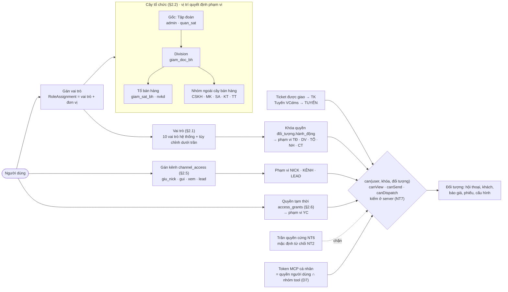
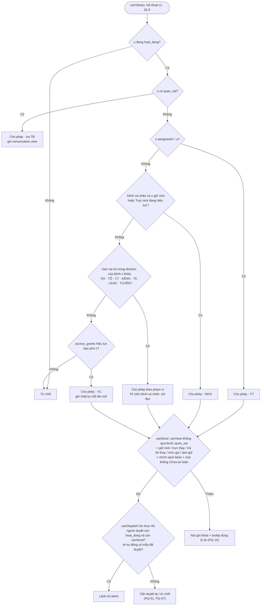
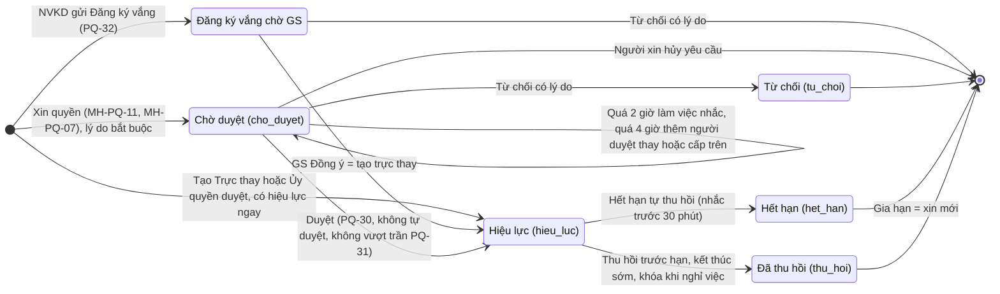
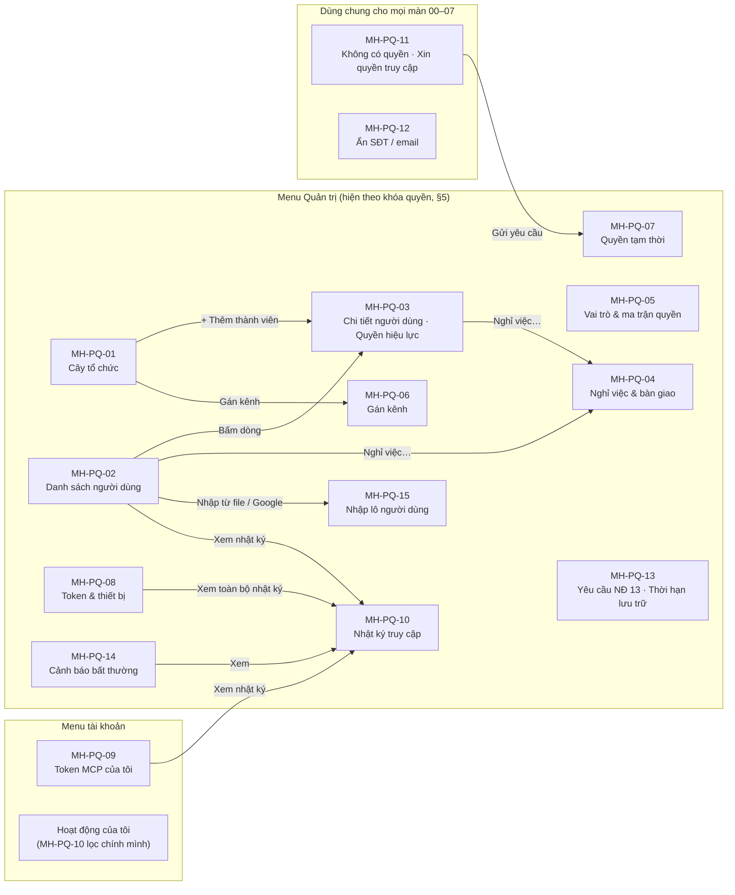

# VClinks — Đặc tả PHÂN QUYỀN (BA-01)

Phiên bản 1.5.3 · 07/10/2026 · Trạng thái: Nháp để thống nhất

> **Phạm vi:** tổ chức, vai trò, phạm vi dữ liệu, quyền thao tác, quyền theo kênh, quyền tạm thời, ẩn SĐT/email, quyền của AI (MCP) và thiết bị, nhật ký truy cập, các màn hình quản trị.
> **Vị trí:** tài liệu này là **nguồn chuẩn về quyền** cho bộ đặc tả `docs/02-yeu-cau/`: 00 giao diện chung · 02 khách đa kênh · 03 sale Zalo cá nhân · 04 CSKH Zalo OA · 05 marketing quảng cáo + chatbot web · 06 hóa đơn, công nợ. Khi các file đó nói "theo quyền", nghĩa là theo ma trận §3 và quy tắc `PQ-xx` ở §4 của file này. Chỗ nào lệch thì file này thắng, trừ khi chủ dự án chốt khác. **Không** là nguồn chuẩn cho: route và menu (00 §2), câu chữ chung, mã lỗi `ERR-*`, nhãn bong bóng, tên trạng thái người dùng (00 MH-UI-05); định tuyến, owner, tạm giữ (02); khung gửi OA (04); khung gửi Fanpage (05); hóa đơn, công nợ (06) — file này chỉ trỏ tới (theo `../ra-soat/dac-ta-vong-1/thong-nhat.md`). Chỗ còn chờ chủ dự án ghi mã `QĐ-xx` / `TS-xx` của `../../01-quan-ly-du-an/quyet-dinh-chu-du-an.md` và viết theo mặc định.
> **Căn cứ:** `docs/02-yeu-cau/vclinks-ba.md` v0.4 (§1.2, §4, §5.5, §5.9, §7 BR01–BR17, §8, §18), `CLAUDE.md` §12, Nghị định 13/2023/NĐ-CP.
> Người yêu cầu: Thọ Anh Bùi

## Mô hình

**Mô hình phân quyền** (§1.2 NT1, §2): vị trí trong cây tổ chức quyết định phạm vi, vai trò quyết định thao tác; gán kênh và quyền tạm thời mở thêm phạm vi; mọi kiểm tra chạy ở server.



**Quyết định xem / gửi một hội thoại** (§2.9 `canView`, `canSend`, `canDispatch`):



**Vòng đời quyền tạm thời** (§2.6, PQ-30…32, MH-PQ-07):



**Bản đồ màn hình MH-PQ** (§5): mục menu và các lối chuyển chính giữa màn.



## Tóm tắt

- **Phạm vi:** nguồn chuẩn về quyền cho bộ đặc tả `docs/02-yeu-cau/` (00, 02–07): cây tổ chức, 10 vai trò, phạm vi dữ liệu, khóa quyền, gán kênh, quyền tạm thời, ẩn SĐT / email, AI qua MCP và thiết bị, nhật ký, 15 màn hình `MH-PQ-01…15`, 125 ca UAT. Lệch với file khác thì file này thắng, trừ khi chủ dự án chốt khác.
- **Nguyên tắc nền:** quyền suy ra từ vị trí trong cây + vai trò (NT1), mặc định từ chối (NT2, PQ-01), kiểm ở server và lọc ngay trong truy vấn (NT7, PQ-02), đối tượng ngoài phạm vi không lộ sự tồn tại (NT8, PQ-03), đổi quyền có hiệu lực ≤ 60 giây (PQ-04); trần quyền cứng NT6 không vai trò nào vượt.
- **Xem ≠ Gửi:** quyền gửi đến từ gán kênh (D1, NT5); mỗi nick cá nhân đúng một người giữ (D2, PQ-17); quyền gắn nick đi theo phạm vi `NICK`, không theo vai trò (D13, PQ-44); lệnh gửi kiểm lại lúc thực thi, người duyệt bị khóa → `Cần duyệt lại`, nick "Chưa an toàn" không ai gửi được (PQ-51); tin tự động chỉ dùng mẫu đã duyệt (PQ-57).
- **Dữ liệu nhạy cảm:** SĐT / email luôn ẩn kể cả trong nội dung tin, file xuất, kết quả MCP (D6, PQ-36); "luôn hiện" theo quan hệ với khách (PQ-45), còn lại bấm "Hiện" có nhật ký (PQ-37); xuất kèm SĐT phải có người duyệt (PQ-48); nhật ký chỉ ghi thêm (PQ-09, PQ-38); cảnh báo bất thường R1–R11 (PQ-46); yêu cầu NĐ 13 có phiếu, hạn và danh sách chặn nạp lại (PQ-50).
- **Chống lạm quyền:** không ai tự sửa quyền của mình (PQ-41); vai trò nhạy cảm cần người thứ hai duyệt (PQ-42); token MCP cá nhân chỉ chính chủ tạo (PQ-43); Admin không đọc chat mặc định (D9); AI mang đúng quyền người dùng, không có tool gửi tin cho khách (D7).
- **Quyết định đã định hình file:** D8-02 (vai trò không bao giờ có quyền → ẩn; thiếu điều kiện tạm thời → khóa dạng C), D8-04, 06, 07, 08, 09, 16, 18, 26 (v1.4.3–v1.4.5); D9-01…D9-05 (v1.5): CSKH đọc toàn văn hội thoại khách trong division kể cả trên nick sale (đóng QĐ-05), hàng việc Bán hàng / Hậu mãi, vòng CSKH soạn → NVKD "Duyệt & gửi" / "Trả lại" (PQ-119…121).
- **Việc còn mở:** 23 câu `Q-PQ-01…23` ở §9 (đã chuyển hết sang `QĐ` / `TS` của `../../01-quan-ly-du-an/quyet-dinh-chu-du-an.md`) và 10 mã mới còn chờ (QĐ-03, 09, 26, 30, 31, 44, 45, 60, 62, HD-CH-4; QĐ-05 đã đóng ở v1.5); tham số T-36 (số lần trả lại phiếu) chờ xác nhận. Tới khi chốt, file viết theo mặc định ghi tại chỗ.
- **Khoảng cách với code (§2.10, L12):** token `dashboard` đang thấy toàn bộ, token `ingest` không giới hạn nick, `approvedBy` là tên token — phải làm lại theo §2.9 trước khi mở cho người ngoài nhóm dự án.
- **Người duyệt cần xem kỹ:** thay đổi D3 của v1.5 đã lan hết chưa (chú thích (36), §8 L1, story CS-05, ô `conv.view` của CS và bước 5 `canView` §2.9 vẫn theo cách cũ "nick cá nhân chỉ khi có ticket"); ma trận §3 khớp từng màn MH-PQ; luật chặn gửi qua nick "Chưa an toàn" áp cả người giữ mới (chờ QĐ-11).

## Mục lục

- [0. Tóm tắt quyết định (cho các file 00, 02–06)](#0-tóm-tắt-quyết-định-cho-các-file-00-0206)
- [1. Mục tiêu & nguyên tắc](#1-mục-tiêu--nguyên-tắc)
- [2. Mô hình phân quyền](#2-mô-hình-phân-quyền)
- [3. Ma trận quyền](#3-ma-trận-quyền)
- [4. Quy tắc phân quyền PQ-xx](#4-quy-tắc-phân-quyền-pq-xx)
- [5. Đặc tả màn hình](#5-đặc-tả-màn-hình)
- [6. User story](#6-user-story)
- [7. Dữ liệu kiểm thử & kịch bản UAT](#7-dữ-liệu-kiểm-thử--kịch-bản-uat)
- [8. Điểm lệch so với BA tổng (docs/02-yeu-cau/vclinks-ba.md v0.4)](#8-điểm-lệch-so-với-ba-tổng-docsvclinks-bamd-v04)
- [9. Câu hỏi mở](#9-câu-hỏi-mở)
- [Phụ lục: đồng bộ vòng 1b](#phụ-lục-đồng-bộ-vòng-1b)
- [Lịch sử cập nhật](#lịch-sử-cập-nhật)

---

## 0. Tóm tắt quyết định (cho các file 00, 02–06)

| # | Quyết định / đề xuất | Ảnh hưởng tới |
|---|---|---|
| D1 | **Quyền XEM và quyền GỬI tách riêng.** Thấy một hội thoại không có nghĩa là được gửi tin trên kênh đó. Quyền gửi đến từ **gán kênh** (§2.5). | 00, 02, 03, 04, 05 |
| D2 | **Nick Zalo/FB cá nhân có đúng 1 "Người giữ nick"** (thường là NVKD). Chỉ người giữ nick, người **trực thay** đang hiệu lực, và **cấp trên trong cây** (giám sát, giám đốc bán hàng, dùng "Trả lời thay") được gửi qua nick đó. CSKH, marketing, sale admin, kế toán **không bao giờ** gửi qua nick cá nhân. | 03, 04 |
| D3 | **[v1.5·D9-04, đóng QĐ-05]** **CSKH đọc toàn văn hội thoại của khách trong division mình, kể cả trên nick cá nhân của sale** (trừ hội thoại gia đình/bạn bè, QĐ-38), chỉ đọc + ghi chú, mỗi lần mở hội thoại trên nick ghi nhật ký; **không gửi qua nick** (D2, PQ-18); câu trả lời cho khách trên nick đi qua vòng "Chờ NVKD duyệt" (PQ-119). ~~CSKH không thấy hội thoại trên nick cá nhân của sale, trừ hội thoại gắn với ticket được giao cho mình (chỉ đọc + ghi chú, không gửi qua nick).~~ CSKH **trực kênh chính thức** (OA, Fanpage, chatbot web) được gán: thấy mọi hội thoại trên kênh đó, trả lời hội thoại chưa phân công, hội thoại giao cho mình, hội thoại gắn ticket của mình và (v1.2) hội thoại Bán hàng đang **tạm giữ** theo 02 DK-24 (chỉ mẫu giữ khách đã duyệt, không nêu giá, PQ-19). | 02, 04 |
| D4 | **Hội thoại của khách đã có owner** trên kênh chính thức: vẫn tự về owner (F12.3). CSKH trực kênh thấy và ghi chú được, **không trả lời** trừ khi owner/giám sát chuyển cho CSKH, có ticket giao cho CSKH, hoặc (v1.2) hội thoại đang tạm giữ khi owner **Vắng** / quá hạn trả lời (02 DK-24, DK-48; PQ-19). Tạm giữ **không đổi owner**. | 02, 04 |
| D5 | **Marketing** là vai trò mới. Thấy **toàn bộ nội dung** lead khi lead còn ở "Lead chưa giao" trên kênh được gán. **Khi lead đã giao cho NVKD thì mất quyền xem nội dung chat**, chỉ còn **thẻ lead rút gọn** (nguồn, ngày vào, NVKD nhận, trạng thái phễu, đã có báo giá / đơn, giá trị) để đo hiệu quả quảng cáo. Mặc định marketing **không gửi tin**; Admin bật được quyền gửi theo từng kênh chính thức. (v1.2) Lead **không nhất thiết** đến từ kênh gán cho marketing (ví dụ người lạ nhắn nick Zalo cá nhân của sale, chờ QĐ-09): lead đó marketing chỉ thấy `lead.card` (PQ-20). | 03, 05 |
| D6 | **SĐT/email luôn ẩn** dạng `0900 *** 101` / `ga***@example.vn`, kể cả khi SĐT nằm trong nội dung tin, kết quả tìm kiếm, file xuất và kết quả MCP. Chỉ **owner của khách**, **người giữ nick** đã nhận SĐT đó, **NV thị trường phụ trách tuyến** và (v1.2) **người đang giữ ticket mở** của khách đó thấy đầy đủ mặc định (PQ-45). Người khác có quyền xem khách bấm **"Hiện"**, mỗi lần bấm ghi nhật ký. | 00, 02, 03, 04, 05 |
| D7 | **AI mang đúng quyền của người dùng** sở hữu token, không hơn. AI chỉ đọc và tạo nháp/đề xuất, **không có tool gửi tin cho khách**. SĐT trả qua MCP luôn theo mức mặc định (không có thao tác "Hiện" qua MCP). | 00, 03, 05 |
| D8 | **Token thiết bị (extension) chỉ được đẩy dữ liệu và nhận lệnh gửi đã duyệt của các nick được khai báo cho thiết bị đó**; không đọc được hội thoại, khách, báo cáo. | 03 |
| D9 | **Admin hệ thống không đọc nội dung chat mặc định** (tách quản trị khỏi dữ liệu kinh doanh). Admin là người duy nhất xóa tin / hội thoại / hồ sơ (BR06, NĐ 13), luôn có lý do và xác nhận hai bước. | tất cả |
| D10 | **Nhiều division, nhiều owner:** mỗi division một owner (BR09). Người dùng chỉ thấy hội thoại trên kênh của division mình và khối thương mại của division mình; với division khác chỉ thấy tên owner để phối hợp. | 02 |
| D11 | **Kế toán** thấy phiếu yêu cầu xuất hóa đơn (kèm đúng các tin nguồn) và hóa đơn, **không thấy hội thoại**. Kế toán gửi hóa đơn qua kênh chính thức được gán; nếu khách chỉ chat qua nick cá nhân thì kế toán tạo **nháp gửi hóa đơn** cho owner bấm gửi. (v1.2) Kế toán thấy thêm đúng các tin trong **mục phản hồi thanh toán** (PQ-23). Nghiệp vụ hóa đơn, yêu cầu xuất hóa đơn, công nợ: **06** là chủ quản; file này chỉ giữ quyền. | 06 (và 02, 04) |
| D12 | **Sale admin** thấy hồ sơ và khối thương mại toàn division, **không thấy nội dung chat** trừ khi có quyền tạm thời. **(v1.4.3·D8-16)** Ngoại lệ hẹp: ở việc VCsales thấy **đoạn trích** chứa thông tin cần nhập (PQ-25). | 02 |
| D13 | **Quyền gắn với nick đi theo nick, không theo vai trò** (v1.1). Người giữ nick và người trực thay đang hiệu lực có đủ quyền trên nick (xem, gửi, nhận lời mời kết bạn, tạo nhóm, thu hồi tin của nick, SĐT luôn hiện), dù vai trò là NVKD, giám sát hay NV thị trường. Giám sát được giữ nick riêng (PQ-44). | 03 |
| D14 | **Không ai tự nâng quyền** (v1.1). Không ai sửa vai trò, gán kênh, quyền của chính mình; cấp vai trò đọc được chat (`giam_doc_bh`, `quan_sat`, `admin`) cần người thứ hai duyệt; Admin không tạo hộ token MCP cá nhân (PQ-41…43). | tất cả |
| D15 | **Nghỉ việc khóa cả thiết bị và lệnh gửi** (v1.1, sửa v1.2): thu hồi token thiết bị của nick người đó giữ; lệnh gửi họ đã duyệt còn chờ chuyển **`Cần duyệt lại`** (không tự chạy, không có "Thử lại"; chỉ người đang giữ nick hoặc trực thay duyệt lại — mã sự kiện `outbox.needs_reapproval`); bàn giao khách **không bị chặn** bởi việc thu nick trên điện thoại, owner đổi ngay; nick chưa xác nhận đăng xuất trên thiết bị cũ ở trạng thái **"Chưa an toàn"** và **không ai gửi qua nick đó** tới khi có người xác nhận (PQ-33, PQ-51). | 00, 03 |
| D16 | **Ghi lại thì phải báo động** (v1.1): bộ quy tắc cảnh báo bất thường cấu hình được (PQ-46); nhật ký MCP ghi mã khách / hội thoại AI đã đọc (PQ-47); xuất kèm SĐT phải có người duyệt (PQ-48); phiếu yêu cầu dữ liệu cá nhân NĐ 13 có màn hình, hạn và danh sách chặn nạp lại (PQ-50). | 00, 02, 04 |
| D17 | **Tin tự động chỉ dùng mẫu đã duyệt** (v1.2): mọi tin gửi ra khách mà không có người bấm gửi (tin chào, ngoài giờ, quy tắc tự động, tự trả lời bình luận, ZNS tự động, chatbot) phải dùng **phiên bản mẫu / kịch bản đã duyệt**; `approvedBy` = người duyệt phiên bản đó, `approvedAt` = lúc duyệt phiên bản; người bật quy tắc không tự duyệt mẫu (PQ-27, PQ-57). | 04, 05 |
| D18 | **Ủy quyền duyệt có thời hạn** (v1.2): người duyệt (GĐ, GS) giao quyền duyệt cho người khác khi vắng, có hạn, có nhật ký, không vượt trần (PQ-58). | 04, 05 |

---

## 1. Mục tiêu & nguyên tắc

### 1.1 Mục tiêu

| # | Mục tiêu | Đo bằng |
|---|---|---|
| M1 | Mỗi người chỉ thấy khách và hội thoại cần cho công việc của mình | 100% ca "không được thấy" trong UAT §7 đạt |
| M2 | Khách và dữ liệu hội thoại thuộc công ty, không đi theo nhân viên | Nhân viên nghỉ việc: mất quyền ≤ 1 phút, 100% khách được bàn giao |
| M3 | Mọi truy cập nhạy cảm (xem SĐT, xuất, xóa, xem ngoài phạm vi, quyền tạm thời) truy vết được | 100% thao tác nhạy cảm có dòng nhật ký |
| M4 | Quản trị viên cấu hình quyền mà không cần sửa code | Đổi vị trí trong cây → quyền đổi ngay, không cần đăng nhập lại |
| M5 | Tuân thủ NĐ 13/2023 | Ẩn SĐT, nhật ký, xóa/xuất theo yêu cầu khách, thời hạn lưu |

### 1.2 Nguyên tắc

| Mã | Nguyên tắc | Diễn giải |
|---|---|---|
| NT1 | **Quyền suy ra từ cây tổ chức + vai trò** | Không cấp quyền dữ liệu cho từng khách bằng tay. Vị trí trong cây quyết định phạm vi; vai trò quyết định thao tác. |
| NT2 | **Mặc định từ chối** | Không có quy tắc nào cho phép → từ chối. Tính năng mới thêm vào mà chưa có dòng trong ma trận → không ai (trừ Admin cho chức năng cấu hình) dùng được. |
| NT3 | **Ít quyền nhất** | Mỗi vai trò chỉ có quyền cần cho story của mình ở BA §18. Cần thêm → quyền tạm thời có hạn. |
| NT4 | **Khách thuộc công ty** | Owner là người được giao chăm, không phải chủ sở hữu. Đổi owner chỉ qua bàn giao có lý do và nhật ký (BR09). |
| NT5 | **Xem ≠ Gửi** | Quyền gửi ra khách gắn với kênh cụ thể (nick, OA, Page) và luôn là thao tác của người. |
| NT6 | **Trần quyền cứng** | Một số điều **không vai trò nào** có, kể cả vai trò tùy chỉnh: AI tự gửi tin; token thiết bị đọc dữ liệu; người không phải Admin xóa tin; ai đó sửa/xóa nhật ký; tự duyệt quyền cho chính mình; **tự sửa vai trò, gán kênh, quyền của chính mình**; **tạo token MCP cá nhân cho người khác**; gửi hàng loạt qua nick cá nhân; thực thi lệnh gửi do người đã bị khóa duyệt; **(v1.2)** gửi qua nick đang "Chưa an toàn" (PQ-51); gửi tin tự động không có phiên bản mẫu đã duyệt (PQ-57). |
| NT7 | **Kiểm tra ở server** | Mọi kiểm tra quyền chạy ở API (REST, MCP, WebSocket/SSE). Giao diện chỉ ẩn/khóa nút cho gọn; API vẫn chặn khi gọi thẳng. |
| NT8 | **Không để lộ sự tồn tại** | Đối tượng ngoài phạm vi không xuất hiện trong danh sách, số đếm, tìm kiếm, gợi ý. Mở thẳng bằng link → màn hình "Không có quyền" không kèm tên khách. |
| NT9 | **Có hiệu lực ngay** | Đổi vai trò, vị trí, gán kênh, khóa tài khoản, thu hồi token có hiệu lực ≤ 60 giây trên mọi phiên đang mở. |

---

## 2. Mô hình phân quyền

### 2.1 Vai trò

| Mã | Vai trò (nhãn hiển thị) | Đặt ở đơn vị | Tóm tắt | Story BA |
|---|---|---|---|---|
| `admin` | Admin hệ thống | Gốc (Tập đoàn) | Cấu hình, kết nối kênh, cây tổ chức, người dùng, token, nhật ký. Không đọc chat mặc định. | AD-01…08 |
| `giam_doc_bh` | Giám đốc bán hàng | Division | Toàn bộ khách và hội thoại của division; luật chia khách, SLA; duyệt chiến dịch, chatbot; xuất dữ liệu. | GD-01…07 |
| `giam_sat_bh` | Giám sát bán hàng | Tổ bán hàng | Khách và hội thoại của tổ; phân công, bàn giao, trả lời thay, duyệt mẫu câu tổ. | GS-01…10 |
| `nvkd` | Nhân viên kinh doanh | Tổ bán hàng | Khách mình phụ trách + hội thoại trên nick mình giữ. | KD-01…19 |
| `cskh` | Nhân viên CSKH ("chăm sóc bán hàng" / "CSKH hậu mãi", D9-01) | Nhóm CSKH (theo division) | **[v1.5]** Thuộc một hoặc hai **hàng việc**: *Bán hàng* (phiếu báo giá, theo đơn, hàng về, công nợ) / *Hậu mãi* (bảo hành, khiếu nại, đổi trả) — quyền như nhau, hàng việc chỉ quyết định phiếu nào vào hàng của ai (PQ-121). Trực kênh chính thức được gán; ticket được giao; tạm giữ hội thoại Bán hàng khi owner vắng (PQ-19). Trưởng nhóm = **giám sát CSKH** (04). | CS-01…08 |
| `marketing` | Nhân viên marketing | Nhóm marketing (theo division) | Quảng cáo Zalo OA / Fanpage, chatbot web, form lead; lead chưa giao; báo cáo nguồn khách. | PQ-US-08…10 (mới) |
| `sale_admin` | Sale admin | Nhóm sale admin (theo division) | Hồ sơ khách, liên kết mã KH, gộp/tách, mẫu câu công ty, media, mẫu ZNS. Không đọc chat. | SA-01…06 |
| `ke_toan` | Kế toán | Nhóm kế toán (theo division) | Phiếu yêu cầu xuất hóa đơn, hóa đơn, công nợ, phản hồi thanh toán, chiến dịch nhắc thanh toán / đối chiếu, chi phí tin mẫu (nghiệp vụ ở 06, 04). Không đọc chat. | KT-01…03 |
| `nv_thi_truong` | NV thị trường (VCdms) | Nhóm thị trường (theo division) | Khách trên tuyến VCdms mình phụ trách. | TT-01…04 |
| `quan_sat` | Ban giám đốc / Kiểm soát | Gốc (Tập đoàn) | Chỉ đọc toàn tập đoàn: dashboard, hồ sơ, hội thoại (có nhật ký), nhật ký truy cập. | BGD-01…03 |

**Cờ "Trưởng nhóm"**: người có vai trò `cskh`, `marketing`, `sale_admin`, `ke_toan`, `nv_thi_truong` được đặt làm **quản lý đơn vị** (manager của OrgUnit) thì phạm vi `CT` của họ mở rộng thành `NH` (cả nhóm), và được thêm các thao tác quản lý nhóm ghi ở ma trận (phân công ticket, duyệt mẫu câu nhóm, giao lead). Không cần vai trò riêng.

**Chủ thể không phải người:**

| Mã | Chủ thể | Xác thực | Quyền |
|---|---|---|---|
| `ai_nguoi_dung` | Tác tử AI dùng token MCP cá nhân (Claude Desktop / Chrome / Code) | Bearer token MCP gắn 1 người dùng | = quyền của người dùng ∩ nhóm tool của token (§3.8) |
| `thiet_bi` | Extension / Chrome driver giữ nick | Bearer token thiết bị gắn danh sách nick | Chỉ ingest + nhận lệnh gửi đã duyệt của nick được khai báo |
| `tac_tu_gui` | Tác tử gửi tin đã duyệt qua Zalo Web (luồng ⑥ CLAUDE.md) | Bearer token MCP loại "Gửi đã duyệt", gắn nick | Chỉ `list_pending_suggestions`, `mark_sent` của nick được gắn |
| `he_thong` | Worker (ASR, gợi ý, enrich, wiki-export), chatbot đã duyệt | Nội bộ, không qua token người | Theo chức năng worker; kết quả (nháp, tóm tắt) hiển thị theo quyền của hội thoại |

**Một người nhiều vai trò:** người dùng có thể có nhiều **gán vai trò** (`RoleAssignment` = vai trò + đơn vị). Quyền là **hợp** của các gán vai trò; mỗi gán vai trò chỉ có phạm vi trong đơn vị của nó. Ví dụ: giám sát tổ HN1 kiêm NVKD thì phạm vi `TỔ` đã bao gồm khách của chính mình, không cần gán thêm `nvkd`. Sale admin kiêm kế toán ở VCparts = hai gán vai trò cùng division.

### 2.2 Cây tổ chức

```
Tập đoàn VC Phồn Vinh (gốc)                     ← admin, quan_sat
├─ Division VCparts                              ← giam_doc_bh
│  ├─ Tổ bán hàng HN1   (quản lý: giám sát)      ← giam_sat_bh, nvkd
│  ├─ Tổ bán hàng HN2
│  ├─ Nhóm CSKH VCparts        (ngoài cây bán hàng)  ← cskh (+ trưởng nhóm)
│  ├─ Nhóm Marketing VCparts   (ngoài cây bán hàng)  ← marketing
│  ├─ Nhóm Sale admin VCparts  (ngoài cây bán hàng)  ← sale_admin
│  ├─ Nhóm Kế toán VCparts     (ngoài cây bán hàng)  ← ke_toan
│  └─ Nhóm Thị trường VCparts  (ngoài cây bán hàng)  ← nv_thi_truong
├─ Division VCedu
│  └─ …
└─ Division VCsoft / VCOBD / VCservice / VCmedia …
```

- Loại đơn vị (`OrgUnit.type`): `goc` · `division` · `to_ban_hang` · `nhom_cskh` · `nhom_marketing` · `nhom_sale_admin` · `nhom_ke_toan` · `nhom_thi_truong`.
- Tổ bán hàng lồng được một cấp (tổ con) nếu division cần; phạm vi `TỔ` của giám sát tính **cả tổ con**.
- Mỗi đơn vị có tối đa **một quản lý** (`manager_user_id`). Quản lý của `division` phải có vai trò `giam_doc_bh`; quản lý của `to_ban_hang` phải có `giam_sat_bh`.
- Các nhóm "ngoài cây bán hàng" nằm dưới division để lấy phạm vi `DV`, nhưng **không** kế thừa quyền xem khách của các tổ bán hàng.
- Giám đốc bán hàng là cấp trên của mọi đơn vị trong division (duyệt quyền tạm thời, duyệt chiến dịch của nhóm marketing, xem báo cáo nhóm CSKH).

### 2.3 Phạm vi dữ liệu (ký hiệu dùng trong ma trận)

| Ký hiệu | Tên | Bao gồm |
|---|---|---|
| `TĐ` | Toàn tập đoàn | Mọi division |
| `DV` | Division | Mọi khách có owner ở division của người dùng + mọi hội thoại trên kênh gán cho division đó + hàng "Chưa phân công" của division |
| `TỔ` | Tổ | Khách có owner (ở division này) là thành viên tổ mình quản lý (kể cả tổ con và chính mình) + hội thoại assignee là thành viên đó + hội thoại trên nick do thành viên đó giữ + hàng "Chưa phân công" của tổ |
| `NH` | Nhóm | Như `CT` nhưng cho cả nhóm mình quản lý (trưởng nhóm CSKH / marketing / sale admin / kế toán / thị trường) |
| `CT` | Của tôi | Khách tôi là owner (ở division của tôi) + hội thoại assignee là tôi |
| `NICK` | Nick tôi giữ | Mọi hội thoại (cá nhân, nhóm, người lạ) trên nick Zalo / FB cá nhân mà tôi là **Người giữ nick** hoặc **trực thay** đang hiệu lực |
| `KÊNH` | Kênh trực | Mọi hội thoại trên kênh chính thức (OA, Fanpage, chatbot web) gán cho tôi hoặc nhóm tôi ở mức "Xem" trở lên |
| `TK` | Ticket | Khách + hội thoại gắn với ticket giao cho tôi (trưởng nhóm: giao cho nhóm) |
| `LEAD` | Lead chưa giao | Lead ở hàng "Lead chưa giao" trên kênh gán cho tôi (marketing) |
| `TUYẾN` | Tuyến | Khách trên tuyến VCdms mà tôi là NV thị trường phụ trách |
| `YC` | Theo yêu cầu | Chỉ khi có **quyền tạm thời** đang hiệu lực (§2.6) |
| `✅` | Được | Chức năng không gắn dữ liệu khách (cấu hình, của riêng mình) |
| `✖` | Không | Không được, không có cách xin quyền tạm thời trừ khi ghi `YC` |

- **Division của một hội thoại** = division của kênh nhận hội thoại. Hội thoại trên nick VCparts là của VCparts, dù khách cũng là khách VCedu.
- **Owner dùng để xét phạm vi** = owner của account **ở division của hội thoại**. Account có owner ở VCparts và VCedu: NVKD VCedu không thấy hội thoại trên kênh VCparts và ngược lại (PQ-12).
- Hội thoại **chưa gắn hồ sơ** (người lạ nhắn lần đầu) chỉ thuộc `NICK`, `KÊNH`, `LEAD`, `DV`, `TỔ` (qua người giữ nick) và `TĐ`.

### 2.4 Quyền thao tác (khóa quyền)

Mỗi quyền có một **khóa** dạng `đối_tượng.hành_động` (cột "Khóa" ở ma trận). Vai trò = tập hợp `khóa → phạm vi`. Dev kiểm tra bằng `can(user, khóa, đối tượng)`; UI đọc danh sách quyền hiệu lực từ `GET /api/me/permissions`.

### 2.5 Gán kênh (ai dùng nick / OA / Page nào)

Bảng `channel_access`: mỗi dòng = một kênh + một chủ thể (người dùng **hoặc** đơn vị) + mức.

| Mức | Nhãn | Áp dụng cho | Cho phép |
|---|---|---|---|
| `giu_nick` | Người giữ nick | Chỉ kênh cá nhân (`zalo`, `fb_personal`). **Đúng 1 người** mỗi kênh tại một thời điểm. | Xem mọi hội thoại trên nick (`NICK`); gửi; chấp nhận lời mời kết bạn; tạo nhóm; thu hồi tin do nick gửi; SĐT của danh tính trên nick hiện đầy đủ |
| `gui` | Trực & gửi | Chỉ kênh chính thức (`zalo_oa`, `fb_page`, `web_chat`) | Xem mọi hội thoại trên kênh (`KÊNH`); gửi theo PQ-15; trả lời bình luận |
| `xem` | Chỉ xem | Kênh chính thức | Xem hội thoại trên kênh (`KÊNH`), ghi chú nội bộ; không gửi |
| `lead` | Lead | Kênh chính thức, cho marketing | Xem lead chưa giao trên kênh (`LEAD`) |

- Kênh cá nhân **không** gán mức `gui` hay `xem` cho người khác. Người khác gửi qua nick chỉ bằng: trực thay (quyền tạm thời) hoặc trả lời thay (cấp trên trong cây của người giữ nick).
- Gán cho **đơn vị** (ví dụ "Nhóm CSKH VCparts" mức `gui` trên "OA VCparts") thì mọi thành viên hiện tại và sau này đều có; người rời nhóm mất ngay.
- Kênh phải thuộc một division (F1.6). Chỉ gán được cho người/đơn vị **trong cùng division**, trừ Admin gán chéo có lý do (hiện cảnh báo).
- Vai trò giới hạn mức được gán: `nvkd` chỉ nhận `giu_nick` (và `gui` trên kênh chính thức nếu division bật "NVKD trực OA"); `giam_sat_bh` nhận `giu_nick` (nick riêng để bán hàng, hoặc giữ tạm nick của người nghỉ theo PQ-34) — một GS giữ được nhiều nick; `giam_doc_bh` nhận `giu_nick` chỉ khi division bật "GĐ giữ nick" (mặc định tắt); `cskh` nhận `gui`/`xem`; `marketing` nhận `lead`/`xem` (và `gui` nếu Admin bật PQ-21); `sale_admin`, `quan_sat` không nhận mức nào; `ke_toan` nhận `gui` chỉ để gửi hóa đơn/ZNS nhắc nợ (PQ-24); `nv_thi_truong` nhận `giu_nick` hoặc `gui`.
- (v1.2) **Tin mẫu (ZNS) lẻ** (04 MH-OA-12) không cần mức gán kênh: kiểm bằng khóa `zns.send_single` + phạm vi khách + mẫu đã duyệt nội bộ + loại mẫu hợp với vai trò (§3.4). Không bao giờ đi qua nick cá nhân.

### 2.6 Quyền tạm thời

| Loại | Nhãn | Ai xin | Phạm vi xin | Ai duyệt | Thời hạn |
|---|---|---|---|---|---|
| `xem_ngoai_pham_vi` | Xem khách / hội thoại ngoài phạm vi | Mọi vai trò trừ `quan_sat` (đã có `TĐ`) | 1 khách, 1 hội thoại, hoặc 1 tổ | Quản lý của phạm vi được xin (xem PQ-30) | 4 giờ / 1 ngày / 3 ngày / 7 ngày (tối đa 7) |
| `xem_noi_dung_chat` | Xem nội dung chat (sale admin, kế toán, admin) | `sale_admin`, `ke_toan`, `admin` | 1 khách hoặc 1 hội thoại | Giám đốc bán hàng của division | Tối đa 3 ngày |
| `truc_thay` | Trực thay | Giám sát tạo cho người khác (không cần xin); (v1.2) NVKD gửi **"Đăng ký vắng"** (từ – đến, đề xuất người trực) để GS bấm Đồng ý (PQ-32); trưởng nhóm sale admin / GĐ tạo cho sale admin vắng (PQ-32a) | Hai phần tách được (PQ-32): **Trực nick** (`NICK` của các nick người vắng giữ + `CT` để trả lời) — tối đa 1 người mỗi nick; **Trực nhóm khách** (một phần `CT` lọc theo khu vực / tag, không có `NICK`) — thêm tối đa 3 người | Giám sát tạo = có hiệu lực; Giám đốc tạo cho cả tổ | Tối đa 30 ngày |
| `ho_tro_ky_thuat` | Hỗ trợ kỹ thuật | `admin` | 1 kênh hoặc 1 hội thoại | Giám đốc bán hàng của division | Tối đa 1 ngày |
| `uy_quyen_duyet` (v1.2) | Ủy quyền duyệt | Người có khóa duyệt (GĐ, GS, trưởng nhóm) tạo cho người khác (không cần xin) | Một hoặc nhiều **khóa duyệt** của chính người tạo, trong phạm vi của người tạo (PQ-58); **(v1.4.2)** GĐ thêm được `config.sla` phần quy tắc chia khách (07 RT-11) | Tạo = có hiệu lực; báo cấp trên của người tạo và QS | Tối đa 30 ngày |

- Mỗi quyền tạm thời có: người nhận, loại, đối tượng, **quyền cụ thể** (Xem / Xem + Ghi chú / Xem + Trả lời; trực thay luôn gồm Trả lời), từ – đến, lý do (≥ 10 ký tự), người duyệt, trạng thái `cho_duyet | hieu_luc | tu_choi | het_han | thu_hoi`.
- Hết hạn tự thu hồi; nhắc người nhận 30 phút trước khi hết hạn. Gia hạn = xin mới.
- **Không tự duyệt cho mình**; không duyệt khi mình không có quyền đó (không cấp quá quyền mình có).
- Yêu cầu chờ quá **2 giờ làm việc** → nhắc người duyệt; quá **4 giờ làm việc** → chuyển thêm cho **người duyệt thay** (người đang có `uy_quyen_duyet` hoặc trực thay người duyệt, nếu có) hoặc cấp trên kế tiếp (GS → GĐ; GĐ → `quan_sat`); người duyệt gốc vẫn duyệt được. Thông báo "chờ duyệt" gom mỗi buổi (08:30, 13:30), trừ loại Hỗ trợ kỹ thuật báo ngay.
- Mọi quyền tạm thời mà **đối tượng** thuộc tổ / nhóm của một quản lý (GS, trưởng nhóm) đều hiện trong tab "Tất cả trong phạm vi" của quản lý đó và báo cho họ một dòng; họ không thu hồi được quyền do cấp trên duyệt nhưng bấm được "Đề nghị xem lại" gửi người đã duyệt.

### 2.7 Loại token

| Loại | Nhãn | Ai tạo | Gắn với | Hạn | Scope kỹ thuật |
|---|---|---|---|---|---|
| Phiên đăng nhập | (không hiện) | Hệ thống sau SSO Google | 1 người dùng | Máy tính: 12 giờ không hoạt động. (v1.2) Điện thoại: "Ghi nhớ 30 ngày" cho NVKD, NV thị trường, GS; người dùng và Admin thu hồi được từng phiên (MH-PQ-03 tab Thông tin); khóa tài khoản hủy ngay (TS-23; chỉ cần nếu QĐ-01 ≠ A) | `dashboard` |
| MCP cá nhân | Token MCP | **Chỉ chính người dùng**, sau khi đăng nhập SSO, khi Admin đã bật tự tạo cho division / vai trò của họ (PQ-43). Admin **không** tạo hộ | 1 người dùng | 30 / 60 / 90 ngày (tối đa 90; phạm vi `DV`/`TĐ`: xem Q-PQ-09) | `mcp` + nhóm tool `doc`, `de_xuat` |
| MCP đồng bộ | Token đồng bộ kênh | Chỉ Admin | 1 người dùng Admin + danh sách kênh | Tối đa 90 ngày | `mcp` + nhóm tool `dong_bo` |
| MCP gửi đã duyệt | Token tác tử gửi | Chỉ Admin | Danh sách nick | Tối đa 90 ngày | `mcp` + nhóm tool `gui_da_duyet` |
| Thiết bị | Token thiết bị | Chỉ Admin, bằng **mã ghép** (PQ-52) | 1 thiết bị (tên máy / trình duyệt) + danh sách nick + người dùng đang giữ máy (nếu có) | Không hạn, tự xoay vòng 180 ngày qua kênh đang có | `ingest` |

Token chỉ hiện **một lần** khi tạo (token thiết bị không hiện cho ai, đi thẳng vào extension qua mã ghép); lưu `sha256`. Thu hồi có hiệu lực ≤ 60 giây. Thu hồi phải chọn lý do: Hết dùng / Nghi lộ / Nghỉ việc / Thay máy. Chủ token (hoặc người giữ máy) nhận thông báo khi token của mình bị thu hồi.

### 2.8 Mô hình dữ liệu (bổ sung BA §8)

| Collection | Trường chính |
|---|---|
| `org_units` | `_id, type, name, divisionId, parentId, managerUserId, active, createdAt, updatedAt` |
| `users` | `_id, email (@vcprosperous.com), fullName, phone?, status: cho_kich_hoat\|hoat_dong\|tam_khoa\|nghi_viec, primaryOrgUnitId, lastLoginAt, leftAt?, handoverId?, preLeave?: {expectedAt, setBy, setAt}, lockedBy?, lockReason?` |
| `role_change_requests` | `_id, targetUserId, change: {add\|remove, roleKey, orgUnitId} \| {channelId, level}, requestedBy, approverRule, approvedBy?, approvedAt?, status: cho_duyet\|da_duyet\|tu_choi\|huy, reason` (PQ-42) |
| `privacy_requests` | `_id, code (NĐ13-xxxx), type: xem\|xuat\|sua\|xoa\|rut_dong_y\|han_che, channelReceived, requesterContactMasked, verifiedBy?, verifyMethod?, matchedAccountIds[], divisionIds[], confirmedBy?, executedBy?, dueAt, status, result, retainedItems[]` (PQ-50) |
| `ingest_tombstones` | `_id, sourceKey (uid:id gốc) \| phoneHash (sha256 có muối), scope: contact\|conversation\|message, privacyRequestId, createdAt` — ingest bỏ qua bản ghi khớp (PQ-50) |
| `alert_rules`, `alerts` | Quy tắc: `_id, type, threshold, window, roleKeys[], recipients[], active`; Cảnh báo: `_id, ruleId, subjectUserId, divisionId, detail (số đếm, không nội dung), status: moi\|da_xem\|da_xu_ly, handledBy?, handledAt?, note?` (PQ-46) |
| `export_requests` | `_id, requestedBy, filter, withPhone, rowCount, accountIds[], reason, approverId?, status, fileHash?, fileExpiresAt?` (PQ-48) |
| `device_pairings` | `_id, code (6 số, hạn 10 phút), deviceName, channelIds[], createdBy, usedAt?` (PQ-52) |
| `role_assignments` | `_id, userId, roleKey, orgUnitId, from, to?, createdBy` |
| `roles` | `_id (roleKey), label, system: bool, baseRole?, permissions: { [khóa]: phạm vi }, updatedBy, updatedAt` |
| `channel_access` | `_id, channelId (= uid kênh), principalType: user\|org_unit, principalId, level: giu_nick\|gui\|xem\|lead, from, to?, createdBy, note` |
| `access_grants` | `_id, userId, type, targetType: account\|conversation\|org_unit\|channel\|user, targetId, rights[], from, to, reason, requestedBy, approvedBy, approvedAt, status, revokedBy?, revokedAt?` — `type` theo §2.6 (gồm `uy_quyen_duyet` v1.2, khi đó `rights[]` = danh sách khóa duyệt) |
| `api_tokens` (mở rộng hiện có) | thêm `userId, type: mcp\|mcp_sync\|mcp_sender\|device, toolGroups[], channelIds[], expiresAt, createdBy, lastUsedAt, lastUsedIp` |
| `handovers` | `_id, fromUserId, kind: nghi_viec\|doi_don_vi, toAssignments[{accountId, division, toUserId}], channels[{channelId, toUserId, phoneLogoutConfirmedBy?, phoneLogoutConfirmedAt?, safety: an_toan\|chua_an_toan, checklist{qrRescanned, pendingInvites, ownedGroups, unansweredConvs}}], managedUnits[{orgUnitId, newManagerId?}], reapprovalOutboxIds[] (v1.2, thay `cancelledOutboxIds`), reason, effectiveAt, createdBy, status` |
| `audit_log` (mở rộng) | `actorType: user\|ai\|device\|system, actorId, onBehalfOf?, tokenId?, action, targetType, targetId, targets[] (mã khách / hội thoại mà thao tác đọc hoặc trả về — PQ-47), divisionId, at, ip, detail (không chứa nội dung tin, không chứa SĐT đầy đủ)` |
| `security_settings` | `allowSelfMcpToken: {divisionIds[], roleKeys[]}` (mặc định rỗng = tắt), `maxGrantDays, maxMcpDays, exportMaxRows, sessionHours, mobileRememberDays (30), groupApprover (người duyệt cấp tập đoàn — Q-PQ-17), supportRecipients: {divisionId → userIds[]}` (v1.2: người nhận nút "Báo Admin" của 00; trống = mọi người có `admin`). Giờ làm việc **không** ở đây: lịch làm việc của division ở 04 MH-OA-18 |
| `retention_settings` | `dataType → {days, action: xoa\|an_danh}`, `pendingChange?: {proposedBy, approvedBy?, effectiveAt}` (PQ-55) |

### 2.9 Thuật toán kiểm tra (cho dev)

`canView(u, hộiThoại c)` — trả về `{allowed, via}`; `via` dùng để hiện lý do trong tab "Quyền hiệu lực" và ghi nhật ký.

1. `u.status ≠ hoat_dong` → từ chối.
2. `u` có `quan_sat` → cho phép, `via = TĐ` (ghi nhật ký `conversation.view` mỗi lần mở, PQ-36).
3. `c.assigneeId = u` → cho phép (`CT`).
4. Kênh của `c` là kênh cá nhân và `u` là người giữ nick hoặc có `truc_thay` phần "Trực nick" hiệu lực cho kênh đó → cho phép (`NICK`). `truc_thay` phần "Trực nhóm khách" chỉ cho phép khi account của `c` nằm trong nhóm khách được giao (`CT` một phần).
5. Gọi `D` = division của kênh `c`; `O` = owner của account ở `D`. Với mỗi gán vai trò `ra` của `u` trong `D`:
   - `ra` có `conv.view = DV` → cho phép.
   - `ra` có `conv.view = TỔ` và (`O`, `c.assigneeId` hoặc người giữ nick của kênh `c`) thuộc cây con của `ra.orgUnit` → cho phép.
   - `ra` có `conv.view = CT` và `O = u` → cho phép.
   - `ra` có `KÊNH` và kênh `c` là kênh chính thức có `channel_access` mức `xem|gui` cho `u` hoặc đơn vị của `u` → cho phép.
   - `ra` có `TK` và `c` gắn ticket mở/đã đóng ≤ 30 ngày giao cho `u` (trưởng nhóm: cho nhóm) → cho phép, **chỉ đọc nếu kênh là cá nhân**.
   - `ra` có `LEAD` và account ở trạng thái "Lead chưa giao" trên kênh có `channel_access` mức `lead` cho `u` → cho phép.
   - `ra` có `TUYẾN` và account nằm trên tuyến VCdms của `u` → cho phép.
6. `access_grants` hiệu lực bao phủ `c` (hoặc account của `c`, hoặc tổ chứa `O`) → cho phép (`YC`, ghi nhật ký mỗi lần mở).
7. Còn lại → từ chối.

`canSend(u, c)` = `canView` (không qua bước 2) **và** một trong:
- Kênh cá nhân: `u` là người giữ nick; hoặc `truc_thay` hiệu lực có quyền Trả lời; hoặc `u` có `conv.reply_on_behalf` và người giữ nick thuộc phạm vi `TỔ`/`DV` của `u`.
- Kênh chính thức: `channel_access` mức `gui` cho `u`/đơn vị của `u` **và** (`c.assigneeId = u`; hoặc `c` chưa phân công và `u` có `conv.claim`; hoặc `c` gắn ticket của `u`; hoặc `u` có `conv.reply_on_behalf` và assignee thuộc phạm vi của `u`; hoặc (v1.2) `c` đang **tạm giữ** theo 02 DK-24 và `u` là CSKH đang tạm giữ — khi đó **chỉ** gửi được mẫu loại "Giữ khách" đã duyệt, không nêu giá, không số nợ; gửi nội dung khác → nút gửi khóa, tooltip "Đang tạm giữ: chỉ gửi được mẫu Giữ khách, không nêu giá.", PQ-19).
- Hoặc: quyền tạm thời "Xem + Trả lời" hiệu lực trên đúng hội thoại `c` ở kênh chính thức (PQ-31).
- **và** chính sách kênh cho phép (cửa sổ OA/Facebook, BR03), **và** không phải `quan_sat`.
- **và** (v1.2) kênh cá nhân của `c` **không** ở trạng thái "Chưa an toàn" (PQ-51). Nút gửi khóa, tooltip "Nick này chưa an toàn: chưa xác nhận đăng xuất Zalo trên thiết bị của <người cũ>. Nhờ Admin / GĐ xác nhận ở Gán kênh."

`canDispatch(lệnh gửi o)` — chạy **lúc thực thi** lệnh (OutboxDispatcher, `/api/outbox/pending`, `list_pending_suggestions`), không chỉ lúc duyệt: người duyệt `o.approvedBy` phải đang `hoat_dong` và vẫn còn `canSend` trên hội thoại, và kênh không "Chưa an toàn"; không thì lệnh chuyển **`Cần duyệt lại`** (mã `needs_reapproval`, v1.2 — thay cho hủy) với lý do ("Người duyệt đã nghỉ việc" / "Người duyệt đã bị khóa" / "Người duyệt không còn quyền gửi" / "Đã đổi người giữ nick"), ghi `outbox.needs_reapproval`, và không tới kênh cho tới khi có người **Duyệt lại** (PQ-51). Tin tự động (không có người bấm): `o.templateVersionId` phải là phiên bản mẫu / kịch bản đang ở trạng thái đã duyệt; không có → từ chối, ghi `outbox.rejected_unapproved_template` (PQ-57).

`canUseNickRight(u, kênh k, khóa)` với khóa gắn nick (`friend.respond`, `group.manage`, `msg.recall` tin của nick, `conv.reply` trên kênh cá nhân): cho phép khi `u` là người giữ nick của `k` hoặc có `truc_thay` phần "Trực nick" hiệu lực cho `k` — **không xét cột vai trò** (PQ-44).

### 2.10 Hiện trạng code (29/09/2026) và khoảng cách

| Hiện trạng | Khoảng cách phải làm |
|---|---|
| `apps/api/src/auth/token.service.ts`: token nội bộ, 3 scope `dashboard \| ingest \| mcp`, lưu `sha256`, cache xác thực 60 giây, thu hồi theo `name` | Gắn token với `userId`; thêm `type`, `toolGroups`, `channelIds`, `expiresAt`; thu hồi theo `_id` |
| `auth.guard.ts`: route không khai báo → cần `dashboard`; `@Public` cho webhook | Thêm lớp kiểm tra **theo đối tượng** (`can(user, khóa, đối tượng)`) sau guard; mọi truy vấn danh sách phải lọc theo phạm vi ở tầng MongoDB, không lọc sau khi lấy |
| Token `dashboard` thấy **mọi** nick, mọi hội thoại; nav có "Tất cả tài khoản" | Bộ chọn tài khoản chỉ liệt kê kênh được gán cho người dùng và kênh có ít nhất một hội thoại trong phạm vi; "Tất cả" = tất cả **trong phạm vi** |
| Token `mcp` thấy mọi dữ liệu; `actor = mcp:<tên token>` | MCP chạy với quyền của `userId`; nhật ký ghi cả người và tác tử |
| Token `ingest` gọi được `/api/outbox/pending` của **mọi** nick, `register_account` cho uid bất kỳ | Giới hạn theo `channelIds` của token thiết bị; uid mới → kênh "Chờ Admin xác nhận" |
| `approvedBy` của outbox = tên token | `approvedBy` = `userId` của người bấm; kiểm tra `canDispatch` lúc thực thi (lệnh đã duyệt hiện vẫn chạy khi người duyệt mất quyền; phải chuyển `Cần duyệt lại`) |
| Ingest nhận mọi bản ghi, upsert theo `_id` | Thêm bước lọc `ingest_tombstones` trước upsert, dùng chung cho REST, MCP `ingest_*`, webhook OA / Fanpage (PQ-50) |
| `GET /api/mapping/active` là `@AnyScope` | Giữ (extension cần), nhưng không trả drift chi tiết cho token thiết bị |
| Đăng nhập bằng dán token (`LoginPage.tsx`) | SSO Google Workspace, chỉ `@vcprosperous.com`, người dùng phải có trong `users` với trạng thái `hoat_dong` |
| Chưa có `users`, `org_units`, `roles`, `channel_access`, `access_grants` | Tạo mới theo §2.8; có script chuyển token cũ sang người dùng |

---

## 3. Ma trận quyền

**Cột:** `AD` Admin hệ thống · `GĐ` Giám đốc bán hàng · `GS` Giám sát bán hàng · `KD` NVKD · `CS` CSKH · `MK` Marketing · `SA` Sale admin · `KT` Kế toán · `TT` NV thị trường · `QS` Ban giám đốc / Kiểm soát.
**Ô:** ký hiệu phạm vi ở §2.3. `+NK` = mỗi lần thao tác ghi một dòng nhật ký riêng (ngoài nhật ký thao tác ghi thông thường). `(n)` = chú thích dưới bảng. Người có cờ Trưởng nhóm: `CT` → `NH`.
**Mọi thao tác ghi** (gửi, sửa, gộp, phân công, cấu hình…) luôn ghi nhật ký, không nhắc lại trong ô.

### 3.1 Hội thoại & tin nhắn

| Chức năng | Khóa | AD | GĐ | GS | KD | CS | MK | SA | KT | TT | QS |
|---|---|---|---|---|---|---|---|---|---|---|---|
| Xem danh sách & nội dung hội thoại | `conv.view` | YC +NK | DV | TỔ | CT, NICK | KÊNH, TK (1) | LEAD | YC +NK | ✖ (2) | TUYẾN | TĐ +NK |
| Xem hàng "Chưa phân công" | `conv.view_unassigned` | ✖ | DV | TỔ | TỔ (3) | KÊNH | LEAD | ✖ | ✖ | ✖ | TĐ |
| Trả lời (gửi tin, gửi nháp AI đã duyệt) | `conv.reply` | ✖ | DV | TỔ | CT, NICK | KÊNH (4), TK | ✖ (5) | ✖ | ✖ (6) | TUYẾN | ✖ |
| Trả lời thay (hội thoại người khác phụ trách) | `conv.reply_on_behalf` | ✖ | DV | TỔ | ✖ | NH (31) | ✖ | ✖ | ✖ | ✖ | ✖ |
| Nhận hội thoại chưa phân công (nút "Nhận" / "Nhận hội thoại này" theo 00) | `conv.claim` | ✖ | DV | TỔ | TỔ (3) | KÊNH | ✖ | ✖ | ✖ | ✖ | ✖ |
| Phân công / chia hội thoại | `conv.assign` | ✖ | DV | TỔ | ✖ | NH (7) | ✖ | ✖ | ✖ | ✖ | ✖ |
| Chuyển hội thoại cho người / nhóm khác (có lý do) | `conv.transfer` | ✖ | DV | TỔ | Gửi yêu cầu (8) | KÊNH (9) | ✖ | ✖ | ✖ | ✖ | ✖ |
| Đổi trạng thái (Mới / Đang xử lý / Chờ khách / Đã xong) | `conv.status` | ✖ | DV | TỔ | CT, NICK | KÊNH, TK | ✖ | ✖ | ✖ | TUYẾN | ✖ |
| Ghi chú nội bộ, @nhắc đồng nghiệp | `conv.note` | ✖ | DV | TỔ | CT, NICK | KÊNH, TK | LEAD | YC | ✖ | TUYẾN | ✖ |
| Ghim, gắn nhãn, đánh dấu đã đọc / chưa đọc (32) | `conv.label` | ✖ | DV | TỔ | CT, NICK | KÊNH, TK | ✖ | ✖ | ✖ | TUYẾN | ✖ |
| Tải đính kèm, nghe ghi âm, đọc bản chữ ghi âm | `msg.attachment` | theo `conv.view` | | | | | | | | | |
| Duyệt lại lệnh gửi `Cần duyệt lại` (v1.2) (33) | `outbox.reapprove` | ✖ | NICK | NICK | NICK | Hội thoại kênh chính thức mình đang xử lý | ✖ | ✖ | ✖ | NICK | ✖ |
| Lấy nội dung tin trên nick người khác (khách sẽ thấy "Đã xem") (v1.2) | `conv.fetch_on_behalf` | ✖ | DV +NK | TỔ +NK | ✖ | ✖ | ✖ | ✖ | ✖ | ✖ | ✖ |
| Thu hồi tin trên nền tảng (Zalo, Messenger) | `msg.recall` | ✖ | Tin mình gửi; NICK (10) | Tin mình gửi; NICK (10) | NICK (10) | Tin mình gửi | ✖ | ✖ | ✖ | Tin mình gửi; NICK (10) | ✖ |
| Thả cảm xúc, trả lời trích dẫn, @nhắc tên thành viên nhóm | `msg.react` | theo `conv.reply` | | | | | | | | | |
| Xóa tin khỏi VClinks | `msg.delete` | ✅ +NK (11) | ✖ | ✖ | ✖ | ✖ | ✖ | ✖ | ✖ | ✖ | ✖ |
| Xóa hội thoại khỏi VClinks | `conv.delete` | ✅ +NK (11) | ✖ | ✖ | ✖ | ✖ | ✖ | ✖ | ✖ | ✖ | ✖ |
| Xem nháp AI, bấm "Soạn nháp" | `ai.draft` | ✖ | DV | TỔ | CT, NICK | KÊNH, TK | ✖ | ✖ | ✖ | TUYẾN | ✖ |
| Tìm kiếm toàn cục (tên, SĐT, nội dung, mã OE, VIN) | `search.global` | chỉ trả kết quả trong `conv.view` và `cust.view` của người tìm | | | | | | | | | |
| Đánh dấu hội thoại "mẫu" gửi VCwiki (F15.13) | `conv.mark_sample` | ✖ | DV | TỔ | ✖ | NH | ✖ | ✖ | ✖ | ✖ | ✖ |

(1) **[v1.5·D9-04]** CS đọc toàn văn hội thoại trên nick cá nhân của mọi khách trong division mình (trừ hội thoại gia đình/bạn bè, QĐ-38), chỉ đọc + ghi chú; mỗi lần mở ghi nhật ký; owner / người giữ nick thấy ghi chú hệ thống như dưới. *Bản cũ trước v1.5 (bỏ):* CS thấy hội thoại trên nick cá nhân **chỉ** khi hội thoại gắn ticket giao cho mình, và chỉ đọc; mặc định chỉ tin trong **30 ngày trước khi mở ticket** trở đi, bấm "Xem thêm" để đọc xa hơn (ghi nhật ký); owner / người giữ nick thấy ghi chú hệ thống "CSKH <tên> đã mở hội thoại này lúc <HH:mm dd/MM>". (2) KT chỉ thấy các tin nguồn được đính vào phiếu yêu cầu xuất hóa đơn (PQ-23). (3) Chỉ khi division bật "Cho NVKD tự nhận hội thoại chưa phân công" (mặc định tắt). (4) Chỉ hội thoại chưa phân công, giao cho mình, gắn ticket của mình (D3, D4), hoặc (v1.2) hội thoại Bán hàng đang **tạm giữ** theo 02 DK-24 (owner Vắng hoặc quá hạn trả lời DK-48): khi tạm giữ chỉ gửi được mẫu loại "Giữ khách" đã duyệt (`/giu-khach`), không nêu giá, không nói số nợ; owner và người xử lý không đổi (PQ-19). (5) Admin bật được mức `gui` cho marketing trên từng kênh chính thức (PQ-21); khi đó = `LEAD`. (6) KT gửi hóa đơn / ZNS nhắc nợ theo PQ-24, không gửi tin tự do. (7) Chỉ trưởng nhóm CSKH, trong kênh nhóm trực. (8) NVKD gửi "Yêu cầu chuyển khách" (F12.5), giám sát duyệt. (9) CS chuyển hội thoại kênh cho owner của khách hoặc cho nhóm khác cùng division. (10) Người giữ nick và người "Trực nick" đang hiệu lực (bất kể vai trò, PQ-44) thu hồi được mọi tin do nick gửi (kể cả gửi từ điện thoại), trong thời hạn nền tảng cho phép; người khác chỉ thu hồi tin do chính mình gửi qua VClinks. (11) Chỉ theo phiếu (yêu cầu khách NĐ 13, sự cố lộ dữ liệu), lý do bắt buộc, xác nhận hai bước (PQ-08). (31) (v1.2) Trưởng nhóm CSKH (**giám sát CSKH**, 04): trả lời thay trên hội thoại kênh chính thức và ticket do thành viên nhóm mình xử lý, trong kênh nhóm trực; **không bao giờ** qua nick cá nhân (D2); không trả lời thay trên hội thoại của owner sale, trừ khi đang tạm giữ (PQ-19). Nhãn và hộp xác nhận như PQ-16. (32) (v1.2, 03 SZ-23) Người không giữ nick (GS, GĐ, CSKH qua ticket, người có quyền tạm thời) bấm "Đánh dấu đã đọc" trên hội thoại nick cá nhân phải qua hộp xác nhận vì khách sẽ thấy "Đã xem" và người giữ nick mất badge; mở hội thoại không tự đánh dấu đã đọc. Người trực thay coi như người giữ nick. (33) (v1.2) Lệnh `Cần duyệt lại` (PQ-51): trên nick cá nhân **chỉ** người đang giữ nick hoặc "Trực nick" đang hiệu lực bấm "Duyệt lại" (= duyệt mới, `approvedBy` = người bấm) hoặc "Bỏ lệnh"; **không có nút "Thử lại"**. Kênh chính thức: người đang có `canSend` trên hội thoại. Ghi `outbox.reapprove`.

### 3.2 Khách hàng, danh tính & SĐT

| Chức năng | Khóa | AD | GĐ | GS | KD | CS | MK | SA | KT | TT | QS |
|---|---|---|---|---|---|---|---|---|---|---|---|
| Xem hồ sơ khách (đầu trang, người liên hệ, kênh, tag, phễu) | `cust.view` | ✖ (12) | DV | TỔ | CT, NICK | KÊNH, TK | LEAD | DV | DV (13) | TUYẾN | TĐ |
| Xem dòng thời gian 360 | `cust.timeline` | ✖ | DV | TỔ | CT | TK | LEAD | Không có tin nhắn (14) | ✖ | TUYẾN | TĐ +NK |
| Khối thương mại: báo giá, đơn, doanh số, hạng | `cust.commerce` | ✖ | DV | TỔ | CT | Đơn hàng: TK, KÊNH (34) | ✖ (15) | DV | DV | TUYẾN | TĐ |
| Công nợ, hạn thanh toán | `cust.debt` | ✖ | DV | TỔ | CT | ✖ | ✖ | DV | DV | TUYẾN | TĐ |
| Khối AI (tóm tắt nhu cầu, khiếu nại mở) | `cust.ai_summary` | ✖ | DV | TỔ | CT | TK | ✖ | ✖ | ✖ | TUYẾN | TĐ |
| Sửa thông tin khách (tên gợi nhớ, loại, khu vực, tag, phễu, người liên hệ) | `cust.edit` | ✖ | DV | TỔ | CT | Tag + ghi chú: TK | LEAD | DV | ✖ | Ghi chú: TUYẾN | ✖ |
| Duyệt gợi ý gộp, gộp tay | `cust.merge` | ✖ | DV | TỔ | CT (16) | ✖ | ✖ | DV | ✖ | ✖ | ✖ |
| Tách hồ sơ đã gộp | `cust.split` | ✖ | DV | TỔ | ✖ | ✖ | ✖ | DV | ✖ | ✖ | ✖ |
| Liên kết / gỡ mã KH ERP | `cust.erp_link` | ✖ | DV | ✖ | ✖ | ✖ | ✖ | DV | ✖ | ✖ | ✖ |
| **[v1.4.4·R1]** Ghi account liên quan (cùng chủ) từ gợi ý gộp bị chặn vì hai mã KH (02 MH-DK-05 "Là account liên quan (cùng chủ)", DK-55) (43) | `cust.related_account` | ✖ | ✖ | ✖ | ✖ | ✖ | ✖ | DV | ✖ | ✖ | ✖ |
| **[v1.4.4·R1]** Báo trùng mã trên VCsales: chọn mã chính, tạo việc `merge_codes` ở 02 MH-DK-12 (02 MH-DK-05 "Báo trùng trên VCsales") (43) | `erp_task.merge_codes` | ✖ | ✖ | ✖ | ✖ | ✖ | ✖ | DV | ✖ | ✖ | ✖ |
| Nhập khách từ CSV | `cust.import` | ✖ | DV | ✖ | ✖ | ✖ | DV (lead) | DV | ✖ | ✖ | ✖ |
| Gửi yêu cầu chuyển khách | `cust.transfer_request` | ✖ | ✖ | Về tổ mình (27) | CT | ✖ | ✖ | ✖ | ✖ | ✖ | ✖ |
| Duyệt yêu cầu chuyển khách | `cust.transfer_approve` | ✖ | DV | TỔ | ✖ | ✖ | ✖ | ✖ | ✖ | ✖ | ✖ |
| Bàn giao / đổi owner (đơn lẻ, cả lô) | `cust.handover` | ✖ | DV | TỔ (17) | ✖ | ✖ | ✖ | ✖ | ✖ | ✖ | ✖ |
| Thu hồi khách bị bỏ rơi về "Chưa phân công" | `cust.reclaim` | ✖ | DV | TỔ | ✖ | ✖ | ✖ | ✖ | ✖ | ✖ | ✖ |
| **Xem SĐT / email đầy đủ** | `cust.phone_full` | ✖ | CT, NICK: luôn hiện · DV: Hiện +NK | CT, NICK: luôn hiện · TỔ: Hiện +NK | CT, NICK: luôn hiện | TK đang mở: luôn hiện (35) · KÊNH: Hiện +NK | LEAD: Hiện +NK | DV: Hiện +NK | Phiếu HĐ: Hiện +NK | TUYẾN, NICK: luôn hiện | TĐ: Hiện +NK |
| Khối "Cam kết đã nêu (7 ngày)" (02 DK-49) (v1.2) | `cust.commitments` | ✖ | DV | TỔ | CT, NICK | KÊNH, TK (36) | ✖ | ✖ | ✖ | TUYẾN | TĐ |
| "Tạm gắn để xem" khách của người khác (02 DK-51) (v1.2) (37) | `cust.link_provisional` | ✖ | DV | TỔ | CT, NICK | KÊNH, TK | ✖ | ✖ | ✖ | ✖ | ✖ |
| Hồ sơ xuất hóa đơn: thêm, sửa, ngừng dùng (06 MH-HD-09) (v1.2) | `billing_profile.edit` | ✖ | ✖ | ✖ | CT | ✖ | ✖ | DV | DV | ✖ | ✖ |
| Người liên hệ thanh toán, cờ nhận nhắc nợ / hóa đơn (06 MH-HD-09) (v1.2) | `billing_contact.edit` | ✖ | ✖ | ✖ | CT | ✖ | ✖ | DV | DV | ✖ | ✖ |
| Xuất danh sách khách (Excel) | `cust.export` | ✖ | DV +NK | ✖ | ✖ | ✖ | Lead chưa giao: DV +NK | DV +NK | ✖ | ✖ | ✖ |
| Xuất kèm SĐT đầy đủ | `cust.export_phone` | ✖ | DV: yêu cầu → duyệt +NK (18) | ✖ | ✖ | ✖ | ✖ | ✖ | ✖ | ✖ | ✖ |
| Duyệt yêu cầu xuất kèm SĐT | `export.approve` | ✖ | Theo Q-PQ-19 | ✖ | ✖ | ✖ | ✖ | ✖ | ✖ | ✖ | TĐ (mặc định, Q-PQ-19) |
| Ghi nhận yêu cầu dữ liệu cá nhân của khách (NĐ 13) | `privacy.intake` | ✅ | DV | TỔ | CT, NICK | KÊNH, TK | LEAD | DV | DV | TUYẾN | ✖ |
| Tạo / xử lý phiếu NĐ 13, xác nhận "đúng khách" | `cust.privacy_request` | ✅ (không thấy nội dung) | DV | ✖ | ✖ | ✖ | ✖ | ✖ | ✖ | ✖ | Xem sổ: TĐ |
| Thực hiện xuất / xóa theo yêu cầu khách | `cust.privacy_execute` | ✅ +NK (19) | ✖ | ✖ | ✖ | ✖ | ✖ | ✖ | ✖ | ✖ | ✖ |

(12) Admin chỉ thấy tên và mã hồ sơ khi xử lý phiếu NĐ 13. (13) KT thấy tên, mã KH, thông tin xuất hóa đơn (MST, tên pháp lý, địa chỉ, email nhận HĐ), không thấy tag, phễu, kênh. (14) SA thấy các sự kiện không phải tin nhắn: báo giá đã gửi, đơn, hóa đơn, đổi owner. (15) MK chỉ thấy "đã có báo giá / đơn" và tổng giá trị trên thẻ lead (PQ-20). (16) Gộp khi cả hai hồ sơ là của tôi, hoặc một hồ sơ của tôi và một hồ sơ chưa có owner. (17) GS bàn giao trong tổ; bàn giao sang tổ khác cần GĐ. (18) Theo PQ-48: GĐ gửi yêu cầu có lý do; người duyệt (Q-PQ-19) duyệt thì mới tạo file; link tải hết hạn sau 24 giờ; mỗi trang tính có dòng đầu và dòng chân "Mã xuất <XK-xxxx> · Xuất bởi <email> lúc <dd/MM/yyyy HH:mm>". (19) Xác nhận hai bước: gõ lại **mã phiếu** NĐ 13 (không dùng tên khách vì có thể trùng), sau khi GĐ division đã xác nhận "đúng khách" (PQ-50). (27) GS gửi "Yêu cầu chuyển khách về tổ" cho khách của tổ khác cùng division (khách đổi khu vực); GĐ duyệt theo `cust.transfer_approve`. Bước lấy ý kiến GS tổ nguồn: luồng ở file 02. **[v1.4.4·R1]** (BA đề xuất, chờ chủ dự án xác nhận; P-GS #9) GS tổ đích **xem (chỉ đọc)** các yêu cầu "Chuyển khách về tổ" (`team_transfer`) **mình đã gửi** ở 02 MH-DK-11 #2b: bước hiện tại, ý kiến GS tổ nguồn, quyết định GĐ; Drawer #2a chỉ đọc, **không** có nút ghi (API ý kiến / quyết định trả `403`). Quyền này **không** mở rộng `cust.view`: khi chưa chuyển xong, khách vẫn ngoài phạm vi của GS tổ đích, nên khối "Số liệu" và "Dòng thời gian 7 ngày" của Drawer #2a **ẩn** với GS tổ đích (PQ-11); link tới hồ sơ khách → MH-PQ-11 dạng B. Sở hữu SĐT: "luôn hiện" tính theo **owner (CT)** và **người giữ / trực nick (NICK)** bất kể vai trò (PQ-45). (34) (v1.2) CSKH chỉ thấy **đơn, giao hàng, hóa đơn** (không giá, chiết khấu, công nợ, hạng, doanh số) của khách có ticket giao cho mình, hoặc có hội thoại kênh chính thức mình đang xử lý / đang tạm giữ (PQ-19). Khi CSKH xác nhận danh tính bằng mã đơn + SĐT (02 DK-50), chỉ thấy **đúng đơn đó**, không mở thêm khối thương mại. (35) (v1.2, 04 P-CS #12) Người đang giữ **ticket mở** của khách thấy đủ SĐT / email của khách đó, không bấm "Hiện"; ghi **một** dòng `phone.reveal` loại `ticket` khi ticket được giao (không ghi mỗi lần xem); ticket đóng thì về "Hiện +NK". (36) (v1.2) Chỉ khách mình đang xử lý / tham gia trong division. Dòng trích nguyên văn chỉ hiện khi người xem có `conv.view` hội thoại nguồn; CSKH đọc toàn văn chat của sale: chờ **QĐ-05** (mặc định không, giữ D3). (37) (v1.2) Người gắn danh tính kênh vào khách của người khác bằng bằng chứng mạnh (02 T6, T8), trong lúc chờ owner / sale admin duyệt: thấy tên owner, ticket đang mở, "Cam kết đã nêu"; **không** thấy công nợ, giá chính sách, báo giá, dòng thời gian tin; mỗi lần mở ghi `customer.open` via `tam_gan`; hết khi được duyệt (thành quyền thường) hoặc bị từ chối. (43) **[v1.4.4·R1]** **(v1.4.5·D8-18)** (đã chốt D8-18 = KH-Q1, sổ `../ra-soat/tk2/vong-1/xu-ly-KH.md`) Hai đường đóng gợi ý gộp bị chặn vì hai mã KH (02 §4.7 bước 7) **chỉ SA** (kể cả SA trực thay theo PQ-32a). GS, GĐ có `cust.merge` nhưng **không bao giờ** có `cust.related_account`, `erp_task.merge_codes` → hai nút "Là account liên quan (cùng chủ)", "Báo trùng trên VCsales" ở MH-DK-05 **ẩn** với GS / GĐ (00 §5.5, D8-02: không nút mờ, không khoảng trống); tooltip của nút "Gộp hồ sơ" (khóa) với GS / GĐ **chỉ có câu đầu**, không có câu chỉ đường tới hai nút. Nhật ký: `related_account` (kèm `mark_shared` khi đánh dấu SĐT dùng chung), `erp_task.merge_codes` khi tạo việc (PQ-38). Việc `merge_codes` ở MH-DK-12 do SA xử lý như các việc VCsales khác.

### 3.3 Bán hàng & chăm sóc

| Chức năng | Khóa | AD | GĐ | GS | KD | CS | MK | SA | KT | TT | QS |
|---|---|---|---|---|---|---|---|---|---|---|---|
| Tra nhanh giá, tồn (VCsales) | `erp.lookup` | ✖ | ✅ | ✅ | ✅ | ✅ | ✖ | ✅ | ✅ | ✅ | ✅ |
| Xem báo giá của khách | `quote.view` | ✖ | DV | TỔ | CT | TK | ✖ | DV | ✖ | TUYẾN | TĐ |
| Mở VCsales để tạo báo giá (F9.2) | `quote.open_erp` | ✖ | DV | TỔ | CT | TK (44) | ✖ | DV | ✖ | ✖ | ✖ |
| **[v1.5]** Xem, sửa **đề xuất báo giá** của AI; tạo đề xuất tay (BA F9.14) | `quote.propose` | ✖ | DV | TỔ | CT, NICK | TK (44) | ✖ | ✖ | ✖ | ✖ | ✖ |
| **[v1.5]** Chuyển phiếu sang "Chờ NVKD duyệt" (gắn báo giá đã duyệt / câu trả lời hậu mãi + lời nhắn) | `workitem.submit` | ✖ | ✖ | ✖ | ✖ | TK (44) | ✖ | ✖ | ✖ | ✖ | ✖ |
| **[v1.5]** **Duyệt & gửi** phiếu trên nick cá nhân (bấm = duyệt lệnh gửi qua nick) (45) | `workitem.approve` | ✖ | DV (trả lời thay) | TỔ (trả lời thay) | NICK | ✖ | ✖ | ✖ | ✖ | NICK | ✖ |
| **[v1.5]** **Trả lại** phiếu cho CSKH (bắt buộc lý do) (45) | `workitem.return` | ✖ | DV | TỔ | NICK, CT | ✖ | ✖ | ✖ | ✖ | NICK | ✖ |
| **[v1.5]** Cấu hình hàng việc CSKH (ai ở hàng Bán hàng / Hậu mãi, cách chia) (46) | `workitem.queue_config` | ✖ | DV (duyệt) | ✖ | ✖ | NH (soạn) | ✖ | ✖ | ✖ | ✖ | ✖ |
| Gửi báo giá cho khách (BR16, BR17) | `quote.send` | ✖ | DV | TỔ | CT, NICK (20) | ✖ | ✖ | ✖ | ✖ | ✖ | ✖ |
| Xem hóa đơn VAT | `invoice.view` | ✖ | DV | TỔ | CT | TK | ✖ | DV | DV (38) | TUYẾN | TĐ |
| Tạo phiếu yêu cầu xuất hóa đơn | `invoice_req.create` | ✖ | DV | TỔ | CT, NICK | TK, KÊNH | ✖ | DV | ✖ (v1.3: phiếu "Xuất mới" không tin nguồn từ tab "Đơn chưa có HĐ" chờ **HD-CH-10**, mặc định không) | ✖ | ✖ |
| Xử lý phiếu (đã xuất / từ chối) (06 MH-HD-03) | `invoice_req.process` | ✖ | ✖ | ✖ | ✖ | ✖ | ✖ | ✖ | DV | ✖ | ✖ |
| Gắn / gỡ hóa đơn với phiếu, đơn (06) (v1.2) | `invoice.attach` | ✖ | ✖ | ✖ | ✖ | ✖ | ✖ | ✖ | DV | ✖ | ✖ |
| Phản hồi thanh toán: xem, đối chiếu, trả lời khách bằng mẫu "Thanh toán" (06 MH-HD-08) (v1.2) | `payment_reply.process` | ✖ | DV (xem) | ✖ | ✖ | ✖ | ✖ | ✖ | DV (39) | ✖ | ✖ |
| Tạm hoãn nhắc nợ của khách (06) (v1.2; v1.3 thêm GĐ) | `debt.hold` | ✖ | DV (duyệt lý do "Khách chiến lược", quyết khi KT không đồng ý "Xin giữ lại" / tạm hoãn — 06 HD-31, HD-51) (42) | TỔ (đề nghị) | CT (đề nghị) | ✖ | ✖ | ✖ | DV (đặt, duyệt đề nghị thường) | ✖ | ✖ |
| (v1.3) Trả lời **báo trước nhắc nợ**: "Đồng ý" / "Tôi tự nhắc" / "Xin giữ lại" (06 MH-HD-13, HD-51) | `debt.notice.respond` | ✖ | ✖ | TỔ (thay owner vắng) | CT | ✖ | ✖ | ✖ | ✖ | ✖ | ✖ |
| (v1.3) **Ghi chú thu nợ** trên account: thêm / đọc (06 HD-56) (42) | `debt.note` | ✖ | DV | TỔ | CT | ✖ | ✖ | DV (chỉ đọc) | DV | ✖ | TĐ (chỉ đọc) |
| (v1.3) **"Gửi gấp"** nhắc lẻ bỏ qua khoảng chờ báo trước, có lý do (06 HD-51 d) | `debt.urgent_send` | ✖ | ✖ | ✖ | ✖ | ✖ | ✖ | ✖ | DV | ✖ | ✖ |
| (v1.3) Xác nhận **mốc sao kê** "Đã ghi sao kê tới {giờ}" (06 HD-50) | `statement.confirm` | ✖ | ✖ | ✖ | ✖ | ✖ | ✖ | ✖ | DV | ✖ | ✖ |
| (v1.3) **Nạp người nhận thanh toán** hàng loạt từ VCsales / Excel (06 MH-HD-12, HD-48) | `billing_contact.import` | ✖ | ✖ | ✖ | ✖ | ✖ | ✖ | DV | DV | ✖ | ✖ |
| Cấu hình hóa đơn, ngưỡng nhắc (06, `/admin/invoice-settings`) (v1.2) | `invoice_settings.edit` | Mức tích hợp | DV | ✖ | ✖ | ✖ | ✖ | ✖ | ✖ | ✖ | ✖ |
| Gửi hóa đơn cho khách (06 MH-HD-05) | `invoice.send` | ✖ | DV | TỔ | CT, NICK | ✖ | ✖ | ✖ | DV (PQ-24) | ✖ | ✖ |
| Tạo ticket từ tin nhắn | `ticket.create` | ✖ | DV | TỔ | CT, NICK | KÊNH, TK | ✖ | ✖ | ✖ | TUYẾN | ✖ |
| Xem ticket | `ticket.view` | ✖ | DV | TỔ | CT (khách của tôi) | TK (NH) | ✖ | ✖ | ✖ | TUYẾN | TĐ |
| Phân công ticket | `ticket.assign` | ✖ | DV | ✖ | ✖ | NH | ✖ | ✖ | ✖ | ✖ | ✖ |
| Xử lý, đóng ticket | `ticket.resolve` | ✖ | DV | ✖ | ✖ | TK | ✖ | ✖ | ✖ | ✖ | ✖ |
| Nhắc việc (tạo cho mình / xem) | `reminder.own` | ✖ | ✅ | ✅ | ✅ | ✅ | ✅ | ✅ | ✅ | ✅ | ✖ |
| Giao nhắc việc cho người khác | `reminder.assign` | ✖ | DV | TỔ | ✖ | NH | ✖ | ✖ | ✖ | ✖ | ✖ |
| Đề xuất lịch ghé thăm (VCdms) | `visit.propose` | ✖ | DV | TỔ | CT | ✖ | ✖ | ✖ | ✖ | TUYẾN | ✖ |

(44) **[v1.5·D9-03]** CS chỉ trên phiếu báo giá / hậu mãi **mình đang giữ** (TK); tạo báo giá thật trên VCsales theo quyền VCsales của người đó, VClinks chỉ mở link (F9.2) và đọc lại báo giá đã duyệt để gắn vào phiếu. (45) **[v1.5·D9-02]** Chỉ người giữ nick, người trực thay đang hiệu lực, hoặc cấp trên trả lời thay (PQ-16) trên hội thoại nick cá nhân; trên kênh chính thức CS gửi thẳng theo `conv.reply`, không qua bước duyệt. NVKD sửa được lời nhắn, không sửa báo giá. (46) Giám sát CSKH soạn, GĐ duyệt (D4-14); thay đổi áp cho phiếu mới. (20) Gửi qua nick của mình: chỉ báo giá của khách trong phạm vi xem của tôi (BR17). Khách của NVKD khác nhắn vào nick tôi → tôi không gửi được báo giá của khách đó (nút "Gửi báo giá" khóa, tooltip "Báo giá thuộc khách của <tên owner>"). (38) (v1.2) KT xem hóa đơn trong panel 360 mục "Hóa đơn và công nợ" (06 MH-HD-04) và các trang của 06; **không** có dòng thời gian tin nhắn. (42) (v1.3, 06 v1.1) Nhắc nợ phối hợp owner: `debt.notice.respond` là quyền của owner (GS trả lời thay khi owner vắng / nghỉ, không có người trực thay); "Xin giữ lại" không bao giờ bị gửi ngược khi GĐ chưa quyết (06 HD-51). `debt.note`: không ai sửa ghi chú của người khác, chỉ thêm ghi chú mới; CS không thấy. **"Ghi chú thu nợ" và lý do loại "Owner đang trao đổi" (kèm giờ) không phải nội dung chat** nên KT, SA, QS xem được mà không trái PQ-23 / 06 N4. (39) (v1.2) KT chỉ thấy đúng các tin trong mục phản hồi (PQ-23); trả lời khách chỉ bằng mẫu loại "Thanh toán" đã duyệt qua kênh chính thức khách vừa nhắn, trong khung gửi; gửi tin tự do chờ **HD-CH-4** (mặc định không); khách nhắn qua nick cá nhân → chỉ "Nhờ owner trả lời" (PQ-24). Người tạo mục "Gửi cho kế toán" là người có `conv.view` hội thoại đó.

### 3.4 Nội dung, chiến dịch, quảng cáo & chatbot

| Chức năng | Khóa | AD | GĐ | GS | KD | CS | MK | SA | KT | TT | QS |
|---|---|---|---|---|---|---|---|---|---|---|---|
| Dùng mẫu câu (gõ `/`) | `template.use` | ✖ | ✅ | ✅ | ✅ | ✅ | ✅ | ✖ | ✅ | ✅ | ✖ |
| Mẫu câu **cá nhân**: tạo / sửa / xóa của mình | `template.personal` | ✖ | ✅ | ✅ | ✅ | ✅ | ✅ | ✖ | ✅ | ✅ | ✖ |
| Mẫu câu **cá nhân** của thành viên: xem (chỉ đọc) (03) (v1.2) | `template.personal_view` | ✖ | ✖ | TỔ | ✖ | ✖ | ✖ | ✖ | ✖ | ✖ | ✖ |
| Mẫu câu **nhóm**: đề xuất | `template.group_propose` | ✖ | ✖ | ✖ | ✅ | ✅ | ✅ | ✖ | ✖ | ✅ | ✖ |
| Mẫu câu **nhóm**: duyệt, sửa, xóa | `template.group_manage` | ✖ | DV | TỔ | ✖ | NH | NH | ✖ | ✖ | NH | ✖ |
| Mẫu câu **công ty** (theo division): tạo, sửa, xóa | `template.company` | ✖ | DV | ✖ | ✖ | ✖ | ✖ | DV | ✖ | ✖ | ✖ |
| Duyệt mẫu câu dùng cho **tin tự động** (quy tắc tự động, tự trả lời bình luận) (PQ-57) (v1.2) | `template.auto_approve` | ✖ | DV (21) | ✖ | ✖ | ✖ | ✖ | ✖ | ✖ | ✖ | ✖ |
| Mẫu số tài khoản ngân hàng | `template.bank` | ✖ | DV | ✖ | ✖ | ✖ | ✖ | DV | DV | ✖ | ✖ |
| Thư viện media: xem, chèn vào tin | `media.use` | ✖ | ✅ | ✅ | ✅ | ✅ | ✅ | ✅ | ✅ | ✅ | ✅ |
| Thư viện media: tải lên, sửa | `media.manage` | ✖ | DV | ✖ | ✖ | ✖ | DV | DV | ✖ | ✖ | ✖ |
| Thư viện media: xóa | `media.delete` | ✖ | DV | ✖ | ✖ | ✖ | Của mình | DV | ✖ | ✖ | ✖ |
| Mẫu ZNS: soạn, gửi Zalo duyệt | `zns_template.edit` | ✖ | DV | ✖ | ✖ | ✖ | DV | DV | ✖ | ✖ | ✖ |
| Mẫu ZNS: duyệt nội bộ trước khi dùng | `zns_template.approve` | ✖ | DV | ✖ | ✖ | ✖ | ✖ | ✖ | ✖ | ✖ | ✖ |
| Gửi tin mẫu (ZNS) **lẻ** cho 1 khách (04 MH-OA-12; MVP hay GĐ2 chờ QĐ-03) (v1.2) | `zns.send_single` | ✖ | ✖ | ✖ | CT | KÊNH, TK | ✖ | DV (mẫu Xác nhận / trạng thái đơn) | DV (mẫu Hóa đơn, Thanh toán — PQ-24) | ✖ | ✖ |
| Chiến dịch (ZNS, tin OA, Fanpage): tạo, sửa nháp | `campaign.create` | ✖ | DV | ✖ | ✖ | NH | DV (chỉ mục đích **Nuôi lead**, nguồn "Từ lead" — 04 MH-OA-13; NVMK và TMK) **(v1.4.5·D8-26)** | DV (Xác nhận đơn) | DV (Nhắc thanh toán, Đối chiếu công nợ, Hóa đơn — 06 HD-28) | ✖ | ✖ |
| Chiến dịch: duyệt | `campaign.approve` | ✖ | DV (21) | ✖ | ✖ | ✖ | ✖ | ✖ | ✖ | ✖ | ✖ |
| Chiến dịch: bắt đầu gửi / tạm dừng | `campaign.run` | ✖ | DV | ✖ | ✖ | Của mình | Của mình (Nuôi lead) **(v1.4.5·D8-26)** | Của mình | Của mình | ✖ | ✖ |
| Chiến dịch: xem kết quả (04 MH-OA-14) | `campaign.report` | ✖ | DV | TỔ (khách tổ) | ✖ | NH | DV (mục đích Nuôi lead) **(v1.4.5·D8-26)** | Của mình | DV: mục đích Nhắc thanh toán, Đối chiếu công nợ, Hóa đơn (kể cả người khác tạo) | ✖ | TĐ |
| Chi phí tin mẫu: xem, xuất (04 MH-OA-19) (v1.2) | `cost.view` | TĐ (xem) | DV | ✖ | ✖ | NH (chỉ xem, không xuất) **(v1.4.3·D8-08)** | ✖ | ✖ | DV | ✖ | TĐ |
| Chi phí tin mẫu: nhập chi phí thực (04 MH-OA-19) (v1.2) | `cost.edit_actual` | ✖ | ✖ | ✖ | ✖ | ✖ | ✖ | ✖ | DV | ✖ | ✖ |
| Tài khoản quảng cáo (Zalo Ads, Meta Ads): kết nối | `ads.connect` | ✅ | ✖ | ✖ | ✖ | ✖ | ✖ | ✖ | ✖ | ✖ | ✖ |
| Quảng cáo, form lead: xem hiệu quả, gắn nguồn | `ads.manage` | ✖ | DV | ✖ | ✖ | ✖ | DV | ✖ | ✖ | ✖ | TĐ |
| Chi phí quảng cáo: nhập (05 MH-MK-10; chờ QĐ-62, mặc định B) (v1.2) | `ads.spend` | ✖ | ✖ | ✖ | ✖ | ✖ | DV | ✖ | ✖ | ✖ | ✖ |
| Chi phí quảng cáo: khóa kỳ (v1.2) | `ads.spend_lock` | ✖ | ✖ | ✖ | ✖ | ✖ | NH (trưởng nhóm) | ✖ | ✖ | ✖ | ✖ |
| Chi phí quảng cáo: mở khóa kỳ, có lý do (v1.2) | `ads.spend_unlock` | ✖ | DV | ✖ | ✖ | ✖ | ✖ | ✖ | ✖ | ✖ | ✖ |
| Hàng "Lead chưa giao": xem nội dung | `lead.view` | ✖ | DV | ✖ | ✖ | KÊNH | LEAD | ✖ | ✖ | ✖ | TĐ |
| Giao lead cho tổ / "Chưa phân công" của tổ | `lead.route` | ✖ | DV | ✖ | ✖ | KÊNH | LEAD | ✖ | ✖ | ✖ | ✖ |
| Thẻ lead rút gọn (lead đã giao; lead từ nick cá nhân) (PQ-20) | `lead.card` | ✖ | DV | TỔ | CT | ✖ | DV | ✖ | ✖ | ✖ | TĐ |
| "Không đồng ý" đánh giá lead của sale (Kém / Không hợp lệ) (chờ QĐ-28) (v1.2) | `lead.dispute` | ✖ | DV (quyết) | TỔ (quyết) | ✖ | ✖ | DV | ✖ | ✖ | ✖ | ✖ |
| Chatbot, tin chào / ngoài giờ (OA, Fanpage, web): soạn kịch bản | `bot.edit` | ✖ | DV | ✖ | ✖ | NH (soạn nháp, 04 MH-OA-08, 09) | DV | ✖ | ✖ | ✖ | ✖ |
| Chatbot, tin chào / ngoài giờ: duyệt & xuất bản (chờ QĐ-26; mặc định GĐ) | `bot.publish` | ✖ | DV (21) | ✖ | ✖ | ✖ | ✖ | ✖ | ✖ | ✖ | ✖ |
| Chatbot: tắt khẩn cấp | `bot.kill` | ✅ | DV | ✖ | ✖ | NH | DV (mọi NV marketing, không chỉ trưởng) **(v1.4.3·D8-09)** | ✖ | ✖ | ✖ | ✖ |
| Quy tắc tự động (F7.5; 04 MH-OA-10) | `automation.edit` | ✖ | DV (bật / tắt) | ✖ | ✖ | NH (tạo, sửa; GĐ bật) (40) **(v1.4.3·D8-07)** giữ, 00 §2.2 đã theo | ✖ | ✖ | ✖ | ✖ | ✖ |

(21) Không duyệt chiến dịch / kịch bản / mẫu do chính mình tạo; GĐ tự tạo thì cần GĐ khác cùng division hoặc `quan_sat` duyệt (PQ-27). Người duyệt vắng: ủy quyền duyệt (PQ-58). Ai duyệt kịch bản chatbot / mẫu gửi hàng loạt còn chờ **QĐ-26** (05 D-MK-8); tới khi chốt dev theo cột này: **GĐ** xuất bản, trưởng marketing soạn và đề xuất. (40) (v1.2) Quy tắc do trưởng nhóm CSKH tạo ở trạng thái tắt; GĐ bật / tắt. **(v1.4.3·D8-09)** `bot.kill`: mọi người có cột MK (NV marketing, trưởng marketing) bấm được "Tắt khẩn cấp kịch bản", không cần duyệt (PQ-29). **BA đề xuất:** mỗi lần tắt ghi nhật ký `bot.kill` (người, kịch bản, lý do chọn nhanh) và báo **ngay** trưởng marketing, GĐBH của division. **(v1.4.3·D8-08)** `cost.view` của trưởng nhóm CSKH chỉ xem số chi phí trên 04 MH-OA-19 trong phạm vi nhóm; không xuất, không nhập chi phí thực (`cost.edit_actual` KT). Hành động "Gửi tin mẫu câu" chỉ chọn được mẫu đã qua `template.auto_approve` (PQ-57).

### 3.5 Kênh & kỹ thuật

| Chức năng | Khóa | AD | GĐ | GS | KD | CS | MK | SA | KT | TT | QS |
|---|---|---|---|---|---|---|---|---|---|---|---|
| Kết nối / ngắt kênh API (OA, Fanpage, Gmail, chatbot web) | `channel.connect` | ✅ | ✖ | ✖ | ✖ | ✖ | ✖ | ✖ | ✖ | ✖ | ✖ |
| Khai báo nick cá nhân, cấp token thiết bị | `channel.device` | ✅ | ✖ | ✖ | ✖ | ✖ | ✖ | ✖ | ✖ | ✖ | ✖ |
| Xem trạng thái kênh (xanh / vàng / đỏ) | `channel.status` | TĐ | DV | TỔ | NICK | KÊNH | KÊNH | ✖ | ✖ | NICK | TĐ |
| Gán kênh cho người / đơn vị | `channel.access` | TĐ | DV (22) | ✖ | ✖ | ✖ | ✖ | ✖ | ✖ | ✖ | ✖ |
| Đối chiếu đồng bộ (số bản ghi nguồn so với VClinks) | `sync.view` | TĐ | DV | ✖ | NICK | ✖ | ✖ | ✖ | ✖ | ✖ | TĐ |
| Bảng ánh xạ trường: xem, duyệt đề xuất | `mapping.approve` | ✅ | ✖ | ✖ | ✖ | ✖ | ✖ | ✖ | ✖ | ✖ | ✖ |
| Lời mời kết bạn: chấp nhận / từ chối | `friend.respond` | ✖ | NICK | NICK | NICK | ✖ | ✖ | ✖ | ✖ | NICK | ✖ |
| Tạo nhóm Zalo, thêm / mời thành viên | `group.manage` | ✖ | NICK | NICK | NICK | ✖ | ✖ | ✖ | ✖ | NICK | ✖ |
| Chặn / hủy kết bạn trên nick (03 MH-SZ-09; chờ QĐ-31, mặc định B) (v1.2) | `friend.block` | ✖ | DV +NK | NICK, TỔ +NK | ✖ | ✖ | ✖ | ✖ | ✖ | ✖ | ✖ |
| Ghép thiết bị bằng mã, xoay vòng / thu hồi token thiết bị | `device.pair` | ✅ | ✖ | ✖ | ✖ | ✖ | ✖ | ✖ | ✖ | ✖ | ✖ |
| Xác nhận / từ chối "Nick chờ xác nhận" (thiết bị đăng ký nick mới) | `channel.confirm` | ✅ | DV (xem) | ✖ | ✖ | ✖ | ✖ | ✖ | ✖ | ✖ | ✖ |
| Xác nhận nick đã đăng xuất trên thiết bị cũ (bỏ "Chưa an toàn", PQ-51; chờ QĐ-11) (v1.2) | `channel.safety_confirm` | ✅ | DV | NICK (người giữ mới) | NICK (người giữ mới) | ✖ | ✖ | ✖ | ✖ | NICK (người giữ mới) | ✖ |

(22) GĐ gán kênh của division mình cho người / đơn vị trong division; đổi **người giữ nick** cần lý do (PQ-17). Ô `NICK` ở `friend.respond`, `group.manage`, `msg.recall`: có khi người dùng giữ nick hoặc đang "Trực nick" — không phụ thuộc vai trò (PQ-44).

### 3.6 Quản trị

| Chức năng | Khóa | AD | GĐ | GS | KD | CS | MK | SA | KT | TT | QS |
|---|---|---|---|---|---|---|---|---|---|---|---|
| Xem cây tổ chức | `org.view` | TĐ | DV | TỔ | ✖ | ✖ | ✖ | DV | ✖ | ✖ | TĐ |
| Sửa cây tổ chức (thêm / đổi / ngừng đơn vị, đặt quản lý) | `org.edit` | ✅ | ✖ | ✖ | ✖ | ✖ | ✖ | ✖ | ✖ | ✖ | ✖ |
| Xem danh sách người dùng | `user.view` | TĐ | DV | TỔ | ✖ | ✖ | ✖ | ✖ | ✖ | ✖ | TĐ |
| Tạo, sửa người dùng, gán vai trò, đổi vị trí | `user.edit` | ✅ trừ chính mình (29) | ✖ | ✖ | ✖ | ✖ | ✖ | ✖ | ✖ | ✖ | ✖ |
| Nhập lô người dùng (file, Google Workspace) | `user.import` | ✅ (29) | ✖ | ✖ | ✖ | ✖ | ✖ | ✖ | ✖ | ✖ | ✖ |
| Duyệt thay đổi vai trò nhạy cảm (người thứ hai) | `role.approve` | ✖ | ✖ | ✖ | ✖ | ✖ | ✖ | ✖ | ✖ | ✖ | ✅ theo PQ-42 / Q-PQ-17 |
| Tạm khóa / mở khóa tài khoản | `user.lock` | ✅ | DV | TỔ: chỉ tạm khóa khẩn (28) | ✖ | ✖ | ✖ | ✖ | ✖ | ✖ | ✖ |
| Đặt / bỏ cờ "Sắp nghỉ" | `user.pre_leave` | ✅ | DV | TỔ | ✖ | ✖ | ✖ | ✖ | ✖ | ✖ | ✖ |
| Đánh dấu nghỉ việc (khóa ngay) | `user.offboard` | ✅ | DV | ✖ | ✖ | ✖ | ✖ | ✖ | ✖ | ✖ | ✖ |
| Bàn giao khách của người nghỉ việc | `user.handover` | ✅ | DV | TỔ | ✖ | ✖ | ✖ | ✖ | ✖ | ✖ | ✖ |
| Kiểm tra "vì sao thấy / không thấy" (tra theo tên, mã, SĐT) | `permission.explain` | TĐ (30) | DV | TỔ | ✖ | ✖ | ✖ | ✖ | ✖ | ✖ | TĐ |
| Soát quyền định kỳ | `access.review` | TĐ (lập danh sách) | DV (xác nhận) | ✖ | ✖ | ✖ | ✖ | ✖ | ✖ | ✖ | TĐ (xem) |
| Xem vai trò & ma trận quyền | `role.view` | ✅ | ✅ | ✅ | ✖ | ✖ | ✖ | ✖ | ✖ | ✖ | ✅ |
| Tạo vai trò tùy chỉnh, sửa quyền (dưới trần) | `role.edit` | ✅ | ✖ | ✖ | ✖ | ✖ | ✖ | ✖ | ✖ | ✖ | ✖ |
| Xin quyền tạm thời | `grant.request` | ✅ | ✅ | ✅ | ✅ | ✅ | ✅ | ✅ | ✅ | ✅ | ✖ |
| Duyệt quyền tạm thời | `grant.approve` | ✖ (23) | DV | TỔ | ✖ | ✖ | ✖ | ✖ | ✖ | ✖ | ✖ |
| Tạo "Trực thay" | `grant.cover` | ✖ | DV | TỔ | ✖ | NH | ✖ | NH (v1.2, PQ-32a) | ✖ | ✖ | ✖ |
| Gửi "Đăng ký vắng" (đề xuất trực thay cho mình) (v1.2) | `grant.leave_request` | ✖ | ✖ | ✅ | ✅ | ✅ | ✖ | ✅ | ✖ | ✅ | ✖ |
| Ủy quyền duyệt có thời hạn (PQ-58) (v1.2) | `grant.delegate` | ✖ | DV | TỔ | ✖ | NH | NH | ✖ | ✖ | NH | ✖ |
| Thu hồi quyền tạm thời trước hạn | `grant.revoke` | TĐ | DV | TỔ (do mình duyệt) | ✖ | ✖ | ✖ | ✖ | ✖ | ✖ | ✖ |
| Token MCP của tôi: tạo, thu hồi | `token.own` | ✅ | ✅ | ✅ | ✅ | ✅ | ✅ | ✅ | ✅ | ✅ | ✅ |
| Xem / thu hồi token của người khác; tạo token đồng bộ, tác tử gửi, thiết bị | `token.manage` | ✅ — **không tạo** token MCP cá nhân cho người khác (PQ-43) | ✖ | ✖ | ✖ | ✖ | ✖ | ✖ | ✖ | ✖ | ✖ |
| Nhật ký truy cập | `audit.view` | TĐ | DV | TỔ (24) | Của tôi | Của tôi | Của tôi | Của tôi | Của tôi | Của tôi | TĐ |
| Xem & xử lý cảnh báo bất thường | `alert.handle` | TĐ (loại kỹ thuật) | DV | TỔ (người nhận theo quy tắc) | ✖ | ✖ | ✖ | ✖ | ✖ | ✖ | TĐ |
| Cấu hình quy tắc cảnh báo | `alert.config` | ✅ | Xem | ✖ | ✖ | ✖ | ✖ | ✖ | ✖ | ✖ | Xem + đề xuất |
| Cấu hình SLA, lịch làm việc division, quy tắc chia khách (màn 04 MH-OA-18 và **07 MH-RT-01…06**; route theo 00 §2) (41) | `config.sla` | Xem | DV | Xem: TỔ | ✖ | ✖ | ✖ | ✖ | ✖ | ✖ | Xem |
| **(v1.4.1)** Gửi / rút **đề xuất** thay đổi quy tắc chia khách (07 MH-RT-04; GĐ duyệt bằng `config.sla` DV) | `config.routing_propose` | ✖ | ✖ | TỔ | ✖ | ✖ | ✖ | ✖ | ✖ | ✖ | ✖ |
| **(v1.4.2)** Đặt / sửa **mục tiêu báo cáo** division (KPI-05, 06, 12; theo tổ tùy chọn — 07 BC-29 b, MH-RT-06 #10). Chỉ tiêu tập đoàn G1–G6: QS **đề xuất**, chủ dự án chốt (QĐ-94), GĐ chỉ đọc | `config.report_target` | ✖ | DV | ✖ | ✖ | ✖ | ✖ | ✖ | ✖ | ✖ | Đề xuất: TĐ |
| Cấu hình "khách bị bỏ rơi" (30/60/90 ngày) (**v1.4.1** màn 07 MH-RT-06 #7) | `config.abandon` | ✖ | DV | ✖ | ✖ | ✖ | ✖ | ✖ | ✖ | ✖ | ✖ |
| Thời hạn lưu trữ (NĐ 13) | `config.retention` | Đề xuất (25) | ✖ | ✖ | ✖ | ✖ | ✖ | ✖ | ✖ | ✖ | Duyệt (25) |
| Cài đặt bảo mật (token tự tạo, hạn quyền tạm thời) | `config.security` | ✅ | ✖ | ✖ | ✖ | ✖ | ✖ | ✖ | ✖ | ✖ | Xem |

(23) Admin không duyệt quyền xem dữ liệu kinh doanh (tách quản trị và dữ liệu). (24) GS xem nhật ký thao tác của thành viên tổ; mỗi lần GS/GĐ tra nhật ký của một người cũng ghi nhật ký và người đó thấy trong "Hoạt động của tôi" (PQ-40). (25) Giá trị do ban giám đốc / pháp chế chốt; Admin nhập thành đề xuất, `quan_sat` duyệt, áp dụng sau 7 ngày (PQ-55). (28) Tạm khóa khẩn: lý do bắt buộc; GĐ division nhận thông báo ngay; chỉ GĐ / Admin mở khóa (PQ-53). (29) Không ai sửa gán vai trò, gán kênh, token của chính mình (PQ-41); gán vai trò nhạy cảm đi qua yêu cầu chờ người thứ hai duyệt (PQ-42) — áp dụng cả khi nhập lô. (30) Tra theo tên / mã KH / SĐT ở chế độ "chỉ giải thích": trả mã đối tượng, ✔/✖, lý do, không hiện nội dung chat hay SĐT đầy đủ; mỗi lần tra ghi `permission.explain` (PQ-49). (41) (v1.2) Tên và ý nghĩa trạng thái người dùng (Trực tuyến · Đi thị trường · Vắng · Ngoại tuyến; "Nghỉ phép" là cờ lấy từ trực thay) theo 00 MH-UI-05; ngưỡng "Vắng" là tham số trong `config.sla` (mặc định 30′, chờ QĐ-06 / TS-07).

### 3.7 Báo cáo & xuất

| Chức năng | Khóa | AD | GĐ | GS | KD | CS | MK | SA | KT | TT | QS |
|---|---|---|---|---|---|---|---|---|---|---|---|
| Lượng hội thoại, heatmap giờ (F10.1) | `report.volume` | TĐ (26) | DV | TỔ | CT | NH | ✖ | ✖ | ✖ | ✖ | TĐ |
| Hiệu suất nhân viên (F10.2) | `report.performance` | ✖ | DV | TỔ | CT | NH | ✖ | ✖ | ✖ | ✖ | TĐ |
| Nguồn khách, quảng cáo → lead → đơn (F10.3) | `report.source` | ✖ | DV | TỔ | ✖ | ✖ | DV | ✖ | ✖ | ✖ | TĐ |
| Chăm sóc: mua lại, bỏ rơi, báo giá treo (F15.7) | `report.care` | ✖ | DV | TỔ | CT | ✖ | ✖ | ✖ | ✖ | ✖ | TĐ |
| Chất lượng dữ liệu (F15.8) | `report.data_quality` | TĐ | DV | ✖ | ✖ | ✖ | ✖ | DV | ✖ | ✖ | TĐ |
| Ticket, khảo sát hài lòng | `report.ticket` | ✖ | DV | ✖ | ✖ | NH | ✖ | ✖ | ✖ | ✖ | TĐ |
| Hóa đơn: yêu cầu → phát hành → đã gửi khách (06 MH-HD-10) | `report.invoice` | ✖ | DV | TỔ (v1.3, 06 HD-57) | ✖ | ✖ | ✖ | ✖ | DV | ✖ | TĐ |
| Xuất Excel báo cáo (số liệu tổng hợp, không SĐT) | `report.export` | TĐ | DV +NK | TỔ +NK | ✖ | NH +NK | DV +NK | DV +NK | DV +NK | ✖ | TĐ +NK |
| **(v1.4.2)** Ghi giải trình trên lượt chờ (07 BC-26) | `report.turn_note` | ✖ | ✖ | TỔ | CT | ✖ | ✖ | ✖ | ✖ | ✖ | ✖ |
| **(v1.4.2)** Gửi đề nghị tính lại lượt (07 BC-26) | `report.turn_adjust_request` | ✖ | ✖ | TỔ | ✖ | ✖ | ✖ | ✖ | ✖ | ✖ | ✖ |
| **(v1.4.2)** Duyệt / từ chối đề nghị tính lại lượt (07 BC-26; không tự duyệt, PQ-27) | `report.turn_adjust_decide` | ✖ | DV | ✖ | ✖ | ✖ | ✖ | ✖ | ✖ | ✖ | ✖ |
| **(v1.4.2)** Chấp nhận / không chấp nhận bản chụp bổ sung (07 BC-15 d, MH-BC-09) | `report.snapshot_accept` | ✖ | ✖ | ✖ | ✖ | ✖ | ✖ | ✖ | ✖ | ✖ | TĐ |

(26) Admin chỉ thấy số đếm theo kênh / nick, không thấy tên khách. **(v1.4.1)** Màn báo cáo chung là **07 MH-BC-01…09**. ~~Xem báo cáo và xuất Excel báo cáo không kèm SĐT (kể cả sheet "Lượt chờ" có tên khách) không cần người duyệt~~ **(v1.4.2, rút theo 07 BC-19 v1.1, 07-P-BGD #3)** Xem báo cáo không cần duyệt. `report.export` có **hai loại file**: **(a) tổng hợp** (không dòng nào theo khách: không tên khách, mã KH, số báo giá) tải tự do, ghi nhật ký (+NK); **(b) có dòng theo khách** (sheet "Lượt chờ", "Báo giá", "Không tương tác", "Đến chu kỳ mua lại", "Báo giá treo"…) **dù không SĐT** áp **PQ-48** như xuất danh sách khách không SĐT (trần `exportMaxRows` TS-30, mã xuất, dòng đầu / chân, link 24 giờ) và là sự kiện cho PQ-46. XEM (`report.performance` TĐ) chỉ xem tới **tổ**, không có bảng theo từng NVKD (07 BC-12).

### 3.8 AI qua MCP và thiết bị

**Quy tắc chung:** tool đọc trả **đúng** dữ liệu người sở hữu token thấy trên Dashboard (cùng hàm `canView`); không có tool gửi tin cho khách; SĐT theo mức mặc định (D6); mọi lần gọi ghi nhật ký `mcp.call` với `actorType = ai`, `onBehalfOf = userId`, tên tool, số bản ghi trả về **và mã các khách / hội thoại đã trả về** (`targets[]`, PQ-47; không ghi nội dung, không ghi SĐT). Việc mở MCP cá nhân cho người ngoài nhóm dự án chờ Q-PQ-18 (dữ liệu đi qua Claude).

| Nhóm tool | Tool (hiện có / sắp có) | Loại token | Ai được cấp | Điều kiện dữ liệu |
|---|---|---|---|---|
| `doc` Đọc | `search_messages`, `get_contact_profile`, `get_customer_360`, `list_my_tasks`, `get_sync_status` (chỉ số liệu kênh trong phạm vi) | MCP cá nhân | Mọi người dùng có `token.own` | = `conv.view`, `cust.view`, `cust.commerce`… của người dùng |
| `de_xuat` Đề xuất | `propose_reply_draft` (tạo nháp vào hội thoại, người bấm gửi), `propose_visit`, `propose_invoice_request`, `propose_merge` | MCP cá nhân | Người có `conv.reply` / `invoice_req.create` / `cust.merge` tương ứng | Nháp chỉ tạo được trong hội thoại người dùng có `conv.reply`; nháp ghi `createdBy = ai`, `onBehalfOf = userId` |
| `dong_bo` Đồng bộ kênh | `register_account`, `get_checkpoint`, `get_field_mapping`, `propose_field_mapping`, `ingest_*`, `create_upload_url`, `confirm_upload` | MCP đồng bộ | Admin tạo | Chỉ các kênh trong `channelIds` của token; `propose_field_mapping` tạo trạng thái `proposed`, Admin duyệt |
| `gui_da_duyet` Gửi đã duyệt | `list_pending_suggestions`, `mark_sent` | MCP tác tử gửi | Admin tạo | Chỉ tin `approved` có `approvedBy` + `approvedAt` (người) của các nick trong `channelIds` |

| Chủ thể | Được | Không được |
|---|---|---|
| Token thiết bị (extension, Chrome driver) | `POST /api/ingest/:stream`, `/api/sync/report`, `/api/mapping/drift`, `GET /api/mapping/active`, `GET /api/outbox/pending` + báo kết quả, `media` upload — **chỉ cho nick trong `channelIds`** | Mọi API đọc hội thoại, khách, báo cáo; đăng nhập Dashboard; ingest cho nick không khai báo (trả `403 "Thiết bị không được gán nick này"`) |
| Tác tử AI cá nhân | Như bảng trên | Gửi tin; duyệt nháp; duyệt bảng ánh xạ; xem SĐT đầy đủ khi người dùng không có "luôn hiện"; xuất file; gọi tool quản trị |
| Worker hệ thống | Đọc dữ liệu cần cho job; ghi kết quả (bản chữ ghi âm, nháp, tóm tắt, vai trò contact) | Gửi tin; đổi owner; đổi quyền |
| Chatbot đã xuất bản | Trả lời tự động trên kênh chính thức theo kịch bản đã duyệt (BR07) | Chạy trên nick cá nhân (BR14); trả lời ngoài kịch bản |

---

## 4. Quy tắc phân quyền `PQ-xx`

### 4.1 Chung

- **PQ-01** Mặc định từ chối. Chức năng / API không có khóa quyền trong ma trận thì chỉ Admin gọi được nếu là cấu hình, còn lại trả `403`.
- **PQ-02** Kiểm tra quyền ở server cho mọi REST, MCP, luồng realtime. Truy vấn danh sách lọc theo phạm vi **trong câu truy vấn MongoDB**; số đếm (badge chưa đọc, tổng kết quả) tính trên tập đã lọc.
- **PQ-03** Đối tượng ngoài phạm vi không xuất hiện ở danh sách, tìm kiếm, gợi ý @nhắc, gợi ý gộp, thông báo. Mở bằng link → màn hình **MH-PQ-11** dạng B, không hiện tên khách hay nội dung. **(v1.4.3·D8-04)** **Ngoại lệ tìm khách:** khi ô tìm khách (02 MH-DK-08, ô chọn khách khi gộp tay 02 MH-DK-05, nhóm "KHÁCH HÀNG" của 00 MH-UI-04) khớp một khách ngoài phạm vi, dòng kết quả hiện **tên khách + owner (tổ)** và nhãn "Ngoài phạm vi"; **khóa chi tiết**: không mở 360, không SĐT, kênh, công nợ, nội dung; dòng khóa dạng C tooltip "Khách của {owner}. Bạn không có quyền xem hồ sơ này." + nút **"Xin quyền truy cập"** (modal MH-PQ-11). Hội thoại, tin nhắn ngoài phạm vi vẫn không xuất hiện ở kết quả tìm. Link trực tiếp tới khách ngoài phạm vi vẫn dạng B (không lộ tên). (v1.2) Ô @nhắc chỉ gợi ý người xem được hội thoại; người được @nhắc **không** tự có quyền đọc (QĐ-44, mặc định A). CSKH tìm đúng đủ SĐT của khách ngoài phạm vi: **(v1.4.3·D8-04)** như ngoại lệ trên (tên + owner, khóa); phần còn lại của "thẻ tối thiểu" (ticket đang mở, 00 Q-UI-17) chờ **QĐ-30**, mặc định không hiện. Mọi lần tìm theo SĐT đầy đủ ghi `search_phone` (PQ-38).
- **PQ-04** Đổi vai trò, vị trí, gán kênh, khóa, thu hồi token/quyền tạm thời có hiệu lực ≤ 60 giây: phiên đang mở tự tải lại quyền; hội thoại đang mở mà mất quyền → đóng khung chat, hiện "Bạn không còn quyền xem hội thoại này." và bỏ nháp chưa gửi khỏi ô soạn (lưu nháp vào "Nháp của tôi" 24 giờ).
- **PQ-05** Người dùng có nhiều gán vai trò → quyền là hợp. Không có quy tắc "cấm" ghi đè, trừ trần quyền cứng (NT6) và PQ-07.
- **PQ-06** Vai trò tùy chỉnh chỉ tạo bằng cách sao chép vai trò hệ thống rồi **bớt** quyền hoặc **thu hẹp** phạm vi; muốn thêm quyền vượt vai trò gốc thì phải chọn vai trò gốc cao hơn. Vai trò hệ thống không sửa được.
- **PQ-07** `quan_sat` là chỉ đọc tuyệt đối: dù có gán vai trò khác, mọi nút ghi trên dữ liệu khách chỉ bật theo vai trò kia và trong phạm vi vai trò kia.
- **PQ-08** Xóa tin, hội thoại, hồ sơ: chỉ Admin, chỉ khi có phiếu (mã yêu cầu NĐ 13 hoặc mã sự cố), lý do ≥ 20 ký tự, xác nhận hai bước (gõ lại mã phiếu). Xóa tin/hội thoại là **xóa mềm 30 ngày** (Admin khôi phục được) rồi xóa hẳn; xóa theo NĐ 13 xóa hẳn ngay, giữ dòng nhật ký không chứa dữ liệu cá nhân.
- **PQ-09** Nhật ký chỉ ghi thêm. Không ai (kể cả Admin, kể cả qua MongoDB shell trong quy trình vận hành) sửa hay xóa dòng nhật ký; lưu tối thiểu 24 tháng.
- **PQ-10** (đổi 06/10/2026, dev002; **[v1.5.3]** thêm `vcpart.vn` 07/10/2026, dev002) Mọi tài khoản Google Workspace của công ty (`@vcprosperous.com` hoặc `@vcpart.vn`; token có `hd` là một trong hai domain đó, không bắt buộc trùng domain của địa chỉ) đều đăng nhập được. Danh sách domain nằm ở `COMPANY_DOMAINS` (`packages/shared/src/org.ts`); nút Google gửi `hd=*` vì Google chỉ nhận một domain, máy chủ vẫn kiểm lại. Lần đầu đăng nhập mà chưa có trong `users` thì hệ thống **tự tạo người dùng** (trạng thái Hoạt động, tên lấy từ Google, **không có vai trò**), ghi nhật ký `user.self_signup` và báo cho mọi Admin. Người chưa có vai trò vào được nhưng không thấy dữ liệu khách: app hiện trang "chờ gán vai trò" (trừ trang cá nhân) và tự vào Hộp thư khi Admin gán vai trò. Admin tìm những người này bằng bộ lọc vai trò "Chưa có vai trò" (MH-PQ-02) hoặc dòng "Người mới chờ gán vai trò" ở Việc cần làm. Tài khoản Google cá nhân lập bằng địa chỉ công ty (token không có `hd`) không được tự tạo. Biến môi trường `AUTH_SELF_SIGNUP=0` quay về quy tắc cũ: chỉ người Admin đã thêm mới vào được, người lạ thấy "Tài khoản {email} chưa được cấp quyền dùng VClinks. Liên hệ Admin hệ thống để được thêm vào." và ghi `login_denied`. Tài khoản `tam_khoa` hoặc `nghi_viec` → "Tài khoản {email} đã bị khóa. Liên hệ Admin hệ thống nếu đây là nhầm lẫn." Email ngoài hai domain → "Chỉ tài khoản @vcprosperous.com hoặc @vcpart.vn được đăng nhập VClinks. Bạn đang dùng {email}." (v1.2: câu chữ theo 00 MH-UI-02; file này quyết **khi nào** từ chối.)

### 4.2 Phạm vi & khách nhiều owner

- **PQ-11** Quyền xem khách suy ra từ owner và cây tổ chức (BR10). Không cấp quyền xem theo từng khách, trừ quyền tạm thời.
- **PQ-12** Account có owner ở nhiều division: mỗi người chỉ thấy hội thoại trên kênh của division mình, khối thương mại của ERP division mình, ticket của division mình. Phần "Owner ở division khác" hiện tên + division + nút "Nhắn nội bộ" (không hiện nội dung); (v1.2) kèm dòng "có hoạt động" (QĐ-45, mặc định A) và cờ **"Đang có khiếu nại mở"** nếu division đó có ticket khiếu nại chưa đóng — không loại, không nội dung, không người xử lý (02 P-KD #17). Gộp / tách hồ sơ dùng chung giữa các division cần sale admin của **mỗi** division liên quan xác nhận.
- **PQ-13** Người giữ nick thấy mọi hội thoại trên nick (kể cả khách của NVKD khác, nhóm, người lạ) vì đó là nick mình trực. Nhưng khối thương mại, công nợ, báo giá chỉ hiện với khách thuộc `CT` của mình; khách của người khác hiện "Khách của <tên owner>" và không có nút gửi báo giá.
- **PQ-14** NVKD được bàn giao khách: thấy **toàn bộ lịch sử** hội thoại cũ của khách (thuộc division), kể cả tin trước ngày bàn giao. NVKD cũ mất quyền ngay ở thời điểm hiệu lực, trừ hội thoại trên nick mình vẫn giữ (PQ-13).

### 4.3 Kênh & quyền gửi

- **PQ-15** Quyền gửi = `canSend` ở §2.9. Nút "Gửi" khóa khi không có quyền, tooltip đúng lý do: "Bạn không được gán nick này", "Hội thoại đang do <tên> phụ trách", (v1.2) "Nick này chưa an toàn: chưa xác nhận đăng xuất Zalo trên thiết bị của <người cũ>. Nhờ Admin / GĐ xác nhận ở Gán kênh." (PQ-51). Câu chặn theo khung gửi của kênh do file chủ quản quyết: OA ở 04, Fanpage ở 05.
- **PQ-16** Trả lời thay (GS, GĐ; trưởng nhóm CSKH trên kênh chính thức — chú thích (31)): tin gửi ra khách như tin của kênh; trong VClinks ghi nhãn theo 00 §3.3a: "Gửi bởi {tên} (trả lời thay {người})"; tự thêm ghi chú nội bộ "<tên> đã trả lời thay lúc <HH:mm>" và thông báo cho owner/người giữ nick. Nếu người phụ trách đang trực tuyến, trước khi gửi hiện hộp xác nhận "<Tên> đang trực tuyến và phụ trách hội thoại này. Vẫn trả lời thay?" [Hủy] [Trả lời thay].
- **PQ-17** Mỗi nick cá nhân có đúng một người giữ nick. Đổi người giữ nick = bàn giao nick: lý do bắt buộc, người cũ mất `NICK` ngay, lệnh gửi người cũ đã duyệt mà chưa chạy chuyển `Cần duyệt lại` (PQ-51), thiết bị giữ nick phải được Admin xác nhận: giữ token (máy công ty dùng chung, Chrome driver) hoặc thu hồi và ghép máy mới (PQ-52). Nếu người cũ từng đăng nhập nick trên điện thoại / thiết bị riêng thì áp bước xác nhận đăng xuất của PQ-51 (nick công ty, BR08).
- **PQ-18** CSKH không bao giờ gửi qua nick cá nhân của sale. Khi ticket xuất phát từ hội thoại trên nick cá nhân, CSKH: (a) trả lời khách qua kênh chính thức nếu khách có danh tính ở đó (OA, Fanpage); hoặc (b) soạn **nháp đề xuất** trong hội thoại để người giữ nick bấm gửi; hoặc (c) @nhắc owner trong ghi chú nội bộ.
- **PQ-19** (sửa v1.2 theo 02 DK-24, DK-47, DK-48 và thong-nhat #2, #3) CSKH trực kênh chính thức với hội thoại của khách **đã có owner**:
  - **Mặc định:** hội thoại **tự về owner** (F12.3), nhãn "Của <tên owner>" trên danh sách của CSKH; CSKH chỉ đọc + ghi chú. Owner **Trực tuyến** hoặc **Đi thị trường** (vẫn nhận tin khách mình, hạn trả lời chạy) và chưa quá hạn → ô soạn của CSKH khóa.
  - **Tạm giữ** (tự động, không cần ai duyệt): owner **Vắng** (ngưỡng tham số, mặc định 30′ không hoạt động trong giờ làm, tính cả tin gửi từ điện thoại — chờ QĐ-06 / TS-07) hoặc hội thoại Bán hàng **quá hạn trả lời lần 1** (02 DK-48; mặc định 15′ giờ làm — chờ QĐ-06 / TS-05) → CSKH trực kênh **tạm giữ**: được gửi **chỉ** mẫu loại "Giữ khách" đã duyệt (`/giu-khach`), **không nêu giá**, không nói số nợ; không đổi owner, không đổi người xử lý (CSKH là người tham gia); kết thúc khi owner gửi tin đầu tiên hoặc bấm "Tôi trả lời ngay", có ghi chú bàn giao. Nội dung chi tiết, câu chữ: 02 §5.2a (chủ quản định tuyến).
  - **Leo thang lần 2** (30′ tính từ tin khách, tức gấp đôi hạn lần 1 — TS-06; cùng số với 02 DK-48, 04 MH-OA-18): hội thoại chuyển người trực bán hàng của tổ, không có thì giám sát của owner (02 DK-48).
  - **"Xin nhận xử lý"** (CSKH muốn nhận hẳn một hội thoại của owner): gửi yêu cầu tới giám sát của owner, không tự nhận; yêu cầu chờ quá 15′ thì chuyển người trực thay của GS, không có thì CSKH nhận và owner được báo — chờ **QĐ-06 / TS-11** (Q-PQ-01).
  - "Nghỉ phép" không phải trạng thái trực tuyến: là cờ lấy từ trực thay (PQ-32). Owner có trực thay đang hiệu lực → người trực trả lời như owner; CSKH chỉ tạm giữ khi người trực cũng Vắng hoặc quá hạn.

### 4.4 Marketing & lead

- **PQ-20** Lead = account chưa có owner được đánh dấu lead. (v1.2) Lead **không nhất thiết** đến từ kênh gán cho marketing:
  - **Lead từ kênh gán cho marketing** (form lead quảng cáo, Click-to-Messenger/OA, chatbot web, bình luận quảng cáo): khi lead còn ở "Lead chưa giao", marketing có `LEAD` (xem nội dung, ghi chú, tag, giao lead).
  - **Lead từ nick cá nhân** (người lạ nhắn nick Zalo / FB cá nhân của sale, 05 MK-21; tự tạo hay sale bấm "Tạo lead" chờ **QĐ-09**): người xử lý là người giữ nick; marketing **không bao giờ** thấy nội dung, chỉ thấy `lead.card`; không có gì gửi tự động qua nick.
  - **Ngay khi lead có owner NVKD** (hoặc lead từ nick): marketing mất `conv.view` và `cust.view` với lead đó, chỉ còn `lead.card`: tên hiển thị, nguồn (chiến dịch / quảng cáo / form / trang web / nick), ngày vào, ngày giao, NVKD nhận, trạng thái phễu, có báo giá (có/không, tổng giá trị, **mã báo giá**), có đơn (có/không, tổng giá trị, **mã đơn, ngày đơn**), và (v1.2, 05 MH-MK-07 #12) **tiến trình không nội dung**: số lần liên hệ, kết quả gọi, hoạt động cuối (loại + thời điểm), lịch hẹn, lịch sử giao / thu hồi. Không ghi chú tự do, không nội dung tin; ghi chú tự do trên lead chỉ người nhận, GS, GĐ thấy. SĐT trên thẻ luôn ẩn, không có nút "Hiện".
  - Chờ **QĐ-28** (05 D-MK-3), mặc định giữ như trên: marketing **không** xem lại phần hội thoại trước khi giao sau khi lead có owner; "Không đồng ý" đánh giá lead (`lead.dispute`) với lý do chọn sẵn, GS quyết; trưởng marketing xem lead tranh chấp chỉ bằng quyền tạm thời `xem_ngoai_pham_vi` 24 giờ có GS duyệt (TS-36). Nếu QĐ-28 = A thì thêm quyền xem phần trước khi giao.
- **PQ-21** Mặc định marketing không gửi tin. Admin bật được "Marketing được trả lời lead" theo từng kênh chính thức (mức `gui` cho nhóm marketing); khi bật, marketing trả lời được lead **còn ở "Lead chưa giao"** và bình luận quảng cáo; không trả lời lead đã giao cho tổ (dù chưa có owner) và khách đã có owner.
- **PQ-22** Marketing giao lead cho **tổ** (hoặc để quy tắc chia tự động), không chọn thẳng NVKD, trừ khi GĐ bật "Marketing giao thẳng NVKD". Lead đã giao cho tổ **không còn** là "Lead chưa giao": marketing còn **đọc** nội dung cho tới khi lead có owner NVKD (PQ-20), ô soạn khóa với tooltip "Lead đã giao cho <tổ>". Lead giao nhầm: GS của tổ nhận trả về "Lead chưa giao" kèm lý do.

### 4.5 Sale admin, kế toán, NV thị trường

- **PQ-23** Kế toán không có `conv.view`. Phiếu yêu cầu xuất hóa đơn mang theo **các tin nguồn** người tạo phiếu đã chọn (tối đa 10 tin, ảnh chụp giấy phép / MST nếu có). (v1.2) Cùng cơ chế cho **mục phản hồi thanh toán** (06 HD-36, HD-37: tin khách về thanh toán + ảnh UNC, tối đa 10 tin). Kế toán chỉ thấy đúng các tin đó trong phiếu / mục phản hồi, không có link mở hội thoại gốc; SĐT trong tin ẩn theo D6. Nghiệp vụ phiếu, phản hồi: 06. (v1.3) **Không tính là nội dung chat:** "Ghi chú thu nợ" (06 HD-56, khóa `debt.note`), lý do loại "Owner đang trao đổi (báo giá / tin lúc {giờ})" (06 HD-30 g), dòng "Owner đã trả lời lúc {giờ}" (06 HD-63) — KT thấy các dòng này, không thấy nội dung tin.
- **PQ-24** Kế toán gửi hóa đơn / nhắc thanh toán chỉ qua kênh chính thức được gán mức `gui` (OA tin tư vấn trong cửa sổ, ZNS mẫu đã duyệt, email khi có), và chỉ dùng mẫu loại "hóa đơn" hoặc "nhắc thanh toán". Khách chỉ liên hệ qua nick cá nhân → nút "Gửi hóa đơn" tạo **nháp gửi hóa đơn** vào hội thoại cho owner, thông báo owner; owner bấm gửi (= duyệt) hoặc từ chối có lý do. (v1.2, 06 HD-23) Hóa đơn ở trạng thái "Chờ owner gửi"; 24 giờ làm việc chưa gửi → nhắc owner và GS; kế toán thấy trạng thái nháp nhưng không thấy hội thoại. Kế toán gửi thêm được mẫu loại **"Thanh toán"** đã duyệt khi trả lời phản hồi thanh toán (06 HD-40); tin tự do chờ HD-CH-4 (mặc định không).
- **PQ-25** Sale admin thấy hồ sơ, người liên hệ, danh tính kênh (tên, avatar, loại kênh), khối thương mại toàn division; **không thấy nội dung chat**. Để đối chiếu cần đọc chat → xin `xem_noi_dung_chat` (GĐ duyệt). **(v1.4.3·D8-16)** **Ngoại lệ việc VCsales** (02 MH-DK-12, tạo / cập nhật khách trên VCsales): SA xem được **đoạn trích** các tin chứa đúng thông tin cần nhập (**tên, MST, địa chỉ**) đính theo phiếu; **không** đọc cả hội thoại, không có link mở hội thoại gốc, không cuộn xem tin trước / sau; SĐT trong đoạn trích ẩn theo D6; mỗi lần mở đoạn trích ghi nhật ký (mã `erp_task.snippet_view`, BA đề xuất; thêm vào danh sách PQ-38). Cách chọn tin đưa vào đoạn trích: theo 02 MH-DK-12. Gợi ý gộp dựa trên "SĐT trong nội dung tin" hiện lý do "SĐT trùng xuất hiện trong tin ngày <dd/MM/yyyy>" mà không hiện nội dung tin.
- **PQ-26** NV thị trường: phạm vi `TUYẾN` lấy từ VCdms (đồng bộ mỗi 1 giờ). Khách rời tuyến → mất quyền ở lần đồng bộ sau. Trên mobile web, 360 hiện: công nợ, báo giá mở, khiếu nại mở, 5 tin gần nhất trên mọi kênh của division; gửi tin chỉ qua kênh NV thị trường được gán.

### 4.6 Duyệt, chiến dịch, chatbot

- **PQ-27** Không ai duyệt thứ mình tạo: chiến dịch, mẫu ZNS, kịch bản chatbot, mẫu câu nhóm, quyền tạm thời, bảng ánh xạ do chính token của mình đề xuất.
- **PQ-28** Chiến dịch chỉ chạy trên kênh chính thức (F8.1, BR14). Tập khách của chiến dịch lọc theo phạm vi của **người duyệt** (GĐ: division); người tạo thấy số lượng, không thấy danh sách SĐT.
- **PQ-29** Chatbot chỉ chạy khi kịch bản ở trạng thái "Đã xuất bản" do GĐ duyệt; sửa kịch bản đã xuất bản tạo phiên bản nháp mới, bản cũ chạy tới khi bản mới được duyệt. "Tắt khẩn cấp" có hiệu lực ≤ 10 giây, không cần duyệt. **(v1.4.3·D8-09)** Ai bấm được: theo `bot.kill` (AD, GĐ, trưởng nhóm CSKH, **mọi** NV marketing); BA đề xuất ghi nhật ký và báo ngay trưởng marketing, GĐBH (chú thích (40) §3.4).

### 4.7 Quyền tạm thời

- **PQ-30** Người duyệt quyền tạm thời = quản lý gần nhất bao trùm **cả** người xin và đối tượng: cùng tổ → GS tổ đó; khác tổ cùng division → GĐ division; khác division → GĐ division **của đối tượng**. Loại `xem_noi_dung_chat`, `ho_tro_ky_thuat` → GĐ division của đối tượng.
- **PQ-31** Quyền tạm thời không vượt trần: "Xem + Trả lời" **không** xin được với hội thoại trên nick cá nhân (gửi qua nick người khác chỉ bằng Trực thay hoặc Trả lời thay); với hội thoại kênh chính thức, "Xem + Trả lời" cho phép gửi trên đúng hội thoại đó dù người nhận không được gán kênh, trừ SA, KT, QS, AD (chỉ "Xem"). Quyền tạm thời không bao giờ cho SĐT "luôn hiện" (vẫn phải bấm "Hiện").
- **PQ-32** Trực thay: GS tạo cho NVKD vắng, từ – đến ≤ 30 ngày, gồm:
  - **Trực nick** (bắt buộc nếu người vắng giữ nick): 1 người mỗi nick (cùng tổ hoặc GS, kể cả chính GS tạo). Có `NICK` + `CT` để trả lời, đủ quyền gắn nick (PQ-44); gửi được qua nick; tin ghi "Gửi bởi <người trực> (trực thay <người vắng>)".
  - **Trực nhóm khách** (tùy chọn, tối đa 3 người): mỗi người nhận một phần `CT` của người vắng theo khu vực hoặc tag; trả lời khách đó trên kênh chính thức, trên nick thì soạn nháp để người Trực nick gửi.
  - Người trực **không** được "luôn hiện" SĐT: xem SĐT bằng "Hiện +NK" (như PQ-31); khối công nợ, doanh số, hạng chỉ hiện trong panel 360 của khách đang mở; không có danh sách tổng hợp, không xuất khách của người vắng.
  - Người vắng **vẫn giữ quyền** của mình trong thời gian được trực thay. Chống trả lời trùng như PQ-16: nếu nick vừa gửi tin trong 5 phút gần nhất (kể cả từ điện thoại) hoặc người vắng đang trực tuyến, trước khi gửi hiện "<Tên> vừa gửi tin trên nick này <n> phút trước. Vẫn gửi?" [Hủy] [Vẫn gửi]; mỗi hội thoại có tin trực thay tự thêm ghi chú nội bộ; 18:00 mỗi ngày người vắng nhận tóm tắt "Trong lúc bạn vắng: ai trực, đã trả lời bao nhiêu hội thoại, đã hiện SĐT bao nhiêu lần".
  - **Chọn trả lời thay hay trực thay:** vắng dưới nửa ngày hoặc chỉ vài hội thoại → GS/GĐ dùng Trả lời thay (PQ-16); vắng từ nửa ngày trở lên → Trực thay. Hết hạn tự thu hồi. Doanh số phát sinh trong lúc trực thay: chờ Q-PQ-16 (QĐ-53).
  - (v1.2, 03 GS-16) **"Đăng ký vắng":** người có `grant.leave_request` gửi từ – đến, lý do, đề xuất người trực (tùy chọn) ở MH-PQ-07; GS của tổ (hoặc GĐ; trưởng nhóm với vai trò ngoài cây) bấm **Đồng ý** = tạo trực thay theo đề xuất (sửa được người trực trước khi đồng ý) hoặc **Từ chối** có lý do. Chưa ai xử lý sau 4 giờ làm việc → chuyển cấp trên như §2.6. Trong thời gian trực thay, người vắng mang cờ "Nghỉ phép" (00 MH-UI-05).
  - Nhãn bong bóng tin do người trực gửi: "Gửi bởi <người trực> (trực thay <người vắng>)" — đề nghị 00 §3.3a thêm biến thể này (00 đang dùng chung nhãn "trả lời thay").
  - **(v1.4.2, 07 BC-25; 07-P-GS #2) Nghỉ đột xuất báo muộn:** ô **"Hiệu lực từ"** của trực thay / "Đăng ký vắng" được lùi về **tối đa đầu ngày làm việc hôm đó** (lịch division), không xa hơn; lùi thì **lý do bắt buộc** (10–300 ký tự). GS / GĐ tạo → hiệu lực ngay; NVKD tự đăng ký hồi tố → GS phải **Đồng ý** mới có hiệu lực. Nhật ký `grant.cover.backdate` (người, lúc bấm, hiệu lực từ, lý do). Hồi tố **chỉ tác động báo cáo** (07 BC-25): quyền gửi, trực nick và định tuyến chỉ đổi từ lúc bấm (02 DK-47).
- **PQ-32a** (v1.2, 02 P-SA #16) **Trực thay cho sale admin:** trưởng nhóm sale admin (hoặc GĐ) tạo trực thay cho sale admin vắng, ≤ 30 ngày: người trực (sale admin cùng division) nhận các hàng việc của người vắng (gợi ý gộp đang giữ, việc "Chờ tạo mã KH", yêu cầu liên kết mã KH — 02 MH-DK-04, MH-DK-12) trong phạm vi `DV` sẵn có; không cấp thêm quyền đọc chat. Không có trưởng nhóm: việc của người vắng hiện cho mọi sale admin cùng division sau 1 ngày làm việc.

### 4.8 Nhân viên nghỉ việc

- **PQ-33** "Nghỉ việc" có hai bước: (1) **Khóa ngay** (Admin hoặc GĐ): trạng thái `nghi_viec`, hủy mọi phiên, thu hồi token MCP, quyền tạm thời, trực thay nhận được; **thu hồi token thiết bị** gắn nick người đó giữ (trừ thiết bị Admin đánh dấu "máy công ty dùng chung"), lệnh gửi người đó đã duyệt còn chờ chuyển **`Cần duyệt lại`** và **chặn nhận lệnh mới** (PQ-51); nếu người đó đang là quản lý đơn vị thì chọn quản lý mới hoặc để trống (yêu cầu duyệt chuyển lên cấp trên); ≤ 60 giây. Admin, GĐ, GS của người đó được báo (kể cả khi GĐ khóa, để Admin thu thiết bị). (2) **Bàn giao** (GS/GĐ/Admin): khách → người nhận (một người, chia đều, theo khu vực / tag, hoặc chọn từng khách; bảng xem trước có số khách, doanh số 12 tháng, số khách hạng A mỗi người nhận, sửa tay được), nick đang giữ → người giữ mới **kèm bước xác nhận đăng xuất** (PQ-51), hội thoại mở đi theo khách, nhắc việc chuyển theo khách, mẫu câu cá nhân **lưu trữ** (không xóa, người nhận xem và sao chép được). (v1.2) Bàn giao khách **không bị chặn** bởi việc chưa thu nick trên điện thoại: owner đổi ngay lúc Hoàn tất; chỉ nick chưa xác nhận bị đánh dấu "Chưa an toàn" và không ai gửi qua nick đó (PQ-51). Thiết bị dùng nick và người thu nick: chờ **QĐ-11** (mặc định B: máy cá nhân được, SIM công ty, GS cùng HC-NS thu nick, Admin / GĐ xác nhận trên checklist).
- **PQ-34** Chưa bàn giao xong: nhắc GS, GĐ, Admin ở mốc 4 giờ và 20 giờ sau khi khóa; sau 24 giờ khách còn lại tự về "Chưa phân công" của tổ cũ, nick còn lại gắn tạm cho GS tổ cũ (là người giữ nick tạm, PQ-44), thông báo GS và GĐ. MH-PQ-02 có bộ lọc "Nghỉ việc – chưa bàn giao xong".
- **PQ-35** Tên người đã nghỉ vẫn hiện trong lịch sử (tin đã gửi, ghi chú, nhật ký) kèm hậu tố "(đã nghỉ)". Dữ liệu không bị xóa theo người.

### 4.9 SĐT, email & nhật ký

- **PQ-36** Ẩn SĐT: định dạng hiển thị `0900 *** 101` (4 số đầu, 3 số cuối, chuẩn hóa `+84` → `0`); số dưới 9 chữ số: `*** 101`. Email: 2 ký tự đầu phần tên + `***@` + tên miền (`ga***@example.vn`). Áp dụng ở: đầu hồ sơ, danh sách, **nội dung tin nhắn và bình luận** (nhận diện số điện thoại Việt Nam), kết quả tìm kiếm, thông báo, file xuất, kết quả MCP. Tìm kiếm theo SĐT đầy đủ vẫn chạy trên dữ liệu gốc nhưng kết quả hiện dạng ẩn.
- **PQ-37** Bấm "Hiện" → hiện đầy đủ tại chỗ đó 60 giây rồi ẩn lại; ghi nhật ký `phone.reveal` (người, khách, vị trí màn hình, thời điểm, IP). Cạnh nút "Hiện" có nút **"Gọi"** (mở `tel:`; trên máy tính mở hộp "Gọi bằng điện thoại" với mã QR hết hạn 60 giây): ghi `phone.reveal` loại `goi`, không hiện số lên màn hình. Vượt ngưỡng hiện SĐT → cảnh báo theo quy tắc R1 của PQ-46 (ngưỡng theo vai trò, mặc định 20 lần / giờ; GS, GĐ 40 lần / giờ). **[v1.4.4·R1]** (02 MH-DK-12 #10, P-SA #7) Nút **"Sao chép" không cần bấm "Hiện" trước**: chép đủ số vào bộ nhớ tạm, **không** hiện số trên màn hình, ghi `phone.reveal` **hành động `copy`** (cùng các trường như "Hiện"), tính vào ngưỡng R1 như một lần "Hiện". "Sao chép" trong 60 giây sau khi đã "Hiện" (MH-PQ-12 #3) không ghi thêm dòng.
- **PQ-38** Nhật ký bắt buộc: đăng nhập, `phone.reveal`, `export.*`, `conversation.view` ngoài phạm vi thường (qua `YC` hoặc `quan_sat`), `customer.open` (mở hồ sơ / 360, gộp theo người – khách – giờ để làm quy tắc R2), `message.delete`, `conversation.delete`, `customer.delete`, `customer.merge/split`, `owner.change`, `grant.*`, `role.*`, `user.*`, `channel_access.*`, `token.*`, `device.*`, `mcp.call` (kèm `targets[]`), `permission.explain`, `privacy.*`, `alert.*`, `ingest.blocked_tombstone` (chỉ số đếm), `outbox.needs_reapproval` (v1.2, thay `outbox.cancelled`), `outbox.reapprove`, `outbox.rejected_unapproved_template`, `search_phone` (v1.2: mọi lần tìm theo SĐT đầy đủ, kể cả khi kết quả rỗng), `conversation.fetch_on_behalf` (v1.2, 03 SZ-23), `channel_access.handover` (v1.2), `channel.safety_confirm`, `phone.reveal` loại `ticket` (PQ-45), `grant.delegate`, `audit.view_person`, `reply_on_behalf`, `mapping.approve`, `campaign.approve/run`, `bot.publish/kill`, **(v1.4.2, 07)** `export.report` (07 BC-19), `grant.cover.backdate` (PQ-32), `config.routing.*` (07 RT-14; gồm `config.routing.rollback` RT-20, `config.routing.proposal_build` RT-22), `config.report_target` (07 BC-29), `report.snapshot_supplement`, `report.snapshot_accept` (07 BC-15 d), `report.turn_note`, `report.turn_adjust_request`, `report.turn_adjust_decide` (07 BC-26), **(v1.4.3·D8-16)** `erp_task.snippet_view` (SA mở đoạn trích ở việc VCsales, PQ-25; BA đề xuất), **[v1.4.4·R1]** `phone.reveal` hành động `copy` (PQ-37), `related_account`, `erp_task.merge_codes` (02 MH-DK-05, chú thích (43)). Nhật ký **không** chứa nội dung tin hay SĐT đầy đủ.
- **PQ-39** Mỗi người dùng xem được "Hoạt động của tôi" (nhật ký của chính mình), gồm cả các lần AI dùng token của mình.
- **PQ-40** Nhật ký truy cập hiển thị theo phạm vi `audit.view`. Thao tác của Admin luôn hiện với `quan_sat`; không có bộ lọc hay cài đặt nào ẩn được nhật ký của một người cụ thể. Mỗi lần GS / GĐ / Admin / QS lọc nhật ký theo **một người** thì ghi `audit.view_person`; người bị tra thấy trong "Hoạt động của tôi" dòng "<Vai trò> <tên> đã xem nhật ký của bạn (<dd/MM/yyyy>)". Trang nhật ký của GS mặc định chỉ mở tab "Cảnh báo" (MH-PQ-14), không mở toàn bộ nhật ký tổ. Việc đọc chat của nhóm `quan_sat` do ai rà: Q-PQ-05.

### 4.10 Chống tự nâng quyền, token, thiết bị (v1.1)

- **PQ-41** Không ai sửa **gán vai trò, gán kênh, cờ Trưởng nhóm, quyền tạm thời, token** của chính mình (UI khóa với tooltip "Không sửa được quyền của chính bạn."; API trả `403`), kể cả Admin, kể cả qua nhập lô (dòng của chính người nhập bị báo lỗi). Ngoại lệ duy nhất: tự thu hồi token của mình, tự hủy yêu cầu của mình.
- **PQ-42** Thay đổi **nhạy cảm** đi qua yêu cầu chờ người thứ hai duyệt (`role_change_requests`), chưa duyệt thì chưa có hiệu lực:
  - thêm vai trò `admin`, `quan_sat`, `giam_doc_bh`, hoặc vai trò tùy chỉnh gốc từ ba vai trò này;
  - gán vai trò / gán kênh **chéo division**;
  - đặt người giữ nick cho người dùng tạo mới dưới 7 ngày.
  Người duyệt: gán `giam_doc_bh` và gán chéo division → `quan_sat`; gán `admin`, `quan_sat` → người duyệt cấp tập đoàn (`security_settings.groupApprover`, chờ Q-PQ-17). Người tạo yêu cầu không duyệt được. Mọi thay đổi vai trò / gán kênh do Admin thực hiện (kể cả không nhạy cảm) gửi thông báo ngay cho `quan_sat`. Gỡ vai trò, gỡ kênh không cần duyệt.
- **PQ-43** Token MCP cá nhân **chỉ chính chủ** tạo, sau khi đăng nhập SSO; không có luồng Admin tạo hộ, không có API tạo token cho `userId` khác. Tự tạo token **mặc định tắt** (NT2); Admin bật theo division và / hoặc vai trò (ví dụ chỉ GS, GĐ trước). Admin chỉ tạo token hệ thống: đồng bộ kênh, tác tử gửi, thiết bị. Hạn, người duyệt, giới hạn khối lượng cho token phạm vi rộng (`DV`, `TĐ`): chờ Q-PQ-09.
- **PQ-52** Thiết bị: (a) **Ghép bằng mã** — extension chưa có token hiện mã 6 số (hạn 10 phút); Admin nhập mã ở MH-PQ-08, chọn nick, chọn "Thay máy cũ" nếu có; token đi thẳng vào extension, không ai nhìn thấy chuỗi. (b) **Xoay vòng** tự động mỗi 180 ngày qua kết nối đang có (token cũ còn 24 giờ gối đầu); nút "Xoay vòng" tay cũng gối đầu 24 giờ. (c) **"Thu hồi ngay (nghi lộ)"** tách riêng, không gối đầu. (d) Uid mới do thiết bị đăng ký (`register_account`) vào hàng **"Nick chờ xác nhận"** (MH-PQ-06): dữ liệu được nhận nhưng không hiện cho ai, không đưa vào gợi ý, tìm kiếm, báo cáo; Admin xác nhận vào một division hoặc từ chối (xóa dữ liệu đã nhận, ghi nhật ký). Có thiết bị đồng bộ nick chưa khai báo trong `channelIds` → vẫn trả `403` như PQ-US-14.

### 4.11 Quyền gắn nick, SĐT, nghỉ việc (v1.1)

- **PQ-44** Quyền gắn với **nick** (`conv.reply` trên kênh cá nhân, `friend.respond`, `group.manage`, `msg.recall` tin của nick, SĐT luôn hiện với danh tính trên nick) đi theo phạm vi `NICK`: người giữ nick và người "Trực nick" đang hiệu lực, **không phụ thuộc cột vai trò**. `giam_sat_bh` được nhận mức `giu_nick` (nick riêng, hoặc nick tạm của người nghỉ theo PQ-34); `giam_doc_bh` chỉ khi division bật "GĐ giữ nick". Một người giữ được nhiều nick.
- **PQ-45** SĐT "luôn hiện" tính theo **quan hệ với khách**, không theo vai trò: owner (`CT`) và người giữ / trực nick (`NICK`, với danh tính trên nick đó), NV thị trường (`TUYẾN`), (v1.2) người đang giữ **ticket mở** của khách (một dòng nhật ký mỗi ticket, chú thích (35)). Phần còn lại trong phạm vi xem: "Hiện +NK". Để phát hiện owner lấy danh sách khách của chính mình (không có `phone.reveal`), hệ thống dựa vào `customer.open`, `mcp.call` và `export.*` qua quy tắc R2–R4 (PQ-46), không bắt owner bấm "Hiện". **Cờ "Sắp nghỉ"** (GS / GĐ đặt, kèm ngày nghỉ dự kiến): ngưỡng cảnh báo của người đó giảm còn 1/4, mọi lần xuất và xin quyền tạm thời của họ báo GS + GĐ + QS, token MCP bị thu về nhóm "Đọc", đến ngày dự kiến nhắc GĐ khóa. Việc cờ "Sắp nghỉ" có chuyển SĐT khách của chính họ sang "Hiện +NK" hay không: chờ Q-PQ-15. **(v1.4.3·mục 5)** Giữ nguyên: owner thấy **đủ** SĐT khách của mình ở mọi màn, kể cả danh bạ / lời mời trên nick (03 MH-SZ-09, 10); wireframe nào ẩn SĐT với owner là sai, sửa theo PQ-45.
- **PQ-51** Lệnh gửi và nick khi người giữ nick nghỉ việc / bị khóa / đổi người giữ:
  - (sửa v1.2, thong-nhat #9; theo 03 SZ-26) Lúc khóa (nghỉ việc, tạm khóa, tạm khóa khẩn) hoặc đổi người giữ: mọi lệnh gửi chưa chạy do người đó duyệt (`Đang chờ gửi`, `Gửi lỗi`, `Quá hạn`) chuyển **`Cần duyệt lại`** (mã `needs_reapproval`), bong bóng ghi "Cần duyệt lại (người duyệt đã nghỉ việc)" / "(… đã bị khóa)" / "(đã đổi người giữ nick)"; **không tự chạy**, kể cả khi nick xanh lại; nội dung giữ nguyên. Chỉ **người đang giữ nick hoặc người "Trực nick"** (kênh chính thức: người có `canSend`) bấm **"Duyệt lại"** (= duyệt mới, `approvedBy` = người bấm) hoặc **"Bỏ lệnh"**; **không có nút "Thử lại"** cho trạng thái này. Ghi `outbox.needs_reapproval` (hệ thống) và `outbox.reapprove` (người). Màn hình quản trị chỉ hiện số lệnh, không nội dung. Lệnh đang thực thi dở (thiết bị đã nhận) không thu hồi được: ghi nhận kết quả như thường, gắn cờ.
  - `canDispatch` (§2.9) chặn mọi lệnh của người đã khóa, kể cả lệnh tới từ phiên hoặc token còn sót: lệnh chuyển `Cần duyệt lại`, không tới kênh.
  - Bàn giao nick có mục xác nhận cho **từng nick**: "Đã đăng xuất Zalo trên điện thoại / thiết bị của <người nghỉ> và đổi mật khẩu nick" — thao tác **ngoài hệ thống** do công ty làm (thu máy, đổi mật khẩu, đăng xuất từ xa trong ứng dụng Zalo); VClinks chỉ ghi **người xác nhận và thời điểm**, **không có ô nhập mật khẩu, không lưu mật khẩu** (CLAUDE.md §12). Chưa xác nhận thì bàn giao khách **vẫn hoàn tất được** (không khóa nút "Hoàn tất bàn giao"; owner đổi ngay) nhưng nick ở trạng thái **"Chưa an toàn"**: tag đỏ ở MH-PQ-06 và trạng thái kênh; (v1.2) **không ai gửi qua nick đó** — kể cả người giữ mới, trực thay, trả lời thay — và lệnh gửi trên nick đó không chạy (`canSend`, `canDispatch` §2.9); tin khách vẫn về VClinks; nhắc GĐ + Admin + QS + người giữ mới mỗi ngày 08:30 tới khi có người có `channel.safety_confirm` xác nhận. Checklist bàn giao nick (03 QT-SZ-11) ở MH-PQ-04 bước ③.
  - Từ lúc khóa tới 7 ngày sau khi xác nhận đăng xuất: nếu nick phát sinh **tin gửi đi không qua VClinks** (tin `fromUid = '0'` không khớp lệnh nào trong outbox) → cảnh báo R11 "Nick <tên> gửi <n> tin từ thiết bị khác sau khi <người> nghỉ" tới GĐ, Admin, QS và người giữ mới; người giữ mới bấm "Là tôi gửi" để đóng cảnh báo (ghi nhật ký).
- **PQ-53** GS **tạm khóa khẩn** được thành viên tổ mình (lý do bắt buộc ≥ 10 ký tự): hiệu lực như Tạm khóa (≤ 60 giây, lệnh gửi của người đó chuyển `Cần duyệt lại` theo PQ-51), GĐ nhận thông báo ngay, **chỉ GĐ / Admin mở khóa**. Ngay sau khi khóa, hệ thống hỏi "Tạo trực thay cho <tên>?" vì nick của người bị khóa không còn ai trả lời.
- **PQ-54** Đổi đơn vị (chuyển tổ, chuyển division) dùng trình hướng dẫn giống MH-PQ-04 nhưng không khóa: khách (đi theo / ở lại — Q-PQ-11), nick đang giữ (sang division khác thì **bắt buộc** bàn giao nick), đơn vị đang làm quản lý, trực thay đang nhận / đang giao, **ngày hiệu lực** (hẹn giờ, mặc định ngay).

### 4.12 Phát hiện, nhật ký, xuất, NĐ 13 (v1.1)

- **PQ-46** **Quy tắc cảnh báo bất thường** cấu hình được (MH-PQ-14; Admin sửa, QS xem và đề xuất). Mỗi quy tắc: loại, ngưỡng, cửa sổ thời gian, vai trò áp dụng, người nhận, bật / tắt. Cảnh báo có trạng thái Mới / Đã xem / Đã xử lý (người xử lý ghi chú, ghi nhật ký `alert.*`); người bị cảnh báo **không** được báo. Mặc định:

| Mã | Quy tắc | Ngưỡng mặc định | Người nhận |
|---|---|---|---|
| R1 | Hiện SĐT | > 20 lần / giờ hoặc > 60 lần / ngày; GS, GĐ: 40 / giờ, 120 / ngày | GĐ division, QS |
| R2 | Mở hồ sơ / 360 (kể cả khách của chính mình) | > 3 lần mức trung bình 30 ngày của chính người đó **và** ≥ 40 hồ sơ khác nhau / ngày | GS, GĐ, QS |
| R3 | Xuất file | Mọi lần xuất kèm SĐT; xuất > 500 dòng; xuất > 1 lần / ngày; xuất ngoài giờ làm | GĐ, QS |
| R4 | AI qua MCP | Trả > 300 khách khác nhau / ngày cho một người; > 200 lần gọi / giờ | GĐ, QS, Admin |
| R5 | Truy cập ngoài giờ | Đăng nhập, mở hội thoại hoặc gọi MCP trong 22:00–06:00 hoặc Chủ nhật | GS, GĐ |
| R6 | Địa chỉ lạ | Đăng nhập / token MCP dùng từ IP chưa gặp trong 30 ngày | Chủ token, GS, Admin |
| R7 | Người có cờ "Sắp nghỉ" | Ngưỡng R1–R4 × 1/4; mọi lần xuất, xin quyền tạm thời | GS, GĐ, QS |
| R8 | Xin quyền tạm thời | > 3 lần / tuần | GĐ, QS |
| R9 | Xem ngoài phạm vi thường | `conversation.view` qua `YC` hoặc `quan_sat` > 50 hội thoại / ngày | QS, Chủ tịch (Q-PQ-05) |
| R10 | Thiết bị im lặng | Token thiết bị không gọi quá 30 phút trong giờ làm; gọi từ máy / IP khác lần trước; còn 14 ngày tới hạn xoay vòng | Admin |
| R11 | Nick gửi từ thiết bị khác sau khi khóa | Theo PQ-51 | GĐ, Admin, QS, người giữ mới |

  Kênh báo: trong ứng dụng + email; loại R4, R6, R11 báo ngay, loại khác gom mỗi giờ. Kênh ngoài giờ (Zalo OA nội bộ): chờ Q-PQ-23.
- **PQ-47** **Nhật ký ghi đối tượng**: `mcp.call` ghi mã mọi khách / hội thoại đã trả về (`targets[]`; quá 500 mã thì lưu phần dư sang bảng phụ, vẫn tra được). Với người `quan_sat`, hoặc khi kết quả nằm ngoài phạm vi thường (`YC`), mỗi hội thoại AI trả về tính như một `conversation.view`. Mỗi lần xuất lưu bộ lọc đã dùng, danh sách mã khách trong file (không lưu SĐT) và mã băm file. Tra nhật ký theo mã khách (MH-PQ-10) ra cả các lần AI đọc và các lần xuất có khách đó. "Hoạt động của tôi" hiện "AI đã đọc <n> khách, <m> hội thoại" mỗi ngày.
- **PQ-48** **Xuất kèm SĐT đầy đủ** = yêu cầu → người duyệt (mặc định `quan_sat`; chốt ở Q-PQ-19) → tạo file. Người yêu cầu không tự duyệt. File có mã xuất, dòng đầu và dòng chân "Mã xuất <XK-xxxx> · Xuất bởi <email> lúc <dd/MM/yyyy HH:mm>" trên mọi trang tính; link tải hết hạn sau 24 giờ, tải tối đa 3 lần. Xuất **không** kèm SĐT giữ như cũ nhưng vượt `exportMaxRows` (trần: Q-PQ-19) cũng phải duyệt. ~~(v1.4.1) Không áp cho báo cáo~~ **(v1.4.2, 07 BC-19 v1.1)** Áp cho báo cáo như sau: file báo cáo **tổng hợp** (không dòng theo khách) không cần duyệt; file báo cáo **có dòng theo khách** (dù không SĐT) theo đúng quy tắc xuất không kèm SĐT ở trên (tới trần tải ngay, vượt trần cần duyệt; mọi file có mã xuất, dòng đầu / chân, link 24 giờ) và mỗi lần xuất là một sự kiện cho PQ-46. Danh sách **"Đến chu kỳ mua lại"** và **"Không tương tác"** (07 MH-BC-07) xuất từ phạm vi **division trở lên** thì **luôn** qua duyệt, không kể số dòng.
- **PQ-49** **Kiểm tra quyền không cần link**: ô Kiểm tra ở MH-PQ-03 nhận tên khách, mã KH ERP, SĐT (đầy đủ) hoặc link. Server khớp trên dữ liệu gốc, trả tối đa 10 kết quả dạng: mã đối tượng, tên viết tắt ("Đại lý phụ tùng H\*\*\* L\*\*\*"), division, ✔ / ✖ từng quyền, **lý do** và **cách để thấy** ("Owner Phạm Văn Hải (Tổ HN2), ngoài phạm vi. Cách thấy: GS HN2 chuyển khách, hoặc xin quyền tạm thời — người duyệt: Trịnh Văn Thắng"). Không hiện nội dung chat, SĐT đầy đủ. Nút "Tạo yêu cầu quyền hộ" gửi yêu cầu nhân danh người được kiểm tra tới đúng người duyệt (người được kiểm tra nhận thông báo). Mỗi lần tra ghi `permission.explain`. GS, GĐ chỉ tra được người và đối tượng trong phạm vi mình. Tương tự ở MH-PQ-07: "Xin quyền theo SĐT / mã KH" — người xin chỉ thấy "Đã gửi yêu cầu. Nếu khách thuộc phạm vi cần duyệt, người duyệt sẽ nhận." (không lộ khách có tồn tại hay không, không lộ tên người duyệt); người duyệt thấy khách.
- **PQ-50** **Yêu cầu dữ liệu cá nhân (NĐ 13)** — MH-PQ-13:
  - **Ghi nhận:** mọi người đang tiếp xúc khách (`privacy.intake`: NVKD, CSKH, GS, GĐ, SA, KT, TT, marketing, Admin) tạo phiếu `NĐ13-xxxx` từ hội thoại hoặc từ menu: loại (xem / xuất, sửa, xóa, rút đồng ý, hạn chế xử lý), kênh nhận, thông tin liên hệ người yêu cầu (lưu dạng ẩn). Phiếu báo ngay GĐ division, Admin, QS.
  - **Xác minh** người yêu cầu (GĐ hoặc người được GĐ giao): cách xác minh (gọi lại số đã lưu trong hồ sơ / nhắn từ đúng danh tính kênh đã có / giấy tờ trực tiếp), người xác minh, thời điểm. Không lưu ảnh giấy tờ trên VClinks.
  - **Khớp khách** ở server theo SĐT đầy đủ / danh tính kênh: Admin chỉ thấy **mã hồ sơ, số hội thoại, số tin, số file, kênh và division bị ảnh hưởng**, không thấy nội dung; **GĐ của mỗi division liên quan** xác nhận "đúng khách" rồi Admin mới thực hiện.
  - **Hạn xử lý** đếm ngược từ lúc ghi nhận (số ngày: Q-PQ-20); nhắc người xử lý khi còn 3 ngày, báo QS khi quá hạn.
  - **Thực hiện xóa:** xóa hẳn tin, hội thoại, hồ sơ, file trên MinIO, bản chữ ghi âm, nháp AI; tạo **danh sách chặn nạp lại** (`ingest_tombstones`: `uid:id gốc` của contact / hội thoại / tin và SĐT băm có muối) để extension, webhook, MCP `ingest_*` bỏ qua ở mọi lần đồng bộ sau (ghi `ingest.blocked_tombstone` chỉ số đếm). Liệt kê phần **phải giữ theo luật khác** (hóa đơn, chứng từ — danh sách đề xuất ở **06 HD-44**, chờ Q-HD-05 và QĐ-71) và ẩn phần đó khỏi mọi màn hình kinh doanh. Bản đã xuất sang VCwiki: chờ Q-PQ-20. Tin khách nằm trong **nhóm Zalo chung**: xóa tin của khách, giữ tin người khác, thay tên người gửi bằng "Người đã yêu cầu xóa".
  - **Kết quả:** biên bản (không chứa dữ liệu đã xóa) gửi khách qua kênh chính thức hoặc email; phiếu "Đã xử lý". Sổ yêu cầu NĐ 13 cho QS xem toàn bộ.
- **PQ-55** Thời hạn lưu trữ: Admin nhập **đề xuất** (loại dữ liệu → số ngày → xóa / ẩn danh) kèm "Chạy thử: sẽ ảnh hưởng <n> bản ghi"; `quan_sat` duyệt; áp dụng sau 7 ngày. Hằng tháng báo cáo "đã xóa / ẩn danh <n> bản ghi theo thời hạn" trong tab Tổng quan kiểm soát (MH-PQ-10).
- **PQ-56** **Soát quyền định kỳ:** đầu mỗi quý hệ thống lập cho từng GĐ danh sách người trong division × (vai trò, đơn vị, nick, kênh, quyền tạm thời, token, đăng nhập cuối) và mục "cần xem lại": không đăng nhập 30 ngày, gán chéo division, gán không hạn, token sắp hết hạn, đơn vị không có quản lý, trực thay > 14 ngày. GĐ bấm Giữ / Gỡ từng dòng; quá 14 ngày chưa xác nhận → báo QS. Gán chéo division và token phạm vi rộng soát hằng tháng. Gán vai trò / gán kênh **chéo division** bắt buộc có "Đến ngày" (tối đa 90 ngày).

### 4.13 Tin tự động, ủy quyền duyệt (v1.2)

- **PQ-57** **Tin tự động chỉ dùng mẫu đã duyệt** (thong-nhat #21; CLAUDE.md §12.1, BR07). Tin gửi ra khách mà không có người bấm gửi cho **từng** tin chỉ được gửi khi gắn một **phiên bản mẫu / kịch bản đang ở trạng thái đã duyệt**. Lệnh gửi lưu `approvedBy` = người duyệt phiên bản đó, `approvedAt` = lúc duyệt phiên bản, `templateVersionId`, `triggeredBy` = quy tắc / chiến dịch. Người **bật quy tắc** không tự duyệt mẫu mà quy tắc dùng (PQ-27). Sửa mẫu tạo phiên bản mới; quy tắc tiếp tục dùng phiên bản đã duyệt cũ tới khi bản mới được duyệt. Outbox từ chối tin tự động không có phiên bản đã duyệt (`canDispatch`). Ô chọn mẫu của quy tắc / cấu hình tự động chỉ liệt kê mẫu đã duyệt, dòng gợi ý "Chỉ dùng mẫu đã duyệt cho tin tự động". Không có tin tự động nào đi qua nick cá nhân (BR14).

| Loại tin tự động | File chủ quản | Mẫu dùng | Khóa duyệt | Người duyệt mặc định |
|---|---|---|---|---|
| Tin chào, tin ngoài giờ OA / Fanpage | 04 MH-OA-08; 05 | Kịch bản tin chào | `bot.publish` | GĐ division (chờ QĐ-26) |
| Chatbot OA, Fanpage, web | 04 MH-OA-09; 05 MH-MK-03, 04 | Kịch bản chatbot | `bot.publish` | GĐ division (chờ QĐ-26; thong-nhat #7) |
| Quy tắc tự động, hành động "Gửi tin mẫu câu" | 04 MH-OA-10 | Mẫu câu công ty / nhóm có cờ "Dùng cho tin tự động" | `template.auto_approve` | GĐ division |
| Tự trả lời công khai, tự nhắn riêng bình luận | 05 MH-MK-09 #10, #10a | Mẫu câu có cờ "Dùng cho tin tự động" | `template.auto_approve` | GĐ division (chờ QĐ-26) |
| ZNS tự động, chiến dịch thường trực | 04 OA-16, MH-OA-11, 13 | Mẫu ZNS + chiến dịch | `zns_template.approve` + `campaign.approve` | GĐ division (duyệt một lần: chờ QĐ-60) |

- **PQ-58** **Ủy quyền duyệt có thời hạn** (04 P-GD #12, 05 P-MK #16). Người có khóa duyệt (`campaign.approve`, `zns_template.approve`, `bot.publish`, `template.auto_approve`, `template.group_manage`, `grant.approve`, `cust.transfer_approve`, `export.approve`) tạo **"Ủy quyền duyệt"** (`uy_quyen_duyet`, §2.6) ở MH-PQ-07: chọn người nhận, các khóa duyệt, từ – đến (≤ 30 ngày), lý do. Điều kiện: người nhận đang hoạt động, cùng division (GĐ → GĐ khác cùng division, GS, trưởng nhóm; GS → GS khác cùng division hoặc thành viên tổ; trưởng nhóm → thành viên nhóm); người nhận chỉ duyệt trong **phạm vi của người ủy quyền** và không vượt trần; **không** ủy quyền tiếp; người nhận không duyệt thứ mình tạo (PQ-27); ủy quyền không bao gồm `role.approve`. **(v1.4.2, 07 RT-11; 07-P-GD #11 b)** GĐ vắng được ủy quyền thêm **`config.sla` DV giới hạn ở quy tắc chia khách** (07 MH-RT: duyệt đề xuất, áp dụng, quay về bản trước) cho GS hoặc QS cùng division, ≤ 30 ngày; không gồm sửa SLA / lịch làm việc (04 MH-OA-18); người gửi đề xuất vẫn không tự áp dụng đề xuất của mình (PQ-27); nhật ký `config.routing.*` ghi "Áp dụng thay <GĐ>". Có hiệu lực ngay; báo cấp trên của người ủy quyền và QS; người ủy quyền vẫn duyệt được và thu hồi được. Mọi lần duyệt ghi "Duyệt thay <người ủy quyền>" và nhật ký `grant.delegate`. Trường hợp trưởng marketing duyệt kịch bản (nếu QĐ-26 chọn trưởng marketing) dùng cùng cơ chế.

---

### 4.14 Phiếu báo giá / hậu mãi và vòng duyệt (v1.5, D9-01…D9-04)

- **PQ-119** Phiếu báo giá hoặc hậu mãi gắn hội thoại trên **nick cá nhân**: CSKH giữ phiếu soạn (lời nhắn, báo giá đã duyệt / câu trả lời hậu mãi) rồi `workitem.submit` → `Chờ NVKD duyệt`. Người duyệt = **người giữ nick** của hội thoại; người giữ nick có trực thay đang hiệu lực thì người trực thay; không ai trong 20′ (D4-21) thì giám sát của người giữ nick (trả lời thay, PQ-16). Bấm **Duyệt & gửi** = duyệt lệnh gửi (`approvedBy` = người bấm). CSKH không bao giờ là người duyệt lệnh gửi qua nick (D2, PQ-18).
- **PQ-120** **Trả lại** bắt buộc chọn lý do; mỗi lần trả lại tăng `return_count`; quá **T-36** lần (mặc định 2, chờ xác nhận) → thông báo "Cần làm ngay" cho giám sát bán hàng của người duyệt và giám sát CSKH; phiếu vẫn ở CSKH. Người duyệt không phải owner của khách (khách nhắn nhầm nick, D4-01) → owner được báo "Để biết".
- **PQ-121** **Hàng việc** (`ban_hang`, `hau_mai`) là thuộc tính gán người, không phải vai trò: không mở thêm quyền xem; chỉ quyết định phiếu mới vào hàng của ai. Người không thuộc hàng việc vẫn mở được phiếu được giao đích danh. Giám sát CSKH chia lại phiếu giữa hai hàng.

## 5. Đặc tả màn hình

**Chung cho mọi màn hình quản trị:**
- Nằm dưới menu trái **"Quản trị"** (biểu tượng `SettingOutlined`). Menu con chỉ hiện mục người dùng có quyền; không có mục nào → không hiện menu "Quản trị".
- Header: tiêu đề trang (antd `Typography.Title level={4}`), breadcrumb `Quản trị / <tên trang>`.
- Thời gian hiển thị `dd/MM/yyyy HH:mm`, múi giờ Asia/Ho_Chi_Minh. Bảng dùng antd `Table` phân trang 20 dòng/trang, tùy chọn 20/50/100.
- Thông báo thành công dùng `message.success`, lỗi dùng `message.error`; lỗi mạng chung: mã **`ERR-NET`** của 00 §6 (file này không viết câu riêng).
- (v1.2) **Route và menu:** 00 §2 là nguồn duy nhất; route ghi ở từng màn MH-PQ là route đề nghị 00 gom (thong-nhat #5). **Ai thấy mục menu** theo khóa quyền ở §3 (thong-nhat #6): 00 §2.2 sửa cột vai trò theo bảng dưới; người chỉ có quyền xem ghi 👁.
- Mọi màn hình có trạng thái "Không có quyền" chung là MH-PQ-11.
- (v1.3) **Người chỉ có quyền "của tôi"** (xin quyền tạm, ghi nhận NĐ 13, xem đồng bộ nick của mình, hoạt động của tôi) **không** thấy nhóm menu "Quản trị"; các lối vào nằm ở menu tài khoản và chấm nick (00 §2.1, §2.2 ⁽¹³⁾ ⁽¹⁴⁾). Nhờ vậy UAT-PQ-06 (U-KD1 không có menu "Quản trị") đúng với mọi NVKD. 01 xác nhận cách đặt này của 00 (hết lệch).
- **(v1.4.3·D8-06)** **Ngoại lệ giám sát CSKH** (CS có cờ Trưởng nhóm): có nhóm "Quản trị" với **một** mục "Kết nối kênh" (`/channels`), chỉ thấy OA / kênh chính thức mình trực và **chỉ các tab nội dung** (tin chào / ngoài giờ, menu / chatbot, tag, khảo sát — 04 MH-OA-08, 09, 15, 16; khóa `bot.edit` NH); GĐ division duyệt trước khi bật (`bot.publish`). Kết nối / ngắt kênh, token, thiết bị chỉ Admin (`channel.connect`, `channel.device`, `device.pair`) — với giám sát CSKH các tab / nút đó ẩn (D8-02). Route, chú thích: 00 §2.2 ⁽¹⁶⁾.

| Mục menu "Quản trị" | Màn hình · route | Hiện với (khóa quyền) |
|---|---|---|
| Cây tổ chức | MH-PQ-01 · `/admin/org` | AD, GĐ 👁, GS 👁, SA 👁, QS 👁 (`org.view`) |
| Người dùng | MH-PQ-02, 03, 04 · `/admin/users` | AD, GĐ, GS, QS 👁 (`user.view`) |
| Vai trò & quyền | MH-PQ-05 · `/admin/roles` | AD, GĐ 👁, GS 👁, QS 👁 (`role.view`) |
| Gán kênh | MH-PQ-06 · `/admin/channel-access` | AD, GĐ (`channel.access`) |
| Quyền tạm thời | MH-PQ-07 · `/admin/access-requests` | Mục trong nhóm "Quản trị": AD, GĐ, GS, trưởng nhóm CS (`grant.approve` / `grant.cover` / `grant.revoke`); QS 👁 chỉ tab "Thay đổi vai trò chờ duyệt". (v1.3) Người **chỉ** có `grant.request` / `grant.leave_request` (KD, CS, SA, KT, MK, TT): **không** có mục ở nhóm "Quản trị", mở qua menu tài khoản "Yêu cầu quyền của tôi" (`/admin/access-requests?tab=mine`, 00 §2.1) và nút "Xin quyền truy cập" ở MH-PQ-11 |
| Token & thiết bị | MH-PQ-08 · `/admin/tokens` | AD (`token.manage`) |
| Nhật ký truy cập | MH-PQ-10 · `/admin/audit` | AD, GĐ, GS, QS (`audit.view` ≠ "Của tôi") |
| Cảnh báo | MH-PQ-14 · `/admin/alerts` | AD, GĐ, GS, QS (`alert.handle`, theo người nhận của quy tắc) |
| Yêu cầu dữ liệu cá nhân | MH-PQ-13 · `/privacy-requests` (thay `/admin/privacy` của 00) | Mục trong nhóm "Quản trị": GĐ, AD, QS (sổ đầy đủ theo phạm vi). (v1.3) Người chỉ có `privacy.intake`: **không** có mục ở nhóm "Quản trị"; ghi nhận qua menu "⋯" trên hội thoại / hồ sơ và xem phiếu mình ghi nhận ở menu tài khoản "Phiếu NĐ 13 tôi ghi nhận" (`/privacy-requests?tab=mine`, 00 §2.1) |
| (v1.3) Thời hạn lưu trữ | Tab "Thời hạn lưu trữ" của MH-PQ-13 · `/privacy-requests?tab=retention` (00 §2 thay `/admin/retention`) | AD (đề xuất), QS (duyệt) (`config.retention`) |
| *(không phải của 01)* Kết nối kênh **(v1.4.3·D8-06)** | 04 MH-OA-01, 08, 09, 15, 16 · `/channels` | AD; GĐ 👁 (+ duyệt nội dung `bot.publish`); GS 👁 kênh của tổ; **trưởng nhóm CSKH** chỉ tab nội dung (00 §2.2 ⁽¹⁶⁾); QS 👁 |
| *(v1.3, không phải của 01)* Đồng bộ | 03 MH-SZ-12b · `/sync` | Mục trong nhóm "Quản trị": AD, GĐ 👁, QS 👁. Người chỉ có `sync.view` / `channel.status` trong phạm vi nick / kênh của mình (KD, CS, TT, MK): **không** có mục ở nhóm "Quản trị"; xem qua chấm nick trên header → "Xem đồng bộ" (00 §2.2 ⁽¹³⁾) |
| *(trong "Người dùng")* Nhập lô người dùng | MH-PQ-15 · `/admin/users/import` | AD (`user.import`) |
| *(menu tài khoản góc phải)* Token MCP của tôi | MH-PQ-09 · `/settings/tokens` | Mọi người có `token.own` |
| *(menu tài khoản góc phải)* Hoạt động của tôi | MH-PQ-10 (lọc sẵn chính mình) · `/settings/activity` | Mọi người |
| *(không phải của 01)* Chia hội thoại & SLA | 04 MH-OA-18 · `/settings/sla`; quy tắc chia khách `/settings/routing` = **07 MH-RT-01…06** (v1.4.1) | Theo `config.sla`; GS đề xuất bằng `config.routing_propose` |
| *(không phải menu)* Không có quyền | MH-PQ-11 · `/403` | Mọi người |

---

### MH-PQ-01 — Cây tổ chức

- **Mục đích:** khai báo division, tổ bán hàng, các nhóm ngoài cây; đặt quản lý; xem ai ở đâu.
- **Ai dùng:** Admin (sửa); GĐ, GS, SA, QS (xem trong phạm vi `org.view`).
- **Route:** `/admin/org` · **Mở từ:** menu Quản trị → "Cây tổ chức"; link "Xem trong cây" ở MH-PQ-03.

```
┌ Quản trị / Cây tổ chức ─────────────────────────────────────────────────────────────┐
│ Cây tổ chức                                    [Nhập từ file]  [+ Thêm đơn vị]       │
├───────────────────────────────┬─────────────────────────────────────────────────────┤
│ [Tìm: Tìm đơn vị hoặc người   ] │ Tổ bán hàng HN1                        [Sửa] [Ngừng] │
│ ▾ Tập đoàn VC Phồn Vinh       │ Loại: Tổ bán hàng   Thuộc: Division VCparts          │
│   ▾ Division VCparts (42)     │ Quản lý: Nguyễn Thị Hương (Giám sát bán hàng)        │
│     ▸ Tổ bán hàng HN1 (6)  ●  │ Trạng thái: Đang hoạt động                           │
│     ▸ Tổ bán hàng HN2 (5)     │─────────────────────────────────────────────────────│
│     ▸ Nhóm CSKH VCparts (4)   │ Thành viên (6)                     [+ Thêm thành viên]│
│     ▸ Nhóm Marketing (2)      │ Họ tên        Email              Vai trò      Nick   │
│     ▸ Nhóm Sale admin (2)     │ Nguyễn Thị Hương huong.uat@…     Giám sát     –      │
│     ▸ Nhóm Kế toán (2)        │ Nguyễn Văn Minh minh.uat@…       NVKD         2 nick │
│     ▸ Nhóm Thị trường (3)     │ Trần Thùy Linh linh.uat@…        NVKD         1 nick │
│   ▸ Division VCedu (18)       │ …                                                   │
│   ▸ Division VCsoft (12)      │─────────────────────────────────────────────────────│
│                               │ Kênh gán cho đơn vị: OA VCparts (Chỉ xem)  [Gán kênh]│
└───────────────────────────────┴─────────────────────────────────────────────────────┘
```

| # | Thành phần (nhãn) | Loại (antd 5) | Dữ liệu / nguồn | Bắt buộc | Kiểm tra / quy tắc | Mặc định |
|---|---|---|---|---|---|---|
| 1 | Tìm đơn vị hoặc người | `Input.Search` | `org_units.name`, `users.fullName/email` | – | Không dấu, ≥ 2 ký tự; mở nhánh chứa kết quả | Rỗng |
| 2 | Cây | `Tree` (`showLine`, `blockNode`) | `GET /api/admin/org-units` (lọc theo `org.view`) | – | Nút ghi số thành viên đang hoạt động trong ngoặc; đơn vị đã ngừng hiện chữ xám + nhãn "Đã ngừng" | Mở tới cấp division |
| 3 | Chi tiết đơn vị | `Descriptions` | Đơn vị đang chọn | – | – | Đơn vị đầu tiên trong phạm vi |
| 4 | Thành viên | `Table` | `role_assignments` theo `orgUnitId` | – | Cột: Họ tên, Email, Vai trò, Nick (số nick đang giữ), Trạng thái | Sắp theo Họ tên |
| 5 | Kênh gán cho đơn vị | `List` + `Tag` | `channel_access` với `principalType = org_unit` | – | Mức hiện bằng Tag: "Trực & gửi" xanh, "Chỉ xem" xám, "Lead" tím | – |
| 6 | Form "Thêm / Sửa đơn vị" (Drawer) — Tên đơn vị | `Input` | `name` | ✔ | 2–80 ký tự, không trùng tên trong cùng cha | – |
| 7 | — Loại đơn vị | `Select` | `Division`, `Tổ bán hàng`, `Nhóm CSKH`, `Nhóm marketing`, `Nhóm sale admin`, `Nhóm kế toán`, `Nhóm thị trường` | ✔ | `Division` chỉ đặt dưới gốc; `Tổ bán hàng` đặt dưới division hoặc tổ bán hàng; nhóm khác chỉ dưới division. Sai → lỗi dưới ô Thuộc đơn vị: "<Loại> chỉ đặt dưới <danh sách loại cha hợp lệ>." (ví dụ "Tổ bán hàng chỉ đặt dưới Division hoặc Tổ bán hàng.") | – |
| 8 | — Thuộc đơn vị | `TreeSelect` | Cây | ✔ | Không chọn chính nó hoặc nhánh con | Đơn vị đang chọn |
| 9 | — Quản lý | `Select` (tìm người) | Người dùng đang hoạt động trong division | – | Division → người có `giam_doc_bh`; Tổ → người có `giam_sat_bh`; nhóm → người thuộc nhóm | Trống |
| 10 | Nhập từ file | `Upload` (.xlsx, .csv) | Mẫu: `ma_don_vi, ten, loai, ma_cha, email_quan_ly` | – | Báo lỗi theo dòng; không ghi gì nếu còn lỗi. `email_quan_ly` **được để trống** hoặc chứa người chưa có trong VClinks (cảnh báo vàng, không phải lỗi): quản lý sẽ gắn khi nhập người dùng có `truong_nhom = co` (MH-PQ-15). Thứ tự khuyến nghị: nhập cây → nhập người dùng | – |

| Nút / thao tác | Điều kiện hiện / bật | Kết quả | Thông báo |
|---|---|---|---|
| + Thêm đơn vị | `org.edit` | Mở Drawer form (6–9) | Lưu xong: "Đã thêm đơn vị <tên>." |
| Sửa | `org.edit`, đơn vị ≠ gốc | Mở Drawer form có sẵn dữ liệu | "Đã cập nhật đơn vị <tên>." |
| Đổi cha (kéo thả hoặc form) | `org.edit` | Hộp xác nhận "Chuyển <tên> sang <đơn vị mới>? Quyền xem của <n> người sẽ thay đổi ngay." [Hủy] [Chuyển] | "Đã chuyển đơn vị. Quyền đã cập nhật cho <n> người." |
| Ngừng | `org.edit`, đơn vị không còn thành viên đang hoạt động và không còn kênh gán | Đơn vị chuyển "Đã ngừng" | "Đã ngừng đơn vị <tên>." · Nếu còn thành viên: nút khóa, tooltip "Chuyển hết thành viên và kênh trước khi ngừng." |
| + Thêm thành viên | `user.edit` | Mở MH-PQ-03 ở chế độ "Thêm gán vai trò" với đơn vị đã chọn | – |
| Gán kênh | `channel.access` | Mở MH-PQ-06 lọc theo đơn vị | – |
| Nhập từ file | `org.edit` | Kiểm tra → bảng xem trước → [Nhập] | "Đã nhập <n> đơn vị." · Lỗi: "Dòng <k>: <lý do>" |
| Bấm tên người trong bảng | `user.view` | Mở MH-PQ-03 | – |

| Trạng thái | Hiển thị |
|---|---|
| Rỗng | "Chưa có đơn vị nào. Bấm "Thêm đơn vị" để tạo division đầu tiên." |
| Đang tải | `Skeleton` 8 dòng bên trái, `Spin` bên phải |
| Lỗi | `Result status="error"` "Không tải được cây tổ chức." [Thử lại] |
| Không có quyền | MH-PQ-11 |

**Quyền trên màn hình:** AD xem + sửa toàn cây; GĐ xem division mình; GS xem tổ mình (và tổ con); SA xem division (để biết owner thuộc tổ nào); QS xem toàn cây, không nút sửa.
**UAT:** UAT-PQ-01, UAT-PQ-02, UAT-PQ-03.

---

### MH-PQ-02 — Danh sách người dùng

- **Mục đích:** tìm người dùng, xem vai trò / vị trí / trạng thái / số khách / số nick; thao tác nhanh khóa, nghỉ việc.
- **Ai dùng:** AD (toàn bộ); GĐ (division, khóa / nghỉ việc); GS (tổ, chỉ xem); QS (xem).
- **Route:** `/admin/users` · **Mở từ:** menu Quản trị → "Người dùng".

```
┌ Quản trị / Người dùng ──────────────────────────────────────────────────────────────┐
│ Người dùng                                  [Nhập từ Google Workspace] [+ Thêm người]│
│ [Tìm: Tên, email          ] [Division ▾] [Đơn vị ▾] [Vai trò ▾] [Trạng thái ▾] [Xóa lọc]│
├─────────────────────────────────────────────────────────────────────────────────────┤
│ Họ tên          Email                 Vai trò           Đơn vị     Khách  Nick  Trạng thái     Đăng nhập cuối  │
│ Nguyễn Văn Minh minh.uat@…            NVKD              Tổ HN1     214    2     ● Hoạt động    29/09/2026 08:12 [⋯]│
│ Trần Thùy Linh  linh.uat@…            NVKD              Tổ HN1     180    1     ● Hoạt động    29/09/2026 07:58 [⋯]│
│ Phạm Thị Lan    lan.uat@…             CSKH (Trưởng nhóm) Nhóm CSKH  –      –     ● Hoạt động    28/09/2026 17:30 [⋯]│
│ Đỗ Văn Toàn     toan.uat@…            NVKD              Tổ HN2     0      0     ○ Nghỉ việc    20/09/2026 16:02 [⋯]│
│                                                                     1–20 / 86  ‹ 1 2 3 5 ›  │
└─────────────────────────────────────────────────────────────────────────────────────┘
```

| # | Thành phần (nhãn) | Loại | Dữ liệu / nguồn | Bắt buộc | Kiểm tra / quy tắc | Mặc định |
|---|---|---|---|---|---|---|
| 1 | Tìm tên, email | `Input.Search` | `users` | – | Không dấu | Rỗng |
| 2 | Division | `Select` | Division trong phạm vi | – | GĐ/GS: cố định division mình, khóa | Tất cả trong phạm vi |
| 3 | Đơn vị | `TreeSelect` | Cây trong phạm vi | – | – | Tất cả |
| 4 | Vai trò | `Select mode="multiple"` | 10 vai trò hệ thống + vai trò tùy chỉnh | – | – | Tất cả |
| 5 | Trạng thái | `Select` | "Chờ kích hoạt", "Hoạt động", "Sắp nghỉ", "Tạm khóa", "Nghỉ việc", "Nghỉ việc – chưa bàn giao xong", "Chờ duyệt vai trò" | – | "Chờ kích hoạt" quá 14 ngày: Tag cam, nhắc Admin | "Hoạt động" + "Chờ kích hoạt" |
| 6 | Bảng người dùng | `Table` | `GET /api/admin/users` | – | Cột "Khách" = số account người đó là owner; "Nick" = số nick đang giữ; Vai trò nhiều thì hiện Tag từng vai trò | Sắp theo Họ tên |
| 7 | Trạng thái (ô) | `Badge` | `status` | – | Hoạt động: xanh; Chờ kích hoạt: xanh dương; Tạm khóa: cam; Nghỉ việc: xám | – |
| 8 | Menu [⋯] | `Dropdown` | – | – | Mục theo quyền (bảng hành động) | – |

| Nút / thao tác | Điều kiện hiện / bật | Kết quả | Thông báo |
|---|---|---|---|
| + Thêm người | `user.edit` | Mở MH-PQ-03 ở chế độ tạo | – |
| Nhập từ file | `user.import` | Mở MH-PQ-15 nguồn "File" | – |
| Nhập từ Google Workspace | `user.import` | Mở MH-PQ-15 nguồn "Google Workspace": chọn người trong thư mục Google (`@vcprosperous.com`), **áp bảng ánh xạ** OU / phòng ban / chức danh → vai trò + đơn vị, xem trước rồi nhập (người có đủ vai trò ngay, không còn phải mở từng người) | "Đã nhập <n> người: <a> thêm mới, <b> cập nhật, <c> chờ duyệt vai trò nhạy cảm." |
| [⋯] → Tạm khóa khẩn | GS, thành viên tổ mình, trạng thái Hoạt động | Modal lý do (≥ 10 ký tự) → khóa theo PQ-53, rồi hỏi "Tạo trực thay cho <tên>?" [Để sau] [Tạo trực thay] | "Đã tạm khóa <tên>. Giám đốc bán hàng đã được thông báo." |
| [⋯] → Đặt cờ Sắp nghỉ… / Bỏ cờ | `user.pre_leave` | Modal ngày nghỉ dự kiến + lý do; người có cờ hiện Tag cam "Sắp nghỉ <dd/MM>" | "Đã đặt cờ Sắp nghỉ cho <tên>. Ngưỡng cảnh báo của người này đã giảm." |
| Soát quyền | `access.review` | Mở ngăn "Soát quyền": xuất Excel người × (vai trò, đơn vị, nick, kênh, quyền tạm thời, token, đăng nhập cuối) và bảng "Cần xem lại" (PQ-56) với nút Giữ / Gỡ từng dòng, "Đánh dấu đã soát quý <n>" | "Đã ghi nhận soát quyền quý <n> cho <division>." |
| Bấm dòng | `user.view` | Mở MH-PQ-03 | – |
| [⋯] → Tạm khóa | `user.lock`, trạng thái Hoạt động | Hộp xác nhận "Tạm khóa <tên>? Người này bị đăng xuất ngay, khách và nick giữ nguyên." [Hủy] [Tạm khóa] | "Đã tạm khóa <tên>." |
| [⋯] → Mở khóa | `user.lock`, trạng thái Tạm khóa | Trạng thái Hoạt động | "Đã mở khóa <tên>." |
| [⋯] → Nghỉ việc… | `user.offboard`, trạng thái ≠ Nghỉ việc | Mở MH-PQ-04 | – |
| [⋯] → Tiếp tục bàn giao (v1.2) | `user.handover`; trạng thái "Nghỉ việc – chưa bàn giao xong" | Mở MH-PQ-04 ở bước ② | – |
| [⋯] → Xem nhật ký | `audit.view` bao người đó | Mở MH-PQ-10 lọc theo người | – |
| Xuất danh sách | `report.export` | File `nguoi-dung-<ddMMyyyy>.xlsx` (không SĐT) | "Đã xuất <n> người dùng." |

| Trạng thái | Hiển thị |
|---|---|
| Rỗng (không có ai khớp lọc) | "Không có người dùng nào khớp bộ lọc." [Xóa lọc] |
| Đang tải | `Table loading` |
| Lỗi | "Không tải được danh sách người dùng." [Thử lại] |
| Không có quyền | MH-PQ-11 |

**Quyền trên màn hình:** AD toàn bộ (trừ dòng của chính mình: không có mục sửa vai trò); GĐ thấy division, có Tạm khóa / Nghỉ việc / Sắp nghỉ / Soát quyền, không có Thêm / Sửa vai trò; GS thấy tổ, "Xem nhật ký", "Tạm khóa khẩn", "Sắp nghỉ"; QS xem toàn bộ, không nút thao tác.
**UAT:** UAT-PQ-04, UAT-PQ-05, UAT-PQ-06, UAT-PQ-63, UAT-PQ-64, UAT-PQ-81, UAT-PQ-82.

---

### MH-PQ-03 — Chi tiết / chỉnh sửa người dùng

- **Mục đích:** thông tin người dùng, gán vai trò + vị trí, kênh được gán, quyền hiệu lực (kiểm tra "vì sao thấy / không thấy"), nhật ký.
- **Ai dùng:** AD (sửa); GĐ, GS, QS (xem trong phạm vi).
- **Route:** `/admin/users/:id` (tạo mới: `/admin/users/new`) · **Mở từ:** MH-PQ-02, MH-PQ-01, tên người trong nhật ký.

```
┌ Quản trị / Người dùng / Nguyễn Văn Minh ────────────────────────────────────────────┐
│ (M) Nguyễn Văn Minh minh.uat@vcprosperous.com ● Hoạt động [Tạm khóa] [Nghỉ việc…] [Lưu]│
│ ─ Thông tin ─ Vai trò & vị trí ─ Kênh được gán ─ Quyền hiệu lực ─ Nhật ký ─          │
├─────────────────────────────────────────────────────────────────────────────────────┤
│ Tab "Vai trò & vị trí"                                                              │
│ Vai trò          Đơn vị                 Trưởng nhóm  Từ ngày     Đến ngày            │
│ NVKD             Tổ bán hàng HN1        –            01/09/2026  –          [Xóa]    │
│ [+ Thêm vai trò]                                                                    │
│                                                                                     │
│ Tab "Kênh được gán"                                                                 │
│ Kênh                         Loại            Mức             Từ          [Gỡ]        │
│ Minh VCparts                 Zalo cá nhân    Người giữ nick  01/09/2026              │
│ Minh Nguyễn (FB cá nhân)     FB cá nhân      Người giữ nick  15/09/2026              │
│ OA VCparts (qua Nhóm…)       Zalo OA         –               –                       │
│ [+ Gán kênh]                                                                        │
│                                                                                     │
│ Tab "Quyền hiệu lực"                         Quyền đổi lần cuối: 29/09/2026 08:02     │
│ Kiểm tra với: [Tên khách, mã KH, SĐT, mã hoặc link          ] [Kiểm tra]             │
│ Kết quả (2 khớp): TD-K16 · Đại lý phụ tùng H*** L*** · VCparts                       │
│          ✖ Xem — vì: Owner Phạm Văn Hải (Tổ HN2), ngoài phạm vi                      │
│            Cách thấy: GS HN2 chuyển khách, hoặc xin quyền tạm thời (duyệt: Trịnh Văn Thắng)│
│            [Tạo yêu cầu quyền hộ]                                                   │
│          ✔ Xem TD-H34 — vì: Người giữ nick "Minh VCparts"                            │
│          ✖ Gửi báo giá — vì: Khách thuộc Phạm Văn Hải (Tổ HN2)                       │
│ Bảng quyền: Khóa | Tên quyền | Phạm vi | Nguồn (vai trò / quyền tạm thời)            │
└─────────────────────────────────────────────────────────────────────────────────────┘
```

| # | Thành phần (nhãn) | Loại | Dữ liệu / nguồn | Bắt buộc | Kiểm tra / quy tắc | Mặc định |
|---|---|---|---|---|---|---|
| 1 | Họ tên | `Input` (tab Thông tin) | `users.fullName` | ✔ | 2–80 ký tự | Từ Google |
| 2 | Email công ty | `Input` | `users.email` | ✔ | Phải kết thúc `@vcprosperous.com` hoặc `@vcpart.vn` **[v1.5.3]**; không trùng; không sửa sau khi đã đăng nhập lần đầu | – |
| 3 | SĐT nội bộ | `Input` | `users.phone` | – | 10 số, bắt đầu 0 | – |
| 4 | Đơn vị chính | `TreeSelect` | Cây | ✔ | Phải là một đơn vị trong các gán vai trò | Đơn vị của gán vai trò đầu |
| 5 | Bảng gán vai trò | `Table` editable | `role_assignments` | ≥ 1 dòng để đăng nhập | Mỗi dòng: Vai trò (`Select`), Đơn vị (`TreeSelect`), Trưởng nhóm (`Switch`, chỉ vai trò ngoài cây), Từ ngày, Đến ngày (`DatePicker`, tùy chọn) | – |
| 6 | Kiểm tra vai trò – đơn vị | (quy tắc) | – | – | `giam_doc_bh` → đơn vị loại Division; `giam_sat_bh`, `nvkd` → Tổ bán hàng; `cskh` → Nhóm CSKH; `marketing` → Nhóm marketing; `sale_admin` → Nhóm sale admin; `ke_toan` → Nhóm kế toán; `nv_thi_truong` → Nhóm thị trường; `admin`, `quan_sat` → Gốc. Sai → lỗi dưới ô: "Vai trò <vai trò> phải đặt ở <loại đơn vị>." | – |
| 7 | Trưởng nhóm | `Switch` | `org_units.managerUserId` | – | Bật = đặt làm quản lý đơn vị; đơn vị đã có quản lý → hỏi "Thay <tên cũ> làm quản lý <đơn vị>?" | Tắt |
| 8 | Bảng kênh được gán | `Table` | `channel_access` của người + của đơn vị (dòng của đơn vị hiện "(qua <đơn vị>)", không gỡ ở đây) | – | Mức hợp lệ theo vai trò (§2.5) | – |
| 9 | Kiểm tra với | `Input.Search` | Tên khách, mã KH ERP, SĐT đầy đủ, mã hội thoại / khách, hoặc link Dashboard | – | `permission.explain` (AD: mọi người; GĐ, GS: người và đối tượng trong phạm vi mình). ≥ 3 ký tự; quá 10 khớp → "Có hơn 10 kết quả. Nhập thêm SĐT hoặc mã KH." | – |
| 10 | Kết quả kiểm tra | `List` với icon ✔ / ✖ | `GET /api/admin/users/:id/explain?q=` | – | Mỗi khớp: mã, tên viết tắt, division; từng quyền `conv.view`, `conv.reply`, `cust.phone_full`, `quote.send` kèm `via` (§2.9); khi ✖ thêm "Cách thấy" (điều kiện gần nhất còn thiếu + người duyệt). **Không** hiện nội dung hội thoại, SĐT đầy đủ (PQ-49). Ghi `permission.explain` | – |
| 10a | Tạo yêu cầu quyền hộ | `Button` | – | – | Chỉ khi ✖ và có người duyệt; tạo `access_grants` nhân danh người được kiểm tra (loại, thời hạn chọn trong modal như MH-PQ-11), báo người được kiểm tra | – |
| 10b | Quyền đổi lần cuối | `Typography.Text type="secondary"` | Thời điểm thay đổi gán vai trò / kênh / quyền tạm thời gần nhất | – | Kèm "(có hiệu lực sau ≤ 60 giây)" nếu < 1 phút | – |
| 11 | Bảng quyền | `Table` | `GET /api/admin/users/:id/permissions` | – | Cột: Khóa, Tên quyền, Phạm vi, Nguồn | – |
| 12 | Tab Nhật ký | `Table` + `Segmented` "Do người này làm / Tác động lên người này" | `audit_log` với `actorId = id` hoặc `targetId = id` | – | Như MH-PQ-10, lọc sẵn; "Tác động lên" gồm đổi vai trò, gán / gỡ nick, khóa, thu hồi token, tra nhật ký của người này | 7 ngày gần nhất, "Do người này làm" |
| 13 | Chính mình | (quy tắc) | – | – | Mở MH-PQ-03 của chính mình: tab "Vai trò & vị trí", "Kênh được gán" chỉ đọc, `Alert` "Không sửa được quyền của chính bạn." (PQ-41) | – |
| 13a | Phiên đăng nhập (tab Thông tin) (v1.2) | `List` | Phiên đang mở: thiết bị, trình duyệt, "Ghi nhớ 30 ngày" (điện thoại), đăng nhập lúc, IP | – | Nút "Đăng xuất phiên này" cho chính người đó và AD; khóa tài khoản hủy mọi phiên (TS-23, chờ QĐ-01) | – |
| 14 | Dòng chờ duyệt | Tag vàng "Chờ <người duyệt> duyệt" trên dòng vai trò / kênh | `role_change_requests` | – | Vai trò nhạy cảm, gán chéo division (PQ-42): Lưu tạo yêu cầu, chưa có hiệu lực; [Hủy yêu cầu] cho người tạo | – |

| Nút / thao tác | Điều kiện hiện / bật | Kết quả | Thông báo |
|---|---|---|---|
| Lưu | `user.edit`, form hợp lệ, có thay đổi, người sửa ≠ người được sửa | Ghi `users`, `role_assignments`; quyền có hiệu lực ≤ 60 giây; phần nhạy cảm tạo `role_change_requests` (PQ-42); Admin sửa → QS nhận thông báo | "Đã lưu. Quyền mới có hiệu lực trong vòng 1 phút." · Có phần nhạy cảm: "Đã lưu. Vai trò <vai trò> chờ <người duyệt> duyệt." |
| + Thêm vai trò | `user.edit` | Thêm dòng trống vào bảng 5 | – |
| Xóa (dòng vai trò) | `user.edit`; không phải dòng cuối khi người đang Hoạt động | Hộp xác nhận "Gỡ vai trò <vai trò> tại <đơn vị>? Nếu người này là owner của khách trong đơn vị đó, bạn cần bàn giao trước." | Còn khách: lỗi "Còn <n> khách thuộc người này trong <đơn vị>. Bàn giao trước khi gỡ vai trò." |
| Đổi đơn vị (tổ HN1 → HN2, hoặc sang division khác) | `user.edit` | Mở trình hướng dẫn "Đổi đơn vị" (PQ-54, dùng khung MH-PQ-04, bỏ bước khóa): ① Khách (<n> khách): "Đi theo người" / "Ở lại tổ cũ – bàn giao" (mặc định theo Q-PQ-11) → ② Nick đang giữ (sang division khác: bắt buộc chọn người giữ mới) → ③ Đơn vị đang làm quản lý → ④ Trực thay đang nhận / đang giao → ⑤ Ngày hiệu lực (mặc định: ngay; hẹn được ngày giờ) | "Đã chuyển <tên> sang <đơn vị>." · Hẹn giờ: "Sẽ chuyển <tên> sang <đơn vị> lúc <dd/MM/yyyy HH:mm>." |
| + Gán kênh | `channel.access` | Mở modal như MH-PQ-06 với người đã chọn | "Đã gán <kênh> cho <tên> (mức <mức>)." |
| Gỡ (kênh) | `channel.access`; dòng gán trực tiếp | Mức `giu_nick` → bắt buộc chọn người giữ nick mới (PQ-17) | "Đã gỡ <kênh> khỏi <tên>." |
| Kiểm tra | Nhập link/mã | Gọi explain | Không tìm thấy: "Không tìm thấy hội thoại hoặc khách với mã này." |
| Tạm khóa / Mở khóa | `user.lock` | Như MH-PQ-02 | Như MH-PQ-02 |
| Nghỉ việc… | `user.offboard` | Mở MH-PQ-04 | – |
| Gửi lại lời mời | Trạng thái "Chờ kích hoạt", `user.edit` | Email mời đăng nhập VClinks | "Đã gửi lời mời tới <email>." |

| Trạng thái | Hiển thị |
|---|---|
| Rỗng (người chưa có vai trò) | `Alert type="warning"` "Người này chưa có vai trò nên chưa đăng nhập được. Thêm ít nhất một vai trò." |
| Đang tải | `Skeleton` |
| Lỗi tải (v1.2) | `Result status="error"` "Không tải được thông tin người dùng." [Thử lại] |
| Tab "Quyền hiệu lực" đang kiểm tra (v1.2) | Nút Kiểm tra `loading`; lỗi: "Không kiểm tra được. Thử lại." |
| Lỗi lưu | "Không lưu được: <lý do từ server>." Form giữ nguyên dữ liệu đã nhập |
| Không tồn tại / ngoài phạm vi | MH-PQ-11 (không hiện tên) |

**Quyền trên màn hình:** AD sửa mọi tab **trừ trang của chính mình**; GĐ xem người trong division, dùng Kiểm tra, Tạm khóa, Nghỉ việc, gán kênh của division; GS xem người trong tổ + Kiểm tra (chỉ với hội thoại / khách trong phạm vi của GS) + Tạm khóa khẩn; QS xem, không nút ghi.
**UAT:** UAT-PQ-05, UAT-PQ-07, UAT-PQ-08, UAT-PQ-09, UAT-PQ-65, UAT-PQ-70, UAT-PQ-93.

---

### MH-PQ-04 — Nghỉ việc & bàn giao

- **Mục đích:** khóa ngay người nghỉ việc và bàn giao toàn bộ khách, nick, hội thoại mở, nhắc việc trong một luồng (F11.4, F12.4, GS-05).
- **Ai dùng:** AD, GĐ (khóa + bàn giao); GS (bàn giao người trong tổ sau khi đã khóa).
- **Route:** `/admin/users/:id/offboard` · **Mở từ:** MH-PQ-02 / MH-PQ-03 → "Nghỉ việc…"; thông báo "Còn <n> khách chưa bàn giao".

```
┌ Nghỉ việc & bàn giao — Đỗ Văn Toàn (NVKD, Tổ HN2) ──────────────────────────────────┐
│ ① Khóa tài khoản ── ② Bàn giao khách ── ③ Bàn giao nick ── ④ Xác nhận               │
├─────────────────────────────────────────────────────────────────────────────────────┤
│ ① Ngày nghỉ việc: [29/09/2026]   Lý do: [Nghỉ việc theo đơn          ]              │
│   ☑ Đăng xuất mọi phiên và thu hồi 2 token MCP ngay                                 │
│   ☑ Thu hồi 1 quyền tạm thời, 0 trực thay                                           │
│   Token thiết bị gắn nick của người này:                                            │
│     TD-TB5 "Laptop Toàn" (TD-NK05)     (•) Thu hồi ngay  ( ) Giữ – máy công ty dùng chung│
│   ☑ 2 lệnh gửi đã duyệt chưa chạy → Cần duyệt lại; chặn mọi lệnh mới của người này  │
│   Đơn vị đang làm quản lý: – (không có)                                             │
│                                                     [Khóa ngay]                     │
│ ② Khách: 96 khách · 7 hội thoại đang mở · 12 nhắc việc                               │
│   Cách chia: (•) Một người ( ) Chia đều ( ) Theo khu vực / tag ( ) Chọn từng khách     │
│   Xem trước: Người nhận | Số khách | Doanh số 12 tháng | Khách hạng A   [Sửa tay]    │
│   Hiệu lực: [29/09/2026 14:00]   ☑ Báo cho người nhận  ☐ Nhắn khách (qua kênh chính thức)│
│ ③ Nick đang giữ: Toàn VCparts → Người giữ mới: [Trần Thùy Linh ▾]                  │
│   ☐ Đã thu nick: đăng xuất Zalo trên điện thoại / thiết bị của Đỗ Văn Toàn và đổi mật khẩu│
│     (việc công ty làm ngoài VClinks; VClinks chỉ ghi người xác nhận và thời điểm)     │
│     Ghi chú: [Thu máy tại buổi bàn giao, HC-NS chứng kiến   ]                         │
│   ☐ Đã quét lại mã QR trên máy của người giữ mới / Chrome driver                     │
│   Trên nick: 2 lệnh Cần duyệt lại · 3 lời mời kết bạn chờ · 1 nhóm làm trưởng ·      │
│              4 hội thoại chưa trả lời  [Xem danh sách]                                │
│ ④ Tóm tắt: 96 khách → Trần Thùy Linh; 1 nick → Trần Thùy Linh (⚠ Chưa an toàn —     │
│   chưa gửi được qua nick này tới khi xác nhận); 2 lệnh gửi Cần duyệt lại;             │
│   mẫu câu cá nhân (8) được lưu trữ                                                  │
│                                              [Quay lại]  [Hoàn tất bàn giao]        │
└─────────────────────────────────────────────────────────────────────────────────────┘
```

| # | Thành phần (nhãn) | Loại | Dữ liệu / nguồn | Bắt buộc | Kiểm tra / quy tắc | Mặc định |
|---|---|---|---|---|---|---|
| 1 | Các bước | `Steps` | – | – | Bước ② chỉ mở sau khi ① xong | Bước ① |
| 2 | Ngày nghỉ việc | `DatePicker` | – | ✔ | Không trước ngày hôm nay quá 30 ngày | Hôm nay |
| 3 | Lý do | `Input` | – | ✔ | 5–200 ký tự | – |
| 4 | Thu hồi phiên / token / quyền tạm thời | `Checkbox` (khóa, luôn chọn) | Số token, quyền tạm thời hiện có | ✔ | Không bỏ chọn được | Chọn |
| 4a | Token thiết bị gắn nick của người này | `Table` + `Radio` mỗi dòng | `api_tokens type=device` có `channelIds` giao với nick người này giữ, hoặc người giữ máy = người này | ✔ mỗi dòng | "Thu hồi ngay" / "Giữ – máy công ty dùng chung" (chỉ AD chọn được "Giữ"; ghi lý do) | Thu hồi ngay |
| 4b | Lệnh gửi chờ | `Checkbox` (khóa, luôn chọn) + số lệnh | Outbox chưa chạy (`Đang chờ gửi`, `Gửi lỗi`, `Quá hạn`) có `approvedBy` = người này | ✔ | (sửa v1.2) Luôn chuyển **`Cần duyệt lại`** (PQ-51), không hủy; không hiện nội dung tin | Chọn |
| 4c | Đơn vị đang làm quản lý | `Select` mỗi đơn vị | `org_units.managerUserId` = người này | ✔ nếu có | Chọn quản lý mới hoặc "Để trống" (yêu cầu duyệt chuyển lên cấp trên) | – |
| 5 | Tóm tắt khách | `Statistic` ×3 | Số account owner, hội thoại mở, nhắc việc | – | – | – |
| 6 | Cách chia | `Radio.Group` | "Một người", "Chia đều", **(v1.4.2)** "Chia đều theo doanh số 12 tháng", "Theo khu vực / tag", "Chọn từng khách" | ✔ | **(v1.4.2, 07-P-GS #15)** "Chia đều theo doanh số 12 tháng": xếp khách theo doanh số 12 tháng giảm dần rồi chia lần lượt cho người đang có tổng doanh số nhận thấp nhất, để tổng doanh số mỗi người gần bằng nhau (khách chưa có doanh số chia đều theo số khách); cùng quy tắc loại người Vắng / Ngoại tuyến / Nghỉ phép như "Chia đều". "Chọn từng khách" mở `Table` có `rowSelection` + cột "Người nhận"; mọi cách đều có bảng xem trước: người nhận, số khách, doanh số 12 tháng, số khách hạng A; sửa tay được từng dòng trước khi hoàn tất. (v1.3, thong-nhat mục Bổ sung; 02 DK-62) "Chia đều" và "Theo khu vực / tag" **không** chia cho người đang Vắng, Ngoại tuyến hoặc có cờ Nghỉ phép; bảng xem trước liệt kê người bị loại với lý do ("Vắng" / "Ngoại tuyến" / "Nghỉ phép tới dd/MM"); người chọn tay vẫn chọn được họ | Một người |
| 7 | Người nhận | `Select` (một / nhiều) | Người Hoạt động có `nvkd` hoặc `giam_sat_bh` trong phạm vi bàn giao của người thao tác | ✔ | GS chỉ chọn người trong tổ; GĐ trong division | – |
| 8 | Hiệu lực | `DatePicker showTime` | – | ✔ | ≥ thời điểm khóa | Bây giờ |
| 9 | Báo cho người nhận | `Checkbox` | – | – | – | Chọn |
| 10 | Nhắn khách | `Checkbox` | – | – | Chỉ gửi qua kênh chính thức theo mẫu "Đổi người phụ trách", không qua nick cá nhân (BR14) | Không chọn |
| 11 | Nick đang giữ | `Table` | `channel_access level=giu_nick` | ✔ nếu có nick | Mỗi nick chọn người giữ mới (NVKD, GS, hoặc GĐ nếu division bật) | – |
| 11a | Đã thu nick (đăng xuất điện thoại / thiết bị cũ, đổi mật khẩu) | `Checkbox` mỗi nick + `Input` ghi chú (≤ 200 ký tự) + tên người xác nhận (tự điền người đang thao tác, cần `channel.safety_confirm`) + thời điểm | `handovers.channels[].phoneLogoutConfirmed*` | – | **Không có ô nhập mật khẩu**. Chưa tick → nick "⚠ Chưa an toàn": **không ai gửi được qua nick** tới khi xác nhận (PQ-51); tick được sau, ở MH-PQ-06 hoặc từ thông báo nhắc. **Không** khóa "Hoàn tất bàn giao" (thong-nhat, Bổ sung) | Không chọn |
| 11b | Đã quét lại mã QR (v1.2, 03 QT-SZ-11) | `Checkbox` mỗi nick | `handovers.channels[].checklist.qrRescanned` | – | Nhắc việc; không khóa Hoàn tất | Không chọn |
| 11c | Việc còn trên nick (v1.2, 03 QT-SZ-11) | `Descriptions` + link "Xem danh sách" | Số lệnh `Cần duyệt lại`, lời mời kết bạn đang chờ (tự chuyển theo nick sang người giữ mới), nhóm nick làm trưởng nhóm (danh sách, link mở nhóm), hội thoại chưa trả lời trên nick | – | Chỉ số đếm và tên nhóm; không nội dung tin. Người giữ mới xử lý sau khi nick an toàn | – |
| 12 | Tóm tắt | `Descriptions` | – | – | Có dòng "Nick chưa an toàn: <n>" (đỏ) nếu có | – |

| Nút / thao tác | Điều kiện hiện / bật | Kết quả | Thông báo |
|---|---|---|---|
| Khóa ngay | `user.offboard`; ngày + lý do hợp lệ; 4a, 4c đã chọn | Trạng thái `nghi_viec`; hủy phiên, token MCP, quyền tạm thời, token thiết bị đã chọn ≤ 60 giây; lệnh gửi chờ → `Cần duyệt lại`; đặt quản lý mới; báo Admin, GĐ, GS; mở bước ② | "Đã khóa tài khoản <tên>. Đã thu hồi <k> thiết bị; <m> lệnh gửi chuyển Cần duyệt lại. Hoàn tất bàn giao trong 24 giờ, nếu không khách sẽ về "Chưa phân công"." |
| Hoàn tất bàn giao | `user.handover`; mọi khách và nick đã có người nhận (**không** cần tick 11a, 11b) | Ghi `handovers`, đổi owner **ngay**, chuyển hội thoại mở + nhắc việc, đổi người giữ nick (`channel_access.handover`); nick chưa tick 11a → "Chưa an toàn" (chặn gửi qua nick) + nhắc hằng ngày; thông báo người nhận | "Đã bàn giao <n> khách và <m> nick cho <danh sách người nhận>." · Có nick chưa an toàn: thêm "<k> nick chưa xác nhận đăng xuất điện thoại cũ. Chưa gửi được qua nick này tới khi xác nhận; hệ thống sẽ nhắc hằng ngày." |
| Xác nhận đăng xuất (sau) | `channel.safety_confirm` (AD, GĐ, người giữ mới); nick "Chưa an toàn" | Ghi người xác nhận + thời điểm; nick "An toàn", gửi qua nick mở lại | "Đã ghi nhận nick <tên> đã đăng xuất khỏi thiết bị cũ. Nick đã gửi được." |
| Quay lại | Bước > ② | Về bước trước | – |
| Đóng giữa chừng | Sau bước ① | Hỏi "Bàn giao chưa xong. Đóng và làm tiếp sau?" [Ở lại] [Đóng] | – |

| Trạng thái | Hiển thị |
|---|---|
| Không có khách, không có nick | Bước ②③ hiện "Người này không phụ trách khách nào." / "Người này không giữ nick nào." và cho Hoàn tất |
| Đang tải (v1.2) | `Skeleton` từng bước; nút "Khóa ngay" khóa tới khi tải xong số token, lệnh, đơn vị |
| Lỗi tải (v1.2) | `Result status="error"` "Không tải được thông tin bàn giao." [Thử lại] |
| Đang xử lý (lô lớn) | `Progress` "Đang bàn giao <k>/<n> khách…" |
| Lỗi một phần | "Đã bàn giao <k>/<n> khách. <n−k> khách lỗi:" + bảng lỗi + [Thử lại phần lỗi] |
| Không có quyền | MH-PQ-11 |

**Quyền trên màn hình:** Khóa: AD, GĐ (division). Bàn giao: AD, GĐ, GS (tổ). Người nghỉ việc không thấy màn hình này. Không ai mở màn hình này cho chính mình.
**UAT:** UAT-PQ-40, UAT-PQ-41, UAT-PQ-42, UAT-PQ-43, UAT-PQ-67, UAT-PQ-68, UAT-PQ-69, UAT-PQ-83.

---

### MH-PQ-05 — Vai trò & ma trận quyền

- **Mục đích:** xem quyền của từng vai trò (bản sống của §3); Admin tạo vai trò tùy chỉnh dưới trần.
- **Ai dùng:** AD (sửa); GĐ, GS, QS (xem).
- **Route:** `/admin/roles`, `/admin/roles/:key` · **Mở từ:** menu Quản trị → "Vai trò & quyền"; tên vai trò ở MH-PQ-03.

```
┌ Quản trị / Vai trò & quyền ─────────────────────────────────────────────────────────┐
│ Vai trò & quyền                                   [Sao chép thành vai trò mới]        │
│ [Nhóm: Tất cả ▾] [Tìm: Tìm quyền        ]   Chú giải: TĐ DV TỔ NH CT NICK KÊNH TK LEAD TUYẾN YC ✖ │
├─────────────────────────────────────────────────────────────────────────────────────┤
│ Chức năng                       │ Admin│ GĐ │ GS │ NVKD    │ CSKH    │ MKT │ SA │ KT │ TT │ QS │
│ ▾ Hội thoại & tin nhắn          │      │    │    │         │         │     │    │    │    │    │
│   Xem hội thoại                 │ YC   │ DV │ TỔ │ CT,NICK │ KÊNH,TK │LEAD │ YC │ ✖  │TUYẾN│ TĐ │
│   Trả lời                       │ ✖    │ DV │ TỔ │ CT,NICK │ KÊNH,TK │ ✖   │ ✖  │ ✖  │TUYẾN│ ✖  │
│   …                             │      │    │    │         │         │     │    │    │    │    │
│ ▸ Khách hàng & SĐT              │      │    │    │         │         │     │    │    │    │    │
│ ▸ Bán hàng & chăm sóc  …        │      │    │    │         │         │     │    │    │    │    │
└─────────────────────────────────────────────────────────────────────────────────────┘
```

| # | Thành phần (nhãn) | Loại | Dữ liệu / nguồn | Bắt buộc | Kiểm tra / quy tắc | Mặc định |
|---|---|---|---|---|---|---|
| 1 | Nhóm | `Select` | 8 nhóm như §3.1–3.8 | – | – | Tất cả |
| 2 | Tìm quyền | `Input.Search` | Tên quyền, khóa | – | Không dấu | – |
| 3 | Ma trận | `Table` (cột cố định trái, cuộn ngang; nhóm dòng mở/đóng) | `GET /api/admin/roles` | – | Ô hiện ký hiệu phạm vi; rê chuột hiện chú thích (ví dụ (1)…(26)) | Mở nhóm đầu |
| 4 | Cột vai trò tùy chỉnh | Cột thêm bên phải, tiêu đề in nghiêng + Tag "Tùy chỉnh" | `roles.system = false` | – | – | – |
| 5 | Form vai trò tùy chỉnh (Drawer) — Tên vai trò | `Input` | – | ✔ | 2–60 ký tự, không trùng | "<Vai trò gốc> (tùy chỉnh)" |
| 6 | — Vai trò gốc | `Select` | 10 vai trò hệ thống | ✔ | Không đổi sau khi tạo | – |
| 7 | — Quyền | `Table` với `Select` mỗi dòng | Danh sách khóa | ✔ | Mỗi ô chỉ chọn phạm vi **bằng hoặc hẹp hơn** vai trò gốc (thứ tự hẹp dần: TĐ ⊃ DV ⊃ TỔ ⊃ CT; ✖ luôn chọn được). Ô vượt trần bị khóa, tooltip "Vượt quyền của vai trò gốc <tên>." | Bằng vai trò gốc |
| 8 | — Mô tả | `Input.TextArea` | – | – | ≤ 300 ký tự | – |

| Nút / thao tác | Điều kiện hiện / bật | Kết quả | Thông báo |
|---|---|---|---|
| Sao chép thành vai trò mới | `role.edit` | Mở Drawer form | "Đã tạo vai trò <tên>." |
| Sửa (vai trò tùy chỉnh) | `role.edit`, `system = false` | Mở Drawer; lưu → quyền của mọi người có vai trò này đổi ≤ 60 giây | "Đã lưu vai trò <tên>. Áp dụng cho <n> người." |
| Xóa (vai trò tùy chỉnh) | `role.edit`; không còn ai được gán | Xóa | Còn người: nút khóa, tooltip "Còn <n> người đang có vai trò này." |
| Bấm tiêu đề vai trò hệ thống | – | Hiện `Alert` "Vai trò hệ thống không sửa được. Sao chép để tạo bản tùy chỉnh." | – |
| Xuất ma trận | `role.view` | File `ma-tran-quyen-<ddMMyyyy>.xlsx` | "Đã xuất ma trận quyền." |

| Trạng thái | Hiển thị |
|---|---|
| Đang tải | `Skeleton` bảng |
| Rỗng (v1.2) — tìm không khớp | "Không có quyền nào khớp "<từ khóa>"." [Xóa tìm kiếm] |
| Lỗi | "Không tải được ma trận quyền." [Thử lại] |
| Không có quyền | MH-PQ-11 |

**Quyền trên màn hình:** AD xem + tạo/sửa/xóa vai trò tùy chỉnh; GĐ, GS, QS chỉ xem.
**UAT:** UAT-PQ-10, UAT-PQ-11.

---

### MH-PQ-06 — Gán kênh cho người / nhóm

- **Mục đích:** ai giữ nick Zalo/FB cá nhân nào; nhóm / người nào trực, xem, nhận lead trên OA, Fanpage, chatbot web.
- **Ai dùng:** AD (mọi kênh); GĐ (kênh của division mình).
- **Route:** `/admin/channel-access` · **Mở từ:** menu Quản trị → "Gán kênh"; MH-PQ-01 "Gán kênh"; MH-PQ-03 "+ Gán kênh"; trang Kênh kết nối (`/channels`) → nút "Người dùng kênh".

```
┌ Quản trị / Gán kênh ────────────────────────────────────────────────────────────────┐
│ [Division: VCparts ▾] [Loại kênh: Tất cả ▾] [Tìm: Tên kênh, người     ]                │
├──────────────────────────────┬──────────────────────────────────────────────────────┤
│ Kênh                         │ OA VCparts  (Zalo OA · Division VCparts · ● Đang chạy) │
│ ● Minh VCparts         Minh  │ Người / nhóm           Mức            Từ         Đến  │
│ ● Linh VCparts         Linh  │ Nhóm CSKH VCparts      Trực & gửi     01/09/2026  –   [Sửa][Gỡ]│
│ ● Hải VCparts                │ Nhóm Marketing VCparts Lead           01/09/2026  –   [Sửa][Gỡ]│
│ ● OA VCparts            3 dòng│ Tổ bán hàng HN1        Chỉ xem        10/09/2026  –   [Sửa][Gỡ]│
│ ● VCparts Phụ tùng ô tô 2 dòng│ [+ Thêm người / nhóm]                                 │
│ ○ Chatbot web thu.vcparts.vn │ ☐ Marketing được trả lời lead trên kênh này (PQ-21)   │
│ ⚠ VCparts HN 06 (chưa gán)   │                                                      │
└──────────────────────────────┴──────────────────────────────────────────────────────┘
```

| # | Thành phần (nhãn) | Loại | Dữ liệu / nguồn | Bắt buộc | Kiểm tra / quy tắc | Mặc định |
|---|---|---|---|---|---|---|
| 1 | Division | `Select` | Division trong phạm vi | – | GĐ: cố định | Division đầu |
| 2 | Loại kênh | `Select` | Zalo cá nhân, Facebook cá nhân, Zalo OA, Fanpage, Chatbot web, Email | – | – | Tất cả |
| 3 | Danh sách kênh | `List` | `accounts` + trạng thái kết nối | – | Kênh cá nhân hiện tên người giữ nick; kênh cá nhân chưa có người giữ hiện ⚠ "(chưa gán)" màu cam, lên đầu | Kênh đầu |
| 4 | Bảng gán | `Table` | `channel_access` của kênh | – | – | – |
| 5 | Modal "Thêm người / nhóm" — Người hoặc đơn vị | `Select` (nhóm "Người" / "Đơn vị") | Trong cùng division | ✔ | Khác division: cảnh báo "Người này thuộc <division khác>. Chỉ Admin gán chéo được." (chỉ AD bỏ qua được, bắt buộc ghi chú) | – |
| 6 | — Mức | `Radio.Group` | Kênh cá nhân: "Người giữ nick" (duy nhất). Kênh chính thức: "Trực & gửi", "Chỉ xem", "Lead" | ✔ | Mức không hợp với vai trò (§2.5) bị khóa, tooltip "Vai trò <vai trò> không nhận mức <mức>." | Kênh cá nhân: Người giữ nick; chính thức: Chỉ xem |
| 7 | — Từ / Đến | `DatePicker.RangePicker` | – | Từ: ✔ | Đến trống = không hạn | Hôm nay – trống |
| 8 | — Lý do / ghi chú | `Input` | – | ✔ khi đổi người giữ nick hoặc gán chéo division | ≥ 10 ký tự | – |
| 9 | Marketing được trả lời lead | `Switch` | Cờ trên kênh | – | Chỉ kênh chính thức; chỉ AD bật | Tắt |
| 10 | Nick chờ xác nhận | `Collapse` đầu danh sách kênh, Tag vàng số lượng | `accounts` trạng thái `cho_xac_nhan` (PQ-52 d) | – | Mỗi dòng: tên nick (tên hiển thị Zalo), thiết bị, người dùng đang giữ máy, lúc đăng ký, số bản ghi đã nhận (không nội dung); dữ liệu không hiện cho ai. **(v1.4.1)** GĐ thấy mục này ở **chế độ chỉ xem** (nick của division mình, `channel.confirm` DV xem): không có nút "Xác nhận" / "Từ chối và xóa"; chỉ Admin thao tác | – |
| 11 | Nick "Chưa an toàn" | Tag đỏ cạnh tên kênh | `handovers.channels[].safety` | – | Rê chuột: "Chưa xác nhận đăng xuất Zalo trên thiết bị của <người cũ> (từ <dd/MM>). Không ai gửi được qua nick này tới khi xác nhận." + nút [Xác nhận đã đăng xuất] (`channel.safety_confirm`) | – |
| 12 | Đến ngày khi gán chéo division | `DatePicker` | – | ✔ khi gán chéo | ≤ 90 ngày (PQ-56) | +30 ngày |

| Nút / thao tác | Điều kiện hiện / bật | Kết quả | Thông báo |
|---|---|---|---|
| + Thêm người / nhóm | `channel.access` trên kênh | Mở modal | "Đã gán <kênh> cho <người / nhóm> (mức <mức>)." |
| Đổi người giữ nick | Kênh cá nhân, đã có người giữ | Hộp xác nhận "Chuyển nick <kênh> từ <cũ> sang <mới>? <cũ> sẽ không còn thấy hội thoại trên nick này (trừ khách mình phụ trách)." [Hủy] [Chuyển] | "Đã chuyển nick <kênh> sang <mới>." |
| Sửa | `channel.access` | Sửa mức / thời hạn | "Đã cập nhật quyền trên <kênh>." |
| Gỡ | `channel.access`; không phải người giữ nick duy nhất | Xóa dòng | "Đã gỡ <người / nhóm> khỏi <kênh>." · Gỡ người giữ nick: khóa, tooltip "Chọn người giữ nick mới thay vì gỡ." |
| Bật "Marketing được trả lời lead" | AD | Nhóm có mức Lead được thêm quyền gửi cho lead chưa giao | "Đã cho phép marketing trả lời lead trên <kênh>." |
| Xác nhận vào division (nick chờ) | AD (`channel.confirm`) | Chọn division + người giữ nick → nick thành kênh bình thường, dữ liệu đã nhận hiện theo quyền; người giữ nick mới tạo dưới 7 ngày → qua PQ-42 | "Đã xác nhận nick <tên> vào <division>." |
| Từ chối và xóa (nick chờ) | AD; lý do ≥ 10 ký tự | Xóa dữ liệu đã nhận của nick, thu hồi quyền đẩy nick đó của thiết bị, ghi nhật ký (không nội dung) | "Đã từ chối nick <tên> và xóa <n> bản ghi đã nhận." |

| Trạng thái | Hiển thị |
|---|---|
| Rỗng (division chưa có kênh) | "Division này chưa kết nối kênh nào." [Mở Kênh kết nối] (chỉ AD) |
| Kênh chưa có ai | "Chưa ai được gán kênh này. Tin nhắn vẫn được lưu nhưng không ai xem được ngoài giám đốc bán hàng." |
| Đang tải | `Skeleton` |
| Lỗi | "Không tải được danh sách kênh." [Thử lại] |
| Không có quyền | MH-PQ-11 |

**Quyền trên màn hình:** AD mọi division, gán chéo có ghi chú (qua duyệt PQ-42), bật PQ-21, xác nhận nick chờ; GĐ kênh của division mình, trong division mình, xem nick chờ đã xác nhận vào division mình. Không ai gán kênh cho chính mình (PQ-41).
**UAT:** UAT-PQ-12, UAT-PQ-13, UAT-PQ-14, UAT-PQ-24, UAT-PQ-76, UAT-PQ-91.

---

### MH-PQ-07 — Quyền tạm thời (yêu cầu, duyệt, trực thay)

- **Mục đích:** xin, duyệt, theo dõi, thu hồi quyền tạm thời; tạo trực thay khi NVKD vắng.
- **Ai dùng:** mọi người (tab "Của tôi", nút "Xin quyền theo SĐT / mã KH"; v1.2: nút "Đăng ký vắng" với `grant.leave_request`); GS, GĐ, trưởng nhóm (tab "Chờ tôi duyệt", "Trực thay", "Ủy quyền duyệt", "Tất cả trong phạm vi"); AD (tab "Tất cả", chỉ thu hồi); QS và người duyệt cấp tập đoàn (tab "Thay đổi vai trò chờ duyệt", PQ-42).
- **Route:** `/admin/access-requests` (tab qua `?tab=`) · **Mở từ:** menu Quản trị → "Quyền tạm thời"; thông báo "Có yêu cầu quyền chờ duyệt"; nút "Xin quyền truy cập" ở MH-PQ-11.

```
┌ Quản trị / Quyền tạm thời ──────────────────────────────────────────────────────────┐
│ ─ Chờ tôi duyệt (3) ─ Của tôi ─ Trực thay ─ Ủy quyền duyệt ─ Tất cả trong phạm vi ─  │
│                              [Đăng ký vắng] [+ Tạo trực thay] [+ Ủy quyền duyệt]    │
├─────────────────────────────────────────────────────────────────────────────────────┤
│ Người xin     Loại                     Đối tượng              Quyền        Thời hạn  Lý do                Gửi lúc          │
│ Trần Thùy Linh Xem ngoài phạm vi       Khách: Đại lý H.Long   Xem + Ghi chú 1 ngày   Khách gọi hỏi đơn…   29/09/2026 09:12 [Duyệt][Từ chối]│
│ Ngọc (SA)     Xem nội dung chat        Hội thoại #c_8812      Xem           3 ngày   Đối chiếu SĐT với…   29/09/2026 08:40 [Duyệt][Từ chối]│
├─────────────────────────────────────────────────────────────────────────────────────┤
│ Trực thay đang hiệu lực                                                              │
│ Người vắng   Người trực    Từ               Đến               Tạo bởi       [Kết thúc sớm] │
│ Nguyễn Văn Minh Trần Thùy Linh 30/09/2026 08:00 02/10/2026 18:00 Nguyễn Thị Hương          │
└─────────────────────────────────────────────────────────────────────────────────────┘
```

| # | Thành phần (nhãn) | Loại | Dữ liệu / nguồn | Bắt buộc | Kiểm tra / quy tắc | Mặc định |
|---|---|---|---|---|---|---|
| 1 | Tabs | `Tabs` | – | – | "Chờ tôi duyệt" chỉ hiện với người có `grant.approve`; số trong ngoặc = số chờ | Có "Chờ tôi duyệt" thì tab đó, không thì "Của tôi" |
| 2 | Bảng yêu cầu | `Table` | `access_grants` | – | Cột: Người xin, Loại, Đối tượng, Quyền, Thời hạn, Lý do, Gửi lúc, Trạng thái (Tag: Chờ duyệt vàng / Hiệu lực xanh / Từ chối đỏ / Hết hạn xám / Đã thu hồi xám) | Sắp theo Gửi lúc giảm dần |
| 3 | Đối tượng | Link | – | – | Người duyệt thấy tên khách/hội thoại (vì có quyền); người xin thấy mã nếu chưa được duyệt | – |
| 4 | Modal "Tạo trực thay" — Người vắng | `Select` | NVKD trong phạm vi | ✔ | – | – |
| 5 | — Trực nick | `Select` mỗi nick người vắng giữ | NVKD / GS Hoạt động trong phạm vi (kể cả chính GS tạo), ≠ người vắng | ✔ nếu người vắng giữ nick | Người trực đang vắng (có trực thay khác) → lỗi "Người này đang được trực thay, không nhận trực được." | – |
| 5a | — Trực nhóm khách (tùy chọn) | `Form.List` tối đa 3 dòng: Người trực + Điều kiện (khu vực / tag) | Như #5 | – | Xem trước số khách mỗi dòng; khách khớp nhiều dòng → dòng trên cùng; khách không khớp dòng nào → về người Trực nick | – |
| 6 | — Từ – Đến | `RangePicker showTime` | – | ✔ | **(v1.4.2, PQ-32, 07 BC-25)** "Từ" (**Hiệu lực từ**) lùi được tới **đầu ngày làm việc hôm nay**, không xa hơn (lỗi "Chỉ lùi được tới đầu ngày làm việc hôm nay."); lùi thì hiện ô **Lý do hồi tố** bắt buộc 10–300 ký tự và dòng "Lượt hết hạn trong khoảng hồi tố sẽ ghi 'Không người chịu (nghỉ đột xuất)' trên báo cáo; quyền gửi và định tuyến chỉ đổi từ bây giờ."; ≤ 30 ngày (lỗi "Trực thay tối đa 30 ngày."); không trùng khoảng với trực thay khác của cùng người vắng (lỗi "<Tên> đã có trực thay trong khoảng này.") | Hôm nay 08:00 – hôm nay 18:00 |
| 6a | Xin quyền theo SĐT / mã KH | `Modal`: SĐT hoặc mã KH ERP, Loại quyền, Thời hạn, Lý do | – | ✔ | Server khớp, tính người duyệt (PQ-30); người xin chỉ thấy "Đã gửi yêu cầu. Nếu khách thuộc phạm vi cần duyệt, người duyệt sẽ nhận." (PQ-49); không khớp → không ai nhận, cùng thông báo | – |
| 6b | Tab "Thay đổi vai trò chờ duyệt" | `Table` | `role_change_requests` người duyệt = mình | – | Cột: Người được gán, Thay đổi, Người yêu cầu, Lý do, Gửi lúc; [Duyệt] [Từ chối] (người yêu cầu ≠ mình) | – |
| 6c | Modal "Đăng ký vắng" (v1.2, PQ-32) | `Modal`: Từ – Đến (`RangePicker showTime`, ≤ 30 ngày; **(v1.4.2)** "Từ" lùi được tới đầu ngày làm việc hôm nay, kèm lý do hồi tố 10–300 ký tự, **chỉ có hiệu lực khi GS Đồng ý**), Lý do (≥ 5 ký tự), Đề xuất người trực nick (`Select`, tùy chọn), Ghi chú bàn giao | – | ✔ từ – đến, lý do | Gửi tới GS của tổ (vai trò ngoài cây: trưởng nhóm; không có → GĐ); hiện trong "Chờ tôi duyệt" loại "Đăng ký vắng"; người duyệt bấm **Đồng ý** mở sẵn modal "Tạo trực thay" điền theo đề xuất, hoặc **Từ chối** có lý do | – |
| 6d | Modal "Ủy quyền duyệt" (v1.2, PQ-58) | `Modal`: Người nhận (`Select`, theo điều kiện PQ-58), Khóa duyệt (`Checkbox.Group` — chỉ các khóa duyệt mình đang có), Từ – Đến (≤ 30 ngày), Lý do | – | ✔ | Người nhận không đủ điều kiện → lỗi "<Tên> không nhận được ủy quyền này (khác division hoặc đang vắng)." | Hôm nay – +7 ngày |
| 6e | Tab "Ủy quyền duyệt" (v1.2) | `Table` | `access_grants type=uy_quyen_duyet` do mình tạo hoặc giao cho mình | – | Cột: Người ủy quyền, Người nhận, Khóa duyệt, Từ, Đến, Số lần đã duyệt thay, Trạng thái; [Thu hồi] cho người ủy quyền | – |
| 7 | — Lý do | `Input` | – | ✔ | ≥ 5 ký tự | – |
| 8 | Modal "Từ chối" — Lý do từ chối | `Input.TextArea` | – | ✔ | ≥ 5 ký tự | – |
| 9 | Modal "Duyệt" — Thời hạn | `Select` | 4 giờ / 1 ngày / 3 ngày / 7 ngày (tối đa theo loại, §2.6) | ✔ | Người duyệt rút ngắn được, không kéo dài quá mức xin | Mức người xin chọn |

| Nút / thao tác | Điều kiện hiện / bật | Kết quả | Thông báo |
|---|---|---|---|
| Duyệt | `grant.approve` với đối tượng (PQ-30); người xin ≠ mình; mình có quyền đó (PQ-31) | Trạng thái Hiệu lực; người xin nhận thông báo "Yêu cầu quyền của bạn đã được duyệt tới <dd/MM/yyyy HH:mm>." | "Đã duyệt yêu cầu của <tên>." |
| Từ chối | Như trên | Trạng thái Từ chối; người xin nhận lý do | "Đã từ chối yêu cầu của <tên>." |
| Thu hồi | `grant.revoke`; trạng thái Hiệu lực | Trạng thái Đã thu hồi, có hiệu lực ≤ 60 giây | "Đã thu hồi quyền của <tên>." |
| Hủy yêu cầu (tab Của tôi) | Người xin; trạng thái Chờ duyệt | Xóa yêu cầu (giữ nhật ký) | "Đã hủy yêu cầu." |
| + Tạo trực thay | `grant.cover` | Mở modal 4–7 | "Đã giao <người trực> trực thay <người vắng> từ <…> đến <…>." |
| Đăng ký vắng (v1.2) | `grant.leave_request`; chưa có đăng ký chờ trùng khoảng | Tạo yêu cầu, báo người duyệt | "Đã gửi đăng ký vắng tới <người duyệt>." · Trùng: "Bạn đã có đăng ký vắng chờ duyệt trong khoảng này." |
| Đồng ý (đăng ký vắng) (v1.2) | `grant.cover` với người vắng | Tạo trực thay; người vắng nhận "<Người duyệt> đã đồng ý đăng ký vắng. <Người trực> trực nick <nick> từ <…> đến <…>." | "Đã giao <người trực> trực thay <người vắng> từ <…> đến <…>." |
| + Ủy quyền duyệt (v1.2) | `grant.delegate` | Mở modal 6d; lưu → hiệu lực ngay, báo người nhận, cấp trên của mình, QS | "Đã ủy quyền duyệt cho <tên> tới <dd/MM/yyyy HH:mm>." |
| Kết thúc sớm | Người tạo trực thay, GS/GĐ phạm vi | Trực thay kết thúc ngay | "Đã kết thúc trực thay." |
| Nhắc / chuyển yêu cầu quá hạn | Job mỗi 15 phút | Quá 2 giờ làm việc: nhắc người duyệt; quá 4 giờ: thêm người duyệt thay / cấp trên (§2.6) | Người xin: "Yêu cầu của bạn đã được chuyển thêm cho <tên>." |
| Đề nghị xem lại (tab Tất cả trong phạm vi) | Quản lý của đối tượng, quyền do cấp trên duyệt | Gửi người đã duyệt một thông báo | "Đã gửi đề nghị xem lại tới <tên>." |

| Trạng thái | Hiển thị |
|---|---|
| Rỗng — Chờ tôi duyệt | "Không có yêu cầu nào chờ bạn duyệt." |
| Rỗng — Của tôi | "Bạn chưa xin quyền tạm thời nào." |
| Rỗng — Trực thay (v1.2) | "Không có trực thay nào đang hiệu lực trong phạm vi của bạn." |
| Rỗng — Ủy quyền duyệt (v1.2) | "Chưa có ủy quyền duyệt nào." |
| Rỗng — Tất cả trong phạm vi (v1.2) | "Không có quyền tạm thời nào trong phạm vi của bạn." |
| Rỗng — Thay đổi vai trò chờ duyệt (v1.2) | "Không có thay đổi vai trò nào chờ bạn duyệt." |
| Đang tải / Lỗi | `Table loading` / "Không tải được danh sách yêu cầu." [Thử lại] |
| Không có quyền | QS mở trang: chỉ thấy tab "Thay đổi vai trò chờ duyệt" |

**Quyền trên màn hình:** mọi người: "Của tôi", xin quyền theo SĐT / mã KH, "Đăng ký vắng" (`grant.leave_request`); GS, GĐ, trưởng nhóm: duyệt, trực thay, ủy quyền duyệt (`grant.delegate`), xem tất cả trong phạm vi (gồm quyền tạm thời trên khách của tổ mình do cấp trên duyệt); AD: xem tất cả, thu hồi, không duyệt; QS / người duyệt cấp tập đoàn: tab "Thay đổi vai trò chờ duyệt".
**UAT:** UAT-PQ-30 … UAT-PQ-36, UAT-PQ-65, UAT-PQ-71, UAT-PQ-77 … UAT-PQ-80, UAT-PQ-84, UAT-PQ-85, UAT-PQ-99, UAT-PQ-100, UAT-PQ-101.

---

### MH-PQ-08 — Token & thiết bị (Admin)

- **Mục đích:** xem và thu hồi mọi token (kể cả MCP cá nhân của người dùng — Admin **không tạo** loại này, PQ-43); tạo token đồng bộ kênh, token tác tử gửi; ghép thiết bị (extension / Chrome driver) bằng mã; bật tự tạo token theo division / vai trò.
- **Ai dùng:** AD.
- **Route:** `/admin/tokens` · **Mở từ:** menu Quản trị → "Token & thiết bị"; MH-PQ-04 (thu hồi khi nghỉ việc).

```
┌ Quản trị / Token & thiết bị ────────────────────────────────────────────────────────┐
│ Tự tạo token MCP: Tắt · [Bật cho… ▾ division / vai trò]    [Ghép thiết bị] [+ Tạo token ▾]│
│ [Loại: Tất cả ▾] [Trạng thái: Đang dùng ▾] [Tìm: người, tên token, nick   ]           │
├─────────────────────────────────────────────────────────────────────────────────────┤
│ Tên token           Loại            Người / thiết bị      Nhóm tool / Nick       Hết hạn     Dùng lần cuối     │
│ Claude Desktop Minh MCP cá nhân     Nguyễn Văn Minh       Đọc, Đề xuất           28/12/2026  29/09/2026 09:01 [Thu hồi]│
│ Chrome driver 9333  Thiết bị        Máy chủ dự án         Minh VCparts           –           29/09/2026 09:05 [Thu hồi]│
│ Đồng bộ Zalo        MCP đồng bộ     Admin Quân            Minh, Linh VCparts     15/12/2026  28/09/2026 22:10 [Thu hồi]│
└─────────────────────────────────────────────────────────────────────────────────────┘
```

| # | Thành phần (nhãn) | Loại | Dữ liệu / nguồn | Bắt buộc | Kiểm tra / quy tắc | Mặc định |
|---|---|---|---|---|---|---|
| 1 | Tự tạo token MCP | `Select mode="multiple"` hai nhóm (Division, Vai trò) | `security_settings.allowSelfMcpToken` | – | Rỗng = tắt với mọi người; người không thuộc nhóm được bật → MH-PQ-09 chỉ xem và thu hồi | Tắt (rỗng) |
| 2 | + Tạo token | `Dropdown.Button` | "Token đồng bộ kênh", "Token tác tử gửi" (**không** có "Token MCP cho người dùng") | – | Token đồng bộ chỉ gắn chính Admin đang tạo hoặc Admin khác | – |
| 2a | Ghép thiết bị | `Modal`: Mã ghép (6 số, từ extension), Tên thiết bị, Nick (`Select multiple`, chỉ kênh cá nhân), Người giữ máy (tùy chọn), "Máy công ty dùng chung" (`Checkbox`), "Thay máy cũ" (`Select` token thiết bị cũ của các nick đó) | `device_pairings` | ✔ mã, tên, nick | Mã sai / hết hạn → "Mã ghép không đúng hoặc đã hết hạn (10 phút)."; token cũ chọn ở "Thay máy cũ" bị thu hồi ngay | – |
| 3 | Bảng token | `Table` | `api_tokens` | – | Không bao giờ hiện chuỗi token hay hash; cột thêm "IP lần cuối", Tag "IP mới" (R6), Tag "Im lặng > 30 phút" (R10, thiết bị) | Đang dùng, sắp theo Dùng lần cuối |
| 4 | Form tạo — Tên token | `Input` | – | ✔ | 3–60 ký tự | – |
| 6 | — Nhóm tool | Cố định theo loại | – | – | – | – |
| 7 | — Nick / kênh | `Select mode="multiple"` | Kênh | ✔ | Tác tử gửi: chỉ kênh cá nhân có người giữ nick | – |
| 9 | — Hết hạn | `Select` | 30 / 60 / 90 ngày | ✔ | – | 90 ngày |
| 10 | Modal hiện token | `Modal` + `Typography.Text copyable` | Chuỗi token (chỉ token đồng bộ, tác tử gửi) | – | Hiện một lần; đóng là mất | – |
| 11 | Modal thu hồi — Lý do | `Radio.Group` | Hết dùng / Nghi lộ / Nghỉ việc / Thay máy | ✔ | "Nghi lộ": báo chủ token + QS, mở sẵn "Phạm vi ảnh hưởng" (số lần gọi, số khách / hội thoại khác nhau đã trả về, các IP — từ `targets[]`, PQ-47) | – |

| Nút / thao tác | Điều kiện hiện / bật | Kết quả | Thông báo |
|---|---|---|---|
| Tạo | Form hợp lệ | Tạo token, hiện modal 10: "Sao chép token ngay. VClinks không lưu và không hiện lại token này." [Đã sao chép, đóng] | "Đã tạo token <tên>." |
| Thu hồi | Token đang dùng | Xác nhận "Thu hồi <tên>? Mọi AI / thiết bị dùng token này sẽ mất truy cập trong vòng 1 phút." + lý do (#11) [Hủy] [Thu hồi]; chủ token / người giữ máy nhận thông báo | "Đã thu hồi token <tên>." |
| Thu hồi mọi token của <người> | Bấm từ Drawer hoặc MH-PQ-03 | Thu hồi MCP cá nhân + thiết bị có người giữ máy = người đó | "Đã thu hồi <n> token của <tên>." |
| Xoay vòng (thiết bị) | Loại thiết bị | Token mới đi thẳng vào extension qua kết nối hiện có, token cũ còn hiệu lực 24 giờ; tự chạy mỗi 180 ngày | "Đã xoay vòng token <tên>. Token cũ hết hiệu lực lúc <dd/MM/yyyy HH:mm>." |
| Thu hồi ngay (nghi lộ) (thiết bị) | Loại thiết bị | Như Thu hồi, không gối đầu; extension hiện mã ghép mới | "Đã thu hồi token <tên>. Ghép lại thiết bị bằng mã mới." |
| Bấm tên | – | Drawer chi tiết: tổng hợp (số lần gọi, số khách / hội thoại khác nhau đã trả về, các IP), 20 lần gọi gần nhất, nút "Xem toàn bộ nhật ký của token này" (MH-PQ-10 lọc Token) | – |

| Trạng thái | Hiển thị |
|---|---|
| Rỗng | "Chưa có token nào." |
| Đang tải (v1.2) | `Table loading` |
| Token sắp hết hạn (≤ 7 ngày) | Tag cam "Sắp hết hạn" |
| Lỗi | "Không tải được danh sách token." [Thử lại] |
| Không có quyền | MH-PQ-11 |

**Quyền trên màn hình:** chỉ AD. Token của chính Admin quản lý ở MH-PQ-09 như mọi người (PQ-41).
**UAT:** UAT-PQ-50, UAT-PQ-51, UAT-PQ-52, UAT-PQ-53, UAT-PQ-66, UAT-PQ-72, UAT-PQ-75.

---

### MH-PQ-09 — Token MCP của tôi

- **Mục đích:** người dùng tự tạo token để Claude Desktop / Chrome / Code làm việc với VClinks bằng quyền của mình (BA §1.2); xem AI đã gọi gì.
- **Ai dùng:** mọi người có `token.own`.
- **Route:** `/settings/tokens` · **Mở từ:** menu tài khoản góc phải → "Token MCP của tôi".

```
┌ Token MCP của tôi ──────────────────────────────────────────────────────────────────┐
│ ⓘ AI dùng token này có đúng quyền của bạn: chỉ thấy khách và hội thoại bạn thấy,     │
│   chỉ tạo nháp, không bao giờ tự gửi tin cho khách. Mọi lần gọi đều được ghi nhật ký.│
│                                                               [+ Tạo token]          │
│ Tên token          Nhóm tool       Hết hạn      Dùng lần cuối      Số lần gọi 7 ngày │
│ Claude Desktop     Đọc, Đề xuất    28/12/2026   29/09/2026 09:01   143     [Xem nhật ký][Thu hồi]│
│ Địa chỉ MCP: https://<domain>/mcp   [Sao chép]   Hướng dẫn kết nối Claude ›          │
└─────────────────────────────────────────────────────────────────────────────────────┘
```

| # | Thành phần (nhãn) | Loại | Dữ liệu / nguồn | Bắt buộc | Kiểm tra / quy tắc | Mặc định |
|---|---|---|---|---|---|---|
| 1 | Giải thích | `Alert type="info"` | Văn bản cố định (như wireframe) | – | – | – |
| 2 | Bảng token | `Table` | Token của chính mình | – | Tối đa 3 token đang dùng / người; cột thêm "IP lần cuối"; token bị thu hồi hiện lý do và người thu hồi | – |
| 3 | Form — Tên token | `Input` | – | ✔ | 3–60 ký tự | "Claude Desktop" |
| 4 | — Nhóm tool | `Checkbox.Group` | "Đọc" (luôn chọn), "Đề xuất" | ✔ | "Đề xuất" chỉ bật nếu có `conv.reply` hoặc `invoice_req.create` hoặc `cust.merge` | Đọc |
| 5 | — Hết hạn | `Select` | 30 / 60 / 90 ngày | ✔ | ≤ `maxMcpDays` | 30 ngày |
| 6 | Địa chỉ MCP | `Typography.Text copyable` | Cấu hình | – | – | – |

| Nút / thao tác | Điều kiện hiện / bật | Kết quả | Thông báo |
|---|---|---|---|
| + Tạo token | Division / vai trò của người dùng thuộc `allowSelfMcpToken`; < 3 token đang dùng; không có cờ "Sắp nghỉ" với nhóm "Đề xuất" | Tạo token cho **chính mình** (không có ô chọn người); modal hiện một lần | "Đã tạo token <tên>." · Đã có 3: nút khóa, tooltip "Mỗi người tối đa 3 token. Thu hồi token cũ trước." · Chưa bật cho mình: "Tự tạo token chưa được bật cho vị trí của bạn. Liên hệ quản trị viên." |
| Thu hồi | Token của mình | Như MH-PQ-08 | "Đã thu hồi token <tên>." |
| Xem nhật ký | – | Mở MH-PQ-10 lọc `actorType = ai`, token này; đầu trang: "AI đã đọc <n> khách, <m> hội thoại trong 7 ngày" (PQ-47) | – |

| Trạng thái | Hiển thị |
|---|---|
| Rỗng | "Bạn chưa có token MCP. Tạo token để dùng Claude với dữ liệu VClinks của bạn." |
| Đang tải / Lỗi | `Skeleton` / "Không tải được token." [Thử lại] |
| Không có quyền (v1.2) | Người không có `token.own` (không có vai trò hệ thống nào thiếu khóa này; chỉ vai trò tùy chỉnh đã bỏ) → MH-PQ-11 dạng A |

**Quyền trên màn hình:** chỉ token của chính mình.
**UAT:** UAT-PQ-50, UAT-PQ-54, UAT-PQ-66, UAT-PQ-88.

---

### MH-PQ-10 — Nhật ký truy cập

- **Mục đích:** tra ai xem SĐT, ai xuất, ai xóa, ai xem ngoài phạm vi, ai đổi quyền, AI đã gọi gì (F11.3, GD-07, BGD-03).
- **Ai dùng:** AD, QS (toàn tập đoàn); GĐ (division); GS (tổ); mọi người ("Hoạt động của tôi").
- **Route:** `/admin/audit`; "Hoạt động của tôi": `/settings/activity` (cùng màn hình, khóa bộ lọc Người = mình) · **Mở từ:** menu Quản trị → "Nhật ký truy cập"; MH-PQ-03 tab Nhật ký; MH-PQ-09 "Xem nhật ký"; cảnh báo PQ-37.

```
┌ Quản trị / Nhật ký truy cập ────────────────────────────────────────────────────────┐
│ [Thời gian: 22/09/2026 – 29/09/2026] [Người ▾] [Chủ thể: Người | AI | Thiết bị ▾]    │
│ [Hành động: Xem SĐT, Xuất, Xóa ▾] [Division ▾] [Đối tượng: mã / tên khách   ] [Xuất] │
├─────────────────────────────────────────────────────────────────────────────────────┤
│ Thời điểm         Người            Chủ thể        Hành động        Đối tượng              Chi tiết         │
│ 29/09/2026 09:14  Nguyễn Thị Hương Người          Xem SĐT          Khách: Garage Minh Phát Khung chat      │
│ 29/09/2026 09:10  Nguyễn Văn Minh  AI (Claude…)   Gọi MCP          search_messages         12 kết quả      │
│ 29/09/2026 08:55  Thắng (GĐ)       Người          Xuất Excel       Danh sách khách VCparts 1.240 dòng, kèm SĐT │
│ 28/09/2026 17:02  Quân (Admin)     Người          Xóa tin          Hội thoại #c_7710      Phiếu NĐ13-0012  │
└─────────────────────────────────────────────────────────────────────────────────────┘
```

| # | Thành phần (nhãn) | Loại | Dữ liệu / nguồn | Bắt buộc | Kiểm tra / quy tắc | Mặc định |
|---|---|---|---|---|---|---|
| 1 | Thời gian | `DatePicker.RangePicker` | – | ✔ | Tối đa 92 ngày mỗi lần tra | 7 ngày gần nhất |
| 2 | Người | `Select` tìm | Người trong phạm vi `audit.view` | – | – | Tất cả |
| 3 | Chủ thể | `Select` | Người, AI, Thiết bị, Hệ thống | – | – | Tất cả |
| 4 | Hành động | `Select mode="multiple"` | Nhóm: Truy cập dữ liệu (Xem SĐT, Xem ngoài phạm vi, Xem hội thoại – kiểm soát), Xuất, Xóa, Quyền (vai trò, gán kênh, quyền tạm thời), Token, MCP, Gửi (trả lời thay, gửi báo giá, gửi hóa đơn), Đăng nhập | – | – | Xem SĐT + Xuất + Xóa |
| 5 | Division | `Select` | Trong phạm vi | – | GĐ, GS: khóa | – |
| 6 | Đối tượng | `Input` | Mã hoặc tên khách / hội thoại / người dùng | – | Tên khách chỉ tìm được nếu người tra có `cust.view` khách đó; không thì tìm theo mã. Tìm theo mã khách ra cả dòng có mã đó trong `targets[]` (AI đã đọc, file xuất có khách đó — PQ-47) | – |
| 6a | Token | `Select` tìm | Token trong phạm vi | – | – | Tất cả |
| 6b | IP | `Input` | – | – | Khớp đầy đủ hoặc tiền tố | – |
| 6c | Tab | `Tabs` | "Nhật ký" · "Tổng quan kiểm soát" (QS, GĐ theo division) | – | – | Nhật ký (GS: tab Cảnh báo ở MH-PQ-14, PQ-40) |
| 6d | Tổng quan kiểm soát | `Card` + `Table` | Tổng hợp theo kỳ (tháng / quý) | – | Top 10 người hiện SĐT, xuất, mở hồ sơ, AI đọc nhiều khách; quyền tạm thời theo người duyệt; token đang sống theo loại và phạm vi; hoạt động của Admin; việc đọc chat của QS; cảnh báo chưa xử lý; nick "Chưa an toàn"; phiếu NĐ 13 quá hạn; số bản ghi xóa / ẩn danh theo thời hạn (PQ-55); so với kỳ trước. Xuất PDF làm biên bản. **(v1.4.2)** Thêm kỳ **tuần**; tách số lần xuất theo loại (tổng hợp / có dòng khách / kèm SĐT). Cấp số tuần hiện tại cho khối **"Kiểm soát dữ liệu tuần này"** của 07 MH-BC-05 #2b (XEM) và MH-BC-04 (GĐ, division mình): số lần xuất theo loại, yêu cầu xuất chờ duyệt, cảnh báo bất thường mới, số lần hiện SĐT, phiếu NĐ 13 đang mở; link `/admin/audit?tab=overview` | Quý hiện tại |
| 7 | Bảng nhật ký | `Table` | `GET /api/admin/audit` | – | Không có nút sửa / xóa; cột Đối tượng hiện tên nếu người xem có quyền xem đối tượng, không thì hiện mã | Mới nhất trước |
| 8 | Chi tiết dòng | `Drawer` | `detail` | – | Hiện IP, token, `onBehalfOf`, `via` (lý do được phép), danh sách mã đối tượng `targets[]` (MCP, xuất) kèm bộ lọc xuất và mã băm file. Không có nội dung tin, không có SĐT đầy đủ | – |

| Nút / thao tác | Điều kiện hiện / bật | Kết quả | Thông báo |
|---|---|---|---|
| Xuất | `report.export` + `audit.view` | File `nhat-ky-<ddMMyyyy>.xlsx`, tối đa 50.000 dòng; việc xuất cũng được ghi nhật ký | "Đã xuất <n> dòng nhật ký." · Quá: "Quá 50.000 dòng. Thu hẹp khoảng thời gian." |
| Bấm dòng | – | Mở Drawer chi tiết | – |

| Trạng thái | Hiển thị |
|---|---|
| Rỗng | "Không có hoạt động nào trong khoảng thời gian và bộ lọc đã chọn." |
| Đang tải | `Table loading` |
| Lỗi | "Không tải được nhật ký." [Thử lại] |
| Không có quyền | MH-PQ-11 |

**Quyền trên màn hình:** AD, QS: toàn tập đoàn; GĐ: người và đối tượng thuộc division; GS: thành viên tổ; người khác: chỉ "Hoạt động của tôi". Không ai sửa / xóa (PQ-09). Lọc theo một người → ghi `audit.view_person` (PQ-40).
**UAT:** UAT-PQ-60, UAT-PQ-61, UAT-PQ-62, UAT-PQ-72, UAT-PQ-86, UAT-PQ-88, UAT-PQ-92.

---

### MH-PQ-11 — "Không có quyền" và "Xin quyền truy cập"

- **Mục đích:** một cách hiển thị thống nhất khi người dùng chạm tới thứ ngoài quyền; cho xin quyền tạm thời ngay tại chỗ. (v1.2, thong-nhat #4) Đây là **nguồn chuẩn duy nhất** cho 403 và hộp xin quyền: 00 MH-UI-06 chỉ giữ 404 **trang** (route không khớp), 500, lỗi giao diện, mất mạng và trỏ 403 sang đây; 02, 03, 04, 05 không viết câu 403 riêng. **Đối tượng không tồn tại và đối tượng ngoài phạm vi dùng chung dạng B** (NT8), không tách 404 đối tượng.
- **Ai dùng:** mọi người.
- **Route:** `/403` (trang); modal dùng chung `<AccessRequestModal>` · **Mở từ:** link sâu tới hội thoại / khách / trang quản trị ngoài quyền; API trả `403`; nút bị khóa.
- **(v1.4.3·D8-02)** **Quy ước ẩn / khóa (mọi màn 00–07):** vai trò không bao giờ có quyền → **ẩn** nút / tab / mục; có quyền nhưng thiếu điều kiện tạm thời → **khóa + tooltip** (dạng C). Bảng đầy đủ ở 00 §5.5. Câu "Chỉ Admin được xóa tin" của bản cũ bỏ: người không phải Admin không thấy nút xóa tin.

**Ba dạng hiển thị:**

| Dạng | Khi nào | Hiển thị (chữ chính xác) |
|---|---|---|
| A. Trang | Mở route quản trị không có quyền | `Result status="403"` tiêu đề "Bạn không có quyền truy cập trang này", mô tả "Trang <tên trang> dành cho <danh sách vai trò>. Nếu bạn cần dùng, hãy liên hệ quản trị viên." [Về Hộp thư] |
| B. Đối tượng | Mở link hội thoại / khách ngoài phạm vi, hoặc không tồn tại | `Result status="403"` tiêu đề "Không tìm thấy hoặc bạn không có quyền xem", mô tả "Mã: <mã đối tượng>. Nội dung này nằm ngoài phạm vi của bạn." [Xin quyền truy cập] [Về Hộp thư]. **Không** hiện tên khách, nội dung, owner |
| C. Nút khóa | **(v1.4.3·D8-02)** Vai trò **có** quyền thao tác (khóa khác ✖ ở §3) nhưng lần này **thiếu điều kiện tạm thời**: không tự duyệt (PQ-27), chưa đủ dữ liệu, đối tượng thuộc người khác / ngoài phạm vi thao tác, kênh / nick chưa gán hoặc chưa bật mức, nick chưa an toàn, trạng thái chưa cho phép. **Vai trò không bao giờ có quyền** (khóa ✖ với mọi vai trò của người dùng) → nút **ẩn**, không dùng dạng C (00 §5.5) | Nút `disabled` + `Tooltip` đúng lý do, ví dụ: "Bạn không được gán nick này", "Hội thoại đang do <tên> phụ trách", "Báo giá thuộc khách của <tên owner>", "Không duyệt được phiên bản do chính mình soạn." (PQ-27; cùng câu 05 MH-MK-04), "Kênh này chưa cho phép marketing trả lời lead.", "Trả lời qua nick cá nhân của người khác chỉ qua Trực thay.", (v1.2) "Nick này chưa an toàn: chưa xác nhận đăng xuất Zalo trên thiết bị của <người cũ>. Nhờ Admin / GĐ xác nhận ở Gán kênh.", "Lead đã giao cho <tổ>", "Đang tạm giữ: chỉ gửi được mẫu Giữ khách, không nêu giá." (PQ-19). Ô soạn của người chỉ có quyền xem hội thoại dùng câu chung của 00 MH-UI-08: "Bạn chỉ có quyền xem hội thoại này." |
| D. Mất quyền khi đang mở | Quyền bị thu hồi trong lúc xem (PQ-04) | `Modal` "Bạn không còn quyền xem hội thoại này." "Nháp chưa gửi đã được lưu vào Nháp của tôi trong 24 giờ." [Đóng] → quay về danh sách |

```
┌ Xin quyền truy cập ─────────────────────────────────────────────┐
│ Đối tượng:  Hội thoại #c_8812                                    │
│ Loại quyền: (•) Xem  ( ) Xem + Ghi chú  ( ) Xem + Trả lời        │
│ Thời hạn:   [1 ngày ▾]                                           │
│ Lý do:      [Khách gọi tổng đài hỏi đơn 0470, owner nghỉ phép  ]  │
│ Người duyệt: Nguyễn Thị Hương (Giám sát Tổ HN1)                  │
│                                        [Hủy]  [Gửi yêu cầu]      │
└──────────────────────────────────────────────────────────────────┘
```

| # | Thành phần (nhãn) | Loại | Dữ liệu / nguồn | Bắt buộc | Kiểm tra / quy tắc | Mặc định |
|---|---|---|---|---|---|---|
| 1 | Đối tượng | `Typography.Text` | Mã từ link | – | – | – |
| 2 | Loại quyền | `Radio.Group` | Xem / Xem + Ghi chú / Xem + Trả lời | ✔ | "Xem + Trả lời" khóa khi đối tượng nằm trên nick cá nhân, tooltip "Trả lời qua nick cá nhân của người khác chỉ qua Trực thay." (PQ-31); SA, KT, AD chỉ có "Xem" (loại `xem_noi_dung_chat` / `ho_tro_ky_thuat`) | Xem |
| 3 | Thời hạn | `Select` | 4 giờ / 1 ngày / 3 ngày / 7 ngày (giới hạn theo loại) | ✔ | – | 1 ngày |
| 4 | Lý do | `Input.TextArea` | – | ✔ | 10–300 ký tự | – |
| 5 | Người duyệt | `Typography.Text` | Tính theo PQ-30 ở server | – | Không có người duyệt (vị trí trống) → "Chưa có người duyệt cho phạm vi này. Liên hệ quản trị viên." và khóa nút gửi | – |

| Nút / thao tác | Điều kiện hiện / bật | Kết quả | Thông báo |
|---|---|---|---|
| Xin quyền truy cập | Dạng B; người dùng có `grant.request` | Mở modal | – |
| Gửi yêu cầu | Form hợp lệ; chưa có yêu cầu đang chờ cho cùng đối tượng | Tạo `access_grants` Chờ duyệt; báo người duyệt | "Đã gửi yêu cầu tới <người duyệt>. Bạn sẽ nhận thông báo khi có kết quả." · Trùng: "Bạn đã có yêu cầu đang chờ duyệt cho đối tượng này." |
| Về Hộp thư | – | `/conversations` | – |

| Trạng thái | Hiển thị |
|---|---|
| Đối tượng không tồn tại (sau khi gửi yêu cầu) | Server trả lỗi: "Không tìm thấy đối tượng với mã này." |
| QS mở dạng B | Không có nút "Xin quyền truy cập" (QS đã có `TĐ`; dạng B với QS chỉ xảy ra khi đối tượng không tồn tại) |

**Quyền trên màn hình:** mọi người; nút xin quyền theo `grant.request`.
**UAT:** UAT-PQ-06, UAT-PQ-16, UAT-PQ-19, UAT-PQ-20, UAT-PQ-30, UAT-PQ-37.

---

### MH-PQ-12 — Ẩn SĐT / email (thành phần dùng chung)

- **Mục đích:** một thành phần `<MaskedContact>` hiển thị SĐT / email theo PQ-36, PQ-37 ở mọi nơi: đầu hồ sơ 360, panel phải khung chat, danh sách khách, **nội dung tin nhắn / bình luận**, kết quả tìm kiếm, thẻ lead, phiếu hóa đơn.
- **Ai dùng:** mọi người xem khách.
- **Route:** không có (thành phần) · **Dùng ở:** file 00 (khung chat), 02 (360, danh bạ), 03, 04, 05.

```
Panel phải khung chat — người không phải owner (GS Hương xem khách của Minh):
┌ Garage Minh Phát ──────────────────────────┐
│ Owner: Nguyễn Văn Minh (Tổ HN1)             │
│ SĐT:   0900 *** 101   [Hiện]                │
│ Email: ga***@example.vn [Hiện]              │
└─────────────────────────────────────────────┘
Sau khi bấm Hiện (60 giây):
│ SĐT:   0900 000 101   [Sao chép]  còn 58 giây│
│ ⓘ Lượt xem này đã được ghi nhật ký.          │

Trong nội dung tin:
│ Khách: "Anh gọi em số 0900 *** 950 [Hiện] nhé"│
```

| # | Thành phần (nhãn) | Loại | Dữ liệu / nguồn | Bắt buộc | Kiểm tra / quy tắc | Mặc định |
|---|---|---|---|---|---|---|
| 1 | Giá trị ẩn | `Typography.Text` | API trả **sẵn dạng ẩn** (`phoneMasked`) — API không trả số đầy đủ khi người xem không có "luôn hiện" | – | Định dạng PQ-36 | Ẩn |
| 2 | Hiện | `Button type="link" size="small"` | `POST /api/contacts/:id/reveal` hoặc `/api/messages/:id/reveal` | – | Chỉ hiện khi người xem có `cust.phone_full` dạng "Hiện +NK" với khách này | – |
| 3 | Giá trị đầy đủ | `Typography.Text copyable` | Kết quả reveal | – | Tự ẩn sau 60 giây, đếm ngược | – |
| 4 | Ghi chú nhật ký | `Typography.Text type="secondary"` | Cố định | – | – | – |
| 5 | Người "luôn hiện" | – | Owner (CT), người giữ nick hoặc "Trực nick" (NICK) với danh tính trên nick, NV thị trường (TUYẾN), (v1.2) người đang giữ ticket mở của khách — **bất kể vai trò** (PQ-45) | – | Không có nút "Hiện", không ghi nhật ký mỗi lần xem (người giữ ticket: một dòng khi nhận ticket) | – |
| 6 | Gọi | `Button type="link" size="small"` icon `PhoneOutlined` | `POST /api/contacts/:id/call` | – | Hiện cạnh "Hiện" và cho người "luôn hiện"; mobile: mở `tel:`; máy tính: hộp "Quét để gọi" (QR `tel:` hết hạn 60 giây); ghi `phone.reveal` loại `goi`; không hiện số trên màn hình (PQ-37) | – |
| 7 **[v1.4.4·R1]** | Sao chép (không cần Hiện) | `Button type="link" size="small"` icon `CopyOutlined` | API reveal của màn chủ quản, tham số `action=copy` | – | Chỉ đặt ở chỗ màn chủ quản ghi rõ (hiện có: 02 MH-DK-12 #10, số / email mới của việc đổi SĐT, SA); người xem có `cust.phone_full` dạng "Hiện +NK"; ghi `phone.reveal` hành động `copy` (PQ-37); không hiện số | – |

| Nút / thao tác | Điều kiện hiện / bật | Kết quả | Thông báo |
|---|---|---|---|
| Hiện | Như #2 | Ghi `phone.reveal`; hiện số 60 giây | Không có toast; dòng #4 hiện dưới số |
| Hiện vượt ngưỡng R1 của vai trò | Quy tắc R1 (PQ-46) | Vẫn hiện; tạo cảnh báo gửi người nhận của R1 | Người dùng thấy `Alert type="warning"` "Bạn đã hiện SĐT nhiều lần trong 1 giờ. Quản lý của bạn đã được thông báo." |
| Sao chép | Sau khi Hiện | Sao chép số | "Đã sao chép." |
| Sao chép (không cần Hiện) **[v1.4.4·R1]** | Như #7 | Chép đủ số; số trên màn vẫn dạng ẩn; ghi `phone.reveal` hành động `copy` | "Đã sao chép số." |

| Trạng thái | Hiển thị |
|---|---|
| Khách chưa có SĐT | "Chưa có SĐT" (chữ xám) |
| Không có quyền "Hiện" (MK với lead đã giao, AD) | Chỉ dạng ẩn, không nút |
| Đang tải (sau khi bấm Hiện) (v1.2) | Nút "Hiện" `loading`, giá trị ẩn giữ nguyên |
| Lỗi reveal | "Không hiện được SĐT. Thử lại." |

**Quyền trên màn hình:** theo dòng `cust.phone_full` §3.2.
**UAT:** UAT-PQ-25 … UAT-PQ-29, UAT-PQ-76, UAT-PQ-79, **[v1.4.4·R1]** UAT-PQ-117.

---

### MH-PQ-13 — Yêu cầu dữ liệu cá nhân (NĐ 13) — mới v1.1

- **Mục đích:** ghi nhận, xác minh, xử lý và theo dõi hạn các yêu cầu của khách về dữ liệu cá nhân (xem / xuất, sửa, xóa, rút đồng ý, hạn chế xử lý) theo PQ-50; bảo đảm dữ liệu đã xóa không quay lại qua đồng bộ.
- **Ai dùng:** mọi người có `privacy.intake` (ghi nhận); GĐ (xác minh, xác nhận đúng khách, theo dõi division); AD (thực hiện, không thấy nội dung); QS (xem sổ toàn tập đoàn).
- **Route:** `/privacy-requests`, `/privacy-requests/:code` · **Mở từ:** menu Quản trị → "Yêu cầu dữ liệu cá nhân"; menu "⋯" trên hội thoại / hồ sơ khách → "Ghi nhận yêu cầu dữ liệu cá nhân"; thông báo "Phiếu NĐ13-… sắp hết hạn".

```
┌ Quản trị / Yêu cầu dữ liệu cá nhân ─────────────────────────────────────────────────┐
│ ─ Tôi ghi nhận ─ Chờ xử lý (2) ─ Tất cả ─        [Trạng thái ▾] [Division ▾] [+ Ghi nhận]│
├─────────────────────────────────────────────────────────────────────────────────────┤
│ Mã          Loại   Kênh nhận  Người yêu cầu   Khớp        Hạn còn   Trạng thái        │
│ NĐ13-0014   Xóa    OA1        09** *** 050    TD-K23 · 2 HT 12 ngày Chờ xác nhận khách│
│ NĐ13-0013   Xuất   Tổng đài   09** *** 950    TD-K09 · 2 HT ⚠ 2 ngày Đang thực hiện   │
├─────────────────────────────────────────────────────────────────────────────────────┤
│ NĐ13-0014 · Xóa dữ liệu                                                             │
│ ① Ghi nhận  Hoàng Thị Thu · 29/09/2026 10:02 · từ TD-H37                            │
│ ② Xác minh  [Cách: Gọi lại số đã lưu ▾]  Người xác minh: Trịnh Văn Thắng [Xác nhận đã xác minh]│
│ ③ Khớp khách  TD-K23 · 1 hồ sơ · 2 hội thoại · 14 tin · 2 file · OA1, Zalo · VCparts│
│              Xác nhận đúng khách: Trịnh Văn Thắng (VCparts) ✔ 29/09/2026 11:15        │
│ ④ Thực hiện  Phần phải giữ theo luật: 0 hóa đơn  ·  Bản xuất VCwiki: 0               │
│              Gõ lại mã phiếu: [NĐ13-0014]                        [Thực hiện xóa]     │
│ ⑤ Kết quả   Biên bản · Gửi khách qua [OA1 ▾]                                         │
└─────────────────────────────────────────────────────────────────────────────────────┘
```

| # | Thành phần (nhãn) | Loại | Dữ liệu / nguồn | Bắt buộc | Kiểm tra / quy tắc | Mặc định |
|---|---|---|---|---|---|---|
| 1 | Tabs | `Tabs` | `privacy_requests` | – | "Tôi ghi nhận": phiếu mình tạo; "Chờ xử lý": phiếu cần mình làm bước tiếp (GĐ: ②③ của division; AD: ④); "Tất cả": GĐ theo division, AD và QS toàn bộ | Theo vai trò |
| 2 | Bảng phiếu | `Table` | – | – | Cột: Mã, Loại, Kênh nhận, Người yêu cầu (dạng ẩn), Khớp (mã hồ sơ + số hội thoại, không tên với AD), Hạn còn (đỏ khi ≤ 3 ngày), Trạng thái | Sắp theo Hạn còn tăng dần |
| 3 | Form "Ghi nhận" — Loại yêu cầu | `Radio.Group` | Xem / xuất dữ liệu · Sửa · Xóa · Rút đồng ý · Hạn chế xử lý | ✔ | – | – |
| 4 | — Kênh nhận | `Select` | Kênh của hội thoại đang mở, Tổng đài, Email, Trực tiếp | ✔ | – | Kênh hội thoại |
| 5 | — SĐT / danh tính người yêu cầu | `Input` | Điền sẵn danh tính của hội thoại (lưu dạng ẩn + băm) | ✔ | SĐT Việt Nam hợp lệ hoặc danh tính kênh | – |
| 6 | — Nội dung yêu cầu | `Input.TextArea` | – | ✔ | 10–500 ký tự; không chép nội dung tin của khách vào | – |
| 7 | Bước ② Xác minh — Cách xác minh | `Select` | Gọi lại số đã lưu trong hồ sơ / Nhắn từ đúng danh tính kênh đã có / Giấy tờ trực tiếp | ✔ | Không tải ảnh giấy tờ lên VClinks | – |
| 8 | Bước ③ Khớp khách | `Descriptions` | Server khớp theo SĐT băm / danh tính kênh | – | Hiện mã hồ sơ, số hội thoại / tin / file / bản chữ ghi âm, kênh, division. GĐ thấy thêm tên khách để xác nhận; AD chỉ thấy mã và số đếm | – |
| 9 | — Xác nhận đúng khách | `Button` mỗi division liên quan | – | ✔ | Chỉ GĐ của division đó; mỗi division liên quan xác nhận riêng | – |
| 10 | Bước ④ Phần phải giữ | `List` | Chứng từ liên kết (phiếu yêu cầu xuất HĐ, hồ sơ xuất HĐ đã dùng, lần gửi HĐ, phản hồi thanh toán kèm ảnh UNC) theo danh sách đề xuất **06 HD-44** (chờ Q-HD-05, QĐ-71) | – | Phần này không xóa, bị ẩn khỏi mọi màn hình kinh doanh, ghi rõ căn cứ | – |
| 11 | — Gõ lại mã phiếu | `Input` | – | ✔ (Xóa) | Khớp đúng mã phiếu mới bật nút | – |
| 12 | Bước ⑤ Biên bản | `Descriptions` + `Select` kênh gửi | Tự sinh | – | Không chứa dữ liệu đã xóa; gửi qua kênh chính thức hoặc email (không qua nick cá nhân) | – |

| Nút / thao tác | Điều kiện hiện / bật | Kết quả | Thông báo |
|---|---|---|---|
| + Ghi nhận | `privacy.intake` | Tạo phiếu `NĐ13-xxxx`, hạn = lúc ghi nhận + số ngày theo Q-PQ-20; báo GĐ division, AD, QS | "Đã ghi nhận yêu cầu NĐ13-<số>. Hạn xử lý <dd/MM/yyyy>." |
| Xác nhận đã xác minh | GĐ division (hoặc người GĐ giao) | Bước ③ mở | "Đã xác minh người yêu cầu." |
| Xác nhận đúng khách | GĐ của từng division liên quan | Đủ mọi division → bước ④ mở cho AD | "Đã xác nhận đúng khách cho <division>." |
| Thực hiện xóa | AD; `cust.privacy_execute`; bước ③ xong; mã phiếu gõ đúng | Xóa hẳn theo PQ-50; tạo `ingest_tombstones`; ghi `customer.delete` có mã phiếu | "Đã xóa <n> bản ghi. Đã chặn nạp lại <k> danh tính." |
| Thực hiện xuất | AD; loại Xem / xuất | File dữ liệu của khách (có SĐT của chính khách), link hết hạn 24 giờ, gửi khách qua kênh chính thức / email | "Đã tạo bản xuất cho NĐ13-<số>." |
| Từ chối | GĐ; lý do ≥ 20 ký tự | Phiếu "Từ chối", biên bản nêu lý do | "Đã từ chối yêu cầu NĐ13-<số>." |
| Gửi biên bản | AD hoặc GĐ | Gửi khách, phiếu "Đã xử lý" | "Đã gửi biên bản cho khách." |

| Trạng thái | Hiển thị |
|---|---|
| Rỗng | "Chưa có yêu cầu dữ liệu cá nhân nào." |
| Đang tải (v1.2) | `Table loading`; chi tiết phiếu `Skeleton` |
| Lỗi (v1.2) | "Không tải được yêu cầu dữ liệu cá nhân." [Thử lại] |
| Không khớp khách nào | Bước ③: "Không tìm thấy dữ liệu của người yêu cầu trong VClinks." → biên bản "Không có dữ liệu" |
| Sắp hết hạn (≤ 3 ngày) | Tag đỏ "Còn <n> ngày"; nhắc người đang giữ bước |
| Quá hạn | Tag đỏ "Quá hạn <n> ngày"; báo QS |
| Không có quyền | MH-PQ-11 |

**Quyền trên màn hình:** người có `privacy.intake`: ghi nhận, xem phiếu mình tạo (không thấy bước ③④); GĐ: bước ②③, từ chối, sổ của division; AD: bước ④⑤, không thấy tên khách hay nội dung; QS: sổ toàn tập đoàn, chỉ xem.

**Tab "Thời hạn lưu trữ"** (v1.2, QA R14; PQ-55) — `/privacy-requests?tab=retention`, AD đề xuất, QS duyệt (`config.retention`):

| # | Thành phần (nhãn) | Loại | Dữ liệu / nguồn | Bắt buộc | Kiểm tra / quy tắc | Mặc định |
|---|---|---|---|---|---|---|
| R1 | Bảng thời hạn | `Table` | `retention_settings` | – | Cột: Loại dữ liệu (Tin nhắn, Đính kèm, Bản chữ ghi âm, Nháp AI, Nhật ký, Lead không thành khách…), Số ngày, Khi hết hạn (Xóa / Ẩn danh), Đang áp dụng từ, Đề xuất chờ duyệt | – |
| R2 | Sửa (AD) | `InputNumber` + `Select` mỗi dòng | – | ✔ | Số ngày ≥ 30; nhật ký ≥ 730 (PQ-09, chờ TS-32 / QĐ-70), sai → "Nhật ký phải lưu tối thiểu 730 ngày." | Giá trị đang áp dụng |
| R3 | Chạy thử | `Button` | Server đếm | – | "Sẽ ảnh hưởng <n> bản ghi" từng dòng; không xóa gì | – |
| R4 | Gửi đề xuất / Duyệt / Từ chối | `Button` | `retention_settings.pendingChange` | – | AD gửi; QS duyệt hoặc từ chối (lý do ≥ 10 ký tự); duyệt → áp dụng sau 7 ngày; ghi `config.retention` | – |

Thông báo: "Đã gửi đề xuất thời hạn lưu trữ tới <QS>." · "Đã duyệt. Áp dụng từ <dd/MM/yyyy>." · Rỗng: "Chưa cấu hình thời hạn lưu trữ. Dữ liệu đang được giữ không hạn." · Lỗi: "Không tải được thời hạn lưu trữ." [Thử lại].

**UAT:** UAT-PQ-57, UAT-PQ-73, UAT-PQ-94.

---

### MH-PQ-14 — Cảnh báo bất thường — mới v1.1

- **Mục đích:** xem và xử lý cảnh báo theo bộ quy tắc PQ-46; Admin cấu hình quy tắc.
- **Ai dùng:** người nhận theo từng quy tắc (GS, GĐ, QS, AD); AD sửa quy tắc; QS xem quy tắc và gửi đề xuất sửa.
- **Route:** `/admin/alerts` (tab `?tab=rules`) · **Mở từ:** menu Quản trị → "Cảnh báo"; chuông thông báo; MH-PQ-10 (GS mặc định vào đây).

```
┌ Quản trị / Cảnh báo ────────────────────────────────────────────────────────────────┐
│ ─ Cảnh báo (Mới 3) ─ Quy tắc ─     [Trạng thái: Mới ▾] [Quy tắc ▾] [Division ▾]       │
├─────────────────────────────────────────────────────────────────────────────────────┤
│ Lúc               Quy tắc              Người          Chi tiết                 Trạng thái │
│ 29/09/2026 10:40  R2 Mở hồ sơ          Nguyễn Văn Minh 60 hồ sơ / 30 phút (thường 8) ● Mới [Xem][Đã xử lý]│
│ 29/09/2026 09:12  R11 Nick gửi từ máy  Toàn VCparts   3 tin sau khi khóa Đỗ Văn Toàn ● Mới │
│ 28/09/2026 23:30  R6 IP mới            Trần Thùy Linh (token Claude Desktop) IP 113.x.x.x ○ Đã xem│
└─────────────────────────────────────────────────────────────────────────────────────┘
```

| # | Thành phần (nhãn) | Loại | Dữ liệu / nguồn | Bắt buộc | Kiểm tra / quy tắc | Mặc định |
|---|---|---|---|---|---|---|
| 1 | Bảng cảnh báo | `Table` | `alerts` mà người xem là người nhận | – | Chi tiết chỉ có số đếm, mốc thời gian, IP; không nội dung tin, không SĐT; bấm "Xem" mở MH-PQ-10 lọc sẵn người + khoảng thời gian | Mới, mới nhất trước |
| 2 | Trạng thái | `Tag` | Mới (đỏ) / Đã xem (xanh dương) / Đã xử lý (xám) | – | – | – |
| 3 | Modal "Đã xử lý" — Ghi chú | `Input.TextArea` | – | ✔ | 10–500 ký tự; ghi `alert.handle` | – |
| 4 | Tab Quy tắc | `Table` editable | `alert_rules` | – | Cột: Mã, Quy tắc, Ngưỡng, Cửa sổ, Vai trò áp dụng, Người nhận, Bật; mặc định như bảng R1–R11 ở PQ-46 | – |
| 5 | — Ngưỡng | `InputNumber` | – | ✔ | > 0; R7 là hệ số (0,1–1) | Theo PQ-46 |
| 6 | — Người nhận | `Select mode="multiple"` | GS của người đó, GĐ division, QS, AD, chủ token, người giữ nick | ✔ | ≥ 1 người nhận | Theo PQ-46 |
| 7 | Người nhận nút "Báo Admin" theo division (v1.2, 00 MH-UI-06) | `Table`: Division → `Select mode="multiple"` người có vai trò `admin` | `security_settings.supportRecipients` | – | Chỉ AD sửa (`config.security`); trống = mọi người có `admin`; ghi `config.security` | Trống |

| Nút / thao tác | Điều kiện hiện / bật | Kết quả | Thông báo |
|---|---|---|---|
| Xem | Người nhận | Trạng thái Đã xem (nếu đang Mới), mở nhật ký lọc sẵn | – |
| Đã xử lý | Người nhận | Ghi chú bắt buộc | "Đã ghi nhận xử lý cảnh báo." |
| Lưu quy tắc | `alert.config` (AD) | Áp dụng từ chu kỳ tính kế tiếp; QS nhận thông báo thay đổi | "Đã lưu quy tắc <mã>." |
| Đề xuất sửa quy tắc | QS | Gửi AD một đề xuất kèm lý do | "Đã gửi đề xuất tới quản trị viên." |

| Trạng thái | Hiển thị |
|---|---|
| Rỗng | "Không có cảnh báo nào." |
| Đang tải (v1.2) | `Table loading` |
| Lỗi | "Không tải được cảnh báo." [Thử lại] |
| Không có quyền | MH-PQ-11 |

**Quyền trên màn hình:** mỗi người chỉ thấy cảnh báo mình là người nhận, trong phạm vi `alert.handle`; AD sửa quy tắc; QS thấy mọi cảnh báo, xem quy tắc. Người bị cảnh báo không thấy cảnh báo về mình.
**UAT:** UAT-PQ-28, UAT-PQ-69, UAT-PQ-72, UAT-PQ-82, UAT-PQ-87.

---

### MH-PQ-15 — Nhập lô người dùng (file / Google Workspace) — mới v1.1

- **Mục đích:** khai báo hàng loạt người dùng kèm vai trò, đơn vị (division / tổ / nhóm), cờ trưởng nhóm, nick giữ và kênh chính thức trong một lần; nhập từ Google Workspace có bảng ánh xạ.
- **Ai dùng:** AD.
- **Route:** `/admin/users/import` · **Mở từ:** MH-PQ-02 → "Nhập từ file" / "Nhập từ Google Workspace".

```
┌ Quản trị / Người dùng / Nhập lô ────────────────────────────────────────────────────┐
│ Nguồn: (•) File CSV / Excel  ( ) Google Workspace        [Tải file mẫu] [Tải hiện trạng]│
│ [Chọn file…  nguoi-dung-vcparts.csv]                                    [Kiểm tra]  │
├─────────────────────────────────────────────────────────────────────────────────────┤
│ 60 dòng · 55 Thêm · 2 Đổi · 0 Không đổi · 3 Lỗi · 1 Chờ duyệt (vai trò nhạy cảm)      │
│ Dòng Email                 Vai trò   Đơn vị   TN  Nick giữ  Kết quả                 │
│ 2    minh.uat@…            nvkd      HN1      –   NK01      Thêm                    │
│ 7    huong.uat@…           giam_sat_bh HN1    có  –         Thêm · quản lý Tổ HN1   │
│ 12   thang.uat@…           giam_doc_bh VCPARTS có –         Chờ Phan Quốc Vinh duyệt│
│ 31   x@example.vn          nvkd      HN2      –   –         ✖ Email ngoài domain    │
│ 40   linh.uat@…            nvkd      NHOM_CSKH –  –         ✖ Vai trò NVKD phải đặt ở Tổ bán hàng│
│                                                 [Hủy]  [Nhập] (khóa khi còn lỗi)     │
└─────────────────────────────────────────────────────────────────────────────────────┘
```

**File mẫu** `nguoi-dung-mau.csv` (UTF-8, có dòng tiêu đề; xlsx cùng cột). Mỗi dòng = **một gán vai trò**; người có nhiều vai trò thì nhiều dòng cùng email.

| Cột | Bắt buộc | Giá trị | Ghi chú |
|---|---|---|---|
| `email` | ✔ | `@vcprosperous.com` | Khóa khớp người dùng; đã có → "Đổi" |
| `ho_ten` | ✔ | 2–80 ký tự | – |
| `sdt_noi_bo` | – | 10 số, bắt đầu 0 | – |
| `vai_tro` | ✔ | Mã vai trò (`nvkd`, `giam_sat_bh`…) hoặc mã vai trò tùy chỉnh | – |
| `ma_don_vi` | ✔ | Mã đơn vị ở MH-PQ-01 (division, tổ, nhóm) | Kiểm tra vai trò – loại đơn vị như MH-PQ-03 #6 |
| `truong_nhom` | – | `co` / trống | `co` → đặt làm quản lý đơn vị; lấp chỗ `email_quan_ly` trống của file cây |
| `tu_ngay`, `den_ngay` | – | `dd/MM/yyyy` | `den_ngay` bắt buộc khi gán chéo division (≤ 90 ngày) |
| `nick_giu` | – | Mã kênh cá nhân, nhiều mã cách nhau bằng `;` | Mức `giu_nick`; nick đang có người giữ khác → cần cột `ly_do` |
| `kenh_chinh_thuc` | – | `MA_KENH:muc` cách nhau bằng `;` (`OA1:gui;FP1:xem`) | Mức hợp lệ theo vai trò (§2.5) |
| `ly_do` | Khi đổi người giữ nick | ≥ 10 ký tự | – |

**Nguồn Google Workspace:** chọn người trong thư mục (lọc theo OU, phòng ban) → áp **bảng ánh xạ** lưu được và dùng lại: mỗi dòng ánh xạ = điều kiện (OU đường dẫn, phòng ban, chức danh chứa…) → `vai_tro` + `ma_don_vi` (+ `truong_nhom`). Người không khớp dòng ánh xạ nào hiện "Chưa ánh xạ" để chọn tay trong bảng xem trước. Sau đó đi đúng các bước kiểm tra, xem trước, nhập như nguồn file.

| # | Thành phần (nhãn) | Loại | Dữ liệu / nguồn | Bắt buộc | Kiểm tra / quy tắc | Mặc định |
|---|---|---|---|---|---|---|
| 1 | Nguồn | `Radio.Group` | File / Google Workspace | ✔ | – | File |
| 2 | Tải file mẫu | `Button` | `nguoi-dung-mau.csv` + `.xlsx` (sheet "Hướng dẫn" liệt kê mã vai trò, mã đơn vị, mã kênh hiện có) | – | – | – |
| 3 | Tải hiện trạng | `Button` | Toàn bộ gán vai trò + nick + kênh hiện tại đúng định dạng mẫu | – | Để sửa rồi nhập lại | – |
| 4 | Chọn file | `Upload` (.csv, .xlsx; ≤ 2.000 dòng) | – | ✔ | Sai định dạng → "File không đúng mẫu. Tải file mẫu và thử lại." | – |
| 5 | Bảng ánh xạ Google | `Table` editable | `security_settings` / lưu theo Admin | ✔ (nguồn Google) | Điều kiện → vai trò + đơn vị; thử trước số người khớp mỗi dòng | Bảng lần trước |
| 6 | Bảng xem trước | `Table` | Kết quả kiểm tra ở server | – | Cột Kết quả: Thêm / Đổi (hiện giá trị cũ → mới) / Không đổi / Lỗi (lý do) / Chờ duyệt (PQ-42); lọc theo kết quả; dòng của **chính người nhập** luôn Lỗi "Không sửa được quyền của chính bạn." (PQ-41) | Lỗi lên đầu |
| 7 | Tóm tắt | `Statistic` ×5 | – | – | – | – |

| Nút / thao tác | Điều kiện hiện / bật | Kết quả | Thông báo |
|---|---|---|---|
| Kiểm tra | Đã chọn file / người | Server kiểm tra toàn bộ, không ghi | Lỗi: "Dòng <k>: <lý do>" trong bảng |
| Nhập | `user.import`; **0 dòng lỗi** | Ghi trong một giao dịch: người, gán vai trò, quản lý đơn vị, gán kênh; dòng nhạy cảm tạo `role_change_requests`; nhật ký `user.create` / `user.update` mỗi người; QS nhận một thông báo tổng | "Đã nhập <n> người: <a> thêm mới, <b> cập nhật, <c> chờ duyệt vai trò nhạy cảm." |
| Tải báo cáo lỗi | Có lỗi | File CSV gốc + cột `loi` | – |

| Trạng thái | Hiển thị |
|---|---|
| Rỗng (v1.2) — file không có dòng dữ liệu | "File không có dòng nào. Kiểm tra lại dòng tiêu đề và dữ liệu." |
| Đang tải thư mục Google (v1.2) | `Spin` "Đang đọc thư mục Google Workspace…"; lỗi: "Không đọc được thư mục Google Workspace. Kiểm tra quyền Directory API rồi thử lại." [Thử lại] |
| Còn lỗi | Nút Nhập khóa, tooltip "Sửa <n> dòng lỗi rồi kiểm tra lại. Chưa có gì được ghi." |
| Đang nhập | `Progress` "Đang nhập <k>/<n>…" |
| Lỗi server giữa chừng | Không ghi gì (giao dịch hủy): "Không nhập được. Chưa có thay đổi nào được ghi." [Thử lại] |
| Không có quyền | MH-PQ-11 |

**Quyền trên màn hình:** chỉ AD. Vai trò nhạy cảm và gán chéo division trong file vẫn qua duyệt PQ-42.
**UAT:** UAT-PQ-63, UAT-PQ-64.

---

## 6. User story

### 6.1 Story của BA tổng — bổ sung tiêu chí về quyền

| ID | Story (BA §18) | Tiêu chí chấp nhận bổ sung | UAT |
|---|---|---|---|
| AD-04 | Khai báo cây tổ chức và gán người dùng | Loại đơn vị đúng vai trò (MH-PQ-03 #6); đổi cha / đổi tổ → quyền đổi ≤ 60 giây; nhập file báo lỗi theo dòng; **nhập lô người dùng kèm vai trò, đơn vị, trưởng nhóm, nick, kênh** (MH-PQ-15); đổi đơn vị có ngày hiệu lực (PQ-54) | UAT-PQ-01, 03, 07, 08, 63, 64, 93 |
| AD-05 | Cấp và thu hồi quyền đăng nhập, token MCP | Token gắn người; hiện một lần; thu hồi ≤ 60 giây, có lý do, báo chủ token; token thiết bị chỉ ingest nick được khai báo, ghép bằng mã; Admin **không** tạo hộ token MCP cá nhân (PQ-43) | UAT-PQ-05, 50–53, 66, 72, 75 |
| GS-04 | Trả lời thay khi NVKD vắng | Hộp xác nhận khi owner trực tuyến; tin ghi "Gửi bởi {tên} (trả lời thay {người})" (00 §3.3a); ghi chú nội bộ tự thêm; owner được báo; NVKD tự "Đăng ký vắng", GS đồng ý là có trực thay | UAT-PQ-18, 99 |
| GS-05 | Bàn giao khách của người nghỉ việc | Khóa ≤ 60 giây, gồm token thiết bị; lệnh gửi chờ chuyển `Cần duyệt lại`; bàn giao khách không bị chặn, nick chưa xác nhận đăng xuất điện thoại cũ là "Chưa an toàn" và không gửi được; chia theo khu vực / doanh số có xem trước; nhắc ở 4 giờ, 20 giờ; quá 24 giờ tự về "Chưa phân công" | UAT-PQ-40–43, 67–69, 83 |
| GD-07 | Xuất dữ liệu, xem ai xem SĐT / xuất | Xuất mặc định ẩn SĐT; kèm SĐT phải có lý do **và người duyệt** (PQ-48); nhật ký lọc theo người, hành động, ngày, token, IP, mã khách | UAT-PQ-29, 60, 61, 89 |
| BGD-03 | Kiểm soát xem nhật ký truy cập | Toàn tập đoàn; không sửa / xóa được; gồm thao tác của Admin và của AI (có mã đối tượng AI đã đọc); tab Tổng quan kiểm soát; nhận cảnh báo bất thường | UAT-PQ-60, 62, 87, 88, 92 |
| CS-05 | CSKH chỉ động vào khách trong phạm vi ticket | Mở rộng theo D3: thấy mọi hội thoại trên kênh chính thức mình trực; nick cá nhân chỉ khi có ticket, chỉ đọc; tạm giữ hội thoại của owner vắng chỉ bằng mẫu giữ khách (PQ-19); người giữ ticket mở thấy đủ SĐT (PQ-45) | UAT-PQ-20, 21, 96, 97, 102 |
| KD-14 | Yêu cầu chuyển khách | Duyệt xong: NVKD cũ mất quyền xem ngay, trừ hội thoại trên nick mình vẫn giữ (PQ-14) | UAT-PQ-08, 12 |

### 6.2 Story mới `PQ-US-xx`

| ID | Story | Tiêu chí chấp nhận | GĐ | UAT |
|---|---|---|---|---|
| PQ-US-01 | Là NVKD, tôi muốn chỉ thấy khách của mình và hội thoại trên nick mình giữ, **để** không lẫn khách người khác và không vô tình lộ dữ liệu | Danh sách, tìm kiếm, badge, @nhắc đều lọc theo phạm vi; link ngoài phạm vi không lộ tên khách | MVP | UAT-PQ-15, 16, 17 |
| PQ-US-02 | Là giám sát, tôi muốn giao trực thay cho một NVKD khi bạn ấy nghỉ phép, **để** nick của bạn ấy vẫn có người trả lời | Chọn người trực, từ – đến ≤ 30 ngày; tin ghi rõ người trực; tự hết hạn | MVP | UAT-PQ-34, 36 |
| PQ-US-03 | Là nhân viên, khi cần xem một khách ngoài phạm vi (khách gọi tổng đài, owner nghỉ), tôi muốn xin quyền ngay tại màn hình báo lỗi, **để** không phải nhắn quản lý ngoài hệ thống | Nút "Xin quyền truy cập"; hệ thống tự chọn người duyệt; có kết quả qua thông báo | MVP | UAT-PQ-30, 31 |
| PQ-US-04 | Là giám sát / giám đốc, tôi muốn duyệt hoặc từ chối yêu cầu quyền tạm thời có lý do, **để** kiểm soát ai xem khách của đội | Tab "Chờ tôi duyệt"; rút ngắn thời hạn được; thu hồi trước hạn | MVP | UAT-PQ-30, 33, 35 |
| PQ-US-05 | Là Admin, tôi muốn kiểm tra "vì sao người A thấy / không thấy hội thoại B", **để** trả lời thắc mắc về quyền mà không phải đọc code | Tab "Quyền hiệu lực" hiện kết quả và lý do (`via`), không hiện nội dung chat | MVP | UAT-PQ-09 |
| PQ-US-06 | Là giám đốc bán hàng, tôi muốn gán nick, OA, Fanpage cho đúng người / nhóm trong division, **để** mỗi kênh có người trực và chỉ người được giao mới gửi được | Mỗi nick đúng 1 người giữ; kênh chưa gán có cảnh báo; đổi người giữ nick có lý do | MVP | UAT-PQ-12, 13 |
| PQ-US-07 | Là CSKH trực OA, tôi muốn thấy mọi hội thoại trên OA mình trực và biết hội thoại nào đã có owner, **để** không trả lời chồng lên sale | Nhãn "Của <owner>"; ô soạn khóa với hội thoại của owner đang có mặt; tạm giữ bằng mẫu "Giữ khách" khi owner Vắng / quá hạn (PQ-19); nhận hội thoại chưa phân công | MVP | UAT-PQ-21, 96, 97 |
| PQ-US-08 | Là marketing, tôi muốn xem nội dung lead mới từ quảng cáo và chatbot web rồi giao cho tổ bán hàng, **để** lead được xử lý nhanh | Hàng "Lead chưa giao"; giao cho tổ; sau khi giao không còn thấy nội dung chat | MVP | UAT-PQ-44 |
| PQ-US-09 | Là marketing, tôi muốn biết lead đã giao đi tới đâu (báo giá, đơn, giá trị), **để** đo hiệu quả quảng cáo mà không cần đọc chat của sale | Thẻ lead rút gọn; báo cáo nguồn khách theo chiến dịch / quảng cáo | GĐ2 | UAT-PQ-45 |
| PQ-US-10 | Là giám đốc bán hàng, tôi muốn duyệt kịch bản chatbot và có nút tắt khẩn cấp, **để** bot không trả lời sai với khách | Chỉ bản "Đã xuất bản" chạy; người tạo không tự duyệt; tắt ≤ 10 giây | GĐ3 | UAT-PQ-38 |
| PQ-US-11 | Là kế toán, tôi muốn thấy phiếu yêu cầu xuất hóa đơn và phản hồi thanh toán kèm đúng các tin nguồn, **để** xuất đúng, đối chiếu đúng mà không phải đọc toàn bộ chat | Chỉ tin đính trong phiếu / mục phản hồi; SĐT ẩn; gửi hóa đơn qua kênh chính thức hoặc tạo nháp cho owner; xem, nhập chi phí tin mẫu | GĐ2 | UAT-PQ-46, 103 |
| PQ-US-12 | Là nhân viên, tôi muốn tự tạo token MCP để Claude làm việc với dữ liệu của tôi, và xem Claude đã gọi gì, **để** dùng AI an toàn | Token mang đúng quyền của tôi; chỉ Đọc / Đề xuất; nhật ký "Hoạt động của tôi" | GĐ2 | UAT-PQ-50, 54, 62 |
| PQ-US-13 | Là ban giám đốc, tôi muốn được cảnh báo khi một người lấy dữ liệu khách bất thường (hiện SĐT, mở hồ sơ, xuất, AI đọc hàng loạt, ngoài giờ, sắp nghỉ), **để** phát hiện sớm việc mang khách đi | Bộ quy tắc R1–R11 cấu hình được (PQ-46); người nhận theo quy tắc; cảnh báo có trạng thái xử lý | MVP | UAT-PQ-28, 82, 87 |
| PQ-US-14 | Là Admin, tôi muốn thiết bị giữ nick chỉ đẩy được dữ liệu của đúng nick đó, **để** một máy bị lộ token không đọc hay gửi được gì khác | Token thiết bị gắn nick; gọi API đọc → 403 | MVP | UAT-PQ-51 |
| PQ-US-15 | Là Admin, tôi muốn nhập người dùng hàng loạt kèm vai trò, đơn vị, nick và kênh từ file hoặc Google Workspace, **để** khai báo một division trong vài phút mà không chọn nhầm tổ | File mẫu, xem trước Thêm / Đổi / Lỗi theo dòng, còn lỗi không ghi gì, bảng ánh xạ Google dùng lại được | MVP | UAT-PQ-63, 64 |
| PQ-US-16 | Là kiểm soát, tôi muốn không ai tự cấp quyền cho chính mình và vai trò đọc được chat phải có người thứ hai duyệt, **để** tách quản trị khỏi dữ liệu có ý nghĩa thật | PQ-41, PQ-42, PQ-43; QS nhận thông báo mọi thay đổi vai trò do Admin làm | MVP | UAT-PQ-65, 66 |
| PQ-US-17 | Là giám sát / giám đốc, khi một người nghỉ việc tôi muốn nick, thiết bị và lệnh gửi của họ bị chặn cùng lúc và biết chắc nick đã đăng xuất khỏi điện thoại của họ, **để** không ai nhắn khách bằng nick công ty sau khi nghỉ | PQ-33, PQ-51; lệnh chờ `Cần duyệt lại`, người giữ mới duyệt lại; khách bàn giao ngay; nick "Chưa an toàn" không gửi được, được nhắc tới khi xác nhận; cảnh báo R11 | MVP | UAT-PQ-67, 68, 69 |
| PQ-US-18 | Là khách hàng (qua CSKH / NVKD), tôi muốn yêu cầu xem, sửa, xóa dữ liệu của mình và được trả lời đúng hạn, **để** công ty tuân thủ NĐ 13 | Phiếu MH-PQ-13 có hạn đếm ngược, xác minh, GĐ xác nhận đúng khách, biên bản; dữ liệu đã xóa không quay lại qua đồng bộ | MVP | UAT-PQ-57, 73 |
| PQ-US-19 | Là Admin, tôi muốn trả lời "vì sao tôi không thấy khách X" khi chỉ có tên hoặc SĐT, **để** hỗ trợ người dùng mà không đọc dữ liệu khách | PQ-49; không hiện nội dung, SĐT; có "Cách thấy" và "Tạo yêu cầu quyền hộ" | MVP | UAT-PQ-70, 71 |
| PQ-US-20 | Là giám sát, tôi muốn giữ nick riêng và trực nick của NVKD vắng với đủ quyền của người giữ nick, **để** vừa bán hàng vừa không bỏ lỡ khách mới | PQ-44, PQ-45, PQ-32 | MVP | UAT-PQ-76 … 80 |
| PQ-US-21 (v1.2) | Là NVKD, tôi muốn tự đăng ký vắng và đề xuất người trực, **để** giám sát chỉ cần bấm Đồng ý là nick của tôi có người trả lời | "Đăng ký vắng" ở MH-PQ-07; GS Đồng ý = trực thay theo đề xuất; quá 4 giờ làm việc chuyển cấp trên | MVP | UAT-PQ-99 |
| PQ-US-22 (v1.2) | Là giám đốc, tôi muốn ủy quyền duyệt chiến dịch, mẫu, quyền tạm thời cho người khác trong thời gian tôi vắng, **để** việc không bị chậm mà vẫn có người chịu trách nhiệm | PQ-58; có hạn ≤ 30 ngày; không ủy quyền tiếp; người được ủy quyền không duyệt thứ mình tạo; ghi "Duyệt thay" | MVP | UAT-PQ-100, 101 |
| PQ-US-23 (v1.2) | Là giám đốc, tôi muốn mọi tin tự động chỉ dùng mẫu đã được duyệt, **để** không có tin nào tới khách mà không ai chịu trách nhiệm nội dung | PQ-57; lệnh tự động lưu người duyệt mẫu; mẫu chưa duyệt bị từ chối | MVP | UAT-PQ-98 |
| PQ-US-24 (v1.5) | Là CSKH chăm sóc bán hàng, tôi muốn đọc cả hội thoại của khách trên Zalo của sale khi nhận phiếu báo giá, **để** không hỏi lại khách | D3 v1.5; mỗi lần mở ghi nhật ký; không có nút gửi qua nick | M1c | UAT-PQ-119, 120 |
| PQ-US-25 (v1.5) | Là NVKD, tôi muốn chỉ tôi (hoặc người trực thay, giám sát) mới gửi được câu trả lời CSKH soạn qua nick của tôi, **để** khách luôn nhận tin từ người họ quen và không có tin lạ | PQ-119; `workitem.approve` NICK; CSKH không có nút Gửi trên nick | M1c | UAT-PQ-121, 122 |

---

## 7. Dữ liệu kiểm thử & kịch bản UAT

### 7.1 Dữ liệu kiểm thử (TD)

Dữ liệu kiểm thử: dùng bộ chung [du-lieu-kiem-thu.md](../../05-kiem-thu/du-lieu-kiem-thu.md) (mã `TD-…`). Trạng thái mặc định trước mỗi nhóm ca theo §7 của file đó; (v1.4.1) hạn trả lời owner **15′ lần 1, 30′ lần 2** (TS-05, TS-06; cùng số với 02, 04 và TD §7). Ca cần khác mặc định TD §7 (trực thay Tú → Linh, NK02 vàng, NK03 đỏ) ghi rõ trong Tiền điều kiện. Bảng U-/K-/H-/Z- của v1.3 đã bỏ; bảng dưới giữ mã cũ **một phiên bản** để truy vết (bỏ ở v1.5).

**Đối chiếu mã cũ → TD** (SĐT cũ của K1…K11 đã thay theo §8.3 của bộ chung, không ghi lại ở đây)

| Mã cũ (v1.3) | Mã TD | Ghi chú |
|---|---|---|
| U-AD Quân Admin · U-QS Vinh Kiểm soát · U-CT Hải Chủ tịch | TD-U-AD Đặng Văn Quân · TD-U-QS Phan Quốc Vinh · TD-U-CT Lương Tiến Đạt | |
| U-GD Giang GĐ · U-GS1 Trần Văn Hùng · U-GS2 Lan GS | TD-U-GD Trịnh Văn Thắng · TD-U-GS1 Nguyễn Thị Hương · TD-U-GS2 Hồ Văn Đức | Đức quản Tổ HN2 (và HCM1) |
| U-KD1 Nguyễn An · U-KD2 Lê Bình | TD-U-KD1 Nguyễn Văn Minh · TD-U-KD2 Trần Thùy Linh | Tổ HN1 |
| U-KD3 Trần Cường · U-KD4 Đỗ Khoa | **TD-U-KD4** Phạm Văn Hải · **TD-U-KD5** Đỗ Văn Toàn | Lệch số: KD3 → KD4, KD4 → KD5 |
| U-KD9 Dũng VCe (Tổ VCe-1, Division VCe) | TD-U-KDE Lưu Thu Trang (Tổ Tư vấn tuyển sinh, Division VCedu) | VCe → VCedu (X-23) |
| U-CS1 Phạm Hà · U-CS2 Hoa CSKH | TD-U-CS1 Phạm Thị Lan · TD-U-CS2 Hoàng Thị Thu | |
| U-MK Minh Marketing · U-SA Vũ Sơn · U-SA2 Nga | TD-U-MK Vũ Thanh Tùng · TD-U-SA Ngô Bích Ngọc · TD-U-SA2 Tạ Thị Hạnh | |
| U-KT Thảo Kế toán · U-TT Tú Thị trường · U-NEW | TD-U-KT Đỗ Thu Hà · TD-U-TT Trần Văn Dũng · TD-U-NEW Kiều Vy | Email ngoài domain: TD-U-OUT `nguoila.uat@example.vn` |
| Nick Z1 · Z2 · Z3 · Z4 · Z5 · Z9 | TD-NK01 "Minh VCparts" · TD-NK02 "Linh VCparts" · TD-NK06 "VCparts HN 06" · TD-NK04 "Hải VCparts" · TD-NK05 "Toàn VCparts" · TD-NK08 "Trang VCedu" | X-15: `Z0–Z3` chỉ còn nghĩa vùng khung gửi OA (04). TD-NK01 là nick thật trên Chrome driver |
| OA1 "VCparts OA" · FP1 "VCparts Fanpage" · WEB1 "Chatbot web vcparts.vn" | TD-OA1 "VCparts" · TD-FP1 "VCparts Phụ tùng ô tô" · TD-WEB1 "Chatbot web thu.vcparts.vn" | Trong bước ca vẫn viết tắt OA1, FP1, WEB1 |
| DEV1 · DEV5 "Laptop Khoa" | TD-TB1 · TD-TB5 "Laptop Toàn" | |
| K1 Garage Minh Phát | TD-K01 `0900 000 101` | Owner Minh |
| K2 Garage Hoàng Long | TD-K16 Đại lý phụ tùng Hoàng Long `0900 000 003` | Owner Hải (Tổ HN2) |
| K3 Anh Kiên | TD-K09 `0900 000 950` | Owner Linh |
| K4 Chị Mai (lead) | TD-K02 `0900 000 201`, lead TD-L01 | "Lead chưa giao" ở đầu nhóm ca h |
| K5 Anh Tuấn (lead web đã giao), báo giá BG-0915 | TD-K20 Anh Tôn Văn Hậu `0900 000 011`, TD-BG3 `BG-2026-0930` 5.000.000 đ | Owner Linh |
| K6 Garage Phú Thịnh | TD-K13 `0900 000 970` | Ca NĐ 13 (UAT-PQ-57, 73) dùng **TD-K23** chị Oanh (TD-KB18) |
| K7 Garage Đông Anh | TD-K14 `0900 000 980` | Owner Hương; UAT-PQ-76 |
| K8–K10 (3 khách của Khoa) | TD-K18a…c | Khách của Toàn |
| K11 Người lạ "Anh Hưng" | TD-K19 Anh Lã Văn Hiếu `0900 000 010` | |
| H1 · H2 | TD-H01 (Zalo·NK01) · TD-H20 (OA1) | Khách TD-K01 |
| H3 · H4 | TD-H33 · TD-H34 (mới, xem dưới) | Khách TD-K16 |
| H5 · H6 · H7 · H8 | TD-H35 (mới) · TD-H30 (FP1) · TD-H36 (mới) · TD-H22 (OA1) | NĐ 13: H8 → TD-H37 |
| H9 (K1 trên Z9, VCe) | TD-H12 (TD-K08 trên TD-OA2, owner Trang); hội thoại VCparts của cùng khách: TD-H13 | Khách hai division = TD-K08 (TD-KB08) |
| H10 · H11 | TD-H38 · TD-H39 (mới) | |
| T1 (ticket bảo hành của K3) | **TD-TK0133** (v1.4.1; ticket bảo hành thứ hai của TD-K09, giao Thu sẵn) | Trước v1.4.1: TD-TK0131 đổi sang Thu trước ca |
| PHD-01 · PH-01 | TD-PHD1 · TD-PH1 | |
| MC-01 "Giữ khách" · MC-02 "Chào ngoài giờ mới" | TD-MC2 · TD-MC4 | |

**Dữ liệu đặc thù của file này**

| Mã | Nội dung | Dùng ở |
|---|---|---|
| TD-H33 *(đề xuất)* | TD-K16 trên Zalo·NK04, assignee Hải | UAT-PQ-03, 09, 15–17, 30, 31, 35, 46, 54, 82, 84 |
| TD-H34 *(đề xuất)* | TD-K16 nhắn nhầm vào Zalo·NK01 (Minh giữ nick), assignee Hải | UAT-PQ-09, 15, 23, 34, 50, 54, 99, 114 |
| TD-H35 *(đề xuất)* | TD-K09 trên Zalo·NK02 (Linh); có tin khách "Anh gọi em số 0900 000 950 nhé"; gắn TD-TK0133 (v1.4.1) | UAT-PQ-08, 12, 20, 27, 105 |
| TD-H36 *(đề xuất)* | TD-K20 trên WEB1; TD-BG3 đã gửi | UAT-PQ-08, 45 |
| TD-H37 *(đề xuất)* | TD-K23 trên OA1 (TD-KB18) | UAT-PQ-57, 73 |
| TD-H38 *(đề xuất)* | TD-K14 trên Zalo·NK06 (sau khi Hương được gán giữ NK06) | UAT-PQ-76 |
| TD-H39 *(đề xuất)* | TD-K19 nhắn Zalo·NK01 lần đầu "Cho anh hỏi má phanh Vios", trong tin có `0900 000 010` | UAT-PQ-106 |
| Tag "Long Biên" | Gắn cho TD-K07 (khách của Minh) trước ca | UAT-PQ-80 |
| Email và tin của TD-K01 | Email liên hệ `garaminhphat@example.vn` (lấy từ TD-HS1); tin mới trong TD-H01 "Số cũ của anh +84 900 000 007" | UAT-PQ-108 |
| Tổ HN3 | Tạo trong ca (UAT-PQ-01), OU `/VCparts/Sales/HN3` 5 người (UAT-PQ-64); xóa sau nhóm ca | UAT-PQ-01, 64 |
| File `nguoi-dung-vcparts.csv` | 60 dòng, 3 dòng lỗi + 1 dòng của Quân (mô tả ở ca) | UAT-PQ-63 |
| Seed nhật ký Quý 3/2026 | 2.000 dòng (mô tả ở ca) | UAT-PQ-92, 110 |
| Token của TD-TB1 | TD-TB1 là Chrome driver **thật** dùng chung: ca thu hồi / xoay vòng / thay máy chạy khi không phiên nào đang dùng driver, ghép lại sau ca | UAT-PQ-51, 75, 91, 109 |

### 7.2 Kịch bản UAT

**a) Tổ chức, người dùng, vai trò**

| Mã | Dữ liệu (TD) | Tiền điều kiện | Bước | Kết quả mong đợi |
|---|---|---|---|---|
| UAT-PQ-01 | TD-U-AD, TD-DV-VCP, TD-DV-CS | Đăng nhập TD-U-AD | 1. `/admin/org` → "Thêm đơn vị": Tên "Tổ bán hàng HN3", Loại "Tổ bán hàng", Thuộc "Division VCparts", Quản lý TD-U-GS2 → Lưu. 2. Thêm đơn vị Loại "Tổ bán hàng", Thuộc "Nhóm CSKH VCparts" | 1. "Đã thêm đơn vị Tổ bán hàng HN3.", nút mới hiện dưới VCparts (0). 2. Không lưu được; lỗi dưới ô Thuộc đơn vị: "Tổ bán hàng chỉ đặt dưới Division hoặc Tổ bán hàng." |
| UAT-PQ-02 | TD-U-GS1, TD-DV-HN1 | Đăng nhập TD-U-GS1 | Mở `/admin/org` | Cây chỉ có nhánh Tập đoàn › VCparts › Tổ HN1; không có nút "Thêm đơn vị", "Sửa", "Ngừng", "Nhập từ file" |
| UAT-PQ-03 | TD-U-AD, TD-U-GS1, TD-DV-HN1, TD-DV-HN2, TD-H33 | TD-U-AD và TD-U-GS1 đăng nhập ở hai trình duyệt; TD-U-GS1 đang mở Hộp thư | 1. TD-U-AD kéo "Tổ HN2" vào dưới "Tổ HN1", xác nhận. 2. Chờ ≤ 60 giây ở trình duyệt TD-U-GS1. 3. Hoàn nguyên | 1. Thông báo "Đã chuyển đơn vị. Quyền đã cập nhật cho <n> người." 2. TD-U-GS1 thấy TD-H33 (của Hải) xuất hiện mà không cần đăng nhập lại. 3. TD-H33 biến mất khỏi danh sách TD-U-GS1 ≤ 60 giây |
| UAT-PQ-04 | TD-U-GD, TD-U-KDE | Đăng nhập TD-U-GD | Mở `/admin/users`; tìm "Trang" | Chỉ có người VCparts; tìm "Trang" → "Không có người dùng nào khớp bộ lọc."; không có nút "+ Thêm người", "Nhập từ Google Workspace"; menu [⋯] có "Tạm khóa", "Nghỉ việc…" |
| UAT-PQ-05 | TD-U-NEW, TD-U-OUT, TD-U-AD | TD-U-NEW có trong `users` (Chờ kích hoạt), chưa có vai trò; `moi.uat@vcprosperous.com` chưa có trong `users` | 1. TD-U-NEW đăng nhập SSO; `moi.uat@vcprosperous.com` đăng nhập SSO. 2. `nguoila.uat@example.vn` đăng nhập. 3. TD-U-AD gán TD-U-NEW vai trò NVKD tại Tổ HN1, TD-U-NEW đăng nhập lại | 1. (v1.5.2, PQ-10 mới) Cả hai vào được trang "chờ gán vai trò", không thấy menu dữ liệu; `moi.uat` được tạo với trạng thái Hoạt động, nhật ký `user.self_signup`; TD-U-AD có thông báo và thấy hai người ở bộ lọc "Chưa có vai trò". 2. "Chỉ tài khoản @vcprosperous.com được đăng nhập VClinks. Bạn đang dùng nguoila.uat@example.vn." 3. Vào được Hộp thư; danh sách rỗng "Bạn chưa có hội thoại nào." |
| UAT-PQ-06 | TD-U-KD1 | Đăng nhập TD-U-KD1 | 1. Xem menu trái. 2. Gõ thẳng `/admin/users` | 1. Không có menu "Quản trị". 2. Trang 403 "Bạn không có quyền truy cập trang này" + nút "Về Hộp thư" |
| UAT-PQ-07 | TD-U-AD, TD-U-CS2 | Đăng nhập TD-U-AD, mở MH-PQ-03 của TD-U-CS2 | Thêm vai trò "NVKD" tại "Nhóm CSKH VCparts" → Lưu | Lỗi dưới ô: "Vai trò NVKD phải đặt ở Tổ bán hàng." Không lưu |
| UAT-PQ-08 | TD-U-AD, TD-U-GS1, TD-U-GS2, TD-U-KD2, TD-K09, TD-K20, TD-H35, TD-H36 | TD-U-AD; TD-U-GS1 và TD-U-GS2 đang đăng nhập | TD-U-AD đổi đơn vị TD-U-KD2 từ Tổ HN1 sang Tổ HN2, chọn "Đi theo người sang tổ mới" → Lưu | ≤ 60 giây: TD-U-GS1 không còn thấy TD-H35, TD-H36, TD-K09, TD-K20; TD-U-GS2 thấy. Nhật ký có `user.update`; không có `owner.change` (owner không đổi, chỉ tổ đổi) |
| UAT-PQ-09 | TD-U-AD, TD-U-KD1, TD-NK01, TD-K16, TD-H34, TD-H33 | TD-U-AD mở MH-PQ-03 của TD-U-KD1, tab "Quyền hiệu lực" | 1. Kiểm tra với TD-H34. 2. Kiểm tra với TD-H33 | 1. "✔ Xem được — vì: Người giữ nick "Minh VCparts""; "✔ Trả lời"; "✖ Gửi báo giá — vì: Khách thuộc Phạm Văn Hải (Tổ HN2)". 2. "✖ Xem được". Không hiện nội dung tin |
| UAT-PQ-10 | TD-U-AD, TD-U-NEW | TD-U-AD, `/admin/roles` | "Sao chép thành vai trò mới" từ NVKD, tên "NVKD thực tập"; đặt "Gửi báo giá" = ✖; thử đặt "Xem hội thoại" = DV; Lưu; gán cho TD-U-NEW | Ô DV bị khóa, tooltip "Vượt quyền của vai trò gốc NVKD."; lưu được với ✖ ở Gửi báo giá; TD-U-NEW không thấy nút "Gửi báo giá" |
| UAT-PQ-11 | TD-U-GD | Đăng nhập TD-U-GD | Mở `/admin/roles`, bấm tiêu đề "Giám sát bán hàng" | Ma trận hiển thị; không có nút "Sao chép thành vai trò mới"; Alert "Vai trò hệ thống không sửa được. Sao chép để tạo bản tùy chỉnh." |

**b) Gán kênh**

| Mã | Dữ liệu (TD) | Tiền điều kiện | Bước | Kết quả mong đợi |
|---|---|---|---|---|
| UAT-PQ-12 | TD-U-GD, TD-U-KD1, TD-U-KD2, TD-NK02, TD-K09, TD-H35 | Đăng nhập TD-U-GD; TD-U-KD1, TD-U-KD2 đang đăng nhập | TD-U-GD `/admin/channel-access` → TD-NK02 → "Đổi người giữ nick" sang TD-U-KD1, lý do "Linh chuyển sang chăm khách dự án" → Chuyển | "Đã chuyển nick Linh VCparts sang Nguyễn Văn Minh." ≤ 60 giây: TD-U-KD1 thấy mọi hội thoại trên TD-NK02. TD-U-KD2 vẫn thấy TD-H35 (vì là owner TD-K09) nhưng ô soạn khóa, tooltip "Bạn không được gán nick này". Hoàn nguyên sau TC |
| UAT-PQ-13 | TD-U-GD, TD-U-KDE, TD-OA1 | Đăng nhập TD-U-GD | Gán OA1 cho TD-U-KDE (VCedu) mức "Chỉ xem" | Cảnh báo "Người này thuộc Division VCedu. Chỉ Admin gán chéo được."; nút Lưu khóa |
| UAT-PQ-14 | TD-U-AD, TD-U-MK, TD-NK01 | Đăng nhập TD-U-AD | Thêm TD-U-MK vào TD-NK01 | Mức "Người giữ nick" khóa với tooltip "Vai trò Marketing không nhận mức Người giữ nick."; không có mức nào chọn được → không lưu |

**c) Xem & gửi hội thoại**

| Mã | Dữ liệu (TD) | Tiền điều kiện | Bước | Kết quả mong đợi |
|---|---|---|---|---|
| UAT-PQ-15 | TD-U-KD1, TD-NK01, TD-FB1, TD-OA1, TD-K16, TD-K08; thấy TD-H01, TD-H20, TD-H34, TD-H13; không thấy TD-H33, TD-H35, TD-H30, TD-H36, TD-H22, TD-H12 | Đăng nhập TD-U-KD1 | 1. Mở Hộp thư, "Tất cả". 2. Mở bộ chọn tài khoản. 3. Tìm "Hoàng Long". 4. Tìm "Đại Phát" | 1. Thấy TD-H01, TD-H20, TD-H34, TD-H13; **không** thấy TD-H33, TD-H35, TD-H30, TD-H36, TD-H22, TD-H12. 2. Chỉ có "Minh VCparts", "Minh Nguyễn (FB cá nhân)", "VCparts" (OA, vì TD-H20 giao cho Minh) và "Tất cả"; không có TD-NK02, TD-NK04, TD-NK08. 3. Chỉ TD-H34. 4. TD-H13; không có TD-H12 |
| UAT-PQ-16 | TD-U-KD1, TD-K16, TD-H33 | Đăng nhập TD-U-KD1 | Dán link `/conversations/TD-H33` | Trang "Không tìm thấy hoặc bạn không có quyền xem", "Mã: TD-H33"; **không** có chữ "Hoàng Long", "Phạm Văn Hải"; có nút "Xin quyền truy cập" |
| UAT-PQ-17 | TD-U-KD1, TD-NK04, TD-H33 | Phiên TD-U-KD1; công cụ gọi API (Postman) | 1. `GET /api/conversations/TD-H33`. 2. `GET /api/conversations?uid=<TD-NK04>`. 3. `POST /api/outbox` gửi vào TD-H33 | 1. `403`. 2. `200` danh sách rỗng, tổng = 0. 3. `403`; không có tin nào tới Zalo |
| UAT-PQ-18 | TD-U-GS1, TD-U-KD1, TD-K01, TD-H01 — Chờ TT-02 (bước "tin tới Zalo khách" cần TD-H1-1) | TD-U-GS1 đăng nhập; TD-U-KD1 đang trực tuyến | TD-U-GS1 mở TD-H01, gõ "Em Hương hỗ trợ anh ạ", Gửi | Hộp "Nguyễn Văn Minh đang trực tuyến và phụ trách hội thoại này. Vẫn trả lời thay?" → [Trả lời thay] → tin tới Zalo khách; trong VClinks ghi "Gửi bởi Nguyễn Thị Hương (trả lời thay Nguyễn Văn Minh)"; ghi chú nội bộ "Nguyễn Thị Hương đã trả lời thay lúc <HH:mm>"; TD-U-KD1 nhận thông báo; nhật ký `reply_on_behalf` |
| UAT-PQ-19 | TD-U-GS2, TD-K01, TD-H01 | Đăng nhập TD-U-GS2 | Tìm "Minh Phát"; mở link TD-H01 | Không có kết quả; link TD-H01 → trang không có quyền |
| UAT-PQ-20 | TD-U-CS2, TD-U-KD2, TD-K09, TD-H35, TD-TK0133, TD-H01 | Đăng nhập TD-U-CS2 (ticket TD-TK0133 mở, giao Thu) | 1. Mở TD-H35 từ ticket TD-TK0133. 2. Gõ vào ô soạn. 3. Thêm ghi chú nội bộ "@Trần Thùy Linh khách báo lỗi lần 2". 4. Mở link TD-H01 | 1. Đọc được TD-H35. 2. Ô soạn khóa, tooltip "Bạn không được gán nick này". 3. Ghi chú lưu, TD-U-KD2 nhận thông báo. 4. Trang không có quyền |
| UAT-PQ-21 | TD-U-CS1, TD-U-KD1, TD-OA1, TD-H20, TD-K13, TD-H22 | Đăng nhập TD-U-CS1 | 1. Mở Hộp thư, lọc kênh OA1. 2. Mở TD-H20 (TD-U-KD1 đang Trực tuyến). 3. Mở TD-H22 → "Nhận hội thoại này" → gửi "Chào anh" | 1. Thấy TD-H20 (nhãn "Của Nguyễn Văn Minh") và TD-H22. 2. Đọc được, ô soạn khóa, tooltip "Hội thoại đang do Nguyễn Văn Minh phụ trách"; panel 360 không có khối Công nợ. 3. TD-H22 giao cho TD-U-CS1, tin gửi qua OA thành công |
| UAT-PQ-22 | TD-U-KDE, TD-K08, TD-H12 (TD-OA2), TD-H13, TD-U-KD1 | Đăng nhập TD-U-KDE | Mở hồ sơ TD-K08 | Chỉ thấy TD-H12; khối thương mại chỉ của VCedu; mục "Owner ở division khác: Nguyễn Văn Minh (VCparts)" có nút "Nhắn nội bộ", không có tin của TD-H13 |
| UAT-PQ-23 | TD-U-KD1, TD-K16, TD-H34 | Đăng nhập TD-U-KD1 | Mở TD-H34, panel phải | Không có khối Công nợ, Báo giá; dòng "Khách của Phạm Văn Hải"; nút "Gửi báo giá" khóa, tooltip "Báo giá thuộc khách của Phạm Văn Hải"; TD-U-KD1 vẫn trả lời tin thường được (người giữ nick) |
| UAT-PQ-24 | TD-U-MK, TD-U-AD, TD-FP1, TD-K02, TD-H30, TD-K01 | Đăng nhập TD-U-MK; PQ-21 tắt trên FP1 | 1. Mở TD-H30, gõ tin. 2. TD-U-AD bật "Marketing được trả lời lead" trên FP1. 3. TD-U-MK gửi "Chào chị, em gửi bảng giá ạ" trên TD-H30. 4. TD-U-MK tìm "Minh Phát" | 1. Ô soạn khóa, tooltip "Kênh này chưa cho phép marketing trả lời lead." 2. "Đã cho phép marketing trả lời lead trên VCparts Phụ tùng ô tô." 3. Gửi thành công. 4. Không có kết quả |

**d) SĐT, email & xuất**

| Mã | Dữ liệu (TD) | Tiền điều kiện | Bước | Kết quả mong đợi |
|---|---|---|---|---|
| UAT-PQ-25 | TD-U-KD1, TD-K01, TD-H01 | Đăng nhập TD-U-KD1 | Mở TD-H01, xem panel phải | SĐT "0900 000 101" hiện đầy đủ, không có nút "Hiện"; nhật ký không có `phone.reveal` |
| UAT-PQ-26 | TD-U-GS1, TD-K01, TD-H01 | Đăng nhập TD-U-GS1 | Mở TD-H01 → panel: SĐT → bấm "Hiện"; chờ 60 giây | Trước: "0900 *** 101 [Hiện]". Sau bấm: "0900 000 101", dòng "Lượt xem này đã được ghi nhật ký.", đếm ngược; sau 60 giây trở lại dạng ẩn. Nhật ký `phone.reveal` với khách TD-K01, vị trí "Khung chat" |
| UAT-PQ-27 | TD-U-CS2, TD-U-GS1, TD-K09, TD-H35, TD-K01, TD-H01 | Đăng nhập TD-U-CS2 | 1. Mở TD-H35, đọc tin "Anh gọi em số …". 2. TD-U-GS1 tìm "0900000101" | 1. Tin hiện "Anh gọi em số 0900 *** 950 [Hiện] nhé". 2. Có TD-K01 / TD-H01 trong kết quả, SĐT hiện "0900 *** 101" |
| UAT-PQ-28 | TD-U-GS1, TD-U-GD, TD-U-QS; khách Tổ HN1 (TD-K01, TD-K03, TD-K05, TD-K07, TD-K09…) | Đăng nhập TD-U-GS1; R1 cho GS = 40 lần / giờ | Bấm "Hiện" SĐT 41 lần trên các khách của tổ (không phải khách của chính TD-U-GS1) trong 1 giờ | Lần 41: Alert "Bạn đã hiện SĐT nhiều lần trong 1 giờ. Quản lý của bạn đã được thông báo."; TD-U-GD và TD-U-QS có cảnh báo R1 "Nguyễn Thị Hương đã hiện SĐT 41 lần trong 1 giờ qua." ở MH-PQ-14; TD-U-GS1 không thấy cảnh báo về mình |
| UAT-PQ-29 | TD-U-GD, TD-U-SA, TD-K01 | 1) TD-U-GD; 2) TD-U-SA | 1. TD-U-GD xuất danh sách khách VCparts không tick; 2. Xuất lại tick "Kèm SĐT đầy đủ" không nhập lý do; 3. Nhập lý do, xuất. 4. TD-U-SA mở hộp xuất | 1. File có cột SĐT dạng "0900 *** 101". 2. Lỗi "Nhập lý do xuất kèm SĐT." 3. "Đã gửi yêu cầu xuất tới <người duyệt>"; chưa có file (luồng duyệt: UAT-PQ-89). 4. Không có ô "Kèm SĐT đầy đủ" |

**e) Quyền tạm thời**

| Mã | Dữ liệu (TD) | Tiền điều kiện | Bước | Kết quả mong đợi |
|---|---|---|---|---|
| UAT-PQ-30 | TD-U-KD2, TD-U-GD, TD-K16, TD-H33, TD-DH4 | Đăng nhập TD-U-KD2 | 1. Mở link TD-H33 → "Xin quyền truy cập": Xem + Ghi chú, 1 ngày, lý do "Khách gọi tổng đài hỏi đơn DH-2026-0470". 2. TD-U-GD mở "Chờ tôi duyệt" → Duyệt. 3. TD-U-KD2 mở TD-H33 hai lần | 1. Người duyệt hiện "Trịnh Văn Thắng (Giám đốc bán hàng VCparts)" (khác tổ); "Đã gửi yêu cầu tới Trịnh Văn Thắng…". 2. "Đã duyệt yêu cầu của Trần Thùy Linh."; TD-U-KD2 nhận thông báo có giờ hết hạn. 3. Xem + ghi chú được, ô soạn khóa; nhật ký có 2 dòng `conversation.view` via `YC` |
| UAT-PQ-31 | TD-U-KD2, TD-U-GD, TD-H33, TD-OA1, TD-H22 | Đăng nhập TD-U-KD2 | 1. Xin quyền TD-H33 chọn "Xem + Trả lời". 2. Xin quyền TD-H22 (OA1) "Xem + Trả lời", TD-U-GD duyệt, TD-U-KD2 gửi tin trên TD-H22 | 1. Lựa chọn khóa, tooltip "Trả lời qua nick cá nhân của người khác chỉ qua Trực thay." 2. Gửi thành công qua OA dù TD-U-KD2 không được gán OA1 |
| UAT-PQ-32 | TD-U-SA, TD-U-GD, TD-H01 | Đăng nhập TD-U-SA | 1. Link TD-H01 → Xin quyền. 2. TD-U-GD duyệt 4 giờ. 3. TD-U-SA mở TD-H01. 4. Sau 4 giờ (hoặc đổi giờ hết hạn trên môi trường UAT) mở lại | 1. Chỉ có lựa chọn "Xem", thời hạn tối đa 3 ngày. 3. Đọc được, không có ô soạn, không có ô ghi chú. 4. Trang không có quyền; trạng thái yêu cầu "Hết hạn" |
| UAT-PQ-33 | TD-U-KD1, TD-U-GS1, TD-K09 | Đăng nhập TD-U-KD1 | 1. Xin quyền TD-K09 (khách của Linh, cùng tổ). 2. TD-U-GS1 xem "Chờ tôi duyệt". 3. TD-U-KD1 mở "Quyền tạm thời" | 1. Người duyệt "Nguyễn Thị Hương". 2. Có yêu cầu, duyệt được. 3. Không có tab "Chờ tôi duyệt"; không tự duyệt được yêu cầu của mình (không có nút) |
| UAT-PQ-34 | TD-U-GS1, TD-U-KD1, TD-U-KD2, TD-NK01, TD-H01, TD-H20, TD-H34 — Chờ TT-02 (bước "tin tới Zalo" cần TD-H1-1) | Đăng nhập TD-U-GS1 | 1. "+ Tạo trực thay": vắng TD-U-KD1, trực TD-U-KD2, hôm nay 08:00 – ngày kia 18:00. 2. TD-U-KD2 mở TD-H01, gửi "Em Linh trực thay anh Minh ạ". 3. TD-U-GS1 "Kết thúc sớm" | 1. "Đã giao Trần Thùy Linh trực thay Nguyễn Văn Minh từ … đến …". 2. TD-U-KD2 thấy TD-H01, TD-H20, TD-H34 và nick TD-NK01 trong bộ chọn; tin tới Zalo; VClinks ghi "Gửi bởi Trần Thùy Linh (trực thay Nguyễn Văn Minh)". 3. ≤ 60 giây TD-U-KD2 mất TD-H01, TD-H20, TD-H34 |
| UAT-PQ-35 | TD-U-KD2, TD-U-GD, TD-H33 | Sau UAT-PQ-30, TD-U-KD2 đang mở TD-H33 | TD-U-GD thu hồi quyền | ≤ 60 giây TD-U-KD2 thấy modal "Bạn không còn quyền xem hội thoại này." → Đóng → về danh sách; TD-H33 không còn |
| UAT-PQ-36 | TD-U-GS1, TD-U-KD1 | Đăng nhập TD-U-GS1 | 1. Tạo trực thay 31 ngày. 2. Chọn người trực = người vắng | 1. Lỗi dưới ô Từ – Đến: "Trực thay tối đa 30 ngày.", không lưu. 2. Người vắng không có trong danh sách người trực |
| UAT-PQ-37 | TD-U-QS | Đăng nhập TD-U-QS | 1. Xem menu Quản trị. 2. Gõ `/admin/access-requests`. 3. Mở link hội thoại không tồn tại `/conversations/XYZ` | 1. Có "Quyền tạm thời". 2. Chỉ có tab "Thay đổi vai trò chờ duyệt"; không có "Xin quyền", "Chờ tôi duyệt", "Trực thay". 3. Trang "Không tìm thấy hoặc bạn không có quyền xem", **không** có nút "Xin quyền truy cập" |

**f) Chatbot, Kiểm soát**

| Mã | Dữ liệu (TD) | Tiền điều kiện | Bước | Kết quả mong đợi |
|---|---|---|---|---|
| UAT-PQ-38 | TD-U-MK, TD-U-GD, TD-U-AD, TD-WEB1 | TD-U-MK soạn kịch bản chatbot WEB1 bản 1; TD-U-GD đăng nhập | **(v1.4.3·D8-02, D8-09)** 1. TD-U-MK tìm nút "Duyệt và xuất bản". 2. TD-U-GD duyệt. 3. TD-U-GD soạn bản 2 rồi tìm nút duyệt bản 2. 4. TD-U-AD bấm "Tắt khẩn cấp kịch bản". 5. TD-U-GD xuất bản lại bản 1 (người khác soạn); TD-U-MK (NV marketing, không phải trưởng) bấm "Tắt khẩn cấp kịch bản" | 1. **Không có** nút (ẩn, không nút mờ: MK không bao giờ có `bot.publish`). 2. Bot chạy trên WEB1. 3. Nút **hiện nhưng khóa**, tooltip "Không duyệt được phiên bản do chính mình soạn." 4. Bot ngừng trả lời ≤ 10 giây; nhật ký `bot.kill`. 5. Tắt được, bot ngừng ≤ 10 giây; nhật ký `bot.kill` ghi TD-U-MK; (BA đề xuất) TD-U-TMK và TD-U-GD nhận thông báo ngay |
| UAT-PQ-39 | TD-U-QS, TD-K01, TD-H01, TD-H12 | Đăng nhập TD-U-QS | 1. Mở TD-H01. 2. Mở TD-H12. 3. Bấm "Hiện" SĐT TD-K01 | 1–2. Đọc được; không có ô soạn, ghi chú, nút phân công, gửi báo giá; mỗi lần mở có nhật ký `conversation.view` (kiểm soát). 3. Hiện được, có nhật ký |

**g) Nghỉ việc & bàn giao**

| Mã | Dữ liệu (TD) | Tiền điều kiện | Bước | Kết quả mong đợi |
|---|---|---|---|---|
| UAT-PQ-40 | TD-U-GD, TD-U-KD5, TD-TB5, TD-NK05, token MCP của Toàn, TD-KB13 | TD-U-KD5 đang đăng nhập ở trình duyệt B, có 1 token MCP; TD-U-GD ở trình duyệt A | TD-U-GD: MH-PQ-02 → [⋯] TD-U-KD5 → "Nghỉ việc…" → ngày hôm nay, lý do "Nghỉ việc theo đơn" → "Khóa ngay" | "Đã khóa tài khoản Đỗ Văn Toàn. Đã thu hồi 1 thiết bị; 0 lệnh gửi chuyển Cần duyệt lại. Hoàn tất bàn giao trong 24 giờ, nếu không khách sẽ về "Chưa phân công"." ≤ 60 giây trình duyệt B về trang đăng nhập; đăng nhập lại → "Tài khoản toan.uat@vcprosperous.com đã bị khóa. Liên hệ Admin hệ thống nếu đây là nhầm lẫn."; gọi MCP bằng token cũ → `401` |
| UAT-PQ-41 | TD-U-GD, TD-U-KD5, TD-U-KD4, TD-NK05, TD-K18a…c, TD-KB13 | Sau UAT-PQ-40 | TD-U-GD bước ②: "Tất cả cho một người" → TD-U-KD4; bước ③ TD-NK05 → TD-U-KD4 → "Hoàn tất bàn giao" | "Đã bàn giao 3 khách và 1 nick cho Phạm Văn Hải." TD-U-KD4 thấy TD-K18a…c và toàn bộ tin cũ (cả trước hôm nay); tin cũ của Toàn ghi "Đỗ Văn Toàn (đã nghỉ)"; nhật ký `owner.change` ×3, `channel_access.update` |
| UAT-PQ-42 | TD-U-KD5, TD-U-GS2, TD-U-GD, TD-NK05, TD-K18a…c, TD-DV-HN2 | Khóa TD-U-KD5 như UAT-PQ-40, **không** bàn giao; môi trường UAT tua thời gian +24 giờ | Chạy job kiểm tra bàn giao | TD-K18a…c vào "Chưa phân công" của Tổ HN2; TD-U-GS2 là người giữ nick tạm của TD-NK05; TD-U-GS2 và TD-U-GD nhận thông báo |
| UAT-PQ-43a | TD-U-GS1, TD-U-GS2, TD-U-KD5 (Hoạt động) | (Chạy trước UAT-PQ-40) TD-U-GS1 và TD-U-GS2 đăng nhập; TD-U-KD5 đang Hoạt động | 1. TD-U-GS1 tìm TD-U-KD5 ở `/admin/users`. 2. TD-U-GS2 mở [⋯] của TD-U-KD5 | 1. Không thấy (khác tổ). 2. Không có "Nghỉ việc…", "Mở khóa"; có "Tạm khóa khẩn", "Đặt cờ Sắp nghỉ…", "Xem nhật ký" |
| UAT-PQ-43b | TD-U-GS1, TD-U-GS2, TD-U-KD5 (Đã nghỉ việc) | (Sau UAT-PQ-40) TD-U-GS1 và TD-U-GS2 đăng nhập; TD-U-KD5 đã nghỉ việc (đã khóa), chưa bàn giao xong | 1. TD-U-GS1 tìm TD-U-KD5 ở `/admin/users`. 2. TD-U-GS2 mở [⋯] của TD-U-KD5 | 1. Không thấy (khác tổ). 2. Không có "Nghỉ việc…", "Mở khóa"; không có "Tạm khóa khẩn" (chỉ cho trạng thái Hoạt động); có "Tiếp tục bàn giao" — chi tiết ở UAT-PQ-95 |

**h) Marketing, kế toán, sale admin, NV thị trường, chiến dịch**

| Mã | Dữ liệu (TD) | Tiền điều kiện | Bước | Kết quả mong đợi |
|---|---|---|---|---|
| UAT-PQ-44 | TD-U-MK, TD-U-GS1, TD-U-KD2, TD-FP1, TD-K02, TD-H30, TD-L01 | Đăng nhập TD-U-MK | 1. Mở "Lead chưa giao", mở TD-H30. 2. "Giao lead" → thử chọn NVKD. 3. Chọn "Tổ HN1" → Giao. 4. Mở lại TD-H30 | 1. Đọc được toàn bộ; SĐT trong tin "0900 *** 201 [Hiện]". 2. Chỉ chọn được tổ (không có danh sách NVKD). 3. TD-K02 vào "Chưa phân công" của Tổ HN1. 4. Còn đọc được (chưa có owner). Sau khi TD-U-GS1 giao TD-K02 cho TD-U-KD2: TD-U-MK mở TD-H30 → trang không có quyền; TD-K02 chỉ còn trên thẻ lead |
| UAT-PQ-45 | TD-U-MK, TD-K20, TD-H36, TD-BG3, TD-WEB1 | Đăng nhập TD-U-MK | Mở thẻ lead TD-K20 | Hiện: tên "Anh Hậu", nguồn "Chatbot web thu.vcparts.vn", ngày vào, ngày giao, "NVKD nhận: Trần Thùy Linh", phễu "Đã báo giá", "Báo giá: Có · 5.000.000 đ", "Đơn: Chưa". SĐT "0900 *** 011" không có nút "Hiện"; không có link mở TD-H36 |
| UAT-PQ-46 | TD-U-KT, TD-U-KD4, TD-PHD1, TD-K01, TD-H01, TD-H20, TD-K16, TD-H33 | Đăng nhập TD-U-KT | 1. Xem menu, mở Hộp thư. 2. Mở TD-PHD1. 3. Gõ link TD-H01. 4. Bấm "Gửi hóa đơn" cho TD-K01 (có TD-H20 trên OA1 trong cửa sổ). 5. Bấm "Gửi hóa đơn" cho TD-K16 (chỉ có nick cá nhân) | 1. Không có mục Hộp thư hội thoại. 2. Thấy đúng 2 tin nguồn; SĐT ẩn. 3. Trang không có quyền. 4. Gửi qua OA1, dòng thời gian ghi "Đã gửi hóa đơn". 5. Thông báo "Khách chỉ liên hệ qua nick cá nhân. Đã tạo nháp gửi hóa đơn cho Phạm Văn Hải."; TD-U-KD4 nhận thông báo, TD-H33 có nháp chờ bấm gửi |
| UAT-PQ-47 | TD-U-SA, TD-K01, TD-H01 | Đăng nhập TD-U-SA | 1. Mở hồ sơ TD-K01. 2. Xem dòng thời gian. 3. Mở link TD-H01. 4. Mở gợi ý gộp có lý do "SĐT trong tin" | 1. Thấy hồ sơ, khối thương mại, công nợ; SĐT ẩn có "Hiện". 2. Chỉ sự kiện báo giá, đơn, hóa đơn, đổi owner; không có tin nhắn. 3. Trang không có quyền. 4. Lý do "SĐT trùng xuất hiện trong tin ngày <dd/MM/yyyy>", không có nội dung tin |
| UAT-PQ-48 | TD-U-TT, TD-K01, TD-K16 | Đăng nhập TD-U-TT (mobile web) | 1. Mở 360 TD-K01. 2. Tìm "Hoàng Long". 3. VCdms bỏ TD-K01 khỏi tuyến; chờ đồng bộ (≤ 1 giờ, hoặc chạy tay) rồi mở lại TD-K01 | 1. Công nợ, báo giá mở, khiếu nại mở, 5 tin gần nhất; SĐT đầy đủ không có "Hiện". 2. Không có kết quả. 3. Trang không có quyền |
| UAT-PQ-49 | TD-U-MK, TD-U-GD, TD-OA1, TD-FP1 | TD-U-MK và TD-U-GD | 1. TD-U-MK tạo chiến dịch ZNS "Nhắc bảo dưỡng tháng 10", chọn kênh. 2. TD-U-MK tìm nút "Duyệt". 3. TD-U-GD duyệt. 4. TD-U-GD tạo chiến dịch khác và tìm nút "Duyệt" | 1. Danh sách kênh chỉ có OA1, FP1 (không có TD-NK01, TD-NK02…); TD-U-MK thấy số khách, không thấy danh sách SĐT. 2. Không có. 3. Chiến dịch "Đã duyệt"; TD-U-MK bấm "Bắt đầu gửi" được. 4. Nút khóa, tooltip "Không duyệt được nội dung do chính bạn tạo." |

**i) Token, AI, thiết bị**

| Mã | Dữ liệu (TD) | Tiền điều kiện | Bước | Kết quả mong đợi |
|---|---|---|---|---|
| UAT-PQ-50 | TD-U-KD1, TD-U-AD, TD-K16, TD-H34 | Đăng nhập TD-U-KD1; tự tạo token MCP bật cho vai trò NVKD | 1. `/settings/tokens` → "+ Tạo token" (Đọc, 30 ngày). 2. Đóng modal, mở lại. 3. Claude gọi `search_messages` "Hoàng Long". 4. Claude gọi `get_contact_profile` TD-K16. 5. TD-U-AD mở MH-PQ-08 | 1. Token hiện một lần kèm "Sao chép token ngay…". 2. Không xem lại được chuỗi token. 3. Chỉ có tin của TD-H34. 4. SĐT "0900 *** 003". 5. Thấy token "Claude Desktop" của Nguyễn Văn Minh, không thấy chuỗi token; nhật ký `mcp.call` có `onBehalfOf = Nguyễn Văn Minh` |
| UAT-PQ-51 | TD-TB1, TD-NK01, TD-NK04 | Token thiết bị TD-TB1 (gắn TD-NK01) | 1. `POST /api/ingest/messages` cho uid TD-NK04. 2. `GET /api/conversations`. 3. `GET /api/outbox/pending` | 1. `403` "Thiết bị không được gán nick này". 2. `403`. 3. Chỉ lệnh gửi của TD-NK01 |
| UAT-PQ-52 | TD-U-AD, TD-U-KD1 | Sau UAT-PQ-50 | TD-U-AD thu hồi token của TD-U-KD1; sau 60 giây Claude gọi lại `search_messages` | `401`; nhật ký `token.revoke` người thực hiện TD-U-AD |
| UAT-PQ-53 | TD-U-AD, TD-U-KD1, TD-NK01, TD-H01 | TD-U-AD tạo token tác tử gửi gắn TD-NK01; có 1 nháp TD-H01 đã duyệt (TD-U-KD1 bấm duyệt) và 1 nháp TD-H01 chưa duyệt | Gọi `list_pending_suggestions`; liệt kê tool của server MCP | Chỉ trả nháp đã duyệt, có `approvedBy = Nguyễn Văn Minh`, `approvedAt`; không có nháp của nick khác; danh sách tool không có tool gửi tin trực tiếp cho khách |
| UAT-PQ-54 | TD-U-KD1, TD-U-AD, TD-H34, TD-H33 | TD-U-KD1 có token nhóm "Đọc, Đề xuất" | 1. Claude gọi `propose_reply_draft` cho TD-H34. 2. Cho TD-H33. 3. TD-U-AD bỏ vai trò NVKD khỏi danh sách tự tạo token; TD-U-KD1 mở `/settings/tokens` | 1. Nháp xuất hiện trong TD-H34 với nhãn "Nháp do AI soạn — chờ bạn duyệt", không tự gửi. 2. Lỗi "Không có quyền trên hội thoại này". 3. Nút "+ Tạo token" khóa, tooltip "Tự tạo token chưa được bật cho vị trí của bạn. Liên hệ quản trị viên."; token cũ vẫn thu hồi được |

**j) Xóa, thu hồi tin, xuất**

| Mã | Dữ liệu (TD) | Tiền điều kiện | Bước | Kết quả mong đợi |
|---|---|---|---|---|
| UAT-PQ-55 | TD-U-KD1, TD-U-AD, TD-H01 | TD-U-KD1 và TD-U-AD; TD-U-AD có quyền `ho_tro_ky_thuat` trên TD-H01 đã duyệt | 1. TD-U-KD1 rê chuột lên một tin trong TD-H01. 2. TD-U-KD1 gọi `DELETE /api/messages/<id>`. 3. TD-U-AD xóa tin đó: mã phiếu "SC-0003", lý do ≥ 20 ký tự, xác nhận hai bước | 1. Không có mục "Xóa khỏi VClinks". 2. `403`. 3. Tin biến mất với mọi người dùng; nhật ký `message.delete` có mã phiếu; Admin thấy tin trong "Đã xóa (30 ngày)" và khôi phục được |
| UAT-PQ-56 | TD-U-AD, TD-U-GD, TD-H01 | Đăng nhập TD-U-AD, không có quyền tạm thời | 1. Mở Hộp thư. 2. Mở link TD-H01. 3. Mở `/sync` | 1. "Bạn chưa có hội thoại nào." 2. Trang không có quyền, có "Xin quyền truy cập" với loại "Hỗ trợ kỹ thuật", người duyệt TD-U-GD. 3. Thấy số đếm theo kênh, không có tên khách |
| UAT-PQ-57 | TD-U-AD, TD-U-GD, TD-K23, TD-H37, TD-KB18 | Phiếu NĐ13-0014 xóa dữ liệu TD-K23 đã qua xác minh và TD-U-GD xác nhận đúng khách | TD-U-AD mở phiếu (MH-PQ-13) → bước ④ → gõ sai mã phiếu → gõ đúng "NĐ13-0014" → "Thực hiện xóa" | TD-U-AD chỉ thấy "TD-K23 · 1 hồ sơ · 2 hội thoại · <n> tin · kênh OA1, Zalo · VCparts", không thấy tên, nội dung. Gõ sai: nút khóa. Gõ đúng: TD-K23, TD-H37, hội thoại Zalo·TD-NK02 của TD-K23, đính kèm, bản chữ ghi âm bị xóa hẳn; tìm "Oanh" không ra; nhật ký `customer.delete` có mã phiếu, không có SĐT hay nội dung |
| UAT-PQ-58 | TD-U-GS1, TD-U-KD1, TD-NK01, TD-H01 — Chờ TT-02 (điện thoại, thu hồi thật; TD-H1-1) | TD-H01 có tin TD-U-GS1 trả lời thay (UAT-PQ-18) và tin TD-U-KD1 gửi từ điện thoại, đều trong thời hạn thu hồi của Zalo | 1. TD-U-GS1 thu hồi tin mình gửi. 2. TD-U-GS1 tìm "Thu hồi" trên tin của TD-U-KD1. 3. TD-U-KD1 thu hồi tin gửi từ điện thoại | 1. Thu hồi được, Zalo khách thấy "Tin nhắn đã được thu hồi". 2. Không có mục "Thu hồi". 3. Thu hồi được (người giữ nick) |
| UAT-PQ-59 | TD-U-GS1 | Đăng nhập TD-U-GS1 | 1. Tìm nút "Xuất" ở danh sách khách. 2. Xuất báo cáo hiệu suất tổ | 1. Không có. 2. File tải về, không có cột SĐT; nhật ký `export.report` |

**k) Nhật ký**

| Mã | Dữ liệu (TD) | Tiền điều kiện | Bước | Kết quả mong đợi |
|---|---|---|---|---|
| UAT-PQ-60 | TD-U-QS, TD-U-GS1, TD-K01 | Đã chạy UAT-PQ-26; đăng nhập TD-U-QS | `/admin/audit` → Hành động "Xem SĐT", 7 ngày | Có dòng "Nguyễn Thị Hương · Người · Xem SĐT · Khách: Garage Minh Phát · Khung chat"; Drawer có IP, `via = TỔ`; không có số điện thoại đầy đủ, không có nội dung tin |
| UAT-PQ-61 | TD-U-GD, TD-U-KDE | Đăng nhập TD-U-GD | Mở `/admin/audit`, lọc Người = "Trang" | Không có "Trang" trong danh sách người; ô Division khóa ở VCparts; chỉ dòng thuộc VCparts |
| UAT-PQ-62 | TD-U-KD1, TD-U-AD | Đăng nhập TD-U-KD1 (đã chạy UAT-PQ-50) | 1. Menu tài khoản → "Hoạt động của tôi". 2. Tìm nút sửa / xóa dòng. 3. TD-U-AD gọi `DELETE /api/admin/audit/<id>` | 1. Có các dòng "AI (Claude Desktop) · Gọi MCP · search_messages". 2. Không có. 3. `405` (API nhật ký không có phương thức xóa); dòng vẫn còn |

**l) Nhập lô, chống tự nâng quyền, token (v1.1)**

| Mã | Dữ liệu (TD) | Tiền điều kiện | Bước | Kết quả mong đợi |
|---|---|---|---|---|
| UAT-PQ-63 | TD-U-AD, file `nguoi-dung-vcparts.csv` (đặc thù) | Đăng nhập TD-U-AD; file `nguoi-dung-vcparts.csv` 60 dòng, trong đó 3 dòng lỗi (loại đơn vị sai, email ngoài domain `@example.vn`, trùng email khác họ tên) và 1 dòng của chính TD-U-AD | 1. MH-PQ-15 nguồn File → chọn file → Kiểm tra. 2. Bấm Nhập. 3. Sửa 4 dòng, kiểm tra lại, Nhập | 1. Tóm tắt có 4 Lỗi, đúng số dòng và lý do; dòng TD-U-AD "Không sửa được quyền của chính bạn.". 2. Nút khóa, tooltip "Sửa 4 dòng lỗi rồi kiểm tra lại. Chưa có gì được ghi."; `users` không đổi. 3. "Đã nhập 59 người: …"; mỗi người có đủ vai trò, đơn vị; người có `truong_nhom = co` là quản lý đơn vị; nick ở cột `nick_giu` có người giữ; nhật ký `user.create` từng người |
| UAT-PQ-64 | TD-U-AD, OU `/VCparts/Sales/HN3` (đặc thù) | TD-U-AD; thư mục Google có OU `/VCparts/Sales/HN3` 5 người, 1 người chức danh "Giám sát" | MH-PQ-15 nguồn Google Workspace → ánh xạ OU `/VCparts/Sales/HN3` → `nvkd` + Tổ HN3, chức danh chứa "Giám sát" → `giam_sat_bh` + Tổ HN3 + trưởng nhóm → Kiểm tra → Nhập | Xem trước 5 dòng Thêm (1 GS là quản lý Tổ HN3); nhập xong 5 người có vai trò, đăng nhập được ngay; mở lại lần sau bảng ánh xạ còn nguyên |
| UAT-PQ-65 | TD-U-AD, TD-U-QS, TD-U-CT, TD-U-GS1, TD-U-SA | TD-U-AD, TD-U-QS, TD-U-CT đăng nhập | 1. TD-U-AD mở MH-PQ-03 của chính mình, thêm vai trò `quan_sat`. 2. Gọi thẳng API thêm vai trò cho TD-U-AD. 3. TD-U-AD thêm `giam_doc_bh` VCedu cho TD-U-GS1 (gán chéo division). 4. TD-U-AD thêm `quan_sat` cho TD-U-SA | 1. Tab chỉ đọc, `Alert` "Không sửa được quyền của chính bạn.". 2. `403`. 3. "Đã lưu. Vai trò Giám đốc bán hàng chờ Phan Quốc Vinh duyệt."; TD-U-GS1 chưa có quyền VCedu; TD-U-QS thấy yêu cầu ở tab "Thay đổi vai trò chờ duyệt", duyệt → có hiệu lực ≤ 60 giây. 4. Yêu cầu chờ TD-U-CT; TD-U-QS nhận thông báo "Đặng Văn Quân đã yêu cầu cấp Ban giám đốc / Kiểm soát cho Ngô Bích Ngọc" |
| UAT-PQ-66 | TD-U-AD, TD-U-QS | Đăng nhập TD-U-AD | 1. MH-PQ-08 → "+ Tạo token" xem danh sách loại. 2. Gọi `POST /api/admin/tokens` loại `mcp` với `userId = TD-U-QS` | 1. Chỉ có "Token đồng bộ kênh", "Token tác tử gửi"; không có "Token MCP cho người dùng". 2. `403`; TD-U-AD không lúc nào thấy chuỗi token của người khác |
| UAT-PQ-72 | TD-U-KD2, TD-U-GS1, TD-U-AD, TD-U-QS | Token MCP "Claude Desktop" của TD-U-KD2 đã dùng 7 ngày từ IP văn phòng | 1. Gọi `search_messages` bằng token đó từ IP khác lúc 23:30, trả về 5 hội thoại. 2. TD-U-AD thu hồi với lý do "Nghi lộ". 3. TD-U-AD mở MH-PQ-10 lọc Token = token đó | 1. Cảnh báo R6 (và R5) tới TD-U-KD2, TD-U-GS1, TD-U-AD. 2. Token `401` ≤ 60 giây; TD-U-KD2 nhận "Token Claude Desktop của bạn đã bị thu hồi (Nghi lộ)"; TD-U-QS được báo; Drawer "Phạm vi ảnh hưởng" có số lần gọi, 5 mã hội thoại, 2 IP. 3. Đủ các lần gọi với IP từng lần |
| UAT-PQ-75 | TD-U-AD, TD-TB1, TD-NK01 | Extension trên máy mới chưa có token, hiện mã ghép 6 số; TD-TB1 đang gắn TD-NK01 | TD-U-AD "Ghép thiết bị": nhập mã, tên "Chrome driver 2", nick TD-NK01, "Thay máy cũ" = TD-TB1 | Extension bắt đầu đẩy dữ liệu, không ai thấy chuỗi token; TD-TB1 gọi API → `401`; nhập mã quá 10 phút → "Mã ghép không đúng hoặc đã hết hạn (10 phút)." |

**m) Nghỉ việc, nick, thiết bị (v1.1)**

| Mã | Dữ liệu (TD) | Tiền điều kiện | Bước | Kết quả mong đợi |
|---|---|---|---|---|
| UAT-PQ-67 | TD-U-GD, TD-U-KD5, TD-TB5, TD-NK05, TD-K18a…c, TD-KB13 | TD-U-KD5 giữ TD-NK05 trên TD-TB5; có 2 lệnh gửi TD-U-KD5 đã duyệt chưa chạy trên H của TD-NK05 | TD-U-GD mở MH-PQ-04 của TD-U-KD5, bước ① | Bước ① liệt kê TD-TB5 (mặc định "Thu hồi ngay"), "Hủy 2 lệnh gửi…", không có đơn vị quản lý. Bước ① ghi "2 lệnh gửi đã duyệt chưa chạy → Cần duyệt lại". Sau "Khóa ngay": TD-TB5 gọi `/api/outbox/pending` → `401`; 2 lệnh ở trạng thái "Cần duyệt lại (người duyệt đã nghỉ việc)", không tin nào tới Zalo, nội dung còn nguyên; một lệnh TD-U-KD5 đã duyệt được tạo trực tiếp vào DB sau khi khóa cũng bị `canDispatch` chuyển `Cần duyệt lại`; nhật ký `outbox.needs_reapproval` ×3; TD-U-AD nhận thông báo khóa |
| UAT-PQ-68 | TD-U-KD4, TD-U-GD, TD-U-AD, TD-U-QS, TD-NK05, TD-K18a…c, TD-KB13 | Sau UAT-PQ-67 | 1. Bước ③: TD-NK05 → TD-U-KD4, **không** tick "Đã thu nick…" → Hoàn tất. 2. TD-U-KD4 mở hội thoại TD-K18a trên TD-NK05, gõ "Em Hải nhận chăm anh ạ", bấm Gửi; mở một lệnh `Cần duyệt lại`. 3. Sáng hôm sau 08:30. 4. TD-U-KD4 mở MH-PQ-06 → [Xác nhận đã đăng xuất]. 5. TD-U-KD4 gửi lại tin ở bước 2; bấm "Duyệt lại" một lệnh `Cần duyệt lại`, "Bỏ lệnh" lệnh còn lại | 1. Hoàn tất được (nút không khóa); TD-U-KD4 là owner TD-K18a…c ngay; thông báo có "1 nick chưa xác nhận đăng xuất điện thoại cũ. Chưa gửi được qua nick này tới khi xác nhận; hệ thống sẽ nhắc hằng ngày."; TD-NK05 Tag đỏ "Chưa an toàn"; màn hình không có ô mật khẩu. 2. Nút gửi khóa, tooltip "Nick này chưa an toàn: chưa xác nhận đăng xuất Zalo trên thiết bị của Đỗ Văn Toàn. Nhờ Admin / GĐ xác nhận ở Gán kênh."; lệnh chỉ có "Duyệt lại" (khóa, cùng tooltip) và "Bỏ lệnh", **không có "Thử lại"**. 3. TD-U-GD, TD-U-AD, TD-U-QS, TD-U-KD4 nhận nhắc. 4. Ghi người xác nhận + thời điểm; Tag biến mất; Tổng quan kiểm soát không còn đếm TD-NK05. 5. Tin tới Zalo; lệnh duyệt lại chạy với `approvedBy = Phạm Văn Hải`, nhật ký `outbox.reapprove`; lệnh bỏ ở "Đã bỏ" |
| UAT-PQ-69 | TD-U-KD4, TD-U-GD, TD-U-AD, TD-U-QS, TD-NK05, TD-K18a | Sau UAT-PQ-67, trước khi xác nhận đăng xuất | Từ điện thoại (ngoài VClinks), TD-NK05 gửi 3 tin cho khách TD-K18a; extension đồng bộ | Cảnh báo R11 "Nick Toàn VCparts gửi 3 tin từ thiết bị khác sau khi Đỗ Văn Toàn nghỉ" tới TD-U-GD, TD-U-AD, TD-U-QS, TD-U-KD4; TD-U-KD4 bấm "Là tôi gửi" → cảnh báo đóng, có nhật ký |
| UAT-PQ-81 | TD-U-GS1, TD-U-KD2, TD-U-GD | TD-U-GS1 đăng nhập; TD-U-KD2 đang đăng nhập, có 1 lệnh gửi chờ | TD-U-GS1 MH-PQ-02 → [⋯] TD-U-KD2 → "Tạm khóa khẩn", lý do "Gửi danh thiếp nick riêng cho khách" | TD-U-KD2 bị đăng xuất ≤ 60 giây; lệnh chờ chuyển "Cần duyệt lại (người duyệt đã bị khóa)", không chạy; TD-U-GD nhận thông báo; TD-U-GS1 được hỏi "Tạo trực thay cho Trần Thùy Linh?"; [⋯] của TD-U-GS1 không có "Mở khóa"; TD-U-GD mở khóa được |
| UAT-PQ-82 | TD-U-GS1, TD-U-KD2, TD-U-GD, TD-U-QS, TD-H33 | TD-U-GS1 đặt cờ "Sắp nghỉ" cho TD-U-KD2 (ngày dự kiến +14) | TD-U-KD2 mở 12 hồ sơ khách **khác nhau** của mình trong 1 giờ; tạo token MCP nhóm "Đề xuất"; xin quyền tạm thời xem TD-H33 | Tag "Sắp nghỉ" ở MH-PQ-02; R7 cảnh báo tới TD-U-GS1, TD-U-GD, TD-U-QS "Trần Thùy Linh (Sắp nghỉ) đã mở 12 hồ sơ" (ngưỡng R2 × 1/4 = 10 hồ sơ khác nhau / ngày); token chỉ tạo được nhóm "Đọc"; yêu cầu quyền tạm thời báo TD-U-QS. (SĐT của khách TD-U-KD2 vẫn "luôn hiện" cho tới khi chốt Q-PQ-15) |
| UAT-PQ-83 | TD-U-KD5, TD-U-KD4, TD-U-GS2, TD-K18a…c | TD-U-KD5 bị khóa; TD-K18a…c có doanh số 12 tháng khác nhau | Bước ②: "Chia đều" cho TD-U-KD4 và TD-U-GS2 → sửa tay TD-K18c sang TD-U-KD4 → Hoàn tất | Bảng xem trước có số khách, tổng doanh số 12 tháng, số khách hạng A từng người; sau sửa tay số liệu cập nhật; kết quả đúng như bảng |
| UAT-PQ-91 | TD-TB1, TD-U-KD1, TD-U-GD, TD-U-AD | TD-TB1 đăng ký uid mới "Zalo cá nhân Linh" chưa khai báo | 1. TD-U-KD1, TD-U-GD tìm hội thoại của nick đó. 2. TD-U-AD mở MH-PQ-06 → Nick chờ xác nhận → "Từ chối và xóa" | 1. Không ai thấy (không danh sách, tìm kiếm, số đếm). 2. "Đã từ chối nick … và xóa <n> bản ghi đã nhận."; nhật ký không có nội dung |
| UAT-PQ-93 | TD-U-AD, TD-U-KD2, TD-U-KD1, TD-NK02, TD-DV-TVTS | TD-U-AD; TD-U-KD2 giữ TD-NK02, có trực thay đang giao cho TD-U-KD1 | MH-PQ-03 của TD-U-KD2 → "Đổi đơn vị" sang Tổ Tư vấn tuyển sinh (Division VCedu), hẹn thứ Hai 08:00 | Trình hướng dẫn bắt buộc chọn người giữ mới cho TD-NK02 (khác division), hỏi xử lý trực thay; "Sẽ chuyển Trần Thùy Linh sang Tổ Tư vấn tuyển sinh lúc …"; trước giờ hẹn quyền không đổi; đúng giờ đổi ≤ 60 giây; gán vai trò VCedu qua duyệt PQ-42 |

**n) Quyền gắn nick, trực thay, giám sát (v1.1)**

| Mã | Dữ liệu (TD) | Tiền điều kiện | Bước | Kết quả mong đợi |
|---|---|---|---|---|
| UAT-PQ-76 | TD-U-AD, TD-U-GS1, TD-NK06, TD-K14, TD-H38, TD-K01, TD-H01 | TD-U-AD gán TD-U-GS1 làm người giữ nick TD-NK06; TD-U-GS1 là owner khách TD-K14 | TD-U-GS1 mở hội thoại TD-K14 và TD-H01 | Gán được (không còn khóa "Vai trò không nhận mức"); SĐT TD-K14 đầy đủ, không nút "Hiện", không `phone.reveal`; SĐT TD-K01 (khách của TD-U-KD1) vẫn dạng ẩn + "Hiện" |
| UAT-PQ-77 | TD-U-GS1, TD-U-KD1, TD-NK01, TD-NK09 — Chờ TT-02 (lời mời kết bạn thật) | TD-U-GS1 tạo trực thay TD-U-KD1, phần Trực nick TD-NK01 = chính TD-U-GS1; khách lạ gửi lời mời kết bạn vào TD-NK01 | TD-U-GS1 mở danh sách lời mời của TD-NK01 | Thấy lời mời, chấp nhận được; tạo nhóm Zalo trên TD-NK01 được; nhật ký ghi "trực thay Nguyễn Văn Minh" |
| UAT-PQ-78 | TD-U-KD1, TD-U-KD2, TD-NK01, TD-H01 — Chờ TT-02 (tin từ điện thoại; TD-H1-1) | Trực thay TD-U-KD1 → TD-U-KD2. 09:00 TD-U-KD1 gửi tin từ điện thoại vào TD-H01 | 09:02 TD-U-KD2 bấm Gửi trên TD-H01 | Hộp "Nguyễn Văn Minh vừa gửi tin trên nick này 2 phút trước. Vẫn gửi?"; gửi xong có ghi chú nội bộ; 18:00 TD-U-KD1 nhận tóm tắt trực thay; TD-U-KD1 vẫn mở được TD-H01 trong thời gian được trực thay |
| UAT-PQ-79 | TD-U-KD1, TD-U-KD2, TD-K01, TD-H01 | Trực thay TD-U-KD1 → TD-U-KD2 | TD-U-KD2 mở TD-H01, xem panel; tìm danh sách "khách của Nguyễn Văn Minh"; tìm nút Xuất | SĐT TD-K01 dạng ẩn + "Hiện" + "Gọi"; bấm Hiện có `phone.reveal` via `trực thay`; công nợ chỉ trong panel TD-K01; không có danh sách tổng hợp, không xuất |
| UAT-PQ-80 | TD-U-GS1, TD-U-KD1, TD-U-KD2, TD-NK01, TD-K07 (tag "Long Biên", đặc thù) | TD-U-GS1 tạo trực thay TD-U-KD1: Trực nick TD-NK01 = TD-U-KD2; Trực nhóm khách tag "Long Biên" = TD-U-GS1 | Lưu; TD-U-KD2 và TD-U-GS1 mở danh sách | Lưu được; TD-U-GS1 thấy khách tag "Long Biên" của TD-U-KD1 (không có NICK TD-NK01); TD-U-KD2 thấy mọi hội thoại trên TD-NK01 |
| UAT-PQ-84 | TD-U-KD2, TD-U-GD, TD-U-QS, TD-H33 | TD-U-KD2 xin xem TD-H33 lúc 08:30; TD-U-GD không duyệt | Chờ 2 giờ làm việc, rồi 4 giờ làm việc | Sau 2 giờ TD-U-GD nhận nhắc; sau 4 giờ yêu cầu hiện thêm ở "Chờ tôi duyệt" của TD-U-QS (hoặc người trực thay TD-U-GD); TD-U-KD2 nhận "Yêu cầu của bạn đã được chuyển thêm cho …" |
| UAT-PQ-85 | TD-U-GD, TD-U-SA, TD-U-GS1, TD-H01 | TD-U-GD duyệt cho TD-U-SA xem TD-H01 (khách tổ HN1) 1 ngày | TD-U-GS1 mở MH-PQ-07 tab "Tất cả trong phạm vi" | TD-U-GS1 đã nhận thông báo một dòng; thấy dòng quyền của TD-U-SA; không có "Thu hồi", có "Đề nghị xem lại" |
| UAT-PQ-86 | TD-U-GS1, TD-U-KD1 | TD-U-GS1 mở MH-PQ-10 lọc Người = TD-U-KD1 | TD-U-KD1 mở "Hoạt động của tôi" | Có dòng "Giám sát Nguyễn Thị Hương đã xem nhật ký của bạn (<ngày>)"; nhật ký có `audit.view_person` |
| UAT-PQ-90 | TD-U-MK, TD-FP1, TD-K02, TD-H30 | PQ-21 bật trên FP1; TD-U-MK giao TD-K02 cho Tổ HN1, chưa ai nhận | TD-U-MK mở TD-H30, gõ tin | TD-U-MK đọc được TD-H30; ô soạn khóa, tooltip "Lead đã giao cho Tổ HN1" |

**o) Phát hiện, nhật ký, xuất, NĐ 13 (v1.1)**

| Mã | Dữ liệu (TD) | Tiền điều kiện | Bước | Kết quả mong đợi |
|---|---|---|---|---|
| UAT-PQ-70 | TD-U-AD, TD-U-KD2, TD-U-GD, TD-K16 | TD-U-KD2 không thấy TD-K16; TD-U-AD không có quyền tạm thời | TD-U-AD mở MH-PQ-03 của TD-U-KD2, tab "Quyền hiệu lực", nhập "0900000003" | Trả "TD-K16 · Đại lý phụ tùng H\*\*\* L\*\*\* · VCparts"; "✖ Xem — Owner Phạm Văn Hải (Tổ HN2), ngoài phạm vi. Cách thấy: … người duyệt: Trịnh Văn Thắng"; không có SĐT đầy đủ, nội dung; nhật ký `permission.explain`; bấm "Tạo yêu cầu quyền hộ" → TD-U-GD có yêu cầu nhân danh TD-U-KD2, TD-U-KD2 được báo |
| UAT-PQ-71 | TD-U-GS1, TD-U-GD, TD-K16 | TD-U-GS1 cần xem khách tổ HN2, chỉ biết SĐT | 1. MH-PQ-07 → "Xin quyền theo SĐT / mã KH" nhập "0900000003". 2. Nhập SĐT không tồn tại | 1. "Đã gửi yêu cầu. Nếu khách thuộc phạm vi cần duyệt, người duyệt sẽ nhận."; TD-U-GD thấy TD-K16 trong yêu cầu. 2. Cùng thông báo; không ai nhận yêu cầu |
| UAT-PQ-73 | TD-U-CS2, TD-U-GD, TD-U-AD, TD-U-QS, TD-K23, TD-H37, TD-KB18 | TD-K23 trên OA1; TD-U-CS2 đăng nhập | 1. TD-U-CS2 từ TD-H37 "Ghi nhận yêu cầu dữ liệu cá nhân", loại Xóa. 2. TD-U-GD xác minh (gọi lại số đã lưu), xác nhận đúng khách. 3. TD-U-AD thực hiện (UAT-PQ-57). 4. Chạy lại đồng bộ extension (TD-TB2, TD-NK02) có dữ liệu cũ của TD-K23; webhook OA gửi lại tin cũ; MCP `ingest_contacts` có TD-K23 | 1. Phiếu NĐ13-xxxx có hạn đếm ngược; TD-U-GD, TD-U-AD, TD-U-QS được báo; TD-U-CS2 không thấy bước ③④. 2. Bước ④ mở cho TD-U-AD. 3. Phiếu "Đang thực hiện" → biên bản gửi qua OA1 → "Đã xử lý". 4. **Không** tạo lại TD-K23 / TD-H37; nhật ký `ingest.blocked_tombstone` chỉ có số đếm; tìm "Oanh" không ra |
| UAT-PQ-74 | TD-U-KD4, TD-U-GS2, TD-U-GD, TD-U-AD | (Chờ Q-PQ-12) Google Workspace tạm ngưng tài khoản TD-U-KD4 | Chờ chu kỳ đối chiếu (≤ 1 giờ) | TD-U-KD4 chuyển "Tạm khóa", phiên bị hủy, token MCP `401`, lệnh gửi chờ chuyển `Cần duyệt lại`; TD-U-GS2, TD-U-GD, TD-U-AD nhận "Tài khoản Google của Phạm Văn Hải đã bị khóa. Mở Nghỉ việc & bàn giao" |
| UAT-PQ-87 | TD-U-KD1, TD-U-GS1, TD-U-GD, TD-U-QS | TD-U-KD1 mức mở hồ sơ trung bình 30 ngày = 8 / ngày | TD-U-KD1 mở liên tiếp 60 hồ sơ khách **của mình** trong 30 phút | Cảnh báo R2 tới TD-U-GS1, TD-U-GD, TD-U-QS "Nguyễn Văn Minh đã mở 60 hồ sơ trong 30 phút (mức thường 8)", trạng thái Mới ở MH-PQ-14; TD-U-KD1 không thấy gì khác thường |
| UAT-PQ-88 | TD-U-KD1, TD-K01, TD-H01, TD-H20 | TD-U-KD1 có token MCP nhóm Đọc | Claude gọi `search_messages` "Minh Phát", rồi `get_contact_profile` TD-K01 | Nhật ký `mcp.call` có `targets` = TD-K01, TD-H01, TD-H20; Drawer hiện các mã; "Hoạt động của tôi" hiện "AI đã đọc 1 khách, 2 hội thoại"; tra MH-PQ-10 theo mã TD-K01 ra cả 2 dòng `mcp.call`; không có nội dung tin, SĐT |
| UAT-PQ-89 | TD-U-GD, TD-U-QS | TD-U-GD, TD-U-QS đăng nhập | 1. TD-U-GD xuất danh sách khách VCparts tick "Kèm SĐT đầy đủ", lý do. 2. TD-U-QS duyệt. 3. TD-U-GD tải file; thử tải sau 24 giờ | 1. "Đã gửi yêu cầu xuất tới Phan Quốc Vinh"; chưa có file; cảnh báo R3. 2. TD-U-GD nhận link. 3. File có "Mã xuất XK-… · Xuất bởi thang.uat@vcprosperous.com lúc …" đầu và chân mọi trang tính; nhật ký lưu bộ lọc, danh sách mã khách, mã băm file; sau 24 giờ link hết hạn |
| UAT-PQ-92 | TD-U-QS, TD-U-GS1, TD-U-GD, TD-NK05, seed nhật ký Quý 3/2026 (đặc thù) | Môi trường UAT đã chạy seed nhật ký Quý 3/2026: 2.000 dòng, trong đó TD-U-GS1 40 `phone.reveal`, TD-U-GD 3 `export.*`, 2 cảnh báo R2 chưa xử lý, TD-NK05 "Chưa an toàn", 1 phiếu NĐ 13 quá hạn 2 ngày | TD-U-QS mở MH-PQ-10 tab "Tổng quan kiểm soát", chọn Quý 3/2026 → Xuất PDF | Trong ≤ 5 giây thấy (số đúng như seed: top hiện SĐT Nguyễn Thị Hương 40; xuất Trịnh Văn Thắng 3; cảnh báo chưa xử lý 2; nick chưa an toàn 1; NĐ 13 quá hạn 1): top người hiện SĐT / xuất / mở hồ sơ / AI đọc; quyền tạm thời theo người duyệt; token theo loại và phạm vi; hoạt động Admin; đọc chat của QS; cảnh báo chưa xử lý; nick chưa an toàn; phiếu NĐ 13 quá hạn; xuất được PDF |
| UAT-PQ-94 | TD-U-AD, TD-U-QS | TD-U-AD, TD-U-QS | TD-U-AD đề xuất đổi thời hạn lưu "Tin nhắn" sang 24 tháng, "Chạy thử"; TD-U-QS duyệt | Chạy thử hiện "sẽ ảnh hưởng <n> bản ghi"; trước khi TD-U-QS duyệt không có hiệu lực; sau duyệt áp dụng sau 7 ngày; nhật ký `config.retention` |

**p) Đồng bộ vòng 1b (v1.2)** — cột "Tiền điều kiện" ghi kèm quy tắc được kiểm.

| Mã | Dữ liệu (TD) | Tiền điều kiện | Bước | Kết quả mong đợi |
|---|---|---|---|---|
| UAT-PQ-95 | TD-U-GS2, TD-U-KD5 (Đã nghỉ việc), TD-K18a…c | (PQ-33, PQ-34) TD-U-KD5 đã bị khóa (UAT-PQ-40), chưa bàn giao; TD-U-GS2 đăng nhập | TD-U-GS2 mở [⋯] của TD-U-KD5 | Không có "Nghỉ việc…", "Mở khóa"; có "Tiếp tục bàn giao" mở MH-PQ-04 bước ②; bàn giao được khách trong Tổ HN2 |
| UAT-PQ-96 | TD-U-KD1, TD-U-CS1, TD-K01, TD-H20, TD-OA1, TD-MC2, TD-KB09 | (PQ-19, 02 DK-24) TD-U-KD1 không hoạt động 31′ trong giờ làm (trạng thái Vắng); TD-K01 nhắn TD-H20 (OA1) "Má phanh Vios giá bao nhiêu em?"; TD-U-CS1 đăng nhập | 1. TD-U-CS1 mở TD-H20, gõ "Giá 850.000 đ anh ạ", bấm Gửi. 2. TD-U-CS1 gõ `/giu-khach`, chọn TD-MC2, Gửi. 3. TD-U-KD1 gửi tin trên TD-H20. 4. TD-U-CS1 mở lại TD-H20 | 1. Không gửi được; tooltip nút gửi "Đang tạm giữ: chỉ gửi được mẫu Giữ khách, không nêu giá."; TD-H20 vẫn "Của Nguyễn Văn Minh". 2. Tin TD-MC2 tới khách qua OA1; bong bóng ghi người gửi TD-U-CS1; owner và người xử lý vẫn TD-U-KD1. 3. Tạm giữ kết thúc, ghi chú bàn giao tự thêm. 4. Ô soạn khóa, tooltip "Hội thoại đang do Nguyễn Văn Minh phụ trách" |
| UAT-PQ-97 | TD-U-KD1, TD-U-CS1, TD-U-GS1, TD-K01, TD-H20, TD-MC2, TD-KB09 | (PQ-19, 00 MH-UI-05) TD-U-KD1 bật "Đi thị trường"; TD-K01 nhắn TD-H20 lúc 09:00 | 1. 09:10 TD-U-CS1 mở TD-H20. 2. 09:16 (quá hạn trả lời 15′, TD-U-KD1 chưa trả lời) TD-U-CS1 mở lại TD-H20 | 1. Ô soạn khóa (owner Đi thị trường vẫn nhận tin khách mình; chưa quá hạn). 2. TD-H20 vào tạm giữ; TD-U-CS1 chỉ gửi được mẫu "Giữ khách"; TD-U-KD1 và TD-U-GS1 nhận báo quá hạn. (Số 15′ chờ QĐ-06 / TS-05) |
| UAT-PQ-98 | TD-U-CS1, TD-U-GD, TD-OA1, TD-MC2, TD-MC4, TD-K13, TD-H22 | (PQ-57) TD-U-CS1 (trưởng nhóm) tạo quy tắc tự động trên OA1 "Ngoài giờ → Gửi tin mẫu câu" | 1. Chọn TD-MC4 (chưa duyệt). 2. Chọn TD-MC2, lưu; TD-U-CS1 tìm nút bật. 3. TD-U-GD bật quy tắc; TD-K13 nhắn OA1 lúc 21:00. 4. Gọi thẳng API outbox tạo tin tự động với TD-MC4 | 1. TD-MC4 không có trong danh sách chọn ("Chỉ dùng mẫu đã duyệt cho tin tự động"). 2. Lưu được ở trạng thái Tắt; TD-U-CS1 không có nút bật. 3. Tin TD-MC2 tới TD-K13; lệnh có `approvedBy` = người duyệt TD-MC2 (TD-U-GD), `approvedAt` = lúc duyệt phiên bản, `triggeredBy` = quy tắc. 4. Bị từ chối; nhật ký `outbox.rejected_unapproved_template`; không tin nào tới Zalo |
| UAT-PQ-99 | TD-U-KD1, TD-U-GS1, TD-U-KD2, TD-NK01, TD-H01, TD-H20, TD-H34 | (PQ-32) TD-U-KD1 đăng nhập; TD-U-GS1 đăng nhập | 1. TD-U-KD1 MH-PQ-07 → "Đăng ký vắng" 02/10 08:00 – 03/10 18:00, lý do "Nghỉ phép gia đình", đề xuất TD-U-KD2. 2. TD-U-GS1 mở "Chờ tôi duyệt" → Đồng ý. 3. TD-U-KD2 mở danh sách lúc 02/10 08:05 | 1. "Đã gửi đăng ký vắng tới Nguyễn Thị Hương." 2. Modal "Tạo trực thay" điền sẵn TD-U-KD2 trực nick TD-NK01 → lưu: "Đã giao Trần Thùy Linh trực thay Nguyễn Văn Minh từ 02/10/2026 08:00 đến 03/10/2026 18:00."; TD-U-KD1 nhận "Nguyễn Thị Hương đã đồng ý đăng ký vắng…". 3. TD-U-KD2 thấy TD-H01, TD-H20, TD-H34; TD-U-KD1 mang cờ "Nghỉ phép" |
| UAT-PQ-100 | TD-U-GD, TD-U-GS1, TD-U-MK, TD-U-QS | (PQ-58) TD-U-GD đăng nhập; TD-U-MK có chiến dịch ZNS chờ duyệt | 1. TD-U-GD "+ Ủy quyền duyệt" cho TD-U-GS1, khóa `campaign.approve`, 7 ngày. 2. TD-U-GS1 duyệt chiến dịch của TD-U-MK. 3. TD-U-QS xem thông báo | 1. "Đã ủy quyền duyệt cho Nguyễn Thị Hương tới <dd/MM/yyyy HH:mm>."; TD-U-GS1 được báo. 2. Chiến dịch "Đã duyệt"; ghi "Duyệt thay Trịnh Văn Thắng"; nhật ký `campaign.approve` + `grant.delegate`. 3. TD-U-QS có thông báo ủy quyền |
| UAT-PQ-101 | TD-U-GS1, TD-U-GD, TD-U-KD1, TD-U-KDE | (PQ-58, PQ-27) Sau UAT-PQ-100 | 1. TD-U-GS1 tạo chiến dịch rồi tìm nút Duyệt. 2. TD-U-GS1 mở "+ Ủy quyền duyệt" để giao tiếp `campaign.approve` cho TD-U-KD1. 3. TD-U-GD ủy quyền cho TD-U-KDE (VCedu) | 1. Nút khóa, tooltip "Không duyệt được nội dung do chính bạn tạo." 2. `campaign.approve` không có trong danh sách khóa (không ủy quyền tiếp). 3. Lỗi "Lưu Thu Trang không nhận được ủy quyền này (khác division hoặc đang vắng)." |
| UAT-PQ-102 | TD-U-CS2, TD-K09, TD-TK0133 | (PQ-45) TD-TK0133 (TD-K09) đang mở, giao TD-U-CS2 | 1. TD-U-CS2 mở TD-K09. 2. TD-U-CS2 đóng TD-TK0133, mở lại TD-K09 | 1. SĐT "0900 000 950" đầy đủ, không nút "Hiện"; nhật ký có đúng **một** `phone.reveal` loại `ticket` lúc TD-TK0133 được giao. 2. SĐT "0900 *** 950 [Hiện]" |
| UAT-PQ-103 | TD-U-KT, TD-U-CS1, TD-PH1, TD-C01c, TD-OA1 | (PQ-23, `payment_reply.process`, `cost.*`) TD-U-KT đăng nhập; TD-PH1 tồn tại | 1. Mở "Phản hồi thanh toán" → TD-PH1. 2. Tìm link mở hội thoại OA1 của chị Nga (TD-C01c). 3. Trả lời bằng mẫu "Đã nhận thanh toán". 4. Mở "Chi phí tin mẫu", nhập chi phí thực tháng 09. 5. TD-U-CS1 mở cùng route | 1. Thấy đúng 1 tin + 1 ảnh; SĐT trong tin ẩn. 2. Không có link. 3. Gửi qua OA1; không có ô gõ tự do. 4. Lưu được, nhật ký `cost.edit_actual`. 5. MH-PQ-11 dạng A |
| UAT-PQ-104 | TD-U-CS2, TD-U-SA, TD-U-MK, TD-K09, TD-TK0133, TD-K01, TD-OA1 | (`zns.send_single`; chờ QĐ-03) OA1 có mẫu ZNS "Kết quả xử lý yêu cầu" và "Xác nhận đơn" đã duyệt | 1. TD-U-CS2 gửi ZNS lẻ "Kết quả xử lý yêu cầu" cho TD-K09 (TD-TK0133). 2. TD-U-SA mở gửi ZNS lẻ cho TD-K01. 3. TD-U-MK tìm nút gửi ZNS lẻ | 1. Gửi được. 2. Chỉ chọn được mẫu "Xác nhận đơn". 3. Không có nút |
| UAT-PQ-105 | TD-U-CS1, TD-U-CS2, TD-H22, TD-H35, TD-TK0133 | (chú thích (31)) TD-H22 đã giao TD-U-CS2; TD-U-CS2 đang Trực tuyến; TD-U-CS1 là trưởng nhóm | 1. TD-U-CS1 trả lời trên TD-H22. 2. TD-U-CS1 mở TD-H35 (nick TD-NK02, qua TD-TK0133 nếu được giao cho nhóm) | 1. Hộp "Hoàng Thị Thu đang trực tuyến và phụ trách hội thoại này. Vẫn trả lời thay?" → gửi được; nhãn "Gửi bởi Phạm Thị Lan (trả lời thay Hoàng Thị Thu)"; nhật ký `reply_on_behalf`. 2. Chỉ đọc; ô soạn khóa, tooltip "Bạn không được gán nick này" |
| UAT-PQ-106 | TD-U-KD1, TD-U-MK, TD-NK01, TD-K19, TD-H39 | (PQ-20; **Chờ QĐ-09**, chạy nếu chọn B) TD-K19 nhắn TD-NK01 lần đầu | 1. TD-U-KD1 mở TD-H39. 2. TD-U-MK mở danh sách lead, mở TD-K19 | 1. TD-H39 có khối "Lead đang mở"; TD-U-KD1 trả lời được. 2. Chỉ thẻ lead: nguồn "Minh VCparts", tiến trình không nội dung; không mở được TD-H39; SĐT "0900 *** 010" không nút "Hiện" |
| UAT-PQ-107 | TD-U-GD, TD-U-KDE, TD-U-GS1, TD-U-QS | (PQ-56) Đầu Quý 4/2026; TD-U-KDE chưa đăng nhập 30 ngày; TD-U-GS1 có gán chéo division không hạn (dữ liệu seed) | 1. Hệ thống lập danh sách soát quyền. 2. TD-U-GD mở "Soát quyền", bấm Gỡ dòng gán chéo. 3. Không xác nhận 14 ngày (tua thời gian) | 1. TD-U-GD có thông báo; mục "Cần xem lại" có dòng gán chéo không hạn của TD-U-GS1. 2. Gán bị gỡ ≤ 60 giây; nhật ký `role.*`. 3. TD-U-QS nhận "Trịnh Văn Thắng chưa xác nhận soát quyền Quý 4/2026 cho VCparts" |
| UAT-PQ-108 | TD-U-GS1, TD-K01, TD-H01, email TD-HS1 (đặc thù) | (PQ-36) TD-K01 có email `garaminhphat@example.vn`; tin mới trong TD-H01 "Số cũ của anh +84 900 000 007" | TD-U-GS1 mở panel TD-K01 và TD-H01; tìm "garaminhphat" | Email "ga***@example.vn [Hiện]"; trong tin hiện "Số cũ của anh 0900 *** 007 [Hiện]" (đã chuẩn hóa +84 → 0); kết quả tìm có TD-K01, email vẫn dạng ẩn |
| UAT-PQ-109 | TD-TB1, TD-U-AD | (PQ-52 b, c) TD-TB1 có token 180 ngày tuổi (tua thời gian) | 1. Chạy job xoay vòng. 2. Sau 24 giờ 1 phút dùng token cũ. 3. TD-U-AD "Thu hồi ngay (nghi lộ)" token mới | 1. Extension nhận token mới qua kết nối hiện có; "Đã xoay vòng token Chrome driver máy chủ dự án. Token cũ hết hiệu lực lúc …". 2. `401`. 3. `401` ngay, không gối đầu; extension hiện mã ghép mới |
| UAT-PQ-110 | TD-U-QS, TD-U-AD | (PQ-09) Seed một dòng nhật ký `phone.reveal` ngày 01/10/2024 (23 tháng trước) | 1. TD-U-QS tra MH-PQ-10 khoảng 01/10/2024. 2. TD-U-AD đề xuất thời hạn "Nhật ký" = 365 ngày | 1. Dòng còn, tra được. 2. Lỗi "Nhật ký phải lưu tối thiểu 730 ngày." |
| UAT-PQ-111 | TD-U-KD2, TD-U-KD4, TD-K16, TD-FP1 | (`cust.link_provisional`, 02 DK-51) TD-U-KD2 gắn danh tính FB của khách vào TD-K16 (owner TD-U-KD4) với bằng chứng T6, chờ duyệt | TD-U-KD2 mở TD-K16 | Thấy "Owner: Phạm Văn Hải", ticket đang mở, "Cam kết đã nêu"; không có khối Công nợ, Báo giá, dòng thời gian tin; nhật ký `customer.open` via `tam_gan`. Sau khi bị từ chối: TD-K16 → MH-PQ-11 dạng B |
| UAT-PQ-112 | TD-U-KD1, TD-U-GS1, TD-NK01, TD-K01, TD-NK09 — Chờ TT-02 (bạn Zalo thật trên nick) | (`friend.block`; chờ QĐ-31, mặc định B) TD-NK01 có bạn TD-K01 | 1. TD-U-KD1 mở menu bạn TD-K01. 2. TD-U-GS1 mở cùng menu | 1. Không có "Chặn", "Hủy kết bạn". 2. Có; bấm "Chặn" → hộp xác nhận → nhật ký `friend.block` |
| UAT-PQ-113 | TD-U-SA, TD-U-SA2, TD-H01 | (PQ-32a) TD-U-SA (trưởng nhóm) và TD-U-SA2; TD-U-SA2 đang giữ 5 gợi ý gộp | TD-U-SA tạo trực thay: vắng TD-U-SA2, trực TD-U-SA, 2 ngày | TD-U-SA thấy 5 gợi ý gộp của TD-U-SA2 trong "Của tôi"; TD-U-SA vẫn không mở được nội dung chat (link TD-H01 → MH-PQ-11) |
| UAT-PQ-114 | TD-U-KD1, TD-U-SA, TD-K16, TD-H34, TD-H01 | (PQ-03, PQ-38) TD-U-KD1 đăng nhập | 1. Tìm "0900000003". 2. Trong ghi chú TD-H01 gõ "@Ngọc" | 1. Chỉ ra TD-H34; nhật ký `search_phone` (không có số đầy đủ trong nhật ký). 2. Không gợi ý Ngô Bích Ngọc (SA không xem được TD-H01) |
| UAT-PQ-115 **[v1.4.4·R1]** | TD-U-GD, TD-U-GS1, TD-U-SA, TD-GY1 (`k04=cho-duyet`), TD-K03, TD-K04 | (chú thích (43), 00 §5.5, D8-02) Seed `k04=cho-duyet`: gợi ý Garage Minh Khoa ↔ Garage Minh Khoa 2 (cả hai của Linh, Tổ HN1) | 1. TD-U-GD mở so sánh MH-DK-05 của gợi ý, rê chuột "Gộp hồ sơ". 2. TD-U-GS1 mở cùng gợi ý. 3. TD-U-GD gọi thẳng API "Là account liên quan" của gợi ý. 4. TD-U-SA bấm "Là account liên quan (cùng chủ)", giữ mặc định, xác nhận | 1, 2. **Không có** nút "Là account liên quan (cùng chủ)", "Báo trùng trên VCsales" (ẩn, không nút mờ, không khoảng trống); "Gộp hồ sơ" khóa, tooltip chỉ câu "Hai hồ sơ liên kết hai mã KH khác nhau trên VCsales. Gỡ một liên kết trước khi gộp." 3. `403`, không đổi dữ liệu. 4. Thành công như 02 UAT-DK-89; nhật ký có `related_account`, `mark_shared` người thực hiện Ngô Bích Ngọc |
| UAT-PQ-116 **[v1.4.4·R1]** | TD-U-SA, TD-U-GD, TD-GY1 (`k04=bao-trung`) | (chú thích (43)) Seed `k04=bao-trung`; không chạy chung seed với UAT-PQ-115 | 1. TD-U-SA bấm "Báo trùng trên VCsales", chọn mã chính `KH-TEST-0301`. 2. TD-U-GD mở cùng gợi ý | 1. Nhật ký có `erp_task.merge_codes` (người Ngọc, mã phụ `KH-TEST-0302`, mã chính `KH-TEST-0301`), không chứa SĐT. 2. Gợi ý ở "Chờ VCsales gộp mã"; TD-U-GD không có hai nút mới |
| UAT-PQ-117 **[v1.4.4·R1]** | TD-U-SA, TD-U-QS, TD-K05 | (PQ-37, MH-PQ-12 #7) Seed (đặc thù) một việc đổi SĐT của TD-K05 ở 02 MH-DK-12 tab "Cần cập nhật", số mới `0900 000 502` | 1. TD-U-SA bấm "Sao chép" cạnh số mới (chưa bấm "Hiện"), dán vào ô tìm của trình duyệt. 2. TD-U-QS tra MH-PQ-10 theo TD-U-SA | 1. Toast "Đã sao chép số."; số trên màn vẫn "0900 *** 502"; nội dung dán là đủ số mới. 2. Đúng một dòng `phone.reveal` hành động `copy`, vị trí MH-DK-12, khách TD-K05; dòng không chứa SĐT đầy đủ |
| UAT-PQ-118 **[v1.4.4·R1]** | TD-U-GS1, TD-U-GS2, TD-K12 (sau 02 UAT-DK-66 bước 1) | (chú thích (27)) TD-U-GS1 đã gửi yêu cầu chuyển Garage Hòa Bình về Tổ HN1; TD-U-GS2 chưa ý kiến | 1. TD-U-GS1 mở "Khách hàng → Xung đột owner", bật "Tôi đã gửi", bấm "Xem". 2. TD-U-GS1 gọi thẳng API ý kiến / quyết định của mục đó. 3. TD-U-GS1 mở link hồ sơ TD-K12 | 1. Drawer #2a chỉ đọc, bước "Chờ Đức ý kiến"; không có nút ghi; không có khối "Số liệu", "Dòng thời gian 7 ngày". 2. `403`. 3. MH-PQ-11 dạng B (không lộ tên khách) |
| UAT-PQ-119 **[v1.5·D9-04]** | TD-U-CS1 Lan, TD-K01, TD-H01 (Zalo·NK01) | Lan thuộc hàng việc Bán hàng; không có ticket nào của TD-K01 | Lan mở TD-H01 từ 360 của Garage Minh Phát | Đọc được toàn văn hội thoại; không có ô soạn gửi qua nick (chỉ "Ghi chú nội bộ"); nhật ký có dòng `conv.view` của Lan trên nick NK01; Minh thấy ghi chú hệ thống "CSKH Lan đã mở hội thoại này lúc …" |
| UAT-PQ-120 **[v1.5·D9-04]** | TD-U-CS1, TD-H44 (Zalo·NK01, Minh đánh dấu "Gia đình / bạn bè", QĐ-38) | Hội thoại gắn nhãn gia đình/bạn bè | Lan mở theo link | MH-PQ-11 dạng B; không lộ tên, nội dung |
| UAT-PQ-121 **[v1.5·D9-02]** | TD-U-CS1, TD-U-KD1, TD-TK0160 | Phiếu báo giá `Chờ NVKD duyệt` | Lan tìm nút gửi qua nick NK01 trên phiếu và trên khung chat | Không có nút; gọi API gửi trực tiếp → 403 `workitem.approve`; Minh có nút Duyệt & gửi |
| UAT-PQ-122 **[v1.5·D9-02]** | TD-U-KD3 Tú (nghỉ phép), TD-U-KD2 Linh (trực thay), TD-H40 (Zalo·NK03) | Phiếu báo giá trên TD-H40 `Chờ NVKD duyệt` | Đợi; Linh mở khay "Chờ tôi duyệt" | Phiếu hiện ở khay của Linh (trực thay), không ở Tú; Linh Duyệt & gửi được; `approvedBy` = Linh |
| UAT-PQ-123 **[v1.5·D9-02]** | TD-U-KD1, TD-U-CS1, TD-U-GS1, TD-U-GSCS, TD-TK0160 | `return_count` = 2 | Minh bấm Trả lại lần 3, lý do "Giá chưa đúng chính sách khách" | Phiếu về Lan; Hương và Yến nhận thông báo "Cần làm ngay" kèm 3 lý do; `return_count` = 3 |
| UAT-PQ-124 **[v1.5·D9-01]** | TD-U-GSCS Yến, TD-U-GD Thắng | – | Yến chuyển Thu sang cả hai hàng việc, gửi duyệt; Thắng duyệt | Trước duyệt phiếu mới chưa vào hàng của Thu; sau duyệt có; nhật ký cấu hình có người soạn, người duyệt; Thu không thêm quyền xem nào |

**Tổng:** 125 ca (UAT-PQ-01 … UAT-PQ-124; **[v1.5]** thêm 119–124 cho D9, trong đó UAT-PQ-43 tách thành 43a / 43b ở v1.4; **[v1.4.4·R1]** thêm 115–118 từ góp ý thiết kế D2 vòng 1 (nhóm KH); v1.1 thêm 63–94 từ góp ý vòng 1, mã đề xuất của P-AD, P-GS, P-BGD đã hợp nhất — bảng đối chiếu ở `../ra-soat/dac-ta-vong-1/01-xu-ly.md`; v1.2 thêm 95–114 khi đồng bộ vòng 1b). Tester chạy theo thứ tự nhóm a → o; các TC có ghi "Hoàn nguyên" phải hoàn nguyên dữ liệu trước TC kế tiếp. TC ghi "Chờ Q-PQ-…" chỉ chạy sau khi câu hỏi được chốt.

---

## 8. Điểm lệch so với BA tổng (`docs/02-yeu-cau/vclinks-ba.md` v0.4)

| # | BA tổng | File này | Lý do / cần chốt |
|---|---|---|---|
| L1 | §4, F12.7: CSKH thấy hội thoại thuộc ticket được giao | CSKH thấy **mọi hội thoại trên kênh chính thức mình trực** + ticket; nick cá nhân chỉ khi có ticket, chỉ đọc (D3, D4) | CSKH là người trực OA / Fanpage; không thấy thì không trả lời được lead và khách chưa phân công. Trả lời câu §21-10 |
| L2 | §4 không có vai trò marketing | Thêm `marketing`, phạm vi `LEAD`, mất quyền xem chat khi lead đã giao (D5, PQ-20…22) | Yêu cầu mới 29/09/2026 |
| L3 | §4: Admin "phân quyền, xem nhật ký", không nói về dữ liệu | Admin **không đọc nội dung chat** mặc định; cần thì xin "Hỗ trợ kỹ thuật" (D9) | Tách quản trị và dữ liệu kinh doanh, NĐ 13 |
| L4 | AD-05: Admin cấp token MCP | Người dùng **tự tạo** token MCP nhóm Đọc / Đề xuất khi Admin đã bật cho division / vai trò của họ (v1.1: mặc định tắt); token đồng bộ, tác tử gửi, thiết bị chỉ Admin (xem L14) | Giảm việc cho Admin; token không vượt quyền người dùng nên an toàn. Trả lời một phần §21-24 |
| L5 | §4: Kế toán "gửi hóa đơn cho khách qua VClinks" | Kế toán chỉ gửi qua **kênh chính thức**; khách chỉ có nick cá nhân → nháp cho owner (D11, PQ-24) | Nick cá nhân chỉ người giữ nick gửi (D2) |
| L6 | F3.2: mẫu câu phạm vi "công ty" | "Công ty" = **theo division**; do sale admin và GĐ division quản lý | Mỗi division giọng văn, sản phẩm khác nhau |
| L7 | §4: Viewer "Chỉ đọc" | Viewer xem cả nội dung hội thoại toàn tập đoàn, **mỗi lần mở có nhật ký** | Kiểm soát cần tra khi có sự cố |
| L8 | F11.2: "Ẩn một phần SĐT với người không phụ trách" | Ẩn cả trong **nội dung tin, tìm kiếm, file xuất, MCP**; NV thị trường và người giữ nick thấy đầy đủ | Không ẩn trong nội dung tin thì ẩn ở đầu hồ sơ là vô nghĩa |
| L9 | §21-23: 360 hiện tất cả khối thương mại hay chỉ division mình | Chỉ division mình; QS thấy tất cả (D10, PQ-12) | Đề xuất, chờ chốt |
| L10 | BR06: "Chỉ Admin được xóa" | Thêm: phải có phiếu, xóa mềm 30 ngày (trừ NĐ 13 xóa hẳn) (PQ-08) | Tránh xóa nhầm |
| L11 | F12.6 trả lời thay chỉ ghi "cấp trên" | GS/GĐ trả lời thay được **cả trên nick cá nhân** của NVKD trong phạm vi | Nick thuộc công ty; không cho thì khách chờ khi NVKD vắng |
| L12 | Code hiện tại (§2.10): token `dashboard` thấy toàn bộ; `ingest` không giới hạn nick | Phải làm lại theo §2.9, §2.10 trước khi mở cho người dùng ngoài nhóm dự án | Chặn MVP |
| L13 | §1 nguyên tắc 4: "Dữ liệu cá nhân của khách không rời bộ giải pháp"; §1.2: AI (Claude) đọc dữ liệu qua MCP | File này giữ MCP nhưng ghi rõ: dữ liệu trả qua MCP và dữ liệu worker gợi ý gửi Claude API **đi ra máy chủ ở nước ngoài**; mở MCP cá nhân cho người ngoài nhóm dự án chờ Q-PQ-18 | Mâu thuẫn trong BA tổng; cần pháp chế (v1.1) |
| L14 | AD-05, §21-24: "Admin cấp token MCP" | Admin **không** tạo token MCP cá nhân cho người khác; chỉ chính chủ tự tạo khi Admin đã bật cho division / vai trò của họ (PQ-43) | Admin tạo hộ token của GĐ / QS = đọc được chat, phá D9 (v1.1) |
| L15 | BR09: đổi owner chỉ qua bàn giao; F12.5 chỉ NVKD gửi yêu cầu chuyển khách | GS gửi được "Yêu cầu chuyển khách về tổ" (ô (27)); luồng lấy ý kiến GS tổ nguồn ở file 02 | Khách đổi khu vực giữa hai tổ (v1.1) |
| L16 | §4: GS "khách và hội thoại của tổ"; không nói GS giữ nick | GS nhận `giu_nick`; quyền gắn nick theo `NICK` bất kể vai trò (PQ-44) | GS vừa bán vừa quản lý (v1.1) |
| L17 | BR07: tin tự động chỉ là kịch bản chatbot đã duyệt | Mọi tin tự động (tin chào, quy tắc, tự trả lời bình luận, ZNS tự động, chatbot) dùng phiên bản mẫu đã duyệt; `approvedBy` = người duyệt mẫu (PQ-57) | Giữ CLAUDE.md §12.1 cho các loại tin tự động 04, 05 đã đặc tả (v1.2) |
| L18 | BR02, F4.4: owner offline → chia lại | Không đổi owner vì vắng; CSKH **tạm giữ** hội thoại kênh chính thức, chỉ mẫu giữ khách (PQ-19, 02 DK-24) | Theo thong-nhat #2, #3 (v1.2) |

---

## 9. Câu hỏi mở

(v1.2) Mọi câu dưới đây đã chuyển vào `../../01-quan-ly-du-an/quyet-dinh-chu-du-an.md`: Q-PQ-01 → QĐ-06, TS-11 · Q-PQ-02 → QĐ-29 · Q-PQ-03 → QĐ-28 · Q-PQ-04 → QĐ-48 · Q-PQ-05 → QĐ-24 · Q-PQ-06 → QĐ-41 · Q-PQ-07 → QĐ-70, TS-32, TS-34 · Q-PQ-08 → QĐ-32 · Q-PQ-09 → QĐ-36, TS-31 · Q-PQ-10 → QĐ-43 · Q-PQ-11 → QĐ-33 · Q-PQ-12 → QĐ-34, TS-37 · Q-PQ-13 → QĐ-42 · Q-PQ-14 → QĐ-20 · Q-PQ-15 → QĐ-35 · Q-PQ-16 → QĐ-53 · Q-PQ-17 → QĐ-25 · Q-PQ-18 → QĐ-12 · Q-PQ-19 → QĐ-37, TS-30 · Q-PQ-20 → QĐ-71, TS-33 · Q-PQ-21 → QĐ-13 (a), QĐ-38 (b) · Q-PQ-22 → QĐ-11 · Q-PQ-23 → QĐ-72. Câu mới của v1.2 ảnh hưởng tới file này: QĐ-03 (ZNS lẻ), QĐ-05 (CSKH đọc chat sale), QĐ-09 (lead từ nick), QĐ-26 (ai duyệt mẫu / chatbot), QĐ-30 (thẻ tối thiểu), QĐ-31 (chặn / hủy kết bạn), QĐ-44 (@nhắc), QĐ-45 (hoạt động khác division), QĐ-60 (duyệt một lần), QĐ-62 (chi phí quảng cáo), HD-CH-4 (kế toán gửi tin tự do). Tới khi chốt, file này viết theo mặc định ghi ở từng chỗ.

| # | Câu hỏi | Đề xuất mặc định trong file này | Ảnh hưởng |
|---|---|---|---|
| Q-PQ-01 | CSKH có được trả lời khách **đã có owner** trên OA khi owner không trực tuyến và quá SLA, hay luôn phải qua giám sát? | **(v1.2)** Phần tạm giữ đã chốt theo thong-nhat #3 (PQ-19: chỉ mẫu giữ khách, không nêu giá). Còn mở: CSKH **nhận hẳn** hội thoại → gửi yêu cầu tới giám sát của owner (PQ-19). **(v1.1)** P-GS đề xuất thêm: GS đặt cho tổ "Cho CSKH tự nhận khi quá SLA X phút và owner không trả lời"; yêu cầu chờ GS quá 15 phút tự chuyển người trực thay, không có thì CSKH nhận, owner được báo — BA đề xuất nhận, chi tiết luồng ở file 04 | 04 |
| Q-PQ-02 | Marketing có được **trả lời** lead không, hay chỉ CSKH / NVKD? | Mặc định không; Admin bật theo kênh (PQ-21) | 05 |
| Q-PQ-03 | Sau khi lead đã giao, marketing còn thấy **nội dung** chat không? | Không, chỉ thẻ rút gọn (PQ-20) | 05 |
| Q-PQ-04 | Marketing giao lead thẳng cho NVKD hay chỉ cho tổ? | Chỉ cho tổ; GĐ bật được giao thẳng (PQ-22) | 05 |
| Q-PQ-05 | Ban giám đốc có đọc nội dung chat không, hay chỉ số liệu? **(v1.1 bổ sung)** Nếu đọc: có bắt chọn lý do + mã vụ việc khi mở **nguyên văn** chat không; ai rà việc đọc của nhóm `quan_sat`; token MCP của QS có trả nguyên văn chat không? | Phương án: (A) đọc tự do, có nhật ký từng lần (bản v1.0); (B) dashboard, báo cáo, 360, tóm tắt AI tự do, **nguyên văn** chat phải chọn lý do (Kiểm tra định kỳ / Vụ việc số … / Khách khiếu nại / Yêu cầu pháp luật), mỗi tuần tóm tắt "QS đã đọc N hội thoại theo lý do …" gửi Chủ tịch, qua MCP QS chỉ nhận tóm tắt và số liệu; (C) không đọc nguyên văn, chỉ qua quyền tạm thời. **BA đề xuất B** (P-BGD đồng ý) | 00, 02 |
| Q-PQ-06 | Admin (VCsoft) có được đọc chat để hỗ trợ không? | Không, trừ quyền "Hỗ trợ kỹ thuật" GĐ duyệt (D9). **(v1.1)** P-BGD đề xuất thêm: mỗi lần cấp "Hỗ trợ kỹ thuật" báo QS — BA đề xuất nhận | tất cả |
| Q-PQ-07 | Ngưỡng cảnh báo và thời hạn lưu nhật ký có đúng không? **(v1.1)** Ngưỡng nay là bộ R1–R11 (PQ-46); còn chốt: số liệu mặc định, và thời hạn lưu | Phương án lưu: (A) mọi nhật ký 24 tháng; (B) 24 tháng, riêng sổ NĐ 13, xuất kèm SĐT, xóa dữ liệu lưu **5 năm**. **BA đề xuất B**, pháp chế xác nhận số năm. Ngưỡng: dùng mặc định PQ-46, chạy 1 tháng rồi chỉnh | – |
| Q-PQ-08 | NV thị trường có đồng thời là owner (NVKD) không (BA §21-18)? Nếu có, dùng vai trò NVKD thay cho phạm vi `TUYẾN` | Hai vai trò khác nhau | 02 |
| Q-PQ-09 | Người dùng có được tự tạo token MCP không (BA §21-24)? **(v1.1)** Admin không còn tạo hộ (PQ-43); tự tạo mặc định tắt, Admin bật theo division / vai trò. Còn chốt: token của vai trò phạm vi rộng (GĐ, SA: `DV`; QS: `TĐ`) | Phương án: (A) như NVKD, 90 ngày; (B) phạm vi `DV`/`TĐ`: hạn tối đa 30 ngày, cần người thứ hai duyệt khi tạo (QS duyệt cho GĐ / SA; Chủ tịch duyệt cho QS), giới hạn 300 khách / ngày, cảnh báo IP mới; (C) không cấp token cho phạm vi `DV`/`TĐ` ở MVP. **BA đề xuất B**; và chỉ mở sau Q-PQ-18 | 00 |
| Q-PQ-10 | Division có bật "NVKD tự nhận hội thoại chưa phân công" không? | Tắt mặc định, GĐ bật | 03 |
| Q-PQ-11 | Đổi tổ của NVKD: khách đi theo người hay ở lại tổ cũ? | Phương án: (A) hỏi mỗi lần, mặc định "đi theo" (v1.0); (B) mặc định **ở lại tổ cũ** (khách thuộc công ty, NT4), GĐ chọn "đi theo" kèm lý do; (C) luôn ở lại. **BA đề xuất B** (P-BGD cùng ý). Trình hướng dẫn PQ-54 dùng giá trị mặc định này | 02 |
| Q-PQ-12 | Nguồn người dùng: nhập tay / file hay đồng bộ Google Workspace Directory tự động (CLAUDE.md §14)? **(v1.1)** Đã có nhập lô file / Google có ánh xạ (MH-PQ-15). Còn chốt: đồng bộ **chiều khóa** | Phương án: (A) chỉ nhập tay (v1.0); (B) mỗi giờ đối chiếu Directory: tài khoản Google bị tạm ngưng / xóa → VClinks tự Tạm khóa, hủy phiên, thu hồi token, chuyển lệnh gửi chờ sang `Cần duyệt lại`, báo GS / GĐ / Admin mở bàn giao; "Chờ kích hoạt" quá 14 ngày nhắc Admin; thêm người vẫn làm tay; (C) đồng bộ hai chiều cả thêm người. **BA đề xuất B** (P-AD, P-BGD cùng ý); cần quyền đọc Directory API (UAT-PQ-74 chờ câu này) | 00 |
| Q-PQ-13 | Có cần vai trò "Trưởng nhóm CSKH / marketing" riêng, hay cờ "Trưởng nhóm" là đủ? | Cờ Trưởng nhóm (§2.1) | 04, 05 |
| Q-PQ-14 | VClinks có phục vụ gara thuê VCgarage (multi-tenant, BA §21-21)? Nếu có, cây tổ chức cần thêm cấp "Khách thuê" trên division | Chưa làm | tất cả |
| Q-PQ-15 | SĐT khách của **chính owner**: owner luôn thấy đầy đủ (không bấm "Hiện") thì không có `phone.reveal`, khó phát hiện người sắp nghỉ chép danh sách. | Phương án: (A) owner luôn hiện, phát hiện bằng quy tắc R2–R4 (mở hồ sơ, xuất, AI) — bản v1.1 đang làm; (B) như A, thêm: người có cờ "Sắp nghỉ" chuyển sang "Hiện +NK" với khách của chính mình; (C) owner cũng phải bấm "Hiện" (ghi nhật ký, không tính ngưỡng). **BA đề xuất B**: không làm chậm việc hằng ngày của NVKD/GS, siết đúng giai đoạn rủi ro | 02, 03 |
| Q-PQ-16 | Doanh số, báo giá, đơn phát sinh khi **trực thay** hoặc sau **trả lời thay** tính cho ai? Khách mới kết bạn vào nick người vắng thì owner là ai? | Phương án: (A) đơn, doanh số tính cho **owner**; người trực chỉ được tính số tin trả lời / FRT, báo cáo hiệu suất có cột "Trả lời hộ"; khách mới vào nick người vắng → owner là người giữ nick; (B) chia theo tỉ lệ do GS chọn khi kết thúc trực thay; (C) tính cho người chốt đơn. **BA đề xuất A** | 03, báo cáo |
| Q-PQ-17 | Ai là **người thứ hai** duyệt cấp vai trò nhạy cảm (PQ-42), khi tập đoàn chỉ có một Admin? | Phương án: (A) gán `giam_doc_bh` và chéo division → QS; gán `admin`, `quan_sat` → Chủ tịch (người duyệt cấp tập đoàn, `groupApprover`); (B) mọi thay đổi nhạy cảm → Chủ tịch; (C) cần hai Admin (VCsoft bổ nhiệm Admin thứ hai), Admin kia duyệt. **BA đề xuất A** | tất cả |
| Q-PQ-18 | Dữ liệu khách đi qua **Claude** (MCP cá nhân trên Claude Desktop / Chrome, worker gợi ý gọi Claude API) có bị coi là **chuyển dữ liệu cá nhân ra nước ngoài** theo NĐ 13 không; cần hồ sơ đánh giá tác động / thông báo gì? (mâu thuẫn BA §1 nguyên tắc 4 — L13) | Hỏi **chủ dự án + pháp chế**. Trong lúc chờ, BA đề xuất: (1) MCP cá nhân chỉ mở cho nhóm dự án; (2) SĐT / email luôn ẩn qua MCP với **mọi** vai trò, kể cả owner; (3) tên khách lẻ (không phải doanh nghiệp) viết tắt trong kết quả MCP; (4) worker gợi ý chỉ gửi nội dung tin đã ẩn SĐT. Cần chốt **trước khi** mở MCP và gợi ý AI cho người ngoài nhóm dự án | 00, 03, 04 |
| Q-PQ-19 | Xuất danh sách khách **kèm SĐT**: ai duyệt, trần số dòng không cần duyệt? | Phương án: (A) QS duyệt, xuất không kèm SĐT tự do tới 500 dòng, vượt thì cũng cần duyệt; (B) GĐ khác cùng division hoặc QS duyệt, trần 2.000 dòng; (C) Chủ tịch duyệt. **BA đề xuất A** (P-BGD cùng ý) | 02 |
| Q-PQ-20 | NĐ 13: **hạn xử lý** yêu cầu (số ngày theo loại); danh sách **chứng từ phải giữ** theo luật kế toán / thuế; bản đã ẩn danh trên **VCwiki** có nằm trong phạm vi xóa không | Hỏi **pháp chế** (số ngày), **kế toán** (danh sách chứng từ, file 06). BA đề xuất: bản trong kho thô VCwiki gắn `threadId`/`msgIds` → xóa luôn bản thô; thẻ VCWIKI đã tinh chế, không còn dữ liệu nhận diện → giữ. Hạn tạm cấu hình 15 ngày tới khi pháp chế chốt | 04, 06 |
| Q-PQ-21 | (a) Văn bản "Quy định sử dụng nick công ty và VClinks" có chữ ký nhân viên trước khi triển khai mỗi division? (b) Hội thoại có contact vai trò `gia_dinh_ban_be` trên nick công ty có **ẩn khỏi GS / GĐ / QS** không? | Phương án (b): (A) ẩn, chỉ người giữ nick thấy, người khác cần quyền tạm thời có lý do; (B) không ẩn, nhưng không lưu nội dung (chỉ metadata); (C) như hội thoại khách. **BA đề xuất (a) có, (b) A** (P-BGD đề xuất) | 00, 03 |
| Q-PQ-22 | Token thiết bị (extension) có được cài trên **laptop / điện thoại cá nhân** của NVKD không, hay chỉ máy công ty và Chrome driver? Nick công ty chỉ đăng nhập trên thiết bị đã khai báo? | Phương án: (A) chỉ máy công ty / Chrome driver; (B) cho phép máy cá nhân, bắt buộc ghép bằng mã, thu hồi khi nghỉ (PQ-33) và cảnh báo R10; (C) tự do. **BA đề xuất B** trong giai đoạn đầu, tiến tới A | 03 |
| Q-PQ-23 | (a) Bản sao nhật ký hằng ngày (hoặc mã kiểm tra) gửi tới kho **Admin không có quyền ghi** — ai giữ, ở đâu? (b) Cảnh báo ngoài giờ gửi qua kênh nào (email / Zalo OA nội bộ)? | Phương án (a): (A) bucket riêng do kiểm soát nội bộ giữ khóa; (B) gửi mã băm hằng ngày qua email cho QS. **BA đề xuất A** + dòng "Nhật ký liên tục ✔" trên Tổng quan kiểm soát. (b) **BA đề xuất** email cho mọi cảnh báo, thêm Zalo OA nội bộ cho R4, R6, R11 | – |

---

## Phụ lục: đồng bộ vòng 1b

> v1.2 (29/09/2026). Đầu vào: `../ra-soat/dac-ta-vong-1/thong-nhat.md` (TN), `../ra-soat/dac-ta-vong-1/qa.md` (QA), `review/dac-ta-vong-1/0*-xu-ly.md`, `06-hoa-don-cong-no.md` §8. Chỗ còn chờ chủ dự án: viết theo mặc định, gắn mã `QĐ-xx` / `TS-xx` / `HD-CH-x`.

| # | Nguồn | Việc | Kết quả |
|---|---|---|---|
| 1 | TN #2; QA §1 dòng 2 | Trạng thái người dùng / owner theo 00 MH-UI-05, "Đi thị trường" theo 02, ngưỡng Vắng | **Đã làm:** PQ-19, chú thích (41) ở `config.sla`, UAT-PQ-97; dùng tên "Vắng" (QĐ-06, TS-07) |
| 2 | TN #3; QA §1 dòng 3; 02→01 (3) | CSKH tạm giữ hội thoại Bán hàng: chỉ mẫu giữ khách, không nêu giá, owner không đổi | **Đã làm:** D3, D4, PQ-19 viết lại, chú thích (4), §2.9 `canSend`, tooltip ở MH-PQ-11 C, UAT-PQ-96, 97 |
| 3 | TN #4; QA §1 dòng 4; QA R15 | MH-PQ-11 là nguồn duy nhất cho 403, gộp 403/404 đối tượng | **Đã làm:** câu mở đầu MH-PQ-11, dòng UAT thêm UAT-PQ-06, 16, 19. UAT-PQ-06, 16 giữ nguyên (lỗi nằm ở 00) |
| 4 | TN #5; QA §1 dòng 5, R14 | Route theo 00 §2 | **Đã làm:** §5 thêm cột route từng màn, câu "00 §2 là nguồn duy nhất"; `/privacy-requests` thay `/admin/privacy`; SLA trỏ 04 MH-OA-18 `/settings/sla`, quy tắc chia khách `/settings/routing` |
| 5 | TN #6; QA §1 dòng 6 | Ai thấy menu theo khóa quyền, 👁 cho chỉ đọc | **Đã làm:** bảng menu §5 ghi khóa quyền và 👁 |
| 6 | TN #7; QA §1 dòng 7 | Người duyệt chatbot | **Đã làm (giữ mặc định):** `bot.publish` = GĐ, ghi chờ QĐ-26 ở ma trận và chú thích (21) |
| 7 | TN #8; QA §1 dòng 8 | Marketing trả lời bình luận / nhắn riêng | **Không đổi:** PQ-21 đã đúng mặc định của bảng chốt; câu khóa dạng C đã có |
| 8 | TN #9, TN Bổ sung; QA §1 dòng 9; 03→01 (2) | Lệnh chờ → `Cần duyệt lại`, không "Thử lại", người giữ nick / trực thay duyệt lại, `outbox.needs_reapproval` | **Đã làm:** D15, NT6, §2.8, §2.9 `canDispatch`, §2.10, PQ-17, 33, 38, 51, 53, Q-PQ-12, khóa `outbox.reapprove` + chú thích (33), MH-PQ-04 (#4b, nút Khóa ngay), UAT-PQ-67, 68, 74, 81 |
| 9 | TN Bổ sung (nghỉ việc) | Bàn giao khách không bị chặn, owner đổi ngay; nick "Chưa an toàn", không ai gửi qua nick tới khi xác nhận | **Đã làm:** D15, NT6, §2.9 `canSend` / `canDispatch`, PQ-15, 33, 51, khóa `channel.safety_confirm`, MH-PQ-04 (#11a, Hoàn tất), MH-PQ-06 #11, UAT-PQ-68 (QĐ-11) |
| 10 | TN Bổ sung ("Chia đều", chống gửi trùng, 2.000 ký tự) | – | **Không làm:** bảng chốt giao 02, 03, 00; không thuộc quyền |
| 11 | TN #18; QA §1 dòng 18; 04→01 | `zns.send_single`, `cost.view`, `cost.edit_actual`, `conv.reply_on_behalf` cho giám sát CSKH | **Đã làm:** 4 khóa ở §3.1, §3.4, chú thích (31); thêm cho khớp 04: `bot.edit` CS NH, `automation.edit` CS NH (GĐ bật, (40)), `campaign.create` / `run` / `report` cho SA (Xác nhận đơn); §2.5 ZNS lẻ không cần gán kênh; UAT-PQ-104, 105 (QĐ-03) |
| 12 | TN #20; QA §1 dòng 20 | Lead không nhất thiết từ kênh marketing | **Đã làm:** D5, PQ-20, UAT-PQ-106 (QĐ-09) |
| 13 | TN #21; QA §3.1 P2 | Quy tắc chung tin tự động dùng mẫu đã duyệt | **Đã làm:** D17, NT6, PQ-57 + bảng khóa duyệt theo loại, khóa `template.auto_approve`, §2.9, L17, UAT-PQ-98 (QĐ-26, QĐ-60) |
| 14 | TN #23; 04→01; 06 §8 | D11 trỏ 06 | **Đã làm:** D11, vị trí đầu file |
| 15 | TN #24; QA §1 dòng 24 | Nhãn trả lời thay theo 00 | **Đã làm:** PQ-16, GS-04, UAT-PQ-18 |
| 16 | TN #28; QA §1 dòng 28, UAT-PQ-05, 40 | Câu đăng nhập bị từ chối theo 00 (có email) | **Đã làm:** PQ-10, UAT-PQ-05, UAT-PQ-40 |
| 17 | TN #29 | Lỗi mạng trỏ `ERR-NET` | **Đã làm:** §5 "Chung cho mọi màn hình quản trị" |
| 18 | TN #30 | Câu người chỉ xem | **Đã làm:** MH-PQ-11 C trỏ 00 MH-UI-08 |
| 19 | 00→01 (CS #15) | `search_phone` vào PQ-38 | **Đã làm:** PQ-03, PQ-38, UAT-PQ-114 |
| 20 | 00→01 (CS #5); 02→01 (2), (5) | `cust.commerce` CS "Đơn hàng"; xác nhận trong phạm vi một đơn (DK-50) | **Đã làm một phần:** thêm `KÊNH` nhưng chỉ với hội thoại CSKH đang xử lý / tạm giữ, chỉ đơn / giao hàng / hóa đơn, DK-50 chỉ đúng đơn đó (chú thích (34)). Không mở cho mọi khách trên kênh: trái NT3 khi chưa có story cần |
| 21 | 00→01 (Q-19) | Người được @nhắc có tự được đọc | **Đã làm:** PQ-03, mặc định không (QĐ-44), UAT-PQ-114 |
| 22 | 00→01 (Q-17) | Thẻ tối thiểu khi CSKH tìm đủ SĐT | **Không đổi:** giữ PQ-03 theo mặc định, ghi chờ QĐ-30 |
| 23 | 00→01 (Q-2) | Ghi nhớ điện thoại 30 ngày | **Đã làm:** §2.7, §2.8 `mobileRememberDays`, MH-PQ-03 #13a (TS-23, QĐ-01) |
| 24 | 00→01 (TT #5) | "Đi thị trường", lịch division có nghỉ trưa ở "Chia hội thoại & SLA" | **Đã làm một phần:** 01 không có màn này; `config.sla` trỏ 04 MH-OA-18 (lịch, nghỉ trưa) và 00 MH-UI-05 (trạng thái), chú thích (41) |
| 25 | 00→01 (KD #3) | Người nhận "Báo Admin" theo division | **Đã làm:** §2.8 `supportRecipients`, MH-PQ-14 #7 |
| 26 | 02→01 (1) | CSKH xem "Cam kết đã nêu" (DK-49) | **Đã làm:** khóa `cust.commitments`, chú thích (36); đọc toàn văn chờ QĐ-05 |
| 27 | 02→01 (4) | Quyền "Tạm gắn để xem" (DK-51) | **Đã làm:** khóa `cust.link_provisional`, chú thích (37), UAT-PQ-111 |
| 28 | 02→01 (6) | Cờ "Đang có khiếu nại mở" cho division khác | **Đã làm:** PQ-12 (không nội dung, QĐ-45) |
| 29 | 02→01 (7) | Trực thay cho sale admin | **Đã làm:** PQ-32a, `grant.cover` SA NH, §2.6, UAT-PQ-113 |
| 30 | 03→01 (1) | Checklist MH-PQ-04 bước ③, khóa Hoàn tất | **Đã làm một phần:** thêm "Đã thu nick" + ghi chú, "Đã quét lại QR", danh sách lệnh / lời mời / nhóm / hội thoại chưa trả lời (#11a–11c). **Không khóa "Hoàn tất bàn giao"**: TN Bổ sung thắng 03 SZ-26 |
| 31 | 03→01 (3) | PQ-38 thêm `conversation.fetch_on_behalf`, `channel_access.handover` | **Đã làm:** PQ-38, khóa `conv.fetch_on_behalf` |
| 32 | 03→01 (4) | Ghi chú `conv.label`: đánh dấu đã đọc phải xác nhận | **Đã làm:** chú thích (32) |
| 33 | 03→01 (5) | "Đăng ký vắng" ở MH-PQ-07 | **Đã làm:** §2.6, PQ-32, khóa `grant.leave_request`, MH-PQ-07 #6c, PQ-US-21, UAT-PQ-99 |
| 34 | 03→01 (6) | GS xem mẫu câu cá nhân của tổ | **Đã làm:** khóa `template.personal_view` |
| 35 | 03→01 (7) | Quyền chặn / hủy kết bạn | **Đã làm:** khóa `friend.block` theo mặc định B (QĐ-31), UAT-PQ-112 |
| 36 | 04→01 (P-CS #12) | Người giữ ticket luôn thấy SĐT | **Đã làm:** D6, PQ-45, chú thích (35), MH-PQ-12 #5, UAT-PQ-102 |
| 37 | 04→01 (P-GD #12); 05→01 (4) | Ủy quyền duyệt có thời hạn; duyệt thay khi người duyệt vắng | **Đã làm:** D18, §2.6 `uy_quyen_duyet`, PQ-58, khóa `grant.delegate`, MH-PQ-07 #6d, 6e, PQ-US-22, UAT-PQ-100, 101. Bước duyệt riêng của GĐBH / TMK chờ QĐ-26 (mặc định GĐ duyệt nên chưa cần bước hai) |
| 38 | 04→01 (MH-OA-14) | Kế toán xem báo cáo chiến dịch thanh toán | **Đã làm:** `campaign.report` KT |
| 39 | 05→01 (1) | Mở rộng `lead.card` | **Đã làm:** PQ-20 (tiến trình không nội dung, mã báo giá / đơn, ngày đơn) |
| 40 | 05→01 (2) | D-MK-3: marketing xem hội thoại trước khi giao; TMK quyền tạm 24 giờ | **Không đổi:** giữ mặc định (không xem lại), ghi chờ QĐ-28; TMK dùng `xem_ngoai_pham_vi` 24 giờ (TS-36) |
| 41 | 05→01 (3) | `lead.dispute`, `ads.spend`, `ads.spend_lock`, `ads.spend_unlock` | **Đã làm:** §3.4 (QĐ-28, QĐ-62) |
| 42 | 06 §8 | Khóa mới `payment_reply.process`, `debt.hold`, `billing_profile.edit`, `billing_contact.edit`, `invoice.attach`, `invoice_settings.edit` | **Đã làm:** §3.2, §3.3, chú thích (39) |
| 43 | 06 §8 | `invoice.view` KT; `campaign.create` KT mở rộng; PQ-23 phản hồi thanh toán; PQ-24 cơ chế nháp và mẫu "Thanh toán"; NĐ 13 trỏ 06 HD-44 | **Đã làm:** chú thích (38), §3.4, PQ-23, PQ-24, PQ-50, MH-PQ-13 #10, UAT-PQ-103 (HD-CH-4) |
| 44 | QA §4 (UAT-PQ-01, 36, 43, 62, 76, 82, 92) | Ca UAT lỗi | **Đã làm:** thêm câu lỗi, tách UAT-PQ-43 / 95, chọn `405`, thêm K7 (nay TD-K14), số ngưỡng, dữ liệu seed |
| 45 | QA U8 | Trạng thái màn còn thiếu (MH-PQ-03, 04, 05, 07, 08, 09, 12, 13, 14, 15) | **Đã làm** |
| 46 | QA U9 | Quy tắc chưa có UAT: PQ-56, PQ-36, PQ-52, PQ-09 | **Đã làm:** UAT-PQ-107 … 110 |
| 47 | QA R1, R14 | PQ-03 trỏ sai màn; màn "Thời hạn lưu trữ" | **Đã làm:** PQ-03 → MH-PQ-11; tab "Thời hạn lưu trữ" trong MH-PQ-13 |
| 48 | QA U2, U7 | Cột Dữ liệu, Story cho mọi ca UAT | **Không làm:** chờ khuôn bảng UAT và bộ dữ liệu chung (U1) cho cả `docs/02-yeu-cau/`; ca mới ghi quy tắc ở cột Tiền điều kiện. **v1.4:** đã thêm cột Dữ liệu (TD) cho mọi ca (cột Story vẫn chưa làm) |
| 49 | QA U1 | Bộ dữ liệu kiểm thử chung | **Không làm:** ngoài phạm vi một file; §7.1 ghi sẽ gộp khi có. **v1.4:** đã gộp — §7.1 trỏ về `../../05-kiem-thu/du-lieu-kiem-thu.md` |

**Còn vướng** (cập nhật v1.3, rà cuối vòng 1 — `../ra-soat/dac-ta-vong-1/ra-cuoi.md`)
- ~~00 chưa đồng bộ: "Tạm vắng", `/admin/routing`, `/admin/privacy`, câu 403 riêng~~ — **đã khớp** (00 v1.2). Còn lại: nhãn chung "trả lời thay" cho cả trực thay (PQ-32 đề nghị biến thể "(trực thay …)") — 00 v1.3 thêm biến thể, xem 00 §3.3a.
- ~~03 SZ-26, UAT-SZ-60 còn khóa "Hoàn tất bàn giao" và "Thử lại"~~ — **đã khớp** (03 v1.2: "Hoàn tất bàn giao" luôn bật, lệnh `Cần duyệt lại` không có "Thử lại").
- (v1.3) Khóa công nợ mới của 06 v1.1 đã thêm ở §3.3: `debt.notice.respond`, `debt.note`, `debt.urgent_send`, `statement.confirm`, `billing_contact.import`; `debt.hold` thêm GĐ; `report.invoice` thêm GS `TỔ`; `invoice_req.create` cho KT chờ HD-CH-10.
- (v1.3) Menu "Quản trị" cho người chỉ có quyền "của tôi": 01 §5 đã theo 00 ⁽¹³⁾ ⁽¹⁴⁾ (hết lệch).
- Chặn gửi qua nick "Chưa an toàn" áp cả với người giữ mới. Nếu thu nick chậm, khách trên nick đó chỉ được trả lời qua kênh khác. Cần chốt sớm QĐ-11.
- `zns.send_single` để ✖ cho GĐ, GS theo đúng 04 MH-OA-12. Nếu muốn cấp cho họ thì 04 và 01 cùng sửa.

---

## Lịch sử cập nhật

| Phiên bản | Ngày | Người / phiên | Thay đổi | Căn cứ |
|---|---|---|---|---|
| 1.5.3 | 07/10/2026 14:55 | Claude Code (dev002) | PQ-10, MH-PQ-02 ô Email: thêm domain `vcpart.vn` bên cạnh `vcprosperous.com` (đăng nhập Google, tạo và nhập người dùng); nút Google gửi `hd=*` | dev002 07/10/2026 |
| 1.5.2 | 06/10/2026 15:46 | Claude Code (dev002) | PQ-10: mọi tài khoản `@vcprosperous.com` đăng nhập được; lần đầu tự tạo người dùng không vai trò, trang chờ gán vai trò, báo Admin, bộ lọc "Chưa có vai trò"; `AUTH_SELF_SIGNUP=0` giữ quy tắc cũ. UAT-PQ-05 sửa theo | dev002 06/10/2026: "mail công ty thì được đăng nhập, không cố định như hiện tại" |
| 1.5.1 | 04/10/2026 13:35 | Claude Code | Cập nhật đường dẫn tài liệu theo cấu trúc `docs/` mới; nội dung không đổi | Chủ dự án duyệt cấu trúc docs/ 04/10/2026 13:35 |
| 1.5.1 | 04/10/2026 | Claude Code | Hồi tố theo CLAUDE.md §13: thêm Mô hình, Tóm tắt, Mục lục; chuyển lịch sử từ đầu file xuống bảng; Q-PQ-12 sửa trỏ CLAUDE.md §13 → §14 (CLAUDE.md đổi số mục ngày 04/10/2026) | docs/ke-hoach/hoi-to-tai-lieu-md.md |
| 1.5 | 04/10/2026 | BA · Buổi 9 | D3 sửa theo D4-10 / D8-04 (CSKH đọc toàn văn hội thoại khách trong division, kể cả trên nick sale; vẫn không gửi qua nick) — đóng QĐ-05; CSKH có hai **hàng việc** Bán hàng / Hậu mãi (§2.1); khóa mới `quote.propose`, `workitem.submit`, `workitem.approve`, `workitem.return`, `workitem.queue_config` (§3.3); `quote.open_erp` mở cho CS giữ phiếu; chú thích (44)–(46); PQ-119…PQ-121; UAT-PQ-119…124; PQ-US-24, 25. | D9-01…D9-05, BA tổng §3.2 |
| 1.4.5 | 30/09/2026 | BA | **ghi nhận quyết định chủ dự án sau góp ý thiết kế D2 vòng 1**: chú thích (43) đã chốt **D8-18** (hai đường đóng gợi ý gộp bị chặn vì hai mã KH, chỉ SA); §3.4 **D8-26** MK (NVMK, TMK) có `campaign.create` / `campaign.run` / `campaign.report` **chỉ với mục đích Nuôi lead** (04 MH-OA-13 nguồn "Từ lead"); duyệt vẫn là `campaign.approve` của GĐ division (GĐBH), người tạo không tự duyệt (PQ-27). Chỗ sửa ghi **(v1.4.5·D8-xx)** | `_ghi-chu-D2.md` §5; D8-18, D8-26 |
| 1.4.4 | 30/09/2026 | BA | **nhận việc từ góp ý thiết kế D2 vòng 1, nhóm KH**: §3.2 thêm khóa `cust.related_account` ("Là account liên quan (cùng chủ)") và `erp_task.merge_codes` ("Báo trùng trên VCsales", tạo việc `merge_codes`) chỉ cho SA; GS / GĐ không bao giờ có hai nút này ở 02 MH-DK-05 → **ẩn** (D8-02, chú thích (43)); chú thích (27) GS tổ đích **xem chỉ đọc** yêu cầu `team_transfer` mình đã gửi (02 MH-DK-11 #2b); PQ-37, PQ-38, MH-PQ-12 nút "Sao chép" không cần "Hiện" ghi `phone.reveal` hành động `copy` (02 MH-DK-12 #10); UAT-PQ-115…118; chỗ sửa ghi **[v1.4.4·R1]** | sổ `review/tk2/vong-1/xu-ly-KH.md` mục 2; P-SA #1, #7, P-GS #9; theo 02 v1.4.4 |
| 1.4.3 | 30/09/2026 | BA | **gỡ vênh lô D2 theo quyết định chủ dự án D8-02, 04, 06, 07, 08, 09, 16** và mục BA tự xử lý 5: MH-PQ-11 dạng C chỉ dùng khi **có quyền nhưng thiếu điều kiện tạm thời**, vai trò không bao giờ có quyền thì **ẩn** (D8-02, theo 00 §5.5), UAT-PQ-38 sửa; PQ-03 ngoại lệ tìm khách ngoài phạm vi: tên + owner, khóa chi tiết, "Xin quyền truy cập" (D8-04); §5 giám sát CSKH có mục "Kết nối kênh" chỉ tab nội dung (D8-06); `automation.edit` giữ trưởng nhóm CSKH tạo / sửa, GĐ bật (D8-07, khớp 00); `cost.view` trưởng nhóm CSKH **chỉ xem** (D8-08); `bot.kill` giữ cho cả cột MK + đề xuất nhật ký, báo TMK, GĐBH (D8-09, PQ-29); PQ-25 ngoại lệ đoạn trích ở việc VCsales (D8-16); PQ-45 giữ nguyên (mục 5); chỗ sửa ghi **(v1.4.3·D8-xx)** | [review/tk2/ghi-chu.md](../ra-soat/tk2/ghi-chu.md) mục 2, 4; D8-02, 04, 06, 07, 08, 09, 16 |
| 1.4.2 | 29/09/2026 | BA | **nhận việc từ 07 v1.1**: **rút miễn duyệt** của v1.4.1 — file báo cáo có dòng theo khách áp PQ-48 / TS-30 và là sự kiện PQ-46, danh sách "Đến chu kỳ mua lại" / "Không tương tác" từ division trở lên luôn qua duyệt (chú thích (26), PQ-48); PQ-32 / MH-PQ-07 "Hiệu lực từ" hồi tố tới đầu ngày làm việc (`grant.cover.backdate`); khóa mới `report.turn_note`, `report.turn_adjust_request`, `report.turn_adjust_decide`, `report.snapshot_accept`, `config.report_target`; PQ-58 ủy quyền `config.sla` (phần quy tắc chia khách) khi GĐ vắng; PQ-38 mã nhật ký mới; MH-PQ-10 cấp số tuần cho 07 MH-BC-05 #2b; MH-PQ-04 #6 "Chia đều theo doanh số 12 tháng"; chỗ sửa ghi **(v1.4.2)** | sổ `review/dac-ta-vong-1/07-xu-ly.md` mục "Việc chuyển file khác"; 07-P-BGD #3, #8; 07-P-GS #2, #8, #15; 07-P-GD #11 b |
| 1.4.1 | 29/09/2026 | BA | **dọn dữ liệu + trỏ 07** (khóa `config.routing_propose`; `config.sla` gồm 07 MH-RT; báo cáo / xuất Excel không SĐT không qua duyệt PQ-48; "Nick chờ xác nhận" GĐ chỉ xem; hạn trả lời owner 15′ / 30′; TD-TK0133 thay bước đổi người xử lý TD-TK0131) | — |
| 1.4 | 29/09/2026 | BA | **khớp bộ dữ liệu kiểm thử chung `du-lieu-kiem-thu.md` — cột Dữ liệu (TD) cho mọi ca UAT; đổi tên, SĐT, mã theo §8** (bỏ bảng U-/K-/H-/Z- ở §7.1, nick `Z1…Z9` → `TD-NK..`, VCe → VCedu, tách UAT-PQ-43 thành 43a / 43b) | `du-lieu-kiem-thu.md` |
| 1.3 | 29/09/2026 | BA | rà cuối vòng 1 — khóa công nợ mới của 06 v1.1 (§3.3, chú thích (42)), menu Quản trị cho người chỉ có quyền "của tôi" (§5, khớp 00 ⁽¹³⁾ ⁽¹⁴⁾ và UAT-PQ-06), "Thời hạn lưu trữ" theo route của 00 | danh sách ở `review/dac-ta-vong-1/ra-cuoi.md` |
| 1.2 | 29/09/2026 | BA | đồng bộ theo thong-nhat-vong-1 và qa-vong-1 — danh sách việc ở **Phụ lục: đồng bộ vòng 1b** cuối file | thong-nhat-vong-1, qa-vong-1 (`review/dac-ta-vong-1/thong-nhat.md`, `review/dac-ta-vong-1/qa.md`) |
| 1.1 | 29/09/2026 | BA | xử lý góp ý vòng 1 (P-AD, P-GS, P-BGD) | sổ xử lý ở `review/dac-ta-vong-1/01-xu-ly.md` |
| 1.0 | 29/09/2026 | BA | bản nháp đầu. | — |
