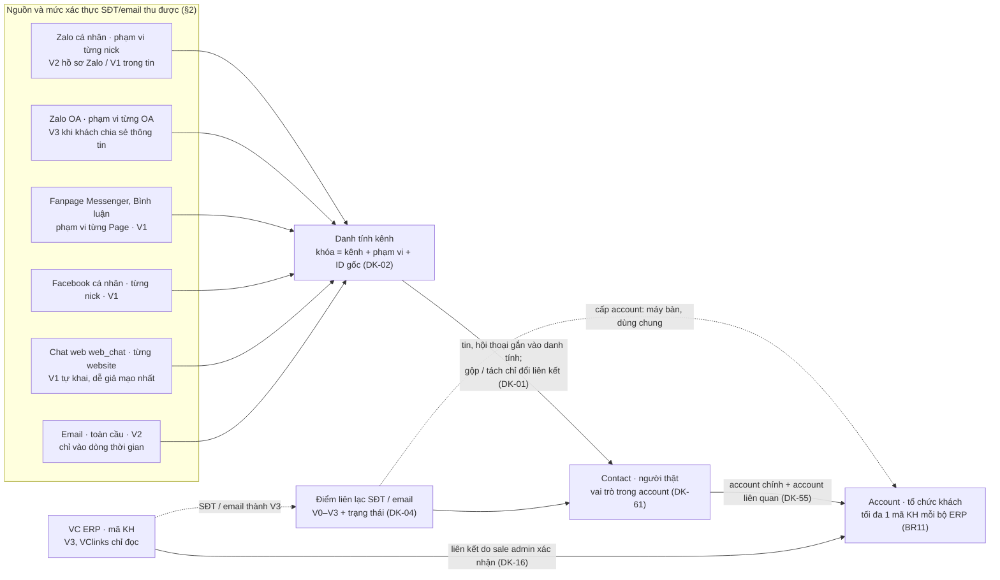
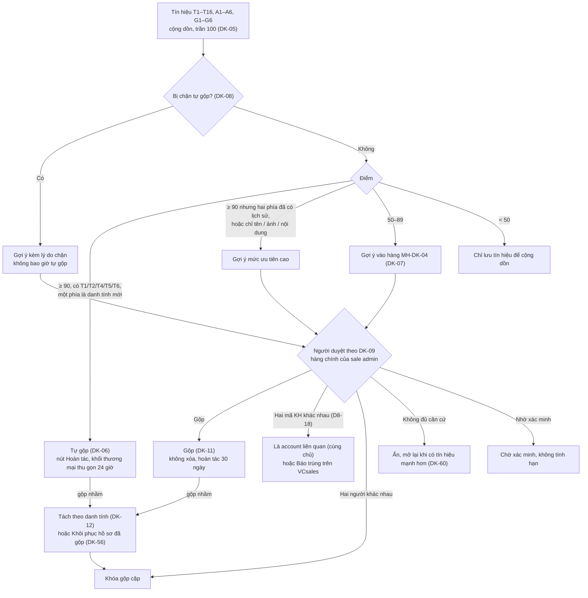
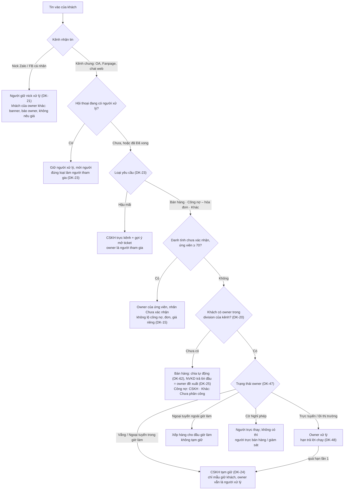
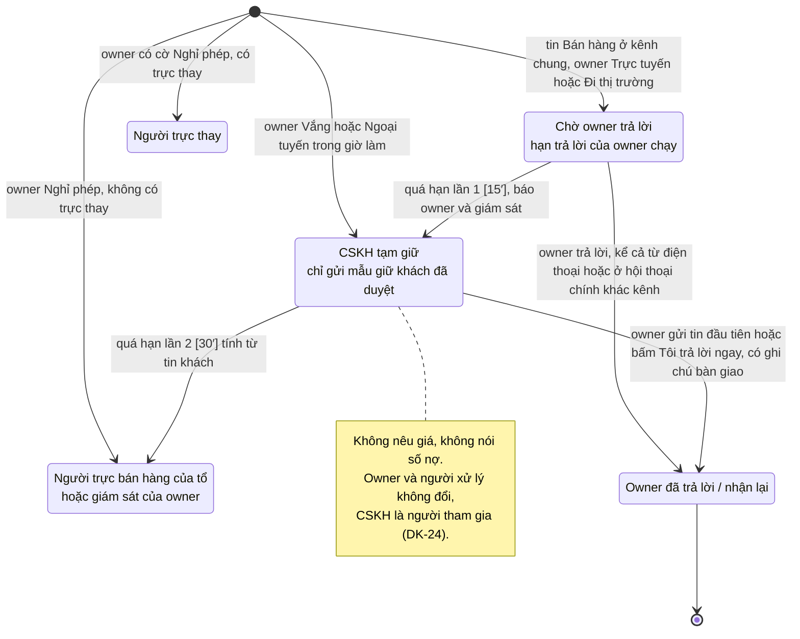

# 02 — Một khách, nhiều kênh: định danh, gộp hồ sơ, định tuyến và Customer 360

Phiên bản 1.5.1 · 04/10/2026 · Trạng thái: Nháp để thống nhất

> Thuộc bộ BA chi tiết VClinks (`docs/02-yeu-cau/`). BA tổng: [../vclinks-ba.md](../vclinks-ba.md) v0.4.
> Sổ xử lý và câu hỏi cho chủ dự án: [`../ra-soat/dac-ta-vong-1/02-xu-ly.md`](../ra-soat/dac-ta-vong-1/02-xu-ly.md); bảng chốt: [`../ra-soat/dac-ta-vong-1/thong-nhat.md`](../ra-soat/dac-ta-vong-1/thong-nhat.md); quyết định chờ chủ dự án: [`../../01-quan-ly-du-an/quyet-dinh-chu-du-an.md`](../../01-quan-ly-du-an/quyet-dinh-chu-du-an.md). Chỗ ghi **[Mới v1.1]** / **[Mới v1.2]**, **[Sửa v1.2]** là phần thêm/sửa ở vòng tương ứng; danh sách việc v1.2 ở **Phụ lục: đồng bộ vòng 1b** cuối file. Chỗ ghi **[Chờ chốt CH-DK-n · QĐ-xx]** phụ thuộc câu hỏi `CH-DK-n` trong sổ đó (v1.2: thêm tiền tố `CH-DK-` theo thong-nhat #26) và mã quyết định tương ứng; tới khi chốt, hệ thống chạy theo phương án ghi ngay tại chỗ (là phương án mặc định).
> Dữ liệu kiểm thử: dùng bộ chung [du-lieu-kiem-thu.md](../../05-kiem-thu/du-lieu-kiem-thu.md) (mã `TD-…`); §3 chỉ còn bảng đối chiếu và dữ liệu đặc thù của file này. NVKD Tổ 1 tên **"Linh"** (không phải "Lan" — Lan là CSKH).
>
> **File này là nguồn chuẩn** cho: định danh khách, mức xác thực SĐT/email, điểm khớp và ngưỡng gộp, gộp/tách hồ sơ, định tuyến khi một khách dùng nhiều kênh, **ngữ nghĩa trạng thái owner đối với định tuyến và tạm giữ** [Sửa v1.2], khóa "đang trả lời" cấp khách, kiểm tra mâu thuẫn trước khi gửi, dòng thời gian hợp nhất và Customer 360.
> Các file khác **dẫn chiếu** mã quy tắc `DK-xx` ở đây, không định nghĩa lại:
> [00 giao diện chung](00-giao-dien-chung.md) (route và menu §2, khung inbox 3 cột, chip kênh, câu chữ chung, **bảng trạng thái người dùng MH-UI-05**) · [01 phân quyền](01-phan-quyen.md) (phạm vi xem, ẩn SĐT, **"Không có quyền" MH-PQ-11**) · [03 sale Zalo cá nhân](03-sale-zalo-ca-nhan.md) · [04 CSKH Zalo OA](04-cskh-zalo-oa.md) · [05 marketing quảng cáo + chatbot web](05-marketing-quang-cao-chatbot.md) (khung gửi Fanpage) · [06 hóa đơn, công nợ](06-hoa-don-cong-no.md).
> Chỗ nào file này và file khác nói khác nhau: về **giao diện chung, route, màu, chip, câu chữ chung** thì 00 thắng, về **quyền và câu "Không có quyền"** thì 01 thắng, về **hóa đơn, công nợ** thì 06 thắng, về **định danh, gộp, định tuyến đa kênh, trạng thái owner và tạm giữ** thì file này thắng (thong-nhat-vong-1, Nguyên tắc 2).

## Mô hình

**Hình 1 — Nguồn, danh tính và hồ sơ ba cấp** (§2, §4.1, §4.2)



**Hình 2 — Từ tín hiệu khớp tới gộp, gợi ý, tách** (§4.4–§4.8, DK-05…DK-12, DK-56, DK-60)



**Hình 3 — Định tuyến tin vào khi khách dùng nhiều kênh** (§5.1–§5.4, bảng §5.2, §5.2a)



**Hình 4 — Hạn trả lời của owner và tạm giữ trên hội thoại Bán hàng ở kênh chung** (§5.2a, DK-24, DK-47, DK-48; số phút theo mặc định đang chờ chốt CH-DK-3)



## Tóm tắt

- **Phạm vi:** nguồn chuẩn cho định danh một khách qua 6 nguồn nhắn (Zalo cá nhân, OA, Fanpage và bình luận, FB cá nhân, chat web, email) cộng VC ERP; gộp / tách hồ sơ; định tuyến đa kênh; ngữ nghĩa trạng thái owner và tạm giữ; khóa "đang trả lời" cấp khách; kiểm tra mâu thuẫn trước khi gửi; dòng thời gian hợp nhất và Customer 360. Gồm quy tắc DK-01…DK-63, 14 màn MH-DK-01…14, 29 story DK-US, 98 ca UAT.
- **Mô hình ba cấp** Account → Contact → Danh tính kênh (DK-01, DK-02): tin gắn với danh tính, gộp / tách chỉ đổi liên kết, không sửa tin; SĐT / email có mức xác thực V0–V3 (DK-04).
- **Gộp an toàn:** chỉ tự gộp khi điểm ≥ 90, có khớp SĐT / email / mã KH, **một phía là danh tính mới** và không bị chặn (DK-06, DK-08); còn lại là gợi ý do sale admin duyệt (DK-09); gộp hoàn tác được 30 ngày, tách theo danh tính, khôi phục hồ sơ đã gộp cả sau 30 ngày (DK-11, DK-12, DK-56).
- **Định tuyến:** nick cá nhân thuộc người giữ nick (DK-21); kênh chung theo loại yêu cầu (DK-22, bảng §5.2); trạng thái owner không bao giờ đổi owner; CSKH tạm giữ chỉ gửi mẫu giữ khách, không nêu giá (DK-24, DK-47, DK-48).
- **Không trả lời trùng, không mâu thuẫn:** khóa trả lời 10 phút cấp contact (DK-27), "Cùng một yêu cầu" ≤ 60 phút (DK-30), ai được nêu giá (DK-31), kiểm tra với "Cam kết đã nêu" 7 ngày của account (DK-32, DK-49); tin gửi từ điện thoại chỉ kiểm tra sau khi gửi (DK-46). Danh tính chưa xác nhận không được lộ công nợ, đơn, giá riêng (DK-15, DK-50).
- **Quyết định đã định hình bản hiện tại:** D8-02, D8-03, D8-04, D8-12, D8-16, D8-17 (v1.4.3), D8-18…D8-20 (v1.4.6: account liên quan / báo trùng VCsales, owner tạm khi gộp hai owner, nhập tay mã KH vừa tạo), D9-01…D9-04 (v1.5: CSKH đọc toàn văn hội thoại của sale, CSKH soạn báo giá → NVKD duyệt); cùng bảng chốt thong-nhat-vong-1.
- **Việc còn mở:** §12 có 16 câu, trong đó câu 16 đã chốt, câu 4 và 7 đã gạch / thay, câu 8 và 10 do dev kiểm chứng → còn **11 câu mở** (1–3, 5, 6, 9, 11–15; câu 13 gom CH-DK-1…7 và ánh xạ sang QĐ / TS, câu 15 là việc đặc tả còn nợ của BA). Đặc tả chạy theo phương án mặc định ghi tại chỗ "[Chờ chốt …]"; DK-36 chưa có ca UAT.
- **Người duyệt cần xem kỹ:** ngưỡng và ngoại lệ tự gộp (§4.5, DK-08), bảng định tuyến §5.2 và §5.2a (Vắng 30′, hạn 15′ / 30′), quyền nêu giá DK-31 ("Xin owner đồng ý", QĐ-46), các nhãn "[Chờ chốt CH-DK-1 · QĐ-05]" còn sót dù 01 D3 v1.5 (D9-04) đã cho CSKH đọc toàn văn, và các câu chữ ghi "(BA đề xuất)" ở MH-DK-04, 05, 08, 11, 12, 14.

## Mục lục

- [0. Hiện trạng code và điểm lệch với BA tổng](#0-hiện-trạng-code-và-điểm-lệch-với-ba-tổng)
- [1. Mục tiêu, phạm vi, thuật ngữ](#1-mục-tiêu-phạm-vi-thuật-ngữ)
- [2. Các nguồn và danh tính của từng nguồn](#2-các-nguồn-và-danh-tính-của-từng-nguồn)
- [3. Kịch bản thực tế (A–M)](#3-kịch-bản-thực-tế)
- [4. Định danh và gộp hồ sơ](#4-định-danh-và-gộp-hồ-sơ)
- [5. Định tuyến khi một khách dùng nhiều kênh](#5-định-tuyến-khi-một-khách-dùng-nhiều-kênh)
- [6. Dòng thời gian hợp nhất và Customer 360](#6-dòng-thời-gian-hợp-nhất-và-customer-360)
- [7. Quy tắc DK-01…DK-63](#7-quy-tắc-dk)
- [8. Đặc tả màn hình MH-DK-01…MH-DK-14](#8-đặc-tả-màn-hình)
- [9. Mô hình dữ liệu bổ sung](#9-mô-hình-dữ-liệu-bổ-sung)
- [10. User story](#10-user-story)
- [11. Kịch bản UAT](#11-kịch-bản-uat)
- [12. Câu hỏi mở](#12-câu-hỏi-mở)
- [Phụ lục: đồng bộ vòng 1b [Mới v1.2]](#phụ-lục-đồng-bộ-vòng-1b-mới-v12)
- [Lịch sử cập nhật](#lịch-sử-cập-nhật)

---

## 0. Hiện trạng code và điểm lệch với BA tổng

### 0.1 Hiện trạng (đọc code ngày 29/09/2026)

| Phần | Hiện trạng | Việc cần làm cho file này |
|---|---|---|
| Kênh (`packages/shared/src/channels.ts`) | 4 kênh: `zalo`, `zalo_oa` (`zoa_`), `fb_page` (`fbp_`), `fb_personal` (`fb_`). Chưa có email, chưa có chat web | Thêm `web_chat` (tiền tố `web_`, **đã chốt** thong-nhat #1; 05 sửa theo, 02 không đổi) và `email` (tiền tố đề xuất `em_`) |
| Liên hệ (`apps/api/src/contacts`) | Mỗi liên hệ là `contacts._id = ${uid}:${userId}`, tức **một danh tính kênh trên một nick/OA/Page**. Chưa có cấp người (Contact) và cấp tổ chức (CustomerAccount) | Collection `contacts` hiện tại trở thành **danh tính kênh**. Thêm `customer_accounts`, `customer_contacts`, `contact_points`, `identity_links`, `merge_suggestions`, `merge_operations` (§9) |
| Hội thoại (`apps/api/src/conversations`) | Hội thoại theo `uid` + `threadId`; lọc theo kênh, tài khoản, chưa đọc. Chưa có người xử lý, chưa có owner | Thêm `assigneeId`, `requestType`, `customerContactId` (suy ra qua danh tính) |
| Giao diện (`apps/web/src/pages/ConversationsPage.tsx`) | 2 cột: danh sách + khung chat. Hồ sơ người gửi mở bằng `SenderModal`. Chưa có panel phải, chưa có trang Khách hàng | Thêm panel phải (MH-DK-02), trang `/customers` (MH-DK-01, 08), hàng gợi ý gộp (MH-DK-04) |
| Zalo cá nhân | Tên và SĐT trong IndexedDB bị mã hóa; tên lấy từ giao diện. SĐT chỉ có khi hồ sơ Zalo hiển thị | SĐT Zalo là tín hiệu **V2** khi thu được, không phải lúc nào cũng có |

### 0.2 Điểm lệch với BA tổng v0.4 (cần chủ dự án chốt)

| # | BA tổng | File này đề xuất | Lý do |
|---|---|---|---|
| L1 | §16: livechat website để GĐ3 | Chat web là **kênh trong phạm vi** (theo yêu cầu mới), mã `web_chat` | Marketing cần chatbot web thu lead; phần định danh phải sẵn từ đầu. Giai đoạn do file 05 và chủ dự án chốt |
| L2 | BR05: tự gộp khi trùng SĐT đã xác thực **hoặc email** | Chỉ tự gộp khi trùng email **đã xác thực** (V2 trở lên). Email khách tự gõ vào form chat web là V1 → chỉ gợi ý | Ai cũng gõ được email người khác vào form |
| L3 | BR05 không có ngoại lệ | Thêm ngoại lệ không tự gộp: SĐT dùng chung, hai mã KH ERP khác nhau, hai owner khác nhau cùng division, cặp đã từng bị tách, nhân viên nội bộ (DK-08) | Tránh gộp nhầm vợ/chồng, số tổng đài garage, số bị nhà mạng cấp lại |
| L4 | BR01 / F3.8: "Đang được [NV] trả lời" ở cấp **hội thoại** | Thêm khóa mềm ở cấp **khách** (contact) và chỉ báo ở cấp account (DK-27) | Một khách mở 2–3 hội thoại ở các kênh khác nhau cùng lúc |
| L5 | F12.3: hội thoại mới tự về owner | Nick cá nhân: người xử lý luôn là **người giữ nick** (DK-21). Kênh chung (OA, Fanpage, chat web): theo **loại yêu cầu** (DK-22) | Không thể gửi qua nick của người khác; CSKH cần giữ bảo hành, khiếu nại |
| L6 | §21 câu 10: CSKH có trả lời trực tiếp khách của NVKD không | Đề xuất: **có**, với yêu cầu hậu mãi (có ticket, khớp 01 D4); **không** nêu giá, không gửi báo giá (DK-31). [Mới v1.1] CSKH luôn thấy khối "Cam kết đã nêu" (DK-49); đọc **toàn văn** hội thoại của sale với khách đang xử lý: **[Chờ chốt CH-DK-1 · QĐ-05]** | Để chủ dự án chốt |
| L7 | §8 `IdentityMergeSuggestion` gắn một danh tính với một contact ứng viên | Gợi ý gộp giữa **hai contact** (hoặc contact ↔ account), kèm danh sách tín hiệu và điểm | Hai hồ sơ đều có thể đã có nhiều danh tính |
| L8 | Không có mức xác thực chi tiết | 4 mức V0–V3 cho SĐT/email (DK-04) | Ngưỡng gộp dựa vào mức xác thực |
| L9 | F12.2: một owner mỗi division, không nói lead | Lead chưa mua: người đầu tiên **trả lời** lead trở thành owner đề xuất; ưu tiên người đã chăm lead trong 7 ngày (DK-25) | Tránh hai sale tranh lead từ quảng cáo |
| L10 | BR05: tự gộp chỉ khi SĐT đã xác thực | Cho tự gộp khi SĐT V2 (hồ sơ Zalo) trùng SĐT V1 **và** cùng người phụ trách hai phía (kịch bản A, T12) | Sale tự kết bạn Zalo với lead của mình là việc hằng ngày; bắt duyệt tay sẽ làm đầy hàng gợi ý. **[Chờ chốt QĐ-57]**, mặc định A (cho tự gộp) |
| L11 [Mới v1.1] | BR05: trùng SĐT đã xác thực → tự gộp | **Chặt hơn BR05**: chỉ tự gộp khi **một phía là danh tính mới** (DK-06); hai hồ sơ đã có lịch sử luôn qua người duyệt | Gộp nhầm hai hồ sơ đã có lịch sử làm lộ công nợ, báo giá (góp ý P-SA #1, kịch bản F1). Chặt hơn BR05 nên không cần chốt lại, chỉ báo để biết |
| L12 [Mới v1.1] | §4.1 BA: một người thuộc một account | Một contact có **một account chính** và có thể **liên quan** tới account khác (DK-55) | Chủ có 2 xưởng, thợ làm 2 garage, người mua hàng cho nhiều garage |

---

## 1. Mục tiêu, phạm vi, thuật ngữ

### 1.1 Mục tiêu

1. **Nhận ra một khách** dù khách nhắn từ 6 nguồn khác nhau, mỗi nguồn cấp một ID riêng.
2. **Đúng người trả lời**: yêu cầu bán hàng về owner, hậu mãi về CSKH, không ai "giật" khách của người khác.
3. **Không trả lời trùng, không mâu thuẫn**: hai nhân viên không cùng trả lời một câu hỏi; không báo hai giá khác nhau.
4. **Một màn hình cho mọi thứ về khách**: Customer 360 với dòng thời gian xen kẽ mọi kênh.
5. **Gộp an toàn, tách được**: không gộp nhầm; gộp nhầm thì tách lại không mất tin.

### 1.2 Phạm vi

| Trong phạm vi | Ngoài phạm vi (file khác) |
|---|---|
| Mô hình Account / Contact / Danh tính kênh / Điểm liên lạc | Chi tiết khung chat Zalo (03), OA (04), Fanpage + chatbot (05) |
| Tín hiệu khớp, điểm, ngưỡng, gộp, tách, gắn tay, nhật ký | Quyền xem chi tiết từng vai trò (01) |
| Định tuyến khi khách đã có hồ sơ và nhắn thêm kênh mới | Quy tắc chia khách mới hoàn toàn (vòng tròn, khu vực): F4.1 BA tổng, màn cấu hình ở **07 MH-RT-01…06** (v1.4.1) |
| Khóa "đang trả lời" cấp khách, cảnh báo đa kênh, kiểm tra mâu thuẫn trước khi gửi | Nội dung kịch bản chatbot (05) |
| Dòng thời gian hợp nhất, Customer 360, panel 360 rút gọn | Báo cáo marketing theo quảng cáo (05) — file này chỉ quy định **giữ nguồn** khi gộp |
| Liên kết mã KH VC ERP (chỉ đọc) | Tạo mã KH trên VCsales (làm trên VCsales) |

### 1.3 Thuật ngữ

| Thuật ngữ | Nghĩa | Ví dụ |
|---|---|---|
| **Account** (`CustomerAccount`, "Khách hàng") | Tổ chức khách. Liên kết tối đa **một mã KH ở mỗi bộ VC ERP** (BR11). Khách lẻ là account có một contact | Garage Minh Phát (KH-TEST-0101) |
| **Contact** ("Người liên hệ") | Một **người thật** thuộc account | Anh Tuấn (chủ), anh Hùng (thợ), chị Nga (kế toán) |
| **Danh tính kênh** (`ChannelIdentity`) | Một ID do nền tảng cấp cho một người, **trong một phạm vi**. Khóa = (kênh, phạm vi, ID gốc) | userId Zalo của anh Tuấn **trên nick Minh VCparts** |
| **Phạm vi** | Nơi ID có nghĩa: một nick Zalo, một OA, một Page, một website, toàn cầu (email) | Cùng anh Tuấn có 2 userId Zalo trên 2 nick |
| **Điểm liên lạc** (`ContactPoint`) | SĐT hoặc email của contact, kèm mức xác thực V0–V3, nguồn, trạng thái (đang dùng / ngừng dùng / dùng chung) | 0900 000 101, V3, nguồn OA chia sẻ thông tin |
| **Hội thoại** | Chuỗi tin giữa **một danh tính** (hoặc một nhóm) và **một kênh của công ty** (nick/OA/Page/website). Email không tạo hội thoại inbox | Hội thoại OA VCparts ↔ anh Tuấn |
| **Owner** ("Người phụ trách") | NVKD sở hữu account **trong một division** (BR09). Đọc từ VCsales nếu có trường "NV phụ trách" (Q1) | Minh là owner VCparts của Garage Minh Phát |
| **Người xử lý** ("Người đang xử lý", assignee) | Người trả lời chính của **một hội thoại** tại một thời điểm (BR01). Có thể khác owner | Thu (CSKH) xử lý hội thoại OA về bảo hành |
| **Người giữ nick** | Nhân viên được giao nick Zalo/FB cá nhân của công ty | Hải giữ nick "Hải VCparts" |
| **Người tham gia** | Người được mời vào hội thoại để trả lời phụ (không phải người xử lý chính) | Minh tham gia hội thoại OA để báo giá |
| **Loại yêu cầu** | Nhãn của hội thoại: Bán hàng / Hậu mãi / Công nợ – hóa đơn / Khác | "Bơm nước bị rò" = Hậu mãi |
| **Khóa trả lời** | Dấu "Đang được [NV] trả lời" trên **contact**, sống 10 phút từ thao tác cuối | "Minh đang trả lời trên Zalo · 2 phút trước" |
| **Cùng một yêu cầu** | Hai tin ở hai kênh, cách nhau ≤ 60 phút, cùng ý (cùng mã hàng / cùng câu hỏi) | Hỏi giá giảm xóc trên 2 nick trong 20 giây |
| **Gợi ý gộp** | Đề xuất hai contact là một người (hoặc contact thuộc account) kèm điểm và lý do; người duyệt | Điểm 80: trùng SĐT tự khai + cùng tên |
| **Nguồn khách** | Điểm chạm đầu tiên (kênh, quảng cáo, bài viết, trang web) | Quảng cáo CTM "Má phanh Vios" |
| **Tin gửi ngoài VClinks** [Mới v1.1, Sửa v1.2] | Tin do tài khoản kênh công ty gửi ngoài VClinks, đồng bộ về VClinks (03 SZ-21, SZ-22). Mã dữ liệu `sendSource = ngoai_vclinks`. **Nhãn hiển thị theo 00 §3.3a** (thong-nhat #11): nick cá nhân → **"Gửi từ điện thoại"**; OA → "Gửi từ trang quản lý OA"; Fanpage → "Gửi từ Meta Business Suite". **Tính là đã trả lời**, bật khóa trả lời, được trích cam kết (DK-46) | Minh trả lời anh Tuấn bằng điện thoại lúc 14:02, bong bóng mang nhãn "Gửi từ điện thoại" |
| **Trạng thái owner** [Mới v1.1, Sửa v1.2] | Một bảng duy nhất ở **00 MH-UI-05** (tên, mã, cách bật): **Trực tuyến · Đi thị trường · Vắng · Ngoại tuyến**. **Nghỉ phép** là **cờ** lấy từ trực thay (01 PQ-32), không phải trạng thái online. File này quy định **ngữ nghĩa định tuyến** của từng trạng thái (DK-47). "Hoạt động" gồm cả tin gửi từ điện thoại | Minh "Đi thị trường" buổi chiều |
| **Hạn trả lời của owner** [Mới v1.1] | Thời gian owner phải trả lời hội thoại bán hàng trên kênh chung (OA, Fanpage, chat web) (DK-48) | [Sửa v1.3] Lần 1: 15 phút, lần 2: 30 phút trong giờ làm, tính từ tin khách **[Chờ chốt CH-DK-3 · QĐ-06, TS-05, TS-06]** |
| **Cam kết đã nêu** [Mới v1.1] | Giá, chiết khấu, ngày hẹn, cam kết đổi/trả, tồn kho mà nhân viên đã nói với khách, hệ thống trích ra từ tin và ticket (`stated_commitments`) | "Đổi mới bơm nước, miễn phí · Zalo·Minh · 14:20" |
| **Người nói thay** [Mới v1.1] | Người dùng danh tính kênh của người khác để nhắn (chồng dùng Zalo của vợ) (DK-53) | Anh Bình nhắn từ Zalo của chị Hoa |
| **Account liên quan** [Mới v1.1] | Account khác mà một contact cũng mua hàng cho (DK-55) | Anh Khoa có hai xưởng |
| **Tạm giữ** [Mới v1.2] | CSKH trực kênh giữ khách trên hội thoại bán hàng / công nợ ở kênh chung khi owner **Vắng / Ngoại tuyến** trong giờ làm hoặc **quá hạn trả lời**: **chỉ gửi mẫu giữ khách đã duyệt**, không nêu giá, không nói số nợ; owner và người xử lý **không đổi** (DK-24, thong-nhat #3) | Thu gửi mẫu `/giu-khach` cho anh Tuấn lúc Minh quá hạn |
| **Người liên hệ thanh toán** [Mới v1.2] | Contact của account có vai trò **"Kế toán / Thanh toán"** và cờ **"Nhận nhắc nợ, hóa đơn"** (§4.13a); người nhận mặc định của ZNS nhắc thanh toán, đối chiếu công nợ, hóa đơn (04 OA-15, 06 HD-29) | Chị Nga, kế toán Garage Minh Phát |

### 1.4 Chip kênh [Sửa v1.2: bỏ cột màu, theo 00 §3.2]

**Màu, chữ ngắn và icon của chip kênh theo 00 §3.2** (thong-nhat #12); file này không định nghĩa màu. Các màn MH-DK cần chip kèm tên tài khoản kênh (vd. `Zalo · Minh VCparts`) dùng **biến thể "chip + tên tài khoản kênh"** do 00 định nghĩa; bảng dưới chỉ ghi phần chữ sau dấu "·" mà màn MH-DK hiện.

| Kênh | Chip (theo 00 §3.2) | Phần tên tài khoản kênh đi kèm (biến thể 00) |
|---|---|---|
| Zalo cá nhân | "Zalo" | tên nick |
| Zalo OA | "OA" | tên OA |
| Fanpage Messenger | "Fanpage" | tên Page |
| Bình luận Fanpage | "Bình luận" | tên Page |
| Facebook cá nhân | "FB" | tên nick |
| Chat web (`web_chat`) | "Web" | tên miền |
| Email | "Email" | hộp thư |
| VC ERP (sự kiện, không phải kênh) | `VCsales` / `VCinvoice` / `VCdms` | – (chip sự kiện, màu theo 00) |
| Ghi chú nội bộ | `Ghi chú` | – (màu theo 00) |

---

## 2. Các nguồn và danh tính của từng nguồn

| Nguồn | Mã kênh | Khóa danh tính | Phạm vi | SĐT / email thu được | Mức xác thực | Division của hội thoại |
|---|---|---|---|---|---|---|
| Zalo cá nhân | `zalo` | userId Zalo | **Từng nick** | SĐT khi hồ sơ Zalo hiển thị; SĐT trong tin; danh thiếp khách gửi | V2 (hồ sơ Zalo) / V1 (trong tin) | Division của nick |
| Zalo OA | `zalo_oa` | user_id OA | **Từng OA** | SĐT, tên, địa chỉ khi khách bấm **chia sẻ thông tin** | **V3** | Division của OA |
| Fanpage Messenger | `fb_page` | PSID | **Từng Page** | Không có; SĐT trong tin; form quảng cáo lead (nếu 05 dùng) | V1 | Division của Page |
| Bình luận Fanpage | `fb_page` (loại `comment`) | ID người bình luận theo Page | Từng Page | SĐT trong bình luận | V1 | Division của Page |
| Facebook cá nhân | `fb_personal` | ID Facebook | Từng nick | Không có; SĐT trong tin | V1 | Division của nick |
| Chat web | `web_chat` (mới) | `visitorId` (cookie của widget) | **Từng website** | Tên, SĐT, email khách **tự gõ** vào form trước khi chat | V1 | Division của website |
| Email | `email` | Địa chỉ email | Toàn cầu | Địa chỉ người gửi thật của thư | V2 (địa chỉ gửi thư thật) | Không tạo hội thoại inbox; chỉ dòng thời gian |
| VC ERP | – (không phải kênh) | Mã KH | Từng bộ ERP | SĐT, email trong hồ sơ KH đã xác nhận | **V3** | – |

**Hệ quả:**
- Cùng một người có ít nhất **một ID khác nhau ở mỗi phạm vi**. Không bao giờ so ID nền tảng giữa hai phạm vi (DK-02).
- Chỉ **OA** và **ERP** cho SĐT mức V3. Zalo cá nhân cho V2 khi may mắn. Fanpage, FB cá nhân, chat web chỉ cho V1.
- Chat web là nguồn **dễ giả mạo nhất**: khách gõ gì cũng được. Không tự gộp, không lộ dữ liệu thương mại cho tới khi xác nhận (DK-15).

---

## 3. Kịch bản thực tế

Dữ liệu kiểm thử: dùng bộ chung [du-lieu-kiem-thu.md](../../05-kiem-thu/du-lieu-kiem-thu.md) (mã `TD-…`). [Sửa v1.4] Bảng nhân viên và bảng khách riêng của file này đã bỏ; tên cũ ghi trong ngoặc để truy vết, giữ một phiên bản.

**Đối chiếu tên / mã trong file này → TD**

| Trong kịch bản và UAT | Mã TD | Ghi chú |
|---|---|---|
| Minh — NVKD Tổ 1, nick "Minh VCparts" | TD-U-KD1, TD-NK01 | Tổ 1 = TD-DV-HN1, Tổ 2 = TD-DV-HN2 |
| Linh — NVKD Tổ 1, nick "Linh VCparts" | TD-U-KD2, TD-NK02 | Người trực thay mặc định của Minh và Tú |
| Hải — NVKD Tổ 2, nick "Hải VCparts" | TD-U-KD4, TD-NK04 | – |
| Tú — NVKD Tổ 1, nick "Tú VCparts" | TD-U-KD3, TD-NK03 | Nghỉ phép, trực thay Linh (TD-KB14) |
| Toàn — NVKD Tổ 2 nghỉ việc (UAT-DK-67; trước v1.4 ghi "Hải") | TD-U-KD5 | TD-KB13 |
| Hương — GS Tổ 1 (trước v1.4: Quang) | TD-U-GS1 | – |
| Đức — GS Tổ 2 (trước v1.4: Dũng) | TD-U-GS2 | – |
| Thắng — GĐ bán hàng VCparts (trước v1.4: Hòa) | TD-U-GD | – |
| Thu — CSKH VCparts | TD-U-CS2 | Trực TD-OA1 "VCparts", TD-FP1 "VCparts Phụ tùng ô tô", TD-WEB1 `thu.vcparts.vn` |
| Ngọc — Sale admin VCparts | TD-U-SA | – |
| Trang — tư vấn tuyển sinh VCedu (trước v1.4: NVKD VCsoft) | TD-U-KDE | Trực TD-OA2 "VCedu" (trước v1.4: OA "VCgarage") |
| Garage Minh Phát (trước v1.4: Garage Tuấn Phát): anh Tuấn (chủ), anh Hùng (thợ), chị Nga (Kế toán / Thanh toán), máy bàn `0900 000 100` | TD-K01, TD-C01a, TD-C01b, TD-C01c | `KH-TEST-0101`; email chị Nga `nga.minhphat@example.vn`; nhóm Zalo TD-G02 "Minh Phát – VCparts" |
| Chị Phạm Thị Mai (lead Fanpage) | TD-K02, TD-L01 | – |
| Garage Minh Khoa / Garage Minh Khoa 2 (anh Ngô Minh Khoa) | TD-K03 / TD-K04 | Nợ quá hạn 20 ngày TD-CN3; đơn `DH-TEST-221` = TD-DH5 |
| Anh Hoàng Văn Nam (đổi SĐT) | TD-K05 | – |
| Anh Bình, chị Hoa (vợ chồng dùng chung SĐT) | TD-K06 | – |
| Garage Hưng Thịnh (anh Hưng) | TD-K07 | – |
| Garage Đại Phát (anh Phát, thợ Đạo học viên) | TD-K08 | `KH-TEST-0701` (VCsales) · `HV-TEST-0702` (VCedu; trước v1.4: `GR-TEST-0701` VCgarage) |
| Garage An Phú / Garage An Khang, chị Vân | TD-K10a / TD-K10b | TD-KB11 |
| Anh Đặng Văn Lực (khách ngủ đông) | TD-K11 | – |
| Garage Hòa Bình (khách Tổ 2, UAT-DK-66) | TD-K12 | – |
| Báo giá `BG-2026-0915` (trước v1.4: `BG-TEST-015`) | TD-BG1 | – |
| Ticket bảo hành `TK-0145` (trước v1.4: `BH-TEST-001`) | TD-TK0145 | – |
| Hộp thư chung `sales.uat@vcprosperous.com` (trước v1.4: `sales@vcprosperous.com`) | TD-EM1 | – |
| Quảng cáo "Má phanh Vios" (trước v1.4: `QC-TEST-01`) | TD-CD1, ad `120210000000000001` | – |

**Dữ liệu đặc thù của file này** (chưa có trong bộ chung; mã `TD-` đánh dấu *đề xuất* chờ gộp vào `../../05-kiem-thu/du-lieu-kiem-thu.md`)

| Mã | Nội dung | Dùng ở |
|---|---|---|
| TD-CD5 *(đề xuất; trước v1.4: `QC-TEST-02`)* | Chiến dịch có **150 gợi ý gộp**: 30 người × 4 hồ sơ, mỗi người 3 gợi ý nối nhau (90 gợi ý, 30 cụm) + 60 cặp đơn | UAT-DK-19, 45 |
| TD-CD6 *(đề xuất; trước v1.4: `QC-TEST-03`)* | Điểm chạm quảng cáo Zalo của hồ sơ Zalo "Mai Phạm" (TD-K02), ngày 20/09 (trong cửa sổ 30 ngày trước ngày tạo lead 01/10) | UAT-DK-74 |
| – | [v1.4.1] Lịch làm việc division VCparts theo **TS-01 và TD §2.2: T2–T7 08:00–17:30, không nghỉ trưa** (UAT-DK-40 chạy 10:00–10:30, UAT-DK-72 ngoài giờ: không phụ thuộc nghỉ trưa). Lịch có nghỉ trưa vẫn cấu hình được (§5.2a), chỉ dùng khi ca ghi rõ | UAT-DK-40, 72 |
| – | Bảng phí hậu mãi thử có "Phí vận chuyển đổi hàng 50.000đ" | §11.4 |
| – | Khách sinh thêm cho ca số lượng: 10 khách của Minh dùng ≥ 2 kênh (UAT-DK-43), 20 khách mới chưa liên kết mã KH (UAT-DK-53), ba hồ sơ A, B, C tự gộp nối nhau (UAT-DK-47) | §11.4 |
| – | Email thử chuẩn hóa: `Tuan.Tran+xe@Gmail.com` ↔ `tuantran@gmail.com` (giữ `gmail.com` vì quy tắc §4.3 chỉ áp cho `gmail.com`), `info@hungthinh.example.vn` | UAT-DK-76 |

> Giờ trong mọi kịch bản là giờ Việt Nam (Asia/Ho_Chi_Minh). "Hệ thống" = VClinks.

### Kịch bản A — Lead quảng cáo Fanpage → để SĐT → hôm sau nhắn Zalo cá nhân

**Thứ Hai 05/10/2026**

| Giờ | Khách làm | Hệ thống xử lý |
|---|---|---|
| 09:02 | Chị Mai bấm quảng cáo Click-to-Messenger "Má phanh Vios giá tốt", nhắn Page: "Má phanh trước Vios 2019 bao nhiêu shop?" | Webhook nhận tin kèm `ad_id`. Tạo account lẻ + contact "Mai Phạm" (tên Facebook) + danh tính `fb_page` (PSID, phạm vi Page VCparts). **Nguồn khách** = quảng cáo `ad_id`. Chưa có owner → loại yêu cầu "Bán hàng" → chia tự động (F4.1) → **Linh**. Chatbot Page gửi tin chào đã duyệt |
| 09:05 | – | Linh trả lời, xin SĐT và đời xe. Linh là người xử lý; vì là người đầu tiên trả lời lead → **owner đề xuất = Linh** (DK-25) |
| 09:07 | Chị Mai: "0900 000 201, xe Vios G 2019" | Nhận diện SĐT (F5.3) → điểm liên lạc 0900 000 201 mức **V1**, nguồn "tin Fanpage 09:07". Tra ERP và hồ sơ khác: không trùng → không gợi ý |
| 09:12 | – | Linh tra nhanh (F9.1), nhắn: "Má phanh trước Vios 2019 hàng Advics giá 650.000đ/bộ ạ". Hệ thống ghi **giá đã nêu**: mã hàng, 650.000đ, kênh Fanpage (dùng cho kiểm tra mâu thuẫn, DK-32) |

**Thứ Ba 06/10/2026**

| Giờ | Khách làm | Hệ thống xử lý |
|---|---|---|
| 08:40 | – | Linh dùng nick "Linh VCparts" tìm SĐT 0900 000 201, gửi lời mời kết bạn |
| 08:52 | Chị Mai chấp nhận; nhắn "Chị Mai đây em, hôm qua hỏi má phanh" | Tạo danh tính `zalo` (phạm vi nick Linh). Hồ sơ Zalo hiện SĐT 0900 000 201 → **V2**. Tính điểm: SĐT V2↔V1 = 70; cùng người phụ trách hai phía (Linh) +20; danh tính mới xuất hiện ≤ 72 giờ sau SĐT +10 → **100**, không có tín hiệu âm → **tự gộp** (DK-06). Linh thấy thông báo: "Đã gộp Zalo "Mai Phạm" vào hồ sơ Phạm Thị Mai (trùng SĐT 0900 *** 201). Hoàn tác". Nguồn khách vẫn là quảng cáo (DK-13) |
| 08:55 | – | Khung chat Zalo của Linh: panel phải hiện "Khách đang hoạt động ở: Zalo · Linh VCparts (vừa xong) · Fanpage · VCparts Phụ tùng ô tô (hôm qua 09:12, cửa sổ 24h đã đóng)". Dòng thời gian có vạch "Khách chuyển từ Fanpage sang Zalo (sau 23 giờ 40 phút)" |

**Biến thể A2 — chị Mai tự tìm nick của Hải (Tổ 2) lúc 06/10 09:10:**
- Điểm: SĐT V2↔V1 = 70; +10 (≤ 72 giờ); người phụ trách khác nhau → không cộng → **80 → gợi ý**, không tự gộp.
- Hải là người giữ nick → Hải xử lý hội thoại Zalo đó (DK-21). Banner vàng trong khung chat của Hải: "Có thể là lead của Linh (Fanpage, hôm qua 09:07). Xem gợi ý gộp".
- Gợi ý vào hàng của **Ngọc** (sale admin) và báo **Hương** (giám sát của Linh) vì liên quan hai người phụ trách (DK-09).
- Duyệt gộp → contact có 2 danh tính; **owner giữ là Linh** vì Linh chăm lead trước trong 7 ngày (DK-25). Hải nhận gợi ý tin chuyển: "Dạ chị Mai, bạn Linh bên em đang theo đơn má phanh của chị, em báo Linh nhắn chị ngay ạ."

### Kịch bản B — Khách của sale nhắn OA hỏi bảo hành trong lúc đang chat giá với sale trên Zalo

**Thứ Tư 07/10/2026.** Garage Minh Phát, owner Minh. Danh tính OA của anh Tuấn đã liên kết từ trước (V3, anh Tuấn đã chia sẻ thông tin trên OA).

| Giờ | Khách làm | Hệ thống xử lý |
|---|---|---|
| 14:00 | Anh Tuấn nhắn nick Minh: "Báo giá bộ côn Hilux 2017 máy dầu" | Hội thoại Zalo, người xử lý Minh. Loại yêu cầu "Bán hàng" |
| 14:02 | – | Minh gõ trả lời → **khóa trả lời** trên contact Tuấn: "Minh đang trả lời trên Zalo" (DK-27) |
| 14:05 | Anh Tuấn nhắn OA VCparts: "Bơm nước lấy tuần trước bị rò, bảo hành sao em?" + 1 ảnh | OA thuộc VCparts, khách có owner Minh. Phân loại "Hậu mãi" → người xử lý **Thu** (CSKH trực OA), gợi ý mở ticket (DK-22). Thông báo cho Minh: "Garage Minh Phát vừa nhắn OA về bảo hành. Thu đang xử lý" (DK-33) |
| 14:06 | – | Khung chat OA của Thu: banner xanh "Khách đang được Minh trả lời trên Zalo · 4 phút trước (báo giá bộ côn)". Panel phải: "Khách đang hoạt động ở: Zalo · Minh VCparts (6 phút trước, đang mở) · OA · VCparts (vừa xong, cửa sổ còn 47 giờ 59 phút)" |
| 14:08 | – | Thu mở ticket bảo hành TK-0145, trả lời trên OA xin số hóa đơn |
| 14:10 | Anh Tuấn nhắn OA: "Tiện báo luôn giá bộ côn nhé" | Tin bị phân loại "Bán hàng", trùng ý với tin Zalo 14:00 → đánh dấu **Cùng một yêu cầu** (DK-30). Thu thấy: "Yêu cầu này đang được Minh xử lý trên Zalo." Gợi ý tin: "Dạ bộ côn anh Minh đang làm báo giá, anh Minh gửi anh qua Zalo ngay ạ." Thu không được nêu giá (DK-31) |
| 14:11 | – | Thu bấm gửi tin gợi ý trên OA. Minh nhận thông báo và ghi chú nội bộ tự động trên hội thoại Zalo |
| 14:15 | – | Minh gửi báo giá BG-2026-0915 (PDF) qua Zalo. Dòng thời gian: "Đã gửi báo giá BG-2026-0915 · 8.450.000đ · Zalo · Minh" |
| 14:20 | – | Minh gõ trên Zalo "Bơm nước em đổi mới luôn cho anh". **Kiểm tra trước khi gửi** (DK-32): "Khách có ticket bảo hành TK-0145 do Thu xử lý. Cam kết đổi mới cần thống nhất với CSKH." Minh chọn "Sửa tin" hoặc "Vẫn gửi (ghi lý do)" |
| 14:20 [Mới v1.1] | – | Nếu Minh "Vẫn gửi": **Thu (người giữ ticket) nhận thông báo ngay**; ticket TK-0145 tự có ghi chú nội bộ "Minh đã hứa qua Zalo 14:20: đổi mới bơm nước · lý do: …"; khối "Cam kết đã nêu" trên panel của Thu cập nhật (DK-49) |

**Biến thể B2 [Mới v1.1] — Minh trả lời bằng app Zalo trên điện thoại.** 14:02 Minh đang ở garage, trả lời anh Tuấn bằng điện thoại: "Bộ côn Hilux 2017 máy dầu em báo anh 8.450.000đ nhé". Tin đồng bộ về VClinks lúc 14:02:40 với nhãn **"Gửi từ điện thoại"** (00 §3.3a; mã dữ liệu `sendSource = ngoai_vclinks`, 03 SZ-22) [Sửa v1.2].
- Hội thoại Zalo·Minh rời "Chưa trả lời", tính là đã trả lời (03 SZ-21).
- **Khóa trả lời** bật trên contact Tuấn, tính từ giờ gửi 14:02, người giữ khóa là Minh (DK-46). 14:05 Thu mở hội thoại OA thấy banner "Khách đang được Minh trả lời trên Zalo·Minh VCparts · 3 phút trước (Bán hàng · bộ côn)".
- Giá 8.450.000đ vào **cam kết đã nêu** (DK-46). Người khác báo lệch sẽ bị modal 09B như thường.
- 14:20 Minh hứa "đổi mới luôn" **từ điện thoại**: VClinks không chặn được trước khi gửi. Khi tin đồng bộ về, hệ thống kiểm tra sau: Minh nhận cảnh báo "Tin bạn gửi từ điện thoại lúc 14:20 khác ticket TK-0145 do Thu xử lý"; Thu nhận thông báo và ticket có ghi chú tự động như dòng 14:20 ở trên. **Kiểm tra với tin từ điện thoại chỉ là cảnh báo sau khi gửi.**

### Kịch bản C — Chủ và thợ của cùng một garage nhắn hai nick khác nhau

**Thứ Năm 08/10/2026.** Anh Hùng (thợ Minh Phát) chưa có hồ sơ. Anh Hùng có trong nhóm Zalo "Minh Phát – VCparts" (thành viên: Tuấn, Hùng, Minh).

| Giờ | Khách làm | Hệ thống xử lý |
|---|---|---|
| 10:00 | Anh Hùng nhắn nick Hải: "Anh ơi em bên garage Minh Phát, lấy cho em cặp rô-tuyn lái ngoài Fortuner 2016" | Danh tính mới trên nick Hải, contact mới "Hùng Lê", không SĐT. Tín hiệu **cấp account**: tin nhắc tên account "Minh Phát" (+30); cùng nhóm Zalo với contact của account (+40) → **70 → gợi ý "Thêm vào account Garage Minh Phát (người liên hệ mới)"** (DK-10). Không phải gợi ý gộp với anh Tuấn |
| 10:00 | – | Hải xử lý (người giữ nick). Banner vàng: "Có thể thuộc Garage Minh Phát (owner: Minh). Xem gợi ý" |
| 10:02 | Anh Tuấn nhắn nick Minh: "Thằng Hùng bên anh hỏi rô-tuyn đấy, báo giá đi" | Hệ thống ghi tín hiệu thêm: tin của contact trong account nhắc tên "Hùng" (+10) → gợi ý lên **80**. Minh là owner → Minh duyệt được (DK-09) |
| 10:04 | – | Minh bấm "Thêm vào account". Anh Hùng thành contact của Garage Minh Phát, vai trò "Thợ". Hội thoại trên nick Hải gắn nhãn "Khách của Minh" |
| 10:08 | – | Minh báo giá trên Zalo cho anh Tuấn: 1.150.000đ/cặp |
| 10:10 | – | Hải gõ cho anh Hùng "1.200.000đ một cặp nhé". Kiểm tra trước khi gửi ở **cấp account** (DK-32): "Minh vừa báo giá 1.150.000đ cho cùng mã hàng với Trần Văn Tuấn (Zalo, 10:08). Giá bạn nhập: 1.200.000đ." Hải chọn "Dùng mẫu chuyển cho owner" |
| 10:11 | – | Hải gửi: "Dạ anh Minh vừa báo giá anh Tuấn rồi ạ, em chuyển anh Minh chốt với anh nhé." |

**Kết quả:** Account có 2 contact; Customer 360 → "Người liên hệ" hiện: Tuấn (Chủ, Zalo·Minh, OA), Hùng (Thợ, Zalo·Hải). Panel của Minh: "Người cùng garage đang hoạt động: Lê Văn Hùng · Zalo · Hải VCparts · 1 phút trước".

### Kịch bản D — Khách nhắn cùng lúc hai nick của hai sale khác tổ

**Thứ Sáu 09/10/2026.** Anh Hưng (Garage Hưng Thịnh), owner Minh (Tổ 1). Anh Hưng kết bạn nick Hải (Tổ 2) từ năm ngoái. Hai danh tính Zalo đã gộp (V2 cùng SĐT 0900 000 601).

| Giờ | Khách làm | Hệ thống xử lý |
|---|---|---|
| 15:00:00 | Anh Hưng nhắn nick Minh: "Giảm xóc trước Ranger 2020 bao nhiêu?" | Hội thoại Zalo·Minh, người xử lý Minh |
| 15:00:20 | Gửi y hệt cho nick Hải | Hội thoại Zalo·Hải, người xử lý Hải (người giữ nick). Hệ thống: **Cùng một yêu cầu** với tin 15:00:00. Khung chat của Hải: banner đỏ "Khách của Minh (Tổ 1). Cùng câu hỏi đã gửi tới Minh lúc 15:00." Minh nhận thông báo: "Vũ Văn Hưng cũng hỏi Hải (Tổ 2) cùng câu hỏi" |
| 15:02 | – | Hải gõ "2.200.000đ/cái anh nhé". Kiểm tra trước khi gửi: "Bạn không phải owner của khách này. Nêu giá cho khách của người khác cần owner hoặc giám sát đồng ý." Ba lựa chọn: "Gửi tin chuyển cho owner" · "Xin nhận khách" · "Vẫn gửi (ghi lý do)" (DK-31) |
| 15:03 | – | Hải chọn "Vẫn gửi", lý do "Khách quen của em từ 2025". Tin đi. Hệ thống tạo mục **Xung đột owner**; vì khác tổ → vào hàng của **Thắng**, báo Hương và Đức (DK-34) |
| 15:04 | – | Minh báo giá 2.350.000đ/cái. Kiểm tra: "Hải vừa nêu 2.200.000đ cho cùng mã hàng (Zalo·Hải, 15:03)." Minh xem, chọn gửi kèm lý do "giá chính sách khách hạng B" |
| 15:30 | – | Thắng mở hàng Xung đột owner, xem dòng thời gian, chọn "Giữ owner Minh" + ghi chú. Hải nhận thông báo; hội thoại Zalo·Hải của anh Hưng gắn "Chỉ chăm sóc, không báo giá" |

> [Sửa v1.1] Dòng 15:02–15:03 là phương án cũ "Vẫn gửi". Phương án BA đề xuất **[Chờ chốt CH-DK-4 · QĐ-46, TS-10]**: nút "Vẫn gửi" đổi thành **"Xin owner đồng ý"**; tin của Hải chờ; Minh nhận thông báo "Cần làm ngay" với nội dung tin, bấm "Để tôi trả lời" → tin Hải hủy, Hải gửi tin chuyển; Minh không phản hồi 10 phút → Hương (giám sát của **owner**) duyệt. Không có giá thấp hơn chính sách nào đi tới khách trước khi owner hoặc giám sát biết.

**Biến thể D2 — hai danh tính chưa gộp (không có SĐT):** tên hiển thị + ảnh đại diện giống (+40), cùng nội dung trong 2 phút ở hai nick (+30) → **70 → gợi ý**, đánh dấu **Khẩn** (hai người đang trả lời cùng lúc), báo Ngọc và hai giám sát.

### Kịch bản E — Chatbot web thu SĐT trùng khách cũ đang nợ

**Thứ Hai 12/10/2026.** Garage Minh Khoa, owner Linh, nợ 12.500.000đ quá hạn 20 ngày. SĐT 0900 000 301 là V3 (hồ sơ KH-TEST-0301 trên VCsales).

| Giờ | Khách làm | Hệ thống xử lý |
|---|---|---|
| 20:30 | Người truy cập `thu.vcparts.vn` mở chat, điền form: Tên "Khoa", SĐT 0900 000 301, email `khoa.gara@example.vn`, tích đồng ý xử lý dữ liệu | Danh tính `web_chat` (visitorId). Điểm liên lạc SĐT và email mức **V1**. Khớp SĐT với contact V3 của Garage Minh Khoa: V1↔V3 = 70; tên "Khoa" gần tên "Ngô Minh Khoa" +10 → **80 → gợi ý**, không tự gộp (DK-06). Hội thoại web gắn nhãn "Có thể là: Garage Minh Khoa (chưa xác nhận)" |
| 20:31 | Khách: "Đơn hàng của tôi đến đâu rồi?" | Chatbot (kịch bản 05) **không** tra đơn cho danh tính chưa xác nhận (DK-15): "Để tra đơn, anh/chị vui lòng nhắn Zalo OA VCparts hoặc gọi hotline. Nhân viên sẽ liên hệ lại trong giờ làm việc." |
| 20:32 | Khách bấm "Gặp nhân viên" | Ngoài giờ → vào hàng sáng mai của **Linh** (owner của ứng viên, DK-22 cho danh tính chưa xác nhận: định tuyến theo ứng viên có điểm ≥ 70) |
| 08:05 (13/10) | – | Linh mở hội thoại web: banner vàng "Danh tính chưa xác nhận. Không nói công nợ, đơn hàng, giá riêng cho tới khi xác nhận." Panel phải hiện ứng viên; khối thương mại **thu gọn**, viền đỏ "Không chia sẻ với người trong hội thoại này" |
| 08:10 | – | Linh nhắn anh Khoa trên Zalo·Linh (danh tính đã xác thực): "Anh Khoa tối qua nhắn web bên em phải không ạ?" |
| 08:12 | Anh Khoa trả lời Zalo: "Ừ anh đấy" | – |
| 08:13 | – | Linh bấm "Xác nhận là khách này", bằng chứng "Khách xác nhận qua kênh đã xác thực (Zalo · Linh VCparts, 08:12)". Gộp. Email `khoa.gara@example.vn` lên **V2** (NV xác nhận) → được dùng để lọc Gmail (Q3). Nhật ký ghi bằng chứng |
| 08:15 | – | Linh trả lời tiếp trên Zalo (khách không còn mở chat web; kênh web không gửi được khi khách rời trang, DK-29) và nhắc khéo công nợ |

**Biến thể E2 — mạo danh:** 08:12 anh Khoa trả lời "Không, anh không nhắn". Linh bấm "Không phải khách này" → gợi ý bị từ chối, cặp bị **khóa gộp** (DK-12), contact web đứng riêng, gắn cờ "SĐT tự khai trùng khách khác", thông báo Hương.

### Kịch bản F — Hai người dùng chung một SĐT (gộp nhầm → tách) và khách đổi SĐT

**F1 — Vợ chồng dùng chung SĐT. Thứ Ba 13/10/2026.** [Sửa v1.1] Anh Bình (KH-TEST-0401) nhắn nick Minh; hồ sơ Zalo có SĐT 0900 000 401 (V2), giới tính Nam.

| Giờ | Khách làm | Hệ thống xử lý |
|---|---|---|
| 09:00 | Chị Hoa (vợ anh Bình) nhắn OA VCparts, bấm chia sẻ thông tin: tên hiển thị "Bình Hoa", giới tính Nữ, SĐT 0900 000 401 | SĐT V3↔V2 trùng (T1 = 100), danh tính OA là mới. Nhưng **giới tính hai hồ sơ khác nhau** (A4) và tên chỉ chung một chữ (A5) → **chặn tự gộp** (DK-08), chỉ tạo **gợi ý** kèm lý do chặn. Khối thương mại của anh Bình **không** hiện trên hội thoại OA này (DK-15) |
| 09:01 | Chị Hoa: "Chị cần mua 4 lốp cho xe Kia Morning" | Hội thoại OA, Bán hàng. Danh tính chưa gộp nhưng ứng viên ≥ 70 → định tuyến theo owner ứng viên = Minh, nhãn "Chưa xác nhận" |
| 09:05 | – | Minh thấy trong khung chat dòng "Có thể là Nguyễn Văn Bình (trùng SĐT; khác giới tính) · [Cùng người] [Người khác cùng nhà] [Không phải]". Minh bấm **"Người khác cùng nhà"** → chị Hoa thành **người liên hệ mới** "Đỗ Thị Hoa" trong account của anh Bình, vai trò "Người nhà / người nói thay" [v1.4.3, DK-61]; SĐT 0900 000 401 tự thành **"Dùng chung trong account"** (DK-57); cặp (Bình, Hoa) bị khóa gộp người |

**F1b — Gộp nhầm (duyệt tay nhầm), tách lại.** Giả sử 09:05 người duyệt bấm nhầm "Cùng người" (hoặc dữ liệu cũ đã gộp trước v1.1):

| Giờ | Khách làm | Hệ thống xử lý |
|---|---|---|
| 09:20 | – | Minh đọc thấy "chị", xe khác. Mở Customer 360 anh Bình → tab "Danh tính" → danh tính OA "Bình Hoa" → bấm **"Tách hồ sơ"** (hoặc bấm "Không phải người này" ngay trên dòng "Vừa gộp vào…" trong khung chat, DK-06) |
| 09:21 | – | Màn hình tách: chọn danh tính OA; "Tách thành: Người liên hệ mới trong cùng account" (vợ chồng mua chung); tên "Đỗ Thị Hoa"; tích "Đánh dấu SĐT 0900 000 401 là **dùng chung**". Tin nhắn OA đi theo danh tính sang contact mới; mã KH ở lại anh Bình (DK-12) |
| 09:22 | – | Nhật ký: "Minh tách danh tính OA "Bình Hoa" khỏi Nguyễn Văn Bình · lý do: Hai người khác nhau dùng chung SĐT". Cặp (Bình, Hoa) bị **khóa gộp**. Từ nay SĐT 0900 000 401 là "Dùng chung trong account", chỉ tạo gợi ý **cấp account** (DK-08, DK-57). [Mới v1.1] Bước xác nhận của màn tách hiện khối "Trong thời gian gộp" (tin đã gửi, lần xem khối thương mại) để Minh biết có lộ công nợ của anh Bình cho chị Hoa không |

**F3 [Mới v1.1] — Khách dùng Zalo của vợ để đặt hàng (người nói thay).** Thứ Tư 14/10/2026. Chị Hoa đã là người liên hệ của account anh Bình (sau F1). Chị Hoa kết bạn nick Minh bằng Zalo của chị.

| Giờ | Khách làm | Hệ thống xử lý |
|---|---|---|
| 10:00 | Từ Zalo của chị Hoa: "Anh Bình đây, lấy cho anh 4 lốp Michelin 185/65R15" | Tin vào danh tính Zalo của chị Hoa |
| 10:02 | – | Minh bấm trên tin "⋯ → Tin này của…" → chọn **Nguyễn Văn Bình** (DK-53). Tin gắn "Anh Bình nói thay qua Zalo của Đỗ Thị Hoa". Danh tính vẫn thuộc chị Hoa, không gộp |
| 10:05 | – | Minh báo giá. Giá đã nêu ghi cho **account**, người nhận "Nguyễn Văn Bình (qua Zalo của Hoa)". Kiểm tra mâu thuẫn, nhắc nợ tính theo account KH-TEST-0401 |
| 15:00 | Chị Hoa (tự nhắn): "Em hỏi sơn xe Morning" | Tin mặc định thuộc chị Hoa. Không tự gán cho anh Bình |

**F2 — Khách đổi SĐT.**

| Thời điểm | Khách làm | Hệ thống xử lý |
|---|---|---|
| 13/10/2026 10:00 | Anh Nam nhắn Zalo·Minh: "Anh đổi số sang 0900 000 502 nhé" | Nhận diện SĐT mới → gợi ý trong khung chat: "Cập nhật SĐT cho Hoàng Văn Nam?" |
| 10:01 | – | Minh bấm "Đổi SĐT chính": 0900 000 502 mức **V2** (NV xác nhận từ tin của danh tính đã xác thực); 0900 000 501 → **"Ngừng dùng từ 13/10/2026"**. Tạo **đề xuất cập nhật SĐT** cho Ngọc sửa trên VCsales (SA-04) |
| 20/03/2027 | Một người khác được nhà mạng cấp lại số 0900 000 501, nhắn OA, chia sẻ thông tin | Khớp với số **ngừng dùng** → không tự gộp (DK-14). Gợi ý điểm thấp kèm cảnh báo "SĐT này khách cũ đã ngừng dùng từ 13/10/2026" |

### Kịch bản G — Một khách, bốn nguồn trong một giờ

**Thứ Tư 14/10/2026.** Garage Minh Phát.

| Giờ | Nguồn | Khách làm | Hệ thống xử lý |
|---|---|---|---|
| 09:00 | Email | Chị Nga (kế toán) gửi `sales.uat@vcprosperous.com`: "Xin hóa đơn VAT tháng 9" | Email của contact Nga (V2) → sự kiện dòng thời gian (chỉ tiêu đề, đoạn trích, tên đính kèm — Q3). Không vào inbox. Thông báo Minh (DK-35) |
| 09:12 | Bình luận Fanpage | Anh Tuấn bình luận dưới quảng cáo: "Lọc gió Innova 2018 giá sao?" | Bình luận mới, danh tính bình luận chưa liên kết. Thu (CSKH) trả lời công khai "Dạ shop đã nhắn riêng anh ạ" và **nhắn riêng** → hội thoại Messenger (DK-36) |
| 09:20 | Zalo cá nhân | Anh Tuấn nhắn nick Minh: "Lọc gió Innova 2018 lấy 10 cái" | Tín hiệu khớp cho danh tính Facebook: tên hiển thị + ảnh giống (+40), cùng mã hàng trong 60 phút (+30) → **70 → gợi ý**. Minh là owner, một phía là danh tính mới chưa có owner → Minh duyệt được. Minh duyệt |
| 09:21 | – | – | Hội thoại Messenger và Zalo được gắn **Cùng một yêu cầu**. Thu thấy: "Minh đang xử lý trên Zalo." Thu gửi tin gợi ý trên Messenger: "Dạ anh Minh bên em đang báo giá anh qua Zalo ạ." Hội thoại Messenger → "Chờ khách" |
| 09:40 | Zalo OA | Anh Tuấn nhắn OA: "Chuyển khoản tiền hàng tuần trước rồi nhé" + ảnh ủy nhiệm chi | [Sửa v1.1] Hội thoại OA **chưa có người xử lý** (hoặc đã "Đã xong") → loại "Công nợ – hóa đơn" → người xử lý **Minh** (owner) (DK-22). Nếu hội thoại OA **đang có người xử lý** (vd. Thu giữ ticket bảo hành) thì người xử lý vẫn là Thu, Minh được mời làm **người tham gia** và được báo (DK-23). Minh "Vắng" (DK-47) → Thu tạm giữ, không đổi người xử lý, không nói số nợ (DK-24) |
| 09:45 | – | – | Customer 360 → Dòng thời gian: 4 chip kênh xen kẽ trong 45 phút, vạch "Khách đang dùng 4 kênh trong 1 giờ" |

### Kịch bản H — Khách của hai division

**Thứ Năm 15/10/2026.** Garage Đại Phát (TD-K08): mua phụ tùng (VCparts, owner Minh) và cho thợ Đạo học khóa chẩn đoán ở VCedu (`HV-TEST-0702`, owner Trang, tư vấn tuyển sinh).

| Giờ | Khách làm | Hệ thống xử lý |
|---|---|---|
| 11:00 | Anh Phát nhắn OA "VCedu": "Khóa chẩn đoán OBD tháng sau khai giảng hôm nào em?" | OA thuộc VCedu → division VCedu → owner **Trang** (DK-20, DK-26). Khối thương mại lấy từ ERP VCedu |
| 11:03 | Anh Phát nhắn Zalo·Minh: "Báo giá lọc dầu Everest 2019" | Division VCparts, người xử lý Minh |
| 11:04 | – | Panel của Minh: "Khách đang hoạt động ở: Zalo · Minh VCparts (vừa xong) · OA · VCedu (4 phút trước, **VCedu · Trang**)". Minh **không** thấy nội dung hội thoại VCedu, chỉ thấy có hoạt động (theo 01; §12 câu 23 BA tổng) |
| 11:05 | – | Không có khóa trả lời chéo division: Trang và Minh trả lời song song vì khác yêu cầu, khác division (DK-27) |

### Kịch bản I [Mới v1.1] — Owner đi thị trường, khách hỏi giá trên OA

**Thứ Sáu 16/10/2026.** Garage Minh Phát, owner Minh. Giờ làm 08:00–17:30.

| Giờ | Khách làm | Hệ thống xử lý |
|---|---|---|
| 13:00 | – | Minh chọn trạng thái **"Đi thị trường"** tới 17:00 (DK-47; bộ chọn theo 00 MH-UI-05) |
| 13:40 | Anh Tuấn nhắn OA: "Giá má phanh sau Hilux 2017?" | Bán hàng, khách có owner → người xử lý **Minh** dù Minh không mở VClinks. Minh nhận thông báo đẩy mức "Cần làm ngay" (DK-59). Thu (CSKH trực OA) thấy hội thoại với nhãn "Của Minh · Đi thị trường", chỉ đọc + ghi chú (01 PQ-19): owner Đi thị trường **không** kích hoạt tạm giữ (thong-nhat #2). Hạn trả lời của owner bắt đầu (DK-48) |
| 13:55 | – | Minh trả lời bằng app Zalo trên điện thoại cho anh Tuấn ở nick Minh (không phải OA). Tin đồng bộ về → Minh được coi là **đang hoạt động** (DK-47); hội thoại OA được gắn "Cùng một yêu cầu" với Zalo·Minh (DK-30) và hạn trả lời của owner dừng |
| *Biến thể I2* 13:55 | Minh không trả lời | Quá hạn trả lời lần 1 của owner ([Sửa v1.3] 15′, **[Chờ chốt CH-DK-3 · QĐ-06, TS-05, TS-06]**): Minh và Hương (giám sát) nhận cảnh báo. Hội thoại vào **tạm giữ**: Thu thấy nhãn `Owner chưa trả lời 15′`, chỉ gửi được **mẫu giữ khách đã duyệt** `/giu-khach` (không nêu giá) [Sửa v1.2]; dòng sự kiện "Thu tạm giữ · Minh chưa trả lời 15′" (§6.1); người xử lý **vẫn là Minh**, Thu là người tham gia (DK-24) |
| 14:10 | Minh vẫn không trả lời (30′ từ tin khách) | Quá hạn lần hai → chuyển cho **người trực bán hàng** của tổ (nếu có) hoặc Hương (**[Chờ chốt CH-DK-3 · QĐ-06, TS-05, TS-06]**). Thu nhận thông báo "Hương đã nhận hội thoại". Hội thoại không ở lại CSKH |
| 14:45 | – | Minh bấm "Tôi trả lời ngay" trên thông báo → hội thoại về Minh, Thu thôi tham gia, ghi chú bàn giao một dòng hiện cho Minh ("Đã chào, khách hỏi má phanh sau Hilux 2017, chưa nêu giá") |

### Kịch bản J [Mới v1.1] — Thợ chuyển garage, garage đổi chủ

**Thứ Hai 19/10/2026.**
- **J1 — Thợ chuyển garage:** anh Hùng (thợ Minh Phát) nghỉ, sang làm Garage Hưng Thịnh, nhắn nick Minh "Em giờ làm bên Hưng Thịnh, lấy cho em lọc dầu Vios". Panel hiện "Lê Văn Hùng · Thợ · Garage Minh Phát" kèm chính sách của Minh Phát. Minh bấm "⋯ → Chuyển người này sang account khác" → chọn Garage Hưng Thịnh, vai trò "Thợ" (DK-54). Contact Hùng ở Minh Phát chuyển trạng thái **"Đã rời Garage Minh Phát từ 19/10/2026"**; tin cũ ở lại lịch sử Minh Phát; tin từ nay tính cho Hưng Thịnh. Panel hiện chính sách, công nợ của Hưng Thịnh.
- **J2 — Garage đổi chủ:** anh Tuấn bán Garage Minh Phát cho anh Sơn. Minh bấm "Đổi chủ" trên Customer 360: anh Tuấn thành "Đã rời" (vai trò cũ: Chủ), anh Sơn là contact mới vai trò Chủ. **Owner (Minh) và mã KH giữ nguyên** (mã KH gắn với garage). Sau này anh Tuấn nhắn: panel hiện "Trước đây là chủ Garage Minh Phát", **không** hiện công nợ, không tính cam kết cấp account.

### Kịch bản K [Mới v1.1] — Một người mua cho hai garage

Anh Khoa có hai xưởng: Garage Minh Khoa (KH-TEST-0301) và Garage Minh Khoa 2 (KH-TEST-0302, mã giả thêm cho UAT). Account chính của contact Khoa là Minh Khoa; account liên quan là Minh Khoa 2 (DK-55). Anh Khoa nhắn Zalo·Linh "Lấy 4 lốp cho xưởng 2". Panel hiện "Đang mua cho: [Garage Minh Khoa ▾]" → Linh chọn "Garage Minh Khoa 2"; lựa chọn được nhớ theo hội thoại tới khi đổi. Khối thương mại, giá chính sách, kiểm tra mâu thuẫn và cam kết đã nêu lấy theo xưởng 2.

### Kịch bản L [Mới v1.1] — Tin trong nhóm Zalo của garage

Nhóm Zalo "Minh Phát – VCparts" (Tuấn, Hùng, Minh, và Hải được mời vào). 16:00 anh Hùng hỏi trong nhóm "Còn rô-tuyn Fortuner không anh?". 16:01 anh Hùng nhắn riêng nick Hải cùng câu. Nhóm đã gắn với account Minh Phát (DK-52):
- Tin của Hùng trong nhóm hiện ở "Khách đang hoạt động" của contact Hùng (dòng "Nhóm · Minh Phát – VCparts").
- Hai tin là **Cùng một yêu cầu** (DK-30); hội thoại chính là hội thoại có người trả lời trước.
- 16:02 Minh trả lời trong nhóm → khóa trả lời bật trên contact Hùng. Hải mở hội thoại riêng thấy banner "Khách đang được Minh trả lời trong nhóm Minh Phát – VCparts". Giá Minh nêu trong nhóm vào cam kết đã nêu của account.

### Kịch bản M [Mới v1.1] — CSKH xác nhận danh tính khách hỏi đơn trên Fanpage

Thứ Ba 20/10/2026. Người dùng Facebook "Khoa Ngô" nhắn Page: "Anh là Khoa bên garage Minh Khoa, đơn hôm trước đâu rồi? Còn nợ bao nhiêu?". Danh tính V1, ứng viên Garage Minh Khoa 75 điểm (tên + tin nhắc tên garage). Loại Hậu mãi → Thu.
- Banner vàng "Danh tính chưa xác nhận" có ba nút (DK-50): `[Gửi yêu cầu chia sẻ thông tin OA]` (ẩn vì khách chưa có danh tính OA), `[Đối chiếu mã đơn + SĐT]`, `[Nhờ owner xác nhận]`.
- Thu bấm "Đối chiếu mã đơn + SĐT" → chèn mẫu câu "Dạ để bảo mật thông tin đơn của anh, em xin phép đối chiếu mã đơn và SĐT đặt hàng ạ." Khách trả lời "DH-TEST-221, 0900 000 301". Thu nhập vào ô đối chiếu → khớp VCsales → danh tính được **xác nhận trong phạm vi đơn DH-TEST-221** (trạng thái đơn, giao hàng). Công nợ vẫn ẩn.
- Phần "còn nợ bao nhiêu": Thu dùng mẫu `/cong-no-chuyen-owner` "Dạ số công nợ chị Linh phụ trách sẽ gửi anh bản đối chiếu, em đã báo chị Linh, hẹn anh trong hôm nay ạ." → Linh (owner) nhận nhắc việc.

---

## 4. Định danh và gộp hồ sơ

### 4.1 Ba cấp hồ sơ

```
CustomerAccount (Garage Minh Phát · KH-TEST-0101 · owner VCparts: Minh)
 ├─ Contact: Trần Văn Tuấn (Chủ)
 │    ├─ ContactPoint: 0900 000 101 · V3 · OA chia sẻ thông tin · đang dùng
 │    ├─ ChannelIdentity: zalo · nick Minh VCparts · userId 58…21
 │    ├─ ChannelIdentity: zalo_oa · OA VCparts · user_id 71…09
 │    └─ ChannelIdentity: fb_page · Page VCparts Phụ tùng ô tô · PSID 70…01
 ├─ Contact: Lê Văn Hùng (Thợ)
 │    └─ ChannelIdentity: zalo · nick Hải VCparts · userId 90…33
 ├─ Contact: Đỗ Thị Nga (Kế toán / Thanh toán · ☑ Nhận nhắc nợ, hóa đơn)
 │    ├─ ContactPoint: nga.minhphat@example.vn · V2 · email gửi thật
 │    └─ ChannelIdentity: email · nga.minhphat@example.vn
 └─ ContactPoint cấp account: 0900 000 100 · V3 · dùng chung (máy bàn garage)
```

- Tin nhắn, hội thoại gắn với **danh tính**, không gắn thẳng vào contact (DK-01). Gộp hay tách chỉ đổi liên kết danh tính → contact → account; không sửa tin.
- Danh tính mới luôn được tạo kèm một contact mới và một account lẻ mới (F5.1). Gộp sẽ dồn chúng vào hồ sơ có sẵn.
- [Mới v1.1] Contact có **một account chính** và có thể có **account liên quan** (DK-55). Contact có trạng thái trong account: Đang làm · **Đã rời từ [ngày]** (DK-54).
- [Mới v1.1] Nhóm Zalo có thể gắn với **một account** (DK-52): tin của thành viên là contact của account được tính như hội thoại của contact đó.

### 4.2 Mức xác thực của SĐT và email (DK-04)

| Mức | Tên hiển thị | Nguồn | Được dùng để |
|---|---|---|---|
| **V3** | "Đã xác thực" | OA chia sẻ thông tin; SĐT/email trong hồ sơ KH VC ERP đã xác nhận liên kết | Tự gộp; liên kết mã KH; ZNS; lọc Gmail |
| **V2** | "Nền tảng / NV xác nhận" | SĐT hiện trên hồ sơ Zalo; địa chỉ gửi thật của email; NV xác nhận sau khi khách khẳng định qua kênh đã xác thực | Tự gộp (với V2/V3, hoặc với V1 khi cùng người phụ trách); lọc Gmail |
| **V1** | "Khách tự khai" | SĐT/email trong tin, bình luận, form chat web, form quảng cáo | Chỉ gợi ý; không mở dữ liệu thương mại |
| **V0** | "Suy luận" | AI đoán từ ảnh danh thiếp, chữ ký email | Chỉ gợi ý, điểm thấp |

Mỗi điểm liên lạc có thêm **trạng thái**: Đang dùng · Ngừng dùng từ [ngày] · Dùng chung.

[Mới v1.1] "Dùng chung" tách làm hai (DK-57):

| Trạng thái | Nghĩa | Tín hiệu tạo ra |
|---|---|---|
| **Dùng chung trong account** | Nhiều người **của cùng một account** dùng (máy bàn garage, vợ chồng) | Chỉ G1 (gợi ý "Thêm vào account"), không gộp người |
| **Dùng chung nhiều khách** | Số dùng cho **nhiều account** (kế toán dịch vụ làm cho 5 garage, số tổng đài chợ phụ tùng) | Không tạo tín hiệu nào |
| **Không còn xác thực** | Điểm liên lạc V3 lấy từ ERP nhưng mã KH đã bị gỡ liên kết (DK-16) | Như V1 |

Tự đánh dấu **Dùng chung nhiều khách** khi một SĐT nằm trên **≥ 2 mã KH** VCsales, hoặc gắn với **≥ 2 contact có tên khác nhau** ở hai account khác nhau; trừ khi sale admin xác nhận hai mã đó cùng một chủ (account liên quan, DK-55). [v1.4.3] Trường hợp này số là **Dùng chung trong account**, nhãn ghi theo account chính của người dùng số: "Trong account [account chính] (account liên quan: [tên])" — ví dụ `0900 000 301` của anh Khoa (TD-K03, TD-K04). Số của nhiều chủ khác nhau (chị Vân `0900 000 900`, TD-K10a/b) là **Dùng chung nhiều khách**.

### 4.3 Chuẩn hóa (DK-03, DK-19)

- SĐT: bỏ khoảng trắng, dấu chấm, gạch; `+84`/`84` → `0`; đổi đầu số 11 số cũ sang 10 số (0162→032, 0120→070…, theo bảng chuyển đổi 2018); chỉ nhận 10 số di động/cố định hợp lệ; loại `1800…`, `1900…`, số của công ty (danh sách cấu hình).
- Email: chữ thường; bỏ dấu chấm và phần `+…` với `gmail.com`; loại địa chỉ `@vcprosperous.com` và hộp thư chung (`noreply@`, `info@` của công ty khách thì đánh dấu dùng chung).

### 4.4 Tín hiệu khớp và điểm (DK-05)

**Tín hiệu cấp người (contact ↔ contact)**

| # | Tín hiệu | Điểm |
|---|---|---|
| T1 | Trùng SĐT, cả hai phía ≥ V2 | 100 |
| T2 | Trùng SĐT, một phía ≥ V2, phía kia V1 | 70 |
| T3 | Trùng SĐT, cả hai phía V1 | 50 |
| T4 | Trùng email, cả hai phía ≥ V2 | 100 |
| T5 | Trùng email, một phía V1 | 60 |
| T6 | Cả hai đã liên kết **cùng một mã KH** ở cùng bộ ERP | 100 |
| T7 | Trùng SĐT ở trạng thái "Ngừng dùng" | 50 (luôn kèm cảnh báo) |
| T8 | Tin nhắc mã đơn / mã báo giá VC ERP thuộc account ứng viên | +50 |
| T9 | Khách gửi danh thiếp Zalo / ảnh danh thiếp trùng tên + SĐT | +40 |
| T10 | Tên hiển thị giống **và** ảnh đại diện giống (so ảnh) | +40 (chỉ tên: +15; chỉ ảnh: +25) |
| T11 | Cùng nội dung hoặc cùng mã hàng ở hai kênh trong ≤ 60 phút | +30 |
| T12 | Cùng người phụ trách ở hai phía (chỉ cộng khi đã có T1–T5) | +20 |
| T13 | Danh tính mới xuất hiện ≤ 72 giờ sau khi SĐT/email đó được khai (chỉ cộng khi đã có T2/T3/T5) | +10 |
| T14 | Tên gần giống tên contact ứng viên (chỉ cộng khi đã có T1–T5) | +10 |
| T15 | Trùng VIN hoặc biển số (garage hay nhắc xe của khách họ nên điểm thấp) | +20 |
| T16 | Tên gợi nhớ do sale đặt chứa SĐT hoặc tên garage của ứng viên | +20 |

**Tín hiệu âm**

| # | Tín hiệu | Điểm |
|---|---|---|
| A1 | Khớp bằng SĐT/email nhưng tên hai phía rất khác (độ giống < 0,3, không chữ nào chung) | −20 |
| A2 | Cả hai phía có SĐT ≥ V2 **khác nhau** và tên khác nhau | −30 |
| A3 | Ứng viên đã có danh tính khác **trong cùng phạm vi** (hai userId trên cùng một nick) | −20 |
| A4 [Mới v1.1] | **Giới tính** trên hồ sơ nền tảng hai phía khác nhau (Zalo, OA, Facebook có trường giới tính), hoặc AI nhận thấy xưng hô trái giới ("chị" ↔ hồ sơ Nam) | −20, **chặn tự gộp** |
| A5 [Mới v1.1] | Tên hai phía chỉ chung đúng một chữ và chữ đó không phải tên riêng đầy đủ của phía có mã KH ("Bình Hoa" ↔ "Nguyễn Văn Bình") | −10 |
| A6 [Mới v1.1] | Điểm liên lạc khớp **không có hoạt động trên mọi kênh > 12 tháng**, hoặc khách ERP của số đó **ngủ đông > 12 tháng** (không đơn, không tin) | −30, **chặn tự gộp**; gợi ý hiện "SĐT này không hoạt động từ [ngày]" |

**Tín hiệu cấp account (contact → account, "người khác cùng tổ chức")**

| # | Tín hiệu | Điểm |
|---|---|---|
| G1 | Trùng SĐT "Dùng chung" của account (máy bàn garage) | 60 |
| G2 | Cùng nhóm Zalo với ≥ 1 contact của account (nhóm ≤ 20 người) | 40 |
| G3 | Tin nhắc tên account (tên garage, tên gợi nhớ) | 30 |
| G4 | Cùng địa chỉ (khách chia sẻ trên OA / ERP) | 30 |
| G5 | Cùng tên miền email riêng của công ty khách (không phải gmail, yahoo…) | 40 |
| G6 | Contact khác của account nhắc tên người này trong tin | +10 |

Điểm cộng dồn, trần 100. Tín hiệu cấp người và cấp account tính riêng; nếu cả hai cùng đạt ngưỡng thì chỉ tạo gợi ý cấp người.

### 4.5 Ngưỡng và kết quả (DK-06, DK-07, DK-08)

| Điểm | Có T1/T2/T4/T5/T6? | Kết quả |
|---|---|---|
| ≥ 90 | Có, **một phía là danh tính mới** [Mới v1.1], và không bị chặn (DK-08) | **Tự gộp**. Người xử lý hội thoại thấy thông báo có nút "Hoàn tác" |
| ≥ 90 | Có, nhưng **hai phía đều đã có lịch sử** [Mới v1.1] | Gợi ý, mức ưu tiên cao (không tự gộp) |
| ≥ 90 | Không (chỉ tên, ảnh, nội dung) | Gợi ý, mức ưu tiên cao |
| 50–89 | – | **Gợi ý** vào hàng MH-DK-04 |
| < 50 | – | Không gợi ý. Lưu tín hiệu để cộng dồn về sau |
| Bất kỳ | Bị chặn (DK-08) | Gợi ý kèm lý do chặn, không bao giờ tự gộp |

**Chặn tự gộp (DK-08)** khi có một trong các điều kiện:
1. SĐT/email khớp đang ở trạng thái **Dùng chung** hoặc **Ngừng dùng**.
2. Hai phía liên kết **hai mã KH khác nhau** đã xác nhận ở cùng bộ ERP.
3. Hai phía có **owner khác nhau** trong cùng division.
4. Cặp này (hoặc một danh tính của cặp) **đã từng bị tách** khỏi nhau (khóa gộp).
5. Một phía là **nhân viên nội bộ** (email `@vcprosperous.com`, vai trò `nhan_vien`/`quan_ly`).
6. Danh tính chat web (luôn là V1).
7. [Mới v1.1] Có tín hiệu âm **A4** (khác giới tính) hoặc **A6** (SĐT ngủ đông).
8. [Mới v1.1] SĐT/email khớp ở trạng thái "Dùng chung nhiều khách" hoặc "Không còn xác thực".

**"Danh tính mới"** [Mới v1.1] (điều kiện tự gộp, DK-06): phía đó xuất hiện ≤ 72 giờ, chưa liên kết mã KH, chưa có owner nào khác owner phía kia, và có < 20 tin. Hai hồ sơ đều không thỏa → **luôn** đưa vào gợi ý, dù điểm 100.

**Sau khi tự gộp** [Mới v1.1]:
- Hội thoại vừa gộp hiện dòng "Vừa gộp tự động vào [tên] · [lý do] · **[Không phải người này]**". Bấm → tách ngay danh tính đó về hồ sơ riêng (như MH-DK-06 với giá trị mặc định), khóa gộp cặp, không cần qua 4 bước. Owner của hồ sơ giữ được báo.
- Trong **24 giờ** sau tự gộp, khối thương mại (công nợ, hạng, giá chính sách) **thu gọn** trên hội thoại của danh tính vừa gộp, trừ khi owner bấm "Đã xác nhận đúng khách".

**Gợi ý khẩn:** khi hai hội thoại của hai phía đang mở và có người đang trả lời ở cả hai (kịch bản D2) → gắn "Khẩn", đứng đầu hàng, thông báo ngay.

### 4.6 Ai duyệt gợi ý (DK-09)

| Tình huống | Người duyệt | Người được báo |
|---|---|---|
| Một phía là danh tính/contact mới chưa có owner; phía kia là khách của tôi | **Owner** hoặc sale admin | – |
| Hai phía cùng owner | Owner hoặc sale admin | – |
| Gợi ý cấp account (thêm người vào account) | Owner của account hoặc sale admin | Người giữ nick nơi danh tính mới nhắn |
| Hai phía khác owner, cùng tổ | Sale admin duyệt **gộp**; **giám sát** chọn owner sau gộp | Hai owner |
| Hai phía khác owner, khác tổ | Sale admin duyệt gộp; **giám đốc bán hàng** chọn owner | Hai owner, hai giám sát |
| Hai phía khác division | Sale admin của từng division cùng đồng ý; mỗi division giữ owner của mình (DK-26) | Các owner |
| NVKD không phải owner, CSKH | Chỉ **đề xuất** ("Đề xuất gộp"), không duyệt | – |
| [Mới v1.1] Cả hai phía đều **chưa có owner** (lead ↔ lead) | Người đang xử lý một trong hai hội thoại (NVKD) hoặc sale admin | – |

[Sửa v1.1] **Hàng chính là của sale admin.** Owner **không bắt buộc** mở hàng MH-DK-04: khi owner đang chat với chính người trong gợi ý, khung chat hiện một câu hỏi một chạm "Đây có phải [tên] ([account]) không? **[Đúng]** [Không phải] [Không biết]". Đúng/Không phải = duyệt/từ chối theo quyền ở bảng trên; Không biết = để sale admin xử lý.

Hạn xử lý gợi ý: 2 ngày làm việc. [Sửa v1.1] Quá hạn → báo **nhóm sale admin** của division (không báo giám sát của owner). Gợi ý ở trạng thái **"Chờ xác minh"** (DK-60) không tính quá hạn. **Đợt dọn dữ liệu ban đầu** (lần nhập đầu, SA-06): gợi ý gắn nhãn "Dọn ban đầu", không tính hạn, không báo ai **[Chờ chốt CH-DK-7 · QĐ-58, TT-01]**.

**[v1.4.4·R1]** **[v1.4.6·D8-19]** (đã chốt D8-19) **Thứ tự duyệt gộp và chọn owner khi hai phía khác owner:** (1) một phía có mã KH hoặc đã mua, phía kia chỉ là lead → SA gộp ngay, owner theo MH-DK-05 #9 (1), **không** tạo xung đột owner, báo hai owner và GS / GĐ mức "Để biết" (UAT-DK-35); (2) các trường hợp còn lại → SA bấm **"Gộp và nhờ [tên GS/GĐ] chọn owner"**: gộp ngay, **owner tạm** theo mặc định #9, tạo mục loại "Gộp hai owner" ở MH-DK-11 cho GS (cùng tổ) / GĐ (khác tổ), hạn 1 ngày làm việc (DK-34); quá hạn chưa quyết thì owner tạm thành chính thức, nhật ký ghi "Hết hạn chọn owner". GS / GĐ đã chọn ở MH-DK-05 #9 trước khi SA gộp → dùng lựa chọn đó, không tạo mục. Gợi ý ở trạng thái **"Chờ VCsales gộp mã"** (MH-DK-05 "Báo trùng trên VCsales") không tính quá hạn, như "Chờ xác minh".

### 4.7 Gộp (DK-11)

1. Người duyệt mở màn so sánh (MH-DK-05), chọn **hồ sơ giữ lại** (mặc định: hồ sơ có mã KH ERP, rồi hồ sơ cũ hơn).
2. Với mỗi trường xung đột, chọn giá trị. Mặc định theo thứ tự nguồn: **ERP > NV nhập tay > V3 > V2 > mới nhất**.
3. Danh tính, điểm liên lạc, tag, ghi chú, nhắc việc, ticket của hồ sơ kia chuyển sang hồ sơ giữ. Không xóa gì.
4. Hồ sơ kia chuyển trạng thái **"Đã gộp vào …"**, mở link cũ tự chuyển sang hồ sơ giữ.
5. **Nguồn khách** = điểm chạm sớm nhất của cả hai; mọi điểm chạm khác giữ trong lịch sử nguồn (DK-13). [Mới v1.2] **Điểm chạm đầu của lead** là khái niệm khác "Nguồn khách": nếu một trong hai hồ sơ có **lead đang mở**, sau khi gộp hệ thống gọi 05 **xét lại điểm chạm đầu của lead** trong cửa sổ lead (TS-26, mặc định 30 ngày trước lúc tạo lead) trên toàn bộ điểm chạm của hồ sơ giữ; "Nguồn khách" của account vẫn theo DK-13. Cách ghi công đơn cho quảng cáo theo 05 (**[Chờ chốt QĐ-10]**). Lead tạo tự động từ nick sale nhận lại điểm chạm quảng cáo khi gộp theo 05 (**[Chờ chốt QĐ-09]**).
6. Hoàn tác được trong **30 ngày** từ nhật ký hồ sơ. Sau 30 ngày dùng Tách hoặc "Khôi phục hồ sơ đã gộp" (bước 8). [Sửa v1.1] Hoàn tác dùng chung màn MH-DK-06: trước khi hoàn tác hiện danh sách **"Thay đổi từ lúc gộp"** (danh tính gộp thêm vào hồ sơ chung, ghi chú, nhắc việc, ticket, đổi owner, liên kết mã KH, đổi SĐT chính) và cho chọn từng mục về hồ sơ nào. Mặc định: mỗi mục về **nơi nó xuất phát**; danh tính gộp **sau** mốc đó nhờ SĐT gây gộp nhầm → trở thành **gợi ý** (không tự gán).
7. Gộp **account** (hai account là một garage) theo cùng cách; bị chặn nếu hai account có hai mã KH khác nhau ở cùng bộ ERP. **[v1.4.4·R1]** **[v1.4.6·D8-18]** (đã chốt D8-18) Khi bị chặn vì hai mã KH, SA có hai đường đóng gợi ý ở MH-DK-05: **"Là account liên quan (cùng chủ)"** (hai pháp nhân cùng chủ: ghi account liên quan DK-55, đánh dấu SĐT chung "Dùng chung trong account" §4.2, gợi ý đóng với lý do "Không gộp · account liên quan", cặp không được gợi ý lại) hoặc **"Báo trùng trên VCsales"** (VCsales tạo trùng mã: chọn mã chính như MH-DK-10 #7, tạo việc `merge_codes` ở MH-DK-12, gợi ý sang "Chờ VCsales gộp mã"; khi đồng bộ thấy mã phụ đã gộp / ngưng trên VCsales thì hết chặn, gợi ý mở lại với nhãn "Có tín hiệu mới: VCsales đã gộp mã", hồ sơ giữ mặc định là account của mã chính).
8. [Mới v1.1] **Khôi phục hồ sơ đã gộp** (DK-56): với account hoặc contact ở trạng thái "Đã gộp vào …", sale admin (và KD owner với contact) khôi phục **cùng `_id` cũ**, cùng mã KH đã xác nhận, owner, người liên hệ, ghi chú, danh tính của nó; dùng được **cả sau 30 ngày**. Dữ liệu phát sinh sau gộp xử lý như bước 6. Owner hai bên được báo.

### 4.8 Tách (DK-12)

1. Tách theo **danh tính**: chọn một hoặc nhiều danh tính cần tách.
2. Chọn đích: **Người liên hệ mới trong cùng account** · **Account mới (khách riêng)** · **Hồ sơ có sẵn** (tìm).
3. Tin, hội thoại đi theo danh tính. Điểm liên lạc: người tách chọn ở lại hay đi theo; SĐT khớp gây gộp nhầm thì gợi ý đánh dấu **Dùng chung**.
4. Ghi chú, tag, nhắc việc, ticket: hiện danh sách, người tách chọn cho từng mục (mặc định ở lại).
5. [Sửa v1.1] Mã KH ERP **đi theo account mà nó được xác nhận** (BR11: gộp/tách không đổi mã KH đã xác nhận). Tách danh tính trong một contact: mã KH ở lại account gốc. Khôi phục account đã gộp (§4.7 bước 8): mã KH của account đó đi cùng nó.
6. Cặp vừa tách bị **khóa gộp**: không tự gộp lại, gợi ý sau này hiện nhãn "Đã từng tách". [Mới v1.1] Sale admin **bỏ khóa gộp** được (lý do bắt buộc, nhật ký).
7. Owner: danh tính tách sang account mới → account mới **chưa có owner**, về "Chưa phân công" của division, trừ khi người tách chọn owner.
8. [Mới v1.1] **Chuyển người liên hệ sang account khác** (DK-54, DK-56): chuyển cả một contact (mọi danh tính, điểm liên lạc cá nhân) sang account có sẵn hoặc account mới. Hai kiểu: "Gắn nhầm" (tin cũ đi theo contact) và "Người này đã chuyển nơi làm" (tin cũ ở lại lịch sử account cũ, contact cũ thành "Đã rời").
9. [Mới v1.1] Bước xác nhận hiện khối **"Trong thời gian gộp ([từ] → [đến])"**: số tin gửi ra cho danh tính bị tách, báo giá đã gửi, số lần xem khối thương mại, đổi owner. Có nút "Báo giám sát". Owner **cả hai** hồ sơ được báo.

### 4.9 Gắn tay danh tính (DK-17)

- NVKD, CSKH, sale admin gắn được một danh tính (đang chat) vào hồ sơ khác qua MH-DK-07.
- Gắn vào khách **của mình** hoặc khách chưa có owner: hiệu lực ngay, có nhật ký.
- Gắn vào khách **của người khác**: thành **gợi ý** chờ duyệt theo DK-09.
- Phải chọn **bằng chứng**: "Khách xác nhận qua kênh đã xác thực" · [Mới v1.1] "Tôi gọi SĐT đã xác thực, khách xác nhận" (ghi giờ gọi; nâng mức như có tin xác nhận) · "Khách gửi SĐT/danh thiếp" · "Tôi biết khách trực tiếp" · "Khác (ghi rõ)".
- [Mới v1.1] **Tạm gắn để xem** (DK-51): gắn vào khách của người khác mà có bằng chứng mạnh (T8 mã đơn/báo giá khớp ERP, hoặc T6) → trong lúc chờ duyệt, người gắn thấy ngay owner, ticket đang mở và khối "Cam kết đã nêu" của ứng viên (không thấy công nợ, giá chính sách). Owner được báo. Gộp chính thức vẫn theo DK-09.
- [Mới v1.1] **Người nói thay** (DK-53): khi gắn tay hoặc trên từng tin, chọn "Người nhà / người nói thay cho [contact]". Danh tính vẫn thuộc chủ nick; từng tin gắn được "Tin này của: [A] / [B]".

### 4.10 Danh tính chưa xác nhận (DK-15)

Danh tính chỉ khớp bằng V1 (chat web, SĐT trong tin Fanpage) mà chưa gộp:
- Được **định tuyến** theo ứng viên có điểm ≥ 70 (để đúng người chăm).
- **Không** mở khối thương mại cho chatbot; chatbot không tra đơn, công nợ, giá riêng. [Mới v1.2] Ẩn cả **danh sách hóa đơn** và tab Hóa đơn của khách (06 HD-24).
- Nhân viên thấy banner "Danh tính chưa xác nhận. Không nói công nợ, đơn hàng, giá riêng cho tới khi xác nhận." (MH-DK-09A #4); khối thương mại trong panel thu gọn, viền đỏ.
- [Mới v1.2] **Kiểm tra khi gửi:** tin gửi cho danh tính chưa xác nhận có số tiền, số đơn hoặc số hóa đơn (trích như DK-32) → modal 09B có điểm **"Khách chưa xác nhận danh tính. Không gửi số công nợ, đơn hàng, giá riêng cho tới khi xác nhận."** với nút `[Sửa tin]` · `[Dùng mẫu chuyển owner]` (chèn `/cong-no-chuyen-owner`); **không có** "Vẫn gửi" cho điểm này. Ngoại lệ: giá niêm yết công khai theo DK-31 (CSKH với lead chưa owner, **[Chờ chốt CH-DK-6 · QĐ-47]**).
- Xác nhận bằng: khách chia sẻ thông tin trên OA (lên V3), hoặc NV hỏi lại qua kênh đã xác thực rồi bấm "Xác nhận là khách này".
- [Mới v1.1] **CSKH xác nhận** (DK-50), ngay trên banner, kể cả khi CSKH không giữ nick nào:
  1. `[Gửi yêu cầu chia sẻ thông tin OA]`: khi khách có danh tính OA; theo giới hạn 04 OA-09 (2 lần/30 ngày).
  2. `[Đối chiếu mã đơn + SĐT]`: chèn mẫu câu "Dạ để bảo mật thông tin đơn của anh/chị, em xin phép đối chiếu mã đơn và SĐT đặt hàng ạ."; NV nhập mã đơn + SĐT khách đọc; khớp VCsales → **xác nhận trong phạm vi đơn đó**: xem trạng thái đơn, giao hàng, bảo hành của đơn đó; **không** mở công nợ, giá chính sách, đơn khác. Không khớp 2 lần → khóa nút 24 giờ, báo owner.
  3. `[Nhờ owner xác nhận]`: tạo nhắc việc cho owner ứng viên "Hỏi [tên] qua kênh đã xác thực: có phải vừa nhắn [kênh] không?"; owner bấm xác nhận từ nhắc việc.
- [Mới v1.1] Khách chưa xác nhận hỏi **công nợ**: không nói số; mẫu `/cong-no-chuyen-owner` "Dạ số công nợ [owner] phụ trách sẽ gửi anh/chị bản đối chiếu, em đã báo [owner], hẹn anh/chị trong hôm nay ạ." → owner nhận nhắc việc.

### 4.11 Liên kết mã KH VC ERP (DK-16)

- Một account ↔ tối đa **một mã KH mỗi bộ ERP** (BR11). Trạng thái: Chưa liên kết · Gợi ý · Đã xác nhận.
- Gợi ý khi SĐT/email V2+ của một contact trùng hồ sơ KH trên ERP (tìm qua API chỉ đọc); kèm tên để đối chiếu.
- Người xác nhận: sale admin của division dùng bộ ERP đó (F13.3). Owner chỉ đề xuất.
- Xác nhận xong: SĐT/email trong hồ sơ ERP thành V3; khối thương mại hiện trong 360.
- Gỡ liên kết: chỉ sale admin, có lý do; tin nhắn không đổi. [Mới v1.1] SĐT/email lấy từ ERP về trạng thái **"Không còn xác thực"**; màn gỡ liệt kê các lần gộp đã dựa vào mức V3 đó để sale admin soát.
- VClinks **không ghi** sang ERP (BR12). Khác biệt SĐT/email giữa VClinks và ERP → đề xuất cập nhật (SA-04). [Mới v1.1] Mọi việc cần làm trên VCsales (tạo mã KH mới, cập nhật SĐT/email, đổi NV phụ trách, gộp hai mã trùng) vào **một danh sách việc** MH-DK-12 (DK-58).
- [Mới v1.1] **Hai mã KH VCsales cho cùng một garage:** nút "Báo trùng trên VCsales" ở MH-DK-10: ghi hai mã, chọn mã chính để liên kết (BR11 vẫn một mã), tạo việc "Gộp mã trên VCsales" ở MH-DK-12.
- [Mới v1.1] **Đối chiếu hàng loạt**: khách chưa liên kết mã KH được đối chiếu dạng bảng ở MH-DK-13, hiện MST, địa chỉ, tên pháp lý, NV phụ trách, trạng thái, ngày giao dịch cuối trên VCsales (phụ thuộc API VCsales, BA §21 câu 8).
- [Mới v1.1] Đề xuất liên kết của KD vào MH-DK-13 (lọc "Đề xuất của KD"), không vào hàng gợi ý gộp.
- [Mới v1.2] **Từ lead (05):** nút "Yêu cầu liên kết mã KH" trên chi tiết lead tạo dòng ở MH-DK-13 với lọc "Yêu cầu từ lead" (người gửi, lead, SĐT đã ẩn theo quyền của SA). Khi SA tạo mã KH mới trên VCsales mà SĐT trùng một **lead đang mở** (V2+), MH-DK-12 hiện gợi ý "Gắn mã này cho lead [tên]" như gợi ý gắn khách mới (DK-58). Lead không có mã KH vẫn gửi báo giá theo QĐ-08 (05, 03).

### 4.12 Nhật ký hồ sơ (DK-18)

Mọi thao tác sau ghi `merge_operations` + `AuditLog`: tự gộp, duyệt gộp, từ chối gợi ý, hoàn tác, tách, gắn tay, liên kết/gỡ mã KH, đổi SĐT chính, đánh dấu dùng chung / ngừng dùng, xem SĐT đầy đủ. Mỗi dòng có: ai (hoặc "Hệ thống"), lúc nào, trước/sau (danh sách danh tính), tín hiệu + điểm, lý do, bằng chứng.

[Mới v1.1] Ngoài nhật ký trong từng hồ sơ, sale admin có **nhật ký hồ sơ toàn division** (MH-DK-14): lọc theo thao tác, người, quy tắc (T1, T12…), ngày; mỗi dòng có "Hoàn tác"/"Tách" và đánh dấu "Đã soát"; bộ đếm "Hôm nay: [n] tự gộp · [m] gắn tay · [k] hoàn tác/tách" và bảng theo tuần "tự gộp theo quy tắc / số bị hoàn tác hoặc tách".

### 4.13 Vòng đời người liên hệ [Mới v1.1] (DK-53, DK-54, DK-55)

| Tình huống | Thao tác | Kết quả |
|---|---|---|
| Người nhà nhắn thay bằng Zalo của mình (kịch bản F3) | Trên tin: "Tin này của…" chọn contact; hoặc gắn tay chọn "Người nói thay cho [contact]" | Danh tính giữ tên chủ nick. Tin được chọn tính cho contact kia (cam kết, báo giá, nhắc nợ theo **account** chung). Tin khác mặc định của chủ nick |
| Thợ/kế toán nghỉ, sang garage khác (J1) | "Chuyển người này sang account khác" kiểu "Đã chuyển nơi làm" | Contact cũ "Đã rời [account] từ [ngày]"; tin cũ ở lịch sử account cũ; từ nay tính cho account mới. Không tự làm, chỉ **gợi ý** khi tin nhắc tên garage khác (G3) |
| Garage đổi chủ (J2) | Customer 360 → "⋯ → Đổi chủ" | Chủ cũ "Đã rời" (vai trò cũ), chủ mới là contact mới. Owner (NVKD) và mã KH **giữ nguyên** |
| Người đã rời nhắn lại | – | Panel: "Trước đây làm ở [account] ([vai trò]) tới [ngày]". **Không** hiện công nợ, giá chính sách của account cũ; không tính định tuyến theo owner account cũ trừ khi NV gắn lại |
| Một người mua cho nhiều garage (K) | Contact có account chính + account liên quan (vai trò riêng mỗi nơi) | Panel "Đang mua cho: [account ▾]", nhớ theo hội thoại; khối thương mại, kiểm tra mâu thuẫn, cam kết theo account đã chọn. Định tuyến theo owner account chính |

### 4.13a Vai trò của người liên hệ trong account [Mới v1.2] (DK-61)

Trường `orgRole` của contact (và của từng account liên quan, DK-55) lấy từ danh sách cố định; không gõ tự do.

| Giá trị hiển thị | Mã | Ghi chú |
|---|---|---|
| Chủ / Giám đốc | `owner` | – |
| Quản lý xưởng | `manager` | – |
| Mua hàng | `purchasing` | Người đặt hàng thường xuyên |
| **Kế toán / Thanh toán** | `accounting` | Nhận nhắc thanh toán, đối chiếu công nợ, hóa đơn (04 OA-15, 06 HD-29) |
| Thợ / Kỹ thuật | `technician` | **Không** nhận nhắc nợ, hóa đơn; không bật được cờ bên dưới (06 HD-29) |
| Người nhà / người nói thay | `proxy` | DK-53 |
| Khác | `other` | – |

- **Cờ "Nhận nhắc nợ, hóa đơn"** (`receivesBilling`): bật được cho contact có vai trò "Kế toán / Thanh toán" hoặc "Chủ / Giám đốc"; mặc định bật khi chọn "Kế toán / Thanh toán". Contact có cờ này là **người liên hệ thanh toán** (§1.3). Một account có thể có nhiều người; người đánh dấu ★ là người nhận mặc định.
- Người đặt vai trò / cờ: KD owner, SA, KT theo khóa `billing_contact.edit` của 01 ([Sửa v1.3] 01 v1.2 đã có khóa; nạp hàng loạt: `billing_contact.import`, 06 MH-HD-12). Mỗi lần đổi ghi nhật ký hồ sơ (DK-18).
- [Sửa v1.3, theo 06 HD-29] SĐT **V2 trở lên** (DK-04) chỉ bắt buộc để nhận **ZNS**. Người liên hệ **chỉ có Zalo** (nick / OA, chưa có SĐT V2+) vẫn bật được cờ: nhận **hóa đơn** qua kênh chat và nhận nhắc nợ **qua owner** (06 HD-53); dòng cờ hiện chú thích "Chưa dùng được cho ZNS" + nút "Thêm SĐT"; chiến dịch ZNS loại người này với lý do "Người nhận chưa có SĐT xác thực". Contact "Đã rời" (DK-54) tự tắt cờ, owner và KT được báo.
- [Mới v1.3] **Tạo người liên hệ từ thành viên nhóm Zalo** (06 MH-HD-09 "Đặt làm người nhận thanh toán", 00 MH-UI-07 menu tin): trong nhóm Zalo đã gắn account (§5.12), bấm tên thành viên hoặc menu tin → nếu thành viên chưa là contact của account thì tạo contact mới (danh tính Zalo nick, mức V1 theo DK-04, nguồn "Thành viên nhóm {tên nhóm}"), đặt vai trò "Kế toán / Thanh toán" và bật cờ; đã là contact thì chỉ đổi vai trò / cờ. Ghi nhật ký hồ sơ (DK-18); người đặt không phải KT → báo KT (06 HD-48 d).
- [Mới v1.3] **Trên account, tab "Hóa đơn & thanh toán" (06 MH-HD-09)** còn có: **"Cách nhắc nợ"** (06 HD-62: "Kế toán gửi tin mẫu" mặc định / "Owner nhắc trước, kế toán nhắc sau {n} ngày"; owner đề nghị, KT duyệt) và **"Ghi chú thu nợ"** (06 HD-56, khóa `debt.note` của 01: owner, GS, GĐ, KT thêm / đọc; SA, QS đọc; CS không thấy). 02 chỉ đặt vị trí; nội dung, quy tắc theo 06. Hai trường này là dữ liệu account, không phải nội dung chat (01 PQ-23).
- Cách chọn người nhận khi account chưa có người liên hệ thanh toán: theo 04 OA-15 và 06 HD-29 (không tự lấy người đang nhắn OA).

---

## 5. Định tuyến khi một khách dùng nhiều kênh

### 5.1 Nguyên tắc

1. **Division theo kênh** (DK-20): hội thoại thuộc division của nick/OA/Page/website nhận tin. Owner dùng để định tuyến là owner **của division đó**.
2. **Nick cá nhân thuộc người giữ nick** (DK-21): khách nhắn nick nào, người giữ nick đó xử lý. [Sửa v1.2] Ai được gửi qua nick: theo **01 D2** (người giữ nick, người trực thay đang hiệu lực, cấp trên trong cây — giám sát, giám đốc bán hàng — dùng "Trả lời thay"); CSKH, marketing, sale admin, kế toán không bao giờ gửi qua nick cá nhân (thong-nhat #19).
3. **Kênh chung theo loại yêu cầu** (DK-22): OA, Fanpage, chat web chia theo bảng 5.2.
4. **Một hội thoại một người xử lý chính** (BR01). Người khác vào với vai trò **người tham gia**.
5. **Không tự đổi kênh, không tự gửi**: hệ thống chỉ gợi ý kênh và tin; người bấm gửi.

### 5.2 Bảng định tuyến kênh chung (DK-22, DK-24, DK-25)

| Loại yêu cầu | Khách có owner, owner **Trực tuyến** / **Đi thị trường** (DK-47) | [Sửa v1.2] Owner **Vắng** / **Ngoại tuyến** trong giờ làm, hoặc **quá hạn trả lời** (DK-47, DK-48) | Khách chưa có owner | Danh tính chưa xác nhận (ứng viên ≥ 70) |
|---|---|---|---|---|
| **Bán hàng** (hỏi giá, tồn, đặt hàng, báo giá) | **Owner**; hạn trả lời của owner chạy (DK-48) | CSKH trực kênh **tạm giữ** (DK-24): **chỉ gửi mẫu giữ khách đã duyệt** (`/giu-khach`), **không nêu giá**; **người xử lý vẫn là owner**, CSKH là người tham gia; owner nhận thông báo "Cần làm ngay" có nút "Tôi trả lời ngay"; quá hạn lần hai → người trực bán hàng / giám sát (DK-48) | Chia tự động theo quy tắc chia khách (DK-62). **NVKD** trả lời đầu tiên = owner đề xuất (DK-25) | Owner của ứng viên, nhãn "Chưa xác nhận" |
| **Hậu mãi** (bảo hành, khiếu nại, đổi trả, tình trạng giao) | **CSKH** trực kênh + gợi ý mở ticket (01 D4: CSKH trả lời khi có ticket giao cho mình); owner là người tham gia, nhận thông báo | CSKH | CSKH | CSKH, nhãn "Chưa xác nhận"; xác nhận theo DK-50 |
| **Công nợ – hóa đơn** (chuyển khoản, đối chiếu nợ, xin hóa đơn) | **Owner**; yêu cầu hóa đơn tạo phiếu cho kế toán (06 MH-HD-01). [Mới v1.2] Tin về thanh toán (ủy nhiệm chi, "đã chuyển khoản", trả lời tin nhắc nợ) tạo **bản sao "Phản hồi thanh toán"** cho kế toán (06 HD-36); **không đổi người xử lý**, kế toán không mở hội thoại (01 D11) | CSKH tạm giữ: **chỉ gửi mẫu** `/cong-no-chuyen-owner`, không nói số nợ; người xử lý vẫn là owner; bản sao cho kế toán như cột trái | CSKH | Owner của ứng viên; **không nói số nợ**; không tạo bản sao cho kế toán tới khi xác nhận (DK-15) |
| **Khác / chưa rõ** | Owner | CSKH tạm giữ (mẫu giữ khách) | "Chưa phân công" | Owner của ứng viên |

[Sửa v1.2] **"Giờ làm"** trong file này là **lịch làm việc của division** (00 §3.4, thong-nhat #15; có nghỉ trưa, ngày lễ). Ngoài giờ làm: tin chào/ngoài giờ (F7.1) trên kênh chính thức; hội thoại xếp hàng theo bảng trên cho đầu giờ làm kế tiếp; owner Ngoại tuyến ngoài giờ làm **không** gây tạm giữ.

[Mới v1.1] Bảng trên chỉ áp khi hội thoại **chưa có người xử lý**, hoặc đã "Đã xong" rồi khách nhắn lại. Hội thoại đang có người xử lý mà khách đổi sang loại khác → giữ người xử lý, mời người đúng loại làm **người tham gia** (DK-23).

### 5.2a Trạng thái owner, hạn trả lời, tạm giữ [Mới v1.1, Sửa v1.2] (DK-47, DK-48, DK-24, DK-62)

**Trạng thái owner (DK-47)** [Sửa v1.2 theo thong-nhat #2]. **Bảng trạng thái duy nhất nằm ở 00 MH-UI-05** (tên, mã, cách chọn, tự chuyển, hiển thị). Bảng dưới chỉ ghi **ngữ nghĩa định tuyến** của từng trạng thái; chỗ nào lệch về tên hay cách bật thì 00 thắng, về định tuyến thì file này thắng.

| Trạng thái (00 MH-UI-05) | Khi nào (tóm tắt, chi tiết ở 00) | Tin của khách **đã có owner** (kênh chung) | Hội thoại / khách **mới chưa có owner** | Lead (05) |
|---|---|---|---|---|
| **Trực tuyến** | Có **hoạt động** trong giờ làm. Hoạt động = thao tác trên VClinks (máy tính **hoặc điện thoại**) **hoặc** gửi tin qua bất kỳ nguồn nào (VClinks, app Zalo điện thoại, Zalo Web của nick mình giữ) | Về owner; hạn trả lời chạy (DK-48) | **Có** nhận | Có nhận |
| **Đi thị trường** | Người dùng tự chọn, có giờ kết thúc (mặc định hết ca) | **Như Trực tuyến**: về owner, thông báo đẩy lên điện thoại (khi có, 00 MH-UI-11), hạn trả lời của owner **vẫn chạy**; **không** gây tạm giữ | **Không** nhận | **Có** nhận, SLA lead theo 05 |
| **Vắng** | **Tự bật** khi không có hoạt động quá **[30] phút** trong giờ làm (**tính cả tin gửi từ điện thoại**) **[Chờ chốt CH-DK-2 · QĐ-06, TS-07]**; hoặc tự chọn | CSKH **tạm giữ ngay** khi có tin mới (DK-24) | Không nhận | Không nhận |
| **Ngoại tuyến** | Theo 00 (đóng mọi tab, đăng xuất, ngoài ca, chọn tay) | Trong giờ làm: **như Vắng**. Ngoài giờ làm: xếp hàng cho đầu giờ làm (§5.2), không tạm giữ | Không nhận | Không nhận |
| Cờ **Nghỉ phép** (không phải trạng thái online) | Có **trực thay** đang hiệu lực (01 PQ-32) hoặc GS đánh dấu nghỉ | Hội thoại về **người trực thay**; không có người trực thay → người trực bán hàng / GS (DK-48). Khi owner quay lại: khách không đổi owner, hội thoại mở về owner, ghi chú bàn giao hiện cho owner | Không nhận | Không nhận |

- Trạng thái **không bao giờ** đổi owner của khách hay người xử lý hội thoại (00 MH-UI-05, BR09). "Đi thị trường" hết hạn mà không có hoạt động → 00 chuyển sang "Vắng"; từ lúc đó áp cột "Vắng".
- **[Mới v1.2] Chia khách / hội thoại mới và "Chia đều" (DK-62):** mọi cách chia tự động cho **nhiều người** — chia hội thoại / khách mới chưa có owner (F4.1, quy tắc chia khách §5.9a), "Chia đều" khi bàn giao khách (01 MH-PQ-04), chia lead (05) — **không chia** cho người đang **Vắng**, **Ngoại tuyến**, hoặc có cờ **Nghỉ phép** (thong-nhat, mục Bổ sung). Người **Đi thị trường** không nhận hội thoại / khách mới, riêng lead vẫn nhận (cột Lead). Bảng xem trước của "Chia đều" (01) hiện người bị loại với lý do "Vắng" / "Ngoại tuyến" / "Nghỉ phép tới dd/MM". Không còn ai đủ điều kiện → vào "Chưa phân công" của tổ, báo GS.
- **[Mới v1.2] Nhắc owner đang nghỉ phép:** mọi nút **"Nhắc"** (nhắc owner trả lời, nhắc việc theo khách, nhắc từ bộ lọc "Khách của tôi đang nhắn nick khác", nhắc từ việc VCsales) và thông báo mức "Cần làm ngay" gửi cho owner có cờ Nghỉ phép thì **gửi cho người đang trực thay**; owner chỉ nhận ở mức "Để biết". Tooltip nút: "Nhắc [người trực thay] (trực thay [owner] tới dd/MM)". Không có người trực thay → gửi GS của owner (thong-nhat, mục Bổ sung; 03 cùng quy tắc).

**Hạn trả lời của owner (DK-48)** trên hội thoại **Bán hàng** ở kênh chung (OA, Fanpage, chat web), và trên hội thoại phụ "Cùng một yêu cầu" mà hội thoại chính là của owner:
- [Sửa v1.3] Mặc định **lần 1: [15] phút, lần 2: [30] phút** giờ làm, **cả hai tính từ tin khách** chưa được trả lời **[Chờ chốt CH-DK-3 · QĐ-06, TS-05, TS-06]** — thống nhất với bảng thông số và 04 MH-OA-18 (bỏ [30]′ / +[30]′ của v1.2). Tính theo **tin trả lời** (kể cả tin gửi từ điện thoại, và trả lời ở hội thoại chính khác kênh), không theo trạng thái trực tuyến. Là tham số division (04 MH-OA-18), đổi không phải sửa đặc tả.
- **Quá hạn lần 1:** báo owner (mức "Cần làm ngay") và giám sát của owner; hội thoại vào **tạm giữ** của CSKH trực kênh với nhãn `Owner chưa trả lời [n]′`; CSKH gửi được mẫu giữ khách (`/giu-khach`) mà không bị hỏi lý do.
- **Quá hạn lần 2** ([Sửa v1.3] [30] phút từ tin khách, tức 15′ sau lần 1), hoặc owner có cờ Nghỉ phép mà không có trực thay: hội thoại chuyển cho **người trực bán hàng** của tổ; division chưa có vai trò này → **giám sát** của owner **[Chờ chốt CH-DK-3 · QĐ-06, TS-05, TS-06]**. Không để hội thoại bán hàng ở CSKH. CSKH được báo ai đã nhận.
- Hội thoại phụ do CSKH giữ: FRT của CSKH tính theo tin chuyển/giữ khách của CSKH; độ trễ của owner **không** tính vào SLA của CSKH.

**Tạm giữ (DK-24)** [Sửa v1.2 theo thong-nhat #3]
- **Khi nào:** hội thoại Bán hàng / Công nợ – hóa đơn / Khác ở **kênh chung** mà owner **Vắng**, **Ngoại tuyến trong giờ làm**, hoặc **quá hạn trả lời lần 1**. Owner **Trực tuyến** hoặc **Đi thị trường** và chưa quá hạn → **không** tạm giữ: CSKH chỉ đọc + ghi chú, ô soạn bị chặn theo 01 PQ-19 (00 UAT-UI-97 giữ nguyên). Nick cá nhân không bao giờ tạm giữ (DK-21).
- **CSKH được gửi gì:** **chỉ mẫu giữ khách đã duyệt** — `/giu-khach` (bán hàng, khác) và `/cong-no-chuyen-owner` (công nợ) — theo quy tắc mẫu đã duyệt của 01 (thong-nhat #21). **Không nêu giá, không nói số nợ, không gửi báo giá.** Ô soạn của CSKH trong hội thoại đang tạm giữ chỉ gửi được nội dung chèn từ các mẫu này (được điền biến tên khách, tên owner); nội dung khác → nút Gửi khóa theo 01 MH-PQ-11 dạng C, tooltip và dải cam theo câu chung của **00 MH-UI-08** ("Chỉ gửi mẫu giữ khách khi tạm giữ"; "Bạn đang tạm giữ khách của {owner}. Chỉ gửi được mẫu giữ khách đã duyệt, không nêu giá.") [Sửa v1.3: dùng câu của 00, bỏ câu riêng]. Quyền gửi này là ngoại lệ ghi ở 01 PQ-19 và chú thích (4) của `conv.reply` (thong-nhat #3).
- CSKH tạm giữ **không đổi người xử lý**: owner vẫn là người xử lý, CSKH là **người tham gia**; khớp 01 PQ-19 (CSKH không tự nhận hội thoại của owner) và 04 OA-12.
- Kết thúc tạm giữ khi owner **gửi tin đầu tiên** hoặc bấm **"Tôi trả lời ngay"**; không tự rút hội thoại khỏi màn của CSKH khi CSKH đang gõ (đợi gửi xong hoặc 2 phút). CSKH nhận thông báo "[Owner] đã nhận lại hội thoại". Hệ thống điền sẵn **ghi chú bàn giao** một dòng ("Đã chào, khách hỏi X, chưa nêu giá"), CSKH sửa được, owner thấy ngay đầu khung chat.
- [Mới v1.2, Sửa v1.3] **Dòng sự kiện** trong khung chat và dòng thời gian (§6.1, nhóm Nội bộ), không gửi cho khách: **chữ theo 00 MH-UI-07** bảng "Dòng sự kiện" (dòng "CSKH tạm giữ / trả về owner": bắt đầu vì Vắng / Ngoại tuyến / chưa trả lời {n} phút, kết thúc kèm ghi chú bàn giao, leo thang lần 2). 02 chỉ quy định **khi nào** có sự kiện; không giữ câu riêng.
- [Mới v1.2] **Nhắc quay lại** (GĐ2, góp ý 00 P-CS #17): trong lúc tạm giữ, CSKH bấm "Nhắc tôi quay lại sau [15′ / 30′]" → tạo việc cần làm cho chính CSKH gắn hội thoại; việc tự đóng khi tạm giữ kết thúc.
- Tạm giữ không đổi owner, không đổi người được ghi nhận bán hàng; đơn chốt trong lúc tạm giữ vẫn là của owner (doanh số tính trên VCsales).

### 5.3 Nick cá nhân khi người giữ nick không phải owner (DK-21)

| Trường hợp | Người xử lý | Hệ thống làm |
|---|---|---|
| Khách của owner khác, cùng tổ/khác tổ | Người giữ nick | Banner "Khách của [owner] ([tổ])"; báo owner; người giữ nick không nêu giá/báo giá (DK-31); gợi ý tin chuyển |
| Lead mà người khác đang chăm trong 7 ngày | Người giữ nick | Như trên, owner đề xuất vẫn là người chăm trước (DK-25) |
| Khách lặp lại nhắn nick không phải owner ≥ 3 lần/30 ngày | Người giữ nick | [Sửa v1.1] **Chỉ báo** owner và giám sát (mức "Để biết"), **không** tự tạo Xung đột owner (DK-34). Khách hiện trong bộ lọc "Khách của tôi đang nhắn nick khác" của owner (MH-DK-08) |
| Khách của division khác | Người giữ nick | Chỉ chỉ báo "Khách của [division] · [owner]"; không chặn gì (DK-26) |

[Mới v1.1] **Kéo khách về nick của owner.** Khi người giữ nick bấm "Gửi tin chuyển", hệ thống tạo **nhắc việc cho owner**: "Kết bạn [tên] ([account]) bằng nick [nick của owner]", kèm SĐT (theo quyền 01) hoặc nút "Nhờ [người giữ nick] gửi danh thiếp Zalo của tôi" (lệnh danh thiếp theo 03). Khi khách đã nhắn nick của owner, hội thoại trên nick kia tự gắn "Chỉ chăm sóc, không báo giá". Owner là người theo dõi việc khách có quay lại hay không; người gửi tin chuyển hết trách nhiệm sau khi tin chuyển đã gửi.

[Mới v1.1] **Chiều sale → CSKH.** Khách kể lỗi hàng với sale trên Zalo cá nhân: trong khung chat của sale có nút `Chuyển hậu mãi cho CSKH` (03): tạo ticket ở hàng CSKH với **các tin sale chọn** (tối đa 10 tin, kèm ảnh) làm mô tả. **[v1.5·D9-04]** CSKH đọc được cả hội thoại (01 D3 v1.5, ghi nhật ký) nhưng không gửi qua nick; ~~CSKH đọc được đúng các tin đó trong ticket, không cần quyền đọc nick~~. Sale vẫn là người nhắn khách qua nick — câu trả lời CSKH soạn đi qua vòng "Chờ NVKD duyệt" (03 QT-SZ-15) — hoặc gợi ý khách nhắn OA.

**[v1.5·D9] Chiều sale → CSKH cho báo giá.** Khách hỏi giá phức tạp trên Zalo cá nhân: NVKD bấm `Chuyển CSKH soạn báo giá` (03 QT-SZ-14) hoặc (M2) AI tự tạo phiếu; phiếu vào hàng việc Bán hàng của CSKH (04 MH-OA-20); CSKH tạo báo giá trên VCsales rồi chuyển NVKD duyệt; NVKD `Duyệt & gửi` / `Trả lại`. Khách vẫn chỉ nhận tin từ nick quen (BR20).

### 5.4 Phân loại yêu cầu (DK-23)

- Gắn tự động bằng quy tắc từ khóa (F7.5) + AI; độ tin cậy < 0,7 → "Khác".
- Người xử lý đổi được loại. Đổi loại → hệ thống **gợi ý** chuyển người ("Chuyển cho Minh (owner)?"), không tự chuyển nếu có người đang giữ khóa trả lời.
- Một hội thoại có nhiều yêu cầu (bảo hành + hỏi giá): giữ người xử lý hiện tại; phần bán hàng mời owner làm **người tham gia**, hoặc gom "Cùng một yêu cầu" với hội thoại owner đang xử lý (kịch bản B).
- [Mới v1.1] **Định tuyến theo loại chỉ khi chưa có người xử lý** (hoặc sau "Đã xong"). Hội thoại OA là một luồng dài; tin mới khác loại trong hội thoại đang có người xử lý (vd. Thu giữ ticket bảo hành, khách gửi ủy nhiệm chi) → người xử lý giữ nguyên, người đúng loại (owner) được mời làm người tham gia và được báo.

### 5.5 Khóa trả lời cấp khách (DK-27, DK-28)

| Mục | Quy định |
|---|---|
| Phạm vi | **Contact**, trong cùng division. Cấp account chỉ là chỉ báo ("Người cùng garage đang được … trả lời"). Khác division không khóa |
| Bật khi | Người dùng gõ ≥ 3 ký tự trong ô soạn, mở nháp AI để sửa, hoặc gửi tin, ở **bất kỳ** hội thoại nào của contact. [Mới v1.1] Cả **tin gửi ngoài VClinks** (app Zalo điện thoại, Zalo Web) của nick: khóa tính **từ giờ gửi**, người giữ khóa = người giữ nick (DK-46). Cả tin trả lời **trong nhóm Zalo** đã gắn account (DK-52) |
| Hết khi | 10 phút sau thao tác cuối; hoặc người giữ khóa bấm "Thôi trả lời"; hoặc hội thoại chuyển "Chờ khách"/"Đã xong" |
| Hiển thị | Danh sách hội thoại: chấm cam + tên. Khung chat: banner "Khách đang được [NV] trả lời trên [chip kênh] · [x phút trước] ([loại yêu cầu] · [chủ đề])" [Sửa v1.1: thêm loại yêu cầu và chủ đề AI tóm tắt ≤ 6 chữ, vd. "Bán hàng · bộ côn"]. Tin từ điện thoại ghi thêm "· từ điện thoại". Panel: dòng tương ứng trong "Khách đang hoạt động" |
| Khi người khác gửi | [Sửa v1.1] **Modal** (MH-DK-09B) chỉ khi: hai hội thoại **cùng loại yêu cầu**, hoặc đã gắn "Cùng một yêu cầu" (DK-30), hoặc tin có điểm lệch giá/cam kết (DK-32). **Khác loại** (Bán hàng ↔ Hậu mãi), hoặc người gửi đang giữ ticket của hội thoại mình → **chỉ banner**, không modal. Không chặn cứng |
| Nhận xử lý tiếp | "Tôi xử lý tiếp" → gửi yêu cầu cho người giữ khóa; tự đồng ý nếu người giữ khóa không thao tác 5 phút. Owner và giám sát nhận ngay, có nhật ký, người kia được báo |

### 5.6 Chọn kênh trả lời và cửa sổ gửi (DK-29)

- Mặc định trả lời **trong hội thoại đang mở**.
- Panel hiện **"Nên trả lời ở"**: kênh của tin vào mới nhất chưa được trả lời của contact.
- Kênh đó hết cửa sổ gửi (C5) → gợi ý thay thế theo thứ tự:
  1. Kênh khác khách dùng trong 24 giờ và còn cửa sổ.
  2. Zalo cá nhân của owner (nếu có danh tính trên nick owner; chỉ owner gửi).
  3. OA còn trong khung tư vấn.
  4. ZNS theo mẫu (GĐ2, cần SĐT V3).
  5. Gọi điện (hiện SĐT theo quyền, DK-44).
- Chat web: gửi được khi khách còn mở trang. Khách rời trang → tin chờ tới khi khách quay lại cùng trình duyệt (05 chốt).
- "Soạn ở kênh này" mở hội thoại kênh được chọn và **chép nháp** sang; người vẫn phải bấm gửi.
- Cửa sổ [Sửa v1.2]: **Fanpage theo 05** (chủ quản khung gửi Fanpage: 24 giờ, `HUMAN_AGENT` 7 ngày, câu chặn, ngưỡng cảnh báo; thong-nhat #22); **OA theo 04** (Z0–Z3); chip khung gửi trên danh sách theo 00 §3.4a. Zalo/FB cá nhân không có cửa sổ nhưng theo nhịp chậm (BR14). File này chỉ dùng kết quả "còn / hết cửa sổ" để gợi ý kênh.

### 5.7 Không trả lời trùng — "Cùng một yêu cầu" (DK-30)

- Phát hiện: cùng contact (bán hàng: cùng account), tin vào ở ≥ 2 hội thoại cách nhau ≤ 60 phút, cùng mã hàng/OE/tên phụ tùng AI trích được, hoặc độ giống văn bản ≥ 0,8. [Mới v1.1] Tính cả tin của contact trong **nhóm Zalo** đã gắn account (DK-52).
- **Hội thoại chính**: hội thoại đã có người trả lời trước (kể cả trả lời từ điện thoại); nếu chưa ai trả lời thì hội thoại của owner; nếu không có thì tin đến trước.
- Hội thoại phụ: chip "Cùng một yêu cầu với [chip kênh] [giờ]"; gợi ý tin ngắn "Dạ [tên NV] bên em đang trả lời anh/chị qua [kênh] ạ"; trả lời ở hội thoại chính → hội thoại phụ gắn "Đã trả lời ở kênh khác" và chuyển "Chờ khách".
- SLA: hội thoại phụ **tạm dừng SLA** khi hội thoại chính đã được trả lời; FRT báo cáo tính ở hội thoại chính. [Mới v1.1] **Trước khi** hội thoại chính được trả lời, hội thoại phụ dùng chung **hạn trả lời của owner** (DK-48): quá hạn thì cả hai hội thoại cùng leo thang, có người theo.
- Người dùng gỡ được liên kết ("Không phải cùng yêu cầu").
- [Mới v1.2] **Chip "Khách này cũng nhắn…"** (03 MH-SZ-03 #4b, góp ý 03 KD-21): trên khung chat, khi contact (bán hàng: cùng account) có tin vào **chưa được trả lời** ở hội thoại khác trong **24 giờ** gần nhất, hiện chip `Khách này cũng nhắn {chip kênh · tên tài khoản kênh} ({n} tin chưa trả lời)` — **kể cả khi không** thuộc "Cùng một yêu cầu". Bấm → mở hội thoại đó nếu có quyền; không có quyền → theo dòng khóa của 00 MH-UI-09 #8b. Đã gắn "Cùng một yêu cầu" thì chỉ hiện chip DK-30 (không hiện hai chip). Nội dung tin không hiện trên chip.

### 5.8 Chống trả lời mâu thuẫn (DK-31, DK-32)

**Ai được nêu giá (DK-31)** với khách đã có owner trong division:

| Người | Gửi báo giá VC ERP (F9.6) | Nêu giá / chiết khấu trong tin |
|---|---|---|
| Owner | ✅ | ✅ |
| Người được owner/giám sát mời tham gia "có quyền báo giá" | ✅ | ✅ |
| Giám sát, giám đốc (trả lời thay) | ✅ | ✅ |
| [Mới v1.1] NVKD đang "chăm chung" khách này (MH-DK-11) | ⛔ chặn (BR17) | ✅, theo chính sách giá của owner; owner được báo (mức "Để biết") |
| NVKD khác (người giữ nick) | ⛔ chặn (BR17) | [Sửa v1.1] **"Xin owner đồng ý"** **[Chờ chốt CH-DK-4 · QĐ-46, TS-10]**: tin chờ; owner nhận thông báo "Cần làm ngay" với nội dung tin, một chạm **[Đồng ý gửi]** / **[Để tôi trả lời]**; owner không phản hồi trong [10] phút → giám sát của owner duyệt; trong lúc chờ gợi ý gửi tin chuyển. Phương án cũ ("Vẫn gửi" + lý do, báo sau) chỉ dùng nếu chủ dự án không chọn phương án này |
| CSKH | ⛔ chặn | ⚠ cảnh báo, phải ghi lý do, báo owner. [Mới v1.1] Không cần lý do khi số khớp **hóa đơn / thanh toán** của khách (06) hoặc khớp **bảng phí hậu mãi** đã duyệt (04) |
| [Mới v1.1] CSKH với **lead chưa có owner** | ⛔ chặn | Chỉ **giá niêm yết công khai**, không chiết khấu, rồi chuyển NVKD theo F4.1 **[Chờ chốt CH-DK-6 · QĐ-47]** |

**Kiểm tra trước khi gửi (DK-32):** chạy với mọi tin người gõ hoặc nháp AI, trên mọi kênh.
- Trích từ nháp: giá (số + `đ`, `k`, `nghìn`, `tr`, `triệu`), chiết khấu `%`, ngày giao/hẹn, cam kết đổi/trả/hoàn, "còn hàng/hết hàng".
- So với "cam kết đã nêu" của **account** (hoặc account đã chọn ở "Đang mua cho", DK-55) trong 7 ngày trên mọi kênh, mọi contact: báo giá đã gửi (`QuoteShare`), giá đã nêu trong tin (kể cả tin gửi từ điện thoại và tin trong nhóm), ngày hẹn giao, ticket đang mở **và cam kết ghi trong ticket** (hạn xử lý, phương án đổi/sửa) [Mới v1.1], trạng thái báo giá VC ERP.
- [Sửa v1.1] **So theo mã hàng + hãng (+ số lượng khi trích được).** Khác hãng hoặc khác số lượng → hiện nhãn "khác hãng" / "khác SL" trong danh sách, **không** tính là lệch. Owner lệch với **giá chính mình đã nêu trong tin** → chỉ hiện dòng nhắc dưới ô soạn, không modal.
- Lệch → modal MH-DK-09B, liệt kê từng điểm lệch với nguồn (kênh, người, giờ). Lựa chọn: "Sửa tin" · "Xem tin trước" · "Vẫn gửi (ghi lý do)". [Sửa v1.1] Lý do chọn nhanh: "Giá theo số lượng" · "Khách mặc cả, đã được duyệt" · "Hãng khác" · "Giá mới" · "Giá niêm yết công khai" · "Phí bảo hành/vận chuyển theo quy định" · "Owner nhờ báo" · "Khác (ghi rõ ≥ 10 ký tự)".
- [Mới v1.1] "Vẫn gửi" với điểm lệch **liên quan ticket** → **báo ngay người đang xử lý ticket**, tự thêm ghi chú nội bộ vào ticket ("[NV] đã hứa qua [kênh] [HH:mm]: [cam kết] · lý do: …"), cập nhật khối "Cam kết đã nêu" (DK-49).
- Kiểm tra quá 1 giây hoặc lỗi → vẫn cho gửi, hiện "Chưa kiểm tra được mâu thuẫn" và ghi nhật ký.
- Nêu giá khác báo giá VC ERP còn hiệu lực → luôn cảnh báo, kể cả owner (với owner: lý do chọn nhanh, không bắt gõ).
- [Mới v1.1] **Tin gửi ngoài VClinks (DK-46):** VClinks không chặn được tin gửi từ app Zalo điện thoại. Khi tin đồng bộ về, hệ thống chạy cùng bộ kiểm tra **sau khi gửi**: có điểm lệch → người gửi nhận cảnh báo "Tin bạn gửi từ điện thoại lúc [HH:mm] khác [điểm lệch]. [Xem] [Gửi đính chính]"; owner (nếu người gửi không phải owner) và người giữ ticket liên quan được báo như "Vẫn gửi". Không báo giám sát, trừ khi người gửi nêu giá cho khách của người khác. Nói rõ với sale trong 03: kiểm tra trước khi gửi chỉ có trên VClinks.

### 5.9 Báo owner (DK-33, DK-59) và xung đột owner (DK-34)

[Sửa v1.1] Thông báo cho owner chia **hai mức** (DK-59); owner tự chỉnh từng loại trong cài đặt thông báo (00):

| Mức | Cách báo | Sự kiện mặc định |
|---|---|---|
| **Cần làm ngay** | Có âm, đẩy lên điện thoại (khi có), gom trong 2 phút | **[v1.5]** CSKH chuyển phiếu cho tôi duyệt (03 QT-SZ-15); phiếu của khách tôi bị trả lại quá T-36 lần (nếu tôi là người trả lại thì không); Khách của tôi hỏi giá ở kênh chung (hội thoại về tôi); người khác **xin nêu giá** cho khách của tôi; khách của tôi bị **tạm giữ** hoặc tôi **quá hạn trả lời**; cảnh báo sau gửi cho tin của tôi từ điện thoại; [Mới v1.3] **báo trước nhắc nợ** (06 HD-51) |
| **Để biết** | Không âm; gom vào mục **"Tin về khách của tôi"** (đọc cuối ngày) | **[v1.5]** phiếu báo giá / hậu mãi của khách tôi được tạo, chuyển `Chờ hãng`, đóng; CSKH gửi thẳng báo giá cho khách tôi trên OA; Khách nhắn kênh khác mà người xử lý không phải tôi; ticket mới/đóng (kèm trạng thái ticket); gộp, tách, đổi SĐT chính; khách nhắn nick khác ≥ 3 lần/30 ngày; email tới hộp thư chung (**mặc định tắt** thông báo, chỉ vào dòng thời gian) |

**Xung đột owner** tạo khi: [Sửa v1.1] người không phải owner nêu giá mà owner bấm "Để tôi trả lời" rồi người đó vẫn xin lại, hoặc giám sát duyệt thay (theo CH-DK-4; nếu giữ phương án cũ: khi chọn "Vẫn gửi"); gộp hai hồ sơ có owner khác nhau; owner hoặc giám sát bấm "Tạo xung đột owner" từ thông báo "khách nhắn nick khác ≥ 3 lần/30 ngày" (**không** tự tạo). Mục vào hàng MH-DK-11 của giám sát (cùng tổ) hoặc giám đốc (khác tổ). Xử lý: **Giữ owner** · **Chuyển owner** (theo F12.4, có ngày hiệu lực) · **Ghi chú "chăm chung"** (owner giữ nguyên, người kia được phép nêu giá theo chính sách của owner trong 30 ngày). Hạn xử lý: 1 ngày làm việc. [Mới v1.1] Chăm chung **hết hạn**: báo cả hai người và giám sát trước 3 ngày, gia hạn một chạm (30 ngày mỗi lần).

### 5.9a Chia khách theo tổ, đổi tổ, yêu cầu chuyển khách [Mới v1.2] (DK-62, DK-63)

**Quy tắc chia khách mới (DK-62)** — việc chuyển từ 01 (P-GS #16):
- Khách / hội thoại / lead **chưa có owner** chia theo quy tắc của division: mặc định **giao cho tổ theo khu vực, trong tổ chia vòng tròn**; GĐ bật được giao thẳng cho NVKD (**[Chờ chốt QĐ-48]**, mặc định A, khớp 01 PQ-22). Người nhận phải đủ điều kiện theo trạng thái (§5.2a).
- Cấu hình ở **`/settings/routing`** (route theo 00 §2, thong-nhat #5; SLA ở `/settings/sla`); **[v1.4.1] màn là 07 MH-RT-01…06** (GS đề xuất thay đổi ở MH-RT-04, GĐ duyệt).
- [v1.4.1] **Đề xuất – chờ đặc tả chi tiết:** hộp "Giao cho…" (GS chọn nhiều ở "Chưa phân công") và thông báo gộp cho giám sát — xem §12 câu 15. GĐ sửa; **GS xem được quy tắc của tổ mình (chỉ đọc)** và danh sách "khách / lead mới đã chia tháng này theo NVKD" của tổ (bảng ở 03).
- Không bao giờ chia lại khách **đã có owner** vì trạng thái (BR09).

**Đổi tổ của NVKD (DK-62):** khi NVKD đổi tổ (01 PQ-54), khách của người đó mặc định **ở lại tổ cũ** và được bàn giao theo 01 MH-PQ-04; GĐ chọn "Đi theo người" kèm lý do (**[Chờ chốt QĐ-33]**, mặc định B = 01 Q-PQ-11 B). "Chia đều" khi bàn giao không chia cho người Vắng / Ngoại tuyến / Nghỉ phép (§5.2a).

**Yêu cầu chuyển khách về tổ (DK-63)** — luồng GS, việc chuyển từ 01 (L15, ô (27) của `cust.transfer_request`, UAT đề xuất GS10):

| Bước | Ai | Việc | Kết quả / câu chữ |
|---|---|---|---|
| 1 | GS tổ đích | Từ MH-DK-01 "⋯ → Yêu cầu chuyển khách về tổ" (khách của tổ khác **cùng division**, vd. khách đổi khu vực). Bắt buộc lý do ≥ 10 ký tự, chọn ngày hiệu lực đề nghị | Tạo mục loại **"Chuyển khách về tổ"** ở MH-DK-11. `message.success`: "Đã gửi yêu cầu chuyển [khách] về [tổ]." |
| 2 | GS tổ nguồn | Nhận thông báo "Cần làm ngay"; ghi **Đồng ý** / **Phản đối** kèm ý kiến (≤ 500 ký tự) trong 1 ngày làm việc | Owner hiện tại được báo (mức "Để biết") và được mời ghi ý kiến như MH-DK-11 #4a |
| 3 | GĐ | Duyệt theo `cust.transfer_approve` (01): **Chuyển** (chọn người nhận trong tổ đích hoặc "Chưa phân công" của tổ đích) / **Giữ nguyên** | Chuyển → `OwnershipChange` (F12.4) có ngày hiệu lực, việc "Đổi NV phụ trách trên VCsales" ở MH-DK-12; owner cũ mất quyền theo 01 trong ≤ 60 giây. "Đã chuyển [khách] về [tổ]. Đã báo [owner cũ] và hai giám sát." |
| 3' | Hệ thống | Tùy chọn của division **"Tự duyệt khi hai giám sát đồng ý"** (GĐ bật ở `/settings/routing`, **mặc định tắt**): GS tổ nguồn Đồng ý → tự chuyển như bước 3, GĐ được báo "Để biết" | – |
| – | Hệ thống | GS tổ nguồn không trả lời 1 ngày làm việc → mục chuyển GĐ quyết, ghi "GS tổ nguồn chưa ý kiến" | – |

Chỉ GS mới gửi "về tổ mình"; NVKD vẫn gửi yêu cầu chuyển khách theo F12.5 (01 `cust.transfer_request` CT). Khác division: không dùng luồng này (mỗi division một owner, DK-26).

**"Đây là khách của tôi" từ lead (05):** NVKD bấm trên thẻ lead "Đây là khách của tôi" / "Đây là khách của [đồng nghiệp]" → hệ thống (1) tạo **gợi ý gộp** lead với account được chỉ (như gắn tay DK-17, bằng chứng bắt buộc), (2) nếu account đó đã có owner khác người đang giữ lead → tạo **yêu cầu chuyển** (F12.5) và gắn **cờ tranh chấp** "Đang xác định owner" trên lead và account; lead không bị chia lại trong lúc có cờ. Cờ gỡ khi gợi ý gộp được duyệt / từ chối; owner theo DK-25.

### 5.10 Email và bình luận (DK-35, DK-36)

- **Email:** chỉ đọc (Q3). Không tạo hội thoại inbox, không định tuyến. Tạo sự kiện dòng thời gian, báo owner (mức "Để biết", mặc định tắt). Không tính vào khóa trả lời, không tính SLA.
- **Bình luận Fanpage:** CSKH xử lý công khai. [Sửa v1.2] Marketing trả lời bình luận / nhắn riêng **chỉ khi kênh đó được Admin bật** theo 01 PQ-21 (mặc định không; **[Chờ chốt QĐ-29]**, thong-nhat #8); chưa bật → nút khóa theo 01 MH-PQ-11 dạng C "Kênh này chưa cho phép marketing trả lời lead." (màn ở 05 MH-MK-09). **Không nêu giá công khai**; mời nhắn riêng. Nhắn riêng tạo hội thoại Messenger, định tuyến theo 5.2. Danh tính bình luận và danh tính Messenger của cùng người trên cùng Page được nền tảng liên kết thì tự nối (cùng phạm vi, cùng người).

### 5.11 Cam kết đã nêu [Mới v1.1] (DK-46, DK-49)

- **Nguồn:** `stated_commitments` trích từ mọi tin ra (gõ trên VClinks, nháp AI, **tin gửi từ điện thoại/Zalo Web**, tin trong nhóm đã gắn account), báo giá đã gửi, và cam kết ghi trong ticket (hạn xử lý, phương án). Cùng dữ liệu dùng cho DK-32.
- **Hiển thị:** khối **"Cam kết đã nêu (7 ngày)"** trên panel MH-DK-02 của **mọi người đang xử lý hoặc tham gia** một hội thoại của contact/account trong division (KD, CSKH, GS), thấy **trước khi gõ**. Mỗi dòng: loại (Giá / Chiết khấu / Ngày giao / Cam kết đổi–trả / Tồn), mặt hàng (mã + hãng), giá trị, người, kênh, giờ, và **nội dung cam kết đã chuẩn hóa** (vd. "Đổi mới bơm nước, miễn phí").
- [Mới v1.2] Chỉ số 7 ngày là tham số TS-35.
- **Câu trích nguyên văn** chỉ hiện khi người xem có quyền đọc hội thoại nguồn (01). Không có quyền → chỉ dòng chuẩn hóa như trên (cùng mức với modal 09B hiện nay). CSKH đọc **toàn văn** hội thoại của sale: **[Chờ chốt CH-DK-1 · QĐ-05]**.
- Có dòng "Chưa trả lời: '[trích ≤ 60 ký tự]' · [chip kênh] · [HH:mm]" cho tin vào chưa được trả lời ở kênh khác (nội dung theo quyền như trên).

### 5.12 Nhóm Zalo của khách [Mới v1.1] (DK-52)

- Nhóm Zalo (≤ 20 thành viên) có ≥ 1 contact của **một** account → gợi ý "Gắn nhóm với [account]" cho owner; owner hoặc sale admin xác nhận. Nhóm nhiều account → không gắn.
- Nhóm đã gắn: tin của thành viên là contact của account hiện ở "Khách đang hoạt động" của contact đó (dòng "Nhóm · [tên nhóm]"); tính "Cùng một yêu cầu" (DK-30), cam kết đã nêu và kiểm tra mâu thuẫn (DK-32) ở cấp account; nhân viên trả lời trong nhóm bật khóa trả lời trên contact vừa hỏi (hoặc contact được @nhắc).
- Người xử lý nhóm vẫn theo DK-21 (người giữ nick). Nhóm không tạo hội thoại mới cho từng contact.

---

## 6. Dòng thời gian hợp nhất và Customer 360

### 6.1 Loại sự kiện

| Nhóm | Sự kiện | Nguồn | Chip |
|---|---|---|---|
| Tin nhắn | Tin vào / tin ra (text, ảnh, file, ghi âm đã chuyển chữ, sticker, danh thiếp), đã thu hồi | Zalo, OA, Fanpage, FB, chat web | Kênh |
| Bình luận | Bình luận, trả lời công khai, ẩn bình luận, nhắn riêng từ bình luận | Fanpage | Bình luận |
| Email | Thư đến / đi (tiêu đề, đoạn trích, tên đính kèm) | Gmail | Email |
| Nội bộ | Ghi chú nội bộ, @nhắc, đổi loại yêu cầu, phân công, chuyển người xử lý; [Mới v1.2] **tạm giữ / trả về owner / chuyển người trực bán hàng** (câu chữ ở §5.2a) | VClinks | Ghi chú |
| Thương mại | Báo giá đã gửi (số, tổng tiền, kênh, người gửi), đơn hàng, giao hàng, hóa đơn VAT, thanh toán; [Mới v1.2] yêu cầu xuất hóa đơn, hóa đơn đã phát hành, phản hồi thanh toán (câu chữ và quyền theo 06) | VC ERP, VCinvoice (chỉ đọc) + `QuoteShare` + 06 | VCsales / VCinvoice |
| Chăm sóc | Ticket mở/đóng, nhắc việc, lượt ghé thăm VCdms, ZNS/chiến dịch đã gửi, khảo sát | VClinks, VCdms | tương ứng |
| Hồ sơ | Gộp, tách, gắn danh tính, liên kết mã KH, đổi SĐT, đổi owner; [Mới v1.2] yêu cầu chuyển khách về tổ (DK-63), đổi vai trò / cờ người liên hệ thanh toán (DK-61) | VClinks | Hồ sơ |
| Nguồn | Điểm chạm đầu tiên: quảng cáo, bài viết, trang web | Fanpage, chat web | Nguồn |

### 6.2 Quy tắc hiển thị (DK-37…DK-43)

- **Phạm vi:** toàn account, mọi contact; mỗi sự kiện có tên người (chủ/thợ/kế toán). Lọc được theo contact.
- **Thứ tự:** thời điểm gốc (thời điểm nền tảng; email theo thời điểm gửi; ERP theo thời điểm sự kiện ERP), giờ Việt Nam; cùng giây theo thứ tự nhận.
- **Cụm:** tin liên tiếp cùng hội thoại, cách nhau ≤ 10 phút gộp thành **một cụm** (hiện 3 tin cuối, "Xem thêm 12 tin"). Đổi kênh → vạch ngang "Chuyển sang [chip] · sau [khoảng]".
- **Nhiều kênh trong 1 giờ:** ≥ 2 kênh có tin vào trong 60 phút → dải nền nhạt "Khách dùng [n] kênh trong 1 giờ".
- **Quyền theo sự kiện:** không có quyền xem nội dung → hiện dòng tóm tắt "3 tin ở [chip kênh] · [division] — bạn không có quyền xem nội dung" (không hiện nội dung, không hiện tên người xử lý ngoài phạm vi).
- **ERP:** chỉ đọc, kèm "Lấy lúc HH:mm"; lỗi lấy → hiện bản chụp gần nhất + cảnh báo.
- **Tin thu hồi/xóa** vẫn hiện, nhãn "Đã thu hồi" (F14.5).
- **Bấm vào sự kiện tin** → mở đúng hội thoại, cuộn tới tin đó.

### 6.3 Customer 360 và panel rút gọn

- **Customer 360 đầy đủ (MH-DK-01):** trang riêng, các tab: Tổng quan · Dòng thời gian · Người liên hệ · Danh tính & kênh · Thương mại · Việc cần làm · Nhật ký hồ sơ.
- **Panel 360 rút gọn (MH-DK-02):** cột phải khung chat. Phần **đa kênh** là trọng tâm của file này; khối thương mại, báo giá, việc cần làm do 03/04 mô tả chi tiết.
- **"Khách đang hoạt động"** (DK-43): liệt kê hội thoại của contact (và của account, thu gọn) có tin vào trong 7 ngày. "Đang hoạt động" = tin vào ≤ 30 phút; "đang mở" = trạng thái Mới/Đang xử lý.
- [Mới v1.2] **Khớp với panel chung của 00:** khối **"Liên lạc gần đây"** của 00 MH-UI-09 #8b là **bản rút gọn** của "Khách đang hoạt động" (MH-DK-02 #6), **cùng nguồn dữ liệu** DK-43 và cùng phạm vi division (DK-26): tối đa 3 dòng mới nhất, chip kênh · người xử lý · thời gian tương đối, không nội dung; dòng ngoài quyền khóa với tooltip của 00 ("Hội thoại của {tên} — bạn không xem được."); chấm cam khi đang có khóa trả lời DK-27. Panel nào hiện khối nào: 00 quyết bố cục; khi panel đã có MH-DK-02 #6 thì không hiện thêm "Liên lạc gần đây".
- [Mới v1.2] **Customer 360 trên điện thoại** (00 MH-UI-11 #M8 "Mở 360 đầy đủ", **[Chờ chốt QĐ-01]**): bản dọc, không có tab; các khối xếp chồng theo thứ tự: Đầu trang (tên, owner, mã KH, SĐT theo quyền, nút Gọi) → Khách đang hoạt động → Cam kết đã nêu → Thương mại → Việc cần làm → Người liên hệ (thu gọn) → 5 sự kiện gần nhất + "Xem dòng thời gian". Ẩn trên điện thoại: tab Danh tính & kênh, Nhật ký hồ sơ, các thao tác gộp / tách / khôi phục / liên kết mã KH (làm trên máy tính). Cỡ chữ, vùng bấm theo 00 §3.7.

---

## 7. Quy tắc DK

| Mã | Quy tắc | Áp dụng cho file |
|---|---|---|
| DK-01 | Ba cấp: Account → Contact → Danh tính kênh. Tin, hội thoại gắn với danh tính; gộp/tách chỉ đổi liên kết, không sửa tin | Mọi file |
| DK-02 | Khóa danh tính = (kênh, phạm vi, ID gốc). Không so ID nền tảng giữa hai phạm vi | 03, 04, 05 |
| DK-03 | Chuẩn hóa SĐT theo §4.3 trước khi so khớp; số không hợp lệ không dùng làm tín hiệu | 03, 04, 05 |
| DK-04 | Mỗi SĐT/email có mức xác thực V0–V3 và trạng thái (đang dùng / ngừng dùng / dùng chung) | Mọi file |
| DK-05 | Điểm khớp theo bảng §4.4; trần 100 | – |
| DK-06 | Tự gộp khi điểm ≥ 90, có khớp SĐT/email/mã KH, không bị chặn. [Sửa v1.1] **Chỉ khi một phía là danh tính mới** (≤ 72 giờ, chưa mã KH, chưa owner khác, < 20 tin); hai hồ sơ đã có lịch sử luôn qua người duyệt. Sau tự gộp: dòng "Không phải người này" trong khung chat (tách một chạm) và khối thương mại thu gọn 24 giờ trừ khi owner xác nhận | – |
| DK-07 | Điểm 50–89 → gợi ý; < 50 → chỉ lưu tín hiệu | – |
| DK-08 | Chặn tự gộp: SĐT/email dùng chung hoặc ngừng dùng; hai mã KH khác nhau; hai owner khác nhau cùng division; cặp đã tách; nhân viên nội bộ; danh tính chat web. [Mới v1.1] Thêm: khác giới tính (A4); SĐT ngủ đông > 12 tháng (A6); SĐT "Dùng chung nhiều khách" / "Không còn xác thực" | 05 |
| DK-09 | Người duyệt gợi ý theo bảng §4.6; NVKD không phải owner và CSKH chỉ đề xuất. [Sửa v1.1] Hàng chính của sale admin; owner duyệt một chạm trong khung chat; lead ↔ lead: người đang xử lý hoặc SA; quá hạn 2 ngày báo nhóm SA | 01 |
| DK-10 | Gợi ý cấp account ("thêm người vào account") tách riêng gợi ý gộp người; dùng tín hiệu G1–G6 | 03 |
| DK-11 | Gộp không xóa; chọn giá trị từng trường theo ERP > nhập tay > V3 > V2 > mới nhất; hoàn tác 30 ngày. [Sửa v1.1] Hoàn tác liệt kê "Thay đổi từ lúc gộp", mặc định mỗi mục về nơi xuất phát | – |
| DK-12 | Tách theo danh tính; tin đi theo danh tính; [Sửa v1.1] mã KH đi theo account mà nó được xác nhận; cặp đã tách bị khóa gộp (SA bỏ khóa được, có lý do); bước xác nhận có khối "Trong thời gian gộp", báo owner cả hai hồ sơ | – |
| DK-13 | Nguồn khách = điểm chạm sớm nhất; gộp giữ nguồn sớm nhất và toàn bộ lịch sử điểm chạm. [Mới v1.2] Gộp hồ sơ có lead đang mở → gọi 05 xét lại **điểm chạm đầu của lead** trong cửa sổ lead (TS-26); khác với Nguồn khách | 05 |
| DK-14 | SĐT "ngừng dùng" không gây tự gộp; khớp số ngừng dùng luôn kèm cảnh báo; giữ 12 tháng cho tìm kiếm. [Mới v1.1] SĐT không hoạt động > 12 tháng (dù chưa ai bấm "Ngừng dùng") cũng không gây tự gộp (A6) | 04 |
| DK-15 | Danh tính chưa xác nhận (chỉ V1): định tuyến theo ứng viên ≥ 70 nhưng không lộ công nợ, đơn, giá riêng; chatbot không tra dữ liệu thương mại. [Mới v1.1] Cách xác nhận của CSKH: DK-50. [Mới v1.2] Ẩn cả danh sách hóa đơn (06 HD-24); tin có số tiền / số đơn / số hóa đơn gửi cho danh tính chưa xác nhận → điểm chặn ở 09B, không có "Vẫn gửi" (§4.10) | 04, 05, 06 |
| DK-16 | Liên kết mã KH: tối đa một mã mỗi bộ ERP; sale admin xác nhận; SĐT/email ERP thành V3; VClinks không ghi ERP. [Mới v1.1] Gỡ liên kết → điểm liên lạc ERP "Không còn xác thực"; "Báo trùng trên VCsales"; đối chiếu hàng loạt MH-DK-13 | 01, 03, 04 |
| DK-17 | Gắn tay: khách của mình/chưa owner → hiệu lực ngay; khách người khác → thành gợi ý; bắt buộc chọn bằng chứng. [Mới v1.1] Bằng chứng thêm "Tôi gọi SĐT đã xác thực, khách xác nhận"; mọi gắn tay hiện ở nhật ký toàn division (MH-DK-14) | 03, 04 |
| DK-18 | Mọi thao tác hồ sơ ghi nhật ký với trước/sau, tín hiệu, điểm, lý do, bằng chứng | 01 |
| DK-19 | Chuẩn hóa email theo §4.3; email hộp thư chung của công ty khách đánh dấu dùng chung | 05 |
| DK-20 | Division của hội thoại = division của kênh nhận tin; owner dùng để định tuyến là owner của division đó | Mọi file |
| DK-21 | Nick cá nhân: người xử lý là người giữ nick; ai được gửi qua nick theo **01 D2** (người giữ nick, trực thay, GS/GĐ trả lời thay) [Sửa v1.2]. [Mới v1.1] Gửi tin chuyển → nhắc việc cho owner kéo khách về nick mình; đổi người giữ nick **không** tự đổi owner của khách (owner chỉ đổi qua bàn giao khách, 01 PQ-17, PQ-33) | 03 |
| DK-22 | Kênh chung (OA, Fanpage, chat web): định tuyến theo loại yêu cầu, bảng §5.2 | 04, 05 |
| DK-23 | Loại yêu cầu: Bán hàng / Hậu mãi / Công nợ – hóa đơn / Khác; tự gắn, người đổi được; đổi loại chỉ gợi ý chuyển. [Mới v1.1] Định tuyến theo loại chỉ khi hội thoại chưa có người xử lý (hoặc sau "Đã xong"); đang có người xử lý → mời người đúng loại làm người tham gia | 04 |
| DK-24 | [Sửa v1.1, v1.2] Owner **Vắng / Ngoại tuyến trong giờ làm** (DK-47) hoặc **quá hạn trả lời** (DK-48) → CSKH trực kênh tạm giữ: **chỉ gửi mẫu giữ khách đã duyệt** (`/giu-khach`, `/cong-no-chuyen-owner`), không nêu giá, không nói số nợ; owner Trực tuyến / Đi thị trường chưa quá hạn → không tạm giữ (CSKH chỉ đọc + ghi chú, 01 PQ-19); có dòng sự kiện tạm giữ / trả về; **không đổi người xử lý** (CSKH là người tham gia); kết thúc khi owner gửi tin đầu tiên hoặc bấm "Tôi trả lời ngay", có ghi chú bàn giao | 01, 04 |
| DK-25 | Lead chưa mua: **NVKD** trả lời đầu tiên là owner đề xuất (CSKH, marketing chào lead không thành owner) [Sửa v1.1]; người đã chăm lead trong 7 ngày được ưu tiên khi trùng. [Mới v1.1] Lead gộp vào account **đã có mã KH hoặc đã mua** → owner của account đó **luôn giữ**; người chăm lead chỉ được ghi công lead (05), không tạo xung đột owner. Chỉ khi cả hai phía đều là lead chưa mua mới áp owner đề xuất | 05 |
| DK-26 | Khách nhiều division: mỗi division một owner; không khóa trả lời chéo division; người ngoài division chỉ thấy có hoạt động | 01 |
| DK-27 | Khóa trả lời cấp contact trong division, 10 phút từ thao tác cuối; chỉ báo ở cấp account; không chặn cứng. [Sửa v1.1] Bật cả bởi tin gửi ngoài VClinks (tính từ giờ gửi) và tin trả lời trong nhóm đã gắn; banner ghi loại yêu cầu + chủ đề; modal chỉ khi cùng loại yêu cầu / cùng một yêu cầu / có điểm lệch, khác loại chỉ banner | 00, 03, 04 |
| DK-28 | "Tôi xử lý tiếp": tự đồng ý sau 5 phút không thao tác; owner/giám sát nhận ngay, có nhật ký | 00 |
| DK-29 | Trả lời trong hội thoại đang mở; gợi ý kênh theo §5.6 khi hết cửa sổ; không tự đổi kênh; "Soạn ở kênh này" chép nháp | 00, 04, 05 |
| DK-30 | "Cùng một yêu cầu": ≤ 60 phút, cùng ý; một hội thoại chính; hội thoại phụ tạm dừng SLA sau khi chính đã trả lời. [Mới v1.1] Trước đó hội thoại phụ dùng chung hạn trả lời của owner (DK-48); tính cả tin trong nhóm đã gắn | 00, 03, 04 |
| DK-31 | Chỉ owner, người được giao, cấp trên được gửi báo giá; người khác nêu giá phải ghi lý do và báo owner. [Sửa v1.1] NVKD khác nêu giá → "Xin owner đồng ý" (10 phút không phản hồi → giám sát duyệt) **[Chờ chốt CH-DK-4 · QĐ-46, TS-10]**; người "chăm chung" nêu giá được; CSKH không cần lý do với số khớp hóa đơn/thanh toán hoặc bảng phí hậu mãi | 01, 03, 04 |
| DK-32 | Kiểm tra mâu thuẫn trước khi gửi trên mọi kênh, so với cam kết 7 ngày của account; lỗi kiểm tra không chặn gửi. [Sửa v1.1] So theo mã hàng + hãng (+ SL); owner lệch giá chính mình chỉ nhắc; lý do chọn nhanh; "Vẫn gửi" liên quan ticket báo người giữ ticket + ghi chú ticket; cam kết trong ticket được tính; tin từ điện thoại kiểm tra **sau khi gửi** (chỉ cảnh báo) | 03, 04, 05 |
| DK-33 | Owner được báo khi khách của mình được người khác xử lý, được nêu giá, có ticket, được gộp/tách. [Sửa v1.1] Theo hai mức DK-59. [Sửa v1.3] Thêm: **mọi lần** kế toán sắp nhắc nợ / đối chiếu khách của mình (lẻ và chiến dịch) → báo trước mức "Cần làm ngay" với ba lựa chọn Đồng ý / Tôi tự nhắc / Xin giữ lại (06 HD-51, MH-HD-13; thay `Xin loại` của 04 OA-36 cho mục đích thanh toán); kế toán đã gửi hóa đơn cho khách của mình (06 HD-22) → mức "Để biết" | 00, 04, 06 |
| DK-34 | Xung đột owner vào hàng của giám sát (cùng tổ) hoặc giám đốc (khác tổ); hạn 1 ngày làm việc. [Sửa v1.1] "Khách nhắn nick khác ≥ 3 lần/30 ngày" chỉ báo, không tự tạo xung đột; chăm chung hết hạn báo trước 3 ngày, gia hạn một chạm | 01 |
| DK-35 | Email chỉ vào dòng thời gian, không định tuyến, không khóa, không SLA | – |
| DK-36 | Bình luận: không nêu giá công khai; nhắn riêng tạo hội thoại Messenger định tuyến theo DK-22 | 05 |
| DK-37 | Dòng thời gian phạm vi account, lọc theo contact, kênh, loại sự kiện, người, khoảng ngày | 00 |
| DK-38 | Thứ tự theo thời điểm gốc, giờ Việt Nam | 00 |
| DK-39 | Cụm tin ≤ 10 phút cùng hội thoại; vạch khi đổi kênh | 00 |
| DK-40 | Không có quyền xem nội dung → chỉ dòng tóm tắt, không nội dung | 01 |
| DK-41 | Sự kiện ERP chỉ đọc, kèm thời điểm lấy | 03, 04 |
| DK-42 | Tin thu hồi/xóa vẫn hiện với nhãn | 03 |
| DK-43 | "Khách đang hoạt động": hội thoại có tin vào trong 7 ngày; đang hoạt động ≤ 30 phút. [Mới v1.1] Tính cả tin của contact trong nhóm Zalo đã gắn account. [Mới v1.2] Là nguồn của khối "Liên lạc gần đây" (00 MH-UI-09 #8b) và chip "Khách này cũng nhắn…" (tin chưa trả lời ≤ 24 giờ, kể cả ngoài DK-30; §5.7) | 00, 03, 04 |
| DK-44 | [Sửa v1.2] SĐT theo 01 D6 / 00 §3.6 (`<MaskedContact>`): **owner** của khách, **người giữ nick** (danh tính trên nick mình), NV thị trường (khách trên tuyến) **luôn thấy đủ**, không nút "Hiện", không ghi nhật ký mỗi lần; người khác có quyền (GS, GĐ, CS, SA…) bấm **"Hiện"** → đủ số **60 giây**, ghi nhật ký `phone.reveal`, dòng dưới số "Lượt xem này đã được ghi nhật ký." (không toast); ngoài phạm vi thấy dạng ẩn `0912 *** 678` (thong-nhat #10, #17) | 00, 01 |
| DK-45 | Xuất/xóa theo yêu cầu khách (NĐ 13) áp cho cả contact hoặc account, mọi danh tính, mọi kênh; gộp/tách không đổi thời hạn lưu trữ | 01 |
| DK-46 [Mới v1.1] | **Tin gửi ngoài VClinks** (`sendSource = ngoai_vclinks`; nhãn "Gửi từ điện thoại" theo 00 §3.3a) (app Zalo điện thoại, Zalo Web) của nick: tính là đã trả lời (03 SZ-21); bật khóa trả lời từ giờ gửi (DK-27); được trích vào cam kết đã nêu; kiểm tra mâu thuẫn chạy **sau khi gửi** và chỉ là cảnh báo | 00, 03 |
| DK-47 [Mới v1.1, Sửa v1.2] | Trạng thái theo bảng **00 MH-UI-05**: Trực tuyến · Đi thị trường · Vắng · Ngoại tuyến; **Nghỉ phép là cờ** từ trực thay (01 PQ-32). Ngữ nghĩa định tuyến (§5.2a): **Đi thị trường** = vẫn nhận tin của khách mình, hạn trả lời chạy, không tạm giữ, không nhận hội thoại mới chưa có owner, **có** nhận lead; **Vắng** tự bật sau [30] phút không hoạt động trong giờ làm, tính cả tin gửi từ điện thoại **[Chờ chốt CH-DK-2 · QĐ-06, TS-07]** → CSKH tạm giữ; **Ngoại tuyến** trong giờ làm như Vắng; lead không giao cho người Vắng / Ngoại tuyến. **[Sửa v1.4.2]** Cờ Nghỉ phép có thể có **"Hiệu lực từ" hồi tố** tới tối đa đầu ngày làm việc hôm đó (01 PQ-32, 07 BC-25): hồi tố **chỉ tác động báo cáo** (lượt hết hạn trong khoảng hồi tố thành "Không người chịu (nghỉ đột xuất)"); **định tuyến, tạm giữ, chia khách, hạn trả lời chỉ đổi từ lúc bấm**, không tính lại việc đã xảy ra | 00, 01, 04, 05, 07 |
| DK-48 [Mới v1.1, Sửa v1.3] | Hạn trả lời của owner trên hội thoại Bán hàng ở kênh chung: lần 1 [15] phút, lần 2 [30] phút giờ làm, cả hai tính từ tin khách, tính theo tin trả lời; quá hạn lần 1 báo owner + giám sát, CSKH tạm giữ; quá hạn lần 2 → người trực bán hàng / giám sát. **[Chờ chốt CH-DK-3 · QĐ-06, TS-05, TS-06]** | 03, 04 |
| DK-49 [Mới v1.1] | Khối "Cam kết đã nêu (7 ngày)" cho mọi người đang xử lý/tham gia hội thoại của khách trong division; nguyên văn theo quyền đọc hội thoại nguồn (01); CSKH đọc toàn văn **[Chờ chốt CH-DK-1 · QĐ-05]** | 01, 03, 04 |
| DK-50 [Mới v1.1] | CSKH xác nhận danh tính: yêu cầu chia sẻ thông tin OA · đối chiếu mã đơn + SĐT (xác nhận **chỉ trong phạm vi đơn đó**, không mở công nợ) · nhờ owner xác nhận | 04, 05 |
| DK-51 [Mới v1.1] | "Tạm gắn để xem": gắn vào khách của người khác với bằng chứng mạnh (T6, T8) → thấy owner, ticket, cam kết đã nêu trong lúc chờ duyệt; không thấy công nợ, giá chính sách | 01, 04 |
| DK-52 [Mới v1.1] | Nhóm Zalo gắn với một account: tin của contact trong nhóm tính vào hoạt động, "Cùng một yêu cầu", cam kết, kiểm tra mâu thuẫn; trả lời trong nhóm bật khóa | 03 |
| DK-53 [Mới v1.1] | Người nói thay: tin trên danh tính của người A gắn được "Tin này của B" (cùng account); danh tính không đổi chủ | 03 |
| DK-54 [Mới v1.1] | Contact "Đã rời [account] từ [ngày]"; chuyển người sang account khác; "Đổi chủ" garage giữ owner và mã KH; người đã rời không thấy dữ liệu thương mại của account cũ | 03, 04 |
| DK-55 [Mới v1.1] | Contact có một account chính và account liên quan; hội thoại chọn "Đang mua cho"; thương mại, kiểm tra mâu thuẫn theo account đã chọn; định tuyến theo account chính | 03, 04 |
| DK-56 [Mới v1.1] | "Khôi phục hồ sơ đã gộp" (account, contact) dùng được cả sau 30 ngày, trả đúng `_id`, mã KH, owner, người liên hệ, ghi chú; "Chuyển người liên hệ sang account khác" | 01 |
| DK-57 [Mới v1.1] | SĐT dùng chung hai loại: trong account (chỉ G1) / nhiều khách (không tín hiệu); tự đánh dấu "nhiều khách" khi SĐT trên ≥ 2 mã KH VCsales; trang quản lý SĐT dùng chung | 04 |
| DK-58 [Mới v1.1] | Danh sách việc VCsales cho sale admin (MH-DK-12): chờ tạo mã KH, cập nhật SĐT/email, đổi NV phụ trách, gộp mã trùng; tự rời hàng khi VCsales đã có thay đổi | 01, 06 |
| DK-59 [Mới v1.1] | Thông báo cho owner hai mức: "Cần làm ngay" (có âm, đẩy điện thoại) và "Để biết" (không âm, gom "Tin về khách của tôi"); email mặc định tắt; người dùng tự chỉnh | 00 |
| DK-60 [Mới v1.1] | Từ chối gợi ý gộp: chỉ "Hai người khác nhau" khóa gộp; "Không đủ căn cứ" mở lại khi có tín hiệu mới mạnh hơn (T1, T4, T6, T8, T9); "Nhờ xác minh" gửi người giữ nick/owner, trạng thái "Chờ xác minh" không tính hạn | – |
| DK-61 [Mới v1.2] | Vai trò người liên hệ trong account lấy từ danh sách cố định (§4.13a), có **"Kế toán / Thanh toán"**; cờ "Nhận nhắc nợ, hóa đơn" chỉ cho Kế toán / Thanh toán hoặc Chủ; thợ / kỹ thuật không nhận; người nhận cần SĐT V2+ hoặc email | 04, 06 |
| DK-62 [Mới v1.2] | Chia tự động cho nhiều người (khách / hội thoại mới, "Chia đều" khi bàn giao, lead) không chia cho người Vắng, Ngoại tuyến, cờ Nghỉ phép; Đi thị trường không nhận hội thoại mới nhưng nhận lead; quy tắc chia theo tổ ở `/settings/routing` (**màn 07 MH-RT-01…06**, v1.4.1; bỏ đề xuất MH-DK-15), GS xem được; đổi tổ mặc định khách ở lại tổ cũ **[Chờ chốt QĐ-33]**; nút "Nhắc" / thông báo "Cần làm ngay" cho owner nghỉ phép gửi người trực thay. **[Sửa v1.4.2]** Cách "Chia đều trong tháng" tính theo **số khách mới được chia từ đầu tháng ÷ số ngày làm việc có mặt** (ngày có ít nhất một lúc Trực tuyến hoặc Đi thị trường trong giờ làm; ngày Nghỉ phép không tính) — người vừa quay lại không bị dồn bù (07 RT-06); division đặt được **trần "Tối đa khách mới mỗi người mỗi ngày"**, đạt trần thì bỏ qua với lý do "Đủ khách mới hôm nay ({n})" (07 RT-07, MH-RT-06 #5b) | 00, 01, 03, 05, 07 |
| DK-63 [Mới v1.2] | GS gửi "Yêu cầu chuyển khách về tổ" (cùng division): GS tổ nguồn Đồng ý / Phản đối trong 1 ngày làm việc → GĐ duyệt; tùy chọn division "Tự duyệt khi hai giám sát đồng ý" (mặc định tắt; **nằm ở 07 MH-RT-06 #6**, v1.4.1); duyệt xong tạo `OwnershipChange` + việc VCsales | 01 |

---

## 8. Đặc tả màn hình

> Khung chung (thanh trên, menu trái, inbox 3 cột), chip kênh, định dạng giờ và câu chữ trạng thái chung theo **00**. [Sửa v1.2] **Kích thước inbox theo 00 §3.7** (thong-nhat #25): danh sách hội thoại 344 px (màn 1280–1439 px: 320 px) | khung chat co giãn, tối thiểu 480 px | panel phải **320 px**. Phạm vi xem theo **01**. Các màn dưới chỉ ghi phần riêng.
> [Mới v1.2] **Route và menu:** **00 §2 là nguồn duy nhất** (thong-nhat #5); cột Route dưới đây phải trùng 00 §2.2, lệch thì 00 thắng. Trang mặc định của sale admin là **`/customers/erp-matching`** (MH-DK-13). Quy tắc chia khách: `/settings/routing`; SLA: `/settings/sla`.
> [Mới v1.2] **"Không có quyền"**: mọi màn MH-DK dùng **01 MH-PQ-11** (thong-nhat #4): dạng **A** (trang quản trị / hàng việc), dạng **B** "Không tìm thấy hoặc bạn không có quyền xem" (link tới khách / hội thoại ngoài phạm vi hoặc không tồn tại, không hiện tên khách), dạng **C** (nút khóa + tooltip). Màn nào ghi câu riêng ở bản cũ đã đổi sang trỏ MH-PQ-11.
> Viết tắt quyền: **KD** = NVKD, **GS** = giám sát, **GĐ** = giám đốc bán hàng, **CS** = CSKH, **SA** = sale admin, **AD** = admin, **V** = viewer.
> **[v1.4.3·D8-02] Nút khi thiếu quyền (mọi màn MH-DK):** vai trò **không bao giờ** có quyền làm thao tác đó → **ẩn** nút (ví dụ GĐ ở MH-DK-13 không thấy ô chọn, "Xác nhận…", "Khác ▾"; GS / GĐ ở MH-DK-12, MH-DK-14 không thấy nút ghi); vai trò có quyền nhưng **thiếu điều kiện tạm thời** (hai mã KH khác nhau, chưa đủ dữ liệu, dòng bị chặn, VCsales mất kết nối) → **khóa + tooltip** nêu lý do. Dạng C của 01 MH-PQ-11 (dòng khóa + "Xin quyền truy cập") chỉ dùng cho **bản ghi ngoài phạm vi** (MH-DK-08 #6, D8-04), không dùng cho nút.
> **[v1.4.3] Tên nhân viên trong câu thông báo** sau thao tác (`[tên người duyệt]`, `[owner]`, `[tên GS]`… trong cột "Thông báo") là **tên ngắn** theo 00 UI-TP-16; tên khách / người liên hệ giữ như trên hồ sơ, ví dụ "Đã gửi đề xuất gộp cho Minh."; nơi cần nhận biết owner (cột Owner, tooltip dòng ngoài phạm vi, Drawer) dùng họ tên (BA đề xuất, trả lời câu hỏi của designer).

| Mã | Tên | Route | Mở từ |
|---|---|---|---|
| MH-DK-01 | Customer 360 | `/customers/:accountId` | Panel 360 "Mở Customer 360"; Tìm khách; Danh bạ; link VCsales `/customers/by-erp/:erp/:code` |
| MH-DK-02 | Panel 360 rút gọn (phần đa kênh) | cột phải của `/conversations/:id` | Mở hội thoại |
| MH-DK-03 | Dòng thời gian hợp nhất | `/customers/:accountId/timeline` (tab của 01) | Tab 01; "Xem dòng thời gian" ở 02 |
| MH-DK-04 | Hàng gợi ý gộp hồ sơ | `/customers/merge-suggestions` | Menu "Khách hàng → Gợi ý gộp"; banner trong khung chat |
| MH-DK-05 | So sánh và gộp hai hồ sơ | `/customers/merge-suggestions/:id` | Dòng ở 04; "Xem gợi ý" ở 09A |
| MH-DK-06 | Tách hồ sơ | Modal trên 01 | Tab "Danh tính & kênh" ở 01 |
| MH-DK-07 | Gắn tay danh tính | Modal trên khung chat / 01 | Menu "⋯" đầu khung chat; panel 02 |
| MH-DK-08 | Tìm khách | `/customers` | Menu "Khách hàng"; ô tìm toàn cục (chọn "Khách hàng") |
| MH-DK-09 | Cảnh báo xung đột đa kênh (09A banner, 09B kiểm tra trước khi gửi) | trong `/conversations/:id` | Tự hiện |
| MH-DK-10 | Liên kết mã KH VC ERP | Drawer trên 01 / 02 | "Liên kết mã KH" ở 01, 02 |
| MH-DK-11 | Hàng xung đột owner và yêu cầu chuyển khách [Sửa v1.2] | `/customers/owner-conflicts` | Menu "Khách hàng → Xung đột owner"; thông báo |
| MH-DK-12 [Mới v1.1] | Việc VCsales: Chờ tạo mã KH · Cần cập nhật VCsales | `/customers/erp-tasks?tab=create\|update` | Menu "Khách hàng → Việc VCsales"; "Đưa vào hàng chờ" ở MH-DK-10 |
| MH-DK-13 [Mới v1.1] | Đối chiếu mã KH hàng loạt | `/customers/erp-matching` | Menu "Khách hàng → Đối chiếu mã KH"; **trang mặc định của sale admin** (00 §2, thong-nhat #5) |
| MH-DK-14 [Mới v1.1] | Dữ liệu khách của division: Nhật ký hồ sơ toàn division · SĐT dùng chung | `/customers/data-log?tab=log\|shared` | Menu "Khách hàng → Nhật ký hồ sơ" (SA, GS, GĐ) |

> [Mới v1.1] **Điện thoại:** bản mobile của khung chat, banner 09A, modal 09B và panel 360 theo **00 MH-UI-11**; [Sửa v1.2] bản dọc của Customer 360 ở §6.3. Có làm giao diện VClinks trên điện thoại cho NVKD ở MVP hay không: **[Chờ chốt QĐ-01]** (00 Q-13 = 03 Q14). Các quy tắc ở file này (DK-46) bảo đảm tin gửi từ app Zalo điện thoại vẫn được tính, kể cả khi chưa có bản mobile.

---

### MH-DK-01 — Customer 360

- **Mục đích:** xem mọi thứ về một khách (account) trên một trang: người liên hệ, kênh, dòng thời gian, thương mại, việc cần làm, nhật ký hồ sơ.
- **Ai dùng:** KD (khách của mình), GS (khách của tổ), GĐ (division), CS (phần tương tác + ticket), SA (hồ sơ + thương mại), V (chỉ đọc).
- **Route:** `/customers/:accountId`; tab bằng query `?tab=timeline|contacts|identities|commerce|invoices|tasks|log` ([Sửa v1.2] thêm `invoices` = tab "Hóa đơn & thanh toán" của 06).

```
┌ Khách hàng › Garage Minh Phát ─────────────────────────────────────────────────────────────────────────┐
│ [Avatar] Garage Minh Phát   [Garage] [Thanh Xuân, HN] [Đã mua]  #VIP #Toyota                             │
│ Owner: VCparts · Minh (Tổ 1)   VCedu · —       Mã KH: VCsales KH-TEST-0101 ✓   VCedu —     [Liên kết mã KH]│
│ Kênh: [Zalo·Minh VCparts] [Zalo·Hải VCparts] [OA·VCparts] [Fanpage·VCparts Phụ tùng] [Email]            │
│ SĐT chính: 0900 000 101 (owner thấy đủ)   Email: nga.minhphat@example.vn  [Nhắn tin ▾] [Gộp…] [⋯]       │
├───────────────────────────────────────────────────────────────────────────────────────────────────────┤
│ Tổng quan | Dòng thời gian | Người liên hệ (3) | Danh tính & kênh (5) | Thương mại | Hóa đơn & thanh toán | Việc cần làm (2) | Nhật ký hồ sơ │
├───────────────────────────────────────────────┬───────────────────────────────────────────────────────┤
│ KHÁCH ĐANG HOẠT ĐỘNG                          │ THƯƠNG MẠI (VCsales · lấy lúc 14:32)                  │
│ ● Zalo·Minh VCparts  Tuấn  2 phút trước  Minh │ Hạng B · DS 12 tháng 412.500.000đ                     │
│ ● OA·VCparts  Tuấn  đang mở · Thu · còn 47:10 │ Công nợ 12.000.000đ · hạn 20/10/2026                  │
│ ○ Zalo·Hải VCparts  Hùng  hôm qua  Hải        │ Báo giá đang mở: BG-2026-0915 8.450.000đ (hạn 21/10)   │
│ Nên trả lời ở: [OA·VCparts] (tin chưa trả lời)│ Đơn gần nhất: DH-2026-0480 · 29/09 · Đã xác nhận       │
├───────────────────────────────────────────────┼───────────────────────────────────────────────────────┤
│ AI TÓM TẮT (tham khảo)                        │ VIỆC CẦN LÀM                                           │
│ Hay mua phụ tùng Toyota; đang có BH bơm nước  │ ☐ Theo dõi BG-2026-0915 · hạn 10/10 · Minh             │
│ [Sửa]                                         │ ☐ Ticket TK-0145 · Thu · còn 3 giờ                     │
├───────────────────────────────────────────────┴───────────────────────────────────────────────────────┤
│ 5 SỰ KIỆN GẦN NHẤT (xem đầy đủ ở tab Dòng thời gian)                                                    │
└───────────────────────────────────────────────────────────────────────────────────────────────────────┘
```

**Thành phần**

| # | Thành phần (nhãn hiển thị) | Loại (antd 5) | Dữ liệu / nguồn | Bắt buộc | Kiểm tra hợp lệ / quy tắc | Mặc định |
|---|---|---|---|---|---|---|
| 1 | Breadcrumb "Khách hàng › [tên account]" | `Breadcrumb` | `customer_accounts.name` | Có | – | – |
| 2 | Ảnh, tên account | `Avatar`, `Typography.Title` | account | Có | Tên ≤ 120 ký tự; sửa tại chỗ (KD owner, SA) | Tên contact đầu tiên nếu account lẻ |
| 3 | Loại khách, khu vực, trạng thái phễu | `Tag` ×3 | account (F5.2, F5.4) | Không | Loại ∈ Garage / Đại lý / Khách lẻ / Học viên | – |
| 4 | Tag | `Tag` | account.tags | Không | – | – |
| 5 | "Owner: [division] · [tên] ([tổ])" mỗi division | `Descriptions` | `owners[]` (từ VCsales nếu có trường NV phụ trách, Q1) | Không | Một owner mỗi division (BR09) | "—" |
| 6 | "Mã KH: [ERP] [mã] ✓" | `Tag` + `Tooltip` | `erp_links[]` | Không | ✓ đã xác nhận, "?" gợi ý | "Chưa liên kết" |
| 7 | Chip kênh | `Tag` có icon (chip 00) | danh tính của mọi contact, gộp theo kênh + phạm vi | Có | Bấm → mở hội thoại mới nhất của kênh đó (nếu có quyền) | – |
| 8 | "SĐT chính", "Email" | `<MaskedContact>` (01 MH-PQ-12) | `contact_points` chính của contact chính | Không | [Sửa v1.2] Theo DK-44: owner / người giữ nick thấy đủ, không nút "Hiện"; người khác có quyền thấy `0900 *** 101` + nút "Hiện" (60 giây) và nút "Gọi" (01 PQ-37) | Đủ với owner; ẩn với người khác |
| 9 | Tabs | `Tabs` | – | Có | – | "Tổng quan" |
| 10 | "Khách đang hoạt động" | `List` + `Badge` | hội thoại của account có tin vào 7 ngày (DK-43) | Có | Chấm xanh ≤ 30 phút; hiện contact, người xử lý, cửa sổ còn lại | – |
| 11 | "Nên trả lời ở" | `Tag` + `Button` | DK-29 | Không | Chỉ hiện khi có tin chưa trả lời | – |
| 12 | "Thương mại ([ERP] · lấy lúc HH:mm)" | `Card` + `Descriptions` | `ErpSnapshot` | Không | Lỗi → `Alert` vàng + bản chụp gần nhất. [Mới v1.2] Mục "Hóa đơn VAT" dùng thành phần 06 MH-HD-04 | – |
| 13 | "AI tóm tắt (tham khảo)" | `Card` + `Typography.Paragraph` editable | `ai_summary` | Không | BR13 | – |
| 14 | "Việc cần làm" | `List` + `Checkbox` | Reminder, Ticket, báo giá treo; [Mới v1.2] việc loại **"Liên hệ lead"** (05) cho lead chưa có hội thoại nào: "Liên hệ lead [tên] · nguồn [chiến dịch] · hạn [HH:mm]", bấm → mở chi tiết lead (05); tự đóng khi có tin ra đầu tiên hoặc ghi kết quả gọi | Không | – | – |
| 15 | "5 sự kiện gần nhất" | `Timeline` | như MH-DK-03, giới hạn 5 | Không | DK-40 | – |
| 16 | Tab "Người liên hệ" | `Table` | `customer_contacts` | – | Cột: Tên, Vai trò trong garage ([Sửa v1.2] `Select` theo §4.13a, có "Kế toán / Thanh toán"), [Mới v1.2] "Nhận nhắc nợ, hóa đơn" (`Switch`, ★ người nhận mặc định; khóa với vai trò Thợ / Kỹ thuật, tooltip "Thợ / kỹ thuật không nhận nhắc nợ, hóa đơn."), Kênh (chip), SĐT (`<MaskedContact>`, DK-44; thiếu SĐT V2+ → nút "Thêm SĐT"), Hoạt động cuối, [Mới v1.1] Trạng thái ("Đang làm" / "Đã rời từ dd/MM/yyyy", dòng mờ), Account liên quan | – |
| 17 | Tab "Danh tính & kênh" | `Table` | `identities` | – | Cột: Kênh (chip), Phạm vi, Tên hiển thị, Contact, Liên kết bởi (Tự động / [NV]), Lúc, Mức xác thực; nút "Tách" | – |
| 18 | Tab "Nhật ký hồ sơ" | `Table` | `merge_operations` + AuditLog (DK-18) | – | Nút "Hoàn tác" ở dòng gộp ≤ 30 ngày | – |
| 19 [Mới v1.2] | Tab "Hóa đơn & thanh toán" | theo 06 **MH-HD-09** | 06 | – | Nội dung, quyền, câu chữ theo 06; 02 chỉ đặt vị trí tab. Ẩn với danh tính chưa xác nhận (DK-15). [Sửa v1.3] Gồm cả "Cách nhắc nợ" (HD-62) và "Ghi chú thu nợ" (HD-56), §4.13a | – |

**Hành động**

| Nút / thao tác | Điều kiện hiện / bật | Kết quả | Thông báo (chữ chính xác) |
|---|---|---|---|
| "Nhắn tin ▾" | Có ít nhất một hội thoại mình có quyền gửi | Menu các hội thoại theo chip kênh, mục đầu = "Nên trả lời ở" | – |
| "Hiện" (SĐT) | [Sửa v1.2] Người xem **không phải** owner / người giữ nick, có quyền xem đủ theo 01 (`cust.phone_full`): GS, GĐ, CS, SA… (owner không có nút này) | Hiện đủ số 60 giây (đếm ngược "còn {n} giây") rồi tự ẩn; ghi nhật ký `phone.reveal` (00 §3.6, 01 PQ-37) | Dòng dưới số: "Lượt xem này đã được ghi nhật ký." (không toast) |
| "Liên kết mã KH" | KD owner, SA | Mở MH-DK-10 | – |
| "Gộp…" | KD owner, SA | Mở MH-DK-08 ở chế độ chọn hồ sơ để gộp → MH-DK-05 | – |
| "Tách" (dòng danh tính) | KD owner, SA; account có ≥ 2 danh tính | Mở MH-DK-06 | – |
| "Hoàn tác" (nhật ký) | SA, người đã gộp; ≤ 30 ngày | `Popconfirm` "Hoàn tác lần gộp này? Các danh tính sẽ về lại hồ sơ cũ." → khôi phục | "Đã hoàn tác gộp hồ sơ." |
| "⋯ → Xuất dữ liệu khách" | AD, GĐ | F13.7 | "Đã tạo file xuất. Tải về trong mục Tải xuống." |
| [Mới v1.1] "⋯ → Đổi chủ" | KD owner, SA | Modal: chọn contact chủ cũ → "Đã rời" (ghi vai trò cũ), chọn/tạo contact chủ mới; owner, mã KH giữ nguyên (DK-54) | "Đã ghi nhận đổi chủ [account]. Owner và mã KH giữ nguyên." |
| [Mới v1.1] Tab "Người liên hệ" → dòng "⋯ → Đánh dấu đã rời" | KD owner, SA | Chọn ngày; contact thành "Đã rời [account] từ [ngày]", ẩn khỏi định tuyến theo account | "Đã đánh dấu [tên] đã rời [account]." |
| [Mới v1.1] Tab "Người liên hệ" → dòng "⋯ → Chuyển sang account khác" | KD owner (account đích cũng của mình hoặc chưa owner), SA | Chọn account đích (MH-DK-08 chế độ chọn), kiểu "Gắn nhầm" (tin đi theo) / "Đã chuyển nơi làm" (tin ở lại, contact cũ "Đã rời"); account đích của owner khác → thành gợi ý theo DK-09 | "Đã chuyển [tên] sang [account]." |
| [Mới v1.1] Tab "Người liên hệ" → "⋯ → Thêm account liên quan" | KD owner, SA | Thêm account liên quan với vai trò riêng (DK-55) | "Đã thêm [account] vào các nơi [tên] mua cho." |
| [Mới v1.1] "Khôi phục hồ sơ này" (banner "Đã gộp vào …", tab Nhật ký) | SA; KD owner với contact | Mở MH-DK-06 chế độ khôi phục (DK-56) | "Đã khôi phục hồ sơ [tên]. Owner hai bên đã được báo." |
| [Mới v1.2] "⋯ → Yêu cầu chuyển khách về tổ" | GS của tổ khác **cùng division** (01 `cust.transfer_request` ô (27)) | Modal: lý do (≥ 10 ký tự), ngày hiệu lực đề nghị → mục loại "Chuyển khách về tổ" ở MH-DK-11 (DK-63) | "Đã gửi yêu cầu chuyển [khách] về [tổ]." |
| [Mới v1.2] Tab "Người liên hệ" → đổi "Vai trò" / bật "Nhận nhắc nợ, hóa đơn" | KD owner, SA, KT (DK-61) | Lưu, nhật ký hồ sơ | "Đã cập nhật người nhận thanh toán của [account]." |
| Bấm chip kênh | Có quyền xem hội thoại | Mở `/conversations/:id` | – |

**Trạng thái**

| Trạng thái | Hiển thị |
|---|---|
| Đang tải | `Skeleton` cho đầu trang và 4 khối |
| Rỗng (khách mới, chưa có sự kiện) | Khối Hoạt động: "Khách chưa nhắn kênh nào trong 7 ngày." Khối Thương mại: "Chưa liên kết mã KH. [Liên kết mã KH]" |
| Lỗi | `Result status="error"`: "Không tải được hồ sơ khách. Thử lại sau ít phút." + "Thử lại" |
| Hồ sơ đã gộp | Tự chuyển sang hồ sơ giữ + `Alert` info: "Hồ sơ [tên] đã được gộp vào hồ sơ này ngày [dd/MM/yyyy]." |
| Không có quyền | [Sửa v1.2] Theo **01 MH-PQ-11 dạng B**: "Không tìm thấy hoặc bạn không có quyền xem" · "Mã: <mã account>. Nội dung này nằm ngoài phạm vi của bạn." [Xin quyền truy cập] [Về Hộp thư]; không hiện tên khách, owner |

**Quyền:** KD thấy đủ với khách mình là owner (SĐT luôn đủ, DK-44); khách người khác → MH-PQ-11 dạng B (trừ khi đang giữ nick có hội thoại với khách → chỉ thấy MH-DK-02 rút gọn). GS/GĐ thấy trong phạm vi; SĐT bấm "Hiện" (DK-44). CS: [Sửa v1.1, khớp 01 `cust.commerce` "Đơn hàng: TK"] tab Thương mại chỉ hiện phần **Đơn / giao hàng / hóa đơn** (không số nợ, không hạng, không giá chính sách), công nợ chỉ "Có công nợ quá hạn: Có/Không"; thấy dòng thời gian của hội thoại gắn ticket, các dòng khác chỉ tóm tắt (DK-40), khối "Cam kết đã nêu" theo DK-49; đọc toàn văn hội thoại khác **[Chờ chốt CH-DK-1 · QĐ-05]**. SA: thấy hồ sơ, thương mại, danh tính; nội dung tin chỉ khi được cấp. V: chỉ đọc, SĐT ẩn.

**UAT của màn hình:** UAT-DK-13, UAT-DK-13a, UAT-DK-14, UAT-DK-69, UAT-DK-70.

---

### MH-DK-02 — Panel 360 rút gọn (phần đa kênh)

- **Mục đích:** trong lúc chat, biết ngay khách đang ở những kênh nào, ai đang trả lời, nên trả lời ở kênh nào.
- **Ai dùng:** mọi người mở hội thoại (KD, CS, GS, GĐ).
- **Vị trí:** cột phải **320 px** của `/conversations/:id` ([Sửa v1.2] theo 00 §3.7; khối này nằm trong panel chung 00 MH-UI-09). Thứ tự khối: **Khách** (khối này) → Thương mại & báo giá (03/04) → Việc cần làm.

```
┌ Panel phải ────────────────────────────────┐
│ [Av] Trần Văn Tuấn · Chủ                   │
│ Garage Minh Phát   Owner: Minh (Tổ 1)      │
│ 0900 *** 101 [Hiện]   Mã KH: KH-TEST-0101 ✓│
│ [Mở Customer 360]                          │
├────────────────────────────────────────────┤
│ KHÁCH ĐANG HOẠT ĐỘNG Ở                      │
│ ● [Zalo·Minh VCparts]  2 phút trước         │
│     Minh đang trả lời · Đang xử lý          │
│ ● [OA·VCparts]  đang mở (bạn)  còn 47:10    │
│ ○ [Fanpage·VCparts…]  hôm qua 09:12         │
│     Cửa sổ 24h đã đóng                      │
│ ▸ Người cùng garage (1): Hùng · Zalo·Hải    │
│   1 phút trước                              │
├────────────────────────────────────────────┤
│ Nên trả lời ở: [OA·VCparts] ✓ đang mở       │
│ Cùng một yêu cầu: [Zalo·Minh] 14:00 [Xem]   │
├────────────────────────────────────────────┤
│ ⚠ 1 gợi ý gộp: "Tuấn Trần" (Fanpage) 70 đ   │
│ [Xem gợi ý]  [Gắn vào khách khác…]          │
│ [Xem dòng thời gian]                        │
└────────────────────────────────────────────┘
```

**Thành phần**

| # | Thành phần (nhãn hiển thị) | Loại (antd 5) | Dữ liệu / nguồn | Bắt buộc | Kiểm tra hợp lệ / quy tắc | Mặc định |
|---|---|---|---|---|---|---|
| 1 | Tên contact · vai trò | `Avatar` + `Typography.Text` | contact của danh tính hội thoại | Có | Chưa gộp → tên hiển thị kênh | – |
| 2 | Tên account, "Owner: …" | `Typography.Link` | account, owner division của kênh | Có | Owner khác người xem → chữ cam | "Chưa có owner" |
| 3 | SĐT | `<MaskedContact>` | contact point chính | Không | DK-44 [Sửa v1.2]: owner / người giữ nick thấy đủ, không nút; người khác bấm "Hiện" | Theo DK-44 |
| 4 | "Mã KH: …" | `Tag` | erp_links | Không | – | "Chưa liên kết" + link "Liên kết" |
| 5 | "Mở Customer 360" | `Button` type link | – | Có | Ẩn nếu không có quyền 01 | – |
| 6 | "Khách đang hoạt động ở" | `List` | hội thoại của contact, tin vào ≤ 7 ngày, sắp theo tin vào mới nhất (DK-43); [Mới v1.2] cùng nguồn với "Liên lạc gần đây" 00 MH-UI-09 #8b (§6.3) | Có | Mỗi dòng: chip kênh, thời gian tương đối, người xử lý, trạng thái, cửa sổ còn lại (`Statistic.Countdown` khi < 2 giờ đổi đỏ), "(bạn)" nếu là hội thoại đang mở | – |
| 7 | Dòng khóa "[NV] đang trả lời" | `Badge status="processing"` | khóa trả lời DK-27 | Không | Chỉ trong cùng division | – |
| 8 | Dòng khác division | `Typography.Text` type secondary | – | Không | "[chip kênh] · [division] · [owner]" không có nội dung (DK-26) | – |
| 9 | "Người cùng garage (n)" | `Collapse` | contact khác của account, tin vào ≤ 24 giờ | Không | – | Thu gọn |
| 10 | "Nên trả lời ở" | `Tag` + `Button` "Soạn ở kênh này" | DK-29 | Không | Ẩn khi đúng hội thoại đang mở và cửa sổ còn | – |
| 11 | "Cùng một yêu cầu" | `Tag` + link "Xem" | DK-30 | Không | – | – |
| 12 | Gợi ý gộp | `Alert type="warning"` | merge_suggestions mở của contact | Không | – | – |
| 13 | "Gắn vào khách khác…" | `Button` link | – | Không | Mở MH-DK-07 | – |
| 14 | "Xem dòng thời gian" | `Button` link | – | Có | Mở MH-DK-03 lọc theo contact | – |
| 15 [Mới v1.1] | "Cam kết đã nêu (7 ngày)" | `List` gọn, tối đa 5 dòng + "Xem thêm" | `stated_commitments` của account (hoặc account "Đang mua cho") trong division (DK-49) | Không | Mỗi dòng: loại (`Tag`), mặt hàng (mã + hãng), giá trị, người, chip kênh, giờ, nội dung chuẩn hóa; câu trích nguyên văn chỉ khi có quyền đọc hội thoại nguồn; cam kết từ ticket có nhãn "Ticket [mã]"; tin từ điện thoại có nhãn "điện thoại" | Hiện khi có ≥ 1 dòng |
| 16 [Mới v1.1] | "Chưa trả lời: '[trích]' · [chip kênh] · [HH:mm]" | `Typography.Text` + link | tin vào chưa trả lời ở hội thoại khác của contact | Không | Trích theo quyền như #15; bấm → mở hội thoại (nếu có quyền) | – |
| 17 [Mới v1.1] | "Đang mua cho: [account ▾]" | `Select` | account chính + account liên quan (DK-55) | Không | Chỉ hiện khi contact có account liên quan; lưu theo hội thoại | Account chính |
| 18 [Mới v1.1] | Dòng "Trước đây làm ở [account] ([vai trò]) tới [ngày]" | `Alert type="info"` | DK-54 | Không | Hiện khi contact "Đã rời"; không hiện công nợ account cũ | – |
| 19 [Mới v1.1] | Dòng "Vừa gộp tự động vào [tên] · [lý do] · [Không phải người này]" | `Alert type="warning"` | merge_operations auto_merge ≤ 24 giờ | Không | DK-06; kèm "Đã xác nhận đúng khách" cho owner | – |
| 20 [Mới v1.1] | Câu hỏi gộp một chạm "Đây có phải [tên] ([account]) không? [Đúng] [Không phải] [Không biết]" | `Alert` + 3 `Button` | merge_suggestions mở của danh tính đang chat | Không | Chỉ hiện với người được duyệt theo DK-09 (owner); người khác thấy #12 | – |

**Hành động**

| Nút / thao tác | Điều kiện hiện / bật | Kết quả | Thông báo |
|---|---|---|---|
| Bấm một dòng hoạt động | Có quyền xem hội thoại đó | Mở hội thoại đó ở khung giữa | – |
| Bấm dòng không có quyền | – | Không mở | [Sửa v1.2] Dòng khóa theo 00 MH-UI-09 #8b, tooltip "Hội thoại của {tên} — bạn không xem được." (không toast). [Mới v1.1] Kèm nút **"Hỏi [người xử lý]"**: mở ô @nhắc nội bộ (00) gắn sẵn khách và kênh; câu trả lời hiện ngay trên panel của người hỏi |
| [Mới v1.1] "Không phải người này" (#19) | Người xử lý hội thoại, owner | Tách danh tính vừa tự gộp về hồ sơ riêng, khóa gộp cặp, nhật ký | "Đã tách [tên kênh] khỏi [tên]. Tin nhắn giữ nguyên." |
| [Mới v1.1] "Đúng" / "Không phải" / "Không biết" (#20) | Owner | Duyệt / từ chối ("Hai người khác nhau") / để SA | "Đã gộp hồ sơ." / "Đã ghi nhận: không phải [tên]." / "Đã để sale admin xử lý." |
| [Mới v1.1] Đổi "Đang mua cho" (#17) | Người xử lý | Tải lại khối thương mại, cam kết theo account mới; ghi vào hội thoại | "Từ giờ hội thoại này tính cho [account]." |
| "Soạn ở kênh này" | Hội thoại đích mình được gửi, cửa sổ còn | Mở hội thoại đích, chép nháp đang soạn | `message.success`: "Đã chép nháp sang [kênh]. Kiểm tra rồi bấm Gửi." |
| "Xem gợi ý" | Có gợi ý mở | Mở MH-DK-05 (hoặc chế độ chỉ xem nếu không có quyền duyệt) | – |
| "Hiện" SĐT | Người không phải owner / người giữ nick, có quyền theo 01 | Như MH-DK-01 | Dòng dưới số: "Lượt xem này đã được ghi nhật ký." (không toast) |

**Trạng thái**

| Trạng thái | Hiển thị |
|---|---|
| Đang tải | `Skeleton` 6 dòng |
| Rỗng (chỉ một kênh) | Khối hoạt động chỉ có dòng hội thoại đang mở + chữ xám "Khách chưa dùng kênh nào khác." |
| Lỗi | `Alert type="error"`: "Không tải được thông tin khách." + "Thử lại" |
| Không có quyền xem 360 | Chỉ hiện dòng 1, 2 (tên, owner) và khối hoạt động dạng tóm tắt; nút "Mở Customer 360" ẩn |
| Danh tính chưa xác nhận | Dòng 1 thêm `Tag color="gold"` "Chưa xác nhận"; khối Thương mại (03/04) thu gọn, viền đỏ "Không chia sẻ với người trong hội thoại này" |

**Quyền:** người giữ nick không phải owner thấy dòng 1–2, khối hoạt động, không thấy khối thương mại của khách (01). CS thấy khối hoạt động đầy đủ trong division. [Mới v1.1] Khối "Cam kết đã nêu" (#15) hiện với mọi người đang xử lý hoặc tham gia hội thoại của khách trong division, kể cả người giữ nick không phải owner (để khỏi báo lệch), nguyên văn theo quyền.

**UAT của màn hình:** UAT-DK-15, UAT-DK-16.

---

### MH-DK-03 — Dòng thời gian hợp nhất

- **Mục đích:** đọc toàn bộ lịch sử khách, các kênh xen kẽ theo thời gian.
- **Ai dùng:** như MH-DK-01.
- **Route:** `/customers/:accountId/timeline?contact=&channel=&type=&from=&to=`.

```
┌ Dòng thời gian · Garage Minh Phát ─────────────────────────────────────────────────────────────┐
│ Người: [Tất cả ▾]  Kênh: [☑Zalo ☑OA ☑Fanpage ☑Bình luận ☑FB ☑Web ☑Email]  Loại: [Tất cả ▾]      │
│ Nhân viên: [Tất cả ▾]  Thời gian: [07/10/2026 – 14/10/2026]  [☐ Chỉ đoạn đa kênh]  🔍 [Tìm…]   │
├──────────────────────────────────────────────────────────────────────────────────────────────┤
│ ── Thứ Tư, 14/10/2026 ─────────────────────────────────────────────────────────────────────── │
│ ░░ Khách dùng 4 kênh trong 1 giờ (09:00–09:40) ░░░░░░░░░░░░░░░░░░░░░░░░░░░░░░░░░░░░░░░░░░░░░ │
│ 09:00 [Email·sales.uat@] Đỗ Thị Nga → "Xin hóa đơn VAT tháng 9" · 1 đính kèm  [Mở Gmail]      │
│ 09:12 [Bình luận·VCparts…] Trần Văn Tuấn: "Lọc gió Innova 2018 giá sao?"                      │
│       ↳ Thu trả lời công khai · Thu nhắn riêng                                                │
│ ─ Chuyển sang Zalo · sau 8 phút ─                                                             │
│ 09:20 [Zalo·Minh VCparts] Trần Văn Tuấn: "Lọc gió Innova 2018 lấy 10 cái"   (cụm 4 tin ▸)    │
│ 09:20 [Hồ sơ] Minh gộp "Tuấn Trần" (Fanpage) vào Trần Văn Tuấn · 70 điểm                      │
│ 09:21 [Fanpage·VCparts…] Thu: "Dạ anh Minh bên em đang báo giá anh qua Zalo ạ." Cùng một yêu cầu│
│ 09:40 [OA·VCparts] Trần Văn Tuấn: "Chuyển khoản tiền hàng tuần trước rồi nhé" [ảnh]           │
│ 09:41 [VCsales · lấy lúc 09:45] Thanh toán 8.200.000đ · DH-2026-0456                           │
│ ── Thứ Tư, 07/10/2026 ─────────────────────────────────────────────────────────────────────── │
│ 14:15 [Zalo·Minh VCparts] Minh gửi báo giá BG-2026-0915 · 8.450.000đ · PDF                    │
│ 14:08 [Ticket] Thu mở TK-0145 · Bảo hành bơm nước                                              │
│ 14:05 [OA·VCparts] 3 tin · bạn không có quyền xem nội dung                                     │
│                                   [Tải thêm]                                                   │
└──────────────────────────────────────────────────────────────────────────────────────────────┘
```

**Thành phần**

| # | Thành phần (nhãn hiển thị) | Loại (antd 5) | Dữ liệu / nguồn | Bắt buộc | Kiểm tra hợp lệ / quy tắc | Mặc định |
|---|---|---|---|---|---|---|
| 1 | "Người" | `Select` | contact của account | Không | – | "Tất cả" |
| 2 | "Kênh" | `Checkbox.Group` có chip | kênh có trong account | Không | Ít nhất 1 kênh | Tất cả |
| 3 | "Loại" | `Select mode="multiple"` | Tin nhắn / Bình luận / Email / Nội bộ / Thương mại / Chăm sóc / Hồ sơ / Nguồn | Không | – | Tất cả |
| 4 | "Nhân viên" | `Select` | người gửi/thực hiện | Không | Chỉ người trong phạm vi | Tất cả |
| 5 | "Thời gian" | `DatePicker.RangePicker` | – | Không | ≤ 366 ngày | 30 ngày gần nhất |
| 6 | "Chỉ đoạn đa kênh" | `Checkbox` | – | Không | Chỉ hiện dải ≥ 2 kênh/60 phút | Tắt |
| 7 | "Tìm…" | `Input.Search` | nội dung sự kiện trong phạm vi lọc | Không | ≥ 2 ký tự | – |
| 8 | Tiêu đề ngày | `Divider orientation="left"` | – | – | "Thứ Tư, 14/10/2026" | – |
| 9 | Dải đa kênh | `div` nền `#F0F5FF` | DK-39 | – | "Khách dùng [n] kênh trong 1 giờ ([HH:mm–HH:mm])" | – |
| 10 | Sự kiện | `Timeline.Item` với chip | DK-37, DK-38 | – | Giờ `HH:mm`; di chuột → `Tooltip` đủ ngày giờ giây | – |
| 11 | Cụm tin | `Collapse` nhỏ | DK-39 | – | "(cụm [n] tin ▸)" | Thu gọn |
| 12 | Vạch chuyển kênh | `Divider dashed` | – | – | "Chuyển sang [kênh] · sau [khoảng]" | – |
| 13 | Dòng không có quyền | `Typography.Text type="secondary"` | DK-40 | – | "[n] tin · bạn không có quyền xem nội dung" | – |
| 14 | "Tải thêm" | `Button` | phân trang 50 sự kiện | – | – | – |

**Hành động**

| Nút / thao tác | Điều kiện hiện / bật | Kết quả | Thông báo |
|---|---|---|---|
| Bấm sự kiện tin | Có quyền | Mở hội thoại, cuộn tới tin, tô sáng 2 giây | – |
| "Mở Gmail" | Sự kiện email | Mở thư gốc ở tab mới (quyền Gmail của người xem) | – |
| Bấm sự kiện báo giá/đơn | – | Mở VCsales ở tab mới theo link ERP | – |
| Đổi bộ lọc | – | Tải lại, giữ bộ lọc trong URL | – |
| "Tải thêm" | Còn sự kiện | Nối thêm 50 sự kiện cũ hơn | – |

**Trạng thái**

| Trạng thái | Hiển thị |
|---|---|
| Đang tải | `Skeleton` 8 dòng |
| Rỗng | `Empty`: "Không có sự kiện nào khớp bộ lọc." + "Xóa bộ lọc" |
| Lỗi | `Alert type="error"`: "Không tải được dòng thời gian. Thử lại sau ít phút." |
| ERP lỗi | Sự kiện ERP hiện bản chụp + `Tag color="warning"` "Dữ liệu VCsales lúc [HH:mm dd/MM]" |
| Không có quyền | Như MH-DK-01 |

**Quyền:** như MH-DK-01; lọc theo sự kiện theo DK-40.

**UAT của màn hình:** UAT-DK-17, UAT-DK-18.

---

### MH-DK-04 — Hàng gợi ý gộp hồ sơ

- **Mục đích:** duyệt nhanh các gợi ý gộp; khẩn lên đầu.
- **Ai dùng:** SA (mọi gợi ý trong division), KD (gợi ý liên quan khách của mình, xem DK-09), GS/GĐ (gợi ý có xung đột owner).
- **Route:** `/customers/merge-suggestions?status=open&kind=&minScore=`.

```
┌ Gợi ý gộp hồ sơ ────────────────────────────────────────────────────────────────────────────────┐
│ [Đang chờ (12)] [Đã gộp] [Đã từ chối]   Loại: [Tất cả ▾]  Điểm từ: [50]  Kênh: [Tất cả ▾]  🔍      │
├──────┬───────────────────────────┬───────────────────────────┬───────┬──────────────────┬────────┤
│Mức   │ Hồ sơ A                   │ Hồ sơ B                   │ Điểm  │ Lý do chính      │        │
├──────┼───────────────────────────┼───────────────────────────┼───────┼──────────────────┼────────┤
│KHẨN  │ Vũ Văn Hưng [Zalo·Minh]   │ Hưng Vũ [Zalo·Hải]        │  70   │ Tên+ảnh; cùng tin│ [Xem]  │
│      │ Owner Minh                │ Owner —                   │       │ 15:00 hai nick   │        │
│Cao   │ Phạm Thị Mai [Fanpage]    │ Mai Phạm [Zalo·Hải]       │  80   │ SĐT 0900***201   │ [Xem]  │
│      │ Owner Linh                 │ Owner —                   │       │ V2↔V1            │        │
│Tài kh│ Garage Minh Phát (account)│ Hùng Lê [Zalo·Hải]        │  80   │ Cùng nhóm Zalo;  │ [Xem]  │
│      │                           │                           │       │ nhắc tên garage  │        │
└──────┴───────────────────────────┴───────────────────────────┴───────┴──────────────────┴────────┘
```

**Thành phần**

| # | Thành phần (nhãn hiển thị) | Loại (antd 5) | Dữ liệu / nguồn | Bắt buộc | Kiểm tra hợp lệ / quy tắc | Mặc định |
|---|---|---|---|---|---|---|
| 1 | "Đang chờ (n)" / "Đã gộp" / "Đã từ chối" | `Segmented` | merge_suggestions.status | Có | **[v1.4.4·R1]** Tab "Đã từ chối" gồm cả gợi ý đóng bằng "Là account liên quan (cùng chủ)" (MH-DK-05), cột Lý do ghi "Không gộp · account liên quan"; gợi ý "Chờ VCsales gộp mã" vẫn ở "Đang chờ" | Đang chờ |
| 2 | "Loại" | `Select` | Gộp người / Thêm vào account / Liên kết mã KH | Không | – | Tất cả |
| 3 | "Điểm từ" | `InputNumber` | – | Không | 50–100 | 50 |
| 4 | "Kênh" | `Select` | kênh của danh tính | Không | – | Tất cả |
| 5 | Tìm | `Input.Search` | tên, SĐT (so khớp đã chuẩn hóa) | Không | – | – |
| 6 | Bảng | `Table` | Cột: Mức (`Tag`: KHẨN đỏ / Cao cam / Thường xanh / Tài khoản tím), Hồ sơ A, Hồ sơ B (tên, chip kênh, owner), Điểm, Lý do chính (2 tín hiệu điểm cao nhất), Tuổi ("2 giờ"), nút | Có | Sắp: Khẩn → điểm giảm dần → cũ nhất | – |
| 7 | "Xem" | `Button` | – | Có | Mở MH-DK-05 | – |
| 8 | Chọn nhiều | `Table rowSelection` | – | Không | Chỉ gợi ý không xung đột owner, điểm ≥ 80. [Sửa v1.1] Hoặc điểm ≥ 70 khi **cùng owner** hoặc **cả hai phía chưa có owner**; không bao giờ chọn được dòng bị chặn (DK-08) | – |
| 9 [Mới v1.1] | **Gom cụm** | Dòng cha `Table expandable` | gợi ý có chung SĐT/email/người | Có | Các gợi ý cùng một SĐT/email hoặc nối nhau thành một người gom thành **một dòng** "Cụm [n] hồ sơ · SĐT 0900***201" (chip kênh từng hồ sơ). Gộp cả cụm một lần: chọn hồ sơ giữ (mặc định có mã KH, rồi cũ nhất). **[v1.4.3·D8-12]** Cụm có hồ sơ bị chặn (DK-08) thì hồ sơ đó **tách ra dòng riêng**: dòng cặp với hồ sơ nó nối tới, `Tag` đỏ lý do chặn, dòng phụ "Tách khỏi nhóm SĐT [SĐT ẩn]" (BA đề xuất), không chọn nhiều được (#8). Phần còn lại gom cụm khi còn **≥ 3 hồ sơ**; còn 2 hồ sơ thì hiện như **dòng cặp thường**. Ví dụ TD-GY2 (TD v1.4.1): dòng (a)↔(b) "Cao · 80" và dòng riêng (c)↔(a) "Chặn tự gộp: danh tính chat web" — không có dòng "Cụm 3 hồ sơ" | Bật |
| 10 [Mới v1.1] | Mở rộng dòng | `Table expandable` | – | Không | Hiện ngay trong bảng: **ảnh đại diện hai bên** cạnh nhau, tên hiển thị, kênh, giờ, và bằng chứng dạng **"SĐT xuất hiện trong tin [chip kênh] [dd/MM HH:mm]"** (SA không thấy nội dung tin, 01 PQ-25; người có quyền đọc thấy câu tin) | Thu gọn |
| 11 [Mới v1.1] | Lọc thêm | `Select` ×2 **[v1.4.4·R1]** (Nguồn, Chiến dịch; bản trước ghi ×3 nhưng chỉ nêu hai trường), `Checkbox` | Nguồn / chiến dịch (05), "Chỉ lead chưa có owner", "Của tôi" (dòng tôi đã nhận), "Chờ xác minh", "Dọn ban đầu", **[v1.4.4·R1]** "Chờ VCsales gộp mã" (BA đề xuất) | Không | – | – |
| 12 [Mới v1.1] | Cột "Hạn" | `Typography.Text` | tạo lúc + 2 ngày làm việc | Có | Quá hạn → chữ đỏ; "Chờ xác minh" → "—". **[v1.4.4·R1]** "Chờ VCsales gộp mã" → "—", dòng có `Tag` xanh dương "Chờ VCsales gộp mã" (BA đề xuất) | – |
| 13 [Mới v1.1] | "Nhận xử lý" | `Button` | – | Không | Khóa dòng 15 phút cho người bấm; người khác thấy "Ngọc đang xử lý" | – |
| 14 [Mới v1.1] | Phím tắt | – | – | – | `G` gộp (theo mặc định) · `T` từ chối · `S` để sau · `X` nhờ xác minh · `↓`/`↑` sang dòng · `Enter` mở so sánh | – |

**Hành động**

| Nút / thao tác | Điều kiện hiện / bật | Kết quả | Thông báo |
|---|---|---|---|
| "Xem" | – | Mở MH-DK-05 | – |
| "Gộp các mục đã chọn" | SA; ≥ 1 dòng chọn hợp lệ | `Modal.confirm` "Gộp [n] cặp hồ sơ theo giá trị mặc định?" → gộp. **[v1.4.4·R1]** (BA đề xuất, chờ chủ dự án xác nhận) Modal **liệt kê từng cặp** sẽ gộp, mỗi dòng: ô chọn (bật sẵn) · `[giữ] {hồ sơ giữ} ← {hồ sơ kia} ({chip kênh} · {nick}) · {điểm}`; bỏ tích dòng nào thì cặp đó không gộp, tiêu đề đếm lại [n]; quá 10 dòng thì danh sách cuộn (cao tối đa 360 px); bỏ tích hết → nút "Gộp" khóa | "Đã gộp [n] cặp hồ sơ." |
| "Từ chối các mục đã chọn" | SA | Yêu cầu lý do (`Select`: Hai người khác nhau / Không đủ căn cứ / Khác) | "Đã từ chối [n] gợi ý." |
| [Mới v1.1] "Gộp cụm" (dòng cụm) | SA; người duyệt theo DK-09 | `Modal.confirm` "Gộp [n] hồ sơ vào [hồ sơ giữ]?" → gộp theo DK-11 | "Đã gộp [n] hồ sơ vào [tên]." |
| [Mới v1.1] "Nhờ xác minh" | SA | Chọn người (người giữ nick nơi danh tính nhắn, hoặc owner) + mẫu câu hỏi khách; dòng sang "Chờ xác minh", không tính hạn; người được nhờ nhận nhắc việc với nút Đúng / Không phải | "Đã nhờ [tên] xác minh." |

**Trạng thái**

| Trạng thái | Hiển thị |
|---|---|
| Đang tải | `Table loading` |
| Rỗng | `Empty`: "Không có gợi ý gộp nào đang chờ." |
| Lỗi | `Alert type="error"`: "Không tải được danh sách gợi ý." |
| Không có quyền | [Sửa v1.2] Theo **01 MH-PQ-11 dạng A** (tên trang "Gợi ý gộp hồ sơ"). Gợi ý liên quan khách của KD vẫn hiện trong khung chat (MH-DK-02 #20) |

**Quyền:** DK-09. KD chỉ thấy gợi ý có ít nhất một phía là khách mình là owner, hoặc danh tính trên nick mình giữ (chế độ chỉ xem nếu không được duyệt). SĐT trong bảng ẩn theo DK-44. [Mới v1.1] Division có 2 SA: cả hai thấy toàn hàng, "Nhận xử lý" tránh trùng. SA nghỉ: người thay theo **01** (trực thay cho SA, chuyển file 01).

**UAT của màn hình:** UAT-DK-19, UAT-DK-45, [v1.4.3] UAT-DK-85, **[v1.4.4·R1]** UAT-DK-89, UAT-DK-90.

---

### MH-DK-05 — So sánh và gộp hai hồ sơ

- **Mục đích:** so hai hồ sơ cạnh nhau, xem bằng chứng, chọn giá trị, gộp hoặc từ chối.
- **Ai dùng:** người duyệt theo DK-09; người khác xem chỉ đọc và bấm "Đề xuất gộp".
- **Route:** `/customers/merge-suggestions/:id` (hoặc `/customers/merge?a=&b=` khi gộp tay).

```
┌ So sánh hồ sơ · Điểm 80 (Cao) ───────────────────────────────────────────────────────────────────┐
│ Tín hiệu: [SĐT 0900***201 V2↔V1 +70] [Danh tính mới ≤72h +10]   Chặn: không   [Xem tin bằng chứng] │
├───────────────────────────────┬────────────┬───────────────────────────────────────────────────┤
│ HỒ SƠ A  (◉ Giữ hồ sơ này)     │  Trường    │ HỒ SƠ B  (○ Giữ hồ sơ này)                        │
├───────────────────────────────┼────────────┼───────────────────────────────────────────────────┤
│ ◉ Phạm Thị Mai                │ Tên        │ ○ Mai Phạm                                        │
│ ◉ 0900 *** 201 · V1 · Fanpage │ SĐT        │ ○ 0900 *** 201 · V2 · hồ sơ Zalo                  │
│ Linh (VCparts)                 │ Owner      │ —                                                 │
│ —                             │ Mã KH      │ —                                                 │
│ QC "Má phanh Vios" 05/10      │ Nguồn      │ Zalo·Hải 06/10  → giữ nguồn sớm nhất: QC 05/10     │
│ [Fanpage·VCparts…]            │ Danh tính  │ [Zalo·Hải VCparts]                                 │
│ 6 tin · cuối 05/10 09:12      │ Hoạt động  │ 2 tin · cuối 06/10 09:10                           │
├───────────────────────────────┴────────────┴───────────────────────────────────────────────────┤
│ Owner sau gộp: [Linh (VCparts) ▾]  ← người chăm lead trước trong 7 ngày (DK-25)                   │
│ Ghi chú: [____________________________________________]                                         │
│                                      [Từ chối ▾]   [Để sau]   [Gộp hồ sơ]                        │
└────────────────────────────────────────────────────────────────────────────────────────────────┘
```

**Thành phần**

| # | Thành phần (nhãn hiển thị) | Loại (antd 5) | Dữ liệu / nguồn | Bắt buộc | Kiểm tra hợp lệ / quy tắc | Mặc định |
|---|---|---|---|---|---|---|
| 1 | "Điểm [n] ([mức])" | `Typography.Title` + `Tag` | suggestion.score | Có | – | – |
| 2 | Tín hiệu | `Tag` mỗi tín hiệu, có `Tooltip` mã T/G/A và điểm | suggestion.signals | Có | Tín hiệu âm màu đỏ | – |
| 3 | "Chặn: …" | `Tag color="red"` | DK-08 | Có | – | "không" |
| 4 | "Xem tin bằng chứng" | `Button` → `Drawer` | tin chứa SĐT/mã đơn/nội dung trùng | Không | Nội dung chỉ khi có quyền | – |
| 5 | "Giữ hồ sơ này" | `Radio` | – | Có | – | Hồ sơ có mã KH, rồi hồ sơ cũ hơn |
| 6 | Hàng trường | `Radio` mỗi bên | Tên, SĐT, Email, Loại khách, Khu vực, Vai trò, Tên gợi nhớ, Tag (gộp hợp), Ghi chú (gộp hợp) | Có | Chỉ hiện `Radio` khi hai bên khác nhau | ERP > nhập tay > V3 > V2 > mới nhất (DK-11) |
| 7 | "Owner" | `Typography.Text` | owners | – | Chỉ đọc | – |
| 8 | "Nguồn" | `Typography.Text` | touchpoints | – | Luôn giữ sớm nhất (DK-13) | – |
| 9 | "Owner sau gộp" | `Select` | owner hai phía | Có khi hai owner khác nhau | Chỉ GS (cùng tổ) / GĐ (khác tổ) chọn được. **[v1.4.4·R1]** Với SA: hiện dạng chỉ đọc (owner mặc định + dòng lý do "theo #9 (1)" hoặc "owner tạm, [tên GS/GĐ] chọn sau khi gộp"), không dùng tooltip; thứ tự gộp / chọn owner theo §4.6 (đã chốt D8-19) **[v1.4.6·D8-19]** | [Sửa v1.1] Thứ tự mặc định: (1) owner của phía **đã có mã KH hoặc đã mua**; (2) nếu cả hai đều là lead chưa mua → người chăm lead trước trong 7 ngày (DK-25). Người chăm lead phía kia được ghi "chăm lead" (05), không tạo xung đột owner |
| 10 | "Ghi chú" | `Input.TextArea` | – | Có khi chọn "Vẫn gộp" với chặn | ≤ 500 ký tự | – |
| 11 [Mới v1.1] | Hàng "Ảnh đại diện" | `Image` 96 px mỗi bên, bấm phóng to | avatar danh tính | Có | Đặt ngay dưới tên; nhiều danh tính → dải ảnh nhỏ | – |
| 12 [Mới v1.1] | "Bằng chứng" (3 dòng, hiện sẵn) | `List` | signals có `messageId` | Không | Mỗi dòng: chip kênh, giờ, loại tín hiệu; câu tin chỉ khi người xem có quyền đọc (SA: "SĐT xuất hiện trong tin ngày …", 01 PQ-25) | – |
| 13 [Mới v1.1] | "Người liên hệ của account" | `List` | contact khác của account mỗi bên | Không | Tên, vai trò, chip kênh | Thu gọn |
| 14 [Mới v1.1] | Dữ liệu VCsales | `Descriptions` | mã KH, tên pháp lý, MST, địa chỉ, NV phụ trách | Không | Chỉ khi có liên kết; theo quyền `cust.commerce` (01) | – |
| 15 [Mới v1.1] | Bố cục gợi ý **"Thêm vào account"** | Hai cột | – | – | Trái: người mới (ảnh, tên, kênh, tin bằng chứng); phải: account với danh sách người liên hệ, owner, mã KH. Nút: "Thêm vào account" · "Là một người đã có: [chọn contact]" · "Không thuộc account này" | – |

**Hành động**

| Nút / thao tác | Điều kiện hiện / bật | Kết quả | Thông báo |
|---|---|---|---|
| "Gộp hồ sơ" | Người duyệt (DK-09); không bị chặn cứng (mã KH khác nhau) | Gộp theo DK-11; về MH-DK-04 | `message.success`: "Đã gộp hồ sơ. Hoàn tác được trong 30 ngày ở Nhật ký hồ sơ." |
| **[v1.4.4·R1]** "Gộp và nhờ [tên GS/GĐ] chọn owner" (thay nhãn "Gộp hồ sơ") | SA; hai phía khác owner và không thuộc #9 (1) (đã chốt D8-19) **[v1.4.6·D8-19]** | Gộp ngay theo DK-11 với **owner tạm** = mặc định #9; tạo mục "Gộp hai owner" ở MH-DK-11 cho GS (cùng tổ) / GĐ (khác tổ), hạn 1 ngày làm việc (§4.6); nhật ký MH-DK-14 dòng "Duyệt gộp · chờ [tên] chọn owner"; hai owner được báo | "Đã gộp hồ sơ. Owner tạm: [owner]. Đã nhờ [tên GS/GĐ] chọn owner." (BA đề xuất) |
| "Gộp hồ sơ" khi bị chặn mềm (dùng chung, cặp đã tách) | SA | `Modal.confirm`: "Hồ sơ này bị chặn tự gộp vì [lý do]. Bạn chắc chắn gộp?" + bắt buộc Ghi chú | như trên |
| "Gộp hồ sơ" khi hai mã KH khác nhau | – | Nút tắt, `Tooltip`: "Hai hồ sơ liên kết hai mã KH khác nhau trên [ERP]. Gỡ một liên kết trước khi gộp." **[v1.4.4·R1]** Tooltip thêm câu: "Cùng chủ: bấm Là account liên quan. VCsales tạo trùng mã: bấm Báo trùng trên VCsales." (BA đề xuất); hai nút dưới hiện cạnh nút khóa. **[v1.4.5·R1]** Câu thêm và hai nút **chỉ với SA** (01 `cust.related_account`, `erp_task.merge_codes`, chú thích (43)); với **GS / GĐ** tooltip **chỉ câu đầu** "Hai hồ sơ liên kết hai mã KH khác nhau trên [ERP]. Gỡ một liên kết trước khi gộp." và không có hai nút (ẩn, D8-02; khớp 01 UAT-PQ-115) | – |
| **[v1.4.4·R1]** "Là account liên quan (cùng chủ)" | SA; gợi ý giữa **hai account** bị chặn cứng vì hai mã KH khác nhau (đã chốt D8-18) **[v1.4.6·D8-18]** | `Modal` "Ghi [account B] là account liên quan của [account A]?": chọn **account chính** của người liên hệ chung (mặc định account có mã KH liên kết sớm hơn), vai trò ở account liên quan (DK-61, mặc định giữ vai trò đang có), `Checkbox` "Đánh dấu SĐT [SĐT ẩn] là dùng chung trong account" (bật sẵn khi hai phía chung SĐT), Lý do (bắt buộc, điền sẵn "Hai mã cùng chủ [tên người liên hệ]"). Kết quả: ghi `relatedAccounts` (DK-55); SĐT loại "Trong account [account chính] (account liên quan: [tên])" (§4.2); gợi ý đóng, sang tab "Đã từ chối" với lý do **"Không gộp · account liên quan"**, cặp không được gợi ý lại; nhật ký `related_account` + `mark_shared` (MH-DK-14); báo owner hai account | "Đã ghi [account B] là account liên quan của [account A]. Gợi ý đã đóng." (BA đề xuất) |
| **[v1.4.4·R1]** "Báo trùng trên VCsales" | SA; như trên (đã chốt D8-18) **[v1.4.6·D8-18]** | Hộp chọn mã như MH-DK-10 #7, hai mã điền sẵn, chọn **mã chính**; tạo việc `merge_codes` "Gộp mã [mã phụ] vào [mã chính]" ở MH-DK-12; gợi ý sang trạng thái **"Chờ VCsales gộp mã"**: vẫn ở tab "Đang chờ" với `Tag` cùng tên, **không tính hạn** (cột Hạn "—", §4.6). Lần đồng bộ sau thấy mã phụ đã gộp / ngưng trên VCsales → hết chặn DK-08, gợi ý mở lại với nhãn "Có tín hiệu mới: VCsales đã gộp mã", hồ sơ giữ mặc định là account của mã chính; SA gộp như thường | "Đã tạo việc gộp mã trên VCsales. Gợi ý chờ VCsales gộp mã." (BA đề xuất) |
| "Từ chối ▾" | Người duyệt | Menu lý do: "Hai người khác nhau" · "Cùng tổ chức, khác người" (→ tạo gợi ý Thêm vào account) · "Không đủ căn cứ" | [Sửa v1.1] "Hai người khác nhau" → "Đã từ chối. Cặp hồ sơ này sẽ không được gợi ý lại." (khóa gộp). "Không đủ căn cứ" → "Đã ẩn gợi ý. Gợi ý sẽ mở lại khi có tín hiệu mới mạnh hơn." (DK-60; mở lại kèm nhãn "Có tín hiệu mới: [tín hiệu]") |
| "Để sau" | – | Về 04, giữ trạng thái | – |
| [Mới v1.1] "Nhờ xác minh" | SA, người duyệt | Như MH-DK-04 | "Đã nhờ [tên] xác minh." |
| "Đề xuất gộp" | Người không có quyền duyệt | Gửi gợi ý lên người duyệt theo DK-09 | "Đã gửi đề xuất gộp cho [tên người duyệt]." |
| [v1.4.3·D8-03] "Hiện" (SĐT, từng bên) | Người xem **không phải** owner / người giữ nick của phía đó — **kể cả SA** và người duyệt | Như MH-DK-01: hiện đủ số 60 giây (đếm ngược "còn {n} giây") rồi tự ẩn; ghi nhật ký `phone.reveal` (DK-44) | Dòng dưới số: "Lượt xem này đã được ghi nhật ký." (không toast) |

**Trạng thái**

| Trạng thái | Hiển thị |
|---|---|
| Đang tải | `Skeleton` hai cột |
| Gợi ý đã xử lý | `Alert type="info"`: "Gợi ý này đã được [tên] [gộp/từ chối] lúc [HH:mm dd/MM/yyyy]." Các nút tắt |
| **[v1.4.4·R1]** Chờ VCsales gộp mã | `Alert type="info"`: "Đang chờ VCsales gộp mã [mã phụ] vào [mã chính] (việc ở Việc VCsales). Gợi ý mở lại khi đồng bộ thấy mã đã gộp." Các nút gộp, từ chối khóa (BA đề xuất) |
| Lỗi khi gộp | `Alert type="error"`: "Chưa gộp được: [lý do]. Không có dữ liệu nào bị thay đổi." |
| Không có quyền | Chỉ đọc, nút "Đề xuất gộp" thay cho "Gộp hồ sơ" |

**Quyền:** DK-09; SĐT ẩn theo DK-44 kể cả với người duyệt không phải owner. **[v1.4.3·D8-03]** Sale admin **không** thấy đủ số mặc định: thấy `0900 *** 201` + nút "Hiện" như mọi người khác không phải owner / người giữ nick; mỗi lần bấm ghi `phone.reveal` (trước v1.4.3 ghi "SA thấy đủ", trái DK-44).

**UAT của màn hình:** UAT-DK-20, UAT-DK-21, UAT-DK-35, UAT-DK-49, [v1.4.3] UAT-DK-84, **[v1.4.4·R1]** UAT-DK-89, UAT-DK-90.

---

### MH-DK-06 — Tách hồ sơ

- **Mục đích:** sửa gộp nhầm: đưa một hay nhiều danh tính ra khỏi hồ sơ, không mất tin. [Mới v1.1] Cùng màn này có thêm **ba chế độ**: **Hoàn tác gộp** (≤ 30 ngày, DK-11), **Khôi phục hồ sơ đã gộp** (account/contact, mọi thời điểm, DK-56), **Chuyển người liên hệ sang account khác** (DK-54).
- **Ai dùng:** KD owner, SA. GS/GĐ trong phạm vi. Khôi phục account: SA.
- **Mở từ:** tab "Danh tính & kênh" của MH-DK-01, nút "Tách"; [Mới v1.1] "Hoàn tác" / "Khôi phục hồ sơ này" ở nhật ký hồ sơ và MH-DK-14; "Chuyển sang account khác" ở tab Người liên hệ. Modal rộng 720 px.

[Mới v1.1] **Chế độ Hoàn tác / Khôi phục** (thay bước 1–2):
- Bước 1 "Hồ sơ trả về": hiện hồ sơ gốc (tên, `_id`, mã KH đã xác nhận, owner, người liên hệ, danh tính) sẽ được dựng lại **đúng như trước khi gộp**.
- Bước 2 "Thay đổi từ lúc gộp": `Table` các mục phát sinh sau gộp (danh tính gộp thêm, ghi chú, nhắc việc, ticket, đổi owner, liên kết mã KH, đổi SĐT chính) với `Radio` "Về [hồ sơ A] / Về [hồ sơ B]"; mặc định **về nơi xuất phát**; danh tính gộp sau mốc nhờ SĐT gây gộp nhầm → "Thành gợi ý".
- Bước 3 "Trong thời gian gộp" và bước 4 xác nhận như dưới.

```
┌ Tách hồ sơ · Nguyễn Văn Bình ────────────────────────────────────────── ✕ ┐
│ Bước: (1) Chọn danh tính ── (2) Chọn đích ── (3) Dữ liệu đi kèm ── (4) Xác nhận │
│ ☐ [Zalo·Minh VCparts]  "Nguyễn Văn Bình"  28 tin  Tự động 01/09            │
│ ☑ [OA·VCparts]         "Bình Hoa"          5 tin  Tự động 13/10 09:00     │
│                                                                            │
│ Tách thành: ◉ Người liên hệ mới trong cùng account                          │
│             ○ Khách hàng mới (account riêng)                                │
│             ○ Hồ sơ có sẵn: [Tìm khách…]                                    │
│ Tên người liên hệ mới: [Đỗ Thị Hoa] Vai trò: [Người nhà / người nói thay ▾] │
│ ☑ Đánh dấu SĐT 0900 *** 401 là dùng chung: ◉ Trong account ○ Nhiều khách    │
│ Lý do: [Hai người khác nhau dùng chung SĐT ▾]                               │
│                                              [Hủy]  [Quay lại]  [Tiếp tục]  │
└────────────────────────────────────────────────────────────────────────────┘
```

**Thành phần**

| # | Thành phần (nhãn hiển thị) | Loại (antd 5) | Dữ liệu / nguồn | Bắt buộc | Kiểm tra hợp lệ / quy tắc | Mặc định |
|---|---|---|---|---|---|---|
| 1 | Bước | `Steps` 4 bước | – | Có | – | Bước 1 |
| 2 | Danh sách danh tính | `Checkbox` + chip | identities của contact | Có | Chọn ≥ 1, không chọn hết | Danh tính gộp gần nhất được chọn sẵn nếu mở từ nhật ký |
| 3 | "Tách thành" | `Radio.Group` | – | Có | – | "Người liên hệ mới trong cùng account" |
| 4 | "Hồ sơ có sẵn" | `Select showSearch` (như MH-DK-08) | – | Có khi chọn | Không chọn chính hồ sơ đang tách | – |
| 5 | "Tên người liên hệ mới" | `Input` | – | Có khi tạo mới | 2–80 ký tự. **[v1.4.4·R1]** Ẩn (cùng #6 "Vai trò") khi "Tách thành" là "Hồ sơ có sẵn" hoặc "Khôi phục hồ sơ cũ [tên]"; chỗ đó hiện dòng "Tên, vai trò giữ theo hồ sơ [tên]." (BA đề xuất) | Tên hiển thị của danh tính |
| 6 | "Vai trò" | `Select` | [v1.4.3] Danh sách cố định **DK-61** (§4.13a): Chủ / Giám đốc · Quản lý xưởng · Mua hàng · Kế toán / Thanh toán · Thợ / Kỹ thuật · Người nhà / người nói thay · Khác (trước v1.4.3 ghi danh sách cũ, lệch DK-61) | Không | – | – |
| 7 | "Đánh dấu SĐT [SĐT ẩn] là dùng chung" + [v1.4.3] loại | `Checkbox` + `Radio` "Trong account [tên account]" / "Nhiều khách" (DK-57; nhãn BA đề xuất) | SĐT gây gộp | Không | Hiện khi gộp do SĐT. [v1.4.3] Loại mặc định: tách thành **người liên hệ mới trong cùng account** → "Trong account"; tách sang **khách hàng mới / hồ sơ có sẵn / khôi phục hồ sơ cũ** → "Nhiều khách". Ví dụ: `0900 000 401` (F1) → Trong account Gia đình anh Bình; `0900 000 900` (TD-KB11) → Nhiều khách | Bật |
| 8 | Bước 3: bảng dữ liệu đi kèm | `Table` + `Radio` "Ở lại / Đi theo" | ghi chú, tag, nhắc việc, ticket, điểm liên lạc | Có | [Sửa v1.1] Mã KH đi theo account mà nó được xác nhận (khóa, hiện lý do) | [Sửa v1.1] Theo **nơi xuất phát** của từng mục (mục tạo trước khi gộp ở hồ sơ nào thì về hồ sơ đó); mục tạo sau gộp: "Ở lại" |
| 8a [Mới v1.1] | Bước 4: "Trong thời gian gộp ([từ] → [đến])" | `Descriptions` + `Button` "Báo giám sát" | merge_operations, audit_log, quote_sends | Có khi có dữ liệu | Số tin gửi ra cho danh tính bị tách, báo giá đã gửi, số lần xem khối thương mại / công nợ, đổi owner | – |
| 8b [Mới v1.1] | "Tách thành" thêm lựa chọn | `Radio` | – | – | "Khôi phục hồ sơ cũ [tên]" khi danh tính đến từ một hồ sơ đã gộp (trả đúng `_id`) | – |
| 9 | "Owner" (khi account mới) | `Select` | người trong division | Không | – | Trống → "Chưa phân công" |
| 10 | "Lý do" | `Select` + `Input` khi "Khác" | Hai người khác nhau dùng chung SĐT / Gộp nhầm do tên giống / Khách đổi nick / Khác | Có | – | – |
| 11 | Bước 4: tóm tắt | `Descriptions` | – | – | "Sẽ chuyển [n] danh tính, [m] tin, [k] hội thoại sang [đích]." | – |

**Hành động**

| Nút / thao tác | Điều kiện hiện / bật | Kết quả | Thông báo |
|---|---|---|---|
| "Tiếp tục" | Bước hiện tại hợp lệ | Sang bước sau | – |
| "Tách hồ sơ" (bước 4) | – | Tách theo DK-12; khóa gộp cặp; nhật ký; báo owner [Sửa v1.1: owner **cả hai** hồ sơ] | `message.success`: "Đã tách [n] danh tính sang [tên]. Tin nhắn giữ nguyên." |
| [Mới v1.1] "Khôi phục hồ sơ" (chế độ khôi phục) | SA; KD owner với contact | DK-56; nhật ký `restore`; báo owner hai bên | "Đã khôi phục hồ sơ [tên]. Owner hai bên đã được báo." |
| [Mới v1.1] "Hoàn tác gộp" (chế độ hoàn tác) | SA, người đã gộp; ≤ 30 ngày | DK-11 bước 6 | "Đã hoàn tác gộp hồ sơ." |
| [Mới v1.1] "Báo giám sát" (khối 8a) | Có dữ liệu trong thời gian gộp | Gửi GS của owner hai bên một thông báo kèm khối 8a | "Đã báo [tên GS]." |
| [v1.4.3] "Chuyển người liên hệ" (chế độ Chuyển người liên hệ, bước cuối; nhãn BA đề xuất) | KD owner (account đích cũng của mình hoặc chưa có owner), SA | DK-54: kiểu "Gắn nhầm" (tin đi theo) / "Đã chuyển nơi làm" (tin ở lại, contact cũ "Đã rời"); account đích của owner khác → thành gợi ý theo DK-09; nhật ký `move_contact` (hiện ở MH-DK-14) | "Đã chuyển [tên] sang [account]." (như MH-DK-01); thành gợi ý: "Đã gửi đề xuất chuyển [tên] cho [tên người duyệt]." (BA đề xuất) |
| "Hủy" | – | Đóng, không đổi gì | – |

**Trạng thái**

| Trạng thái | Hiển thị |
|---|---|
| [Mới v1.2] Đang tải | `Skeleton` danh sách danh tính (4 dòng) + nút xác nhận `loading` khi đang tách / khôi phục |
| [Mới v1.2] Rỗng (chế độ Hoàn tác, không có thay đổi từ lúc gộp) | Khối "Thay đổi từ lúc gộp": "Không có thay đổi nào từ lúc gộp." |
| Hồ sơ chỉ có 1 danh tính | Nút "Tách" tắt, `Tooltip`: "Hồ sơ chỉ có một danh tính, không cần tách." |
| Lỗi | `Alert type="error"`: "Chưa tách được: [lý do]. Không có dữ liệu nào bị thay đổi." |
| Không có quyền | Nút "Tách" ẩn |

**Quyền:** KD owner, SA, GS/GĐ trong phạm vi. Tách danh tính khỏi account có mã KH đã xác nhận: KD owner được làm nhưng SA nhận thông báo.

**UAT của màn hình:** UAT-DK-22, UAT-DK-46, UAT-DK-47, UAT-DK-83 [Mới v1.4].

---

### MH-DK-07 — Gắn tay danh tính

- **Mục đích:** nhân viên biết chắc người đang chat là khách nào → gắn ngay.
- **Ai dùng:** KD, CS, SA.
- **Mở từ:** "⋯ → Gắn vào khách khác…" ở đầu khung chat; "Gắn vào khách khác…" ở MH-DK-02; "Xác nhận là khách này" (banner chưa xác nhận). Modal 560 px.

```
┌ Gắn danh tính vào khách hàng ───────────────────────────────── ✕ ┐
│ Danh tính: [Web·thu.vcparts.vn] "Khoa" · SĐT tự khai 0900 *** 301 │
│ Khách hàng: [Garage Minh Khoa — Ngô Minh Khoa · KH-TEST-0301  ▾]  │
│   Gắn vào: ◉ Ngô Minh Khoa (cùng người)                           │
│            ○ Người liên hệ mới của Garage Minh Khoa               │
│ Bằng chứng: [Khách xác nhận qua kênh đã xác thực ▾]               │
│   Tin xác nhận: [Zalo·Linh VCparts 08:12 "Ừ anh đấy" ▾]            │
│ ⓘ Sau khi gắn, email khoa.g***@example.vn lên mức "NV xác nhận".  │
│                                          [Hủy]  [Gắn danh tính]   │
└──────────────────────────────────────────────────────────────────┘
```

**Thành phần**

| # | Thành phần (nhãn hiển thị) | Loại (antd 5) | Dữ liệu / nguồn | Bắt buộc | Kiểm tra hợp lệ / quy tắc | Mặc định |
|---|---|---|---|---|---|---|
| 1 | "Danh tính" | chip + `Typography.Text` | danh tính của hội thoại | Có | Chỉ đọc | – |
| 2 | "Khách hàng" | `Select showSearch` (API MH-DK-08) | account + contact | Có | Không chọn hồ sơ hiện tại; kết quả ngoài phạm vi hiện tên + owner, không SĐT | Ứng viên gợi ý điểm cao nhất |
| 3 | "Gắn vào" | `Radio.Group` | contact của account đã chọn + "Người liên hệ mới" + [Mới v1.1] "Người nhà / người nói thay cho [contact]" (DK-53: danh tính thành contact mới trong account, vai trò "Người nhà", tin gắn được "Tin này của…") | Có | – | Contact ứng viên |
| 4 | "Bằng chứng" | `Select` | Khách xác nhận qua kênh đã xác thực / [Mới v1.1] Tôi gọi SĐT đã xác thực, khách xác nhận / Khách gửi SĐT hoặc danh thiếp / Tôi biết khách trực tiếp / Khác | Có | "Khác" → bắt buộc ô ghi ≥ 10 ký tự. [Mới v1.1] "Tôi gọi…" → bắt buộc giờ gọi (`TimePicker`, ≤ 24 giờ trước), SĐT gọi là điểm liên lạc V2+ của ứng viên (chọn từ danh sách, hiện ẩn) | – |
| 5 | "Tin xác nhận" | `Select` | 20 tin gần nhất của các hội thoại đã xác thực của ứng viên | Có khi bằng chứng là "qua kênh đã xác thực" | – | – |
| 6 | Thông tin nâng mức | `Alert type="info"` | DK-04 | – | – | – |

**Hành động**

| Nút / thao tác | Điều kiện hiện / bật | Kết quả | Thông báo |
|---|---|---|---|
| "Gắn danh tính" | Đủ trường; khách của mình hoặc chưa owner | Gắn ngay (DK-17), nâng mức V1→V2 nếu có tin xác nhận; nhật ký | `message.success`: "Đã gắn danh tính vào [tên khách]." |
| "Gửi đề xuất gắn" (thay nút trên) | Khách của người khác | Tạo gợi ý theo DK-09. [Mới v1.1] Có bằng chứng mạnh (mã đơn/báo giá khớp ERP, T8; hoặc T6) → kèm **tạm gắn để xem** (DK-51): người gắn thấy ngay owner, ticket, cam kết đã nêu; owner được báo | "Đã gửi đề xuất gắn danh tính cho [tên người duyệt]." / [Mới v1.1] "Đã gửi đề xuất và tạm gắn để xem. Bạn thấy owner, ticket và cam kết của khách trong lúc chờ duyệt." |
| [Mới v1.1] "Tin này của…" (menu "⋯" trên từng tin vào) | KD người giữ nick, CS trong hội thoại mình xử lý | Chọn contact cùng account; tin gắn "[B] nói thay qua [kênh] của [A]"; cam kết, báo giá tính cho account chung | "Đã ghi tin này là của [tên]." |
| "Không phải khách này" (từ banner) | Có ứng viên | Từ chối gợi ý, khóa gộp cặp, gắn cờ "SĐT tự khai trùng khách khác", báo GS | "Đã ghi nhận: không phải [tên khách]." |

**Trạng thái:** đang tìm → `Select loading`; không có kết quả → "Không tìm thấy khách. [Tạo khách hàng mới]"; lỗi → "Chưa gắn được: [lý do]."; không có quyền → mục menu ẩn.

**Quyền:** DK-17; kết quả tìm ngoài phạm vi không hiện SĐT, công nợ.

**UAT của màn hình:** UAT-DK-23, UAT-DK-37, UAT-DK-50.

---

### MH-DK-08 — Tìm khách

- **Mục đích:** tìm một khách theo bất kỳ dấu hiệu nào (F13.6) để mở 360, gộp hoặc gắn.
- **Ai dùng:** mọi vai trò (kết quả theo phạm vi).
- **Route:** `/customers?q=&by=`.

```
┌ Khách hàng ─────────────────────────────────────────────────────────────────────────────────────┐
│ [🔍 SĐT, tên, email, mã KH, biển số, VIN, tên garage…                         ] [Tìm theo: Tất cả ▾]│
│ Bộ lọc: Owner [▾]  Kênh [▾]  Loại khách [▾]  Mã KH [Có/Chưa ▾]  [☐ Chỉ khách của tôi]             │
├──────────────────────────┬─────────────────┬─────────────┬───────────────┬──────────┬────────────┤
│ Khách hàng               │ Khớp theo       │ Kênh        │ Owner         │ Mã KH    │ Hoạt động  │
├──────────────────────────┼─────────────────┼─────────────┼───────────────┼──────────┼────────────┤
│ Garage Minh Khoa         │ SĐT 0900***301  │ [Z][OA]     │ Linh (Tổ 1)    │ KH-…0301 │ 2 giờ trước│
│  Ngô Minh Khoa · Chủ     │ (đã xác thực)   │             │               │          │            │
│ Khoa (khách web)         │ SĐT 0900***301  │ [Web]       │ —             │ —        │ hôm qua    │
│  ⚠ Chưa xác nhận         │ (tự khai)       │             │               │          │            │
└──────────────────────────┴─────────────────┴─────────────┴───────────────┴──────────┴────────────┘
```

**Thành phần**

| # | Thành phần (nhãn hiển thị) | Loại (antd 5) | Dữ liệu / nguồn | Bắt buộc | Kiểm tra hợp lệ / quy tắc | Mặc định |
|---|---|---|---|---|---|---|
| 1 | Ô tìm | `Input.Search` | – | Có | ≥ 2 ký tự; SĐT chuẩn hóa DK-03 trước khi tìm; tìm cả số "ngừng dùng" | – |
| 2 | "Tìm theo" | `Select` | Tất cả / SĐT / Tên / Email / Mã KH / Biển số / VIN / Tên garage / [Mới v1.1] MST / Địa chỉ | Không | MST, địa chỉ tìm qua account đã liên kết ERP (chỉ đọc) | Tất cả (tự nhận dạng: toàn số → SĐT; có `@` → email; 17 ký tự → VIN; 10 hoặc 13 số có gạch → MST) |
| 3 | Bộ lọc | `Select` ×4, `Checkbox` | – | Không | **[v1.4.4·R1]** (BA đề xuất, chờ chủ dự án xác nhận) "Chỉ khách của tôi" **không áp** khi từ khóa được tự nhận dạng (hoặc chọn ở "Tìm theo") là SĐT, mã KH, MST, VIN hoặc biển số: tìm trong tất cả khách, dòng ngoài phạm vi hiện theo #6 (D8-04); dưới ô tìm ghi "Tìm theo [loại]: tìm trong tất cả khách, bỏ qua "Chỉ khách của tôi"." Mục đích: không tạo trùng hồ sơ khách của đồng nghiệp | KD: "Chỉ khách của tôi" bật |
| 3a [Mới v1.1] | "Khách của tôi đang nhắn nick khác (30 ngày)" | `Checkbox` | hội thoại trên nick không phải owner của khách mình | Không | Chỉ KD owner, GS; cột thêm "Nick đang nhắn · số lần" | Tắt |
| 3b [Mới v1.1] | "Gồm hồ sơ đã gộp / đã tách" | `Checkbox` | account/contact trạng thái merged | Không | Dòng mờ "Đã gộp vào [tên]"; bấm → mở hồ sơ giữ lại | Tắt |
| 4 | Bảng kết quả | `Table` | account + contact khớp | – | Cột "Khớp theo" nêu trường khớp và mức xác thực; SĐT ẩn DK-44 | 20 dòng/trang |
| 5 | Nhãn "Chưa xác nhận" | `Tag color="gold"` | DK-15 | – | – | – |
| 6 | Nhãn "Ngoài phạm vi" | `Tag` | 01 | – | Chỉ hiện tên account, owner; không mở được 360. **[v1.4.3·D8-04] Đã chốt:** hiện tên + owner, **khóa chi tiết** (không SĐT, không công nợ, không mở 360), dòng khóa theo 01 MH-PQ-11 dạng C có nút "Xin quyền truy cập"; 01 PQ-03 sửa theo (không ẩn khách ngoài phạm vi khỏi kết quả tìm) | – |

**Hành động**

| Nút / thao tác | Điều kiện hiện / bật | Kết quả | Thông báo |
|---|---|---|---|
| Bấm dòng | Trong phạm vi | Mở MH-DK-01 | – |
| Bấm dòng ngoài phạm vi | – | Không mở; [Sửa v1.2] dòng khóa theo 01 MH-PQ-11 dạng C | `Tooltip`: "Khách của [owner]. Bạn không có quyền xem hồ sơ này." + nút "Xin quyền truy cập" (modal MH-PQ-11) |
| Chế độ chọn (mở từ "Gộp…" / MH-DK-06/07) | – | Nút "Chọn" mỗi dòng → trả về màn gọi | – |
| "Tạo khách hàng mới" | Không có kết quả; KD, SA. **[v1.4.4·R1]** KD đang bật "Chỉ khách của tôi": nút chỉ hiện sau khi đã tìm trong tất cả khách | Tạo account + contact (F5.2) | "Đã tạo khách hàng [tên]." |

**Trạng thái:** trước khi tìm → `Empty` "Nhập SĐT, tên, mã KH… để tìm khách."; đang tìm → `Table loading`; không có kết quả → `Empty` "Không tìm thấy khách nào khớp "[từ khóa]"." ; **[v1.4.4·R1]** đang bật "Chỉ khách của tôi" (tìm theo tên, email, địa chỉ…) mà không có kết quả → `Empty` "Không có trong khách của bạn." + nút `Tìm trong tất cả khách` (đặt **trước** `Tạo khách hàng mới`; tắt lọc rồi tìm lại) (BA đề xuất); lỗi → `Alert` "Không tìm được lúc này. Thử lại sau ít phút."; không có quyền → không áp dụng (ai cũng tìm được trong phạm vi).

**Quyền:** 01; tìm theo SĐT đầy đủ ghi nhật ký (chống dò khách). [v1.4.3·D8-04] Khách ngoài phạm vi vẫn ra trong kết quả dạng #6.

**UAT của màn hình:** UAT-DK-24, [v1.4.3] UAT-DK-88, **[v1.4.4·R1]** UAT-DK-91.

---

### MH-DK-09 — Cảnh báo xung đột đa kênh trong khung chat

Gồm **09A** (banner và chip trên khung chat) và **09B** (modal "Kiểm tra trước khi gửi").

- **Mục đích:** chặn trả lời trùng và mâu thuẫn ngay tại chỗ gõ.
- **Ai dùng:** mọi người gửi tin (KD, CS, GS, GĐ).
- **Vị trí:** 09A nằm giữa đầu khung chat và luồng tin; 09B bật khi bấm "Gửi".

```
09A ─ Banner (xếp chồng tối đa 2, mức cao nhất ở trên)
┌─────────────────────────────────────────────────────────────────────────────────────────┐
│ 🔴 Khách của Minh (Tổ 1). Cùng câu hỏi đã gửi tới Minh lúc 15:00.  [Xem] [Gửi tin chuyển] │
│ 🔵 Khách đang được Minh trả lời trên [Zalo·Minh VCparts] · 1 phút trước  [Tôi xử lý tiếp]  │
└─────────────────────────────────────────────────────────────────────────────────────────┘
  Chip trên tin: [Cùng một yêu cầu với Zalo·Minh 15:00]   [Đã trả lời ở kênh khác]

09B ─ Modal "Kiểm tra trước khi gửi"
┌ Kiểm tra trước khi gửi ──────────────────────────────────────────────── ✕ ┐
│ ⚠ Tin của bạn có 2 điểm cần xem:                                          │
│ 1. Giá khác: bạn nhập 2.200.000đ · Minh báo 2.350.000đ cho "Giảm xóc trước │
│    Ranger 2020" [Zalo·Minh VCparts] 15:04 hôm nay.            [Xem tin]    │
│ 2. Bạn không phải owner của khách này (owner: Minh, Tổ 1).                 │
│ Lý do vẫn gửi: [____________________________________] (bắt buộc)          │
│                     [Sửa tin]  [Gửi tin chuyển cho owner]  [Vẫn gửi]       │
└──────────────────────────────────────────────────────────────────────────┘
```

**Thành phần**

| # | Thành phần (nhãn hiển thị) | Loại (antd 5) | Dữ liệu / nguồn | Bắt buộc | Kiểm tra hợp lệ / quy tắc | Mặc định |
|---|---|---|---|---|---|---|
| 1 | Banner "Khách của [owner] ([tổ])…" | `Alert type="error"` | owner division ≠ người xử lý (DK-21) | – | Chỉ khi người xem không phải owner | – |
| 2 | Banner "Khách đang được [NV] trả lời trên [kênh] · [x] phút trước" | `Alert type="info"` + `Badge processing` | khóa DK-27, realtime | – | Ẩn khi người giữ khóa là mình | – |
| 3 | Banner "Có thể là [lead/khách] của [NV]…" | `Alert type="warning"` | gợi ý gộp mở (DK-07) | – | – | – |
| 4 | Banner "Danh tính chưa xác nhận. Không nói công nợ, đơn hàng, giá riêng cho tới khi xác nhận." | `Alert type="warning"` | DK-15 | – | Nút "Xác nhận là khách này" / "Không phải khách này" | – |
| 2a [Mới v1.1] | Nội dung banner #2 | – | – | – | Thêm "([loại yêu cầu] · [chủ đề ≤ 6 chữ])"; tin từ điện thoại thêm "· từ điện thoại"; trong nhóm: "trong nhóm [tên nhóm]" | – |
| 4a [Mới v1.1] | Nút xác nhận trên banner #4 cho CSKH | `Button` ×3 | DK-50 | – | `[Gửi yêu cầu chia sẻ thông tin OA]` (ẩn nếu khách không có danh tính OA hoặc hết lượt OA-09) · `[Đối chiếu mã đơn + SĐT]` (mở `Popover`: ô Mã đơn, ô SĐT; chèn sẵn mẫu câu vào ô soạn) · `[Nhờ owner xác nhận]` | – |
| 5 | Banner "Khách có ticket [mã] do [NV] xử lý." | `Alert type="info"` | ticket mở | – | Chỉ khi người xem không phải người xử lý ticket. [Mới v1.1] Kèm trạng thái ticket ("Đang chờ kho kiểm tra · hạn 18/10") và nút `[Mở ticket]` · `[Gắn tin này vào ticket]` · `[Chuyển hội thoại cho [NV]]`; trả lời liên quan ticket của người khác → người giữ ticket được báo | – |
| 5a [Mới v1.1] | Banner "Owner chưa trả lời [n]′"; [Mới v1.2] khi tạm giữ vì trạng thái: "Owner [tên] đang Vắng" / "Owner [tên] đang Ngoại tuyến" | `Alert type="warning"` | DK-48, DK-47 | – | Hiện với CSKH tạm giữ; nút `[Gửi câu giữ khách]` chèn mẫu `/giu-khach` (công nợ: `/cong-no-chuyen-owner`); chỉ mẫu đã duyệt (DK-24) | – |
| 5b [Mới v1.1] | Banner cho owner "Thu đang tạm giữ khách [tên] · [n]′" | `Alert type="info"` | DK-24 | – | Nút `[Tôi trả lời ngay]`; hiện ghi chú bàn giao của CSKH | – |
| 6 | Chip "Cùng một yêu cầu với [kênh] [HH:mm]" | `Tag` trên tin | DK-30 | – | Bấm → mở hội thoại chính | – |
| 7 | Chip "Đã trả lời ở kênh khác" | `Tag color="green"` | DK-30 | – | – | – |
| 7a [Mới v1.2] | Chip `Khách này cũng nhắn {chip kênh · tên tài khoản kênh} ({n} tin chưa trả lời)` | `Tag` trên đầu khung chat | DK-43, §5.7 | – | Tin chưa trả lời ≤ 24 giờ ở hội thoại khác, kể cả ngoài DK-30; ẩn khi đã có chip #6; màu theo 00 | – |
| 8 | 09B danh sách điểm lệch | `List` | DK-32 | – | Mỗi điểm: loại (Giá / Chiết khấu / Ngày giao / Cam kết / Tồn / Không phải owner / Đang có người trả lời / [Mới v1.2] Chưa xác nhận danh tính), giá trị của bạn, giá trị đã nêu, nguồn. Điểm "Chưa xác nhận danh tính" (DK-15, §4.10): "Khách chưa xác nhận danh tính. Không gửi số công nợ, đơn hàng, giá riêng cho tới khi xác nhận.", nút `[Sửa tin]` · `[Dùng mẫu chuyển owner]`, **không** có "Vẫn gửi" | – |
| 9 | 09B "Lý do vẫn gửi" | [Sửa v1.1] `Radio.Group` lý do chọn nhanh + `Input.TextArea` khi "Khác" | danh sách ở §5.8 | Có khi bấm "Vẫn gửi" | Chọn một lý do; "Khác" → ≥ 10 ký tự | – |
| 9a [Mới v1.1] | Nhãn "khác hãng" / "khác SL" trên điểm lệch | `Tag` | DK-32 | – | Điểm chỉ có nhãn này không tính là lệch, không bật modal | – |
| 9b [Mới v1.1] | 09B "Xin owner đồng ý" | `Button type="primary"` | DK-31 **[Chờ chốt CH-DK-4 · QĐ-46, TS-10]** | – | Thay "Vẫn gửi" khi người gửi là NVKD không phải owner và không "chăm chung" | – |
| 9c [Mới v1.1] | Cảnh báo **sau gửi** cho tin từ điện thoại | `notification.warning` + dòng trên tin | DK-46 | – | "Tin bạn gửi từ điện thoại lúc [HH:mm] khác [điểm lệch]." + `[Xem]` `[Gửi đính chính]` | – |
| 10 | 09B "Không hỏi lại với khách này trong 10 phút" | `Checkbox` | – | Không | Chỉ áp cho điểm "Đang có người trả lời", không áp cho giá | Tắt |

**Hành động**

| Nút / thao tác | Điều kiện hiện / bật | Kết quả | Thông báo |
|---|---|---|---|
| "Xem" (banner) | – | Mở hội thoại liên quan ở tab mới trong app (giữ nháp) | – |
| "Gửi tin chuyển" / "Gửi tin chuyển cho owner" | Không phải owner | Thay nháp bằng mẫu `/chuyen-owner`: "Dạ anh/chị [tên], [owner] bên em đang phụ trách anh/chị, em báo [owner] nhắn anh/chị ngay ạ." Người vẫn bấm Gửi | – |
| "Tôi xử lý tiếp" | Có khóa của người khác | DK-28 | "Đã gửi yêu cầu cho [NV]. Nếu [NV] không phản hồi trong 5 phút, bạn sẽ tự nhận xử lý." |
| "Sửa tin" | – | Đóng modal, giữ nháp, con trỏ ở vị trí lệch đầu tiên | – |
| "Vẫn gửi" | Đã nhập lý do (khi bắt buộc) | Gửi; ghi nhật ký lý do; báo owner (+ giám sát nếu là nêu giá khách người khác); tạo Xung đột owner khi DK-34. [Mới v1.1] Điểm lệch liên quan ticket → báo **người xử lý ticket** + ghi chú nội bộ tự động trong ticket | `message.success`: "Đã gửi. Đã báo [owner]." / [Mới v1.1] "Đã gửi. Đã báo [owner] và [người giữ ticket]." |
| [Mới v1.1] "Xin owner đồng ý" | 9b | Tin ở trạng thái "Chờ owner đồng ý" (không đi); owner nhận thông báo "Cần làm ngay" kèm nội dung tin: `[Đồng ý gửi]` → tin tự đi (người xin được báo); `[Để tôi trả lời]` → tin hủy, người xin được gợi ý gửi tin chuyển; 10 phút không phản hồi → chuyển giám sát của owner duyệt | "Đã xin [owner] đồng ý. Tin sẽ gửi khi được đồng ý." |
| [Mới v1.1] "Gửi câu giữ khách" (5a) | CSKH tạm giữ ([Sửa v1.2] chỉ mẫu đã duyệt, §5.2a) | Chèn mẫu `/giu-khach`: "Dạ em đã ghi nhận yêu cầu của anh/chị, [owner] bên em sẽ trả lời anh/chị ngay ạ." Người vẫn bấm Gửi | – |
| [Mới v1.1] "Tôi trả lời ngay" (5b, thông báo) | Owner | Kết thúc tạm giữ, CSKH thôi tham gia, CSKH được báo | "Bạn đã nhận lại hội thoại. [CSKH] đã được báo." |
| [Mới v1.1] "Đối chiếu mã đơn + SĐT" (4a) | CSKH, KD | Khớp VCsales → xác nhận phạm vi đơn (DK-50), nhật ký bằng chứng; không khớp → đếm lượt | "Đã xác nhận theo đơn [mã]. Chỉ xem được thông tin đơn này." / "Mã đơn và SĐT không khớp. Còn [n] lần thử." |
| [Mới v1.1] "Nhờ owner xác nhận" (4a) | CSKH | Nhắc việc cho owner ứng viên | "Đã nhờ [owner] xác nhận khách." |
| Gửi báo giá VC ERP khi không có quyền | – | Không gửi | `Modal.error`: "Chỉ owner hoặc người được giao mới gửi được báo giá cho khách này." |
| Kiểm tra quá 1 giây / lỗi | – | Gửi bình thường | `message.warning`: "Chưa kiểm tra được mâu thuẫn. Tin đã gửi." |

**Trạng thái:** không có xung đột → không hiện gì; đang kiểm tra (≤ 1 giây) → nút Gửi `loading`; [Sửa v1.2] kiểm tra quá 1 giây hoặc lỗi → tin vẫn gửi, `message.warning` "Chưa kiểm tra được mâu thuẫn. Tin đã gửi." và ghi nhật ký; không tải được dữ liệu banner → không hiện banner, không chặn gửi; không có quyền → không áp dụng (banner hiện theo quyền của người xem).

**Quyền:** hiện với mọi người gửi; nội dung "giá đã nêu" của khách ngoài phạm vi vẫn hiện **giá trị và kênh** (để tránh mâu thuẫn) nhưng không hiện toàn văn tin.

**UAT của màn hình:** UAT-DK-25, UAT-DK-26, UAT-DK-33, UAT-DK-36, UAT-DK-38…UAT-DK-42.

---

### MH-DK-10 — Liên kết mã KH VC ERP

- **Mục đích:** gắn account với mã KH trên VCsales (và VCgarage, VCedu, VCCRM theo division) để 360 có khối thương mại.
- **Ai dùng:** SA xác nhận; KD owner đề xuất.
- **Mở từ:** "Liên kết mã KH" ở MH-DK-01, MH-DK-02. `Drawer` 480 px.

```
┌ Liên kết mã KH · Garage Minh Khoa ────────────── ✕ ┐
│ Bộ ERP: [VCsales ▾]   Trạng thái: Chưa liên kết     │
│ Gợi ý từ VCsales (tìm theo SĐT, tên):               │
│ ◉ KH-TEST-0301  Garage Minh Khoa  0900***301  95 đ  │
│   Khớp: SĐT V2 · tên giống                           │
│ ○ KH-TEST-0388  Gara Khoa Minh   0900***388  40 đ   │
│ Tìm trên VCsales: [mã KH, SĐT, MST…     ] [Tìm]      │
│ ⓘ VClinks chỉ đọc VCsales. Sai SĐT/email → tạo       │
│   đề xuất cập nhật cho sale admin.                   │
│             [Hủy]  [Đề xuất liên kết] / [Xác nhận]   │
└─────────────────────────────────────────────────────┘
```

**Thành phần**

| # | Thành phần (nhãn hiển thị) | Loại (antd 5) | Dữ liệu / nguồn | Bắt buộc | Kiểm tra hợp lệ / quy tắc | Mặc định |
|---|---|---|---|---|---|---|
| 1 | "Bộ ERP" | `Select` | ERP của division account có owner | Có | Một mã mỗi bộ ERP (BR11) | ERP của division người mở |
| 2 | "Trạng thái" | `Tag` | erp_links.status | – | Chưa liên kết / Gợi ý / Đã xác nhận | – |
| 3 | Gợi ý | `Radio.Group` + `List` | API ERP tìm theo SĐT V2+, email, tên | Không | Hiện điểm và lý do | Gợi ý điểm cao nhất |
| 4 | "Tìm trên [ERP]" | `Input.Search` | API ERP | Không | ≥ 3 ký tự | – |
| 5 | Chênh lệch dữ liệu | `Alert type="warning"` | so SĐT/email VClinks ↔ ERP | – | "SĐT trên VCsales khác SĐT khách đang dùng. [Tạo đề xuất cập nhật]" | – |
| 6 [Mới v1.1] | Thông tin VCsales trên mỗi gợi ý | `Descriptions` gọn | API VCsales (BA §21 câu 8) | – | Tên pháp lý, **MST**, **địa chỉ**, NV phụ trách, trạng thái (đang giao dịch / ngừng), ngày giao dịch gần nhất; trường API chưa có → "—" | – |
| 7 [Mới v1.1] | "Báo trùng trên VCsales" | `Button` link | – | – | Chọn ≥ 2 mã cùng garage, chọn **mã chính** để liên kết; tạo việc "Gộp mã trên VCsales" ở MH-DK-12 | – |

**Hành động**

| Nút / thao tác | Điều kiện hiện / bật | Kết quả | Thông báo |
|---|---|---|---|
| "Xác nhận" | SA; đã chọn mã; mã chưa gắn account khác | Liên kết "Đã xác nhận"; SĐT/email ERP thành V3; tải khối thương mại | "Đã liên kết KH-… với [tên account]." |
| "Xác nhận" khi mã đã gắn account khác | – | Chặn | `Modal.warning`: "Mã KH này đã liên kết với [account khác]. Có thể hai hồ sơ là một khách. [Mở so sánh hồ sơ]" |
| "Đề xuất liên kết" | KD owner | Trạng thái "Gợi ý", vào hàng của SA | "Đã gửi đề xuất liên kết cho sale admin." |
| "Gỡ liên kết" | SA; đã xác nhận | Bắt buộc lý do; nhật ký. [Mới v1.1] SĐT/email từ ERP → "Không còn xác thực"; hiện danh sách các lần gộp đã dựa vào mức V3 đó, mỗi dòng có "Mở" để soát | "Đã gỡ liên kết mã KH." |
| [Mới v1.1] "Đưa vào hàng chờ" | KD owner, SA; không có gợi ý phù hợp | Mở phiếu thông tin tạo mã (MH-DK-12) | "Đã đưa [tên] vào hàng Chờ tạo mã KH." |
| "Tạo đề xuất cập nhật" | Có chênh lệch | Tạo mục SA-04 | "Đã tạo đề xuất cập nhật cho sale admin." |

**Trạng thái:** đang tải → `Spin`; ERP không trả lời → `Alert type="error"` "Không kết nối được VCsales. Thử lại sau ít phút." (không cho xác nhận); không có gợi ý → "VCsales chưa có khách nào khớp. Nếu khách đã chốt đơn, đưa vào hàng "Chờ tạo mã KH"." + nút "Đưa vào hàng chờ"; không có quyền → nút "Liên kết mã KH" ẩn.

**Quyền:** DK-16; KD chỉ đề xuất.

**UAT của màn hình:** UAT-DK-27.

---

### MH-DK-11 — Hàng xung đột owner

- **Mục đích:** giám sát/giám đốc quyết nhanh khi hai nhân viên cùng chăm một khách; [Mới v1.2] và xử lý **yêu cầu chuyển khách về tổ** của giám sát (DK-63).
- **Ai dùng:** GS (xung đột trong tổ), GĐ (khác tổ), V (chỉ xem). **[v1.4.4·R1]** GS tổ đích xem (chỉ đọc) yêu cầu "Chuyển khách về tổ" mình đã gửi (#2b).
- **Route:** `/customers/owner-conflicts?status=open`.

```
┌ Xung đột owner ─────────────────────────────────────────────────────────────────────────────┐
│ [Đang mở (3)] [Đã xử lý]    Tổ: [Tất cả ▾]    Loại: [Tất cả ▾]                                │
├────────────────────┬────────────┬──────────────┬──────────────────────────────┬──────┬───────┤
│ Khách              │ Owner      │ Người kia    │ Lý do                        │ Hạn  │       │
├────────────────────┼────────────┼──────────────┼──────────────────────────────┼──────┼───────┤
│ Garage Hưng Thịnh  │ Minh (T1)  │ Hải (T2)     │ Nêu giá "Vẫn gửi" 15:03:     │ 16/10│ [Xử lý]│
│                    │            │              │ "Khách quen của em từ 2025"  │      │       │
└────────────────────┴────────────┴──────────────┴──────────────────────────────┴──────┴───────┘
Drawer "Xử lý": dòng thời gian 7 ngày (MH-DK-03 thu gọn) · doanh số 12 tháng theo người bán (ERP) · người tạo mã KH · người chăm đầu tiên
  · ý kiến của owner · ý kiến của người kia   [Sửa v1.1: bỏ "số tin mỗi người"]
  Quyết định: ◉ Giữ owner Minh  ○ Chuyển owner cho Hải (ngày hiệu lực […])  ○ Chăm chung 30 ngày
  Ghi chú: [……]                                                            [Lưu quyết định]
```

**Thành phần**

| # | Thành phần (nhãn hiển thị) | Loại (antd 5) | Dữ liệu / nguồn | Bắt buộc | Kiểm tra hợp lệ / quy tắc | Mặc định |
|---|---|---|---|---|---|---|
| 1 | "Đang mở (n)" / "Đã xử lý" | `Segmented` | owner_conflicts.status | Có | – | Đang mở |
| 2 | "Tổ", "Loại" | `Select` | Loại: Nêu giá khi không phải owner / Khách nhắn nick khác nhiều lần (chỉ khi owner/GS bấm tạo, DK-34) / Gộp hai owner / [Mới v1.2] **Chuyển khách về tổ** (DK-63) | Không | **[v1.4.4·R1]** (BA đề xuất, chờ chủ dự án xác nhận) Với GS: "Tổ" khóa ở tổ mình; danh sách gồm xung đột có cả hai người trong tổ (nút "Xử lý"), mục khác tổ có người trong tổ (chỉ xem, cột cuối ghi "[tên GĐ] xử lý", UAT-DK-28) và yêu cầu chuyển khách tổ mình đã gửi (#2b). Mục "Gộp hai owner" tạo khi SA gộp với owner tạm (§4.6) | Tất cả |
| 2a [Mới v1.2] | Drawer của loại "Chuyển khách về tổ" | `Drawer` + `Steps` | owner_conflicts kind `team_transfer` | – | Bước: GS tổ đích gửi (lý do, ngày đề nghị) → GS tổ nguồn `[Đồng ý]` / `[Phản đối]` + ý kiến → GĐ `[Chuyển]` (chọn người nhận hoặc "Chưa phân công" của tổ đích) / `[Giữ nguyên]`. Hạn ý kiến GS tổ nguồn: 1 ngày làm việc; quá hạn → ghi "GS tổ nguồn chưa ý kiến", GĐ quyết. Division bật "Tự duyệt khi hai giám sát đồng ý" → bước GĐ tự qua khi GS tổ nguồn Đồng ý. **[v1.4.4·R1]** Drawer có thêm khối **"Số liệu"** và **"Dòng thời gian 7 ngày"** như Drawer #4 (doanh số 12 tháng theo người bán, người tạo mã KH, người chăm đầu tiên, ngày trở thành owner; không hiện số tin mỗi người), đặt trên các bước (BA đề xuất). **[v1.4.5·R1]** Hai khối chỉ hiện với GS tổ nguồn, GĐ, XEM; GS tổ đích không thấy (#2b) | – |
| 2b **[v1.4.4·R1]** | "Tôi đã gửi" (GS tổ đích) | `Checkbox` lọc + dòng chỉ xem + Drawer #2a chỉ đọc | owner_conflicts kind `team_transfer`, người gửi = tôi | Không | GS tổ đích thấy mục mình gửi trong danh sách với `Tag` "Tôi đã gửi" và bước hiện tại ("Chờ [GS tổ nguồn] ý kiến" / "[GS tổ nguồn] Đồng ý · chờ Giám đốc" / "Đã chuyển" / "Giữ nguyên"); nút "Xem" mở Drawer #2a chỉ đọc (bước 1-2-3, ý kiến, quyết định), không có nút ghi (BA đề xuất, chờ chủ dự án xác nhận). **[v1.4.5·R1]** Theo 01 v1.4.4 chú thích (27): khách chưa chuyển xong vẫn ngoài phạm vi GS tổ đích, nên Drawer #2a với GS tổ đích **ẩn** khối "Số liệu" và "Dòng thời gian 7 ngày" (không để khối trống); link tới hồ sơ khách → 01 MH-PQ-11 dạng B (khớp 01 UAT-PQ-118) | Tắt |
| 3 | Bảng | `Table` | owner_conflicts | Có | Quá hạn → chữ đỏ | Sắp theo hạn |
| 4 | Drawer "Xử lý" | `Drawer` + `Timeline` + `Statistic` | MH-DK-03, ERP | – | [Sửa v1.1] Khối số liệu: doanh số 12 tháng theo người bán (ERP), **người tạo mã KH**, **người chăm đầu tiên** (ngày), ngày trở thành owner. **Không** hiện "số tin mỗi người" (tránh thưởng cho người nhắn nhiều) | – |
| 4a [Mới v1.1] | "Ý kiến của owner" / "Ý kiến của [người kia]" | `Input.TextArea` (mỗi người ghi ở thông báo, ≤ 500 ký tự) | owner_conflicts.statements | Không | Hai người được mời ghi ý kiến khi mục được tạo; GS/GĐ đọc trước khi quyết | – |
| 5 | "Quyết định" | `Radio.Group` | – | Có | "Chuyển owner" → bắt buộc ngày hiệu lực (F12.4) | "Giữ owner" |
| 6 | "Ghi chú" | `Input.TextArea` | – | Có | ≥ 10 ký tự | – |

**Hành động**

| Nút / thao tác | Điều kiện hiện / bật | Kết quả | Thông báo |
|---|---|---|---|
| "Xử lý" | GS (cùng tổ) / GĐ; [Mới v1.2] loại "Chuyển khách về tổ": GS tổ nguồn (ghi ý kiến), GĐ (quyết) | Mở Drawer | – |
| **[v1.4.4·R1]** "Xem" (mục "Tôi đã gửi") | GS tổ đích | Mở Drawer #2a chỉ đọc | – |
| [Mới v1.2] "Đồng ý" / "Phản đối" (GS tổ nguồn) | Loại "Chuyển khách về tổ", chưa ghi ý kiến | Lưu ý kiến; báo GS tổ đích và GĐ | "Đã gửi ý kiến cho [GĐ]." |
| "Lưu quyết định" | Đủ trường | Giữ: hội thoại của người kia gắn "Chỉ chăm sóc, không báo giá". Chuyển: tạo `OwnershipChange` (F12.4) [Mới v1.1] và việc "Đổi NV phụ trách trên VCsales" ở MH-DK-12. Chăm chung: người kia được nêu giá 30 ngày theo chính sách của owner. Báo cả hai người | "Đã lưu quyết định. Đã báo [owner] và [người kia]." |
| [Mới v1.1] "Gia hạn chăm chung" (thông báo trước 3 ngày) | GS/GĐ đã quyết; owner | Thêm 30 ngày, nhật ký | "Đã gia hạn chăm chung tới [dd/MM/yyyy]." |

**Trạng thái:** rỗng → `Empty` "Không có xung đột owner nào."; đang tải → `Table loading`; lỗi → "Không tải được danh sách xung đột."; không có quyền → [Sửa v1.2] **01 MH-PQ-11 dạng A** (tên trang "Xung đột owner").

**Quyền:** DK-34; GS chỉ xung đột có cả hai người trong tổ mình; khác tổ → GĐ. **[v1.4.4·R1]** GS tổ đích xem mục "Chuyển khách về tổ" mình đã gửi (#2b), không ghi.

**UAT của màn hình:** UAT-DK-28, UAT-DK-66, **[v1.4.4·R1]** UAT-DK-92.

---

### MH-DK-12 — Việc VCsales: Chờ tạo mã KH · Cần cập nhật VCsales [Mới v1.1]

- **Mục đích:** một danh sách mọi việc sale admin phải làm trên VCsales vì VClinks chỉ đọc (BR12): tạo mã KH cho khách mới đã chốt, cập nhật SĐT/email, đổi NV phụ trách, gộp mã trùng (DK-58).
- **Ai dùng:** SA (xử lý); KD owner (tạo phiếu, xem phiếu của mình, bổ sung khi bị trả lại); GS/GĐ (chỉ xem trong phạm vi).
- **Route:** `/customers/erp-tasks?tab=create\|update`. **Giai đoạn:** đề xuất MVP cùng "Đổi SĐT chính" **[Chờ chốt CH-DK-5 · QĐ-14]**.

```
┌ Việc VCsales ───────────────────────────────────────────────────────────────────────────────────────┐
│ [Chờ tạo mã KH (6)] [Cần cập nhật VCsales (4)]   Owner [▾]  Lý do [▾]  [☐ Của tôi]  🔍              │
├──────────────────────┬──────────┬───────────────────────┬──────────┬─────────┬───────────┬──────────┤
│ Khách                │ Owner    │ Lý do vào hàng        │ Phiếu    │ Tuổi    │ Trùng?    │          │
├──────────────────────┼──────────┼───────────────────────┼──────────┼─────────┼───────────┼──────────┤
│ Phạm Thị Mai (lẻ)    │ Linh     │ Linh bấm · có báo giá │ Đủ ✓     │ 1 ngày  │ Không     │ [Xử lý]  │
│ Garage Phú Lâm (HCM) │ Phương   │ Chốt đơn (phễu)       │ Thiếu MST│ 3 giờ   │ ⚠ 1 mã    │ [Xử lý]  │
└──────────────────────┴──────────┴───────────────────────┴──────────┴─────────┴───────────┴──────────┘
Drawer "Xử lý": Phiếu sale điền · [Kiểm tra trùng trên VCsales] · [Mở VCsales tạo mã] · [Thiếu thông tin → trả sale]
               Gợi ý gắn khi VCsales có mã mới trùng SĐT/MST: [KH-TEST-0201 · Phạm Thị Mai · 0900***201] [Gắn mã này]
```

**Thành phần**

| # | Thành phần (nhãn hiển thị) | Loại (antd 5) | Dữ liệu / nguồn | Bắt buộc | Kiểm tra hợp lệ / quy tắc | Mặc định |
|---|---|---|---|---|---|---|
| 1 | Tab "Chờ tạo mã KH (n)" / "Cần cập nhật VCsales (n)" | `Tabs` | `erp_tasks.kind` | Có | – | Chờ tạo mã KH |
| 2 | Bảng "Chờ tạo mã KH" | `Table` | `erp_tasks` kind `create_customer` | Có | Cột: Khách, Owner, Lý do vào hàng (KD bấm "Đưa vào hàng chờ" / trạng thái phễu "Chốt đơn" / có báo giá trên VCsales cho khách chưa mã **[Chờ chốt CH-DK-5 · QĐ-14]**), Phiếu (Đủ / Thiếu [trường]), Tuổi, Trùng? (kết quả kiểm tra trùng gần nhất) | Sắp theo tuổi giảm dần |
| 3 | **Phiếu thông tin tạo mã** (KD điền khi đưa vào hàng) | `Form` trong `Drawer` | – | Có | Tên pháp lý (≤ 200), MST (10 hoặc 13 số, tùy chọn với khách lẻ), địa chỉ giao hàng, địa chỉ xuất hóa đơn (06), SĐT mức V2+ (chọn từ điểm liên lạc, hiện ẩn), loại khách (Garage / Đại lý / Khách lẻ), ghi chú. Thông tin xuất hóa đơn **không** tự lấy từ tên/địa chỉ khách chia sẻ trên OA (04 OA-27) | – |
| 4 | Bảng "Cần cập nhật VCsales" | `Table` | `erp_tasks` kind `update_phone` / `update_email` / `change_owner` / `merge_codes` | Có | Cột: Khách, Mã KH, Việc ("Đổi SĐT 0900***501 → 0900***502" kèm tin nguồn và kênh — [v1.4.3·D8-16] với SA chỉ là **đoạn trích** theo #7; "Đổi NV phụ trách Minh → Hải từ [ngày]"; "Gộp mã KH-… vào KH-…"), Người đề xuất, Tuổi | – |
| 4a [Mới v1.4.2] | Lọc **"Owner VClinks ≠ NV phụ trách VCsales"** | `Checkbox` + chip số | So owner của account (02) với "NV phụ trách" đọc từ VCsales (TT-01) | – | Đích của link "{n} account có người phụ trách VClinks khác NV phụ trách VCsales. Xem danh sách" trên **07 MH-BC-04** (BC-05): mở `/customers/erp-tasks?tab=update&mismatch=owner&division={id}`. Liệt kê account lệch kèm việc `change_owner` nếu đã có; account lệch chưa có việc hiện nút "Tạo việc đổi NV phụ trách" (KD owner, GS, SA) như tạo việc thường. GS / GĐ chỉ xem trong phạm vi (07-P-GD #5) | Tắt (bật sẵn khi mở từ link 07) |
| 5 | "Kiểm tra trùng trên VCsales" | `Button` | API VCsales tìm theo SĐT, MST, tên | – | Hiện danh sách mã trùng với MST, địa chỉ, NV phụ trách | – |
| 7 [v1.4.3·D8-16] | "Đoạn trích từ hội thoại" | `Typography.Paragraph` trong Drawer "Xử lý" + chip kênh + giờ tin | tin nguồn KD đính vào phiếu / việc (`erp_tasks.sourceMessageIds`) | Không | Sale admin chỉ thấy **đoạn trích chứa thông tin cần nhập**: tên (tên pháp lý), MST, địa chỉ; với việc đổi SĐT / email: số / địa chỉ email mới (BA đề xuất). Đoạn trích là câu chứa thông tin đó, tối đa 200 ký tự (đề xuất); **không** có nút mở cả hội thoại, không thấy tin trước / sau. Mỗi lần mở đoạn trích ghi nhật ký `snippet.view` (người xem, việc, mã tin). KD owner, GS, GĐ xem tin theo quyền đọc hội thoại của mình (01). Đây là **ngoại lệ của 01 PQ-25** (01 sửa theo D8-16) | – |
| 6 | Gợi ý gắn mã mới | `Alert type="success"` | đồng bộ VCsales định kỳ: mã mới trùng SĐT V2+ hoặc MST của phiếu; [Mới v1.2] **hoặc SĐT V2+ của một lead đang mở** (05) → "Gắn mã này cho lead [tên]" | – | – | – |
| 8 **[v1.4.4·R1]** | "Nhận xử lý" | `Button` trên dòng (cả hai tab) | – | Không | Như MH-DK-04 #13: khóa dòng 15 phút cho người bấm; SA khác thấy "[tên] đang xử lý", các nút ghi của dòng khóa với họ; bấm "Mở VCsales tạo mã" tự nhận xử lý nếu dòng chưa ai nhận (BA đề xuất, chờ chủ dự án xác nhận) | – |
| 9 **[v1.4.4·R1]** | "Đã tạo mã KH" | `Input` + `Button` "Kiểm tra và gắn" trong Drawer "Xử lý" (tab Chờ tạo mã) | API VCsales tra mã | Không | Hiện sau khi bấm "Mở VCsales tạo mã". SA nhập mã vừa tạo → tra mã trên VCsales: có mã, chưa gắn account khác → hiện tên, SĐT (ẩn), MST để đối chiếu rồi liên kết như #6; không có mã → "Không tìm thấy mã [mã] trên VCsales."; mã đã gắn account khác → "Mã [mã] đang gắn với [account]." Dưới gợi ý #6 ghi "Đồng bộ VCsales lần cuối [HH:mm]" **[v1.4.6·D8-20]** (đã chốt D8-20: MVP không cam kết chu kỳ đồng bộ trên giao diện, SA nhập tay mã vừa tạo ở ô này; khi có số đo API VCsales mới thêm tham số chu kỳ) | – |
| 10 **[v1.4.4·R1]** | Số / email mới của việc đổi SĐT / email (bảng #4) | `Typography.Text` + `Button` "Hiện" + `Button` "Sao chép" | `erp_tasks` update_phone / update_email | – | Số mới ẩn theo DK-44; "Hiện" hiện đủ 60 giây, ghi `phone.reveal` (D8-03); "Sao chép" chép đủ số, không cần bấm Hiện trước, cũng ghi `phone.reveal` (hành động "copy"), toast "Đã sao chép số." (BA đề xuất) | – |

**Hành động**

| Nút / thao tác | Điều kiện hiện / bật | Kết quả | Thông báo |
|---|---|---|---|
| "Mở VCsales tạo mã" | SA | Mở VCsales tab mới, điền sẵn nếu VCsales nhận tham số (BA §21 câu 15). **[v1.4.4·R1]** Tự nhận xử lý dòng (#8); Drawer hiện ô "Đã tạo mã KH" (#9) | – |
| **[v1.4.4·R1]** "Nhận xử lý" | SA; dòng chưa ai nhận | Khóa dòng 15 phút (#8) | – |
| **[v1.4.4·R1]** "Kiểm tra và gắn" (#9) | SA; đã nhập mã | Tra mã trên VCsales; hợp lệ → liên kết như MH-DK-10 "Xác nhận", dòng rời hàng ngay, không chờ đồng bộ | "Đã liên kết [mã] với [khách]. Việc đã xong." |
| "Gắn mã này" | SA; có gợi ý | Liên kết mã (như MH-DK-10 "Xác nhận"); dòng **tự rời hàng** | "Đã liên kết [mã] với [khách]. Việc đã xong." |
| "Thiếu thông tin → trả sale" | SA | Chọn trường thiếu; KD owner nhận nhắc việc; dòng trạng thái "Chờ sale bổ sung" | "Đã trả phiếu cho [owner] bổ sung [trường]." |
| "Đã cập nhật trên VCsales" (tab 2) | SA | Đánh dấu xong, nhật ký; lần đồng bộ sau so lại, lệch thì mở lại dòng | "Đã ghi nhận cập nhật trên VCsales." |
| "Không tạo mã" | SA | Lý do (Khách lẻ mua một lần / Trùng khách có sẵn / Khác); dòng rời hàng | "Đã đóng việc tạo mã cho [khách]." |

**Trạng thái:** rỗng → `Empty` "Không có việc VCsales nào đang chờ."; đang tải → `Table loading`; lỗi VCsales → `Alert type="error"` "Không kết nối được VCsales. Kiểm tra trùng và gợi ý gắn tạm dừng."; không có quyền → [Sửa v1.2] **01 MH-PQ-11 dạng A** (tên trang "Việc VCsales").

**Quyền:** DK-16, DK-58; KD chỉ thấy phiếu khách mình là owner; SĐT ẩn theo DK-44 (SA bấm Hiện có nhật ký, 01). [v1.4.3·D8-16] SA đọc tin nguồn chỉ qua đoạn trích #7, không mở được cả hội thoại (mở link hội thoại → 01 MH-PQ-11 dạng B). GS / GĐ chỉ xem, không thấy nút ghi (D8-02).

**UAT của màn hình:** UAT-DK-51, UAT-DK-52, [v1.4.3] UAT-DK-86, **[v1.4.4·R1]** UAT-DK-93.

---

### MH-DK-13 — Đối chiếu mã KH hàng loạt [Mới v1.1]

- **Mục đích:** đối chiếu nhanh nhiều khách chưa liên kết mã KH với VCsales mà không phải mở từng 360.
- **Ai dùng:** SA (xác nhận); KD owner (xem đề xuất của mình); **[v1.4.3·D8-17] GĐ division: chỉ xem** (mọi dòng trong division, không chọn, không xác nhận, không menu "Khác"); **GS không vào** (01 MH-PQ-11 dạng A) — theo 00 §2.2.
- **Route:** `/customers/erp-matching?erp=VCsales&minScore=`.

```
┌ Đối chiếu mã KH · VCsales ───────────────────────────────────────────────────────────────────────────────────┐
│ Lọc: [Chưa liên kết ▾] [Có đề xuất của KD ☐]  Điểm từ [70]  Owner [▾]   [Xác nhận các dòng đã chọn (≥ 90)]      │
├────┬──────────────────────┬──────────────────────────────┬──────┬───────────────┬──────────────┬─────────────┤
│ ☐  │ Khách VClinks        │ Gợi ý VCsales                │ Điểm │ MST / Địa chỉ │ NV phụ trách │             │
├────┼──────────────────────┼──────────────────────────────┼──────┼───────────────┼──────────────┼─────────────┤
│ ☑  │ Garage Minh Khoa     │ KH-TEST-0301 Garage Minh Khoa│  95  │ 99000…/Hà Đông│ Linh         │ [Xem][Khác▾]│
│    │ 0900***301 · Zalo,OA │ 0900***301 · giao dịch 25/09 │      │               │              │             │
│ ☐  │ Gara Khoa Minh       │ KH-TEST-0388 Gara Khoa Minh  │  60  │ —/Thanh Xuân  │ Hải          │ [Xem][Khác▾]│
└────┴──────────────────────┴──────────────────────────────┴──────┴───────────────┴──────────────┴─────────────┘
```

[v1.4.3] Dữ liệu mẫu theo TD v1.4.1: dòng 2 là **TD-K27** "Gara Khoa Minh" (owner Hải, `0900***381`) với mã nhiễu **`KH-TEST-0388`** (`0900***388`, NV phụ trách Hải): 60 điểm vì chỉ khớp tên và khu vực, không khớp SĐT / MST → không chọn lô được (#3). Ô chọn và nút "Xác nhận…", "Khác ▾" chỉ hiện với SA (D8-02, D8-17).

**Thành phần**

| # | Thành phần (nhãn hiển thị) | Loại (antd 5) | Dữ liệu / nguồn | Bắt buộc | Kiểm tra hợp lệ / quy tắc | Mặc định |
|---|---|---|---|---|---|---|
| 1 | Bộ lọc | `Select`, `Checkbox`, `InputNumber` | – | Không | [Mới v1.2] Thêm `Checkbox` "Yêu cầu từ lead" (yêu cầu liên kết mã KH gửi từ chi tiết lead 05, §4.11) | Chưa liên kết, điểm ≥ 70 |
| 2 | Bảng | `Table rowSelection` | account chưa liên kết + gợi ý tốt nhất từ API VCsales | Có | Cột: Khách VClinks (tên, SĐT ẩn, kênh), Gợi ý VCsales (mã, tên, tên pháp lý, SĐT ẩn, ngày giao dịch gần nhất, trạng thái), Điểm và lý do, MST / Địa chỉ, NV phụ trách; dòng có "Gợi ý khác (n)" mở rộng | 50 dòng/trang |
| 3 | Chọn lô | `rowSelection` | – | Không | Chỉ dòng **điểm ≥ 90 và** có khớp SĐT V2+ **hoặc** khớp MST; mã chưa gắn account khác | – |

**Hành động**

| Nút / thao tác | Điều kiện hiện / bật | Kết quả | Thông báo |
|---|---|---|---|
| "Xác nhận các dòng đã chọn" | SA; ≥ 1 dòng hợp lệ | `Modal.confirm` "Liên kết [n] khách với mã KH đã gợi ý?" → liên kết như MH-DK-10. **[v1.4.4·R1]** (BA đề xuất, chờ chủ dự án xác nhận) Modal liệt kê **từng dòng**: ô chọn (bật sẵn) · `{khách VClinks} → {mã KH} · {điểm} · {lý do khớp, vd. "khớp SĐT V2"}`; bỏ tích thì dòng đó không liên kết, tiêu đề đếm lại [n]; quá 10 dòng thì cuộn (cao tối đa 360 px) | "Đã liên kết [n] khách." |
| "Xem" | – | Mở MH-DK-10 của dòng | – |
| "Khác ▾" | SA | "Không phải khách này" (ẩn gợi ý) · "Báo trùng trên VCsales" · "Đưa vào hàng chờ tạo mã" | [v1.4.3] "Đã ẩn gợi ý [mã KH] cho [khách]." · "Đã tạo việc gộp mã trên VCsales." (hai câu BA đề xuất) · "Đã đưa [tên] vào hàng Chờ tạo mã KH." (như MH-DK-10) |

**Trạng thái:** [Mới v1.2] đang tải → `Table loading` (từng dòng VCsales tải dần: ô "Đang tra VCsales…"); rỗng → "Mọi khách đã được đối chiếu."; lỗi VCsales → như MH-DK-10 (không cho xác nhận); không có quyền → [Sửa v1.2] **01 MH-PQ-11 dạng A** (tên trang "Đối chiếu mã KH").

**Quyền:** DK-16; KD chỉ xem dòng khách mình (đề xuất); SĐT ẩn DK-44. **[v1.4.3·D8-17]** GĐ division xem mọi dòng trong division, chỉ đọc: ẩn ô chọn, "Xác nhận các dòng đã chọn", "Khác ▾" (D8-02); "Xem" mở MH-DK-10 chỉ đọc. GS: không có menu, mở link → 01 MH-PQ-11 dạng A; câu dạng A nêu "Sale admin (xác nhận), NVKD (xem đề xuất của mình), Giám đốc bán hàng division (chỉ xem)".

**UAT của màn hình:** UAT-DK-53, [v1.4.3] UAT-DK-87.

---

### MH-DK-14 — Dữ liệu khách của division: Nhật ký hồ sơ toàn division · SĐT dùng chung [Mới v1.1]

- **Mục đích:** sale admin soát mọi thay đổi hồ sơ trong ngày (tự gộp, gắn tay, tách, hoàn tác…) và quản lý SĐT dùng chung.
- **Ai dùng:** SA (đủ quyền); GS, GĐ (chỉ xem trong phạm vi).
- **Route:** `/customers/data-log?tab=log|shared`.

```
┌ Dữ liệu khách · VCparts ─────────────────────────────────────────────────────────────────────────────┐
│ [Nhật ký hồ sơ] [SĐT dùng chung (14)]                                                                  │
│ Hôm nay: 23 tự gộp · 7 gắn tay · 1 hoàn tác/tách        Tuần này theo quy tắc: T1 40 (1 hoàn tác) · T12 18 │
│ Thao tác [▾]  Người [▾]  Quy tắc [▾]  Ngày [▾]  [☐ Chưa soát]                                            │
├──────────┬──────────────┬───────────────────────────────────────────┬────────┬──────────┬─────────────┤
│ Giờ      │ Thao tác     │ Nội dung                                  │ Quy tắc│ Người    │             │
├──────────┼──────────────┼───────────────────────────────────────────┼────────┼──────────┼─────────────┤
│ 08:52    │ Tự gộp       │ Zalo "Mai Phạm" → Phạm Thị Mai             │ T2+T12 │ Hệ thống │ [Hoàn tác][✓]│
│ 10:04    │ Chuyển NLH   │ Lê Văn Hùng (Thợ): Minh Phát → Hưng Thịnh │ –      │ Minh     │ [✓]         │
└──────────┴──────────────┴───────────────────────────────────────────┴────────┴──────────┴─────────────┘
```

[v1.4.3] Dòng 10:04 theo TD-KB10 (T+4′): Minh chuyển người liên hệ Lê Văn Hùng (thợ) từ Garage Minh Phát sang Garage Hưng Thịnh, kiểu "Đã chuyển nơi làm" (nhật ký `move_contact`). Bản trước ghi "Gắn tay 'Hùng Lê' → Garage Minh Phát" là trái KB-10.

**Thành phần**

| # | Thành phần (nhãn hiển thị) | Loại (antd 5) | Dữ liệu / nguồn | Bắt buộc | Kiểm tra hợp lệ / quy tắc | Mặc định |
|---|---|---|---|---|---|---|
| 1 | Bộ đếm hôm nay, bảng tuần theo quy tắc | `Statistic` ×3 + `Typography.Text` | merge_operations | Có | Số tự gộp theo quy tắc và số trong đó bị hoàn tác/tách (thay tạm DK-US-14 phần dữ liệu) | – |
| 2 | Lọc | `Select` ×4, `Checkbox` "Chưa soát" | – | Không | Thao tác: tự gộp, duyệt gộp, gắn tay, tách, hoàn tác, khôi phục, liên kết/gỡ mã KH, đổi SĐT chính, đánh dấu dùng chung, chuyển người liên hệ | Hôm nay |
| 3 | Bảng nhật ký | `Table` | merge_operations + AuditLog (DK-18) | Có | Không hiện nội dung tin (01 PQ-25); SĐT ẩn | 50 dòng/trang |
| 4 | "Đã soát" | `Checkbox` mỗi dòng | `reviewedBy`, `reviewedAt` | – | – | Chưa |
| 4a **[v1.4.4·R1]** | Soát lô: chọn nhiều + "Đánh dấu đã soát các dòng đang lọc ([n])" | `Table rowSelection` + `Button` | – | – | SA. Đánh dấu các dòng đã chọn, hoặc **mọi dòng chưa soát theo bộ lọc hiện tại** (vd. "Chưa soát" + Quy tắc T12); `Modal.confirm` "Đánh dấu đã soát [n] dòng đang lọc?" nêu bộ lọc đang dùng; nhật ký ghi `reviewedBy` từng dòng (BA đề xuất, chờ chủ dự án xác nhận) | – |
| 5 | Tab "SĐT dùng chung" | `Table` | contact_points state shared | Có | Cột: SĐT (ẩn), Loại ("Trong account [tên]" / "Nhiều khách"; [v1.4.3] số của một người cho hai account liên quan đã xác nhận cùng chủ → "Trong account [account chính] (account liên quan: [tên])", §4.2), Các hồ sơ đang dùng, Ai đánh dấu (hoặc "Tự động: ≥ 2 mã KH"), Lý do, Ngày. **[v1.4.4·R1]** **Một SĐT một dòng**: số được đánh dấu bởi nhiều nguồn (người đánh dấu và "Tự động: ≥ 2 mã KH") vẫn là một dòng, cột "Ai đánh dấu" ghi đủ nguồn, vd. `Ngọc 29/09 · Tự động: ≥ 2 mã KH`; số trên tab = số dòng (BA đề xuất) | – |

**Hành động**

| Nút / thao tác | Điều kiện hiện / bật | Kết quả | Thông báo |
|---|---|---|---|
| "Hoàn tác" / "Tách" (dòng) | SA; dòng gộp/gắn | Mở MH-DK-06 chế độ tương ứng | – |
| "✓" (Đã soát) | SA | Đánh dấu, nhật ký | – |
| **[v1.4.4·R1]** "Đánh dấu đã soát các dòng đang lọc ([n])" | SA; có dòng chưa soát theo lọc | `Modal.confirm` → đánh dấu | "Đã đánh dấu đã soát [n] dòng." (BA đề xuất) |
| "Đánh dấu dùng chung" (tab 2, nút trên) | SA | Nhập SĐT, chọn loại, lý do; **liệt kê các lần gộp trước đây dựa trên số này** để soát | "Đã đánh dấu 0900***900 là dùng chung nhiều khách. Có [n] lần gộp dựa trên số này." |
| "Bỏ đánh dấu" | SA | Lý do bắt buộc, nhật ký; số trở lại tạo tín hiệu | "Đã bỏ đánh dấu dùng chung." |
| "Bỏ khóa gộp" (dòng tách) | SA | Lý do bắt buộc (DK-12) | "Đã bỏ khóa gộp cho cặp hồ sơ này." |

**Trạng thái:** rỗng → "Hôm nay chưa có thay đổi hồ sơ nào."; đang tải → `Table loading`; lỗi → "Không tải được nhật ký."; [Mới v1.2] tab "SĐT dùng chung" rỗng → `Empty` "Chưa có SĐT nào được đánh dấu dùng chung." + nút "Đánh dấu dùng chung"; không có quyền → [Sửa v1.2] **01 MH-PQ-11 dạng A** (tên trang "Nhật ký hồ sơ").

**Quyền:** DK-18, DK-57; GS/GĐ chỉ xem, không hoàn tác/tách từ màn này.

**UAT của màn hình:** UAT-DK-44, UAT-DK-54, **[v1.4.4·R1]** UAT-DK-94.

---

## 9. Mô hình dữ liệu bổ sung

> Bổ sung cho §8 BA tổng. Tên collection theo quy ước MongoDB hiện tại của repo.

| Collection | Trường chính | Ghi chú |
|---|---|---|
| `contacts` (hiện có) → **danh tính kênh** | `_id = ${uid}:${userId}`, `uid`, `userId`, `channel`, `scope` (uid nick/OA/Page/website), `displayName`, `avatar`, `avatarHash`, `customerContactId`, `linkedBy` (auto / user id), `linkedAt`, `verifiedPhone?`, `firstTouch{source, adId, postId, url, at}` | Giữ `_id` hiện tại để không phải chuyển dữ liệu tin nhắn |
| `customer_accounts` (mới) | `_id`, `name`, `type`, `region`, `owners[{division, userId, since}]`, `erpLinks[{erp, customerId, status, confirmedBy, confirmedAt}]`, `tags[]`, `funnel`, `status` (active / merged), `mergedInto?`, `firstTouch`, `touchpoints[]` | |
| `customer_contacts` (mới) | `_id`, `accountId`, `name`, `orgRole`, `nickname`, `status` (active / merged), `mergedInto?`, `mergeLocks[contactId]` | |
| `contact_points` (mới) | `_id`, `contactId` hoặc `accountId`, `kind` (phone / email), `value` (đã chuẩn hóa), `level` (V0–V3), `source{channel, identityId, messageId, erp}`, `state` (active / retired / shared), `retiredAt?`, `createdAt` | Index `(kind, value)` |
| `merge_suggestions` (mới) | `_id`, `kind` (contact / account / erp_link), `a{type, id}`, `b{type, id}`, `score`, `signals[{code, points, detail, messageId?}]`, `blocks[]`, `urgent`, `status` (open / merged / rejected / expired), `reviewerRole`, `reviewedBy`, `reviewedAt`, `reason` | Thay `IdentityMergeSuggestion` (L7) |
| `merge_operations` (mới) | `_id`, `op` (auto_merge / merge / undo / split / attach / erp_link / erp_unlink / phone_change / mark_shared), `actor` (user / system), `before{…}`, `after{…}`, `suggestionId?`, `evidence?`, `reason?`, `at`, `undoUntil?` | Nhật ký hồ sơ (DK-18) |
| `conversations` (bổ sung) | `assigneeId`, `participants[]`, `requestType`, `requestTypeBy` (auto / user), `sameRequestGroupId?`, `slaPausedBy?` | |
| `reply_locks` (mới, TTL 10 phút) | `_id = contactId:division`, `userId`, `conversationId`, `channel`, `lastActionAt` | Đẩy realtime qua SSE/WebSocket |
| `stated_commitments` (mới) | `_id`, `accountId`, `contactId`, `conversationId`, `messageId`, `kind` (price / discount / delivery_date / promise / stock), `item` (mã hàng / tên), `value`, `by`, `at` | Nguồn cho DK-32; giữ 90 ngày |
| `owner_conflicts` (mới) | `_id`, `accountId`, `division`, `ownerId`, `otherUserId`, `kind`, `detail`, `dueAt`, `status`, `decision`, `decidedBy`, `note` | MH-DK-11 |
| [Mới v1.1] `customer_contacts` (bổ sung) | `orgStatus` (active / left), `leftAt?`, `relatedAccounts[{accountId, orgRole}]` | DK-54, DK-55 |
| [Mới v1.1] `contact_points` (bổ sung) | `state` thêm `shared_account` / `shared_many` / `unverified` (thay `shared`); `lastActivityAt` | DK-57, A6 |
| [Mới v1.1] `conversations` (bổ sung) | `accountContextId?` ("Đang mua cho"), `heldBy?` (CSKH tạm giữ), `ownerReplyDueAt?`, `escalationLevel` (0/1/2), `handoverNote?`, `linkedAccountId?` (nhóm Zalo) | DK-48, DK-52, DK-55 |
| [Mới v1.1] `messages` (bổ sung) | `spokenByContactId?` (người nói thay), [Sửa v1.2] `sendSource` (`ngoai_vclinks` khi gửi ngoài VClinks, mã chung với 03 SZ-22, thong-nhat #11), `sentOutsideVia?` (phone / zalo_web, từ `syncFromMobile`) | DK-46, DK-53 |
| [Mới v1.1] `stated_commitments` (bổ sung) | `brand?`, `qty?`, `normalizedText`, `source` (vclinks / phone / group / ticket / quote), `postSendCheck{status, points[]}` | DK-46, DK-49 |
| [Mới v1.1] `merge_suggestions` (bổ sung) | `status` thêm `verifying` / `hidden`; `clusterId`, `claimedBy`, `claimedUntil`, `dueAt`, `hiddenUntilSignal[]`, `campaignId?`, `cleanup` (bool) | DK-60, MH-DK-04 |
| [Mới v1.1] `merge_operations` (bổ sung) | `op` thêm `restore` / `move_contact` / `mark_left` / `change_org_owner` / `unlock_merge`; `reviewedBy?`, `reviewedAt?` | DK-56, MH-DK-14 |
| [Mới v1.1] `user_presence` (mới) | `_id = userId`, [Sửa v1.2] `status` theo mã trạng thái của 00 MH-UI-05 (Trực tuyến / Đi thị trường / Vắng / Ngoại tuyến), `statusUntil?`, `onLeave` (bool, cờ Nghỉ phép lấy từ trực thay 01 PQ-32), `lastActivityAt`, `lastActivitySource` (web / mobile / phone_send) | DK-47, DK-62 |
| [Mới v1.1] `price_approvals` (mới) | `_id`, `conversationId`, `requesterId`, `ownerId`, `draft`, `status` (waiting / approved / declined / escalated / expired), `decidedBy`, `at` | DK-31 **[Chờ chốt CH-DK-4 · QĐ-46, TS-10]** |
| [Mới v1.1] `erp_tasks` (mới) | `_id`, `erp`, `kind` (create_customer / update_phone / update_email / change_owner / merge_codes), `accountId`, `form{legalName, taxCode, addresses, phoneId, type}`, [v1.4.3] `sourceMessageIds[]` (tin nguồn cho đoạn trích MH-DK-12 #7), `status` (open / waiting_sale / done / closed), `reason`, `createdBy`, `doneBy`, `at` | DK-58, MH-DK-12 |
| [Mới v1.1] `owner_conflicts` (bổ sung) | `statements[{userId, text, at}]`, `sharedUntil?`; [Mới v1.2] `kind` thêm `team_transfer`, `fromTeamId`, `toTeamId`, `sourceSupervisorDecision` (agree / object / none), `proposedEffectiveAt` | MH-DK-11, DK-63 |
| [Mới v1.2] `customer_contacts` (bổ sung) | `orgRole` ∈ `owner` / `manager` / `purchasing` / `accounting` / `technician` / `proxy` / `other`; `receivesBilling` (bool), `billingDefault` (bool) | DK-61 |
| [Mới v1.2] `conversations` (bổ sung) | `holdReason?` (away / offline / overdue), `holdStartedAt?`, `paymentReplyCopyId?` (bản sao cho kế toán, 06 HD-36) | DK-24, §5.2 |
| [Mới v1.2] Cấu hình chia khách của division (`/settings/routing`) | `assignMode` (tổ theo khu vực + vòng tròn / giao thẳng NVKD), `autoApproveTeamTransfer` (bool, mặc định false), `teamChangeDefault` (stay / follow, theo QĐ-33) | DK-62, DK-63 |
| Kênh `web_chat` (mới) | `CHANNEL_INFO.web_chat = { label: 'Chat web', shortLabel: 'Web', uidPrefix: 'web_', sendMode: 'api' }` | Cần thêm vào `packages/shared/src/channels.ts` |
| Kênh `email` (mới) | `uidPrefix: 'em_'`, `sendMode: 'api'` (chỉ đọc giai đoạn đầu) | |

---

## 10. User story

Dùng lại mã §18 BA tổng khi trùng; story mới đặt `DK-US-xx`.

**Story của BA tổng mà file này đặc tả chi tiết**

| Mã | Tóm tắt | Phần đặc tả trong file này |
|---|---|---|
| KD-03 | Khách của tôi nhắn OA/Fanpage → về thẳng tôi | §5.2 (bổ sung: Hậu mãi về CSKH, báo owner) |
| KD-12 | Gộp hồ sơ Zalo + Facebook | §4, MH-DK-04/05 |
| SA-01 | Xác nhận hồ sơ trùng mã KH | MH-DK-10 |
| SA-03 | Duyệt gợi ý gộp, tách khi gộp nhầm | MH-DK-04/05/06 |
| SA-04 | Đề xuất cập nhật SĐT/email | §4.11, kịch bản F2 |
| GS-03 | Duyệt yêu cầu chuyển khách | MH-DK-11 (từ xung đột owner; [Mới v1.2] loại "Chuyển khách về tổ", DK-63) |
| CS-05 | CSKH không động vào khách của sale | DK-22, DK-31 |
| KH-01 | Không phải kể lại khi đổi kênh | MH-DK-02, MH-DK-03 |

**Story mới**

| ID | Vai trò | Story | Tiêu chí chấp nhận | Quy tắc / màn | GĐ |
|---|---|---|---|---|---|
| DK-US-01 | NVKD | Khi chat, tôi muốn thấy khách đang hoạt động ở kênh nào khác và ai đang trả lời, **để** không trả lời trùng | Panel hiện mọi hội thoại 7 ngày của khách, chấm xanh ≤ 30 phút, người xử lý, cửa sổ còn lại; cập nhật ≤ 5 giây | DK-27, DK-43, MH-DK-02 | MVP |
| DK-US-02 | NVKD | Trước khi gửi giá, tôi muốn được cảnh báo nếu đồng nghiệp đã báo giá khác cho cùng khách, **để** không mâu thuẫn | Modal liệt kê giá đã nêu 7 ngày trên mọi kênh của account; "Vẫn gửi" bắt lý do | DK-32, MH-DK-09B | MVP |
| DK-US-03 | NVKD (người giữ nick) | Khi khách của người khác nhắn nick tôi, tôi muốn gửi nhanh tin chuyển cho owner, **để** khách không bị bỏ và không tranh khách | Banner đỏ + nút "Gửi tin chuyển" chèn mẫu; owner được báo | DK-21, DK-31, MH-DK-09A | MVP |
| DK-US-04 | NVKD | Tôi muốn gắn tay người đang chat vào đúng khách khi tôi biết chắc, **để** 360 đầy đủ | Gắn khách của mình hiệu lực ngay; khách người khác thành đề xuất; bắt buộc bằng chứng | DK-17, MH-DK-07 | MVP |
| DK-US-05 | NVKD (owner) | Khi khách của tôi nhắn OA về bảo hành, tôi muốn biết ngay và thấy CSKH xử lý tới đâu, **để** trả lời khách khi được hỏi | Thông báo ≤ 5 giây; ticket hiện trong panel và dòng thời gian | DK-22, DK-33 | MVP |
| DK-US-06 | NVKD | Với khách từ chat web tự khai SĐT trùng khách cũ, tôi muốn được nhắc xác nhận danh tính trước khi nói công nợ, **để** không lộ dữ liệu | Banner "Danh tính chưa xác nhận"; khối thương mại thu gọn viền đỏ; "Xác nhận là khách này" cần bằng chứng | DK-15, MH-DK-07 | MVP |
| DK-US-07 | CSKH | Khi khách hỏi giá trong hội thoại bảo hành, tôi muốn chuyển phần bán hàng cho owner mà không mở hội thoại mới, **để** khách chỉ nói một lần | "Cùng một yêu cầu" hoặc mời owner tham gia; tin gợi ý sẵn; không nêu giá | DK-23, DK-30, DK-31 | MVP |
| DK-US-08 | Giám sát | Tôi muốn danh sách khách mà hai NVKD đang cùng chăm, **để** quyết owner trong ngày | MH-DK-11 có lý do, dòng thời gian, doanh số theo người bán, người tạo mã KH, người chăm đầu tiên, ý kiến hai bên ([Sửa v1.2] bỏ "số tin mỗi người" cho khớp v1.1); quyết định báo cả hai | DK-34 | MVP |
| DK-US-09 | Giám đốc | Tôi muốn xử lý xung đột owner giữa hai tổ, **để** giữ luật chơi công bằng | Xung đột khác tổ chỉ vào hàng của tôi; chuyển owner theo F12.4 | DK-34 | MVP |
| DK-US-10 | Sale admin | Tôi muốn tách hồ sơ gộp nhầm và đánh dấu SĐT dùng chung, **để** không gộp nhầm lại | Tách theo danh tính, tin giữ nguyên; cặp bị khóa gộp; SĐT dùng chung không còn tự gộp | DK-08, DK-12, MH-DK-06 | MVP |
| DK-US-11 | Sale admin | Tôi muốn hoàn tác một lần tự gộp sai trong 30 ngày bằng một nút, **để** sửa nhanh | Nút "Hoàn tác" ở nhật ký; danh tính về đúng hồ sơ cũ | DK-11 | MVP |
| DK-US-12 | Marketing | Khi lead quảng cáo được gộp với Zalo của sale, tôi muốn nguồn khách vẫn là quảng cáo, **để** đo đúng hiệu quả | Nguồn = điểm chạm sớm nhất; báo cáo 05 đọc `firstTouch` sau gộp | DK-13 | MVP |
| DK-US-13 | NVKD | Tôi muốn hệ thống gợi ý kênh còn gửi được khi Fanpage đã hết 24h, **để** không mất khách | "Nên trả lời ở" gợi ý Zalo/OA còn mở; "Soạn ở kênh này" chép nháp | DK-29 | MVP |
| DK-US-14 | Giám đốc | Tôi muốn chỉ số chất lượng danh tính: % hội thoại gắn hồ sơ, số gợi ý chờ, số lần tách (gộp nhầm), **để** biết dữ liệu khách có sạch không | Báo cáo F15.8 thêm số tự gộp, số hoàn tác/tách trong tháng | DK-18 | GĐ2 |
| DK-US-15 | Khách hàng | Là chủ garage, tôi nhắn kênh nào cũng được trả lời một lần, một giá, bởi người quen | Không nhận hai câu trả lời khác nhau cho một câu hỏi trong 60 phút | DK-30, DK-32 | MVP |
| DK-US-16 [Mới v1.1] | NVKD | Tin tôi trả lời bằng app Zalo trên điện thoại phải được tính như trả lời trên VClinks, **để** đồng nghiệp thấy tôi đang trả lời và giá tôi báo được bảo vệ | Tin đồng bộ ≤ 1 phút; bật khóa từ giờ gửi; giá vào cam kết đã nêu; lệch → cảnh báo sau gửi | DK-46 | MVP |
| DK-US-17 [Mới v1.1] | NVKD | Khi đi thị trường tôi muốn bật trạng thái để khách của tôi không bị chuyển sang người khác chỉ vì tôi không mở web | "Đi thị trường" (00 MH-UI-05) giữ hội thoại về tôi, không tạm giữ khi chưa quá hạn; tạm giữ không đổi người xử lý; "Tôi trả lời ngay" | DK-24, DK-47 | MVP |
| DK-US-18 [Mới v1.1] | NVKD (owner) | Khi đồng nghiệp muốn nêu giá cho khách của tôi, tôi muốn được hỏi trước, **để** khách không cầm giá thấp hơn chính sách | "Xin owner đồng ý" một chạm; 10 phút không phản hồi → giám sát | DK-31 **[Chờ chốt CH-DK-4 · QĐ-46, TS-10]** | MVP |
| DK-US-19 [Mới v1.1] | CSKH | Tôi muốn thấy sale đã hứa gì với khách trong 7 ngày, **để** không nói ngược | Khối "Cam kết đã nêu" trên panel; cam kết trái ticket báo tôi ngay | DK-32, DK-49 | MVP |
| DK-US-20 [Mới v1.1] | CSKH | Khi khách hỏi giá được chuyển cho sale, tôi muốn có hạn và người theo, **để** khách không bị bỏ | Hạn trả lời của owner; quá hạn báo owner + GS, tôi gửi câu giữ khách; lần hai chuyển người trực bán hàng/GS | DK-48 | MVP |
| DK-US-21 [Mới v1.1] | CSKH | Tôi muốn tự xác nhận khách hỏi đơn trên Fanpage, **để** trả lời được hậu mãi mà không lộ công nợ | Ba cách xác nhận trên banner; đối chiếu mã đơn + SĐT mở đúng đơn đó | DK-50 | MVP |
| DK-US-22 [Mới v1.1] | Sale admin | Tôi muốn duyệt gợi ý gộp theo cụm và bằng phím tắt, **để** 150 dòng sau một đợt quảng cáo xong trong một buổi | Gom cụm; mở rộng dòng có ảnh, bằng chứng; lọc chiến dịch; lô ≥ 70 cho lead | MH-DK-04 | MVP |
| DK-US-23 [Mới v1.1] | Sale admin | Tôi muốn khôi phục đúng một account đã bị gộp nhầm, **để** trả lại mã KH, owner, người liên hệ | "Khôi phục hồ sơ đã gộp" cả sau 30 ngày; thay đổi sau gộp chọn được | DK-56 | MVP |
| DK-US-24 [Mới v1.1] | Sale admin | Tôi muốn một danh sách việc phải làm trên VCsales (tạo mã, cập nhật SĐT, đổi NV phụ trách), **để** hai hệ thống không lệch | MH-DK-12; phiếu sale điền; tự rời hàng khi VCsales có mã | DK-58 | **[Chờ chốt CH-DK-5 · QĐ-14]** |
| DK-US-25 [Mới v1.1] | Sale admin | Tôi muốn đối chiếu mã KH hàng loạt với MST, địa chỉ, **để** không nhầm hai garage tên giống nhau | MH-DK-13; lô ≥ 90 có SĐT V2+ hoặc MST | DK-16 | MVP |
| DK-US-26 [Mới v1.1] | NVKD | Tôi muốn ghi nhận thợ chuyển garage, garage đổi chủ, người nói thay, người mua cho hai xưởng, **để** panel hiện đúng giá và công nợ | DK-53…55; panel "Đang mua cho", "Trước đây làm ở" | DK-53, DK-54, DK-55 | MVP |
| DK-US-27 [Mới v1.2] | Giám sát | Khi khách của tổ khác chuyển về khu vực tổ tôi, tôi muốn xin chuyển khách về tổ có ý kiến của giám sát tổ kia, **để** không phải nhờ giám đốc qua điện thoại | Yêu cầu từ 360; GS tổ nguồn Đồng ý / Phản đối trong 1 ngày làm việc; GĐ quyết (hoặc tự duyệt khi division bật); owner cũ mất quyền ≤ 60 giây | DK-63, MH-DK-11 | MVP |
| DK-US-28 [Mới v1.2] | Kế toán / NVKD | Tôi muốn đánh dấu kế toán của garage là người nhận nhắc nợ, hóa đơn, **để** tin nhắc thanh toán không gửi nhầm cho thợ | Vai trò "Kế toán / Thanh toán" + cờ "Nhận nhắc nợ, hóa đơn"; thợ không bật được; ZNS nhắc thanh toán chọn người này mặc định (04 OA-15) | DK-61 | MVP |
| DK-US-29 [Mới v1.2] | NVKD | Khi tôi nghỉ phép, tôi muốn mọi nhắc về khách của tôi đến người trực thay, và không bị chia khách mới, **để** khách không chờ | "Chia đều", chia tự động bỏ qua người Nghỉ phép / Vắng / Ngoại tuyến; nút "Nhắc" gửi người trực thay | DK-62 | MVP |

---

## 11. Kịch bản UAT

**Môi trường:** staging với bộ dữ liệu chung [du-lieu-kiem-thu.md](../../05-kiem-thu/du-lieu-kiem-thu.md) (mã `TD-…`, cột "Dữ liệu (TD)" của từng ca; trạng thái đầu nhóm ca theo TD §7) và dữ liệu đặc thù ở §3. Kênh Zalo cá nhân dùng các nick thử; gửi thật trên Zalo chỉ vào nhóm thử được phép (TD-G01). OA, Fanpage dùng OA/Page thử (TD-OA1, TD-FP1; giả lập bằng webhook tới khi có TT-02). VCsales dùng bản mock có KH-TEST-0101, 0301, 0401, 0501, 0601, 0701. Ca ghi "Chờ TT-02" cần kênh thật chưa có (điện thoại đăng nhập nick thử; TD §8.5), không tính vào tiêu chí xong lô tới khi có. Đồng hồ: giả lập thời gian khi kịch bản trải nhiều ngày.

### 11.1 UAT theo kịch bản

[Mới v1.4] Mã TD của mỗi ca ghi ở ô **Dữ liệu (TD)** của bước đầu tiên (bước 0 hoặc 1); các bước sau dùng cùng bộ.

**UAT-DK-01 — Lead Fanpage tự gộp với Zalo của cùng sale (kịch bản A)**

> [Mới v1.2] Tiền điều kiện: Page thử "VCparts Phụ tùng ô tô" đã kết nối; quy tắc chia khách của Tổ 1 chỉ còn Linh **Trực tuyến** (Minh Đi thị trường); chưa có hồ sơ nào có SĐT 0900 000 201; QĐ-57 chạy theo mặc định A.

| Bước | Thao tác | Dữ liệu (TD) | Kết quả mong đợi |
|---|---|---|---|
| 1 | Gửi tin vào Page từ quảng cáo thử | TD-KB01, TD-K02, TD-U-KD2, TD-NK02, TD-FP1, TD-CD1, TD-H30, TD-H02 · PSID thử "Mai Phạm", `ad_id` `120210000000000001` (TD-CD1) | Tạo account lẻ + contact; nguồn = ad `…0001`; hội thoại chia cho Linh |
| 2 | Linh trả lời; khách gửi "0900 000 201" | – | Điểm liên lạc 0900 000 201 mức "Khách tự khai"; không có gợi ý |
| 3 | Linh nhắn giá "650.000đ" cho "má phanh trước Vios 2019" | – | Có bản ghi giá đã nêu |
| 4 | Giả lập +23 giờ; tạo danh tính Zalo trên nick Linh có SĐT hồ sơ 0900 000 201 | – | **Tự gộp** (điểm 100); Linh thấy "Đã gộp Zalo "Mai Phạm" vào hồ sơ Phạm Thị Mai (trùng SĐT 0900 *** 201). Hoàn tác" |
| 5 | Mở Customer 360 | – | 2 chip kênh; nguồn vẫn ad `…0001`; dòng thời gian có vạch "Chuyển sang Zalo · sau 23 giờ" |

**UAT-DK-02 — Lead tìm nick sale khác → chỉ gợi ý, giữ owner người chăm trước (A2)**

| Bước | Thao tác | Dữ liệu (TD) | Kết quả mong đợi |
|---|---|---|---|
| 1 | Như UAT-DK-01 bước 1–3 | TD-KB01 (biến thể A2), TD-K02, TD-U-KD2, TD-U-KD4, TD-NK04, TD-U-SA, TD-H03 | Owner đề xuất Linh |
| 2 | Tạo danh tính Zalo trên nick Hải, SĐT hồ sơ 0900 000 201 | – | Không tự gộp; gợi ý điểm 80; banner vàng trong khung chat của Hải "Có thể là lead của Linh…" |
| 3 | Hải mở gợi ý | – | Chỉ có nút "Đề xuất gộp"; không có "Gộp hồ sơ" |
| 4 | Ngọc duyệt gộp ở MH-DK-05 | – | "Owner sau gộp" mặc định Linh; sau gộp Hải thấy banner đỏ "Khách của Linh (Tổ 1)" |

**UAT-DK-03 — Khách của sale nhắn OA hỏi bảo hành (B)**

| Bước | Thao tác | Dữ liệu (TD) | Kết quả mong đợi |
|---|---|---|---|
| 1 | Tuấn nhắn nick Minh "Báo giá bộ côn Hilux 2017"; Minh gõ trả lời | TD-KB02, TD-K01, TD-C01a, TD-U-KD1, TD-U-CS2, TD-NK01, TD-OA1, TD-H01, TD-H20, TD-TK0145, TD-BG1 | Khóa "Minh đang trả lời trên Zalo" |
| 2 | Tuấn nhắn OA "Bơm nước lấy tuần trước bị rò, bảo hành sao em?" + ảnh | OA thử, user_id đã liên kết V3 0900 000 101 | Loại "Hậu mãi"; người xử lý Thu; Minh nhận thông báo ≤ 5 giây |
| 3 | Thu mở hội thoại OA | – | Banner xanh "Khách đang được Minh trả lời trên Zalo · Minh VCparts · 6 phút trước (Bán hàng · bộ côn)"; panel có 2 dòng hoạt động |
| 4 | Tuấn nhắn OA "Tiện báo luôn giá bộ côn nhé" | – | Chip "Cùng một yêu cầu với Zalo·Minh 14:00" |
| 5 | Thu gõ "Bộ côn 8.000.000đ" và bấm Gửi | – | Modal 09B có điểm "Bạn không phải owner của khách này (owner: Minh, Tổ 1)."; phải chọn lý do nếu vẫn gửi |
| 6 | Thu bấm "Gửi tin chuyển cho owner" rồi Gửi | – | Tin mẫu đi trên OA; Minh nhận ghi chú |
| 7 | Minh gõ "Bơm nước em đổi mới luôn cho anh" và Gửi | Ticket TK-0145 đang mở | Modal 09B có điểm "Khách có ticket bảo hành TK-0145 do Thu xử lý. Cam kết đổi mới cần thống nhất với CSKH." |

**UAT-DK-04 — Chủ và thợ nhắn hai nick (C)**

| Bước | Thao tác | Dữ liệu (TD) | Kết quả mong đợi |
|---|---|---|---|
| 1 | Hùng (không SĐT) nhắn nick Hải "em bên garage Minh Phát…" | TD-KB03, TD-K01, TD-C01a, TD-C01b, TD-U-KD1, TD-U-KD4, TD-NK04, TD-H04, TD-G02 · Hùng là thành viên nhóm "Minh Phát – VCparts" | Gợi ý loại **Thêm vào account**, điểm 70; không có gợi ý gộp với Tuấn |
| 2 | Tuấn nhắn nick Minh "Thằng Hùng bên anh hỏi rô-tuyn…" | – | Điểm lên 80 |
| 3 | Minh (owner) bấm "Thêm vào account" | – | Hùng thành contact vai trò "Thợ"; hội thoại của Hải gắn "Khách của Minh" |
| 4 | Minh nhắn Tuấn "1.150.000đ/cặp"; Hải gõ cho Hùng "1.200.000đ một cặp" | – | Modal 09B: "Minh vừa báo giá 1.150.000đ cho cùng mã hàng với Trần Văn Tuấn (Zalo · Minh VCparts)" |

**UAT-DK-05 — Một khách nhắn cùng lúc hai nick khác tổ (D)**

> [Sửa v1.1, v1.2] **Chờ chốt CH-DK-4 · QĐ-46** (không tính vào tiêu chí xong lô tới khi chốt). Bước 2–3 chạy theo phương án "Vẫn gửi" (QĐ-46 = B). Mặc định QĐ-46 = A ("Xin owner đồng ý") thì bước 2–3 thay bằng UAT-DK-36; bước 4–5 giữ nguyên.

| Bước | Thao tác | Dữ liệu (TD) | Kết quả mong đợi |
|---|---|---|---|
| 1 | 15:00 Hưng nhắn nick Minh rồi nick Hải (cách 20 giây) cùng câu | TD-KB04, TD-K07, TD-U-KD1, TD-U-KD4, TD-U-GS1, TD-U-GS2, TD-U-GD, TD-H05, TD-H06 · Hai danh tính đã gộp, SĐT 0900 000 601 | Hội thoại Hải: banner đỏ "Khách của Minh (Tổ 1). Cùng câu hỏi đã gửi tới Minh lúc 15:00."; Minh nhận thông báo |
| 2 | Hải gõ "2.200.000đ/cái" → Gửi → "Vẫn gửi" không lý do | – | Nút "Vẫn gửi" tắt tới khi lý do ≥ 10 ký tự |
| 3 | Hải nhập "Khách quen của em từ 2025" → "Vẫn gửi" | – | Tin đi; tạo mục Xung đột owner hiện ở hàng của **Thắng** (khác tổ), không ở hàng của Hương/Đức để quyết; Hương, Đức được báo |
| 4 | Minh gõ "2.350.000đ/cái" → Gửi | – | Modal 09B nêu "Hải vừa nêu 2.200.000đ…" |
| 5 | Thắng chọn "Giữ owner Minh" | – | Hội thoại của Hải gắn "Chỉ chăm sóc, không báo giá"; hai người nhận thông báo |

**UAT-DK-06 — Gợi ý khẩn khi chưa có SĐT (D2)**

| Bước | Thao tác | Dữ liệu (TD) | Kết quả mong đợi |
|---|---|---|---|
| 1 | Hai danh tính Zalo mới, cùng tên "Hưng Vũ", cùng ảnh, trên nick Minh và Hải, cùng câu trong 2 phút | TD-KB04 (biến thể D2), TD-K07, TD-U-KD1, TD-U-KD4, TD-U-SA, TD-U-GS1, TD-U-GS2 · Không SĐT | Gợi ý điểm 70, mức **KHẨN**, đứng đầu MH-DK-04 |
| 2 | Cả Minh và Hải gõ trả lời | – | Không có khóa chéo (chưa gộp); Ngọc và hai giám sát nhận thông báo khẩn |

**UAT-DK-07 — Chat web tự khai SĐT trùng khách đang nợ (E)**

| Bước | Thao tác | Dữ liệu (TD) | Kết quả mong đợi |
|---|---|---|---|
| 1 | Mở chat `thu.vcparts.vn` thử, điền form | TD-KB05, TD-K03, TD-U-KD2, TD-WEB1, TD-NK02, TD-H07, TD-H08 · Tên "Khoa", SĐT 0900 000 301, email `khoa.gara@example.vn` | Danh tính web; gợi ý điểm 80; **không** tự gộp (chặn: chat web) |
| 2 | Hỏi bot "Đơn hàng của tôi đến đâu rồi?" | – | Bot không trả dữ liệu đơn; trả câu hướng dẫn OA/hotline |
| 3 | Bấm "Gặp nhân viên" ngoài giờ | 20:32 | Hội thoại vào hàng của Linh cho sáng hôm sau |
| 4 | Linh mở hội thoại | – | Banner "Danh tính chưa xác nhận…"; khối thương mại thu gọn viền đỏ |
| 5 | Linh bấm "Xác nhận là khách này", bằng chứng "Khách xác nhận qua kênh đã xác thực", chọn tin Zalo "Ừ anh đấy" | – | Gộp; email lên "NV xác nhận"; nhật ký có bằng chứng |

**UAT-DK-08 — Mạo danh qua chat web (E2)**

| Bước | Thao tác | Dữ liệu (TD) | Kết quả mong đợi |
|---|---|---|---|
| 1 | Như UAT-DK-07 bước 1–4 | TD-KB05 (biến thể E2), TD-K03, TD-U-KD2, TD-U-GS1, TD-WEB1, TD-H07 | – |
| 2 | Linh bấm "Không phải khách này" | – | "Đã ghi nhận: không phải Garage Minh Khoa."; gợi ý từ chối; cờ "SĐT tự khai trùng khách khác"; Hương được báo |
| 3 | Cùng visitor nhắn tiếp | – | Không tạo lại gợi ý với Garage Minh Khoa |

**UAT-DK-09 — Vợ chồng dùng chung SĐT: không tự gộp; gộp nhầm thì tách (F1, F1b)** [Sửa v1.1]

| Bước | Thao tác | Dữ liệu (TD) | Kết quả mong đợi |
|---|---|---|---|
| 0 | Hoa nhắn OA, chia sẻ thông tin | TD-KB06 (F1, F1b), TD-K06, TD-U-KD1, TD-OA1, TD-FP1, TD-H09 · Tên "Bình Hoa", giới tính Nữ, SĐT 0900 000 401; hồ sơ Zalo anh Bình giới tính Nam | **Không** tự gộp; gợi ý có lý do chặn "Khác giới tính"; khối thương mại của anh Bình không hiện trên hội thoại OA; Minh thấy câu hỏi một chạm trong khung chat |
| 1 | Chuẩn bị dữ liệu F1b: hai hồ sơ đã bị gộp (tạo sẵn bản ghi gộp duyệt tay) | – | Contact Nguyễn Văn Bình có danh tính OA "Bình Hoa" |
| 2 | Minh tách danh tính OA → "Người liên hệ mới trong cùng account", tên "Đỗ Thị Hoa", tích "Dùng chung" | – | "Đã tách 1 danh tính sang Đỗ Thị Hoa. Tin nhắn giữ nguyên."; 5 tin OA hiện dưới Hoa; mã KH ở lại Bình |
| 3 | Tạo danh tính mới (Fanpage) có SĐT tự khai 0900 000 401 | – | Không tự gộp; chỉ gợi ý **cấp account** (G1) |
| 4 | Mở nhật ký hồ sơ | – | Có dòng gộp và dòng tách, đủ ai, lúc nào, lý do; bước xác nhận tách đã hiện khối "Trong thời gian gộp" |

**UAT-DK-10 — Khách đổi SĐT, số cũ bị cấp lại (F2)**

| Bước | Thao tác | Dữ liệu (TD) | Kết quả mong đợi |
|---|---|---|---|
| 1 | Nam nhắn Zalo·Minh "Anh đổi số sang 0900 000 502 nhé" | TD-KB06 (F2), TD-K05, TD-U-KD1, TD-U-SA, TD-OA1, TD-H11 | Gợi ý "Cập nhật SĐT cho Hoàng Văn Nam?" |
| 2 | Minh bấm "Đổi SĐT chính" | – | 0900 000 502 mức "NV xác nhận"; 0900 000 501 "Ngừng dùng từ [ngày]"; Ngọc có đề xuất cập nhật |
| 3 | Giả lập +5 tháng; người mới nhắn OA chia sẻ SĐT 0900 000 501 | – | Không tự gộp; gợi ý 50 kèm "SĐT này khách cũ đã ngừng dùng từ …" |
| 4 | Tìm "0900000501" ở MH-DK-08 | – | Vẫn ra Hoàng Văn Nam, cột "Khớp theo" ghi "SĐT cũ (ngừng dùng)" |

**UAT-DK-11 — Bốn nguồn trong một giờ (G)**

| Bước | Thao tác | Dữ liệu (TD) | Kết quả mong đợi |
|---|---|---|---|
| 1 | Gửi email từ `nga.minhphat@example.vn` tới hộp thư chung thử | TD-KB07, TD-K01, TD-C01a, TD-C01c, TD-EM1, TD-FP1, TD-OA1, TD-H01, TD-H20, TD-U-KD1, TD-U-CS2 · Tiêu đề "Xin hóa đơn VAT tháng 9" | Sự kiện email trong 360; không có hội thoại inbox; Minh được báo |
| 2 | Bình luận quảng cáo thử "Lọc gió Innova 2018 giá sao?"; Thu nhắn riêng | Tài khoản FB thử "Tuấn Trần" | Hội thoại Messenger mới |
| 3 | Tuấn nhắn Zalo·Minh "Lọc gió Innova 2018 lấy 10 cái" | – | Gợi ý 70 (T10 + T11); Minh duyệt được |
| 4 | Minh duyệt | – | Messenger và Zalo gắn "Cùng một yêu cầu" |
| 5 | Tuấn nhắn OA "Chuyển khoản… rồi nhé" + ảnh | – | Loại "Công nợ – hóa đơn" → người xử lý Minh |
| 6 | Mở MH-DK-03 | – | Dải "Khách dùng 4 kênh trong 1 giờ (09:00–09:40)"; 4 chip xen kẽ theo giờ |

**UAT-DK-12 — Khách hai division (H)**

| Bước | Thao tác | Dữ liệu (TD) | Kết quả mong đợi |
|---|---|---|---|
| 1 | Phát nhắn OA "VCedu" và Zalo·Minh trong 3 phút | TD-KB08, TD-K08, TD-U-KD1, TD-U-KDE, TD-OA2, TD-NK01, TD-H12, TD-H13 | OA → Trang (VCedu); Zalo → Minh (VCparts) |
| 2 | Trang và Minh cùng gõ trả lời | – | Không có banner khóa chéo |
| 3 | Minh mở panel | – | Dòng "OA · VCedu · VCedu · Trang" không có nội dung; [Sửa v1.2] dòng khóa, rê chuột hiện "Hội thoại của Trang — bạn không xem được." (00 MH-UI-09 #8b); bấm không mở |

### 11.2 UAT theo màn hình

| Mã | Dữ liệu (TD) | Màn | Kịch bản | Kết quả mong đợi |
|---|---|---|---|---|
| UAT-DK-13 | TD-U-KD1, TD-K01 | MH-DK-01 | [Sửa v1.2] KD Minh (owner) mở 360 Garage Minh Phát | Đủ 8 tab (có "Hóa đơn & thanh toán"); SĐT chính hiện **đủ** "0900 000 101" ngay, **không có nút "Hiện"**; nhật ký hồ sơ **không** có dòng `phone.reveal` sau khi mở |
| UAT-DK-13a | TD-U-GS1, TD-K01 | MH-DK-01, DK-44 | [Mới v1.2] GS Hương (Tổ 1, không phải owner) mở 360 Garage Minh Phát, bấm "Hiện" ở SĐT chính | Trước khi bấm: "0900 *** 101" + nút "Hiện". Sau khi bấm: "0900 000 101" với đếm ngược "còn 60 giây", dòng dưới số "Lượt xem này đã được ghi nhật ký.", không có toast; sau 60 giây tự về "0900 *** 101"; nhật ký có một dòng `phone.reveal` của Hương |
| UAT-DK-14 | TD-U-KD4, TD-U-CS2, TD-K01 | MH-DK-01 | KD Hải mở link 360 Garage Minh Phát (không phải owner); CS Thu mở cùng link | Hải: [Sửa v1.2] trang 01 MH-PQ-11 dạng B "Không tìm thấy hoặc bạn không có quyền xem", mô tả "Mã: <mã account>. Nội dung này nằm ngoài phạm vi của bạn.", nút "Xin quyền truy cập", "Về Hộp thư"; không hiện tên Garage Minh Phát. Thu: [Sửa v1.1] tab Thương mại chỉ có Đơn / giao hàng / hóa đơn, không số nợ, hạng, giá chính sách; dòng thời gian chỉ tóm tắt ngoài ticket |
| UAT-DK-15 | TD-U-KD1, TD-K01, TD-H01, TD-H20, TD-H31 | MH-DK-02 | Khách hoạt động ở 3 kênh; Fanpage quá 24h | 3 dòng, Fanpage "Cửa sổ 24h đã đóng"; "Nên trả lời ở" không gợi ý Fanpage |
| UAT-DK-16 | TD-U-KD1, TD-K01, TD-H31, TD-NK01 | MH-DK-02 | [Sửa v1.2] Tiền điều kiện: Minh mở hội thoại Fanpage·VCparts Phụ tùng ô tô của anh Tuấn, tin khách cuối cách 26 giờ (hết cửa sổ theo 05); anh Tuấn có danh tính trên nick Minh VCparts. Panel gợi ý "Nên trả lời ở: Zalo · Minh VCparts". Minh gõ nháp "Dạ em gửi anh báo giá", bấm "Soạn ở kênh này" | Mở hội thoại Zalo · Minh VCparts, ô soạn có nháp, chưa gửi; `message` "Đã chép nháp sang Zalo · Minh VCparts. Kiểm tra rồi bấm Gửi." |
| UAT-DK-17 | TD-U-KD1, TD-K01, TD-C01c, TD-EM1 (TD-KB07) | MH-DK-03 | Lọc Kênh = chỉ Email, Người = Đỗ Thị Nga | Chỉ sự kiện email của Nga; URL giữ bộ lọc |
| UAT-DK-18 | TD-U-KD1, TD-K01, TD-H20, TD-TK0145 (TD-KB02) | MH-DK-03 | Người xem không có quyền hội thoại OA | Dòng "3 tin · bạn không có quyền xem nội dung", không lộ nội dung |
| UAT-DK-19 | TD-U-SA, TD-CD5 (đề xuất, §3) | MH-DK-04 | SA chọn 3 gợi ý ≥ 80 không xung đột → "Gộp các mục đã chọn" | "Đã gộp 3 cặp hồ sơ."; gợi ý có xung đột owner không chọn được |
| UAT-DK-20 | TD-U-SA, TD-K01, TD-K07 | MH-DK-05 | [Sửa v1.2] SA Ngọc mở so sánh Garage Minh Phát (KH-TEST-0101) với Garage Hưng Thịnh (KH-TEST-0601), bấm "Gộp hồ sơ" | Nút "Gộp hồ sơ" tắt, tooltip "Hai hồ sơ liên kết hai mã KH khác nhau trên VCsales. Gỡ một liên kết trước khi gộp." |
| UAT-DK-21 | TD-U-SA, TD-K01, TD-C01b (TD-KB03) | MH-DK-05 | Từ chối với lý do "Cùng tổ chức, khác người" | Gợi ý từ chối; tạo gợi ý "Thêm vào account" mới |
| UAT-DK-22 | TD-U-KD1, TD-K11 (một danh tính OA1) | MH-DK-06 | Tách khi hồ sơ chỉ có 1 danh tính | Nút "Tách" tắt, tooltip "Hồ sơ chỉ có một danh tính, không cần tách." |
| UAT-DK-23 | TD-U-KD4, TD-NK04, TD-K01, TD-C01b, TD-H04 | MH-DK-07 | [Sửa v1.2] KD Hải gắn danh tính Zalo mới "Hùng Lê" (trên nick Hải, chưa owner) vào Garage Minh Phát (owner Minh), bằng chứng "Khách gửi SĐT/danh thiếp" | Nút là "Gửi đề xuất gắn"; kết quả "Đã gửi đề xuất gắn danh tính cho Minh." (người duyệt theo §4.6: owner) |
| UAT-DK-24 | TD-U-KD2, TD-K03, TD-WEB1 (TD-KB05) | MH-DK-08 | Tìm "+84 900 000 301" | Ra Garage Minh Khoa (đã xác thực) và "Khoa (khách web)" (chưa xác nhận); [v1.4.3] và **Garage Minh Khoa 2** (TD-K04, account liên quan, "đã xác thực · dùng chung trong account", owner Linh) — 3 dòng |
| UAT-DK-25 | TD-U-CS2, TD-K01, TD-BG1 | MH-DK-09 | CS Thu bấm gửi báo giá VCsales cho khách của Minh | `Modal.error` "Chỉ owner hoặc người được giao mới gửi được báo giá cho khách này." |
| UAT-DK-26 | TD-U-KD1, TD-K01, TD-H01 | MH-DK-09 | Giả lập dịch vụ kiểm tra chậm 3 giây | Tin vẫn gửi; `message` "Chưa kiểm tra được mâu thuẫn. Tin đã gửi."; có nhật ký |
| UAT-DK-27 | TD-U-SA, TD-K03, TD-WEB1 (TD-KB05) | MH-DK-10 | SA xác nhận KH-TEST-0301 cho account "Khoa (khách web)" khi mã đã gắn Garage Minh Khoa | `Modal.warning` "Mã KH này đã liên kết với Garage Minh Khoa. Có thể hai hồ sơ là một khách." + nút "Mở so sánh hồ sơ" |
| UAT-DK-28 | TD-U-GS1, TD-U-GD, TD-K07 (TD-KB04) | MH-DK-11 | GS Hương mở xung đột Minh–Hải (khác tổ) | Không có nút "Xử lý"; chỉ Thắng xử lý được |

### 11.3 UAT quy tắc bổ sung

| Mã | Dữ liệu (TD) | Quy tắc | Kịch bản | Kết quả mong đợi |
|---|---|---|---|---|
| UAT-DK-29 | TD-KB01, TD-K02, TD-U-KD2, TD-NK02 | DK-11 | Hoàn tác lần tự gộp ở UAT-DK-01 trong ngày | "Đã hoàn tác gộp hồ sơ."; danh tính Zalo về hồ sơ riêng; tin không đổi |
| UAT-DK-30 | TD-KB09 (biến thể Vắng), TD-K01, TD-U-KD1, TD-U-CS2, TD-OA1, TD-H20, TD-MC2 | DK-24, DK-47 | [Sửa v1.1, v1.2] Minh không thao tác VClinks và không gửi tin nào (kể cả từ điện thoại) quá [30] phút trong giờ làm, không chọn "Đi thị trường" → 00 tự chuyển Minh sang "Vắng"; Tuấn hỏi giá trên OA | Người xử lý **vẫn là Minh**; Thu tạm giữ (người tham gia), dòng sự kiện "Thu tạm giữ · Minh đang Vắng"; Thu chèn và gửi được mẫu `/giu-khach`; Thu gõ tự do "Bộ côn 8.000.000đ" → nút Gửi khóa, tooltip "Đang tạm giữ: chỉ gửi mẫu giữ khách đã duyệt."; Minh gửi tin đầu tiên → tạm giữ kết thúc, Thu nhận "Minh đã nhận lại hội thoại", ghi chú bàn giao hiện cho Minh |
| UAT-DK-31 | TD-U-KD1, TD-U-CS2, TD-K01, TD-H01, TD-H20 | DK-27 | Minh gõ rồi dừng 11 phút | Khóa biến mất ở mọi màn của người khác |
| UAT-DK-32 | TD-U-KD1, TD-K01, TD-H01, TD-H20 | DK-30 | Khách hỏi cùng mã hàng ở Zalo và OA cách 70 phút | **Không** gắn "Cùng một yêu cầu" (quá 60 phút) |

### 11.4 UAT bổ sung vòng 1 [Mới v1.1]

Dữ liệu thêm (bộ chung TD, trừ mục ghi "đặc thù" ở §3): KH-TEST-0302, 0801, 0802, 0901 (TD-K04, TD-K10a, TD-K10b, TD-K11); [Mới v1.2] đánh dấu "Dùng chung trong account" cho 0900 000 301 (UAT-DK-58); chị Nga (Garage Minh Phát) vai trò "Kế toán / Thanh toán", cờ nhận nhắc nợ bật; lịch làm việc division VCparts T2–T7 08:00–12:00, 13:30–17:30 (TS-01); ticket TK-0145 do Thu giữ; chiến dịch TD-CD5 (đề xuất, §3) với 150 gợi ý (30 người có 3–4 hồ sơ); bảng phí hậu mãi thử có "Phí vận chuyển đổi hàng 50.000đ".

| Mã | Dữ liệu (TD) | Quy tắc / màn | Kịch bản | Kết quả mong đợi |
|---|---|---|---|---|
| UAT-DK-33 | TD-KB02 (biến thể B2), TD-K01, TD-U-KD1, TD-U-CS2, TD-NK01, TD-H01, TD-H20 — Chờ TT-02 (điện thoại đăng nhập nick thử) | DK-46, DK-27 | Minh trả lời anh Tuấn bằng **app Zalo trên điện thoại** lúc 14:02 "Bộ côn … 8.450.000đ" (tin đồng bộ về). 14:05 Thu mở hội thoại OA của anh Tuấn | Thu thấy banner "Khách đang được Minh trả lời trên Zalo·Minh VCparts · 3 phút trước (Bán hàng · bộ côn) · từ điện thoại". Giá 8.450.000đ có trong "Cam kết đã nêu" |
| UAT-DK-34 | TD-KB09, TD-K01, TD-U-KD1, TD-U-CS2, TD-OA1, TD-H20 | DK-47, DK-24 | Minh chọn "Đi thị trường" tới 17:00, không mở web 40 phút. Anh Tuấn hỏi giá trên OA | Hội thoại vẫn về Minh (người xử lý Minh), Minh nhận thông báo "Cần làm ngay". Thu chỉ tạm giữ khi quá hạn trả lời của owner (DK-48), là người tham gia, không đổi người xử lý |
| UAT-DK-35 | TD-K07, TD-U-KD1, TD-U-KD2, TD-U-SA, TD-FP1, TD-CD1 | DK-25, MH-DK-05 | Khách cũ Garage Hưng Thịnh (owner Minh, có mã KH) bấm quảng cáo Fanpage bằng Facebook cá nhân. Lead chia cho Linh, Linh trả lời trước. Sau đó gợi ý gộp với anh Hưng được duyệt | "Owner sau gộp" mặc định **Minh**. Linh được ghi "chăm lead", không tạo xung đột owner, không đổi owner |
| UAT-DK-36 | TD-KB04, TD-K07, TD-U-KD4, TD-U-KD1, TD-U-GS1 | DK-31, MH-DK-09B (chạy theo mặc định A; không tính vào tiêu chí xong lô tới khi chốt) **[Chờ chốt CH-DK-4 · QĐ-46, TS-10]** | Hải (khác tổ) gõ giá cho khách của Minh, bấm Gửi | Không có "Vẫn gửi"; có "Xin owner đồng ý". Minh bấm "Đồng ý gửi" → tin đi, Hải được báo. Lần 2: Minh không phản hồi 10 phút → Hương (GS của Minh) nhận yêu cầu duyệt |
| UAT-DK-37 | TD-KB06 (F3), TD-K06, TD-U-KD1, TD-NK01, TD-H10 | DK-53, MH-DK-07 | Anh Bình nhắn từ Zalo của chị Hoa: "Anh Bình đây, lấy 4 lốp". Minh chọn "Tin này của… Nguyễn Văn Bình". Chiều chị Hoa tự hỏi việc riêng | Tin sáng gắn "Anh Bình nói thay qua Zalo của Đỗ Thị Hoa"; giá Minh nêu vào cam kết của account KH-TEST-0401. Tin chiều mặc định của chị Hoa |
| UAT-DK-38 | TD-K01, TD-U-KD1, TD-U-CS2, TD-H01, TD-H20, TD-TK0145 | DK-49, MH-DK-02 | Hôm qua Minh nhắn Zalo "bơm nước lỗi em đổi mới miễn phí". Anh Tuấn nhắn OA "anh Minh hứa đổi miễn phí sao chưa thấy"; Thu (CS) mở hội thoại | Panel của Thu có khối "Cam kết đã nêu": "Cam kết đổi–trả · Đổi mới bơm nước, miễn phí · Zalo·Minh · hôm qua HH:mm". Thu không phải xin quyền. Câu trích nguyên văn chỉ hiện nếu Thu có quyền đọc hội thoại đó (theo CH-DK-1) |
| UAT-DK-39 | TD-KB02, TD-K01, TD-TK0145, TD-U-KD1, TD-U-CS2, TD-H01 | DK-32, MH-DK-09B | Ticket TK-0145 do Thu giữ. Minh gõ "Bơm nước em đổi mới luôn" → 09B → "Vẫn gửi", lý do "Khách mặc cả, đã được duyệt" | Thu nhận thông báo ≤ 5 giây; ticket có ghi chú nội bộ tự động kèm lý do; khối Cam kết đã nêu cập nhật; `message` "Đã gửi. Đã báo Thu." (người gửi là owner nên chỉ báo người giữ ticket) |
| UAT-DK-40 | TD-KB09 (biến thể I2), TD-K01, TD-U-KD1, TD-U-GS1, TD-U-CS2, TD-OA1, TD-H20; lịch làm việc đặc thù §3 | DK-48 | [Sửa v1.3] Khách của Minh hỏi giá trên OA lúc 10:00; Minh trực tuyến nhưng không trả lời. Chờ tới 10:15 rồi tới 10:30 (giờ làm) | 10:15: Minh và Hương nhận cảnh báo; hội thoại hiện ở hàng của Thu với nhãn "Owner chưa trả lời 15′"; Thu gửi câu giữ khách không bị hỏi lý do. 10:30: hội thoại chuyển người trực bán hàng (hoặc Hương); Thu được báo ai đã nhận |
| UAT-DK-41 | TD-K01, TD-U-KD1, TD-H01 | DK-32 | Owner Minh báo 650.000đ má phanh Advics; 10 phút sau báo 520.000đ hàng hãng khác cho cùng khách | Không bật modal lệch giá; danh sách chỉ có nhãn "khác hãng" |
| UAT-DK-42 | TD-KB02 (biến thể B2), TD-K01, TD-TK0145, TD-U-KD1, TD-U-CS2, TD-NK01 — Chờ TT-02 (điện thoại đăng nhập nick thử) | DK-46 | Ticket TK-0145 mở. Minh gửi từ điện thoại "Bơm nước em đổi mới luôn" | Khi tin đồng bộ: Minh nhận cảnh báo "Tin bạn gửi từ điện thoại lúc … khác ticket TK-0145 …" có [Gửi đính chính]; Thu nhận thông báo; ticket có ghi chú tự động. Không có modal chặn (tin đã đi) |
| UAT-DK-43 | TD-U-KD1, TD-U-KD4; khách của Minh TD-K01, K05, K06, K07, K15 + khách sinh thêm (đặc thù §3) | DK-59 | Một ngày có 10 khách của Minh dùng ≥ 2 kênh: gộp, ticket mở/đóng, email, 1 lần Hải xin nêu giá | Chỉ "Hải xin nêu giá" và "hỏi giá ở kênh chung" có âm; phần còn lại vào "Tin về khách của tôi", không kêu; email không tạo thông báo (mặc định tắt) |
| UAT-DK-44 | TD-K10a, TD-K10b (trạng thái đã tách, sau UAT-DK-83), TD-OA1 | DK-57, MH-DK-14 | SĐT 0900 000 900 gắn với KH-TEST-0801 và KH-TEST-0802 trên VCsales mock. Một người nhắn OA, chia sẻ số đó | Không tự gộp. SĐT tự thành "Dùng chung nhiều khách" (tab SĐT dùng chung ghi "Tự động: ≥ 2 mã KH"). Không có gợi ý "Thêm vào account" cho garage nào |
| UAT-DK-45 | TD-U-SA, TD-CD5 (đề xuất, §3) | MH-DK-04 | [Sửa v1.2] Dữ liệu TD-CD5 dựng đúng **150 gợi ý**: 30 người × 4 hồ sơ, mỗi người 3 gợi ý nối nhau (90 gợi ý, 30 cụm) + 60 cặp đơn. SA Ngọc lọc chiến dịch TD-CD5 | Hàng hiện **90 dòng** (30 dòng cụm + 60 dòng cặp). Mở một cụm, bấm "Gộp cả cụm" → một hộp xác nhận, sau đó 4 hồ sơ thành 1, hàng còn 89 dòng. Lọc chiến dịch khác → 0 dòng của TD-CD5. Phím: `↓` chuyển xuống dòng kế; `G` ở dòng cặp → gộp theo mặc định (hàng giảm 1); `T` → mở chọn lý do từ chối; `S` → dòng chuyển "Để sau", xuống cuối hàng |
| UAT-DK-46 | TD-K10a, TD-K10b (gộp nhầm nạp sẵn như TD-KB11, mốc gộp lùi về T−40 ngày), TD-U-SA, TD-U-KD1, TD-U-KD4 | DK-56, MH-DK-06 | Hai account An Phú và An Khang đã bị gộp (tạo dữ liệu), 40 ngày sau SA bấm "Khôi phục hồ sơ đã gộp" | An Khang trở lại với đúng `_id`, mã KH-TEST-0802, owner Hải, người liên hệ, ghi chú. Tin không đổi. Nhật ký có dòng khôi phục. Minh và Hải được báo |
| UAT-DK-47 | TD-U-SA; hồ sơ A, B, C sinh thêm (đặc thù §3) | DK-11, MH-DK-06 | Tự gộp A và B. Sau đó danh tính C tự gộp vào hồ sơ chung nhờ SĐT của B. SA hoàn tác lần gộp A–B | Màn hoàn tác liệt kê C là "phát sinh sau gộp", mặc định "Thành gợi ý"; SA chọn C về B. Tin của cả ba giữ nguyên |
| UAT-DK-48 | TD-U-SA, TD-K03 + danh tính TD-FP1 "Khoa Ngô", TD-OA1 | DK-60, MH-DK-05 | Từ chối một cặp với lý do "Không đủ căn cứ". Hôm sau một phía chia sẻ SĐT trên OA (V3) | Gợi ý mở lại, nhãn "Có tín hiệu mới: SĐT đã xác thực". Cặp từ chối "Hai người khác nhau" thì không mở lại |
| UAT-DK-49 | TD-K11, TD-OA1, TD-H25 | DK-08 (A6) | KH-TEST-0901 có SĐT 0900 000 901, không hoạt động từ 2025. Người mới nhắn OA, chia sẻ số này | Không tự gộp. Gợi ý có cảnh báo "SĐT này không hoạt động từ …". Khối thương mại không hiện với hội thoại mới |
| UAT-DK-50 | TD-KB05, TD-K03, TD-U-KD2, TD-WEB1 | DK-17, MH-DK-07 | Linh gắn danh tính web "Khoa" vào Garage Minh Khoa, bằng chứng "Tôi gọi SĐT đã xác thực, khách xác nhận", giờ gọi 08:10 | Gắn thành công; email lên "NV xác nhận"; nhật ký ghi bằng chứng gọi điện và giờ gọi; bỏ trống giờ gọi → không cho gắn |
| UAT-DK-51 | TD-K02, TD-U-KD2, TD-U-SA | DK-58, MH-DK-12 | Linh bấm "Đưa vào hàng chờ" cho Phạm Thị Mai, điền tên pháp lý, địa chỉ. SA tạo KH-TEST-0201 trên VCsales mock | Hàng hiện phiếu của Linh. Sau đồng bộ, dòng có gợi ý "Gắn mã này"; SA bấm một lần; dòng tự rời hàng; Mai có mã KH ✓ |
| UAT-DK-52 | TD-K02, TD-U-KD2, TD-U-SA | MH-DK-12 | SA bấm "Thiếu thông tin → trả sale" chọn "MST" | Linh nhận nhắc việc; dòng "Chờ sale bổ sung"; Linh bổ sung → dòng về "Đủ ✓" |
| UAT-DK-53 | TD-U-SA; 20 khách sinh thêm (đặc thù §3) | MH-DK-13 | 20 khách mới chưa liên kết; 12 dòng ≥ 90 có khớp SĐT V2+ hoặc MST | Chỉ 12 dòng đó chọn được; "Xác nhận các dòng đã chọn" → "Đã liên kết 12 khách."; mỗi dòng hiện MST, địa chỉ, NV phụ trách VCsales |
| UAT-DK-54 | TD-U-KD4, TD-U-SA, TD-K16 | DK-17, MH-DK-14 | Hải gắn tay một lead chưa có owner vào khách của mình | Có hiệu lực ngay. Dòng hiện trong "Nhật ký hồ sơ" của Ngọc với nút "Tách" và ô "Đã soát"; bộ đếm "gắn tay" tăng 1 |
| UAT-DK-55 | TD-KB19, TD-K03, TD-DH5, TD-FP1, TD-U-CS2, TD-U-KD2 | DK-50, MH-DK-09 | Danh tính Fanpage V1 "Khoa Ngô" (ứng viên Garage Minh Khoa ≥ 70) hỏi "đơn hôm trước đâu rồi"; Thu bấm "Đối chiếu mã đơn + SĐT", nhập DH-TEST-221 và 0900 000 301 | Mẫu câu đối chiếu được chèn vào ô soạn; khớp → "Đã xác nhận theo đơn DH-TEST-221…"; Thu xem được trạng thái đơn đó; công nợ vẫn ẩn; nhật ký ghi bằng chứng. Nhập sai 2 lần → nút khóa 24 giờ, Linh được báo |
| UAT-DK-56 | TD-KB19, TD-K03, TD-CN3, TD-MC3, TD-U-CS2, TD-U-KD2 | DK-15 | Như UAT-DK-55 (trước khi đối chiếu), khách hỏi "anh còn nợ bao nhiêu"; Thu gõ "Anh còn nợ 12.500.000đ ạ" → Gửi | [Sửa v1.2] Modal 09B có điểm "Khách chưa xác nhận danh tính. Không gửi số công nợ, đơn hàng, giá riêng cho tới khi xác nhận.", **không** có nút "Vẫn gửi"; bấm "Dùng mẫu chuyển owner" → ô soạn thay bằng mẫu `/cong-no-chuyen-owner`; gửi mẫu → Linh nhận nhắc việc |
| UAT-DK-57 | TD-KB10 (J1), TD-K01, TD-C01b, TD-K07, TD-U-KD1, TD-H14 | DK-54 | Anh Hùng (thợ Minh Phát) nghỉ, sang Garage Hưng Thịnh, nhắn nick Minh hỏi giá. Minh "Chuyển sang account khác" kiểu "Đã chuyển nơi làm" | Hùng ở Minh Phát: "Đã rời từ [ngày]"; panel hiện chính sách, công nợ của Hưng Thịnh; lịch sử cũ vẫn ở Minh Phát |
| UAT-DK-58 | TD-KB05, TD-K03, TD-K04, TD-U-SA, TD-U-KD2, TD-H08 | DK-55 | [Sửa v1.2] Tiền điều kiện (dữ liệu §11.4): KH-TEST-0301 và KH-TEST-0302 cùng SĐT 0900 000 301; SA Ngọc đã "Đánh dấu dùng chung" số 0900 000 301 loại "Trong account", lý do "Hai mã cùng chủ Ngô Minh Khoa" ở MH-DK-14 tab SĐT dùng chung (nhật ký `mark_shared`). Anh Khoa (account chính Minh Khoa, liên quan Minh Khoa 2) nhắn Zalo·Linh hỏi giá, Linh chọn "Đang mua cho: Garage Minh Khoa 2" | Khối thương mại, kiểm tra giá và cam kết theo KH-TEST-0302; mở lại hội thoại vẫn nhớ lựa chọn. SĐT 0900 000 301 **không** tự thành "Dùng chung nhiều khách" vì SA đã xác nhận hai mã cùng chủ |
| UAT-DK-59 | TD-KB03, TD-G02, TD-K01, TD-C01b, TD-U-KD1, TD-U-KD4, TD-NK04 | DK-52, DK-30 | Nhóm "Minh Phát – VCparts" đã gắn account. Hùng hỏi trong nhóm rồi nhắn riêng nick Hải cùng câu; Minh trả lời trong nhóm | Hai tin gắn "Cùng một yêu cầu"; Hải thấy banner "Khách đang được Minh trả lời trong nhóm Minh Phát – VCparts"; giá Minh nêu vào cam kết của account |
| UAT-DK-60 | TD-K01, TD-H20, TD-TK0145, TD-U-CS2, TD-U-KD1 | DK-23 | Hội thoại OA do Thu giữ, có ticket bảo hành mở. Khách gửi ảnh ủy nhiệm chi (loại Công nợ) | Người xử lý vẫn là Thu; Minh được mời làm người tham gia và được báo |
| UAT-DK-61 | TD-K01, TD-C01a, TD-H01, TD-U-KD1, TD-U-CS2 | §5.3 | Tuấn kể lỗi bơm nước với Minh trên Zalo; Minh bấm "Chuyển hậu mãi cho CSKH", chọn 3 tin + ảnh | Ticket mới ở hàng CSKH có đủ 3 tin + ảnh; Thu đọc được đúng các tin đó, không mở được hội thoại nick của Minh |
| UAT-DK-62 | TD-KB01, TD-K02, TD-U-KD2, TD-NK02, TD-H02 | DK-06 | Tự gộp Zalo "Mai Phạm" vào Phạm Thị Mai (UAT-DK-01). [Sửa v1.2] Bước a (T+1 giờ sau tự gộp): Linh mở hội thoại Zalo, xem panel. Bước b: Linh bấm "Không phải người này" trên dòng "Vừa gộp tự động…" | a: khối thương mại của hội thoại Zalo **thu gọn** (không hiện báo giá, công nợ), có dòng "Vừa gộp tự động vào Phạm Thị Mai · trùng SĐT · [Không phải người này]". b: `message` "Đã tách Zalo · Linh VCparts khỏi Phạm Thị Mai. Tin nhắn giữ nguyên."; danh tính Zalo về hồ sơ riêng; cặp bị khóa gộp |
| UAT-DK-63 | TD-KB02, TD-K01, TD-TK0145, TD-U-CS2, TD-U-KD1, TD-H20 | DK-27 | Thu đang giữ ticket bảo hành trên OA; Minh (owner) giữ khóa trả lời vì đang báo giá trên Zalo. Thu gửi tin bảo hành | Chỉ banner xanh, **không** modal (khác loại yêu cầu) |
| UAT-DK-64 | TD-K01, TD-U-CS2, TD-H20, TD-CN1 | DK-31 | Khách chuyển khoản; Thu trả lời "Dạ em đã thấy anh chuyển 8.200.000đ" → Gửi | Không bật modal nêu giá (số khớp thanh toán ERP) |

Tổng tới hết vòng 1: 64 ca (12 theo kịch bản, 16 theo màn hình, 4 quy tắc bổ sung, 32 bổ sung vòng 1).

### 11.5 UAT bổ sung vòng 1b [Mới v1.2]

Khuôn bảng theo qa-vong-1 U2/U7: Mã · Story · Quy tắc / màn · Tiền điều kiện và dữ liệu · Bước · Kết quả mong đợi. Dữ liệu dùng bộ chung TD (cột "Dữ liệu (TD)"), dữ liệu đặc thù ở §3 và §11.4; ca nào chờ quyết định ghi ở cột Story và **không** tính vào tiêu chí xong lô tới khi chốt (U6).

| Mã | Dữ liệu (TD) | Story | Quy tắc / màn | Tiền điều kiện và dữ liệu | Bước | Kết quả mong đợi |
|---|---|---|---|---|---|---|
| UAT-DK-65 | TD-U-KD1, TD-U-KD2, TD-OA1, TD-CD1, TD-K01 | DK-US-17 | DK-47, DK-62 | 10:00 thứ Ba, trong giờ làm. Tổ 1: Minh "Đi thị trường" tới 17:00, Linh "Trực tuyến". Quy tắc chia Tổ 1 vòng tròn. Người lạ (chưa có hồ sơ) nhắn OA VCparts "Giá lọc dầu Vios 2019?"; 10:05 một lead Fanpage mới của TD-CD1 vào Tổ 1 | Quan sát người được chia | Hội thoại OA mới chia cho **Linh**, không cho Minh. Lead mới **có thể** chia cho Minh (Minh vẫn trong vòng chia lead, SLA lead theo 05); khách cũ Garage Minh Phát nhắn OA hỏi giá lúc 10:10 → người xử lý Minh, **không** tạm giữ |
| UAT-DK-66 | TD-K12, TD-U-GS1, TD-U-GS2, TD-U-GD, TD-U-KD4, TD-U-KD1 | DK-US-27, GS-03 | DK-63, MH-DK-11 | Garage Hòa Bình (owner Hải, Tổ 2) đổi khu vực. Division VCparts tắt "Tự duyệt khi hai giám sát đồng ý" | 1. Hương (GS Tổ 1) mở 360 Garage Hòa Bình → "⋯ → Yêu cầu chuyển khách về tổ", lý do "Garage chuyển về Hà Đông, thuộc khu vực Tổ 1". 2. Đức (GS Tổ 2) bấm "Đồng ý". 3. Thắng bấm "Chuyển", chọn Minh | 1: "Đã gửi yêu cầu chuyển Garage Hòa Bình về Tổ 1."; mục loại "Chuyển khách về tổ" ở MH-DK-11 của Đức và Thắng; Hải nhận "Để biết". 2: "Đã gửi ý kiến cho Thắng." 3: "Đã chuyển Garage Hòa Bình về Tổ 1. Đã báo Hải và hai giám sát."; owner mới Minh; Hải mất quyền xem hồ sơ ≤ 60 giây; MH-DK-12 có việc "Đổi NV phụ trách Hải → Minh" |
| UAT-DK-66a | TD-K12, TD-U-GS1, TD-U-GS2, TD-U-GD, TD-U-KD4 | DK-US-27 | DK-63 | Như UAT-DK-66 nhưng division **bật** "Tự duyệt khi hai giám sát đồng ý" | Hương gửi yêu cầu; Đức "Đồng ý" | Tự chuyển, không chờ Thắng; Thắng nhận thông báo mức "Để biết"; owner về "Chưa phân công" của Tổ 1 (Hương chưa chọn người) |
| UAT-DK-67 | TD-KB13, TD-U-KD5, TD-K18a…f (6 khách của Toàn; TD-K18d…f chỉ nạp ở nhóm ca 02, v1.4.1), TD-U-GS1, TD-U-KD1, TD-U-KD2, TD-U-KD3 | DK-US-29 | DK-62, 01 MH-PQ-04 | Tổ 1 có Minh (Trực tuyến), Linh (Vắng), NVKD Tú (cờ Nghỉ phép 02/10–03/10, trực thay Linh). NVKD Toàn (Tổ 2) nghỉ việc, 6 khách cần bàn giao cho Tổ 1 | GS Hương chọn "Chia đều" cho Tổ 1 ở bước bàn giao khách | Bảng xem trước: 6 khách về **Minh**; Linh ghi "Vắng", Tú ghi "Nghỉ phép tới 03/10", cả hai không nhận khách |
| UAT-DK-68 | TD-K01, TD-U-KD1, TD-U-KD2, TD-U-GS1, TD-OA1, TD-H20 | DK-US-29 | DK-62 | Minh cờ Nghỉ phép 06/10–07/10, trực thay Linh (01 PQ-32). 06/10 09:00 anh Tuấn hỏi giá trên OA; Linh chưa trả lời, hội thoại quá hạn lần 1 | GS Hương bấm "Nhắc" trên thông báo quá hạn trả lời của hội thoại | Tooltip nút: "Nhắc Linh (trực thay Minh tới 07/10)"; Linh nhận thông báo "Cần làm ngay"; Minh chỉ có dòng ở "Tin về khách của tôi" |
| UAT-DK-69 | TD-K01, TD-C01a, TD-C01b, TD-C01c, TD-U-KD1 | DK-US-28 | DK-61, MH-DK-01 #16 | Garage Minh Phát có Tuấn (Chủ), Hùng (Thợ), Nga (Kế toán, chưa có cờ) | Minh mở tab "Người liên hệ": đổi vai trò Nga thành "Kế toán / Thanh toán"; thử bật cờ cho Hùng | Nga: cờ "Nhận nhắc nợ, hóa đơn" tự bật, ★ mặc định; `message` "Đã cập nhật người nhận thanh toán của Garage Minh Phát."; nhật ký hồ sơ có dòng đổi vai trò. Hùng: công tắc khóa, tooltip "Thợ / kỹ thuật không nhận nhắc nợ, hóa đơn." |
| UAT-DK-70 | TD-K01, TD-C01c, TD-U-CS2, TD-OA1, TD-ZNS1 | DK-US-28 | DK-61, 04 OA-15 | Như UAT-DK-69 sau khi lưu; Nga có SĐT VCsales 0900 000 103 (V3) | CSKH Thu gửi lẻ ZNS mẫu "Nhắc thanh toán" cho Garage Minh Phát (04 MH-OA-12) | Ô "Người nhận" mặc định "Đỗ Thị Nga – Kế toán / Thanh toán", không phải Tuấn (người đang nhắn OA) |
| UAT-DK-71 | TD-K01, TD-U-KD1, TD-U-CS2, TD-H20, TD-MC2 | – | DK-24, 01 PQ-19, 00 UAT-UI-97 | Minh "Trực tuyến", chưa quá hạn trả lời; anh Tuấn hỏi giá trên OA lúc 10:00 | 10:05 Thu mở hội thoại OA, thử gõ và gửi mẫu `/giu-khach` | Không có tạm giữ; ô soạn của Thu bị chặn theo 01 PQ-19 (chỉ ghi chú nội bộ); không có dòng sự kiện tạm giữ |
| UAT-DK-72 | TD-K01, TD-U-KD1, TD-OA1, TD-H20 (mốc T′); lịch làm việc đặc thù §3 | – | DK-24, DK-47 | Minh "Ngoại tuyến" từ 17:40 thứ Ba (ngoài giờ làm, lịch TS-01) | 20:00 anh Tuấn hỏi giá trên OA | Tin chào ngoài giờ (F7.1); **không** tạm giữ; hội thoại ở hàng của Minh với trạng thái chờ tới 08:00 thứ Tư; 08:00 hạn trả lời của owner bắt đầu tính |
| UAT-DK-73 | TD-K01, TD-U-KD1, TD-U-KD4, TD-NK01, TD-NK04, TD-H01 | – | DK-43, MH-DK-09A #7a | 10:00 anh Tuấn nhắn nick Hải "Hôm nay em có qua xưởng không?" (không ai trả lời); 10:20 anh Tuấn nhắn nick Minh "Báo giá má phanh Hilux" | Minh mở hội thoại Zalo · Minh VCparts | Chip "Khách này cũng nhắn Zalo · Hải VCparts (1 tin chưa trả lời)" dù hai tin khác ý (không gắn "Cùng một yêu cầu"); bấm chip → mở hội thoại của Hải nếu Minh có quyền theo 01, không có quyền → dòng khóa theo 00 MH-UI-09 #8b. Sau 24 giờ không ai trả lời → chip ẩn |
| UAT-DK-74 | TD-K02, TD-L01, TD-CD1, TD-CD6 (đề xuất, §3), TD-U-SA | DK-US-12 | DK-13, §4.7 bước 5 | Lead Phạm Thị Mai đang mở, tạo 01/10 từ Fanpage (điểm chạm TD-CD1). Hồ sơ Zalo "Mai Phạm" có điểm chạm quảng cáo Zalo TD-CD6 ngày 20/09 | SA gộp hai hồ sơ | "Nguồn khách" account = TD-CD6 (sớm nhất, DK-13); 05 nhận yêu cầu xét lại điểm chạm đầu của lead: TD-CD6 nằm trong cửa sổ 30 ngày trước 01/10 nên thành điểm chạm đầu của lead (ghi công theo 05, **chờ QĐ-10**) |
| UAT-DK-75 | TD-K01, TD-U-KD1, TD-U-KT, TD-OA1, TD-H20 | – | §5.2 dòng Công nợ, 06 HD-36 | Anh Tuấn (owner Minh, Trực tuyến) gửi OA ảnh ủy nhiệm chi + "Anh chuyển 8.200.000đ rồi nhé" | Quan sát người xử lý và hàng của kế toán | Người xử lý hội thoại **vẫn là Minh**; kế toán có một dòng "Phản hồi thanh toán" (06) kèm tin nguồn; kế toán không mở được hội thoại OA |
| UAT-DK-76 | TD-K01, TD-C01a, TD-K07, TD-WEB1; email đặc thù §3 | – | DK-19, §4.3 | Danh tính web gõ email `Tuan.Tran+xe@Gmail.com`; hồ sơ Tuấn có email V2 `tuantran@gmail.com`; garage khác khai `info@hungthinh.example.vn` trên 2 contact | Tạo danh tính và xem điểm liên lạc | Email chuẩn hóa thành `tuantran@gmail.com`, khớp → gợi ý (V1, không tự gộp); `info@hungthinh.example.vn` đánh dấu "Dùng chung trong account" |
| UAT-DK-77 | TD-K01, TD-U-KD1, TD-U-CS2, TD-U-GS1, TD-H01, TD-H20 | – | DK-28 | Minh giữ khóa trả lời anh Tuấn (gõ trên Zalo lúc 10:00:00, không thao tác gì sau đó) | 10:01 Thu (hội thoại OA cùng loại Bán hàng) bấm "Tôi xử lý tiếp" | `message` "Đã gửi yêu cầu cho Minh. Nếu Minh không phản hồi trong 5 phút, bạn sẽ tự nhận xử lý."; 10:06 Thu giữ khóa; Minh và Hương nhận thông báo; nhật ký có dòng |
| UAT-DK-78 | TD-U-KD1, TD-U-KD2, TD-U-GS1, TD-K02 | DK-US-08 | DK-34, MH-DK-11 | Mục xung đột Minh–Linh (cùng Tổ 1) tạo 10:00 thứ Ba; chăm chung của cặp khác hết hạn 10/10 | Không ai xử lý tới 10:01 thứ Tư; hệ thống chạy ngày 07/10 | Mục hiện chữ đỏ (quá hạn 1 ngày làm việc) ở hàng của Hương; 07/10 cả hai NVKD và GS nhận thông báo "chăm chung hết hạn 10/10" có nút "Gia hạn chăm chung" |
| UAT-DK-79 | TD-K01, TD-C01a, TD-H01, TD-H20, TD-U-KD1 | – | DK-38, DK-39, MH-DK-03 | Tin Zalo của Tuấn gửi 09:20:05 (nền tảng), về VClinks 09:21:40; tin OA gửi 09:21:00; thêm 3 tin Zalo lúc 09:22, 09:25, 09:40 | Mở dòng thời gian | Thứ tự: Zalo 09:20 → OA 09:21 → Zalo 09:22 (theo thời điểm gốc, không theo lúc về); 09:20, 09:22, 09:25 gộp một cụm (≤ 10 phút, cùng hội thoại); 09:40 là cụm mới; vạch "Chuyển sang OA · sau 1 phút" |
| UAT-DK-80 | TD-KB18 (quy trình), TD-K01, TD-C01b, TD-U-AD, TD-U-GD | – | DK-45, 01 PQ-50 | Phiếu NĐ 13 xóa contact Lê Văn Hùng đã được GĐ xác nhận (01) | Người xử lý phiếu thực hiện xóa theo 01 | Mọi danh tính của Hùng (Zalo trên nick Hải, …) và điểm liên lạc 0900 000 102 xóa theo 01; account Garage Minh Phát và contact khác giữ nguyên; tìm "0900000102" ở MH-DK-08 không ra kết quả |
| UAT-DK-81 | TD-K01, TD-DH1, TD-FP1, TD-U-CS2, TD-U-KD1 | – | DK-51, MH-DK-07 | Danh tính Fanpage "Tuấn T." (chưa owner) gửi mã đơn DH-2026-0456 khớp VCsales của Garage Minh Phát (T8) | Thu gắn tay vào Garage Minh Phát, bằng chứng "Khách gửi SĐT/danh thiếp" kèm mã đơn | `message` "Đã gửi đề xuất và tạm gắn để xem. Bạn thấy owner, ticket và cam kết của khách trong lúc chờ duyệt."; panel của Thu hiện owner Minh, ticket mở, khối Cam kết đã nêu; **không** hiện công nợ, giá chính sách; Minh được báo |
| UAT-DK-82 | TD-K02, TD-U-SA | – | §4.11, MH-DK-12 #6 | Lead Phạm Thị Mai đang mở, SĐT V2 0900 000 201, chưa có mã KH | SA tạo KH-TEST-0201 trên VCsales mock với SĐT 0900 000 201; chờ đồng bộ | MH-DK-12 hiện gợi ý "Gắn mã này cho lead Phạm Thị Mai"; bấm → "Đã liên kết KH-TEST-0201 với Phạm Thị Mai. Việc đã xong." |
| UAT-DK-83 | TD-KB11, TD-K10a, TD-K10b, TD-H15, TD-TK0150, TD-CN4, TD-U-SA, TD-U-KD1, TD-U-KD4 | DK-US-10 | DK-12, DK-57, §4.8, MH-DK-06 | [Mới v1.4] Dữ liệu nạp sẵn theo TD-KB11: Garage An Phú (KH-TEST-0801, owner Minh) và Garage An Khang (KH-TEST-0802, owner Hải) đã bị gộp nhầm thành một hồ sơ "Garage An Phú" từ T−10 ngày vì cùng SĐT chị Vân 0900 000 900; hồ sơ chung có danh tính của anh Khang (Zalo · Hải VCparts, OA · VCparts), ticket khiếu nại TK-0150 và công nợ quá hạn của An Khang. T−1h chị Vân nhắn Zalo · Minh VCparts "Em gửi hóa đơn cho bên An Khang nhé"; lúc T Hải báo khách An Khang của mình đang hiện dưới tên An Phú, owner Minh | 1. T+10′ SA Ngọc mở 360 "Garage An Phú" → tab "Danh tính & kênh" → "Tách". 2. Thử chọn hết danh tính; rồi chỉ chọn hai danh tính của anh Khang; "Tách thành" chọn "Khôi phục hồ sơ cũ Garage An Khang"; giữ tích "Đánh dấu SĐT … là Dùng chung"; lý do "Khác": "Hai garage khác nhau, chung kế toán dịch vụ". 3. Xem bước 3 "Dữ liệu đi kèm". 4. Xem bước 4, bấm "Tách hồ sơ". 5. Chị Vân nhắn lại Zalo · Minh VCparts | 2: không chọn được hết danh tính (chọn ≥ 1, không chọn hết). 3: mã KH-TEST-0802 khóa, đi theo Garage An Khang, có hiện lý do; ticket TK-0150 mặc định về An Khang (nơi xuất phát). 4: khối "Trong thời gian gộp (T−10 ngày → T+10′)" hiện số tin gửi ra, báo giá đã gửi, số lần xem khối thương mại / công nợ, đổi owner, có nút "Báo giám sát"; sau khi tách: `message.success` "Đã tách 2 danh tính sang Garage An Khang. Tin nhắn giữ nguyên."; Garage An Khang trở lại đúng `_id`, KH-TEST-0802, owner Hải; Minh và Hải được báo; cặp An Phú – An Khang bị khóa gộp; nhật ký hồ sơ có dòng tách kèm lý do. 5: SĐT 0900 000 900 ở trạng thái "Dùng chung nhiều khách" (nằm trên ≥ 2 mã KH, DK-57) → không tạo gợi ý gộp hay "Thêm vào account" với garage nào; gợi ý tay giữa hai hồ sơ (nếu có) hiện nhãn "Đã từng tách" |

### 11.6 UAT theo quyết định D8 [Mới v1.4.3]

| Mã | Dữ liệu (TD) | Story | Quy tắc / màn | Tiền điều kiện và dữ liệu | Bước | Kết quả mong đợi |
|---|---|---|---|---|---|---|
| UAT-DK-84 | TD-U-SA, TD-U-KD2, TD-K02, TD-GY2 (`k02=cum`) | – | D8-03, DK-44, MH-DK-05 | Seed `k02=cum` lúc T; Ngọc (SA) không phải owner, không giữ nick nào của hai phía | Ngọc mở so sánh (a)↔(b), xem hàng SĐT, bấm "Hiện" phía (a); sau đó Linh (owner (a)) mở cùng màn | Ngọc trước khi bấm: hai bên "0900 *** 201" + nút "Hiện", không có số đủ. Sau khi bấm: phía (a) "0900 000 201" đếm ngược "còn 60 giây", dòng "Lượt xem này đã được ghi nhật ký.", không toast; nhật ký có một dòng `phone.reveal` của Ngọc. Linh: phía (a) đủ số, không có nút "Hiện" |
| UAT-DK-85 | TD-U-SA, TD-K02, TD-GY2 (`k02=cum`), TD-H03, TD-H42 | – | D8-12, DK-08, MH-DK-04 #8 #9 | Seed `k02=cum` lúc T | Ngọc mở hàng gợi ý gộp, gõ "0900 000 201" vào ô tìm; chọn dòng (a)↔(b) → "Gộp các mục đã chọn" | Hàng có **hai dòng**, không có dòng "Cụm 3 hồ sơ": dòng (a)↔(b) "Cao · 80", ô chọn bật; dòng (c)↔(a) "Cao · 80" có `Tag` "Chặn tự gộp: danh tính chat web" và dòng phụ "Tách khỏi nhóm SĐT 0900***201", ô chọn tắt. Sau khi gộp: "Đã gộp 1 cặp hồ sơ."; còn dòng (c)↔(a), phía (a) là hồ sơ đã gộp (5 + 1 tin) |
| UAT-DK-86 | TD-U-SA, TD-U-KD2, TD-K02, TD-H02 | DK-US-24 | D8-16, MH-DK-12 #7, 01 PQ-25 | Trong ca, chị Mai nhắn TD-H02 (Zalo·NK02): "Chị lấy hóa đơn tên Phạm Thị Mai, địa chỉ số 5 ngõ 9 phố Thử Nghiệm, Cầu Giấy nhé" (địa chỉ giả); Linh "Đưa vào hàng chờ" và đính tin này vào phiếu | Ngọc mở Drawer "Xử lý" dòng Phạm Thị Mai; thử mở link hội thoại TD-H02 | Drawer có khối "Đoạn trích từ hội thoại": đúng câu trên, chip "Zalo · Linh VCparts" và giờ; không có tin khác của TD-H02 / TD-H30, không có nút mở cả hội thoại; nhật ký có dòng `snippet.view` của Ngọc. Mở link hội thoại → 01 MH-PQ-11 dạng B |
| UAT-DK-87 | TD-U-GD, TD-U-GS1, TD-U-SA, TD-K27 + `KH-TEST-0388` (`variant=dk13`) | DK-US-25 | D8-17, D8-02, MH-DK-13, 00 §2.2 | Seed nhóm ca 02 có `variant=dk13` | (1) Thắng (GĐ) mở "Khách hàng → Đối chiếu mã KH"; (2) Hương (GS) tìm menu, rồi mở link `/customers/erp-matching` | (1) Thắng thấy mọi dòng của VCparts, có dòng Gara Khoa Minh ↔ KH-TEST-0388 60 điểm; **không** có ô chọn, nút "Xác nhận các dòng đã chọn", menu "Khác ▾"; "Xem" mở MH-DK-10 chỉ đọc. (2) Hương không có mục menu; mở link → "Bạn không có quyền truy cập trang này" (01 MH-PQ-11 dạng A) |
| UAT-DK-88 | TD-U-KD1, TD-K12 | – | D8-04, MH-DK-08 #6, 01 MH-PQ-11 dạng C | Garage Hòa Bình owner Hải (Tổ HN2), ngoài phạm vi của Minh | Minh tìm "Hòa Bình"; bấm dòng; rồi tìm "0900 000 960" | Có dòng "Garage Hòa Bình" + owner "Phạm Văn Hải" + `Tag` "Ngoài phạm vi"; không SĐT, không công nợ; bấm dòng không mở 360, tooltip "Khách của Phạm Văn Hải. Bạn không có quyền xem hồ sơ này." + nút "Xin quyền truy cập". Tìm theo SĐT đầy đủ ra cùng dòng; nhật ký ghi lượt tìm theo SĐT đầy đủ |
| UAT-DK-89 **[v1.4.4·R1]** | TD-U-SA, TD-GY1 (`k04=cho-duyet`), TD-K03, TD-K04 | DK-US-26 | DK-08, DK-55, §4.7 bước 7, MH-DK-05 | Seed `k04=cho-duyet`: gợi ý Garage Minh Khoa ↔ Garage Minh Khoa 2 trong hàng của Ngọc, quá hạn | Ngọc mở so sánh; rê chuột "Gộp hồ sơ"; bấm "Là account liên quan (cùng chủ)", account chính Garage Minh Khoa, giữ tích đánh dấu SĐT, lý do điền sẵn → Xác nhận | "Gộp hồ sơ" khóa, tooltip hai câu. Sau xác nhận: "Đã ghi Garage Minh Khoa 2 là account liên quan của Garage Minh Khoa. Gợi ý đã đóng."; gợi ý rời "Đang chờ", có ở "Đã từ chối" lý do "Không gộp · account liên quan"; MH-DK-14 tab SĐT dùng chung có **một** dòng `0900 *** 301` "Trong account Garage Minh Khoa (account liên quan: Garage Minh Khoa 2)"; nhật ký `related_account`, `mark_shared`. Trạng thái cuối trùng biến thể `k04=da-xu-ly` |
| UAT-DK-90 **[v1.4.4·R1]** | TD-U-SA, TD-GY1 (`k04=bao-trung`) | DK-US-24 | §4.6, §4.7 bước 7, MH-DK-04, 05, 12 | Seed `k04=bao-trung` (TD v1.4.2): như UAT-DK-89, VCsales mock cho phép gộp `KH-TEST-0302` vào `KH-TEST-0301` | (1) Ngọc bấm "Báo trùng trên VCsales", chọn mã chính `KH-TEST-0301`; (2) trên VCsales mock gộp `0302` vào `0301`, chạy đồng bộ | (1) "Đã tạo việc gộp mã trên VCsales. Gợi ý chờ VCsales gộp mã."; MH-DK-12 tab "Cần cập nhật" có "Gộp mã KH-TEST-0302 vào KH-TEST-0301"; gợi ý ở "Đang chờ" với `Tag` "Chờ VCsales gộp mã", cột Hạn "—", không tính quá hạn. (2) Gợi ý mở lại, nhãn "Có tín hiệu mới: VCsales đã gộp mã", "Gộp hồ sơ" bật, hồ sơ giữ mặc định Garage Minh Khoa. Chỉ chạy ở nhóm ca 02, không dùng chung seed với UAT-DK-58 |
| UAT-DK-91 **[v1.4.4·R1]** | TD-U-KD1, TD-K03, TD-K09 | – | MH-DK-08 #3, trạng thái rỗng | Minh (KD) mở Khách hàng, "Chỉ khách của tôi" bật sẵn | (1) Gõ "0900 000 301" → Tìm; (2) gõ "Kiên" → Tìm, rồi bấm "Tìm trong tất cả khách" | (1) Dưới ô tìm: "Tìm theo SĐT: tìm trong tất cả khách, bỏ qua "Chỉ khách của tôi"."; ra các hồ sơ khớp số kể cả của Linh (ngoài phạm vi thì dòng khóa theo #6); không có nút "Tạo khách hàng mới". (2) "Không có trong khách của bạn." + "Tìm trong tất cả khách" đứng trước "Tạo khách hàng mới"; bấm → lọc tắt, ra Anh Kiên (owner Linh) theo phạm vi |
| UAT-DK-92 **[v1.4.4·R1]** | TD-U-GS1, TD-U-KD1, TD-U-KD2, TD-XD1 (`xd=trong-to`), TD-K12 (sau UAT-DK-66 bước 1) | DK-US-27 | DK-34, MH-DK-11 #2, #2b | Seed `xd=trong-to`; Hương đã gửi yêu cầu chuyển Garage Hòa Bình, Đức chưa ý kiến | Hương mở "Khách hàng → Xung đột owner"; mở dòng Anh Kiên; bấm "Xem" ở dòng Garage Hòa Bình | "Tổ" khóa ở Tổ HN1; dòng "Anh Kiên · Khách nhắn nick khác nhiều lần · Linh ↔ Minh" có "Xử lý", Drawer như bản của Thắng (Số liệu, dòng thời gian, ý kiến, Quyết định). Dòng Garage Hòa Bình có `Tag` "Tôi đã gửi", bước "Chờ Đức ý kiến"; Drawer #2a chỉ đọc, không có nút ghi, **[v1.4.5·R1]** không có khối "Số liệu", "Dòng thời gian 7 ngày" |
| UAT-DK-93 **[v1.4.4·R1]** | TD-U-SA, TD-U-SA2, TD-K02 | DK-US-24 | MH-DK-12 #8, #9 | Dòng Phạm Thị Mai ở "Chờ tạo mã KH", phiếu đủ; VCsales mock chưa có `KH-TEST-0201` | (1) Ngọc bấm "Nhận xử lý"; Hạnh mở cùng trang; (2) Ngọc "Mở VCsales tạo mã", tạo `KH-TEST-0201` trên mock, nhập mã vào "Đã tạo mã KH" → "Kiểm tra và gắn" (chưa chạy đồng bộ); (3) thử nhập một mã không có trên mock | (1) Hạnh thấy "Ngọc đang xử lý", các nút ghi khóa. (2) Hiện tên, SĐT ẩn, MST để đối chiếu; "Đã liên kết KH-TEST-0201 với Phạm Thị Mai. Việc đã xong."; dòng rời hàng ngay. (3) "Không tìm thấy mã [mã] trên VCsales." |
| UAT-DK-94 **[v1.4.4·R1]** | TD-U-SA, TD-K10a, TD-K10b (`k10=da-tach`) | – | MH-DK-14 #4a, #5 | Nhật ký hôm nay có ≥ 2 dòng chưa soát | (1) Lọc "Chưa soát" + một quy tắc → "Đánh dấu đã soát các dòng đang lọc"; (2) mở tab "SĐT dùng chung" | (1) Modal nêu bộ lọc và số dòng; xác nhận → chỉ các dòng đó thành "Đã soát". (2) `0900 *** 900` chỉ **một** dòng, "Ai đánh dấu" ghi "Ngọc 29/09 · Tự động: ≥ 2 mã KH"; số trên tab bằng số dòng |
| UAT-DK-95 **[v1.5·D9]** | TD-U-KD1, TD-U-CS1, TD-K01, TD-TK0160 | – | §5.3, 03 QT-SZ-15, MH-DK-01 dòng thời gian | Phiếu `Chờ NVKD duyệt` | Minh `Duyệt & gửi`; mở 360 Garage Minh Phát | Dòng thời gian có "Đã gửi báo giá BG-2026-0950 qua Zalo · nick Minh (CSKH Lan soạn, Minh duyệt)"; khối phiếu hiện TK-0160 `Chờ khách` |
| UAT-DK-96 **[v1.5·D9]** | TD-U-KD4 Hải, TD-U-CS1, TD-K07 (khách nhắn nick Hải nhưng owner Minh, D4-01) | Phiếu báo giá trên TD-H06 (Zalo·NK04) | §5.9, 01 PQ-120 | – | Lan chuyển duyệt; Hải `Duyệt & gửi` | Người duyệt là Hải (giữ nick); Minh (owner) nhận "Để biết"; phiếu thuộc account TD-K07 |

**Quy tắc chưa có ca UAT:** DK-36 (bình luận không nêu giá công khai) — file này chưa có cơ chế kiểm tra riêng cho trả lời công khai; chờ 05 (chủ quản Fanpage) đặc tả kiểm tra trước khi trả lời bình luận rồi thêm ca.

**Tổng: 98 ca UAT** **[v1.5]** (thêm UAT-DK-95, 96 cho D9) · **[v1.4.4·R1]** (6 ca UAT-DK-89…94 [v1.4.4·R1]; trước đó 90 ca: 85 ca tới v1.4 và 5 ca §11.6 UAT-DK-84…88 [Mới v1.4.3]; 85 ca gồm: 12 theo kịch bản, 17 theo màn hình gồm UAT-DK-13a, 4 quy tắc bổ sung, 32 bổ sung vòng 1, 20 bổ sung vòng 1b gồm UAT-DK-66a và UAT-DK-83 [Mới v1.4]). Ca chờ quyết định: UAT-DK-05, 36 (QĐ-46), 74 (một phần, QĐ-10). Ca **Chờ TT-02** (cần điện thoại đăng nhập nick thử, TD §8.5 biến thể B2): UAT-DK-33, 42.


---

## 12. Câu hỏi mở

[Sửa v1.2] Mỗi câu ghi mã quyết định trong [`../../01-quan-ly-du-an/quyet-dinh-chu-du-an.md`](../../01-quan-ly-du-an/quyet-dinh-chu-du-an.md); tới khi chốt, đặc tả chạy theo phương án mặc định ghi tại chỗ.

1. **Chat web** vào phạm vi giai đoạn nào (BA tổng để GĐ3)? Dùng widget tự viết hay nền tảng có sẵn? Có gửi được tin khi khách đã rời trang (qua email/ZNS) không? (phối hợp 05) → **QĐ-02**; ai trực livechat → **QĐ-40**. Mã kênh đã chốt `web_chat` (thong-nhat #1).
2. **CSKH có được trả lời trực tiếp khách của NVKD** với yêu cầu hậu mãi không (§21 câu 10)? File này đề xuất có, nhưng không nêu giá → **QĐ-06**. Phần CSKH đọc toàn văn chat của sale: **CH-DK-1 · QĐ-05**.
3. **Ngưỡng tự gộp V2↔V1 khi cùng người phụ trách** (kịch bản A) → **QĐ-57** (mặc định A: cho tự gộp).
4. ~~**Owner offline bao lâu thì CSKH tạm giữ**~~ Thay bằng **CH-DK-2 · QĐ-06, TS-07** (ngưỡng "Vắng") và **CH-DK-3 · QĐ-06, TS-05, TS-06** (hạn trả lời của owner, người trực bán hàng). [v1.2] Nghĩa "Đi thị trường" đã chốt ở thong-nhat #2, không còn chờ.
5. **Khóa trả lời 10 phút** và **"Cùng một yêu cầu" 60 phút** → **TS-12**.
6. **Người giữ nick không phải owner** có được báo giá khi khách chủ động hỏi mình không → **CH-DK-4 · QĐ-46, TS-10**.
7. ~~**Khách nhiều division**: người ngoài division thấy "có hoạt động"~~ → **QĐ-45** (mặc định A, đã đặc tả ở DK-26).
8. **Cửa sổ gửi OA** hiện hành: không cần chủ dự án; dev kiểm chứng với OA thật, khung gửi theo 04.
9. **Đổi đầu số, số bị cấp lại:** thời gian giữ số "ngừng dùng" → **TS-25** (12 tháng).
10. **SĐT hồ sơ Zalo** có đủ tin cậy để xem là V2 không: dev khảo sát rồi BA đặt quy tắc (không cần chủ dự án). [v1.4.3] Dữ liệu TD-GY2 không phụ thuộc câu này: SĐT phía (b) do khách tự gõ trong tin (V1, TD v1.4.1).
11. **Lead / khách mới chưa có owner chia thế nào** → **QĐ-48** (mặc định A, §5.9a).
12. **VCsales có trường "NV phụ trách"** (§21 câu 7)? → **TT-01** (6). Nếu có, "Chuyển owner" ở MH-DK-11 phải làm trên VCsales và VClinks chỉ đọc lại.
13. Câu hỏi phát sinh từ góp ý vòng 1: **CH-DK-1…CH-DK-7** ở [`../ra-soat/dac-ta-vong-1/02-xu-ly.md`](../ra-soat/dac-ta-vong-1/02-xu-ly.md#câu-hỏi-cho-chủ-dự-án) (sổ vẫn ghi CH-1…CH-7; cùng nghĩa). Ánh xạ: CH-DK-1 → QĐ-05 · CH-DK-2 → QĐ-06, TS-07 · CH-DK-3 → QĐ-06, TS-05, TS-06 · CH-DK-4 → QĐ-46, TS-10 · CH-DK-5 → QĐ-14 (a, c), QĐ-08 (b) · CH-DK-6 → QĐ-47 · CH-DK-7 → TT-01 (a), QĐ-58 (b, c).
14. [Mới v1.2] Giao diện điện thoại ở MVP (bản dọc Customer 360, §6.3) → **QĐ-01**. Đổi tổ của NVKD (khách đi theo hay ở lại) → **QĐ-33**. Lead tự tạo từ nick sale và ghi công đơn cho quảng cáo khi gộp → **QĐ-09**, **QĐ-10**. Marketing trả lời bình luận → **QĐ-29**.
15. [v1.4.1] **Đề xuất – chờ đặc tả chi tiết** (từ canvas thiết kế vòng 3, P-GS): (a) hộp **"Giao cho…"** khi GS / GĐ chọn nhiều hội thoại ở "Chưa phân công" (người nhận trong tổ, người Vắng / Nghỉ phép ghi "không nhận khách mới", lý do, nút "Giao {n} hội thoại"); (b) **thông báo gộp cho giám sát** khi nhiều hội thoại / khách vào "Chưa phân công" trong thời gian ngắn (một thông báo "{n} hội thoại chờ phân công" thay vì từng cái; nhắc quá hạn theo 07 Q-BC-12). Việc của BA 02: đặc tả quy tắc, câu chữ, UAT; 00 MH-UI-10 #2b và MH-UI-03 trỏ về đây. Chưa làm cho tới khi có đặc tả.
16. **[v1.4.4·R1]** ~~Câu hỏi~~ **[v1.4.6] Đã chốt 30/09/2026 theo đề xuất BA** (`_ghi-chu-D2.md` §5) — câu hỏi từ góp ý thiết kế D2 vòng 1 (nhóm KH), chi tiết và phương án ở `../ra-soat/tk2/vong-1/xu-ly-KH.md`: **KH-Q1 → D8-18** đường xử lý cặp gợi ý bị chặn vì hai mã KH (chốt: hai nút "Là account liên quan" / "Báo trùng trên VCsales", §4.7 bước 7); **KH-Q2 → D8-19** thứ tự gộp / chọn owner khi hai phía khác owner (chốt: gộp ngay, owner tạm, GS / GĐ chọn sau ở MH-DK-11, §4.6); **KH-Q3 → D8-20** chu kỳ đồng bộ VCsales (mã mới, NV phụ trách): MVP chưa có tham số, chỉ hiện "Đồng bộ VCsales lần cuối [HH:mm]" (MH-DK-12 #9).

---

## Phụ lục: đồng bộ vòng 1b [Mới v1.2]

> Ngày 29/09/2026. Đầu vào: [`../ra-soat/dac-ta-vong-1/thong-nhat.md`](../ra-soat/dac-ta-vong-1/thong-nhat.md) (bảng chốt + mục Bổ sung), [`../ra-soat/dac-ta-vong-1/qa.md`](../ra-soat/dac-ta-vong-1/qa.md) §1, §2, §4–§6 phần thuộc 02, việc chuyển đến 02 trong `review/vong-1-dac-ta/00…05-xu-ly.md` và mục "Việc cho file khác" của [06](06-hoa-don-cong-no.md) (chưa có `06-xu-ly.md`). Chỉ sửa file này; 00, 01, 03–06 chỉ đọc. Chỗ chờ chủ dự án giữ mặc định, gắn mã QĐ / TS.

### A. Bảng chốt thong-nhat-vong-1 (dòng có 02)

| # | Việc | Kết quả | Chỗ sửa |
|---|---|---|---|
| 1 | Mã kênh chatbot web `web_chat`, tiền tố `web_` | Giữ (02 đã đúng); ghi "đã chốt, 05 sửa theo" | §0.1 |
| 2 | Trạng thái owner: bảng ở 00 MH-UI-05, 02 giữ ngữ nghĩa định tuyến | Đã làm: bốn trạng thái Trực tuyến · Đi thị trường · Vắng · Ngoại tuyến + cờ Nghỉ phép; Đi thị trường = như Trực tuyến với khách của mình, không nhận hội thoại mới, có nhận lead; Vắng tự bật sau [30]′ tính cả tin từ điện thoại (QĐ-06/TS-07); Ngoại tuyến trong giờ làm = Vắng | §1.3, §5.2, §5.2a, DK-47, §9 `user_presence`, kịch bản I, DK-US-17, UAT-DK-30, 34, 65, 72 |
| 3 | CSKH tạm giữ: chỉ gửi mẫu giữ khách đã duyệt, không nêu giá, owner không đổi | Đã làm; thêm điều kiện "owner Trực tuyến / Đi thị trường chưa quá hạn → không tạm giữ, ô soạn chặn theo 01 PQ-19" (khớp 00 UAT-UI-97) | §1.3, §5.2, §5.2a, DK-24, MH-DK-09 #5a, UAT-DK-30, 71 |
| 4 | "Không có quyền" theo 01 MH-PQ-11 | Đã làm: MH-DK-01, 03 (dạng B), 04, 11, 12, 13, 14 (dạng A), MH-DK-08 (dạng C), dòng khóa panel theo 00 MH-UI-09 #8b | §8 ghi chú đầu, các bảng Trạng thái, UAT-DK-12, 14 |
| 5 | Route theo 00 §2; SA mặc định `/customers/erp-matching` | Đã làm: ghi 00 §2 là nguồn duy nhất, MH-DK-13 là trang mặc định SA, `/settings/routing`, `/settings/sla` | §8 ghi chú đầu, bảng màn, §5.9a |
| 8 | Marketing trả lời bình luận theo 01 PQ-21 | Đã làm (QĐ-29 mặc định A) | §5.10 |
| 10 | Owner luôn thấy đủ SĐT; UAT-DK-13 viết lại + ca GS bấm "Hiện" | Đã làm: UAT-DK-13 viết lại, thêm UAT-DK-13a; MH-DK-01 #8, hành động "Hiện", MH-DK-02 #3 | DK-44, MH-DK-01, MH-DK-02 |
| 11 | Nhãn "Gửi từ điện thoại"; mã `sendSource = ngoai_vclinks` | Đã làm | §1.3, kịch bản B2, DK-46, §9 `messages` |
| 12 | Xóa cột màu chip, trỏ 00 §3.2; biến thể "chip + tên tài khoản kênh" do 00 định nghĩa | Đã làm | §1.4 |
| 15 | Giờ làm = lịch làm việc division | Đã làm | §5.2 |
| 17 | Nút "Hiện" 60 giây, `<MaskedContact>`, nút "Gọi" | Đã làm | DK-44, MH-DK-01 #8 |
| 19 | Người gửi qua nick: trỏ 01 D2 | Đã làm | §5.1 #2, DK-21 |
| 21 | Tin gửi theo mẫu đã duyệt | Trỏ quy tắc 01 cho mẫu giữ khách | §5.2a |
| 22 | Khung gửi Fanpage thuộc 05 | Đã làm: bỏ số tự ghi, trỏ 05 (Fanpage) và 04 (OA) | §5.6 |
| 25 | Kích thước inbox theo 00 (344/320, panel 320) | Đã làm | §8 ghi chú đầu, MH-DK-02 |
| 26 | Tiền tố `CH-DK-` | Đã làm toàn file, kèm mã QĐ / TS | Mọi chỗ "[Chờ chốt …]", §12 |
| Bổ sung | "Chia đều" không chia cho người Vắng / Ngoại tuyến / Nghỉ phép; nút "Nhắc" tới người trực thay | Đã làm (DK-62) | §5.2a, DK-62, DK-US-29, UAT-DK-67, 68 |

### B. Việc chuyển đến 02 (qa-vong-1 §2 và sổ xử lý)

| Từ | Việc | Kết quả | Chỗ sửa |
|---|---|---|---|
| 00 | (1) Định nghĩa "owner offline" (DK-24, Q-14) | Đã làm theo thong-nhat #2 (không dùng 15′ và "Đi thị trường = Tạm vắng" của 00 bản cũ) | §5.2a, DK-47 |
| 00 | (2) "Liên lạc gần đây" (MH-UI-09 #8b) khớp "Khách đang hoạt động" | Đã làm: cùng nguồn DK-43, quy tắc hiển thị | §6.3, DK-43, MH-DK-02 #6 |
| 00 | (3) "Mở 360 đầy đủ" bản dọc cho điện thoại | Đã làm (chờ QĐ-01) | §6.3, §8 ghi chú |
| 00 | (4) Dòng sự kiện "tạm giữ / trả về owner" | Đã làm, có câu chữ | §5.2a, §6.1 |
| 00 | (5) Việc cần làm "nhắc quay lại sau 15′ / 30′" (GĐ2) | Đã làm | §5.2a |
| 00 | (6) Nhận đặc tả Báo cáo (`/reports`) | **Không làm**: ngoài chủ đề nguồn chuẩn của 02 (thong-nhat Nguyên tắc 2); cần BA trưởng giao chủ quản (qa R6) | – |
| 01 | (1) Luồng GS "Yêu cầu chuyển khách về tổ", tùy chọn tự duyệt khi hai GS đồng ý, UAT GS10 | Đã làm (tự duyệt mặc định tắt) | §5.9a, DK-63, MH-DK-01, MH-DK-11 #2a, UAT-DK-66, 66a |
| 01 | (2) Quy tắc chia khách theo tổ, GS xem được | Đã làm (QĐ-48 mặc định A) | §5.9a, DK-62 |
| 01 | (3) Mặc định đổi tổ theo Q-PQ-11 | Đã làm (QĐ-33 mặc định B: khách ở lại tổ cũ) | §5.9a, DK-62 |
| 03 | (1) Chip "Khách này cũng nhắn…" hiện cả ngoài DK-30, 24 giờ | Đã làm | §5.7, DK-43, MH-DK-09 #7a, UAT-DK-73 |
| 03 | (2) Khối "3 đơn gần nhất" của 360 nếu Q21 chọn C | **Không làm**: QĐ-15 mặc định B giữ "3 đơn gần nhất" ở GĐ2; làm khi chủ dự án chọn C | – |
| 05 | (1) Đổi `web_chat` → `webchat` | **Không làm** (thong-nhat #1) | – |
| 05 | (2) Xét lại điểm chạm đầu của lead khi gộp | Đã làm (QĐ-09, QĐ-10 theo 05) | §4.7 bước 5, DK-13, UAT-DK-74 |
| 05 | (3) "Đây là khách của tôi / của đồng nghiệp" từ lead → gợi ý gộp + yêu cầu chuyển, cờ tranh chấp | Đã làm | §5.9a |
| 05 | (4) "Yêu cầu liên kết mã KH" từ lead; gợi ý gắn mã khi SA tạo mã trùng SĐT lead | Đã làm | §4.11, MH-DK-12 #6, MH-DK-13 #1, UAT-DK-82 |
| 05 | (5) Việc cần làm loại "Liên hệ lead" | Đã làm | MH-DK-01 #14 |
| 06 | (1) Vai trò "Kế toán / Thanh toán" + cờ nhận nhắc nợ / hóa đơn (04 OA-15 đã dùng) | Đã làm: danh sách vai trò cố định, cờ, quyền sửa | §1.3, §4.1, §4.13a, DK-61, MH-DK-01 #16, §9, UAT-DK-69, 70 |
| 06 | (2) Tab "Hóa đơn & thanh toán" (MH-HD-09); Thương mại mục "Hóa đơn VAT" = MH-HD-04 | Đã làm | MH-DK-01 |
| 06 | (3) §5.2 Công nợ: bản sao "Phản hồi thanh toán" cho kế toán, không đổi người xử lý | Đã làm | §5.2, §9, UAT-DK-75 |
| 06 | (4) DK-15 ẩn cả danh sách hóa đơn | Đã làm | §4.10, DK-15 |

### C. QA §4–§6 phần thuộc 02

| Mục QA | Việc | Kết quả |
|---|---|---|
| §4.1 | UAT-DK-01 (tiền điều kiện, câu cắt), 03, 04, 05/36 (đánh dấu chờ QĐ-46), 12, 13, 14, 16, 20, 23, 27, 45, 56, 58, 62 | Đã sửa hết |
| U2, U7 | Cột Story, Tiền điều kiện | **Làm một phần**: §11.5 dùng khuôn mới có Story và Tiền điều kiện; bảng §11.1–§11.4 cũ chưa đổi khuôn (việc lớn, đề xuất làm khi có bộ dữ liệu chung U1) |
| U1, U10 | Bộ dữ liệu chung | [Sửa v1.4] **Đã làm**: §3 trỏ về `../../05-kiem-thu/du-lieu-kiem-thu.md`; cột Dữ liệu (TD) cho mọi ca UAT; thêm UAT-DK-83 cho TD-KB11 |
| U8 | Trạng thái thiếu: MH-DK-01/03/04 (403), 06 (tải, rỗng), 09 (lỗi), 13 (tải, 403), 14 (rỗng tab SĐT dùng chung) | Đã làm |
| U9 | Quy tắc không có UAT: DK-19, 28, 34, 36, 38, 39, 43, 45, 51 | Đã thêm UAT-DK-73, 76–81; **DK-36 chưa có ca** (chờ 05 đặc tả kiểm tra trả lời công khai) |
| §5 | [Đã có] sai so với code | Không có mục nào của 02 |
| §6 R12 | Mã CH trùng giữa 02 và 04 | Đã đổi sang `CH-DK-n` |

### D. Tổng hợp

- **Đã làm: 39 việc** (A: 17 dòng gồm mục Bổ sung · B: 17 · C: 5, trong đó U2/U7 và U9 làm một phần).
- **Không làm: 5 việc** (00 Báo cáo; 03 "3 đơn gần nhất"; 05 `webchat`; U1 bộ dữ liệu chung; UAT cho DK-36), mỗi việc có lý do ở bảng trên.
- **Mã mới:** DK-61 (vai trò người liên hệ, người nhận thanh toán), DK-62 (chia khách theo trạng thái, "Chia đều", nhắc người trực thay, quy tắc chia theo tổ, đổi tổ), DK-63 (yêu cầu chuyển khách về tổ); §4.13a, §5.9a; DK-US-27…29; UAT-DK-13a, 65…82, 66a.

### E. Còn vướng (cần BA trưởng / file khác)

1. ~~**Hạn trả lời của owner**~~ — [v1.3] **đã thống nhất** 15′ lần 1 / 30′ lần 2 (TS-05, TS-06) ở 02 và 04; còn chờ chủ dự án chốt số (QĐ-06).
2. ~~**00 MH-UI-05**~~ — [v1.3] 00 v1.2 đã dùng "Vắng", tham số 30′; **khớp**.
3. ~~**Câu chữ mới cần 00 đưa vào bộ câu chung**~~ — [v1.3] xử lý: tooltip / dải tạm giữ và dòng sự kiện tạm giữ dùng **câu của 00** (MH-UI-08, MH-UI-07; 00 v1.3 thêm biến thể Vắng / Ngoại tuyến / leo thang lần 2), 02 bỏ câu riêng. Banner "Owner [tên] đang Vắng / Ngoại tuyến" và chip "Khách này cũng nhắn…" thuộc màn chủ quản MH-DK-09 của 02, giữ ở 02.
4. ~~**01 cần thêm:** ngoại lệ tạm giữ ở PQ-19 và chú thích (4); khóa `billing_contact.edit`~~ — [v1.3] 01 v1.2 đã có (PQ-19, chú thích (4), `billing_contact.edit`; v1.3 thêm `debt.note`, `debt.notice.respond`). Luồng GS tổ nguồn ghi ý kiến ở DK-63: 01 trỏ về 02 (L15), không cần khóa riêng.
5. **Danh sách vai trò người liên hệ (§4.13a)** là đề xuất của 02 (06 chỉ yêu cầu thêm "Kế toán / Thanh toán"); các giá trị khác cần người dùng xác nhận ở vòng góp ý sau.
6. **Sổ `02-xu-ly.md`** vẫn dùng mã CH-1…CH-7; cùng nghĩa với CH-DK-1…7 (ghi ở §12 câu 13).

---

## Lịch sử cập nhật

| Phiên bản | Ngày | Người / phiên | Thay đổi | Căn cứ |
|---|---|---|---|---|
| 1.5.1 | 04/10/2026 13:35 | Claude Code | Cập nhật đường dẫn tài liệu theo cấu trúc `docs/` mới; nội dung không đổi | Chủ dự án duyệt cấu trúc docs/ 04/10/2026 13:35 |
| 1.5.1 | 04/10/2026 | Claude Code | Hồi tố theo CLAUDE.md §13: thêm Mô hình, Tóm tắt, Mục lục; chuyển lịch sử từ đầu file xuống bảng | docs/ke-hoach/hoi-to-tai-lieu-md.md |
| 1.5 | 04/10/2026 | – | §5.3 chiều sale → CSKH sửa theo 01 D3 v1.5 và thêm phiếu báo giá CSKH soạn (03 QT-SZ-14, 15); §5.9 thêm sự kiện báo owner về phiếu; dòng thời gian 360 ghi "CSKH soạn, NVKD duyệt"; UAT-DK-95, 96. | D9-01…D9-04 |
| 1.4.6 | 30/09/2026 | – | Ghi nhận quyết định chủ dự án D8-18…D8-20 — KH-Q1 → **D8-18**: hai nút "Là account liên quan (cùng chủ)" và "Báo trùng trên VCsales" (§4.7 bước 7, MH-DK-05); KH-Q2 → **D8-19**: SA gộp ngay, owner theo #9 (1) nếu có mã KH / đã mua, còn lại owner tạm, GS / GĐ chọn ở MH-DK-11 trong 1 ngày làm việc, quá hạn owner tạm thành chính thức (§4.6, MH-DK-05 #9); KH-Q3 → **D8-20**: MVP chỉ hiện "Đồng bộ VCsales lần cuối [HH:mm]", SA nhập tay mã ở "Đã tạo mã KH" (MH-DK-12 #9); §12 câu 16 đóng. Đặc tả đã chạy theo đề xuất BA nên không đổi nghiệp vụ, chỉ đổi nhãn "chờ chủ dự án xác nhận" → "đã chốt". Chỗ sửa ghi **[v1.4.6·D8-xx]**. | `_ghi-chu-D2.md` §5; phương án ở sổ `review/tk2/vong-1/xu-ly-KH.md` mục 3 |
| 1.4.5 | 30/09/2026 | – | Khớp 01 v1.4.4 sau QA thiết kế D2 — MH-DK-05 tooltip "Gộp hồ sơ" khi hai mã KH khác nhau: GS / GĐ chỉ thấy câu đầu (câu chỉ đường và hai nút chỉ có với SA); MH-DK-11 #2a, #2b: GS tổ đích không thấy khối "Số liệu", "Dòng thời gian 7 ngày" (01 chú thích (27)). Chỗ sửa ghi **[v1.4.5·R1]**. | `review/tk2/qa.md`, việc còn tồn |
| 1.4.4 | 30/09/2026 | – | Xử lý góp ý thiết kế D2 vòng 1, nhóm KH — **P-SA #1 (Chặn):** cặp gợi ý bị chặn vì hai mã KH có hai đường đóng "Là account liên quan (cùng chủ)" và "Báo trùng trên VCsales", trạng thái "Chờ VCsales gộp mã" không tính hạn (§4.6, §4.7 bước 7, MH-DK-04, 05); thứ tự gộp / chọn owner khi hai phía khác owner (§4.6, MH-DK-05 #9, MH-DK-11); hộp xác nhận lô liệt kê từng dòng (MH-DK-04, 13); MH-DK-12 "Nhận xử lý", "Đã tạo mã", Hiện / Sao chép số mới; MH-DK-14 soát lô, một SĐT một dòng; MH-DK-06 ẩn ô tạo mới khi khôi phục; MH-DK-08 tìm theo mã định danh bỏ qua "Chỉ khách của tôi", rỗng có "Tìm trong tất cả khách"; MH-DK-11 góc nhìn GS (xung đột trong tổ, "Tôi đã gửi"), Drawer #2a có Số liệu + Dòng thời gian; MH-DK-04 bộ lọc thêm còn 2 `Select`. Thêm UAT-DK-89…94, §12 câu 16. Chỗ sửa ghi **[v1.4.4·R1]**; phần BA tự đề xuất ghi "(BA đề xuất, chờ chủ dự án xác nhận)". | sổ `review/tk2/vong-1/xu-ly-KH.md`; P-SA, P-GS, P-GD, P-KD phần MH-DK-04…08, 11…14 |
| 1.4.3 | 30/09/2026 | – | Áp quyết định D8 của chủ dự án — **D8-02** nút thiếu quyền: vai trò không bao giờ có quyền thì ẩn, thiếu điều kiện tạm thời thì khóa + tooltip (§8 ghi chú đầu); **D8-03** MH-DK-05: sale admin cũng phải bấm "Hiện" mới thấy đủ SĐT, ghi nhật ký; **D8-04** MH-DK-08 #6 giữ: khách ngoài phạm vi hiện tên + owner, khóa chi tiết, có "Xin quyền truy cập" (đã chốt, 01 PQ-03 sửa theo); **D8-12** MH-DK-04 #9: hồ sơ bị chặn tách ra dòng riêng, phần còn lại gom cụm khi còn ≥ 3 hồ sơ; **D8-16** MH-DK-12: sale admin chỉ xem đoạn trích chứa tên / MST / địa chỉ, không đọc cả hội thoại, có nhật ký; **D8-17** MH-DK-13: GĐ division chỉ xem, GS không vào. Mục BA tự xử lý 8, 12, 13 của `_ghi-chu-D2.md` §2: dữ liệu mẫu theo TD v1.4.1 (TD-GY2 hai dòng, TD-K27 / `KH-TEST-0388`, dòng nhật ký 10:04 theo KB-10, loại dùng chung của `0900 000 301` / `900`); câu chữ designer nêu trên canvas (MH-DK-06 #6, #7 và chế độ "Chuyển người liên hệ"; MH-DK-13 thông báo menu "Khác"; tên người trong thông báo; UAT-DK-24). Thêm §11.6 UAT-DK-84…88. Chỗ sửa ghi **[v1.4.3·D8-xx]** / **[v1.4.3]**; câu chữ mới chưa có trong đặc tả chuyên trách ghi "(BA đề xuất)". | `_ghi-chu-D2.md` §4 |
| 1.4.2 | 29/09/2026 | – | Nhận việc từ 07 v1.1 — DK-47 cờ Nghỉ phép hồi tố chỉ tác động báo cáo; DK-62 "Chia đều trong tháng" theo ngày có mặt + trần khách mới / người / ngày; MH-DK-12 #4a là đích link "owner VClinks ≠ NV phụ trách VCsales" từ 07 MH-BC-04; chỗ sửa ghi **[Sửa v1.4.2]**. | sổ `review/dac-ta-vong-1/07-xu-ly.md` mục "Việc chuyển file khác"; 07-P-GS #2, #10; 07-P-GD #5 |
| 1.4.1 | 29/09/2026 | – | Dọn dữ liệu + trỏ 07 — DK-62, DK-63, §1.2, §5.9a: màn cấu hình chia khách là **07 MH-RT-01…06** (bỏ đề xuất "MH-DK-15" của ra-cuoi-vong-1); lịch làm việc thử theo TS-01 (không nghỉ trưa); UAT-DK-67 dùng 6 khách TD-K18a…f của Toàn; MH-DK-12 bỏ dòng Hòa Bình owner Minh; hộp "Giao cho…" và thông báo gộp cho giám sát ghi "đề xuất – chờ đặc tả chi tiết" (§12 câu 15). | – |
| 1.4 | 29/09/2026 | – | Khớp bộ dữ liệu kiểm thử chung `du-lieu-kiem-thu.md` — cột Dữ liệu (TD) cho mọi ca UAT; đổi tên, SĐT, mã theo §8 (Garage Tuấn Phát → Garage Minh Phát; GS Quang → Hương, GS Dũng → Đức, GĐ Hòa → Thắng; `BH-TEST-001` → TK-0145, `BG-TEST-015` → `BG-2026-0915`, `@example.com` → `@example.vn`, `QC-TEST-0x` → TD-CD1/CD4/CD5; kịch bản H sang VCedu / TD-OA2; người nghỉ việc ở UAT-DK-67 là Toàn); thêm UAT-DK-83 (TD-KB11 tách hai garage gộp nhầm). | `du-lieu-kiem-thu.md` |
| 1.3 | 29/09/2026 | – | Rà cuối vòng 1 — hạn trả lời của owner thống nhất **15′ lần 1, 30′ lần 2** (TS-05, TS-06, khớp 04 MH-OA-18); việc 06 v1.1 chuyển sang: người nhận chỉ có Zalo, tạo người liên hệ từ thành viên nhóm, "Cách nhắc nợ" và "Ghi chú thu nợ" trên account, DK-33 báo trước nhắc nợ; chỗ sửa ghi **[Sửa v1.3]** | `review/dac-ta-vong-1/ra-cuoi.md` (danh sách chỗ sửa) |
| 1.2 | 29/09/2026 | – | Đồng bộ theo thong-nhat-vong-1 và qa-vong-1 | thong-nhat-vong-1, qa-vong-1; danh sách việc ở Phụ lục: đồng bộ vòng 1b |
| 1.1 | 29/09/2026 | – | Xử lý góp ý vòng 1 (P-KD, P-CS, P-SA); khớp 01 | Góp ý vòng 1 (P-KD, P-CS, P-SA) |
| 1.0 | 29/09/2026 | Người yêu cầu: Thọ Anh Bùi | Bản nháp đầu | – |
