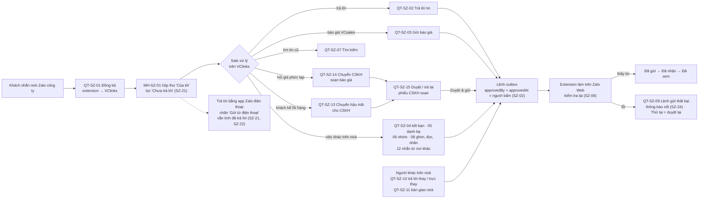
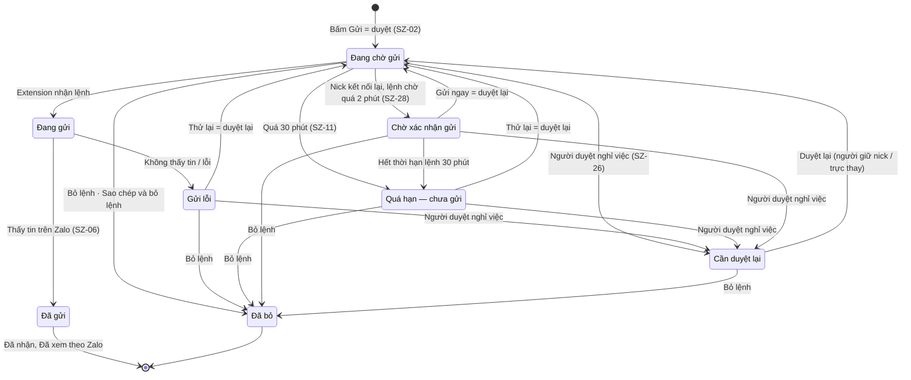
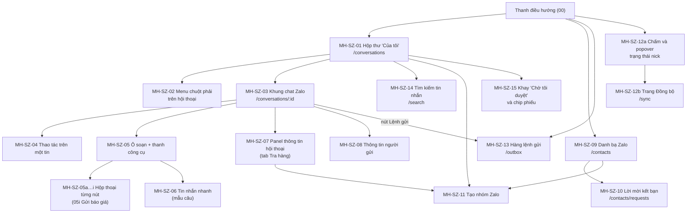
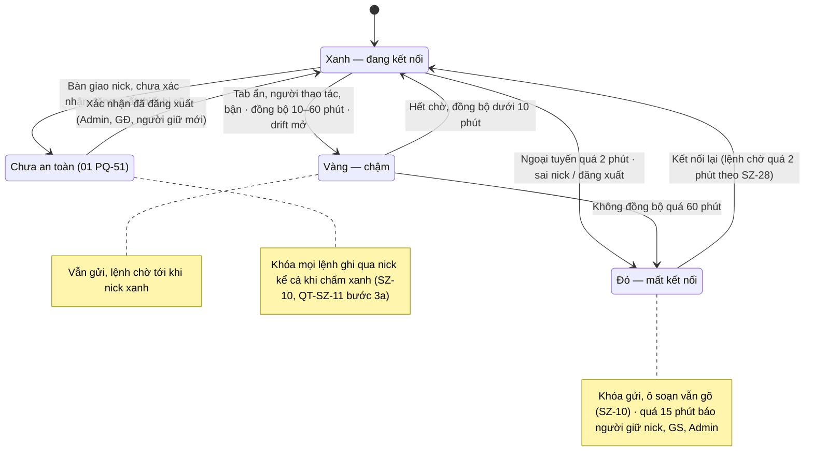
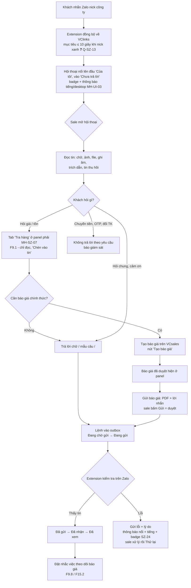
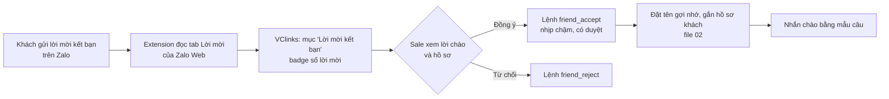
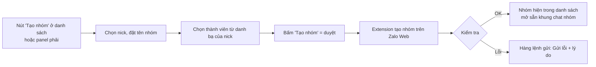

# 03 — Sale (NVKD) dùng VCzalo: kênh Zalo cá nhân của VClinks

Phiên bản 1.5.2 · 04/10/2026 · Trạng thái: Chờ duyệt

| | |
|---|---|
| **Người viết** | BA + UX (Claude), cho chủ dự án Bùi Thọ Anh duyệt |
| **Căn cứ** | [vclinks-ba.md](../vclinks-ba.md) v0.4 (§5.2, §5.5, §5.6, §6, §7, §11, §18.1, §18.2) · 00 (§2 route và menu, §3.3a tin phản hồi, §3.4 SLA, MH-UI-03 thông báo, MH-UI-07/08 khung chat và ô soạn, MH-UI-09 panel, MH-UI-11 mobile) · 01 (PQ-13, PQ-16, PQ-17, PQ-27, PQ-32…PQ-35, PQ-51, PQ-52, MH-PQ-04, MH-PQ-07, MH-PQ-11) · 02 (DK-21, DK-30, DK-46, DK-52, DK-53, DK-55, §5.3) · 05 (MK-21, MH-MK-07) · 06 (MH-HD-01, MH-HD-04) · [review/dac-ta-vong-1/thong-nhat.md](../ra-soat/dac-ta-vong-1/thong-nhat.md) · [review/dac-ta-vong-1/qa.md](../ra-soat/dac-ta-vong-1/qa.md) · [quyet-dinh-chu-du-an.md](../../01-quan-ly-du-an/quyet-dinh-chu-du-an.md) · [zalo-web-feature-map.md](../../04-ky-thuat/zalo-web/zalo-web-feature-map.md) · [zalo-dom-selectors.md](../../04-ky-thuat/zalo-web/zalo-dom-selectors.md) · [chrome-driver.md](../../06-van-hanh/chrome-driver.md) · UAT 29/09/2026 (`docs/05-kiem-thu/uat/2026-09-29/README.md`, TC01–TC20) · code `apps/web/src` tại `f106e3b` |
| **Mô phỏng** | [VClinks Sale Zalo — mô phỏng](https://claude.ai/artifact/HgWK3uPEPjZdxWUidPPEnv): trình chiếu có phụ đề và giọng đọc, 69 cảnh, khoảng 14 phút, theo bản v1.5 (TK1 + TK2 + D9), ảnh chụp từ canvas ngày 04/10/2026. Nguồn để dựng lại: [demo/03-sale-zalo/](../../07-demo/03-sale-zalo/README.md) |
| **Tài liệu cùng bộ** | 00 Giao diện chung · 01 Phân quyền · 02 Khách đa kênh · **03 Sale Zalo cá nhân (tài liệu này)** · 04 CSKH Zalo OA · 05 Marketing & chatbot web · 06 Hóa đơn và công nợ |
| **Nguồn chuẩn (v1.2)** | Route, menu, màu, chip, câu chữ chung, mã lỗi `ERR-*`: **00**. Quyền, "Không có quyền" (MH-PQ-11), nghỉ việc: **01**. Định danh, owner, khóa trả lời, kiểm tra mâu thuẫn: **02**. Khung gửi OA: **04**. Lead: **05**. Hóa đơn, công nợ: **06**. File này chỉ trỏ tới, không chép lại |

**Ký hiệu trong tài liệu**

| Ký hiệu | Nghĩa |
|---|---|
| **[Đã có]** | Có trong code hiện tại. Nhãn, nút, vị trí phải giữ đúng như mô tả. |
| **[Sửa]** | Đã có nhưng phải đổi (chữ, hành vi hoặc quyền). |
| **[Mới]** | Chưa có, dev phải làm. |
| ✅ UAT 29/09 | Ca đã đạt trong UAT ngày 29/09/2026. Giữ làm ca hồi quy. |
| ❓ | Cần khảo sát thêm trên Zalo Web hoặc chờ chủ dự án chốt. |

"VCzalo" trong tài liệu này là **phần Zalo cá nhân của VClinks**: Dashboard (`apps/web`) + VClinks Extension trên Zalo Web (mặc định chạy trong Chrome driver).

## Mô hình

Bốn sơ đồ tổng quan; ba sơ đồ luồng chi tiết vẫn nằm ở §2.1–§2.3.

**Sơ đồ 1 — Việc của sale trên VC Zalo: tin vào → xử lý → lệnh gửi** (quy trình con ở §3)



**Sơ đồ 2 — Trạng thái của một lệnh gửi (outbox)** (SZ-02, SZ-06, SZ-11, SZ-26, SZ-28; MH-SZ-03 #38, MH-SZ-13)



**Sơ đồ 3 — Bản đồ màn hình MH-SZ** (danh mục ở §5)



**Sơ đồ 4 — Trạng thái nick** (SZ-10, SZ-12; nhãn "Chưa an toàn" theo 01 PQ-51)



## Tóm tắt

- **Phạm vi:** đặc tả phân hệ VC Zalo (kênh `zalo`, nick công ty) cho NVKD là chính và giám sát: 15 quy trình con QT-SZ-01…15, 30 quy tắc SZ-01…30, màn hình MH-SZ-01…15, story SZ-US-01…24, 99 ca UAT mới + 20 ca hồi quy R01–R20 (+ R08b, R08c), việc dev D1–D55, điểm lệch với BA tổng L1–L14.
- **Quy tắc gửi:** mọi thao tác ghi trên Zalo là một lệnh outbox có `approvedBy` + `approvedAt` của người bấm (SZ-02); chỉ báo `Đã gửi` khi extension thấy tin trên Zalo (SZ-06); không ghi đè nháp (SZ-05); không thao tác hàng loạt (SZ-08); nhịp 1,5 giây, kết bạn 30 giây và 20 lời mời / nick / ngày (SZ-04, SZ-09).
- **"Chưa trả lời" và nguồn gửi:** SZ-21 là định nghĩa dùng chung cho lọc, SLA, FRT và báo cáo (tin trả lời từ app Zalo điện thoại tính là đã trả lời; SLA theo lịch làm việc division; thời điểm tin = `sendDttm`); SZ-22 lưu `sendSource`, `ingestedAt`; SZ-23 người không giữ nick mở hội thoại không làm khách thấy "Đã xem".
- **An toàn nick và lệnh:** khóa gửi khi nick đỏ hoặc "Chưa an toàn" (SZ-10); lệnh chờ quá 30 phút thành `Quá hạn` (SZ-11); người duyệt nghỉ việc → `Cần duyệt lại`, không có Thử lại (SZ-26, QT-SZ-11); chống gửi trùng khi nick kết nối lại (SZ-28).
- **Quyết định đã áp:** D8-02 (ẩn Chặn / Hủy kết bạn với vai trò không có quyền), D8-04 và D8-11 (tìm kiếm), D8-21 (CSKH `Chèn vào tin` chỉ tên, mã, tồn); D9-01…D9-05 ở v1.5: QT-SZ-14 chuyển CSKH soạn báo giá, QT-SZ-15 NVKD duyệt / trả lại phiếu, MH-SZ-15, CSKH đọc toàn văn hội thoại nhưng không gửi qua nick (D9-04), AI tự tạo phiếu ở M2 (D9-05).
- **Việc còn mở:** 19 câu hỏi Q-SZ còn chờ chốt (§10 có 22 mục, Q-SZ-05, 06, 07 đã đóng), trỏ tới mã QĐ / TS / TT trong `../../01-quan-ly-du-an/quyet-dinh-chu-du-an.md`; nhiều ngưỡng còn ❓ (gom ở Q-SZ-13); các ca UAT cần nick test phụ chờ TT-02; Phụ lục G mục 4–5 (API mới, nguồn "Xe của khách") còn mở.
- **Giai đoạn thử:** tới khi chủ dự án bỏ `onlyThreadIds` (Q-SZ-10 → `QĐ-04`), VClinks chỉ gửi vào nhóm "Kiểm thử vclink" (SZ-14); mobile cho NVKD chờ `QĐ-01` (§2.6).
- **Người duyệt nên xem kỹ:** SZ-21 (báo cáo 07 dùng lại), sơ đồ trạng thái lệnh với SZ-11 / SZ-26 / SZ-28, QT-SZ-11 bàn giao nick, phần mới v1.5 (QT-SZ-14, QT-SZ-15, MH-SZ-15), và các mục "BA đề xuất, chờ chủ dự án xác nhận" ở MH-SZ-09 #9, MH-SZ-10 #6a **[v1.4.4·R1]**.

## Mục lục

- [1. Mục tiêu và phạm vi](#1-mục-tiêu-và-phạm-vi)
- [2. Một ngày làm việc của sale trên VCzalo](#2-một-ngày-làm-việc-của-sale-trên-vczalo)
- [3. Quy trình con](#3-quy-trình-con)
- [4. Quy tắc kênh Zalo cá nhân cho sale (SZ)](#4-quy-tắc-kênh-zalo-cá-nhân-cho-sale-sz)
- [5. Đặc tả màn hình](#5-đặc-tả-màn-hình)
- [6. User story NVKD liên quan](#6-user-story-nvkd-liên-quan)
- [7. Kịch bản UAT](#7-kịch-bản-uat)
- [8. Chênh lệch giữa code hiện tại và đặc tả (việc dev)](#8-chênh-lệch-giữa-code-hiện-tại-và-đặc-tả-việc-dev)
- [9. Điểm lệch với BA tổng (vclinks-ba.md v0.4)](#9-điểm-lệch-với-ba-tổng-vclinks-bamd-v04)
- [10. Câu hỏi mở](#10-câu-hỏi-mở)
- [Phụ lục: đồng bộ vòng 1b](#phụ-lục-đồng-bộ-vòng-1b)
- [Lịch sử cập nhật](#lịch-sử-cập-nhật)

---

## 1. Mục tiêu và phạm vi

### 1.1 Mục tiêu

1. Sale làm **mọi việc hằng ngày trên Zalo cá nhân của nick công ty** ngay trên VClinks khi ngồi máy tính: đọc, trả lời, gửi ảnh/file/báo giá, tra giá/tồn, xử lý lời mời kết bạn, tạo nhóm với garage. Khi ra đường, sale vẫn trả lời bằng app Zalo trên điện thoại; tin đó **về VClinks và được tính là đã trả lời** (SZ-21, §2.6).
2. Mọi thao tác ghi trên Zalo đều **do người bấm**, có dấu vết (`approvedBy`, `approvedAt`), và được extension **kiểm tra lại trên Zalo** trước khi báo thành công.
3. Giám sát trả lời được câu hỏi mỗi sáng "tổ còn khách nào chưa được trả lời" trong ≤ 2 lần bấm, xem hội thoại của tổ mà **không làm lộ "Đã xem"**, trả lời thay / trực thay đúng quy tắc file 01, và thu nick an toàn khi NVKD nghỉ việc.
4. Đặc tả màn hình đủ chi tiết để dev làm và để QA chạy UAT theo đúng cách đã chạy ngày 29/09.

### 1.2 Trong phạm vi

- Kênh `zalo` (Zalo cá nhân, tiền tố uid rỗng). Các nick do công ty sở hữu (BR08, ZR1).
- Góc nhìn **NVKD** (sale) là chính. Góc nhìn **Giám sát** trên các màn hình Zalo cá nhân: lọc hội thoại tổ theo "Chưa trả lời / Quá SLA / Người phụ trách", nick của tổ, lệnh gửi của tổ, duyệt mẫu câu tổ, trả lời thay / trực thay, bàn giao nick (v1.1).
- Báo cáo hiệu suất (GS-06, F10.2) **không** nằm trong file này; file này chỉ quy định dữ liệu nguồn (SZ-21, SZ-22) để báo cáo dùng.
- Các route hiện có: `/conversations`, `/conversations/:id`, `/sync`. Route mới: `/contacts`, `/contacts/requests`, `/search`, **`/outbox`** (mục **Lệnh gửi**, v1.2). **Nguồn duy nhất về route và menu là 00 §2**; route trong file này chỉ để đọc cho tiện, lệch thì theo 00.

### 1.3 Ngoài phạm vi (tham chiếu)

| Nội dung | Xem |
|---|---|
| Khung ứng dụng, thanh điều hướng, màu, chữ, giao diện tối | File **00** |
| Vai trò, phạm vi xem, ẩn SĐT, quyền tạm thời, nhật ký | File **01** |
| Hộp thư hợp nhất nhiều kênh, hồ sơ khách 360, gộp hồ sơ, phân công, bàn giao | File **02** |
| Zalo OA, ZNS, ticket CSKH | File **04** |
| Chiến dịch, quảng cáo, chatbot web, **lead** (vòng đời, SLA lead, Chi tiết lead) | File **05** |
| Yêu cầu xuất hóa đơn, gửi hóa đơn, công nợ | File **06** |
| Facebook cá nhân | BA tổng §12 |

---

## 2. Một ngày làm việc của sale trên VCzalo

**Nhân vật mẫu:** chị Linh, NVKD VCparts khu vực Hà Nội, phụ trách ~200 garage. Dùng nick Zalo công ty "Linh VCparts". Nick đã đăng nhập sẵn trong Chrome driver trên máy chủ; chị chỉ mở Dashboard VClinks trên máy của mình.

| Giờ | Việc | Màn hình | Ghi chú |
|---|---|---|---|
| 07:45 | Mở VClinks, xem **nick của tôi có đang kết nối** không (chấm xanh trên avatar nick) | MH-SZ-12 | Đỏ → báo Admin ngay, không chờ |
| 07:50 | Hộp thư **"Của tôi"**, lọc **Chưa trả lời** (không dùng "Chưa đọc": khách chị đã đọc trên điện thoại mà chưa trả lời vẫn nằm ở đây). Khách chờ lâu nhất đứng đầu. Các khách chị đã trả lời trên điện thoại lúc 22h **không** còn trong danh sách (SZ-21) | MH-SZ-01, MH-SZ-03 | KD-01, KD-02 |
| 07:55 | Bấm **Lấy nội dung {n} hội thoại chưa trả lời** một lần để extension lấy nội dung các tin "Đang chờ nội dung" (khách sẽ thấy "Đã xem", như chị mở trên điện thoại) | MH-SZ-01 #11 | SZ-15 |
| 08:00 | Xử lý **Lời mời kết bạn** mới: garage lạ tìm qua SĐT → một hộp: Đồng ý + tên gợi nhớ "A Tuấn – Minh Phát" (anh Tuấn, chủ Garage Minh Phát) + tích "Gửi lời chào /chao" | MH-SZ-10, MH-SZ-09 | KD-11 |
| 08:15 | Trả lời khách hỏi hàng: gõ `/chao`, **tra giá/tồn ở tab "Tra hàng"** của panel phải → "Chèn vào tin", trả lời có trích dẫn | MH-SZ-05, MH-SZ-07 | KD-04, KD-06 |
| 09:00 | Khách gửi VIN + ảnh phụ tùng → tạo báo giá trên VCsales → quay lại **Gửi báo giá** PDF | MH-SZ-05i | KD-07 |
| 10:30 | Garage cần kỹ thuật tư vấn → **Tạo nhóm** "Garage Minh Phát – VCparts" gồm chủ garage, kỹ thuật, chị Linh; @nhắc tên kỹ thuật | MH-SZ-11, MH-SZ-05h | KD-16 |
| 11:00 | Khách chuyển khoản → gửi **số tài khoản** công ty bằng nút "Gửi nhanh số tài khoản" | MH-SZ-05f | |
| 11:30–14:00 | Ra ngoài gặp garage, trả lời khách bằng **app Zalo trên điện thoại**. Tin đó về VClinks với nhãn `Gửi từ điện thoại`, hội thoại rời khỏi "Chưa trả lời". Kiểm tra mâu thuẫn giá chỉ chạy **sau khi gửi** (02 DK-46) | (app Zalo) → MH-SZ-03 | SZ-21, SZ-22, §2.6 |
| 14:00 | Khách hỏi lại đơn tháng trước → **tìm tin cũ** theo mã OE | MH-SZ-14 | KD-15 |
| 16:00 | Đang ở hội thoại khác thì **thông báo nổi + tiếng "Gửi lỗi"** hiện góc màn hình: tin gửi khách A lỗi vì ô soạn trên Zalo có nháp → bấm "Mở hội thoại" → xử lý → Thử lại | Thông báo nổi, MH-SZ-13 | SZ-24, ZR6 |
| 17:15 | Ghim 3 hội thoại cần theo dõi mai, đánh dấu chưa đọc 1 hội thoại chưa xử lý xong | MH-SZ-02 | |
| 17:30 | Nghỉ phép ngày mai → báo giám sát; giám sát tạo **Trực thay** (file 01 MH-PQ-07) cho người cùng tổ. Khách **không đổi owner**, hôm sau chị đi làm lại thì mọi khách vẫn ở "Của tôi". Trong ngày nghỉ chị có cờ **Nghỉ phép**: nút "Nhắc" / thông báo gửi cho người trực thay, "Chia đều" bỏ qua chị (SZ-27); 18:00 chị nhận tóm tắt trực thay (01 PQ-32) | – | PQ-32, QT-SZ-10, SZ-27 |

### 2.1 Luồng chính: nhận tin → trả lời / báo giá → nhắc việc



### 2.2 Khách mới kết bạn



### 2.3 Tạo nhóm với garage



### 2.4 Vắng mặt và nghỉ việc **[Sửa v1.1]**

Sale **không tự bàn giao**. Có ba trường hợp, dùng đúng công cụ của file 01:

| Trường hợp | Công cụ | Ai làm | Khách / owner | Nick | Lệnh gửi của người vắng |
|---|---|---|---|---|---|
| Vắng đột xuất vài giờ, cần trả lời vài tin | **Trả lời thay** (PQ-16, QT-SZ-10) | GS, GĐ mở hội thoại và gửi | Không đổi | Không đổi người giữ | Không đổi |
| Nghỉ phép / ốm từ nửa ngày trở lên (≤ 30 ngày) | **Trực thay** (PQ-32, MH-PQ-07) | GS tạo, chọn người trực | **Không đổi owner**; hết hạn trực thay thì mọi thứ tự về như cũ | Người trực có `NICK` của người vắng trong thời hạn | Vẫn chạy (người vắng đã duyệt) |
| Nghỉ việc | **Khóa ngay + Bàn giao** (PQ-33, PQ-34, MH-PQ-04) + **Bàn giao nick** (SZ-26, QT-SZ-11) | Admin/GĐ khóa; GS/GĐ/Admin bàn giao | Đổi owner **ngay** theo bàn giao; **không** chờ thu điện thoại (v1.2) | Đổi người giữ nick (PQ-17). Chưa xác nhận đăng xuất Zalo trên điện thoại cũ → nick **"Chưa an toàn"**, không ai gửi qua nick (01 PQ-51, v1.2) | Chuyển `Cần duyệt lại`, **không tự chạy**, không có nút "Thử lại"; chỉ người giữ nick mới (hoặc trực thay) duyệt lại |

Chung cho mọi trường hợp:
- Nick Zalo là của công ty (BR08). Người trả lời thay / trực thay / người giữ mới gửi từ **cùng nick**; trong VClinks mọi tin ghi đúng người gửi thật (SZ-22).
- Nick Zalo **không chỉ nằm trong Chrome driver**: nick còn đăng nhập trên **điện thoại** của người giữ nick. Khóa tài khoản VClinks **không** chặn được việc nhắn khách từ điện thoại. Vì vậy khi nghỉ việc phải thu nick trên điện thoại (SZ-26); tới khi có người xác nhận, nick ở trạng thái "Chưa an toàn" và VClinks không gửi gì qua nick đó (01 PQ-51). VClinks **không giữ mật khẩu Zalo**, không đăng xuất hộ; việc đổi mật khẩu / đăng xuất thiết bị do công ty làm ngoài hệ thống, VClinks chỉ ghi nhận người xác nhận.
- Hướng dẫn chọn công cụ (trả lời câu hỏi của giám sát): *cần gửi 1–3 tin trong ngày* → Trả lời thay; *người vắng từ nửa ngày trở lên hoặc cần xử lý cả lời mời kết bạn* → Trực thay. Dải vàng trả lời thay trên ô soạn có link `Tạo trực thay cho {người giữ nick}…` (MH-SZ-05 #0b).

### 2.5 Một buổi sáng của giám sát **[Mới v1.1]**

**Nhân vật mẫu:** chị Hương, giám sát tổ HN1 (7 NVKD, 7 nick).

| Giờ | Việc | Màn hình | Quy tắc |
|---|---|---|---|
| 07:45 | Bấm chấm nick trên thanh điều hướng → phần **Nick của tổ**: 7 nick, người giữ, màu, số khách đang chờ. Nick của Tú đỏ từ 07:10 → câu `Cần Tú quét mã QR trên điện thoại` | MH-SZ-12a | SZ-12 |
| 07:50 | `/conversations`, phạm vi `Tất cả` (tổ). Dải tóm tắt: `Chưa trả lời 9 · Quá SLA 2 · Lệnh lỗi 1 · Nick đỏ 1`. Dòng 2: `Chưa trả lời: Minh 3 · Tú 4 · Linh 2`. Bấm "Tú" → lọc | MH-SZ-01 #4b, #4c | SZ-21 |
| 07:55 | Mở một hội thoại của Minh có tin "Đang chờ nội dung" → **không** có lệnh mở Zalo Web; khách không thấy "Đã xem", badge của Minh còn nguyên. Chị xem phần đã có, không bấm `Lấy nội dung` | MH-SZ-03 #9a | SZ-23 |
| 08:15 | Minh báo ốm cả ngày → tạo **Trực thay** Minh → Linh (MH-PQ-07). Trước lúc Linh vào, chị trả lời thay 1 khách gấp: ô soạn có dải vàng, hộp xác nhận hiện câu đã thay biến, bong bóng `Gửi bởi Hương (trả lời thay Minh)` | MH-SZ-05 #0b, MH-SZ-03 #38a | SZ-25 |
| 10:00 | `Lệnh gửi` → `Tổ của tôi`, lọc NVKD, cột `Treo {n} phút` | MH-SZ-13 | SZ-24 |
| 11:00 | Tab `Chờ tôi duyệt` trong Tin nhắn nhanh: duyệt 2 mẫu tổ | MH-SZ-06 | PQ-27 |

### 2.6 Sale trên điện thoại **[Mới v1.1, sửa v1.2]**

Hiện trạng và phạm vi MVP (BA §19 xếp mobile web ở GĐ2; file 00 MH-UI-11 đã đặc tả bố cục mobile). **Có làm giao diện VClinks trên điện thoại cho NVKD ở MVP hay không là câu hỏi Q-SZ-14, gộp với 00 Q-13 thành một quyết định `QĐ-01`** (chủ dự án trả lời một lần cho cả 00 và 03). Trong lúc chờ, quy định như sau:

1. Ngoài máy tính, NVKD trả lời bằng **app Zalo trên điện thoại** của nick như trước. Không cần làm gì thêm.
2. Tin nick gửi từ điện thoại được Zalo đồng bộ sang Zalo Web trong driver rồi extension đẩy về VClinks (A4, trường `syncFromMobile`). Mục tiêu: hiện trên VClinks **≤ 1 phút** sau khi gửi, khi nick xanh.
3. Trên VClinks tin đó là **tin của nick** (bên phải khung chat), có nhãn nhỏ `Gửi từ điện thoại` (00 §3.3a, SZ-22). Người gửi hiện là người giữ nick (VClinks không biết ai cầm máy).
3a. [v1.2] Tin gửi từ điện thoại **bật khóa trả lời** trên khách từ giờ gửi (người giữ khóa = người giữ nick) và vào "cam kết đã nêu" như tin gửi qua VClinks (02 DK-46). **Kiểm tra mâu thuẫn giá chỉ có khi gửi trên VClinks**; tin từ điện thoại chỉ được kiểm **sau khi gửi**: có điểm lệch thì người gửi nhận cảnh báo `Tin bạn gửi từ điện thoại lúc {HH:mm} khác {điểm lệch}.` [Xem] [Gửi đính chính] (câu và người nhận theo 02 §5.8).
4. Tin đó **tính là đã trả lời** (SZ-21): hội thoại rời khỏi "Chưa trả lời", đồng hồ SLA dừng, FRT tính theo tin đó; với lead thì tính **"Đã liên hệ"** (05, SZ-29). Việc có tính vào **chỉ số hiệu suất** (KPI) hay không: Q-SZ-11 (`QĐ-07`).
5. Đọc tin trên điện thoại làm mất badge chưa đọc trên cả VClinks (đồng bộ trạng thái đọc). Vì vậy việc cần làm dựa vào **Chưa trả lời**, không dựa vào **Chưa đọc**.
6. Nick đỏ khi đang gõ dở trên VClinks: bấm `Sao chép nội dung` (MH-SZ-05 trạng thái Nick đỏ), dán sang app Zalo và gửi. Khi nick xanh lại, VClinks thấy tin từ điện thoại giống nháp thì hỏi `Bạn đã gửi nội dung này từ điện thoại lúc {HH:mm}. Xóa nháp trên VClinks?` [Giữ nháp] [Xóa nháp]. Nháp VClinks **không bao giờ tự gửi**.
7. [v1.2] Nick đỏ khi **đã bấm Gửi** (lệnh đang `Đang chờ gửi`): bấm **`Sao chép và bỏ lệnh`** (MH-SZ-05 trạng thái Nick đỏ, MH-SZ-13) → nội dung vào bộ nhớ tạm, lệnh chuyển `Đã bỏ`, sale gửi tạm trên điện thoại. Không bấm mà nick kết nối lại: lệnh đã chờ quá 2 phút **không tự gửi**, người bấm gửi được hỏi `Gửi ngay` / `Bỏ lệnh`, kèm cảnh báo trùng nếu hội thoại đã có tin `Gửi từ điện thoại` sau lúc tạo lệnh (SZ-28). Khách không bao giờ nhận hai tin giống nhau chỉ vì nick rớt.

### 2.7 Giải đáp nhanh cho NVKD và giám sát **[Mới v1.1]**

| Câu hỏi | Trả lời | Căn cứ |
|---|---|---|
| Tin tôi trả lời trên app Zalo điện thoại có tính là "đã trả lời" không, có hiện là tôi gửi không? | Có tính là đã trả lời. Hiện là tin của nick, nhãn `Gửi từ điện thoại`, người gửi = người giữ nick. Tính vào KPI hay không: chờ Q-SZ-11 | SZ-21, SZ-22 |
| Tôi mở hội thoại trên VClinks mà chưa trả lời, khách có thấy "Đã xem" không? | Có, **nếu bạn là người giữ nick** và tin cần lấy nội dung từ Zalo Web (giống mở trên điện thoại). Giám sát, CSKH, người xem khác mở thì **không** | SZ-15, SZ-23 |
| Nick dùng chung thì "Của tôi" là gì? | Mỗi nick có đúng một người giữ nick (PQ-17). "Của tôi" = khách tôi phụ trách **+** mọi hội thoại trên nick tôi giữ (PQ-13). Người khác dùng nick chỉ qua trực thay / trả lời thay | SZ-18 |
| Khi nào tôi trả lời khách thật trên VClinks? | Khi chủ dự án bỏ giai đoạn thử (Q-SZ-10). Trong lúc thử: đọc, tìm, tra hàng trên VClinks; trả lời khách trên Zalo | SZ-14 |
| Nghỉ phép rồi quay lại, khách có tự về "Của tôi" không? | Có. Trực thay không đổi owner; hết hạn tự thu hồi. Trong thời gian nghỉ, lời nhắc và việc chia khách đi sang người trực thay (SZ-27) | PQ-32 |
| [v1.2] Tôi trả lời trên điện thoại, VClinks có kiểm tra giá như khi gõ trên VClinks không? | Không kiểm **trước** được. Tin về VClinks thì được kiểm **sau khi gửi**; lệch giá thì bạn nhận cảnh báo và nút `Gửi đính chính`. Muốn được kiểm trước thì gửi trên VClinks | 02 DK-46, §2.6 bước 3a |
| [v1.2] Nick rớt khi tôi đã bấm Gửi, tôi gửi lại trên điện thoại. Nick có lại thì khách có nhận 2 tin không? | Không. Bấm `Sao chép và bỏ lệnh` trước khi gửi trên điện thoại. Quên bấm thì khi nick có lại, VClinks hỏi bạn `Gửi ngay` / `Bỏ lệnh`, không tự gửi | SZ-28 |
| Giám sát có đọc được mọi tin tôi nhắn với khách không, kể cả nhóm? | Có: giám sát xem được mọi hội thoại trên nick công ty của tổ (F12.7), gồm cả tin gửi từ điện thoại. Nick công ty chỉ dùng việc công. Không có chức năng "xuất toàn bộ chat của một NVKD" cho giám sát | F12.7, PQ-38 |
| Mẫu câu cá nhân của tôi có bị người khác sửa không? Nghỉ việc thì sao? | Chỉ bạn sửa/xóa. Giám sát của tổ **xem** được (chỉ đọc). Nghỉ việc: mẫu được lưu trữ, người nhận bàn giao xem và sao chép được | MH-SZ-06 #11, PQ-33 |
| 20 lời mời kết bạn/ngày có tính lời mời tôi đồng ý trên điện thoại không? | VClinks chỉ đếm lệnh đi qua VClinks. Zalo có thể tính cả hai; con số an toàn chờ Q-SZ-02 | SZ-09 |
| Báo giá dạng "Ảnh" đọc được trên điện thoại không? | Phụ thuộc mẫu xuất của VCsales (BA §21 câu 16). UAT-SZ-27 kiểm thêm bước mở trên điện thoại | QT-SZ-03 |
| Tin khách nhắn tối / Chủ nhật có vào "Chưa trả lời" sáng hôm sau không? | Có, hội thoại vẫn ở "Chưa trả lời". Đồng hồ SLA chỉ chạy trong giờ làm việc (tính từ đầu giờ làm việc kế tiếp). [Sửa v1.2] Giờ làm việc là **lịch làm việc của division** (GĐ cấu hình, có nghỉ trưa, ngày lễ — 00 §3.4), không theo tổ hay ca người | SZ-21 |

---

## 3. Quy trình con

Mỗi quy trình ghi: bước của sale → hệ thống phản hồi → lỗi có thể gặp (chữ hiển thị chính xác). Lỗi từ extension hiện trong tooltip "Gửi lỗi" của bong bóng và trong Hàng lệnh gửi, nguyên văn chuỗi `error` extension báo về (`apps/extension/src/sender.ts` `ERR`, `sender-actions.ts` `ACTION_ERR`).

### QT-SZ-01 Đồng bộ và trạng thái nick

| # | Sale làm | Hệ thống phản hồi |
|---|---|---|
| 1 | Không phải làm gì. | Extension đồng bộ định kỳ (`chrome.alarms`) và khi có tin mới; thứ tự tài khoản → danh bạ → nhóm → hội thoại → tin nhắn → cảm xúc, nhãn, đã đọc (S3). |
| 2 | Nhìn chấm trạng thái trên avatar nick (thanh điều hướng trái) và trên tiêu đề khung chat. | Xanh / vàng / đỏ theo SZ-12. Rê chuột hiện lý do. |
| 3 | Mở hội thoại có tin "Đang chờ nội dung từ Zalo". | **[Sửa v1.1]** Chỉ khi người mở là **người giữ nick hoặc người trực thay đang hiệu lực**: Dashboard tự yêu cầu extension mở hội thoại trên Zalo Web lấy nội dung; hiện dải thông báo (MH-SZ-03 §Trạng thái). Người xem khác (GS, GĐ, CSKH, Viewer): **không** gửi lệnh, hiện dải MH-SZ-03 #9a (SZ-23). |
| 3a | [Mới v1.1] Người giữ nick bấm **Lấy nội dung {n} hội thoại** ở đầu danh sách (MH-SZ-01 #11). | Hộp xác nhận `Lấy nội dung {n} hội thoại đang chờ? Zalo sẽ đánh dấu đã xem, khách thấy "Đã xem" như khi bạn mở trên điện thoại.` [Hủy] [Lấy nội dung]. Extension mở **lần lượt** từng hội thoại, nhịp tối thiểu 3 giây ❓ (Q-SZ-13), tối đa 20 hội thoại mỗi lần; tiến độ `Đang lấy {k}/{n}…`. Đây là thao tác đọc do người bấm, đúng ZR4 ("nhân viên bấm Đồng bộ"). Tự lấy trước không cần bấm: Q-SZ-15. |
| 4 | Nick đỏ quá 5 phút. | Sale bấm "Báo Admin" [Mới] trong popover trạng thái nick → tạo thông báo cho Admin. [Mới v1.1] Nick đỏ quá 15 phút ❓ (Q-SZ-13) trong giờ làm việc → hệ thống tự báo **người giữ nick + GS của tổ + Admin**, câu `Nick {nick} mất kết nối từ {HH:mm}. Cần {người giữ nick} quét mã QR đăng nhập Zalo Web trên điện thoại giữ nick.` (đăng nhập lại Zalo Web cần điện thoại giữ nick, Admin không tự làm được). |
| 5 | [Mới v1.1] Không phải làm gì. | Mục tiêu thời gian tin mới về VClinks: ≤ 10 giây (p90) khi nick xanh ❓ (Q-SZ-13 → thông số `TS-14`, gom cả con số ≤ 5 giây của 00; chủ dự án chốt một số cho cả hai file). Tin nick gửi từ điện thoại: ≤ 1 phút. Đo như đo tốc độ gửi (UAT-SZ-70). |

**Lỗi có thể gặp**

| Tình huống | Chữ hiển thị |
|---|---|
| Extension không trực tuyến | `Chưa thấy extension VCLinks nào trực tuyến cho tài khoản {nick}: hãy mở tab chat.zalo.me của tài khoản này (và kiểm tra extension đã bật).` **[Sửa]** chữ "VCLinks" → "VClinks" |
| [v1.2] Extension chưa được ghép với VClinks (máy mới, token bị thu hồi) | Extension hiện **mã ghép 6 số** (hạn 10 phút) trong cửa sổ của nó; Admin nhập mã ở 01 MH-PQ-08. Token đi thẳng vào extension, không ai thấy chuỗi; tự xoay vòng 180 ngày qua kết nối đang có, sale không phải làm gì (01 PQ-52). Sale thấy nick đỏ với câu nghiệp vụ `Nick {nick} chưa được kết nối với VClinks trên máy chạy Zalo. Đã báo Admin.` |
| Tab Zalo đăng nhập nick khác | `Tab Zalo Web đang đăng nhập tài khoản {nick khác}, không phải {nick}. Hãy mở chat.zalo.me bằng tài khoản {nick}.` |
| Tab Zalo bị ẩn | `…, nhưng tab Zalo đang ẩn nên Zalo Web không tải danh sách hội thoại. Hãy mở chat.zalo.me ở một cửa sổ Chrome riêng, …` |
| Có người đang thao tác tay trên Zalo | `… Đang chờ anh ngừng thao tác trên tab Zalo khoảng 15 giây…` **[Sửa]** "anh" → "bạn" (UI dùng chung) |
| Không lấy được nội dung | `Không lấy được nội dung từ Zalo Web: {lý do}` + nút **Thử lại** |

> Với sale, các câu trên nói về "tab", "extension" là kỹ thuật. **[Sửa]** Khi người xem là NVKD (không phải Admin), rút gọn thành câu nghiệp vụ, chi tiết kỹ thuật đưa vào tooltip "Chi tiết cho Admin": ví dụ `Nick Linh VCparts đang mất kết nối với Zalo. Tin mới có thể về chậm và chưa gửi được. Đã báo Admin.`

### QT-SZ-02 Trả lời tin

**Chung cho mọi kiểu gửi:**
1. Sale mở hội thoại → gõ / chọn nội dung → bấm **Gửi** (hoặc nút "Gửi" trong hộp xác nhận).
2. API tạo **lệnh** trong outbox với `approvedBy` = người bấm, `approvedAt` = lúc bấm (ZR2). Bong bóng tạm hiện ngay: `Đang chờ gửi`.
3. Extension nhận lệnh (long-poll, trung vị 0,39 s), trạng thái → `Đang gửi`.
4. Extension làm trên Zalo Web, kiểm tra tin đã hiện (ZR7), báo kết quả → `Đã gửi`. Bong bóng tạm được thay bằng tin thật khi đồng bộ về. Sau đó `Đã nhận` / `Đã xem` theo Zalo (D6).
5. Lỗi → `Gửi lỗi` (rê chuột thấy lý do) + **Thử lại**. [v1.2] Lỗi mà Thử lại chắc chắn hỏng lần nữa (ví dụ `cardNotFound`, `replyTarget` sau khi đã tự cuộn) thì **ẩn Thử lại** và hiện nút sửa đúng chỗ (bảng dịch lỗi dưới).

Mục tiêu thời gian: bấm → tin hiện trên Zalo **≤ 2 giây** (đo 29/09: 0,60–0,98 s).

| Kiểu | Bước riêng | Lỗi riêng (chữ extension báo) |
|---|---|---|
| **Văn bản** (E1) | Gõ, Enter để gửi, Shift+Enter xuống dòng. Lần gửi đầu tiên trên trình duyệt hiện hộp xác nhận "Gửi tin qua Zalo cá nhân?". [v1.2] Tối đa **2.000 ký tự** mỗi tin (giới hạn API `OUTBOX_MAX_TEXT`; ô soạn đếm và chặn ở 2.000, MH-SZ-05 #12). | `ô soạn tin đang có nội dung chưa gửi, không ghi đè` · `nội dung trong ô soạn tin không khớp bản đã duyệt, đã xóa và không gửi` · `Zalo chưa gửi (ô soạn tin vẫn còn nội dung), đã xóa` · `không thấy tin vừa gửi trong khung chat — kiểm tra trên Zalo trước khi gửi lại` |
| **Nhiều dòng** (E2) | Hiện tại: mỗi dòng thành một tin; ghi chú dưới ô soạn `· Mỗi dòng sẽ được gửi thành một tin riêng`. [Mới] đích: một tin nhiều dòng. | |
| **Trả lời trích dẫn** (E3) | Rê chuột lên tin → nút ↩ "Trả lời" → thanh "Trả lời **{tên}**" trên ô soạn → gõ → Gửi. Esc để hủy. | `không thấy tin cần trả lời trong khung chat Zalo (có thể đã trôi lên quá xa); hãy cuộn tới tin đó trên Zalo Web rồi bấm Thử lại` · `không thấy nút "Trả lời" của Zalo khi rê chuột lên tin cần trả lời` · `Zalo không mở khung trích dẫn sau khi bấm "Trả lời", đã hủy và không gửi` · `ô soạn tin đang trả lời một tin khác, không ghi đè` |
| **@Nhắc tên** (E4, chỉ nhóm) | Nút **@** → chọn thành viên → `@Tên ` chèn vào ô soạn → Gửi. | Dashboard: `Chưa hỗ trợ vừa trả lời trích dẫn vừa @nhắc tên trong một tin`. Extension: `tin có @nhắc tên phải nằm trên một dòng` · `không thấy "{tên}" trong danh sách @nhắc tên của nhóm` · `nội dung @nhắc tên trong ô soạn tin không khớp bản đã duyệt, đã xóa và không gửi` |
| **Ảnh** (E5) | Nút ảnh → chọn ≤ 10 ảnh (.png .jpg .jpeg .gif, mỗi ảnh ≤ 10 MB) → hộp "Gửi N ảnh?" → **Gửi**. | Dashboard: `Mỗi lần gửi tối đa 10 ảnh` · `"{tên}" lớn hơn 10 MB`. Extension: `không đưa được tệp vào Zalo (bộ chặn chọn file chưa sẵn sàng, hãy tải lại tab Zalo)` · `Zalo không nhận loại tệp này ở nút đã chọn` · `Zalo không mở hộp chọn tệp` · `không thấy ảnh vừa gửi trong khung chat — …` |
| **File** (E6) | Nút ghim giấy → chọn 1 file ≤ 10 MB → hộp `Gửi file "{tên}"?` → **Gửi**. | như ảnh |
| **Danh thiếp** (E8) | Nút danh thiếp → nhập/chọn tên đúng như trong Zalo → tùy chọn "Gửi kèm số điện thoại" → **Gửi**. | `không tìm thấy đúng một danh thiếp có tên này` · `Zalo không giữ tên trong ô tìm danh thiếp` · `không chọn được danh thiếp` · `không đặt được ô "Gửi kèm số điện thoại" đúng như đã duyệt` |
| **Bình chọn** (E15d, chỉ nhóm) | Nút biểu đồ → câu hỏi + ≥ 2 lựa chọn → **Tạo bình chọn**. | Dashboard: `Cần ít nhất 2 lựa chọn`. Extension: `không điền được biểu mẫu bình chọn` |
| **Sticker** (E7) | Nút mặt cười → lưới bộ "Củ hành" → bấm 1 sticker → hộp "Gửi sticker này?" → **Gửi**. | `Zalo không mở bảng sticker` · `bảng sticker của Zalo không có bộ "{bộ}"` · `không thấy đúng sticker đã chọn trong bộ (vị trí hoặc ảnh thu nhỏ không khớp)` |
| **Mẫu câu `/`** (E15) | Gõ `/` + phím tắt → danh sách gợi ý → ↑/↓, Enter hoặc Tab để chèn → sửa nếu cần → Gửi. Biến `{ten_khach}`, `{ten_nv}` được thay khi chèn. [v1.2] Mẫu có biến chọn nhanh `{so_phut}` (ví dụ `Em tới sau {so_phut} phút ạ`): khi chèn hiện 4 chip `5` · `10` · `15` · `30` ngay trên ô soạn, bấm một chip để thay biến (hoặc gõ số khác); chưa chọn thì nút Gửi mờ, tooltip `Chọn số phút cho mẫu câu`. | Không có lỗi riêng; mẫu chỉ chèn chữ, gửi như văn bản. |
| **Số tài khoản** (E15a) | Nút ngân hàng → chọn mẫu → chèn vào ô soạn → Gửi. | như văn bản |

Lỗi chung của mọi lệnh: `không tìm thấy hội thoại` · `không thấy hội thoại trong danh sách bên trái của Zalo Web` · `không xác nhận được hội thoại đang mở` · `không thấy ô soạn tin (#richInput)` · `tab Zalo không có focus nên không gõ được; hãy để tab chat.zalo.me ở phía trước` · `tab Zalo đang ẩn nên Zalo Web không tải danh sách hội thoại; hãy chuyển sang tab chat.zalo.me` · `tài khoản {uid} không có trong Zalo Web này` · `không thấy nút "{tên nút}" trên Zalo Web`.

> **[Sửa] Dịch lỗi cho sale.** Chuỗi lỗi của extension viết cho kỹ thuật. Hàng lệnh gửi và tooltip "Gửi lỗi" hiện **câu nghiệp vụ** trước, chuỗi gốc sau trong "Chi tiết". Bảng dịch tối thiểu:

| Mã lỗi (ERR / ACTION_ERR) | Câu hiển thị cho sale | Sale nên làm |
|---|---|---|
| `inputBusy`, `replyBusy` | **Trên Zalo đang có tin nháp gõ dở trong hội thoại này, VClinks không ghi đè.** | Xóa nháp trên Zalo (hoặc nhờ Admin trên driver) rồi bấm Thử lại. Nút "Xóa nháp trên Zalo rồi gửi" (sale tự xóa, không chờ Admin) đổi quy tắc ZR6, chờ Q-SZ-16 |
| `notFound`, `convItem`, `notActive` | **Không tìm thấy hội thoại này trên Zalo Web của nick.** | Bấm Thử lại sau 1 phút; lặp lại thì báo Admin |
| `tabHidden`, `noFocus` | **Zalo Web của nick đang bị che/ẩn nên chưa gửi được.** | Báo Admin |
| notHere (`tài khoản … không có trong Zalo Web này`) | **Zalo Web đang không đăng nhập nick {nick} (có thể đã bị đăng xuất).** | Báo Admin đăng nhập lại; không Thử lại trước khi nick xanh |
| `unconfirmed`, `notConfirmed` | **Chưa chắc tin đã đi. Kiểm tra trên Zalo trước khi gửi lại để tránh gửi trùng.** | Xem khung chat; nếu chưa có tin mới bấm Thử lại |
| `mismatch`, `notSent`, `mentionMismatch` | **Nội dung trên Zalo không khớp bản bạn đã duyệt nên VClinks đã hủy, chưa gửi gì.** | Thử lại |
| `replyTarget` | **Tin bạn trả lời đã trôi quá xa trên Zalo Web.** | **[Sửa v1.1]** (1) Extension tự cuộn lên tìm tin gốc trước khi báo lỗi (tối đa 10 lần tải lịch sử, nhịp S6 1 lần/giây ❓) — không cần Admin. (2) Vẫn không thấy: nút **Gửi không trích dẫn** trong tooltip lỗi và Hàng lệnh gửi → mở lại ô soạn với nội dung cũ, thêm dòng đầu `Về tin: "{trích 60 ký tự}"` để sale sửa; sale bấm Gửi = duyệt lệnh **mới**, lệnh lỗi tự chuyển `Đã bỏ` |
| `cardNotFound` | **Không tìm thấy đúng một người tên "{tên}" trong danh bạ Zalo của nick.** | [Sửa v1.2] Nút **`Chọn lại danh thiếp`** (thay Thử lại): mở MH-SZ-05d điền sẵn tên đã gõ; gửi = lệnh **mới** do người bấm duyệt, lệnh lỗi tự chuyển `Đã bỏ` |
| khác | **Không gửi được trên Zalo.** + chuỗi gốc | Thử lại / báo Admin |

### QT-SZ-03 Gửi báo giá VCsales [Mới]

Tiền điều kiện: khách đã liên kết **mã KH VCsales** (file 02, BR11); báo giá **đã duyệt, còn hiệu lực** trên VCsales (BR16).

| # | Sale làm | Hệ thống phản hồi |
|---|---|---|
| 1 | Trong khung chat, bấm nút **"Gửi báo giá"** trên thanh công cụ (hoặc nút "Gửi" ở một báo giá trong panel phải, tab Báo giá). | Mở hộp MH-SZ-05i. Gọi API VCsales lấy danh sách báo giá theo mã KH (không dùng cache). |
| 2 | Chọn một báo giá. | Hiện xem trước: số, ngày, tổng tiền, hiệu lực, trạng thái, số dòng hàng, ảnh trang 1 của PDF. Báo giá không hợp lệ bị làm mờ, có lý do. |
| 3 | Chọn dạng gửi: **File PDF** (mặc định) hoặc **Ảnh**. | Zalo cá nhân không có "link xem" riêng; link đi kèm lời nhắn nếu VCsales có link công khai. |
| 4 | Sửa lời nhắn (mẫu có sẵn, biến `{so_bao_gia}`, `{tong_tien}`, `{hieu_luc}`, `{ten_khach}`, `{ten_nv}`). | Đếm ký tự, tối đa 1.000. |
| 5 | Bấm **Gửi báo giá**. | VClinks lấy lại báo giá lần nữa (luôn bản mới nhất). Hợp lệ → tạo lệnh `send_quote` (file + lời nhắn), bong bóng tạm `[Báo giá] BG-2026-0915` · `Đang chờ gửi`. |
| 6 | – | Extension gửi file rồi gửi lời nhắn, kiểm tra cả hai. Thành công → ghi `quote_sends` (F9.7): báo giá, khách, kênh, nick, người gửi, lúc gửi, ID tin; dòng thời gian 360 "Đã gửi báo giá số BG-… (8.450.000 ₫)"; phễu → "Đã báo giá". |
| 7 | (tùy chọn) Tick "Nhắc tôi theo dõi sau [3] ngày" trong hộp. | Tạo nhắc việc F9.8. |

**Lỗi**

| Tình huống | Chữ hiển thị |
|---|---|
| Khách chưa có mã KH | `Khách này chưa liên kết mã KH VCsales nên chưa lấy được báo giá. Gửi yêu cầu liên kết cho Sale admin?` + nút **Gửi yêu cầu** |
| VCsales không trả lời | `Không kết nối được VCsales. Thử lại sau ít phút.` + **Thử lại** |
| Khách chưa có báo giá nào | `Chưa có báo giá nào của khách trên VCsales.` + nút **Tạo báo giá trên VCsales** |
| Báo giá hết hạn | `Báo giá {số} đã hết hiệu lực ngày {dd/MM/yyyy}, không gửi được. Hãy gia hạn hoặc tạo bản mới trên VCsales.` |
| Báo giá chưa duyệt / đã hủy | `Báo giá {số} đang ở trạng thái "{trạng thái}" trên VCsales, chỉ gửi được báo giá đã duyệt.` |
| Đổi giữa lúc xem và lúc gửi | `Báo giá {số} vừa được sửa trên VCsales. Đã tải bản mới, hãy xem lại rồi bấm Gửi.` |
| File PDF > 10 MB hoặc không xuất được | `VCsales không xuất được file báo giá. Thử dạng Ảnh hoặc thử lại sau.` |
| Extension gửi file được, lời nhắn lỗi | Lệnh `Gửi lỗi` với câu `Đã gửi file báo giá, lời nhắn chưa gửi được.` + **Gửi lại lời nhắn** (không gửi lại file) |

### QT-SZ-04 Xử lý lời mời kết bạn [Mới]

| # | Sale làm | Hệ thống phản hồi |
|---|---|---|
| 1 | Bấm menu **Danh bạ** → tab **Lời mời kết bạn** (badge số lời mời đã nhận). | Danh sách lời mời đã nhận của các nick sale được dùng, mới nhất trên đầu: ảnh, tên Zalo, lời chào, nguồn ("Từ số điện thoại", "Từ nhóm chung …", ❓ theo Zalo), thời gian, nick nhận. |
| 2 | Bấm tên để xem hồ sơ (nếu SĐT trùng khách có sẵn → gợi ý "Có thể là {khách} (mã KH …)"). | Hộp thông tin người gửi (MH-SZ-08). |
| 3 | Bấm **Đồng ý**. | **[Sửa v1.1]** Một hộp `Đồng ý kết bạn với {tên} trên nick {nick}?` gồm: ô `Tên gợi nhớ` (tùy chọn, điền sẵn gợi ý nếu khớp khách), ô tích `Gửi lời chào` + chọn mẫu (mặc định `/chao`) + **nội dung đã thay biến** hiện nguyên văn, sửa được. Bấm **Đồng ý** = duyệt cả lệnh `friend_accept` và (nếu tích) lệnh gửi lời chào. Dòng chuyển trạng thái `Đang xử lý…`. |
| 4 | – | Extension bấm "Đồng ý" trong tab Lời mời của Zalo Web, kiểm tra người đó đã vào danh sách bạn bè. Thành công → lưu tên gợi nhớ (QT-SZ-05) → nếu đã tích, lệnh lời chào chạy sau (vẫn theo nhịp SZ-04); toast `Đã kết bạn với {tên}` khi xong; dòng biến khỏi danh sách. `friend_accept` lỗi → **không** gửi lời chào (lệnh lời chào chuyển `Đã bỏ`). |
| 5 | Hoặc bấm **Từ chối**. | Hộp xác nhận → lệnh `friend_reject`. |

**Quy tắc:** nhịp tối thiểu giữa hai lệnh kết bạn là **30 giây** (SZ-09); không có nút "Đồng ý tất cả" (SZ-08).

[v1.2] **Owner của người mới kết bạn** khi người giữ nick đang vắng (có trực thay): mặc định **owner = người giữ nick**, người trực chỉ xử lý thay (theo đề xuất A của 01 Q-PQ-16, chờ `QĐ-53`). Người lạ nhắn tin đầu sau khi kết bạn thì tạo lead theo SZ-29.

**Lỗi:** `Không thấy lời mời của {tên} trên Zalo Web (có thể đã được xử lý trên điện thoại).` → dòng tự làm mới. `Zalo chưa đổi trạng thái sau khi bấm "Đồng ý"` (convNotApplied) → câu nghiệp vụ `Zalo chưa xác nhận kết bạn. Kiểm tra lại sau 1 phút.`

### QT-SZ-05 Quản lý danh bạ [Mới]

| # | Sale làm | Hệ thống phản hồi |
|---|---|---|
| 1 | Menu **Danh bạ** → tab **Bạn bè**, chọn nick. | Bảng bạn bè của nick: ảnh, tên hiển thị, **tên gợi nhớ**, SĐT (theo quyền), khách VClinks đã gắn, vai trò, lần nhắn gần nhất. |
| 2 | Bấm ✎ ở cột "Tên gợi nhớ", sửa, Enter. | Hộp xác nhận "Đổi tên gợi nhớ trên Zalo?" với 2 lựa chọn: **Chỉ lưu trong VClinks** (mặc định, không đụng Zalo) / **Lưu và đổi trên Zalo** (lệnh `set_alias`, ❓ khảo sát). |
| 3 | Bấm "Gắn hồ sơ khách". | Hộp tìm khách VClinks theo tên / SĐT / mã KH (file 02). Gắn xong, cột "Khách" hiện tên + mã KH. |
| 4 | Bấm "Nhắn tin". | Mở `/conversations/{uid}:{userId}`. |

SĐT: lấy khi hồ sơ Zalo hiển thị (F3). Người không có quyền thấy `0900 *** 101` (file 01).

### QT-SZ-06 Tạo và quản lý nhóm chat [Mới]

| # | Sale làm | Hệ thống phản hồi |
|---|---|---|
| 1 | Bấm **Tạo nhóm** (biểu tượng người + ở ô tìm kiếm danh sách hội thoại) hoặc từ panel phải của hội thoại 1-1 ("Tạo nhóm với {khách}"). | Mở MH-SZ-11. Hội thoại 1-1 → khách được chọn sẵn. |
| 2 | Chọn nick, đặt tên nhóm, chọn thành viên từ danh bạ của nick. [Mới v1.1] Thêm người **chưa là bạn** bằng SĐT ❓ (khảo sát Zalo Web có cho thêm người chưa kết bạn khi tạo nhóm không). | Kiểm tra: tên 1–100 ký tự; tối thiểu 2 người ngoài nick ❓ (theo quy định Zalo); tối đa 50 người mỗi lần tạo. Zalo không cho thêm người chưa kết bạn → hộp ghi rõ `Người chưa là bạn của nick {nick}: hãy kết bạn trước, hoặc thêm vào nhóm sau bằng link nhóm.` |
| 2a | [Mới v1.1] (Khuyên dùng) giữ tích `Thêm nick {nick của GS / nick chung của tổ}` | Nhóm có ít nhất hai nick công ty, để công ty không mất nhóm khi một nick nghỉ việc hoặc bị khóa. Nick được gợi ý phải là bạn của nick tạo nhóm; không phải bạn → không hiện gợi ý. Sau khi tạo, gợi ý `Đặt {nick} làm phó nhóm` ❓ (khi Zalo Web cho phép). |
| 3 | Bấm **Tạo nhóm**. | Lệnh `group_create`. Extension tạo trên Zalo Web, kiểm tra nhóm đã có trong danh sách hội thoại. Thành công → mở khung chat nhóm mới; ghi nhật ký. |
| 4 | Trong panel phải của nhóm → tab **Thành viên** → **Thêm thành viên** / "Xóa khỏi nhóm" (chỉ khi nick là trưởng/phó nhóm). | Lệnh `group_add_members` / `group_remove_member`, có xác nhận, nhật ký. |

**Lỗi:** `Nick {nick} không phải trưởng/phó nhóm nên không xóa được thành viên.` · `Không tìm thấy {tên} trong danh bạ Zalo của nick.` · `Zalo chưa tạo nhóm. Kiểm tra trên Zalo trước khi tạo lại để tránh trùng nhóm.`

### QT-SZ-07 Tìm kiếm tin cũ

| # | Sale làm | Hệ thống phản hồi |
|---|---|---|
| 1 | Ô **Tìm kiếm** trên danh sách hội thoại: gõ tên. | [Đã có] Lọc hội thoại theo tên (chờ 0,3 s sau khi ngừng gõ). |
| 2 | [Mới] Gõ ≥ 2 ký tự rồi chọn "Tìm trong tin nhắn: "{từ khóa}"" hoặc nhấn Ctrl+Enter. | Mở `/search?q=…`: kết quả tin nhắn mọi nick trong phạm vi quyền, có đoạn trích tô đậm từ khóa, tên hội thoại, nick, thời gian. ≤ 2 giây (KD-15). |
| 3 | Bấm một kết quả. | Mở hội thoại, tải trang chứa tin đó, cuộn tới và nháy tin (giống bấm trích dẫn). |
| 4 | [Mới] Trong khung chat: biểu tượng 🔍 trên tiêu đề → tìm trong hội thoại, lọc người gửi, khoảng ngày (F-3, I3). | Kết quả trong panel phải, tab "Tìm". |

Nhận dạng đặc biệt (I4): chuỗi giống SĐT, mã OE, VIN 17 ký tự, biển số → gợi ý "Tìm theo SĐT / mã OE / VIN / biển số".

### QT-SZ-08 Ghim, đánh dấu đọc, nhãn

| # | Sale làm | Hệ thống phản hồi |
|---|---|---|
| 1 | Chuột phải một hội thoại Zalo → **Ghim hội thoại** / **Bỏ ghim hội thoại**. | [Đã có] Toast `Đã gửi lệnh ghim` / `Đã gửi lệnh bỏ ghim`. Danh sách tự làm mới sau 0, 3, 7, 12 giây. Extension ghim trên Zalo (đo 1,7 s), icon 📌 hiện cạnh giờ. |
| 2 | Chuột phải → **Đánh dấu đã đọc** (khi có badge) / **Đánh dấu chưa đọc**. | [Đã có] Toast `Đã gửi lệnh đánh dấu đã đọc` / `Đã gửi lệnh đánh dấu chưa đọc`. Badge đổi trên cả Zalo và VClinks. |
| 3 | [Mới] Chuột phải → **Phân loại** → chọn thẻ Zalo (VCpart, HEAD, …) hoặc bỏ thẻ. | Lệnh `set_label` (F-2) ❓. |

Lỗi: `Zalo chưa đổi trạng thái sau khi bấm "{Ghim}"` → câu nghiệp vụ `Zalo chưa ghim hội thoại. Thử lại sau ít giây.` · `menu hội thoại của Zalo không có mục "{mục}"`.

### QT-SZ-09 Khi lệnh gửi thất bại

| # | Sale làm | Hệ thống phản hồi |
|---|---|---|
| 0 | [Mới v1.1] Không phải làm gì, kể cả khi đang ở hội thoại khác hoặc tab khác. | Trong ≤ 10 giây sau khi extension báo lỗi: **thông báo nổi** góc phải trên (không tự đóng) + **tiếng** + badge đỏ trên mục **Lệnh gửi** ở thanh điều hướng trái + ⚠ trên dòng hội thoại (MH-SZ-01 #9k). Tab VClinks không được focus → thêm thông báo trình duyệt. Chi tiết SZ-24. |
| 1 | Thấy thông báo nổi, bong bóng viền đỏ `Gửi lỗi · Thử lại`, hoặc số đỏ trên nút **Lệnh gửi** ở tiêu đề khung chat / thanh điều hướng [Mới]. | Bấm `Mở hội thoại` trên thông báo → mở hội thoại, cuộn tới bong bóng lỗi. Rê chuột lên "Gửi lỗi" → câu nghiệp vụ + chi tiết. |
| 2 | Xử lý nguyên nhân theo bảng QT-SZ-02 (xóa nháp, chờ nick xanh…). | – |
| 3 | Bấm **Thử lại**. | Lệnh được **duyệt lại** bởi người bấm (approvedBy/approvedAt mới), về `Đang chờ gửi`. Lỗi gọi API: `Không thử lại được: {lý do}`. |
| 4 | Không muốn gửi nữa → **Bỏ lệnh** [Mới]. | Hộp "Bỏ lệnh này? Tin sẽ không được gửi." → lệnh chuyển `Đã bỏ`, bong bóng biến khỏi khung chat, còn trong nhật ký. |

Lệnh treo `Đang gửi` quá 2 phút (extension nhận nhưng không báo kết quả) là **không rõ kết quả**: không tự gửi lại; hiện `Chưa rõ đã gửi hay chưa — kiểm tra trên Zalo` + Thử lại (API `retry` đã hỗ trợ stale claim).

[v1.2] Lệnh chờ lúc nick đỏ rồi nick kết nối lại: theo **SZ-28** (hỏi `Gửi ngay` / `Bỏ lệnh`, không tự gửi). Lệnh `Cần duyệt lại` (người duyệt nghỉ việc): **không** có Thử lại; chỉ người đang giữ nick hoặc người trực thay thấy nút `Duyệt lại` (QT-SZ-11).

[Mới v1.1] Lệnh `Gửi lỗi` hoặc `Quá hạn` chưa xử lý (chưa Thử lại, chưa Bỏ) quá 30 phút ❓ (Q-SZ-13 → `TS-17`) trong giờ làm việc → thông báo cho **GS của tổ**: `Lệnh gửi {tên hội thoại} của {NVKD} lỗi chưa xử lý {n} phút`. Bấm → MH-SZ-13 phạm vi `Tổ của tôi` lọc lệnh đó.

### QT-SZ-10 Trả lời thay và trực thay trên nick của người khác [Mới v1.1]

Căn cứ PQ-16 (trả lời thay), PQ-32 (trực thay), PQ-31 (không xin "Xem + Trả lời" trên nick cá nhân).

| # | Người làm | Hệ thống phản hồi |
|---|---|---|
| 1 | GS/GĐ mở hội thoại trên nick của NVKD trong phạm vi (không phải nick mình giữ, không có trực thay). | Ô soạn hiện **dải vàng** (MH-SZ-05 #0b): `Bạn đang trả lời thay {người giữ nick} trên nick {nick}. Khách thấy tin từ nick này.` + link `Tạo trực thay cho {người giữ nick}…` (mở MH-PQ-07, file 01). Mở hội thoại **không** lấy nội dung từ Zalo Web (SZ-23). |
| 2 | Gõ hoặc chèn mẫu (`/traloithay` gợi ý đầu danh sách), bấm Gửi. | **Luôn** hiện hộp xác nhận (không dùng "lần sau không hỏi"): `Trả lời thay {người giữ nick}?` + **nội dung đã thay biến** nguyên văn + (nếu người giữ nick đang hoạt động) dòng `{Tên} đang hoạt động và phụ trách hội thoại này (tin gần nhất của nick {HH:mm}{ · từ điện thoại}). Vẫn trả lời thay?` [Hủy] [Trả lời thay]. "Đang hoạt động" = trực tuyến trên VClinks **hoặc** nick gửi tin (bất kỳ nguồn nào, kể cả điện thoại) trong 5 phút ❓ (Q-SZ-13) gần nhất. |
| 3 | Bấm **Trả lời thay**. | Lệnh outbox `approvedBy` = GS; `sendSource = tra_loi_thay` (SZ-22). Bong bóng `Gửi bởi {GS} (trả lời thay {người giữ nick})`. Tự thêm ghi chú nội bộ `{GS} đã trả lời thay lúc {HH:mm}`. Thông báo cho người giữ nick và owner (nếu khác). Nhật ký `reply_on_behalf` (PQ-38). |
| 4 | Người trực thay (PQ-32) mở hội thoại trên nick người vắng. | Được như người giữ nick: tự lấy nội dung, đánh dấu đọc, xử lý lời mời kết bạn của nick. Ô soạn có dải xanh `Bạn đang trực thay {người vắng} tới {dd/MM HH:mm}.` Tin ghi `Gửi bởi {người trực} (trực thay {người vắng})`, `sendSource = truc_thay`. Hết hạn → mất quyền ngay (PQ-04). |
| 5 | Người giữ nick xem lại. | MH-SZ-13 có bộ lọc `Người khác gửi trên nick tôi` (trả lời thay + trực thay, 30 ngày). |
| 6 | [v1.2] Không phải làm gì. | 18:00 mỗi ngày trong thời gian trực thay, người vắng nhận thông báo tóm tắt theo 01 PQ-32: `Trong lúc bạn vắng: {người trực} trực nick {nick}, đã trả lời {n} hội thoại, đã hiện SĐT {k} lần.` Bấm → MH-SZ-13 bộ lọc `Người khác gửi trên nick tôi`. |

**Biến trong mẫu câu khi trả lời thay / trực thay** (đề xuất BA, chờ Q-SZ-17): `{ten_nv}` = **người gửi thật** (không mạo danh người giữ nick; đúng BA F3.2); thêm biến `{ten_nguoi_giu_nick}`. Mẫu tổ gợi ý `/traloithay`: `Dạ em là {ten_nv}, trưởng nhóm của {ten_nguoi_giu_nick}, hôm nay em hỗ trợ anh/chị ạ.`

### QT-SZ-11 Bàn giao nick khi NVKD nghỉ việc [Mới v1.1, sửa v1.2]

Bổ sung phần riêng Zalo cá nhân cho bước ③ "Bàn giao nick" của MH-PQ-04 (file 01). **01 là nguồn chuẩn** (PQ-17, PQ-33, PQ-34, PQ-51, BR08); bảng dưới chỉ ghi phần hiện trên các màn Zalo cá nhân. [Sửa v1.2] Theo thong-nhat-vong-1 mục "Bổ sung": bàn giao khách **không bị khóa** bởi việc chưa thu điện thoại; chỉ nick bị đánh dấu **"Chưa an toàn"** và không ai gửi qua nick đó tới khi có người xác nhận.

| # | Người làm | Hệ thống phản hồi |
|---|---|---|
| 1 | Admin/GĐ bấm **Khóa ngay** (MH-PQ-04 ①). | Như PQ-33. [Mới] Mọi lệnh của người nghỉ ở `Đang chờ gửi`, `Chờ xác nhận gửi` (SZ-28), `Gửi lỗi`, `Quá hạn` chuyển **`Cần duyệt lại`** (sự kiện `outbox.needs_reapproval`): không tự chạy, bong bóng ghi `Cần duyệt lại (người duyệt đã nghỉ việc)`, **không có nút "Thử lại"**. Lệnh đang `Đang gửi` chạy nốt, ghi nhận kết quả như thường. `canDispatch` lúc thực thi cũng chuyển lệnh sang `Cần duyệt lại` (không hủy) khi người duyệt không còn hiệu lực (thống nhất #9; 01 PQ-33, PQ-51 sửa theo). |
| 2 | Mở bước ③ Bàn giao nick. | Với mỗi nick người nghỉ đang giữ, hiện: |
| | | ☐ **Đã đăng xuất Zalo trên điện thoại / thiết bị cũ** (01 MH-PQ-04 #11a): công ty đã đăng xuất Zalo trên điện thoại của người nghỉ và đổi mật khẩu Zalo (hoặc thu SIM / máy nếu của công ty). Việc này **làm ngoài VClinks**; VClinks không có ô mật khẩu, không đăng xuất hộ, chỉ ghi người xác nhận và thời điểm. Người tick nhập ghi chú (ví dụ "Đổi mật khẩu 14:05, đã thu SIM"). |
| | | ☐ **Đã quét lại QR Zalo Web** trên driver bằng điện thoại của người giữ mới (nếu phiên cũ bị đăng xuất sau khi đổi mật khẩu). Chấm nick phải xanh. |
| | | Thông tin: `{n} lệnh Cần duyệt lại` (người giữ mới xem nội dung trong hội thoại, bấm **`Duyệt lại`** hoặc `Bỏ lệnh`) · `{n} lời mời kết bạn đang chờ` (tự chuyển theo nick sang người giữ mới) · `{n} nhóm nick làm trưởng nhóm` (danh sách, link mở nhóm) · `{n} hội thoại chưa trả lời trên nick`. |
| | | ☐ (Tùy chọn) Đổi tên nick trong VClinks (ví dụ "Tú VCparts" → "VCparts HN1-05"). Đổi tên hiển thị trên Zalo làm trên điện thoại. |
| 3 | Bấm **Hoàn tất bàn giao**. | [Sửa v1.2] **Luôn bật** khi mọi khách và nick đã có người nhận (01): owner đổi ngay, người giữ nick đổi ngay. Nick chưa tick ô đăng xuất → nick **"⚠ Chưa an toàn"** (tag đỏ ở chip nick MH-SZ-03 #5, MH-SZ-12a, 01 MH-PQ-06); nhắc GĐ + Admin + QS mỗi ngày 08:30 tới khi xác nhận (01 PQ-51). Ghi nhật ký `channel_access.handover` kèm người xác nhận, ghi chú. |
| 3a | [v1.2] Bất kỳ ai mở hội thoại trên nick "Chưa an toàn". | **Không gửi được qua nick**: API từ chối tạo lệnh (kể cả `Duyệt lại`, lời chào kết bạn, lệnh ghim / đánh dấu đọc), ô soạn và thanh công cụ Zalo khóa với dải đỏ `Nick {nick} chưa an toàn: chưa xác nhận đã đăng xuất Zalo trên thiết bị của {người cũ} (từ {dd/MM}). Chưa gửi được qua nick này.` + nút `Xác nhận đã đăng xuất` (chỉ Admin, GĐ, người giữ mới — 01 MH-PQ-04 "Xác nhận đăng xuất (sau)"). Đồng bộ, đọc, ghi chú nội bộ vẫn chạy. Xác nhận xong → toast `Đã ghi nhận nick {nick} đã đăng xuất khỏi thiết bị cũ.`, ô soạn mở lại. |
| 4 | 24 giờ sau khóa mà chưa hoàn tất. | Như PQ-34: nick gắn tạm cho GS tổ cũ. |

Tin người nghỉ gửi từ điện thoại (nếu còn máy) vẫn đồng bộ về, nhãn `Gửi từ điện thoại`. Phát hiện và cảnh báo theo **01 PQ-51 / R11** (không đặc tả lại ở đây): tin `fromUid = '0'` không khớp lệnh outbox nào, từ lúc khóa tới 7 ngày sau khi xác nhận đăng xuất → cảnh báo `Nick {nick} gửi {n} tin từ thiết bị khác sau khi {người} nghỉ` tới GĐ, Admin, QS, người giữ mới; người giữ mới bấm `Là tôi gửi` để đóng. SZ-22 cung cấp trường `sendSource = ngoai_vclinks` cho phát hiện này.

### QT-SZ-12 Nhắn Zalo cho khách từ nơi khác [Mới v1.2]

Một luồng dùng chung cho ba lối vào: (a) nút `Nhắn Zalo` ở Chi tiết lead (05 MH-MK-07 #20); (b) lối tắt `Nhắn qua Zalo · {nick}` khi hội thoại OA của khách hết khung hoặc tắt vùng có phí (04 MH-OA-03 dải Z2/Z3, góp ý thiết kế lượt 2 P-KD #2); (c) "Kéo khách về nick của owner" (02 §5.3): nhắc việc `Kết bạn {tên} ({account}) bằng nick {nick của owner}`.

| # | Người làm | Hệ thống phản hồi |
|---|---|---|
| 1 | Owner (hoặc người nhận lead) bấm nút ở một trong ba lối vào. | Chỉ hiện khi người bấm **giữ ít nhất một nick Zalo** (01 PQ-44, 02 DK-21); không có nick → ẩn nút. Nick mặc định = nick người bấm giữ; có nhiều nick thì chọn trong danh sách `Nick của tôi`. Không bao giờ gợi ý nick của người khác. |
| 2 | – | VClinks tra theo SĐT (theo quyền 01) và danh bạ của nick: **đã là bạn** → nút ghi `Nhắn qua Zalo · {nick} (đã là bạn)`, bấm mở ngay hội thoại 1-1 (tạo mới nếu chưa có); **chưa là bạn** → nút ghi `Gửi lời mời kết bạn…`. Không tìm thấy tài khoản Zalo của số → `Không tìm thấy tài khoản Zalo của số này. Gọi điện hoặc nhắn kênh khác.` (câu của 05). |
| 3 | Bấm `Gửi lời mời kết bạn…`. | Hộp `Gửi lời mời kết bạn tới {tên} từ nick {nick}?` + ô `Lời chào` (mẫu `/ketban`, hiện nguyên văn đã thay biến, ≤ 150 ký tự ❓ theo Zalo) [Hủy] [Gửi lời mời]. Bấm = duyệt lệnh `friend_request` (người bấm, lúc bấm). Chịu nhịp **30 giây** và giới hạn **20 lời mời / nick / ngày** của SZ-09. Toast `Đang gửi lời mời kết bạn tới {tên}…`; xong: `Đã gửi lời mời kết bạn tới {tên}`; lời mời hiện ở MH-SZ-10 tab `Đã gửi`. |
| 4 | Mở hội thoại, gõ và bấm Gửi. | Như QT-SZ-02. Người bấm tự gõ và gửi, **không** có tin tự động (BR14). Hội thoại tạo ra tự gắn vào contact và (nếu có) lead; tin đầu của người bấm → lead `Đã liên hệ` (05). |
| 5 | (Lối c) Owner không có nick chung với khách, người giữ nick kia gửi giúp danh thiếp. | Nhắc việc trên hội thoại nick kia có nút `Gửi danh thiếp của {owner}` → mở MH-SZ-05d điền sẵn tên nick owner; người giữ nick bấm `Gửi` = duyệt. Lệnh đi qua nhịp SZ-04 như mọi lệnh khác. |

### QT-SZ-13 Chuyển hậu mãi cho CSKH [Mới v1.2]

Căn cứ 02 §5.3 "Chiều sale → CSKH", 01 D3. Khách kể lỗi hàng với sale trên Zalo cá nhân.

| # | Người làm | Hệ thống phản hồi |
|---|---|---|
| 1 | NVKD (owner hoặc người giữ nick) chuột phải một tin → **`Chuyển hậu mãi cho CSKH`** (MH-SZ-04 #8), hoặc nút cùng tên trong menu `⋯` tiêu đề khung chat. | Khung chat vào **chế độ chọn tin** (ô tích cạnh bong bóng, tin vừa bấm đã tích); thanh dưới `Đã chọn {n}/10 tin · Tiếp tục · Hủy`. Tối đa 10 tin, ảnh / file đi kèm tin. |
| 2 | Bấm `Tiếp tục`. | Hộp `Chuyển hậu mãi cho CSKH`: loại (Bảo hành / Đổi trả / Khiếu nại / Khác), mô tả ngắn (bắt buộc ≥ 10 ký tự), danh sách tin đã chọn. [Hủy] [Tạo ticket]. |
| 3 | Bấm `Tạo ticket`. | Ticket mới ở hàng CSKH (04) với các tin đã chọn làm mô tả; các tin đã chọn làm phần mô tả ticket; **[v1.5·D9-04]** CSKH đọc được **toàn bộ** hội thoại của khách (01 D3 v1.5, mỗi lần mở ghi nhật ký) nhưng không gửi qua nick; câu trả lời cho khách đi theo QT-SZ-15. ~~CSKH đọc đúng các tin đó trong ticket, không có quyền đọc hội thoại nick (01 D3).~~ Ghi chú nội bộ tự động trong hội thoại `Đã chuyển hậu mãi cho CSKH: ticket {mã}`. Toast `Đã tạo ticket {mã} cho CSKH.` Không gửi gì ra Zalo; sale vẫn là người nhắn khách qua nick (duyệt câu trả lời CSKH soạn, QT-SZ-15) hoặc gợi ý khách nhắn OA. Ticket vào hàng việc **Hậu mãi** (D9-01). |

Lỗi: API ticket lỗi → `ERR-*` theo 00 §6.1, chế độ chọn tin giữ nguyên để thử lại.

### QT-SZ-14 Chuyển CSKH soạn báo giá [Mới v1.5·D9]

Căn cứ BA tổng F9.14, F9.15, D9-01…D9-03, 01 PQ-119. Khách hỏi giá phức tạp (nhiều mã, cần tra VIN, cần giá theo chính sách) trên nick Zalo của NVKD. Hỏi giá, tồn đơn giản thì NVKD trả lời luôn (D4-22), không tạo phiếu.

| # | Người làm | Hệ thống phản hồi |
|---|---|---|
| 0 | (M2, D9-05) Không ai bấm gì. | AI phân loại cụm tin là "Hỏi giá" (D2-12) với độ tin cậy ≥ ngưỡng → tạo phiếu báo giá kèm **đề xuất báo giá** (F9.14) vào hàng việc **Bán hàng**; khung chat hiện chip `Phiếu báo giá TK-… · CSKH đang xử lý`. Tin cậy thấp → chip `Có thể là hỏi giá · Chuyển CSKH?` cho NVKD bấm (dạy AI, VCL-AI-06). |
| 1 | (M1c) NVKD chuột phải một tin → **`Chuyển CSKH soạn báo giá`** (MH-SZ-04 #8b), hoặc nút cùng tên trong menu `⋯` tiêu đề. | Chế độ chọn tin như QT-SZ-13 (≤ 10 tin, kèm ảnh, ghi âm). |
| 2 | Bấm `Tiếp tục`. | Hộp `Chuyển CSKH soạn báo giá`: tin đã chọn; ô **Ghi chú cho CSKH** (tùy chọn, ví dụ "khách quen, theo giá đại lý cấp 2"); ô tích `Cho AI trích nhu cầu` (mặc định bật, chỉ khi tin không có C3, D5-13); ô **Hạn cần gửi khách** (mặc định theo T-14 hỏi giá 90′). [Hủy] [Tạo phiếu]. |
| 3 | Bấm `Tạo phiếu`. | Phiếu `TK-…` loại **Báo giá**, trạng thái `Mới`, vào hàng việc Bán hàng của nhóm CSKH division; ghi chú nội bộ `Đã chuyển CSKH soạn báo giá: phiếu {mã}`; chip trên khung chat; người duyệt mặc định = người giữ nick (01 PQ-119). Không gửi gì ra Zalo. Gợi ý NVKD gửi khách câu giữ chân từ mẫu `/dang-bao-gia` (người bấm gửi). |
| 4 | – | CSKH xử lý ở 04 MH-OA-20, rồi chuyển `Chờ NVKD duyệt` → QT-SZ-15. |

Lỗi: khách chưa liên kết mã KH VCsales → vẫn tạo phiếu, phiếu có cờ `Chờ tạo mã KH` và tự báo Sale admin (SA-02); CSKH chưa tạo được báo giá tới khi có mã (QĐ-08).

### QT-SZ-15 Duyệt / trả lại phiếu CSKH soạn [Mới v1.5·D9]

Áp cho phiếu báo giá (QT-SZ-14) và phiếu hậu mãi (QT-SZ-13) khi CSKH đã soạn câu trả lời cho khách trên nick của tôi.

| # | Người làm | Hệ thống phản hồi |
|---|---|---|
| 1 | – | Thông báo "Cần làm ngay" `CSKH {tên} đã chuẩn bị {báo giá BG-… / câu trả lời bảo hành} cho {khách}. Xem và gửi.`; mục trong khay **Chờ tôi duyệt** (MH-SZ-15); chip trên khung chat chuyển `Chờ bạn duyệt`. |
| 2 | Người giữ nick (hoặc người trực thay) mở phiếu từ khay hoặc chip. | Panel phiếu bên phải khung chat: tin nguồn, đề xuất báo giá (AI) và bản CSKH sửa, **báo giá đã duyệt** (số, tổng tiền, hiệu lực, xem trước PDF — lấy bản mới nhất ngay lúc mở, BR16), lời nhắn CSKH soạn (sửa được), lịch sử trả lại. |
| 3a | Bấm **`Duyệt & gửi`**. | Hộp xác nhận như MH-SZ-05 gửi báo giá (QT-SZ-03); bấm = duyệt lệnh gửi (`approvedBy` = người bấm). Gửi xong: phiếu `Đã gửi khách` → `Chờ khách` (báo giá, D4-24) hoặc theo bước của CSKH (hậu mãi); dòng thời gian 360 ghi "Đã gửi báo giá … (CSKH {tên} soạn, {người bấm} duyệt)"; CSKH nhận thông báo "Để biết". |
| 3b | Bấm **`Trả lại`**. | Hộp: lý do bắt buộc (Sai mã · Sai số lượng · Giá chưa đúng chính sách khách · Thiếu hàng thay thế · Lời nhắn chưa ổn · Khác) + ghi chú. Phiếu về `Trả lại CSKH`, `return_count` +1; CSKH nhận "Cần làm ngay". Quá T-36 lần (mặc định 2) → giám sát bán hàng và giám sát CSKH được báo (01 PQ-120). |
| 3c | Muốn tự trả lời khách, không dùng bản CSKH. | Nút `Tôi tự trả lời` → phiếu `Xong`, kết quả "NVKD tự xử lý", lý do tùy chọn; CSKH được báo. |
| 4 | Không ai bấm. | Phút 10 nhắc người duyệt; phút 20 đưa giám sát của người giữ nick (D4-21), giám sát `Duyệt & gửi` được với nhãn trả lời thay (01 PQ-16). |

Nick đỏ / Chưa an toàn: `Duyệt & gửi` khóa theo QT-SZ-09, SZ-28; phiếu giữ `Chờ NVKD duyệt`.

---

## 4. Quy tắc kênh Zalo cá nhân cho sale (SZ)

Kế thừa ZR1–ZR10 (BA §11.7), BR07, BR14, BR16, BR17.

| Mã | Quy tắc | Nguồn | Hiện trạng |
|---|---|---|---|
| **SZ-01** | Chỉ nick công ty (BR08). Nick lạ không hiện trên VClinks. | ZR1 | Đã có (đăng ký qua extension/Admin) |
| **SZ-02** | Mọi thao tác ghi trên Zalo là một **lệnh outbox** có `approvedBy` + `approvedAt` = người bấm và lúc bấm. Không có đường gửi nào khác. Bấm Gửi / nút xác nhận = duyệt. | ZR2, BR07 | Đã có |
| **SZ-03** | Lần gửi chữ đầu tiên trên một trình duyệt: hộp xác nhận "Gửi tin qua Zalo cá nhân?". Ảnh, file, danh thiếp, sticker, bình chọn, báo giá, kết bạn, tạo nhóm: **luôn** có hộp xác nhận. | UI | Đã có (trừ báo giá, kết bạn, nhóm: Mới) |
| **SZ-04** | Lệnh chạy lần lượt theo từng nick, nhịp tối thiểu giữa hai lệnh gửi **1,5 giây** ❓; không gửi hàng loạt; không có nút gửi một tin cho nhiều hội thoại. [v1.2] Lệnh sinh từ **nháp / nhắc việc của người khác** (danh thiếp nhờ gửi 02 §5.3, nháp hóa đơn 01 PQ-24, lời mời kết bạn từ lead 05) vẫn do người giữ nick bấm từng lệnh và đi qua cùng nhịp 1,5 giây, cùng giới hạn theo ngày của nick (SZ-09); không có nút "Gửi tất cả nháp" (QA P3). | ZR3, BR14, E16 | Một phần |
| **SZ-05** | Extension **không ghi đè nháp** đang gõ dở trên Zalo; gặp nháp → báo lỗi, không gửi. | ZR6 | Đã có |
| **SZ-06** | Chỉ báo `Đã gửi` khi extension thấy tin trên Zalo. Không thấy → `Gửi lỗi` (không đoán). | ZR7 | Đã có |
| **SZ-07** | Khi extension đang gửi, **không ai thao tác tay** trên cửa sổ Zalo của driver. Dashboard hiện dải `Đang gửi trên Zalo Web — vui lòng không thao tác trên cửa sổ Zalo` cho Admin đang xem driver. | ZR8 | Mới (dải) |
| **SZ-08** | Không có thao tác hàng loạt trên nick cá nhân: không "Đồng ý tất cả" lời mời, không "Gửi cho nhiều người", không chọn nhiều hội thoại để gửi. | BR14 | Tuân thủ |
| **SZ-09** | Lệnh kết bạn / tạo nhóm / thêm thành viên: nhịp tối thiểu **30 giây**, tối đa **20 lệnh kết bạn / nick / ngày** ❓. Vượt → nút bị khóa, tooltip `Đã đạt giới hạn {n} lời mời hôm nay cho nick {nick} để tránh Zalo khóa nick.` | F6, F7 | Mới |
| **SZ-10** | **Không cho gửi khi nick đỏ** (extension ngoại tuyến > 2 phút, hoặc Zalo Web không đăng nhập đúng nick). Nút Gửi và thanh công cụ bị khóa, ô soạn vẫn gõ được (giữ nháp VClinks). Nick vàng: vẫn gửi, lệnh chờ tới khi nick xanh. [v1.2] Nick **"Chưa an toàn"** (01 PQ-51, QT-SZ-11 bước 3a) cũng khóa gửi như nick đỏ, kể cả khi chấm xanh. Lệnh đã tạo trước khi nick đỏ: theo SZ-28. | Mới | Mới |
| **SZ-11** | Lệnh ở `Đang chờ gửi` (hoặc `Chờ xác nhận gửi`, SZ-28) quá **30 phút** kể từ lúc bấm Gửi chuyển `Quá hạn — chưa gửi` và **không tự chạy**; sale phải Thử lại (duyệt lại). Tránh gửi câu đã cũ ngữ cảnh. [v1.2] Đây là **hạn lệnh chờ dùng chung** cho bong bóng "Đang chờ gửi" của 00 MH-UI-07 (không có hạn riêng từng tin); bong bóng hiện giờ chờ và link `Hủy gửi` theo 00 (cùng hành động với `Bỏ lệnh` ở MH-SZ-13). Con số 30′: `TS-15`. | Mới | Mới |
| **SZ-12** | Trạng thái nick: **Xanh** = extension trực tuyến (nhịp tim < 2 phút) và đăng nhập đúng nick và đồng bộ < 10 phút; **Vàng** = trực tuyến nhưng đang chờ (tab ẩn, người đang thao tác, đang bận) hoặc đồng bộ 10–60 phút, hoặc có drift đang mở; **Đỏ** = ngoại tuyến > 2 phút, sai nick / đăng xuất, hoặc không đồng bộ > 60 phút. | F1.4, A5 | Mới (dữ liệu presence đã có trong `/fetch`) |
| **SZ-13** | Hiển thị **lệnh đang chờ** ngay trong khung chat (bong bóng tạm) và tổng hợp ở **Hàng lệnh gửi**. Sale thấy mọi lệnh của mình; lệnh của người khác trên cùng hội thoại hiện tên người duyệt. [v1.2] Hàng lệnh gửi là mục menu **Lệnh gửi** `/outbox` (00 §2). | F3.6 | Một phần (bong bóng có; Hàng lệnh Mới) |
| **SZ-14** | Giai đoạn thử (ZR9): khi driver đặt `onlyThreadIds`, hội thoại ngoài danh sách hiện ô soạn khóa với chữ `Giai đoạn thử: VClinks chỉ gửi vào nhóm "Kiểm thử vclink". Hãy trả lời khách trên Zalo.` API **từ chối** tạo lệnh cho hội thoại đó. | ZR9 | Mới (hiện lệnh bị treo "Đang chờ gửi" mãi) |
| **SZ-15** | Không làm lộ "đã xem": chỉ mở hội thoại trên Zalo Web khi **người giữ nick hoặc người trực thay** đã mở hội thoại đó trên VClinks, hoặc bấm Đồng bộ / `Lấy nội dung`. **[Sửa v1.1]** Người xem khác theo SZ-23. | ZR4 | Đã có (giới hạn theo người: Mới) |
| **SZ-16** | Tin thu hồi vẫn hiển thị nội dung đã lưu + nhãn `Đã thu hồi trên Zalo · VClinks giữ bản đã lưu`. Sale **không được** trích dẫn/chuyển tiếp tin đã thu hồi của khách ra ngoài hội thoại. | C12 | Đã có (nhãn; chặn trích dẫn: Mới) |
| **SZ-17** | Báo giá: chỉ gửi báo giá **đã duyệt, còn hiệu lực**, lấy lại bản mới nhất ngay trước khi gửi; một lần bấm gửi một báo giá cho một hội thoại. | BR16, BR17 | Mới |
| **SZ-18** | **[Sửa v1.1]** "Của tôi" của NVKD = hội thoại của **khách mình phụ trách** (mọi kênh) **+ mọi hội thoại trên nick mình giữ** (kể cả người lạ chưa có owner, khách của NVKD khác nhắn nick mình, nhóm) — PQ-13. Hội thoại người lạ (chưa owner) trên nick A hiện ở "Của tôi" của A **và** "Chưa phân công" của tổ. Khách của NVKD khác trên nick mình: đọc/gửi được (người giữ nick) nhưng không có khối thương mại, không có nút Gửi báo giá, nhãn `Khách của {owner}` (PQ-13, DK-31). Mở link hội thoại ngoài phạm vi (hoặc không tồn tại) → **01 MH-PQ-11 dạng B** (gộp 403/404, v1.2). | BR10, PQ-13 | Mới (GĐ1 dùng token nội bộ, thấy hết) |
| **SZ-19** | Nội dung tin do AI soạn (GĐ2) chỉ vào ô soạn; không có nút "Gửi ngay" cho nháp AI. Tin khách đòi chuyển tiền, OTP, đổi tài khoản → dải cảnh báo đỏ trên tin, không có nháp. | BR07, §8 CLAUDE | Mới (GĐ2) |
| **SZ-20** | Giờ hiển thị Asia/Ho_Chi_Minh. Trong ngày: `HH:mm`; khác ngày: dải phân cách "Hôm nay / Hôm qua / Thứ Hai, 28/09/2026". | UI | Đã có |
| **SZ-21** | **Định nghĩa "đã trả lời" / "chưa trả lời"** (v1.1). (a) **Tin của nick** = mọi tin có `fromUid = '0'` trên nick đó, **bất kể nguồn**: gửi từ VClinks (lệnh outbox `Đã gửi`), từ app Zalo điện thoại (`syncFromMobile`), từ Zalo Web gõ tay. Lệnh `Đang chờ gửi`, `Đang gửi`, `Gửi lỗi`, `Quá hạn`, `Cần duyệt lại` **không** phải tin của nick. (b) Hội thoại 1-1 **chưa trả lời** khi có tin của khách mà sau đó chưa có tin nào của nick. (c) **Thời gian chờ** tính từ **tin đầu tiên** của khách chưa được trả lời. (d) **Đã trả lời** khi nick gửi một tin sau các tin đó; hội thoại rời khỏi lọc "Chưa trả lời", đồng hồ SLA dừng, FRT = thời điểm tin của nick − tin đầu tiên chờ. (e) Trạng thái **đọc** (badge, đã xem) **không** ảnh hưởng: đọc mà chưa trả lời vẫn là chưa trả lời. (f) **Cảm xúc** của khách không phải tin, không làm hội thoại thành chưa trả lời. (g) NVKD / GS bấm `Không cần trả lời` (MH-SZ-02 #6) → hội thoại chuyển `Đã xong` (BR04: khách nhắn tiếp thì mở lại). (h) [Sửa v1.2] Đồng hồ SLA chỉ chạy trong **lịch làm việc của division** (00 §3.4: GĐ cấu hình, có nghỉ trưa, ngày lễ; không theo tổ hay ca người); tin ngoài giờ tính từ đầu giờ làm việc kế tiếp; ngưỡng SLA theo cấu hình ở `/settings/sla` (00 §2; GS-01: 15 phút). Chip trên danh sách và tiêu đề theo 00 §3.4 / UI-TP-03. (i) Hội thoại phụ "Cùng một yêu cầu" tạm dừng SLA theo DK-30 (file 02). (j) Nhóm và tin chỉ có sticker / "ok": chờ Q-SZ-12 → `QĐ-50` (đề xuất BA, khớp 02 DK-52 nhóm đã gắn account: nhóm chỉ tính khi nhóm đã gắn khách, tin của nick công ty khác hoặc nhân viên nội bộ trong nhóm tính là đã trả lời; sticker / "ok" vẫn tính chờ, NVKD bấm `Không cần trả lời`). (k) **[v1.4.2] Thời điểm của tin** (tin khách và tin của nick) = **giờ gửi thật** trên Zalo (`sendDttm`), không phải giờ tin về VClinks. Tin về trễ (điện thoại chưa đồng bộ, nick đỏ rồi kết nối lại) vẫn xếp và tính theo `sendDttm`: thời gian chờ, FRT, quá SLA tính lại theo giờ gửi thật; tin trả lời có giờ gửi trong hạn thì không quá hạn dù về VClinks sau hạn (07 BC-24, 07-P-GS #1). Chip SLA trên danh sách lúc tin chưa về vẫn hiện theo dữ liệu đang có; khi tin về thì cập nhật. Mọi nơi dùng "Chưa trả lời", "Quá SLA", "chờ {n}", FRT trong file này và báo cáo F10.2 **dùng định nghĩa này**. | F4.3, KD-01, GS-01, A4 | Mới |
| **SZ-22** | **Nguồn gửi của tin nick** (v1.1). Mỗi tin của nick lưu `sendSource` ∈ `vclinks` (người bấm = `approvedBy`) · `tra_loi_thay` · `truc_thay` · `ngoai_vclinks` (từ điện thoại khi `syncFromMobile`, ngược lại Zalo Web gõ tay); cùng `actualSender` (người gửi thật nếu biết; `ngoai_vclinks` → người giữ nick tại thời điểm gửi). Nhãn trên bong bóng **theo 00 §3.3a** (v1.2): `Gửi bởi {tên}` (khi cần, theo 00), `Gửi bởi {tên} (trả lời thay {người})`, `Gửi bởi {tên} (trực thay {người vắng})`, **`Gửi từ điện thoại`** cho mọi tin `ngoai_vclinks`. Mã dữ liệu giữ `sendSource = ngoai_vclinks`. Tin `ngoai_vclinks` bật khóa trả lời và được kiểm mâu thuẫn **sau khi gửi** (02 DK-46); là dữ liệu cho cảnh báo R11 của 01 PQ-51. Báo cáo F10.2 đọc trường này (không tính lại). **[v1.4.2]** Mọi tin (khách và nick) lưu thêm **`ingestedAt`** = lúc tin về VClinks (ingest ghi, không sửa), cạnh `sentAt` (= `sendDttm`); báo cáo 07 dùng để hiện cột "Về VClinks lúc" / nhãn "Về trễ" và tính lại số chụp tạm (07 BC-15 b, BC-24). | F12.6, PQ-16, PQ-32, 00 MH-UI-07 | Mới |
| **SZ-23** | **Người xem không giữ nick không làm đổi trạng thái đọc** (v1.1). GS, GĐ, CSKH (ticket), Viewer, người có quyền tạm thời mở hội thoại trên nick người khác: **không** gửi lệnh lấy nội dung, **không** gửi `mark_read`, không làm khách thấy "Đã xem", không làm mất badge của người giữ nick. Tin thiếu nội dung hiện dải MH-SZ-03 #9a với nút `Lấy nội dung (khách sẽ thấy "Đã xem")` **chỉ cho GS, GĐ** (người có quyền trả lời thay), có hộp xác nhận và nhật ký `conversation.fetch_on_behalf`. Menu "Đánh dấu đã đọc" với người không giữ nick: hộp xác nhận `Khách sẽ thấy "Đã xem" và {người giữ nick} sẽ mất badge chưa đọc. Vẫn đánh dấu?`. Người trực thay đang hiệu lực được coi như người giữ nick. | ZR4, PQ-13 | Mới |
| **SZ-24** | **Lỗi gửi phải kéo người gửi quay lại** (v1.1). Khi lệnh chuyển `Gửi lỗi` hoặc `Quá hạn`: (1) thông báo nổi trong VClinks (góc phải trên, **không tự đóng**, xếp chồng tối đa 3, nút `Mở hội thoại` / `Lệnh gửi`), (2) **tiếng** (âm "lỗi", khác âm tin mới), (3) thông báo trình duyệt khi tab không focus (chỉ tên hội thoại, không nội dung — 00), (4) badge đỏ số lệnh lỗi trên mục **Lệnh gửi** ở thanh điều hướng trái (không chỉ trong menu avatar), (5) ⚠ trên dòng hội thoại, (6) loại thông báo "Gửi lỗi" / "Lỗi gửi tin" của 00 (MH-UI-03, §5.4) lưu trong chuông. Người nhận: người bấm gửi; lệnh trả lời thay/trực thay lỗi → thêm người giữ nick. Không tắt được âm và thông báo này (như "SLA quá hạn" ở 00). Treo quá 30 phút ❓ → GS (QT-SZ-09). | F3.6, 00 MH-UI-03 | Mới |
| **SZ-25** | **Trả lời thay / trực thay hiển thị trên chỗ gửi** (v1.1): dải trên ô soạn, hộp xác nhận luôn hiện nội dung đã thay biến, nhãn bong bóng, ghi chú nội bộ tự động, thông báo người giữ nick — theo QT-SZ-10. Không ai khác gửi qua nick cá nhân (01 D2, PQ-31). | PQ-16, PQ-32 | Mới |
| **SZ-26** | **Bàn giao nick khi nghỉ việc** (v1.1, sửa v1.2 theo 01): lệnh chưa gửi của người nghỉ → `Cần duyệt lại` (`outbox.needs_reapproval`), không tự chạy, **không có nút "Thử lại"**; chỉ người đang giữ nick hoặc người trực thay thấy nút `Duyệt lại` (duyệt lại = `approvedBy`/`approvedAt` mới). Bàn giao khách **không bị khóa** bởi việc thu điện thoại; nick chưa xác nhận đăng xuất Zalo trên thiết bị cũ là **"Chưa an toàn"** và không ai gửi qua nick đó tới khi có người xác nhận (01 PQ-51). Liệt kê lời mời, nhóm làm trưởng, hội thoại chưa trả lời — theo QT-SZ-11. | PQ-17, PQ-33, PQ-34, PQ-51, BR08 | Mới |
| **SZ-27** | **Người vắng, nghỉ phép và việc chia / nhắc** (v1.2, thong-nhat-vong-1 "Bổ sung"). Trạng thái người dùng theo **00 MH-UI-05**: `Trực tuyến` · `Đi thị trường` · `Vắng` · `Ngoại tuyến`; **"Nghỉ phép" là cờ** lấy từ trực thay (01 PQ-32), không phải trạng thái online. (a) **"Chia đều"** (bàn giao khách 01 PQ-33, chia hội thoại / lead trong tổ) **không** chia cho người `Vắng`, `Ngoại tuyến` hoặc đang có cờ Nghỉ phép; bảng xem trước ghi lý do bỏ qua, ví dụ `{tên}: nghỉ phép tới {dd/MM}`. (b) Nút **"Nhắc"** / "Báo {người giữ nick}" (MH-SZ-01 #4c, MH-SZ-12a #7, MH-SZ-10 #1a, QT-SZ-09) và thông báo tự động gửi cho người giữ nick: nếu người đó có cờ Nghỉ phép → gửi cho **người đang trực thay** nick đó; nút ghi `Nhắc {người trực} (trực thay {người vắng})`. Người vắng chỉ nhận tóm tắt 18:00 (QT-SZ-10 bước 6). | 00 MH-UI-05, 01 PQ-32, PQ-33, 02 | Mới |
| **SZ-28** | **Chống gửi trùng khi nick mất kết nối** (v1.2, thong-nhat-vong-1 "Bổ sung"; góp ý thiết kế lượt 2 P-KD #1, mức Chặn). (a) Khi nick đỏ, mỗi lệnh `Đang chờ gửi` của hội thoại có nút **`Sao chép và bỏ lệnh`** (dải ô soạn MH-SZ-05, bong bóng lệnh, thẻ lệnh MH-SZ-13): chép nội dung vào bộ nhớ tạm, lệnh → `Đã bỏ`, toast `Đã sao chép và bỏ lệnh. Dán vào Zalo trên điện thoại để gửi.` (b) Khi nick **kết nối lại**, lệnh đã chờ **quá 2 phút** **không tự gửi**: chuyển `Chờ xác nhận gửi`; người đã bấm gửi nhận thông báo nổi (không tự đóng) và bong bóng lệnh có dải: `Nick {nick} đã kết nối lại. Còn {n} tin chờ gửi cho {tên hội thoại}.` [Gửi ngay] [Bỏ lệnh]. `Gửi ngay` = duyệt lại (`approvedBy`/`approvedAt` mới). Lệnh chờ ≤ 2 phút gửi như thường. (c) Không ai trả lời trong **thời hạn lệnh** (30′ tính từ lúc bấm Gửi, SZ-11) → `Quá hạn — chưa gửi`. (d) Nếu hội thoại đã có tin `Gửi từ điện thoại` **sau lúc tạo lệnh**, hộp hỏi luôn có dòng cảnh báo đỏ `Có thể trùng với tin bạn đã gửi từ điện thoại` kèm giờ và 60 ký tự đầu của tin đó; nút được focus là `Bỏ lệnh`. (e) Người khác (GS, người trực) chỉ thấy trạng thái, không bấm `Gửi ngay` thay người bấm gửi; cần thì tự soạn lệnh mới. | ZR2, ZR7, BR07 | Mới |
| **SZ-29** | **Lead trên nick Zalo cá nhân** (v1.2, việc 05 → 03 và 01 → 03; 05 là nguồn chuẩn về lead). (a) Tin đầu tiên của **người lạ** (chưa có contact) tới nick tạo lead nguồn `Zalo cá nhân`, người nhận = người giữ nick, không gửi gì tự động, không tự thu hồi (05 MK-21). (b) Tin nick gửi, kể cả `Gửi từ điện thoại`, là thao tác liên hệ: lead → `Đã liên hệ`, dừng SLA lead (05 §4.4). (c) Panel phải có khối **"Lead đang mở"** (MH-SZ-07 #3b): trạng thái, đồng hồ SLA lead, `Khách biết qua…`, `Không phải lead`; hội thoại chưa có lead thì có nút `Tạo lead` (bắt buộc chọn `Khách biết qua…`). (d) `Nhắn Zalo` từ Chi tiết lead theo QT-SZ-12. (e) Lead đã giao cho **tổ** mà chưa chia tới NVKD quá 30 phút ❓ trong giờ làm việc → thông báo GS của tổ `Có {n} lead chờ chia trong tổ quá 30 phút` (01 P-GS #16); dải số #4b của GS thêm `Lead chờ chia {n}` mở `/leads` (05 MH-MK-06) lọc tổ. Bảng "Lead / khách mới đã chia tháng này theo NVKD" thuộc màn lead của 05, không đặc tả lại ở đây. | 05 MK-21, §4.4; 01 PQ-20…PQ-22 | Mới |
| **SZ-30** | **Giới hạn độ dài tin** (v1.2): mỗi tin chữ tối đa **2.000 ký tự** theo API hiện tại (`packages/shared/src/outbox.ts` `OUTBOX_MAX_TEXT = 2000`); ô soạn đếm và chặn ở 2.000 (00 MH-UI-08, MH-SZ-05 #12) cho tới khi API đổi. Mẫu câu (MH-SZ-06) tối đa 2.000; lời nhắn báo giá tối đa 1.000. | QA C1 | Sửa (web đang cho 4.000) |

---

## 5. Đặc tả màn hình

**Bố cục chung (desktop 1440):** thanh điều hướng 64 px (file 00) | danh sách hội thoại 360 px | khung chat co giãn | panel phải 340 px (ẩn/hiện, [Mới]). Mobile (< 768 px): một cột, có nút quay lại [Đã có]; bố cục mobile đầy đủ theo 00 MH-UI-11 (GĐ2, hoặc một phần ở MVP nếu chủ dự án chọn ở Q-SZ-14 / `QĐ-01` — xem §2.6).

**Quy ước trạng thái chung (v1.2, áp cho mọi MH-SZ; màn nào ghi riêng thì theo màn đó)**

| Trạng thái | Hiển thị |
|---|---|
| Không có quyền mở đối tượng (hội thoại, khách, báo giá ngoài phạm vi, hoặc không tồn tại) | **01 MH-PQ-11 dạng B**: "Không tìm thấy hoặc bạn không có quyền xem" + "Mã: {mã}. Nội dung này nằm ngoài phạm vi của bạn." [Xin quyền truy cập] [Về Hộp thư]. Không hiện tên khách, owner. Không viết câu 403 riêng trong file này |
| Có quyền xem nhưng thiếu quyền thao tác | **01 MH-PQ-11 dạng C**: nút mờ + tooltip đúng lý do (ví dụ "Bạn không được gán nick này", "Báo giá thuộc khách của {owner}", "Trả lời qua nick cá nhân của người khác chỉ qua Trực thay.") |
| Chỉ xem (Viewer, người có quyền xem tạm) | Câu dùng chung ở **00 MH-UI-08**: `Bạn chỉ có quyền xem hội thoại này.` |
| Mất quyền khi đang mở | 01 MH-PQ-11 dạng D |
| Lỗi gọi API khi tạo lệnh / lưu (hộp thoại MH-SZ-05a…05i, 06, 09, 10, 11, 13) | Toast lỗi theo câu chuẩn 00 §6.1 (`ERR-*`), hộp thoại **giữ nguyên** nội dung đã nhập; lỗi kênh / extension theo bảng dịch lỗi QT-SZ-02 |
| Mất mạng | `ERR-NET` của 00 §6.3 |
| Nick "Chưa an toàn" | Như nick đỏ về gửi (SZ-10) + dải QT-SZ-11 bước 3a |

**Danh mục màn hình**

| Mã | Tên | Route / mở từ | Trạng thái |
|---|---|---|---|
| MH-SZ-01 | Hộp thư "Của tôi" — danh sách hội thoại Zalo | `/conversations` | Đã có + Sửa + Mới |
| MH-SZ-02 | Menu chuột phải trên hội thoại | MH-SZ-01 | Đã có + Mới |
| MH-SZ-03 | Khung chat Zalo (tiêu đề + luồng tin) | `/conversations/:id` | Đã có + Mới |
| MH-SZ-04 | Thao tác trên một tin (rê chuột, chuột phải) | MH-SZ-03 | Đã có + Mới |
| MH-SZ-05 | Ô soạn tin Zalo + thanh công cụ | MH-SZ-03 | Đã có |
| MH-SZ-05a…i | Hộp thoại của từng nút công cụ | MH-SZ-05 | Đã có (a–h) · Mới (i) |
| MH-SZ-06 | Hộp thoại Tin nhắn nhanh (quản lý mẫu câu) | MH-SZ-05 | Đã có |
| MH-SZ-07 | Panel thông tin hội thoại | MH-SZ-03 | Mới |
| MH-SZ-08 | Hộp Thông tin người gửi | MH-SZ-03, 07, 09, 10 | Đã có + Sửa |
| MH-SZ-09 | Danh bạ Zalo | `/contacts` | Mới |
| MH-SZ-10 | Lời mời kết bạn | `/contacts/requests` | Mới |
| MH-SZ-11 | Tạo nhóm Zalo | Hộp thoại từ MH-SZ-01/07 | Mới |
| MH-SZ-12 | Trạng thái nick + trang Đồng bộ (góc nhìn sale) | Thanh điều hướng, `/sync` | Mới + Đã có |
| MH-SZ-13 | Hàng lệnh gửi (mục menu **Lệnh gửi**) | `/outbox` (00 §2); drawer lọc sẵn hội thoại khi mở từ MH-SZ-03 | Mới |
| MH-SZ-14 | Tìm kiếm tin nhắn | `/search` | Mới |

---

### MH-SZ-01 Hộp thư "Của tôi" — danh sách hội thoại Zalo

- **Mục đích:** sale thấy ngay hội thoại cần xử lý của khách mình trên mọi nick Zalo, lọc nhanh. Giám sát trả lời được "tổ còn khách nào chưa được trả lời" trong ≤ 2 lần bấm từ lúc mở VClinks (v1.1).
- **Ai dùng:** NVKD (chính), Giám sát (xem tổ), Admin.
- **Route:** `/conversations` (cột trái vẫn hiện khi ở `/conversations/:id`).
- **Mở từ:** thanh điều hướng → biểu tượng **Tin nhắn** (tooltip "Tin nhắn"); trang mặc định sau đăng nhập.

```
┌──┬────────────────────────────────────┬──────────────────────────────────────────┐
│TC│ [🔍 Tìm kiếm                 ] [👥+]│                                          │
│  │ ┌ Của tôi │ Chưa phân công │ Tất cả │ Quá SLA 2┐ (GS)                         │
│  │ [Người phụ trách: Tất cả ▾] (GS)    │                                          │
│  │ ┌ Chưa trả lời 9 · Quá SLA 2 · Lệnh lỗi 1 · Nick đỏ 1 ┐ (GS, v1.1)             │
│  │ │ Chưa trả lời: Minh 3 · Tú 4 · Linh 2                │                        │
│💬│ ┌ Tất cả │ Chưa trả lời │ Chưa đọc │ Đã ghim ┐       │   (💬)                  │
│  │ ⓘ 6 hội thoại đang chờ nội dung [Lấy nội dung]  (người giữ nick, v1.1)         │
│🔄│ ┌ Tất cả │ Zalo │ OA │ Fanpage │ FB┐│   Chào mừng đến với VClinks               │
│🔗│ [Nick: Tất cả nick ▾][Thẻ: Tất cả ▾]│   Chọn một hội thoại ở danh sách bên trái │
│👤│ ─────────────────────────────────── │   để xem tin nhắn và trả lời.             │
│  │ (TV) [Zalo] 👥 Kiểm thử vclink  📌4 phút                                      │
│  │      Tú: Dạ em gửi ảnh…  [Linh VCparts] (2)                                    │
│  │ (TB) [Zalo] 👥 0. VCPARTS Thôn…  4 giờ │                                        │
│  │      🏷VCpart  @ …        [Linh VCparts] │                                      │
│  │ (AK) [Zalo] Anh Kien          Hôm qua  │                                        │
│  │      Đang chờ nội dung   [Tú VCparts]  │                                        │
│  │      [Quá 2g] (Minh)  ← chip SLA ngắn UI-TP-03 + người phụ trách (v1.2)       │
│🌙│  …                                     │                                        │
│⏻ │  (cuộn xuống tải thêm 30)              │                                        │
└──┴────────────────────────────────────┴──────────────────────────────────────────┘
```

**Thành phần**

| # | Thành phần (nhãn hiển thị) | Loại (antd 5) | Dữ liệu / nguồn | Bắt buộc | Kiểm tra / quy tắc | Mặc định | Đã có/Mới |
|---|---|---|---|---|---|---|---|
| 1 | Avatar nick (góc trên thanh điều hướng), tooltip `Tài khoản: {nick}` | Dropdown + Avatar | `GET /accounts` | – | Menu: `Tất cả tài khoản` + từng nick kèm badge kênh, dấu ✓ ở mục đang chọn. Chọn nick khi đang mở hội thoại → về `/conversations` | `Tất cả tài khoản` | Đã có |
| 1a | Chấm trạng thái nick trên avatar | Badge (status) | presence extension (SZ-12) | – | Xanh/vàng/đỏ; khi "Tất cả" lấy trạng thái xấu nhất trong các nick của sale | – | **Mới** |
| 2 | Ô `Tìm kiếm` (icon 🔍) | Input allowClear | `q` → `GET /conversations?q=` | – | Chờ 300 ms; tìm theo tên hội thoại | rỗng | Đã có |
| 2a | Mục gợi ý `Tìm trong tin nhắn: "{q}"` dưới ô tìm | AutoComplete option | – | – | Hiện khi q ≥ 2 ký tự; mở MH-SZ-14 | – | **Mới** |
| 3 | Nút `Tạo nhóm` (👥+) | Button icon, tooltip "Tạo nhóm" | – | – | Chỉ hiện khi sale có ≥ 1 nick Zalo | – | **Mới** |
| 4 | Phạm vi `Của tôi` / `Chưa phân công` / `Tất cả` [/ `Quá SLA {n}`] | Segmented | `scope` (file 01/02) | – | NVKD chỉ có `Của tôi` ("Của tôi" theo SZ-18); Giám sát thấy đủ, thêm `Quá SLA {n}` (00 MH-UI-10 #2/#3; SZ-21 h) | NVKD: `Của tôi`; GS: `Tất cả` | **Mới** |
| 4a | [v1.1] `Người phụ trách:` chọn nhiều NVKD của tổ | Select mode=multiple, allowClear | người trong tổ (file 01) | – | Chỉ GS, GĐ; lọc theo owner **hoặc** người giữ nick của hội thoại | Tất cả | **Mới** |
| 4b | [v1.1] Dải số của tổ: `Chưa trả lời {n} · Quá SLA {n} · Lệnh lỗi {n} · Nick đỏ {n}` [v1.2] `· Lead chờ chia {n}` | Space các Button link | SZ-21, outbox, SZ-12, SZ-29 (e) | – | Chỉ GS, GĐ, khi phạm vi `Tất cả`/`Quá SLA`. Bấm số → bật lọc tương ứng (`Lệnh lỗi` mở MH-SZ-13 `Tổ của tôi`; `Nick đỏ` mở MH-SZ-12a phần Nick của tổ; `Lead chờ chia` mở `/leads` của 05 lọc tổ, chỉ hiện khi đã bật lead). Số = 0 hiện xám | – | **Mới** |
| 4c | [v1.1] Dòng `Chưa trả lời: {NVKD} {n} · …` | Text + link từng tên | SZ-21 nhóm theo người phụ trách | – | Chỉ GS, GĐ; sắp số giảm dần; bấm tên = đặt #4a là người đó + bật `Chưa trả lời` | – | **Mới** |
| 5 | `Tất cả` / `Chưa trả lời` / `Chưa đọc` [/ `Đã ghim`] | Segmented block | `unanswered=1` (SZ-21), `unread=1`, [Mới] `pinned=1` | – | `Chưa trả lời` [v1.1] đặt **trước** `Chưa đọc`; khi bật, sắp theo **chờ lâu nhất** trước | `Tất cả` | Đã có (`Chưa trả lời`, `Đã ghim`: Mới) |
| 6 | Kênh `Tất cả` / `Zalo` / `OA` / `Fanpage` / `FB` | Segmented block | `channel` | – | Chỉ hiện khi đang xem "Tất cả tài khoản" | `Tất cả` | Đã có |
| 7 | `Nick:` chọn nhiều nick | Select mode=multiple | `/accounts` lọc channel=zalo | – | Chỉ nick sale có quyền | Tất cả nick | **Mới** |
| 8 | `Thẻ:` thẻ phân loại Zalo | Select, mỗi option chip màu | `labels` stream | – | Lọc hội thoại có thẻ | Tất cả | **Mới** |
| 8a | [v1.2] `Thêm lọc` → mục **`Nợ quá hạn`** | Checkbox trong menu Thêm lọc (00 MH-UI-10) | cờ quá hạn của khách từ VCsales (06 MH-HD-04 #8, API S2) | – | Chỉ người có `cust.debt` (owner, cấp trên — 01). Dữ liệu chỉ cần cờ đúng/sai; thiếu dữ liệu hạn nợ thì mục mờ, tooltip `VCsales chưa trả hạn nợ` (Q-SZ-21 → `QĐ-15`) | tắt | **Mới** |
| 9 | Dòng hội thoại | List item (div role=listitem), phím Enter/Space để mở | `GET /conversations` trang 30, làm mới 15 s | – | Sắp: ghim trước, rồi `lastMsgAt` giảm dần. [Mới] ở "Của tôi": quá SLA → chưa trả lời → chưa đọc (KD-01); "chưa trả lời" theo SZ-21, **không** theo badge | – | Đã có |
| 9a | Avatar hội thoại / nhóm | ChatAvatar | `avatar` hoặc chữ viết tắt | – | Nhóm có biểu tượng nhóm | – | Đã có |
| 9b | Badge kênh `Zalo` | Tag | `channel` | – | Chỉ khi xem "Tất cả tài khoản" | – | Đã có |
| 9c | Biểu tượng 👥 (aria "Nhóm") | Icon | `type=group` | – | – | – | Đã có |
| 9d | Tên hội thoại | Text, cắt `…`, title = tên đầy đủ | `name` (lấy từ DOM Zalo) | – | Thiếu tên → hiện `threadId` | – | Đã có |
| 9e | 📌 + thời gian tương đối (`4 phút`, `4 giờ`, `Hôm qua`, `dd/MM`) | Icon + Text | `pinned`, `lastMsgAt` | – | Tự cập nhật mỗi phút | – | Đã có |
| 9f | Chip thẻ phân loại `🏷 VCpart` đúng màu Zalo | Span màu | `label.name`, `label.color` | – | title `Thẻ phân loại: {tên}` | – | Đã có ✅TC01 |
| 9g | Xem trước tin cuối | Text 1 dòng | `preview` / `lastMessage.text`; nhóm thêm `{người gửi}: ` | – | Không có nội dung: `Đang chờ nội dung` / `{n} tin nhắn` / `Chưa có tin nhắn` | – | Đã có |
| 9h | Nhãn nick `Linh VCparts` | span.account-tag | `accounts.label` | – | Chỉ khi xem nhiều nick. **[Sửa]** Nick chưa đặt tên đang hiện `Zalo 4762148268…` (uid) → hiện tên Zalo thật của nick (A3), không bao giờ hiện uid cho sale | – | Sửa |
| 9i | Badge chưa đọc `(2)`, > 99 → `99+` | span.unread-badge | `unread` | – | Dòng in đậm khi có chưa đọc | – | Đã có ✅TC02 |
| 9j | Nhãn `Đang được {NV} trả lời` | Tag vàng | presence người dùng (F3.8) | – | Khi người khác đang gõ trong hội thoại này ≤ 30 s | – | **Mới** |
| 9k | Chấm ⚠ `Gửi lỗi` | Badge đỏ nhỏ | outbox `failed` của hội thoại | – | Hiện khi hội thoại có lệnh lỗi chưa xử lý | – | **Mới** |
| 9l | [Sửa v1.2] Chip SLA **dạng ngắn** của 00 (UI-TP-03 `short`, §3.4): còn hạn **không hiện**; `⏰ {n}′` (vàng đặc) khi còn ≤ 25% hạn; `Quá {n}′` / `Quá {h}g` / `Quá {d}n` (đỏ đặc) khi quá hạn; ngoài giờ không hiện | UI-TP-03 | SZ-21 (c), (h) | – | Chỉ khi hội thoại chưa trả lời; tooltip theo 00 §3.4 (`Hạn phản hồi đầu: {HH:mm dd/MM} · SLA {n} phút theo giờ làm việc của {division}`). Không có chip `chờ {n}` riêng của 03; "chờ lâu nhất" chỉ dùng để sắp (#5) | – | **Mới** (theo 00 MH-UI-10 #7) |
| 9m | [v1.1] Tên người phụ trách (avatar 16 px + tên ngắn) hoặc `Chưa phân công` | Avatar + Text | owner / người giữ nick | – | Hiện khi xem phạm vi ≠ `Của tôi` (GS, GĐ) | – | **Mới** |
| 9n | [v1.1] Nhãn `Khách của {owner}` | Tag | PQ-13 | – | Hội thoại trên nick mình giữ nhưng khách thuộc NVKD khác | – | **Mới** |
| 9o | [v1.2] Chip `Nợ quá hạn` (đỏ đặc, 00 §3.1) | Tag | như #8a | – | Chỉ người có `cust.debt`; tooltip `Quá hạn {n} ngày (hạn {dd/MM}) · {số tiền} ₫ · VCsales {HH:mm}` — cùng dòng chữ với MH-SZ-07 #3. [v1.3] Ngưỡng hiện TS-HD-07 (06 HD-55); cùng chữ với dải cảnh báo 00 MH-UI-07 ưu tiên 8 | – | **Mới** |
| 9p | [v1.3] Chip `Xin hóa đơn` + nút lọc nhanh `Xin hóa đơn chưa có phiếu ({n})` | Tag + Button | việc "Khách xin hóa đơn · chưa có phiếu" (06 HD-54) | – | Theo 00 MH-UI-10 #11. Việc tạo khi AI nhận diện tin xin hóa đơn **kể cả khi sale trả lời bằng app Zalo** (tin vẫn về, SZ-21); tin nick còn "Đang chờ nội dung" thì nhận diện sau khi lấy nội dung. Bấm việc → 06 MH-HD-01 có tin nguồn chọn sẵn. Không gửi gì cho khách | – | **Mới** (GĐ2; bản nhanh MVP chờ HD-CH-3) |
| 9p | [v1.2] Chip việc `Khách xin hóa đơn · chưa có phiếu` | Tag cảnh báo | 06 HD-01/HD-02: AI nhận ra tin xin hóa đơn (MST, "xuất hóa đơn", ảnh GPKD) mà hội thoại chưa có phiếu yêu cầu — **kể cả khi sale trả lời bằng app Zalo trên điện thoại** | – | Chỉ owner / người có `invoice_req.create`; hiện cả trong bộ lọc `Chưa trả lời` và badge "Việc cần làm"; bấm → mở hội thoại + 06 MH-HD-01 với tin nguồn là tin AI nhận ra; tạo phiếu xong hoặc bấm `Không phải` thì chip mất. Giai đoạn theo 06 (GĐ2; bản nhanh MVP nếu `QĐ-16` = B) | – | **Mới** (GĐ2) |
| 10 | Chân danh sách (spinner khi tải trang sau) | Spin small | IntersectionObserver | – | – | – | Đã có |
| 11 | [v1.1] Dải `ⓘ {n} hội thoại đang chờ nội dung từ Zalo` + nút `Lấy nội dung` | Alert info nhỏ + Button | hội thoại có tin `encrypted`/`pending` trong phạm vi đang lọc, trên nick mình giữ / trực thay | – | Chỉ người giữ nick / người trực thay; hộp xác nhận và nhịp theo QT-SZ-01 bước 3a; tối đa 20 hội thoại mỗi lần; đang chạy → `Đang lấy {k}/{n}…` + `Dừng` | – | **Mới** |

**Hành động**

| Nút / thao tác | Điều kiện hiện / bật | Kết quả | Thông báo |
|---|---|---|---|
| Bấm một dòng | Luôn | Mở `/conversations/{uid}:{threadId}` ở cột giữa; dòng tô nền `active` | – |
| Chuột phải một dòng | Chỉ hội thoại `channel=zalo` | Mở MH-SZ-02 | – |
| Gõ ô Tìm kiếm | Luôn | Lọc sau 300 ms | Rỗng: `Không tìm thấy hội thoại` |
| Chọn `Chưa trả lời` [Mới v1.1] | Luôn | Chỉ hội thoại chưa trả lời (SZ-21), chờ lâu nhất trước | Rỗng: `Không còn khách nào chờ trả lời` |
| Chọn `Quá SLA` [Mới v1.1] | GS, GĐ | Chỉ hội thoại quá SLA trong tổ, quá lâu nhất trước | Rỗng: `Không có hội thoại quá SLA` |
| Chọn `Người phụ trách` [Mới v1.1] | GS, GĐ | Lọc theo người | Rỗng: `{tên} không có hội thoại nào khớp bộ lọc` |
| Bấm `Lấy nội dung` [Mới v1.1] | Người giữ nick / trực thay | QT-SZ-01 bước 3a | Xong: `Đã lấy nội dung {k}/{n} hội thoại`; lỗi từng hội thoại hiện ở dải #10 MH-SZ-03 khi mở |
| Chọn `Chưa đọc` | Luôn | Chỉ hội thoại có `unread > 0` | Rỗng: `Không có hội thoại chưa đọc` |
| Chọn `Đã ghim` [Mới] | Luôn | Chỉ hội thoại ghim | Rỗng: `Không có hội thoại đã ghim` |
| Bấm `Tạo nhóm` [Mới] | Có nick Zalo | Mở MH-SZ-11 | – |
| Cuộn tới cuối | Còn trang | Tải thêm 30 | – |

**Trạng thái**

| Trạng thái | Hiển thị |
|---|---|
| Rỗng (chưa có hội thoại nào) | `Chưa có hội thoại` |
| Rỗng "Của tôi" [Mới] | `Bạn chưa được giao khách nào. Liên hệ giám sát bán hàng.` |
| Đang tải | Spin giữa danh sách |
| Lỗi | Alert đỏ `Không tải được hội thoại` + mô tả lỗi |
| Không có quyền [Mới] | Không áp dụng cho danh sách (luôn chỉ trả phạm vi của mình) |
| Nick mất kết nối [Mới] | Dải vàng/đỏ trên đầu danh sách: `Nick {nick} đang mất kết nối với Zalo từ {HH:mm}. Tin mới có thể về chậm, chưa gửi được.` + link `Chi tiết` (mở popover MH-SZ-12) |
| Cột phải khi chưa chọn hội thoại | Biểu tượng 💬, `Chào mừng đến với VClinks`, `Chọn một hội thoại ở danh sách bên trái để xem tin nhắn và trả lời.` [Đã có] |

**Quyền:** NVKD: phạm vi "Của tôi" theo SZ-18 (khách mình phụ trách + mọi hội thoại trên nick mình giữ, PQ-13). Giám sát: + "Chưa phân công", "Tất cả", "Quá SLA" trong tổ, #4a–#4c, #9m. Viewer: chỉ đọc, không có menu chuột phải. Mở hội thoại từ danh sách theo SZ-23 khi không giữ nick. Chi tiết file 01.

**Thông báo tin mới** (theo 00 MH-UI-03, nhắc lại cho kênh Zalo cá nhân): tin mới của hội thoại "Của tôi" → tiếng + thông báo trình duyệt (khi tab không focus) + số chưa đọc trên tiêu đề tab `({n}) Hội thoại · VClinks` (00 R8). [Mới v1.1] Tắt thông báo VClinks theo từng hội thoại (nhóm ồn): mục `Tắt thông báo VClinks` ở MH-SZ-02 — chỉ tắt tiếng/thông báo của VClinks, không đổi gì trên Zalo, không ảnh hưởng "Chưa trả lời" / SLA.

**UAT:** UAT-SZ-01…05, 49, 51, 61, 62, 63, 64, 70, [v1.2] 86, 87 (§7).

---

### MH-SZ-02 Menu chuột phải trên hội thoại

- **Mục đích:** các thao tác nhanh của Zalo Web trên một hội thoại.
- **Ai dùng:** NVKD, Giám sát.
- **Mở từ:** chuột phải một dòng ở MH-SZ-01 (chỉ hội thoại Zalo cá nhân).

```
┌───────────────────────────────┐
│ 📌 Ghim hội thoại              │   ← hoặc "Bỏ ghim hội thoại"
│ ✓  Đánh dấu đã đọc             │   ← hoặc "✉ Đánh dấu chưa đọc"
│ 🏷 Phân loại                 ▸ │   [Mới]
│ ─────────────────────────────  │
│ ✔  Không cần trả lời           │   [Mới v1.1] chỉ khi đang "chưa trả lời"
│ 🔕 Tắt thông báo VClinks       │   [Mới v1.1] hoặc "Bật thông báo VClinks"
│ ─────────────────────────────  │
│ ℹ  Xem thông tin hội thoại     │   [Mới] mở panel phải
│ 🔍 Tìm tin trong hội thoại     │   [Mới]
└───────────────────────────────┘
```

| # | Thành phần | Loại | Dữ liệu | Bắt buộc | Quy tắc | Mặc định | Đã có/Mới |
|---|---|---|---|---|---|---|---|
| 1 | `Ghim hội thoại` / `Bỏ ghim hội thoại` | Dropdown menu item (trigger contextMenu) | `pinned` | – | Đảo theo trạng thái | – | Đã có ✅TC06 |
| 2 | `Đánh dấu đã đọc` / `Đánh dấu chưa đọc` | menu item | `unread` | – | `unread > 0` → "đã đọc" | – | Đã có ✅TC07 |
| 3 | `Phân loại` ▸ danh sách thẻ Zalo + `Bỏ phân loại` | submenu | `labels` | – | Một hội thoại một thẻ (như Zalo) ❓ | – | **Mới** |
| 4 | `Xem thông tin hội thoại` | menu item | – | – | Mở hội thoại + panel phải | – | **Mới** |
| 5 | `Tìm tin trong hội thoại` | menu item | – | – | Mở hội thoại + panel tab Tìm | – | **Mới** |
| 6 | [v1.1] `Không cần trả lời` | menu item | SZ-21 (g) | – | Chỉ hiện khi hội thoại chưa trả lời; người có `conv.status` (01). Không gửi gì ra Zalo | – | **Mới** |
| 7 | [v1.1] `Tắt thông báo VClinks` / `Bật thông báo VClinks` | menu item | cài đặt của người dùng theo hội thoại | – | Chỉ đổi thông báo của **người bấm** trên VClinks; không phải lệnh Zalo | – | **Mới** |

| Thao tác | Điều kiện | Kết quả | Thông báo |
|---|---|---|---|
| Ghim | nick không đỏ | `POST /outbox {action:'pin_conversation', pin:true}` | `Đã gửi lệnh ghim` |
| Bỏ ghim | – | `pin:false` | `Đã gửi lệnh bỏ ghim` |
| Đánh dấu đã đọc | có badge | `mark_read`. [v1.1] Người bấm không giữ nick (và không trực thay) → hộp xác nhận SZ-23 trước | `Đã gửi lệnh đánh dấu đã đọc` |
| Không cần trả lời [v1.1] | hội thoại chưa trả lời | Trạng thái `Đã xong`; rời lọc "Chưa trả lời"; nhật ký người bấm | `Đã đánh dấu không cần trả lời` |
| Tắt / Bật thông báo VClinks [v1.1] | – | Lưu cài đặt | `Đã tắt thông báo VClinks cho hội thoại này` / `Đã bật thông báo…` |
| Đánh dấu chưa đọc | không badge | `mark_unread` | `Đã gửi lệnh đánh dấu chưa đọc` |
| Phân loại [Mới] | – | `set_label` | `Đã gửi lệnh gắn thẻ "{thẻ}"` |
| Bất kỳ lệnh nào lỗi API | – | – | toast lỗi = message của API |
| Lệnh lỗi trên Zalo | – | Hàng lệnh gửi | theo bảng dịch QT-SZ-02 |

**Trạng thái:** nick đỏ → các mục 1–3 bị mờ, tooltip `Nick đang mất kết nối, chưa thực hiện được trên Zalo` [Mới]. Kênh khác Zalo → menu không mở [Đã có].

**Quyền:** NVKD trên hội thoại của mình; GS trong tổ (đánh dấu đọc theo SZ-23); Viewer không có menu.

**UAT:** UAT-SZ-06, 07, 08, 51.

---

### MH-SZ-03 Khung chat Zalo

- **Mục đích:** đọc hội thoại như trên Zalo Web, đủ loại tin, đủ tín hiệu CSKH.
- **Ai dùng:** NVKD, Giám sát, Viewer (chỉ đọc).
- **Route:** `/conversations/:id` (id = `{uid}:{threadId}`).
- **Mở từ:** MH-SZ-01, link trực tiếp, kết quả tìm kiếm, "Nhắn riêng" trong MH-SZ-08.

```
┌───────────────────────────────────────────────────────────────────┬──────────────┐
│ (TV) Kiểm thử vclink                        [●Linh VCparts] 🔍 ⏳2 ℹ│ Panel phải   │
│      👥 Nhóm · 3 thành viên · Linh VCparts                         │ (MH-SZ-07)   │
├───────────────────────────────────────────────────────────────────┤              │
│ ⓘ Extension đang mở hội thoại trên Zalo Web … (dải khi thiếu nội dung)            │
├───────────────────────────────────────────────────────────────────┤              │
│                 Đã hiển thị toàn bộ tin nhắn                      │              │
│                 ──────── Hôm nay ────────                          │              │
│ (VT) Vcparts Tú                                                    │              │
│      ┌─────────────────────────┐                                   │              │
│      │ Đã chuyển tiếp          │                                   │              │
│      │ ┃ Bạn                   │  ← khối trích dẫn (bấm để nhảy)   │              │
│      │ ┃ Báo giá má phanh…     │                                   │              │
│      │ @Linh VCparts anh xem … │  ↩ (rê chuột)                     │              │
│      │ 05:31                   │                                   │              │
│      └─────────────────────────┘ 👍 3                              │              │
│         Vcparts Tú đã được thêm vào nhóm   (sự kiện nhóm)          │              │
│                               ┌──────────────────────────────┐     │              │
│                               │ [ảnh] / uat-file.txt TXT·60 B │     │              │
│                               │ 05:55 · Đã xem                │     │              │
│                               └──────────────────────────────┘     │              │
│                               ┌──────────────────────────────┐     │              │
│                               │ [Danh thiếp] Vcparts Tú       │ ← lệnh lỗi       │
│                               │ 05:50 · ⓘ Gửi lỗi · Thử lại   │   viền đỏ        │
│                               └──────────────────────────────┘     │              │
├───────────────────────────────────────────────────────────────────┤              │
│ Ô soạn tin (MH-SZ-05)                                              │              │
└───────────────────────────────────────────────────────────────────┴──────────────┘
```

**Thành phần — tiêu đề**

| # | Thành phần | Loại | Dữ liệu | Bắt buộc | Quy tắc | Mặc định | Đã có/Mới |
|---|---|---|---|---|---|---|---|
| 1 | Nút ← `Quay lại danh sách` | Button text | – | – | Chỉ mobile | – | Đã có |
| 2 | Avatar 44 px | ChatAvatar | `avatar` | – | – | – | Đã có |
| 3 | Tên hội thoại | Text | `name` | – | Thiếu → threadId | – | Đã có |
| 4 | Dòng phụ: nhóm `👥 Nhóm · {n} thành viên · {nick}`; 1-1 `Qua tài khoản {nick}` | Text | `memberCount`, nick | – | – | – | Đã có |
| 4a | Dòng phụ 1-1 thêm tên khách VClinks + mã KH (`· Garage Minh Phát · KH-TEST-0101`) | Text link | hồ sơ khách (file 02) | – | Bấm mở panel 360 | – | **Mới** |
| 4b | [v1.1] Chip `Khách này cũng nhắn {kênh·nick khác} ({n} tin chưa trả lời)` + link mở hội thoại kia | Tag + link | cùng contact/account có hội thoại khác chưa trả lời trong 24 giờ (file 02 DK-30, DK-43) | – | Trả lời ở hội thoại chính → hội thoại kia gắn `Đã trả lời ở kênh khác` theo DK-30 | – | **Mới** (quy tắc ở 02) |
| 4c | [v1.1] Dòng nhỏ `Tin gần nhất của nick: {HH:mm}{ · từ điện thoại}` | Text secondary | tin của nick mới nhất (SZ-21 a) | – | Hiện khi người xem **không** giữ nick (GS, GĐ) — để tránh trả lời trùng với người đang trả lời trên điện thoại | – | **Mới** |
| 5 | Chip trạng thái nick `● Linh VCparts` | Tag + Badge status | SZ-12 | – | Rê chuột: lý do; bấm: popover MH-SZ-12. [v1.2] Nick "Chưa an toàn" (01 PQ-51): thêm tag đỏ `⚠ Chưa an toàn`, tooltip câu của 01 MH-PQ-06 #11 | – | **Mới** |
| 6 | 🔍 `Tìm tin trong hội thoại` | Button icon | – | – | Mở panel tab Tìm | – | **Mới** |
| 7 | ⏳ `Lệnh gửi` + số lệnh chờ/lỗi | Button + Badge | outbox của hội thoại | – | Đỏ khi có lỗi; bấm mở MH-SZ-13 lọc hội thoại này | – | **Mới** |
| 8 | ℹ `Thông tin hội thoại` | Button icon (toggle) | – | – | Ẩn/hiện panel phải; nhớ lựa chọn (localStorage) | Hiện ở ≥ 1440 px | **Mới** |
| 8a | [v1.2] Menu `⋯` tiêu đề: thêm `Chuyển hậu mãi cho CSKH` (QT-SZ-13); với hội thoại `Khách của {owner}` (#9n MH-SZ-01): `Gửi tin chuyển` và nhắc owner kết bạn (02 §5.3, QT-SZ-12 lối c) | Dropdown item | – | – | `Chuyển hậu mãi cho CSKH`: owner hoặc người giữ nick; `Gửi tin chuyển`: người giữ nick | – | **Mới** |

**Thành phần — dải thông báo**

| # | Dải | Loại | Điều kiện | Chữ | Đã có/Mới |
|---|---|---|---|---|---|
| 9 | Đang lấy nội dung | Alert info banner + Spin | có tin `encrypted` / `pending` / `partial` và yêu cầu fetch đang chạy (chỉ người giữ nick / trực thay, SZ-15) | Các câu `fetchWaitText` (QT-SZ-01), ví dụ `Extension đang mở hội thoại trên Zalo Web (tài khoản {nick}) và lấy nội dung…` | Đã có (Sửa chữ cho sale) |
| 9a | [v1.1] Chưa lấy nội dung — người xem không giữ nick | Alert info banner + Button | có tin thiếu nội dung, người xem theo SZ-23 | `Một số tin chưa có nội dung. Mở hội thoại này không làm khách thấy "Đã xem" và không làm mất badge của {người giữ nick}.` + (GS, GĐ) nút `Lấy nội dung (khách sẽ thấy "Đã xem")` → hộp xác nhận `Khách sẽ thấy "Đã xem" và {người giữ nick} sẽ mất badge chưa đọc. Vẫn lấy nội dung?` [Hủy] [Lấy nội dung] | **Mới** |
| 10 | Lấy nội dung lỗi | Alert warning banner + nút `Thử lại` | fetch failed | `Không lấy được nội dung từ Zalo Web: {lý do}` | Đã có |
| 11 | Không tải được hàng đợi gửi | Alert warning banner | lỗi `GET /outbox` | `Không tải được hàng đợi gửi: {lý do}` | Đã có |
| 12 | Giai đoạn thử | Alert info | SZ-14 | `Giai đoạn thử: VClinks chỉ gửi vào nhóm "Kiểm thử vclink". Hãy trả lời khách trên Zalo.` | **Mới** |
| 13 | Cảnh báo rủi ro | Alert error trên tin | riskFlags (GĐ2) | `Tin này yêu cầu chuyển tiền / OTP / đổi tài khoản. Không làm theo, báo giám sát.` | **Mới** (GĐ2) |

**Thành phần — luồng tin (bong bóng, theo §11.3 nhóm 2)**

| # | Loại tin (mã BA) | Cách hiển thị | Đã có/Mới |
|---|---|---|---|
| 14 | Dòng đầu luồng | `Đã hiển thị toàn bộ tin nhắn` khi hết; spinner khi đang tải tin cũ; `Lỗi tải tin cũ: {lý do}` | Đã có |
| 15 | Dải phân cách ngày | `Hôm nay`, `Hôm qua`, `Thứ …, dd/MM/yyyy` | Đã có |
| 16 | Văn bản (C1), link tự nhận (C14) | Bong bóng; URL thành link mở tab mới | Đã có |
| 17 | Người gửi trong nhóm (D1) | Tên trên bong bóng đầu chuỗi + avatar; bấm mở MH-SZ-08 (tooltip `Xem thông tin người gửi`) | Đã có |
| 18 | Giờ (D2) | `HH:mm` dưới bong bóng cuối chuỗi; rê chuột bong bóng khác → giờ đầy đủ | Đã có |
| 19 | Trích dẫn (D3) | Khối trên bong bóng: tên (`Bạn` nếu mình) + đoạn trích; bấm → cuộn và nháy tin gốc; chưa tải: toast `Tin được trả lời nằm ở đoạn cũ hơn, chưa tải. Hãy cuộn lên để tải thêm.` | Đã có ✅TC09 |
| 20 | @Nhắc tên (D4) | Phần `@Tên` tô màu | Đã có ✅TC12 (lệch độ dài `len` Zalo, xem §8) |
| 21 | Dải cảm xúc (D5) | Viên dưới bong bóng: tối đa 3 emoji + tổng số; viền xanh khi mình đã thả; title `{n} cảm xúc` | Đã có ✅TC04 |
| 22 | Trạng thái gửi (D6) | Chỉ dưới **tin cuối của mình**: `· Đã gửi` / `· Đã nhận` / `· Đã xem` | Đã có ✅TC04 |
| 23 | Ảnh / album (C4) | Lưới 1/2/3 cột, bấm xem lớn (PreviewGroup); ảnh hỏng `Ảnh không tải được`; ảnh lưu VClinks `Đang tải {n} ảnh…`. [Mới v1.1] Khi xem lớn: lướt trái/phải qua **cả album** (và các ảnh liền kề trong hội thoại), số `3/10`; nút `Tải tất cả` trên album (tải file .zip hoặc lần lượt từng ảnh) | Đã có (lướt album, Tải tất cả: Mới) |
| 24 | Ghi âm (C5) | Trình phát + thời lượng; [Mới] bản chữ hiện **ngay dưới trình phát** `[Ghi âm] …` (dài > 3 dòng thì thu gọn + `Xem thêm`); [Mới v1.1] nút tốc độ `1x / 1.5x / 2x`; khi chưa có bản chữ: `Đang chuyển chữ…` (Spin nhỏ), lỗi: `Chưa chuyển được chữ` + `Thử lại` — không để trống | Một phần |
| 25 | Video (C10) | Ảnh thu nhỏ + ▶ | Một phần |
| 26 | File (C11) | Thẻ: biểu tượng theo đuôi, tên, `TXT · 60 B`, trạng thái tệp (`chưa có tệp` khi chưa tải về kho) | Đã có |
| 27 | Danh thiếp (C7) | Thẻ tên + ảnh + nút mở hồ sơ | Một phần |
| 28 | Sticker (C6), GIF (C8) | Hiện ảnh sticker; hiện tại `[Sticker]`, `[Ảnh GIF]` chữ nghiêng | Một phần → Mới |
| 29 | Bình chọn (C16) | Câu hỏi + các lựa chọn + số phiếu; hiện tại `[Bình chọn]` | Một phần → Mới |
| 30 | Vị trí (C9) | Bản đồ nhỏ + link Google Maps | Mới |
| 31 | Tin thu hồi (C12) | Giữ nội dung + dòng `Đã thu hồi trên Zalo · VCLinks giữ bản đã lưu` **[Sửa]** → `VClinks`; chưa lưu kịp: `[Đã thu hồi]` | Đã có |
| 32 | Chuyển tiếp (C19) | Dòng `Đã chuyển tiếp` trên đầu bong bóng | Đã có ✅TC05 |
| 33 | Tin tự xóa (B11) | `Tin nhắn tự xóa sau {n phút/giờ/ngày}` | Đã có |
| 34 | Sự kiện nhóm (C15) | Dòng giữa khung: `{người} đã tham gia nhóm` / `đã được thêm vào nhóm` / `đã rời nhóm` / `đã bị mời khỏi nhóm` / `đã đổi tên nhóm` / `đã đổi ảnh nhóm` / `đã đổi mô tả nhóm` / `đã tạo link tham gia nhóm` / `đã ghim tin nhắn` / `đã bỏ ghim tin nhắn`; thêm `({n} thành viên)`; không rõ: `Thông báo nhóm: {act}` | Đã có (từ ngữ còn thiếu) |
| 35 | Tin chờ nội dung | `Đang chờ nội dung từ Zalo` chữ nghiêng | Đã có |
| 36 | Nội dung chưa đủ | `Nội dung có thể chưa đầy đủ` | Đã có |
| 37 | Loại tin không rõ | `[{loại}]` + mục thu gọn `Xem nội dung gốc` | Đã có. **[Sửa]** ẩn "Xem nội dung gốc" với NVKD (chỉ Admin) |
| 38 | Bong bóng lệnh (outbox) | Bên phải, nội dung/nhãn lệnh (`[Ảnh]`, `[File] …`, `[Danh thiếp] …`, `[Bình chọn] …`, `[Sticker] Củ hành #3`) + `🕒 Đang chờ gửi` / `⟳ Đang gửi` / `✓ Đã gửi` / `ⓘ Gửi lỗi · Thử lại` (viền đỏ). [v1.2] `Đang chờ gửi` hiện giờ và link `Hủy gửi` theo 00 MH-UI-07 (= `Bỏ lệnh`); khi nick đỏ thêm link `Sao chép và bỏ lệnh` (SZ-28 a) | Đã có ✅TC08, TC13–16 (giờ, Hủy gửi, Sao chép và bỏ lệnh: Mới) |
| 38a | Bong bóng lệnh: người duyệt | Dòng nhỏ `Duyệt bởi {tên}` khi người duyệt khác người đang xem. [Sửa v1.1] Trả lời thay: `Gửi bởi {tên} (trả lời thay {người giữ nick})`; trực thay: `Gửi bởi {tên} (trực thay {người vắng})` (SZ-22, PQ-16, PQ-32) | **Mới** |
| 38b | Bong bóng lệnh: `Quá hạn — chưa gửi` (SZ-11), [v1.1] `Cần duyệt lại (người duyệt đã nghỉ việc)` (SZ-26) — [v1.2] **không có** `Thử lại`; người đang giữ nick / trực thay thấy `Duyệt lại` · `Bỏ lệnh`, người khác chỉ thấy chữ; [v1.2] `Chờ xác nhận gửi` (SZ-28 b) với dải `Nick {nick} đã kết nối lại. Còn {n} tin chờ gửi cho {tên hội thoại}.` [Gửi ngay] [Bỏ lệnh] cho người bấm gửi (+ dòng cảnh báo trùng SZ-28 d); `Đã bỏ` ẩn | – | **Mới** |
| 38c | [v1.1] Nhãn nguồn trên tin của nick (tin thật, không phải bong bóng lệnh) | [Sửa v1.2] Theo 00 §3.3a: tin `sendSource = ngoai_vclinks` (app Zalo điện thoại khi `syncFromMobile`, hoặc gõ tay trên Zalo Web / Zalo PC) hiện nhãn **`Gửi từ điện thoại`** (icon `MobileOutlined`, tooltip câu của 00 §3.3a); `Gửi bởi {tên}` theo quy tắc 00 MH-UI-07 | **Mới** |
| 38d | [v1.1] Ghi chú nội bộ | Khối nền kem `Ghi chú nội bộ · {tác giả} · {HH:mm}` theo 00 MH-UI-07; ghi chú tự động của trả lời thay | **Mới** (theo 00) |
| 39 | Chỉnh sửa (D8), đang soạn (D7), ghim tin (D9), tin quan trọng (C22), cuộc gọi (C21), nhắc hẹn (C17) | Theo BA §11.3 | Mới (GĐ2–3) |

**Hành động**

| Thao tác | Điều kiện | Kết quả | Thông báo |
|---|---|---|---|
| Cuộn lên đầu | còn tin cũ | Tải 50 tin cũ hơn, giữ vị trí cuộn | lỗi: `Lỗi tải tin cũ: …` |
| Tin mới về | đang ở gần đáy (≤ 120 px) | Tự cuộn xuống | – |
| Bấm khối trích dẫn | – | Cuộn + nháy 1,6 s | xem #19 |
| Bấm tên/avatar người gửi | tin của người khác | MH-SZ-08 | – |
| Bấm `Thử lại` trên bong bóng lỗi | status failed | `POST /outbox/{id}/retry` (duyệt lại) | lỗi: `Không thử lại được: {lý do}` |
| Rê chuột lên tin | MH-SZ-04 | – | – |

**Trạng thái**

| Trạng thái | Hiển thị |
|---|---|
| Rỗng | Empty `Chưa có tin nhắn` [Đã có] |
| Đang tải | Spin giữa khung [Đã có] |
| Lỗi | Alert đỏ `Không tải được tin nhắn` + mô tả [Đã có] |
| Không có quyền / không tồn tại [Sửa v1.2] | **01 MH-PQ-11 dạng B** (gộp 403/404, không lộ tên khách hay owner): `Không tìm thấy hoặc bạn không có quyền xem` · `Mã: {id hội thoại}. Nội dung này nằm ngoài phạm vi của bạn.` · [Xin quyền truy cập] [Về Hộp thư] |
| Nick mất kết nối [Mới] | Chip đỏ ở tiêu đề + ô soạn khóa (SZ-10); lệnh đang chờ có `Sao chép và bỏ lệnh` (SZ-28) |
| Nick "Chưa an toàn" [Mới v1.2] | Tag đỏ ở chip nick (#5) + dải và ô soạn khóa theo QT-SZ-11 bước 3a |
| Máy chủ chưa hỗ trợ gửi | Ô soạn thay bằng `Máy chủ chưa hỗ trợ gửi tin` [Đã có] |

**Quyền:** NVKD đọc/gửi hội thoại trong phạm vi (SZ-18); Viewer chỉ đọc (không có ô soạn, không có nút Trả lời); Giám sát đọc + trả lời thay theo QT-SZ-10 (tin gửi ghi `approvedBy` = giám sát, `sendSource = tra_loi_thay`). Mọi người không giữ nick mở hội thoại theo SZ-23.

**UAT:** UAT-SZ-09…14, 50, 51, 52, 53, 62, 69, 74, [v1.2] 79, 88.

---

### MH-SZ-04 Thao tác trên một tin

- **Mục đích:** trả lời, sao chép, xem người gửi, (sau) chuyển tiếp, thu hồi, ghim tin.
- **Mở từ:** rê chuột lên bong bóng (nút nổi) [Đã có]; chuột phải bong bóng (menu) [Mới].

```
 Rê chuột:  [ bong bóng ]  (↩)            ← (😊) ẩn có chủ ý (TC10)
 Chuột phải:
 ┌──────────────────────────────┐
 │ ↩  Trả lời                    │
 │ ⧉  Sao chép                   │
 │ 👤 Xem thông tin người gửi    │
 │ 🔗 Tạo nhắc việc từ tin này   │ [Mới] F15.2
 │ 🛠 Chuyển hậu mãi cho CSKH    │ [Mới v1.2] QT-SZ-13
 │ 🧾 Chuyển CSKH soạn báo giá   │ [Mới v1.5] QT-SZ-14
 │ 🧾 Tạo yêu cầu xuất hóa đơn   │ [Mới v1.2] 06 MH-HD-01 (GĐ2 / QĐ-16)
 │ 👥 Tin này của…              │ [Mới v1.2] 02 DK-53, tin của khách
 │ ─────────────────────────────│
 │ ↪  Chuyển tiếp…              │ [Mới] GĐ2–3 (E11) – mờ
 │ ⎌  Thu hồi                    │ [Mới] GĐ2 (E13) – chỉ tin của mình, trong hạn
 └──────────────────────────────┘
```

| # | Thành phần | Loại | Dữ liệu | Bắt buộc | Quy tắc | Mặc định | Đã có/Mới |
|---|---|---|---|---|---|---|---|
| 1 | Nút ↩ tooltip `Trả lời` (aria "Trả lời tin này") | Button circle small | `cliMsgId` | – | Chỉ kênh Zalo; tin có `cliMsgId`; không cho tin sự kiện | – | Đã có ✅TC09 |
| 2 | Nút 😊 `Thả cảm xúc` + bảng 👍 ❤️ 😆 😮 😢 😡 | Popover | – | – | **Ẩn** (`REACTIONS_FROM_DASHBOARD=false`) tới khi driver bấm được bằng chuột thật (bảng cảm xúc của Zalo bỏ qua sự kiện giả lập). Trong lúc chờ: mẫu công ty `/nhan` "Dạ em nhận được rồi ạ" (Sale admin tạo) thay cho 👍 báo đã nhận | Ẩn | Đã có (ẩn) ✅TC10 |
| 3 | Menu chuột phải | Dropdown contextMenu | – | – | Mục như wireframe | – | **Mới** |
| 4 | `Sao chép` | menu item | `text` | – | Copy chữ vào clipboard; toast `Đã sao chép` | – | **Mới** (D10 ghi ✅ là do trình duyệt bôi đen) |
| 5 | `Tạo nhắc việc từ tin này` | menu item | – | – | Mở hộp nhắc việc (file 02) có sẵn link tới tin | – | **Mới** |
| 6 | `Chuyển tiếp…` | menu item | – | – | Chọn **một** hội thoại đích (SZ-08); ảnh/album chuyển nguyên album. Đưa lên MVP hay không: Q-SZ-21 | – | **Mới** GĐ2–3 (chờ Q-SZ-21) |
| 7 | `Thu hồi` | menu item danger | – | – | Tin của mình, trong thời hạn Zalo ❓; xác nhận `Thu hồi tin này trên Zalo? Khách sẽ không thấy nữa, VClinks vẫn giữ bản đã lưu.` | – | **Mới** GĐ2 |
| 8 | [v1.2] `Chuyển hậu mãi cho CSKH` | menu item | tin đang chọn | – | Mở chế độ chọn tin, QT-SZ-13 (02 §5.3). Owner hoặc người giữ nick | – | **Mới** |
| 8b | [v1.5·D9] `Chuyển CSKH soạn báo giá` | menu item | tin đang chọn | – | Mở chế độ chọn tin, QT-SZ-14. Owner hoặc người giữ nick | – | **Mới** |
| 9 | [v1.2] `Tạo yêu cầu xuất hóa đơn` (tên ở bản nhanh MVP: `Gửi cho kế toán`) | menu item | tin đang chọn làm tin nguồn | – | Mở 06 MH-HD-01 (drawer) với tin này là tin nguồn; người có `invoice_req.create` (01). GĐ2 theo 06; bản nhanh ở MVP nếu `QĐ-16` = B (06 HD-CH-3). Chưa bật thì mục ẩn | – | **Mới** (GĐ2 / QĐ-16) |
| 10 | [v1.2] `Tin này của…` ▸ danh sách người liên hệ của account + `Người nhà / người nói thay…` | submenu | 02 DK-53 | – | Chỉ trên tin **của khách**; gắn tin cho contact khác mà không gộp danh tính; tin hiện dòng nhỏ `{người} nói thay qua Zalo của {chủ nick}` (câu theo 02) | – | **Mới** |

| Thao tác | Kết quả | Thông báo |
|---|---|---|
| Bấm ↩ | Thanh "Trả lời {tên}" trên ô soạn, con trỏ vào ô soạn | – |
| Bấm ↩ trên tin khác khi đang trả lời | Thay tin được trả lời | – |

**Quyền:** Viewer không có mục nào trừ Sao chép và Xem thông tin người gửi.

**UAT:** UAT-SZ-15, 16, [v1.2] 81.

---

### MH-SZ-05 Ô soạn tin Zalo + thanh công cụ

- **Mục đích:** soạn và gửi mọi loại tin giống thanh `#chat-box-bar-id` của Zalo Web.
- **Ai dùng:** NVKD, Giám sát (trả lời thay).
- **Vị trí:** đáy khung chat MH-SZ-03.

```
┌──────────────────────────────────────────────────────────────────────────────┐
│ [ Trả lời khách | Ghi chú nội bộ ]   (00 MH-UI-08, Alt+G)          [v1.1]     │
│ ⚠ Bạn đang trả lời thay Minh trên nick Minh VCparts. Khách thấy tin từ nick   │
│   này.  Tạo trực thay cho Minh…                      (dải vàng, chỉ khi TLT)  │
├──────────────────────────────────────────────────────────────────────────────┤
│ (😊) (🖼) (📎) (🪪) (⚡) (🏛) (📊) (@) (📄 Gửi báo giá)                          │
│  Sticker Ảnh File Danh Tin   Số   Bình Nhắc  [Mới]                            │
│               thiếp nhanh TK  chọn* tên*          * chỉ hiện ở nhóm           │
├──────────────────────────────────────────────────────────────────────────────┤
│ ↩ Trả lời Vcparts Tú                                              [✕]         │
│   Báo giá má phanh Vios 2019…                                                 │
├──────────────────────────────────────────────────────────────────────────────┤
│ ┌ /bh ──────────────────────────────────────────┐  (gợi ý mẫu câu khi gõ /)  │
│ │ /baohanh  Chính sách bảo hành  Dạ {ten_khach}…│                              │
│ └───────────────────────────────────────────────┘                             │
│ [Nhập tin nhắn tới Kiểm thử vclink                                  ] (➤)     │
│ Tin sẽ được gửi qua tiện ích VClinks trên tab Zalo Web đang mở · Enter để gửi,│
│ Shift+Enter để xuống dòng · gõ / để chèn mẫu câu                              │
└──────────────────────────────────────────────────────────────────────────────┘
```

**Thành phần**

| # | Thành phần (nhãn / tooltip) | Loại | Dữ liệu | Bắt buộc | Quy tắc | Mặc định | Đã có/Mới |
|---|---|---|---|---|---|---|---|
| 0 | [v1.1] `Trả lời khách` / `Ghi chú nội bộ` | Segmented nhỏ | – | – | Theo 00 MH-UI-08 #1 (KD-13, MVP): chế độ ghi chú nền kem, không gửi ra Zalo, gõ `@` nhắc đồng nghiệp (giám sát nhận thông báo); ẩn thanh công cụ Zalo. Dùng được cả khi nick đỏ | `Trả lời khách` | **Mới** (theo 00) |
| 0b | [v1.1] Dải trả lời thay / trực thay | Alert vàng (trả lời thay) / xanh (trực thay) trên ô soạn | QT-SZ-10 | – | Trả lời thay: `Bạn đang trả lời thay {người giữ nick} trên nick {nick}. Khách thấy tin từ nick này.` + link `Tạo trực thay cho {người giữ nick}…`. Trực thay: `Bạn đang trực thay {người vắng} tới {dd/MM HH:mm}.` | – | **Mới** |
| 1 | 😊 `Gửi Sticker` | Popover + Button text | `STICKER_SETS` | – | MH-SZ-05a | – | Đã có (chờ TC17) |
| 2 | 🖼 `Gửi hình ảnh` | Upload (multiple, accept `.png,.jpg,.jpeg,.gif`) | file | – | ≤ 10 ảnh, ≤ 10 MB/ảnh; MH-SZ-05b | – | Đã có ✅TC13 |
| 3 | 📎 `Đính kèm file (≤ 10 MB)` | Upload (1 file) | file | – | MH-SZ-05c | – | Đã có ✅TC14 |
| 4 | 🪪 `Gửi danh thiếp` | Button → Modal | – | – | MH-SZ-05d | – | Đã có ✅TC15 |
| 5 | ⚡ `Tin nhắn nhanh (gõ / trong ô soạn)` | Button → Modal | `/quick-replies` | – | MH-SZ-06 | – | Đã có ✅TC20 |
| 6 | 🏛 `Gửi nhanh số tài khoản` | Dropdown | mẫu `kind=bank` | – | MH-SZ-05f | – | Đã có ✅TC19 |
| 7 | 📊 `Tạo bình chọn` | Button → Modal | – | – | **Chỉ nhóm**; MH-SZ-05g | – | Đã có ✅TC16 |
| 8 | `@` `Nhắc tên (@)` | Dropdown | `/conversations/:id/participants` (≤ 50) | – | **Chỉ nhóm**; không có ai: nút mờ, tooltip `Chưa biết thành viên nào của nhóm`; MH-SZ-05h | – | Đã có ✅TC12 |
| 9 | 📄 `Gửi báo giá` | Button → Modal | VCsales API | – | Chỉ khi hội thoại 1-1 đã gắn khách có mã KH, hoặc nhóm đã gắn khách; không có: nút mờ, tooltip `Khách chưa liên kết mã KH VCsales`; MH-SZ-05i | – | **Mới** |
| 10 | Thanh `Trả lời {tên}` + đoạn trích + ✕ `Hủy trả lời (Esc)` | div + Button | tin được chọn | – | – | ẩn | Đã có |
| 11 | Danh sách gợi ý mẫu câu (listbox "Mẫu câu") | div role=listbox; mỗi dòng `/{phím tắt}` · tên · nội dung | `filterQuickReplies` | – | Hiện khi gõ `/` + chữ; ↑/↓ chọn, Enter/Tab chèn, Esc đóng; mất focus đóng | – | Đã có ✅TC18 |
| 12 | Ô soạn, placeholder `Nhập tin nhắn tới {tên hội thoại}` (aria "Nội dung tin nhắn") | Input.TextArea autoSize 1–6 dòng | – | Có (để gửi) | [Sửa v1.2] Tối đa **2.000** ký tự (SZ-30, khớp API `OUTBOX_MAX_TEXT`); bộ đếm `{n}/2.000` và chặn gõ / dán quá 2.000 theo cách của 00 MH-UI-08 #6 (code web đang `MAX_LEN = 4000` → sửa); bỏ khoảng trắng đầu/cuối; Enter trong lúc gõ tiếng Việt (IME) không gửi | rỗng | Đã có (giới hạn: Sửa) |
| 12a | Nháp VClinks theo hội thoại | – | localStorage theo `{uid}:{threadId}` | – | Chuyển hội thoại rồi quay lại vẫn còn chữ đang gõ | – | **Mới** |
| 13 | Nút ➤ `Gửi (Enter)` | Button primary circle | – | – | Mờ khi rỗng; loading khi đang tạo lệnh; **khóa khi nick đỏ** (SZ-10) với tooltip `Nick {nick} đang mất kết nối với Zalo, chưa gửi được` | – | Đã có (khóa nick đỏ: Mới) |
| 14 | Hộp xác nhận lần đầu: tiêu đề `Gửi tin qua Zalo cá nhân?`; nội dung [Sửa v1.2] `Tin sẽ được gửi từ nick {nick}. Bấm gửi nghĩa là bạn đã duyệt nội dung này. Lần sau sẽ không hỏi lại.` (bỏ chữ "tiện ích", "tab Zalo Web" như dòng ghi chú #15; góp ý thiết kế P-KD lượt 2 #13 cũ); nút `Gửi` / `Hủy` | Popconfirm | localStorage `vclinks.composer.confirmed` | – | Hỏi 1 lần mỗi trình duyệt. [v1.1] Trả lời thay: **luôn** hỏi bằng hộp QT-SZ-10 bước 2 (không dùng cờ "lần sau không hỏi") | – | Đã có |
| 15 | Dòng ghi chú | Text nhỏ | kênh | – | `Tin sẽ được gửi qua tiện ích VClinks trên tab Zalo Web đang mở · Enter để gửi, Shift+Enter để xuống dòng · gõ / để chèn mẫu câu`; có nhiều dòng: thêm `· Mỗi dòng sẽ được gửi thành một tin riêng` (+ `, chỉ dòng đầu kèm trích dẫn`) | – | Đã có. **[Sửa]** với sale đổi thành `Gửi từ nick {nick} · Enter để gửi, Shift+Enter để xuống dòng · gõ / để chèn mẫu câu` (bỏ chữ "tiện ích", "tab") |
| 16 | Nháp AI (GĐ2) | Card dưới ô soạn: `Nháp gợi ý` + nguồn + `Dùng nháp` / `Bỏ` | worker suggest | – | Chỉ chèn vào ô soạn (SZ-19) | – | **Mới** GĐ2 |

**Hành động**

| Nút / thao tác | Điều kiện | Kết quả | Thông báo |
|---|---|---|---|
| Enter / ➤ | có chữ, không đang gõ IME | Tạo lệnh (có `replyToCliMsgId` nếu đang trả lời; có `mentions` nếu có @). Ô soạn xóa, focus lại | lỗi: `{message API}` hoặc `Không gửi được tin` |
| Enter khi vừa trả lời vừa @ | – | Không gửi | `Chưa hỗ trợ vừa trả lời trích dẫn vừa @nhắc tên trong một tin` |
| Shift+Enter | – | Xuống dòng | – |
| Esc | đang trả lời | Hủy trả lời | – |
| Gõ `/` | – | Hiện gợi ý (#11) | – |
| API chưa có outbox (404) | – | Ô soạn thay bằng chữ | `Máy chủ chưa hỗ trợ gửi tin` |

**Trạng thái**

| Trạng thái | Hiển thị |
|---|---|
| Nick đỏ [Mới, sửa v1.1] | Ô soạn gõ được, nút Gửi + toàn bộ thanh công cụ khóa; dòng ghi chú đỏ `Nick {nick} mất kết nối. Trả lời tạm trên Zalo điện thoại, đã báo Admin.` + nút `Sao chép nội dung` (chép chữ trong ô soạn, toast `Đã sao chép, dán vào Zalo trên điện thoại`). Khi nick xanh lại và có tin `Gửi từ điện thoại` giống nháp (độ giống ≥ 0,8, gửi sau lúc sao chép) → hỏi `Bạn đã gửi nội dung này từ điện thoại lúc {HH:mm}. Xóa nháp trên VClinks?` [Giữ nháp] [Xóa nháp] (§2.6). [v1.2] Hội thoại còn lệnh `Đang chờ gửi` → cạnh `Sao chép nội dung` có nút **`Sao chép và bỏ lệnh`** (một lệnh: làm ngay; nhiều lệnh: chép nối các nội dung theo thứ tự, bỏ tất cả lệnh chờ của **người bấm** trong hội thoại, hộp xác nhận liệt kê từng lệnh). Nick xanh lại: SZ-28. Ghi chú nội bộ vẫn dùng được |
| Nick vàng [Mới] | Gửi được; ghi chú vàng `Zalo Web của nick đang bận, tin có thể gửi chậm.` |
| Giai đoạn thử, hội thoại ngoài danh sách [Mới] | Ô soạn thay bằng chữ SZ-14 |
| Không có quyền gửi (Viewer) [Mới] | Không hiện ô soạn; dòng chỉ xem dùng chung của **00 MH-UI-08** (`Bạn chỉ có quyền xem hội thoại này.`) — không viết câu riêng |
| Nick "Chưa an toàn" [Mới v1.2] | Như nick đỏ (nút Gửi, thanh công cụ khóa; ô soạn vẫn gõ được) nhưng dải đỏ theo QT-SZ-11 bước 3a |
| Kênh khác Zalo | Không có thanh công cụ Zalo (file 02/04) [Đã có] |

**Quyền:** NVKD trong phạm vi; Giám sát trả lời thay (QT-SZ-10); người trực thay như người giữ nick; Viewer không có.

> **[Sửa v1.1] Toast sau khi duyệt (áp dụng MH-SZ-05a…05i, MH-SZ-10, MH-SZ-11).** Mọi câu dạng `Đã duyệt: {…}. Tiện ích VClinks sẽ gửi trên Zalo Web.` / `… sẽ làm trên Zalo Web.` / `… sẽ tạo trên Zalo Web.` đổi thành **`Đang gửi {nhãn}…`** (ví dụ `Đang gửi 3 ảnh…`, `Đang gửi báo giá BG-2026-0915…`, `Đang kết bạn với {tên}…`, `Đang tạo nhóm "{tên}"…`), `message.loading` tự đóng sau 2 giây. Thành công thì **không** hiện thêm toast (bong bóng đổi `Đã gửi`), trừ kết bạn / tạo nhóm (`Đã kết bạn với {tên}`, `Đã tạo nhóm "{tên}"` vì không có bong bóng). Lỗi theo SZ-24. Các câu `Đã duyệt: …` còn ghi trong các mục dưới đây là bản cũ, dev dùng câu mới.
>
> **Nhiều dòng (E2):** giữ như hiện tại (mỗi dòng một tin, có ghi chú rõ dưới ô soạn, không tách ngầm) tới khi chủ dự án chốt Q-SZ-09. Đề xuất BA: sửa E2 là điều kiện trước khi bỏ `onlyThreadIds` (Q-SZ-10).

#### MH-SZ-05a Gửi Sticker [Đã có — chờ nghiệm thu TC17]

```
┌ Củ hành ─────────────────────────┐        ┌ Gửi sticker này? ─────────────────┐
│ [1][2][3][4][5][6][7][8]          │  bấm → │ [ảnh 96×96]                        │
│ …  40 ô 56×56                      │        │ Bộ "Củ hành", vị trí 3. Zalo gửi   │
└───────────────────────────────────┘        │ ngay khi tiện ích bấm chọn. Gửi từ │
                                              │ tài khoản {nick}. Bấm "Gửi" nghĩa  │
                                              │ là bạn đã duyệt.     [Hủy] [Gửi]   │
                                              └────────────────────────────────────┘
```

| # | Thành phần | Loại | Dữ liệu | Quy tắc | Đã có/Mới |
|---|---|---|---|---|---|
| 1 | Tiêu đề bộ `Củ hành` + lưới 40 ô (aria `Sticker {n}`) | Popover topLeft | `STICKER_SETS` | Bấm ô → đóng lưới, mở xác nhận | Đã có |
| 2 | Hộp `Gửi sticker này?` | Modal.confirm | ảnh thu nhỏ | `Gửi` / `Hủy` | Đã có |
| 3 | Tab các bộ sticker của nick, ô tìm sticker | Tabs, Input | store `sticker` IndexedDB | – | **Mới** (P3) |

Thành công: `Đã duyệt: sticker Củ hành #3. Tiện ích VClinks sẽ gửi trên Zalo Web.` Bong bóng tạm `[Sticker] Củ hành #3`.

#### MH-SZ-05b Gửi hình ảnh [Đã có]

Chọn ảnh bằng hộp chọn tệp của hệ điều hành → hộp xác nhận:

```
┌ Gửi 3 ảnh? ───────────────────────────────────────────────┐
│ Zalo gửi ảnh ngay, không có bước xem trước. Gửi từ tài    │
│ khoản Linh VCparts. Bấm "Gửi" nghĩa là bạn đã duyệt.       │
│ [Mới] [ảnh1][ảnh2][ảnh3]  (xem trước thu nhỏ, ✕ để bỏ ảnh) │
│                                          [Hủy] [Gửi]       │
└────────────────────────────────────────────────────────────┘
```

| Quy tắc | Chữ |
|---|---|
| Tiêu đề | `Gửi 1 ảnh?` / `Gửi {n} ảnh?` |
| > 10 ảnh | toast cảnh báo `Mỗi lần gửi tối đa 10 ảnh` (không mở hộp) |
| Ảnh > 10 MB | `"{tên}" lớn hơn 10 MB` |
| Đang tải lên | nút ảnh quay (loading) |
| Thành công | `Đã duyệt: {n} ảnh. Tiện ích VClinks sẽ gửi trên Zalo Web.`; bong bóng `[Ảnh]` / `[{n} ảnh]` |
| [Mới] Xem trước thu nhỏ trong hộp | Sale thấy đúng ảnh trước khi duyệt |
| [Mới] Chọn từ **Thư viện media** công ty (F3.3) | Tab thứ hai trong hộp |

#### MH-SZ-05c Đính kèm file [Đã có]

Hộp `Gửi file "{tên}"?` — `Người nhận thấy đúng tên file này. Gửi từ tài khoản {nick}. Bấm "Gửi" nghĩa là bạn đã duyệt.` · `Hủy` / `Gửi`. Một file mỗi lần, ≤ 10 MB (`"{tên}" lớn hơn 10 MB`). Thành công: `Đã duyệt: file "{tên}". …`; bong bóng `[File] {tên}`. [Mới] hiện dung lượng và loại file trong hộp.

#### MH-SZ-05d Gửi danh thiếp [Đã có]

```
┌ Gửi danh thiếp ──────────────────────────────────────────┐
│ Tên liên hệ (đúng như trong Zalo) *                        │
│ [Ví dụ: 9C_Hiệp Lễ                                   ▾]    │
│ Tiện ích sẽ tìm tên này trong hộp 'Gửi danh thiếp' của     │
│ Zalo; nếu không thấy hoặc có nhiều người trùng tên thì sẽ  │
│ không gửi.                                                  │
│ [ ] Gửi kèm số điện thoại                                   │
│                                             [Hủy] [Gửi]     │
└────────────────────────────────────────────────────────────┘
```

| # | Thành phần | Loại | Dữ liệu | Bắt buộc | Kiểm tra | Mặc định | Đã có/Mới |
|---|---|---|---|---|---|---|---|
| 1 | `Tên liên hệ (đúng như trong Zalo)` | AutoComplete | người đã nhắn trong hội thoại; [Mới] + danh bạ bạn bè của nick | Có | `Nhập tên liên hệ` khi trống | rỗng | Đã có |
| 2 | `Gửi kèm số điện thoại` | Checkbox | – | – | – | bỏ chọn | Đã có |
| 3 | Nút `Gửi` (loading khi tạo lệnh) / `Hủy` | Modal footer | – | – | – | – | Đã có |

Thành công: `Đã duyệt: danh thiếp {tên}. …`, hộp đóng, form xóa.

[v1.2] Mở lại từ nút `Chọn lại danh thiếp` (lỗi `cardNotFound`, QT-SZ-02): ô tên điền sẵn tên đã gõ, danh sách gợi ý mở sẵn; gửi = lệnh mới. Mở từ nhắc việc `Gửi danh thiếp của {owner}` (QT-SZ-12 bước 5): ô tên điền sẵn tên nick của owner.

#### MH-SZ-05e Gợi ý mẫu câu `/` [Đã có]

Xem MH-SZ-05 #11. Biến: `{ten_khach}` = tên hội thoại/khách, `{ten_nv}` = **[Sửa]** tên nhân viên đang đăng nhập, tức **người gửi thật** (hiện code thay bằng tên nick — lệch BA F3.2). [Mới v1.1] `{ten_nguoi_giu_nick}` = tên người giữ nick của hội thoại (bằng `{ten_nv}` khi người gửi chính là người giữ nick). Khi trả lời thay / trực thay, hộp xác nhận hiện câu đã thay biến (QT-SZ-10); cách xưng tên khi trả lời thay chờ Q-SZ-17 (`QĐ-54`). [v1.2] Biến chọn nhanh `{so_phut}`: khi chèn hiện chip `5` · `10` · `15` · `30` trên ô soạn (QT-SZ-02 dòng Mẫu câu); chưa chọn thì không gửi được. Chèn xong sale vẫn phải bấm Gửi.

#### MH-SZ-05f Gửi nhanh số tài khoản [Đã có]

```
 (🏛) ▾
 ┌───────────────────────────┐
 │ UAT STK VCparts            │   ← tối đa 20 mẫu loại "Số tài khoản"
 │ Vietcombank – CTCP VC PV   │
 │ ───────────────────────── │
 │ Quản lý số tài khoản…      │   ← "Thêm số tài khoản…" khi chưa có mẫu
 └───────────────────────────┘
```

Chọn mẫu → chèn vào ô soạn (không gửi ngay). `Quản lý…` / `Thêm…` → MH-SZ-06 lọc loại Số tài khoản. **[Sửa]** Chỉ Sale admin / Admin sửa mẫu số tài khoản; NVKD chỉ chọn (tránh sửa số TK công ty — quyền ở file 01).

#### MH-SZ-05g Tạo bình chọn [Đã có — chỉ nhóm]

```
┌ Tạo bình chọn ─────────────────────────────────────────┐
│ Chủ đề bình chọn *                                 0/200│
│ [Đặt câu hỏi bình chọn                               ]  │
│ Các lựa chọn                                            │
│ [Lựa chọn 1                               ]             │
│ [Lựa chọn 2                               ]             │
│ [Lựa chọn 3                               ][Xóa]        │
│ [          + Thêm lựa chọn                         ]    │
│                                 [Hủy] [Tạo bình chọn]   │
└─────────────────────────────────────────────────────────┘
```

| # | Thành phần | Loại | Bắt buộc | Kiểm tra | Mặc định | Đã có/Mới |
|---|---|---|---|---|---|---|
| 1 | `Chủ đề bình chọn` | TextArea showCount | Có | ≤ 200 ký tự; trống: `Nhập câu hỏi` | rỗng | Đã có |
| 2 | `Lựa chọn {n}` | Input | ≥ 2 lựa chọn có chữ | ≤ 120 ký tự; < 2: `Cần ít nhất 2 lựa chọn` | 2 ô trống | Đã có |
| 3 | `Xóa` | Button | – | chỉ hiện khi > 2 ô | – | Đã có |
| 4 | `+ Thêm lựa chọn` | Button dashed block | – | tối đa 30 ô | – | Đã có |
| 5 | Tùy chọn Zalo: cho chọn nhiều, cho thêm lựa chọn, hạn chót | Checkbox, DatePicker | – | ❓ khảo sát | – | **Mới** P3 |

Thành công: `Đã duyệt: bình chọn "{câu hỏi}". …`; bong bóng `[Bình chọn] {câu hỏi}`.

#### MH-SZ-05h Nhắc tên [Đã có — chỉ nhóm]

Dropdown liệt kê tối đa 50 thành viên (người đã nhắn + thành viên đã biết tên). Chọn → chèn `@Tên ` tại con trỏ. Tin chỉ gửi kèm nhắc tên nếu chữ `@Tên` còn trong nội dung lúc gửi. **[Mới]** gõ `@` trong ô soạn cũng mở danh sách (như Zalo), lọc theo chữ gõ tiếp.

#### MH-SZ-05i Gửi báo giá [Mới]

- **Mục đích:** gửi báo giá VCsales đã duyệt cho khách qua Zalo, không tải file tay (KD-07, F9.6).
- **Mở từ:** nút 📄 `Gửi báo giá` trên thanh công cụ; nút `Gửi` ở một báo giá trong panel phải tab `Báo giá`.

```
┌ Gửi báo giá cho Garage Minh Phát (KH-TEST-0101) ──────────────────────────┐
│ ① Chọn báo giá                              [⟳ Làm mới] [Tạo báo giá ↗]   │
│ ┌──┬─────────────┬──────────┬──────────────┬────────────┬──────────────┐  │
│ │○ │ Số          │ Ngày     │ Tổng tiền    │ Hiệu lực   │ Trạng thái   │  │
│ ├──┼─────────────┼──────────┼──────────────┼────────────┼──────────────┤  │
│ │● │ BG-2026-0915│ 29/09    │  8.450.000 ₫ │ 06/10/2026 │ [Đã duyệt]   │  │
│ │○ │ BG-2026-0902│ 20/09    │  3.200.000 ₫ │ 27/09/2026 │ [Hết hạn]  🚫 │  │
│ │○ │ BG-2026-0932│ 29/09    │  8.000.000 ₫ │ –          │ [Nháp]     🚫 │  │
│ └──┴─────────────┴──────────┴──────────────┴────────────┴──────────────┘  │
│ ② Xem trước   [ảnh trang 1 PDF]  5 dòng hàng · Người lập: Minh · Đã gửi: 0│
│ ③ Dạng gửi    (●) File PDF   ( ) Ảnh                                      │
│ ④ Lời nhắn                                                        86/1000 │
│ [Dạ anh Tuấn, em gửi báo giá BG-2026-0915, tổng 8.450.000 ₫, hiệu lực   ] │
│ [đến 06/10/2026 ạ.                                                     ] │
│ [✓] Nhắc tôi theo dõi sau [3▾] ngày                                        │
│ Gửi từ nick Minh VCparts. Bấm "Gửi báo giá" nghĩa là bạn đã duyệt.         │
│                                              [Hủy] [Gửi báo giá]          │
└────────────────────────────────────────────────────────────────────────────┘
```

| # | Thành phần | Loại | Dữ liệu / nguồn | Bắt buộc | Kiểm tra / quy tắc | Mặc định | Đã có/Mới |
|---|---|---|---|---|---|---|---|
| 1 | Tiêu đề `Gửi báo giá cho {tên khách} ({mã KH})` | Modal width 760 | hồ sơ khách | – | – | – | Mới |
| 2 | `Làm mới` | Button | VCsales | – | gọi lại API | – | Mới |
| 3 | `Tạo báo giá ↗` | Button link | link VCsales theo mã KH (F9.2) | – | Mở tab mới; quay lại bấm Làm mới | – | Mới |
| 4 | Bảng báo giá: `Số`, `Ngày`, `Tổng tiền`, `Hiệu lực`, `Trạng thái` | Table rowSelection radio | `GET /erp/vcsales/quotes?customer=` | Có | Chỉ chọn được `Đã duyệt` còn hiệu lực; dòng khác mờ + tooltip lý do; sắp ngày giảm dần | Báo giá hợp lệ mới nhất | Mới |
| 5 | Xem trước | Image + Descriptions | PDF trang 1 / ảnh | – | `Đã gửi: {n} lần` (từ `quote_sends`) | – | Mới |
| 6 | `Dạng gửi`: `File PDF` / `Ảnh` | Radio.Group | năng lực kênh C4 | Có | Ảnh: VCsales xuất ảnh các trang (≤ 10) | File PDF | Mới |
| 7 | `Lời nhắn` | TextArea showCount | mẫu loại "Báo giá" ở MH-SZ-06 | – | ≤ 1.000 ký tự; biến `{so_bao_gia}`, `{tong_tien}`, `{hieu_luc}`, `{ten_khach}`, `{ten_nv}` thay sẵn | Mẫu mặc định | Mới |
| 8 | `Nhắc tôi theo dõi sau [n] ngày` | Checkbox + Select 1/2/3/5/7 | F9.8 | – | – | ✓, 3 ngày | Mới |
| 9 | `Gửi báo giá` / `Hủy` | Button primary | – | – | Mờ khi chưa chọn; khóa khi nick đỏ. [v1.1] Khi mở hộp đã có báo giá hợp lệ chọn sẵn (#4) → **focus ở nút `Gửi báo giá`**, Enter = gửi (khách quen: 2 lần bấm từ thanh công cụ) | – | Mới |
| 10 | [v1.3] Dải **nợ quá hạn** đầu hộp: `Khách đang quá hạn {n} ngày · {số tiền} ₫ (VCsales {HH:mm}). Bán tiếp theo hạn mức trên VCsales.` + link `Xem công nợ` (06 MH-HD-04) và dòng "Ghi chú thu nợ" mới nhất nếu có (06 HD-56) | Alert warning (chữ đỏ khi ≥ 30 ngày) | 06 HD-55 (a), TS-HD-07 | – | Chỉ người có `cust.debt`; **không chặn** nút gửi (06 N10); không có hạn nợ từ VCsales thì ẩn (`QĐ-15`) | – | Mới |

| Thao tác | Kết quả | Thông báo |
|---|---|---|
| Bấm `Gửi báo giá` | Lấy lại báo giá; hợp lệ → lệnh `send_quote`; hộp đóng | `Đã duyệt: báo giá BG-2026-0915. Tiện ích VClinks sẽ gửi trên Zalo Web.` |
| Gửi xong | Bong bóng `[Báo giá] BG-2026-0915` → `Đã gửi`; dòng thời gian 360. [v1.3] Khách quá hạn > 60 ngày và báo giá ≥ **TS-HD-08** (đề xuất 50.000.000 ₫) → hệ thống báo kế toán division và giám sát của owner (06 HD-55 b; sale không phải làm gì) | Kế toán, GS: `Báo giá mới {số tiền} cho {khách} (quá hạn {n} ngày · {số nợ})` |
| Các lỗi | – | Bảng lỗi QT-SZ-03 |

**Trạng thái:** đang tải `Đang lấy báo giá từ VCsales…` (Spin); rỗng/lỗi/không mã KH theo QT-SZ-03; nick đỏ: nút khóa. Khách mới chưa có mã KH: giữ luồng "Gửi yêu cầu liên kết" tới khi chốt Q-SZ-20 (gửi theo số báo giá / mã KH tạm, liên quan BA §21 câu 14).
**Quyền:** NVKD chỉ khách mình (BR17); Giám sát trong tổ; khách của NVKD khác trên nick mình giữ: không có nút (PQ-13).
**UAT:** UAT-SZ-27…31.

**UAT của MH-SZ-05 và hộp thoại:** UAT-SZ-17…31, [v1.2] 76, 80, 83, 85.

---

### MH-SZ-06 Hộp thoại Tin nhắn nhanh (quản lý mẫu câu) [Đã có]

- **Mục đích:** xem, tìm, chèn, thêm, sửa, xóa mẫu câu dùng chung công ty (E15, F3.2).
- **Ai dùng:** NVKD (chèn; thêm mẫu cá nhân [Mới]; đề xuất mẫu cho tổ [Mới v1.1]), Sale admin (mẫu công ty, mẫu số tài khoản), Giám sát (duyệt và quản lý mẫu tổ, GS-09).
- **Mở từ:** nút ⚡ `Tin nhắn nhanh`; `Quản lý số tài khoản…` (lọc loại Số tài khoản, tiêu đề đổi thành `Gửi nhanh số tài khoản`).

```
┌ Tin nhắn nhanh (mẫu câu) ─────────────────────────────────────── ✕ ┐
│ [Tìm theo phím tắt hoặc tên        🔍] [+ Thêm mẫu]                  │
│ [Mới] Phạm vi: (Tất cả)(Cá nhân)(Tổ)(Công ty)   [Chờ tôi duyệt (2)] GS │
│ ┌──────────────────────────────────────────────────────────────────┐ │
│ │ [/baohanh] Chính sách bảo hành            [Chèn] [✎] [🗑]          │ │
│ │ Dạ {ten_khach}, sản phẩm được bảo hành 12 tháng ạ…               │ │
│ │ [/stkvcb] Vietcombank [Số tài khoản]      [Chèn] [✎] [🗑]          │ │
│ └──────────────────────────────────────────────────────────────────┘ │
└──────────────────────────────────────────────────────────────────────┘
 Chế độ sửa:
│ Phím tắt *            Tên mẫu *                                      │
│ [/][baohanh       ]   [Chính sách bảo hành                  ]        │
│ Loại   (Mẫu câu)(Số tài khoản)                                        │
│ Nội dung *                                                    52/2000│
│ [Dạ {ten_khach}, …                                               ]   │
│ Biến: {ten_khach}, {ten_nv} = tên nhân viên gửi, {so_phut} (chọn nhanh) │
│ [Lưu] [Hủy]                                                           │
```

| # | Thành phần | Loại | Dữ liệu | Bắt buộc | Kiểm tra | Mặc định | Đã có/Mới |
|---|---|---|---|---|---|---|---|
| 1 | Tiêu đề `Tin nhắn nhanh (mẫu câu)` / `Gửi nhanh số tài khoản` | Modal 640, footer none | – | – | – | – | Đã có |
| 2 | `Tìm theo phím tắt hoặc tên` | Input.Search | – | – | bỏ `/` đầu | rỗng | Đã có |
| 3 | `Thêm mẫu` | Button + icon | – | – | – | – | Đã có |
| 4 | Danh sách: Tag `/phím tắt`, tên, Tag `Số tài khoản` (khi xem tất cả), nội dung 2 dòng | List, cao tối đa 420 | `GET /quick-replies` | – | – | – | Đã có |
| 5 | `Chèn` (aria `Chèn /{phím}`) | Button primary small | – | – | Thay biến, chèn tại con trỏ, đóng hộp | – | Đã có |
| 6 | ✎ Sửa, 🗑 Xóa (Popconfirm `Xóa mẫu này?` `Xóa`/`Hủy`) | Button | – | – | – | – | Đã có |
| 7 | `Phím tắt` (addon `/`) | Input | – | Có | `^[a-z0-9_-]{1,32}$`, tự bỏ `/`, chuyển chữ thường; sai: `Chữ thường, số, _ và -, tối đa 32 ký tự`; [Mới] trùng: `Phím tắt /{x} đã có` | – | Đã có |
| 8 | `Tên mẫu` | Input | – | Có | `Nhập tên mẫu` | – | Đã có |
| 9 | `Loại`: `Mẫu câu` / `Số tài khoản` [/ `Báo giá` Mới] | Radio button | – | – | – | theo nơi mở | Đã có |
| 10 | `Nội dung` + extra biến | TextArea showCount | – | Có | `Nhập nội dung`; giới hạn `QUICK_REPLY_LIMITS.text` (≤ 2.000, SZ-30) | – | Đã có. **[Sửa]** extra: `{ten_nv} = tên nhân viên gửi`; [v1.2] thêm biến `{so_phut}` (chọn nhanh 5/10/15/30 khi chèn) |
| 11 | `Phạm vi`: Cá nhân / **Tổ** / Công ty ([Sửa v1.1] đổi "Nhóm" → "Tổ" để khỏi nhầm với nhóm Zalo) | Segmented | F3.2 | – | Cá nhân: chỉ chủ mẫu thấy và sửa; GS của tổ xem được (chỉ đọc). Tổ: GS tạo/sửa trực tiếp; NVKD chỉ **đề xuất** (#13). Công ty và Số tài khoản: chỉ Sale admin sửa. ✎ 🗑 ẩn khi không có quyền | Cá nhân | **Mới** |
| 13 | [v1.1] Nút `Đề xuất cho tổ` (trên mẫu cá nhân của NVKD) | Button | – | – | Tạo bản sao phạm vi Tổ ở trạng thái `Chờ duyệt` (tag cam); mẫu chờ duyệt **chưa** hiện trong gợi ý `/` của người khác; thông báo "Yêu cầu chờ duyệt" cho GS (00 MH-UI-03) | – | **Mới** |
| 14 | [v1.1] Tab `Chờ tôi duyệt ({n})` | Tab + List có checkbox | mẫu Tổ `Chờ duyệt` của tổ mình | – | Chỉ GS; mỗi dòng: người đề xuất, nội dung, `Duyệt` / `Từ chối` (bắt buộc lý do); chọn nhiều → `Duyệt {n} mẫu`. Không duyệt được mẫu do chính mình đề xuất (PQ-27), nút mờ tooltip `Không duyệt mẫu do chính bạn đề xuất`. Người đề xuất nhận "Kết quả duyệt" | – | **Mới** |
| 12 | `Lưu` / `Hủy` | Button | – | – | – | – | Đã có |

| Thao tác | Thông báo |
|---|---|
| Lưu thành công | `Đã lưu mẫu câu` |
| Lưu lỗi | `{message}` hoặc `Không lưu được` |
| Xóa lỗi | `{message}` |

**Trạng thái:** rỗng `Chưa có mẫu câu nào` / `Chưa có số tài khoản nào. Bấm "Thêm mẫu" để lưu số tài khoản công ty.`; đang tải: List loading.
**Quyền:** hiện ai cũng sửa được mọi mẫu → **[Sửa]** theo #11, #13, #14. Mẫu cá nhân của người nghỉ việc: lưu trữ (PQ-33).
**Thông báo v1.1:** duyệt → `Đã duyệt {n} mẫu cho tổ`; từ chối → `Đã từ chối mẫu /{phím}`; đề xuất → `Đã gửi đề xuất mẫu /{phím} cho giám sát`.
**UAT:** UAT-SZ-24, 25, 57 (+ hồi quy TC18–TC20).

---

### MH-SZ-07 Panel thông tin hội thoại [Mới]

- **Mục đích:** thay "Thông tin hội thoại" của Zalo Web (F-4) + khối bán hàng của VClinks (F14.9) + **tra giá/tồn VCsales ngay cạnh khung chat** (KD-06, F9.1, v1.1).
- **Ai dùng:** NVKD, Giám sát.
- **Mở từ:** nút ℹ trên tiêu đề MH-SZ-03; menu chuột phải "Xem thông tin hội thoại". Cột phải 340 px, cuộn riêng.

```
┌ Thông tin hội thoại ─────────────── ✕ ┐
│        (TV)  Kiểm thử vclink          │
│        Nhóm · 3 thành viên            │
│   [🔔 Tắt thông báo] [📌 Ghim] [👥+]   │
├ Tabs: Tra hàng | Khách | Thành viên | Media | File | Link | Báo giá | Tìm ┤
│ ── Tra hàng (v1.1) ──────────────────  │
│ [má phanh vios 2019            🔍]    │
│ Giá theo: Garage Minh Phát (hạng B)   │
│ 04465-0D130 Má phanh trước Vios 14-19 │
│   680.000 ₫ · Tồn HN 12 · HCM 3       │
│   [Chèn vào tin]                      │
│ (dữ liệu VCsales lúc 09:14)           │
│ ── Khách (1-1) ──────────────────────  │
│ Garage Minh Phát·KH-TEST-0101 [Mở 360]│
│ Phụ trách: Minh · Vai trò: Đại lý/Gara│
│ SĐT: 0900 *** 101                     │
│ Đang mua cho: [Garage Minh Phát ▾] (v1.2)│
│ Công nợ: 12.000.000 ₫ · Trong hạn     │
│   (hạn 05/10) · VCsales 08:15   (v1.2)│
│ Xe của khách: Vios 2019 · 30A-123.45  │
│   VIN …4521 (từ tin 12/09)    (v1.2)  │
│ Lead đang mở: Đã giao · ⏰ 12′ (v1.2)  │
│   [Khách biết qua…] [Không phải lead] │
│ Việc cần làm: Gọi lại 30/09           │
│ ── Thành viên (nhóm) ────────────────  │
│ [Tìm thành viên            ]          │
│ (MV) Minh VCparts (Bạn) [Trưởng nhóm] │
│ (VT) Vcparts Tú        [Phó nhóm]     │
│ (MP) A Tuấn – Minh Phát [Nhắn riêng]  │
│ [+ Thêm thành viên]                    │
│ ── Media ────────────────────────────  │
│ [ảnh][ảnh][ảnh] … lưới 3 cột, theo ngày│
│ ── File ─────────────────────────────  │
│ 📄 uat-file.txt · 60 B · 29/09 [Tải]   │
│ ── Link ─────────────────────────────  │
│ 🔗 tramaphutung.com/… · 28/09          │
└────────────────────────────────────────┘
```

| # | Thành phần | Loại | Dữ liệu / nguồn | Bắt buộc | Quy tắc | Mặc định | Đã có/Mới |
|---|---|---|---|---|---|---|---|
| 1 | Đầu panel: avatar, tên, `Nhóm · {n} thành viên` / `Qua tài khoản {nick}` | Space | conversation | – | – | – | Mới |
| 2 | Nút nhanh `Ghim` / `Bỏ ghim`, `Tạo nhóm` (1-1), `Thêm thành viên` (nhóm), `Tắt thông báo` | Button | – | – | Ghim = lệnh như MH-SZ-02. [Sửa v1.1] `Tắt thông báo` = tắt thông báo **VClinks** của người xem (như MH-SZ-02 #7), có ở MVP; tắt thông báo trên Zalo (lệnh Zalo) vẫn P3 | – | Mới |
| 2a | [v1.1] Tab `Tra hàng` (KD-06, F9.1, chỉ đọc). [v1.2] Là **thành phần dùng chung mọi kênh** (00 MH-UI-09 #1, khóa `erp.lookup` của 01): đặc tả ô tra, kết quả, `Chèn vào tin` ở đây là bản chuẩn, OA / Fanpage / chat web dùng lại | Input.Search + List | VCsales API: tìm theo tên phụ tùng, mã OE, dòng xe/đời xe; giá theo chính sách của **khách của hội thoại**; tồn theo kho. ❓ phạm vi API: BA §21 câu 8 | – | Gõ ≥ 2 ký tự, chờ 300 ms; tối đa 20 dòng; mỗi dòng: mã, tên, giá theo khách (khách chưa liên kết mã KH: `Giá lẻ` + tag `Chưa có mã KH`), tồn theo kho, thời điểm lấy. Mã OE / VIN có trong tin gần nhất (I4) hiện sẵn thành chip bấm nhanh. Nút `Chèn vào tin` → chèn vào ô soạn tại con trỏ dạng `{tên} ({mã}): {giá} ₫, còn hàng` (sale sửa được, vẫn phải bấm Gửi). Khách của NVKD khác (PQ-13): chỉ giá lẻ. **[v1.4.4·R1]** **Góc nhìn CSKH** **[v1.4.5·D8-21]** (đã chốt D8-21): CSKH thường mở khách có owner NVKD nên luôn thấy giá lẻ; dòng `Giá theo:` ghi `Giá lẻ` + Tag `Khách của {owner} có giá riêng` (khách chưa có owner: bỏ Tag); với CSKH, `Chèn vào tin` **mặc định chỉ chèn tên, mã, tồn** dạng `{tên} ({mã}): còn hàng` (không kèm giá); nút riêng `Chèn kèm giá lẻ` (nút phụ, cạnh `Chèn vào tin`) chèn dạng chuẩn có giá lẻ, dưới hai nút có dòng `Nêu giá cho khách của {owner} cần ghi lý do, {owner} được báo (02 DK-31).`; tin có giá (chèn bằng `Chèn kèm giá lẻ` hoặc gõ tay) khi gửi qua kênh CSKH đi qua kiểm tra DK-31 (hỏi lý do; số khớp hóa đơn / thanh toán hoặc bảng phí hậu mãi thì không hỏi). Sale (NVKD) giữ một nút `Chèn vào tin` kèm giá như trên. Lỗi: `Không lấy được dữ liệu VCsales. Số liệu có thể đã cũ.`; rỗng: `Không tìm thấy hàng khớp "{q}"`. Mục tiêu: kết quả ≤ 2 giây | Mặc định vẫn mở tab `Khách`; phím tắt Ctrl+Shift+F mở thẳng `Tra hàng` và focus ô tìm | **Mới** |
| 3 | Tab `Khách` | Tabs | hồ sơ 360 (file 02), VCsales | – | 1-1: khách; nhóm: danh sách khách đã gắn thành viên. [Sửa v1.2] Dòng **công nợ** dùng **một cách viết thống nhất** với 360 và 06 MH-HD-04 #8: `Công nợ: {số} ₫` + khi quá hạn `· Quá hạn {n} ngày (hạn {dd/MM})` chữ đỏ đậm + icon ⚠ + `· VCsales {HH:mm}`; chưa quá hạn: `· đến hạn {dd/MM}` chữ thường. Không dùng màu cam cho nợ quá hạn; 360 (02 MH-DK-01) phải hiện đúng dòng này (góp ý thiết kế lượt 2 P-KD #3). Chỉ người có `cust.debt`. Phụ thuộc VCsales trả hạn nợ (Q-SZ-21 → `QĐ-15`); chưa có hạn thì chỉ hiện số tiền và giờ lấy. Khối "3 đơn gần nhất" thuộc KD-08 (GĐ2) — đưa lên MVP hay không: `QĐ-15`. [v1.3] Dưới dòng công nợ: dòng "Kế toán sẽ nhắc lúc … còn …" khi có báo trước nhắc nợ (06 HD-51, mở MH-HD-13). **[v1.4.4·R1]** Dòng này đúng chữ 06 MH-HD-04 #15: `Kế toán sẽ nhắc lúc {giờ} · còn {thời gian}` + link `Xem` (mở MH-HD-13); "còn" là **thời gian còn lại để chọn**, không phải số tiền; chỉ owner / GS, chỉ khi có báo trước đang chờ. Nút `Tôi tự nhắc khách` theo 06 #16: chỉ owner, khách có nợ **đến hạn hoặc quá hạn**, và **không** hiện cùng lúc với dòng #15 (đang có báo trước thì chọn trong MH-HD-13). Khách nợ trong hạn, chưa có báo trước (TD-CN1 ở mốc T): không có cả hai, dòng "Ghi chú thu nợ" mới nhất + `Thêm ghi chú` (06 HD-56, khóa `debt.note`), nút **`Tôi tự nhắc khách`** → chèn mẫu **`/nhac-no-nhe`** vào ô soạn hội thoại này với số tiền, hạn, nội dung chuyển khoản, mốc sao kê lấy từ VCsales lúc chèn; **không tự gửi**; lúc gửi số tiền khác VCsales → hỏi lại; tin đã gửi ghi một lần nhắc, khách ra khỏi nhắc tự động 7 ngày; `Tôi đã nhắc (ngoài VClinks)` kèm ghi chú (06 HD-53) | 1-1: tab Khách; nhóm: Thành viên | Mới |
| 3a | [v1.2] Trong tab `Khách`: dòng **`Đang mua cho: [{account} ▾]`** (02 DK-55) khi contact có account liên quan; khối **`Xe của khách`** (VIN, biển số, dòng xe / đời xe; mỗi dòng ghi nguồn `từ tin {dd/MM}` hoặc `VCsales`; bấm VIN / dòng xe = tra ở tab `Tra hàng`) | Select + List | 02 DK-55; VIN / biển số nhận dạng trong tin của account (I4); xe trên VCsales nếu API có ❓ (BA §21 câu 8) | – | "Đang mua cho" nhớ theo hội thoại tới khi đổi; khối thương mại, giá chính sách ở `Tra hàng` lấy theo account đã chọn. Xe của khách: tối đa 5 xe gần nhất; chỉ đọc ở MVP (sửa / thêm xe là việc của hồ sơ 360, 02) | – | Mới |
| 3b | [v1.2] Khối **`Lead đang mở`** | Card nhỏ | 05 (Lead, LeadSlaSegment) | – | SZ-29 (c): trạng thái, chip SLA lead, `Khách biết qua…`, `Không phải lead`, `Mở chi tiết lead ↗`; không có lead: nút `Tạo lead`. Chỉ hiện khi đã bật lead (05) | – | Mới |
| 4 | Tab `Thành viên` (G1, G6): tìm; ảnh, tên, `(Bạn)`, tag `Trưởng nhóm`/`Phó nhóm`; `Nhắn riêng`; `Xóa khỏi nhóm` (menu ⋯, khi nick là trưởng/phó) | List | `groups.memberIds`, `adminIds`, participants | – | Tên chưa biết: `Thành viên {6 số cuối uid}` | – | Mới |
| 5 | `+ Thêm thành viên` | Button → Modal chọn từ danh bạ nick (giống bước 2 MH-SZ-11) | – | – | Lệnh `group_add_members`, xác nhận | – | Mới |
| 6 | Tab `Media` (H1) | Image.PreviewGroup lưới 3 cột, nhóm theo ngày | tin có ảnh/video | – | Tải thêm khi cuộn | – | Mới |
| 7 | Tab `File` (H2) | List: biểu tượng, tên, dung lượng, ngày, `Tải` | tin file | – | – | – | Mới |
| 8 | Tab `Link` (H3) | List | tin link | – | – | – | Mới |
| 9 | Tab `Báo giá` (F9.5) | List: số, ngày, tổng, hiệu lực, trạng thái, `Đã gửi {n} lần`, `Gửi` | VCsales | – | Chỉ khi có mã KH. [v1.2] Cùng bộ báo giá và cùng số `Đã gửi {n} lần` với MH-SZ-05i #4–#5 và 360 "Báo giá đang mở" (một nguồn API, không lọc khác nhau) | – | Mới |
| 9a | [v1.2] Tab `Hóa đơn {n}` | theo **06 MH-HD-04** (không đặc tả lại) | 06 | – | GĐ2 theo 06. Khi bật, khối công nợ ở #3 dùng MH-HD-04 #8 | – | Mới (GĐ2) |
| 10 | Tab `Tìm` (F-3, I3) | Input.Search + Select người gửi + RangePicker | `GET /search?threadId=` | – | Bấm kết quả nhảy tới tin | – | Mới |

**Trạng thái:** đang tải từng tab: Skeleton. Rỗng: `Chưa có ảnh/video nào` · `Chưa có file nào` · `Chưa có link nào` · `Chưa biết thành viên nào của nhóm` · `Khách chưa liên kết mã KH VCsales` + `Gửi yêu cầu liên kết`. Lỗi VCsales: `Không lấy được dữ liệu VCsales. Số liệu có thể đã cũ.` Nick đỏ: nút lệnh khóa.
**Quyền:** SĐT ẩn theo file 01; công nợ chỉ owner và cấp trên.
**UAT:** UAT-SZ-32, 33, 34, 68, [v1.2] 86, 89.

---

### MH-SZ-08 Hộp Thông tin người gửi [Đã có + Sửa]

- **Mục đích:** xem nhanh một người trong chat: danh tính Zalo, vai trò, email tổ chức, số tin, nhóm chung.
- **Mở từ:** bấm tên/avatar người gửi (MH-SZ-03), thành viên (MH-SZ-07), dòng danh bạ / lời mời (MH-SZ-09, 10).

```
┌ Thông tin người gửi ─────────────────────────── ✕ ┐
│ (64) Vcparts Tú                                    │
│      Tên Zalo: Tú Nguyễn                           │
│      [Zalo cá nhân][Bạn bè][Nhân viên][VCparts]    │
│ ⓘ Zalo Web mã hóa hồ sơ danh bạ trên máy, …        │
│ Mã người dùng      225112513000081189 ⧉            │
│ Số điện thoại      0900 *** 101        [Sửa: ẩn]   │
│ Vai trò            Nhân viên (theo quy tắc)        │
│ Email tổ chức      tu.uat@vcprosperous.com · Kho   │
│ Tin đã gửi         152 tin (12 trong hội thoại này)│
│ Tin gần nhất / Tin đầu tiên đã lưu / Hoạt động gần nhất│
│ 👥 Nhóm chung (3)                                  │
│   Kiểm thử vclink · đang xem                       │
│   0. VCPARTS Thông báo                             │
│ [Mới] Khách VClinks: Garage Minh Phát              │
│       KH-TEST-0101 [Mở 360]                        │
│                                  [💬 Nhắn riêng]   │
└────────────────────────────────────────────────────┘
```

| # | Thành phần | Loại | Dữ liệu | Quy tắc | Đã có/Mới |
|---|---|---|---|---|---|
| 1 | Tiêu đề `Thông tin người gửi` | Modal 480 | `GET /contacts/:uid/:userId?threadId=` | – | Đã có |
| 2 | Tên, `Tên Zalo: …`, tag kênh, `Bạn bè` / `Chưa kết bạn`, `Official Account`, vai trò, division, tag | Avatar + Tag | profile | – | Đã có |
| 3 | Alert mã hóa | Alert info | `encrypted` | chữ như code | Đã có |
| 4 | `Mã người dùng`, `Username`, `Số điện thoại`, `Vai trò` (+ nguồn `theo quy tắc` / `AI phân loại` / `sửa tay`), `Email tổ chức`, `Ghi chú`, `Tin đã gửi`, `Tin gần nhất`, `Tin đầu tiên đã lưu`, `Hoạt động gần nhất` | Descriptions | profile | Thiếu: `Chưa có` | Đã có. **[Sửa]** SĐT ẩn `0900 *** 101` khi không phải owner (file 01); ẩn `Mã người dùng` với NVKD (chỉ Admin) |
| 5 | `Nhóm chung ({n})` | List | commonGroups | Bấm → mở nhóm; nhóm đang xem `· đang xem` | Đã có |
| 6 | `Nhắn riêng` | Button primary | directConversationId | Chỉ khi có hội thoại 1-1 khác hội thoại đang xem | Đã có |
| 7 | `Khách VClinks` + `Gắn hồ sơ khách` / `Mở 360` | Descriptions item + Button | file 02 | – | Mới |
| 8 | `Tên gợi nhớ` (sửa được) | Typography editable | contact alias | QT-SZ-05 | Mới |

**Trạng thái:** tải: Skeleton; 404: Empty `VCLinks chưa có dữ liệu về người này` **[Sửa]** → `VClinks chưa có dữ liệu về người này`; lỗi: `Không tải được thông tin`.
**UAT:** UAT-SZ-16.

---

### MH-SZ-09 Danh bạ Zalo [Mới]

- **Mục đích:** xem bạn bè của từng nick, tên gợi nhớ, SĐT, gắn với hồ sơ khách (F1–F4, KD-11).
- **Ai dùng:** NVKD, Sale admin.
- **Route:** `/contacts` (tab `Bạn bè`), `/contacts/requests` (tab `Lời mời kết bạn`, MH-SZ-10), `/contacts/groups` (tab `Nhóm`).
- **Mở từ:** thanh điều hướng, biểu tượng mới **Danh bạ** (👤, tooltip "Danh bạ") dưới "Tin nhắn".

```
┌──┬──────────────────────────────────────────────────────────────────────────────┐
│  │ Danh bạ                                                                      │
│👤│ [Bạn bè (621)] [Nhóm (366)] [Lời mời kết bạn (5)]                             │
│  │ Nick [Minh VCparts ▾] [🔍 Tên, tên gợi nhớ, SĐT  ] Vai trò [Tất cả ▾]          │
│  │ Gắn hồ sơ [Tất cả ▾]  Sắp xếp [Tên (A-Z) ▾]                                    │
│  │ ┌────┬───────────────┬────────────────────┬─────────────┬──────────────┬─────┐│
│  │ │    │ Tên Zalo      │ Tên gợi nhớ        │ SĐT         │ Khách VClinks│     ││
│  │ ├────┼───────────────┼────────────────────┼─────────────┼──────────────┼─────┤│
│  │ │(AT)│ Tuấn Trần     │ A Tuấn – Minh Ph…✎ │ 0900 000 101│ Garage Minh… │💬 ⋯ ││
│  │ │(OA)│ VCparts OA    │ –                ✎ │ –           │ [OA]          │💬 ⋯ ││
│  │ └────┴───────────────┴────────────────────┴─────────────┴──────────────┴─────┘│
│  │                                                    < 1 2 3 … 13 >  50/trang   │
└──┴──────────────────────────────────────────────────────────────────────────────┘
```

**[v1.4.3·BA]** Wireframe theo góc nhìn Minh (TD-U-KD1) giữ nick "Minh VCparts" (TD-NK01): Minh là người giữ nick và owner của Garage Minh Phát nên thấy đủ SĐT (01 PQ-45; ghi chú D2 mục 5).

| # | Thành phần | Loại | Dữ liệu | Bắt buộc | Kiểm tra / quy tắc | Mặc định | Đã có/Mới |
|---|---|---|---|---|---|---|---|
| 1 | Tabs `Bạn bè ({n})`, `Nhóm ({n})`, `Lời mời kết bạn ({n})` | Tabs | `contacts`, `groups`, friend requests | – | Số = theo nick đang chọn | Bạn bè | Mới |
| 2 | `Nick` | Select | nick sale được dùng | Có | – | nick đầu tiên / nick đang chọn ở thanh điều hướng | Mới |
| 3 | Ô tìm `Tên, tên gợi nhớ, SĐT` | Input.Search | – | – | không dấu, ≥ 1 ký tự | – | Mới |
| 4 | `Vai trò` | Select | role (§5 CLAUDE) | – | – | Tất cả | Mới |
| 5 | `Gắn hồ sơ`: Tất cả / Đã gắn / Chưa gắn | Select | – | – | – | Tất cả | Mới |
| 6 | `Sắp xếp`: Tên (A-Z) / Nhắn gần nhất | Select | – | – | – | Tên (A-Z) | Mới |
| 7 | Bảng: ảnh, `Tên Zalo`, `Tên gợi nhớ` ✎, `SĐT`, `Khách VClinks`, `Vai trò`, `Nhắn gần nhất`, thao tác | Table, 50/trang | `GET /contacts?uid=` | – | OA có tag `OA` (F4); SĐT theo quyền. **[v1.4.3·BA]** Người giữ nick, người trực thay và owner thấy đủ (01 PQ-45); người khác `0900 *** 101` + `Hiện` (01 PQ-36) | – | Mới |
| 8 | 💬 `Nhắn tin` | Button icon | – | – | Mở hội thoại 1-1 (tạo mới nếu chưa có — lệnh mở trên Zalo khi gửi tin đầu) | – | Mới |
| 9 | ⋯ `Gắn hồ sơ khách`, `Xem thông tin`, `Tạo nhóm với người này`, (P3) `Chặn`, `Hủy kết bạn` | Dropdown | – | – | Chặn / hủy kết bạn: xác nhận + nhật ký. **[v1.4.3·D8-02]** Vai trò không bao giờ có quyền Chặn / Hủy kết bạn (NVKD, theo mặc định QĐ-31 "chỉ GS trở lên"): **ẩn** hai mục, không để mờ. Người có quyền nhưng nick đỏ: mục **khóa**, tooltip `Nick {nick} mất kết nối, thao tác trên Zalo tạm khóa.` (BA đề xuất). **[v1.4.3·BA]** Hộp xác nhận (BA đề xuất, theo bản vẽ D2): Hủy kết bạn — tiêu đề `Hủy kết bạn với {tên} trên nick {nick}?`, dòng phụ `Tiện ích VClinks làm trên Zalo Web, nhịp 30 giây (SZ-09). Thao tác ghi nhật ký (người duyệt, nick, người bị hủy).`, nút `Hủy` / `Hủy kết bạn` (danger). **[v1.4.4·R1]** **(BA đề xuất, chờ chủ dự án xác nhận)** Hộp Hủy kết bạn có ô `Lý do *` (≥ 10 ký tự); người hủy khác người giữ nick → người giữ nick nhận thông báo mức "Để biết" `{người hủy} đã hủy kết bạn với {tên} trên nick {nick} · {lý do}`; nhật ký ghi thêm lý do; Chặn — tiêu đề `Chặn {tên} trên nick {nick}?`, dòng phụ `{tên} sẽ không nhắn tin được cho nick này. Thao tác ghi nhật ký (người duyệt, nick, người bị chặn).`, nút `Hủy` / `Chặn` (danger) | – | Mới |
| 10 | Tab `Nhóm`: tên nhóm, số thành viên, vai trò của nick (Trưởng/Phó/Thành viên), mục đích, khách đã gắn, [v1.1] `Nick trưởng nhóm`, `Số nick công ty trong nhóm`, `Mở` | Table | `groups` | – | [v1.1] Lọc `Gắn khách`: Tất cả / Chưa gắn khách; lọc `Chỉ 1 nick công ty` (nhóm dễ mất khi nick nghỉ việc). Nhóm tạo trên điện thoại chưa có mục đích / khách: sửa được ngay trên dòng | – | Mới |

| Thao tác | Kết quả | Thông báo |
|---|---|---|
| Sửa tên gợi nhớ, Enter | QT-SZ-05 | `Đã lưu tên gợi nhớ` / `Đã gửi lệnh đổi tên gợi nhớ trên Zalo` |
| Gắn hồ sơ | Hộp tìm khách (file 02) | `Đã gắn {tên Zalo} với khách {tên khách}` |

**Trạng thái:** tải: Table loading; rỗng `Nick này chưa có bạn bè nào được đồng bộ.`; lỗi `Không tải được danh bạ`; tên bị mã hóa chưa lấy: tên hiện `Đang chờ tên từ Zalo` (ContactReader DOM, F1); nick đỏ: dải cảnh báo, thao tác Zalo khóa, sửa trong VClinks vẫn được. **[v1.4.3·BA]** Câu dải nick đỏ (BA đề xuất, theo bản vẽ D2): `{nick} mất kết nối từ {HH:mm}. Nhắn tin, chặn, hủy kết bạn, đổi tên trên Zalo tạm khóa; tên gợi nhớ và gắn hồ sơ trong VClinks vẫn sửa được.`
**Quyền:** NVKD chỉ nick mình được dùng; GS: nick của tổ (xem); SĐT theo file 01 (**[v1.4.3·BA]** người giữ nick / trực thay / owner thấy đủ, PQ-45); Chặn/Hủy kết bạn chỉ Giám sát trở lên ❓ (Q-SZ-08, đề xuất BA: đúng như vậy, cả hai góp ý P-GS đồng ý); **[v1.4.3·D8-02]** người không có quyền không thấy hai mục này.
**UAT:** UAT-SZ-35, 36.

---

### MH-SZ-10 Lời mời kết bạn [Mới]

- **Mục đích:** không bỏ lỡ khách mới tự tìm đến (F5, F6, KD-11).
- **Route:** `/contacts/requests`. Badge đỏ trên biểu tượng Danh bạ = số lời mời đã nhận chưa xử lý của các nick của sale.

```
│ [Bạn bè] [Nhóm] [Lời mời kết bạn (5)]                                          │
│ Nick [Tất cả nick của tôi ▾]   (Đã nhận (5))(Đã gửi (71))                        │
│ ┌──────────────────────────────────────────────────────────────────────────┐   │
│ │ (HL) Hùng Lê · [..] giờ trước · qua nick Minh VCparts                     │   │
│ │      "Chào em, anh là thợ bên garage Minh Phát, cần báo giá má phanh"     │   │
│ │      Từ số điện thoại · ⓘ Có thể là: Garage Minh Phát (KH-TEST-0101)      │   │
│ │                                        [Từ chối] [Đồng ý]                 │   │
│ ├──────────────────────────────────────────────────────────────────────────┤   │
│ │ ([..]) [TÊN ZALO] · Hôm qua · Minh VCparts  ⟳ Đang xử lý…                 │   │
│ └──────────────────────────────────────────────────────────────────────────┘   │
│ Đã gửi: ([..]) [TÊN ZALO] · [..] ngày trước  [Thu hồi lời mời] (P3)             │
```

**[v1.4.3·BA]** Người gửi lời mời trong wireframe là **Hùng Lê** (C01b Lê Văn Hùng, thợ của TD-K01, chưa là bạn của nick Minh VCparts); chỗ TD không có dữ liệu ghi `[..]` / `[TÊN ZALO]` (ghi chú D2 mục 6).

| # | Thành phần | Loại | Dữ liệu | Bắt buộc | Quy tắc | Mặc định | Đã có/Mới |
|---|---|---|---|---|---|---|---|
| 1 | `Nick` | Select | nick của sale | – | [v1.1] GS có thêm `Tất cả nick của tổ` (xem, nhắc; không Đồng ý/Từ chối trừ khi có trực thay — 01 §2.5 mức `giu_nick`); **[v1.4.4·R1]** tooltip của nút `Đồng ý` / `Từ chối` khóa với GS có thêm link `Trực thay nick này…` mở hộp tạo trực thay của lô D1 (BA đề xuất); người trực thay thấy nick của người vắng và xử lý được | Tất cả nick của tôi | Mới |
| 1a | [v1.1] Chip thời gian chờ trên thẻ lời mời: `Chờ {n} giờ` (cam khi > 4 giờ làm việc ❓) | Tag | – | – | Lời mời chưa xử lý > 4 giờ làm việc ❓ → thông báo người giữ nick (có cờ Nghỉ phép → người trực thay, SZ-27); > 1 ngày làm việc ❓ → thông báo GS (Q-SZ-13 → `TS-18`) | – | Mới |
| 2 | `Đã nhận ({n})` / `Đã gửi ({n})` | Segmented | stream `friend_requests` (DOM tab Lời mời ❓) | – | [v1.2] `Đã gửi` gồm cả lời mời gửi qua QT-SZ-12 (từ lead, từ OA hết khung) | Đã nhận | Mới |
| 3 | Thẻ lời mời: ảnh, tên, thời gian tương đối, nick nhận, lời chào, nguồn | List item | – | – | Mới nhất trên đầu | – | Mới |
| 4 | Gợi ý `Có thể là: {khách} ({mã KH})` | Text + link | khớp SĐT/tên (file 02) | – | Chỉ gợi ý | – | Mới |
| 5 | `Từ chối` | Button | – | – | Popconfirm `Từ chối lời mời của {tên}?` | – | Mới |
| 6 | `Đồng ý` | Button primary | – | – | [Sửa v1.1] Modal (không phải Popconfirm) `Đồng ý kết bạn với {tên} trên nick {nick}?` gồm `Tên gợi nhớ` (Input, tùy chọn, điền sẵn gợi ý), `Gửi lời chào` (Checkbox, mặc định bật) + Select mẫu (mặc định `/chao`) + TextArea nội dung đã thay biến (sửa được); nút `Đồng ý` / `Hủy`. Theo QT-SZ-04 bước 3–4; nhịp SZ-09. **[v1.4.4·R1]** **#6a (BA đề xuất, chờ chủ dự án xác nhận)** Select `Gắn vào hồ sơ` (tùy chọn) giữa `Tên gợi nhớ` và `Gửi lời chào`: điền sẵn gợi ý `Có thể là: {khách} ({mã KH})` của thẻ lời mời (#4) nếu có, có dòng `+ Tạo khách mới`, để trống / `Chưa gắn` = chưa gắn. Chọn hồ sơ: kết bạn xong mới gắn, như `⋯ → Gắn hồ sơ khách` của MH-SZ-09 (QT-SZ-05 bước 3), cùng nhật ký | – | Mới |
| 7 | Trạng thái dòng `⟳ Đang xử lý…` / `✓ Đã kết bạn` / `Đã từ chối` / `ⓘ Lỗi · Thử lại` | Tag | outbox | – | – | – | Mới |
| 8 | `Thu hồi lời mời` (Đã gửi) | Button | – | – | P3 | – | Mới |

| Thao tác | Kết quả | Thông báo |
|---|---|---|
| Đồng ý | lệnh `friend_accept` | **[v1.4.3·BA]** `Đang kết bạn với {tên}…` (`message.loading`, tự đóng sau 2 giây; toast v1.1 ở MH-SZ-05) → xong: `Đã kết bạn với {tên}` + nút `Đặt tên gợi nhớ` `Nhắn chào`; **[v1.4.4·R1]** thêm `Gắn hồ sơ` khi chưa chọn hồ sơ ở #6a |
| Từ chối | lệnh `friend_reject` | **[v1.4.3·BA]** `Đang từ chối lời mời của {tên}…` (tự đóng sau 2 giây) → xong: dòng đổi tag `Đã từ chối`, không thêm toast |
| Bấm Đồng ý khi chưa hết nhịp 30 s | nút mờ đếm ngược | tooltip `Chờ {n} giây để tránh Zalo khóa nick` |
| Vượt giới hạn ngày | nút khóa | SZ-09 |

**Trạng thái:** rỗng `Không có lời mời kết bạn mới.`; tải: Skeleton; lỗi `Không tải được lời mời kết bạn`; dữ liệu cũ (nick đỏ): dải `Danh sách có thể chưa cập nhật từ {HH:mm} vì nick mất kết nối.`
**Quyền:** NVKD: nick mình; người trực thay: nick người vắng; GS: xem nick của tổ; Viewer: chỉ xem.
**UAT:** UAT-SZ-37, 38, 39, 54, 75, [v1.2] 82.

---

### MH-SZ-11 Tạo nhóm Zalo [Mới]

- **Mục đích:** tạo nhóm chủ garage + kỹ thuật + NVKD ngay từ VClinks (G4a, KD-16).
- **Mở từ:** nút 👥+ `Tạo nhóm` (MH-SZ-01), `Tạo nhóm với {khách}` (MH-SZ-07), `Tạo nhóm với người này` (MH-SZ-09).

```
┌ Tạo nhóm ─────────────────────────────────────────────────────────── ✕ ┐
│ Nick tạo nhóm *   [Minh VCparts ▾]                                       │
│ Tên nhóm *        [Garage Minh Phát – VCparts                   ] 26/100 │
│ Thành viên *      [🔍 Tìm theo tên, tên gợi nhớ, SĐT          ]          │
│ ┌──────────────────────────────┐  Đã chọn (2)                            │
│ │ [✓] (AT) A Tuấn – Minh Phát   │  (AT) A Tuấn – Minh Phát ✕             │
│ │ [✓] (VT) Vcparts Tú (Nhân viên)│  (VT) Vcparts Tú        ✕             │
│ │ [ ] (HV) A Hưng – Hưng Thịnh  │                                        │
│ └──────────────────────────────┘                                         │
│ Mục đích nhóm     [Xử lý đơn ▾]   Gắn khách [Garage Minh Phát ▾]          │
│ Tạo từ nick Minh VCparts. Bấm "Tạo nhóm" nghĩa là bạn đã duyệt.           │
│                                                   [Hủy] [Tạo nhóm]        │
└──────────────────────────────────────────────────────────────────────────┘
```

| # | Thành phần | Loại | Dữ liệu | Bắt buộc | Kiểm tra / quy tắc | Mặc định | Đã có/Mới |
|---|---|---|---|---|---|---|---|
| 1 | `Nick tạo nhóm` | Select | nick sale | Có | Nick đỏ: option mờ `(mất kết nối)` | nick đang xem | Mới |
| 2 | `Tên nhóm` | Input showCount | – | Có | 1–100 ký tự; trống: `Nhập tên nhóm` | `{tên khách} – VCparts` nếu mở từ khách | Mới |
| 3 | Ô tìm thành viên | Input.Search | bạn bè của nick | – | – | – | Mới |
| 4 | Danh sách chọn | Checkbox list, cuộn | `contacts` isFriend | Có | Chỉ bạn bè của nick (Zalo chỉ thêm bạn bè khi tạo ❓); ≥ 2 người: `Chọn ít nhất 2 thành viên`; ≤ 50. [v1.1] Dưới danh sách: dòng `Người chưa là bạn của nick {nick}: hãy kết bạn trước, hoặc thêm vào nhóm sau bằng link nhóm.`; nếu khảo sát cho thấy Zalo Web cho thêm theo SĐT thì thêm ô `Thêm bằng SĐT` ❓ | chọn sẵn khách khi mở từ hội thoại | Mới |
| 4a | [v1.1] `Thêm nick {tên} (khuyên dùng, để công ty không mất nhóm khi nick nghỉ việc)` | Checkbox | nick của GS tổ hoặc nick chung của tổ **là bạn của nick tạo** | – | QT-SZ-06 bước 2a; không có nick phù hợp → không hiện | Chọn | Mới |
| 5 | `Đã chọn ({n})` + ✕ | Tag list | – | – | – | – | Mới |
| 6 | `Mục đích nhóm` | Select: Xử lý đơn / Chăm sóc khách / Nội bộ / Khác | `groups.purpose` | – | Chỉ lưu VClinks | Xử lý đơn | Mới |
| 7 | `Gắn khách` | Select tìm khách | file 02 | – | Chỉ lưu VClinks | khách của hội thoại mở | Mới |
| 8 | `Tạo nhóm` / `Hủy` | Button | – | – | Mờ khi chưa hợp lệ | – | Mới |

| Thao tác | Kết quả | Thông báo |
|---|---|---|
| Tạo nhóm | lệnh `group_create {name, memberIds}`; hộp đóng; toast | **[v1.4.3·BA]** `Đang tạo nhóm "{tên}"…` (`message.loading`, tự đóng sau 2 giây; toast v1.1 ở MH-SZ-05) |
| Xong | Nhóm hiện đầu MH-SZ-01, tự mở; sự kiện `Bạn đã tạo nhóm` | `Đã tạo nhóm "{tên}"` |
| Lỗi | Hàng lệnh gửi | QT-SZ-06 |

**Trạng thái:** danh bạ đang tải: Skeleton; danh bạ rỗng `Nick này chưa có bạn bè nào được đồng bộ, chưa tạo nhóm được.`
**Quyền:** NVKD; nhật ký `group.create` (người duyệt, nick, thành viên).
**[v1.4.3·BA]** Wireframe mở từ hội thoại TD-H01 (anh Tuấn, nick Minh VCparts); thành viên chọn được lấy từ bạn bè của nick trong TD (ghi chú D2 mục 6).
**UAT:** UAT-SZ-40, 41. (MH-SZ-11 thuộc GĐ2 theo KD-16, L5.)

---

### MH-SZ-12 Trạng thái nick + trang Đồng bộ (góc nhìn sale)

#### MH-SZ-12a Chấm và popover trạng thái nick [Mới]

- **Mục đích:** sale biết ngay nick của mình có đang nhận/gửi được không; [v1.1] giám sát biết nick nào của tổ đang chết để sắp người.
- **Mở từ:** chấm trên avatar nick ở thanh điều hướng; chip nick ở tiêu đề khung chat.

```
┌ Nick của tôi ───────────────────────────────────────┐
│ ● Linh VCparts         Đang kết nối                  │
│   Đồng bộ gần nhất 08:14 · Lệnh chờ 0 · Lỗi 0        │
│ ● Tú VCparts (trực thay Tú tới 30/09) Chậm           │
│   Zalo Web đang bận, tin có thể về chậm (từ 08:02)   │
│ ● VCparts Kho          Mất kết nối từ 07:40           │
│   Zalo Web không đăng nhập nick này.                 │
│   [Báo Admin]  Chi tiết cho Admin ▸                  │
│ ── Nick của tổ (GS, v1.1) ────────────────────────── │
│ ● Minh VCparts · Minh · 3 khách chờ                  │
│ ● Tú VCparts   · Tú   · Mất kết nối từ 07:10 · 4 chờ │
│   Cần Tú quét mã QR đăng nhập Zalo Web trên điện thoại│
│ …                                                    │
│ ──────────────────────────────────────────────────── │
│ [Xem trang Đồng bộ]                                  │
└──────────────────────────────────────────────────────┘
```

Mỗi nick có đúng một người giữ nick (PQ-17); không có "nick dùng chung". Nick người khác mà mình đang trực thay hiện trong "Nick của tôi" kèm `(trực thay {tên} tới {dd/MM})`.

| # | Thành phần | Loại | Dữ liệu | Quy tắc | Đã có/Mới |
|---|---|---|---|---|---|
| 1 | Chấm màu + tên nick + chữ `Đang kết nối` / `Chậm` / `Mất kết nối từ {HH:mm}` | Badge status + Text | presence extension (heartbeat, loggedIn, waiting), `lastSyncAt`, drift | SZ-12 | Mới |
| 2 | Dòng lý do nghiệp vụ | Text secondary | ánh xạ `fetchWaitText` → câu sale | – | Mới |
| 3 | `Đồng bộ gần nhất`, `Lệnh chờ`, `Lỗi` | Text | accounts, outbox | Bấm `Lỗi` mở MH-SZ-13 | Mới |
| 4 | `Báo Admin` | Button | – | Tạo thông báo cho Admin; 1 lần/30 phút/nick; toast `Đã báo Admin về nick {nick}` | Mới |
| 5 | `Chi tiết cho Admin ▸` | Collapse | chuỗi kỹ thuật gốc | – | Mới |
| 6 | `Xem trang Đồng bộ` | Link | `/sync` | – | Mới |
| 7 | [v1.1] Phần `Nick của tổ` (GS, GĐ): mỗi nick một dòng: chấm màu, tên nick, **người giữ nick**, trạng thái, `{n} khách chờ` (SZ-21) | List | presence, `channel_access`, SZ-21 | Sắp: đỏ → vàng → xanh; bấm số khách chờ → MH-SZ-01 lọc nick đó + `Chưa trả lời`. Nick đỏ: câu `Cần {người giữ nick} quét mã QR đăng nhập Zalo Web trên điện thoại giữ nick.` + `Báo {người giữ nick}` (thông báo, 1 lần/30 phút; người giữ nick có cờ Nghỉ phép → nút thành `Báo {người trực} (trực thay {người giữ nick})`, SZ-27). [v1.2] Nick "Chưa an toàn": tag đỏ, sắp đầu danh sách | Mới |
| 8 | [v1.1] Tự báo khi nick đỏ > 15 phút ❓ (`TS-16`) trong giờ làm việc | Thông báo (00 "Kênh mất kết nối") | SZ-12 | Người nhận: người giữ nick + GS tổ + Admin (QT-SZ-01 bước 4) | Mới |
| 9 | **[v1.4.2]** Lưu **lịch sử trạng thái nick** (không hiện trên popover) | Dữ liệu | `nick_status_log { uid, status: xanh\|vang\|do\|chua_an_toan, from, to, reason }` ghi mỗi lần đổi trạng thái SZ-12 (và nhãn "Chưa an toàn" của 01) | Giữ theo thời hạn nhật ký (TS-32). Báo cáo 07 đọc để tính **KPI-29 "Độ phủ kênh"** (ngày-nick mất đồng bộ) và gắn trạng thái số chụp **"Thiếu dữ liệu nick {tên}"** khi lúc khóa còn nick chưa đồng bộ lại (07 BC-15 b, BC-27; 07-P-BGD #2) | Mới |

#### MH-SZ-12b Trang Đồng bộ `/sync` [Đã có]

- **Ai dùng:** Admin (chính). Sale xem được chế độ rút gọn [Mới]: chỉ nick của mình, chỉ cột `Luồng`, `Chênh lệch`, `Nhận dữ liệu lần cuối`; ẩn `UID`, IndexedDB/MongoDB, drift và bảng ánh xạ.
- **Mở từ:** thanh điều hướng, biểu tượng ⟳ tooltip `Đồng bộ`.

```
┌ Đối chiếu đồng bộ                     Tự làm mới mỗi 15 giây [⟳ Làm mới] ┐
│ ┌ Linh VCparts ✎ ────────────────────────────────── [1 drift đang mở] ┐   │
│ │ UID 4762148268…⧉   Chủ tài khoản …   Đồng bộ gần nhất 29/09 08:14    │   │
│ │ Luồng | IndexedDB | MongoDB | Chênh lệch | Mốc đồng bộ | Nhận … cuối │   │
│ │ Danh bạ   621   621  [Khớp]   …                                      │   │
│ │ Nhóm / Hội thoại / Tin nhắn / Cảm xúc / Thẻ phân loại / Đã đọc       │   │
│ └──────────────────────────────────────────────────────────────────────┘   │
│ Drift (DriftSection) · Bảng ánh xạ (MappingSection)                         │
└─────────────────────────────────────────────────────────────────────────────┘
```

| # | Thành phần | Loại | Dữ liệu | Quy tắc | Đã có/Mới |
|---|---|---|---|---|---|
| 1 | Tiêu đề `Đối chiếu đồng bộ`, `Tự làm mới mỗi 15 giây`, `Làm mới` | Title, Text, Button | – | – | Đã có |
| 2 | Thẻ nick: tên sửa được (tooltip `Đổi tên`), tag `{n} drift đang mở` | Card + Typography editable | `/accounts` | Đổi tên: `Đã đổi tên tài khoản` / `Không đổi được tên: …`. **[Sửa]** chỉ Admin sửa tên | Đã có |
| 3 | `UID` (copy), `Chủ tài khoản`, `Đồng bộ gần nhất` | Descriptions | – | **[Sửa]** ẩn UID với sale | Đã có |
| 4 | Bảng: `Luồng` (Danh bạ, Nhóm, Hội thoại, Tin nhắn, Cảm xúc, Thẻ phân loại, Đã đọc), `IndexedDB`, `MongoDB`, `Chênh lệch` (`Khớp` xanh / `Lệch {n}` cam / `Chưa có số liệu`), `Mốc đồng bộ`, `Nhận dữ liệu lần cuối` | Table | `streams` | – | Đã có ✅TC03 |
| 5 | Drift, Bảng ánh xạ | Section | – | Chỉ Admin | Đã có (Sửa quyền) |
| 6 | Cột `Trạng thái nick` + nút `Đồng bộ ngay` | Tag + Button | presence; lệnh sync | `Đã yêu cầu đồng bộ nick {nick}` | Mới |

**Trạng thái:** tải: Spin; lỗi `Không tải được danh sách tài khoản`; rỗng `Chưa có tài khoản Zalo nào được đăng ký`.
**UAT:** UAT-SZ-42, 43 (+ hồi quy TC03).

---

### MH-SZ-13 Hàng lệnh gửi [Mới]

- **Mục đích:** một chỗ xem mọi lệnh sale đã duyệt: đang chờ, đang gửi, lỗi, quá hạn; gửi lại hoặc bỏ (SZ-11, SZ-13).
- **Route:** [v1.2] `/outbox` — mục menu **Lệnh gửi** do 00 §2 quy định (bảng chốt thong-nhat-vong-1 #5).
- **Mở từ:** nút ⏳ `Lệnh gửi` trên tiêu đề khung chat (mở dạng drawer phải rộng 520, lọc hội thoại đó); mục **`Lệnh gửi` trên thanh điều hướng trái** (icon ⏳, badge đỏ = số lệnh `Gửi lỗi` + `Quá hạn` + `Cần duyệt lại` + [v1.2] `Chờ xác nhận gửi` của tôi; GS: + của tổ); thông báo nổi "Gửi lỗi" và "Nick đã kết nối lại" (SZ-24, SZ-28).

```
┌ Lệnh gửi ───────────────────────────────────────────────────── ✕ ┐
│ [Của tôi ▾] [Hội thoại: Kiểm thử vclink ✕]                        │
│ (Đang chờ 1)(Đang gửi 0)(Lỗi 2)(Quá hạn 0)(Đã gửi hôm nay 14)     │
│ ┌───────────────────────────────────────────────────────────────┐│
│ │ ⓘ Gửi lỗi · 05:50 · Kiểm thử vclink · nick Minh VCparts        ││
│ │ [Danh thiếp] Vcparts Tú                                        ││
│ │ Không tìm thấy đúng một người tên "Vcparts Tú" trong danh bạ   ││
│ │ Zalo của nick.   Chi tiết ▸                                    ││
│ │ Duyệt bởi Minh lúc 05:50:12 · thử 1 lần                        ││
│ │                        [Mở hội thoại] [Bỏ lệnh] [Thử lại]      ││
│ ├───────────────────────────────────────────────────────────────┤│
│ │ 🕒 Đang chờ gửi · 08:20 · Garage Minh Phát                     ││
│ │ Dạ anh, em gửi báo giá…                  (chờ nick kết nối)    ││
│ │         [Mở hội thoại] [Sao chép và bỏ lệnh] [Bỏ lệnh]  (v1.2)││
│ └───────────────────────────────────────────────────────────────┘│
└───────────────────────────────────────────────────────────────────┘
```

| # | Thành phần | Loại | Dữ liệu | Bắt buộc | Quy tắc | Mặc định | Đã có/Mới |
|---|---|---|---|---|---|---|---|
| 1 | Phạm vi `Của tôi` / `Tổ của tôi` (Giám sát) / [v1.1] `Người khác gửi trên nick tôi` (người giữ nick: trả lời thay + trực thay, 30 ngày) | Select | – | – | – | Của tôi | Mới |
| 1a | [v1.1] `NVKD:` chọn nhiều (khi `Tổ của tôi`) | Select mode=multiple | người trong tổ | – | – | Tất cả | Mới |
| 2 | Lọc hội thoại (tag có ✕) | Tag closable | – | – | Khi mở từ khung chat | – | Mới |
| 3 | Bộ lọc trạng thái có số | Segmented | `GET /outbox?approvedBy=me&status=` | – | – | Lỗi nếu có lỗi, không thì Đang chờ | Mới |
| 3a | [v1.1] Trạng thái `Cần duyệt lại` (SZ-26), [v1.2] `Chờ xác nhận gửi` (SZ-28) trong bộ lọc #3 | Segmented item | – | – | Chỉ hiện khi có | – | Mới |
| 4 | Thẻ lệnh: trạng thái, giờ, hội thoại, nick, nhãn lệnh (`outboxLabel`), câu lỗi nghiệp vụ + `Chi tiết ▸` chuỗi gốc, `Duyệt bởi {tên} lúc {HH:mm:ss}`, số lần thử, [v1.1] `Treo {n} phút` (lệnh lỗi / quá hạn / cần duyệt lại, tính từ lúc chuyển trạng thái) | List item | outbox + audit | – | Sắp mới nhất trên đầu; [v1.1] với `Lỗi`, `Quá hạn`, `Cần duyệt lại`: **treo lâu nhất trên đầu** | – | Mới |
| 4a | [v1.1] Nút `Gửi không trích dẫn` trên lệnh lỗi `replyTarget` | Button | – | – | QT-SZ-02 bảng dịch lỗi | – | Mới |
| 5 | `Mở hội thoại` | Button | – | – | Cuộn tới bong bóng lệnh | – | Mới |
| 6 | `Thử lại` | Button primary | `POST /outbox/:id/retry` | – | Chỉ `failed`, `Quá hạn`, `sending` quá 2 phút; = duyệt lại. [Sửa v1.2] **Không** có trên lệnh `Cần duyệt lại` (thống nhất #9) và trên lỗi mà Thử lại chắc chắn hỏng (`cardNotFound` → `Chọn lại danh thiếp`; `replyTarget` → `Gửi không trích dẫn`) | – | Mới (API có) |
| 6a | [v1.2] `Duyệt lại` | Button primary | `POST /outbox/:id/reapprove` [Mới API] | – | Chỉ lệnh `Cần duyệt lại`; chỉ hiện với **người đang giữ nick** của hội thoại hoặc **người trực thay** đang hiệu lực. Hộp xác nhận hiện **nội dung nguyên văn** của lệnh + `Lệnh này do {người cũ} duyệt lúc {HH:mm dd/MM}. Bạn duyệt lại và gửi từ nick {nick}?` [Hủy] [Duyệt lại]. Duyệt = `approvedBy`/`approvedAt` mới của người bấm; nick "Chưa an toàn" → nút mờ, tooltip `Nick chưa an toàn, chưa gửi được` | – | Mới |
| 6b | [v1.2] `Gửi ngay` | Button primary | – | – | Chỉ lệnh `Chờ xác nhận gửi`, chỉ người đã bấm gửi (SZ-28 b, e); = duyệt lại | – | Mới |
| 7 | `Bỏ lệnh` | Button danger | `POST /outbox/:id/cancel` [Mới API] | – | Popconfirm `Bỏ lệnh này? Tin sẽ không được gửi.`; chỉ `approved`/`failed`/Quá hạn/[v1.1] Cần duyệt lại/[v1.2] Chờ xác nhận gửi. Cùng hành động với `Hủy gửi` trên bong bóng (00 MH-UI-07) | – | Mới |
| 8 | Ghi chú `(chờ nick kết nối)` | Text | presence | – | Khi nick đỏ/vàng | – | Mới |
| 8a | [v1.2] `Sao chép và bỏ lệnh` | Button | – | – | Lệnh `Đang chờ gửi` khi nick đỏ (SZ-28 a); người bấm gửi hoặc người giữ nick | – | Mới |

| Thao tác | Thông báo |
|---|---|
| Thử lại thành công | `Đã duyệt lại, lệnh sẽ được gửi.` |
| Thử lại lỗi | `Không thử lại được: {lý do}` |
| Bỏ lệnh | `Đã bỏ lệnh` |
| [v1.2] Duyệt lại | `Đã duyệt lại, lệnh sẽ được gửi.` |
| [v1.2] Sao chép và bỏ lệnh | `Đã sao chép và bỏ lệnh. Dán vào Zalo trên điện thoại để gửi.` |
| [v1.2] Gửi ngay | `Đã duyệt lại, lệnh sẽ được gửi.` |
| Lệnh đang gửi không bỏ được | nút mờ, tooltip `Lệnh đang được thực hiện trên Zalo, không bỏ được` |

**Trạng thái:** rỗng `Không có lệnh nào.`; lỗi `Không tải được hàng đợi gửi: {lý do}`; tải: Skeleton.
**Quyền:** NVKD: lệnh mình duyệt + lệnh trên hội thoại của mình; Giám sát: cả tổ (xem); Thử lại lệnh người khác = mình thành người duyệt mới (nhật ký). [v1.2] `Duyệt lại` chỉ người giữ nick / trực thay (SZ-26); `Gửi ngay` chỉ người bấm gửi (SZ-28). Không có quyền: 01 MH-PQ-11 dạng C.
**UAT:** UAT-SZ-44, 45, 46, 56, 60, 65, 73, [v1.2] 76, 77, 78, 83.

---

### MH-SZ-14 Tìm kiếm tin nhắn [Mới]

- **Mục đích:** tìm tin cũ trên mọi nick, gồm tin Zalo Web không còn và ghi âm đã chuyển chữ (I2, I4, KD-15).
- **Route:** `/search?q=&uid=&from=&to=`.
- **Mở từ:** gợi ý `Tìm trong tin nhắn: "…"` ở ô Tìm kiếm MH-SZ-01; Ctrl+K [Mới].

```
┌ [🔍 má phanh vios                        ] [Nick: Tất cả ▾] [Từ – Đến 📅] ┐
│ Gợi ý: Tìm theo mã OE "04465-0D130"                                        │
│ 23 kết quả · 0,4 giây                                                      │
│ ┌──────────────────────────────────────────────────────────────────────┐  │
│ │ (AT) A Tuấn – Minh Phát · Minh VCparts · 12/08/2026 09:14             │  │
│ │ "…anh cần **má phanh** trước **Vios** 2019, còn hàng không em…"        │  │
│ │ (VT) Kiểm thử vclink · Minh VCparts · 🎤 Ghi âm 03/07/2026 15:02       │  │
│ │ "[Ghi âm] … **má phanh** …"                                           │  │
│ └──────────────────────────────────────────────────────────────────────┘  │
└───────────────────────────────────────────────────────────────────────────┘
```

| # | Thành phần | Loại | Dữ liệu | Bắt buộc | Quy tắc | Mặc định | Đã có/Mới |
|---|---|---|---|---|---|---|---|
| 1 | Ô tìm | Input.Search | – | Có | ≥ 2 ký tự (SĐT ≥ 4 chữ số); **[v1.4.3·BA]** gõ 1 ký tự: `Nhập ít nhất 2 ký tự để tìm.` (cùng câu 00 MH-UI-04); không dấu vẫn khớp có dấu. **[v1.4.3·D8-11]** Nhiều từ: kết quả phải chứa **đủ mọi từ** (thứ tự bất kỳ, không cần liền nhau); chuỗi trong ngoặc kép `"…"` khớp nguyên cụm | từ `q` | Mới |
| 2 | `Nick` | Select multiple | – | – | trong phạm vi | Tất cả | Mới |
| 3 | `Từ – Đến` | RangePicker (dd/MM/yyyy) | – | – | – | **[v1.4.3·D8-11] Tất cả** (không giới hạn ngày, như 00 MH-UI-04 #9) | Mới |
| 4 | Gợi ý loại mã (SĐT / mã OE / VIN / biển số) | Tag clickable | nhận dạng mẫu | – | I4 | – | Mới |
| 5 | Kết quả: avatar, tên hội thoại, nick, thời gian, đoạn trích tô đậm, biểu tượng ghi âm | List, 20/trang | `GET /search` (text index + vector) | – | Chỉ hội thoại trong phạm vi | – | Mới |

| Thao tác | Kết quả |
|---|---|
| Bấm kết quả | `/conversations/{id}?msg={msgId}` → tải trang chứa tin, cuộn và nháy |

**Trạng thái [v1.4.3·BA]** (cùng trang `/search` với 00 MH-UI-04, câu chữ theo 00): gõ 1 ký tự `Nhập ít nhất 2 ký tự để tìm.`; rỗng `Không tìm thấy kết quả cho "{q}" trong phạm vi bạn được xem.`; tải: Skeleton 5 dòng, quá 2 giây thêm `Đang tìm trong lịch sử cũ…`; lỗi `Không tìm được lúc này. Vui lòng thử lại.` + nút `Thử lại`; còn tin Zalo chưa lấy nội dung: `Còn {n} tin Zalo chưa lấy nội dung nên có thể thiếu kết quả.` + `Xem các hội thoại này` (00 MH-UI-04).
**Quyền [v1.4.3·D8-04]:** chỉ tin của hội thoại trong phạm vi xem (01 PQ-03, `search.global`); không bao giờ hiện số kết quả bị ẩn. Tìm ra **khách** ngoài phạm vi (nhóm "KHÁCH HÀNG" của 00 MH-UI-04, 02 MH-DK-08 #6): theo D8-04 hiện tên + owner, khóa chi tiết, nút `Xin quyền truy cập` (01 MH-PQ-11); **tin nhắn** của hội thoại ngoài phạm vi vẫn không hiện. **[v1.4.4·R1]** Áp cho **mọi vai trò, kể cả CSKH** (00 MH-UI-04 §Phạm vi CSKH, v1.4.3): CSKH tìm đủ SĐT của khách chỉ chat nick sale (ví dụ TD-K07, owner Minh) ra dòng `Garage Hưng Thịnh · Minh (Tổ HN1) · Ngoài phạm vi`, không phải câu "Không tìm thấy"; chỉ phần "ticket đang mở" còn chờ QĐ-30.
**UAT:** UAT-SZ-47, 48, [v1.4.3] 91.

---

### MH-SZ-15 Khay "Chờ tôi duyệt" và chip phiếu trên khung chat [Mới v1.5·D9]

- **Mục đích:** NVKD thấy và xử lý các phiếu CSKH đã chuẩn bị cho khách trên nick của mình (QT-SZ-15).
- **Ai dùng:** người giữ nick, người trực thay; giám sát (khay của tổ, chỉ phiếu quá 20′ hoặc trả lại quá T-36).
- **Route:** mục `Chờ tôi duyệt ({n})` trong hộp thư "Của tôi" (MH-SZ-01, bộ lọc nhanh) và trang `/approvals`; panel phiếu mở trong khung chat `?ticket=TK-…`.
- **Lô thiết kế:** TK2.

**Wireframe**

```
┌ Chờ tôi duyệt (3) ─────────────────────────────────────────────────────┐
│ ● Garage Minh Phát · Báo giá BG-2026-0950 · 8.390.000 đ   Lan · 6′  ⏰ │
│ ● Garage Phúc Lộc · Bảo hành TK-0161 · "Tiếp nhận"         Thu · 14′ ⚠ │
│ ○ Anh Kiên · Báo giá (trả lại 1 lần) · đang ở CSKH          Lan · –    │
└────────────────────────────────────────────────────────────────────────┘
Khung chat: [Phiếu báo giá TK-0160 · Chờ bạn duyệt ▸]
Panel phiếu:  Tin nguồn (3) · Đề xuất AI → bản CSKH sửa (2 dòng đổi)
              BG-2026-0950 · Đã duyệt · 8.390.000 đ · còn 7 ngày [Xem PDF]
              Lời nhắn: [Dạ anh Tuấn, em gửi báo giá … ✎]
              Lịch sử: 09:05 AI tạo · 09:12 Lan nhận · 09:31 Lan chuyển duyệt
              [Tôi tự trả lời]     [Trả lại]     [Duyệt & gửi]
```

| # | Thành phần | Loại | Nguồn | Quy tắc |
|---|---|---|---|---|
| 1 | Bộ lọc nhanh `Chờ tôi duyệt ({n})` | `Segmented` + `Badge` | phiếu `cho_nvkd_duyet` có người duyệt = tôi | Badge đỏ khi có phiếu quá 10′ |
| 2 | Dòng phiếu | `List.Item` | phiếu | Khách, loại, số báo giá / mã ticket, tổng tiền (nếu báo giá), CSKH soạn, thời gian chờ; ⚠ khi quá 20′ |
| 3 | Chip phiếu trên tiêu đề khung chat | `Tag` | phiếu mở của hội thoại | Chữ theo trạng thái: `CSKH đang xử lý` · `Chờ bạn duyệt` · `Đã trả lại · CSKH sửa` · `Chờ khách` · `Chờ hãng`; bấm mở panel |
| 4 | Panel phiếu | `Drawer` trong khung chat | phiếu, `QuoteProposal`, VCsales | Báo giá lấy bản mới nhất lúc mở; báo giá không còn "Đã duyệt / còn hiệu lực" → `Duyệt & gửi` khóa, tooltip `Báo giá {số} đang "{trạng thái}" trên VCsales. Trả lại để CSKH làm lại.` |
| 5 | Ô lời nhắn | `TextArea` | CSKH soạn | NVKD sửa được; ≤ 2.000 ký tự (SZ-30) |
| 6 | `Duyệt & gửi` | `Button` primary | – | Quyền `workitem.approve` (01); nick đỏ / Chưa an toàn khóa |
| 7 | `Trả lại` | `Button` | – | Hộp lý do bắt buộc (QT-SZ-15 3b) |
| 8 | `Tôi tự trả lời` | `Button` link | – | Đóng phiếu, kết quả "NVKD tự xử lý" |

**Câu chữ:** toast `Đã gửi báo giá {số} cho {khách}.` · `Đã trả lại phiếu {mã} cho {CSKH}.` · trống: `Không có phiếu nào chờ bạn duyệt.`

## 6. User story NVKD liên quan

### 6.1 Dùng lại từ BA §18.1

| ID | Tóm tắt | Màn hình | GĐ |
|---|---|---|---|
| KD-01 | Đầu ngày mở "Của tôi", thấy việc phải làm | MH-SZ-01 | MVP |
| KD-02 | Đọc và trả lời khách Zalo không mở Zalo | MH-SZ-03, 04, 05 | Đã có |
| KD-04 | Gõ `/baohanh` chèn mẫu câu | MH-SZ-05e, 06 | Đã có |
| KD-05 | Đọc ghi âm dạng chữ | MH-SZ-03 #24 | MVP |
| KD-06 | Tra giá, tồn trong khung chat | MH-SZ-07 tab **Tra hàng** (v1.1) | MVP |
| KD-07 | Tạo báo giá VCsales rồi gửi trong khung chat | MH-SZ-05i | MVP |
| KD-10 | Nháp AI | MH-SZ-05 #16 | GĐ2 |
| KD-11 | Thấy và chấp nhận lời mời kết bạn | MH-SZ-10 | MVP |
| KD-13 | Ghi chú nội bộ, @nhắc giám sát trong hội thoại | MH-SZ-05 #0 (theo 00 MH-UI-08) | MVP |
| KD-15 | Tìm tin cũ theo từ khóa, SĐT, mã OE | MH-SZ-14 | MVP |
| KD-16 | Tạo nhóm Zalo với garage | MH-SZ-11 | GĐ2 |

### 6.2 Story mới (SZ-US)

| ID | Story | Tiêu chí chấp nhận | Màn hình | GĐ |
|---|---|---|---|---|
| SZ-US-01 | Là NVKD, tôi muốn biết nick Zalo của tôi có đang kết nối không, **để** không trả lời vào khoảng không | Chấm xanh/vàng/đỏ đúng SZ-12 trong ≤ 2 phút sau khi đổi trạng thái; đỏ thì nút Gửi khóa và có câu lý do nghiệp vụ; có nút "Báo Admin" | MH-SZ-12a, 05 | MVP |
| SZ-US-02 | Là NVKD, tôi muốn thấy mọi lệnh tôi đã bấm gửi mà chưa đi hoặc bị lỗi, **để** không tưởng đã trả lời khách mà thực ra chưa | Hàng lệnh gửi liệt kê đúng; lỗi có câu dễ hiểu và cách xử lý; Thử lại / Bỏ lệnh | MH-SZ-13 | MVP |
| SZ-US-03 | Là NVKD, tôi muốn lệnh chờ quá lâu không tự gửi, **để** khách không nhận câu trả lời đã lỗi thời | Lệnh chờ > 30 phút chuyển "Quá hạn", chỉ gửi khi tôi bấm Thử lại | MH-SZ-13 | MVP |
| SZ-US-04 | Là NVKD, tôi muốn gửi ảnh, file, danh thiếp, bình chọn, sticker, số tài khoản như trên Zalo, **để** không phải mở Zalo | Mỗi nút một hộp xác nhận; tin hiện trên Zalo ≤ 2 giây sau khi extension nhận | MH-SZ-05a–h | Đã có |
| SZ-US-05 | Là NVKD, tôi muốn xem thành viên, ảnh, file, link đã gửi trong hội thoại, **để** tìm lại báo giá / ảnh xe khách gửi | Panel phải có đủ tab; bấm ảnh xem lớn; tải file | MH-SZ-07 | MVP |
| SZ-US-06 | Là NVKD, tôi muốn đặt tên gợi nhớ và gắn bạn Zalo với hồ sơ khách, **để** nhận ra khách ngay khi họ nhắn | Tên gợi nhớ hiện ở danh sách hội thoại và tiêu đề; gắn hồ sơ hiện mã KH | MH-SZ-09 | MVP |
| SZ-US-07 | Là NVKD, tôi muốn chữ đang gõ dở không mất khi chuyển hội thoại, **để** trả lời xen kẽ nhiều khách | Nháp VClinks giữ theo hội thoại tới khi gửi hoặc xóa | MH-SZ-05 #12a | MVP |
| SZ-US-08 | Là NVKD, tôi muốn gửi một tin nhiều dòng thành **một** tin trên Zalo, **để** báo giá nhiều dòng không bị tách vụn | Shift+Enter tạo xuống dòng trong cùng một tin Zalo (E2) | MH-SZ-05 | GĐ2 ❓ |
| SZ-US-09 | Là NVKD, tôi muốn mẫu câu cá nhân của riêng tôi bên cạnh mẫu công ty, **để** giữ cách nói của mình mà không sửa mẫu chung | Phạm vi Cá nhân / Tổ / Công ty; mẫu công ty tôi chỉ chèn | MH-SZ-06 | MVP |
| SZ-US-10 | Là NVKD, tôi muốn tạo nhắc việc từ một tin, **để** không quên gọi lại khách | Menu chuột phải "Tạo nhắc việc từ tin này" có link về tin | MH-SZ-04 | MVP |
| SZ-US-11 | [v1.1] Là NVKD, tôi muốn lọc **"Chưa trả lời"** (không phải "Chưa đọc"), **để** sáng ra thấy đúng khách đang chờ dù tôi đã đọc trên điện thoại | Theo SZ-21; khách chờ lâu nhất trên đầu, chip SLA dạng ngắn theo 00 (UI-TP-03, v1.2); khách tôi đã trả lời trên điện thoại không còn trong danh sách | MH-SZ-01 | MVP |
| SZ-US-12 | [v1.1] Là NVKD, tôi muốn tin tôi trả lời bằng app Zalo trên điện thoại hiện đúng trên VClinks và được tính là đã trả lời, **để** không bị nhắc sai | Tin hiện ≤ 1 phút, bên phải, nhãn `Gửi từ điện thoại`; hội thoại rời "Chưa trả lời"; SLA dừng | MH-SZ-03 | MVP |
| SZ-US-13 | [v1.1] Là NVKD, khi tin tôi gửi bị lỗi lúc tôi đã sang hội thoại khác, tôi muốn được **kéo lại ngay**, **để** không tưởng đã trả lời | SZ-24: thông báo nổi + tiếng + badge thanh điều hướng ≤ 10 giây | Thông báo, MH-SZ-13 | MVP |
| SZ-US-14 | [v1.1] Là giám sát, tôi muốn xem tổ còn khách nào chưa trả lời / quá SLA theo từng NVKD trong ≤ 2 lần bấm, **để** nhắc đúng người | MH-SZ-01 #4–#4c, #9l, #9m | MH-SZ-01 | MVP |
| SZ-US-15 | [v1.1] Là giám sát, tôi muốn mở hội thoại của NVKD để kiểm tra mà **không** làm khách thấy "Đã xem" và không làm mất badge của NVKD | SZ-23 | MH-SZ-03 | MVP |
| SZ-US-16 | [v1.1] Là giám sát, khi trả lời thay / có người trực thay, tôi muốn ô soạn, hộp xác nhận và bong bóng ghi rõ việc này, **để** khách không bị trả lời trùng và NVKD biết tôi đã hứa gì | QT-SZ-10 | MH-SZ-03, 05 | MVP |
| SZ-US-17 | [v1.1] Là giám sát, khi NVKD nghỉ việc tôi muốn danh sách việc bắt buộc để thu nick (kể cả trên điện thoại), **để** khách không đi theo nick | QT-SZ-11; [Sửa v1.2] bàn giao khách hoàn tất ngay; nick chưa xác nhận đăng xuất trên điện thoại cũ là "Chưa an toàn", không ai gửi qua nick đó tới khi xác nhận | MH-PQ-04 ③ (01) | MVP |
| SZ-US-18 | [v1.1] Là giám sát, tôi muốn thấy nick nào của tổ đang mất kết nối và ai cần quét QR, **để** sắp người ngay đầu giờ | MH-SZ-12a #7, #8 | MH-SZ-12a | MVP |
| SZ-US-19 | [v1.2] Là NVKD, khi nick rớt lúc tôi đã bấm Gửi và tôi đã trả lời trên điện thoại, tôi muốn lệnh cũ **không tự gửi** khi nick có lại, **để** khách không nhận hai tin giống nhau | SZ-28: `Sao chép và bỏ lệnh`; nick có lại thì hỏi `Gửi ngay` / `Bỏ lệnh`; cảnh báo trùng khi đã có tin `Gửi từ điện thoại` | MH-SZ-05, MH-SZ-13 | MVP |
| SZ-US-20 | [v1.2] Là NVKD, khi khách kể lỗi hàng với tôi trên Zalo, tôi muốn chuyển đúng các tin đó cho CSKH, **để** khách không phải kể lại | QT-SZ-13: chọn ≤ 10 tin + ảnh → ticket CSKH (hàng Hậu mãi); **[v1.5·D9-04]** CSKH đọc được cả hội thoại nhưng không gửi qua nick | MH-SZ-04, MH-SZ-03 | MVP |
| SZ-US-21 | [v1.2] Là NVKD, khi khách ở OA hết khung hoặc lead mới chỉ có SĐT, tôi muốn nhắn ngay bằng nick Zalo của tôi, **để** không phải gọi hay trả phí | QT-SZ-12: nút ghi đúng nick của tôi và đã là bạn hay chưa; chưa là bạn → gửi lời mời theo nhịp SZ-09 | 04 MH-OA-03, 05 MH-MK-07 | MVP |
| SZ-US-22 | [v1.5] Là NVKD, khi khách hỏi giá nhiều mã trên Zalo của tôi, tôi muốn chuyển cho chăm sóc bán hàng soạn báo giá, **để** không phải tự tra từng mã | QT-SZ-14; phiếu vào hàng Bán hàng; chip trên khung chat | MH-SZ-04 #8b, MH-SZ-15 | M1c (AI tự tạo: M2) |
| SZ-US-23 | [v1.5] Là NVKD, tôi muốn xem báo giá CSKH đã chuẩn bị, sửa lời nhắn rồi bấm Duyệt & gửi, hoặc trả lại có lý do, **để** khách nhận đúng và tôi giữ tiếng nói với khách | QT-SZ-15; không sửa được báo giá; trả lại bắt buộc lý do | MH-SZ-15 | M1c |
| SZ-US-24 | [v1.5] Là giám sát, tôi muốn được báo khi phiếu nằm chờ sale duyệt quá 20′ hoặc bị trả lại quá 2 lần, **để** gỡ nút | QT-SZ-15 bước 3b, 4; 01 PQ-120 | MH-SZ-15 | M1c |

### 6.3 Dùng lại từ BA §18.2 (giám sát) [v1.1]

| ID | Tóm tắt | Màn hình trong file này | GĐ |
|---|---|---|---|
| GS-01 | Hội thoại quá SLA của tổ theo NVKD | MH-SZ-01 #4, #4b, #4c (định nghĩa SZ-21) | MVP |
| GS-04 | Trả lời thay | QT-SZ-10, MH-SZ-05 #0b | MVP |
| GS-05 | Bàn giao khi nghỉ việc | QT-SZ-11 (phần nick), file 01 MH-PQ-04 | MVP |
| GS-06 | Hiệu suất từng NVKD | Dữ liệu nguồn SZ-21, SZ-22; màn hình báo cáo không thuộc file này | MVP |
| GS-09 | Duyệt mẫu câu tổ | MH-SZ-06 #13, #14 | MVP |

### 6.4 Story liên quan nhưng ngoài lô 03 [v1.2]

QA vòng 1 U7: story của BA tổng mà file này không phủ, ghi rõ để không bị coi là sót.

| ID | Thuộc | Ghi chú |
|---|---|---|
| KD-03, KD-12 | 02 | Định tuyến về owner, gộp hồ sơ |
| KD-08 | 02 / 06 | Khối thương mại 360; phần công nợ trên panel Zalo ở MH-SZ-07 #3 |
| KD-09 | 03 (một phần) + GĐ2 | Nhắc theo dõi báo giá 3 ngày có ở MH-SZ-05i #8; nhắc theo chu kỳ mua là GĐ2 |
| KD-17 | 06 | MH-SZ-04 #9, MH-SZ-01 #9p chỉ là lối vào |
| KD-18 | GĐ2 (VCdms) | Ngoài lô |
| KD-19 | 02 (GĐ2) | Ngoài lô |
| GS-02, GS-03 | 02, 01 | Chia khách, duyệt chuyển khách; "Chia đều" tuân SZ-27 |
| GS-07, GS-08 | GĐ2 | Ngoài lô |
| GS-10 | GĐ3 (VCwiki) | Ngoài lô |

---

## 7. Kịch bản UAT

### 7.1 Cách chạy (giữ như UAT 29/09)

- **Môi trường:** Chrome driver (CDP 9333) chạy build `main`; extension trỏ API `:3000`; Dashboard `:5173` mở **trong driver** hoặc Chromium riêng dùng cùng API.
- **Nơi gửi:** mọi lệnh gửi / đổi trạng thái chỉ vào nhóm **"Kiểm thử vclink"** (`g6910418193163461340`), `onlyThreadIds` = nhóm test (ZR9). Ca 1-1 và ca kết bạn cần **nick/hội thoại test riêng** do chủ dự án chỉ định (câu hỏi mở Q-SZ-03): TD-NK09, TD-H1-1 **[CHỜ TT-02]**.
- **Cách đối chiếu:** bấm thật trên Dashboard → kiểm trên Zalo Web (DOM + IndexedDB) và qua API (`suggestions`, `audit_log`). Chụp ảnh `docs/uat-<ngày>/<TC>-*.png`, kết quả thô `ket-qua*.json`.
- **Trước khi chạy:** `pnpm driver:config --show` (build.running = build.onDisk, API đúng); đưa tab Zalo ra trước; ô soạn nhóm test **không có nháp**; **không ai thao tác tay trong cửa sổ driver** trong lúc chạy (ZR8).
- **Sau khi chạy:** trả nhóm test về không ghim, đã đọc; xóa mẫu câu UAT; bỏ các lệnh lỗi còn treo.
- **[v1.1] Ca có điện thoại** (UAT-SZ-49, 50, 53, 62, 71; [v1.4] danh sách đủ theo TD §8.5, ghi `Chờ TT-02` ở cột Dữ liệu (TD)): cần điện thoại đăng nhập nick test và nick phụ để nhắn vào; không dùng nick thật của NVKD. Ca giám sát cần 2 tài khoản VClinks (NVKD giữ nick test + GS của tổ) — chờ SSO/phân quyền (D17) hoặc token nội bộ có vai trò.
- **[v1.4] Dữ liệu kiểm thử:** dùng bộ chung [du-lieu-kiem-thu.md](../../05-kiem-thu/du-lieu-kiem-thu.md) (mã `TD-…`). Mỗi ca ở §7.2, §7.3 ghi mã TD ở cột **Dữ liệu (TD)**. Trong câu chữ của ca, "A" = Minh (TD-U-KD1), "B" = Linh (TD-U-KD2), "GS" = Hương (TD-U-GS1), "nick test" = TD-NK01, "nick phụ" = TD-NK09, "nhóm test" = TD-G01, trừ khi cột Dữ liệu (TD) ghi khác. Đối chiếu mã tạm v1.2 (giữ một phiên bản, bỏ ở v1.5):

| Mã cũ (v1.2) | Mã TD | Ghi chú |
|---|---|---|
| U-SZ-A ("NVKD A") | TD-U-KD1 Minh | Tổ HN1, giữ nick driver TD-NK01 "Minh VCparts" [THẬT] trên TD-TB1 |
| U-SZ-B ("NVKD B") | TD-U-KD2 Linh | Tổ HN1, giữ TD-NK02 "Linh VCparts" [GIẢ LẬP]; người trực thay mặc định của Minh. Ca bàn giao (UAT-SZ-60, 79) dùng TD-KB13: người nhận là Hải (TD-U-KD4) |
| U-SZ-GS | TD-U-GS1 Hương | Giám sát tổ HN1, không giữ nick |
| U-SZ-AD | TD-U-AD Quân | Xác nhận đăng xuất, ghép extension |
| Nick test / nick phụ | TD-NK01 / TD-NK09 | Nick phụ và hội thoại 1-1 TD-H1-1 **[CHỜ TT-02]** (Q-SZ-03) |
| K-SZ-1 | TD-K01 Garage Minh Phát, `KH-TEST-0101` | Báo giá TD-BG1 `BG-2026-0915` (Mở, đã duyệt, hiệu lực tới T+7 ngày), đơn TD-DH1…DH3, công nợ trong hạn TD-CN1 |
| K-SZ-2 | TD-K12 Garage Hòa Bình | Owner Hải (TD-U-KD4, tổ HN2), trên nick TD-NK04: khách **ngoài phạm vi** của Minh (TD-KB20) |

**Dữ liệu đặc thù của file này** (chưa có trong bộ chung; đề xuất đưa vào TD — mã tạm):

| Mã tạm | Nội dung | Dùng cho |
|---|---|---|
| TD-BG6 | `BG-2026-0940` · TD-K11 · lọc dầu + lọc gió · 2.000.000 đ · **Mở**, đã duyệt, hiệu lực tới T+7 ngày (dưới TS-HD-08) | UAT-SZ-90 |
| TD-MC8 | Phím tắt `nhac-no-nhe` · "Tôi tự nhắc khách" (06 HD-53) · có biến số tiền nợ · Đã duyệt | UAT-SZ-90 |
| TD-MC9 | Phím tắt `chao` · Chào khách mới · `Dạ em {ten_nv} bên VCparts chào {ten_khach} ạ.` (câu đề xuất) · Đã duyệt, mẫu mặc định của `Gửi lời chào` | UAT-SZ-72, 75 |
| TD-MC10 | Phím tắt `traloithay` · mẫu tổ · `Dạ em là {ten_nv}, trưởng nhóm của {ten_nguoi_giu_nick}, hôm nay em hỗ trợ anh/chị ạ.` (MH-SZ-05 #0b) · Đã duyệt | UAT-SZ-52 |
| TD-MC11 | Phím tắt `uattoi` · `Em tới sau {so_phut} phút ạ` · tạo trong ca, xóa sau ca | UAT-SZ-85 |
| TD-MC12 | Phím tắt `uatkm` · mẫu tổ HN1 do NVKD đề xuất, GS duyệt trong ca, xóa sau ca | UAT-SZ-57 |

- **[v1.2] Ca chờ chốt (QA U6)** — không tính vào tiêu chí xong lô tới khi quyết định tương ứng chốt: UAT-SZ-55 (`TS-16`), 58 (`QĐ-39`), 64 (`TS-20`), 66 (`QĐ-56`), 67 (`QĐ-04`), 72 (`QĐ-01`), 86 (`QĐ-15`), 89 (bật lead theo 05). [v1.5.2] UAT-SZ-59 đã bỏ khỏi UAT (xem bảng ca).

### 7.2 Ca hồi quy từ UAT 29/09 (giữ nguyên, chạy lại mỗi bản phát hành)

| Mã hồi quy | Dữ liệu (TD) | TC gốc | Kiểm tra | Màn hình | Kết quả 29/09 |
|---|---|---|---|---|---|
| UAT-SZ-R01 | TD-U-KD1, TD-NK01, TD-TB1, TD-G01 | TC01 | Danh sách tải, chip thẻ phân loại đúng tên và màu | MH-SZ-01 | ✅ |
| UAT-SZ-R02 | TD-U-KD1, TD-NK01, TD-TB1, TD-G01 | TC02 | Lọc "Chưa đọc" chỉ giữ hội thoại có badge | MH-SZ-01 | ✅ |
| UAT-SZ-R03 | TD-U-KD1, TD-NK01, TD-TB1, TD-G01 (số bản ghi thật của NK01, không so với seed) | TC03 | Trang Đồng bộ có 7 luồng, số nguồn = số DB | MH-SZ-12b | ✅ |
| UAT-SZ-R04 | TD-U-KD1, TD-NK01, TD-TB1, TD-G01 | TC04 | Dải cảm xúc trên tin; "Đã gửi" dưới tin cuối của mình | MH-SZ-03 | ✅ |
| UAT-SZ-R05 | TD-U-KD1, TD-NK01, TD-TB1, TD-G01 | TC05 | Tin chuyển tiếp hiện "Đã chuyển tiếp" | MH-SZ-03 | ✅ |
| UAT-SZ-R06 | TD-U-KD1, TD-NK01, TD-TB1, TD-G01 | TC06 | Ghim / Bỏ ghim từ menu chuột phải đổi trên Zalo | MH-SZ-02 | ✅ (1,7 s) |
| UAT-SZ-R07 | TD-U-KD1, TD-NK01, TD-TB1, TD-G01 | TC07 | Đánh dấu chưa đọc / đã đọc đổi trên Zalo | MH-SZ-02 | ✅ |
| UAT-SZ-R08 | TD-U-KD1, TD-NK01, TD-TB1, TD-G01 | TC08 | Gửi văn bản → tin hiện trên Zalo | MH-SZ-05 | ✅ (0,60–0,98 s) |
| UAT-SZ-R09 | TD-U-KD1, TD-NK01, TD-TB1, TD-G01 | TC09 | Trả lời trích dẫn → Zalo có khối trích dẫn | MH-SZ-04/05 | ✅ |
| UAT-SZ-R10 | TD-U-KD1, TD-NK01, TD-TB1, TD-G01 | TC10 | Nút thả cảm xúc **ẩn** | MH-SZ-04 | ✅ ẩn có chủ ý |
| UAT-SZ-R11 | TD-G01, TD-NK01 (ảnh bằng chứng) | TC11 | Ảnh Zalo Web nhóm test sau UAT (bằng chứng) | – | ✅ |
| UAT-SZ-R12 | TD-U-KD1, TD-NK01, TD-TB1, TD-G01; "Vcparts Tú" (thành viên thật) | TC12 | @Nhắc tên "Vcparts Tú" → chip trên Zalo, IDB `mentions[]` | MH-SZ-05h | ✅ |
| UAT-SZ-R13 | TD-U-KD1, TD-NK01, TD-TB1, TD-G01; ảnh `uat-anh.png` | TC13 | Gửi hình ảnh → IDB msgType 2 | MH-SZ-05b | ✅ |
| UAT-SZ-R14 | TD-U-KD1, TD-NK01, TD-TB1, TD-G01; file `uat-file.txt` | TC14 | Đính kèm file `uat-file.txt` | MH-SZ-05c | ✅ |
| UAT-SZ-R15 | TD-U-KD1, TD-NK01, TD-TB1, TD-G01; "Vcparts Tú" (thành viên thật) | TC15 | Gửi danh thiếp "Vcparts Tú" (tên **không** nằm sẵn trong danh sách mặc định) | MH-SZ-05d | ✅ (sau 2 lần sửa) |
| UAT-SZ-R16 | TD-U-KD1, TD-NK01, TD-TB1, TD-G01 | TC16 | Tạo bình chọn → `.group-poll-message-container` | MH-SZ-05g | ✅ |
| UAT-SZ-R17 | TD-U-KD1, TD-NK01, TD-TB1, TD-G01; sticker "Củ hành" #3 | TC17 | Gửi Sticker #3 bộ "Củ hành" → IDB msgType 4 | MH-SZ-05a | ⏸ **chưa chạy** (chờ `pnpm driver` build mới) |
| UAT-SZ-R18 | TD-U-KD1, TD-NK01, TD-TB1, TD-G01, TD-MC5 `/uatbh` | TC18 | Tạo mẫu `/uatbh` → gõ `/uat` → Enter chèn có `{ten_khach}` → gửi | MH-SZ-05e | ✅ (0,5 s) |
| UAT-SZ-R19 | TD-U-KD1, TD-NK01, TD-TB1, TD-G01, TD-MC6 | TC19 | Mẫu Số tài khoản → nút liệt kê → chèn → gửi | MH-SZ-05f | ✅ (0,9 s) |
| UAT-SZ-R20 | TD-U-KD1, TD-MC5, TD-MC6 | TC20 | Hộp Tin nhắn nhanh: liệt kê, sửa tên mẫu → cập nhật | MH-SZ-06 | ✅ |

**19/20 đạt**, 1 chờ chạy (TC17). Ca hồi quy bổ sung từ lỗi đã sửa: R08b chế độ "Định dạng tin nhắn" đang bật trên Zalo → gửi chữ vẫn thành công (extension tự tắt RTF); R08c ô soạn Zalo có nháp " x" → lệnh **Gửi lỗi** với lý do nháp, không ghi đè.

### 7.3 Ca mới theo màn hình

Cột "Kiểm trên Zalo" = điều phải thấy trên Zalo Web nhóm test (hoặc hội thoại test chỉ định). Chữ trong dấu `` ` `` phải khớp chính xác.

**MH-SZ-01 Hộp thư**

| Mã | Dữ liệu (TD) | Bước trên Dashboard | Kết quả mong đợi | Kiểm trên Zalo |
|---|---|---|---|---|
| UAT-SZ-01 | TD-U-KD1, TD-NK01; khách owner Minh (TD-K01, K05, K07, K15…); nick của B: TD-U-KD2, TD-NK02 — chờ 01 có code | Đăng nhập NVKD A (có 1 nick TD-NK01, là owner các khách của Minh ở TD §4.1) → mở `/conversations` | Mặc định `Của tôi`; hội thoại của các khách đó (mọi kênh) + mọi hội thoại trên nick của A (SZ-18); không thấy hội thoại trên nick của NVKD B | – |
| UAT-SZ-02 | TD-U-KD1, TD-NK01, TD-G01 | Chọn `Đã ghim` | Chỉ hội thoại ghim; rỗng → `Không có hội thoại đã ghim` | Đối chiếu danh sách ghim của Zalo |
| UAT-SZ-03 | TD-U-KD1, TD-NK01, TD-G01 | Lọc `Thẻ: VCpart` | Chỉ hội thoại có chip VCpart | Đối chiếu thẻ trên Zalo |
| UAT-SZ-04 | TD-U-KD1 | Gõ `zzzz` vào Tìm kiếm | `Không tìm thấy hội thoại`; xóa chữ → danh sách về đủ | – |
| UAT-SZ-05 | TD-U-KD1, TD-NK01 (tạm bỏ nhãn nick) | Nick chưa đặt tên, xem "Tất cả tài khoản" | Nhãn nick hiện **tên Zalo thật**, không hiện `Zalo 4762…` | – |

**MH-SZ-02 Menu hội thoại**

| Mã | Dữ liệu (TD) | Bước | Kết quả | Kiểm trên Zalo |
|---|---|---|---|---|
| UAT-SZ-06 | TD-U-KD1, TD-NK01, TD-TB1 (tắt extension), TD-G01 | Chuột phải nhóm test khi nick **đỏ** (tắt extension) | Mục Ghim / Đánh dấu mờ, tooltip `Nick đang mất kết nối, chưa thực hiện được trên Zalo` | Không đổi |
| UAT-SZ-07 | TD-U-KD1, TD-NK01, TD-G01 | Chuột phải → `Phân loại` → `VCpart` | Toast `Đã gửi lệnh gắn thẻ "VCpart"`; chip hiện sau ≤ 15 s | Nhóm test có thẻ VCpart; dọn: bỏ thẻ |
| UAT-SZ-08 | TD-U-KD1, TD-H20 (OA1, TD-K01) | Chuột phải một hội thoại Zalo OA | Menu không mở | – |

**MH-SZ-03 Khung chat**

| Mã | Dữ liệu (TD) | Bước | Kết quả | Kiểm trên Zalo |
|---|---|---|---|---|
| UAT-SZ-09 | TD-G01, TD-NK01; thành viên thật thu hồi | Thành viên thu hồi một tin trong nhóm test | Tin vẫn hiện nội dung + `Đã thu hồi trên Zalo · VClinks giữ bản đã lưu` | Zalo hiện "Tin nhắn đã được thu hồi" |
| UAT-SZ-10 | TD-G01, TD-NK01; điện thoại chủ dự án thêm/xóa thành viên | Thêm rồi xóa một thành viên nhóm test (trên điện thoại) | Hai dòng sự kiện: `… đã được thêm vào nhóm`, `… đã bị mời khỏi nhóm` | Zalo có hai dòng hệ thống |
| UAT-SZ-11 | TD-U-KD1, TD-G01 | Bấm khối trích dẫn của tin trả lời tin rất cũ | Toast `Tin được trả lời nằm ở đoạn cũ hơn, chưa tải. Hãy cuộn lên để tải thêm.`; cuộn lên rồi bấm lại → nháy tin gốc | – |
| UAT-SZ-12 | TD-U-KD1, TD-K12 (owner TD-U-KD4, TD-NK04), TD-KB20 — chờ 01 có code | [Sửa v1.2, v1.4] Đăng nhập Minh (TD-U-KD1), dán link hội thoại của khách TD-K12 Garage Hòa Bình (owner Hải TD-U-KD4, tổ HN2, trên nick TD-NK04 của Hải); sau đó dán link `/conversations/zalo:XYZ` (không tồn tại) | Cả hai lần: trang **01 MH-PQ-11 dạng B** `Không tìm thấy hoặc bạn không có quyền xem` + `Mã: {id}. Nội dung này nằm ngoài phạm vi của bạn.` + nút `Xin quyền truy cập`, `Về Hộp thư`; **không** có chữ "Garage Hòa Bình" hay "Hải" | – |
| UAT-SZ-13 | TD-TB1, TD-NK01 (tab Zalo đổi sang tài khoản khác) | Đặt driver: tab Zalo đăng nhập nick khác | Chip nick đỏ; dải/ghi chú `Zalo Web đang không đăng nhập nick …`; nút Gửi khóa | – |
| UAT-SZ-14 | TD-U-KD1, TD-NK01, TD-H01 (ngoài `onlyThreadIds`) | Hội thoại ngoài `onlyThreadIds` | Ô soạn thay bằng đúng câu `Giai đoạn thử: VClinks chỉ gửi vào nhóm "Kiểm thử vclink". Hãy trả lời khách trên Zalo.`; gọi thẳng `POST /outbox` cho hội thoại đó → HTTP 403, không có bản ghi outbox mới | Không có gì được gửi |

**MH-SZ-04 Thao tác trên tin**

| Mã | Dữ liệu (TD) | Bước | Kết quả | Kiểm trên Zalo |
|---|---|---|---|---|
| UAT-SZ-15 | TD-U-KD1, TD-G01 | Chuột phải tin → `Sao chép` | Toast `Đã sao chép`; dán ra ô soạn đúng chữ | – |
| UAT-SZ-16 | TD-U-KD1, TD-G01 "Vcparts Tú"; `Nhắn riêng` → TD-NK09, TD-H1-1 — Chờ TT-02 | Bấm tên "Vcparts Tú" trong nhóm test | Hộp `Thông tin người gửi`: SĐT dạng `0900 *** 101` với NVKD không phải owner; `Nhóm chung` có `Kiểm thử vclink · đang xem`; `Nhắn riêng` mở 1-1 | – |

**MH-SZ-05 Ô soạn và hộp thoại**

| Mã | Dữ liệu (TD) | Bước | Kết quả | Kiểm trên Zalo |
|---|---|---|---|---|
| UAT-SZ-17 | TD-U-KD1, TD-NK01, TD-G01 | Xóa localStorage → gõ "UAT xác nhận {giờ}" → Enter | Popconfirm `Gửi tin qua Zalo cá nhân?`; `Hủy` → không tạo lệnh; `Gửi` → gửi; lần sau không hỏi | Tin hiện 1 lần |
| UAT-SZ-18 | TD-U-KD1, TD-NK01, TD-TB1, TD-G01 | Trên Zalo gõ nháp "x" (không gửi) trong nhóm test → Dashboard gửi "UAT nháp" | Bong bóng `Gửi lỗi`; tooltip câu nghiệp vụ `Trên Zalo đang có tin nháp gõ dở…`; xóa nháp → `Thử lại` → `Đã gửi` | Nháp "x" còn nguyên tới khi xóa tay; sau Thử lại có đúng 1 tin |
| UAT-SZ-19 | TD-U-KD1, TD-G01, "Vcparts Tú" | Chọn "Trả lời" một tin + bấm @ chọn "Vcparts Tú" → Enter | `Chưa hỗ trợ vừa trả lời trích dẫn vừa @nhắc tên trong một tin`; không tạo lệnh | Không có tin |
| UAT-SZ-20 | TD-U-KD1, TD-G01 | Chọn 11 ảnh | `Mỗi lần gửi tối đa 10 ảnh`; không mở hộp | – |
| UAT-SZ-21 | TD-U-KD1, TD-G01 (file 11 MB) | Đính kèm file 11 MB | `"{tên}" lớn hơn 10 MB` | – |
| UAT-SZ-22 | TD-U-KD1, TD-NK01, TD-G01 | Danh thiếp tên "Không Có Ai 123" | Lệnh `Gửi lỗi`, lý do `Không tìm thấy đúng một người tên "Không Có Ai 123"…` | Không gửi danh thiếp nào |
| UAT-SZ-23 | TD-U-KD1, TD-G01 | Bình chọn chỉ 1 lựa chọn | `Cần ít nhất 2 lựa chọn`; hộp vẫn mở | – |
| UAT-SZ-24 | TD-U-KD1 | Hộp Tin nhắn nhanh: thêm mẫu phím tắt `UAT Bảo hành` | Lỗi `Chữ thường, số, _ và -, tối đa 32 ký tự`; không lưu | – |
| UAT-SZ-25 | TD-U-KD1, TD-MC1 (phạm vi Công ty) | NVKD mở mẫu phạm vi Công ty | Không có ✎ 🗑; chỉ `Chèn` | – |
| UAT-SZ-26 | TD-U-KD1, TD-G01, TD-H01 | Gõ nửa câu ở hội thoại A → mở B → quay lại A | Chữ còn nguyên (nháp VClinks) | – |

**MH-SZ-05i Gửi báo giá** (cần VCsales thử nghiệm hoặc mock; khách test có mã KH)

| Mã | Dữ liệu (TD) | Bước | Kết quả | Kiểm trên Zalo |
|---|---|---|---|---|
| UAT-SZ-27 | TD-U-KD1, TD-K01, TD-BG1 `BG-2026-0915`, TD-G01 gắn TD-K01 | Mở `Gửi báo giá`, chọn báo giá `Đã duyệt` còn hạn, dạng PDF, sửa lời nhắn → `Gửi báo giá` | [Sửa v1.2] Toast `Đang gửi báo giá BG-2026-0915…` (tự đóng sau 2 giây, không có toast thành công); bong bóng `[Báo giá] BG-2026-0915` → `Đã gửi`; dòng thời gian 360 có "Đã gửi báo giá số …"; `quote_sends` có bản ghi (người duyệt, nick, ID tin) | Bong bóng file PDF đúng tên + tin lời nhắn ngay sau. [v1.1] Lặp lại với dạng `Ảnh`, mở trên app Zalo điện thoại: chữ đọc được không cần phóng to |
| UAT-SZ-28 | TD-U-KD1, TD-K07, TD-BG4 `BG-2026-0801` (hết hạn) | Báo giá hết hạn trong danh sách | Dòng mờ, không chọn được; tooltip `Báo giá {số} đã hết hiệu lực ngày …` | – |
| UAT-SZ-29 | TD-U-KD1, TD-K01, TD-BG1 (sửa tổng trên VCsales mock) | Chọn báo giá, trên VCsales sửa tổng tiền, rồi bấm Gửi | `Báo giá {số} vừa được sửa trên VCsales. Đã tải bản mới, hãy xem lại rồi bấm Gửi.`; chưa gửi | Không có tin |
| UAT-SZ-30 | TD-U-KD1, TD-K19 (chưa có mã KH) | Hội thoại khách chưa có mã KH | Nút 📄 mờ, tooltip `Khách chưa liên kết mã KH VCsales` | – |
| UAT-SZ-31 | TD-U-KD1, TD-K01, stub VCsales tắt | Tắt VCsales mock → mở hộp | `Không kết nối được VCsales. Thử lại sau ít phút.` + `Thử lại` | – |

**MH-SZ-07 Panel thông tin**

| Mã | Dữ liệu (TD) | Bước | Kết quả | Kiểm trên Zalo |
|---|---|---|---|---|
| UAT-SZ-32 | TD-U-KD1, TD-NK01, TD-G01 | Mở ℹ ở nhóm test → tab `Thành viên` | Đủ thành viên như Zalo "3 thành viên", đúng Trưởng/Phó nhóm | Đối chiếu bảng thông tin nhóm Zalo |
| UAT-SZ-33 | TD-U-KD1, TD-G01 (ảnh R13, file R14) | Tab `Media` / `File` / `Link` | Ảnh đã gửi ở R13, `uat-file.txt` ở R14 có mặt | Đối chiếu "Ảnh/Video", "File" của Zalo |
| UAT-SZ-34 | TD-U-KD1, TD-NK01, TD-G01; 1 bạn Zalo thật của NK01 do chủ dự án chỉ định | Tab `Thành viên` → `+ Thêm thành viên` chọn 1 bạn test → xác nhận | Lệnh `Đã gửi`; sự kiện `… đã được thêm vào nhóm` | Zalo nhóm test có thêm người; dọn: xóa ra |

**MH-SZ-09/10 Danh bạ, lời mời**

| Mã | Dữ liệu (TD) | Bước | Kết quả | Kiểm trên Zalo |
|---|---|---|---|---|
| UAT-SZ-35 | TD-U-KD1, TD-NK01 — Chờ TT-02 | `/contacts` chọn nick | Số `Bạn bè ({n})` = số trên tab Danh bạ Zalo Web (±0) | "Bạn bè (621)" |
| UAT-SZ-36 | TD-U-KD1, TD-NK01, TD-NK09 — Chờ TT-02 | Sửa tên gợi nhớ "UAT gợi nhớ" (Chỉ lưu trong VClinks) | `Đã lưu tên gợi nhớ`; tên hiện ở danh sách hội thoại | Zalo **không** đổi |
| UAT-SZ-37 | TD-U-KD1, TD-NK01, TD-NK09 — Chờ TT-02 | Nick test nhận lời mời từ nick phụ → `/contacts/requests` | Lời mời hiện ≤ 2 phút với lời chào | "Lời mời đã nhận" có người đó |
| UAT-SZ-38 | TD-U-KD1, TD-NK01, TD-NK09 — Chờ TT-02 | Bấm `Đồng ý` → xác nhận | `⟳ Đang xử lý…` → `Đã kết bạn với {tên}` | Người đó vào danh sách bạn bè |
| UAT-SZ-39 | TD-U-KD1, TD-NK01, TD-NK09 (+ lời mời thứ hai) — Chờ TT-02 | Bấm `Đồng ý` lời mời thứ hai ngay sau đó | Nút mờ đếm ngược, tooltip `Chờ {n} giây để tránh Zalo khóa nick` | – |

**MH-SZ-11 Tạo nhóm**

| Mã | Dữ liệu (TD) | Bước | Kết quả | Kiểm trên Zalo |
|---|---|---|---|---|
| UAT-SZ-40 | TD-U-KD1, TD-NK01, TD-NK09 + 1 bạn test — Chờ TT-02 | Tạo nhóm "UAT nhóm {giờ}" với 2 bạn test | Toast duyệt → nhóm mới đầu danh sách, tự mở; `audit_log` `group.create` | Nhóm mới có 3 người; dọn: giải tán trên Zalo |
| UAT-SZ-41 | TD-U-KD1, TD-NK01, TD-NK09 — Chờ TT-02 | Chỉ chọn 1 thành viên | `Chọn ít nhất 2 thành viên`; nút Tạo nhóm mờ | – |

**MH-SZ-12 Trạng thái nick, Đồng bộ**

| Mã | Dữ liệu (TD) | Bước | Kết quả | Kiểm trên Zalo |
|---|---|---|---|---|
| UAT-SZ-42 | TD-U-KD1, TD-NK01, TD-TB1 | Tắt extension 3 phút | Chấm đỏ, popover `Mất kết nối từ {HH:mm}`; bật lại → xanh ≤ 2 phút | – |
| UAT-SZ-43 | TD-U-KD1, TD-NK01 (TD-NK02…08 không hiện) | Đăng nhập NVKD mở `/sync` | Chỉ nick của mình; không thấy UID, Drift, Bảng ánh xạ; không sửa được tên nick | – |

**MH-SZ-13 Hàng lệnh gửi**

| Mã | Dữ liệu (TD) | Bước | Kết quả | Kiểm trên Zalo |
|---|---|---|---|---|
| UAT-SZ-44 | TD-U-KD1, TD-NK01, TD-TB1, TD-G01 | Tắt extension, gửi "UAT chờ" → mở `Lệnh gửi` | Lệnh ở `Đang chờ gửi` `(chờ nick kết nối)`; nút ⏳ có số 1 | Chưa có tin |
| UAT-SZ-45 | TD-U-KD1, TD-NK01, TD-TB1, TD-G01 | Để lệnh trên quá 30 phút rồi bật extension | Lệnh `Quá hạn — chưa gửi`, **không** tự gửi; `Thử lại` → gửi, `approvedAt` mới | Có đúng 1 tin sau Thử lại |
| UAT-SZ-46 | TD-U-KD1, TD-G01 | Lệnh lỗi → `Bỏ lệnh` → xác nhận | `Đã bỏ lệnh`; bong bóng biến khỏi khung chat; `audit_log` có `outbox.cancel` | Không có tin |

**MH-SZ-14 Tìm kiếm**

| Mã | Dữ liệu (TD) | Bước | Kết quả | Kiểm trên Zalo |
|---|---|---|---|---|
| UAT-SZ-47 | TD-U-KD1, TD-G01 (tin UAT TC18 29/09) | Gõ `bảo hành 12 tháng` → `Tìm trong tin nhắn` | Thấy tin UAT TC18 (29/09 06:31) ≤ 2 giây; bấm → nhảy đúng tin, nháy | – |
| UAT-SZ-48 | TD-U-KD1, TD-G01 (tin UAT TC18 29/09) | Gõ `bao hanh` (không dấu) | Cùng kết quả UAT-SZ-47 | – |
| UAT-SZ-91 **[v1.4.3·D8-11]** | TD-U-KD1, TD-G01 (tin UAT TC18 29/09) | Mở `/search` không chọn ngày; gõ `bảo hành tháng` rồi `bảo hành xyzq` | Khoảng ngày hiện `Tất cả`; lần 1 thấy tin UAT TC18 (chứa đủ hai từ, không liền nhau); lần 2 rỗng `Không tìm thấy kết quả cho "bảo hành xyzq" trong phạm vi bạn được xem.` (không trả tin chỉ chứa "bảo hành") | – |

**Giám sát** [Mới v1.1, theo các ca đề xuất trong góp ý P-GS]

Cần: 2 tài khoản VClinks (NVKD A = Minh TD-U-KD1 giữ nick test TD-NK01, GS của tổ A = Hương TD-U-GS1), nick test + điện thoại giữ nick test, người test nhắn từ nick phụ TD-NK09 (Q-SZ-03, [CHỜ TT-02]). Mọi lệnh gửi chỉ vào nhóm "Kiểm thử vclink" hoặc hội thoại test chủ dự án cho thêm vào `onlyThreadIds`.

| Mã | Dữ liệu (TD) | Nguồn (góp ý) | Bước | Kết quả mong đợi | Kiểm trên Zalo |
|---|---|---|---|---|---|
| UAT-SZ-49 | TD-U-GS1, TD-U-KD1, TD-NK01 (điện thoại), TD-NK09, TD-H1-1 — Chờ TT-02 | P-GS ca 1 | Nick phụ nhắn nick A lúc T. A **đọc** trên điện thoại, không trả lời. T+20' GS mở `/conversations`, bấm `Chưa trả lời` ở dải #4b | Hội thoại có trong danh sách, dòng ghi tên A, [Sửa v1.2] chip SLA ngắn `Quá 5′` (SLA 15′, trong lịch làm việc của division), dù badge chưa đọc đã mất. Tổng ≤ 2 lần bấm | Tin đã "Đã xem" |
| UAT-SZ-50 | TD-U-GS1, TD-U-KD1, TD-NK01 (điện thoại), TD-NK09, TD-H1-1 — Chờ TT-02 | P-GS ca 2 | Như 49 nhưng A trả lời từ điện thoại lúc T+10' | Hội thoại **không** trong `Chưa trả lời`; tin của A hiện bên phải nhãn `Gửi từ điện thoại` ≤ 1 phút; FRT ghi 10 phút; `sendSource = ngoai_vclinks` | Tin trả lời của nick có trên Zalo |
| UAT-SZ-51 | TD-U-GS1, TD-U-KD1, TD-NK01, TD-G01 (thành viên thật nhắn) | P-GS ca 3 | GS mở hội thoại của A đang có tin chưa đọc **và** thiếu nội dung | Không có lệnh fetch trong outbox/log extension; dải #9a; nút `Lấy nội dung (khách sẽ thấy "Đã xem")`. GS chuột phải → `Đánh dấu đã đọc` → hộp xác nhận SZ-23; `Hủy` → không lệnh | Tin khách **không** chuyển "Đã xem"; badge trên Zalo Web của nick A còn nguyên |
| UAT-SZ-52 | TD-U-GS1, TD-U-KD1 (vắng), TD-NK01, TD-G01, TD-MC10 `/traloithay` | P-GS ca 4 | A vắng. GS mở hội thoại của A (nhóm test), gõ `/traloithay` → Gửi → xác nhận | Dải vàng `Bạn đang trả lời thay A trên nick …`; hộp xác nhận hiện câu đã thay biến; bong bóng `Gửi bởi {GS} (trả lời thay A)`; ghi chú nội bộ `{GS} đã trả lời thay lúc {HH:mm}`; A nhận thông báo; nhật ký `reply_on_behalf` | Tin đi từ nick A đúng 1 lần |
| UAT-SZ-53 | TD-U-GS1, TD-U-KD1, TD-NK01 (điện thoại), TD-G01 — Chờ TT-02 | P-GS ca 5 | A vừa gửi 1 tin từ điện thoại 2 phút trước. GS bấm Gửi trả lời thay | Hộp có dòng `A đang hoạt động và phụ trách hội thoại này (tin gần nhất của nick {HH:mm} · từ điện thoại). Vẫn trả lời thay?`; `Hủy` → không tạo lệnh | Không có tin mới |
| UAT-SZ-54 | TD-KB14: TD-U-GS1 tạo trực thay TD-U-KD1 → TD-U-KD2; TD-NK01, TD-G01 — chờ 01 có code | P-GS ca 6 | GS tạo trực thay A → B (MH-PQ-07) 1 ngày. B mở hội thoại và lời mời kết bạn của nick A | B thấy hội thoại + lời mời của nick A, gửi được; bong bóng `Gửi bởi B (trực thay A)`; dải xanh trên ô soạn. Đặt hết hạn → B mất quyền ≤ 60 giây, khung chat đóng (PQ-04) | Tin đi từ nick A |
| UAT-SZ-55 | TD-U-GS1, TD-U-KD1, TD-U-AD, TD-NK01, TD-TB1 — Chờ TT-02 | P-GS ca 7 | Tắt extension của nick A 20 phút trong giờ làm | GS thấy nick A đỏ trong `Nick của tổ`; A, GS, Admin nhận thông báo `Nick {nick} mất kết nối từ {HH:mm}. Cần A quét mã QR đăng nhập Zalo Web trên điện thoại giữ nick.` (**Chờ chốt** `TS-16`: chạy với ngưỡng 15′) | – |
| UAT-SZ-56 | TD-U-GS1, TD-U-KD1, TD-NK01, TD-G01 | P-GS ca 8 | Tạo lệnh lỗi trên hội thoại của A (nháp trên Zalo), để 30 phút | MH-SZ-13 `Tổ của tôi` lọc NVKD = A thấy lệnh `Treo 30 phút` ở đầu; GS nhận thông báo (ngưỡng theo Q-SZ-13) | Nháp còn nguyên, không có tin |
| UAT-SZ-57 | TD-U-KD1 đề xuất, TD-U-KD2 gõ, TD-U-GS1 duyệt; TD-MC12 `/uatkm`, TD-G01 | P-GS ca 9 | NVKD đề xuất mẫu `/uatkm` cho tổ. NVKD khác gõ `/uatkm`. GS duyệt. Gõ lại. GS đề xuất mẫu của mình rồi thử duyệt | Trước duyệt: không có gợi ý; sau duyệt: có; GS không duyệt được mẫu mình đề xuất (nút mờ, tooltip PQ-27) | – |
| UAT-SZ-58 | TD-U-GS1, TD-U-KD1, TD-NK01 (điện thoại), TD-G01 — Chờ TT-02 | P-GS ca 10 | (Chỉ chạy nếu Q-SZ-19 chọn làm cảnh báo) Từ điện thoại, nick A gửi vào nhóm test một số tài khoản lạ và danh thiếp một nick không thuộc công ty | Tin vẫn đồng bộ về; người xem theo Q-SZ-19 có 2 mục cảnh báo kèm link tới tin; tin không bị chặn | Tin có trên Zalo |
| UAT-SZ-59 | – | P-GS ca 11 | ~~Hủy kết bạn 12 người trên nick test trong 1 giờ~~ | [Bỏ v1.5.2] **Không chạy UAT.** Cảnh báo nick giảm bạn bè bất thường (`QĐ-39`, GĐ2) được kiểm chứng khi người dùng dùng thật, không hủy bạn trên nick test. Ca không tính vào tiêu chí xong lô nào (chủ dự án chốt 04/10/2026) | – |
| UAT-SZ-60 | TD-KB13: A = TD-U-KD5 Toàn (TD-NK05, TD-TB5), B = TD-U-KD4 Hải, GS = TD-U-GS2 Đức, TD-U-AD; gửi thật chỉ khi chạy trên TD-NK01/TD-G01 — chờ 01 có code | P-GS ca 12 | [Sửa v1.2] Khóa NVKD A (nick test) khi A còn 1 lệnh `Đang chờ gửi` (nick đỏ). Bàn giao nick cho B, **không** tick "Đã đăng xuất Zalo trên điện thoại / thiết bị cũ" → Hoàn tất. B mở hội thoại, rồi Admin bấm `Xác nhận đã đăng xuất`, B bấm `Duyệt lại` | Lệnh chuyển `Cần duyệt lại`, **không** có nút `Thử lại`, **không** tự gửi khi nick xanh lại; `Hoàn tất bàn giao` bấm được, nick có tag `⚠ Chưa an toàn`; B thấy ô soạn khóa với dải `Nick {nick} chưa an toàn: …`, nút `Duyệt lại` mờ; GS (không giữ nick) không thấy `Duyệt lại`. Sau xác nhận: toast `Đã ghi nhận nick {nick} đã đăng xuất khỏi thiết bị cũ.`, B bấm `Duyệt lại` → hộp hiện nội dung nguyên văn → gửi, `approvedBy` = B; nhật ký `outbox.needs_reapproval`, `channel_access.handover` | Không có tin nào đi trước lúc B duyệt lại; sau đó đúng 1 tin |
| UAT-SZ-61 | TD-U-KD1, TD-U-GS1, TD-NK01, TD-K19 (người lạ, chưa có owner) — chờ 01 có code | P-GS ca 13 | Người lạ (chưa có owner) nhắn nick A | Hội thoại hiện ở "Của tôi" của A **và** "Chưa phân công" của tổ (GS) | – |

**Đề xuất của P-KD** [Mới v1.1]

| Mã | Dữ liệu (TD) | Tiền điều kiện | Bước | Kết quả mong đợi | Kiểm trên Zalo |
|---|---|---|---|---|---|
| UAT-SZ-62 | TD-U-KD1, TD-NK01 (điện thoại), TD-NK09, TD-H1-1 — Chờ TT-02 | Nick test xanh; nick phụ nhắn 1 tin | Trả lời bằng app Zalo trên **điện thoại** của nick test. Mở VClinks | ≤ 1 phút tin hiện là tin của nick, nhãn `Gửi từ điện thoại`; hội thoại **không** trong `Chưa trả lời` | Tin có trên Zalo |
| UAT-SZ-63 | TD-U-KD1, TD-NK01 (điện thoại), TD-NK09, TD-H1-1 — Chờ TT-02 | 3 hội thoại test có tin khách qua đêm; 1 hội thoại đã được đọc (không trả lời) trên điện thoại | Sáng mở `Của tôi` → `Chưa trả lời` | Cả 3 có mặt; chờ lâu nhất trên đầu; [Sửa v1.2] chip SLA ngắn `Quá {h}g` tính theo lịch làm việc của division (giờ đêm không tính) | – |
| UAT-SZ-64 | TD-U-KD1, TD-NK01; 10 hội thoại 1-1 **test** "Đang chờ nội dung" (chờ chốt TS-20) — **Chờ TT-02** (v1.4.1: không lấy nội dung hội thoại khách thật vì khách sẽ thấy "Đã xem") | 10 hội thoại test "Đang chờ nội dung" | Bấm `Lấy nội dung` → xác nhận; lướt từng hội thoại | Tiến độ `Đang lấy {k}/10…`; xong trong ≤ 1 phút (theo nhịp Q-SZ-13); mở lại không hội thoại nào còn "Đang chờ nội dung" quá 5 giây | 10 hội thoại "Đã xem" (đúng như cảnh báo) |
| UAT-SZ-65 | TD-U-KD1, TD-NK01, TD-TB1, TD-G01 | Nhóm test, ô soạn Zalo trên driver có nháp " x" | Gửi tin từ VClinks rồi chuyển ngay sang hội thoại khác / tab khác | ≤ 10 giây: thông báo nổi không tự đóng + tiếng + badge đỏ trên `Lệnh gửi` ở thanh điều hướng trái; tab không focus → thông báo trình duyệt; bấm `Mở hội thoại` → cuộn tới bong bóng lỗi | Nháp " x" còn nguyên, không có tin |
| UAT-SZ-66 | TD-U-KD1, TD-NK01, TD-TB1, TD-G01 (chờ chốt QĐ-56) | Như 65. (Chỉ chạy nếu Q-SZ-16 chọn phương án cho sale tự xóa nháp) | Bấm `Xóa nháp trên Zalo rồi gửi` → hộp hiện nội dung nháp → xác nhận | Nháp bị xóa, tin đi đúng 1 lần; nhật ký ghi người bấm là người duyệt và nội dung nháp đã xóa | Đúng 1 tin |
| UAT-SZ-67 | TD-U-KD1, TD-G01 (chờ chốt QĐ-04) | Nhóm test | Gõ 4 dòng bằng Shift+Enter → Gửi | Theo Q-SZ-09: một tin 4 dòng trên Zalo; hoặc (chưa sửa E2) ghi chú `Mỗi dòng sẽ được gửi thành một tin riêng` hiện trước khi gửi, đúng 4 tin | Đối chiếu số tin |
| UAT-SZ-68 | TD-U-KD1, TD-G01 gắn TD-K01 (`KH-TEST-0101`) | Hội thoại test gắn khách có mã KH (VCsales mock) | Panel phải → tab `Tra hàng` → gõ `má phanh vios 2019` → `Chèn vào tin` → Gửi | Kết quả ≤ 2 giây, giá theo khách + tồn + thời điểm lấy; ô soạn có dòng giá đúng; cả việc ≤ 30 giây | Tin đúng giá |
| UAT-SZ-92 **[v1.4.5·D8-21]** | TD-U-CS1 (Lan), TD-OA1, TD-K01 (owner Minh) | CSKH mở hội thoại OA của khách có owner NVKD | Panel phải → `Tra hàng` → gõ `má phanh vios 2019` → (1) `Chèn vào tin`; (2) xóa, bấm `Chèn kèm giá lẻ` → Gửi | (1) Ô soạn có `{tên} ({mã}): còn hàng`, **không** có giá; gửi không hỏi lý do. (2) Ô soạn có giá lẻ; bấm Gửi → hỏi lý do theo 02 DK-31, Minh được báo | CSKH không nêu giá khi không cần |
| UAT-SZ-69 | TD-KB04: TD-U-KD1, TD-K07, TD-NK01 + TD-NK04 [GIẢ LẬP] — bước trả lời thật qua nick test: **Chờ TT-02** (v1.4.1); phần chip chạy bằng giả lập | Nick phụ nhắn cả 2 nick test trong 10 phút | Mở hội thoại ở nick 1 | Tiêu đề có chip `Khách này cũng nhắn {nick 2} (1 tin chưa trả lời)` + link; trả lời ở nick 1 → hội thoại nick 2 gắn `Đã trả lời ở kênh khác` khi cùng yêu cầu (DK-30) | – |
| UAT-SZ-70 | TD-U-KD1, TD-G01 (thành viên thật nhắn thay nick phụ) | VClinks mở ở tab sau (đang xem trang khác) | Nick phụ nhắn 1 tin vào hội thoại test "Của tôi" | Tiếng + thông báo trình duyệt ≤ 10 giây (Q-SZ-13); tiêu đề tab `(1) Hội thoại · VClinks`; `Tắt thông báo VClinks` hội thoại đó rồi nhắn lại → không tiếng | – |
| UAT-SZ-71 | TD-U-KD1, TD-NK01 (điện thoại), TD-TB1, TD-G01 — Chờ TT-02 | Nick test chuyển đỏ khi đang gõ dở | Đọc ghi chú ô soạn, bấm `Sao chép nội dung`, gửi trên điện thoại. Bật lại extension | Câu `Nick {nick} mất kết nối. Trả lời tạm trên Zalo điện thoại, đã báo Admin.`; khi xanh lại VClinks hỏi xóa nháp đã gửi từ điện thoại; không gửi trùng | Đúng 1 tin (từ điện thoại) |
| UAT-SZ-72 | TD-U-KD1, TD-G01, TD-MC9 `/chao`, điện thoại 390 px (chờ chốt QĐ-01) | (Chỉ chạy nếu Q-SZ-14 chọn làm mobile ở MVP) Điện thoại 390 px | Đọc danh sách, mở 1 hội thoại test, gõ `/chao`, gửi. Mở `Lệnh gửi` | Làm được bằng một tay, không cuộn ngang; tin đi ≤ 2 giây | Tin có trên Zalo |
| UAT-SZ-73 | TD-U-KD1, TD-NK01, TD-G01 | Nhóm test có tin hôm qua đã trôi xa trên Zalo Web | Bấm Trả lời tin đó → Gửi | Extension tự cuộn tìm; thấy → gửi có trích dẫn; không thấy → lệnh lỗi có nút `Gửi không trích dẫn`, ô soạn mở lại có dòng `Về tin: "…"`; không yêu cầu nhờ Admin | Đúng 1 tin |
| UAT-SZ-74 | TD-U-KD1, TD-G01 (thành viên thật gửi album thay nick phụ) | Nick phụ gửi album 10 ảnh vào nhóm test | Mở ảnh đầu, lướt phải; bấm `Tải tất cả` | Xem liền 10 ảnh, số `n/10`; tải đủ 10 | – |
| UAT-SZ-75 | TD-U-KD1, TD-NK01, TD-NK09, TD-MC9 `/chao` — Chờ TT-02 | Nick test có lời mời từ nick phụ | `Đồng ý` → nhập tên gợi nhớ, giữ tích `Gửi lời chào /chao` → Đồng ý | Một hộp; kết bạn xong mới gửi lời chào; tên gợi nhớ hiện ở danh sách; `friend_accept` lỗi thì không có lời chào | Bạn mới + 1 tin chào |

**Đồng bộ vòng 1b** [Mới v1.2] — khuôn bảng theo QA U2, U7 (có Story, Tiền điều kiện). Dữ liệu theo §7.1.

| Mã | Dữ liệu (TD) | Story | Màn / quy tắc | Tiền điều kiện | Bước | Kết quả mong đợi | Kiểm trên Zalo |
|---|---|---|---|---|---|---|---|
| UAT-SZ-76 | TD-U-KD1, TD-NK01 (điện thoại), TD-TB1, TD-G01 — Chờ TT-02 | SZ-US-19 | SZ-28 (a), MH-SZ-05, MH-SZ-13 | Minh (TD-U-KD1), nhóm test; tắt extension nick test (nick đỏ) | Gõ "UAT 76 trùng" → Gửi (lệnh `Đang chờ gửi`). Bấm `Sao chép và bỏ lệnh` trên dải ô soạn. Bật lại extension | Toast `Đã sao chép và bỏ lệnh. Dán vào Zalo trên điện thoại để gửi.`; bộ nhớ tạm có "UAT 76 trùng"; lệnh `Đã bỏ`, bong bóng biến mất; bật extension → **không** có gì được gửi | Không có tin "UAT 76 trùng" |
| UAT-SZ-77 | TD-U-KD1, TD-NK01 (điện thoại), TD-TB1, TD-G01 — Chờ TT-02 | SZ-US-19 | SZ-28 (b), (d) | Như 76 | Gửi "UAT 77" khi nick đỏ, **không** bỏ lệnh. Từ điện thoại của nick test gửi "UAT 77" vào nhóm test. Đợi 3 phút rồi bật extension | Lệnh chuyển `Chờ xác nhận gửi`, **không** tự gửi; Minh nhận thông báo nổi `Nick {nick} đã kết nối lại. Còn 1 tin chờ gửi cho Kiểm thử vclink.`; hộp có dòng đỏ `Có thể trùng với tin bạn đã gửi từ điện thoại` + giờ và "UAT 77"; focus ở `Bỏ lệnh`. Bấm `Bỏ lệnh` → `Đã bỏ lệnh` | Đúng 1 tin "UAT 77" (từ điện thoại) |
| UAT-SZ-78 | TD-U-KD1, TD-NK01 (điện thoại), TD-TB1, TD-G01 — Chờ TT-02 | SZ-US-03 | SZ-28 (c), SZ-11 | Như 77 nhưng không gửi từ điện thoại | Bật extension sau 3 phút, **không** trả lời hộp hỏi trong 30 phút tính từ lúc bấm Gửi | Hết 30′ lệnh thành `Quá hạn — chưa gửi`; không tự gửi. Lặp lại ca, lần này bấm `Gửi ngay` → gửi, `approvedAt` mới | Lần 1: không có tin; lần 2: đúng 1 tin |
| UAT-SZ-79 | TD-KB13: TD-NK05 "Chưa an toàn", B = TD-U-KD4 Hải — chờ 01 có code | SZ-US-17 | QT-SZ-11 bước 3a, SZ-10 | Nick test ở trạng thái "Chưa an toàn" (sau UAT-SZ-60 bước 1) | B (Hải, TD-U-KD4, người nhận bàn giao) bấm Ghim hội thoại, gõ tin → Gửi; gọi thẳng `POST /outbox` | Mục Ghim mờ; nút Gửi khóa; dải `Nick {nick} chưa an toàn: …`; API từ chối (403), không có bản ghi outbox | Không đổi gì |
| UAT-SZ-80 | TD-U-KD1, TD-G01, TD-MC7 (2.001 ký tự) | SZ-US-04 | SZ-30, MH-SZ-05 #12 | Nhóm test | Dán chuỗi 2.001 ký tự trên một dòng | Ô soạn chỉ nhận 2.000 ký tự, bộ đếm `2.000/2.000` đỏ; gửi được và API **không** trả 400 | Tin 2.000 ký tự hiện đủ |
| UAT-SZ-81 | TD-U-KD1, TD-G01 gắn TD-K01, TD-NK09, TD-U-CS1 Lan (CSKH) — Chờ TT-02 | SZ-US-20 | QT-SZ-13, MH-SZ-04 #8 | Nhóm test gắn TD-K01; có 3 tin + 1 ảnh của nick phụ kể lỗi | Chuột phải một tin → `Chuyển hậu mãi cho CSKH` → tích thêm 2 tin + ảnh → `Tiếp tục` → loại Bảo hành, mô tả "UAT 81 bơm nước kêu" → `Tạo ticket` | Toast `Đã tạo ticket {mã} cho CSKH.`; ghi chú nội bộ `Đã chuyển hậu mãi cho CSKH: ticket {mã}`; ticket ở hàng CSKH có đủ 3 tin + ảnh; ticket vào hàng việc Hậu mãi; **[v1.5·D9-04]** tài khoản CSKH mở link hội thoại → đọc được toàn văn, không có ô gửi qua nick, nhật ký ghi lượt mở (~~MH-PQ-11 dạng B~~) | Không có tin nào được gửi |
| UAT-SZ-82 | TD-U-KD1, TD-K01 (hội thoại OA dựng ở Z3 như TD-H25, TD-OA1), lead có SĐT của TD-NK09 — Chờ TT-02 | SZ-US-21 | QT-SZ-12 | Hội thoại OA của TD-K01 ở vùng Z3 (04); TD-K01 **đã là bạn** nick test; một lead test chỉ có SĐT của nick phụ **chưa là bạn** | (1) Ở dải Z3 bấm `Nhắn qua Zalo · {nick test} (đã là bạn)`. (2) Ở Chi tiết lead bấm `Nhắn Zalo` → `Gửi lời mời kết bạn…` → `Gửi lời mời`. (3) Bấm tiếp cho lead thứ hai trong vòng 30 giây | (1) Mở hội thoại 1-1 trên nick test, không gửi gì tự động. (2) Hộp hiện lời chào nguyên văn; toast `Đang gửi lời mời kết bạn tới {tên}…`; MH-SZ-10 tab `Đã gửi` có người đó. (3) Nút mờ, tooltip `Chờ {n} giây để tránh Zalo khóa nick` | Nick phụ nhận đúng 1 lời mời |
| UAT-SZ-83 | TD-U-KD1, TD-G01, "Vcparts Tú" | SZ-US-02 | QT-SZ-02 `cardNotFound`, MH-SZ-05d | Nhóm test | Gửi danh thiếp "Không Có Ai 123" → lệnh lỗi. Bấm `Chọn lại danh thiếp`, chọn "Vcparts Tú" → Gửi | Thẻ lỗi **không** có `Thử lại`, có `Chọn lại danh thiếp`; hộp mở sẵn tên "Không Có Ai 123"; lệnh cũ `Đã bỏ`, lệnh mới `Đã gửi` | Đúng 1 danh thiếp "Vcparts Tú" |
| UAT-SZ-84 | TD-KB14: TD-U-GS1, TD-U-KD1 → TD-U-KD2, TD-NK01, TD-TB1 — chờ 01 có code | SZ-US-16 | SZ-27 (b), QT-SZ-10 bước 6 | Hương (TD-U-GS1) tạo trực thay A → B hôm nay; tắt extension nick A 20 phút | GS mở `Nick của tổ`, bấm nút nhắc trên dòng nick A. Đợi tới 18:00 | Nút ghi `Báo B (trực thay A)`; thông báo tới B, **không** tới A; 18:00 A nhận tóm tắt `Trong lúc bạn vắng: B trực nick …` | – |
| UAT-SZ-85 | TD-U-KD1, TD-G01, TD-MC11 `/uattoi` | KD-04 | QT-SZ-02 dòng Mẫu câu, MH-SZ-05e | Mẫu `/uattoi` = "Em tới sau {so_phut} phút ạ" | Gõ `/uattoi` → Enter; thử bấm Gửi; bấm chip `15`; Gửi | Chip `5` `10` `15` `30` hiện; trước khi chọn nút Gửi mờ, tooltip `Chọn số phút cho mẫu câu`; sau chọn ô soạn "Em tới sau 15 phút ạ" | Đúng 1 tin "Em tới sau 15 phút ạ" |
| UAT-SZ-86 | TD-U-KD1, TD-K15, TD-CN5; TD-U-CS1 (CSKH) | KD-08 | MH-SZ-01 #8a, #9o; MH-SZ-07 #3 | TD-K15 Garage Thành Công có khoản nợ quá hạn 62 ngày trên VCsales mock (TD-CN5, hạn T−62 ngày); Minh là owner | Mở `/conversations` → `Thêm lọc` → `Nợ quá hạn`; mở hội thoại, panel tab `Khách`; mở 360 của TD-K15 | Chỉ còn hội thoại của khách nợ quá hạn, dòng có chip `Nợ quá hạn`; panel và 360 cùng một dòng `Công nợ: {số} ₫ · Quá hạn 62 ngày (hạn {ngày T−62}) · VCsales {HH:mm}` chữ đỏ; tài khoản CSKH không thấy số tiền | – |
| UAT-SZ-87 | TD-U-KD1, TD-NK01; 3 hội thoại [GIẢ LẬP] TD-K05, K07, K15 (tin khách T−5′, T−12′, T−20′) | SZ-US-11 | MH-SZ-01 #9l, 00 §3.4 | SLA 15′ trong lịch làm việc; 3 hội thoại chưa trả lời chờ 5′, 12′, 20′ | Mở `Của tôi` → `Chưa trả lời` | Hội thoại 5′: **không** có chip; 12′: `⏰ 3′` vàng; 20′: `Quá 5′` đỏ; không có chip `chờ {n}` nào | – |
| UAT-SZ-88 | TD-U-KD1, TD-K01, TD-BG1, TD-NK01 (điện thoại) — Chờ TT-02 | SZ-US-12 | §2.6 bước 3a, 02 DK-46 | TD-K01 đã nhận báo giá TD-BG1 `BG-2026-0915` (8.450.000 ₫) | Từ điện thoại nick test nhắn TD-K01 "má phanh giá 10.000.000 ạ" | ≤ 1 phút tin hiện nhãn `Gửi từ điện thoại`; khóa trả lời bật trên TD-K01; Minh nhận cảnh báo `Tin bạn gửi từ điện thoại lúc {HH:mm} khác …` có `Xem`, `Gửi đính chính` | Tin có trên Zalo |
| UAT-SZ-89 | TD-U-KD1, TD-NK01, TD-NK09 (lead 05) — Chờ TT-02 | SZ-US-21 | SZ-29 (a), (b) | Đã bật lead (05); nick phụ chưa là contact nào | Nick phụ nhắn nick test "Cho hỏi giá lọc gió". A trả lời **từ điện thoại** | Tạo lead nguồn `Zalo cá nhân`, người nhận = A; không có tin tự động; khối `Lead đang mở` ở panel; sau tin từ điện thoại lead thành `Đã liên hệ`, SLA lead dừng | Chỉ có tin của A |
| UAT-SZ-90 | TD-U-KD1, TD-K11, TD-CN6, TD-BG6, TD-MC8, TD-G01 gắn TD-K11 | [v1.3] SZ-US (06 HD-US-17, HD-US-20) | MH-SZ-05i #10, MH-SZ-07 #3; 06 HD-53, HD-55 | TD-K11 (`KH-TEST-0901`, owner Minh) có khoản quá hạn trên VCsales mock (TD-CN6) và báo giá mở TD-BG6; mẫu `/nhac-no-nhe` (TD-MC8) đã có | (1) Mở `Gửi báo giá`, quan sát; (2) gửi báo giá; (3) panel tab `Khách` → `Tôi tự nhắc khách`, đổi số tiền trong tin rồi bấm Gửi | (1) Dải quá hạn có số tiền, giờ VCsales; nút gửi **không** khóa. (2) Báo giá gửi bình thường (dưới TS-HD-08 nên không báo KT). (3) Mẫu chèn vào ô soạn, không tự gửi; số khác VCsales → hỏi `Số tiền trong tin khác công nợ trên VCsales…`; gửi xong lịch sử nhắc có một lần, khách ra khỏi nhắc tự động 7 ngày | Tin nhắc tới nhóm test đúng nội dung đã sửa |

**MH-SZ-15, QT-SZ-14, QT-SZ-15 — phiếu CSKH soạn, NVKD duyệt [v1.5·D9]**

| Mã | Dữ liệu (TD) | Story | Đặc tả | Tiền điều kiện | Bước | Kết quả mong đợi | Kiểm trên Zalo |
|---|---|---|---|---|---|---|---|
| UAT-SZ-93 | TD-U-KD1, TD-G01 gắn TD-K01, TD-NK09 — Chờ TT-02 | SZ-US-22 | QT-SZ-14 | Nick phụ nhắn 3 tin "Báo giá bộ côn Hilux 2017 máy dầu, lọc dầu, lọc gió" | Chuột phải tin đầu → `Chuyển CSKH soạn báo giá` → tích 2 tin còn lại → ghi chú "giá đại lý cấp 2" → `Tạo phiếu` | Phiếu `TK-…` loại Báo giá, `Mới`, ở hàng Bán hàng; ghi chú nội bộ; chip `Phiếu báo giá … · CSKH đang xử lý`; người duyệt = Minh | Không có tin nào được gửi |
| UAT-SZ-94 | TD-U-KD1, TD-U-CS1, TD-TK0160 (`BG-2026-0950` đã duyệt) | SZ-US-23 | QT-SZ-15 3a, MH-SZ-15 | Lan đã chuyển phiếu `Chờ NVKD duyệt` | Minh mở `Chờ tôi duyệt` → phiếu → sửa lời nhắn thêm "Giao trong ngày ạ" → `Duyệt & gửi` → xác nhận | PDF `BG-2026-0950` + lời nhắn đã sửa đi qua nick; `approvedBy` = Minh; phiếu `Chờ khách`; 360 ghi "CSKH Lan soạn, Minh duyệt"; Lan nhận "Để biết" | Nhóm test có file PDF và lời nhắn đúng chữ |
| UAT-SZ-95 | TD-U-KD1, TD-U-CS1, TD-TK0160 | SZ-US-23 | QT-SZ-15 3b | Như 94, chưa bấm | `Trả lại`, không chọn lý do → bấm Xác nhận; rồi chọn "Sai số lượng" → Xác nhận | Lần đầu nút Xác nhận khóa, `Chọn lý do trả lại.`; lần sau phiếu `Trả lại CSKH`, `return_count` = 1; Lan nhận "Cần làm ngay" kèm lý do | Không gửi gì |
| UAT-SZ-96 | TD-U-KD1, TD-TK0160, VCsales mock đổi `BG-2026-0950` sang "Hủy" | – | MH-SZ-15 #4, BR16 | Phiếu `Chờ NVKD duyệt` | Mở phiếu | `Duyệt & gửi` khóa, tooltip `Báo giá BG-2026-0950 đang "Hủy" trên VCsales. Trả lại để CSKH làm lại.` | Không gửi gì |
| UAT-SZ-97 | TD-U-KD1, TD-U-GS1, TD-TK0160, giả lập thời gian | SZ-US-24 | QT-SZ-15 4, D4-21 | Phiếu `Chờ NVKD duyệt` lúc T | Dịch đồng hồ +10′, +20′ | +10′ Minh nhận nhắc; +20′ phiếu hiện ở khay tổ của Hương, Hương `Duyệt & gửi` được, tin mang nhãn trả lời thay | (khi Hương gửi) tin hiện từ nick test |
| UAT-SZ-98 | TD-U-KD2 Linh (trực thay Tú), TD-U-CS2 Thu, TD-TK0161 (bảo hành, TD-K25 trên TD-H40 Zalo·NK03) | – | QT-SZ-13, QT-SZ-15 | Thu đã soạn câu "Đã tiếp nhận bảo hành, gửi hãng kiểm định, hẹn 07/10" và chuyển duyệt | Linh `Duyệt & gửi` | Tin đi qua NK03 (`approvedBy` = Linh); phiếu sang `Chờ hãng` (do Thu đặt trước khi chuyển duyệt); chip `Chờ hãng · hẹn 07/10` | NK03 là nick giả lập: kiểm lệnh outbox đúng chữ, `approvedBy` = Linh |
| UAT-SZ-99 | TD-U-KD1, TD-G01 — chỉ chạy khi bật M2 | SZ-US-22 | QT-SZ-14 bước 0 | AI phân loại bật; nick phụ gửi ảnh tem phụ tùng + "lấy 2 cái" | Chờ ≤ 1 phút | Phiếu Báo giá tự tạo, có đề xuất báo giá 1 dòng "Cần kiểm"; chip trên khung chat; NVKD không phải bấm gì | Không gửi gì |

**Tổng:** [v1.2, v1.4, v1.5] 90 ca mới (UAT-SZ-01…90; ca chờ chốt liệt kê ở §7.1, không tính vào tiêu chí xong lô) + 20 ca hồi quy (R01–R20, **giữ nguyên**, 19 đã đạt 29/09, R17 chờ chạy) + 2 hồi quy bổ sung (R08b, R08c). **[v1.4.5·D8-21]** Thêm UAT-SZ-91 (v1.4.3, D8-11) và UAT-SZ-92 (D8-21, góc CSKH ở tab Tra hàng): tổng 92 ca mới. **[v1.5·D9]** Thêm UAT-SZ-93…99 (phiếu CSKH soạn, NVKD duyệt; 99 chỉ chạy khi bật M2): tổng 99 ca mới.

---

## 8. Chênh lệch giữa code hiện tại và đặc tả (việc dev)

| # | Việc | Loại | Ưu tiên |
|---|---|---|---|
| D1 | Phạm vi "Của tôi / Chưa phân công / Tất cả" + lọc Nick, Thẻ, Đã ghim ở danh sách | Mới | MVP |
| D2 | Trạng thái nick xanh/vàng/đỏ (SZ-12): API gom presence thành `GET /accounts/:uid/health`; chấm trên thanh điều hướng, chip tiêu đề, popover, "Báo Admin" | Mới | MVP |
| D3 | Khóa gửi khi nick đỏ (SZ-10); API từ chối lệnh cho hội thoại ngoài `onlyThreadIds` (SZ-14) — hiện lệnh treo "Đang chờ gửi" mãi | Mới | MVP |
| D4 | Hàng lệnh gửi (drawer), `POST /outbox/:id/cancel`, trạng thái `Quá hạn` sau 30 phút (SZ-11), "Duyệt bởi" | Mới | MVP |
| D5 | Dịch lỗi extension sang câu nghiệp vụ (bảng QT-SZ-02); chữ `fetchWaitText` cho sale; "anh" → "bạn" | Sửa | MVP |
| D6 | Sửa chữ "VCLinks" → "VClinks" (ChatPane `fetchWaitText`, MessageBubble tin thu hồi, SenderModal 404) | Sửa | MVP |
| D7 | `{ten_nv}` = tên nhân viên đăng nhập, không phải tên nick (ChatPane `vars`, Composer `applyReply`) | Sửa | MVP |
| D8 | Nhãn nick không bao giờ hiện uid (`Zalo 4762…`); lấy tên Zalo thật (A3) | Sửa | MVP |
| D9 | Gửi báo giá: hộp MH-SZ-05i, adapter VCsales, lệnh `send_quote` trên extension, `quote_sends`, nhắc việc | Mới | MVP |
| D10 | Panel thông tin hội thoại (thành viên, media, file, link, báo giá, tìm) | Mới | MVP |
| D11 | Danh bạ + Lời mời kết bạn: ContactReader DOM (tên, tên gợi nhớ, SĐT), stream lời mời, lệnh `friend_accept` / `friend_reject`, giới hạn nhịp | Mới | MVP |
| D12 | Tạo nhóm, thêm/xóa thành viên: lệnh `group_create`, `group_add_members`, `group_remove_member` | Mới | GĐ2 |
| D13 | Tìm kiếm toàn văn `/search`, tìm trong hội thoại, nhảy tới tin theo `?msg=` | Mới | MVP |
| D14 | Menu chuột phải trên tin (Sao chép, Tạo nhắc việc; sau: Chuyển tiếp, Thu hồi); Phân loại hội thoại | Mới | MVP / GĐ2 |
| D15 | Nháp VClinks theo hội thoại (localStorage) | Mới | MVP |
| D16 | Mẫu câu: phạm vi Cá nhân/Nhóm/Công ty + quyền sửa; phím tắt trùng báo lỗi; loại "Báo giá" | Sửa + Mới | MVP |
| D17 | Quyền theo vai trò: ẩn SĐT, ẩn UID, `/sync` rút gọn, ẩn "Xem nội dung gốc", Viewer không có ô soạn, 403 hội thoại ngoài phạm vi | Sửa | MVP (sau SSO GĐ3 nếu giữ token nội bộ) |
| D18 | Xem trước ảnh trong hộp "Gửi N ảnh?"; chọn từ thư viện media | Mới | GĐ2 |
| D19 | Hiển thị sticker/GIF bằng ảnh, bình chọn có lựa chọn + phiếu, ghi âm có bản chữ, vị trí | Mới | MVP (ghi âm) / GĐ2 |
| D20 | Gõ `@` trong ô soạn mở danh sách nhắc tên; xử lý lệch `mentions[].len` của Zalo khi tô màu | Mới + Sửa | GĐ2 |
| D21 | Chạy TC17 (sticker) trên driver sau `pnpm driver` | Việc QA | Ngay |
| D22 | [v1.1] Tính "chưa trả lời" theo SZ-21 (trường `unansweredSince` trên hội thoại, cập nhật khi ingest tin; tính cả tin `fromUid='0'` từ điện thoại); lọc `unanswered=1`, sắp "chờ lâu nhất", chip SLA theo 00 UI-TP-03 (v1.2), lịch làm việc division | Mới | MVP |
| D23 | [v1.1] `sendSource`, `actualSender` trên tin của nick (SZ-22); nhãn bong bóng `Gửi từ điện thoại` | Mới | MVP |
| D24 | [v1.1] SZ-23: API/Dashboard chỉ gửi lệnh fetch / `mark_read` tự động khi người xem là người giữ nick hoặc trực thay; dải #9a; nút lấy nội dung cho GS có xác nhận + nhật ký `conversation.fetch_on_behalf` | Mới | MVP |
| D25 | [v1.1] Nút `Lấy nội dung {n} hội thoại` (QT-SZ-01 3a): lệnh fetch tuần tự có nhịp, tiến độ, Dừng | Mới | MVP |
| D26 | [v1.1] SZ-24: thông báo nổi không tự đóng + âm lỗi + mục `Lệnh gửi` có badge trên thanh điều hướng; thông báo GS khi lệnh lỗi treo quá ngưỡng | Mới | MVP |
| D27 | [v1.1] Bộ lọc GS ở MH-SZ-01: `Quá SLA`, `Người phụ trách`, dải số #4b, dòng #4c, tên người phụ trách trên dòng | Mới | MVP |
| D28 | [v1.1] Trả lời thay / trực thay trên ô soạn và bong bóng (QT-SZ-10); biến `{ten_nguoi_giu_nick}`; mẫu tổ `/traloithay`; "đang hoạt động" tính cả tin từ điện thoại | Mới | MVP |
| D29 | [v1.1, sửa v1.2] Bàn giao nick (QT-SZ-11): trạng thái lệnh `Cần duyệt lại`, checklist; **không** khóa `Hoàn tất`; nick "Chưa an toàn" (D41); cảnh báo tin điện thoại sau khi khóa theo 01 R11 — làm cùng MH-PQ-04 của file 01 | Mới | MVP |
| D30 | [v1.1] Tab `Tra hàng` ở panel phải + `Chèn vào tin` (adapter VCsales, giá theo khách, tồn) | Mới | MVP |
| D31 | [v1.1] Nick của tổ trong popover (MH-SZ-12a #7), thông báo nick đỏ quá ngưỡng cho người giữ nick + GS + Admin | Mới | MVP |
| D32 | [v1.1] Mẫu câu tổ: đổi "Nhóm" → "Tổ", `Đề xuất cho tổ`, tab `Chờ tôi duyệt`, PQ-27 | Sửa + Mới | MVP |
| D33 | [v1.1] Extension tự cuộn tìm tin gốc khi trả lời trích dẫn (`replyTarget`); nút `Gửi không trích dẫn` | Mới | MVP |
| D34 | [v1.1] Nick đỏ: `Sao chép nội dung`, phát hiện nháp đã gửi từ điện thoại và hỏi xóa nháp | Mới | MVP |
| D35 | [v1.1] Toast sau duyệt rút gọn `Đang gửi …`; hộp kết bạn một bước (tên gợi nhớ + lời chào); focus nút Gửi báo giá; `Không cần trả lời`, `Tắt thông báo VClinks` | Sửa + Mới | MVP |
| D36 | [v1.1] Ghi âm: bản chữ dưới trình phát, tốc độ 1x/1.5x/2x, `Đang chuyển chữ…`; ảnh: lướt cả album, `Tải tất cả` | Mới | MVP (ghi âm) / GĐ2 |
| D37 | [v1.1] Nhóm: gợi ý thêm nick GS/nick tổ khi tạo; tab Nhóm lọc `Chưa gắn khách`, `Chỉ 1 nick công ty`, cột `Nick trưởng nhóm` | Mới | GĐ2 (cùng D12) |
| D38 | [v1.1] Khảo sát Zalo Web: thêm người chưa kết bạn vào nhóm bằng SĐT; đặt phó nhóm | Khảo sát | GĐ2 |
| D39 | [v1.2] Chống gửi trùng (SZ-28): trạng thái outbox `Chờ xác nhận gửi` khi nick kết nối lại mà lệnh chờ > 2 phút (dispatcher **không** giao lệnh ở trạng thái này), `Gửi ngay` = duyệt lại, `Sao chép và bỏ lệnh`, phát hiện tin `ngoai_vclinks` sau lúc tạo lệnh để hiện cảnh báo trùng | Mới | MVP |
| D40 | [v1.2] `Cần duyệt lại`: sự kiện `outbox.needs_reapproval`; `canDispatch` chuyển lệnh sang `Cần duyệt lại` (không hủy); API `POST /outbox/:id/reapprove` chỉ cho người giữ nick / trực thay; `retry` từ chối lệnh `Cần duyệt lại` | Mới | MVP |
| D41 | [v1.2] Nick "Chưa an toàn": API từ chối mọi lệnh ghi qua nick, UI khóa ô soạn / menu, nút `Xác nhận đã đăng xuất` | Mới | MVP |
| D42 | [v1.2] Ô soạn 2.000 ký tự: `Composer.tsx` `MAX_LEN` 4000 → 2000 (khớp `OUTBOX_MAX_TEXT`), bộ đếm | Sửa | MVP |
| D43 | [v1.2] Nhãn bong bóng `Gửi từ điện thoại` (00 §3.3a) thay `Gửi ngoài VClinks…`; câu hộp xác nhận lần đầu bỏ chữ "tiện ích", "tab" | Sửa | MVP |
| D44 | [v1.2] Chip SLA dùng `SlaTag` (UI-TP-03) dạng ngắn trên danh sách; SLA tính theo lịch làm việc division | Sửa | MVP |
| D45 | [v1.2] Trang / hộp không có quyền dùng 01 MH-PQ-11 (dạng B, C, D); bỏ Result 403 / 404 riêng của khung chat | Sửa | MVP |
| D46 | [v1.2] Route `/outbox` và mục menu `Lệnh gửi` (badge) theo 00 §2 | Mới | MVP |
| D47 | [v1.2] QT-SZ-12: lệnh `friend_request` trên extension (nhịp SZ-09), nút `Nhắn qua Zalo · {nick}` / `Gửi lời mời kết bạn…` dùng từ 04 và 05 | Mới | MVP |
| D48 | [v1.2] QT-SZ-13: chế độ chọn tin trong khung chat (≤ 10 tin), tạo ticket CSKH kèm tin | Mới | MVP |
| D49 | [v1.2] Panel: `Đang mua cho`, `Xe của khách`, `Lead đang mở`, dòng công nợ thống nhất; lọc và chip `Nợ quá hạn`; tab `Hóa đơn` (06, GĐ2) | Mới | MVP / GĐ2 |
| D50 | [v1.2] Menu tin: `Tin này của…` (02 DK-53), `Tạo yêu cầu xuất hóa đơn` (06); chip `Khách xin hóa đơn · chưa có phiếu` (06, GĐ2) | Mới | MVP / GĐ2 |
| D51 | [v1.2] Biến mẫu câu `{so_phut}` + chip chọn nhanh; nút `Chọn lại danh thiếp` thay Thử lại cho `cardNotFound` | Mới | MVP |
| D52 | [v1.2] SZ-27: người nhận nhắc / thông báo khi người giữ nick có cờ Nghỉ phép; loại người Vắng / Ngoại tuyến / Nghỉ phép khỏi "Chia đều"; tóm tắt trực thay 18:00 | Mới | MVP |
| D53 | [v1.2] Extension hiện mã ghép 6 số, tự xoay vòng token (01 PQ-52); câu nick đỏ "chưa được kết nối" cho sale | Mới | MVP |
| D54 | [v1.2] SZ-29: tạo lead từ tin đầu của người lạ trên nick, tin nick (kể cả từ điện thoại) tính `Đã liên hệ`, nhắc GS lead chờ chia > 30′ — làm cùng 05 | Mới | MVP (theo 05) |
| D55 | [v1.3] Công nợ trong luồng sale (06 HD-53, HD-54, HD-55): dải quá hạn ở MH-SZ-05i #10, báo KT + GS khi báo giá lớn, `Tôi tự nhắc khách` + mẫu `/nhac-no-nhe` (MH-SZ-07 #3), chip / lọc `Xin hóa đơn` (MH-SZ-01 #9p) | Mới | GĐ2 (chip quá hạn theo QĐ-15) |

---

## 9. Điểm lệch với BA tổng (vclinks-ba.md v0.4)

| # | BA tổng nói | Tài liệu này đề xuất | Cần sửa BA? |
|---|---|---|---|
| L1 | §11.3 E15: biến `{ten_nv}` = tên nhân viên; code thay bằng tên nick | Theo BA (D7) | Không; sửa code |
| L2 | §5.1 F1.4 nêu trạng thái xanh/vàng/đỏ nhưng không định nghĩa ngưỡng | Ngưỡng cụ thể ở SZ-12 | **Có**: thêm ngưỡng vào §11.7 |
| L3 | Không có quy tắc chặn gửi khi nick mất kết nối, không có hạn cho lệnh chờ | SZ-10, SZ-11 (30 phút → Quá hạn) | **Có**: thêm ZR11, ZR12 |
| L4 | §11.3 F6 "nhịp chậm", F7 "giới hạn mỗi ngày" không có số | SZ-09: 30 giây, 20 lệnh/nick/ngày | **Có**, chờ chủ dự án chốt số |
| L5 | §11.6 xếp G4a Tạo nhóm vào L6 GĐ2; KD-16 GĐ2 | Giữ GĐ2 nhưng đặc tả đủ màn hình ngay để làm cùng panel thành viên | Không |
| L6 | §11.3 D10 "Sao chép tin ✅" | Code chỉ cho bôi đen; thêm mục menu "Sao chép" | Nên ghi 🟡 |
| L7 | §11.2 Menu Dashboard có "Danh bạ" | Code chưa có mục này (chỉ Tin nhắn, Đồng bộ, Kênh kết nối) | Không; D11 |
| L8 | §5.6 F9.6: 3 dạng gửi (PDF, ảnh, link) | Zalo cá nhân: PDF (mặc định) hoặc Ảnh; link đi trong lời nhắn | Đúng C4 §11.1; không cần sửa |
| L9 | §11.3 E3/E4 tách riêng | Code không cho vừa trích dẫn vừa @ trong một tin; ghi là giới hạn hiện tại | Nên ghi chú vào §11.3 |
| L10 | CLAUDE.md §9: Inbox "Duyệt / Sửa / Bỏ nháp" | Với sale: bấm Gửi = duyệt; nháp AI chỉ chèn vào ô soạn (SZ-19) | Thống nhất với BA §18.1 KD-10; nên sửa CLAUDE.md §9 |
| L11 | [v1.1] KD-01, GS-01, F4.3 nói "chưa trả lời", "quá SLA" nhưng không định nghĩa; file 00 Q12 đề xuất "KPI chỉ tính tin gửi qua VClinks" | SZ-21: tin gửi từ điện thoại **tính là đã trả lời** cho lọc, SLA, FRT; KPI chờ Q-SZ-11 | **Có**: thêm định nghĩa vào §5.5 (F4.3) hoặc §7 (BR mới) |
| L12 | [v1.1] ZR4 chỉ nói "khi nhân viên đã mở" | SZ-23: chỉ người giữ nick / trực thay mới làm mở hội thoại trên Zalo Web; người xem khác không | **Có**: làm rõ ZR4 |
| L13 | [v1.1] §18.2 "khách đi theo nick"; F11.4 chỉ nói thu hồi quyền, chuyển khách | SZ-26, QT-SZ-11: [Sửa v1.2] thu nick trên điện thoại (ngoài hệ thống) **không** chặn bàn giao khách; nick chưa xác nhận là "Chưa an toàn", không gửi được; lệnh chờ của người nghỉ `Cần duyệt lại` | **Có**: bổ sung F11.4 |
| L14 | [v1.1] v1.0 §2.4 ghi "Lệnh đang chờ của sale cũ vẫn chạy" | Chỉ đúng với trực thay; nghỉ việc → `Cần duyệt lại` | Không (sửa trong file này) |

---

## 10. Câu hỏi mở

[v1.2] Mã câu hỏi có tiền tố file `Q-SZ-` (thống nhất #26; bản v1.1 ghi Q1…Q22). Cột **Mã chốt** trỏ tới [quyet-dinh-chu-du-an.md](../../01-quan-ly-du-an/quyet-dinh-chu-du-an.md): chủ dự án trả lời theo mã QĐ / TS / TT, không trả lời theo mã Q-SZ. Tới khi chốt, dev làm theo **mặc định** ghi trong cột cuối.

| # | Câu hỏi | Ảnh hưởng | Mã chốt | Mặc định tới khi chốt |
|---|---|---|---|---|
| Q-SZ-01 | Ngưỡng trạng thái nick (2 phút / 10 phút / 60 phút) và hạn lệnh chờ 30 phút có phù hợp nhịp làm việc của sale? | SZ-10, SZ-11, SZ-12, SZ-28 | `TS-15` | Như ghi trong SZ-12, SZ-11 |
| Q-SZ-02 | Giới hạn kết bạn / tạo nhóm: 30 giây/lệnh, 20 lời mời/nick/ngày — con số nào an toàn với Zalo? | SZ-09, QT-SZ-12 | `TS-21` | 30 giây, 20 lời mời |
| Q-SZ-03 | UAT ca 1-1 và kết bạn cần **nick test phụ** và hội thoại 1-1 test: chủ dự án cấp nick nào và cho thêm vào `onlyThreadIds`? | UAT-SZ-16, 35–41, 82, 89 | `TT-02` | Chỉ chạy ca trong nhóm test |
| Q-SZ-04 | Tên gợi nhớ: chỉ lưu VClinks hay đổi cả trên Zalo? | QT-SZ-05, MH-SZ-09 | `QĐ-65` | Chỉ lưu VClinks |
| Q-SZ-05 | ~~NVKD có được tự thêm mẫu câu cá nhân…?~~ **Đã trả lời v1.1** theo GS-09 và PQ-27 (MH-SZ-06 #11, #13, #14) | MH-SZ-06 | – | – |
| Q-SZ-06 | ~~Gửi báo giá: một lệnh `send_quote` hay hai lệnh?~~ **Chuyển thành việc dev** (quyet-dinh-chu-du-an Phụ lục): dev chọn theo khảo sát Zalo Web | MH-SZ-05i | – | – |
| Q-SZ-07 | ~~Nick dùng chung: "Của tôi" tính theo khách hay theo nick?~~ **Đã trả lời v1.1** theo 01 PQ-13, PQ-17 (SZ-18) | MH-SZ-01 | – | – |
| Q-SZ-08 | Sale có được **Chặn / Hủy kết bạn** không, hay chỉ giám sát? | MH-SZ-09 | `QĐ-31` | Chỉ GS trở lên |
| Q-SZ-09 | Tin nhiều dòng: chấp nhận "mỗi dòng một tin" tới GĐ2, hay sửa E2 trước khi mở gửi ra khách thật? | SZ-US-08, UAT-SZ-67 | `QĐ-04` (gộp với Q-SZ-10) | Giữ "mỗi dòng một tin", có ghi chú dưới ô soạn |
| Q-SZ-10 | Khi nào bỏ `onlyThreadIds` (mở gửi ra khách thật)? Tiêu chí đề xuất: toàn bộ ca hồi quy + UAT-SZ-01…26, 42–46, 49–57, 60–65, 67 và (v1.2) 76–80, 83 đạt | ZR9, SZ-14 | `QĐ-04` | Giữ giai đoạn thử |
| Q-SZ-11 | Tin nick gửi từ điện thoại có tính vào **chỉ số hiệu suất** (FRT, % quá SLA) không? | SZ-21, SZ-22, GS-06 | `QĐ-07` | Lọc, SLA tính mọi nguồn (SZ-21); KPI chưa làm |
| Q-SZ-12 | Tin khách chỉ có sticker / "ok" / "cảm ơn" và hội thoại **nhóm** có tính "Chưa trả lời" / SLA không? | SZ-21 (j) | `QĐ-50` | Mọi tin đều tính; nhóm chỉ tính khi đã gắn account (02 DK-52) |
| Q-SZ-13 | Chốt các ngưỡng: tin về ≤ 10 giây; nick đỏ > 15 phút báo GS; lệnh lỗi treo > 30 phút báo GS; lời mời > 4 giờ / 1 ngày; "đang hoạt động" 5 phút; nhịp lấy nội dung 3 giây, tối đa 20 hội thoại | QT-SZ-01, 09, 10, MH-SZ-10 | `TS-14`, `TS-16`…`TS-20` | Các số đang ghi |
| Q-SZ-14 | Có làm giao diện VClinks trên điện thoại cho NVKD ở MVP? **Gộp với 00 Q-13** | §2.6, KD-02 | `QĐ-01` | Giữ GĐ2; sale dùng app Zalo (§2.6) |
| Q-SZ-15 | Có cho **tự lấy nội dung trước** các hội thoại "Của tôi" có tin mới không? | QT-SZ-01, SZ-15 | `QĐ-55` | Không; người giữ nick bấm nút |
| Q-SZ-16 | Có cho sale bấm **"Xóa nháp trên Zalo rồi gửi"** không? (đổi ZR6) | QT-SZ-02, UAT-SZ-66 | `QĐ-56` | Không; nhờ Admin |
| Q-SZ-17 | Trả lời thay / trực thay: xưng tên người gửi thật hay tên người giữ nick? | QT-SZ-10, MH-SZ-05e | `QĐ-54` | Tên người gửi thật (`{ten_nv}`) |
| Q-SZ-18 | Điện thoại giữ nick là máy công ty hay máy riêng? Ai đổi mật khẩu / đăng xuất khi nghỉ việc? | QT-SZ-11 | `QĐ-11` | Như 01 PQ-51: nick "Chưa an toàn" tới khi có người xác nhận |
| Q-SZ-19 | Cảnh báo "kéo khách sang nick riêng", nick giảm bạn bè bất thường, bản xác nhận "nick công ty chỉ dùng việc công"? Ai xem? | UAT-SZ-58 (59 đã bỏ, v1.5.2) | `QĐ-39` (cảnh báo), `QĐ-13` (bản xác nhận) | Không làm cảnh báo |
| Q-SZ-20 | Khách mới chưa có mã KH: gửi báo giá theo số báo giá / mã KH tạm, hay bắt buộc liên kết trước? | QT-SZ-03, MH-SZ-05i | `QĐ-08` | Bắt buộc liên kết (luồng "Gửi yêu cầu liên kết") |
| Q-SZ-21 | Đưa lên MVP: "Chuyển tiếp tới một hội thoại" (E11), "3 đơn gần nhất", cảnh báo công nợ quá hạn? | MH-SZ-04 #6, MH-SZ-07 #3, MH-SZ-01 #8a, #9o | `QĐ-15` | Giữ lộ trình; công nợ quá hạn hiện khi VCsales trả hạn nợ ([v1.3] quy tắc chung 06 HD-55) |
| Q-SZ-22 | Trước GĐ2 có làm tạm "Gửi cho kế toán" từ một tin (khách đòi hóa đơn)? **Đặc tả ở 06 MH-HD-01 bản nhanh (HD-CH-3)** | KD-17, MH-SZ-04 #9, MH-SZ-01 #9p | `QĐ-16` | Chờ GĐ2 (mục menu ẩn) |

Phương án và đề xuất của BA cho Q-SZ-08, Q-SZ-09, Q-SZ-11…Q-SZ-22: xem [review/dac-ta-vong-1/03-xu-ly.md](../ra-soat/dac-ta-vong-1/03-xu-ly.md) mục "Câu hỏi cho chủ dự án" (mã cũ Q8…Q22) và [quyet-dinh-chu-du-an.md](../../01-quan-ly-du-an/quyet-dinh-chu-du-an.md).

---

## Phụ lục: đồng bộ vòng 1b

> v1.2 (29/09/2026): đồng bộ theo thong-nhat-vong-1 và qa-vong-1. Đầu vào: [review/dac-ta-vong-1/thong-nhat.md](../ra-soat/dac-ta-vong-1/thong-nhat.md) (dòng có "03" và mục "Bổ sung"), [review/dac-ta-vong-1/qa.md](../ra-soat/dac-ta-vong-1/qa.md) §1–§6, sổ `review/vong-1-dac-ta/00…05-xu-ly.md` (việc chuyển đến 03), §8 của 06, [review/tk1/vong-2/P-KD.md](../ra-soat/tk1/vong-2/P-KD.md). Không đổi nghiệp vụ ngoài bảng chốt; chỗ chờ chủ dự án gắn mã QĐ / TS / TT (§10). **Ca hồi quy R01–R20 giữ nguyên.**

**Tổng:** 65 việc — **đã làm 57**, **làm một phần 3**, **không làm 5** (lý do ở bảng F).

### A. Bảng chốt (dòng có 03)

| # chốt | Nội dung | Kết quả | Chỗ sửa |
|---|---|---|---|
| 4 | "Không có quyền" theo 01 MH-PQ-11 | Đã làm | §5 "Quy ước trạng thái chung"; MH-SZ-03 Trạng thái (gộp 403/404); SZ-18; UAT-SZ-12 viết lại |
| 5 | Route theo 00 §2; mục **Lệnh gửi** `/outbox` | Đã làm | §1.2, MH-SZ-13 Route, SZ-13, SZ-21 (h) `/settings/sla`, D46 |
| 9 | `Cần duyệt lại`, **không** "Thử lại", chỉ người giữ nick / trực thay duyệt lại, `outbox.needs_reapproval` | Đã làm | §2.4, QT-SZ-09, QT-SZ-11 bước 1–2, SZ-26, MH-SZ-03 #38b, MH-SZ-13 #6/#6a, UAT-SZ-60, D40 |
| 11 | Nhãn "Gửi từ điện thoại" (mã `ngoai_vclinks` giữ) | Đã làm | §2, §2.6, §2.7, SZ-22, MH-SZ-03 #38c, SZ-US-12, UAT-SZ-50, 62, D23, D43 |
| 14 | Chip SLA theo 00 (dạng ngắn, ≤ 25%) | Đã làm | MH-SZ-01 wireframe, #9l; SZ-US-11; UAT-SZ-49, 63, 87 mới; D44 |
| 15 | Giờ làm việc = lịch division | Đã làm | SZ-21 (h), §2.7 |
| 24 | Nhãn trả lời thay theo 00 | Đã đúng từ v1.1, chỉ viết lại theo chữ của 00 | SZ-22 |
| 26 | Tiền tố `Q-SZ-` | Đã làm | Toàn file (Q1…Q22 → Q-SZ-01…22); §10 thêm cột Mã chốt |
| 30 | Câu chỉ xem trỏ 00 MH-UI-08 | Đã làm | MH-SZ-05 Trạng thái, §5 quy ước chung |

### B. Mục "Bổ sung" của bảng chốt

| Việc | Kết quả | Chỗ sửa |
|---|---|---|
| Nghỉ việc: bàn giao khách không khóa; nick "Chưa an toàn", không ai gửi qua nick tới khi xác nhận; QT-SZ-11 theo 01 | Đã làm | §2.4, QT-SZ-11 (viết lại, thêm bước 3a), SZ-10, SZ-26, MH-SZ-03 #5, MH-SZ-05, SZ-US-17, UAT-SZ-60, 79, D29, D41, L13 |
| "Chia đều" bỏ người Vắng / Ngoại tuyến / Nghỉ phép; "Nhắc" đi người trực thay | Đã làm | SZ-27 mới; §2 dòng 17:30; MH-SZ-10 #1a, MH-SZ-12a #7; UAT-SZ-84; D52 |
| Chống gửi trùng khi nick mất kết nối | Đã làm | SZ-28 mới; §2.6 bước 7; §2.7; MH-SZ-03 #38/#38b; MH-SZ-05 Nick đỏ; MH-SZ-13 #6b, #8a; SZ-US-19; UAT-SZ-76, 77, 78; D39 |
| Giới hạn 2.000 ký tự | Đã làm | SZ-30 mới; QT-SZ-02; MH-SZ-05 #12; MH-SZ-06 #10; UAT-SZ-80; D42 |

### C. Việc chuyển đến 03 (qa-vong-1 §2 và sổ xử lý)

| Từ | Việc | Kết quả | Chỗ sửa |
|---|---|---|---|
| 00 | Nhãn SZ-22 → "Gửi từ điện thoại" | Đã làm | như A #11 |
| 00 | Q14 (nay Q-SZ-14) trùng 00 Q-13, chốt chung | Đã làm | §2.6, §10 → `QĐ-01` |
| 00 | Q11 (nay Q-SZ-11, KPI) giữ ở 03 | Đã làm | §10 → `QĐ-07` |
| 00 | Tab "Tra hàng" dùng chung mọi kênh | Đã làm | MH-SZ-07 #2a |
| 00 | Mẫu câu chọn nhanh 5/10/15/30 phút | Đã làm | QT-SZ-02, MH-SZ-05e, MH-SZ-06 #10, UAT-SZ-85, D51 |
| 00 | Hạn lệnh chờ dùng cho "Đang chờ gửi" của 00 | Đã làm | SZ-11, MH-SZ-03 #38 (giờ + `Hủy gửi` = `Bỏ lệnh`) |
| 00 | SZ-24 khớp 00 §5.4 "Lỗi gửi tin" | Đã làm | SZ-24 |
| 01 | Tóm tắt trực thay 18:00 | Đã làm | QT-SZ-10 bước 6 |
| 01 | Nhắc lead ở hàng tổ > 30′; bảng lead đã chia theo NVKD | Đã làm (bảng trỏ 05) | SZ-29 (e), MH-SZ-01 #4b |
| 01 | Extension hiện mã ghép 6 số, tự xoay vòng | Đã làm | QT-SZ-01 Lỗi, D53 |
| 01 | Outbox khi người duyệt bị khóa (`canDispatch`) | Đã làm theo chốt #9 (`Cần duyệt lại`, không hủy) | QT-SZ-11 bước 1, D40 |
| 01 | Tin gửi từ điện thoại cho R11 | Đã làm (trỏ 01 PQ-51, không chép) | QT-SZ-11 đoạn cuối, SZ-22 |
| 01 | Owner khách mới kết bạn khi người giữ nick vắng | Đã làm (mặc định, chờ `QĐ-53`) | QT-SZ-04 |
| 02 | Khóa trả lời + cảnh báo sau gửi cho tin điện thoại (DK-46); nói rõ "kiểm tra trước chỉ có trên VClinks" | Đã làm | §2.6 bước 3a, §2.7, SZ-22, UAT-SZ-88 |
| 02 | Nút `Chuyển hậu mãi cho CSKH` | Đã làm | QT-SZ-13 mới, MH-SZ-03 #8a, MH-SZ-04 #8, SZ-US-20, UAT-SZ-81, D48 |
| 02 | Nhắc "Kết bạn bằng nick owner", danh thiếp của owner | Đã làm | QT-SZ-12 lối c, bước 5; MH-SZ-05d |
| 02 | Khối "Xe của khách" | Làm một phần | MH-SZ-07 #3a (chỉ đọc; nguồn dữ liệu xe trên VCsales chưa rõ ❓) |
| 02 | "Tin này của…" (DK-53), "Đang mua cho" (DK-55) | Đã làm | MH-SZ-04 #10, MH-SZ-07 #3a, D50 |
| 02 | Tin trong nhóm Zalo đã gắn account (DK-52) | Đã làm (trỏ 02, chờ `QĐ-50`) | SZ-21 (j) |
| 05 | Tin đầu người lạ tới nick tạo lead (MK-21) | Đã làm | SZ-29 (a), UAT-SZ-89 |
| 05 | Khối "Lead đang mở", "Không phải lead", "Tạo lead" | Đã làm | MH-SZ-07 #3b |
| 05 | Luồng "Nhắn Zalo" từ Chi tiết lead | Đã làm | QT-SZ-12, UAT-SZ-82, D47 |
| 05 | Tin từ điện thoại tính "Đã liên hệ" | Đã làm | §2.6 bước 4, SZ-29 (b) |
| 06 | Q22 trỏ 06 MH-HD-01 bản nhanh | Đã làm | §10 Q-SZ-22 → `QĐ-16` |
| 06 | Tab Hóa đơn theo MH-HD-04; công nợ theo MH-HD-04 #8 | Đã làm | MH-SZ-07 #3, #9a |
| 06 | "Gửi cho kế toán" / "Tạo yêu cầu xuất hóa đơn" từ một tin | Đã làm | MH-SZ-04 #9 |
| 06 | Việc "Khách xin hóa đơn · chưa có phiếu" (kể cả khi trả lời bằng điện thoại) | Đã làm (GĐ2) | MH-SZ-01 #9p, D50 |
| 06 | Chip / lọc nợ quá hạn | Đã làm | MH-SZ-01 #8a, #9o; UAT-SZ-86 |

### D. QA §3–§6 phần thuộc 03

| Mã QA | Việc | Kết quả | Chỗ sửa |
|---|---|---|---|
| P3 | Nháp của người khác vẫn đi nhịp 1,5 giây, giới hạn ngày | Đã làm | SZ-04 |
| U1, U10 | Bộ dữ liệu kiểm thử; "NVKD B" không có trong dữ liệu | Đã làm (v1.4) | §7.1 trỏ về `../../05-kiem-thu/du-lieu-kiem-thu.md` (bảng đối chiếu U-SZ-* / K-SZ-* → TD); cột Dữ liệu (TD) ở mọi ca §7.2, §7.3 |
| U2, U7 | Cột Tiền điều kiện, Story | Làm một phần | Ca mới 76–89 theo khuôn đủ cột; §6.4 story ngoài lô; ca 01–75 giữ khuôn cũ |
| U3 | UAT-SZ-59 câu không có trong màn | Đã làm | UAT-SZ-59 → chờ `QĐ-39`; v1.5.2 bỏ khỏi UAT, kiểm chứng khi dùng thật |
| U4 | UAT-SZ-27 kết quả bị cắt | Đã làm | UAT-SZ-27 |
| U5 | UAT-SZ-14 không đo được | Đã làm | UAT-SZ-14 |
| U6 | Ca chờ chốt | Đã làm | §7.1 danh sách, UAT-SZ-55 |
| U8 | Màn thiếu trạng thái không quyền / lỗi | Đã làm | §5 "Quy ước trạng thái chung" |
| C1 | 4.000 → 2.000 | Đã làm | như B |
| R2, R3 | Trỏ sai MH-UI-08 | Đã làm | MH-SZ-01 #4, #9l |
| R5 | 06 chưa có | Đã làm (06 đã có) | §1.3, Q-SZ-22 |
| R11 | Mã phụ "GS01…GS13" | Đã làm | Cột "Nguồn (góp ý)" = `P-GS ca n` |

### E. Góp ý thiết kế lượt 2 (P-KD) là thiếu sót của đặc tả

| # | Việc | Kết quả | Chỗ sửa |
|---|---|---|---|
| Mới 1 | Nick đỏ: lệnh chờ tự gửi → trùng tin | Đã làm | SZ-28 (như B) |
| Mới 2 | Lối tắt `Nhắn qua Zalo · {nick}` khi OA hết khung | Đã làm phần 03 | QT-SZ-12 lối b (04 phải thêm nút vào dải Z2/Z3) |
| Mới 3, cũ 5 | Công nợ thống nhất "Quá hạn N ngày" + hạn giữa panel và 360 | Đã làm | MH-SZ-07 #3, MH-SZ-01 #9o |
| Mới 4 | `Chọn lại danh thiếp`; lỗi chắc chắn hỏng thì ẩn Thử lại | Đã làm | QT-SZ-02 bước 5 và bảng dịch lỗi, MH-SZ-05d, MH-SZ-13 #6, UAT-SZ-83 |
| Mới 5 | Lọc `Nợ quá hạn` | Đã làm | MH-SZ-01 #8a |
| Mới 6 | Báo giá lệch giữa các màn | Đã làm | MH-SZ-07 #9 (một nguồn, cùng số "Đã gửi n lần") |
| Cũ 13 | Hộp xác nhận lần đầu còn chữ "tiện ích… tab" | Đã làm | MH-SZ-05 #14 |

### F. Không làm (5)

| Việc | Lý do |
|---|---|
| D1-P-KD mới #7 (nút `Gửi từ` sát ô soạn) | Thuộc 00 MH-UI-08 / thiết kế, không thuộc đặc tả kênh Zalo |
| D1-P-KD mới #8 (cỡ chữ 11 px) | Thuộc 00 §3.7 / thiết kế |
| D1-P-KD mới #9 (màn "Lệnh gửi của tôi" 390 px) | Đổi giai đoạn; chờ `QĐ-01` |
| D1-P-KD cũ #18 (chip `Hết khung` đỏ nhạt) | Màu chip thuộc 00 §3.4a / 04 |
| Tạo file dữ liệu kiểm thử chung (U1) | Việc chung của BA trưởng, ngoài phạm vi sửa một file |

### G. Còn vướng (cần file khác sửa theo)

> [v1.3, rà cuối vòng 1] Mục 1 và 2 **đã khớp**: 01 v1.2 dùng `Cần duyệt lại` (PQ-33, PQ-51, PQ-53, D15, `canDispatch`), PQ-51 chặn gửi qua nick "Chưa an toàn"; 00 v1.2 có `/outbox`, 2.000 ký tự, "Vắng", câu xác nhận lần đầu đã bỏ "tiện ích… tab". Mục 3 (04 nút `Nhắn qua Zalo`) đã có ở 04 v1.2 (QT-SZ-12, UAT-SZ-82); dòng công nợ 360 của 02 trỏ 06 MH-HD-04 #8. Mục 4, 5 còn mở (dev / VCsoft).

1. **01** vẫn ghi **hủy** lệnh khi người duyệt nghỉ việc / bị khóa (PQ-33, PQ-51, PQ-53, D15, `canDispatch` §2.9, MH-PQ-04 #4b) — phải đổi sang `Cần duyệt lại` theo chốt #9. 01 PQ-51 cũng chưa ghi "không ai gửi qua nick Chưa an toàn"; 03 đã viết theo mục "Bổ sung".
2. **00** chưa có route `/outbox` / mục "Lệnh gửi" (§2), vẫn ghi ô soạn 4.000 ký tự (MH-UI-08 #6, TD-MC7 — DL-12 cũ), hộp xác nhận lần đầu còn chữ "tiện ích… tab" (MH-UI-08 #9), trạng thái "Tạm vắng" thay vì "Vắng" (MH-UI-05). 03 trỏ 00 nên dev sẽ thấy lệch tới khi 00 sửa.
3. **04** phải thêm nút `Nhắn qua Zalo · {nick}` / `Gửi lời mời kết bạn…` vào dải Z2/Z3 (MH-OA-03), hành vi theo 03 QT-SZ-12. **02** phải hiện dòng công nợ ở 360 đúng cách viết của MH-SZ-07 #3.
4. API mới cần dev xác nhận: trạng thái `Chờ xác nhận gửi`, `POST /outbox/:id/reapprove`, lệnh `friend_request` trên extension (chưa khảo sát Zalo Web).
5. Nguồn dữ liệu "Xe của khách" trên VCsales chưa rõ (BA §21 câu 8).

---

## Lịch sử cập nhật

| Phiên bản | Ngày | Người / phiên | Thay đổi | Căn cứ |
|---|---|---|---|---|
| 1.5.2 | 04/10/2026 18:00 | Claude Code · N4 điều phối | UAT-SZ-59 bỏ khỏi UAT: cảnh báo nick giảm bạn bè (QĐ-39) kiểm chứng khi người dùng dùng thật; sửa ghi chú ca chờ chốt, Q-SZ-19, U3 | Chủ dự án chốt 04/10/2026 18:00 |
| 1.5.1 | 04/10/2026 13:35 | Claude Code | Cập nhật đường dẫn tài liệu theo cấu trúc `docs/` mới; nội dung không đổi | Chủ dự án duyệt cấu trúc docs/ 04/10/2026 13:35 |
| 1.5.1 | 04/10/2026 | Claude Code | Hồi tố theo CLAUDE.md §13: thêm Mô hình, Tóm tắt, Mục lục; chuyển lịch sử từ đầu file xuống bảng | docs/ke-hoach/hoi-to-tai-lieu-md.md |
| 1.5 | 04/10/2026 | BA + UX (Claude), Buổi 9 | QT-SZ-14 chuyển CSKH soạn báo giá, QT-SZ-15 duyệt / trả lại phiếu; MH-SZ-15 khay "Chờ tôi duyệt" và chip phiếu trên khung chat; QT-SZ-13 sửa theo 01 D3 v1.5 (CSKH đọc được cả hội thoại); SZ-US-22…24; UAT-SZ-93…99; UAT-SZ-81 sửa kết quả. | D9-01…D9-05, BA tổng §3.2 |
| 1.4.5 | 30/09/2026 | BA + UX (Claude) | **ghi nhận quyết định chủ dự án D8-21** — MH-SZ-07 #2a góc nhìn CSKH: `Chèn vào tin` mặc định chỉ tên, mã, tồn; nút riêng `Chèn kèm giá lẻ` đi qua kiểm tra DK-31; bỏ câu "câu hỏi chủ dự án"; thêm UAT-SZ-92. Chỗ sửa ghi **[v1.4.5·D8-21]** | `_ghi-chu-D2.md` §5; sổ `review/tk2/vong-1/xu-ly-SZMK.md` mục 3 câu 1 |
| 1.4.4 | 30/09/2026 | BA + UX (Claude) | **xử lý góp ý thiết kế vòng 1 lô D2** — MH-SZ-07 #2a dòng riêng cho CSKH (nhãn giá lẻ, nhắc DK-31, BA đề xuất) [P-CS #2]; MH-SZ-07 #3 dòng "Kế toán sẽ nhắc…" và nút "Tôi tự nhắc khách" theo đúng 06 MH-HD-04 #15, #16 [P-KD #2]; MH-SZ-10 #6a "Gắn vào hồ sơ" trong hộp Đồng ý (BA đề xuất) [P-KD #7]; MH-SZ-09 #9 hủy kết bạn có lý do + báo người giữ nick (BA đề xuất) [P-GS #13]; MH-SZ-10 #1 tooltip GS có lối "Trực thay nick này…" [P-GS #13]; MH-SZ-14 Quyền nêu rõ CSKH cũng ra dòng "Ngoài phạm vi" [P-CS #1]; chỗ sửa ghi **[v1.4.4·R1]** | sổ `review/tk2/vong-1/xu-ly-SZMK.md` |
| 1.4.3 | 30/09/2026 | BA + UX (Claude) | **áp quyết định D8 của chủ dự án** — **D8-11** MH-SZ-14 khoảng ngày mặc định "Tất cả", nhiều từ khớp đủ mọi từ, thêm UAT-SZ-91; **D8-04** (tham chiếu) khách ngoài phạm vi trong kết quả tìm; **D8-02** Chặn / Hủy kết bạn ẩn với vai trò không có quyền, khóa + tooltip khi nick đỏ; BA tự xử lý mục 1, 4, 5, 6, 7 của ghi chú D2: câu trạng thái MH-SZ-14 theo 00 MH-UI-04, toast v1.1 trong bảng MH-SZ-10/11, wireframe MH-SZ-09 owner thấy đủ SĐT (01 PQ-45), tên trong wireframe MH-SZ-09/10/11 theo TD, câu chữ Chặn / Hủy kết bạn và dải nick đỏ (BA đề xuất, theo bản vẽ D2); chỗ sửa ghi **[v1.4.3·D8-xx]** / **[v1.4.3·BA]** | `_ghi-chu-D2.md` §4 |
| 1.4.2 | 29/09/2026 | BA + UX (Claude) | **nhận việc từ 07 v1.1** — SZ-21 (k): thời điểm tin = **giờ gửi thật** `sendDttm`, tin về trễ tính theo giờ đó; SZ-22 lưu thêm `ingestedAt`; MH-SZ-12a #9 lưu **lịch sử trạng thái nick** cho 07 KPI-29 và "Thiếu dữ liệu nick"; chỗ sửa ghi **[v1.4.2]** | sổ `review/dac-ta-vong-1/07-xu-ly.md` mục "Việc chuyển file khác"; 07-P-GS #1, 07-P-BGD #2 |
| 1.4.1 | 29/09/2026 | BA + UX (Claude) | **dọn dữ liệu + trỏ 07** — hình minh họa MH-SZ-05i, 07, 09, 13, 14 theo TD (TD-K01 nhắn nick "Minh VCparts", owner Minh, công nợ TD-CN1 trong hạn); UAT-SZ-64, 69 ghi "Chờ TT-02" | — |
| 1.4 | 29/09/2026 | BA + UX (Claude) | **khớp bộ dữ liệu kiểm thử chung `du-lieu-kiem-thu.md`** — cột Dữ liệu (TD) cho mọi ca UAT; đổi tên, SĐT, mã theo §8 (NVKD Lan / nick "VCparts Lan" → Linh / "Linh VCparts"; "Gara Minh Phát" → "Garage Minh Phát"; `KH00123` → `KH-TEST-0101`; U-SZ-/K-SZ- → TD-) | `du-lieu-kiem-thu.md` §8 |
| 1.3 | 29/09/2026 | BA + UX (Claude) | rà cuối vòng 1 — việc 06 v1.1 chuyển sang: cảnh báo nợ quá hạn ở bước gửi báo giá, báo KT + GS với báo giá lớn (HD-55), "Tôi tự nhắc khách" + mẫu `/nhac-no-nhe` (HD-53), việc "Khách xin hóa đơn · chưa có phiếu" áp cả tin từ app Zalo (HD-54); chỗ sửa ghi [v1.3] | danh sách ở `review/dac-ta-vong-1/ra-cuoi.md` |
| 1.2 | 29/09/2026 | BA + UX (Claude) | đồng bộ theo thong-nhat-vong-1 và qa-vong-1 — chi tiết ở [Phụ lục: đồng bộ vòng 1b](#phụ-lục-đồng-bộ-vòng-1b) | thong-nhat-vong-1, qa-vong-1 |
| 1.1 | 29/09/2026 | BA + UX (Claude) | xử lý góp ý vòng 1 (P-KD, P-GS) | sổ xử lý: [review/dac-ta-vong-1/03-xu-ly.md](../ra-soat/dac-ta-vong-1/03-xu-ly.md) |
| 1.0 | 29/09/2026 | BA + UX (Claude) | bản đầu | — |
