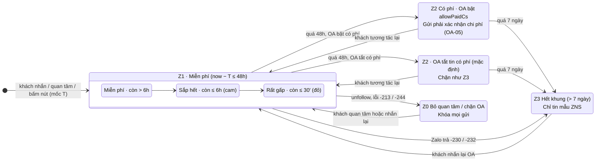
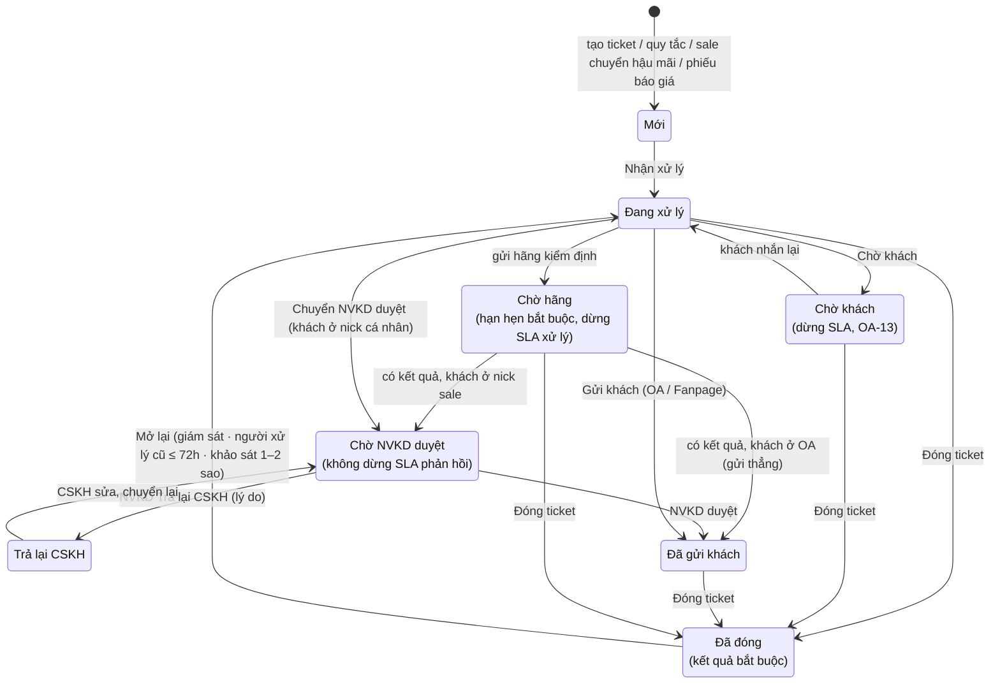
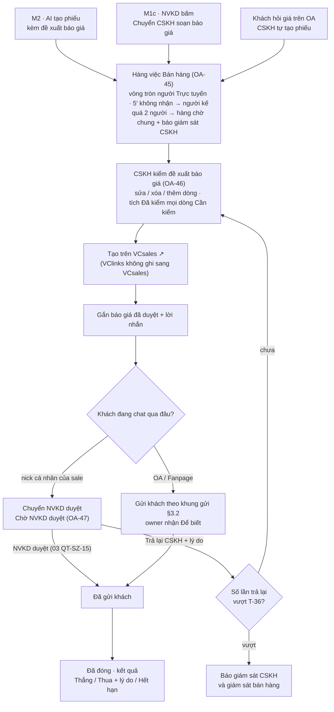
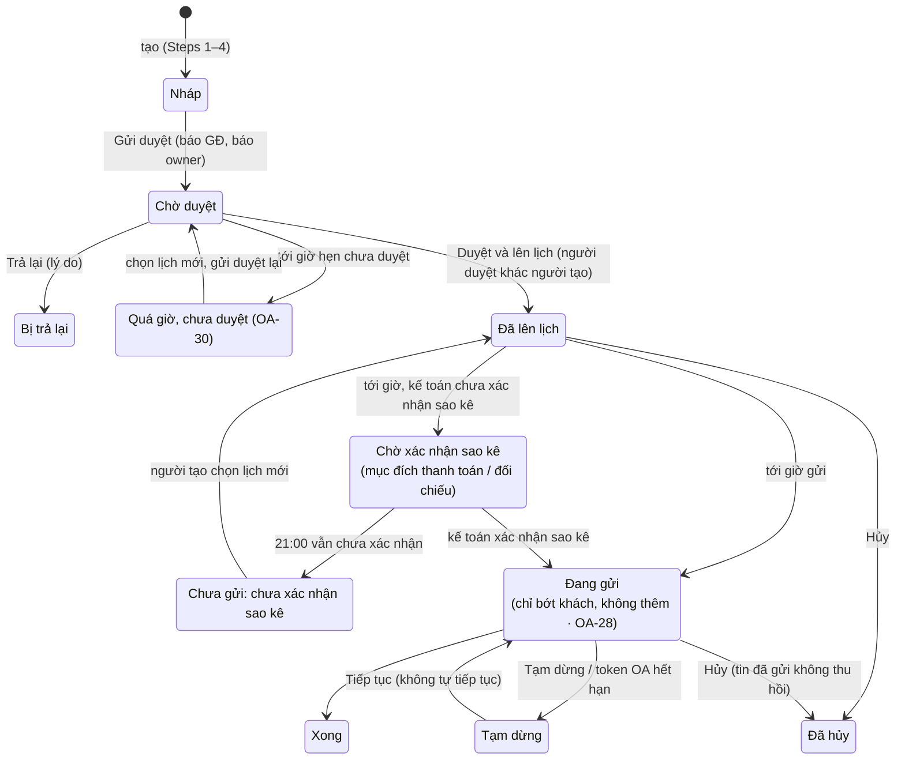
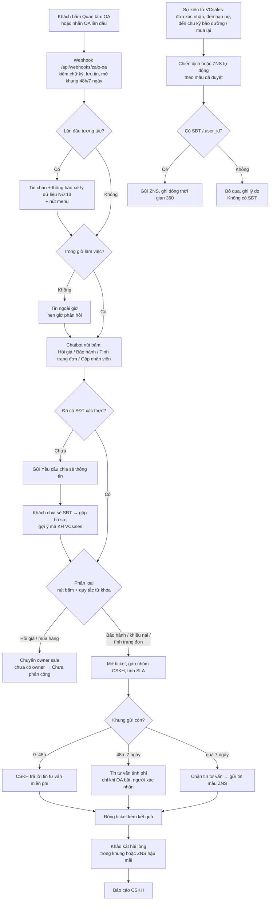

# 04 — Chăm sóc khách hàng qua Zalo OA

Phiên bản 1.5.1 · 04/10/2026 · Trạng thái: Nháp để UAT và chốt phạm vi

> Thuộc bộ đặc tả BA + UX của VClinks (`docs/02-yeu-cau/`). Căn cứ: BA tổng `docs/02-yeu-cau/vclinks-ba.md` v0.4 (§2.3, §5.2, §5.5, §5.6, §5.7, §7, §13, §17, §18.3–18.6), hướng dẫn kênh `docs/04-ky-thuat/kenh/zalo-oa.md`, code `apps/api/src/channels/zalo-oa/*`, `apps/web/src/pages/channels/ZaloOaSection.tsx`.
> Người yêu cầu: Thọ Anh Bùi.
>
> Sổ xử lý: `../ra-soat/dac-ta-vong-1/04-xu-ly.md`; bảng chốt: `../ra-soat/dac-ta-vong-1/thong-nhat.md`; chi tiết thay đổi v1.2: **Phụ lục: đồng bộ vòng 1b** (cuối file). Chỗ ghi **[Chờ chốt CH-OA-n]** là câu hỏi số n trong sổ 04 (v1.2 thêm tiền tố `CH-OA-` để khỏi trùng `CH-DK-` của 02), kèm mã quyết định trong `../../01-quan-ly-du-an/quyet-dinh-chu-du-an.md` (**QĐ-**, **TS-**); tới khi chốt, hệ thống chạy theo phương án ghi ngay tại chỗ.
>
> **Nguồn chuẩn (v1.2):** file này là nguồn chuẩn về **khung gửi Zalo OA (Z0–Z3)** và **ZNS**. Chủ đề khác chỉ trỏ tới: route, menu, màu, chip, câu chữ chung, nhãn bong bóng, trạng thái người dùng → **00** (§2, §3, MH-UI-05, MH-UI-08); quyền, khóa quyền, màn "Không có quyền" → **01** (§3, MH-PQ-11); định danh, định tuyến, owner, tạm giữ → **02**; khung gửi Fanpage (24h, `HUMAN_AGENT`) → **05**; hóa đơn, công nợ → **06**.
>
> **File liên quan:** 00 giao diện chung (khung inbox 3 cột, ô soạn chuẩn, thông báo) · 01 phân quyền · 02 khách đa kênh (Customer 360, gộp hồ sơ, SĐT, DK-24 tạm giữ, DK-49 cam kết, DK-50 xác nhận danh tính) · 03 sale Zalo cá nhân · **05 marketing quảng cáo Zalo OA / Fanpage + chatbot web** (quảng cáo, form thu lead, bài broadcast OA, khung gửi Fanpage thuộc file 05; file này chỉ tham chiếu) · **06 hóa đơn, công nợ** (dùng lại cơ chế gửi ZNS, chiến dịch của file này).
>
> **Ký hiệu hiện trạng:** **[Đã có]** có trong code ngày 29/09/2026 · **[Một phần]** có một phần · **[Mới]** chưa có. **⚠ Kiểm tra lại** = điểm chính sách Zalo chưa chắc, phải đối chiếu tài liệu Zalo hiện hành trước khi build.

## Mô hình

**Khung gửi tin tư vấn trên một hội thoại OA (§3.2, OA-05)** — mốc T là tương tác cuối của khách mà VClinks thấy; lỗi Zalo luôn thắng tính toán của VClinks.



**Vòng đời ticket / phiếu (MH-OA-06, OA-13, OA-33, OA-48)** — gồm các trạng thái mới của v1.5 (D9).



**Phiếu báo giá: CSKH soạn → NVKD duyệt / trả lại (D9, §2.2 bước 7b, OA-45…OA-47, MH-OA-20)**



**Vòng đời chiến dịch tin mẫu ZNS (MH-OA-13 #10, OA-16, OA-28, OA-30)** — quy trình CSKH tổng thể trên OA vẽ ở §2.1.



## Tóm tắt

- **Phạm vi:** đặc tả chăm sóc khách hàng qua Zalo OA — kết nối nhiều OA, Hộp thư CSKH, ticket và SLA, khung gửi, tin mẫu ZNS (mẫu, gửi lẻ, chiến dịch), tin chào / chatbot / quy tắc tự động, khảo sát, báo cáo và chi phí tin: 20 màn MH-OA-01…20, 49 quy tắc OA-01…49, 22 story OA-US, 170 ca UAT. Hóa đơn, công nợ thuộc 06; quảng cáo, Fanpage thuộc 05.
- **Khung gửi (nguồn chuẩn ở file này):** Z1 0–48h miễn phí; Z2 48h–7 ngày chỉ gửi khi OA bật tin có phí và người gửi xác nhận chi phí (mặc định tắt = chặn như Z3); Z3 quá 7 ngày chỉ tin mẫu ZNS; Z0 khách bỏ quan tâm thì khóa mọi gửi. Mọi nơi dùng một mốc T, đếm ngược bảo thủ, lỗi Zalo luôn thắng (OA-05, §3.2).
- **Quy tắc then chốt:** bấm Gửi là duyệt; tin tự động chỉ dùng phiên bản mẫu đã duyệt (OA-01). ZNS chỉ dùng mẫu qua hai lớp duyệt, nội bộ và Zalo (OA-14, OA-18). Chiến dịch từ 2 khách trở lên phải được giám đốc duyệt, người tạo không tự duyệt (OA-16), và chỉ gửi đúng tập khách đã duyệt (OA-28). Không gửi ZNS trong 21:00–08:00 (OA-17); có trần tần suất (OA-29).
- **Ticket:** SLA tính theo giờ làm việc của division, cấu hình ở MH-OA-18 (OA-13). Mỗi khách tối đa một ticket mở cho mỗi loại trong một division (OA-11). Ticket không tự mở lại (OA-33). CSKH tạm giữ khách của sale chỉ được gửi mẫu giữ khách, không nêu giá (OA-11, 02 DK-24). Có nút báo giám sát (OA-26).
- **D9 (v1.5, Buổi 9):** CSKH chia hai hàng việc Bán hàng / Hậu mãi (OA-45). Đề xuất báo giá của AI chưa phải báo giá; CSKH kiểm từng dòng rồi tạo báo giá trên VCsales (OA-46). Khách chat qua nick sale thì chuyển NVKD duyệt hoặc NVKD trả lại; khách chat qua OA / Fanpage thì CSKH gửi thẳng (OA-47). Thêm trạng thái `Chờ hãng` (OA-48) và màn MH-OA-20.
- **Quyết định đã áp:** D8-06, 07, 08, 13, 14, 15 (v1.4.3); D8-24, 25, 26, 28, 30 (v1.4.5). Riêng D8-26 là chiến dịch Nuôi lead (OA-44), kèm hai thông số còn ở mức đề xuất: TS-39 và TS-40.
- **Việc còn mở:** §9 còn 19 câu hỏi mở (Q-OA-19 đã đóng), đã gom về sổ `../../01-quan-ly-du-an/quyet-dinh-chu-du-an.md` (QĐ-03, 05, 06, 17, 19, 26, 59, 60, 63, 67…, TS-05…07, TS-11, TS-35, TT-01, 02, 09). Nhiều điểm ⚠ về chính sách Zalo / ZBS phải kiểm chứng với OA thật (TT-02).
- **Người duyệt cần xem kỹ:** (1) phần v1.5 (OA-45…49, MH-OA-20) chưa lan sang bảng trạng thái ở MH-OA-06 #1, bảng màn §5 và phần dẫn của §7; (2) quyền CSKH đọc hội thoại trên nick sale: OA-12, OA-40 và UAT-OA-147 đang nói khác nhau sau 01 D3 v1.5; (3) các chỗ ghi "BA đề xuất" còn chờ chủ dự án xác nhận (MH-OA-10, MH-OA-19 chưa VAT, TS-39, TS-40).

## Mục lục

- [1. Mục tiêu, phạm vi, vai trò](#1-mục-tiêu-phạm-vi-vai-trò)
- [2. Quy trình CSKH trên OA](#2-quy-trình-cskh-trên-oa)
- [3. Chính sách gửi (C5) của Zalo OA](#3-chính-sách-gửi-c5-của-zalo-oa)
- [4. Quy tắc nghiệp vụ riêng kênh OA (OA-xx)](#4-quy-tắc-nghiệp-vụ-riêng-kênh-oa-oa-xx)
- [5. Đặc tả màn hình](#5-đặc-tả-màn-hình)
- [6. User story](#6-user-story)
- [7. Tổng hợp UAT](#7-tổng-hợp-uat)
- [8. Hiện trạng code và điểm lệch với BA tổng](#8-hiện-trạng-code-và-điểm-lệch-với-ba-tổng)
- [9. Câu hỏi mở](#9-câu-hỏi-mở)
- [10. Nguồn](#10-nguồn)
- [Phụ lục: đồng bộ vòng 1b](#phụ-lục-đồng-bộ-vòng-1b)
- [Lịch sử cập nhật](#lịch-sử-cập-nhật)

---

## 1. Mục tiêu, phạm vi, vai trò

### 1.1 Mục tiêu

1. Mọi khiếu nại, bảo hành, hỏi tình trạng đơn đến qua Zalo OA thành **ticket có SLA**, không nằm rải rác trong chat của sale.
2. CSKH trả lời **trong khung Zalo cho phép**, biết rõ còn bao lâu, không bị Zalo từ chối hay tính phí bất ngờ.
3. Khi hết khung, chuyển sang **tin mẫu (ZNS / ZBS Template Message)** đúng mẫu đã duyệt, có ước tính chi phí.
4. Lấy **SĐT đã xác thực** của khách qua "Yêu cầu chia sẻ thông tin" để gộp hồ sơ và liên kết mã KH VCsales.
5. Chăm sóc chủ động bằng tin mẫu: xác nhận đơn, nhắc bảo dưỡng, nhắc mua lại, nhắc thanh toán. Có duyệt chi phí của giám đốc.
6. Đo chất lượng: FRT, % đúng SLA, điểm hài lòng sau ticket.

### 1.2 Phạm vi

| Trong phạm vi | Ngoài phạm vi (xem file khác) |
|---|---|
| Kết nối và theo dõi nhiều OA | Quảng cáo Zalo, form thu lead, bài viết broadcast OA → **05** |
| Hộp thư CSKH theo OA, ticket, SLA | Chatbot trên website → **05** |
| Khung chat và ô soạn riêng của OA | Khung inbox chuẩn, thông báo, phím tắt → **00** |
| Tin chào, ngoài giờ, menu OA, chatbot nút bấm trong OA | Vai trò, phạm vi xem, cấp quyền tạm → **01** |
| Quy tắc tự động (từ khóa → tag + ticket) | Customer 360, gộp / tách hồ sơ → **02** |
| Mẫu ZNS, gửi ZNS lẻ, chiến dịch ZNS (xác nhận đơn, nhắc nợ, nhắc bảo dưỡng, nhắc mua lại) | Sale bán hàng trên nick Zalo cá nhân → **03** |
| Tag người quan tâm OA ↔ tag VClinks | Tạo báo giá (trên VCsales, Q4) |
| Khảo sát hài lòng, báo cáo CSKH | Ghi dữ liệu sang VCsales (BR12: không bao giờ) |
| SLA và giờ làm việc, bảng phí hậu mãi (MH-OA-18), chi phí tin mẫu (MH-OA-19) | **Phiếu yêu cầu xuất hóa đơn, danh sách hóa đơn, gửi hóa đơn, công nợ chi tiết, phản hồi thanh toán** (KT-01, KT-02, F9.9, F9.11) → **06-hoa-don-cong-no.md** (MH-HD-01…11). File này chỉ giữ cơ chế gửi ZNS / chiến dịch mà 06 dùng lại |
| Hộp thư CSKH lọc theo **kênh chính thức** CSKH trực (OA, Fanpage, chat web), ticket gắn với khách | Khung gửi Fanpage (24h, `HUMAN_AGENT` 7 ngày, câu chặn, ngưỡng cảnh báo) → **05** (chủ quản Fanpage, thong-nhat #22) |
| Xác nhận danh tính trên OA (DK-50), khối "Cam kết đã nêu" trong khung chat OA (DK-49), tạm giữ hội thoại Bán hàng (DK-24): **phần hiển thị trên OA** | Quy tắc gốc: tạm giữ, định tuyến, cam kết, danh tính → **02** |

### 1.3 Vai trò trên kênh OA

| Vai trò | Việc chính trên OA | Không được |
|---|---|---|
| **Admin hệ thống** | Kết nối / ngắt / kết nối lại OA; gán OA cho division; nhập đơn giá tin để ước tính chi phí | Xem token (không ai xem được) |
| **Nhân viên CSKH** | **[v1.5·D9-01]** *Thuộc hàng việc Bán hàng ("chăm sóc bán hàng") và / hoặc Hậu mãi.* Hàng Bán hàng: nhận phiếu báo giá, kiểm **đề xuất báo giá** của AI, tạo báo giá trên VCsales, soạn lời nhắn, chuyển NVKD duyệt khi khách ở nick sale (MH-OA-20, OA-45…47). Hàng Hậu mãi: ticket bảo hành, khiếu nại, đổi trả, `Chờ hãng` (OA-48). Nhận ("Nhận") hội thoại OA ở hàng "Chưa phân công"; tạo, xử lý, đóng, bàn giao ticket; báo giám sát; trả lời trong khung; gửi ZNS lẻ theo mẫu đã duyệt (khóa `zns.send_single`, 01); yêu cầu chia sẻ thông tin; xác nhận danh tính khách (DK-50, OA-37); tạm giữ hội thoại "Bán hàng" khi owner Vắng hoặc quá hạn trả lời (02 DK-24) | Nêu giá / gửi báo giá cho khách đã có owner (DK-31; số khớp bảng phí hậu mãi thì được, OA-39); trả lời hội thoại "Bán hàng" của khách đã có owner khi không có ticket, **trừ khi tạm giữ** theo 02 DK-24: chỉ gửi **mẫu giữ khách đã duyệt**, không nêu giá, owner không đổi (thong-nhat #3); tạo chiến dịch ZNS |
| **Giám sát CSKH** *(= CSKH có cờ "Trưởng nhóm" theo 01)* | Phân ticket, đổi người xử lý, trả lời thay (khóa `conv.reply_on_behalf` trong phạm vi CSKH, 01); soạn tin chào, ngoài giờ, menu, chatbot, tag, khảo sát trong **Kết nối kênh › Zalo OA, chỉ các tab nội dung**, giám đốc duyệt trước khi bật **[v1.4.3·D8-06]**; **tạo / sửa** quy tắc tự động, giám đốc bật **[v1.4.3·D8-07]** (01 `automation.edit`); tạo chiến dịch ZNS (chờ duyệt); xem báo cáo CSKH; **xem chi phí tin (MH-OA-19, chỉ xem) [v1.4.3·D8-08]** | Duyệt chiến dịch ZNS của chính mình; kết nối / ngắt / token OA, đơn giá tin (chỉ Admin, D8-06); bật / tắt quy tắc tự động (D8-07); nhập chi phí thực, xuất Excel chi phí (D8-08) |
| **Giám đốc bán hàng (division)** | Duyệt mẫu ZNS nội bộ trước khi nộp Zalo; duyệt chiến dịch ZNS và chi phí (GD-05); **cấu hình SLA và giờ làm việc (MH-OA-18)**; bật / tắt tin tư vấn có phí; duyệt nội dung tin chào, menu, chatbot, khảo sát trước khi bật (D8-06); **bật / tắt quy tắc tự động [v1.4.3·D8-07]**; xem chi phí tin (MH-OA-19) | Duyệt thứ mình tạo (PQ-27) |
| **Sale admin** | Soạn và nộp mẫu ZNS; gửi ZNS xác nhận / cập nhật trạng thái đơn (CS-07; khóa `zns.send_single`, 01) | Duyệt chiến dịch; gửi tin tư vấn (01 `conv.reply` SA ✖) |
| **Kế toán** | Tạo chiến dịch mục đích Nhắc thanh toán, Đối chiếu công nợ, Hóa đơn (06 HD-28), chờ duyệt; xem báo cáo các chiến dịch đó của division; xem và nhập chi phí thực (MH-OA-19, khóa `cost.view`, `cost.edit_actual`, 01). Phiếu hóa đơn, gửi hóa đơn, danh sách công nợ, phản hồi thanh toán → **06** (MH-HD-01…11) | Trả lời hội thoại tư vấn; đọc hội thoại (PQ-23) |
| **NVKD (sale)** | Nhận hội thoại OA "Bán hàng" của khách mình (DK-22); trả lời, gửi báo giá VCsales; nhận thông báo khi khách mình có ticket (DK-33) hoặc nằm trong chiến dịch ZNS; xin loại khách khỏi chiến dịch (**trừ** mục đích Nhắc thanh toán / Đối chiếu công nợ: dùng báo trước 06 MH-HD-13 **[v1.4.3·D8-15]**) | Xử lý ticket không được giao |
| **Bot** | Gửi tin chào, ngoài giờ, trả lời chatbot, ZNS tự động — **chỉ nội dung / mẫu đã duyệt** (BR07) | Soạn nội dung mới, gửi ngoài khung |
| **Viewer (ban giám đốc)** | Xem báo cáo CSKH | Mọi thao tác ghi |

> **Quyền (v1.2, thong-nhat #18):** bảng trên chỉ mô tả việc. Quyền và phạm vi theo ma trận **01 §3**; các khóa `zns.send_single`, `cost.view`, `cost.edit_actual`, `conv.reply_on_behalf` (giám sát CSKH trong phạm vi CSKH) 01 đã thêm ở v1.2 (§3.1, §3.4, chú thích (31)); dev làm theo 01. Mọi màn "Không có quyền" dùng **01 MH-PQ-11** (dạng A trang, B đối tượng, C nút khóa); câu cho người chỉ xem hội thoại dùng **00 MH-UI-08**: "Bạn chỉ có quyền xem hội thoại này."

---

## 2. Quy trình CSKH trên OA

### 2.1 Sơ đồ



### 2.2 Các bước

| # | Bước | Ai / cái gì | Kết quả trong VClinks |
|---|---|---|---|
| 1 | Khách **quan tâm OA** hoặc nhắn OA lần đầu | Khách | Webhook `follow` hoặc `user_send_*`. Tạo contact + danh tính kênh `zoa_<oaId>:<user_id>`. Hội thoại mới trong hàng "Chưa phân công" của CSKH trực OA; thông báo gộp "Khách chờ nhận" (00 MH-UI-03, tối đa 1 lần / 5 phút). Mốc "tương tác cuối" cập nhật. Khách **chỉ quan tâm**, chưa nhắn, chưa có SĐT, đến từ quảng cáo → 05 tạo lead `Chờ thông tin` (không giao sale, không chạy SLA; 05 làm chủ) |
| 2 | **Tin chào** có thông báo xử lý dữ liệu (NĐ 13) và nút menu | Bot, nội dung đã duyệt (MH-OA-08) | Tin ghi `Tin tự động · Tin chào`. Chỉ gửi một lần mỗi khách mỗi 30 ngày |
| 3 | Ngoài giờ làm việc → **tin ngoài giờ** | Bot | Nêu giờ mở cửa, hạn phản hồi. SLA bắt đầu tính từ giờ mở cửa kế tiếp |
| 4 | **Chatbot nút bấm**: Hỏi giá · Bảo hành / đổi trả · Tình trạng đơn · Gặp nhân viên | Khách bấm | Mỗi nút gắn tag và "ý định" cho hội thoại (MH-OA-09) |
| 5 | **Yêu cầu chia sẻ thông tin** nếu chưa có SĐT xác thực | Bot (theo kịch bản) hoặc CSKH bấm | Khách đồng ý → SĐT xác thực, tên, địa chỉ vào hồ sơ **người liên hệ** (contact); tự gộp nếu trùng SĐT xác thực (BR05); gợi ý mã KH VCsales (SA-01). Tên, địa chỉ này **không** tự điền vào thông tin xuất hóa đơn (OA-27) |
| 5a | **Xác nhận danh tính** khi khách hỏi đơn / công nợ mà danh tính chưa xác nhận | CSKH | Ba nút theo 02 DK-50 (OA-37). Chưa xác nhận: không nói đơn, công nợ, giá riêng |
| 6 | **Phân loại** theo nút + quy tắc từ khóa, gắn **loại yêu cầu** (DK-23: Bán hàng / Hậu mãi / Công nợ – hóa đơn / Khác) | Hệ thống (MH-OA-10) | Định tuyến theo bảng DK-22 của 02, **chỉ khi hội thoại chưa có người xử lý** (hoặc sau "Đã xong"); đang có người xử lý → mời người đúng loại làm người tham gia (DK-23). Bán hàng → owner sale (F12.3), chưa có owner → "Chưa phân công"; owner **Vắng** (02 DK-47, trạng thái theo 00 MH-UI-05) hoặc **quá hạn trả lời** (02 DK-48) → CSKH tạm giữ theo DK-24: chỉ mẫu giữ khách đã duyệt (`/giu-khach`), không nêu giá, owner không đổi. Hậu mãi (bảo hành / khiếu nại / tình trạng đơn / đổi trả) → mở ticket, nhóm CSKH. Công nợ – hóa đơn (kể cả tin trả lời một ZNS nhắc thanh toán) → owner; CSKH tạm giữ không nói số nợ, dùng mẫu `/cong-no-chuyen-owner`; bản sao "Phản hồi thanh toán" cho kế toán → 06 HD-36 |
| 7 | **Ticket**: loại, mức ưu tiên, người xử lý, hạn SLA | CSKH / giám sát CSKH | Ticket gắn với **khách** và division của kênh nhận (OA-34); hiện trong 360, "Việc cần làm", hàng "Ticket của tôi". Owner sale tự nhận thông báo (DK-33, OA-36). Hạn xử lý, phương án đã hứa với khách ghi vào `stated_commitments` (OA-38) |
| 7a | **Sale chuyển hậu mãi** từ Zalo cá nhân (02 §5.3 "Chuyển hậu mãi cho CSKH") | NVKD | Ticket mới kèm tin sale chọn vào hàng "Chưa phân công" của nhóm CSKH division (OA-40) |
| 7b | **[v1.5·D9]** **Phiếu báo giá** từ hội thoại nick sale: (M2) AI tạo kèm đề xuất báo giá; (M1c) NVKD bấm "Chuyển CSKH soạn báo giá" (03 QT-SZ-14). Khách hỏi giá trên **OA** của CSKH thì CSKH tự tạo phiếu | AI / NVKD / CSKH | Phiếu vào hàng việc **Bán hàng**; CSKH kiểm đề xuất, tạo báo giá trên VCsales, gắn báo giá đã duyệt + lời nhắn → khách ở nick sale: `Chờ NVKD duyệt` (03 QT-SZ-15); khách ở OA: CSKH gửi thẳng (F9.6) và báo owner |
| 7c | **[v1.5·D9]** **Gửi hãng / bộ phận bảo hành** kiểm định | CSKH hậu mãi | Ticket `Chờ hãng`, hạn hẹn; đồng hồ xử lý dừng; nhắc trước hạn 1 ngày; khi có kết quả CSKH soạn câu trả lời (OA: gửi thẳng; nick sale: `Chờ NVKD duyệt`) |
| 8 | **Trả lời trong khung** | CSKH bấm gửi | Đếm ngược khung trên khung chat. 0–48h miễn phí. 48h–7 ngày có phí (nếu OA bật). Quá 7 ngày → chặn |
| 9 | Hết khung → **ZNS** | CSKH chọn mẫu | Mẫu đã duyệt, cần SĐT (hoặc user_id nếu Zalo cho gửi theo UID ⚠) |
| 10 | **Đóng ticket** kèm kết quả | CSKH | Ghi kết quả, nguyên nhân; hội thoại chuyển "Đã xong" (BR04 mở lại khi khách nhắn) |
| 11 | **Khảo sát hài lòng** | Bot | Trong khung: tin nút bấm 1–5 sao. Ngoài khung: ZNS mẫu đánh giá (nếu có mẫu) |
| 12 | **Chăm sóc chủ động** | Bot / kế toán / sale admin | ZNS xác nhận đơn, nhắc bảo dưỡng, nhắc mua lại (F8.4), nhắc thanh toán (KT-03). Chiến dịch cần giám đốc duyệt |

---

## 3. Chính sách gửi (C5) của Zalo OA

> Nguồn: `docs/04-ky-thuat/kenh/zalo-oa.md` §6 (đã đối chiếu tài liệu Zalo khi làm connector), trang Zalo OA "Tổng quan các loại tin nhắn", thông báo ra mắt **ZBS Template Message** (xem §10). **Mọi con số dưới đây ⚠ phải kiểm tra lại với tài liệu Zalo hiện hành ngay trước khi build, và cấu hình được, không viết cứng.**

### 3.1 Các loại tin

| Loại tin | Khi nào dùng | Điều kiện của Zalo | Chi phí | VClinks |
|---|---|---|---|---|
| **Tin tư vấn** (Customer Service, API `/v3.0/oa/message/cs`) | Trả lời khách, tin chào, chatbot, khảo sát trong khung | Khách **tương tác với OA trong 7 ngày**, không chặn OA | **0–48h** từ tương tác cuối: miễn phí. **48h–7 ngày**: tính phí, cần tài khoản thanh toán của Zalo (ZCA, nay là **ZBS Account** ⚠) có số dư | [Đã có] text. [Mới] ảnh, file, nút, danh sách |
| **Tin yêu cầu chia sẻ thông tin** (tin tư vấn dạng `request_user_info` ⚠) | Lấy SĐT, tên, địa chỉ | Như tin tư vấn ⚠ | Như tin tư vấn ⚠ | [Mới] |
| **Tin mẫu — ZNS / ZBS Template Message** | Xác nhận đơn, nhắc thanh toán, nhắc bảo dưỡng, hậu mãi, khảo sát, ngoài khung | Mẫu **Zalo duyệt trước**. Gửi tới **SĐT** (và theo Zalo 2026 có thể theo **UID** ⚠). Nội dung chỉ thay tham số | Trả phí theo từng tin gửi thành công, giá theo loại mẫu ⚠ | [Mới] |
| **Tin truyền thông / broadcast** | Quảng bá, khuyến mãi | Theo gói OA, hạn mức theo tháng ⚠ | ⚠ | **Thuộc file 05** |

**Thay đổi quan trọng ⚠:** từ **01/01/2026** Zalo gộp ZNS, tin Giao dịch và tin Truyền thông theo UID thành **ZBS Template Message** (hai nhóm chính: *Giao dịch* và *Chăm sóc sau bán*), trang thanh toán ZCA chuyển thành **ZBS Account**. BA tổng và tài liệu này vẫn gọi chung là **"ZNS"** cho quen; trên giao diện dùng nhãn **"Tin mẫu (ZNS)"**. Tên API, cách gọi và phân loại mẫu phải lấy theo tài liệu ZBS hiện hành.

### 3.2 Khung gửi (cửa sổ) theo từng hội thoại

VClinks tính mốc **T = thời điểm tương tác cuối của khách mà VClinks nhìn thấy** (webhook `user_send_*`, `follow`, `user_submit_info`, bấm menu / nút chatbot). Zalo có thể tính thêm tương tác VClinks không thấy (gọi thoại, bình luận bài viết, nhóm GMF). Vì vậy đếm ngược của VClinks là **bảo thủ**: có thể báo hết sớm, không bao giờ báo còn khi Zalo đã hết.

Tên gọi thống nhất (thong-nhat #27): **ba vùng thời gian (Z1–Z3) + trạng thái Z0 bỏ quan tâm**. Z1 chia ba mức hiển thị (miễn phí / sắp hết / rất gấp).

| Vùng | Điều kiện | Dải trên khung chat (chữ chính xác) | Kiểu hiển thị (theo 00) | Ô soạn |
|---|---|---|---|---|
| **Z1 Miễn phí** | now − T ≤ 48h, còn > 6h | `Còn 31 giờ 12 phút để trả lời miễn phí` | Không cảnh báo (00 §3.1: chỉ dùng vàng / cam / đỏ cho cảnh báo) | Gửi bình thường |
| **Z1 sắp hết** | còn ≤ 6h | `Còn 2 giờ 05 phút để trả lời miễn phí` | Cảnh báo kiểu **Đặc**, cam | Gửi bình thường; banner nhắc |
| **Z1 rất gấp** | còn ≤ 30 phút | `Còn 18 phút để trả lời miễn phí` | Cảnh báo kiểu **Đặc**, đỏ | Gửi bình thường |
| **Z2 Có phí — OA bật tin có phí** | 48h < now − T ≤ 7 ngày; `allowPaidCs` bật | `Hết khung miễn phí. Tin tư vấn sẽ tính phí — còn 4 ngày 3 giờ trước khi không gửi được` | Cảnh báo kiểu **Đặc**, màu **cam đặc** (v1.4.1, BA chốt; vàng dành cho SLA "Sắp quá"; **không dùng tím**) theo 00 §3.1, §3.4a | Bấm Gửi mở hộp xác nhận chi phí (OA-05) |
| **Z2 — OA tắt tin có phí** (mặc định) | như trên; `allowPaidCs` tắt | `Đã hết 48 giờ miễn phí. OA không gửi tin có phí.` (không hiện đếm ngược tới 7 ngày) | Như Z3 (xám) | Chặn như Z3; nút **Gửi tin mẫu (ZNS)** |
| **Z3 Hết khung** | now − T > 7 ngày | `Khách chưa tương tác với OA quá 7 ngày. Không gửi được tin tư vấn. Dùng tin mẫu (ZNS).` | Xám (00 §3.4a "Hết khung") | Ô nhập khóa; nút **Gửi tin mẫu (ZNS)** |
| **Z0 Bỏ quan tâm / chặn** | Nhận `unfollow`, hoặc Zalo trả `-213`, `-244` | `Khách đã bỏ quan tâm OA. Không gửi được tin cho tới khi khách quan tâm hoặc nhắn lại.` | Theo 00 §3.4a ("Bỏ quan tâm") | Khóa mọi gửi, kể cả ZNS theo UID; ZNS theo SĐT tùy chính sách Zalo ⚠ |

- **Chip trên danh sách** (chữ ngắn, khi nào hiện trên `/conversations`, riêng `/cskh` luôn hiện cả Z1) theo **00 §3.4a** (UI-TP-17). Bảng trên chỉ quy định **ngưỡng, dải khung chat và cách chặn**.
- **Một phép tính cho mọi nơi (v1.2, góp ý thiết kế lượt 2 P-CS #1):** dải khung chat, panel "Khung gửi" (MH-OA-03 #14), chip danh sách, Customer 360 và Ticket của tôi đọc **cùng** mốc T và cùng `send_policy`, nên luôn ra cùng một con số.
- Các ngưỡng 48h, 7 ngày, 6h, 30 phút lưu trong `send_policy` của kênh (C5), admin sửa được.
- Đếm ngược cập nhật mỗi phút, không cần tải lại trang.
- Tin khách mới tới → mốc T đổi ngay (realtime).
- **Lỗi từ Zalo luôn thắng tính toán của VClinks:** nhận `-230` / `-232` → hội thoại chuyển Z3 ngay, ghi "Zalo báo hết khung".

### 3.3 Hạn mức và nhịp

| Giới hạn | Giá trị | Nguồn / trạng thái |
|---|---|---|
| Độ dài tin text | 2.000 ký tự | Mã lỗi `-210`; Outbox VClinks cũng giới hạn 2.000 [Đã có] |
| Số tin tư vấn trong 48h | Không giới hạn từ 01/01/2026 ⚠ | `docs/04-ky-thuat/kenh/zalo-oa.md` §6 |
| Hạn mức tin của OA / tới một người | Có (lỗi `-211`, `-218`), con số theo gói OA ⚠ | Chưa rõ số, lấy từ gói OA |
| Tốc độ gọi API | Có (lỗi `-32`) ⚠ | Dispatcher lùi và thử lại |
| Webhook phải trả 200 | Trong khoảng 2 giây ⚠ | [Đã có] trả nhanh, xử lý nền |
| Duyệt mẫu ZNS | Khoảng 2–3 ngày làm việc ⚠ | Thông báo ZBS; con số dùng để hiển thị gợi ý, không cam kết |
| Refresh token OA | Dùng một lần, sống 3 tháng | [Đã có] khóa chống dùng hai lần, làm mới chủ động 30 phút/lần |

### 3.4 Chi phí

- VClinks **không ghi cứng giá**. Admin nhập **bảng đơn giá** trên MH-OA-01 (tab "Chi phí"): đơn giá tin tư vấn Z2, đơn giá từng loại mẫu ZNS, ngày áp dụng, nguồn (link bảng giá Zalo).
- Mọi nơi hiện chi phí ghi rõ: `Ước tính theo đơn giá nhập ngày {dd/MM/yyyy}. Chi phí thực tế theo hóa đơn Zalo.` — `{dd/MM/yyyy}` = ngày áp dụng của đơn giá đang dùng (MH-OA-01 tab Chi phí). **[v1.4.3]** Ví dụ trong file dùng ngày nhập đơn giá của TD: **28/09/2026** (T−1 ngày, `../../05-kiem-thu/du-lieu-kiem-thu.md` v1.4.1 bảng đơn giá giả 300 đ / tin ZNS), không dùng 01/10/2026 (sau mốc T).
- Số dư ZBS Account: nếu Zalo có API đọc số dư ⚠ thì hiện trên MH-OA-01; nếu không, admin nhập tay "ngân sách tháng" để VClinks cảnh báo khi dùng quá 80%.
- **Chi phí thực:** cuối tháng kế toán nhập số tiền theo hóa đơn ZBS của Zalo cho từng OA (hoặc đồng bộ nếu Zalo có API ⚠). MH-OA-19 hiện **ước tính, thực, chênh lệch**, chia theo OA, division, mục đích mẫu, loại gửi (ZNS lẻ / chiến dịch / tự động / tin tư vấn có phí) và người gửi ZNS lẻ.
- **Ngân sách và trần chi phí [Chờ chốt CH-OA-4 → QĐ-67]:** tới khi chốt, ngân sách tháng **không bắt buộc**, dùng quá 80% thì báo giám đốc và kế toán, vượt 100% thì cảnh báo cam, không chặn. Phương án BA đề xuất (chặn ở 100%, trừ ZNS Giao dịch tự động) ghi trong CH-OA-4.

### 3.5 Chặn gửi và chuyển sang ZNS

1. Trước khi đưa tin vào outbox, API kiểm vùng khung (OA-05). Z3 / Z0 → từ chối, trả lý do.
2. Dispatcher kiểm lại **ngay trước khi gọi Zalo** (khung có thể hết trong lúc chờ).
3. Zalo vẫn từ chối → tin `Lỗi gửi` với lý do tiếng Việt [Đã có bảng mã lỗi] và nút **Gửi bằng tin mẫu (ZNS)** nếu lỗi thuộc nhóm hết khung.
4. **Chuyển sang ZNS**: mở MH-OA-12 với khách, hội thoại, ticket điền sẵn. Nội dung người vừa gõ **không** tự đưa vào ZNS (ZNS chỉ nhận tham số) nhưng **được giữ làm nháp** của hội thoại (dùng lại khi khung mở, hoặc chép sang ghi chú nội bộ bằng một nút). Hệ thống xếp **1–2 mẫu hợp nhất** lên đầu danh sách theo loại ticket / mục đích, mỗi mẫu có câu "Dùng khi…" (MH-OA-11 #9).
5. **Khi chưa có mẫu phù hợp** (mẫu chưa duyệt, Zalo từ chối, hoặc giai đoạn chưa có ZNS **[Chờ chốt CH-OA-3 → QĐ-03]**): khối chặn Z3 ghi rõ cách khác: `Chưa có tin mẫu phù hợp. Cách khác: gọi khách theo SĐT (bấm Hiện), ghi chú nội bộ để theo dõi; khách nhắn lại OA thì khung gửi mở lại ngay.`

---

## 4. Quy tắc nghiệp vụ riêng kênh OA (`OA-xx`)

| Mã | Quy tắc | Liên quan BA tổng |
|---|---|---|
| **OA-01** | Mọi tin tư vấn do người gửi phải do người bấm Gửi; bấm Gửi là duyệt (`approvedBy`, `approvedAt`). Tin tự động chỉ gồm: tin chào, ngoài giờ, trả lời chatbot, khảo sát, ZNS tự động, tin của quy tắc tự động (MH-OA-10) — **chỉ dùng mẫu / phiên bản nội dung đã duyệt**. Theo quy tắc chung ở 01 (thong-nhat #21): tin tự động lưu `approvedBy` = người duyệt phiên bản mẫu, `approvedAt` = lúc duyệt phiên bản đó; người bật quy tắc **không** tự duyệt mẫu (01 PQ-27); outbox **từ chối** tin tự động không trỏ tới phiên bản mẫu đã duyệt. | BR07, CLAUDE.md §12.1, 01 |
| **OA-02** | Token OA lưu mã hóa trong `channel_credentials`; không hiển thị, không log, không trả qua API / MCP. Giao diện chỉ hiện trạng thái và hạn. | §12.2, F15.10 |
| **OA-03** | Webhook sai chữ ký hoặc sai `app_id` → trả 401, **không lưu gì**, ghi nhật ký (không ghi thân). Webhook của OA chưa kết nối → trả 200, bỏ qua. | §4.4 |
| **OA-04** | Chống trùng: `_id = zoa_<oaId>:<msg_id>`; Zalo gửi lại sự kiện không sinh bản ghi mới. Tin VClinks gửi và echo `oa_send_*` gộp làm một. | C2 |
| **OA-05** | Khung gửi theo §3.2. Z3 và Z0: chặn tin tư vấn. Z2: chặn trừ khi OA bật "Cho phép tin tư vấn tính phí" **và** người gửi xác nhận chi phí trong hộp thoại. | BR03 (sửa, xem §8.3) |
| **OA-06** | Tin chào gửi tối đa một lần / khách / OA / 30 ngày. Phải có câu thông báo xử lý dữ liệu cá nhân và link chính sách (NĐ 13/2023). | F7.1 |
| **OA-07** | Tin ngoài giờ gửi tối đa một lần / hội thoại / ca ngoài giờ. Không gửi nếu tin chào vừa gửi trong 5 phút. | F7.1 |
| **OA-08** | Chatbot chỉ trả lời bằng nội dung đã duyệt trong kịch bản; không dùng AI tự sinh câu trả lời gửi khách. Nút "Gặp nhân viên" luôn có ở mọi bước. | BR07, F7.2 |
| **OA-09** | Yêu cầu chia sẻ thông tin gửi tối đa 2 lần / khách / 30 ngày. Khách từ chối hoặc không trả lời → không hỏi lại tự động. | F13.2 |
| **OA-10** | SĐT khách chia sẻ qua OA là **SĐT đã xác thực**: được tự gộp hồ sơ khi trùng SĐT xác thực khác (BR05); hiển thị ẩn `0900 *** 101` với người không phụ trách; xem đầy đủ ghi nhật ký. | BR05, F11.2 |
| **OA-11** | Phân loại theo loại yêu cầu (DK-22, DK-23), **chỉ định tuyến khi hội thoại chưa có người xử lý** (hoặc sau "Đã xong"); hội thoại đang có người xử lý thì người đúng loại được mời làm người tham gia, không đổi người xử lý (DK-23). "Hỏi giá" (Bán hàng) → không mở ticket, chuyển owner sale. Owner **Vắng** (trạng thái theo 00 MH-UI-05, ngưỡng một tham số theo 02 DK-47, mặc định 30′, tính cả tin gửi từ điện thoại — **[Chờ QĐ-06, TS-07]**) hoặc owner **quá hạn trả lời** (02 DK-48 — **[Chờ QĐ-06, TS-05, TS-06]**) → CSKH trực kênh **tạm giữ** theo 02 DK-24: chỉ gửi **mẫu giữ khách đã duyệt** (`/giu-khach`), không nêu giá, không nói số nợ; **owner không đổi**; tạm giữ kết thúc khi owner gửi tin đầu tiên hoặc bấm "Tôi trả lời ngay". Owner **Đi thị trường** tính như có mặt với khách của mình (hạn trả lời vẫn chạy); owner có cờ Nghỉ phép → người trực thay (01 PQ-32). "Bảo hành", "Khiếu nại", "Tình trạng đơn", "Đổi trả" (Hậu mãi) → mở ticket CSKH. **Một tin có cả hai ý** (vd. "má phanh kêu, báo giá luôn bộ mới"): mở ticket hậu mãi **và** bấm `Báo sale báo giá` → owner nhận việc báo giá (nhắc việc + thông báo), được mời tham gia hội thoại với quyền báo giá (DK-31); CSKH giữ ticket. Một khách có tối đa **một ticket đang mở mỗi loại** trong một division. Hạn trả lời của sale trên hội thoại hỏi giá chuyển từ OA: theo 02 DK-48 **[Chờ chốt CH-OA-2 → QĐ-06, TS-05: 15′ / TS-06: 30′]**. | F12.3, F15.1, 02 DK-22…24, DK-31, DK-47, DK-48 |
| **OA-12** | CSKH gửi tin trong: hội thoại có ticket được giao cho mình; hội thoại chưa phân công hoặc giao cho mình trên kênh mình trực; hội thoại "Bán hàng" đang tạm giữ theo DK-24 (chỉ mẫu giữ khách đã duyệt, không nêu giá). Ngoài ra chỉ đọc + ghi chú (01 D3, D4, chú thích (4) của `conv.reply`). Đọc hội thoại của khách trên kênh khác / nick cá nhân của sale: theo 01 D3 và chú thích (1) của `conv.view` — chỉ hội thoại gắn ticket giao cho mình, chỉ đọc, mặc định chỉ tin trong **30 ngày trước khi mở ticket** trở đi ("Xem thêm" để đọc xa hơn, ghi nhật ký); owner / người giữ nick thấy ghi chú hệ thống "CSKH {tên} đã mở hội thoại này lúc {HH:mm dd/MM}". Mở rộng quyền đọc (khối "Cam kết đã nêu", toàn văn): **[Chờ chốt CH-OA-1 → QĐ-05, TS-35]**. | F12.7, BR10, 01 D3/D4 |
| **OA-13** | SLA ticket tính theo **giờ làm việc** của division, cấu hình ở **MH-OA-18** (giám đốc sửa; áp dụng cho ticket tạo **từ lúc lưu**, không tính lại ticket cũ); tạm dừng khi ticket ở "Chờ khách" và ngoài giờ / ngày lễ. **Hạn phản hồi** tính từ tin khách đầu tiên chưa được người trả lời; **hạn xử lý** tính từ lúc tạo ticket. Chip và ngưỡng "Sắp quá" (còn ≤ 25% hạn, tham số) theo 00 §3.4; quá hạn → chip đỏ, báo giám sát CSKH. | F4.3, 01 `config.sla`, 00 §3.4 |
| **OA-14** | ZNS chỉ gửi bằng **mẫu đã được Zalo duyệt và đang bật trong VClinks**. Tham số điền từ dữ liệu hệ thống; tham số trống → không gửi, báo lỗi dòng. | F8.2 |
| **OA-15** | ZNS cần **SĐT hợp lệ** của người nhận. **Người nhận theo mục đích mẫu:** mục đích Nhắc thanh toán, Đối chiếu công nợ, Hóa đơn → ưu tiên người liên hệ có vai trò **"Kế toán / Thanh toán"** của account (02, tab Người liên hệ); không có → gửi lẻ thì bắt người gửi chọn người nhận (không tự lấy), chiến dịch thì loại khách với lý do `Chưa có người nhận thanh toán`. Mục đích khác → SĐT xác thực OA của người đang nhắn, rồi SĐT VCsales. Không có SĐT → không gửi, ghi lý do `Không có SĐT`. | F8.2, F13.1 |
| **OA-16** | ZNS lẻ do người bấm gửi, tối đa 1 tin / khách / mẫu / 24h. Gửi từ 2 khách trở lên là **chiến dịch**, bắt buộc giám đốc division duyệt (GD-05). Người tạo không tự duyệt; chiến dịch do giám đốc tạo → giám đốc khác cùng division hoặc Ban giám đốc (`quan_sat`) duyệt (01 PQ-27). Duyệt thay khi vắng → 01. Chiến dịch định kỳ duyệt một lần **[Chờ chốt CH-OA-6 → QĐ-60]**; tới khi chốt: duyệt từng lần. | GD-05, BR07, 01 PQ-27 |
| **OA-17** | ZNS (chiến dịch và gửi lẻ) không gửi trong khung 21:00–08:00 (giờ Asia/Ho_Chi_Minh). Ngoại lệ **chỉ** cho mẫu Giao dịch mục đích Xác nhận đơn / cập nhật trạng thái đơn do sự kiện đơn. Nhắc thanh toán, đối chiếu công nợ, hóa đơn **không** có ngoại lệ dù là mẫu Giao dịch. Khung giờ cấu hình được. | NĐ 13, tập quán |
| **OA-18** | Nội dung mẫu ZNS / tin chào / chatbot / khảo sát do sale admin hoặc giám sát CSKH soạn (giám sát CSKH soạn trong Kết nối kênh, chỉ các tab nội dung **[v1.4.3·D8-06]**), **giám đốc division duyệt nội bộ** trước khi nộp Zalo hoặc bật (01 `zns_template.approve`, `bot.publish`). Giữ nguyên ở v1.2 (thong-nhat #7): ai duyệt nội dung chatbot / khối khuyến mãi, chính sách **[Chờ QĐ-26]** (gộp 05 D-MK-8, CH-OA-11); tới khi chốt: giám đốc division. | GD-05, 01 |
| **OA-19** | Khách **bỏ quan tâm OA** → hội thoại Z0, bỏ khách khỏi chiến dịch đang chờ gửi qua UID; ticket đang mở giữ nguyên, ghi sự kiện vào dòng thời gian. | C2 |
| **OA-20** | Khách có tag hệ thống `Từ chối nhận tin` (khách nhắn "hủy", "không nhận", hoặc CSKH gắn) → loại khỏi mọi chiến dịch, trừ ZNS Giao dịch cho đơn khách đang có. | NĐ 13 |
| **OA-21** | Tag VClinks được đồng bộ sang OA chỉ khi tag bật "Đồng bộ sang OA". Tag OA về VClinks có tiền tố `OA:`. Xóa tag không xóa khách. | §13 |
| **OA-22** | Khảo sát hài lòng gửi một lần / ticket, sau khi đóng ticket 30 phút. Khách không trả lời trong 72 giờ → đóng khảo sát, không nhắc lại. **[v1.4.3·D8-14]** Thang **5 mức 1–5 sao** (5 Rất hài lòng · 4 Hài lòng · 3 Bình thường · 2 Chưa hài lòng · 1 Rất không hài lòng); điểm = số sao; CSAT (MH-OA-17) = trung bình số sao; 1–2 sao = "Chưa hài lòng" (hỏi lý do, mở lại ticket, báo giám sát). | F15.4 |
| **OA-23** | Token OA hết hạn / bị thu hồi → OA "Cần kết nối lại"; tin chờ gửi giữ ở `Lỗi gửi` với lý do, **không tự gửi lại** sau khi kết nối lại (người bấm "Gửi lại"). | [Đã có] needsReconnect |
| **OA-24** | Mọi thao tác: gửi ZNS, duyệt mẫu, duyệt chiến dịch, xem SĐT đầy đủ, đổi cấu hình tin tự động, kết nối / ngắt OA → ghi `audit_log`. | F11.3, F14.2 |
| **OA-25** | Log không chứa nội dung tin, SĐT đầy đủ hay token. | §12.3 |
| **OA-26** | **Báo giám sát:** người xử lý bấm `Báo giám sát` trên ticket (lý do bắt buộc) → ticket lên mức **Khẩn**, giám sát CSKH nhận thông báo ngay (không tắt được). Quy tắc tự động có hành động "Báo giám sát"; quy tắc mẫu "Khiếu nại gấp" bật sẵn hành động này. | F15.1, F7.5 |
| **OA-27** | Tên, địa chỉ khách chia sẻ qua "Yêu cầu chia sẻ thông tin" là của **người nhắn** (contact), **không** tự điền vào thông tin xuất hóa đơn của account (06). | NĐ 13, 06 |
| **OA-28** | **Chiến dịch gửi đúng thứ đã duyệt:** lúc gửi, tập khách = tập đã duyệt **trừ** khách không còn đủ điều kiện (đã thanh toán, bỏ quan tâm, từ chối nhận tin, vừa có ticket khiếu nại mở…); **không thêm** khách mới (lý do `Thêm sau khi duyệt`). Số tin gửi thực ≤ số đã duyệt. Tham số lấy từ VCsales (số tiền, hạn…) được **lấy lại ngay trước từng tin**; giá trị đổi so với lúc duyệt → gửi giá trị mới, báo cáo ghi `Số liệu cập nhật lúc gửi`. | GD-05, BR12 |
| **OA-29** | **Tần suất chăm sóc:** một account nhận tối đa **2** tin mẫu không phải Giao dịch đơn trong 7 ngày trên mọi OA của tập đoàn (cấu hình được). Bước tập khách cảnh báo khách có chiến dịch cùng mục đích từ OA khác trong 3 ngày. Chống trùng mẫu tính theo **mẫu + đối tượng** (vd. cùng khoản nợ / hạn), N ngày cấu hình theo mục đích. *(v1.3)* Mục đích **Nhắc thanh toán / Đối chiếu công nợ**: theo **06 HD-64** **[Chờ chốt HD-CH-9]** — tới khi chốt **không** tính vào trần 2 tin chăm sóc; trần riêng 1 tin / khoản / 7 ngày (mẫu + đối tượng) và tối đa 2 tin mục đích thanh toán / account / 7 ngày trên mọi OA; bước tập khách cảnh báo `Vừa nhận tin marketing {ngày}` khi khách nhận tin chăm sóc trong 3 ngày. | F8.2, NĐ 13 |
| **OA-30** | Chiến dịch **chưa duyệt tới giờ hẹn** → không gửi, trạng thái `Quá giờ, chưa duyệt`, báo người tạo; muốn gửi phải chọn lịch mới và duyệt lại. | GD-05 |
| **OA-31** | **Cách tính chỉ số:** FRT = từ tin khách tới **tin phản hồi đầu tiên** theo 00 §3.3a (tin tự động: tin chào, ngoài giờ, chatbot, khảo sát, quy tắc **không** tính), trong giờ làm việc của division. Tin trả lời trên trang / app OA ngoài VClinks (echo `oa_send_*` không có lệnh outbox, mã dữ liệu `sendSource = ngoai_vclinks`) là tin phản hồi, **không gán cho nhân viên**: bong bóng mang nhãn **"Gửi từ trang quản lý OA"** (00 §3.3a, thong-nhat #11); báo cáo tính riêng dòng `Trả lời ngoài VClinks`. Mỗi chỉ số trên báo cáo có tooltip "Số này tính thế nào". | F10.1, 00 §3.3a |
| **OA-32** | **Gửi không trùng:** mỗi lần bấm Gửi mang một khóa chống trùng; bấm lại khi tin đang gửi không tạo tin mới. Nháp giữ theo từng hội thoại khi chuyển hội thoại, tải lại trang, mất mạng (00 MH-UI-08). | F3.8, 00 |
| **OA-33** | Khách nhắn lại trong 72h sau khi ticket đóng: ticket **không tự mở lại**; tin hiện ở hàng của người xử lý cũ với ba lựa chọn `Mở lại #TK-…` / `Tạo ticket mới` / `Không cần`. Hội thoại vẫn mở lại theo BR04. | BR04, F15.1 |
| **OA-34** | Ticket gắn với **khách (account)** và division của kênh nhận (DK-20). Tin từ kênh chính thức khác cùng division về cùng khách (vd. Fanpage sáng, OA chiều) → gợi ý gắn vào ticket đang mở (DK-30), không tạo ticket thứ hai. Khác division (OA VCparts và OA VCedu) → hai ticket, **liên kết** với nhau, không gộp (DK-26). | 02 DK-20, 26, 30 |
| **OA-35** | Ticket "Chờ khách" quá N ngày làm việc (mặc định 3) → nhắc người xử lý `#TK-… chờ khách đã 3 ngày. Đóng ticket?`. Hệ thống **không** tự gửi tin hỏi lại khách (OA-01). | OA-01, BR07 |
| **OA-36** | Owner sale nhận thông báo khi khách của mình: có ticket mới / đóng (tự động, không cần bấm), nằm trong chiến dịch ZNS vừa gửi duyệt. Owner bấm `Xin loại` kèm lý do → người duyệt chiến dịch quyết. *(v1.3)* **Ngoại lệ mục đích Nhắc thanh toán / Đối chiếu công nợ (lẻ và chiến dịch):** thay `Xin loại` bằng **báo trước** của **06 HD-51** (MH-HD-13): owner có khoảng chờ **TS-HD-01** (đề xuất 2 giờ làm việc) để chọn `Đồng ý` · `Tôi tự nhắc` · `Xin giữ lại`; hết giờ không bấm thì gửi như Đồng ý; `Xin giữ lại` loại khách khỏi tập, kế toán hoặc giám đốc quyết, không bao giờ bị gửi ngược. **[v1.4.3·D8-15]** Chủ dự án đã chốt: sale **không** có `Xin loại` với mục đích thanh toán / đối chiếu. | 02 DK-33 |
| **OA-37** *(v1.2)* | **Xác nhận danh tính trên OA** (02 DK-50): khách hỏi đơn / công nợ / giá riêng mà danh tính chưa xác nhận → khung chat hiện banner "Danh tính chưa xác nhận" (02 MH-DK-09 #4) với ba nút (#4a): `Gửi yêu cầu chia sẻ thông tin OA` (giới hạn OA-09; ẩn khi hết lượt) · `Đối chiếu mã đơn + SĐT` (khớp VCsales → "Đã xác nhận trong phạm vi đơn {mã đơn}", **chỉ** trong phạm vi đơn đó, không mở công nợ; sai 2 lần thì khóa) · `Nhờ owner xác nhận`. Khi chưa xác nhận: khối thương mại thu gọn, công nợ ẩn. | 02 DK-15, DK-50, OA-09 |
| **OA-38** *(v1.2)* | **Cam kết trong ticket** (02 DK-49): hạn xử lý và phương án đã hứa với khách (đổi / trả / bảo hành / giao bù) ghi trên ticket, hoặc gửi trong tin xác nhận (MH-OA-05 #10, MH-OA-06), được lưu vào `stated_commitments` với nguồn "Ticket {mã}". Ngược lại, ticket **nhận ghi chú tự động** khi sale bấm "Vẫn gửi" ở kiểm tra mâu thuẫn (02 MH-DK-09B) hoặc gửi từ điện thoại một tin trái cam kết của ticket. Khung chat OA hiện khối "Cam kết đã nêu (7 ngày)" theo 02 MH-DK-02 #15 cho người đang xử lý / tham gia, **không cần xin quyền**; câu nguyên văn theo quyền đọc hội thoại nguồn (01); mở rộng cho CSKH **[Chờ QĐ-05]**. | 02 DK-32, DK-49 |
| **OA-39** *(v1.2)* | **Bảng phí hậu mãi đã duyệt** (02 DK-31): danh mục phí CSKH được nêu với khách (vd. phí kiểm tra, phí vận chuyển đổi trả, phí bảo hành ngoài hạn), mỗi dòng có tên, số tiền hoặc cách tính, hiệu lực. Soạn: giám sát CSKH; duyệt: giám đốc division (như OA-18); sửa ở MH-OA-18 khối "Bảng phí hậu mãi". CSKH nêu số **khớp** bảng (hoặc khớp hóa đơn / thanh toán, 06) → không cần lý do; số khác → theo DK-31 (ghi lý do, báo owner). | 02 DK-31 |
| **OA-40** *(v1.2)* | **Nhận ticket từ sale** (02 §5.3 "Chuyển hậu mãi cho CSKH", nút trên khung chat Zalo cá nhân ở 03): tạo ticket loại do sale chọn, kèm các tin sale đã chọn (**[v1.5·D9-04]** CSKH đọc được toàn bộ hội thoại theo 01 D3 v1.5; các tin sale chọn là phần mô tả; ticket vào hàng việc Hậu mãi), vào hàng "Chưa phân công" của nhóm CSKH division; sale tạo ticket và owner (nếu khác người tạo) được báo khi CSKH nhận và khi đóng (OA-36). CSKH trả lời khách qua **kênh chính thức** (OA / Fanpage), không qua nick của sale. | 02 §5.3, 01 D3 |
| **OA-41** *(v1.2)* | **CSKH xin nhận hội thoại Bán hàng của owner** (khác tạm giữ): nút "Xin nhận xử lý" (00 MH-UI-07 #8, 01 PQ-19) gửi yêu cầu tới giám sát của owner; owner không đổi tới khi được duyệt. Không ai trả lời yêu cầu sau 15′ → chuyển người trực thay; không có thì CSKH nhận, owner được báo **[Chờ QĐ-06, TS-11; 01 Q-PQ-01]**; tới khi chốt: chờ giám sát (01 PQ-19). | 01 PQ-19 |
| **OA-42** *(v1.2)* | **Ghi nhận yêu cầu dữ liệu cá nhân (NĐ 13) từ OA / tổng đài:** khách nhắn OA hoặc gọi tổng đài yêu cầu xem / sửa / xóa / rút đồng ý → CSKH chọn `⋯` → "Ghi nhận yêu cầu dữ liệu cá nhân" trên khung chat hoặc 360 (khóa `privacy.intake`, 01) → tạo phiếu `NĐ13-xxxx` ở 01 MH-PQ-13, kênh nhận = OA / tổng đài, tin nguồn đính kèm. CSKH **không** tự xóa dữ liệu; trả lời khách bằng mẫu câu "Đã tiếp nhận yêu cầu {mã phiếu}". | NĐ 13, 01 PQ-50 |
| **OA-43** *(v1.2)* | **Mã ticket** luôn dạng `TK-` + số (vd. `TK-0142`) trên mọi màn (danh sách, 360, Việc cần làm, drawer). Dấu `#` chỉ đứng trước mã trong câu chữ thông báo / bong bóng; ô tìm nhận cả `TK-0142`, `#TK-0142`, `0142`. | – |
| **OA-44** *(v1.4.5·D8-26)* | **Chiến dịch Nuôi lead** (marketing; 05 §5.4, MK-US-19; làm ở lô thiết kế D2). (a) **Người tạo:** NVMK, TMK của division (01 `campaign.create` MK chỉ mục đích Nuôi lead); **người duyệt:** giám đốc division (GĐBH) theo MH-OA-13 #9; người tạo không tự duyệt (01 PQ-27); ủy quyền duyệt theo 01 PQ-58. (b) **Tập khách chỉ từ nguồn `Từ lead`** (lead của division, 05 §4), lọc theo chiến dịch quảng cáo, trạng thái lead, ngày tạo, chất lượng, division (MH-OA-13 #3a). (c) **Kênh:** Zalo OA — tin truyền thông cho người quan tâm OA (hoặc tin tư vấn khi hội thoại còn khung Z1, §3.2); ZNS — mẫu đã duyệt loại Chăm sóc / Hậu mãi, nội dung quảng cáo qua ZNS **cần kiểm tra lại** chính sách Zalo (05 §5.4); Fanpage — chỉ lead có hội thoại Fanpage còn vùng **F1 (24 giờ)** lúc gửi, không bao giờ `HUMAN_AGENT` (05 §2.2a FP-04). Không bao giờ qua nick cá nhân (05 MK-12, BR14). (d) **Trần tần suất cho lead chưa mua — TS-39 (đề xuất):** tối đa **1** tin nuôi lead / lead / **7 ngày** và **4** tin / lead trong **60 ngày** kể từ ngày tạo lead, tính chung mọi OA / ZNS / Fanpage của tập đoàn; tin nuôi lead vẫn tính vào trần OA-29 (2 tin mẫu chăm sóc / account / 7 ngày). (e) **Loại khỏi tập** (xét theo thứ tự, mỗi lead đếm ở lý do đầu tiên, lý do khác hiện dưới tag): `Không hợp lệ` (mọi lý do 05 §4.3) · `Đã mua` (lead `Thành đơn` hoặc có đơn ghi nhận theo 05 §4.5.1) · `Từ chối nhận tin` (OA-20) · `Chưa có đồng ý liên hệ (NĐ 13)` (không có bản ghi đồng ý theo 05 §3.3 / MH-MK-01 #18, hoặc khách đã rút đồng ý) · `Owner đang trao đổi` (lead đã thành khách có owner và owner có tin gửi / nhận hoặc cuộc gọi với khách trong 7 ngày) · `Sale đang chăm` (lead giao sale / tổ trong **7 ngày** gần nhất — **TS-40 (đề xuất)** — hoặc lead còn `Mới` / `Đã giao` chưa liên hệ lần đầu) · `Đang trong chiến dịch nuôi khác` (chiến dịch Nuôi lead khác chưa gửi xong) · `Vượt tần suất nuôi lead` (TS-39, OA-29) · `Không gửi được qua kênh này` (OA: chưa quan tâm OA; ZNS: không SĐT; Fanpage: ngoài 24 giờ) · `Bỏ tay` (lý do bắt buộc). (f) Mỗi tin nuôi lead có dòng cuối `Nhắn "HỦY" để không nhận tin nữa.`; khách nhắn "hủy" / "không nhận" → tag `Từ chối nhận tin` (OA-20), loại khỏi mọi chiến dịch sau. (g) Người nhận lead (sale) hoặc owner được báo khi chiến dịch gửi duyệt và có `Xin loại` như OA-36 (mục đích Nuôi lead không phải thanh toán nên không dùng báo trước 06 HD-51). (h) Tin đã gửi ghi điểm chạm `Tin nuôi lead` trên lead (05 MH-MK-07 #27); **không** đổi nguồn, điểm chạm đầu của lead, không tính công cho chiến dịch quảng cáo. | F8.1, F8.4, GD-05, NĐ 13, BR14 |
| **OA-45** *(v1.5·D9-01)* | **Hàng việc CSKH:** mỗi CSKH thuộc hàng **Bán hàng**, **Hậu mãi** hoặc cả hai (01 PQ-121, `workitem.queue_config`). Phiếu mới vào hàng theo loại (BR22): Báo giá, Theo đơn, Hàng về, Công nợ → Bán hàng; Bảo hành, Khiếu nại, Đổi trả → Hậu mãi. Trong hàng: vòng tròn người đang Trực tuyến, 5′ không nhận thì người kế, tối đa 2 người rồi hàng chờ chung + báo giám sát CSKH (theo D4-19). | MH-OA-20, MH-OA-07 |
| **OA-46** *(v1.5·D9-03)* | **Đề xuất báo giá không phải báo giá:** CSKH sửa dòng, xóa dòng, thêm dòng; mỗi dòng "Cần kiểm" phải được tích "Đã kiểm" trước khi bấm `Tạo trên VCsales`. VClinks mở VCsales bằng link kèm mã KH (+ danh sách mã nếu VCsales nhận tham số, F9.2); không ghi gì sang VCsales (BR12, BR21). Báo giá đã duyệt về panel qua API (F9.5) → CSKH bấm `Gắn vào phiếu`. Giá tham khảo theo chính sách khách là số C3: chỉ CSKH giữ phiếu thấy, không đưa vào lời gọi AI ngoài (D5-13). | MH-OA-20 |
| **OA-47** *(v1.5·D9-02)* | **Chuyển duyệt:** phiếu có khách đang chat qua **nick cá nhân** → nút `Chuyển NVKD duyệt` (bắt buộc có báo giá đã duyệt hoặc câu trả lời hậu mãi + lời nhắn) → `Chờ NVKD duyệt`; người duyệt theo 01 PQ-119. Khách chat qua **OA / Fanpage** → nút `Gửi khách` như ô soạn OA (MH-OA-04), chịu khung gửi §3.2; owner nhận "Để biết". `Trả lại CSKH` về lại người giữ phiếu, kèm lý do; trả lại quá T-36 lần → báo giám sát CSKH và giám sát bán hàng (01 PQ-120). | MH-OA-20, MH-OA-06 |
| **OA-48** *(v1.5·D9-02)* | **Trạng thái ticket mở rộng:** `Mới` · `Đang xử lý` · `Chờ NVKD duyệt` · `Trả lại CSKH` · `Đã gửi khách` · `Chờ khách` · **`Chờ hãng`** (hạn hẹn bắt buộc; dừng SLA xử lý của CSKH; nhắc trước hạn 1 ngày; quá hạn hẹn → "Cần làm ngay" cho người giữ phiếu) · `Đã đóng` (kết quả bắt buộc: báo giá — Thắng / Thua + lý do / Hết hạn; hậu mãi — Đổi mới / Sửa / Hoàn tiền / Từ chối + lý do). `Chờ NVKD duyệt` không dừng SLA phản hồi khách. | MH-OA-06, MH-OA-07, MH-OA-20 |
| **OA-49** *(v1.5·D9-05)* | **Mốc bật:** M1c phiếu do NVKD / CSKH tạo tay; M2 AI tự tạo phiếu và đề xuất báo giá. Ở M1c CSKH vẫn bấm `AI trích nhu cầu` trên phiếu để có đề xuất (F7.4), khi tin không có C3. | – |

---

## 5. Đặc tả màn hình

> **Bố cục chung (theo 00 §3.7):** Inbox 3 cột: danh sách **344 px** (màn 1280–1439 px: 320 px) | khung chat co giãn | panel phải **320 px**. Ngày giờ, múi `Asia/Ho_Chi_Minh` theo 00 §3.5. SĐT ẩn dạng `0900 *** 101` (`<MaskedContact>`, 00 §3.6).
> **Route và menu (v1.2, thong-nhat #5):** **00 §2 là nguồn duy nhất**; bảng dưới chỉ ghi lại route của 00 cho tiện tra. Menu: "Hộp thư CSKH" (`/cskh`) và "Ticket" (`/tickets`) nằm trong nhóm **LÀM VIỆC**; trang mặc định của CSKH là `/cskh` (00 R3); "Chiến dịch & ZNS" (`/campaigns`, mẫu ZNS ở `/campaigns/zns-templates`, chi phí ở `/campaigns/costs`); "Tự động hóa" (`/automations`); SLA ở `/settings/sla`. Ai thấy mục menu: theo 01 (thong-nhat #6).

| Mã | Tên | Route (theo 00 §2) | Hiện trạng |
|---|---|---|---|
| MH-OA-01 | Kết nối Zalo OA | `/channels` (khối Zalo OA) · `/channels/zalo-oa/:uid` | [Một phần] |
| MH-OA-02 | Hộp thư CSKH | `/cskh` | [Mới] |
| MH-OA-03 | Khung chat OA (phần khác khung chuẩn) | `/cskh/:conversationId` · `/conversations/:id` | [Một phần] |
| MH-OA-04 | Ô soạn OA | trong MH-OA-03 | [Một phần] |
| MH-OA-05 | Tạo ticket từ tin | Modal trong MH-OA-03 | [Mới] |
| MH-OA-06 | Chi tiết ticket | Drawer `?ticket=:id` · `/tickets/:id` | [Mới] |
| MH-OA-07 | Ticket của tôi | `/tickets` | [Mới] |
| MH-OA-08 | Tin chào và tin ngoài giờ | `/channels/zalo-oa/:uid?tab=tu-dong` | [Mới] |
| MH-OA-09 | Menu OA và kịch bản chatbot | `/channels/zalo-oa/:uid?tab=chatbot` | [Mới] |
| MH-OA-10 | Quy tắc tự động | `/automations`, `/automations/:id` | [Mới] |
| MH-OA-11 | Mẫu tin (ZNS) | `/campaigns/zns-templates`, `/campaigns/zns-templates/:id` | [Mới] |
| MH-OA-12 | Gửi tin mẫu lẻ | Modal từ khung chat / 360 / ticket | [Mới] |
| MH-OA-13 | Chiến dịch tin mẫu: tạo, duyệt | `/campaigns`, `/campaigns/new`, `/campaigns/:id` | [Mới] |
| MH-OA-14 | Báo cáo chiến dịch | `/campaigns/:id?tab=bao-cao` | [Mới] |
| MH-OA-15 | Tag người quan tâm OA ↔ tag VClinks | `/channels/zalo-oa/:uid?tab=tag` | [Mới] |
| MH-OA-16 | Khảo sát hài lòng | `/channels/zalo-oa/:uid?tab=khao-sat` + kết quả trong MH-OA-17 | [Mới] |
| MH-OA-17 | Báo cáo CSKH | `/reports/cskh` (tab của `/reports`, 00 §2; chủ quản trang Báo cáo chung chưa giao — qa-vong-1 R6) | [Mới] |
| MH-OA-18 | SLA, giờ làm việc, bảng phí hậu mãi *(v1.1, v1.2)* | `/settings/sla` | [Mới] |
| MH-OA-19 | Chi phí tin mẫu *(v1.1)* | `/campaigns/costs` | [Mới] |

---

### MH-OA-01 — Kết nối Zalo OA

- **Mục đích:** kết nối nhiều OA bằng OAuth, theo dõi token và webhook, gán OA cho division, bật các tùy chọn chính sách gửi (C5), nhập đơn giá.
- **Ai dùng:** Admin hệ thống (thao tác). Giám đốc division: chỉ xem. Giám sát CSKH: vào từ menu **Kết nối kênh**, chỉ thấy các tab nội dung Tin tự động · Chatbot · Tag · Khảo sát **[v1.4.3·D8-06]**.
- **Route:** `/channels` (khối "Zalo OA", giữ như hiện có). Bấm tên OA → `/channels/zalo-oa/:uid` (trang chi tiết có tab: Tổng quan · Tin tự động · Chatbot · Tag · Khảo sát · Chi phí).
- **Mở từ:** menu "Kênh kết nối"; banner đỏ "OA cần kết nối lại" ở đầu mọi trang (admin); link trong thông báo lỗi gửi.

**Wireframe — khối trên `/channels`**

```
┌─ Zalo OA ───────────────────────────────────────────── [⟳] [Kết nối Zalo OA] ┐
│ Nhận và trả lời tin nhắn của Zalo Official Account bằng API chính thức. ...    │
│ ⚠ 1 OA cần kết nối lại — Zalo đã từ chối refresh token (...)                   │
│ ┌──────────────────────────────────────────────────────────────────────────┐ │
│ │ (A) VCparts Phụ tùng ô tô   zoa_4321…   Division: [VCparts ▾]            │ │
│ │     [Đang kết nối] [Access token hết hạn 30/09/2026 09:12]               │ │
│ │     Webhook gần nhất: 29/09/2026 14:02 (● đang nhận)                     │ │
│ │     Kết nối lúc 20/09/2026 bởi anh.bt · Refresh token hết hạn 28/12/2026 │ │
│ │                               [Cấu hình] [Kết nối lại] [Ngắt kết nối]    │ │
│ ├──────────────────────────────────────────────────────────────────────────┤ │
│ │ (B) VCedu                   zoa_8765…   Division: [VCedu ▾]              │ │
│ │     [Cần kết nối lại]  Làm mới token thất bại (mã -14014)                │ │
│ └──────────────────────────────────────────────────────────────────────────┘ │
│ ▸ Hướng dẫn cài đặt trên developers.zalo.me                                    │
└────────────────────────────────────────────────────────────────────────────────┘
```

**Wireframe — `/channels/zalo-oa/:uid`, tab Tổng quan**

```
┌ ← Kênh kết nối   VCparts Phụ tùng ô tô  [Đang kết nối]                         ┐
│ [Tổng quan] [Tin tự động] [Chatbot] [Tag] [Khảo sát] [Chi phí]                 │
├────────────────────────────────────────────────────────────────────────────────┤
│ Sức khỏe kênh                                                                  │
│  Token   ● Xanh  Access token hết hạn 30/09/2026 09:12 · tự làm mới           │
│  Webhook ● Xanh  Tin gần nhất 14:02 · 312 sự kiện 24h · 0 lỗi chữ ký 24h       │
│  Gửi tin ● Vàng  3 tin lỗi 24h (2 × hết khung, 1 × khách chặn OA)             │
│  Gói OA  [Nâng cao ▾] (admin chọn tay)   Xác thực OA: [Đã xác thực ▾]          │
├────────────────────────────────────────────────────────────────────────────────┤
│ Chính sách gửi (C5)                                                            │
│  Khung miễn phí (giờ)            [ 48 ]                                        │
│  Hạn gửi tin tư vấn (ngày)       [  7 ]                                        │
│  Cảnh báo sắp hết khung (giờ)    [  6 ]                                        │
│  Cho phép tin tư vấn tính phí (48 giờ – 7 ngày)   [ tắt ]  (giám đốc bật)      │
│  Giờ làm việc CSKH  T2–T7 08:00–17:30 · 3 ngày lễ   [Sửa ở SLA và giờ làm việc]│
│  Nhóm nhận hội thoại mới  [CSKH VCparts ▾]                          [Lưu]      │
└────────────────────────────────────────────────────────────────────────────────┘
```

**Thành phần**

| # | Thành phần (nhãn hiển thị) | Loại (antd 5) | Dữ liệu / nguồn | Bắt buộc | Kiểm tra hợp lệ / quy tắc | Mặc định | Đã có/Mới |
|---|---|---|---|---|---|---|---|
| 1 | Tiêu đề khối "Zalo OA" + nút ⟳ | `Card` title/extra, `Button` icon | `GET /api/channels/zalo-oa` | – | – | – | Đã có |
| 2 | "Kết nối Zalo OA" | `Button` primary | `GET /channels/zalo-oa/connect` → URL OAuth v4 + PKCE | – | Tắt khi thiếu biến môi trường | – | Đã có |
| 3 | Cảnh báo "Máy chủ chưa cấu hình đủ" | `Alert` warning | `configured.*` | – | Liệt kê tên biến thiếu, không bao giờ hiện giá trị | – | Đã có |
| 4 | Cảnh báo "N OA cần kết nối lại" | `Alert` error | `accounts[].needsReconnect` | – | – | – | Đã có |
| 5 | Danh sách OA: ảnh, tên, uid | `List`, `Avatar` | `accounts[]` | – | uid dạng `zoa_<oaId>` | – | Đã có |
| 6 | Tag trạng thái token | `Tag` | `status`, `needsReconnect`, `accessExpiresAt` | – | Xanh "Đang kết nối"; cam "Access token đã hết hạn, sẽ tự làm mới"; đỏ "Cần kết nối lại"; xám "Đã ngắt kết nối" | – | Đã có |
| 7 | Dòng thời điểm: kết nối, làm mới, refresh token hết hạn, webhook gần nhất | `Typography.Text` secondary | `connectedAt`, `lastRefreshAt`, `refreshExpiresAt`, `lastWebhookAt` | – | – | – | Đã có |
| 8 | Chấm trạng thái webhook | `Badge` status | `lastWebhookAt` so với ngưỡng | – | Xanh ≤ 24h có sự kiện; vàng > 24h không sự kiện trong giờ làm việc; đỏ có lỗi chữ ký trong 1h | – | Mới |
| 9 | "Division:" | `Select` | danh sách division (01) | Có | Một OA thuộc đúng một division (F1.6) | trống → cảnh báo "Chưa gán division" | Mới |
| 10 | "Cấu hình" | `Button` | → `/channels/zalo-oa/:uid` | – | – | – | Mới |
| 11 | "Kết nối lại" | `Button` | như #2 | – | Hiện khi ngắt / cần kết nối lại / không có credentials | – | Đã có |
| 12 | "Ngắt kết nối" | `Popconfirm` + `Button` danger | `DELETE /channels/zalo-oa/:uid` | – | – | – | Đã có |
| 13 | Hướng dẫn cài đặt (Callback URL, Webhook URL, sự kiện cần bật) | `Collapse`, `Text copyable` | `callbackUrl`, `webhookUrl`, `events` | – | Thêm sự kiện `follow`, `unfollow`, `user_submit_info`, `user_received_message`, `user_seen_message` ⚠ tên sự kiện | – | Một phần |
| 14 | Sức khỏe kênh: Token / Webhook / Gửi tin | `Descriptions` + `Badge` | tổng hợp 24h: số sự kiện, lỗi chữ ký, lỗi gửi theo mã | – | – | – | Mới |
| 15 | "Gói OA", "Xác thực OA" | `Select` | admin nhập tay (Zalo không trả qua API ⚠) | Không | – | "Chưa rõ" | Mới |
| 16 | "Khung miễn phí (giờ)" | `InputNumber` | `send_policy.freeWindowHours` | Có | 1–168 | 48 | Mới |
| 17 | "Hạn gửi tin tư vấn (ngày)" | `InputNumber` | `send_policy.csWindowDays` | Có | 1–30, ≥ khung miễn phí | 7 | Mới |
| 18 | "Cảnh báo sắp hết khung (giờ)" | `InputNumber` | `send_policy.warnHours` | Có | 1–24 | 6 | Mới |
| 19 | "Cho phép tin tư vấn tính phí (48 giờ – 7 ngày)" | `Switch` | `send_policy.allowPaidCs` | – | **Chỉ giám đốc division** bật / tắt (quyết định chi tiền); admin chỉ xem. Có dùng hay không: **[Chờ chốt CH-OA-5 → QĐ-69]**; hạn mức tháng khi bật: theo CH-OA-4 | tắt | Mới |
| 20 | "Giờ làm việc CSKH", "Ngày nghỉ lễ" | `Text` chỉ đọc + `Link` "Sửa ở SLA và giờ làm việc" | `business_hours` (MH-OA-18) | – | Sửa ở MH-OA-18 (giám đốc) | T2–T7 08:00–17:30 | Mới |
| 21 | "Nhóm nhận hội thoại mới" | `Select` | nhóm CSKH của division | Có | – | – | Mới |
| 22 | Tab "Chi phí": bảng đơn giá | `Table` editable | `pricing[] {loại, đơn giá, từ ngày, nguồn}` | Có trước khi tạo chiến dịch | Đơn giá ≥ 0, VND | trống | Mới |
| 23 | "Ngân sách tháng (VND)" | chuyển sang **MH-OA-19** | `budgetMonthly` | [Chờ chốt CH-OA-4 → QĐ-67] | ≥ 0 | trống | Mới |

**Hành động**

| Nút / thao tác | Điều kiện hiện / bật | Kết quả | Thông báo (chữ chính xác) |
|---|---|---|---|
| Kết nối Zalo OA | Admin; đủ biến môi trường | Chuyển sang trang cấp quyền Zalo; quay về `/channels?zalo_oa=connected` | `Đã kết nối Zalo OA` [Đã có] |
| Callback lỗi | – | Hiện lỗi theo `reason` | vd. `Phiên kết nối đã hết hạn (quá 10 phút) hoặc không hợp lệ. Hãy bấm "Kết nối Zalo OA" lại.` [Đã có] |
| Kết nối lại | Admin; OA cần kết nối lại / đã ngắt | Như trên; OA giữ uid, lịch sử | `Đã kết nối Zalo OA` |
| Ngắt kết nối | Admin; OA đang kết nối | Xóa token; giữ tài khoản, danh bạ, tin | Hỏi: `Ngắt kết nối OA này?` / `Xóa token của OA trên VClinks. Lịch sử tin nhắn và danh bạ vẫn được giữ.` → `Đã ngắt kết nối Zalo OA` [Đã có] |
| Đổi Division | Admin | Lưu; hội thoại mới của OA chia theo division mới | `Đã gán OA "VCparts Phụ tùng ô tô" cho division VCparts` |
| Bật "Cho phép tin tư vấn tính phí" | Giám đốc division | Hộp xác nhận; ghi `audit_log` | Hỏi: `Bật gửi tin tư vấn có phí?` / `Tin gửi trong khoảng 48 giờ – 7 ngày sau tương tác cuối sẽ bị Zalo tính phí vào ZBS Account. Người gửi sẽ phải xác nhận chi phí từng lần.` → `Đã lưu chính sách gửi` |
| Lưu (chính sách) | Admin; form hợp lệ | Ghi `send_policy`, `audit_log` | `Đã lưu chính sách gửi` / lỗi: `Hạn gửi tin tư vấn phải lớn hơn khung miễn phí` |
| Lưu đơn giá | Admin | Ghi bảng giá, ngày áp dụng | `Đã lưu đơn giá. Ước tính chi phí từ nay dùng đơn giá mới.` |

**Trạng thái**

| Trạng thái | Hiển thị |
|---|---|
| Rỗng | `Chưa kết nối Zalo OA nào` [Đã có] |
| Đang tải | `List` loading (skeleton 2 dòng) |
| Lỗi tải | `Không tải được trạng thái Zalo OA` + chi tiết lỗi [Đã có] |
| Không có quyền | Người không phải admin: ẩn nút Kết nối / Ngắt / Lưu; tab Chi phí chỉ đọc. Truy cập `/channels/zalo-oa/:uid` không trong division: 01 MH-PQ-11 dạng B ("Không tìm thấy hoặc bạn không có quyền xem"). |
| Token hết hạn | Tag đỏ `Cần kết nối lại` + dòng `lastError`; banner toàn trang cho admin: `OA "VCedu" cần kết nối lại. Tin gửi qua OA này đang bị lỗi.` [Kết nối lại] |
| Webhook im lặng | Badge vàng + `Chưa nhận sự kiện nào từ Zalo trong 24 giờ. Kiểm tra Webhook URL và sự kiện đã bật trên developers.zalo.me.` |
| Webhook sai chữ ký | Badge đỏ + `Có 12 sự kiện bị từ chối vì sai chữ ký trong 1 giờ qua. Kiểm tra ZALO_OA_WEBHOOK_SECRET.` |

**Quyền:** Admin: toàn quyền, trừ công tắc "Cho phép tin tư vấn tính phí" (chỉ xem) và giờ làm việc (sửa ở MH-OA-18). Giám đốc division: bật / tắt tin tư vấn có phí; còn lại xem. **[v1.4.3·D8-06]** Giám sát CSKH của division: thấy mục menu "Kết nối kênh" và khối Zalo OA của division mình, **không** có nút Kết nối / Kết nối lại / Ngắt kết nối (ẩn theo D8-02: vai trò không bao giờ có quyền); trang chi tiết `/channels/zalo-oa/:uid` chỉ hiện **các tab nội dung** Tin tự động · Chatbot · Tag · Khảo sát (mở vào tab Tin tự động); tab Tổng quan (token, webhook, chính sách gửi) và Chi phí (đơn giá) **ẩn**, mở link trực tiếp → 01 MH-PQ-11 dạng A tại chỗ; soạn theo MH-OA-08, 09, 15, 16, giám đốc division duyệt trước khi bật. 00 §2.2 chú thích ⁽¹³⁾ sửa theo D8-06 (việc của 00). Khác: không thấy trang.

**UAT**

| Mã | Dữ liệu (TD) | Kịch bản | Bước | Kết quả mong đợi |
|---|---|---|---|---|
| UAT-OA-01 | TD-U-AD, TD-OA1 — Chờ TT-02 (OAuth thật) | Kết nối OA thứ nhất | Admin bấm Kết nối Zalo OA → chọn OA → Cho phép | Về `/channels`, thông báo `Đã kết nối Zalo OA`; OA hiện tag xanh, có hạn access token; `audit_log` có `zalo_oa.connect` |
| UAT-OA-02 | TD-U-AD, TD-OA1, TD-OA2 — Chờ TT-02 (OAuth thật) | Kết nối OA thứ hai | Lặp lại với OA khác | Hai OA cùng hiện, uid khác nhau; gán hai division khác nhau được |
| UAT-OA-03 | TD-U-AD, TD-OA1 — Chờ TT-02 (OAuth thật) | Hủy trên trang Zalo | Bấm Kết nối, trên Zalo bấm Hủy | Thông báo `Bạn đã hủy hoặc chưa cấp quyền cho ứng dụng trên Zalo.`; không tạo OA |
| UAT-OA-04 | TD-U-AD, TD-OA1 — Chờ TT-02 (OAuth thật) | Phiên OAuth quá 10 phút | Mở trang cấp quyền, chờ 11 phút rồi Cho phép | Thông báo `Phiên kết nối đã hết hạn (quá 10 phút)…` |
| UAT-OA-05 | TD-U-AD, TD-OA1 — Chờ TT-02 (tạm: token giả lập hết hạn) | **Token hết hạn / bị thu hồi** | Gỡ quyền ứng dụng trên trang quản lý OA, chờ lượt làm mới (hoặc gọi làm mới thủ công trên môi trường test) | Tag đỏ `Cần kết nối lại`, banner cho admin; gửi tin qua OA báo `OA cần được kết nối lại trên trang Kênh kết nối`; bấm Kết nối lại → xanh; tin lỗi **không** tự gửi lại (OA-23) |
| UAT-OA-06 | TD-U-AD, TD-OA1 — Chờ TT-02 (tạm: webhook giả lập) | Token không lộ | Mở DevTools, xem mọi response `/api/channels/zalo-oa*`; xem log API | Không có `accessToken`, `refreshToken` ở bất kỳ đâu |
| UAT-OA-07 | TD-OA1 — Chờ TT-02 (tạm: webhook giả lập) | **Webhook sai chữ ký** | Gửi POST giả tới `/api/webhooks/zalo-oa` với chữ ký sai | HTTP 401 `Chữ ký webhook không hợp lệ`; không có tin mới; bộ đếm "lỗi chữ ký" tăng; badge đỏ nếu ≥ 1 trong 1h |
| UAT-OA-08 | TD-OA1, OA lạ (`recipient.id` giả) — Chờ TT-02 (tạm: webhook giả lập) | Webhook của OA chưa kết nối | POST đúng chữ ký nhưng `recipient.id` là OA lạ | HTTP 200; không lưu; log cảnh báo không có nội dung tin |
| UAT-OA-09 | TD-U-AD, TD-OA1, TD-H20 — Chờ TT-02 (tạm: webhook giả lập) | Ngắt kết nối | Bấm Ngắt kết nối → xác nhận | Tag `Đã ngắt kết nối`; hội thoại cũ vẫn xem được; ô soạn các hội thoại của OA khóa với `OA đã ngắt kết nối. Người phụ trách kết nối: {tên admin}.` + nút `Báo admin` |
| UAT-OA-10 | TD-U-AD, TD-OA1 — Chờ TT-02 (tạm: webhook giả lập) | Chính sách gửi không hợp lệ | Nhập khung miễn phí 200 giờ, hạn 7 ngày → Lưu | Báo `Hạn gửi tin tư vấn phải lớn hơn khung miễn phí`; không lưu |
| UAT-OA-11 | TD-U-CS1, TD-OA1 — Chờ TT-02 (tạm: webhook giả lập) | Người không phải admin | Đăng nhập CSKH, mở `/channels` | Thấy trạng thái OA, không thấy nút Kết nối / Ngắt / Lưu |
| UAT-OA-155 *(v1.4.3·D8-06)* | TD-U-GSCS, TD-U-CS1, TD-OA1 | Giám sát CSKH vào Kết nối kênh, chỉ tab nội dung | (1) Yến mở menu Kết nối kênh → OA VCparts. (2) Yến gõ thẳng `/channels/zalo-oa/{uid TD-OA1}?tab=chi-phi`. (3) Lan (CSKH, không phải trưởng nhóm) tìm mục Kết nối kênh | (1) Thấy menu và khối OA, không có nút Kết nối lại / Ngắt kết nối; trang chi tiết chỉ có 4 tab Tin tự động · Chatbot · Tag · Khảo sát, mở vào Tin tự động. (2) Trang "Không có quyền" 01 MH-PQ-11 dạng A. (3) Không có mục menu |

---

### MH-OA-02 — Hộp thư CSKH

- **Mục đích:** một hàng đợi cho CSKH: hội thoại OA cần xử lý, ticket, SLA; lọc theo OA.
- **Ai dùng:** CSKH, giám sát CSKH. Giám đốc: xem.
- **Route:** `/cskh` (danh sách) · `/cskh/:conversationId` (mở hội thoại, dùng MH-OA-03). Hộp thư chung `/conversations` vẫn giữ; `/cskh` là **một chế độ xem** của inbox chuẩn (00) với bộ lọc và cột SLA riêng.
- **Mở từ:** menu LÀM VIỆC → Hộp thư CSKH (trang mặc định của CSKH, 00 R3); thông báo gộp "Khách chờ nhận" (00 MH-UI-03, tối đa 1 lần / 5 phút) mở hàng "Chưa phân công"; thông báo "Ticket mới".

**Wireframe (cột trái + đầu trang; cột giữa và phải xem MH-OA-03)**

```
┌ CSKH ─ Hộp thư ─────────────────────────────────────────────────────────────┐
│ Kênh: [Tất cả kênh CSKH ▾] OA/Page: [Tất cả ▾]                              │
│ Hàng: (Của tôi 12) (Chưa phân công 5) (Chờ khách 7) (Tất cả)                 │
│ Nhanh: [⚠ Quá hạn trả lời 3] [⏱ Sắp hết khung miễn phí 4]                    │
│ [🔍 Tên, SĐT, mã ticket, nội dung]  [Loại ▾] [SLA ▾] [Khung gửi ▾] [Tag ▾]   │
├──────────────────────────────┬──────────────────────────────────────────────┤
│ ☐ ● A.Tuấn – Garage Minh Phát│                                              │
│   OA VCparts · #TK-0142 BH   │        (khung chat OA — MH-OA-03)            │
│   "Má phanh mới lắp bị kêu…" │                                              │
│   ⏰ Còn 25 phút   ⏱ 31h      │                                              │
│ ─────────────────────────────│                                              │
│ ☐ ○ Anh Việt                 │                                              │
│   OA VCedu · chưa ticket     │                                              │
│   "Xe em bảo dưỡng lần tới…" │                                              │
│   ⏰ Quá hạn 12 phút  Có phí  │                                              │
│ ─────────────────────────────│                                              │
│ ☐ ○ 0900 *** 502             │                                              │
│   OA VCparts · #TK-0139 Đơn  │                                              │
│   Chờ khách · Hết khung      │                                              │
│ (hàng Chưa phân công:)       │                                              │
│ ☐ ○ Anh Hùng · Chờ 14 phút   │                                              │
│   OA VCparts · Bảo hành [Nhận]│                                              │
│ [Nhận (2 đã chọn)]           │                                              │
└──────────────────────────────┴──────────────────────────────────────────────┘
```

**Thành phần**

| # | Thành phần | Loại | Dữ liệu / nguồn | Bắt buộc | Kiểm tra / quy tắc | Mặc định | Đã có/Mới |
|---|---|---|---|---|---|---|---|
| 1 | "OA:" | `Select` | OA thuộc division người dùng | – | Chỉ OA trong phạm vi (01) | "Tất cả OA" | Mới |
| 2 | Hàng: "Của tôi", "Chưa phân công", "Chờ khách", "Tất cả" + số | `Segmented` + `Badge` | đếm theo hội thoại (00 MH-UI-10 #2, 01 `conv.view_unassigned`) | – | "Tất cả" chỉ giám sát CSKH. Tên hàng "Chưa phân công" theo 00 (thong-nhat #16) | "Của tôi" | Mới |
| 3 | Ô tìm kiếm | `Input.Search` | tên, SĐT (so khớp đủ số, hiển thị ẩn), mã ticket, nội dung | – | ≥ 2 ký tự | – | Một phần (tìm hội thoại) |
| 4 | "Loại" | `Select` multiple | Bảo hành, Khiếu nại, Tình trạng đơn, Đổi trả, Khác, Chưa có ticket | – | – | tất cả | Mới |
| 5 | "SLA" | `Select` | Quá hạn / Sắp quá (còn ≤ 25% hạn, tham số — 00 §3.4) / Còn hạn / Ngoài giờ | – | Mức và chữ theo 00 §3.4 (thong-nhat #14) | – | Mới |
| 6 | "Khung gửi" | `Select` | Miễn phí / Sắp hết / Có phí / Hết khung / Bỏ quan tâm | – | – | – | Mới |
| 7 | "Tag" | `Select` multiple | tag VClinks + tag `OA:` | – | – | – | Mới |
| 8 | Dòng hội thoại: chấm chưa đọc, tên (hoặc SĐT ẩn), OA, mã + loại ticket, "Phụ trách sale: {tên}" (khách có owner), trích tin cuối (1 dòng), chip SLA, chip khung gửi | `List.Item` | hội thoại + ticket đang mở | – | Tên OA luôn hiện (khách có thể nhắn nhiều OA). Hàng "Chưa phân công": thêm "Chờ {n} phút" (từ tin khách đầu tiên chưa ai nhận) | – | Một phần (dòng hội thoại chuẩn) |
| 9 | Chip SLA | chip SLA dùng chung (00 §3.4, UI-TP-03), icon ⏰ | hạn SLA − now (lịch làm việc của division) | – | Chữ, màu và ngưỡng **theo 00 §3.4** (thong-nhat #14). Trên `/cskh` dùng biến thể **chip đủ** và hiện cả mức Còn hạn: "Còn {n} phút" · "Sắp quá · còn {n} phút" (còn ≤ 25% hạn, tham số) · "Quá hạn {n} phút" · "Ngoài giờ · tính lại lúc {HH:mm}"; ticket "Chờ khách" không có chip SLA (00 §3.4 "Không áp dụng"). Tooltip theo 00 §3.4 | – | Mới |
| 10 | Chip khung gửi | chip cửa sổ gửi dùng chung (00 §3.4a, UI-TP-17), icon ⏱, đặt **sau** chip SLA | §3.2 | – | Chữ, màu theo **00 §3.4a**: "⏱ {h}h" (Z1, chỉ hiện ở `/cskh`) · "⏱ Còn {h}g{m}" (Z1 sắp hết) · "⏱ Còn {n}′" (Z1 rất gấp) · "Có phí" (Z2, cam đặc — v1.4.1) · "Hết khung" (Z3, và Z2 khi OA tắt tin có phí) · "Bỏ quan tâm" (Z0). Tooltip 00: "Thời gian nền tảng còn cho nhắn tin. Không phải hạn trả lời (SLA)." Trên `/conversations` chip chỉ hiện khi sắp hết / có phí / hết khung / bỏ quan tâm | – | Mới |
| 11 | Sắp xếp | `Dropdown` | SLA gần nhất trước / Tin mới nhất / Ticket cũ nhất | – | – | SLA gần nhất trước | Mới |
| 12 | "Kênh" | `Select` multiple | kênh chính thức người dùng trực: Zalo OA, Fanpage, chat web (01 D3) | – | Chỉ kênh được gán. Dòng Fanpage dùng chip cửa sổ Fanpage của 00 §3.4a; ngưỡng và câu chặn Fanpage theo **05** | "Tất cả kênh CSKH" | Mới |
| 13 | Nút nhanh `Quá hạn trả lời (n)`, `Sắp hết khung miễn phí (n)` | `Button` toggle + `Badge` | đếm theo hàng đang chọn | – | Bấm = bật bộ lọc tương ứng (#5, #6); bấm lại = tắt | tắt | Mới |
| 14 | Nút `Nhận` trên dòng (hiện khi rê chuột, 00 MH-UI-10 #10) + ô chọn đầu dòng + nút `Nhận ({n} đã chọn)` | `Button` + `Checkbox` + `Button` | – | – | **Chỉ ở hàng "Chưa phân công"** (không có ô chọn ở hàng Của tôi); CSKH chỉ nhận **cho mình** (01 `conv.claim`). Giám sát: thêm `Giao cho…`. Dòng loại Bán hàng có thêm nút `Chuyển cho sale` cạnh `Nhận` (không giấu trong `⋯`) | – | Mới |

**Hành động**

| Thao tác | Điều kiện | Kết quả | Thông báo |
|---|---|---|---|
| Bấm một dòng | – | Mở hội thoại ở cột giữa, panel phải | – |
| "Nhận" (nút trên dòng / menu chuột phải "Nhận hội thoại này", hàng Chưa phân công) | CSKH có `conv.claim` | Gán hội thoại (và ticket chưa ai xử lý của hội thoại) cho mình; dòng sang "Của tôi" ≤ 5 giây ở mọi người đang xem (00 MH-UI-10) | `Đã nhận hội thoại Anh Tuấn.` / trùng: `Hội thoại Anh Tuấn vừa được Thu nhận.` (00) |
| Chọn nhiều → "Nhận ({n} đã chọn)" | CSKH; các dòng ở hàng Chưa phân công | Gán tất cả cho chính mình; dòng vừa bị người khác nhận thì bỏ qua | `Đã nhận 3 hội thoại.` / có trùng: `Đã nhận 2 hội thoại. 1 hội thoại vừa được Thu nhận.` |
| Chọn nhiều → "Giao cho…" | Giám sát CSKH | Modal chọn người, lý do | `Đã giao 3 hội thoại cho Thu` |
| Tin mới tới | realtime | Dòng lên đầu (nếu sắp xếp theo tin), âm thanh | Hội thoại của tôi: thông báo trình duyệt `Tin mới từ Anh Tuấn (OA VCparts)`. Hàng Chưa phân công: **không** báo từng tin, dùng loại gộp "Khách chờ nhận" của 00 MH-UI-03: `{n} khách đang chờ nhận` |
| SLA quá hạn | – | Chip đỏ; giám sát nhận thông báo | `#TK-0142 đã quá hạn trả lời 5 phút (người xử lý: Lan)` |

**Trạng thái**

| Trạng thái | Hiển thị |
|---|---|
| Rỗng — Của tôi | `Bạn không có hội thoại nào cần xử lý.` + nút `Xem hàng Chưa phân công` |
| Rỗng — lọc | `Không có hội thoại khớp bộ lọc.` [Xóa bộ lọc] |
| Đang tải | `Skeleton` 8 dòng |
| Lỗi | `Alert` error: `Không tải được hộp thư CSKH. Thử lại.` [Thử lại] |
| Không có quyền | Theo **01 MH-PQ-11 dạng A** (trang): "Bạn không có quyền truy cập trang này" + [Về Hộp thư] |
| Token OA hết hạn | Banner vàng đầu danh sách: `OA "VCedu" đang mất kết nối. Tin vẫn nhận được qua webhook nhưng chưa gửi được. Đã tự báo admin ({tên admin}). Trong lúc chờ: ghi chú nội bộ hoặc gọi khách.` (khi webhook còn chạy) + nút `Báo lại admin` (gửi thông báo kèm tên OA và mã lỗi; tối đa 1 lần / 30 phút / người) |

**Quyền:** theo 01 (`conv.view`, `conv.view_unassigned`, `conv.claim`). CSKH: hàng Của tôi, Chưa phân công, Chờ khách của mình; chỉ kênh được gán trong division. Giám sát CSKH: thêm "Tất cả", giao việc. Giám đốc: xem. NVKD: không vào `/cskh` (hội thoại OA của khách mình vẫn ở `/conversations`).

**UAT**

| Mã | Dữ liệu (TD) | Kịch bản | Bước | Kết quả mong đợi |
|---|---|---|---|---|
| UAT-OA-12 | TD-U-CS1, TD-OA1, TD-H27, TD-KB16 | Tin mới vào hàng CSKH | Quy tắc "Từ khóa bảo hành" đang bật; khách chưa có owner nhắn OA "Cho hỏi bảo hành má phanh" lúc T−30″ (TD-H27), Lan mở `/cskh` lúc T | ≤ 5 giây dòng hiện ở "Chưa phân công" với chip `⏱ 47h` (00 §3.4a) và ticket loại `Bảo hành` |
| UAT-OA-13 | TD-U-CS1, TD-U-CS2, TD-K01, TD-H20, TD-KB16 | Nhận đồng thời | Lan và Thu (CSKH) cùng bấm `Nhận` trên dòng Anh Tuấn ở hàng Chưa phân công | Một người thành công (`Đã nhận hội thoại Anh Tuấn.`); người kia thấy `Hội thoại Anh Tuấn vừa được Thu nhận.` (hoặc tên Lan) |
| UAT-OA-14 | TD-U-GSCS Yến (OA1 Trực & gửi + OA2 Chỉ xem, TD v1.2), TD-OA1, TD-OA2, TD-H20, TD-H24 | Lọc theo OA | Chọn OA VCedu | Chỉ hội thoại của OA đó |
| UAT-OA-15 | TD-U-CS1, TD-U-GSCS, TD-K01, TD-H20, TD-TK0142, mốc T | SLA quá hạn | Ngày T (thứ Ba), ticket #TK-0142 được Yến **mở lại lúc T−5′** (khách gọi hotline báo vẫn kêu) → SLA phản hồi 30′ tính từ lúc mở lại (v1.4.1, TD §5.5; tin cuối của khách trên TD-H20 vẫn T−16h48′ nên dải khung gửi Z1 không đổi); không ai trả lời tới T+26′ | T+26′ chip đỏ `Quá hạn 1 phút` (00 §3.4); giám sát Yến nhận thông báo `#TK-0142 đã quá hạn trả lời 1 phút (người xử lý: Lan)` |
| UAT-OA-16 | TD-U-CS1, TD-OA1, khách mới của TD-KB16, mốc T′, T″ | SLA ngoài giờ | Lịch VCparts T2–T7 08:00–17:30; khách nhắn lúc T′ (20:00 thứ Hai); lặp lại với khách nhắn lúc T″ (20:00 thứ Bảy) | Ca 1: chip `Ngoài giờ · tính lại lúc 08:00`, 08:00 thứ Ba bắt đầu đếm. Ca 2: tính lại lúc 08:00 thứ Hai kế tiếp (Chủ nhật nghỉ) |
| UAT-OA-17 | TD-U-CS1, TD-OA1, TD-OA2, TD-H24 | Phạm vi | CSKH division VCparts đăng nhập | Không thấy hội thoại OA VCedu |
| UAT-OA-82 | TD-U-CS1, TD-OA1, TD-H22, TD-H27 + 3 khách mới (TD-KB16 biến thể 09:00) | CSKH nhận nhiều dòng | 08:00, hàng Chưa phân công có 5 dòng; Lan (CSKH) chọn 3 → `Nhận (3 đã chọn)` | Cả 3 về "Của tôi"; không có nút `Giao cho…` với CSKH; hàng Của tôi không có ô chọn; thông báo `Đã nhận 3 hội thoại.` |
| UAT-OA-83 | TD-U-CS1, TD-H21, TD-H22, TD-TK0131 (+ seed thêm dòng cho đủ 3 quá hạn / 4 sắp hết khung) | Nút nhanh | Hàng Của tôi có 3 dòng quá hạn trả lời, 4 dòng còn ≤ 6h nhắn miễn phí | Nút hiện `Quá hạn trả lời 3`, `Sắp hết khung miễn phí 4`; bấm một nút → danh sách chỉ còn đúng các dòng đó |
| UAT-OA-84 | TD-U-CS1, TD-K01, TD-H20, TD-TK0142 | Hai chip không lẫn | Dòng Anh Tuấn: SLA còn 25 phút, khung gửi còn 31 giờ; mở `/cskh` rồi mở `/conversations` | `/cskh`: chip `⏰ Còn 25 phút` rồi chip `⏱ 31h`, hai tooltip khác nhau theo 00 §3.4 / §3.4a. `/conversations`: không có chip khung gửi (Z1 còn > 6h) |
| UAT-OA-85 | TD-U-CS1, TD-OA1, TD-FP1, TD-H20, TD-H30 | Lọc theo kênh | CSKH trực OA VCparts và Page VCparts; chọn Kênh = Fanpage | Chỉ hội thoại Fanpage; bỏ lọc thì thấy cả hai kênh |
| UAT-OA-139 *(v1.2)* | TD-U-CS1, TD-OA1, TD-KB16 (biến thể 09:00) | Thông báo gộp khách chờ nhận | Lan (CSKH) trực OA VCparts; 09:00, 09:01, 09:02 ba khách mới nhắn OA, chưa ai nhận | Lan nhận **một** thông báo `3 khách đang chờ nhận` (00 MH-UI-03), không có 3 thông báo "Tin mới"; bấm vào mở `/cskh` hàng Chưa phân công; mỗi dòng có "Chờ {n} phút" |

---

### MH-OA-03 — Khung chat OA

- **Mục đích:** đọc và trả lời khách trên OA. **Chỉ đặc tả phần khác khung chat chuẩn (00).**
- **Ai dùng:** CSKH, NVKD (khách của mình), giám sát CSKH.
- **Route:** `/cskh/:conversationId` hoặc `/conversations/:id` (cùng component).
- **Mở từ:** MH-OA-02, `/conversations`, Customer 360 (02), ticket (MH-OA-06).

**Wireframe (cột giữa + panel phải)**

```
┌──────────────────────────────────────────────────────────┬─────────────────────────┐
│ (A) Anh Tuấn – Garage Minh Phát [OA VCparts]  ☆           │ Khách                    │
│     0900 *** 101 ✔ đã xác thực   Đang quan tâm OA          │ Anh Tuấn · Garage · HN   │
│ ┌──────────────────────────────────────────────────────┐ │ Mã KH: KH-TEST-0101 ✔    │
│ │ ⏱ Còn 5 giờ 40 phút để trả lời miễn phí   (cam)      │ │ Owner sale: Minh VCparts │
│ └──────────────────────────────────────────────────────┘ │ Tag: [Bảo hành] [OA:VIP] │
│ ─── 29/09/2026 ───                                       │──────────────────────────│
│                                                          │ Cam kết đã nêu (7 ngày)  │
│                                                          │ Đổi–trả · Đổi mới bơm    │
│                                                          │  nước, miễn phí ·        │
│                                                          │ Zalo·Minh · hôm qua 14:20│
│                                                          │──────────────────────────│
│ [Tin tự động · Tin chào] Chào anh! VCparts ... Thông báo │ Ticket                   │
│  xử lý dữ liệu: ... [Chính sách]                         │ #TK-0142 Bảo hành  Mới   │
│  [Hỏi giá] [Bảo hành] [Tình trạng đơn] [Gặp nhân viên]   │ SLA còn 25′ · Lan        │
│ Khách bấm: Bảo hành                                      │ [Mở ticket]              │
│ [Tin tự động · Yêu cầu chia sẻ thông tin] ...            │ [+ Tạo ticket]           │
│ ▣ Khách đã chia sẻ: Tên, SĐT 0900 *** 101, Địa chỉ       │──────────────────────────│
│ Khách: Má phanh mới lắp bị kêu anh ơi  [ảnh]    10:02    │ Khung gửi                │
│ ·· Ghi chú nội bộ (Lan): đã gọi kho kiểm tra lô ··       │ Tương tác cuối 10:02     │
│ Lan (CSKH): Dạ em kiểm tra ngay ạ ✓ Đã gửi   10:05       │ Miễn phí tới 12:02 01/10 │
│                                                          │ Hạn tin tư vấn 10:02 06/10│
│ ⚠ Minh vừa nhắn khách này qua Zalo cá nhân 10′ trước.   │──────────────────────────│
│ ┌ Ô soạn OA — MH-OA-04 ──────────────────────────────┐   │ Gần đây với khách (5)    │
│ └────────────────────────────────────────────────────┘   │ 09:20 Zalo·Minh Tin nhắn │
│                                                          │ Hôm qua Minh Gửi báo giá │
│                                                          │  BG-2026-0915            │
│                                                          │ 26/09 Fanpage·Thu Ticket │
│                                                          │ [Xem dòng thời gian 360] │
│                                                          │──────────────────────────│
│                                                          │ Tin mẫu (ZNS) đã gửi (2) │
└──────────────────────────────────────────────────────────┴─────────────────────────┘
```

**Thành phần (phần khác khung chuẩn)**

| # | Thành phần | Loại | Dữ liệu / nguồn | Bắt buộc | Kiểm tra / quy tắc | Mặc định | Đã có/Mới |
|---|---|---|---|---|---|---|---|
| 1 | Tên OA nhận tin `[OA VCparts]` | `Tag` màu kênh | `accounts.label` | – | Luôn hiện | – | Một phần (ChannelBadge) |
| 2 | SĐT + `✔ đã xác thực` | `<MaskedContact>` (01 MH-PQ-12) + `Tooltip` | SĐT từ `user_submit_info` | – | Ẩn `0900 *** 101`; bấm "Hiện" → đủ số **60 giây** + nút `Sao chép`, ghi nhật ký (F11.3, 01 PQ-36/37). Người xử lý ticket có "luôn hiện" hay không: theo 01 | ẩn | Mới |
| 3 | Trạng thái quan tâm: `Đang quan tâm OA` / `Đã bỏ quan tâm OA 28/09/2026` | `Tag` | sự kiện `follow`/`unfollow`, `user_is_follower` | – | – | – | Mới (API đã đọc `isFollower`) |
| 4 | **Thanh đếm ngược khung gửi** | `Alert` banner (type theo vùng) | §3.2, cập nhật mỗi phút | – | Chữ và màu theo bảng §3.2 | – | Mới |
| 5 | Tin tự động có nhãn `Tin tự động · Tin chào` / `· Ngoài giờ` / `· Chatbot` / `· Khảo sát` | `Tag` nhỏ trên bong bóng | `messages.autoKind` | – | – | – | Mới |
| 6 | Tin dạng **nút / danh sách** (khách thấy nút) | Bong bóng + `Button` giả (không bấm được) | `content.buttons[]`, `content.list[]` | – | Hiển thị đúng thứ tự nút | – | Mới (mapper có `oa_send_list` echo) |
| 7 | Sự kiện "Khách bấm: Bảo hành" | Dòng hệ thống giữa khung | webhook bấm nút ⚠ | – | – | – | Mới |
| 8 | Thẻ "Khách đã chia sẻ: Tên, SĐT, Địa chỉ" | `Card` nhỏ | `user_submit_info` | – | SĐT ẩn | – | Mới |
| 9 | Sự kiện quan tâm / bỏ quan tâm | Dòng hệ thống | `follow`/`unfollow` | – | `Khách đã bỏ quan tâm OA lúc 14:20 29/09/2026` | – | Mới |
| 10 | Tin ZNS đã gửi | Bong bóng có nhãn `Tin mẫu (ZNS) · Nhắc bảo dưỡng`; kiểu viền / màu theo 00 §3.3 (**không dùng tím**, thong-nhat #13) | `zns_sends` | – | Trạng thái: Đã gửi / Đã nhận / Đã xem / Lỗi ⚠ (tùy Zalo trả) | – | Mới |
| 11 | Trạng thái tin OA gửi: `✓ Đã gửi`, `✓✓ Đã nhận`, `Đã xem`, `Lỗi gửi` + lý do | icon + `Tooltip` | outbox + sự kiện `user_received_message` / `user_seen_message` ⚠ | – | Lý do lỗi dùng bảng mã [Đã có] | – | Một phần |
| 12 | **Không có:** nút trả lời trích dẫn, @nhắc tên, thả cảm xúc, danh sách thành viên nhóm | – | C4 | – | Ẩn hẳn (không hiện nút mờ) | – | Mới (ẩn theo capability) |
| 12a *(v1.2)* | Panel phải — khối **"Cam kết đã nêu (7 ngày)"**, đặt **trên** khối Ticket | thành phần 02 MH-DK-02 #15 | `stated_commitments` (DK-49, OA-38) | – | Tối đa 5 dòng: loại, mặt hàng, giá trị, người, chip kênh, giờ, nhãn "điện thoại" / "Ticket TK-…"; hiện với người đang xử lý / tham gia, không cần xin quyền; nguyên văn theo quyền (01). Ẩn khi không có dòng nào | – | Mới |
| 13 | Panel phải — khối "Ticket" | `Card` + `List` | ticket mở của hội thoại | – | Mở / tạo ticket | – | Mới |
| 14 | Panel phải — khối "Khung gửi" | `Descriptions` | T, T+48h, T+7 ngày | – | Giờ `HH:mm DD/MM` | – | Mới |
| 15 | Panel phải — "Tin mẫu (ZNS) đã gửi (n)" | `Collapse` | `zns_sends` theo khách | – | – | thu gọn | Mới |
| 16 | Panel phải — Owner sale, mã KH, tag | theo 02 | 02 | – | – | – | Theo 02 |
| 17 | Panel phải — **"Gần đây với khách"** | `List` 5 dòng + `Link` "Xem dòng thời gian 360" | dòng thời gian account (02 DK-37) mọi kênh | – | Mỗi dòng: giờ, kênh, người, loại sự kiện (tin nhắn, gửi báo giá, ticket, ZNS, ghi chú "Sale đã hứa"). **Nội dung** chỉ hiện khi người xem có quyền đọc hội thoại đó (01 D3: hội thoại gắn ticket của mình); không có quyền → chỉ dòng tóm tắt (DK-40), **không cần xin quyền tạm**. Cam kết đã chuẩn hóa hiện ở khối riêng #12a (DK-49). CSKH đọc toàn văn hội thoại của sale: **[Chờ chốt CH-OA-1 → QĐ-05]** | 5 sự kiện gần nhất | Mới |
| 18 | Cảnh báo **người khác đang trả lời khách này** | `Alert` info trên ô soạn | hoạt động gửi của account trong division (DK-27) | – | `Minh vừa nhắn khách này qua Zalo cá nhân 10′ trước.` Hiện khi có tin do người khác gửi cho **bất kỳ danh tính nào của account** trong 30 phút; không hiện nội dung | – | Mới |
| 19 | Trình xem ảnh / file khách gửi | `Image.PreviewGroup` | tin ảnh | – | Phóng to, xoay 90°, tải về, chuyển ảnh trước / sau; tải về ghi nhật ký | – | Mới |
| 20 *(v1.2)* | Nhãn bong bóng tin gửi ngoài VClinks: **"Gửi từ trang quản lý OA"** | nhãn phụ trên bong bóng (00 §3.3a, MH-UI-07) | echo `oa_send_*` không khớp lệnh outbox; `sendSource = ngoai_vclinks` | – | Chữ theo 00 (thong-nhat #11); không gán nhân viên (OA-31) | – | Mới |
| 21 *(v1.2)* | Banner **"Danh tính chưa xác nhận"** + ba nút xác nhận | 02 MH-DK-09 #4, #4a | DK-15, DK-50 (OA-37) | – | Hiện khi danh tính chưa xác nhận; khối thương mại thu gọn, công nợ ẩn | – | Mới |
| 22 *(v1.2)* | **Tạm giữ**: banner "Owner chưa trả lời {n}′" (CSKH) / "{tên CSKH} đang tạm giữ khách {tên} · {n}′" (owner); trên dòng và đầu khung, chip hạn trả lời của owner | 02 MH-DK-09 #5a, #5b | DK-24, DK-47, DK-48 (OA-11) | – | Nút `Gửi câu giữ khách` chèn mẫu `/giu-khach`; owner có `Tôi trả lời ngay`. Ngưỡng **[Chờ QĐ-06, TS-05…TS-07]** | – | Mới |

**Hành động**

| Thao tác | Điều kiện | Kết quả | Thông báo |
|---|---|---|---|
| "Hiện" SĐT | Có quyền hiện (01 MH-PQ-12) | Hiện đủ số 60 giây, có `Sao chép`, rồi ẩn lại; ghi nhật ký | `Đã sao chép.` |
| "+ Tạo ticket" | CSKH / giám sát; chưa có ticket mở cùng loại | Mở MH-OA-05; tin gốc mặc định = các tin khách **chưa được trả lời** gần nhất (tối đa 5), đổi được trong modal | – |
| Chuột phải / menu `⋯` trên tin khách → "Tạo ticket từ tin này" / "Gắn vào ticket đang mở" | như trên / có ticket mở | MH-OA-05 với tin điền sẵn / gắn tin vào ticket, dòng Hoạt động ghi lại | `Đã gắn tin vào #TK-0142.` |
| Menu `⋯` đầu khung → "Ghi nhận yêu cầu dữ liệu cá nhân" *(v1.2)* | `privacy.intake` (01) | Tạo phiếu 01 MH-PQ-13 kèm tin nguồn (OA-42) | `Đã tạo phiếu NĐ13-0012. Admin xử lý trong hạn luật định.` |
| "Chuyển cho sale" (menu đầu khung) | CSKH; khách có owner sale; hội thoại "Bán hàng" | Gán hội thoại về owner, ghi chú nội bộ tự động | `Đã chuyển hội thoại cho Minh (sale phụ trách).` |
| "Báo sale báo giá" (menu đầu khung, và trong ticket) | CSKH; khách có owner; hội thoại đang do CSKH xử lý (vd. có ticket bảo hành) | Owner nhận nhắc việc + thông báo, được mời tham gia hội thoại với quyền báo giá (DK-31); CSKH vẫn là người xử lý | `Đã báo Minh báo giá cho khách. Anh ấy được mời vào hội thoại này.` |
| Bấm ảnh trong khung chat | – | Mở trình xem ảnh (#19) | – |
| "Gửi lại" trên tin lỗi | Người gửi / giám sát; lỗi không thuộc nhóm hết khung | Tạo outbox mới (bấm là duyệt) | `Đã đưa tin vào hàng gửi` |
| "Gửi bằng tin mẫu (ZNS)" trên tin lỗi hết khung | CSKH; có mẫu phù hợp | MH-OA-12 | – |

**Trạng thái**

| Trạng thái | Hiển thị |
|---|---|
| Rỗng (hội thoại chưa có tin) | `Chưa có tin nhắn.` |
| Đang tải | `Skeleton` bong bóng |
| Lỗi | `Không tải được hội thoại. Thử lại.` |
| Không có quyền / không tồn tại | Theo **01 MH-PQ-11 dạng B** (gộp 403 / 404, không lộ sự tồn tại): tiêu đề "Không tìm thấy hoặc bạn không có quyền xem", mô tả "Mã: {mã}. Nội dung này nằm ngoài phạm vi của bạn." + [Xin quyền truy cập] [Về Hộp thư]; không hiện tên khách, nội dung, owner |
| Token OA hết hạn | Banner đỏ trên khung: `OA "VCparts Phụ tùng ô tô" cần kết nối lại. Tin nhận vẫn về, nhưng chưa gửi được. Đã tự báo admin ({tên admin}). Trong lúc chờ: ghi chú nội bộ hoặc gọi khách.` + nút `Báo lại admin`. Ô soạn khóa |
| OA đã ngắt | `OA đã ngắt kết nối. Người phụ trách kết nối: {tên admin}.` + nút `Báo admin`. Ô soạn khóa |

**Quyền:** xem theo 01; gửi theo OA-12.

**UAT**

| Mã | Dữ liệu (TD) | Kịch bản | Bước | Kết quả mong đợi |
|---|---|---|---|---|
| UAT-OA-18 | TD-U-CS1, TD-OA1, TD-K01 (tin mới lúc T, dịch mốc +42h10′) | Đếm ngược Z1 | Khách nhắn lúc T; mở hội thoại lúc T+42h10′ | Banner cam `Còn 5 giờ 50 phút để trả lời miễn phí`; sau 1 phút còn `5 giờ 49 phút` không cần tải lại |
| UAT-OA-19 | TD-U-CS1, TD-K05, TD-H23 | Khách nhắn lại | Hội thoại đang Z2, khách nhắn tin mới | Banner chuyển xanh `Còn 47 giờ 59 phút…` trong ≤ 5 giây |
| UAT-OA-20 | TD-U-CS1, TD-K11, TD-H25 | **Hết khung gửi** | Hội thoại tương tác cuối 8 ngày trước | Banner xám Z3; ô soạn khóa; nút `Gửi tin mẫu (ZNS)` |
| UAT-OA-21 | TD-U-CS1, TD-K01, TD-H20 (giả lập Zalo trả `-230`) | Zalo báo hết khung sớm hơn VClinks | Giả lập Zalo trả `-230` khi VClinks còn Z1 | Tin `Lỗi gửi` lý do `Khách không tương tác với OA trong 7 ngày qua…`; hội thoại chuyển Z3, ghi `Zalo báo hết khung` |
| UAT-OA-22 | TD-U-CS1, TD-K12, TD-H26 (sự kiện `unfollow` giả lập) | **Khách bỏ quan tâm OA** | Khách bấm Bỏ quan tâm | Dòng hệ thống `Khách đã bỏ quan tâm OA lúc …`; tag `Đã bỏ quan tâm OA`; ô soạn khóa với chữ Z0; ticket đang mở vẫn mở |
| UAT-OA-23 | TD-U-CS1, TD-H20 | Không có nút nhóm / trích dẫn / cảm xúc | Rê chuột lên tin khách | Không có Trả lời trích dẫn, Cảm xúc, @ |
| UAT-OA-24 | TD-U-CS1, TD-H27 (`user_submit_info` giả lập) | Chia sẻ thông tin | Khách đồng ý chia sẻ | Thẻ `Khách đã chia sẻ…`; SĐT ẩn + `✔ đã xác thực`; nếu trùng SĐT xác thực của hồ sơ khác → tự gộp (02) |
| UAT-OA-25 | TD-U-CS1, TD-K01, TD-H20 — Chờ TT-02 (tạm: webhook giả lập) | Echo tin trả lời trên trang chat OA | NV trả lời khách Anh Tuấn trên oa.zalo.me lúc 10:20 | Tin hiện một lần, bong bóng có nhãn `Gửi từ trang quản lý OA` (00 §3.3a); không gán nhân viên; SLA của lượt đó dừng; báo cáo MH-OA-17 tăng dòng `Trả lời ngoài VClinks` |
| UAT-OA-86 | TD-U-CS1, TD-U-KD1, TD-K01, TD-H01, TD-H20, TD-BG1 | Khách của sale nhắn OA | Khách có owner Minh; hôm qua Minh nhắn khách qua Zalo cá nhân và gửi báo giá. Khách nhắn OA "anh Minh hứa đổi miễn phí sao chưa thấy"; Lan (CSKH) mở hội thoại | Khối "Gần đây với khách" có 2 dòng của Minh (kênh, giờ, loại sự kiện), **không** có nội dung tin trên nick cá nhân; Lan không phải xin quyền tạm; ô soạn có nút `Tạo ticket để trả lời` |
| UAT-OA-87 | TD-U-CS1, TD-U-KD1, TD-K01, TD-H01, TD-H20 | Cảnh báo người khác đang trả lời | Minh gửi tin cho khách qua Zalo cá nhân lúc 09:20; Lan mở hội thoại OA của cùng khách lúc 09:30 | Trên ô soạn hiện `Minh vừa nhắn khách này qua Zalo cá nhân 10′ trước.`; không hiện nội dung tin của Minh |
| UAT-OA-88 | TD-U-CS1, TD-K01, TD-H20 (ảnh giả) | Xem ảnh khách gửi | Khách gửi ảnh má phanh chụp tối; Lan bấm ảnh | Trình xem mở; phóng to, xoay 90°, tải về được; tải về có nhật ký |
| UAT-OA-89 | TD-U-CS1, TD-K01 (`0900 000 101`), TD-H20 | Hiện SĐT | Lan (không phải owner) bấm `Hiện` | Số đầy đủ hiện 60 giây kèm `Sao chép`; `audit_log` có `phone.reveal` |
| UAT-OA-140 *(v1.2)* | TD-U-CS1, TD-U-KD1, TD-K01, TD-H01, TD-H20 | Cam kết đã nêu | Hôm qua 14:20 Minh (owner) nhắn khách Anh Tuấn qua Zalo cá nhân "Anh yên tâm, em đổi mới bơm nước miễn phí" (đã trích vào `stated_commitments`); hôm nay khách nhắn OA "anh Minh hứa đổi miễn phí sao chưa thấy"; Lan (CSKH, không phải owner) mở hội thoại OA | Panel phải có khối "Cam kết đã nêu (7 ngày)" **trên** khối Ticket, dòng `Đổi–trả · Đổi mới bơm nước, miễn phí · Zalo·Minh · hôm qua 14:20`; Lan không phải xin quyền; không có câu nguyên văn nếu Lan không có quyền đọc hội thoại nguồn |
| UAT-OA-141 *(v1.2)* | TD-U-CS1, người nhắn TD-OA1 chưa gắn account, TD-K03 (`0900 000 301`), TD-DH5 | Danh tính chưa xác nhận | Người nhắn OA "Đơn của mình tới đâu rồi shop", chưa có SĐT xác thực, chưa gắn account; Lan mở hội thoại | Banner `Danh tính chưa xác nhận. Không nói công nợ, đơn hàng, giá riêng cho tới khi xác nhận.` với 3 nút (02 MH-DK-09 #4a); khối thương mại thu gọn, công nợ ẩn. Lan bấm `Đối chiếu mã đơn + SĐT` nhập DH-TEST-221 + SĐT `0900 000 301` khớp VCsales → `Đã xác nhận trong phạm vi đơn DH-TEST-221`; công nợ vẫn ẩn |
| UAT-OA-142 *(v1.2)* | TD-U-CS1, TD-U-KD1, TD-K01, TD-H20, TD-KB09 (biến thể Vắng), TD-MC2 | Tạm giữ khi owner Vắng | Khách của Minh nhắn OA hỏi giá lúc 10:00 (giờ làm); Minh "Vắng" từ 09:20 (không hoạt động 40′, ngưỡng mặc định 30′); Lan trực OA mở hội thoại | Banner `Owner chưa trả lời …′` + nút `Gửi câu giữ khách`; ô soạn chỉ có danh sách mẫu giữ khách đã duyệt, không có ô gõ tự do; gửi `/giu-khach` thành công; người xử lý vẫn là Minh; Minh thấy banner `Lan đang tạm giữ khách …` + `Tôi trả lời ngay`; Minh gửi tin → tạm giữ kết thúc |
| UAT-OA-143 *(v1.2)* | TD-U-CS1, TD-OA2, TD-H24 | Link hội thoại ngoài phạm vi | Lan (CSKH VCparts) mở link `/cskh/{id}` của một hội thoại OA VCedu (TD-H24); lặp lại với một id không tồn tại | Cả hai ca hiện **cùng** màn 01 MH-PQ-11 dạng B: "Không tìm thấy hoặc bạn không có quyền xem", "Mã: … Nội dung này nằm ngoài phạm vi của bạn.", nút [Xin quyền truy cập] [Về Hộp thư]; không lộ tên khách |
| UAT-OA-144 *(v1.2)* | TD-U-CS1, TD-K23, TD-KB18 | Ghi nhận yêu cầu NĐ 13 từ OA | Khách nhắn OA "Xóa hết thông tin của tôi đi"; Lan chọn `⋯` → "Ghi nhận yêu cầu dữ liệu cá nhân", loại Xóa | Tạo phiếu `NĐ13-xxxx` ở 01 MH-PQ-13, kênh nhận Zalo OA, tin nguồn đính kèm; thông báo `Đã tạo phiếu NĐ13-…`; dữ liệu khách chưa bị xóa; Lan không thấy nút xóa |
| UAT-OA-90 | TD-U-CS1, TD-U-KD1, TD-K01, TD-H20, TD-TK0142 | Tin vừa bảo hành vừa hỏi giá | Khách nhắn "Má phanh kêu, báo giá luôn bộ mới"; Lan mở ticket Bảo hành rồi bấm `Báo sale báo giá` | Ticket thuộc Lan; Minh nhận nhắc việc + thông báo, được mời vào hội thoại, gửi được báo giá; Lan không gửi được báo giá (DK-31) |

---

### MH-OA-04 — Ô soạn OA

- **Mục đích:** soạn và gửi tin tư vấn (text, ảnh, file, mẫu câu, báo giá VCsales, tin nút), yêu cầu chia sẻ thông tin; chuyển sang ZNS khi hết khung.
- **Ai dùng:** CSKH, NVKD, giám sát.
- **Route / mở từ:** đáy MH-OA-03.

**Wireframe**

```
┌──────────────────────────────────────────────────────────────────────────────┐
│ [🖼 Ảnh] [📎 File] [/ Mẫu câu] [📄 Gửi báo giá] [☰ Tin nút] [📱 Yêu cầu chia  │
│  sẻ thông tin] [✉ Tin mẫu (ZNS)] [🗒 Ghi chú nội bộ]          [✨ Gợi ý AI]   │
├──────────────────────────────────────────────────────────────────────────────┤
│ Nhập tin trả lời Anh Tuấn…                                                   │
│                                                                              │
├──────────────────────────────────────────────────────────────────────────────┤
│ Gửi qua API chính thức của Zalo OA · Tin tư vấn · miễn phí     0/2000 [Gửi ➤]│
└──────────────────────────────────────────────────────────────────────────────┘
Z2 (OA bật có phí):  … · Tin tư vấn · CÓ PHÍ ~ 1 tin × <đơn giá> đ   [Gửi (có phí)]
Z2 (OA tắt có phí): khối chặn như Z3, dòng đầu `Đã hết 48 giờ miễn phí. OA không gửi tin có phí.`
Tạm giữ (DK-24): [Chọn mẫu giữ khách ▾ /giu-khach]  (không có ô gõ tự do)   [Gửi]
Z3 / Z0:
┌──────────────────────────────────────────────────────────────────────────────┐
│ ⛔ Khách chưa tương tác với OA quá 7 ngày. Không gửi được tin tư vấn.          │
│    Dùng tin mẫu (ZNS).                               [Gửi tin mẫu (ZNS)]      │
│    Chưa có mẫu phù hợp? Gọi khách: 0900 *** 101 [Hiện] · [Ghi chú nội bộ]     │
│    Khách nhắn lại OA thì khung gửi mở lại ngay.                               │
└──────────────────────────────────────────────────────────────────────────────┘
Không có quyền gửi:
┌──────────────────────────────────────────────────────────────────────────────┐
│ Bạn chỉ có quyền xem hội thoại này. [Tạo ticket để trả lời] [Báo sale phụ trách]│
└──────────────────────────────────────────────────────────────────────────────┘
```

**Thành phần**

| # | Thành phần | Loại | Dữ liệu / nguồn | Bắt buộc | Kiểm tra / quy tắc | Mặc định | Đã có/Mới |
|---|---|---|---|---|---|---|---|
| 1 | Ô nhập "Nhập tin trả lời {tên}…" | `Input.TextArea` autoSize 1–8 dòng | – | Có (khi gửi text) | ≤ 2.000 ký tự (đếm `0/2000`, chặn ở 2.000 — khớp API `OUTBOX_MAX_TEXT`); Enter gửi, Shift+Enter xuống dòng | – | **Sửa** (code hiện: placeholder `Nhập tin nhắn tới {tên}`, autoSize 1–6, `maxLength` 4000, không có bộ đếm — qa-vong-1 C2) |
| 2 | Dòng tuyến gửi "Gửi qua API chính thức của Zalo OA" + loại tin + phí | `Typography.Text` | `SEND_ROUTE.zalo_oa` + vùng khung | – | Z1: `· Tin tư vấn · miễn phí`; Z2: `· Tin tư vấn · CÓ PHÍ ~ … đ` | – | Một phần (chỉ tuyến gửi) |
| 3 | "Ảnh" | `Upload` | → upload Zalo (API upload ảnh ⚠) → tin ảnh | – | jpg/png/gif; giới hạn Zalo ≤ 1 MB ⚠. Ảnh jpg/png lớn hơn → **tự giảm dung lượng** trên trình duyệt (giữ tỉ lệ, cạnh dài ≤ 2.048 px, chất lượng giảm dần) tới dưới giới hạn; gif không giảm được → báo lỗi | – | Mới |
| 4 | "File" | `Upload` | → upload file Zalo ⚠ | – | pdf/doc/docx; ≤ 5 MB ⚠ | – | Mới |
| 5 | "Mẫu câu" (gõ `/`) | `Mention`/`Popover` | mẫu câu công ty / nhóm / cá nhân, biến `{ten_khach}`, `{ten_nv}` | – | Chỉ mẫu có phạm vi kênh OA hoặc "mọi kênh". Bộ mẫu CSKH có sẵn (sale admin / trưởng nhóm sửa được): `Xin chụp lại ảnh` ("Anh/chị chụp lại giúp em: rõ mã in trên hàng, đủ sáng, chụp cả tem nhãn ạ"), `/giu-khach` Giữ khách chờ sale (**mẫu đã duyệt**, không nêu giá; mẫu duy nhất dùng được khi tạm giữ, DK-24), `/cong-no-chuyen-owner` (khách hỏi công nợ: "Dạ em đã chuyển anh/chị {ten_owner} phụ trách công nợ, anh/chị ấy sẽ báo lại ạ"; không nêu số), `Giải thích xin SĐT` (#8), mẫu xác nhận danh tính (DK-50, 02 §4.10) | – | Đã có (QuickRepliesModal, cho Zalo) |
| 6 | "Gửi báo giá" | `Button` → `Drawer` | Báo giá VCsales theo mã KH (F9.5, F9.6) | – | Chỉ báo giá đã duyệt, còn hiệu lực, lấy bản mới nhất (BR16); OA gửi **file PDF**; Z3 → gợi ý ZNS mẫu "báo giá" kèm link. **Khách đã có owner và người dùng không phải owner / người được mời báo giá** (DK-31): nút khóa theo 01 MH-PQ-11 dạng C, tooltip "Báo giá thuộc khách của {tên owner}"; cạnh đó có nút `Báo sale báo giá` | – | Mới |
| 7 | "Tin nút" | `Modal` | văn bản + tối đa 5 nút ⚠ (tên nút ≤ 35 ký tự ⚠; loại: mở link, gọi điện, gửi từ khóa) hoặc danh sách | – | Nội dung từ **mẫu tin nút đã duyệt** hoặc tự soạn (người gửi chịu trách nhiệm, vẫn là tin tư vấn) | – | Mới |
| 8 | "Yêu cầu chia sẻ thông tin" | `Button` + `Popconfirm` | tin `request_user_info` ⚠: tiêu đề, mô tả, ảnh | – | Ẩn khi đã có SĐT xác thực; OA-09 tối đa 2 lần / 30 ngày. Popconfirm có ô tích `Gửi kèm câu giải thích` (bật sẵn): gửi trước một tin tư vấn "Dạ để em tra đơn và bảo hành cho anh/chị, anh/chị bấm Chia sẻ giúp em ạ. VCparts chỉ dùng số này để chăm sóc đơn hàng." (sửa được trong mẫu câu). Hết 2 lượt → nút tắt, tooltip gợi ý `Xin SĐT bằng tin thường (mẫu câu "Xin SĐT")`; SĐT khách tự gõ trong tin chỉ là V1, không tự gộp (BR05) | – | Mới |
| 9 | "Tin mẫu (ZNS)" | `Button` | → MH-OA-12 | – | Luôn hiện nếu người dùng có quyền gửi ZNS lẻ | – | Mới |
| 10 | "Ghi chú nội bộ" | `Switch`/tab | F3.4 | – | Khách không thấy | – | Theo 00 |
| 11 | "Gợi ý AI" | `Button` | F7.3 | – | Chỉ điền vào ô nhập, không tự gửi | – | Theo 00 |
| 12 | "Gửi" | `Button` primary | outbox (bấm là duyệt) | – | Kiểm khung OA-05 ở cả web và API. Đang gửi: nút `loading` và **khóa**; mỗi lần bấm mang khóa chống trùng, bấm lại (hoặc Enter lần hai) khi tin đang gửi **không** tạo tin mới (OA-32) | – | Đã có (text) |
| 13 | Khối chặn Z3 / Z0 | `Alert` error + `Button` | §3.2, §3.5 bước 5 | – | Ô nhập ẩn; Ghi chú nội bộ vẫn dùng được; chữ đang gõ giữ làm nháp. Có dòng cách khác khi chưa có mẫu phù hợp: SĐT khách (`<MaskedContact>`, bấm Hiện), `Ghi chú nội bộ`, câu `Khách nhắn lại OA thì khung gửi mở lại ngay.` *(v1.3)* Khối chặn Z3 và Z2 (OA tắt có phí) thêm nút **`Nhắn qua Zalo · {nick} (đã là bạn)`** hoặc **`Gửi lời mời kết bạn…`** khi người xem **giữ ít nhất một nick Zalo** (không có nick → ẩn); hành vi, câu chữ, nhịp và giới hạn theo **03 QT-SZ-12** lối (b), UAT-SZ-82 | – | Mới |
| 14 | "Đang được [NV] trả lời" | `Tag` | F3.8, DK-27 | – | Tính trên **mọi danh tính của account** trong division, không chỉ hội thoại OA (xem MH-OA-03 #18) | – | Theo 00 |
| 15 | Kiểm tra mâu thuẫn trước khi gửi | modal MH-DK-09B (02) | DK-32 | – | So tin sắp gửi với cam kết 7 ngày của account trên mọi kênh (giá, hẹn, đổi/trả); lệch → `Sửa tin` / `Xem tin trước` / `Vẫn gửi (ghi lý do)` | – | Theo 02 |
| 16 | Nháp theo hội thoại | – | lưu trên máy (00 MH-UI-08 #6) | – | Giữ khi chuyển hội thoại, tải lại trang, mất mạng, chuyển sang ZNS | – | Theo 00 |

**Hành động**

| Thao tác | Điều kiện | Kết quả | Thông báo |
|---|---|---|---|
| Gửi (Z1) | Có nội dung; có quyền (OA-12) | Outbox `approved` → dispatcher gọi `/v3.0/oa/message/cs` | Bong bóng `Đang gửi` → `✓ Đã gửi`; lỗi: lý do theo bảng mã |
| Gửi (Z2, OA bật có phí) | như trên | Hộp xác nhận | Hỏi: `Gửi tin tư vấn có phí?` / `Đã quá 48 giờ từ tương tác cuối của khách. Zalo sẽ tính phí khoảng {đơn giá} đ cho tin này.` [Gửi (có phí)] [Dùng tin mẫu (ZNS)] [Hủy] |
| Gửi (Z2, OA tắt có phí) | – | Không gửi (ô soạn đã bị thay bằng khối chặn như Z3; API vẫn kiểm) | `Đã hết 48 giờ miễn phí và OA không cho phép tin có phí. Dùng tin mẫu (ZNS) hoặc chờ khách nhắn lại.` |
| Gửi khi tạm giữ (DK-24) | CSKH tạm giữ; đã chọn mẫu `/giu-khach` (hoặc mẫu giữ khách khác đã duyệt) | Outbox với `approvedBy` = người bấm; nội dung đúng phiên bản mẫu đã duyệt, không sửa số tiền | Như gửi Z1. Cố gửi chữ tự do qua API → từ chối: `Đang tạm giữ khách của {tên owner}: chỉ gửi mẫu giữ khách đã duyệt.` |
| Gửi khi vừa hết khung trong lúc gõ | API kiểm lại | Không vào outbox | `Khung gửi vừa hết lúc 10:02. Tin chưa được gửi.` |
| Ảnh / File | Z1 hoặc Z2 | Ảnh quá giới hạn → tự giảm dung lượng; upload lên Zalo rồi gửi | Đã giảm: `Ảnh đã được giảm từ 3,1 MB xuống 0,9 MB để Zalo nhận.` / không giảm được (gif, file): `Tệp vượt giới hạn của Zalo ({giới hạn}). Không gửi được.` ⚠ |
| Bấm Gửi lần hai khi đang gửi | Tin trước chưa có kết quả | Không tạo tin mới | – |
| Mất mạng khi bấm Gửi | Trình duyệt mất kết nối | Không vào outbox; giữ nguyên chữ | `Mất kết nối. Tin chưa gửi, đã giữ nháp.` |
| `Tạo ticket để trả lời` (khối không có quyền gửi) | CSKH / giám sát | Mở MH-OA-05; tạo xong người tạo là người xử lý → ô soạn **mở ngay**, không tải lại | `Đã tạo ticket #TK-0150. Bạn có thể trả lời khách.` |
| `Báo sale phụ trách` (khối không có quyền gửi) | Khách có owner | Thông báo + nhắc việc cho owner, kèm link hội thoại | `Đã báo Minh (sale phụ trách).` |
| Yêu cầu chia sẻ thông tin | Chưa có SĐT xác thực; chưa quá 2 lần/30 ngày | Gửi tin yêu cầu | `Đã gửi yêu cầu chia sẻ thông tin. Khi khách đồng ý, SĐT sẽ tự vào hồ sơ.` / quá lượt: `Đã hỏi khách 2 lần trong 30 ngày. Không hỏi thêm.` |
| Gửi báo giá | Khách có mã KH, có báo giá hợp lệ | Lấy lại báo giá mới nhất → gửi PDF + lời nhắn mẫu | `Đã gửi báo giá BG-2026-0915 cho Anh Tuấn.` / hết hạn: `Báo giá BG-… đã hết hạn trên VCsales. Không gửi được.` |
| Gửi tin mẫu (ZNS) | Z3/Z0 hoặc bấm nút | MH-OA-12 | – |

**Trạng thái**

| Trạng thái | Hiển thị |
|---|---|
| Không có quyền gửi | Ô soạn thay bằng câu chung của 00 MH-UI-08: `Bạn chỉ có quyền xem hội thoại này.` (thong-nhat #30) + hai nút `[Tạo ticket để trả lời]` (ẩn nếu người dùng không tạo được ticket) `[Báo sale phụ trách]` (ẩn nếu khách chưa có owner) |
| Tạm giữ (DK-24) | Ô nhập tự do ẩn; chỉ còn `Select` mẫu giữ khách đã duyệt + nút Gửi; dòng phụ `Đang tạm giữ khách của {tên owner}. Không nêu giá, không nói số nợ.`; Ghi chú nội bộ vẫn dùng được |
| Mất mạng | Nút Gửi khóa, tooltip `Mất kết nối. Tin chưa gửi, đã giữ nháp.`; có mạng lại → nút mở, nháp còn nguyên |
| Token hết hạn | `OA cần kết nối lại. Tin chưa gửi được.` (khóa ô soạn) |
| Máy chủ chưa có `CREDENTIALS_KEY` | `Máy chủ chưa cấu hình CREDENTIALS_KEY` [Đã có ở sender] |
| Đang gửi | Nút Gửi `loading` |

**Quyền:** OA-12. Gửi báo giá: người có quyền xem khách (BR17). Tin nút tự soạn: CSKH, NVKD, giám sát.

**UAT**

| Mã | Dữ liệu (TD) | Kịch bản | Bước | Kết quả mong đợi |
|---|---|---|---|---|
| UAT-OA-26 | TD-U-CS1, TD-K01, TD-H20 | Gửi text Z1 | Gõ "Dạ em kiểm tra ngay ạ", Enter | Tin tới điện thoại khách; bong bóng `✓ Đã gửi`; `approvedBy` = người gửi |
| UAT-OA-27 | TD-U-CS1, TD-H20 | Quá 2.000 ký tự | Dán 2.100 ký tự | Đếm đỏ `2100/2000`; nút Gửi tắt |
| UAT-OA-28 | TD-U-CS1, TD-OA1 (`allowPaidCs` tắt), TD-K05, TD-H23 | Z2, OA tắt có phí | OA VCparts tắt "Cho phép tin tư vấn tính phí"; hội thoại tương tác cuối 3 ngày trước; Lan mở hội thoại | Dải khung chat `Đã hết 48 giờ miễn phí. OA không gửi tin có phí.` (không có đếm ngược tới 7 ngày); ô nhập bị thay bằng khối chặn có nút `Gửi tin mẫu (ZNS)`; gọi API gửi trực tiếp → từ chối |
| UAT-OA-29 | TD-U-KDE, TD-OA2 (`allowPaidCs` bật), TD-K21, TD-H24 | Z2, OA bật có phí | Như trên, OA bật | Hộp xác nhận có đơn giá; Gửi (có phí) → tin gửi, ghi chi phí ước tính vào tin |
| UAT-OA-30 | TD-U-CS1, TD-H20 | Gửi ảnh, file | Gửi 1 ảnh 500 KB và 1 PDF 2 MB | Khách nhận đủ; khung chat hiện ảnh, file |
| UAT-OA-31 | TD-U-CS1, TD-H27 (seed 2 lần yêu cầu chia sẻ trong 30 ngày) | Yêu cầu chia sẻ thông tin lần 3 | Gửi 2 lần trong 30 ngày, bấm lần 3 | Nút tắt, tooltip `Đã hỏi khách 2 lần trong 30 ngày. Không hỏi thêm.` |
| UAT-OA-32 | TD-U-KD1, TD-K01, TD-H20, TD-BG7 (đề xuất) | Gửi báo giá hết hạn | Chọn báo giá đã hết hạn trên VCsales | Chặn; `Báo giá … đã hết hạn trên VCsales. Không gửi được.` |
| UAT-OA-33 | TD-U-CS1, TD-OA1, TD-H20 — Chờ TT-02 (tạm: token giả lập hết hạn) | Token hết hạn khi đang gửi | Thu hồi quyền OA rồi gửi | Tin `Lỗi gửi`: `OA cần được kết nối lại trên trang Kênh kết nối`; ô soạn khóa |
| UAT-OA-91 | TD-U-CS1, TD-H20 | Mạng chậm, bấm Gửi hai lần | Hội thoại Z1; giả lập trễ mạng 8 giây; Lan bấm Gửi 2 lần liền | Khách nhận đúng 1 tin; nút Gửi khóa trong lúc gửi; outbox có 1 bản ghi |
| UAT-OA-92 | TD-U-CS1, TD-H20 (A), TD-H21 (B) | Giữ nháp | Lan gõ dở ở hội thoại A, chuyển sang B rồi quay lại A; lặp lại với tải lại trang | Nháp ở A còn nguyên cả hai lần |
| UAT-OA-93 | TD-U-CS1, TD-H20 | Mất mạng | Ngắt mạng máy Lan, bấm Gửi | Thông báo `Mất kết nối. Tin chưa gửi, đã giữ nháp.`; có mạng lại, nháp còn, gửi được |
| UAT-OA-94 | TD-U-CS1, TD-H20 | Ảnh lớn | Gửi ảnh jpg 3 MB | Ảnh tự giảm dưới giới hạn; khách nhận ảnh; thông báo ghi dung lượng trước / sau |
| UAT-OA-95 | TD-U-CS1, TD-U-KD1, TD-K06, TD-H09 | Tạo ticket từ khối chỉ xem | Lan mở hội thoại khách của Minh (không có ticket) → `Tạo ticket để trả lời` → Tạo | Ô soạn mở ngay, không tải lại trang; Lan gửi được tin; Minh nhận thông báo ticket mới |
| UAT-OA-96 | TD-U-CS1, TD-K11, TD-H25 | Z3 khi chưa có mẫu | Hội thoại Z3, OA chưa có mẫu Kết quả xử lý đang dùng | Khối chặn có SĐT ẩn + `Hiện`, nút Ghi chú nội bộ và câu `Khách nhắn lại OA thì khung gửi mở lại ngay.` |
| UAT-OA-145 *(v1.2)* | TD-U-CS1, TD-U-KD1, TD-K01, TD-H20, TD-KB09, TD-MC2 | Tạm giữ chỉ gửi mẫu | Như UAT-OA-142; Lan gọi thẳng API gửi tin chữ tự do "Bộ má phanh giá 850k anh nhé" | API từ chối: `Đang tạm giữ khách của Minh: chỉ gửi mẫu giữ khách đã duyệt.`; không có lệnh outbox |
| UAT-OA-146 *(v1.2)* | TD-U-CS1, TD-U-KD1, TD-K01, TD-H20, TD-TK0142, TD-BG1 | Gửi báo giá khóa với khách có owner | Lan có ticket bảo hành của khách Minh (owner); rê chuột nút `Gửi báo giá` | Nút khóa, tooltip `Báo giá thuộc khách của Minh` (01 MH-PQ-11 dạng C); nút `Báo sale báo giá` dùng được |
| UAT-OA-97 | TD-U-CS1, TD-H27 | Xin SĐT kèm giải thích | Bấm Yêu cầu chia sẻ thông tin, giữ tích `Gửi kèm câu giải thích` | Khách nhận câu giải thích rồi tới tin yêu cầu chia sẻ; đếm lượt OA-09 chỉ tính tin yêu cầu |

---

### MH-OA-05 — Tạo ticket từ tin

- **Mục đích:** mở ticket khiếu nại / bảo hành / tình trạng đơn gắn với hội thoại, khách và (nếu có) đơn VCsales.
- **Ai dùng:** CSKH, giám sát CSKH; NVKD (tạo rồi chuyển CSKH).
- **Route:** `Modal` trong MH-OA-03. Mở từ nút `+ Tạo ticket` (panel phải, đầu khung), menu `⋯` của một tin, `Tạo ticket để trả lời` (khối chỉ xem). Ticket do sale tạo bằng "Chuyển hậu mãi cho CSKH" (02 §5.3, nút ở 03) dùng cùng dữ liệu, vào hàng Chưa phân công của CSKH (OA-40).

**Wireframe**

```
┌ Tạo ticket ─────────────────────────────────────────────── ✕ ┐
│ Khách: Anh Tuấn – Garage Minh Phát (KH-TEST-0101) · OA VCparts│
│ Tin gốc: "Má phanh mới lắp bị kêu anh ơi" [ảnh] 10:02 29/09   │
│ Loại *         (•) Bảo hành ( ) Khiếu nại ( ) Tình trạng đơn  │
│                ( ) Đổi trả  ( ) Khác                          │
│ Tiêu đề *      [Má phanh kêu sau khi lắp                    ] │
│ Đơn VCsales    [DH-2026-0456 ▾] (đơn 90 ngày; gõ mã đơn/SĐT)  │
│                ☐ Chưa xác định đơn (bổ sung trước khi đóng)   │
│ Mã hàng        [04465-0K290 ×] [+]                            │
│ Mức ưu tiên *  [Bình thường ▾]   SLA: phản hồi 30′, xử lý 2 ngày│
│ Người xử lý *   [Lan (CSKH) ▾]  Nhóm: CSKH VCparts              │
│ Mô tả          [                                            ] │
│ ☑ Gắn tag "Bảo hành" cho khách                                │
│ ☑ Gửi tin xác nhận cho khách (sửa được trước khi gửi):        │
│   [Dạ VCparts đã tiếp nhận yêu cầu #{ma_ticket}. Em sẽ báo lại │
│    anh/chị trong hôm nay ạ.                                 ] │
│ Owner sale Minh sẽ được thông báo tự động.                    │
│                                        [Hủy] [Tạo ticket]     │
└──────────────────────────────────────────────────────────────┘
```

**Thành phần**

| # | Thành phần | Loại | Dữ liệu / nguồn | Bắt buộc | Kiểm tra / quy tắc | Mặc định | Đã có/Mới |
|---|---|---|---|---|---|---|---|
| 1 | "Khách", "Tin gốc" | `Descriptions` + nút `Đổi tin gốc` | hội thoại, tin chọn | – | Chọn một hoặc nhiều tin (tối đa 20), bỏ bớt được | Mở từ một tin: tin đó. Mở từ nút `+ Tạo ticket`: các tin khách chưa được trả lời gần nhất (tối đa 5) | Mới |
| 2 | "Loại" | `Radio.Group` | danh mục loại ticket (cấu hình) | Có | OA-11: đã có ticket mở cùng loại → cảnh báo, gợi ý mở ticket cũ | theo quy tắc / nút chatbot | Mới |
| 3 | "Tiêu đề" | `Input` | – | Có | 5–120 ký tự | AI gợi ý từ tin gốc (nháp) | Mới |
| 4 | "Đơn VCsales" + "Chưa xác định đơn" | `Select` search + `Checkbox` | API VCsales: đơn theo mã KH 90 ngày; **tìm theo mã đơn** hoặc **SĐT khách gõ vào** (khi chưa có mã KH; ⚠ phụ thuộc API VCsales, BA §21 câu 8) | Với Tình trạng đơn, Đổi trả: chọn đơn **hoặc** tích "Chưa xác định đơn" | Chỉ đọc VCsales. SĐT gõ để tìm không lưu vào hồ sơ. Ticket "Chưa xác định đơn" hiện nhãn `Thiếu đơn`; **bắt buộc có đơn khi đóng** (MH-OA-06) | trống | Mới |
| 5 | "Mã hàng" | `Select` mode tags | mã trong đơn + AI trích (F7.4) | Không | – | – | Mới |
| 6 | "Mức ưu tiên" + dòng SLA | `Select` + `Text` | ma trận SLA theo loại × ưu tiên (giám đốc cấu hình, F4.3) | Có | Thấp / Bình thường / Cao / Khẩn | Bình thường | Mới |
| 7 | "Người xử lý", "Nhóm" | `Select` | người trong nhóm CSKH division, online trước | Có | Không chọn người offline trừ giám sát | người tạo nếu là CSKH | Mới |
| 8 | "Mô tả" | `TextArea` | – | Không | ≤ 2.000 | – | Mới |
| 9 | "Gắn tag …" | `Checkbox` | tag theo loại | – | – | bật | Mới |
| 10 | "Gửi tin xác nhận cho khách" + nội dung mẫu | `Checkbox` + `TextArea` **sửa được** | mẫu câu; biến `{ma_ticket}`, `{han_phan_hoi}` (hạn trả lời, giờ:phút), `{han_xu_ly}` (hạn xử lý, ngày) | – | Câu mặc định **chỉ hứa điều chắc chắn**: `Dạ VCparts đã tiếp nhận yêu cầu #{ma_ticket}. Em sẽ báo lại anh/chị trong hôm nay ạ.` (ngoài giờ: `…trong sáng {ngay_lam_viec_tiep}`). Dùng `{han_xu_ly}` là lựa chọn của người gửi. Chỉ bật được ở Z1/Z2; Z2 hiện phí; Z3: ẩn, gợi ý ZNS "Tiếp nhận yêu cầu" | bật ở Z1 | Mới |
| 11 | Dòng "Owner sale … sẽ được thông báo tự động" | `Text` secondary | owner division (02) | – | OA-36, DK-33; chỉ hiện khi khách có owner | – | Mới |
| 12 *(v1.2)* | Ghi cam kết | – | tin xác nhận (#10), hạn xử lý, phương án | – | Tin xác nhận đã gửi và `{han_xu_ly}` (nếu dùng) ghi vào `stated_commitments` nguồn "Ticket {mã}" (OA-38) | – | Mới |

**Hành động**

| Nút | Điều kiện | Kết quả | Thông báo |
|---|---|---|---|
| Tạo ticket | Form hợp lệ | Tạo `tickets` (mã `TK-xxxx`), gắn khách (account), hội thoại, tin; dòng thời gian 360; báo owner sale (OA-36); nếu chọn: gửi tin xác nhận (người bấm = duyệt); người tạo là người xử lý → ô soạn mở ngay | `Đã tạo ticket #TK-0142. Hạn trả lời: 10:32.` |
| Tạo khi khách có ticket đang mở ở kênh khác cùng division | – | `Alert` trong modal (OA-34) | `Khách đang có ticket Bảo hành #TK-0138 (từ Fanpage).` [Gắn tin này vào #TK-0138] [Vẫn tạo mới] |
| Trùng loại đang mở | – | `Alert` trong modal | `Khách đang có ticket Bảo hành #TK-0138 chưa đóng.` [Mở ticket cũ] [Vẫn tạo mới] |
| Hủy | – | Đóng, không lưu | – |

**Trạng thái:** đang tải đơn VCsales → `Select` loading; VCsales lỗi → `Không lấy được đơn từ VCsales. Vẫn tạo ticket được, thêm đơn sau.`; không có quyền → nút `+ Tạo ticket` ẩn.

**Quyền:** CSKH, giám sát CSKH, NVKD (NVKD chỉ chọn người xử lý trong nhóm CSKH, không tự xử lý).

**UAT**

| Mã | Dữ liệu (TD) | Kịch bản | Bước | Kết quả mong đợi |
|---|---|---|---|---|
| UAT-OA-34 | TD-U-CS1, TD-H27 | Tạo ticket bảo hành | Chọn tin, Tạo ticket, loại Bảo hành | Mã TK mới; panel phải hiện ticket; 360 có sự kiện; khách nhận tin xác nhận |
| UAT-OA-35 | TD-U-CS1, TD-H27 | Tình trạng đơn thiếu đơn | Chọn loại Tình trạng đơn, bỏ trống Đơn **và** không tích "Chưa xác định đơn" | Báo `Chọn đơn VCsales hoặc tích "Chưa xác định đơn".` |
| UAT-OA-36 | TD-U-CS1, TD-K01, TD-H20, TD-TK0142 | Trùng loại | Tạo ticket Bảo hành thứ hai khi #1 còn mở | Cảnh báo, có nút Mở ticket cũ |
| UAT-OA-37 | TD-U-CS1, TD-K11, TD-H25 | Tạo ticket khi hết khung | Hội thoại Z3 | Checkbox tin xác nhận ẩn; gợi ý `Gửi tin mẫu "Tiếp nhận yêu cầu"` |
| UAT-OA-98 | TD-U-CS1, TD-H27 | Khách chưa có SĐT, chưa có mã KH | Tạo ticket Tình trạng đơn, tích "Chưa xác định đơn" | Ticket tạo được, nhãn `Thiếu đơn`; khi Đóng ticket hệ thống bắt chọn đơn |
| UAT-OA-99 | TD-U-CS1, TD-K01, TD-H20, TD-DH3 | Tìm đơn theo mã khách gõ | Khách nhắn "đơn DH-2026-0480 đâu em"; ô Đơn gõ `0480` | Tìm được đơn qua VCsales (chỉ đọc), có giờ lấy dữ liệu |
| UAT-OA-100 | TD-U-CS1, TD-U-KD1, TD-K06, TD-H09 | Báo owner tự động | Tạo ticket Bảo hành cho khách có owner Minh | Minh nhận thông báo ≤ 5 giây không cần CSKH bấm "Chuyển sale"; ticket hiện trong 360 của Minh (chỉ xem) |
| UAT-OA-101 | TD-U-CS1, TD-H27 | Tin xác nhận không hứa quá | Tạo ticket, giữ câu mặc định | Khách nhận `…Em sẽ báo lại anh/chị trong hôm nay ạ.` (không có giờ hạn xử lý); người tạo sửa được câu trước khi tạo |
| UAT-OA-147 *(v1.2)* | TD-U-KD1, TD-U-CS1, TD-K01, TD-H01, TD-H20 | Nhận ticket sale chuyển sang | Minh (NVKD) chọn 2 tin khách kể lỗi trên Zalo cá nhân → `Chuyển hậu mãi cho CSKH`, loại Bảo hành | Ticket mới ở hàng Chưa phân công của CSKH VCparts, kèm đúng 2 tin; Lan `Nhận` → đọc được 2 tin đó (không đọc được tin khác trên nick Minh); Lan trả lời khách qua OA; Minh nhận thông báo khi Lan nhận và khi đóng |
| UAT-OA-102 | TD-U-CS1, TD-K01, TD-H31, TD-H20, TD-TK0138 (đề xuất) | Cùng vụ qua hai kênh | Khách nhắn Fanpage sáng (có ticket Bảo hành #TK-0138), chiều nhắn OA cùng vụ; Lan bấm Tạo ticket | Cảnh báo có ticket từ Fanpage; `Gắn tin này vào #TK-0138` → không tạo ticket thứ hai |

---

### MH-OA-06 — Chi tiết ticket

- **Mục đích:** theo dõi và xử lý một ticket tới khi đóng.
- **Ai dùng:** người xử lý, giám sát CSKH; owner sale (xem).
- **Route:** `Drawer` phải 560px `?ticket=TK-0142` trên MH-OA-02/03; trang riêng `/tickets/TK-0142`.
- **Mở từ:** panel phải khung chat, MH-OA-07, 360, thông báo.

**Wireframe**

```
┌ #TK-0142 · Bảo hành · [Đang xử lý ▾]                                   ✕ ┐
│ Má phanh kêu sau khi lắp                                                  │
│ Khách: Anh Tuấn – Garage Minh Phát · OA VCparts · [Mở hội thoại]          │
│ Đơn: DH-2026-0456 (VCsales, lấy lúc 10:05)  · Mã hàng: 04465-0K290        │
│ Ưu tiên: Bình thường · Người xử lý: [Lan ▾] · Owner sale: Minh            │
│ SLA phản hồi: ✔ 3′   SLA xử lý: còn 1 ngày 6 giờ (hạn 17:30 01/10)        │
├──────────────────────────────────────────────────────────────────────────┤
│ [Hoạt động] [Tin liên quan (4)] [Ghi chú]                                 │
│ 10:02 Tạo từ tin của khách (quy tắc "Từ khóa bảo hành")                   │
│ 10:03 Lan nhận xử lý                                                      │
│ 10:05 Lan gửi khách: "Dạ em kiểm tra ngay ạ"                              │
│ 11:20 Lan: Ghi chú — kho xác nhận lô lỗi, đổi mới                         │
├──────────────────────────────────────────────────────────────────────────┤
│ [Chờ khách] [Báo sale] [Báo sale báo giá] [Nhắc việc] [⚑ Báo giám sát]    │
│ [Bàn giao]                                             [Đóng ticket]      │
└──────────────────────────────────────────────────────────────────────────┘
Đóng ticket (Modal): Kết quả * [Đã xử lý ▾] · Nguyên nhân [Lỗi sản phẩm ▾]
  ☐ Nguyên nhân không do CSKH (hàng lỗi, sale hứa sai, vận chuyển…)
  Đơn VCsales * (khi ticket đang "Thiếu đơn") [ ▾]
  Nội dung kết quả * [...]  ☑ Gửi khảo sát hài lòng (sau 30 phút)  [Đóng ticket]
Báo giám sát (Modal): Lý do * [Khách dọa đăng mạng, đòi gặp quản lý   ] [Báo ngay]
Khách nhắn lại sau khi đóng (≤ 72h), trên hàng của người xử lý cũ:
  "ok cảm ơn em" · #TK-0142 đã đóng 2 giờ trước  [Mở lại #TK-0142] [Tạo ticket mới] [Không cần]
```

**Thành phần**

| # | Thành phần | Loại | Dữ liệu / nguồn | Bắt buộc | Kiểm tra / quy tắc | Mặc định | Đã có/Mới |
|---|---|---|---|---|---|---|---|
| 1 | Trạng thái | `Select` | Mới → Đang xử lý → Chờ khách → Đã đóng; Mở lại | Có | "Chờ khách" dừng SLA (OA-13) | Mới | Mới |
| 2 | Khách, OA, "Mở hội thoại" | `Descriptions` + `Link` | – | – | – | – | Mới |
| 3 | Đơn, mã hàng | `Descriptions` | VCsales (chỉ đọc, ghi giờ lấy) | – | – | – | Mới |
| 4 | "Người xử lý" | `Select` | nhóm CSKH | Có | CSKH chỉ chuyển trong nhóm; giám sát chuyển bất kỳ | – | Mới |
| 5 | SLA phản hồi / xử lý | `Statistic.Countdown` + `Tag` | giờ làm việc | – | ✔ đạt / đỏ quá hạn | – | Mới |
| 6 | Tab Hoạt động | `Timeline` | `ticket_events` | – | Có dòng ghi chú tự động khi sale "Vẫn gửi" tin lệch cam kết của ticket hoặc gửi từ điện thoại tin trái ticket (OA-38): `{tên sale} đã gửi khách tin khác cam kết của ticket ({kênh}, {HH:mm}). Lý do: {lý do}` | – | Mới |
| 6a *(v1.2)* | "Phương án đã hứa" + "Hạn đã hứa với khách" | `Select` (Đổi mới / Trả hàng hoàn tiền / Bảo hành sửa / Giao bù / Khác) + `DatePicker` | – | Không | Lưu → ghi `stated_commitments` (OA-38), hiện trong khối "Cam kết đã nêu" của mọi người đang xử lý khách | – | Mới |
| 7 | Tab Tin liên quan | `List` | tin gắn ticket | – | Bấm → cuộn tới tin trong khung chat | – | Mới |
| 8 | Tab Ghi chú | `Input.TextArea` + `List` | ghi chú nội bộ, @đồng nghiệp | – | – | – | Mới |
| 9 | Modal Đóng ticket: "Kết quả", "Nguyên nhân", "Nguyên nhân không do CSKH", "Đơn VCsales", "Nội dung kết quả", "Gửi khảo sát" | `Select`, `Checkbox`, `Select`, `TextArea`, `Checkbox` | danh mục kết quả / nguyên nhân | Kết quả, Nội dung: Có. Đơn: Có với Tình trạng đơn / Đổi trả | Nội dung ≥ 10 ký tự. "Không do CSKH" được giám sát xem lại; ticket có cờ này tách riêng khi tính "Mở lại", "Chưa hài lòng" của nhân viên (MH-OA-17) | Gửi khảo sát: bật; Không do CSKH: tắt | Mới |
| 10 | Modal "Báo giám sát" | `Modal` + `TextArea` | – | Lý do: Có (≥ 10 ký tự) | OA-26 | – | Mới |
| 11 | Hộp "Khách nhắn lại sau khi đóng" | `Alert` + 3 `Button` trên dòng hội thoại (MH-OA-02) và trong drawer | tin mới ≤ 72h sau đóng | – | OA-33; không tự mở lại ticket | – | Mới |
| 12 | Nhãn `Thiếu đơn` | `Tag` cam | ticket tạo với "Chưa xác định đơn" | – | Mất khi đã chọn đơn | – | Mới |

**Hành động**

| Nút | Điều kiện | Kết quả | Thông báo |
|---|---|---|---|
| Chờ khách | Người xử lý | Trạng thái Chờ khách, dừng SLA; khách nhắn lại → tự về Đang xử lý; quá N ngày làm việc → nhắc người xử lý (OA-35) | `Ticket chuyển sang Chờ khách. SLA tạm dừng.` / nhắc: `#TK-0142 chờ khách đã 3 ngày. Đóng ticket?` [Đóng ticket] [Chờ thêm 3 ngày] |
| Báo sale | Khách có owner sale | Ghi chú + thông báo owner (ngoài thông báo tự động lúc tạo, OA-36); ticket vẫn mở | `Đã báo Minh (sale phụ trách) về #TK-0142.` |
| Báo sale báo giá | Khách có owner | Như MH-OA-03 (OA-11) | `Đã báo Minh báo giá cho khách. Anh ấy được mời vào hội thoại này.` |
| Nhắc việc | – | F15.2 | `Đã tạo nhắc việc lúc 09:00 30/09/2026.` |
| Báo giám sát | Người xử lý; ticket đang mở | Modal lý do → ticket lên **Khẩn**, SLA theo mức Khẩn; giám sát CSKH nhận thông báo bắt buộc; ghi `ticket_events` + lý do (OA-26) | `Đã báo giám sát Yến. Ticket chuyển mức Khẩn.` |
| Bàn giao | Người xử lý (ticket của mình) / giám sát | Như MH-OA-07 "Bàn giao" cho một ticket | `Đã bàn giao #TK-0142 cho Thu.` |
| Đóng ticket | Người xử lý / giám sát | Đóng, ghi kết quả; ticket "Thiếu đơn" → bắt chọn đơn; hội thoại "Đã xong" nếu không còn ticket mở; lên lịch khảo sát (OA-22); báo owner (OA-36) | `Đã đóng #TK-0142.` / thiếu đơn: `Chọn đơn VCsales trước khi đóng ticket.` |
| Mở lại | Giám sát bất kỳ lúc nào; người xử lý cũ trong 72h qua hộp "Khách nhắn lại" (OA-33). **Không** tự mở lại | Trạng thái Đang xử lý, SLA mới | `Đã mở lại #TK-0142.` |
| Tạo ticket mới (hộp khách nhắn lại) | Người xử lý cũ | MH-OA-05 với tin mới điền sẵn | – |
| Không cần (hộp khách nhắn lại) | Người xử lý cũ | Ẩn hộp; hội thoại về "Đã xong" nếu không có tin khác | `Đã ghi nhận. Ticket #TK-0142 giữ nguyên trạng thái đóng.` |

**Trạng thái:** không tìm thấy hoặc không có quyền → gộp theo **01 MH-PQ-11 dạng B** ("Không tìm thấy hoặc bạn không có quyền xem", "Mã: TK-9999. Nội dung này nằm ngoài phạm vi của bạn."); VCsales lỗi → khối đơn hiện `Không lấy được dữ liệu VCsales (lần cuối 09:40).`; token OA hết hạn → nút gửi tin trong ticket khóa, banner như MH-OA-03.

**Quyền:** người xử lý: sửa, đóng. Giám sát CSKH: mọi ticket division, đổi người xử lý, mở lại. Owner sale, giám đốc: xem.

**UAT**

| Mã | Dữ liệu (TD) | Kịch bản | Bước | Kết quả mong đợi |
|---|---|---|---|---|
| UAT-OA-38 | TD-U-CS1, TD-K05, TD-H23, TD-TK0139 | Chờ khách dừng SLA | Chuyển Chờ khách 3 giờ, khách nhắn lại | SLA không tăng trong 3 giờ; ticket tự về Đang xử lý |
| UAT-OA-39 | TD-U-CS1, TD-TK0142 | Đóng thiếu kết quả | Bấm Đóng, để trống nội dung | Báo `Nhập nội dung kết quả (ít nhất 10 ký tự)` |
| UAT-OA-40 | TD-U-CS1, TD-K01, TD-H20, TD-TK0142 | Đóng + khảo sát | Đóng có tích khảo sát | 30 phút sau khách nhận tin khảo sát (nếu Z1/Z2) |
| UAT-OA-41 | TD-U-CS1, TD-U-CS2, TD-U-GSCS, TD-TK0142 | CSKH chuyển ngoài nhóm | Lan (nhóm CSKH VCparts: Lan, Thu; giám sát Yến) mở ô "Người xử lý" của #TK-0142 | Danh sách chỉ có Thu, Yến (cùng nhóm; v1.4.1 BA xác nhận: giám sát CSKH nhận được ticket như thành viên nhóm); không có người nhóm CSKH VCedu |
| UAT-OA-103 | TD-U-CS2, TD-U-GSCS, TD-K10b, TD-TK0150 | Báo giám sát | Ticket khiếu nại, khách dọa "đăng group"; Thu bấm `Báo giám sát`, ghi lý do | Giám sát nhận thông báo ≤ 1 phút (không tắt được); ticket lên Khẩn; `ticket_events` ghi lý do |
| UAT-OA-104 | TD-U-CS1, TD-K01, TD-H20, TD-TK0142 (đã đóng) | Khách cảm ơn sau khi đóng | Ticket đóng 2 giờ trước; khách nhắn "ok cảm ơn em" | Ticket **không** tự mở lại; Lan thấy hộp với `Mở lại` / `Tạo ticket mới` / `Không cần` |
| UAT-OA-105 | TD-U-CS1, TD-K05, TD-TK0139 | Chờ khách quá lâu | Ticket Chờ khách 3 ngày làm việc, khách im | Lan nhận nhắc `…chờ khách đã 3 ngày. Đóng ticket?`; không có tin nào tự gửi cho khách |
| UAT-OA-106 | TD-U-CS1, TD-K01, TD-TK0142 | Nguyên nhân không do CSKH | Đóng ticket có tích "Nguyên nhân không do CSKH"; sau đó khách chấm "Chưa hài lòng" | MH-OA-17 tách ticket này khỏi % Chưa hài lòng của Lan, hiện ở cột riêng |
| UAT-OA-148 *(v1.2)* | TD-U-CS1, TD-U-KD1, TD-K01, TD-H01, TD-TK0142 | Cam kết ticket và sale gửi lệch | Ticket TK-0142 ghi "Phương án đã hứa: Đổi mới", "Hạn đã hứa: 02/10"; sau đó Minh nhắn khách qua Zalo cá nhân "bên em chỉ sửa thôi anh", gặp hộp kiểm tra mâu thuẫn và bấm `Vẫn gửi` với lý do "kho hết hàng" | Khối "Cam kết đã nêu" của Minh có dòng `Đổi–trả · Đổi mới · Ticket TK-0142 · hạn 02/10`; tab Hoạt động của TK-0142 có ghi chú tự động `Minh đã gửi khách tin khác cam kết của ticket (Zalo·Minh, {giờ}). Lý do: kho hết hàng` |
| UAT-OA-107 | TD-U-CS1, TD-H27 (ticket `Thiếu đơn` của UAT-OA-98) | Đóng ticket thiếu đơn | Ticket `Thiếu đơn`, bấm Đóng | Bắt chọn đơn: `Chọn đơn VCsales trước khi đóng ticket.` |

---

### MH-OA-07 — Ticket của tôi

- **Mục đích:** danh sách ticket theo người xử lý / nhóm, để làm việc theo hàng đợi, không theo hội thoại.
- **Ai dùng:** CSKH (của tôi), giám sát CSKH (cả nhóm).
- **Route:** `/tickets` (mặc định `?nguoi_xu_ly=toi`). Mở từ menu LÀM VIỆC → Ticket (00 §2).

**Wireframe**

```
┌ Ticket ──────────────────────────────────────────────────────────────────────┐
│ (Của tôi 9) (Nhóm tôi 31) (Quá SLA 3) (Đã đóng)   [OA ▾][Loại ▾][Ưu tiên ▾]   │
│ [🔍 Mã, khách, tiêu đề]                    [Bàn giao (n đã chọn)] [Xuất Excel]│
├────────┬───────────────┬──────────┬────────┬──────────┬───────────┬──────────┤
│ Mã     │ Khách         │ Loại     │ Ưu tiên│ Trạng thái│ SLA       │ Khung gửi│
├────────┼───────────────┼──────────┼────────┼──────────┼───────────┼──────────┤
│TK-0142 │ Anh Tuấn      │ Bảo hành │ BT     │ Đang XL  │ còn 1n 6g │ Miễn phí │
│TK-0139 │ 0900 *** 502  │ T.t đơn  │ Cao    │ Chờ khách│ Tạm dừng  │ Hết khung│
│TK-0131 │ Anh Kiên      │ Bảo hành │ Khẩn   │ Mới      │ quá 12′   │ Có phí   │
└────────┴───────────────┴──────────┴────────┴──────────┴───────────┴──────────┘
```

**Thành phần**

| # | Thành phần | Loại | Dữ liệu / nguồn | Bắt buộc | Kiểm tra / quy tắc | Mặc định | Đã có/Mới |
|---|---|---|---|---|---|---|---|
| 1 | Bộ lọc nhanh + số | `Segmented` | ticket | – | "Nhóm tôi" chỉ giám sát, CSKH trong nhóm (xem) | Của tôi | Mới |
| 2 | OA, Loại, Ưu tiên | `Select` | – | – | – | – | Mới |
| 3 | Tìm | `Input.Search` | – | – | – | – | Mới |
| 4 | Bảng: Mã, Khách, Loại, Ưu tiên, Trạng thái, SLA, Khung gửi, Người xử lý (nhóm), Cập nhật | `Table` sort + phân trang 50 | `tickets` | – | SLA sort mặc định tăng dần | – | Mới |
| 5 | "Xuất Excel" | `Button` | – | – | Giám sát; ghi nhật ký (F11.3); SĐT ẩn | – | Mới |
| 6 | "Bàn giao" | `Button` → `Modal`: Người nhận, Ghi chú tình trạng từng ticket | ticket đã chọn | Người nhận: Có; Ghi chú: Có (≥ 10 ký tự, một ô chung hoặc từng ticket) | CSKH: chỉ ticket của mình, người nhận trong nhóm; giám sát: bất kỳ ticket nhóm | – | Mới |
| 7 | Nhắc "Bạn đang Vắng" | `Alert` | trạng thái của tôi — bảng trạng thái duy nhất ở **00 MH-UI-05** (Trực tuyến · Đi thị trường · Vắng · Ngoại tuyến; "Nghỉ phép" là cờ lấy từ trực thay, thong-nhat #2) | – | Khi người dùng "Vắng" / "Ngoại tuyến" hoặc có cờ Nghỉ phép: không được chia ticket / hội thoại mới ("Chia đều" bỏ qua người này); gợi ý bàn giao ticket đang mở | – | Mới |

**Hành động:** bấm dòng → MH-OA-06 (drawer); chọn nhiều → `Giao cho…` (giám sát) → `Đã giao 3 ticket cho Thu`; chọn nhiều → `Bàn giao` (CSKH, giám sát) → ticket đổi người xử lý, ghi chú bàn giao ghim đầu tab Hoạt động của từng ticket, người nhận nhận thông báo → `Đã bàn giao 5 ticket cho Thu.`; Xuất Excel → `Đã xuất 31 ticket.`. Nghỉ phép / hết ca: người dùng chuyển "Vắng" hoặc "Ngoại tuyến" ở 00 MH-UI-05 (hoặc có trực thay → cờ Nghỉ phép) để không nhận việc mới.

**Trạng thái:** rỗng `Bạn không có ticket nào đang mở.`; tải → `Table` loading; lỗi → `Không tải được danh sách ticket.`; không quyền → 01 MH-PQ-11 dạng A.

**Quyền:** như MH-OA-06.

**UAT**

| Mã | Dữ liệu (TD) | Kịch bản | Bước | Kết quả mong đợi |
|---|---|---|---|---|
| UAT-OA-42 | TD-U-CS1, TD-TK0131, TD-TK0142, TD-TK0139 | Sắp xếp SLA | Lan có 3 ticket mở: TK-0131 quá hạn 12 phút, TK-0142 còn 25 phút, TK-0139 Chờ khách; mở `/tickets` | Thứ tự TK-0131 (chip đỏ `Quá hạn 12 phút`), TK-0142, TK-0139 (không chip SLA) |
| UAT-OA-43 | TD-U-GSCS, TD-U-CS2, TD-TK0131, TD-TK0142, TD-TK0139 | Giao hàng loạt | Giám sát chọn 3 → Giao cho Thu | Thu thấy 3 ticket mới; nhật ký có người giao, lý do |
| UAT-OA-44 | TD-U-GSCS | Xuất Excel | Giám sát bấm Xuất | File có SĐT ẩn; `audit_log` có `ticket.export` |
| UAT-OA-108 | TD-U-CS1, TD-U-CS2 (seed 9 ticket mở của Lan) | Bàn giao khi nghỉ phép | Lan có 9 ticket mở; chọn 5 → Bàn giao cho Thu, ghi tình trạng; Lan chuyển "Ngoại tuyến" | Thu thấy 5 ticket, ghi chú bàn giao ghim đầu Hoạt động; Lan không được chia ticket mới; bàn giao cho người nhóm khác: không có trong danh sách |

---

### MH-OA-08 — Tin chào và tin ngoài giờ

- **Mục đích:** cấu hình tin tự động của từng OA (F7.1), có thông báo xử lý dữ liệu NĐ 13.
- **Ai dùng:** giám sát CSKH (soạn), giám đốc division (duyệt). Admin: xem.
- **Giai đoạn:** **MVP** (story OA-US-05) **[v1.4.3·D8-13]** — README xếp lô thiết kế sửa theo D8-13 (việc của README).
- **Route:** `/channels/zalo-oa/:uid?tab=tu-dong`. Mở từ MH-OA-01 → Cấu hình; giám sát CSKH mở từ menu **Kết nối kênh** (tab nội dung, **[v1.4.3·D8-06]**).
- **Dùng lại cho Fanpage (v1.2):** tin chào / tin ngoài giờ của Fanpage ở MVP dùng **cùng khuôn màn này** (nội dung, thông báo NĐ 13, duyệt, phiên bản) theo 05 (D-MK-1 → **[Chờ QĐ-02]**); điều kiện gửi và khung 24h của Fanpage do 05 đặc tả.

**Wireframe**

```
┌ VCparts Phụ tùng ô tô › Tin tự động ─────────────────────────────────────────┐
│ ┌ Tin chào ───────────────────────── [Bật ●] Trạng thái: [Đã duyệt v3] ─────┐│
│ │ Gửi khi: ☑ Khách quan tâm OA  ☑ Khách nhắn lần đầu (chưa có tin 30 ngày)   ││
│ │ Nội dung * [Chào {ten_khach}! VCparts cảm ơn anh/chị đã quan tâm...     ] ││
│ │ Thông báo xử lý dữ liệu * [VCparts xử lý thông tin anh/chị cung cấp để ] ││
│ │   [tư vấn và chăm sóc, theo Nghị định 13/2023/NĐ-CP. Xem chính sách:  ] ││
│ │ Link chính sách * [https://vcparts.vn/chinh-sach-du-lieu              ] ││
│ │ Nút kèm: [Hỏi giá][Bảo hành][Tình trạng đơn][Gặp nhân viên] (từ Chatbot)││
│ │ ┌ Xem trước (như trên Zalo) ┐                                           ││
│ │ └───────────────────────────┘      [Lưu nháp] [Gửi duyệt] [Gửi thử cho tôi]││
│ └──────────────────────────────────────────────────────────────────────────┘│
│ ┌ Tin ngoài giờ ─────────────────── [Bật ●] Trạng thái: [Chờ duyệt] ────────┐│
│ │ Giờ làm việc: T2–T7 08:00–17:30 (sửa ở MH-OA-18)                         ││
│ │ Nội dung * [Dạ VCparts đã nhận tin. Bộ phận CSKH làm việc {gio_lam_viec}.]││
│ │   [Em sẽ phản hồi trước {gio_mo_cua_tiep}.                             ] ││
│ └──────────────────────────────────────────────────────────────────────────┘│
│ Lịch sử phiên bản: v3 duyệt bởi GĐ Thắng 25/09 · v2 ...                     │
└──────────────────────────────────────────────────────────────────────────────┘
```

**Thành phần**

| # | Thành phần | Loại | Dữ liệu / nguồn | Bắt buộc | Kiểm tra / quy tắc | Mặc định | Đã có/Mới |
|---|---|---|---|---|---|---|---|
| 1 | "Bật" tin chào / ngoài giờ | `Switch` | `auto_messages` | – | Chỉ bật được khi có phiên bản **Đã duyệt** | tắt | Mới |
| 2 | Trạng thái phiên bản | `Tag` | Nháp / Chờ duyệt / Đã duyệt / Bị trả lại | – | OA-18 | Nháp | Mới |
| 3 | "Gửi khi" | `Checkbox.Group` | – | Có ≥ 1 | "Khách quan tâm OA" ⚠ cần kiểm tra quan tâm có mở khung tin tư vấn không | cả hai | Mới |
| 4 | "Nội dung" | `TextArea` | biến `{ten_khach}`, `{ten_oa}` | Có | ≤ 2.000 cả khối (gộp thông báo dữ liệu) | mẫu gợi ý | Mới |
| 5 | "Thông báo xử lý dữ liệu" | `TextArea` | – | Có (tin chào) | Không được xóa trống (OA-06) | mẫu NĐ 13 | Mới |
| 6 | "Link chính sách" | `Input` URL | – | Có | https | – | Mới |
| 7 | "Nút kèm" | `Tag` chỉ đọc | từ MH-OA-09 | – | ≤ 5 nút ⚠ | – | Mới |
| 8 | Xem trước | `Card` giả lập bong bóng Zalo | – | – | – | – | Mới |
| 9 | Tin ngoài giờ: nội dung, biến `{gio_lam_viec}`, `{gio_mo_cua_tiep}` | `TextArea` | `business_hours` | Có | ≤ 2.000 | mẫu | Mới |
| 10 | Lịch sử phiên bản | `Timeline` | – | – | – | – | Mới |

**Hành động**

| Nút | Điều kiện | Kết quả | Thông báo |
|---|---|---|---|
| Lưu nháp | Giám sát CSKH | Lưu phiên bản nháp | `Đã lưu nháp.` |
| Gửi duyệt | Form hợp lệ | Chờ duyệt; báo giám đốc | `Đã gửi giám đốc duyệt.` |
| Duyệt / Trả lại (giám đốc) | Giám đốc division, không phải người soạn | Đã duyệt → có thể bật; Trả lại cần lý do | `Đã duyệt tin chào v4.` / `Đã trả lại, lý do: …` |
| Gửi thử cho tôi | Người dùng đã liên kết Zalo cá nhân là follower OA ⚠ và trong khung | Gửi tin tới Zalo của chính người dùng | `Đã gửi thử tới Zalo của bạn.` / không được: `Bạn cần quan tâm OA và nhắn cho OA trước để nhận tin thử.` |
| Bật / Tắt | Có bản đã duyệt | – | `Đã bật tin chào.` / `Đã tắt tin ngoài giờ.` |

**Trạng thái:** chưa có bản duyệt → Switch tắt, tooltip `Cần có phiên bản đã duyệt mới bật được.`; không quyền → chỉ đọc; token hết hạn → `Alert` `OA cần kết nối lại. Tin tự động đang không gửi được.`

**Quyền:** soạn: giám sát CSKH (trong Kết nối kênh, chỉ các tab nội dung **[v1.4.3·D8-06]**); duyệt: giám đốc division (trước khi bật); admin: xem.

**Câu chữ bổ sung (BA đề xuất, từ bản vẽ D2) [v1.4.3]:** mẫu gợi ý ô Nội dung tin chào: `Chào {ten_khach}! VCparts cảm ơn anh/chị đã quan tâm. Anh/chị chọn nút bên dưới để được hỗ trợ nhanh ạ.`; khách chưa có tên hồ sơ → `{ten_khach}` thay bằng `anh/chị`; dòng giờ làm việc trên thẻ Tin ngoài giờ: `Giờ làm việc: {lịch} · SLA phản hồi {n}′` + link `Sửa ở SLA và giờ làm việc` (MH-OA-18); `{gio_mo_cua_tiep}` = giờ mở cửa kế tiếp + hạn SLA (vd. khách nhắn 20:00 thứ Hai → `Em sẽ phản hồi trước 08:30 thứ Ba 29/09.`); hộp Trả lại: tiêu đề `Trả lại {tin chào / tin ngoài giờ / kịch bản / khảo sát} v{n}`, ô `Lý do *` bắt buộc, nút `Hủy` · `Trả lại`; màn duyệt ghi `{người soạn} gửi duyệt {HH:mm} · OA {tên} · so với v{n} đang gửi: {thay đổi}`.

**UAT**

| Mã | Dữ liệu (TD) | Kịch bản | Bước | Kết quả mong đợi |
|---|---|---|---|---|
| UAT-OA-45 | TD-U-CS1, TD-OA1, TD-H27 | Tin chào có NĐ 13 | Khách mới quan tâm OA / nhắn lần đầu | Nhận tin chào có câu xử lý dữ liệu + link + nút; khung chat ghi `Tin tự động · Tin chào` |
| UAT-OA-46 | TD-U-CS1, TD-OA1, TD-H27 | Không gửi lặp | Khách nhắn tiếp 2 tin | Không có tin chào thứ hai (OA-06) |
| UAT-OA-47 | TD-U-GSCS, TD-OA1 | Xóa thông báo dữ liệu | Để trống ô Thông báo xử lý dữ liệu → Gửi duyệt | Báo `Tin chào phải có thông báo xử lý dữ liệu cá nhân.` |
| UAT-OA-48 | TD-OA1, khách mới nhắn ngoài giờ (TD-KB16, mốc T′) | Ngoài giờ | Khách nhắn 21:00 | Nhận tin ngoài giờ một lần; tin thứ hai lúc 21:05 không kích hoạt lại |
| UAT-OA-49 | TD-U-GSCS, TD-OA1 | Người soạn tự duyệt | Giám sát kiêm quyền duyệt bấm Duyệt bản mình soạn | Nút Duyệt tắt: `Người soạn không tự duyệt.` |

---

### MH-OA-09 — Menu OA và kịch bản chatbot

- **Mục đích:** định nghĩa menu cố định của OA và chatbot dạng nút (F7.2): mỗi nút → trả lời mẫu / gắn tag / mở ticket / chuyển người / yêu cầu chia sẻ thông tin.
- **Ai dùng:** giám sát CSKH (soạn), giám đốc (duyệt).
- **Route:** `/channels/zalo-oa/:uid?tab=chatbot`.
- **Ghi chú kỹ thuật ⚠:** Menu OA hiện cấu hình trên trang quản lý OA; chưa chắc có API cập nhật menu. Phương án A (mặc định): VClinks **lưu cấu hình và hướng dẫn admin chép sang OA**, nút menu gửi **từ khóa** (vd. `#baohanh`) mà VClinks bắt được qua webhook. Phương án B: nếu Zalo có API menu thì VClinks đẩy thẳng.

**Wireframe**

```
┌ VCparts Phụ tùng ô tô › Chatbot ──────────────── Trạng thái: [Đã duyệt v2] ──┐
│ Menu OA (tối đa 3 nút gốc ⚠)                                                 │
│  [Hỏi giá  → #hoigia] [Bảo hành → #baohanh] [Khác ▸ Tình trạng đơn, Gặp NV] │
│  Đồng bộ menu: Phương án A — chép sang trang quản lý OA  [Xem hướng dẫn]     │
├──────────────────────────────────────────────────────────────────────────────┤
│ Kịch bản                                                                      │
│ ┌ Nút / từ khóa ┬ Trả lời (tin mẫu)         ┬ Hành động                     ┐ │
│ │ #hoigia       │ "Anh/chị gửi giúp em VIN…"│ Tag "Hỏi giá"; chuyển owner    │ │
│ │ #baohanh      │ "Anh/chị mô tả lỗi + ảnh" │ Tag "Bảo hành"; mở ticket BH;  │ │
│ │               │                           │ yêu cầu chia sẻ TT nếu chưa SĐT│ │
│ │ #tinhtrangdon │ "Anh/chị cho em số đơn…"  │ Mở ticket Tình trạng đơn       │ │
│ │ #gapnv        │ "Em báo NV…{han_phan_hoi}"│ Chuyển hàng CSKH, dừng bot     │ │
│ └───────────────┴───────────────────────────┴────────────────────────────────┘ │
│ ☑ Dừng bot khi nhân viên đã trả lời (trong 24 giờ)                           │
│                                   [+ Thêm nút] [Lưu nháp] [Gửi duyệt]        │
└──────────────────────────────────────────────────────────────────────────────┘
```

**Thành phần**

| # | Thành phần | Loại | Dữ liệu / nguồn | Bắt buộc | Kiểm tra / quy tắc | Mặc định | Đã có/Mới |
|---|---|---|---|---|---|---|---|
| 1 | Menu OA: nút gốc, nút con, từ khóa | `Tree` + `Input` | `oa_menu` | Có ≥ 1 | ≤ 3 nút gốc, ≤ 5 con ⚠; nhãn ≤ 20 ký tự ⚠; từ khóa bắt đầu `#`, không trùng | – | Mới |
| 2 | "Đồng bộ menu" | `Radio` + `Button` | – | – | Phương án B chỉ hiện khi có API | A | Mới |
| 3 | Bảng kịch bản | `Table` editable | `bot_flows[] {trigger, reply, actions[]}` | – | Trả lời ≤ 2.000; mỗi hành động thuộc danh sách: Gắn tag, Mở ticket (loại), Chuyển owner sale, Chuyển hàng CSKH, Yêu cầu chia sẻ thông tin, Gửi tin nút tiếp. **Câu trả lời không được hứa thời gian bằng chữ cố định** ("báo giá ngay", "trong 5 phút"): dùng biến `{han_phan_hoi}` lấy từ MH-OA-18 theo loại (hỏi giá / hậu mãi) và giờ làm việc; kiểm tra khi lưu, gặp cụm thời gian cố định → cảnh báo `Câu trả lời đang hứa thời gian cố định. Dùng {han_phan_hoi} để khớp SLA.` | – | Mới |
| 4 | "Dừng bot khi nhân viên đã trả lời" | `Checkbox` + `InputNumber` giờ | – | – | – | bật, 24 | Mới |
| 5 | Trạng thái duyệt, lịch sử | `Tag`, `Timeline` | – | – | OA-18 | Nháp | Mới |

**Hành động:** như MH-OA-08 (Lưu nháp / Gửi duyệt / Duyệt / Trả lại / Bật). Thêm: `Chạy thử` — mở khung chat giả lập, bấm nút để xem luồng, **không gửi Zalo**; thông báo `Chạy thử không gửi tin thật.` **Màn duyệt của giám đốc** (cả MH-OA-08, 09, 16) có sẵn `Xem trước trên điện thoại` (khung 375 px) và `Chạy thử toàn luồng`; duyệt được trên điện thoại.

**Câu mẫu kịch bản (BA đề xuất, từ bản vẽ D2) [v1.4.3]** — mọi câu dùng `{han_phan_hoi}`, không hứa thời gian cố định (#3; `_ghi-chu-D2` mục 29): `#hoigia` `Dạ anh/chị gửi giúp em số VIN hoặc ảnh đăng ký xe, nhân viên phụ trách sẽ báo giá trước {han_phan_hoi} ạ.` · `#baohanh` `Dạ anh/chị mô tả giúp em lỗi đang gặp và gửi kèm ảnh sản phẩm, em tiếp nhận và phản hồi trước {han_phan_hoi} ạ.` · `#tinhtrangdon` `Dạ anh/chị cho em xin số đơn hoặc SĐT đặt hàng, em kiểm tra và báo lại trước {han_phan_hoi} ạ.` · `#gapnv` `Dạ em đã báo nhân viên CSKH, nhân viên sẽ trả lời anh/chị trước {han_phan_hoi} ạ.` Hộp `Xem hướng dẫn` (phương án A), tiêu đề `Hướng dẫn chép menu sang trang quản lý OA`: (1) `Mở trang quản lý OA "{tên OA}" › phần Menu` ⚠ tên mục cần kiểm chứng; (2) `Tạo đúng {n} nút gốc: {danh sách}. Mỗi nút chọn kiểu gửi tin nhắn với nội dung là từ khóa: {các từ khóa}`; (3) `Lưu trên trang OA rồi bấm "Tôi đã chép xong" để VClinks ghi ngày đồng bộ.`; nút `Đóng` · `Tôi đã chép xong`. Chạy thử: khung ghi `Hành động sẽ chạy: {danh sách}` dưới câu trả lời giả lập.

**Trạng thái:** chưa cấu hình → `Chưa có kịch bản. Bắt đầu từ mẫu: [Mẫu CSKH phụ tùng]`; từ khóa trùng → `Từ khóa #baohanh đã dùng ở nút khác.`; token hết hạn → như MH-OA-08.

**Quyền:** như MH-OA-08 (giám sát CSKH soạn trong Kết nối kênh, tab Chatbot **[v1.4.3·D8-06]**; giám đốc duyệt trước khi bật).

**UAT**

| Mã | Dữ liệu (TD) | Kịch bản | Bước | Kết quả mong đợi |
|---|---|---|---|---|
| UAT-OA-50 | TD-OA1, TD-H27 | Bấm "Bảo hành" | Khách bấm nút Bảo hành trên menu OA | Nhận câu trả lời mẫu; hội thoại tag Bảo hành; ticket BH mở; nếu chưa SĐT → tin yêu cầu chia sẻ |
| UAT-OA-51 | TD-U-CS1, TD-OA1, TD-H27 | Gặp nhân viên | Khách bấm Gặp NV | Bot dừng; hội thoại vào hàng "Chưa phân công" của CSKH |
| UAT-OA-52 | TD-U-CS1, TD-H20 | Bot dừng khi NV đã trả lời | NV trả lời, khách gõ `#hoigia` trong 24h | Bot không trả lời; hành động tag vẫn chạy |
| UAT-OA-53 | TD-OA1, TD-K11, TD-H25 | Ngoài khung | Khách bấm menu sau 10 ngày im lặng | Bấm menu là tương tác → khung mở lại ⚠ (kiểm chứng với Zalo); bot trả lời được |
| UAT-OA-109 | TD-U-GSCS, TD-OA1 | Bot không hứa quá SLA | Soạn trả lời `#hoigia` "em báo giá ngay"; lưu | Cảnh báo hứa thời gian cố định; sửa thành `{han_phan_hoi}` → khách nhận giờ đúng theo MH-OA-18 (vd. "trước 10:15") |
| UAT-OA-110 | TD-U-GD (điện thoại) | Giám đốc duyệt trên điện thoại | Giám đốc mở màn duyệt kịch bản trên điện thoại | Xem trước khung 375 px, chạy thử toàn luồng, Duyệt / Trả lại được |

---

### MH-OA-10 — Quy tắc tự động

- **Mục đích:** if-this-then-that (F7.5): từ khóa / điều kiện → gắn tag, mở ticket, chuyển nhóm, đặt ưu tiên. Dùng chung mọi kênh; đặc tả phần OA.
- **Ai dùng:** trưởng nhóm CSKH (= giám sát CSKH) **tạo / sửa**; giám đốc division **bật / tắt** **[v1.4.3·D8-07]**.
- **Route:** `/automations`, `/automations/:id` (00 §2). **Mở từ:** menu Tự động hóa.

**Wireframe**

```
┌ Quy tắc tự động ─────────────────────────────────────────── [+ Tạo quy tắc] ┐
│ ┌ # ┬ Tên                     ┬ Kênh      ┬ Điều kiện          ┬ Chạy 7 ngày ┬ Bật ┐│
│ │ 1 │ Từ khóa bảo hành        │ Zalo OA ×2│ chứa "bảo hành"... │ 38          │ ●   ││
│ │ 2 │ Khiếu nại gấp           │ Mọi kênh  │ chứa "lừa", "tệ"...│ 4           │ ●   ││
│ └───┴─────────────────────────┴───────────┴────────────────────┴─────────────┴─────┘│
│ Sửa quy tắc                                                                    │
│  Tên * [Từ khóa bảo hành]   Thứ tự ưu tiên [1]   ☑ Dừng các quy tắc sau       │
│  KHI  Kênh [Zalo OA ▾] OA [VCparts, VCedu ▾]                                   │
│       Tin của khách [chứa một trong ▾] [bảo hành][lỗi][đổi trả][hỏng] (không dấu)│
│       VÀ khách [không có ticket BH đang mở ▾]                                  │
│  THÌ  ☑ Gắn tag [Bảo hành]  ☑ Mở ticket [Bảo hành ▾] ưu tiên [Bình thường ▾]   │
│       ☑ Chuyển nhóm [CSKH VCparts ▾]  ☐ Gửi tin mẫu câu [..] (chỉ trong khung) │
│  Thử quy tắc: [Má phanh bị lỗi anh ơi] → ✔ Khớp: "lỗi"                        │
│                                                  [Hủy] [Lưu]                   │
└────────────────────────────────────────────────────────────────────────────────┘
```

**Thành phần**

| # | Thành phần | Loại | Dữ liệu / nguồn | Bắt buộc | Kiểm tra / quy tắc | Mặc định | Đã có/Mới |
|---|---|---|---|---|---|---|---|
| 1 | Bảng quy tắc | `Table` + `Switch` | `automation_rules` | – | Kéo thả đổi thứ tự | – | Mới |
| 2 | "Tên", "Thứ tự ưu tiên", "Dừng các quy tắc sau" | `Input`, `InputNumber`, `Checkbox` | – | Tên: Có | Tên không trùng | – | Mới |
| 3 | KHI: Kênh, OA | `Select` | – | Có | **[v1.4.4·R1]** Trưởng nhóm chỉ chọn được **OA nhóm mình trực**; quy tắc có nhiều OA thì "Chuyển nhóm" (#6) chọn theo từng OA (P-CS #8) | Zalo OA | Mới |
| 4 | KHI: tin của khách chứa một trong / tất cả / regex | `Select` + `Select mode=tags` | – | Có | So khớp **không dấu, không phân biệt hoa thường**; regex chỉ admin. **[v1.4.4·R1]** **[v1.4.5·D8-28]** (đã chốt D8-28) Khớp theo **cả từ** (ranh giới từ; cụm nhiều từ khớp liền); tin của khách **có dấu** thì so có dấu với từ khóa có dấu, chỉ tin **không dấu** mới so bỏ dấu — vd. từ khóa "lừa" không khớp "anh lựa giúp em", "bao hanh" khớp "bảo hành" (P-CS #6) | – | Mới |
| 5 | KHI: điều kiện khách (có / không ticket mở, tag, có SĐT, trong giờ) | `Select` | – | Không | – | – | Mới |
| 6 | THÌ: Gắn tag, Mở ticket (loại, ưu tiên), Chuyển nhóm, Gửi tin theo mẫu đã duyệt, **Báo giám sát** | `Checkbox` + `Select` | – | ≥ 1 hành động | "Gửi tin theo mẫu đã duyệt" chỉ chọn được **phiên bản mẫu đã duyệt** (OA-01, quy tắc chung 01, thong-nhat #21): tin gửi mang `approvedBy` = người duyệt phiên bản mẫu, `approvedAt` = lúc duyệt; người bật quy tắc không tự duyệt mẫu; mẫu bị sửa → quy tắc dùng bản đã duyệt gần nhất tới khi bản mới được duyệt. Chỉ khi Z1 (không bao giờ gửi có phí tự động). "Báo giám sát" đặt ticket mức Khẩn (OA-26). Quy tắc mẫu "Khiếu nại gấp" bật sẵn: Mở ticket Khiếu nại + Khẩn + Báo giám sát | – | Mới |
| 7 | "Thử quy tắc" | `Input` + kết quả | – | – | Không ghi dữ liệu | – | Mới |
| 8 **[v1.4.4·R1]** | Số "Chạy 7 ngày" bấm được | `Drawer` | lượt khớp 7 ngày | – | Danh sách tin đã khớp: giờ, khách (theo quyền đọc), từ khóa khớp, hành động đã chạy — để sửa từ khóa khớp nhầm (P-CS #6, BA đề xuất) | – | Mới |
| 9 **[v1.4.4·R1]** | Nhãn nội dung gửi ở #6 | `Select` | – | – | Ghi rõ loại: `Mẫu câu (tin tư vấn) · {tên} · v{n}`; không trùng cách hiển thị với mẫu ZNS (P-CS #13) | – | Mới |

**Hành động:** Lưu → `Đã lưu quy tắc "Từ khóa bảo hành".`; **[v1.4.3·D8-07]** trưởng nhóm CSKH lưu quy tắc **mới** → quy tắc ở trạng thái **Tắt**, giám đốc division nhận thông báo; toast (BA đề xuất) `Đã lưu quy tắc "{tên}". Giám đốc cần bật để quy tắc chạy.`; trưởng nhóm sửa quy tắc **đang bật** → bản sửa chờ giám đốc bật, trong lúc chờ quy tắc vẫn chạy bản đang bật (BA đề xuất, cùng cách với mẫu đã duyệt ở #6); Bật/Tắt (chỉ giám đốc division) → `Đã bật quy tắc …` / `Đã tắt quy tắc …`; Xóa (Popconfirm `Xóa quy tắc này? Ticket đã tạo không bị ảnh hưởng.`) → `Đã xóa quy tắc.`

**Trạng thái:** rỗng `Chưa có quy tắc nào. [+ Tạo quy tắc]`; lỗi regex `Biểu thức không hợp lệ.`; không quyền → chỉ đọc.

**Quyền [v1.4.3·D8-07]:** chủ dự án chốt theo 01 `automation.edit`: **trưởng nhóm CSKH (giám sát CSKH) tạo và sửa** quy tắc của nhóm mình; **giám đốc division bật / tắt** (và sửa được); admin: regex. Với trưởng nhóm CSKH cột "Bật" hiện chữ trạng thái `Đang bật` / `Tắt`, không có công tắc (D8-02: vai trò không bao giờ có quyền bật → ẩn). CSKH, NVKD: không sửa; 00 §2.2 sửa dòng "Tự động hóa" theo D8-07 (việc của 00).

**Chờ giám đốc bật và bản sửa **[v1.4.4·R1]**** (P-GD #1 Chặn, P-CS #7; phần `Trả lại` đã chốt **D8-24** **[v1.4.5·D8-24]**):
- Cột "Bật" của trưởng nhóm: `Đang bật` / `Tắt`, kèm nhãn `Chờ giám đốc bật` (quy tắc mới, chưa bật lần nào) hoặc `Có bản sửa chờ giám đốc bật` (quy tắc đang bật có bản sửa; vẫn chạy bản đang bật).
- Giám đốc division: lọc nhanh `Chờ tôi bật ({n})` · `Tất cả ({n})`; thông báo `{người} gửi quy tắc "{tên}" chờ bạn bật.` mở thẳng lọc này. Bấm dòng có bản chờ → **Drawer chỉ đọc**: KHI / THÌ của bản đang chạy và bản sửa đặt cạnh nhau, chỗ đổi tô cam; ô `Thử quy tắc`; nút `Bật bản sửa` (quy tắc mới: một cột, nút `Bật quy tắc`) và `Trả lại` (lý do bắt buộc 10–300 ký tự; người sửa nhận thông báo; bản đang chạy giữ nguyên). Dòng không có bản chờ: công tắc Bật trên dòng như trước.
- Toast: quy tắc mới `Đã lưu quy tắc "{tên}". Giám đốc cần bật để quy tắc chạy.`; sửa quy tắc đang bật `Đã lưu bản sửa quy tắc "{tên}". Quy tắc vẫn chạy bản đang bật tới khi giám đốc bật bản sửa.`; `Đã bật bản sửa quy tắc "{tên}".`; `Đã trả lại bản sửa quy tắc "{tên}".`
- Dòng hệ thống trong khung chat khi quy tắc chạy (P-CS #9, BA đề xuất): `Quy tắc "{tên}": gắn tag {tag} · mở #{mã ticket} · chuyển {nhóm}` (chỉ các hành động đã chạy); bấm tên quy tắc mở quy tắc chỉ đọc; ticket do quy tắc mở ghi người tạo `Quy tắc "{tên}"`. Dòng "Bỏ qua gửi tự động: …" giữ như UAT-OA-56.
- Dữ liệu mẫu: quy tắc "Từ khóa bảo hành" chỉ OA VCparts (TD-OA1).

**UAT**

| Mã | Dữ liệu (TD) | Kịch bản | Bước | Kết quả mong đợi |
|---|---|---|---|---|
| UAT-OA-54 | TD-OA1, TD-H27 | Từ khóa không dấu | Khách nhắn "bao hanh gap" | Khớp; tag + ticket BH (CS-06) |
| UAT-OA-55 | TD-K01, TD-H20, TD-TK0142 | Không mở trùng | Khách nhắn thêm "vẫn lỗi" khi ticket BH đang mở | Không tạo ticket mới; tin gắn vào ticket cũ |
| UAT-OA-56 | TD-K05, TD-H23 | Gửi mẫu câu khi Z2 | Quy tắc có Gửi mẫu câu; hội thoại Z2 | Không gửi; ghi `Bỏ qua gửi tự động: ngoài khung miễn phí` |
| UAT-OA-149 *(v1.2; v1.4.3·D8-07)* | TD-U-GD, TD-U-GSCS, TD-OA1, TD-H27, TD-MC13 (đề xuất) | Tin tự động theo mẫu đã duyệt | Quy tắc "Từ khóa bảo hành" có hành động gửi mẫu "Tiếp nhận bảo hành" v3 (GĐ Thắng duyệt 25/09 10:00); Yến (giám sát) soạn quy tắc, GĐ Thắng bật quy tắc lúc T; khách Z1 nhắn "bao hanh" | Tin gửi có `approvedBy` = Thắng với tư cách **người duyệt phiên bản mẫu**, `approvedAt` = 25/09 10:00 (lúc duyệt mẫu, không phải lúc bật quy tắc; không phải Yến); sửa mẫu thành v4 chưa duyệt → quy tắc vẫn gửi v3; xóa mọi bản đã duyệt → quy tắc không gửi, ghi `Bỏ qua gửi tự động: mẫu chưa duyệt` |
| UAT-OA-111 | TD-U-GSCS, TD-K10b, TD-OA1 | Khiếu nại gấp | Khách nhắn "bán hàng lỗi, tôi đăng lên group bây giờ" | Quy tắc "Khiếu nại gấp" khớp; ticket Khiếu nại mức Khẩn; giám sát nhận thông báo |
| UAT-OA-154 *(v1.4.3·D8-07)* | TD-U-GSCS, TD-U-GD, TD-OA1 | Trưởng nhóm tạo, giám đốc bật | (1) Yến tạo quy tắc "Hỏi đổi trả" → Lưu. (2) Yến xem cột Bật. (3) Thắng mở `/automations`, bật quy tắc. (4) Yến sửa từ khóa của quy tắc đang bật → Lưu | (1) Quy tắc ở trạng thái Tắt; Thắng nhận thông báo. (2) Chỉ thấy chữ `Tắt`, không có công tắc. (3) `Đã bật quy tắc "Hỏi đổi trả".` (4) Bản sửa chờ Thắng bật; quy tắc vẫn chạy bản cũ tới khi Thắng bật bản sửa |
| UAT-OA-158 *(v1.4.4·R1)* | TD-U-GSCS, TD-U-GD, TD-OA1 | Giám đốc bật bản sửa | (1) Yến sửa quy tắc "Từ khóa bảo hành" đang bật (bỏ OA VCedu) → Lưu. (2) Thắng mở thông báo. (3) Thắng bấm dòng, xem Drawer, bấm `Trả lại` không lý do, rồi có lý do. (4) Yến sửa lại, Thắng `Bật bản sửa` | (1) Toast bản sửa; dòng có nhãn `Có bản sửa chờ giám đốc bật`; quy tắc vẫn chạy bản cũ. (2) `/automations` mở ở lọc `Chờ tôi bật (1)`. (3) Drawer hai cột, chỗ đổi tô cam; không lý do → báo lỗi; có lý do → Yến nhận thông báo, bản đang chạy giữ nguyên. (4) `Đã bật bản sửa quy tắc "Từ khóa bảo hành".`; từ lúc này chạy bản mới |
| UAT-OA-159 *(v1.4.4·R1)* | TD-U-GSCS, TD-OA1 | Khớp theo cả từ | Quy tắc có từ khóa "lừa", "tệ"; khách nhắn "anh lựa giúp em má phanh", "thực tế thì sao", rồi "bán hàng lừa đảo", "lua dao qua" | Hai tin đầu **không** khớp; "bán hàng lừa đảo" và "lua dao qua" (không dấu) khớp; "Chạy 7 ngày" bấm ra đúng 2 tin khớp |

---

### MH-OA-11 — Mẫu tin (ZNS)

- **Mục đích:** danh sách mẫu ZNS / ZBS Template Message của từng OA, trạng thái duyệt của Zalo và duyệt nội bộ, ánh xạ tham số mẫu ↔ trường dữ liệu VClinks / VCsales.
- **Ai dùng:** sale admin (soạn, nộp), giám đốc division (duyệt nội bộ), CSKH / kế toán (xem, dùng).
- **Route:** `/campaigns/zns-templates`, `/campaigns/zns-templates/:id` (00 §2). **Mở từ:** menu Marketing › Mẫu tin ZNS (00 §2.1).
- **Ghi chú ⚠:** Việc tạo / nộp mẫu có thể chỉ làm được trên trang ZBS / quản lý OA, VClinks **đồng bộ về** danh sách mẫu qua API (nếu có). Đặc tả hỗ trợ cả hai: "Soạn trong VClinks rồi nộp" (nếu API cho phép) và "Đồng bộ từ Zalo".

**Wireframe**

```
┌ Tin mẫu (ZNS) › Mẫu ───────────────── OA [VCparts ▾]  [⟳ Đồng bộ từ Zalo] [+ Mẫu] ┐
│ [🔍 Tên mẫu]  Loại [Tất cả ▾]  Trạng thái Zalo [Tất cả ▾]                          │
│ ┌ Mã Zalo ┬ Tên mẫu              ┬ Loại        ┬ Duyệt nội bộ┬ Zalo       ┬ Đơn giá ┬ Dùng │
│ │ 312001  │ Xác nhận đơn hàng    │ Giao dịch   │ ✔ GĐ Thắng  │ Đã duyệt   │ … đ     │ ●    │
│ │ 312044  │ Nhắc thanh toán      │ Giao dịch   │ ✔ GĐ Thắng  │ Đã duyệt   │ … đ     │ ●    │
│ │ 312090  │ Nhắc bảo dưỡng       │ Chăm sóc SB │ ✔           │ Chờ Zalo   │ –       │ ○    │
│ │ –       │ Khảo sát hài lòng    │ Chăm sóc SB │ Chờ duyệt   │ Chưa nộp   │ –       │ ○    │
│ │ 311877  │ Khuyến mãi tháng 9   │ –           │ ✔           │ Bị từ chối │ –       │ ○    │
│ └─────────┴──────────────────────┴─────────────┴─────────────┴────────────┴─────────┴──────┘
│ Chi tiết mẫu: Tham số  {ten_khach}→Tên khách  {so_don}→Mã đơn VCsales                │
│   {so_tien}→Công nợ đến hạn (VCsales)  {han_tt}→Hạn thanh toán   [Xem trước]         │
│   Lý do Zalo từ chối: "Nội dung mang tính quảng cáo trong mẫu giao dịch"             │
└──────────────────────────────────────────────────────────────────────────────────────┘
```

**Thành phần**

| # | Thành phần | Loại | Dữ liệu / nguồn | Bắt buộc | Kiểm tra / quy tắc | Mặc định | Đã có/Mới |
|---|---|---|---|---|---|---|---|
| 1 | "OA" | `Select` | OA của division | Có | Mẫu thuộc từng OA | OA đầu | Mới |
| 2 | "Đồng bộ từ Zalo" | `Button` | API danh sách mẫu ⚠ | – | Cập nhật trạng thái, lý do từ chối | – | Mới |
| 3 | Bảng mẫu: Mã Zalo, Tên, Loại (Giao dịch / Chăm sóc sau bán ⚠), Duyệt nội bộ, Trạng thái Zalo (Chưa nộp / Chờ Zalo / Đã duyệt / Bị từ chối / Tạm khóa), Đơn giá, Dùng | `Table` | `zns_templates` | – | "Dùng" chỉ bật khi **cả hai** duyệt (OA-14, OA-18) | – | Mới |
| 4 | Chi tiết: nội dung, tham số, ánh xạ tham số | `Descriptions` + `Select` mỗi tham số | trường VClinks / VCsales | Có với mọi tham số | Mỗi tham số ánh xạ một trường, hoặc "nhập tay khi gửi" | – | Mới |
| 5 | "Mục đích sử dụng" | `Select` | Xác nhận đơn / Cập nhật trạng thái đơn / Nhắc thanh toán / Đối chiếu công nợ *(06)* / Hóa đơn *(06)* / Nhắc bảo dưỡng *[Chờ chốt CH-OA-10 → QĐ-19]* / Nhắc mua lại / Tiếp nhận yêu cầu / **Kết quả xử lý yêu cầu** / Khảo sát / Báo giá | Có | Dùng để gợi ý mẫu ở MH-OA-04/05/12 và chọn người nhận (OA-15), giờ gửi (OA-17). Mục đích *(06)*: luồng dùng đặc tả ở 06. **Tham số bắt buộc theo mục đích (v1.2, theo 06 §8):** Hóa đơn: `{so_hd}` `{ngay_hd}` `{tong_tien}` `{link_tra_cuu}` `{ma_tra_cuu}`; Nhắc thanh toán: thêm `{noi_dung_ck}` (06 HD-34); Đối chiếu công nợ: kỳ, số dư đầu kỳ, phát sinh, đã trả, số dư cuối kỳ, link biên bản (06 HD-35). *(v1.3, theo 06 v1.1)* Nhắc thanh toán tách `{so_qua_han}` / `{so_den_han}` (HD-CH-2); Nhắc thanh toán và Đối chiếu có `{so_lieu_tinh_toi}` (= mốc sao kê) và câu cố định `Số liệu tính tới {so_lieu_tinh_toi}. Nếu quý khách đã thanh toán sau thời điểm này, xin bỏ qua tin này.` (06 HD-50 e); mẫu trả lời thanh toán (06 HD-40) có `{so_tien_nhan}` `{ngay_nhan}` `{con_no}` `{so_lieu_tinh_toi}` lấy từ VCsales lúc gửi, không ô gõ tay. Mẫu thiếu tham số mới → cảnh báo ở màn chọn mẫu, vẫn dùng được tới khi Zalo duyệt mẫu mới | – | Mới |
| 9 | "Dùng khi…" | `Input` | – | Có | ≤ 120 ký tự, vd. "Báo khách kết quả bảo hành / đổi trả khi đã quá 7 ngày không nhắn" | – | Mới |
| 10 | "Gợi ý cho loại ticket" | `Select` multiple | loại ticket | Không | Mẫu được xếp đầu danh sách ở MH-OA-12 khi mở từ ticket loại này | – | Mới |
| 6 | "Lý do Zalo từ chối" | `Alert` warning | – | – | – | – | Mới |
| 7 | "Xem trước" | `Modal` | dữ liệu mẫu của một khách thật (SĐT ẩn) | – | – | – | Mới |
| 8 | "+ Mẫu" | `Button` → form soạn | – | – | Nộp Zalo: nếu không có API → hướng dẫn tạo trên trang ZBS, dán Mã Zalo vào | – | Mới |

**Hành động**

| Nút | Điều kiện | Kết quả | Thông báo |
|---|---|---|---|
| Đồng bộ từ Zalo | Sale admin / admin; token còn | Cập nhật bảng | `Đã đồng bộ 12 mẫu. 1 mẫu vừa bị Zalo từ chối.` |
| Gửi duyệt nội bộ | Sale admin | Chờ giám đốc | `Đã gửi giám đốc duyệt mẫu "Nhắc bảo dưỡng".` |
| Duyệt / Trả lại | Giám đốc division | – | `Đã duyệt mẫu nội bộ.` / `Đã trả lại mẫu, lý do: …` |
| Nộp Zalo | Duyệt nội bộ xong; có API ⚠ | Trạng thái Chờ Zalo | `Đã nộp Zalo. Zalo thường duyệt trong 2–3 ngày làm việc (tham khảo).` |
| Bật "Dùng" | Cả hai duyệt; có đơn giá | Mẫu xuất hiện ở MH-OA-12/13 | `Đã bật mẫu "Nhắc thanh toán".` |
| Zalo từ chối (sự kiện) | – | Trạng thái Bị từ chối, tắt Dùng; báo người soạn | Thông báo: `Zalo từ chối mẫu "Khuyến mãi tháng 9": …` |

**Trạng thái:** rỗng `Chưa có mẫu tin nào cho OA này. [⟳ Đồng bộ từ Zalo] [+ Mẫu]`; tải → `Table` loading; lỗi đồng bộ → `Không đồng bộ được với Zalo: {lý do}`; token hết hạn → `OA cần kết nối lại để đồng bộ mẫu.`; không quyền → ẩn nút sửa.

**Câu chữ bổ sung (BA đề xuất, từ bản vẽ D2) [v1.4.3]:** form "+ Mẫu" khi chưa có API nộp: `Chưa có API nộp mẫu: tạo mẫu trên trang ZBS, rồi dán Mã Zalo vào đây để VClinks đồng bộ trạng thái.` + ô `Mã Zalo`; bật "Dùng" khi chưa duyệt nội bộ: `Cần giám đốc duyệt nội bộ.`

**Quyền:** theo 01 (`zns_template.edit`, `zns_template.approve`): sale admin: soạn, nộp, đồng bộ; giám đốc: duyệt nội bộ (OA-18, **[Chờ QĐ-26]**); CSKH, kế toán: xem mẫu đang dùng.

**Thẻ duyệt nội bộ **[v1.4.4·R1]**** (P-GD #7): thẻ duyệt của giám đốc hiện đủ trường form soạn ở chế độ chỉ đọc — Loại (Chăm sóc sau bán kèm `⚠ không gửi 21:00–08:00`), Mục đích, `Dùng khi…`, nội dung + ánh xạ tham số, Đơn giá (hoặc `Chưa có đơn giá`), ghi chú người gửi duyệt — cùng nút `Xem trước` (dữ liệu khách thật, SĐT ẩn), `Trả lại`, `Duyệt`. Bộ lọc bảng mẫu thêm `Duyệt nội bộ`: Tất cả / Chờ duyệt ({n}) / Đã duyệt / Bị trả lại. Dữ liệu mẫu TD-ZNS5 (312080) `Dùng khi`: `Báo khách đã nhận yêu cầu, kèm mã yêu cầu.` (BA đề xuất, P-CS #11).

**UAT**

| Mã | Dữ liệu (TD) | Kịch bản | Bước | Kết quả mong đợi |
|---|---|---|---|---|
| UAT-OA-57 | TD-U-GSCS, TD-OA1, TD-ZNS1…4 — Chờ TT-02 (tạm: stub ZBS giả lập) | Đồng bộ mẫu | Bấm Đồng bộ từ Zalo | Danh sách khớp trang ZBS (mã, tên, trạng thái) |
| UAT-OA-58 | TD-U-GSCS, TD-ZNS4 — Chờ TT-02 (tạm: stub ZBS giả lập) | **ZNS bị từ chối** | Zalo từ chối một mẫu đã nộp | Trạng thái `Bị từ chối` + lý do; Dùng tắt; người soạn nhận thông báo; mẫu không còn ở MH-OA-12 |
| UAT-OA-59 | TD-U-GSCS, TD-ZNS3 — Chờ TT-02 (tạm: stub ZBS giả lập) | Bật khi chưa duyệt nội bộ | Mẫu Zalo đã duyệt, nội bộ chưa | Switch Dùng tắt, tooltip `Cần giám đốc duyệt nội bộ.` |
| UAT-OA-60 | TD-U-GSCS, TD-ZNS1 — Chờ TT-02 (tạm: stub ZBS giả lập) | Tham số chưa ánh xạ | Bật Dùng khi `{so_tien}` chưa ánh xạ | Báo `Tham số {so_tien} chưa ánh xạ dữ liệu.` |

---

### MH-OA-12 — Gửi tin mẫu lẻ

- **Mục đích:** gửi một ZNS cho một khách (ngoài khung, xác nhận đơn, nhắc nợ riêng lẻ).
- **Ai dùng:** CSKH, sale admin, kế toán, NVKD (khách của mình).
- **Route:** `Modal`. Mở từ: ô soạn (MH-OA-04), khối chặn Z3 / Z2 khi OA tắt có phí, tin lỗi hết khung, ticket (MH-OA-06), Customer 360 (nút `Gửi tin mẫu (ZNS)`, 02); **06** (không cần mở khung chat): MH-HD-05 "Gửi hóa đơn" qua ZNS mẫu Hóa đơn, MH-HD-07 "Nhắc (1 khách)", MH-HD-08 "Gửi mẫu" khi ngoài khung.

**Wireframe**

```
┌ Gửi tin mẫu (ZNS) ──────────────────────────────────────────────── ✕ ┐
│ Khách: Garage Minh Phát                                              │
│ Người nhận * [Chị Nga – Kế toán / Thanh toán ▾] SĐT 0900 *** 103 (VCsales)│
│ OA gửi *     [VCparts Phụ tùng ô tô ▾]                               │
│ Mẫu *        [Gợi ý ▸ Nhắc thanh toán (312044) ▾]                     │
│              Dùng khi: nhắc khách khoản nợ sắp đến hạn / quá hạn      │
│ ⓘ Chữ bạn đang gõ đã được giữ làm nháp. [Chép sang ghi chú nội bộ]   │
│ Tham số      Tên khách     Anh Tuấn            (tự điền)             │
│              Số tiền       12.000.000 đ        (VCsales, 10:05)      │
│              Hạn thanh toán 05/10/2026         (VCsales)             │
│              Ghi chú       [                ]  (nhập tay, ≤ 30 ký tự)│
│ ┌ Xem trước ─────────────────────────────────────────────────────┐   │
│ │ [logo] VCparts — Nhắc thanh toán ...                           │   │
│ └────────────────────────────────────────────────────────────────┘   │
│ Chi phí ước tính: 1 tin × … đ. Ước tính theo đơn giá nhập 28/09/2026.│
│ Gắn vào ticket: [#TK-0139 ▾]                                         │
│                                            [Hủy] [Gửi tin mẫu]       │
└──────────────────────────────────────────────────────────────────────┘
```

**Thành phần**

| # | Thành phần | Loại | Dữ liệu / nguồn | Bắt buộc | Kiểm tra / quy tắc | Mặc định | Đã có/Mới |
|---|---|---|---|---|---|---|---|
| 1 | "Người nhận" + "SĐT nhận" | `Select` người liên hệ + `Text` + `Tag` | theo mục đích mẫu (OA-15): nhắc thanh toán / đối chiếu / hóa đơn → người liên hệ vai trò "Kế toán / Thanh toán"; khác → SĐT xác thực OA → SĐT VCsales → SĐT khác trong hồ sơ | Có | OA-15; ẩn số; nguồn SĐT và vai trò người nhận ghi trong tooltip. Mục đích thanh toán mà account chưa có người liên hệ vai trò thanh toán → ô trống, bắt chọn, hiện `Chọn người nhận thanh toán của khách. Không tự gửi cho người đang nhắn OA.` | theo OA-15 | Mới |
| 2 | "OA gửi" | `Select` | OA của division có mẫu | Có | – | OA của hội thoại | Mới |
| 3 | "Mẫu" | `Select` | mẫu đang Dùng của OA | Có | 1–2 mẫu hợp nhất (theo loại ticket / mục đích, MH-OA-11 #10) xếp đầu nhóm `Gợi ý`, mỗi mẫu hiện câu "Dùng khi…"; các mẫu khác bên dưới | mẫu gợi ý đầu | Mới |
| 4 | Tham số | `Form.Item` mỗi tham số | ánh xạ ở MH-OA-11 | Có | Không trống; độ dài theo Zalo ⚠; nguồn VCsales ghi giờ lấy | tự điền | Mới |
| 5 | Xem trước | `Card` | – | – | – | – | Mới |
| 6 | Chi phí ước tính | `Text` | đơn giá MH-OA-01 | – | Thiếu đơn giá → không gửi được | – | Mới |
| 7 | "Gắn vào ticket" | `Select` | ticket mở của khách | Không | – | ticket đang mở | Mới |
| 8 | Nháp đang gõ | `Alert` info | nháp hội thoại (§3.5 bước 4) | – | `Chữ bạn đang gõ đã được giữ làm nháp của hội thoại.` + nút `Chép sang ghi chú nội bộ` | – | Mới |
| 9 | *(v1.3)* Mục đích Nhắc thanh toán / Đối chiếu: dòng **mốc sao kê** `Sao kê ghi tới {mốc}` | `Text` + `Alert` warning | 06 HD-50 (d) | – | Hôm nay chưa xác nhận sao kê → `Hôm nay chưa xác nhận sao kê. Khách chuyển khoản sau {mốc gần nhất} chưa được trừ.` + ô tích xác nhận bắt buộc | – | Mới |
| 10 | *(v1.3)* Mục đích Nhắc thanh toán / Đối chiếu, khách có owner: **báo trước owner** thay vì gửi ngay | `Text` + nút phụ `Gửi gấp` | 06 HD-51, HD-30 (g)–(j) | – | Bấm `Gửi tin mẫu` → trạng thái `Chờ owner ({còn …})`, owner nhận MH-HD-13; hết khoảng chờ TS-HD-01 hoặc owner Đồng ý → gửi (kiểm lại mọi điều kiện ở Hành động). `Gửi gấp` (kế toán, khóa `debt.urgent_send`, lý do bắt buộc): bỏ khoảng chờ, owner vẫn được báo **trước** khi tin đi; khóa khi owner đã `Xin giữ lại` hoặc khách đang tạm hoãn. Owner đang trao đổi (HD-30 g) → cảnh báo `Sale {tên} đang trao đổi với khách này (báo giá / tin lúc {giờ})`, bắt xác nhận | – | Mới |

**Hành động**

| Nút | Điều kiện | Kết quả | Thông báo |
|---|---|---|---|
| Gửi tin mẫu | Form đủ; chưa gửi cùng mẫu cho khách trong 24h (OA-16); trong giờ cho phép (OA-17); tham số VCsales lấy lại ngay trước khi gửi | Server gọi API ZNS/ZBS; ghi `zns_sends`, dòng thời gian 360, ticket | `Đã gửi tin mẫu "Nhắc thanh toán" tới 0900 *** 103.` |
| Gửi ngoài giờ | Mục đích không phải Xác nhận / trạng thái đơn; 21:00–08:00 | Chặn | `Không gửi tin mẫu "{mục đích}" trong 21:00–08:00. Hãy gửi lại sau 08:00.` |
| Lỗi Zalo | – | Trạng thái Lỗi + lý do | vd. `Zalo từ chối: số điện thoại không dùng Zalo.` ⚠ mã lỗi ZNS cần bảng riêng |
| Trùng 24h | – | Chặn | `Đã gửi mẫu này cho khách lúc 09:10 hôm nay. Không gửi lại trong 24 giờ.` |

**Trạng thái**

| Trạng thái | Hiển thị |
|---|---|
| **Khách không có SĐT** | Thay form bằng `Alert` warning: `Khách chưa có số điện thoại. Không gửi được tin mẫu.` + nút `Yêu cầu chia sẻ thông tin` (nếu còn khung) / `Thêm SĐT vào hồ sơ` (02) |
| Không có mẫu dùng được | `OA này chưa có mẫu tin nào đang dùng. Sale admin phụ trách: {tên}.` + nút `Báo sale admin` (gửi thông báo kèm tên OA, mục đích cần mẫu) + dòng cách khác như §3.5 bước 5 |
| Thiếu đơn giá | `Chưa có đơn giá cho loại mẫu này. Admin cần nhập ở Kênh kết nối › Chi phí.` |
| Token hết hạn | `OA cần kết nối lại. Chưa gửi được tin mẫu.` |
| Khách từ chối nhận tin (OA-20) | Mẫu Chăm sóc sau bán bị ẩn; chỉ còn mẫu Giao dịch |
| Không quyền | Nút `Tin mẫu (ZNS)` ẩn |

**Câu chữ bổ sung (BA đề xuất, từ bản vẽ D2) [v1.4.3]:** nhóm Gợi ý, mẫu thiếu tham số mới: `Mẫu thiếu tham số mới của v1.3 ({so_qua_han} {so_den_han} {so_lieu_tinh_toi}) — vẫn dùng được`; ô tích bắt buộc ở #9: `Tôi đã biết và vẫn gửi`; câu dẫn #10: `Khách có owner {tên}: bấm Gửi tin mẫu sẽ báo trước owner; tin đi khi owner Đồng ý hoặc hết khoảng chờ.`; sau khi bấm: dòng `{mục đích} → {người nhận} · Chờ owner (còn {thời gian})`; hộp `Gửi gấp`: ô `Lý do *`, câu `Bỏ khoảng chờ; {owner} vẫn được báo trước khi tin đi.`, nút `Hủy` · `Gửi gấp`; ô xác nhận khi owner đang trao đổi (HD-30 g): `Tôi đã xem, vẫn gửi`; chọn người nhận khi khách không có vai trò Kế toán / Thanh toán: `Chọn người nhận thanh toán của khách. Không tự gửi cho người đang nhắn OA.`

**Quyền:** khóa `zns.send_single` của 01 (thong-nhat #18; 01 v1.2 đã thêm): CSKH, sale admin, kế toán (mục đích thanh toán / hóa đơn, 06 HD-28), NVKD (khách của mình). Không gửi quá 1 khách mỗi lần (nhiều khách → MH-OA-13).

**UAT**

| Mã | Dữ liệu (TD) | Kịch bản | Bước | Kết quả mong đợi |
|---|---|---|---|---|
| UAT-OA-61 | TD-U-CS1, TD-K11, TD-H25, TD-ZNS5 (đề xuất) | Gửi ZNS ngoài khung | Hội thoại Z3 → Gửi tin mẫu (ZNS) → Tiếp nhận yêu cầu | Khách nhận tin; khung chat hiện bong bóng nhãn `Tin mẫu (ZNS) · Tiếp nhận yêu cầu` (không tím); 360 có sự kiện |
| UAT-OA-62 | TD-U-CS1, TD-H27 | **Khách không có SĐT** | Khách chưa chia sẻ, không có mã KH | Form khóa, thông báo `Khách chưa có số điện thoại…`; không gọi Zalo |
| UAT-OA-63 | TD-U-CS1, TD-K11, TD-H25, TD-ZNS5 (đề xuất) | Trùng 24h | Gửi cùng mẫu lần hai trong ngày | Chặn với thông báo trùng |
| UAT-OA-64 | TD-U-KT, TD-K01, TD-ZNS1 (stub VCsales không trả công nợ) | Tham số từ VCsales lỗi | VCsales không trả công nợ | Tham số trống, báo `Không lấy được "Số tiền" từ VCsales.`; nút Gửi tắt |
| UAT-OA-112 | TD-U-CS1, TD-K11, TD-H25, TD-TK0128 (đề xuất), TD-ZNS6 (đề xuất) | Gợi ý đúng mẫu, giữ nháp | Ticket #TK-0128 bảo hành, khách im 9 ngày (Z3); Lan đang gõ dở "Dạ bên em đã đổi…" rồi bấm `Gửi tin mẫu (ZNS)` | Mẫu "Kết quả xử lý yêu cầu" đứng đầu nhóm Gợi ý kèm câu "Dùng khi…"; mã ticket điền sẵn; chữ đang gõ còn trong nháp hội thoại; gửi xong ticket có sự kiện |
| UAT-OA-113 | TD-U-KT, TD-K01 (TD-C01b, TD-C01c), TD-ZNS1 | Người nhận nhắc thanh toán | Garage có 2 người liên hệ: thợ (SĐT xác thực OA, đang nhắn) và kế toán garage (vai trò Kế toán / Thanh toán, SĐT VCsales); gửi lẻ mẫu Nhắc thanh toán | Người nhận mặc định là kế toán garage; không tự chọn thợ |
| UAT-OA-114 | TD-U-KT, TD-K13 (chỉ có C13, không có vai trò Kế toán / Thanh toán), TD-ZNS1 | Không có người nhận thanh toán | Account chỉ có thợ | Ô Người nhận trống, bắt chọn; hiện `Chọn người nhận thanh toán của khách…` |
| UAT-OA-152 *(v1.3)* | TD-U-KT, TD-U-KD1, TD-K01, TD-CN1, TD-ZNS1 | Nhắc lẻ qua báo trước | Kế toán gửi lẻ mẫu Nhắc thanh toán cho khách của Minh lúc 09:00, hôm nay chưa xác nhận sao kê | Modal hiện cảnh báo sao kê, bắt tích; bấm Gửi → `Chờ owner`; Minh nhận MH-HD-13; Minh không bấm → 11:00 (2 giờ làm việc) tin đi, lịch sử ghi `Owner không phản hồi`; `Gửi gấp` có lý do → Minh được báo trước, tin đi ngay (06 UAT-HD-74, 89) |
| UAT-OA-115 | TD-U-KT, TD-K01, TD-ZNS1 | Nhắc thanh toán lúc 22:00 | Mẫu Nhắc thanh toán (loại Giao dịch), gửi lẻ lúc 22:00 | Bị chặn: `Không gửi tin mẫu "Nhắc thanh toán" trong 21:00–08:00…` |

---

### MH-OA-13 — Chiến dịch tin mẫu: tạo, duyệt

- **Mục đích:** gửi ZNS cho tập khách (nhắc thanh toán KT-03, nhắc bảo dưỡng, nhắc mua lại F8.4, xác nhận đơn hàng loạt), có duyệt chi phí của giám đốc (GD-05). **[v1.4.5·D8-26]** Thêm mục đích **Nuôi lead**: marketing gửi tin OA / ZNS cho lead chưa mua (05 §5.4, MK-US-19; quy tắc OA-44).
- **Ai dùng:** giám sát CSKH, kế toán, sale admin (tạo); giám đốc division (duyệt). **[v1.4.5·D8-26]** NVMK, TMK (tạo, **chỉ** mục đích Nuôi lead); giám đốc division (GĐBH) duyệt.
- **Route:** `/campaigns` (danh sách), `/campaigns/new` (bước), `/campaigns/:id` (00 §2). Trang `/campaigns` là **chiến dịch gửi tin**, khác chiến dịch quảng cáo `/ads/campaigns` của 05.
- **Mở từ:** menu Marketing › Chiến dịch gửi tin (00 §2.1); 06 MH-HD-07 ("Tạo chiến dịch nhắc ({n})", "Đối chiếu công nợ đầu tháng"); báo cáo chu kỳ mua lại (nút "Tạo chiến dịch nhắc").

**Wireframe — tạo (Steps)**

```
┌ Tạo chiến dịch tin mẫu ────────────────────────────────────────────────────────┐
│ (1 Mục đích & mẫu) ─ (2 Tập khách) ─ (3 Lịch gửi) ─ (4 Xem lại & gửi duyệt)       │
├───────────────────────────────────────────────────────────────────────────────┤
│ 2 · Tập khách                                                                   │
│ Nguồn * (•) Công nợ đến hạn (VCsales) ( ) Danh sách chọn từ Công nợ (06)         │
│         ( ) Đến chu kỳ mua lại ( ) Đến hạn bảo dưỡng                             │
│         ( ) Theo tag / loại khách / khu vực  ( ) Tải file CSV                    │
│ Điều kiện: Hạn thanh toán trong [3] ngày tới · Số tiền ≥ [1.000.000] đ           │
│ Kết quả: 214 khách                                                              │
│   ✔ Gửi được          183   (có owner sale: 41 khách của 6 sale) [Xem]           │
│   ✖ Không có SĐT       17  [Xem danh sách]                                       │
│   ✖ Chưa có người nhận thanh toán 4                                              │
│   ✖ Từ chối nhận tin    6                                                        │
│   ✖ Đã nhận mẫu này cho cùng khoản nợ 5                                          │
│   ✖ Đang có ticket Khiếu nại mở 2                                                │
│   ✖ Phản hồi thanh toán chờ đối chiếu (06 HD-30) 1                               │
│   ✖ Đang tạm hoãn nhắc (06 HD-31) 1                                              │
│   ✖ Bỏ tay 3  (có lý do)                                                         │
│   ⚠ Có chiến dịch cùng mục đích từ OA khác trong 3 ngày: 2                       │
│ Chi tiết: bảng khách, cột [☑ Gửi] + Lý do bỏ                                     │
│ Chi phí ước tính: 183 × … đ = … đ  (ngân sách tháng còn … đ, sau chiến dịch … đ)│
│                                                   [Quay lại] [Tiếp]              │
└───────────────────────────────────────────────────────────────────────────────┘
Bước 4 — Xem lại: mục đích, mẫu, tập khách (183), lịch 10:30 02/10/2026,
chi phí ~, người duyệt [GĐ Thắng ▾]                         [Lưu nháp] [Gửi duyệt]

Màn duyệt (giám đốc, dùng được trên điện thoại): [Duyệt và lên lịch] [Trả lại (lý do *)]
  — xem 10 khách mẫu, xem trước tin; ngân sách còn sau chiến dịch; kết quả chiến dịch cùng
  mục đích lần trước (gửi, thành công, chi phí, chuyển đổi); danh sách khách có owner và
  yêu cầu "Xin loại" của owner (Chấp nhận / Từ chối từng yêu cầu) — chỉ mục đích khác
  Nhắc thanh toán / Đối chiếu công nợ (D8-15)
```

**[v1.4.5·D8-26]** **Wireframe — Nuôi lead, góc nhìn Tùng (NVMK), bước 2 nguồn "Từ lead"** (dữ liệu `../../05-kiem-thu/du-lieu-kiem-thu.md` v1.4.3 §4.1, §5.6)

```
┌ Tạo chiến dịch tin mẫu · Nuôi lead 29/09 · OA VCparts ─────────────────────────┐
│ (✓ Mục đích & kênh) ─ (2 Tập khách) ─ (3 Lịch gửi) ─ (4 Xem lại & gửi duyệt)      │
│ Nguồn * (•) Từ lead   — mục đích Nuôi lead chỉ có nguồn này                      │
│ Chiến dịch QC [MK-2026-10-PHANH-VIOS ×] [MK-2026-10-OA-FOLLOW ×]                 │
│ Trạng thái lead [Tất cả]  Ngày tạo [31/07/2026 – 29/09/2026]  Chất lượng [Tất cả]  │
│ Division [VCparts 🔒]                                                             │
│ Kết quả: 10 lead                                                                  │
│   ✔ Gửi được 2 (người nhận lead được báo, có "Xin loại": Linh, Minh) [Xem]        │
│   ✖ Không hợp lệ 1 · Đã mua 1 · Từ chối nhận tin 1 · Chưa có đồng ý (NĐ 13) 1    │
│   ✖ Owner đang trao đổi 1 · Sale đang chăm (TS-40) 1 · Vượt tần suất (TS-39) 1    │
│   ✖ Không gửi được qua kênh này (chưa quan tâm OA) 1 · Đang trong chiến dịch nuôi khác 0 │
│ Bảng lead: [☑ Gửi] Lead · Chiến dịch QC · Trạng thái · Chất lượng · Người nhận · Kết quả lọc │
│ Chi phí ước tính: 2 × [..] đ                                     [Quay lại] [Tiếp] │
└──────────────────────────────────────────────────────────────────────────────┘
Bước 1: Mục đích [Nuôi lead ▾] (Tùng chỉ có mục đích này) · Kênh (•) Zalo OA · tin truyền thông
  ( ) ZNS · mẫu Chăm sóc đã duyệt ( ) Fanpage · chỉ lead còn trong 24 giờ · OA [VCparts ▾]
  · Nội dung [thẻ VCwiki đã duyệt ▾] · Tên chiến dịch [Nuôi lead 29/09]
Bước 4: … người duyệt [GĐ Thắng ▾]  [Lưu nháp] [Gửi duyệt] → Chờ duyệt; Tùng không có nút Duyệt
```

**Thành phần**

| # | Thành phần | Loại | Dữ liệu / nguồn | Bắt buộc | Kiểm tra / quy tắc | Mặc định | Đã có/Mới |
|---|---|---|---|---|---|---|---|
| 1 | Bước | `Steps` | – | – | – | 1 | Mới |
| 2 | "Mục đích", "OA", "Mẫu" | `Select` | mẫu đang Dùng | Có | Mục đích khớp mẫu. **[v1.4.5·D8-26]** Mục đích **Nuôi lead**: chỉ NVMK, TMK, giám đốc thấy; NVMK / TMK chỉ thấy mục đích này (vai trò không có quyền → ẩn, 00 §5.5 D8-02) | – | Mới |
| 2a | **[v1.4.5·D8-26]** "Kênh" (chỉ mục đích Nuôi lead) | `Radio.Group` | OA-44 (c) | Có | `Zalo OA · tin truyền thông` (người quan tâm OA) · `ZNS · mẫu Chăm sóc đã duyệt` · `Fanpage · chỉ lead còn trong 24 giờ` (không `HUMAN_AGENT`); không có Zalo / Facebook cá nhân (05 UAT-MK-38) | Zalo OA | Mới |
| 2b | **[v1.4.5·D8-26]** "Nội dung" (Nuôi lead, kênh OA / Fanpage) | `Select` nội dung VC AI Marketing đã duyệt (05 MH-MK-11) + xem trước | VC AI Marketing | Có | Chỉ thẻ trạng thái Đã duyệt; tin luôn thêm dòng cuối `Nhắn "HỦY" để không nhận tin nữa.` (OA-44 f). Kênh ZNS dùng "Mẫu" (#2) | – | Mới |
| 3 | "Nguồn" tập khách | `Radio.Group` | VCsales (công nợ, đơn), **Danh sách chọn từ Công nợ** (06 MH-HD-07, mở sẵn khi đến từ nút "Tạo chiến dịch nhắc ({n})"), chu kỳ mua lại (F8.4), bảo dưỡng (VCgarage ⚠), tag / loại / khu vực, CSV; **[v1.4.5·D8-26]** **Từ lead** (05 Lead) | Có | Chỉ khách trong phạm vi người tạo. **[v1.4.5·D8-26]** Mục đích Nuôi lead: **chỉ** nguồn `Từ lead` (các nguồn khác ẩn); nguồn `Từ lead` chỉ có với mục đích Nuôi lead | – | Mới |
| 3a | **[v1.4.5·D8-26]** Bộ lọc "Từ lead" | `Select` nhiều ×4 + `RangePicker` | Lead, MarketingCampaign (05 §4, §5.1) | Có ít nhất 1 chiến dịch hoặc khoảng ngày | **Chiến dịch quảng cáo** (chiến dịch marketing của division, 05 MH-MK-02; có mục "Không rõ"); **Trạng thái lead** (9 trạng thái của 05 §2.4; lead `Thành đơn`, `Không hợp lệ` nếu nằm trong bộ lọc vẫn hiện ở dòng loại #5b để người tạo thấy lý do); **Ngày tạo** lead; **Chất lượng** (Tốt / Trung bình / Kém / Chưa chấm); **Division** (khóa division người tạo; giám đốc: division mình) | Chiến dịch: trống · Trạng thái: tất cả · Ngày tạo: 60 ngày gần nhất · Chất lượng: tất cả | Mới |
| 4 | Điều kiện | `Form` động | – | Theo nguồn | – | – | Mới |
| 5 | Kết quả lọc: gửi được / loại bỏ theo lý do | `Descriptions` + `Button` "Xem danh sách" | – | – | Loại tự động: không SĐT (OA-15), chưa có người nhận thanh toán (OA-15, mục đích thanh toán), từ chối nhận tin (OA-20), đã nhận cùng mẫu cho cùng đối tượng trong N ngày (OA-29; N cấu hình **theo mục đích**, mặc định 7), vượt tần suất chăm sóc (OA-29), đang có ticket Khiếu nại mở, trùng SĐT; mục đích Nhắc thanh toán / Đối chiếu công nợ: loại theo **06 HD-30** (còn nợ đến hạn = 0; tạm hoãn nhắc còn hiệu lực; phản hồi thanh toán "Mới" / "Đang đối chiếu" hoặc "Đã xong – Chưa thấy tiền về" trong 5 ngày làm việc; ticket Khiếu nại mở; danh tính người nhận chưa xác nhận; đã nhận cùng mẫu cho cùng khoản) — **thay** quy tắc tạm "hội thoại Công nợ – hóa đơn trong 3 ngày" của v1.1. Cảnh báo (không loại): có chiến dịch cùng mục đích từ OA khác trong 3 ngày. Dòng "có owner sale: n". **[v1.4.4·R1]** **[v1.4.5·D8-25]** (P-KT #1 Chặn, #7; loại ngay khách chờ duyệt tạm hoãn đã chốt D8-25) Mục đích thanh toán / đối chiếu: bước 2 và màn duyệt (#11) tính lý do loại **lúc mở** theo **đúng bộ lý do ✖ của 06 MH-HD-07** (HD-30), **gồm (g) `Owner đang trao đổi` và (k) `Đề nghị tạm hoãn chờ duyệt`** — không còn "gửi được rồi loại lúc gửi" cho hai lý do này; lúc gửi vẫn kiểm lại (OA-28). Khách bị loại: ô `Gửi` khóa, không cộng vào tổng đang đòi, top 20, chi phí ước tính. Mỗi khách đếm ở lý do đầu tiên theo thứ tự HD-30; lý do khác hiện dưới tag ở cột Kết quả lọc. Không có người vai trò "Kế toán / Thanh toán" → `Chưa có người nhận thanh toán` (OA-15) ở cả ba màn MH-OA-12, 13, 06 MH-HD-07. Cột Owner của khách không owner: `chưa có · báo GS`. | – | Mới |
| 5a | Bảng chi tiết khách: cột `Gửi` (bỏ tích = bỏ tay) + `Lý do bỏ` | `Table` + `Checkbox` + `Input` | – | Lý do: Có khi bỏ tay | Bỏ tay ghi người bỏ, lý do; hiện trong báo cáo MH-OA-14 | tích | Mới |
| 5b | **[v1.4.5·D8-26]** Kết quả lọc mục đích Nuôi lead | `Descriptions` + `Table` (cột Lead, Chiến dịch QC, Trạng thái, Chất lượng, Người nhận lead, Kết quả lọc) | Lead, consent, tag, lịch sử tin nuôi lead | – | Lý do loại theo **OA-44 (e)**, đúng thứ tự; lead bị loại: ô `Gửi` khóa. Dòng `Gửi được {n}` kèm `người nhận lead được báo: {tên…}`. Lead chưa có hồ sơ khách vẫn gửi được nếu đủ đường gửi. Trần: **TS-39** (1 tin / 7 ngày, 4 tin / 60 ngày — đề xuất); **TS-40** (giao sale trong 7 ngày — đề xuất) | – | Mới |
| 6 | Chi phí ước tính + ngân sách còn trước / sau chiến dịch | `Statistic` | đơn giá × số gửi được | – | Vượt ngân sách: **[Chờ chốt CH-OA-4 → QĐ-67]**; tới khi chốt → cảnh báo cam, vẫn gửi duyệt được | – | Mới |
| 7 | "Lịch gửi" | `DatePicker` showTime + `Radio` (ngay khi duyệt / hẹn giờ) | – | Có | OA-17: không 21:00–08:00 trừ Giao dịch; ≥ now + 15′. *(v1.3)* Mục đích Nhắc thanh toán / Đối chiếu: chỉ gửi khi có **mốc sao kê trong ngày gửi** (06 HD-50 b) | 09:00 ngày làm việc kế; *(v1.3)* Nhắc thanh toán / Đối chiếu: **10:30** (TS-HD-09) | Mới |
| 8 | "Tốc độ gửi" | `InputNumber` tin/phút | – | – | Theo giới hạn Zalo ⚠ | 60 | Mới |
| 9 | "Người duyệt" | `Select` | giám đốc division; nếu người tạo là giám đốc → giám đốc khác cùng division hoặc Ban giám đốc (`quan_sat`) (01 PQ-27) | Có | ≠ người tạo. Người được ủy quyền duyệt thay: theo 01 | – | Mới |
| 10 | Danh sách chiến dịch (**[v1.4.5·D8-26]** NVMK / TMK chỉ thấy chiến dịch Nuôi lead của division; lọc Mục đích khóa ở "Nuôi lead"): Tên, Mục đích, OA, Số khách, Chi phí ước tính, Trạng thái (Nháp / Chờ duyệt / Đã lên lịch / *(v1.3)* **Chờ xác nhận sao kê** / Đang gửi / Xong / Bị trả lại / **Quá giờ, chưa duyệt** / *(v1.3)* **Chưa gửi: chưa xác nhận sao kê** / Đã hủy), Người tạo, Người duyệt | `Table` | `zns_campaigns` | – | *(v1.3)* "Chờ xác nhận sao kê": tới giờ gửi mà kế toán chưa bấm "Đã ghi sao kê tới {giờ}" (06 HD-50 b) → không tin nào đi, báo kế toán; tới 21:00 vẫn chưa → "Chưa gửi: chưa xác nhận sao kê", người tạo chọn lịch mới (không cần duyệt lại nếu tập khách và nội dung không đổi) | – | Mới |
| 11 | Màn duyệt: ngân sách còn sau chiến dịch; kết quả chiến dịch cùng mục đích lần trước; khách có owner; yêu cầu "Xin loại" (chỉ mục đích khác thanh toán / đối chiếu **[v1.4.3·D8-15]**) | `Descriptions`, `Table` | `zns_campaigns`, OA-36 | – | Bố cục một cột, dùng được trên điện thoại. *(v1.3)* **Mục đích thanh toán / đối chiếu (06 HD-65):** thêm khối tổng tiền đang đòi theo nhóm tuổi nợ (06 HD-57), top 20 khách theo số nợ kèm owner, tổ; khách có "Ghi chú thu nợ" (HD-56); owner chưa xem / chưa trả lời báo trước (HD-51); kết quả chiến dịch nhắc nợ lần trước (tiền thu trong 7 ngày / chi phí ZNS, MH-OA-19); nút `Loại khách này` (lý do) trên từng dòng. Nút `Duyệt` **khóa kèm đếm ngược** tới khi mọi owner trong tập đã trả lời hoặc hết khoảng chờ TS-HD-01. **[v1.4.4·R1]** Khối tiền và top 20 chỉ tính khách gửi được, kèm dòng `Không tính: {khách} {số tiền} · {lý do}` cho khách lớn bị loại. **Xem trước tin** và khung "Bước 1 đã chọn" lấy **đúng tham số của mẫu đang dùng**; mẫu thiếu `{so_lieu_tinh_toi}` → xem trước ghi `Tin này không có dòng "Số liệu tính tới": mẫu {mã} chưa có tham số {so_lieu_tinh_toi}.` và màn duyệt hiện cùng cảnh báo (P-KT #2) | – | Mới |
| 12 | Owner: nút `Xin loại` (trong thông báo và trong 360 của khách) | `Button` + `Modal` lý do | OA-36 | Lý do: Có | Chỉ trước giờ gửi; người duyệt chấp nhận / từ chối. *(v1.3)* Mục đích thanh toán / đối chiếu: **không** có `Xin loại`; owner dùng ba lựa chọn của 06 MH-HD-13 (OA-36) — chủ dự án chốt **[v1.4.3·D8-15]** | – | Mới |

**Hành động**

| Nút | Điều kiện | Kết quả | Thông báo |
|---|---|---|---|
| Gửi duyệt | Đủ bước | Chờ duyệt; báo giám đốc; báo owner của các khách trong tập (OA-36) | `Đã gửi GĐ Thắng duyệt chiến dịch "Nhắc thanh toán 02/10".` |
| Duyệt và lên lịch | Người duyệt hợp lệ (#9), không phải người tạo; *(v1.3)* mục đích thanh toán / đối chiếu: mọi owner đã trả lời báo trước hoặc hết khoảng chờ (#11) | Đã lên lịch. Lúc gửi (OA-28): chỉ **bớt** khách không còn đủ điều kiện (vừa thanh toán hết, bỏ quan tâm, từ chối, vừa có ticket khiếu nại…; *(v1.3)* mục đích thanh toán / đối chiếu: thêm lý do 06 HD-30 (g) `Owner đang trao đổi`, (h) owner đang / vừa tự nhắc, (i) `Xin giữ lại` chưa quyết, (j) `Owner nhắc trước` chưa tới lượt kế toán, và trần HD-64), **không thêm** khách mới; tham số VCsales lấy lại ngay trước từng tin | `Đã duyệt. Chiến dịch sẽ gửi lúc {HH:mm dd/MM/yyyy}.` — giờ theo #7 (vd. chiến dịch "Nhắc thanh toán 02/10" mặc định: `…sẽ gửi lúc 10:30 02/10/2026.`) **[v1.4.3·D8-15]** |
| Tới giờ gửi mà chưa duyệt | – | Không gửi; trạng thái `Quá giờ, chưa duyệt`; báo người tạo (OA-30) | `Chiến dịch "Nhắc thanh toán 02/10" chưa được duyệt, chưa gửi. Chọn lịch mới để gửi duyệt lại.` |
| Xin loại (owner) | Owner của khách; trước giờ gửi; mục đích **không** phải Nhắc thanh toán / Đối chiếu công nợ **[v1.4.3·D8-15]** | Yêu cầu hiện ở màn duyệt | `Đã gửi yêu cầu loại Garage Minh Phát khỏi chiến dịch. Người duyệt sẽ quyết.` |
| Trả lại | Giám đốc; lý do bắt buộc | Bị trả lại | `Đã trả lại chiến dịch.` |
| Hủy | Người tạo / giám đốc; trước khi gửi xong | Dừng các tin chưa gửi | Hỏi `Hủy chiến dịch? Tin đã gửi không thu hồi được.` → `Đã hủy chiến dịch. 42 tin đã gửi trước đó.` |
| Tạm dừng / Tiếp tục | Đang gửi | – | `Đã tạm dừng.` |

**Câu chữ bổ sung (BA đề xuất, từ bản vẽ D2) [v1.4.3]:** bước 1 thêm ô `Tên chiến dịch *` (danh sách #10 có cột Tên; mặc định `{mục đích} {dd/MM}`, vd. "Nhắc thanh toán 02/10"); mẫu chưa có tham số mới: `Mẫu này chưa có tham số {so_lieu_tinh_toi}. Vẫn gửi được tới khi Zalo duyệt mẫu mới.`; bỏ tay không nhập lý do: `Nhập lý do bỏ khách này.`; bước 3 mục đích thanh toán: `Chiến dịch chỉ gửi khi kế toán đã bấm "Đã ghi sao kê tới {giờ}" trong ngày gửi. Tới {giờ gửi} chưa có → "Chờ xác nhận sao kê", không tin nào đi.`; báo kế toán: `Xác nhận đã ghi sao kê tới {giờ gửi} để gửi chiến dịch {tên}.`; token hết hạn: `Chiến dịch {tên}: Tạm dừng — OA cần kết nối lại.`, nút `Tiếp tục` khóa tới khi OA kết nối lại; báo trước owner: `Kế toán {tên} sẽ nhắc nợ {khách} ({số tiền}) lúc {giờ} {dd/MM}.`

**Câu chữ Nuôi lead **[v1.4.5·D8-26]** (BA đề xuất):** tên mặc định `Nuôi lead {dd/MM}`; gửi duyệt: `Đã gửi GĐ Thắng duyệt chiến dịch "Nuôi lead 29/09".`; báo người nhận lead: `Chiến dịch "Nuôi lead 29/09" của {người tạo} có lead {tên lead} của bạn, gửi lúc {HH:mm dd/MM}. Bấm Xin loại nếu không muốn khách nhận tin.`; tập 0: `Không có lead nào gửi được với bộ lọc này.`; tooltip ô Gửi khóa: lý do loại (vd. `Lead đã nhận tin nuôi lead lúc 09:00 28/09. Trần 1 tin / 7 ngày.`).

**Trạng thái:** rỗng `Chưa có chiến dịch nào.`; tập khách 0 → `Không có khách nào gửi được với điều kiện này.` (nút Tiếp tắt); VCsales lỗi → `Không lấy được danh sách công nợ từ VCsales. Thử lại sau.`; token hết hạn lúc đến lịch → chiến dịch `Tạm dừng — OA cần kết nối lại`, báo người tạo và admin, **không tự tiếp tục** khi kết nối lại; không quyền → không thấy menu; mở link trực tiếp → 01 MH-PQ-11 (dạng A trang, dạng B chiến dịch cụ thể).

**Quyền:** theo 01 `campaign.create`, `campaign.approve`: tạo: giám sát CSKH, kế toán (mục đích Nhắc thanh toán, Đối chiếu công nợ, Hóa đơn — 06 HD-28), sale admin (Xác nhận đơn), **[v1.4.5·D8-26]** NVMK, TMK (chỉ mục đích **Nuôi lead**); duyệt: theo #9 (01 PQ-27) — Nuôi lead: GĐBH; owner sale: xem khách của mình trong chiến dịch, `Xin loại` (trừ mục đích thanh toán / đối chiếu: báo trước 06 MH-HD-13, **[v1.4.3·D8-15]**); admin: xem. Không quyền → không thấy menu (00 §2, 01).

**UAT**

| Mã | Dữ liệu (TD) | Kịch bản | Bước | Kết quả mong đợi |
|---|---|---|---|---|
| UAT-OA-65 | TD-U-KT, TD-CN1…CN6, TD-S8 | Nhắc thanh toán (KT-03) | Kế toán tạo từ công nợ đến hạn 3 ngày | Tập khách từ VCsales; loại khách không SĐT có lý do; chi phí ước tính hiện |
| UAT-OA-66 | TD-U-GD, TD-U-QS | Tự duyệt | Giám đốc tạo chiến dịch rồi mở duyệt | Không chọn mình làm người duyệt; `Người tạo không tự duyệt.`; danh sách người duyệt chỉ có giám đốc khác cùng division hoặc Ban giám đốc (01 PQ-27) |
| UAT-OA-67 | TD-U-GSCS, TD-OA1 | Giờ cấm | Hẹn 22:00, mẫu Chăm sóc sau bán | Báo `Không gửi chiến dịch chăm sóc trong 21:00–08:00.` |
| UAT-OA-68 | TD-U-KT, TD-K01, TD-CN1 | Chốt tập khách lúc gửi | Sau duyệt, một khách thanh toán xong trên VCsales | Khách đó không nhận tin; báo cáo ghi `Loại lúc gửi: đã thanh toán` |
| UAT-OA-69 | TD-U-KT, TD-OA1 — Chờ TT-02 (tạm: token giả lập hết hạn) | Token hết hạn giữa chiến dịch | Thu hồi quyền OA khi đang gửi | Chiến dịch Tạm dừng; tin còn lại không gửi; thông báo người tạo và admin |
| UAT-OA-70 | TD-U-KT, TD-K12, TD-H26 | Khách bỏ quan tâm OA | Khách trong tập bỏ quan tâm trước giờ gửi (mẫu gửi theo UID ⚠) | Khách bị loại, lý do `Đã bỏ quan tâm OA` |
| UAT-OA-116 *(v1.4.3·D8-15)* | TD-U-KT, TD-K01, TD-CN1, TD-PH1 | Số tiền cập nhật lúc gửi | Khách nợ 12.000.000 đ, chiến dịch nhắc thanh toán đã duyệt, giờ gửi mặc định 10:30; 10:00 khách trả 5.000.000 đ trên VCsales | Tin 10:30 ghi 7.000.000 đ; báo cáo ghi `Số liệu cập nhật lúc gửi` |
| UAT-OA-117 | TD-U-GSCS, TD-S8 (+ seed đủ 100 + 30 khách có tag) | Tập khách phình sau duyệt | Duyệt chiến dịch theo tag 100 khách; trước giờ gửi gắn tag thêm 30 khách | Chỉ gửi ≤ 100 tin; 30 khách mới không nhận, báo cáo ghi `Thêm sau khi duyệt` |
| UAT-OA-118 | TD-U-KT, TD-K10b, TD-TK0150, TD-CN4 | Loại khách đang khiếu nại | Khách có ticket Khiếu nại mở; tạo chiến dịch nhắc thanh toán quá hạn | Khách bị loại, lý do `Đang có ticket Khiếu nại mở` |
| UAT-OA-119 | TD-U-KT, TD-K03, TD-CN3 | Bỏ tay | Ở bước 2 bỏ tích 1 khách, nhập lý do "Đã hẹn sale trả 15/10" | Khách không nhận; báo cáo có người bỏ và lý do; bỏ tích không nhập lý do → không qua bước |
| UAT-OA-120 | TD-U-KT, TD-K01, TD-CN1 | Nhắc nhiều nấc | Nhắc trước hạn (mẫu A) gửi 01/10 cho khoản nợ X; 04/10 chạy nấc đúng hạn (mẫu B) cho khoản X; 05/10 chạy lại mẫu A cho khoản X | 04/10 khách vẫn nhận; 05/10 khách bị loại `Đã nhận mẫu này cho cùng khoản nợ` |
| UAT-OA-121 *(v1.4.3·D8-15)* | TD-U-KT, TD-U-GD | Chưa duyệt tới giờ | Chiến dịch nhắc thanh toán hẹn 10:30 (mặc định), người duyệt chưa duyệt | 10:30 không gửi; trạng thái `Quá giờ, chưa duyệt`; người tạo nhận thông báo |
| UAT-OA-122 *(v1.4.3·D8-15)* | TD-U-GSCS, TD-U-KT, TD-U-KD1, TD-K01 | Owner xin loại — chỉ với mục đích khác thanh toán | (1) Yến tạo chiến dịch Nhắc mua lại (lịch mặc định 09:00) có Garage Minh Phát của Minh; Minh nhận thông báo, bấm `Xin loại` kèm lý do. (2) Hà tạo chiến dịch Nhắc thanh toán có cùng khách | (1) Người duyệt thấy yêu cầu ở màn duyệt; chấp nhận → khách bị loại, lý do ghi trong báo cáo. (2) Minh **không** có nút `Xin loại`; Minh nhận báo trước 06 MH-HD-13 với ba lựa chọn `Đồng ý` · `Tôi tự nhắc` · `Xin giữ lại`; lịch mặc định 10:30 |
| UAT-OA-123 | TD-U-GSCS, TD-K08 (cần thêm danh tính OA1 cho C08a — đề xuất), TD-OA1, TD-OA2 | Tần suất chăm sóc | Khách đã nhận 2 tin mẫu chăm sóc trong 7 ngày từ OA VCparts và OA VCedu | Chiến dịch mới loại khách, lý do `Vượt tần suất chăm sóc (2 tin / 7 ngày)` |
| UAT-OA-150 *(v1.2)* | TD-U-KT, TD-K01 (TD-PH1), TD-K03, TD-K13 | Loại theo HD-30 | Chiến dịch Nhắc thanh toán có 3 khách: TD-K01 có phản hồi thanh toán "Đang đối chiếu" (06 MH-HD-08), TD-K03 đang tạm hoãn nhắc tới 15/10, TD-K13 hôm qua nhắn OA "đã chuyển khoản" nhưng chưa có phản hồi thanh toán | TD-K01 loại `Phản hồi thanh toán chờ đối chiếu`; TD-K03 loại `Đang tạm hoãn nhắc`; TD-K13 **không** bị loại chỉ vì có hội thoại Công nợ – hóa đơn (bỏ quy tắc "3 ngày" của v1.1) |
| UAT-OA-153 *(v1.3)* | TD-U-KT, TD-U-GD, TD-S8 (40 khách có SĐT kế toán) | Chiến dịch nhắc nợ chờ sao kê, duyệt khóa | Kế toán tạo chiến dịch Nhắc thanh toán 40 khách (6 owner), lịch mặc định; giám đốc mở màn duyệt khi 2 owner chưa trả lời báo trước; hôm gửi kế toán chưa bấm "Đã ghi sao kê" tới 10:30 | Lịch mặc định 10:30; màn duyệt có khối tiền theo nhóm tuổi, top 20, `Duyệt` khóa kèm đếm ngược tới hết TS-HD-01; 10:30 chiến dịch `Chờ xác nhận sao kê`, không tin nào đi; kế toán xác nhận lúc 10:50 → gửi (06 UAT-HD-62, 87) |
| UAT-OA-157 *(v1.4.4·R1)* | TD-U-KT, TD-U-GD, TD-CN1…CN6, TD-K15 (TD-CN5, đề nghị tạm hoãn chiến lược chờ GĐ, UAT-HD-85), TD-S8 đã nạp | Một kết luận "nhắc được" ở Công nợ và chiến dịch | Hà chọn 6 khách ở 06 MH-HD-07 → `Tạo chiến dịch nhắc (6 · 1 nhắc được)` → bước 2 → bước 4 → Thắng mở màn duyệt | Bước 2: TD-K15 `Đang chờ GĐ duyệt tạm hoãn` (kèm `Owner đang trao đổi`), ô Gửi khóa — cùng lý do như ở Công nợ; `Gửi được` = 1 (Garage Phú Thịnh). Màn duyệt: nhóm 61–90 = 0 đ, top 20 không có TD-K15, dòng `Không tính: Garage Thành Công 180.000.000 đ`; xem trước không có dòng "Số liệu tính tới" (mẫu 312044) |
| UAT-OA-160 **[v1.4.5·D8-26]** | TD-U-MK (Tùng), TD-U-GD (Thắng), TD-OA1, TD-CD1, TD-CD2, lead TD-L-A, TD-L04, TD-L-G…TD-L-N (`../../05-kiem-thu/du-lieu-kiem-thu.md` v1.4.3) | Tạo chiến dịch Nuôi lead từ lead | Tùng: `/campaigns/new` → mục đích `Nuôi lead`, kênh `Zalo OA · tin truyền thông` → bước 2 nguồn `Từ lead`, chiến dịch CD1 + CD2, bộ lọc còn lại mặc định (trạng thái, chất lượng: tất cả; ngày tạo 60 ngày) → bước 4 → `Gửi duyệt` | Bước 1 Tùng chỉ có mục đích Nuôi lead; bước 2 chỉ có nguồn `Từ lead`; kết quả 10 lead: `Gửi được` 2 (TD-L-G, TD-L-I; Linh, Minh được báo, có `Xin loại`); loại: TD-L-M `Không hợp lệ`, TD-L-A `Đã mua`, TD-L-K `Từ chối nhận tin`, TD-L-N `Chưa có đồng ý liên hệ (NĐ 13)`, TD-L-L `Owner đang trao đổi`, TD-L04 `Sale đang chăm`, TD-L-J `Vượt tần suất nuôi lead`, TD-L-H `Không gửi được qua kênh này` (chưa quan tâm OA); xem trước có dòng `Nhắn "HỦY" để không nhận tin nữa.`; toast `Đã gửi GĐ Thắng duyệt chiến dịch "Nuôi lead 29/09".`; danh sách của Tùng có dòng `Nuôi lead 29/09 · Chờ duyệt` |
| UAT-OA-161 **[v1.4.5·D8-26]** | TD-U-MK, TD-U-TMK (Nhung), TD-U-KT, TD-U-GD | Quyền marketing với chiến dịch | (1) Tùng mở `/campaigns` và `/campaigns/:id` của chiến dịch Nhắc thanh toán của Hà. (2) Nhung mở chiến dịch "Nuôi lead 29/09" của Tùng. (3) Hà mở danh sách | (1) Danh sách chỉ có chiến dịch Nuôi lead; link chiến dịch của Hà → 01 MH-PQ-11 dạng B. (2) Nhung xem được, **không** có nút `Duyệt và lên lịch` (TMK không có `campaign.approve`, nút ẩn theo D8-02). (3) Hà không thấy chiến dịch Nuôi lead |
| UAT-OA-162 **[v1.4.5·D8-26]** | TD-U-MK, TD-U-GD, TD-OA1, TD-L-G, TD-L-J | Trần tần suất và từ chối nhận tin | (1) Sau UAT-OA-160, Thắng duyệt, tin gửi 09:00 30/09; TD-L-G nhắn OA "hủy" lúc 09:20. (2) 01/10 Tùng tạo chiến dịch Nuôi lead mới cùng bộ lọc | (2) TD-L-G loại `Từ chối nhận tin`; TD-L-I loại `Vượt tần suất nuôi lead` (đã nhận 30/09, TS-39); TD-L-J vẫn loại `Vượt tần suất nuôi lead` (tin trước 09:00 28/09, chưa đủ 7 ngày); lead TD-L-G có điểm chạm `Tin nuôi lead` 09:00 30/09, nguồn lead không đổi |
| UAT-OA-124 | TD-U-GD (điện thoại) | Duyệt trên điện thoại | Giám đốc mở màn duyệt trên điện thoại | Thấy tập khách, chi phí, ngân sách sau chiến dịch, kết quả lần trước, khách có owner; Duyệt / Trả lại được |

---

### MH-OA-14 — Báo cáo chiến dịch

- **Mục đích:** kết quả một chiến dịch (F8.5): gửi / nhận / xem / phản hồi / chi phí / chuyển đổi.
- **Ai dùng:** người tạo, giám đốc, kế toán.
- **Route:** `/campaigns/:id?tab=bao-cao`.

**Wireframe**

```
┌ Nhắc thanh toán 02/10 · Xong · OA VCparts ───────────────────────────────────┐
│ [Tổng quan] [Chi tiết từng khách] [Báo cáo]                                   │
│ Tính lúc 16:00 03/10/2026 [Tính lại] · VCsales lấy lúc 15:55 · cắt kỳ: ngày thu │
│ Gửi 186 │ Thành công 179 │ Lỗi 7 │ Đã nhận ⚠ 170 │ Phản hồi 23 │ Chi phí ~ … đ │
│ Chuyển đổi: 64 khách thanh toán trong 7 ngày (VCsales) · 12 tin nhắn mới      │
│ Đối chứng thô: nhóm không gửi được (23 khách) — 30% thanh toán trong 7 ngày    │
│   (tương quan, không phải nhân quả)                                           │
│ Loại lúc gửi: đã thanh toán 3 · thêm sau khi duyệt 0 · bỏ tay 3               │
│ Lỗi theo lý do: Số không dùng Zalo 4 · Mẫu tạm khóa 0 · Khác 3               │
│ Bảng: Khách | SĐT (ẩn) | Trạng thái | Thời điểm | Phản hồi | Đã thanh toán    │
│                                                   [Xuất Excel]                │
└───────────────────────────────────────────────────────────────────────────────┘
```

**Thành phần**

| # | Thành phần | Loại | Dữ liệu / nguồn | Bắt buộc | Kiểm tra / quy tắc | Mặc định | Đã có/Mới |
|---|---|---|---|---|---|---|---|
| 1 | Chỉ số | `Statistic` ×6 | `zns_sends` + trạng thái Zalo ⚠ (đã nhận / đã xem nếu Zalo cung cấp) | – | Chỉ số Zalo không cung cấp hiện `–` và tooltip `Zalo không trả trạng thái này` | – | Mới |
| 2 | Chuyển đổi | `Text` + `Link` "Xem tiền thu về" | VCsales (thanh toán / đơn) trong N ngày; tin nhắn mới trên OA | – | Chỉ đọc VCsales. Số tiền đã nhắc / thu, trả đủ / một phần (nhắc thanh toán) → **06 MH-HD-10** (link mở sẵn chiến dịch). *(v1.3)* "Đã thanh toán" dùng **cùng định nghĩa 06 HD-58**: cắt kỳ theo ngày thu trên VCsales (mặc định) hoặc ngày nhắc, cửa sổ 7 / 14 / 30 ngày (TS-HD-10), số tính lúc bấm `Tính lại` hoặc lượt đêm 02:00, không có mốc "chốt 16:00" | N = 7 (TS-HD-10) | Mới |
| 2c | **[v1.4.5·D8-26]** Chuyển đổi mục đích **Nuôi lead** (thay #2) | `Text` + `Link` "Xem lead" | Lead (05), tin OA / Fanpage | – | `Phản hồi trong 7 ngày: {n} lead` · `Lên Đang tư vấn / Đã báo giá / Thành đơn trong 30 ngày: {n}` (đề xuất) · `Từ chối nhận tin sau tin: {n}` (tỷ lệ HỦY); không tính tiền thu; bấm → 05 MH-MK-06 lọc sẵn lead của chiến dịch | – | Mới |
| 2a | Đối chứng thô | `Text` + `Tooltip` | tỷ lệ chuyển đổi của nhóm **không gửi được** (không SĐT, từ chối, bỏ tay) cùng kỳ | – | Luôn kèm chữ `tương quan, không phải nhân quả`; nhóm < 10 khách → `Nhóm đối chứng quá nhỏ để so` | – | Mới |
| 2b | Giờ tính số liệu, nguồn | `Text` secondary + `Button` `Tính lại` | – | – | *(v1.3)* `Tính lúc … · VCsales lấy lúc … · cắt kỳ: {ngày thu / ngày nhắc}` (06 HD-58 d) | – | Mới |
| 3 | Lỗi theo lý do; loại lúc gửi theo lý do (OA-28) | `Table` nhỏ | – | – | – | – | Mới |
| 4 | Chi tiết từng khách | `Table` | – | – | SĐT ẩn; cột "Phản hồi" chỉ hiện có / không và giờ, nội dung theo quyền đọc hội thoại. **Kế toán** bấm ô "Phản hồi" → mở mục tương ứng ở **06 MH-HD-08** (không mở hội thoại, PQ-23) | – | Mới |
| 5 | Xuất Excel | `Button` | – | – | Ghi nhật ký. File có sheet **Tóm tắt** (chỉ số, giờ chốt, nguồn, ghi chú "chi phí ước tính") và sheet **Dữ liệu** (mỗi khách một dòng); SĐT ẩn | – | Mới |

**Hành động:** Xuất Excel → `Đã xuất 186 dòng.`; bấm khách → Customer 360.

**Trạng thái:** đang gửi → chỉ số cập nhật mỗi 30 giây, nhãn `Đang gửi 120/186`; lỗi → `Không tải được báo cáo.`; không quyền → 01 MH-PQ-11 dạng B.

**Quyền:** người tạo, người duyệt, giám đốc division, admin, viewer; **[v1.4.5·D8-26]** NVMK, TMK: chiến dịch Nuôi lead của division (01 `campaign.report`); **kế toán** của division xem mọi chiến dịch mục đích Nhắc thanh toán / Đối chiếu công nợ / Hóa đơn (kể cả do giám sát CSKH tạo thay) — 01 `campaign.report` KT (v1.2).

**UAT**

| Mã | Dữ liệu (TD) | Kịch bản | Bước | Kết quả mong đợi |
|---|---|---|---|---|
| UAT-OA-71 | TD-U-GSCS, TD-OA1 — Chờ TT-02 (tạm: stub thống kê ZBS) | Số liệu khớp | So tổng Thành công với trang thống kê ZBS | Chênh lệch = 0 (hoặc giải thích được do độ trễ) |
| UAT-OA-72 | TD-U-GSCS, TD-K01, TD-CN1 | Chuyển đổi | 1 khách thanh toán trên VCsales sau khi nhận tin | Tăng "Chuyển đổi" trong ≤ 15 phút (cache công nợ 15′) |
| UAT-OA-125 | TD-U-KT | Excel và đối chứng | Chiến dịch xong; bấm Xuất Excel | File có sheet Tóm tắt (giờ chốt, nguồn VCsales kèm giờ lấy) và sheet Dữ liệu; SĐT ẩn; màn báo cáo có dòng đối chứng kèm chữ "tương quan, không phải nhân quả" |
| UAT-OA-126 | TD-U-GSCS, TD-U-KT | Kế toán xem chiến dịch người khác tạo | Giám sát CSKH tạo chiến dịch Nhắc thanh toán; kế toán cùng division mở báo cáo | Xem được; chiến dịch Nhắc bảo dưỡng của giám sát thì kế toán không thấy |

---

### MH-OA-15 — Tag người quan tâm OA ↔ tag VClinks

- **Mục đích:** ánh xạ nhãn người quan tâm trên OA với tag VClinks, đồng bộ hai chiều (§13).
- **Ai dùng:** giám sát CSKH (trong Kết nối kênh, tab Tag **[v1.4.3·D8-06]**), admin.
- **Route:** `/channels/zalo-oa/:uid?tab=tag`.
- **Duyệt [v1.4.3·D8-06]:** như 00 §2.2 chú thích ⁽¹⁶⁾: giám sát CSKH soạn ánh xạ ở dạng **nháp** → `Gửi duyệt` → giám đốc division duyệt thì ánh xạ mới / chiều đồng bộ mới **có hiệu lực** (đồng bộ định kỳ và `Đồng bộ ngay` chạy theo bản đã duyệt gần nhất); không tự duyệt (PQ-27). Admin: sửa trực tiếp như cũ.
- **Ghi chú ⚠:** API gắn / gỡ / liệt kê nhãn người quan tâm của OA cần kiểm tra còn hỗ trợ ở phiên bản API hiện hành. Nếu không, chỉ đồng bộ **một chiều VClinks → không đồng bộ**, tab hiển thị "Zalo chưa hỗ trợ".

**Wireframe**

```
┌ VCparts Phụ tùng ô tô › Tag ───────────────────────────── [⟳ Đồng bộ ngay] ┐
│ Lần đồng bộ gần nhất: 14:00 29/09/2026 · 3 lỗi [Xem]                         │
│ ┌ Tag VClinks ─────┬ Nhãn trên OA ─────┬ Chiều đồng bộ ───────┬ Số khách ┐    │
│ │ Bảo hành         │ Bảo hành          │ ⇄ Hai chiều          │ 132      │    │
│ │ Khách VIP        │ VIP               │ → VClinks sang OA    │ 41       │    │
│ │ OA:Đã mua T9     │ Đã mua T9         │ ← OA về VClinks      │ 87       │    │
│ │ Từ chối nhận tin │ –                 │ Không đồng bộ        │ 6        │    │
│ └──────────────────┴───────────────────┴──────────────────────┴──────────┘    │
│                                                   [+ Thêm ánh xạ] [Lưu]      │
└──────────────────────────────────────────────────────────────────────────────┘
```

**Thành phần**

| # | Thành phần | Loại | Dữ liệu / nguồn | Bắt buộc | Kiểm tra / quy tắc | Mặc định | Đã có/Mới |
|---|---|---|---|---|---|---|---|
| 1 | Bảng ánh xạ | `Table` editable | `oa_tag_map` | – | Một tag VClinks ↔ tối đa một nhãn OA mỗi OA | – | Mới |
| 2 | "Chiều đồng bộ" | `Select` | Hai chiều / VClinks sang OA / OA về VClinks / Không | Có | Tag hệ thống (`Từ chối nhận tin`) khóa "Không đồng bộ" | Không | Mới |
| 3 | Tag OA về tự có tiền tố `OA:` | – | – | – | OA-21 | – | Mới |
| 4 | "Đồng bộ ngay", trạng thái lần cuối, lỗi | `Button`, `Text`, `Modal` | job đồng bộ | – | Đồng bộ định kỳ 15 phút | – | Mới |

**Hành động:** Lưu nháp → `Đã lưu nháp.`; Gửi duyệt (giám sát CSKH, **[v1.4.3·D8-06]**) → `Đã gửi giám đốc duyệt.`; Duyệt / Trả lại (giám đốc) → `Đã duyệt ánh xạ tag.` / `Đã trả lại, lý do: …` (BA đề xuất, theo khuôn MH-OA-08); Lưu (admin) → `Đã lưu ánh xạ tag.`; Đồng bộ ngay → `Đã đồng bộ: 12 gắn, 3 gỡ, 0 lỗi.`; lỗi API → `Zalo từ chối gắn nhãn (mã …).`

**Trạng thái:** rỗng `Chưa có ánh xạ nào.`; Zalo không hỗ trợ → `Alert` info `Zalo chưa cho đọc / ghi nhãn người quan tâm qua API. Tag chỉ dùng trong VClinks.`; token hết hạn → `OA cần kết nối lại để đồng bộ tag.`

**Câu chữ bổ sung (BA đề xuất, từ bản vẽ D2) [v1.4.3]:** tag hệ thống: `Tag hệ thống luôn Không đồng bộ.`; thêm ánh xạ trùng: `Tag này đã ánh xạ với một nhãn OA khác.`; Zalo không hỗ trợ: bảng ánh xạ và nút `Đồng bộ ngay` ẩn; hộp lỗi đồng bộ tiêu đề `Lỗi đồng bộ tag`, cột Khách · Tag · Lỗi.

**Quyền:** giám sát CSKH (Kết nối kênh, tab Tag, **[v1.4.3·D8-06]**), admin.

**UAT**

| Mã | Dữ liệu (TD) | Kịch bản | Bước | Kết quả mong đợi |
|---|---|---|---|---|
| UAT-OA-73 | TD-U-CS1, TD-K01, TD-OA1 — Chờ TT-02 (tạm: stub API tag OA) | VClinks → OA | Gắn tag "Khách VIP" cho khách trong VClinks | ≤ 15′ khách có nhãn VIP trên trang quản lý OA |
| UAT-OA-74 | TD-U-CS1, TD-K01, TD-OA1 — Chờ TT-02 (tạm: stub API tag OA) | OA → VClinks | Gắn nhãn "Đã mua T9" trên OA | Khách có tag `OA:Đã mua T9` trong VClinks |
| UAT-OA-75 | TD-U-AD | Tag hệ thống | Đổi chiều của "Từ chối nhận tin" | Không đổi được |

---

### MH-OA-16 — Khảo sát hài lòng

- **Mục đích:** cấu hình và gửi khảo sát sau khi đóng ticket (CS-08, F15.4).
- **Ai dùng:** giám sát CSKH (cấu hình, trong Kết nối kênh, tab Khảo sát **[v1.4.3·D8-06]**), giám đốc (duyệt nội dung trước khi bật).
- **Route:** `/channels/zalo-oa/:uid?tab=khao-sat`. Kết quả ở MH-OA-17.

**Wireframe**

```
┌ VCparts Phụ tùng ô tô › Khảo sát ────────────────── [Bật ●] [Đã duyệt v1] ─┐
│ Gửi sau khi đóng ticket [30] phút · Loại ticket [Bảo hành, Khiếu nại, …]   │
│ Câu hỏi * [Anh/chị hài lòng với hỗ trợ của VCparts cho yêu cầu #{ma_ticket}?]│
│ Nút trả lời (5 mức cố định, D8-14): [5 sao · Rất hài lòng][4 sao · Hài lòng] │
│   [3 sao · Bình thường][2 sao · Chưa hài lòng][1 sao · Rất không hài lòng]   │
│   (điểm = số sao; chỉ sửa được nhãn chữ)                                    │
│ Khi 1–2 sao ("Chưa hài lòng"): ☑ Hỏi thêm lý do  ☑ Mở lại ticket, báo GS   │
│ Ngoài khung: ( ) Không gửi (•) Gửi tin mẫu [Khảo sát hài lòng (chưa duyệt) ▾]│
│ Hạn trả lời: [72] giờ                                  [Lưu nháp] [Gửi duyệt]│
└─────────────────────────────────────────────────────────────────────────────┘
```

**Thành phần**

| # | Thành phần | Loại | Dữ liệu / nguồn | Bắt buộc | Kiểm tra / quy tắc | Mặc định | Đã có/Mới |
|---|---|---|---|---|---|---|---|
| 1 | Bật, trạng thái duyệt | `Switch`, `Tag` | – | – | OA-18 | tắt | Mới |
| 2 | "Gửi sau khi đóng ticket (phút)" | `InputNumber` | – | Có | 0–1440 | 30 | Mới |
| 3 | "Loại ticket" | `Select` multiple | – | Có | – | tất cả | Mới |
| 4 | "Câu hỏi" | `TextArea` | biến `{ma_ticket}` | Có | ≤ 500 | mẫu | Mới |
| 5 | Nút trả lời **[v1.4.3·D8-14]** | `Input` ×5 (chỉ sửa nhãn) | tin nút | Có | **Đúng 5 mức 1–5 sao**, không thêm / bớt nút; điểm = số sao; nhãn mặc định `5 sao · Rất hài lòng` · `4 sao · Hài lòng` · `3 sao · Bình thường` · `2 sao · Chưa hài lòng` · `1 sao · Rất không hài lòng`; nhãn không trống, độ dài theo giới hạn nút Zalo ⚠ | 5 mức | Mới |
| 6 | Khi 1–2 sao ("Chưa hài lòng") | `Checkbox` | – | – | – | bật | Mới |
| 7 | "Ngoài khung" | `Radio` + `Select` mẫu ZNS | mẫu mục đích Khảo sát | – | Chỉ mẫu đang Dùng | Không gửi | Mới |
| 8 | "Hạn trả lời (giờ)" | `InputNumber` | – | Có | OA-22 | 72 | Mới |

**Hành động:** như MH-OA-08; khách chọn **1 hoặc 2 sao** → hỏi lý do, mở lại ticket, thông báo giám sát `Khách đánh giá Chưa hài lòng cho #TK-0142.` **[v1.4.3·D8-14]** **[v1.4.4·R1]** **[v1.4.5·D8-30]** (P-CS #5, đã chốt D8-30) Thông báo gửi **cả người xử lý cuối** của ticket: `Khách đánh giá Chưa hài lòng cho #TK-0142. Ticket đã mở lại.`; ticket mở lại **giao lại người xử lý cuối** (nếu người đó nghỉ việc / không còn trong nhóm → `Chưa phân công` của nhóm), hiện ở "Ticket của tôi" với nhãn `Mở lại do khảo sát`.

**Câu chữ bổ sung (BA đề xuất, từ bản vẽ D2) [v1.4.3]:** dưới công tắc: `Sửa bất kỳ ô nào tạo bản nháp v{n+1}; v{n} vẫn chạy tới khi bản mới được duyệt.`; câu hỏi lý do (1–2 sao): `Anh/chị cho VCparts biết thêm lý do để bên em xử lý tiếp ạ.`; dòng hệ thống trong khung chat khi khách chọn: `Đã lưu điểm khảo sát {ma_ticket}`; toast `Đã duyệt khảo sát v{n}.`, `Đã bật khảo sát.`; lỗi nhập: `Nhập câu hỏi khảo sát.`, `Nhập nhãn cho đủ 5 mức.`, `Nhập từ 0 tới 1440 phút.`; xem trước như MH-OA-08 #8.

**Trạng thái:** không có mẫu ZNS khảo sát → lựa chọn "Gửi tin mẫu" tắt, tooltip `Chưa có mẫu tin Khảo sát được duyệt.`; token hết hạn → như MH-OA-08.

**Quyền:** giám sát CSKH soạn (Kết nối kênh, tab Khảo sát, **[v1.4.3·D8-06]**); giám đốc duyệt trước khi bật.

**UAT**

| Mã | Dữ liệu (TD) | Kịch bản | Bước | Kết quả mong đợi |
|---|---|---|---|---|
| UAT-OA-76 | TD-U-CS1, TD-K01, TD-H20, TD-TK0142 | Khảo sát trong khung | Đóng ticket của hội thoại đang ở vùng Z1 | 30′ sau khách nhận câu hỏi + 5 nút 1–5 sao; chọn `4 sao · Hài lòng` → lưu điểm 4 **[v1.4.3·D8-14]** |
| UAT-OA-77 | TD-U-GSCS, TD-K01, TD-TK0142 | Chưa hài lòng | Khách chọn `2 sao · Chưa hài lòng` **[v1.4.3·D8-14]** | Hỏi lý do; ticket mở lại, giao lại Lan (người xử lý cuối), nhãn `Mở lại do khảo sát`; Lan và giám sát nhận thông báo **[v1.4.4·R1]** |
| UAT-OA-78 | TD-U-CS1, TD-K11, TD-H25, TD-TK0128 (đề xuất) | Ngoài khung, "Không gửi" | Đóng ticket của hội thoại đang ở vùng Z3 | Không gửi; ghi `Không gửi khảo sát: ngoài khung` |
| UAT-OA-156 *(v1.4.3·D8-14)* | TD-U-GSCS, TD-OA1, TD-K01 (+ 2 ticket seed) | Thang 5 mức và CSAT | (1) Yến sửa khảo sát, thử xóa một nút. (2) Ba ticket đóng, khách chọn 1 sao, 3 sao, 5 sao. (3) Mở MH-OA-17 | (1) Không xóa / thêm được nút, chỉ sửa nhãn; nhãn trống → `Nhập nhãn cho đủ 5 mức.` (2) 1 sao: hỏi lý do, ticket mở lại, báo giám sát; 3 và 5 sao: không mở lại. (3) CSAT 3,0/5 (n=3); % Chưa hài lòng 33% |

---

### MH-OA-17 — Báo cáo CSKH

- **Mục đích:** đo chất lượng CSKH trên OA (và các kênh khác cùng khuôn): lượng, FRT, SLA, ticket, hài lòng, khung gửi, chi phí tin.
- **Ai dùng:** giám sát CSKH, giám đốc, ban giám đốc (viewer).
- **Route:** `/reports/cskh`.

**Wireframe**

```
┌ Báo cáo CSKH ── Division [VCparts ▾] OA [Tất cả ▾] Kỳ [01/09–29/09/2026] [Tuần trước][Tháng trước] [Xuất Excel]┐
│ Hội thoại mới 1.284 ▲8% │ FRT trung vị 7′ ▼2′ │ % phản hồi đúng SLA 91% ▼3 điểm │ Ticket mở 38 │
│ Ticket đóng 412 │ Thời gian xử lý TB 1,6 ngày │ CSAT 4,4/5 (n=203) │ Chi phí tin ~ … đ │
│ ⓘ mỗi thẻ: "Số này tính thế nào" · Δ so với kỳ liền trước cùng độ dài                │
├──────────────────────────────────────────────────────────────────────────────────┤
│ Việc tồn cuối kỳ: Ticket quá SLA 3 [Xem] · "Chưa hài lòng" chưa xử lý 2 [Xem]        │
│   · Hỏi giá chờ sale quá hạn 4 [Xem] [Chờ chốt CH-OA-2 → QĐ-06] · Trả lời ngoài VClinks 17 tin  │
├──────────────────────────────────────────────────────────────────────────────────┤
│ [Biểu đồ cột] Ticket theo loại × tuần    │ [Heatmap] Tin khách theo giờ × thứ     │
├──────────────────────────────────────────┼───────────────────────────────────────┤
│ Hiệu suất nhân viên (giám sát, giám đốc) │ Khung gửi                              │
│ NV | Ticket | FRT | %SLA | CSAT | %Chưa HL | %Mở lại 7n | Không do CSKH │ % trả lời trong 48h miễn phí 96% │
│ Lan | 88 | 5′ | 95% | 4,6 | 3% | 2% | 4 │ Tin có phí 14 · ZNS lẻ 57 · Chiến dịch 3│
│                                          │ Tin lỗi hết khung 9                    │
├──────────────────────────────────────────┴───────────────────────────────────────┤
│ Nguyên nhân ticket (top 10) · Mã hàng hay bảo hành (top 10)                         │
└──────────────────────────────────────────────────────────────────────────────────┘
```

**Thành phần**

| # | Thành phần | Loại | Dữ liệu / nguồn | Bắt buộc | Kiểm tra / quy tắc | Mặc định | Đã có/Mới |
|---|---|---|---|---|---|---|---|
| 1 | Bộ lọc Division, OA, Kỳ + nút nhanh `Tuần trước`, `Tháng trước` | `Select`, `DatePicker.RangePicker`, `Button` | – | – | Theo phạm vi (01) | tháng này | Mới |
| 2 | Thẻ chỉ số + Δ kỳ trước | `Statistic` ×8 + mũi tên ▲▼ + `Tooltip` "Số này tính thế nào" | tickets, messages, surveys, zns_sends | – | Cách tính theo OA-31: FRT trong giờ làm việc, **không tính tin tự động**. Δ so với kỳ liền trước cùng độ dài; màu theo hướng tốt / xấu của từng chỉ số | – | Mới |
| 2a | Khối "Việc tồn cuối kỳ" | `List` + `Link` | ticket quá SLA, khảo sát "Chưa hài lòng" chưa xử lý, hỏi giá chờ sale quá hạn **[Chờ chốt CH-OA-2 → QĐ-06]** | – | Bấm → danh sách lọc sẵn | – | Mới |
| 2b | Dòng "Trả lời ngoài VClinks" | `Statistic` | tin echo `oa_send_*` không do VClinks gửi | – | OA-31; không gán cho nhân viên | – | Mới |
| 3 | Ticket theo loại × tuần | `Column` (biểu đồ) | – | – | – | – | Mới |
| 4 | Heatmap giờ | `Heatmap` | F10.1 | – | – | – | Mới |
| 5 | Hiệu suất nhân viên | `Table` sort | – | – | **[v1.4.3·D8-14]** CSAT = trung bình số sao (thang 1–5, OA-22); % Chưa hài lòng = tỷ lệ khảo sát 1–2 sao. Cột: Ticket, FRT, %SLA, CSAT, **% Chưa hài lòng**, **% mở lại trong 7 ngày**, **Không do CSKH** (số ticket có cờ, tách khỏi hai cột trước). Chỉ giám sát (nhóm mình) và giám đốc thấy; **không** xếp hạng công khai (viewer, CSKH không thấy từng người) | – | Mới |
| 6 | Khung gửi & chi phí | `Descriptions` + `Link` "Chi tiết chi phí" → MH-OA-19 | – | – | Chi phí ghi "ước tính" | – | Mới |
| 7 | Nguyên nhân, mã hàng hay bảo hành | `Table` top 10 | ticket | – | – | – | Mới |
| 8 | "Xuất Excel" | `Button` | – | – | Ghi nhật ký. Sheet Tóm tắt (chỉ số, Δ, giờ chốt số liệu, nguồn) + sheet Dữ liệu; SĐT ẩn | – | Mới |

**Câu chữ bổ sung (BA đề xuất, từ bản vẽ D2) [v1.4.3]:** tooltip "Số này tính thế nào" — FRT trung vị: `Từ tin khách tới tin phản hồi đầu tiên, chỉ tính trong giờ làm việc của division. Không tính tin tự động: tin chào, ngoài giờ, chatbot, khảo sát, quy tắc. Tin trả lời trên trang OA ngoài VClinks tính riêng.`; CSAT: `Điểm trung bình (1–5 sao) các khảo sát có trả lời trong kỳ; n = số khảo sát có trả lời.` (D8-14); dòng dưới thẻ khi xem với vai trò Ban giám đốc: `Không có bảng Hiệu suất nhân viên: Ban giám đốc thấy số tổng, không thấy từng người.`; link "Chi tiết chi phí" (#6) hiện cho giám sát CSKH (D8-08), giám đốc, kế toán, viewer.

**Hành động:** bấm chỉ số → danh sách ticket / hội thoại tương ứng (MH-OA-07 lọc sẵn); Xuất Excel → `Đã xuất báo cáo CSKH 01/09–29/09/2026.` Báo cáo "OA ra doanh số" (phễu hỏi giá → báo giá → đơn): **[Chờ chốt CH-OA-7 → QĐ-17]**, chưa đặc tả.

**Trạng thái:** rỗng `Chưa có dữ liệu trong kỳ này.`; tải → `Skeleton`; lỗi → `Không tải được báo cáo.`; không quyền → 01 MH-PQ-11 dạng A.

**Quyền:** giám sát CSKH (nhóm mình), giám đốc (division), viewer (toàn tập đoàn, chỉ đọc). Bảng "Hiệu suất nhân viên" chỉ giám sát CSKH và giám đốc thấy; viewer thấy số tổng, không thấy từng người. CSKH không vào màn này.

**UAT**

| Mã | Dữ liệu (TD) | Kịch bản | Bước | Kết quả mong đợi |
|---|---|---|---|---|
| UAT-OA-79 | TD-U-GSCS, TD-OA1 | FRT đúng giờ làm việc | Khách nhắn 17:20, NV trả lời 08:10 hôm sau (giờ làm việc đến 17:30) | FRT = 20′ (10′ hôm trước + 10′ hôm sau) |
| UAT-OA-80 | TD-U-GSCS | CSAT | 3 khảo sát 5, 4, 3 | CSAT 4,0 (n=3) |
| UAT-OA-81 | TD-U-GSCS, TD-U-CS1, TD-U-CS2 | Phạm vi | Giám sát CSKH Yến (nhóm CSKH VCparts) mở | Chỉ thấy nhân viên nhóm mình (Lan, Thu) |
| UAT-OA-127 | TD-U-GSCS, TD-H27 | FRT không tính tin tự động | Khách nhắn 09:00, tin chào gửi 09:00, CSKH trả lời 09:12 | FRT = 12 phút, không phải 0 |
| UAT-OA-128 | TD-U-GSCS | So sánh tuần | Mở báo cáo, bấm `Tuần trước` | Mỗi thẻ có Δ so với tuần liền trước; tự tính lại từ dữ liệu ra đúng số |
| UAT-OA-129 | TD-U-GSCS, TD-OA1 (17 tin echo giả lập) | Trả lời ngoài VClinks | Trong kỳ có 17 tin NV trả lời trên oa.zalo.me | Dòng `Trả lời ngoài VClinks: 17`; FRT, SLA của nhân viên không tính các tin này |
| UAT-OA-130 | TD-U-QS | Không xếp hạng công khai | Viewer (Ban giám đốc) mở báo cáo | Thấy thẻ chỉ số tổng; không thấy bảng Hiệu suất nhân viên |

---

### MH-OA-18 — SLA, giờ làm việc và bảng phí hậu mãi *(mới ở v1.1; bảng phí v1.2)*

- **Mục đích:** giám đốc đặt ma trận SLA theo loại ticket × mức ưu tiên, hạn trả lời của owner trên hội thoại hỏi giá (02 DK-48, khi chốt CH-OA-2 → QĐ-06), **lịch làm việc của division** (00 §3.4: gồm nghỉ trưa, ngày lễ; không theo ca từng người) và **bảng phí hậu mãi đã duyệt** (OA-39). Là nơi **duy nhất** sửa giờ làm việc (MH-OA-01 chỉ hiển thị).
- **Ai dùng:** giám đốc bán hàng division (sửa, quyền `config.sla` của 01); admin, giám sát CSKH, viewer: xem.
- **Route:** `/settings/sla?division=:id` (00 §2; quy tắc chia khách ở `/settings/routing`, không thuộc màn này). **Mở từ:** menu theo 00 §2; link ở MH-OA-01 tab Tổng quan, MH-OA-05 dòng SLA (tooltip), MH-OA-17; khối bảng phí mở từ tooltip số tiền của CSKH (02 DK-31).

**Wireframe**

```
┌ SLA và giờ làm việc ── Division [VCparts ▾] ─────────────────── [Lịch sử thay đổi] ┐
│ Giờ làm việc CSKH                                                                  │
│  T2 [08:00–17:30]  T3 [08:00–17:30] … T7 [08:00–17:30]  CN [Nghỉ]                   │
│  Ngày lễ: [02/09/2026 ×] [01/01/2027 ×] [+ Thêm]                                    │
├────────────────────────────────────────────────────────────────────────────────────┤
│ SLA ticket (phản hồi / xử lý)   Thấp       Bình thường   Cao        Khẩn            │
│  Bảo hành                       60′ / 3n   30′ / 2n      15′ / 1n   10′ / 4g        │
│  Khiếu nại                      30′ / 2n   15′ / 1n      10′ / 1n   5′ / 4g         │
│  Tình trạng đơn                 60′ / 1n   30′ / 1n      15′ / 4g   10′ / 2g        │
│  Đổi trả · Khác                 …                                                   │
├────────────────────────────────────────────────────────────────────────────────────┤
│ Hạn trả lời của owner (hỏi giá, 02 DK-48): lần 1 [15′]  lần 2 [30′]                │
│   (khóa — chờ QĐ-06, TS-05, TS-06)                                                 │
├────────────────────────────────────────────────────────────────────────────────────┤
│ Bảng phí hậu mãi (OA-39)            Trạng thái: [Đã duyệt v2]   [Sửa] [Gửi duyệt]  │
│  Phí kiểm tra hàng ngoài bảo hành   150.000 đ / lần       từ 01/10/2026            │
│  Phí vận chuyển đổi trả (nội thành) 30.000 đ              từ 01/10/2026            │
├────────────────────────────────────────────────────────────────────────────────────┤
│ Thay đổi áp dụng cho ticket tạo từ lúc lưu. Ticket đang mở giữ SLA cũ.  [Hủy] [Lưu] │
└────────────────────────────────────────────────────────────────────────────────────┘
```

**Thành phần**

| # | Thành phần | Loại | Dữ liệu / nguồn | Bắt buộc | Kiểm tra / quy tắc | Mặc định | Đã có/Mới |
|---|---|---|---|---|---|---|---|
| 1 | "Division" | `Select` | division trong phạm vi | Có | Giám đốc: division mình | division của người dùng | Mới |
| 2 | Giờ làm việc theo thứ | `TimePicker.RangePicker` ×7 + `Checkbox` "Nghỉ" | `business_hours` | Có | Giờ bắt đầu < kết thúc; tối đa 2 ca / ngày | T2–T7 08:00–17:30 (chờ chốt Q-OA-07) | Mới |
| 3 | "Ngày lễ" | `DatePicker` multiple | `holidays[]` | Không | Không trùng | trống | Mới |
| 4 | Ma trận SLA | `Table` editable, mỗi ô 2 `InputNumber` (phản hồi phút, xử lý giờ / ngày) | `sla_matrix` | Có mọi ô | Phản hồi 1–1.440 phút; xử lý ≥ phản hồi; mức cao hơn không dài hơn mức thấp hơn (cảnh báo) | Theo Q-OA-07 | Mới |
| 5 | "Hạn trả lời của owner" lần 1, lần 2 | `InputNumber` phút ×2 | `sla_sales_quote` | – | 02 DK-48; khóa tới khi chốt CH-OA-2 → QĐ-06; lần 2 > lần 1 | 15 / 30 (TS-05, TS-06) | Mới |
| 5a *(v1.2)* | "Bảng phí hậu mãi" | `Table` editable: Tên phí, Số tiền hoặc cách tính, Hiệu lực từ, Ghi chú + `Tag` trạng thái phiên bản + `Timeline` lịch sử | `aftersales_fees` (phiên bản) | Không | Giám sát CSKH soạn, giám đốc division duyệt (OA-39; người soạn không tự duyệt, 01 PQ-27). Chỉ bản **Đã duyệt** đang hiệu lực được dùng để miễn lý do ở DK-31 | trống | Mới |
| 6 | "Lịch sử thay đổi" | `Drawer` + `Timeline` | `audit_log` `config.sla` | – | Người sửa, lúc, trước → sau | – | Mới |

**Hành động**

| Nút | Điều kiện | Kết quả | Thông báo |
|---|---|---|---|
| Lưu | Giám đốc division; form hợp lệ | Ghi cấu hình với `effectiveFrom = now`; ticket đang mở giữ SLA cũ; ghi `audit_log`. **(v1.4.2)** Mỗi lần lưu tạo **một phiên bản** `sla_config { division, version, effectiveFrom, effectiveTo, sla_matrix, sla_sales_quote, business_hours, holidays }` (bản trước nhận `effectiveTo = now`); không sửa đè phiên bản cũ. Báo cáo đọc phiên bản theo kỳ: 07 MH-BC-05 cột "SLA áp dụng" và tooltip **"SLA đổi trong kỳ"** khi kỳ chứa > 1 phiên bản (07-P-BGD #6) | `Đã lưu SLA và giờ làm việc. Áp dụng cho ticket tạo từ {HH:mm DD/MM/YYYY}.` |
| Lỗi hợp lệ | – | Không lưu | vd. `Hạn xử lý phải dài hơn hạn phản hồi (Bảo hành · Cao).` |
| Hủy | – | Bỏ thay đổi chưa lưu | – |

**Trạng thái:** đang tải → `Skeleton`; lỗi → `Không tải được cấu hình SLA.`; không quyền sửa → mọi ô chỉ đọc, dòng `Chỉ giám đốc division sửa được SLA và giờ làm việc.`; chưa cấu hình → dùng mặc định, banner `Division chưa đặt SLA riêng, đang dùng mặc định.`

**Quyền:** giám đốc division: sửa (01 `config.sla` = DV), duyệt bảng phí hậu mãi. Giám sát CSKH: xem, soạn bảng phí (gửi duyệt). Admin, viewer: xem. Khác: không thấy menu; mở link → 01 MH-PQ-11 dạng A.

**UAT**

| Mã | Dữ liệu (TD) | Kịch bản | Bước | Kết quả mong đợi |
|---|---|---|---|---|
| UAT-OA-131 | TD-U-GD, TD-U-CS1, TD-OA1 | Đổi SLA không tính lại ticket cũ | Ticket A tạo lúc 09:00 (Bảo hành · BT, phản hồi 30′); 09:10 giám đốc đổi thành 15′; 09:12 tạo ticket B | A giữ hạn 09:30; B hạn 09:27; lịch sử thay đổi có người, giờ, trước → sau |
| UAT-OA-132 | TD-U-AD | Admin chỉ xem | Admin mở màn | Mọi ô chỉ đọc; không có nút Lưu |
| UAT-OA-133 | TD-U-GD, TD-OA1, ngày lễ giả 01/01/2027 | Ngày lễ | Thêm ngày lễ giả 01/01/2027 (thứ Sáu); khách nhắn 10:00 ngày 01/01/2027 | Chip SLA `Ngoài giờ · tính lại lúc 08:00` (00 §3.4); đếm từ 08:00 thứ Bảy 02/01/2027 |
| UAT-OA-151 *(v1.2)* | TD-U-CS1, TD-U-GSCS, TD-U-GD, TD-U-KD1, TD-K01 | Bảng phí hậu mãi | Bảng phí VCparts v2 đã duyệt có "Phí kiểm tra hàng ngoài bảo hành 150.000 đ"; Lan gửi khách "Phí kiểm tra bên em là 150.000đ ạ", rồi gửi "Phí kiểm tra 200.000đ ạ" | Tin 1 gửi không hỏi lý do; tin 2 bật yêu cầu lý do và báo owner (02 DK-31). Giám sát Yến sửa bảng thành v3 → chưa có hiệu lực tới khi giám đốc duyệt; Yến không tự duyệt được |
| UAT-OA-134 | TD-U-AD | Giờ làm việc chỉ sửa một nơi | Admin mở MH-OA-01 tab Tổng quan | Giờ làm việc chỉ đọc, có link `Sửa ở SLA và giờ làm việc` |

---

### MH-OA-19 — Chi phí tin mẫu *(mới ở v1.1)*

- **Mục đích:** theo dõi chi phí tin mẫu (ZNS) và tin tư vấn có phí theo tháng: **ước tính** (VClinks tính) so với **thực** (hóa đơn ZBS của Zalo), chia theo OA, division, mục đích, loại gửi, người gửi; để kế toán hạch toán và giám đốc kiểm soát ngân sách.
- **Ai dùng:** kế toán (xem, nhập chi phí thực, xuất Excel); giám đốc division (xem division mình; đặt ngân sách khi chốt CH-OA-4 → QĐ-67); admin (xem); viewer (xem toàn tập đoàn); **trưởng nhóm CSKH (giám sát CSKH): xem, chỉ xem** — phạm vi OA được gán, không nhập, không xuất **[v1.4.3·D8-08]**.
- **Route:** `/campaigns/costs?thang=2026-10` (00 §2). **Mở từ:** menu Marketing › Chi phí tin mẫu (00 §2.1; **[v1.4.4·R1]** tên nhóm menu theo 00, P-KT #11); link từ MH-OA-17 #6, MH-OA-01 tab Chi phí.

**Wireframe**

```
┌ Chi phí tin mẫu ── Tháng [10/2026 ▾]  Division [Tất cả ▾]  OA [Tất cả ▾] [Xuất Excel] ┐
│ Ước tính 4.820.000 đ │ Thực (hóa đơn Zalo) 5.010.000 đ │ Chênh lệch +190.000 đ (+3,9%) │
│ Ngân sách tháng: [Chờ chốt CH-OA-4 → QĐ-67] — hiện chỉ cảnh báo 80%                             │
├──────────────────────────────────────────────────────────────────────────────────────┤
│ Theo OA        │ Division  │ Ước tính │ Thực [nhập]      │ Chênh lệch │ Người nhập   │
│ OA VCparts     │ VCparts   │ 3.100.000│ [3.240.000]      │ +140.000   │ Hà · 02/11   │
│ OA VCedu       │ VCedu     │ 1.720.000│ [1.770.000]      │ +50.000    │ Loan · 02/11 │
├──────────────────────────────────────────────────────────────────────────────────────┤
│ Theo mục đích: Xác nhận đơn · Nhắc thanh toán · Nhắc mua lại · Kết quả xử lý · …     │
│ Theo loại gửi: ZNS lẻ · Chiến dịch · Tự động · Tin tư vấn có phí                      │
│ ZNS lẻ theo người gửi: Lan 22 tin · Hà 14 tin · …                                     │
└──────────────────────────────────────────────────────────────────────────────────────┘
```

**Thành phần**

| # | Thành phần | Loại | Dữ liệu / nguồn | Bắt buộc | Kiểm tra / quy tắc | Mặc định | Đã có/Mới |
|---|---|---|---|---|---|---|---|
| 1 | Bộ lọc Tháng, Division, OA | `DatePicker picker="month"`, `Select` | – | – | Theo phạm vi (01) | tháng hiện tại | Mới |
| 2 | Thẻ Ước tính / Thực / Chênh lệch | `Statistic` ×3 | `zns_sends`, tin tư vấn có phí × đơn giá (MH-OA-01); `cost_actuals` | – | Thực chưa nhập → `Chưa nhập`; chênh lệch hiện số và %. **[v1.4.4·R1]** (P-KT #6, BA đề xuất) Mọi số trên trang là **chưa VAT**: đơn giá ở MH-OA-01 tab Chi phí nhập giá chưa VAT; ô "Thực" nhập dòng tiền trước thuế trên hóa đơn ZBS; nhãn `Thực chưa VAT (hóa đơn Zalo)`; ghi chú trang `Mọi số trên trang là chưa VAT.` ⚠ kế toán xác nhận cách ghi | – | Mới |
| 3 | Bảng theo OA, ô "Thực" nhập được | `Table` + `InputNumber` | `cost_actuals {oaId, month, amount, invoiceRef, by, at}` | – | ≥ 0, VND; kèm "Số hóa đơn Zalo" (tùy chọn); sửa lại ghi lịch sử | – | Mới |
| 4 | Theo mục đích, loại gửi, người gửi ZNS lẻ | `Table` ×3 | `zns_sends` | – | Chỉ **ước tính** (hóa đơn Zalo không tách được) | – | Mới |
| 5 | Ngân sách tháng | `InputNumber` + `Progress` | `budgetMonthly` theo OA | [Chờ chốt CH-OA-4 → QĐ-67] | Tới khi chốt: không bắt buộc, cảnh báo 80% cho giám đốc + kế toán | trống | Mới |
| 6 | "Xuất Excel" | `Button` | – | – | Sheet Tóm tắt (tháng, giờ chốt, ghi chú "ước tính theo đơn giá nhập ngày …") + sheet theo OA / mục đích / người gửi; ghi nhật ký | – | Mới |
| 7 *(v1.4.2)* | Cấp số cho báo cáo tập đoàn (không hiện trên màn này) | API đọc | `zns_sends`, tin tư vấn có phí, `cost_actuals` | – | Trả tổng chi phí ZNS + tin có phí **theo division và kỳ** (tuần / tháng / quý / năm theo 07 BC-15), tách "ước tính" và "thực" (thực chỉ có khi kế toán đã nhập tháng đó); 07 MH-BC-05 #2c dòng "Chi phí kỳ này" lấy nguyên số này, không tính lại (07-P-BGD #12) | – | Mới |

**Hành động**

| Nút | Điều kiện | Kết quả | Thông báo |
|---|---|---|---|
| Nhập / sửa chi phí thực | Kế toán (division), tháng đã qua | Lưu, tính lại chênh lệch; ghi `audit_log` | `Đã lưu chi phí thực tháng 10/2026 của OA VCparts.` |
| Xuất Excel | Kế toán, giám đốc, viewer | Tải file | `Đã xuất chi phí tin tháng 10/2026.` |
| Dùng 80% ngân sách (khi có ngân sách) | Hệ thống | Thông báo giám đốc + kế toán | `Đã dùng 80% ngân sách tin mẫu tháng 10 của OA VCparts.` |

**Trạng thái:** rỗng `Chưa có tin mẫu nào trong tháng này.`; đang tải → `Skeleton`; lỗi → `Không tải được chi phí tin.`; thiếu đơn giá cho một loại mẫu → `Alert` `Có {n} tin chưa có đơn giá, chưa tính vào ước tính. Admin nhập ở Kênh kết nối › Chi phí.`; không quyền → 01 MH-PQ-11 dạng A.

**Quyền:** khóa `cost.view`, `cost.edit_actual` của 01 (thong-nhat #18; 01 v1.2 đã thêm): kế toán: xem, nhập thực, xuất (division); giám đốc: xem, xuất (division); admin: xem; viewer: xem toàn tập đoàn; **trưởng nhóm CSKH: xem (chỉ đọc) theo OA được gán; ô "Thực" hiện số chỉ đọc; nút `Lưu chi phí thực`, `Xuất Excel` ẩn (D8-02) [v1.4.3·D8-08]** — chủ dự án chốt theo 00 §2.2 ⁽¹⁰⁾; 01 `cost.view` thêm trưởng nhóm CSKH (việc của 01); CSKH không phải trưởng nhóm, NVKD: không. Câu tooltip ô Thực khi tháng chưa qua (BA đề xuất): `Chỉ nhập khi tháng đã kết thúc.`

**UAT**

| Mã | Dữ liệu (TD) | Kịch bản | Bước | Kết quả mong đợi |
|---|---|---|---|---|
| UAT-OA-135 *(v1.4.3)* | TD-U-KT, TD-U-KTE, TD-U-QS, TD-OA1, TD-OA2 | Nhập chi phí thực — mỗi kế toán chỉ thấy division mình | Tháng 10/2026: OA VCparts ước tính 3.100.000 đ, OA VCedu (TD-OA2) ước tính 1.720.000 đ (3 chiến dịch, 40 ZNS lẻ); ngày 02/11 kế toán Hà nhập thực 3.240.000 đ (OA VCparts), kế toán VCedu Loan nhập thực 1.770.000 đ (OA VCedu); rồi Hà, Loan, Vinh (Ban giám đốc) mở màn | Hà (division VCparts): Ước tính 3.100.000 đ · Thực 3.240.000 đ · Chênh lệch +140.000 đ (+4,5%), không thấy dòng OA VCedu. Loan: 1.720.000 đ · 1.770.000 đ · +50.000 đ (+2,9%). Vinh (toàn tập đoàn, chỉ xem, không có ô nhập): 4.820.000 đ · 5.010.000 đ · +190.000 đ (+3,9%), hai dòng OA; lịch sử nhập ghi "Hà · 02/11" và "Loan · 02/11"; `audit_log` có 2 dòng `cost.edit_actual` (`_ghi-chu-D2` mục 31) |
| UAT-OA-136 *(v1.4.3)* | TD-U-KT | Tách theo mục đích và người gửi | Mở tháng 10 | Bảng mục đích và bảng loại gửi, mỗi bảng cộng lại bằng tổng ước tính; bảng "ZNS lẻ theo người gửi" cộng lại bằng dòng "ZNS lẻ" của bảng loại gửi (không bằng tổng) |
| UAT-OA-137 | TD-U-KT | Xuất Excel | Kế toán bấm Xuất | File có sheet Tóm tắt (giờ chốt, ghi chú ước tính) và các sheet chi tiết |
| UAT-OA-138 *(v1.4.3·D8-08)* | TD-U-CS1, TD-U-GSCS | Quyền: CSKH không vào, trưởng nhóm CSKH chỉ xem | (1) Lan (CSKH, không phải trưởng nhóm) mở `/campaigns/costs`. (2) Yến (trưởng nhóm CSKH) mở `/campaigns/costs?thang=2026-10` | (1) Trang "Không có quyền" 01 MH-PQ-11 dạng A: tiêu đề "Bạn không có quyền truy cập trang này", nút [Về Hộp thư]; không có nút xin quyền. (2) Thấy thẻ Ước tính / Thực / Chênh lệch và bảng của OA được gán; ô Thực chỉ đọc; không có nút `Lưu chi phí thực`, `Xuất Excel` |

---

### MH-OA-20 — Hàng việc Bán hàng và phiếu báo giá *(mới ở v1.5·D9)*

- **Mục đích:** chăm sóc bán hàng xử lý phiếu báo giá từ AI / NVKD tới khi chuyển NVKD duyệt hoặc gửi khách.
- **Ai dùng:** CSKH thuộc hàng Bán hàng; giám sát CSKH (cả hàng); NVKD, giám sát bán hàng (xem phiếu của khách mình / tổ).
- **Route:** `/tickets?queue=ban_hang` (tab trong MH-OA-07 "Ticket của tôi": `Bán hàng` · `Hậu mãi`); phiếu mở dạng `Drawer` như MH-OA-06 với nội dung riêng cho loại Báo giá.
- **Lô thiết kế:** TK2. **Mảnh:** M1c (phiếu tạo tay), M2 (AI tạo).

**Wireframe (phiếu Báo giá)**

```
┌ TK-0160 · Báo giá · [CSKH đang xử lý ▾]                    Hạn gửi khách: còn 52′ ⏰ ┐
│ Khách: Anh Tuấn – Garage Minh Phát · Zalo · nick Minh · Owner: Minh · KH-0101        │
│ Nguồn: AI (độ tin cậy 0,86) · [Tin nguồn (3)] [Mở hội thoại]                          │
├──────────────────────────────────────────────────────────────────────────────────────┤
│ ĐỀ XUẤT BÁO GIÁ (AI · chưa phải báo giá)                         [AI trích lại]       │
│ #  Hàng                       Mã           Xe              SL  Giá TK*     Tồn   Kiểm │
│ 1  Bộ côn (Exedy)             TYK-2136     Hilux 2017 dầu  1   8.200.000  6 HN  ☑    │
│ 2  Lọc dầu                    90915-YZZD2  Hilux 2017 dầu  2   95.000     40    ☑    │
│ 3  Lọc gió ⚠ Cần kiểm         17801-0L040? Hilux 2017      1   –          –     ☐    │
│                                                    [+ Thêm dòng]  *giá theo chính sách khách
├──────────────────────────────────────────────────────────────────────────────────────┤
│ BÁO GIÁ VCsales:  (chưa có)          [Tạo trên VCsales ↗]  [Gắn báo giá đã duyệt ▾]   │
│ Lời nhắn gửi khách: [Dạ anh Tuấn, em gửi anh báo giá … ✎]                             │
│ Ghi chú của NVKD: "giá đại lý cấp 2"                                                  │
├──────────────────────────────────────────────────────────────────────────────────────┤
│ Lịch sử: 09:05 AI tạo · 09:12 Lan nhận · (trả lại 0/2)                                │
│ [⚑ Báo giám sát] [Bàn giao]                 [Chuyển NVKD duyệt]  /  [Gửi khách] (OA)  │
└──────────────────────────────────────────────────────────────────────────────────────┘
```

| # | Thành phần | Loại | Nguồn | Bắt buộc | Quy tắc |
|---|---|---|---|---|---|
| 1 | Tab hàng việc `Bán hàng ({n})` · `Hậu mãi ({n})` | `Tabs` | `Ticket.queue` | – | Chỉ tab mình thuộc (OA-45); giám sát CSKH thấy cả hai |
| 2 | Dòng phiếu | `Table` | phiếu | – | Khách, loại, nguồn (AI / NVKD / CSKH), trạng thái, hạn gửi khách (T-14 hỏi giá 90′), số lần trả lại |
| 3 | Đề xuất báo giá | `Table` sửa được | `QuoteProposal` | – | OA-46; dòng "Cần kiểm" phải tích; sửa dòng lưu cặp (đề xuất, bản sửa) |
| 4 | `AI trích lại` | `Button` | F7.4 | – | Khóa khi cụm tin có C3 (D5-13), tooltip `Tin có dữ liệu mật mức C3, không gửi AI ngoài.` |
| 5 | `Tạo trên VCsales ↗` | `Button` | link VCsales | – | Khóa tới khi mọi dòng đã kiểm; khách chưa có mã KH → `Khách chưa có mã KH VCsales. Đã báo Sale admin.` |
| 6 | `Gắn báo giá đã duyệt` | `Select` | API VCsales F9.5 | ✔ để chuyển | Chỉ báo giá "Đã duyệt", còn hiệu lực của khách này (BR16, BR17) |
| 7 | Lời nhắn | `TextArea` | mẫu `/gui-bao-gia` | ✔ | Biến `{so_bao_gia}`, `{tong_tien}`, `{hieu_luc}` |
| 8 | `Chuyển NVKD duyệt` | `Button` primary | – | – | Chỉ khi khách ở nick cá nhân; cần #6, #7 (OA-47) |
| 9 | `Gửi khách` | `Button` primary | – | – | Chỉ khi khách ở OA / Fanpage; theo khung gửi §3.2 |
| 10 | Dải "Đã trả lại" | `Alert` warning | lịch sử | – | `{NVKD} trả lại lúc {HH:mm}: {lý do} — {ghi chú}`; hiện `trả lại {n}/{T-36}` |

**Câu chữ:** `Đã chuyển phiếu {mã} cho {NVKD} duyệt.` · `Phiếu {mã} bị trả lại: {lý do}.` · `Chưa gắn báo giá đã duyệt.` · `Còn {n} dòng cần kiểm.`

**Quyền:** 01 `quote.propose`, `quote.open_erp` (TK), `workitem.submit`, `conv.view` (D3 v1.5).

**UAT**

| Mã | Dữ liệu (TD) | Tiền điều kiện | Bước | Kết quả mong đợi |
|---|---|---|---|---|
| UAT-OA-163 | TD-U-CS1 Lan, TD-U-CS2 Thu, TD-TK0160 mới | Lan thuộc hàng Bán hàng, Thu chỉ Hậu mãi | Phiếu Báo giá mới vào | Hiện ở hàng Bán hàng của Lan (vòng tròn); Thu không thấy ở hàng của mình |
| UAT-OA-164 | TD-U-CS1, TD-TK0160 (3 dòng, dòng 3 "Cần kiểm") | Phiếu đang xử lý | Bấm `Tạo trên VCsales` khi chưa tích dòng 3; tích rồi bấm lại | Lần 1 khóa, `Còn 1 dòng cần kiểm.`; lần 2 mở VCsales mock đúng `KH-0101`, kèm danh sách mã nếu mock nhận tham số |
| UAT-OA-165 | TD-U-CS1, TD-TK0160, `BG-2026-0950` | VCsales mock trả `BG-2026-0950` "Đã duyệt" | `Gắn báo giá đã duyệt` → `BG-2026-0950`; sửa lời nhắn; `Chuyển NVKD duyệt` | Phiếu `Chờ NVKD duyệt`; Minh nhận "Cần làm ngay"; không có tin nào gửi ra Zalo |
| UAT-OA-166 | TD-U-CS1, `BG-2026-0932` (nháp, TD-BG8) | – | Mở `Gắn báo giá đã duyệt` | `BG-2026-0932` không có trong danh sách (chỉ báo giá đã duyệt, còn hiệu lực) |
| UAT-OA-167 | TD-U-CS1, TD-K01 trên TD-H20 (OA1, Z1) | Khách hỏi giá trên OA | Lan tạo phiếu trên OA, gắn báo giá, bấm `Gửi khách` | Gửi thẳng qua OA, không qua bước NVKD; Minh nhận "Để biết"; phiếu `Chờ khách` |
| UAT-OA-168 | TD-U-CS1, TD-TK0160 có tin nguồn chứa công nợ (C3) | – | Bấm `AI trích lại` | Nút khóa, tooltip C3; không có lời gọi AI ngoài trong nhật ký MCP / AI |
| UAT-OA-169 | TD-U-CS2 Thu, TD-TK0161 (bảo hành) | Ticket `Đang xử lý` | Đặt `Chờ hãng`, bỏ trống hạn hẹn; rồi nhập 07/10 | Lần 1 báo `Nhập hạn hẹn.`; lần 2 trạng thái `Chờ hãng · hẹn 07/10`, đồng hồ xử lý dừng; 06/10 Thu nhận nhắc |
| UAT-OA-170 | TD-U-CS2, TD-TK0161 | `Chờ hãng`, hãng trả kết quả | Thu đóng ticket không chọn kết quả; rồi chọn "Đổi mới" | Lần 1 chặn `Chọn kết quả.`; lần 2 đóng; 360 ghi kết quả |

## 6. User story

### 6.1 Dùng lại từ BA tổng §18

| ID | Tóm tắt | Màn hình | Ghi chú cho OA |
|---|---|---|---|
| CS-03 | Cảnh báo sắp hết cửa sổ | MH-OA-03, 04 | BA tổng viết cho Fanpage 24h; **áp dụng tương tự cho OA** với 48h / 7 ngày |
| CS-04 | Mở ticket bảo hành từ tin | MH-OA-05, 06 | – |
| CS-05 | Hàng đợi ticket của tôi, trả lời trong phạm vi ticket | MH-OA-02, 07 | Q-OA-06. Tiêu chí v1.1: **gửi** tin trong ticket được giao và hội thoại theo OA-12; **thấy** 5 lần liên lạc gần nhất của khách trên mọi kênh (dòng tóm tắt, DK-40) mà không cần xin quyền. Đọc **nội dung** lịch sử khách trên kênh khác / nick sale: **[Chờ chốt CH-OA-1 → QĐ-05]** |
| CS-06 | Từ khóa → tag + ticket | MH-OA-10 | So khớp không dấu |
| CS-07 | Cập nhật trạng thái đơn theo mẫu | MH-OA-04, 12 | Trong khung: mẫu câu; ngoài khung: ZNS "Xác nhận / trạng thái đơn" |
| CS-08 | Khảo sát sau đóng ticket | MH-OA-16, 17 | – |
| KT-03 | Nhắc thanh toán bằng ZNS | MH-OA-12, 13, 14 | Qua chiến dịch có duyệt. File này giữ cơ chế gửi (người nhận, giờ gửi, số liệu lấy lúc gửi); danh sách công nợ, số tiền thu, việc phản hồi nhắc nợ → **06** |
| KT-01, KT-02 | Phiếu yêu cầu xuất hóa đơn; gửi hóa đơn, trạng thái gửi | – | **Chuyển 06-hoa-don-cong-no.md** (MH-HD-01…06) |
| GD-05 | Giám đốc duyệt mẫu và chiến dịch ZNS | MH-OA-11, 13 | – |
| SA-05 | Sale admin quản lý mẫu | MH-OA-11 | Thêm mẫu ZNS |

### 6.2 Story mới

| ID | Story | Tiêu chí chấp nhận | Màn hình | GĐ |
|---|---|---|---|---|
| OA-US-01 | Là admin, tôi muốn kết nối nhiều OA và thấy ngay OA nào mất token hoặc webhook im lặng, **để** không mất tin khách | Trạng thái xanh / vàng / đỏ cho token, webhook, gửi tin; banner khi cần kết nối lại | MH-OA-01 | MVP (token: Đã có) |
| OA-US-02 | Là CSKH, tôi muốn thấy còn bao nhiêu giờ để trả lời miễn phí, **để** ưu tiên hội thoại sắp hết khung | Đếm ngược theo §3.2; lọc "Sắp hết" | MH-OA-02, 03 | MVP |
| OA-US-03 | Là CSKH, tôi muốn hệ thống chặn gửi khi hết khung và đưa tôi sang tin mẫu, **để** không bị Zalo từ chối hay tính phí ngoài ý muốn | Z3 chặn; Z2 xác nhận chi phí; nút Gửi tin mẫu | MH-OA-04, 12 | MVP |
| OA-US-04 | Là CSKH, tôi muốn gửi "Yêu cầu chia sẻ thông tin" bằng một nút, **để** có SĐT xác thực và gộp hồ sơ | Khách đồng ý → SĐT xác thực vào hồ sơ, tự gộp khi trùng | MH-OA-04 | MVP |
| OA-US-05 | Là giám sát CSKH, tôi muốn cấu hình tin chào có thông báo xử lý dữ liệu và tin ngoài giờ, **để** tuân thủ NĐ 13 và khách biết khi nào được trả lời | Cần giám đốc duyệt; không gửi lặp; soạn trong Kết nối kênh, tab Tin tự động (D8-06) | MH-OA-08 | MVP (chủ dự án chốt **[v1.4.3·D8-13]**) |
| OA-US-06 | Là giám sát CSKH, tôi muốn chatbot nút bấm phân loại khách hỏi giá / bảo hành / tình trạng đơn, **để** hỏi giá về đúng sale và bảo hành thành ticket | Nút → tag + hành động; "Gặp nhân viên" luôn có | MH-OA-09 | GĐ2 (BA tổng: chatbot GĐ3; đề xuất kéo menu cơ bản lên GĐ2) |
| OA-US-07 | Là CSKH, tôi muốn gửi tin mẫu cho một khách đã quá 7 ngày, **để** vẫn báo được kết quả bảo hành | Mẫu đã duyệt; cần SĐT; chống trùng 24h; gợi ý đúng mẫu theo loại ticket | MH-OA-12 | GĐ2 — BA đề xuất kéo lên MVP cùng 2 mẫu Tiếp nhận / Kết quả xử lý **[Chờ chốt CH-OA-3 → QĐ-03]** |
| OA-US-08 | Là sale admin, tôi muốn đồng bộ mẫu ZNS và trạng thái duyệt của Zalo, **để** biết mẫu nào dùng được | Đồng bộ; từ chối có lý do; bật chỉ khi hai lớp duyệt | MH-OA-11 | GĐ2 |
| OA-US-09 | Là giám sát CSKH, tôi muốn chiến dịch nhắc bảo dưỡng / mua lại theo tập khách từ VCsales, **để** chăm khách cũ đều đặn | Tập khách có lý do loại; chi phí ước tính; giám đốc duyệt | MH-OA-13, 14 | GĐ2 |
| OA-US-10 | Là giám sát CSKH, tôi muốn tag VClinks đồng bộ với nhãn người quan tâm OA, **để** nhân viên trả lời trên trang OA cũng thấy phân loại | Đồng bộ ≤ 15′, có nhật ký lỗi | MH-OA-15 | GĐ2 |
| OA-US-11 | Là giám đốc, tôi muốn báo cáo CSKH có FRT, % SLA, CSAT và chi phí tin, **để** đánh giá đội và ngân sách | Số liệu theo giờ làm việc; xuất Excel | MH-OA-17 | GĐ2 |
| OA-US-12 | Là khách, tôi muốn khi bỏ quan tâm OA thì không nhận tin chăm sóc nữa | Z0 khóa gửi; bị loại khỏi chiến dịch | MH-OA-03, 13 | MVP |
| OA-US-13 | Là CSKH, tôi muốn bấm Gửi một lần là đúng một tin và không mất chữ đang gõ khi mạng chậm, **để** khách không nhận tin lặp | OA-32; UAT-OA-91…93 | MH-OA-04 | MVP |
| OA-US-14 | Là CSKH, tôi muốn báo giám sát ngay khi gặp khách nóng tính, **để** có người có thẩm quyền vào trong vài phút | OA-26; ticket lên Khẩn; giám sát nhận thông báo ≤ 1 phút | MH-OA-06, 10 | Cùng ticket |
| OA-US-15 | Là CSKH, tôi muốn bàn giao ticket kèm ghi chú khi nghỉ, **để** người nhận biết đang tới đâu | Ghi chú bắt buộc; người nhận trong nhóm; người Vắng / Ngoại tuyến / có cờ Nghỉ phép không nhận việc mới | MH-OA-07 | Cùng ticket |
| OA-US-16 | Là giám đốc, tôi muốn tự đặt SLA và giờ làm việc, **để** chịu trách nhiệm SLA mà không phụ thuộc admin | Áp dụng từ lúc lưu; có lịch sử | MH-OA-18 | Cùng ticket |
| OA-US-17 | Là kế toán, tôi muốn thấy chi phí tin ước tính và thực theo tháng, OA, division, **để** hạch toán và đối chiếu hóa đơn Zalo | Nhập chi phí thực; chênh lệch; xuất Excel | MH-OA-19 | GĐ2 |
| OA-US-18 | Là giám đốc, tôi muốn chiến dịch chỉ gửi đúng tập khách và số tiền đã duyệt, cập nhật số liệu lúc gửi, **để** chi phí không vượt số tôi đã ký và khách không nhận số nợ cũ | OA-28, OA-30 | MH-OA-13 | GĐ2 |
| OA-US-19 | Là NVKD, tôi muốn biết khi khách của tôi có ticket hoặc nằm trong chiến dịch ZNS và xin loại được, **để** không bị bất ngờ khi gặp khách | OA-36; chiến dịch thanh toán / đối chiếu: không `Xin loại`, dùng báo trước 06 MH-HD-13 **[v1.4.3·D8-15]** | MH-OA-05, 13 | GĐ2 |
| OA-US-20 | **[v1.5]** Là chăm sóc bán hàng, tôi muốn phiếu báo giá có sẵn đề xuất của AI, **để** chỉ kiểm, sửa rồi tạo báo giá trên VCsales | OA-46; dòng "Cần kiểm"; không ghi sang VCsales | MH-OA-20 | M1c (AI: M2) |
| OA-US-21 | **[v1.5]** Là chăm sóc bán hàng, tôi muốn chuyển báo giá đã duyệt cho NVKD duyệt khi khách chat Zalo của sale, và gửi thẳng khi khách chat OA, **để** đúng người gửi đúng kênh | OA-47 | MH-OA-20 | M1c |
| OA-US-22 | **[v1.5]** Là CSKH hậu mãi, tôi muốn đặt ticket "Chờ hãng" có hạn hẹn, **để** không bị tính trễ khi chờ hãng và nhớ báo khách đúng hẹn | OA-48 | MH-OA-06, 20 | M1c |

---

## 7. Tổng hợp UAT

| Màn hình | Mã UAT | Số ca |
|---|---|---|
| MH-OA-01 Kết nối | UAT-OA-01…11, 155 | 12 |
| MH-OA-02 Hộp thư CSKH | UAT-OA-12…17, 82…85, 139 | 11 |
| MH-OA-03 Khung chat | UAT-OA-18…25, 86…90, 140…144 | 18 |
| MH-OA-04 Ô soạn | UAT-OA-26…33, 91…97, 145…146 | 17 |
| MH-OA-05 Tạo ticket | UAT-OA-34…37, 98…102, 147 | 10 |
| MH-OA-06 Chi tiết ticket | UAT-OA-38…41, 103…107, 148 | 10 |
| MH-OA-07 Ticket của tôi | UAT-OA-42…44, 108 | 4 |
| MH-OA-08 Tin chào / ngoài giờ | UAT-OA-45…49 | 5 |
| MH-OA-09 Menu / chatbot | UAT-OA-50…53, 109…110 | 6 |
| MH-OA-10 Quy tắc tự động | UAT-OA-54…56, 111, 149, 154, 158, 159 | 8 |
| MH-OA-11 Mẫu ZNS | UAT-OA-57…60 | 4 |
| MH-OA-12 Gửi ZNS lẻ | UAT-OA-61…64, 112…115, 152 | 9 |
| MH-OA-13 Chiến dịch | UAT-OA-65…70, 116…124, 150, 153, 157, 160…162 | 21 |
| MH-OA-14 Báo cáo chiến dịch | UAT-OA-71…72, 125…126 | 4 |
| MH-OA-15 Tag | UAT-OA-73…75 | 3 |
| MH-OA-16 Khảo sát | UAT-OA-76…78, 156 | 4 |
| MH-OA-17 Báo cáo CSKH | UAT-OA-79…81, 127…130 | 7 |
| MH-OA-18 SLA, giờ làm việc, bảng phí | UAT-OA-131…134, 151 | 5 |
| MH-OA-19 Chi phí tin mẫu | UAT-OA-135…138 | 4 |
| MH-OA-20 Hàng việc Bán hàng, phiếu báo giá, Chờ hãng *(v1.5)* | UAT-OA-163…170 | 8 |
| **Tổng** | | **170** |

Ca 82–138 thêm ở v1.1 theo góp ý vòng 1 (mã mới đánh tiếp số, không đổi mã cũ). Ca 139–151 thêm ở v1.2 (đồng bộ vòng 1b, xem Phụ lục). Ca 152–153 thêm ở v1.3 (rà cuối vòng 1, việc 06 chuyển sang). Ca 154–156 thêm ở v1.4.3 (D8-06, D8-07, D8-14). Ca 157–159 thêm ở v1.4.4 (góp ý thiết kế D2 vòng 1). Ca 160–162 thêm ở v1.4.5 (D8-26, chiến dịch Nuôi lead). Ca chờ chốt, **chưa** đưa vào: ngân sách chạm 80% / 100% (CH-OA-4 → QĐ-67), hỏi giá chờ sale quá hạn lần 2 (CH-OA-2 → QĐ-06), OA ra doanh số (CH-OA-7 → QĐ-17), chiến dịch định kỳ vượt trần (CH-OA-6); các ca hóa đơn, phản hồi nhắc nợ cho kế toán → 06.

**Ca biên bắt buộc (đối chiếu yêu cầu):** hết khung gửi — UAT-OA-20, 21, 28, 37, 56, 78, 96 · token hết hạn — UAT-OA-05, 33, 69 · webhook sai chữ ký — UAT-OA-07 (và 08) · khách bỏ quan tâm OA — UAT-OA-22, 70 · ZNS bị từ chối — UAT-OA-58 · khách không có SĐT — UAT-OA-62, 65, 98 · mạng chậm / gửi trùng — UAT-OA-91, 93.

**Dữ liệu kiểm thử:** dùng bộ chung [du-lieu-kiem-thu.md](../../05-kiem-thu/du-lieu-kiem-thu.md) (mã `TD-…`). Người dùng: Lan (TD-U-CS1), Thu (TD-U-CS2), giám sát CSKH Yến (TD-U-GSCS), NVKD owner Minh (TD-U-KD1), GĐ Thắng (TD-U-GD), kế toán Hà (TD-U-KT). Kênh: TD-OA1 "VCparts", TD-OA2 "VCedu" (§3.2 của bộ chung). Hội thoại theo vùng khung gửi: TD-H20…H27. Ticket: TD-TK0131, 0139, 0142, 0145, 0150. Mốc thời gian theo T, T′, T″ (§1.3 của bộ chung). Ca ghi "Chờ TT-02" cần OA thử nghiệm thật (TD-OA1 [CHỜ TT-02]); trước đó chạy bằng webhook giả lập có chữ ký đúng và `ChannelSender` giả, hoặc không chạy nếu cột Dữ liệu (TD) ghi "OAuth thật".

**Dữ liệu đặc thù của file này** (chưa có trong bộ chung, đã đề xuất thêm; mã tạm):

| Mã tạm | Nội dung | Dùng cho |
|---|---|---|
| TD-TK0128 | Ticket Bảo hành của TD-K11 anh Lực trên TD-H25 (Z3, khách im 9 ngày), người xử lý Lan | UAT-OA-78, 112 |
| TD-TK0138 | Ticket Bảo hành của TD-K01 anh Tuấn tạo từ Fanpage TD-H31 sáng ngày T, người xử lý Thu | UAT-OA-102 |
| TD-BG7 | Báo giá `BG-2026-0802` của TD-K01, hết hạn lúc T−1 ngày | UAT-OA-32 |
| TD-ZNS5 | Mẫu ZNS "Tiếp nhận yêu cầu" `312080` (`{ten_khach}` `{ma_ticket}`), đã duyệt | UAT-OA-61, 63 |
| TD-ZNS6 | Mẫu ZNS "Kết quả xử lý yêu cầu" `312085` (`{ten_khach}` `{ma_ticket}`), đã duyệt | UAT-OA-112 |
| TD-MC13 | Mẫu câu "Tiếp nhận bảo hành" (dùng cho tin tự động): v3 duyệt bởi Thắng lúc 25/09 10:00 (mốc minh họa), v4 chưa duyệt | UAT-OA-149 |
| (bổ sung TD-K08) | Danh tính OA1 cho C08a anh Phát | UAT-OA-123 |

**Điều kiện chạy UAT:** một OA thử nghiệm (không phải OA đang phục vụ khách thật), ít nhất 2 tài khoản Zalo cá nhân của nhân viên làm "khách" (Chờ TT-02, du-lieu-kiem-thu §8.5); ZBS Account có số dư nhỏ cho ca có phí; giả lập thời gian (dịch mốc T trong DB môi trường test) cho ca 48h / 7 ngày. Không gửi ZNS thật tới khách thật trong UAT.

---

## 8. Hiện trạng code và điểm lệch với BA tổng

### 8.1 Đã có (29/09/2026)

| Phần | Code | Ghi chú |
|---|---|---|
| OAuth v4 + PKCE, nhiều OA, uid `zoa_<oaId>` | `zalo-oa.service.ts`, `zalo-oa.controller.ts` | Callback lỗi có mã lý do, UI dịch sang tiếng Việt |
| Token mã hóa, làm mới chủ động 30′ / trước 2h, khóa chống dùng refresh token hai lần, `needsReconnect` | `zalo-oa.tokens.ts`, `credentials.service.ts` | Refresh token 3 tháng |
| Webhook kiểm chữ ký trên raw body + `app_id`, trả 200 nhanh, bỏ qua OA chưa kết nối | `ZaloOaWebhookController`, `zalo-oa.webhook.service.ts` | Chưa kiểm chứng với OA thật (`docs/04-ky-thuat/kenh/zalo-oa.md` §9) |
| Nhận `user_send_*` (text, ảnh, gif, link, audio, video, sticker, vị trí, danh thiếp, file) và echo `oa_send_*` | `zalo-webhook.mapper.ts` | Chưa nhận `follow`, `unfollow`, `user_submit_info`, bấm nút, đã nhận / đã xem |
| Lấy tên + ảnh follower tối đa 1 lần/ngày | `maybeFetchProfile` | Có đọc `user_is_follower` nhưng chưa dùng |
| Gửi **text** tin tư vấn qua OutboxDispatcher, làm mới token + thử lại 1 lần, bảng mã lỗi tiếng Việt (gồm `-230`, `-232`, `-320`, `-321`) | `zalo-oa.sender.ts`, `channel-sender.ts` | Chưa gửi ảnh, file, nút, danh sách, yêu cầu thông tin |
| Khối Zalo OA trên `/channels`: trạng thái token, cần kết nối lại, ngắt, hướng dẫn cài đặt | `ZaloOaSection.tsx`, `ChannelsPage.tsx` | Chưa có gán division, sức khỏe webhook, chính sách gửi, đơn giá |
| Ô soạn ghi tuyến gửi "qua API chính thức của Zalo OA" | `Composer.tsx` | Chưa có đếm ngược / chặn khung |

### 8.2 Chưa có (Mới)

Đếm ngược và chặn khung gửi (OA-05) · `send_policy` cấu hình được · sự kiện follow / unfollow / chia sẻ thông tin · gửi ảnh, file, tin nút, yêu cầu chia sẻ thông tin · ticket + SLA + hàng CSKH · tin chào / ngoài giờ / menu / chatbot · quy tắc tự động · toàn bộ ZNS (mẫu, gửi lẻ, chiến dịch, báo cáo) · tag OA · khảo sát · báo cáo CSKH · vai trò giám sát CSKH.

### 8.3 Điểm lệch với BA tổng (đề nghị sửa `docs/02-yeu-cau/vclinks-ba.md`)

| # | BA tổng nói | Thực tế / đề xuất |
|---|---|---|
| L1 | §13 C5, BR03: "Tin tư vấn chỉ trong khung…; ngoài khung chỉ ZNS" (hai vùng) | **Ba vùng thời gian (Z1–Z3) + trạng thái Z0 bỏ quan tâm** (thong-nhat #27): Z1 0–48h miễn phí, Z2 48h–7 ngày **tin tư vấn có phí**, Z3 > 7 ngày chỉ tin mẫu; Z0 khách bỏ quan tâm / chặn OA. BR03 nên viết lại theo OA-05 ⚠ |
| L2 | Gọi là **ZNS**, thanh toán qua ZCA | Từ 01/01/2026 Zalo gộp thành **ZBS Template Message**, ZCA → **ZBS Account** ⚠. Giữ chữ "ZNS" trên UI nhưng tích hợp theo API ZBS |
| L3 | §13 C4 "Gửi báo giá: ZNS mẫu báo giá kèm link khi ngoài khung" | Mẫu có link / mang tính bán hàng có thể bị Zalo từ chối ở nhóm Giao dịch ⚠ — cần thử duyệt mẫu sớm |
| L4 | §17 "Gửi hàng loạt ✅ ZNS" | Đúng, nhưng thêm điều kiện: giám đốc duyệt (GD-05), giờ gửi (OA-17), loại khách từ chối (OA-20) |
| L5 | §4 Vai trò: không có "Giám sát CSKH" | Đề xuất thêm vai trò giám sát CSKH (cấu hình tin tự động, phân ticket) — chốt ở file 01 |
| L6 | §19: chatbot kịch bản GĐ3 | Đề xuất tách: **menu OA + nút phân loại** GĐ2 (cần cho phân luồng CSKH), chatbot nhiều bước GĐ3 |
| L7 | §4: sale admin quản lý mẫu ZNS; GD-05: giám đốc duyệt | Giữ, thêm **hai lớp duyệt** (nội bộ + Zalo), OA-18 |
| L8 | §5.6 F15.4 khảo sát "qua kênh chính thức" | Trong khung: tin nút; ngoài khung: chỉ khi có mẫu ZNS khảo sát được duyệt |
| L9 | §18.6 KT-01, KT-02; 00 ghi `/invoice-requests` "chưa có file"; 01 D11 trỏ về 04 | Phiếu yêu cầu xuất hóa đơn, gửi hóa đơn, công nợ chi tiết thuộc **06-hoa-don-cong-no.md** (đã viết, thong-nhat #23). 00 §2.2 và 01 D11 trỏ sang 06 |
| L10 | v1.0 của file này để admin sửa giờ làm việc CSKH (MH-OA-01) | 01 ma trận: `config.sla` thuộc giám đốc (DV), admin chỉ xem. v1.1 chuyển sang MH-OA-18 |

---

## 9. Câu hỏi mở

> **Mã quyết định (v1.2):** mọi câu dưới đây và câu `CH-OA-n` trong sổ 04 đã được gom vào `../../01-quan-ly-du-an/quyet-dinh-chu-du-an.md`: Q-OA-01, 02 → TT-02 · Q-OA-03, Q-OA-16, CH-OA-4 → QĐ-67, QĐ-68, TS-28 · Q-OA-04, CH-OA-11 → QĐ-26 (gộp 05 D-MK-8) · Q-OA-05, CH-OA-5 → QĐ-69 · Q-OA-06, Q-OA-14, CH-OA-2 → QĐ-06, TS-05…TS-07 · Q-OA-07, CH-OA-9 → QĐ-59, TS-01…TS-04 · Q-OA-08 → TT-09 · Q-OA-09, CH-OA-10 → QĐ-19 · Q-OA-10 → QĐ-13 · Q-OA-11, CH-OA-8 → QĐ-63 · Q-OA-13, CH-OA-1 → QĐ-05, TS-35 · Q-OA-15, CH-OA-3 → QĐ-03 · Q-OA-17, CH-OA-6 → QĐ-60 · Q-OA-18, CH-OA-7 → QĐ-17, TS-27 · Q-OA-20 → TT-01. Trả lời ghi ở sổ QĐ; file này chỉ sửa khi chủ dự án chốt.

| # | Câu hỏi | Ai trả lời | Ảnh hưởng |
|---|---|---|---|
| Q-OA-01 | **Hiện có bao nhiêu OA**, thuộc division nào (VCparts, VCservice, VCedu…)? OA nào đã xác thực? | Chủ dự án / marketing | MH-OA-01, phân quyền |
| Q-OA-02 | **Gói OA** đang dùng của từng OA (gói nào cho dùng đủ API tin tư vấn, tag, menu)? | Admin OA | Tính năng dùng được, lỗi `-224` |
| Q-OA-03 | **Ngân sách tin mẫu / tin có phí** mỗi tháng theo division? Có ZBS Account chưa, ai nạp tiền? | Giám đốc / kế toán | MH-OA-01 Chi phí, MH-OA-13 |
| Q-OA-04 | **Ai duyệt mẫu ZNS** nội bộ: giám đốc division hay một người chung tập đoàn (pháp chế / marketing)? Ai là người nộp mẫu lên Zalo? | Chủ dự án | OA-18, MH-OA-11 |
| Q-OA-05 | Có cho **tin tư vấn có phí (48h–7 ngày)** không, hay luôn chặn và dùng tin mẫu? | Giám đốc | OA-05 mặc định |
| Q-OA-06 | CSKH có được **trả lời trực tiếp** khách đang thuộc sale (BA tổng §21 câu 10)? | Chủ dự án | OA-12 |
| Q-OA-07 | **Giờ làm việc CSKH** và **SLA** theo loại ticket (BA tổng §21 câu 6)? | Giám đốc | OA-13, MH-OA-05 |
| Q-OA-08 | Danh mục **loại ticket, nguyên nhân, kết quả** chuẩn? | CSKH | MH-OA-05/06 |
| Q-OA-09 | Dữ liệu **nhắc bảo dưỡng** lấy từ đâu (VCgarage lịch sử sửa chữa? VCsales ngày mua?) | Chủ dự án | MH-OA-13 |
| Q-OA-10 | Văn bản **thông báo xử lý dữ liệu cá nhân** (NĐ 13) và link chính sách chính thức của từng division? | Pháp chế | MH-OA-08 |
| Q-OA-11 | Nhân viên hiện có trả lời trực tiếp trên trang chat OA không? Có tắt quyền đó để mọi trả lời đi qua VClinks? | Giám đốc | Đo SLA, echo `oa_send_*` |
| Q-OA-13 | CSKH đọc được gì về lịch sử khách với sale (nick cá nhân, kênh khác) khi xử lý ticket? → **CH-OA-1** (QĐ-05, TS-35) | Chủ dự án | OA-12, MH-OA-03 #17, CS-05 |
| Q-OA-14 | SLA cho sale trên hội thoại hỏi giá chuyển từ OA, và đường quay về CSKH khi sale không trả lời → **CH-OA-2** (gộp Q-OA-06; QĐ-06, TS-05…TS-07) | Chủ dự án | OA-11, MH-OA-02, 17, 18 |
| Q-OA-15 | Kéo ZNS lẻ + 2 mẫu Tiếp nhận / Kết quả xử lý lên MVP? → **CH-OA-3** (QĐ-03) | Chủ dự án | OA-US-07, MH-OA-11, 12 |
| Q-OA-16 | Ngân sách tin bắt buộc và trần cứng → **CH-OA-4** (gộp Q-OA-03; QĐ-67, QĐ-68, TS-28) | Chủ dự án | §3.4, MH-OA-13, 19 |
| Q-OA-17 | Chiến dịch định kỳ / ZNS tự động duyệt một lần → **CH-OA-6** (QĐ-60) | Chủ dự án | OA-16, MH-OA-13 |
| Q-OA-18 | Báo cáo "OA ra doanh số" và quy tắc gán đơn → **CH-OA-7** (QĐ-17, TS-27) | Chủ dự án | MH-OA-17 |
| ~~Q-OA-19~~ | ~~Khung gửi Fanpage (24h, tag) trong Hộp thư CSKH đặc tả ở file nào?~~ **Đóng (v1.2, thong-nhat #22):** 05 là chủ quản khung gửi Fanpage (24h, `HUMAN_AGENT` 7 ngày, câu chặn, ngưỡng) | – | MH-OA-02 #12 |
| Q-OA-20 | API VCsales có tìm đơn theo mã đơn / SĐT khi khách chưa có mã KH không (BA §21 câu 8)? | Dev VCsales | MH-OA-05 #4 |
| Q-OA-12 | ⚠ Kỹ thuật cần kiểm chứng với OA thật: sự kiện `follow` có mở khung tin tư vấn không; tin `request_user_info` có tính phí / khung không; API menu, API nhãn người quan tâm, API mẫu ZBS (liệt kê, nộp, trạng thái), trạng thái đã nhận / đã xem của tin mẫu; giới hạn kích thước ảnh / file; số nút tối đa | Dev | Nhiều màn hình ghi ⚠ |

---

## 10. Nguồn

- `docs/04-ky-thuat/kenh/zalo-oa.md` §6 (quy tắc gửi, bảng mã lỗi), §9 (điểm chưa kiểm chứng) — trong repo.
- Zalo OA — Tổng quan các loại tin nhắn: https://oa.zalo.me/home/documents/guides/tong-quan-cac-loai-tin-nhan-tren-zalo-official-account-_3651713298729094511
- Zalo OA — ZBS Template Message: https://oa.zalo.me/home/documents/guides/zbs-template-message
- Zalo Business Solutions — Thông báo ra mắt ZBS Template Message: https://zalo.solutions/news/thong-bao-ra-mat-zbs-template-message-giai-phap-tin-nhan-doanh-nghiep-theo-mau/cp1zx4bq8mzhhszgz0br1ocd
- Hướng dẫn triển khai Business Message: https://zalo.solutions/business-message/guidelines/en/intro
- Tin tức bên thứ ba (tham khảo, không dùng làm căn cứ): eSMS Help Center — thông báo điều chỉnh ZBS Template Message.

> Các trang Zalo trên được tra cứu ngày 29/09/2026 qua kết quả tìm kiếm, **chưa đọc toàn văn**. Mọi điểm ⚠ phải đối chiếu lại trước khi build.

---

## Phụ lục: đồng bộ vòng 1b

> v1.2 (29/09/2026): đồng bộ theo `../ra-soat/dac-ta-vong-1/thong-nhat.md` và `../ra-soat/dac-ta-vong-1/qa.md`; nhận việc chuyển đến 04 từ `review/dac-ta-vong-1/00…05-xu-ly.md`, 06 §8 và góp ý thiết kế lượt 2 `../ra-soat/tk1/vong-2/P-CS.md`. Không đổi nghiệp vụ ngoài bảng chốt; chỗ chờ chủ dự án gắn mã QĐ / TS.

### A. Bảng chốt (thong-nhat-vong-1)

| # | Chốt | Đã sửa ở 04 |
|---|---|---|
| 2 | Một bảng trạng thái ở 00 MH-UI-05; ngưỡng Vắng là tham số (TS-07) | OA-11 bỏ "15′", trỏ 02 DK-47 / DK-48 và 00 MH-UI-05; §2.2 bước 6; MH-OA-07 #7 "Tạm vắng" → "Vắng", cờ Nghỉ phép; OA-US-15 |
| 3 | CSKH tạm giữ theo 02: chỉ mẫu giữ khách đã duyệt, không nêu giá, owner không đổi | §1.3, OA-11, OA-12, MH-OA-03 #22, MH-OA-04 (trạng thái Tạm giữ, hành động gửi, mẫu `/giu-khach`); UAT-OA-142, 145 |
| 4 | "Không có quyền" theo 01 MH-PQ-11 | MH-OA-01, 02, 03 (dạng B), 06, 07, 13, 14, 17, 18, 19; UAT-OA-138, 143 |
| 5 | Route theo 00 §2 | Bảng màn §5 và route từng màn: `/automations`, `/campaigns/zns-templates`, `/campaigns`, `/campaigns/costs`, `/settings/sla`, `/cskh`, `/tickets`; menu nhóm LÀM VIỆC |
| 7 | OA-18 giữ giám đốc division duyệt | OA-18 giữ, gắn QĐ-26 (gộp D-MK-8), MH-OA-11 quyền |
| 11 | Nhãn bong bóng "Gửi từ trang quản lý OA", mã `sendSource = ngoai_vclinks` | OA-31, MH-OA-03 #20, UAT-OA-25 |
| 13 | Màu Z2 theo 00, không tím | §3.2 (cột "Kiểu hiển thị (theo 00)"), MH-OA-03 #10, UAT-OA-61 |
| 14 | Chip SLA / khung gửi theo 00, ngưỡng "sắp quá" ≤ 25% | MH-OA-02 #5, #9, #10; OA-13; UAT-OA-12, 15, 16, 84, 133 |
| 16 | "Nhận" / "Chưa phân công" cho hội thoại; "Nhận xử lý" giữ cho ticket | MH-OA-02 (hàng, nút, thông báo), UAT-OA-13, 51, 82 |
| 18 | Trỏ khóa quyền mới ở 01 | §1.3 ghi chú quyền; MH-OA-10, 11, 12, 13, 19 |
| 21 | Tin tự động chỉ dùng mẫu đã duyệt; `approvedBy` = người duyệt mẫu | OA-01, MH-OA-10 #6; UAT-OA-149 |
| 22 | Bỏ Q-OA-19; Fanpage do 05 làm chủ | §1.2, §9 (Q-OA-19 đóng), MH-OA-02 #12 |
| 23 | Yêu cầu hóa đơn do 06 làm chủ | §1.2, §1.3, §6.1, L9 |
| 25 | Kích thước inbox theo 00 | §5 bố cục chung (344 / 320 px) |
| 26 | Tiền tố `CH-OA-` | Toàn file; kèm mã QĐ tương ứng; §9 bảng ánh xạ |
| 27 | "Ba vùng thời gian (Z1–Z3) + Z0" | §3.2, L1 |
| 30 | Câu người chỉ xem theo 00 MH-UI-08 | §1.3 ghi chú, MH-OA-04 wireframe và trạng thái |
| Bổ sung | "Chia đều" bỏ qua người Vắng / Ngoại tuyến / Nghỉ phép; giới hạn 2.000 ký tự | MH-OA-07 #7; MH-OA-04 #1 |

### B. Việc chuyển đến 04 (qa-vong-1 §2, sổ xử lý, 06 §8) — 24 việc, đã làm 24

| Từ | Việc | Đã sửa ở 04 |
|---|---|---|
| 00 | (1) "Chưa nhận" → "Chưa phân công" · (2) Hộp thư CSKH trong nhóm LÀM VIỆC, CS mặc định `/cskh` · (3) Z2 bỏ tím · (4) nhãn "Gửi từ trang quản lý OA" · (5) thông báo gộp "Khách chờ nhận" 5 phút · (6) chip khung gửi trên `/conversations` chỉ khi sắp hết / có phí / hết | MH-OA-02, §5, §3.2, OA-31, MH-OA-03 #20, §2.2 bước 1; UAT-OA-139 |
| 01 | (1) "Xin nhận xử lý" quá hạn: tự chuyển sau 15′ (Q-PQ-01) · (2) CSKH mở hội thoại nick qua ticket: 30 ngày, ghi chú cho owner · (3) điểm ghi nhận yêu cầu NĐ 13 từ OA / tổng đài | OA-41 (chờ QĐ-06, TS-11), OA-12, OA-42 + MH-OA-03 menu; UAT-OA-144 |
| 02 | (1) Bảng phí hậu mãi · (2) cam kết ticket vào `stated_commitments`, ghi chú khi sale "Vẫn gửi" · (3) ba nút xác nhận danh tính · (4) OA-11, OA-12 theo DK-24 / DK-48 · (5) định tuyến theo loại chỉ khi chưa có người xử lý (DK-23) · (6) mẫu `/giu-khach`, `/cong-no-chuyen-owner` · (7) nhận ticket "Chuyển hậu mãi cho CSKH" | OA-39 + MH-OA-18 #5a; OA-38 + MH-OA-05 #12, MH-OA-06 #6, #6a; OA-37 + MH-OA-03 #21; OA-11, OA-12; §2.2 bước 6; MH-OA-04 #5; OA-40 + MH-OA-05; UAT-OA-140…142, 145…148, 151 |
| 05 | (1) Tin chào / ngoài giờ Fanpage dùng khuôn MH-OA-08 · (2) OA-18 ↔ D-MK-8 · (3) follow OA không tin, không SĐT → lead `Chờ thông tin` | MH-OA-08 (chờ QĐ-02); OA-18 (QĐ-26); §2.2 bước 1 |
| 06 | (1) MH-OA-12 "Mở từ" thêm MH-HD-05, 07, 08 · (2) MH-OA-13 #5 thay "3 ngày" bằng HD-30, thêm nguồn "Danh sách chọn từ Công nợ" · (3) MH-OA-11 tham số mục đích Hóa đơn / Nhắc thanh toán / Đối chiếu · (4) MH-OA-14 trỏ MH-HD-10, cột "Phản hồi" với KT → MH-HD-08 · (5) §1.3 vai trò Kế toán trỏ 06 | MH-OA-12, 13 (wireframe, #3, #5), 11 #5, 14 #2, #4, §1.3; UAT-OA-150 |

### C. QA vòng 1 (§3–§6, phần của 04)

| Mục QA | Đã làm |
|---|---|
| §3.1 P2 (tin tự động) | OA-01, MH-OA-10 #6 |
| §3.2 B3 (ba vùng) | L1 |
| §4 UAT-OA-12, 15, 16 (chữ lệch màn) | Viết lại theo chip 00, thêm ngày cụ thể (thứ Hai / thứ Bảy) |
| §4 UAT-OA-41 (bước trái kết quả) | Viết lại: danh sách chỉ người cùng nhóm |
| §4 UAT-OA-42, 135 (thiếu dữ liệu / số) | Thêm dữ liệu và số kỳ vọng |
| §4 UAT-OA-110 ("khung 375 px") | Không sửa: câu đã có ở MH-OA-09 phần Hành động ("Xem trước trên điện thoại (khung 375 px)") |
| §5 C2 (MH-OA-04 #1 "Đã có") | Đổi thành **Sửa**, ghi rõ chỗ lệch code |
| §6 R5 (06 chưa có), R12 (mã CH trùng) | 06 đã có → trỏ mã màn MH-HD; tiền tố `CH-OA-` |

### D. Góp ý thiết kế lượt 2 P-CS (D1-P-CS) — phần thiếu của đặc tả

| # | Góp ý | Đã sửa ở 04 |
|---|---|---|
| cũ 1 | Ba con số khung gửi khác nhau | §3.2: một phép tính, một mốc T cho mọi nơi |
| 1 | Khối "Cam kết đã nêu" | MH-OA-03 #12a, OA-38; UAT-OA-140 |
| 2 | Banner "Danh tính chưa xác nhận" + ba nút | MH-OA-03 #21, OA-37; UAT-OA-141 |
| 3 | Hạn trả lời của owner, tạm giữ | MH-OA-03 #22, MH-OA-04 trạng thái Tạm giữ; UAT-OA-142 |
| 5 | Hàng Chưa phân công: "Chờ n phút", ô chọn chỉ ở hàng này, nút `Chuyển cho sale` ra ngoài | MH-OA-02 #8, #14 |
| 6 | Z2 khi OA tắt có phí ghi câu ngược nhau | §3.2 tách dòng Z2 (OA tắt); MH-OA-04; UAT-OA-28 |
| 7 | Menu "Tạo ticket từ tin này" / "Gắn vào ticket đang mở", đổi tin gốc | MH-OA-03 hành động, MH-OA-05 #1 |
| 8 | Mã ticket ba kiểu | OA-43 |
| 10 | `Gửi báo giá` sáng với khách có owner | MH-OA-04 #6 (khóa dạng C), UAT-OA-146 |

### E. Không làm (và lý do)

| Việc | Lý do |
|---|---|
| D1-P-CS #4 (360 góc nhìn CSKH), #9 (ví dụ "Từ khóa bảo hành" ở 1g), các mục "Sửa chưa đủ" cũ #6, #8, #17 | Bản vẽ chưa theo đặc tả hoặc thuộc 02 (MH-DK-01 quyền CS); đặc tả 04 đã đủ |
| QA §4.2 U1 (bộ dữ liệu kiểm thử chung), U2 (cột Tiền điều kiện / Dữ liệu), U7 (cột Story) | Việc chung của cả bộ đặc tả, cần file `../../05-kiem-thu/du-lieu-kiem-thu.md` và khuôn bảng UAT thống nhất; không làm riêng trong 04 |
| QA §4.2 U8 (trạng thái lỗi của MH-OA-06, 08…16) | Mới trỏ phần "Không có quyền" sang MH-PQ-11; câu lỗi tải từng màn chưa rà hết |
| qa-vong-1 R6 (chủ quản trang Báo cáo chung) | Chưa giao chủ quản; MH-OA-17 giữ `/reports/cskh`, ghi chú trong bảng màn |

### F. Còn vướng

> *(v1.3, rà cuối vòng 1)* Mục 1, 2 **đã khớp** (00 v1.2 có "Vắng", câu chỉ xem chung, route `/campaigns/*`, chip đủ; 01 v1.2 có `zns.send_single`, `cost.*`, `conv.reply_on_behalf`). Mục 3 đã vào sổ QĐ thành **QĐ-83**. Việc 06 v1.1 chuyển sang (OA-29, OA-36, MH-OA-11…14) đã làm ở v1.3.

1. ~~**00 chưa cập nhật tới**~~ — khớp.
2. ~~**01 chưa có khóa**~~ — khớp; riêng `automation.edit` của CS vẫn là "đề xuất", GĐ bật (01 chú thích (40)).
3. **Bảng phí hậu mãi (OA-39):** người soạn (giám sát CSKH) và người duyệt (giám đốc division) là mặc định BA theo OA-18 → **QĐ-83** trong sổ QĐ (v1.3).
4. Chờ chủ dự án: QĐ-05 (CSKH đọc gì), QĐ-06 + TS-05…TS-07, TS-11 (hạn owner, ngưỡng Vắng, yêu cầu nhận), QĐ-26 (người duyệt nội dung), QĐ-02 (tin chào Fanpage MVP), QĐ-03, QĐ-60, QĐ-67.

---

## Lịch sử cập nhật

| Phiên bản | Ngày | Người / phiên | Thay đổi | Căn cứ |
|---|---|---|---|---|
| 1.5.1 | 04/10/2026 13:35 | Claude Code | Cập nhật đường dẫn tài liệu theo cấu trúc `docs/` mới; nội dung không đổi | Chủ dự án duyệt cấu trúc docs/ 04/10/2026 13:35 |
| 1.5.1 | 04/10/2026 | Claude Code | Hồi tố theo CLAUDE.md §13: thêm Mô hình, Tóm tắt, Mục lục; chuyển lịch sử từ đầu file xuống bảng | docs/ke-hoach/hoi-to-tai-lieu-md.md |
| 1.5 | 04/10/2026 | BA · Buổi 9 | CSKH có hai **hàng việc** Bán hàng / Hậu mãi (§1.3); phiếu báo giá do AI / NVKD tạo, CSKH soạn rồi chuyển NVKD duyệt (§2.2 bước 7b; OA-45…OA-49); **MH-OA-20** hàng việc Bán hàng và phiếu báo giá; trạng thái **Chờ hãng**, **Chờ NVKD duyệt**, **Trả lại CSKH** cho ticket (OA-48); OA-40 sửa theo 01 D3 v1.5; OA-US-20…22; UAT-OA-163…170. | D9-01…D9-05, BA tổng §3.2 |
| 1.4.5 | 30/09/2026 | BA | **quyết định chủ dự án D8-24…D8-30** — ghi nhận đã chốt theo đề xuất BA: **D8-24** giám đốc có `Trả lại` bản sửa quy tắc tự động (MH-OA-10); **D8-25** khách chờ duyệt tạm hoãn bị loại ngay (MH-OA-13 #5); **D8-28** khớp theo cả từ, tin có dấu so có dấu (MH-OA-10 #4); **D8-30** ticket mở lại do khảo sát về người xử lý cuối (MH-OA-16). **D8-26 làm ngay:** chiến dịch **Nuôi lead** của marketing — quy tắc mới **OA-44** (người tạo NVMK / TMK, GĐBH duyệt, kênh OA / ZNS / Fanpage 24 giờ, loại trừ, dòng "HỦY"), thông số mới **TS-39** (trần 1 tin / 7 ngày, 4 tin / 60 ngày — đề xuất) và **TS-40** (loại lead giao sale trong 7 ngày — đề xuất); MH-OA-13 #2, #2a, #2b, #3, #3a, #5b, #10, wireframe góc Tùng, câu chữ, quyền; MH-OA-14 #2c; UAT-OA-160…162. Đồng ý nhận tin theo 05 §3.3 và OA-20. (D8-27 hộp báo trước trên điện thoại ghi ở 06.) Chỗ sửa ghi **[v1.4.5·D8-xx]**. | D8-24…D8-30 (`_ghi-chu-D2.md` §5); phương án ở sổ `review/tk2/vong-1/xu-ly-OAHDBC.md` mục 5 |
| 1.4.4 | 30/09/2026 | BA | **xử lý góp ý thiết kế D2 vòng 1** — MH-OA-10: trạng thái `Chờ giám đốc bật` / `Có bản sửa chờ giám đốc bật`, lọc `Chờ tôi bật` và Drawer chỉ đọc so sánh bản sửa cho giám đốc, toast bản sửa (P-GD #1 **Chặn**, P-CS #7); so khớp theo cả từ, có dấu so có dấu (P-CS #6); OA của quy tắc chỉ OA nhóm mình (P-CS #8); dòng hệ thống khi quy tắc chạy (P-CS #9); nhãn loại nội dung gửi (P-CS #13) · MH-OA-11: thẻ duyệt nội bộ đủ trường chỉ đọc, lọc `Duyệt nội bộ` (P-GD #7); câu `Dùng khi` mẫu 312080 (P-CS #11) · MH-OA-13: bước 2 và màn duyệt dùng **cùng bộ lý do loại của 06 MH-HD-07, tính lúc mở**, gồm HD-30 (g) và (k) mới `Đề nghị tạm hoãn chờ duyệt`; khách bị loại không cộng vào tổng đang đòi; xem trước theo đúng tham số mẫu đang dùng (P-KT #1 **Chặn**, #2, #7) · MH-OA-16: khảo sát Chưa hài lòng báo cả người xử lý cuối, ticket mở lại về người đó (P-CS #5) · MH-OA-19: mọi số tiền **chưa VAT** (P-KT #6); "Mở từ" theo menu 00 §2.1 (P-KT #11) · ca mới UAT-OA-157…159. Chỗ có "BA đề xuất" chờ chủ dự án xác nhận. Chỗ sửa ghi **[v1.4.4·R1]**. | Sổ `review/tk2/vong-1/xu-ly-OAHDBC.md` |
| 1.4.3 | 30/09/2026 | BA | **áp quyết định chủ dự án D8 (sổ `_ghi-chu-D2.md` mục 4) và dọn chỗ vênh bản vẽ D2** — **D8-06** giám sát CSKH vào "Kết nối kênh", chỉ các tab nội dung (MH-OA-01, 08, 09, 15, 16), GĐ duyệt trước khi bật · **D8-07** quy tắc tự động: trưởng nhóm CSKH tạo / sửa, GĐ bật (MH-OA-10, UAT-OA-149, ca mới UAT-OA-154) · **D8-08** chi phí tin: trưởng nhóm CSKH xem, chỉ xem (MH-OA-19, UAT-OA-138) · **D8-13** MH-OA-08 là MVP · **D8-14** khảo sát 5 mức 1–5 sao, CSAT khớp (MH-OA-16, 17, OA-22, ca mới UAT-OA-156) · **D8-15** chiến dịch nhắc thanh toán: không có `Xin loại`, giờ mặc định 10:30 (MH-OA-13, UAT-OA-116, 121, 122). BA tự xử lý mục 29 (câu mẫu chatbot không hứa thời gian), 30 (= D8-07, D8-08), 31 (UAT-OA-135/136 theo phạm vi division; ngày đơn giá trước mốc T), 32 (= D8-14, D8-15); đưa câu chữ designer đề xuất trên bản vẽ D2 vào đặc tả, nhãn "(BA đề xuất)". Ca mới UAT-OA-154…156. Chỗ sửa ghi **[v1.4.3·D8-xx]** hoặc **[v1.4.3]**. | Quyết định chủ dự án D8 (sổ `_ghi-chu-D2.md` mục 4); bản vẽ D2 |
| 1.4.2 | 29/09/2026 | BA | **nhận việc từ 07 v1.1** — MH-OA-18: mỗi lần lưu là một **phiên bản** `sla_config` có hiệu lực từ – đến, để 07 MH-BC-05 ghi "SLA đổi trong kỳ"; MH-OA-19 #7 cấp số chi phí ZNS / tin có phí theo division, kỳ cho 07 MH-BC-05 #2c. | Sổ `review/dac-ta-vong-1/07-xu-ly.md` mục "Việc chuyển file khác"; 07-P-BGD #6, #12 |
| 1.4.1 | 29/09/2026 | BA | **dọn dữ liệu + trỏ 07** — §3.2 và MH-OA-03 #10: Z2 "Có phí" = **cam đặc** (vàng dành cho SLA sắp quá); UAT-OA-14 dùng Yến (thấy OA1 + OA2); UAT-OA-41 ghi rõ giám sát CSKH nhận được ticket; UAT-OA-15 theo mốc mới của TD-TK0142 (mở lại lúc T−5′, tin cuối của khách trên TD-H20 vẫn T−16h48′). | — |
| 1.4 | 29/09/2026 | BA | **khớp bộ dữ liệu kiểm thử chung `du-lieu-kiem-thu.md`** — cột Dữ liệu (TD) cho mọi ca UAT; đổi tên, SĐT, mã theo §8 (NVKD owner Nam → Minh; CSKH Minh, Mai → Thu; giám sát CSKH Hương → Yến; GĐ Hải → Thắng; OA VCservice → TD-OA2 VCedu; ca SLA theo TD-TK0131/0139/0142 và mốc T); xem §7 "Dữ liệu kiểm thử". | `du-lieu-kiem-thu.md` |
| 1.3 | 29/09/2026 | BA | rà cuối vòng 1 — việc 06 v1.1 chuyển sang (OA-29 theo HD-CH-9, OA-36 báo trước nhắc nợ, MH-OA-11 tham số, MH-OA-12 mốc sao kê / Gửi gấp, MH-OA-13 lịch 10:30, "Chờ xác nhận sao kê", màn duyệt HD-65, MH-OA-14 cắt kỳ HD-58); nút `Nhắn qua Zalo` ở khối chặn Z2/Z3 (03 QT-SZ-12); khóa 01 đã có; chỗ sửa ghi *(v1.3)* | `review/dac-ta-vong-1/ra-cuoi.md` |
| 1.2 | 29/09/2026 | BA | đồng bộ theo thong-nhat-vong-1 và qa-vong-1 | `review/dac-ta-vong-1/thong-nhat.md`, `review/dac-ta-vong-1/qa.md`; chi tiết ở **Phụ lục: đồng bộ vòng 1b** |
| 1.1 | 29/09/2026 | BA | xử lý góp ý vòng 1 (P-CS, P-KT, P-GD) | Góp ý vòng 1 (P-CS, P-KT, P-GD) |
| 1.0 | 29/09/2026 | BA | bản nháp đầu | — |
