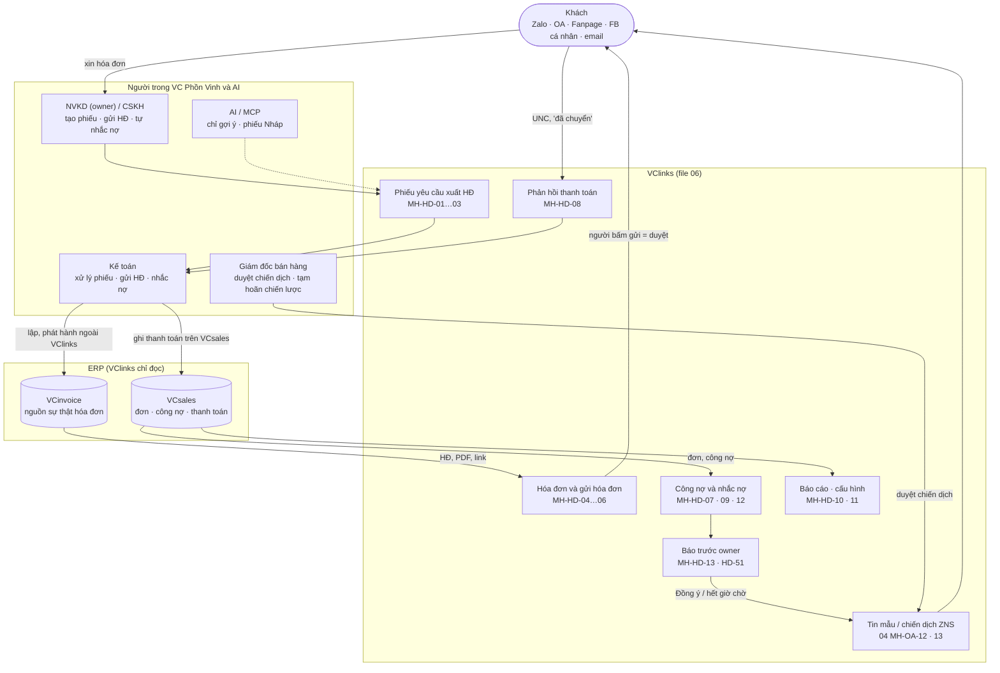
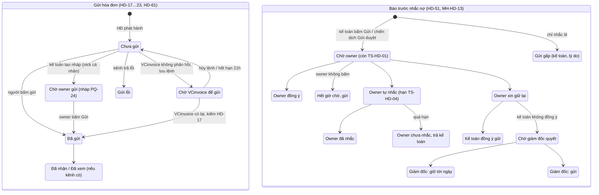
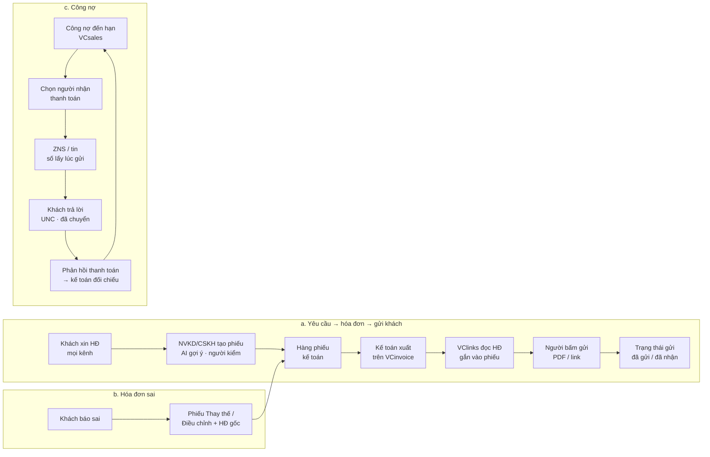
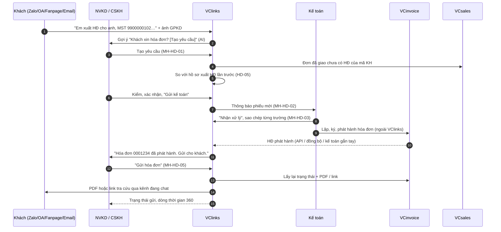
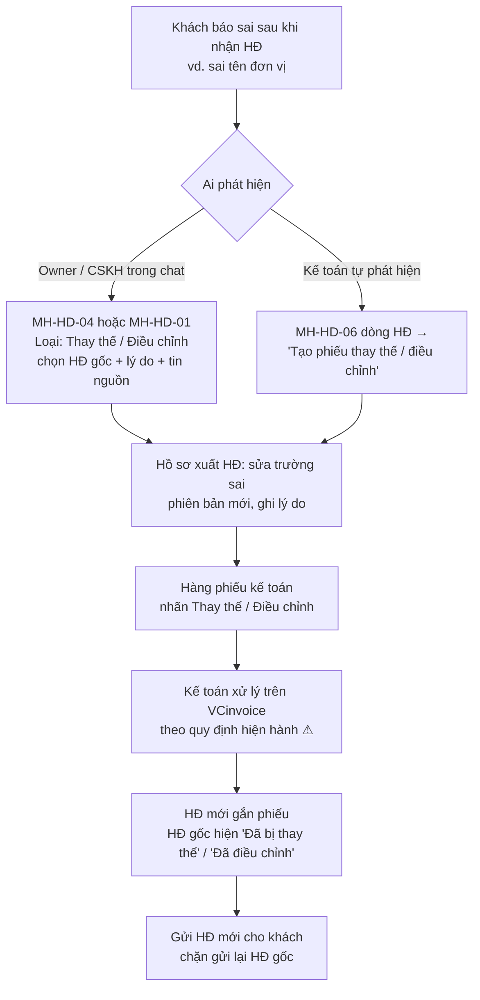
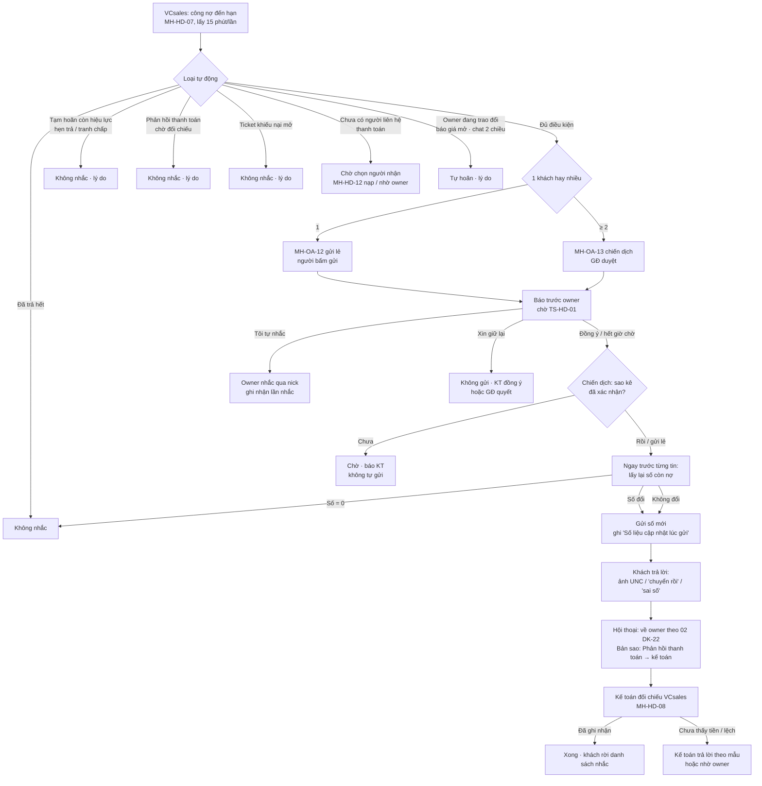
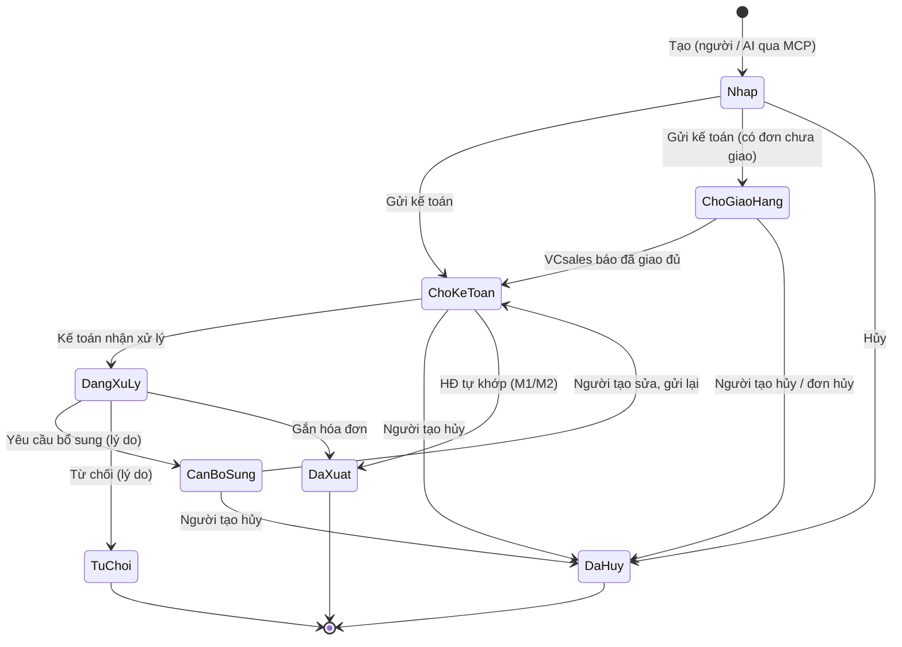

# 06 — Hóa đơn VAT (VCinvoice) và công nợ (VCsales)

Phiên bản v1.4.6 · 04/10/2026 · Trạng thái: Chờ designer — đã xử lý góp ý vòng 1, rà cuối vòng 1 và khớp bộ dữ liệu kiểm thử chung (vai góp ý: P-KT, P-KD, P-GD)

> Thuộc bộ đặc tả BA + UX của VClinks (`docs/02-yeu-cau/`). Căn cứ: BA tổng `docs/02-yeu-cau/vclinks-ba.md` v0.4 (§1.1, §5.4 F13.4, §5.6 F9.9 · F9.11 · F8.2, §6, §7 BR07 · BR11 · BR12, §8 `InvoiceShare` · `InvoiceRequest` · `ErpSnapshot`, §18.1 KD-17, §18.6 KT-01…KT-03, §21 câu 8 · 17 · 19). Góp ý kế toán: `../ra-soat/dac-ta-vong-1/04-P-KT.md` (20 góp ý, 6 Chặn). Việc chuyển sang: `../ra-soat/dac-ta-vong-1/04-xu-ly.md` (P-KT #1–3, 5–8, 12, 17, 18; H1–H3, H5, H6), `../ra-soat/dac-ta-vong-1/03-xu-ly.md` (KD-15, KD-18, Q21, Q22).
> Ngày lập: 29/09/2026 · Người yêu cầu: Thọ Anh Bùi
>
> Sổ xử lý, câu hỏi cho chủ dự án, việc cho designer: `../ra-soat/dac-ta-vong-1/06-xu-ly.md`. Chỗ sửa ở v1.1 ghi **[Sửa v1.1]** hoặc **[Mới v1.1]**. Con số mới đề xuất ghi mã thông số `TS-HD-n` (bảng ở MH-HD-11 và trong sổ xử lý); tới khi chủ dự án chốt, hệ thống chạy theo số đề xuất. Chỗ phụ thuộc quyết định chung đã gom ở `../../01-quan-ly-du-an/quyet-dinh-chu-du-an.md` ghi mã QĐ (vd. **QĐ-01** điện thoại, **QĐ-03** ZNS lẻ ở MVP, **QĐ-15** cảnh báo công nợ ở MVP, **QĐ-60** chiến dịch định kỳ duyệt một lần, **QĐ-67** ngân sách tin).
>
> **File liên quan:** 00 giao diện chung (khung trang, ô soạn MH-UI-08, panel MH-UI-09, câu lỗi chuẩn §6) · 01 phân quyền (D11, PQ-23, PQ-24, khóa `invoice.*`, `cust.debt`) · 02 khách đa kênh (account, người liên hệ, V0–V3, DK-15, DK-22) · 03 sale Zalo cá nhân (khung chat nick, Q22) · 04 CSKH Zalo OA (cơ chế gửi tin mẫu MH-OA-12, chiến dịch MH-OA-13, báo cáo MH-OA-14, quy tắc OA-15/16/17/28/29/36 — **06 dùng lại, không đặc tả lại**).
>
> **Ký hiệu hiện trạng:** **[Đã có]** có trong code `main` `f106e3b` · **[Một phần]** · **[Mới]** chưa có. Cả file này là **[Mới]**, trừ chỗ ghi khác. **⚠ Cần kế toán / pháp chế xác nhận** = điểm liên quan quy định thuế, hóa đơn, lưu trữ chứng từ mà BA không tự quyết. **[Chờ chốt HD-CH-n]** = phụ thuộc câu hỏi n ở §9.1; tới khi chốt, hệ thống chạy theo phương án ghi ngay tại chỗ.

## Mô hình

**Bối cảnh:** ai làm gì, VClinks đọc gì từ VCinvoice / VCsales (chi tiết từng luồng ở §2.1–§2.4).



**Một tuần của kế toán** (theo bảng §0).

```mermaid
flowchart LR
  W0["Ngày đầu dùng<br/>nạp người nhận thanh toán<br/>MH-HD-12"]
  W1["Thứ 2 đầu tháng, 08:30<br/>đối chiếu công nợ 60 đại lý<br/>MH-HD-07 → MH-OA-13"]
  W2["Thứ 2, 10:00<br/>khách gửi ảnh UNC<br/>MH-HD-08"]
  W3["Thứ 3–5<br/>xuất HĐ cho đơn đã giao<br/>MH-HD-02 → 03 → VCinvoice"]
  W4["Thứ 4<br/>gửi HĐ qua ZNS mẫu Hóa đơn<br/>MH-HD-06 → 05"]
  W5["Thứ 5<br/>khách hỏi 'hóa đơn đâu'<br/>MH-HD-06"]
  W6["Thứ 6, trước giờ chiến dịch<br/>xác nhận sao kê<br/>MH-HD-07 (HD-50)"]
  W7["Mọi lần nhắc<br/>owner được báo trước<br/>MH-HD-13 (HD-51)"]
  W8["Thứ 6 cuối tháng<br/>nhắc nợ quá hạn<br/>MH-HD-07 (HD-28…31)"]
  W9["Thứ 6, 16:00<br/>đối chiếu chi phí ZNS<br/>04 MH-OA-19"]
  W0 --> W1 --> W2 --> W3 --> W4 --> W5 --> W6 --> W7 --> W8 --> W9
```



**Trạng thái chính** ngoài vòng đời phiếu (§2.5 sơ đồ): trạng thái gửi một hóa đơn và trạng thái báo trước nhắc nợ (theo chữ ở §2.5, HD-23, HD-51, HD-61).



## Tóm tắt

- **Phạm vi:** khách xin hóa đơn ở mọi kênh → **phiếu yêu cầu** cho kế toán; gửi hóa đơn đã phát hành qua kênh khách đang dùng; nhắc công nợ và hộp **phản hồi thanh toán**; báo cáo hóa đơn, thu nợ, tuổi nợ. 13 màn MH-HD-01…13, quy tắc HD-01…66, 96 ca UAT-HD; xếp **GĐ2**, bản nhanh "Gửi cho kế toán" lên MVP chờ HD-CH-3 (QĐ-16).
- **Nguồn sự thật:** VCinvoice cho hóa đơn, VCsales cho đơn, công nợ, thanh toán. VClinks chỉ đọc: không xuất / sửa / hủy hóa đơn, không ghi công nợ hay thanh toán; số tiền luôn kèm giờ lấy và lấy lại ngay trước khi gửi (N1, N2, N5, HD-26, HD-33).
- **Nguyên tắc bất biến:** người bấm gửi là người duyệt (N3); kế toán không đọc chat, chỉ thấy tin nguồn đính vào phiếu / mục phản hồi (N4, HD-37); AI và MCP chỉ gợi ý, chỉ tạo phiếu Nháp (N6, HD-46); không gửi công nợ tới người không phải người liên hệ thanh toán (N8, HD-29).
- **Quy tắc hóa đơn chính:** so với lần xuất trước (HD-05), chặn trùng đơn (HD-09), hồ sơ xuất HĐ có phiên bản và khóa MST (HD-10, HD-49), chỉ gửi HĐ còn hiệu lực sau khi hỏi lại VCinvoice (HD-17), người gửi phụ trách và nhắc HĐ chưa gửi sau 24 giờ làm việc (HD-21). Mức tích hợp VCinvoice M1 / M2 / M3: BA đề xuất M2, làm M3 để chạy ngay (HD-CH-1 = QĐ-73).
- **Quy tắc nhắc nợ chính:** tự loại khách theo lý do (a)–(k) ngay khi lập danh sách (HD-30); chiến dịch chỉ chạy khi kế toán xác nhận **mốc sao kê** (HD-50); **báo trước owner** mọi lần nhắc, chờ TS-HD-01 = 2 giờ làm việc, ba lựa chọn, bất đồng thì giám đốc quyết (HD-51, HD-53); tạm hoãn "Khách chiến lược" do giám đốc duyệt (HD-31).
- **Quyết định đã chốt:** **D8-25** khách có đề nghị tạm hoãn đang chờ duyệt bị loại ngay khỏi nhắc nợ (HD-30 k); **D8-27** MH-HD-13 vào đợt màn điện thoại đầu tiên khi chốt QĐ-01, giữ TS-HD-01 = 2 giờ làm việc. Câu hỏi chủ dự án HD-CH-1…10 đã có mã QĐ-73…81 và QĐ-16; còn phụ thuộc QĐ-01, QĐ-03, QĐ-15, QĐ-60, QĐ-67. Thông số TS-HD-01…13 chạy theo số đề xuất tới khi chốt.
- **Câu hỏi mở (30, §9):** 10 cho chủ dự án (HD-CH-1…10), 12 cho kế toán / pháp chế (Q-HD-01…12, đánh dấu ⚠), 8 cho VCsoft về API VCinvoice I1…I10 và VCsales S1…S11 (§9.3).
- **Người duyệt cần xem kỹ:** vòng báo trước owner HD-51 cùng HD-30 (g)–(k) và HD-62 (nhiều nhánh, nhiều thông số); các chỗ ⚠ về thuế, chứng từ, NĐ 13 (HD-04, HD-13, HD-14, HD-44, HD-59, HD-60); câu chữ "BA đề xuất" ở v1.4.3–v1.4.4 còn chờ chủ dự án xác nhận; danh sách sửa file khác ở §8.

## Mục lục

- [0. Một tuần của kế toán trên VClinks (sau khi có file này)](#0-một-tuần-của-kế-toán-trên-vclinks-sau-khi-có-file-này)
- [1. Mục tiêu, phạm vi, vai trò, nguyên tắc](#1-mục-tiêu-phạm-vi-vai-trò-nguyên-tắc)
- [2. Quy trình](#2-quy-trình)
- [3. Quy tắc nghiệp vụ HD-xx](#3-quy-tắc-nghiệp-vụ-hd-xx)
- [4. Đặc tả màn hình](#4-đặc-tả-màn-hình)
- [5. User story](#5-user-story)
- [6. Kịch bản UAT](#6-kịch-bản-uat)
- [7. Yêu cầu API với VCinvoice, VCsales và dữ liệu VClinks](#7-yêu-cầu-api-với-vcinvoice-vcsales-và-dữ-liệu-vclinks)
- [8. Điểm cần sửa ở file khác để khớp](#8-điểm-cần-sửa-ở-file-khác-để-khớp)
- [9. Câu hỏi mở](#9-câu-hỏi-mở)
- [10. Nguồn](#10-nguồn)
- [Lịch sử cập nhật](#lịch-sử-cập-nhật)

---

## 0. Một tuần của kế toán trên VClinks (sau khi có file này)

Viết lại bảng "Một tuần của tôi" trong góp ý P-KT để kế toán đối chiếu từng chỗ vướng đã có lời giải chưa.

| Mốc | Việc | Màn hình | Chỗ vướng cũ → lời giải |
|---|---|---|---|
| Thứ 2 đầu tháng, 08:30 | Gửi thông báo đối chiếu công nợ cho 60 đại lý | MH-HD-07 → nút "Đối chiếu công nợ đầu tháng" → MH-OA-13 mục đích "Đối chiếu công nợ" | Có mục đích riêng (04 MH-OA-11 #5). Duyệt một lần cho chiến dịch định kỳ: **[Chờ chốt CH-OA-6 của 04]** |
| Thứ 2, 10:00 | Khách trả lời ZNS "tôi chuyển 5 triệu hôm 28 rồi" + ảnh UNC | MH-HD-08 "Phản hồi thanh toán" | Kế toán nhận **đúng tin đó và ảnh**, không cần quyền đọc chat (HD-36, như PQ-23) |
| Thứ 3–5 | Xuất hóa đơn cho đơn đã giao | MH-HD-02 hàng phiếu → MH-HD-03 chi tiết phiếu (nút "Sao chép" từng trường để dán vào VCinvoice) | Phiếu đủ MST, tên pháp lý, địa chỉ, email, đơn VCsales, tin nguồn; so với lần xuất trước (HD-03…HD-07) |
| Thứ 4 | Hóa đơn phát hành, khách đã quá 7 ngày không nhắn OA | MH-HD-06 → "Gửi" → MH-HD-05 tự chọn ZNS mẫu "Hóa đơn" | Mở từ danh sách hóa đơn, không cần khung chat (HD-19, HD-20) |
| Thứ 5 | Khách hỏi "hóa đơn tháng 9 đâu" | MH-HD-06, ô tìm theo khách / MST / số HĐ | Trả lời trong 10 giây: đã gửi chưa, kênh nào, giờ nào, ai gửi (HD-22) |
| Thứ 6 cuối tháng | Nhắc nợ quá hạn | MH-HD-07 → chọn khách → "Tạo chiến dịch nhắc" | Tự loại khách đang tranh chấp, đã báo chuyển khoản, đang tạm hoãn; người nhận là người liên hệ thanh toán (HD-28…HD-31) |
| **[Mới v1.1]** Ngày đầu dùng | Nạp người nhận thanh toán cho khách hiện có | MH-HD-12 | Nhập từ VCsales / Excel, xem trước rồi xác nhận; khách còn thiếu → "Nhờ owner bổ sung" (HD-48) |
| **[Mới v1.1]** Thứ 6, trước giờ chiến dịch | Xác nhận đã ghi sao kê ngân hàng lên VCsales | MH-HD-07 dải "Sao kê" | Chưa xác nhận thì chiến dịch nhắc nợ chờ, không tự gửi; tin ghi "Số liệu tính tới {mốc}" (HD-50) |
| **[Mới v1.1]** Mọi lần nhắc | Owner được báo trước, có 2 giờ làm việc để chọn "Tôi tự nhắc" / "Xin giữ lại" / "Đồng ý" | MH-HD-13 (owner) | Khách đang được sale trao đổi (báo giá mở, chat 2 chiều) tự hoãn (HD-30 g, HD-51) |
| Thứ 6, 16:00 | Đối chiếu chi phí ZNS | 04 MH-OA-19 | Đã giải ở 04 (quyền `cost.view` báo 01) |

---

## 1. Mục tiêu, phạm vi, vai trò, nguyên tắc

### 1.1 Mục tiêu

1. Khách xin hóa đơn ở **bất kỳ kênh nào** thì thành **một phiếu yêu cầu** đủ thông tin, gắn đơn VCsales, có tin nguồn. Kế toán không phải hỏi lại sale.
2. Giảm hóa đơn phải xuất lại vì sai MST, tên, địa chỉ: hệ thống so với **lần xuất trước** và cảnh báo trước khi gửi phiếu.
3. Hóa đơn đã phát hành được **gửi tới khách qua kênh khách đang dùng** và biết chắc đã gửi chưa, gửi lúc nào, ai gửi.
4. Nhắc công nợ **đúng người, đúng số, đúng lúc**: tới người phụ trách thanh toán của khách, số tiền lấy lại lúc gửi, không nhắc khách đã trả hoặc đang tranh chấp.
5. Khách trả lời nhắc nợ (ảnh UNC, "chuyển rồi") **tới tay kế toán** mà kế toán không phải đọc toàn bộ hội thoại.
6. Đo được: thời gian yêu cầu → phát hành → gửi khách; tỷ lệ xuất lại do sai thông tin; tiền đã nhắc và tiền thu về.
7. **[Mới v1.1]** Nhắc nợ **không phá việc bán hàng**: owner biết trước mọi lần nhắc khách của mình, tự nhắc hoặc xin giữ lại được; khách đang đàm phán lớn chỉ được hoãn khi giám đốc duyệt. Sale và kế toán cùng thấy **ghi chú thu nợ** và cảnh báo nợ quá hạn ngay trên hội thoại.
8. **[Mới v1.1]** Giám đốc xem **tuổi nợ theo tổ và NVKD**, so với cuối kỳ trước, và có một dòng số **lấy nguyên từ VCsales** để đối chiếu.

**Chỉ số thành công (đề xuất, chốt khi UAT):** phiếu phải "Cần bổ sung" < 10 %; hóa đơn xuất thay thế / điều chỉnh do sai thông tin người mua giảm 50 % sau 3 tháng; ≥ 95 % hóa đơn gửi khách trong 24 giờ làm việc sau phát hành; 0 lần nhắc nợ gửi tới người không phải người liên hệ thanh toán. **[Mới v1.1]** Thu nợ: % nợ quá hạn > 60 ngày theo tổ giảm so với quý trước khi chạy; 0 lần khách có tạm hoãn "Khách chiến lược" bị nhắc ngoài ý owner; số lần nhắc nợ trong 3 ngày quanh lúc gửi báo giá ≥ TS-HD-08 (kế toán và sale "đụng nhau") giảm theo tháng; ≥ 90 % khách có công nợ có người nhận thanh toán sau 1 tháng dùng.

### 1.2 Phạm vi

| Trong phạm vi | Ngoài phạm vi (ở đâu) |
|---|---|
| Phiếu yêu cầu xuất hóa đơn: tạo từ chat mọi kênh, AI tách thông tin, tra MST, hàng chờ kế toán, chi tiết phiếu, xuất mới / thay thế / điều chỉnh | **Xuất hóa đơn**: làm trên VCinvoice. VClinks không tạo, không ký, không hủy hóa đơn |
| Thông tin xuất hóa đơn của khách (hồ sơ xuất HĐ) có lịch sử; người liên hệ thanh toán | Ghi thanh toán, cấn trừ công nợ: làm trên VCsales (BR12) |
| Danh sách hóa đơn, khối hóa đơn trong 360, gửi hóa đơn (PDF / link tra cứu), trạng thái gửi, nhắc chưa gửi | Cơ chế gửi ZNS, khung gửi OA, chiến dịch, duyệt chi phí → **04** (MH-OA-11…14, OA-15…17, OA-28, OA-29) |
| Danh sách công nợ đến hạn, nhắc nợ lẻ và theo lô (qua MH-OA-12 / MH-OA-13), tạm hoãn nhắc | Chi phí tin mẫu, ngân sách ZNS → **04** MH-OA-19, CH-OA-4 |
| Hộp "Phản hồi thanh toán" cho kế toán | Định tuyến hội thoại loại "Công nợ – hóa đơn" (ai trả lời khách) → **02** DK-22, **04** §2.2 bước 6 |
| Báo cáo hóa đơn và thu nợ; cấu hình ngưỡng | Ma trận quyền → **01** (06 đề nghị thêm khóa, §8) |
| Dữ liệu phải giữ khi khách yêu cầu xóa theo NĐ 13 (danh sách đề xuất) | Quy trình NĐ 13 → **01** PQ-50, MH-PQ-13 |

**Giai đoạn:** BA tổng xếp VCinvoice vào **GĐ2** (F9.9, F9.11). Bản tối giản "Gửi cho kế toán" lên MVP hay không: **[Chờ chốt HD-CH-3]** (03 Q22). Mỗi màn hình ghi giai đoạn ở mục Thông tin chung.

### 1.3 Vai trò

Viết tắt theo 00 §1.6. Quyền chi tiết ở từng màn hình và §8 (đề nghị cho 01).

| Vai trò | Việc trong file này | Không được |
|---|---|---|
| **KT** Kế toán (theo division) | Nhận, xử lý phiếu; gắn hóa đơn; gửi hóa đơn qua **kênh chính thức được gán** (PQ-24); xem công nợ; nhắc nợ lẻ, tạo chiến dịch nhắc / đối chiếu (chờ duyệt); xử lý phản hồi thanh toán; tạm hoãn nhắc; sửa hồ sơ xuất HĐ | Đọc hội thoại (chỉ thấy tin nguồn đính vào phiếu / phản hồi — PQ-23); gửi qua nick cá nhân (D2); gửi tin tự do |
| **KD** NVKD (owner hoặc người giữ nick) | Tạo phiếu từ khung chat; sửa phiếu khi "Cần bổ sung"; gửi hóa đơn cho khách của mình trên mọi kênh mình được gửi; gửi nháp hóa đơn kế toán tạo; đặt người liên hệ thanh toán; đề nghị tạm hoãn nhắc nợ. **[Mới v1.1]** Nhận báo trước mọi lần nhắc nợ khách của mình và chọn "Tôi tự nhắc" / "Xin giữ lại" / "Đồng ý" (HD-51); ghi "Ghi chú thu nợ" (HD-56); hối kế toán về phiếu (MH-HD-04) | Xử lý phiếu; đổi số tiền; gửi hóa đơn của khách ngoài phạm vi (như BR17); tự quyết tạm hoãn nhắc |
| **CS** CSKH | Tạo phiếu từ hội thoại kênh chính thức mình trực hoặc gắn ticket của mình (01 `invoice_req.create` TK, KÊNH); chuyển tin "đã chuyển khoản" cho kế toán | Nói số nợ (02 §5.2); gửi hóa đơn (01 `invoice.send` ✖) |
| **SA** Sale admin | Xem phiếu, hóa đơn của division; sửa hồ sơ xuất HĐ, người liên hệ thanh toán; tạo mã KH khi phiếu vướng "chưa có mã KH" (02 MH-DK-12) | Xử lý phiếu; gửi hóa đơn |
| **GS** Giám sát bán hàng | Như KD trong phạm vi tổ; được nhắc khi hóa đơn của tổ chưa gửi quá 48 giờ. **[Mới v1.1]** Đề nghị tạm hoãn "Khách chiến lược"; nhận báo khi khách quá hạn > 60 ngày có báo giá lớn (HD-55) | Xử lý phiếu |
| **GD** Giám đốc bán hàng | Duyệt chiến dịch nhắc nợ / đối chiếu (04 OA-16); xem báo cáo hóa đơn, thu nợ; cấu hình ngưỡng (MH-HD-11). **[Mới v1.1]** Duyệt tạm hoãn "Khách chiến lược / đang đàm phán" và quyết khi kế toán và owner không thống nhất (HD-31, HD-51); xem tuổi nợ theo tổ / NVKD (MH-HD-10) | Xử lý phiếu |
| **XEM** Quan sát | Xem báo cáo | Mọi thao tác ghi |
| **AI / MCP** | Tách MST, tên, địa chỉ, email từ tin và ảnh thành **gợi ý**; đọc số tiền, ngày trên ảnh UNC làm **gợi ý**; tool `propose_invoice_request` tạo phiếu **Nháp** (01 §5) | Gửi phiếu cho kế toán; gửi hóa đơn; gửi nhắc nợ (BR07) |
| **Khách** | Gửi thông tin xuất HĐ, nhận hóa đơn, nhận nhắc nợ, gửi chứng từ thanh toán | – |

### 1.4 Nguyên tắc

| # | Nguyên tắc | Nguồn |
|---|---|---|
| N1 | **VCinvoice là nguồn sự thật của hóa đơn.** VClinks chỉ đọc hóa đơn (số, ngày, tổng tiền, trạng thái, PDF, link tra cứu). Không tự xuất, không sửa, không hủy. | BA §1.1, F9.11 |
| N2 | **VCsales là nguồn sự thật của đơn, công nợ, thanh toán.** VClinks không ghi công nợ, không ghi thanh toán. Số tiền luôn kèm giờ lấy. | BR12, §6 |
| N3 | **Mọi tin tới khách do người bấm gửi**, trừ ZNS tự động đã được giám đốc duyệt mẫu. Bấm "Gửi" là duyệt (`approvedBy`, `approvedAt`). | BA §1.1 ý 3, BR07, CLAUDE.md §12.1 |
| N4 | **Kế toán không đọc chat.** Kế toán chỉ thấy đúng các tin người khác đính vào phiếu hoặc các tin là phản hồi thanh toán. | 01 D11, PQ-23 |
| N5 | **Không lấy lại số cũ để gửi.** Trước khi gửi hóa đơn: lấy lại trạng thái từ VCinvoice. Trước khi gửi nhắc nợ: lấy lại công nợ từ VCsales. | 04 OA-28, BR16 (tương tự) |
| N6 | **AI chỉ gợi ý.** Mọi trường AI tách có dấu "AI gợi ý" và nguồn; người tạo phiếu xác nhận đã đối chiếu. | BR13 |
| N7 | **Thông tin của người nhắn không phải thông tin xuất hóa đơn.** Tên, địa chỉ chia sẻ qua OA là của người (contact), không tự điền vào hồ sơ xuất HĐ. | 04 OA-27 |
| N8 | **Không lộ công nợ cho người chưa xác thực**, và không gửi công nợ tới người không phải người liên hệ thanh toán. | 02 DK-15, 04 OA-15 |
| N9 | **Quy định thuế do kế toán quyết.** VClinks không tự suy ra thời hạn xuất, cách xử lý hóa đơn sai, định dạng MST. Chỗ nào chưa chắc ghi ⚠ và để cấu hình. | – |
| N10 | **[Mới v1.1] Nhắc nợ phối hợp với owner.** Không lần nhắc nợ nào tới khách có owner mà owner không được báo trước; VClinks không tự gửi ngược ý owner khi owner đã "Xin giữ lại", việc đó do giám đốc quyết. Quyết định cho khách nợ thêm / bán tiếp vẫn làm trên VCsales (N2); VClinks chỉ cảnh báo, không chặn báo giá. | P-KD #1, P-GD #4, #5 |
| N11 | **[Mới v1.1] Không đòi số tiền chưa chắc.** Chiến dịch nhắc nợ chỉ chạy khi kế toán xác nhận sao kê đã ghi lên VCsales tới một mốc; tin luôn ghi mốc đó. | P-KT #3 |

### 1.5 Thuật ngữ

| Thuật ngữ | Nghĩa trong VClinks | Ví dụ |
|---|---|---|
| **Phiếu yêu cầu xuất hóa đơn** ("phiếu") | Yêu cầu từ người bán gửi kế toán, mã `YCHD-xxxx` | YCHD-0123 |
| **Loại phiếu** | "Xuất mới" · "Thay thế" · "Điều chỉnh" (hai loại sau gắn hóa đơn gốc) | Thay thế HĐ 0001234 vì sai tên |
| **Hồ sơ xuất HĐ** | Bộ MST + tên đơn vị + địa chỉ + email nhận HĐ lưu trên **account**, có phiên bản. Một account có thể có nhiều hồ sơ (đổi từ hộ kinh doanh lên công ty, hai pháp nhân) | Hồ sơ "Công ty TNHH Dịch vụ Ô tô Minh Phát · 9900000102" |
| **Tin nguồn** | Tin / ảnh trong hội thoại mà người tạo phiếu đính vào phiếu (tối đa 10). Kế toán chỉ thấy các tin này | Ảnh giấy phép kinh doanh |
| **Hóa đơn** | Hóa đơn điện tử đọc từ VCinvoice | HĐ số 0001234, ký hiệu 1C26TVP (dữ liệu thử) |
| **Lần gửi hóa đơn** | Một lần gửi hóa đơn tới khách (`InvoiceShare`): kênh, người nhận, dạng gửi, người gửi, giờ | Gửi PDF qua OA VCparts lúc 10:05 |
| **Nháp gửi hóa đơn** | Tin chứa hóa đơn do kế toán tạo trong hội thoại nick cá nhân, chờ owner bấm gửi (PQ-24) | – |
| **Người liên hệ thanh toán** | Người liên hệ của account có vai trò "Kế toán / Thanh toán" và được đánh dấu nhận nhắc nợ, hóa đơn | Chị Nga, kế toán garage |
| **Khoản nợ** | Một dòng công nợ trên VCsales (theo đơn hoặc theo hóa đơn, tùy VCsales) có số còn lại và hạn | DH-2026-0456 còn 8.800.000 đ, hạn 05/10 |
| **Nấc nhắc** | "Trước hạn" · "Đúng hạn" · "Quá hạn" (04 OA-29 tính trùng theo mẫu + khoản nợ) | – |
| **Tạm hoãn nhắc** | Đánh dấu account không nhận nhắc nợ tới một ngày, có lý do | Hẹn trả 15/10 |
| **Phản hồi thanh toán** | Tin khách gửi liên quan tới thanh toán (ảnh UNC, "đã chuyển") được sao sang hộp của kế toán | – |
| **[Mới v1.1] Báo trước nhắc nợ** | Thông báo cho owner trước khi một tin nhắc nợ / đối chiếu tới khách của mình, kèm khoảng chờ để owner chọn "Tôi tự nhắc" / "Xin giữ lại" / "Đồng ý" (HD-51) | "Kế toán Hà sẽ nhắc nợ Garage Minh Phát lúc 11:00" |
| **[Mới v1.1] Mốc sao kê** | Thời điểm kế toán xác nhận đã ghi hết sao kê ngân hàng lên VCsales; số trong tin nhắc nợ chỉ đúng tới mốc này (HD-50) | "Đã ghi sao kê tới 08:30 15/10" |
| **[Mới v1.1] Ghi chú thu nợ** | Ghi chú dùng chung trên account giữa owner, kế toán, giám sát, giám đốc về thỏa thuận thu nợ; không phải tin chat (HD-56) | "Cam kết trả 50 % khi ký đơn DH-…, hạn 15/11" |
| **[Mới v1.1] Tuổi nợ** | Số ngày quá hạn của khoản nợ, chia nhóm: Chưa đến hạn · 1–30 · 31–60 · 61–90 · > 90 ngày (cấu hình, căn theo VCsales) | – |
| **[Mới v1.1] Số chụp cuối kỳ** | Bản chụp công nợ theo khách / owner / tổ vào cuối ngày làm việc cuối tháng, chỉ để báo cáo so kỳ (`ErpSnapshot`), không dùng để gửi | "Số chụp 17:30 31/10 từ VCsales" |

### 1.6 Dữ liệu kiểm thử

Dữ liệu kiểm thử: dùng bộ chung [du-lieu-kiem-thu.md](../../05-kiem-thu/du-lieu-kiem-thu.md) (mã `TD-…`). **[Sửa v1.3]** Bảng bổ sung của v1.2 đã gộp vào bộ chung (TD §4.1, §5.2–§5.4, kịch bản **TD-KB12** hóa đơn và công nợ, **TD-KB19** xác nhận danh tính trên Fanpage). Người dùng chính của file: TD-U-KT Hà (kế toán VCparts), TD-U-KD1 Minh (owner TD-K01, giữ nick TD-NK01), TD-U-KD4 Hải (tổ HN2, nick TD-NK04), TD-U-CS1 Lan, TD-U-GS1 Hương, TD-U-GD Thắng, TD-U-SA Ngọc, TD-U-KTE Loan (kế toán VCedu). Khách chính TD-K01 Garage Minh Phát (`KH-TEST-0101`): TD-C01a anh Tuấn (chủ), TD-C01b anh Hùng (thợ), TD-C01c chị Nga (kế toán / thanh toán, người nhận thanh toán).

Thời gian theo mốc **T** (TD §1.3): TD-DH1 giao T−7 ngày, TD-DH2 giao T−5 ngày, TD-DH3 xác nhận T−1 giờ (chưa giao), TD-HD1 ngày T−3 ngày (theo TD-HS1), TD-CN1 hạn T+6 ngày, TD-HS1 xuất lần cuối T−3 ngày bằng TD-HD1 (lần trước T−45 ngày, HĐ `0001102`) — v1.4.1. Ngày cụ thể còn trong khung màn hình và ví dụ của file này ứng với **T = 10:00 thứ Ba 29/09/2026**; khi chạy UAT đọc theo mốc T.

**Đối chiếu mã cũ → TD** (mã cũ giữ trong bảng này một phiên bản để truy vết):

| Mã cũ (06 v1.2, 01 §7.1) | Mã TD | Ghi chú |
|---|---|---|
| U-KT (Thảo Kế toán) | TD-U-KT Hà | Nhóm Kế toán VCparts |
| U-KT9 "Kế toán VCe" | TD-U-KTE Loan | Nhóm Kế toán VCedu (thử phạm vi division khác) |
| U-KD1 (Nguyễn An) | TD-U-KD1 Minh | Tổ HN1 |
| U-KD2 | TD-U-KD2 Linh | Tổ HN1 |
| U-KD3 (Trần Cường) | TD-U-KD4 Hải | Tổ HN2 |
| U-CS1 · U-GD · U-SA (Vũ Sơn) · U-GS1 | TD-U-CS1 Lan · TD-U-GD Thắng · TD-U-SA Ngọc · TD-U-GS1 Hương | – |
| K1 Garage Minh Phát (`KH-00123`) | TD-K01 (`KH-TEST-0101`) | – |
| K1-C Anh Tuấn · Anh Hùng · Chị Nga | TD-C01a · TD-C01b · TD-C01c | SĐT đổi theo TD §8.3: Hùng `0900 000 102`, Nga `0900 000 103`; email `@example.com` → `nga.minhphat@example.vn` |
| K1-HS1 · K1-HS2 | TD-HS1 · TD-HS2 | MST `0101234567` → `9900000101`; `0109876543` → `9900000102`; địa chỉ "Số 12 ngõ 34 phố Thử Nghiệm, Thanh Xuân, Hà Nội" |
| K2 Garage Hoàng Long | TD-K16 Đại lý phụ tùng Hoàng Long | Owner Hải, chỉ liên hệ qua nick TD-NK04 |
| K6 (chưa có mã KH, UAT-HD-09) | TD-K02 chị Mai | Nhắn Fanpage TD-FP1 (TD-H30) |
| K11 Garage An Khang (`KH-00789`, `TK-0150`) | TD-K10b (`KH-TEST-0802`), TD-TK0150, TD-CN4 | Owner Hải; nợ quá hạn 45 ngày |
| K12 khách chỉ có V1 trên Fanpage | TD-K03, danh tính "Khoa Ngô" trên TD-FP1 (TD-KB19) | Owner Linh |
| K20 Garage Thành Công | TD-K15, TD-CN5, TD-BG5 | – |
| Z1, Z4 (mã nick của 01) | TD-NK01, TD-NK04 | Trong file này `Z0`–`Z3` chỉ còn nghĩa **vùng khung gửi OA** (04 §3.2) |
| H1 · H2 · H3 | TD-H01 · TD-H20 (và TD-H17) · TD-H16 | Xem dữ liệu đặc thù |
| DH-1 · DH-2 · DH-3 · DH-4 | TD-DH1 · TD-DH2 · TD-DH4 · TD-DH3 | TD-DH1 đã có TD-HD1, nên phiếu mẫu YCHD-0123 (= TD-PHD1) chỉ gồm TD-DH2 |
| HD-1 · CN-1 · PHD-01 · PH-01 | TD-HD1 · TD-CN1 · TD-PHD1 · TD-PH1 | CN-1 hạn 05/10 → T+6 ngày |
| ZNS-HD · ZNS-TT · ZNS-DC | TD-ZNS2 · TD-ZNS1 · TD-ZNS3 | – |
| VCINV-DOWN · S8-CSV | TD-VCINV-DOWN · TD-S8 | – |
| T1, T2 ("Tổ Hương", "Tổ Cường") | TD-DV-HN1, TD-DV-HN2 ("Tổ HN1", "Tổ HN2") | – |
| 00 DL-10 nhóm "Kiểm thử vclink" | TD-G01 | – |

**Dữ liệu đặc thù của file này** (chưa có trong bộ chung; mã có "(đề xuất)" chờ gộp vào `../../05-kiem-thu/du-lieu-kiem-thu.md`):

| Mã | Dữ liệu | Dùng ở |
|---|---|---|
| TD-H16 (đề xuất) | Hội thoại Zalo·TD-NK04 của TD-K16 (khách chỉ liên hệ qua nick của Hải) | UAT-HD-27, 71 |
| TD-H17 (đề xuất) | Hội thoại TD-OA1 của TD-C01b anh Hùng; anh Hùng đã chia sẻ thông tin OA (tên, địa chỉ nhà riêng) | UAT-HD-06, 37 |
| TD-U-KT2 (đề xuất) | Tống Thị Xuân, kế toán thứ hai của Nhóm Kế toán VCparts (`xuan.uat@vcprosperous.com`) | UAT-HD-14 |
| MST khách khác | TD-K16 `9900000003`, TD-K10b `9900000821`, TD-K13 `9900000970` (chỉ trên khung màn hình) | MH-HD-02, MH-HD-06 |
| YCHD-0130, HĐ `0001240` | Phiếu thứ hai của TD-K01 dùng TD-HS1; HĐ 0001240 phát hành theo MST `9900000101`, chưa gửi. **[v1.4.3]** Đã gộp vào TD v1.4.1 là **TD-HD2** (27/09, 1.900.000 đ, chỉ nạp ở biến thể seed `hd60`) | UAT-HD-60; wireframe MH-HD-06 |
| Số liệu seed riêng | 3 khách nhắc trong tháng (UAT-HD-56), 10 phiếu (57), chiến dịch 200 khách (87), 40 phiếu đầu tháng (93) | Các ca đã ghi |

Mọi gửi thật tới Zalo cá nhân chỉ vào nhóm TD-G01 "Kiểm thử vclink" qua TD-NK01. ZNS thật chỉ tới SĐT của người kiểm thử, không tới số `0900 000 xxx`.

---

## 2. Quy trình

### 2.1 Tổng quan ba luồng



### 2.2 Luồng (a): khách xin hóa đơn → phát hành → gửi khách



| Bước | Ai | Màn hình | Hệ thống làm gì | Quy tắc |
|---|---|---|---|---|
| 1 | Khách | Kênh bất kỳ | Tin có MST / "xuất hóa đơn" / ảnh GPKD được AI nhận diện → chip gợi ý trên ô soạn "Khách xin hóa đơn? Tạo yêu cầu xuất hóa đơn" | HD-01, HD-02 |
| 1b | Khách (email) | 02 dòng thời gian email | Email không vào inbox (02, Q3). Owner bấm "Tạo yêu cầu xuất hóa đơn" trên sự kiện email; tin nguồn = tiêu đề, đoạn trích, tên đính kèm | HD-01 |
| 1c | **[Mới v1.1]** Hệ thống | Hộp thư "Của tôi", tab Việc | Tin xin hóa đơn được nhận diện mà hội thoại chưa có phiếu mở (kể cả khi sale đang trả lời bằng app Zalo trên điện thoại) → việc **"Khách xin hóa đơn · chưa có phiếu"** cho owner / người giữ nick; mở VClinks là thấy | HD-54 |
| 2 | NVKD / CSKH | MH-HD-01 | Mở phiếu, điền sẵn: khách, đơn VCsales chưa có HĐ, hồ sơ xuất HĐ gần nhất, trường AI tách từ tin, tin nguồn là tin vừa chọn | HD-03, HD-04, HD-08 |
| 3 | Hệ thống | MH-HD-01 | Kiểm MST (định dạng, tra MST nếu có nguồn), so với lần trước, kiểm trùng đơn | HD-04…HD-07, HD-09 |
| 4 | NVKD / CSKH | MH-HD-01 | Xác nhận đã đối chiếu; "Gửi kế toán". Phiếu "Chờ kế toán"; lưu hồ sơ xuất HĐ mới (nếu chọn). **[Mới v1.1]** Đơn đã xác nhận nhưng chưa giao → phiếu "Chờ giao hàng", tự sang "Chờ kế toán" khi VCsales báo đã giao | HD-06, HD-10, HD-59 |
| 4b | NVKD | Khung chat | Tùy chọn: gửi khách câu xác nhận theo mẫu `/xac-nhan-hoa-don` ("Dạ em đã chuyển kế toán xuất hóa đơn cho đơn DH-2026-0461, tên đơn vị … MST …, gửi về email … ạ.") | N3 |
| 5 | Kế toán | MH-HD-02 → MH-HD-03 | "Nhận xử lý" (phiếu "Đang xử lý", người xử lý = mình). Thiếu / sai → "Yêu cầu bổ sung" (về người tạo) hoặc "Từ chối" | HD-11, HD-12 |
| 6 | Kế toán | VCinvoice | Lập và phát hành hóa đơn. Nếu VCinvoice có API nhận phiếu: mở VCinvoice đã điền sẵn **[Chờ chốt HD-CH-1]** | N1 |
| 7 | Hệ thống / Kế toán | MH-HD-03 | Gắn hóa đơn vào phiếu: tự khớp theo mã đơn khi VCinvoice báo phát hành; không khớp được thì kế toán bấm "Gắn hóa đơn". Phiếu "Đã xuất" | HD-13, HD-16 |
| 8 | Hệ thống | Thông báo | Báo người tạo phiếu và owner: "Hóa đơn {số} của {khách} đã phát hành. Gửi cho khách." | HD-21 |
| 9 | Owner / người tạo / kế toán | MH-HD-05 | Chọn kênh (mặc định hội thoại khách vừa xin), người nhận, dạng gửi; lấy lại trạng thái HĐ; người bấm gửi | HD-17…HD-20 |
| 10 | Hệ thống | MH-HD-04, MH-HD-06 | Ghi lần gửi (kênh, người nhận, dạng, người gửi, giờ, ID tin); dòng thời gian "Đã gửi hóa đơn {số HĐ} · {người gửi}"; trạng thái nhận / xem nếu kênh có | HD-22 |
| 10b | **[Mới v1.1]** Hệ thống | Thông báo | Người khác (kế toán) gửi hóa đơn cho khách của owner → báo owner "Kế toán {tên} đã gửi HĐ {số} qua {kênh} tới {người nhận} lúc {HH:mm}"; thông báo "phát hành, gửi cho khách" cũ tự đóng | HD-22 |
| 11 | Hệ thống | Thông báo | **[Sửa v1.1]** Hóa đơn phát hành mà chưa gửi sau N giờ làm việc → nhắc **người gửi phụ trách** trước; mốc 2N → người còn lại (owner hoặc kế toán) và giám sát, kèm nút nhanh ghi lý do. Đồng hồ tạm dừng khi VCinvoice mất kết nối | HD-21, HD-52 |

**Khi VCinvoice chưa có API** (§21 câu 19 chưa trả lời) VClinks chạy theo một trong ba mức. Mỗi màn hình ghi hành vi theo mức.

| Mức | VCinvoice cho gì | Bước 6–7 chạy thế nào |
|---|---|---|
| **M1 Đầy đủ** | API đọc HĐ theo mã KH / mã đơn, PDF, link tra cứu, sự kiện phát hành; nhận phiếu yêu cầu | Phiếu đẩy sang VCinvoice; HĐ phát hành tự gắn vào phiếu |
| **M2 Chỉ đọc** | API đọc HĐ, PDF, link; không nhận phiếu | Kế toán xem phiếu trên VClinks, lập HĐ trên VCinvoice; VClinks tự khớp HĐ theo mã đơn (đồng bộ 15 phút / lần) hoặc kế toán gắn |
| **M3 Không có API** | Không | Kế toán bấm "Gắn hóa đơn" → nhập số, ký hiệu, ngày, tổng tiền, mã tra cứu, link tra cứu và **tải PDF lên**. VClinks lưu PDF ở MinIO (loại `invoice_pdf`) |

BA đề xuất làm theo **M2** và thiết kế sẵn cho M3 (HD-CH-1).

### 2.3 Luồng (b): hóa đơn sai → thay thế / điều chỉnh



| Bước | Ai | Việc | Quy tắc |
|---|---|---|---|
| 1 | Người phát hiện | Mở phiếu loại "Thay thế" hoặc "Điều chỉnh", chọn **hóa đơn gốc**, chọn lý do (Sai tên đơn vị · Sai MST · Sai địa chỉ · Sai email · Sai hàng hóa / số tiền · Khác), đính tin nguồn khách báo sai | HD-14 |
| 2 | Hệ thống | Điền sẵn thông tin từ HĐ gốc, tô vàng trường người dùng sửa; trường sai thuộc hồ sơ xuất HĐ → tạo **phiên bản mới** của hồ sơ, ghi lý do | HD-05, HD-10 |
| 3 | Kế toán | Chọn cách xử lý trên VCinvoice. **Dùng thay thế hay điều chỉnh, có cần văn bản thỏa thuận với khách hay không: ⚠ cần kế toán / pháp chế xác nhận theo quy định hiện hành.** VClinks chỉ ghi loại kế toán đã chọn | N9 |
| 4 | Hệ thống | Gắn HĐ mới. HĐ gốc hiện trạng thái đọc từ VCinvoice; **không cho gửi HĐ gốc** nữa (HD-17) | HD-15, HD-17 |
| 5 | Người gửi | Gửi HĐ mới; lời nhắn mẫu có câu "Hóa đơn này thay thế hóa đơn số {so_hd_goc}" / "điều chỉnh cho hóa đơn số …" | HD-18 |
| 6 | Hệ thống | Báo cáo đếm phiếu thay thế / điều chỉnh theo lý do và theo người tạo phiếu gốc (để kèm cặp) | MH-HD-10 |

### 2.4 Luồng (c): nhắc công nợ và phản hồi thanh toán



| Bước | Ai | Màn hình | Hệ thống làm gì | Quy tắc |
|---|---|---|---|---|
| 1 | Hệ thống | MH-HD-07 | Đọc công nợ đến hạn theo division từ VCsales (theo khoản; tổng theo khách) | HD-26, HD-27 |
| 0 | **[Mới v1.1]** Kế toán | MH-HD-12 | Ngày đầu dùng: nạp người nhận thanh toán từ VCsales / Excel; khách còn thiếu → "Nhờ owner bổ sung"; theo dõi tới khi đủ | HD-48 |
| 2 | Hệ thống | MH-HD-07 cột "Nhắc được" | Tự loại: đã trả hết; tạm hoãn còn hiệu lực; có phản hồi thanh toán chưa đối chiếu; ticket khiếu nại mở; danh tính chỉ V1; không có người liên hệ thanh toán (chờ chọn). **[Mới v1.1]** Owner đang trao đổi (báo giá mở, chat 2 chiều gần đây); owner đang tự nhắc; owner đã xin giữ lại | HD-29, HD-30 |
| 3 | Kế toán | MH-HD-07 | 1 khách → "Nhắc" mở MH-OA-12 điền sẵn. Nhiều khách → "Tạo chiến dịch nhắc ({n})" mở MH-OA-13 bước 2 với tập khách đã chọn | HD-28, 04 OA-16 |
| 4 | Owner | Thông báo, MH-HD-13, 360 | **[Sửa v1.1]** **Mọi lần nhắc** (lẻ và chiến dịch) khách có owner: owner được báo trước và có khoảng chờ TS-HD-01 (đề xuất 2 giờ làm việc) để chọn "Tôi tự nhắc" / "Xin giữ lại" / "Đồng ý". Hết giờ không ai bấm → tin đi. Chiến dịch chỉ duyệt được khi khoảng chờ của mọi owner trong tập đã hết hoặc owner đã trả lời. Khách chiến lược → "Đề nghị tạm hoãn" (GĐ duyệt) | HD-31, HD-51 |
| 4b | **[Mới v1.1]** Kế toán | MH-HD-07 dải "Sao kê" | Trong ngày gửi chiến dịch nhắc nợ / đối chiếu, trước giờ gửi: bấm "Đã ghi sao kê tới {giờ}". Chưa xác nhận → chiến dịch chờ, báo kế toán, không tự gửi | HD-50 |
| 5 | Hệ thống | – | Ngay trước từng tin: lấy lại số còn nợ, hạn; về 0 → không gửi (`Loại lúc gửi: đã thanh toán`); đổi → gửi số mới (04 OA-28). Giờ gửi 08:00–21:00 (04 OA-17). **[Mới v1.1]** Tin ghi "Số liệu tính tới {mốc sao kê}" và câu bỏ qua nếu đã thanh toán sau mốc đó; kiểm lại điều kiện tự hoãn (HD-30 g) | HD-32, HD-33, HD-50 |
| 6 | Khách | OA / Zalo / Fanpage | Trả lời: ảnh UNC, "chuyển rồi", "số này sai" | – |
| 7 | Hệ thống | Hội thoại + MH-HD-08 | Hội thoại đi theo định tuyến loại "Công nợ – hóa đơn" (02 DK-22: owner; CSKH tạm giữ không nói số nợ). **Đồng thời** tạo mục "Phản hồi thanh toán" cho kế toán, chỉ gồm các tin đó | HD-36, HD-37 |
| 8 | Kế toán | MH-HD-08 | Xem công nợ, thanh toán gần đây từ VCsales; ghi kết quả đối chiếu; trả lời khách bằng mẫu qua kênh chính thức, hoặc nhờ owner trả lời. **[Mới v1.1]** Về số tiền, chứng từ → kế toán trả lời; về thái độ, quan hệ (khách phàn nàn) → owner trả lời; cả hai thấy người kia đã trả lời lúc nào | HD-38…HD-40, HD-63 |
| 9 | Hệ thống | MH-HD-07, 04 MH-OA-13 | Khi có phản hồi chưa đối chiếu: khách tạm ra khỏi danh sách nhắc (tối đa N ngày, mặc định 5 ngày làm việc) | HD-30 |

**[Mới v1.1] Khách nợ quá hạn vẫn đặt hàng.** Owner mở hội thoại hoặc tạo / gửi báo giá cho khách quá hạn ≥ TS-HD-07 → chip "Quá hạn {n} ngày · {số tiền}" trên khung chat và ở bước báo giá, **không chặn**. Khách quá hạn > 60 ngày có báo giá mới ≥ TS-HD-08 → báo kế toán và giám sát. Thỏa thuận thu nợ ghi ở "Ghi chú thu nợ" (HD-56), kế toán và sale cùng thấy. Cho nợ thêm hay không quyết trên VCsales theo hạn mức tín dụng (N2, N10). Khách đang đàm phán lớn cần hoãn nhắc → tạm hoãn "Khách chiến lược", giám đốc duyệt (HD-31).

**Nhắc nhầm người** (ví dụ tin tới thợ): người phát hiện bấm "Báo gửi nhầm người" ở lần gửi (MH-HD-07 cột "Lần nhắc gần nhất" hoặc 360). Hệ thống: ghi sự cố, báo kế toán, owner, giám đốc; mở MH-HD-09 để sửa người liên hệ thanh toán; **không** tự gửi lại. Có phải xử lý như sự cố dữ liệu cá nhân (01 NĐ 13) không: ⚠ cần pháp chế xác nhận (Q-HD-09).

### 2.5 Vòng đời phiếu



| Trạng thái (chữ trên chip) | Mã | Ai đang giữ | Chip (kiểu viền, 00 §3.1) |
|---|---|---|---|
| "Nháp" | `draft` | Người tạo | Viền xám |
| **[Mới v1.1]** "Chờ giao hàng" | `waiting_delivery` | Người tạo (kế toán thấy ở tab riêng, không tính hạn HD-13) | Viền cam |
| "Chờ kế toán" | `submitted` | Nhóm kế toán division | Viền xanh dương |
| "Đang xử lý" | `processing` | Kế toán đã nhận | Viền xanh dương đậm |
| "Cần bổ sung" | `need_info` | Người tạo | Viền (màu theo 00 §3.1, designer chọn; [Sửa v1.2] không dùng tím — trùng chip FB cá nhân, 00 §3.2) |
| "Đã xuất" | `issued` | – | Viền xanh lá |
| "Từ chối" | `rejected` | – | Viền xám đậm, chữ gạch chân lý do trong tooltip |
| "Đã hủy" | `cancelled` | – | Viền xám nhạt |

Hạn xử lý hiện bằng chip SLA (UI-TP-03) riêng, không trộn vào chip trạng thái.

**Trạng thái gửi của một hóa đơn** (MH-HD-04, MH-HD-06): "Chưa gửi" · "Chờ owner gửi" (có nháp, PQ-24) · **[Mới v1.1]** "Chờ VCinvoice để gửi" (lệnh HD-61) · "Đã gửi" (kèm kênh, giờ, người) · "Gửi lỗi" · và, nếu kênh có: "Đã nhận" / "Đã xem". "VCinvoice đã gửi email" hiện thêm khi VCinvoice báo được (HD-CH-7); **[Mới v1.1]** "Email VCinvoice lỗi" hiện chip đỏ riêng và vẫn tính "Chưa gửi" (khi I9 trả được lỗi).

**Trạng thái phản hồi thanh toán** (MH-HD-08): "Mới" · "Đang đối chiếu" · "Đã xong" với kết quả "Đã ghi nhận trên VCsales" / "Chưa thấy tiền về" / "Số tiền lệch" / "Không phải thanh toán". **[Mới v1.1]** Mục nguồn "Đối chiếu công nợ" có bộ kết quả riêng: "Khách xác nhận số dư" / "Khách không đồng ý số dư" / "Không phải phản hồi đối chiếu" (HD-60).

**[Mới v1.1] Trạng thái báo trước nhắc nợ** (MH-HD-13, HD-51): "Chờ owner (còn {thời gian})" · "Owner đồng ý" · "Hết giờ chờ, gửi" · "Owner tự nhắc (hạn {giờ})" → "Owner đã nhắc" / "Owner chưa nhắc, trả kế toán" · "Owner xin giữ lại" → "Kế toán đồng ý giữ" / "Chờ giám đốc quyết" → "Giám đốc: giữ tới {ngày}" / "Giám đốc: gửi" · "Gửi gấp (kế toán, lý do)".

---
## 3. Quy tắc nghiệp vụ `HD-xx`

### 3.1 Phiếu yêu cầu xuất hóa đơn

| Mã | Quy tắc | Nguồn |
|---|---|---|
| **HD-01** | Phiếu tạo được từ **mọi kênh** có hội thoại (Zalo cá nhân, OA, Fanpage, FB cá nhân, chat web) và từ sự kiện email trong dòng thời gian 360. Người tạo phải có `invoice_req.create` với khách đó (01: KD `CT, NICK`; CS `TK, KÊNH`; GS, GD, SA theo phạm vi). Kế toán không tạo phiếu (không có tin nguồn để đính). **[Sửa v1.1]** Kế toán tạo phiếu "Xuất mới" không có tin nguồn từ tab "Đơn chưa có HĐ" (MH-HD-02) cho khách có hồ sơ xuất HĐ mặc định: **[Chờ chốt HD-CH-10]**; tới khi chốt, kế toán chỉ "Nhờ owner tạo phiếu" (ngoại lệ đã có: phiếu thay thế / điều chỉnh từ MH-HD-06). | F9.11, 01, P-KT #10 |
| **HD-02** | **AI nhận diện** tin xin hóa đơn (từ khóa "hóa đơn", "xuất HĐ", "VAT", "MST", chuỗi 10 / 13 số dạng MST, ảnh giấy phép / danh thiếp có MST) → chip gợi ý trên ô soạn, **không** tự tạo phiếu. Người dùng tắt được gợi ý cho hội thoại ("Không phải yêu cầu hóa đơn"). | N6 |
| **HD-03** | Trường **bắt buộc** để "Gửi kế toán": khách (account có mã KH VCsales), loại phiếu, ≥ 1 đơn VCsales, MST, tên đơn vị, địa chỉ, email nhận HĐ (hoặc tích "Khách không dùng email, gửi hóa đơn qua kênh chat"), ≥ 1 tin nguồn (trừ phiếu tạo từ MH-HD-06 bởi người không có hội thoại — khi đó bắt buộc ghi chú nguồn). Thiếu trường → nút "Gửi kế toán" khóa, trường thiếu viền đỏ. **[Sửa v1.1]** "≥ 1 đơn VCsales" gồm đơn đã giao **và** đơn đã xác nhận chưa giao (HD-59). Thiếu trường nào thì có nút "Hỏi khách phần còn thiếu" (MH-HD-01 #25). | P-KT #2, P-KD #4, #12 |
| **HD-04** | **Kiểm MST:** bỏ khoảng trắng, dấu chấm; chấp nhận 10 chữ số, hoặc 10 chữ số + "-" + 3 chữ số (đơn vị phụ thuộc). Chữ số kiểm tra của MST 10 số được kiểm theo công thức chuẩn nếu kế toán xác nhận công thức ⚠. Khách cá nhân / hộ kinh doanh dùng **số định danh 12 số** thay MST: có chấp nhận không, và định dạng ra sao — **⚠ cần kế toán / pháp chế xác nhận** (Q-HD-01). Tới khi xác nhận: chấp nhận 12 số với cảnh báo "Số 12 chữ số: kế toán sẽ kiểm lại". | P-KT #2 |
| **HD-05** | **So với lần trước:** hệ thống tìm hồ sơ xuất HĐ của account và hóa đơn gần nhất của account trên VCinvoice. (a) MST khác mọi MST đã dùng → cảnh báo vàng "MST khác lần xuất trước ({MST cũ}, {dd/MM/yyyy})". (b) Cùng MST mà tên hoặc địa chỉ khác → cảnh báo vàng "Tên / địa chỉ khác lần xuất trước với cùng MST". (c) MST đã dùng cho **account khác** → cảnh báo vàng "MST này đang gắn với {tên account khác}". Mọi cảnh báo bắt người tạo tích xác nhận mới gửi được; phiếu mang nhãn "Khác lần trước" để kế toán thấy. | P-KT #2, #3 |
| **HD-06** | Trường do AI điền có chip "AI gợi ý" và tooltip "Lấy từ tin {HH:mm dd/MM} của {tên}". Trước khi "Gửi kế toán", người tạo tích "Tôi đã đối chiếu MST, tên, địa chỉ với tin / ảnh của khách". Không tích → không gửi được. **[Sửa v1.1]** Chỉ bắt tích khi phiếu có trường do AI điền **hoặc** có trường khác hồ sơ đã lưu đang chọn. Chọn hồ sơ đã lưu, không đổi gì, không có trường AI → không hiện ô tích (khách quen xin hóa đơn hằng tháng chỉ cần mở phiếu và gửi). | N6, BR13, P-KD #11 |
| **HD-07** | **Tra MST** (nếu cấu hình có nguồn: VCinvoice, VCsales master data hoặc dịch vụ tra cứu được chủ dự án cho phép — **[Chờ chốt HD-CH-6]**): kết quả hiện tên, địa chỉ, tình trạng hoạt động và **giờ tra**. Không tự ghi đè; người tạo bấm "Dùng tên và địa chỉ này". Tên tra được khác tên nhập → cảnh báo vàng. Không có nguồn → ẩn nút "Tra MST". | P-KT #2 |
| **HD-08** | Dữ liệu từ "Yêu cầu chia sẻ thông tin" OA và từ hồ sơ người liên hệ **không** tự điền vào tên đơn vị, địa chỉ xuất HĐ (04 OA-27). Chỉ lấy từ: hồ sơ xuất HĐ đã lưu, VCsales master data (MST, tên pháp lý, địa chỉ), tin / ảnh khách gửi (AI), người nhập. | P-KT #4 |
| **HD-09** | **Trùng đơn:** một đơn VCsales chỉ có một phiếu "Xuất mới" đang mở hoặc đã xuất. Chọn đơn đã có → cảnh báo "Đơn {mã} đã có phiếu {YCHD-…} ({trạng thái})" + nút "Mở phiếu"; muốn xuất lại thì dùng loại "Thay thế" / "Điều chỉnh". Đơn VCsales báo đã có HĐ → cũng chặn "Xuất mới". | P-KT #5 |
| **HD-10** | **Hồ sơ xuất HĐ theo account, có lịch sử.** "Gửi kế toán" với thông tin mới → tạo hồ sơ mới hoặc phiên bản mới (theo lựa chọn "Lưu vào hồ sơ xuất HĐ của khách", mặc định bật). Phiên bản cũ không xóa, ghi ai đổi, lúc nào, từ phiếu nào. Hồ sơ có cờ "Mặc định" và "Ngừng dùng" (vd. hộ kinh doanh đã lên công ty). **[Sửa v1.1]** **MST khóa** khi hồ sơ đã dùng cho ≥ 1 hóa đơn: đổi MST là pháp nhân khác → phải "Thêm hồ sơ" mới (nút gợi ý "Tạo hồ sơ mới với MST này"). Đổi "Mặc định", "Ngừng dùng", sửa tên / địa chỉ / email → báo kế toán division và áp HD-49. | P-KT #3, #11 |
| **HD-11** | Kế toán **"Nhận xử lý"** trước khi làm; một phiếu một người xử lý. Hai kế toán nhận cùng lúc → người thứ hai nhận `ERR-409`. Kế toán trả phiếu về hàng được ("Trả về hàng chờ"). | – |
| **HD-12** | **Yêu cầu bổ sung / Từ chối** bắt buộc lý do (chọn + ghi thêm): "Thiếu / sai MST", "Tên đơn vị không khớp MST", "Thiếu email", "Đơn chưa giao / chưa đủ điều kiện xuất", "Đơn đã có hóa đơn", "Khác". Người tạo và owner nhận thông báo. "Cần bổ sung" quay lại "Chờ kế toán" khi người tạo sửa và gửi lại; phiếu giữ nguyên mã. | KT-01 |
| **HD-13** | **Hạn xử lý phiếu** mặc định 1 ngày làm việc từ lúc "Chờ kế toán" (giờ làm việc theo 04 MH-OA-18), cấu hình ở MH-HD-11. Đây là hạn nội bộ, **không** phải thời hạn xuất hóa đơn theo luật (⚠ Q-HD-03). Quá hạn → chip đỏ, báo trưởng nhóm kế toán. **[Sửa v1.1]** Báo quá hạn **gộp** một thông báo mỗi lượt quét ("{n} phiếu quá hạn", tối đa 2 lượt / ngày: 10:00 và 15:00), không một thông báo mỗi phiếu. Hạn riêng cho **3 ngày làm việc đầu tháng** (TS-HD-12, đề xuất 2 ngày làm việc). Tab "Chờ xử lý" sắp theo hạn rồi theo "Ngày giao sớm nhất". Phiếu "Chờ giao hàng" không tính hạn; hạn bắt đầu khi phiếu sang "Chờ kế toán". Đồng hồ tạm dừng khi VCsales / VCinvoice mất kết nối (HD-52). | P-KT #13 |
| **HD-14** | Phiếu **Thay thế / Điều chỉnh** bắt buộc: hóa đơn gốc (của cùng account, trạng thái đã phát hành), lý do, tin nguồn khách báo sai hoặc ghi chú của kế toán. Trường đính kèm tùy chọn "Văn bản thỏa thuận với khách" (PDF / ảnh ≤ 10 MB) — bắt buộc hay không: ⚠ Q-HD-04. | P-KT #5 |
| **HD-15** | Số tiền trên phiếu **chỉ đọc**, lấy từ VCsales (tổng các đơn đã chọn, kèm giờ lấy). Người tạo không gõ số tiền. HĐ gắn vào có tổng khác tổng phiếu → cảnh báo cho kế toán "Tổng hóa đơn khác tổng đơn trên phiếu ({chênh})", vẫn gắn được khi kế toán xác nhận. **[v1.4.4·R1]** (P-KT #4, BA đề xuất) Số trên phiếu là **tổng thanh toán đã gồm VAT** của các đơn, nhãn `Tổng thanh toán (gồm VAT)`, cột bảng `Tổng TT (gồm VAT)`; khi gắn HĐ so với **tổng thanh toán** của HĐ (API I1), câu cảnh báo `Tổng thanh toán hóa đơn (gồm VAT) khác tổng thanh toán đơn trên phiếu ({chênh}).` ⚠ VCsoft xác nhận trường tổng của VCsales S1 đã gồm VAT (§9.3). | N2 |

### 3.2 Hóa đơn và gửi hóa đơn

| Mã | Quy tắc | Nguồn |
|---|---|---|
| **HD-16** | **Gắn hóa đơn vào phiếu:** M1/M2 tự khớp khi HĐ mới trên VCinvoice có mã đơn trùng đơn của phiếu đang mở (một phiếu nhiều đơn: HĐ chứa đủ các đơn). Khớp một phần hoặc nhiều HĐ khớp → không tự gắn, báo kế toán chọn. M3: kế toán nhập tay (MH-HD-03 hộp "Gắn hóa đơn"). | F9.9 |
| **HD-17** | **Chỉ gửi hóa đơn đã phát hành và còn hiệu lực.** Trước khi gửi, lấy lại trạng thái từ VCinvoice (không dùng cache). HĐ "Đã bị thay thế", "Đã hủy", "Chờ ký" → chặn, câu "Hóa đơn {số} {trạng thái} trên VCinvoice. Không gửi được." và gợi ý HĐ thay thế nếu có. HĐ "Đã bị điều chỉnh" vẫn gửi được, kèm cảnh báo "Hóa đơn này đã có hóa đơn điều chỉnh {số}. Nên gửi kèm." VCinvoice không phản hồi → không gửi (không gửi PDF lưu cũ); **[Mới v1.1]** người gửi được lưu lệnh "Gửi khi VCinvoice có lại" (HD-61). **[Mới v1.1]** MST trên hóa đơn khác hồ sơ xuất HĐ **hiện tại** của account (hồ sơ đã đổi / ngừng dùng sau khi phát hành) → cảnh báo và bắt xác nhận (HD-49). | BR16 (tương tự), N5 |
| **HD-18** | **Dạng gửi:** "File PDF" · "Link tra cứu" (kèm mã tra cứu) · "Cả hai". Kênh không nhận file (theo C4 của kênh) → chỉ link. Lời nhắn theo mẫu loại "Hóa đơn" (biến `{ten_khach}`, `{so_hd}`, `{ky_hieu}`, `{ngay_hd}`, `{tong_tien}`, `{link_tra_cuu}`, `{ma_tra_cuu}`, `{so_hd_goc}`), sửa được trước khi gửi (trừ ZNS: tham số theo mẫu đã duyệt). | F9.9 |
| **HD-19** | **Chọn kênh gửi:** mặc định là hội thoại khách đã xin hóa đơn (tin nguồn đầu tiên của phiếu), nếu người gửi được gửi trên kênh đó và kênh còn gửi được. Khác thì gợi ý theo thứ tự: kênh chính thức khách tương tác gần nhất còn khung (OA Z1, Fanpage trong 24h) → ZNS mẫu "Hóa đơn" (OA, khách có SĐT người nhận) → nick cá nhân của owner (tạo nháp nếu người gửi không phải người giữ nick) → email (khi có, HD-CH-8). | P-KT #6 |
| **HD-20** | **Kế toán gửi** chỉ qua kênh chính thức được gán mức `gui` và chỉ dùng mẫu loại "Hóa đơn" (PQ-24): OA trong khung Z1 = tin tư vấn gồm lời nhắn mẫu + file / link; Z2 / Z3 = ZNS mẫu "Hóa đơn" (qua cơ chế MH-OA-12, người nhận theo 04 OA-15); Fanpage ngoài 24h: không gửi, gợi ý kênh khác. Khách chỉ liên hệ qua nick cá nhân → nút đổi thành "Tạo nháp cho {owner}" (HD-23). | 01 PQ-24, P-KT H5 |
| **HD-21** | **Nhắc hóa đơn chưa gửi:** HĐ phát hành (có trong VClinks) mà chưa có lần gửi thành công và chưa có "VCinvoice đã gửi email" (nếu HD-CH-7 chọn tính) sau **N = 24 giờ làm việc** → thông báo owner và kế toán xử lý phiếu; sau **2N** → thêm giám sát của owner. HĐ không gắn phiếu (kế toán xuất không qua VClinks) → nhắc owner và trưởng nhóm kế toán. N cấu hình ở MH-HD-11. Tắt nhắc cho một HĐ: "Khách không cần gửi" (lý do bắt buộc, vd. "Khách lấy bản giấy tại quầy"). **[Sửa v1.1] Người gửi phụ trách:** mỗi HĐ có **một** người gửi phụ trách, hiện ở MH-HD-06 và MH-HD-04: mặc định là **owner** khi khách chỉ liên hệ qua nick cá nhân (kênh chính thức không gửi được), là **kế toán xử lý phiếu** khi gửi được qua kênh chính thức; division đổi mặc định ở MH-HD-11 #15; kế toán hoặc owner "Nhận gửi" / "Giao cho {người kia}" được, ghi nhật ký. Mốc N chỉ nhắc người phụ trách; mốc 2N mới báo người còn lại và giám sát. Nhắc ở mốc N có nút nhanh "Khách lấy bản giấy" / "Khách đã nhận qua email" / "Gửi ngay"; thông báo giám sát ghi "Đã nhắc {người phụ trách} lúc {giờ}". Email VCinvoice lỗi / bị trả về → vẫn tính "Chưa gửi". Đồng hồ tạm dừng theo HD-52. | KT-02, P-KT #6, #7, P-KD #14 |
| **HD-22** | **Ghi lần gửi:** mỗi lần gửi thành công ghi kênh, danh tính người nhận (hoặc SĐT ZNS, ẩn), dạng gửi, người gửi, người duyệt (= người bấm), giờ, ID tin; dòng thời gian 360 "Đã gửi hóa đơn {số HĐ} · {người gửi}" (00 MH-UI-07). Trạng thái "Đã nhận" / "Đã xem" lấy từ kênh nếu có. Gửi một HĐ nhiều lần được; lần thứ hai trong 24 giờ cùng kênh → hỏi lại "Hóa đơn này đã gửi qua {kênh} lúc {HH:mm}. Gửi lại?". **[Mới v1.1]** Người gửi không phải owner → owner nhận "Kế toán {tên} đã gửi HĐ {số} qua {kênh} tới {người nhận} lúc {HH:mm}."; thông báo "Hóa đơn … đã phát hành. Gửi cho khách." cũ của owner tự đóng; chip "chưa gửi" trên khung chat biến mất. Owner mở modal gửi cho HĐ đã gửi → dòng "Đã gửi qua {kênh} lúc {giờ} bởi {người}" ở đầu modal. | F9.9, P-KD #9 |
| **HD-23** | **Nháp gửi hóa đơn** (PQ-24): kế toán tạo nháp vào hội thoại nick cá nhân của owner; owner nhận thông báo "Kế toán {tên} nhờ gửi hóa đơn {số} cho {khách}"; nháp hiện trên ô soạn của hội thoại với khung "Nháp gửi hóa đơn của kế toán"; owner bấm "Gửi" (là duyệt) hoặc "Từ chối" (lý do). HĐ ở trạng thái "Chờ owner gửi"; 24 giờ làm việc chưa gửi → nhắc owner và giám sát; kế toán thấy trạng thái nháp ở MH-HD-06 (trả lời P-KT H6). | 01 PQ-24, D11 |
| **HD-24** | Danh tính **chưa xác nhận** (02 DK-15): không hiện danh sách hóa đơn, công nợ trong panel; không gửi hóa đơn tới danh tính đó; vẫn tạo phiếu được nhưng phiếu mang nhãn "Danh tính chưa xác nhận" và kế toán thấy cảnh báo. | DK-15 |
| **HD-25** | **Khách hỏi lại hóa đơn:** trong khung chat, khối Hóa đơn (MH-HD-04) hiện lần gửi gần nhất để người trả lời nói ngay "đã gửi qua … lúc …" hoặc gửi lại. CSKH thấy khối Hóa đơn (không số nợ) theo 02 (tab Thương mại phần Đơn / giao hàng / hóa đơn) nhưng không có nút gửi. | P-KT #7, 02 |

### 3.3 Công nợ và nhắc nợ

| Mã | Quy tắc | Nguồn |
|---|---|---|
| **HD-26** | Công nợ đọc từ VCsales, **theo khoản** (đơn hoặc hóa đơn, tùy VCsales trả) và **tổng theo khách**, kèm giờ lấy; cache 15 phút để hiển thị (BA §6); lấy lại ngay trước khi gửi. VClinks không cộng trừ, không tự tính lãi, không sửa. | BR12, N2 |
| **HD-27** | **Tin nhắc ghi số nào:** mặc định **tổng còn nợ đến hạn** của khách tại division + số khoản + hạn sớm nhất; chi tiết từng khoản chỉ gửi khi mẫu có tham số danh sách hoặc qua link đối chiếu. **[Chờ chốt HD-CH-2]** (P-KT H2). **[Sửa v1.1]** Tin ghi tách **số quá hạn** và **số đến hạn** (`{so_qua_han}`, `{so_den_han}`), hạn sớm nhất, và mốc `{so_lieu_tinh_toi}` (HD-50). | P-KT H2, P-GD HD-CH-2 |
| **HD-28** | Nhắc lẻ (1 khách) = 04 MH-OA-12, người bấm gửi, tối đa 1 tin / khách / mẫu / 24h (OA-16). Từ 2 khách = chiến dịch 04 MH-OA-13, giám đốc duyệt. Kế toán tạo được chiến dịch mục đích "Nhắc thanh toán", "Đối chiếu công nợ", "Hóa đơn" (sửa 01 `campaign.create` KT). **Không** nhắc nợ qua nick cá nhân bằng chiến dịch (BR14); nhắc lẻ qua nick cá nhân chỉ owner tự gõ, không phải việc của kế toán. **[Sửa v1.1]** Cả nhắc lẻ và chiến dịch đều qua **báo trước owner** (HD-51). Owner tự nhắc qua nick có công cụ và được ghi nhận là một lần nhắc (HD-53). | 04 OA-16, BR14, P-KD #1, #7 |
| **HD-29** | **Người nhận nhắc nợ** = người liên hệ thanh toán của account (04 OA-15). Không có → nhắc lẻ bắt chọn trong danh sách người liên hệ có SĐT; chiến dịch loại khách với lý do "Chưa có người nhận thanh toán". Không bao giờ tự lấy người đang nhắn OA. SĐT người nhận phải từ V2 trở lên (02 DK-04); SĐT V1 (trong tin) → cảnh báo, không dùng cho chiến dịch. **[Sửa v1.1]** SĐT V2+ chỉ bắt buộc cho **ZNS**. Người liên hệ chỉ có Zalo (chưa có SĐT V2) vẫn đặt được làm người nhận **hóa đơn** và người nhận nhắc nợ **qua owner** (HD-53), nhưng chiến dịch ZNS loại với lý do "Người nhận chưa có SĐT xác thực". Nạp hàng loạt cho khách hiện có: HD-48. | P-KT #9, #1, P-KD #13 |
| **HD-30** | **Tự loại khỏi nhắc nợ** (lẻ: cảnh báo và bắt xác nhận; chiến dịch: loại có lý do): (a) còn nợ đến hạn = 0 lúc gửi; (b) **tạm hoãn nhắc** còn hiệu lực (HD-31); (c) có **phản hồi thanh toán** trạng thái "Mới" / "Đang đối chiếu", hoặc "Đã xong – Chưa thấy tiền về" trong 5 ngày làm việc (cấu hình); (d) ticket loại Khiếu nại đang mở (04); (e) danh tính người nhận chưa xác nhận; (f) đã nhận cùng mẫu cho cùng khoản trong N ngày (04 OA-29). Thay cho quy tắc tạm "hội thoại Công nợ – hóa đơn trong 3 ngày" của 04 MH-OA-13 #5 (trả lời P-KT H3). **[Mới v1.1]** (g) **Owner đang trao đổi với khách:** có báo giá VCsales gửi trong TS-HD-03 (đề xuất 3 ngày làm việc) chưa chốt / chưa hủy, **hoặc** tin 2 chiều giữa owner và khách trong TS-HD-02 (đề xuất 4 giờ, mọi kênh, kể cả tin từ app Zalo) — chiến dịch: loại lúc gửi, lý do "Owner đang trao đổi"; lẻ: cảnh báo "Sale {tên} đang trao đổi với khách này (báo giá / tin lúc {giờ})". Kế toán thấy **lý do và giờ**, không thấy nội dung chat (N4). Hết điều kiện → khách về "✔" ở MH-HD-07, kế toán nhắc lại được. Điều kiện (g) không áp khi khách đã có tạm hoãn hết hạn trong 7 ngày qua mà chưa trả (tránh hoãn nối tiếp; khi đó chỉ cảnh báo). (h) Owner đang "Tôi tự nhắc" trong hạn, hoặc đã tự nhắc trong 7 ngày (HD-53). (i) Owner "Xin giữ lại" chưa được quyết (HD-51). (j) Account đặt "Cách nhắc nợ: Owner nhắc trước" mà owner chưa nhắc hoặc chưa hết {n} ngày (HD-62). **[v1.4.4·R1]** **[v1.4.5·D8-25]** (k) **Có đề nghị tạm hoãn đang chờ duyệt** (đã chốt D8-25: loại ngay khỏi nhắc nợ) (của owner / GS, chờ kế toán hoặc chờ giám đốc với lý do "Khách chiến lược") — tag `Chờ duyệt tạm hoãn` / `Đang chờ GĐ duyệt tạm hoãn`; chiến dịch: loại; lẻ: chờ giám đốc → chặn (như "Chờ giám đốc"), chờ kế toán → hỏi lại. **Một kết luận ở mọi màn (P-KT #1 Chặn):** MH-HD-07 và 04 MH-OA-13 (bước 2, màn duyệt) tính cùng bộ lý do (a)–(k) **lúc mở danh sách**, kể cả (g) — không còn "gửi được, loại lúc gửi"; lúc gửi vẫn kiểm lại (OA-28). Khách bị loại không cộng vào "Tổng tiền đang đòi", top 20 và chi phí ước tính (HD-65). | P-KT #11, H3, P-KD #2, #8 |
| **HD-31** | **Tạm hoãn nhắc:** kế toán đặt trên account: đến ngày (≤ 60 ngày), lý do "Hẹn trả ngày …" · "Đang tranh chấp / khiếu nại" · "Đã báo chuyển khoản" · "Theo đề nghị của owner" · "Khác". Owner / giám sát **đề nghị** tạm hoãn (lý do bắt buộc) → kế toán duyệt / từ chối. Hết hạn tự bỏ, báo kế toán. Nhật ký ghi đủ. **[Mới v1.1]** (a) Lý do **"Khách chiến lược / đang đàm phán"**: owner hoặc giám sát đề nghị kèm "Ghi chú thu nợ" (HD-56) → **giám đốc division duyệt** (kế toán được báo và thấy lý do, không duyệt thay); tối đa TS-HD-06 (đề xuất 30 ngày); gia hạn thì giám đốc duyệt lại; kế toán không tự đặt lý do này. (b) Kế toán **từ chối** đề nghị của owner (mọi lý do) → owner có nút "Chuyển giám đốc quyết" trong 1 ngày làm việc; giám đốc thấy lý do của cả hai bên; quyết định ghi nhật ký. (c) Tạm hoãn **không dừng tuổi nợ** và vẫn hiện trong báo cáo (MH-HD-10 tab "Tạm hoãn"). (d) Ngày hết hạn → báo kế toán **và owner**. | P-KT #11, #19, P-GD #5 |
| **HD-32** | **Giờ gửi** nhắc nợ, đối chiếu công nợ, hóa đơn qua ZNS: 08:00–21:00, không ngoại lệ (04 OA-17). Tin tư vấn OA do kế toán bấm gửi ngoài giờ: cảnh báo "Đang ngoài 08:00–21:00. Khách có thể thấy phiền." và bắt xác nhận. | P-KT #15 |
| **HD-33** | **Số tiền lấy lúc gửi** (04 OA-28): khách trả một phần sau khi duyệt → tin ghi số còn lại; báo cáo ghi "Số liệu cập nhật lúc gửi" kèm số lúc duyệt và số lúc gửi; trả hết → không gửi, "Loại lúc gửi: đã thanh toán". VCsales không phản hồi lúc gửi → **không gửi** tin đó, ghi "Chưa gửi: không lấy được công nợ", chiến dịch thử lại sau 15 phút, tối đa 3 lần rồi dừng tin đó. **[Sửa v1.1]** Số lấy lúc gửi chỉ đúng với khoản **đã ghi trên VCsales**; khoản khách vừa chuyển mà kế toán chưa ghi được xử lý bằng HD-50 (mốc sao kê) và HD-30 (c) (phản hồi thanh toán chờ đối chiếu, gồm mục "AI phát hiện"). | P-KT #10, #3 |
| **HD-34** | **Nội dung chuyển khoản** `{noi_dung_ck}` = "{mã KH} {số đơn hoặc CN+MMyy}" (vd. "KH-TEST-0101 CN0926"), sinh từ VCsales, không cho người gửi gõ tay. Số tài khoản nhận chỉ lấy từ mẫu số tài khoản công ty (01 `template.bank`), không lấy từ ô nhập tự do. Định dạng nội dung chuyển khoản do kế toán chốt (Q-HD-07). | P-KT #18 |
| **HD-35** | **Đối chiếu công nợ đầu tháng** là mục đích riêng (04 MH-OA-11 #5), tham số: kỳ, số dư đầu kỳ, phát sinh, đã trả, số dư cuối kỳ (nếu VCsales trả được) và link / file biên bản đối chiếu nếu VCsales xuất được. Không dùng mẫu Nhắc thanh toán để đối chiếu. **[Sửa v1.1]** Khách trả lời đối chiếu → mục phản hồi có kết quả riêng (HD-60); MH-HD-07 cột "Đối chiếu kỳ {MM/yyyy}". Đối chiếu công nợ cũng qua báo trước owner (HD-51) và xác nhận sao kê (HD-50). | P-KT H7, #8 |

### 3.4 Phản hồi thanh toán

| Mã | Quy tắc | Nguồn |
|---|---|---|
| **HD-36** | **Tạo phản hồi thanh toán** (bản sao cho kế toán, không đổi người xử lý hội thoại) khi: (a) **[Sửa v1.1]** khách gửi tin trên **cùng danh tính** đã nhận nhắc nợ / đối chiếu / hóa đơn **và** (a1) tin tới trong **2 giờ** đầu sau tin mẫu, **hoặc** (a2) tin tới trong **7 ngày** (cấu hình) mà AI xếp vào "Công nợ – hóa đơn" hoặc có ảnh chứng từ. Tin khác trong 7 ngày (vd. "cho chị đặt thêm 2 bộ má phanh") **không** tạo mục, hội thoại đi định tuyến bình thường. Mọi tin trong 2 giờ đầu sau tin đầu tiên của mục gộp vào một mục. Kết quả "Không phải thanh toán" ghi làm phản hồi cho AI; (b) AI phân loại tin thuộc "Công nợ – hóa đơn" **và** có ảnh chứng từ hoặc cụm "chuyển khoản", "CK", "UNC", "đã chuyển", "thanh toán rồi" — tạo mục ở trạng thái "Mới" với nhãn "AI phát hiện"; (c) người xử lý hội thoại (owner, CSKH) bấm "Gửi cho kế toán" trên tin (chọn "Thanh toán"). | P-KT #12 |
| **HD-37** | Mục phản hồi chỉ chứa **đúng các tin đã chọn** (≤ 10) và ảnh của chúng, SĐT trong tin ẩn (01 D6). Kế toán không mở được hội thoại gốc. Người tạo thủ công chọn thêm / bớt tin được. Thêm tin sau khi tạo: tin mới của khách trong 2 giờ (a) tự thêm; ngoài ra phải có người bấm "Gửi cho kế toán". | 01 PQ-23 |
| **HD-38** | AI đọc ảnh UNC: số tiền, ngày, ngân hàng, nội dung CK → hiện là **gợi ý** "AI đọc từ ảnh (tham khảo)". Không tự đối chiếu, không tự đánh dấu đã trả. | N6 |
| **HD-39** | Kết quả đối chiếu do kế toán chọn: "Đã ghi nhận trên VCsales" (VClinks kiểm có thanh toán trên VCsales trong ±3 ngày quanh ngày trên UNC; không có thì cảnh báo, vẫn cho chọn) · "Chưa thấy tiền về" · "Số tiền lệch" · "Không phải thanh toán". Kế toán ghi thanh toán **trên VCsales**, không trên VClinks. **[Sửa v1.1]** Mục nguồn "Đối chiếu công nợ" dùng bộ kết quả của HD-60. | N2 |
| **HD-40** | **Trả lời khách từ phản hồi:** kế toán gửi mẫu câu loại "Thanh toán" đã duyệt ("Đã nhận thanh toán", "Chưa thấy tiền về, nhờ anh/chị gửi lại UNC", "Số tiền lệch, kế toán sẽ gọi lại") qua kênh chính thức khách vừa nhắn, trong khung; hoặc "Nhờ owner trả lời" (nhắc việc cho owner kèm kết quả đối chiếu, owner thấy kết quả trong 360). Kế toán gửi tin tự do: **[Chờ chốt HD-CH-4]**; tới khi chốt: chỉ mẫu. Khách nhắn qua nick cá nhân → chỉ "Nhờ owner trả lời". **[Sửa v1.1]** Mẫu loại "Thanh toán" có tham số `{so_tien_nhan}` `{ngay_nhan}` `{con_no}` `{so_lieu_tinh_toi}` **lấy từ VCsales lúc gửi** (khoản khớp ở MH-HD-08 #7), không ô nào cho gõ tay số tiền (như HD-34). Không có khoản khớp trên VCsales → mẫu "Đã nhận thanh toán" khóa, tooltip "Chưa thấy khoản này trên VCsales." Ai trả lời phần nào: HD-63. | 01 PQ-24, P-KT #12 |
| **HD-41** | Hạn xử lý phản hồi: 1 ngày làm việc (cấu hình). Quá hạn → báo trưởng nhóm kế toán. Owner thấy trong 360: "Phản hồi thanh toán {HH:mm dd/MM}: {trạng thái}" để trả lời khách khi được hỏi. **[Sửa v1.1]** Đồng hồ tạm dừng theo HD-52 khi VCsales mất kết nối. | – |

### 3.5 Dữ liệu, quyền, nhật ký

| Mã | Quy tắc | Nguồn |
|---|---|---|
| **HD-42** | Phiếu, hồ sơ xuất HĐ, lần gửi, phản hồi thanh toán thuộc **division của đơn / kênh**. Kế toán chỉ thấy của division mình (01 `DV`). Khách nhiều division: mỗi division phiếu riêng. | 01 |
| **HD-43** | Nhật ký (`audit_log`): tạo / gửi / sửa / hủy phiếu, nhận xử lý, bổ sung, từ chối, gắn HĐ, mỗi lần gửi HĐ, tạo / gửi nháp, tạm hoãn, đối chiếu, báo gửi nhầm. **Không** ghi nội dung tin, MST đầy đủ trong log ứng dụng (CLAUDE.md §12.3); MST chỉ trong DB. | CLAUDE.md §12 |
| **HD-44** | Khách yêu cầu xóa dữ liệu (01 NĐ 13): **đề xuất giữ lại** phiếu yêu cầu, hồ sơ xuất HĐ đã dùng cho HĐ, lần gửi HĐ, phản hồi thanh toán kèm ảnh UNC; ẩn khỏi mọi màn hình kinh doanh, chỉ kế toán và QS xem. Danh sách và thời hạn lưu: **⚠ cần kế toán / pháp chế xác nhận** (Q-HD-05). Tin nguồn (chat) không thuộc chứng từ: xóa như tin khác, phiếu giữ dòng "Tin nguồn đã xóa theo yêu cầu NĐ 13". | 01 PQ-50 |
| **HD-45** | File PDF hóa đơn (M3) và ảnh UNC lưu MinIO, mã hóa at-rest, link tải có hạn 15 phút; không trả URL MinIO trực tiếp. | CLAUDE.md §12.3 |
| **HD-46** | MCP: `propose_invoice_request` chỉ tạo phiếu **Nháp** trong hội thoại người gọi có `invoice_req.create` (01 §5); `get_invoice_status` (đọc) trả trạng thái HĐ / lần gửi của khách trong phạm vi. MCP không gửi hóa đơn, không gửi nhắc nợ. | 01 §5, BR07 |
| **HD-47** | Mọi số tiền hiển thị dạng "12.000.000 ₫", căn phải; mọi số từ VCsales / VCinvoice kèm "· {nguồn} {HH:mm}" (00 §3.5); số lấy quá 15 phút in nghiêng. | 00 |

### 3.6 [Mới v1.1] Quy tắc thêm sau góp ý vòng 1

**a. Người nhận thanh toán, hồ sơ xuất HĐ**

| Mã | Quy tắc | Nguồn |
|---|---|---|
| **HD-48** | **Nạp người nhận thanh toán cho khách hiện có** (MH-HD-12). (a) **Nhập hàng loạt** từ VCsales S8 hoặc file Excel (cột: mã KH, tên, vai trò, SĐT, email): hệ thống ghép theo mã KH, ghép SĐT với người liên hệ sẵn có (02 DK-04), tạo người liên hệ mới nếu chưa có; **xem trước** từng dòng với kết quả "Sẽ đặt" / "Trùng người liên hệ sẵn có" / "SĐT sai định dạng" / "Không tìm thấy mã KH" / "Vai trò Thợ / Kỹ thuật — bỏ qua"; kế toán bấm "Xác nhận nhập ({n})". SĐT từ VCsales được mức **V2** (nguồn ERP, 02 DK-04); SĐT từ Excel mức V1 tới khi owner xác nhận (chỉ dùng cho hóa đơn / nhắc qua owner, chưa dùng cho ZNS). (b) **"Nhờ owner bổ sung ({n})"**: tạo **một** nhắc việc cho mỗi owner, kèm danh sách khách của họ còn thiếu, hạn 3 ngày làm việc; quá hạn báo giám sát của owner. (c) Gợi ý một bấm **"Dùng {tên chủ garage} làm người nhận"** khi account có người liên hệ vai trò "Chủ" có SĐT V2+ — chỉ là gợi ý, người bấm là người đặt. (d) Người khác kế toán (owner, SA) đổi / bỏ người nhận thanh toán → báo kế toán division. Mọi lần nhập ghi nhật ký (số dòng, người, nguồn file); file Excel không lưu lại sau khi nhập. | P-KT #1 |
| **HD-49** | **Hồ sơ xuất HĐ đổi khi đang dùng.** Khi hồ sơ có phiên bản mới, đổi "Mặc định" hoặc chuyển "Ngừng dùng": (a) mọi phiếu "Chờ giao hàng" / "Chờ kế toán" / "Đang xử lý" / "Cần bổ sung" đang dùng hồ sơ đó hiện **dải đỏ** "Hồ sơ xuất HĐ vừa đổi lúc {HH:mm dd/MM} bởi {người}: {trường đổi}. Kiểm lại trước khi lập hóa đơn." + nút "Dùng hồ sơ mới cho phiếu này" (tạo bản ghi hoạt động) / "Giữ hồ sơ cũ" (lý do bắt buộc); người đang xử lý (hoặc nhóm kế toán nếu chưa ai nhận) nhận thông báo. (b) Hóa đơn đã phát hành theo MST cũ **chưa gửi** → MH-HD-05 cảnh báo "MST trên hóa đơn ({MST}) khác hồ sơ xuất HĐ hiện tại của khách ({MST mới}). Khách có thể cần hóa đơn thay thế." và bắt tích xác nhận mới gửi được; MH-HD-06 dòng HĐ có ⚠. (c) Phiếu đã có dải đỏ không tự đổi dữ liệu; kế toán quyết. | P-KT #2 |

**b. Nhắc nợ phối hợp với owner, số liệu chính xác**

| Mã | Quy tắc | Nguồn |
|---|---|---|
| **HD-50** | **Mốc sao kê.** (a) Kế toán division bấm "Đã ghi sao kê tới {giờ}" (mặc định giờ hiện tại, sửa được, không sau giờ hiện tại — **[v1.4.4·R1]** đổi: **không điền sẵn**, bắt nhập; gợi ý giờ của khoản cuối đã ghi trên VCsales nếu API S3 trả được; P-KT #8, BA đề xuất) trên MH-HD-07; mỗi lần ghi người, giờ, mốc. (b) Chiến dịch mục đích "Nhắc thanh toán" / "Đối chiếu công nợ" chỉ gửi khi có mốc sao kê **trong ngày gửi**. Tới giờ gửi mà chưa có → chiến dịch **chờ** (trạng thái "Chờ xác nhận sao kê"), báo kế toán "Xác nhận đã ghi sao kê tới {giờ} để gửi chiến dịch {tên}"; không tin nào đi; tới 21:00 vẫn chưa có → dừng, "Chưa gửi: chưa xác nhận sao kê", người tạo chọn lịch mới (không cần duyệt lại nếu tập khách và nội dung không đổi, OA-28). (c) Giờ gửi mặc định của chiến dịch nhắc nợ = TS-HD-09 (đề xuất 10:30), sau giờ kế toán thường nhập sao kê. (d) Nhắc lẻ: modal hiện "Sao kê ghi tới {mốc}"; chưa có mốc hôm nay → cảnh báo vàng "Hôm nay chưa xác nhận sao kê. Khách chuyển khoản sau {mốc gần nhất} chưa được trừ." và bắt tích xác nhận. (e) Mẫu nhắc nợ / đối chiếu có tham số `{so_lieu_tinh_toi}` = mốc sao kê dùng khi gửi và câu cố định "Số liệu tính tới {so_lieu_tinh_toi}. Nếu quý khách đã thanh toán sau thời điểm này, xin bỏ qua tin này." (nội dung mẫu ZNS do sale admin nộp, 04 MH-OA-11). Mẫu chưa có tham số này → cảnh báo ở màn chọn mẫu, vẫn gửi được tới khi mẫu mới được Zalo duyệt. | P-KT #3 |
| **HD-51** | **Báo trước owner mọi lần nhắc nợ / đối chiếu** (khách có owner; lẻ và chiến dịch). (a) Khi kế toán bấm "Gửi" ở nhắc lẻ, hoặc chiến dịch "Gửi duyệt": owner nhận thông báo "Kế toán {tên} sẽ nhắc nợ {khách} ({số tiền}) lúc {giờ dự kiến}" mở MH-HD-13, có khoảng chờ **TS-HD-01** (đề xuất 2 giờ làm việc). (b) Owner chọn: **"Đồng ý"** → tin đi ngay (trong giờ gửi); **"Tôi tự nhắc"** → tin của kế toán hủy, owner nhận việc "Nhắc nợ {khách}" hạn TS-HD-04 (đề xuất 1 ngày làm việc), áp HD-53; **"Xin giữ lại"** (lý do bắt buộc + tới ngày ≤ TS-HD-05, đề xuất 3 ngày làm việc) → tin **không** gửi, kế toán chọn "Đồng ý giữ" (thành tạm hoãn lý do "Theo đề nghị của owner") hoặc "Không đồng ý" (lý do) → việc chuyển **giám đốc division quyết** (hạn 1 ngày làm việc; quá hạn nhắc lại giám đốc, không tự gửi). (c) Hết khoảng chờ mà owner không bấm → tin đi như "Đồng ý"; ghi "Owner không phản hồi". (d) **"Gửi gấp"** (chỉ nhắc lẻ): kế toán ghi lý do → bỏ qua khoảng chờ, owner vẫn nhận báo **trước khi** tin đi; không dùng được khi owner đã "Xin giữ lại" hoặc khách có tạm hoãn còn hiệu lực; báo cáo đếm số lần gửi gấp theo kế toán. (e) **Chiến dịch:** thay cho `Xin loại` của 04 OA-36 với khách mục đích thanh toán / đối chiếu: owner có đủ ba lựa chọn cho từng khách của mình; "Xin giữ lại" → khách bị loại khỏi tập (không cần người duyệt chiến dịch quyết riêng), kế toán thấy lý do và xử lý như (b). Nút "Duyệt" chiến dịch khóa tới khi mọi owner trong tập đã trả lời hoặc hết khoảng chờ; người duyệt thấy "Owner đã xem / chưa xem / đã trả lời". (f) Khách không có owner (hoặc owner nghỉ việc chưa bàn giao) → báo giám sát của tổ phụ trách thay owner. (g) Owner nhận báo cả trên điện thoại nếu có thông báo đẩy (00 MH-UI-03, QĐ-01); MH-HD-13 dùng được ở 375 px. | P-KD #1, P-GD #7, P-KT #19 (04) |
| **HD-52** | **Tạm dừng đồng hồ khi ERP mất kết nối.** Trong khoảng hệ thống ghi nhận VCinvoice / VCsales không phản hồi (theo kiểm tra sức khỏe mỗi 5 phút), đồng hồ HD-13, HD-21, HD-41 **dừng** cho việc phụ thuộc ERP đó (phiếu chờ gắn HĐ, HĐ chờ gửi, phản hồi chờ đối chiếu); Hoạt động ghi "Tạm dừng do {ERP} mất kết nối {từ}–{đến}". Ở M2, khi VCinvoice mất kết nối, kế toán dùng "Đánh dấu đã phát hành, chờ khớp" (nhập số HĐ, ký hiệu, ngày): phiếu hiện "Đã phát hành · chờ khớp VCinvoice", người tạo và owner được báo có HĐ, **không gửi được** tới khi khớp; kết nối lại → hệ thống đối chiếu với I1, khớp thì gắn, lệch thì báo kế toán. | P-KT #9 |
| **HD-53** | **Owner tự nhắc khách.** (a) Khối Công nợ ở MH-HD-04 và MH-HD-13 có nút **"Tôi tự nhắc khách"** → chèn mẫu `/nhac-no-nhe` vào ô soạn hội thoại của owner (nick cá nhân hoặc kênh owner được gửi), số tiền, hạn, `{noi_dung_ck}` (HD-34), mốc sao kê lấy từ VCsales **lúc chèn**; owner sửa lời được, **không tự gửi**. (b) Lúc bấm gửi, số tiền trong tin khác số VCsales lấy lại → hỏi lại "Số tiền trong tin khác công nợ trên VCsales ({số}). Vẫn gửi?". (c) Tin đã gửi được ghi **một lần nhắc** (kênh, người gửi, giờ, số tiền) vào lịch sử nhắc; khách ra khỏi nhắc tự động 7 ngày (theo OA-29 mẫu + đối tượng, N của mục đích Nhắc thanh toán) và việc "Nhắc nợ {khách}" đóng. (d) Owner cũng bấm được "Tôi đã nhắc (ngoài VClinks)" (gọi điện, gặp trực tiếp) kèm ghi chú ngắn → ghi nhận như (c), không có tin. (e) Hết hạn TS-HD-04 mà chưa nhắc → việc trả về kế toán, kế toán nhắc lại được mà **không** phải qua khoảng chờ lần hai (owner vẫn được báo). | P-KD #7, câu hỏi 6 |
| **HD-54** | **Việc "Khách xin hóa đơn · chưa có phiếu".** Khi AI nhận diện tin xin hóa đơn (HD-02) trong hội thoại mà account chưa có phiếu mở tạo **sau** tin đó: tạo nhắc việc cho owner (nick cá nhân: người giữ nick) — hiện ở tab Việc (MH-UI-09 #13), chip "Xin hóa đơn" trên dòng hội thoại và nút lọc nhanh "Xin hóa đơn chưa có phiếu ({n})" ở hộp thư "Của tôi". Áp cả khi người phụ trách **đang trả lời bằng app Zalo** trên điện thoại (tin vẫn về VClinks, 03 SZ-21); tin nick còn "Đang chờ nội dung" thì nhận diện khi nội dung về (sau "Lấy nội dung", 03). Bấm việc → MH-HD-01 với tin nguồn đã chọn sẵn. Việc tự đóng khi có phiếu cho account tạo sau tin đó, hoặc người phụ trách bấm "Không phải yêu cầu hóa đơn". Không gửi gì cho khách. Giai đoạn: cùng MH-HD-01 (bản nhanh MVP nếu HD-CH-3 = A). Tạo phiếu trên điện thoại: **[Chờ chốt QĐ-01]**. | P-KD #3 |

**c. Khách quá hạn vẫn đặt hàng, ghi chú dùng chung**

| Mã | Quy tắc | Nguồn |
|---|---|---|
| **HD-55** | **Cảnh báo nợ quá hạn cho sale.** (a) Khách có khoản quá hạn ≥ TS-HD-07 (đề xuất 1 ngày): chip **"Quá hạn {n} ngày · {số tiền}"** trên đầu khung chat (00 MH-UI-07 dải cảnh báo) và nhắc lại ở bước tạo / gửi báo giá (F9.6). Chữ đỏ khi quá hạn ≥ 30 ngày. Chỉ người có `cust.debt` thấy; CS thấy "Có công nợ quá hạn" không số (02). **Không chặn** gửi báo giá hay tin. Bấm chip → khối Công nợ (MH-HD-04) kèm "Ghi chú thu nợ". (b) Khách quá hạn > 60 ngày có báo giá mới ≥ **TS-HD-08** (đề xuất 50.000.000 ₫) được gửi → báo kế toán division và giám sát của owner: "Báo giá mới {số tiền} cho {khách} (quá hạn {n} ngày · {số nợ})". (c) Được bán tiếp hay không, hạn mức bao nhiêu: theo hạn mức tín dụng trên VCsales (N2); VClinks không có nút duyệt bán. (d) Cảnh báo này lên MVP hay GĐ2: theo **QĐ-15** (03 Q21); phụ thuộc VCsales trả hạn nợ (S2). | P-KD #5, P-GD #4 |
| **HD-56** | **Ghi chú thu nợ** trên account: owner, giám sát, giám đốc, kế toán **đọc và ghi**; SA, XEM đọc; CS không thấy. Mỗi ghi chú: nội dung (≤ 500 ký tự), "Hạn cam kết" (ngày, tùy chọn), số tiền cam kết (tùy chọn), người, giờ; không sửa ghi chú của người khác, chỉ thêm ghi chú mới. Ghi chú mới nhất hiện rút gọn ở MH-HD-04, MH-HD-07 (cột), MH-HD-08 (đầu chi tiết), màn duyệt chiến dịch nhắc nợ (HD-65), MH-HD-13. Có "Hạn cam kết" mà quá hạn chưa trả → báo owner và kế toán. Không phải tin chat, không gửi khách (N4 giữ nguyên). | P-GD #4, #12 |

**d. Báo cáo cho giám đốc**

| Mã | Quy tắc | Nguồn |
|---|---|---|
| **HD-57** | **Tuổi nợ và số chụp cuối kỳ.** (a) Nhóm tuổi: **Chưa đến hạn · 1–30 · 31–60 · 61–90 · > 90 ngày** quá hạn (cấu hình MH-HD-11 #7; căn theo cách VCsales chia, §9.3). (b) Gom theo **tổ → NVKD (owner) → khách**; tổ lấy theo cây tổ chức 01 tại thời điểm tính; mỗi ô có tiền và số khách, cột "% quá hạn > 60". (c) **Số chụp cuối kỳ** (`debt_snapshots`, `ErpSnapshot` BA §8): chụp công nợ theo khách, owner, tổ lúc TS-HD-11 (đề xuất 17:30) **ngày làm việc cuối tháng**; tháng cuối quý dùng làm số quý. Nếu VCsales có API số dư theo kỳ (S6, S9) thì dùng số VCsales thay số tự chụp. Số chụp chỉ để báo cáo, **không** dùng để gửi (N5). Chụp lỗi (VCsales không phản hồi) → thử lại mỗi 30 phút tới 23:00, ghi giờ chụp thực tế; không chụp được → kỳ đó ghi "Không có số chụp". (d) Mọi báo cáo so kỳ ghi "Số chụp {HH:mm dd/MM} từ VCsales". **(e) [v1.4.2, 07 BC-15 a]** Dùng chung hạ tầng số chụp với 07 (loại kỳ `week\|month\|quarter\|year`): số **tồn** (tuổi nợ, tổng công nợ, % quá hạn > 60) của quý / năm vẫn = số chụp cuối kỳ như (c); số **dòng chảy** của MH-HD-10 (tiền thu trong kỳ, thu sau nhắc TS-HD-10, số phiếu, HĐ phát hành / đã gửi) của quý / năm **tính lại trên cả kỳ**, không lấy của tháng cuối. **(f) [v1.4.2, 07 BC-15 b, d]** Số chụp công nợ **không có giai đoạn tạm** (nguồn là VCsales, không có tin về trễ): chụp xong là khóa. Chụp lại sau khi đã báo cáo (VCsales sửa số) dùng chung cơ chế **"Bản đã báo cáo" / bản bổ sung** của 07: bản đầu giữ nguyên, bản bổ sung chỉ thay số so kỳ khi XEM "Chấp nhận" (tự chấp nhận sau TS-BC-06). | P-GD #1, #2; 07-P-GD #1; 07-P-BGD #4, #5 |
| **HD-58** | **Đối chiếu với VCsales và cắt kỳ thu nợ.** (a) Khối **"Theo VCsales"** ở đầu tab Thu nợ và Tuổi nợ: Tổng công nợ cuối kỳ · Tổng quá hạn · Tổng thu trong kỳ, **lấy nguyên từ VCsales** (S9, S10), không tính lại; tách "trong đó thu từ khách đã được nhắc qua VClinks" và "từ khách không nhắc" (hai số cộng lại bằng tổng VCsales). (b) **Cắt kỳ:** khoản thu tính theo **ngày thu trên VCsales** (mặc định) hoặc theo ngày nhắc (chọn được), ghi rõ trên báo cáo; một khoản chỉ ở một kỳ. (c) Cửa sổ "thu sau nhắc" chọn 7 / 14 / 30 ngày (mặc định TS-HD-10 = 7). (d) Số VClinks tính **lúc bấm "Tính lại"** hoặc lượt tính đêm (02:00), ghi "Tính lúc {giờ}"; không có mốc "chốt 16:00" cố định (sao kê trễ một ngày vẫn vào đúng kỳ khi tính lại). (e) Sheet chi tiết theo từng khoản: mã KH, mã khoản, owner, tổ, ngày nhắc, kênh, số nhắc lúc gửi, ngày thu, số thu, **số chứng từ VCsales**. (f) 04 MH-OA-14 "Đã thanh toán" dùng cùng định nghĩa. | P-KT #4, P-GD #3 |

**e. Khác**

| Mã | Quy tắc | Nguồn |
|---|---|---|
| **HD-59** | **Phiếu cho đơn chưa giao.** MH-HD-01 #5 liệt kê cả đơn đã xác nhận chưa giao (dòng ghi "Chưa giao"). Phiếu có ≥ 1 đơn chưa giao → trạng thái **"Chờ giao hàng"**: không vào hàng "Chờ xử lý" của kế toán, không tính hạn; kế toán thấy ở tab "Chờ giao hàng" (chỉ xem). VCsales báo đủ đơn đã giao → tự sang "Chờ kế toán", báo kế toán và người tạo. Đơn bị hủy → báo người tạo sửa phiếu. Kế toán có được xuất trước khi giao không: ⚠ Q-HD-03 (tới khi trả lời: không). | P-KD #4 |
| **HD-60** | **Kết quả phản hồi đối chiếu công nợ.** Mục nguồn "Đối chiếu công nợ" có kết quả: "Khách xác nhận số dư" · "Khách không đồng ý số dư" (bắt nhập "Số khách báo" và ghi chú) · "Không phải phản hồi đối chiếu". MH-HD-07 có cột "Đối chiếu kỳ {MM/yyyy}" ("Đã xác nhận" / "Không đồng ý" / "Chưa trả lời") và lọc "Chưa xác nhận". Xuất Excel danh sách xác nhận: khách, người xác nhận (contact), kênh, giờ, kết quả, ảnh đính kèm (link có hạn). Tin xác nhận qua chat có đủ làm chứng từ đối chiếu không: ⚠ Q-HD-11. | P-KT #8 |
| **HD-61** | **"Gửi khi VCinvoice có lại".** Khi VCinvoice không phản hồi lúc gửi, người gửi được lưu **lệnh gửi** (chỉ kênh chính thức và ZNS; không cho nick cá nhân). Lệnh ghi người bấm là người duyệt (`approvedBy`, `approvedAt` = lúc bấm). Kết nối lại → kiểm HD-17 rồi gửi; HĐ đổi trạng thái / hết khung / ngoài 08:00–21:00 → hủy lệnh và báo người bấm. Lệnh hết hạn lúc 21:00 cùng ngày. HĐ ở trạng thái "Chờ VCinvoice để gửi"; người bấm hủy lệnh được. | P-KT #14 |
| **HD-62** | **Cách nhắc nợ theo account** (MH-HD-09 #6): "Kế toán gửi tin mẫu" (mặc định) hoặc "Owner nhắc trước, kế toán nhắc sau {n} ngày nếu chưa trả" (n 1–7). Owner đề nghị, kế toán duyệt (như tạm hoãn; từ chối → owner chuyển giám đốc quyết, HD-31 b). Account đặt "Owner nhắc trước": mỗi kỳ nhắc tạo việc "Nhắc nợ {khách}" cho owner (HD-53); sau {n} ngày chưa có lần nhắc của owner hoặc chưa trả → khách về danh sách kế toán, vẫn qua báo trước (HD-51). | P-KD #8 |
| **HD-63** | **Hai người cùng trả lời một khách về thanh toán.** (a) Mục phản hồi (MH-HD-08) hiện "Owner đã trả lời lúc {giờ}" (không hiện nội dung) và 360 của owner hiện "Kế toán {tên} đã gửi mẫu "{tên mẫu}" lúc {giờ}". (b) AI xếp tin khách là **phàn nàn / bức xúc** ("sao đòi nợ gắt thế") → ẩn "Gửi mẫu" với kế toán, chỉ "Nhờ owner trả lời"; kế toán bỏ nhãn được nếu AI xếp sai (lý do, ghi nhật ký). (c) Phân vai: số tiền, chứng từ, số dư → kế toán; thái độ, quan hệ, hẹn trả → owner; owner thấy kết quả đối chiếu trước khi trả lời. | P-KD #6 |
| **HD-64** | **Trần tin cho nhắc nợ / đối chiếu** **[Chờ chốt HD-CH-9]**. Tới khi chốt: mục đích "Nhắc thanh toán", "Đối chiếu công nợ" **không** tính vào trần 2 tin chăm sóc / 7 ngày của 04 OA-29; có trần riêng: 1 tin / khoản / 7 ngày (OA-29 mẫu + đối tượng) và tối đa 2 tin mục đích thanh toán / account / 7 ngày trên mọi OA; bước chọn khách cảnh báo "Vừa nhận tin marketing {ngày}" khi khách nhận tin chăm sóc trong 3 ngày. | P-GD #8 |
| **HD-65** | **Màn duyệt chiến dịch nhắc nợ / đối chiếu** (04 MH-OA-13, mục đích thanh toán): thêm khối tổng tiền đang đòi chia theo nhóm tuổi; top 20 khách theo số nợ kèm owner, tổ; khách có ghi chú thu nợ (HD-56); owner chưa xem / chưa trả lời báo trước (HD-51); kết quả chiến dịch nhắc nợ lần trước cùng mục đích (tiền thu trong 7 ngày / chi phí ZNS, MH-OA-19); nút "Loại khách này" (lý do) trên từng dòng. | P-GD #6 |
| **HD-66** | **Tóm tắt tuần cho giám đốc** (thông báo trong VClinks sáng thứ Hai 07:30, không âm thanh, một thông báo): Δ quá hạn > 60 ngày theo tổ so với tuần trước; tạm hoãn sắp hết hạn trong 7 ngày; chiến dịch chờ duyệt; số lần "Báo gửi nhầm người", số lần "Gửi gấp", số "Xin giữ lại" chờ giám đốc. Bấm → MH-HD-10. Tắt được trong hồ sơ cá nhân (00 MH-UI-05). | P-GD #14 |

---
## 4. Đặc tả màn hình

Khuôn theo 00 §1.4. Thành phần dùng chung ghi mã `UI-TP-xx`; câu lỗi chuẩn ghi mã `ERR-…`. Riêng lỗi VCinvoice dùng `ERR-ERP` với {tên ERP} = "VCinvoice".

### 4.0 Danh sách màn hình và route

| Mã | Tên | Dạng · route | Ai dùng chính | GĐ |
|---|---|---|---|---|
| MH-HD-01 | Tạo phiếu yêu cầu xuất hóa đơn | Drawer 760 px trong khung chat · `?invoiceReq=new` | KD, CS | GĐ2 (bản nhanh MVP: HD-CH-3) |
| MH-HD-02 | Hàng phiếu yêu cầu | Trang `/invoice-requests` | KT (xử lý), KD / SA / GS / GD (xem) | GĐ2 |
| MH-HD-03 | Chi tiết phiếu | Drawer 880 px · `/invoice-requests/:id` | KT, người tạo | GĐ2 |
| MH-HD-04 | Hóa đơn và công nợ trong panel 360 | Tab "Hóa đơn" của MH-UI-09 + mục "Hóa đơn VAT" ở tab Thương mại MH-DK-01 | KD, KT, CS (không số nợ), SA | GĐ2 |
| MH-HD-05 | Gửi hóa đơn | Modal 640 px | KD, KT, GS, GD | GĐ2 |
| MH-HD-06 | Theo dõi hóa đơn | Trang `/invoices` | KT, KD (khách của mình), GS, GD | GĐ2 |
| MH-HD-07 | Công nợ đến hạn và nhắc nợ | Trang `/debts` | KT; KD / GS xem khách của mình | GĐ2 |
| MH-HD-08 | Phản hồi thanh toán | Trang `/payment-replies` + drawer `/payment-replies/:id` | KT | GĐ2 |
| MH-HD-09 | Người liên hệ thanh toán và hồ sơ xuất HĐ | Tab "Hóa đơn & thanh toán" trong MH-DK-01 + modal | KD owner, SA, KT | GĐ2 |
| MH-HD-10 | Báo cáo hóa đơn và thu nợ | Trang `/reports/invoice` | KT, GD, XEM | GĐ2 |
| MH-HD-11 | Cấu hình hóa đơn và công nợ | Trang `/admin/invoice-settings` | GD (sửa), KT trưởng nhóm (xem) | GĐ2 |
| **[Mới v1.1]** MH-HD-12 | Nạp và theo dõi người nhận thanh toán | Trang `/debts/billing-contacts` | KT (nạp, theo dõi), SA; KD owner (việc bổ sung) | GĐ2 (trước ngày đầu dùng nhắc nợ) |
| **[Mới v1.1]** MH-HD-13 | Báo trước nhắc nợ (owner) | Modal 520 px / màn một cột ở 375 px, mở từ thông báo, 360, tab Việc · `?debtNotice={id}` | KD owner, GS (thay owner vắng) | GĐ2 |

**Menu — [Sửa v1.2] 00 §2 là nguồn duy nhất về route và menu; bảng dưới chỉ để tra, lệch thì theo 00 §2.2.** 00 v1.2–v1.3 đã gom: nhóm "LÀM VIỆC" giữ "Yêu cầu hóa đơn" (`/invoice-requests`); thêm nhóm **"KẾ TOÁN"** gồm "Hóa đơn" (`/invoices`, `ReconciliationOutlined`), "Công nợ" (`/debts`, `WalletOutlined`), "Phản hồi thanh toán" (`/payment-replies`, `TransactionOutlined`, badge số mục "Mới"). Trang mặc định của KT vẫn là `/invoice-requests` (00 R3). [v1.2] "Người nhận thanh toán" (`/debts/billing-contacts`, MH-HD-12) là một mục của nhóm KẾ TOÁN ở 00 §2.1.

| Mục | AD | GD | GS | KD | CS | SA | KT | MK | TT | XEM |
|---|---|---|---|---|---|---|---|---|---|---|
| Yêu cầu hóa đơn | – | ✓ | ✓ | ✓ | ✓ | ✓ | ✓ | – | – | 👁 |
| Hóa đơn | – | ✓ | ✓ | ✓ | 👁 (TK) | 👁 | ✓ | – | 👁 (TUYẾN) | 👁 |
| Công nợ | – | ✓ | 👁 | 👁 | – | 👁 | ✓ | – | 👁 (TUYẾN) | 👁 |
| Phản hồi thanh toán | – | 👁 | – | – | – | – | ✓ | – | – | – |
| Báo cáo › Hóa đơn và thu nợ | – | ✓ | **✓ tổ [v1.1]** | – | – | – | ✓ | – | – | 👁 |
| **[Mới v1.1]** Công nợ › Người nhận thanh toán | – | 👁 | 👁 | – | – | ✓ | ✓ | – | – | – |

---

### MH-HD-01 — Tạo phiếu yêu cầu xuất hóa đơn

| | |
|---|---|
| **Mục đích** | Biến tin khách xin hóa đơn thành phiếu đủ thông tin cho kế toán, kiểm với lần xuất trước ngay lúc tạo |
| **Ai dùng** | KD (owner, người giữ nick), CS (hội thoại kênh chính thức mình trực / gắn ticket), GS, GD, SA |
| **Route** | Drawer phải 760 px trên khung chat; query `?invoiceReq=new&msg={messageId}`; sửa phiếu: `?invoiceReq={id}` |
| **Mở từ** | (1) Menu `⋯` / chuột phải trên tin → "Tạo yêu cầu xuất hóa đơn"; (2) chip gợi ý trên ô soạn "Khách xin hóa đơn? Tạo yêu cầu xuất hóa đơn" (HD-02); (3) panel 360 tab "Hóa đơn" → "+ Yêu cầu xuất hóa đơn"; (4) sự kiện email trong dòng thời gian 360 → "Tạo yêu cầu xuất hóa đơn"; (5) MH-HD-04 / MH-HD-06 dòng HĐ → "Tạo phiếu thay thế / điều chỉnh"; (6) phiếu "Nháp" do AI tạo qua MCP → "Mở nháp" |
| **Hiện trạng** | [Mới] |
| **Giai đoạn** | GĐ2. Bản nhanh MVP (chỉ #1, #2, #5, #6, #9–#12, #18, không so lần trước, không tra MST): **[Chờ chốt HD-CH-3]** |

**Wireframe**

```
┌ Yêu cầu xuất hóa đơn · Garage Minh Phát (KH-TEST-0101) ─────────────────────── ✕ ┐
│ Loại *  (•) Xuất mới  ( ) Thay thế  ( ) Điều chỉnh                                │
├──────────────────────────────────────────────┬────────────────────────────────────┤
│ Đơn VCsales *  · VCsales 10:00 [↻]           │ Tin nguồn (2/10)       [+ Chọn thêm]│
│ ☑ DH-2026-0461 · 24/09 · 3.200.000 ₫         │ ┌──────────────────────────────┐   │
│ ☐ DH-2026-0480 · Chưa giao · 2.600.000 ₫     │ │☑ 09:55 Anh Tuấn · Zalo       │   │
│ ☐ DH-2026-0456 · 22/09 · đã có HĐ 0001234    │ │ "Em xuất HĐ cho anh MST       │   │
│ [Chọn cả đơn tháng 9 chưa có HĐ]             │ │  9900000102, cty TNHH DV ô tô │   │
│ Tổng: 3.200.000 ₫ (VCsales)                  │ │  Minh Phát, gửi mail chị Nga" │   │
├──────────────────────────────────────────────┤ │☑ 09:56 Anh Tuấn · [ảnh GPKD] │   │
│ Hồ sơ xuất HĐ  [+ Nhập thông tin mới      ▾] │ └──────────────────────────────┘   │
│ ⚠ MST khác lần xuất trước (9900000101,       │                                    │
│   26/09/2026). Đổi từ hộ kinh doanh?         │ Ảnh / file thêm  [Tải lên]         │
│ MST *        [9900000102  ] [AI] [Tra MST]   │                                    │
│   ✓ Tra lúc 10:00: CÔNG TY TNHH DỊCH VỤ Ô TÔ │ Lần xuất gần nhất                  │
│     MINH PHÁT · Đang hoạt động [Dùng]        │ 26/09/2026 · HĐ 0001234            │
│ Tên đơn vị * [Công ty TNHH Dịch vụ Ô tô    ] │ Hộ kinh doanh Garage Minh Phát     │
│              [Minh Phát                   ] │ MST 9900000101                     │
│ Địa chỉ *    [Số 12 ngõ 34 phố Thử Nghiệm… ] │ Số 12 ngõ 34 phố Thử Nghiệm, …    │
│ Email nhận * [nga.minhphat@example.vn     ] │ garaminhphat@example.vn            │
│ ☐ Khách không dùng email, gửi HĐ qua chat    │                                    │
│ Người mua hàng [                          ] │                                    │
│ Người nhận HĐ  [Chị Nga – Kế toán / TT  ▾]  │                                    │
│ Ghi chú cho kế toán [                     ] │                                    │
│ ☑ Lưu vào hồ sơ xuất HĐ của khách            │                                    │
│ ☐ Tôi đã kiểm với khách: MST mới là đúng *   │                                    │
│ ☐ Tôi đã đối chiếu MST, tên, địa chỉ với     │                                    │
│   tin / ảnh của khách *                      │                                    │
├──────────────────────────────────────────────┴────────────────────────────────────┤
│ Kế toán nhận: Nhóm Kế toán VCparts · hạn xử lý 1 ngày làm việc                    │
│                                          [Hủy]  [Lưu nháp]  [Gửi kế toán]         │
└───────────────────────────────────────────────────────────────────────────────────┘
```

**Bảng thành phần**

| # | Thành phần (nhãn) | Component antd 5 | Dữ liệu / nguồn | Bắt buộc | Kiểm tra / quy tắc | Mặc định | Đã có/Mới |
|---|---|---|---|---|---|---|---|
| 1 | Tiêu đề "Yêu cầu xuất hóa đơn · {tên khách} ({mã KH})" | `Drawer title` | account của hội thoại | – | Hội thoại chưa gắn hồ sơ khách → thay form bằng `Result` "Hội thoại chưa gắn hồ sơ khách. Gắn hồ sơ trước khi tạo yêu cầu." + nút "Gắn vào hồ sơ có sẵn" (02). Có hồ sơ mà chưa có mã KH VCsales → `Alert` "Khách chưa liên kết mã KH VCsales. Kế toán cần mã KH để xuất hóa đơn." + nút "Báo sale admin" (tạo việc 02 MH-DK-12) | – | Mới |
| 2 | "Loại" | `Radio.Group` | "Xuất mới" / "Thay thế" / "Điều chỉnh" | Có | – | "Xuất mới" (mở từ dòng HĐ → loại đã chọn) | Mới |
| 3 | "Hóa đơn gốc" | `Select` có tìm | HĐ đã phát hành của account (VCinvoice) | Có khi #2 ≠ Xuất mới | Chỉ HĐ cùng account, trạng thái "Đã phát hành" / "Đã bị điều chỉnh" (HD-14) | HĐ đang mở | Mới |
| 4 | "Lý do" | `Select` + `Input.TextArea` | Sai tên đơn vị · Sai MST · Sai địa chỉ · Sai email · Sai hàng hóa / số tiền · Khác | Có khi #2 ≠ Xuất mới | "Khác" bắt ghi ≥ 10 ký tự | – | Mới |
| 4a | "Văn bản thỏa thuận với khách" | `Upload` (PDF, ảnh ≤ 10 MB) | – | ⚠ Q-HD-04 (tạm: Không) | `ERR-UPLOAD-SIZE`, `ERR-UPLOAD-TYPE` | – | Mới |
| 5 | "Đơn VCsales" + "· VCsales {HH:mm} [↻]" | `Checkbox.Group` trong `List` | Đơn đã giao của mã KH, 90 ngày gần nhất (API S1). **[Sửa v1.1]** Thêm đơn đã xác nhận chưa giao, dòng ghi tag "Chưa giao" (HD-59) | Có ≥ 1 | Đơn đã có HĐ / có phiếu mở → dòng mờ, không tích được, ghi "đã có HĐ {số}" / "đã có phiếu {mã}" + link (HD-09). Loại Thay thế / Điều chỉnh: điền sẵn đơn của HĐ gốc, khóa. Chọn đơn "Chưa giao" → dòng chú thích dưới khối "Phiếu sẽ ở trạng thái Chờ giao hàng, tự chuyển kế toán khi VCsales báo đã giao." | Đơn nhắc trong tin nguồn (AI trích mã đơn) hoặc đơn giao gần nhất chưa có HĐ | Mới |
| 6 | "Chọn cả đơn tháng {M} chưa có HĐ" | `Button type="link"` | – | – | Chỉ hiện khi tháng đó có ≥ 2 đơn chưa có HĐ. Xuất gộp nhiều đơn một HĐ có được không: ⚠ Q-HD-02 | – | Mới |
| 7 | "Tổng: {tiền} (VCsales)" | `Typography.Text strong` | Tổng đơn đã chọn | – | Chỉ đọc (HD-15) | – | Mới |
| 8 | "Hồ sơ xuất HĐ" | `Select` | Hồ sơ của account (MH-HD-09), mục "+ Nhập thông tin mới" | Có | Chọn hồ sơ → điền #10–#12, khóa sửa, nút "Sửa hồ sơ này" (tạo phiên bản mới). Hồ sơ "Ngừng dùng" không có trong danh sách | Hồ sơ "Mặc định"; không có → "+ Nhập thông tin mới" | Mới |
| 9 | Khối cảnh báo so lần trước | `Alert type="warning"` + nền vàng trên trường khác | HD-05 | – | Câu: "MST khác lần xuất trước ({MST}, {dd/MM/yyyy})." / "Tên đơn vị khác lần xuất trước với cùng MST." / "Địa chỉ khác lần xuất trước với cùng MST." / "MST này đang gắn với {tên account khác}." | – | Mới |
| 10 | "MST" + chip "AI" + "Tra MST" | `Input` + `Tag` + `Button` | AI / hồ sơ / VCsales | Có | HD-04: sai định dạng → dưới ô "MST gồm 10 chữ số, hoặc 10 chữ số - 3 chữ số." Nút "Tra MST" chỉ khi có nguồn (HD-07) | Theo #8 hoặc AI | Mới |
| 10a | Kết quả tra MST | `Alert type="success"/"warning"` | nguồn tra | – | "Tra lúc {HH:mm}: {tên} · {tình trạng}" + nút "Dùng tên và địa chỉ này"; tình trạng khác "Đang hoạt động" → warning "MST {tình trạng} theo {nguồn}. Kiểm lại với khách."; không tìm thấy → "Không tìm thấy MST này ở {nguồn}." | – | Mới |
| 11 | "Tên đơn vị" | `Input.TextArea autoSize` | – | Có | 5–400 ký tự; cảnh báo nếu chỉ có tên thường gọi (không chứa "Công ty", "Hộ kinh doanh", "Doanh nghiệp", "Chi nhánh", "HTX"…): "Tên đơn vị nên là tên đăng ký kinh doanh, không phải tên thường gọi." (không chặn) | Theo #8 / AI | Mới |
| 12 | "Địa chỉ" | `Input.TextArea autoSize` | – | Có | 10–400 ký tự | Theo #8 / AI | Mới |
| 13 | "Email nhận" + ô tích "Khách không dùng email, gửi HĐ qua chat" | `Input` + `Checkbox` | – | Có, trừ khi tích | Định dạng email; nhiều email cách bằng dấu ";" (tối đa 3) | Theo #8 / AI | Mới |
| 14 | "Người mua hàng" | `Input` | – | Không | ≤ 100 ký tự; tooltip "Họ tên người mua, dùng khi khách là cá nhân / hộ kinh doanh (kế toán quyết)." ⚠ Q-HD-01 | – | Mới |
| 15 | "Người nhận HĐ" | `Select` người liên hệ | Người liên hệ của account (02) | Không | Gợi ý người liên hệ thanh toán (MH-HD-09) | Người liên hệ thanh toán; không có → người đang chat | Mới |
| 16 | "Ghi chú cho kế toán" | `Input.TextArea showCount` | – | Không | ≤ 500 ký tự | – | Mới |
| 17 | "Lưu vào hồ sơ xuất HĐ của khách" | `Checkbox` | – | – | Chỉ hiện khi #10–#13 khác hồ sơ đã chọn (HD-10) | Bật | Mới |
| 18 | "Tin nguồn ({n}/10)" + "+ Chọn thêm" | `List` + `Checkbox` + nút | Tin trong hội thoại đang mở | Có ≥ 1 (HD-03) | Tối đa 10 (PQ-23). "+ Chọn thêm" đưa khung chat vào chế độ chọn tin (ô tích cạnh bong bóng), thanh dưới "Đã chọn {n} tin · Xong". Ảnh hiện thu nhỏ, bấm mở trình xem | Tin mở phiếu + tin khách liền trước / sau có MST hoặc ảnh (AI) | Mới |
| 19 | "Ảnh / file thêm" | `Upload` (ảnh, PDF ≤ 10 MB, tối đa 3) | – | Không | Dùng khi khách gửi qua kênh khác (email, giấy) | – | Mới |
| 20 | "Lần xuất gần nhất" | `Descriptions size="small"` | HĐ gần nhất của account (VCinvoice) + hồ sơ dùng | – | Không có → "Chưa có hóa đơn nào cho khách này." | – | Mới |
| 21 | "Tôi đã kiểm với khách: {thông tin} mới là đúng" | `Checkbox` | – | Có khi có cảnh báo #9 | – | Tắt | Mới |
| 22 | "Tôi đã đối chiếu MST, tên, địa chỉ với tin / ảnh của khách" | `Checkbox` | – | **[Sửa v1.1]** Có khi có trường AI hoặc trường khác hồ sơ đã chọn; không thì ẩn | HD-06 | Tắt | Mới |
| 23 | Dòng "Kế toán nhận: {nhóm} · hạn xử lý {n} ngày làm việc" | `Typography.Text type="secondary"` | Nhóm kế toán division của đơn | – | Không có nhóm kế toán cho division → khóa "Gửi kế toán", câu "Division {tên} chưa có nhóm kế toán. Báo Admin." | – | Mới |
| 24 | Banner danh tính chưa xác nhận | `Alert type="warning"` | 02 DK-15 | – | "Danh tính chưa xác nhận. Phiếu vẫn gửi được nhưng kế toán sẽ thấy cảnh báo này." (HD-24) | – | Mới |
| 25 | **[Mới v1.1]** "Hỏi khách phần còn thiếu" | `Button` cạnh dòng "Còn thiếu: {trường}" trên chân drawer | Trường bắt buộc còn trống (#10–#13) | – | Chèn vào ô soạn hội thoại câu theo mẫu `/hoi-thong-tin-hoa-don`, liệt kê đúng trường thiếu ("Anh cho em xin email nhận hóa đơn ạ."); **không tự gửi**; phiếu tự lưu "Nháp". Tin trả lời của khách: AI điền vào nháp dạng "AI gợi ý" và báo người tạo "Khách đã gửi {trường}. Mở phiếu {mã} để kiểm." | – | Mới |

**Bảng hành động**

| Nút / thao tác | Điều kiện | Kết quả | Thông báo (chữ chính xác) |
|---|---|---|---|
| "Gửi kế toán" | Đủ HD-03; #21 (nếu có), #22 đã tích | Phiếu `YCHD-xxxx` "Chờ kế toán"; lưu hồ sơ (nếu #17); thông báo nhóm kế toán; dòng thời gian 360 "Yêu cầu xuất hóa đơn {mã} · {người tạo}"; ghi chú hệ thống trong hội thoại (khách không thấy) | `message.success` "Đã gửi yêu cầu {mã} cho kế toán." + trong ô soạn gợi ý mẫu `/xac-nhan-hoa-don` (không tự gửi) |
| "Lưu nháp" | Có khách | Phiếu "Nháp", chỉ người tạo thấy | "Đã lưu nháp {mã}." |
| "Hủy" / ✕ / Esc | – | Đóng; có thay đổi → UI-TP-10 "Bỏ thay đổi chưa lưu?" | – |
| "Tra MST" | Có nguồn tra; MST đúng định dạng | Gọi nguồn, hiện #10a | Lỗi nguồn: "Chưa tra được MST lúc này. Bạn vẫn có thể gửi phiếu." |
| "Dùng tên và địa chỉ này" | Có kết quả tra | Điền #11, #12; bỏ chip "AI" | "Đã điền tên và địa chỉ theo kết quả tra." |
| "↻" Đơn VCsales | – | Lấy lại danh sách đơn | Lỗi: `ERR-ERP` (VCsales) |
| "+ Chọn thêm" / "Xong" | < 10 tin | Chế độ chọn tin | Chọn tin thứ 11: `message.warning` "Mỗi phiếu tối đa 10 tin nguồn." |
| "Báo sale admin" (#1) | Khách chưa có mã KH | Tạo việc "Tạo / liên kết mã KH" cho sale admin division, kèm link hội thoại (không kèm nội dung tin) | "Đã báo sale admin {tên}. Phiếu được lưu nháp." (phiếu tự lưu "Nháp") |
| Chip gợi ý → "Không phải yêu cầu hóa đơn" | – | Ẩn gợi ý cho tin đó; ghi phản hồi cho AI | – |

**Trạng thái**

| Trạng thái | Hiển thị |
|---|---|
| Đang tải | `Skeleton` 2 cột; nút "Gửi kế toán" `loading` |
| Rỗng — không có đơn chưa có HĐ | **[Sửa v1.1]** Khối #5: "Không có đơn nào (đã giao hoặc đã xác nhận) chưa có hóa đơn trong 90 ngày." + "Tìm đơn khác" (ô nhập mã đơn); vẫn lưu nháp được, không gửi được. Nháp có tin nguồn → việc HD-54 giữ mở để người tạo quay lại khi có đơn |
| Lỗi lưu | UI-TP-14 với câu chuẩn (`ERR-422` kèm trường, `ERR-500`) ; dữ liệu nhập giữ nguyên |
| Không có quyền | Mục menu "Tạo yêu cầu xuất hóa đơn" ẩn; mở bằng link → `ERR-403` trong drawer |
| VCsales không phản hồi | Khối #5: `ERR-ERP` (VCsales). Có bản lưu → đơn hiện in nghiêng, chọn được, "Gửi kế toán" vẫn được, phiếu ghi "Đơn lấy lúc {HH:mm dd/MM}". Không có bản lưu → "Lưu nháp" được, "Gửi kế toán" khóa, tooltip "Cần danh sách đơn từ VCsales." |
| VCinvoice không phản hồi | Khối #20: `ERR-ERP` (VCinvoice); so lần trước chỉ dùng hồ sơ xuất HĐ lưu ở VClinks, dòng phụ "Chưa so được với hóa đơn trên VCinvoice."; loại Thay thế / Điều chỉnh: #3 khóa, "Gửi kế toán" khóa |
| Mất mạng | `NET-OFF`; nháp giữ trên máy (như 00 MH-UI-08) |

**Quyền:** mở được khi có `invoice_req.create` với khách (01). KT không có nút tạo. XEM không thấy. SA tạo được (phạm vi DV) nhưng không có tin nguồn nếu không có quyền đọc chat → bắt tải ảnh / ghi chú nguồn (#19, #16).

**UAT:** UAT-HD-01…UAT-HD-12, UAT-HD-41, UAT-HD-44, **[v1.1]** UAT-HD-64, 65, 66, 79.

---

### MH-HD-02 — Hàng phiếu yêu cầu

| | |
|---|---|
| **Mục đích** | Kế toán thấy mọi phiếu cần làm theo hạn; người bán theo dõi phiếu mình tạo |
| **Ai dùng** | KT (xử lý), KD / GS / GD / SA / CS (xem phiếu trong phạm vi), XEM (chỉ đọc) |
| **Route** | `/invoice-requests?tab=cho-xu-ly&division=&type=&creator=&owner=&from=&to=&q=` (00 R6) |
| **Mở từ** | Menu "Yêu cầu hóa đơn"; trang mặc định của KT (00 R3); thông báo phiếu mới |
| **Hiện trạng** | [Mới] (00 §2.2 ghi 🆕) |
| **Giai đoạn** | GĐ2 |

**Wireframe (KT, 1440 px)**

```
┌ Yêu cầu hóa đơn ─────────────────────────────────────────────────────────────────────────┐
│ [Chờ xử lý 12] [Của tôi đang xử lý 3] [Cần bổ sung 2] [Chờ giao hàng 4] [Đã xuất] [Từ chối] │
│ [Tất cả] [Đơn chưa có HĐ 7]                                                                │
│ [Tìm mã phiếu, khách, MST, mã đơn…    ] Division[VCparts▾] Loại[Tất cả▾] Người tạo[▾]      │
│ Ngày tạo[7 ngày qua▾] [Quá hạn (2)] [Khác lần trước (3)]            [Xuất Excel] [⚙]       │
├──────────────────────────────────────────────────────────────────────────────────────────┤
│ ☐ Mã phiếu  Khách              MST          Loại      Đơn        Tổng tiền   Người tạo  Hạn      Trạng thái   │
│ ☐ YCHD-0123 Garage Minh Phát   9900000102⚠  Xuất mới  DH-…0461  3.200.000 ₫ Minh       ⏰ 3 giờ  Chờ kế toán │
│ ☐ YCHD-0121 Đại lý Hoàng Long  9900000003   Thay thế  DH-…0470  5.500.000 ₫ Hải        ⚠ quá 1 giờ Chờ kế toán│
│ ☐ YCHD-0119 Garage An Khang    9900000821   Xuất mới  DH-…0402  2.100.000 ₫ Lan        ⏰ 6 giờ  Chờ kế toán │
│                                                                                            │
│ Đã chọn 2  [Nhận xử lý (2)]                               Tổng 12 bản ghi  < 1 >  20/trang │
└──────────────────────────────────────────────────────────────────────────────────────────┘
```

**Bảng thành phần**

| # | Thành phần (nhãn) | Component antd 5 | Dữ liệu / nguồn | Bắt buộc | Kiểm tra / quy tắc | Mặc định | Đã có/Mới |
|---|---|---|---|---|---|---|---|
| 1 | Tab trạng thái có số | `Tabs` | `invoice_requests` theo phạm vi | – | KT: "Chờ xử lý" (= Chờ kế toán, chưa ai nhận), "Của tôi đang xử lý", "Cần bổ sung", **[v1.1]** "Chờ giao hàng" (chỉ xem, HD-59), "Đã xuất", "Từ chối", "Tất cả", **[v1.1]** "Đơn chưa có HĐ" (#8). Người khác: "Của tôi" (tôi tạo hoặc khách của tôi), "Cần bổ sung", "Chờ giao hàng", "Đã xuất", "Tất cả" | KT: "Chờ xử lý"; khác: "Của tôi" | Mới |
| 2 | Ô tìm | `Input.Search` | mã phiếu, tên khách, MST, mã đơn, số HĐ | – | Không dấu, ≥ 2 ký tự | – | Mới |
| 3 | Bộ lọc | UI-TP-07 | Division (KT nhiều division), Loại, Người tạo, Owner, Ngày tạo, nút nhanh "Quá hạn ({n})", "Khác lần trước ({n})", "Danh tính chưa xác nhận ({n})" | – | – | Division của người dùng | Mới |
| 4 | Bảng phiếu | UI-TP-08 | – | – | Cột: Mã phiếu (bấm → MH-HD-03), Khách (UI-TP-05 inline), MST (⚠ khi "Khác lần trước"), Loại (tag), Đơn ("{n} đơn" hoặc mã, tooltip danh sách), Tổng tiền (căn phải), Người tạo, Tạo lúc, **[v1.1]** Ngày giao sớm nhất (sắp xếp được), Hạn (UI-TP-03), Trạng thái (chip §2.5), Người xử lý (UI-TP-16), Hóa đơn (số, bấm → MH-HD-06), Gửi khách (chip trạng thái gửi). **[v1.1]** Phiếu có dải "Hồ sơ vừa đổi" (HD-49) → icon đỏ ở cột MST + nút nhanh "Hồ sơ vừa đổi ({n})" | Sắp: Hạn tăng dần rồi Ngày giao sớm nhất (tab Chờ xử lý), Tạo lúc giảm dần (tab khác) | Mới |
| 5 | Chọn nhiều + "Nhận xử lý ({n})" | `rowSelection` + `Button` | – | – | Chỉ KT, chỉ tab "Chờ xử lý" | – | Mới |
| 6 | "Xuất Excel" | UI-TP-09 | Dòng khớp lọc | – | Tên file `vclinks_yeu-cau-hoa-don_{yyyyMMdd_HHmm}.xlsx`; MST, email hiện đủ với KT, ẩn với người khác theo 01 | – | Mới |
| 7 | "+ Tạo yêu cầu" | `Button` | – | – | Người có `invoice_req.create`; mở chọn khách (tìm theo tên, mã KH, SĐT) rồi MH-HD-01 không có hội thoại (tin nguồn thay bằng #19 / ghi chú) | – | Mới |
| 8 | **[Mới v1.1]** Tab "Đơn chưa có HĐ" | UI-TP-08 | VCsales S1: đơn **đã giao** trong 90 ngày của division, chưa có HĐ và chưa có phiếu mở | – | Cột: Mã đơn, Khách, Owner, Ngày giao, "Đã giao {n} ngày" (đỏ khi ≥ TS-HD-13, đề xuất 3 ngày), Tổng tiền, Hồ sơ xuất HĐ mặc định (có / chưa). Chọn nhiều → "Nhờ owner tạo phiếu ({n})": một nhắc việc cho mỗi owner kèm danh sách đơn. "Tạo phiếu (kế toán)" không có tin nguồn: **[Chờ chốt HD-CH-10]**, tới khi chốt ẩn. Thời hạn xuất theo luật: ⚠ Q-HD-03 (không suy ra) | Ngày giao tăng dần | Mới |

**Bảng hành động**

| Nút / thao tác | Điều kiện | Kết quả | Thông báo |
|---|---|---|---|
| Bấm dòng | – | Mở MH-HD-03 (drawer, URL `/invoice-requests/:id`) | – |
| "Nhận xử lý ({n})" | KT, phiếu "Chờ kế toán" chưa ai nhận | Các phiếu → "Đang xử lý", người xử lý = tôi | "Đã nhận {n} phiếu." Phiếu đã bị người khác nhận: "{m} phiếu đã có người nhận trước: {mã…}." |
| "Quá hạn ({n})" | – | Lọc phiếu quá hạn | – |
| "Xuất Excel" | Quyền `report.export` hoặc KT | UI-TP-09 | "Đã xuất {n} dòng" |
| **[Mới v1.1]** "Nhờ owner tạo phiếu ({n})" | KT; tab "Đơn chưa có HĐ" | Nhắc việc cho từng owner; đơn hiện "Đã nhờ {owner} {dd/MM}" | "Đã nhờ {m} owner tạo phiếu cho {n} đơn." |

**Trạng thái**

| Trạng thái | Hiển thị |
|---|---|
| Rỗng (tab Chờ xử lý) | UI-TP-12 "Không có phiếu nào chờ xử lý." |
| Rỗng (người bán, tab Của tôi) | "Bạn chưa tạo yêu cầu xuất hóa đơn nào. Tạo từ khung chat: bấm ⋯ trên tin của khách → Tạo yêu cầu xuất hóa đơn." |
| Rỗng có lọc | `EMP-FILTER` |
| Đang tải | UI-TP-13 `Skeleton` bảng 8 dòng |
| Lỗi | UI-TP-14 thay thân bảng |
| Không có quyền | 00 MH-UI-06 dạng 403 |
| VCinvoice không phản hồi | Bảng vẫn hiện (dữ liệu phiếu ở VClinks); cột Hóa đơn / Gửi khách lấy bản lưu, dải `Alert` trên bảng: `ERR-ERP` (VCinvoice) |
| Realtime | Phiếu mới vào tab "Chờ xử lý" không cần tải lại (00 §7.2); badge menu cập nhật |

**Quyền:** KT: xem mọi phiếu division mình, nhận xử lý; KD: phiếu mình tạo và phiếu của khách mình là owner; GS: tổ; GD, SA: division; CS: phiếu mình tạo; XEM: toàn tập đoàn, chỉ đọc (MST ẩn 4 số giữa).

**UAT:** UAT-HD-13…UAT-HD-16, UAT-HD-45, **[v1.1]** UAT-HD-72, 93.

---

### MH-HD-03 — Chi tiết phiếu

| | |
|---|---|
| **Mục đích** | Kế toán có đủ thông tin để lập hóa đơn trên VCinvoice mà không hỏi lại; thấy tin nguồn; xử lý phiếu; gắn và gửi hóa đơn |
| **Ai dùng** | KT; người tạo; owner; GS / GD / SA (xem) |
| **Route** | Drawer 880 px trên MH-HD-02, `/invoice-requests/:id` (mở trực tiếp = trang đầy đủ) |
| **Mở từ** | MH-HD-02; thông báo; MH-HD-04; MH-HD-06 cột "Phiếu"; dòng thời gian 360 |
| **Hiện trạng** | [Mới] |
| **Giai đoạn** | GĐ2 |

**Wireframe**

```
┌ YCHD-0123 · Xuất mới · [Đang xử lý] · Hạn ⏰ còn 9 giờ 15′ ───────────────────────────── ✕ ┐
│ Garage Minh Phát · KH-TEST-0101 · Owner: Minh · Tạo bởi Minh 10:00 29/09 · Zalo             │
│ ⚠ Khác lần trước: MST đổi từ 9900000101 (26/09/2026). Người tạo đã xác nhận với khách.      │
├── Thông tin xuất hóa đơn ─────────────────────────────┬── Tin nguồn (2) ───────────────────┤
│ MST          9900000102                     [⧉]       │ 09:55 Anh Tuấn · Zalo              │
│              Tra 10:00: Đang hoạt động (VCinvoice)    │ "Em xuất HĐ cho anh MST 9900…,     │
│ Tên đơn vị   Công ty TNHH Dịch vụ Ô tô Minh Phát [⧉]  │  cty TNHH DV ô tô Minh Phát, gửi   │
│ Địa chỉ      Số 12 ngõ 34 phố Thử Nghiệm, … [⧉]       │  mail chị Nga giúp anh"            │
│ Email nhận   nga.minhphat@example.vn            [⧉]   │ 09:56 Anh Tuấn · [ảnh GPKD 🔍]     │
│ Người mua    –                                        │ SĐT trong tin: 0900 *** 101        │
│ Người nhận   Chị Nga (Kế toán / Thanh toán)           │                                    │
│ Ghi chú      "Khách cần HĐ trước 30/09"               │                                    │
├── Đơn VCsales · lấy 10:00 [↻] ────────────────────────┤── Lần xuất gần nhất ───────────────┤
│ DH-2026-0461 · 24/09 · 3.200.000 ₫ [Mở VCsales ↗]     │ HĐ 0001234 · 26/09/2026            │
│                                                       │ Hộ kinh doanh Garage Minh Phát     │
│ Tổng 3.200.000 ₫                                      │ MST 9900000101                     │
├── Hóa đơn ────────────────────────────────────────────┴────────────────────────────────────┤
│ Chưa có hóa đơn. VCinvoice kiểm lúc 10:00.   [Mở VCinvoice ↗] [Gắn hóa đơn]                │
├── Hoạt động ───────────────────────────────────────────────────────────────────────────────┤
│ 10:00 Minh tạo và gửi kế toán · 10:15 Hà Kế toán nhận xử lý                                 │
├────────────────────────────────────────────────────────────────────────────────────────────┤
│ [Trả về hàng chờ] [Yêu cầu bổ sung] [Từ chối]                    [Sao chép tất cả] [Gắn hóa đơn]│
└────────────────────────────────────────────────────────────────────────────────────────────┘
```

**Bảng thành phần**

| # | Thành phần (nhãn) | Component antd 5 | Dữ liệu / nguồn | Bắt buộc | Kiểm tra / quy tắc | Mặc định | Đã có/Mới |
|---|---|---|---|---|---|---|---|
| 1 | Tiêu đề: mã, loại, chip trạng thái, chip hạn | `Drawer title` + `Tag` + UI-TP-03 | `invoice_requests` | – | Loại Thay thế / Điều chỉnh: thêm "· HĐ gốc {số}" (bấm mở MH-HD-06) và lý do | – | Mới |
| 2 | Dòng khách, owner, người tạo, giờ, kênh | `Typography.Text` + UI-TP-01 | – | – | KT thấy tên, mã KH, owner; không thấy tag, phễu (01 chú thích 13) | – | Mới |
| 3 | Dải cảnh báo | `Alert type="warning"` | HD-05, HD-24, HD-15 | – | "Khác lần trước: …" / "Danh tính chưa xác nhận." / "Tổng hóa đơn khác tổng đơn trên phiếu ({chênh})." | – | Mới |
| 3a | **[Mới v1.1]** Dải đỏ "Hồ sơ xuất HĐ vừa đổi" | `Alert type="error"` + 2 nút | HD-49 | – | "Hồ sơ xuất HĐ vừa đổi lúc {HH:mm dd/MM} bởi {người}: {trường}. Kiểm lại trước khi lập hóa đơn." · "Dùng hồ sơ mới cho phiếu này" / "Giữ hồ sơ cũ" (lý do bắt buộc) | – | Mới |
| 4 | Khối "Thông tin xuất hóa đơn" + nút ⧉ từng dòng | `Descriptions column=1` + `Typography.Text copyable` | Phiếu | – | ⧉ chép đúng chuỗi (không định dạng) để dán vào VCinvoice; tooltip "Đã chép". **[v1.1]** Thêm dòng "Hình thức thanh toán" (TM / CK / công nợ, VCsales S1) và dòng chú thích "Hàng hóa, thuế suất lấy theo đơn VCsales" + "Mở VCsales ↗" | – | Mới |
| 5 | "Sao chép tất cả" | `Button` | – | – | **[Sửa v1.1]** Chép nhiều dòng theo **thứ tự ô trên màn lập HĐ của VCinvoice** (VCsoft xác nhận, §9.3): "MST: …\nTên đơn vị: …\nĐịa chỉ: …\nEmail: …\nHình thức thanh toán: …\nGhi chú: Mã đơn {mã…}; Mã phiếu {YCHD-…}". Dòng "Ghi chú" **tạm** là trường VCinvoice dùng để tự khớp HĐ (HD-16) tới khi VCsoft trả lời §9.3 câu 5; tooltip "Dán cả dòng Ghi chú để hóa đơn tự gắn vào phiếu." | – | Mới |
| 6 | Khối "Tin nguồn ({n})" | `List` + trình xem ảnh (04 MH-OA-03 #19) | Chỉ các tin đính phiếu | – | SĐT, email trong tin ẩn theo 01 D6 (UI-TP-06, có "Hiện" nếu có quyền, ghi nhật ký); không có link mở hội thoại với KT (PQ-23); người có `conv.view` thấy "Mở trong hội thoại ↗" | – | Mới |
| 7 | Khối "Đơn VCsales · lấy {HH:mm} [↻]" | `List` | API S1 | – | "Mở VCsales ↗" mở đơn trên VCsales (link chỉ đọc) | – | Mới |
| 8 | Khối "Lần xuất gần nhất" | `Descriptions` | VCinvoice / hồ sơ | – | Như MH-HD-01 #20 | – | Mới |
| 9 | Khối "Hóa đơn" | `Card size="small"` | VCinvoice (HD-16) | – | Chưa có: "Chưa có hóa đơn. VCinvoice kiểm lúc {HH:mm}." Có: số, ký hiệu, ngày, tổng tiền, trạng thái VCinvoice, "Xem PDF", "Link tra cứu", chip trạng thái gửi, nút "Gửi hóa đơn" | – | Mới |
| 10 | "Mở VCinvoice ↗" | `Button` | Link sâu (API I6) | – | M1: mở màn lập hóa đơn đã điền sẵn; **[Sửa v1.1]** M2: có I6 thì cũng mở màn lập đã điền sẵn (I6 tách khỏi I7, xem HD-CH-1), không có I6 thì mở trang chủ; M3: trang chủ; không cấu hình link → ẩn | – | Mới |
| 11 | Hộp "Gắn hóa đơn" | `Modal` + `Select` / `Form` | M1/M2: HĐ của mã KH 30 ngày chưa gắn phiếu (API I1); M3: form nhập | Có | M3: "Số hóa đơn" (chỉ số, ≤ 8 ký tự ⚠), "Ký hiệu" (≤ 10), "Ngày hóa đơn" (`DatePicker`, ≤ hôm nay), "Tổng tiền thanh toán" (`InputNumber` ₫), "Mã tra cứu", "Link tra cứu" (URL https), "File PDF" (`Upload` ≤ 5 MB, bắt buộc). Trùng số + ký hiệu đã gắn phiếu khác → chặn "Hóa đơn {ký hiệu} {số} đã gắn với phiếu {mã}." | HĐ khớp đơn đứng đầu | Mới |
| 12 | Khối "Hoạt động" | `Timeline` | `audit_log` của phiếu | – | Mọi thay đổi trạng thái, người, giờ, lý do. **[v1.1]** Cả "Tạm dừng do {ERP} mất kết nối {từ}–{đến}" (HD-52), "{người} hối kế toán" (MH-HD-04), "Hồ sơ xuất HĐ đổi" (HD-49) | – | Mới |
| 13 | Thanh nút dưới | `Space` | – | – | Nút theo vai trò và trạng thái (bảng hành động) | – | Mới |

**Bảng hành động**

| Nút | Điều kiện | Kết quả | Thông báo |
|---|---|---|---|
| "Nhận xử lý" | KT; "Chờ kế toán"; chưa ai nhận | "Đang xử lý", người xử lý = tôi | "Đã nhận phiếu {mã}." · Người khác vừa nhận: `ERR-409` |
| "Trả về hàng chờ" | KT đang giữ phiếu | Về "Chờ kế toán", bỏ người xử lý | "Đã trả phiếu {mã} về hàng chờ." |
| "Yêu cầu bổ sung" | KT đang giữ | Modal: lý do (HD-12) bắt buộc → "Cần bổ sung"; báo người tạo + owner | "Đã gửi yêu cầu bổ sung cho {người tạo}." |
| "Từ chối" | KT đang giữ | Modal lý do bắt buộc (UI-TP-10 chuẩn "Từ chối phiếu {mã}?") → "Từ chối"; báo người tạo + owner | "Đã từ chối phiếu {mã}." |
| "Gắn hóa đơn" | KT; "Đang xử lý" hoặc "Chờ kế toán" | Hộp #11 → phiếu "Đã xuất"; báo người tạo + owner (HD-21 bắt đầu tính) | "Đã gắn hóa đơn {số} vào phiếu {mã}." |
| **[Mới v1.1]** "Đánh dấu đã phát hành, chờ khớp" | KT; M2; VCinvoice không phản hồi | Nhập số HĐ, ký hiệu, ngày → phiếu "Đã phát hành · chờ khớp VCinvoice"; báo người tạo, owner; chưa gửi được; kết nối lại tự đối chiếu I1 (HD-52) | "Đã ghi hóa đơn {số}. VClinks sẽ khớp khi VCinvoice có lại." · Lệch khi khớp: "Hóa đơn {số} trên VCinvoice khác thông tin đã ghi ({trường}). Kiểm lại." |
| **[Mới v1.1]** "Dùng hồ sơ mới cho phiếu này" / "Giữ hồ sơ cũ" | KT; phiếu có dải #3a | Cập nhật thông tin xuất HĐ của phiếu theo hồ sơ mới / giữ cũ kèm lý do; dải đổi thành vàng "Đã kiểm hồ sơ đổi" | "Đã cập nhật phiếu {mã} theo hồ sơ mới." / "Đã giữ hồ sơ cũ cho phiếu {mã}." |
| "Gỡ hóa đơn" (`⋯`) | KT; phiếu "Đã xuất"; HĐ chưa gửi khách | Về "Đang xử lý"; lý do bắt buộc | "Đã gỡ hóa đơn {số} khỏi phiếu {mã}." · HĐ đã gửi: nút khóa, tooltip "Hóa đơn đã gửi khách, không gỡ được. Tạo phiếu thay thế nếu gắn nhầm." |
| "Gửi hóa đơn" | "Đã xuất"; người có `invoice.send` với khách | Mở MH-HD-05 | – |
| "Sửa" | Người tạo; "Nháp" / "Cần bổ sung" | Mở MH-HD-01 với dữ liệu phiếu | – |
| "Gửi lại kế toán" | Người tạo; "Cần bổ sung"; đã sửa | "Chờ kế toán"; kế toán cũ được báo và được ưu tiên giữ | "Đã gửi lại phiếu {mã} cho kế toán." |
| "Hủy phiếu" | Người tạo; "Nháp" / "Chờ kế toán" (chưa ai nhận) / "Cần bổ sung" | UI-TP-10 "Hủy phiếu {mã}?" → "Đã hủy" | "Đã hủy phiếu {mã}." |
| "Tạo phiếu thay thế / điều chỉnh" (`⋯`) | "Đã xuất" | Mở MH-HD-01 loại tương ứng, HĐ gốc = HĐ của phiếu | – |

**Trạng thái**

| Trạng thái | Hiển thị |
|---|---|
| Đang tải | `Skeleton` các khối |
| Lỗi | UI-TP-14 "Không tải được phiếu." + "Thử lại" |
| Không tồn tại / không còn quyền | `ERR-404` trong drawer |
| Không có quyền | `ERR-403`; KT division khác mở link → 403 |
| VCinvoice không phản hồi | Khối Hóa đơn: `ERR-ERP` (VCinvoice) với bản lưu; "Gắn hóa đơn" M1/M2 khóa (tooltip "Không lấy được danh sách hóa đơn từ VCinvoice."); M3 vẫn gắn tay được; "Gửi hóa đơn" khóa (HD-17) |
| VCsales không phản hồi | Khối Đơn: `ERR-ERP` (VCsales), đơn in nghiêng theo bản lưu trên phiếu |
| Tin nguồn đã bị xóa (NĐ 13) | Dòng "Tin nguồn đã xóa theo yêu cầu NĐ 13." (HD-44) |

**Quyền:** KT division: mọi hành động kế toán; người tạo: Sửa, Gửi lại, Hủy; owner, GS, GD, SA: xem (SA sửa hồ sơ xuất HĐ ở MH-HD-09, không sửa phiếu); XEM: xem, MST ẩn.

**UAT:** UAT-HD-13…UAT-HD-20, UAT-HD-42, **[v1.1]** UAT-HD-60, 68, 69.

---

### MH-HD-04 — Hóa đơn và công nợ trong panel 360

| | |
|---|---|
| **Mục đích** | Người đang chat biết ngay khách có hóa đơn nào, đã gửi chưa, còn phiếu nào đang chờ, nợ bao nhiêu; gửi hóa đơn không rời khung chat |
| **Ai dùng** | KD, GS, GD (đủ); CS (hóa đơn, không số nợ, không nút gửi); SA; KT (trong 360, không trong khung chat); TT (theo 01 `TUYẾN`) |
| **Route** | Panel MH-UI-09: tab mới **"Hóa đơn {n}"** (`?panel=invoices`), `n` = số HĐ chưa gửi + phiếu đang mở; khối "Thương mại" thêm dòng công nợ và phản hồi. MH-DK-01 tab Thương mại: mục "Hóa đơn VAT" cùng nội dung, bảng rộng |
| **Mở từ** | Tự hiện khi mở hội thoại; chip "Hóa đơn chưa gửi" trên khung chat bấm vào |
| **Hiện trạng** | [Mới] (MH-UI-09 ✅ khung chưa có) |
| **Giai đoạn** | GĐ2 |

**Wireframe (panel 320 px)** — **[v1.4.3]** mốc T (10:00 29/09, TD-KB12), Minh mở hội thoại TD-H01; các dòng có điều kiện loại trừ nhau vẽ riêng ở dưới (`_ghi-chu-D2` mục 21)

```
┌ [Khách hàng] [Báo giá 2] [Hóa đơn 2] [Việc 1] [Thông tin] ┐
├── Phiếu đang mở ──────────────────────────────────────────┤
│ YCHD-0123 · Chờ kế toán · Nhóm KT VCparts · ⏰ 9 giờ 30   │
│   [Trả lời khách] [Hối kế toán]                            │
├── Hóa đơn · VCinvoice 10:00 [↻] ──────────────────────────┤
│ 0001234 · 26/09 · 8.800.000 ₫                             │
│   Chưa gửi · phát hành 19 giờ trước      [Gửi] [PDF]      │
│ 0001102 · 15/08 · 4.300.000 ₫                             │
│   Đã gửi Zalo · 15/08 16:20 · Minh · Đã xem      [Gửi lại]│
│ [+ Yêu cầu xuất hóa đơn]            [Xem tất cả hóa đơn ↗]│
├── Công nợ · VCsales 10:00 [↻] ────────────────────────────┤
│ Công nợ: 12.000.000 ₫ · đến hạn 05/10 · 2 khoản           │
│ Chưa tạm hoãn nhắc                  [Đề nghị tạm hoãn]    │
│ Nhắc gần nhất: ZNS 28/09 {HH:mm} → Chị Nga                │
│ Ghi chú thu nợ: "Hẹn trả 50% ngày 15/10" · Minh 29/09 [+] │
└───────────────────────────────────────────────────────────┘
(TD-HD1 phát hành 10:00 thứ Bảy 26/09 → lúc T mới 19 giờ làm việc, dưới N = 24: không ⚠.
 TD-CN1 chưa đến hạn → không có nút "Tôi tự nhắc khách". Dòng "Phản hồi thanh toán" chỉ khi
 có mục trong 30 ngày — TD-PH1 tới T+1 ngày 10:30 mới có.)

Dòng có điều kiện của khối Công nợ — mỗi lúc chỉ MỘT trong ba nhánh (#10 / #15 / #16):
(a) Tạm hoãn còn hiệu lực (HD-31):
│ Tạm hoãn nhắc tới 15/10 · Hẹn trả                         │   (không có #15, không có #16)
(b) Kế toán đã báo trước, còn khoảng chờ (HD-51):
│ Kế toán sẽ nhắc lúc 12:00 · còn 2 giờ               [Xem] │   (#16 ẩn; "Tôi tự nhắc" trong MH-HD-13)
(c) Không (a), không (b), khách có nợ đến hạn / quá hạn (vd. TD-K15 quá hạn 62 ngày):
│ [Tôi tự nhắc khách]                                  [⋯]  │   (⋯ "Tôi đã nhắc (ngoài VClinks)")
Dòng độc lập, hiện khi có: "Phản hồi thanh toán {HH:mm dd/MM}: {trạng thái}" (#9), "Kế toán {tên} đã gửi mẫu …" (#18).
```

**Bảng thành phần**

| # | Thành phần (nhãn) | Component antd 5 | Dữ liệu / nguồn | Bắt buộc | Kiểm tra / quy tắc | Mặc định | Đã có/Mới |
|---|---|---|---|---|---|---|---|
| 1 | Tab "Hóa đơn {n}" | `Tabs` item | – | – | Chỉ khi account có mã KH và người dùng có `invoice.view`; DK-15 chưa xác nhận → ẩn tab (HD-24) | – | Mới |
| 2 | Khối "Phiếu đang mở" | `List` | Phiếu trạng thái Nháp (của tôi) / Chờ kế toán / Đang xử lý / Cần bổ sung | – | Mỗi dòng: mã, trạng thái, người xử lý, hạn, "Mở" → MH-HD-03 | – | Mới |
| 3 | Khối "Hóa đơn · VCinvoice {HH:mm} [↻]" | `List` | API I1 theo mã KH, 12 tháng, 10 dòng mới nhất | – | Dòng: số, ngày, tổng, trạng thái VCinvoice khi khác "Đã phát hành" (tag), chip trạng thái gửi (§2.5), dòng "phát hành {n} giờ trước" với HĐ chưa gửi — **[v1.4.3]** `{n}` là **giờ làm việc** (HD-21, trừ thời gian tạm dừng HD-52), thêm ⚠ **chỉ khi ≥ N** (TD-HD1 lúc T = 19 giờ, không ⚠; 26 giờ lúc 17:00 thứ Ba — UAT-HD-33) | – | Mới |
| 4 | Nút "Gửi" / "Gửi lại" | `Button size="small"` | – | – | Người có `invoice.send`; HĐ gửi được (HD-17) | – | Mới |
| 5 | Nút "PDF" | `Button type="link"` | API I2 | – | Mở tab mới; ghi nhật ký `invoice.view_pdf` | – | Mới |
| 6 | "+ Yêu cầu xuất hóa đơn" | `Button type="dashed"` | – | – | Người có `invoice_req.create` → MH-HD-01 | – | Mới |
| 7 | "Xem tất cả hóa đơn ↗" | link | – | – | `/invoices?account={id}` | – | Mới |
| 8 | Khối "Công nợ · VCsales {HH:mm} [↻]" | `Descriptions column=1` | API S2 | – | Chỉ với `cust.debt`. Số tiền 14 px đậm (mobile 16 px, 00 §3.7). Quá hạn > 0 → chữ đỏ + icon ⚠. CS: thay khối bằng "Có công nợ quá hạn: Có / Không" (02). **[v1.4.4·R1]** (P-KD #1) Dòng chính dùng **đúng cách viết của 03 MH-SZ-07 #3 / 360**: `Công nợ: {số} ₫ · đến hạn {dd/MM}` hoặc `Công nợ: {số} ₫ · Quá hạn {n} ngày (hạn {dd/MM})` (đỏ, ⚠), sau đó `· {k} khoản`; khi vừa có phần quá hạn vừa có phần chưa tới hạn thêm `· quá hạn {x} ₫`; **bỏ** dòng `Quá hạn: 0 ₫`. Áp cả MH-HD-13 #3 và 04 MH-OA-12 | – | Mới |
| 9 | Dòng "Phản hồi thanh toán {HH:mm dd/MM}: {trạng thái}" | `Text` | MH-HD-08 | – | Chỉ khi có mục trong 30 ngày; owner thấy kết quả để trả lời khách (HD-41) | – | Mới |
| 10 | Dòng "Tạm hoãn nhắc tới {dd/MM} · {lý do}" | `Text` | HD-31 | – | Owner có nút "Đề nghị tạm hoãn" khi chưa có | – | Mới |
| 11 | Dòng "Nhắc gần nhất: {kênh} {giờ} → {người nhận}" + `⋯` "Báo gửi nhầm người" | `Text` + `Dropdown` | `zns_sends` (04) mục đích thanh toán | – | – | – | Mới |
| 12 | Chip trên khung chat "Hóa đơn {số} chưa gửi" | `Tag` cảnh báo (kiểu đặc, 00 §3.1) | HD-21 | – | Chỉ owner / người có `invoice.send`; bấm → MH-HD-05. **[v1.1]** Tự mất khi người khác đã gửi (HD-22) | – | Mới |
| 13 | **[Mới v1.1]** Chip trên khung chat "Quá hạn {n} ngày · {số tiền}" | `Tag` cảnh báo (vàng; đỏ khi ≥ 30 ngày) | HD-55, API S2 | – | Chỉ `cust.debt`; không chặn gửi; bấm → khối Công nợ #8. Nhắc lại ở bước báo giá (03 / F9.6) | – | Mới |
| 14 | **[Mới v1.1]** Dòng "Ghi chú thu nợ" + "[+]" | `Text` + `Popover` form | HD-56 | – | Hiện ghi chú mới nhất (≤ 60 ký tự), bấm mở danh sách; "[+]" thêm (nội dung, hạn cam kết, số tiền cam kết) | – | Mới |
| 15 | **[Mới v1.1]** Dòng "Kế toán sẽ nhắc lúc {giờ} · còn {thời gian}" | `Text` + link "Xem" | HD-51 | – | Chỉ owner / GS khi có báo trước đang chờ; "Xem" mở MH-HD-13 | – | Mới |
| 16 | **[Mới v1.1]** "Tôi tự nhắc khách" | `Button` | HD-53 | – | Owner; khách có nợ đến hạn / quá hạn; chèn mẫu `/nhac-no-nhe` vào ô soạn của hội thoại đang mở (không tự gửi); có thêm mục `⋯` "Tôi đã nhắc (ngoài VClinks)" | – | Mới |
| 17 | **[Mới v1.1]** Dòng phiếu: "Trả lời khách" · "Hối kế toán" | `Button size="small"` ×2 | Trạng thái phiếu | – | "Trả lời khách": chèn mẫu theo trạng thái vào ô soạn, không tự gửi — Chờ kế toán / Chờ giao hàng: "Dạ phiếu hóa đơn của anh em đã gửi kế toán ngày {dd/MM}, kế toán đang xử lý ạ."; Đang xử lý: "… kế toán {tên} đang lập, dự kiến trong {hạn} ạ."; Đã xuất – đã gửi: "Dạ hóa đơn số {so_hd} đã gửi qua {kênh} lúc {giờ} tới {người nhận} ạ." "Hối kế toán": chỉ khi phiếu "Chờ kế toán" / "Đang xử lý"; tối đa 1 lần / phiếu / ngày; thông báo người xử lý (hoặc nhóm), ghi Hoạt động phiếu | – | Mới |
| 18 | **[Mới v1.1]** Dòng "Kế toán {tên} đã gửi mẫu "{mẫu}" lúc {giờ}" | `Text` | HD-63 | – | Owner thấy khi kế toán trả lời khách từ MH-HD-08 | – | Mới |

**[v1.4.3] Dòng loại trừ nhau ở khối Công nợ** (`_ghi-chu-D2` mục 21; wireframe cũ vẽ cùng lúc cả ba): theo trạng thái nhắc của khách, khối chỉ có **một** trong ba nhánh — (a) **tạm hoãn còn hiệu lực** (HD-31): dòng #10 "Tạm hoãn nhắc tới {dd/MM} · {lý do}"; không có #15 (khách bị loại khỏi nhắc, HD-30); nút #16 **ẩn** (BA đề xuất: khách đã hẹn / đang tranh chấp, owner muốn nhắc thì đề nghị kế toán bỏ tạm hoãn); (b) **kế toán đã báo trước, còn khoảng chờ** (HD-51): dòng #15; nút #16 ẩn ở panel vì owner chọn "Tôi tự nhắc" trong MH-HD-13 (nút "Xem"); (c) **không (a), không (b)** và khách có nợ đến hạn / quá hạn: nút #16 (+ `⋯` "Tôi đã nhắc (ngoài VClinks)"). Khi không tạm hoãn, dòng #10 là "Chưa tạm hoãn nhắc" + nút "Đề nghị tạm hoãn" (owner / GS). #9, #11, #14, #18 độc lập, hiện khi có dữ liệu.

**Câu chữ bổ sung (BA đề xuất, từ bản vẽ D2) [v1.4.3]:** Popover "[+]" Ghi chú thu nợ: ô `Nội dung ghi chú`, `Hạn cam kết`, `Số tiền cam kết`, nút `Hủy` · `Thêm ghi chú` (chỉ thêm, không sửa ghi chú của người khác, HD-56); hộp đề nghị tạm hoãn: tiêu đề `Đề nghị tạm hoãn nhắc nợ`, ô `Đến ngày *`, `Lý do *` (gợi ý `Hẹn trả ngày …`), nút `Hủy` · `Gửi đề nghị`; hộp `Báo gửi nhầm người`: ô `Người đúng *`, `Ghi chú`, nút `Hủy` · `Báo gửi nhầm`; CS: khối Công nợ thay bằng `Có công nợ quá hạn: Có / Không`.

**Bảng hành động**

| Nút | Điều kiện | Kết quả | Thông báo |
|---|---|---|---|
| "Gửi" / "Gửi lại" | #4 | MH-HD-05 với HĐ đã chọn, kênh = hội thoại đang mở | – |
| ↻ Hóa đơn | – | Lấy lại từ VCinvoice | Lỗi: `ERR-ERP` (VCinvoice) |
| ↻ Công nợ | – | Lấy lại từ VCsales | Lỗi: `ERR-ERP` (VCsales) |
| "Đề nghị tạm hoãn" | Owner / GS; chưa có tạm hoãn | Modal: đến ngày, lý do → việc cho kế toán (HD-31) | "Đã gửi đề nghị tạm hoãn nhắc nợ cho kế toán." |
| "Báo gửi nhầm người" | Người thấy lần nhắc | Modal: người đúng (chọn), ghi chú → sự cố, báo KT, owner, GD; mở MH-HD-09 | "Đã báo gửi nhầm người. Kế toán và giám đốc đã được báo." |
| **[Mới v1.1]** "Hối kế toán" | #17 | Thông báo người xử lý: "{người} hối phiếu {mã} của {khách}." | "Đã hối kế toán phiếu {mã}." · Lần 2 trong ngày: nút khóa, tooltip "Đã hối hôm nay lúc {giờ}." |
| **[Mới v1.1]** "Tôi tự nhắc khách" | #16 | HD-53 | "Đã chèn tin nhắc nợ vào ô soạn. Kiểm rồi bấm Gửi." |
| **[Mới v1.1]** "Tôi đã nhắc (ngoài VClinks)" | Owner | Modal ghi chú ngắn (bắt buộc) → ghi lần nhắc (HD-53 d) | "Đã ghi nhận bạn đã nhắc {khách}." |

**Trạng thái**

| Trạng thái | Hiển thị |
|---|---|
| Rỗng hóa đơn | "Chưa có hóa đơn nào trong 12 tháng." |
| Không có mã KH | Tab ẩn; khối Thương mại theo MH-UI-09 #9 |
| Đang tải | `Skeleton` 4 dòng mỗi khối |
| VCinvoice không phản hồi | Khối Hóa đơn: `ERR-ERP` (VCinvoice), dòng bản lưu in nghiêng, nút "Gửi" khóa |
| VCsales không phản hồi | Khối Công nợ: `ERR-ERP` (VCsales), số bản lưu in nghiêng |
| Không có quyền | Khối / tab không hiện (không hiện khối trống) |
| Danh tính chưa xác nhận | Tab Hóa đơn và khối Công nợ ẩn; banner 02 DK-15 |

**Quyền:** như cột "Mục đích / Ai dùng"; theo 01 `invoice.view`, `invoice.send`, `cust.debt`.

**UAT:** UAT-HD-21…UAT-HD-24, UAT-HD-43, **[v1.1]** UAT-HD-77, 78, 80, 82.

---

### MH-HD-05 — Gửi hóa đơn

| | |
|---|---|
| **Mục đích** | Gửi một hóa đơn đã phát hành tới khách qua kênh phù hợp, người bấm là người duyệt |
| **Ai dùng** | KD (khách của mình, trên kênh mình gửi được), GS / GD (trả lời thay theo 01), KT (kênh chính thức được gán, PQ-24) |
| **Route** | `Modal` 640 px; không có route riêng |
| **Mở từ** | Ô soạn MH-UI-08 nút 2d "Gửi hóa đơn"; MH-HD-04 "Gửi"; MH-HD-03 "Gửi hóa đơn"; MH-HD-06 "Gửi"; chip "Hóa đơn … chưa gửi"; thông báo "Hóa đơn … đã phát hành" → "Gửi cho khách" |
| **Hiện trạng** | [Mới] |
| **Giai đoạn** | GĐ2 |

**Wireframe (KT mở từ MH-HD-06, khách ở Z3 trên OA)**

```
┌ Gửi hóa đơn ────────────────────────────────────────────────────────── ✕ ┐
│ Hóa đơn *   [0001234 · 26/09/2026 · 8.800.000 ₫ ▾]  Đã phát hành (10:00) │
│ Khách       Garage Minh Phát · KH-TEST-0101                               │
│ Gửi qua *   ( ) Zalo · Nick Minh VCparts    — chỉ owner gửi              │
│             (•) OA VCparts — hết khung tư vấn (8 ngày) → tin mẫu ZNS      │
│             ( ) Email nga.minhphat@… — chưa hỗ trợ                        │
│ Người nhận * [Chị Nga – Kế toán / Thanh toán ▾] SĐT 0900 *** 103 (VCsales)│
│ Dạng gửi    ZNS: link tra cứu + mã tra cứu (theo mẫu)                     │
│ Mẫu         Hóa đơn điện tử (312050)                                      │
│ ┌ Xem trước ────────────────────────────────────────────────────────┐    │
│ │ VCparts — Hóa đơn điện tử                                          │    │
│ │ Kính gửi Garage Minh Phát. Hóa đơn số 0001234 ngày 26/09/2026,     │    │
│ │ tổng 8.800.000 ₫. Tra cứu: {link} · Mã: A1B2C3                     │    │
│ └────────────────────────────────────────────────────────────────────┘    │
│ Chi phí ước tính: 1 tin × … ₫ (đơn giá nhập 01/10/2026)                   │
│ Bấm "Gửi" nghĩa là bạn đã duyệt tin này.                                  │
│                                                   [Hủy]  [Gửi hóa đơn]   │
└──────────────────────────────────────────────────────────────────────────┘
```

**Bảng thành phần**

| # | Thành phần (nhãn) | Component antd 5 | Dữ liệu / nguồn | Bắt buộc | Kiểm tra / quy tắc | Mặc định | Đã có/Mới |
|---|---|---|---|---|---|---|---|
| 1 | "Hóa đơn" + trạng thái VCinvoice + giờ kiểm | `Select` + `Tag` | HĐ gửi được của account (HD-17), lấy lại khi mở và khi bấm gửi | Có | HĐ "Đã bị điều chỉnh" → `Alert` "Hóa đơn này đã có hóa đơn điều chỉnh {số}. Nên gửi kèm." + ô tích "Gửi kèm hóa đơn điều chỉnh". **[v1.1]** MST trên HĐ khác hồ sơ hiện tại (HD-49) → `Alert type="error"` "MST trên hóa đơn ({MST}) khác hồ sơ xuất HĐ hiện tại của khách ({MST mới}). Khách có thể cần hóa đơn thay thế." + ô tích bắt buộc "Tôi đã kiểm với khách, vẫn gửi hóa đơn này" + link "Tạo phiếu thay thế". HĐ đã gửi trước đó → dòng "Đã gửi qua {kênh} lúc {giờ} bởi {người}" (HD-22) | HĐ đã chọn ở nơi mở | Mới |
| 2 | "Gửi qua" | `Radio.Group` (mỗi dòng: chip kênh, tên kênh, tình trạng) | Kênh của account + quyền người gửi (HD-19, HD-20) + khung gửi (00 §3.4a, 04 §3.2) | Có | Dòng không dùng được hiện mờ kèm lý do: "chỉ owner gửi" / "hết 24 giờ Messenger" / "khách đã bỏ quan tâm OA" / "chưa hỗ trợ" / "danh tính chưa xác nhận". KT + nick cá nhân: dòng đổi thành "Tạo nháp cho {owner} trên {nick}" (HD-23) | Theo HD-19 | Mới |
| 3 | "Người nhận" | `Select` người liên hệ + UI-TP-06 | Chỉ khi gửi ZNS (04 OA-15) hoặc email; tin trong hội thoại thì người nhận = hội thoại | Có với ZNS | Không có người liên hệ thanh toán → ô trống, câu "Chọn người nhận hóa đơn của khách. Không tự gửi cho người đang nhắn OA." | Người nhận trên phiếu → người liên hệ thanh toán | Mới |
| 4 | "Dạng gửi" | `Segmented` "File PDF" / "Link tra cứu" / "Cả hai" | C4 kênh (HD-18) | Có | ZNS: cố định theo mẫu (chỉ đọc). Kênh không nhận file → chỉ "Link tra cứu" | "Cả hai" (kênh nhận file), "Link tra cứu" (khác) | Mới |
| 5 | "Lời nhắn" | `Input.TextArea showCount` | Mẫu loại "Hóa đơn" (`/gui-hoa-don`, thay biến HD-18) | Có (tin thường) | ≤ giới hạn kênh ([Sửa v1.2] **2.000 ký tự mọi kênh**, 00 MH-UI-08 #6, 03 SZ-30); ZNS: thay bằng #6 | Mẫu mặc định: "Dạ em gửi {ten_khach} hóa đơn số {so_hd} ngày {ngay_hd}, tổng {tong_tien}. Tra cứu tại {link_tra_cuu}, mã tra cứu {ma_tra_cuu} ạ." Thay thế: thêm "Hóa đơn này thay thế hóa đơn số {so_hd_goc}." | Mới |
| 6 | "Mẫu" + tham số (ZNS) | như 04 MH-OA-12 #3–#4 | Mẫu mục đích "Hóa đơn" của OA | Có với ZNS | Không có mẫu → trạng thái "Không có mẫu" | Mẫu gợi ý đầu | Mới |
| 7 | Xem trước | `Card` | – | – | Tin thường: bong bóng như khung chat, file PDF dạng thẻ file | – | Mới |
| 8 | Chi phí ước tính | `Text` | 04 §3.4 | – | Chỉ khi ZNS | – | Mới |
| 9 | Câu duyệt "Bấm "Gửi" nghĩa là bạn đã duyệt tin này." | `Typography.Text type="secondary"` | – | – | Như 00 UI-TP-10 | – | Mới |

**Bảng hành động**

| Nút | Điều kiện | Kết quả | Thông báo |
|---|---|---|---|
| "Gửi hóa đơn" | Form đủ; HĐ lấy lại vẫn gửi được (HD-17); khung gửi còn; giờ hợp lệ với ZNS (HD-32) | Tin vào outbox kênh (Zalo / FB cá nhân: extension gửi; OA / Fanpage: server gửi; ZNS: 04 MH-OA-12) với `approvedBy`, `approvedAt`; ghi lần gửi (HD-22) | "Đã gửi hóa đơn {số} qua {kênh}." · ZNS: "Đã gửi tin mẫu "Hóa đơn" tới {SĐT ẩn}." |
| "Tạo nháp cho {owner}" | KT; kênh nick cá nhân | Nháp vào hội thoại, báo owner (HD-23) | "Khách chỉ liên hệ qua nick cá nhân. Đã tạo nháp gửi hóa đơn cho {owner}." (khớp UAT-PQ-46) |
| Gửi lại trong 24 giờ cùng kênh | – | UI-TP-10 "Gửi lại hóa đơn?" · "Hóa đơn này đã gửi qua {kênh} lúc {HH:mm}." · "Gửi lại" / "Hủy" | – |
| HĐ không còn gửi được lúc bấm | VCinvoice trả trạng thái khác | Không gửi | "Hóa đơn {số} {trạng thái} trên VCinvoice. Không gửi được." |
| Gửi lỗi | Kênh trả lỗi | Lần gửi "Gửi lỗi", không tự gửi lại | `ERR-SEND` + chi tiết thu gọn (vd. "Zalo từ chối: …") |
| **[Mới v1.1]** "Gửi khi VCinvoice có lại" | VCinvoice không phản hồi; kênh chính thức / ZNS (không nick cá nhân) | Lưu lệnh HD-61; HĐ "Chờ VCinvoice để gửi" | "Đã lưu lệnh gửi hóa đơn {số}. VClinks sẽ kiểm lại hóa đơn rồi gửi khi VCinvoice có lại (tới 21:00 hôm nay)." · Hủy lệnh: "Đã hủy lệnh gửi hóa đơn {số}." · Lệnh bị hủy do HĐ đổi trạng thái: thông báo "Chưa gửi hóa đơn {số}: {lý do}." |
| "Hủy" / Esc | – | Đóng | – |

**Trạng thái**

| Trạng thái | Hiển thị |
|---|---|
| Đang kiểm VCinvoice | #1 `Spin` "Đang kiểm trạng thái hóa đơn…"; nút gửi khóa |
| VCinvoice không phản hồi | Thay form bằng UI-TP-14 `ERR-ERP` (VCinvoice) + "Thử lại"; không gửi bản lưu (HD-17); **[v1.1]** thêm nút "Gửi khi VCinvoice có lại" (giữ kênh, người nhận, lời nhắn đã chọn) |
| Không có kênh gửi được | `Result` "Chưa có kênh nào gửi được hóa đơn cho khách này." + dòng lý do từng kênh + nút "Nhờ owner gửi" (tạo nhắc việc cho owner) |
| Không có mẫu ZNS "Hóa đơn" | "OA này chưa có mẫu Hóa đơn đang dùng. Sale admin phụ trách: {tên}." + "Báo sale admin" (04 MH-OA-12) |
| Không có quyền | Nút "Gửi hóa đơn" ẩn ở mọi nơi mở |
| Mất mạng | `NET-OFF`, nút gửi khóa |

**Quyền:** 01 `invoice.send`: KD `CT, NICK`, GS `TỔ`, GD `DV`, KT `DV (PQ-24)`. CS, SA, MK, TT, XEM: không.

**UAT:** UAT-HD-25…UAT-HD-32, **[v1.1]** UAT-HD-60, 90.

---

### MH-HD-06 — Theo dõi hóa đơn

| | |
|---|---|
| **Mục đích** | Trả lời "hóa đơn … đâu" trong 10 giây; không để hóa đơn phát hành mà quên gửi |
| **Ai dùng** | KT (division), KD (khách của mình), GS (tổ), GD (division), SA / XEM (xem) |
| **Route** | `/invoices?view=chua-gui&q=&account=&from=&to=&channel=&owner=` |
| **Mở từ** | Menu "Hóa đơn"; MH-HD-04 "Xem tất cả hóa đơn ↗"; thông báo HD-21 |
| **Hiện trạng** | [Mới] |
| **Giai đoạn** | GĐ2 |

**Wireframe**

```
┌ Hóa đơn ───────────────────────────────────────────────────────────────────────────────────┐
│ [Tìm số HĐ, khách, MST…            ] Ngày phát hành[30 ngày qua▾] Owner[▾] Kênh gửi[▾]      │
│ [Chưa gửi (9)] [Chưa gửi > 24 giờ (3)] [Chờ owner gửi (2)] [Gửi lỗi (1)] [Tất cả]  [Xuất Excel]│
├────────────────────────────────────────────────────────────────────────────────────────────┤
│ Số HĐ    Ngày   Khách             MST         Tổng tiền    Phiếu      Owner      Gửi khách                        │
│ 0001234  26/09  Garage Minh Phát  9900000101  8.800.000 ₫  YCHD-0110  Minh       Chưa gửi · 19 giờ       [Gửi]  │
│ 0001238  27/09  Đại lý Hoàng Long 9900000003  5.500.000 ₫  YCHD-0121  Hải        Chờ owner gửi · nháp 10:05     │
│ 0001240  27/09  Garage Minh Phát  9900000101  1.900.000 ₫  YCHD-0130  Minh       Chưa gửi · {n} giờ      [Gửi]  │
│ {số}     27/09  Garage Phú Thịnh  9900000970  {..} ₫       –          –          Đã gửi OA · 27/09 15:10 · Hà   │
│                                                                   Tổng 42 bản ghi < 1 2 3 >   │
└────────────────────────────────────────────────────────────────────────────────────────────┘
```

**Bảng thành phần**

| # | Thành phần (nhãn) | Component antd 5 | Dữ liệu / nguồn | Bắt buộc | Kiểm tra / quy tắc | Mặc định | Đã có/Mới |
|---|---|---|---|---|---|---|---|
| 1 | Ô tìm | `Input.Search` | số HĐ, tên khách, MST, mã đơn | – | Tìm cả HĐ cũ trên VCinvoice theo mã KH (API I1), không chỉ cache | – | Mới |
| 2 | Bộ lọc | UI-TP-07 | Ngày phát hành, Owner, Kênh gửi, Division | – | – | 30 ngày qua | Mới |
| 3 | Nút nhanh | `Segmented` có số | "Chưa gửi ({n})", "Chưa gửi > 24 giờ ({n})", "Chờ owner gửi ({n})", "Gửi lỗi ({n})", **[v1.4.4·R1]** "Gửi chưa nhận ({n})" (ZNS / Zalo đã gửi, chưa có trạng thái nhận sau 24 giờ; P-KT #5), **[v1.1]** "Tôi phụ trách gửi ({n})", "Chờ VCinvoice để gửi ({n})", "Tất cả" | – | "> 24 giờ" tính theo giờ làm việc (HD-21), trừ thời gian tạm dừng (HD-52) | KT: "Tôi phụ trách gửi"; KD: "Tất cả" (khách của tôi) | Mới |
| 4 | Bảng | UI-TP-08 | HĐ của các account có mã KH trong phạm vi (đồng bộ từ VCinvoice 15 phút / lần hoặc sự kiện) | – | Cột: Số HĐ (bấm → drawer lịch sử gửi #5), Ký hiệu (ẩn mặc định), Ngày, Khách, MST, Tổng tiền, Trạng thái VCinvoice (chỉ hiện khi khác "Đã phát hành"), Phiếu (link MH-HD-03, "–" nếu không qua phiếu), Owner, **[v1.1]** Người gửi phụ trách (HD-21, `⋯` "Nhận gửi" / "Giao cho {người kia}"), Gửi khách (chip + kênh + giờ + người; chip "Email VCinvoice" / "Email VCinvoice lỗi"; ⚠ khi MST khác hồ sơ hiện tại, HD-49), thao tác "Gửi" | Ngày giảm dần | Mới |
| 5 | Drawer "Lịch sử gửi hóa đơn {số}" | `Drawer` + `Timeline` | `invoice_shares`, nháp, nhắc HD-21 | – | **[v1.4.4·R1]** Chip gửi trên bảng #4 có luôn trạng thái nhận: `Đã gửi OA (ZNS) · {HH:mm} · {người} · Đã nhận` / `· Chưa nhận` (khi Zalo trả trạng thái, ⚠ 04 MH-OA-14 #1); Drawer: mỗi lần: kênh, người nhận (ẩn), dạng, người gửi, giờ, trạng thái nhận / xem; nút "Xem PDF", "Gửi", "Khách không cần gửi" | – | Mới |
| 6 | "Khách không cần gửi" | `Button` + `Modal` | – | Lý do: Có | Tắt nhắc HD-21 cho HĐ; hiện chip "Không cần gửi · {lý do}" | – | Mới |
| 7 | "Xuất Excel" | UI-TP-09 | – | – | – | – | Mới |

**Bảng hành động**

| Nút | Điều kiện | Kết quả | Thông báo |
|---|---|---|---|
| "Gửi" | `invoice.send` | MH-HD-05; gửi xong con trỏ nhảy dòng "Chưa gửi" kế tiếp (gửi từng hóa đơn, không gửi hàng loạt — HD-CH-5) | Như MH-HD-05 |
| "Khách không cần gửi" | KT, owner | Lưu lý do, nhật ký | "Đã đánh dấu hóa đơn {số} không cần gửi." |
| **[Mới v1.1]** "Nhận gửi" / "Giao cho {người kia}" | KT xử lý phiếu, owner | Đổi người gửi phụ trách; báo người kia | "Bạn phụ trách gửi hóa đơn {số}." / "Đã giao gửi hóa đơn {số} cho {tên}." |
| "Tạo phiếu thay thế / điều chỉnh" (`⋯`) | `invoice_req.create` hoặc KT (KT: phiếu không có tin nguồn, bắt buộc ghi chú) | MH-HD-01 | – |
| Bấm tên khách | Có quyền 360 | Mở 360 | – |

**Trạng thái**

| Trạng thái | Hiển thị |
|---|---|
| Rỗng "Chưa gửi" | "Mọi hóa đơn trong kỳ đã được gửi cho khách." |
| Rỗng có lọc | `EMP-FILTER` |
| Đang tải | UI-TP-13 |
| VCinvoice không phản hồi | Bảng hiện bản đồng bộ gần nhất, dải `ERR-ERP` (VCinvoice) trên bảng; nút "Gửi" khóa |
| Không có quyền | 403 |

**Quyền:** KT, GD: division; GS: tổ; KD: khách mình là owner; SA, XEM: xem không nút.

**[v1.4.3] Ghi chú dữ liệu wireframe:** mốc T (10:00 thứ Ba 29/09): TD-HD1 `0001234` = 19 giờ làm việc, chưa ⚠ (vào "Chưa gửi > 24 giờ" lúc 15:00, "26 giờ" lúc 17:00 — UAT-HD-33); `0001240` = TD-HD2 của TD-K01 (MST `9900000101`, YCHD-0130, chưa gửi; chỉ có ở biến thể seed `hd60`, UAT-HD-60); dòng Garage Phú Thịnh là HĐ khác (số chưa có trong TD).

**UAT:** UAT-HD-21, UAT-HD-33, UAT-HD-34, **[v1.1]** UAT-HD-71.

---

### MH-HD-07 — Công nợ đến hạn và nhắc nợ

| | |
|---|---|
| **Mục đích** | Kế toán thấy ai sắp / đã đến hạn, ai nhắc được, ai không và vì sao; nhắc lẻ hoặc tạo chiến dịch; tạm hoãn nhắc. **[v1.1]** Xác nhận mốc sao kê; thấy owner đang trao đổi / tự nhắc / xin giữ lại; mở từ tuổi nợ của một tổ |
| **Ai dùng** | KT (đủ); GD (xem, duyệt chiến dịch ở 04); GS, KD (xem khách của mình, đề nghị tạm hoãn); SA, XEM (xem) |
| **Route** | `/debts?stage=qua-han&min=&owner=&q=` |
| **Mở từ** | Menu "Công nợ"; báo cáo MH-HD-10; 04 MH-OA-13 "Nguồn: Công nợ đến hạn" (quay lại xem danh sách) |
| **Hiện trạng** | [Mới] |
| **Giai đoạn** | GĐ2 (phụ thuộc API S2, S3 — BA §21 câu 8) |

**Wireframe**

```
┌ Công nợ · VCparts · VCsales lấy 08:15 [↻] ────────────────────────────────────────────────────────┐
│ Sao kê đã ghi tới 08:30 29/09 · Hà KT    [Xác nhận đã ghi sao kê]   Chiến dịch chờ sao kê: 0      │
│ ⚠ 20 khách chưa có người nhận TT  [Nạp người nhận] [Nhờ owner bổ sung (20)]                       │
│ [Sắp đến hạn ≤ 3 ngày (41)] [Đến hạn hôm nay (8)] [Quá hạn 1–30 (23)] [31–60 (12)] [61–90 (5)] [> 90 (2)]│
│ Số tiền ≥ [1.000.000] Tổ[▾] Owner[▾] [Tìm khách, mã KH…]  Chỉ khách nhắc được ☐   [Xuất Excel]  │
├───────────────────────────────────────────────────────────────────────────────────────────────────┤
│ ☐ Khách             Còn nợ       Đến hạn  Quá hạn  Người nhận TT     Nhắc gần nhất    Nhắc được      │
│ ☐ Garage Minh Phát  12.000.000 ₫ 05/10    –        Chị Nga · SĐT ✓   –                ✔              │
│ ☐ Garage An Khang    4.000.000 ₫ 15/08   45 ngày   Anh Khang · ✓     ZNS 22/09        ✖ Khiếu nại mở │
│ ☐ Đại lý Hoàng Long  5.500.000 ₫ 28/09    1 ngày   – chưa có         –                ✖ Chưa có người nhận TT [Chọn]│
│ ☐ Garage Phú Thịnh   2.300.000 ₫ 01/10    –        Anh Thịnh · ✓     Zalo 28/09       ✖ Phản hồi chờ đối chiếu │
│ ☐ Garage Thành Công 180.000.000 ₫ 29/07  62 ngày   Anh Công · ✓      –                ✖ Owner đang trao đổi (báo giá 10:05) │
│     Ghi chú thu nợ: "Cam kết trả 50% khi ký đơn, hạn 15/11" · Minh                               │
│   ▸ DH-2026-0456 · 8.800.000 ₫ · hạn 05/10 · HĐ 0001234                                           │
├───────────────────────────────────────────────────────────────────────────────────────────────────┤
│ Đã chọn 2 (nhắc được 2)  [Nhắc (1 khách)] [Tạo chiến dịch nhắc (2)] [Tạm hoãn nhắc]                │
│ [Đối chiếu công nợ đầu tháng]                                                                      │
└───────────────────────────────────────────────────────────────────────────────────────────────────┘
```

**Bảng thành phần**

| # | Thành phần (nhãn) | Component antd 5 | Dữ liệu / nguồn | Bắt buộc | Kiểm tra / quy tắc | Mặc định | Đã có/Mới |
|---|---|---|---|---|---|---|---|
| 1 | Tiêu đề "Công nợ · {division} · VCsales lấy {HH:mm} [↻]" | `Typography.Title level={4}` + nút | API S3 | – | Luôn ghi giờ lấy (HD-26) | – | Mới |
| 2 | Nấc | `Segmented` có số | Theo hạn sớm nhất của khách | – | **[Sửa v1.1]** "Sắp đến hạn ≤ {n} ngày", "Đến hạn hôm nay", rồi các nhóm tuổi của HD-57 (Quá hạn 1–30 · 31–60 · 61–90 · > 90). Ngưỡng cấu hình ở MH-HD-11 #7 | KT: "Quá hạn 1–30" | Mới |
| 3 | Bộ lọc | UI-TP-07 | Số tiền ≥, **[v1.1]** Tổ, Owner, Loại khách, Khu vực, ô tìm, "Chỉ khách nhắc được", **[v1.1]** "Có ghi chú thu nợ", "Đang tạm hoãn", "Đối chiếu chưa xác nhận" | – | Mở từ ô tuổi nợ MH-HD-10 → lọc sẵn tổ / owner / nhóm tuổi (URL `?team=&owner=&age=`) | Số tiền ≥ 1.000.000 ₫ (MH-HD-11) | Mới |
| 4 | Bảng khách | UI-TP-08 + `expandable` | Tổng theo khách; mở dòng → các khoản (đơn / HĐ, số còn lại, hạn) | – | Cột: Khách, Mã KH, **[v1.1]** Tổ, Owner, Còn nợ, Đến hạn (sớm nhất), Quá hạn (ngày, chữ đỏ), Số khoản, Người nhận TT (tên + "SĐT ✓" nếu có SĐT V2+), Nhắc gần nhất (kênh, ngày, mẫu, **người gửi — gồm cả owner tự nhắc**; `⋯` "Báo gửi nhầm người"), Tạm hoãn (đến ngày, lý do, **[v1.1]** người duyệt), **[v1.1]** Ghi chú thu nợ (rút gọn, HD-56), **[v1.1]** Đối chiếu kỳ {MM/yyyy} (HD-60), Nhắc được (✔ / ✖ + lý do HD-30). **[v1.4.4·R1]** Người nhận TT chỉ người vai trò "Kế toán / Thanh toán" (04 OA-15); không có → `– chưa có` + ✖ `Chưa có người nhận TT` (cùng kết luận ở 04 MH-OA-12, 13 — P-KT #7). Owner trống → `Chưa có owner · báo GS {tên}`. Khách có nhiều lý do: tag lý do đầu tiên theo thứ tự HD-30, các lý do khác xếp dưới | Quá hạn giảm dần | Mới |
| 5 | Lý do "✖" | `Tag` + `Tooltip` | HD-29, HD-30 | – | Chữ: "Đã trả hết" · "Tạm hoãn tới {dd/MM}: {lý do}" · "Phản hồi chờ đối chiếu" · "Khiếu nại mở" · "Chưa có người nhận TT" (kèm nút "Chọn" → MH-HD-09) · "Danh tính chưa xác nhận" · "Đã nhận mẫu này cho cùng khoản" · **[v1.1]** "Owner đang trao đổi ({báo giá / tin} {HH:mm})" · "Owner tự nhắc tới {giờ}" · "Owner đã nhắc {dd/MM}" · "Owner xin giữ lại: {lý do}" · "Chờ owner (còn {thời gian})" · "Owner nhắc trước (còn {n} ngày)" · "Người nhận chưa có SĐT xác thực" · **[v1.4.4·R1]** "Chờ duyệt tạm hoãn" · "Đang chờ GĐ duyệt tạm hoãn" (HD-30 k) | – | Mới |
| 6 | Thanh chọn nhiều | `rowSelection` + nút | – | – | "Nhắc (1 khách)" chỉ khi chọn đúng 1; "Tạo chiến dịch nhắc ({n})" khi ≥ 2 khách nhắc được; khách ✖ vẫn chọn được nhưng bị loại ở 04 MH-OA-13 bước 2 với cùng lý do. **[v1.4.4·R1]** (P-KT #3; gỡ mơ hồ M-3, BA đề xuất) Dòng đếm `Đã chọn {n} · nhắc được {k}`. Chọn ≠ 1 khách: nút `Nhắc lẻ` khóa, tooltip `Chọn đúng 1 khách để nhắc lẻ.` Chọn 1 khách: `Nhắc (1 khách)` bật khi ✔ hoặc ✖ thuộc nhóm hỏi lại (UI-TP-10); ✖ `Chưa có người nhận TT` → bấm mở chọn người nhận trước (MH-HD-09 #2); ✖ nhóm chặn → khóa, tooltip là lý do. `Tạo chiến dịch nhắc ({n} · {k} nhắc được)` bật khi n ≥ 2 **và** k ≥ 1 (khách ✖ vào bước 2 với cùng lý do, không tính tiền); khóa: tooltip `Chọn từ 2 khách, trong đó ít nhất 1 khách nhắc được.` | – | Mới |
| 7 | "Tạm hoãn nhắc" | `Button` + `Modal` | HD-31 | Đến ngày, lý do: Có | Đến ngày ≤ hôm nay + 60 ngày | – | Mới |
| 8 | "Đối chiếu công nợ đầu tháng" | `Button` | – | – | Mở 04 MH-OA-13 mục đích "Đối chiếu công nợ", nguồn = khách có số dư ≠ 0 cuối tháng trước (HD-35) | – | Mới |
| 9 | Hàng "Đề nghị tạm hoãn" chờ duyệt | `Alert` + `List` | Đề nghị của owner | – | KT: "Duyệt" / "Từ chối" (lý do). **[v1.1]** Lý do "Khách chiến lược / đang đàm phán" → chỉ GD thấy nút duyệt; KT thấy "Chờ giám đốc duyệt". "Xin giữ lại" của owner (HD-51) cũng vào hàng này: KT "Đồng ý giữ" / "Không đồng ý" (→ giám đốc) | – | Mới |
| 10 | **[Mới v1.1]** Dải "Sao kê đã ghi tới {mốc} · {người}" + "Xác nhận đã ghi sao kê" | `Alert type="info"` + `Button` + `Modal` (giờ, **[v1.4.4·R1]** không điền sẵn — HD-50 a) | HD-50 | – | Chưa có mốc hôm nay → dải vàng "Hôm nay chưa xác nhận sao kê."; có chiến dịch "Chờ xác nhận sao kê" → dải đỏ kèm tên chiến dịch, giờ hẹn. Chỉ KT division bấm được | – | Mới |
| 11 | **[Mới v1.1]** Dải "{n} khách chưa có người nhận TT" + "Nạp người nhận" + "Nhờ owner bổ sung ({n})" | `Alert` + 2 `Button` | HD-48 | – | "Nạp người nhận" → MH-HD-12; "Nhờ owner bổ sung" tạo việc theo owner (HD-48 b) | – | Mới |
| 12 | **[Mới v1.1]** "Gửi gấp" (trong menu nút "Nhắc (1 khách)") | `Dropdown.Button` + `Modal` lý do | HD-51 d | Lý do: Có | Khóa khi owner đã "Xin giữ lại" / có tạm hoãn | – | Mới |

**Bảng hành động**

| Nút | Điều kiện | Kết quả | Thông báo |
|---|---|---|---|
| "Nhắc (1 khách)" | KT; 1 khách; có OA division có mẫu Nhắc thanh toán | 04 MH-OA-12 mở với khách, mục đích "Nhắc thanh toán", người nhận = người liên hệ TT, tham số từ VCsales (lấy lại lúc gửi). Khách ✖ → hộp UI-TP-10 "Khách đang {lý do}. Vẫn nhắc?" (trừ "Đã trả hết", "Danh tính chưa xác nhận", **[v1.1]** "Owner xin giữ lại", "Chờ giám đốc": chặn). **[Sửa v1.1]** Bấm "Gửi" trong MH-OA-12 → tin vào **báo trước owner** (HD-51), chưa đi ngay; modal có dòng "Sao kê ghi tới {mốc}" (HD-50 d) | "Đã báo {owner}. Tin sẽ gửi lúc {giờ} nếu owner không có ý kiến." · Khách không có owner: như 04 MH-OA-12 |
| **[Mới v1.1]** "Gửi gấp" | KT; #12 | Owner nhận báo ngay, tin đi ngay (giờ gửi hợp lệ) | "Đã gửi gấp. {owner} đã được báo." |
| **[Mới v1.1]** "Xác nhận đã ghi sao kê" | KT | Lưu mốc (HD-50); chiến dịch đang chờ tới giờ thì gửi | "Đã ghi mốc sao kê {HH:mm dd/MM}." · Có chiến dịch chờ: "Chiến dịch {tên} sẽ gửi ngay." |
| **[Mới v1.1]** "Đồng ý giữ" / "Không đồng ý" (Xin giữ lại) | KT | HD-51 b | "Đã giữ lại nhắc nợ {khách} tới {dd/MM}." / "Đã chuyển giám đốc {tên} quyết." |
| "Tạo chiến dịch nhắc ({n})" | KT; ≥ 2 khách | 04 MH-OA-13 bước 1 mục đích "Nhắc thanh toán", bước 2 nguồn "Danh sách chọn từ Công nợ" với {n} khách | – |
| "Tạm hoãn nhắc" | KT | Lưu tạm hoãn cho khách đã chọn; báo owner | "Đã tạm hoãn nhắc nợ {n} khách tới {dd/MM/yyyy}." |
| "Bỏ tạm hoãn" (`⋯`) | KT | – | "Đã bỏ tạm hoãn nhắc nợ {tên khách}." |
| "Đề nghị tạm hoãn" (dòng) | KD owner, GS | Việc cho KT (#9). **[v1.1]** Lý do "Khách chiến lược / đang đàm phán": bắt ghi chú thu nợ, ≤ 30 ngày, việc cho **GD** | "Đã gửi đề nghị tạm hoãn nhắc nợ cho kế toán." · Chiến lược: "Đã gửi đề nghị tạm hoãn cho giám đốc {tên}. Kế toán được báo." |
| "Duyệt" / "Từ chối" đề nghị | KT (**[v1.1]** GD với lý do chiến lược) | Duyệt → tạm hoãn; báo owner **và KT** | "Đã duyệt tạm hoãn {tên khách} tới {dd/MM}." / "Đã từ chối đề nghị tạm hoãn." |
| **[Mới v1.1]** "Chuyển giám đốc quyết" | Owner; đề nghị bị KT từ chối trong 1 ngày làm việc | Việc cho GD kèm lý do hai bên | "Đã chuyển giám đốc {tên} quyết." |
| "Chọn" (người nhận TT) | KT, owner, SA | Mở MH-HD-09 modal chọn người liên hệ thanh toán | – |
| ↻ | – | Lấy lại từ VCsales | `ERR-ERP` (VCsales) khi lỗi |

**Trạng thái**

| Trạng thái | Hiển thị |
|---|---|
| Rỗng | "Không có khách nào ở nấc này." |
| Rỗng có lọc | `EMP-FILTER` |
| Đang tải | UI-TP-13; > 10 giây `LOAD-SLOW` |
| VCsales không phản hồi | UI-TP-14 `ERR-ERP` (VCsales). Có bản lưu → bảng in nghiêng, **mọi nút nhắc khóa**, tooltip "Không nhắc nợ khi chưa lấy được công nợ mới từ VCsales." |
| VCsales chưa có API công nợ | `Result` "Chưa kết nối công nợ VCsales. Trang này dùng được khi VCsales mở API công nợ (BA §21 câu 8)." |
| Không có quyền | 403 (vd. CSKH). **[v1.4.4·R1]** KD **có** menu Công nợ (00 §2.2 👁), xem góc nhìn KD bên dưới |

**Quyền:** KT: đủ; GD: xem, không nhắc (nhắc qua MH-OA-12 của 04 nếu có quyền), **[v1.1]** duyệt tạm hoãn chiến lược, quyết "Xin giữ lại"; GS / KD: xem khách trong phạm vi (01 `cust.debt`), "Đề nghị tạm hoãn", **[v1.1]** ghi chú thu nợ; SA, XEM: xem.

**Góc nhìn KD (owner) **[v1.4.4·R1]**** (P-KD #4, gỡ mơ hồ M-4 theo 00 §2.2 và quyền ở trên; BA đề xuất): `/debts?owner=me` mặc định lọc `Khách của tôi`, nấc mặc định `Tất cả` (sắp hạn sớm nhất). Ẩn (D8-02): `Nhắc lẻ`, `Tạo chiến dịch nhắc`, `Xác nhận đã ghi sao kê`, `Tạm hoãn nhắc`, dải #10, #11, hàng #9 của kế toán. Dòng: khách, `Công nợ: {số} ₫ · đến hạn dd/MM` hoặc `· Quá hạn {n} ngày (hạn dd/MM)` (cách viết 03 MH-SZ-07 #3), Nhắc được (cùng lý do HD-30), nút `Tôi tự nhắc` (HD-53; chỉ khi đến hạn / quá hạn, không tạm hoãn, không đang báo trước — cùng điều kiện nhánh (c) MH-HD-04), menu `⋯`: `Đề nghị tạm hoãn`, `Thêm ghi chú thu nợ`. GS: như KD, phạm vi tổ, lọc `Tổ của tôi`.

**UAT:** UAT-HD-35…UAT-HD-40, UAT-HD-46, UAT-HD-47, **[v1.1]** UAT-HD-62, 74, 75, 76, 85, 86, 89.

---

### MH-HD-08 — Phản hồi thanh toán

| | |
|---|---|
| **Mục đích** | Kế toán nhận đúng những tin khách gửi về thanh toán (UNC, "đã chuyển", "số sai") để đối chiếu, mà không đọc cả hội thoại |
| **Ai dùng** | KT |
| **Route** | `/payment-replies?status=moi` ; chi tiết drawer `/payment-replies/:id` |
| **Mở từ** | Menu "Phản hồi thanh toán" (badge số "Mới"); thông báo; MH-HD-04 dòng #9; 04 MH-OA-14 cột "Phản hồi" (KT bấm → mục tương ứng) |
| **Hiện trạng** | [Mới] |
| **Giai đoạn** | GĐ2 |

**Wireframe**

```
┌ Phản hồi thanh toán ─────────────────────────────┬────────────────────────────────────────────────┐
│ [Mới 5] [Đang đối chiếu 2] [Đã xong] [Tất cả]     │ Garage Minh Phát · KH-TEST-0101 · Owner Minh    │
│ [Tìm khách, mã KH…]  Nguồn[▾]                     │ Nguồn: trả lời ZNS "Nhắc thanh toán" 01/10 09:00│
│───────────────────────────────────────────────────│ Kênh: OA VCparts · người gửi: Chị Nga           │
│ ● Garage Minh Phát   10:02 · OA · ZNS nhắc nợ    │── Tin (2) ──────────────────────────────────────│
│   "chuyển rồi nhé" + 1 ảnh          ⏰ còn 6 giờ  │ 10:02 "Số này sai, chị chuyển 5 triệu hôm 28    │
│ ● Garage Phú Thịnh   09:40 · Zalo · AI phát hiện │  rồi nhé"                                       │
│   [ảnh] "ck r a"                    ⏰ còn 5 giờ  │ 10:02 [ảnh UNC 🔍]                              │
│ ○ Đại lý Hoàng Long  hôm qua · NV chuyển (Hải)   │   AI đọc (tham khảo): 5.000.000 ₫ · 28/09 ·     │
│                                                   │   Vietcombank · "KH-TEST-0101 CN0926"          │
│                                                   │── Công nợ · VCsales 10:05 [↻] ────────────────│
│                                                   │ Còn nợ 12.000.000 ₫ · đến hạn 05/10            │
│                                                   │ Thanh toán gần đây: –  (không có 25/09–01/10)  │
│                                                   │ ⚠ Chưa thấy khoản 5.000.000 ₫ trên VCsales     │
│                                                   │── Kết quả ─────────────────────────────────────│
│                                                   │ (•) Chưa thấy tiền về ( ) Đã ghi nhận trên VCsales│
│                                                   │ ( ) Số tiền lệch ( ) Không phải thanh toán      │
│                                                   │ Ghi chú [Đã gửi ngân hàng tra soát         ]   │
│                                                   │ Trả lời khách: [Gửi mẫu ▾] [Nhờ owner trả lời] │
│                                                   │                          [Lưu] [Xong]          │
└───────────────────────────────────────────────────┴────────────────────────────────────────────────┘
```

**Bảng thành phần**

| # | Thành phần (nhãn) | Component antd 5 | Dữ liệu / nguồn | Bắt buộc | Kiểm tra / quy tắc | Mặc định | Đã có/Mới |
|---|---|---|---|---|---|---|---|
| 1 | Tab trạng thái | `Tabs` có số | `payment_replies` division | – | – | "Mới" | Mới |
| 2 | Danh sách mục | `List` | – | – | Dòng: chấm đậm = chưa mở; khách; giờ tin đầu; chip kênh; nguồn ("ZNS nhắc nợ" · **[v1.1]** "Đối chiếu công nợ" · "Gửi hóa đơn" · "AI phát hiện" · "NV chuyển ({tên})"); đoạn đầu tin (≤ 60 ký tự, SĐT ẩn); số ảnh; hạn (UI-TP-03); **[v1.1]** tag "Khách phàn nàn" (HD-63) | **[Sửa v1.1]** Nhóm "Trả lời nhắc nợ / đối chiếu" lên trước, rồi "NV chuyển", "Gửi hóa đơn", "AI phát hiện"; trong nhóm cũ nhất lên đầu. Bộ lọc "Nguồn" nhiều lựa chọn | Mới |
| 3 | Đầu chi tiết | `Descriptions` | – | – | Khách, mã KH, owner, nguồn (kèm tin mẫu đã gửi: mục đích, giờ, người nhận), kênh, người gửi tin (contact). **[v1.1]** Ghi chú thu nợ mới nhất (HD-56); dòng "Owner đã trả lời lúc {giờ}" / "Owner chưa trả lời" (HD-63, không hiện nội dung) | – | Mới |
| 4 | "Tin ({n})" | `List` + trình xem ảnh | Chỉ tin thuộc mục (HD-37) | – | SĐT ẩn; không có link mở hội thoại | – | Mới |
| 5 | "AI đọc (tham khảo)" dưới ảnh | `Typography.Text type="secondary"` | HD-38 | – | Không đọc được → "AI chưa đọc được ảnh này." | – | Mới |
| 6 | "Công nợ · VCsales {HH:mm} [↻]" | `Descriptions` | API S2 | – | – | – | Mới |
| 7 | "Thanh toán gần đây" | `List` | API S4, ±3 ngày quanh ngày AI đọc (hoặc 7 ngày gần nhất) | – | Có khoản khớp số tiền → tô xanh "Khớp số tiền"; không có → `Alert` warning "Chưa thấy khoản {tiền} trên VCsales" | – | Mới |
| 8 | "Kết quả" | `Radio.Group` | HD-39; **[v1.1]** nguồn "Đối chiếu công nợ" dùng bộ HD-60 ("Khách xác nhận số dư" · "Khách không đồng ý số dư" + ô "Số khách báo" ₫ · "Không phải phản hồi đối chiếu") | Có khi bấm "Xong" | "Đã ghi nhận trên VCsales" khi #7 không có khoản khớp → hỏi lại "VCsales chưa có khoản khớp. Vẫn đánh dấu đã ghi nhận?" **[v1.4.4·R1]** Không chọn sẵn; nút `Xong` khóa tới khi chọn (P-KT #10) | – (không chọn sẵn) | Mới |
| 9 | "Ghi chú" | `Input.TextArea` | – | Có khi kết quả "Số tiền lệch" / "Chưa thấy tiền về" / **[v1.1]** "Khách không đồng ý số dư" | ≤ 500 ký tự | – | Mới |
| 10 | "Trả lời khách" | `Dropdown.Button` "Gửi mẫu" + `Button` "Nhờ owner trả lời" | Mẫu câu loại "Thanh toán" (HD-40) | – | "Gửi mẫu" chỉ khi mục đến từ kênh chính thức KT được gán và còn khung; ngoài khung → mở 04 MH-OA-12 (mẫu Giao dịch phù hợp, nếu có). **[v1.1]** Xem trước hiện tham số tiền lấy từ VCsales (HD-40), không ô nào gõ tay số tiền. Mục có tag "Khách phàn nàn" → "Gửi mẫu" ẩn, chỉ "Nhờ owner trả lời"; `⋯` "Không phải phàn nàn" (lý do) để hiện lại (HD-63 b) | – | Mới |
| 11 | "+ Thêm tin" (người tạo mục thủ công, không phải KT) | – | – | – | Ở khung chat, không ở trang này | – | Mới |
| 12 **[v1.4.4·R1]** | Dòng trạng thái trong khung chat của người trực kênh (CSKH trên OA, owner trên nick) | dòng hệ thống dưới tin của khách | mục phản hồi | – | (P-CS #3, BA đề xuất) Khi tin khách đã thuộc một mục phản hồi (tự tạo HD-36 hoặc "Gửi cho kế toán" HD-37): `Đã chuyển kế toán đối chiếu · {HH:mm}`; có kết quả → `Kế toán: {kết quả} · {HH:mm}`. Có dòng này thì "Gửi cho kế toán" trên tin đó đổi thành `Đã có mục phản hồi` (không tạo mục trùng). CSKH có "Gửi cho kế toán" trong menu tin OA (HD-37). Mẫu câu giữ chỗ gợi ý cho CSKH: `Dạ em đã chuyển kế toán kiểm tra, có kết quả em báo anh/chị ạ.` | – | Mới |

**Bảng hành động**

| Nút | Điều kiện | Kết quả | Thông báo |
|---|---|---|---|
| Mở mục | – | "Mới" → "Đang đối chiếu", người xử lý = tôi (nếu chưa có) | – |
| "Lưu" | – | Lưu kết quả nháp, ghi chú | "Đã lưu." |
| "Xong" | #8 đã chọn; #9 khi bắt buộc | "Đã xong"; owner thấy kết quả trong 360; khách rời / về danh sách nhắc theo HD-30 | "Đã xong phản hồi của {tên khách}." |
| "Gửi mẫu" → chọn mẫu | #10 | Xem trước → UI-TP-10 "Gửi tin cho khách?" → outbox kênh chính thức (`approvedBy` = KT) | "Đã gửi tin cho {tên khách} qua {kênh}." |
| "Nhờ owner trả lời" | – | Nhắc việc cho owner: "Trả lời {khách} về thanh toán: {kết quả}. {ghi chú}", link hội thoại | "Đã nhờ {owner} trả lời khách." |
| "Không phải của tôi" (`⋯`) | KT | Chuyển division khác (khách của division khác) | "Đã chuyển cho kế toán {division}." |

**Trạng thái**

| Trạng thái | Hiển thị |
|---|---|
| Rỗng "Mới" | "Không có phản hồi thanh toán mới." |
| Đang tải | `Skeleton` danh sách + chi tiết |
| Lỗi | UI-TP-14 |
| VCsales không phản hồi | Khối #6, #7: `ERR-ERP` (VCsales); vẫn ghi kết quả được trừ "Đã ghi nhận trên VCsales" (khóa, tooltip "Cần kiểm trên VCsales trước.") |
| Không có quyền | 403 |
| Tin đã bị xóa (NĐ 13 / khách thu hồi) | Tin thu hồi vẫn hiện nhãn "Khách đã thu hồi tin này" (theo 00); tin xóa NĐ 13: "Tin đã xóa theo yêu cầu NĐ 13." |

**Quyền:** KT division (`payment_reply.process` — 01 v1.2 đã thêm). Owner, CS: không mở trang; tạo mục bằng "Gửi cho kế toán" trong khung chat; thấy kết quả trong 360. GD: xem (👁).

**UAT:** UAT-HD-48…UAT-HD-53, **[v1.1]** UAT-HD-63, 67, 73, 81.

---

### MH-HD-09 — Người liên hệ thanh toán và hồ sơ xuất hóa đơn

| | |
|---|---|
| **Mục đích** | Mỗi account có người nhận nhắc nợ / hóa đơn rõ ràng và bộ thông tin xuất HĐ đúng, có lịch sử |
| **Ai dùng** | KD owner, SA, KT (sửa); GS, GD (xem, sửa trong phạm vi); CS (xem tên người nhận, không SĐT đầy đủ) |
| **Route** | MH-DK-01 tab mới **"Hóa đơn & thanh toán"** (`/customers/:id?tab=billing`); modal "Chọn người nhận thanh toán" mở từ MH-HD-07, MH-HD-05, 04 MH-OA-12 |
| **Mở từ** | 360; MH-HD-07 nút "Chọn"; "Báo gửi nhầm người" |
| **Hiện trạng** | [Mới] |
| **Giai đoạn** | GĐ2 |

**Wireframe (tab trong MH-DK-01)**

```
┌ Hóa đơn & thanh toán · Garage Minh Phát ─────────────────────────────────────────────────┐
│ Người liên hệ thanh toán                                              [+ Đặt người nhận] │
│ ★ Chị Nga · Kế toán / Thanh toán · SĐT 0900 *** 103 (VCsales, V3) · email nga.minh…    │
│   Nhận: ☑ Nhắc nợ ☑ Hóa đơn      Đặt bởi Minh 20/09                         [⋯]        │
│   Anh Tuấn · Chủ garage · SĐT 0900 *** 101 (OA, V3) · Nhận: ☐ Nhắc nợ ☑ Hóa đơn [⋯]    │
│   (Anh Hùng · Thợ — không nhận nhắc nợ, hóa đơn)                                        │
├──────────────────────────────────────────────────────────────────────────────────────────┤
│ Hồ sơ xuất hóa đơn                                                   [+ Thêm hồ sơ]      │
│ ● Công ty TNHH Dịch vụ Ô tô Minh Phát · 9900000102 · Mặc định · dùng 1 lần  [Sửa] [⋯]   │
│ ○ Hộ kinh doanh Garage Minh Phát · 9900000101 · Ngừng dùng từ 29/09 (đổi lên công ty)   │
│   Lịch sử: v2 29/09 Minh (YCHD-0123) · v1 15/08 Hà KT                                  │
├──────────────────────────────────────────────────────────────────────────────────────────┤
│ Cách nhắc nợ: (•) Kế toán gửi tin mẫu  ( ) Owner nhắc trước, kế toán nhắc sau [3] ngày   │
│ Ghi chú thu nợ (2)  "Hẹn trả 50% ngày 15/10" · Minh 29/09                 [+ Thêm]       │
└──────────────────────────────────────────────────────────────────────────────────────────┘
```

**Bảng thành phần**

| # | Thành phần (nhãn) | Component antd 5 | Dữ liệu / nguồn | Bắt buộc | Kiểm tra / quy tắc | Mặc định | Đã có/Mới |
|---|---|---|---|---|---|---|---|
| 1 | Danh sách "Người liên hệ thanh toán" | `List` | `customer_contacts` + cờ `billing` (02) | – | Mỗi dòng: tên, vai trò trong garage, SĐT (UI-TP-06, nguồn, mức V), email, ô tích "Nhắc nợ", "Hóa đơn", ★ = người nhận chính. Người vai trò "Thợ" / "Kỹ thuật" không tích "Nhắc nợ" được, tooltip "Không gửi công nợ cho thợ / kỹ thuật." | – | Mới |
| 2 | "+ Đặt người nhận" | `Modal` + `Select` | Người liên hệ của account | Có | **[Sửa v1.1]** Người liên hệ có SĐT V2+ (dùng được cho ZNS), hoặc email, **hoặc chỉ có Zalo** (nhận hóa đơn, nhắc qua owner; dòng ghi "Chưa dùng được cho ZNS: chưa có SĐT xác thực" + nút "Thêm SĐT" (02)). Đặt vai trò "Kế toán / Thanh toán" cho người đó nếu chưa có. Gợi ý một bấm "Dùng {chủ garage} làm người nhận" khi có người vai trò Chủ, SĐT V2+ (HD-48 c) | – | Mới |
| 3 | Danh sách "Hồ sơ xuất hóa đơn" | `List` | `billing_profiles` | – | Dòng: tên đơn vị, MST, trạng thái (Mặc định / Đang dùng / Ngừng dùng), số lần dùng, "Sửa", `⋯` (Đặt mặc định, Ngừng dùng, Xem lịch sử) | – | Mới |
| 4 | Form "Thêm / Sửa hồ sơ" | `Modal` + `Form` | – | MST, tên, địa chỉ: Có | Như MH-HD-01 #10–#13, HD-04, HD-07; sửa → phiên bản mới, lý do bắt buộc. **[v1.1]** Hồ sơ đã dùng cho ≥ 1 HĐ: ô MST khóa, tooltip "MST đã dùng cho hóa đơn. Đổi MST là pháp nhân khác: tạo hồ sơ mới." + nút "Tạo hồ sơ mới với MST này" (HD-10). Lưu khi có phiếu mở / HĐ chưa gửi dùng hồ sơ → hộp "Hồ sơ này đang dùng cho {n} phiếu mở và {m} hóa đơn chưa gửi. Kế toán sẽ được báo." (HD-49) | – | Mới |
| 5 | "Lịch sử" | `Timeline` | phiên bản | – | Ai, khi, từ phiếu nào, trường nào đổi | – | Mới |
| 6 | **[Mới v1.1]** "Cách nhắc nợ" | `Radio.Group` + `InputNumber` (1–7 ngày) | HD-62 | – | Owner đổi → "Đề nghị" chờ KT duyệt (dòng "Chờ kế toán duyệt"); KT đổi trực tiếp; nhật ký | "Kế toán gửi tin mẫu" | Mới |
| 7 | **[Mới v1.1]** "Ghi chú thu nợ ({n})" + "+ Thêm" | `List` + `Modal` | HD-56 | – | Danh sách mọi ghi chú, mới nhất trên; ẩn với CS | – | Mới |

**Bảng hành động**

| Nút | Điều kiện | Kết quả | Thông báo |
|---|---|---|---|
| "Đặt người nhận" | KD owner, SA, KT | Cờ nhận; ★ nếu chọn chính; báo owner khi KT / SA đặt; **[v1.1]** báo KT division khi owner / SA đặt hoặc bỏ (HD-48 d) | "Đã đặt {tên} nhận nhắc nợ và hóa đơn." |
| **[Mới v1.1]** "Đặt làm người nhận thanh toán" (menu `⋯` trên tin / tên người trong nhóm Zalo, 00 MH-UI-07) | Owner / người giữ nick; người gửi tin là contact của account (hoặc thành viên nhóm gắn account) | Mở modal #2 với người đó chọn sẵn; chưa là người liên hệ → tạo người liên hệ từ danh tính Zalo (02) | Như "Đặt người nhận" |
| Bỏ tích "Nhắc nợ" của người nhận duy nhất | – | UI-TP-10 "Bỏ người nhận nhắc nợ duy nhất?" · "Khách sẽ không được nhắc nợ tới khi có người nhận mới." | "Đã bỏ {tên} khỏi người nhận nhắc nợ." |
| "Lưu" hồ sơ | Hợp lệ | Phiên bản mới | "Đã lưu hồ sơ xuất hóa đơn." |
| "Ngừng dùng" | – | UI-TP-10 chuẩn; hồ sơ không còn trong MH-HD-01 #8 | "Đã ngừng dùng hồ sơ {MST}." |
| "Đặt mặc định" | – | – | "Đã đặt {tên đơn vị} làm hồ sơ mặc định." |

**Trạng thái:** rỗng người nhận → `Alert` warning "Khách chưa có người liên hệ thanh toán. Nhắc nợ và gửi hóa đơn qua tin mẫu sẽ phải chọn người nhận mỗi lần." ; rỗng hồ sơ → "Chưa có hồ sơ xuất hóa đơn. Hồ sơ được tạo khi gửi yêu cầu xuất hóa đơn đầu tiên." ; đang tải `Skeleton`; lỗi UI-TP-14; không quyền → tab ẩn.

**Quyền:** sửa: KD owner (`CT`), SA (`DV`), KT (`DV`); xem: GS, GD, XEM; CS thấy tên người nhận, SĐT ẩn, không sửa. **[v1.4.4·R1]** (P-KD #12) SĐT theo 01 PQ-45 / D6: **owner thấy đủ** (vd. `0900 000 103`), bấm để gọi; vai khác thấy dạng ẩn + `Hiện` (ghi nhật ký). Wireframe trên là góc nhìn kế toán.

**UAT:** UAT-HD-37, UAT-HD-54, UAT-HD-55, **[v1.1]** UAT-HD-61, 91, 92.

---

### MH-HD-10 — Báo cáo hóa đơn và thu nợ

| | |
|---|---|
| **Mục đích** | Đo luồng hóa đơn (yêu cầu → phát hành → gửi) và kết quả nhắc nợ bằng **tiền**, không chỉ số khách (P-KT #17). **[v1.1]** Cho giám đốc tuổi nợ theo tổ / NVKD, so với cuối kỳ trước, và một dòng số lấy nguyên từ VCsales để đối chiếu (P-GD #1–#3) |
| **Ai dùng** | KT, GD (division), **[v1.1]** GS (tổ mình), XEM (tập đoàn) |
| **Route** | `/reports/invoice?tab=hoa-don|thu-no|tuoi-no|tam-hoan&period=&from=&to=&division=&team=` |
| **Mở từ** | Menu Báo cáo › "Hóa đơn và thu nợ"; 04 MH-OA-14 #2 (link "Xem tiền thu về"); **[v1.1]** thông báo tóm tắt tuần (HD-66) |
| **Hiện trạng** | [Mới] |
| **Giai đoạn** | GĐ2 |

**Wireframe**

```
┌ Báo cáo hóa đơn và thu nợ · VCparts · Q3/2026 [Quý trước ▾] [So với kỳ trước ☑] ────────────────────┐
│ [Hóa đơn] [Thu nợ] [Tuổi nợ] [Tạm hoãn]   Tính lúc 02:00 01/10 [Tính lại] · Số chụp 17:30 30/09       │
├─ Theo VCsales (lấy nguyên, không tính lại) · VCsales 01:55 ───────────────────────────────────────────┤
│ Tổng công nợ cuối kỳ 4,82 tỷ ₫ (Δ +3%) │ Quá hạn 1,36 tỷ ₫ (Δ −8%) │ Thu trong kỳ 9,40 tỷ ₫           │
│   trong đó từ khách được nhắc qua VClinks 2,10 tỷ ₫ · từ khách không nhắc 7,30 tỷ ₫                   │
├─ Tab Tuổi nợ ────────────────────────────────────────────────────────────────────────────────────────┤
│ Tổ / NVKD        Chưa đến hạn   1–30        31–60       61–90       > 90       % > 60   Δ > 60        │
│ ▾ Tổ HN1         1,20 tỷ (41)   380 tr (18) 120 tr (6)  60 tr (2)   40 tr (1)  7,4%     ▼ 1,2 điểm    │
│    Minh          700 tr (22)    210 tr (9)  90 tr (4)   60 tr (2)   –          9,1%     ▲ 0,8 điểm    │
│    Linh          500 tr (19)    170 tr (9)  30 tr (2)   –           40 tr (1)  5,1%     ▼ 2,0 điểm    │
│ ▸ Tổ HN2         …                                                                                   │
│ Tổng             …                                                                     [Xuất Excel]   │
└──────────────────────────────────────────────────────────────────────────────────────────────────────┘
```

Tab Hóa đơn, Thu nợ (nội dung v1.0, dòng giờ đổi theo #2):

```
│ Tab Hóa đơn:                                                                                │
│ Phiếu 184 │ Cần bổ sung 11 (6%) │ Từ chối 3 │ Yêu cầu→phát hành TB 7,5 giờ │ Phát hành→gửi 5 giờ │
│ Gửi trong 24 giờ 93% │ Thay thế / điều chỉnh do sai thông tin 4 (MST 2 · tên 1 · địa chỉ 1) │
│ Bảng theo người tạo: phiếu, % cần bổ sung, % thay thế do sai                                │
│ Tab Thu nợ:  Cửa sổ [7 ▾] ngày · Cắt kỳ theo (•) ngày thu ( ) ngày nhắc                     │
│ Đã nhắc 212 khách · 1,86 tỷ ₫ │ Thu sau nhắc 7 ngày 1,12 tỷ ₫ (60%) │ Trả đủ 118 · Một phần 41 · Chưa 53│
│ Theo nấc: trước hạn / đúng hạn / quá hạn · theo kênh: ZNS / OA / owner tự nhắc               │
│ Bảng theo tổ → owner: đã nhắc · thu · tiền thu / 1.000 ₫ chi phí tin · đối chứng thô         │
│ Gửi nhầm người: 0 · Phản hồi thanh toán 37 (TB xử lý 3,2 giờ)                               │
```

**Bảng thành phần**

| # | Thành phần | Component antd 5 | Dữ liệu / nguồn | Bắt buộc | Kiểm tra / quy tắc | Mặc định | Đã có/Mới |
|---|---|---|---|---|---|---|---|
| 1 | Kỳ, division, **[v1.1]** tổ | UI-TP-07 | – | – | Mốc nhanh "Tháng này", "Tháng trước", **[v1.1]** "Quý này", "Quý trước", "Từ đầu năm"; ô tích **"So với kỳ trước"** thêm Δ trên mọi thẻ và cột (so số chụp cuối kỳ trước, HD-57) | Tháng trước | Mới |
| 2 | Dòng "Tính lúc … [Tính lại] · Số chụp … · VCsales … · VCinvoice …" | `Text` secondary + `Button` | HD-58 d | – | **[Sửa v1.1]** Bỏ mốc "chốt 16:00". "Tính lại" chỉ KT, GD; tối đa 1 lần / 10 phút; ghi nhật ký | – | Mới |
| 2a | **[Mới v1.1]** Khối "Theo VCsales" | `Statistic` × 3 + dòng tách | API S9, S10 (HD-58 a) | – | Tổng công nợ cuối kỳ · Tổng quá hạn · Tổng thu trong kỳ, **không tính lại**; dòng "trong đó từ khách được nhắc qua VClinks / không nhắc" (tổng hai số = số VCsales). Tooltip "Số này lấy nguyên từ VCsales lúc {giờ}". VCsales chưa có API tổng hợp → khối hiện "Chưa có số tổng hợp từ VCsales (§7.2 S9, S10)", các tab khác vẫn chạy | – | Mới |
| 3 | Chỉ số Hóa đơn | `Statistic` × 7 | `invoice_requests`, `invoice_shares`, VCinvoice | – | Thời gian tính theo giờ làm việc, trừ thời gian tạm dừng HD-52; tooltip "Số này tính thế nào" mỗi thẻ | – | Mới |
| 4 | Bảng theo người tạo phiếu | `Table` | – | – | Chỉ KT, GD thấy tên người; GS thấy tên trong tổ mình; XEM thấy theo tổ | – | Mới |
| 5 | Chỉ số Thu nợ | `Statistic` | `zns_sends` (04) + tin nhắc qua OA + lần owner tự nhắc (HD-53) + VCsales S4 | – | **[Sửa v1.1]** "Thu sau nhắc trong {7 / 14 / 30} ngày" (chọn cửa sổ, mặc định TS-HD-10) = thanh toán trên VCsales trong cửa sổ sau lần nhắc cho các khoản đã nhắc; **cắt kỳ theo ngày thu** (mặc định) hoặc theo ngày nhắc — ghi rõ trên thẻ; một khoản chỉ ở một kỳ (HD-58 b). "Trả đủ / Một phần / Chưa" so số nhắc lúc gửi với số trả. Kèm chú thích "tương quan, không phải nhân quả" (như 04 MH-OA-14 #2a) | – | Mới |
| 5a | **[Mới v1.1]** Bảng Thu nợ theo tổ → owner | `Table` expandable | như #5 + 04 MH-OA-19 | – | Cột: đã nhắc (tiền, khách), thu sau nhắc, % thu, kênh (ZNS / OA / owner tự nhắc), chi phí tin (MH-OA-19), **tiền thu / 1.000 ₫ chi phí tin**, số lần "Gửi gấp", "Xin giữ lại". Dòng **đối chứng thô**: khách đến hạn không được nhắc (bị loại, không người nhận) và tỷ lệ tự trả của nhóm đó | – | Mới |
| 5b | **[Mới v1.1]** Tab "Tuổi nợ" | `Table` expandable (tổ → NVKD → mở MH-HD-07) | HD-57; kỳ hiện tại = VCsales S3 / S9; kỳ trước = số chụp | – | Cột: Chưa đến hạn · 1–30 · 31–60 · 61–90 · > 90 (tiền + số khách mỗi ô), % quá hạn > 60, Δ % > 60 so kỳ trước (▲ đỏ / ▼ xanh). Bấm ô → MH-HD-07 lọc sẵn tổ / owner / nhóm tuổi. Dòng tổng khớp khối #2a. Khách không có owner → dòng "Chưa có owner" | – | Mới |
| 5c | **[Mới v1.1]** Tab "Tạm hoãn" | `Table` | `debt_holds` còn hiệu lực | – | Theo tổ: số khách, số tiền, lý do, người đề nghị, **người duyệt**, ngày hết hạn; lọc "Hết hạn trong 7 ngày", "Khách chiến lược" | – | Mới |
| 6 | Xuất Excel | UI-TP-09 | – | – | Sheet **Tóm tắt**: kỳ, division, "VCsales lấy {giờ} · VCinvoice lấy {giờ} · Số chụp cuối kỳ {ngày giờ} · Tính lúc {giờ}", định nghĩa từng chỉ số, dòng "Theo VCsales" (#2a); sheet Dữ liệu; **[v1.1]** sheet **Chi tiết thu nợ** theo khoản (HD-58 e, có số chứng từ VCsales); sheet **Tuổi nợ** theo tổ / NVKD / khách. SĐT ẩn; ghi nhật ký | – | Mới |

**Hành động:** đổi kỳ / tab → tải lại; bấm số → danh sách tương ứng (MH-HD-02, MH-HD-06, MH-HD-07); "Xuất Excel" → "Đã xuất {n} dòng"; **[v1.1]** "Tính lại" → "Đang tính lại số liệu…" rồi "Đã tính lại lúc {HH:mm}."

**Trạng thái:** đang tải `Skeleton` thẻ; VCsales / VCinvoice không phản hồi → thẻ phụ thuộc hiện "–" + tooltip `ERR-ERP`, thẻ khác vẫn hiện; **[v1.1]** kỳ không có số chụp → cột Δ "–", tooltip "Kỳ {MM/yyyy} không có số chụp cuối kỳ."; không quyền → 403; rỗng → "Không có số liệu trong kỳ."

**Quyền:** 01 `report.invoice`: KT, GD `DV`; **[v1.1]** GS `TỔ`; XEM `TĐ`. Xuất: `report.export`.

**UAT:** UAT-HD-56, UAT-HD-57, **[v1.1]** UAT-HD-70, 83, 84.

---

### MH-HD-11 — Cấu hình hóa đơn và công nợ

| | |
|---|---|
| **Mục đích** | Đặt các ngưỡng mà file này ghi "cấu hình được", theo division |
| **Ai dùng** | GD (sửa); trưởng nhóm KT (xem, đề xuất); AD (xem) |
| **Route** | `/admin/invoice-settings?division=` |
| **Mở từ** | Menu Quản trị (GD thấy mục "Hóa đơn & công nợ") |
| **Hiện trạng** | [Mới] |
| **Giai đoạn** | GĐ2 |

**Bảng thành phần**

| # | Thành phần (nhãn) | Component antd 5 | Mặc định | Giới hạn | Quy tắc liên quan |
|---|---|---|---|---|---|
| 1 | "Hạn xử lý phiếu (giờ làm việc)" | `InputNumber` | 8 (= 1 ngày) | 1–40 | HD-13 |
| 2 | "Nhắc hóa đơn chưa gửi sau (giờ làm việc)" | `InputNumber` | 24 | 4–72 | HD-21 |
| 3 | "Báo thêm giám sát sau (giờ làm việc)" | `InputNumber` | 48 | ≥ #2 | HD-21 |
| 4 | "Cửa sổ phản hồi sau nhắc nợ / gửi hóa đơn (ngày)" | `InputNumber` | 7 | 1–30 | HD-36 |
| 5 | "Tạm loại khỏi nhắc nợ khi có phản hồi chờ đối chiếu (ngày làm việc)" | `InputNumber` | 5 | 1–15 | HD-30 |
| 6 | "Hạn xử lý phản hồi thanh toán (giờ làm việc)" | `InputNumber` | 8 | 1–40 | HD-41 |
| 7 | "Nấc công nợ" **[Sửa v1.1]** (sắp đến hạn + nhóm tuổi) | `InputNumber` × 4 | Sắp đến hạn 3 ngày · nhóm tuổi 30 · 60 · 90 ngày (căn theo VCsales, §9.3) | Tăng dần | MH-HD-07 #2, HD-57 |
| 8 | "Số tiền tối thiểu hiện trong danh sách công nợ" | `InputNumber` ₫ | 1.000.000 | ≥ 0 | MH-HD-07 #3 |
| 9 | "Từ khóa phát hiện yêu cầu hóa đơn / thanh toán" | `Select mode="tags"` | danh sách HD-02, HD-36 | ≤ 50 | HD-02, HD-36 |
| 10 | "Nguồn tra MST" | `Select` | Tắt | theo HD-CH-6 | HD-07 |
| 11 | "Mức tích hợp VCinvoice" | `Radio` M1 / M2 / M3 (chỉ AD đổi) | M3 tới khi có API | – | §2.2 |
| 12 | **[Mới v1.1]** "Khoảng chờ owner trước khi nhắc nợ (giờ làm việc)" — TS-HD-01 | `InputNumber` | 2 | 1–8 | HD-51 |
| 13 | **[Mới v1.1]** "Owner đang trao đổi": tin 2 chiều trong (giờ) — TS-HD-02 · báo giá mở trong (ngày làm việc) — TS-HD-03 | `InputNumber` × 2 | 4 giờ · 3 ngày | 1–24 · 1–10 | HD-30 g |
| 14 | **[Mới v1.1]** "Hạn owner tự nhắc (giờ làm việc)" — TS-HD-04 · "Xin giữ lại tối đa (ngày làm việc)" — TS-HD-05 · "Tạm hoãn khách chiến lược tối đa (ngày)" — TS-HD-06 | `InputNumber` × 3 | 8 · 3 · 30 | 4–24 · 1–10 · 7–60 | HD-51, HD-53, HD-31 |
| 15 | **[Mới v1.1]** "Người gửi phụ trách hóa đơn mặc định" | `Radio` "Theo kênh (owner nếu chỉ nick, kế toán nếu có kênh chính thức)" / "Luôn owner" / "Luôn kế toán" | Theo kênh | – | HD-21 |
| 16 | **[Mới v1.1]** "Chip quá hạn trên hội thoại từ (ngày)" — TS-HD-07 · "Báo kế toán + giám sát khi báo giá cho khách quá hạn > 60 ngày từ (₫)" — TS-HD-08 | `InputNumber` × 2 | 1 · 50.000.000 | ≥ 1 · ≥ 0 | HD-55 |
| 17 | **[Mới v1.1]** "Giờ gửi mặc định chiến dịch nhắc nợ / đối chiếu" — TS-HD-09 | `TimePicker` | 10:30 | 08:00–20:00 | HD-50 |
| 18 | **[Mới v1.1]** "Cửa sổ thu sau nhắc mặc định (ngày)" — TS-HD-10 · "Cắt kỳ thu nợ theo" | `Select` 7 / 14 / 30 · `Radio` ngày thu / ngày nhắc | 7 · ngày thu | – | HD-58 |
| 19 | **[Mới v1.1]** "Giờ chụp số cuối kỳ" — TS-HD-11 | `TimePicker` | 17:30 ngày làm việc cuối tháng | – | HD-57 |
| 20 | **[Mới v1.1]** "Hạn xử lý phiếu 3 ngày làm việc đầu tháng (giờ làm việc)" — TS-HD-12 · "Đơn đã giao chưa có HĐ tô đỏ sau (ngày)" — TS-HD-13 | `InputNumber` × 2 | 16 · 3 | 1–40 · 1–30 | HD-13, MH-HD-02 #8 |

**Hành động:** "Lưu" → "Đã lưu cấu hình. Áp dụng từ bây giờ." (ghi nhật ký giá trị cũ / mới). **Trạng thái:** tải `Skeleton`; lỗi UI-TP-14; không quyền 403. **Quyền:** GD sửa division mình; AD sửa #11; KT trưởng nhóm, AD, XEM xem. **UAT:** UAT-HD-58.

---

### MH-HD-12 — Nạp và theo dõi người nhận thanh toán [Mới v1.1]

| | |
|---|---|
| **Mục đích** | Ngày đầu dùng nhắc nợ không để cả danh sách "✖ Chưa có người nhận TT": nạp hàng loạt, nhờ owner bổ sung phần thiếu, theo dõi tới khi đủ (HD-48) |
| **Ai dùng** | KT (nạp, theo dõi), SA (nạp, sửa); GD, GS xem; KD owner nhận việc bổ sung (làm ở MH-HD-09) |
| **Route** | `/debts/billing-contacts?tab=theo-doi|nap` |
| **Mở từ** | Menu "Công nợ" › "Người nhận thanh toán"; MH-HD-07 dải #11 |
| **Hiện trạng** | [Mới] |
| **Giai đoạn** | GĐ2, dùng trước lần nhắc nợ đầu tiên |

**Wireframe**

```
┌ Người nhận thanh toán · VCparts ────────────────────────────────────────────────────────────────┐
│ [Theo dõi] [Nạp từ VCsales / Excel]                                                             │
│ Khách có công nợ 60 · Đã có người nhận 40 (67%) · Chưa có 20 · Đã nhờ owner 20 · Quá hạn nhờ 3  │
│ [Chỉ khách chưa có ☑] Owner[▾] Tổ[▾] [Tìm…]                  [Nhờ owner bổ sung (20)] [Xuất]   │
│ Khách              Owner       Còn nợ        Người nhận TT        Nguồn    Đã nhờ     Hạn          │
│ Đại lý Hoàng Long  Hải         5.500.000 ₫   – chưa có  [Chọn]    –        29/09      02/10 ⚠      │
│ Garage An Khang    Hải         4.000.000 ₫   Anh Khang · SĐT ✓    VCsales  –          –            │
├─ Tab Nạp ───────────────────────────────────────────────────────────────────────────────────────┤
│ Nguồn: (•) VCsales (S8)  ( ) File Excel [Tải mẫu] [Chọn file]                                   │
│ Xem trước: Sẽ đặt 38 · Trùng người sẵn có 2 · SĐT sai 1 · Không thấy mã KH 1 · Thợ, bỏ qua 0     │
│ Mã KH    Khách             Người nhận   Vai trò     SĐT            Kết quả                      │
│ KH-TEST-0101 Garage Minh Phát Chị Nga   Kế toán     0900 *** 103   Trùng người sẵn có (giữ)     │
│                                                      [Hủy]  [Xác nhận nhập (38)]                │
└─────────────────────────────────────────────────────────────────────────────────────────────────┘
```

**Bảng thành phần**

| # | Thành phần (nhãn) | Component antd 5 | Dữ liệu / nguồn | Bắt buộc | Kiểm tra / quy tắc | Mặc định | Đã có/Mới |
|---|---|---|---|---|---|---|---|
| 1 | Dải tiến độ | `Statistic` × 5 | Khách có công nợ (VCsales S3) × `customer_contacts.billing` | – | Số "Quá hạn nhờ" = việc bổ sung quá 3 ngày làm việc | – | Mới |
| 2 | Bảng theo dõi | UI-TP-08 | – | – | Cột: Khách, Owner, Tổ, Còn nợ, Người nhận TT (tên + SĐT ✓ / "chỉ Zalo"), Nguồn (VCsales / Excel / owner / KT), Đã nhờ (ngày), Hạn; "Chọn" → modal MH-HD-09 #2 | Chỉ khách chưa có; Còn nợ giảm dần | Mới |
| 3 | "Nhờ owner bổ sung ({n})" | `Button` | HD-48 b | – | Một việc / owner; owner đã có việc đang mở → cập nhật danh sách, không tạo trùng | – | Mới |
| 4 | Nguồn nạp | `Radio.Group` + `Upload` (.xlsx, ≤ 2 MB, ≤ 2.000 dòng) + link "Tải mẫu" | VCsales S8 / file | Có | File sai cột → "File thiếu cột {tên}. Dùng file mẫu." | VCsales (ẩn nếu chưa có S8) | Mới |
| 5 | Xem trước | `Table` + bộ đếm theo kết quả | – | – | Kết quả mỗi dòng theo HD-48 a; lọc theo kết quả; SĐT ẩn giữa (UI-TP-06). **[v1.4.4·R1]** (P-KT #9, BA đề xuất) Thêm kết quả `Khác người đang đặt` (VCsales ghi người khác người đang là người nhận TT trong VClinks): mỗi dòng chọn `Giữ` / `Thay`, mặc định `Giữ`; chọn Thay → người cũ bỏ cờ nhận, owner và kế toán được báo | – | Mới |
| 6 | "Xác nhận nhập ({n})" | `Button type="primary"` + UI-TP-10 | – | – | Chỉ nhập dòng "Sẽ đặt"; dòng trùng giữ người sẵn có | – | Mới |

**Bảng hành động**

| Nút | Điều kiện | Kết quả | Thông báo |
|---|---|---|---|
| "Xác nhận nhập ({n})" | KT, SA | Đặt người nhận, tạo người liên hệ nếu cần; báo owner "Kế toán đã đặt người nhận thanh toán cho {n} khách của bạn." (một thông báo); nhật ký | "Đã nhập {n} người nhận thanh toán." |
| "Nhờ owner bổ sung ({n})" | KT | HD-48 b | "Đã nhờ {m} owner bổ sung người nhận cho {n} khách." |
| "Chọn" | KT, SA, owner | Modal MH-HD-09 #2 | Như MH-HD-09 |
| "Xuất" | KT | UI-TP-09 danh sách khách chưa có (không kèm SĐT) | "Đã xuất {n} dòng" |

**Trạng thái:** rỗng "Mọi khách có công nợ đã có người nhận thanh toán."; VCsales không phản hồi → tab Nạp nguồn VCsales khóa, `ERR-ERP`; S8 chưa có → chỉ Excel, dòng "VCsales chưa cung cấp người liên hệ thanh toán (§7.2 S8)."; đang tải `Skeleton`; không quyền 403.

**Quyền:** KT, SA `DV` (01 `billing_contact.edit`); GD, GS xem; KD không vào trang, làm việc bổ sung ở MH-HD-09.

**UAT:** UAT-HD-59.

---

### MH-HD-13 — Báo trước nhắc nợ (owner) [Mới v1.1]

| | |
|---|---|
| **Mục đích** | Owner biết trước và quyết trong một chạm: để kế toán nhắc, tự nhắc, hay xin giữ lại (HD-51) |
| **Ai dùng** | KD owner; GS (khi khách không có owner, hoặc thay owner vắng theo 01) |
| **Route** | Modal 520 px trên mọi trang (`?debtNotice={id}`); ở 375 px là màn một cột toàn màn hình |
| **Mở từ** | Thông báo "Kế toán {tên} sẽ nhắc nợ {khách}…" (00 MH-UI-03, cả thông báo đẩy nếu có); MH-HD-04 #15; tab Việc |
| **Hiện trạng** | [Mới] |
| **Giai đoạn** | GĐ2 |
| **Lô thiết kế [v1.4.3]** | Bản web (Modal 520 px trên mọi trang, mở từ thông báo / MH-HD-04 #15) đã vẽ ở lô D2 (canvas "13b Debt", mốc T: kế toán Hà nhắc Garage Minh Phát, dự kiến 12:00, còn 2 giờ theo TS-HD-01). Bản 375 px dưới đây thuộc **lô Điện thoại, chờ QĐ-01** — chưa vẽ. **[v1.4.5·D8-27]** (đã chốt D8-27) Khi chốt QĐ-01, MH-HD-13 vào **đợt màn điện thoại đầu tiên**; tới lúc đó thông báo báo trước mở được trên trình duyệt điện thoại (một cột, 3 nút to). **Giữ khoảng chờ TS-HD-01 = 2 giờ làm việc** (không kéo lên 4 giờ). Wireframe dưới dùng cùng số liệu mốc T với bản web |

**Wireframe (375 px)**

```
┌ Kế toán sắp nhắc nợ ─────────────── ✕ ┐
│ Garage Minh Phát · KH-TEST-0101        │
│ Kế toán Hà · ZNS "Nhắc thanh toán"     │
│ tới Chị Nga · dự kiến 12:00 hôm nay    │
│ Còn 2 giờ 00 phút để bạn chọn          │
│ Công nợ: 12.000.000 ₫ · đến hạn 05/10  │
│ Sao kê ghi tới 08:30 · VCsales 09:55   │
│ Ghi chú thu nợ: "Hẹn trả 15/10" · Minh │
│ ┌ Xem trước tin ─────────────────────┐ │
│ │ VCparts — Nhắc thanh toán …        │ │
│ └────────────────────────────────────┘ │
│ [ Đồng ý ]                             │
│ [ Tôi tự nhắc ]                        │
│ [ Xin giữ lại ]                        │
└────────────────────────────────────────┘
```

**Bảng thành phần**

| # | Thành phần (nhãn) | Component antd 5 | Dữ liệu / nguồn | Bắt buộc | Kiểm tra / quy tắc | Mặc định | Đã có/Mới |
|---|---|---|---|---|---|---|---|
| 1 | Khách, người gửi (kế toán), kênh, mẫu, người nhận, giờ dự kiến | `Descriptions` | `debt_notices` | – | Chiến dịch: thêm tên chiến dịch, giờ gửi đã hẹn | – | Mới |
| 2 | "Còn {thời gian} để bạn chọn" | `Statistic.Countdown` | HD-51 a | – | Tính giờ làm việc; hết → màn chuyển "Đã gửi lúc {giờ} (bạn không phản hồi)" | – | Mới |
| 3 | Số tiền, mốc sao kê, giờ lấy | `Text` | VCsales S2, HD-50 | – | Như HD-47. **[v1.4.4·R1]** Cách viết như MH-HD-04 #8 (`Công nợ: {số} ₫ · đến hạn dd/MM` / `· Quá hạn {n} ngày (hạn dd/MM)`), không ghi `(quá hạn 0 ₫)` (P-KD #1) | – | Mới |
| 4 | Ghi chú thu nợ mới nhất | `Text` | HD-56 | – | – | – | Mới |
| 5 | Xem trước tin | `Card` | Mẫu + tham số | – | **[v1.4.4·R1]** Đúng tham số của mẫu đang dùng; mẫu chưa có `{so_lieu_tinh_toi}` (vd. 312044) → ghi `Mẫu {mã} chưa có {so_lieu_tinh_toi}: tin không có dòng "Số liệu tính tới".` (P-KT #2) | Thu gọn ở 375 px | Mới |
| 6 | "Đồng ý" · "Tôi tự nhắc" · "Xin giữ lại" | `Button` × 3 (khối, cao 44 px ở 375 px) | HD-51 b | – | "Xin giữ lại" mở form: lý do (chọn: "Đang chốt đơn" · "Khách hẹn trả" · "Khách đang khiếu nại" · "Khác") + ghi chú + tới ngày (≤ TS-HD-05) — bắt buộc. "Tôi tự nhắc" → HD-53, mở hội thoại của khách với mẫu chèn sẵn (trên điện thoại khi QĐ-01 ≠ A có hội thoại; không thì chỉ tạo việc) | – | Mới |
| 7 | Trạng thái sau khi chọn | `Result` nhỏ | §2.5 "Trạng thái báo trước nhắc nợ" | – | Hiện quyết định của kế toán / giám đốc khi có. **[v1.4.4·R1]** Sau khi chọn, dải đếm ngược #2 đổi thành `Bạn đã chọn "{Đồng ý / Tôi tự nhắc / Xin giữ lại}" lúc {HH:mm}` (P-KD #5) | – | Mới |

**Bảng hành động**

| Nút | Điều kiện | Kết quả | Thông báo |
|---|---|---|---|
| "Đồng ý" | Còn trong khoảng chờ | Tin đi ngay (giờ hợp lệ) | "Đã đồng ý. Tin nhắc nợ sẽ gửi ngay." |
| "Tôi tự nhắc" | Còn trong khoảng chờ | Tin của kế toán hủy; việc "Nhắc nợ {khách}" hạn TS-HD-04; kế toán được báo | "Bạn nhận nhắc {khách}. Hạn {giờ}." |
| "Xin giữ lại" | Còn trong khoảng chờ; đủ form | Tin không gửi; kế toán nhận việc (MH-HD-07 #9) | "Đã xin giữ lại. Kế toán {tên} sẽ trả lời." |
| Mở khi đã hết giờ / đã có quyết định | – | Chỉ xem | – |

**Trạng thái:** đang tải `Skeleton`; VCsales không phản hồi → số tiền in nghiêng bản lưu, ba nút vẫn dùng được; không quyền (không phải owner / GS) → 403; mất mạng `NET-OFF`, nút khóa.

**Quyền:** owner của account (`CT`), GS `TỔ` (01 `debt.notice.respond` — đề nghị thêm).

**UAT:** UAT-HD-74, 76, 77, 87.

### Câu chữ bổ sung từ bản vẽ D2 (BA đề xuất) [v1.4.3]

Câu chữ designer đặt trên canvas lô D2 mà đặc tả chưa có; đưa vào đặc tả để dev dùng nguyên văn. Biến trong `{}`.

| Màn | Chỗ | Câu chữ (BA đề xuất) |
|---|---|---|
| MH-HD-01…03 | Trang "Không có quyền" (01 MH-PQ-11 dạng A) | `Trang Yêu cầu hóa đơn dành cho người tạo phiếu và kế toán của division. Nếu bạn cần dùng, hãy xin quyền truy cập.` |
| MH-HD-03 | Hộp "Yêu cầu bổ sung", nút | `Hủy` · `Gửi yêu cầu bổ sung` |
| MH-HD-03 | Hộp gắn hóa đơn nhập tay (Ký hiệu, Số, Ngày), nút | `Hủy` · `Ghi hóa đơn` |
| MH-HD-04 | Xem bảng "Câu chữ bổ sung" dưới bảng thành phần MH-HD-04 | – |
| MH-HD-07 | Tooltip nút "Gửi gấp…" khi khóa | `Owner đã xin giữ lại nhắc nợ khách này.` |
| MH-HD-07 | Chặn nhắc lẻ khi owner đã "Xin giữ lại" | `Không nhắc được {khách}. Owner đã "Xin giữ lại", chờ kế toán / giám đốc quyết.` |
| MH-HD-07 | Tạm hoãn lý do "Khách chiến lược / đang đàm phán", tới ngày vượt TS-HD-06 | `Tối đa {TS-HD-06} ngày với lý do này.` |
| MH-HD-07 | Thông báo cho owner khi kế toán từ chối đề nghị tạm hoãn (kèm nút "Chuyển giám đốc") | `Kế toán {tên} đã từ chối đề nghị tạm hoãn {khách}: "{lý do}".` |
| MH-HD-07 | Việc giám đốc quyết "Xin giữ lại" (HD-51 b), nút | `Giữ tới {dd/MM}` · `Gửi` |
| MH-HD-11 | Lỗi giới hạn ô "Báo thêm giám sát sau" | `Phải ≥ "Nhắc hóa đơn chưa gửi sau" ({n}).` |
| MH-HD-11 | Người chỉ xem (trưởng nhóm kế toán, AD, XEM): mọi ô khóa, tooltip | `Chỉ Giám đốc bán hàng division được sửa.` — nút `Lưu` **ẩn** (vai trò không bao giờ có quyền sửa, D8-02); AD sửa được riêng #11 |
| MH-HD-12 | Việc cho owner khi khách thiếu người nhận thanh toán (một việc mỗi owner; đã có việc mở thì cập nhật danh sách; quá hạn báo GS) | `Bổ sung người nhận thanh toán cho {n} khách ({danh sách}, …)` · hạn 3 ngày làm việc |
| MH-HD-13 | Giám sát nhận báo trước thay owner (HD-51 f) | Nội dung như bản owner; tiêu đề thêm `(thay owner)` |

---
## 5. User story

### 5.1 Dùng lại từ BA tổng và file khác

| ID | Story (rút gọn) | Tiêu chí chấp nhận bổ sung ở 06 | Màn hình | GĐ |
|---|---|---|---|---|
| **KT-01** | Kế toán nhận yêu cầu xuất HĐ đã tách sẵn MST, tên, địa chỉ, email, gắn đơn VCsales | Phiếu có tin nguồn / ảnh; trạng thái Chờ kế toán / Đang xử lý / Cần bổ sung / Đã xuất / Từ chối (lý do); so với lần xuất trước; nút sao chép từng trường | MH-HD-01, 02, 03 | GĐ2 |
| **KT-02** | Kế toán biết HĐ đã phát hành đã gửi khách chưa | Trạng thái gửi từng HĐ (kênh, giờ, người); nhắc owner + kế toán sau 24 giờ làm việc; lọc "Chưa gửi > 24 giờ" | MH-HD-04, 05, 06 | GĐ2 |
| **KT-03** | Kế toán gửi nhắc thanh toán theo mẫu ZNS cho khách đến hạn | Danh sách từ VCsales có lý do không nhắc được; người nhận là người liên hệ thanh toán; số lấy lúc gửi; kết quả trong 360 | MH-HD-07 → 04 MH-OA-12/13 | GĐ2 |
| **KD-17** | NVKD chuyển MST, địa chỉ khách gửi thành yêu cầu cho kế toán rồi gửi HĐ khi có | AI tách sẵn, NVKD kiểm; HĐ phát hành hiện ở panel và có thông báo; gửi PDF / link một lần bấm. **[v1.1]** Khách xin hóa đơn lúc sale trả lời bằng app Zalo → việc "Khách xin hóa đơn · chưa có phiếu" trong hộp thư "Của tôi" (HD-54). Tạo phiếu, gửi hóa đơn, xem nợ trên điện thoại: theo **QĐ-01** (A: không; B: bản một cột của MH-HD-01 chỉ đơn + hồ sơ + tin nguồn, "Gửi hóa đơn" từ thông báo, khối công nợ trong 360) | MH-HD-01, 04, 05 | GĐ2 (bản nhanh: HD-CH-3) |
| **F9.11** | Nhận yêu cầu xuất hóa đơn | Hàng chờ kế toán nằm **trên VClinks**; đẩy sang VCinvoice khi VCinvoice nhận được (M1) | MH-HD-01…03 | GĐ2 |
| **F9.9** | Gửi hóa đơn cho khách | Như KT-02; lấy lại trạng thái trước khi gửi; chặn HĐ bị thay thế / hủy | MH-HD-05 | GĐ2 |
| **PQ-US-11** (01) | Kế toán thấy phiếu kèm đúng tin nguồn | SĐT ẩn; gửi qua kênh chính thức hoặc tạo nháp cho owner | MH-HD-03, 05 | GĐ2 |

### 5.2 Story mới

| ID | Vai trò | Story | Tiêu chí chấp nhận | Màn hình · quy tắc | GĐ |
|---|---|---|---|---|---|
| HD-US-01 | NVKD | Khi khách đổi từ hộ kinh doanh lên công ty, tôi muốn được báo "MST khác lần trước" ngay lúc tạo phiếu, **để** không xuất sai rồi phải xuất lại | Cảnh báo vàng kèm MST và ngày lần trước; phải tích xác nhận; hồ sơ cũ chuyển "Ngừng dùng" khi tôi chọn | MH-HD-01 #9, HD-05, HD-10 | GĐ2 |
| HD-US-02 | NVKD | Khi khách báo HĐ sai tên, tôi muốn tạo phiếu thay thế gắn HĐ gốc ngay trong chat, **để** kế toán không phải tìm lại | Loại Thay thế, HĐ gốc, lý do, tin khách báo sai; kế toán thấy cả hai HĐ | MH-HD-01, HD-14 | GĐ2 |
| HD-US-03 | Kế toán | Tôi muốn sao chép từng trường của phiếu bằng một bấm, **để** dán vào VCinvoice không gõ sai | Nút ⧉ từng trường, "Sao chép tất cả" | MH-HD-03 #4, #5 | GĐ2 |
| HD-US-04 | Kế toán | Khi hóa đơn phát hành, tôi muốn nó tự gắn vào phiếu và báo người bán, **để** không phải nhắn sale | Tự khớp theo mã đơn (M1/M2); người tạo và owner nhận thông báo "Gửi cho khách" | MH-HD-03, HD-16 | GĐ2 |
| HD-US-05 | Kế toán | Khi khách đã quá 7 ngày không nhắn OA, tôi muốn gửi hóa đơn bằng ZNS mẫu "Hóa đơn" từ danh sách hóa đơn, **để** không phải nhờ sale | Kênh tự chọn ZNS; người nhận là người liên hệ thanh toán; chi phí ước tính; trạng thái Đã gửi | MH-HD-05, HD-19, HD-20 | GĐ2 |
| HD-US-06 | Kế toán | Khi khách chỉ nhắn nick cá nhân của sale, tôi muốn tạo nháp gửi hóa đơn cho owner và biết owner đã gửi chưa, **để** không phải nhắn Zalo hỏi | Nháp trong hội thoại; trạng thái "Chờ owner gửi"; nhắc owner sau 24 giờ | MH-HD-05, MH-HD-06, HD-23 | GĐ2 |
| HD-US-07 | Kế toán | Tôi muốn thấy vì sao một khách không nhắc nợ được, **để** xử lý đúng chỗ (thiếu người nhận, đang khiếu nại…) | Cột "Nhắc được" có lý do; nút "Chọn" người nhận | MH-HD-07, HD-29, HD-30 | GĐ2 |
| HD-US-08 | Kế toán | Tôi muốn tạm hoãn nhắc nợ khách đã hẹn trả hoặc đang tranh chấp, **để** không làm mất khách | Tạm hoãn có ngày và lý do; tự hết hạn; owner đề nghị, tôi duyệt | MH-HD-07, HD-31 | GĐ2 |
| HD-US-09 | Kế toán | Khi khách trả lời nhắc nợ bằng ảnh UNC, tôi muốn nhận đúng tin và ảnh đó, **để** đối chiếu mà không cần đọc chat | Mục "Phản hồi thanh toán" có tin, ảnh, AI đọc số tiền (tham khảo), công nợ và thanh toán gần đây từ VCsales | MH-HD-08, HD-36…HD-39 | GĐ2 |
| HD-US-10 | NVKD (owner) | Tôi muốn biết kế toán đã đối chiếu thanh toán của khách mình chưa, **để** trả lời khách khi được hỏi | Dòng "Phản hồi thanh toán … : {kết quả}" trong 360; nhắc việc khi kế toán nhờ trả lời | MH-HD-04 #9, HD-40, HD-41 | GĐ2 |
| HD-US-11 | NVKD (owner) / sale admin | Tôi muốn đặt người liên hệ thanh toán của garage, **để** nhắc nợ không tới thợ | Thợ không nhận nhắc nợ được; người nhận có SĐT V2+ | MH-HD-09, HD-29 | GĐ2 |
| HD-US-12 | Giám đốc | Tôi muốn biết nhắc nợ thu về bao nhiêu tiền và hóa đơn gửi khách mất bao lâu, **để** đánh giá kế toán và bán hàng | Tiền đã nhắc / thu trong 7 ngày; trả đủ / một phần / chưa; thời gian yêu cầu → phát hành → gửi | MH-HD-10 | GĐ2 |
| HD-US-13 | NVKD | Trước GĐ2, tôi muốn chuột phải một tin "Gửi cho kế toán" để kế toán thấy tin đó, **để** thôi chụp màn hình gửi Zalo | Phiếu bản nhanh có tin nguồn (≤ 10), kế toán xử lý tay trên VCinvoice | MH-HD-01 bản nhanh | MVP **[Chờ chốt HD-CH-3]** |
| HD-US-14 | Kế toán | Khi phát hiện nhắc nhầm người, tôi muốn báo và sửa người nhận ngay, **để** không lặp lại | "Báo gửi nhầm người" → sự cố + sửa MH-HD-09; không tự gửi lại | MH-HD-04 #11, MH-HD-07 #4, §2.4 | GĐ2 |
| **[v1.1]** HD-US-15 | Kế toán | Ngày đầu dùng, tôi muốn nạp người nhận thanh toán từ VCsales / Excel và nhờ owner bổ sung phần thiếu, **để** tháng đầu nhắc nợ được ngay | Xem trước trước khi nhập; thợ bị bỏ qua; mỗi owner một việc kèm danh sách; màn theo dõi tiến độ | MH-HD-12, HD-48 | GĐ2 |
| **[v1.1]** HD-US-16 | NVKD (owner) | Tôi muốn được báo trước mọi lần kế toán nhắc nợ khách của tôi và chọn tự nhắc / xin giữ lại, **để** không bị khách hỏi bất ngờ đúng lúc đang chốt đơn | Báo trước 2 giờ làm việc; ba lựa chọn; xin giữ lại không bị gửi ngược ý tôi nếu giám đốc chưa quyết; khách đang có báo giá / chat với tôi tự hoãn | MH-HD-13, HD-51, HD-30 g | GĐ2 |
| **[v1.1]** HD-US-17 | NVKD (owner) | Tôi muốn tự nhắc khách quen qua Zalo bằng giọng của mình và được ghi nhận, **để** kế toán không nhắc trùng | Mẫu `/nhac-no-nhe` chèn số từ VCsales, không tự gửi; lần gửi ghi là một lần nhắc; khách ra khỏi nhắc tự động 7 ngày | MH-HD-04 #16, HD-53 | GĐ2 |
| **[v1.1]** HD-US-18 | Kế toán | Tôi muốn chiến dịch nhắc nợ chỉ chạy sau khi tôi xác nhận đã ghi sao kê, **để** khách vừa chuyển khoản không bị đòi đủ | Chưa xác nhận → chờ, không tự gửi; tin ghi "Số liệu tính tới {mốc}" | MH-HD-07 #10, HD-50 | GĐ2 |
| **[v1.1]** HD-US-19 | Kế toán | Khi hồ sơ xuất HĐ của khách đổi, tôi muốn phiếu tôi đang làm và hóa đơn chưa gửi theo MST cũ được cảnh báo, **để** không xuất sai thêm một hóa đơn | Dải đỏ trên phiếu mở; cảnh báo và xác nhận ở MH-HD-05; MST khóa khi hồ sơ đã dùng | MH-HD-03 #3a, MH-HD-05 #1, HD-49, HD-10 | GĐ2 |
| **[v1.1]** HD-US-20 | NVKD | Khi khách nợ quá hạn vẫn đặt hàng, tôi muốn thấy cảnh báo ngay trên hội thoại và ghi chú thu nợ chung với kế toán, **để** bán tiếp đúng thỏa thuận | Chip quá hạn, không chặn; ghi chú thu nợ ở 360, danh sách công nợ, màn duyệt | MH-HD-04 #13, #14, HD-55, HD-56 | GĐ2 (MVP theo QĐ-15) |
| **[v1.1]** HD-US-21 | Giám đốc | Tôi muốn xem tuổi nợ theo tổ và NVKD, so với cuối kỳ trước, có dòng số lấy nguyên từ VCsales, **để** họp tuần / quý không phải tự làm pivot | Nhóm tuổi Chưa đến hạn · 1–30 · 31–60 · 61–90 · > 90; Δ kỳ trước từ số chụp; khối "Theo VCsales"; bấm ô ra danh sách khách | MH-HD-10 #2a, #5b, HD-57, HD-58 | GĐ2 |
| **[v1.1]** HD-US-22 | Giám đốc | Tôi muốn duyệt tạm hoãn nhắc cho khách chiến lược và quyết khi kế toán và sale không thống nhất, **để** không mất khách lớn mà sale cũng không hoãn mãi | Đề nghị về giám đốc, ≤ 30 ngày, gia hạn phải duyệt lại; tạm hoãn không dừng tuổi nợ; danh sách tạm hoãn theo tổ | MH-HD-07 #9, MH-HD-10 #5c, HD-31 | GĐ2 |
| **[v1.1]** HD-US-23 | NVKD | Khi khách xin hóa đơn lúc tôi đang ở garage và trả lời bằng app Zalo, tôi muốn việc đó tự nằm trong hộp thư của tôi, **để** tối mở VClinks là tạo phiếu, không phải chụp màn hình | Việc "Khách xin hóa đơn · chưa có phiếu"; bấm mở phiếu với tin nguồn chọn sẵn; tự đóng khi có phiếu | HD-54 | GĐ2 (MVP nếu HD-CH-3 = A) |

---

## 6. Kịch bản UAT

Dữ liệu theo bộ chung [du-lieu-kiem-thu.md](../../05-kiem-thu/du-lieu-kiem-thu.md) (mã `TD-…`, xem §1.6); cột "Dữ liệu (TD)" ghi mã dữ liệu của từng ca, sau đó là mô tả riêng của ca nếu có. Mặc định: mức tích hợp VCinvoice **M2** (trừ ca ghi khác), giờ thử T = 10:00 thứ Ba (TD §1.3), TD-K01 có người liên hệ TD-C01c Chị Nga là người nhận thanh toán (trừ ca ghi khác), trạng thái đầu nhóm ca theo TD §7. Ca có chữ **(P-KT)** là ca kế toán đề xuất ở `04-P-KT.md`.

### 6.1 Phiếu yêu cầu (MH-HD-01…03)

| Mã TC | Tiền điều kiện | Bước thực hiện | Dữ liệu (TD) | Kết quả mong đợi |
|---|---|---|---|---|
| UAT-HD-01 | TD-U-KD1 mở TD-H01 (TD-K01, Zalo); khách gửi tin có MST và ảnh GPKD | 1. Thấy chip gợi ý. 2. Bấm "Tạo yêu cầu xuất hóa đơn". 3. Kiểm, tích đối chiếu. 4. "Gửi kế toán" | TD-U-KD1, TD-U-KT, TD-K01, TD-C01a, TD-H01, TD-HS2, TD-DH1, TD-DH2 (TD-KB12). Tin "Em xuất HĐ cho anh MST 9900000102…" | 1. Chip "Khách xin hóa đơn? Tạo yêu cầu xuất hóa đơn". 2. Drawer: đơn TD-DH2 tích sẵn (TD-DH1 mờ "đã có HĐ 0001234"), tổng "3.200.000 ₫ (VCsales)", MST có chip "AI", 2 tin nguồn. 4. "Đã gửi yêu cầu YCHD-… cho kế toán."; TD-U-KT nhận thông báo; 360 có dòng "Yêu cầu xuất hóa đơn YCHD-… · Nguyễn Văn Minh"; khách **không** nhận tin nào |
| UAT-HD-02 | Như trên | Xóa ô Email, gõ MST "99000" | TD-U-KD1, TD-K01, TD-H01 | Nút "Gửi kế toán" khóa; dưới ô MST: "MST gồm 10 chữ số, hoặc 10 chữ số - 3 chữ số."; ô Email viền đỏ "Nhập Email nhận" |
| UAT-HD-03 | Như UAT-HD-01, mọi trường đủ | Không tích "Tôi đã đối chiếu…", bấm "Gửi kế toán" | TD-U-KD1, TD-K01, TD-H01 | Không gửi; ô tích viền đỏ |
| UAT-HD-04 **(P-KT)** | TD-K01 đã có HĐ theo MST 9900000101 (TD-HS1) | Tạo phiếu với MST 9900000102 | TD-U-KD1, TD-K01, TD-HS1, TD-HS2 | Cảnh báo vàng "MST khác lần xuất trước (9900000101, 26/09/2026)." (v1.4.1: lần xuất gần nhất theo TD-HS1 là TD-HD1 ngày T−3); phải tích "Tôi đã kiểm với khách…" mới gửi được; phiếu có nhãn "Khác lần trước" ở MH-HD-02; MH-HD-09 có hồ sơ mới, hồ sơ cũ vẫn còn |
| UAT-HD-05 | TD-K01 có hồ sơ MST 9900000102 tên "Công ty TNHH Dịch vụ Ô tô Minh Phát" | Tạo phiếu cùng MST, tên "Gara Minh Phát" | TD-U-KD1, TD-K01, TD-HS2 | Cảnh báo "Tên đơn vị khác lần xuất trước với cùng MST."; cảnh báo phụ "Tên đơn vị nên là tên đăng ký kinh doanh, không phải tên thường gọi." |
| UAT-HD-06 | Anh Hùng (thợ) đã chia sẻ thông tin OA (tên, địa chỉ nhà riêng) trên hội thoại OA của anh Hùng | TD-U-CS1 tạo phiếu từ hội thoại đó, hồ sơ "+ Nhập thông tin mới" | TD-U-CS1, TD-K01, TD-C01b, TD-OA1, TD-H17 (đề xuất) | Tên đơn vị, địa chỉ **không** điền từ thông tin chia sẻ của Anh Hùng (HD-08, OA-27) |
| UAT-HD-07 | TD-DH2 đã có phiếu YCHD-0123 (TD-PHD1) "Đang xử lý" | Tạo phiếu mới cho TD-K01 | TD-U-KD1, TD-K01, TD-DH2, TD-PHD1 | Dòng TD-DH2 mờ, không tích được, ghi "đã có phiếu YCHD-0123" + link |
| UAT-HD-08 | Như UAT-HD-01 | "+ Chọn thêm", chọn 11 tin | TD-U-KD1, TD-K01, TD-H01 | Tin thứ 11 không chọn được; "Mỗi phiếu tối đa 10 tin nguồn." |
| UAT-HD-09 | TD-K02 chị Mai (chưa có mã KH) nhắn Fanpage TD-FP1 xin HĐ | TD-U-CS1 tạo yêu cầu | TD-U-CS1, TD-U-SA, TD-K02, TD-FP1, TD-H30 | `Alert` "Khách chưa liên kết mã KH VCsales…"; "Báo sale admin" → "Đã báo sale admin Ngô Bích Ngọc. Phiếu được lưu nháp."; TD-U-SA có việc ở MH-DK-12 |
| UAT-HD-10 **(P-KT)** | TD-HD1 (0001234) đã gửi khách; khách báo sai tên | TD-U-KD1 từ MH-HD-04 dòng TD-HD1 → "Tạo phiếu thay thế / điều chỉnh" → Thay thế, lý do "Sai tên đơn vị", sửa tên, gửi | TD-U-KD1, TD-U-KT, TD-K01, TD-HD1 | Phiếu loại "Thay thế", "HĐ gốc 0001234"; hồ sơ xuất HĐ có phiên bản mới; KT xử lý xong gắn HĐ mới → MH-HD-06 và lịch sử khách thấy cả 0001234 (trạng thái "Đã bị thay thế" theo VCinvoice) và HĐ mới |
| UAT-HD-11 | Có HĐ điều chỉnh cho 0001234 trên VCinvoice | Mở MH-HD-05 chọn 0001234 | TD-U-KD1, TD-K01, TD-HD1 | Cảnh báo "Hóa đơn này đã có hóa đơn điều chỉnh {số}. Nên gửi kèm." và ô "Gửi kèm hóa đơn điều chỉnh" |
| UAT-HD-12 | VCsales tắt, chưa từng có bản lưu đơn của TD-K01 | Mở MH-HD-01 | TD-U-KD1, TD-K01, TD-H01 | Khối đơn: "Không lấy được dữ liệu từ VCsales. Vui lòng thử lại sau."; "Lưu nháp" được; "Gửi kế toán" khóa, tooltip "Cần danh sách đơn từ VCsales." |
| UAT-HD-13 | TD-U-KT đăng nhập | Vào `/` | TD-U-KT, TD-U-KD1 | Về `/invoice-requests` tab "Chờ xử lý"; phiếu xếp theo hạn; phiếu mới do TD-U-KD1 gửi hiện không cần tải lại; badge menu tăng |
| UAT-HD-14 | Hai kế toán cùng division mở YCHD-0123 | Cả hai bấm "Nhận xử lý" gần cùng lúc | TD-U-KT, TD-U-KT2 (đề xuất), TD-PHD1 | Người đầu: "Đã nhận phiếu YCHD-0123."; người sau: "Dữ liệu vừa được người khác thay đổi. Tải lại để xem bản mới nhất." |
| UAT-HD-15 | TD-U-KT giữ YCHD-0123 | "Yêu cầu bổ sung", lý do "Thiếu email"; TD-U-KD1 sửa, "Gửi lại kế toán" | TD-U-KT, TD-U-KD1, TD-PHD1 | TD-U-KD1 nhận thông báo; phiếu "Cần bổ sung"; sau khi gửi lại → "Chờ kế toán", **cùng mã**, TD-U-KT được báo; Hoạt động ghi đủ 3 bước |
| UAT-HD-16 | TD-U-KT giữ phiếu | "Từ chối" không nhập lý do; rồi nhập "Đơn đã có hóa đơn" | TD-U-KT, TD-U-KD1, TD-PHD1 | Lần 1 không cho; lần 2 → "Đã từ chối phiếu …"; người tạo và owner nhận thông báo kèm lý do |
| UAT-HD-17 **(P-KT)** | TD-VCINV-DOWN | 1. TD-U-KD1 tạo phiếu. 2. TD-U-KT nhận, mở chi tiết. 3. Bật lại VCinvoice, phát hành HĐ cho TD-DH2 | TD-VCINV-DOWN, TD-U-KD1, TD-U-KT, TD-K01, TD-DH2 | 1. Tạo được; khối "Lần xuất gần nhất" hiện `ERR-ERP` (VCinvoice), dòng "Chưa so được với hóa đơn trên VCinvoice.". 2. Khối Hóa đơn `ERR-ERP`; "Gắn hóa đơn" khóa; "Gửi hóa đơn" khóa. 3. Trong ≤ 15 phút HĐ tự gắn, phiếu "Đã xuất", người tạo được báo |
| UAT-HD-18 | M2; phiếu gồm TD-DH2, TD-DH3 (TD-DH3 đã chuyển "đã giao" trên VCsales mock) | Phát hành trên VCinvoice một HĐ chỉ có TD-DH2 | TD-U-KT, TD-K01, TD-DH2, TD-DH3 | Không tự gắn (khớp một phần); TD-U-KT nhận thông báo chọn tay |
| UAT-HD-19 | Mức M3 | TD-U-KT "Gắn hóa đơn": nhập số 0001234, ký hiệu 1C26TVP, tải PDF; sau đó gắn cùng số vào phiếu khác | TD-U-KT, TD-HD1, TD-PHD1 (mức M3) | Lần 1: "Đã gắn hóa đơn 0001234 vào phiếu …"; PDF xem được qua link có hạn. Lần 2: "Hóa đơn 1C26TVP 0001234 đã gắn với phiếu …" |
| UAT-HD-20 | TD-U-KT mở phiếu có 2 tin nguồn từ TD-H01 (TD-PHD1) | 1. Xem tin nguồn. 2. Gõ URL hội thoại TD-H01 | TD-U-KT, TD-PHD1, TD-H01, TD-C01a (`0900 000 101`) | 1. Đúng 2 tin; SĐT trong tin "0900 *** 101"; không có "Mở trong hội thoại". 2. Trang không có quyền (khớp UAT-PQ-46) |
| UAT-HD-41 | Claude gọi MCP `propose_invoice_request` bằng token của TD-U-KD1 cho TD-H01 | Mở TD-H01 | TD-U-KD1, TD-K01, TD-H01 | Phiếu "Nháp", người tạo ghi "AI thay Nguyễn Văn Minh"; không có thông báo cho kế toán tới khi TD-U-KD1 bấm "Gửi kế toán" |
| UAT-HD-42 | Tin nguồn của YCHD-0123 bị xóa theo phiếu NĐ 13 | TD-U-KT mở phiếu | TD-U-KT, TD-PHD1 | Phiếu còn đủ thông tin xuất HĐ; chỗ tin hiện "Tin nguồn đã xóa theo yêu cầu NĐ 13." |
| UAT-HD-44 | TD-U-CS1 giữ ticket TD-TK0142 trên TD-H20 (OA) | Tạo phiếu từ tin khách; sau khi HĐ phát hành mở panel | TD-U-CS1, TD-K01, TD-H20, TD-TK0142 | Tạo được; panel tab Hóa đơn **không** có nút "Gửi", không có số nợ |
| UAT-HD-45 | TD-U-KTE (kế toán VCedu) | Mở `/invoice-requests`, dán link YCHD-0123 (VCparts) | TD-U-KTE, TD-PHD1 | Không thấy phiếu VCparts; link → 403 |

### 6.2 Hóa đơn và gửi hóa đơn (MH-HD-04…06)

| Mã TC | Tiền điều kiện | Bước thực hiện | Dữ liệu (TD) | Kết quả mong đợi |
|---|---|---|---|---|
| UAT-HD-21 | TD-HD1 phát hành T−3 ngày, chưa gửi | TD-U-KD1 mở TD-H01, xem panel | TD-U-KD1, TD-K01, TD-H01, TD-HD1 | Tab "Hóa đơn 1"; dòng "0001234 · {ngày T−3} · 8.800.000 ₫ · Chưa gửi · phát hành … giờ trước ⚠"; chip trên khung chat "Hóa đơn 0001234 chưa gửi" |
| UAT-HD-22 | TD-U-CS1 xem 360 của TD-K01 | Mở tab Hóa đơn | TD-U-CS1, TD-K01, TD-HD1, TD-CN1 | Thấy danh sách HĐ và trạng thái gửi; không có nút "Gửi"; khối công nợ chỉ "Có công nợ quá hạn: Không" |
| UAT-HD-23 | TD-C03 "Khoa Ngô" nhắn Fanpage TD-FP1 (V1, chưa xác nhận), ứng viên TD-K03 (75 điểm) | TD-U-KD2 (owner TD-K03) mở hội thoại đó | TD-U-KD2, TD-K03, TD-C03, TD-FP1 (TD-KB19) | Không có tab Hóa đơn, không có khối Công nợ; banner DK-15 |
| UAT-HD-24 | VCsales tắt, có bản lưu 08:15 | Mở TD-H01, bấm ↻ Công nợ | TD-U-KD1, TD-K01, TD-H01, TD-CN1 | "Không lấy được dữ liệu từ VCsales. Đang hiện bản lưu lúc 08:15 {ngày T}."; số in nghiêng |
| UAT-HD-25 | TD-HD1 phát hành; hội thoại thử là nhóm "Kiểm thử vclink" gắn tạm với TD-K01 | TD-U-KD1 "Gửi hóa đơn", dạng "Cả hai", "Gửi hóa đơn" | TD-U-KD1, TD-NK01, TD-G01 [THẬT] gắn tạm với TD-K01, TD-HD1. ZNS không dùng | Hộp xác nhận có câu duyệt; nhóm test nhận lời nhắn + file PDF; toast "Đã gửi hóa đơn 0001234 qua Zalo."; dòng thời gian "Đã gửi hóa đơn 0001234 · Nguyễn Văn Minh"; MH-HD-06 "Đã gửi Zalo · {giờ} · Nguyễn Văn Minh"; `approvedBy` = TD-U-KD1 |
| UAT-HD-26 **(P-KT)** | TD-K01 quá 7 ngày không nhắn OA1 (Z3); OA1 có mẫu TD-ZNS2 | TD-U-KT từ MH-HD-06 bấm "Gửi" ở TD-HD1 | TD-U-KT, TD-K01, TD-C01c, TD-OA1 (vùng Z3), TD-ZNS2, TD-HD1 | "Gửi qua" chọn sẵn "OA VCparts — hết khung tư vấn (…) → tin mẫu ZNS"; người nhận mặc định Chị Nga; mẫu "Hóa đơn điện tử", tham số số HĐ, tổng tiền, link tra cứu tự điền; gửi xong trạng thái "Đã gửi OA (ZNS) · {giờ} · Hà Kế toán" |
| UAT-HD-27 **(P-KT)** | TD-K16 chỉ liên hệ qua TD-NK04 (nick TD-U-KD4); HĐ cho TD-DH4 đã phát hành | 1. TD-U-KT bấm "Gửi". 2. TD-U-KD4 mở TD-H16. 3. TD-U-KD4 bấm "Gửi" nháp | TD-U-KT, TD-U-KD4, TD-K16, TD-NK04, TD-H16 (đề xuất), TD-DH4. TD-NK04 là [GIẢ LẬP]: bước 3 gửi thật chỉ làm được qua TD-NK01 vào TD-G01 | 1. Dòng kênh "Tạo nháp cho Phạm Văn Hải trên Hải VCparts"; "Khách chỉ liên hệ qua nick cá nhân. Đã tạo nháp gửi hóa đơn cho Phạm Văn Hải."; MH-HD-06 "Chờ owner gửi". 2. Ô soạn có khung "Nháp gửi hóa đơn của kế toán". 3. Gửi vào nhóm test; trạng thái "Đã gửi Zalo · … · Phạm Văn Hải"; TD-U-KT thấy ở MH-HD-06 |
| UAT-HD-28 | TD-HD1 bị thay thế trên VCinvoice sau khi panel đã tải | TD-U-KD1 bấm "Gửi" trên dòng cũ | TD-U-KD1, TD-K01, TD-HD1 | Không gửi; "Hóa đơn 0001234 Đã bị thay thế trên VCinvoice. Không gửi được." + gợi ý HĐ thay thế |
| UAT-HD-29 | TD-HD1 đã gửi Zalo lúc 10:05 | 10:30 bấm "Gửi lại" cùng kênh | TD-U-KD1, TD-K01, TD-HD1 | Hộp "Gửi lại hóa đơn?" · "Hóa đơn này đã gửi qua Zalo lúc 10:05." |
| UAT-HD-30 **(P-KT)** | Modal gửi đang mở | Tắt VCinvoice, bấm "Gửi hóa đơn" | TD-U-KD1, TD-HD1, TD-VCINV-DOWN | Không gửi; form thay bằng `ERR-ERP` (VCinvoice) + "Thử lại"; **không** gửi PDF lưu cũ |
| UAT-HD-31 | TD-K01 nhắn OA1 lúc 09:00 hôm nay (Z1) | TD-U-KT gửi TD-HD1 qua OA, dạng "Cả hai" | TD-U-KT, TD-K01, TD-OA1, TD-H20 (vùng Z1), TD-HD1 | Tin tư vấn gồm lời nhắn mẫu + file PDF; không tính phí ZNS |
| UAT-HD-32 | Z3, TD-ZNS2 | TD-U-KT bấm gửi lúc 21:30 | TD-U-KT, TD-K01, TD-OA1 (vùng Z3), TD-ZNS2, TD-HD1 | Chặn: "Không gửi tin mẫu "Hóa đơn" trong 21:00–08:00. Hãy gửi lại sau 08:00." |
| UAT-HD-33 **(P-KT)** | TD-HD1 phát hành 26 giờ làm việc trước, chưa gửi (**[v1.4.3]** = 17:00 thứ Ba theo TD v1.4.1; mốc 24 giờ = 15:00) | Không ai thao tác; rồi chờ tới 48 giờ | TD-U-KT, TD-U-KD1, TD-U-GS1, TD-K01, TD-HD1 | **[Sửa v1.1]** TD-K01 gửi được qua OA1 nên người gửi phụ trách là TD-U-KT. Mốc 24 giờ: **chỉ** TD-U-KT nhận "Hóa đơn 0001234 của Garage Minh Phát chưa gửi khách." kèm nút "Khách lấy bản giấy" / "Khách đã nhận qua email" / "Gửi ngay"; mốc 48 giờ: TD-U-KD1 và TD-U-GS1 nhận thêm, thông báo ghi "Đã nhắc Hà Kế toán lúc …"; MH-HD-06 "Chưa gửi > 24 giờ" có TD-HD1 |
| UAT-HD-34 | Khách gọi hỏi "hóa đơn tháng 9 đâu" | TD-U-KT gõ "9900000102" vào ô tìm MH-HD-06 | TD-U-KT, TD-K01, TD-HS2, TD-HD1 | ≤ 10 giây thấy mọi HĐ tháng 9 của TD-K01 với trạng thái gửi, kênh, giờ, người gửi; mở lịch sử gửi thấy từng lần |
| UAT-HD-43 | TD-U-KT đã ghi "Chưa thấy tiền về" cho phản hồi của TD-K01 | TD-U-KD1 mở TD-H01 | TD-U-KD1, TD-U-KT, TD-K01, TD-H01, TD-PH1 | Panel: "Phản hồi thanh toán {giờ}: Đã xong – Chưa thấy tiền về" |

### 6.3 Công nợ và nhắc nợ (MH-HD-07, MH-HD-09)

| Mã TC | Tiền điều kiện | Bước thực hiện | Dữ liệu (TD) | Kết quả mong đợi |
|---|---|---|---|---|
| UAT-HD-35 | TD-K01, TD-K03 Garage Minh Khoa (chưa có người nhận TT), TD-K10b (khiếu nại mở, TD-TK0150), TD-K13 Garage Phú Thịnh (phản hồi chờ đối chiếu) trong danh sách | TD-U-KT mở `/debts` nấc "Quá hạn 1–30", "31–60" (v1.1) và "Sắp đến hạn" | TD-U-KT, TD-K01, TD-CN1, TD-K03, TD-CN3, TD-K10b, TD-CN4, TD-TK0150, TD-K13, TD-CN2 | Giờ lấy VCsales ở tiêu đề; TD-K01 "✔"; TD-K03 "✖ Chưa có người nhận TT" + nút "Chọn"; TD-K10b "✖ Khiếu nại mở"; Phú Thịnh "✖ Phản hồi chờ đối chiếu" |
| UAT-HD-36 **(P-KT)** | Như trên | Chọn 4 khách → "Tạo chiến dịch nhắc (4)" → bước 2 của 04 MH-OA-13 | TD-U-KT, TD-U-KD1, TD-K01, TD-K03, TD-K10b, TD-K13, TD-ZNS1 | Gửi được 1 (TD-K01); loại có lý do: TD-K03 "Chưa có người nhận thanh toán", TD-K10b "Đang có ticket Khiếu nại mở", Phú Thịnh "Phản hồi thanh toán chờ đối chiếu"; TD-U-KD1 nhận **báo trước** cho TD-K01 (MH-HD-13, HD-51; thay 04 OA-36 với mục đích thanh toán) |
| UAT-HD-37 **(P-KT)** | TD-K01 có Anh Hùng (thợ, SĐT xác thực OA, đang nhắn OA) và Chị Nga (kế toán garage, SĐT VCsales) | TD-U-KT "Nhắc (1 khách)" cho TD-K01; sau đó bỏ cờ người nhận của Chị Nga và nhắc lại | TD-U-KT, TD-K01, TD-C01b, TD-C01c, TD-OA1, TD-H17 (đề xuất), TD-ZNS1 | Lần 1: người nhận mặc định Chị Nga, không phải Anh Hùng. Lần 2: ô người nhận trống, câu "Chọn người nhận thanh toán của khách. Không tự gửi cho người đang nhắn OA."; ở MH-HD-09 Anh Hùng không tích được "Nhắc nợ" |
| UAT-HD-38 **(P-KT)** | TD-K01 nợ 12.000.000 đ; chiến dịch nhắc đã duyệt, hẹn 09:00; **[v1.1]** TD-U-KT đã "Xác nhận đã ghi sao kê" 08:45 | 08:30 ghi thanh toán 5.000.000 đ trên VCsales; chờ 09:00 | TD-U-KT, TD-K01, TD-CN1, TD-ZNS1 | Tin 09:00 ghi 7.000.000 đ; báo cáo chiến dịch và MH-HD-10 ghi "Số liệu cập nhật lúc gửi" (duyệt 12.000.000 → gửi 7.000.000); nếu trả đủ 12.000.000 → không gửi, "Loại lúc gửi: đã thanh toán" |
| UAT-HD-39 **(P-KT)** | ZNS nhắc nợ đã gửi tới SĐT Anh Hùng (dữ liệu sai do vai trò đặt nhầm) | TD-U-KD1 thấy ở panel, `⋯` → "Báo gửi nhầm người", chọn Chị Nga | TD-U-KD1, TD-U-KT, TD-U-GD, TD-K01, TD-C01b, TD-C01c | "Đã báo gửi nhầm người. Kế toán và giám đốc đã được báo."; TD-U-KT, TD-U-GD nhận thông báo; nhật ký có sự cố; MH-HD-09 mở để sửa; **không** có tin nào tự gửi lại |
| UAT-HD-40 | TD-K01 hẹn trả ngày {T+16 ngày} | TD-U-KD1 "Đề nghị tạm hoãn" tới {T+16 ngày} lý do "Hẹn trả ngày {T+16 ngày}"; TD-U-KT duyệt; ngày {T+17 ngày} xem lại | TD-U-KD1, TD-U-KT, TD-K01, TD-CN1 | Sau duyệt: TD-K01 "✖ Tạm hoãn tới {T+16 ngày}: Hẹn trả…"; không vào chiến dịch; {T+17 ngày} tạm hoãn tự bỏ, TD-U-KT nhận thông báo |
| UAT-HD-46 | VCsales tắt, có bản lưu | TD-U-KT mở `/debts`, chọn TD-K01, bấm "Nhắc (1 khách)" | TD-U-KT, TD-K01, TD-CN1 | Bảng in nghiêng + `ERR-ERP`; mọi nút nhắc khóa, tooltip "Không nhắc nợ khi chưa lấy được công nợ mới từ VCsales." |
| UAT-HD-47 | Ngày làm việc đầu tháng (vd. 01/10) | TD-U-KT "Đối chiếu công nợ đầu tháng" | TD-U-KT, TD-ZNS3 | 04 MH-OA-13 mở với mục đích "Đối chiếu công nợ" (không phải "Nhắc thanh toán"), nguồn là khách có số dư cuối tháng trước ≠ 0 |
| UAT-HD-54 | TD-K01 | Ở MH-HD-09 tích "Nhắc nợ" cho Anh Hùng (vai trò Thợ) | TD-U-KD1, TD-K01, TD-C01b | Không tích được; tooltip "Không gửi công nợ cho thợ / kỹ thuật." |
| UAT-HD-55 | TD-HS1 đang mặc định | Sửa hồ sơ: đổi địa chỉ, lý do "Khách chuyển địa điểm"; rồi "Ngừng dùng" HS1 | TD-U-KD1, TD-K01, TD-HS1 | Lịch sử có v2 (người, giờ, lý do, trường đổi); HS1 "Ngừng dùng" không còn trong MH-HD-01 #8 |

### 6.4 Phản hồi thanh toán (MH-HD-08)

| Mã TC | Tiền điều kiện | Bước thực hiện | Dữ liệu (TD) | Kết quả mong đợi |
|---|---|---|---|---|
| UAT-HD-48 **(P-KT)** | Chị Nga nhận ZNS nhắc nợ hôm qua qua OA1 | Chị Nga trả lời OA "chuyển rồi nhé" + ảnh UNC | TD-U-KT, TD-U-KD1, TD-K01, TD-C01c, TD-OA1, TD-ZNS1, TD-PH1 (TD-KB12) | Hội thoại về TD-U-KD1 theo 02 DK-22; TD-U-KT nhận mục "Phản hồi thanh toán" nguồn "ZNS nhắc nợ" gồm **đúng** tin và ảnh đó; không thấy phần còn lại của hội thoại; dưới ảnh "AI đọc (tham khảo): …" |
| UAT-HD-49 | Chưa có nhắc nợ nào; TD-K01 nhắn Zalo TD-H01 "ck r a" + ảnh UNC | – | TD-U-KD1, TD-U-KT, TD-K01, TD-H01 | Mục mới nhãn "AI phát hiện"; TD-U-KD1 vẫn là người xử lý hội thoại |
| UAT-HD-50 | TD-U-KD1 thấy tin "Anh chuyển 3 triệu rồi nhé" trên TD-H01 | Chuột phải → "Gửi cho kế toán" → "Thanh toán" | TD-U-KD1, TD-K01, TD-H01 | Mục nguồn "NV chuyển (Nguyễn Văn Minh)", chỉ tin đã chọn; toast "Đã gửi cho kế toán." |
| UAT-HD-51 | Mục của UAT-HD-48; VCsales có khoản 5.000.000 đ ngày T−1 ngày | TD-U-KT mở, thấy "Khớp số tiền", chọn "Đã ghi nhận trên VCsales", "Xong" | TD-U-KT, TD-U-KD1, TD-K01, TD-PH1, TD-CN1 | "Đã xong phản hồi của Garage Minh Phát."; TD-K01 về trạng thái nhắc theo số còn nợ mới; panel của TD-U-KD1 hiện kết quả |
| UAT-HD-52 | VCsales chưa có khoản khớp | TD-U-KT chọn "Chưa thấy tiền về", ghi chú, "Nhờ owner trả lời" | TD-U-KT, TD-U-KD1, TD-K01, TD-PH1 | Ghi chú bắt buộc; TD-U-KD1 có nhắc việc "Trả lời Garage Minh Phát về thanh toán: Chưa thấy tiền về. …"; TD-K01 "✖ Phản hồi chờ đối chiếu" thêm 5 ngày làm việc ở MH-HD-07 |
| UAT-HD-53 | Mục đến từ OA1 trong khung Z1; mục khác đến từ TD-NK01 (nick cá nhân) | TD-U-KT "Gửi mẫu" → "Đã nhận thanh toán" ở mục OA; mở mục nick cá nhân | TD-U-KT, TD-K01, TD-OA1 (vùng Z1), TD-NK01, TD-H01 | Mục OA: xem trước, xác nhận, tin gửi qua OA1, `approvedBy` = TD-U-KT. Mục nick: chỉ có "Nhờ owner trả lời" |

### 6.5 Báo cáo, cấu hình

| Mã TC | Tiền điều kiện | Bước thực hiện | Dữ liệu (TD) | Kết quả mong đợi |
|---|---|---|---|---|
| UAT-HD-56 **(P-KT)** | Tháng 10: nhắc 3 khách tổng 30.000.000 đ; 1 trả đủ, 1 trả một phần 5.000.000 đ, 1 chưa trả | TD-U-GD mở tab Thu nợ | TD-U-GD. Số liệu riêng của ca: 3 khách nhắc trong tháng (seed) | "Đã nhắc 3 khách · 30.000.000 ₫"; "Thu sau nhắc 7 ngày" đúng tổng; "Trả đủ 1 · Một phần 1 · Chưa 1"; có chú thích "tương quan, không phải nhân quả" |
| UAT-HD-57 | Tháng có 10 phiếu: 1 cần bổ sung, 1 thay thế do sai MST | TD-U-KT mở tab Hóa đơn, xuất Excel | TD-U-KT. Số liệu riêng của ca: 10 phiếu trong tháng (seed) | "Cần bổ sung 1 (10%)", "Thay thế / điều chỉnh do sai thông tin 1 (MST 1)"; file có sheet Tóm tắt và Dữ liệu; nhật ký `export` |
| UAT-HD-58 | TD-U-GD | Đổi "Nhắc hóa đơn chưa gửi sau" từ 24 thành 8 giờ | TD-U-GD, TD-HD1 | "Đã lưu cấu hình. Áp dụng từ bây giờ."; HĐ chưa gửi 9 giờ làm việc nhận nhắc ở lượt quét kế tiếp; nhật ký có giá trị cũ / mới |

### 6.6 [Mới v1.1] Ca thêm sau góp ý vòng 1

Ca có **(P-KT)**, **(P-KD)**, **(P-GD)** là ca vai đó đề xuất ở vòng 1 (đã hợp nhất các ca trùng: P-KD UAT-HD-KD-04 + P-GD UAT-HD-GD-3 → UAT-HD-78; P-KD UAT-HD-KD-01 + UAT-HD-KD-02 → UAT-HD-74, 75).

| Mã TC | Tiền điều kiện | Bước thực hiện | Dữ liệu (TD) | Kết quả mong đợi |
|---|---|---|---|---|
| UAT-HD-59 **(P-KT)** | 60 khách có công nợ, chưa khách nào có người nhận TT | TD-U-KT mở MH-HD-12 tab Nạp, nguồn VCsales, xem trước, "Xác nhận nhập"; rồi tab Theo dõi "Nhờ owner bổ sung (20)" | TD-U-KT, TD-S8 | Xem trước đếm đúng theo kết quả; 40 khách "✔" (SĐT V2, nguồn VCsales); không ai vai trò Thợ / Kỹ thuật được đặt; mỗi owner một việc kèm danh sách khách của mình; MH-HD-07 dải "20 khách chưa có người nhận TT" giảm dần khi owner bổ sung |
| UAT-HD-60 **(P-KT)** | YCHD-0130 "Đang xử lý" (TD-U-KT) dùng TD-HS1; HĐ 0001240 phát hành theo MST 9900000101, chưa gửi | TD-U-KD1 thêm TD-HS2 và "Ngừng dùng" TD-HS1; TD-U-KT mở YCHD-0130; rồi mở MH-HD-05 cho 0001240 | TD-U-KT, TD-U-KD1, TD-K01, TD-HS1, TD-HS2. Riêng của ca: YCHD-0130, HĐ 0001240 | YCHD-0130 có dải đỏ "Hồ sơ xuất HĐ vừa đổi lúc … bởi Nguyễn Văn Minh: MST, tên đơn vị…"; TD-U-KT nhận thông báo; MH-HD-05 cảnh báo "MST trên hóa đơn (9900000101) khác hồ sơ xuất HĐ hiện tại…", nút gửi khóa tới khi tích xác nhận |
| UAT-HD-61 **(P-KT)** | TD-HS2 đã dùng cho 1 HĐ | TD-U-KD1 sửa MST của TD-HS2; rồi đổi "Mặc định" sang hồ sơ khác | TD-U-KD1, TD-U-KT, TD-K01, TD-HS2 | Ô MST khóa, gợi ý "Tạo hồ sơ mới với MST này"; đổi Mặc định → TD-U-KT nhận thông báo |
| UAT-HD-62 **(P-KT)** | Chiến dịch nhắc nợ đã duyệt, hẹn 10:30; hôm nay chưa có mốc sao kê | Chờ tới 10:30; 10:50 TD-U-KT "Xác nhận đã ghi sao kê" 10:45 | TD-U-KT, TD-ZNS1 | 10:30 không tin nào đi, chiến dịch "Chờ xác nhận sao kê", TD-U-KT nhận "Xác nhận đã ghi sao kê tới {giờ} để gửi chiến dịch …"; sau xác nhận chiến dịch gửi; tin có "Số liệu tính tới 10:45 {ngày}. Nếu quý khách đã thanh toán sau thời điểm này, xin bỏ qua tin này." |
| UAT-HD-63 **(P-KT)** | Chị Nga nhận ZNS nhắc nợ hôm qua | Hôm nay Chị Nga nhắn OA "cho chị đặt thêm 2 bộ má phanh" (không ảnh, AI xếp "Bán hàng") | TD-U-KT, TD-K01, TD-C01c, TD-OA1, TD-ZNS1 | Không tạo mục "Phản hồi thanh toán"; hội thoại đi định tuyến bình thường. Nếu tin tới trong 2 giờ sau ZNS → có tạo mục (HD-36 a1) |
| UAT-HD-64 **(P-KD)** | TD-DH3 của TD-K01 đã xác nhận, chưa giao | TD-U-KD1 tạo phiếu từ tin xin hóa đơn, chọn TD-DH3, "Gửi kế toán"; sau đó VCsales báo TD-DH3 đã giao | TD-U-KD1, TD-U-KT, TD-K01, TD-H01, TD-DH3 | Chọn được TD-DH3 (tag "Chưa giao"); phiếu "Chờ giao hàng", không vào tab "Chờ xử lý" của TD-U-KT, không có chip hạn; khi đã giao → "Chờ kế toán", TD-U-KT và TD-U-KD1 được báo, hạn bắt đầu tính |
| UAT-HD-65 **(P-KD)** | TD-K01 có hồ sơ mặc định TD-HS2, không có trường AI | TD-U-KD1 mở phiếu từ menu tin, chọn hồ sơ mặc định, không sửa gì | TD-U-KD1, TD-K01, TD-HS2 | Không có ô tích "Tôi đã đối chiếu…"; "Gửi kế toán" dùng được ngay. Sửa một trường → ô tích hiện và bắt buộc |
| UAT-HD-66 **(P-KD)** | Phiếu thiếu email | TD-U-KD1 bấm "Hỏi khách phần còn thiếu"; khách trả lời email | TD-U-KD1, TD-K01, TD-H01 | Ô soạn có "Anh cho em xin email nhận hóa đơn ạ." (chưa gửi); phiếu thành "Nháp"; khách trả lời → ô Email điền "AI gợi ý", TD-U-KD1 nhận "Khách đã gửi email. Mở phiếu … để kiểm." |
| UAT-HD-67 **(P-KT)** | Đã gửi ZNS "Đối chiếu công nợ" kỳ tháng trước (vd. 09/2026) cho TD-K01 | Khách trả lời "số dư đúng rồi em"; TD-U-KT mở mục, chọn "Khách xác nhận số dư", "Xong"; xuất Excel danh sách xác nhận | TD-U-KT, TD-K01, TD-C01c, TD-OA1, TD-ZNS3 | Mục nguồn "Đối chiếu công nợ"; kết quả đúng bộ HD-60; MH-HD-07 cột "Đối chiếu {MM/yyyy}: Đã xác nhận"; Excel có người xác nhận, kênh, giờ, kết quả |
| UAT-HD-68 **(P-KT)** | TD-VCINV-DOWN 08:00–12:00; 5 phiếu "Đang xử lý"; 3 HĐ phát hành 23 giờ làm việc trước, chưa gửi; M2 | 09:00 TD-U-KT "Đánh dấu đã phát hành, chờ khớp" cho 1 phiếu; 12:00 bật lại; chờ tới 17:00 | TD-VCINV-DOWN, TD-U-KT | Không có nhắc HD-21 / quá hạn HD-13 nào tính phần 08:00–12:00; Hoạt động ghi "Tạm dừng do VCinvoice mất kết nối 08:00–12:00"; phiếu đánh dấu hiện "Đã phát hành · chờ khớp VCinvoice", không gửi được; sau 12:00 tự khớp I1, lệch thì TD-U-KT được báo |
| UAT-HD-69 **(P-KT)** | M2; YCHD-0123 | TD-U-KT "Sao chép tất cả", dán vào VCinvoice, phát hành | TD-U-KT, TD-PHD1, TD-DH2 | Chuỗi chép có dòng "Ghi chú: Mã đơn DH-2026-0461; Mã phiếu YCHD-0123" và "Hình thức thanh toán"; HĐ tự gắn vào YCHD-0123 trong ≤ 15 phút |
| UAT-HD-70 **(P-KT, P-GD)** | Nhắc TD-K01 ngày cuối tháng (vd. 28/10) 12.000.000 ₫; TD-K01 trả đủ đầu tháng sau (vd. 03/11) | TD-U-KT mở tab Thu nợ kỳ tháng nhắc rồi tháng sau (cắt kỳ theo ngày thu); bấm "Tính lại"; xuất Excel | TD-U-KT, TD-K01, TD-CN1 | Khoản thu chỉ ở kỳ tháng sau; khối "Theo VCsales" bằng số VCsales; "từ khách được nhắc" + "từ khách không nhắc" = tổng thu VCsales; sheet Chi tiết thu nợ có số chứng từ VCsales; dòng "Tính lúc {giờ}" đổi sau "Tính lại" |
| UAT-HD-71 **(P-KT)** | TD-K16 chỉ liên hệ qua nick TD-U-KD4; HĐ cho TD-DH4 phát hành; không ai thao tác | Chờ 24 rồi 48 giờ làm việc | TD-U-KD4, TD-U-KT, TD-U-GS2, TD-K16, TD-NK04, TD-H16 (đề xuất), TD-DH4 | MH-HD-06 "Người gửi phụ trách: Phạm Văn Hải"; mốc 24 giờ chỉ TD-U-KD4 nhận nhắc; mốc 48 giờ TD-U-KT và giám sát nhận thêm |
| UAT-HD-72 **(P-KT)** | TD-DH2 (`DH-2026-0461`) giao T−5 ngày, chưa có phiếu (chưa tạo TD-PHD1), chưa có HĐ | TD-U-KT mở tab "Đơn chưa có HĐ", chọn, "Nhờ owner tạo phiếu" | TD-U-KT, TD-U-KD1, TD-K01, TD-DH2 | Thấy đơn "Đã giao 5 ngày" (đỏ, ≥ TS-HD-13); owner nhận việc kèm danh sách đơn; nút "Tạo phiếu (kế toán)" không hiện tới khi HD-CH-10 chốt |
| UAT-HD-73 **(P-KT)** | Phản hồi của TD-K01 có khoản khớp 5.000.000 ₫ trên VCsales | TD-U-KT "Gửi mẫu" → "Đã nhận thanh toán" | TD-U-KT, TD-K01, TD-PH1, TD-CN1 | Xem trước có "{so_tien_nhan} = 5.000.000 ₫", "{con_no} = 7.000.000 ₫" lấy từ VCsales lúc gửi; không ô nào gõ tay số tiền. Không có khoản khớp → mẫu này khóa |
| UAT-HD-74 **(P-KD)** | TD-K01 owner TD-U-KD1; TD-U-KD1 gửi báo giá cho TD-K01 lúc 09:50 | 10:00 TD-U-KT "Nhắc (1 khách)" TD-K01, xác nhận cảnh báo, bấm "Gửi" | TD-U-KT, TD-U-KD1, TD-K01, TD-BG1, TD-ZNS1 | TD-U-KT thấy "Sale Nguyễn Văn Minh đang trao đổi với khách này (báo giá 09:50)" và phải xác nhận; TD-U-KD1 nhận báo trước có "Đồng ý / Tôi tự nhắc / Xin giữ lại", còn 2 giờ làm việc; không tin nào đi trước khi TD-U-KD1 đồng ý hoặc hết giờ chờ |
| UAT-HD-75 **(P-KD)** | TD-K01 trong chiến dịch nhắc đã duyệt; TD-U-KD1 chat 2 chiều với TD-K01 lúc 08:40 | Chiến dịch chạy 10:30 (đã xác nhận sao kê) | TD-U-KD1, TD-K01, TD-H01 | Tin TD-K01 không gửi, "Loại lúc gửi: Owner đang trao đổi"; MH-HD-07 TD-K01 "✖ Owner đang trao đổi (tin 08:40)" tới 12:40 rồi về "✔" |
| UAT-HD-76 **(P-KD, P-GD)** | Như UAT-HD-74 | TD-U-KD1 "Xin giữ lại", lý do "Đang chốt đơn", tới +3 ngày; TD-U-KT "Không đồng ý", lý do; TD-U-GD quyết "Giữ tới {ngày}" | TD-U-KD1, TD-U-KT, TD-U-GD, TD-K01 | Không tin nào đi ở mọi bước; TD-U-GD nhận việc có lý do hai bên; sau quyết định TD-K01 "✖ Tạm hoãn tới …: Theo đề nghị của owner"; nhật ký đủ; TD-U-GD chưa quyết thì tin **không** tự gửi |
| UAT-HD-77 **(P-KD)** | Như UAT-HD-74 | TD-U-KD1 "Tôi tự nhắc"; mở TD-H01, ô soạn có mẫu `/nhac-no-nhe`; sửa số tiền thành 10.000.000 rồi bấm gửi; rồi sửa lại đúng và gửi | TD-U-KD1, TD-U-KT, TD-K01, TD-CN1, TD-NK01, TD-G01 [THẬT] gắn tạm với TD-K01 | Tin của TD-U-KT hủy, TD-U-KT được báo; lần 1 hỏi lại "Số tiền trong tin khác công nợ trên VCsales (12.000.000 ₫). Vẫn gửi?"; gửi xong (vào nhóm test) ghi một lần nhắc kênh Zalo, người gửi Nguyễn Văn Minh; MH-HD-07 TD-K01 "✖ Owner đã nhắc {dd/MM}" 7 ngày; chiến dịch trong 7 ngày loại TD-K01 |
| UAT-HD-78 **(P-KD, P-GD)** | TD-K15 quá hạn 62 ngày, 180.000.000 ₫; owner TD-U-KD1 | TD-U-KD1 mở hội thoại TD-K15, rồi gửi báo giá 400.000.000 ₫ | TD-U-KD1, TD-U-KT, TD-U-GS1, TD-U-CS1, TD-K15, TD-CN5, TD-BG5 | Chip "Quá hạn 62 ngày · 180.000.000 ₫" (đỏ) trên khung chat và ở bước báo giá, **không chặn gửi**; TD-U-KT và GS của TD-U-KD1 nhận "Báo giá mới 400.000.000 ₫ cho Garage Thành Công (quá hạn 62 ngày · 180.000.000 ₫)"; TD-U-CS1 mở cùng khách chỉ thấy "Có công nợ quá hạn" |
| UAT-HD-79 **(P-KD)** | TD-U-KD1 trả lời TD-K01 bằng app Zalo trên điện thoại; TD-K01 gửi MST xin hóa đơn qua Zalo | Hôm sau TD-U-KD1 mở VClinks, "Lấy nội dung" nếu tin đang chờ | TD-U-KD1, TD-K01, TD-NK01, TD-NK09, TD-H1-1 — Chờ TT-02 (điện thoại đăng nhập TD-NK01 + nick phụ đóng vai khách) | Hộp thư "Của tôi" có chip "Xin hóa đơn" trên TD-H01 và nút lọc "Xin hóa đơn chưa có phiếu (1)"; tab Việc có "Khách xin hóa đơn · chưa có phiếu"; bấm → MH-HD-01 với tin nguồn chọn sẵn; gửi phiếu xong việc tự đóng |
| UAT-HD-80 **(P-KD)** | TD-U-KT gửi TD-HD1 qua ZNS tới Chị Nga | – | TD-U-KT, TD-U-KD1, TD-K01, TD-C01c, TD-HD1, TD-ZNS2 | TD-U-KD1 nhận "Kế toán Hà đã gửi HĐ 0001234 qua ZNS tới Chị Nga lúc …"; thông báo "phát hành, gửi cho khách" cũ đóng; chip "Hóa đơn 0001234 chưa gửi" biến mất |
| UAT-HD-81 **(P-KD)** | Chị Nga trả lời ZNS nhắc nợ "sao đòi nợ gắt thế" | TD-U-KT mở mục phản hồi; TD-U-KD1 trả lời khách | TD-U-KT, TD-U-KD1, TD-K01, TD-C01c, TD-OA1 | Mục có tag "Khách phàn nàn"; "Gửi mẫu" ẩn, chỉ "Nhờ owner trả lời"; sau khi TD-U-KD1 trả lời, mục hiện "Owner đã trả lời lúc …" (không nội dung) |
| UAT-HD-82 **(P-KD)** | TD-K01 hỏi "hóa đơn đâu em", YCHD-0123 "Đang xử lý" quá hạn | TD-U-KD1 bấm "Trả lời khách" rồi "Hối kế toán" hai lần | TD-U-KD1, TD-U-KT, TD-K01, TD-H01, TD-PHD1 | Ô soạn có mẫu trạng thái điền sẵn (không tự gửi); người xử lý nhận thông báo hối; Hoạt động phiếu có dòng hối; lần hai trong ngày nút khóa "Đã hối hôm nay lúc …" |
| UAT-HD-83 **(P-GD)** | Cuối tháng 10, VCparts có tổ HN1, HN2; báo cáo tuổi nợ VCsales cùng ngày | TD-U-GD mở MH-HD-10 tab Tuổi nợ, kỳ "Tháng trước", xuất Excel; bấm ô "Tổ HN1 · 61–90" | TD-U-GD, TD-DV-HN1, TD-DV-HN2 | Tổng từng nhóm tuổi theo tổ **bằng** báo cáo VCsales (lệch 0 ₫); dòng "Số chụp 17:30 {ngày làm việc cuối tháng} từ VCsales" (ngày làm việc cuối tháng); bấm ô ra MH-HD-07 lọc đúng khách |
| UAT-HD-84 **(P-GD)** | Có số chụp cuối tháng 7…12 | TD-U-GD chọn "Quý này", tích "So với kỳ trước" | TD-U-GD | Mọi thẻ có Δ so với Q3; cột Δ % > 60 theo tổ có mũi tên; kỳ thiếu số chụp hiện "–" kèm tooltip |
| UAT-HD-85 **(P-GD)** | TD-K15 như UAT-HD-78 | TD-U-KD1 ghi "Ghi chú thu nợ: cam kết trả 50% khi ký đơn, hạn {T+28 ngày}" và "Đề nghị tạm hoãn" lý do "Khách chiến lược / đang đàm phán" tới {T+28 ngày} | TD-U-KD1, TD-U-KT, TD-U-GD, TD-K15, TD-CN5 | Đề nghị về **TD-U-GD**, TD-U-KT chỉ thấy "Chờ giám đốc duyệt"; TD-U-GD duyệt; TD-U-KT nhận thông báo, thấy ghi chú; TD-K15 bị loại khỏi chiến dịch "Tạm hoãn tới {T+28 ngày} (GĐ duyệt)"; tuổi nợ vẫn tăng; {T+29 ngày} tự bỏ, báo TD-U-KT và TD-U-KD1; chọn tới ngày > 30 ngày bị chặn |
| UAT-HD-86 **(P-GD)** | TD-U-KD1 đề nghị tạm hoãn "Hẹn trả", TD-U-KT từ chối có lý do | TD-U-KD1 bấm "Chuyển giám đốc quyết" | TD-U-KD1, TD-U-KT, TD-U-GD, TD-K01 | TD-U-GD nhận việc với lý do hai bên; quyết định ghi nhật ký; owner và KT được báo |
| UAT-HD-87 **(P-GD)** | Kế toán tạo "Nhắc thanh toán" 200 khách; 5 khách có ghi chú thu nợ; 12 owner chưa xem báo trước; chưa hết 2 giờ làm việc | TD-U-GD mở màn duyệt | TD-U-GD, TD-U-KT. Riêng của ca: chiến dịch 200 khách (seed) | "Duyệt" khóa, tooltip "Owner còn {thời gian} để trả lời"; màn hiện tổng tiền đang đòi theo nhóm tuổi, top 20 khách, 5 khách có ghi chú, 12 owner chưa xem, chi phí ước tính, kết quả lần nhắc trước (tiền thu / chi phí); "Loại khách này" trên dòng |
| UAT-HD-88 **(P-GD)** | TD-K01 vừa nhận 2 tin marketing trong 7 ngày | Chiến dịch nhắc nợ có TD-K01 | TD-U-KT, TD-K01, TD-CD2 | **[Chờ chốt HD-CH-9]** Theo đề xuất: TD-K01 không bị loại vì trần chăm sóc; bước chọn khách cảnh báo "Vừa nhận tin marketing {ngày}" |
| UAT-HD-89 | Như UAT-HD-74; khách gọi mắng cần xác nhận gấp | TD-U-KT "Gửi gấp", lý do; rồi thử "Gửi gấp" cho khách owner đã "Xin giữ lại" | TD-U-KT, TD-U-KD1, TD-K01 | Lần 1: TD-U-KD1 nhận báo ngay, tin đi; báo cáo đếm 1 lần gửi gấp. Lần 2: nút khóa |
| UAT-HD-90 **(P-KT)** | TD-VCINV-DOWN; TD-HD1 chưa gửi; TD-K01 trong khung Z1 của OA1 | TD-U-KT mở MH-HD-05, "Gửi khi VCinvoice có lại"; bật lại VCinvoice | TD-VCINV-DOWN, TD-U-KT, TD-K01, TD-OA1, TD-H20 (vùng Z1), TD-HD1 | HĐ "Chờ VCinvoice để gửi"; khi có lại, hệ thống kiểm HD-17 rồi gửi, `approvedBy` = TD-U-KT; nếu HĐ đã bị thay thế → hủy lệnh, TD-U-KT nhận "Chưa gửi hóa đơn 0001234: Đã bị thay thế" |
| UAT-HD-91 **(P-KD)** | TD-K01 đặt "Owner nhắc trước, kế toán nhắc sau 3 ngày" (TD-U-KT đã duyệt) | Tới kỳ nhắc; TD-U-KD1 không nhắc | TD-U-KD1, TD-U-KT, TD-K01 | TD-U-KD1 có việc "Nhắc nợ Garage Minh Phát"; MH-HD-07 TD-K01 "✖ Owner nhắc trước (còn 3 ngày)"; sau 3 ngày TD-K01 về danh sách TD-U-KT, lần nhắc của TD-U-KT vẫn qua báo trước |
| UAT-HD-92 **(P-KD)** | Nhóm Zalo test TD-G01 gắn tạm TD-K01; Chị Nga (chỉ có Zalo, chưa có SĐT V2+) nhắn trong nhóm | TD-U-KD1 `⋯` trên tên Chị Nga → "Đặt làm người nhận thanh toán" | TD-U-KD1, TD-U-KT, TD-K01, TD-C01c, TD-G01, TD-NK09 đóng vai Chị Nga — Chờ TT-02 | Chị Nga thành người nhận hóa đơn; dòng "Chưa dùng được cho ZNS: chưa có SĐT xác thực"; chiến dịch ZNS loại TD-K01 "Người nhận chưa có SĐT xác thực"; TD-U-KT nhận báo đổi người nhận |
| UAT-HD-93 **(P-KT)** | Ngày làm việc đầu tháng (vd. 01/10) có 40 phiếu "Chờ kế toán" | TD-U-KT "Nhận xử lý (40)"; không gắn HĐ tới 15:00 hôm sau | TD-U-KT. Riêng của ca: 40 phiếu đầu tháng (seed) | Trưởng nhóm KT nhận **một** thông báo mỗi lượt "{n} phiếu quá hạn" (không 40 thông báo); hạn 3 ngày làm việc đầu tháng theo TS-HD-12 |
| UAT-HD-94 *(v1.4.4·R1)* | TD-U-KD1, TD-CN1, TD-CN5, TD-CN6 | Minh (KD) mở menu Công nợ | Bấm menu Công nợ | Trang mở ở `Khách của tôi` (TD-K01, TD-K15, TD-K11); không có nút Nhắc lẻ, Tạo chiến dịch, Xác nhận sao kê, Tạm hoãn; công nợ viết `Công nợ: 180.000.000 ₫ · Quá hạn 62 ngày (hạn …)`; TD-K11 có `Tôi tự nhắc`; TD-K01 không có (chưa đến hạn) |
| UAT-HD-95 *(v1.4.4·R1)* | TD-U-KT, TD-CN1…CN6, TD-S8 đã nạp | Nhãn nút theo số nhắc được | (1) Chọn TD-K03. (2) Chọn thêm TD-K01, TD-K13, TD-K10b | (1) `Đã chọn 1 · nhắc được 0`; `Nhắc (1 khách)` bật, bấm mở chọn người nhận trước. (2) `Đã chọn 4 · nhắc được 1`; `Nhắc lẻ` khóa (tooltip); `Tạo chiến dịch nhắc (4 · 1 nhắc được)` bật |
| UAT-HD-96 *(v1.4.4·R1)* | TD-U-KT, TD-K15 (đề nghị tạm hoãn chiến lược chờ GĐ, UAT-HD-85) | Khách chờ duyệt tạm hoãn | Mở MH-HD-07, rồi tạo chiến dịch có TD-K15 (04 UAT-OA-157) | Dòng TD-K15: `Đang chờ GĐ duyệt tạm hoãn` (+ `Owner đang trao đổi`); ở 04 MH-OA-13 bước 2 cùng lý do, không cộng vào tổng đang đòi; nhắc lẻ bị chặn |

**Tổng:** **[Sửa v1.1]** 93 ca (UAT-HD-01…93): 58 ca v1.0 (13 ca P-KT vòng 04) và 35 ca v1.1 (gắn nhãn P-KT 14, P-KD 14, P-GD 9, BA 1; ca hai vai cùng đề xuất mang cả hai nhãn). Ca P-KT "Chiến dịch định kỳ vượt trần" và "Chi phí ZNS theo tháng" thuộc 04 (CH-OA-6 / QĐ-60, MH-OA-19); ca "Nhắc thanh toán lúc 22:00" đã có ở 04 UAT-OA-115, 06 thêm ca tương tự cho mẫu "Hóa đơn" (UAT-HD-32).

---

## 7. Yêu cầu API với VCinvoice, VCsales và dữ liệu VClinks

### 7.1 VCinvoice (BA §21 câu 19, 24)

| # | API cần | Dữ liệu trả | Dùng ở | Nếu không có |
|---|---|---|---|---|
| I1 | Danh sách hóa đơn theo **mã KH** (và theo **mã đơn VCsales**), lọc ngày, phân trang | `invoiceId`, số, ký hiệu, mẫu số, ngày lập, ngày phát hành, MST / tên / địa chỉ người mua, tổng trước thuế, thuế, tổng thanh toán, trạng thái (chờ ký / đã phát hành / đã bị thay thế / đã bị điều chỉnh / đã hủy — tên trạng thái theo VCinvoice), `originalInvoiceId` (HĐ gốc), danh sách mã đơn liên quan, mã tra cứu | MH-HD-03, 04, 06; HD-05, HD-16 | M3: kế toán gắn tay |
| I2 | File **PDF** của một hóa đơn (hoặc URL tải có hạn) | `application/pdf` | MH-HD-04 "PDF", MH-HD-05 | M3: PDF kế toán tải lên |
| I3 | **Chi tiết một hóa đơn** theo `invoiceId`, không cache | như I1 | HD-17 (lấy lại trước khi gửi) | M3: dùng dữ liệu nhập tay, cảnh báo "Trạng thái nhập tay, chưa kiểm được trên VCinvoice." |
| I4 | **Link tra cứu** công khai + mã tra cứu | URL, mã | HD-18 | Kế toán nhập |
| I5 | **Sự kiện** hóa đơn phát hành / thay đổi trạng thái (webhook) hoặc danh sách "thay đổi từ thời điểm X" | `invoiceId`, trạng thái, thời điểm | HD-16, HD-21 | Đồng bộ I1 mỗi 15 phút |
| I6 | **Link sâu** mở màn lập hóa đơn điền sẵn (mã KH, mã đơn, MST, tên, địa chỉ, email) | URL | MH-HD-03 #10 | Mở trang chủ VCinvoice |
| I7 | **Nhận phiếu yêu cầu** (tùy chọn, M1): POST phiếu → `requestId`; trạng thái phiếu phía VCinvoice | – | F9.11 | Hàng chờ chỉ trên VClinks (M2) |
| I8 | **Tra MST** (nếu VCinvoice có dịch vụ tra cứu) | tên, địa chỉ, tình trạng, giờ tra | HD-07 | Ẩn "Tra MST" hoặc nguồn khác (HD-CH-6) |
| I9 | **Trạng thái email** VCinvoice đã gửi người mua (nếu VCinvoice tự gửi) | đã gửi / lỗi, thời điểm, địa chỉ | HD-21, trạng thái gửi | Không tính (HD-CH-7) |
| I10 | (Tùy chọn) Ghi ngược "đã gửi khách qua {kênh} lúc {giờ}" | – | Kế toán xem trên VCinvoice | Chỉ lưu ở VClinks (HD-CH-7) |

**Yêu cầu chung:** xác thực bằng token dịch vụ (không dùng tài khoản người dùng), chỉ đọc (trừ I7, I10), phạm vi theo pháp nhân / division; mã KH dùng chung với VCsales hay bảng đối chiếu (BA §21 câu 17); thời gian phản hồi ≤ 2 giây cho I1, I3; mã lỗi rõ để VClinks hiện `ERR-ERP`. VClinks **không** lưu thông tin đăng nhập VCinvoice của người dùng (CLAUDE.md §12.2).

### 7.2 VCsales (BA §6, §21 câu 8)

| # | API cần | Dữ liệu trả | Dùng ở | Nếu không có |
|---|---|---|---|---|
| S1 | **Đơn theo mã KH**: đã giao, 90 ngày, kèm "đã có hóa đơn" (số HĐ nếu VCsales biết). **[v1.1]** Thêm đơn đã xác nhận chưa giao; theo division (tab "Đơn chưa có HĐ"); sự kiện / đồng bộ "đơn đã giao" | mã đơn, ngày, ngày giao, tổng tiền, trạng thái, `invoiceNo?`, **[v1.1]** hình thức thanh toán, owner | MH-HD-01 #5, MH-HD-02 #8, MH-HD-03 #4, #7, HD-09, HD-59 | Người tạo nhập mã đơn tay, không kiểm tổng (cảnh báo cho kế toán); không có tab "Đơn chưa có HĐ"; "Chờ giao hàng" do người tạo tự chuyển |
| S2 | **Công nợ theo mã KH**: tổng, đến hạn, quá hạn, **các khoản** (đơn / HĐ, ngày, hạn, số gốc, đã trả, còn lại) | – | MH-HD-04 #8, MH-HD-08 #6, HD-26, HD-33 | Không có nhắc nợ trong VClinks |
| S3 | **Danh sách công nợ đến hạn** theo division, điều kiện (hạn trong N ngày, quá hạn ≥ N ngày, số tiền ≥), phân trang | mã KH, tổng, hạn sớm nhất, số khoản | MH-HD-07, 04 MH-OA-13 nguồn "Công nợ đến hạn" | Không có MH-HD-07 |
| S4 | **Thanh toán theo mã KH** trong khoảng ngày | ngày, số tiền, hình thức, nội dung chuyển khoản, khoản được cấn trừ | MH-HD-08 #7, MH-HD-10 thu nợ, HD-39 | Kế toán tự kiểm trên VCsales; "Đã ghi nhận" không có gợi ý khớp |
| S5 | **Master data khách**: MST, tên pháp lý, địa chỉ đăng ký, email hóa đơn (nếu có) | – | HD-08 nguồn điền; MH-HD-01 | Chỉ dùng hồ sơ xuất HĐ của VClinks |
| S6 | **Số dư đối chiếu kỳ** (đầu kỳ, phát sinh, đã trả, cuối kỳ) và file / link biên bản đối chiếu | – | HD-35 | Mẫu đối chiếu chỉ ghi số dư cuối kỳ |
| S7 | **Nội dung chuyển khoản chuẩn** cho mã KH / khoản (nếu VCsales sinh) | chuỗi | HD-34 | VClinks sinh theo định dạng kế toán chốt (Q-HD-07) |
| S8 | Người liên hệ thanh toán / SĐT kế toán khách lưu trên VCsales (nếu có). **[v1.1]** Lấy **theo lô** cho mọi khách có công nợ của division | mã KH, tên, vai trò, SĐT, email | MH-HD-09 gợi ý, **MH-HD-12 nạp** | Chỉ dùng người liên hệ trong VClinks; nạp bằng Excel |
| **[v1.1]** S9 | **Tổng hợp công nợ theo ngày chốt**: theo division / NVKD phụ trách / khách, chia nhóm tuổi (cách chia của VCsales), tổng công nợ, tổng quá hạn; cho ngày quá khứ nếu có (số dư theo kỳ) | – | MH-HD-10 #2a, #5b; HD-57 | VClinks tự chụp cuối tháng (HD-57 c); khối "Theo VCsales" báo chưa có |
| **[v1.1]** S10 | **Tổng thu trong kỳ** theo division / khách, kèm **số chứng từ** từng khoản thu | – | MH-HD-10 #2a, HD-58 | Dùng S4 cộng theo khách (ghi "số VClinks cộng từ S4, chưa phải số tổng VCsales") |
| **[v1.1]** S11 | **Báo giá theo mã KH**: trạng thái (đã gửi / chốt / hủy / hết hạn), ngày gửi, tổng tiền (cùng API báo giá của TT-01, F9.6) | – | HD-30 g, HD-55 b | Điều kiện "báo giá mở" chỉ dùng báo giá gửi qua VClinks |

**Cache:** công nợ 15 phút, đơn 5 phút, master data 1 ngày (BA §6); mọi lần **gửi** (nhắc nợ, HĐ, đối chiếu) gọi trực tiếp, không dùng cache. VClinks **không ghi** gì sang VCsales (BR12).

### 7.3 Dữ liệu VClinks (bổ sung BA §8)

| Collection | Trường chính | Ghi chú |
|---|---|---|
| `invoice_requests` (thay `InvoiceRequest`) | `_id`, `code` (YCHD-xxxx), `division`, `accountId`, `erpCustomerId`, `type` (new / replace / adjust), `originalInvoiceId?`, `reason?`, `orderIds[]`, `orderTotal`, `orderFetchedAt`, `billing{taxCode, legalName, address, emails[], buyerName?, profileId, profileVersion}`, `recipientContactId?`, `note?`, `sourceMessageIds[]` (≤ 10), `attachmentIds[]`, `aiFields[]`, `warnings[]` (tax_code_changed / name_changed / address_changed / tax_code_other_account / unverified_identity / total_mismatch), `status` (draft / submitted / processing / need_info / issued / rejected / cancelled), `dueAt`, `assigneeId?`, `rejectReason?`, `needInfoReason?`, `invoiceId?`, `createdBy`, `createdVia` (ui / mcp), `onBehalfOf?`, `createdAt`, `updatedAt` | Index `(division, status, dueAt)`, `(accountId, createdAt)`, `(orderIds)` |
| `billing_profiles` (mới) | `_id`, `accountId`, `taxCode`, `legalName`, `address`, `emails[]`, `isDefault`, `state` (active / retired), `retiredReason?`, `versions[{v, fields, changedBy, changedAt, reason, requestId?}]` | Theo account (HD-10) |
| `invoice_refs` (mới, bản chụp đọc từ VCinvoice) | `_id` = `invoiceId`, `accountId`, `erpCustomerId`, `number`, `series`, `issuedAt`, `total`, `status`, `originalInvoiceId?`, `orderIds[]`, `lookupUrl?`, `lookupCode?`, `pdfStorageKey?` (M3), `source` (api / manual), `fetchedAt`, `noSendNeeded?{reason, by, at}` | Không phải nguồn sự thật (N1) |
| `invoice_shares` (= `InvoiceShare`) | `_id`, `invoiceId`, `accountId`, `conversationId?`, `channelId`, `recipient{contactId?, identityId?, phoneMasked?}`, `format` (pdf / link / both / zns), `znsSendId?`, `draft{createdBy, forUserId}?`, `status` (draft / sent / failed), `delivered?`, `seen?`, `sentBy`, `approvedBy`, `approvedAt`, `sentAt`, `messageId?`, `error?` | – |
| `payment_replies` (mới) | `_id`, `division`, `accountId`, `source` (reminder_reply / invoice_reply / ai_detected / staff_forward), `sourceSendId?`, `forwardedBy?`, `messageIds[]` (≤ 10), `aiRead[{attachmentId, amount?, date?, bank?, transferNote?}]`, `status` (new / checking / done), `result?` (recorded / not_received / amount_mismatch / not_payment), `note?`, `assigneeId?`, `dueAt`, `replyAction?` (template_sent / asked_owner), `createdAt`, `doneAt?` | – |
| `debt_holds` (mới) | `_id`, `accountId`, `division`, `until`, `reason` (promise / dispute / reported_paid / owner_request / other), `note?`, `status` (proposed / active / rejected / expired / removed), `proposedBy?`, `approvedBy?`, `createdAt` | – |
| `customer_contacts` (02) | thêm `billing{remind: bool, invoice: bool, primary: bool, setBy, setAt}` | Đề nghị 02 |
| `misdirected_reports` (mới) | `_id`, `sendId`, `accountId`, `wrongContactId`, `rightContactId?`, `reportedBy`, `at`, `note` | Sự cố gửi nhầm |
| **[v1.1]** `invoice_requests` | `status` thêm `waiting_delivery`; thêm `profileChangedAt?`, `profileDecision?{useNew, reason, by, at}`, `pausedIntervals[]`, `nudges[{by, at}]` (hối kế toán) | HD-49, HD-52, HD-59 |
| **[v1.1]** `invoice_refs` | thêm `responsibleSender{userId, role}`, `pendingSend?{channelId, recipient, format, message, approvedBy, approvedAt, expiresAt}`, `manualIssued?{number, series, date, by, at, matchedAt?}`, `emailStatus?` (sent / failed) | HD-21, HD-52, HD-61 |
| **[v1.1]** `billing_profiles` | thêm `usedCount`, `taxCodeLocked` (true khi `usedCount` ≥ 1) | HD-10 |
| **[v1.1]** `debt_holds` | `reason` thêm `strategic`; thêm `approverRole` (kt / gd), `escalatedToGd?{by, at, ktReason}`, `extendedFrom?` | HD-31 |
| **[v1.1]** `debt_notices` (mới) | `_id`, `accountId`, `ownerId`, `source` (single / campaign), `sendRef` (znsSendId / campaignId + accountId), `amount`, `plannedAt`, `waitUntil`, `status` (waiting / agreed / timeout_sent / owner_self / owner_done / owner_missed / hold_requested / hold_accepted / to_gd / gd_hold / gd_send / urgent), `holdReason?`, `holdUntil?`, `decidedBy?`, `decidedAt?`, `seenAt?` | HD-51 |
| **[v1.1]** `debt_reminders_manual` (mới) | `_id`, `accountId`, `ownerId`, `channelId?`, `messageId?`, `amountInText?`, `amountVcsales`, `note?`, `at` | HD-53: lần owner tự nhắc |
| **[v1.1]** `debt_notes` (mới) | `_id`, `accountId`, `division`, `text`, `promiseDate?`, `promiseAmount?`, `createdBy`, `createdAt` | HD-56; không sửa, chỉ thêm |
| **[v1.1]** `statement_cutoffs` (mới) | `_id`, `division`, `cutoffAt`, `confirmedBy`, `confirmedAt` | HD-50 mốc sao kê |
| **[v1.1]** `debt_snapshots` (mới, = `ErpSnapshot`) | `_id` = `{division}:{yyyyMM}`, `takenAt`, `source` (vcsales_api / self), `rows[{accountId, ownerId, teamId, buckets{notDue, d1_30, d31_60, d61_90, d90p}, total, overdue}]` | HD-57; chỉ để báo cáo |
| **[v1.1]** `billing_contact_imports` (mới) | `_id`, `division`, `source` (vcsales / excel), `rows`, `applied`, `skipped{reason: n}`, `by`, `at` | HD-48; không lưu file gốc |
| **[v1.1]** `payment_replies` | `result` thêm `balance_confirmed` / `balance_disputed` / `not_reconciliation`; thêm `claimedBalance?`, `complaintFlag?{by: ai / user, cleared?}`, `ownerRepliedAt?` | HD-60, HD-63 |
| **[v1.1]** `accounts` (02) | thêm `debtReminderMode{mode: accountant / owner_first, days, approvedBy}` | HD-62 |

---

## 8. Điểm cần sửa ở file khác để khớp

> **[v1.2] Trạng thái sau rà cuối vòng 1** (`../ra-soat/dac-ta-vong-1/ra-cuoi.md`): mọi dòng của bảng dưới và bảng "Việc chuyển file khác" trong `06-xu-ly.md` **đã làm** ở 00 v1.3, 01 v1.3, 02 v1.3, 03 v1.3, 04 v1.3, trừ phần phụ thuộc quyết định (HD-CH-3, HD-CH-9, HD-CH-10, QĐ-01, QĐ-15). Bảng giữ lại để truy vết.

| File | Chỗ | Đề nghị sửa |
|---|---|---|
| **00** | §1.5 nhóm mã | Thêm nhóm `HD` hóa đơn, công nợ |
| 00 | §2.1 cây menu, §2.2 bảng route | `/invoice-requests` trỏ **06 MH-HD-02/03** (bỏ "chưa có file"). Thêm nhóm "KẾ TOÁN": `/invoices`, `/debts`, `/payment-replies`; `/reports/invoice`; `/admin/invoice-settings` (bảng quyền menu ở 06 §4.0). Cột KT ở "Yêu cầu hóa đơn" giữ ✓; thêm ✓ cho CS (tạo phiếu, xem phiếu của mình) |
| 00 | §2.2 dòng "Hội thoại" | Cột **KT đang ✓** — trái 01 D11 / PQ-23 (KT không có `conv.view`) và câu hỏi mở 4. Sửa thành "–" |
| 00 | §2.2 dòng "Chiến dịch & ZNS" route `/campaigns` | 04 dùng `/zns/campaigns`. Thống nhất một route (06 chỉ trỏ tên màn MH-OA-13) |
| 00 | Badge menu | "Yêu cầu hóa đơn": KT = số phiếu "Chờ kế toán"; người bán = số phiếu "Cần bổ sung" của tôi. "Phản hồi thanh toán": số mục "Mới" |
| 00 | MH-UI-07 sự kiện hệ thống | Thêm "Yêu cầu xuất hóa đơn {mã} · {người}", "Hóa đơn {số} đã phát hành", "Đã gửi nhắc thanh toán {mẫu} · {người}" (khách không thấy) |
| 00 | MH-UI-08 #2d "Gửi hóa đơn" | Trỏ MH-HD-05; thêm menu tin "Tạo yêu cầu xuất hóa đơn", "Gửi cho kế toán" (MH-HD-01, HD-36 (c)); chip gợi ý HD-02 |
| 00 | MH-UI-09 | Thêm tab "Hóa đơn {n}" (MH-HD-04); khối Thương mại thêm dòng phản hồi thanh toán, tạm hoãn nhắc |
| 00 | §9 câu hỏi mở 4, 5 | Trả lời: KT không mở danh sách Hội thoại; Yêu cầu hóa đơn → 06 `MH-HD` |
| **01** | D11 cột "File" | "02, 04" → **"06"** (và 02, 04) |
| 01 | Khóa mới | `payment_reply.process` (KT `DV`); `debt.hold` (KT `DV` đặt / duyệt; KD `CT`, GS `TỔ` đề nghị); `billing_profile.edit` (KD `CT`, SA `DV`, KT `DV`); `billing_contact.edit` (KD `CT`, SA `DV`, KT `DV`); `invoice.attach` (KT `DV`, gắn / gỡ HĐ); `invoice_settings.edit` (GD `DV`, AD mức tích hợp) |
| 01 | `invoice.view` | Thêm chú thích: KT xem trong 360 mục Hóa đơn và công nợ, không có dòng thời gian tin nhắn |
| 01 | `campaign.create` KT "nhắc nợ" | Mở rộng: "Nhắc thanh toán, Đối chiếu công nợ, Hóa đơn" (HD-28) |
| 01 | PQ-23 | Mở rộng "tin nguồn" sang **mục phản hồi thanh toán** (HD-37): cùng giới hạn 10 tin, SĐT ẩn |
| 01 | PQ-24 | Ghi cơ chế nháp (HD-23): trạng thái "Chờ owner gửi", nhắc owner 24 giờ; KT gửi mẫu loại "Thanh toán" (HD-40) ngoài "hóa đơn / nhắc thanh toán" |
| 01 | Quyền xem báo cáo chiến dịch (04 MH-OA-14) | Thêm KT xem mọi chiến dịch mục đích thanh toán / đối chiếu / hóa đơn của division (04 đã ghi) |
| 01 | NĐ 13 "phần phải giữ theo luật khác" | Trỏ 06 HD-44 (danh sách đề xuất, chờ Q-HD-05) |
| **02** | Tab "Người liên hệ", vai trò trong garage | Thêm giá trị vai trò **"Kế toán / Thanh toán"** và cờ nhận nhắc nợ / hóa đơn (04 OA-15 đang trỏ vào giá trị này nhưng 02 chưa định nghĩa); thợ / kỹ thuật không nhận nhắc nợ (HD-29) |
| 02 | MH-DK-01 | Thêm tab "Hóa đơn & thanh toán" (MH-HD-09); tab Thương mại mục "Hóa đơn VAT" = MH-HD-04 |
| 02 | §5.2 dòng "Công nợ – hóa đơn" | Thêm: tin về thanh toán tạo **bản sao** "Phản hồi thanh toán" cho kế toán (HD-36), không đổi người xử lý |
| 02 | DK-15 | Ghi rõ ẩn cả danh sách hóa đơn (HD-24) |
| **03** | Q22 (bản nhanh "Gửi cho kế toán") | Trỏ 06 MH-HD-01 bản nhanh, HD-CH-3 |
| 03 | MH-SZ-07 panel | Thêm tab Hóa đơn theo MH-HD-04; cảnh báo công nợ quá hạn dùng MH-HD-04 #8 |
| **04** | MH-OA-12 "Mở từ" | Thêm MH-HD-05 (ZNS mẫu Hóa đơn), MH-HD-07 "Nhắc", MH-HD-08 "Gửi mẫu" ngoài khung |
| 04 | MH-OA-13 #5 lý do loại | Thay "hội thoại Công nợ – hóa đơn trong 3 ngày" bằng HD-30 (phản hồi thanh toán chờ đối chiếu, tạm hoãn nhắc); thêm nguồn "Danh sách chọn từ Công nợ" |
| 04 | MH-OA-11 tham số | Mục đích Hóa đơn: `{so_hd}` `{ngay_hd}` `{tong_tien}` `{link_tra_cuu}` `{ma_tra_cuu}`; Nhắc thanh toán thêm `{noi_dung_ck}` (HD-34); Đối chiếu công nợ theo HD-35 |
| 04 | MH-OA-14 #2, #4 | Trỏ MH-HD-10 cho tiền nhắc / thu; cột "Phản hồi" với KT → mở MH-HD-08 |
| 04 | §1.3 vai trò Kế toán | Trỏ 06 thay "sẽ viết" |
| **BA tổng** | §8 `InvoiceRequest` trạng thái "mới / đã chuyển kế toán / đã xuất / từ chối" | Theo 06 §2.5 (thêm Nháp, Đang xử lý, Cần bổ sung, Đã hủy) và loại phiếu |
| BA tổng | F9.11 "hàng chờ kế toán trên VCinvoice" | Hàng chờ **trên VClinks**; đẩy sang VCinvoice chỉ khi có API (M1) |
| BA tổng | §21 câu 19 | Tách thành các API I1…I10 (06 §7.1) |
| **[v1.1] 00** | MH-UI-07 dải cảnh báo đầu khung chat | Thêm chip "Quá hạn {n} ngày · {số tiền}" (HD-55, chỉ `cust.debt`); menu `⋯` trên tin / tên người trong nhóm: "Đặt làm người nhận thanh toán" (MH-HD-09) |
| [v1.1] 00 | MH-UI-10 / hộp thư "Của tôi" | Chip "Xin hóa đơn" trên dòng hội thoại và nút lọc nhanh "Xin hóa đơn chưa có phiếu ({n})" (HD-54) |
| [v1.1] 00 | MH-UI-03 thông báo | Loại mới: "Báo trước nhắc nợ" (nhóm Gấp, có đếm ngược, mở MH-HD-13; đẩy lên điện thoại nếu có), "Tóm tắt tuần" cho GD (HD-66), thông báo gộp "{n} phiếu quá hạn" (HD-13) |
| [v1.1] 00 | MH-UI-09 #13 tab Việc | Loại việc mới: "Khách xin hóa đơn · chưa có phiếu", "Nhắc nợ {khách}" (owner tự nhắc), "Bổ sung người nhận thanh toán", "Tạo phiếu cho đơn đã giao", "Quyết giữ lại nhắc nợ" (GD) |
| [v1.1] 00 | §2.1 menu | Nhóm "KẾ TOÁN" › "Công nợ" có mục con "Người nhận thanh toán" (`/debts/billing-contacts`, MH-HD-12) |
| **[v1.1] 01** | Khóa quyền mới / sửa | `debt.notice.respond` (KD `CT`, GS `TỔ`); `debt.hold` thêm "duyệt lý do Khách chiến lược" chỉ GD `DV`, "quyết khi KT từ chối / Xin giữ lại" GD `DV`; `debt.note` (đọc + thêm: KD `CT`, GS `TỔ`, GD `DV`, KT `DV`; đọc: SA `DV`, XEM; CS ✖); `debt.urgent_send` (KT `DV`); `statement.confirm` (KT `DV`); `billing_contact.import` (KT, SA `DV`); `report.invoice` thêm GS `TỔ`; `invoice_req.create` cho KT từ "Đơn chưa có HĐ" chờ HD-CH-10 |
| [v1.1] 01 | PQ-23 / N4 | Ghi rõ: "Ghi chú thu nợ" và các lý do "Owner đang trao đổi (báo giá / tin {giờ})" không phải nội dung chat, kế toán được thấy |
| **[v1.1] 02** | Người liên hệ, MH-DK-01 | Người liên hệ chỉ có Zalo được làm người nhận hóa đơn (không ZNS); thêm "Cách nhắc nợ" và "Ghi chú thu nợ" ở tab "Hóa đơn & thanh toán"; tạo người liên hệ từ thành viên nhóm Zalo khi "Đặt làm người nhận thanh toán" |
| [v1.1] 02 | DK-33 (báo owner) | Mở rộng: owner được **báo trước** mọi lần nhắc nợ / đối chiếu (HD-51), không chỉ chiến dịch |
| **[v1.1] 03** | MH-SZ-07 panel, luồng báo giá F9.6 | Chip quá hạn + nhắc lại ở bước gửi báo giá (HD-55); nút "Tôi tự nhắc khách" và mẫu `/nhac-no-nhe` (HD-53); tin từ app Zalo vẫn tạo việc HD-54 (khớp SZ-21) |
| [v1.1] 03 | Q21 / QĐ-15 | Cảnh báo công nợ quá hạn dùng HD-55 (cùng quy tắc cho MVP nếu QĐ-15 chọn đưa lên MVP) |
| **[v1.1] 04** | OA-36 | Với mục đích Nhắc thanh toán / Đối chiếu công nợ: thay `Xin loại` bằng ba lựa chọn của HD-51 và khoảng chờ TS-HD-01; "Xin giữ lại" loại khách khỏi tập, kế toán / giám đốc quyết (không cần người duyệt chiến dịch quyết riêng) |
| [v1.1] 04 | MH-OA-13 | Bước lịch: giờ mặc định TS-HD-09 cho mục đích thanh toán; trạng thái mới "Chờ xác nhận sao kê" (HD-50); lý do loại mới "Owner đang trao đổi", "Owner tự nhắc", "Owner xin giữ lại", "Người nhận chưa có SĐT xác thực"; màn duyệt: khóa "Duyệt" tới khi hết khoảng chờ owner, khối tiền theo HD-65 |
| [v1.1] 04 | MH-OA-12 | Nhắc lẻ mục đích thanh toán: "Gửi" đưa vào báo trước owner (HD-51), dòng "Sao kê ghi tới {mốc}", "Gửi gấp" |
| [v1.1] 04 | MH-OA-11 tham số | Nhắc thanh toán / Đối chiếu: thêm `{so_qua_han}`, `{so_den_han}`, `{so_lieu_tinh_toi}` và câu cố định HD-50 e; loại "Thanh toán": `{so_tien_nhan}` `{ngay_nhan}` `{con_no}` (HD-40) |
| [v1.1] 04 | OA-29 | Ghi rõ nhắc thanh toán / đối chiếu có tính vào trần 2 tin / 7 ngày không — theo HD-CH-9 (đề xuất: trần riêng, HD-64) |
| [v1.1] 04 | MH-OA-14 "Đã thanh toán" | Dùng định nghĩa cắt kỳ HD-58 |

---

## 9. Câu hỏi mở

### 9.1 Cho chủ dự án (quyết định)

> **[Sửa v1.1]** Ý kiến từng vai (P-KT, P-KD, P-GD) và lý do đầy đủ ở `../ra-soat/dac-ta-vong-1/06-xu-ly.md` § Câu hỏi cho chủ dự án. Dưới đây là phương án và đề xuất BA sau vòng 1. Chưa chốt thì hệ thống chạy theo đề xuất. **[v1.2] Mã trong sổ quyết định chung** (`../../01-quan-ly-du-an/quyet-dinh-chu-du-an.md` mục G): HD-CH-1 → QĐ-73 · HD-CH-2 → QĐ-74 · HD-CH-3 → **QĐ-16** (gộp) · HD-CH-4 → QĐ-75 · HD-CH-5 → QĐ-76 · HD-CH-6 → QĐ-77 · HD-CH-7 → QĐ-78 · HD-CH-8 → QĐ-79 · HD-CH-9 → QĐ-80 · HD-CH-10 → QĐ-81 (đặc tả đang chạy A: nút ẩn). TS-HD-01…13 đã gộp vào Bảng thông số.

1. **HD-CH-1 — Mức tích hợp VCinvoice** (§21 câu 19, 24). A. M1 (API nhận phiếu + đọc + sự kiện) · B. M2 (chỉ đọc HĐ, PDF, link) · C. M3 (chưa API, gắn tay). P-KT, P-GD: B, làm C trước. **BA đề xuất B, làm C để chạy ngay; xin VCsoft làm I6 (link sâu điền sẵn) sớm, tách khỏi I7** (bỏ được khoảng 200 lần dán mỗi đầu tháng mà rẻ hơn M1). Điều kiện của B: VCsoft nói rõ VCinvoice khớp HĐ với đơn theo trường nào (§9.3 câu 5).
2. **HD-CH-2 — Tin nhắc nợ ghi tổng hay từng khoản.** A. Tổng + số khoản + hạn sớm nhất · B. Mỗi khoản một tin · C. Tổng + tối đa 3 khoản. P-KT, P-GD: A. **BA đề xuất A, tin tách số quá hạn và số đến hạn, có "Số liệu tính tới {mốc sao kê}"** (HD-27, HD-50); link đối chiếu từng khoản nếu VCsales có.
3. **HD-CH-3 — Bản nhanh "Gửi cho kế toán" lên MVP?** A. Có · B. Để GĐ2. P-KT, P-GD: A (P-KD đã đề nghị ở 03). **BA đề xuất A**, thêm vào bản nhanh theo P-KT: trường bắt buộc (HD-03), "Gắn hóa đơn" kiểu M3, cảnh báo "MST khác lần trước" dựa trên phiếu đã có trong VClinks; và việc HD-54.
4. **HD-CH-4 — Kế toán gõ tin tự do trả lời khách về thanh toán?** A. Chỉ mẫu · B. Cho gõ tự do trên kênh chính thức. P-KT: A nếu mẫu có tham số số tiền (đã sửa HD-40); P-GD: A, xem lại sau 1 tháng. **BA đề xuất A**, xem lại sau 1 tháng theo số lần "Nhờ owner trả lời" và thời gian owner trả lời.
5. **HD-CH-5 — Gửi hóa đơn cho nhiều khách một lần?** A. Gửi từng HĐ · B. Gửi hàng loạt qua kênh chính thức, mẫu Hóa đơn đã duyệt, người bấm, không cần giám đốc duyệt. P-KT: B từ GĐ2; P-GD: B nếu tính vào ngân sách ZNS và có hạn mức ngày, chưa có trần thì A. **[Sửa v1.1] BA đề xuất B từ GĐ2** với điều kiện của P-GD: chỉ kênh chính thức, không nick cá nhân, người bấm là người duyệt, tính vào ngân sách tin và hạn mức ZNS lẻ / người / ngày của **QĐ-67**; nếu QĐ-67 không chọn trần cứng thì A.
6. **HD-CH-6 — Nguồn tra MST.** P-KT: VCinvoice rồi VCsales; P-GD: VCsales rồi VCinvoice; cả hai không dùng nguồn ngoài. **[Sửa v1.1] BA đề xuất:** VCsales master data để điền và so (nguồn sự thật về khách, N2); dịch vụ tra của VCinvoice (nếu có) để xem tình trạng hoạt động; không cào trang tra cứu, không dịch vụ ngoài.
7. **HD-CH-7 — Email VCinvoice có tính là đã gửi?** P-KT: tính, nhưng email lỗi / bị trả về thì "Chưa gửi" và vẫn nhắc; P-GD: đồng ý BA. **BA đề xuất:** tính khi gửi thành công; lỗi / bị trả về thì "Chưa gửi" và chip riêng (phụ thuộc I9 trả lỗi); không ghi ngược.
8. **HD-CH-8 — VClinks gửi email hóa đơn trước GĐ3?** P-KT, P-GD: để GĐ3. **BA đề xuất:** giữ GĐ3.
9. **[Mới v1.1] HD-CH-9 — Nhắc thanh toán / đối chiếu công nợ có tính vào trần "2 tin chăm sóc / 7 ngày" của 04 OA-29?** (P-GD #8). A. Tính chung (tin marketing có thể lấy mất lượt nhắc nợ) · B. Trần riêng: 1 tin / khoản / 7 ngày và tối đa 2 tin thanh toán / account / 7 ngày, không tính vào trần chăm sóc; cảnh báo khi khách vừa nhận tin marketing trong 3 ngày · C. Không trần cho nhắc nợ. **BA đề xuất B** (HD-64).
10. **[Mới v1.1] HD-CH-10 — Kế toán được tạo phiếu "Xuất mới" không có tin nguồn cho đơn đã giao mà chưa ai xin hóa đơn?** (P-KT #10; HD-01 hiện không cho). A. Không; kế toán chỉ "Nhờ owner tạo phiếu" từ tab "Đơn chưa có HĐ" · B. Được, khi khách có hồ sơ xuất HĐ mặc định, ghi chú nguồn bắt buộc (vd. "Xuất gộp tháng theo thỏa thuận"), owner được báo · C. Như B và hệ thống nhắc theo ngày giao khi quá hạn luật (phụ thuộc Q-HD-03). **BA đề xuất B**; C chỉ sau khi pháp chế trả lời Q-HD-03.

### 9.2 Cho kế toán / pháp chế (⚠ không tự quyết)

| Mã | Câu hỏi | Ảnh hưởng | Tạm chạy |
|---|---|---|---|
| Q-HD-01 | Người mua là cá nhân / hộ kinh doanh: dùng MST 10 số hay số định danh 12 số? Có cần họ tên người mua, số định danh trên phiếu? VClinks có được lưu số định danh không (dữ liệu cá nhân)? | HD-04, MH-HD-01 #10, #14 | Chấp nhận 12 số kèm cảnh báo; không có ô số định danh riêng |
| Q-HD-02 | Có xuất **một hóa đơn cho nhiều đơn** (gộp tháng) không? Điều kiện? | MH-HD-01 #5, #6 | Cho chọn nhiều đơn; kế toán quyết |
| Q-HD-03 | Thời hạn xuất hóa đơn theo quy định so với ngày giao hàng / thu tiền là bao lâu? Có cần VClinks cảnh báo "sắp quá hạn xuất" theo ngày giao? | HD-13 (hiện chỉ là hạn nội bộ) | Chỉ hạn nội bộ 1 ngày làm việc |
| Q-HD-04 | Sai thông tin người mua: xử lý bằng điều chỉnh hay thay thế? Có bắt buộc văn bản thỏa thuận với khách? | HD-14, MH-HD-01 #4a | Tùy chọn đính kèm |
| Q-HD-05 | Khi khách yêu cầu xóa dữ liệu (NĐ 13): danh sách chứng từ phải giữ (phiếu, hồ sơ xuất HĐ, lần gửi, ảnh UNC…) và thời hạn lưu? | HD-44, 01 PQ-50 | Giữ, ẩn khỏi màn kinh doanh |
| Q-HD-06 | Gửi hóa đơn qua Zalo / Messenger (PDF hoặc link) có được coi là đã giao hóa đơn cho người mua không, hay bắt buộc email / cách khác? | HD-19, HD-21 | Tính là đã gửi |
| Q-HD-07 | Định dạng **nội dung chuyển khoản** chuẩn (mã KH + số đơn / kỳ)? Số tài khoản nào dùng cho từng division? | HD-34, 01 `template.bank` | "{mã KH} {số đơn hoặc CN+MMyy}" |
| Q-HD-08 | Ai (ngoài kế toán) được xem ảnh UNC của khách? Owner có cần xem? | HD-37, MH-HD-08 | Chỉ KT; owner thấy kết quả, không thấy ảnh |
| Q-HD-09 | Gửi nhắc nợ tới nhầm người (lộ số nợ của garage) có phải sự cố dữ liệu cá nhân cần xử lý theo NĐ 13 không? | §2.4, UAT-HD-39 | Ghi sự cố, báo GD; chưa báo QS |
| Q-HD-10 | Kiểm chữ số kiểm tra của MST 10 số: có dùng công thức chuẩn không? | HD-04 | Chỉ kiểm độ dài và ký tự |
| **[v1.1]** Q-HD-11 | Khách xác nhận / không đồng ý số dư đối chiếu công nợ **qua chat hoặc ZNS** có đủ làm chứng từ đối chiếu (kiểm toán cuối năm) không, hay vẫn cần biên bản ký? | HD-60 | Ghi nhận và xuất Excel làm tài liệu tham khảo; biên bản vẫn làm như hiện nay |
| **[v1.1]** Q-HD-12 | (bổ sung Q-HD-03) Được xuất hóa đơn **trước khi giao hàng** khi khách xin không? | HD-59 | Không: phiếu "Chờ giao hàng" chỉ sang kế toán khi đã giao |

### 9.3 Cho VCsoft (đội VCinvoice, VCsales)

1. Các API I1…I10 và S1…S8: có sẵn gì, định dạng, xác thực, giới hạn gọi? (§7)
2. VCinvoice và VCsales dùng **chung mã KH** hay cần bảng đối chiếu? (BA §21 câu 17)
3. VCsales có đánh dấu "đơn đã có hóa đơn" và số HĐ không? Có trả công nợ **theo khoản** không?
4. VCinvoice có mã tra cứu và link công khai cho người mua không; link có hết hạn không?
5. **[v1.1]** VCinvoice khớp hóa đơn với đơn VCsales theo **trường nào** (mã đơn trong dòng hàng, trường tham chiếu, hay ghi chú)? Kế toán phải ghi mã đơn / mã phiếu ở ô nào? Thứ tự ô trên màn lập hóa đơn (để "Sao chép tất cả" chép đúng thứ tự). Làm được I6 (link sâu điền sẵn) trước I7 không?
6. **[v1.1]** VCsales chia **nhóm tuổi nợ** thế nào (mốc 30 / 60 / 90?), tính theo hạn thanh toán hay ngày hóa đơn? Có API tổng hợp công nợ theo ngày chốt (S9), tổng thu kỳ có số chứng từ (S10), báo giá theo mã KH (S11), người liên hệ thanh toán theo lô (S8)?
7. **[v1.1]** VCsales có trường "NV phụ trách" và "tổ" để khớp owner / tổ của VClinks không (TT-01 ý 6)?
8. **[v1.4.4·R1]** Tổng tiền đơn VCsales (S1) và tổng HĐ VCinvoice (I1) trả **trước thuế, thuế, tổng thanh toán** riêng không? VClinks so **tổng thanh toán gồm VAT** (HD-15). API S3 có trả giờ của khoản thanh toán cuối đã ghi (gợi ý giờ sao kê, HD-50 a) không?

---

## 10. Nguồn

- `docs/02-yeu-cau/vclinks-ba.md` v0.4: §1.1, §5.4, §5.6, §6, §7, §8, §18.1, §18.6, §19, §21.
- **[v1.1]** Góp ý vòng 1: `../ra-soat/dac-ta-vong-1/06-P-KT.md` (15 góp ý, 3 Chặn), `06-P-KD.md` (14, 3 Chặn), `06-P-GD.md` (14, 5 Chặn); sổ xử lý `06-xu-ly.md`; quyết định chung `../../01-quan-ly-du-an/quyet-dinh-chu-du-an.md` (QĐ-01, QĐ-03, QĐ-15, QĐ-60, QĐ-67, TT-01).
- `docs/02-yeu-cau/ra-soat/dac-ta-vong-1/04-P-KT.md` (20 góp ý, 8 câu hỏi, 12 ca UAT đề xuất); `04-xu-ly.md` (dòng "Chuyển file khác" P-KT #1–3, 5–8, 12, 17, 18; H1–H3, H5, H6); `03-xu-ly.md` (KD-15, KD-18, Q21, Q22); `03-P-KD.md` #18; `02-P-CS.md` #5, #10, #16; `01-P-BGD.md` #8.
- `docs/02-yeu-cau/dac-ta/00-giao-dien-chung.md` (§1.4–1.7, §2, §3, MH-UI-07/08/09, §5, §6); `01-phan-quyen.md` (D2, D11, §3.3, §3.4, §3.7, PQ-23, PQ-24, §7.1); `02-khach-da-kenh.md` (§4.10, §5.2, DK-04, DK-15, DK-22, MH-DK-01); `04-cskh-zalo-oa.md` (§3.2, §3.4, OA-15…17, OA-27…29, OA-36, MH-OA-11…14, MH-OA-19).

---

## Lịch sử cập nhật

| Phiên bản | Ngày | Người / phiên | Thay đổi | Căn cứ |
|---|---|---|---|---|
| — | 04/10/2026 13:35 | Claude Code | Cập nhật đường dẫn tài liệu theo cấu trúc `docs/` mới; nội dung không đổi | Chủ dự án duyệt cấu trúc docs/ 04/10/2026 13:35 |
| v1.4.6 | 04/10/2026 | Claude Code | Hồi tố theo CLAUDE.md §13: thêm Mô hình, Tóm tắt, Mục lục; chuyển lịch sử từ đầu file xuống bảng | docs/ke-hoach/hoi-to-tai-lieu-md.md |
| v1.4.5 | 30/09/2026 | — | **quyết định chủ dự án D8-25, D8-27** (`_ghi-chu-D2.md` §5; sổ `review/tk2/vong-1/xu-ly-OAHDBC.md` mục 5 Q2, Q4) — HD-30 (k) đã chốt **D8-25** (khách đang chờ duyệt tạm hoãn bị loại ngay khỏi nhắc nợ); MH-HD-13 **D8-27**: vào đợt màn điện thoại đầu tiên khi chốt QĐ-01, giữ TS-HD-01 = 2 giờ làm việc. Không đổi nghiệp vụ. Chỗ sửa ghi **[v1.4.5·D8-xx]**. | D8-25, D8-27; `_ghi-chu-D2.md` §5; `review/tk2/vong-1/xu-ly-OAHDBC.md` mục 5 Q2, Q4 |
| v1.4.4 | 30/09/2026 | — | **xử lý góp ý thiết kế D2 vòng 1** (sổ `review/tk2/vong-1/xu-ly-OAHDBC.md`) — HD-30 thêm **(k) đề nghị tạm hoãn đang chờ duyệt** và (g) tính ngay khi lập danh sách; MH-HD-07 và 04 MH-OA-13 dùng **cùng bộ lý do loại**, khách bị loại không cộng vào tổng đang đòi (P-KT #1 **Chặn**) · MH-HD-07: nhãn nút theo số nhắc được, gỡ mơ hồ M-3 (P-KT #3); người nhận chỉ vai trò Kế toán / Thanh toán ở cả ba màn (P-KT #7); **góc nhìn KD** (P-KD #4, gỡ M-4); giờ sao kê không điền sẵn (P-KT #8, HD-50 a) · MH-HD-04, 13: **một cách viết công nợ** theo 03 MH-SZ-07 #3 (P-KD #1); MH-HD-13 sau khi chọn thay dải đếm ngược (P-KD #5), xem trước theo tham số mẫu (P-KT #2) · MH-HD-06: trạng thái nhận của ZNS trên chip, nút nhanh `Gửi chưa nhận` (P-KT #5) · MH-HD-01…03, HD-15: tổng thanh toán **đã gồm VAT** (P-KT #4) · MH-HD-08: kết quả không chọn sẵn (P-KT #10); dòng trạng thái trong khung chat OA cho CSKH (P-CS #3) · MH-HD-09: owner thấy đủ SĐT (P-KD #12, 01 PQ-45) · MH-HD-12: kết quả `Khác người đang đặt` (P-KT #9) · ca mới UAT-HD-94…96. Chỗ "BA đề xuất" chờ chủ dự án xác nhận. Chỗ sửa ghi **[v1.4.4·R1]**. | `review/tk2/vong-1/xu-ly-OAHDBC.md` |
| v1.4.3 | 30/09/2026 | — | **dọn chỗ vênh bản vẽ D2** (`_ghi-chu-D2.md` mục 2, phần "BA tự xử lý" mục 4; khớp `du-lieu-kiem-thu.md` v1.4.1 §9) — **19** giờ trong wireframe MH-HD-01, 03, 04, 05, 13 theo TD-KB12 (tin nguồn 09:55 / 09:56, phiếu 10:00), tuổi hóa đơn tính theo giờ làm việc (TD-HD1 lúc T = 19 giờ, không ⚠; "26 giờ" chỉ lúc 17:00 thứ Ba, UAT-HD-33) · **20** HĐ `0001240` = TD-HD2 của TD-K01 (MST `9900000101`, chưa gửi) ở wireframe MH-HD-06 · **21** MH-HD-04: tách các dòng loại trừ nhau của khối Công nợ (tạm hoãn / kế toán sẽ nhắc / tôi tự nhắc) thành quy tắc và biến thể · MH-HD-13: ghi chú lô thiết kế (bản web đã vẽ ở D2, bản 375 px chờ QĐ-01) · câu chữ designer đề xuất đưa vào đặc tả, nhãn "(BA đề xuất)". Không đổi nghiệp vụ. Chỗ sửa ghi **[v1.4.3]**. | `_ghi-chu-D2.md` mục 2; `du-lieu-kiem-thu.md` v1.4.1 §9 |
| v1.4.2 | 29/09/2026 | — | **nhận việc từ 07 v1.1** (sổ `review/dac-ta-vong-1/07-xu-ly.md` mục "Việc chuyển file khác"; 07-P-GD #1, 07-P-BGD #4, #5) — HD-57 (e): số chụp quý / năm dùng chung hạ tầng với 07 BC-15 (số dòng chảy tính lại trên cả kỳ, số tồn tuổi nợ lấy cuối kỳ); (f) chụp lại / bổ sung dùng chung "Bản đã báo cáo" của 07 BC-15 d, không cần giai đoạn tạm. | `review/dac-ta-vong-1/07-xu-ly.md`; 07-P-GD #1, 07-P-BGD #4, #5 |
| v1.4.1 | 29/09/2026 | — | **dọn dữ liệu + trỏ 07** — TD-HS1 xuất lần cuối **T−3 ngày** bằng TD-HD1 `0001234` (MST 9900000101), lần trước T−45 ngày (HĐ `0001102`); UAT-HD-04, MH-HD-01, MH-HD-03 ghi "lần xuất gần nhất" 26/09/2026 · HĐ 0001234 (khớp TD v1.2, xung đột C-09); tin xin HĐ của TD-KB12 do anh Tuấn gửi (C-10). | TD v1.2, xung đột C-09, C-10 |
| v1.3 | 29/09/2026 | — | **khớp bộ dữ liệu kiểm thử chung `du-lieu-kiem-thu.md`** — cột Dữ liệu (TD) cho mọi ca UAT; đổi tên, SĐT, mã theo §8 của bộ chung (bảng đối chiếu ở §1.6). | `du-lieu-kiem-thu.md` §8 |
| v1.2 | 29/09/2026 | — | **rà cuối vòng 1** — §4.0 menu trỏ 00 §2 (sửa ô CS, TT), "Người nhận thanh toán" vào menu 00; MH-HD-05 #5 giới hạn Zalo 2.000; khóa 01 mới (`payment_reply.process`, `debt.*`, `statement.confirm`, `billing_contact.import`); §8 ghi trạng thái từng việc; danh sách ở `review/dac-ta-vong-1/ra-cuoi.md` | `review/dac-ta-vong-1/ra-cuoi.md` |
| v1.1 | 29/09/2026 | — | xử lý góp ý vòng 1 (P-KT, P-KD, P-GD) | Góp ý vòng 1 P-KT, P-KD, P-GD (`review/dac-ta-vong-1/06-xu-ly.md`) |
| v1.0 | 29/09/2026 | — | bản nháp đầu | — |
