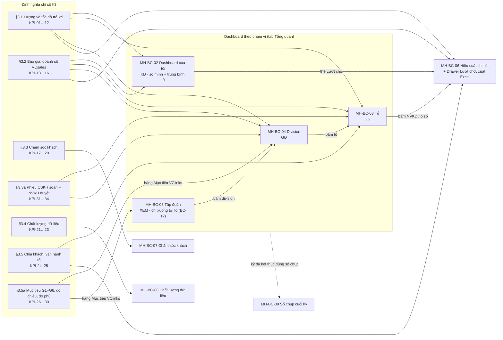
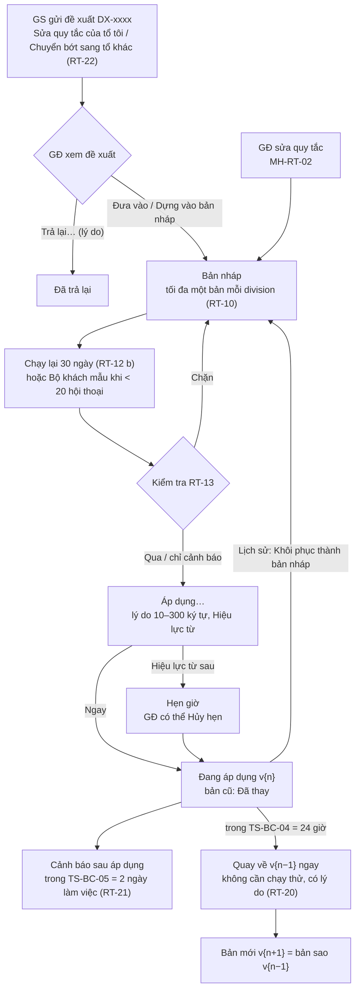
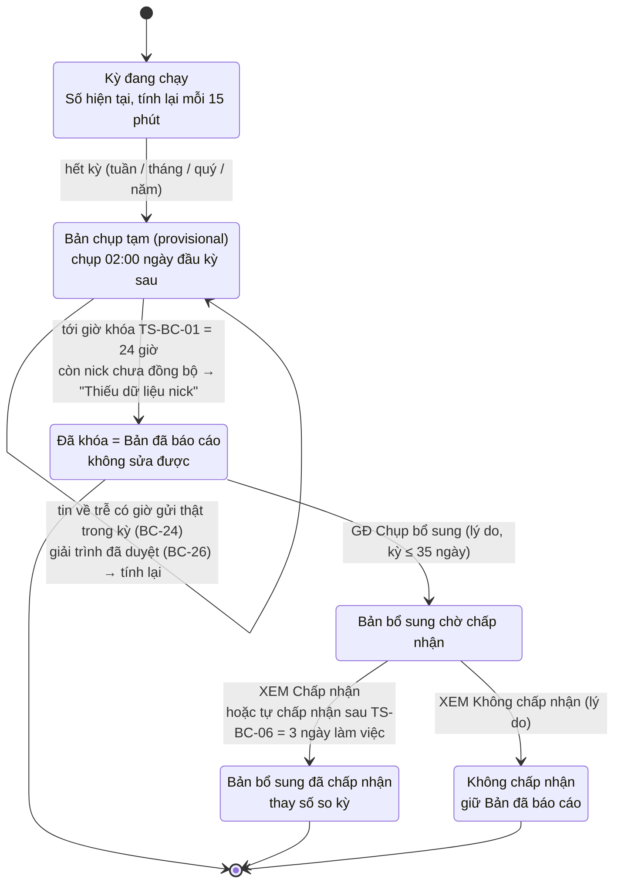
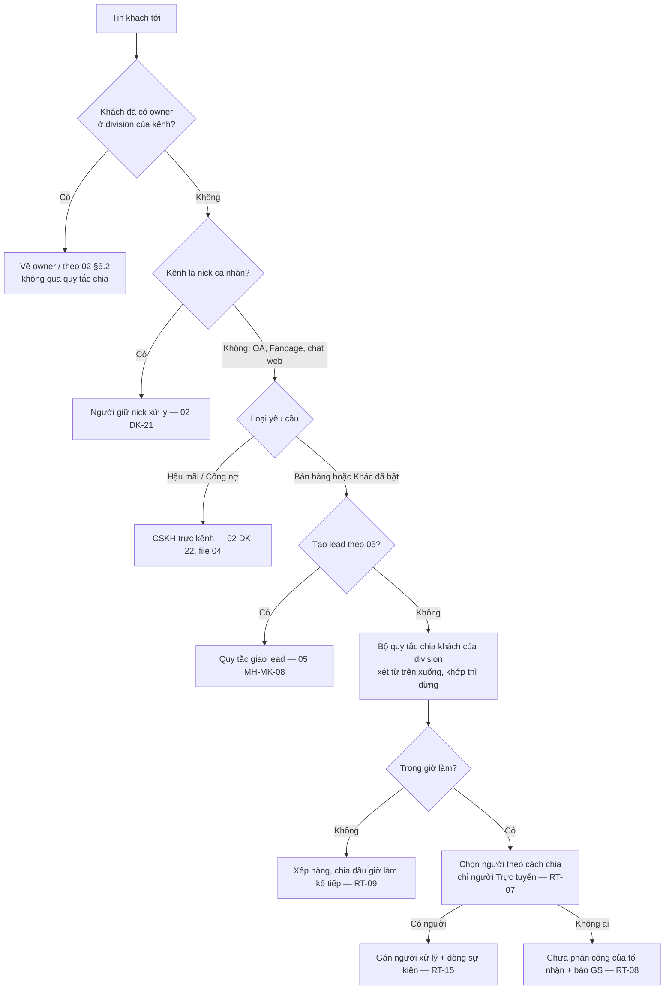

# 07 — Báo cáo chung và quy tắc chia khách (MH-BC, MH-RT)

Phiên bản 1.5.1 · 04/10/2026 · Trạng thái: Đã xử lý góp ý vòng 1, chờ designer

> Người yêu cầu: Thọ Anh Bùi · Người lập: BA + UX (Claude) · Góp ý: P-GD, P-GS, P-BGD; câu hỏi chủ dự án ở §11.
>
> **Căn cứ:** [BA tổng v0.4](../vclinks-ba.md) §4, §5.5, §5.8, §7, §18.2, §18.3, §18.9 · [00](00-giao-dien-chung.md) v1.3 (route, menu, khuôn màn hình, chip, câu chữ, bảng trạng thái MH-UI-05, UI-TP-07/08/09) · [01](01-phan-quyen.md) v1.3 (§2.3 phạm vi, §3.6 `config.*`, §3.7 `report.*`, PQ-27, PQ-38, PQ-48) · [02](02-khach-da-kenh.md) v1.3 (DK-20…DK-25, DK-30, DK-47, DK-48, DK-62, DK-63) · [03](03-sale-zalo-ca-nhan.md) SZ-21, SZ-22 · [04](04-cskh-zalo-oa.md) OA-31, MH-OA-17, MH-OA-18 · [05](05-marketing-quang-cao-chatbot.md) MH-MK-08, MH-MK-10 · [06](06-hoa-don-cong-no.md) HD-57, MH-HD-10 · [quyết định chủ dự án](../../01-quan-ly-du-an/quyet-dinh-chu-du-an.md) · [dữ liệu kiểm thử TD](../../05-kiem-thu/du-lieu-kiem-thu.md) · góp ý [04-P-GD](../ra-soat/dac-ta-vong-1/04-P-GD.md), [05-P-GD](../ra-soat/dac-ta-vong-1/05-P-GD.md), [06-P-GD](../ra-soat/dac-ta-vong-1/06-P-GD.md), [03-P-GS](../ra-soat/dac-ta-vong-1/03-P-GS.md), [01-P-GS](../ra-soat/dac-ta-vong-1/01-P-GS.md) #10, thiết kế P-GS lượt 1–3 ([D1-P-GS](../ra-soat/tk1/vong-1/P-GS.md) #17, (e); [vòng 2](../ra-soat/tk1/vong-2/P-GS.md) #10; [vòng 3](../ra-soat/tk1/vong-3/P-GS.md) (e)).
>
> **Thứ tự ưu tiên khi lệch:** route, menu, chip, câu chữ chung, bảng trạng thái người dùng → **00** thắng. Quyền → **01** thắng. Định tuyến, trạng thái owner, tạm giữ → **02** thắng. "Tin phản hồi", "Chưa trả lời" → **00 §3.3a + 03 SZ-21** thắng. Lịch làm việc, SLA theo kênh → **04 MH-OA-18** thắng.
>
> **File này là nguồn chuẩn về:** (1) **định nghĩa chỉ số** của báo cáo chung (`KPI-xx`, §3), gồm cách gán lượt cho người và loại trừ; 04, 05, 06 dùng lại khi nói FRT, % quá SLA, % trả lời qua VClinks; (2) màn **Quy tắc chia khách** `/settings/routing` (§5, §6). File này **không** lặp lại báo cáo chuyên đề: CSKH → 04 MH-OA-17, marketing → 05 MH-MK-10, hóa đơn và thu nợ → 06 MH-HD-10, kiểm soát truy cập → 01 MH-PQ-10 tab "Tổng quan kiểm soát". Ở đây chỉ trỏ tới và lấy vài số tổng lên dashboard.

## Mô hình

**Báo cáo theo phạm vi và chỉ số nào nuôi màn nào** (§1.3, §3, §4). Dashboard tập đoàn chỉ xuống tới tổ; bảng theo từng NVKD chỉ có ở GS và GĐ (BC-12).



**Vòng đời thay đổi bộ quy tắc chia khách** `/settings/routing` (RT-10…RT-13, RT-20…RT-22, MH-RT-01…05). Đường đi của một hội thoại mới qua động cơ chia: sơ đồ ở §5.



**Vòng đời số chụp cuối kỳ** (BC-15, BC-16, MH-BC-09).



## Tóm tắt

- **Phạm vi:** (A) báo cáo chung `/reports` — dashboard của tôi / tổ / division / tập đoàn, hiệu suất chi tiết + xuất Excel, chăm sóc khách, chất lượng dữ liệu, số chụp cuối kỳ (MH-BC-01…09); (B) màn **Quy tắc chia khách** `/settings/routing` (MH-RT-01…06). File là **nguồn chuẩn định nghĩa chỉ số** `KPI-01…34` cho 04, 05, 06.
- **Cách tính lượt:** lượt chờ theo **giờ gửi thật** (`sendDttm`, BC-24), giờ làm việc division (BC-02), gán cho **người chịu lượt** (BC-04); tin gửi từ điện thoại vẫn là tin phản hồi (BC-06, QĐ-07 A); trả lời ngoài VClinks trên kênh API không gán người (BC-09); nghỉ đột xuất hồi tố → "Không người chịu" (BC-25); giải trình và đề nghị tính lại qua GĐ duyệt (BC-26).
- **Không soi từng người:** không xếp hạng công khai; NVKD chỉ thấy số mình + trung bình tổ; ban giám đốc chỉ xuống tới tổ (BC-12, Q-BC-06 chờ chốt, BA đề xuất A+). Không nội dung tin, không SĐT trên báo cáo (BC-18); Excel có dòng theo khách áp duyệt PQ-48 (BC-19).
- **Số đã báo cáo không tự đổi:** số chụp 02:00 đầu kỳ sau, tạm 24 giờ rồi khóa; quý / năm tính lại trên cả kỳ; bản bổ sung chỉ thay số so kỳ khi XEM chấp nhận (BC-15, BC-16, MH-BC-09).
- **Đo VClinks:** hàng "Mục tiêu VClinks" G1–G6 (BC-28, KPI-26…30), độ phủ kênh kèm mọi KPI (BC-27), đối chiếu VCsales (BC-23); số VCsales lấy nguyên, chưa có TT-01 thì "Chờ kết nối VCsales" (BC-11).
- **Chia khách:** chỉ áp cho khách **chưa có owner** trên kênh chung, không qua quy tắc giao lead, không chia lại vì trạng thái (RT-01…RT-03); xét từ trên xuống, chỉ người Trực tuyến (RT-04, RT-07); áp dụng phải chạy lại 30 ngày + lý do (RT-10, RT-12), quay về bản trước trong 24 giờ (RT-20), GS chỉ đề xuất (RT-11, RT-22).
- **Quyết định đã áp:** D8-05 (KD không có tab Hiệu suất), D8-29 (thẻ "Chốt trong 30 ngày" giữ số kèm `tạm`), D9-01…D9-02 (§3.3a KPI-31…34 phiếu CSKH soạn – NVKD duyệt, căn cứ nới quyền gửi D1-01); mọi câu hỏi đã gắn mã QĐ-07, 48, 49, 50, 53, 84…94, TT-01, TS-BC-08, 09.
- **Còn mở:** **19** câu `Q-BC-01…19` (§11) chạy theo mặc định BA đề xuất; đáng chú ý Q-BC-06 (XEM xem từng NVKD), Q-BC-10 (gộp quy tắc lead và khách — P-GD chọn B), Q-BC-17 (báo cáo VCsales làm chuẩn đối chiếu), Q-BC-19 (chỉ tiêu G1–G6). Các chỗ "BA đề xuất" ở cuối §6 chờ chủ dự án xác nhận.
- **Người duyệt cần xem kỹ:** công thức và loại trừ ở §3 (dùng chung cho 04, 05, 06); BC-15 / BC-24 / BC-26 (khi nào số chụp được tính lại); RT-19 (hai bộ quy tắc lead và khách lệch nhau); §3.3a KPI-31…34 mới thêm ở v1.5 nhưng chưa có trong bảng dòng chảy / tồn §3.5b.

## Mục lục

- [0. Hiện trạng và điểm lệch với BA tổng](#0-hiện-trạng-và-điểm-lệch-với-ba-tổng)
- [1. Mục tiêu, phạm vi, vai trò, thuật ngữ](#1-mục-tiêu-phạm-vi-vai-trò-thuật-ngữ)
- [2. Quy tắc báo cáo BC-xx](#2-quy-tắc-báo-cáo-bc-xx)
- [3. Định nghĩa chỉ số KPI-xx](#3-định-nghĩa-chỉ-số-kpi-xx)
- [4. Màn hình báo cáo](#4-màn-hình-báo-cáo)
- [5. Quy tắc chia khách RT-xx](#5-quy-tắc-chia-khách-rt-xx)
- [6. Màn hình chia khách](#6-màn-hình-chia-khách)
- [7. User story](#7-user-story)
- [8. Dữ liệu kiểm thử bổ sung và kịch bản UAT](#8-dữ-liệu-kiểm-thử-bổ-sung-và-kịch-bản-uat)
- [9. Mô hình dữ liệu bổ sung](#9-mô-hình-dữ-liệu-bổ-sung)
- [10. Việc các file khác cần trỏ tới](#10-việc-các-file-khác-cần-trỏ-tới)
- [11. Câu hỏi mở Q-BC-xx](#11-câu-hỏi-mở-q-bc-xx)
- [Lịch sử cập nhật](#lịch-sử-cập-nhật)

---

## 0. Hiện trạng và điểm lệch với BA tổng

### 0.1 Hiện trạng (code `main` `f106e3b`, 29/09/2026)

| Hạng mục | Hiện trạng | Ghi chú |
|---|---|---|
| Trang Báo cáo `/reports` | 🆕 Chưa có | Dashboard hiện chỉ có Hội thoại, Đồng bộ, Kênh (00 §8.1) |
| Trang Đồng bộ `/sync` (số bản ghi gốc ↔ MongoDB) | ✅ Đã có | Không phải báo cáo kinh doanh; giữ ở 03 MH-SZ-12b |
| Dữ liệu nguồn cho FRT, SLA | 🟡 Có một phần | `messages.fromUid = '0'` phân biệt tin của nick; `syncFromMobile` có trong IndexedDB; lệnh outbox có người duyệt. **Chưa có:** `sendSource` (03 SZ-22), lịch làm việc division (04 MH-OA-18), lịch sử trạng thái người dùng (00 MH-UI-05), người xử lý hội thoại (`assignee`) |
| Quy tắc chia khách `/settings/routing` | 🆕 Chưa có | Chưa có cây tổ chức, owner, trạng thái người dùng trong code (01, 02 đều 🆕) |
| VCsales (báo giá, đơn, doanh số, chu kỳ mua) | ⚠ Mock | Chờ **TT-01** (API VCsales). Chỉ số dùng VCsales hiện "Chờ kết nối VCsales" tới khi có |

### 0.2 Điểm lệch với BA tổng v0.4

| # | BA tổng | File này | Lý do |
|---|---|---|---|
| L1 | F10.2 "thời gian xử lý" là chỉ số hiệu suất nhân viên | Chỉ tính trên hội thoại đã bấm "Đã xong", ghi số hội thoại `n`, hiện là **số tham khảo**, không dùng để so NVKD (KPI-09) | 00 §3.3: "Đã xong" không bắt buộc, không bấm thì không bị tính gì. So người theo số này là đếm oan |
| L2 | F10.2 "số hội thoại, FRT, % quá SLA" không nói tin gửi từ điện thoại | Tính mọi nguồn (QĐ-07 phương án A, BA đề xuất) + chỉ số riêng "% trả lời qua VClinks" (KPI-10) | 00 §3.3a, 03 SZ-21; **[Chờ chốt QĐ-07]** |
| L3 | F4.1 "chia tự động: vòng tròn, theo kênh, theo khu vực, theo tải" cho mọi hội thoại mới | Quy tắc chỉ áp cho **khách / hội thoại chưa có owner** ở kênh chung, **không** đi qua quy tắc giao lead của 05; nick cá nhân luôn về người giữ nick (RT-01…RT-03) | 02 DK-21, DK-22, DK-62; 05 MH-MK-08 đã có bộ quy tắc riêng cho lead. Gộp hai bộ: **Q-BC-10** |
| L4 | BR02 "owner offline quá X phút → chia theo quy tắc chung" | Không bao giờ chia lại khách đã có owner vì trạng thái (RT-02) | 00 §8.3 #10, 02 §5.2a, BR09 |
| L5 | F10.4 "dashboard ban giám đốc" | Dashboard tập đoàn chỉ xuống tới **tổ**, không có bảng xếp hạng từng NVKD (BC-12) | 04 MH-OA-17 #5 (viewer không thấy từng người); P-BGD, P-GS cùng ý "không soi từng người". **[Chờ chốt Q-BC-06]** |
| L6 | GS-06 "khớp dữ liệu thô" không nói khớp thế nào | Sheet "Lượt chờ" trong file Excel: cộng lại ra đúng số trên màn (BC-14, UAT-BC-13) | P-GS 03 #18 |

---

## 1. Mục tiêu, phạm vi, vai trò, thuật ngữ

### 1.1 Mục tiêu

1. **Mỗi vai trò trả lời được câu hỏi hằng ngày trong ≤ 1 phút** từ một màn hình:
   - NVKD: "Hôm nay tôi còn ai chưa trả lời, tuần này tôi trả lời nhanh chưa, báo giá của tôi chốt được bao nhiêu?"
   - Giám sát: "Tổ còn khách nào chưa trả lời, ai đang chậm, nick nào đỏ?" (P-GS 03 #1, #18; GS-01, GS-06).
   - Giám đốc: "Chỗ nào nghẽn, tổ nào tụt so với tuần trước?" (GD-01; P-GD 04 #6).
   - Ban giám đốc: "Các division phục vụ khách thế nào, số có khớp VCsales không, **VClinks đã đạt 6 mục tiêu G1–G6 chưa**?" (BGD-01; BA §1 Mục tiêu; P-BGD #1). [v1.1]
2. **Số liệu tin được**: mọi chỉ số có định nghĩa công khai ("Số này tính thế nào"), tính theo giờ làm việc division, bấm vào ra đúng danh sách, cộng lại khớp dữ liệu dòng trong file Excel; số lấy từ VCsales thì lấy nguyên và ghi giờ lấy.
3. **Không đếm oan**: tin trả lời từ điện thoại được tính **theo giờ gửi thật** kể cả khi về VClinks trễ, trả lời hộ và trực thay được ghi đúng người, tin tự động không làm số đẹp giả, người nghỉ phép (kể cả nghỉ đột xuất báo muộn) không bị tính lượt, NVKD có chỗ ghi giải trình. [v1.1]
4. **Số đã gửi Ban giám đốc không tự đổi**: số chụp cuối kỳ khóa sau một khoảng chờ tin về trễ, so kỳ trước dựa trên số chụp; bản bổ sung chỉ thay số so kỳ khi ban giám đốc chấp nhận (P-GD 05 #7, 06 #2; P-BGD #4). [v1.1]
4a. **Số cho thấy độ phủ của chính nó**: mọi KPI ghi kèm bao nhiêu nick / OA / Page đang đồng bộ; số VClinks đặt cạnh số VCsales cùng kỳ để thấy VClinks phủ bao nhiêu (P-BGD #2, P-GD #2). [v1.1]
5. **Chia khách mới công bằng và có kiểm soát**: giám đốc đặt quy tắc, thử trên dữ liệu trước khi bật, mọi thay đổi có lý do và lịch sử; giám sát thấy kết quả chia của tổ, so tải với các tổ khác, xem điều kiện các quy tắc xét trước và gửi đề xuất, kể cả đề xuất **chuyển bớt khách sang tổ khác**; quy tắc sai thì quay về bản trước ngay (GD-02; P-GS vòng 2 #10, vòng 3 (e); 07-P-GS #3, 07-P-GD #8, #11). [v1.1]

### 1.2 Phạm vi

| Trong phạm vi | Ngoài phạm vi (file khác) |
|---|---|
| Khung trang Báo cáo `/reports`, bộ lọc chung, thẻ chỉ số, "Số này tính thế nào" | Báo cáo CSKH, ticket, CSAT, khung gửi OA, chi phí tin → **04 MH-OA-17, MH-OA-19** |
| Dashboard theo vai trò: của tôi (NVKD), tổ (GS), division (GĐ), tập đoàn (BGĐ) | Báo cáo nguồn khách, lead, CPL, chiến dịch → **05 MH-MK-10** (F10.3, GD-04) |
| Báo cáo hiệu suất chi tiết + xuất Excel (F10.2, F10.4) | Báo cáo hóa đơn, thu nợ, tuổi nợ → **06 MH-HD-10** |
| Báo cáo chăm sóc khách: bỏ rơi, chu kỳ mua lại, báo giá treo (F15.7) | Tổng quan kiểm soát (ai hiện SĐT, ai xuất) → **01 MH-PQ-10** |
| Chất lượng dữ liệu (F15.8) | Đối chiếu IndexedDB ↔ MongoDB → **03 MH-SZ-12b** (`/sync`) |
| Số chụp cuối kỳ, so kỳ trước | SLA theo kênh, lịch làm việc, ngày lễ → **04 MH-OA-18** (`/settings/sla`) |
| Quy tắc chia khách / hội thoại chưa có owner `/settings/routing`, cài đặt chia của division, ngưỡng khách bị bỏ rơi | Quy tắc giao **lead** → **05 MH-MK-08** (`/leads/rules`); chia tay từ hàng "Chưa phân công", bàn giao khách → **03**, **01 MH-PQ-04** |
| Định nghĩa chỉ số dùng chung (§3) | Trợ lý AI hỏi đáp trên số liệu (GD-06, BGD-02) → GĐ2, chưa đặc tả |

**Báo cáo nào ở đâu** (để người dùng không phải đoán):

| Câu hỏi | Mở ở đâu | Chủ quản |
|---|---|---|
| Tôi / tổ / division trả lời nhanh không, quá SLA bao nhiêu | `/reports` (Tổng quan), `/reports/performance` | **07** MH-BC-02…06 |
| Khách nào bị bỏ rơi, đến chu kỳ mua lại, báo giá treo | `/reports/care` | **07** MH-BC-07 |
| Hồ sơ nào chưa gắn, account nào chưa có mã KH | `/reports/data-quality` | **07** MH-BC-08 |
| Ticket, CSAT, CSKH trả lời nhanh không, chi phí tin | `/reports/cskh` | 04 MH-OA-17 |
| Quảng cáo nào ra khách, ra đơn, CPL | `/reports/marketing` | 05 MH-MK-10 |
| Hóa đơn, thu nợ, tuổi nợ theo tổ | `/reports/invoice` | 06 MH-HD-10 |
| Ai xem SĐT, ai xuất dữ liệu | `/admin/audit` tab "Tổng quan kiểm soát" | 01 MH-PQ-10 |

### 1.3 Vai trò và phạm vi dữ liệu

Viết tắt theo 00 §1.6 (GD = GĐ, XEM = QS ở 01). Quyền chi tiết theo 01 §3.7; bảng dưới là cách file này **dùng** quyền đó.

| Vai trò | Khóa (01 §3.7) | Thấy trên báo cáo chung | Không thấy / không làm |
|---|---|---|---|
| **KD** NVKD | `report.volume` CT, `report.performance` CT, `report.care` CT | Dashboard của tôi (MH-BC-02); số của mình + **trung bình tổ** (không tên đồng nghiệp); danh sách khách bỏ rơi / đến chu kỳ của mình | Số từng đồng nghiệp; xuất Excel (`report.export` ✖); Chất lượng dữ liệu; **tab "Hiệu suất" (MH-BC-06) — không thấy tab, chỉ "Dashboard của tôi"; Drawer "Lượt chờ" của chính mình mở từ thẻ MH-BC-02 [v1.1.2·D8-05]** |
| **GS** Giám sát bán hàng | `report.volume` TỔ, `report.performance` TỔ, `report.care` TỔ, `report.export` TỔ +NK; `config.sla` Xem: TỔ | Dashboard tổ (MH-BC-03), bảng theo NVKD của tổ (kể cả tổ con), báo cáo chăm sóc tổ, xuất Excel; quy tắc chia liên quan tổ mình + **tên, điều kiện, tổ nhận của các quy tắc xét trước** (chỉ đọc, RT-22) + gửi đề xuất; ghi giải trình, gửi đề nghị tính lại lượt (BC-26); số tổng theo tổ của các tổ khác trong "Kết quả chia" (không tên NVKD) [v1.1] | Số theo NVKD của tổ khác; sửa quy tắc chia; Chất lượng dữ liệu (`report.data_quality` ✖) |
| **GD** (bổ sung v1.1) | – | Duyệt đề nghị tính lại lượt (BC-26); đặt mục tiêu division (BC-29) | – |
| **GD** Giám đốc bán hàng | `report.*` DV, `report.export` DV +NK, `config.sla` DV, `config.abandon` DV | Dashboard division (MH-BC-04), so sánh tổ, xuống tới NVKD; mọi tab của division; sửa quy tắc chia; duyệt đề xuất; chụp bổ sung số cuối kỳ | Division khác |
| **XEM** Ban giám đốc / kiểm soát | `report.*` TĐ, `report.export` TĐ +NK | Dashboard tập đoàn (MH-BC-05), xuống tới **tổ**; mọi tab chỉ đọc; xem quy tắc chia | Bảng theo từng NVKD (BC-12, **[Chờ chốt Q-BC-06]**); mọi nút ghi |
| **AD** Admin hệ thống | `report.volume` TĐ (chỉ số đếm theo kênh / nick, 01 chú thích (26)), `report.data_quality` TĐ, `report.export` TĐ | Lượng hội thoại theo kênh / tài khoản kênh / giờ; Chất lượng dữ liệu; xem quy tắc chia (kỹ thuật) | Tên khách, số theo nhân viên, FRT theo người, báo giá, doanh số; **không** mở được hội thoại từ số (01 D9) |
| **SA** Sale admin | `report.data_quality` DV, `report.export` DV +NK | Tab "Chất lượng dữ liệu" (MH-BC-08) của division | Hiệu suất, chăm sóc |
| **CS** CSKH (trưởng nhóm) | `report.volume` NH, `report.performance` NH | Báo cáo CSKH (04 MH-OA-17) là trang chính; tab "Hiệu suất" lọc nhóm CSKH (không có cột báo giá) | Tổ bán hàng |
| **MK**, **KT**, **TT** | `report.source` / `report.invoice` / – | Tab Marketing (05) / Hóa đơn và thu nợ (06) / không có mục Báo cáo | Báo cáo chung |

### 1.4 Thuật ngữ

| Thuật ngữ | Nghĩa trong file này |
|---|---|
| **Tin phản hồi** | Theo **00 §3.3a** (không định nghĩa lại): tin gửi ra khách bởi người, qua VClinks hoặc ngoài VClinks; tin tự động, ghi chú, dòng sự kiện không phải tin phản hồi |
| **Lượt chờ** | Một khoảng khách chờ: **bắt đầu** ở tin khách đầu tiên sau tin phản hồi gần nhất (hoặc tin đầu tiên của hội thoại); **kết thúc** ở tin phản hồi kế tiếp, hoặc khi người dùng bấm "Không cần trả lời" (03 SZ-21 g), hoặc khi hội thoại chuyển "Đã xong". Khớp 03 SZ-21 (c)(d) |
| **Thời gian chờ** | Số phút **trong giờ làm việc của division** (04 MH-OA-18: lịch theo thứ, nghỉ trưa, ngày lễ) từ lúc bắt đầu tới lúc kết thúc lượt. Tin khách ngoài giờ tính từ đầu giờ làm kế tiếp (03 SZ-21 h) |
| **Người chịu lượt** | Người **xử lý hội thoại** (assignee, 02 BR01) tại thời điểm lượt **kết thúc**, hoặc tại thời điểm **hết hạn SLA** nếu lượt quá hạn. Có cờ Nghỉ phép và trực thay hiệu lực → người trực thay (02 DK-47). Nick cá nhân → người giữ nick (02 DK-21). **[v1.1]** Lượt hết hạn trong khoảng Nghỉ phép **đặt hồi tố** (BC-25) → **không người chịu** (dòng "Không người chịu (nghỉ đột xuất)" ở tổng tổ) |
| **Giờ gửi thật** [v1.1] | Thời điểm tin được gửi theo nguồn: `sendDttm` (Zalo cá nhân, IndexedDB), `timestamp` của webhook (OA, Fanpage), giờ máy chủ nhận (chat web). **Không** dùng giờ tin về VClinks (`ingestedAt`) để tính lượt (BC-24) |
| **Số chụp tạm / đã khóa** [v1.1] | Số chụp lúc 02:00 là **tạm** tới giờ khóa (`TS-BC-01`, mặc định 24 giờ sau); trong khoảng đó tin về trễ có giờ gửi thật trong kỳ làm bản tạm được tính lại; sau giờ khóa bản chụp không đổi (BC-15) |
| **Độ phủ kênh** [v1.1] | Tỷ lệ tài khoản kênh bán hàng đã khai báo đang kết nối và đồng bộ khỏe (KPI-29). Số hiệu suất chỉ đúng trên phần kênh đang đồng bộ |
| **Người trả lời** | Người gửi tin phản hồi kết thúc lượt. Tin "Gửi từ điện thoại" → người giữ nick (03 SZ-22). Tin "Gửi từ trang quản lý OA / Meta Business Suite" → **không gán** (04 OA-31) |
| **Trả lời hộ** | Lượt mà người trả lời khác người chịu lượt: trả lời thay (F12.6), CSKH gửi mẫu giữ khách khi tạm giữ (02 DK-24) |
| **Kỳ** | Khoảng thời gian chọn trên bộ lọc. Tuần = thứ Hai 00:00 → Chủ nhật 23:59. Mọi mốc theo Asia/Ho_Chi_Minh |
| **Số hiện tại** | Số tính trên dữ liệu mới nhất; tính lại mỗi 15 phút (số tức thời "Chưa trả lời", "Quá SLA đang chờ" mỗi 60 giây) |
| **Số chụp** | Bản chốt số của một kỳ đã kết thúc, không sửa được (BC-15, MH-BC-09) |
| **Quy tắc chia khách** | Quy tắc chọn **người xử lý** cho hội thoại mới của khách **chưa có owner** trên kênh chung (§5). Không phải quy tắc giao lead (05 MH-MK-08) |
| **Bộ quy tắc** | Toàn bộ quy tắc chia của một division, có số phiên bản (v1, v2…), trạng thái Nháp / Chờ duyệt / Đang áp dụng / Đã thay |

---

## 2. Quy tắc báo cáo `BC-xx`

### 2.1 Cách tính

| Mã | Quy tắc |
|---|---|
| **BC-01** | **Nguồn định nghĩa.** Mọi chỉ số ở §3 dùng "tin phản hồi", "Chưa trả lời" của **00 §3.3a** và "đã trả lời / chưa trả lời" của **03 SZ-21**; FRT không tính tin tự động (04 OA-31). File này chỉ thêm: lượt chờ, người chịu lượt, loại trừ, công thức, cách hiển thị. 04 MH-OA-17, 05 MH-MK-10, 06 MH-HD-10 dùng cùng định nghĩa khi hiện FRT, % quá SLA, % trả lời qua VClinks. |
| **BC-02** | **Giờ làm việc.** Mọi thời gian chờ, hạn SLA, "N ngày làm việc" tính theo **lịch làm việc của division sở hữu kênh** (04 MH-OA-18: theo thứ, nghỉ trưa, ngày lễ), không theo ca từng người (00 §3.4). Đổi lịch chỉ áp cho lượt bắt đầu sau lúc lưu (04 UAT-OA-131). |
| **BC-03** | **Kỳ của một lượt.** Lượt tính vào kỳ chứa **thời điểm bắt đầu** lượt. Lượt chưa kết thúc lúc tính: vào "Đang chờ"; đã quá hạn thì **đã tính là quá SLA** ngay (không đợi kết thúc). Hội thoại tính vào kỳ nếu có ≥ 1 tin khách trong kỳ. |
| **BC-04** | **Gán người.** FRT, % quá SLA, số lượt gán cho **người chịu lượt** (§1.4). Người trả lời khác người chịu → lượt vẫn của người chịu; người trả lời được đếm ở cột **"Trả lời hộ"**, người chịu có cột **"Được trả lời hộ"** (01 Q-PQ-16 → **QĐ-53** phương án A). Hội thoại chuyển người xử lý giữa lượt: lượt thuộc người đang xử lý lúc kết thúc (hoặc lúc hết hạn nếu quá hạn); quá hạn trước khi chuyển thì vẫn là của người trước. |
| **BC-05** | **Doanh số, báo giá, đơn** gán cho **owner** của khách (ở division của hội thoại) tại lúc gửi báo giá / lúc VCsales ghi đơn, kể cả khi người gửi là người trực thay hoặc trả lời thay (**QĐ-53** A). Người gửi hộ có cột "Gửi hộ" (đếm, không có giá trị). **[v1.1] Doanh số theo tổ** (KPI-16) = doanh số theo "NV phụ trách" của VCsales, map sang tổ theo cây tổ chức **lúc VCsales ghi đơn** (BC-21); không map theo owner VClinks. Khi owner VClinks của account khác NV phụ trách trên VCsales, khối báo giá / doanh số hiện dòng cảnh báo "{n} account có người phụ trách VClinks khác NV phụ trách VCsales. Xem danh sách" → 02 MH-DK-12 (việc "Đổi NV phụ trách trên VCsales"). Tooltip KPI-16 ghi rõ khác KPI-13 ở điểm này (P-GD #5). |
| **BC-06** | **Tin gửi từ điện thoại** (nhãn "Gửi từ điện thoại", `sendSource = ngoai_vclinks` trên nick cá nhân) là tin phản hồi: kết thúc lượt, tính FRT, % quá SLA cho người giữ nick (**QĐ-07** phương án A, BA đề xuất). Báo cáo tách thêm cột "% trả lời qua VClinks" (KPI-10) để theo dõi chuyển đổi, **không** dùng để trừ điểm. Chủ dự án chọn B (KPI chỉ tính tin qua VClinks) → KPI-05, KPI-06 bỏ lượt kết thúc bằng tin từ điện thoại khỏi dòng cá nhân, giữ ở tổng tổ; chọn C → đổi cả SLA (00 phải sửa). |
| **BC-07** | **Loại trừ khỏi mọi chỉ số hiệu suất** (vẫn hiện ở "Lượng hội thoại" nếu có quyền): (a) nhóm Zalo **chưa gắn account** khách (**QĐ-50** N2, BA đề xuất; nhóm đã gắn: tin của nhân viên nội bộ trong nhóm là tin phản hồi); (b) hội thoại với **nhân viên nội bộ** (contact vai trò `nhan_vien` / `quan_ly`, email `@vcprosperous.com`, F15.5); (c) hội thoại vai trò `gia_dinh_ban_be` (**QĐ-38**); (d) nick ở hàng "Nick chờ xác nhận" (01 PQ-52 d); (e) hội thoại phụ "Cùng một yêu cầu" **sau khi** hội thoại chính đã được trả lời (02 DK-30) — FRT tính ở hội thoại chính; (f) bình luận Fanpage (có báo cáo riêng ở 05); (g) dữ liệu đã xóa theo NĐ 13. |
| **BC-08** | **Kết thúc lượt không có tin.** "Không cần trả lời" (03 SZ-21 g) hoặc "Đã xong" **trước hạn SLA** → lượt không tính FRT, không tính quá hạn, đếm ở cột "Đóng không trả lời". Sau hạn → vẫn tính **quá SLA** (không tính FRT). Tin khách chỉ là sticker / "ok" / cảm xúc: theo **QĐ-50** (BA đề xuất A + B: vẫn mở lượt, trừ khi câu nằm trong danh sách "tin không cần trả lời" GĐ cấu hình); cảm xúc (reaction) không mở lượt (03 SZ-21 f). |
| **BC-09** | **Trả lời ngoài VClinks trên kênh API** ("Gửi từ trang quản lý OA", "Gửi từ Meta Business Suite"): kết thúc lượt, tính vào số tổng của kênh / division, **không** vào dòng của bất kỳ nhân viên nào (04 OA-31, UAT-OA-129); đếm ở dòng "Trả lời ngoài VClinks". |
| **BC-10** | **Division** của hội thoại = division của kênh nhận tin (02 DK-20). Khách của hai division: mỗi hội thoại chỉ vào division của kênh đó; doanh số theo mã KH ERP của division (TD-K08: VCparts / VCedu tính riêng). |
| **BC-11** | **Số từ VCsales lấy nguyên, không tính lại** (F10.4, BR12): trạng thái báo giá, đơn, doanh số, chu kỳ mua lại, công nợ. Mỗi khối có dòng "VCsales lấy lúc {HH:mm dd/MM}". VCsales không phản hồi → khối đó hiện `ERR-ERP` (00 §6.1), các chỉ số của VClinks vẫn hiện. Chưa kết nối API (TT-01) → khối hiện "Chờ kết nối VCsales", không hiện số 0. |

### 2.2 Hiển thị, quyền, xuất, số chụp

| Mã | Quy tắc |
|---|---|
| **BC-12** | **Không xếp hạng công khai.** Bảng theo từng NVKD chỉ có ở phạm vi GS (tổ mình) và GĐ (division). NVKD thấy số của mình và **trung bình tổ** (không tên, không thứ hạng). XEM (ban giám đốc) và dashboard tập đoàn xuống tới **tổ** (**[Chờ chốt Q-BC-06]**). Không có cột "Hạng", không tô màu đỏ tên người; chỉ tô ô số vượt ngưỡng. Khớp 04 MH-OA-17 #5. |
| **BC-13** | **Mọi thẻ số có:** (a) tooltip `InfoCircleOutlined` "Số này tính thế nào" (công thức, loại trừ, nguồn, giờ lấy — nguyên văn cột §3); (b) Δ so với **kỳ liền trước cùng độ dài** khi bật "So với kỳ trước" (mặc định bật): kỳ chưa kết thúc thì so cùng số ngày làm việc đã qua của kỳ trước, ghi "so cùng {n} ngày làm việc"; (c) mũi tên ▲▼ và màu theo **hướng tốt** của chỉ số (§3 cột "Hướng tốt"), không theo tăng / giảm; (d) bấm vào số → danh sách đúng các bản ghi tạo ra số đó (BC-17). |
| **BC-14** | **Khớp dữ liệu thô** (GS-06): tổng trên màn = tổng các dòng trong Excel sheet "Lượt chờ" / "Báo giá" cùng bộ lọc; số của tổ = tổng (đếm) và trung vị tính lại trên các lượt của thành viên, **không** phải trung bình của trung vị. |
| **BC-15** | **Số chụp cuối kỳ** (MH-BC-09) [Sửa v1.1]: hệ thống tự chụp mọi chỉ số theo NVKD, tổ, division, kênh lúc **02:00 ngày đầu kỳ kế tiếp** (sau khi đồng bộ bù đêm) cho kỳ **tuần**, **tháng**, **quý** và **năm** (`periodType = week \| month \| quarter \| year`). (a) **Quý, năm tính lại trên toàn bộ lượt / báo giá của cả kỳ**, không lấy bản tháng cuối: số dòng chảy (lượt, FRT, % quá SLA, báo giá gửi…) tính trên mọi bản ghi của kỳ (trung vị quý là trung vị của mọi lượt trong quý, BC-14); chỉ **số tồn** (loại "Tồn" ở §3.5b: tuổi nợ, khách bỏ rơi, chu kỳ mua lại, báo giá treo, độ phủ kênh) lấy giá trị cuối kỳ (cùng cách 06 HD-57 c cho tuổi nợ) (P-GD #1, P-BGD #5). (b) **Tạm → khóa:** bản chụp là **tạm** tới giờ khóa = giờ chụp + `TS-BC-01` (mặc định **24 giờ**). Trong khoảng tạm, tin về trễ có giờ gửi thật trong kỳ (BC-24) và giải trình đã duyệt (BC-26) làm bản tạm được **tính lại**; nhãn "Số chụp tạm · khóa lúc {HH:mm dd/MM} · tính lại {k} lần". Tới giờ khóa: bản thành **đã khóa, không sửa được**. Nick trong phạm vi còn mất kết nối lúc khóa (chưa đồng bộ lại từ lần mất gần nhất trong kỳ) → vẫn khóa, trạng thái **"Thiếu dữ liệu nick {tên}"** (cùng cách "Thiếu số VCsales") (P-GS #1). (c) Dữ liệu về sau giờ khóa chỉ vào "Số hiện tại"; khi hai số lệch, dòng vàng "Số hiện tại khác số chụp {n} chỉ số. Xem chênh lệch" (KPI-14 không đếm vào {n}, xem KPI-14). (d) GĐ được **"Chụp bổ sung"** bản đã khóa, có lý do bắt buộc; bản cũ giữ nguyên. Bản khóa đầu tiên là **"Bản đã báo cáo"**; bản bổ sung **chỉ thay số so kỳ sau khi XEM bấm "Chấp nhận"** (hoặc tự chấp nhận sau `TS-BC-06` = 3 ngày làm việc nếu XEM không bấm "Không chấp nhận"); tới lúc đó mọi màn dùng "Bản đã báo cáo" và hiện cạnh bản bổ sung kèm Δ từng chỉ số. XEM nhận thông báo mức **"Cần xử lý"** (không phải "Để biết") (P-BGD #4). Giờ chụp là tham số **[Chờ chốt Q-BC-09]**. |
| **BC-16** | **Chọn số hiện tại / số chụp:** kỳ đã kết thúc và có số chụp → mặc định hiện **số chụp**, nhãn "Số chụp {HH:mm dd/MM}" (bản tạm: "Số chụp tạm · khóa lúc {HH:mm dd/MM}"; có bản bổ sung chưa chấp nhận: "Bản đã báo cáo · có bản bổ sung chờ chấp nhận" [v1.1]); kỳ đang chạy → "Số hiện tại · cập nhật {HH:mm}". Xuất Excel theo đúng loại số đang xem. |
| **BC-17** | **Số bấm được** mở danh sách trong phạm vi người xem, không mở rộng quyền: số hội thoại → `/conversations` với bộ lọc tương ứng (00 R6, ví dụ `?view=team&team=HN1&filter=unanswered&assignee={id}`); số lượt quá SLA → Drawer "Lượt quá SLA" (MH-BC-06 #10) có nút mở hội thoại; số khách → MH-BC-07 hoặc `/customers` đã lọc. AD, XEM bấm số thì ra danh sách **không có nút mở hội thoại** (AD) hoặc mở theo quy tắc đọc nguyên văn của XEM (**QĐ-24**). |
| **BC-18** | **Không nội dung tin** trên báo cáo, file Excel, nhật ký (CLAUDE.md §12.3): chỉ mã hội thoại, tên hiển thị khách, kênh, thời điểm, số phút. **Không SĐT** ở mọi màn và file của báo cáo chung. |
| **BC-19** | **Xuất Excel** theo UI-TP-09 (00 §5.2): khóa `report.export`; tên file `vclinks_{mã trang}_{yyyyMMdd_HHmm}.xlsx`; sheet **"Tóm tắt"** (dòng đầu: "Kỳ {từ}–{đến} · Phạm vi {…} · {Số hiện tại lúc … / Số chụp lúc …} · VCsales lấy lúc … · Xuất bởi {email} lúc {HH:mm dd/MM/yyyy}", các thẻ số và Δ), sheet dữ liệu theo từng màn, sheet **"Định nghĩa"** (nguyên văn §3 các chỉ số có trong file). Ghi nhật ký `export.report` (01 PQ-38). **[Sửa v1.1] Hai loại file** (P-BGD #3): **(a) Tổng hợp** — chỉ các sheet số theo tổ / NVKD / kênh / tài khoản kênh / ngày / quy tắc và "Tóm tắt", "Định nghĩa", **không có dòng nào theo khách** (không tên khách, không mã KH, không số báo giá): tải ngay như UI-TP-09, không qua duyệt. **(b) Có dòng theo khách** — file có ít nhất một sheet mỗi dòng là một khách / hội thoại / lượt / báo giá (sheet "Lượt chờ", "Báo giá", danh sách "Không tương tác", "Đến chu kỳ mua lại", "Báo giá treo"), **dù không có SĐT**: áp **01 PQ-48** như xuất danh sách khách không kèm SĐT — tới trần `exportMaxRows` (TS-30, mặc định 500 dòng) tải ngay; vượt trần thì tạo **yêu cầu xuất** (lý do bắt buộc, người duyệt theo QĐ-37, người yêu cầu không tự duyệt); mọi file loại (b) có **mã xuất** và dòng đầu, dòng chân "Mã xuất <XK-xxxx> · Xuất bởi <email> lúc <dd/MM/yyyy HH:mm>" trên mọi sheet, link tải hết hạn sau 24 giờ; mỗi lần xuất loại (b) là một sự kiện cho quy tắc cảnh báo bất thường **01 PQ-46**. Người dùng chọn loại ở hộp xuất: "Chỉ số tổng hợp" (mặc định) / "Kèm danh sách chi tiết" (hiện số dòng và "Cần duyệt" khi vượt trần). Đề nghị 01 thêm: danh sách "Đến chu kỳ mua lại", "Không tương tác" từ phạm vi division trở lên **luôn** qua duyệt (§10). |
| **BC-20** | **Admin chỉ số đếm:** AD thấy lượng hội thoại / tin theo kênh, tài khoản kênh, giờ; không thấy tên khách, không thấy số theo nhân viên, không có FRT, báo giá, doanh số (01 chú thích (26)). |
| **BC-21** | **Phạm vi theo cây tại thời điểm tính:** tổ của một NVKD lấy theo cây tổ chức lúc lượt / báo giá phát sinh (không chuyển số cũ sang tổ mới khi NVKD đổi tổ). Số chụp lưu tổ tại thời điểm chụp. Người đã nghỉ việc vẫn có dòng trong kỳ họ còn làm, tên thêm " (đã nghỉ)". |
| **BC-22** | **Hiệu năng:** dashboard hiện trong ≤ 3 giây với division 50 người, 30.000 lượt / tháng (máy văn phòng, mạng công ty); bảng dài dùng phân trang UI-TP-08. Tính lại nền mỗi 15 phút, không tính khi người dùng mở trang. |

### 2.3 Bổ sung v1.1: mốc thời gian, nghỉ đột xuất, giải trình, đối chiếu, độ phủ, mục tiêu

| Mã | Quy tắc |
|---|---|
| **BC-23** | **Đối chiếu VCsales** (P-GD #2, P-BGD #1 G4). Dashboard division (MH-BC-04 #1b), tập đoàn (MH-BC-05 #1b) và sheet "Tóm tắt" của mọi file Excel có số báo giá / doanh số đều có khối **"Đối chiếu VCsales"** gồm: (1) **"Báo giá tạo trên VCsales trong kỳ"** — số báo giá VCsales "Đã duyệt" có **ngày tạo** trong kỳ, của division (lấy nguyên, BC-11); (2) **"trong đó đã gửi qua VClinks"** — số báo giá ở (1) có ≥ 1 lần gửi qua VClinks (bất kỳ ngày gửi nào tới lúc lấy) và **% phủ** = (2) ÷ (1) (KPI-26); (3) **"Báo giá gửi qua VClinks trong kỳ"** = KPI-13 (theo **ngày gửi**), kèm dòng "trong đó tạo trước kỳ: {n}"; (4) **"Doanh số division theo VCsales"** và "trong đó của khách có hội thoại VClinks trong kỳ" (GĐ2, khi có KPI-16). Mỗi dòng ghi **tên báo cáo VCsales dùng để so** và **trường ngày dùng để lọc** (ví dụ "Báo cáo báo giá theo ngày tạo · trường `ngay_tao`"), **[Chờ Q-BC-17 / TT-01]**; tới khi VCsoft trả lời, dòng ghi "Báo cáo VCsales: chờ xác nhận". Thẻ KPI-13 có tooltip "Đếm theo ngày gửi qua VClinks, không phải ngày tạo trên VCsales." Chưa có TT-01 → cả khối "Chờ kết nối VCsales". |
| **BC-24** | **Mốc thời gian của lượt** (P-GS #1; 03 SZ-21, SZ-22). Lượt **bắt đầu** và **kết thúc** theo **giờ gửi thật** của tin (§1.4), không theo giờ tin về VClinks. Tin "Gửi từ điện thoại" (hoặc bất kỳ tin nào) về VClinks trễ — vì nick đỏ, Chrome driver mất kết nối, đồng bộ bù — thì lượt được **tính lại**: lượt đang "Đang chờ" / "Quá hạn · Chưa trả lời" chuyển thành đã trả lời với thời gian chờ đúng theo giờ gửi thật; lượt tính quá hạn trước đó mà giờ gửi thật trong hạn thì **bỏ quá hạn**. Tính lại vào "Số hiện tại" ngay (≤ 15 phút) và vào **số chụp tạm** nếu trước giờ khóa (BC-15 b). Drawer "Lượt chờ" có cột "Về VClinks lúc" khi khác giờ gửi quá 5 phút, nhãn "Về trễ {x}". Khi một nick trong phạm vi đang **đỏ / Chưa an toàn**, hàng "Ngay bây giờ" (KPI-07, 08) có dòng "{n} nick đang mất kết nối, số có thể chưa đúng" (nick đỏ thì VClinks không nhận cả tin khách lẫn tin trả lời; khi đồng bộ lại, cả hai tính theo giờ gửi thật). |
| **BC-25** | **Nghỉ đột xuất, cờ Nghỉ phép hồi tố** (P-GS #2). Khi tạo trực thay / duyệt "Đăng ký vắng" (01 MH-PQ-07, PQ-32), ô **"Hiệu lực từ"** được lùi về **tối đa đầu ngày làm việc hôm đó** (lịch division), không lùi xa hơn; lùi thì **lý do bắt buộc** (10–300 ký tự). NVKD tự đăng ký hồi tố → GS phải **Đồng ý** mới có hiệu lực; GS / GĐ tạo → có hiệu lực ngay. Nhật ký `grant.cover.backdate` (người, lúc bấm, hiệu lực từ, lý do). Hệ quả báo cáo: (a) lượt **hết hạn SLA** trong khoảng từ "Hiệu lực từ" tới lúc bấm → **không người chịu**: không vào dòng người nghỉ, không vào dòng người trực thay, đếm ở dòng **"Không người chịu (nghỉ đột xuất)"** của tổng tổ (vẫn trong tổng kênh / division); người trả lời sau đó (thường là người trực) được đếm "Trả lời hộ". (b) KPI-17: ngày owner mang cờ Nghỉ phép **không tính** vào số ngày không tương tác; owner đang nghỉ → dòng khách hiện "(Nghỉ phép tới dd/MM)", nút "Thu hồi" khóa với khách đó, tooltip "Owner đang nghỉ phép tới dd/MM." (c) Số chụp đã khóa không đổi; hồi tố sau giờ khóa chỉ đổi "Số hiện tại". |
| **BC-26** | **Giải trình và đề nghị tính lại lượt** (P-GS #8). Trên dòng Drawer "Lượt chờ" có **"Ghi giải trình"** (NVKD của lượt, GS của tổ): lý do chọn sẵn ("Trả lời từ điện thoại, đồng bộ trễ", "Nick mất kết nối", "Nghỉ đột xuất", "Khách nhắn nhầm / không cần trả lời", "Khác") + ghi chú 10–300 ký tự, **không** chứa nội dung tin (cảnh báo khi dán quá 300 ký tự). Giải trình hiện ở Drawer, sheet "Lượt chờ" (cột "Giải trình") và cho GĐ. GS bấm **"Đề nghị tính lại"** (loại lượt khỏi hiệu suất cá nhân, hoặc đổi người chịu) → GĐ **Duyệt / Từ chối** có lý do (người gửi không tự duyệt, PQ-27). Duyệt → lượt có `adjustment` (loại khỏi dòng cá nhân, vẫn ở tổng kênh; hoặc đổi người chịu), "Số hiện tại" đổi ngay, bản chụp tạm tính lại; bản đã khóa không đổi — dải vàng ghi lý do "Đã duyệt tính lại {n} lượt", GĐ chụp bổ sung nếu cần (BC-15 d). NVKD thấy trạng thái đề nghị của lượt mình ("Chờ GĐ duyệt" / "Đã duyệt" / "Từ chối: {lý do}"). **[v1.1.3·R1]** (BA đề xuất) (a) NVKD lưu giải trình → GS của tổ nhận thông báo mức "Để biết" `{NVKD} ghi giải trình lượt {dd/MM HH:mm} · {khách}`, bấm mở đúng dòng (P-GS #4). (b) Nút trên dòng Drawer có **chữ**: `Ghi giải trình` (dòng chưa có); `Đề nghị tính lại` chỉ ở dòng đã có giải trình và chưa đề nghị; dòng đã đề nghị ghi `đã gửi đề nghị` (P-GS #5). (c) Drawer thêm lọc `Có giải trình chưa đề nghị` và `Đề nghị chờ GĐ duyệt`; cột Giải trình hiện chữ lý do (không chỉ biểu tượng); dòng chờ GĐ ghi thêm `còn {n} giờ tới khi khóa số chụp` (P-GD #4). (d) Lối vào: chip `Giải trình chờ xem {n}` ở MH-BC-03 #1 (GS), chip `Đề nghị tính lại chờ duyệt {n}` ở MH-BC-04 #2 (GĐ) mở Drawer lọc sẵn. Nhật ký `report.turn_note`, `report.turn_adjust_request`, `report.turn_adjust_decide`. |
| **BC-27** | **Độ phủ đi kèm mọi KPI** (P-BGD #2). Mọi thẻ hiệu suất (KPI-04…12) và mọi dòng division / tổ trên MH-BC-03…05 có dòng phụ **"Trên {n}/{m} tài khoản kênh đang đồng bộ"** (KPI-29 a của phạm vi và kỳ đang xem; kỳ đã qua dùng trung bình theo ngày làm việc). Độ phủ < `TS-BC-02` (mặc định **90%**) → tô vàng cả dòng / thẻ, chú thích "Số có thể thiếu: {tên tài khoản} mất đồng bộ {x} ngày làm việc trong kỳ". Số chụp lưu độ phủ lúc chụp. |
| **BC-28** | **Hàng "Mục tiêu VClinks" G1–G6** (P-BGD #1; BA §1 Mục tiêu). Dashboard tập đoàn (MH-BC-05 #0) và division (MH-BC-04 #0) có hàng 6 thẻ, mỗi thẻ **một chỉ số có công thức**: **G1** = KPI-27 "% lượt chờ quá 15′" · **G2** = KPI-05 "FRT trung vị" · **G3** = KPI-21 "% hội thoại gắn hồ sơ" · **G4** = KPI-26 "% báo giá VCsales gửi qua VClinks" (dòng phụ KPI-28 "Thời gian tới báo giá") · **G5** = KPI-29 "Độ phủ kênh" · **G6** = KPI-30 "% khách đến chu kỳ đã nhắc". Mỗi thẻ: số kỳ này, Δ, **chỉ tiêu** (BC-29) và "Đạt / Chưa đạt". Thẻ chưa có dữ liệu **không ẩn**, ghi lý do: "Chờ kết nối VCsales" (G4, G6 khi chưa TT-01), "Chưa bật (GĐ2)" (G6). Bấm thẻ → màn chi tiết của chỉ số (MH-BC-06, MH-BC-08, MH-BC-07, `/channels`). |
| **BC-29** | **Chỉ tiêu.** (a) **Chỉ tiêu tập đoàn G1–G6**: một bộ số, đặt ở MH-RT-06 khối "Mục tiêu" chỉ đọc cho GĐ, do **XEM** đề xuất và chủ dự án chốt **[Chờ Q-BC-19]**; chưa chốt → thẻ ghi "Chưa đặt chỉ tiêu", không có "Đạt / Chưa đạt". (b) **Mục tiêu division** (P-GD #13): GĐ đặt tùy chọn cho KPI-05, KPI-06, KPI-12 (theo division, tùy chọn theo tổ) ở MH-RT-06 #10; thẻ số có dòng "Mục tiêu {x}", sparkline có vạch mục tiêu; ô "% quá SLA" tô vàng theo mục tiêu nếu đã đặt, không thì theo Q-BC-08. Sửa mục tiêu có lý do, nhật ký `config.report_target`, chỉ áp từ kỳ sau (không đổi đánh giá kỳ đang chạy). |

---

## 3. Định nghĩa chỉ số `KPI-xx`

Cột "Gán cho": người / đơn vị mà dòng số thuộc về khi xem theo người, tổ. Cột "GĐ": giai đoạn (BA §19). "Tức thời" = số tại lúc xem, không theo kỳ.

### 3.1 Lượng và tốc độ trả lời

| Mã | Chỉ số (nhãn trên màn) | Công thức | Nguồn dữ liệu | Loại trừ | Gán cho | Hướng tốt | GĐ |
|---|---|---|---|---|---|---|---|
| **KPI-01** | "Hội thoại có tin khách" | Số hội thoại **khác nhau** có ≥ 1 tin khách trong kỳ | `messages` (tin không phải của tài khoản kênh), `conversations` | BC-07 | Người xử lý hội thoại lúc tin khách đầu tiên trong kỳ; kênh; tài khoản kênh | – (lượng) | MVP |
| **KPI-02** | "Hội thoại mới" | Số hội thoại có tin **đầu tiên từ trước tới nay** nằm trong kỳ | `conversations.createdAt` | BC-07 | Như KPI-01 | – | MVP |
| **KPI-03** | "Tin khách" (heatmap giờ) | Số tin khách theo **giờ × thứ** (7 × 24 ô), theo kênh / tài khoản kênh / ngày | `messages` | Tin tự động, cảm xúc; BC-07 (a)(b)(c)(d) | Kênh, tài khoản kênh; tổ theo người xử lý | – | MVP |
| **KPI-04** | "Lượt chờ" | Số lượt chờ **bắt đầu** trong kỳ, tách: đã trả lời · đóng không trả lời · đang chờ | `reply_turns` (§9) | BC-07 | Người chịu lượt | – | MVP |
| **KPI-05** | "Thời gian phản hồi (FRT)" | **Trung vị** thời gian chờ (phút giờ làm) của các lượt kết thúc bằng tin phản hồi trong kỳ; kèm **P90** ("9/10 lượt được trả lời trong {n} phút"). Định dạng: < 60 → "{n}′"; ≥ 60 → "{h}g {m}′" | `reply_turns` | BC-07, BC-08 (lượt đóng không trả lời), BC-09 (khỏi dòng nhân viên); tin tự động không kết thúc lượt (00 §3.3a) | Người chịu lượt | Thấp | MVP |
| **KPI-06** | "% quá SLA" | Số lượt **quá hạn** ÷ số lượt có SLA áp dụng, trong kỳ. **Quá hạn** = thời gian chờ > hạn của lượt (kể cả lượt đang chờ đã quá hạn, BC-03; lượt đóng không trả lời sau hạn, BC-08). **Hạn của lượt** = SLA phản hồi của kênh (04 MH-OA-18; nick Zalo cá nhân: 15′ theo GS-01) tại lúc lượt bắt đầu; hội thoại **Bán hàng** trên kênh chung của khách có owner → **hạn trả lời của owner lần 1** (02 DK-48, TS-05 15′) | `reply_turns`, `sla_config` phiên bản | Kênh không cấu hình SLA; BC-07; BC-08 (đóng trước hạn) | Người chịu lượt (lúc hết hạn) | Thấp | MVP |
| **KPI-07** | "Chưa trả lời" (tức thời) | Số hội thoại mà tin cuối khách thấy là tin khách (00 §3.3a) tại lúc xem; kèm "chờ lâu nhất {thời gian}". **[v1.1]** Tách hai số: **"Tồn từ hôm trước"** (lượt đang mở bắt đầu trước giờ mở cửa của ngày làm việc hôm nay) và **"Hôm nay"** (P-GS #5). Có nick trong phạm vi đang mất kết nối → dòng "số có thể chưa đúng" (BC-24) | `conversations`, `reply_turns` đang mở | BC-07; hội thoại "Chờ khách", "Đã xong" | Người xử lý hiện tại | Thấp | MVP |
| **KPI-08** | "Quá SLA đang chờ" (tức thời) | Số hội thoại **Chưa trả lời** có chip SLA mức "Quá hạn" (00 §3.4) tại lúc xem | như KPI-07 | như KPI-07 | Người xử lý hiện tại | Thấp | MVP |
| **KPI-09** | "Thời gian xử lý" *(tham khảo)* | Trung vị thời gian (giờ làm) từ tin khách mở đợt (hội thoại "Mới" hoặc mở lại theo BR04) tới lúc chuyển "Đã xong", trên các hội thoại **có** "Đã xong" trong kỳ; luôn ghi "(trên {n} hội thoại đã bấm Đã xong)" | `conversation_events` | BC-07; hội thoại chưa từng "Đã xong" | Người bấm "Đã xong" | Thấp | MVP |
| **KPI-10** | "% trả lời qua VClinks" | Số lượt kết thúc bằng tin gửi **từ VClinks** (ô soạn, báo giá, lệnh outbox "Đã gửi", gửi API từ VClinks) ÷ số lượt kết thúc bằng tin phản hồi. Bảng tách ba cột: "Qua VClinks", "Gửi từ điện thoại", "Trả lời ngoài VClinks" (kênh API) | `messages.sendSource` (03 SZ-22), `outbox` | BC-07 | Người chịu lượt (cột "Trả lời ngoài VClinks" chỉ ở tổng kênh, BC-09) | Cao (theo dõi, không trừ điểm) | MVP |
| **KPI-11** | "Trả lời hộ" · "Được trả lời hộ" · "Lượt trực thay" [v1.1] | Số lượt người này là **người trả lời** mà không phải người chịu / số lượt của người này do người khác trả lời. **[v1.1] "Lượt trực thay"** = số lượt người này là người chịu **vì đang trực thay** người khác (02 DK-47), kèm "% quá SLA phần trực thay"; các lượt này vẫn nằm trong KPI-04…06 của người trực nhưng tách được để không hiểu nhầm (P-GS #7) | `reply_turns` (`coverFor`) | BC-07 | Người trả lời / người chịu | – | MVP |
| **KPI-12** | "Hỏi giá kênh chung: owner trả lời đúng hạn" | Trên hội thoại **Bán hàng** ở OA, Fanpage, chat web của khách **đã có owner**: % hội thoại owner (hoặc người trực bán hàng) gửi tin đầu tiên trước hạn lần 1; tách "quá lần 1", "quá lần 2 (chuyển người trực / GS)" (02 DK-48) | `reply_turns` loại `owner_quote`, sự kiện tạm giữ | Tin giữ khách của CSKH khi tạm giữ **không** tính là owner trả lời | Owner; owner có cờ Nghỉ phép → người trực thay (02 DK-47) | Cao | MVP (khi có kênh chung) |

### 3.2 Báo giá, doanh số (lấy từ VCsales)

| Mã | Chỉ số | Công thức | Nguồn | Loại trừ | Gán cho | Hướng tốt | GĐ |
|---|---|---|---|---|---|---|---|
| **KPI-13** | "Báo giá đã gửi" | Số **báo giá khác nhau** (theo số báo giá VCsales) được gửi qua VClinks lần đầu trong kỳ (F9.7). Gửi lại cùng số báo giá không đếm thêm. **[v1.1]** Tooltip: "Đếm theo ngày gửi qua VClinks, không phải ngày tạo trên VCsales." So với VCsales: BC-23 | `QuoteShare` (BA §8) | Báo giá gửi vào nhóm nội bộ | **Owner** của khách lúc gửi (BC-05); cột "Gửi hộ" cho người gửi khác owner | Cao | MVP khi có TT-01 |
| **KPI-14** | "Chốt trong 30 ngày" [Sửa v1.1] (dòng phụ "Chốt trong 14 ngày") | Trong các báo giá **gửi lần đầu trong kỳ** (lứa): số báo giá VCsales ghi "Đã chốt" **trong vòng 30 ngày (14 ngày) kể từ lúc gửi** ÷ tổng. Chốt sau ngày 30 **không** tính vào tỷ lệ này (vẫn hiện ở dòng "chốt sau 30 ngày: {n}"). Hiện kèm "đang mở {a} · hết hạn / hủy {b}". Lứa có báo giá gửi chưa đủ 30 ngày → số **tạm**, nhãn "Lứa chưa đủ 30 ngày, tỷ lệ còn tăng". **Δ chỉ so hai lứa cùng tuổi**: lứa đang tạm không có Δ, thay bằng dòng "Lứa đủ tuổi gần nhất ({kỳ}): {x}%". Số chụp kỳ M ghi cả lứa M (tạm) và **lứa đủ tuổi gần nhất** (kỳ cùng loại gần nhất đã qua ≥ 30 ngày); so kỳ dùng lứa đủ tuổi. KPI-14 **không** đếm vào chênh lệch của dải vàng "Số hiện tại khác số chụp" (P-GD #4) | `QuoteShare.erp_status`, `erp_closed_at` (đọc lại từ VCsales) | Như KPI-13 | Owner | Cao | MVP khi có TT-01 |
| **KPI-15** | "Giá trị báo giá đang mở" | Tổng giá trị báo giá **đã gửi qua VClinks**, VCsales "Đã duyệt", còn hiệu lực, chưa chốt / hủy, **tại lúc lấy** (F15.3, GD-03) | VCsales, `QuoteShare` | – | Owner | – | GĐ2 |
| **KPI-16** | "Doanh số (VCsales)" | Lấy **nguyên** tổng đơn theo "NV phụ trách" trên VCsales trong kỳ; không cộng lại từ đơn trong VClinks. Chỉ hiện khi VCsales có API doanh số theo NV / kỳ | VCsales (TT-01, BA §21 câu 7) | – | Theo VCsales | Cao | GĐ2 |

### 3.3 Chăm sóc khách (F15.7)

| Mã | Chỉ số | Công thức | Nguồn | Loại trừ | Gán cho | Hướng tốt | GĐ |
|---|---|---|---|---|---|---|---|
| **KPI-17** | "Khách bị bỏ rơi" (tức thời) | Số account có owner ở division mà **tương tác gần nhất** cũ hơn **N ngày** (nấc 30 / 60 / 90, GĐ cấu hình ở MH-RT-06, khóa `config.abandon`, F12.8). **Tương tác** = tin khách hoặc tin phản hồi ở bất kỳ kênh nào của division, tin trong nhóm Zalo đã gắn account (02 DK-52), ghi nhận cuộc gọi (05), email khách gửi tới (dòng thời gian 02), lượt ghé thăm VCdms (GĐ2). **Không** tính: tin tự động, ZNS chiến dịch, ghi chú nội bộ | `CustomerAccount.last_interaction_at`, dòng thời gian 02 | Account giao cho owner hiện tại chưa đủ N ngày (tính từ ngày hiệu lực bàn giao); account bị hạn chế xử lý theo NĐ 13; **[v1.1]** ngày owner mang cờ Nghỉ phép không tính vào N (BC-25 b) | Owner | Thấp | GĐ2 (GS-07) |
| **KPI-18** | "Khách đến chu kỳ mua lại" (tức thời) | Account có **chu kỳ mua** tính được: VCsales trả sẵn (`ErpSnapshot.chu kỳ mua`) hoặc, nếu VCsales không trả, **trung vị khoảng cách giữa các đơn** trong 12 tháng gần nhất, cần ≥ 3 đơn. **Ngày dự kiến** = đơn gần nhất + chu kỳ. **Đến chu kỳ** khi hôm nay ≥ ngày dự kiến và chưa có đơn mới; hiện "Quá chu kỳ {n} ngày". Tách **"Đã nhắc"** (có nhắc việc F8.4 đã xử lý, hoặc tin phản hồi / ghi nhận cuộc gọi / ZNS nhắc mua lại sau ngày dự kiến) và **"Chưa nhắc"** | VCsales (đơn), `Reminder` loại mua lại | Account có đơn đang giao; account có ghi chú "Tạm ngưng mua" | Owner | "Chưa nhắc" thấp | GĐ2, cần TT-01 **[Chờ chốt Q-BC-07]** |
| **KPI-19** | "Báo giá treo" (tức thời) | Báo giá đã gửi qua VClinks, VCsales chưa chốt / hủy / hết hạn, đã gửi quá **3 ngày làm việc** (F9.8; cùng mốc TS-HD-03). "Treo {n} ngày làm việc" = số ngày làm việc trọn vẹn (lịch division) từ ngày sau ngày gửi tới hết hôm qua. Hiện số và tổng giá trị | `QuoteShare`, VCsales | – | Owner | Thấp | GĐ2 (GS-08) |
| **KPI-20** | "Chưa phân công" (tức thời) + "Thời gian chờ phân công" | Số hội thoại / khách ở hàng "Chưa phân công" của tổ / division; trung vị thời gian (giờ làm) từ tin đầu tới lúc có người xử lý, trong kỳ | `Assignment`, `routing_decisions` (§9) | BC-07 | Tổ (hàng chung) | Thấp | MVP |

### 3.3a Phiếu CSKH soạn – NVKD duyệt [v1.5·D9]

Đo vòng duyệt của BA F9.15, F15.14 và độ chính xác AI (F9.14). Là căn cứ số liệu để nới quyền gửi trực tiếp cho CSKH theo D1-01, D4-21 (luồng A). Mọi ngưỡng là **đề xuất**, chỉnh sau baseline (D4-18).

| Mã | Chỉ số | Công thức | Nguồn | Loại trừ | Gán cho | Hướng tốt | GĐ |
|---|---|---|---|---|---|---|---|
| **KPI-31** | "Thời gian chờ NVKD duyệt" | Trung vị và P90 (giờ làm việc) từ lúc phiếu vào `Chờ NVKD duyệt` tới lúc `Duyệt & gửi` / `Trả lại` / `Tôi tự trả lời`, trong kỳ | lịch sử trạng thái phiếu | Phiếu do giám sát duyệt thay sau 20′ vẫn tính (đo đúng nút thắt) | Người duyệt (NVKD giữ nick) | Thấp | M1c |
| **KPI-32** | "% phiếu bị trả lại" + "Số vòng trả lại trung bình" | Phiếu có `return_count` ≥ 1 ÷ phiếu đã qua `Chờ NVKD duyệt` lần đầu trong kỳ; trung bình `return_count`. Bảng phụ theo lý do trả lại | phiếu | Phiếu hủy trước khi chuyển duyệt | CSKH giữ phiếu (chất lượng soạn) và NVKD (để thấy người hay trả lại) | Thấp | M1c |
| **KPI-33** | "Thời gian từ khách hỏi tới báo giá tới khách" | Trung vị (giờ làm việc) từ tin nguồn đầu tiên của phiếu báo giá tới lúc gửi báo giá thành công; tách theo đường đi: NVKD tự làm / qua CSKH | phiếu, `QuoteShare` | – | Owner | Thấp | M1c |
| **KPI-34** | "% dòng đề xuất AI giữ nguyên" | Dòng đề xuất báo giá CSKH không sửa (mã, SL) ÷ tổng dòng AI đề xuất trên phiếu đã gắn báo giá | `QuoteProposal` | Dòng CSKH tự thêm | Division (chất lượng AI) | Cao | M2 |

### 3.4 Chất lượng dữ liệu (F15.8)

| Mã | Chỉ số | Công thức | Nguồn | Loại trừ | Gán cho | Hướng tốt | GĐ |
|---|---|---|---|---|---|---|---|
| **KPI-21** | "% hội thoại gắn hồ sơ" | Hội thoại có tin khách trong kỳ mà danh tính kênh **đã gắn contact thuộc một account** (02 §4.1) ÷ KPI-01. Danh tính "Chưa xác nhận" (02 DK-15) tính là **chưa gắn** | `ChannelIdentity`, `Contact` | BC-07 | Tài khoản kênh; người xử lý | Cao | MVP |
| **KPI-22** | "% account liên kết mã KH" | Account có owner ở division có mã KH VCsales **đã xác nhận** (BR11, 02 DK-16) ÷ account có owner ở division. Dòng phụ "trong đó đã gửi báo giá mà chưa có mã KH: {n}" (QĐ-08) | `CustomerAccount.erp_links` | Lead chưa mua (chưa có owner) | Owner; sale admin nhóm | Cao | MVP |
| **KPI-23** | "Gợi ý gộp đang chờ" (tức thời) | Số gợi ý gộp trạng thái chờ duyệt (02 MH-DK-04); tách "quá hạn 2 ngày làm việc" (02 §4.6), "Chờ xác minh" (DK-60, không tính quá hạn), "Dọn ban đầu" (**QĐ-58**). **[v1.1.4·R1]** Gợi ý "Chờ VCsales gộp mã" (02 §4.6, MH-DK-05 "Báo trùng trên VCsales", v1.4.4) vẫn tính vào "đang chờ" nhưng **không** tính "quá hạn" (không có hạn) | `IdentityMergeSuggestion` | – | Người duyệt được giao (02 §4.6) | Thấp | MVP |

### 3.5 Chia khách và vận hành tổ

| Mã | Chỉ số | Công thức | Nguồn | Loại trừ | Gán cho | Hướng tốt | GĐ |
|---|---|---|---|---|---|---|---|
| **KPI-24** | "Khách mới được chia" | Số hội thoại / khách chưa có owner được **quy tắc chia** (§5) hoặc GS chia tay giao cho người này trong kỳ; tách "theo quy tắc {tên}" / "chia tay"; kèm "bị bỏ qua {n} lần" (lý do Vắng, Ngoại tuyến, Nghỉ phép, Đi thị trường, đủ tải) | `routing_decisions`, `Assignment` | Lead (05 có "Kết quả chia 30 ngày" riêng) | Người nhận | – (xem độ đều giữa người) | MVP |
| **KPI-25** | "Lệnh lỗi" · "Nick đỏ" (tức thời) | Số lệnh gửi "Gửi lỗi" + "Quá hạn — chưa gửi" + "Cần duyệt lại" (03 MH-SZ-13) và số nick trạng thái đỏ / "Chưa an toàn" (03 MH-SZ-12a) trong phạm vi | `outbox`, trạng thái nick | – | Người giữ nick; tổ | Thấp | MVP |

### 3.5a Mục tiêu VClinks, đối chiếu, độ phủ [v1.1]

| Mã | Chỉ số | Công thức | Nguồn | Loại trừ | Gán cho | Hướng tốt | GĐ |
|---|---|---|---|---|---|---|---|
| **KPI-26** | "% báo giá VCsales gửi qua VClinks" (**G4**) | Số báo giá VCsales "Đã duyệt" có **ngày tạo** trong kỳ, của division, đã được gửi qua VClinks ít nhất một lần (tới lúc lấy) ÷ số báo giá VCsales "Đã duyệt" có ngày tạo trong kỳ. Ghi tên báo cáo VCsales và trường ngày (BC-23) | VCsales (danh sách báo giá theo ngày tạo, TT-01), `QuoteShare` | Báo giá nội bộ / báo giá cho khách vãng lai không có mã KH (theo trường VCsales, chờ Q-BC-17) | Division; tổ theo NV phụ trách VCsales (BC-05) | Cao | MVP khi có TT-01 |
| **KPI-27** | "% lượt chờ quá 15′" (**G1**) | Số lượt chờ có thời gian chờ **> 15 phút giờ làm** (đã trả lời sau 15′, đang chờ quá 15′, đóng không trả lời sau 15′) ÷ số lượt chờ, **cùng ngưỡng 15′ cho mọi kênh và division** (không theo SLA từng kênh) để so được giữa division (P-BGD #6) | `reply_turns` | BC-07; BC-08 (đóng trước 15′) | Như KPI-06 | Thấp | MVP |
| **KPI-28** | "Thời gian tới báo giá" (**G4**, dòng phụ) | Trung vị (giờ làm) từ **tin khách bắt đầu lượt chờ chứa yêu cầu báo giá** tới lúc **gửi báo giá qua VClinks** trong cùng hội thoại (hoặc hội thoại "Cùng một yêu cầu"), trên các báo giá gửi lần đầu trong kỳ. Lượt chứa yêu cầu = lượt chờ gần nhất trước lúc gửi báo giá, trong vòng 5 ngày làm việc | `QuoteShare`, `reply_turns` | Báo giá gửi không có tin khách trong 5 ngày làm việc trước (chủ động chào giá) | Owner | Thấp | MVP khi có TT-01 |
| **KPI-29** | "Độ phủ kênh" (**G5**) | (a) Số **tài khoản kênh bán hàng đã khai báo** (nick Zalo cá nhân trong Kênh / Cây tổ chức kể cả nick chưa có người giữ, Zalo OA, Fanpage, chat web, Facebook cá nhân đã khai báo) đang **kết nối và đồng bộ khỏe** (xanh hoặc vàng, 03 MH-SZ-12a; kênh API: webhook nhận tin trong 24 giờ qua hoặc kiểm tra kết nối đạt) ÷ số đã khai báo; kỳ đã qua = trung bình theo ngày làm việc. Dòng phụ: (b) **"Ngày-nick mất đồng bộ"** = số cặp (tài khoản kênh, ngày làm việc) có mất kết nối ≥ 60 phút trong giờ làm; (c) **"% account có owner"** = account có owner ÷ account có hội thoại trong 12 tháng. Mục tiêu G5 theo BA §1: 100% | Trạng thái nick (03 MH-SZ-12a, lịch sử trạng thái), `accounts`, `channel_credentials` trạng thái | Tài khoản kênh đã **ngừng dùng** (không phải mất kết nối) | Division; **tổ** = tài khoản có người giữ thuộc tổ (nick Zalo cá nhân, Facebook cá nhân) và nick chưa có người giữ khai báo cho tổ; kênh chung (OA, Page, chat web) chỉ tính ở division | Cao | MVP |
| **KPI-30** | "% khách đến chu kỳ đã nhắc" (**G6**) | Số account "Đến chu kỳ mua lại" trong kỳ (KPI-18) thuộc nhóm "Đã nhắc" ÷ số account đến chu kỳ trong kỳ | Như KPI-18 | Như KPI-18 | Owner | Cao | GĐ2, cần TT-01 |

### 3.5b Loại chỉ số: dòng chảy và tồn [v1.1]

Quy định cách chụp quý / năm (BC-15 a) và cách so kỳ.

| Loại | Chỉ số | Số của kỳ dài (quý, năm) |
|---|---|---|
| **Dòng chảy** | KPI-01, 02, 03, 04, 05, 06, 09, 10, 11, 12, 13, 14, 20 (thời gian chờ phân công), 21, 24, 26, 27, 28, 30 | Tính lại trên **mọi bản ghi** của cả kỳ (trung vị của mọi lượt, không trung bình các tháng) |
| **Tồn** (tức thời) | KPI-07, 08, 15, 17, 18, 19, 20 (số đang chờ), 22, 23, 25, 29 | Giá trị **cuối kỳ** (lúc chụp); KPI-29 (a) quý / năm = trung bình theo ngày làm việc của cả kỳ |

### 3.6 Định dạng số

- Số đếm: dấu chấm hàng nghìn ("1.284"). Tiền: "12.500.000 ₫"; thẻ số rút gọn "12,5 tr ₫", "2,1 tỷ ₫", tooltip số đầy đủ (00 §3.5).
- Phần trăm: thẻ số làm tròn số nguyên ("43%"); bảng chi tiết và Excel một chữ số thập phân ("42,9%"). Δ phần trăm ghi "điểm": "▼ 3 điểm".
- Thời gian chờ: "12′", "1g 05′", "2 ngày 3g" (≥ 1 ngày làm việc). Tooltip ghi "tính trong giờ làm việc của {division}".
- Mẫu số nhỏ: tỷ lệ có mẫu số < 5 hiện kèm "(n = {mẫu số})" và không tô màu cảnh báo. **[v1.1.3·R1]** Áp cho **mọi** ô tỷ lệ: thẻ số (BC-TP-01), dòng NVKD / tổ / division, Drawer so sánh số chụp và bản bổ sung (MH-BC-09 #4, #6), xuất Excel (cột "Mẫu số") (P-GD #2).
- Không có dữ liệu: "–" (không hiện 0 khi chỉ số không áp dụng, ví dụ kênh không có SLA).

---

## 4. Màn hình báo cáo

**Route:** **[v1.1.2]** 00 §2 đã thêm các route dưới đây (00 v1.4.1: `/reports/performance`, `/reports/care`, `/reports/data-quality`, `/reports/snapshots`; 00 v1.4.3 mục 26: dòng con từng tab và cột XEM, SA, AD ở §2.2) — hết trạng thái **[Chờ 00 §2]**; 00 là nguồn chuẩn cho route, menu. Bảng route:

| Route | Màn | Ghi chú |
|---|---|---|
| `/reports` (`?scope=mine\|team\|division\|group&team=&division=&period=&from=&to=&channel=&account=&compare=1&snapshot=`) | MH-BC-01 khung + MH-BC-02…05 tab "Tổng quan" | Phạm vi mặc định theo vai trò (MH-BC-01 #2). GD, XEM vào `/reports` sau đăng nhập (00 R3, giữ nguyên) |
| `/reports/performance` | MH-BC-06 | 00 §2.2 v1.4.1 |
| `/reports/care?tab=abandoned\|repurchase\|quotes` | MH-BC-07 | 00 §2.2 v1.4.1 |
| `/reports/data-quality` | MH-BC-08 | 00 §2.2 v1.4.1 |
| `/reports/snapshots` | MH-BC-09 | 00 §2.2 v1.4.1 |

**[v1.1.2] Route và mục menu Báo cáo theo vai trò (`_ghi-chu-D2` mục 26).** 00 §2.1, §2.2 đã có 4 route và dòng con từng tab kèm cột XEM, SA, AD (00 v1.4.1, v1.4.3); bảng dưới là bản tóm của 07 để đối chiếu, **khớp** 00 §2.2 — lệch thì 00 thắng:

| Vai trò | Thấy mục menu "Báo cáo" | Tab thấy (MH-BC-01 #1) | Trang mặc định khi bấm menu |
|---|---|---|---|
| XEM | Có | Tổng quan (Tập đoàn), Hiệu suất (tới tổ), Chăm sóc khách, Chất lượng dữ liệu, CSKH, Marketing, Hóa đơn và thu nợ — chỉ đọc | `/reports?scope=group` (00 R3, trang sau đăng nhập) |
| SA | Có | Chất lượng dữ liệu (division) | `/reports/data-quality` |
| AD | Có | Tổng quan (chỉ số đếm theo kênh / tài khoản kênh, BC-20), Chất lượng dữ liệu | `/reports?scope=group` |
| KD **[v1.1.2·D8-05]** | Có | Tổng quan (= Dashboard của tôi), Chăm sóc khách (GĐ2) — **không** có Hiệu suất | `/reports?scope=mine` |

### Thành phần riêng của báo cáo (đề nghị 00 đưa vào thư viện chung)

| Mã | Thành phần | Mô tả và quy tắc | Component antd | File code đề xuất |
|---|---|---|---|---|
| BC-TP-01 | **Thẻ chỉ số** | Nhãn (14 px) + số (24 px, đậm) + Δ (12 px, ▲▼, màu theo hướng tốt BC-13) + dòng phụ tùy chọn ("Tổ: 14′", "(n = 3)") + icon ⓘ mở BC-TP-02. Cả thẻ bấm được khi có danh sách đích (con trỏ tay, viền `--accent` khi rê). Không bấm được → không đổi con trỏ. Mobile: 2 thẻ một hàng | `Card size="small"` + `Statistic` + `Tooltip` | `MetricCard.tsx` |
| BC-TP-02 | **"Số này tính thế nào"** | Popover: tiêu đề = nhãn chỉ số; dòng "Công thức", "Không tính", "Nguồn", "Giờ làm việc: {lịch division}", "Số liệu lúc {HH:mm dd/MM}"; chữ lấy nguyên văn §3; link "Xem định nghĩa đầy đủ" mở Drawer danh sách KPI | `Popover` | `MetricHelp.tsx` |
| BC-TP-03 | **Heatmap giờ** | 7 hàng (T2…CN) × 24 cột giờ; màu một tông (đậm = nhiều); ô ngoài giờ làm có gạch chéo nhạt; tooltip "{Thứ} {h}:00–{h}:59 · {n} tin khách"; dưới biểu đồ dòng chữ "Giờ cao điểm: {khung 1}, {khung 2}" (để đọc được khi không nhìn màu) | `@ant-design/plots` `Heatmap` | `HourHeatmap.tsx` |
| BC-TP-04 | **Dải "Việc ngay bây giờ"** | Hàng số tức thời (KPI-07, 08, 20, 25…), mỗi số một `Tag` bấm được; tự làm mới 60 giây; chữ "cập nhật {HH:mm:ss}" | `Space` + `Tag` | `LiveCounters.tsx` |

---

### MH-BC-01 Khung trang Báo cáo và bộ lọc chung

| | |
|---|---|
| **Mục đích** | Một khung chung cho mọi tab báo cáo: tab, phạm vi, kỳ, so kỳ trước, số hiện tại / số chụp, xuất Excel |
| **Ai dùng** | KD, GS, GD, XEM, AD, SA, CS (trưởng nhóm), MK, KT — mỗi người thấy tab theo quyền |
| **Route** | `/reports`, `/reports/:tab` (bảng route ở trên) |
| **Mở từ** | Menu trái "Báo cáo" (00 §2.1, icon `LineChartOutlined`); trang mặc định của GD, XEM (00 R3) |
| **Hiện trạng** | 🆕 |
| **Giai đoạn** | MVP (tab Tổng quan, Hiệu suất, Chất lượng dữ liệu); tab Chăm sóc khách GĐ2 |

**Wireframe**

```
┌ Báo cáo ───────────────────────────────────────────────────────────────────────────────────────┐
│ [Tổng quan] [Hiệu suất] [Chăm sóc khách] [Chất lượng dữ liệu] [CSKH] [Marketing] [Hóa đơn và thu nợ] │
├────────────────────────────────────────────────────────────────────────────────────────────────┤
│ Phạm vi [Của tôi | Tổ | Division | Tập đoàn]   Division [VCparts ▾]   Tổ [Tổ HN1 ▾]              │
│ Kênh [Tất cả ▾]   Tài khoản kênh [Tất cả ▾]   Kỳ [Tuần này ▾] 28/09/2026 – 04/10/2026             │
│ ☑ So với kỳ trước   Số: (● Hiện tại · cập nhật 09:45) ( ) Số chụp        [Xóa bộ lọc] [Xuất Excel] │
├────────────────────────────────────────────────────────────────────────────────────────────────┤
│ (nội dung tab: MH-BC-02 … MH-BC-08, hoặc màn của 04 / 05 / 06)                                   │
└────────────────────────────────────────────────────────────────────────────────────────────────┘
```

**Bảng thành phần**

| # | Thành phần (nhãn hiển thị) | Loại (antd) | Dữ liệu / nguồn | Bắt buộc | Kiểm tra / quy tắc | Mặc định |
|---|---|---|---|---|---|---|
| 1 | Tab "Tổng quan", "Hiệu suất", "Chăm sóc khách", "Chất lượng dữ liệu", "CSKH", "Marketing", "Hóa đơn và thu nợ" | `Tabs` (đổi route) | Quyền `report.*` (01 §3.7) | – | Tab hiện khi có khóa tương ứng: Tổng quan (`report.volume` hoặc `report.performance`), Hiệu suất (`report.performance`), Chăm sóc khách (`report.care`), Chất lượng dữ liệu (`report.data_quality`), CSKH (`report.ticket`), Marketing (`report.source`), Hóa đơn và thu nợ (`report.invoice`). Tab của giai đoạn chưa bật: ẩn (00 §2.2 quy tắc menu 3). **[v1.1.2·D8-05]** KD (phạm vi "Của tôi") **không** thấy tab "Hiệu suất" dù có `report.performance` CT: tab Tổng quan của KD là "Dashboard của tôi" (MH-BC-02), chi tiết lượt của mình mở bằng Drawer "Lượt chờ" từ thẻ số (MH-BC-06 #10); khớp MH-BC-06 "Ai dùng" | Tab đầu tiên người dùng có quyền |
| 2 | "Phạm vi" | `Segmented`: "Của tôi" / "Tổ" / "Division" / "Tập đoàn" | Phạm vi của khóa (01 §2.3) | Có | Chỉ hiện lựa chọn trong phạm vi: KD "Của tôi"; GS "Của tôi", "Tổ"; GD "Tổ", "Division"; XEM "Division", "Tập đoàn"; AD "Tập đoàn" (chỉ số đếm, BC-20). Chỉ có một lựa chọn → ẩn `Segmented`, hiện chữ "Phạm vi: {…}" | KD, GS: "Của tôi" / "Tổ" theo vai trò chính; GD "Division"; XEM, AD "Tập đoàn" |
| 3 | "Division" | `Select` | Division trong phạm vi | Có khi phạm vi ≠ Của tôi | GD chỉ division mình (không hiện Select nếu một division) | Division của người dùng |
| 4 | "Tổ" | `TreeSelect` (tổ, tổ con) | Cây tổ chức 01 §2.2 | Có khi phạm vi = Tổ | GS: tổ mình quản lý (GS2 Đức: "Tổ HN2", "Tổ HCM1"); GD: mọi tổ bán hàng của division; nhóm CSKH hiện cho trưởng nhóm CSKH | Tổ đầu tiên của GS |
| 5 | "Kênh", "Tài khoản kênh" | `Select` nhiều giá trị + chip kênh UI-TP-01 | `Channel` | Không | Tài khoản kênh lọc theo kênh đã chọn; chỉ tài khoản trong phạm vi | Tất cả |
| 6 | "Kỳ" | UI-TP-07 `RangePicker` với mốc nhanh | – | Có | Mốc nhanh: "Hôm nay", **"Ngày làm việc trước"** [v1.1] (ngày làm việc gần nhất đã kết thúc theo lịch division: sáng thứ Hai = thứ Bảy, bỏ ngày lễ), "Hôm qua", "Tuần này", "Tuần trước", **"Họp tuần"** [v1.1] (= "Tuần trước" + "Số: Số chụp", một bấm, link chia sẻ được `?period=last_week&snapshot=latest`), "Tháng này", "Tháng trước", "Quý này", "Quý trước", "Từ đầu năm", "Năm trước". Tối đa 366 ngày | [Sửa v1.1] KD: "Tuần này"; **GS: "Ngày làm việc trước"** (P-GS #4); **GD, XEM: thứ Hai "Họp tuần", ngày khác "Tháng này"** (P-GD #7, P-BGD #7); GS mở từ thông báo sáng: "Ngày làm việc trước" |
| 7 | "So với kỳ trước" | `Checkbox` | – | – | Bật → Δ trên mọi thẻ và cột (BC-13) | Bật |
| 8 | "Số" | `Radio.Group`: "Hiện tại · cập nhật {HH:mm}" / "Số chụp" | `report_snapshots` | – | "Số chụp" chỉ bật khi kỳ đã kết thúc và có số chụp; tooltip khi khóa: "Kỳ này chưa có số chụp. Số được chụp lúc 02:00 ngày đầu kỳ sau." (BC-15, BC-16). [v1.1] Bản tạm: nhãn cạnh nút "Tạm · khóa lúc {HH:mm dd/MM}"; trạng thái "Thiếu dữ liệu nick {tên}" / "Thiếu số VCsales" hiện thành `Tag` vàng | Kỳ đã kết thúc có số chụp: "Số chụp"; còn lại "Hiện tại" |
| 9 | "Xóa bộ lọc" | `Button type="link"` | – | – | Chỉ hiện khi khác mặc định (UI-TP-07) | – |
| 10 | "Xuất Excel" | UI-TP-09 | – | – | Chỉ hiện với `report.export`; nội dung theo BC-19 và từng màn | – |
| 11 | Dải "Số hiện tại khác số chụp {n} chỉ số. Xem chênh lệch" | `Alert type="warning"` | So `report_snapshots` với số hiện tại | – | Chỉ khi đang xem "Số chụp" và có chênh (BC-15) | – |
| 12 | Nội dung tab | – | MH-BC-02…08; 04 MH-OA-17; 05 MH-MK-10; 06 MH-HD-10 | – | Tab của 04 / 05 / 06 **dùng lại** bộ lọc #3–#8 khi có trường tương ứng; bộ lọc riêng của tab đó nằm dưới | – |

Mọi bộ lọc ghi vào query string (00 R6); gửi link cho người khác thì người nhận chỉ thấy phần trong phạm vi của họ (phạm vi vượt quyền tự hạ xuống phạm vi cao nhất người nhận có).

**Bảng hành động**

| Nút / thao tác | Điều kiện hiện / bật | Kết quả | Thông báo (chữ chính xác) |
|---|---|---|---|
| Bấm tab | Có quyền tab | Đổi route, giữ bộ lọc chung | – |
| Đổi bộ lọc | – | Tải lại số trong ≤ 3 giây (BC-22) | – |
| Bấm thẻ số (BC-TP-01) | Thẻ có danh sách đích | Mở danh sách đích (BC-17) cùng bộ lọc | – |
| Bấm ⓘ | Luôn | Popover BC-TP-02 | – |
| "Xem chênh lệch" | Dải #11 hiện | Drawer "Chênh lệch số chụp và số hiện tại": chỉ số · số chụp · số hiện tại · chênh · lý do thường gặp ("Tin gửi từ điện thoại đồng bộ trễ", "VCsales đổi trạng thái báo giá") | – |
| "Xuất Excel" | `report.export` | [Sửa v1.1] Hộp "Xuất Excel": `Radio` **"Chỉ số tổng hợp"** (mặc định; không dòng theo khách) / **"Kèm danh sách chi tiết ({n} dòng)"** (BC-19 b). Tổng hợp: tải ngay theo UI-TP-09. Chi tiết ≤ `exportMaxRows` (TS-30): tải ngay, file có mã xuất, dòng đầu / chân; vượt trần: ô "Lý do" bắt buộc (10–300 ký tự) + nút "Gửi yêu cầu xuất" → yêu cầu theo 01 PQ-48, người duyệt nhận "Cần xử lý"; duyệt xong người yêu cầu nhận thông báo có link 24 giờ. File lớn (> 5.000 dòng) chạy nền | "Đã xuất {n} dòng" / "Đang chuẩn bị file, bạn sẽ nhận thông báo khi xong." / "File có {n} dòng theo khách, vượt {trần} dòng. Cần người duyệt." / "Đã gửi yêu cầu xuất {XK-xxxx}. Bạn sẽ nhận thông báo khi được duyệt." / "Chỉ xuất được tối đa 50.000 dòng. Hãy thu hẹp bộ lọc." |

**Trạng thái**

| Trạng thái | Hiển thị |
|---|---|
| Đang tải | `Skeleton` đúng hình thẻ và bảng (UI-TP-13); > 10 giây: `LOAD-SLOW` |
| Rỗng | "Chưa có dữ liệu trong kỳ này." (cùng câu 04 MH-OA-17); có lọc: `EMP-FILTER` |
| Lỗi tải | UI-TP-14 tiêu đề "Không tải được báo cáo." + nút "Thử lại" |
| VCsales lỗi | Chỉ khối dùng VCsales: `ERR-ERP` (00 §6.1) "Không lấy được dữ liệu từ VCsales. Đang hiện bản lưu lúc {HH:mm dd/MM}."; chưa kết nối: "Chờ kết nối VCsales" (BC-11) |
| Không có quyền trang / tab | 01 MH-PQ-11 dạng A tại chỗ (00 R4) |
| Mất mạng | `ERR-NET`; số đã tải vẫn xem được, dòng "Số liệu lúc {HH:mm}" chuyển xám |

**Quyền:** như §1.3. Không ai sửa số trên báo cáo. Mọi lần xuất ghi `export.report`; mỗi lần GS / GĐ mở bảng theo NVKD **không** ghi nhật ký (số tổng hợp, không nội dung).

**UAT:** UAT-BC-07, 08, 09, 10, 11, 22, 34; [v1.1] UAT-BC-27, 43, 50.

---

### MH-BC-02 Dashboard của tôi (NVKD)

| | |
|---|---|
| **Mục đích** | NVKD tự xem: việc cần làm ngay, tốc độ trả lời của mình so với trung bình tổ, báo giá của mình |
| **Ai dùng** | KD (và GS, GD khi chọn phạm vi "Của tôi" cho chính mình) |
| **Route** | `/reports?scope=mine` |
| **Mở từ** | Menu "Báo cáo"; link "Xem số của tôi" trên MH-UI-05 tab "Thông tin" (đề nghị 00) |
| **Hiện trạng** | 🆕 |
| **Giai đoạn** | MVP (khối báo giá khi có TT-01; khối "Việc ngay bây giờ" phần bỏ rơi, chu kỳ mua lại, báo giá treo: GĐ2) |

**Wireframe**

```
┌ Báo cáo · Tổng quan ─── Phạm vi: Của tôi · Nguyễn Văn Minh · Tổ HN1 ─── Kỳ [Tuần này ▾] ──────┐
│ Việc ngay bây giờ · cập nhật 10:00:05                                                          │
│ [Chưa trả lời 3 · lâu nhất 42′] [Quá SLA đang chờ 1] [Báo giá treo 1 · 400 tr ₫]               │
│ [Đến chu kỳ mua, chưa nhắc 1] [Khách không tương tác > 30 ngày 1]                              │
├───────────────────────────────────────────────────────────────────────────────────────────────┤
│ Tuần này của tôi · so với tuần trước, cùng 2 ngày làm việc                                     │
│ ┌ Lượt chờ ────┐┌ FRT trung vị ─┐┌ % quá SLA ────┐┌ % trả lời qua VClinks ┐┌ Báo giá đã gửi ┐┌ Chốt trong 30 ngày ┐│
│ │ 5    ▲ 1     ││ 12′  ▼ 3′     ││ 40%  ▲ 4 điểm ││ 80%   ▲ 6 điểm         ││ 1   ▼ 1        ││ 0% (n = 1)  ││
│ │ Tổ TB: 3,5   ││ Tổ: 12′       ││ Tổ: 43%       ││ Tổ: 86%                ││ Tổ TB: 1,5     ││ Lứa chưa đủ ││
│ └──────────────┘└───────────────┘└───────────────┘└────────────────────────┘└────────────────┘│ 30 ngày     │
│ ┌ Lượt chờ theo ngày (cột chồng: trong hạn · quá hạn · đang chờ) ┐┌ Tin khách theo giờ ─────────┐│
│ │ T2 ▇▇▇▅▅  T3 ▇                                                   ││ (heatmap BC-TP-03)          ││
│ └──────────────────────────────────────────────────────────────────┘│ Giờ cao điểm: 9–10h, 11–12h ││
│                                                                     └─────────────────────────────┘│
│ ⓘ Tin bạn gửi từ app Zalo trên điện thoại vẫn được tính là đã trả lời.                           │
│ Báo giá: VCsales lấy lúc 09:40 29/09/2026.                                                      │
└───────────────────────────────────────────────────────────────────────────────────────────────┘
```
(Hàng "Việc ngay bây giờ" là số minh họa; các thẻ lấy số của Minh ngày 07/09 trong dữ liệu TD §6.4.)

**Bảng thành phần**

| # | Thành phần | Loại (antd) | Dữ liệu / nguồn | Bắt buộc | Kiểm tra / quy tắc | Mặc định |
|---|---|---|---|---|---|---|
| 1 | "Việc ngay bây giờ" | BC-TP-04 | KPI-07, KPI-08, KPI-19, KPI-18 ("Chưa nhắc"), KPI-17 (nấc thấp nhất) | – | Số 0 vẫn hiện (xám). KPI-17, 18, 19 ẩn khi giai đoạn chưa bật / chưa có TT-01 | – |
| 2 | Tiêu đề khối "{Kỳ} của tôi · so với {kỳ trước}, cùng {n} ngày làm việc" | `Typography.Title level={5}` | – | – | Chữ theo BC-13 (b) | – |
| 3 | Thẻ "Lượt chờ", "FRT trung vị", "% quá SLA", "% trả lời qua VClinks", "Báo giá đã gửi", "Chốt trong 30 ngày" (tên KPI-14, **[v1.1.2]** thay "Tỷ lệ chốt") | BC-TP-01 ×6 | KPI-04, 05, 06, 10, 13, 14 | – | Dòng phụ: "Tổ: {giá trị của tổ}" (tỷ lệ, trung vị) hoặc "Tổ TB: {tổng tổ ÷ số NVKD có lượt}" (số đếm). **Không** hiện tên hay số của đồng nghiệp (BC-12) | – |
| 4 | "Lượt chờ theo ngày" | `Column` chồng | KPI-04 theo ngày | – | Ba màu: trong hạn / quá hạn / đang chờ; có chú thích chữ | – |
| 5 | "Tin khách theo giờ" | BC-TP-03 | KPI-03 các hội thoại mình xử lý | – | – | – |
| 6 | Dòng "Tin bạn gửi từ app Zalo trên điện thoại vẫn được tính là đã trả lời." | `Typography.Text type="secondary"` | – | – | Chỉ hiện khi người dùng giữ ≥ 1 nick cá nhân | – |
| 7 | Dòng "Báo giá: VCsales lấy lúc {HH:mm dd/MM/yyyy}." | `Typography.Text` | BC-11 | – | – | – |

**Bảng hành động**

| Nút / thao tác | Điều kiện | Kết quả | Thông báo |
|---|---|---|---|
| Bấm "Chưa trả lời {n}" | – | `/conversations?view=mine&filter=unanswered&sort=priority` (00 MH-UI-10) | – |
| Bấm "Quá SLA đang chờ {n}" | – | `/conversations?view=mine&filter=sla_overdue` (bộ lọc nhanh "Quá hạn" — đề nghị 00 MH-UI-10 #3 thêm cạnh "Sắp quá hạn") | – |
| Bấm "Báo giá treo", "Đến chu kỳ mua, chưa nhắc", "Khách không tương tác > 30 ngày" | GĐ2 bật | MH-BC-07 tab tương ứng, phạm vi "Của tôi" | – |
| Bấm thẻ "Lượt chờ" / "% quá SLA" | – | MH-BC-06 Drawer "Lượt chờ" lọc chính mình (có cột nguồn trả lời) | – |
| Bấm thẻ "Báo giá đã gửi" / "Chốt trong 30 ngày" | TT-01 có | MH-BC-06 tab "Báo giá" lọc chính mình | – |

**Trạng thái:** như MH-BC-01. Chưa có lượt nào trong kỳ: thẻ hiện "–", dòng giữa trang "Bạn chưa có lượt chờ nào trong {kỳ}." Người dùng chưa thuộc tổ nào: dòng phụ "Tổ: –", tooltip "Bạn chưa thuộc tổ nào nên không có số so sánh."

**Quyền:** chỉ số của chính mình (`CT`). Không có "Xuất Excel" (01 `report.export` KD ✖). GS, GD xem "Của tôi" của **chính họ**; xem số của một NVKD cụ thể thì dùng MH-BC-03 / MH-BC-06.

**UAT:** UAT-BC-01, 02, 03, 07.

---

### MH-BC-03 Dashboard tổ (giám sát)

| | |
|---|---|
| **Mục đích** | Trả lời trong 1 phút: tổ còn ai chưa được trả lời, NVKD nào đang chậm, nick nào đỏ, hôm qua tổ làm thế nào (GS-01, GS-06; P-GS 03 #1, #18; D1-P-GS #17) |
| **Ai dùng** | GS (tổ mình, gồm tổ con); GD khi bấm vào một tổ từ MH-BC-04 |
| **Route** | `/reports?scope=team&team={id}` |
| **Mở từ** | Menu "Báo cáo"; thông báo tóm tắt sáng (nếu 00 MH-UI-03 thêm loại "Tóm tắt tổ hôm qua", Q-BC-13); MH-BC-04 bảng "So sánh tổ" |
| **Hiện trạng** | 🆕 |
| **Giai đoạn** | MVP |

**Wireframe**

```
┌ Báo cáo · Tổng quan ── Phạm vi: Tổ [Tổ HN1 ▾] · GS Nguyễn Thị Hương ── Kỳ [Ngày làm việc trước ▾] 07/09/2026 ──┐
│ Ngay bây giờ · 10:00:05: [Chưa trả lời 9 · tồn từ hôm trước 5] [Quá SLA 2] [Lệnh lỗi 1] [Nick đỏ 1] [Chưa phân công 3] │
│   ⚠ 1 nick đang mất kết nối (Tú VCparts), số có thể chưa đúng.                                        │
│   Chưa trả lời theo người: Minh 3 (tồn 2) [Nhắc] · Linh 4 (tồn 3) [Nhắc] · Tú 2 (Nghỉ phép · trực thay Linh) │
├─────────────────────────────────────────────────────────────────────────────────────────────────┤
│ [Lượt chờ 7 ▲2] [FRT trung vị 12′ ▼1′] [% quá SLA 43% ▲9 điểm] [% qua VClinks 86%] [Báo giá gửi 3] [Chốt trong 30 ngày 33% · tạm] │
│ Trên 4/5 tài khoản kênh đang đồng bộ · Tú VCparts mất đồng bộ                                     │
├─────────────────────────────────────────────────────────────────────────────────────────────────┤
│ Theo NVKD                                                              [⚙ Cột hiển thị] [Xuất Excel] │
│ NVKD              Lượt chờ  % quá SLA  Chưa trả lời  Từ điện thoại  Báo giá                         │
│ Nguyễn Văn Minh   5         40,0%      3             20,0%          1                               │
│ Trần Thùy Linh    2         50,0%      4             0,0%           2                               │
│ Lê Anh Tú         0         –          2             –              0                               │
│ Nguyễn Thị Hương (GS) –     –          –             –              –      (Trả lời hộ 1)            │
│ Tổ HN1            7         42,9%      9             14,3%          3                               │
├─────────────────────────────────────────────────────────────────────────────────────────────────┤
│ Lượt quá SLA (3)                                                                      [Xem tất cả] │
│ 07/09 10:00 · Anh Hoàng Văn Nam · [Zalo] Minh VCparts · chờ 20′ / hạn 15′ · Minh · Gửi từ điện thoại │
│ 07/09 15:00 · Anh Ngô Minh Khoa · [Zalo] Linh VCparts · chờ 30′ / hạn 15′ · Linh · Qua VClinks       │
│ 07/09 17:20 · Anh Nguyễn Văn Bình · [Zalo] Minh VCparts · chờ 20′ / hạn 15′ · Minh · Qua VClinks     │
└─────────────────────────────────────────────────────────────────────────────────────────────────┘
```
(Hàng "Ngay bây giờ" là số minh họa; thẻ, bảng và khối "Lượt quá SLA" khớp dữ liệu Ngày BC TD §6.4. **[v1.1.2]** Dòng "Không người chịu (nghỉ đột xuất)" không vẽ vì Ngày BC = 0 — chỉ hiện khi > 0, #3; ví dụ có dòng này: Ngày BC5, UAT-BC-42.)

**Bảng thành phần**

| # | Thành phần | Loại (antd) | Dữ liệu / nguồn | Bắt buộc | Kiểm tra / quy tắc | Mặc định |
|---|---|---|---|---|---|---|
| 1 | "Ngay bây giờ" | BC-TP-04 | KPI-07, KPI-08, KPI-25 (hai số), KPI-20 | – | Tự làm mới 60 giây. Khớp dải tóm tắt 03 MH-SZ-01 #4b (cùng nguồn, cùng số). [v1.1] "Chưa trả lời {n} · tồn từ hôm trước {k}" (KPI-07 tách, P-GS #5); có nick đỏ / Chưa an toàn trong tổ → dòng `Alert` nhỏ "{n} nick đang mất kết nối ({tên}), số có thể chưa đúng." (BC-24) | – |
| 1a | "Chưa trả lời theo người: {tên} {n} (tồn {k}) · …" | `Space` + `Tag` bấm được + nút nhỏ "Nhắc" [v1.1] | KPI-07 theo người xử lý | – | Tên ngắn (tên gọi) như UI-TP-16. Người có cờ Nghỉ phép: "(Nghỉ phép · trực thay {tên ngắn})", không có nút "Nhắc"; người Vắng / Ngoại tuyến có chấm trạng thái UI-TP-04. [v1.1] Nút "Nhắc" (GS, GD) theo bảng hành động (P-GS #6) | – |
| 2 | Hàng thẻ tổ | BC-TP-01 ×6 | KPI-04, 05, 06, 10, 13, 14 cho cả tổ | – | Δ theo BC-13; dòng dưới hàng thẻ "Trên {n}/{m} tài khoản kênh đang đồng bộ" (BC-27) [v1.1] | – |
| 3 | Bảng "Theo NVKD" | UI-TP-08 | KPI-04…06, 07, 10, 11, 13, 14 theo người chịu lượt | – | [Sửa v1.1] **Cột mặc định** (P-GS #14): Lượt chờ · % quá SLA · Chưa trả lời · Từ điện thoại · Báo giá; mọi cột khác (FRT — P90 nằm trong tooltip của FRT —, Quá SLA, % qua VClinks, Trả lời hộ, Được hộ, Chốt, Lượt trực thay) ở "Cột hiển thị". Cột **"Lượt trực thay"** (KPI-11) và "% quá SLA phần trực thay" **tự bật** khi trong kỳ có người của tổ trực thay; tooltip tên người: "Trong kỳ trực thay {tên} {n} ngày" (P-GS #7). Dòng: mọi NVKD của tổ (kể cả tổ con, đã nghỉ trong kỳ, BC-21) + dòng GS nếu có lượt / trả lời hộ + dòng **"Không người chịu (nghỉ đột xuất)"** (BC-25, chỉ hiện khi > 0) + dòng tổng in đậm cuối. Sắp xếp mặc định theo **tên** (không theo hiệu suất, BC-12); bấm tiêu đề cột để sắp. Ô "% quá SLA" > ngưỡng cảnh báo (mặc định 20%, **[Chờ chốt Q-BC-08]**) nền vàng nhạt; không tô tên | Sắp theo tên |
| 3a | Cột ẩn mặc định (bật ở "Cột hiển thị") | – | KPI-05 (FRT, P90), KPI-09, KPI-10, KPI-11, KPI-12, KPI-14, KPI-24, "Quá SLA", "Đóng không trả lời", "Gửi hộ" [v1.1] | – | – | Ẩn |
| 4 | "Lượt quá SLA ({n})" | `List` 5 dòng mới nhất + "Xem tất cả" | `reply_turns` quá hạn | – | Dòng: `dd/MM HH:mm` · tên khách · chip kênh + tài khoản kênh (UI-TP-01 `withAccount`) · "chờ {x} / hạn {y}" · người chịu · nguồn trả lời ("Qua VClinks" / "Gửi từ điện thoại" / "Chưa trả lời" / "Đóng không trả lời"). **Không** nội dung tin | 5 dòng |

**Bảng hành động**

| Nút / thao tác | Điều kiện | Kết quả | Thông báo |
|---|---|---|---|
| Bấm "Chưa trả lời {n}" / tên trong #1a | – | `/conversations?view=team&team={id}&filter=unanswered` (+ `&assignee={id}` khi bấm tên) (P-GS 03 #1) | – |
| "Nhắc" cạnh tên trong #1a (và nút "Nhắc {tên} ({n} hội thoại)" trên đầu danh sách `/conversations?…&assignee=`) [v1.1] | GS (tổ mình), GD; người được nhắc không có cờ Nghỉ phép; mỗi người tối đa 1 lần / 15 phút | Gửi người đó thông báo mức "Cần làm ngay" "{GS} nhắc: {n} hội thoại chưa trả lời" kèm link đúng danh sách; mỗi hội thoại có dòng sự kiện "{GS} nhắc lúc {HH:mm}" (đề nghị 00 MH-UI-07, MH-UI-03) (P-GS #6) | "Đã nhắc {tên} ({n} hội thoại)." / trong 15 phút: nút khóa, tooltip "Bạn vừa nhắc {tên} lúc {HH:mm}." |
| Bấm "Quá SLA {n}" | – | `/conversations?view=team&team={id}&filter=sla_overdue` | – |
| Bấm "Lệnh lỗi {n}" | – | `/outbox?scope=team&status=failed` (03 MH-SZ-13) | – |
| Bấm "Nick đỏ {n}" | – | Popover "Nick của tổ" (03 MH-SZ-12a) | – |
| Bấm "Chưa phân công {n}" | – | `/conversations?view=unassigned&team={id}` (03) | – |
| Bấm tên NVKD trong bảng | – | MH-BC-06 lọc NVKD đó, cùng kỳ | – |
| Bấm số ở ô bảng | Ô có danh sách | Drawer "Lượt chờ" (MH-BC-06 #10) lọc NVKD + loại số | – |
| Bấm dòng "Lượt quá SLA" | Có quyền đọc hội thoại (GS: `TỔ`) | Mở `/conversations/{id}` cuộn tới tin bắt đầu lượt | – |
| "Xuất Excel" | `report.export` TỔ | File `vclinks_bao-cao-to_{yyyyMMdd_HHmm}.xlsx`: "Tóm tắt", "Theo NVKD", "Lượt chờ", "Báo giá", "Định nghĩa" | "Đã xuất {n} dòng" |

**Trạng thái:** như MH-BC-01. Tổ chưa có thành viên: "Tổ chưa có nhân viên kinh doanh nào." GS quản hai tổ (TD-U-GS2 Đức): Select "Tổ" có "Tổ HN2", "Tổ HCM1", "Tất cả tổ của tôi" (bảng thêm cột "Tổ").

**Quyền:** GS phạm vi `TỔ`; GD mọi tổ của division. XEM không vào phạm vi Tổ theo NVKD (BC-12, Q-BC-06). Mở hội thoại theo quyền đọc của 01.

**UAT:** UAT-BC-01…06, 12, 13, 16, 17, 18; [v1.1] UAT-BC-40, 42, 43, 44, 46, 49.

---

### MH-BC-04 Dashboard division (giám đốc)

| | |
|---|---|
| **Mục đích** | Giám đốc thấy chỗ nghẽn: lượng theo kênh và giờ, FRT, % quá SLA, so sánh tổ, việc tồn, tóm tắt các báo cáo chuyên đề (GD-01, GD-03; P-GD 04 #6, #12) |
| **Ai dùng** | GD (division mình); XEM khi bấm một division từ MH-BC-05 (xuống tới tổ) |
| **Route** | `/reports?scope=division&division={id}` |
| **Mở từ** | Trang mặc định của GD (00 R3); MH-BC-05 |
| **Hiện trạng** | 🆕 |
| **Giai đoạn** | MVP (khối "Giá trị báo giá đang mở", "Doanh số (VCsales)": GĐ2) |

**Wireframe**

```
┌ Báo cáo · Tổng quan ── Phạm vi: Division [VCparts ▾] ── Kỳ [Tháng này ▾] 01/09–29/09/2026 ☑ So kỳ trước ──┐
│ Mục tiêu VClinks                                                                                     │
│ [G1 % lượt chờ quá 15′ 9% · CT ≤5% Chưa đạt] [G2 FRT 11′ · CT ≤10′] [G3 Gắn hồ sơ 85%] [G4 BG qua VClinks 87% · 2g 10′] │
│ [G5 Độ phủ kênh 10/11 (91%)] [G6 Đã nhắc chu kỳ — Chưa bật (GĐ2)]                                       │
├──────────────────────────────────────────────────────────────────────────────────────────────────────┤
│ [Hội thoại có tin khách 1.284 ▲8%] [FRT trung vị 11′ ▼2′] [% quá SLA 18% ▼3 điểm] [% qua VClinks 71% ▲5 điểm] │
│ [Báo giá đã gửi 212 ▲14] [Chốt trong 30 ngày 38% · lứa T8] [Giá trị báo giá đang mở 2,3 tỷ ₫] [Doanh số (VCsales) 6,8 tỷ ₫] │
│ Trên 10/11 tài khoản kênh đang đồng bộ                                                                │
├──────────────────────────────────────────────────────────────────────────────────────────────────────┤
│ Đối chiếu VCsales · lấy lúc 09:40 29/09 · Báo cáo VCsales: chờ xác nhận (Q-BC-17)                      │
│ Báo giá tạo trên VCsales 244 · trong đó đã gửi qua VClinks 212 (87%) · Báo giá gửi qua VClinks trong kỳ 212 (tạo trước kỳ 9) │
│ ⚠ 3 account có người phụ trách VClinks khác NV phụ trách VCsales. Xem danh sách                         │
├──────────────────────────────────────────────────────────────────────────────────────────────────────┤
│ Việc tồn ngay bây giờ: [Chưa trả lời 24] [Quá SLA 6] [Chưa phân công 5] [Hỏi giá owner quá hạn 2] [Báo giá treo 17] │
├──────────────────────────────────────────────────────────────────────────────────────────────────────┤
│ So sánh tổ                                                                                            │
│ Tổ       NVKD Lượt/NVKD/ngày FRT  Δ   %quá SLA: Nick·Kênh chung·Hỏi giá owner  Δ    8 tuần  Chưa TL>24h Chốt30 Δ   │
│ ▸ Tổ HN1  3   15,7          12′ ▲1′  23,0% · 14,0% · 1 quá hạn         ▲4,1  ▁▃▅▆   1         35,7% ▼2  │
│ ▸ Tổ HN2  2   18,6           9′ ▼1′  11,5% · 16,9% · 0                 ▼2,0  ▆▅▃▂   0         40,8% ▲1  │
│ ▸ Tổ HCM1 2   16,2          13′ –    15,0% · 20,1% · 1                 ▼1,1  ▃▃▄▃   0         39,5% –   │
│ Division  7   16,6          11′ ▼2′  18,0% (tổng)                      ▼3,0          1         38,2%     │
├───────────────────────────────────────────────┬──────────────────────────────────────────────────────┤
│ Hội thoại theo kênh (cột chồng theo tuần)      │ Tin khách theo giờ (heatmap) · Giờ cao điểm: 9–10h, 14–15h │
│ Zalo cá nhân 62% · OA 21% · Fanpage 12% · Web 5% │                                                     │
├───────────────────────────────────────────────┴──────────────────────────────────────────────────────┤
│ Báo cáo chuyên đề: CSKH — FRT 7′, ticket quá SLA 3 [Mở] · Marketing — lead hợp lệ 412, CPL 185.000 ₫ [Mở] │
│   · Hóa đơn và thu nợ — quá hạn > 60 ngày 7,4% [Mở]                                                   │
├──────────────────────────────────────────────────────────────────────────────────────────────────────┤
│ Kiểm soát dữ liệu tuần này (VCparts): xuất 5 (tổng hợp 4 · có dòng khách 1 · kèm SĐT 0) · chờ duyệt 0 · │
│   cảnh báo bất thường mới 0 · hiện SĐT 17 lần · phiếu NĐ 13 đang mở 0     [Mở Tổng quan kiểm soát]    │
└──────────────────────────────────────────────────────────────────────────────────────────────────────┘
(số minh họa)
```

**Bảng thành phần**

| # | Thành phần | Loại (antd) | Dữ liệu / nguồn | Bắt buộc | Kiểm tra / quy tắc | Mặc định |
|---|---|---|---|---|---|---|
| 0 | Hàng "Mục tiêu VClinks" [v1.1] | BC-TP-01 ×6 | BC-28: KPI-27, 05, 21, 26 (+28), 29, 30 của division | – | Như MH-BC-05 #0; chỉ tiêu theo BC-29 (a), mục tiêu division theo BC-29 (b) nếu GĐ đặt | – |
| 1 | Hàng thẻ division | BC-TP-01 ×8 | KPI-01, 05, 06, 10, 13, 14, 15, 16 | – | KPI-15, 16 GĐ2 và cần TT-01; chưa có → ẩn thẻ. [v1.1] Dòng độ phủ dưới hàng thẻ (BC-27) | – |
| 1b | Khối "Đối chiếu VCsales" [v1.1] | `Descriptions` + `Alert` | BC-23, KPI-26, KPI-13, KPI-16 | – | Bốn dòng BC-23; dòng cảnh báo "{n} account có người phụ trách VClinks khác NV phụ trách VCsales. Xem danh sách" → 02 MH-DK-12 (BC-05); tên báo cáo VCsales + trường ngày; "Chờ kết nối VCsales" khi chưa có TT-01 (P-GD #2) | – |
| 2 | "Việc tồn ngay bây giờ" | BC-TP-04 | KPI-07, 08, 20, 12 (đang quá hạn), 19 | – | **[v1.1.3·R1]** Có nick mất kết nối trong division → dòng cảnh báo như MH-BC-03 (BC-24): `{n} nick đang mất kết nối ({tên}), số có thể chưa đúng.` + link `Mở kênh mất đồng bộ` (`/channels` lọc mất đồng bộ) (P-GD #3). Thêm chip `Đề nghị tính lại chờ duyệt {n}` (BC-26 d) | – |
| 3 | Bảng "So sánh tổ" | UI-TP-08 + hàng mở rộng | KPI theo tổ | – | Mở rộng một tổ (▸) → các dòng NVKD của tổ đó (GD thấy, XEM không, BC-12). Cột Δ cho % quá SLA ghi "điểm". Sắp theo tên tổ; bấm tiêu đề để sắp. [v1.1] (P-GD #6, #7) Cột: NVKD · **Lượt / NVKD / ngày làm việc** · FRT + **Δ** · % quá SLA **tách theo loại lượt** (Nick cá nhân · Kênh chung · Hỏi giá owner quá hạn = KPI-12 đếm) + Δ · **Xu hướng 8 tuần** (sparkline FRT và % quá SLA từ số chụp tuần; tuần thiếu số chụp để trống; vạch mục tiêu nếu có, BC-29 b) · **Chưa trả lời > 24h** · Chốt trong 30 ngày + Δ (cùng tuổi, KPI-14) · Chưa phân công; ẩn mặc định: Hội thoại, % qua VClinks, Báo giá, Báo giá treo (GĐ2). Mẫu số < 5 ghi "(n = …)" (§3.6) | – |
| 4 | "Hội thoại theo kênh" | `Column` chồng theo tuần / ngày + chú thích % | KPI-01 theo kênh | – | Kỳ ≤ 14 ngày: theo ngày; dài hơn: theo tuần | – |
| 5 | "Tin khách theo giờ" | BC-TP-03 | KPI-03 division | – | – | – |
| 6 | "Báo cáo chuyên đề" | `Descriptions` + nút "Mở" | 04 MH-OA-17 (FRT CSKH, ticket quá SLA), 05 MH-MK-10 (lead hợp lệ, CPL), 06 MH-HD-10 (% quá hạn > 60) | – | Chỉ hiện dòng người dùng có quyền; số lấy từ màn chủ quản, cùng kỳ; tooltip "Định nghĩa theo {04 / 05 / 06}" | – |
| 2b | Khối **"Kiểm soát dữ liệu tuần này"** **[v1.1.2]** (`_ghi-chu-D2` mục 24; MH-BC-05 #2b đã ghi GĐ thấy ở màn này) | `Descriptions` + nút | Như MH-BC-05 #2b, **lọc division của GĐ** (01 MH-PQ-10 "Tổng quan kiểm soát", tuần hiện tại) | – | Cùng dòng số như MH-BC-05 #2b: số lần xuất (tổng hợp / có dòng khách / kèm SĐT), yêu cầu xuất chờ duyệt, cảnh báo bất thường mới, số lần hiện SĐT, phiếu NĐ 13 đang mở — chỉ của division. Nút "Mở Tổng quan kiểm soát" → `/admin/audit?tab=overview&division={id}` theo quyền xem nhật ký của 01. Chỉ GD thấy; XEM khi xuống division từ MH-BC-05 **không** thấy khối này ở đây (đã có bản tập đoàn ở MH-BC-05) | – |

**Bảng hành động**

| Nút / thao tác | Điều kiện | Kết quả | Thông báo |
|---|---|---|---|
| Bấm tên tổ | – | MH-BC-03 của tổ đó, giữ kỳ (GD-01 "bấm vào tổ xem tới NVKD") | – |
| Bấm ▸ | GD | Mở dòng NVKD | – |
| Bấm ô heatmap | – | MH-BC-06 lọc khung giờ, nhóm theo kênh | – |
| Bấm "Hỏi giá owner quá hạn {n}" | – | MH-BC-06 Drawer lọc KPI-12 quá hạn | – |
| Bấm thẻ G1…G6 [v1.1] | – | G1, G2 → MH-BC-06 (Drawer lọc lượt > 15′ / theo FRT); G3 → MH-BC-08; G4 → MH-BC-06 tab "Báo giá" có cột "Tạo trên VCsales lúc"; G5 → `/channels` lọc tài khoản mất đồng bộ; G6 → MH-BC-07 tab "Đến chu kỳ mua lại" | – |
| "Xem danh sách" ở dòng cảnh báo owner ≠ NV phụ trách [v1.1] | GD, SA | 02 MH-DK-12 lọc việc "Đổi NV phụ trách trên VCsales" của division | – |
| "Mở" ở dòng chuyên đề | Có quyền tab | `/reports/cskh` / `/reports/marketing` / `/reports/invoice` cùng kỳ, division | – |
| "Xuất Excel" | `report.export` DV | `vclinks_bao-cao-division_{…}.xlsx`: "Tóm tắt" (có khối "Mục tiêu VClinks" và "Đối chiếu VCsales", BC-23 [v1.1]), "Theo tổ", "Theo NVKD", "Theo kênh", "Theo giờ", "Định nghĩa" (không có sheet "Lượt chờ" — xuất ở MH-BC-06). File **loại (a) tổng hợp** (BC-19), không qua duyệt | "Đã xuất {n} dòng" |

**Trạng thái:** như MH-BC-01. Division chưa có tổ: "Division chưa khai báo tổ bán hàng. Nhờ Admin khai báo ở Cây tổ chức." + link `/admin/org` (chỉ AD có quyền sửa).

**Quyền:** GD `DV`. XEM đọc tới tổ, không có ▸ (BC-12). Không có nút ghi.

**[v1.1.2] Số trên bản vẽ D2 do designer suy từ TD — cần xác nhận khi nạp seed** (`_ghi-chu-D2` mục 25; Kỳ = Tuần BC 07–13/09, VCparts): BA đã đối chiếu với TD §6.4 và thấy **khớp**, vẫn ghi "cần xác nhận" tới khi chạy seed: (1) "Lượt / NVKD / ngày làm việc" Tổ HN1 **0,4** = 7 lượt ÷ 3 NVKD ÷ 6 ngày; Minh 0,8, Linh 0,3; (2) % quá SLA tách loại lượt: Tổ HN1 Nick **50,0%** (TD-BC-L01…L06: 3/6), Kênh chung "–", Hỏi giá owner quá hạn **0** — **cần xác nhận** TD-BC-L07 (OA TD-OA1, hội thoại Bán hàng, hạn owner 15′) xếp loại "Hỏi giá owner", không phải "Kênh chung"; (3) "Báo giá đã gửi" division **4** và "Chốt trong 30 ngày" **25% · tạm** (TD-BC-C: 4 báo giá gửi qua VClinks trong kỳ, 1 chốt); Tổ HN2 **0,0% (n = 1)** (BG-2026-0740); (4) G4 **30%** (TD-BC-C 3/10); (5) G5 **10/11** (TD-BC-K, VCparts). Sparkline 8 tuần: chỉ Tuần 37 có số chụp trong TD.

**UAT:** UAT-BC-16, 19, 20, 24; [v1.1] UAT-BC-38, 39, 44, 45, 46.

---

### MH-BC-05 Dashboard tập đoàn (ban giám đốc)

| | |
|---|---|
| **Mục đích** | Ban giám đốc nắm tình hình mọi division trên một màn, chỉ đọc; số **khớp** dashboard division (BGD-01). [v1.1] Trả lời trong 1 phút: VClinks đạt G1–G6 chưa, số có đủ độ phủ không, có gì bất thường cần chú ý, rủi ro dữ liệu tuần này (P-BGD #1, #2, #7, #8) |
| **Ai dùng** | XEM (`quan_sat`); AD dạng rút gọn chỉ số đếm (BC-20) |
| **Route** | `/reports?scope=group` |
| **Mở từ** | Trang mặc định của XEM (00 R3) |
| **Hiện trạng** | 🆕 |
| **Giai đoạn** | MVP |

**Wireframe**

```
┌ Báo cáo · Tổng quan ── Phạm vi: Tập đoàn ── Kỳ [Họp tuần ▾] 21/09–27/09/2026 · Số chụp 02:00 28/09 (đã khóa) ──┐
│ Cần chú ý (3)                                                                                          │
│  • VCparts: % lượt chờ quá 15′ tăng 4 điểm so với tuần trước                                    [Mở] │
│  • Nick "Tú VCparts" mất đồng bộ 26 giờ                                                         [Mở] │
│  • VCedu có bản chụp bổ sung Tuần 38 chờ bạn chấp nhận                                         [Xem] │
├──────────────────────────────────────────────────────────────────────────────────────────────────────┤
│ Mục tiêu VClinks                                                                                      │
│ [G1 % lượt chờ quá 15′ 8% · CT ≤5%] [G2 FRT 11′] [G3 Gắn hồ sơ 83%] [G4 BG qua VClinks 85% · 2g 20′]    │
│ [G5 Độ phủ kênh 14/15 (93%)] [G6 Đã nhắc chu kỳ — Chưa bật (GĐ2)]                                        │
├──────────────────────────────────────────────────────────────────────────────────────────────────────┤
│ Theo division                                                                                         │
│ Division  Độ phủ   SLA áp dụng        Tỷ trọng kênh       Hội thoại % quá 15′ FRT  % quá SLA  Δ    Chưa TL>24h  BG qua VClinks │
│ ▸ VCparts 10/11    Zalo 15′ · OA 30′  Zalo 62 · OA 21 …   698      9%        11′  18,0%      ▼3,0  4           87%           │
│ ▸ VCedu   4/4      Zalo 15′ · OA 60′  Zalo 40 · OA 45 …   277      6%         9′  12,4% ⓘ    ▲1,2  1           –             │
│ Tập đoàn  14/15                                          975      8%        11′  16,4%      ▼1,9  5           85%           │
├──────────────────────────────────────────────────────────────────────────────────────────────────────┤
│ Đối chiếu VCsales: Báo giá tạo trên VCsales 150 · đã gửi qua VClinks 128 (85%) · Báo cáo VCsales: chờ xác nhận │
│ Kiểm soát dữ liệu tuần này: xuất 12 (tổng hợp 9 · có dòng khách 3 · kèm SĐT 0) · chờ duyệt 1 ·          │
│   cảnh báo bất thường mới 0 · hiện SĐT 41 lần · phiếu NĐ 13 đang mở 1       [Mở Tổng quan kiểm soát]  │
│ Chi phí kỳ này: ZNS 1,2 tr ₫ · Quảng cáo 18,5 tr ₫ · AI: Chưa đo                         [Mở]        │
│ Chỉ đọc. Bảng theo từng nhân viên chỉ có ở giám sát và giám đốc division.                  [Xuất Excel] │
└──────────────────────────────────────────────────────────────────────────────────────────────────────┘
(số minh họa)
```

**Bảng thành phần**

| # | Thành phần | Loại (antd) | Dữ liệu / nguồn | Bắt buộc | Kiểm tra / quy tắc | Mặc định |
|---|---|---|---|---|---|---|
| 0a | Dải **"Cần chú ý ({n})"** [v1.1] | `Alert type="warning"` + `List` ≤ 5 dòng | Tự sinh (P-BGD #7) | – | Thứ tự ưu tiên: (1) division có Δ xấu nhất của G1 / G2 / % quá SLA vượt `TS-BC-07` (mặc định 3 điểm / 20%); (2) tài khoản kênh mất đồng bộ > 24 giờ (KPI-29); (3) drift ánh xạ đang mở (03 `/sync`); (4) cảnh báo bất thường PQ-46 chưa xử lý; (5) phiếu NĐ 13 còn ≤ 3 ngày tới hạn; (6) bản chụp bổ sung chờ chấp nhận (BC-15 d). Không có mục nào → ẩn dải. Mỗi dòng có nút "Mở" tới màn đích (theo quyền) | – |
| 0 | Hàng **"Mục tiêu VClinks"** [v1.1] | BC-TP-01 ×6 | BC-28: KPI-27, 05, 21, 26 (+ KPI-28 dòng phụ), 29, 30 của tập đoàn | – | Mỗi thẻ: số, Δ, "Chỉ tiêu {x}" và "Đạt / Chưa đạt" (BC-29 a); chưa có dữ liệu: ghi lý do, **không ẩn**; tooltip BC-TP-02 có công thức §3.5a. Thẻ G5 < `TS-BC-02` có ⚠ (P-BGD #1) | – |
| 1 | ~~Hàng thẻ tập đoàn~~ | – | – | – | [v1.1] Bỏ: G1–G6 thay thế (P-BGD #11). FRT, % quá SLA vẫn ở bảng #2 | – |
| 2 | Bảng "Theo division" | UI-TP-08 + hàng mở rộng | KPI theo division; ▸ mở dòng **tổ** | – | Không có dòng NVKD (BC-12). [Sửa v1.1] Cột: **Độ phủ** (KPI-29 a, "{n}/{m}", ⚠ khi < `TS-BC-02`, cả dòng tô vàng + chú thích "Số có thể thiếu", BC-27) · **SLA áp dụng** (hạn theo kênh từ `sla_config`, ví dụ "Zalo 15′ · OA 30′") · **Tỷ trọng kênh** (% KPI-01 theo kênh) · Hội thoại · **% lượt chờ quá 15′** (KPI-27, thước chung, P-BGD #6) · FRT · % quá SLA (tooltip ⓘ "SLA đổi trong kỳ: {…}" khi `sla_config` có phiên bản mới trong kỳ) · Δ · "Chưa trả lời > 24h" (KPI-07 có thời gian chờ > 1 ngày làm việc) · % báo giá VCsales gửi qua VClinks (KPI-26); bỏ cột "Tin khách" (P-BGD #11). Dòng tổ khi mở ▸: cùng cột, thêm hai cột **không tên** "NVKD vượt ngưỡng % quá SLA: {n}", "Khách tập trung ở một người: {x}%" **chỉ khi Q-BC-06 chốt theo đề xuất BA** | – |
| 2a | Dòng "Đối chiếu VCsales" [v1.1] | `Descriptions` | BC-23 | – | Như MH-BC-04 #1b, cấp tập đoàn, không có dòng cảnh báo theo account | – |
| 2b | Khối **"Kiểm soát dữ liệu tuần này"** [v1.1] | `Descriptions` + nút | Lấy nguyên số từ 01 MH-PQ-10 "Tổng quan kiểm soát", tuần hiện tại (P-BGD #8) | – | Số lần xuất (tổng hợp / có dòng khách / kèm SĐT), yêu cầu xuất chờ duyệt, cảnh báo bất thường mới, số lần hiện SĐT, phiếu NĐ 13 đang mở. Nút "Mở Tổng quan kiểm soát" → `/admin/audit?tab=overview`. Chỉ XEM (tập đoàn) và GD (division mình, ở MH-BC-04) thấy | – |
| 2c | Dòng **"Chi phí kỳ này"** [v1.1] | `Typography` + nút "Mở" | ZNS, tin có phí: 04 MH-OA-19; quảng cáo: 05 MH-MK-10 (số đã khóa kỳ theo QĐ-62); AI: "Chưa đo" (Q-BC-16) | – | Lấy nguyên, cùng kỳ; tooltip "Định nghĩa theo 04 / 05" (P-BGD #12) | – |
| 3 | ~~"Kênh"~~ | – | – | – | [v1.1] Bỏ, thay bằng cột "Tỷ trọng kênh" ở #2 | – |
| 4 | ~~Heatmap~~ | – | – | – | [v1.1] Bỏ khỏi MH-BC-05 (vẫn có ở MH-BC-04 khi bấm vào division) (P-BGD #11) | – |
| 5 | Dòng "Chỉ đọc. Bảng theo từng nhân viên chỉ có ở giám sát và giám đốc division." | `Typography.Text type="secondary"` | – | – | – | – |
| 6 | "Xuất Excel" | UI-TP-09 | – | – | `report.export` TĐ +NK; file loại (a) tổng hợp (BC-19) | – |

**Hành động:** bấm tên division → MH-BC-04 của division đó ở chế độ chỉ đọc, không có ▸ ở bảng tổ; bấm số → danh sách theo BC-17 (mở nguyên văn hội thoại theo **QĐ-24**); bấm thẻ G → như MH-BC-04; [v1.1] "Xem" ở dòng bản bổ sung → Drawer "Bản đã báo cáo và bản bổ sung" (MH-BC-09 #6) có nút **"Chấp nhận"** / **"Không chấp nhận"** (lý do bắt buộc). **AD** mở `/reports?scope=group`: chỉ thấy khối "Lượng hội thoại theo kênh / tài khoản kênh / giờ" (KPI-01, 02, 03) — bảng hàng = tài khoản kênh (tên nick / OA / Page), cột = hội thoại, tin khách theo ngày; không có FRT, % quá SLA, báo giá (BC-20).

**Trạng thái:** như MH-BC-01.

**Quyền:** XEM `TĐ` chỉ đọc (trừ "Chấp nhận" bản bổ sung, BC-15 d); AD `report.volume` TĐ số đếm.

**UAT:** UAT-BC-09, 23, 24; [v1.1] UAT-BC-35, 48, 49, 51.

---

### MH-BC-06 Báo cáo hiệu suất chi tiết và xuất Excel

| | |
|---|---|
| **Mục đích** | Xem, lọc, nhóm mọi chỉ số hiệu suất tới từng lượt chờ; đối chiếu dữ liệu thô; xuất Excel gửi họp (GS-06, GD-07 phần xuất; F10.2, F10.4) |
| **Ai dùng** | GS (tổ), GD (division), CS trưởng nhóm (nhóm CSKH, bỏ cột báo giá), XEM (tới tổ); KD chỉ Drawer "Lượt chờ" của mình (mở từ MH-BC-02) |
| **Route** | `/reports/performance?group=user\|team\|channel\|account\|day&…` (00 §2.2) |
| **Mở từ** | Tab "Hiệu suất"; tên NVKD ở MH-BC-03; ô heatmap MH-BC-04 |
| **Hiện trạng** | 🆕 |
| **Giai đoạn** | MVP (tab "Báo giá" khi có TT-01) |

**Wireframe**

```
┌ Báo cáo · Hiệu suất ── Phạm vi: Tổ HN1 ── Kỳ [Tuần trước ▾] ── Nhóm theo [NVKD ▾] ── [⚙ Cột] [Xuất Excel] ┐
│ Lọc thêm: Loại lượt [Tất cả ▾]  Nguồn trả lời [Tất cả ▾]  Chỉ lượt quá SLA ☐                             │
│ [Lượt chờ] [Báo giá]                                                                                  │
├──────────────────────────────────────────────────────────────────────────────────────────────────────┤
│ NVKD / Nhóm       Lượt  Đã TL  Đóng không TL  Đang chờ  FRT  P90  % quá SLA  Qua VClinks  Từ điện thoại  Trả lời hộ  Được hộ │
│ Nguyễn Văn Minh   41    38     2              1         11′  34′  17,1%      78,9%        21,1%          0           3       │
│ …                                                                                                     │
│ Tổ HN1 (tổng)     96    89     4              3         12′  38′  19,8%      80,9%        19,1%          2           5       │
│ Trả lời ngoài VClinks (kênh API, không gán người): 6 lượt                                              │
└──────────────────────────────────────────────────────────────────────────────────────────────────────┘
┌ Drawer: Lượt chờ · Nguyễn Văn Minh · Tuần trước (41) ───────────────────────────────── [Xuất Excel] ✕ ┐
│ Bắt đầu      Khách              Kênh · tài khoản        Chờ   Hạn   Kết quả        Người TL   Nguồn        │
│ 22/09 09:00  Garage Minh Phát   [Zalo] Minh VCparts     6′    15′   Trong hạn      Minh       Qua VClinks  │
│ 22/09 10:00  Anh Hoàng Văn Nam  [Zalo] Minh VCparts     20′   15′   Quá hạn        Minh       Từ điện thoại│
│ …                                                                                                     │
└──────────────────────────────────────────────────────────────────────────────────────────────────────┘
(số minh họa)
```

**Bảng thành phần**

| # | Thành phần | Loại (antd) | Dữ liệu / nguồn | Bắt buộc | Kiểm tra / quy tắc | Mặc định |
|---|---|---|---|---|---|---|
| 1 | "Nhóm theo" | `Select`: "NVKD", "Tổ", "Kênh", "Tài khoản kênh", "Ngày", "Tuần" [v1.1] | – | Có | "NVKD" chỉ với GS, GD, CS trưởng nhóm (BC-12); XEM chỉ "Tổ", "Kênh", "Tài khoản kênh", "Ngày" | GS, GD: "NVKD"; XEM: "Tổ" |
| 2 | "Loại lượt" | `Select`: "Tất cả", "Bán hàng ở kênh chung (hạn owner)", "Nick cá nhân", "Kênh chung khác" | `reply_turns.kind` | – | – | Tất cả |
| 3 | "Nguồn trả lời" | `Select` nhiều: "Qua VClinks", "Gửi từ điện thoại", "Trả lời ngoài VClinks", "Đóng không trả lời", "Đang chờ" | – | – | – | Tất cả |
| 4 | "Chỉ lượt quá SLA" | `Checkbox` | – | – | – | Tắt |
| 5 | Tab "Lượt chờ" / "Báo giá" | `Tabs` | – | – | "Báo giá" ẩn với CS; "Chờ kết nối VCsales" khi chưa có TT-01 | "Lượt chờ" |
| 5a | Khối **"Xu hướng của {tên}"** [v1.1] | `Line` 8 tuần + BC-TP-03 biến thể | Số chụp tuần (KPI-05, 06) của một NVKD; `reply_turns` quá hạn theo giờ × thứ | – | Chỉ hiện khi bộ lọc là **một** NVKD (GS tổ mình, GD). Đường FRT, % quá SLA 8 tuần; đường nét đứt = số của **tổ** (không có tên đồng nghiệp, BC-12); heatmap "Lượt quá SLA theo giờ" (7 × giờ làm) của người đó, dòng chữ "Hay quá SLA: {khung 1}, {khung 2}". Nút "In trang tóm tắt" (bố cục in, việc designer) (P-GS #9) | – |
| 6 | Bảng "Lượt chờ" | UI-TP-08 | KPI-04, 05, 06, 09, 10, 11, 12 | – | Cột: Lượt · Đã trả lời · Đóng không trả lời · Đang chờ · FRT · P90 · % quá SLA · Quá SLA · Qua VClinks · Từ điện thoại · Trả lời hộ · Được trả lời hộ; ẩn mặc định: Thời gian xử lý (tham khảo, n), Hỏi giá đúng hạn, Khách mới được chia (KPI-24). Dòng tổng cuối. Dòng "Trả lời ngoài VClinks (kênh API, không gán người): {n} lượt" dưới tổng (BC-09) | Sắp theo tên |
| 7 | Bảng "Báo giá" | UI-TP-08 | KPI-13, 14, 15, 26, 28 | – | Cột: Báo giá đã gửi · Gửi hộ · Đã chốt · Đang mở · Hết hạn / hủy · **Chốt trong 30 ngày** · Chốt trong 14 ngày · Chốt sau 30 ngày · Giá trị đã gửi · Giá trị đang mở · **Thời gian tới báo giá** (KPI-28) [v1.1]. Nhãn "Lứa chưa đủ 30 ngày" khi kỳ kết thúc < 30 ngày trước. Dòng "VCsales lấy lúc …"; dòng "Đối chiếu VCsales" (BC-23) dưới bảng | – |
| 8 | "Cột hiển thị" | `SettingOutlined` (UI-TP-08) | – | – | Nhớ trên máy | – |
| 9 | "Xuất Excel" | UI-TP-09 | – | – | Sheet: "Tóm tắt", "Theo {nhóm}", **"Lượt chờ"** (một dòng một lượt: mã lượt, bắt đầu, kết thúc, tên khách, kênh, tài khoản kênh, mã hội thoại, thời gian chờ phút, hạn phút, kết quả, người chịu, người trả lời, nguồn, loại lượt, lý do loại trừ nếu có), "Báo giá" (số báo giá, khách, owner, người gửi, lúc gửi, kênh, giá trị lúc gửi, trạng thái VCsales, lấy lúc), "Định nghĩa". Không SĐT, không nội dung (BC-18). XEM: sheet "Lượt chờ" không có cột người chịu / người trả lời. [v1.1] Sheet "Lượt chờ" thêm cột "Giờ gửi thật", "Về VClinks lúc", "Giải trình", "Điều chỉnh"; sheet "Báo giá" thêm "Tạo trên VCsales lúc". Có sheet "Lượt chờ" / "Báo giá" → file **loại (b)**, áp PQ-48 (BC-19) | – |
| 10 | Drawer "Lượt chờ · {người / tổ} · {kỳ} ({n})" | `Drawer` width 960 + UI-TP-08 | `reply_turns` | – | Mở khi bấm tên hoặc số; cột như wireframe; bấm dòng → mở hội thoại tại tin bắt đầu lượt (nếu có quyền đọc); AD không có Drawer. [v1.1] Thêm: cột "Về VClinks lúc" (chỉ hiện giá trị khi trễ > 5 phút so với giờ gửi thật, nhãn "Về trễ {x}", BC-24); cột "Giải trình" (icon + tooltip lý do, trạng thái đề nghị); bộ lọc "Tất cả / Chỉ lượt của tôi / Chỉ lượt trực thay" (KPI-11); nút trên dòng **"Ghi giải trình"** và **"Đề nghị tính lại"** (GS) / **"Duyệt"**, **"Từ chối"** (GD) theo BC-26. KD mở Drawer của chính mình (từ MH-BC-02) cũng ghi được giải trình | – |

**Bảng hành động**

| Nút / thao tác | Điều kiện | Kết quả | Thông báo |
|---|---|---|---|
| Đổi "Nhóm theo" | – | Bảng tính lại | – |
| Bấm số trong ô | Ô > 0 | Drawer #10 lọc đúng tập lượt tạo ra số đó | – |
| Bấm dòng trong Drawer | Quyền đọc hội thoại | `/conversations/{id}?msg={msgId}` | Không có quyền: dòng khóa, tooltip "Hội thoại của {tên} — bạn không xem được." (00 MH-UI-09 #8b) |
| "Xuất Excel" (trang hoặc Drawer) | `report.export` | Như #9 (Drawer chỉ sheet "Lượt chờ") | "Đã xuất {n} dòng" / chạy nền > 5.000 dòng |
| "Ghi giải trình" [v1.1] | NVKD của lượt, GS của tổ; lượt thuộc kỳ ≤ 35 ngày | `Modal`: "Lý do" (`Select` BC-26) + "Ghi chú" (`Input.TextArea` 10–300 ký tự); lưu `turn_notes`; dòng có icon giải trình | "Đã lưu giải trình." |
| "Đề nghị tính lại" [v1.1] | GS; lượt có giải trình | `Modal`: "Đề nghị" (`Radio`: "Loại khỏi số của {người}" / "Đổi người chịu sang {Select}") + lý do; GĐ nhận thông báo "Cần xử lý" | "Đã gửi đề nghị tính lại cho giám đốc." |
| "Duyệt" / "Từ chối" đề nghị [v1.1] | GD; người đề nghị ≠ mình (PQ-27) | Duyệt: `adjustment` trên lượt, "Số hiện tại" tính lại ≤ 15 phút, bản chụp tạm tính lại (BC-15 b); Từ chối: lý do bắt buộc. NVKD và GS nhận thông báo | "Đã duyệt tính lại lượt." / "Đã từ chối đề nghị." |

**Trạng thái:** như MH-BC-01. Nhóm theo "Ngày" với kỳ > 92 ngày: tự đổi sang "Tuần", `message.info` "Kỳ dài hơn 92 ngày nên số được nhóm theo tuần."

**Quyền:** như cột "Ai dùng". KD không vào route này (MH-PQ-11 dạng A); Drawer "Lượt chờ" của chính mình mở từ MH-BC-02.

**UAT:** UAT-BC-01…06, 10, 11, 13, 14, 18, 19, 21, 25, 26, 27; [v1.1] UAT-BC-39, 40, 44, 45, 50.

---

### MH-BC-07 Chăm sóc khách: bỏ rơi, chu kỳ mua lại, báo giá treo

| | |
|---|---|
| **Mục đích** | Danh sách khách cần chăm theo owner: không tương tác lâu, đến chu kỳ mua lại, báo giá đã gửi chưa chốt; nhắc hoặc thu hồi (F15.7, F12.8, F8.4, F9.8; GS-07, GS-08) |
| **Ai dùng** | KD (khách của mình), GS (tổ), GD (division), XEM (chỉ số tổng tới tổ) |
| **Route** | `/reports/care?tab=abandoned\|repurchase\|quotes` (00 §2.2) |
| **Mở từ** | Tab "Chăm sóc khách"; số ở "Việc ngay bây giờ" MH-BC-02, MH-BC-04 |
| **Hiện trạng** | 🆕 |
| **Giai đoạn** | GĐ2 (tab "Chu kỳ mua lại", "Báo giá treo" cần TT-01) |

**Wireframe**

```
┌ Báo cáo · Chăm sóc khách ── Phạm vi: Tổ HN1 ─────────────────────────────────────────────────────────┐
│ [Không tương tác (14)] [Đến chu kỳ mua lại (9)] [Báo giá treo (6)]                                      │
│ Nấc: [> 30 ngày 8] [> 60 ngày 4] [> 90 ngày 2]    Owner [Tất cả ▾]    Loại khách [Tất cả ▾]   [Xuất Excel] │
├──────────────────────────────────────────────────────────────────────────────────────────────────────┤
│ ☐ Khách                 Loại    Owner            Tương tác gần nhất        Không tương tác  Mã KH          │
│ ☐ Anh Đặng Văn Lực      Khách lẻ Nguyễn Văn Minh [OA] VCparts · 14/08/2025 > 90 ngày        KH-TEST-0901   │
│ …                                                                                                     │
│ Đã chọn 1   [Nhắc owner] [Thu hồi về Chưa phân công]                                                    │
└──────────────────────────────────────────────────────────────────────────────────────────────────────┘
Tab "Đến chu kỳ mua lại":
│ Khách                       Owner       Chu kỳ   Đơn gần nhất            Dự kiến   Quá      Đã nhắc   │
│ Đại lý phụ tùng Hoàng Long  Phạm Văn Hải 7 ngày  DH-2026-1204 · 21/09    28/09     1 ngày   Chưa      │
│ [Nhắc owner] [Tạo chiến dịch nhắc]                              Chu kỳ theo VCsales lấy lúc 09:40 29/09 │
Tab "Báo giá treo":
│ Báo giá       Khách               Owner       Gửi lúc       Qua          Giá trị        Treo     Trạng thái VCsales │
│ BG-2026-0870  Garage Thành Công   Nguyễn Văn Minh 28/09 15:30 [Zalo] Minh VCparts 400.000.000 ₫ 4 ngày LV Đã duyệt · chờ khách │
│ [Mở hội thoại gốc] [Nhắc owner]                                                                        │
```

**Bảng thành phần**

| # | Thành phần | Loại (antd) | Dữ liệu / nguồn | Bắt buộc | Kiểm tra / quy tắc | Mặc định |
|---|---|---|---|---|---|---|
| 1 | Tab "Không tương tác ({n})", "Đến chu kỳ mua lại ({n})", "Báo giá treo ({n})" | `Tabs` + `Badge` | KPI-17, 18, 19 | – | Số trên tab = số dòng trong phạm vi | Tab đầu |
| 2 | "Nấc" | `Segmented` có số | KPI-17 theo nấc | – | Nấc lấy từ MH-RT-06 (`config.abandon`, mặc định 30 / 60 / 90). Mỗi nấc gồm cả nấc cao hơn ("> 30 ngày" = mọi khách ≥ 31 ngày) | "> 30 ngày" |
| 3 | "Owner", "Loại khách" | `Select` | – | – | Owner chỉ người trong phạm vi | Tất cả |
| 4 | Bảng khách | UI-TP-08 + `rowSelection` (GS, GD) | `CustomerAccount`, dòng thời gian 02 | – | Cột theo tab (wireframe). Tên khách bấm → Customer 360 (02 MH-DK-01). Không cột SĐT (BC-18). "Tương tác gần nhất" có chip kênh + tài khoản kênh + ngày; tooltip loại tương tác ("Tin khách", "Tin trả lời", "Ghi nhận cuộc gọi", "Email khách gửi") | Sắp "Không tương tác" giảm dần; chu kỳ: "Quá" giảm dần; báo giá: "Giá trị" giảm dần |
| 4a | Cột **"Nhắc gần nhất"**, **"Đã liên hệ sau nhắc"** và bộ lọc [v1.1] | Cột bảng + `Checkbox` lọc | `Reminder` loại chăm sóc, dòng thời gian 02 | – | Có ở cả ba tab (P-GS #12). "Nhắc gần nhất {dd/MM} · {người nhắc}"; "Đã liên hệ sau nhắc": "Có ({dd/MM}, {kênh})" nếu sau lần nhắc có tin phản hồi / ghi nhận cuộc gọi tới khách, không thì "Chưa"; lọc **"Đã nhắc mà chưa liên hệ > 3 ngày làm việc"**. Khách thuộc nhóm lọc này được xếp lên đầu gợi ý thu hồi (#6). Owner đang mang cờ Nghỉ phép: cột Owner ghi "(Nghỉ phép tới dd/MM)", không tính vào "chưa liên hệ" (BC-25 b) | – |
| 5 | "Nhắc owner" | `Button` → `Modal` | – | – | Ô "Lời nhắc" `Input.TextArea` ≤ 300 ký tự, mặc định "Anh/chị liên hệ lại {tên khách} giúp em." ; tạo nhắc việc (F15.2) cho owner, hạn mặc định "Hôm nay"; owner có cờ Nghỉ phép → gửi người trực thay (02 §5.2a) | – |
| 6 | "Thu hồi về Chưa phân công" | `Button` danger → UI-TP-10 dạng Chuẩn | `OwnershipChange` | – | Chỉ tab "Không tương tác", chỉ khách ở **mốc thứ hai** trở lên (mặc định > 60 ngày, **[Chờ chốt Q-BC-11]**); chọn khách chưa tới mốc → nút khóa, tooltip "Chỉ thu hồi khách không tương tác từ {mốc thứ hai} ngày trở lên."; [v1.1] khách có owner đang Nghỉ phép → khóa, tooltip "Owner đang nghỉ phép tới dd/MM." (BC-25 b); lý do bắt buộc ≥ 10 ký tự; khách về hàng "Chưa phân công" của **tổ** owner cũ; đổi owner theo F12.4 (có ngày hiệu lực = hôm nay), sinh việc "Đổi NV phụ trách trên VCsales" (02 MH-DK-12) nếu VCsales có trường NV phụ trách | – |
| 7 | "Tạo chiến dịch nhắc" | `Button` | – | – | Chỉ người có `campaign.create`; mở 04 MH-OA-13 `/campaigns/new?source=repurchase&ids=…` (nguồn "Đến chu kỳ mua lại", chỉ kênh chính thức, BR14) | – |
| 8 | "Mở hội thoại gốc" | `Button type="link"` | `QuoteShare.conversation_id` | – | Theo quyền đọc hội thoại | – |
| 9 | Dòng "Chu kỳ theo VCsales lấy lúc {HH:mm dd/MM}" / "Chu kỳ do VClinks tính từ đơn VCsales (trung vị khoảng cách giữa các đơn 12 tháng)" | `Typography.Text` | BC-11, KPI-18 | – | Ghi rõ nguồn nào đang dùng | – |

**Bảng hành động**

| Nút / thao tác | Điều kiện hiện / bật | Kết quả | Thông báo (chữ chính xác) |
|---|---|---|---|
| "Nhắc owner" | GS, GD; ≥ 1 dòng chọn (KD: nút "Tạo nhắc việc cho tôi") | Tạo nhắc việc cho owner từng khách; ghi dòng thời gian 360 "Giám sát nhắc chăm sóc" | "Đã nhắc {n} owner." / KD: "Đã tạo {n} nhắc việc." |
| "Thu hồi về Chưa phân công" | GS (`cust.handover` TỔ), GD (`DV`); nấc cho phép | Hộp "Thu hồi {n} khách về Chưa phân công?" · "Khách sẽ về hàng Chưa phân công của {tổ}. Owner hiện tại mất quyền phụ trách từ hôm nay và được báo." · ô lý do · nút "Thu hồi" / "Hủy" → `OwnershipChange`, dòng sự kiện "Khách được bàn giao từ {A} sang Chưa phân công từ ngày {dd/MM/yyyy}" (00 MH-UI-07 dạng "Bàn giao khách") | "Đã thu hồi {n} khách về Chưa phân công của {tổ}." |
| "Tạo chiến dịch nhắc" | `campaign.create` | Mở 04 MH-OA-13 với tập khách đã chọn | – |
| "Xuất Excel" | `report.export` | Sheet theo tab; không SĐT. [v1.1] Mọi sheet là danh sách khách → file **loại (b)**, áp PQ-48 (BC-19); đề nghị 01: tab "Không tương tác", "Đến chu kỳ mua lại" phạm vi division trở lên luôn qua duyệt | "Đã xuất {n} dòng" / theo MH-BC-01 khi cần duyệt |

**Trạng thái:** như MH-BC-01. Tab rỗng: "Không có khách không tương tác quá {n} ngày." / "Không có khách đến chu kỳ mua lại." / "Không có báo giá treo quá 3 ngày làm việc." VCsales chưa kết nối: tab 2, 3 hiện "Chờ kết nối VCsales".

**Quyền:** KD `CT` (xem, tạo nhắc việc cho mình); GS `TỔ` (nhắc, thu hồi trong tổ); GD `DV`; XEM chỉ số tổng theo tổ, không có bảng khách (BC-12); AD không vào.

**UAT:** UAT-BC-28…31; [v1.1] UAT-BC-47, 52.

---

### MH-BC-08 Chất lượng dữ liệu

| | |
|---|---|
| **Mục đích** | Sale admin, giám đốc thấy hồ sơ nào chưa gắn, account nào chưa có mã KH, gợi ý gộp tồn; đi thẳng tới màn xử lý (F15.8) |
| **Ai dùng** | SA (division), GD (division), AD (tập đoàn, chỉ số đếm), XEM |
| **Route** | `/reports/data-quality` (00 §2.2) |
| **Mở từ** | Tab "Chất lượng dữ liệu"; 02 MH-DK-13 (link "Xem tỷ lệ") |
| **Hiện trạng** | 🆕 |
| **Giai đoạn** | MVP |

**Wireframe**

```
┌ Báo cáo · Chất lượng dữ liệu ── Division [VCparts ▾] ── Kỳ [Tháng này ▾] ───────────────────── [Xuất Excel] ┐
│ [% hội thoại gắn hồ sơ 85% ▲4 điểm] [% account liên kết mã KH 72% ▲2 điểm] [Gợi ý gộp đang chờ 18 · quá hạn 3] │
├───────────────────────────────────────────┬──────────────────────────────────────────────────────────┤
│ Gắn hồ sơ theo tài khoản kênh             │ Mã KH theo owner                                          │
│ Tài khoản kênh        Hội thoại  Đã gắn  % │ Owner            Account  Có mã KH  %     Gửi BG chưa mã KH │
│ [Zalo] Minh VCparts   120        112   93% │ Nguyễn Văn Minh  48       40        83%   1                 │
│ [OA] VCparts          210        161   77% │ Trần Thùy Linh   35       22        63%   2                 │
│ [Web] thu.vcparts.vn  40         20    50% │ …                                                        │
├───────────────────────────────────────────┴──────────────────────────────────────────────────────────┤
│ Việc cần làm: [Hội thoại chưa gắn hồ sơ 76 → Gắn tay] [Account chưa có mã KH 31 → Đối chiếu mã KH]      │
│               [Gợi ý gộp quá hạn 3 → Gợi ý gộp hồ sơ] [Chờ tạo mã KH 6] [Owner ≠ NV VCsales 3]  [v1.1.4·R1] │
└──────────────────────────────────────────────────────────────────────────────────────────────────────┘
(số minh họa)
```

**Bảng thành phần**

| # | Thành phần | Loại (antd) | Dữ liệu / nguồn | Bắt buộc | Kiểm tra / quy tắc | Mặc định |
|---|---|---|---|---|---|---|
| 1 | Thẻ KPI-21, KPI-22, KPI-23 | BC-TP-01 ×3 | §3.4 | – | KPI-23 là số tức thời, không có Δ | – |
| 2 | "Gắn hồ sơ theo tài khoản kênh" | UI-TP-08 | KPI-21 theo tài khoản kênh | – | Tên tài khoản dạng UI-TP-01 `withAccount` | Sắp % tăng dần (chỗ yếu lên đầu) |
| 3 | "Mã KH theo owner" | UI-TP-08 | KPI-22 theo owner | – | AD không thấy bảng này (tên owner = số theo nhân viên, BC-20). [v1.1] **XEM** thấy bảng **"Mã KH theo tổ"** (nhóm theo tổ, không tên owner), theo BC-12 và Q-BC-06; nếu Q-BC-06 chốt khác thì sửa đồng thời BC-12, MH-BC-06 #1 và bảng này (P-BGD #9) | Sắp % tăng dần |
| 4 | "Việc cần làm" | `Space` + `Button` | – | – | "Gắn tay" → `/customers?filter=unlinked_identity` (02 MH-DK-07); "Đối chiếu mã KH" → `/customers/erp-matching` (02 MH-DK-13); "Gợi ý gộp hồ sơ" → `/customers/merge-suggestions?filter=overdue` (02 MH-DK-04); số "Gợi ý gộp quá hạn" **không** tính gợi ý "Chờ VCsales gộp mã" (KPI-23) **[v1.1.4·R1]**. **[v1.1.4·R1]** (P-SA #8, BA đề xuất) thêm hai nút (mở Việc VCsales): "Chờ tạo mã KH {n}" → `/customers/erp-tasks?tab=create` (02 MH-DK-12 #1, số = phiếu `create_customer` đang mở của division); "Owner ≠ NV VCsales {n}" (tooltip "Owner VClinks ≠ NV phụ trách VCsales") → `/customers/erp-tasks?tab=update&mismatch=owner&division={id}` (02 MH-DK-12 #4a, cùng số với dòng cảnh báo MH-BC-04 #1b). Nút chỉ hiện khi có quyền màn đích (SA, GĐ có `cust.erp_link` xem; AD, XEM không có nút) | – |

**Hành động:** bấm hàng → danh sách tương ứng lọc sẵn theo tài khoản kênh / owner; "Xuất Excel" (`report.export`): "Tóm tắt", "Theo tài khoản kênh", "Theo owner", "Định nghĩa" — không danh sách khách (danh sách khách xuất ở 02 theo `cust.export`).

**Trạng thái:** như MH-BC-01.

**Quyền:** SA, GD `DV`; AD `TĐ` chỉ thẻ #1 và bảng #2 (số đếm theo tài khoản kênh); XEM `TĐ` đọc, bảng #3 nhóm theo tổ [v1.1]. KD, GS không có tab này (01 `report.data_quality` ✖).

**UAT:** UAT-BC-32, 33, 34.

---

### MH-BC-09 Số chụp cuối kỳ và so sánh kỳ trước

| | |
|---|---|
| **Mục đích** | Giữ số đã báo cáo không đổi; so kỳ này với kỳ trước trên số chụp; chụp bổ sung có lý do (P-GD 05 #7, 06 #2; BC-15, BC-16) |
| **Ai dùng** | GD (xem, chụp bổ sung), XEM (xem), GS (xem số chụp của tổ) |
| **Route** | `/reports/snapshots?division=&type=week\|month\|quarter\|year` (00 §2.2); xem một bản: `/reports?snapshot={id}` |
| **Mở từ** | Bộ lọc "Số: Số chụp" (MH-BC-01 #8) → link "Danh sách số chụp"; menu "⋯" trên tab Tổng quan |
| **Hiện trạng** | 🆕 |
| **Giai đoạn** | MVP |

**Wireframe**

```
┌ Báo cáo · Số chụp cuối kỳ ── Division [VCparts ▾] ── Loại [Tuần | Tháng | Quý | Năm] ────────────────┐
│ Kỳ              Loại   Chụp lúc          Bản         VCsales lấy lúc   Trạng thái         Thao tác        │
│ Tuần 39/2026    Tuần   02:00 28/09/2026  Tạm · khóa 02:00 29/09  01:55 28/09  Thiếu dữ liệu nick Tú VCparts [Xem] │
│ Quý 2/2026      Quý    02:00 01/07/2026  Tự động · đã khóa  01:55 01/07  Đủ              [Xem] [So sánh] │
│ Tháng 08/2026   Tháng  02:00 01/09/2026  Tự động     01:55 01/09       Đủ                 [Xem] [So sánh] │
│ Tháng 07/2026   Tháng  02:00 01/08/2026  Tự động     –                 Thiếu số VCsales   [Xem] [So sánh] │
│                        09:10 03/08/2026  Bổ sung · Trịnh Văn Thắng · "VCsales lỗi đêm 31/07" · Đã chấp nhận (Vinh) [Xem] │
│ Tuần 35/2026    Tuần   02:00 31/08/2026  Tự động     01:55 31/08       Đủ                 [Xem]           │
│                                                                              [Chụp bổ sung] (chỉ GĐ)     │
└──────────────────────────────────────────────────────────────────────────────────────────────────────┘
┌ Drawer "So sánh số chụp" ── [Tháng 08/2026 ▾] với [Tháng 07/2026 ▾] ─────────────────────────────────┐
│ Chỉ số              Tổ HN1 T8   Tổ HN1 T7   Δ          Tổ HN2 T8 …                                     │
│ FRT trung vị        12′         14′         ▼ 2′                                                        │
│ % quá SLA           19,8%       23,1%       ▼ 3,3 điểm                                                  │
└──────────────────────────────────────────────────────────────────────────────────────────────────────┘
```

**Bảng thành phần**

| # | Thành phần | Loại (antd) | Dữ liệu / nguồn | Bắt buộc | Kiểm tra / quy tắc | Mặc định |
|---|---|---|---|---|---|---|
| 1 | "Loại" | `Segmented` "Tuần" / "Tháng" / "Quý" / "Năm" | – | – | [Sửa v1.1] Quý, năm là **bản chụp riêng**, tính trên toàn bộ lượt của kỳ (BC-15 a), **không** phải bản tháng cuối | "Tháng" |
| 2 | Bảng số chụp | UI-TP-08 | `report_snapshots` | – | Cột như wireframe. "Bản": "Tạm · khóa {HH:mm dd/MM}" / "Tự động · đã khóa" / "Bổ sung · {người} · {lý do} · {Chờ chấp nhận / Đã chấp nhận ({người}) / Không chấp nhận}" [v1.1]. "Trạng thái": "Đủ" / "Thiếu số VCsales" (chụp lúc VCsales lỗi, 06 HD-57 c) / **"Thiếu dữ liệu nick {tên}"** (BC-15 b) / "Không có số chụp" (máy chủ lỗi cả đêm); trạng thái kèm độ phủ lúc chụp "{n}/{m} tài khoản kênh" (BC-27) | Mới nhất trên cùng |
| 3 | "Xem" | `Button type="link"` | – | – | Mở `/reports?snapshot={id}`: mọi tab dùng số chụp, nhãn "Số chụp {HH:mm dd/MM}" (BC-16); không có dải "Việc ngay bây giờ" | – |
| 4 | "So sánh" | `Drawer` | Hai bản chụp | – | Chọn hai kỳ cùng loại; bảng chỉ số × đơn vị (tổ; GD thêm NVKD) với Δ. [v1.1] Nút nhanh "Kỳ liền trước" / **"Cùng kỳ năm trước"** (P-BGD #5); KPI-14 so lứa đủ tuổi (KPI-14); bản bổ sung chưa chấp nhận không dùng để so (BC-15 d) | Kỳ liền trước |
| 5 | "Chụp bổ sung" | `Button` → `Modal` | – | – | Chỉ GD; chọn kỳ **đã khóa** (bản tạm tự tính lại, không cần chụp bổ sung) kết thúc ≤ 35 ngày (quý, năm: ≤ 35 ngày sau ngày cuối kỳ); ô "Lý do" bắt buộc ≥ 10 ký tự | – |
| 6 | Drawer **"Bản đã báo cáo và bản bổ sung"** [v1.1] | `Drawer` + UI-TP-08 | Hai bản | – | Bảng chỉ số × đơn vị: "Bản đã báo cáo" · "Bản bổ sung" · Δ; lý do của GĐ. XEM: nút **"Chấp nhận"** / **"Không chấp nhận"** (lý do 10–300 ký tự); GD, GS chỉ xem. Quá `TS-BC-06` (3 ngày làm việc) không ai bấm → tự "Đã chấp nhận (tự động)" (P-BGD #4) | – |

**Bảng hành động**

| Nút / thao tác | Điều kiện | Kết quả | Thông báo |
|---|---|---|---|
| "Chụp bổ sung" → "Chụp" | GD, kỳ hợp lệ, có lý do | [Sửa v1.1] Tạo bản `kind = supplement`, `acceptance = pending`; bản cũ giữ và vẫn là **"Bản đã báo cáo"** cho so kỳ tới khi XEM chấp nhận; nhật ký `report.snapshot_supplement`; báo XEM mức **"Cần xử lý"** "{GĐ} chụp bổ sung số {kỳ} của {division}: {lý do}. Xem chênh lệch." | "Đã chụp bổ sung số {kỳ}. Bản đã báo cáo vẫn được dùng cho tới khi ban giám đốc chấp nhận." |
| "Chấp nhận" / "Không chấp nhận" [v1.1] | XEM | Chấp nhận: so kỳ dùng bản bổ sung, nhãn "Bản chụp bổ sung {HH:mm dd/MM} · {người} · {lý do} · chấp nhận bởi {XEM}"; Không chấp nhận: giữ bản đã báo cáo, GĐ nhận lý do. Nhật ký `report.snapshot_accept` | "Đã chấp nhận bản bổ sung." / "Đã giữ bản đã báo cáo." |
| Chụp tự động | 02:00 ngày đầu kỳ sau (quý, năm: cùng giờ, ngày đầu kỳ sau) | Tạo bản `scheduled`, `lockStatus = provisional`; VCsales lỗi → thử lại mỗi 30 phút tới 06:00, rồi ghi "Thiếu số VCsales"; [v1.1] tới giờ khóa (`TS-BC-01`) chuyển `locked`, ghi "Thiếu dữ liệu nick {tên}" nếu còn nick chưa đồng bộ lại (BC-15 b) | Lỗi: thông báo cho GD "Chưa chụp được số VCsales cho {kỳ}. Hệ thống sẽ thử lại tới 06:00." |
| "Xem" / "So sánh" | Quyền xem báo cáo | Như #3, #4 | – |

**Trạng thái:** rỗng "Chưa có số chụp nào. Số đầu tiên được chụp lúc 02:00 ngày đầu tuần sau."; lỗi như MH-BC-01.

**Quyền:** GD `DV` (xem, chụp bổ sung); GS `TỔ` (xem, chỉ số tổ mình); XEM `TĐ` (xem, chấp nhận / không chấp nhận bản bổ sung [v1.1]). Không ai sửa hay xóa số chụp (kể cả AD).

**UAT:** UAT-BC-15, 35, 36; [v1.1] UAT-BC-37, 41.

---

## 5. Quy tắc chia khách `RT-xx`

Nghiệp vụ gốc ở **02 §5.2, §5.2a, §5.9a (DK-22, DK-25, DK-47, DK-62, DK-63)**; file này đặc tả **màn cấu hình** và cách động cơ chia chạy. Chỗ lệch về định tuyến: 02 thắng.



| Mã | Quy tắc |
|---|---|
| **RT-01** | **Phạm vi áp dụng.** Bộ quy tắc chọn **người xử lý** cho hội thoại mới hoặc mở lại (BR04) trên **kênh chung** (Zalo OA, Fanpage Messenger, chat web) khi: (a) khách **chưa có owner** ở division của kênh (02 DK-20); (b) loại yêu cầu **Bán hàng**, hoặc **Khác** nếu GĐ bật "Áp dụng cả loại yêu cầu Khác" (MH-RT-06 #2; mặc định tắt: "Khác" vào "Chưa phân công" theo 02 §5.2); (c) hội thoại **không** tạo lead theo 05 (lead → 05 MH-MK-08) **[Chờ chốt Q-BC-10]** — mặc định: account **đã có mã KH VCsales hoặc đã từng mua** không tạo lead, đi quy tắc chia khách (cùng logic 05 §2.3b và 02 DK-25); người lạ / hồ sơ chưa có mã KH đi quy tắc giao lead (05 MK-01); [v1.1] hai bộ được giữ khớp nhau theo RT-19. Ca thường gặp: khách đã có mã KH nhưng chưa có owner (TD-K13), khách bị thu hồi về "Chưa phân công" (MH-BC-07), khách của người nghỉ việc chưa bàn giao xong, kênh mà division tắt tạo lead. |
| **RT-02** | **Không bao giờ áp** cho: khách đã có owner (về owner hoặc theo bảng 02 §5.2, kể cả khi owner Vắng — CSKH tạm giữ, DK-24); tin vào **nick cá nhân** (người giữ nick, DK-21); Hậu mãi, Công nợ – hóa đơn (CSKH, DK-22); danh tính "Chưa xác nhận" có ứng viên ≥ 70 điểm (owner của ứng viên); hội thoại **đang có người xử lý** (DK-23). Quy tắc **không đổi owner** của ai và không chia lại vì trạng thái (BR09, 02 §5.9a). |
| **RT-03** | **Chia là gán người xử lý**, không ghi owner. Owner đề xuất hình thành theo 02 DK-25 khi NVKD đó trả lời đầu tiên. |
| **RT-04** | **Thứ tự ưu tiên:** quy tắc xét từ trên xuống, khớp quy tắc nào thì dừng ở đó. Quy tắc **"Còn lại"** luôn cuối, không xóa, không tắt; mặc định "Còn lại" → "Giao cho tổ" = hàng "Chưa phân công" của division (GĐ đổi nhóm nhận và cách chia được). Kéo thả đổi thứ tự chỉ trong bản nháp. |
| **RT-05** | **Điều kiện** (giữa các loại điều kiện là **VÀ**; nhiều giá trị trong một loại là **HOẶC**; toán tử "thuộc" / "không thuộc"): **Kênh** (OA, Fanpage, Chat web) · **Tài khoản kênh** (OA / Page / website cụ thể) · **Khu vực** (tỉnh / thành → quận / huyện; lấy từ hồ sơ account, rồi thông tin khách tự khai ở form / chatbot; **không** suy từ IP, QĐ-64; không có → "Chưa rõ") · **Loại khách** (Garage, Đại lý, Khách lẻ, Học viên, Chưa rõ) · **Từ khóa trong tin đầu** (tin khách trong 2 phút đầu của hội thoại mới / mở lại; khớp cụm, không phân biệt dấu và hoa thường; tối đa 20 cụm, mỗi cụm 2–40 ký tự) · **Nhu cầu / nút chatbot** (ví dụ khóa học VCedu, F12.9) · **Thời điểm** ("Trong giờ làm" / "Ngoài giờ làm" theo lịch division). "Còn lại" không có điều kiện. |
| **RT-06** | **Cách chia** (một cách mỗi quy tắc): **"Giao cho tổ"** — vào hàng "Chưa phân công" của tổ, GS chia tay (03) · **"Vòng tròn"** — lần lượt theo thứ tự danh sách người nhận; người không đủ điều kiện bị bỏ qua, lượt đi tiếp · **"Theo tải"** — người có ít hội thoại **đang mở** nhất ("Mới" + "Đang xử lý" mà mình là người xử lý, mọi kênh của division); bằng nhau → người lâu nhất chưa được chia · **"Chia đều trong tháng"** [Sửa v1.1] — người có **số khách mới được chia từ đầu tháng ÷ số ngày làm việc có mặt từ đầu tháng** nhỏ nhất (ngày có mặt = ngày làm việc người đó có ít nhất một lúc Trực tuyến hoặc Đi thị trường trong giờ làm; ngày Nghỉ phép không tính; người mới vào tính từ ngày bắt đầu); bằng nhau → vòng tròn. Người vừa quay lại **không** bị dồn bù khách của những ngày vắng (P-GS #10) · **"Giao cho một người"** — chỉ khi bật "Cho phép giao thẳng cho một NVKD" (MH-RT-06 #1, **QĐ-48**, mặc định tắt). |
| **RT-07** | **Người đủ điều kiện nhận:** đang **Trực tuyến** (00 MH-UI-05) — **không** chia cho người "Đi thị trường", "Vắng", "Ngoại tuyến", có cờ "Nghỉ phép" (02 DK-62); tài khoản đang hoạt động; thuộc nhóm nhận lúc chia; chưa đạt "Tối đa hội thoại đang mở mỗi người" nếu division đặt (MH-RT-06 #5); [v1.1] chưa đạt "Tối đa khách mới mỗi người mỗi ngày" nếu division đặt (MH-RT-06 #5b, lý do bỏ qua "Đủ khách mới hôm nay ({n})"). Mỗi người bị bỏ qua được ghi lý do: "Vắng", "Ngoại tuyến", "Nghỉ phép tới {dd/MM}", "Đi thị trường", "Đủ tải ({n})", "Tài khoản bị khóa". Nhóm nhận mặc định của một tổ = **NVKD** của tổ (không gồm GS, trừ khi GĐ thêm tên GS vào danh sách). |
| **RT-08** | **Không còn ai đủ điều kiện** → hội thoại vào hàng "Chưa phân công" của **tổ nhận** (nhóm nhận là danh sách người ở nhiều tổ → tổ của người đầu danh sách); GS tổ đó nhận thông báo mức "Cần làm ngay": "{Tên khách} chờ người nhận: cả {tổ} đang Vắng, Ngoại tuyến hoặc Nghỉ phép." Không tự chuyển sang tổ khác. |
| **RT-09** | **Ngoài giờ làm** (lịch division): hội thoại mới không chia ngay, xếp hàng theo thứ tự tin đến; **đầu giờ làm kế tiếp** chia lần lượt, mỗi lượt một hội thoại cho người đủ điều kiện theo cách chia của quy tắc, tới khi hết hàng; người chuyển Trực tuyến muộn tham gia từ lúc đó. Tin chào ngoài giờ theo 04 (F7.1). Còn trong hàng quá {n} phút giờ làm (MH-RT-06 #4) → nhắc GS như RT-08. |
| **RT-10** | **Phiên bản.** Bộ quy tắc của division có số phiên bản. Mọi sửa đổi (thêm, sửa, xóa, đổi thứ tự, bật / tắt) nằm trong **một bản nháp** (mỗi division tối đa một bản nháp). "Áp dụng" cần: (a) **chạy lại 30 ngày** trên bản nháp **sau lần sửa cuối** (RT-12 b) — [Sửa v1.1] "Bộ khách mẫu" **không** thay được bước này khi division có ≥ 20 hội thoại trong phạm vi RT-01 trong 30 ngày; chỉ division dưới 20 hội thoại mới được dùng bộ mẫu (≥ 5 dòng) thay chạy lại (RT-12 c; 07-P-GD #9); (b) lý do 10–300 ký tự; (c) "Hiệu lực từ" ≥ bây giờ (mặc định "Ngay"). Bản mới **không** đổi người xử lý của hội thoại đã chia. Hai GĐ cùng sửa: lưu sau bị từ chối `ERR-409`. |
| **RT-11** | **Ai làm gì:** **GĐ** division sửa, chạy thử, áp dụng, khôi phục, quay về (RT-20), duyệt đề xuất (01 `config.sla` DV — dòng "Cấu hình SLA, lịch làm việc division, quy tắc chia khách"). **GS** xem các quy tắc có người nhận thuộc tổ mình + "Còn lại", [v1.1] xem **tên, điều kiện và tổ nhận** (không tên người nhận) của **mọi quy tắc được xét trước** quy tắc của tổ mình (chỉ đọc, RT-22), xem "Kết quả chia" của tổ và số tổng các tổ khác, **gửi đề xuất** hai loại (RT-22) (khóa đề nghị 01 thêm `config.routing_propose` GS `TỔ`, §10); **không** sửa (P-GS D1 (e), vòng 2 #10). GĐ vắng: áp dụng đề xuất thay GĐ chỉ qua **quyền tạm thời** `config.sla` DV có thời hạn do GĐ cấp theo 01 (đề nghị 01, §10), người gửi đề xuất vẫn không tự áp dụng (PQ-27). **AD**, **XEM**: chỉ xem (00 §2.2). KD, CS, MK, SA, KT, TT: không có mục menu; mở link → 01 MH-PQ-11 dạng A. Người gửi đề xuất không duyệt đề xuất của chính mình (01 PQ-27). |
| **RT-12** | **Thử trước khi bật.** (a) **"Thử một khách"**: nhập kênh, tài khoản kênh, khu vực, loại khách, tin đầu, thời điểm → hiện quy tắc khớp, người sẽ nhận, người bị bỏ qua và lý do; dùng được mọi lúc, không lưu. (b) **"Chạy lại {7 / 30 / 90} ngày"**: phát lại mọi hội thoại thuộc phạm vi RT-01 của division trong khoảng đó, với **trạng thái người dùng tại thời điểm hội thoại tới** (lịch sử trạng thái 00 MH-UI-05) và tải lúc đó; so **bản đang áp dụng** với **bản nháp**: số hội thoại theo quy tắc, theo người nhận, vào "Chưa phân công"; không gửi gì, không đổi dữ liệu. (c) **"Bộ khách mẫu"** (tối đa 50 dòng nhập tay hoặc dán từ Excel: kênh, tài khoản kênh, khu vực, loại khách, tin đầu, giờ): [Sửa v1.1] division có < 20 hội thoại trong 30 ngày → **thay** cho (b) (cần ≥ 5 dòng); division có ≥ 20 → chỉ là **kiểm tra thêm** (hữu ích khi mở khu vực mới chưa có dữ liệu), **không** mở khóa "Áp dụng". (d) [v1.1] Kết quả chạy lại có thêm (P-GD #10): **hội thoại / người / ngày làm việc** (trung bình và ngày cao nhất) theo người nhận; **% hội thoại khu vực "Chưa rõ"** trên từng quy tắc có điều kiện khu vực và trên "Còn lại"; số hội thoại **ngoài giờ** sẽ dồn vào đầu giờ (RT-09); với "Chia đều trong tháng", dòng người có ngày Nghỉ phép trong khoảng chạy lại hiện số khách theo ngày có mặt. |
| **RT-13** | **Kiểm tra trước khi áp dụng** — **chặn**: nhóm nhận rỗng hoặc mọi người trong nhóm đã nghỉ việc / bị khóa; "Giao cho một người" khi cài đặt tắt; chưa chạy thử sau lần sửa cuối. **Cảnh báo** (vẫn áp dụng được): quy tắc không khớp hội thoại nào khi chạy thử; quy tắc bị quy tắc phía trên **che hết** ("Quy tắc {n} không bao giờ được xét vì quy tắc {m} đã khớp mọi khách của nó."); một người nhận > 50% số hội thoại khi chạy thử; [v1.1] một người nhận > `TS-BC-03` (mặc định 15) hội thoại mới trong một ngày làm việc khi chạy thử; quy tắc có điều kiện khu vực mà > 40% hội thoại của "Còn lại" có khu vực "Chưa rõ" ("Quy tắc theo khu vực có thể không có tác dụng: {x}% khách chưa rõ khu vực."); khu vực mới lệch với quy tắc giao lead (RT-19). |
| **RT-14** | **Nhật ký** (01 PQ-38 bổ sung): `config.routing.draft_save`, `.propose`, `.proposal_return`, `.apply`, `.restore`, `.settings`, [v1.1] `.rollback`, `.proposal_build` (dựng đề xuất chuyển tổ vào nháp) — người, lúc, trước → sau (dạng khác biệt), lý do. Không chứa dữ liệu khách. |
| **RT-15** | **Giải thích mỗi lần chia:** hội thoại được chia có dòng sự kiện (đề nghị 00 MH-UI-07 thêm): "Tự chia cho {người} theo quy tắc "{tên quy tắc}" ({cách chia})" hoặc "Vào Chưa phân công của {tổ}: không có người nhận khả dụng"; rê chuột: "Bỏ qua: {tên} (Vắng), {tên} (Nghỉ phép tới dd/MM)". Lưu vào `routing_decisions` (§9) để làm "Kết quả chia" và KPI-24. |
| **RT-16** | **Mỗi division một bộ quy tắc**; hội thoại dùng bộ của division sở hữu kênh (DK-20). Người nhận chỉ trong division đó; không chia chéo division. |
| **RT-17** | **"Tự nhận" và chia tay** không thuộc quy tắc: NVKD tự nhận hội thoại chưa phân công chỉ khi GĐ bật (MH-RT-06 #3, **QĐ-43** mặc định tắt); GS chia tay ở hàng "Chưa phân công" (03) và "Chia đều" khi bàn giao (01 MH-PQ-04) theo cùng điều kiện RT-07. |
| **RT-18** | **GS thấy kết quả chia của tổ:** bảng "Kết quả chia" theo NVKD của tổ (02 DK-62), cùng số với KPI-24 trên MH-BC-06. [v1.1] Thêm dòng so tải "Khách mới / NVKD trong kỳ: {tổ} {x} · trung bình division {y} · tổ cao nhất {z}" (chỉ số tổng theo tổ, không tên NVKD tổ khác, BC-12) và bảng **"Khách tổ nhận theo "Còn lại" tách theo khu vực, loại khách"** (chỉ số đếm, không tên khách) để GS đính kèm đề xuất (P-GS #3 b, #11). |
| **RT-19** | **Hai bộ quy tắc lead và khách không được lệch nhau** [v1.1] (P-GD #3; Q-BC-10 — **chưa chốt**, đây là mức tối thiểu khi vẫn chạy phương án A). (a) **"Thử một khách"** (MH-RT-03) chạy **cả hai** động cơ: khách sẽ tạo lead → kết quả nói rõ "Khách này sẽ tạo lead → Quy tắc giao lead "{tên quy tắc 05}" → {tổ / người}" (đọc bộ đang áp dụng của 05 MH-MK-08, chỉ đọc), không chỉ "xem Quy tắc giao lead". (b) Khi **áp dụng** một bộ có **khu vực** (tỉnh / quận) xuất hiện ở điều kiện mà bộ kia **không có** quy tắc nào nhắc tới khu vực đó (và bộ kia không có quy tắc bao trùm như "Còn lại → cùng tổ"), Modal "Áp dụng…" hiện cảnh báo (không chặn): "Khu vực {…} có ở quy tắc chia khách nhưng chưa có ở quy tắc giao lead. Mở Quy tắc giao lead" (link `/leads/rules`, chỉ khi có quyền); GĐ nhận nhắc việc "Kiểm tra quy tắc giao lead cho khu vực {…}" hạn 1 ngày làm việc. Chiều ngược lại (áp dụng ở 05) do 05 MH-MK-08 hiện cùng câu (đề nghị 05, §10). (c) Tab "Lịch sử" có bộ lọc "Hiện cả lịch sử quy tắc giao lead" (dòng thời gian chung, chỉ đọc). |
| **RT-20** | **Quay về bản trước ngay** [v1.1] (P-GD #8 a). Trong `TS-BC-04` (mặc định **24 giờ**) sau khi một bản được áp dụng, GĐ có nút **"Quay về v{n−1} ngay"**: **không** cần chạy thử (bản đó đã chạy thật), vẫn bắt lý do 10–300 ký tự; tạo bản mới v{n+1} = bản sao v{n−1}, hiệu lực ngay; bản nháp đang có (nếu có) giữ nguyên; nhật ký `config.routing.rollback`; GS các tổ bị ảnh hưởng nhận "Để biết". Quá 24 giờ: chỉ còn "Khôi phục thành bản nháp" (phải chạy thử). Hội thoại đã chia không đổi người. |
| **RT-21** | **Cảnh báo sau áp dụng** [v1.1] (P-GD #8 b). Trong `TS-BC-05` (mặc định **2 ngày làm việc**) sau áp dụng, hệ thống kiểm mỗi giờ làm và báo GĐ (mức "Cần làm ngay", tối đa một lần mỗi loại mỗi ngày): "Chưa phân công của {tổ} tăng {x}% so với trung bình 7 ngày trước khi áp dụng v{n}" (khi tăng > 50% và ≥ 3 hội thoại); "Quy tắc "{tên}" chưa chia hội thoại nào sau {n} giờ làm" (khi chạy thử dự báo ≥ 1 / ngày); "{người} nhận > 50% hội thoại mới của division từ khi áp dụng v{n}". Mỗi cảnh báo có nút "Quay về v{n−1} ngay" (nếu còn trong RT-20) và "Mở Kết quả chia". |
| **RT-22** | **GS xem quy tắc xét trước; đề xuất "Chuyển bớt sang tổ khác"** [v1.1] (P-GS #3 — Chặn; P-GD #11). (a) Trên MH-RT-01, GS thấy **chỉ đọc** mọi quy tắc được xét **trước** quy tắc đầu tiên có nhóm nhận thuộc tổ mình: số thứ tự, tên, câu điều kiện, **tổ nhận** (tên tổ; nhóm nhận là người cụ thể thì ghi "{n} người thuộc {tổ}"), không có tên người, cách chia, trạng thái bật. (b) Đề xuất có **hai loại**: **"Sửa quy tắc của tổ tôi"** (như v1.0, MH-RT-04 #1) và **"Chuyển bớt sang tổ khác"** — GS chọn điều kiện muốn chuyển đi (khu vực, loại khách, kênh; trong phạm vi khách tổ mình đang nhận), ô "Tổ đề nghị nhận" **tùy chọn** (mọi tổ bán hàng của division), lý do 10–500 ký tự, đính kèm tự động bảng số RT-18 (chỉ số đếm); GS không sửa quy tắc của tổ khác. (c) GĐ xem đề xuất dạng câu ("Chuyển khách Hà Đông, Thanh Xuân từ Tổ HN1 sang Tổ HN2"), bấm **"Dựng vào bản nháp"** → hệ thống tạo sẵn quy tắc mới "{tên đề xuất}" với điều kiện GS chọn, nhóm nhận = tổ đề nghị (nếu có), đặt **trên** quy tắc của tổ gửi; GĐ sửa tiếp, chạy lại, áp dụng như thường. (d) GS của **tổ đề nghị nhận** nhận thông báo "Để biết" khi đề xuất được gửi và khi được áp dụng. (e) Đề xuất "Chờ GĐ xem" quá 3 ngày làm việc → nhắc GĐ một lần (mức "Cần xử lý"). |
| **RT-23** | **Giữ lượt cho người bị bỏ qua** [v1.1] (P-GS #13, phần làm được). Tùy chọn trên quy tắc **"Vòng tròn"**: "Người bị bỏ qua vì Đi thị trường được giữ lượt" (mặc định tắt, chỉ GĐ bật). Bật → người bị bỏ qua vì "Đi thị trường" được **ưu tiên một lần** ở lần chia kế tiếp khi họ Trực tuyến (không dồn nhiều lượt: tối đa 2 lượt nợ mỗi người mỗi ngày); "Kết quả chia" có cột "Được bù {n}". **Không** chia cho người đang Đi thị trường (02 DK-47, DK-62 thắng). |

---

## 6. Màn hình chia khách

Route theo 00 §2: `/settings/routing?division=&tab=rules|settings|results|proposals|history` (menu QUẢN TRỊ › "Quy tắc chia khách", icon `ShareAltOutlined`). Bộ tab dùng chung cho MH-RT-01, 04, 05, 06; Drawer MH-RT-02, 03 mở trên tab "Quy tắc".

### MH-RT-01 Danh sách quy tắc chia khách

| | |
|---|---|
| **Mục đích** | Xem bộ quy tắc đang áp dụng và bản nháp; sắp thứ tự; bắt đầu sửa, chạy thử, áp dụng (GD-02, GS-02 phần chia tự động) |
| **Ai dùng** | GD (sửa); GS (xem quy tắc liên quan tổ, đề xuất); AD, XEM (xem) |
| **Route** | `/settings/routing?division={id}&tab=rules` |
| **Mở từ** | Menu QUẢN TRỊ › "Quy tắc chia khách"; link "Xem quy tắc chia" ở hàng "Chưa phân công" (03), ở 04 MH-OA-18 ("Quy tắc chia khách ở màn khác"), ở MH-BC-06 cột KPI-24 |
| **Hiện trạng** | 🆕 |
| **Giai đoạn** | MVP |

**Wireframe (GĐ, đang có bản nháp)**

```
┌ Quy tắc chia khách ── Division [VCparts ▾] ─────────────────── Đang áp dụng: v3 từ 08:00 22/09/2026 ┐
│ [Quy tắc] [Cài đặt division] [Kết quả chia] [Đề xuất (1)] [Lịch sử]                                  │
│ ⓘ Áp dụng cho khách chưa có người phụ trách nhắn OA, Fanpage, chat web mà không tạo lead.            │
│   Khách đã có người phụ trách luôn về người phụ trách. Tin vào nick cá nhân luôn về người giữ nick.    │
│   Lead chia theo "Quy tắc giao lead".                                                                 │
├──────────────────────────────────────────────────────────────────────────────────────────────────────┤
│ ┌ Bản nháp v4 · sửa lúc 09:20 29/09 bởi Trịnh Văn Thắng · ⚠ Chưa chạy thử sau lần sửa cuối ─────────┐ │
│ │                                          [Thử một khách] [Chạy lại 30 ngày] [Áp dụng…] [Bỏ nháp] │ │
│ └──────────────────────────────────────────────────────────────────────────────────────────────────┘ │
│ ┌──┬───┬──────────────────┬─────────────────────────────────┬─────────────────┬──────────────┬─────┬────┐ │
│ │⋮⋮│ # │ Tên              │ Điều kiện                        │ Nhóm nhận       │ Cách chia    │ Bật │    │ │
│ ├──┼───┼──────────────────┼─────────────────────────────────┼─────────────────┼──────────────┼─────┼────┤ │
│ │⋮⋮│ 1 │ Khách TP.HCM     │ Khu vực thuộc TP.HCM             │ Tổ HCM1         │ Vòng tròn    │ ●   │ ⋯  │ │
│ │⋮⋮│ 2 │ Đại lý           │ Loại khách = Đại lý              │ Tổ HN2          │ Theo tải     │ ●   │ ⋯  │ │
│ │⋮⋮│ 3 │ Hỏi lốp, mâm     │ Tin đầu chứa "lốp", "mâm", "vỏ xe"│ Phạm Văn Hải    │ Giao cho một người │ ○ │ ⋯ │ │
│ │  │ 4 │ Còn lại          │ (mọi khách còn lại)              │ Tổ HN1          │ Vòng tròn    │ ●   │ ⋯  │ │
│ └──┴───┴──────────────────┴─────────────────────────────────┴─────────────────┴──────────────┴─────┴────┘ │
│ [+ Thêm quy tắc]                               Thay đổi so với v3: +1 quy tắc (#3), đổi #2 "Vòng tròn" → "Theo tải" │
└──────────────────────────────────────────────────────────────────────────────────────────────────────┘
```

**Wireframe (GS Hương)**

```
┌ Quy tắc chia khách ── VCparts ── Đang áp dụng: v3 từ 08:00 22/09/2026 ─────────────────────────────┐
│ [Quy tắc] [Kết quả chia] [Đề xuất của tôi (1)]                                                      │
│ ⓘ Bạn là giám sát: chỉ xem. Giám đốc bán hàng sửa quy tắc chia khách.   [Đề xuất thay đổi cho GĐ ▾]  │
│ Được xét trước quy tắc của tổ bạn (chỉ đọc):                                                         │
│ 1  Khách TP.HCM   Khu vực thuộc TP.HCM       → Tổ HCM1                                               │
│ 2  Đại lý         Loại khách = Đại lý        → 1 người thuộc Tổ HN2                                  │
│ Quy tắc của tổ bạn:                                                                                  │
│ #  Tên        Điều kiện             Nhóm nhận  Cách chia                                             │
│ 3  Còn lại    (mọi khách còn lại)   Tổ HN1     Vòng tròn                                             │
└──────────────────────────────────────────────────────────────────────────────────────────────────────┘
```

**Bảng thành phần**

| # | Thành phần (nhãn hiển thị) | Loại (antd) | Dữ liệu / nguồn | Bắt buộc | Kiểm tra / quy tắc | Mặc định |
|---|---|---|---|---|---|---|
| 1 | "Division" | `Select` | Division trong phạm vi | Có | GD, GS: division mình (ẩn Select nếu một); AD, XEM: mọi division | Division của người dùng |
| 2 | "Đang áp dụng: v{n} từ {HH:mm dd/MM/yyyy}" | `Tag` | `routing_rulesets` active | – | Có bản hẹn giờ: thêm "· v{m} sẽ áp dụng từ {…}" | – |
| 3 | Tabs | `Tabs` | – | – | GD: "Quy tắc", "Cài đặt division", "Kết quả chia", "Đề xuất ({n} chờ)", "Lịch sử". GS: "Quy tắc", "Kết quả chia", "Đề xuất của tôi ({n})". AD, XEM: "Quy tắc", "Cài đặt division" (chỉ đọc), "Lịch sử" | "Quy tắc" |
| 4 | Khối giải thích phạm vi | `Alert type="info"` | RT-01, RT-02 | – | Chữ như wireframe, link "Quy tắc giao lead" → `/leads/rules` (chỉ hiện link nếu có quyền xem) | – |
| 5 | Thanh bản nháp "Bản nháp v{n} · sửa lúc {HH:mm dd/MM} bởi {tên} · {trạng thái chạy thử}" | `Alert type="warning"` + nút | Bản nháp | – | Trạng thái chạy thử: "⚠ Chưa chạy thử sau lần sửa cuối" / "✓ Đã chạy thử lúc {HH:mm}"; chỉ GD thấy | – |
| 6 | Bảng quy tắc | `Table` kéo thả hàng (`dnd-kit`) | `rules[]` của bản nháp (nếu có) hoặc bản đang áp dụng | – | Kéo thả chỉ trong bản nháp; "Còn lại" cố định cuối, không kéo. Cột "Điều kiện" viết thành câu ("Khu vực thuộc TP.HCM · Kênh: OA"). Dòng bị cảnh báo RT-13 có icon ⚠ + tooltip câu cảnh báo | – |
| 7 | "Bật" | `Switch` | – | – | Chỉ GD trong bản nháp; "Còn lại" khóa bật | – |
| 8 | Menu "⋯" dòng | `Dropdown`: "Sửa", "Nhân bản", "Xóa" | – | – | "Xóa" không có ở "Còn lại" | – |
| 9 | "+ Thêm quy tắc" | `Button` | – | – | Chỉ GD; mở MH-RT-02 trống; quy tắc mới chèn **trên** "Còn lại" | – |
| 10 | Dòng "Thay đổi so với v{n}: …" | `Typography.Text` + link "Xem khác biệt" | So bản nháp với bản đang áp dụng | – | Tóm tắt tối đa 3 thay đổi, còn lại "và {k} thay đổi khác" | – |
| 11 | "Thử một khách", "Chạy lại 30 ngày" | `Button` | MH-RT-03 | – | GD, GS, AD, XEM đều dùng "Thử một khách" trên bản đang áp dụng; "Chạy lại" chỉ GD (bản nháp) và GS (bản đề xuất) | – |
| 11a | **"Quay về v{n−1} ngay"** [v1.1] | `Button` danger cạnh tag #2 | RT-20 | – | Chỉ GD; chỉ hiện trong `TS-BC-04` sau lúc áp dụng; tooltip "Còn {h} giờ để quay về không cần chạy thử." | – |
| 12 | "Áp dụng…" | `Button type="primary"` | – | – | Khóa tới khi đủ RT-10 (a); tooltip khi khóa: "Chạy thử bản nháp trước khi áp dụng."; [v1.1] đã chỉ chạy bộ mẫu mà division ≥ 20 hội thoại: "Chạy lại 30 ngày trước khi áp dụng. Bộ khách mẫu chỉ dùng thêm." | – |
| 13 | "Bỏ nháp" | `Button` danger | – | – | UI-TP-10 dạng nhẹ | – |
| 14 | GS: dòng "Bạn là giám sát: chỉ xem. Giám đốc bán hàng sửa quy tắc chia khách." + "Đề xuất thay đổi cho GĐ ▾" | `Alert` + `Dropdown.Button` | – | – | [Sửa v1.1] Hai mục: "Sửa quy tắc của tổ tôi" / "Chuyển bớt sang tổ khác" → MH-RT-04 đúng loại (RT-22 b) | – |
| 15 | GS: khối **"Được xét trước quy tắc của tổ bạn (chỉ đọc)"** [Sửa v1.1] | `Table size="small"` không thao tác | Bản đang áp dụng | – | Theo RT-22 (a): số thứ tự, tên, câu điều kiện, tổ nhận; không tên người, không cách chia; quy tắc sau quy tắc của tổ mình không hiện (thay dòng v1.0 "Ngoài ra có {n} quy tắc…") | – |

**Bảng hành động**

| Nút / thao tác | Điều kiện hiện / bật | Kết quả | Thông báo (chữ chính xác) |
|---|---|---|---|
| "Sửa quy tắc" (khi chưa có bản nháp) | GD | Tạo bản nháp v{n+1} = bản sao bản đang áp dụng | "Đã tạo bản nháp v{n+1}. Quy tắc đang áp dụng không đổi cho tới khi bạn bấm Áp dụng." |
| Kéo thả dòng | GD, bản nháp | Đổi thứ tự trong bản nháp; trạng thái chạy thử về "Chưa chạy thử" | "Đã đổi thứ tự trong bản nháp." |
| Bật / tắt | GD, bản nháp | Như trên | "Đã tắt quy tắc "{tên}" trong bản nháp. Khách khớp sẽ đi xuống quy tắc kế tiếp." |
| "Xóa" | GD, bản nháp, không phải "Còn lại" | Popconfirm "Xóa quy tắc "{tên}" khỏi bản nháp?" · "Xóa" / "Hủy" | "Đã xóa quy tắc khỏi bản nháp." |
| "Áp dụng…" | GD, đủ RT-10 (a); không vi phạm "chặn" của RT-13 | Modal "Áp dụng bộ quy tắc v{n}?": nội dung "Từ {thời điểm}, khách mới chưa có người phụ trách sẽ được chia theo v{n}. Hội thoại đã chia không đổi." · "Hiệu lực từ" (`DatePicker showTime`, mặc định "Ngay") · "Lý do thay đổi" (bắt buộc 10–300 ký tự) · danh sách cảnh báo RT-13 (nếu có) · [v1.1] cảnh báo lệch khu vực với quy tắc giao lead (RT-19 b) · nút "Áp dụng" / "Hủy" → lưu `active` (hoặc hẹn giờ), ghi nhật ký, báo GS các tổ có người nhận thay đổi (mức "Để biết") | "Đã áp dụng bộ quy tắc v{n} từ {HH:mm dd/MM/yyyy}." |
| "Áp dụng…" khi RT-13 chặn | – | Không mở Modal; dòng lỗi đỏ trên bảng | "Quy tắc "{tên}": nhóm nhận không còn người hoạt động. Sửa trước khi áp dụng." / ""Giao cho một người" đang tắt ở Cài đặt division." |
| "Bỏ nháp" | GD | Xóa bản nháp; đề xuất đã đưa vào nháp trở về "Chờ GĐ xem" | "Đã bỏ bản nháp v{n}." |
| "Đề xuất thay đổi cho GĐ ▾" | GS | MH-RT-04 loại đã chọn (RT-22 b) | – |
| "Quay về v{n−1} ngay" [v1.1] | GD, trong `TS-BC-04` | Modal "Quay về v{n−1}?" · "Bộ quy tắc v{n−1} sẽ áp dụng lại ngay, không cần chạy thử. Hội thoại đã chia không đổi." · ô lý do bắt buộc · "Quay về" / "Hủy" → RT-20 | "Đã quay về v{n−1} (lưu thành v{n+1})." |

**Trạng thái:** đang tải → `Skeleton` bảng; lỗi → UI-TP-14 "Không tải được quy tắc chia khách." + "Thử lại"; lưu lỗi → "Không lưu được bản nháp. Thay đổi của bạn vẫn còn trên màn hình." + "Thử lại"; xung đột → `ERR-409`; division chưa có bộ quy tắc → tự có v1 chỉ gồm "Còn lại → Chưa phân công của division", `Alert` "Mọi khách mới chưa có người phụ trách đang vào Chưa phân công của division. Thêm quy tắc theo khu vực hoặc loại khách."; không có quyền → 01 MH-PQ-11 dạng A; AD / XEM: mọi nút ghi ẩn (00 §2.2 quy tắc menu 2).

**Quyền:** RT-11.

**UAT:** UAT-RT-01, 02, 03, 07, 10, 12, 14, 20, 21; [v1.1] UAT-RT-22, 23, 24, 26.

---

### MH-RT-02 Trình soạn quy tắc

| | |
|---|---|
| **Mục đích** | Tạo / sửa một quy tắc trong bản nháp (hoặc bản đề xuất của GS) |
| **Ai dùng** | GD; GS trong chế độ đề xuất (MH-RT-04) |
| **Route** | Drawer trên `/settings/routing?tab=rules&rule={id\|new}` |
| **Mở từ** | "+ Thêm quy tắc", "⋯ › Sửa", "⋯ › Nhân bản" |
| **Hiện trạng** | 🆕 |
| **Giai đoạn** | MVP |

**Wireframe**

```
┌ Drawer: Sửa quy tắc (bản nháp v4) ──────────────────────────────────────────────────── ✕ ┐
│ Tên quy tắc *        [Khách TP.HCM                                    ]                 │
│ Bật                  (●)                                                                │
│ Điều kiện (khách phải thỏa tất cả)                                                      │
│   [Khu vực ▾]  [thuộc ▾]  [TP.HCM ×] [Bình Dương ×] [+]                           [🗑]  │
│   [Kênh ▾]     [thuộc ▾]  [OA ×] [Chat web ×]                                     [🗑]  │
│   [+ Thêm điều kiện]                                                                    │
│ Nhóm nhận *          [Tổ HCM1 ×] [Phạm Văn Hải ×]        (người Trực tuyến mới được chia) │
│ Cách chia *          (●) Vòng tròn  ( ) Theo tải  ( ) Chia đều trong tháng  ( ) Giao cho tổ │
│                      ( ) Giao cho một người  — đang tắt ở Cài đặt division                 │
│ Thứ tự vòng tròn     1. Võ Thị Phương  2. Lâm Văn Khôi  3. Phạm Văn Hải   (kéo để đổi)      │
│ Ghi chú              [Tách khách miền Nam từ 01/10                         ]               │
│ ⓘ Lần chạy thử gần nhất: quy tắc này khớp 38 hội thoại trong 30 ngày.                     │
│                                                            [Hủy] [Lưu vào bản nháp]       │
└────────────────────────────────────────────────────────────────────────────────────────┘
```

**Bảng thành phần**

| # | Thành phần | Loại (antd) | Dữ liệu / nguồn | Bắt buộc | Kiểm tra / quy tắc | Mặc định |
|---|---|---|---|---|---|---|
| 1 | "Tên quy tắc" | `Input` | – | Có | 3–60 ký tự; không trùng tên trong bộ | – |
| 2 | "Bật" | `Switch` | – | – | – | Bật |
| 3 | "Điều kiện" | Trình dựng: `Select` loại · `Select` toán tử ("thuộc" / "không thuộc"; từ khóa: "chứa một trong") · ô giá trị | RT-05 | Có (≥ 1, trừ "Còn lại") | Khu vực: `TreeSelect` tỉnh → quận, chọn nhiều, có "Chưa rõ"; Loại khách: `Select` nhiều; Từ khóa: `Select mode="tags"` 1–20 cụm, 2–40 ký tự; Kênh / Tài khoản kênh: chip UI-TP-01; Thời điểm: `Radio` "Trong giờ làm" / "Ngoài giờ làm". Mỗi loại điều kiện tối đa một dòng | – |
| 4 | "Nhóm nhận" | `TreeSelect` nhiều (tổ / người) | Cây tổ chức của division | Có | Chỉ tổ bán hàng và NVKD của division (RT-16); chọn tổ = mọi NVKD của tổ tại lúc chia (RT-07); cảnh báo đỏ dưới ô nếu không còn ai hoạt động | – |
| 5 | "Cách chia" | `Radio.Group` | RT-06 | Có | "Giao cho một người" khóa khi cài đặt tắt (tooltip "Bật "Cho phép giao thẳng cho một NVKD" ở Cài đặt division."); chọn "Giao cho một người" thì Nhóm nhận chỉ được 1 người | "Vòng tròn" |
| 6 | "Thứ tự vòng tròn" | `List` kéo thả | Người trong nhóm nhận | – | Chỉ hiện với "Vòng tròn" | Theo tên |
| 6a | "Người bị bỏ qua vì Đi thị trường được giữ lượt" [v1.1] | `Checkbox` | RT-23 | – | Chỉ hiện với "Vòng tròn"; chỉ GD | Tắt |
| 7 | "Ghi chú" | `Input.TextArea` | – | Không | ≤ 300 ký tự | – |
| 8 | Dòng "Lần chạy thử gần nhất: …" | `Typography.Text` | `routing_test_runs` | – | Chưa chạy: "Chưa chạy thử." | – |
| 9 | "Lưu vào bản nháp" | `Button type="primary"` | – | – | Lưu quy tắc vào bản nháp; trạng thái chạy thử về "Chưa chạy thử" | – |

**Bảng hành động**

| Nút / thao tác | Điều kiện | Kết quả | Thông báo |
|---|---|---|---|
| "Lưu vào bản nháp" | Hợp lệ | Đóng Drawer, cập nhật bảng | "Đã lưu quy tắc "{tên}" vào bản nháp. Chạy thử trước khi áp dụng." |
| "Lưu vào bản nháp" lỗi hợp lệ | – | Không lưu; lỗi dưới ô | "Nhập tên quy tắc" (`ERR-VALIDATE-REQUIRED`) / "Chọn ít nhất một điều kiện" / "Chọn nhóm nhận" / "Tên quy tắc đã có trong bộ này" |
| Đóng khi có thay đổi | – | UI-TP-10 "Bỏ thay đổi chưa lưu?" | – |

**Trạng thái:** như MH-RT-01. **Quyền:** GD; GS chỉ trong bản đề xuất (MH-RT-04), chỉ quy tắc có nhóm nhận thuộc tổ mình.

**UAT:** UAT-RT-04, 05, 09, 16.

---

### MH-RT-03 Chạy thử quy tắc

| | |
|---|---|
| **Mục đích** | Biết trước quy tắc sẽ chia ai cho ai, trên một khách giả định hoặc trên dữ liệu 30 ngày qua, trước khi bật (RT-12) |
| **Ai dùng** | GD (bản nháp, bản đang áp dụng); GS (bản đang áp dụng, bản đề xuất của mình); AD, XEM ("Thử một khách" trên bản đang áp dụng) |
| **Route** | Drawer trên `/settings/routing?tab=rules&test=one\|replay\|sample` |
| **Mở từ** | "Thử một khách", "Chạy lại 30 ngày" (MH-RT-01 #11), nút trong MH-RT-04 |
| **Hiện trạng** | 🆕 |
| **Giai đoạn** | MVP |

**Wireframe**

```
┌ Drawer: Chạy thử · Bản nháp v4 ─────────────────────────────────────────────────────────────── ✕ ┐
│ [Thử một khách] [Chạy lại dữ liệu cũ] [Bộ khách mẫu]                                              │
├──────────────────────────────────────────────────────────────────────────────────────────────────┤
│ Thử một khách                                                                                      │
│ Kênh [Chat web ▾] Tài khoản kênh [thu.vcparts.vn ▾] Khu vực [TP.HCM › Quận 7 ▾] Loại khách [Garage ▾] │
│ Tin đầu [Giá lọc dầu Fortuner 2019?                          ] Thời điểm [Bây giờ ▾]                 │
│ Trạng thái người nhận: (●) Hiện tại  ( ) Giả định mọi người Trực tuyến         [Thử]                │
│ → Khớp quy tắc 1 "Khách TP.HCM" → Vòng tròn trong Tổ HCM1 → giao Võ Thị Phương                     │
│   Bỏ qua: Lâm Văn Khôi (Ngoại tuyến)                                                               │
├──────────────────────────────────────────────────────────────────────────────────────────────────┤
│ Chạy lại dữ liệu cũ · Khoảng [30 ngày ▾] · 212 hội thoại mới chưa có người phụ trách   [Chạy lại]  │
│ Quy tắc            Bản v3 (đang áp dụng)   Bản nháp v4   Chênh                                      │
│ 1 Khách TP.HCM     38                      38            0                                         │
│ 2 Đại lý           21                      21            0                                         │
│ 3 Hỏi lốp, mâm     –                       9             +9                                        │
│ 4 Còn lại          153                     144           −9                                        │
│ Người nhận         v3     v4     Chênh      Vào Chưa phân công: v3 11 · v4 11                       │
│ Phạm Văn Hải       21     30     +9         Một người nhận > 50%: không                            │
│ Nguyễn Văn Minh    52     49     −3                                                               │
│ Chạy lúc 09:32 29/09/2026 · không gửi tin, không đổi dữ liệu.                                      │
└──────────────────────────────────────────────────────────────────────────────────────────────────┘
(số minh họa)
```

**Bảng thành phần**

| # | Thành phần | Loại (antd) | Dữ liệu / nguồn | Bắt buộc | Kiểm tra / quy tắc | Mặc định |
|---|---|---|---|---|---|---|
| 1 | Tabs "Thử một khách" / "Chạy lại dữ liệu cũ" / "Bộ khách mẫu" | `Tabs` | – | – | "Chạy lại", "Bộ khách mẫu" chỉ GD, GS (đề xuất) | "Thử một khách" |
| 2 | Form "Thử một khách" | `Form layout="inline"`: Kênh, Tài khoản kênh, Khu vực, Loại khách, Tin đầu (`Input` ≤ 500 ký tự), Thời điểm ("Bây giờ" / `DatePicker showTime`), "Trạng thái người nhận" (`Radio`) | – | Kênh bắt buộc | Không lưu gì; Tin đầu không ghi nhật ký | "Bây giờ", "Hiện tại" |
| 3 | Kết quả thử | `Result` nhỏ / `Typography` | Động cơ chia (cùng mã với chia thật); [v1.1] động cơ giao lead của 05 (chỉ đọc) | – | Câu: "Khớp quy tắc {n} "{tên}" → {cách chia} trong {nhóm} → giao {người}" / "Khớp quy tắc {n} "{tên}" → Giao cho tổ → vào Chưa phân công của {tổ}" / "Không có người nhận khả dụng → Chưa phân công của {tổ}" / "Khách này không qua quy tắc chia: {lý do}" (lý do theo RT-02: "đã có người phụ trách", "nick cá nhân", "loại yêu cầu Hậu mãi"); [Sửa v1.1] khách sẽ tạo lead: **"Khách này sẽ tạo lead → Quy tắc giao lead "{tên}" → {tổ / người}"** (RT-19 a; không có quyền xem `/leads/rules` thì chỉ ghi tên tổ); dòng "Bỏ qua: {tên} ({lý do}), …" | – |
| 4 | "Khoảng" | `Select` "7 ngày" / "30 ngày" / "90 ngày" | – | – | – | "30 ngày" |
| 5 | Bảng so sánh theo quy tắc, theo người nhận | UI-TP-08 | `routing_test_runs` | – | Hai cột bản cũ / bản mới + "Chênh"; dòng "Vào Chưa phân công"; cảnh báo RT-13 (quy tắc 0 hội thoại, bị che, > 50%) hiện ⚠ trên dòng. AD, XEM: không có tab này. [v1.1] Theo RT-12 (d): bảng quy tắc thêm cột **"% khu vực Chưa rõ"** (quy tắc có điều kiện khu vực và "Còn lại"); bảng người thêm **"TB / ngày làm việc"** và **"Ngày cao nhất"** (⚠ khi > `TS-BC-03`); dòng "Ngoài giờ sẽ dồn đầu giờ: {n} hội thoại" | – |
| 6 | "Bộ khách mẫu" | `Table` sửa được + "Dán từ Excel" | Người dùng nhập | – | Tối đa 50 dòng; cột như form #2; kết quả thêm cột "Quy tắc khớp", "Người nhận" | Trống |
| 7 | Dòng "Chạy lúc {HH:mm dd/MM/yyyy} · không gửi tin, không đổi dữ liệu." | `Typography.Text type="secondary"` | – | – | – | – |

**Bảng hành động**

| Nút / thao tác | Điều kiện | Kết quả | Thông báo |
|---|---|---|---|
| "Thử" | Kênh đã chọn | Hiện #3 | – |
| "Chạy lại" | GD (bản nháp) / GS (bản đề xuất) | Chạy nền ≤ 30 giây với 30 ngày; ghi `routing_test_runs`; đánh dấu bản nháp "Đã chạy thử lúc {HH:mm}" | "Đã chạy thử trên {n} hội thoại." / quá 30 giây: "Đang chạy thử, bạn sẽ nhận thông báo khi xong." |
| "Chạy lại" khi < 20 hội thoại | – | Không chạy; chuyển tab "Bộ khách mẫu" | "Division chưa đủ dữ liệu 30 ngày ({n} hội thoại). Hãy dùng Bộ khách mẫu." |
| "Chạy bộ mẫu" | ≥ 1 dòng | Kết quả từng dòng. [Sửa v1.1] Tính là đã chạy thử (RT-10 a) **chỉ khi** division < 20 hội thoại trong 30 ngày và bộ mẫu ≥ 5 dòng; ngược lại không đổi trạng thái chạy thử của bản nháp | "Đã chạy thử trên {n} khách mẫu." / division ≥ 20: "Đã chạy {n} khách mẫu. Vẫn cần Chạy lại 30 ngày trước khi áp dụng." |

**Trạng thái:** đang chạy → `Progress` + "Đang phát lại {k}/{n} hội thoại…"; lỗi → "Không chạy thử được. Thử lại sau ít phút." + "Thử lại".

**Quyền:** như cột "Ai dùng". Kết quả chạy lại chỉ có số đếm và tên người nhận, **không** có tên khách (AD, XEM cũng không thấy tab này).

**UAT:** UAT-RT-04, 05, 08, 10, 11, 12, 13; [v1.1] UAT-RT-22, 23, 27, 29.

---

### MH-RT-04 Đề xuất thay đổi (GS gửi, GĐ duyệt)

| | |
|---|---|
| **Mục đích** | Giám sát gửi đề xuất thay đổi quy tắc có liên quan tổ mình **hoặc đề xuất chuyển bớt khách sang tổ khác** [v1.1] và biết GĐ đã xử lý chưa; giám đốc xem khác biệt, chạy thử, đưa vào bản nháp hoặc trả lại (P-GS vòng 2 #10, vòng 3 (e): "form đề xuất và nơi xem GĐ đã duyệt chưa") |
| **Ai dùng** | GS (gửi, xem của mình); GD (xem, xử lý) |
| **Route** | `/settings/routing?tab=proposals` (GS: tab "Đề xuất của tôi"; GD: "Đề xuất ({n} chờ)"); chi tiết `&proposal={id}` |
| **Mở từ** | "Đề xuất thay đổi cho GĐ" (MH-RT-01 #14); thông báo |
| **Hiện trạng** | 🆕 |
| **Giai đoạn** | MVP |

**Wireframe (GS soạn đề xuất)**

```
┌ Đề xuất thay đổi quy tắc chia khách · dựa trên v3 ─────────────────────────────────────────────── ✕ ┐
│ Bạn đang soạn đề xuất, không đổi quy tắc đang áp dụng.                                             │
│ #  Tên        Điều kiện                                Nhóm nhận                  Cách chia            │
│ 3  Còn lại    (mọi khách còn lại)                      Tổ HN1                     [Chia đều trong tháng ▾] │
│ [+ Thêm quy tắc cho Tổ HN1]                                                                         │
│ Lý do đề xuất *  [Minh nhận gấp đôi Linh trong tháng 9 vì Linh hay Đi thị trường buổi sáng.       ]  │
│ [Chạy lại 30 ngày]  Kết quả: Minh 52 → 41 · Linh 26 → 37 · Tú 20 → 20                               │
│                                                        [Hủy] [Gửi đề xuất cho GĐ]                   │
└──────────────────────────────────────────────────────────────────────────────────────────────────┘
```

**Wireframe (GS soạn đề xuất "Chuyển bớt sang tổ khác") [v1.1]**

```
┌ Đề xuất chuyển bớt khách sang tổ khác · dựa trên v3 ───────────────────────────────────────────── ✕ ┐
│ Khách muốn chuyển đi *   Khu vực [thuộc ▾] [Hà Nội › Hà Đông ×] [Hà Nội › Thanh Xuân ×]             │
│                          Loại khách [Tất cả ▾]   Kênh [Tất cả ▾]                                    │
│ Tổ đề nghị nhận          [Tổ HN2 ▾]  (không bắt buộc — để trống nếu muốn GĐ quyết)                   │
│ Số liệu đính kèm (30 ngày, tổ bạn nhận theo "Còn lại"): Hà Đông 9 · Thanh Xuân 6 · Chưa rõ 11 · …    │
│   Khách mới / NVKD: Tổ HN1 11,3 · TB division 8,1 · tổ cao nhất 11,3                                  │
│ Lý do đề xuất *  [Tổ nhận gấp 1,4 lần trung bình; Hà Đông gần HN2.                                ]  │
│                                                        [Hủy] [Gửi đề xuất cho GĐ]                   │
└──────────────────────────────────────────────────────────────────────────────────────────────────┘
```

**Wireframe (GĐ xem một đề xuất)**

```
┌ Đề xuất #DX-0007 · Nguyễn Thị Hương (GS Tổ HN1) · gửi 09:05 29/09 · Chờ GĐ xem ───────────────── ✕ ┐
│ Khác biệt so với v3:  Quy tắc 3 "Còn lại": Cách chia "Vòng tròn" → "Chia đều trong tháng"           │
│ Lý do: "Minh nhận gấp đôi Linh trong tháng 9 vì Linh hay Đi thị trường buổi sáng."                   │
│ Chạy thử của GS (09:03): Minh 52 → 41 · Linh 26 → 37 · Tú 20 → 20                                   │
│ [Chạy lại 30 ngày]                               [Trả lại…] [Đưa vào bản nháp]                       │
│ (đề xuất "Chuyển bớt sang tổ khác": nút [Dựng vào bản nháp] thay cho [Đưa vào bản nháp])           │
└──────────────────────────────────────────────────────────────────────────────────────────────────┘
```

**Bảng thành phần**

| # | Thành phần | Loại (antd) | Dữ liệu / nguồn | Bắt buộc | Kiểm tra / quy tắc | Mặc định |
|---|---|---|---|---|---|---|
| 0 | "Loại đề xuất" [v1.1] | `Segmented`: "Sửa quy tắc của tổ tôi" / "Chuyển bớt sang tổ khác" | RT-22 (b) | Có | Đổi loại khi đã nhập → hỏi "Bỏ nội dung đang soạn?" | Theo mục đã chọn ở MH-RT-01 #14 |
| 0a | Loại "Chuyển bớt sang tổ khác": "Khách muốn chuyển đi", "Tổ đề nghị nhận", "Số liệu đính kèm" [v1.1] | Trình dựng điều kiện MH-RT-02 #3 (chỉ Khu vực, Loại khách, Kênh) + `Select` tổ + `Descriptions` | RT-18, RT-22 | Điều kiện: có (≥ 1); tổ: không | Tổ đề nghị nhận: mọi tổ bán hàng của division trừ tổ mình; số liệu đính kèm tự lấy, GS không sửa | – |
| 1 | Bảng quy tắc chế độ đề xuất (loại "Sửa quy tắc của tổ tôi") | `Table` + MH-RT-02 | Bản sao bản đang áp dụng, chỉ các quy tắc GS xem được | – | GS sửa, thêm, xóa, đổi cách chia **chỉ** ở quy tắc có nhóm nhận thuộc tổ mình (kể cả "Còn lại" khi nhóm nhận là tổ mình); quy tắc mới chỉ được chọn nhóm nhận trong tổ mình; không đổi thứ tự so với quy tắc của tổ khác | – |
| 2 | "Lý do đề xuất" | `Input.TextArea` | – | Có | 10–500 ký tự | – |
| 3 | "Chạy lại 30 ngày" | `Button` → MH-RT-03 | – | Không bắt buộc với GS | Kết quả chỉ hiện người nhận thuộc tổ GS | – |
| 4 | Danh sách đề xuất | UI-TP-08 | `routing_proposals` | – | Cột: Mã (`DX-xxxx`), Người gửi, Tổ, Gửi lúc, Tóm tắt khác biệt, Trạng thái ("Chờ GĐ xem" / "Đã đưa vào bản nháp v{n}" / "Đã áp dụng từ {…} (v{n})" / "Đã trả lại"), Người xử lý | Mới nhất trên cùng |
| 5 | Chi tiết (GĐ) | `Drawer` | – | – | "Khác biệt so với v{n}" dạng câu; nếu bản đang áp dụng đã đổi từ lúc GS gửi: dòng vàng "Quy tắc đã đổi sang v{m} sau khi đề xuất được gửi. Kiểm tra lại khác biệt." | – |
| 6 | "Trả lại…" | `Button` → `Modal` lý do | – | – | Lý do 10–300 ký tự | – |
| 7 | "Đưa vào bản nháp" | `Button type="primary"` | – | – | Gộp thay đổi vào bản nháp (tạo nháp nếu chưa có); xung đột với sửa đổi đã có trong nháp ở cùng quy tắc → hỏi "Giữ bản trong nháp" / "Lấy theo đề xuất" | – |
| 7a | "Dựng vào bản nháp" (đề xuất chuyển tổ) [v1.1] | `Button type="primary"` | RT-22 (c) | – | Tạo quy tắc mới trong bản nháp: tên "{DX-xxxx}: {tóm tắt}", điều kiện GS chọn, nhóm nhận = tổ đề nghị (trống thì GĐ chọn trong MH-RT-02 mở ngay), đặt trên quy tắc đầu tiên của tổ gửi; mở MH-RT-02 để GĐ sửa | – |

**Bảng hành động**

| Nút / thao tác | Điều kiện | Kết quả | Thông báo (chữ chính xác) |
|---|---|---|---|
| "Gửi đề xuất cho GĐ" | GS, có ≥ 1 thay đổi (loại chuyển tổ: có ≥ 1 điều kiện), có lý do | Tạo `DX-xxxx` "Chờ GĐ xem"; GĐ division nhận thông báo "Để biết" + badge tab; [v1.1] loại chuyển tổ: GS của tổ đề nghị nhận nhận "Để biết" "{GS} đề xuất chuyển khách {điều kiện} sang {tổ}"; chờ quá 3 ngày làm việc → nhắc GĐ mức "Cần xử lý" (RT-22 e) | "Đã gửi đề xuất cho giám đốc bán hàng." (cùng câu 05 MH-MK-08) |
| "Dựng vào bản nháp" [v1.1] | GD; người gửi ≠ mình | Như #7a; trạng thái "Đã đưa vào bản nháp v{n}"; GS gửi nhận thông báo | "Đã dựng đề xuất {mã} thành quy tắc trong bản nháp v{n}. Kiểm tra, chạy thử rồi áp dụng." |
| "Gửi đề xuất cho GĐ" khi không có thay đổi | – | Không gửi | "Bạn chưa thay đổi quy tắc nào." |
| "Đưa vào bản nháp" | GD; người gửi ≠ mình (PQ-27) | Trạng thái "Đã đưa vào bản nháp v{n}"; GS nhận thông báo | "Đã đưa đề xuất {mã} vào bản nháp v{n}. Chạy thử rồi áp dụng." |
| Áp dụng bản nháp có đề xuất (MH-RT-01) | – | Mọi đề xuất trong nháp → "Đã áp dụng từ {…} (v{n})"; GS nhận thông báo "Đề xuất {mã} đã được áp dụng từ {HH:mm dd/MM}."; [v1.1] GS tổ nhận (đề xuất chuyển tổ) cũng nhận | – |
| "Trả lại…" | GD | Trạng thái "Đã trả lại"; GS nhận thông báo kèm lý do | "Đã trả lại đề xuất {mã}." · GS thấy: "Giám đốc trả lại đề xuất {mã}: {lý do}" |
| GS "Rút đề xuất" | Trạng thái "Chờ GĐ xem" | Xóa khỏi hàng chờ | "Đã rút đề xuất {mã}." |

**Trạng thái:** rỗng (GD): "Không có đề xuất nào đang chờ."; rỗng (GS): "Bạn chưa gửi đề xuất nào."; lỗi như MH-RT-01.

**Quyền:** GS gửi / rút đề xuất của mình (`config.routing_propose` TỔ, đề nghị 01 thêm); GD xử lý (`config.sla` DV). AD, XEM: không có tab này.

**UAT:** UAT-RT-14, 15, 16; [v1.1] UAT-RT-26, 31.

---

### MH-RT-05 Kết quả chia và lịch sử thay đổi

| | |
|---|---|
| **Mục đích** | Xem quy tắc đã chia thật thế nào (công bằng không, ai hay bị bỏ qua), và mọi phiên bản đã áp dụng (02 DK-62; P-GD 05 #19 cho lead — bản tương tự cho khách) |
| **Ai dùng** | GD (division), GS (tổ mình, tab "Kết quả chia"), AD, XEM (tab "Lịch sử") |
| **Route** | `/settings/routing?tab=results&period=` · `/settings/routing?tab=history` |
| **Mở từ** | Tabs MH-RT-01; cột KPI-24 ở MH-BC-06 |
| **Hiện trạng** | 🆕 |
| **Giai đoạn** | MVP |

**Wireframe**

```
┌ Kết quả chia ── Kỳ [Tháng này ▾] ── Tổ [Tất cả ▾] ─────────────────────────────────────── [Xuất Excel] ┐
│ Người nhận         Theo quy tắc  Chia tay  Bị bỏ qua (Vắng · Ngoại tuyến · Nghỉ phép · Đi TT · Đủ tải)  Đang mở  Đã thành owner │
│ Nguyễn Văn Minh    18            2         3 (1 · 0 · 0 · 2 · 0)                                        5        11             │
│ Trần Thùy Linh     9             1         11 (2 · 1 · 0 · 8 · 0)                                       3        6              │
│ Lê Anh Tú          7             0         4 (0 · 0 · 4 · 0 · 0)                                        2        5              │
│ Vào Chưa phân công của Tổ HN1: 2 · thời gian chờ phân công trung vị 18′                                                     │
│ Khách mới / NVKD trong kỳ: Tổ HN1 11,3 · trung bình division 8,1 · tổ cao nhất 11,3                  (v1.1)                 │
│ Tổ HN1 nhận theo "Còn lại": Hà Đông 9 · Thanh Xuân 6 · Long Biên 4 · Chưa rõ 11 · Garage 22 · Khách lẻ 8 …  (v1.1)       │
│ Theo quy tắc: 4 "Còn lại" 34 · 1 "Khách TP.HCM" 0 …                                                                       │
└──────────────────────────────────────────────────────────────────────────────────────────────────────┘
┌ Lịch sử ────────────────────────────────────────────────────────────────────────────────────────────┐
│ ☐ Hiện cả lịch sử quy tắc giao lead (v1.1)                                                                                 │
│ ● v3 · áp dụng 08:00 22/09/2026 · Trịnh Văn Thắng · "Tách tổ HCM1" · từ đề xuất DX-0005  [Xem khác biệt] [Khôi phục thành bản nháp] │
│ ● v2 · áp dụng 14:10 25/08/2026 · Trịnh Văn Thắng · "Đại lý chia theo tải"                 [Xem khác biệt] [Khôi phục thành bản nháp] │
│ ● v1 · tạo tự động 01/08/2026 · Hệ thống · "Bộ mặc định"                                                                   │
└──────────────────────────────────────────────────────────────────────────────────────────────────────┘
(số minh họa)
```

**Bảng thành phần**

| # | Thành phần | Loại (antd) | Dữ liệu / nguồn | Bắt buộc | Kiểm tra / quy tắc | Mặc định |
|---|---|---|---|---|---|---|
| 1 | "Kỳ" | UI-TP-07 | – | – | Mốc "30 ngày gần nhất", "Tháng này", "Tháng trước" | "Tháng này" |
| 2 | "Tổ" | `Select` | – | – | GS: chỉ tổ mình (khóa) | Tất cả (GD) |
| 3 | Bảng "Kết quả chia" | UI-TP-08 | `routing_decisions`, `Assignment`, KPI-24 | – | **[v1.1.3·R1]** GS dùng **đúng bảng và các khối #4, #4a, #5 của GĐ** (Select Tổ khóa ở tổ mình), chỉ bỏ tên NVKD tổ khác (BC-12) (P-GS #2). Cột như wireframe; "Đã thành owner" = số hội thoại mà người này trở thành owner đề xuất theo DK-25; "Đi TT" = Đi thị trường; bấm số → danh sách hội thoại (theo quyền đọc) | Sắp theo tên |
| 4 | Dòng "Vào Chưa phân công của {tổ}: {n} · thời gian chờ phân công trung vị {x}" | `Typography` | KPI-20 | – | – | – |
| 4a | Dòng so tải "Khách mới / NVKD trong kỳ: …" và bảng "{tổ} nhận theo "Còn lại"" [v1.1] | `Typography` + `Descriptions` | RT-18 | – | GS và GD (GD chọn tổ); chỉ số đếm, không tên khách, không tên NVKD tổ khác; cột "Được bù {n}" thêm vào bảng #3 khi có quy tắc bật RT-23 | – |
| 5 | "Theo quy tắc" | `Descriptions` | – | – | Số hội thoại khớp mỗi quy tắc trong kỳ (theo phiên bản đang hiệu lực lúc chia) | – |
| 6 | "Lịch sử" | `Timeline` | `routing_rulesets` | – | Mỗi phiên bản: số, áp dụng lúc, người, lý do, đề xuất nguồn; bản hẹn giờ chưa tới: "sẽ áp dụng từ …" + nút "Hủy hẹn" (GD). [v1.1] Bản quay về ghi "quay về v{m} (RT-20)"; bộ lọc "Hiện cả lịch sử quy tắc giao lead" chèn các phiên bản của 05 MH-MK-08 (nhãn "Lead", chỉ đọc) vào cùng dòng thời gian (RT-19 c) | – |
| 7 | "Xem khác biệt" | `Drawer` | So hai phiên bản liền nhau | – | Dạng câu, như MH-RT-01 #10 đầy đủ | – |
| 8 | "Khôi phục thành bản nháp" | `Button` | – | – | Chỉ GD; khi đã có bản nháp: hỏi "Thay bản nháp hiện tại bằng v{n}?" | – |

**Bảng hành động**

| Nút / thao tác | Điều kiện | Kết quả | Thông báo |
|---|---|---|---|
| "Khôi phục thành bản nháp" | GD | Bản nháp = bản sao v{n}; phải chạy thử và áp dụng như thường (không áp dụng ngay) | "Đã tạo bản nháp từ v{n}. Chạy thử rồi áp dụng." |
| "Hủy hẹn" | GD; bản hẹn giờ chưa tới | Bản hẹn trở về bản nháp | "Đã hủy hẹn áp dụng v{n}." |
| "Xuất Excel" | `report.export` | `vclinks_ket-qua-chia_{…}.xlsx`: "Theo người", "Theo quy tắc", "Định nghĩa" | "Đã xuất {n} dòng" |

**Trạng thái:** rỗng "Chưa có hội thoại nào được chia trong kỳ này."; lỗi như MH-RT-01.

**Quyền:** "Kết quả chia": GD `DV`, GS `TỔ`. "Lịch sử": GD, AD, XEM (xem); chỉ GD khôi phục / hủy hẹn.

**UAT:** UAT-RT-17, 18; [v1.1] UAT-RT-24, 28, 30.

---

### MH-RT-06 Cài đặt division (chia khách, khách bị bỏ rơi)

| | |
|---|---|
| **Mục đích** | Các công tắc và ngưỡng chung của division liên quan chia khách và chăm sóc (F12.8, QĐ-43, QĐ-48, DK-63) |
| **Ai dùng** | GD (sửa); AD, XEM (xem) |
| **Route** | `/settings/routing?tab=settings` |
| **Mở từ** | Tab "Cài đặt division" |
| **Hiện trạng** | 🆕 |
| **Giai đoạn** | MVP (#6 GĐ2) |

**Wireframe**

```
┌ Cài đặt division · VCparts ────────────────────────────────────────────────────────────────────────┐
│ Chia khách                                                                                          │
│  Cho phép giao thẳng cho một NVKD                                  ( ) Tắt                          │
│  Áp dụng cả loại yêu cầu "Khác"                                    ( ) Tắt                          │
│  NVKD tự nhận hội thoại chưa phân công                             ( ) Tắt                          │
│  Nhắc giám sát khi hội thoại nằm ở Chưa phân công quá  [30] phút làm việc                            │
│  Tối đa hội thoại đang mở mỗi người (để chia)          [   ] (để trống = không giới hạn)            │
│  Tối đa khách mới mỗi người mỗi ngày (để chia)          [   ] (để trống = không giới hạn)   (v1.1)   │
│ Chuyển khách về tổ                                                                                   │
│  Tự duyệt khi hai giám sát đồng ý                                  ( ) Tắt                          │
│ Khách bị bỏ rơi                                                                                     │
│  Mốc không tương tác  [30] · [60] · [90] ngày                                                        │
│ Lịch làm việc, ngưỡng "Vắng", SLA: sửa ở SLA và giờ làm việc →                                       │
│ Mục tiêu báo cáo (v1.1)   FRT ≤ [10]′   % quá SLA ≤ [15]%   Hỏi giá owner đúng hạn ≥ [90]%  [Theo tổ…] │
│  Chỉ tiêu tập đoàn G1–G6: Chưa đặt chỉ tiêu (ban giám đốc đặt)                                      │
│                                                                           [Hủy] [Lưu cài đặt]        │
└──────────────────────────────────────────────────────────────────────────────────────────────────────┘
```

**Bảng thành phần**

| # | Thành phần | Loại (antd) | Dữ liệu / nguồn | Bắt buộc | Kiểm tra / quy tắc | Mặc định |
|---|---|---|---|---|---|---|
| 1 | "Cho phép giao thẳng cho một NVKD" | `Switch` | `routing_settings.allowDirectUser` | – | Tắt khi đang có quy tắc "Giao cho một người" trong bản áp dụng → chặn: "Đang có quy tắc giao cho một người (quy tắc {n}). Sửa quy tắc trước." | Tắt (**QĐ-48** A) |
| 2 | "Áp dụng cả loại yêu cầu "Khác"" | `Switch` | – | – | RT-01 (b) | Tắt |
| 3 | "NVKD tự nhận hội thoại chưa phân công" | `Switch` | – | – | RT-17 | Tắt (**QĐ-43** A) |
| 4 | "Nhắc giám sát khi hội thoại nằm ở Chưa phân công quá {n} phút làm việc" | `InputNumber` | – | Có | 10–240. Thông báo cho GS tổ (mức "Cần làm ngay", một lần mỗi hội thoại): "{k} hội thoại ở Chưa phân công của {tổ} đã chờ quá {n} phút." | 30 (cùng mức TS-38 của lead) **[Chờ chốt Q-BC-12]** |
| 5 | "Tối đa hội thoại đang mở mỗi người (để chia)" | `InputNumber` | – | Không | 5–500; trống = không giới hạn | Trống |
| 5b | "Tối đa khách mới mỗi người mỗi ngày (để chia)" [v1.1] | `InputNumber` | `routing_settings.maxNewPerUserPerDay` | Không | 1–200; trống = không giới hạn; áp cho mọi cách chia trừ "Giao cho tổ" (RT-07; P-GS #10) | Trống |
| 6 | "Tự duyệt khi hai giám sát đồng ý" | `Switch` | 02 DK-63 | – | – | Tắt |
| 7 | "Mốc không tương tác" | `InputNumber` ×3 | `config.abandon` | Có | 7–365 ngày; phải tăng dần, sai → dưới ô "Các mốc phải tăng dần." | 30 · 60 · 90 (F12.8) |
| 8 | Link "Lịch làm việc, ngưỡng "Vắng", SLA: sửa ở SLA và giờ làm việc →" | `Typography.Link` | – | – | → `/settings/sla` (04 MH-OA-18) | – |
| 10 | Khối **"Mục tiêu báo cáo"** [v1.1] | `InputNumber` theo chỉ số + `Table` tùy chọn theo tổ | `report_targets` (BC-29) | Không | GĐ đặt mục tiêu division (tùy chọn theo tổ) cho KPI-05 (phút), KPI-06 (%), KPI-12 (%); áp từ kỳ sau; lý do khi lưu. Dòng chỉ đọc "Chỉ tiêu tập đoàn G1–G6: {…} (ban giám đốc đặt)" hoặc "Chưa đặt chỉ tiêu" (Q-BC-19) | Trống |
| 9 | "Lưu cài đặt" | `Button type="primary"` | – | – | Có lý do (Modal nhỏ, 10–300 ký tự); không cần chạy thử | – |

**Bảng hành động**

| Nút / thao tác | Điều kiện | Kết quả | Thông báo |
|---|---|---|---|
| "Lưu cài đặt" | GD (`config.sla` DV; #7 cần `config.abandon` DV) | Lưu, hiệu lực ngay; ghi `config.routing.settings`; #7 tính lại KPI-17 trong ≤ 15 phút | "Đã lưu cài đặt chia khách của {division}." |

**Trạng thái:** như MH-RT-01; AD, XEM: mọi ô chỉ đọc, dòng "Chỉ giám đốc bán hàng của division sửa được cài đặt này."

**Quyền:** GD sửa; AD, XEM xem; GS không có tab này.

**UAT:** UAT-RT-06, 09, 19; UAT-BC-29; [v1.1] UAT-RT-27, UAT-BC-48.

### Sửa sau góp ý thiết kế D2 vòng 1 (BA đề xuất) [v1.1.3·R1]

| Màn · # | Thay đổi | Góp ý |
|---|---|---|
| MH-BC-02 #3 | Thẻ "Chốt trong 30 ngày" khi lứa chưa đủ 30 ngày: số chính kèm Tag `tạm` (như MH-BC-03, 04) và `(n = …)` khi mẫu số < 5; dòng phụ giữ "Lứa đủ tuổi gần nhất". Không đổi số chính thành "–" (giữ §3.6). **[v1.1.5·D8-29]** Đã chốt D8-29: giữ số, kèm `tạm` và `(n = …)` | P-KD #10 (một phần) · D8-29 |
| MH-BC-02 #1 | Chỉ số "theo dõi, không trừ điểm" (% trả lời qua VClinks): Δ màu trung tính xám, không xanh / đỏ | P-KD #14 |
| MH-BC-03 #1 | `tồn từ hôm trước {k}` bấm riêng → `/conversations?view=team&filter=unanswered&before=today`; chip `Giải trình chờ xem {n}` (BC-26 d) | P-GS #11, #4 |
| MH-BC-03 #1a | Người nghỉ phép có người trực thay: `{người} [..] (Nghỉ phép · {người trực} trực thay)` | P-GS #10 |
| MH-BC-03 dòng độ phủ | Ghi tên nick mất đồng bộ: `Trên {n}/{m} tài khoản kênh đang đồng bộ · {tên nick} mất đồng bộ` | P-GS #6 (phần câu chữ) |
| MH-BC-03 #3 | Dòng GS có "Trả lời hộ" khi cột đang ẩn: số nằm trong tooltip ⓘ cạnh tên, không để chữ ngoài lưới | P-GS #7 |
| MH-BC-04 #1, #3; MH-BC-09 #6 | Mọi ô tỷ lệ mẫu số < 5 ghi `(n = …)` (§3.6) | P-GD #2 |
| MH-BC-04 #2 | Dòng nick mất kết nối + chip đề nghị chờ duyệt (xem bảng #2) | P-GD #3, #4 |
| MH-BC-05 #0a | Thêm vào thứ tự ưu tiên, sau "bản bổ sung chờ chấp nhận": `Chiến dịch / mẫu / kịch bản chờ bạn duyệt ({n})` + `Mở` (ban giám đốc là người duyệt còn lại khi GĐ tự tạo, 01 PQ-27) | P-GD #14 (P-BGD) |
| MH-BC-05 #2c | Chi phí kỳ này ghi Δ so kỳ trước (BC-13): `ZNS {x} (Δ {y}) · Quảng cáo {x} (Δ {y})`; so ngân sách khi QĐ-67 chốt | P-GD #15 (P-BGD) |
| MH-BC-06 #10 | Góc KD: cùng Drawer, chỉ lượt của mình, không tên người khác (BC-12), không lọc trực thay; lượt đồng bộ trễ có tag `Về trễ {n}′` (BC-24); có `Ghi giải trình` | P-KD #11 |
| MH-RT-04 #5 (chuyển tổ) | Số liệu đính kèm thêm dòng tổ nhận: `Tổ {nhận}: khách mới / NVKD {x} · % quá SLA {y}` (tự lấy) | P-GD #13 |
| MH-RT-04 (GS) | Dòng "Đã trả lại" có `Sửa và gửi lại`: mở MH-RT-04 điền sẵn nội dung cũ, tạo mã mới; dòng cũ ghi `đã gửi lại thành DX-…` | P-GS #12 |
| MH-RT-05 #3 | GS dùng đủ bảng GĐ (xem #3) | P-GS #2 |

### Câu chữ bổ sung từ bản vẽ D2 (BA đề xuất) [v1.1.2]

Câu chữ và quy tắc nhỏ designer đặt trên canvas lô D2 mà đặc tả chưa có; đưa vào để dev dùng nguyên văn. Biến trong `{}`.

| Màn | Chỗ | Câu chữ / quy tắc (BA đề xuất) |
|---|---|---|
| BC-TP-03 (MH-BC-02…04) | "Giờ cao điểm" khi nhiều khung giờ bằng nhau | Lấy **2 khung sớm nhất** trong ngày (vd. 5 khung cùng 1 tin → `Giờ cao điểm: 9–10h, 10–11h`) |
| MH-RT-01 | Thanh trên bảng khi GĐ chưa có bản nháp | `Đang xem bản áp dụng v{n}. Mọi sửa đổi nằm trong một bản nháp.` + nút `Thử một khách` · `Sửa quy tắc` |
| MH-RT-01 #13 | Hộp "Bỏ nháp" (UI-TP-10 dạng nhẹ) | Tiêu đề `Bỏ bản nháp v{n}?`, câu `Quy tắc đang áp dụng v{m} không đổi.`, nút `Hủy` · `Bỏ nháp` |
| MH-RT-02 | Nhóm nhận khi mọi người trong nhóm đã nghỉ / bị khóa | `Nhóm nhận không còn người hoạt động.` |
| MH-RT-02 | Tiêu đề Drawer khi GS sửa trong bản đề xuất | `Sửa quy tắc (bản đề xuất)` |
| MH-RT-03 | Quy tắc không khớp hội thoại nào khi chạy lại | `Quy tắc không khớp hội thoại nào khi chạy thử.` |
| MH-RT-04 #6 | Hộp "Trả lại…" (theo mẫu 00 §5.3) | Tiêu đề `Trả lại đề xuất {DX-xxxx}?`, ô `Lý do *` (10–300 ký tự), nút `Hủy` · `Trả lại` |
| MH-RT-04 #7 | "Đưa vào bản nháp" khi quy tắc đã sửa trong nháp | Tiêu đề `Quy tắc {n} "{tên}" đã được sửa trong bản nháp v{m}`; câu `Bản nháp: {thay đổi trong nháp}. Đề xuất {DX-xxxx}: {thay đổi đề xuất}. Chọn bản giữ lại cho quy tắc này.`; nút (đặc tả) `Giữ bản trong nháp` · `Lấy theo đề xuất` |
| MH-RT-04 #0 | Đổi loại đề xuất khi đã nhập | `Bỏ nội dung đang soạn?` · nút `Ở lại` · `Bỏ` |
| MH-RT-04 | Thông báo "Để biết" cho GĐ division khi GS gửi (kèm badge tab `Đề xuất ({n} chờ)`) | `Đề xuất quy tắc chia: {GS} gửi {DX-xxxx}` |
| MH-RT-04 #1 | Ô Nhóm nhận của GS, tìm người ngoài tổ | `Không tìm thấy trong tổ của bạn` |
| MH-RT-05 #8 | "Khôi phục thành bản nháp" khi đã có nháp | Tiêu đề `Thay bản nháp hiện tại bằng v{n}?`, câu `Bản nháp v{m} đang có sẽ bị thay. Bản nháp mới phải chạy thử rồi mới áp dụng được.`, nút `Hủy` · `Thay` |
| MH-RT-06 #9 | Tiêu đề Modal lưu cài đặt | `Lưu cài đặt chia khách?` |

---

## 7. User story

### 7.1 Story của BA tổng — tiêu chí bổ sung trong file này

| ID | Story (rút gọn, BA §18) | Tiêu chí bổ sung | Màn | UAT | GĐ |
|---|---|---|---|---|---|
| GS-01 | Thấy hội thoại quá 15 phút chưa trả lời của cả tổ để nhắc ngay | Số "Quá SLA" tức thời trên MH-BC-03 bấm ra `/conversations` lọc sẵn; tính theo lịch làm việc division; tin gửi từ điện thoại tính là đã trả lời | MH-BC-03 | UAT-BC-17, UAT-BC-02 | MVP |
| GS-02 | Chia khách "Chưa phân công" hoặc bật chia tự động theo khu vực | Phần chia tự động: GS **xem** quy tắc của tổ và **đề xuất**, GĐ bật (RT-11); chia tay ở 03 | MH-RT-01, MH-RT-04 | UAT-RT-14 | MVP |
| GS-06 | Xem hiệu suất từng NVKD theo ngày để kèm cặp | Số lượt, FRT (trung vị, P90), % quá SLA, % qua VClinks, trả lời hộ, báo giá gửi, tỷ lệ chốt; **khớp sheet "Lượt chờ"**; xuất Excel | MH-BC-03, MH-BC-06 | UAT-BC-01…06, 11, 13 | MVP |
| GS-07 | Danh sách khách không tương tác 30/60/90 ngày theo NVKD để nhắc hoặc thu hồi | Nấc do GĐ đặt; "Nhắc owner"; "Thu hồi về Chưa phân công" chỉ từ nấc thứ hai, có lý do, theo F12.4 | MH-BC-07 | UAT-BC-28, 29 | GĐ2 |
| GS-08 | Báo giá đã gửi chưa chốt của cả tổ | Tab "Báo giá treo" (> 3 ngày làm việc), giá trị, số ngày treo, mở hội thoại gốc | MH-BC-07 | UAT-BC-31 | GĐ2 |
| GD-01 | Dashboard division: kênh và giờ, FRT, % quá SLA, so sánh tổ | Δ so với kỳ trước; heatmap có dòng "Giờ cao điểm"; bấm tổ → dashboard tổ | MH-BC-04 | UAT-BC-10, 16, 20 | MVP |
| GD-02 | Cấu hình quy tắc chia khách và SLA | Chia khách: bản nháp → chạy thử → áp dụng có lý do, hiệu lực từ, lịch sử; SLA ở 04 MH-OA-18 | MH-RT-01…06 | UAT-RT-12, 18 | MVP |
| GD-03 | Giá trị phễu (báo giá đang mở) theo tổ và NVKD | KPI-15 lấy từ VCsales, ghi giờ lấy | MH-BC-04, MH-BC-06 | UAT-BC-21 | GĐ2 |
| GD-07 | Xuất dữ liệu division, có nhật ký | Excel báo cáo theo BC-19, nhật ký `export.report` | MH-BC-01, 06 | UAT-BC-11 | MVP |
| BGD-01 | Dashboard chỉ đọc cả tập đoàn | Không nút ghi (trừ chấp nhận bản bổ sung); số VCparts **bằng** MH-BC-04 cùng kỳ; xuống tới tổ; [v1.1] hàng G1–G6, độ phủ, đối chiếu VCsales, "Cần chú ý" | MH-BC-05 | UAT-BC-23, 48, 49, 51 | MVP |

### 7.2 Story mới `BC-US-xx`

| ID | Story | Tiêu chí chấp nhận | Màn | UAT | GĐ |
|---|---|---|---|---|---|
| BC-US-01 | Là **NVKD**, tôi muốn xem số của mình so với trung bình tổ, **để** tự biết mình đang nhanh hay chậm mà không bị so tên với đồng nghiệp | Dòng "Tổ: …" dưới mỗi thẻ; không có tên, số của người khác; không có xếp hạng | MH-BC-02 | UAT-BC-07 | MVP |
| BC-US-02 | Là **NVKD**, tôi muốn tin tôi trả lời bằng app Zalo trên điện thoại vẫn được tính, **để** không bị tính quá SLA oan khi đi thị trường | Lượt kết thúc bằng tin "Gửi từ điện thoại" có FRT, không quá SLA nếu trong hạn; cột riêng "Từ điện thoại" | MH-BC-02, 06 | UAT-BC-02 | MVP |
| BC-US-03 | Là **giám sát**, sáng ra tôi muốn một hàng số "Chưa trả lời · Quá SLA · Lệnh lỗi · Nick đỏ · Chưa phân công" bấm được, **để** biết tổ có vấn đề gì trong 1 phút | Hàng BC-TP-04 trên MH-BC-03, cùng số với dải của 03 MH-SZ-01; mỗi số mở đúng danh sách | MH-BC-03 | UAT-BC-17 | MVP |
| BC-US-04 | Là **giám sát**, tôi muốn trả lời thay, trực thay được ghi đúng người, **để** không ai bị đếm oan hay nhận công của người khác | Lượt thuộc người chịu; cột "Trả lời hộ" / "Được trả lời hộ"; nghỉ phép → lượt thuộc người trực thay; doanh số, báo giá thuộc owner (QĐ-53) | MH-BC-03, 06 | UAT-BC-05, 18 | MVP |
| BC-US-05 | Là **giám đốc**, tôi muốn mỗi số có Δ so với kỳ trước và giải thích "Số này tính thế nào", **để** họp thứ Hai trong 2 phút và bảo vệ được số trước Ban giám đốc | BC-13; Δ theo hướng tốt; popover định nghĩa | MH-BC-01, 04 | UAT-BC-10 | MVP |
| BC-US-06 | Là **giám đốc**, tôi muốn file Excel ghi nguồn, giờ chốt và định nghĩa, **để** người nhận file biết số lấy lúc nào | Sheet "Tóm tắt", "Định nghĩa"; dòng "VCsales lấy lúc …" | MH-BC-06 | UAT-BC-11 | MVP |
| BC-US-07 | Là **giám đốc / ban giám đốc**, tôi muốn số đã chốt cuối kỳ không tự đổi, **để** số trong file đã gửi luôn khớp màn hình | Số chụp tự động tuần / tháng; không sửa; chụp bổ sung có lý do; dải chênh lệch | MH-BC-09 | UAT-BC-15, 35, 36 | MVP |
| BC-US-08 | Là **giám đốc**, tôi muốn biết khách hỏi giá trên OA / Fanpage có được owner trả lời đúng hạn không, **để** giải quyết chuyện CSKH và sale đổ lỗi nhau (P-GD 04 #12) | KPI-12: đúng hạn / quá lần 1 / quá lần 2 theo owner | MH-BC-04, 06 | UAT-BC-04 | MVP |
| BC-US-09 | Là **sale admin**, tôi muốn thấy tài khoản kênh nào có nhiều hội thoại chưa gắn hồ sơ và owner nào có nhiều account chưa có mã KH, **để** dọn đúng chỗ | MH-BC-08 sắp chỗ yếu lên đầu, nút đi thẳng tới màn xử lý của 02 | MH-BC-08 | UAT-BC-32, 33 | MVP |
| BC-US-10 | Là **giám đốc**, tôi muốn chạy thử bộ quy tắc mới trên dữ liệu 30 ngày trước khi bật, **để** biết ai sẽ nhận bao nhiêu khách | Không áp dụng được khi chưa chạy thử sau lần sửa cuối; bảng so sánh bản cũ / bản mới; cảnh báo quy tắc bị che | MH-RT-03 | UAT-RT-12, 13 | MVP |
| BC-US-11 | Là **giám sát**, tôi muốn gửi đề xuất đổi quy tắc chia cho tổ mình và biết GĐ đã xử lý chưa, **để** không phải nhắn riêng rồi chờ | Form đề xuất có lý do, chạy thử; trạng thái "Chờ GĐ xem / Đã đưa vào bản nháp / Đã áp dụng / Đã trả lại" + thông báo | MH-RT-04 | UAT-RT-14, 15, 16 | MVP |
| BC-US-12 | Là **giám sát**, tôi muốn xem kết quả chia của tổ theo từng NVKD và lý do bị bỏ qua, **để** biết chia có công bằng không | MH-RT-05 "Kết quả chia" theo tổ; lý do Vắng / Ngoại tuyến / Nghỉ phép / Đi thị trường / Đủ tải | MH-RT-05 | UAT-RT-17 | MVP |
| BC-US-13 | Là **NVKD**, khi được chia một khách mới, tôi muốn biết vì sao khách về mình, **để** không tranh cãi với đồng nghiệp | Dòng sự kiện "Tự chia cho {người} theo quy tắc "{tên}" ({cách chia})" + người bị bỏ qua | MH-UI-07 (00) | UAT-RT-01, 02 | MVP |
| BC-US-14 [v1.1] | Là **giám đốc**, tôi muốn số quý tính trên cả ba tháng, **để** báo cáo quý gửi Ban giám đốc đúng | BC-15 (a); `periodType = quarter`; trung vị trên mọi lượt của quý | MH-BC-09 | UAT-BC-37 | MVP |
| BC-US-15 [v1.1] | Là **giám đốc / ban giám đốc**, tôi muốn thấy số báo giá VClinks so với VCsales cùng kỳ, **để** trả lời "số này khớp VCsales không" | Khối "Đối chiếu VCsales" BC-23; KPI-26; tên báo cáo và trường ngày | MH-BC-04, 05 | UAT-BC-38 | MVP khi có TT-01 |
| BC-US-16 [v1.1] | Là **giám đốc**, khi mở khu vực mới tôi muốn được nhắc nếu quy tắc giao lead chưa có khu vực đó, **để** khách miền mới không rơi về tổ cũ | RT-19; "Thử một khách" nói rõ nhánh lead | MH-RT-01, 03 | UAT-RT-22 | MVP |
| BC-US-17 [v1.1] | Là **giám sát**, tôi muốn lượt tính theo giờ NVKD gửi thật dù tin về VClinks trễ, **để** không ai bị tính quá SLA oan khi nick đỏ | BC-24; số chụp tạm tính lại trước giờ khóa | MH-BC-03, 06, 09 | UAT-BC-40, 41 | MVP |
| BC-US-18 [v1.1] | Là **giám sát**, khi NVKD ốm báo muộn tôi muốn đặt Nghỉ phép từ đầu ngày, **để** các lượt quá hạn sáng đó không tính cho ai | BC-25; dòng "Không người chịu (nghỉ đột xuất)" | MH-BC-03, 01 MH-PQ-07 | UAT-BC-42, 52 | MVP |
| BC-US-19 [v1.1] | Là **giám sát**, tôi muốn ghi giải trình và đề nghị tính lại một lượt, **để** khiếu nại KPI có chỗ ghi và GĐ quyết | BC-26 | MH-BC-06 | UAT-BC-45 | MVP |
| BC-US-20 [v1.1] | Là **giám sát**, tôi muốn đề xuất chuyển bớt khách sang tổ khác kèm số liệu, **để** không phải nhắn riêng GĐ khi tổ quá tải | RT-22; RT-18 so tải | MH-RT-01, 04, 05 | UAT-RT-26, 28 | MVP |
| BC-US-21 [v1.1] | Là **ban giám đốc**, tôi muốn thấy 6 mục tiêu G1–G6 trên một hàng, **để** biết khoản đầu tư VClinks đạt chưa mà không nhờ ai kéo số | BC-28, BC-29; KPI-26…30 | MH-BC-05, 04 | UAT-BC-48 | MVP (G4, G6 theo TT-01, GĐ2) |
| BC-US-22 [v1.1] | Là **ban giám đốc**, tôi muốn mọi số ghi kèm độ phủ kênh, **để** số không "đẹp" nhờ nick chưa kết nối | BC-27; KPI-29 | MH-BC-03…05 | UAT-BC-49 | MVP |
| BC-US-23 [v1.1] | Là **kiểm soát**, tôi muốn file Excel có danh sách khách đi qua giới hạn và duyệt như xuất danh sách khách, **để** không rò danh sách khách qua báo cáo | BC-19 (b), 01 PQ-48 | MH-BC-01, 06, 07 | UAT-BC-50 | MVP |

---

## 8. Dữ liệu kiểm thử bổ sung và kịch bản UAT

Dùng bộ **TD** ([du-lieu-kiem-thu.md](../../05-kiem-thu/du-lieu-kiem-thu.md)) **v1.4**: người `TD-U-*`, đơn vị `TD-DV-*`, nick `TD-NK*`, khách `TD-K*`, trạng thái mặc định §7 của TD. **[v1.1.1]** Dữ liệu riêng của file này (v1.1 §8.1) **đã gộp vào TD** (sổ: [review/khop-du-lieu.md](../ra-soat/khop-du-lieu.md) §6.2, 07-TD-1…5); mã giữ nguyên. Trong §8.2, §8.3, "Seed TD §6.4" / "TD §6.4" là bộ dưới đây.

### 8.1 Dữ liệu bổ sung → trỏ về bộ chung

| Dữ liệu (mã giữ nguyên) | Ở TD v1.4 |
|---|---|
| Mốc Ngày BC, Tuần BC, Tuần BC trước, Ngày BC2…BC5, Quý BC, lứa T6 / T7; khoảng dành riêng **T−29 … T−12 ngày**; lịch VCparts nhóm ca BC | §1.3, §6.4 |
| TD-BC-L (lượt chờ Ngày BC) + bảng kết quả đúng; TD-BC-P; TD-BC-M; TD-BC-N; TD-BC-A; TD-BC-V; TD-BC-T; TD-BC-K | §6.4 |
| TD-BC-S (tin về trễ): cột **Về VClinks lúc** (`ingestedAt`) cạnh giờ gửi thật | §6.4; quy ước §6.2 "Tin về trễ" |
| TD-BC-Q1…Q3 `BG-2026-0701…0703` (+ đơn `DH-2026-0702` = TD-DH8); TD-BC-R `0601…0610`, `0721…0730`; TD-BC-C `0740…0747` — đã kiểm không trùng | §5.1, §5.2 |
| Đơn hằng tuần TD-K16 = TD-DH6 (thứ Hai T−29, T−22, T−15, T−8) | §5.2 |
| TD-RT v3 / v2, cài đặt division, TD-RT-H (chỉ nạp ở nhóm ca RT), trạng thái người dùng đầu nhóm ca RT | §6.4, §7 |
| TD-RT-K1…K5 (dải `0900 000 991…995`) | §4.4 |
| Tổ ĐN1 (UAT-RT-22) = **TD-DV-DN1**, NVKD **TD-U-KD8 Kha Văn Sang**, **TD-U-KD9 Lục Thị Diệp**, biến thể seed `to-dn1` | §2.1, §2.2, §10.2 |

### 8.2 Kịch bản UAT báo cáo `UAT-BC-xx`

Khuôn cột theo TD §9 (U2). "Kỳ tùy chọn" = chọn ngày trên RangePicker MH-BC-01 #6.

| Mã TC | Story | Màn / quy tắc | Tiền điều kiện | Dữ liệu (TD) | Bước thực hiện | Kết quả mong đợi |
|---|---|---|---|---|---|---|
| UAT-BC-01 | GS-06 | MH-BC-06 · KPI-05, KPI-06, BC-04 | Seed TD §6.4 | TD-U-GS1 Hương; TD-BC-L01…L07 | Hương mở tab "Hiệu suất", Phạm vi Tổ HN1, Kỳ tùy chọn = Ngày BC, Nhóm theo "NVKD" | Dòng Nguyễn Văn Minh: Lượt **5**, FRT **12′**, P90 **20′**, Quá SLA **2**, % quá SLA **40,0%**; dòng Trần Thùy Linh: **2**, **20′**, **30′**, **1**, **50,0%** |
| UAT-BC-02 | BC-US-02, GS-01 | MH-BC-06, MH-BC-02 · BC-06, KPI-10 | Như UAT-BC-01 | TD-BC-L02 | (1) Hương xem cột "Qua VClinks", "Từ điện thoại" dòng Minh. (2) Bấm số "2" ở cột "Quá SLA" dòng Minh | (1) Qua VClinks **80,0%**, Từ điện thoại **20,0%**. (2) Drawer "Lượt chờ · Nguyễn Văn Minh" có dòng `07/09 10:00 · Anh Hoàng Văn Nam · [Zalo] Minh VCparts · 20′ · 15′ · Quá hạn · Minh · Gửi từ điện thoại`; lượt L02 **có** FRT (không bị bỏ vì gửi từ điện thoại) |
| UAT-BC-03 | GS-06 | KPI-05 · BC-02 | Như UAT-BC-01; lịch 08:00–17:30 | TD-BC-L03 | Mở Drawer "Lượt chờ" của Minh, tìm lượt 17:20 | Chờ **20′** (10′ ngày BC + 10′ sáng hôm sau), **không** phải 14 giờ 50 phút; lượt thuộc kỳ Ngày BC (BC-03) |
| UAT-BC-04 | BC-US-08 | KPI-05, KPI-12 · 04 OA-31 | Như UAT-BC-01 | TD-BC-L07 | Drawer "Lượt chờ" của Minh; bật cột "Hỏi giá đúng hạn" ở bảng | Lượt OA 11:00 chờ **12′** (tin chào 11:00 **không** kết thúc lượt); cột "Hỏi giá đúng hạn" của Minh **1/1 (100%)** |
| UAT-BC-05 | BC-US-04 | BC-04, KPI-11 | Như UAT-BC-01 | TD-BC-L04 | Xem bảng theo NVKD | Lượt 14:00 nằm ở **dòng Minh** (người chịu); Minh "Được trả lời hộ" **1**; dòng "Nguyễn Thị Hương (GS)" "Trả lời hộ" **1**, không có lượt, không có FRT |
| UAT-BC-06 | GS-06 | BC-14 | Như UAT-BC-01 | TD-BC-L01…L07 | Xem dòng tổng "Tổ HN1" | Lượt **7**, FRT **12′** (không phải 16′ = trung bình 12′ và 20′), P90 **30′**, Quá SLA **3**, % quá SLA **42,9%**, % qua VClinks **85,7%**, Trả lời hộ **1**, Được trả lời hộ **1**; thẻ đầu trang: "% quá SLA **43%**" |
| UAT-BC-07 | BC-US-01 | MH-BC-02 · BC-12, §1.3 | Seed TD §6.4 | TD-U-KD1 Minh | (1) Minh mở "Báo cáo", Kỳ = Ngày BC. (2) Sửa URL thành `/reports?scope=team&team={id Tổ HN1}`. (3) Tìm nút "Xuất Excel" | (1) Chỉ phạm vi "Của tôi"; thẻ "% quá SLA 40%", dòng phụ "Tổ: 43%"; thẻ "Lượt chờ 5", dòng phụ "Tổ TB: 3,5"; **không** có tên Linh, Tú ở bất kỳ đâu. (2) Trang tự về phạm vi "Của tôi" (00 R6), không lộ số tổ theo người. (3) Không có nút |
| UAT-BC-08 | GS-06 | MH-BC-01 #2, #4 | Seed TD §6.4 | TD-U-GS1 Hương; TD-U-GS2 Đức | (1) Hương mở Select "Tổ". (2) Đức mở Select "Tổ". (3) Hương sửa URL `team={id Tổ HN2}` | (1) Chỉ "Tổ HN1". (2) "Tổ HN2", "Tổ HCM1", "Tất cả tổ của tôi". (3) Trang hiện Tổ HN1, không có số Tổ HN2 |
| UAT-BC-09 | – | MH-BC-05 · BC-20 | Seed TD §6.4 | TD-U-AD Quân | Quân mở `/reports`, Kỳ = Ngày BC; bấm số hội thoại của "Minh VCparts" | Chỉ khối lượng theo tài khoản kênh: hàng "[Zalo] Minh VCparts" có số hội thoại, tin khách; **không** có FRT, % quá SLA, tên NVKD, tên khách, báo giá; bấm số ra danh sách chỉ có mã hội thoại, kênh, giờ, **không** có nút mở hội thoại |
| UAT-BC-10 | BC-US-05, GD-01 | BC-13 | Seed TD §6.4 (có TD-BC-P) | Minh; Hương | Hương mở MH-BC-06, Kỳ tùy chọn = Tuần BC, bật "So với kỳ trước", xem dòng Minh | Minh: Lượt **5 ▲3**, FRT **12′ ▼8′** (màu tốt), % quá SLA **40,0% ▼10,0 điểm** (màu tốt); tooltip Δ "so với 31/08–06/09/2026" |
| UAT-BC-11 | GD-07, BC-US-06, BC-US-23 | BC-19 · UI-TP-09 · 01 PQ-48 | Seed TD §6.4 | Hương | [Sửa v1.1] Hương ở MH-BC-06 (Ngày BC) bấm "Xuất Excel"; hộp xuất để mặc định "Chỉ số tổng hợp", tải; bấm lại, chọn "Kèm danh sách chi tiết", tải; mở hai file; Quân (AD) tra nhật ký | File 1: sheet "Tóm tắt", "Theo NVKD", "Định nghĩa", **không** có sheet "Lượt chờ", "Báo giá", không mã xuất. File 2: toast "Đã xuất {n} dòng" (không cần duyệt vì ≤ 500 dòng); tên `vclinks_bao-cao-hieu-suat_{yyyyMMdd_HHmm}.xlsx`; sheet "Tóm tắt", "Theo NVKD", "Lượt chờ", "Báo giá", "Định nghĩa"; mọi sheet có dòng đầu và dòng chân "Mã xuất XK-… · Xuất bởi huong.uat@vcprosperous.com lúc …"; dòng đầu "Tóm tắt" có "Kỳ 07/09/2026–07/09/2026 · Phạm vi Tổ HN1 · Số hiện tại lúc … · VCsales lấy lúc …"; **không** cột SĐT, **không** nội dung tin; nhật ký có hai dòng `export.report` của Hương (loại tổng hợp / chi tiết) |
| UAT-BC-12 | GS-01 | MH-BC-03 #4 | Seed TD §6.4 | Hương | MH-BC-03, Kỳ = Ngày BC; xem khối "Lượt quá SLA"; bấm dòng anh Nam | Đúng **3** dòng: 10:00 anh Nam (Minh, Gửi từ điện thoại), 15:00 anh Khoa (Linh, Qua VClinks), 17:20 anh Bình (Minh, Qua VClinks); không có nội dung tin; bấm → mở hội thoại TD-K05 trên nick Minh, cuộn tới tin "UAT BC 02" |
| UAT-BC-13 | GS-06 | BC-14 | Sau UAT-BC-11 | File Excel | Mở sheet "Lượt chờ", lọc Tổ HN1 | **7** dòng; tính lại trung vị cột "Thời gian chờ" = **12**; đếm "Quá hạn" = **3**; khớp số trên màn |
| UAT-BC-14 | – | BC-07 (e) · 02 DK-30 | Seed TD §6.4 | TD-BC-M2, M3 | Hương mở MH-BC-06, Kỳ = Ngày BC2, Drawer Minh | Có lượt OA 10:00 (8′); **không** có lượt NK01 10:03 (hội thoại phụ); KPI-01 vẫn đếm hội thoại NK01 · Tuấn |
| UAT-BC-15 | BC-US-07 | MH-BC-09 · BC-15, BC-16 · KPI-14 | Seed TD §6.4; số chụp tuần Tuần BC đã tạo lúc 02:00 T−15 và **đã khóa** (T−15 + 24 giờ) | Thắng (GD); TD-BC-Q1 | [Sửa v1.1] (1) Đổi trạng thái VCsales mock của `BG-2026-0701` sang "Đã chốt" lúc T (22 ngày sau khi gửi). (2) Thắng mở MH-BC-06, Kỳ = Tuần BC, Số = "Số chụp". (3) Chuyển "Hiện tại" | (1)–(2) "Chốt trong 30 ngày" Minh **0,0%**, Tổ HN1 **33,3%**, nhãn "Số chụp 02:00 14/09" và "Lứa chưa đủ 30 ngày lúc chụp"; **không** có dải vàng "Số hiện tại khác số chụp" (KPI-14 không đếm). (3) Minh **100%**, Tổ HN1 **66,7%**, nhãn "Lứa chưa đủ 30 ngày, tỷ lệ còn tăng". Không ai sửa được số chụp |
| UAT-BC-16 | GD-01 | BC-TP-03 · KPI-03 | Seed TD §6.4 | Thắng | MH-BC-04, Kỳ = Ngày BC, lọc Tổ HN1 (bấm tổ → MH-BC-03) xem heatmap | Hàng T2: 9h **2**, 10h **1**, 11h **1**, 14h **1**, 15h **1**, 17h **1**, các ô khác 0; ô trước 08:00 và sau 17:30 gạch chéo; dòng "Giờ cao điểm: 9–10h" |
| UAT-BC-17 | BC-US-03, GS-01 | MH-BC-03 #1 | Trạng thái TD §7 lúc T (TD-NK03 đỏ) | Hương | Hương mở MH-BC-03 lúc T; so với dải tóm tắt 03 MH-SZ-01 phạm vi Tổ; bấm "Nick đỏ 1"; bấm tên "Tú" ở dòng "Chưa trả lời theo người" | "Nick đỏ **1**"; mọi số khớp dải của 03; popover "Nick của tổ" có "Tú VCparts" màu đỏ; dòng người ghi "Tú {n} (Nghỉ phép · trực thay Linh)"; bấm "Tú" → `/conversations` lọc Chưa trả lời, người xử lý Tú |
| UAT-BC-18 | BC-US-04 | BC-04 · 02 DK-47 | Seed TD §6.4 | TD-BC-N (a) | Hương mở MH-BC-06, Kỳ = Ngày BC3 | Lượt OA 10:00 ở **dòng Linh** (FRT 9′), **không** ở dòng Minh; Linh "Trả lời hộ" **0** (Linh là người chịu vì trực thay) |
| UAT-BC-19 | – | BC-09 · 04 OA-31 | Seed TD §6.4 | TD-BC-N (b) | Hương mở MH-BC-06, Kỳ = Ngày BC3; Thắng mở MH-BC-04 cùng kỳ, lọc Kênh = OA | Hương: dòng Linh **không** có lượt 14:00; dưới tổng có "Trả lời ngoài VClinks (kênh API, không gán người): **1** lượt". Thắng: số lượt kênh OA của division **có** lượt này |
| UAT-BC-20 | GD-01 | MH-BC-04 #3 | Seed TD §6.4 | Thắng; Vinh (XEM) | (1) Thắng mở MH-BC-04, Kỳ = Ngày BC, bấm ▸ Tổ HN1. (2) Bấm tên "Tổ HN1". (3) Vinh mở cùng trang | (1) Hiện dòng Minh, Linh, Tú với số như TD §6.4. (2) Sang MH-BC-03 Tổ HN1 cùng kỳ. (3) Vinh thấy dòng Tổ HN1 (7 lượt, 42,9%) nhưng **không** có ▸, không có tên NVKD |
| UAT-BC-21 | GS-06, GD-03 | KPI-13, KPI-14 | Seed TD §6.4 | TD-BC-Q1…Q3 | Hương mở MH-BC-06 tab "Báo giá", Kỳ = Ngày BC | Minh: gửi **1**, chốt **0**, đang mở **1**, tỷ lệ **0,0%**; Linh: gửi **2**, chốt **1**, hết hạn / hủy **1**, tỷ lệ **50,0%**; Tổ **3 / 1 / 33,3%**; nhãn "Lứa chưa đủ 30 ngày, tỷ lệ còn tăng"; dòng "VCsales lấy lúc {HH:mm dd/MM}" |
| UAT-BC-22 | – | BC-11 · `ERR-ERP` | Seed TD §6.4; tắt VCsales mock | Hương | Mở MH-BC-03, Kỳ = Ngày BC | Thẻ "Báo giá đã gửi" vẫn hiện (dữ liệu VClinks) nhưng "Chốt trong 30 ngày" **[v1.1.2]** hiện "Không lấy được dữ liệu từ VCsales. Đang hiện bản lưu lúc {HH:mm dd/MM}."; FRT, % quá SLA vẫn đúng như UAT-BC-06 |
| UAT-BC-23 | BGD-01, BC-US-15 | MH-BC-05 · BC-23 | Seed TD §6.4 + TD-BC-C | Vinh; Thắng | [Sửa v1.1] Vinh mở `/reports` Kỳ = Tuần BC; Thắng mở MH-BC-04 cùng kỳ; người kiểm thử mở báo cáo báo giá theo ngày tạo của VCsales mock cùng kỳ | Dòng VCparts của Vinh **bằng** thẻ division của Thắng ở mọi cột chung; khối "Đối chiếu VCsales" của cả hai: "Báo giá tạo trên VCsales **10** · đã gửi qua VClinks **3** (30%)", "Báo giá gửi qua VClinks trong kỳ **4** (tạo trước kỳ 1)" và **bằng** số báo giá của báo cáo VCsales mock (10); có dòng tên báo cáo VCsales + trường ngày (hoặc "Báo cáo VCsales: chờ xác nhận" tới khi Q-BC-17 chốt); Vinh không có nút ghi, không có bảng NVKD; có dòng "Chỉ đọc. Bảng theo từng nhân viên chỉ có ở giám sát và giám đốc division." |
| UAT-BC-24 | – | BC-10 | Seed TD §6.4 + TD-K08: anh Đạo nhắn TD-NK08 Ngày BC 10:00, Trang trả lời 10:07 | Vinh | Vinh mở MH-BC-05, Kỳ = Ngày BC | Lượt 10:00 tính cho **VCedu** (FRT 7′); số VCparts không đổi so với UAT-BC-23 |
| UAT-BC-25 | – | BC-07 (a) · QĐ-50 | Seed TD §6.4 | TD-BC-M4, M5 | Hương mở Drawer "Lượt chờ" của Minh, Kỳ = Ngày BC2 | Có lượt nhóm "Minh Phát – VCparts" 13:00 (5′); **không** có lượt nhóm "Kiểm thử vclink" |
| UAT-BC-26 | – | BC-08 | Seed TD §6.4 | TD-BC-M1…M7 | Hương xem dòng Minh, Kỳ = Ngày BC2 | Lượt **5**, FRT **5′**, % quá SLA **25,0%**, "Đóng không trả lời" **2**; Drawer: lượt anh Bình 15:00 kết quả "Đóng không trả lời", lượt anh Nam 16:00 kết quả "Quá hạn" |
| UAT-BC-27 | GD-07, BC-US-23 | UI-TP-09 · BC-19 (b) · 01 PQ-48 | Seed nạp thêm 6.000 lượt giả lập cho VCparts trong tháng T−1 | Thắng; Vinh | [Sửa v1.1] Thắng mở MH-BC-06 Kỳ "Tháng trước", bấm "Xuất Excel", chọn "Kèm danh sách chi tiết"; nhập lý do "Họp tổng kết tháng", "Gửi yêu cầu xuất"; Vinh duyệt | Hộp xuất: "File có 6.0xx dòng theo khách, vượt 500 dòng. Cần người duyệt."; sau gửi: "Đã gửi yêu cầu xuất XK-…. Bạn sẽ nhận thông báo khi được duyệt."; Thắng không tự duyệt được; Vinh duyệt → Thắng nhận "File xuất đã sẵn sàng" + "Tải về" (link 24 giờ); sheet "Lượt chờ" ≥ 6.000 dòng, mọi sheet có dòng đầu, dòng chân mã xuất. Chọn "Chỉ số tổng hợp" cùng kỳ: tải ngay, không cần duyệt |
| UAT-BC-28 | GS-07 | MH-BC-07 · KPI-17 | GĐ2 bật; TD-BC-A | Hương | (1) Mở "Chăm sóc khách", tab "Không tương tác", nấc "> 30 ngày". (2) Chọn TD-K14, xem nút thu hồi. (3) Nấc "> 60 ngày", chọn TD-K04, "Thu hồi về Chưa phân công", lý do "Khách không mua từ tháng 7, chia lại" | (1) Có TD-K04 (Linh, 65 ngày) và TD-K14 (Hương, 35 ngày). (2) Nút khóa, tooltip "Chỉ thu hồi khách không tương tác từ 60 ngày trở lên.". (3) Hộp "Thu hồi 1 khách về Chưa phân công?"; sau "Thu hồi": toast "Đã thu hồi 1 khách về Chưa phân công của Tổ HN1."; TD-K04 không còn owner; Linh nhận thông báo; dòng thời gian 360 có "Khách được bàn giao từ Trần Thùy Linh sang Chưa phân công từ ngày {T}" |
| UAT-BC-29 | GS-07 | MH-RT-06 #7 | Như UAT-BC-28 (trước bước 3) | Thắng; Hương | Thắng đổi mốc thành 45 · 90 · 180, lý do "Chu kỳ phụ tùng dài", Lưu; Hương tải lại MH-BC-07 | Toast "Đã lưu cài đặt chia khách của VCparts."; nấc "> 45 ngày", "> 90 ngày", "> 180 ngày"; TD-K14 (35 ngày) **không** còn trong danh sách; TD-K04 ở "> 45 ngày" |
| UAT-BC-30 | – | MH-BC-07 · KPI-18 | GĐ2 bật; TD-BC-A | Đức (GS HN2); Hải | (1) Đức mở tab "Đến chu kỳ mua lại". (2) Chọn TD-K16, "Nhắc owner". (3) Hải gửi tin cho anh Long qua TD-NK04; Đức tải lại | (1) Dòng "Đại lý phụ tùng Hoàng Long · Phạm Văn Hải · 7 ngày · DH-2026-1204 · {T−8} · dự kiến {T−1} · Quá 1 ngày · Chưa"; dòng nguồn chu kỳ. (2) "Đã nhắc 1 owner."; Hải có nhắc việc. (3) "Đã nhắc": **Có** |
| UAT-BC-31 | GS-08 | MH-BC-07 · KPI-19 | GĐ2 bật; TD-BC-Q1…Q3 | Hương | Tab "Báo giá treo" | Có đúng `BG-2026-0701` (Minh, 120.000.000 ₫, treo **18** ngày làm việc — tính từ ngày sau Ngày BC tới hết T−1, trừ 3 Chủ nhật); **không** có `0702` (đã chốt), `0703` (hết hạn); "Mở hội thoại gốc" mở hội thoại TD-K15 trên nick Minh |
| UAT-BC-32 | BC-US-09 | MH-BC-08 · KPI-21 | Seed TD §6.4 | TD-U-SA Ngọc | Ngọc mở "Chất lượng dữ liệu", Kỳ = Ngày BC2 | Bảng "Gắn hồ sơ theo tài khoản kênh" lọc Tổ HN1 tổng: hội thoại **6**, đã gắn **5**, **83,3%**; bấm "Gắn tay" → `/customers?filter=unlinked_identity` có hội thoại anh Hiếu |
| UAT-BC-33 | BC-US-09 | MH-BC-08 · KPI-22 | Trước UAT-DK-51 (TD-K02 chưa có mã KH) | Ngọc | Xem bảng "Mã KH theo owner", dòng Trần Thùy Linh | Account **6** (K02, K03, K04, K09, K20, K23), có mã KH **4**, **66,7%**, "Gửi BG chưa mã KH" **1** (TD-K20, TD-BG3) |
| UAT-BC-34 | – | MH-BC-01 #1 · 01 §3.7 · MH-BC-08 #3 | – | Minh; Hương; Quân; Vinh | Mỗi người mở `/reports/data-quality` | Minh, Hương: 01 MH-PQ-11 dạng A "Bạn không có quyền truy cập trang này"; không có tab "Chất lượng dữ liệu". Quân: thấy thẻ và bảng theo tài khoản kênh, **không** có bảng "Mã KH theo owner". [v1.1] Vinh: thấy bảng **"Mã KH theo tổ"** (Tổ HN1, HN2, HCM1), **không** có tên Minh, Linh, Hải ở bất kỳ tab nào của Báo cáo |
| UAT-BC-35 | BC-US-07 | MH-BC-09 #5, #6 · BC-15 (d) | Như UAT-BC-15 sau bước (1) | Thắng; Hương; Vinh | [Sửa v1.1] (1) Hương tìm nút "Chụp bổ sung". (2) Thắng "Chụp bổ sung" Tuần BC, lý do "VCsales cập nhật trạng thái báo giá muộn". (3) Thắng mở số chụp Tuần BC. (4) Vinh mở thông báo, "Xem", "Chấp nhận". (5) Thắng mở lại | (1) Không có. (2) Toast "Đã chụp bổ sung số Tuần 37/2026. Bản đã báo cáo vẫn được dùng cho tới khi ban giám đốc chấp nhận."; bảng có hai bản, bản bổ sung "Chờ chấp nhận"; Vinh nhận thông báo mức **"Cần xử lý"**. (3) Minh **0,0%**, nhãn "Bản đã báo cáo · có bản bổ sung chờ chấp nhận". (4) Drawer có cột "Bản đã báo cáo" · "Bản bổ sung" · Δ (Minh 0,0% → 100%); toast "Đã chấp nhận bản bổ sung.". (5) Minh **100%**, nhãn "Bản chụp bổ sung {HH:mm dd/MM} · Trịnh Văn Thắng · VCsales cập nhật trạng thái báo giá muộn · chấp nhận bởi Phan Quốc Vinh" |
| UAT-BC-36 | BC-US-07 | MH-BC-09 · BC-15 | Tắt VCsales mock từ 01:00 tới 07:00 ngày đầu tháng | Thắng | Sau 07:00 mở MH-BC-09, loại "Tháng" | Bản tháng vừa kết thúc: "Chụp lúc 02:00", trạng thái **"Thiếu số VCsales"**; Thắng có thông báo "Chưa chụp được số VCsales cho Tháng {MM/yyyy}. Hệ thống sẽ thử lại tới 06:00." (lúc 02:00); số VClinks (FRT, % quá SLA) của bản chụp vẫn có |
| UAT-BC-37 [v1.1] | BC-US-14 | MH-BC-09 · BC-15 (a) | Seed TD-BC-T; số chụp quý Q2/2026 tạo 02:00 01/07/2026 | Thắng | Thắng mở MH-BC-09, Loại "Quý", Q2/2026, "Xem", phạm vi Tổ HN2; rồi Loại "Tháng", 06/2026 | Quý: lượt **300**, FRT trung vị **15′** (không phải 10′ của tháng 6, không phải trung bình ba tháng), % quá SLA **33,3%**; bản chụp có `periodType = quarter`. Tháng 06: FRT **10′**, % quá SLA **0,0%**. Drawer "So sánh" có nút "Cùng kỳ năm trước" |
| UAT-BC-38 [v1.1] | BC-US-15 | MH-BC-04 #1b · BC-23 · KPI-13, 26 | Seed TD §6.4 + TD-BC-C | Thắng | Thắng mở MH-BC-04, Kỳ tùy chọn = Tuần BC; rê chuột thẻ "Báo giá đã gửi"; xuất Excel "Chỉ số tổng hợp" | Khối "Đối chiếu VCsales": "Báo giá tạo trên VCsales **10** · trong đó đã gửi qua VClinks **3 (30%)**", "Báo giá gửi qua VClinks trong kỳ **4** (tạo trước kỳ **1**)", dòng "VCsales lấy lúc …" và tên báo cáo / trường ngày; tooltip thẻ "Báo giá đã gửi **4**": "Đếm theo ngày gửi qua VClinks, không phải ngày tạo trên VCsales."; thẻ G4 = **30%**; sheet "Tóm tắt" có cùng các dòng |
| UAT-BC-39 [v1.1] | GD-03 | MH-BC-06 #7 · KPI-14 | Seed TD-BC-R | Thắng | MH-BC-06 tab "Báo giá", phạm vi Tổ HN2, Kỳ = tháng 07/2026, bật "So với kỳ trước" | "Chốt trong 30 ngày" **40,0%**, Δ **▲10 điểm** so với tháng 06 (**30,0%**); cột "Chốt sau 30 ngày" tháng 06 = **2**; không nơi nào hiện 50% cho lứa tháng 06 |
| UAT-BC-40 [v1.1] | BC-US-17 | MH-BC-03, MH-BC-06 · BC-24 | Seed TD-BC-S1 | Hương | (1) Lúc 10:20 Ngày BC4 (nick đang đỏ) Hương mở MH-BC-03. (2) Sau 10:40 mở lại, Kỳ = Ngày BC4; mở Drawer "Lượt chờ" của Minh | (1) Dòng "1 nick đang mất kết nối (Minh VCparts), số có thể chưa đúng."; lượt 10:00 chưa có trong số (VClinks chưa nhận tin khách). (2) Lượt 10:00: chờ **5′**, **Trong hạn**, nguồn "Gửi từ điện thoại", cột "Về VClinks lúc" **10:40** nhãn "Về trễ 35′"; **không** có trong "Lượt quá SLA" |
| UAT-BC-41 [v1.1] | BC-US-17 | MH-BC-09 · BC-15 (b), (c) | Seed TD-BC-S2 trên tuần chứa Ngày BC4; TD-NK03 đỏ từ trước giờ chụp tới sau giờ khóa | Thắng | (1) 02:10 ngày đầu tuần sau mở MH-BC-09. (2) 02:40 (sau khi tin S2 về) mở lại. (3) Sau giờ khóa (02:00 + 24 giờ) mở lại. (4) Nạp thêm một tin từ điện thoại của TD-NK01 có giờ gửi trong tuần đó, về sau giờ khóa | (1) Bản tuần "Tạm · khóa {02:00 ngày kế}". (2) Lượt 16:00 của Minh = **10′**, Trong hạn trong bản tạm; nhãn "tính lại 1 lần". (3) Bản "Tự động · đã khóa", trạng thái **"Thiếu dữ liệu nick Tú VCparts"**. (4) Bản đã khóa không đổi; khi xem "Số chụp" có dải vàng "Số hiện tại khác số chụp {n} chỉ số. Xem chênh lệch" với lý do "Tin gửi từ điện thoại đồng bộ trễ" |
| UAT-BC-42 [v1.1] | BC-US-18 | BC-25 · MH-BC-03 · 01 MH-PQ-07 | Seed TD-BC-V | Hương; Quân | (1) 09:10 Hương tạo trực thay, "Hiệu lực từ" 08:00, để trống lý do. (2) Nhập lý do "Ốm, báo lúc 09:05". (3) Thử lùi "Hiệu lực từ" về hôm trước. (4) Sau 09:20 mở MH-BC-03, Kỳ = Ngày BC5. (5) Quân tra nhật ký | (1) Không lưu, dưới ô "Nhập lý do khi đặt hiệu lực lùi về trước." (2) Lưu. (3) Không chọn được ngày trước (tối thiểu 08:00 hôm nay). (4) Lượt 08:00 **không** ở dòng Minh, **không** là lượt của Linh; dòng "Không người chịu (nghỉ đột xuất)" = **1**; Linh "Trả lời hộ" **1**; tổng Tổ HN1 vẫn có lượt này (quá SLA). (5) Có `grant.cover.backdate` của Hương, hiệu lực từ 08:00, lý do |
| UAT-BC-43 [v1.1] | GS-01 | MH-BC-01 #6 · MH-BC-03 · KPI-07 | Seed TD §6.4; thời điểm = 07:55 thứ Hai T−15 (14/09/2026) | Hương; Thắng; Vinh | (1) Hương mở `/reports`. (2) Thắng mở `/reports`. (3) Vinh mở `/reports` | (1) Kỳ mặc định **"Ngày làm việc trước"** = thứ Bảy 12/09/2026 (không phải "Tuần này" trống, không phải Chủ nhật); "Chưa trả lời {n} · tồn từ hôm trước {k}". (2), (3) Kỳ **"Họp tuần"** = Tuần BC (07–13/09), Số = "Số chụp"; link chia sẻ có `period=last_week&snapshot=latest` |
| UAT-BC-44 [v1.1] | BC-US-04 | MH-BC-03 #3 · KPI-11 | Như TD-BC-N (a), thêm 3 lượt Linh tự nhận cùng ngày (TD-K09, TD-K03, TD-K04 trên TD-NK02, đều trong hạn) | Hương | MH-BC-03 Kỳ = Ngày BC3; mở Drawer "Lượt chờ" của Linh, lọc "Chỉ lượt trực thay" | Cột "Lượt trực thay" **tự bật**; dòng Linh: Lượt **4**, Lượt trực thay **1**; tooltip tên "Trong kỳ trực thay Nguyễn Văn Minh 1 ngày"; Drawer lọc ra đúng lượt anh Tuấn 10:00 (OA) |
| UAT-BC-45 [v1.1] | BC-US-19 | MH-BC-06 #10 · BC-26 | Seed TD §6.4 (TD-BC-L02 Minh quá hạn 20′) | Minh; Hương; Thắng | (1) Minh mở Drawer của mình, "Ghi giải trình" lượt 10:00 Ngày BC: lý do "Trả lời từ điện thoại, đồng bộ trễ", ghi chú "Em trả lời lúc 10:05, có ảnh chụp". (2) Hương "Đề nghị tính lại" → "Loại khỏi số của Minh". (3) Hương thử "Duyệt". (4) Thắng "Duyệt". (5) Minh mở lại | (1) "Đã lưu giải trình."; dòng có icon giải trình. (2) "Đã gửi đề nghị tính lại cho giám đốc."; Thắng nhận "Cần xử lý". (3) Hương không có nút "Duyệt". (4) "Đã duyệt tính lại lượt."; "Số hiện tại" Minh Ngày BC: Lượt **4**, Quá SLA **1**, % quá SLA **25,0%**; tổng Tổ HN1 vẫn **7** lượt. (5) Minh thấy trạng thái "Đã duyệt"; sheet "Lượt chờ" có cột "Giải trình", "Điều chỉnh" |
| UAT-BC-46 [v1.1] | GS-01 | MH-BC-03 #1a · bảng hành động | Trạng thái TD §7 lúc T | Hương; Minh | Hương mở `/reports` → bấm "Nhắc" cạnh "Minh {n}" → bấm lại ngay | Lần 1: toast "Đã nhắc Minh ({n} hội thoại)."; Minh nhận thông báo "Cần làm ngay" "Nguyễn Thị Hương nhắc: {n} hội thoại chưa trả lời" mở đúng danh sách; mỗi hội thoại có dòng sự kiện "Nguyễn Thị Hương nhắc lúc HH:mm"; tổng ≤ 3 lần bấm từ lúc mở `/reports`. Lần 2: nút khóa, tooltip "Bạn vừa nhắc Minh lúc HH:mm." |
| UAT-BC-47 [v1.1] | GS-07 | MH-BC-07 #4a | GĐ2 bật; TD-BC-A | Hương; Linh | Hương nhắc owner Linh khách TD-K04; 2 ngày làm việc sau Linh nhắn TD-K04 qua TD-NK02; Hương tải lại, bật lọc "Đã nhắc mà chưa liên hệ > 3 ngày làm việc" | Cột "Nhắc gần nhất {ngày} · Nguyễn Thị Hương"; "Đã liên hệ sau nhắc: Có ({ngày}, Zalo)"; TD-K04 **không** có trong bộ lọc |
| UAT-BC-48 [v1.1] | BC-US-21 | MH-BC-05 #0 · BC-28, BC-29 | Seed TD §6.4 + TD-BC-C, TD-BC-K; chưa có chỉ tiêu tập đoàn; GĐ2 chưa bật | Vinh | Vinh mở MH-BC-05, Kỳ = Tuần BC; rê chuột từng thẻ G | 6 thẻ theo thứ tự G1…G6; mỗi thẻ có tooltip công thức (KPI-27, 05, 21, 26 + 28, 29, 30); G4 = **30%**; G5 = **14/15 (93,3%)** — VCparts 10/11 (TD-BC-K) + VCedu 4/4 (TD-NK08, TD-OA2, TD-FP2, TD-WEB2 xanh lúc T; TD v1.4.1); 10/11 chỉ khi lọc division VCparts; chưa có `web_chat` → 12/13, ghi rõ khi chạy **[v1.1.2]**; G6 hiện "**Chưa bật (GĐ2)**" (không ẩn); mọi thẻ ghi "Chưa đặt chỉ tiêu", không có "Đạt / Chưa đạt" |
| UAT-BC-49 [v1.1] | BC-US-22 | BC-27 · KPI-29 · MH-BC-05 #2 | TD-BC-K ca "độ phủ thấp" (NK02, NK03 đỏ lúc T) | Vinh; Hương | Vinh mở MH-BC-05, Kỳ = Hôm nay; Hương mở MH-BC-03 | Vinh: cột "Độ phủ" VCparts **9/11** ⚠, cả dòng VCparts tô vàng, chú thích "Số có thể thiếu: Linh VCparts, Tú VCparts mất đồng bộ …"; thẻ G5 **13/15** ⚠ **[v1.1.2]**. Hương: dòng "Trên **3/5** tài khoản kênh đang đồng bộ" dưới hàng thẻ tổ (Tổ HN1 = NK01, NK02, NK03, NK06, FB1; kênh chung không tính ở tổ, KPI-29), tô vàng |
| UAT-BC-50 [v1.1] | BC-US-23 | BC-19 · MH-BC-07 · 01 PQ-46, PQ-48 | GĐ2 bật; TD-BC-A; nạp thêm 600 khách "Không tương tác" cho Tổ HN1 | Hương; Vinh | (1) Hương ở MH-BC-07 tab "Không tương tác" bấm "Xuất Excel". (2) Gửi yêu cầu với lý do. (3) Vinh mở MH-BC-05 khối "Kiểm soát dữ liệu tuần này" | (1) Không có lựa chọn "Chỉ số tổng hợp" cho tab danh sách; "File có 6xx dòng theo khách, vượt 500 dòng. Cần người duyệt." (2) Yêu cầu XK-… chờ duyệt; Hương không tự tải được. (3) "chờ duyệt **1**"; nếu quy tắc PQ-46 về xuất danh sách khách bật thì có cảnh báo mới |
| UAT-BC-51 [v1.1] | BGD-01 | MH-BC-05 #0a | Thứ Hai 07:55; TD-NK03 đỏ > 24 giờ; bản bổ sung chờ chấp nhận (sau UAT-BC-35 bước 2) | Vinh | Vinh mở `/reports` | Kỳ **"Họp tuần"**; dải "Cần chú ý" có dòng "Nick "Tú VCparts" mất đồng bộ {x} giờ" và "VCparts có bản chụp bổ sung Tuần 37 chờ bạn chấp nhận", mỗi dòng bấm được; ≤ 5 dòng; không có heatmap, không có cột "Tin khách" |
| UAT-BC-52 [v1.1] | BC-US-18 | KPI-17 · BC-25 (b) · MH-BC-07 | GĐ2 bật; TD-BC-A; Linh mang cờ Nghỉ phép T−7 … T+2 | Hương | Hương mở "Chăm sóc khách", tab "Không tương tác" | TD-K04 (owner Linh, tương tác gần nhất T−65) hiện "Không tương tác **58** ngày" (trừ 7 ngày nghỉ), nằm ở nấc "> 30 ngày", **không** ở "> 60 ngày"; cột Owner "Trần Thùy Linh (Nghỉ phép tới {T+2})"; chọn TD-K04 → "Thu hồi" khóa, tooltip "Owner đang nghỉ phép tới {T+2}." |
| UAT-BC-53 [v1.5] | GS-11 | KPI-31, KPI-32 · MH-BC-03 | 3 phiếu báo giá của Minh trong Ngày BC: chờ duyệt 6′, 14′, 25′ (phiếu 25′ do Hương duyệt thay); 1 phiếu trả lại 2 lần | TD-U-GS1 Hương; TD-TK0160 và phiếu mẫu cùng seed | Hương mở Dashboard tổ, khối "Phiếu CSKH soạn" | "Thời gian chờ NVKD duyệt" trung vị 14′, P90 25′; "% phiếu bị trả lại" 33 %, số vòng TB 0,67; bấm số mở danh sách phiếu |
| UAT-BC-54 [v1.5] | – | KPI-33 | Phiếu A (Minh tự làm) 40′; phiếu B (qua CSKH) 65′ | TD-U-GD Thắng | Thắng mở Dashboard division, lọc Ngày BC | KPI-33 hiện hai dòng "NVKD tự làm 40′" và "Qua CSKH 65′" |

### 8.3 Kịch bản UAT chia khách `UAT-RT-xx`

| Mã TC | Story | Màn / quy tắc | Tiền điều kiện | Dữ liệu (TD) | Bước thực hiện | Kết quả mong đợi |
|---|---|---|---|---|---|---|
| UAT-RT-01 | BC-US-13, GS-02 | RT-06, RT-07, RT-15 | TD §6.4 TD-RT; trong giờ làm | TD-RT-K1 | Webhook giả lập: anh chủ Garage Nam Sài Gòn nhắn TD-OA1 lúc T "Giá lọc dầu Fortuner 2019?" (Bán hàng) | Người xử lý **Võ Thị Phương**; dòng sự kiện "Tự chia cho Võ Thị Phương theo quy tắc "Khách TP.HCM" (Vòng tròn)"; rê chuột: "Bỏ qua: Lâm Văn Khôi (Ngoại tuyến)"; **không** tạo lead; owner chưa đổi cho tới khi Phương trả lời (DK-25) |
| UAT-RT-02 | BC-US-13 | RT-06 Vòng tròn, RT-07 | TD §6.4; con trỏ quy tắc 3 ở Minh | TD-RT-K3, K4, K5 | Lần lượt lúc T+5′, T+6′, T+7′ ba khách nhắn TD-OA1 "Báo giá lọc dầu" | K3 → **Minh**, K4 → **Linh**, K5 → **Minh**; dòng sự kiện của K5 rê chuột "Bỏ qua: Lê Anh Tú (Nghỉ phép tới 30/09)" (T = 29/09) |
| UAT-RT-03 | GS-02 | RT-07 · 00 MH-UI-05 | Sau UAT-RT-02; Minh chọn "Đi thị trường · 2 giờ"; Linh chọn "Vắng · 1 giờ" | TD-RT-K3 (đóng hội thoại cũ, "Đã xong", thu hồi về Chưa phân công như UAT-BC-28) | K3 nhắn lại TD-OA1 | Không ai trong Tổ HN1 đủ điều kiện → vào **"Chưa phân công" của Tổ HN1**; Hương nhận thông báo "Garage Thử Chia Một chờ người nhận: cả Tổ HN1 đang Vắng, Ngoại tuyến hoặc Nghỉ phép."; dòng sự kiện "Vào Chưa phân công của Tổ HN1: không có người nhận khả dụng", rê chuột "Bỏ qua: Nguyễn Văn Minh (Đi thị trường), Trần Thùy Linh (Vắng), Lê Anh Tú (Nghỉ phép tới 30/09)" |
| UAT-RT-04 | GD-02 | MH-RT-02, MH-RT-03 · Theo tải | Khôi chuyển Trực tuyến; Phương đang xử lý 5 hội thoại "Mới"/"Đang xử lý", Khôi 2 | Thắng | Thắng "Sửa quy tắc" → quy tắc 1 đổi "Theo tải" → "Lưu vào bản nháp"; "Thử một khách": Kênh Chat web, Khu vực TP.HCM › Quận 7, Loại Garage | Toast "Đã lưu quy tắc "Khách TP.HCM" vào bản nháp. Chạy thử trước khi áp dụng."; kết quả "Khớp quy tắc 1 "Khách TP.HCM" → Theo tải trong Tổ HCM1 → giao Lâm Văn Khôi" |
| UAT-RT-05 | GD-02 | RT-06 Chia đều trong tháng | Từ đầu tháng Tổ HN1 đã chia: Minh 12, Linh 8, Tú 0; cả ba cùng **20** ngày có mặt từ đầu tháng; Tú Nghỉ phép hôm nay | Thắng | Trong bản nháp, quy tắc 3 đổi "Chia đều trong tháng"; "Thử một khách" (Khu vực Hà Nội, Garage) | "… → Chia đều trong tháng trong Tổ HN1 → giao Trần Thùy Linh" (Linh 8/20 = 0,4 thấp nhất trong người đủ điều kiện); "Bỏ qua: Lê Anh Tú (Nghỉ phép tới 30/09)" |
| UAT-RT-06 | – | RT-08, MH-RT-06 #4 | Phương "Vắng · 1 giờ", Khôi Ngoại tuyến; nhắc GS 30′ | TD-RT-K1 (hội thoại mới) | K1 nhắn TD-OA1; chờ 31 phút giờ làm | Ngay: vào "Chưa phân công" của **Tổ HCM1**; Đức nhận "Garage Nam Sài Gòn chờ người nhận: cả Tổ HCM1 đang Vắng, Ngoại tuyến hoặc Nghỉ phép." Sau 30′: Đức nhận "1 hội thoại ở Chưa phân công của Tổ HCM1 đã chờ quá 30 phút." |
| UAT-RT-07 | – | RT-02 · 02 §5.2 | TD §6.4 | TD-K01 (owner Minh); TD-K12 (owner Hải, khu vực giả định TP.HCM) | (1) Anh Tuấn nhắn TD-OA1 "Giá má phanh Vios?". (2) Anh Hòa (TD-K12) nhắn TD-OA1 hỏi giá | (1) Người xử lý **Minh**, không có dòng "Tự chia…". (2) Người xử lý **Hải** (owner), **không** vào Tổ HCM1 dù khu vực khớp quy tắc 1 |
| UAT-RT-08 | – | RT-02 · MH-RT-03 #3 | TD §6.4 | TD-K19; Thắng | (1) Anh Hiếu (người lạ) nhắn nick TD-NK01. (2) Thắng "Thử một khách": Kênh OA, Tin đầu "Má phanh bị kêu, bảo hành sao?", Loại khách Garage. (3) Thử khách chưa có mã KH, Kênh Fanpage, Tin đầu "Giá lọc gió?" | (1) Hội thoại về **Minh** (người giữ nick), không qua quy tắc. (2) "Khách này không qua quy tắc chia: loại yêu cầu Hậu mãi". (3) "Khách này không qua quy tắc chia: sẽ tạo lead — xem Quy tắc giao lead" |
| UAT-RT-09 | GD-02 | RT-06 Giao cho một người · MH-RT-06 #1 · RT-05 từ khóa | TD §6.4 | Thắng; TD-RT-K3 | (1) Thêm quy tắc "Hỏi lốp, mâm" (Tin đầu chứa "lốp", "mâm", "vỏ xe"), xem "Cách chia". (2) Bật "Cho phép giao thẳng cho một NVKD" (lý do "Thử lốp: bật giao thẳng cho Phạm Văn Hải" — **[v1.1.2]** đủ 10 ký tự theo MH-RT-06 #9; bản cũ "Thử lốp" chỉ 7 ký tự), chọn "Giao cho một người" = Phạm Văn Hải, kéo lên vị trí 1, chạy thử, áp dụng. (3) K3 nhắn TD-OA1 "Cần báo giá LỐP Michelin 265/65" | (1) "Giao cho một người" khóa, tooltip "Bật "Cho phép giao thẳng cho một NVKD" ở Cài đặt division.". (2) Áp dụng thành công. (3) Người xử lý **Hải** (khớp không phân biệt hoa thường) |
| UAT-RT-10 | GD-02 | RT-04 thứ tự | TD §6.4 | Thắng | "Thử một khách": Khu vực TP.HCM, Loại khách Đại lý. Sau đó trong bản nháp kéo quy tắc 2 lên trên quy tắc 1, thử lại | Lần 1: "Khớp quy tắc 1 "Khách TP.HCM" → … giao Võ Thị Phương". Lần 2: "Khớp quy tắc 1 "Đại lý" → Theo tải trong Tổ HN2 → giao Phạm Văn Hải"; bản nháp về "⚠ Chưa chạy thử sau lần sửa cuối" |
| UAT-RT-11 | GD-02 | MH-RT-03 | TD §6.4 | Vinh (XEM); Quân (AD) | Vinh, Quân mở `/settings/routing`, bấm "Thử một khách" (OA, Hà Nội, Garage) | Kết quả "Khớp quy tắc 3 "Còn lại" → Vòng tròn trong Tổ HN1 → giao {người kế tiếp}"; không có tab "Chạy lại dữ liệu cũ", không có nút sửa, "Áp dụng…" |
| UAT-RT-12 | BC-US-10, GD-02 | RT-10, RT-12 | TD-RT-H (24 hội thoại / 30 ngày) | Thắng | (1) Sửa quy tắc 2 → "Vòng tròn", nhìn "Áp dụng…". (2) "Chạy lại 30 ngày". (3) Sửa tên quy tắc 2 thành "Đại lý HN". (4) "Chạy lại 30 ngày" → "Áp dụng…", để trống lý do → nhập "Đổi tên cho rõ", Hiệu lực "Ngay" → "Áp dụng" | (1) Nút khóa, tooltip "Chạy thử bản nháp trước khi áp dụng.". (2) Toast "Đã chạy thử trên 24 hội thoại."; nút mở. (3) Nút khóa lại. (4) Để trống: không áp dụng, dưới ô "Nhập lý do thay đổi"; có lý do: toast "Đã áp dụng bộ quy tắc v4 từ {HH:mm dd/MM/yyyy}."; tag "Đang áp dụng: v4"; hội thoại đã chia ở UAT-RT-02 **không** đổi người xử lý |
| UAT-RT-13 | BC-US-10 | RT-13 · MH-RT-03 | TD-RT-H; VCedu < 20 hội thoại | Thắng; Lộc (GD VCedu) | (1) Thắng thêm quy tắc "Garage Hà Nội" (Khu vực thuộc Hà Nội) đặt **dưới** quy tắc mới "Mọi khách OA" (Kênh thuộc OA, Fanpage, Chat web) rồi chạy lại. (2) Lộc bấm "Chạy lại 30 ngày" | (1) Dòng "Garage Hà Nội" có ⚠ "Quy tắc 3 không bao giờ được xét vì quy tắc 2 đã khớp mọi khách của nó."; vẫn áp dụng được (cảnh báo, không chặn). (2) "Division chưa đủ dữ liệu 30 ngày ({n} hội thoại). Hãy dùng Bộ khách mẫu." và chuyển tab "Bộ khách mẫu" |
| UAT-RT-14 | BC-US-11, GS-02 | MH-RT-01 #14–#15, MH-RT-04 | TD §6.4 (v3) | Hương | (1) Hương mở "Quy tắc chia khách". (2) "Đề xuất thay đổi cho GĐ ▾" › "Sửa quy tắc của tổ tôi", đổi quy tắc "Còn lại" sang "Chia đều trong tháng", lý do "Minh nhận gấp đôi Linh trong tháng 9", "Gửi đề xuất cho GĐ" | [Sửa v1.1] (1) Thấy "Bạn là giám sát: chỉ xem. Giám đốc bán hàng sửa quy tắc chia khách."; khối "Được xét trước quy tắc của tổ bạn (chỉ đọc)" có **1 "Khách TP.HCM" · Khu vực thuộc TP.HCM → Tổ HCM1** và **2 "Đại lý" · Loại khách = Đại lý → 1 người thuộc Tổ HN2** (không có tên Phương, Khôi, Hải; không có cách chia); bảng quy tắc của tổ có "Còn lại"; không có nút sửa, kéo thả. (2) Toast "Đã gửi đề xuất cho giám đốc bán hàng."; tab "Đề xuất của tôi (1)" trạng thái "Chờ GĐ xem"; Thắng thấy badge "Đề xuất (1 chờ)" |
| UAT-RT-15 | BC-US-11 | MH-RT-04 | Sau UAT-RT-14 | Thắng; Hương | Thắng mở đề xuất → "Đưa vào bản nháp" → "Chạy lại 30 ngày" → "Áp dụng…" (lý do "Theo đề xuất GS HN1") | Toast "Đã đưa đề xuất DX-{…} vào bản nháp v{n}. Chạy thử rồi áp dụng."; sau áp dụng: Hương nhận "Đề xuất DX-{…} đã được áp dụng từ {HH:mm dd/MM}."; trạng thái "Đã áp dụng từ … (v{n})"; Lịch sử ghi "từ đề xuất DX-{…}" |
| UAT-RT-16 | BC-US-11 | MH-RT-04 · RT-11 · PQ-27 | TD §6.4 | Đức; Thắng | (1) Đức gửi đề xuất thêm quy tắc cho Tổ HCM1; ở ô "Nhóm nhận" tìm "Nguyễn Văn Minh". (2) Thắng "Trả lại…" lý do "Chờ tuyển thêm người HCM". (3) Đức mở đề xuất | (1) Không tìm thấy Minh (chỉ người của HN2, HCM1). (2) Toast "Đã trả lại đề xuất DX-{…}.". (3) "Giám đốc trả lại đề xuất DX-{…}: Chờ tuyển thêm người HCM" |
| UAT-RT-17 | BC-US-12 | MH-RT-05 · KPI-24 | Sau UAT-RT-02 | Hương; Đức | (1) Hương tab "Kết quả chia", Kỳ "Tháng này". (2) Đức cùng tab | (1) Chỉ Tổ HN1 (Select khóa); tăng thêm so với trước ca: Minh "Theo quy tắc" **+2**, Linh **+1**, Tú "Bị bỏ qua" **+1** (Nghỉ phép). (2) Chọn được Tổ HN2, Tổ HCM1; không có Tổ HN1 |
| UAT-RT-18 | GD-02 | MH-RT-05 Lịch sử | Sau UAT-RT-12 | Thắng | (1) "Lịch sử" → v3 → "Khôi phục thành bản nháp". (2) Áp dụng với "Hiệu lực từ" = ngày mai 08:00 sau khi chạy thử. (3) "Hủy hẹn" | (1) "Đã tạo bản nháp từ v3. Chạy thử rồi áp dụng."; "Áp dụng…" khóa tới khi chạy thử. (2) Tag "Đang áp dụng: v4 · v5 sẽ áp dụng từ 08:00 {ngày mai}"; khách mới trước giờ đó vẫn theo v4. (3) "Đã hủy hẹn áp dụng v5."; v5 về bản nháp |
| UAT-RT-19 | – | MH-RT-06 | TD §6.4 | Thắng | (1) Mốc bỏ rơi 60 · 30 · 90 → "Lưu cài đặt". (2) Tắt "Cho phép giao thẳng cho một NVKD" khi bộ đang áp dụng còn quy tắc "Hỏi lốp, mâm" (sau UAT-RT-09) | (1) Lỗi dưới ô "Các mốc phải tăng dần." — không lưu. (2) Không lưu: "Đang có quy tắc giao cho một người (quy tắc 1). Sửa quy tắc trước." |
| UAT-RT-20 | – | RT-11 · 01 MH-PQ-11 | TD §6.4 | Minh; Quân; Vinh; Lộc | Mỗi người mở `/settings/routing` | Minh: không có mục menu; mở link → "Bạn không có quyền truy cập trang này". Quân, Vinh: thấy "Quy tắc", "Cài đặt division" (chỉ đọc), "Lịch sử"; không có nút ghi. Lộc: Select "Division" chỉ có VCedu; không thấy quy tắc VCparts |
| UAT-RT-21 | – | RT-09 | TD §6.4; lúc T′ = 20:00 thứ Hai | TD-RT-K4, K5 (hội thoại mới) | 20:00 K4, 20:05 K5 nhắn TD-OA1. Sáng thứ Ba: Linh chuyển Trực tuyến 08:02, Minh 08:04 | Tối: cả hai **không** có người xử lý (xếp hàng, tin ngoài giờ theo 04). 08:02: K4 → **Linh**; 08:04: K5 → **Minh** (lượt vòng tròn đi tiếp, Tú bỏ qua) |
| UAT-RT-22 [v1.1] | BC-US-16 | RT-19 · MH-RT-01, 03 · 05 MH-MK-08 | TD §6.4; seed `to-dn1`: TD-DV-DN1 "Tổ ĐN1" (TD-U-KD8 Sang, TD-U-KD9 Diệp) ở VCparts; quy tắc giao lead 05 chưa có Đà Nẵng | Thắng | (1) Bản nháp: thêm quy tắc "Miền Trung" (Khu vực thuộc Đà Nẵng) → Tổ ĐN1, Vòng tròn; "Thử một khách": khách **chưa có mã KH**, Fanpage, khu vực Đà Nẵng. (2) Chạy lại 30 ngày, "Áp dụng…" | (1) "Khách này sẽ tạo lead → Quy tắc giao lead "{tên quy tắc Còn lại của 05}" → {tổ}" (không chỉ "xem Quy tắc giao lead"). (2) Modal có cảnh báo "Khu vực Đà Nẵng có ở quy tắc chia khách nhưng chưa có ở quy tắc giao lead. Mở Quy tắc giao lead"; vẫn áp dụng được; Thắng có nhắc việc "Kiểm tra quy tắc giao lead cho khu vực Đà Nẵng" |
| UAT-RT-23 [v1.1] | BC-US-10 | RT-10 (a), RT-12 (c) · MH-RT-03 | TD-RT-H (24 hội thoại / 30 ngày ≥ 20) | Thắng | Sửa quy tắc 2, chạy "Bộ khách mẫu" 5 dòng, rê chuột "Áp dụng…"; sau đó "Chạy lại 30 ngày" | Sau bộ mẫu: toast "Đã chạy 5 khách mẫu. Vẫn cần Chạy lại 30 ngày trước khi áp dụng."; "Áp dụng…" **vẫn khóa**, tooltip "Chạy lại 30 ngày trước khi áp dụng. Bộ khách mẫu chỉ dùng thêm."; sau chạy lại: nút mở |
| UAT-RT-24 [v1.1] | GD-02 | RT-20 · MH-RT-01 #11a | v4 áp dụng 08:00 hôm nay (sau UAT-RT-12) | Thắng | (1) 09:30 bấm "Quay về v3 ngay", để trống lý do, rồi nhập "v4 làm dồn Chưa phân công". (2) Xem tab "Lịch sử". (3) Đặt đồng hồ hệ thống giả lập tới 08:01 hôm sau, xem lại | (1) Không yêu cầu chạy thử; để trống: "Nhập lý do thay đổi"; có lý do: toast "Đã quay về v3 (lưu thành v5)."; tag "Đang áp dụng: v5"; hội thoại đã chia không đổi người; nhật ký `config.routing.rollback`. (2) v5 ghi "quay về v3 (RT-20)". (3) Không còn nút "Quay về" (quá 24 giờ) |
| UAT-RT-25 [v1.1] | GD-02 | RT-21 | v4 áp dụng 08:00 với quy tắc 1 nhóm nhận Tổ HCM1, Phương và Khôi cùng Ngoại tuyến; 7 ngày trước TB Chưa phân công Tổ HCM1 = 1 / ngày | Thắng | Webhook giả lập 4 khách TP.HCM mới trong 2 giờ làm đầu | Thắng nhận "Chưa phân công của Tổ HCM1 tăng {x}% so với trung bình 7 ngày trước khi áp dụng v4" (mức "Cần làm ngay", một lần trong ngày), kèm nút "Quay về v3 ngay" và "Mở Kết quả chia" |
| UAT-RT-26 [v1.1] | BC-US-20 | RT-22 · MH-RT-01 #15, MH-RT-04 | TD §6.4 (v3) | Hương; Đức; Thắng | (1) Hương "Đề xuất thay đổi cho GĐ ▾" › "Chuyển bớt sang tổ khác": Khu vực Hà Nội › Hà Đông, Thanh Xuân; Tổ đề nghị nhận Tổ HN2; lý do "Tổ nhận gấp 1,4 lần trung bình". (2) Thắng mở đề xuất, "Dựng vào bản nháp". (3) Thắng chạy lại 30 ngày, áp dụng | (1) Số liệu đính kèm tự điền (chỉ số đếm); toast "Đã gửi đề xuất cho giám đốc bán hàng."; Đức nhận "Để biết" "Nguyễn Thị Hương đề xuất chuyển khách Hà Đông, Thanh Xuân sang Tổ HN2". (2) Khác biệt dạng câu "Chuyển khách Hà Đông, Thanh Xuân từ Tổ HN1 sang Tổ HN2"; bản nháp có quy tắc mới "DX-…: …" điều kiện Khu vực thuộc Hà Đông, Thanh Xuân → Tổ HN2, nằm **trên** "Còn lại". (3) Hương và Đức nhận "Đề xuất DX-… đã được áp dụng từ …"; TD-RT-K4 (Hà Đông) nhắn OA sau đó → Tổ HN2 |
| UAT-RT-27 [v1.1] | GD-02 | RT-06 Chia đều theo ngày có mặt · MH-RT-06 #5b | Tú Nghỉ phép 01–14 tháng này, quay lại 15; tới 14: Minh 28 khách / 12 ngày có mặt, Linh 26 / 12, Tú 0 / 0; quy tắc "Còn lại" = Chia đều trong tháng; trần "Tối đa khách mới mỗi người mỗi ngày" = 5 | Thắng | Ngày 15, 12 khách mới lần lượt vào "Còn lại" (cả ba Trực tuyến); sau đó Thắng chạy lại 30 ngày | Tú **không** nhận cả 12: Tú nhận tối đa **5** (trần), phần còn lại chia Minh / Linh; dòng bỏ qua "Đủ khách mới hôm nay (5)"; bảng chạy lại có dòng Tú với số theo ngày có mặt |
| UAT-RT-28 [v1.1] | BC-US-20 | RT-18 · MH-RT-05 #4a | Sau UAT-RT-02 | Hương | Hương mở "Kết quả chia", Kỳ "Tháng này" | Dòng "Khách mới / NVKD trong kỳ: Tổ HN1 {x} · trung bình division {y} · tổ cao nhất {z}"; bảng "Tổ HN1 nhận theo "Còn lại"" theo khu vực, loại khách chỉ có số đếm; **không** có tên NVKD của HN2, HCM1 |
| UAT-RT-29 [v1.1] | BC-US-10 | RT-12 (d), RT-13 · MH-RT-03 #5 | TD-RT-H; 10 trong 24 hội thoại có khu vực "Chưa rõ" | Thắng | Bản nháp thêm quy tắc "Hà Nội" (Khu vực thuộc Hà Nội) → Tổ HN2; "Chạy lại 30 ngày" | Bảng quy tắc có cột "% khu vực Chưa rõ" (quy tắc "Hà Nội" và "Còn lại"); bảng người có "TB / ngày làm việc", "Ngày cao nhất"; dòng "Ngoài giờ sẽ dồn đầu giờ: {n} hội thoại"; nếu > 40% "Chưa rõ": ⚠ "Quy tắc theo khu vực có thể không có tác dụng: {x}% khách chưa rõ khu vực." |
| UAT-RT-30 [v1.1] | GS-02 | RT-23 | TD §6.4; quy tắc 3 Vòng tròn bật "giữ lượt"; Linh "Đi thị trường · 2 giờ" | Thắng; Hương | K3, K4 nhắn OA lúc Linh Đi thị trường; Linh chuyển Trực tuyến; K5 nhắn | K3 → Minh, K4 → Minh (Linh bị bỏ qua "Đi thị trường", Tú Nghỉ phép); K5 → **Linh** (được bù); "Kết quả chia" cột "Được bù 1" ở dòng Linh; không khách nào được chia cho Linh lúc đang Đi thị trường |
| UAT-RT-31 [v1.1] | BC-US-11 | RT-22 (e) · MH-RT-04 | Sau UAT-RT-14 bước (2); không ai xử lý | Thắng | Giả lập qua 3 ngày làm việc | Thắng nhận một thông báo mức "Cần xử lý" "Đề xuất DX-… của Nguyễn Thị Hương chờ bạn quá 3 ngày làm việc."; không nhắc lặp trong cùng ngày |

---

## 9. Mô hình dữ liệu bổ sung

Bổ sung BA tổng §8 (tên trường gợi ý cho dev; chi tiết schema zod ở `packages/shared` khi làm).

| Thực thể | Trường chính | Ghi chú |
|---|---|---|
| `reply_turns` | `_id, divisionId, conversationId, channel, accountUid, kind (nick\|group\|official\|owner_quote), startAt, startMsgId, endAt?, endKind (reply\|no_reply_needed\|done\|open), endMsgId?, sendSource (vclinks\|phone\|external_api)?, waitBizMinutes, slaMinutes, slaSource (channel\|owner_deadline), slaConfigVersion, breached, breachedAt?, responsibleUserId, responderUserId?, teamIdAtTime, excludedReason?`; [v1.1] `endIngestedAt?` (giờ tin kết thúc về VClinks; `startAt`, `endAt` luôn là giờ gửi thật, BC-24), `recalcCount`, `coverFor?` (lượt trực thay, KPI-11), `noResponsibleReason? (leave_backdated)` (BC-25), `adjustment? {type: exclude_personal\|reassign, toUserId?, requestId}` (BC-26) | Tạo / cập nhật khi có tin; tính lại khi đổi người xử lý, lịch, **tin về trễ**, cờ Nghỉ phép hồi tố, điều chỉnh đã duyệt; nguồn của KPI-04…12, 27 |
| `routing_rulesets` | `_id, divisionId, version, status (draft\|proposed\|scheduled\|active\|superseded), rules[{id, name, enabled, order, conditions[], recipients[{type: team\|user, id}], method (team_queue\|round_robin\|least_load\|monthly_even\|single_user), rrOrder[]}], effectiveFrom, reason, createdBy, appliedBy, appliedAt, lastEditedAt, lastTestRunId, fromProposalIds[]`; [v1.1] `rollbackOf?` (RT-20), `rules[].rrKeepSkippedFieldTurn` (RT-23), `lastTestRunMode (replay\|sample)` (RT-10 a) | Một `draft` mỗi division |
| `routing_settings` | `divisionId, allowDirectUser, includeOtherType, allowSelfClaim, unassignedRemindMinutes, maxOpenPerUser?, maxNewPerUserPerDay?` [v1.1]`, autoApproveTeamTransfer, abandonDays[3], updatedBy, updatedAt` | MH-RT-06 |
| `routing_proposals` | `_id (DX-xxxx), divisionId, baseVersion, proposedBy, teamId, rules (bản đề xuất), diff, reason, status (pending\|in_draft\|applied\|returned\|withdrawn), handledBy, handledAt, returnReason?`; [v1.1] `kind (rule_edit\|transfer_out)`, `transferConditions[]?`, `targetTeamId?`, `attachedStats` (số đếm RT-18), `remindedAt?` | MH-RT-04 |
| `routing_test_runs` | `_id, divisionId, rulesetVersion\|draftId, mode (one\|replay\|sample), rangeDays, conversationCount, resultByRule, resultByUser, warnings[], ranBy, ranAt` | Không lưu tên khách, không lưu nội dung "Tin đầu" của chế độ `one` |
| `routing_decisions` | `_id, conversationId, divisionId, rulesetVersion, ruleId, method, candidates[{userId, eligible, reason}], assignedUserId?, queueTeamId?, decidedAt` | Nguồn dòng sự kiện RT-15, KPI-24, MH-RT-05 |
| `report_snapshots` | `_id, divisionId, periodType (week\|month\|quarter\|year)` [Sửa v1.1]`, periodStart, periodEnd, kind (scheduled\|supplement), takenAt, takenBy?, reason?, erpFetchedAt?, status (ok\|missing_erp\|missing_nick\|failed), missingNickUids[]?, lockStatus (provisional\|locked), lockAt, recalcCount, coverage {connected, declared}, acceptance? (pending\|accepted\|auto_accepted\|rejected), acceptedBy?, acceptedAt?, rejectReason?, metrics{byUser, byTeam, byChannel, division, goals}, orgTreeAtTime` | Bản `provisional` chỉ hệ thống tính lại tới `lockAt`; bản `locked` bất biến; không có API sửa / xóa |
| `user_presence_history` | `userId, status, from, to, leaveFlag` | 00 MH-UI-05 đã nêu "lịch sử trạng thái"; RT-12 (b) và RT-07 dùng; [v1.1] RT-06 "ngày có mặt" |
| `turn_notes` [v1.1] | `_id, turnId, authorId, reasonCode, note (≤ 300), createdAt` | BC-26; không chứa nội dung tin |
| `turn_adjust_requests` [v1.1] | `_id, turnId, requestedBy, type (exclude_personal\|reassign), toUserId?, reason, status (pending\|approved\|rejected), decidedBy?, decidedAt?, decideReason?` | BC-26; người gửi ≠ người duyệt |
| `report_targets` [v1.1] | `_id, scope (group\|division\|team), scopeId, metric (KPI-05\|06\|12\|G1…G6), target, direction, effectiveFrom, setBy, reason` | BC-29; áp từ kỳ sau |
| `channel_health_daily` [v1.1] | `accountUid, divisionId, teamId?, date, declared, healthyMinutesBiz, offlineMinutesBiz` | KPI-29 (a), (b); lấy từ lịch sử trạng thái nick (03 MH-SZ-12a) và kiểm tra kết nối kênh API |

---

## 10. Việc các file khác cần trỏ tới

| File | Việc | Mục |
|---|---|---|
| **00** | §2.1, §2.2: dòng BÁO CÁO đổi "chưa có chủ quản" → **07 MH-BC-01…09**; thêm route `/reports/performance`, `/reports/care`, `/reports/data-quality`, `/reports/snapshots` và query `scope`, `team`, `snapshot` (R10); dòng "Quy tắc chia khách" → **07 MH-RT-01…06**; đóng **Q-UI-5** phần Báo cáo và `/settings/routing` | §2, §9 |
| **00** [v1.1] | UI-TP-07: mốc nhanh **"Ngày làm việc trước"**, **"Họp tuần"**, "Năm trước"; MH-UI-03: loại thông báo "GS nhắc: {n} hội thoại chưa trả lời" (Cần làm ngay), "Bản chụp bổ sung chờ chấp nhận" (Cần xử lý, XEM), "Đề nghị tính lại lượt" (Cần xử lý, GĐ), "Cảnh báo sau áp dụng quy tắc chia" (Cần làm ngay, GĐ), "Đề xuất chuyển khách sang tổ bạn" (Để biết, GS), "Đề xuất chờ quá 3 ngày" (Cần xử lý, GĐ); MH-UI-07: dòng sự kiện "{GS} nhắc lúc {HH:mm}"; MH-UI-10: nút "Nhắc {tên} ({n} hội thoại)" trên đầu danh sách lọc `assignee` (GS, GD) và nút "Trả lời thay" trên dòng hội thoại (07-P-GS #6); §2: route `/reports/snapshots?type=…\|year` | UI-TP-07, MH-UI-03, 07, 10 |
| **00** | Thư viện: nhận BC-TP-01…04 thành UI-TP-19…22 (hoặc giữ mã BC-TP và trỏ về 07); MH-UI-07 "Dòng sự kiện" thêm dòng **"Tự chia cho {người} theo quy tắc "{tên}" ({cách chia})"** và **"Vào Chưa phân công của {tổ}: không có người nhận khả dụng"** (RT-15); MH-UI-10 #3 thêm lọc nhanh **"Quá hạn"** (`filter=sla_overdue`) cạnh "Sắp quá hạn"; MH-UI-05 #8 "ca riêng từng người" ghi "không làm, theo Q-BC-14"; MH-UI-03 thêm loại thông báo "Hội thoại chờ người nhận" (RT-08), "Đề xuất quy tắc chia" (MH-RT-04), "Tóm tắt tổ hôm qua" nếu Q-BC-13 chọn có | §4, §5 |
| **01** | §3.6: dòng `config.sla` ghi rõ gồm màn **07 MH-RT** (sửa GĐ DV; xem GS TỔ, AD, QS); thêm khóa **`config.routing_propose`** (GS `TỔ`) cho MH-RT-04; `config.abandon` trỏ MH-RT-06 #7 | §3.6 |
| **01** | §3.7: xác nhận (a) XEM `report.performance` TĐ chỉ tới **tổ**, không bảng theo NVKD (BC-12, Q-BC-06); (b) CS trưởng nhóm `report.performance` NH dùng MH-BC-06 lọc nhóm CSKH; (c) [Sửa v1.1] **rút đề nghị miễn duyệt**: file Excel báo cáo có dòng theo khách (dù không SĐT) là **loại (b)**, áp PQ-48 / `exportMaxRows` (TS-30) như xuất danh sách khách không SĐT, file tổng hợp không dòng khách thì tự do (BC-19); đề nghị thêm: danh sách "Đến chu kỳ mua lại", "Không tương tác" từ phạm vi division trở lên **luôn** qua duyệt; xuất loại (b) là sự kiện cho quy tắc PQ-46; (d) GS thu hồi khách bỏ rơi dùng `cust.handover` TỔ | §3.7, PQ-46, PQ-48 |
| **01** [v1.1] | PQ-32, MH-PQ-07: ô **"Hiệu lực từ"** của trực thay / "Đăng ký vắng" được lùi tối đa về đầu ngày làm việc hôm đó, bắt lý do; NVKD tự đăng ký hồi tố cần GS đồng ý; nhật ký `grant.cover.backdate` (BC-25). Khóa mới: `report.turn_note` (KD `CT`, GS `TỔ`), `report.turn_adjust_request` (GS `TỔ`), `report.turn_adjust_decide` (GD `DV`, không tự duyệt, PQ-27), `report.snapshot_accept` (QS `TĐ`), `config.report_target` (GD `DV`; chỉ tiêu tập đoàn: QS đề xuất). Quyền tạm thời cho GS / QS áp dụng quy tắc chia khi GĐ vắng: loại quyền tạm thời `config.sla` DV có thời hạn (RT-11; 07-P-GD #11 b). PQ-38: mã nhật ký `config.routing.rollback`, `.proposal_build`, `report.snapshot_accept`, `report.turn_*`, `config.report_target`. Bàn giao khách (MH-PQ-04 #6): thêm cách chia "Chia đều theo doanh số 12 tháng" (07-P-GS #15) | PQ-32, PQ-38, MH-PQ-04, MH-PQ-07 |
| **01** | PQ-38: thêm mã nhật ký `config.routing.*` (RT-14), `report.snapshot_supplement` (MH-BC-09); MH-PQ-10 "Tổng quan kiểm soát" cung cấp số cho khối "Kiểm soát dữ liệu tuần này" (MH-BC-05 #2b) [v1.1] | §4.9, MH-PQ-10 |
| **02** [v1.1] | DK-47: cờ Nghỉ phép có thể có hiệu lực hồi tố tới đầu ngày làm việc (07 BC-25); định tuyến chỉ đổi từ lúc bấm, hồi tố chỉ tác động báo cáo. MH-DK-12: 07 MH-BC-04 dẫn link tới danh sách "Đổi NV phụ trách trên VCsales" lọc division (BC-05). DK-62: "Chia đều trong tháng" theo ngày có mặt, trần khách mới / ngày (07 RT-06, RT-07) | DK-47, DK-62, MH-DK-12 |
| **02** | §5.9a, DK-62: màn cấu hình là **07 MH-RT-01…06** (bỏ đề xuất "MH-DK-15" ở ra-cuoi-vong-1); DK-63 tùy chọn "Tự duyệt khi hai giám sát đồng ý" nằm ở **07 MH-RT-06 #6**; §1.2 dòng "Quy tắc chia khách mới … cấu hình ở 01/00" sửa thành 07; ghi mặc định **Q-BC-10** (account có mã KH / đã mua không tạo lead, đi quy tắc chia khách) | §1.2, §5.9a |
| **03** | §1.2 "Báo cáo hiệu suất (GS-06, F10.2) không nằm trong file này" → trỏ **07 MH-BC-03, MH-BC-06**; P-GS câu hỏi 8 đóng; dải tóm tắt MH-SZ-01 #4b dùng cùng nguồn KPI-07, 08, 25 | §1.2 |
| **03** [v1.1] | SZ-21, SZ-22: ghi rõ thời điểm tin của nick = **giờ gửi thật** (`sendDttm`), tin về trễ vẫn tính theo giờ đó (07 BC-24); ingest lưu thêm giờ về (`ingestedAt`) cho báo cáo; MH-SZ-12a lưu **lịch sử trạng thái nick** (khoảng đỏ / Chưa an toàn) cho KPI-29 và trạng thái số chụp "Thiếu dữ liệu nick" | SZ-21, SZ-22, MH-SZ-12a |
| **04** | MH-OA-17: FRT, % SLA, heatmap dùng định nghĩa **07 §3** (thêm lượt chờ, người chịu lượt); "Hỏi giá chờ sale quá hạn" = KPI-12; MH-OA-18 link "Quy tắc chia khách ở màn khác" → 07 MH-RT-01. [v1.1] MH-OA-19: cung cấp số chi phí ZNS / tin có phí theo division, kỳ cho dòng "Chi phí kỳ này" MH-BC-05 #2c; `sla_config` có phiên bản để MH-BC-05 ghi "SLA đổi trong kỳ" | MH-OA-17, 18, 19 |
| **05** | MH-MK-08: ghi ranh giới với 07 MH-RT (lead vs khách chưa có owner không tạo lead); cùng động cơ chia, cùng điều kiện RT-07; theo kết quả **Q-BC-10** có thể gộp. [v1.1] Mức tối thiểu RT-19: (a) cung cấp API "thử một khách" của động cơ giao lead cho 07 MH-RT-03 gọi (chỉ đọc); (b) khi áp dụng bộ quy tắc giao lead có khu vực chưa có ở 07, hiện cùng câu cảnh báo và link `/settings/routing`; (c) cho 07 đọc lịch sử phiên bản quy tắc giao lead | MH-MK-08 |
| **06** | MH-HD-10 dùng chung cơ chế số chụp (06 HD-57 ↔ 07 BC-15); dashboard division (07 MH-BC-04 #6) lấy "% quá hạn > 60" từ MH-HD-10 | HD-57 |
| **06** [v1.1] | HD-57: 07 BC-15 nay có số chụp **quý / năm riêng**, số dòng chảy tính lại trên cả kỳ; số tồn (tuổi nợ) vẫn lấy cuối kỳ như HD-57 c — 06 xem có cần chụp quý riêng cho số thu nợ (dòng chảy) không; cơ chế tạm → khóa (`TS-BC-01`) và "Bản đã báo cáo" / chấp nhận (BC-15 d) dùng chung được | HD-57 |
| **VCsoft (TT-01)** [v1.1] | Q-BC-17: báo cáo VCsales dùng làm chuẩn đối chiếu (tên, trường ngày tạo / ngày duyệt), API danh sách báo giá theo ngày tạo và trạng thái "Đã chốt" có **ngày chốt** (KPI-14 cần `erp_closed_at`), NV phụ trách theo đơn | BC-23, KPI-14, 26 |
| **TD** | Gộp §8.1 (`TD-BC-*`, `TD-RT-*`, TD-RT-K1…K5 dải SĐT `0900 000 991…995`) vào du-lieu-kiem-thu.md §4–§6; ghi rõ khoảng **T−29 … T−12** [Sửa v1.1, trước: T−16] dành cho nhóm ca BC, không nạp tin mẫu khác vào đó. [v1.1] Thêm TD-BC-S, V, T (quý Q2/2026), R (`BG-2026-0601…0610`, `0721…0730`), C (`BG-2026-0740…0747`), K (độ phủ), tổ giả lập "Tổ ĐN1" cho UAT-RT-22; kiểm trùng số báo giá với TD §5.1. **[v1.1.1] Đã làm** ở TD v1.4 (§1.3, §2, §4.4, §5.1, §5.2, §6.2, §6.4, §7, §10.2) | §4–§6 |

---

## 11. Câu hỏi mở `Q-BC-xx`

Tới khi chốt, file này chạy theo cột "Mặc định đang chạy". **[v1.1.1]** Mọi câu đã có mã trong [quyet-dinh-chu-du-an.md](../../01-quan-ly-du-an/quyet-dinh-chu-du-an.md) mục I: câu trùng nghĩa dùng mã cũ (`QĐ-07, 48, 49, 50, 53`, `TT-01`), câu mới nhận **QĐ-84…94**, câu thông số nhận **TS-BC-08, 09**. Trả lời theo mã QĐ; cột "Mã QĐ" là mã trong sổ.

| Mã | Câu hỏi | Phương án | Mặc định đang chạy (BA đề xuất) | Ảnh hưởng | Mã QĐ |
|---|---|---|---|---|---|
| Q-BC-01 | Tin sale gửi từ app Zalo trên điện thoại có tính vào FRT, % quá SLA cá nhân? | A tính mọi nguồn + cột "% trả lời qua VClinks" · B KPI chỉ tính tin qua VClinks · C chỉ tính qua VClinks cho cả SLA | **A** (BC-06) | KPI-05, 06, 10 | **QĐ-07** |
| Q-BC-02 | Doanh số, báo giá khi trực thay / trả lời thay tính cho ai? | A owner; người trực chỉ được tính số lượt, FRT, cột "Trả lời hộ" · B tỷ lệ · C người chốt | **A** (BC-04, BC-05) | KPI-11, 13, 14, 16 | **QĐ-53** |
| Q-BC-03 | Tin sticker / "ok" và hội thoại nhóm có mở lượt chờ? | A mọi tin + "Không cần trả lời" · B bỏ qua theo danh sách GĐ cấu hình · N1 / N2 / N3 cho nhóm | **A + B, N2** (BC-07 a, BC-08) | KPI-04…08 | **QĐ-50** |
| Q-BC-04 | "Chờ khách" lâu ngày tự sang "Đã xong"? | A không · B có sau 7 ngày | A tới khi chốt; KPI-09 chỉ là số tham khảo | KPI-09 | **QĐ-49**, TS-13 |
| Q-BC-05 | Chia khách mới theo khu vực hay loại khách? | A khu vực → tổ, trong tổ vòng tròn · B loại khách · C CSKH / marketing lọc trước | **A** (bộ mặc định TD-RT v3 có cả khu vực và loại khách) | MH-RT-01 | **QĐ-48** |
| Q-BC-06 | Ban giám đốc (XEM) có xem bảng hiệu suất **từng NVKD** không? | A không, tới tổ · B có, chỉ đọc · C có, nhưng ghi nhật ký mỗi lần mở · **[v1.1] A+** = A cho màn thường ngày **+** cột ngoại lệ **không tên** trên dòng tổ ("NVKD vượt ngưỡng % quá SLA: {n}", "Khách tập trung ở một người: {x}%") **+** khi có vụ việc: xem từng người qua **quyền tạm thời** của 01 (lý do, nhật ký, GĐ division được báo) | **A** (BC-12; khớp 04 MH-OA-17 #5). **BA đề xuất A+** (gộp ý P-BGD #10, P-GD, P-GS: không soi từng người hằng ngày nhưng kiểm soát vẫn có đường xuống khi cần) | MH-BC-05, 06, 08; 01 quyền tạm thời | **QĐ-84** |
| Q-BC-07 | Chu kỳ mua lại: VCsales có trả sẵn không; nếu không, VClinks tự tính (trung vị khoảng cách giữa các đơn 12 tháng, ≥ 3 đơn) có được chấp nhận? | A lấy từ VCsales · B VClinks tự tính như KPI-18 · C chờ VCsales làm | **A nếu có, không thì B** | KPI-18, MH-BC-07 | **TT-01** (12) |
| Q-BC-08 | Ngưỡng tô vàng ô "% quá SLA" trên bảng theo NVKD? | 10% · 20% · không tô | **20%**, GĐ sửa được (đề nghị thêm TS mới) | MH-BC-03 #3 | **TS-BC-08** |
| Q-BC-09 | Giờ chụp số cuối kỳ của báo cáo hiệu suất | A 02:00 ngày đầu kỳ sau (sau đồng bộ bù) · B 17:30 ngày làm việc cuối kỳ (cùng TS-HD-11) · C 23:59 | **A**; phần VCsales có thể dùng chung giờ với TS-HD-11 nếu kế toán cần khớp công nợ | BC-15, MH-BC-09 | **QĐ-85** (liên quan TS-HD-11) |
| Q-BC-10 | Hội thoại mới chưa có owner trên OA / Fanpage / chat web: khi nào đi **quy tắc giao lead** (05), khi nào đi **quy tắc chia khách** (07)? Có gộp hai màn thành một? | A tách như hiện tại: người lạ / hồ sơ chưa có mã KH → lead (05); account đã có mã KH hoặc đã từng mua → quy tắc chia khách (07) · B gộp: một bộ quy tắc ở `/settings/routing` chọn người nhận cho cả lead và khách, `/leads/rules` chỉ giữ SLA liên hệ, thu hồi, cửa sổ ghi nhận · C mọi hội thoại mới đều là lead | **A** cho MVP, kèm mức tối thiểu **RT-19** [v1.1] (thử một khách chạy cả hai động cơ; nhắc khi khu vực mới lệch giữa hai bộ; lịch sử chung). **BA đề xuất B** (gộp một nơi `/settings/routing`, hai nhóm "Lead" và "Khách chưa có owner" dùng chung điều kiện khu vực), lý do: mở khu vực mới là việc của một người (GĐ), hai màn thì chắc chắn có lúc sửa một quên một, khách miền mới rơi về tổ cũ mà không ai biết (07-P-GD #3, Chặn); GĐ nghiêng **B**. Chi phí B: 05 phải tách phần chia người khỏi `/leads/rules` (giữ SLA liên hệ, thu hồi, cửa sổ ghi nhận). Chưa chốt | RT-01, RT-19, 05 MH-MK-08, 02 DK-62 | **QĐ-86** (liên quan QĐ-48) |
| Q-BC-11 | GS thu hồi khách bỏ rơi từ nấc nào? | A mọi nấc · B từ nấc thứ hai (mặc định 60 ngày) · C chỉ GĐ thu hồi | **B** | MH-BC-07 #6 | **QĐ-87** |
| Q-BC-12 | Nhắc GS khi hội thoại nằm ở "Chưa phân công" quá bao lâu? | 15′ · 30′ · 60′ giờ làm | **30′** (cùng TS-38 của lead) | MH-RT-06 #4 | **TS-BC-09** (cùng số TS-38) |
| Q-BC-13 | Có gửi **tóm tắt** cho GS / GĐ lúc đầu giờ (thông báo / email) không? | A không · B thông báo trong ứng dụng 08:00 · C thêm email · **[v1.1] B-thứ Hai**: chỉ 08:00 thứ Hai cho GĐ và GS: so sánh tổ tuần trước (số chụp) + Δ, "Hỏi giá owner quá hạn" theo tổ, đề xuất quy tắc đang chờ, cảnh báo sau áp dụng; bấm mở "Họp tuần" | **A** ở MVP (GS mở MH-BC-03 với kỳ "Ngày làm việc trước"); **BA đề xuất B-thứ Hai** (P-GD #14 chọn B cho cả GĐ và GS, chỉ thứ Hai; một thông báo mỗi tuần, không thêm chuông hằng ngày) | MH-BC-03, 04, 00 MH-UI-03 | **QĐ-88** |
| Q-BC-14 | Có cần **ca làm việc từng người** (khác lịch division) để chia khách và tính SLA? | A không: dùng lịch division + trạng thái (Trực tuyến, Ngoại tuyến, Nghỉ phép) · B có ca riêng, GS cài | **A** (00 §3.4 SLA theo lịch division; RT-07 dựa trạng thái) | 00 MH-UI-05 #8, RT-07 | **QĐ-89** |
| Q-BC-15 | Báo cáo **thời gian trực tuyến** của từng người (từ lịch sử trạng thái) có hiện cho GS / GĐ không? | A không · B có, chỉ GS / GĐ, chỉ tổng giờ theo ngày | **A** — dễ bị hiểu là "chấm công", nhân viên phản ứng (P-KD sợ bị soi) | – | **QĐ-90** |
| Q-BC-16 | Chi phí AI (số lần gọi MCP, nháp AI, ước tính tiền) theo division có đưa vào báo cáo chung? (01-P-BGD #16) | A GĐ3 · B MVP | **A** | – | **QĐ-91** |
| Q-BC-17 [v1.1] | Đối chiếu VCsales dùng **báo cáo nào** của VCsales làm chuẩn, lọc theo **trường ngày nào** (ngày tạo / ngày duyệt báo giá; ngày đơn / ngày giao cho doanh số)? Báo giá nội bộ, khách vãng lai có loại khỏi mẫu số KPI-26 không? | A ngày tạo báo giá + "Đã duyệt" · B ngày duyệt · C theo báo cáo VCsales anh chỉ định | **A**; dòng "Báo cáo VCsales: chờ xác nhận" tới khi VCsoft trả lời (07-P-GD #2) | BC-23, KPI-26 | **QĐ-92**, TT-01 (13) |
| Q-BC-18 [v1.1] | Đưa **KPI-15 "Giá trị báo giá đang mở"** lên MVP (cùng điều kiện TT-01 với KPI-13, 14)? | A giữ GĐ2 · B MVP khi có TT-01 (biểu đồ phễu vẫn GĐ2) | **A** (đổi giai đoạn nên hỏi); BA thấy B hợp lý vì cùng nguồn `QuoteShare` + trạng thái VCsales (07-P-GD #12) | KPI-15, MH-BC-04 | **QĐ-93** |
| Q-BC-19 [v1.1] | **Chỉ tiêu** cho G1–G6 là bao nhiêu, ai đặt? | A chủ dự án chốt một bộ cho tập đoàn, XEM sửa được có nhật ký · B mỗi division một bộ · C chưa đặt, chỉ theo dõi Δ | **C** tới khi chốt (thẻ ghi "Chưa đặt chỉ tiêu"). BA gợi ý số để bàn: G1 ≤ 5%, G2 ≤ 10′, G3 ≥ 90%, G4 ≥ 80% và ≤ 1 giờ làm, G5 = 100% (BA §1), G6 ≥ 80% | BC-28, BC-29 | **QĐ-94** |

**Ý kiến các vai vòng 1** [v1.1] (không phải quyết định; để chủ dự án cân nhắc):

| Mã | P-GD (Thắng) | P-GS (Hương) | P-BGD (kiểm soát) |
|---|---|---|---|
| Q-BC-01 (QĐ-07) | A | – (xin tính theo giờ gửi thật: đã sửa BC-24) | – |
| Q-BC-02 (QĐ-53) | A | – | – |
| Q-BC-03 (QĐ-50) | A + B, N2 | – | – |
| Q-BC-05 (QĐ-48) | A; "Đại lý" là ngoại lệ; cần tỷ lệ "Chưa rõ" khu vực (đã thêm RT-12 d) | – | – |
| Q-BC-06 (QĐ-84) | A | – | **A** + ngoại lệ không tên + quyền tạm thời khi có vụ việc (= A+) |
| Q-BC-08 (TS-BC-08) | 20%, thay bằng mục tiêu division khi có (đã thêm BC-29 b) | – | – |
| Q-BC-09 (QĐ-85) | A cho số VClinks; phần VCsales chụp cùng giờ TS-HD-11 (17:30 ngày làm việc cuối kỳ) | – | A 02:00; phần VCsales cùng giờ TS-HD-11 nếu kế toán cần |
| Q-BC-10 (QĐ-86) | **B** (gộp); nếu chưa kịp thì bắt buộc RT-19 (a), (b) | – | – |
| Q-BC-11 (QĐ-87) | B | – | – |
| Q-BC-12 (TS-BC-09) | 30′ | – | – |
| Q-BC-13 (QĐ-88) | B cho GĐ và GS, chỉ thứ Hai | (xin mặc định kỳ "Ngày làm việc trước": đã sửa) | – |
| Q-BC-14, 15 (QĐ-89, 90) | A, A | – | Q-BC-15: A |
| Q-BC-16 (QĐ-91) | A | – | A, nhưng ZNS và quảng cáo lên MVP (đã thêm MH-BC-05 #2c) |

**Thông số mới** [v1.1] (**[v1.1.1]** đã gộp vào bảng thông số của sổ quyết định, mục "Thông số báo cáo và chia khách (07)"; chạy theo mặc định tới khi chốt):

| Mã | Thông số | Mặc định | Dùng ở |
|---|---|---|---|
| TS-BC-01 | Thời gian từ lúc chụp tới lúc khóa số chụp (nhận tin về trễ) | 24 giờ | BC-15 (b) |
| TS-BC-02 | Ngưỡng độ phủ kênh tô vàng "Số có thể thiếu" | 90% | BC-27 |
| TS-BC-03 | Cảnh báo chạy thử: một người nhận > n hội thoại mới / ngày làm việc | 15 | RT-13 |
| TS-BC-04 | Cửa sổ "Quay về bản trước ngay" | 24 giờ | RT-20 |
| TS-BC-05 | Thời gian theo dõi cảnh báo sau áp dụng | 2 ngày làm việc | RT-21 |
| TS-BC-06 | Tự chấp nhận bản chụp bổ sung nếu XEM không phản hồi | 3 ngày làm việc | BC-15 (d) |
| TS-BC-07 | Ngưỡng Δ xấu đưa vào "Cần chú ý" | 3 điểm (tỷ lệ) / 20% (thời gian) | MH-BC-05 #0a |

---

## Lịch sử cập nhật

| Phiên bản | Ngày | Người / phiên | Thay đổi | Căn cứ |
|---|---|---|---|---|
| 1.5.1 | 04/10/2026 13:35 | Claude Code | Cập nhật đường dẫn tài liệu theo cấu trúc `docs/` mới; nội dung không đổi | Chủ dự án duyệt cấu trúc docs/ 04/10/2026 13:35 |
| 1.5.1 | 04/10/2026 | Claude Code | Hồi tố theo CLAUDE.md §13: thêm Mô hình, Tóm tắt, Mục lục; chuyển lịch sử từ đầu file xuống bảng | docs/ke-hoach/hoi-to-tai-lieu-md.md |
| 1.5 | 04/10/2026 | BA + UX (Claude) | §3.3a chỉ số phiếu CSKH soạn – NVKD duyệt KPI-31…34 (căn cứ nới quyền gửi D1-01); UAT-BC-53, 54. | D9-01…D9-02 |
| 1.1.5 | 30/09/2026 | BA + UX (Claude) | **quyết định chủ dự án D8-29** (`_ghi-chu-D2.md` §5; sổ `review/tk2/vong-1/xu-ly-OAHDBC.md` mục 5 Q6): thẻ "Chốt trong 30 ngày" khi mẫu số nhỏ / lứa chưa đủ 30 ngày giữ số, kèm `tạm` và `(n = …)` (§3.6) — đã chạy theo đề xuất BA ở v1.1.3, chỉ đổi nhãn. Nhãn **[v1.1.5·D8-29]**. | D8-29; `_ghi-chu-D2.md` §5 |
| 1.1.4 | 30/09/2026 | BA + UX (Claude) | **việc còn tồn sau QA thiết kế D2** (`review/tk2/qa.md`; sổ `xu-ly-KH.md` P-SA #8 chuyển nhóm báo cáo). MH-BC-08 #4 "Việc cần làm" thêm "Chờ tạo mã KH" và "Owner ≠ NV phụ trách VCsales" (đích 02 MH-DK-12); KPI-23 và số "Gợi ý gộp quá hạn" không tính gợi ý "Chờ VCsales gộp mã" (02 v1.4.4). Nhãn **[v1.1.4·R1]**. | `review/tk2/qa.md`; sổ `xu-ly-KH.md` P-SA #8 |
| 1.1.3 | 30/09/2026 | BA + UX (Claude) | **xử lý góp ý thiết kế D2 vòng 1** (sổ `review/tk2/vong-1/xu-ly-OAHDBC.md`; góp ý P-GD, P-GS, P-KD, P-BGD). §3.6 mẫu số nhỏ áp cho **mọi** ô tỷ lệ kể cả thẻ, dòng tổ / division, Drawer so sánh / bổ sung (P-GD #2); MH-BC-02 thẻ Chốt có tag "tạm", Δ của chỉ số "theo dõi" màu trung tính (P-KD #10, #14); MH-BC-03 chip `Giải trình chờ xem`, `tồn từ hôm trước` bấm được, độ phủ ghi tên nick mất đồng bộ, dòng GS không có chữ ngoài lưới, `Linh trực thay` (P-GS #4, #6, #7, #10, #11); MH-BC-04 #2 dòng nick mất kết nối + chip `Đề nghị tính lại chờ duyệt` (P-GD #3, #4); MH-BC-05 #0a mục "chờ bạn duyệt", #2c Δ (P-GD #14, #15); BC-26 báo GS khi NVKD ghi giải trình, nút có chữ, lọc Drawer, giải trình hiện chữ cho GĐ (P-GS #4, #5, P-GD #4); MH-BC-06 #10 góc KD (P-KD #11); MH-RT-04 số của tổ nhận, `Sửa và gửi lại` (P-GD #13, P-GS #12); MH-RT-05 GS dùng đủ bảng GĐ (P-GS #2). Bảng tổng hợp ở cuối §6. Nhãn **[v1.1.3·R1]**; chỗ "BA đề xuất" chờ chủ dự án xác nhận. | Góp ý thiết kế D2 vòng 1; sổ `review/tk2/vong-1/xu-ly-OAHDBC.md` |
| 1.1.2 | 30/09/2026 | BA + UX (Claude) | **áp quyết định chủ dự án D8 + dọn chỗ vênh bản vẽ D2** (`_ghi-chu-D2.md` mục 2, mục 4; khớp `du-lieu-kiem-thu.md` v1.4.1 §9). **D8-05** KD không thấy tab "Hiệu suất", chỉ "Dashboard của tôi" (MH-BC-01 #1, §1.3). BA tự xử lý: **23** wireframe MH-BC-03 bỏ dòng "Không người chịu = 0" (chỉ hiện khi > 0); **24** thêm khối "Kiểm soát dữ liệu tuần này" vào bảng MH-BC-04 (#2b); **25** G5 tập đoàn tính cả 4 tài khoản VCedu (UAT-BC-48 = 14/15, wireframe MH-BC-05), tên thẻ KPI-14 thống nhất "Chốt trong 30 ngày" (MH-BC-02, UAT-BC-22), số designer tự suy trên bản vẽ MH-BC-04 ghi "cần xác nhận"; **26** đối chiếu route và mục menu Báo cáo (XEM, SA, AD, KD) với 00 §2.2 — 00 đã thêm ở v1.4.1 / v1.4.3 — bỏ nhãn [Chờ 00 §2] ở §4, MH-BC-06…09 (không sửa 00). Thêm: bảng câu chữ designer đề xuất (cuối §6, nhãn "BA đề xuất"); UAT-RT-09 (2) lý do đủ 10 ký tự theo bản vẽ. Nhãn **[v1.1.2·D8-05]** / **[v1.1.2]**. | Quyết định D8 (D8-05); `_ghi-chu-D2.md` mục 2, mục 4 |
| 1.1.1 | 29/09/2026 | BA + UX (Claude) | **gắn mã QĐ + dữ liệu chung.** §11: mọi Q-BC có mã trong [sổ quyết định](../../01-quan-ly-du-an/quyet-dinh-chu-du-an.md) (QĐ-84…94 cho câu mới; QĐ-07, 48, 49, 50, 53, TT-01, TS-BC-08, 09 cho câu trùng nghĩa). §8.1: dữ liệu riêng (TD-BC-*, TD-RT-*, TD-RT-K1…K5, Tổ ĐN1) đã gộp vào [du-lieu-kiem-thu.md](../../05-kiem-thu/du-lieu-kiem-thu.md) v1.4 (§6.4 và các mục trỏ), 07 chỉ còn bảng trỏ; tham chiếu "Seed §8.1" → "Seed TD §6.4" ([review/khop-du-lieu.md](../ra-soat/khop-du-lieu.md) §6.2). Nghiệp vụ không đổi. Nhãn **[v1.1.1]**. | [sổ quyết định](../../01-quan-ly-du-an/quyet-dinh-chu-du-an.md); [review/khop-du-lieu.md](../ra-soat/khop-du-lieu.md) §6.2 |
| 1.1 | 29/09/2026 | BA + UX (Claude) | xử lý góp ý vòng 1 (P-GD, P-GS, P-BGD). Sổ xử lý: [review/dac-ta-vong-1/07-xu-ly.md](../ra-soat/dac-ta-vong-1/07-xu-ly.md). Thay đổi chính: lượt tính theo giờ gửi thật `sendDttm`, số chụp tạm và khóa (BC-24, BC-15); nghỉ đột xuất hồi tố (BC-25); giải trình lượt (BC-26); số chụp **quý** và **năm** tính trên toàn kỳ (BC-15); khối **Đối chiếu VCsales** (BC-23, KPI-26); hàng **Mục tiêu VClinks G1–G6** (BC-28, KPI-26…30); **Độ phủ kênh** kèm mọi KPI (BC-27, KPI-29); xuất Excel có dòng theo khách áp PQ-48 (BC-19); "Áp dụng" chỉ mở sau chạy lại 30 ngày thật (RT-10, RT-12); nhắc lệch hai bộ quy tắc lead / khách (RT-19); quay về bản trước (RT-20), cảnh báo sau áp dụng (RT-21); đề xuất "Chuyển bớt sang tổ khác", GS xem điều kiện quy tắc xét trước (RT-22); Chia đều theo ngày có mặt (RT-06). Các dòng sửa có nhãn **[v1.1]**. | Góp ý vòng 1 P-GD, P-GS, P-BGD; [review/dac-ta-vong-1/07-xu-ly.md](../ra-soat/dac-ta-vong-1/07-xu-ly.md) |
| 1.0 | 29/09/2026 | BA + UX (Claude) | bản đầu. Nhận hai phần chưa có chủ quản sau rà cuối vòng 1 ([review/dac-ta-vong-1/ra-cuoi.md](../ra-soat/dac-ta-vong-1/ra-cuoi.md) "Việc còn mở"; 00 Q-UI-5, 00 §2.2 dòng BÁO CÁO và dòng "Quy tắc chia khách"): **(A) Báo cáo chung** (F10.1, F10.2, F10.4, F15.7, F15.8; story GS-01, GS-06, GS-07, GS-08, GD-01…GD-03, BGD-01) và **(B) Cấu hình quy tắc chia khách** `/settings/routing` (F4.1, F4.4, F12.3, F12.8, F12.9; GS-02, GD-02). | [review/dac-ta-vong-1/ra-cuoi.md](../ra-soat/dac-ta-vong-1/ra-cuoi.md) "Việc còn mở" |
