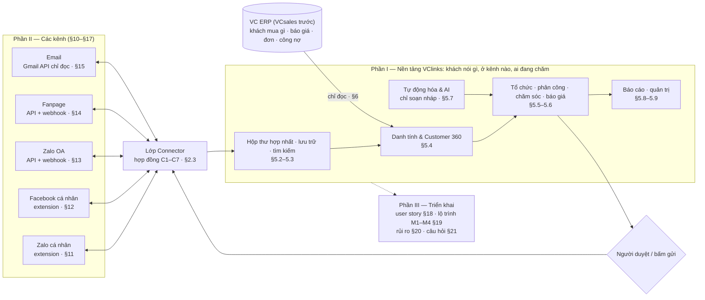
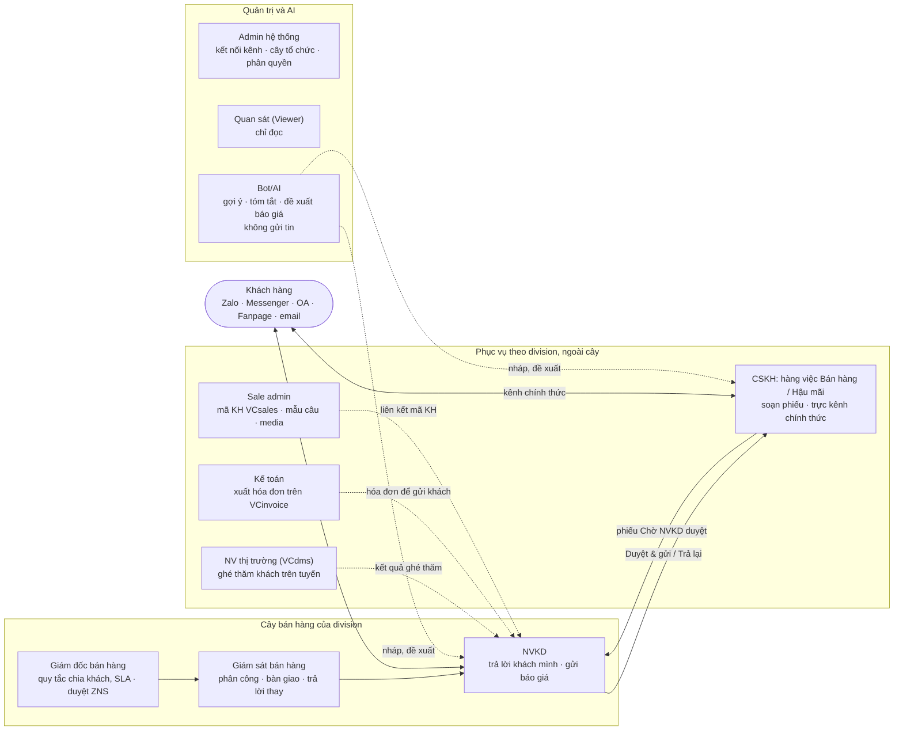
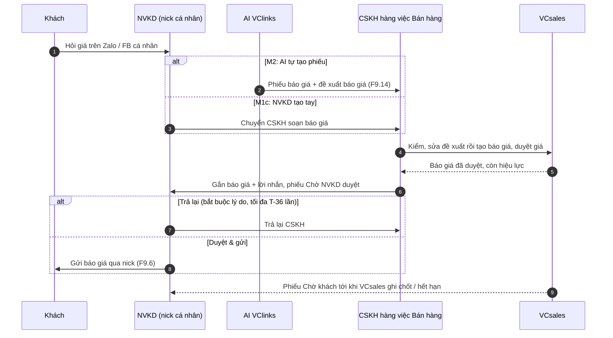
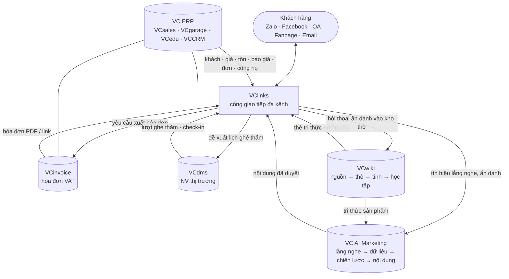
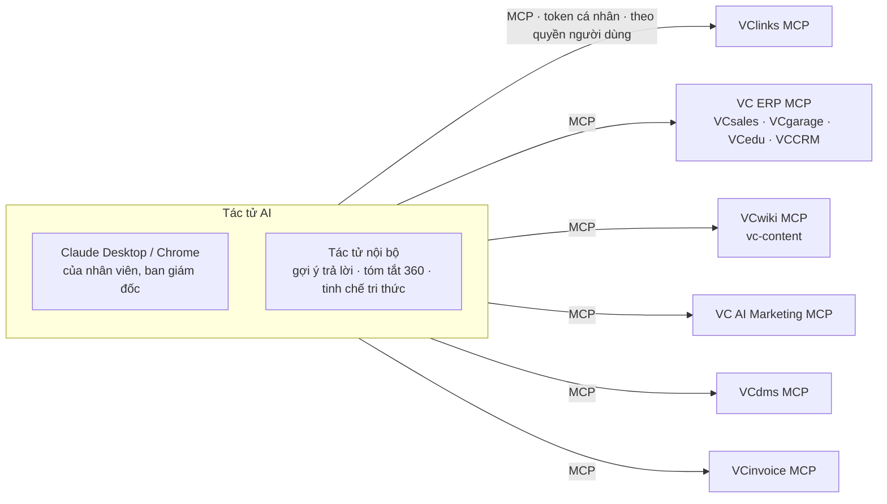
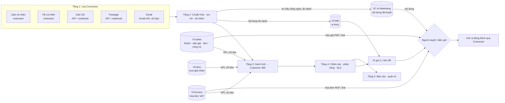

# VClinks — BA chức năng (v0.6.1)

Phiên bản 0.6.2 · 04/10/2026 · Trạng thái: Nháp để thống nhất phạm vi

> **VClinks là nền tảng omnichannel (CRM hội thoại đa kênh)** của VC Phồn Vinh: gom Zalo cá nhân, Facebook cá nhân, Zalo OA, Fanpage và email công ty về **một màn hình** để lưu trữ, trả lời, phân công, chăm sóc khách và dựng **Customer 360**. Mô hình tham chiếu: Pancake, Salework.
> Ngày: 28/09/2026 · Cập nhật: 04/10/2026 · Người yêu cầu: Thọ Anh Bùi · Trạng thái: Nháp để thống nhất phạm vi

## Mô hình

Bốn sơ đồ tổng quan. Sơ đồ chi tiết nằm trong thân bài: bộ giải pháp VCsoft (§1.1), kết nối AI qua MCP (§1.2), năm tầng nền tảng (§2.1).

**1. Định vị và cấu trúc tài liệu:** kênh (Phần II) đi qua lớp Connector vào nền tảng (Phần I); VCsales giữ nửa thương mại, chỉ đọc; Phần III là triển khai.

**2. Vai trò và việc chính** (§4, D9-01, D9-02):

**3. Lộ trình M1–M4** (§19); nhãn trên mũi tên là điều kiện ra (đề xuất):

```mermaid
flowchart LR
  A["Đã có (29/09/2026)<br/>VC Zalo chạy thật · ingest chung<br/>inbox · outbox có duyệt"]
  B["M1a — VC Zalo chạy thật<br/>máy chủ Chrome driver · danh bạ<br/>10–15 nick công ty"]
  C["M1b — Tổ chức và khách<br/>cây tổ chức · owner · hồ sơ khách<br/>Zalo OA thật · bắt đầu baseline"]
  D["M1c — Bán hàng trong chat<br/>tra giá · gửi báo giá VCsales · SLA<br/>phiếu CSKH ⇄ NVKD · gợi ý AI không C3"]
  E["M2 — Phân luồng AI, CSKH mở rộng<br/>AI tự tạo phiếu · bot ngoài giờ<br/>Fanpage · chatbot web"]
  F["M3 — Hồ sơ 360, tích hợp đọc<br/>khối thương mại · VCinvoice · VCdms<br/>email · app điện thoại"]
  G["M4 — Giám sát, phân tích, mở rộng<br/>chiến dịch · tenant không ERP<br/>TikTok · Shopee · Instagram"]
  A --> B
  B -- "100% nick công ty nối" --> C
  C -- "baseline ≥ 2 tuần" --> D
  D -- "phụ thuộc API VCsales" --> E
  E -- "phân loại AI ≥ 75% · 0 tin > 2 giờ" --> F
  F -- "360 ≤ 3 giây · ≥ 90% khách đủ KYC" --> G
```

**4. Luồng xuyên module chính: phiếu báo giá qua CSKH và vòng NVKD duyệt** (§5.6, D9-02, D9-03, BR20, BR21):

## Tóm tắt

- **VClinks là nền tảng omnichannel (CRM hội thoại đa kênh)** của VC Phồn Vinh, là "cổng giao tiếp với bên ngoài" của bộ VCsoft: giữ *khách nói gì, ở kênh nào, ai đang chăm*; VCsales giữ *khách mua gì, báo giá, đơn, công nợ*. VClinks + VCsales = CRM đầy đủ (§1).
- **Bố cục:** Phần I nền tảng (§1–§9: định vị, kiến trúc 5 tầng và hợp đồng Connector C1–C7, quyết định, vai trò, tính năng F*, tích hợp ERP, quy tắc BR01–BR22, dữ liệu, phi chức năng); Phần II từng kênh (§10–§17, VC Zalo chi tiết nhất ở §11); Phần III triển khai (§18 user story, §19 lộ trình, §20 rủi ro, §21 câu hỏi).
- **Quyết định đã chốt:** Q1–Q4 (29/09/2026: hồ sơ gốc, phễu không làm deal, email chỉ đọc, báo giá tạo trên VCsales); D8-01…D8-08 (30/09/2026: VC Zalo là phân hệ của VClinks, M1 chia M1a/M1b/M1c, tự gộp hồ sơ chỉ khi đủ 3 điều kiện, máy chủ Chrome driver); D9-01…D9-05 (04/10/2026: CSKH hai hàng việc, vòng CSKH soạn → NVKD Duyệt & gửi / Trả lại, AI chỉ tạo đề xuất báo giá).
- **Bất biến:** không gửi khi chưa có người bấm hoặc duyệt (BR07); VClinks chỉ đọc VC ERP (BR12); nick cá nhân không gửi hàng loạt (BR14); số C3 không qua AI ngoài và MCP (D2-15, D5-13, BR18).
- **v0.6.1:** tách VCwiki (tri thức, học tập) và VC AI Marketing (lắng nghe → chiến lược → nội dung), thêm F15.16 tín hiệu lắng nghe.
- **Lộ trình:** Đã có (VC Zalo chạy thật) → M1a VC Zalo trên máy chủ Chrome driver → M1b tổ chức, khách, Zalo OA, baseline → M1c bán hàng trong chat → M2 phân luồng AI, Fanpage → M3 Customer 360 đủ, VCinvoice, VCdms, email → M4 mở rộng, bán ra ngoài. Mốc thời gian và ngân sách chưa chốt.
- **Rủi ro chính:** nick Zalo/FB cá nhân bị khóa; Zalo Web / Messenger đổi giao diện; VCsales chưa có API báo giá; máy chủ Chrome driver là điểm hỏng đơn (R8-01).
- **Còn mở:** 32 câu hỏi ở §21, nổi bật: API VCsales, VCdms, VCinvoice (câu 8, 13–19); T-36, mốc AI tự tạo phiếu, nguồn trạng thái `Chờ hãng`, giá tham khảo C3 (câu 28–31); ranh giới VCwiki và VC AI Marketing (câu 32).
- **Người duyệt cần xem kỹ:** §3.2 (D9-02 máy trạng thái phiếu, D9-05 mốc bật), F9.14, F9.15, F15.14 ở §5.6, BR20–BR22 ở §7; §1.1, §1.2 và F15.11, F15.16 cho phần VC AI Marketing mới; các con số đề xuất chờ baseline (§1 Mục tiêu, §9).

## Mục lục

- [PHẦN I — NỀN TẢNG OMNICHANNEL VCLINKS](#phần-i--nền-tảng-omnichannel-vclinks)
  - [1. Định vị](#1-định-vị)
  - [2. Kiến trúc nền tảng](#2-kiến-trúc-nền-tảng)
  - [3. Quyết định đã chốt (29/09/2026)](#3-quyết-định-đã-chốt-29092026)
  - [4. Vai trò (Actors)](#4-vai-trò-actors)
  - [5. Tính năng nền tảng](#5-tính-năng-nền-tảng)
  - [6. Tích hợp VC ERP (mẫu: VCsales)](#6-tích-hợp-vc-erp-mẫu-vcsales)
  - [7. Quy tắc nghiệp vụ](#7-quy-tắc-nghiệp-vụ)
  - [8. Mô hình dữ liệu sơ bộ](#8-mô-hình-dữ-liệu-sơ-bộ)
  - [9. Yêu cầu phi chức năng](#9-yêu-cầu-phi-chức-năng)
- [PHẦN II — CÁC KÊNH](#phần-ii--các-kênh)
  - [10. Tổng quan kênh](#10-tổng-quan-kênh)
  - [11. Phân hệ VC Zalo (kênh Zalo cá nhân)](#11-phân-hệ-vc-zalo-kênh-zalo-cá-nhân)
  - [12. Facebook cá nhân](#12-facebook-cá-nhân)
  - [13. Zalo OA](#13-zalo-oa)
  - [14. Fanpage Facebook](#14-fanpage-facebook)
  - [15. Email (Google Workspace)](#15-email-google-workspace)
  - [16. Kênh sau này](#16-kênh-sau-này)
  - [17. So sánh năng lực các kênh](#17-so-sánh-năng-lực-các-kênh)
- [PHẦN III — TRIỂN KHAI](#phần-iii--triển-khai)
  - [18. User story theo vai trò](#18-user-story-theo-vai-trò)
  - [19. Lộ trình](#19-lộ-trình)
  - [20. Rủi ro](#20-rủi-ro)
  - [21. Câu hỏi cần chốt](#21-câu-hỏi-cần-chốt)
- [Lịch sử cập nhật](#lịch-sử-cập-nhật)

---

# PHẦN I — NỀN TẢNG OMNICHANNEL VCLINKS

## 1. Định vị

**VClinks là một nửa của CRM đầy đủ.** VClinks giữ phần *khách nói gì, ở kênh nào, ai đang chăm*. VCsales (ERP) giữ phần *khách mua gì, báo giá nào, nợ bao nhiêu*. **VClinks + VCsales = CRM đầy đủ**; Customer 360 là màn hình ghép hai nửa.

| Phần của một CRM đầy đủ | Nơi giữ |
|---|---|
| Danh tính khách trên các kênh, lịch sử trao đổi | **VClinks** |
| Người phụ trách, phân công, SLA, bàn giao | **VClinks** (owner đọc từ VCsales nếu VCsales có trường này, Q1) |
| Chăm sóc: ticket, nhắc việc, nhắc mua lại, chiến dịch, ZNS | **VClinks** |
| Trạng thái phễu của khách | **VClinks** |
| Báo giá, đơn hàng, mã KH, hạng, chính sách giá, công nợ, doanh số | **VCsales** (VClinks đọc và gửi báo giá cho khách, Q4) |

Thứ VClinks có mà CRM thông thường không có: **đồ thị danh tính**. Một garage có nhiều người liên hệ, mỗi người nhắn qua nhiều nick Zalo công ty, OA, Fanpage và email. VClinks nhận ra đó là cùng một khách.

### 1.1 VClinks trong bộ giải pháp VCsoft

VClinks là một sản phẩm trong bộ giải pháp VCsoft. **Vai trò của VClinks: cổng giao tiếp với bên ngoài** của cả bộ. Các sản phẩm khác lo nghiệp vụ nội bộ; khi cần nói chuyện với khách (báo giá, hóa đơn, xác nhận đơn, hẹn lịch ghé thăm, nội dung chăm sóc) thì đi qua VClinks, để mọi trao đổi nằm trong một dòng thời gian, đi đúng kênh khách dùng và có người duyệt.

| Sản phẩm | Làm gì | Nguồn sự thật của | VClinks lấy từ đó | VClinks đưa sang |
|---|---|---|---|---|
| **VC ERP** | Bộ ERP riêng cho từng nhóm khách hàng (bảng dưới). Mỗi bộ gồm mua hàng, bán hàng (báo giá, đơn hàng), quản lý kho, kế toán theo nghiệp vụ của nhóm đó | Khách hàng (mã KH), sản phẩm/dịch vụ, giá, tồn kho, báo giá, đơn, công nợ, sổ sách **của division dùng bộ ERP đó** | Khách, giá, tồn, báo giá, đơn, công nợ, lịch sử mua (chỉ đọc, §6) | Không ghi. Chỉ đề xuất cập nhật SĐT/email cho người quản lý dữ liệu khách |
| **VCwiki** | Tri thức công ty: nạp nguồn → xử lý thô (Kho tư liệu) → tinh chế (thẻ tri thức) → học tập cho nhân viên | Tri thức công ty: sản phẩm, chính sách giá/bảo hành, playbook bán hàng, quy chế, bài học | Thẻ tri thức làm ngữ cảnh cho AI gợi ý (F7.3); mẫu câu và playbook giọng văn bán hàng | Hội thoại có giá trị tri thức (câu hỏi hay gặp, mã phụ tùng, chính sách được nhắc) vào **kho thô**, đã ẩn danh, có dẫn nguồn (F15.12); hội thoại mẫu để làm bài học cho nhân viên (F15.13) |
| **VC AI Marketing** | Tác tử AI cho marketing: **lắng nghe** (mạng xã hội, đối thủ, xu hướng tìm kiếm, phản hồi khách) → **thu thập dữ liệu** → **lên chiến lược, kế hoạch** → **sản xuất nội dung** cho marketing số (SEO/website, Facebook, TikTok, YouTube, Zalo OA…) và các hình thức khác (ấn phẩm, sự kiện, POSM). Lấy tri thức sản phẩm từ VCwiki | Chiến lược, kế hoạch, lịch nội dung, nội dung marketing đã duyệt (bài, ảnh, video, kịch bản), nhận diện giọng văn thương hiệu | Nội dung đã duyệt để gửi khách, đăng Fanpage/OA, dùng cho chiến dịch, chatbot, nuôi lead (F15.11) | **Tín hiệu lắng nghe** từ hội thoại: chủ đề, câu hỏi hay gặp, nhu cầu chưa đáp ứng, cảm xúc, bình luận Fanpage, nguồn lead, đã ẩn danh và gộp (F15.16) |
| **VClinks** | Giao tiếp đa kênh với khách: Zalo, Facebook, Zalo OA, Fanpage, email | Hội thoại, danh tính kênh, phân công, tương tác, ticket, nhắc việc | – | – |
| **VCdms** (phân hệ của VCsales, D8-07) | Quản lý nhân viên đi thị trường: tuyến, lịch ghé thăm, check-in tại điểm bán, ghi nhận tại điểm | Tuyến, lượt ghé thăm, check-in, ghi chú thị trường, NV thị trường phụ trách điểm bán | Lượt ghé thăm và ghi chú vào dòng thời gian 360; NV thị trường phụ trách khách (F13.4) | Đề xuất lịch ghé thăm khi khách hẹn gặp trong hội thoại (F9.10) |
| **VCinvoice** | Xuất hóa đơn VAT điện tử | Hóa đơn VAT, thông tin xuất hóa đơn (MST, tên, địa chỉ) | Hóa đơn theo mã KH: số, ngày, tổng tiền, trạng thái, file PDF / link tra cứu (F9.9) | Yêu cầu xuất hóa đơn khách gửi trong chat (MST, tên, địa chỉ) → hàng chờ kế toán (F9.11) |

**Các bộ trong VC ERP:**

| Bộ ERP | Nhóm khách hàng | Nghiệp vụ chính | Khách của VClinks nối vào |
|---|---|---|---|
| **VCsales** | Kinh doanh phụ tùng (VCparts) | Mua hàng, bán hàng (báo giá, đơn), kho phụ tùng, kế toán, công nợ | Garage, đại lý, khách lẻ mua phụ tùng |
| **VCgarage** | Gara | Tiếp nhận xe, lệnh sửa chữa, báo giá dịch vụ, kho vật tư, kế toán gara | Chủ xe / khách của gara (xác nhận phạm vi ở §21) |
| **VCedu** | Quản lý đào tạo | Tuyển sinh, khóa học, lớp, học phí, kế toán đào tạo | Học viên, phụ huynh, doanh nghiệp gửi học viên |
| **VCCRM** | Quản lý khách hàng của VCsoft | Khách hàng phần mềm, hợp đồng, gói dịch vụ, gia hạn, hỗ trợ | Doanh nghiệp / gara đang dùng hoặc quan tâm sản phẩm VCsoft |

VClinks nối với từng bộ qua **một adapter ERP chung** (tìm khách, đọc hồ sơ thương mại, báo giá, đơn, công nợ, link mở màn hình). **VCsales làm trước** (M1–M3) vì là division dùng VClinks đầu tiên; VCgarage, VCedu, VCCRM nối sau theo cùng mẫu tích hợp ở §6.

**Nguyên tắc chung của bộ giải pháp:**
1. **Mỗi loại dữ liệu có một nguồn sự thật** (cột "Nguồn sự thật" ở trên). Hệ thống khác chỉ đọc hoặc gửi đề xuất, không sửa trực tiếp.
2. **Mã VClinks (bất biến) là khóa khách hàng; mã KH trong VC ERP là khóa liên kết** sang ERP (D3-05). Mỗi khách được liên kết với mã KH ở bộ ERP của division đang phục vụ khách đó; một khách dùng nhiều division (garage vừa mua phụ tùng ở VCsales vừa mua phần mềm ở VCCRM) có **một mã KH mỗi bộ ERP**. VCdms là phân hệ của VCsales nên dùng chung mã KH (D8-07); VCinvoice tham chiếu cùng mã KH đó (xác nhận ở §21).
3. **VClinks là đường duy nhất để nói với khách.** Hệ thống khác không tự nhắn khách; tin từ VCsales, VCinvoice, VCdms đi qua VClinks, có người bấm gửi, trừ ZNS tự động đã được giám đốc duyệt mẫu.
4. **Dữ liệu cá nhân của khách không rời bộ giải pháp**, và được ẩn danh khi đi vào VCwiki hoặc VC AI Marketing (NĐ 13).
5. **Mức mật C0–C3** (D2-15): hội thoại mặc định C2; công nợ, hạn mức, chính sách giá riêng là **C3**: chỉ đọc qua adapter khi người có quyền mở, không ghi đĩa, không gửi AI ngoài, không qua MCP.

### 1.2 Kết nối AI qua MCP

Mỗi sản phẩm VCsoft mở một **MCP server** (Model Context Protocol, chuẩn mở để AI gọi công cụ của hệ thống). Nhờ vậy AI (Claude trong Chrome / Desktop / Code, và các tác tử AI nội bộ) làm việc được **xuyên suốt cả bộ giải pháp** bằng một cách kết nối duy nhất, thay vì mỗi cặp hệ thống viết một tích hợp riêng.

| MCP server | Cho AI làm gì | Hiện trạng (29/09/2026) |
|---|---|---|
| **VClinks** (`/mcp`) | Đồng bộ kênh và xử lý lệch cấu trúc dữ liệu (`register_account`, `get_checkpoint`, `get_sync_status`, `get_field_mapping`, `propose_field_mapping`, `ingest_*`); lấy nháp đã duyệt để gửi và ghi nhận đã gửi (`list_pending_suggestions`, `mark_sent`). Sắp có: tìm hội thoại (`search_messages`), hồ sơ khách / Customer 360 (`get_contact_profile`), việc cần làm, báo giá đã gửi | ✅ 11 tool đồng bộ và gửi; tool tra cứu chưa có |
| **VC ERP** | Tra khách, giá, tồn kho, báo giá, đơn, công nợ, lịch sử mua (chỉ đọc) | VCsales có MCP riêng; VCgarage, VCedu, VCCRM cần xác nhận |
| **VCwiki** (`vc-content`) | Tìm thẻ tri thức và video, đọc tài liệu thô, tạo thẻ nháp, bộ nhớ dài hạn của AI | ✅ Đang dùng |
| **VC AI Marketing** | Tìm nội dung marketing đã duyệt theo sản phẩm / kênh / chiến dịch; đọc kế hoạch và lịch nội dung; đề xuất nội dung nháp | Cần xác nhận (sản phẩm mới, v0.6.1) |
| **VCdms** | Tra lượt ghé thăm, tuyến, NV thị trường phụ trách; đề xuất lịch ghé thăm | Cần xác nhận |
| **VCinvoice** | Tra hóa đơn theo khách / đơn, lấy link tra cứu | Cần xác nhận |

**Việc AI làm được khi nối cả bộ** (ví dụ):
- *Trợ lý cho NVKD, trong VClinks:* khách hỏi "má phanh Vios 2019 còn không, bao nhiêu?" → AI tra VCsales (giá, tồn), VCwiki (thông tin sản phẩm, chính sách bảo hành) → soạn nháp trả lời + gợi ý tạo báo giá → NVKD duyệt rồi gửi.
- *Trợ lý cho giám đốc, trên Claude Desktop:* "Garage Minh Phát tháng này thế nào?" → AI gọi VClinks (hội thoại, khiếu nại đang mở), VCsales (doanh số, báo giá treo; công nợ chỉ hiện trạng thái trong hạn / quá hạn, không hiện số vì C3 không qua MCP), VCdms (lần ghé thăm cuối), VCinvoice (hóa đơn chưa gửi) → một bản tóm tắt 360 trong khung chat.
- *Tinh chế tri thức:* AI đọc hội thoại đã ẩn danh trong kho thô VCwiki → tạo thẻ tri thức nháp → người duyệt trên VCwiki.
- *Marketing:* VC AI Marketing thấy tuần này nhiều khách hỏi "má phanh kêu" (tín hiệu từ VClinks) → đề xuất bài SEO, video TikTok ngắn và tin chăm sóc OA → người phụ trách marketing duyệt → nội dung xuất hiện trong thư viện của VClinks để sale gửi khách.
- *Vận hành:* extension báo Zalo đổi cấu trúc dữ liệu → Claude khảo sát và đề xuất bảng ánh xạ mới qua VClinks MCP → người duyệt trên Dashboard.

**Nguyên tắc MCP chung của bộ VCsoft:**
1. **AI mang quyền của người dùng.** Mỗi người một token cá nhân; AI chỉ thấy khách trong phạm vi cây tổ chức của người đó (BR10), như khi người đó tự mở Dashboard.
2. **Đọc tự do, ghi phải duyệt.** Tool đọc chạy ngay. Tool ghi chỉ tạo **nháp / đề xuất** (nháp tin, đề xuất bảng ánh xạ, thẻ tri thức nháp, nội dung marketing nháp, đề xuất lịch ghé thăm); con người duyệt trên sản phẩm tương ứng. **AI không bao giờ tự gửi tin cho khách** (BR07) và không ghi vào VC ERP (BR12).
3. **Nội dung của khách là dữ liệu, không phải lệnh.** Tin nhắn, email, bình luận trả về qua MCP được đánh dấu không đáng tin; AI không làm theo yêu cầu nằm trong đó (chống prompt injection).
4. **Trả về gọn, không lộ bí mật.** Kết quả MCP không chứa token, mật khẩu, khóa; **không trả dữ liệu C3** (D2-15); SĐT ẩn một phần theo quyền; dữ liệu cá nhân ra khỏi bộ giải pháp chỉ khi đã ẩn danh.
5. **Mọi lần gọi đều có nhật ký:** ai (người và tác tử), tool nào, lúc nào, đối tượng nào (F11.3).
6. **Cùng một mẫu cho mọi sản phẩm:** Streamable HTTP, xác thực Bearer, tên tool theo động từ + đối tượng (`get_*`, `search_*`, `list_*`, `propose_*`), để AI dùng quen mọi hệ thống.
7. **Trong lúc chờ pháp chế (QĐ-12 = A):** MCP chỉ mở cho nhóm dự án; SĐT, email luôn ẩn qua MCP; mọi lời gọi AI ngoài đi qua **cổng mức mật** (VCL-AI-14), tin có C3 không được gửi đi.

### Mục tiêu

| # | Mục tiêu | Chỉ số đo |
|---|---|---|
| G1 | Không bỏ sót tin nhắn khách ở bất kỳ kênh nào | % hội thoại chưa trả lời > 15 phút giờ hành chính |
| G2 | Rút ngắn thời gian phản hồi | FRT (First Response Time: thời gian phản hồi đầu tiên) trung vị |
| G3 | Một khách = một hồ sơ, dù nhắn từ nhiều kênh | % hội thoại đã gắn với hồ sơ KH |
| G4 | Báo giá tới khách ngay trong hội thoại, không gửi tay | % báo giá VCsales được gửi qua VClinks; thời gian từ lúc khách hỏi tới lúc nhận báo giá |
| G5 | Tài sản hội thoại thuộc công ty, không nằm trong điện thoại nhân viên | 100% nick và tài khoản bán hàng đã kết nối |
| G6 | Không mất khách cũ | % khách đến chu kỳ mua lại đã được nhắc |

**Chỉ tiêu:** chưa đặt số. Đo **baseline 2–4 tuần đầu M1** rồi mới chốt (D2-17; QĐ-94 chạy phương án C tới hết baseline). G1–G6 ánh xạ KPI của D2-17: G1, G2 ↔ trung vị phản hồi ≤ 15 phút và 0 tin quá 2 giờ; G3 ↔ ≥ 95% hội thoại gắn đúng hồ sơ; G5 ↔ 100% tài khoản kênh nối; thêm "≥ 90% tin trả lời trong VClinks" và "≥ 90% nhân viên đăng nhập mỗi ngày". Mọi con số là đề xuất, chốt sau baseline (OQ-10).

**Người dùng chính:** sale VCparts (garage, đại lý), NV thị trường (VCdms), CSKH/sàn, kế toán (hóa đơn), tư vấn tuyển sinh VCedu, kỹ thuật hỗ trợ VCOBD/VCgarage.

---

## 2. Kiến trúc nền tảng

### 2.1 Năm tầng

| Tầng | Nội dung | Mục |
|---|---|---|
| **1. Kết nối kênh** | Lớp Connector: mỗi kênh một connector, trạng thái kết nối, gán division | 2.3, 5.1 |
| **2. Hộp thư, lưu trữ & tìm kiếm** | Inbox hợp nhất, khung chat, lưu lâu dài mọi loại tin, ghi âm thành chữ, tìm kiếm | 5.2, 5.3 |
| **3. Danh tính & Customer 360** | Account / Contact / danh tính kênh, gộp/tách, liên kết mã KH VCsales, dòng thời gian hợp nhất | 5.4 |
| **4. Chăm sóc (CRM tác nghiệp)** | Cây tổ chức, owner, phân công, SLA, ticket, nhắc việc, gửi báo giá, chiến dịch, tự động hóa & AI | 5.5–5.7 |
| **5. Báo cáo & quản trị** | Hiệu suất, nguồn khách, phân quyền, nhật ký, NĐ 13 | 5.8, 5.9 |

### 2.2 Nguyên tắc nền tảng

1. **Lõi không phụ thuộc kênh.** Mọi kênh ghi vào cùng một mô hình (hội thoại, tin nhắn, danh tính) qua cùng một đường ingest và cùng bộ kiểm tra dữ liệu. Thêm kênh mới là thêm một connector, không sửa lõi.
2. **Kênh chính thức làm lõi, kênh không chính thức tách rời.** Zalo và Facebook cá nhân đi qua extension; nếu bị chặn thì lõi và các kênh API vẫn chạy.
3. **Không gửi khi chưa duyệt.** Mọi tin gửi ra phải có người bấm gửi hoặc duyệt (AI chỉ soạn nháp).
4. **Nền tảng biết giới hạn của từng kênh.** Giao diện ẩn hoặc khóa thao tác kênh không hỗ trợ; hệ thống **chặn** gửi ngoài cửa sổ cho phép và chặn gửi hàng loạt trên nick cá nhân, không chỉ cảnh báo.
5. **Một nguồn sự thật cho mỗi loại dữ liệu.** Thương mại (khách, báo giá, đơn, công nợ) ở VCsales; hội thoại và danh tính ở VClinks. Không sửa cùng một dữ liệu ở hai nơi.
6. **VClinks là kho tin duy nhất** (D3-06). Mọi phân hệ kênh (VC Zalo, OA, Fanpage…) ghi thẳng vào lõi qua đường ingest chung; không phân hệ nào giữ kho riêng.
7. **Connector và bot chạy 24/7, tách khỏi web/app** (D5-08): lưu thô trước khi xử lý, hàng đợi bền; bảo trì web/app làm cuốn chiếu. Webhook kênh chính thức có **bộ đệm ngoài văn phòng** (D5-15).
8. **Cổng mức mật trước mọi lời gọi AI ngoài** (VCL-AI-14, D5-13): tin, ngữ cảnh có C3 bị chặn; AI local cho C3 từ M3.
9. **Khoá mã hoá theo từng khách** (D5-09, VCL-ADM-14, 15): ẩn danh = huỷ khoá; khôi phục backup phải áp lại danh sách đã xoá.
10. **`tenant_id` trên mọi bản ghi, nhật ký sự kiện chỉ ghi thêm, chạy được khi không có ERP** (D3, D5-14): để bán ra ngoài sau M4.

### 2.3 Lớp Connector: hợp đồng chung cho mọi kênh

Mỗi kênh ở Phần II là một connector. Để lõi chạy giống nhau trên mọi kênh, connector nào cũng phải cung cấp đủ 7 phần sau. Phần II mô tả từng kênh theo đúng khuôn này.

| # | Phần | Connector phải làm | Lõi dùng để |
|---|---|---|---|
| C1 | **Kết nối & trạng thái** | Cách kết nối (OAuth / extension / ủy quyền domain), báo trạng thái xanh/vàng/đỏ, lý do lỗi | Trang Kết nối kênh, cảnh báo Admin |
| C2 | **Nhận tin** | Đưa tin, hội thoại, người gửi, đính kèm về định dạng chung; chống trùng theo ID nền tảng; báo số bản ghi nguồn để đối chiếu | Inbox, lưu trữ, tìm kiếm |
| C3 | **Gửi tin** | Nhận lệnh đã duyệt từ outbox, thực hiện trên nền tảng, trả kết quả (thành công + ID tin / lỗi + lý do) | Khung chat, trạng thái gửi, gửi lại |
| C4 | **Khai báo năng lực** | Danh sách thao tác kênh hỗ trợ (gửi ảnh, file, trích dẫn, @nhắc tên, cảm xúc, nhóm, gửi chủ động…) | Ẩn/khóa nút không hỗ trợ; chọn dạng gửi báo giá |
| C5 | **Chính sách gửi** | Cửa sổ được phép gửi, tag hợp lệ, nhịp tối thiểu giữa hai thao tác, có cho gửi hàng loạt hay không | Cảnh báo sắp hết cửa sổ, chặn gửi sai chính sách |
| C6 | **Danh tính** | Khóa danh tính của khách trên kênh, phạm vi của khóa (theo nick / theo OA / theo Page), SĐT / email nếu có và đã xác thực chưa | Gộp hồ sơ, Customer 360 |
| C7 | **Giới hạn & rủi ro** | Những gì kênh không làm được, rủi ro khóa tài khoản, phụ thuộc giao diện | Lộ trình, cảnh báo vận hành |

---

## 3. Quyết định đã chốt (29/09/2026)

| # | Vấn đề | Quyết định |
|---|---|---|
| Q1 | Hồ sơ khách gốc | **VClinks giữ danh tính kênh và tương tác; VCsales giữ dữ liệu thương mại; khóa liên kết là mã KH VCsales.** Lead chưa mua chỉ nằm trong VClinks. ~~Nếu VCsales có trường "NV phụ trách" thì owner đọc từ VCsales, VClinks không cho sửa.~~ **Sửa bởi D8-06:** VClinks giữ "ai chăm hội thoại"; VCsales giữ "ai hưởng doanh số, đi tuyến". |
| Q2 | Phễu bán hàng | **Không làm module deal.** Trạng thái phễu đơn giản (F5.4) + **báo giá VCsales đang mở là cơ hội bán hàng** (giá trị, trạng thái đọc từ VCsales). Ưu tiên **nhắc mua lại theo chu kỳ** (F8.4). Deal cho VCedu và hợp đồng B2B lớn để M4. |
| Q3 | Email | **Đọc hộp thư chung (sales@, cskh@) và hộp thư NVKD**, chỉ thread có địa chỉ trùng contact đã có; bỏ thư nội bộ; chỉ lưu tiêu đề, đoạn trích, tên đính kèm. Hộp thư cá nhân chỉ bật sau khi đã thông báo bằng văn bản cho nhân viên. M3. Trả lời email từ VClinks làm sau. |
| Q4 | Báo giá | **Báo giá tạo, sửa và chốt trên VCsales.** VClinks kết nối API VCsales để **lấy báo giá của khách và gửi cho khách** qua kênh đang chat (PDF / ảnh / link), ghi nhận đã gửi vào dòng thời gian. VClinks không tự tạo báo giá. Duyệt giảm giá, duyệt công nợ cũng ở VCsales (VCdms là phân hệ của VCsales, D8-07). |

### 3.1 Quyết định Buổi 8 (30/09/2026, hợp nhất luồng A và luồng B)

Quyết định đã chốt ở luồng A (D1-xx…D5-xx, Project claude.ai) có hiệu lực ở tài liệu này. Chỗ hai luồng vênh nhau (V8-01…V8-36) và cách xử lý ở `ra-soat/doi-chieu-luong-A-B.md`; anh duyệt 30/09.

| Mã | Quyết định | Quan hệ |
|---|---|---|
| D8-01 | Luồng B (repo) là nguồn sự thật cho đặc tả màn hình, UAT, lô thiết kế; luồng A giữ nguyên tắc, kiến trúc, ATAM, phân quyền nền. Luồng B là phần chi tiết của M1 | Chốt 29/09 |
| D8-02 | **VC Zalo là phân hệ của VClinks** (kênh Zalo cá nhân: extension, connector, màn hình sale Zalo), dùng chung lõi và database `vclinks`, không có kho riêng | Huỷ D5-10 (song song, cắt chuyển VCZALO); đọc lại D3-06 |
| D8-03 | **Phạm vi M1** chia ba đợt M1a / M1b / M1c (§19). Fanpage giữ ở M2 | Giữ D5-12 |
| D8-04 | **CSKH đọc hồ sơ và toàn văn hội thoại của khách trong đội mình**, trừ hội thoại gia đình/bạn bè (QĐ-38); mỗi lần mở hội thoại trên nick sale ghi nhật ký. **Khách mới trên kênh chính thức (OA, Fanpage, web): CSKH trực nhận trước**, giao NVKD theo khu vực; khách đã có người phụ trách về thẳng người đó | Giữ D4-10; sửa D2-11 cho kênh chính thức; trả lời QĐ-05, QĐ-06 |
| D8-05 | **Tự gộp hồ sơ chỉ khi đủ 3 điều kiện**: trùng SĐT đã xác thực, một phía là danh tính mới chưa có lịch sử, hai phía cùng người phụ trách; báo người phụ trách, hoàn tác một chạm. Còn lại là gợi ý, người bấm | Nới D1-02 trong phạm vi hẹp; trả lời QĐ-57; sửa BR05 |
| D8-06 | **Hai khái niệm, hai nguồn:** "ai chăm hội thoại" ở VClinks (nạp lần đầu từ VCsales; chia, bàn giao, chuyển khách trên VClinks); "ai hưởng doanh số, đi tuyến" ở VCsales. Lệch → cảnh báo để sale admin sửa bên VCsales; VClinks không ghi ngược | Giữ D4-03; sửa Q1 |
| D8-07 | **VCdms là phân hệ của VCsales.** Báo giá, duyệt giảm giá, duyệt công nợ, tuyến, ghé thăm đều ở VCsales | Làm rõ Q4; chữ "DMS" ở luồng A đọc là "VCsales (phân hệ VCdms)" |
| D8-08 | **Cách chạy VC Zalo (định hướng):** M1 dùng **máy chủ Chrome driver đặt ở công ty** cho 10–15 nick công ty; sale làm việc trên VClinks và app Zalo điện thoại, không mở Zalo Web của nick đó ở nơi khác. Khi bán ra ngoài: khách tự đăng nhập Zalo Web trên trình duyệt của mình, extension đẩy dữ liệu về (chốt trước khi bán, §21 câu 26) | Rủi ro R8-01 (§20) |

### 3.2 Quyết định Buổi 9 (04/10/2026, CSKH bán hàng và vòng duyệt phiếu)

Nguồn: anh hỏi luồng "khách hỏi giá trên Zalo cá nhân → AI đọc tin tạo báo giá nháp → chăm sóc bán hàng kiểm tra, sửa → trả NVKD kiểm tra → NVKD gửi khách", và luồng tương tự cho khiếu nại bảo hành. Anh đồng ý đề xuất BA ngày 04/10/2026.

| Mã | Quyết định | Quan hệ |
|---|---|---|
| D9-01 | **"Chăm sóc bán hàng" là vai CSKH hiện có (`cskh`), không thêm vai mới.** CSKH có hai **hàng việc**: **Bán hàng** (phiếu báo giá, theo đơn, theo hàng về, hỏi công nợ) và **Hậu mãi** (bảo hành, khiếu nại, đổi trả). Quyền như nhau; giám sát CSKH gán người vào hàng việc (một người có thể ở cả hai), GĐ duyệt cấu hình theo D4-14. Chỉ tách vai khi sau này cần **quyền khác nhau** giữa hai nhóm (ví dụ xem giá vốn) | Giữ D2-12, D1-01 của luồng A; mở rộng mô tả CSKH ở §4; ánh xạ vai không đổi |
| D9-02 | **Phiếu báo giá và phiếu hậu mãi dùng chung một máy trạng thái** có vòng duyệt: `Mới` → `CSKH đang xử lý` → `Chờ NVKD duyệt` ⇄ `Trả lại CSKH` (bắt buộc lý do) → `Đã gửi khách` → `Chờ khách` (báo giá) / `Chờ hãng` (hậu mãi) → `Xong` (kết quả bắt buộc). Vòng duyệt áp cho hội thoại trên **nick cá nhân của sale** (CSKH không gửi qua nick, 01 D2, PQ-18); trên **kênh chính thức** CSKH gửi thẳng (D8-04, D5-01), NVKD được báo. Số lần trả lại tối đa **T-36 = 2** (đề xuất, chờ anh xác nhận); lần thứ 3 báo giám sát bán hàng và giám sát CSKH | Cụ thể hoá D1-01, D4-21; thêm BR20, BR21 |
| D9-03 | **AI không tạo báo giá trên VCsales.** AI tạo **đề xuất báo giá** trong VClinks (dòng hàng, dòng xe, VIN, số lượng, giá và tồn tham khảo đọc từ VCsales, độ tin cậy, tin nguồn). CSKH kiểm, sửa, rồi tạo báo giá thật trên VCsales (F9.2); duyệt giá, giảm giá vẫn trên VCsales. Khi VCsales có API nhận nháp thì xét lại bằng quyết định mới | Giữ Q4, D8-07, BR12; thêm F9.14 |
| D9-04 | **Sửa 01 D3 theo D4-10 / D8-04 (QĐ-05):** CSKH đọc toàn văn hội thoại của khách trong division mình kể cả trên nick sale (trừ hội thoại gia đình/bạn bè, QĐ-38), chỉ đọc và ghi chú, mỗi lần mở ghi nhật ký. Vẫn **không gửi** qua nick sale | Đóng chỗ vênh V8-14 |
| D9-05 | **Mốc bật:** AI tự nhận ra yêu cầu và tự tạo phiếu theo phân loại D2-12 ở **M2** (giữ lộ trình). Ở **M1c** vòng duyệt chạy với phiếu **do NVKD tạo tay** (nút "Chuyển CSKH soạn báo giá", "Chuyển hậu mãi cho CSKH"). *Đề xuất BA, chờ anh xác nhận có kéo AI tự tạo phiếu lên M1c hay không* | Giữ §19; V8-09 |

---

## 4. Vai trò (Actors)

Cây bán hàng của mỗi division: **Giám đốc bán hàng → Giám sát bán hàng → Nhân viên kinh doanh (NVKD)**. CSKH và Sale admin phục vụ theo division, nằm ngoài cây. Khách hàng **thuộc công ty** và được giao cho NVKD (xem 5.5).

| Vai trò | Quyền chính |
|---|---|
| Admin hệ thống | Kết nối/ngắt kênh, cấu hình, khai báo cây tổ chức, phân quyền, xem nhật ký |
| Giám đốc bán hàng | Xem toàn bộ khách và hội thoại của division; cấu hình quy tắc chia khách và SLA; duyệt chiến dịch ZNS / gửi hàng loạt; dashboard so sánh nhóm; xuất dữ liệu; xem nhật ký truy cập |
| Giám sát bán hàng | Xem khách và hội thoại của các NVKD dưới mình; phân công, bàn giao, duyệt yêu cầu chuyển khách; KPI từng NVKD; trả lời thay; duyệt mẫu câu và kịch bản chăm sóc của nhóm |
| Nhân viên kinh doanh (NVKD) | Xem & trả lời khách mình phụ trách; ghi chú, tag, trạng thái phễu, nhắc việc; gửi báo giá VCsales cho khách; xem lịch sử mua / công nợ trong khung chat |
| Nhân viên CSKH ("chăm sóc bán hàng", D9-01) | **Hai hàng việc (D9-01):** *Bán hàng* — nhận phiếu báo giá từ AI / NVKD, kiểm đề xuất báo giá, tạo báo giá trên VCsales, soạn lời nhắn rồi chuyển NVKD duyệt (D9-02, D9-03); theo đơn, hàng về, hỏi công nợ. *Hậu mãi* — ticket bảo hành, khiếu nại, đổi trả, chờ hãng. Trực kênh chính thức (OA, Fanpage, web): nhận khách mới, giao NVKD theo khu vực (D8-04); hàng đợi ticket (khiếu nại, bảo hành, tình trạng đơn); đọc hồ sơ và toàn văn hội thoại của khách trong đội (D4-10, D8-04); gửi thẳng từ Zalo công ty của mình (D5-01) và trong nhóm Zalo về phiếu của mình (D4-23); kịch bản chăm sóc sau bán; khảo sát hài lòng |
| Sale admin | Đối chiếu và tạo mã KH VCsales cho khách mới; gửi cập nhật trạng thái đơn; quản lý thư viện media, mẫu câu, mẫu ZNS; nhập khách từ CSV |
| NV thị trường (VCdms) | Xem 360 và nhắn khách trên tuyến mình phụ trách; nhận đề xuất lịch ghé thăm từ hội thoại |
| Kế toán | Nhận yêu cầu xuất hóa đơn từ chat; xuất hóa đơn trên VCinvoice; gửi hóa đơn cho khách qua VClinks |
| Quan sát (Viewer) | Chỉ đọc (ban giám đốc, kiểm soát) |
| Bot/AI | Trả lời tự động theo kịch bản đã duyệt (chỉ kênh chính thức), gợi ý câu trả lời, tóm tắt khách trong Customer 360; **(M2) đọc tin, nhận ra yêu cầu hỏi giá / hậu mãi, tạo phiếu và đề xuất báo giá** (D9-03, D9-05). Không tạo báo giá trên VCsales, không gửi tin |

Trong tài liệu, **Leader** = Giám sát bán hàng, **Agent** = NVKD hoặc CSKH. **"Chăm sóc bán hàng"** = CSKH ở hàng việc Bán hàng (D9-01); **"CSKH hậu mãi"** = CSKH ở hàng việc Hậu mãi.

**Ánh xạ vai với 9 vai chuẩn của luồng A (BA-33).** "Đội" ở luồng A = "division" ở đây.

| Luồng A | Tài liệu này |
|---|---|
| `sale` | NVKD |
| `cskh` | Nhân viên CSKH (cờ Trưởng nhóm) |
| `giam_sat` | Giám sát bán hàng |
| `truong_doi` | Giám đốc bán hàng / GĐ division |
| `ban_giam_doc` | Quan sát (Viewer), kiểm soát nội bộ |
| `back_office` | Sale admin |
| `ke_toan` | Kế toán |
| `ho_tro` | Marketing; bảo hành |
| `quan_tri_he_thong` | Admin hệ thống (không xem nội dung khách, BA-54) |
| — | NV thị trường: vai riêng, không phải owner (QĐ-32 = A) |

---

## 5. Tính năng nền tảng

> Áp dụng cho mọi kênh. Kênh nào không làm được một tính năng thì connector khai báo ở C4 và chương kênh đó ở Phần II ghi rõ.

### 5.1 Kết nối kênh

- F1.1 Kết nối **kênh API** (Zalo OA, Fanpage, Gmail) bằng OAuth / ủy quyền; token lưu mã hóa, tự làm mới.
- F1.2 Chọn nhiều OA / Fanpage / hộp thư trong một lần kết nối, bật/tắt đồng bộ từng cái.
- F1.3 Kết nối **kênh extension** (Zalo cá nhân, Facebook cá nhân): extension chạy trên trình duyệt công ty cấp, gắn với nick công ty.
- F1.4 Trạng thái kết nối theo thời gian thực (xanh/vàng/đỏ): token sắp hết hạn, webhook không nhận tin, extension mất kết nối, trình duyệt đã đăng xuất.
- F1.5 Đồng bộ lịch sử khi kết nối lần đầu (tùy chọn N ngày, trong giới hạn nền tảng).
- F1.6 Gán kênh cho **division** (VCparts, VCedu, VCOBD…) và nhóm nhân viên.
- F14.1 **Đối chiếu đồng bộ**: số bản ghi ở nguồn so với số đã lưu, theo từng kênh và luồng dữ liệu; cảnh báo khi lệch.
- F14.2 Nhật ký kết nối: ai kết nối, ngắt, cấp lại token, lúc nào.

### 5.2 Hộp thư hợp nhất & hội thoại

**Danh sách hội thoại**
- F2.1 Hội thoại của mọi kênh trên một danh sách, sắp theo tin mới nhất, có biểu tượng kênh và tên nick/trang nhận tin.
- F2.2 Bộ lọc: kênh, nick/trang/OA, trạng thái (mới / đang xử lý / chờ khách / đã xong), người phụ trách, tag, chưa đọc, chưa trả lời, có SĐT.
- F2.4 Thông báo realtime (web + desktop + âm thanh).
- F2.5 Chế độ "Của tôi" / "Chưa phân công" / "Tất cả" (theo phạm vi xem, 5.5).
- F14.3 Ghim hội thoại, đánh dấu đã đọc / chưa đọc, gắn nhãn; kênh hỗ trợ thì đồng bộ hai chiều với nền tảng.

**Khung chat**
- F3.1 Gửi/nhận văn bản, ảnh, file, video, sticker, ghi âm, link, danh thiếp, vị trí (tùy năng lực kênh).
- F3.2 **Mẫu câu trả lời nhanh** (gõ `/`), có biến `{ten_khach}`, `{ten_nv}`; phạm vi cá nhân / nhóm / công ty.
- F3.3 Gửi ảnh sản phẩm, bảng giá từ **thư viện media** dùng chung.
- F3.4 **Ghi chú nội bộ** trong luồng chat (khách không thấy), @nhắc đồng nghiệp.
- F3.5 Cảnh báo khi hội thoại sắp hết cửa sổ được phép gửi; chặn gửi khi đã hết (C5).
- F3.6 Trạng thái đã gửi / đã nhận / đã xem / lỗi gửi + nút gửi lại.
- F3.8 Chống trả lời trùng: hiện "Đang được [NV] trả lời".
- F14.4 Trả lời trích dẫn, @nhắc tên thành viên nhóm, thả cảm xúc (tùy năng lực kênh).
- F14.5 Hiển thị đúng ngữ cảnh tin: đã thu hồi (giữ nội dung đã lưu + nhãn "Đã thu hồi"), chuyển tiếp, tin hệ thống của nhóm, bình chọn.
- F14.6 Hội thoại **nhóm**: danh sách thành viên, trưởng/phó nhóm, tên người gửi từng tin.
- F14.9 **Panel phải** của khung chat: tóm tắt Customer 360, báo giá VCsales của khách (5.6), việc cần làm.

### 5.3 Lưu trữ & tìm kiếm

- F11.5 **Lưu trữ lâu dài** tin, ảnh, file, ghi âm của mọi kênh trên hạ tầng công ty, không phụ thuộc thời hạn lưu của nền tảng; tin đã bị xóa/thu hồi trên nền tảng vẫn còn trong VClinks.
- F14.7 Tải đính kèm về kho file công ty (MinIO) vì link của nền tảng có hạn.
- F3.7 **Chuyển ghi âm thành văn bản** (tiếng Việt) để đọc nhanh và tìm kiếm.
- F2.3 **Tìm kiếm toàn cục** theo tên, SĐT, nội dung tin (gồm ghi âm đã chuyển chữ), mã đơn, mã báo giá, mã OE, VIN, biển số; lọc theo kênh, người gửi, khoảng ngày.
- F14.8 **Thời hạn lưu trữ**: mặc định **lưu vĩnh viễn** tin nhắn và hồ sơ (D2-15); thời hạn chỉ cấu hình cho loại dữ liệu pháp luật buộc (nhật ký…). Xoá dữ liệu khách chỉ bằng **ẩn danh** theo yêu cầu, xong ≤ 72 giờ (D3-14).

### 5.4 Danh tính & Customer 360

**Hồ sơ và danh tính**
- F13.1 **Hai cấp hồ sơ**: `CustomerAccount` (tổ chức khách, ↔ mã KH VCsales) chứa nhiều `Contact` (chủ, thợ, kế toán). Khách lẻ là account có một contact. Mỗi contact có nhiều **danh tính kênh** (`ChannelIdentity`) do connector cung cấp (C6).
- F5.1 Tự tạo contact + danh tính khi có người nhắn lần đầu ở bất kỳ kênh nào.
- F5.2 Trường thông tin: tên, SĐT, email, loại khách (garage / đại lý / khách lẻ / học viên), khu vực, vai trò trong tổ chức khách, tên gợi nhớ do sale đặt.
- F5.3 Nhận diện SĐT, email, VIN, biển số trong tin nhắn/bình luận → gợi ý lưu vào hồ sơ.
- F5.4 Tag khách, trạng thái phễu (lead mới → đã tư vấn → đã báo giá → đã mua → khách thân thiết → ngủ đông). "Đã báo giá" tự bật khi có báo giá VCsales được gửi qua VClinks.

**Khớp danh tính**
- F13.2 **Tự động gộp chỉ khi đủ 3 điều kiện** (D8-05): trùng SĐT đã xác thực (khách chia sẻ SĐT trên OA, SĐT trong VCsales), một phía là danh tính mới chưa có lịch sử, hai phía cùng người phụ trách; người phụ trách được báo và hoàn tác một chạm. Mọi trường hợp khác, kể cả trùng email, là **gợi ý gộp**. **Gợi ý gộp** khi trùng tên + ảnh đại diện, cùng nhắc một mã đơn / VIN / biển số, hoặc SĐT xuất hiện trong nội dung tin. Người duyệt gợi ý; gộp được thì **tách** được; có nhật ký.
- F13.6 Tìm khách theo SĐT, tên, email, mã KH, biển số, VIN, tên garage; gắn tay một danh tính vào hồ sơ.

**Liên kết VCsales** (chi tiết §6)
- F13.3 Một account ↔ một mã KH VCsales. Đối chiếu theo SĐT và tên; sale admin xác nhận. Chưa có mã KH → hàng "Chờ tạo mã KH". Trạng thái: chưa liên kết / gợi ý / đã xác nhận.
- F5.6 Xem lịch sử mua, công nợ, đơn đang giao ngay trong khung chat.

**Màn hình Customer 360**
- F13.4 Mở từ panel phải của khung chat, từ trang Danh bạ, hoặc từ VCsales qua link theo mã KH:
  - *Đầu trang*: tên, ảnh, loại khách, khu vực, owner, division, trạng thái phễu, tag, biểu tượng các kênh đã liên kết, SĐT/email (ẩn một phần theo quyền).
  - *Khối thương mại* (từ VCsales và VCinvoice, chỉ đọc, ghi thời điểm lấy): mã KH, hạng khách, doanh số 12 tháng, **báo giá đang mở**, đơn gần nhất, đơn đang giao, công nợ và hạn thanh toán, **hóa đơn VAT gần nhất / chưa gửi khách**, nhóm sản phẩm hay mua, ngày dự kiến mua lại.
  - *Khối thị trường* (từ VCdms, chỉ đọc): NV thị trường phụ trách, lần ghé thăm gần nhất, lịch ghé thăm sắp tới, ghi chú tại điểm bán.
  - *Dòng thời gian hợp nhất* (F5.5): tin nhắn mọi kênh, email, bình luận, ghi chú nội bộ, báo giá đã gửi, đơn hàng, hóa đơn VAT, lượt ghé thăm của NV thị trường, ticket, chiến dịch/ZNS đã gửi, thay đổi owner; lọc theo kênh, hệ thống nguồn và loại sự kiện.
  - *Khối tương tác*: lần tương tác cuối theo từng kênh, cửa sổ gửi còn mở, kênh khách hay dùng nhất, giờ khách hay nhắn.
  - *Khối AI*: tóm tắt nhu cầu, dòng xe / mã phụ tùng quan tâm, khiếu nại đang mở, cam kết chưa thực hiện, giọng văn nên dùng. Agent sửa được.
  - *Việc cần làm*: nhắc việc, ticket mở, báo giá đã gửi chưa chốt, đơn chờ xác nhận.
  - *Người liên hệ*: danh sách contact của account, vai trò, kênh liên hệ từng người.
- F13.7 **Xuất / xóa theo yêu cầu khách** (NĐ 13) trên toàn bộ hồ sơ, mọi kênh, có nhật ký.
- F13.8 **Chia sẻ có kiểm soát**: giám sát/giám đốc xem 360 của khách trong phạm vi; CSKH xem phần tương tác và ticket; sale admin xem phần thương mại; xem SĐT đầy đủ ghi nhật ký.

### 5.5 Tổ chức, sở hữu khách & phân công

**Cây tổ chức và owner**
- F12.1 Khai báo **cây tổ chức**: division → giám đốc bán hàng → giám sát → NVKD. Quyền xem suy ra từ cây.
- F12.2 Mỗi `CustomerAccount` có **một owner mỗi division**; mọi contact của account thuộc cùng owner; lịch sử đổi owner được lưu.
- F12.7 **Phạm vi xem theo cây**: NVKD chỉ khách của mình; giám sát: khách của tổ; giám đốc: toàn division. CSKH đọc hồ sơ và toàn văn hội thoại của khách trong division mình, trừ hội thoại gia đình/bạn bè (QĐ-38); mỗi lần mở hội thoại trên nick sale ghi nhật ký (D4-10, D8-04). Sale admin thấy hồ sơ và phần thương mại, không thấy nội dung chat trừ khi được cấp.

**Chia hội thoại**
- F12.3 Khách đã có owner → hội thoại mới tự về owner. Chưa có owner → hàng "Chưa phân công". Kênh chính thức (OA, Fanpage, web): khách mới vào hộp thư **CSKH trực** trước, CSKH giao NVKD theo quy tắc khu vực (D8-04, QĐ-48). NVKD tự nhận khách chưa ai chăm của đội được bật mặc định, giám sát huỷ được (D4-13; QĐ-43).
- F4.1 Chia tự động: vòng tròn, theo kênh, theo khu vực (HN/HCM), theo tải hiện tại của NVKD.
- F12.9 Quy tắc chia khác nhau theo division (VCparts theo khu vực, VCedu theo khóa học).
- F4.2 Phân công / chuyển hội thoại thủ công, có lý do.
- F4.4 Ca làm việc, trạng thái online/offline; không chia cho người offline.

**Bàn giao**
- F12.4 **Bàn giao khách** đơn lẻ hoặc cả lô (nhân viên nghỉ việc), có lý do, ngày hiệu lực, thông báo cho hai bên; hội thoại đang mở đi theo khách.
- F12.5 **Yêu cầu chuyển khách**: NVKD gửi, giám sát duyệt.
- F12.6 Cấp trên **trả lời thay**: tin ghi rõ người gửi, tự thêm ghi chú nội bộ và báo owner.
- F11.4 Nhân viên nghỉ việc: thu hồi quyền, chuyển toàn bộ khách, **dữ liệu ở lại công ty**.

**SLA**
- F4.3 Cấu hình thời gian phản hồi tối đa theo kênh và giờ làm việc; quá hạn → đổi màu + báo leader. Mặc định **15 phút giờ làm việc cho mọi tin có nội dung**; bình luận công khai 30 phút (bài quảng cáo đang chạy 15 phút) (D4-15, T-24). Lịch mặc định T2–T7 8h00–17h30 (D3-03).
- F12.8 **Khách bị bỏ rơi**: có owner nhưng không có hội thoại, không có đơn quá max(2 × chu kỳ mua, 90 ngày) (T-31, D4-13). Hệ thống chỉ cảnh báo, **không tự thu hồi**; giám sát nhắc hoặc tự tay thu hồi về "Chưa phân công".

### 5.6 Chăm sóc & bán hàng

**Báo giá qua VCsales (Q4)**

Luồng: *khách hỏi hàng trên bất kỳ kênh nào → NVKD tra nhanh trong khung chat → tạo báo giá trên VCsales → VClinks lấy báo giá qua API → NVKD bấm gửi cho khách trên chính kênh đó → trạng thái chốt/trượt đọc lại từ VCsales.*

- F9.1 **Tra nhanh** sản phẩm, giá, tồn kho VCsales ngay trong khung chat (chỉ đọc).
- F9.2 **Tạo báo giá trên VCsales**: nút "Tạo báo giá" trong khung chat mở màn hình báo giá của VCsales với mã KH của khách; nếu VCsales hỗ trợ tham số thì điền sẵn danh sách mã phụ tùng AI trích từ hội thoại (F7.4). VClinks không tự ghi báo giá sang VCsales.
- F9.5 **Danh sách báo giá của khách** ở panel phải: lấy qua API VCsales theo mã KH; hiện số báo giá, ngày, tổng tiền, hiệu lực, trạng thái (nháp / đã duyệt / đã chốt / hết hạn / hủy theo VCsales).
- F9.6 **Gửi báo giá cho khách**: chọn một báo giá → xem trước → chọn dạng gửi mà kênh hỗ trợ (C4): **file PDF** do VCsales xuất, **ảnh** trang báo giá, hoặc **link xem báo giá** → kèm lời nhắn theo mẫu (`{so_bao_gia}`, `{tong_tien}`, `{hieu_luc}`) → người bấm gửi. Chỉ gửi báo giá đã duyệt trên VCsales.
- F9.7 **Ghi nhận đã gửi**: VClinks lưu báo giá nào, gửi cho ai, qua kênh nào, ai gửi, lúc nào, ID tin; hiện trong dòng thời gian 360; phễu khách chuyển "Đã báo giá".
- F9.8 **Theo dõi báo giá**: báo giá đã gửi mà quá N ngày chưa chốt trên VCsales → nhắc việc cho owner; hết hạn hiệu lực → gợi ý gửi lại bản mới.
- F9.3 Báo giá chốt thành đơn **trên VCsales**; VClinks đọc mã đơn và gắn về hội thoại gốc.
- F9.4 Gửi tin cập nhật trạng thái đơn (đã xác nhận, đã giao vận, đã giao) theo mẫu, người bấm gửi.
- F15.3 **Giá trị phễu** = tổng báo giá đang mở trên VCsales đã gửi qua VClinks, theo NVKD / tổ / division.

**Phiếu báo giá qua CSKH và vòng duyệt (D9-01…D9-03, v0.6)**

Luồng: *khách hỏi giá trên nick Zalo / FB cá nhân của NVKD → (M2) AI nhận ra "Hỏi giá" và tạo phiếu báo giá kèm đề xuất báo giá; (M1c) NVKD bấm "Chuyển CSKH soạn báo giá" → phiếu vào hàng **Bán hàng** của CSKH → CSKH kiểm, sửa đề xuất → tạo báo giá trên VCsales, duyệt giá trên VCsales → gắn báo giá đã duyệt vào phiếu, soạn lời nhắn → `Chờ NVKD duyệt` → NVKD xem: **Duyệt & gửi** (bấm = duyệt lệnh gửi qua nick, F9.6) hoặc **Trả lại** kèm lý do → CSKH sửa → … → `Đã gửi khách` → `Chờ khách` tới khi VCsales ghi chốt / hết hạn (D4-24).*

- F9.14 **Đề xuất báo giá do AI** (M2; M1c chỉ khi NVKD bấm "AI trích nhu cầu"): từ cụm tin (chữ, ảnh tem / mã, ghi âm đã ra chữ) AI tạo các dòng: tên hàng, mã OE / mã nội bộ khớp được, dòng xe, đời, VIN, số lượng, **giá và tồn tham khảo đọc từ VCsales** theo chính sách của khách, độ tin cậy từng dòng, tin nguồn. Dòng tin cậy thấp đánh dấu "Cần kiểm"; mã, VIN lấy từ ghi âm phải có người xác nhận (E12 luồng A). Đề xuất **chỉ nằm trong VClinks**, không phải báo giá (Q4). CSKH sửa dòng nào thì cặp (đề xuất, bản sửa) lưu để dạy AI (F15.6, VCL-AI-06).
- F9.15 **Phiếu báo giá và vòng duyệt CSKH ⇄ NVKD**: trạng thái theo D9-02; mỗi lần chuyển ghi người, lúc, lý do; "Trả lại" bắt buộc chọn lý do (Sai mã / Sai số lượng / Giá chưa đúng chính sách khách / Thiếu hàng thay thế / Khác + ghi chú). NVKD **sửa được lời nhắn** trước khi gửi, **không sửa được báo giá** (muốn đổi báo giá thì trả lại). NVKD vắng: phiếu `Chờ NVKD duyệt` nhắc phút 10, đưa giám sát / người trực thay phút 20 (D4-21). Trả lại quá T-36 lần → báo giám sát bán hàng và giám sát CSKH. Khách hỏi giá, tồn đơn giản thì NVKD trả lời luôn, không tạo phiếu (D4-22).
- F15.14 **Phiếu hậu mãi cùng vòng duyệt** (v0.6): ticket bảo hành / khiếu nại / đổi trả (F15.1) có thêm trạng thái `Chờ hãng` (gửi hàng về hãng / bộ phận bảo hành kiểm định, ghi hạn hẹn) và kết quả bắt buộc khi đóng (Đổi mới / Sửa / Hoàn tiền / Từ chối + lý do). Khi khách liên hệ qua **nick cá nhân của sale**, câu trả lời của CSKH (tiếp nhận, kết quả) đi theo vòng `Chờ NVKD duyệt` như phiếu báo giá; khi khách liên hệ qua **kênh chính thức** CSKH gửi thẳng. Cảnh báo cam kết lệch (04 OA-38, UAT-OA-148) giữ nguyên.

**Hóa đơn VAT qua VCinvoice**
- F9.11 **Nhận yêu cầu xuất hóa đơn**: khách gửi MST, tên công ty, địa chỉ, email nhận hóa đơn trong chat → AI/agent tách thành phiếu yêu cầu gắn với đơn VCsales → hàng chờ kế toán trên VCinvoice. Kế toán xuất hóa đơn trên VCinvoice, VClinks không tự xuất.
- F9.9 **Gửi hóa đơn cho khách**: hóa đơn đã phát hành hiện ở panel phải (lấy qua API VCinvoice theo mã KH / mã đơn) → người bấm gửi PDF hoặc link tra cứu qua kênh đang chat; ghi vào dòng thời gian. Hóa đơn phát hành mà chưa gửi khách sau N giờ → nhắc việc.

**Ghé thăm thị trường qua VCdms**
- F9.10 **Hẹn ghé thăm từ hội thoại**: khách hẹn gặp / cần kỹ thuật tới garage → agent tạo đề xuất lịch ghé thăm (khách, địa chỉ, thời gian mong muốn, nội dung) → VCdms xếp tuyến cho NV thị trường. Nếu VCdms chưa có API nhận đề xuất thì mở VCdms bằng link kèm mã KH.
- F9.12 **Sau ghé thăm**: lượt check-in và ghi chú của NV thị trường hiện trong dòng thời gian 360; NVKD nhận thông báo để nhắn tiếp cho khách.
- F9.13 NV thị trường dùng VClinks (mobile web) để nhắn khách trên tuyến, trong phạm vi khách mình phụ trách.

**Ticket và nhắc việc**
- F15.1 **Ticket** (khiếu nại, bảo hành, tình trạng đơn) mở từ một tin nhắn, có người xử lý, SLA, trạng thái, đóng kèm kết quả.
- F15.2 **Nhắc việc** gắn với khách: gọi lại, theo dõi báo giá, theo dõi giao hàng; hiện trong "Việc cần làm", thông báo khi đến hạn.
- F8.4 **Nhắc mua lại theo chu kỳ**: tính chu kỳ mua từ lịch sử đơn VCsales; quá chu kỳ chưa đặt → nhắc việc cho owner. *Ưu tiên cao nhất trong mục này (Q2).*

**Chiến dịch**
- F8.1 Chiến dịch gửi tin theo tập khách (tag, loại khách, khu vực) **chỉ qua kênh chính thức**.
- F8.2 Zalo OA: ZNS theo mẫu đã duyệt (xác nhận đơn, nhắc thanh toán, nhắc bảo dưỡng, nhắc mua lại).
- F8.3 Facebook: chỉ gửi trong cửa sổ 24h hoặc tag hợp lệ; hệ thống **chặn** gửi sai chính sách.
- F8.5 Báo cáo chiến dịch: gửi / nhận / xem / phản hồi / chuyển đổi thành báo giá, đơn.
- F15.4 Khảo sát hài lòng sau khi đóng ticket hoặc giao đơn.

### 5.7 Tự động hóa & AI

- F7.1 Tin chào / ngoài giờ tự động (chỉ kênh chính thức).
- F7.2 Chatbot dạng nút bấm (tra giá, bảo hành, tuyển sinh, gặp nhân viên), chỉ kênh chính thức.
- F7.3 **AI gợi ý câu trả lời** (**M1c**, sau khi cổng mức mật chạy; tin có C3 không có gợi ý AI ngoài, D5-13) dựa trên lịch sử hội thoại, hồ sơ khách, VCwiki và VCsales; agent duyệt trước khi gửi. Nội dung tin của khách coi là dữ liệu không đáng tin (chống prompt injection); yêu cầu chuyển tiền, OTP, đổi tài khoản → gắn cờ rủi ro, không soạn nháp.
- F7.4 AI tóm tắt hội thoại dài, **trích nhu cầu** (VIN, tên phụ tùng, mã OE, số lượng) → danh sách gợi ý để NVKD **hoặc CSKH giữ phiếu báo giá** tạo báo giá trên VCsales (F9.2). Dạng đầy đủ có giá, tồn tham khảo là **đề xuất báo giá** F9.14 (v0.6).
- F7.5 Quy tắc tự động (if-this-then-that): từ khóa "bảo hành" → gắn tag + mở ticket + chuyển nhóm bảo hành.
- F15.5 AI phân loại vai trò contact (khách hàng, đại lý/garage, nhà cung cấp, nhân viên…) và đối chiếu nhân sự nội bộ `@vcprosperous.com`.
- F15.6 Học từ phản hồi: lưu cặp (nháp AI, bản agent sửa); theo dõi tỉ lệ duyệt không sửa.

**Bổ sung từ luồng A (giữ mã luồng A, V8-34):**
- **Phân loại yêu cầu bằng AI → phiếu việc** theo 4 nhóm Bán / Đơn & tiền / Hậu mãi & kỹ thuật / Quan hệ & rác (D2-12; VCL-ROU-02, 03): **M2**. Độ tin cậy thấp → "Chờ phân loại", người chọn loại là dạy AI (VCL-AI-06).
- **Cảm xúc, leo thang**: khách giận, hứa vượt chính sách → cờ leo thang, báo giám sát ngay (D2-13; VCL-AI-04, VCL-ROU-08): **M2**.
- **Dòng nhu cầu** (mã/nhóm hàng, dòng xe, VIN, kết quả, lý do thua) để đo nhu cầu chưa đáp ứng (D3-11; VCL-CUS-17): **M2**.
- **KYC theo phân khúc** (D2-07, D3-10; VCL-CUS-16): khung ở M1b, đủ ở **M3**. **CHI** (chỉ số sức khoẻ khách, D2-08, D4-25; VCL-CUS-05): **M3**.
- **Bot ngoài giờ** trên OA, Fanpage và **chatbot web tự phục vụ 24/7** (FAQ, tình trạng đơn sau xác thực, không báo giá) (D4-16; VCL-AI-02, 03): **M2**. Trong giờ AI chỉ gợi ý.

**Kết nối VCwiki và VC AI Marketing**
- F15.11 **VC AI Marketing → VClinks** (v0.6.1, trước là "Content engine VCwiki"): nội dung marketing **đã duyệt** trên VC AI Marketing (bài giới thiệu sản phẩm, ảnh, video ngắn, tin chăm sóc theo mùa, hướng dẫn bảo dưỡng) xuất hiện trong thư viện media và mẫu câu của VClinks để gửi khách hoặc dùng cho chiến dịch OA/Fanpage, chatbot, nuôi lead. Mẫu câu và playbook giọng văn **bán hàng** vẫn quản lý trong VCwiki, VClinks đồng bộ về.
- F15.12 **VClinks → kho thô VCwiki**: worker hằng ngày trích từ hội thoại các nội dung có giá trị tri thức (câu hỏi khách hay gặp, mã phụ tùng, chính sách giá/bảo hành được nhắc, quyết định nội bộ), **ẩn danh** SĐT và dữ liệu cá nhân, gắn nguồn (hội thoại, thời điểm), đẩy vào Kho tư liệu. Người tinh chế trên VCwiki như luồng hiện hành; không đẩy thẳng vào VCWIKI.
- F15.13 **Học tập cho nhân viên**: hội thoại được giám sát đánh dấu "mẫu" (xử lý khiếu nại tốt, chốt đơn khó) được ẩn danh và gửi sang VCwiki làm bài học; nhân viên mới xem trong mục học tập của VCwiki.
- F15.16 **VClinks → VC AI Marketing: tín hiệu lắng nghe** (v0.6.1, đề xuất M4): định kỳ gửi số liệu **đã gộp và ẩn danh** từ hội thoại: chủ đề và câu hỏi hay gặp, dòng nhu cầu chưa đáp ứng (F15 dòng nhu cầu), cảm xúc, bình luận Fanpage, nguồn lead → báo giá → đơn (F10.3). Không gửi toàn văn tin nhắn, không gửi SĐT, tên khách hay dữ liệu C3.

### 5.8 Báo cáo

- F10.1 Lượng hội thoại theo kênh / nick / ngày / giờ (heatmap giờ cao điểm).
- F10.2 Hiệu suất nhân viên: số hội thoại, FRT, thời gian xử lý, tỷ lệ quá SLA, số báo giá đã gửi, tỷ lệ báo giá chốt.
- F10.3 Nguồn khách: kênh, bài viết/quảng cáo → lead → báo giá → đơn.
- F15.7 Chăm sóc: khách đến chu kỳ mua lại đã nhắc / chưa nhắc, khách bị bỏ rơi theo owner, ticket quá hạn, báo giá đã gửi chưa chốt.
- F15.8 Chất lượng dữ liệu: % hội thoại đã gắn hồ sơ, % account đã liên kết mã KH, gợi ý gộp đang chờ.
- F10.4 Xuất Excel; dashboard ban giám đốc. Doanh số lấy từ VCsales, không tính lại trong VClinks.

### 5.9 Quản trị & bảo mật

- F11.1 Phân quyền theo vai trò × division × kênh, suy ra từ cây tổ chức.
- F11.2 Ẩn một phần SĐT với người không phụ trách.
- F11.3 Nhật ký thao tác: ai xem, ai trả lời, ai gửi báo giá, ai xóa, ai xuất dữ liệu, ai xem SĐT đầy đủ.
- F15.9 Đăng nhập SSO Google Workspace, chỉ domain `vcprosperous.com`.
- F15.10 Không lưu bí mật phiên của người dùng (cookie, token phiên, khóa mã hóa đầu cuối, mật khẩu, OTP). Chỉ token tích hợp chính thức (OA, Page, Gmail, VCsales) được lưu **mã hóa**.

---

## 6. Tích hợp VC ERP (mẫu: VCsales)

> Mục này mô tả tích hợp với **VCsales**, bộ ERP nối đầu tiên. VCgarage, VCedu và VCCRM nối theo cùng mẫu: cùng nguyên tắc chỉ đọc, cùng loại API, chỉ khác tên đối tượng (báo giá dịch vụ / lệnh sửa chữa ở VCgarage, khóa học / học phí ở VCedu, hợp đồng / gói dịch vụ ở VCCRM). Khách thuộc division nào thì khối thương mại trong 360 đọc từ bộ ERP của division đó.

VCsales (ERP phụ tùng, MongoDB, có MCP/API riêng) là nơi quản lý khách về mặt thương mại **và báo giá**. Customer 360 **không thay VCsales** mà ghép hai nửa (Q1, Q4).

| Dữ liệu | Nguồn sự thật | Hướng |
|---|---|---|
| Mã KH, tên pháp lý, MST, địa chỉ, hạng khách, chính sách giá, công nợ, đơn hàng, lịch sử mua | **VCsales** | VCsales → VClinks qua API, cache có TTL (công nợ 15 phút, đơn hàng 5 phút, master data 1 ngày), hiển thị kèm thời điểm lấy |
| **Báo giá** (nội dung, tổng tiền, hiệu lực, trạng thái, file PDF) | **VCsales** | VCsales → VClinks qua API khi mở panel báo giá và trước khi gửi (luôn lấy bản mới nhất, không dùng cache để gửi) |
| Lịch sử **báo giá đã gửi cho khách** (kênh, người gửi, thời điểm, ID tin) | **VClinks** | Chỉ ở VClinks. Nếu VCsales mở API ghi, có thể báo ngược "đã gửi khách" (§21 câu 13) |
| Danh tính kênh, tin nhắn, email, ghi chú, tag, phễu, ticket, nhắc việc, tóm tắt AI | **VClinks** | Không đẩy sang VCsales |
| SĐT, email của khách | VCsales nếu account đã có mã KH; VClinks thu được từ kênh | VClinks tạo **đề xuất cập nhật**, sale admin sửa trên VCsales |
| Người chăm hội thoại (owner) | **VClinks** (D8-06): nạp lần đầu từ VCsales; sau đó chia, bàn giao, chuyển khách trên VClinks | Không ghi ngược; lệch với VCsales → cảnh báo để sale admin sửa bên VCsales |
| Người hưởng doanh số, đi tuyến | **VCsales** (gồm VCdms) | VClinks chỉ đọc |

**API VCsales VClinks cần** (xác nhận ở §21):

| API | Dùng cho |
|---|---|
| Tìm khách theo SĐT / tên / MST; đọc khách theo mã KH | Liên kết mã KH (F13.3), khối thương mại |
| Tra sản phẩm, giá theo khách, tồn kho | Tra nhanh trong khung chat (F9.1) |
| Danh sách báo giá theo mã KH; chi tiết một báo giá | Panel báo giá (F9.5) |
| Xuất báo giá PDF / ảnh, hoặc link xem công khai có hạn | Gửi báo giá (F9.6) |
| Link mở màn hình tạo báo giá theo mã KH (có tham số điền sẵn mã hàng nếu được) | F9.2 |
| Đơn hàng, công nợ, lịch sử mua theo mã KH | Khối thương mại, chu kỳ mua lại (F8.4) |

Nguyên tắc:
1. **VClinks chỉ đọc VCsales.** Báo giá, đơn, master data khách đều tạo và sửa trên VCsales. Chỉ ghi ngược khi VCsales mở API ghi **và** chủ dự án cho phép.
2. **Mã KH VCsales là khóa liên kết**, SĐT chỉ là cách tìm ra khóa. Khách chưa có mã KH vẫn có 360 (phần thương mại trống); muốn báo giá thì sale admin tạo mã KH trước (hoặc theo cách VCsales đang báo giá cho khách lẻ, §21 câu 14).
3. **Luôn gửi bản báo giá mới nhất.** Trước khi gửi, VClinks lấy lại báo giá từ VCsales; báo giá đã hết hạn hoặc bị hủy thì không cho gửi.
4. **Không nhân bản dữ liệu thương mại** ngoài snapshot để hiển thị và tính chu kỳ mua lại; báo cáo doanh số lấy từ VCsales.
5. **VCsales mở được 360** qua link `vclinks/customers/by-erp/<mã KH>` (theo quyền của người bấm).
6. **Nhiều division dùng chung một khách**: mỗi division một owner; phần thương mại tách theo division như VCsales đang tách.

---

## 7. Quy tắc nghiệp vụ

- **BR01** Một hội thoại tại một thời điểm có tối đa **1 người phụ trách chính**.
- **BR02** Khách cũ nhắn lại → ưu tiên về owner; owner offline quá X phút → chia theo quy tắc chung.
- **BR03** Không cho gửi tin FB ngoài cửa sổ 24h trừ khi có tag hợp lệ; không cho gửi Zalo OA ngoài khung cho phép trừ ZNS.
- **BR04** Hội thoại "Đã xong" tự mở lại khi khách nhắn tin mới.
- **BR05** Gộp hồ sơ tự động chỉ khi đủ 3 điều kiện của D8-05 (trùng SĐT đã xác thực, một phía là danh tính mới, cùng người phụ trách), có hoàn tác; còn lại là gợi ý, người duyệt.
- **BR06** Agent không xóa được tin nhắn/hội thoại; chỉ Admin được xóa và có nhật ký.
- **BR07** Mọi tin do AI soạn phải qua agent bấm gửi; không cho AI tự gửi, trừ kịch bản chatbot đã duyệt trên kênh chính thức.
- **BR08** Kênh không chính thức (Zalo/FB cá nhân) chỉ gắn với nick do **công ty sở hữu**.
- **BR09** Khách hàng thuộc công ty. Mỗi account có đúng **một owner mỗi division**; đổi owner chỉ qua bàn giao có lý do và nhật ký.
- **BR10** Người dùng chỉ thấy khách trong **phạm vi cây tổ chức**; xem ngoài phạm vi phải được cấp quyền tạm thời, có nhật ký.
- **BR11** Một account liên kết **tối đa một mã KH ở mỗi bộ VC ERP** (VCsales, VCgarage, VCedu, VCCRM), do người quản lý dữ liệu khách của division đó xác nhận. Gộp/tách hồ sơ không làm mất tin nhắn, không đổi mã KH đã xác nhận.
- **BR12** VClinks **không ghi** dữ liệu sang VCsales; số liệu VCsales trong 360 là bản chụp có thời điểm lấy.
- **BR13** Tóm tắt AI là tham khảo, không dùng để tự gửi tin hay tự đổi owner.
- **BR14** Nick cá nhân (Zalo, FB) **không gửi hàng loạt**, không bot, không tin tự động; mọi thao tác đi qua bộ giới hạn nhịp. Ngoại lệ duy nhất: một câu vắng mặt mở đầu "[Tin tự động]", tối đa một lần mỗi phiên, chỉ trong hội thoại riêng, không vào nhóm (D4-16, VCL-AI-12).
- **BR15** Email chỉ đọc thread với địa chỉ của contact đã có; hộp thư cá nhân của nhân viên chỉ bật sau khi đã thông báo bằng văn bản.
- **BR16** Chỉ gửi được báo giá **đã duyệt và còn hiệu lực** trên VCsales, lấy bản mới nhất ngay trước khi gửi. Mỗi lần gửi báo giá là một thao tác của người, không gửi báo giá hàng loạt.
- **BR17** Người gửi báo giá chỉ gửi được báo giá của khách trong phạm vi xem của mình.
- **BR18** Số C3 (công nợ, hạn mức, giá riêng) chỉ hiện cho người đang lo khách: người phụ trách khách, CSKH đang giữ ticket của khách, giám sát, giám đốc, kế toán, ban giám đốc (D4-12, D5-04). Người khác chỉ thấy trạng thái "trong hạn / quá hạn / vượt hạn mức".
- **BR19** Mỗi nick Zalo cá nhân chỉ có **một nơi chạy connector** (máy chủ Chrome driver hoặc trình duyệt của người dùng), không chạy hai nơi cùng lúc (D8-08, ZR11).
- **BR20** (v0.6, D9-02) Phiếu báo giá / hậu mãi trên hội thoại nick cá nhân chỉ tới khách khi **người giữ nick (hoặc người trực thay, giám sát trả lời thay) bấm "Duyệt & gửi"**; CSKH không bao giờ gửi qua nick. "Trả lại" bắt buộc lý do; trả lại quá T-36 lần (mặc định 2) → báo giám sát bán hàng và giám sát CSKH.
- **BR21** (v0.6, D9-03) Đề xuất báo giá của AI **không phải báo giá**: không gửi được cho khách, không ghi sang VCsales; chỉ báo giá đã duyệt trên VCsales mới gắn vào phiếu và gửi được (BR16).
- **BR22** (v0.6, D9-01) Phiếu vào **hàng việc** theo loại: Bán hàng (hỏi giá, theo đơn, hàng về, công nợ) hoặc Hậu mãi (bảo hành, khiếu nại, đổi trả). Người trong hàng việc nhận phiếu theo vòng tròn hoặc tự nhận; giám sát CSKH chia lại được.

---

## 8. Mô hình dữ liệu sơ bộ

> Bảng dưới là **sơ bộ**. Mô hình chuẩn là **Buổi 3 luồng A** (42 collection: bên khách tổ chức/cá nhân, liên kết định danh 4 trạng thái, phiên, cụm tin, phiếu việc, dòng nhu cầu, nhật ký sự kiện, mã VClinks bất biến) (V8-30). Ánh xạ tên: `CustomerAccount` ↔ `parties` (tổ chức); `Contact` ↔ `parties` (cá nhân) + `party_relations`; `ChannelIdentity` ↔ `channel_accounts` + `identity_links`; `Ticket` ↔ `tickets`; `OwnershipChange` ↔ `customer_assignments`.

| Thực thể | Trường chính |
|---|---|
| `Channel` | id, loại (zalo / fb_personal / zalo_oa / fb_page / email), tên nick/trang/hộp thư, division, token (mã hóa, chỉ kênh API), capabilities (C4), send_policy (C5), trạng thái |
| `OrgUnit` | id, division, tên, cấp (giam_doc / giam_sat / to_nvkd), parent_id, manager_user_id |
| `User` | id, email công ty, vai trò, org_unit_id, trạng thái |
| `CustomerAccount` | id, tên tổ chức khách, loại khách, khu vực, erp_links[{erp (vcsales / vcgarage / vcedu / vccrm), customer_id, status (unlinked / suggested / confirmed)}], owners[{division, user_id}], tags, trạng thái phễu, last_interaction_at{theo kênh}, repurchase_due_at, ai_summary, ai_summary_at |
| `Contact` | id, account_id, tên, vai trò trong tổ chức khách, SĐT (đã xác thực?), email, tên gợi nhớ |
| `ChannelIdentity` | id, contact_id, channel_id, loại, external_user_id (ID nền tảng hoặc email), scope (nick / OA / Page), tên hiển thị, avatar, verified, linked_by (auto / user), linked_at |
| `IdentityMergeSuggestion` | id, identity_id, candidate_contact_id, lý do (phone / email / name_avatar / order_ref), điểm, trạng thái, người duyệt |
| `OwnershipChange` | id, account_id, division, từ user, đến user, lý do, ngày hiệu lực, người yêu cầu, người duyệt |
| `ErpSnapshot` | account_id, erp, erp_customer_id, hạng, doanh số 12 tháng, công nợ, hạn nợ, báo giá đang mở[], đơn gần nhất[], đơn đang giao[], chu kỳ mua (ngày), fetched_at |
| `InvoiceShare` | id, invoice_id (VCinvoice), erp_order_id, account_id, conversation_id, channel_id, dạng gửi (pdf / link), người gửi, sent_at, message_id |
| `InvoiceRequest` | id, account_id, conversation_id, erp_order_id, MST, tên công ty, địa chỉ, email nhận, trạng thái (mới / đã chuyển kế toán / đã xuất / từ chối), invoice_id |
| `FieldVisitRef` | id, account_id, dms_visit_id, loại (đề xuất / đã ghé), thời gian, NV thị trường, ghi chú tóm tắt, conversation_id nguồn |
| `QuoteShare` | id, erp_quote_id, erp_customer_id, account_id, conversation_id, channel_id, dạng gửi (pdf / ảnh / link), tổng tiền lúc gửi, hiệu lực, người gửi, sent_at, message_id, erp_status (đọc lại từ VCsales), erp_order_id |
| `Conversation` | id, channel_id, identity_id hoặc group_id, loại (user / group / comment), trạng thái, assignee_id, last_message_at, sla_due_at, pinned, labels |
| `Message` | id, conversation_id, chiều (in/out), người gửi (khách / agent / bot), nội dung, attachments, quote_ref, mentions, recalled, forwarded, trạng thái gửi, external_message_id, created_at |
| `EmailThread` | id, channel_id (hộp thư), contact_ids[], tiêu đề, người gửi/nhận, đoạn trích, tên đính kèm[], gmail_thread_id, last_at |
| `Note` | id, conversation_id hoặc account_id, tác giả, nội dung, mentions |
| `Ticket` | id, account_id, conversation_id, loại (khiếu nại / bảo hành / tình trạng đơn / **báo giá** — v0.6), **hàng việc (ban_hang / hau_mai)**, trạng thái (D9-02: moi / cskh_xu_ly / cho_nvkd_duyet / tra_lai / da_gui_khach / cho_khach / cho_hang / xong), assignee_id, approver_user_id (người giữ nick / owner), return_count, return_reasons[], erp_quote_id, sla_due_at, đóng lúc, kết quả |
| `QuoteProposal` (v0.6, F9.14) | id, ticket_id, nguồn (ai / nvkd / cskh), lines[{tên hàng, mã OE, mã nội bộ, dòng xe, đời, VIN, SL, giá tham khảo, tồn tham khảo, độ tin cậy, cần kiểm, message_ids nguồn}], erp_price_fetched_at, bản sửa của CSKH, created_at |
| `Reminder` | id, account_id, user_id, loại (gọi lại / theo dõi báo giá / mua lại / khác), nội dung, hạn, trạng thái |
| `Template` | id, mã tắt, nội dung, loại (trả lời / gửi báo giá / trạng thái đơn), phạm vi (cá nhân / nhóm / công ty) |
| `Assignment` | id, conversation_id, từ, đến, lý do, thời điểm |
| `Campaign` | id, kênh, tập khách, nội dung / mẫu ZNS, lịch gửi, người duyệt, kết quả |
| `AuditLog` | id, user_id, hành động, đối tượng, thời điểm, chi tiết |

---

## 9. Yêu cầu phi chức năng

- **Realtime:** tin vào hiển thị ≤ 5 giây p95 (D2-14); riêng Zalo cá nhân qua extension: mục tiêu 5 giây, ngưỡng chấp nhận M1 là 10 giây p90 (TS-14, đề xuất, đo ở UAT); gửi từ Dashboard tới khi tin xuất hiện trên Zalo ≤ 2 giây (đo 29/09: 0,6–1,0 giây); mở hồ sơ 360 ≤ 3 giây p95; **80 người dùng đồng thời** (D2-14).
- **Độ tin cậy:** webhook và ingest đi qua hàng đợi, có retry, chống trùng (idempotent theo ID nền tảng); chạy lại đồng bộ không sinh bản ghi trùng. VCsales không trả lời → khối thương mại hiện bản chụp gần nhất kèm cảnh báo; không cho gửi báo giá khi không lấy được bản mới.
- **Bảo mật:** mã hóa token kênh và token VCsales, mã hóa dữ liệu khi lưu; HTTPS; SSO Google Workspace; log không chứa nội dung tin nhắn.
- **Tuân thủ NĐ 13/2023/NĐ-CP:** thông báo xử lý dữ liệu trong tin chào của kênh chính thức; xuất/xóa theo yêu cầu khách; phân quyền xem SĐT; lưu vĩnh viễn, xoá chỉ bằng ẩn danh ≤ 72 giờ (D3-14); ẩn danh khi xuất sang VCwiki.
- **Thiết bị:** web desktop là chính; web trên điện thoại bản tối thiểu ở M1 (QĐ-01 = B, D2-14); app điện thoại ở M3.
- **Mở rộng:** thêm kênh mới = thêm connector theo hợp đồng C1–C7, không sửa lõi.
- **Sẵn sàng connector, bot** (NFR-19): ≥ 99% cả ngày (đề xuất); 0 tin mất khi web/app bảo trì; văn phòng mất điện/mạng thì bộ đệm ngoài văn phòng nhận webhook kênh chính thức (D5-15). Zalo cá nhân phụ thuộc máy chủ Chrome driver (R8-01).
- **Khôi phục** (NFR-20, 21): RPO ≤ 15 phút, RTO ≤ 4 giờ (đề xuất, OQ-39); khôi phục backup không làm sống lại dữ liệu đã ẩn danh.
- **C3 trước AI** (NFR-22): 0 tin C3 tới AI ngoài trên bộ kiểm thử 1.000 tin (đề xuất).

---

# PHẦN II — CÁC KÊNH

## 10. Tổng quan kênh

| Kênh | Chính thức? | Kết nối | Vai trò | Hiện trạng (29/09/2026) | Giai đoạn |
|---|---|---|---|---|---|
| **Zalo cá nhân** | ❌ | Extension trên Zalo Web | Kênh lớn nhất với garage, đại lý | ✅ Đang chạy; UAT 12/12 | Đã có (M1a), hoàn thiện ở M1 |
| **Facebook cá nhân** | ❌ | Extension trên messenger.com | Khách quen của sale | 🟡 Khung code, chưa chạy thật | Có điều kiện (OQ-42) |
| **Zalo OA** | ✅ | OA Open API + webhook | Kênh chính thức, đích kéo khách về | 🟡 Code webhook + gửi, chưa nối OA thật | M1b |
| **Fanpage** (Messenger + bình luận) | ✅ | Graph API + webhook | Lead từ quảng cáo, bài đăng | 🟡 Code Messenger, chưa nối Page thật; bình luận chưa có | M2 (D5-12) |
| **Email** | ✅ | Gmail API, chỉ đọc | Nguồn dữ liệu cho Customer 360 | ⬜ | M3 |

Mỗi chương dưới đây theo khuôn hợp đồng Connector (§2.3): **C1** Kết nối · **C2** Nhận · **C3** Gửi · **C4** Năng lực (gồm cách gửi báo giá) · **C5** Chính sách gửi · **C6** Danh tính · **C7** Giới hạn & rủi ro, rồi **Hiện trạng & việc còn lại**.

---

## 11. Phân hệ VC Zalo (kênh Zalo cá nhân)

**Vai trò:** kênh lớn nhất; phần lớn sale đang chăm garage và đại lý bằng nick Zalo cá nhân.

**VC Zalo là phân hệ của VClinks** (D8-02): extension trên Zalo Web, connector và các màn hình sale Zalo (03, MH-SZ). VC Zalo dùng chung lõi, hộp thư, phân quyền và database `vclinks`; không có kho tin, đăng nhập hay logo riêng. Tên cũ VCZALO, VCconnect chỉ còn ở database và khoá lưu trữ cũ đã tự chuyển về `vclinks`.

**Cách chạy (D8-08):** M1 đặt **một máy chủ Chrome driver ở công ty** giữ phiên Zalo Web của 10–15 nick công ty; extension đồng bộ và gửi trên máy đó. Sale làm việc trên VClinks và app Zalo điện thoại; tin gửi từ điện thoại vẫn đồng bộ về (UAT 29/09). Khi bán ra ngoài, khách tự đăng nhập Zalo Web trên trình duyệt của mình (§21 câu 26). Rủi ro máy chủ là điểm hỏng đơn: R8-01.

**Nguyên tắc chốt (28/09/2026): Zalo Web có gì thì VClinks có nấy.** Nhân viên làm được trên VClinks mọi việc họ đang làm trên Zalo Web, cộng thêm phần Zalo không có: lưu vĩnh viễn, gộp nhiều nick, phân công, mẫu câu công ty, gửi báo giá, AI. Chỉ không làm những gì vi phạm nguyên tắc bắt buộc (§11.7).

Mã tính năng trong mục này (A1, B5, E3…) trùng với [zalo-web-feature-map.md](../04-ky-thuat/zalo-web/zalo-web-feature-map.md), tài liệu kỹ thuật ghi nguồn dữ liệu và selector của từng tính năng. Kết quả nghiệm thu: [uat-2026-09-29/README.md](../05-kiem-thu/uat/2026-09-29/README.md).

### 11.1 Hợp đồng connector

| | |
|---|---|
| **C1 Kết nối** | VClinks Extension (Chrome) trên `chat.zalo.me`, chạy trong trình duyệt công ty cấp (mặc định là Chrome driver trên máy chủ dự án). Người dùng tự đăng nhập Zalo Web; VClinks không giữ phiên. Nhiều nick trên một trình duyệt, ngang nhau. |
| **C2 Nhận** | Metadata từ IndexedDB của Zalo Web (tin, hội thoại, bạn bè, nhóm, nhãn, trạng thái đọc, cảm xúc); nội dung tin và tên từ giao diện, vì các trường này trong IndexedDB bị mã hóa và VClinks không giải mã. Tin do chính nick gửi từ điện thoại cũng đồng bộ về. Bảng ánh xạ trường cập nhật được khi Zalo đổi cấu trúc. |
| **C3 Gửi** | Mỗi thao tác là một **lệnh** trong outbox, có người duyệt (người bấm). Extension nhận lệnh, thực hiện trên Zalo Web như người dùng, rồi kiểm tra lại trên Zalo và báo kết quả kèm ID tin. Đo 29/09: bấm → tin hiện trên Zalo 0,6–1,0 giây. |
| **C4 Năng lực** | Xem §11.3, cột "Hiện trạng". **Gửi báo giá:** file PDF (ưu tiên) hoặc ảnh, kèm lời nhắn. |
| **C5 Chính sách gửi** | Không có cửa sổ thời gian. Lệnh chạy lần lượt, có nhịp tối thiểu; **không gửi hàng loạt**, không bot, không tin tự động (BR14). |
| **C6 Danh tính** | userId Zalo, **riêng theo từng nick** (một khách có userId khác nhau ở hai nick). SĐT khi hồ sơ Zalo hiển thị; tên gợi nhớ do sale đặt giúp gộp hồ sơ. |
| **C7 Giới hạn & rủi ro** | Trái điều khoản Zalo → có thể bị khóa nick; chỉ nick công ty (BR08). Zalo đổi giao diện có thể làm hỏng thao tác gửi. Lịch sử trước ngày đăng nhập Zalo Web phải lấy từ nguồn khác. |

### 11.2 Cách ánh xạ

| Kiểu | Ý nghĩa |
|---|---|
| 📥 **Lưu** | Đọc từ Zalo Web và lưu về VClinks. Chỉ đọc, không đổi gì trên Zalo. |
| 👁 **Hiển thị** | Dashboard hiển thị giống Zalo Web để nhân viên không phải mở Zalo. |
| ✍️ **Thao tác** | Nhân viên bấm trên Dashboard → lệnh có duyệt → extension làm trên Zalo Web → báo kết quả. |
| 🧩 **Thay thế** | VClinks có tính năng riêng tốt hơn thay cho tính năng Zalo (mẫu câu dùng chung, tìm toàn văn, thông báo…). |
| ⛔ **Không làm** | Vi phạm nguyên tắc bắt buộc hoặc chủ dự án đã quyết bỏ. |

**Hiện trạng:** ✅ đã có (đã kiểm trên Zalo thật) · 🟡 một phần / đã code chưa nghiệm thu · ⬜ chưa làm · ⛔ không làm · ❓ cần khảo sát Zalo Web.
**Ưu tiên:** P1 = M1 · P2 = M2–M3 · P3 = M4 (D8-03).

Vùng màn hình Zalo Web và nhóm tính năng tương ứng ở §11.3:

| Vùng trên Zalo Web | Trên VClinks | Mục |
|---|---|---|
| Thanh điều hướng trái: Tin nhắn · Danh bạ · Cloud của tôi · Cài đặt | Menu Dashboard: Hội thoại · Danh bạ · Kết nối kênh · Đồng bộ | 1, 5, 7 |
| Danh sách hội thoại (cột giữa) | Danh sách hội thoại hợp nhất nhiều nick | 2a |
| Tiêu đề hội thoại + bảng thông tin bên phải | Tiêu đề khung chat + panel phải (thông tin, kho media, Customer 360) | 2d, 4 |
| Luồng tin nhắn | Khung chat | 2b, 2c |
| Thanh công cụ soạn + ô soạn tin | Thanh công cụ soạn (Composer) | 3 |
| Ô tìm kiếm | Tìm kiếm toàn văn | 6 |

### 11.3 Danh sách tính năng

Sắp theo công việc hằng ngày của nhân viên: **đồng bộ tin nhắn → nhắn tin → dùng ô nhắn → nhóm chat → danh bạ**, sau đó là tìm kiếm, thông báo và các mục không làm.

Nguồn: khảo sát Zalo Web qua Chrome driver 29/09/2026 (chỉ đọc); mục ghi ❓ là chưa mở được hoặc còn suy đoán.

> **Giới hạn dữ liệu:** Zalo Web chỉ có tin từ ngày nick đăng nhập trên trình duyệt (nick đang thu: từ **15/09/2026**; Zalo Web báo "Sử dụng Zalo PC để tìm tin nhắn trước ngày 15/09/2026"). Tin cũ hơn cần nguồn khác (K4).

#### 1. Đồng bộ hóa tin nhắn

Đưa toàn bộ dữ liệu Zalo của các nick công ty về VClinks, đủ và không trùng. Nhân viên không phải làm gì; Admin theo dõi ở trang Đồng bộ.

**1a. Tài khoản & kết nối**

| Mã | Tính năng trên Zalo Web | VClinks làm gì | Kiểu | Hiện trạng | Ưu tiên |
|---|---|---|---|---|---|
| A1 | Đăng nhập bằng QR / mật khẩu | Nhân viên tự đăng nhập Zalo Web; VClinks không giữ phiên, cookie, token | ⛔ | ⛔ | – |
| A2 | Nhiều tài khoản trên cùng trình duyệt | Mỗi nick là một tài khoản kênh, ngang nhau; hội thoại mọi nick trên một danh sách | 📥 👁 | ✅ | P1 |
| A3 | Tên, ảnh đại diện của tài khoản | Hiện tên và ảnh Zalo thật của nick (hiện dùng tên do người dùng đặt) | 📥 👁 | 🟡 | P2 |
| A4 | Tin đồng bộ từ điện thoại | Tin nhân viên trả lời trên điện thoại vẫn về VClinks | 📥 | ✅ | P1 |
| A5 | Trạng thái kết nối / bị đăng xuất | Trạng thái xanh/vàng/đỏ theo từng nick; cảnh báo khi Zalo Web đã đăng xuất | 👁 | 🟡 | P1 |
| A6 | Trạng thái hoạt động ("Vừa truy cập", "Đang hoạt động") | Hiện trên tiêu đề khung chat | 📥 👁 | ⬜ | P3 |
| A7 | Cài đặt quyền riêng tư, mã khóa, bảo mật 2 lớp | Làm trên Zalo, không đụng tới | ⛔ | ⛔ | – |

**1b. Đồng bộ & lưu trữ**

| Mã | Tính năng trên Zalo Web | VClinks làm gì | Kiểu | Hiện trạng | Ưu tiên |
|---|---|---|---|---|---|
| S1 | Zalo Web tự tải tin mới | Đồng bộ định kỳ tự động + nút "Đồng bộ ngay" | 📥 | ✅ | P1 |
| S2 | – | Đồng bộ tăng dần theo mốc đã đồng bộ; chạy lại không sinh bản ghi trùng | 📥 | ✅ | P1 |
| S3 | – | Thứ tự: tài khoản → danh bạ → nhóm → hội thoại → tin nhắn → cảm xúc, nhãn, trạng thái đọc | 📥 | ✅ | P1 |
| S4 | – | Trang **Đồng bộ**: số bản ghi trên Zalo Web so với VClinks theo từng luồng, cảnh báo khi lệch (UAT TC03) | 👁 | ✅ | P1 |
| S5 | Zalo Web chỉ giữ một phần lịch sử trong trình duyệt | Giữ cả tin chỉ còn thấy trên giao diện, không mất khi Zalo dọn bộ nhớ | 📥 | ✅ | P1 |
| S6 | Cuộn lên để xem tin cũ | **Lấy lịch sử cũ**: cuộn lịch sử của hội thoại đang mở, tối đa 1 lần/giây, không tự mở hội thoại khác | 📥 | ✅ | P1 |
| S7 | – | Cập nhật lại trạng thái đã nhận / đã xem của tin gần đây ở mỗi lần đồng bộ | 📥 | ✅ | P1 |
| S8 | – | Zalo đổi cấu trúc dữ liệu → dừng luồng bị lệch, báo lệch; AI đề xuất bảng ánh xạ mới, người duyệt | 📥 | ✅ | P1 |
| S9 | Ảnh, file, ghi âm có link hết hạn | Tải về kho file công ty. Hiện đã tải ảnh của hội thoại mã hóa; file, ghi âm, video: chưa | 📥 | 🟡 | P1 |

#### 2. Nhắn tin

Đọc và xử lý hội thoại trên VClinks thay cho Zalo Web.

**2a. Danh sách hội thoại**

| Mã | Tính năng trên Zalo Web | VClinks làm gì | Kiểu | Hiện trạng | Ưu tiên |
|---|---|---|---|---|---|
| B1 | Danh sách hội thoại sắp theo tin mới | Danh sách hợp nhất nhiều nick, phân trang | 📥 👁 | ✅ | P1 |
| B2 | Tên, ảnh hội thoại | Lấy từ giao diện Zalo (tên trong IndexedDB bị mã hóa) | 📥 👁 | ✅ | P1 |
| B3 | Số tin chưa đọc, chấm đỏ; lọc "Chưa đọc" | Badge chưa đọc, bộ lọc "Chưa đọc" | 📥 👁 | ✅ | P1 |
| B4 | Tab "Ưu tiên" / "Khác" (chỉ hiện khi bật "Chia mục Ưu tiên" trong Cài đặt) | Đọc phân loại và hiện hai tab | 📥 👁 ✍️ | ⬜ ❓ | P3 |
| B5 | Ghim hội thoại | Hội thoại ghim lên đầu; Ghim / Bỏ ghim từ Dashboard đổi luôn trên Zalo | 📥 👁 ✍️ | ✅ | P1 |
| B6 | Thẻ phân loại (nhãn màu: HEAD, VCpart, Gia đình…) | Hiện chip nhãn đúng tên và màu. Gán nhãn từ Dashboard: chưa | 📥 👁 ✍️ | 🟡 | P2 |
| B7 | Đánh dấu đã đọc / chưa đọc | Từ menu chuột phải trên Dashboard, đổi luôn trên Zalo | 📥 ✍️ | ✅ | P1 |
| B8 | Tắt thông báo hội thoại: 1 giờ / 4 giờ / Cho đến 8:00 AM / Cho đến khi mở lại | Đọc trạng thái tắt thông báo (icon trên dòng), bật/tắt từ Dashboard | 📥 👁 ✍️ | ⬜ | P3 |
| B9 | Ẩn trò chuyện bằng mã PIN ("Ẩn trò chuyện" trên menu dòng và panel) | Bỏ qua, không đồng bộ (chốt 28/09/2026) | ⛔ | ⛔ | – |
| B10 | Xóa hội thoại (menu dòng) / Xoá lịch sử trò chuyện (panel) | Chỉ Admin, có nhật ký; bản trên VClinks giữ theo chính sách lưu trữ | ✍️ | ⬜ | P3 |
| B11 | Tin nhắn tự xóa: Không bao giờ / 1 / 7 / 14 ngày (đặt ở panel) | Hiện "Tin tự xóa sau …"; VClinks vẫn lưu theo chính sách công ty; không đổi cài đặt từ Dashboard | 📥 👁 | 🟡 | P3 |
| B12 | Tìm hội thoại theo tên | Tìm theo tên trên VClinks | 🧩 | ✅ | P1 |
| B13 | Lọc "Phân loại": chọn **nhiều** thẻ cùng lúc, chip lọc có nút gỡ | Bộ lọc nhiều nhãn trên danh sách hội thoại, gộp mọi nick | 📥 👁 | ⬜ | P1 |
| B14 | Quản lý thẻ phân loại: thêm, sửa tên, đổi màu, kéo thả đổi thứ tự, xóa | Hiện đúng thứ tự và màu; sửa bộ thẻ từ Dashboard có duyệt, theo từng nick | 📥 👁 ✍️ | ⬜ | P2 |
| B15 | Tin nhắn từ người lạ (mục trong bộ lọc Phân loại) | Lọc riêng hội thoại của người lạ (khi khảo sát danh sách trống; điều kiện vào mục chưa rõ); thường là khách mới, đưa vào hàng chờ phân công | 📥 👁 | ⬜ ❓ | P1 |
| B16 | Đánh dấu đã đọc tất cả (nút "…" cạnh Phân loại) | Chỉ theo từng nick, có xác nhận; không lan sang nick khác | ✍️ | ⬜ | P3 |

**2b. Xem tin trong khung chat (các loại tin)**

| Mã | Tính năng trên Zalo Web | VClinks làm gì | Kiểu | Hiện trạng | Ưu tiên |
|---|---|---|---|---|---|
| C1 | Văn bản | Lưu và hiển thị | 📥 👁 | ✅ | P1 |
| C2 | Văn bản có định dạng (đậm, nghiêng, màu, danh sách) | Giữ định dạng khi hiển thị (hiện lưu chữ thuần) | 📥 👁 | ⬜ ❓ | P3 |
| C3 | Emoji trong chữ | Đổi về ký tự Unicode thay vì ảnh | 📥 👁 | 🟡 | P2 |
| C4 | Ảnh đơn / album ảnh | Hiện ảnh, gộp album thành một khối; M1c tải về kho công ty vì link Zalo có hạn | 📥 👁 | ✅ | P1 |
| C5 | Ghi âm | Nghe lại, **chuyển thành chữ** để đọc nhanh và tìm kiếm | 📥 👁 | 🟡 | P1 |
| C6 | Sticker | Hiện ảnh sticker (hiện ghi `[Sticker]`) | 📥 👁 | 🟡 | P3 |
| C7 | Danh thiếp | Hiện tên, ảnh, nút mở hồ sơ | 📥 👁 | 🟡 | P2 |
| C8 | GIF | Hiện ảnh động (hiện ghi `[GIF]`) | 📥 👁 | 🟡 | P3 |
| C9 | Vị trí | Hiện bản đồ nhỏ + link; hữu ích cho giao hàng phụ tùng | 📥 👁 | ⬜ | P2 |
| C10 | Video | Hiện ảnh thu nhỏ, xem được; M1c tải về kho công ty | 📥 👁 | 🟡 | P2 |
| C11 | File | Tên, dung lượng, tải về; M1c lưu vào kho công ty | 📥 👁 | ✅ | P1 |
| C12 | Tin đã thu hồi | **Giữ nội dung đã lưu + nhãn "Đã thu hồi"** (chốt 28/09/2026); tin chưa kịp lưu hiện `[Đã thu hồi]` | 📥 👁 | ✅ | P1 |
| C14 | Link có xem trước | Tiêu đề + URL | 📥 👁 | ✅ | P1 |
| C15 | Tin hệ thống nhóm (thêm/xóa thành viên, đổi tên, đổi ảnh) | Dòng sự kiện giữa khung chat | 📥 👁 | 🟡 | P2 |
| C16 | Bình chọn | Hiện câu hỏi, các lựa chọn và kết quả | 📥 👁 | 🟡 | P3 |
| C17 | Nhắc hẹn | Hiện nhắc hẹn; đồng bộ sang nhắc việc VClinks (F15.2) | 📥 👁 | ⬜ | P2 |
| C18 | Ghi chú nhóm / bảng tin nhóm | Hiện ghi chú, bảng tin | 📥 👁 | ⬜ | P3 |
| C19 | Tin chuyển tiếp | Nhãn "Đã chuyển tiếp" | 📥 👁 | ✅ | P2 |
| C20 | Tin mã hóa đầu cuối | Nhận cờ; nội dung chỉ lấy từ giao diện, **không bao giờ** đụng khóa | 📥 | 🟡 | – |
| C21 | Lịch sử cuộc gọi trong chat | Ghi "Cuộc gọi đến / nhỡ, thời lượng" cho báo cáo CSKH | 📥 👁 | ⬜ | P2 |
| C22 | Tin quan trọng / khẩn cấp (gắn từ "Tùy chọn thêm" khi soạn) | Hiện cờ quan trọng / khẩn cấp; đưa lên đầu hàng xử lý. Cách hiển thị trong luồng tin chưa thấy | 📥 👁 | ⬜ ❓ | P2 |

**2c. Chi tiết và thao tác trên một tin**

| Mã | Tính năng trên Zalo Web | VClinks làm gì | Kiểu | Hiện trạng | Ưu tiên |
|---|---|---|---|---|---|
| D1 | Người gửi (trong nhóm) | Tên + ảnh người gửi, bấm xem chi tiết | 📥 👁 | ✅ | P1 |
| D2 | Thời gian gửi | Giờ Việt Nam | 📥 👁 | ✅ | P1 |
| D3 | Tin trả lời (trích dẫn) | Khối trích dẫn, bấm để nhảy tới tin gốc | 📥 👁 | ✅ | P1 |
| D4 | @Nhắc tên | Tô màu phần nhắc tên | 📥 👁 | ✅ | P2 |
| D5 | Cảm xúc trên tin | Hiện dải cảm xúc + số lượng | 📥 👁 | ✅ | P2 |
| D6 | Đã gửi / Đã nhận / Đã xem | Hiện dưới tin cuối của mình, cập nhật khi khách nhận/mở | 📥 👁 | ✅ | P1 |
| D7 | "… đang soạn tin" | Hiện realtime cho hội thoại đang mở | 👁 | ⬜ | P3 |
| D8 | Chỉnh sửa tin đã gửi | Hiện bản đã sửa + nhãn "Đã chỉnh sửa". Khảo sát 29/09: menu tin trên Zalo Web **không có** "Chỉnh sửa"; chưa rõ tin sửa từ điện thoại hiện thế nào | 📥 👁 | ⬜ ❓ | P3 |
| D9 | Ghim tin nhắn trong hội thoại (thanh tin ghim, "+N ghim" → Danh sách ghim; Copy / Bỏ ghim) | Hiện thanh tin ghim và danh sách ghim; ghim/bỏ ghim từ Dashboard | 📥 👁 ✍️ | ⬜ | P3 |
| D10 | Sao chép tin | Sao chép trên Dashboard (không cần Zalo) | 🧩 | ✅ | – |
| D11 | Xem chi tiết người gửi | Hộp thông tin người gửi, mở Customer 360 | 🧩 | ✅ | P1 |
| D12 | Đánh dấu tin nhắn (sao) + danh sách "Tin đánh dấu" (Công cụ zBusiness) | Lưu cờ, hiện biểu tượng trên tin và trang "Tin đánh dấu" theo nick; đánh dấu từ Dashboard có duyệt | 📥 👁 ✍️ | ⬜ ❓ | P2 |
| D13 | Chọn nhiều tin nhắn | Chọn nhiều tin trên Dashboard để sao chép / tạo ghi chú nội bộ; không chuyển tiếp hàng loạt (E11, E16) | 🧩 | ⬜ | P3 |
| D14 | Xem chi tiết tin | Hiện thời gian gửi, trạng thái nhận/xem theo dữ liệu đã lưu | 📥 👁 | ⬜ ❓ | P3 |
| D15 | Tạo nhắc hẹn từ một tin ("Tuỳ chọn khác") | Tạo nhắc việc VClinks gắn với tin (F15.2) thay cho nhắc hẹn Zalo | 🧩 | ⬜ | P2 |

**2d. Tiêu đề hội thoại & bảng thông tin**

| Mã | Tính năng trên Zalo Web | VClinks làm gì | Kiểu | Hiện trạng | Ưu tiên |
|---|---|---|---|---|---|
| F-2 | Gán thẻ phân loại từ tiêu đề | Gán / bỏ nhãn, đổi luôn trên Zalo | ✍️ | ⬜ | P2 |
| F-3 | Tìm tin trong hội thoại | Tìm trong hội thoại, lọc người gửi / ngày (xem I3) | 🧩 | ⬜ | P2 |
| F-4 | Bảng thông tin hội thoại | Panel phải: thông tin, thành viên, kho media, Customer 360 | 👁 🧩 | ⬜ | P1 |
| H1 | Kho ảnh / video đã chia sẻ ("Kho lưu trữ": tab Ảnh/Video · File · Link, lọc người gửi / ngày gửi, nhóm theo ngày, chọn nhiều) | Tab "Kho media" trong panel phải, cùng bộ lọc | 📥 👁 | ⬜ | P2 |
| H2 | Kho file đã chia sẻ | Tab "File" | 📥 👁 | ⬜ | P2 |
| H3 | Kho link đã chia sẻ | Tab "Link" | 📥 👁 | ⬜ | P3 |

#### 3. Các tính năng trong ô nhắn

Thanh công cụ soạn và ô soạn tin. Mọi lệnh gửi đều do nhân viên bấm (là bước duyệt), extension thực hiện trên Zalo Web và kiểm tra lại.

| Mã | Tính năng trên Zalo Web | VClinks làm gì | Kiểu | Hiện trạng | Ưu tiên |
|---|---|---|---|---|---|
| E1 | Gửi văn bản | Gõ và bấm Gửi trên Dashboard (UAT TC08) | ✍️ | ✅ | P1 |
| E2 | Xuống dòng trong một tin | Nhiều dòng thành **một** tin (hiện mỗi dòng thành một tin) | ✍️ | ⬜ ❓ | P2 |
| E3 | Trả lời trích dẫn | Rê chuột lên tin → "Trả lời" (UAT TC09) | ✍️ | ✅ | P1 |
| E4 | @Nhắc tên trong nhóm | Nút "@" chọn thành viên, kể cả người chưa nhắn trong nhóm (UAT TC12) | ✍️ | ✅ | P1 |
| E5 | Gửi hình ảnh | Chọn từ máy hoặc thư viện media (UAT TC13) | ✍️ | ✅ | P1 |
| E6 | Đính kèm file | Báo giá PDF, catalogue… (UAT TC14) | ✍️ | ✅ | P1 |
| E7 | Gửi sticker (hộp STICKER / EMOJI / GIF) | Lưới sticker bộ mặc định; bộ tự thêm cần đọc danh mục từ Zalo | ✍️ | 🟡 | P3 |
| E8 | Gửi danh thiếp | Chọn liên hệ, tìm theo tên (UAT TC15) | ✍️ | ✅ | P2 |
| E9 | Gửi vị trí | Thanh công cụ Zalo Web không có nút vị trí (khảo sát 29/09) → gửi link bản đồ | 🧩 | ⬜ ❓ | P3 |
| E10 | Gửi ghi âm | Ghi âm trên Dashboard → gửi như ghi âm Zalo. Thanh công cụ Zalo Web không thấy nút ghi âm (29/09) | ✍️ | ⬜ ❓ | P3 |
| E11 | Chuyển tiếp tin | Chuyển tiếp cho **một** người / nhóm mỗi lệnh | ✍️ | ⬜ | P3 |
| E12 | Thả cảm xúc | Nút ẩn: Zalo chỉ nhận chuột thật; hướng xử lý là để Chrome driver bấm thay extension | ✍️ | 🟡 | P2 |
| E13 | Thu hồi tin của mình | Chỉ tin trong thời hạn Zalo cho phép; có nhật ký | ✍️ | ⬜ | P2 |
| E14 | Xóa tin phía tôi | Chỉ Admin, có nhật ký; bản trên VClinks giữ nguyên | ✍️ | ⬜ | P3 |
| E15 | Tin nhắn nhanh | **Mẫu câu VClinks dùng chung cả công ty**: gõ `/phimtat` hoặc nút "Tin nhắn nhanh", biến `{ten_khach}`, `{ten_nv}` (UAT TC18, TC20) | 🧩 | ✅ | P1 |
| E15a | Gửi nhanh số tài khoản | Mẫu loại "Số tài khoản" của công ty, chèn vào ô soạn (UAT TC19) | 🧩 | ✅ | P2 |
| E15b | Định dạng tin nhắn (đậm, nghiêng, danh sách) | Gửi tin có định dạng. Hiện extension tự tắt chế độ này để gõ chữ thường | ✍️ | ⬜ | P3 |
| E15c | Tạo nhắc hẹn / ghi chú / đánh dấu tin quan trọng, khẩn cấp | Các mục trong "Tùy chọn thêm" | ✍️ | ⬜ | P3 |
| E15d | Tạo bình chọn | Câu hỏi + lựa chọn (UAT TC16) | ✍️ | ✅ | P2 |
| E16 | Gửi một tin cho nhiều người / nhóm cùng lúc | Không làm: nick cá nhân không gửi hàng loạt | ⛔ | ⛔ | – |
| E17 | – | **Nháp AI gợi ý**, người duyệt rồi gửi | 🧩 | ⬜ | P2 |
| E18 | – | **Gửi báo giá VCsales** (F9.6) và **hóa đơn VCinvoice** (F9.9) dạng file | 🧩 | ⬜ | P1 |
| E19 | – | Không ghi đè nháp nhân viên đang gõ dở trên Zalo | – | ✅ | – |
| E20 | Gửi nhanh 👍 (nút cạnh ô soạn) | Nút gửi 👍 một chạm, như một tin thường | ✍️ | ⬜ | P3 |
| E21 | Chụp kèm cửa sổ Zalo | Dán ảnh chụp màn hình từ clipboard vào ô soạn, gửi như ảnh (E5) | 🧩 | ⬜ | P3 |

#### 4. Nhóm chat

Tạo, xem và quản lý nhóm chat của nick công ty (nhóm với khách, nhóm garage, nhóm nội bộ).

| Mã | Tính năng trên Zalo Web | VClinks làm gì | Kiểu | Hiện trạng | Ưu tiên |
|---|---|---|---|---|---|
| G1 | Danh sách nhóm, thành viên, trưởng/phó nhóm | Lưu và hiện | 📥 👁 | 🟡 | P1 |
| G2 | Tên thành viên chưa kết bạn | Lấy từ tên người gửi trong nhóm | 📥 👁 | 🟡 | P1 |
| G6 | Xem thành viên nhóm ("N thành viên") | Danh sách thành viên, trưởng/phó nhóm | 📥 👁 | 🟡 dữ liệu có, chưa có màn hình | P2 |
| G3 | Link tham gia nhóm, duyệt thành viên | Xem link, duyệt yêu cầu tham gia | 📥 👁 ✍️ | ⬜ | P3 |
| G4a | Tạo nhóm ("Tạo nhóm chat" ở Danh bạ / "Thêm bạn vào trò chuyện" ở hội thoại 1-1: ảnh, tên nhóm, chọn theo tên / SĐT / danh sách SĐT, lọc theo thẻ phân loại, tối đa 100 người) | Tạo nhóm từ Dashboard (ví dụ: chủ garage + kỹ thuật + NVKD), chọn thành viên từ danh bạ của nick, đặt tên nhóm; có duyệt, có nhật ký | ✍️ | ⬜ | P2 |
| G4b | Thêm / xóa thành viên (kể cả "Thêm vào nhóm" từ dòng hội thoại 1-1 và từ hồ sơ bạn bè) | Từ màn hình thành viên nhóm; có duyệt | ✍️ | ⬜ | P2 |
| G4c | Đổi tên, đổi ảnh nhóm, bổ nhiệm phó nhóm, chuyển trưởng nhóm, rời / giải tán nhóm | Có duyệt; giải tán chỉ Admin | ✍️ | ⬜ | P3 |
| G4d | Quản lý nhóm: quyền thành viên (đổi tên & ảnh nhóm; ghim tin, ghi chú, bình chọn; tạo ghi chú, nhắc hẹn; tạo bình chọn; gửi tin), phê duyệt thành viên mới, đánh dấu tin từ trưởng/phó nhóm, cho thành viên mới đọc tin gần nhất, link tham gia nhóm | Xem cài đặt trên panel nhóm; đổi cài đặt có duyệt | 📥 👁 ✍️ | ⬜ | P3 |
| G5 | Cộng đồng ("Cộng đồng · N", "Thêm bạn vào cộng đồng", "Rời cộng đồng") | Lưu và hiện như nhóm | 📥 👁 | ⬜ ❓ | P3 |
| G7 | Bảng tin nhóm (tab Tất cả / Tin ghim / Ghi chú / Bình chọn), danh sách nhắc hẹn | Xem được (C16–C18); tạo bình chọn đã có (E15d), tạo nhắc hẹn / ghi chú: chưa (E15c) | 📥 👁 ✍️ | 🟡 | P3 |
| G8 | Chặn khỏi nhóm; trang Trưởng & phó nhóm | Xem danh sách bị chặn và trưởng/phó; chặn / bỏ chặn có duyệt | 📥 👁 ✍️ | ⬜ ❓ | P3 |
| G9 | Copy nhóm (tạo nhóm mới cùng thành viên) | Có duyệt, như tạo nhóm (G4a) | ✍️ | ⬜ ❓ | P3 |

#### 5. Quản lý danh bạ

Bạn bè, nhóm và lời mời của từng nick công ty; là đầu vào của hồ sơ khách và Customer 360 (§5.4). Trang Danh bạ của Zalo Web có 4 mục: **Danh sách bạn bè · Danh sách nhóm và cộng đồng · Lời mời kết bạn · Lời mời vào nhóm và cộng đồng**; đầu cột có ô Tìm kiếm, nút **Thêm bạn** và **Tạo nhóm chat** (G4a). Trên VClinks, mọi thao tác ✍️ ở đây đi qua outbox, có người duyệt, từng lệnh một, nhịp chậm (ZR2, ZR3, BR14).

**5a. Danh sách bạn bè**

| Mã | Tính năng trên Zalo Web | VClinks làm gì | Kiểu | Hiện trạng | Ưu tiên |
|---|---|---|---|---|---|
| F1 | Danh sách bạn bè: số đếm "Bạn bè (N)" theo bộ lọc, nhóm theo chữ cái; dòng có ảnh, tên (tên gợi nhớ nếu có), thẻ phân loại | Trang Danh bạ, lọc theo nick, gắn với hồ sơ khách; hiện số đếm để đối chiếu với Zalo (S4) | 📥 👁 | 🟡 dữ liệu có, chưa có trang | P1 |
| F11 | Tìm bạn theo tên; sắp xếp Tên A-Z / Z-A | Tìm theo tên, tên gợi nhớ, SĐT trên mọi nick; sắp theo tên hoặc lần tương tác cuối | 🧩 | ⬜ | P1 |
| F12 | Lọc theo thẻ phân loại (Tất cả · Phân loại ▸) | Lọc bạn bè theo nhãn, cùng bộ nhãn với hội thoại (B6, B14) | 📥 👁 | ⬜ | P1 |
| F2 | Tên gợi nhớ do mình đặt (chỉ mình thấy) | Lưu và hiện (sale thường ghi "Anh Tuấn – gara Cầu Giấy"); hiện cạnh tên Zalo thật | 📥 👁 | ⬜ | P1 |
| F13 | Đặt / sửa tên gợi nhớ (menu dòng, bút trên hồ sơ) | Sửa từ Dashboard → đổi trên Zalo; đồng thời cập nhật tên gợi nhớ trong hồ sơ khách (F5.2) | ✍️ | ⬜ | P1 |
| F14 | Gán thẻ phân loại cho bạn bè (menu dòng "Phân loại ▸") | Gán / bỏ nhãn từ Dashboard, đổi trên Zalo | ✍️ | ⬜ | P1 |
| F4 | Tài khoản OA / doanh nghiệp (tích OA, huy hiệu "Business" của zBusiness) | Nhận diện, tách khỏi khách thường | 📥 👁 | ✅ | P2 |
| F8 | Chặn người này / Xóa bạn (menu dòng, hồ sơ); "Chặn tin nhắn và cuộc gọi" | Lưu trạng thái chặn; chặn, bỏ chặn, xóa bạn từ Dashboard có duyệt, chỉ quản lý trở lên | 📥 👁 ✍️ | ⬜ | P3 |

**5b. Hồ sơ bạn bè (popup "Thông tin tài khoản")**

| Mã | Tính năng trên Zalo Web | VClinks làm gì | Kiểu | Hiện trạng | Ưu tiên |
|---|---|---|---|---|---|
| F3 | Số điện thoại | Lấy khi hồ sơ Zalo hiển thị; dùng để gộp hồ sơ đa kênh (F13.2). Điều kiện hiện SĐT theo quyền riêng tư của khách: chưa rõ | 📥 👁 | ⬜ ❓ | P1 |
| F15 | Bio, giới tính | Lưu vào hồ sơ khách, hiện ở Customer 360 | 📥 👁 | ⬜ | P2 |
| F9 | Ngày sinh (có thể chỉ ngày/tháng) | Lưu; tạo nhắc chăm sóc sinh nhật (F8.4). Hiện theo quyền riêng tư: chưa rõ | 📥 🧩 | ⬜ ❓ | P3 |
| F16 | Ảnh bìa, ảnh gần đây của bạn bè | Hiện ảnh đại diện; ảnh khác không lưu | 👁 | ⬜ | P3 |
| F17 | Nhóm chung (tab Tất cả / Nhóm của tôi), nút "Thêm vào nhóm" | Hiện danh sách nhóm chung trong Customer 360 (khách ở nhóm garage nào); thêm vào nhóm theo G4b | 📥 👁 | ⬜ | P2 |
| F18 | Chia sẻ danh thiếp (chọn nhiều người / nhóm, kèm lời nhắn) | Gửi danh thiếp cho **một** người / nhóm mỗi lệnh (như E8); không chia sẻ hàng loạt | ✍️ | ⬜ | P3 |
| F10 | OA đã quan tâm | Lưu để biết khách theo dõi OA nào | 📥 | 🟡 | P3 |

**5c. Danh sách nhóm và cộng đồng**

| Mã | Tính năng trên Zalo Web | VClinks làm gì | Kiểu | Hiện trạng | Ưu tiên |
|---|---|---|---|---|---|
| F19 | Danh sách "Nhóm và cộng đồng (N)": ảnh, tên, số thành viên, thẻ phân loại; tìm theo tên; sắp xếp Tên A-Z / Z-A, Hoạt động mới → cũ / cũ → mới | Tab Nhóm trong trang Danh bạ, cùng tìm, sắp xếp; mở màn hình thành viên (G6) | 📥 👁 | ⬜ | P2 |
| F20 | Lọc "Nhóm tôi quản lý" / "Cộng đồng tôi quản lý", lọc theo thẻ phân loại | Cùng bộ lọc; biết nick công ty đang làm trưởng/phó nhóm nào | 📥 👁 | ⬜ | P2 |
| F21 | Menu dòng nhóm: Phân loại ▸ · Rời nhóm / Rời cộng đồng | Gán nhãn (như F14); rời nhóm theo G4c, có duyệt | ✍️ | ⬜ | P3 |

**5d. Lời mời**

| Mã | Tính năng trên Zalo Web | VClinks làm gì | Kiểu | Hiện trạng | Ưu tiên |
|---|---|---|---|---|---|
| F5 | Lời mời kết bạn đã nhận: ảnh, tên, ngày, **nguồn** (Từ số điện thoại / Từ nhóm trò chuyện / Từ cửa sổ trò chuyện), lời nhắn kèm, nút đi tới chat | Hàng "Lời mời kết bạn" gộp mọi nick, hiện nguồn và lời nhắn: khách mới thường bắt đầu từ đây | 📥 👁 | ⬜ | P1 |
| F6 | Đồng ý / Từ chối lời mời | Từ Dashboard, có duyệt, nhịp chậm (chốt 28/09/2026); đồng ý xong tạo hồ sơ khách (F5.1) | ✍️ | ⬜ | P1 |
| F22 | Lời mời đã gửi ("Bạn đã gửi lời mời", "Xem thêm") + Thu hồi lời mời | Hiện lời mời đang chờ theo nick; thu hồi có duyệt | 📥 👁 ✍️ | ⬜ | P2 |
| F23 | Gợi ý kết bạn kèm lý do ("N nhóm chung", "Bạn đã lưu số điện thoại", "Có thể bạn quen"); Bỏ qua / Kết bạn | Hiện gợi ý kèm lý do; kết bạn theo giới hạn của F7 | 📥 👁 ✍️ | ⬜ | P3 |
| F7 | Thêm bạn theo SĐT (mã quốc gia + số), gửi lời mời kết bạn | Từng người một, giới hạn số lời mời mỗi ngày | ✍️ | ⬜ | P3 |
| F24 | Lời mời vào nhóm và cộng đồng | Hiện lời mời; tham gia / từ chối có duyệt. Hình dạng thẻ lời mời chưa thấy (lúc khảo sát trống) | 📥 👁 ✍️ | ⬜ ❓ | P3 |

> Ghi chú kỹ thuật: dòng bạn bè trên giao diện **không có userId** → ghép với store `friend` trong IndexedDB (theo tên / tên gợi nhớ / ảnh). Danh sách bạn bè, nhóm và lời mời là **danh sách ảo hóa**: phải cuộn mới hiện hết; đọc lúc nhàn rỗi, không mở hồ sơ hàng loạt (ZR3, ZR4). Selector: [zalo-dom-selectors.md](../04-ky-thuat/zalo-web/zalo-dom-selectors.md).

#### 6. Tìm kiếm & thông báo

| Mã | Tính năng trên Zalo Web | VClinks làm gì | Kiểu | Hiện trạng | Ưu tiên |
|---|---|---|---|---|---|
| I1 | Tìm hội thoại / liên hệ | Tìm theo tên | 🧩 | ✅ | P1 |
| I2 | Tìm tin nhắn (tab Tất cả / Liên hệ / Tin nhắn / File; lọc Người gửi, Ngày gửi gợi ý hoặc khoảng Từ–Đến) | **Tìm toàn văn mọi nick**, gồm tin cũ Zalo Web không còn và ghi âm đã chuyển chữ; cùng bộ lọc người gửi, ngày | 🧩 | ⬜ | P1 |
| I3 | Tìm trong một hội thoại | Lọc theo người gửi, khoảng ngày | 🧩 | ⬜ | P2 |
| I4 | – | Tìm theo SĐT, mã đơn, mã OE, VIN, biển số (Zalo không có) | 🧩 | ⬜ | P2 |
| I5 | Tìm file: lọc loại (PDF / Word / PowerPoint / Excel) và ngày gửi | Tìm file đã lưu trong kho công ty theo tên, loại, ngày, người gửi | 🧩 | ⬜ | P2 |
| I6 | Tìm gần đây; lối tắt "Nhắc bạn", "Biểu cảm" khi bấm ô tìm | Lối tắt "Tin nhắc tên tôi" trên Dashboard. Ý nghĩa đúng của hai lối tắt chưa kiểm | 🧩 | ⬜ ❓ | P3 |
| J1 | Thông báo tin mới (âm thanh, desktop) | Thông báo realtime trên Dashboard, không phụ thuộc tab Zalo; chỉ báo tin của khách mình phụ trách | 🧩 | ⬜ | P1 |
| J2 | Số chưa đọc trên tab trình duyệt | Badge trên tab Dashboard | 🧩 | ⬜ | P2 |

#### 7. Cloud của tôi & hội thoại đặc biệt

| Mã | Tính năng trên Zalo Web | VClinks làm gì | Kiểu | Hiện trạng | Ưu tiên |
|---|---|---|---|---|---|
| H4 | Zalo Cloud (zCloud, dịch vụ lưu trữ riêng; nick khảo sát chưa kích hoạt) | Chưa làm; xem lại khi nick công ty dùng zCloud | 📥 👁 | ⬜ | P3 |
| H5 | My Documents (hội thoại tự chat với mình, có thẻ phân loại) | Đồng bộ như hội thoại thường | 📥 👁 | ⬜ | P3 |
| H6 | "Lưu vào My Documents" từ menu tin | Thay bằng lưu tin / file vào hồ sơ khách hoặc ghi chú nội bộ trên VClinks | 🧩 | ⬜ | P3 |

#### 8. Không làm / ngoài phạm vi

| Mã | Tính năng | Lý do |
|---|---|---|
| A1, A7 | Đăng nhập hộ, giữ phiên; cài đặt bảo mật, mã khóa | Không lưu bí mật phiên, mật khẩu, OTP (nguyên tắc bắt buộc) |
| B9 | Trò chuyện ẩn bằng PIN | Chủ dự án quyết bỏ qua (28/09/2026) |
| E16 | Gửi hàng loạt | Rủi ro khóa nick; hàng loạt đi qua Zalo OA / ZNS |
| K1 | Nhật ký, Khoảnh khắc | Zalo Web không có |
| K2 | Công cụ zBusiness gói BASIC / PRO: Danh mục sản phẩm, Trả lời tự động, Tin đồng thời; Nâng cấp tài khoản | Thay bằng mẫu câu + tra VCsales trong VClinks; tin đồng thời là gửi hàng loạt (E16). Tin nhắn nhanh và Tin đánh dấu đã ánh xạ ở E15, D12 |
| K3 | Gọi thoại / video | Zalo Web không có nút gọi (khảo sát 29/09); chỉ lưu lịch sử cuộc gọi (C21) |
| K4 | Lịch sử trước ngày đăng nhập Zalo Web | Zalo Web không có (nick đang thu: trước 15/09/2026, Zalo báo dùng Zalo PC); cần nguồn khác (Zalo PC, sao lưu điện thoại), lộ trình riêng |
| K5 | Báo xấu (người dùng, hội thoại) | Việc cá nhân trên Zalo, không đưa lên Dashboard |
| K6 | Cài đặt cá nhân: giao diện, hình nền, ngôn ngữ, thông báo & âm thanh, quyền riêng tư, danh sách chặn, hồ sơ của nick | Làm trên Zalo do Admin quản lý nick; VClinks có thông báo riêng (J1) |

### 11.4 VClinks hơn Zalo Web ở đâu

| Zalo Web | VClinks |
|---|---|
| Mỗi lần xem một nick | Mọi nick công ty trên một danh sách, lọc theo nick / người phụ trách |
| Tin cũ mất khi Zalo xóa hoặc đổi máy; khách thu hồi là mất | Lưu vĩnh viễn trên hạ tầng công ty; tin thu hồi vẫn đọc được |
| Nick nằm trong tay một nhân viên | Hội thoại thuộc công ty; nhân viên nghỉ thì bàn giao trong một thao tác |
| Tin nhắn nhanh riêng từng nick | Mẫu câu dùng chung, có biến tên khách, tên nhân viên |
| Không ai biết ai đang trả lời | Phân công, "Đang được [NV] trả lời", SLA, ghi chú nội bộ |
| Ghi âm phải nghe | Ghi âm chuyển thành chữ, tìm được |
| Tìm kiếm hạn chế | Tìm toàn văn mọi nick, theo SĐT, mã OE, VIN, biển số |
| Không biết khách là ai trong ERP | Panel Customer 360: công nợ, báo giá, đơn, lần ghé thăm |
| Gửi báo giá phải tải file rồi đính kèm | Chọn báo giá VCsales, bấm gửi |
| Tự soạn mọi câu trả lời | Nháp AI gợi ý từ VCwiki + VCsales, người duyệt |

### 11.5 Tổng hợp hiện trạng (29/09/2026)

| Nhóm | ✅ | 🟡 | ⬜ | ⛔ |
|---|---|---|---|---|
| 1. Đồng bộ hóa tin nhắn | 10 | 3 | 1 | 2 |
| 2. Nhắn tin | 20 | 11 | 18 | 1 |
| 3. Các tính năng trong ô nhắn | 10 | 2 | 10 | 1 |
| 4. Nhóm chat | 0 | 4 | 6 | 0 |
| 5. Quản lý danh bạ | 1 | 2 | 7 | 0 |
| 6. Tìm kiếm & thông báo | 1 | 0 | 5 | 0 |
| 7. Cloud của tôi & hội thoại đặc biệt | 0 | 0 | 2 | 0 |

| Hiện trạng | Số tính năng |
|---|---|
| ✅ Đã có | 42 |
| 🟡 Một phần / chờ nghiệm thu | 22 |
| ⬜ Chưa làm | 49 |
| ⛔ Không làm | 4 |
| **Tổng** | **117** |

**Kết luận:** đường đọc đã phủ phần lớn lượng tin thực tế (văn bản, ảnh, file, link khoảng 93%) và các tín hiệu CSKH (đã xem, cảm xúc, trích dẫn, nhắc tên, thu hồi). Đường gửi đã có đủ các nút chính của thanh công cụ soạn Zalo. Đồng bộ đã chạy ổn định, chỉ còn tải file, ghi âm, video về kho công ty. Thiếu lớn nhất: **danh bạ** (tên gợi nhớ, SĐT, lời mời kết bạn), **nhóm chat** (màn hình thành viên, tạo nhóm, thêm/xóa thành viên), **ghi âm chuyển chữ**, **tìm kiếm toàn văn**, **thông báo realtime** và **panel thông tin hội thoại**.

### 11.6 Lộ trình riêng kênh Zalo

| Lô | Nội dung | Mã | Trạng thái |
|---|---|---|---|
| **L0 – Đồng bộ** | Đồng bộ định kỳ, tăng dần, đối chiếu số bản ghi, lịch sử cũ, phát hiện lệch cấu trúc | S1–S8 | ✅ Xong (tải file/ghi âm về kho: M1c) |
| **L1 – Tín hiệu CSKH (đọc)** | Đã gửi/nhận/xem, cảm xúc, trích dẫn, nhắc tên, nhãn, ghim, chưa đọc, tin hệ thống nhóm, chuyển tiếp | B3 B5 B6 C15 C19 D3–D6 | ✅ Xong 28/09 (còn từ ngữ tin hệ thống nhóm) |
| **L2 – Gửi đầy đủ** | Trả lời, @nhắc tên, ảnh, file, danh thiếp, bình chọn, mẫu câu, số tài khoản, ghim, đánh dấu đọc, sticker | E3–E8 E15 E15a E15d B5 B7 | ✅ Xong 29/09 (sticker chờ nghiệm thu; cảm xúc chờ cách bấm bằng chuột thật) |
| **L3 – Danh bạ** | Trang Danh bạ, tên gợi nhớ, SĐT, lời mời kết bạn + chấp nhận/từ chối | F1–F3 F5 F6 | ⬜ M1a |
| **L4 – Tìm kiếm, thông báo, panel** | Tìm toàn văn, tìm trong hội thoại, thông báo realtime, panel thông tin + kho media, gửi báo giá | I2 I3 J1 J2 F-4 H1 H2 E18 | ⬜ M1c |
| **L5 – Loại tin còn lại** | Ghi âm (kho file + chuyển chữ), video, vị trí, nhắc hẹn, cuộc gọi, tin quan trọng/khẩn cấp | C5 C9 C10 C17 C21 C22 | ⬜ M1c (ghi âm) – M2 |
| **L6 – Nhóm chat** | Màn hình thành viên, tạo nhóm, thêm/xóa thành viên | G6 G4a G4b | ⬜ M2 |
| **L7 – Thao tác nâng cao** | Gán nhãn, thu hồi, chuyển tiếp, tắt thông báo, thả cảm xúc, quản trị nhóm nâng cao, định dạng tin | F-2 E11–E13 B8 G3 G4c G4d E15b | ⬜ M2–M4 |

### 11.7 Quy tắc riêng của kênh Zalo cá nhân

- **ZR1** Chỉ nick do công ty sở hữu (BR08).
- **ZR2** Mọi thao tác ghi đi qua outbox, có người duyệt (người bấm); không có đường nào để extension tự thao tác.
- **ZR3** Lệnh chạy lần lượt, có nhịp tối thiểu; không gửi hàng loạt, không bot, không tin tự động (BR14); ngoại lệ câu vắng mặt theo BR14.
- **ZR4** Không làm lộ "đã xem" ngoài ý muốn: ưu tiên đọc IndexedDB; chỉ mở hội thoại trên Zalo khi nhân viên đã mở hoặc bấm "Đồng bộ".
- **ZR5** Không giải mã, không đọc khóa mã hóa, không đọc cookie hay `localStorage`; nội dung mã hóa chỉ lấy từ giao diện.
- **ZR6** Không ghi đè tin nháp nhân viên đang gõ dở trên Zalo; khi gặp nháp thì báo lỗi, không gửi.
- **ZR7** Sau mỗi thao tác, extension **kiểm tra lại trên Zalo** (tin đã hiện, trạng thái đã đổi) rồi mới báo thành công.
- **ZR8** Khi extension đang gửi, không ai thao tác tay trong cửa sổ Zalo đó (tránh lệnh gửi nhầm hội thoại).
- **ZR9** Trong giai đoạn thử, lệnh gửi chỉ vào **nhóm kiểm thử** cho tới khi chủ dự án mở rộng.
- **ZR10** Zalo đổi cấu trúc dữ liệu → extension dừng đẩy luồng bị lệch, báo lệch; AI đề xuất bảng ánh xạ mới, người duyệt rồi mới chạy lại.
- **ZR11** Mỗi nick chỉ một nơi chạy connector (D8-08). Khi nick chạy trên máy chủ Chrome driver thì không mở Zalo Web của nick đó ở máy khác; máy chủ có UPS, máy dự phòng, cảnh báo đỏ ≤ 5 phút khi phiên rớt, và một người có tên chịu trách nhiệm quét lại QR.

### 11.8 Tài liệu kỹ thuật liên quan

| Tài liệu | Nội dung |
|---|---|
| [zalo-web-feature-map.md](../04-ky-thuat/zalo-web/zalo-web-feature-map.md) | Nguồn dữ liệu (IndexedDB / giao diện), kiểu ánh xạ, ghi chú kỹ thuật từng tính năng |
| [zalo-web-extraction.md](../04-ky-thuat/zalo-web/zalo-web-extraction.md) | Cách extension đọc IndexedDB và giao diện |
| [zalo-dom-selectors.md](../04-ky-thuat/zalo-web/zalo-dom-selectors.md) | Selector giao diện Zalo Web đã khảo sát |
| [chrome-driver.md](../06-van-hanh/chrome-driver.md) | Chrome driver: máy thu/gửi Zalo mặc định |
| [uat-2026-09-29/README.md](../05-kiem-thu/uat/2026-09-29/README.md) | Kết quả nghiệm thu 29/09/2026 |

---

## 12. Facebook cá nhân

**Vai trò:** một số sale có khách quen nhắn qua Facebook cá nhân. Ít hơn Zalo nhiều.

| | |
|---|---|
| **C1 Kết nối** | VClinks Extension trên `messenger.com`. Meta không có API cho tài khoản cá nhân. Người dùng tự đăng nhập. |
| **C2 Nhận** | Đọc giao diện Messenger: tin, người gửi, ảnh, file; hội thoại nhóm ở mức đọc. Lịch sử cũ lấy bằng cách cuộn. |
| **C3 Gửi** | Extension gõ và gửi trên Messenger theo lệnh đã duyệt. |
| **C4 Năng lực** | Khi bật: text, trạng thái đã xem. Ảnh/file, trả lời trích dẫn, cảm xúc: khảo sát sau. **Gửi báo giá:** link xem báo giá (cho tới khi gửi được file). |
| **C5 Chính sách gửi** | Không có cửa sổ thời gian. Nhịp **chậm hơn Zalo**; không gửi hàng loạt, không bot, không kết bạn tự động. |
| **C6 Danh tính** | ID Facebook. **Không có SĐT** → chỉ gộp hồ sơ qua gợi ý (tên + ảnh, nội dung tin) hoặc gắn tay. |
| **C7 Giới hạn & rủi ro** | Trái điều khoản Meta, dễ bị checkpoint/khóa. Chủ dự án đã chấp nhận rủi ro (28/09/2026); chỉ nick công ty. Messenger đổi giao diện thường xuyên. |

**Hiện trạng & việc còn lại:** có khung code đọc và gửi trong extension, chưa chạy với nick thật. **Có điều kiện** (anh bật sau thử kỹ thuật, OQ-42): nối nick thật, nhận text/ảnh/file, gửi text, trạng thái kết nối, đối chiếu đồng bộ.

---

## 13. Zalo OA

**Vai trò:** kênh chính thức, an toàn, có ZNS. Chiến lược dài hạn là **kéo khách từ nick cá nhân về OA**.

| | |
|---|---|
| **C1 Kết nối** | OAuth OA; token lưu mã hóa, tự làm mới; nhiều OA. Trạng thái: token còn hạn, webhook còn nhận tin. |
| **C2 Nhận** | Webhook (kiểm chữ ký): text, ảnh, file, ghi âm, sticker, vị trí; sự kiện quan tâm / bỏ quan tâm OA; khách chia sẻ thông tin (SĐT, tên, địa chỉ). |
| **C3 Gửi** | Server gọi API OA, không qua extension. |
| **C4 Năng lực** | Text, ảnh, file, danh sách/nút bấm, yêu cầu chia sẻ thông tin, tin chào, menu, chatbot, ZNS. **Không có:** hội thoại nhóm, @nhắc tên, trả lời trích dẫn. **Gửi báo giá:** file PDF qua API, hoặc ZNS mẫu "báo giá" kèm link khi ngoài khung tư vấn. |
| **C5 Chính sách gửi** | Tin tư vấn chỉ trong khung thời gian sau khi khách tương tác; ngoài khung chỉ **ZNS** theo mẫu đã duyệt (trả phí, cần SĐT). Hệ thống chặn gửi ngoài khung (BR03). *Khung thời gian, hạn mức và giá cần kiểm tra lại chính sách hiện hành trước khi build.* |
| **C6 Danh tính** | user_id **riêng theo từng OA**. **SĐT đã xác thực** khi khách đồng ý chia sẻ thông tin → gộp hồ sơ tự động (F13.2). |
| **C7 Giới hạn & rủi ro** | OA cần xác thực / gói trả phí để dùng đủ API; chính sách thay đổi. Khách phải quan tâm OA hoặc nhắn trước. |

**Tính năng riêng nên tận dụng:**
- **Yêu cầu chia sẻ thông tin** ngay đầu hội thoại → có SĐT xác thực để liên kết mã KH VCsales.
- **ZNS** cho xác nhận đơn, nhắc thanh toán, nhắc bảo dưỡng, nhắc mua lại (F8.2, F8.4).
- Tin chào có thông báo xử lý dữ liệu (NĐ 13), menu OA, chatbot (F7.1, F7.2).
- Nhãn người quan tâm trên OA đồng bộ hai chiều với tag VClinks.

**Hiện trạng & việc còn lại:** có code webhook, gửi tin, lưu token. M1b: nối OA thật, kiểm tra chính sách hiện hành, cửa sổ gửi + chặn, yêu cầu chia sẻ thông tin, gửi báo giá. ZNS: có điều kiện; ZNS lẻ lên M1 nếu anh chọn QĐ-03 = A.

---

## 14. Fanpage Facebook

**Vai trò:** nguồn lead từ quảng cáo và bài đăng.

| | |
|---|---|
| **C1 Kết nối** | Đăng nhập Facebook, chọn Page; Page token lưu mã hóa; nhiều Page. Cần **App Review** của Meta (`pages_messaging`, `pages_manage_engagement`…), nộp sớm song song với phát triển. |
| **C2 Nhận** | Webhook Messenger (kiểm chữ ký): text, ảnh, file, ghi âm; tin đến từ quảng cáo Click-to-Messenger mang thông tin quảng cáo. Webhook `feed`: bình luận bài viết và quảng cáo. |
| **C3 Gửi** | Server gọi Send API; trả lời bình luận qua Graph API. |
| **C4 Năng lực** | Text, ảnh, file, nút bấm, tin chào, chatbot; bình luận: trả lời công khai, nhắn riêng, ẩn. **Không có:** hội thoại nhóm, @nhắc tên. **Gửi báo giá:** file PDF hoặc link, chỉ trong cửa sổ cho phép. |
| **C5 Chính sách gửi** | 24h kể từ tin cuối của khách; sau đó chỉ tag `HUMAN_AGENT` (tới 7 ngày) hoặc tag hợp lệ khác. Hệ thống chặn gửi ngoài chính sách (BR03, F8.3). |
| **C6 Danh tính** | PSID **riêng theo từng Page**. Không có SĐT trừ khi khách nhắn → nhận diện SĐT trong tin/bình luận (F5.3). |
| **C7 Giới hạn & rủi ro** | App Review mất thời gian; chính sách Meta thay đổi. |

**Bình luận Fanpage**
- F6.1 Gom bình luận của mọi bài viết và quảng cáo về inbox, gắn với bài gốc.
- F6.2 Trả lời công khai hoặc **nhắn riêng từ bình luận** (private reply, mỗi bình luận một lần, trong thời hạn Meta cho phép).
- F6.3 Tự ẩn bình luận có SĐT / từ khóa tiêu cực; tự trả lời bình luận theo kịch bản.
- F6.4 Thống kê bình luận theo bài / quảng cáo → nguồn lead (F10.3).

**Hiện trạng & việc còn lại:** có code webhook và gửi Messenger. M2 (D5-12): nối Page thật, App Review, cửa sổ 24h + chặn, bình luận (F6.1–F6.4), gửi báo giá.

---

## 15. Email (Google Workspace)

**Vai trò:** không phải kênh chat chính (garage ít dùng email) mà là **nguồn dữ liệu cho Customer 360**, hữu ích với nhà cung cấp, ngân hàng và khách B2B lớn (Q3).

| | |
|---|---|
| **C1 Kết nối** | Gmail API, quyền **chỉ đọc**, ủy quyền toàn domain do Admin Google Workspace cấp. Hộp thư chung (sales@, cskh@…) bật trước; hộp thư NVKD chỉ bật sau khi đã **thông báo bằng văn bản** cho nhân viên, có thể cho từng người tự bật. |
| **C2 Nhận** | Đồng bộ định kỳ. Chỉ thread có người gửi/nhận trùng email của contact đã có trong VClinks; bỏ thư chỉ có địa chỉ `@vcprosperous.com`. Lưu tiêu đề, người gửi/nhận, thời điểm, đoạn trích, tên và dung lượng đính kèm; không lưu toàn văn. |
| **C3 Gửi** | Chưa làm (sau M3). |
| **C4 Năng lực** | Hiển thị trong dòng thời gian Customer 360 (F13.5), lọc theo kênh email, mở thư gốc trên Gmail. Không vào inbox hợp nhất. **Gửi báo giá:** chưa (sau M3). |
| **C5 Chính sách gửi** | – |
| **C6 Danh tính** | Địa chỉ email; trùng email → gộp hồ sơ tự động (F13.2). |
| **C7 Giới hạn & rủi ro** | Nhân viên có thể phản đối việc đọc hộp thư cá nhân → chỉ thread với khách, thông báo trước, cho tự bật. |

**Hiện trạng & việc còn lại:** chưa có. M3: kết nối hộp thư chung, lọc theo contact, dòng thời gian 360. Sau M3: hộp thư NVKD, trả lời email từ VClinks.

---

## 16. Kênh sau này

Instagram, TikTok Shop, Shopee chat, livechat website: mỗi kênh là một connector mới theo hợp đồng C1–C7, qua API chính thức của từng nền tảng. M4. Tổng đài cloud có ghi âm và bản chữ: M4 (D5-12).

---

## 17. So sánh năng lực các kênh

✅ làm được · 🟡 một phần / có điều kiện · ❌ nền tảng không cho · ⛔ VClinks không làm · ⬜ chưa làm · ❓ cần kiểm tra lại

| Năng lực | Zalo cá nhân | FB cá nhân | Zalo OA | Fanpage | Email |
|---|---|---|---|---|---|
| Lấy lịch sử cũ khi kết nối | 🟡 những gì Zalo Web còn giữ | 🟡 cuộn giao diện | ❓ API có giới hạn | 🟡 API giới hạn | ✅ |
| Nhận text / ảnh / file | ✅ | 🟡 | ✅ | ✅ | ✅ (tiêu đề, trích, tên file) |
| Ghi âm → chữ | 🟡 nhận, chờ ASR | ❓ | ✅ | ✅ | – |
| Hội thoại nhóm | ✅ | 🟡 | ❌ | ❌ | 🟡 nhiều người nhận |
| Gửi text | ✅ | 🟡 | ✅ trong khung | ✅ trong 24h / tag | ⬜ |
| Gửi ảnh / file | ✅ | ⬜ | ✅ | ✅ | ⬜ |
| **Gửi báo giá VCsales** | ⬜ PDF / ảnh | ⬜ link | ⬜ PDF / ZNS | ⬜ PDF / link | ⬜ |
| Trả lời trích dẫn, @nhắc tên | ✅ | ⬜ | ❌ | 🟡 trích dẫn | – |
| Thả cảm xúc | 🟡 đọc được, gửi chưa được | ⬜ | ❓ | ❓ | – |
| Đã nhận / đã xem | ✅ | 🟡 | 🟡 | ✅ | ❌ |
| Gửi khi khách không nhắn trước | ✅ từng người, nhịp chậm | ✅ từng người, nhịp chậm | ❌ phải dùng ZNS | ❌ chỉ tag hợp lệ | ✅ |
| Gửi hàng loạt / chiến dịch | ⛔ | ⛔ | ✅ ZNS | 🟡 trong chính sách | ⬜ |
| Bot / tin tự động | ⛔ | ⛔ | ✅ | ✅ | ⬜ |
| SĐT của khách | 🟡 khi hồ sơ hiển thị | ❌ | ✅ khi khách chia sẻ | ❌ trừ khi khách nhắn | ❌ (có email) |
| Khóa danh tính | userId theo từng nick | ID Facebook | user_id theo từng OA | PSID theo từng Page | địa chỉ email |
| Rủi ro khóa tài khoản | Cao | Cao | Thấp | Thấp | Không |

**Hệ quả cho nền tảng:**
- userId Zalo, PSID, user_id OA **khác nhau cho cùng một người**, và mỗi nick/trang cấp ID riêng. Gộp hồ sơ dựa vào **SĐT (OA, Zalo, VCsales), email và nội dung tin**, không dựa vào ID nền tảng.
- Zalo OA là kênh duy nhất cho **SĐT đã xác thực** + **gửi chủ động hợp lệ** (ZNS) → nên là đích kéo khách về.
- Nick cá nhân là nơi khách đang ở, nhưng chỉ dùng để **trả lời từng người**; mọi thứ hàng loạt đi qua OA.

---

# PHẦN III — TRIỂN KHAI

## 18. User story theo vai trò

Mỗi vai trò có **chân dung** (là ai, làm gì hằng ngày, đang khổ ở đâu, VClinks giúp gì) và **danh sách story** viết theo mẫu *"Là …, tôi muốn … để …"*. Cột **GĐ** ghi giai đoạn theo §19: *Đã có* · *M1* (gồm M1a, M1b, M1c) · *M2* · *M3* · *M4* (D8-03). Cột **Tính năng** dẫn về mã ở Phần I và §11.

### 18.0 Tổng quan

| Vai trò | Mã story | Trọng tâm | Màn hình chính | Chỉ số thành công |
|---|---|---|---|---|
| Nhân viên kinh doanh (NVKD) | KD | Trả lời nhanh, không sót khách, báo giá ngay trong chat | Hội thoại "Của tôi", khung chat + panel 360 | FRT, tỷ lệ báo giá chốt, khách mua lại đúng chu kỳ |
| Giám sát bán hàng | GS | Không để tổ bỏ sót khách; chia, bàn giao, kèm cặp | Bảng tổ, "Chưa phân công", "Quá SLA" | % quá SLA của tổ, khách bị bỏ rơi |
| Giám đốc bán hàng | GD | Nhìn toàn division, đặt luật chơi | Dashboard division, cấu hình | FRT division, giá trị phễu, nguồn khách |
| Nhân viên CSKH | CS | Xử lý khiếu nại, bảo hành, bình luận Fanpage | Hàng đợi ticket, bình luận | Ticket đóng đúng hạn, điểm hài lòng |
| Sale admin | SA | Dữ liệu khách sạch, liên kết đúng mã KH | Hàng chờ mã KH, gợi ý gộp, mẫu câu | % account đã liên kết mã KH |
| Kế toán | KT | Hóa đơn và công nợ tới đúng khách | Yêu cầu xuất hóa đơn | Thời gian từ yêu cầu tới gửi hóa đơn |
| NV thị trường (VCdms) | TT | Ghé thăm đúng khách, đúng lúc, có ngữ cảnh | 360 trên điện thoại | Lượt ghé thăm từ hội thoại |
| Admin hệ thống | AD | Kênh chạy ổn định, phân quyền đúng, tuân thủ | Kết nối kênh, Đồng bộ, Phân quyền | Kênh xanh, đồng bộ khớp 100% |
| Ban giám đốc (Viewer) | BGD | Nắm tình hình, kiểm soát dữ liệu khách | Dashboard tập đoàn, nhật ký | – |
| Khách hàng (bên ngoài) | KH | Được trả lời nhanh, đúng người, đúng kênh | Zalo, Messenger, email của khách | Thời gian nhận phản hồi, báo giá |

---

### 18.1 Nhân viên kinh doanh (NVKD)

**Chân dung:** sale VCparts phụ trách 150–300 garage và đại lý trong một khu vực. Chăm khách chủ yếu bằng 1–2 nick Zalo công ty trên điện thoại; khách OA và Fanpage được chia về. Một ngày nhận 50–150 tin: hỏi giá, hỏi tồn, gửi ảnh phụ tùng, ghi âm, hỏi công nợ, đòi hóa đơn.
**Đang khổ:** chuyển qua lại giữa nhiều nick và app; tin bị trôi; báo giá phải làm trên VCsales, tải PDF, rồi đính kèm tay; không biết khách đang nợ bao nhiêu khi chat; khách cũ lâu không mua mà không ai nhắc.
**VClinks giúp:** mọi kênh của khách mình trên một màn hình, panel 360 ngay cạnh khung chat, gửi báo giá bằng một cú bấm, AI soạn nháp, hệ thống nhắc việc.

| ID | Story | Tiêu chí chấp nhận | Tính năng | GĐ |
|---|---|---|---|---|
| KD-01 | Là NVKD, đầu ngày tôi muốn mở "Của tôi" và thấy ngay việc phải làm, **để** không sót khách nào | Chỉ hội thoại của khách tôi phụ trách; sắp theo: quá SLA → chưa trả lời → chưa đọc; khối "Việc hôm nay" có nhắc việc đến hạn | F2.5, F4.3, F15.2 | M1 |
| KD-02 | Là NVKD, tôi muốn đọc và trả lời khách Zalo của nick công ty ngay trên VClinks mà không mở Zalo, **để** làm việc trên một màn hình | Mọi loại tin hiển thị như Zalo Web (§11.3 nhóm 2); tin thu hồi vẫn đọc được; gửi tới Zalo ≤ 2 giây; hiện Đã gửi / Đã nhận / Đã xem | §11.3 nhóm 2–3 | Đã có |
| KD-03 | Là NVKD, khi khách của tôi nhắn OA hay Fanpage thì hội thoại về thẳng tôi, **để** khách không phải kể lại từ đầu với người khác | Khách đã có owner → hội thoại mới gán cho owner ≤ 5 giây; không vào "Chưa phân công" | F12.3, BR02 | M1 |
| KD-04 | Là NVKD, tôi muốn gõ `/baohanh` để chèn mẫu câu có sẵn tên khách, **để** trả lời nhanh và đúng giọng công ty | Gợi ý hiện khi gõ `/`; biến `{ten_khach}`, `{ten_nv}` được thay đúng; chèn vào ô soạn, tôi bấm gửi mới đi | F3.2, E15 | Đã có |
| KD-05 | Là NVKD, khi khách gửi ghi âm tôi muốn đọc được nội dung dạng chữ, **để** xử lý nhanh khi đang họp hoặc ở chỗ ồn | Ghi âm có bản chữ tiếng Việt trong ≤ 1 phút; vẫn nghe lại được; tìm kiếm được theo nội dung | F3.7, C5 | M1 |
| KD-06 | Là NVKD, khi khách hỏi "má phanh Vios 2019 còn không", tôi muốn tra giá và tồn ngay trong khung chat, **để** trả lời trong 1 phút | Tìm theo tên, mã OE, dòng xe; hiện giá theo chính sách của khách đó và tồn kho; không phải mở VCsales | F9.1 | M1 |
| KD-07 | Là NVKD, tôi muốn tạo báo giá trên VCsales rồi gửi cho khách ngay trong khung chat, **để** không phải tải PDF và đính kèm tay | Nút "Tạo báo giá" mở VCsales đúng khách; báo giá đã duyệt hiện ở panel phải; gửi PDF qua đúng kênh đang chat; dòng thời gian ghi "Đã gửi báo giá số …"; báo giá hết hạn không gửi được | F9.2, F9.5–F9.7, BR16 | M1 |
| KD-08 | Là NVKD, khi đang chat tôi muốn thấy khách nợ bao nhiêu, đơn gần nhất, báo giá đang mở, **để** trả lời đúng và nhắc nợ khéo | Panel 360 hiện khối thương mại từ VCsales kèm thời điểm lấy; SĐT hiện đủ vì tôi là owner | F13.4, F5.6 | M3 |
| KD-09 | Là NVKD, tôi muốn được nhắc khi báo giá đã gửi 3 ngày chưa chốt, hoặc garage quá chu kỳ mua mà chưa đặt, **để** không mất đơn | Nhắc việc xuất hiện đúng ngày; có nút mở 360 và nhắn khách trên kênh khách hay dùng | F9.8, F8.4 | M3 |
| KD-10 | Là NVKD, tôi muốn AI soạn sẵn nháp trả lời có giá, tồn và chính sách bảo hành, **để** chỉ cần sửa và bấm gửi | Nháp hiện dưới ô soạn, có nguồn (VCsales, VCwiki); tôi sửa được; không tự gửi; tin đòi chuyển tiền / OTP bị gắn cờ và không có nháp | F7.3, BR07 | M1c |
| KD-11 | Là NVKD, tôi muốn thấy và chấp nhận lời mời kết bạn của khách mới trên VClinks, **để** không bỏ lỡ khách tự tìm đến | Hàng "Lời mời kết bạn" theo nick; chấp nhận / từ chối đổi luôn trên Zalo; khách mới tự có hồ sơ | F5, F6 (§11.3 nhóm 5) | M1 |
| KD-12 | Là NVKD, tôi muốn gộp hồ sơ khi cùng một khách nhắn cả Zalo và Facebook, **để** thấy toàn bộ lịch sử ở một chỗ | Gợi ý gộp hiện khi trùng tên + ảnh hoặc SĐT trong tin; sau gộp dòng thời gian có cả hai kênh; tách lại được | F13.2 | M1 |
| KD-13 | Là NVKD, tôi muốn ghi chú nội bộ và @nhắc giám sát ngay trong hội thoại, **để** xin ý kiến mà khách không thấy | Ghi chú có màu khác, không gửi ra kênh; người được nhắc nhận thông báo | F3.4 | M1 |
| KD-14 | Là NVKD, tôi muốn gửi yêu cầu chuyển khách thuộc vùng khác, **để** khách được chăm đúng người | Yêu cầu có lý do, tới giám sát duyệt; duyệt xong khách đổi owner, tôi hết quyền xem | F12.5 | M1 |
| KD-15 | Là NVKD, tôi muốn tìm lại tin cũ theo từ khóa, SĐT, mã OE hoặc biển số trên mọi nick, **để** không phải cuộn Zalo | Kết quả trong ≤ 2 giây, gồm tin Zalo Web không còn và ghi âm đã chuyển chữ; bấm vào nhảy tới đúng tin | F2.3, I2, I4 | M1 |
| KD-16 | Là NVKD, tôi muốn tạo nhóm Zalo gồm chủ garage, kỹ thuật và tôi, **để** xử lý đơn phức tạp cùng lúc | Chọn thành viên từ danh bạ của nick; nhóm hiện trên Zalo và VClinks; có nhật ký | G4a | M2 |
| KD-17 | Là NVKD, khi khách gửi MST và địa chỉ xin hóa đơn, tôi muốn chuyển thành yêu cầu cho kế toán rồi gửi hóa đơn khi có, **để** không phải chép tay | Thông tin được tách sẵn, tôi kiểm lại rồi gửi; hóa đơn phát hành hiện ở panel phải; bấm gửi PDF cho khách | F9.11, F9.9 | M3 |
| KD-18 | Là NVKD, khi khách hẹn gặp tại garage, tôi muốn đặt lịch cho NV thị trường ngay từ hội thoại, **để** khách được ghé đúng hẹn | Đề xuất có khách, địa chỉ, thời gian, nội dung; tới VCdms; kết quả ghé thăm hiện lại trong 360 | F9.10, F9.12 | M3 |
| KD-19 | Là NVKD, tôi muốn thấy email trao đổi với khách trong dòng thời gian 360, **để** không sót thông tin gửi qua email | Chỉ email với địa chỉ của contact; không có thư nội bộ; mở được thư gốc trên Gmail | F13.5 | M3 |
| KD-20 | (v0.6) Là NVKD, khi khách hỏi giá phức tạp trên Zalo của tôi, tôi muốn chuyển cho chăm sóc bán hàng soạn báo giá mà không phải gõ lại, **để** tôi lo việc khác | Nút "Chuyển CSKH soạn báo giá" chọn tin nguồn (≤ 10 tin + ảnh); (M2) AI tự tạo phiếu; khung chat hiện chip trạng thái phiếu | F9.15 | M1c |
| KD-21 | (v0.6) Là NVKD, tôi muốn xem báo giá CSKH đã chuẩn bị rồi **Duyệt & gửi** hoặc **Trả lại** kèm lý do, **để** khách nhận đúng báo giá và tôi giữ quan hệ | Khay "Chờ tôi duyệt"; sửa được lời nhắn, không sửa báo giá; bấm Duyệt & gửi = duyệt lệnh gửi qua nick; trả lại bắt buộc lý do | F9.15, BR20 | M1c |

### 18.2 Giám sát bán hàng

**Chân dung:** trưởng một tổ 5–10 NVKD. Vừa bán vừa quản lý; chịu trách nhiệm không để tổ bỏ sót khách.
**Đang khổ:** không biết NVKD nào đang để khách chờ; khi NVKD nghỉ phép thì khách không ai trả lời; khi NVKD nghỉ việc thì khách đi theo nick.
**VClinks giúp:** thấy toàn bộ hội thoại của tổ, danh sách quá SLA, trả lời thay, bàn giao khách trong một thao tác.

| ID | Story | Tiêu chí chấp nhận | Tính năng | GĐ |
|---|---|---|---|---|
| GS-01 | Là giám sát, tôi muốn thấy hội thoại quá 15 phút chưa trả lời của cả tổ, **để** nhắc ngay | Danh sách "Quá SLA" theo NVKD, đổi màu, thông báo cho tôi; chỉ tính giờ làm việc | F4.3 | M1 |
| GS-02 | Là giám sát, tôi muốn chia khách mới ở "Chưa phân công" cho NVKD, hoặc bật chia tự động theo khu vực, **để** không khách nào bị bỏ | Chia tay: chọn NVKD, có lý do; chia tự động: theo quy tắc của division, bỏ qua người offline | F12.3, F4.1, F4.4 | M1 |
| GS-03 | Là giám sát, tôi muốn duyệt yêu cầu chuyển khách, **để** tránh tranh khách trong tổ | Thấy lý do và lịch sử khách; duyệt / từ chối; hai bên nhận thông báo | F12.5 | M1 |
| GS-04 | Là giám sát, khi NVKD vắng tôi muốn trả lời thay trong hội thoại của bạn ấy, **để** khách không phải chờ | Tin ghi rõ tôi gửi; hệ thống tự thêm ghi chú nội bộ và báo owner | F12.6 | M1 |
| GS-05 | Là giám sát, khi một NVKD nghỉ việc tôi muốn bàn giao toàn bộ khách của bạn ấy trong một thao tác, **để** khách ở lại công ty | Mọi account đổi owner, hội thoại mở đi theo, có bản ghi bàn giao; người cũ mất quyền xem ngay | F12.4, F11.4 | M1 |
| GS-06 | Là giám sát, tôi muốn xem hiệu suất từng NVKD theo ngày, **để** kèm cặp đúng người | Số hội thoại, FRT, % quá SLA, số báo giá gửi, tỷ lệ chốt; khớp dữ liệu thô; xuất Excel | F10.2 | M1 |
| GS-07 | Là giám sát, tôi muốn danh sách khách không có tương tác 30/60/90 ngày theo NVKD, **để** nhắc hoặc thu hồi | Lọc theo NVKD, số ngày; thao tác nhắc / thu hồi về "Chưa phân công" có nhật ký | F12.8 | M3 |
| GS-08 | Là giám sát, tôi muốn xem báo giá đã gửi chưa chốt của cả tổ, **để** hỗ trợ chốt đơn lớn | Danh sách theo giá trị, số ngày treo, NVKD; mở được hội thoại gốc | F15.3, F9.8 | M3 |
| GS-09 | Là giám sát, tôi muốn duyệt mẫu câu của tổ, **để** giọng văn thống nhất | Mẫu mới do NVKD tạo ở phạm vi "nhóm" chờ tôi duyệt | F3.2 | M1 |
| GS-10 | Là giám sát, tôi muốn đánh dấu một hội thoại là "mẫu" (xử lý khiếu nại tốt, chốt đơn khó), **để** làm bài học cho nhân viên mới | Hội thoại được ẩn danh rồi gửi sang VCwiki; có trong mục học tập | F15.13 | M4 |
| GS-11 | (v0.6) Là giám sát, tôi muốn được báo khi phiếu báo giá / hậu mãi bị trả lại quá 2 lần hoặc nằm `Chờ NVKD duyệt` quá 20 phút, **để** gỡ nút giữa sale và CSKH | Thông báo có lý do các lần trả lại; tôi duyệt & gửi thay hoặc giao lại được | F9.15, BR20, D4-21 | M1c |

### 18.3 Giám đốc bán hàng

**Chân dung:** phụ trách doanh số một division (VCparts, VCedu…). Cần nhìn tổng thể và đặt luật chơi, không đi vào từng hội thoại.
**Đang khổ:** không có số liệu về chăm sóc khách: bao nhiêu khách hỏi, trả lời nhanh hay chậm, quảng cáo nào ra khách.
**VClinks giúp:** dashboard division, cấu hình chia khách và SLA, nguồn khách tới đơn, trợ lý AI hỏi đáp trên dữ liệu.

| ID | Story | Tiêu chí chấp nhận | Tính năng | GĐ |
|---|---|---|---|---|
| GD-01 | Là giám đốc, tôi muốn dashboard division: lượng hội thoại theo kênh và giờ, FRT, % quá SLA, so sánh các tổ, **để** biết chỗ nào đang nghẽn | Số liệu theo ngày / tuần / tháng; heatmap giờ cao điểm; bấm vào tổ xem tới NVKD | F10.1, F10.2 | M1 |
| GD-02 | Là giám đốc, tôi muốn cấu hình quy tắc chia khách và SLA cho division, **để** áp dụng thống nhất | Chọn quy tắc (khu vực, vòng tròn, tải), SLA theo kênh và giờ làm việc; thay đổi có nhật ký | F4.1, F4.3, F12.9 | M1 |
| GD-03 | Là giám đốc, tôi muốn xem giá trị phễu (báo giá đang mở) theo tổ và NVKD, **để** dự đoán doanh số tháng | Tổng giá trị, số báo giá, tuổi báo giá; dữ liệu từ VCsales | F15.3 | M3 |
| GD-04 | Là giám đốc, tôi muốn biết khách đến từ kênh, bài viết, quảng cáo nào và bao nhiêu thành đơn, **để** phân bổ ngân sách marketing | Luồng kênh / quảng cáo → lead → báo giá → đơn; xuất Excel | F10.3 | M4 |
| GD-05 | Là giám đốc, tôi muốn duyệt chiến dịch ZNS và mẫu ZNS trước khi gửi, **để** kiểm soát chi phí và nội dung | Chiến dịch chờ duyệt; thấy tập khách, số tin, chi phí ước tính | F8.1, F8.2 | M2 (có điều kiện, QĐ-03) |
| GD-06 | Là giám đốc, tôi muốn hỏi Claude "garage X tháng này thế nào" và nhận tóm tắt từ VClinks, VCsales, VCdms, VCinvoice, **để** không phải mở 4 hệ thống | AI chỉ thấy dữ liệu trong phạm vi của tôi; có dẫn nguồn; lần hỏi được ghi nhật ký | §1.2 | M3 |
| GD-07 | Là giám đốc, tôi muốn xuất dữ liệu division và xem nhật ký ai xem SĐT, ai xuất dữ liệu, **để** kiểm soát rò rỉ khách | Xuất có nhật ký; nhật ký lọc theo người, hành động, ngày | F10.4, F11.3 | M1 |

### 18.4 Nhân viên CSKH

**Chân dung:** xử lý khiếu nại, bảo hành, hỏi tình trạng đơn; theo dõi bình luận Fanpage.
**Đang khổ:** khiếu nại nằm rải rác trong chat của sale; không biết đã hứa gì với khách; bình luận có SĐT bị đối thủ lấy.
**VClinks giúp:** ticket có SLA mở từ tin nhắn, quy tắc tự động, bình luận về một chỗ.

| ID | Story | Tiêu chí chấp nhận | Tính năng | GĐ |
|---|---|---|---|---|
| CS-01 | Là CSKH, khi khách để lại SĐT trong bình luận Fanpage, tôi muốn bình luận tự ẩn và nhắn riêng được, **để** giữ khách và bảo vệ SĐT | Bình luận ẩn ≤ 10 giây; nút "Nhắn riêng" gửi được tin; hội thoại mới gắn với bài gốc | F6.2, F6.3 | M2 |
| CS-02 | Là CSKH, tôi muốn thấy bình luận của mọi bài viết và quảng cáo trong một hàng, **để** không sót | Lọc theo bài / quảng cáo / chưa trả lời; trả lời công khai ngay trong VClinks | F6.1 | M2 |
| CS-03 | Là CSKH, tôi muốn được cảnh báo khi hội thoại Fanpage sắp hết 24h, **để** kịp trả lời | Đếm ngược trên hội thoại; hết cửa sổ thì chặn gửi thường, chỉ cho tag hợp lệ | F3.5, BR03 | M2 |
| CS-04 | Là CSKH, tôi muốn mở ticket bảo hành từ một tin nhắn, **để** theo dõi tới khi xong | Ticket gắn hội thoại và khách, có loại, người xử lý, hạn SLA; hiện trong 360 | F15.1 | M1c |
| CS-05 | Là CSKH, tôi muốn hàng đợi ticket của mình và trả lời khách trong phạm vi ticket, **để** không động vào khách của sale | Chỉ thấy hội thoại gắn ticket được giao; đóng ticket kèm kết quả | F15.1, F12.7 | M1c |
| CS-06 | Là CSKH, tôi muốn tin có từ "bảo hành", "lỗi", "đổi trả" tự gắn tag và mở ticket, **để** không phải đọc hết mọi tin | Quy tắc cấu hình được; ticket tự tạo, gán nhóm bảo hành | F7.5 | M2 |
| CS-07 | Là CSKH, tôi muốn gửi cập nhật trạng thái đơn theo mẫu, **để** khách không phải hỏi | Mẫu có số đơn, trạng thái, ngày giao; lấy từ VCsales; người bấm gửi | F9.4 | M3 |
| CS-08 | Là CSKH, tôi muốn gửi khảo sát hài lòng sau khi đóng ticket, **để** đo chất lượng | Gửi qua kênh chính thức; kết quả hiện trong báo cáo | F15.4 | M4 |
| CS-09 | (v0.6) Là CSKH hàng việc Bán hàng, khi khách hỏi giá trên Zalo của sale, tôi muốn nhận phiếu đã có **đề xuất báo giá** của AI, **để** chỉ kiểm và sửa chứ không gõ lại | Phiếu có tin nguồn, dòng hàng, giá và tồn tham khảo, dòng "Cần kiểm"; tôi đọc được toàn bộ hội thoại (D9-04); sửa dòng nào thì AI học | F9.14, F9.15 | M2 (M1c: phiếu NVKD tạo tay) |
| CS-10 | (v0.6) Là CSKH, sau khi tạo báo giá trên VCsales, tôi muốn gắn báo giá đã duyệt vào phiếu kèm lời nhắn và chuyển NVKD duyệt, **để** NVKD chỉ cần xem rồi gửi | Chỉ gắn được báo giá đã duyệt, còn hiệu lực (BR16); phiếu sang `Chờ NVKD duyệt`; NVKD nhận thông báo "Cần làm ngay" | F9.15 | M1c |
| CS-11 | (v0.6) Là CSKH hậu mãi, khi hàng phải gửi hãng kiểm định, tôi muốn đặt phiếu `Chờ hãng` có hạn hẹn, **để** SLA không bị tính sai và khách được báo đúng hạn | Trạng thái `Chờ hãng` dừng đồng hồ xử lý của CSKH, có hạn hẹn và nhắc trước hạn 1 ngày; kết quả bắt buộc khi đóng | F15.14 | M1c |

### 18.5 Sale admin

**Chân dung:** hỗ trợ sale về dữ liệu: tạo và đối chiếu mã KH trên VCsales, quản lý mẫu câu, thư viện ảnh, số tài khoản.
**Đang khổ:** một khách có nhiều tên, nhiều SĐT; không biết khách nhắn Zalo là mã KH nào.
**VClinks giúp:** hàng chờ liên kết mã KH, gợi ý gộp có lý do, đề xuất cập nhật dữ liệu.

| ID | Story | Tiêu chí chấp nhận | Tính năng | GĐ |
|---|---|---|---|---|
| SA-01 | Là sale admin, tôi muốn xác nhận hồ sơ mới trùng với mã KH trong VCsales, **để** 360 có phần thương mại | Gợi ý theo SĐT và tên, có điểm và lý do; xác nhận xong khối thương mại hiện; sai thì gỡ được | F13.3 | M1 |
| SA-02 | Là sale admin, tôi muốn hàng "Chờ tạo mã KH" cho khách đã chốt đơn mà chưa có mã, **để** tạo trên VCsales rồi gắn lại | Hàng chờ theo ngày; gắn mã xong tự rời hàng | F13.3 | M1 |
| SA-03 | Là sale admin, tôi muốn duyệt gợi ý gộp hồ sơ và tách khi gộp nhầm, **để** một khách là một hồ sơ | Thấy hai hồ sơ cạnh nhau và lý do gợi ý; tách không mất tin; có nhật ký | F13.2, BR05 | M1 |
| SA-04 | Là sale admin, tôi muốn danh sách đề xuất cập nhật SĐT / email của khách từ các kênh, **để** sửa trên VCsales | Đề xuất có nguồn (tin nào, kênh nào); đánh dấu "đã xử lý" | §6 | M3 |
| SA-05 | Là sale admin, tôi muốn quản lý mẫu câu công ty, số tài khoản và thư viện ảnh sản phẩm, **để** sale dùng chung | Thêm / sửa / xóa; phạm vi công ty / nhóm / cá nhân | F3.2, F3.3, E15a | Đã có (mẫu câu, số TK) / M1 (thư viện ảnh) |
| SA-06 | Là sale admin, tôi muốn nhập danh sách khách từ file CSV, **để** có hồ sơ trước khi khách nhắn | Báo dòng lỗi; không tạo trùng theo SĐT | F5.2 | M1 |

### 18.6 Kế toán

**Chân dung:** xuất hóa đơn VAT trên VCinvoice, theo dõi công nợ.
**Đang khổ:** sale chép MST, tên công ty qua Zalo cá nhân, sai phải xuất lại; hóa đơn gửi khách không rõ đã tới chưa.
**VClinks giúp:** phiếu yêu cầu xuất hóa đơn đủ thông tin, gửi hóa đơn qua kênh khách dùng, nhắc nợ qua ZNS.

| ID | Story | Tiêu chí chấp nhận | Tính năng | GĐ |
|---|---|---|---|---|
| KT-01 | Là kế toán, tôi muốn nhận yêu cầu xuất hóa đơn đã tách sẵn MST, tên, địa chỉ, email và gắn với đơn VCsales, **để** không phải hỏi lại sale | Phiếu có ảnh / tin gốc để đối chiếu; trạng thái mới / đã xuất / từ chối (có lý do) | F9.11 | M3 |
| KT-02 | Là kế toán, tôi muốn biết hóa đơn đã phát hành đã được gửi cho khách chưa, **để** không bị khách hỏi lại | Hóa đơn chưa gửi sau N giờ → nhắc owner; gửi rồi thì ghi kênh, thời điểm | F9.9 | M3 |
| KT-03 | Là kế toán, tôi muốn gửi nhắc thanh toán theo mẫu ZNS cho khách đến hạn nợ, **để** thu nợ đúng hạn | Danh sách từ VCsales; mẫu ZNS đã duyệt; kết quả gửi / xem hiện trong 360 | F8.2 | M3 |

### 18.7 NV thị trường (VCdms)

**Chân dung:** đi tuyến, ghé garage và đại lý, check-in trên VCdms.
**Đang khổ:** tới garage không biết khách vừa hỏi gì, đang khiếu nại gì; hẹn qua Zalo riêng.
**VClinks giúp:** lịch ghé thăm đến từ hội thoại, 360 trên điện thoại, kết quả ghé thăm hiện lại cho NVKD.

| ID | Story | Tiêu chí chấp nhận | Tính năng | GĐ |
|---|---|---|---|---|
| TT-01 | Là NV thị trường, tôi muốn nhận đề xuất ghé thăm từ hội thoại kèm ngữ cảnh, **để** biết tới làm gì | Đề xuất trong VCdms có khách, địa chỉ, thời gian, tóm tắt hội thoại | F9.10 | M3 |
| TT-02 | Là NV thị trường, trước khi ghé tôi muốn xem 360 của khách trên điện thoại, **để** nói chuyện đúng việc | Mobile web: công nợ, báo giá mở, khiếu nại mở, 5 tin gần nhất | F13.4 | M3 |
| TT-03 | Là NV thị trường, sau khi ghé tôi muốn check-in và ghi chú hiện trong 360, **để** NVKD nhắn tiếp cho khách | Lượt ghé hiện trong dòng thời gian; NVKD nhận thông báo | F9.12 | M3 |
| TT-04 | Là NV thị trường, tôi muốn nhắn khách trên tuyến từ điện thoại qua VClinks, **để** hội thoại thuộc công ty | Chỉ khách trong phạm vi; gửi qua nick / OA của công ty | F9.13 | M3 |

### 18.8 Admin hệ thống

**Chân dung:** nhân sự VCsoft vận hành VClinks: kết nối kênh, phân quyền, tuân thủ.
**VClinks giúp:** trạng thái kênh theo thời gian thực, đối chiếu đồng bộ, phân quyền theo cây, công cụ NĐ 13.

| ID | Story | Tiêu chí chấp nhận | Tính năng | GĐ |
|---|---|---|---|---|
| AD-01 | Là Admin, tôi muốn kết nối Zalo OA và các Fanpage, **để** toàn bộ tin đổ về VClinks | Tin mới vào inbox ≤ 5 giây; mất token → cảnh báo đỏ + email | F1.1, F1.2, F1.4 | M1 |
| AD-02 | Là Admin, tôi muốn kết nối nick Zalo công ty qua extension và thấy số bản ghi Zalo Web so với VClinks, **để** chắc không mất tin | Trang Đồng bộ theo từng luồng; lệch thì cảnh báo | F1.3, F14.1, S4 | Đã có |
| AD-03 | Là Admin, khi Zalo đổi cấu trúc dữ liệu tôi muốn duyệt bảng ánh xạ mới do AI đề xuất, **để** đồng bộ chạy lại nhanh | Thấy khác biệt giữa bản cũ và mới; duyệt → extension áp dụng ở lần đồng bộ sau | S8, ZR10 | Đã có |
| AD-04 | Là Admin, tôi muốn khai báo cây tổ chức và gán người dùng, **để** quyền xem tự suy ra | Nhập tay hoặc từ file; đổi vị trí → quyền đổi ngay | F12.1, F11.1 | M1 |
| AD-05 | Là Admin, tôi muốn cấp và thu hồi quyền đăng nhập, token MCP, **để** kiểm soát ai và AI nào truy cập | Đăng nhập SSO Google; token theo người, có phạm vi, thu hồi có hiệu lực ngay | F15.9, §1.2 | M1 |
| AD-06 | Là Admin, khi khách yêu cầu, tôi muốn xuất hoặc xóa toàn bộ dữ liệu của khách trên mọi kênh, **để** tuân thủ NĐ 13 | Xuất / xóa trên toàn hồ sơ 360; có nhật ký; xác nhận hai bước | F13.7 | M2 |
| AD-07 | Là Admin, tôi muốn cấu hình thời hạn lưu trữ theo loại dữ liệu, **để** tuân thủ NĐ 13 | Hết hạn → xóa hoặc ẩn danh tự động; báo cáo số bản ghi đã xử lý | F14.8 | M2 |
| AD-08 | Là Admin, tôi muốn bật đọc hộp thư Gmail chung và hộp thư NVKD đã đồng ý, **để** email vào 360 | Chỉ hộp thư đã bật; có nhật ký bật/tắt | §15 | M3 |

### 18.9 Ban giám đốc (Viewer)

| ID | Story | Tiêu chí chấp nhận | Tính năng | GĐ |
|---|---|---|---|---|
| BGD-01 | Là ban giám đốc, tôi muốn dashboard chỉ đọc cho cả tập đoàn: kênh, lượng khách, FRT, SLA theo division, **để** nắm tình hình | Không thao tác được; số liệu khớp dashboard division | F10.4 | M1 |
| BGD-02 | Là ban giám đốc, tôi muốn hỏi AI về một khách hoặc một division và nhận câu trả lời có nguồn, **để** ra quyết định nhanh | Như GD-06, phạm vi toàn tập đoàn | §1.2 | M3 |
| BGD-03 | Là kiểm soát, tôi muốn xem nhật ký truy cập dữ liệu khách, **để** phát hiện rò rỉ | Lọc theo người, hành động (xem SĐT, xuất, xóa) | F11.3 | M1 |

### 18.10 Khách hàng (bên ngoài)

Khách không dùng VClinks, nhưng mọi story ở trên phải cho ra trải nghiệm này ở phía khách.

| ID | Story | Tiêu chí chấp nhận | GĐ |
|---|---|---|---|
| KH-01 | Là chủ garage, tôi muốn nhắn qua kênh quen (Zalo, Messenger) và được đúng người quen trả lời nhanh | Hội thoại về owner; phản hồi trong SLA; không phải kể lại khi đổi kênh | M1 |
| KH-02 | Là chủ garage, tôi muốn nhận báo giá dạng PDF ngay trong Zalo khi hỏi giá | Báo giá tới trong cùng hội thoại, còn hiệu lực, đúng giá của tôi | M1 |
| KH-03 | Là kế toán garage, tôi muốn nhận hóa đơn VAT qua kênh tôi dùng, đúng thông tin công ty | Hóa đơn tới trong ngày phát hành | M3 |
| KH-04 | Là khách, tôi không muốn bị gửi tin hàng loạt từ nick cá nhân, và muốn được xóa dữ liệu khi yêu cầu | Nick cá nhân không gửi hàng loạt (BR14); yêu cầu xóa được xử lý (AD-06) | M1 / M2 |

### 18.11 Đối chiếu với story cũ (v0.1–v0.3)

| Story cũ | Story mới |
|---|---|
| US01 | AD-01 |
| US02 | KD-02, KD-03 |
| US03 | KD-04 |
| US04 | GS-01 |
| US05 | CS-01 |
| US06 | KD-12 |
| US07 | KD-07 |
| US08 | GS-06 |
| US09 | KD-03 |
| US10 | GS-05 |
| US11 | KD-08 |
| US12 | SA-01 |
| US13 | KD-02 |
| US14 | KD-09 |
| US15 | KD-19 |

---

## 19. Lộ trình

Tài liệu này là phần chi tiết của **M1** trong lộ trình M1–M4 của luồng A (D8-01, D8-03). Mọi mốc thời gian là đề xuất; mốc mong muốn (DK-2) và ngân sách (DK-3) anh chưa chốt. Ước tính chi phí theo từng mảnh: [../ke-hoach/chi-phi-phat-trien.md](../01-quan-ly-du-an/chi-phi-phat-trien.md) (bảng tính kèm theo).

| Mảnh | Nền tảng | Kênh | Kết quả | Điều kiện ra (đề xuất) |
|---|---|---|---|---|
| **Đã có (29/09/2026)** | Ingest chung, lưu trữ, inbox, khung chat, outbox có duyệt, đối chiếu đồng bộ | Phân hệ VC Zalo chạy thật (UAT 13/13); khung code OA, Fanpage, FB cá nhân | Sale đọc và trả lời nick Zalo công ty trên VClinks | — |
| **M1a — VC Zalo chạy thật** | Máy chủ Chrome driver ở công ty (D8-08); trạng thái nick, cảnh báo phiên rớt; danh bạ, lời mời kết bạn (L3); thử phần kỹ thuật còn thiếu: thu hồi, mã tin nhóm, giới hạn tần suất (VCL-INT-11) | Zalo cá nhân | 10–15 nick công ty chạy trên máy chủ; mở gửi cho khách thật khi đạt QĐ-04 | 100% nick công ty nối; hồi quy + UAT 03 đạt |
| **M1b — Tổ chức và khách** | Cây tổ chức, phân quyền, nhật ký (5.9); owner, chia hội thoại, bàn giao, trực thay (5.5); hồ sơ khách, gộp theo D8-05, liên kết mã KH (5.4 cơ bản); nạp danh mục khách từ VCsales (D3-09); nền bảo mật của luồng A: cổng mức mật, khoá theo khách, `tenant_id`, nhật ký sự kiện, connector 24/7 (§2.2); **bắt đầu baseline** | Zalo OA thật | Cả đội VCparts làm việc hằng ngày trên VClinks; mỗi khách một owner | Baseline chạy ≥ 2 tuần (D2-17) |
| **M1c — Bán hàng trong chat** | Tra giá, tồn VCsales; gửi báo giá VCsales (F9.1, F9.2, F9.5–F9.7); SLA 15 phút (F4.3); CSKH trực OA + ticket (04); **phiếu báo giá / hậu mãi do NVKD tạo tay, hàng việc CSKH, vòng NVKD duyệt ⇄ trả lại, trạng thái Chờ hãng (F9.15, F15.14, D9-05)**; gợi ý AI không C3 (F7.3); ghi âm → chữ, tải đính kèm về kho, tìm kiếm toàn văn (5.3); báo cáo cơ bản (5.8) | — | Báo giá tới khách ngay trong hội thoại; CSKH xử lý hậu mãi trên OA | Phụ thuộc API VCsales (TT-01) |
| **M2 — Phân luồng AI và CSKH mở rộng** | Phân loại AI → phiếu việc (**AI tự tạo phiếu báo giá kèm đề xuất báo giá F9.14, phiếu hậu mãi**, D9-05), cảm xúc, leo thang, dòng nhu cầu; bot ngoài giờ, chatbot web tự phục vụ (D4-16); nhóm Zalo nâng cao (L6); NĐ 13 vận hành, xuất dữ liệu; marketing, lead (05); bật VCsoft, VCe (D5-11) | **Fanpage** (Messenger + bình luận, D5-12), chatbot web; ZNS có điều kiện | CSKH làm việc trên danh sách việc; không bỏ sót khách | Phân loại AI ≥ 75%; 0 tin > 2 giờ |
| **M3 — Hồ sơ 360 và tích hợp đọc** | Khối thương mại VCsales đủ, số C3 qua adapter (BR18), theo dõi báo giá (F9.8), nhắc mua lại (F8.4); KYC đủ, CHI; **VCinvoice** (06); VCdms trong VCsales (F9.10, F9.12, F9.13); MCP cho nhân viên (§1.2); app điện thoại; AI local cho C3 | Email vào dòng thời gian | Customer 360 đầy đủ; không bỏ quên khách cũ và báo giá treo | 360 ≤ 3 giây; ≥ 90% khách đủ KYC |
| **M4 — Giám sát, phân tích, mở rộng** | Dashboard đủ, báo cáo tháng, kèm cặp, hội thoại mẫu (F15.13); chiến dịch, khảo sát; deal VCedu / B2B; tenant không ERP (D5-14) | TikTok, Shopee chat, Instagram, tổng đài; trả lời email | Omnichannel đầy đủ; sẵn sàng bán ra ngoài | Tenant giả không ERP đạt |

**Không còn** giai đoạn "chạy song song VCZALO rồi cắt chuyển" (D5-10 huỷ bởi D8-02): VC Zalo là phân hệ, không có kho riêng.

**Lô thiết kế:** lô D1 / D2 ở `ba/README.md` đọc là **TK1 / TK2** (để không nhầm với mã quyết định D1-xx); TK1 phủ M1, TK2 phủ phần M1c còn lại và M2–M3.

---

## 20. Rủi ro

| Rủi ro | Mức | Giảm thiểu |
|---|---|---|
| Nick Zalo/FB cá nhân bị khóa do dùng công cụ không chính thức | Cao | Chỉ nick công ty; giới hạn nhịp; không gửi hàng loạt; ưu tiên kéo khách về OA |
| Zalo Web / Messenger đổi giao diện hoặc cấu trúc dữ liệu | Cao | Connector tách rời; phát hiện lệch và dừng đẩy; bảng ánh xạ trường cập nhật được không cần sửa code |
| VCsales chưa có API cho báo giá (danh sách, PDF, link) | Cao | Xác nhận sớm (§21); trong lúc chờ, NVKD tải PDF từ VCsales và gửi như file thường |
| Chính sách API Zalo OA / Meta thay đổi, OA cần xác thực / gói trả phí | Trung bình | Kiểm tra chính sách trước khi build; chính sách gửi (C5) cấu hình được |
| Facebook App Review mất thời gian | Trung bình | Nộp duyệt sớm song song với phát triển |
| Nhân viên vẫn trả lời trên điện thoại ngoài hệ thống | Trung bình | Tin trả lời từ điện thoại vẫn đồng bộ về (Zalo cá nhân); chỉ cấp quyền OA/Page qua VClinks; KPI đo trên VClinks |
| Nhân viên phản đối việc đọc hộp thư cá nhân | Trung bình | Chỉ thread với khách; thông báo bằng văn bản; cho tự bật |
| Gộp nhầm hồ sơ hai khách khác nhau | Trung bình | Tự gộp chỉ khi trùng SĐT xác thực / email; còn lại người duyệt; tách được, có nhật ký |
| **R8-01** Máy chủ Chrome driver giữ 10–15 nick là điểm hỏng đơn: mất điện, mạng, treo máy thì cả kênh Zalo cá nhân ngừng đồng bộ và gửi; bộ đệm ngoài văn phòng (D5-15) không đỡ Zalo cá nhân | Cao | UPS; máy dự phòng cài sẵn; cảnh báo đỏ ≤ 5 phút; người có tên trực và giữ quy trình quét lại QR; sale vẫn trả lời bằng app Zalo điện thoại, tin về bù khi máy sống lại |
| Zalo Web tự đăng xuất, hoặc một nick bị mở Zalo Web ở hai nơi | Trung bình | ZR11 một nơi chạy mỗi nick; kiểm Zalo có cho hai phiên web cùng lúc không (§21 câu 25) |
| Gửi nhầm báo giá cũ hoặc của khách khác | Trung bình | Lấy bản mới nhất ngay trước khi gửi; chặn báo giá hết hạn/hủy; chỉ báo giá của khách đang chat và trong phạm vi xem (BR16, BR17) |

---

## 21. Câu hỏi cần chốt

1. Tự xây hay mua Pancake/Salework trước để chạy ngay, VClinks xây song song cho phần tích hợp ERP/AI? Đề xuất đóng: tiếp tục tự xây (QĐ-22).
2. Số lượng OA, Fanpage, nick Zalo cá nhân hiện có theo từng division?
3. ~~VClinks có hợp nhất với VCZALO không?~~ Chốt D8-02 (30/09/2026): **VC Zalo là phân hệ kênh Zalo cá nhân của VClinks**, dùng chung lõi và database.
4. ~~Hồ sơ khách gốc nằm ở đâu?~~ Chốt Q1 (29/09/2026).
5. Quy tắc chia hội thoại theo khu vực (HN/HCM) hay theo loại khách (garage/đại lý/lẻ)?
6. Mức SLA mong muốn cho từng kênh và giờ làm việc CSKH?
7. VCsales có trường "NV phụ trách" của khách không? (D8-06: owner trong VClinks; trường VCsales dùng để nạp lần đầu và so lệch.)
8. VCsales API cho đọc được những gì: danh sách khách, tìm theo SĐT, đơn, công nợ, hạng khách? Có đủ dữ liệu để tính chu kỳ mua lại không?
9. Một khách dùng dịch vụ của nhiều division thì mỗi division một owner (đề xuất hiện tại) hay một owner chung?
10. ~~CSKH được trả lời trực tiếp khách đang thuộc NVKD, hay chỉ mở ticket rồi chuyển?~~ Chốt D8-04, D5-01, D4-23.
11. ~~Hộp thư nào được đọc?~~ Chốt Q3 (29/09/2026). Còn cần: danh sách hộp thư chung và người phụ trách thông báo cho nhân viên.
12. ~~Báo giá tạo ở đâu?~~ Chốt Q4 (29/09/2026): tạo trên VCsales, VClinks lấy qua API để gửi.
13. **API báo giá của VCsales:** có sẵn chưa, gồm những gì (danh sách theo mã KH, chi tiết, trạng thái, xuất PDF/ảnh, link xem công khai có hạn)? Xác thực bằng gì? Có cho VClinks báo ngược "đã gửi khách lúc …" không?
14. VCsales báo giá cho **khách lẻ / lead chưa có mã KH** thế nào: bắt buộc tạo mã KH trước, hay có khách vãng lai?
15. Màn hình tạo báo giá của VCsales có mở được bằng link kèm mã KH (và danh sách mã hàng điền sẵn) không?
16. Báo giá gửi khách dùng mẫu PDF hiện tại của VCsales, hay cần mẫu riêng cho gửi qua chat (gọn, xem tốt trên điện thoại)?
17. **Khóa khách chung của bộ VCsoft:** (VCdms nằm trong VCsales nên dùng chung mã KH, D8-07.) VCdms và VCinvoice có dùng chung mã KH VCsales không, hay mỗi hệ thống một mã riêng cần bảng đối chiếu?
18. **VCdms:** có API đọc lượt ghé thăm / check-in theo mã KH và nhận đề xuất lịch ghé thăm không? NV thị trường có đồng thời là owner (NVKD) của khách, hay là hai vai trò khác nhau?
19. **VCinvoice:** có API tra hóa đơn theo mã KH / mã đơn, lấy PDF hoặc link tra cứu, và nhận yêu cầu xuất hóa đơn không? Hóa đơn hiện đang gửi khách bằng email tự động của VCinvoice hay gửi tay?
20. **VC AI Marketing (trước là VCwiki Content engine, v0.6.1):** nội dung đầu ra (bài, ảnh, video, mẫu câu) lấy qua MCP riêng của VC AI Marketing hay API? Ai duyệt nội dung trước khi dùng để gửi khách?
21. **VCgarage:** VClinks nối với VCgarage để phục vụ khách của **gara nội bộ** (VCservice), hay còn phục vụ **các gara đang thuê phần mềm** VCgarage (mỗi gara dùng VClinks chăm khách của họ)? Trường hợp sau biến VClinks thành sản phẩm bán kèm, cần mô hình nhiều khách thuê (multi-tenant).
22. **VCCRM và VClinks:** VCCRM đã có phần quản lý tương tác khách (ghi chú, lịch sử liên hệ, cơ hội) chưa? Nếu có, cần chốt ranh giới: VCCRM giữ hợp đồng và cơ hội, VClinks giữ hội thoại, để không có hai CRM chồng nhau.
23. Một khách dùng nhiều division (mua phụ tùng ở VCsales và dùng phần mềm ở VCCRM): 360 hiện **tất cả** khối thương mại, hay mỗi người chỉ thấy khối của division mình?
24. **MCP của từng sản phẩm:** VCgarage, VCedu, VCCRM, VCdms, VCinvoice đã có MCP chưa? Nếu chưa, có làm theo mẫu chung ở §1.2 (Streamable HTTP, Bearer token cá nhân, đọc tự do / ghi thành đề xuất) không? Ai cấp và thu hồi token MCP cho nhân viên?
25. **Zalo Web:** một nick có mở được hai phiên Zalo Web cùng lúc (máy chủ Chrome driver và trình duyệt của sale) không? Zalo tự đăng xuất phiên web sau bao lâu? (Hỏi anh Hùng, thử ở M1a.)
26. **Bán ra ngoài:** khách thuê VClinks chạy extension trên trình duyệt của chính họ; có cần bản "máy chủ Chrome driver" cho khách lớn không? Chốt trước khi bán (cùng D5-14, OQ-44).
27. **Máy chủ Chrome driver (R8-01):** đặt ở đâu, cấu hình máy, ai trực, ai giữ điện thoại để quét lại QR khi phiên rớt?
28. (v0.6) **T-36 số lần trả lại** phiếu trước khi báo giám sát: đề xuất 2. Anh xác nhận?
29. (v0.6) **Mốc AI tự tạo phiếu báo giá / hậu mãi:** giữ M2 (D9-05) hay kéo lên M1c? Kéo lên cần làm sớm phân loại AI (VCL-ROU-02, VCL-AI-06) và cổng mức mật.
30. (v0.6) **Bộ phận bảo hành / hãng (anh Tú):** phiếu `Chờ hãng` do CSKH cập nhật tay hay đọc từ ERP (phiếu bảo hành trên VCsales)? Kết quả bảo hành ai báo khách khi khách chỉ chat Zalo của sale: CSKH soạn → sale gửi (D9-02, mặc định) hay sale tự báo?
31. (v0.6) **Giá tham khảo trong đề xuất báo giá** đọc theo chính sách giá của khách (số C3, BR18): AI ngoài không được nhận số này (D5-13). Chấp nhận để giá tham khảo chỉ hiện cho CSKH giữ phiếu và không đưa vào lời gọi AI ngoài?
32. (v0.6.1) **Ranh giới VCwiki và VC AI Marketing:** playbook giọng văn bán hàng và mẫu câu chăm sóc nằm ở VCwiki (đề xuất hiện tại) hay chuyển sang VC AI Marketing? VC AI Marketing là sản phẩm VCsoft riêng hay thuộc VCmedia? Tín hiệu lắng nghe (F15.16) cần những chỉ số nào, chu kỳ bao lâu?

---

## Lịch sử cập nhật

| Phiên bản | Ngày | Người / phiên | Thay đổi | Căn cứ |
|---|---|---|---|---|
| 0.6.2 | 04/10/2026 13:35 | Claude Code | Cập nhật đường dẫn tài liệu theo cấu trúc `docs/` mới; nội dung không đổi | Chủ dự án duyệt cấu trúc docs/ 04/10/2026 13:35 |
| 0.6.2 | 04/10/2026 | Claude Code | Hồi tố theo CLAUDE.md §13: thêm Mô hình, Tóm tắt, Mục lục; chuyển lịch sử xuống bảng | docs/ke-hoach/hoi-to-tai-lieu-md.md |
| 0.6.1 | 04/10/2026 | — | tách **VCwiki** thành hai sản phẩm: **VCwiki** giữ tri thức (nạp nguồn → kho thô → thẻ tri thức → học tập cho nhân viên); **VC AI Marketing** (mới) dùng tác tử AI lắng nghe, thu thập dữ liệu, lên chiến lược và kế hoạch, sản xuất nội dung marketing (SEO, Facebook, TikTok…). Sửa §1.1, §1.2, §2.1, F15.11; thêm F15.16; câu hỏi 20 và 32 (§21). | — |
| 0.6 | 04/10/2026 | Buổi 9 — CSKH bán hàng và vòng duyệt phiếu | "chăm sóc bán hàng" là **CSKH hiện có**, không thêm vai; CSKH có hai **hàng việc** Bán hàng / Hậu mãi (D9-01). Phiếu báo giá và phiếu hậu mãi dùng chung **máy trạng thái có vòng NVKD duyệt ⇄ trả lại** (D9-02). AI chỉ tạo **đề xuất báo giá** trong VClinks, báo giá thật vẫn tạo trên VCsales (D9-03, giữ Q4). Sửa 01 D3 theo D4-10 / D8-04 (D9-04). Mốc bật (D9-05). Quyết định ở §3.2; tính năng F9.14, F9.15, F15.14 (§5.6); BR20–BR22 (§7); story KD-20, KD-21, CS-09…CS-11, GS-11 (§18). | D9-01…D9-05 (§3.2) |
| 0.5 | 30/09/2026 | Buổi 8 hợp nhất hai luồng | tài liệu này là **phần chi tiết của mảnh 1 (M1)** trong lộ trình M1–M4 của luồng A (Project claude.ai). Tên giai đoạn MVP / GĐ2 / GĐ3 đổi thành M1 (M1a, M1b, M1c) / M2 / M3 / M4 (§19). Quyết định đã chốt ở luồng A (D1-xx…D5-xx) có hiệu lực ở đây; quyết định mới D8-01…D8-08 ở §3.1. **VC Zalo là phân hệ kênh Zalo cá nhân của VClinks** (D8-02, §11). Bảng đối chiếu đầy đủ: `review/doi-chieu-luong-A-B.md`. | D8-01…D8-08 (§3.1); `review/doi-chieu-luong-A-B.md` |
| 0.4 | 29/09/2026 | — | tài liệu đi từ **nền tảng omnichannel** (Phần I) xuống **từng kênh riêng rẽ** (Phần II), rồi **triển khai** (Phần III). Báo giá **tạo trên VCsales**; VClinks lấy báo giá qua API VCsales để gửi cho khách (Q4). Lồng VClinks vào **bộ giải pháp VCsoft** (VC ERP gồm VCsales / VCgarage / VCedu / VCCRM, VCwiki, VCdms, VCinvoice), §1.1; kết nối AI với cả bộ qua MCP, §1.2. Mã tính năng (F1.1, F13.4…) giữ nguyên như các bản trước. | Q4 (§3) |
| 0.3 | — | — | chốt Q1–Q3 (hồ sơ gốc, phễu, email). | Q1–Q3 (§3) |
| 0.2 | — | — | thêm tổ chức & sở hữu khách, Customer 360, kênh email. | — |
