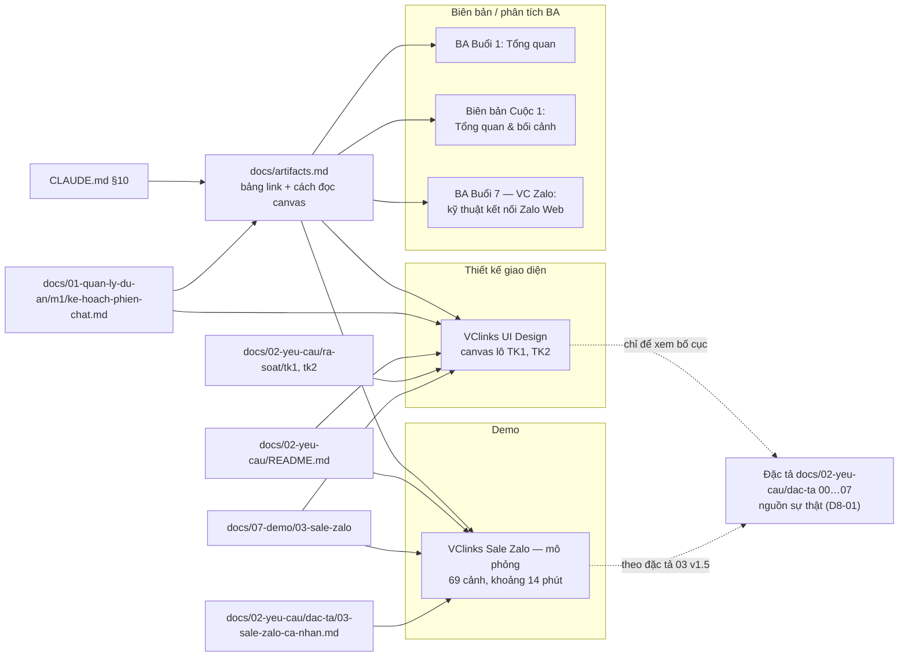

# Link artifact của dự án VClinks

Phiên bản 1.2 · 04/10/2026 · Trạng thái: Đang áp dụng

## Mô hình

Các artifact theo loại và những file trong repo trỏ tới chúng (nét liền: có link; nét đứt: quan hệ nội dung):

## Tóm tắt

- **Tài liệu nói gì:** danh sách link artifact của VClinks trên claude.ai (không có trong repo), mở bằng tài khoản `buithoanh@vcprosperous.com`, kèm cách mở trong tab trình duyệt tích hợp của VS Code.
- **5 artifact:** canvas thiết kế **VClinks UI Design** (lô TK1, TK2); bản trình chiếu **VClinks Sale Zalo — mô phỏng** (69 cảnh, khoảng 14 phút, theo đặc tả 03 v1.5); 3 biên bản / phân tích BA (Buổi 1, Cuộc 1, Buổi 7).
- **Nguồn sự thật là đặc tả `docs/02-yeu-cau` 00…07 (D8-01);** canvas chỉ để xem bố cục.
- **Cách đọc canvas:** tên artboard gồm 4 phần (số thứ tự · tên màn · mã màn hình · lô); mã màn hình `MH-<nhóm>-<số>` theo đặc tả; lô D1 / D2 nay gọi là TK1 / TK2 (từ 30/09/2026, V8-01) nhưng canvas vẫn ghi tên cũ.
- **Quy tắc bố cục khi vẽ thêm:** mỗi mảng một cặp hàng D1 trên, D2 dưới; khoảng cách 80 / 120 / 300 px; artboard mới thêm vào cuối hàng đúng mảng và đúng lô.
- **Quy ước bổ sung:** có artifact mới thì thêm một dòng vào bảng, kèm link mở trong IDE đã mã hóa URL.
- **Người duyệt cần xem kỹ:** link còn mở được, ghi chú của artifact demo (màn D9 chưa có artboard nên dùng khung minh họa), và bảng nhóm số thứ tự có khớp canvas hiện tại không.

## Mục lục

- [Cách đọc canvas VClinks UI Design](#cách-đọc-canvas-vclinks-ui-design)
- [Lịch sử cập nhật](#lịch-sử-cập-nhật)

---

Các bản thiết kế và biên bản BA nằm trên claude.ai (artifact), không có trong repo. Mở bằng tài khoản `buithoanh@vcprosperous.com`. Cập nhật 04/10/2026.

| Artifact (trình duyệt ngoài) | Trong IDE | Ghi chú |
|---|---|---|
| **[VClinks UI Design](https://claude.ai/artifact/8cAKkTjtb94BTCWFoErv1p)** (canvas thiết kế giao diện) | [Mở trong VS Code](command:workbench.action.browser.open?%22https%3A%2F%2Fclaude.ai%2Fartifact%2F8cAKkTjtb94BTCWFoErv1p%22) | Canvas các lô TK1, TK2; nguồn sự thật vẫn là đặc tả [docs/02-yeu-cau/dac-ta/00…07](../02-yeu-cau/README.md) (D8-01). Hồ sơ rà: [review/tk1/](../02-yeu-cau/ra-soat/tk1/), [review/tk2/](../02-yeu-cau/ra-soat/tk2/) |
| [VClinks Sale Zalo — mô phỏng](https://claude.ai/artifact/HgWK3uPEPjZdxWUidPPEnv) | [Mở trong VS Code](command:workbench.action.browser.open?%22https%3A%2F%2Fclaude.ai%2Fartifact%2FHgWK3uPEPjZdxWUidPPEnv%22) | Trình chiếu có phụ đề và giọng đọc (69 cảnh, khoảng 14 phút): luồng làm việc theo đặc tả [03](../02-yeu-cau/dac-ta/03-sale-zalo-ca-nhan.md) v1.5, gồm TK1, TK2 và D9. Ảnh chụp từ canvas ngày 04/10/2026. Màn D9 chưa có artboard nên dùng khung minh họa |
| [VClinks – Phân tích nghiệp vụ (BA) – Buổi 1: Tổng quan](https://claude.ai/artifact/Mc5TVfmzmmy6cXcyeG9YiZ) | [Mở trong VS Code](command:workbench.action.browser.open?%22https%3A%2F%2Fclaude.ai%2Fartifact%2FMc5TVfmzmmy6cXcyeG9YiZ%22) | |
| [Biên bản BA VClinks — Cuộc 1: Tổng quan & bối cảnh](https://claude.ai/artifact/E4iuRnn4hjXU98TzxxGfZQ) | [Mở trong VS Code](command:workbench.action.browser.open?%22https%3A%2F%2Fclaude.ai%2Fartifact%2FE4iuRnn4hjXU98TzxxGfZQ%22) | |
| [VClinks BA Buổi 7 — VC Zalo: kỹ thuật kết nối Zalo Web](https://claude.ai/artifact/MEN6UY1NDZVe7Se8aJz6P4) | [Mở trong VS Code](command:workbench.action.browser.open?%22https%3A%2F%2Fclaude.ai%2Fartifact%2FMEN6UY1NDZVe7Se8aJz6P4%22) | |

Cột **Trong IDE** mở artifact trong tab trình duyệt tích hợp của VS Code (lệnh `workbench.action.browser.open`). Lần đầu phải đăng nhập claude.ai trong tab đó. Nếu bấm không chạy: Ctrl/Cmd+Shift+P → **Open Integrated Browser** rồi dán link.

Có artifact mới của dự án thì thêm một dòng vào bảng này, tên artifact viết dạng link `[Tên](https://claude.ai/artifact/…)`, cột Trong IDE là `command:workbench.action.browser.open?` cộng URL đã bọc ngoặc kép và mã hóa (`%22https%3A%2F%2F…%22`).

## Cách đọc canvas VClinks UI Design

Ghi lại 04/10/2026. Trên canvas có ghi chú "Cách đọc bản vẽ" (cột trái, cạnh hàng khung chung), mục này là bản đầy đủ.

### Tên artboard

Tên mỗi artboard gồm 4 phần, cách nhau bằng `·`. Ví dụ: `1c · Cửa sổ gửi OA (Z0–Z3, tạm giữ) và Fanpage (F1–F3) · MH-OA-03/04 · D1`.

| Phần | Ví dụ | Ý nghĩa |
|---|---|---|
| Số thứ tự | `1c` | Chỗ của artboard trên canvas. Số là nhóm màn, chữ cái là màn con của nhóm. Số này không có trong đặc tả |
| Tên màn | Cửa sổ gửi OA… | Tên tiếng Việt |
| Mã màn hình | `MH-OA-03/04` | Mã theo đặc tả `docs/02-yeu-cau`, là nguồn sự thật |
| Lô | `D1` | Lô thiết kế của màn |

**Nhóm số thứ tự:**

| Số | Nhóm màn |
|---|---|
| 0, 0a…0j | Khung chung, đăng nhập, lỗi, ẩn SĐT, token, `/me`, omnichannel (tham khảo) |
| 1, 1a…1m | Hộp thư sale Zalo, khung chat, ô soạn, giám sát, CSKH OA, ticket |
| 2 | Gửi báo giá |
| 3, 3a, 3b | Customer 360 |
| 4, 4a…4c | Tìm khách, gộp hồ sơ |
| 5 | Việc cần làm |
| 6 | Tìm kiếm |
| 7, 7a | Báo cáo |
| 8, 8a | Kênh kết nối |
| 9, 9a…9c | Tổ của tôi, nghỉ việc, trực thay, SLA |
| 10, 10a…10g | Quản trị của Admin |
| 11 | Danh bạ |
| 12…12d | Marketing |
| 13…13c | Hóa đơn, công nợ |
| 14…14c | Tự động hóa OA, ZNS, chiến dịch |
| 15, 15a | Quy tắc chia khách |

Artboard cao quá 8000 px được cắt đôi. Phần sau mang chữ **"(phần 2)"** và nằm ngay dưới phần đầu.

### Mã màn hình `MH-<nhóm>-<số>`

Quy ước gốc ở [00 §1.5](../02-yeu-cau/dac-ta/00-giao-dien-chung.md).

| Nhóm | Mảng | Đặc tả |
|---|---|---|
| `UI` | Giao diện chung | 00 |
| `PQ` | Phân quyền, quản trị | 01 |
| `DK` | Khách đa kênh | 02 |
| `SZ` | Sale Zalo cá nhân | 03 |
| `OA` | CSKH Zalo OA | 04 |
| `MK` | Marketing, quảng cáo, chatbot | 05 |
| `HD` | Hóa đơn, công nợ | 06 |
| `BC` / `RT` | Báo cáo / quy tắc chia khách | 07 |

Một số ký hiệu đi kèm mã màn hình:

| Ký hiệu | Ví dụ | Ý nghĩa |
|---|---|---|
| Hậu tố chữ | `05a–h`, `05i` | Hộp thoại con của màn |
| `#n` | `#0b`, `#6a` | Số thứ tự thành phần trong bảng đặc tả của màn |
| `QT-` | `QT-SZ-11` | Mã quy trình |
| `DK-n` | `DK-49/50` | Mã quy tắc nghiệp vụ |

### Lô D1 / D2

Định nghĩa ở [ba/README.md § Lô thiết kế](../02-yeu-cau/README.md).

- **D1** là MVP lõi. Nay gọi là **TK1**, ứng với mốc M1.
- **D2** là phần còn lại. Nay gọi là **TK2**, ứng với M1c và M2–M3.

Từ 30/09/2026 (V8-01) đổi tên thành TK1/TK2 để không nhầm với mã quyết định `D1-xx`. Canvas vẫn ghi tên cũ.

Phần lô đôi khi có thêm ghi chú:

| Ghi chú | Ý nghĩa |
|---|---|
| `chưa rà` | Màn chưa qua vòng rà |
| `tham khảo`, `minh hoạ` | Màn không thuộc phạm vi đặc tả |
| `chờ QĐ-n` | Màn còn chờ chủ dự án quyết định |
| `khớp 03 v1.3` | Màn đã đối chiếu với đặc tả 03 bản v1.3 |

### Nhãn trong màn

| Nhãn | Ý nghĩa |
|---|---|
| Ô đen | Mã màn hình và route (nguồn route: 00 §2) |
| `Đã có` / `Mới` | Đã có trong code / màn mới |
| `Chờ chốt (QĐ-n, CH-…, Q-…)` | Phụ thuộc câu hỏi chưa chốt |
| `Đề xuất – chờ BA` | Thiết kế tự đề xuất, BA chưa đưa vào đặc tả |
| `GĐ2 / D2` | Thuộc lô sau |
| Nhãn vàng | Quyết định (QĐ) hoặc tham số (TS) đang chờ |

### Quy tắc bố cục (áp dụng khi vẽ thêm)

1. **Mỗi mảng là một cặp hàng.** Hàng D1 của mảng nằm trên, hàng D2 của cùng mảng nằm ngay dưới.
2. Thứ tự từ trên xuống:
   1. Tham khảo omnichannel
   2. Khung chung
   3. Sale Zalo (D1, rồi D2 sale và khách đa kênh)
   4. CSKH (D1, rồi D2 CSKH OA, rồi D2 marketing và Fanpage)
   5. Quản trị tổ (D1)
   6. Admin (D1)
   7. Báo cáo và chia khách (chỉ có D2)
   8. Hóa đơn, công nợ (chỉ có D2)
3. Màn có cả phần D1 lẫn D2 đặt ở hàng D1 của mảng (ví dụ `14 OaAuto` ở hàng D1 CSKH). Ngoại lệ: `6 Search` nằm ở hàng D2 sale, vì phần chính của màn là tìm nội dung tin (MH-SZ-14, D2).
4. Mỗi hàng có một tiêu đề bắt đầu bằng `D1 ·` hoặc `D2 ·`, ghi mảng và file đặc tả.
5. Khoảng cách:
   - Giữa các artboard cùng hàng: 80 px.
   - Giữa đáy hàng trên và tiêu đề hàng dưới: 120 px.
   - Giữa tiêu đề và artboard: 300 px.
6. Thêm artboard mới vào cuối hàng đúng mảng và đúng lô. Khi hàng cao lên, dời mọi hàng bên dưới xuống theo.

## Lịch sử cập nhật

| Phiên bản | Ngày | Người / phiên | Thay đổi | Căn cứ |
|---|---|---|---|---|
| 1.2 | 04/10/2026 13:50 | Claude Code | Sơ đồ Mô hình: sửa đường dẫn kế hoạch M1 sang `m1/ke-hoach-phien-chat.md` | Chủ dự án duyệt 04/10/2026 13:50 |
| 1.1 | 04/10/2026 13:35 | Claude Code | Cập nhật đường dẫn tài liệu theo cấu trúc `docs/` mới; nội dung không đổi | Chủ dự án duyệt cấu trúc docs/ 04/10/2026 13:35 |
| 1.1 | 04/10/2026 | Claude Code | Hồi tố theo CLAUDE.md §13: thêm Mô hình, Tóm tắt, Mục lục, Lịch sử | docs/ke-hoach/hoi-to-tai-lieu-md.md |
| 1.0 | 04/10/2026 | — | Bản trước khi có bảng lịch sử: bảng link 5 artifact, mục "Cách đọc canvas VClinks UI Design" (ghi lại 04/10/2026) | — |
