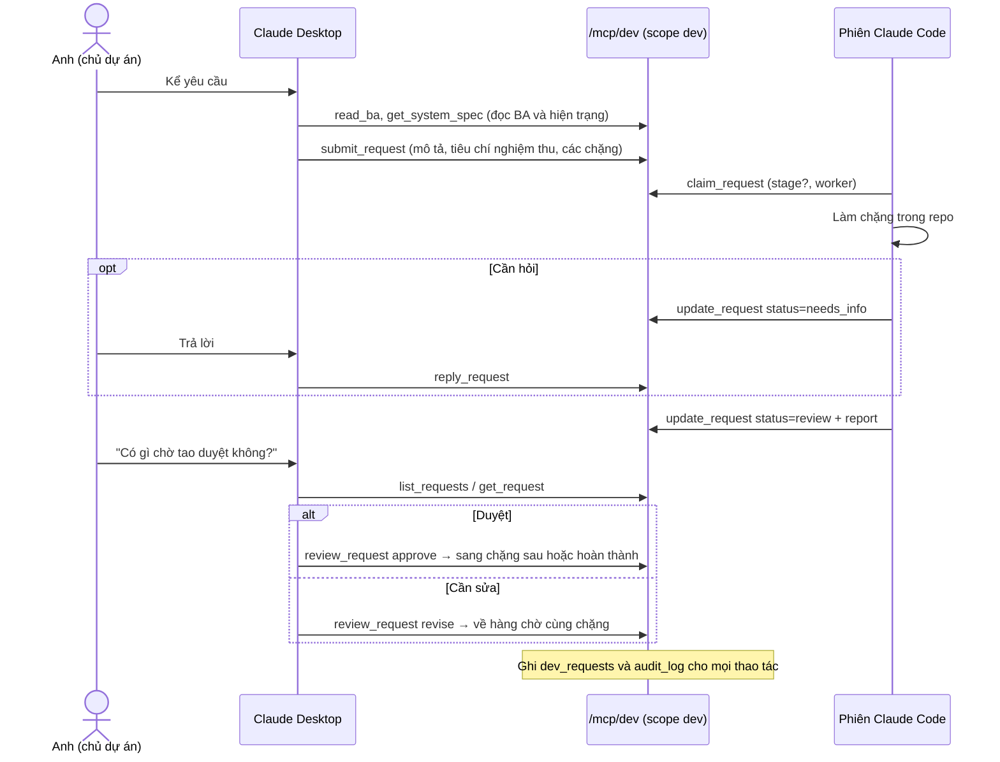
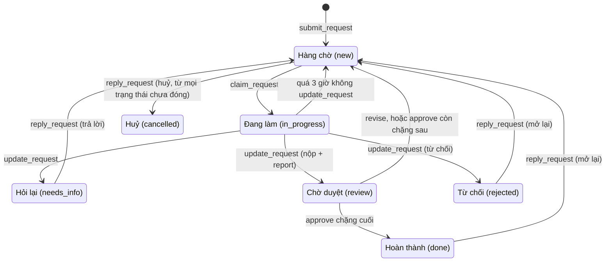
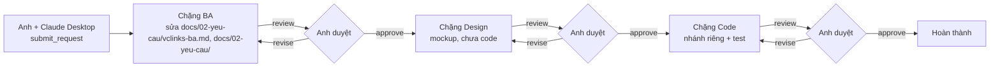

# MCP phát triển `vclinks-dev`: yêu cầu → BA → thiết kế → code

Phiên bản 1.1 · 04/10/2026 · Trạng thái: Đang áp dụng

## Mô hình

Trao đổi giữa chủ dự án, Claude Desktop và Claude Code qua `/mcp/dev`:



Trạng thái của một yêu cầu trong `dev_requests` (theo `apps/api/src/devreq/devreq.service.ts`). Sơ đồ theo chặng BA → Design → Code nằm ở phần nội dung ngay dưới Mục lục.



## Tóm tắt

- MCP `vclinks-dev` ở `/mcp/dev` là kênh yêu cầu thay đổi: chủ dự án nói với Claude Desktop, các phiên Claude Code nhận và làm từng chặng.
- Mỗi yêu cầu đi qua các chặng BA → Design → Code (có thể chỉ một phần); hết chặng thì dừng ở `review`, chủ dự án `approve` hoặc `revise`.
- Tách hẳn khỏi `/mcp` vận hành: token scope `mcp` không thấy tool dev, token `dev` không ingest được; dữ liệu ở `dev_requests`, mọi thao tác ghi `audit_log`.
- Claude Code nhận việc bằng `claim_request`; quá 3 giờ không `update_request` thì yêu cầu tự về hàng chờ, giữ nhật ký và nhánh.
- **Người duyệt cần xem kỹ:** đường dẫn `docs/02-yeu-cau/vclinks-ba.md` trong sơ đồ và bảng chặng đã cũ (file nay ở `docs/02-yeu-cau/vclinks-ba.md`); thư mục worktree vẫn ghi tên cũ `VCzalo-worktrees/`.

## Mục lục

- [Tool](#tool)
- [Cài đặt](#cài-đặt)
- [Cách dùng hằng ngày](#cách-dùng-hằng-ngày)
- [Việc của từng chặng (cho Claude Code)](#việc-của-từng-chặng-cho-claude-code)
- [Lịch sử cập nhật](#lịch-sử-cập-nhật)

---

Anh nói chuyện với **Claude Desktop**; Claude Desktop ghi yêu cầu vào VClinks. Các phiên **Claude Code** nhận từng chặng, làm trong repo rồi nộp lại. Chặng nào xong cũng dừng ở trạng thái **chờ duyệt**; chỉ khi anh duyệt thì yêu cầu mới sang chặng sau.



- Endpoint: `http://localhost:3000/mcp/dev` (Streamable HTTP). Tách khỏi `/mcp` vận hành: token scope `mcp` không thấy các tool này, token scope `dev` không ingest được.
- Dữ liệu ở collection `dev_requests`; mọi thao tác ghi `audit_log`.
- Yêu cầu không cần đủ ba chặng: chỉ sửa BA thì `stages: ["ba"]`, sửa lỗi code thì `stages: ["code"]`.

## Tool

| Ai dùng | Tool | Việc |
|---|---|---|
| Cả hai | `read_ba` | Mục lục BA; đọc một file hoặc một mục (theo heading, mã MH-…); tìm dòng (`query`) |
| Cả hai | `get_system_spec` | Hiện trạng từ repo: `overview`, `rest`, `mcp`, `channels`, `zalo`, `driver`, `progress` (commit và nhánh) |
| Desktop | `submit_request` | Tạo yêu cầu: mô tả, tiêu chí nghiệm thu, mục BA liên quan, độ ưu tiên, các chặng |
| Desktop | `list_requests` / `get_request` | Theo dõi; `review` = chờ anh duyệt, `needs_info` = Claude Code đang hỏi |
| Desktop | `review_request` | `approve` sang chặng sau, `revise` trả về kèm việc cần sửa |
| Desktop | `reply_request` | Trả lời câu hỏi, bổ sung ý, mở lại, hoặc huỷ |
| Code | `claim_request` | Nhận một chặng (`stage` để lọc, `worker` = tên worktree) |
| Code | `update_request` | Ghi tiến độ, hỏi lại (`needs_info`), nộp chặng (`review` + report), từ chối |

Nhận việc mà quá 3 giờ không `update_request` thì yêu cầu tự về hàng chờ (phiên Claude Code chết giữa chừng), giữ nguyên nhật ký và nhánh.

## Cài đặt

1. Tạo hai token scope `dev` (tên token là tên hiện trong nhật ký):

   ```bash
   pnpm token:create --name "Thọ Anh - Claude Desktop" --scopes dev
   pnpm token:create --name "Claude Code" --scopes dev
   ```

2. Claude Desktop: thêm vào `~/Library/Application Support/Claude/claude_desktop_config.json`, rồi thoát hẳn và mở lại Claude Desktop.

   ```json
   "vclinks-dev": {
     "command": "npx",
     "args": ["-y", "mcp-remote", "http://localhost:3000/mcp/dev", "--header", "Authorization:${VCLINKS_DEV_AUTH}"],
     "env": { "VCLINKS_DEV_AUTH": "Bearer <token Claude Desktop>" }
   }
   ```

3. Claude Code:

   ```bash
   claude mcp add --scope user --transport http vclinks-dev http://localhost:3000/mcp/dev --header "Authorization: Bearer <token Claude Code>"
   ```

API đọc BA từ thư mục repo nó đang chạy (tìm `pnpm-workspace.yaml` từ thư mục code đi lên). Đặt `VCLINKS_REPO_ROOT` nếu muốn trỏ chỗ khác.

## Cách dùng hằng ngày

- **Trên Claude Desktop:** kể yêu cầu bình thường, ví dụ "sale cần nút gửi báo giá ngay trong khung chat Zalo". Claude đọc BA và hiện trạng, chỉ ra chỗ lệch, rồi gửi yêu cầu. Hỏi "có gì chờ tao duyệt không?" để xem các chặng ở trạng thái `review`.
- **Trên Claude Code:** "nhận việc BA trên vclinks-dev" / "nhận việc code". Claude Code nhận chặng, làm theo quy trình của chặng đó, rồi nộp.

## Việc của từng chặng (cho Claude Code)

| Chặng | Làm | Không làm | Report khi nộp |
|---|---|---|---|
| `ba` | Sửa `docs/02-yeu-cau/vclinks-ba.md` / `docs/02-yeu-cau/*.md`: tính năng, story, đặc tả màn hình (mã MH-), UAT; theo chu trình ở `docs/02-yeu-cau/README.md` | Không đụng code, không vẽ mockup | `files` đã sửa, tóm tắt thay đổi, câu hỏi còn mở |
| `design` | Mockup theo đặc tả đã duyệt, giống antd và Zalo | Không viết code trong repo | `links` tới mockup |
| `code` | Nhánh riêng trong `VCzalo-worktrees/`, có test, gộp vào `main` khi anh duyệt | Không gửi tin Zalo ngoài nhóm test | `branch`, `commits`, `tests` |

## Lịch sử cập nhật

| Phiên bản | Ngày | Người / phiên | Thay đổi | Căn cứ |
|---|---|---|---|---|
| 1.1 | 04/10/2026 13:35 | Claude Code | Cập nhật đường dẫn tài liệu theo cấu trúc `docs/` mới; nội dung không đổi | Chủ dự án duyệt cấu trúc docs/ 04/10/2026 13:35 |
| 1.1 | 04/10/2026 | Claude Code | Hồi tố theo CLAUDE.md §13: thêm Mô hình, Tóm tắt, Mục lục, Lịch sử | `docs/ke-hoach/hoi-to-tai-lieu-md.md` |
| 1.0 | 29/09/2026 | — | Các bản trước khi có bảng lịch sử (xem `git log -- docs/dev-mcp.md`) | — |
