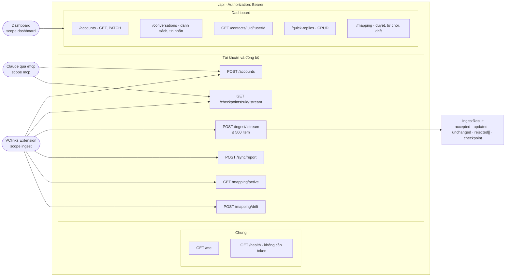
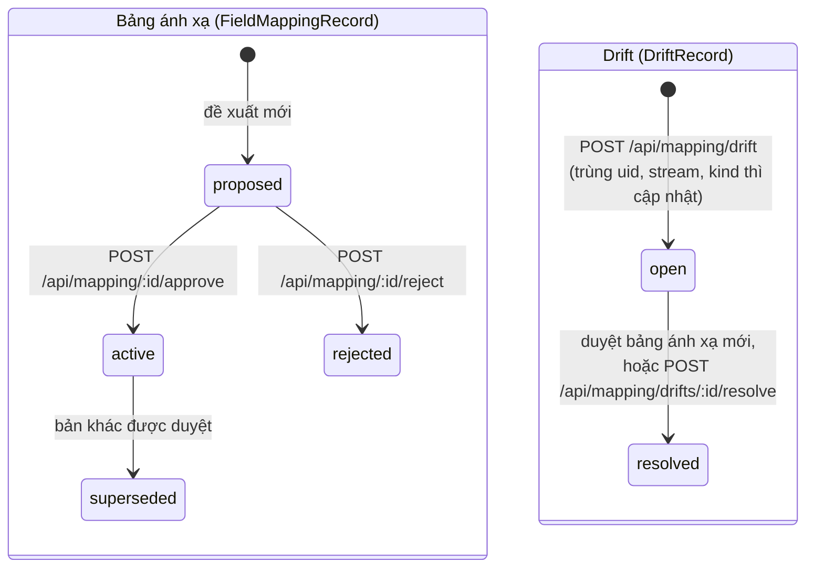

# VClinks REST API (Giai đoạn 1)

Phiên bản 1.1 · 04/10/2026 · Trạng thái: Đang áp dụng

## Mô hình

Nhóm endpoint REST và scope được gọi:



Trạng thái bảng ánh xạ trường và drift qua các endpoint `/api/mapping/*`:



## Tóm tắt

- Mô tả REST API GĐ1 dưới `/api`: mọi request cần `Authorization: Bearer <token>`, token tạo bằng `pnpm token:create`.
- Ba scope được mô tả: `dashboard` (Dashboard), `ingest` (Extension), `mcp` (Claude); `/api/health` không cần token.
- Extension đăng ký tài khoản, đọc checkpoint, đẩy lô tối đa 500 item qua `/api/ingest/:stream`, báo số bản ghi gốc và drift. Trả `IngestResult` gồm `accepted/updated/unchanged/rejected/checkpoint`.
- Dashboard: tài khoản, hội thoại và tin nhắn, hồ sơ liên hệ, mẫu câu trả lời nhanh, duyệt/từ chối bảng ánh xạ và đóng drift.
- **Người duyệt cần xem kỹ:** tài liệu chưa liệt kê nhiều endpoint đã có trong code (outbox, autosync, fetch-requests, media, kênh Zalo OA/Fanpage, webhook, `/mcp/dev` và scope `dev`), và danh sách `:stream` thiếu các stream tùy chọn `reactions`, `labels`, `read_state`.

## Mục lục

- [Chung](#chung)
- [Tài khoản và đồng bộ (extension)](#tài-khoản-và-đồng-bộ-extension)
- [Dashboard](#dashboard)
- [Lịch sử cập nhật](#lịch-sử-cập-nhật)

---

Tất cả endpoint nằm dưới `/api`. Mỗi request phải có header `Authorization: Bearer <token>`. Token được tạo bằng lệnh `pnpm token:create --name <tên> --scopes <scope,...>`.

Có 3 scope:

- `dashboard`: người dùng Dashboard.
- `ingest`: VClinks Extension.
- `mcp`: Claude, gọi qua `/mcp`.

Kiểu dữ liệu request/response lấy từ `@vclinks/shared` (`src/schemas.ts`, `src/api-types.ts`). Mọi thời điểm trả về dạng chuỗi ISO (UTC). Dashboard hiển thị theo múi giờ `Asia/Ho_Chi_Minh`.

Lỗi trả về dạng `{ statusCode, message, error }` của NestJS. Nếu body không hợp lệ, API trả `400` và `message` là danh sách lỗi zod.

## Chung

| Method | Path | Scope | Body / Query | Response |
|---|---|---|---|---|
| GET | `/api/me` | bất kỳ | – | `WhoAmI` |
| GET | `/api/health` | không cần | – | `{ ok: true }` |

## Tài khoản và đồng bộ (extension)

| Method | Path | Scope | Body / Query | Response |
|---|---|---|---|---|
| POST | `/api/accounts` | ingest, mcp | `{ uid, label, ownerName? }`. Label chỉ được đặt khi tạo mới, tài khoản đã có thì giữ nguyên label | `{ uid, label, created }` |
| GET | `/api/checkpoints/:uid/:stream` | ingest, mcp | – | `CheckpointResponse` (`cursor` là epoch ms hoặc `null`) |
| POST | `/api/ingest/:stream` | ingest | `{ uid, items[] }`, tối đa 500 item đã qua `mapRecord` | `IngestResult` |
| POST | `/api/sync/report` | ingest | `SyncReport` | `{ ok: true }` |
| GET | `/api/mapping/active` | bất kỳ | – | `FieldMappingRecord` |
| POST | `/api/mapping/drift` | ingest | `DriftReport` | `{ id }`. Một drift đang mở (cùng uid, stream, kind) chỉ được cập nhật, không tạo bản mới |

Các giá trị của `:stream` là `contacts | groups | conversations | messages`. Tài khoản phải được đăng ký trước khi ingest, nếu chưa thì API trả `404`.

`IngestResult`:

```json
{ "accepted": 480, "updated": 15, "unchanged": 3, "rejected": [{ "index": 7, "id": "123", "reason": "sensitive_field: raw.e2ee_session" }], "checkpoint": 1727500000000 }
```

- `accepted`: số bản ghi mới.
- `updated`: số bản ghi đã có và có thay đổi.
- `unchanged`: số bản ghi đã có, giống hệt.
- `checkpoint`: cursor mới (max `sentAt` / `lastActionTime` / `lastMsgAt`), hoặc `null` với stream `groups`.

## Dashboard

| Method | Path | Scope | Body / Query | Response |
|---|---|---|---|---|
| GET | `/api/accounts` | dashboard | – | `AccountStatus[]` |
| PATCH | `/api/accounts/:uid` | dashboard | `{ label?, ownerName? }` | `{ ok: true }` |
| GET | `/api/conversations` | dashboard | `uid?`, `q?` (tên/threadId), `page=1`, `pageSize=30` | `Paged<ConversationListItem>`, sắp theo `lastMsgAt` giảm dần |
| GET | `/api/conversations/:id/messages` | dashboard | `before?` (ISO), `limit=50` (tối đa 200) | `{ items: MessageView[], hasMore }`. `items` sắp **tăng dần** theo thời gian. `:id` = `${uid}:${threadId}`, cần URL-encode. Tin trả lời có `quote { cliMsgId, msgId, fromUid, senderName, text }` (lấy từ khối trích dẫn trên DOM, `quoteRef` đã lưu, hoặc tin VClinks gửi bằng "Trả lời") |
| GET | `/api/contacts/:uid/:userId` | dashboard | `threadId?` | `ContactProfile`: tên (từ danh bạ, nếu danh bạ bị mã hóa thì lấy tên người gửi trên DOM), username, SĐT, bạn bè/OA, vai trò, email tổ chức, nhóm chung, số tin đã gửi. 404 khi VClinks chưa có dữ liệu nào về người này |
| GET | `/api/quick-replies` | dashboard | – | `QuickReply[]` (mẫu câu dùng chung, sắp theo loại rồi phím tắt) |
| POST | `/api/quick-replies` | dashboard | `{ shortcut, title, text, kind?: 'text'\|'bank' }` (`shortcut` chữ thường/số/`_`/`-`, duy nhất → 409 nếu trùng; `text` ≤ 2000, biến `{ten_khach}` `{ten_nv}`) | `QuickReply` (201) |
| PATCH | `/api/quick-replies/:id` | dashboard | các trường trên, tùy chọn | `QuickReply` |
| DELETE | `/api/quick-replies/:id` | dashboard | – | `{ ok: true }` |
| GET | `/api/mapping` | dashboard | – | `FieldMappingRecord[]`, mới nhất trước |
| POST | `/api/mapping/:id/approve` | dashboard | – | `FieldMappingRecord`. Bản đang `active` chuyển sang `superseded`, các drift đang mở chuyển sang `resolved` |
| POST | `/api/mapping/:id/reject` | dashboard | – | `FieldMappingRecord` |
| GET | `/api/mapping/drifts` | dashboard | `status?=open\|resolved` | `DriftRecord[]` |
| POST | `/api/mapping/drifts/:id/resolve` | dashboard | – | `{ ok: true }` |

## Lịch sử cập nhật

| Phiên bản | Ngày | Người / phiên | Thay đổi | Căn cứ |
|---|---|---|---|---|
| 1.1 | 04/10/2026 | Claude Code | Hồi tố theo CLAUDE.md §13: thêm Mô hình, Tóm tắt, Mục lục, Lịch sử | `docs/ke-hoach/hoi-to-tai-lieu-md.md` |
| 1.0 | 28/09/2026 | — | Các bản trước khi có bảng lịch sử (xem `git log -- docs/rest-api.md`) | — |
