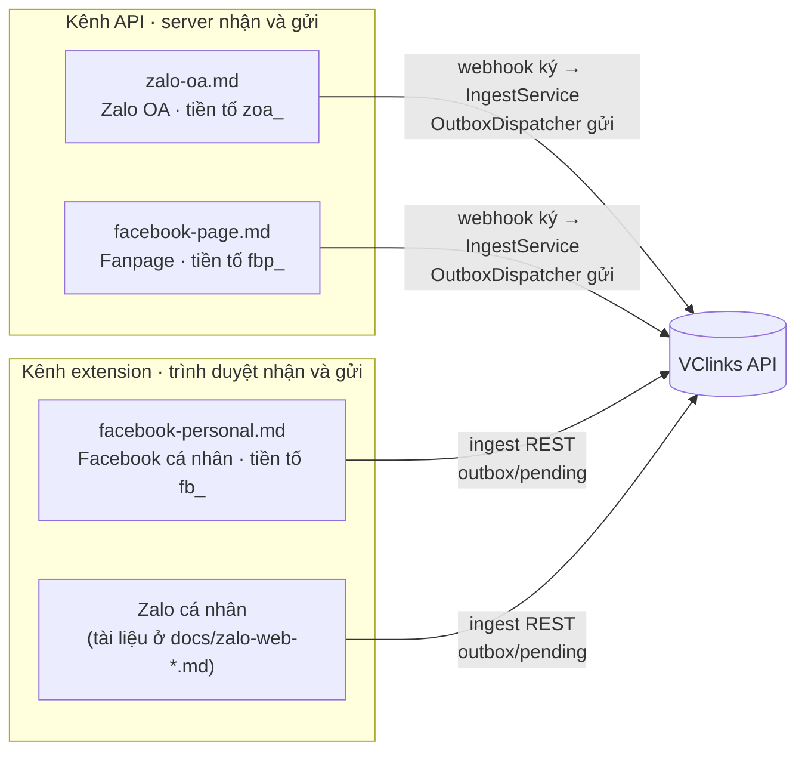

# Hướng dẫn kênh — thư mục `docs/04-ky-thuat/kenh/`

Phiên bản 0.1 · 04/10/2026 · Trạng thái: Đang áp dụng

## Mô hình

## Tóm tắt

- Thư mục chứa hướng dẫn kết nối từng kênh của VClinks; nguồn sự thật về danh sách kênh là `packages/shared/src/channels.ts` (CLAUDE.md §4.4).
- **Kênh API** (Zalo OA, Fanpage): webhook có kiểm chữ ký, server tự gửi tin đã duyệt, token lưu mã hóa trong `channel_credentials`.
- **Kênh extension** (Facebook cá nhân): extension đọc DOM messenger.com và gõ tin đã duyệt; không có API chính thức, rủi ro khóa tài khoản đã được chủ dự án chấp nhận.
- Zalo cá nhân không có file ở đây: xem `docs/04-ky-thuat/zalo-web/zalo-web-extraction.md`, `docs/04-ky-thuat/zalo-web/zalo-dom-selectors.md`, `docs/04-ky-thuat/zalo-web/zalo-web-feature-map.md`.
- Chỗ cần xem: bảng mã lỗi Zalo OA ở `zalo-oa.md` §6 chưa đủ so với code (xem cột Ghi chú).

## Mục lục

- [Danh sách file](#danh-sách-file)
- [Lịch sử cập nhật](#lịch-sử-cập-nhật)

## Danh sách file

| File | Tóm tắt 1 dòng | Phiên bản | Cập nhật | Trạng thái | Ghi chú |
|---|---|---|---|---|---|
| [zalo-oa.md](zalo-oa.md) | Kết nối Zalo OA bằng API chính thức: webhook có ký, OAuth PKCE, gửi tin Tư vấn đã duyệt, tự làm mới token | 1.2 | 07/10/2026 | Đang áp dụng | Bảng lỗi §6 thiếu mã `-200`, `-201`, `-204`, `-205`, `-210`, `-224`, `-248` có trong `zalo-oa.sender.ts` |
| [facebook-page.md](facebook-page.md) | Kết nối Fanpage qua Messenger Platform: Meta App, quyền, webhook ký, gửi trong khung 24 giờ, App Review | 1.1 | 04/10/2026 | Đang áp dụng | Khớp code |
| [facebook-personal.md](facebook-personal.md) | Facebook cá nhân qua extension đọc DOM Messenger: giới hạn, msgId, nhịp gửi an toàn, checklist selector | 1.1 | 04/10/2026 | Đang áp dụng | Chưa kiểm chứng giới hạn "20 tin/giờ", "30 giây" trong code |

## Lịch sử cập nhật

| Phiên bản | Ngày | Người / phiên | Thay đổi | Căn cứ |
|---|---|---|---|---|
| 0.1 | 04/10/2026 13:35 | Claude Code | Cập nhật đường dẫn tài liệu theo cấu trúc `docs/` mới; nội dung không đổi | Chủ dự án duyệt cấu trúc docs/ 04/10/2026 13:35 |
| 0.1 | 04/10/2026 | Claude Code | Tạo file quản lý thư mục | CLAUDE.md §13 |
