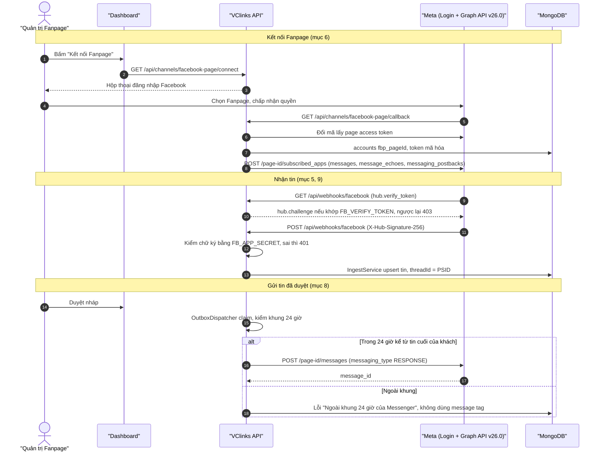
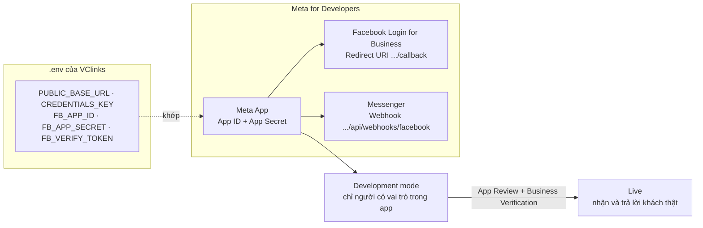

# Kênh Fanpage Facebook (Messenger Platform)

Phiên bản 1.1 · 04/10/2026 · Trạng thái: Đang áp dụng

## Mô hình

Kết nối Fanpage, nhận tin qua webhook và gửi tin đã duyệt qua Graph API Send:



Cấu hình Meta App, biến môi trường và đường từ Development mode lên Live (mục 2–5, 7):



## Tóm tắt

- Hướng dẫn kết nối **Fanpage Facebook** vào VClinks bằng **Messenger Platform** (API chính thức của Meta), Graph API **v26.0**, đổi được bằng `FB_GRAPH_VERSION`.
- **Nhận tin:** webhook `/api/webhooks/facebook` (GET xác minh bằng `FB_VERIFY_TOKEN`, POST kiểm chữ ký `X-Hub-Signature-256` bằng `FB_APP_SECRET`); đăng ký 3 trường `messages`, `message_echoes`, `messaging_postbacks`.
- **Gửi tin:** chỉ tin đã duyệt, máy chủ gửi qua `POST /{page-id}/messages` với `messaging_type = RESPONSE`.
- **Khung 24 giờ:** VClinks kiểm tra trước khi gửi; ngoài khung thì báo lỗi, **không** tự dùng message tag. Tag `HUMAN_AGENT` (7 ngày) là việc còn mở, cần Meta duyệt.
- **Kết nối:** mỗi Fanpage thành tài khoản `fbp_<pageId>`, page access token lưu mã hóa; ngắt kết nối hủy webhook, xóa token, giữ lịch sử.
- **Điều kiện chạy với khách thật:** App Review (Advanced Access) + Business Verification + chuyển app sang Live; ở Development mode chỉ người có vai trò trong app nhắn được.
- **Việc còn mở:** URL ảnh/video của Meta có hạn, cần tải về MinIO ở giai đoạn sau; tên/ảnh khách cần tính năng Business Asset User Profile Access.
- **Người duyệt nên xem kỹ:** bảng quyền mục 3, quy tắc khung 24 giờ mục 8 và cách dùng URL công khai cố định (không dùng quick tunnel).

## Mục lục

- [1. Chuẩn bị](#1-chuẩn-bị)
- [2. Tạo Meta App](#2-tạo-meta-app)
- [3. Quyền (permissions) cần xin](#3-quyền-permissions-cần-xin)
- [4. Cấu hình máy chủ VClinks](#4-cấu-hình-máy-chủ-vclinks)
- [5. Cấu hình Webhook](#5-cấu-hình-webhook)
- [6. Kết nối Fanpage](#6-kết-nối-fanpage)
- [7. Development mode và App Review](#7-development-mode-và-app-review)
- [8. Quy tắc khung 24 giờ](#8-quy-tắc-khung-24-giờ)
- [9. Dữ liệu được lưu](#9-dữ-liệu-được-lưu)
- [10. Xử lý sự cố](#10-xử-lý-sự-cố)
- [Lịch sử cập nhật](#lịch-sử-cập-nhật)

---

VClinks nhận và trả lời tin nhắn Messenger của Fanpage bằng **API chính thức của Meta**:

- **Nhận tin:** Meta gọi webhook `POST /api/webhooks/facebook` mỗi khi khách nhắn, bấm nút, hoặc khi Fanpage trả lời (kể cả trả lời trên Meta Business Suite). VClinks kiểm chữ ký `X-Hub-Signature-256` rồi lưu tin vào cùng kho với các kênh khác.
- **Gửi tin:** tin đã được duyệt trên Dashboard được máy chủ gửi qua Graph API Send (`POST /{page-id}/messages`, `messaging_type = RESPONSE`). Không có tin nào được gửi khi chưa duyệt.
- **Danh bạ:** tên và ảnh đại diện của khách được lấy qua User Profile API, tối đa 1 lần/ngày cho mỗi khách.

Phiên bản Graph API đang dùng: **v26.0** (phát hành 29/07/2026). Có thể đổi bằng biến `FB_GRAPH_VERSION` nếu Meta ra bản mới.

---

## 1. Chuẩn bị

1. **Một URL công khai HTTPS cố định** trỏ về VClinks, ví dụ `https://vclinks.vcprosperous.com`.
   - Dùng tên miền riêng hoặc **Cloudflare named tunnel** (`cloudflared tunnel create ...` + DNS route).
   - **Không dùng quick tunnel** (`cloudflared tunnel --url ...`, URL dạng `*.trycloudflare.com`): URL này đổi mỗi lần khởi động lại, webhook và OAuth redirect sẽ hỏng, Meta sẽ tự hủy đăng ký webhook sau khoảng 1 giờ gọi thất bại.
2. Tài khoản Facebook là **quản trị viên** của các Fanpage cần kết nối.
3. Một tài khoản **Meta for Developers** (developers.facebook.com), nên thuộc Business Portfolio của công ty.

## 2. Tạo Meta App

1. Vào <https://developers.facebook.com/apps> → **Create App**.
2. Chọn use case **"Engage with customers on Messenger from Meta"** (nếu giao diện còn hỏi loại app thì chọn **Business**).
3. Gắn app với Business Portfolio của VC Phồn Vinh.
4. Trong **App settings → Basic**, ghi lại **App ID** và **App Secret**.
5. Thêm sản phẩm **Facebook Login for Business** (hoặc Facebook Login). Trong **Settings** của sản phẩm này:
   - **Valid OAuth Redirect URIs:** `https://<URL công khai>/api/channels/facebook-page/callback`
   - Bật **Client OAuth login** và **Web OAuth login**.
6. Thêm sản phẩm **Messenger** (nếu chưa có qua use case).

## 3. Quyền (permissions) cần xin

| Quyền | Dùng để |
|---|---|
| `pages_show_list` | Liệt kê các Fanpage bạn quản lý khi kết nối |
| `pages_messaging` | Nhận và gửi tin Messenger của Fanpage |
| `pages_manage_metadata` | Đăng ký webhook cho Fanpage (`/{page-id}/subscribed_apps`) |
| `pages_read_engagement` | Đọc thông tin cơ bản của Fanpage |

Ngoài ra, để lấy **tên và ảnh đại diện** của khách cần tính năng **Business Asset User Profile Access**. Thiếu tính năng này thì tin vẫn nhận bình thường, chỉ là danh bạ không có tên.

## 4. Cấu hình máy chủ VClinks

Trong file `.env` (xem `.env.example`):

```bash
PUBLIC_BASE_URL=https://vclinks.vcprosperous.com   # URL công khai cố định, không có dấu / ở cuối
CREDENTIALS_KEY=...          # openssl rand -base64 32 — mã hóa token Fanpage khi lưu
FB_APP_ID=...                # App ID
FB_APP_SECRET=...            # App Secret — dùng kiểm chữ ký webhook và appsecret_proof
FB_VERIFY_TOKEN=...          # chuỗi ngẫu nhiên tự đặt, ví dụ: openssl rand -hex 16
```

Khởi động lại API. Trên Dashboard, mục **Kênh kết nối → Fanpage Facebook** sẽ báo nếu còn thiếu biến nào.

## 5. Cấu hình Webhook

1. Trong Meta App: **Messenger → Messenger API Settings** (hoặc **Webhooks**, đối tượng **Page**).
2. **Callback URL:** `https://<URL công khai>/api/webhooks/facebook`
3. **Verify token:** nhập **đúng** giá trị `FB_VERIFY_TOKEN` trong `.env`. Meta sẽ gọi `GET /api/webhooks/facebook?hub.mode=subscribe&hub.verify_token=...&hub.challenge=...`; VClinks trả lại `hub.challenge` nếu token khớp, ngược lại trả 403.
4. Đăng ký các trường (webhook fields): **`messages`**, **`message_echoes`**, **`messaging_postbacks`**.
   - VClinks cũng tự đăng ký 3 trường này cho từng Fanpage khi kết nối (`POST /{page-id}/subscribed_apps`).

## 6. Kết nối Fanpage

1. Đăng nhập Dashboard → **Kênh kết nối** → **Kết nối Fanpage**.
2. Facebook mở hộp thoại đăng nhập: **chọn các Fanpage** muốn cho VClinks truy cập và chấp nhận các quyền.
3. Facebook chuyển về VClinks. Mọi Fanpage bạn đã chọn trong hộp thoại được kết nối:
   - tạo tài khoản `fbp_<pageId>` trong VClinks,
   - lưu **page access token** (đã mã hóa, không bao giờ hiển thị hay trả qua API),
   - đăng ký webhook cho Fanpage.
4. Muốn thêm/bớt Fanpage: bấm **Kết nối Fanpage** lại và chọn lại trong hộp thoại.

**Ngắt kết nối:** nút **Ngắt kết nối** hủy đăng ký webhook, xóa token. Lịch sử tin nhắn và danh bạ vẫn được giữ; tin mới của Fanpage đó không còn được nhận.

Nếu Fanpage hiện **"Token hết hạn, cần kết nối lại"** (đổi mật khẩu Facebook, gỡ quyền app, mất quyền quản trị...), bấm **Kết nối Fanpage** lại.

## 7. Development mode và App Review

- Khi app ở **Development mode**: chỉ người có vai trò trong app (Admin / Developer / Tester) và là quản trị Fanpage mới dùng được. Tin chỉ nhận/gửi được với **những người có vai trò trong app**. Đủ để chạy thử.
- Để nhận và trả lời **khách thật**: gửi **App Review** cho các quyền ở mục 3 (Advanced Access), hoàn tất **Business Verification**, rồi chuyển app sang **Live**. Khi gửi review cần video quay màn hình luồng: kết nối Fanpage → khách nhắn → nhân viên duyệt nháp trên VClinks → tin được gửi.
- Lỗi "thiếu quyền pages_messaging" khi gửi (mã 200) thường là do app chưa Live hoặc người nhận không phải tester.

## 8. Quy tắc khung 24 giờ

- Messenger chỉ cho Fanpage **trả lời trong 24 giờ kể từ tin cuối của khách** (Standard Messaging Window). Tin khách nhắn hoặc bấm nút sẽ mở lại khung 24 giờ.
- VClinks kiểm tra khung này **trước khi gửi**. Tin đã duyệt nhưng ngoài khung sẽ chuyển sang trạng thái lỗi với lý do "Ngoài khung 24 giờ của Messenger", **không** tự gửi bằng message tag.
- **Việc cần làm sau (cần Meta duyệt):** tag **HUMAN_AGENT** cho phép nhân viên trả lời trong **7 ngày**. Phải xin quyền *Human Agent* qua App Review, sau đó mới bổ sung vào VClinks.

## 9. Dữ liệu được lưu

| Sự kiện Meta | Lưu thành |
|---|---|
| Khách nhắn (`messages`) | tin nhắn `fromUid = PSID của khách`, `threadId = PSID` |
| Fanpage trả lời (`message_echoes`, kể cả từ Business Suite/app khác) | tin nhắn `fromUid = '0'` |
| Khách bấm nút (`messaging_postbacks`) | tin nhắn loại `postback`, nội dung là tiêu đề nút |
| Ảnh, video, ghi âm, tệp | `content` (chỉ giữ URL `https`). URL của Meta **có hạn**, cần tải về MinIO ở giai đoạn sau nếu muốn giữ lâu dài |
| Hồ sơ khách | danh bạ: tên, ảnh đại diện (làm mới tối đa 1 lần/ngày) |

Không lưu: token người dùng Facebook (chỉ dùng một lần khi kết nối), payload thô của webhook, cookie hay mật khẩu.

## 10. Xử lý sự cố

| Hiện tượng | Kiểm tra |
|---|---|
| Meta báo "The URL couldn't be validated" khi lưu webhook | API có truy cập được qua URL công khai không; `FB_VERIFY_TOKEN` có khớp không |
| Không nhận được tin | Fanpage có trạng thái "Đã đăng ký webhook"; app đã Live hoặc người nhắn là tester; `FB_APP_SECRET` đúng (sai thì mọi webhook bị từ chối 401) |
| Webhook bị Meta tắt | Meta tự tắt sau khoảng 1 giờ gọi thất bại liên tục (thường do URL quick tunnel đã đổi): sửa URL, lưu lại webhook, rồi bấm Kết nối Fanpage lại |
| Kết nối báo "Không đổi được mã đăng nhập" | `FB_APP_ID`/`FB_APP_SECRET`, và Valid OAuth Redirect URI phải trùng tuyệt đối với `PUBLIC_BASE_URL` + `/api/channels/facebook-page/callback` |

## Lịch sử cập nhật

| Phiên bản | Ngày | Người / phiên | Thay đổi | Căn cứ |
|---|---|---|---|---|
| 1.1 | 04/10/2026 | Claude Code | Hồi tố theo CLAUDE.md §13: thêm Mô hình, Tóm tắt, Mục lục, Lịch sử | `docs/ke-hoach/hoi-to-tai-lieu-md.md` |
| 1.0 | 28/09/2026 | — | Các bản trước khi có bảng lịch sử (xem `git log -- docs/channels/facebook-page.md`) | — |
