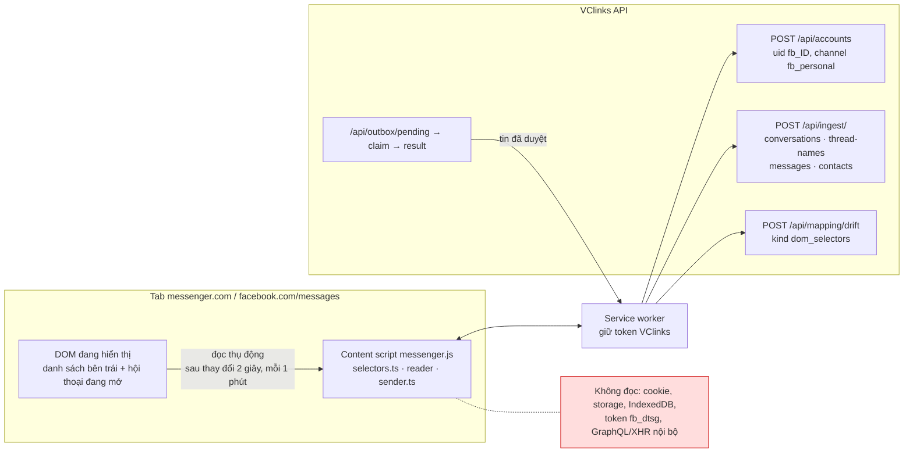
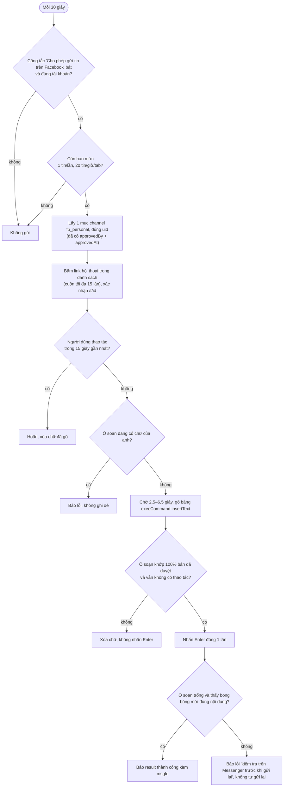
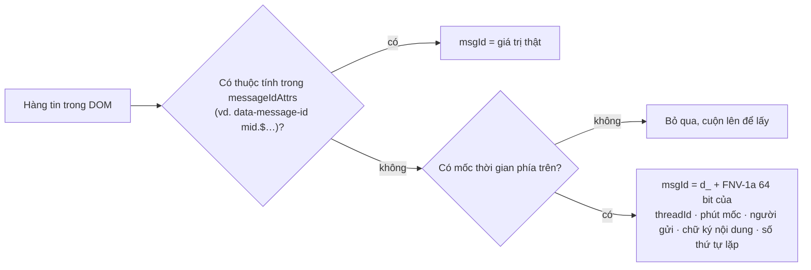

# Kênh Facebook cá nhân (Messenger)

Phiên bản 1.1 · 04/10/2026 · Trạng thái: Đang áp dụng

## Mô hình

Kiến trúc đọc và gửi của kênh (mục 1, 5):



Các chốt an toàn khi gửi một tin đã duyệt (mục 5):



Cách xác định `msgId` của một hàng tin (mục 4):



## Tóm tắt

- Kênh **Facebook cá nhân** chạy như Zalo cá nhân: **VClinks Extension** chỉ đọc DOM Messenger **đang hiển thị** (messenger.com, facebook.com/messages), không tự mở/cuộn hội thoại, đẩy dữ liệu qua REST với `uid = fb_<ID>`.
- **Rủi ro đã được chủ dự án chấp nhận (28/09/2026):** tự động hóa tài khoản cá nhân trái điều khoản Meta; nhịp gửi ở mục 5 không được nới.
- **Nguyên tắc cứng:** không đọc cookie, storage, IndexedDB, token `fb_dtsg`, không gọi GraphQL/XHR nội bộ; có test `messenger-privacy.test.ts` kiểm tra.
- **Giới hạn:** chỉ có tin đã tải lên tab; chat E2EE phải mở khóa PIN; thời gian chỉ chính xác tới phút; chỉ nhận ảnh, file, link.
- **msgId:** ưu tiên id thật (`mid.$…`), nếu không có thì băm FNV-1a 64 bit; có các trường hợp sinh trùng/lệch đã liệt kê ở mục 4.
- **Gửi tin:** chỉ tin đã duyệt qua outbox; công tắc riêng mặc định tắt; tối đa 1 tin/lần, 20 tin/giờ/tab; hoãn khi người dùng đang thao tác; đọc lại ô soạn phải khớp 100%, Enter đúng 1 lần.
- **Việc còn mở:** **mọi selector chưa được kiểm chứng** trên trang thật (checklist 18 mục ở mục 6); trường `spec.messengerDom` chưa có trong schema dùng chung nên đổi selector vẫn phải build lại.
- **Người duyệt nên xem kỹ:** bảng giới hạn trùng/lệch của msgId (mục 4) và các chốt nhịp gửi (mục 5).

## Mục lục

- [1. Cách hoạt động](#1-cách-hoạt-động)
- [2. Cài đặt và bật](#2-cài-đặt-và-bật)
- [3. Giới hạn](#3-giới-hạn)
- [4. Mã tin nhắn (msgId) và giới hạn trùng/lệch](#4-mã-tin-nhắn-msgid-và-giới-hạn-trùnglệch)
- [5. Gửi tin đã duyệt: nhịp an toàn](#5-gửi-tin-đã-duyệt-nhịp-an-toàn)
- [6. Checklist khảo sát selector (cho Claude in Chrome)](#6-checklist-khảo-sát-selector-cho-claude-in-chrome)
- [7. Drift khi Messenger đổi giao diện](#7-drift-khi-messenger-đổi-giao-diện)
- [Lịch sử cập nhật](#lịch-sử-cập-nhật)

---

Tài liệu cho chủ dự án và cho Claude (Claude in Chrome / Claude Code).

> ⚠️ **Rủi ro:** Facebook cá nhân không có API chính thức. Tự động hóa tài khoản cá nhân trái điều khoản của Meta, và tài khoản có thể bị hạn chế hoặc khóa. Chủ dự án đã chấp nhận rủi ro này (28/09/2026, CLAUDE.md §4.4). Mọi quy tắc nhịp gửi ở mục 5 là để giảm rủi ro đó, không được nới.

## 1. Cách hoạt động

Kênh này làm giống Zalo cá nhân: **VClinks Extension** chạy trong Chrome của anh và chỉ đọc những gì Messenger **đang hiển thị** trên tab của anh.

- Content script `messenger.js` chạy trên `https://www.messenger.com/*` và `https://www.facebook.com/messages/*`. Code ở `apps/extension/src/messenger/`.
- **Đọc (tự động, thụ động):**
  - Danh sách hội thoại bên trái: tên, trạng thái chưa đọc, nhóm hay cá nhân. Chỉ đọc phần đang hiển thị, **không tự mở hay cuộn** hội thoại nào, nên không làm tin bị đánh dấu đã đọc.
  - Hội thoại anh đang mở: nội dung chữ, ảnh, file, link (chỉ URL `https`), người gửi, mốc thời gian.
  - Extension đọc lại sau mỗi thay đổi trên trang (chờ 2 giây) và 1 phút một lần. Chỉ gửi tin mới hoặc tin đã đổi.
- **Gửi dữ liệu:** qua REST hiện có, token nằm ở service worker của extension (trang Facebook không thấy token):
  - `POST /api/accounts`: `uid = fb_<ID Facebook>`, `channel = fb_personal`.
  - `POST /api/ingest/conversations` rồi `POST /api/ingest/thread-names`: hội thoại trong danh sách.
  - `POST /api/ingest/messages`: tin nhắn. `threadId` là id trong URL `/t/<id>`. Tin do anh gửi có `fromUid = '0'`.
  - `POST /api/ingest/contacts`: người chat 1-1 và người gửi trong nhóm (khi thấy id số).
  - `POST /api/mapping/drift` (kind `dom_selectors`) khi selector không còn khớp. Chỉ gửi tên khóa và cấu trúc, **không bao giờ gửi nội dung tin**.
- **ID tài khoản của anh:** lấy từ link trang cá nhân của anh trên trang (dạng `profile.php?id=<số>`). Nếu trang không có link đó (ví dụ anh dùng tên người dùng riêng, hoặc đang ở messenger.com), anh nhập ID số một lần trong popup. ID nhập tay luôn được ưu tiên.
- **Nguyên tắc cứng:** extension không đọc `document.cookie`, `localStorage`/`sessionStorage`, IndexedDB của Facebook, không đọc token (`fb_dtsg`, access token…), không gọi GraphQL/XHR nội bộ của Facebook, không giải mã gì. Test `apps/extension/test/messenger-privacy.test.ts` kiểm tra điều này cả lúc chạy lẫn trong mã nguồn.

## 2. Cài đặt và bật

1. Build extension: `pnpm --filter @vclinks/extension build`, rồi tải lại extension trong `chrome://extensions` (bản này thêm quyền cho messenger.com và facebook.com/messages, Chrome có thể hỏi lại quyền).
2. Mở `https://www.messenger.com` hoặc `https://www.facebook.com/messages` và đăng nhập. Tab đã mở từ trước phải tải lại (F5).
   - Trên facebook.com, hãy mở thẳng địa chỉ `/messages`. Nếu vào trang chủ Facebook rồi mới bấm sang tin nhắn, extension có thể chưa được nạp: khi đó bấm F5.
3. Bấm biểu tượng VClinks, xem mục **Facebook cá nhân (Messenger)**:
   - Thấy `Tài khoản fb_…` là đã nhận ra tài khoản.
   - Nếu báo chưa xác định được tài khoản: nhập ID Facebook (dãy số) vào ô **ID Facebook của anh** rồi bấm **Lưu**.
4. Mở từng hội thoại muốn lưu. Muốn lấy tin cũ hơn thì cuộn lên trong hội thoại đó.
5. Muốn gửi tin đã duyệt từ Dashboard: bật **Cho phép gửi tin trên Facebook** (mặc định **tắt**, độc lập với công tắc của Zalo). Công tắc gắn với tài khoản đang đăng nhập lúc bật; nếu tab Messenger đổi sang tài khoản khác thì extension không gửi.
6. Dashboard → **Kênh kết nối** → mục **Facebook cá nhân** hiển thị các tài khoản `fb_` và số tin, hội thoại, liên hệ đã nhận.

## 3. Giới hạn

- **Chỉ có những gì đã hiển thị.** Extension không tải lịch sử. Tin chỉ được lưu khi Messenger đã tải nó lên tab (anh mở hội thoại, hoặc cuộn lên). Không có lịch sử trước thời điểm đó, và không có tin của những hội thoại anh chưa từng mở (chỉ có tên hội thoại trong danh sách).
- **Chat mã hóa đầu cuối (E2EE)** (`/e2ee/t/<id>`): phải mở khóa bằng mã PIN trên trình duyệt trước. Khi đang khóa, popup báo "đang khóa" và extension không đọc, không gửi được.
- **Tin phía trên mốc thời gian đầu tiên** đang hiển thị chưa được lấy (xem mục 4). Cuộn lên một chút cho mốc thời gian phía trên hiện ra là lấy được.
- **Thời gian gửi** là mốc thời gian (phút) của nhóm tin mà Messenger hiển thị, cộng thứ tự trong nhóm (tính bằng mili giây để giữ thứ tự). Không chính xác tới giây.
- **Người gửi trong nhóm:** lấy id từ ảnh đại diện nếu có; nếu không, dùng mã băm của tên hiển thị (`n_<hash>`).
- **Tin đã sửa** được lưu như một tin mới (bản cũ vẫn còn). **Tin đã thu hồi** không bị xóa khỏi VClinks.
- Chỉ nhận dạng ảnh, file, link. Sticker, ghi âm, video, cuộc gọi… được bỏ qua ở bản này.
- Nhiều tab Messenger cùng mở: mỗi tab đọc phần nó hiển thị; API upsert theo id nên không sinh trùng.

## 4. Mã tin nhắn (msgId) và giới hạn trùng/lệch

DOM của Messenger thường **không** có id tin nhắn. Thứ tự ưu tiên:

1. Nếu hàng tin có một thuộc tính trong `messageIdAttrs` (ví dụ `data-message-id="mid.$…"`), dùng đúng giá trị đó.
2. Nếu không, tạo id cố định (`d_` + 16 ký tự hex, băm FNV-1a 64 bit):

```
d_ + hash64( threadId | phút của mốc thời gian | người gửi | chữ ký nội dung | số thứ tự lặp )
```

- **Mốc thời gian:** nhãn phân cách gần nhất phía trên ("10:32", "Hôm qua lúc 10:32", "T2 10:32", "12 Tháng 9, 2026"…), được đổi ra **thời điểm tuyệt đối**. Vì vậy "Hôm nay 10:32" hôm nay và "Hôm qua lúc 10:32" ngày mai cho cùng một id.
- **Người gửi:** `0` (anh), `in` (người kia, chat 1-1), hoặc mã băm tên (nhóm). Không dùng ảnh đại diện, vì Messenger dời ảnh đại diện xuống tin cuối của mỗi cụm khi có tin mới.
- **Chữ ký nội dung:** chữ đã chuẩn hóa, tên file ảnh trên CDN (bỏ query string vì chữ ký URL của fbcdn hết hạn), tên file đính kèm.
- **Số thứ tự lặp:** 0, 1, 2… cho các tin giống hệt nhau (cùng người, cùng nội dung) dưới cùng một mốc. Ví dụ gửi "ok" hai lần liên tiếp thì có hai id khác nhau.
- `cliMsgId` = `msgId`. Khi gửi tin, extension trả về id của bong bóng vừa gửi theo đúng công thức trên (để ghép với tin do reader lấy về).

**Giới hạn đã biết:**

| Trường hợp | Hậu quả |
|---|---|
| Hàng tin chưa có mốc thời gian phía trên (đầu vùng đã tải) | Không lấy (tránh id không ổn định). Cuộn lên là lấy được. |
| Tin giống hệt nhau trong cùng mốc, tin trước chưa hiển thị lúc đọc lần đầu | Số thứ tự lặp lệch, có thể sinh **một bản trùng** hoặc hai tin gộp làm một. Hiếm. |
| Tin bị sửa, ảnh đổi tên file trên CDN | Sinh id mới (bản cũ còn lại). |
| Messenger đổi định dạng nhãn thời gian, đổi ngôn ngữ giao diện, đổi múi giờ máy | Id các tin đã lưu có thể đổi → **trùng** khi đọc lại. Giữ nguyên ngôn ngữ và múi giờ `Asia/Ho_Chi_Minh`. |
| Nhãn thứ trong tuần ("T2 10:32") đọc đúng lúc Messenger chưa kịp đổi sang ngày cụ thể (quá 7 ngày) | Có thể lệch một tuần → trùng. Hiếm. |
| Nhãn không đọc được | Tin dưới mốc đó dùng mốc trước đó; nếu không có thì bỏ qua. |
| Một hàng chỉ chứa giờ ("10:30") mà không có tiêu đề người gửi | Bị hiểu là mốc thời gian (tin đó bị bỏ qua). |
| Va chạm băm 64 bit | Không đáng kể (khoảng 1 trên 10^19 cho mỗi cặp). |

Muốn bỏ hẳn các giới hạn này thì cần id thật: khi khảo sát (mục 6), ưu tiên tìm thuộc tính mang `mid.$…` trên hàng tin.

## 5. Gửi tin đã duyệt: nhịp an toàn

Chỉ gửi tin anh đã duyệt trên Dashboard (`approvedBy` + `approvedAt`), qua luồng outbox có sẵn: `GET /api/outbox/pending?uid=fb_<id>` → `claim` → gõ → `result`. Code: `apps/extension/src/messenger/sender.ts`, dùng chung vòng lặp và các bước an toàn với Zalo (`sender.ts`, `compose.ts`).

- Công tắc **Cho phép gửi tin trên Facebook** mặc định tắt, tách riêng với Zalo. Service worker từ chối mọi lệnh outbox từ tab Messenger khi công tắc tắt hoặc sai tài khoản.
- Chỉ nhận mục có `channel = fb_personal` và `uid` đúng tài khoản đang đăng nhập.
- **Chậm như người thật:** kiểm tra 30 giây một lần, **mỗi lần tối đa 1 tin**, **tối đa 20 tin/giờ** mỗi tab. Mở hội thoại xong chờ ~2,5–6,5 giây mới gõ. Giữa các dòng của một tin chờ 8–12 giây.
- **Không bao giờ gửi hàng loạt**, không gửi cho hội thoại chưa có trong danh sách bên trái (chỉ cuộn danh sách tối đa 15 lần để tìm).
- **Không gửi khi anh đang thao tác:** có phím bấm, click, cuộn trong tab Messenger trong 15 giây gần nhất thì hoãn. Kiểm tra lại ngay trước khi gõ và ngay trước khi nhấn Enter; nếu anh vừa thao tác thì xóa chữ đã gõ và hoãn.
- Mở hội thoại bằng cách **bấm vào link trong danh sách** (không tự đổi địa chỉ trang), rồi xác nhận qua địa chỉ `/t/<id>`.
- Gõ bằng `execCommand('insertText')`, không giả lập phím khi soạn. Tin nhiều dòng gửi thành nhiều tin, mỗi dòng một tin.
- Ô soạn tin đang có chữ của anh thì **không ghi đè**, báo lỗi.
- Đọc lại ô soạn tin, phải **khớp 100%** với bản đã duyệt; lệch thì xóa và **không nhấn Enter**.
- Nhấn Enter **đúng một lần**; sau đó ô soạn tin phải trống và phải thấy bong bóng mới của anh với đúng nội dung. Không thấy thì báo lỗi "kiểm tra trên Messenger trước khi gửi lại", không tự gửi lại.

## 6. Checklist khảo sát selector (cho Claude in Chrome)

Mọi selector nằm trong **một** đối tượng: `DEFAULT_MESSENGER_SELECTORS` ở `apps/extension/src/messenger/selectors.ts`. **Tất cả chưa được kiểm chứng** trên trang thật (viết khi chưa có phiên Messenger đăng nhập). Chỉ dùng role/aria/`dir="auto"`/cấu trúc, không dùng class băm.

Quy tắc khi khảo sát: chỉ **đọc DOM** trên tab của anh (DevTools / `document.querySelectorAll`). Không đọc cookie, storage, network; không chép nội dung tin nhắn của khách vào báo cáo, chỉ ghi cấu trúc (tag, role, aria-label của phần khung, tên thuộc tính).

Mở một hội thoại 1-1 có tin cả hai chiều, có ảnh, file và link; một nhóm; một chat E2EE. Với từng khóa, chạy lệnh và ghi kết quả:

| # | Khóa | Kiểm tra | Mong đợi |
|---|---|---|---|
| 1 | `messageList` | `document.querySelectorAll(<messageList>)` | Đúng 1 phần tử, chứa các tin của hội thoại đang mở |
| 2 | `messageRow` | Số hàng con cấp một trong `messageList` | Mỗi tin / mốc thời gian là một hàng. Ghi lại hàng "Đã xem", "đang nhập" trông thế nào |
| 3 | `messageIdAttrs` | Tìm trên hàng tin thuộc tính chứa `mid.$` hoặc id ổn định: `[...row.querySelectorAll('*')].flatMap(e => e.getAttributeNames())` | Nếu có, thêm tên thuộc tính vào `messageIdAttrs` (quan trọng nhất, bỏ được id suy diễn) |
| 4 | `timeSeparator` | Hàng mốc thời gian dùng thẻ/role gì (`h4`? `data-scope`? `role=separator`?) | Selector bắt được mọi mốc; ghi lại **định dạng nhãn** thực tế (vi và en) để đối chiếu `time.ts` |
| 5 | `senderHeading`, `outgoingLabels` | Tiêu đề ẩn (visually hidden) phía trên mỗi cụm tin: thẻ gì, chữ gì cho tin của anh ("Bạn đã gửi" / "You sent") và của người khác ("<Tên>" hay "<Tên> đã gửi") | Tin của anh nhận ra là `out`. Tiêu đề có lặp lại sau mỗi mốc thời gian không? |
| 6 | `messageText` | Nội dung tin nằm trong `[dir="auto"]`? Có `[dir="auto"]` nào khác trong hàng (tên, trích dẫn, reaction)? | Chỉ nội dung tin; ghi lại phần tử trả lời/trích dẫn và reaction để loại trừ |
| 7 | `imageHosts`, `imageSkip`, `minImageSize` | `src` của ảnh trong tin, của avatar, emoji, sticker; ảnh có thuộc tính `width/height` không? | Ảnh tin nhận được, avatar/emoji/sticker bị loại |
| 8 | `fileLink` | Link file đính kèm (`cdn.fbsbx.com`? `download`?) | Tên file và URL https |
| 9 | Link ra ngoài | `href` có đi qua `l.facebook.com/l.php?u=` / `l.messenger.com` không? | `unwrapLink` trả đúng URL gốc |
| 10 | Avatar người gửi (nhóm) | Link bọc ảnh đại diện trỏ tới `profile.php?id=` hay `/<số>` hay tên riêng? | Nếu là tên riêng thì người gửi trong nhóm sẽ dùng `n_<hash>` |
| 11 | `composer` | `document.querySelectorAll(<composer>)` khi hội thoại đang mở | Đúng 1 ô soạn tin (Lexical, `contenteditable=true`). Ghi `aria-label` |
| 12 | Gửi thử (chỉ khi anh cho phép, gửi cho chính anh hoặc tài khoản thử) | `execCommand('insertText')` có vào đúng ô, `innerText` đọc lại khớp; Enter một lần có gửi | Không gửi cho khách khi đang khảo sát |
| 13 | `sidebar`, `sidebarThreadLink` | Danh sách hội thoại: container có role/aria-label gì; link có dạng `/t/<id>/`, `/e2ee/t/<id>/`, `/messages/t/<id>/`? | `readSidebar(document)` ra đúng tên, id |
| 14 | `unreadLabels` | Hội thoại chưa đọc có chữ ẩn / aria-label gì ("Tin nhắn chưa đọc", "Unread message")? | Chỉ hội thoại chưa đọc được đánh dấu; không lấy nhầm đoạn xem trước tin cuối |
| 15 | Nhóm (`isGroup`) | Ảnh đại diện nhóm có phải 2 ảnh ghép? | Nếu không, ghi lại dấu hiệu khác để phân biệt nhóm |
| 16 | `ownProfileLink` | Trên facebook.com/messages và messenger.com: có link tới trang cá nhân của anh không, dạng gì? | Nếu chỉ có tên riêng (vanity) thì phải nhập ID trong popup |
| 17 | `e2eeLockedLabels` | Chat E2EE chưa nhập PIN hiển thị chữ gì? | Popup báo "đang khóa" |
| 18 | Ảo hóa danh sách | Cuộn danh sách hội thoại / danh sách tin: phần tử cũ có bị gỡ khỏi DOM không? | Ảnh hưởng tới số thứ tự lặp (mục 4) |

Cách thử nhanh trong DevTools của tab Messenger (chỉ đọc DOM): dán nội dung `selectors.ts` đã chỉnh vào một biến rồi chạy `document.querySelectorAll(sel.messageRow).length`, v.v. Sau khi chốt:

1. Sửa `DEFAULT_MESSENGER_SELECTORS` (kèm ngày khảo sát và bỏ chữ UNVERIFIED cho khóa đã kiểm), thay fixture trong `apps/extension/test/messenger-fixtures.ts` bằng mẫu cấu trúc thật (đã xóa nội dung tin), chạy `pnpm --filter @vclinks/extension test`.
2. Build lại extension.

## 7. Drift khi Messenger đổi giao diện

- 30 giây sau khi mở trang và sau đó 10 phút một lần, extension kiểm tra selector (`checkMessengerHealth`). Khóa nào không khớp được báo qua `POST /api/mapping/drift` với `kind = dom_selectors`, `missing = ["messenger.<khóa>", …]`, `observedKeys` = role, tên thuộc tính `data-*`, giá trị `data-scope`/`data-testid` (không có chữ của tin). Cùng một lỗi chỉ báo lại sau 1 giờ.
- Popup hiện "Selector cần kiểm tra lại: …"; Dashboard hiện số drift ở tài khoản `fb_`.
- Claude làm theo checklist mục 6 cho các khóa bị báo, rồi sửa `selectors.ts`.
- Extension đã sẵn sàng nhận selector mới **không cần build lại** qua trường `spec.messengerDom` của bảng ánh xạ đang áp dụng (`mergeMessengerSelectors` bỏ qua giá trị sai kiểu hoặc selector không hợp lệ). Trường này **chưa có** trong schema dùng chung (`packages/shared`), nên hiện tại vẫn phải sửa code và build lại.

## Lịch sử cập nhật

| Phiên bản | Ngày | Người / phiên | Thay đổi | Căn cứ |
|---|---|---|---|---|
| 1.1 | 04/10/2026 | Claude Code | Hồi tố theo CLAUDE.md §13: thêm Mô hình, Tóm tắt, Mục lục, Lịch sử | `docs/ke-hoach/hoi-to-tai-lieu-md.md` |
| 1.0 | 28/09/2026 | — | Cập nhật 28/09/2026. Các bản trước khi có bảng lịch sử (xem `git log -- docs/channels/facebook-personal.md`) | — |
