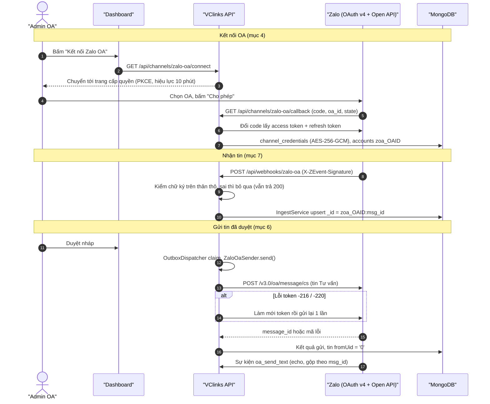
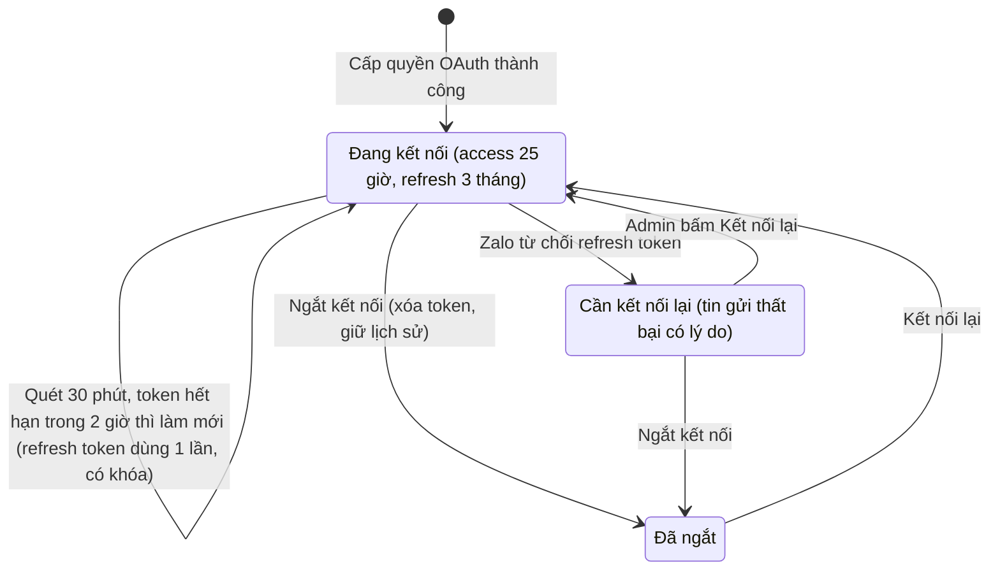
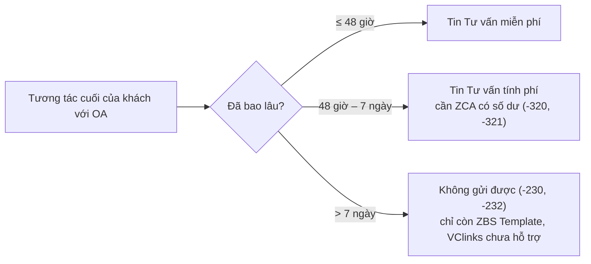

# Kênh Zalo OA (Zalo Official Account Open API)

Phiên bản 1.2 · 07/10/2026 · Trạng thái: Đang áp dụng

## Mô hình

Kết nối OA, nhận tin qua webhook và gửi tin Tư vấn đã duyệt:



Vòng đời token của một OA (mục 4, 5):



Khung gửi tin Tư vấn theo thời điểm tương tác cuối của khách (mục 6):



## Tóm tắt

- Hướng dẫn kết nối **Zalo OA** vào VClinks bằng **API chính thức**: tạo ứng dụng trên developers.zalo.me, cấu hình `.env`, cấp quyền OAuth v4 có PKCE, tài khoản lưu thành `zoa_<OA ID>`.
- **Nhận tin:** webhook `POST /api/webhooks/zalo-oa`, kiểm chữ ký `X-ZEvent-Signature` trên thân thô; nhận cả tin khách gửi và tin OA gửi (`fromUid = '0'`), upsert theo `zoa_<OA ID>:<msg_id>` nên không trùng.
- **Gửi tin:** chỉ tin đã duyệt, máy chủ gửi dạng **tin Tư vấn** `/v3.0/oa/message/cs`; lỗi token `-216`/`-220` thì làm mới và gửi lại 1 lần.
- **Token:** access 25 giờ, refresh 3 tháng và **chỉ dùng 1 lần**; quét 30 phút/lần, làm mới token sắp hết hạn trong 2 giờ, có khóa để không dùng refresh token hai lần. Token chỉ nằm mã hóa trong `channel_credentials`.
- **Khung gửi:** ≤ 48 giờ miễn phí, 48 giờ – 7 ngày tính phí (cần ZCA), quá 7 ngày không gửi được; ZBS Template chưa hỗ trợ.
- **Ràng buộc vận hành:** cần URL HTTPS cố định (named tunnel / tên miền), không dùng quick tunnel; không đổi `CREDENTIALS_KEY` sau khi đã kết nối.
- **Việc còn mở (mục 9):** chưa chạy thử với OA thật — công thức và khóa ký webhook, tham số `state` ở callback, và việc `msg_id` echo trùng `message_id` khi gửi.
- **Người duyệt nên xem kỹ:** mục 9 ở lần kết nối OA thật đầu tiên, và bảng mã lỗi mục 6 so với thông báo thực tế trên Dashboard.

## Mục lục

- [1. Chuẩn bị](#1-chuẩn-bị)
- [2. Tạo ứng dụng trên developers.zalo.me](#2-tạo-ứng-dụng-trên-developerszalome)
- [3. Cấu hình máy chủ VClinks](#3-cấu-hình-máy-chủ-vclinks)
- [4. Kết nối OA](#4-kết-nối-oa)
- [5. Token và tự làm mới](#5-token-và-tự-làm-mới)
- [6. Quy tắc gửi tin (khung tương tác và phí)](#6-quy-tắc-gửi-tin-khung-tương-tác-và-phí)
- [7. Dữ liệu được lưu](#7-dữ-liệu-được-lưu)
- [8. Kiểm tra nhanh](#8-kiểm-tra-nhanh)
- [9. Điểm chưa kiểm chứng với OA thật](#9-điểm-chưa-kiểm-chứng-với-oa-thật)
- [Lịch sử cập nhật](#lịch-sử-cập-nhật)

---

VClinks nhận và trả lời tin nhắn của Zalo Official Account bằng **API chính thức của Zalo**:

- **Nhận tin:** Zalo gọi webhook `POST /api/webhooks/zalo-oa` mỗi khi khách nhắn cho OA, và mỗi khi OA gửi tin (kể cả khi nhân viên trả lời trên trang chat OA). VClinks kiểm chữ ký `X-ZEvent-Signature` rồi lưu tin vào cùng kho với các kênh khác. Tin do OA gửi được ghi là tin "của mình" (`fromUid = '0'`).
- **Gửi tin:** tin đã duyệt trên Dashboard được máy chủ gửi dưới dạng **tin Tư vấn** (`POST https://openapi.zalo.me/v3.0/oa/message/cs`). Không có tin nào được gửi khi chưa duyệt.
- **Danh bạ:** tên hiển thị và ảnh đại diện của khách được lấy qua API *Truy xuất chi tiết người dùng*, tối đa 1 lần/ngày cho mỗi khách.
- **Token:** access token và refresh token chỉ nằm trong `channel_credentials` (mã hóa AES-256-GCM bằng `CREDENTIALS_KEY`), không bao giờ được trả qua API, không ghi log, không ghi audit.

Tài liệu gốc (đã đối chiếu ngày 28/09/2026): <https://developers.zalo.me/docs/official-account/bat-dau/xac-thuc-va-uy-quyen-cho-ung-dung-new>, mục *Webhook* và *Tin nhắn → Tin Tư vấn*.

---

## 1. Chuẩn bị

1. **Một URL công khai HTTPS cố định** trỏ về VClinks, ví dụ `https://vclinks.vcprosperous.com`.
   - Dùng tên miền riêng hoặc **Cloudflare named tunnel** (`cloudflared tunnel create ...` + DNS route).
   - **Không dùng quick tunnel** (`cloudflared tunnel --url ...`, URL dạng `*.trycloudflare.com`): URL này đổi mỗi lần khởi động lại, Callback URL và Webhook URL khai trên Zalo sẽ sai. Zalo gửi lại sự kiện lỗi sau 30 giây, 5 phút, 15 phút, 30 phút, 1 giờ; nếu webhook vẫn không phản hồi, Zalo **vô hiệu hóa webhook** và phải xin lại quyền nhận sự kiện trong trang cài đặt ứng dụng.
   - Zalo khuyến nghị webhook dùng tên miền (không dùng `host:port`) và bắt buộc HTTPS.
2. Tài khoản Zalo là **admin của OA** cần kết nối.
3. Một tài khoản trên **Zalo for Developers** (<https://developers.zalo.me>).

## 2. Tạo ứng dụng trên developers.zalo.me

1. Vào <https://developers.zalo.me/apps> → **Thêm ứng dụng mới**. Ghi lại **ID ứng dụng** (App ID).
2. Trong **Cài đặt** của ứng dụng: bấm copy **Khóa bí mật của ứng dụng** (App Secret Key). Chuyển trạng thái ứng dụng sang **Đang hoạt động** (nếu không, API trả lỗi `-209`).
3. Mục **Official Account → Thiết lập chung**:
   - **Callback URL:** `https://<URL công khai>/api/channels/zalo-oa/callback`
   - Chọn các **quyền** ứng dụng yêu cầu OA cấp:
     - Quyền gửi tin và thông báo qua OA
     - Quyền quản lý tin nhắn người dùng
     - Quyền quản lý thông tin OA
     - Quyền nhận sự kiện quản lý tin nhắn
     - (khuyến nghị) Quyền nhận sự kiện quản lý người dùng
   - VClinks tự tạo đường dẫn cấp quyền theo OAuth v4 có PKCE (`code_challenge`), nên **không cần** tự sao chép đường dẫn cấp quyền trên trang này.
4. Mục **Đăng ký sử dụng API → Official Account API**: đăng ký (nếu thiếu, gửi tin trả lỗi `-212`).
5. Mục **Webhook**:
   - **Webhook URL:** `https://<URL công khai>/api/webhooks/zalo-oa`
   - **Không bật "Lọc cú pháp"** (nếu bật, webhook chỉ nhận tin bắt đầu bằng `#`).
   - Bật các sự kiện:

     | Nhóm | Sự kiện |
     |---|---|
     | Người dùng gửi tin | `user_send_text`, `user_send_image`, `user_send_gif`, `user_send_link`, `user_send_audio`, `user_send_video`, `user_send_sticker`, `user_send_location`, `user_send_business_card`, `user_send_file` |
     | OA gửi tin (để lưu cả tin nhân viên trả lời trên trang chat OA) | `oa_send_text`, `oa_send_image`, `oa_send_gif`, `oa_send_list`, `oa_send_file`, `oa_send_sticker` |

     Các sự kiện khác (quan tâm/bỏ quan tâm, đã xem, cảm xúc...) được nhận và bỏ qua.
   - Nếu trang Webhook hiển thị một **OA Secret Key** riêng (khóa dùng để ký sự kiện), đặt nó vào biến `ZALO_OA_WEBHOOK_SECRET`. Nếu không có, VClinks dùng `ZALO_OA_SECRET_KEY` để kiểm chữ ký.

## 3. Cấu hình máy chủ VClinks

Trong `.env` (xem `.env.example`):

```env
PUBLIC_BASE_URL=https://vclinks.vcprosperous.com   # URL công khai cố định, không có "/" cuối
CREDENTIALS_KEY=<openssl rand -base64 32>          # mã hóa token OA trong MongoDB
ZALO_OA_APP_ID=<ID ứng dụng>
ZALO_OA_SECRET_KEY=<Khóa bí mật của ứng dụng>
# Tùy chọn: khóa ký webhook nếu khác Khóa bí mật của ứng dụng
ZALO_OA_WEBHOOK_SECRET=
```

Khởi động lại API. Trang **Kênh kết nối → Zalo OA** trên Dashboard sẽ báo biến nào còn thiếu, và hiển thị sẵn Callback URL / Webhook URL để sao chép.

> ⚠️ **Không đổi `CREDENTIALS_KEY`** sau khi đã kết nối OA: token cũ sẽ không giải mã được, phải kết nối lại mọi OA.

## 4. Kết nối OA

1. Mở Dashboard → **Kênh kết nối** → khối **Zalo OA** → **Kết nối Zalo OA**.
2. Zalo mở trang cấp quyền: chọn OA, bấm **Cho phép**.
3. Zalo chuyển về Dashboard; OA xuất hiện trong danh sách với trạng thái **Đang kết nối** và thời điểm hết hạn của access token. OA được đăng ký thành tài khoản `zoa_<OA ID>`.

Đường dẫn cấp quyền có hiệu lực **10 phút** (mã ủy quyền của Zalo cũng chỉ sống 10 phút và dùng 1 lần). Quá thời gian, bấm kết nối lại.

**Ngắt kết nối** xóa token của OA trên VClinks; tài khoản, danh bạ và lịch sử tin nhắn được giữ nguyên. Muốn OA thu hồi hẳn quyền của ứng dụng thì gỡ trên trang quản lý OA.

## 5. Token và tự làm mới

| Loại | Hiệu lực | Ghi chú |
|---|---|---|
| Authorization code | 10 phút | Dùng 1 lần |
| Access token | 25 giờ | Token cũ hết hiệu lực ngay khi cấp token mới |
| Refresh token | 3 tháng | **Chỉ dùng được 1 lần**; mỗi lần làm mới Zalo trả một refresh token mới |

VClinks:

- Cứ **30 phút** quét một lần, làm mới các OA có access token hết hạn trong vòng **2 giờ** tới. Nhờ vậy refresh token luôn được thay mới, không bao giờ chạm mốc 3 tháng khi máy chủ chạy đều.
- Khi Zalo báo access token không hợp lệ (`-216`, `-220`) lúc gửi tin: làm mới rồi gửi lại **1 lần**.
- Mỗi OA chỉ có **một** lượt làm mới chạy tại một thời điểm (khóa trong tiến trình + khóa trên MongoDB), để một refresh token không bao giờ bị dùng hai lần. Token mới được ghi vào `channel_credentials` trong một thao tác.
- Nếu Zalo **từ chối refresh token** (hết hạn, đã dùng, OA gỡ quyền): OA bị đánh dấu **Cần kết nối lại** trên Dashboard, các tin gửi qua OA đó thất bại với lý do rõ ràng. Admin bấm **Kết nối lại** để cấp quyền mới.
- Máy chủ tắt quá 25 giờ thì access token hết hạn, nhưng refresh token (3 tháng) vẫn dùng được: lần quét đầu tiên sau khi khởi động (sau khoảng 15 giây) sẽ làm mới.

## 6. Quy tắc gửi tin (khung tương tác và phí)

Theo *Tin nhắn → Tổng quan* và *Điều kiện gửi tin Tư vấn* của Zalo:

- **Tin Tư vấn** chỉ gửi được cho khách **có tương tác với OA trong vòng 7 ngày** và không chặn OA. Tương tác gồm: nhắn tin cho OA, nhắn trong nhóm chat GMF của OA, gọi thoại, bình luận bài viết, bấm menu/CTA/widget, tương tác chatbot...
- **Trong 48 giờ** kể từ tương tác cuối của khách: tin Tư vấn **miễn phí** (từ 01/01/2026 không giới hạn số lượng trong khung 48h).
- **Sau 48 giờ đến 7 ngày:** tin Tư vấn **tính phí** theo bảng giá của Zalo; ứng dụng phải liên kết **Zalo Cloud Account (ZCA)** có số dư (lỗi `-320`, `-321`).
- **Quá 7 ngày** không tương tác: không gửi được tin Tư vấn (lỗi `-230` / `-232`). Khi đó chỉ có thể dùng ZBS Template Message (chưa hỗ trợ trong VClinks).
- Nội dung tối đa **2.000 ký tự** (bằng giới hạn của Outbox VClinks).
- Zalo có giới hạn tốc độ gọi API theo ứng dụng và theo OA (lỗi `-32`).

Lý do lỗi hiển thị trên Dashboard (cột lỗi của tin gửi):

| Mã Zalo | Lý do hiển thị |
|---|---|
| `-230`, `-232` | Khách không tương tác với OA trong 7 ngày qua / tương tác cuối đã quá hạn |
| `-213` | Người dùng chưa quan tâm OA |
| `-211`, `-218` | OA hết hạn mức gửi tin / quá giới hạn số tin gửi đến người dùng |
| `-32` | Vượt giới hạn tốc độ gọi API, thử lại sau |
| `-216`, `-220` | Access token không hợp lệ/hết hạn (đã thử làm mới 1 lần) |
| `-223`, `-212`, `-209`, `-219` | OA chưa cấp quyền / ứng dụng chưa đăng ký API / chưa kích hoạt / bị vô hiệu hóa |
| `-227`, `-244` | Tài khoản khách bị khóa hoặc không online quá 45 ngày / khách chặn loại tin này |
| `-320`, `-321` | Tin ngoài 48h tính phí: chưa liên kết ZCA / ZCA hết tiền |
| lỗi mạng, HTTP 5xx | Không kết nối được Zalo, thử lại sau |

## 7. Dữ liệu được lưu

- **Tài khoản:** `accounts._id = zoa_<OA ID>`, `channel = 'zalo_oa'`, nhãn là tên OA.
- **Hội thoại:** mỗi khách là một hội thoại, `threadId` = **user_id của khách theo OA** (trường `sender.id` / `recipient.id` trong webhook, cũng là `user_id` dùng để gửi tin). `user_id_by_app` không được dùng.
- **Tin nhắn:** `_id = zoa_<OA ID>:<msg_id>`; Zalo gửi lại cùng sự kiện nhiều lần cũng không sinh bản ghi trùng. Ảnh, file, ghi âm, video, sticker nằm trong `content` và **chỉ giữ URL https** (URL `http://` của CDN Zalo như `*.zdn.vn`, `*.zadn.vn` được nâng lên `https://`; URL http của nơi khác bị bỏ). Vị trí được lưu thành đường dẫn Google Maps và chữ `[Vị trí] lat, lng`. Không lưu payload thô của webhook.
- **Danh bạ:** tên hiển thị và ảnh đại diện của khách (`contacts`), cập nhật tối đa 1 lần/ngày/khách.

## 8. Kiểm tra nhanh

1. Dashboard → Kênh kết nối → Zalo OA: OA ở trạng thái **Đang kết nối**, có ngày hết hạn access token.
2. Dùng một tài khoản Zalo cá nhân nhắn cho OA: tin xuất hiện trong Hội thoại sau vài giây; *Webhook gần nhất* được cập nhật.
3. Trả lời từ Dashboard và duyệt: tin tới điện thoại của khách; trạng thái tin chuyển **Đã gửi**.
4. Webhook sai chữ ký vẫn trả `200` (nút "Kiểm tra" của Zalo chỉ lưu URL khi nhận 200) nhưng không nạp gì, log API ghi `Webhook event dropped: missing or invalid signature`. Nhắn cho OA mà không thấy tin: kiểm tra `ZALO_OA_APP_ID` và khóa ký (`ZALO_OA_WEBHOOK_SECRET` hoặc `ZALO_OA_SECRET_KEY`).

## 9. Điểm chưa kiểm chứng với OA thật

Các điểm sau được làm theo tài liệu công khai của Zalo nhưng chưa chạy thử với một OA thật; cần xác nhận ở lần kết nối đầu:

- Chữ ký webhook: tài liệu ghi `mac = sha256(appId + data + timeStamp + OAsecretKey)`. VClinks tính trên **thân request thô** và trường `timestamp` trong thân; chấp nhận header có hoặc không có tiền tố `mac=`. Khóa `OAsecretKey` là khóa nào (Khóa bí mật của ứng dụng hay một OA Secret Key riêng ở trang Webhook) cần xem trên trang cài đặt; nếu log luôn báo `invalid signature`, thử đặt `ZALO_OA_WEBHOOK_SECRET`.
- Callback cấp quyền: tài liệu OA chỉ nêu `code` và `oa_id`; VClinks dùng `state` (hoặc `code_challenge`) mà Zalo trả kèm để tìm lại `code_verifier`, như luồng OAuth người dùng và SDK chính thức của Zalo.
- `msg_id` của sự kiện `oa_send_text` trùng `message_id` do API gửi tin trả về (để tin vừa gửi và sự kiện echo gộp làm một). Nếu khác nhau, tin do VClinks gửi sẽ xuất hiện 2 lần trong hội thoại.

## Lịch sử cập nhật

| Phiên bản | Ngày | Người / phiên | Thay đổi | Căn cứ |
|---|---|---|---|---|
| 1.2 | 07/10/2026 11:38 | Claude Code (dev002) | Webhook sai chữ ký trả 200 và bỏ qua thay cho 401 (§2 sơ đồ, §8, §9) | Nút "Kiểm tra" webhook của Zalo báo 401, chỉ lưu URL khi nhận 200 (dev002 07/10/2026) |
| 1.1 | 04/10/2026 | Claude Code | Hồi tố theo CLAUDE.md §13: thêm Mô hình, Tóm tắt, Mục lục, Lịch sử | `docs/ke-hoach/hoi-to-tai-lieu-md.md` |
| 1.0 | 28/09/2026 | — | Các bản trước khi có bảng lịch sử (xem `git log -- docs/channels/zalo-oa.md`) | — |
