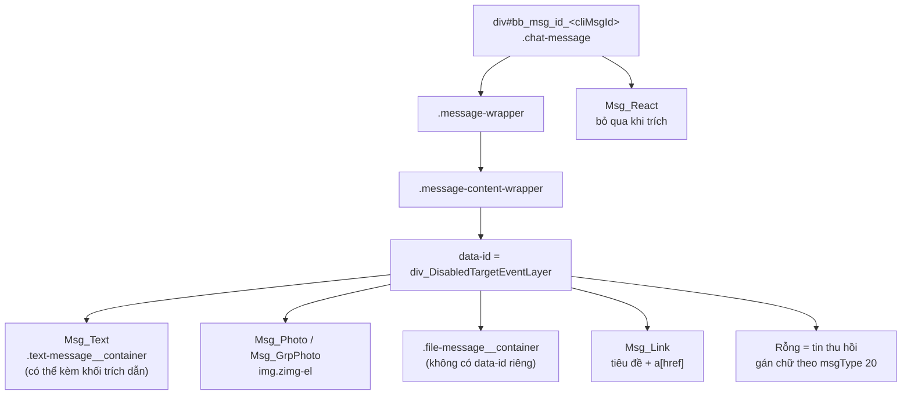
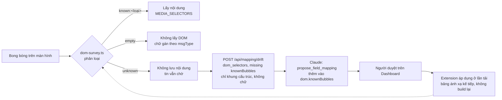

# Selector các loại bong bóng tin nhắn Zalo Web (đã khảo sát thật)

Phiên bản 1.5 · 04/10/2026 · Trạng thái: Đang áp dụng

> Khảo sát trực tiếp trên `chat.zalo.me` ngày 28/09/2026 (14:2x), tài khoản `476214826876503713`.
> Chữ, URL và token đã được che khi khảo sát. Đây là cấu trúc thật, **không phải suy đoán**.

## Mô hình

**Cấu trúc một bong bóng tin** (mục "Quy ước chung", "Bảng selector theo loại"):



**Extension xử lý cấu trúc bong bóng chưa khảo sát** (mục "Cách extension áp dụng bảng này"):



## Tóm tắt

- Ghi lại cấu trúc DOM **thật** của bong bóng tin trên Zalo Web (khảo sát 28/09/2026, đã che chữ, URL, token).
- Quy ước chung: mỗi tin là `div[id^="bb_msg_id_<cliMsgId>"]`; chiều tin theo tiền tố `div_SentMsg` / `div_ReceivedMsg` (tin cuối dùng `div_Last…`); bỏ qua nút `Msg_React`; loại tin xác định trước bằng `msgType` trong IndexedDB.
- Đã khóa selector: text, ảnh đơn, ảnh nhóm, file, link, thu hồi; thêm khối trích dẫn (trả lời) và nút Trả lời trên menu rê chuột.
- Chưa có mẫu: ghi âm, video, sticker/GIF, vị trí, danh thiếp.
- Bong bóng được phân loại `known` / `empty` / `unknown`; loại `unknown` **không lưu nội dung** và báo drift chỉ với khung cấu trúc; thêm loại mới qua `propose_field_mapping` + người duyệt, không cần build lại extension.
- Khảo sát đêm 28/09/2026 bổ sung selector thanh trái, danh sách hội thoại, khung chat, thanh soạn, menu tin, cảm xúc, panel sticker, chế độ định dạng, và đối chiếu các store IndexedDB (`reaction`, `label`, `conversation`, `unreadInfo`…).
- Phiên M1a-04 (04/10/2026) bổ sung selector trang Lời mời kết bạn và hộp Thêm bạn; hộp lời chào, hộp xác nhận Từ chối và hộp đặt tên gợi nhớ **chưa khảo sát** (cần lời mời thật), người duyệt cần biết `sender-friend.ts` viết phòng thủ cho các bước đó.
- Lưu ý vận hành: khung chat là virtual list (~44 bong bóng); đọc hay khảo sát hội thoại làm hiện "đã xem".
- **Người duyệt cần xem kỹ:** ý nghĩa `message.status` (file này ghi `3 = Đã gửi`); chế độ định dạng làm `#richInput` bị thay bằng editor khác (ảnh hưởng đường gửi).

## Mục lục

- [Quy ước chung (đã xác nhận)](#quy-ước-chung-đã-xác-nhận)
- [Bảng selector theo loại (đã có mẫu)](#bảng-selector-theo-loại-đã-có-mẫu)
- [Trả lời (trích dẫn): khảo sát 28/09/2026, 19:3x](#trả-lời-trích-dẫn-khảo-sát-28092026-193x)
- [Loại còn thiếu mẫu](#loại-còn-thiếu-mẫu)
- [Cách extension áp dụng bảng này](#cách-extension-áp-dụng-bảng-này)
- [Lưu ý vận hành](#lưu-ý-vận-hành)
- [Khảo sát đêm 28/09/2026 (Chrome driver, chuột thật) — thanh bên, khung chat, menu](#khảo-sát-đêm-28092026-chrome-driver-chuột-thật--thanh-bên-khung-chat-menu)
- [Lịch sử cập nhật](#lịch-sử-cập-nhật)

## Quy ước chung (đã xác nhận)

- Mỗi bong bóng: `div[id^="bb_msg_id_<cliMsgId>"]`, class `chat-message chat-message-v2 wrap-message`.
- Bên trong: `.message-wrapper > .message-content-wrapper > [data-id="div_DisabledTargetEventLayer"]`.
- Chiều tin: có `[data-id^="div_SentMsg"]` là tin mình gửi, có `[data-id^="div_ReceivedMsg"]` là tin nhận. **Tin cuối cùng** dùng tiền tố `div_LastSentMsg` / `div_LastReceivedMsg`.
- Nút cảm xúc: `[data-id$="Msg_React"]`, bỏ qua khi trích nội dung.
- Loại tin được xác định **trước hết bằng `msgType` / `originMsgType` từ IndexedDB**, sau đó mới dùng selector DOM để lấy nội dung.

## Bảng selector theo loại (đã có mẫu)

| Loại | msgType | Bong bóng (data-id / class) | Lấy nội dung ở đâu |
|---|---|---|---|
| **Text** | 1 | `[data-id$="Msg_Text"]`, class `.text-message__container` | `.innerText`. Mention nằm ở `a.mention-name` |
| **Ảnh đơn** | 2 | `[data-id$="Msg_Photo"]`, class `.chatImageMessage--audit.img-msg-v2` | `img.zimg-el`, lấy `src` |
| **Ảnh nhóm** | 2 | `[data-id$="Msg_GrpPhoto"]`, class `.card--group-photo` | nhiều `img.zimg-el` |
| **File** | 19 | Không có data-id riêng; class `div.file-message-v2.file-message__container` | Tên: `.file-message__content-title .truncate`. Dung lượng: `.file-message__content-info-size`. Tải: `a.file-message__actions.download` → `href` |
| **Link/webcontent** | 52 | `[data-id$="Msg_Link"]`, có kèm thẻ `a` | tiêu đề và `a[href]` |
| **Thu hồi** | 20 | chỉ có `div_DisabledTargetEventLayer`, không có `a/img/video/audio` | không lấy từ DOM; `mapRecord` gán `[Đã thu hồi]` theo `msgType` |

Cây cấu trúc của bong bóng file:

```
div.file-message-v2.file-message__container
  └ div.file-message__content-container
      ├ div.file-tit-box.file-message-icon
      └ div.file-message__content
          ├ div.file-message__content-title [title]      // tên file
          │   └ div.truncate
          └ div.file-message__content-info-container
              ├ span.file-message__content-info-size [title]   // dung lượng
              ├ div.cloud-status
              └ div.file-message__content-actions
                  └ a.clickable.file-message__actions.download [title]  // href = link tải
```

## Trả lời (trích dẫn): khảo sát 28/09/2026, 19:3x

**Khối trích dẫn trong bong bóng** nằm *bên trong* phần tử `Msg_Text`, trước nội dung tin:

```
div[data-id=div_ReceivedMsg_Text].text-message__container
  ├ div.message-quote-fragment__container          // bấm → Zalo cuộn tới tin gốc
  │   └ div.message-quote-fragment__content-container
  │       ├ div.message-quote-fragment__title-wrapper
  │       │   └ div.truncate.quote-name               // tên người được trích
  │       └ div.message-quote-fragment__description   // chữ của tin được trích
  └ div > div.overflow-hidden                         // nội dung tin trả lời
```

DOM **không** chứa id của tin được trích. Thẻ `.card` có `data-qid="<msgId>@<cliMsgId>_<fromUid>_<threadId>"` của chính tin đó (ảnh trong album dùng qid để tìm lại bong bóng). `dom-reader.ts` tách khối này ra khỏi `text` và gửi dạng `content.quote { senderName, text }`.

**Nút Trả lời:** rê chuột (mouseover) lên `.message-content-wrapper` làm Zalo render menu trong `.floating-menu-wrapper` của bong bóng. Menu gồm các `div.MSABtn-btn`: `[data-translate-title="STR_REPLY_MSG"]` (Trả lời), `STR_FORWARD_MSG` (Chia sẻ), `STR_MORE_OPTIONS` (Thêm).

**Sau khi bấm Trả lời:** `#chatInput > .chat-box-input__heading > .quote-banner` xuất hiện (tên + `.quote-text`). Đóng khung bằng sự kiện click trên `i.quote-close`, **không** phải trên thẻ cha. Trong nhóm, Zalo **tự chèn `@tên`** (`span.clnMention`) vào `#richInput`. Sender thay toàn bộ ô bằng nội dung đã duyệt, rồi so khớp 100% như thường lệ.

## Loại còn thiếu mẫu

| Loại | msgType / originMsgType | Ghi chú |
|---|---|---|
| **Ghi âm** | 3 / chat.voice | **Khó nhất.** Thẻ `<audio>` thường chỉ được tạo khi bấm nghe. Cần tìm URL file .aac/.m4a trong thuộc tính data của nút play, hoặc từ request mạng lúc phát. |
| **Video** | 18 / chat.video.msg | Thumbnail hiển thị dạng ảnh, có nhãn "HD". URL video có thể chỉ nạp khi bấm. |
| **Sticker / GIF** | 4, 7 | Không lưu nội dung. `mapRecord` gán `[Sticker]` / `[GIF]` theo `msgType`. |
| **Vị trí** | 17 / chat.location.new | Tọa độ và ảnh bản đồ. M1c-08: `detectLocation` đọc theo phỏng đoán (data-id `*Location*`, tọa độ ở `data-lat/data-lng` hoặc trong liên kết bản đồ); chưa có mẫu thật, chưa vào `knownBubbles`. |
| **Cuộc gọi** | (chưa rõ) | M1c-08: `detectCall` đọc theo chữ (nhỡ, từ chối, thời lượng); phỏng đoán, cần mẫu thật. |
| **Nhắc hẹn** | (chưa rõ) | M1c-08: `detectReminder` đọc dòng đầu làm tiêu đề, dòng có giờ làm thời điểm; phỏng đoán, cần mẫu thật. |
| **Danh thiếp / gợi ý** | 6 / chat.recommended | Tên và ID của người được giới thiệu. |

## Cách extension áp dụng bảng này

- Các cấu trúc đã khóa nằm ở `dom.knownBubbles` trong bảng ánh xạ; mặc định là `DEFAULT_KNOWN_BUBBLES` trong `packages/shared/src/mapping.ts`. Selector `text` của bảng ánh xạ cũng được tính là đã khóa.
- Mỗi bong bóng được phân loại (`apps/extension/src/dom-survey.ts`) thành một trong ba nhóm:
  - `known:<loại>`: lấy nội dung như bình thường.
  - `empty`: chỉ có lớp bố cục (tin thu hồi). Không lấy gì từ DOM, chữ được gán theo `msgType`.
  - `unknown`: cấu trúc **chưa khảo sát**. **Không lưu nội dung**, tin vẫn ở trạng thái chờ. Extension gửi `POST /api/mapping/drift` loại `dom_selectors`, `missing: ["knownBubbles"]`. Trường `observedKeys` chứa chữ ký và **khung cấu trúc**: tên thẻ, data-id, class và *tên* thuộc tính, **không bao giờ có chữ hay giá trị thuộc tính**. Mỗi chữ ký chỉ được báo một lần cho mỗi lần tải trang.
- Để khóa thêm một loại (ví dụ ghi âm): khảo sát bằng khung cấu trúc trong drift hoặc hàm `surveyBubbles()`. Sau đó Claude gọi `propose_field_mapping`, thêm vào `dom.knownBubbles` (ví dụ `voice: '[data-id$="Msg_Voice"]'`), và người duyệt trên Dashboard. Extension áp dụng ở lần tải bảng ánh xạ kế tiếp, không cần build lại. Nếu cần sửa cách trích nội dung, cập nhật `MEDIA_SELECTORS` trong `apps/extension/src/dom-media.ts`.

## Lưu ý vận hành

- Khung chat là **virtual list**: chỉ khoảng 44 bong bóng được render cùng lúc. Muốn khảo sát loại hiếm (ghi âm, video) phải cuộn tới đúng vùng có tin đó.
- Đọc hay khảo sát một hội thoại sẽ làm hội thoại đó hiện "đã xem".

## Khảo sát đêm 28/09/2026 (Chrome driver, chuột thật) — thanh bên, khung chat, menu

Nguồn: `scratchpad/*-survey.json` của phiên `ec0a0a26…`; text đã che, chỉ giữ cấu trúc và chuỗi giao diện.

### Thanh trái (`nav#sidebarNav`)

| Nút | Selector |
|---|---|
| Tin nhắn / Danh bạ | `[data-id="div_Main_TabMsg"]`, `[title="Danh bạ"]` (không có data-id) |
| Zalo Cloud / My Documents / Công cụ / Cài đặt | `[data-id="div_Main_Tab_zCloud"]`, `[title="My Documents"]`, `[data-id="div_Main_TabTool"]`, `[data-id="div_Main_TabSetting"]` |
| Tìm kiếm / Thêm bạn / Tạo nhóm | `[data-id="txt_Main_Search"]`, `[data-id="btn_Main_AddFrd"]`, `[data-id="btn_NewGrp_"]` |

**Kết quả tìm kiếm** (khảo sát 04/10/2026, phiên M1a-06): ô `txt_Main_Search` là `input#contact-search-input`; đặt `value` bằng setter gốc rồi phát sự kiện `input` (kể cả từ isolated world của extension) là Zalo lọc ngay (≈ 0,2 giây). Mỗi kết quả là `.conv-item` **không** có `anim-data-id` nhưng có `id="<loại>-item-<threadId>"`, ví dụ `group-item-g6910418193163461340`; extension khớp kết quả theo id này trước, theo tên sau. Bấm kết quả (pointer/mouse/click trên `.conv-item`) mở hội thoại; xóa ô tìm thì danh sách trái hiện lại với mục đó `selected`.

### Danh sách hội thoại

- Bộ lọc: `.msg-filters-bar .tab-item` ("Tất cả", "Chưa đọc"); lọc theo thẻ `[data-id="div_MiniLabel_OpenLabelList"]` → popover `.popover-v3` với `[data-id="div_DetailLabelList_Label"]` (tên ở `[data-id="div_MiniLabelList_Label"]`, màu ở `i.fa-Tag_24_Filled[style*=color]`), mục cuối "Tin nhắn từ người lạ"; nút `[data-id="div_SwitchUI_CX"]` → "Đánh dấu đã đọc" (tất cả).
- Một mục: `.msg-item[data-id="div_TabMsg_ThrdChItem"][anim-data-id]` (mục ghim có thêm class `pinned`; một số mục ghim mang `data-id="div_TabMsg_ThrdChFileXFER"`).
  - Tên: `.conv-item-title__name .truncate` · thời gian: `.preview-time` (`--b` khi chưa đọc) · avatar: `.conversationList__avatar img`.
  - **Thẻ phân loại:** `.conv__label[title="<tên>"]` với `style="color: rgb(…)"` (icon `fa-icon-solid-label-filled`). Tên thẻ trong IndexedDB `label.text` là ciphertext, nên tên lấy từ đây.
  - Xem trước: `.z-conv-message` (`--unread`), người gửi `.z-conv-message__preview-sender-name`.
  - Chưa đọc: `.conv-action__unread-v2 .z-noti-badge` (số nằm trong tên icon `fa-<n>_24_Line`) · ghim: `.conv-action__pin.conv__pinned`.
  - Menu "Thêm": `[icon="More_24_Line"].conv-action__menu-v2` → `.popover-v3 .zmenu-item`: Ghim/Bỏ ghim hội thoại · Phân loại (danh sách thẻ + Quản lý thẻ phân loại) · Đánh dấu chưa đọc/đã đọc · Tắt thông báo (1 giờ / 4 giờ / đến 8:00 AM / đến khi mở lại) · Ẩn trò chuyện · Xóa hội thoại · Báo xấu.
- Chuột phải lên mục **không** mở menu; phải dùng nút "Thêm".

### Khung chat

- Đầu khung: `header#header` trong `#chatViewContainer`; tiêu đề `.threadChat__title`. Nút: "3 thành viên", "Phân loại", `[data-id="btn_Grp_AddMem"]` ("Thêm bạn vào nhóm"), "Tìm kiếm tin nhắn", "Thông tin hội thoại" (`[icon="outline-right-bar"]`).
- Bảng thông tin (bên phải): `[data-id="div_RightMenuGrp_MemList"]`, `[data-id="div_Chat_MediaStore"]`, `div_MediaStore_MediaList/MediaItem/FileList`. Mục: Tắt thông báo · Ghim hội thoại · Thêm thành viên · Quản lý nhóm · Thành viên nhóm · Bảng tin nhóm · Danh sách nhắc hẹn · Ghi chú, ghim, bình chọn · Ảnh/Video · File · Link · Thiết lập bảo mật (Tin nhắn tự xóa) · Ẩn trò chuyện · Báo xấu · Rời nhóm.
- Thanh soạn (tổ tiên của `#richInput` chứa `div_Sticker_Menu`): Gửi Sticker `[data-id="div_Sticker_Menu"]` (panel `div_StickerMenu_Recent/Set/SetList/SetItem`) · Gửi hình ảnh `[icon="Photo_24_Line"]` · Đính kèm File `[icon="Attach_24_Line"]` · Gửi danh thiếp `[data-id="div_CT_Menu"]` · Chụp kèm cửa sổ Zalo `[icon="Screenshot-Z_24_Line"]` · Định dạng `[data-id="div_RTF_Menu"]` (`btn_RTF_Bold/Italic/Underline/Strikethrough/Clear/Bullet/Numbering/Tab/Detab/Undo/Redo`) · Chèn tin nhắn nhanh `[data-id="btn_QuickMsg_Entry"]` · Gửi nhanh số tài khoản `[icon="icon-outline-bank-card"]` · Tùy chọn thêm `[data-id="div_More_Menu"]` (Tạo bình chọn `div_MoreMenu_Poll` · Tạo nhắc hẹn · Tạo ghi chú `div_MoreMenu_Note` · Đánh dấu tin quan trọng · Đánh dấu tin khẩn cấp) · Biểu cảm `[icon="Emoji_24_Line"]`.
- **Panel sticker** (29/09/2026): `.popover-v3` chứa tab STICKER / EMOJI / GIF, ô `input[placeholder="Tìm kiếm sticker"]`, vùng nội dung `[data-id="div_StickerMenu_Recent"]` (dùng chung cho "gần đây" và trang của bộ đang chọn; dòng đầu là tên bộ), mỗi sticker `[data-id="div_StickerMenu_RecentItem"].card--sticker--container > div.sticker[style*="background-image"]` (bộ mặc định: `https://stc-chat.zdn.vn/images/stickers/default/thumb/<n>.png`, 40 ảnh). Thanh bộ `[data-id="div_StickerMenu_Set"]` → `div_StickerMenu_SetList` → `div_StickerMenu_SetItem[title="Củ hành"]` (img bìa) + nút "Quản lý Sticker". Bấm sticker là gửi ngay. Escape không đóng panel; bấm ra ngoài (ví dụ `header#header`) mới đóng. IndexedDB `zdb_<uid>.sticker` (khóa `[cateId, id]`, 875 bản ghi): `stickerUrl = https://zalo-api.zadn.vn/api/emoticon/sticker/webpc?eid=<id>&size=130`, `stickerSpriteUrl`, `text "[^cateId,id^]"`; `sticker-usage` trống.
- **Định dạng tin nhắn** (`div_RTF_Menu`): bật lên thì `.chat-box-input-container` thêm `--rtf-mode`, thanh `#rtf-buttons-group-id.rtf-buttons-group.--visible` hiện `btn_RTF_Bold/Italic/Underline/Strikethrough/Clear/Bullet/Numbering/Tab/Detab/Undo/Redo` + nút màu chữ `.rtf-tool-text-color-button`, và **`#richInput` bị thay bằng `div.input-v4[contenteditable=true]` id ngẫu nhiên**. Chế độ giữ theo tab; bấm `div_RTF_Menu` lần nữa để về `#richInput`.
- **Chèn tin nhắn nhanh** (`btn_QuickMsg_Entry`): popover `.popover-v3.qrw` "Tin nhắn nhanh — Tạo các phím tắt…" (tài khoản này chưa có mẫu nào; IDB `quick_message` 1 bản ghi, `message` là mã hóa). **Gửi nhanh số tài khoản** (`[icon="icon-outline-bank-card"]`): popover "Thêm số tài khoản để gửi nhanh…" + nút "Thêm" (chưa có số nào). VClinks thay hai nút này bằng mẫu câu dùng chung.
- **Tùy chọn thêm** (`div_More_Menu`): `.popover-v3 .zmenu-item` gồm `div_MoreMenu_Poll` "Tạo bình chọn", "Tạo nhắc hẹn" (không data-id, icon `fa-Reminder_24_Line`), `div_MoreMenu_Note` "Tạo ghi chú", `.mark-important-message-menu-item` "Đánh dấu tin quan trọng", `.mark-urgent-message-menu-item` "Đánh dấu tin khẩn cấp". Escape không đóng menu; bấm lại nút để đóng. Store liên quan: `msginfo_<uid>.MsgUrgency`, `zdb_<uid>.poll` (6, `question`/`options` mã hóa), `todo`, `star_message`, `board_suggest`, `group_topics`.
- Rê chuột lên tin: thanh `.MSABtn-btn[title]` "Trả lời", "Chia sẻ", "Thêm" (→ Copy tin nhắn · Ghim tin nhắn · Đánh dấu tin nhắn · Chọn nhiều tin nhắn · Xem chi tiết · Tuỳ chọn khác · Lưu vào My Documents · Tạo nhắc hẹn · Thu hồi · Xóa chỉ ở phía tôi). Chuột phải lên tin không mở menu.
- **Cảm xúc:** nút `[data-id$="Msg_React"]` (`btn_SentMsg_React` / `btn_LastSentMsg_React` / `…ReceivedMsg…`). **Rê chuột** lên nút → `.reaction-emoji-list` với 6 `.reaction-emoji-icon` (text là mã Zalo: `/-strong` 👍, `/-heart` ❤️, `:>` 😆, `:o` 😮, `:-((` 😢, `:-h` 😡) + `.clear-react`. **Bấm** thẳng vào nút thì áp cảm xúc mặc định. Cảm xúc đã có hiện ở `.message-reaction-container.has > [data-id$="_ReactList"].reacts-list(.me) > .react-icon` + `.total-reacts`.
- Trạng thái tin của mình: chữ "Đã gửi" dưới tin cuối; IndexedDB `message.status = 3` (kiểm chứng). 
- Danh bạ (tab): Danh sách bạn bè ("Bạn bè (621)", sắp "Tên (A-Z)") · Danh sách nhóm và cộng đồng ("Nhóm và cộng đồng (366)", "Hoạt động (mới → cũ)") · Lời mời kết bạn ("Lời mời đã nhận (5)" Từ chối/Đồng ý · "Lời mời đã gửi (71)" Thu hồi lời mời · "Gợi ý kết bạn (67)") · Lời mời vào nhóm và cộng đồng. Không có data-id riêng cho các mục này.
- **Danh sách bạn bè** (khảo sát 04/10/2026, phiên M1a-03, dùng ở `apps/extension/src/contact-reader.ts`): nút thanh trái `[data-translate-title="STR_TAB_CONTACT"]` (`title="Danh bạ"`); mục menu `.menu-item` có chữ "Danh sách bạn bè" (`selected` khi đang mở); tiêu đề `.card-list-title` "Bạn bè (N)". Danh sách là `ReactVirtualized__List.contact-tab-v2` (chỉ vẽ dòng đang thấy, cuộn bằng phần tử cha `overflow: scroll`). Một dòng `.contact-item-v2-wrapper`: tên `.name-wrapper .name` (tên gợi nhớ nếu có), huy hiệu `.z-business-label`, thẻ phân loại `.label .description`, ảnh `.zavatar img`. **Dòng không có id trong thuộc tính**: id người dùng chỉ nằm trên component React (`itemId`, cũng là `key`), khớp 22/22 với `zdb_<uid>.friend.userId`; script MAIN world của extension chép nó sang `data-vclinks-uid`. Bấm vào dòng là **mở hội thoại** (đánh dấu đã đọc), nên ContactReader không bấm dòng. `friend.phoneNumber` trong IndexedDB là ciphertext (0/194 dạng số).
- **Lời mời kết bạn** (khảo sát 04/10/2026, phiên M1a-04, chỉ đọc, không bấm Đồng ý/Từ chối; dùng ở `apps/extension/src/friend-request-reader.ts` và `sender-friend.ts`): vào bằng nút Danh bạ rồi mục `.menu-item` có chữ đúng "Lời mời kết bạn" (không nhầm "Lời mời vào nhóm và cộng đồng"). Trang gồm ba danh sách, mỗi danh sách có tiêu đề `.card-list-title`: "Lời mời đã nhận (N)", "Lời mời đã gửi (N)", "Gợi ý kết bạn (N)". Thẻ lời mời nhận `.card-wrapper.received--friend`, thẻ đã gửi `.card-wrapper.sent--friend`; tên `.card-name .name`; dòng phụ `.card-name .extra` ("03/08 - Từ số điện thoại" ở thẻ nhận, "Bạn đã gửi lời mời" ở thẻ gửi); lời chào của người gửi `.card-message__content` (chỉ thẻ nhận); ảnh `.zavatar img`; nút nằm trong `.card-cta`, mỗi nút là `.z--btn--v2` nhận biết bằng **chữ** ("Từ chối", "Đồng ý", "Thu hồi lời mời"), vì class chung cho mọi nút. Mỗi danh sách chỉ hiện 3 thẻ đầu kèm nút `.view-more__btn` "Xem thêm"; bấm thì mở rộng (đã thử: 71 lời mời gửi hiện đủ sau một lần bấm và cuộn). Trang là `ReactVirtualized__Grid` cao bằng nội dung; **phần tử cuộn là một phần tử cha** (tìm bằng cách đi lên từ thẻ, như danh bạ bạn bè), cuộn từng khung hình mới vẽ hết thẻ. **Id người dùng không có trong thuộc tính**: React 16, khóa `__reactInternalInstance$…` trên `.card-wrapper`; ở mức 1 phía trên (`.return.memoizedProps.data`) thẻ nhận có `data.dataInfo.userId` (kèm `recommSrc`, `recommTime`, `recommInfo.message`), thẻ gửi có `data.userId` (kèm `fReqInfo.{message, src, time}`); id 19 chữ số. Script MAIN world chép sang `data-vclinks-uid` như danh bạ (`requestRowUserId` trong `contact-id-stamp.ts`).
- **Hộp "Thêm bạn"** (cùng lần khảo sát, chưa gửi lời mời thật): nút thanh trái `[data-id="btn_Main_AddFrd"]` (title "Thêm bạn"); hộp `#FIND_FRIEND` (class `zl-modal__dialog`), nút đóng `.modal-header-icon`; ô số `[data-id="txt_Main_AddFrd_Phone"]` (có tiền tố "(+84)"), nút `[data-id="btn_Main_AddFrd_Search"]` "Tìm kiếm" và `[data-id="btn_Main_AddFrd_CXL"]` "Hủy"; phần "Có thể bạn quen" là các `.find-friend-suggestion-item` có nút "Kết bạn" (`.z--btn--v2.btn-outline-tertiary-primary`). Kết quả tìm kiếm hiện thành trang hồ sơ trong chính hộp (ngăn xếp `.stack-page`). **Chưa khảo sát:** hộp lời chào sau khi bấm "Kết bạn", hộp xác nhận sau "Từ chối", và hộp đặt tên gợi nhớ (cần lời mời thật từ Zalo mượn); `sender-friend.ts` viết phòng thủ cho các bước này và sẽ chỉnh sau lần thử thật. Lưu ý: nhấp `element.click()` thường không đóng được hộp của Zalo, cần chuỗi chuột đầy đủ (`clickLikeUser`).
- **Lưu ý vận hành driver (04/10/2026):** khi màn hình máy Mac tắt, cửa sổ Chrome driver không vẽ khung hình (`requestAnimationFrame` không chạy), Zalo Web không cập nhật giao diện khi bấm và Playwright báo "element is not stable". Đánh thức màn hình bằng `caffeinate -u -t 3` và giữ bằng `caffeinate -d -t <giây>` rồi thử lại.

### IndexedDB (đối chiếu §8 bảng ánh xạ)

| Store | Trường đáng chú ý |
|---|---|
| `r_db_<uid>.reaction` (key `rMsgId`) | `rClientMsgId` (number = cliMsgId), `idTo` (threadId), `reactions: { [uid hoặc "0"=mình]: { [iconId]: count } }`, `currentIcon`, `lastSender`, `lastUpdate`. Icon id: 3 = 👍 (kiểm chứng), 0 ❤️, 5 😆, 32 😮, 2 😢, 20 😡 |
| `zdb_<uid>.label` (key `id`) | `text` (ciphertext, `ev: 1`), `color`, `emoji`, `conversations[]`, `offset`, `createTime` |
| `zdb_<uid>.conversation` | thêm `label` (id thẻ), `pinned`, `respondedByMe`, `numMsg`, `outside`, `topOut` |
| `msginfo_<uid>.unreadInfo` (key `userId`) | `mId` (tin đọc cuối), `timestamp` |
| `zdb_<uid>.message` | `status` (3 = Đã gửi), `ttl`, `reference.data.fwLvl` (chuyển tiếp), `act` + `eventInfo` + `updateMemberIds` (sự kiện nhóm), `mentions[] {uid,pos,len,type}` |
| `zdb_<uid>.friend` | thêm `isBlocked`, `sdob`, `lastOnlineTime`, `isActiveWeb/PC`, `accountStatus` |
| `zdb_<uid>.group_info` | `adminIds[]`, `pendingApproveUsers[]`, `setting.{lockSendMsg, joinAppr, …}` |

## Lịch sử cập nhật

| Phiên bản | Ngày | Người / phiên | Thay đổi | Căn cứ |
|---|---|---|---|---|
| 1.5 | 04/10/2026 22:56 | Claude Code · M1c-08 | Ghi bộ đọc vị trí, cuộc gọi, nhắc hẹn (phỏng đoán, chờ mẫu thật) ở mục Loại còn thiếu mẫu | Phiên M1c-08 |
| 1.4 | 04/10/2026 20:44 | Claude Code · M1a-06 | Thêm kết quả tìm kiếm (id `<loại>-item-<threadId>`, cách gõ để Zalo lọc) | Khảo sát driver 04/10/2026, phiên M1a-06 (chỉ mở nhóm test) |
| 1.3 | 04/10/2026 19:47 | Claude Code · M1a-04 | Thêm selector trang Lời mời kết bạn (thẻ nhận/gửi, Xem thêm, id trong React) và hộp Thêm bạn; ghi chú màn hình tắt làm Zalo Web không vẽ; ghi phần chưa khảo sát (hộp lời chào, hộp đặt tên gợi nhớ) | Khảo sát driver 04/10/2026, phiên M1a-04 (chỉ đọc) |
| 1.2 | 04/10/2026 18:18 | Claude Code · M1a-03 | Thêm selector danh sách bạn bè (tab Danh bạ) và cách lấy id người dùng từ dòng | Khảo sát driver 04/10/2026, phiên M1a-03 |
| 1.1 | 04/10/2026 | Claude Code | Hồi tố theo CLAUDE.md §13: thêm Mô hình, Tóm tắt, Mục lục, Lịch sử | `docs/ke-hoach/hoi-to-tai-lieu-md.md` |
| 1.0 | 28/09/2026 | Claude in Chrome, Claude Code | Các bản trước khi có bảng lịch sử (xem `git log -- docs/zalo-dom-selectors.md`); khảo sát 28/09/2026 (14:2x, 19:3x, đêm) và bổ sung 29/09/2026 | Khảo sát thực tế `chat.zalo.me` |
