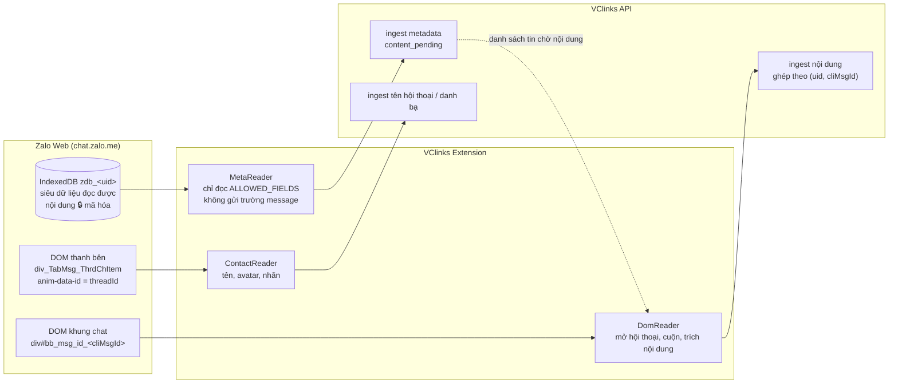
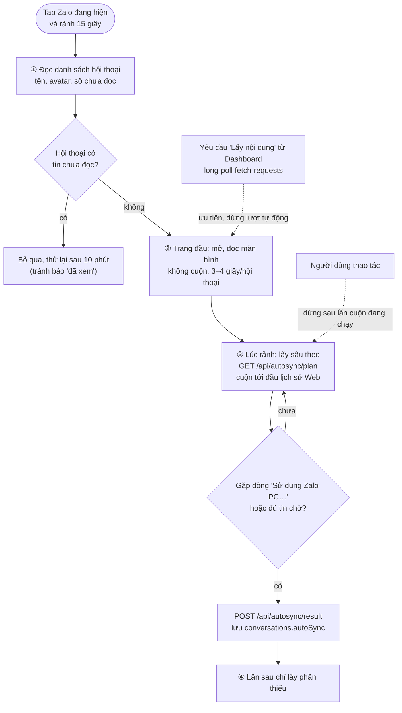
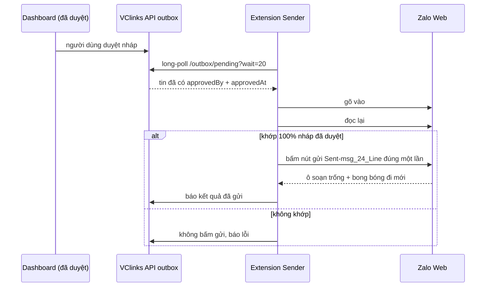

# Hướng dẫn cho VClinks Extension: lấy tin nhắn từ Zalo Web

Phiên bản 1.2 · 06/10/2026 · Trạng thái: Đang áp dụng

> Kết quả khảo sát thực tế trên `chat.zalo.me`, ngày 28/09/2026 (13:20), do Claude in Chrome thực hiện.
> Tài liệu dành cho Claude Code khi dựng `apps/extension`.

## Mô hình

**Hai nguồn, một bản ghi:** siêu dữ liệu đọc từ IndexedDB, nội dung đọc từ DOM, API ghép theo `(uid, cliMsgId)` (§1, §3).



**Đồng bộ nội dung tự động** (§4.6, chốt 29/09/2026):



**Gửi tin đã duyệt** (§7, §7.1):



## Tóm tắt

- Khảo sát thật `chat.zalo.me` ngày 28/09/2026: trong IndexedDB, **nội dung tin, tên bạn bè, tên nhóm đều bị Zalo mã hóa**; chỉ siêu dữ liệu (ID, thời gian, loại tin, thành viên) đọc được.
- **Quyết định:** không giải mã, không đụng khóa; siêu dữ liệu lấy từ IndexedDB, nội dung lấy từ DOM, hai nguồn ghép qua `cliMsgId`.
- Zalo Web chỉ có lịch sử từ ngày đăng nhập (tài khoản đang dùng: từ 14/09/2026), nên **không backfill được 90 ngày**; dữ liệu cũ hơn cần nguồn khác (Zalo PC, điện thoại).
- Selector đã khóa theo mẫu thật: text, ảnh, ảnh nhóm, file, link, thu hồi; đã xử lý album, ảnh `blob:` (tải bytes ngay), icon "thích" bị lấy nhầm, tin chỉ còn trên DOM (`<uid>:dom:<cliMsgId>`).
- Đồng bộ tự động 4 bước (29/09/2026): chỉ chạy khi tab Zalo đang hiện và rảnh 15 giây, **mặc định không mở hội thoại có tin chưa đọc** (hai ngoại lệ có xác nhận: yêu cầu "Lấy nội dung" xác nhận trên Dashboard và tùy chọn riêng của nick máy Zalo, xem dưới), yêu cầu "Lấy nội dung" từ Dashboard luôn được ưu tiên.
- Gửi tin: không nhấn phím giả lập, đọc lại `#richInput` và so khớp 100% rồi bấm gửi đúng một lần; đã gửi thử thành công chữ, @nhắc tên, ảnh, file, danh thiếp, bình chọn trong nhóm test.
- **Còn mở:** mẫu DOM của ghi âm, video, sticker/GIF, vị trí, danh thiếp; HTML thật của mục thanh bên để chốt `extractThreadNames`; cách xuống dòng trong một tin.
- **Người duyệt cần xem kỹ:** rủi ro báo "đã xem" khi mở hội thoại (§4.2, §4.6); danh sách trường bị từ chối ở §5; tên endpoint ở §3 và §5 là bản thiết kế ban đầu, cần đối chiếu với route thật trong `apps/api`.

## Mục lục

- [1. Phát hiện quan trọng (đính chính CLAUDE.md mục 3)](#1-phát-hiện-quan-trọng-đính-chính-claudemd-mục-3)
- [2. Các sự thật đã kiểm chứng](#2-các-sự-thật-đã-kiểm-chứng)
- [3. Kiến trúc thu thập](#3-kiến-trúc-thu-thập)
- [4. Chi tiết thuật toán](#4-chi-tiết-thuật-toán)
- [5. Payload gửi lên backend](#5-payload-gửi-lên-backend)
- [6. Kiểm thử và nghiệm thu](#6-kiểm-thử-và-nghiệm-thu)
- [7. Bài học khi gửi tin (bổ sung CLAUDE.md mục 4b-2)](#7-bài-học-khi-gửi-tin-bổ-sung-claudemd-mục-4b-2)
- [Lịch sử cập nhật](#lịch-sử-cập-nhật)

---

## 1. Phát hiện quan trọng (đính chính CLAUDE.md mục 3)

**Nội dung trong IndexedDB đã bị Zalo mã hóa.** Chỉ có siêu dữ liệu (ID, thời gian, loại tin) là đọc được dạng thường.

| Dữ liệu trong IndexedDB `zdb_<uid>` | Trạng thái |
|---|---|
| `message.msgId`, `cliMsgId`, `fromUid`, `toUid`, `sendDttm`, `serverTime`, `msgType`, `originMsgType`, `status` | ✅ Đọc được |
| `message.message` (nội dung text, link ảnh, file, voice…) | 🔒 Mã hóa (chuỗi base64, 300/300 mẫu) |
| `friend.displayName`, `zaloName`, `phoneNumber` | 🔒 Mã hóa (50/50 mẫu) |
| `group.displayName` | 🔒 Mã hóa |
| `group.memberIds`, `adminIds`, `totalMember`; `conversation.userId`, `isGroup`, `numMsg`, `pinned`, `label` | ✅ Đọc được |

**Quyết định:**

- **KHÔNG giải mã IndexedDB.** Không trích khóa từ mã JS của Zalo, không hook hàm giải mã. Làm vậy là vượt qua cơ chế bảo vệ của Zalo, trái nguyên tắc "không động vào khóa" ở mục 12, và sẽ gãy ngay khi Zalo đổi thuật toán.
- **Nội dung lấy từ DOM**, tức chính những gì Zalo đã hiển thị cho người dùng. **Siêu dữ liệu lấy từ IndexedDB.** Hai nguồn ghép với nhau qua `cliMsgId`.

## 2. Các sự thật đã kiểm chứng

1. **Có 2 tài khoản trên trình duyệt:**
   - `476214826876503713` là tài khoản **đang dùng**: 9.689 tin, 362 hội thoại, tin mới nhất là hôm nay.
   - `1565013083449676338` là tài khoản cũ: 562 tin, tin cuối ngày 14/11/2025.
   - Cách xác định tài khoản đang dùng: lấy DB `zdb_<uid>` có `max(sendDttm)` mới nhất.
2. **Tin do chính mình gửi có `fromUid === "0"`.**
3. **`threadId` = `toUid`** trong cả hai chiều của hội thoại 1-1. Với hội thoại nhóm, cần kiểm tra lại: `toUid` là groupId.
4. **Web chỉ có lịch sử từ lúc đăng nhập.** Tài khoản đang dùng có tin cũ nhất ngày **14/09/2026**, và chính Zalo ghi rõ "Sử dụng Zalo PC để tìm tin nhắn trước ngày 14/09/2026". ⇒ **Không backfill được 90 ngày trên Web.** Muốn có dữ liệu cũ hơn phải dùng nguồn khác (Zalo PC hoặc xuất từ điện thoại). Cần đưa vào roadmap.
5. **Các loại tin (`msgType` / `originMsgType`)** và số lượng ở tài khoản đang dùng:

   | msgType | originMsgType | Ý nghĩa | Số lượng |
   |---|---|---|---|
   | 1 | webchat | text | 6.062 |
   | 2 | chat.photo | ảnh | 2.277 |
   | 3 | chat.voice | ghi âm | 169 |
   | 4 | chat.sticker | sticker | 48 |
   | 6 | chat.recommended | danh thiếp / link gợi ý | 364 |
   | 7 | chat.gif | gif | 2 |
   | 17 | chat.location.new | vị trí | 4 |
   | 18 | chat.video.msg | video | 106 |
   | 19 | share.file | file | 626 |
   | 20 | chat.undo | tin đã thu hồi | — |
   | 21 | chat.list.action | hành động danh sách | 6 |
   | 52 | chat.webcontent | nội dung web / link preview | 25 |

6. **Nối DOM với IndexedDB:**
   - Mỗi tin nhắn trong khung chat là phần tử `div#bb_msg_id_<cliMsgId>` (class `chat-message`).
   - Phần tử con `div#message-frame_<cliMsgId>` có thuộc tính `data-qid`.
   - `<cliMsgId>` khớp với index `cliMsgIdIndex` của store `message` (khớp 6/6 mẫu).
7. **Các neo `data-id` ổn định trong DOM** (tên do Zalo đặt, nên dùng thay cho class):

   | `data-id` | Vai trò |
   |---|---|
   | `div_SentMsg_Text` / `div_ReceivedMsg_Text` | Khối text gửi / nhận |
   | `div_SentMsg_Link` | Tin dạng link |
   | `btn_SentMsg_React` / `btn_ReceivedMsg_React` / `btn_LastReceivedMsg_React` | Nút cảm xúc |
   | `div_TabMsg_ThrdChList` / `div_TabMsg_ThrdChItem` | Danh sách hội thoại và từng hội thoại |
   | `txt_Main_Search` | Ô tìm kiếm |
   | `btn_ChatTitle_Search` | Tìm trong hội thoại |

   Ô soạn tin là `#richInput` (contenteditable). Mỗi dòng là một `div#input_line_N`.
8. **Map tên ↔ threadId:** mỗi `div_TabMsg_ThrdChItem` có thuộc tính **`anim-data-id=<threadId>`**. Nhóm thì có tiền tố `g`, ví dụ `g123…`. Tên hiển thị nằm trong innerText của item. Danh sách này là **virtual list**, phải cuộn mới lấy hết được.

   > **Tạm thời (chưa có HTML thật của sidebar):** `extractThreadNames` trong `apps/extension/src/dom-reader.ts` đang dùng heuristic. Thứ tự tìm tên: selector `threadTitle` của bảng ánh xạ → node có `data-id` chứa `DisplayName`/`Title`/`Name` → class `conv-item-title`/`truncate` → dòng đầu của innerText. Tên được bỏ đuôi thời gian ("vừa xong", "5 phút", "2 giờ", "3 ngày", "Hôm qua", "12/09", "14:05") và số chưa đọc ("5+", "99+"). Dòng xem trước ("Bạn: …", "[Hình ảnh]") và chip nhãn không bao giờ bị lấy làm tên. Ngoài tên, extension lấy thêm avatar (chỉ https), số tin chưa đọc và nhãn nếu có. **Không lấy nội dung xem trước tin cuối.** `readActiveThreadId` đọc `anim-data-id` của item đang được chọn (class `selected`/`active` hoặc `aria-selected`).
   >
   > Để khóa selector, mở `chat.zalo.me`, bật DevTools Console và chạy lệnh sau để lấy HTML thật của một item:
   >
   > ```js
   > document.querySelector('[anim-data-id]').outerHTML
   > ```
   >
   > Nên chạy thêm lần nữa trên item **đang mở**, item có **số chưa đọc** và item **có nhãn**. Trước khi gửi, xóa tên và nội dung xem trước nếu cần. Khi có HTML thật, selector sẽ được chốt lại và các fixture test tổng hợp (synthetic) sẽ được thay bằng mẫu thật.

## 3. Kiến trúc thu thập

```
┌─ MetaReader (IndexedDB, chỉ đọc) ──────────────────────────┐
│ • chọn uid đang dùng                                        │
│ • poll mỗi 30s: message có sendDttm > checkpoint            │
│ • gom theo threadId → danh sách "hội thoại cần lấy nội dung" │
│ • gửi luôn metadata lên /ingest/messages (content = null)   │
└──────────────────────────┬─────────────────────────────────┘
                           ▼
┌─ DomReader (content script) ───────────────────────────────┐
│ • mở hội thoại theo threadId (xem 4.2)                      │
│ • đọc các div#bb_msg_id_* đang hiển thị → trích nội dung    │
│ • cuộn lên để nạp tin cũ hơn đến khi phủ hết cliMsgId cần   │
│ • gửi /ingest/message-content {cliMsgId, text, media[]}     │
└──────────────────────────┬─────────────────────────────────┘
                           ▼
┌─ ContactReader (DOM) ──────────────────────────────────────┐
│ • cuộn div_TabMsg_ThrdChList → {threadId(anim-data-id), name}│
│ • header khung chat → tên, avatar, nhãn (HEAD, Chủ xưởng…)  │
│ • tab Danh bạ → danh sách bạn bè có tên                      │
└────────────────────────────────────────────────────────────┘
```

Backend ghép bản ghi theo `(uid, cliMsgId)`. Tin nào có metadata mà chưa có content thì mang trạng thái `content_pending`. DomReader lấy lần lượt các tin này.

## 4. Chi tiết thuật toán

### 4.1 Đọc siêu dữ liệu (MetaReader)

```ts
// Chỉ đọc. Không đọc các store e2ee_*, refresh_token.
const ALLOWED_FIELDS = ['msgId','cliMsgId','fromUid','toUid','sendDttm','serverTime',
  'msgType','originMsgType','status','quote','refMessageId'] as const;

async function readNewMeta(uid: string, sinceMs: number) {
  const db = await openDB(`zdb_${uid}`);
  const idx = db.transaction('message').objectStore('message').index('msgType_sendDttm');
  // hoặc duyệt toàn bộ store với cursor, lọc Number(sendDttm) > sinceMs
  // Chỉ lấy ALLOWED_FIELDS. TUYỆT ĐỐI không gửi trường `message` (ciphertext) lên server.
}
```

- `sendDttm` là **chuỗi** mili giây, phải `Number()` trước khi so sánh.
- `quote` có thể chứa nội dung trích dẫn. Chỉ lấy ID của tin được trích (`refMessageId` / `quote.cliMsgId`) và bỏ phần text.

### 4.2 Mở đúng hội thoại theo threadId (DomReader)

1. Tìm trong DOM `[data-id="div_TabMsg_ThrdChItem"][anim-data-id="<threadId>"]` (nhóm thì `g<threadId>`). Nếu thấy thì click vào **phần tử con `.conv-item`** (hàng hội thoại), không click vào chính item: item chỉ là khung bao của virtual list (`msg-item`), Zalo gắn handler ở `.conv-item` nên click vào khung bao không mở gì (kiểm chứng 28/09/2026 qua CDP). Khi hội thoại đã mở, `.conv-item` mang class `selected`.
2. Nếu chưa thấy (do virtual list): cuộn `div_TabMsg_ThrdChList` từng bước tới **cuối danh sách**, sau mỗi bước tìm lại (tối đa 200 bước). Tab Zalo đang ẩn thì Chrome bóp băng thông, danh sách không render khi cuộn → extension **không cuộn** mà báo `tab_hidden` (Dashboard hiện "hãy chuyển sang tab Zalo").
3. Nếu vẫn không thấy: gõ **tên hội thoại** (API gửi kèm trong `GET /fetch-requests/pending`) vào ô `txt_Main_Search` (`<input id="contact-search-input">`). Kết quả tìm kiếm **không có `anim-data-id`**: mục "Liên hệ" là các hàng `.conv-item` với tên ở `.conv-item-title__name`, mục "Tin nhắn" là `.search-message__item` (click vào đó sẽ mở hội thoại tại tin đó, không dùng). Extension click hàng "Liên hệ" có tên khớp (so sánh lỏng), rồi nhấn Escape/xóa ô tìm kiếm để sidebar trở lại — lúc đó item của hội thoại được cuộn tới và mang `selected`.
4. **Kiểm tra lại** trước khi đọc, theo thứ tự tin cậy: (a) item đang chọn có `anim-data-id` đúng; (b) một bong bóng trên màn hình mang `cliMsgId` thuộc hội thoại (API gửi 50 id mới nhất, `recentCliMsgIds`); (c) chỉ khi đọc nội dung: tiêu đề khung chat trùng tên item (so sánh lỏng, bỏ emoji/dấu/thời gian). Khi **gửi tin** không dùng (c) vì hai hội thoại có thể trùng tên.

⚠️ Mở một hội thoại sẽ làm Zalo **đánh dấu "đã xem"** cho người gửi. Vì vậy:

- Mặc định chỉ lấy nội dung với hội thoại **anh đã tự mở**, hoặc khi anh bấm "Đồng bộ" trên Dashboard.
- Chế độ "tự mở để đồng bộ" chỉ bật khi anh đồng ý, và nên chạy vào giờ quy định (ví dụ 22h).

### 4.3 Trích nội dung một tin từ DOM

```ts
function extractMessage(el: HTMLElement) {
  const cliMsgId = el.id.replace('bb_msg_id_', '');
  const textEl = el.querySelector('[data-id$="Msg_Text"], [data-id$="Msg_Link"]');
  const direction = el.querySelector('[data-id^="div_SentMsg"]') ? 'out' : 'in';
  const imgs  = [...el.querySelectorAll('img')]
                  .map(i => i.currentSrc || i.src)
                  .filter(u => /^https?:/.test(u) && !/avatar|emoji|sticker/i.test(u));
  const links = [...el.querySelectorAll('a[href^="http"]')].map(a => a.href);
  return { cliMsgId, direction, text: textEl?.innerText ?? null, images: imgs, links };
}
```

- Emoji hiển thị dạng ảnh nhỏ nên phải lọc bỏ khỏi `images` (quy tắc lọc ghi trong `zalo-schema.v1.json`).
- Tin thu hồi (`msgType 20`) thì lưu `text = "[Đã thu hồi]"`.

**Các loại tin cần Claude khảo sát thêm DOM trước khi code** (hôm nay mới kiểm chứng tin text):

| Loại | Việc cần làm |
|---|---|
| Ảnh (2) | Xác định URL ảnh gốc hay thumbnail; có cần click để lấy bản full không |
| Ghi âm (3) | Phần tử `<audio>` chỉ xuất hiện khi bấm Play. Cần tìm nguồn URL (thuộc tính data hoặc request mạng khi play) |
| File (19) | Tên file, dung lượng, link tải |
| Video (18) | URL video và thumbnail |
| Danh thiếp / link (6, 52) | Tiêu đề, URL, ID người được giới thiệu |

Sau khi khảo sát, ghi selector của từng loại vào bảng `MEDIA_SELECTORS` trong `apps/extension/src/dom-media.ts`.

**Đã khảo sát thật (28/09/2026, tài khoản `476214826876503713`, nhóm "Nhóm vận hành kho" và "3.VCPARTS_KHO KIM ĐỒNG"):**

- Khung chung: `div[id^="bb_msg_id_<cliMsgId>"].chat-message` › `.message-wrapper` › `.message-content-wrapper` › `[data-id="div_DisabledTargetEventLayer"]`. Nút cảm xúc `[data-id$="Msg_React"]` bị bỏ qua.

| Loại | msgType | Neo đã khóa | Lấy nội dung |
|---|---|---|---|
| Text | 1 | `[data-id$="Msg_Text"]` (`.text-message__container`) | `innerText`; mention `a.mention-name` |
| Ảnh đơn | 2 | `[data-id$="Msg_Photo"]` (`.chatImageMessage--audit.img-msg-v2`) | `img.zimg-el` › `src` |
| Ảnh nhóm | 2 | `[data-id$="Msg_GrpPhoto"]` (`.card--group-photo`) | mọi `img.zimg-el` |
| File | 19 | **không có data-id riêng**, class `.file-message__container` | tên `.file-message__content-title .truncate` (hoặc thuộc tính `title`); dung lượng `.file-message__content-info-size`; tải `a.file-message__actions.download` › `href` |
| Link | 52 | `[data-id$="Msg_Link"]` | tiêu đề + `a[href]` (lưu cả `text`, `links` và `card`) |
| Thu hồi | 20 | chỉ còn `div_DisabledTargetEventLayer` rỗng | không lấy từ DOM; `mapRecord` gán `text = "[Đã thu hồi]"` theo `msgType` |

**Bổ sung 28/09/2026 (soi DOM thật qua CDP, nhóm "3.VCPARTS_KHO KIM ĐỒNG"):**

- **Id bong bóng ảnh nhóm có đuôi:** `bb_msg_id_<cliMsgId>_<fromUid>_<threadId>` (tin thường chỉ có `bb_msg_id_<cliMsgId>`). `extractOne` lấy **đoạn đầu** làm `cliMsgId`; trước đây cả chuỗi bị coi là cliMsgId nên album không bao giờ khớp.
- **Ảnh của hội thoại mã hóa là `blob:`** (`blob:https://chat.zalo.me/<uuid>`, Zalo giải mã trong trang). URL này chết theo tab nên schema bỏ đi. Extension (`media-upload.ts`) đọc bytes **ngay khi thấy bong bóng**, nhận dạng định dạng bằng magic bytes (jpeg/png/webp/gif, tối đa 10 MB) rồi gửi `POST /api/ingest/message-media` từng ảnh một. API kiểm lại magic bytes, lưu một bản theo sha256 vào GridFS bucket `media` (MinIO thay ở GĐ2, id giữ nguyên) và thêm id vào `messages.content.mediaImages` theo thứ tự trong album. Dashboard tải `GET /api/media/:id` kèm token (scope `dashboard`).
- **Icon "thích" dưới mỗi bong bóng** (`.../iconlike_*.png` trong `btn_*Msg_React`) từng bị lấy nhầm làm ảnh của tin: 154 tin "ảnh" trong DB thực chất chỉ có icon này. Giờ bỏ qua mọi ảnh trong nút cảm xúc và URL dạng icon/emoji/assets (`MEDIA_SELECTORS.uiImageSrc`, `reactionAnchors`).
- **Album = nhiều tin, một bong bóng:** Zalo gửi album dạng N tin (mỗi ảnh một tin, `cliMsgId` liền nhau) nhưng chỉ vẽ một bong bóng mang id của tin đầu. Mọi ảnh gắn vào tin đầu; các tin còn lại (cùng người gửi/loại/hội thoại, `cliMsgId` lệch ≤ 1.000, trong ±60 giây) được đánh dấu `albumOf` và Dashboard ẩn đi. Không dựa vào `sentAt` của server: tin anh em có thể mang giờ **sớm hơn** tin đầu vài ms.
- **Tin chỉ còn trên màn hình (lịch sử cũ, IndexedDB không còn):** chỉ luồng "Lấy nội dung" từ Dashboard được tạo tin mới (`POST /api/ingest/dom-messages`), vì tài khoản và hội thoại đã được xác nhận khi mở. Tin tạo có `_id = <uid>:dom:<cliMsgId>`, `source: 'dom'`, `sentAt` = `cliMsgId` (đồng hồ máy khách, ms; lệch ~1 giây so với server, cờ `sentAtApprox`). Người gửi: tin mình gửi → `'0'`; hội thoại 1-1 → người kia; nhóm → liên hệ trùng đúng một tên, nếu không thì `dom:<tên>`. Tên lấy từ `.message-sender-name-content` (chỉ có ở bong bóng đầu mỗi lượt, extension mang sang các bong bóng sau). Khi IndexedDB sau này có tin cùng `cliMsgId`, nội dung chuyển sang tin thật và bản `dom:` bị xóa. Ở chế độ này backfill cuộn tới tin cũ nhất, không dừng khi đã thấy đủ tin đang chờ.
- **Link gõ trong tin là text thường** (class `text-is-link`, không có `<a>`), nên `links` rỗng. Dashboard tự biến URL http(s) trong text thành link (`splitLinks`).

Sticker (4) và GIF (7) cũng được `mapRecord` gán sẵn `[Sticker]` / `[GIF]` theo `msgType` (bảng `PLACEHOLDER_TEXT_BY_MSG_TYPE` trong `packages/shared/src/mapping.ts`), vì bong bóng không có nội dung để DOM điền và nếu không gán thì tin sẽ kẹt ở `pending`.

**Còn thiếu mẫu:** ghi âm (3), video (18), sticker/GIF (4, 7), vị trí (17), danh thiếp (6). Danh sách tin là virtual list (chỉ ~44 bong bóng được render), nên phải cuộn tới đúng vùng có loại tin đó rồi chạy đoạn mã ở §4.3.2. Lưu ý: mở hội thoại để khảo sát sẽ làm hội thoại hiện "đã xem".

#### 4.3.1 Bộ trích tin đa phương tiện

`apps/extension/src/dom-media.ts` đã trích được ảnh, ghi âm, file, video, danh thiếp / xem trước link. Ảnh, ảnh nhóm, file và link **đã khóa theo mẫu thật** (bảng trên). Ghi âm, video, danh thiếp, sticker vẫn là phỏng đoán theo quy ước `data-id` của Zalo; các neo phỏng đoán và dự phòng theo thẻ vẫn giữ nguyên để không bỏ sót. Toàn bộ selector nằm trong một bảng duy nhất `MEDIA_SELECTORS`. Mỗi bộ dò chạy độc lập: bộ này lỗi thì các bộ khác vẫn chạy.

| Loại | Neo `data-id` (so theo từng đoạn cách nhau bởi `_`) | Dự phòng theo thẻ / chữ | Trường gửi lên |
|---|---|---|---|
| Ảnh (2) | `Photo`, `Image`, `Img`, `Picture`, `Pic` | mọi `` https, bỏ avatar/emoji/sticker và ảnh thuộc video/file/danh thiếp | `images[]` |
| Ghi âm (3) | `Voice`, `Audio`, `Record` | `<audio>`; thời lượng dạng `0:15` | `voice {url?, durationSec?}` |
| File (19) | `File`, `Document`, `Doc`, `Attach` | `<a download>`; dung lượng dạng `12.3 MB` | `files[] {name, size?, ext?, url?}` |
| Video (18) | `Video` | `<video>` (`src`, `<source>`, `poster`) | `video {url?, thumb?, durationSec?}` |
| Danh thiếp / link (6, 52) | `Card`, `NameCard`, `Contact`, `Recommend`, `WebContent`, `Preview` | `data-uid`, link `zalo.me/<số>` | `card {title?, url?, userId?}` |
| Sticker / gif | `Sticker`, `Gif` | ảnh có `sticker`/`emoticon` trong URL | chỉ đặt `kind`, không gửi |

- Mỗi tin có thêm `kind` ∈ `text | image | voice | file | video | card | sticker | other` (suy ra từ DOM).
- **Chỉ giữ URL `https:`.** URL `blob:` (chết theo tab), `http:`, `data:`, `javascript:` đều bị bỏ, ở cả extension lẫn API.
- **Ghi âm chưa bấm Play** thì chưa có `<audio>`, nên chưa có URL. Tin vẫn được gửi với `voice: {durationSec}` và API lưu `contentStatus = 'partial'` để lấy lại sau. Lần lấy sau thiếu URL sẽ **không** ghi đè bản đã `complete`.

#### 4.3.2 Lấy mẫu HTML để chốt selector

Mở một hội thoại có đủ loại tin (ảnh, ghi âm, file, video, danh thiếp, link), cuộn cho các tin hiện ra, rồi dán đoạn mã dưới đây vào DevTools Console của `chat.zalo.me`. Mã **chỉ đọc DOM**, không mở IndexedDB, không đọc cookie hay `localStorage`. Mỗi *cấu trúc* bong bóng (tập `data-id` + thẻ media) chỉ lấy **một** mẫu. Chữ trong khối `…Msg_Text` / `…Msg_Link` được che bằng `•`. Query string của mọi URL bị cắt để không lộ tham số ký. Kết quả được chép vào clipboard dạng JSON. Gửi file đó cho Claude để chốt `MEDIA_SELECTORS`.

```js
(() => {
  const MEDIA = ['img', 'video', 'audio', 'source', 'picture', 'canvas'];
  const sig = (el) => {
    const ids = new Set([...el.querySelectorAll('[data-id]')].map((e) => e.getAttribute('data-id').replace(/\d{4,}/g, '#')));
    const tags = MEDIA.filter((t) => el.querySelector(t));
    if (el.querySelector('a[download]')) tags.push('a[download]');
    if (el.querySelector('a[href]')) tags.push('a[href]');
    return { dataIds: [...ids].sort(), mediaTags: tags };
  };
  const mask = (root) => {
    // Hide message text; keep structure.
    for (const t of root.querySelectorAll('[data-id$="Msg_Text"], [data-id$="Msg_Link"]')) {
      const w = document.createTreeWalker(t, NodeFilter.SHOW_TEXT);
      for (let n = w.nextNode(); n; n = w.nextNode()) n.nodeValue = n.nodeValue.replace(/\S/g, '•');
    }
    // Strip query strings / fragments from every URL-like attribute.
    for (const e of root.querySelectorAll('*')) {
      for (const a of [...e.attributes]) {
        if (/^(src|href|poster|srcset|data-src|data-url|style)$/i.test(a.name)) {
          e.setAttribute(a.name, a.value.replace(/([?#])[^\s"')]*/g, '$1…'));
        }
      }
    }
    return root;
  };
  const seen = new Map();
  for (const b of document.querySelectorAll('[id^="bb_msg_id_"]')) {
    const s = sig(b);
    const key = JSON.stringify(s);
    if (seen.has(key)) { seen.get(key).count++; continue; }
    seen.set(key, { ...s, count: 1, html: mask(b.cloneNode(true)).outerHTML.slice(0, 20000) });
  }
  const out = [...seen.values()];
  copy(JSON.stringify(out, null, 2));
  console.log(`Đã chép ${out.length} mẫu cấu trúc bong bóng vào clipboard.`);
  console.table(out.map(({ dataIds, mediaTags, count }) => ({ dataIds: dataIds.join(' '), mediaTags: mediaTags.join(' '), count })));
})();
```

⚠️ Tên file, tên danh thiếp và tiêu đề link **không** nằm trong khối `Msg_Text` nên vẫn hiện trong mẫu. Xem lại trước khi gửi, che bớt nếu cần. Hàm `diagnoseBubble(el)` trong `dom-media.ts` trả cùng dấu vân tay cấu trúc (`dataIds`, `mediaTags`) để dùng trong code.

### 4.4 Nạp tin cũ trong một hội thoại

- Cuộn phần tử cuộn của khung tin nhắn lên đầu, chờ tin mới render xong (dùng MutationObserver hoặc chờ khoảng 800ms), lặp lại cho đến khi:
  - đã thấy mọi `cliMsgId` trong danh sách `content_pending` của hội thoại đó, **hoặc**
  - không nạp thêm được tin nào (đã chạm giới hạn 14/09), **hoặc**
  - thấy dòng "Sử dụng Zalo PC để tìm tin nhắn trước ngày DD/MM/YYYY" ở đầu danh sách tin (bổ sung 29/09/2026). Zalo Web không cho xem tin cũ hơn ngày đó, nên dừng ngay, không cuộn "rỗng" thêm 3 lần (tiết kiệm 6–9 giây mỗi hội thoại). Ngày đó được lưu vào `conversations.webHistoryFrom`; tin chờ nội dung cũ hơn ngày đó không bị đưa vào hàng đợi nữa.
- Giới hạn nhịp để không bị Zalo coi là bất thường: tối đa **1 lần cuộn/giây**. Nút "Lấy nội dung" trên Dashboard vẫn giới hạn **20 hội thoại/giờ**; chế độ tự động (§4.6) nghỉ 2 giây giữa hai hội thoại thay cho giới hạn này.
- Nội dung được gửi lên sau **mỗi lần cuộn**, không đợi hết lượt.

### 4.6 Đồng bộ nội dung tự động (bổ sung 29/09/2026)

Chủ dự án chốt luồng 4 bước. Extension chỉ chạy khi tab Zalo **đang hiện** và **không có thao tác nào trong 15 giây** (tính cả rê chuột). Có thao tác thì dừng ngay sau lần cuộn đang chạy, hội thoại đó được thử lại sau.

1. **Danh sách hội thoại:** đọc danh sách bên trái (tên, avatar, số chưa đọc), như trước.
2. **Trang đầu, chỉ màn hình:** lần lượt mở từng hội thoại đang hiện ở danh sách bên trái (từ trên xuống) còn thiếu nội dung, đọc các tin đang hiện, **không cuộn**. Mỗi hội thoại mất khoảng 3–4 giây.
3. **Lúc rảnh, lấy sâu:** theo `GET /api/autosync/plan` (hội thoại còn tin chờ nội dung, mới nhất trước), cuộn từng hội thoại tới đầu lịch sử Zalo Web.
4. **Lần sau chỉ lấy phần thiếu:** hội thoại đã từng cuộn tới đầu (`autoSync.deepDoneAt`) thì chỉ cuộn tới khi thấy đủ các tin đang chờ. Hội thoại mà lần cuộn sâu trước không lấy thêm được gì (`autoSync.pendingAfter` không đổi) thì bỏ qua cho tới khi có tin mới.

**Không bao giờ mở hội thoại có tin chưa đọc** (chốt 29/09/2026): mở ra thì Zalo báo "đã xem" cho người gửi. Nhận diện qua badge số, badge chấm (hội thoại tắt thông báo) và class `--unread` của dòng xem trước (`hasUnreadMark`). Hội thoại chưa đọc được thử lại sau 10 phút; khi anh tự mở nó trên Zalo thì bộ thu thụ động lấy nội dung như cũ. Chế độ tự động cũng không dùng ô tìm kiếm của Zalo (kết quả tìm kiếm không hiện dấu chưa đọc).

**Hai ngoại lệ có chủ ý (06/10/2026, dev002; chờ chủ dự án xác nhận vì đổi quy tắc 29/09):**
- **Nút "Lấy nội dung (khách sẽ thấy Đã xem)" trên Dashboard:** người dùng đã bấm xác nhận kèm cảnh báo thì yêu cầu mang cờ `allowUnread` và extension mở hội thoại dù còn tin chưa đọc. Trước đây extension từ chối nên nút không có tác dụng với hội thoại chưa đọc. Yêu cầu tự động (người giữ nick mở hội thoại trên Dashboard) vẫn không mở.
- **Tùy chọn của nick máy Zalo "Lấy nội dung tin chưa đọc"** (Kênh › Máy Zalo, chỉ Admin bật, mặc định tắt, ghi nhật ký `zalo.options_changed`): đồng bộ tự động và yêu cầu Dashboard của nick đó mở cả hội thoại chưa đọc, kiểm tra việc mới mỗi 4 giây và làm mới kế hoạch mỗi 8 giây. Đổi lại người gửi thấy "Đã xem" và người giữ nick mất số tin chưa đọc trên điện thoại. Lưu ở `chrome.storage.local` khóa `vclinksAutoSync` trường `openUnread`; cả hai ngoại lệ vẫn không dùng ô tìm kiếm.

Kết quả mỗi lượt gửi `POST /api/autosync/result` (`mode: screen|deep`, `outcome: done|skipped_unread|not_found|aborted|error`), lưu ở `conversations.autoSync`. Trên Dashboard, khi anh **cuộn tới đầu** cửa sổ chat mà vẫn còn tin thiếu nội dung, Dashboard đặt lại yêu cầu "Lấy nội dung" (tối đa 1 lần/phút).

**Yêu cầu từ Dashboard luôn được ưu tiên** (bổ sung 29/09/2026): extension long-poll `GET /api/fetch-requests/pending?wait=20` cho tài khoản đang đăng nhập (ngoài khóa điều khiển Zalo), nên anh bấm "Lấy nội dung" là extension nhận ngay. Khi có yêu cầu, lượt tự động đang chạy dừng lại (phần đã lấy vẫn giữ, lượt đó làm lại sau) và nhường khóa. UAT trước khi sửa: yêu cầu phải chờ hơn 2 phút. `pending-content` bỏ các tin cũ hơn `webHistoryFrom`, nên lần lấy lại một hội thoại đã cuộn tới đầu dừng ngay khi thấy đủ tin mới, không cuộn lại toàn bộ.

Tắt chế độ tự động: `pnpm driver:config --auto-sync off` (khóa `vclinksAutoSync` trong `chrome.storage.local`, mặc định bật).

**Đồng bộ metadata (sửa cùng đợt):** danh bạ luôn gửi toàn bộ (trường thay đổi mà `lastActionTime` không đổi). Nếu store `message` tăng nhiều hơn số tin mới sau checkpoint (Zalo chèn tin cũ vào IndexedDB muộn, UAT 29/09 thấy 49 tin tháng 5/2026 bị bỏ sót), lượt đó đọc lại toàn bộ stream (khoảng 2,5 giây).

### 4.5 Phát hiện tin mới theo thời gian thực (Watcher)

- **Nguồn chính:** MetaReader poll IndexedDB mỗi 10–30 giây và phát hiện `sendDttm` mới.
- **Nguồn phụ:** MutationObserver trên `#conversationList` (xem preview hoặc badge chưa đọc có đổi không) và trên khung chat đang mở (xem có `bb_msg_id_*` mới không).
- **Tin mới trong hội thoại đang mở:** trích DOM ngay và gửi luôn.
- **Tin mới trong hội thoại khác:** gửi metadata trước, rồi đưa hội thoại vào hàng đợi `content_pending`. Nếu cần gợi ý ngay, Dashboard hiện "Có tin mới từ <tên>" để anh mở hội thoại.

## 5. Payload gửi lên backend

```jsonc
// POST /ingest/messages (metadata, từ MetaReader)
{ "uid": "476214826876503713", "items": [
  { "msgId": "…", "cliMsgId": "…", "threadId": "…", "isGroup": false,
    "fromUid": "0", "sentAt": 1790575681000, "msgType": 1, "originMsgType": "webchat",
    "status": 2, "quoteCliMsgId": null } ] }

// POST /ingest/message-content (nội dung, từ DomReader)
{ "uid": "476214826876503713", "items": [
  { "cliMsgId": "…", "direction": "out", "text": "…",
    "images": ["https://…"], "links": [], "kind": "file",
    "files": [{ "name": "bao-gia.pdf", "size": "12.3 MB", "ext": "pdf", "url": "https://…" }],
    "voice": null, "video": null, "card": null,
    "capturedAt": 1790575700000, "schemaVersion": "zalo-v1" } ] }

// POST /ingest/contacts (từ ContactReader)
{ "uid": "…", "items": [ { "threadId": "…", "isGroup": false, "name": "…", "labels": ["HEAD"] } ] }
```

Backend **từ chối** mọi payload có các trường: `message` (ciphertext), `e2ee*`, `refresh_token`, `cookie`, `zpw_*`.

## 6. Kiểm thử và nghiệm thu

1. **Ghép metadata:** tổng số metadata ingest = `count(message)` của `zdb_<uid đang dùng>`.
2. **Ghép nội dung:** với 20 hội thoại được mở, ≥ 98% tin có `content`, trừ sticker, gif và tin thu hồi.
3. **Không rò rỉ:** grep log backend không được có chuỗi base64 dài của trường `message`.
4. **Đọc lại:** so ngẫu nhiên 30 tin trên Dashboard với màn hình Zalo, phải khớp 100%.
5. **Health check:** đổi thử tên `data-id` hoặc id `bb_msg_id_` trong fixture thì health check phải báo drift.

## 7. Bài học khi gửi tin (bổ sung CLAUDE.md mục 4b-2)

Khi Claude gửi thử ngày 28/09 đã gặp các lỗi sau:

- Nhấn **Shift+Enter giả lập** để xuống dòng rồi gõ tiếp thì văn bản bị hỏng (mất dấu và khoảng trắng). Nếu nhấn Enter lệch thì **tin nháp bị gửi đi ngoài ý muốn.**
- `execCommand('insertLineBreak')` tạo ra `<br>` nhưng Zalo **bỏ qua khi gửi**, nên các dòng bị dính liền nhau.
- Sự kiện paste giả lập (synthetic `ClipboardEvent`) bị Zalo bỏ qua.

⇒ **Quy tắc cho Sender:**

- Không nhấn phím giả lập giữa chừng khi soạn tin.
- Muốn xuống dòng thì phải tạo đúng cấu trúc `div#input_line_N` theo cách Zalo làm (cần khảo sát thêm), hoặc gửi mỗi đoạn thành một tin riêng.
- Trước khi gửi phải đọc lại `#richInput.innerText` và so khớp 100% với nháp đã duyệt.
- Chỉ bấm gửi **một lần** duy nhất, và chỉ sau khi đã so khớp.

### 7.1 Gửi lệnh từ Dashboard (kiểm chứng trong nhóm "Kiểm thử vclink" ngày 28/09/2026)

Mọi lệnh bên dưới đã gửi thành công từ Chrome driver. Đường gửi nằm ở `apps/extension/src/sender-actions.ts`.

| Việc | Cách làm trên Zalo Web | Cách xác nhận đã gửi |
|---|---|---|
| Gửi tin chữ | Gõ vào `#richInput`, rồi bấm nút gửi `[icon="Sent-msg_24_Line"]` (nút chỉ hiện khi đã có chữ) | Ô soạn tin **hiện tại** trống, và có bong bóng đi mới đúng nội dung |
| @nhắc tên | Gõ riêng một dấu `@` để mở `#mentionPopover`, gõ tiếp tên, **chờ danh sách lọc xong** rồi mới bấm dòng có `title` đúng tên. Chip tạo ra là `span.clnMention[data-mention="@Tên"]` kèm một dấu cách; nếu ngay sau là dấu câu thì xóa dấu cách đó bằng một Backspace | Như tin chữ, và phải đúng số chip |
| Gửi ảnh | `[icon=Photo_24_Line]`; file hook (MAIN world) đưa tệp vào `<input type=file>` | Bong bóng đi mới có `[data-id$="Msg_Photo"]` / `Msg_GrpPhoto` |
| Gửi file | `[icon=Attach_24_Line]` → `div_CX_Select` → file hook | Bong bóng đi mới có `.file-message__container` và tên file. Trên bong bóng này **chỉ có** `btn_(Last)SentMsg_React` đánh dấu tin đi |
| Danh thiếp | `div_CT_Menu` → gõ tên vào `txt_CT_Search` → bấm `div_CT_CTItem` có đúng tên → "Đã chọn 1/9" → đặt ô `.create-group__snd-with-num-container` (**mặc định BẬT** gửi kèm số điện thoại) → `btn_CT_Share` | Có bong bóng đi mới |
| Bình chọn | `div_More_Menu` → `div_MoreMenu_Poll` → điền câu hỏi và các lựa chọn → `btn_CreatePoll_Create` | Thêm một `.group-poll-message-container` có `.question__poll` đúng câu hỏi. Mục này **không có** `bb_msg_id`, nên không có cliMsgId |

**Bẫy đã gặp:**

- **Enter giả lập từ content script (isolated world) bị Zalo bỏ qua**, kể cả với tin chữ thường. Phải bấm nút gửi.
- Cú bấm giả lập phải có `pointerdown`/`pointerup` kèm toạ độ. Nếu thiếu, hộp danh thiếp tưởng là bấm ra ngoài và tự đóng.
- Zalo vẽ lại `#richInput` sau khi chọn tên và sau khi gửi, nên phải lấy lại phần tử mỗi lần kiểm tra.
- Đặt con trỏ bằng `selectNodeContents(#richInput).collapse(false)` thì con trỏ nằm sau các `div` dòng và chữ gõ vào bị bỏ qua. Phải đặt vào cuối nút chữ cuối cùng.
- Chèn cả cụm `@Tên` một lần thì danh sách @ không mở.
- Tab Zalo mở trước khi extension nạp (ví dụ được khôi phục khi khởi động trình duyệt) sẽ không có file hook. Background tiêm lại bằng `chrome.scripting` (quyền `scripting`).
- Chrome có thể giữ bản `background.js` cũ trong bộ nhớ đệm service worker. Chrome driver xoá `Default/Service Worker` mỗi lần khởi động lại.

## Lịch sử cập nhật

| Phiên bản | Ngày | Người / phiên | Thay đổi | Căn cứ |
|---|---|---|---|---|
| 1.2 | 06/10/2026 08:58 | Claude Code (dev002) | Quy tắc "không mở hội thoại chưa đọc": thêm hai ngoại lệ có xác nhận (nút Lấy nội dung xác nhận trên Dashboard; tùy chọn nick máy Zalo) | Yêu cầu dev002 06/10/2026 "hiển thị nội dung luôn, không chờ"; chờ chủ dự án xác nhận |
| 1.1 | 04/10/2026 | Claude Code | Hồi tố theo CLAUDE.md §13: thêm Mô hình, Tóm tắt, Mục lục, Lịch sử | `docs/ke-hoach/hoi-to-tai-lieu-md.md` |
| 1.0 | 28/09/2026 | Claude in Chrome, Claude Code | Các bản trước khi có bảng lịch sử (xem `git log -- docs/zalo-web-extraction.md`); bổ sung trong nội dung ngày 28/09 và 29/09/2026 | Khảo sát thực tế `chat.zalo.me` 28/09/2026 |
