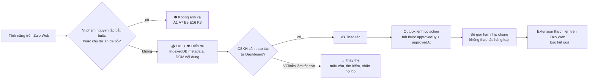
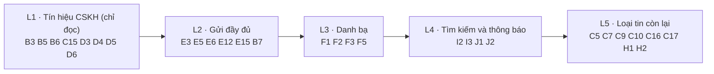

# Ánh xạ tính năng Zalo Web → VClinks (kênh Zalo cá nhân)

Phiên bản 1.3 · 04/10/2026 · Trạng thái: Đang áp dụng

> Phạm vi: kênh `zalo` (Zalo cá nhân qua VClinks Extension trên `chat.zalo.me`)
> Mục đích: liệt kê **mọi** tính năng người dùng thấy trên Zalo Web, chốt VClinks ánh xạ từng tính năng theo cách nào, hiện trạng code, và thứ tự làm.
> **Nguyên tắc chủ dự án chốt (28/09/2026): Zalo Web có gì thì VClinks có nấy.** Mục ⛔ chỉ còn lại những gì vi phạm nguyên tắc bắt buộc (CLAUDE.md §12, §4.4) hoặc chủ dự án đã quyết bỏ qua.
> Tài liệu liên quan: [zalo-web-extraction.md](zalo-web-extraction.md), [zalo-dom-selectors.md](zalo-dom-selectors.md), [vclinks-ba.md](../../02-yeu-cau/vclinks-ba.md).

## Mô hình

**Cách quyết định ánh xạ một tính năng** (§1, §2):



**Thứ tự lô làm việc** (§6, quyết định §7.4):



## Tóm tắt

- Liệt kê **mọi** tính năng người dùng thấy trên Zalo Web theo 11 nhóm (A–K), mỗi tính năng có nguồn dữ liệu, kiểu ánh xạ (📥 👁 ✍️ 🧩 ⛔), hiện trạng và ưu tiên.
- Nguyên tắc chủ dự án chốt 28/09/2026: **Zalo Web có gì thì VClinks có nấy**; chỉ không ánh xạ A1 (đăng nhập/giữ phiên), A7 (cài đặt bảo mật), B9 (ẩn trò chuyện bằng PIN), E16 (gửi hàng loạt), K3 (gọi trực tiếp).
- Sáu nguyên tắc ánh xạ: đọc trước ghi sau; mọi thao tác ghi đi qua outbox có duyệt; tránh lộ "đã xem"; không giải mã; nhịp như người thật; chỉ gắn với nick công ty.
- Thay đổi kiến trúc cần có: outbox thành "lệnh có `action`", stream mới (`reactions`, `labels`, `read_state`, `media_index`), trường schema mới (`pinned`, `recalled`, `forwarded`, `status`…).
- Quyết định 28/09/2026: tin thu hồi giữ nội dung + cờ `recalled`; hội thoại ẩn PIN bỏ qua; chấp nhận lời mời kết bạn từ Dashboard; thứ tự lô L1 → L5.
- **Còn mở:** trường đánh dấu hội thoại ẩn PIN, từ ngữ cho tin hệ thống nhóm, thu hồi có giữ `msgId` không, gửi tin nhiều dòng thành một tin, khảo sát DOM các mục ❓.
- **Người duyệt cần xem kỹ:** cột "Hiện trạng" ở nhóm E và kết luận §4 có thể đã cũ so với `zalo-web-extraction.md` §7.1 (ảnh, file, @nhắc tên, danh thiếp đã gửi thử được); con số nhịp `minGapMs` ở §2.

## Mục lục

- [1. Cách đọc bảng](#1-cách-đọc-bảng)
- [2. Nguyên tắc ánh xạ](#2-nguyên-tắc-ánh-xạ)
- [3. Bảng ánh xạ](#3-bảng-ánh-xạ)
- [4. Tổng hợp hiện trạng](#4-tổng-hợp-hiện-trạng)
- [5. Thay đổi kiến trúc cần có](#5-thay-đổi-kiến-trúc-cần-có)
- [6. Đề xuất chia lô](#6-đề-xuất-chia-lô)
- [7. Quyết định của chủ dự án (28/09/2026)](#7-quyết-định-của-chủ-dự-án-28092026)
- [8. Khảo sát IndexedDB cho L1 (chạy một lần)](#8-khảo-sát-indexeddb-cho-l1-chạy-một-lần)
- [9. Todolist](#9-todolist)
- [Lịch sử cập nhật](#lịch-sử-cập-nhật)

---

## 1. Cách đọc bảng

**Kiểu ánh xạ** (một tính năng có thể có nhiều kiểu):

| Ký hiệu | Kiểu | Ý nghĩa |
|---|---|---|
| 📥 | Lưu | Extension đọc (IndexedDB cho metadata, DOM cho nội dung) và đẩy về MongoDB. Chỉ đọc, không làm thay đổi gì trên Zalo. |
| 👁 | Hiển thị | Dashboard hiển thị giống Zalo Web để người dùng không phải mở Zalo. |
| ✍️ | Thao tác | Người dùng bấm trên Dashboard → tạo lệnh trong outbox, **có `approvedBy` + `approvedAt`** → extension thực hiện trên Zalo Web → báo kết quả. |
| 🧩 | Thay thế | VClinks có tính năng riêng tốt hơn thay cho tính năng Zalo (ví dụ nhãn nội bộ, mẫu câu dùng chung cả công ty). |
| ⛔ | Không ánh xạ | Chỉ khi vi phạm nguyên tắc bắt buộc (không giữ phiên/token/OTP, không gửi hàng loạt) hoặc chủ dự án đã quyết bỏ qua. |

**Hiện trạng:** ✅ đã có · 🟡 một phần · ⬜ chưa làm · ⛔ không làm · ❓ cần khảo sát lại Zalo Web.

**Ưu tiên:** P1 = cần cho CSKH hằng ngày · P2 = nên có · P3 = để sau.

## 2. Nguyên tắc ánh xạ

1. **Đọc trước, ghi sau.** Mọi tính năng đều bắt đầu từ 📥 + 👁. Chỉ thêm ✍️ khi CSKH thực sự cần thao tác từ Dashboard.
2. **Mọi thao tác ghi đi qua outbox có duyệt.** Mở rộng outbox từ "chỉ gửi text" thành "lệnh" có `action` (xem §5). Không có đường tắt nào để extension tự thao tác.
3. **Không đọc thụ động làm lộ "đã xem".** Việc mở hội thoại để lấy nội dung DOM làm Zalo báo "đã xem" cho khách. Các tính năng đọc phải ưu tiên IndexedDB; chỉ mở hội thoại khi người dùng đã tự mở hoặc bấm "Đồng bộ".
4. **Không giải mã, không đụng khóa.** Nội dung bị mã hóa trong IndexedDB chỉ lấy từ DOM (quyết định 28/09/2026).
5. **Nhịp như người thật.** Mọi ✍️ đi qua bộ giới hạn nhịp chung, không có thao tác hàng loạt. **Từ M1a-06** nhịp đặt ở API theo từng nick (`packages/shared/src/send-pace.ts`): mặc định tối thiểu 1,5 giây giữa hai lệnh và tối đa 20 lệnh/phút (03 SZ-04), đổi bằng biến `SEND_PACE_GAP_MS`, `SEND_PACE_PER_MINUTE` hoặc theo nick qua `PATCH /api/accounts/:uid { sendPace }`; giới hạn cứng 1–600 giây, 1–30 lệnh/phút. Lệnh chưa tới nhịp bị từ chối khi nhận (409), vẫn ở trạng thái chờ gửi, lượt sau gửi tiếp. Lời mời kết bạn giữ nhịp riêng 30 giây (SZ-09). Extension vẫn chờ `minGapMs = 1500` giữa hai dòng.
6. **Chỉ gắn với nick công ty** (BA BR08).

---

## 3. Bảng ánh xạ

### A. Tài khoản & phiên

| # | Tính năng Zalo Web | Nguồn | Ánh xạ | Hiện trạng | Ưu tiên | Ghi chú |
|---|---|---|---|---|---|---|
| A1 | Đăng nhập bằng QR / mật khẩu | – | ⛔ | ⛔ | – | Người dùng tự đăng nhập Zalo Web. VClinks không bao giờ giữ phiên, cookie, token. |
| A2 | Nhiều tài khoản trên cùng trình duyệt | `indexedDB.databases()` → `zdb_<uid>` | 📥 👁 | ✅ | P1 | Mỗi uid là một doc `accounts`; hai tài khoản ngang nhau. |
| A3 | Thông tin tài khoản (tên, avatar) | DOM header / `friend` của chính mình | 📥 👁 | 🟡 | P2 | Hiện dùng `label` do người dùng đặt; chưa lấy avatar/tên Zalo. |
| A4 | Đồng bộ tin từ điện thoại (`syncFromMobile`) | `message.syncFromMobile` | 📥 | ✅ | – | Đã nhận trường. Lịch sử trước ngày đăng nhập Web phải lấy từ Zalo PC (xem roadmap). |
| A5 | Trạng thái kết nối / mất phiên | Extension kiểm tra tab + IndexedDB | 👁 | 🟡 | P1 | Có trạng thái đồng bộ trên popup và SyncPage; chưa cảnh báo "Zalo Web đã đăng xuất". |
| A6 | Trạng thái hoạt động (của mình và của liên hệ: "Vừa truy cập", "Đang hoạt động") | DOM header | 📥 👁 | ⬜ | P3 | Hiển thị ở khung chat. |
| A7 | Cài đặt quyền riêng tư, mã khóa Zalo, 2 lớp bảo mật | – | ⛔ | ⛔ | – | Đụng mật khẩu/OTP/mã khóa → cấm (CLAUDE.md §12.2). Làm trên Zalo. |

### B. Danh sách hội thoại (sidebar)

| # | Tính năng Zalo Web | Nguồn | Ánh xạ | Hiện trạng | Ưu tiên | Ghi chú |
|---|---|---|---|---|---|---|
| B1 | Danh sách hội thoại sắp theo tin mới | `conversation` + DOM `div_TabMsg_ThrdChItem` | 📥 👁 | ✅ | P1 | `ConversationList`, phân trang, gộp nhiều tài khoản. |
| B2 | Tên, avatar hội thoại | DOM sidebar (`anim-data-id`) | 📥 👁 | ✅ | P1 | Tên trong IndexedDB bị mã hóa nên lấy từ DOM (`thread-names`). |
| B3 | Số tin chưa đọc, chấm đỏ | `conversation`/`msginfo.unreadInfo` + DOM | 📥 👁 ✍️ | ✅ | P1 | `unread`, bộ lọc "Chưa đọc", stream `read_state` (unreadInfo), lệnh Đánh dấu đã đọc/chưa đọc từ Dashboard (kiểm chứng thật 28/09) |
| B4 | Tab "Ưu tiên" / "Khác" | DOM / `conversation` | 📥 👁 ✍️ | ⬜ ❓ | P3 | Cần khảo sát trường nào lưu phân loại này. |
| B5 | Ghim hội thoại | `conversation.pinned` | 📥 👁 ✍️ | ✅ | P1 | Đọc `pinned` (bảng ánh xạ v3 tự bổ sung), ghim lên đầu danh sách, lệnh Ghim/Bỏ ghim qua menu "Thêm" của Zalo (kiểm chứng thật 28/09) |
| B6 | Phân loại (nhãn màu: HEAD, VCpart, Gia đình…) | store `label` + `conversation.label` + DOM `.conv__label[title]` | 📥 👁 🧩 | ✅ | P1 | Stream `labels`; tên nhãn mã hóa trong IndexedDB nên lấy từ chip trên thanh bên (tên + màu); Dashboard hiện chip nhãn. Gán nhãn từ Dashboard: chưa |
| B7 | Đánh dấu chưa đọc / đã đọc | `msginfo.unreadInfo` | 📥 ✍️ | ✅ | P2 | Lệnh `mark_read` / `mark_unread` (menu chuột phải trên Dashboard) |
| B8 | Tắt thông báo hội thoại | ❓ | 📥 👁 ✍️ | ⬜ ❓ | P3 | |
| B9 | Ẩn trò chuyện (có mã PIN) | ❓ | ⛔ | ⛔ | – | **Chốt 28/09/2026: bỏ qua, không đồng bộ.** Cần khảo sát trường đánh dấu để extension lọc bỏ trước khi đẩy. |
| B10 | Xóa hội thoại (trên Zalo) | – | ✍️ | ⬜ | P3 | Chỉ Admin (BA BR06), có audit log. Chỉ xóa phía Zalo; dữ liệu VClinks giữ theo chính sách lưu trữ. |
| B11 | Tin nhắn tự xóa (hẹn giờ) | `message.ttl` | 📥 👁 | 🟡 | P3 | Đọc `ttl`, Dashboard ghi "Tin nhắn tự xóa sau …". Chưa gặp tin thật có ttl>0 |
| B12 | Tìm hội thoại theo tên | `txt_Main_Search` | 🧩 | ✅ | P1 | Dashboard tìm theo tên trên MongoDB. |

### C. Loại tin nhắn (nhận + hiển thị)

| # | Loại | msgType / originMsgType | Ánh xạ | Hiện trạng | Ưu tiên | Ghi chú |
|---|---|---|---|---|---|---|
| C1 | Văn bản | 1 / webchat | 📥 👁 | ✅ | P1 | DOM `Msg_Text`. |
| C2 | Văn bản có định dạng (đậm, nghiêng, màu, cỡ chữ) | 1 (`properties`/`paramsExt`) | 📥 👁 | ⬜ ❓ | P3 | Hiện lưu `innerText`, mất định dạng. |
| C3 | Emoji trong chữ | 1 | 📥 👁 | 🟡 | P2 | Emoji hiển thị dạng ảnh nhỏ → cần đổi về ký tự Unicode (`alt`) thay vì bỏ. |
| C4 | Ảnh đơn / ảnh nhóm | 2 / chat.photo | 📥 👁 | ✅ | P1 | Khóa selector thật. GĐ2: tải về MinIO (URL Zalo có hạn). |
| C5 | Ghi âm | 3 / chat.voice | 📥 👁 | 🟡 | P1 | Chưa có URL khi chưa bấm Play → `partial`. Cần GĐ2 (MinIO + ASR). |
| C6 | Sticker | 4 / chat.sticker | 📥 👁 | 🟡 | P3 | Gán `[Sticker]`. Có thể lấy ảnh sticker để hiển thị. |
| C7 | Danh thiếp / gợi ý kết bạn | 6 / chat.recommended | 📥 👁 | 🟡 | P2 | Selector phỏng đoán, chưa có mẫu thật. |
| C8 | GIF | 7 / chat.gif | 📥 👁 | 🟡 | P3 | Gán `[GIF]`. |
| C9 | Vị trí | 17 / chat.location.new | 📥 👁 | 🟡 | P2 | Cần mẫu DOM; lưu toạ độ + link bản đồ. Hữu ích cho giao hàng phụ tùng. |
| C10 | Video | 18 / chat.video.msg | 📥 👁 | 🟡 | P2 | Có thumbnail; URL video chỉ nạp khi bấm. |
| C11 | File | 19 / share.file | 📥 👁 | ✅ | P1 | Tên, dung lượng, link tải. GĐ2: tải về MinIO. |
| C12 | Tin đã thu hồi | 20 / chat.undo | 📥 👁 | ✅ | P1 | **Chốt 28/09/2026: giữ nội dung đã lưu + cờ `recalled`.** Tin chưa kịp lưu nội dung thì hiện `[Đã thu hồi]`. Dashboard hiện nhãn "Đã thu hồi" trên bong bóng. |
| C13 | Hành động danh sách | 21 / chat.list.action | 📥 👁 | ⬜ ❓ | P3 | Cần khảo sát ý nghĩa. |
| C14 | Link / xem trước web | 52 / chat.webcontent | 📥 👁 | ✅ | P1 | Tiêu đề + URL. |
| C15 | Tin hệ thống nhóm (thêm/xóa thành viên, đổi tên, đổi avatar) | `message.act` + `eventInfo` + `updateMemberIds` | 📥 👁 | 🟡 | P2 | Ánh xạ thành `systemEvent`, Dashboard hiện dòng giữa khung chat. Dữ liệu thật hiện chưa có bản ghi `act` nào để đối chiếu từ ngữ |
| C16 | Bình chọn (poll) | ❓ | 📥 👁 | ⬜ | P3 | Chỉ hiển thị câu hỏi + kết quả. |
| C17 | Nhắc hẹn | ❓ | 📥 👁 | 🟡 | P2 | Có thể đồng bộ sang lịch chăm sóc (BA F8.4). |
| C18 | Ghi chú nhóm / bảng tin nhóm | ❓ | 📥 👁 | ⬜ | P3 | |
| C19 | Tin nhắn chuyển tiếp | `message.reference.data.fwLvl` | 📥 👁 | ✅ | P2 | 804 tin có cờ `forwarded`; Dashboard ghi "Đã chuyển tiếp" |
| C20 | Tin nhắn E2EE (bật mã hóa đầu cuối) | `e2eeStatus` | 📥 | 🟡 | – | Nhận cờ. **Không bao giờ** đụng `e2ee_*`. Nội dung chỉ từ DOM. |
| C21 | Cuộc gọi thoại/video (lịch sử cuộc gọi trong chat) | ❓ | 📥 👁 | 🟡 | P2 | Chỉ lưu "Cuộc gọi đến/nhỡ, thời lượng" — có giá trị cho báo cáo CSKH. |

### D. Chi tiết trong một tin nhắn

| # | Tính năng Zalo Web | Nguồn | Ánh xạ | Hiện trạng | Ưu tiên | Ghi chú |
|---|---|---|---|---|---|---|
| D1 | Người gửi (trong nhóm) | `fromUid` + DOM tên | 📥 👁 | ✅ | P1 | Tin của mình `fromUid = '0'`. |
| D2 | Thời gian gửi | `sendDttm` | 📥 👁 | ✅ | P1 | Múi giờ `Asia/Ho_Chi_Minh`. |
| D3 | Trả lời (trích dẫn tin khác) | DOM `.message-quote-fragment__container`, `quote` | 📥 👁 | ✅ | P1 | Khối trích dẫn đọc từ DOM (tên + chữ), tách khỏi `text`. Bong bóng hiện khối trích dẫn, bấm để nhảy tới tin gốc. |
| D4 | @Nhắc tên (mention) | `mentions[] {uid,pos,len}` | 📥 👁 | ✅ | P2 | Dashboard tô màu đoạn `@…` theo vị trí |
| D5 | Cảm xúc (reaction) | `r_db_<uid>.reaction` | 📥 👁 ✍️ | 🟡 | P2 | Đọc + hiện đủ (mã 3 = 👍 kiểm chứng). **Thả từ Dashboard chưa được:** bảng chọn của Zalo bỏ qua click giả lập từ extension; lệnh `react` giữ ở API/extension nhưng nút bị ẩn (`REACTIONS_FROM_DASHBOARD`) |
| D6 | Trạng thái Đã gửi / Đã nhận / Đã xem | `message.status` | 📥 👁 | ✅ | P1 | Trong IndexedDB tin mới nhất của mình mang 1, tin cũ hơn chuyển 2 rồi 3 khi người khác nhận/mở (quan sát 29/09) → 1 Đã gửi, 2 Đã nhận, 3 Đã xem; hiện dưới tin cuối của mình. Extension gửi lại tin 30 phút gần nhất mỗi lần sync để trạng thái cập nhật |
| D7 | Đang soạn tin ("… đang soạn") | DOM realtime | 👁 | ⬜ | P3 | Chỉ hiển thị realtime cho hội thoại đang mở trên Zalo Web, không lưu. |
| D8 | Chỉnh sửa tin đã gửi | ❓ | 📥 👁 | ⬜ ❓ | P3 | Cần xác nhận Zalo Web có tính năng này không. |
| D9 | Ghim tin nhắn trong hội thoại | ❓ | 📥 👁 | ⬜ | P3 | |

### E. Soạn & gửi (thao tác từ Dashboard)

| # | Tính năng Zalo Web | Ánh xạ | Hiện trạng | Ưu tiên | Ghi chú |
|---|---|---|---|---|---|
| E1 | Gửi văn bản | ✍️ | ✅ | P1 | `Composer` → outbox → `sender.ts`. Nhiều dòng = nhiều tin (Zalo bỏ qua `<br>`). |
| E2 | Xuống dòng trong một tin | ✍️ | ⬜ ❓ | P2 | Cần khảo sát cách Zalo tạo `div#input_line_N` thật. |
| E3 | Trả lời trích dẫn | ✍️ | ✅ | P1 | Rê chuột lên tin → "Trả lời" → khung trích dẫn trên Composer. Extension rê chuột lên bong bóng, bấm nút Trả lời của Zalo, thay @mention tự chèn bằng đúng nội dung đã duyệt. Chỉ Zalo cá nhân. **M1a-06:** tin gốc đã trôi khỏi màn hình thì extension tự cuộn lên tải lịch sử (tối đa 10 lần, 1 lần/giây, dừng khi 2 lần liền không tải thêm); vẫn không thấy thì báo lỗi và Dashboard hiện nút **Gửi không trích dẫn** (mở lại ô soạn với dòng `Về tin: "…"` 60 ký tự, gửi là duyệt lệnh mới, lệnh lỗi tự bỏ) (03 §8 D33). |
| E4 | @Nhắc tên trong nhóm | ✍️ | ⬜ | P2 | Gõ `@` → chọn trong danh sách gợi ý của Zalo. Rủi ro gõ sai tên cao → kiểm tra lại DOM trước khi gửi. |
| E5 | Gửi ảnh | ✍️ | ⬜ | P1 | Chọn từ máy hoặc thư viện media (BA F3.3). Extension đặt file vào `input[type=file]` bằng `DataTransfer`. Cần khảo sát. |
| E6 | Gửi file (báo giá PDF…) | ✍️ | ⬜ | P1 | Như E5. Giới hạn dung lượng theo Zalo. |
| E7 | Gửi sticker / emoji | ✍️ | 🟡 | P3 | Emoji Unicode gõ thẳng trong text. Sticker: lệnh `send_sticker` (29/09) — Dashboard hiện bộ mặc định "Củ hành" (40 ảnh thu nhỏ công khai), extension chọn tab bộ + đúng ảnh trong panel `div_StickerMenu_*`. Bộ tự thêm cần danh mục từ store IDB `sticker`. Chưa chạy live trên driver. |
| E8 | Gửi danh thiếp | ✍️ | ⬜ | P3 | |
| E9 | Gửi vị trí | ✍️ | ⬜ ❓ | P3 | Nếu Zalo Web có nút gửi vị trí thì ánh xạ; nếu không thì gửi link bản đồ. |
| E10 | Gửi ghi âm | ✍️ | ⬜ ❓ | P3 | Ghi âm trên Dashboard → file audio → extension gửi (nếu Zalo Web cho phép gửi file audio như ghi âm). |
| E11 | Chuyển tiếp tin | ✍️ | ⬜ | P3 | Nguy cơ thành gửi hàng loạt → giới hạn 1 người nhận / lệnh. |
| E12 | Thả cảm xúc | ✍️ | 🟡 | P2 | Xem D5: cần chuột thật; hướng khả dĩ là để chính Chrome driver (CDP) thực hiện thay extension |
| E13 | Thu hồi tin của mình | ✍️ | ⬜ | P2 | Chỉ tin do VClinks gửi và trong thời hạn Zalo cho phép; có audit log. |
| E14 | Xóa tin phía tôi (trên Zalo) | ✍️ | ⬜ | P3 | Chỉ Admin, có audit log; bản trên VClinks giữ nguyên. |
| E15 | Tin nhắn nhanh (gõ `/` gọi mẫu) | 🧩 | ✅ | P1 | **Mẫu câu VClinks** dùng chung (BA F3.2): `quick_replies`, REST `/api/quick-replies`, gõ `/phimtat` trong ô soạn hoặc nút "Tin nhắn nhanh", biến `{ten_khach}` `{ten_nv}`; loại `bank` = nút "Gửi nhanh số tài khoản". Chỉ chèn vào ô soạn, bấm gửi mới là duyệt. UAT 29/09 TC18–TC20. |
| E15b | Định dạng tin nhắn (đậm, nghiêng, danh sách — `div_RTF_Menu`) | ✍️ | ⬜ | P3 | Chế độ này thay `#richInput` bằng editor `.input-v4`; extension nay tự tắt nó trước khi gõ (`findComposer`). Gửi tin có định dạng cần khảo sát thêm. |
| E15c | Tùy chọn thêm: nhắc hẹn, ghi chú, tin quan trọng / khẩn cấp | ✍️ | ⬜ | P3 | Selector menu đã có (`div_MoreMenu_Note`, `.mark-important-message-menu-item`, `.mark-urgent-message-menu-item`); hộp thoại chưa khảo sát. |
| E16 | Gửi tin cho nhiều người / nhóm cùng lúc | ⛔ | ⛔ | – | Nguyên tắc bắt buộc: không gửi hàng loạt trên nick cá nhân (CLAUDE.md §4.4, BA rủi ro khóa nick). Chuyển tiếp 1 tin cho 1 người vẫn làm được (E11). |
| E17 | Nháp AI gợi ý | 🧩 | ⬜ | – | GĐ5 (worker suggest). |

### F. Danh bạ & bạn bè

| # | Tính năng Zalo Web | Nguồn | Ánh xạ | Hiện trạng | Ưu tiên | Ghi chú |
|---|---|---|---|---|---|---|
| F1 | Danh sách bạn bè | `friend` | 📥 👁 | 🟡 | P1 | Metadata đã có; tên/SĐT bị mã hóa → cần ContactReader đọc tab Danh bạ trên DOM. Chưa có trang Danh bạ (GĐ3). |
| F2 | Tên gợi nhớ (alias) do mình đặt | DOM | 📥 👁 | ⬜ | P2 | Rất có giá trị: sale thường ghi "Anh Tuấn – gara Cầu Giấy". |
| F3 | Số điện thoại | `friend.phoneNumber` (mã hóa) / DOM hồ sơ | 📥 👁 | ⬜ | P1 | Chỉ lấy khi hồ sơ hiển thị SĐT. Dùng để gộp hồ sơ đa kênh (BA F5.1). |
| F4 | Tài khoản OA / doanh nghiệp (`oaInfo`, `bizInfo`) | `friend` | 📥 👁 | ✅ | P2 | Có `isOA`, `bizInfo`. |
| F5 | Lời mời kết bạn (đến / đã gửi) | ❓ | 📥 👁 | ⬜ | P2 | Khách mới thường bắt đầu bằng lời mời → CSKH cần thấy. |
| F6 | Chấp nhận / từ chối lời mời kết bạn | – | ✍️ | ⬜ | P2 | **Chốt 28/09/2026: có.** Qua outbox có duyệt, nhịp chậm. |
| F7 | Tìm theo SĐT, gửi lời mời kết bạn | – | ✍️ | ⬜ | P3 | Từng người một, có duyệt, giới hạn số lời mời/ngày (Zalo đánh dấu spam rất nhanh). |
| F8 | Chặn / bỏ chặn, hủy kết bạn | ❓ | 📥 👁 ✍️ | ⬜ | P3 | Có duyệt. |
| F9 | Sinh nhật bạn bè | ❓ | 📥 🧩 | ⬜ ❓ | P3 | Nếu đọc được → nhắc chăm sóc (BA F8.4). |
| F10 | Danh sách OA đã quan tâm | `friend.oaInfo` | 📥 | 🟡 | P3 | |

### G. Nhóm & cộng đồng

| # | Tính năng Zalo Web | Nguồn | Ánh xạ | Hiện trạng | Ưu tiên | Ghi chú |
|---|---|---|---|---|---|---|
| G1 | Danh sách nhóm, thành viên, trưởng/phó nhóm | `group`, `group_info` | 📥 👁 | 🟡 | P1 | Có `memberIds`, `adminIds`, `creatorId`. Tên nhóm lấy từ DOM. Chưa có trang xem thành viên. |
| G2 | Tên thành viên trong nhóm (không phải bạn bè) | DOM tên người gửi | 📥 👁 | 🟡 | P1 | Hiện dựa vào `senderName` từ DOM. |
| G3 | Link tham gia nhóm, duyệt thành viên | ❓ | 📥 👁 ✍️ | ⬜ | P3 | |
| G4 | Tạo nhóm, thêm/xóa thành viên, đổi tên, bổ nhiệm phó nhóm, rời/giải tán | – | ✍️ | ⬜ | P3 | Có duyệt, audit log. |
| G5 | Cộng đồng (community) | ❓ | 📥 👁 | ⬜ ❓ | P3 | Cần khảo sát cấu trúc. |

### H. Kho lưu trữ trong hội thoại

| # | Tính năng Zalo Web | Nguồn | Ánh xạ | Hiện trạng | Ưu tiên | Ghi chú |
|---|---|---|---|---|---|---|
| H1 | Ảnh/Video đã chia sẻ | store `image` | 📥 👁 | ⬜ | P2 | Tab "Kho media" ở khung thông tin hội thoại. Tận dụng để bổ sung URL cho tin `pending`. |
| H2 | File đã chia sẻ | store `file` | 📥 👁 | ⬜ | P2 | |
| H3 | Link đã chia sẻ | store `link` | 📥 👁 | ⬜ | P3 | |
| H4 | Cloud của tôi (zCloud / My Documents) | store `zcloud` | 📥 👁 | ⬜ | P3 | Nick là của công ty (BR08) nên được lưu. |
| H5 | Truyền file giữa máy (tự chat với mình) | – | 📥 👁 | ⬜ | P3 | Là một hội thoại đặc biệt, đồng bộ như hội thoại thường. |

### I. Tìm kiếm

| # | Tính năng Zalo Web | Ánh xạ | Hiện trạng | Ưu tiên | Ghi chú |
|---|---|---|---|---|---|
| I1 | Tìm hội thoại / liên hệ | 🧩 | ✅ | P1 | Theo tên trên MongoDB. |
| I2 | Tìm tin nhắn toàn cục | 🧩 | ⬜ | P1 | Text index `messages.text` + MCP `search_messages`. Tìm được cả tin cũ mà Zalo Web không còn. |
| I3 | Tìm trong một hội thoại, lọc theo người gửi / ngày | 🧩 | ⬜ | P2 | |
| I4 | Tìm theo SĐT, mã đơn, mã OE | 🧩 | ⬜ | P2 | Vượt Zalo: nhận diện SĐT/mã OE trong tin (BA F5.3, F9.1). |

### J. Thông báo

| # | Tính năng Zalo Web | Ánh xạ | Hiện trạng | Ưu tiên | Ghi chú |
|---|---|---|---|---|---|
| J1 | Thông báo tin mới (âm thanh, desktop) | 🧩 | ⬜ | P1 | Dashboard thông báo realtime (BA F2.4), không phụ thuộc tab Zalo. |
| J2 | Badge số chưa đọc trên tab | 🧩 | ⬜ | P2 | |

### K. Ngoài phạm vi Zalo Web

| # | Tính năng | Ánh xạ | Ghi chú |
|---|---|---|---|
| K1 | Nhật ký (timeline), Khoảnh khắc, bình luận bài đăng | – | Zalo Web không có → ngoài phạm vi extension. |
| K2 | Zalo Business: danh mục sản phẩm, trả lời tự động, tin nhắn nhanh | 🧩 | Thay bằng mẫu câu + tra VCsale trong VClinks. |
| K3 | Gọi thoại/video trực tiếp | ⛔ | Cuộc gọi là thời gian thực giữa người với người, VClinks không thay được. Lưu lịch sử cuộc gọi (C21). |
| K4 | Lịch sử trước ngày đăng nhập Web | – | Nguồn khác: Zalo PC / sao lưu điện thoại. Cần mục roadmap riêng. |

---

## 4. Tổng hợp hiện trạng

Kết luận: **đường đọc** (lưu + hiển thị tin chính) đã phủ phần lớn tin nhắn thực tế (text, ảnh, file, link ≈ 93% lượng tin). Thiếu lớn nhất ở **đường ghi** (chỉ gửi được text) và các **tín hiệu CSKH** (đã xem, reaction, trả lời trích dẫn).

Sau quyết định "Zalo Web có gì thì VClinks có nấy", các mục ⛔ chỉ còn: đăng nhập/giữ phiên (A1), cài đặt bảo mật (A7), ẩn trò chuyện bằng PIN (B9), gửi hàng loạt (E16), gọi thoại/video trực tiếp (K3).

---

## 5. Thay đổi kiến trúc cần có

1. **Outbox thành "lệnh có duyệt".** Thêm `action` vào `outboxCreateSchema`:
   `send_text` (hiện có) · `reply` · `send_media` (ảnh/file, tham chiếu `attachmentId` trên MinIO) · `react` · `recall` · `forward` · `mark_read` · `pin` · `mute` · `friend_accept` / `friend_reject` / `friend_request` · `block` · `group_*` · `delete_*` (chỉ Admin).
   Giữ nguyên bất biến: không `approvedBy` + `approvedAt` thì không claim. Mỗi action có validator và lỗi tiếng Việt riêng trong `sender.ts`.
2. **Stream mới trong bảng ánh xạ:** `reactions` (`r_db_<uid>.reaction`), `labels` (`zdb_<uid>.label`), `read_state` (`msginfo_<uid>.ThreadMsg/unreadInfo`), `media_index` (`image`/`file`/`link`). Tất cả khai báo trong `field_mappings`, không hard-code; whitelist mở rộng phải qua duyệt.
3. **Trường mới trong schema:** `conversations.pinned`, `conversations.hidden` (để lọc bỏ), `messages.status` (gửi/nhận/xem), `messages.recalled`, `messages.forwarded`, `messages.quoteRef` hiển thị được.
4. **Khảo sát DOM còn thiếu** (một buổi Claude in Chrome): ghi âm, video, danh thiếp, vị trí, tin hệ thống nhóm, poll, nhắc hẹn, nút Trả lời/Reaction/Thu hồi trên menu tin, `input[type=file]` của nút gửi ảnh/file, tab Danh bạ và Lời mời kết bạn. Kết quả ghi vào [zalo-dom-selectors.md](zalo-dom-selectors.md).

## 6. Đề xuất chia lô

| Lô | Nội dung | Mục |
|---|---|---|
| **L1 – Tín hiệu CSKH (chỉ đọc)** | Trạng thái đã gửi/đã xem, reaction, hiển thị trích dẫn + mention, nhãn Zalo (tên + màu), ghim, lọc "Chưa đọc", tin hệ thống nhóm | B3 B5 B6 C15 D3 D4 D5 D6 |
| **L2 – Gửi đầy đủ** | Outbox `action`; trả lời trích dẫn, gửi ảnh/file, thả cảm xúc, đánh dấu đã đọc; mẫu câu `/` | E3 E5 E6 E12 E15 B7 |
| **L3 – Danh bạ** | ContactReader (tên, alias, SĐT từ DOM), lời mời kết bạn, trang Danh bạ | F1 F2 F3 F5 |
| **L4 – Tìm kiếm & thông báo** | Tìm toàn văn, tìm trong hội thoại, thông báo realtime | I2 I3 J1 J2 |
| **L5 – Loại tin còn lại** | Ghi âm (kèm GĐ2 MinIO + ASR), video, vị trí, danh thiếp, kho media, poll, nhắc hẹn | C5 C7 C9 C10 C16 C17 H1 H2 |

## 7. Quyết định của chủ dự án (28/09/2026)

1. Tin khách **thu hồi** sau khi VClinks đã lưu: **giữ nội dung, gắn cờ `recalled`**.
2. Hội thoại **ẩn bằng PIN**: **bỏ qua, không đồng bộ**.
3. **Chấp nhận lời mời kết bạn** từ Dashboard: **có**. Nguyên tắc chung: **Zalo Web có gì thì VClinks có nấy**, trừ các mục vi phạm nguyên tắc bắt buộc.
4. Thứ tự lô: L1 → L2 → L3 → L4 → L5.

---

## 8. Khảo sát IndexedDB cho L1 (chạy một lần)

Phần L1 còn thiếu cấu trúc thật của: cảm xúc (`r_db_<uid>.reaction`), trạng thái đã xem / chưa đọc (`msginfo_<uid>`), nhãn (`zdb_<uid>.label`), cờ ghim / ẩn PIN của hội thoại, dạng `quote` / `mentions` / `status` trong tin nhắn.

Mở `chat.zalo.me`, bật DevTools Console, dán đoạn mã dưới đây. Mã **chỉ đọc**, không mở store `e2ee_*`, không đọc cookie hay `localStorage`, **không xuất giá trị chữ nào**: chỉ tên trường, kiểu dữ liệu, và với trường số/boolean nhỏ (0–999) thì liệt kê tối đa 6 giá trị khác nhau (để biết enum như `status`, `pinned`). Kết quả được chép vào clipboard dạng JSON; gửi cho Claude để chốt bảng ánh xạ.

```js
(async () => {
  const TARGETS = {
    zdb_: ['conversation', 'label', 'message', 'group'],
    msginfo_: ['ThreadMsg', 'unreadInfo', 'Quotes'],
    r_db_: ['reaction'],
  };
  const SAMPLE = 40;
  const shape = (v, depth, acc, path) => {
    const t = Array.isArray(v) ? 'array' : v === null ? 'null' : typeof v;
    const e = (acc[path] ??= { types: new Set(), small: new Set() });
    e.types.add(t);
    if ((t === 'number' && Number.isInteger(v) && v >= 0 && v < 1000) || t === 'boolean') e.small.add(v);
    if (depth >= 3) return;
    if (t === 'array') v.slice(0, 5).forEach((x) => shape(x, depth + 1, acc, `${path}[]`));
    else if (t === 'object') for (const [k, x] of Object.entries(v)) shape(x, depth + 1, acc, `${path}.${k}`);
  };
  const out = {};
  for (const { name } of await indexedDB.databases()) {
    const prefix = Object.keys(TARGETS).find((p) => name.startsWith(p));
    if (!prefix || /e2ee/i.test(name)) continue;
    const key = `${prefix}<uid>`;
    const db = await new Promise((ok, ko) => { const r = indexedDB.open(name); r.onsuccess = () => ok(r.result); r.onerror = ko; });
    for (const store of TARGETS[prefix]) {
      if (!db.objectStoreNames.contains(store) || /e2ee/i.test(store)) continue;
      const acc = (out[`${key}.${store}`] ??= { count: 0, fields: {} });
      await new Promise((ok) => {
        const os = db.transaction(store).objectStore(store);
        os.count().onsuccess = (e) => (acc.count += e.target.result);
        let n = 0;
        os.openCursor().onsuccess = (e) => {
          const c = e.target.result;
          if (!c || n++ >= SAMPLE) return ok();
          for (const [k, v] of Object.entries(c.value ?? {})) shape(v, 1, acc.fields, k);
          c.continue();
        };
      });
    }
    db.close();
  }
  for (const s of Object.values(out)) for (const [k, e] of Object.entries(s.fields))
    s.fields[k] = { types: [...e.types], small: e.small.size <= 6 ? [...e.small] : `${e.small.size} giá trị` };
  copy(JSON.stringify(out, null, 2));
  console.log('Đã chép kết quả khảo sát vào clipboard.', Object.keys(out));
})();
```

Ngoài ra, để chốt hội thoại **ẩn bằng PIN**: trước khi chạy mã, ghi lại (không gửi tên) số hội thoại đang ẩn; Claude sẽ tìm trường trong `conversation` có đúng số bản ghi mang giá trị khác thường.

---

## 9. Todolist

> Cập nhật: 28/09/2026. Đánh `[x]` khi xong, ghi ngày.

### Cần kiểm tra trên Zalo Web thật

- [x] 04/10/2026 (M1a-06) – **Thu hồi giữ nguyên `msgId`: đúng trên dữ liệu thật.** 67 tin thu hồi trong IndexedDB nick test (61 tin nhóm, 6 tin 1-1) đều là bản ghi `msgType 20`, `originMsgType chat.undo`, giữ `msgId`/`cliMsgId`, không có bản ghi thứ hai trùng `cliMsgId`; mã bong bóng nhóm trên DOM khớp 50/50 `cliMsgId` trong DB (nhóm "Kiểm thử vclink"). Còn thiếu một lần thử trọn vòng "gửi → thu hồi trên điện thoại → bong bóng đổi" (cần gửi thật vào nhóm test, chờ chủ dự án cho phép). Ghi chú cũ: code đang giả định: khi khách thu hồi, Zalo giữ `msgId`/`cliMsgId` của tin gốc và đổi `msgType` thành `20`. Cách thử: nhờ một người nhắn thử rồi thu hồi, chạy đồng bộ, xem trên Dashboard tin đó còn nội dung và có dòng "Đã thu hồi trên Zalo". Nếu Zalo tạo **bản ghi mới** (khác `msgId`) trỏ về tin gốc thì phải sửa `messageUpdate` trong `apps/api/src/ingest/ingest.service.ts` và bộ lọc thu hồi trong `apps/extension/src/sync.ts`.
- [ ] **Ghim hội thoại.** Đề xuất và duyệt bảng ánh xạ phiên bản mới có `conversations.fields.pinned = 'pinned'` (v1 trong DB chưa có), rồi xem hội thoại ghim có lên đầu danh sách không.
- [x] 28/09/2026 đêm – Đã tự chạy khảo sát §8 trên Chrome driver (kết quả trong `docs/04-ky-thuat/zalo-web/zalo-dom-selectors.md`). Còn thiếu: trường đánh dấu hội thoại **ẩn bằng PIN** — `conversation.outside`/`topOut` đều rỗng trong mẫu, cần một hội thoại đang ẩn để đối chiếu.

### L1 – còn lại

- [ ] Bỏ qua hội thoại ẩn bằng PIN (B9) — chưa tìm được trường đánh dấu
- [ ] Từ ngữ cho từng `act` của tin hệ thống nhóm (C15) — chưa có bản ghi thật
- [ ] Đặt tên nhãn còn thiếu: tên lấy từ chip trên thanh bên, hiện 4/15 nhãn có tên; đủ dần khi thanh bên cuộn qua các hội thoại mang nhãn đó

### L2 → L5

- [ ] L2 – còn lại: thả cảm xúc (cần chuột thật, xem D5), chấp nhận/từ chối kết bạn, tắt thông báo, gán nhãn từ Dashboard, mẫu câu `/`, xuống dòng trong một tin (E2)
- [ ] L3 – Danh bạ: ContactReader (tên, tên gợi nhớ, SĐT), lời mời kết bạn, trang Danh bạ
- [ ] L4 – Tìm kiếm toàn văn, tìm trong hội thoại, thông báo realtime
- [ ] L5 – Ghi âm (kèm GĐ2 MinIO + ASR), video, vị trí, danh thiếp, kho media, poll, nhắc hẹn
- [ ] Khảo sát DOM một buổi cho các mục ❓ (§5.4)
- [ ] Khảo sát cách Zalo Web tạo `div#input_line_N` khi Shift+Enter, để gửi tin nhiều dòng thành **một** tin (E2) — hiện mỗi dòng là một tin cách nhau 1,5 s

### Đã xong

- [x] 28/09/2026 đêm – Khảo sát toàn bộ màn hình Zalo Web bằng Chrome driver (thanh bên, menu hội thoại, khung chat, thanh soạn, menu tin, bảng thông tin, Danh bạ) → `docs/04-ky-thuat/zalo-web/zalo-dom-selectors.md`
- [x] 28/09/2026 đêm – Ba stream mới `reactions`, `labels`, `read_state`; bảng ánh xạ tự nâng lên v3 khi API khởi động; dữ liệu thật: 49 cảm xúc, 15 nhãn, 159 trạng thái đã đọc
- [x] 28/09/2026 đêm – Tin nhắn có `status` (10.199/10.261 sau đồng bộ lại), `forwarded` (804), `ttl`, `systemEvent`, `mentions`; Dashboard hiện cảm xúc, "Đã gửi", "Đã chuyển tiếp", @nhắc tên, dòng sự kiện nhóm, chip nhãn màu
- [x] 28/09/2026 đêm – Lệnh Ghim/Bỏ ghim, Đánh dấu chưa đọc/đã đọc từ menu chuột phải Dashboard, kiểm chứng thật trên Zalo Web (3,1 s / 2,6 s / 3,1 s / 3,1 s)

- [x] 28/09/2026 – Bảng ánh xạ tính năng (tài liệu này)
- [x] 28/09/2026 – Giữ nội dung DOM khi nạp lại metadata mã hóa (sửa lỗi mất chữ)
- [x] 28/09/2026 – Tin thu hồi: giữ nội dung + cờ `recalled`, extension luôn gửi lại tin thu hồi
- [x] 28/09/2026 – Ghim hội thoại (code), lọc "Chưa đọc"
- [x] 28/09/2026 – Giảm độ trễ gửi tin: API giữ yêu cầu `/outbox/pending?wait=20` tới khi có tin duyệt (long-poll) thay cho hỏi mỗi 10 s; Dashboard cập nhật 1,5 s khi đang gửi và tải lại tin ngay khi gửi xong; hạ nhịp giống người: 3 s → 1,5 s giữa hai tin, 15 s → 5 s chờ sau khi người dùng đụng tab Zalo (quyết định chủ dự án)
  - **Đo thật 28/09/2026 21:46** (Chrome driver, nhóm "Kiểm thử vclink", bản `feat/zalo-feature-parity` ghép lên `merge/zalo-send`): từ lúc duyệt tới lúc tin hiện trên Zalo **0,92 s / 1,26 s / 1,62 s** cho 3 tin một dòng (trước đó 5,7–7,2 s theo `db.suggestions`); tin hai dòng 2,60 s (dòng 2 cách dòng 1 đúng 1,5 s). Extension nhận phản hồi `/outbox/pending` cách nhau ~20–25 s khi rỗng (long-poll), không còn 10 s một lần.

## Lịch sử cập nhật

| Phiên bản | Ngày | Người / phiên | Thay đổi | Căn cứ |
|---|---|---|---|---|
| 1.3 | 04/10/2026 22:56 | Claude Code · M1c-08 | C9, C17, C21 chuyển ⬜ sang 🟡: có bộ đọc và hiển thị theo phỏng đoán, chờ mẫu thật (xem `api/panel-thong-tin-l5.md`) | Phiên M1c-08 |
| 1.2 | 04/10/2026 20:44 | Claude Code · M1a-06 | §2 nhịp gửi theo nick ở API; E3 tự cuộn tìm tin gốc + Gửi không trích dẫn; mục kiểm tra "Thu hồi giữ nguyên msgId" đánh dấu đã kiểm trên dữ liệu thật | Phiên M1a-06, kế hoạch M1 |
| 1.1 | 04/10/2026 13:35 | Claude Code | Cập nhật đường dẫn tài liệu theo cấu trúc `docs/` mới; nội dung không đổi | Chủ dự án duyệt cấu trúc docs/ 04/10/2026 13:35 |
| 1.1 | 04/10/2026 | Claude Code | Hồi tố theo CLAUDE.md §13: thêm Mô hình, Tóm tắt, Mục lục, Lịch sử | `docs/ke-hoach/hoi-to-tai-lieu-md.md` |
| 1.0 | 28/09/2026 | Claude Code | Ngày lập: 28/09/2026. Các bản trước khi có bảng lịch sử (xem `git log -- docs/zalo-web-feature-map.md`); todolist §9 cập nhật tới 29/09/2026 | Quyết định chủ dự án 28/09/2026 (§7) |
