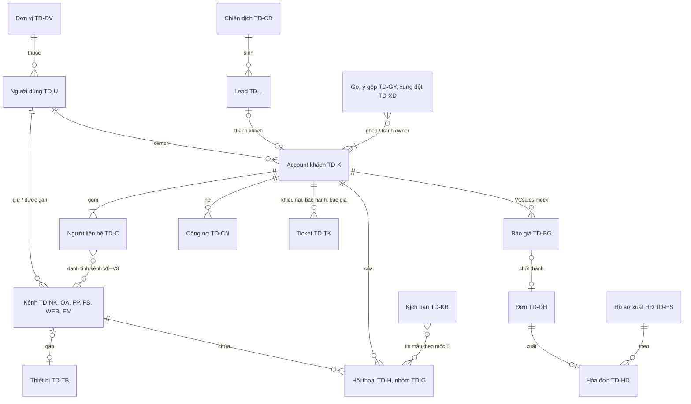
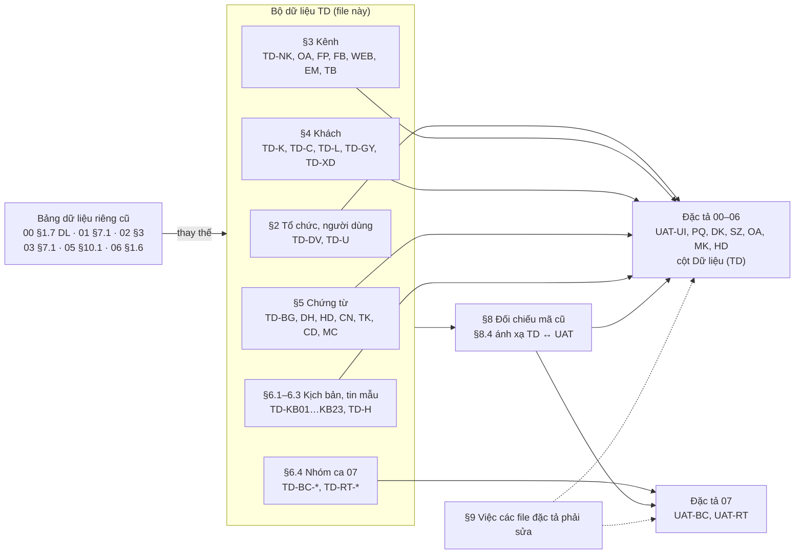
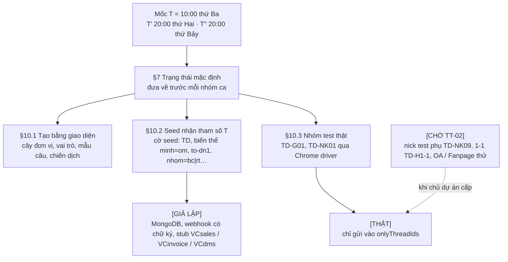

# Bộ dữ liệu kiểm thử chung VClinks (TD)

Phiên bản 1.6 · 04/10/2026 · Trạng thái: Đang áp dụng

> **Người lập:** QA lead (v1.4.1…v1.5: BA). Lịch sử phiên bản: xem [cuối file](#lịch-sử-cập-nhật).
> Đáp ứng lỗi **U1** (Nghiêm trọng) và U10 của [review/dac-ta-vong-1/qa.md](../02-yeu-cau/ra-soat/dac-ta-vong-1/qa.md) §4.2: mọi ca UAT của `00`–`06` dùng **một** bộ người, đơn vị, kênh, khách, đơn, báo giá, hóa đơn dưới đây.
> Thay thế: 00 §1.7 (DL-01…DL-15), 01 §7.1 (U-/K-/H-/Z-), 02 §3 (bảng nhân viên, khách), 03 §7.1 (U-SZ-/K-SZ-), 05 §10.1 (dữ liệu thử), 06 §1.6. Mã cũ được giữ trong bảng đối chiếu ở §8 để truy vết; file đặc tả phải đổi sang mã `TD-` (việc cần làm ở §9).
> Tên người, tên garage, SĐT, MST, email, mã KH, số đơn, số hóa đơn ở đây đều **giả**. Trùng với người hay doanh nghiệp có thật là ngẫu nhiên.

## Mô hình

Thực thể của bộ dữ liệu và quan hệ giữa chúng (mã tiền tố theo §1.1):



Nhóm dữ liệu nào phục vụ đặc tả / bộ UAT nào:



Cách nạp và mức thật / giả lập (§1.3, §1.4, §7, §10):



## Tóm tắt

- Một bộ dữ liệu kiểm thử chung, mã tiền tố `TD-`, thay các bảng dữ liệu riêng của 00, 01, 02, 03, 05, 06; mọi ca UAT của 00–06 và nhóm ca báo cáo / chia khách của 07 (§6.4) dùng chung bộ này.
- Gồm: cây tổ chức hai division (VCparts, VCedu) và 27 tài khoản thử đủ vai trò (§2); 9 nick Zalo, 2 OA, 2 Fanpage, Facebook cá nhân, chat web, hộp thư, thiết bị (§3); account khách TD-K01…K27, TD-RT-K1…K5 và lead TD-L (§4); báo giá, đơn, hóa đơn, công nợ, ticket, chiến dịch, mẫu câu (§5); 23 kịch bản TD-KB01…KB23 với tin mẫu (§6).
- Quy ước giá trị giả: SĐT khách `0900 000 xxx` (mỗi account một dải), SĐT nhân viên `0900 001 xxx`, MST `99000xxxxx`, email khách `@example.vn`, email nhân viên `<tên>.uat@vcprosperous.com`, mã KH `KH-TEST-xxxx`, số `DH-2026-xxxx` / `BG-2026-xxxx`.
- Thời gian tương đối theo mốc **T = 10:00 thứ Ba** (Asia/Ho_Chi_Minh); khoảng T−29 … T−12 ngày dành riêng cho nhóm ca 07.
- Mỗi dữ liệu ghi rõ **[THẬT]** (chỉ nhóm test TD-G01 và nick driver TD-NK01), **[CHỜ TT-02]** hoặc **[GIẢ LẬP]** (seed, webhook giả lập, stub ERP; không bao giờ gửi thật).
- Đặc tả tham chiếu qua cột **Dữ liệu (TD)** trong bảng UAT; §8 đối chiếu mã, tên, SĐT cũ → TD và ánh xạ TD ↔ UAT; §9 liệt kê việc các file phải sửa.
- Việc còn mở: các ca cần kênh thật chờ TT-02 (§8.5); kênh `web_chat` chưa có trong `packages/shared/src/channels.ts`; dòng `../02-yeu-cau/personas.md` ở §9 chưa làm.
- Người duyệt nên xem kỹ: §6.3 mốc "hiện tại" của từng kịch bản, §7 trạng thái mặc định trước mỗi nhóm ca, §8.2 xung đột tên và mã.

## Mục lục

- [1. Quy ước](#1-quy-ước)
- [2. Tổ chức và người dùng](#2-tổ-chức-và-người-dùng)
- [3. Kênh](#3-kênh)
- [4. Khách hàng](#4-khách-hàng)
- [5. Chứng từ: báo giá, đơn, hóa đơn, công nợ, ticket, lead](#5-chứng-từ-báo-giá-đơn-hóa-đơn-công-nợ-ticket-lead)
- [6. Hội thoại và tin mẫu theo kịch bản](#6-hội-thoại-và-tin-mẫu-theo-kịch-bản)
- [7. Trạng thái mặc định trước mỗi nhóm ca](#7-trạng-thái-mặc-định-trước-mỗi-nhóm-ca)
- [8. Đối chiếu mã cũ, xung đột tên và ánh xạ TD ↔ UAT](#8-đối-chiếu-mã-cũ-xung-đột-tên-và-ánh-xạ-td--uat)
- [9. Việc các file đặc tả phải sửa](#9-việc-các-file-đặc-tả-phải-sửa)
- [10. Hướng dẫn nạp dữ liệu](#10-hướng-dẫn-nạp-dữ-liệu)
- [Lịch sử cập nhật](#lịch-sử-cập-nhật)

---

## 1. Quy ước

### 1.1 Mã dữ liệu

| Tiền tố | Loại | Ví dụ |
|---|---|---|
| `TD-DV-` | Đơn vị (division, khối, tổ, nhóm) | `TD-DV-HN1` |
| `TD-U-` | Người dùng VClinks (tài khoản thử) | `TD-U-KD1` |
| `TD-NK-` | Nick Zalo cá nhân | `TD-NK01` |
| `TD-OA-`, `TD-FP-`, `TD-FB-`, `TD-WEB-`, `TD-EM-` | Zalo OA, Fanpage, Facebook cá nhân, chat web, hộp thư | `TD-OA1` |
| `TD-TB-` | Thiết bị (token thiết bị extension) | `TD-TB1` |
| `TD-K-` | Account khách (garage, đại lý, khách lẻ, học viên) | `TD-K01` |
| `TD-C-` | Người liên hệ (contact) trong account | `TD-C01a` |
| `TD-BG-`, `TD-DH-`, `TD-HD-`, `TD-CN-`, `TD-TK-`, `TD-L-`, `TD-PHD-` | Báo giá, đơn, hóa đơn, công nợ, ticket, lead, phiếu yêu cầu xuất HĐ | `TD-BG1` |
| `TD-H-` | Hội thoại | `TD-H01` |
| `TD-KB-` | Kịch bản (chuỗi tin theo thời gian) | `TD-KB02` |
| `TD-MC-`, `TD-ZNS-`, `TD-CD-` | Mẫu câu, mẫu ZNS, chiến dịch marketing | `TD-CD1` |
| `TD-GY` **[v1.3]** | Gợi ý gộp hồ sơ (một cặp hoặc một cụm) | `TD-GY1` |
| `TD-XD` **[v1.4.2·R1]** | Xung đột owner (mục ở 02 MH-DK-11) | `TD-XD1` |
| `TD-BC-`, `TD-RT-` **[v1.4]** | Dữ liệu nhóm ca báo cáo / chia khách của 07 (lượt chờ, báo giá, quy tắc, account chưa có owner) | `TD-BC-L01`, `TD-RT-K1` |

**Không dùng chữ `Z` + số làm mã nick.** `Z0`–`Z3` là vùng khung gửi Zalo OA của 04 §3.2; 01 §7.1 đang dùng `Z1`…`Z9` cho nick, trùng nghĩa (xem §8.2, X-15).

### 1.2 Giá trị giả

| Loại | Quy ước | Ghi chú |
|---|---|---|
| SĐT khách | `0900 000 xxx` (chuẩn hóa `+84900000xxx`). Mỗi account một dải: `1xx` Garage Minh Phát, `2xx` chị Mai, `3xx` Garage Minh Khoa… (§4.1). Dải `001`–`049` giữ cho lead marketing của 05. **[v1.4]** Dải `991`–`995` giữ cho account nhóm ca chia khách (TD-RT-K1…K5, 07) | Không dùng số dạng `09xx xxx xxx` khác, kể cả trong câu mẫu. `0912 345 678`, `0987 654 321`, `0903 111 222`, `0977 888 999`, `0966 222 333`, `0911 000 111`, `0935 777 888`, `0944 555 666` đang có trong 00, 01 **phải thay** (§8.3) |
| SĐT nhân viên | `0900 001 xxx` | Chỉ để hiển thị hồ sơ người dùng; không dùng làm SĐT khách |
| MST | `99000xxxxx` (10 chữ số, đầu `99` không phải mã tỉnh nào) | Stub VCinvoice không kiểm tổng kiểm tra. MST sai định dạng để thử lỗi: `99000` (5 chữ số) |
| Email khách | `<tên>@example.vn` | Không dùng `@gmail.com` hay tên miền thật cho khách. `@example.com` đang có trong 02, 06 đổi sang `@example.vn`. **[v1.1] Ngoại lệ:** UAT-DK-76 giữ `Tuan.Tran+xe@Gmail.com` / `tuantran@gmail.com` vì quy tắc chuẩn hóa 02 §4.3 chỉ áp cho `gmail.com` (hộp thư không tồn tại, không gửi thư) |
| Email nhân viên | `<tên>.uat@vcprosperous.com` | **Tài khoản thử**, không phải hộp thư của nhân viên thật. Tạo trên Google Workspace khi có SSO (GĐ3); trước đó đăng nhập bằng token nội bộ gắn vai trò (§10.2) |
| Email ngoài domain | `nguoila.uat@example.vn` | Thay `test.vclinks@gmail.com` của 00 DL-07 |
| Mã KH VCsales | `KH-TEST-xxxx` (xxxx theo dải SĐT của account) | Chỉ có trên VCsales mock. Mã `KH-00123`, `KH00123`, `KH-00789` của 00, 03, 06 đổi theo §8.3 |
| Mã học viên VCedu | `HV-TEST-xxxx` | ERP VCedu giả lập |
| Số đơn / báo giá | `DH-2026-xxxx`, `BG-2026-xxxx` | Viết `DH-`, không viết `ĐH-` (05 đang viết `ĐH-`) |
| Hóa đơn | Ký hiệu `1C26TVP`, số `000xxxx`, mã tra cứu 6 ký tự | Chỉ có trên stub VCinvoice |
| ID nền tảng | PSID `7000000000000xxx`, Zalo OA user id `8000000000000xxx`, `ad_id` `120210000000000xxx`, `form_id` `form_90000000xx`, `leadgen_id` `lead_80000000xx`, `post_id` `1029384756_xxx`, `visitorId` `v-td-xxx` | Giả, chỉ dùng cho webhook giả lập |
| Tên miền thử | `thu.vcparts.vn`, `thu.vcedu.vn` (chat web), `la.example.com` (domain lạ) | Giả định; không trỏ tới site thật |

### 1.3 Thời gian

- Mọi giờ là **Asia/Ho_Chi_Minh**.
- **T** = thời điểm bắt đầu nhóm ca. Mặc định **T = 10:00 thứ Ba**, trong giờ làm việc T2–T7 08:00–17:30. Script nạp dữ liệu nhận T và tính mọi mốc `T−3 ngày`, `T−47h`, `T+2 ngày`… Nhờ vậy ca 48 giờ, 7 ngày, 24 giờ chạy lại được bất kỳ ngày nào mà không sửa đặc tả.
- Ngày cụ thể trong đặc tả (05/10/2026, 13/10/2026…) là **ví dụ minh họa**; khi chạy UAT, tester đọc theo mốc tương đối ở §6.
- **[v1.4]** Khoảng **T−29 … T−12 ngày** dành riêng cho nhóm ca báo cáo của 07 (§6.4): kịch bản khác không nạp tin mẫu vào khoảng này.
- Ca ngoài giờ dùng **T′ = 20:00 thứ Hai**; ca cuối tuần dùng **T″ = 20:00 thứ Bảy**; ca nghỉ lễ dùng ngày lễ giả `01/01/2027`.

### 1.4 Thật và giả lập

| Ký hiệu | Nghĩa |
|---|---|
| **[THẬT]** | Có thật trên môi trường thử, gửi/nhận thật. Hiện chỉ có: nhóm Zalo "Kiểm thử vclink" và nick Zalo công ty đang gắn Chrome driver |
| **[CHỜ TT-02]** | Sẽ thật khi chủ dự án cấp theo `TT-02` (nick Zalo test phụ, hội thoại 1-1 test, OA / Fanpage thử). Tới lúc đó ca liên quan **không chạy**, hoặc chạy bằng giả lập nếu ghi rõ |
| **[GIẢ LẬP]** | Nạp thẳng vào MongoDB bằng seed, hoặc bơm bằng webhook giả lập (có chữ ký đúng), hoặc stub VCsales / VCinvoice / VCdms. **Không bao giờ** tạo lệnh gửi thật |

---

## 2. Tổ chức và người dùng

### 2.1 Cây tổ chức

```
Gốc (VC Phồn Vinh — môi trường thử)
├─ TD-DV-VCP  Division VCparts
│  ├─ TD-DV-KBH  Khối bán hàng (GĐ: Thắng)
│  │  ├─ TD-DV-HN1  Tổ HN1  (GS Hương)  : Minh, Linh, Tú
│  │  ├─ TD-DV-HN2  Tổ HN2  (GS Đức)    : Hải, Toàn (đã nghỉ việc)
│  │  ├─ TD-DV-HCM1 Tổ HCM1 (GS Đức kiêm): Phương, Khôi
│  │  └─ TD-DV-DN1  Tổ ĐN1  (chưa có GS, GĐ Thắng quản trực tiếp): Sang, Diệp   [v1.4, chỉ biến thể `to-dn1`]
│  ├─ TD-DV-CS   Nhóm CSKH VCparts (Giám sát CSKH Yến) : Lan, Thu
│  ├─ TD-DV-MK   Nhóm Marketing VCparts (Trưởng MK Nhung) : Tùng
│  ├─ TD-DV-SA   Nhóm Sale admin VCparts (Trưởng nhóm Ngọc) : Ngọc, Hạnh
│  ├─ TD-DV-KT   Nhóm Kế toán VCparts : Hà
│  └─ TD-DV-TT   Nhóm Thị trường VCparts : Dũng (tuyến VCdms gồm TD-K01, TD-K07, TD-K13)
└─ TD-DV-VCE  Division VCedu
   ├─ TD-DV-TVTS Tổ Tư vấn tuyển sinh (GĐ VCedu: Lộc) : Trang
   └─ TD-DV-KTE  Nhóm Kế toán VCedu : Loan
```

Tổ HCM1 để thử **một giám sát quản hai tổ** và định tuyến theo khu vực (05). **[v1.4]** Tổ ĐN1 (khu vực Đà Nẵng) chỉ nạp ở biến thể seed `to-dn1` cho 07 UAT-RT-22 (mở khu vực mới); không có nick, không có khách, không vào nhóm nhận lead. Division VCedu thay cho "VCe" (01) và "VCsoft / OA VCgarage" (02 kịch bản H) để thử phạm vi **khác division** (§8.2, X-12).

### 2.2 Người dùng

Mọi tài khoản là **tài khoản thử**. SĐT nhân viên dạng `0900 001 xxx`. Giờ làm mặc định T2–T7 08:00–17:30.

| Mã | Họ tên | Vai trò (01 §3) | Đơn vị | Email thử | Kênh được gán | Trạng thái | Chân dung (personas) |
|---|---|---|---|---|---|---|---|
| TD-U-AD | Đặng Văn Quân | Admin hệ thống | Gốc | `quan.uat@vcprosperous.com` | – | Hoạt động | P-AD Quân |
| TD-U-QS | Phan Quốc Vinh | Ban giám đốc / Kiểm soát (chỉ xem) | Gốc | `vinh.uat@vcprosperous.com` | – | Hoạt động | P-BGD |
| TD-U-CT | Lương Tiến Đạt | Người duyệt cấp tập đoàn (`security_settings.groupApprover`, Q-PQ-17) | Gốc | `dat.uat@vcprosperous.com` | – | Hoạt động | – |
| TD-U-GD | Trịnh Văn Thắng | Giám đốc bán hàng division | VCparts | `thang.uat@vcprosperous.com` | – | Hoạt động | P-GD Thắng |
| TD-U-GS1 | Nguyễn Thị Hương | Giám sát bán hàng | Tổ HN1 | `huong.uat@vcprosperous.com` | – (được gán TD-NK06 ở UAT-PQ-76) | Hoạt động | P-GS Hương |
| TD-U-GS2 | Hồ Văn Đức | Giám sát bán hàng | Tổ HN2 + Tổ HCM1 | `duc.uat@vcprosperous.com` | – | Hoạt động | – |
| TD-U-KD1 | Nguyễn Văn Minh | NVKD | Tổ HN1 | `minh.uat@vcprosperous.com` | TD-NK01 (người giữ) | Hoạt động (mặc định). **[v1.3]** Chỉ ở biến thể `minh=om` (KB-14, ngày vẽ D1 §6.3): báo ốm 08:15 ngày T → cờ **Nghỉ phép** từ 08:15 tới hết ngày T, trực thay Linh; NK01 **vẫn xanh** (nick khỏe ≠ người trực tuyến) | P-KD Minh |
| TD-U-KD2 | Trần Thùy Linh | NVKD | Tổ HN1 | `linh.uat@vcprosperous.com` | TD-NK02 | Hoạt động; là người trực thay mặc định của Minh và Tú | – |
| TD-U-KD3 | Lê Anh Tú | NVKD | Tổ HN1 | `tu.uat@vcprosperous.com` | TD-NK03 | **Nghỉ phép** từ ngày T tới hết T+1 ngày, trực thay: Linh | – |
| TD-U-KD4 | Phạm Văn Hải | NVKD | Tổ HN2 | `hai.uat@vcprosperous.com` | TD-NK04 | Hoạt động | – |
| TD-U-KD5 | Đỗ Văn Toàn | NVKD | Tổ HN2 | `toan.uat@vcprosperous.com` | TD-NK05, thiết bị TD-TB5 | Hoạt động ở đầu nhóm ca PQ; **Đã nghỉ việc** sau UAT-PQ-40 (dùng cho ca bàn giao, "Chưa an toàn") | – |
| TD-U-KD6 | Võ Thị Phương | NVKD | Tổ HCM1 | `phuong.uat@vcprosperous.com` | TD-NK07 | Trực tuyến | – |
| TD-U-KD7 | Lâm Văn Khôi | NVKD | Tổ HCM1 | `khoi.uat@vcprosperous.com` | – | Ngoại tuyến (để thử quy tắc chia lead HCM) | – |
| TD-U-KD8 **[v1.4]** | Kha Văn Sang | NVKD | Tổ ĐN1 | `sang.uat@vcprosperous.com` | – | Trực tuyến; **chỉ** ở biến thể `to-dn1` (07 UAT-RT-22) | – |
| TD-U-KD9 **[v1.4]** | Lục Thị Diệp | NVKD | Tổ ĐN1 | `diep.uat@vcprosperous.com` | – | Trực tuyến; **chỉ** ở biến thể `to-dn1` (07 UAT-RT-22) | – |
| TD-U-CS1 | Phạm Thị Lan | CSKH (trưởng nhóm trực) | Nhóm CSKH VCparts | `lan.uat@vcprosperous.com` | TD-OA1, TD-FP1, TD-WEB1 mức Trực & gửi (qua nhóm) | Hoạt động | P-CS Lan |
| TD-U-CS2 | Hoàng Thị Thu | CSKH | Nhóm CSKH VCparts | `thu.uat@vcprosperous.com` | như trên | Hoạt động | – |
| TD-U-GSCS | Đinh Thị Yến | Giám sát CSKH (04 L5) | Nhóm CSKH VCparts | `yen.uat@vcprosperous.com` | TD-OA1, TD-FP1 mức Trực & gửi; **[v1.2]** TD-OA2 mức Chỉ xem (Admin gán chéo division; 04 UAT-OA-14) | Hoạt động | – |
| TD-U-MK | Vũ Thanh Tùng | NV marketing | Nhóm Marketing VCparts | `tung.uat@vcprosperous.com` | TD-OA1, TD-FP1, TD-WEB1 mức `lead` | Hoạt động | P-MK Tùng |
| TD-U-TMK | Lý Hồng Nhung | Trưởng marketing | Nhóm Marketing VCparts | `nhung.uat@vcprosperous.com` | như Tùng | Hoạt động | – |
| TD-U-SA | Ngô Bích Ngọc | Sale admin (trưởng nhóm) | Nhóm Sale admin VCparts | `ngoc.uat@vcprosperous.com` | – | Hoạt động | P-SA Ngọc |
| TD-U-SA2 | Tạ Thị Hạnh | Sale admin | Nhóm Sale admin VCparts | `hanh.uat@vcprosperous.com` | – | Hoạt động (trực thay Ngọc) | – |
| TD-U-KT | Đỗ Thu Hà | Kế toán | Nhóm Kế toán VCparts | `ha.uat@vcprosperous.com` | TD-OA1 mức Trực & gửi (chỉ hóa đơn, công nợ) | Hoạt động | P-KT Hà |
| TD-U-TT | Trần Văn Dũng | NV thị trường | Nhóm Thị trường VCparts | `dung.uat@vcprosperous.com` | – | Hoạt động; dùng điện thoại 390×844 | P-TT Dũng |
| TD-U-GDE | Phùng Văn Lộc | Giám đốc division | VCedu | `loc.uat@vcprosperous.com` | – | Hoạt động | – |
| TD-U-KDE | Lưu Thu Trang | NVKD (tư vấn tuyển sinh) | Tổ TVTS VCedu | `trang.uat@vcprosperous.com` | TD-NK08, TD-OA2, TD-WEB2 | Hoạt động | – |
| TD-U-KTE | Cao Thị Loan | Kế toán | Nhóm Kế toán VCedu | `loan.uat@vcprosperous.com` | TD-OA2 (chỉ hóa đơn) | Hoạt động | – |
| TD-U-NEW | Kiều Vy | (chưa có vai trò, chưa thuộc đơn vị) | – | `vy.uat@vcprosperous.com` | – | Mới đăng nhập lần đầu | – |
| TD-U-OUT | – | Tài khoản ngoài domain | – | `nguoila.uat@example.vn` | – | Bị từ chối đăng nhập | – |
| TD-U-CHUA **[v1.1]** | – | (đúng domain, **chưa được Admin thêm**) | – | `moi.uat@vcprosperous.com` | – | Bị chặn "chưa được cấp quyền" | – (00 UAT-UI-13) |
| TD-U-KT2 **[v1.1]** | Tống Thị Xuân | Kế toán | Nhóm Kế toán VCparts | `xuan.uat@vcprosperous.com` | – | Hoạt động | – (06 UAT-HD-14: hai kế toán cùng nhận một phiếu) |

Đủ vai trò yêu cầu: Admin 1 · BGĐ/kiểm soát 1 (+ người duyệt tập đoàn) · GĐ 2 (VCparts, VCedu) · GS bán hàng 2 · NVKD 8 (7 VCparts + 1 VCedu) · CSKH 2 · Giám sát CSKH 1 · NV marketing 1 · Trưởng marketing 1 · Sale admin 2 · Kế toán 2 · NV thị trường 1 · 1 người đã nghỉ việc (Toàn) · 1 người nghỉ phép (Tú) · 1 người chưa gán vai trò. **[v1.4]** Biến thể `to-dn1` thêm 2 NVKD (Sang, Diệp), không tính vào 27 tài khoản mặc định.

### 2.2a Hàng việc CSKH **[v1.5·D9-01]**

| Người | Hàng việc | Ghi chú |
|---|---|---|
| TD-U-CS1 Lan | **Bán hàng** + Hậu mãi | Trưởng nhóm trực; giữ phiếu báo giá TD-TK0160 |
| TD-U-CS2 Thu | **Hậu mãi** | Giữ TD-TK0161; không nhận phiếu báo giá mới (01 UAT-PQ-124 chuyển Thu sang cả hai) |
| TD-U-GSCS Yến | Giám sát cả hai hàng | Soạn cấu hình hàng việc; GĐ Thắng duyệt (D4-14) |

Tham số dùng cho nhóm ca D9: **T-36** = 2 lần trả lại; nhắc người duyệt phút 10, đưa giám sát phút 20 (D4-21); hạn gửi khách hỏi giá 90′ (T-14).

---

## 3. Kênh

### 3.1 Nick Zalo cá nhân

Màu trạng thái theo 00 §3 và 03 MH-SZ-12a: **xanh** = đang kết nối, **vàng** = đồng bộ chậm / cảnh báo, **đỏ** = mất kết nối (tab Zalo đóng, đăng xuất, extension tắt), **Chưa an toàn** = người giữ cũ nghỉ việc, chưa xác nhận đăng xuất Zalo trên thiết bị cũ (01 PQ-51).

| Mã | Tên nick trong VClinks | Người giữ | Division / tổ | Thiết bị | Trạng thái đầu nhóm ca | Thật / giả |
|---|---|---|---|---|---|---|
| TD-NK01 | "Minh VCparts" | Minh | VCparts / HN1 | TD-TB1 Chrome driver máy chủ dự án | Xanh | **[THẬT]** Đây là nick Zalo công ty đang gắn Chrome driver. Tên nick thật trên Zalo giữ nguyên; trong UAT, "Minh VCparts" = nick driver. **Chỉ gửi vào nhóm "Kiểm thử vclink"** (`onlyThreadIds`) |
| TD-NK02 | "Linh VCparts" | Linh | VCparts / HN1 | TD-TB2 (giả) | Vàng (đồng bộ trễ 12 phút) | [GIẢ LẬP] |
| TD-NK03 | "Tú VCparts" | Tú | VCparts / HN1 | TD-TB3 (giả) | **Đỏ** từ T−2h50′ (07:10), phiên Zalo Web bị đăng xuất. **[v1.3]** Đỏ **suốt lúc T**; chỉ kết nối lại ở bước T+30′ (10:30) của KB-14. Trong lúc đỏ: **không tin nào về VClinks**, không lệnh nào Đã gửi / Lỗi (extension không chạy), chỉ có lệnh `Đang chờ gửi` | [GIẢ LẬP] |
| TD-NK04 | "Hải VCparts" | Hải | VCparts / HN2 | TD-TB4 (giả) | Xanh | [GIẢ LẬP] |
| TD-NK05 | "Toàn VCparts" | Toàn → (sau UAT-PQ-40) chưa có người giữ | VCparts / HN2 | TD-TB5 "Laptop Toàn" | Xanh → **Chưa an toàn** sau khi Toàn nghỉ việc mà chưa xác nhận đăng xuất. **[v1.3]** Ở KB-13: đỏ từ T−15′ (Laptop Toàn gập máy) → Chưa an toàn T+5′ | [GIẢ LẬP] |
| TD-NK06 | "VCparts HN 06" | chưa có người giữ (UAT-PQ-76 gán Hương) | VCparts / HN1 | – | Xanh | [GIẢ LẬP] |
| TD-NK07 | "Phương VCparts" | Phương | VCparts / HCM1 | TD-TB7 (giả) | Xanh | [GIẢ LẬP] |
| TD-NK08 | "Trang VCedu" | Trang | VCedu / TVTS | TD-TB8 (giả) | Xanh | [GIẢ LẬP] |
| TD-NK09 | "Nick test phụ" | (đóng vai khách nhắn vào) | – | điện thoại người kiểm thử | – | **[CHỜ TT-02]** Nick Zalo test phụ do chủ dự án cấp, dùng để nhắn 1-1 vào TD-NK01, nhận lời mời kết bạn |

**Nhóm test thật:** **TD-G01** "Kiểm thử vclink", threadId `g6910418193163461340`, **[THẬT]**. Thành viên: nick driver (TD-NK01) và các tài khoản Zalo thật do chủ dự án thêm, trong đó có "Vcparts Tú" (đã dùng ở TC12 @nhắc tên và TC15 danh thiếp ngày 29/09). Đây là **nơi duy nhất** được gửi tin thật trên Zalo cá nhân hiện nay. Hội thoại 1-1 thật **TD-H1-1** [CHỜ TT-02]: TD-NK01 ↔ TD-NK09, phải được thêm vào `onlyThreadIds`.

**Nhóm Zalo của khách (giả lập):** **TD-G02** "Minh Phát – VCparts" (thành viên: anh Tuấn, anh Hùng, Minh; Hải được mời vào ở KB-03) gắn với TD-K01 (02 DK-52).

### 3.2 Zalo OA

| Mã | Tên | Division | Cấu hình | Thật / giả |
|---|---|---|---|---|
| TD-OA1 | "VCparts" | VCparts | Đã xác thực; `allowPaidCs` **tắt** (mặc định); ZBS Account số dư 500.000 đ (giả); lịch CSKH T2–T7 08:00–17:30; SLA phản hồi 30′; tin chào và tin ngoài giờ đã duyệt | **[CHỜ TT-02]** OA thử nghiệm (không phải OA đang phục vụ khách). Tới khi có: [GIẢ LẬP] bằng webhook có chữ ký đúng, gửi đi qua `ChannelSender` giả (không gọi Zalo) |
| TD-OA2 | "VCedu" | VCedu | Như trên, `allowPaidCs` **bật** (để thử vùng Z2 có phí) | [GIẢ LẬP] |

**Hội thoại OA mẫu theo vùng khung gửi (04 §3.2).** Mốc = tin cuối của khách. Chữ dải lấy nguyên văn từ 04.

| Hội thoại | Khách | Tin cuối của khách | Vùng | Dải mong đợi lúc T |
|---|---|---|---|---|
| TD-H20 | TD-K01 anh Tuấn | T−16h48′ | Z1 Miễn phí | `Còn 31 giờ 12 phút để trả lời miễn phí` |
| TD-H21 | TD-K09 anh Kiên | T−45h55′ | Z1 sắp hết | `Còn 2 giờ 05 phút để trả lời miễn phí` |
| TD-H22 | TD-K13 Garage Phú Thịnh | T−47h42′ | Z1 rất gấp | `Còn 18 phút để trả lời miễn phí` |
| TD-H23 | TD-K05 anh Nam | T−3 ngày | Z2, OA1 tắt tin có phí | `Đã hết 48 giờ miễn phí. OA không gửi tin có phí.` |
| TD-H24 | TD-K21 học viên Việt | T−2 ngày 21h trên TD-OA2 | Z2, OA2 bật tin có phí | `Hết khung miễn phí. Tin tư vấn sẽ tính phí — còn 4 ngày 3 giờ trước khi không gửi được` |
| TD-H25 | TD-K11 anh Lực | T−9 ngày | Z3 Hết khung | `Khách chưa tương tác với OA quá 7 ngày. Không gửi được tin tư vấn. Dùng tin mẫu (ZNS).` |
| TD-H26 | TD-K12 Garage Hòa Bình | sự kiện `unfollow` lúc T−1 ngày | Z0 Bỏ quan tâm | `Khách đã bỏ quan tâm OA. Không gửi được tin cho tới khi khách quan tâm hoặc nhắn lại.` |
| TD-H27 | khách chưa có hồ sơ (UID OA `8000000000000027`) | T−30″ "Cho hỏi bảo hành má phanh" | Z1 | Chip `⏱ 47h` trên hàng CSKH (UAT-OA-12; câu cuối cùng theo 04 MH-OA-02 #10 khi 04 sửa U3) |

**Mẫu ZNS (giả, mã thử):** TD-ZNS1 "Nhắc thanh toán" `312044` (+ `{noi_dung_ck}`) · TD-ZNS2 "Hóa đơn điện tử" `312050` (`{ten_khach}` `{so_hd}` `{ngay_hd}` `{tong_tien}` `{link_tra_cuu}` `{ma_tra_cuu}`) · TD-ZNS3 "Đối chiếu công nợ" `312060` · TD-ZNS4 "Tiếp nhận bảo hành" `312070` (bị Zalo từ chối — dùng cho UAT-OA-58). ZNS thật **chỉ** tới SĐT của người kiểm thử, không tới số `0900 000 xxx`.

**[v1.4.1] Bảng đơn giá (giả) cho ước tính chi phí (04 MH-OA-01 tab "Chi phí"):** TD-U-AD Quân nhập ngày **28/09/2026** (T−1 ngày), áp dụng từ 28/09/2026, nguồn "Bảng giá Zalo (bản thử)": mỗi mẫu ZNS TD-ZNS1…6 **300 đ / tin**; tin tư vấn có phí vùng Z2 (chỉ OA2) **100 đ / tin**. Số giả để kiểm phép tính, không phải giá Zalo thật. Câu 04 `Ước tính theo đơn giá nhập ngày {dd/MM/yyyy}` hiện **28/09/2026** (mọi ngày nhập đơn giá trong TD ≤ 29/09/2026; không dùng 01/10/2026 — sau mốc T). Số tháng 10 của UAT-OA-135 giữ như §8.4.

**[v1.1] Mẫu ZNS bổ sung (04):** TD-ZNS5 "Tiếp nhận yêu cầu" `312080` (UAT-OA-61, 63) · TD-ZNS6 "Kết quả xử lý yêu cầu" `312085` (UAT-OA-112).

### 3.3 Fanpage, Facebook cá nhân, chat web, email

| Mã | Kênh (`channel`) | Tên | Division | Cấu hình | Thật / giả |
|---|---|---|---|---|---|
| TD-FP1 | `fb_page` (uid `fbp_…`) | "VCparts Phụ tùng ô tô" | VCparts | `humanAgentEnabled` bật; PQ-21 (marketing trả lời bình luận) **tắt**; ngưỡng TS-22 = 2 giờ / 30′ | [GIẢ LẬP] bằng webhook Messenger Platform có chữ ký; không dùng Page thật cho ca spam |
| TD-FP2 | `fb_page` | "VCedu Đào tạo kỹ thuật ô tô" | VCedu | như trên | [GIẢ LẬP] |
| TD-FB1 | `fb_personal` (uid `fb_…`) | "Minh Nguyễn (FB cá nhân)" của Minh | VCparts | Nhịp gửi chậm; không gửi hàng loạt | [GIẢ LẬP] chỉ nạp tin đã có. **Không gửi thật** (rủi ro khóa tài khoản, CLAUDE.md §4.4) |
| TD-WEB1 | `web_chat` | "Chatbot web thu.vcparts.vn" | VCparts | Kịch bản chatbot v3 đã xuất bản; form thu SĐT + đồng ý xử lý dữ liệu (NĐ 13) | [GIẢ LẬP] `web_chat` **chưa có trong `packages/shared/src/channels.ts`**; nạp được khi code kênh xong |
| TD-WEB2 | `web_chat` | "Chatbot web thu.vcedu.vn" | VCedu | Kịch bản tuyển sinh K12 | [GIẢ LẬP] |
| TD-EM1 | email (dòng thời gian, không vào inbox) | `sales.uat@vcprosperous.com` (hộp chung giả, thay `sales@vcprosperous.com` của 02) | VCparts | Chỉ đọc tiêu đề, đoạn trích, tên đính kèm (Q3) | [GIẢ LẬP]; hộp chung thật chờ TT-08 |

**Chip khung gửi Fanpage (05 §2.2a):** TD-H30 chị Mai, tin cuối T−2h (còn khung 24h) · TD-H31 anh Tuấn, tin cuối T−26h (hết 24h, còn `HUMAN_AGENT` 7 ngày; dùng cho UAT-DK-16) · TD-H32 lead Chị Hằng spam, T−8 ngày (hết mọi khung).

**[v1.1] Hội thoại bổ sung:** **TD-H16** Zalo·TD-NK04 của TD-K16 (khách chỉ liên hệ qua nick Hải; 06 UAT-HD-27, 71) · **TD-H17** TD-OA1 của C01b anh Hùng, đã chia sẻ thông tin OA gồm tên và địa chỉ nhà riêng (06 UAT-HD-06, 37) · **TD-H33** Zalo·NK04 của TD-K16, xử lý Hải · **TD-H34** TD-K16 nhắn nhầm vào Zalo·NK01, xử lý Hải · **TD-H35** Zalo·NK02 của TD-K09, có tin "Anh gọi em số 0900 000 950 nhé", gắn **TD-TK0133** [v1.2] (trước: TD-TK0131) · **TD-H36** WEB1 của TD-K20, đã gửi TD-BG3 · **TD-H37** OA1 của TD-K23 (KB-18) · **TD-H38** Zalo·NK06 của TD-K14 · **TD-H39** Zalo·NK01 của TD-K19, tin đầu "Cho anh hỏi má phanh Vios" (01 §7.1) · **TD-H42 [v1.3]** WEB1 `v-td-201` "Mai" (chị Mai khai SĐT trên chatbot lúc T−30′; chỉ ở biến thể `k02=cum`, TD-GY2) · **TD-H90** bộ 5.000 hội thoại nạp thử gán TD-U-KD1, chỉ dùng cho ca hiệu năng (00 UAT-UI-131).

**[v1.2] Hội thoại của khách Tú:** **TD-H40** Zalo·TD-NK03 của TD-K25 (Garage Phúc Lộc). **[v1.3] sửa:** lúc T trong VClinks, tin cuối là của Tú lúc T−1 ngày 16:30 ("Dạ em giao hàng cho anh rồi ạ"), **không** có việc mở. Anh Phúc nhắn 07:50 và 09:40 khi NK03 đỏ → hai tin chỉ về lúc NK03 kết nối lại T+30′ (10:30), kèm giờ gửi thật; Linh trả lời thay lúc T+35′ (KB-14) · **TD-H41** Zalo·TD-NK03 của TD-K26 (anh Quý), tin cuối của khách lúc T−1 ngày "Cảm ơn em nhé" (đã xong).

### 3.4 Thiết bị và token

| Mã | Thiết bị | Gắn nick | Người giữ máy | Ghi chú |
|---|---|---|---|---|
| TD-TB1 | Chrome driver máy chủ dự án (CDP 9333) | TD-NK01 | máy công ty dùng chung | **[THẬT]**; kiểm `pnpm driver:config --show` trước khi chạy. **[v1.2]** Ca thu hồi / xoay vòng / thay máy token của TD-TB1 (01 UAT-PQ-51, 75, 91, 109) chạy **ngoài giờ gửi** (không phiên nào đang dùng driver), báo trước các phiên khác; sau ca cấp lại token và kiểm driver gửi được vào TD-G01 |
| TD-TB5 | "Laptop Toàn" | TD-NK05 | Toàn | Bị thu hồi khi Toàn nghỉ việc (UAT-PQ-40, 67) |
| TD-TB2, 3, 4, 7, 8 | Chrome giả lập | NK02, 03, 04, 07, 08 | người giữ nick | Token thiết bị giả; không có extension chạy thật |

Token MCP cá nhân: bật cho vai trò NVKD, GS của VCparts; Toàn có 1 token MCP (bị thu hồi ở UAT-PQ-40).

---

## 4. Khách hàng

Mức xác thực điểm liên lạc theo 02 §4.2: **V3** đã xác thực (OA chia sẻ thông tin, hồ sơ ERP đã liên kết) · **V2** nền tảng / NV xác nhận · **V1** khách tự khai · **V0** suy luận.

### 4.1 Account và người liên hệ

| Mã | Account | Loại | Người liên hệ (mã · tên · vai trò · SĐT · mức) | Danh tính kênh | Mã KH ERP | Owner | Ghi chú đặc biệt |
|---|---|---|---|---|---|---|---|
| TD-K01 | **Garage Minh Phát** (Thanh Xuân, Hà Nội) | Garage | C01a Trần Văn Tuấn · Chủ · `0900 000 101` V3, `0900 000 007` V1 (số cá nhân, tự khai ở form 05) · C01b Lê Văn Hùng · Thợ · `0900 000 102` V3 (OA chia sẻ) · C01c Đỗ Thị Nga · Kế toán / Thanh toán · `0900 000 103` V3 (VCsales), `nga.minhphat@example.vn` V2 · máy bàn `0900 000 100` "Dùng chung trong account" | Tuấn: Zalo·NK01 (V2), OA1 (V3), FP1 PSID `7000000000000101`, bình luận FP1 · Hùng: Zalo·NK04, OA1 · Nga: email · Nhóm Zalo TD-G02 | `KH-TEST-0101` | VCparts: **Minh** · VCedu: – | Khách chính của mọi file. Công nợ trong hạn (TD-CN1). Ticket TD-TK0142, TD-TK0145 |
| TD-K02 | Chị Phạm Thị Mai | Khách lẻ (lead) | C02 Phạm Thị Mai · `0900 000 201` V1 → V2 sau khi kết bạn Zalo | FP1 PSID `7000000000000201` ("Mai Phạm"), Zalo·NK02 | chưa có → `KH-TEST-0201` sau UAT-DK-51 | chưa có → **Linh** (người trả lời đầu) | Lead quảng cáo Fanpage TD-L01 (ad `…0001`, CD1) |
| TD-K03 | **Garage Minh Khoa** | Garage | C03 Ngô Minh Khoa · Chủ · `0900 000 301` V3 · `khoa.gara@example.vn` V1 → V2 | Zalo·NK02 (V2), WEB1 `v-td-301` (V1), FP1 "Khoa Ngô" PSID `7000000000000301` (V1, **chưa xác nhận**) | `KH-TEST-0301` | **Linh** | Nợ **quá hạn 20 ngày** (TD-CN3). Account liên quan TD-K04 |
| TD-K04 | Garage Minh Khoa 2 | Garage (xưởng thứ hai) | C03 Ngô Minh Khoa (account liên quan, DK-55) · `0900 000 301` "Dùng chung trong account" (SA xác nhận hai mã cùng chủ). **[v1.4.1]** Nhãn loại ở 02 MH-DK-14 tab "SĐT dùng chung": "Trong account Garage Minh Khoa (account liên quan: Garage Minh Khoa 2)" — ghi theo account chính của người dùng số; **không** phải "Nhiều khách" (02 §4.2: SA đã xác nhận hai mã cùng chủ) | – | `KH-TEST-0302` | **Linh** | Một người mua cho hai garage (02 K) — **không** phải gộp nhầm |
| TD-K05 | Anh Hoàng Văn Nam | Khách lẻ | C05 Hoàng Văn Nam · `0900 000 501` **Ngừng dùng từ T−1 ngày** → `0900 000 502` V2 | Zalo·NK01, OA1 | `KH-TEST-0501` | **Minh** | Khách đổi SĐT (02 F2) |
| TD-K06 | Gia đình anh Bình | Khách lẻ | C06a Nguyễn Văn Bình · Nam · `0900 000 401` V2 · C06b Đỗ Thị Hoa · Nữ · Vợ / người nhà · `0900 000 401` | Bình: Zalo·NK01 · Hoa: OA1 "Bình Hoa" (V3), Zalo riêng | `KH-TEST-0401` (Bình) | **Minh** | **SĐT dùng chung vợ chồng**; cặp (Bình, Hoa) khóa gộp sau KB-06 |
| TD-K07 | **Garage Hưng Thịnh** | Garage | C07 Vũ Văn Hưng · Chủ · `0900 000 601` V2 | Zalo·NK01 và Zalo·NK04 (đã gộp, cùng SĐT) | `KH-TEST-0601` | **Minh** | Khách nhắn hai nick hai tổ (02 D). Nơi thợ Hùng chuyển tới (KB-10). Báo giá hết hạn TD-BG4 |
| TD-K08 | **Garage Đại Phát** | Garage + học viên VCedu | C08a Lý Văn Phát · Chủ · `0900 000 701` V3 · C08b Lý Văn Đạo · Thợ, học viên khóa chẩn đoán · `0900 000 702` V2 | Phát: Zalo·NK01, OA2 · Đạo: Zalo·NK08 | `KH-TEST-0701` (VCsales) · `HV-TEST-0702` (VCedu) | VCparts: **Minh** · VCedu: **Trang** | **Khách của hai division** (02 H) |
| TD-K09 | Anh Kiên | Khách lẻ | C09 Đinh Văn Kiên · `0900 000 950` V2 | Zalo·NK02; OA1 (TD-H21) | `KH-TEST-0950` | **Linh** | Tin chứa SĐT "Anh gọi em số 0900 000 950 nhé" (thử ẩn SĐT trong nội dung, 01). Ticket bảo hành TD-TK0131 |
| TD-K10a | **Garage An Phú** | Garage | C10 Chị Vân · Kế toán dịch vụ · `0900 000 900` "Dùng chung nhiều khách" | Zalo·NK01 | `KH-TEST-0801` | **Minh** | **Hai garage gộp nhầm**: trước KB-11 hai account đã bị gộp vì cùng SĐT chị Vân; ca tách |
| TD-K10b | **Garage An Khang** | Garage | C10 Chị Vân (như trên) · C10b Anh Trương Văn Khang · Chủ · `0900 000 821` V3 | Zalo·NK04, OA1 | `KH-TEST-0802` | **Hải** | Đang **khiếu nại** TD-TK0150; nợ **quá hạn 45 ngày** (TD-CN4) |
| TD-K11 | Anh Đặng Văn Lực | Khách cũ ngủ đông | C11 · `0900 000 901` V3 | OA1 (TD-H25) | `KH-TEST-0901` | **Minh** | Không hoạt động từ 2025; nợ **quá hạn 120 ngày** (TD-CN6) |
| TD-K12 | Garage Hòa Bình | Garage | C12 Anh Bùi Văn Hòa · `0900 000 960` V3 | OA1 (Z0), Zalo·NK04 | `KH-TEST-0960` | **Hải** (tổ HN2) | Khách **ngoài phạm vi** của Minh (00 DL-09, 01 ca phạm vi, 03 UAT-SZ-12) |
| TD-K13 | Garage Phú Thịnh | Garage | C13 Anh Tạ Văn Thịnh · `0900 000 970` V3 | OA1 (TD-H22) | `KH-TEST-0970` | **chưa có** | Hội thoại OA **chưa phân công**; công nợ trong hạn 2.300.000 đ (06) |
| TD-K14 | Garage Đông Anh | Garage | C14 Anh Nghiêm Văn Tâm · `0900 000 980` V2 | Zalo·NK06 | `KH-TEST-0980` | **Hương** (GS làm owner) | UAT-PQ-76 |
| TD-K15 | **Garage Thành Công** | Garage lớn | C15 Anh Mạc Văn Công · `0900 000 030` V3 | Zalo·NK01, OA1 | `KH-TEST-0030` | **Minh** | Nợ **quá hạn 62 ngày** 180.000.000 đ (TD-CN5) và báo giá mở 400.000.000 đ (TD-BG5) |
| TD-K16 | **Đại lý phụ tùng Hoàng Long** | Đại lý | C16 Anh Hoàng Văn Long · `0900 000 003` V3 | Zalo·NK04, form web | `KH-TEST-0003` | **Hải** | Khách cũ, **đơn hằng tuần** `DH-2026-12xx`; điền form lead → "Khách cũ quay lại" (05) |
| TD-K17 | Garage Phú Lâm (TP.HCM) | Garage | C17 Anh Châu Văn Lâm · `0900 000 004` V1 | WEB1 | – | chưa có → chia tổ HCM1 | Định tuyến theo khu vực HCM (05) |
| TD-K18a…c | Garage Tây Hồ · Garage Long Biên · Garage Hà Đông | Garage | mỗi garage 1 chủ: `0900 000 021`, `022`, `023` V2 | Zalo·NK05 | `KH-TEST-0021`…`0023` | **Toàn** → bàn giao | 3 khách của người nghỉ việc (01 K8–K10). **[v1.2]** 02 UAT-DK-67 cần 6 khách → thêm TD-K18d…f (dòng dưới) |
| TD-K18d…f **[v1.2]** | Garage Gia Lâm · Garage Mỹ Đình · Anh Lò Văn Thành (khách lẻ) | Garage, Garage, Khách lẻ | mỗi khách 1 người liên hệ: `0900 000 024`, `025`, `026` V2 | Zalo·NK05 | `KH-TEST-0024`…`0026` | **Toàn** → bàn giao | **Chỉ nạp ở nhóm ca 02** (UAT-DK-67: 6 khách = TD-K18a…f). Nhóm ca 01 **không** nạp, để Toàn vẫn có đúng 3 khách (UAT-PQ-41 "Đã bàn giao 3 khách…", PQ-42, 67, 68, 83, 95). Cờ seed `variant: "dk67"` |
| TD-K19 | Anh Lã Văn Hiếu | Người lạ (lead từ nick) | C19 · `0900 000 010` V1 (trong nội dung tin) | Zalo·NK01, tin đầu "Cho anh hỏi má phanh Vios" | – | chưa có | 01 K11 |
| TD-K20 | Anh Tôn Văn Hậu | Lead web đã giao | C20 · `0900 000 011` V1 | WEB1 `v-td-011` | – | **Linh** (giao T−1 ngày) | Báo giá TD-BG3 đã gửi (01 K5) |
| TD-K21 | Anh Lê Quốc Việt | Học viên VCedu | C21 · `0900 000 041` V3 | OA2 (TD-H24), Zalo·NK08 | `HV-TEST-0041` | VCedu: **Trang** | Còn nợ học phí 3.000.000 đ trong hạn (TD-CN7) |
| TD-K22 | Anh Vương Văn Bảo | Lead học viên | C22 · `0900 000 040` V1 | WEB2 (UTM `ts_vcedu_k12`) | – | chưa có | Lead CD3 (05) |
| TD-K23 | Chị Trịnh Thị Oanh | Khách lẻ | C23 · `0900 000 050` V3 · `oanh.trinh@example.vn` V2 | OA1, Zalo·NK02 | `KH-TEST-0050` | **Linh** | **Yêu cầu xóa dữ liệu theo NĐ 13** (KB-18) |
| TD-K24 | Anh Khúc Văn Sơn | Chủ mới của Garage Minh Phát | C24 · `0900 000 104` V2 | Zalo·NK01 | (dùng `KH-TEST-0101`) | Minh | Chỉ xuất hiện sau KB-10 J2 (garage đổi chủ) |
| TD-K25 **[v1.2]** | **Garage Phúc Lộc** (Cầu Giấy, Hà Nội) | Garage | C25 Anh Ninh Văn Phúc · Chủ · `0900 000 071` V2 | Zalo·NK03 (TD-H40) | `KH-TEST-0071` | **Tú** | Khách của NVKD **Tú** (đang nghỉ phép T → T+1 ngày, trực thay Linh; KB-14). Công nợ trong hạn; dùng cho canvas thiết kế và ca trả lời thay |
| TD-K26 **[v1.2]** | Anh Mai Văn Quý | Khách lẻ | C26 · `0900 000 072` V2 | Zalo·NK03 (TD-H41) | `KH-TEST-0072` | **Tú** | Khách lẻ của Tú; hội thoại đã xong, không có việc mở |
| TD-K27 **[v1.4.1]** | Gara Khoa Minh (Thanh Xuân, Hà Nội) | Garage | C27 Anh Tống Văn Khoa · Chủ · `0900 000 381` V2 | Zalo·NK04 | **chưa có**. VCsales mock có mã nhiễu `KH-TEST-0388` "Gara Khoa Minh" (Thanh Xuân, SĐT `0900 000 388`, chưa có MST, NV phụ trách Hải) — **không** phải khách này | **Hải** | **Chỉ nạp ở nhóm ca 02** (cờ seed `variant: "dk13"`). Thử tên gần giống: 02 MH-DK-13 gợi ý `KH-TEST-0388` cho TD-K27 **60 điểm** (tên + khu vực; **không** khớp SĐT / MST → không chọn lô được); 02 MH-DK-10 của TD-K03 hiện `KH-TEST-0388` là gợi ý phụ **40 điểm** (chỉ tên giống). Thay cho mẫu "Gara Khoa Minh · 0900***999" của wireframe 02 (không có trong TD) |

**[v1.3] Bổ sung:** TD-K03 Garage Minh Khoa: MST `9900000301` · "Hộ kinh doanh Garage Minh Khoa" · "Số 8 ngõ 21 phố Thử Nghiệm, Hà Đông, Hà Nội" (địa chỉ giả). TD-K04 Garage Minh Khoa 2: "Lô 5 cụm xưởng Giả Định, Hoài Đức, Hà Nội" (chưa có MST riêng; khác địa chỉ nên không có tín hiệu G4).

**[v1.4.1] Loại "dùng chung" của hai số hay nhầm (02 §4.2, DK-57):** `0900 000 301` (C03 Khoa, TD-K03 + TD-K04) = **Dùng chung trong account** vì SA đã xác nhận hai mã cùng một chủ (account liên quan, DK-55) — SA Ngọc đánh dấu T−29 ngày (31/08/2026), lý do "Hai mã cùng chủ Ngô Minh Khoa". `0900 000 900` (chị Vân, TD-K10a + TD-K10b) = **Dùng chung nhiều khách**: trên ≥ 2 mã KH của hai chủ khác nhau; ở KB-11 do Ngọc đánh dấu lúc tách (T+10′), ở biến thể UAT-DK-44 hệ thống tự đánh dấu "Tự động: ≥ 2 mã KH". Nhãn checkbox ở màn tách (02 MH-DK-06 #7) ghi đủ loại, không ghi trống "Dùng chung".

**[v1.1] Bổ sung cho account:** MST (stub VCinvoice) TD-K16 `9900000003`, TD-K10b `9900000821`, TD-K13 `9900000970` (06) · TD-K01 có email liên hệ `garaminhphat@example.vn` V2 (lấy từ TD-HS1; 01 ca ẩn email) · TD-K07 gắn tag "Long Biên" (01 UAT-PQ-80) · C08a anh Phát có thêm danh tính **OA1** (04 UAT-OA-123, tần suất chăm sóc trên hai OA).

**Lead marketing chưa thành account (05 §10.1, giữ số):**

| Mã | SĐT | Là ai | Dùng cho |
|---|---|---|---|
| TD-L-A | `0900 000 001` | Khách mới A — **[v1.4.1]** nguồn **chat web TD-WEB1** (form thu SĐT của chiến dịch CD1, có UTM `phanh_vios_t10`), theo 05 UAT-MK-05, 13, 23, 54, 61 (trước v1.4.1 ghi "Fanpage CD1"; điểm chạm Fanpage chỉ xuất hiện sau, ở UAT-MK-34). Sau có báo giá TD-BG2 `BG-2026-0456` **650.000 đ** → đơn TD-DH7 | UAT-MK-02, 05, 13, 23, 34, 54, 61 |
| TD-L-B | `0900 000 002` | Khách mới B | UAT-MK-02, 15, 35 |
| TD-L-S | `0900 000 005` "Chị Hằng" | Spam (gửi 20 tin / phút) | Ca chống spam |
| TD-L-D | `0900 000 006` | Từ chối đồng ý xử lý dữ liệu | Ca NĐ 13 trên form |
| TD-L-E | `0900 000 008` | Khách mới, VCsales có `KH-TEST-0008` trùng SĐT, chưa liên kết | UAT-MK-41 |
| TD-L-F | `0900 000 009` | Người lạ, chưa có hồ sơ (thay `0900 000 007` cũ) | UAT-MK-39 |
| TD-L-G **[v1.4.3·D8-26]** | `0900 000 012` "Anh Khánh" | Lead `L-2026-000090` · CD1 · form Website TD-WEB1 **đã đồng ý** (câu chữ v3) · tạo T−20 ngày (09/09/2026) · giao Linh T−20 · `Đã báo giá` · chất lượng Trung bình · **đã quan tâm OA1** · chưa mua | 04 UAT-OA-160, 162 (gửi được) |
| TD-L-H **[v1.4.3·D8-26]** | `0900 000 013` "Chị Ngân" | Lead `L-2026-000094` · CD1 · form Website **đã đồng ý** · tạo T−15 (14/09) · giao Linh · `Đang tư vấn` · Tốt · **chưa quan tâm OA** (ZNS gửi được, OA không) | 04 UAT-OA-160 (loại: Không gửi được qua kênh này) |
| TD-L-I **[v1.4.3·D8-26]** | `0900 000 014` "Anh Toàn" | Lead `L-2026-000097` · CD1 · Lead Ads FP1 `form_9000000001` (form có câu đồng ý) · tạo T−12 (17/09) · giao Minh · `Thất bại` (Giá cao) · Trung bình · **đã quan tâm OA1** · chưa mua | 04 UAT-OA-160, 162 (gửi được) |
| TD-L-J **[v1.4.3·D8-26]** | `0900 000 015` "Anh Phúc" | Lead `L-2026-000099` · CD2 (follow OA1 từ quảng cáo, T−3 = 26/09) · `Chờ thông tin` · Chưa chấm · đồng ý khi follow + form OA · **đã nhận 1 tin nuôi lead OA lúc 09:00 28/09/2026** (chiến dịch seed `Nuôi lead 28/09`) | 04 UAT-OA-160, 162 (loại: Vượt tần suất nuôi lead, TS-39) |
| TD-L-K **[v1.4.3·D8-26]** | `0900 000 016` "Chị Thảo" | Lead `L-2026-000102` · CD1 · form Website đã đồng ý · tạo T−18 (11/09) · giao Minh · `Đã báo giá` · Trung bình · quan tâm OA1 · T−5 nhắn OA "không nhận tin nữa" → tag `Từ chối nhận tin` | 04 UAT-OA-160 (loại: Từ chối nhận tin) |
| TD-L-L **[v1.4.3·D8-26]** | `0900 000 017` "Anh Hòa" | Lead `L-2026-000104` · CD1 · form Website đã đồng ý · tạo T−16 (13/09) · đã thành khách: SA liên kết mã `KH-TEST-0017`, **owner Linh**, `Đã báo giá`, Trung bình, chưa có đơn · Linh nhắn Zalo khách T−2 (27/09) | 04 UAT-OA-160 (loại: Owner đang trao đổi) |
| TD-L-M **[v1.4.3·D8-26]** | `0900 000 018` "Anh Sơn" | Lead `L-2026-000106` · CD1 · Fanpage FP1 · tạo T−9 (20/09) · giao Linh, Linh đánh `Không hợp lệ` (Sai số / không liên lạc được) · Chưa chấm | 04 UAT-OA-160 (loại: Không hợp lệ) |
| TD-L-N **[v1.4.3·D8-26]** | `0900 000 019` "Chị Hoa" | Lead `L-2026-000108` · người lạ nhắn nick Linh VCparts (05 §2.3b), "Khách biết qua…" CD1 (Khách tự khai) · tạo T−8 (21/09) · người nhận Linh (người giữ nick) · `Đang tư vấn` · Trung bình · **không có bản ghi đồng ý** liên hệ marketing · quan tâm OA1 | 04 UAT-OA-160 (loại: Chưa có đồng ý liên hệ, NĐ 13) |

### 4.2 Ca đặc biệt — tra nhanh

| Ca | Dữ liệu | Kịch bản |
|---|---|---|
| SĐT dùng chung vợ chồng | TD-K06 (`0900 000 401`) | KB-06 |
| SĐT dùng chung trong account (máy bàn) | TD-K01 `0900 000 100` | KB-03 |
| SĐT dùng chung nhiều khách | Chị Vân `0900 000 900` trên `KH-TEST-0801` và `0802` | KB-11 |
| Hai garage gộp nhầm → tách | TD-K10a + TD-K10b | KB-11 |
| Hai mã KH khác nhau không được gộp | TD-K01 (`0101`) ↔ TD-K07 (`0601`) | UAT-DK-20 |
| Thợ chuyển garage | C01b Hùng: TD-K01 → TD-K07 | KB-10 J1 |
| Garage đổi chủ | TD-K01: Tuấn → Sơn (TD-K24) | KB-10 J2 |
| Một người mua cho hai garage | C03 Khoa: TD-K03 + TD-K04 | KB-05, UAT-DK-58 |
| Khách chưa xác nhận danh tính | C03 trên FP1 "Khoa Ngô" (V1, ứng viên 75 điểm) và WEB1 "Khoa" (80 điểm) | KB-05, KB-19 |
| Khách đổi SĐT, số cũ bị cấp lại | TD-K05 | KB-06 F2 |
| Người nói thay (Zalo của vợ) | C06b Hoa nói thay C06a Bình | KB-06 F3 |
| Khách của hai division | TD-K08 | KB-08 |
| Khách ngoài phạm vi | TD-K12 (owner Hải, tổ HN2) với người dùng Minh | KB-20 |
| Khách của người nghỉ việc | TD-K18a…c (+ TD-K18d…f chỉ ở nhóm ca 02) | KB-13 |
| Khách của NVKD nghỉ phép **[v1.2]** | TD-K25, TD-K26 (owner Tú) | KB-14 |
| Khách yêu cầu xóa dữ liệu (NĐ 13) | TD-K23 | KB-18 |
| Khách lớn nợ quá hạn + báo giá lớn | TD-K15 | KB-12 |
| Khách không có SĐT | TD-H27 (UID OA, chưa chia sẻ thông tin) | UAT-OA-62, 65, 98 |
| Gợi ý gộp bị chặn vì hai mã KH **[v1.3]** | TD-GY1: TD-K03 (`0301`) ↔ TD-K04 (`0302`) | UAT-DK-58, MH-DK-04/05 |
| Nhóm gợi ý gộp có hồ sơ bị chặn **[v1.3, sửa v1.4.1·D8-12]** | TD-GY2: 3 hồ sơ của chị Mai, SĐT `0900***201`; hồ sơ chat web bị chặn tách ra dòng riêng | KB-01 biến thể A2 + A3, MH-DK-04 #9 |
| Xung đột owner trong tổ **[v1.4.2·R1]** | TD-XD1: TD-K09 (owner Linh) nhắn nick Minh, cả hai Tổ HN1 → GS Hương xử lý | 02 MH-DK-11, UAT-DK-92 |

### 4.3 Gợi ý gộp hồ sơ **[v1.3]**

Điểm theo 02 §4.4 (cộng dồn, trần 100), ngưỡng và chặn theo 02 DK-06…DK-08. Bằng chứng là 3 dòng hiện sẵn ở MH-DK-05 #12 / dòng mở rộng MH-DK-04 #10; Sale admin chỉ thấy "SĐT xuất hiện trong tin…", không thấy câu tin (01 PQ-25).

| Mã | Hai / nhiều phía | Tín hiệu và điểm | Chặn | Bằng chứng (3 dòng) | Trạng thái lúc T | Kết quả đúng |
|---|---|---|---|---|---|---|
| TD-GY1 | Account **TD-K03** Garage Minh Khoa (`KH-TEST-0301`, owner Linh) ↔ account **TD-K04** Garage Minh Khoa 2 (`KH-TEST-0302`, owner Linh). Cùng người liên hệ C03 Ngô Minh Khoa | T1 trùng SĐT `0900 000 301`, hai phía V3 (**100**) + T14 tên gần giống "Garage Minh Khoa" / "Garage Minh Khoa 2" (+10) → **100** (trần) | **Có:** hai mã KH khác nhau trên VCsales (DK-08) → không tự gộp; nút `Gộp hồ sơ` tắt, tooltip "Hai hồ sơ liên kết hai mã KH khác nhau trên VCsales. Gỡ một liên kết trước khi gộp." **[v1.4.2·R1]** Tooltip thêm câu "Cùng chủ: bấm Là account liên quan. VCsales tạo trùng mã: bấm Báo trùng trên VCsales."; cạnh nút khóa có hai nút "Là account liên quan (cùng chủ)", "Báo trùng trên VCsales" (02 v1.4.4 MH-DK-05) | (1) `[VCsales]` SĐT `0900***301` trên hồ sơ `KH-TEST-0301` và `KH-TEST-0302` (đồng bộ ERP T−30 ngày) · (2) `[Zalo·Linh VCparts]` SĐT xuất hiện trong tin T−31 ngày 14:05 (TD-H08, anh Khoa: "Xưởng 2 của anh lập mã khách mới nhé, SĐT vẫn 0900 000 301") · gợi ý sinh lúc T−30 ngày khi `KH-TEST-0302` được liên kết · (3) Cùng người liên hệ Ngô Minh Khoa ở hai account | Mặc định `k04=da-xu-ly`: SA Ngọc đã xử lý T−29 ngày ("Không gộp · account liên quan", đánh dấu `0900 000 301` "Dùng chung trong account", lý do "Hai mã cùng chủ Ngô Minh Khoa") — tiền điều kiện UAT-DK-58. Biến thể `k04=cho-duyet`: gợi ý còn trong hàng của Ngọc (dùng cho canvas MH-DK-04/05) | Không gộp; hai account giữ riêng, liên kết "account liên quan" (DK-55). **[v1.4.2·R1]** Đường đúng: SA bấm "Là account liên quan (cùng chủ)" (02 UAT-DK-89) → trạng thái cuối như `k04=da-xu-ly`. Biến thể `k04=bao-trung` (02 UAT-DK-90): như `cho-duyet`, VCsales mock cho phép gộp `KH-TEST-0302` vào `KH-TEST-0301` để thử "Báo trùng trên VCsales" |
| TD-GY2 **[sửa v1.4.1·D8-12]** | **3 hồ sơ cùng SĐT `0900***201`** (chỉ ở biến thể `k02=cum` = KB-01 A2 + A3): (a) account **TD-K02** chị Mai (FP1 "Mai Phạm" + Zalo·NK02, đã tự gộp T−1h08′; SĐT `0900 000 201` **V2** nhờ hồ sơ Zalo NK02) · (b) hồ sơ Zalo·**NK04** "Chị Mai" (TD-H03, biến thể A2) · (c) hồ sơ **WEB1** "Mai" `v-td-201` (TD-H42, biến thể A3) | 2 gợi ý nối nhau qua (a): (b)↔(a) T2 (70) + T13 (+10) = **80**; (c)↔(a) T2 (70) + T13 (+10) = **80**. **[v1.4.1]** Mức SĐT phía (b) = **V1**: hồ sơ Zalo "Chị Mai" trên NK04 không công khai SĐT, chị Mai tự gõ số trong tin TD-H03 (02 §4.2: SĐT trong tin = V1) → T2, không phải T1; không phụ thuộc câu hỏi mở 02 §12 câu 10 | (b)↔(a): không bị chặn; (b) là danh tính mới nhưng 80 < 90 → vào hàng gợi ý (DK-06). (c)↔(a): **chặn tự gộp** vì danh tính chat web (DK-08 #6) | (b): `[Zalo·Hải VCparts]` SĐT xuất hiện trong tin T−50′ · `[Fanpage]` SĐT xuất hiện trong tin T−1 ngày 09:07 · Danh tính mới ≤ 72 giờ. (c): `[Web]` SĐT khai trên form T−30′ (V1) · `[Fanpage]` như trên · Danh tính mới ≤ 72 giờ | Chờ duyệt, hàng Ngọc. **[v1.4.1]** (b)↔(a): người duyệt Linh (owner (a)) hoặc SA (02 DK-09, một phía chưa có owner); báo **Hương** (GS của Linh) theo 02 kịch bản A2 vì hội thoại (b) do Hải (người giữ nick, Tổ HN2) xử lý — không báo Đức. (c)↔(a): SA duyệt (chặn mềm, bắt buộc Ghi chú) | **[v1.4.1·D8-12]** Hàng MH-DK-04 hiện **hai dòng**, không còn dòng "Cụm 3 hồ sơ": (1) dòng cặp (a)↔(b) "Cao · 80" — sau khi tách (c), nhóm chỉ còn 2 hồ sơ nên hiện như dòng cặp thường, chọn nhiều được (≥ 80, không xung đột owner, MH-DK-04 #8); "Gộp hồ sơ" giữ (a). (2) dòng riêng (c)↔(a) "Cao · 80" có `Tag` "Chặn tự gộp: danh tính chat web" và dòng phụ "Tách khỏi nhóm SĐT 0900***201", không chọn nhiều được. Gộp (a)↔(b) xong, dòng (c)↔(a) vẫn chờ SA |

**Số tin của TD-GY2** (để vẽ hai dòng và hồ sơ; **[v1.4.1·D8-12]** dòng (a)↔(b) 6 tin, dòng (c)↔(a) mở rộng thấy (c) 2 tin): (a) **5 tin** — TD-H30 4 tin (2 của chị Mai, 2 của Linh, KB-01) + TD-H02 1 tin; (b) **1 tin** (TD-H03, T−50′); (c) **2 tin** (TD-H42: form lúc T−30′, rồi "Chị hỏi má phanh Vios G 2019 còn hàng không em?" lúc T−29′). Ba hồ sơ cộng lại **8 tin** (không còn hiện là một cụm). Nhóm ca không bật `k02=cum` thì không có (c) và TD-H42.

### 4.3a Xung đột owner trong tổ **[v1.4.2·R1]**

Chỉ nạp khi seed `xd=trong-to` (nhóm ca 02; **không** nạp ở `nhom=bc|rt` để không đổi số của 07). Mọi dữ liệu **[GIẢ LẬP]**. Lập theo góp ý P-GS #3 (thiết kế D2 vòng 1): bộ TD trước đây chỉ có xung đột khác tổ (TD-KB04 Minh–Hải), chưa có ca giám sát xử lý.

| Mã | Khách | Hai người | Mục được tạo thế nào | Tin mẫu | Trạng thái lúc T | Người xử lý |
|---|---|---|---|---|---|---|
| TD-XD1 | TD-K09 Anh Kiên (`KH-TEST-0950`, owner **Linh**, Tổ HN1) | Owner **Linh** ↔ **Minh** (cùng Tổ HN1) | 02 DK-34 loại "Khách nhắn nick khác nhiều lần": Linh nhận thông báo, bấm "Tạo xung đột owner" lúc **T−40′** | **TD-H43** Zalo·NK01 "Kiên Đinh" (danh tính của C09, đã gộp vào TD-K09 theo SĐT `0900 000 950` V2): 3 tin của anh Kiên — T−1 ngày 09:05 "Em ơi còn má phanh Vios G 2019 không?", T−1 ngày 15:20 "Hôm nay em có ở kho không?", T−50′ "Em báo giá giúp anh nhé". Minh chưa gửi giá | Mục đang mở, hạn = T−40′ + 1 ngày làm việc (**30/09 09:20**); Minh, Linh chưa ghi ý kiến | **Hương** (GS Tổ HN1). Thắng không nhận mục này (DK-34: cả hai người cùng tổ) |

### 4.4 Account cho nhóm ca chia khách (07) **[v1.4]**

Account mới **chưa có owner, đã có mã KH** (không tạo lead, 07 RT-01). Chỉ nạp ở nhóm ca RT (`nhom=rt`); dùng với quy tắc TD-RT v3 (§6.4).

| Mã | Account | Loại · khu vực | SĐT | Mã KH | Danh tính kênh |
|---|---|---|---|---|---|
| TD-RT-K1 | Garage Nam Sài Gòn | Garage · TP.HCM, Quận 7 | `0900 000 991` | `KH-TEST-0991` | TD-OA1 UID `8000000000000991` |
| TD-RT-K2 | Đại lý Phụ tùng Bắc Hà | Đại lý · Hà Nội, Cầu Giấy | `0900 000 992` | `KH-TEST-0992` | TD-FP1 PSID `7000000000000992` |
| TD-RT-K3 | Garage Thử Chia Một | Garage · Hà Nội, Đống Đa | `0900 000 993` | `KH-TEST-0993` | TD-OA1 UID `8000000000000993` |
| TD-RT-K4 | Garage Thử Chia Hai | Garage · Hà Nội, Hà Đông | `0900 000 994` | `KH-TEST-0994` | TD-OA1 UID `8000000000000994` |
| TD-RT-K5 | Garage Thử Chia Ba | Garage · Hà Nội, Long Biên | `0900 000 995` | `KH-TEST-0995` | TD-OA1 UID `8000000000000995` |

Đã kiểm v1.4: SĐT, mã KH, UID, PSID không trùng account nào ở §4.1; tên garage không trùng tên có sẵn.

---

## 5. Chứng từ: báo giá, đơn, hóa đơn, công nợ, ticket, lead

### 5.1 Báo giá (VCsales mock)

| Mã | Số | Khách | Nội dung | Giá trị | Trạng thái lúc T |
|---|---|---|---|---|---|
| TD-BG1 | `BG-2026-0915` | TD-K01 | Bộ côn Hilux 2017 máy dầu | 8.450.000 đ | **Mở**: Đã duyệt, hiệu lực tới T+7 ngày; chưa gửi |
| TD-BG2 | `BG-2026-0456` | TD-L-A | Má phanh trước Vios 2019 (Advics) | 650.000 đ | **Đã chốt** → đơn TD-DH7 |
| TD-BG3 | `BG-2026-0930` | TD-K20 | Lọc gió + lọc dầu Innova 2018 × 10 | 5.000.000 đ | **Mở**, đã gửi qua WEB1 lúc T−20h |
| TD-BG4 | `BG-2026-0801` | TD-K07 | Giảm xóc trước Ranger 2020 × 2 | 4.700.000 đ | **Hết hạn** lúc T−2 ngày |
| TD-BG5 | `BG-2026-0870` | TD-K15 | Lô phụ tùng quý IV | 400.000.000 đ | **Mở**, chờ khách |
| TD-BG6 **[v1.1]** | `BG-2026-0940` | TD-K11 | Lọc dầu + lọc gió | 2.000.000 đ | **Mở**, đã duyệt, hiệu lực tới T+7 ngày (dưới ngưỡng TS-HD-08; 03 UAT-SZ-90) |
| TD-BG7 **[v1.1]** | `BG-2026-0802` | TD-K01 | (báo giá cũ) | – | **Hết hạn** lúc T−1 ngày (04 UAT-OA-32) |
| TD-BG8 **[v1.1]** | `BG-2026-0932` | TD-K01 | (nháp) | – | **Nháp** trên VCsales (03, thay `BG-2026-0930` trùng TD-BG3) |
| TD-BG9 **[v1.5·D9]** | `BG-2026-0950` | TD-K01 | Bộ côn Hilux 2017 máy dầu (Exedy) × 1 = 8.200.000 đ; lọc dầu 90915-YZZD2 × 2 = 190.000 đ | 8.390.000 đ | **Đã duyệt** trên VCsales mock, hiệu lực tới T+7 ngày; Lan tạo từ phiếu TD-TK0160; biến thể `bg9=huy` đổi sang "Hủy" (03 UAT-SZ-96) |
| TD-BC-Q1 **[v1.4]** | `BG-2026-0701` | TD-K15 (owner Minh) | Minh gửi Ngày BC 15:30 · TD-NK01 (PDF) | 120.000.000 ₫ | Đã duyệt · chờ khách, hiệu lực tới T+10 ngày |
| TD-BC-Q2 **[v1.4]** | `BG-2026-0702` | TD-K09 (owner Linh) | Linh gửi Ngày BC 09:45 · TD-NK02 | 3.600.000 ₫ | **Đã chốt** T−21 (đơn `DH-2026-0702`) |
| TD-BC-Q3 **[v1.4]** | `BG-2026-0703` | TD-K03 (owner Linh) | Linh gửi Ngày BC 15:35 · TD-NK02 | 7.800.000 ₫ | **Hết hạn** T−15 |
| TD-BC-R **[v1.4]** | `BG-2026-0601…0610`, `0721…0730` | TD-K16 (owner Hải) | Lứa T6, T7 (§6.4) | – | 0601…0610: 3 chốt ≤ 30 ngày, 2 chốt sau, 5 hết hạn · 0721…0730: 4 chốt ≤ 30 ngày, 6 hết hạn |
| TD-BC-C **[v1.4]** | `BG-2026-0740…0747` | TD-K16 (owner Hải) | 0740 tạo T−25, gửi qua NK04 T−21; 0741…0747 tạo trong Tuần BC, không gửi qua VClinks | – | Đã duyệt |

**[v1.4] Kiểm trùng số (07-TD-3):** các số mới nằm ngoài mọi số đã có (`0456`, `0801`, `0802`, `0870`, `0915`, `0930`, `0932`, `0940`); đơn `DH-2026-0702` không trùng §5.2. Dải `BG-2026-06xx`, `07xx` dành cho 07.

### 5.2 Đơn (VCsales mock)

| Mã | Số | Khách | Giá trị | Trạng thái | Hóa đơn |
|---|---|---|---|---|---|
| TD-DH1 | `DH-2026-0456` | TD-K01 | 8.800.000 đ | Đã giao T−7 ngày | Có: TD-HD1 |
| TD-DH2 | `DH-2026-0461` | TD-K01 | 3.200.000 đ | Đã giao T−5 ngày | **Chưa có** (dùng cho phiếu xin HĐ) |
| TD-DH3 | `DH-2026-0480` | TD-K01 | 2.600.000 đ | **Đã xác nhận** T−1h, chưa giao (đơn gần nhất) | – |
| TD-DH4 | `DH-2026-0470` | TD-K16 | 5.500.000 đ | Đã giao T−4 ngày | Có |
| TD-DH5 | `DH-TEST-221` | TD-K03 | 1.900.000 đ | Đang giao | – (dùng để đối chiếu danh tính, 02 M) |
| TD-DH6 | `DH-2026-1201`…`1204` | TD-K16 | ~ 6.000.000 đ / tuần | 4 đơn thường lệ, mỗi thứ Hai: **[v1.4]** T−29, T−22, T−15, T−8 ngày (07 TD-BC-A) | – |
| TD-DH8 **[v1.4]** | `DH-2026-0702` | TD-K09 | 3.600.000 ₫ | Lập từ TD-BC-Q2 lúc T−21 ngày | – |
| TD-DH7 | `DH-2026-1180` | TD-L-A | 650.000 đ | Lập từ TD-BG2 T−1 ngày | – |

### 5.3 Hóa đơn (stub VCinvoice) và hồ sơ xuất hóa đơn

| Mã | Nội dung |
|---|---|
| TD-HD1 | Số `0001234` · ký hiệu `1C26TVP` · ngày T−3 ngày · 8.800.000 đ · đơn TD-DH1 · **theo hồ sơ TD-HS1 (MST `9900000101`)** [v1.2] · Đã phát hành · mã tra cứu `A1B2C3`. **[v1.4.1]** Phát hành lúc **T−3 ngày 10:00 (thứ Bảy 26/09)**, chưa gửi. Tuổi tính theo **giờ làm việc** (TS-01: T2–T7 08:00–17:30): lúc T = **19 giờ** (thứ Bảy 7,5 + thứ Hai 9,5 + thứ Ba 2); mốc 24 giờ = T+5h (15:00); **26 giờ** = T+7h (17:00 thứ Ba). Màn / ca cần "26 giờ" (06 UAT-HD-33, wireframe 06) đặt giờ màn **17:00**; màn vẽ lúc T ghi **19 giờ** |
| TD-HD2 **[v1.4.1]** | Số `0001240` · ký hiệu `1C26TVP` · **TD-K01 Garage Minh Phát** · ngày T−2 ngày (27/09) · 1.900.000 đ · **theo TD-HS1 (MST `9900000101`)** · phiếu `YCHD-0130` (06 §1.6) · Đã phát hành, **chưa gửi**. Chỉ nạp ở nhóm ca 06 (cờ seed `variant: "hd60"`, 06 UAT-HD-60); nhóm ca khác không có, nên "xuất lần cuối" của TD-HS1 vẫn là TD-HD1. Wireframe 06 (danh sách hóa đơn) gán `0001240` cho Garage Phú Thịnh, MST `9900000970`, "Đã gửi OA" → 06 sửa theo dòng này |
| TD-HS1 | Hồ sơ xuất HĐ cũ của TD-K01: MST `9900000101` · "Hộ kinh doanh Garage Minh Phát" · "Số 12 ngõ 34 phố Thử Nghiệm, Thanh Xuân, Hà Nội" · `garaminhphat@example.vn` · **[v1.2] xuất lần cuối T−3 ngày (TD-HD1 `0001234`)** (**[v1.4.1]** ở biến thể `hd60`: T−2 ngày, TD-HD2 `0001240`); lần trước T−45 ngày (HĐ `0001102`, 4.300.000 đ, đã gửi Zalo) |
| TD-HS2 | Hồ sơ mới khách gửi: MST `9900000102` · "Công ty TNHH Dịch vụ Ô tô Minh Phát" · cùng địa chỉ · `nga.minhphat@example.vn` |
| TD-PHD1 | Phiếu yêu cầu xuất HĐ cho TD-DH2, tạo bởi Minh, đính 2 tin nguồn từ TD-H01 |
| TD-VCINV-DOWN | Tắt stub VCinvoice (ca "VCinvoice không phản hồi") |
| TD-S8 | File người nhận thanh toán: 60 khách có công nợ; VCsales S8 có SĐT kế toán của 40 khách, 20 khách không có (sinh tự động, SĐT `0900 002 001`…`060`) |

### 5.4 Công nợ (VCsales mock) — các nấc tuổi nợ

| Mã | Khách | Số tiền | Hạn | Nấc lúc T |
|---|---|---|---|---|
| TD-CN1 | TD-K01 | 12.000.000 đ (TD-DH1 8.800.000 + TD-DH2 3.200.000) | T+6 ngày | **Trong hạn** |
| TD-CN2 | TD-K13 | 2.300.000 đ | T+2 ngày | Trong hạn |
| TD-CN3 | TD-K03 | 12.500.000 đ | T−20 ngày | **Quá hạn 1–30** |
| TD-CN4 | TD-K10b | 4.000.000 đ | T−45 ngày | **Quá hạn 31–60** |
| TD-CN5 | TD-K15 | 180.000.000 đ | T−62 ngày | **Quá hạn 61–90** |
| TD-CN6 | TD-K11 | 1.800.000 đ | T−120 ngày | **Quá hạn > 90** |
| TD-CN7 | TD-K21 (VCedu) | 3.000.000 đ học phí | T+10 ngày | Trong hạn (division VCedu) |

Phản hồi thanh toán: **TD-PH1** — C01c chị Nga trả lời ZNS nhắc thanh toán trên OA1 lúc T−2h: "Chị chuyển 5 triệu hôm qua rồi nhé" + 1 ảnh UNC giả (`unc-td-001.png`).

### 5.5 Ticket (CSKH)

| Mã | Khách | Loại | Người xử lý | Trạng thái / SLA lúc T |
|---|---|---|---|---|
| TD-TK0131 | TD-K09 | Bảo hành | Lan | Mở, **quá hạn 12 phút** |
| TD-TK0139 | TD-K05 | Hỏi đơn | Lan | Chờ khách (không đếm SLA) |
| TD-TK0133 **[v1.2]** | TD-K09 (TD-H35 Zalo·NK02; khách báo lỗi lần 2) | Bảo hành | **Thu** (giao từ lúc tạo) | Mở T−1h, trong hạn. Dùng cho 01 UAT-PQ-20, 102, 104, 105 (thay bước "đổi TD-TK0131 sang Thu") |
| TD-TK0142 | TD-K01 (Tuấn), trên **TD-H20** OA1 | Bảo hành "Má phanh kêu" | Lan | **[v1.2] sửa mốc:** mở T−3 ngày; tin cuối của anh Tuấn trên TD-H20 lúc **T−16h48′** (giữ cho khung gửi Z1 "Còn 31 giờ 12 phút"), Lan đã trả lời T−16h40′; **T−5′ Yến mở lại** ticket sau cuộc gọi hotline của anh Tuấn ("má phanh vẫn kêu") → Đang xử lý, SLA phản hồi 30′ tính lại từ lúc mở lại (04 MH-OA-06 "Mở lại": SLA mới) → **còn 25 phút** lúc T (quá hạn 1 phút lúc T+26′). Không có tin khách mới lúc T−5′ |
| TD-TK0145 | TD-K01 (Tuấn) | Bảo hành "Bơm nước rò" (thay `BH-TEST-001` của 02) | Thu | Mở ở KB-02 |
| TD-TK0150 | TD-K10b | Khiếu nại | Thu | Mở T−2 ngày |
| TD-TK0128 **[v1.1]** | TD-K11 (TD-H25, vùng Z3) | Bảo hành | Lan | Mở, khách im 9 ngày (04 UAT-OA-78, 112) |
| TD-TK0138 **[v1.1]** | TD-K01 (tạo từ Fanpage TD-H31 sáng ngày T) | Bảo hành | Thu | Mở (04 UAT-OA-102) |
| TD-TK0160 **[v1.5·D9]** | TD-K01 (Tuấn), trên **TD-H01** Zalo·NK01 | **Báo giá** (hàng Bán hàng), nguồn: Minh bấm "Chuyển CSKH soạn báo giá" (M1c) / AI (biến thể `m2`) | Lan | `CSKH đang xử lý` lúc T+5′; đề xuất báo giá 3 dòng (dòng 3 "Lọc gió" Cần kiểm); người duyệt = Minh; `return_count` 0 (biến thể `tralai=2` để thử T-36) |
| TD-TK0161 **[v1.5·D9]** | TD-K25 (Garage Phúc Lộc, khách của Tú) trên **TD-H40** Zalo·NK03 | Bảo hành (hàng Hậu mãi) "Bơm trợ lực kêu" | Thu | `Đang xử lý` → `Chờ hãng` hẹn T+3 ngày; người duyệt câu trả lời = Linh (trực thay Tú) |

### 5.6 Chiến dịch và lead (05)

| Mã | Giá trị |
|---|---|
| TD-CD1 | `MK-2026-10-PHANH-VIOS` · Fanpage + Website · UTM `utm_campaign=phanh_vios_t10` · ad `120210000000000001` (Video phanh Vios 30s, đã gắn) · chi phí nhập tay 8.400.000 đ trước VAT · ngân sách 10.000.000 đ · mục tiêu 50 lead · 42 lead hợp lệ nguồn Chính xác (CPL 200.000 đ) |
| TD-CD2 | `MK-2026-10-OA-FOLLOW` · Zalo OA · 14 ngày từ T−3 ngày |
| TD-CD3 | `MK-2026-10-TS-VCEDU` · Website VCedu · `utm_campaign=ts_vcedu_k12` |
| TD-CD4 **[v1.1]** | `MK-2026-10-OA-VCEDU` · Zalo OA, cùng OA và cùng thời gian với TD-CD2 (05 UAT-MK-45: hai chiến dịch OA chạy trùng) |
| TD-CD5 **[v1.1]** | Bộ dựng **150 gợi ý gộp** (30 người × 4 hồ sơ: 90 gợi ý thành 30 cụm + 60 cặp đơn) cho 02 UAT-DK-19, 45 (trước: `QC-TEST-02`) |
| TD-CD6 **[v1.1]** | Điểm chạm quảng cáo Zalo của hồ sơ Zalo "Mai Phạm" (TD-K02) lúc T−11 ngày, trong cửa sổ 30 ngày trước lead TD-L01 (02 UAT-DK-74; trước: `QC-TEST-03`) |
| Ad chưa gắn | `120210000000000002` |
| Form / lead Meta | `form_9000000001` / `lead_8000000001` |
| Post | `1029384756_555` |
| ref | `hoicho_q4_2026` |
| URL thử | `https://thu.vcparts.vn/phanh-vios?utm_source=facebook&utm_medium=cpc&utm_campaign=phanh_vios_t10&utm_content=video_a` |
| TD-L01 | Lead `L-2026-000101` · TD-K02 chị Mai · FP1 · ad `…0001` · CD1 |
| TD-L02 | Lead `L-2026-000125` · TD-L-B · giao Linh · bị chấm "Kém", Tùng không đồng ý (UAT-MK-44) |
| TD-L03 | Lead `L-2026-000130` · TD-K16 (form web, "Khách cũ quay lại") · giao Hải |
| TD-L04 **[v1.1]** | Lead `L-2026-000133` · FP1 · CD1 · giao nhóm "VCparts HN", chưa ai nhận (05 UAT-MK-77) |
| TD-L05 **[v1.1]** | Lead `L-2026-000131` · web · 10:00 · chia cho Linh đang "Đi thị trường" (05 UAT-MK-78) |
| TD-L06 **[v1.1]** | Lead `L-2026-000132` · web · 10:05 · "Chưa phân công" nhóm "VCparts HN" (05 UAT-MK-78) |
| Bộ lead Nuôi lead **[v1.4.3·D8-26]** | Tập của 04 UAT-OA-160 (Tùng, mục đích Nuôi lead, nguồn "Từ lead", chiến dịch CD1 + CD2, bộ lọc mặc định: trạng thái tất cả, ngày tạo 31/07–29/09/2026 (60 ngày), chất lượng tất cả, division VCparts) = **10 lead**: TD-L-G, TD-L-I **gửi được** (người nhận lead Linh, Minh được báo); loại: TD-L-M Không hợp lệ · TD-L-A Đã mua (lead Thành đơn, đơn TD-DH7 — trạng thái sau 05 UAT-MK-23) · TD-L-K Từ chối nhận tin · TD-L-N Chưa có đồng ý liên hệ (NĐ 13) · TD-L-L Owner đang trao đổi · TD-L04 Sale đang chăm (đã giao tổ, chưa liên hệ) · TD-L-J Vượt tần suất nuôi lead · TD-L-H Không gửi được qua kênh này (chưa quan tâm OA). Chiến dịch gửi tin tạo ra: `Nuôi lead 29/09` · OA TD-OA1 · Chờ duyệt · người duyệt Thắng; lịch mặc định 09:00 30/09/2026 |
| Nhóm nhận lead **[v1.1]** | **[v1.2]** "VCparts HN" = **Linh + Minh** (cùng Tổ HN1); người nhắc / phân xử tranh chấp: **Hương** (GS HN1). **[v1.3]** Ở biến thể `minh=om` Minh Nghỉ phép nên bị bỏ khỏi chia đều; lead nhóm chỉ vào Linh. Trước v1.2 có Hải (HN2) → trộn tổ (C-05); 05 đổi Hải → Minh ở UAT-MK-20, 43, 56, 58, 78. Lead của khách cũ do Hải làm owner (TD-L03, TD-K16) vẫn đi theo owner, không qua nhóm; 4 quy tắc mẫu MH-MK-08 theo 05 |

### 5.7 Mẫu câu

| Mã | Phím tắt | Tên | Nội dung | Trạng thái |
|---|---|---|---|---|
| TD-MC1 | `baohanh` | Chính sách bảo hành | `Dạ {ten_khach}, phụ tùng bên em bảo hành 6 tháng. {ten_nv} hỗ trợ anh/chị ạ.` | Đã duyệt |
| TD-MC2 | `giu-khach` | Giữ khách | `Dạ em chào anh/chị, em đã nhận tin và báo ngay nhân viên phụ trách, anh/chị chờ em ít phút ạ.` | Đã duyệt, cờ "Dùng cho tin tự động" |
| TD-MC3 | `cong-no-chuyen-owner` | Công nợ chuyển owner | `Dạ số công nợ {ten_owner} phụ trách sẽ gửi anh/chị bản đối chiếu, em đã báo {ten_owner}, hẹn anh/chị trong hôm nay ạ.` | Đã duyệt |
| TD-MC4 | `chao-ngoai-gio` | Chào ngoài giờ mới | `Dạ VCparts đã nhận tin, nhân viên sẽ trả lời từ 08:00 ngày làm việc tiếp theo ạ.` | **Chưa duyệt**. **[v1.3]** Phạm vi **Công ty** (Ngọc soạn, Thắng duyệt) → **không** nằm trong tab `Chờ tôi duyệt` của Hương |
| TD-MC5 | `uatbh` | Mẫu UAT 03 | `Dạ {ten_khach}, UAT bảo hành` | Tạo trong ca, xóa sau ca |
| TD-MC6 | `stktn` **[v1.3]** | Số tài khoản | `Ngân hàng Thử Nghiệm · STK 0000 1111 2222 · CÔNG TY TNHH VCPARTS (TÀI KHOẢN THỬ)` | Đã duyệt; loại **Số tài khoản**, phạm vi Công ty, chỉ Sale admin sửa. **[v1.3]** Gõ `/stktn` hoặc chọn từ nút ngân hàng (03 MH-SZ-05f). Wireframe 03 đang ghi `/stkvcb` Vietcombank (tên ngân hàng thật) → canvas dùng `/stktn` |
| TD-MC7 | – | Tin dài | Chuỗi 2.001 ký tự (giới hạn 2.000 của API) | – |
| TD-MC8 **[v1.1]** | `nhac-no-nhe` | Tôi tự nhắc khách | (theo 06 HD-53) | Đã duyệt |
| TD-MC9 **[v1.1]** | `chao` | Lời chào | `Dạ em {ten_nv} bên VCparts chào {ten_khach} ạ.` | Đã duyệt; mẫu mặc định "Gửi lời chào" (03 UAT-SZ-72, 75) |
| TD-MC10 **[v1.1]** | `traloithay` | Trả lời thay | câu có sẵn ở 03 MH-SZ-05 #0b | Đã duyệt (03 UAT-SZ-52) |
| TD-MC11 **[v1.1]** | `uattoi` | Mẫu UAT có biến | `Em tới sau {so_phut} phút ạ` | Tạo trong ca, xóa sau ca (03 UAT-SZ-85) |
| TD-MC12 **[v1.1]** | `uatkm` | Mẫu tổ HN1 | – | Tạo trong ca, xóa sau ca (03 UAT-SZ-57) |
| TD-MC13 **[v1.1]** | – | Tiếp nhận bảo hành (tin tự động) | – | v3 duyệt bởi Thắng; v4 chưa duyệt (04 UAT-OA-149; khác TD-ZNS4) |
| TD-MC14 **[v1.3]** | `khuyenmai` | Khuyến mãi má phanh tháng 10 (Tổ HN1) | `Dạ tháng 10 bên em giảm 10% má phanh Advics cho garage lấy từ 5 bộ, anh/chị cần em báo giá luôn ạ.` | **Chờ duyệt** — phạm vi **Tổ HN1**, Tú đề xuất T−1 ngày 16:40 (trước khi nghỉ phép); nằm trong `Chờ tôi duyệt` của Hương (mẫu thứ nhất) |
| TD-MC15 **[v1.3]** | `hen-giao` | Hẹn giờ giao hàng (Tổ HN1) | `Dạ hàng của {ten_khach} em giao trong chiều nay, trước 17:00 ạ.` | **Chờ duyệt** — phạm vi **Tổ HN1**, Linh đề xuất lúc T−40′ (09:20); mẫu thứ hai trong `Chờ tôi duyệt (2)` của Hương (03 MH-SZ-06 #14). Linh chưa gõ `/hen-giao` được cho tới khi Hương duyệt |

---

## 6. Hội thoại và tin mẫu theo kịch bản

Mọi kịch bản dưới đây là **[GIẢ LẬP]** trừ KB-15 và các bước có ghi **[THẬT]**. Cột "Nguồn" cho biết kịch bản gốc trong đặc tả.

### 6.1 Danh mục kịch bản

| Mã | Kịch bản | Nguồn | Khách | Người dùng |
|---|---|---|---|---|
| TD-KB01 | Lead Fanpage → để SĐT → hôm sau nhắn Zalo | 02 A, 05 UAT-MK-39 | TD-K02 | Linh, Hải, Ngọc, Hương |
| TD-KB02 | Khách của sale nhắn OA hỏi bảo hành khi đang chat giá | 02 B, B2; 04 UAT-OA-86…; 00 panel | TD-K01 | Minh, Thu |
| TD-KB03 | Chủ và thợ cùng garage nhắn hai nick; tin trong nhóm Zalo garage | 02 C, L | TD-K01 | Minh, Hải |
| TD-KB04 | Khách nhắn cùng lúc hai nick hai tổ | 02 D | TD-K07 | Minh, Hải, Thắng |
| TD-KB05 | Chatbot web thu SĐT trùng khách đang nợ | 02 E, K; 05 | TD-K03, K04 | Linh |
| TD-KB06 | Vợ chồng dùng chung SĐT; người nói thay; đổi SĐT | 02 F1, F1b, F2, F3 | TD-K06, K05 | Minh, Ngọc |
| TD-KB07 | Một khách, bốn nguồn trong một giờ | 02 G | TD-K01 | Minh, Thu |
| TD-KB08 | Khách của hai division | 02 H, 01 H9 | TD-K08 | Minh, Trang |
| TD-KB09 | Owner đi thị trường / vắng; CSKH tạm giữ | 02 I, 04 (Vắng), 01 PQ-19 | TD-K01 | Minh, Thu, Hương |
| TD-KB10 | Thợ chuyển garage; garage đổi chủ | 02 J | TD-K01, K07, K24 | Minh |
| TD-KB11 | Hai garage gộp nhầm → tách | 02 §4.8, DK-12, DK-57 | TD-K10a, K10b | Ngọc, Minh, Hải |
| TD-KB12 | Xin HĐ → phát hành → gửi; nhắc nợ; phản hồi thanh toán | 06 luồng a, b, c | TD-K01, K15 | Minh, Hà |
| TD-KB13 | Nghỉ việc, bàn giao, nick "Chưa an toàn" | 01 PQ-40, 67; 03 UAT-SZ-60; 02 UAT-DK-67 | TD-K18a…c | Toàn, Thắng, Hải |
| TD-KB14 | Nghỉ phép, trực thay; **[v1.3]** nick đỏ → tin về trễ | 02 Tú; 03 (Minh ốm) | TD-K01; **[v1.2]** TD-K25, K26 (khách của Tú) | Tú, Minh, Linh, Hương |
| TD-KB15 | Sale Zalo cá nhân trên nhóm test (hồi quy 29/09) | 03 §7.2 | – | Minh (nick driver) |
| TD-KB16 | CSKH OA: hàng chờ, SLA, ticket | 04 | TD-H27, K01, K09 | Lan, Thu, Yến |
| TD-KB17 | Marketing: chiến dịch, lead, chia lead, CPL | 05 | TD-L-A…F, K16, K17 | Tùng, Nhung, Hương, Phương, Khôi |
| TD-KB18 | Yêu cầu xóa dữ liệu NĐ 13 | 01 MH-PQ-13 | TD-K23 | Quân |
| TD-KB19 | CSKH xác nhận danh tính trên Fanpage | 02 M; 06 K12 | TD-K03 | Thu, Linh |
| TD-KB20 | Phạm vi và ẩn SĐT | 01 PQ-10, PQ-76; 00 UI-65; 03 SZ-12 | TD-K01, K12, K14 | Minh, Lan, Hương |
| TD-KB21 **[v1.4]** | Báo cáo hiệu suất, số chụp, đối chiếu VCsales; quy tắc chia khách (§6.4) | 07 §8 | TD-K01, K03, K05, K06, K07, K09, K15, K16, K19; TD-RT-K1…K5 | Minh, Linh, Hương, Hải, Thắng, Đức, Vinh, Ngọc |
| TD-KB22 **[v1.5·D9]** | Khách hỏi giá trên Zalo sale → CSKH soạn báo giá → NVKD trả lại 1 lần → duyệt & gửi | BA F9.14, F9.15; 03 QT-SZ-14, 15; 04 MH-OA-20; 01 PQ-119, 120; 07 KPI-31…33 | TD-K01 | Minh, Lan, Hương |
| TD-KB23 **[v1.5·D9]** | Khiếu nại bảo hành trên Zalo sale → CSKH hậu mãi → Chờ hãng → kết quả → NVKD (trực thay) gửi | BA F15.14; 03 QT-SZ-13, 15; 04 OA-48 | TD-K25 | Linh, Thu, Yến |

### 6.2 Tin mẫu

Giờ tương đối theo T (§1.3). "→" là việc hệ thống làm, ghi ngắn; kết quả chính xác xem ca UAT ở file đặc tả.

**[v1.4] Tin về trễ.** Mốc trong bảng là **giờ gửi thật** (`sentAt` = `sendDttm` / `timestamp` webhook). Tin về VClinks muộn (nick vàng / đỏ, đồng bộ bù, gửi từ điện thoại) có cột **Về VClinks lúc** = `ingestedAt`; seed phải ghi **cả hai** trường. Ô trống hoặc "–" = về ngay. Hiện có: KB-01 (T−1h08′ → T−56′), KB-14 (07:50, 09:40 → 10:30), TD-BC-S (§6.4).

**TD-KB01 — Lead Fanpage → Zalo (TD-K02)**

| Mốc | Hội thoại | Người gửi | Tin | Về VClinks lúc |
|---|---|---|---|---|
| T−1 ngày −58′ (09:02 hôm qua) | TD-H30 FP1 | Chị Mai (qua ad `…0001`) | "Má phanh trước Vios 2019 bao nhiêu shop?" | – |
| T−1 ngày −55′ | TD-H30 | Linh | "Dạ chị cho em xin SĐT và đời xe ạ" | – |
| T−1 ngày −53′ | TD-H30 | Chị Mai | "0900 000 201, xe Vios G 2019" | – |
| T−1 ngày −48′ | TD-H30 | Linh | "Má phanh trước Vios 2019 hàng Advics giá 650.000đ/bộ ạ" | – |
| T−1h20′ | – | Linh (NK02) | Gửi lời mời kết bạn tới `0900 000 201` | – |
| T−1h08′ | TD-H02 Zalo·NK02 | Chị Mai | "Chị Mai đây em, hôm qua hỏi má phanh" → tự gộp (100 điểm). **[v1.3]** NK02 vàng (trễ 12′): tin **về VClinks lúc T−56′**, bong bóng vẫn ghi giờ gửi thật (T−1h08′), xếp theo giờ gốc (02 DK-38); tự gộp tính từ lúc tin về | **T−56′** |
| *Biến thể A2* T−50′ | TD-H03 Zalo·NK04 | Chị Mai | "Em ơi chị hỏi má phanh Vios, số chị 0900 000 201" **[v1.4.1]** (hồ sơ Zalo không công khai SĐT; số trong tin = V1) → gợi ý 80 điểm, hàng Ngọc, báo Hương | – |
| *Biến thể A3* **[v1.3]** T−30′, T−29′ | TD-H42 WEB1 | Chị Mai ("Mai", `v-td-201`) | Form: `0900 000 201`, tích đồng ý → "Chị hỏi má phanh Vios G 2019 còn hàng không em?" → gợi ý 80, chặn tự gộp (chat web). A2 + A3 = TD-GY2 (§4.3, **[v1.4.1·D8-12]** hai dòng: (a)↔(b) và (c) tách riêng), seed `k02=cum` | – |

**TD-KB02 — Bảo hành trên OA khi đang chat giá (TD-K01)**

| Mốc | Hội thoại | Người gửi | Tin |
|---|---|---|---|
| T | TD-H01 Zalo·NK01 | Anh Tuấn | "Báo giá bộ côn Hilux 2017 máy dầu" |
| T+2′ | TD-H01 | Minh (hoặc biến thể B2: từ điện thoại, `sendSource = ngoai_vclinks`) | "Bộ côn Hilux 2017 máy dầu em báo anh 8.450.000đ nhé" |
| T+5′ | TD-H20 OA1 | Anh Tuấn | "Bơm nước lấy tuần trước bị rò, bảo hành sao em?" + ảnh `bom-nuoc-td.jpg` |
| T+8′ | TD-H20 | Thu | Mở TD-TK0145; "Dạ anh cho em xin số hóa đơn ạ" |
| T+10′ | TD-H20 | Anh Tuấn | "Tiện báo luôn giá bộ côn nhé" → Cùng một yêu cầu |
| T+15′ | TD-H01 | Minh | Gửi báo giá TD-BG1 (PDF) |
| T+20′ | TD-H01 | Minh | "Bơm nước em đổi mới luôn cho anh" → kiểm tra mâu thuẫn với TD-TK0145 |

**TD-KB03 — Chủ và thợ (TD-K01)**

| Mốc | Hội thoại | Người gửi | Tin |
|---|---|---|---|
| T | TD-H04 Zalo·NK04 | Anh Hùng (chưa có hồ sơ) | "Anh ơi em bên garage Minh Phát, lấy cho em cặp rô-tuyn lái ngoài Fortuner 2016" → gợi ý 70 "Thêm vào account" |
| T+2′ | TD-H01 | Anh Tuấn | "Thằng Hùng bên anh hỏi rô-tuyn đấy, báo giá đi" → 80 |
| T+8′ | TD-H01 | Minh | "Rô-tuyn lái ngoài Fortuner 2016 em báo anh 1.150.000đ/cặp" |
| T+10′ | TD-H04 | Hải (nháp) | "1.200.000đ một cặp nhé" → kiểm tra cấp account |
| T+6h (16:00) | TD-G02 nhóm | Anh Hùng | "Còn rô-tuyn Fortuner không anh?" (và 1′ sau nhắn riêng NK04 cùng câu) |

**TD-KB04 — Hai nick hai tổ (TD-K07)**

| Mốc | Hội thoại | Người gửi | Tin |
|---|---|---|---|
| T | TD-H05 Zalo·NK01 | Anh Hưng | "Giảm xóc trước Ranger 2020 bao nhiêu?" |
| T+20″ | TD-H06 Zalo·NK04 | Anh Hưng | "Giảm xóc trước Ranger 2020 bao nhiêu?" |
| T+2′ | TD-H06 | Hải (nháp) | "2.200.000đ/cái anh nhé" |
| T+4′ | TD-H05 | Minh | "Giảm xóc trước Ranger 2020 em báo anh 2.350.000đ/cái" |

**TD-KB05 — Chatbot web trùng khách nợ (TD-K03, K04)**

| Mốc | Hội thoại | Người gửi | Tin |
|---|---|---|---|
| T′+30′ (20:30 thứ Hai) | TD-H07 WEB1 | Khách web | Form: tên "Khoa", `0900 000 301`, `khoa.gara@example.vn`, tích đồng ý |
| T′+31′ | TD-H07 | Khách web | "Đơn hàng của tôi đến đâu rồi?" |
| T′+32′ | TD-H07 | Khách web | Bấm "Gặp nhân viên" (ngoài giờ) |
| 08:10 hôm sau | TD-H08 Zalo·NK02 | Linh | "Anh Khoa tối qua nhắn web bên em phải không ạ?" |
| 08:12 | TD-H08 | Anh Khoa | "Ừ anh đấy" (biến thể E2: "Không, anh không nhắn") |
| bất kỳ | TD-H08 | Anh Khoa | "Lấy 4 lốp cho xưởng 2" (UAT-DK-58, chọn TD-K04) |

**TD-KB06 — Vợ chồng, người nói thay, đổi SĐT (TD-K06, K05)**

| Mốc | Hội thoại | Người gửi | Tin |
|---|---|---|---|
| T | TD-H09 OA1 | Chị Hoa (chia sẻ thông tin: "Bình Hoa", Nữ, `0900 000 401`) | "Chị cần mua 4 lốp cho xe Kia Morning" → chặn tự gộp |
| T+1 ngày | TD-H10 Zalo·NK01 (Zalo của chị Hoa) | Chị Hoa | "Anh Bình đây, lấy cho anh 4 lốp Michelin 185/65R15" → Minh gán "Tin này của… Nguyễn Văn Bình" |
| T+1 ngày +5h | TD-H10 | Chị Hoa | "Em hỏi sơn xe Morning" |
| T−1 ngày | TD-H11 Zalo·NK01 | Anh Nam | "Anh đổi số sang 0900 000 502 nhé" |
| (giả lập +5 tháng) | OA1 | Người mới có số `0900 000 501` | Chia sẻ thông tin → cảnh báo "SĐT này khách cũ đã ngừng dùng…" |

**TD-KB07 — Bốn nguồn một giờ (TD-K01)** **[v1.3.1]** Cả bốn mốc dời về **hôm qua** (T−1 ngày, giữ giờ 09:00–09:40): tin OA trên TD-H20 nay ở T−1 ngày 20′, **trước** tin cuối T−16h48′ của TD-TK0142, nên TD-H20 vẫn Z1 "Còn 31 giờ 12 phút" và không có tin khách mới sau T−16h48′. Dòng thời gian 360 xếp nhóm "Hôm qua" (dải "Khách dùng 4 kênh trong 1 giờ (09:00–09:40)" giữ nguyên). 02 UAT-DK-11 chạy tay (gửi thật) không dùng các tin seed này.

| Mốc | Nguồn | Người gửi | Nội dung |
|---|---|---|---|
| T−1 ngày 1h (09:00 hôm qua) | TD-EM1 | Chị Nga | Tiêu đề "Xin hóa đơn VAT tháng 9" |
| T−1 ngày 48′ (09:12 hôm qua) | Bình luận FP1 dưới post `1029384756_555` | Anh Tuấn | "Lọc gió Innova 2018 giá sao?" |
| T−1 ngày 40′ (09:20 hôm qua) | TD-H01 Zalo·NK01 | Anh Tuấn | "Lọc gió Innova 2018 lấy 10 cái" |
| T−1 ngày 20′ (09:40 hôm qua) | TD-H20 OA1 | Anh Tuấn | "Chuyển khoản tiền hàng tuần trước rồi nhé" + ảnh UNC |

**TD-KB08 — Hai division (TD-K08)**

| Mốc | Hội thoại | Người gửi | Tin |
|---|---|---|---|
| T | TD-H12 OA2 (VCedu) | Anh Phát | "Khóa chẩn đoán OBD tháng sau khai giảng hôm nào em?" → owner Trang |
| T+3′ | TD-H13 Zalo·NK01 | Anh Phát | "Báo giá lọc dầu Everest 2019" → Minh; Minh chỉ thấy "có hoạt động ở OA · VCedu", không thấy nội dung |

**TD-KB09 — Owner đi thị trường / vắng (TD-K01)**

| Mốc | Việc |
|---|---|
| T+3h (13:00) | Minh chọn "Đi thị trường" tới 17:00. **[v1.3]** Không chạy cùng ngày với biến thể `minh=om` (KB-14) |
| T+3h40′ | Anh Tuấn nhắn TD-H20 OA1: "Giá má phanh sau Hilux 2017?" |
| T+3h50′ | Minh trả lời bằng điện thoại trên TD-H01 (biến thể thường) — hoặc **không** trả lời (biến thể I2) |
| T+3h55′ | I2: quá hạn trả lời owner lần 1 (**15′**, TS-05) → Minh và Hương nhận cảnh báo; Thu tạm giữ, chỉ gửi được TD-MC2 |
| T+4h10′ | I2: quá hạn lần 2 (**30′** từ tin khách, TS-06) → chuyển người trực bán hàng / Hương |
| Biến thể Vắng (04) | **[v1.3] sửa:** Minh thao tác lần cuối lúc T−40′ → tự chuyển **"Vắng" lúc T−10′** (sau 30′, TS-07); anh Tuấn nhắn OA hỏi giá lúc T. NK01 vẫn xanh |

**TD-KB10 — Thợ chuyển garage, đổi chủ**

| Mốc | Việc |
|---|---|
| T | Anh Hùng nhắn TD-H14 Zalo·NK01: "Em giờ làm bên Hưng Thịnh, lấy cho em lọc dầu Vios" → Minh chuyển C01b sang TD-K07 |
| T+4′ (10:04) **[v1.4.1]** | Minh bấm "⋯ → Chuyển sang account khác", kiểu "Đã chuyển nơi làm" → nhật ký `move_contact`; 02 MH-DK-14 có dòng "10:04 · Chuyển người liên hệ · Lê Văn Hùng (Thợ): Garage Minh Phát → Garage Hưng Thịnh · Minh". Wireframe 02 cũ ghi "10:04 Gắn tay 'Hùng Lê' → Garage Minh Phát" là trái KB-10 (Hùng đã rời Minh Phát) → 02 sửa |
| T+1 ngày | Minh bấm "Đổi chủ" trên TD-K01: Tuấn → Sơn (TD-K24) |
| T+2 ngày | Anh Tuấn nhắn TD-H01: "Anh Tuấn đây, còn má phanh Hilux không?" → panel "Trước đây là chủ Garage Minh Phát", không hiện công nợ |

**TD-KB11 — Hai garage gộp nhầm → tách (TD-K10a, K10b)**

| Mốc | Việc |
|---|---|
| Trạng thái nạp sẵn (T−10 ngày) | Hai account TD-K10a, TD-K10b **đã bị gộp** thành một hồ sơ "Garage An Phú" (dữ liệu trước v1.1, cùng `0900 000 900`), liên kết cả `KH-TEST-0801` và `0802` |
| **[v1.2] Biến thể seed** | `k10=gop` (mặc định, như trên) · `k10=da-tach`: hai account riêng, chưa từng gộp — cho 02 UAT-DK-44 · `k10=gop-T-40`: gộp nhầm với mốc gộp **T−40 ngày** — cho 02 UAT-DK-46 (khôi phục sau 40 ngày) |
| T−1h | Chị Vân nhắn TD-H15 Zalo·NK01: "Em gửi hóa đơn cho bên An Khang nhé" |
| T | Hải báo: khách An Khang của Hải bị hiện dưới tên An Phú, owner Minh |
| T+10′ | Ngọc mở **MH-DK-06** **[v1.1]**, bấm "Tách hồ sơ", đánh dấu `0900 000 900` "Dùng chung nhiều khách" |

**TD-KB12 — Hóa đơn và công nợ (06)**

**[v1.4.1] Giờ đồng hồ** (T = 10:00 thứ Ba 29/09/2026): T−5′ = **09:55** · T−4′ = **09:56** · T = **10:00** · T+1h = **11:00** · T+1h10′ = **11:10** · T+1 ngày 10:00 / 10:30 = thứ Tư 30/09. Màn 06 vẽ lúc T: tin nguồn của phiếu TD-PHD1 là **09:55** (chữ) và **09:56** (ảnh); "VCinvoice kiểm lúc" không muộn hơn giờ màn (vẽ **10:00**). Wireframe 06 đang ghi 14:02–14:30 → 06 sửa theo mốc này. Tuổi hóa đơn chưa gửi của TD-HD1: xem §5.3.

| Mốc | Việc |
|---|---|
| T−5′ | **[v1.2]** Anh Tuấn nhắn TD-H01: "Em xuất HĐ cho anh MST 9900000102, cty TNHH DV ô tô Minh Phát, gửi mail chị Nga giúp anh" (khớp 06 UAT-HD-01, MH-HD-01) |
| T−4′ | Anh Tuấn gửi ảnh giấy phép kinh doanh có TD-HS2 |
| T | Minh tạo TD-PHD1 từ 2 tin → hàng phiếu của Hà |
| T+1h | Hà xuất HĐ trên stub VCinvoice → VClinks đọc về, gắn phiếu |
| T+1h10′ | Hà gửi ZNS TD-ZNS2 tới chị Nga (SĐT người kiểm thử khi chạy thật) |
| T+1 ngày 10:00 | Nhắc thanh toán TD-ZNS1 cho các khách có TD-CN; TD-K15 bị chặn gửi tự động (khách lớn quá hạn, cần owner) |
| T+1 ngày 10:30 | TD-PH1 (chị Nga trả lời "chuyển rồi" + UNC) → hàng phản hồi thanh toán của Hà |

**TD-KB13 — Nghỉ việc (Toàn)**

| Mốc | Việc |
|---|---|
| T−15′ **[v1.3]** | Laptop Toàn (TD-TB5) gập máy → NK05 **đỏ** (khác §3.1 xanh; ghi trong Tiền điều kiện) |
| T−10′ | Toàn duyệt 1 lệnh gửi trên NK05 (còn "Đang chờ gửi" vì nick đỏ) |
| T | Thắng: "Nghỉ việc…" Toàn, khóa ngay → thu hồi TD-TB5 và token MCP; lệnh chuyển `Cần duyệt lại` |
| T+5′ | Đức bàn giao 3 khách TD-K18a…c và NK05 cho Hải, **không** tick "Đã đăng xuất Zalo…" → NK05 `Chưa an toàn` |
| T+30′ | Quân "Xác nhận đã đăng xuất" → NK05 hết "Chưa an toàn", thành **đỏ** (TD-TB5 đã thu hồi, chưa gắn máy mới); Hải bấm `Duyệt lại` (trước bước này nút mờ) → lệnh `Đang chờ gửi` tới khi Hải kết nối NK05 trên máy của mình |

**TD-KB14 — Nghỉ phép, trực thay**

**[v1.3]** Kịch bản chạy với seed `minh=om` (Minh ốm). Nick khỏe ≠ người trực tuyến: NK01 xanh cả ngày dù Minh nghỉ; NK03 đỏ dù Linh đang trực.

| Mốc | Giờ | Việc | Về VClinks lúc **[v1.4]** | Minh | Tú | NK01 | NK03 |
|---|---|---|---|---|---|---|---|
| T−1 ngày 16:30 | hôm qua | Tú nhắn TD-H40 "Dạ em giao hàng cho anh rồi ạ" (tin cuối có trong VClinks trước sự cố); Tú đặt cờ Nghỉ phép ngày T → hết T+1 ngày, trực thay Linh; Tú đề xuất TD-MC14 lúc 16:40 | ngay | Trực tuyến | Trực tuyến | xanh | xanh |
| T−2h50′ | 07:10 | Phiên Zalo Web trên TD-TB3 bị đăng xuất → NK03 **đỏ** | – | – | Nghỉ phép | xanh | **đỏ** |
| T−2h10′ | 07:50 | Anh Phúc (TD-K25) gửi trên Zalo: "Em ơi lấy cho anh 2 bộ lọc gió Innova 2018" → **chưa về VClinks** | **10:30** (bước T+30′; nhóm ca khác: không về) | – | Nghỉ phép | xanh | đỏ |
| T−1h45′ | 08:15 | Minh báo ốm → Hương tạo trực thay Minh → Linh (MH-PQ-07) → Minh mang cờ **Nghỉ phép** | – | **Nghỉ phép** | Nghỉ phép | **xanh** | đỏ |
| T−40′ | 09:20 | Linh đề xuất TD-MC15 cho tổ | – | Nghỉ phép | Nghỉ phép | xanh | đỏ |
| T−20′ | 09:40 | Anh Phúc gửi thêm "Chiều anh qua lấy được không em?" → **chưa về VClinks** | **10:30** (như trên) | Nghỉ phép | Nghỉ phép | xanh | đỏ |
| T | 10:00 | Khách TD-K01 nhắn TD-H01 (NK01) → Linh trả lời thay; bong bóng `Gửi bởi Linh (trả lời thay Minh)`. Lúc này TD-H40 **không** có tin mới, không nằm trong "Chưa trả lời" | 10:00 (ngay) | Nghỉ phép | Nghỉ phép | xanh | đỏ |
| T+25′ | 10:25 | Hương gọi Tú; Linh mở TD-TB3 hiện mã QR, Tú quét từ điện thoại (03: "Cần Tú quét mã QR") | – | Nghỉ phép | Nghỉ phép | xanh | đỏ |
| T+30′ | 10:30 | NK03 **xanh**. Extension đồng bộ bù: tin 07:50 và 09:40 **về VClinks lúc 10:30**, bong bóng ghi **giờ gửi thật** 07:50 / 09:40, xếp theo giờ gốc (02 DK-38, UAT-DK-79); TD-H40 vào hàng của Linh (trực thay Tú). Lượt chờ tính theo **giờ gửi thật** (07 BC-24): bắt đầu 08:00 (tin 07:50 trước giờ làm) → đã quá hạn khi tin về; báo cáo có "Về VClinks lúc 10:30", nhãn `Về trễ 2h40′`; Hương ghi giải trình "Nick mất kết nối" (BC-26) | – | Nghỉ phép | Nghỉ phép | xanh | **xanh** |
| T+32′ | 10:32 | Anh Phúc nhắn "Em báo giá luôn nhé" → **về ngay** (nick xanh) | 10:32 (ngay) | Nghỉ phép | Nghỉ phép | xanh | xanh |
| T+35′ | 10:35 | Linh trả lời thay trên TD-H40 qua NK03: "Dạ lọc gió Innova 2018 em báo anh 180.000đ/cái, chiều anh qua lấy được ạ" → bong bóng `Gửi bởi Linh (trả lời thay Tú)` | 10:35 (ngay) | Nghỉ phép | Nghỉ phép | xanh | xanh |

Ghi chú: (1) Trong 07:10–10:30 **không** có lệnh `Đã gửi` / `Lỗi` nào trên NK03; nếu có người gửi thì lệnh chỉ ở `Đang chờ gửi` (00 MH-UI-08 dải "Nick … đang tắt"). (2) Bước "Linh trả lời thay trên TD-H01 qua NK01" là giả lập: NK01 là nick driver thật, chỉ gửi vào TD-G01 (`onlyThreadIds`); ca gửi thật dùng TD-G01 như 03 UAT-SZ-54. (3) Trên **bong bóng chat** chưa có câu nhãn "về trễ" trong 00/03 (07 chỉ có nhãn `Về trễ {x}` trong Drawer "Lượt chờ") — BA bổ sung; tới lúc đó canvas ghi giờ gửi thật trên bong bóng, giờ về trong tooltip. (4) Nhóm ca khác không chạy bước T+25′…T+35′: NK03 đỏ suốt ca và hai tin 07:50, 09:40 không về (07 UAT-BC-17, TD-BC-K cần NK03 đỏ lúc T).

**TD-KB15 — Sale Zalo cá nhân trên nhóm test [THẬT]**

Chạy như 03 §7.1 và UAT 29/09: Chrome driver, NK01, **chỉ** nhóm TD-G01 `g6910418193163461340`. Tin gửi có tiền tố `UAT {mã ca} {HH:mm:ss}` để nhận ra và dọn. Dữ liệu dùng: TD-MC5 `/uatbh`, TD-MC6 số tài khoản, file `uat-file.txt`, ảnh `uat-anh.png`, danh thiếp "Vcparts Tú", sticker bộ "Củ hành" #3, bình chọn `UAT bình chọn {HH:mm:ss}`. Sau ca: nhóm test không ghim, đã đọc, không nháp; xóa TD-MC5.

**TD-KB16 — CSKH OA (04)**

| Mốc | Việc |
|---|---|
| T−1 ngày 20:00 (T′) | Khách mới nhắn OA1 ngoài giờ → chip `Ngoài giờ · tính lại lúc 08:00` |
| T−30″ | TD-H27 "Cho hỏi bảo hành má phanh" (quy tắc "Từ khóa bảo hành" bật) |
| T | Lan và Thu cùng bấm `Nhận` trên TD-H20 (anh Tuấn) |
| T+26′ | TD-TK0142 quá hạn 1 phút → Yến nhận thông báo (UAT-OA-15 chạy với mốc này) |
| T (09:00 biến thể) | 3 khách mới nhắn OA1 lúc 09:00, 09:01, 09:02 → Lan nhận **một** thông báo gộp |

**TD-KB17 — Marketing (05)**: nạp TD-CD1…3, file Zalo Ads 5 dòng (`0900 000 001`, `002`, `002` trùng, `12345` lỗi, `003` khách cũ), webhook leadgen `lead_8000000001`, chat web có UTM của TD-CD1, khách HCM TD-K17 (Phương trực tuyến, Khôi ngoại tuyến).

**TD-KB18 — NĐ 13 (TD-K23)**: T−2 ngày chị Oanh nhắn OA1 "Chị yêu cầu xóa toàn bộ thông tin của chị trên hệ thống"; Linh tạo phiếu yêu cầu dữ liệu cá nhân; Quân xử lý trên MH-PQ-13 (xóa theo liên hệ, giữ nhật ký ẩn danh).

**TD-KB19 — Xác nhận danh tính trên Fanpage (TD-K03)**: T, "Khoa Ngô" nhắn FP1 "Anh là Khoa bên garage Minh Khoa, đơn hôm trước đâu rồi? Còn nợ bao nhiêu?" → Thu đối chiếu `DH-TEST-221` + `0900 000 301`; công nợ chuyển Linh bằng TD-MC3.

**TD-KB20 — Phạm vi và ẩn SĐT**: Minh mở TD-H01 (khách của mình: SĐT đầy đủ), link hội thoại TD-K12 (của Hải: trang MH-PQ-11 dạng B), link `/conversations/zalo:XYZ` (không tồn tại: cùng trang). Lan mở hội thoại ticket TD-TK0142: SĐT `0900 *** 101` có nút "Hiện", khối thương mại chỉ có "Đơn gần nhất: DH-2026-0480 · {ngày T} · Đã xác nhận".


**TD-KB22 — Hỏi giá qua CSKH (TD-K01)** **[v1.5·D9]**

| Mốc | Hội thoại / màn | Người | Việc |
|---|---|---|---|
| T | TD-H01 Zalo·NK01 | Anh Tuấn | 3 tin: "Báo giá bộ côn Hilux 2017 máy dầu" · "Lấy thêm 2 lọc dầu" · "Lọc gió nữa nhé" |
| T+2′ | TD-H01 | Minh | `Chuyển CSKH soạn báo giá`, chọn 3 tin, ghi chú "giá đại lý cấp 2" → TD-TK0160 (biến thể `m2`: AI tự tạo lúc T+30″) |
| T+3′ | TD-H01 | Minh | Gửi câu giữ chân `/dang-bao-gia`: "Dạ em đang lên báo giá, 30 phút em gửi anh ạ" |
| T+5′ | 04 MH-OA-20 | Lan | Nhận phiếu; sửa dòng 3 thành "Lọc gió 17801-0L040 — hết hàng, đề nghị bỏ"; xóa dòng 3 |
| T+15′ | VCsales mock | Lan | Tạo `BG-2026-0950` (TD-BG9), duyệt trên VCsales |
| T+18′ | MH-OA-20 | Lan | Gắn TD-BG9, lời nhắn "Dạ anh Tuấn, em gửi báo giá bộ côn và lọc dầu ạ", `Chuyển NVKD duyệt` |
| T+22′ | 03 MH-SZ-15 | Minh | `Trả lại`, lý do "Thiếu hàng thay thế", ghi chú "báo thêm lọc gió hàng tương đương" (`return_count` 1) |
| T+30′ | MH-OA-20 | Lan | Thêm câu "Lọc gió hiện hết, bên em có mã tương đương Sakura giá 120.000đ" vào lời nhắn; chuyển duyệt lại |
| T+33′ | 03 MH-SZ-15 | Minh | `Duyệt & gửi` → PDF + lời nhắn qua NK01; phiếu `Chờ khách` |

**TD-KB23 — Bảo hành qua CSKH, chờ hãng (TD-K25)** **[v1.5·D9]**

| Mốc | Hội thoại / màn | Người | Việc |
|---|---|---|---|
| T | TD-H40 Zalo·NK03 (Tú nghỉ phép, Linh trực thay) | Anh Phúc | "Bơm trợ lực lấy tháng trước kêu to quá em" + 1 video |
| T+4′ | TD-H40 | Linh | `Chuyển hậu mãi cho CSKH` (QT-SZ-13), loại Bảo hành → TD-TK0161, hàng Hậu mãi |
| T+10′ | 04 MH-OA-06 | Thu | Nhận; soạn "Dạ em đã tiếp nhận bảo hành, nhờ anh gửi hàng về kho, em gửi hãng kiểm định, hẹn kết quả T+3 ngày"; đặt `Chờ hãng` hẹn T+3; `Chuyển NVKD duyệt` |
| T+14′ | 03 MH-SZ-15 | Linh | `Duyệt & gửi` qua NK03 (biến thể: NK03 đỏ → nút khóa, phiếu giữ `Chờ NVKD duyệt`) |
| T+2 ngày | – | Hệ thống | Nhắc Thu trước hạn hẹn 1 ngày |
| T+3 ngày | MH-OA-06 | Thu | Hãng xác nhận lỗi → soạn kết quả "Đổi mới", chuyển duyệt; Tú đã đi làm lại → người duyệt là Tú; Tú gửi; Thu đóng ticket kết quả "Đổi mới" |

**TD-H44 [v1.5·D9-04]** Zalo·NK01, Minh nhắn với em gái (không phải khách), Minh đánh dấu "Gia đình / bạn bè" (QĐ-38): CSKH không mở được (01 UAT-PQ-120).

### 6.3 Mốc "hiện tại" của từng kịch bản và màn D1 **[v1.3]**

Mặc định T = **10:00 thứ Ba** (§1.3). Cột "Hiện tại" là giờ đồng hồ trên màn khi vẽ canvas hoặc khi tester chụp kết quả. Quy tắc chung: (1) **nick đỏ thì không có tin về và không có lệnh Đã gửi / Lỗi** trên nick đó trong khoảng đỏ; tin gửi trong khoảng đỏ chỉ xuất hiện sau khi nick xanh lại, với giờ gửi thật; (2) **cờ người** (Trực tuyến / Vắng / Đi thị trường / Nghỉ phép / Ngoại tuyến) và **màu nick** độc lập: người Nghỉ phép vẫn có nick xanh, người Trực tuyến vẫn có thể có nick đỏ; (3) biến thể seed không chạy chung một ngày nếu trái nhau (`minh=om` loại KB-02, 03, 04, 08, 09, 10, 11, 12, 20 ở bước Minh tự thao tác).

| Kịch bản | Hiện tại | Minh | Tú | NK01 · NK02 · NK03 · NK05 | Ghi chú nhất quán |
|---|---|---|---|---|---|
| KB-01 | T (10:00); biến thể A3 T−29′ | Trực tuyến | Nghỉ phép | xanh · vàng · đỏ · xanh | Tin Zalo của chị Mai gửi T−1h08′, về T−56′ (NK02 trễ 12′) |
| KB-02 | T+20′ | Trực tuyến | Nghỉ phép | xanh · vàng · đỏ · xanh | – |
| KB-03 | T+10′; tin nhóm T+6h | Trực tuyến | Nghỉ phép | xanh · vàng · đỏ · xanh | – |
| KB-04 | T+4′ | Trực tuyến | Nghỉ phép | như trên | – |
| KB-05 | T′+32′ (20:32 thứ Hai); màn Linh 08:12 thứ Ba | Ngoại tuyến (ngoài giờ) | – | NK02 vàng | Tú chưa nghỉ phép ở 20:32 thứ Hai |
| KB-06 | T; T+1 ngày | Trực tuyến | Nghỉ phép tới hết T+1 ngày | như trên | – |
| KB-07 | T | Trực tuyến | Nghỉ phép | như trên | – |
| KB-08 | T+3′ | Trực tuyến | Nghỉ phép | như trên | – |
| KB-09 | T+3h55′ (I2), T+4h10′; biến thể Vắng: T | Đi thị trường (từ T+3h) / **Vắng từ T−10′** | Nghỉ phép | NK01 xanh | Đi thị trường vẫn nhận khách mình; Vắng sau 30′ không thao tác (TS-07) |
| KB-10 | T; T+1 ngày; T+2 ngày | Trực tuyến | Nghỉ phép / Trực tuyến (T+2 ngày) | như trên | – |
| KB-11 | T+10′ | Trực tuyến | Nghỉ phép | như trên | – |
| KB-12 | T (phiếu); T+1h10′; T+1 ngày 10:30 | Trực tuyến | Nghỉ phép | như trên | – |
| KB-13 | T+5′ (Chưa an toàn); T+30′ | Trực tuyến | Nghỉ phép | NK05 **đỏ từ T−15′** → Chưa an toàn T+5′ → đỏ T+30′ | Khác §3.1, ghi Tiền điều kiện |
| KB-14 (`minh=om`) | **08:20** (màn tạo trực thay 9b); **T** (hộp thư, giám sát, Nick của tổ, báo cáo); **T+35′** (khung chat TD-H40) | **Nghỉ phép từ 08:15** | Nghỉ phép | NK01 **xanh** · vàng · NK03 đỏ 07:10 → **xanh T+30′** · xanh | Bảng mốc chi tiết ở KB-14 |
| KB-15 | Giờ thật khi chạy | Trực tuyến | – | NK01 thật | Chỉ TD-G01 |
| KB-16 | T; T+26′ | – | – | – | OA, không phụ thuộc nick |
| KB-17 | T | – | – | – | Phương Trực tuyến, Khôi Ngoại tuyến |
| KB-18, 19, 20 | T | Trực tuyến | Nghỉ phép | như KB-01 | – |
| KB-21 **[v1.4]** (07) | Theo mốc từng ca: Ngày BC … Ngày BC5 (T−22 … T−12), Quý BC, hoặc T (tức thời, nhóm ca RT) | Trực tuyến (Ngày BC3: Nghỉ phép; Ngày BC5: trực thay hồi tố từ 08:00) | Nghỉ phép (lúc T) | Lúc T: như §3.1. Ngày BC4: NK01 **đỏ 10:00–10:40** (lịch sử giả lập) | §6.4; khoảng T−29 … T−12 không có tin của kịch bản khác |

**Màn D1 (canvas "bộ dữ liệu chung tổ HN1") vẽ theo KB-14, biến thể `minh=om`.** Canvas đang dùng tên ngoài bộ TD (Ngân, Khoa, Nam, Hoàng Long thuộc Tú…) — đổi theo §8 và `../02-yeu-cau/ra-soat/tk1/qa.md` mục "Dữ liệu mẫu lệch".

| Màn D1 | Hiện tại | Góc nhìn | Minh có cờ Nghỉ phép? | NK03 | Dữ liệu chính |
|---|---|---|---|---|---|
| 1 Hộp thư NVKD, 1a, 1b | T (10:00) | Linh (trực thay Minh và Tú) | **Có** | đỏ | TD-H01 (tin anh Tuấn lúc T); TD-H40 **chưa** có tin mới |
| 1a/1b biến thể "tin về trễ" | T+35′ (10:35) | Linh | Có | xanh | TD-H40: bong bóng 07:50, 09:40 (về 10:30), 10:32, trả lời 10:35 |
| 1e Nick / Lệnh gửi | T (10:00) cho nick đỏ; T+30′ cho hộp "đã kết nối lại" | Linh; Hương (phạm vi tổ) | Có | đỏ 2h50′ / xanh | Trên NK03 trong 07:10–10:30 chỉ có lệnh `Đang chờ gửi`, không có Đã gửi / Lỗi. Lệnh lỗi, quá hạn phải đặt trên nick xanh (NK01, NK02) |
| 1d Giám sát, 9, 9b | 1d, 9: T; 9b: 08:20 (vừa tạo trực thay Minh → Linh) | Hương | Có (9b: vừa đặt) | đỏ | Tab `Chờ tôi duyệt (2)` mẫu câu: TD-MC14, TD-MC15 (03 MH-SZ-06 #14) |
| 1c, 1f, 1g CSKH / OA | T | Thu, Lan, Yến | Có (panel khách TD-K01 ghi "Minh · Nghỉ phép · trực thay Linh") | – | TD-H20…H27, TD-TK0142 (còn 25′ lúc T) |
| 3 Customer 360 | T | Linh | Có | – | TD-K01 / TD-K03 (MST, địa chỉ §4.1) |
| MH-DK-04/05 Gợi ý gộp | T | Ngọc | – | – | TD-GY1 (`k04=cho-duyet`), TD-GY2 (`k02=cum`) §4.3 |
| MH-DK-11 góc nhìn GS **[v1.4.2·R1]** | T | Hương | – | – | TD-XD1 (`xd=trong-to`, §4.3a); Garage Hòa Bình sau 02 UAT-DK-66 bước 1 (Hương đã gửi, Đức chưa ý kiến) |
| 8 Kênh kết nối, 10e Đồng bộ | T | Quân | – | đỏ từ 07:10 | NK02 vàng, NK03 đỏ, còn lại xanh |

### 6.4 Nhóm ca báo cáo và chia khách (07) **[v1.4]**

Gộp từ 07 v1.1 §8.1 (mã giữ nguyên `TD-BC-*`, `TD-RT-*`; 07 nay trỏ về đây). Mọi dữ liệu là **[GIẢ LẬP]**, nạp qua `IngestService` / webhook giả lập / VCsales mock (§10.2), cờ `seed: "TD"`. Người, đơn vị, nick, khách theo §2–§4; trạng thái đầu nhóm ca theo §7 trừ chỗ ghi khác. Kịch bản: **TD-KB21** (§6.1).

**Khoảng dành riêng T−29 … T−12 ngày.** Chỉ nhóm ca BC nạp tin, lượt chờ, trạng thái nick vào khoảng này; kịch bản khác **không** nạp tin mẫu vào đó. Đã rà v1.4: trong khoảng chỉ có dữ liệu không phải tin — TD-GY1 (Ngọc xử lý gợi ý gộp T−29 ngày, không tạo lượt), TD-CN3 (hạn nợ T−20 ngày), TD-DH6 (đơn thứ Hai T−29, T−22, T−15; trùng nghĩa với TD-BC-A). TD-RT-H (rải T−30 … T−2) **chỉ nạp ở nhóm ca RT** (`nhom=rt`), không nạp ở nhóm ca BC, để không đổi số của Ngày BC.

**Mốc thời gian** (T = 10:00 thứ Ba, §1.3; ví dụ T = 29/09/2026):

| Mốc | Tương đối | Ngày (khi T = 29/09/2026) | Dùng cho |
|---|---|---|---|
| **Ngày BC** | thứ Hai T−22 ngày | 07/09/2026 | Hiệu suất, báo giá, heatmap |
| **Tuần BC** | T−22 … T−16 | 07/09 – 13/09/2026 | So kỳ, số chụp |
| **Tuần BC trước** | T−29 … T−23; ngày lễ giả = thứ Tư T−27 | 31/08 – 06/09/2026 (lễ 02/09) | Δ so kỳ trước |
| **Ngày BC2** | thứ Hai T−15 | 14/09/2026 | Loại trừ, nhóm, chất lượng dữ liệu |
| **Ngày BC3** | thứ Ba T−14 | 15/09/2026 | Nghỉ phép, trả lời ngoài VClinks |
| **Ngày BC4** | thứ Tư T−13 | 16/09/2026 | Tin điện thoại về trễ (07 BC-24) |
| **Ngày BC5** | thứ Năm T−12 | 17/09/2026 | Nghỉ đột xuất hồi tố (BC-25), giải trình (BC-26) |
| **Quý BC** | quý liền trước quý chứa T | Q2/2026 (01/04 – 30/06) | Số chụp quý (BC-15 a) |
| **Lứa T6 / T7** | tháng T−3 / tháng T−2 | 06/2026 / 07/2026 | Lứa báo giá (TD-BC-R) |

**Lịch VCparts khi chạy nhóm ca BC:** T2–T7 08:00–17:30, không nghỉ trưa (TS-01), ngày lễ như bảng trên (04 MH-OA-18). SLA nick Zalo cá nhân và nhóm đã gắn **15′** (GS-01); OA1 30′; hạn trả lời owner hỏi giá trên kênh chung 15′ (TS-05). QĐ-07, QĐ-50, QĐ-53 chạy theo BA đề xuất.

**TD-BC-L — lượt chờ Ngày BC (Tổ HN1).** Mỗi dòng một tin khách, một tin trả lời; mọi tin về VClinks ngay (không trễ).

| Mã | Hội thoại | Tin khách | Tin trả lời (người · nguồn) | Chờ (giờ làm) | Hạn | Kết quả |
|---|---|---|---|---|---|---|
| TD-BC-L01 | TD-K01 anh Tuấn · Zalo TD-NK01 | 09:00 "UAT BC 01" | 09:06 Minh · qua VClinks | 6′ | 15′ | Trong hạn |
| TD-BC-L02 | TD-K05 anh Nam · TD-NK01 | 10:00 "UAT BC 02" | 10:20 Minh · **Gửi từ điện thoại** (`sendSource = ngoai_vclinks`) | 20′ | 15′ | Quá hạn |
| TD-BC-L03 | TD-K06 anh Bình · TD-NK01 | 17:20 "UAT BC 03" | **08:10 hôm sau** (T−21) Minh · qua VClinks | 20′ (10′ + 10′) | 15′ | Quá hạn |
| TD-BC-L04 | TD-K07 anh Hưng · TD-NK01 | 14:00 "UAT BC 04" | 14:05 **Hương trả lời thay** · qua VClinks | 5′ | 15′ | Trong hạn · người chịu Minh |
| TD-BC-L05 | TD-K09 anh Kiên · Zalo TD-NK02 | 09:30 "UAT BC 05" | 09:40 Linh · qua VClinks | 10′ | 15′ | Trong hạn |
| TD-BC-L06 | TD-K03 anh Khoa · TD-NK02 | 15:00 "UAT BC 06" | 15:30 Linh · qua VClinks | 30′ | 15′ | Quá hạn |
| TD-BC-L07 | TD-K01 anh Tuấn · OA TD-OA1 (Bán hàng, owner Minh) | 11:00 "Giá má phanh Vios 2019?" + **tin chào tự động 11:00** | 11:12 Minh · qua VClinks | 12′ | 15′ (hạn owner) | Trong hạn |

**Kết quả đúng của Ngày BC** (dùng cho nhiều ca):

| Đơn vị | Lượt | FRT trung vị | P90 | Quá SLA | % quá SLA | % qua VClinks | Từ điện thoại | Trả lời hộ | Được trả lời hộ |
|---|---|---|---|---|---|---|---|---|---|
| Nguyễn Văn Minh | 5 | 12′ | 20′ | 2 | 40,0% | 80,0% | 20,0% | 0 | 1 |
| Trần Thùy Linh | 2 | 20′ | 30′ | 1 | 50,0% | 100% | 0,0% | 0 | 0 |
| Lê Anh Tú | 0 | – | – | 0 | – | – | – | 0 | 0 |
| Nguyễn Thị Hương (GS) | – | – | – | – | – | – | – | 1 | – |
| **Tổ HN1** | **7** | **12′** | **30′** | **3** | **42,9%** | **85,7%** | **14,3%** | 1 | 1 |

Quy ước tính: trung vị số chẵn = trung bình hai giá trị giữa, làm tròn phút; P90 theo thứ hạng gần nhất (vị trí ⌈0,9 × n⌉). Hội thoại có tin khách (KPI-01) Tổ HN1 = **7**; tin khách theo giờ: 9h **2** · 10h **1** · 11h **1** · 14h **1** · 15h **1** · 17h **1** (tin chào không tính). KPI-12 (hỏi giá kênh chung) Minh: **1/1 đúng hạn**.

**TD-BC-P — lượt Tuần BC trước (Minh):** thứ Ba T−28: 09:00 → 09:10 (10′, trong hạn); 10:00 → 10:30 (30′, quá hạn), đều qua VClinks trên TD-NK01, khách TD-K01. Minh tuần trước: 2 lượt, FRT 20′, % quá SLA 50,0%.

**TD-BC-Q — báo giá Ngày BC:** TD-BC-Q1…Q3 ở §5.1 (`BG-2026-0701…0703`). Kết quả: Minh 1 gửi, 0 chốt (0,0%, đang mở 1); Linh 2 gửi, 1 chốt (**50,0%**, hết hạn / hủy 1); Tổ HN1 3 gửi, 1 chốt (**33,3%**). Kỳ Ngày BC kết thúc < 30 ngày trước T → nhãn "Lứa chưa đủ 30 ngày, tỷ lệ còn tăng".

**TD-BC-M — Ngày BC2 (T−15, Minh):**

| Mã | Hội thoại | Tin khách | Xử lý | Kết quả mong đợi |
|---|---|---|---|---|
| TD-BC-M1 | TD-K19 anh Hiếu (người lạ, **chưa gắn hồ sơ**) · TD-NK01 | 09:00 "Cho anh hỏi má phanh Vios" | Minh qua VClinks 09:04 | Lượt 4′ trong hạn |
| TD-BC-M2 | TD-K01 anh Tuấn · TD-OA1 (hội thoại **chính**) | 10:00 "Giá bơm nước Hilux?" | Minh qua VClinks 10:08 | Lượt 8′ trong hạn |
| TD-BC-M3 | TD-K01 anh Tuấn · TD-NK01 (gắn "Cùng một yêu cầu" với M2, **hội thoại phụ**) | 10:03 "Anh hỏi bơm nước bên OA rồi nhé" | Không trả lời trên NK01 | **Loại** khỏi hiệu suất (BC-07 e) |
| TD-BC-M4 | Nhóm TD-G02 "Minh Phát – VCparts" (**đã gắn** TD-K01) | 13:00 anh Hùng "Bên em còn lọc gió Innova không?" | Minh trả lời trong nhóm 13:05 | Lượt 5′ trong hạn |
| TD-BC-M5 | Nhóm TD-G01 "Kiểm thử vclink" (**chưa gắn** khách) | 14:00 "Vcparts Tú" "test" | Không trả lời | **Loại** (BC-07 a) |
| TD-BC-M6 | TD-K06 anh Bình · TD-NK01 | 15:00 "ok em" | Minh bấm "Không cần trả lời" 15:03 | Đóng không trả lời, **trước hạn** → không tính FRT, không tính quá hạn |
| TD-BC-M7 | TD-K05 anh Nam · TD-NK01 | 16:00 "cảm ơn em" | Minh bấm "Không cần trả lời" 16:20 | Đóng không trả lời **sau hạn** → tính **quá SLA** |

Kết quả Ngày BC2 — Minh: lượt **5** (M1, M2, M4, M6, M7); FRT trung vị **5′** (trên M1, M2, M4); % quá SLA **25,0%** (1 / 4: M6 không tính mẫu số); "Đóng không trả lời" **2**. Chất lượng dữ liệu ngày BC2 (Tổ HN1): hội thoại có tin khách **6** (M1, M2, M3, M4, M6, M7; M5 loại), đã gắn hồ sơ **5** → **83,3%**. TD-BC-M5 là bản ghi **seed** trong hội thoại TD-G01 (không gửi thật); dọn theo cờ `seed: "TD"` trước ca đối chiếu IndexedDB ↔ MongoDB (§10.3).

**TD-BC-N — Ngày BC3 (T−14):** (a) Minh có cờ **Nghỉ phép** cả ngày, trực thay **Linh** (01 MH-PQ-07); 10:00 TD-K01 anh Tuấn nhắn TD-OA1 "Giá bơm nước Vios?" (Bán hàng) → hội thoại về Linh (02 DK-47); Linh trả lời 10:09 qua VClinks. (b) 14:00 TD-K09 anh Kiên nhắn TD-OA1 (owner Linh); 14:06 có tin trả lời từ trang oa.zalo.me (echo `oa_send_*`, không có lệnh outbox → "Gửi từ trang quản lý OA").

**TD-BC-A — chăm sóc khách (tức thời lúc T):** TD-K04 Garage Minh Khoa 2 (owner Linh) tương tác gần nhất **T−65 ngày** (tin Zalo TD-NK02); TD-K14 Garage Đông Anh (owner Hương) tương tác gần nhất **T−35 ngày**. TD-K16 Đại lý Hoàng Long (owner Hải): đơn TD-DH6 `DH-2026-1201…1204` vào các thứ Hai **T−29, T−22, T−15, T−8** (§5.2), không có đơn T−1 → chu kỳ 7 ngày, ngày dự kiến T−1. TD-BC-Q1 (`BG-2026-0701`) còn mở từ Ngày BC.

**TD-BC-S — tin về trễ (Ngày BC4, Tổ HN1).** TD-NK01 **đỏ 10:00–10:40** ở Ngày BC4 (lịch sử trạng thái nick giả lập, không đụng Chrome driver thật). Seed ghi **cả** giờ gửi thật (`sentAt` = `sendDttm`) và giờ về (`ingestedAt`), `syncFromMobile`, `sendSource = ngoai_vclinks` cho tin trả lời.

| Mã | Hội thoại | Người gửi | Tin | Giờ gửi thật | Về VClinks lúc |
|---|---|---|---|---|---|
| TD-BC-S1 | TD-K05 anh Nam · TD-NK01 | Anh Nam | "UAT BC 40" | 10:00 | **10:40** |
| TD-BC-S1 | như trên | Minh (app Zalo trên điện thoại) | trả lời | 10:05 | **10:40** |
| TD-BC-S2 | TD-K06 anh Bình · TD-NK01 | Anh Bình | "UAT BC 41" | 16:00 | 16:00 (về ngay) |
| TD-BC-S2 | như trên | Minh (điện thoại) | trả lời | 16:10 | **02:30 hôm sau** (sau khi đã có số chụp tạm; dùng cho số chụp tuần chứa Ngày BC4 nếu chạy ca tuần; ca ngày dùng "Số hiện tại") |

**TD-BC-V — nghỉ đột xuất (Ngày BC5, Tổ HN1):** 08:00 TD-K01 anh Tuấn nhắn TD-NK01 "UAT BC 42"; không ai trả lời trước 08:15 (hạn 15′). 09:10 Hương tạo trực thay cho Minh (người trực nick: Linh), **"Hiệu lực từ" 08:00**, lý do "Ốm, báo lúc 09:05". 09:20 Linh trả lời qua VClinks. Kết quả đúng: lượt 08:00 quá hạn, **không người chịu**, Linh "Trả lời hộ" 1, không vào dòng Minh, không vào lượt của Linh.

**TD-BC-T — quý (Tổ HN2, Hải):** 300 lượt Zalo TD-NK04 giả lập, 100 lượt mỗi tháng của Quý BC: tháng thứ nhất thời gian chờ đều **20′**, tháng thứ hai đều **15′**, tháng thứ ba đều **10′** (hạn 15′). Kết quả đúng Quý BC: lượt **300**, FRT trung vị **15′** (vị trí 150–151 đều 15′), % quá SLA **33,3%** (100 lượt 20′); bản tháng thứ ba riêng: FRT 10′, 0,0%.

**TD-BC-R — lứa báo giá cùng tuổi (VCparts, owner Hải, khách TD-K16):** lứa T6: `BG-2026-0601…0610` (§5.1) gửi qua TD-NK04 trong tháng, **3** chốt trong 30 ngày kể từ lúc gửi, **2** chốt sau ngày 30, 5 hết hạn; lứa T7: `BG-2026-0721…0730`, **4** chốt trong 30 ngày, 6 hết hạn. Kết quả: "Chốt trong 30 ngày" T6 **30,0%**, T7 **40,0%**, Δ **▲10 điểm** (không dùng 50% của T6).

**TD-BC-C — đối chiếu VCsales (Tuần BC, VCparts):** VCsales mock có **10** báo giá "Đã duyệt" tạo trong Tuần BC: TD-BC-Q1…Q3 (tạo Ngày BC, đã gửi qua VClinks) và `BG-2026-0741…0747` (tạo trong Tuần BC, **không** gửi qua VClinks, owner Hải); thêm `BG-2026-0740` (TD-K16, owner Hải) **tạo** thứ Sáu T−25 (04/09, Tuần BC trước), **gửi** qua TD-NK04 thứ Ba T−21 (08/09). Kết quả: "Báo giá tạo trên VCsales" **10**, "trong đó đã gửi qua VClinks" **3 (30%)**; "Báo giá gửi qua VClinks trong kỳ" (KPI-13) **4**, "trong đó tạo trước kỳ" **1**. Tổ HN1 không đổi (0740 là của Tổ HN2).

**TD-BC-K — độ phủ kênh VCparts lúc T:** tài khoản kênh đã khai báo **11**: TD-NK01…07, TD-OA1, TD-FP1, TD-FB1, TD-WEB1 (WEB1 chờ code kênh: nếu chưa có thì 10, ghi rõ khi chạy). Lúc T theo §7: NK03 **đỏ**, NK02 vàng (tính là đồng bộ) → **10/11 (90,9%)**. Ca "độ phủ thấp": thêm NK02 đỏ → **9/11 (81,8%)**. Nick của Tổ ĐN1 (biến thể `to-dn1`) không có, không đổi mẫu số. **[v1.4.1] Tập đoàn (MH-BC-05, thẻ G5):** cộng thêm **4** tài khoản VCedu đã khai báo — TD-NK08, TD-OA2, TD-FP2, TD-WEB2 (WEB2 cũng chờ code kênh như WEB1), lúc T đều xanh → **14/15 (93,3%)**; ca "độ phủ thấp" → **13/15 (86,7%)**; dòng VCedu **4/4**. Nếu chưa có `web_chat` (không có WEB1, WEB2): VCparts 9/10, VCedu 3/3, tập đoàn **12/13**, ghi rõ khi chạy. 07 UAT-BC-48 (G5 = 10/11 khi Vinh xem tập đoàn) và wireframe MH-BC-05 ("14/16", VCedu "4/5") sửa theo số này; 10/11 chỉ đúng khi lọc division VCparts.

**TD-RT — quy tắc chia khách VCparts.** Bộ đang áp dụng **v3** (hiệu lực từ T−7 ngày 08:00):

| # | Tên | Điều kiện | Nhóm nhận | Cách chia |
|---|---|---|---|---|
| 1 | Khách TP.HCM | Khu vực thuộc TP.HCM | Tổ HCM1 (Phương, Khôi) | Vòng tròn |
| 2 | Đại lý | Loại khách = Đại lý | Tổ HN2 (Hải) | Theo tải |
| 3 | Còn lại | – | Tổ HN1 (thứ tự: Minh, Linh, Tú) | Vòng tròn |

Cài đặt division mặc định (07 MH-RT-06). Bộ v2 (hiệu lực từ T−40 ngày): như v3 nhưng quy tắc 2 "Vòng tròn". VCedu: chỉ có "Còn lại → Tổ TVTS". Không có quy tắc cho Tổ ĐN1 (UAT-RT-22 tự thêm ở bản nháp).

**TD-RT-H — lịch sử 30 ngày:** 24 hội thoại mới trên TD-OA1 / TD-FP1 của account đã có mã KH, chưa có owner, rải T−30 … T−2, đã được chia theo v2 / v3 (seed `routing_decisions`); 10 trong 24 có khu vực "Chưa rõ" (07 UAT-RT-29). **Chỉ nạp ở nhóm ca RT** (`nhom=rt`).

**TD-RT-K1…K5 — account mới chưa có owner, đã có mã KH:** ở §4.4.

**Trạng thái người dùng đầu nhóm ca RT** (khác §7 thì ghi ở ca): Minh, Linh, Hải, Phương **Trực tuyến**; Khôi **Ngoại tuyến**; Tú cờ **Nghỉ phép** (T … T+1, trực thay Linh); con trỏ vòng tròn quy tắc 1 ở Phương, quy tắc 3 ở Minh. Biến thể `to-dn1` (chỉ UAT-RT-22): thêm TD-DV-DN1 Tổ ĐN1 (Sang, Diệp, §2.1), cả hai Trực tuyến.

---

## 7. Trạng thái mặc định trước mỗi nhóm ca

Script nạp (§10.2) phải đưa về trạng thái này trước mỗi nhóm ca, trừ khi ca ghi khác:

- Không có quyền tạm thời, không có ủy quyền duyệt. Trực thay: chỉ Tú → Linh (KB-14). **[v1.3]** Minh **Trực tuyến**; trực thay Minh → Linh chỉ có ở biến thể `minh=om` (KB-14, màn D1).
- PQ-21 tắt. Quy tắc cảnh báo theo mặc định PQ-46.
- Nick: như §3.1 (NK01 xanh, NK02 vàng, NK03 đỏ, còn lại xanh; không nick nào "Chưa an toàn"). **[v1.3]** NK03 đỏ suốt ca, trừ khi ca chạy bước kết nối lại T+30′ của KB-14; tin khách gửi vào NK03 trong khoảng đỏ **không** nạp cho tới bước đó. KB-13 đặt NK05 đỏ từ T−15′.
- Tham số: "Vắng" = 30′ (TS-07); **[v1.2]** hạn trả lời owner = **15′ lần 1, 30′ lần 2** tính từ tin khách (TS-05, TS-06; 01, 02, 04 cùng số, chỉ còn chờ chủ dự án sửa số). Giờ làm theo TS-01: T2–T7 08:00–17:30, **không nghỉ trưa** (ca nào cần nghỉ trưa thì ghi rõ trong Tiền điều kiện).
- **[v1.2]** Ca nào cần khác mặc định (không trực thay, mọi nick xanh) phải ghi trong Tiền điều kiện; 01 kiểm lại khi chạy (C-13).
- Nhóm test TD-G01: không ghim, đã đọc, ô soạn không nháp; `onlyThreadIds` = `[g6910418193163461340]` (+ TD-H1-1 khi có TT-02).
- Stub VCsales, VCinvoice, VCdms bật; dữ liệu §5 theo mốc T.
- **[v1.4]** Nhóm ca 07: BC (`nhom=bc`) nạp TD-BC-* trong khoảng T−29 … T−12, **không** nạp TD-RT-H, TD-RT-K; RT (`nhom=rt`) nạp TD-RT v2/v3, TD-RT-H, TD-RT-K1…K5 và trạng thái người dùng đầu nhóm ca RT (§6.4). Tổ ĐN1 chỉ ở `to-dn1`.

---

## 8. Đối chiếu mã cũ, xung đột tên và ánh xạ TD ↔ UAT

### 8.1 Người dùng: mã và tên cũ → TD

| TD | 00 §1.7 | 01 §7.1 | 02 §3 | 03 §7.1 | 04 | 05 §10.1 | 06 §1.6 |
|---|---|---|---|---|---|---|---|
| TD-U-AD Quân | DL-04 | U-AD Quân Admin | – | U-SZ-AD | – | – | – |
| TD-U-QS Vinh | DL-06 | U-QS Vinh Kiểm soát | – | – | – | Viewer BGĐ | – |
| TD-U-CT Đạt | – | U-CT **Hải** Chủ tịch | – | – | – | – | – |
| TD-U-GD Thắng | DL-03 **Lê Văn Cường** | U-GD **Giang** GĐ | **Hòa** | – | GĐ | GĐBH **Minh** | U-GD |
| TD-U-GS1 Hương | DL-02 **Trần Thị Bình** | U-GS1 **Trần Văn Hùng** | **Quang** (GS Tổ 1) | U-SZ-GS, Hương | – | GS HN **Phong** | "Tổ Hương" |
| TD-U-GS2 Đức | – | U-GS2 **Lan** GS | **Dũng** (GS Tổ 2) | – | – | – | "Tổ Cường" |
| TD-U-KD1 Minh | DL-01 **Nguyễn Văn An** | U-KD1 **Nguyễn An** | Minh | U-SZ-A, Minh | **Nam** (NVKD owner) | Minh (owner Gara Minh Phát) | U-KD1 |
| TD-U-KD2 Linh | – | U-KD2 **Lê Bình** | Linh | U-SZ-B, **Lan** (NVKD, nick "VCparts Lan") | – | **Lan** (NVKD, nick "Lan VCparts") | U-KD2 |
| TD-U-KD3 Tú | – | – | Tú | Tú | – | – | – |
| TD-U-KD4 Hải | DL-09 "NVKD khác tổ" | U-KD3 **Trần Cường** | Hải | – | – | **Tuấn** (NVKD HN) | U-KD3 |
| TD-U-KD5 Toàn | – | U-KD4 **Đỗ Khoa** | Hải (người nghỉ việc ở UAT-DK-67) | A khi bị khóa (UAT-SZ-60) | – | – | – |
| TD-U-KD6 Phương | – | – | – | – | – | **Mai** (NVKD HCM) | – |
| TD-U-KD7 Khôi | – | – | – | – | – | **Hùng** (NVKD HCM) | – |
| TD-U-CS1 Lan | DL-05 **Phạm Thu Dung** | U-CS1 **Phạm Hà** | – | – | Lan | – | U-CS1 |
| TD-U-CS2 Thu | – | U-CS2 **Hoa** CSKH | Thu | – | **Minh** (CSKH, ca nhận trùng), **Mai** (CSKH) | Thu-cs | – |
| TD-U-GSCS Yến | – | – | – | – | **Hương** (giám sát CSKH) | – | – |
| TD-U-MK Tùng | DL-14 **Vũ Minh Khoa** | U-MK **Minh** Marketing | – | – | – | **Hà**-mk | – |
| TD-U-TMK Nhung | – | – | – | – | – | **Hương**-tmk | – |
| TD-U-SA Ngọc | DL-15 **Ngô Thu Trang** | U-SA **Vũ Sơn** | Ngọc | – | – | – | U-SA |
| TD-U-SA2 Hạnh | – | U-SA2 **Nga** | – | – | – | – | – |
| TD-U-KT Hà | DL-13 **Đỗ Thị Hằng** | U-KT **Thảo** | – | – | Hà | – | U-KT (**Thảo** KT) |
| TD-U-TT Dũng | – | U-TT **Tú** Thị trường | – | – | – | – | – |
| TD-U-GDE Lộc | – | – | – | – | **GĐ Hải** (duyệt mẫu, UAT-OA-149) → Thắng nếu cùng VCparts | – | – |
| TD-U-KDE Trang | – | U-KD9 **Dũng VCe** | Trang (VCsoft) | – | – | **Ngọc** (tư vấn VCedu) | – |
| TD-U-KTE Loan | – | – | – | – | – | – | U-KT9 "Kế toán VCe" |
| TD-U-NEW Vy | – | U-NEW | – | – | – | – | – |
| TD-U-OUT | DL-07 `test.vclinks@gmail.com` | – | – | – | – | – | – |

Tên **in đậm** là tên phải đổi trong file đó.

### 8.2 Xung đột tên và mã đã phát hiện

| # | Tên / mã | Nghĩa ở các file | Xử lý trong TD |
|---|---|---|---|
| X-01 | **Minh** | NVKD (personas, 00, 02, 03, 05 UAT-MK-57) · GĐ bán hàng (05) · CSKH (04, ca hai người cùng `Nhận`) · NV marketing "Minh Marketing" (01) | Minh = NVKD HN1. GĐ → Thắng; CSKH → Thu; marketing → Tùng |
| X-02 | **Lan** | CSKH (personas, 04) · GS tổ HN2 (01) · NVKD giữ nick "Lan VCparts" (03, 05) | Lan = CSKH. GS → Đức; NVKD → Linh |
| X-03 | **Hương** | GS bán hàng (personas, 03, 06 "Tổ Hương") · giám sát CSKH và người nhận ticket (04) · Trưởng marketing (05) | Hương = GS HN1. Giám sát CSKH → Yến; TMK → Nhung |
| X-04 | **Hà** | Kế toán (personas, 04) · CSKH "Phạm Hà" (01) · NV marketing "Hà-mk" (05) | Hà = Kế toán VCparts |
| X-05 | **Dũng / Dung** | NV thị trường (personas) · NVKD VCe (01) · GS tổ 2 (02) · CSKH "Phạm Thu Dung" (00) | Dũng = NV thị trường |
| X-06 | **Tuấn** | Chủ Garage Minh Phát (00, 06) / Tuấn Phát (02) · lead web "Anh Tuấn" có báo giá BG-0915 (01 K5) · NVKD owner 0900 000 003 (05) · "A Tuấn – gara Cầu Giấy" (03) | Tuấn = chủ TD-K01. Lead web → anh Hậu (TD-K20); NVKD → Hải |
| X-07 | **Hùng** | Thợ garage (02, 06) · GS "Trần Văn Hùng" (01) · NVKD HCM (05) · nick Z3 "Zalo Hùng" (01) | Hùng = thợ C01b. GS → Hương; NVKD HCM → Khôi; nick → "VCparts HN 06" |
| X-08 | **Khoa** | Chủ Garage Minh Khoa (02, 06) · NVKD nghỉ việc "Đỗ Khoa" (01) · NV marketing "Vũ Minh Khoa" (00) | Khoa = khách C03. NVKD nghỉ việc → Toàn; marketing → Tùng |
| X-09 | **Hải** | NVKD tổ 2 (02, 04 UAT-OA-149 "GĐ Hải") · Chủ tịch "Hải" (01 U-CT) · người nghỉ việc (02 UAT-DK-67) | Hải = NVKD HN2. Chủ tịch → Đạt; nghỉ việc → Toàn |
| X-10 | **Mai** | Lead khách lẻ (01, 02, 05) · CSKH (04) · NVKD HCM (05) | Mai = khách TD-K02 |
| X-11 | **Nga** | Kế toán garage (02, 06) · Sale admin U-SA2 (01) | Nga = C01c. SA2 → Hạnh |
| X-12 | **Trang / Ngọc** | Trang: SA (00), NVKD VCsoft (02); Ngọc: SA (personas, 02), tư vấn VCedu (05) | Ngọc = SA; Trang = tư vấn VCedu |
| X-13 | **Nam / Bình / Hoa / Cường / An** | Nam: NVKD (04) và khách đổi SĐT (02). Bình: GS (00), NVKD (01), khách (02). Hoa: CSKH (01), vợ khách (02). Cường: GĐ (00), NVKD (01), tổ (06). An: NVKD (00, 01) | Nam, Bình, Hoa = khách; Cường, An **không dùng** nữa |
| X-14 | **Tú** | NVKD nghỉ phép (02, 03) · NV thị trường (01) · danh thiếp / @ "Vcparts Tú" là thành viên **thật** của nhóm test (03 R12, R15) | Tú = NVKD HN1. Tên thật "Vcparts Tú" giữ nguyên trong ca hồi quy |
| X-15 | **Z1…Z9 / Z0…Z3** | Mã nick (01 §7.1) · vùng khung gửi OA (04, 00 §3.4a). UAT-OA-76 "Đóng ticket Z1" dùng nghĩa vùng | Nick đổi sang `TD-NK..`; `Z0–Z3` chỉ còn nghĩa vùng OA |
| X-16 | **K11 / K12 / T1 / T2** | 01: K11 = người lạ "Anh Hưng", T1 = ticket. 06: K11 = Garage An Khang, K12 = khách V1, T1/T2 = tổ bán hàng | Dùng TD-K19 (người lạ), TD-K10b (An Khang), TD-TK…, TD-DV-HN1/HN2 |
| X-17 | **Garage Minh Phát ↔ Garage Tuấn Phát** | Cùng vai trò "khách chính của Minh, chủ anh Tuấn" nhưng hai tên (02 dùng Tuấn Phát; 00, 01, 03–06 dùng Minh Phát; 03–05 viết "Gara") | Một account: **Garage Minh Phát** (TD-K01) |
| X-18 | **SĐT khách chính** | 0912 345 678 (00, 01) · 0900 000 101 (02) · 0900 000 007 (05) · 0900 000 111 là thợ Hùng (06) | `0900 000 101` chủ; `0900 000 007` số cá nhân V1 của chủ; `0900 000 102` thợ |
| X-19 | **0987 654 321** | Garage Hòa Bình (00) · anh Kiên (01) | Hòa Bình `0900 000 960`; Kiên `0900 000 950` |
| X-20 | **Mã KH, đơn, báo giá** | KH-00123 / KH00123 / KH-TEST-0101 cho cùng khách; `BG-2026-0915` là báo giá của khách chính (03) và của lead web 5.000.000 đ (01 K5); `DH-2026-0456` "Đang giao" (00) và "đã giao 22/09" (06); `BG-2026-0456` (05) trùng số với `DH-2026-0456`; `ĐH-` (05) và `DH-` | `KH-TEST-0101`; TD-BG1 và TD-BG3 tách số; TD-DH1 đã giao, đơn gần nhất là TD-DH3; giữ `BG-2026-0456` cho TD-L-A; luôn `DH-` |
| X-21 | **Công nợ khách chính** | 12.500.000 đ hạn 05/10 (00) · 12.000.000 đ (06) · 12.500.000 đ quá hạn 20 ngày là của Garage Minh Khoa (02) | TD-CN1 = 12.000.000 đ trong hạn (theo 06); 12.500.000 đ quá hạn chỉ thuộc TD-K03 |
| X-22 | **Ticket** | `#TK-0142` "Má phanh kêu" (00, 04) · `BH-TEST-001` bơm nước (02) · `TK-0150` An Khang (06) | Giữ TK-0142, TK-0150; `BH-TEST-001` → TD-TK0145 |
| X-23 | **Division thứ hai** | VCe (01), VCsoft / OA VCgarage (02), VCedu (05), VCservice (04 UAT-OA-41, 135) | TD dùng **VCedu**. 04 cần OA division khác thì dùng TD-OA2 "VCedu" |
| X-24 | **Email** | `kd.an@…` (00), `<ten>.uat@…` (01), `@example.com` (02, 06), `test.vclinks@gmail.com` (00) | `<ten>.uat@vcprosperous.com`, khách `@example.vn` |

### 8.3 SĐT cũ → SĐT TD

| Số cũ | File | Là ai | Số TD |
|---|---|---|---|
| 0912 345 678 | 00 DL-08, 01 K1 | Chủ Garage Minh Phát | `0900 000 101` |
| 0987 654 321 | 00 DL-09 / 01 K3 | Garage Hòa Bình / anh Kiên | `0900 000 960` / `0900 000 950` |
| 0903 111 222 | 01 K2 | Garage Hoàng Long | `0900 000 003` (TD-K16) |
| 0977 888 999 | 01 K4 | Chị Mai | `0900 000 201` |
| 0966 222 333 | 01 K5 | Lead web (anh Tuấn → anh Hậu) | `0900 000 011` |
| 0911 000 111 | 01 K6 | Garage Phú Thịnh | `0900 000 970` |
| 0935 777 888 | 01 K7 | Garage Đông Anh | `0900 000 980` |
| 0944 555 666 | 01 K11 | Người lạ (anh Hưng → anh Hiếu) | `0900 000 010` |
| 0900 000 111 | 06 K1-C | Thợ Hùng | `0900 000 102` |
| 0987 000 321 | 06 K1-C | Chị Nga | `0900 000 103` |
| 0900 000 007 | 05 UAT-MK-39 (người lạ, đã sửa v1.2) | – | `0900 000 009` (TD-L-F); `007` chỉ còn nghĩa số cá nhân của anh Tuấn |

### 8.4 Ánh xạ TD ↔ UAT

Cột "Lỗi QA" ghi mã lỗi của `../02-yeu-cau/ra-soat/dac-ta-vong-1/qa.md` §4 mà việc trỏ vào TD giải quyết. Chỉ liệt kê ca chính; ca khác trong cùng nhóm dùng cùng dữ liệu.

| Dữ liệu TD | 00 UAT-UI | 01 UAT-PQ | 02 UAT-DK | 03 UAT-SZ | 04 UAT-OA | 05 UAT-MK | 06 UAT-HD | Lỗi QA giải quyết |
|---|---|---|---|---|---|---|---|---|
| TD-K01 Garage Minh Phát, TD-C01a…c | 19, 26, 64, 65, 67, 79, 86, 89, 90, 97, 102, 108–113, 118, 119, 123, 124 (DL-08) | 22, 26, 27, 39, 46–48, 76, 79, 88, 96, 97, 104, 108, 112 (K1) | 13, 14, 16, 20, 23, 30, 33, 34, 38, 57, 59, 61, 65, 68–81 | 27, 81, 82, 86, 88 (K-SZ-1) | 13, 25, 84, 86, 87, 90, 95, 100, 122, 140, 142, 145–148 | 57 | 01, 04, 05, 07, 12, 22, 23, 25, 26, 31, 33–38, 40, 43, 46, 49, 51, 52, 54, 55, 60, 61, 64, 65, 67, 70, 73–77, 79, 82, 88, 90–92 | UI-65 (U10), SZ-27, DK-16 |
| TD-DH3 (đơn gần nhất) | 65 | – | – | – | – | – | 64 | **UI-65** (DH-2026-0456 không có trong dữ liệu) |
| TD-BG1 `BG-2026-0915` | – | – | 70–72 | **27**, 81, 86 | – | – | – | **SZ-27** (không có số báo giá) |
| TD-HD1, TD-HS1/2, TD-PHD1 | – | 46 | – | – | – | – | 10–19, 21, 25, 26, 28, 29, 31, 33, 36, 38, 59, 68, 80, 83, 90, 93 | – |
| TD-CN1…CN7 | – | – | 56 | 88 | – | – | 35, 70, 78, 85 | – |
| TD-K02 chị Mai, TD-L01 | – | 44, 90 (K4) | 51, 62, 74, 82 | – | – | 39 | – | – |
| TD-K03/K04 Garage Minh Khoa 1, 2 | – | – | 24, 27, 50, 55, **56**, **58** | – | – | – | 23 (K12) | **DK-58** (tiền điều kiện SA xác nhận hai mã), **DK-56** |
| TD-K01 ↔ TD-K07 (hai mã KH) | – | – | **20**, 35, 57, 66 | – | – | – | – | **DK-20** (thiếu hai hồ sơ, hai mã) |
| TD-K06 vợ chồng | – | – | 37 | – | – | – | – | – |
| TD-K10a/b gộp nhầm, An Khang | – | – | (cần ca mới theo KB-11) | – | – | – | 35, 36 (K11) | – |
| TD-K12 ngoài phạm vi | 28, 39, 87 (DL-09) | 08, 12 | 14 | **12** (K-SZ-2, "NVKD B") | – | – | – | **SZ-12** (U10) |
| TD-K14 + TD-NK06 | – | **76** | – | – | – | – | – | **PQ-76** (K7 không có trong dữ liệu) |
| TD-K15 khách lớn quá hạn | – | – | – | – | – | – | 78, 85 | – |
| TD-K16 khách cũ đơn hằng tuần | – | 46, 50, 70, 71, 111 (K2) | – | – | – | 02, 22, 62 | 27, 35, 36, 71 (K2) | – |
| TD-K18a…c + Toàn | – | 40, 41, 42, **43**, 67, 68, 69, 83, 95 | 67 | **60** | – | – | – | **PQ-40**, **PQ-43** (tách hai ca theo trạng thái Toàn) |
| TD-K19 người lạ, TD-L-F | – | 106 | – | – | – | **39** | – | **MK-39** (0900 000 007 hai nghĩa) |
| TD-L-A…E, TD-CD1…3 | – | – | – | – | – | 02, 04–06, 13, 15, 21, 22, 26, 31–35, 38, 40, 41, 43, 45, 51, 52, 54, 63, 65 | – | MK-06 (đạt, giữ số CPL) |
| TD-L02 `L-2026-000125` | – | – | – | – | – | **44** | – | **MK-44** (mã lead không đầy đủ) |
| TD-K17 + Phương/Khôi | – | – | – | – | – | 25, 32 | – | – |
| TD-TK0131/0139/0142 | 97 | – | – | – | **15**, **16**, **41**, **42**, 112, 148 | – | – | **OA-15, 16, 41, 42** (thiếu dữ liệu ticket; ngày cụ thể) |
| TD-H20…H27 (vùng khung OA) | 60 | – | 16 | 82 | **12**, 20–22, 28, 37, 56, 70, 78, 83, 96 | – | – | **OA-12** (chip theo mốc thời gian) |
| TD-OA1/OA2 + chi phí | – | – | – | – | **135** (ước tính / thực: dùng OA1 3.100.000 → 3.240.000 đ, OA2 1.720.000 → 1.770.000 đ) | – | – | **OA-135** (thiếu số) — số giữ nguyên, đổi "OA VCservice" → TD-OA2 |
| TD-U-KD3 Tú nghỉ phép, trực thay | – | – | 67 | 54 | 108 | – | – | – |
| TD-G01 nhóm test [THẬT] | 01, 19, 43, 45, 53, 77, 81, 88, 89, 93, 94, 100, 110, 112, 114, 116, 117, 119, 122, 128, 129 (DL-10) | – | – | R01–R20, 02–14 | – | – | – | – |
| TD-MC1…MC7 | 33, 57 (DL-11), 58 (DL-12) | 96, 98 | 56 | R18, R19 | 149 | – | – | – |
| TD-K23 NĐ 13 | – | (ca MH-PQ-13) | – | – | – | – | – | – |
| TD-U-KTE Loan (VCedu) | – | – | – | – | – | – | 45 | – |
| TD-U-KDE Trang, TD-K08 | – | 13, 22, 101, 107 (U-KD9) | (kịch bản H) | – | – | 52 (CD3) | – | – |

**[v1.4] 07:** TD-BC-L, P, Q → UAT-BC-01…12, 20, 21, 45 · TD-BC-M → UAT-BC-14, 25, 26, 32 · TD-BC-N → UAT-BC-18, 19 · TD-BC-S → UAT-BC-40 · TD-BC-C, K → UAT-BC-23, 38, 48 · TD-RT v3, TD-RT-K1…K5 → UAT-RT-01…11, 14…30 · TD-RT-H → UAT-RT-12, 13, 23, 29 · Tổ ĐN1 → UAT-RT-22. Chi tiết theo cột Tiền điều kiện / Dữ liệu (TD) của 07 §8.2, §8.3.

### 8.5 Ca cần kênh thật chưa có (chờ TT-02)

| Cần gì | Ca UAT | Chạy tạm thế nào |
|---|---|---|
| **Nick Zalo test phụ TD-NK09** và **hội thoại 1-1 TD-H1-1** trong `onlyThreadIds` | UAT-SZ-16, 35–41 (kết bạn, chat 1-1), 37, 75, 81, 82, 89 | Không chạy. Ghi "Chờ TT-02"; không tính vào tiêu chí xong lô 03 |
| **Điện thoại** đăng nhập nick test (NK01 trên app) + nick phụ | UAT-SZ-10, 49, 50, 53, 55, 58, 62, 63, 71, 76–78, 88; 02 biến thể B2, I | UAT-SZ-10 làm được trong nhóm test bằng điện thoại của chủ dự án; ca còn lại chờ TT-02 |
| Hai tài khoản VClinks có vai trò (NVKD giữ nick test + GS) | UAT-SZ-01, 12, 54, 60, 61, 79, 84 | Chờ 01 (phân quyền) có code; trước đó dùng token nội bộ gắn vai trò (§10.2) nếu dev hỗ trợ |
| **OA thử nghiệm** TD-OA1 thật | UAT-OA-01…11 (kết nối, token, webhook), 57–60 (duyệt mẫu ZNS), ZNS thật | Webhook giả lập + `ChannelSender` giả; ca kết nối OAuth chờ TT-02 |
| **Fanpage thử** TD-FP1 thật | Ca kết nối Page của 05; UAT-UI-60 | Webhook giả lập |
| ≥ 2 tài khoản Zalo cá nhân của nhân viên làm "khách" nhắn OA | 04 §7 "Điều kiện chạy UAT" | Chờ TT-02 |

---

**[v1.1] Danh sách ca đã ghi "Chờ TT-02" trong cột Dữ liệu (TD) của các file** (sau khi khớp; chi tiết ở [review/khop-du-lieu.md](../02-yeu-cau/ra-soat/khop-du-lieu.md)):

| File | Ca |
|---|---|
| 00 | UAT-UI-60, 93, 101, 116, 119, 122 (cả ca); UAT-UI-19, 20, 21 (chỉ nhánh 1-1 TD-H1-1; nhánh chính chạy trên TD-G01) |
| 01 | UAT-PQ-18, 34, 58, 77, 78, 112 |
| 02 | UAT-DK-33, 42 (biến thể B2, điện thoại) |
| 03 | UAT-SZ-16, 35–41, 75, 81, 82, 89 (nick phụ / 1-1); **[v1.2]** 64 (cần 10 hội thoại 1-1 test, không lấy nội dung hội thoại khách thật), 69 (bước trả lời thật qua nick phụ; phần giả lập chạy được); 49, 50, 53, 55, 58, 62, 63, 71, 76–78, 88 (điện thoại). Ca 01, 12, 54, 60, 61, 79, 84 ghi "chờ 01 có code", không phải TT-02 |
| 04 | UAT-OA-01–11, 25, 33, 57–60, 69, 71, 73, 74 (phần lớn có đường tạm bằng webhook / stub giả lập) |
| 05 | UAT-MK-01, 40, 54 |
| 06 | UAT-HD-79, 92 |

**[v1.2]** UAT-SZ-64, 69 đã đưa vào danh sách trên (QA quyết, C-15).

## 9. Việc các file đặc tả phải sửa

> **[v1.1] Trạng thái:** đã làm xong cho 00–05 (v1.4) và 06 (v1.3) ngày 29/09/2026 — xem [review/khop-du-lieu.md](../02-yeu-cau/ra-soat/khop-du-lieu.md). Dòng `../02-yeu-cau/personas.md` chưa làm.

| File | Việc |
|---|---|
| Mọi file | (1) Thay bảng dữ liệu riêng bằng một dòng trỏ về file này. (2) Thêm cột **Dữ liệu (TD)** vào mọi bảng UAT (khuôn U2: Mã · Story · Màn / quy tắc · Tiền điều kiện · Dữ liệu · Bước · Kết quả). (3) Đổi tên người theo §8.1, SĐT theo §8.3; tìm và xóa mọi số `09xx` không thuộc dải `0900 000 xxx`. (4) Ca cần kênh thật ghi "Chờ TT-02" (§8.5) |
| `00` | Xóa §1.7 DL-01…DL-15, thay bằng bảng DL → TD (giữ mã DL trong ngoặc một phiên bản). UAT-UI-65: đổi kỳ vọng "Đơn gần nhất" sang TD-DH3 `DH-2026-0480` "Đã xác nhận". UAT-UI-12 dùng TD-U-OUT |
| `01` | Xóa §7.1; bảng U-/K-/H-/Z- → TD. Đổi mã nick Z1…Z9 → TD-NK (X-15). UAT-PQ-76 dùng TD-K14 + TD-NK06. UAT-PQ-40, 43, 95 dùng Toàn; tách UAT-PQ-43 thành hai ca theo trạng thái Toàn. U-CT → Đạt |
| `02` | §3: đổi "Garage Tuấn Phát" → **Garage Minh Phát** ở mọi kịch bản và UAT (36 chỗ); Quang → Hương, Dũng → Đức, Hòa → Thắng; kịch bản H đổi VCsoft / OA VCgarage / KH `GR-TEST-0701` → VCedu / TD-OA2 / `HV-TEST-0702`; `BH-TEST-001` → TK-0145; `BG-TEST-015` → `BG-2026-0915`; email `@example.com` → `@example.vn`. UAT-DK-67 người nghỉ việc là Toàn, không phải Hải. Thêm ca cho KB-11 (tách hai garage gộp nhầm) |
| `03` | §7.1: U-SZ-A → TD-U-KD1 (nick driver TD-NK01), U-SZ-B → TD-U-KD2, U-SZ-GS → TD-U-GS1, K-SZ-1 → TD-K01, K-SZ-2 → TD-K12; `KH00123` → `KH-TEST-0101`. Chân dung / ví dụ "VCparts Lan" (NVKD) → "Linh VCparts"; trực thay "Minh → Lan" → "Minh → Linh". "Gara Minh Phát" → "Garage Minh Phát" |
| `04` | Đổi Nam (NVKD) → Minh; "Minh (CSKH)" và Mai (CSKH) → Thu; Hương (giám sát CSKH) → Yến; "GĐ Hải" → Thắng (UAT-OA-149); "OA VCservice" → TD-OA2 VCedu; "Đóng ticket Z1" (UAT-OA-76) ghi rõ "ticket của hội thoại đang ở vùng Z1". Thêm cột Tiền điều kiện / Dữ liệu; ca SLA dùng TD-TK0131/0139/0142 và mốc T (UAT-OA-16 dùng T′ và T″) |
| `05` | §10.1: GĐBH Minh → Thắng; TMK Hương → Nhung; NVMK Hà → Tùng; GS Phong → Hương; NVKD Lan → Linh, Tuấn → Hải; HCM Hùng → Khôi, Mai → Phương; VCedu Ngọc → Trang; CSKH Thu giữ. `ĐH-` → `DH-`. `0900 000 003` là TD-K16 (owner Hải) |
| `06` | §1.6 bỏ bảng bổ sung (đã gộp vào TD): K1-C → TD-C01a…c với SĐT mới; MST `0101234567`, `0109876543` → `9900000101`, `9900000102`; K11 → TD-K10b; K12 → TD-K03 (danh tính Fanpage); K20 → TD-K15; T1/T2 → TD-DV-HN1/HN2; "Tổ Hương / Tổ Cường" → "Tổ HN1 / Tổ HN2"; Thảo KT → Hà; ngày tuyệt đối (22/09, 05/10…) → mốc T |
| `../02-yeu-cau/personas.md` | P-BGD: bỏ tên thật "Anh Thọ Anh" khỏi tên đóng vai, dùng "Vinh (kiểm soát)" |

**[v1.4.1] Việc sau quyết định D8 (30/09/2026)** — các file đặc tả sửa cho khớp TD v1.4.1:

| File | Việc |
|---|---|
| `02` | MH-DK-04 #9 và dữ liệu TD-GY2 theo D8-12 (hai dòng); MH-DK-10, MH-DK-13 dùng TD-K27 / `KH-TEST-0388` (`0900***388`); MH-DK-14 dòng 10:04 theo KB-10; MH-DK-06 #7 ghi loại dùng chung — **đã làm ở 02 v1.4.3** |
| `04` | Câu `Ước tính theo đơn giá nhập ngày 01/10/2026` (đoạn "Mọi nơi hiện chi phí ghi rõ…" và wireframe MH-OA-12) → **28/09/2026**; UAT-OA-135/136: tổng chi phí xem theo quyền division (mục 31 ghi chú D2) |
| `05` | Wireframe MH-MK-06 chi tiết lead khách A: `BG-2026-0456 · 1.240.000 đ` → **650.000 đ**; nguồn khách A là **Website (TD-WEB1)**, không phải Fanpage |
| `06` | Wireframe danh sách hóa đơn: `0001240` thuộc **TD-K01 Garage Minh Phát**, MST `9900000101`, **Chưa gửi** (TD-HD2); giờ tin nguồn phiếu 14:02 → **09:55**, "VCinvoice kiểm lúc 14:30" → **10:00**; "26 giờ" của TD-HD1 chỉ đúng lúc 17:00 (màn lúc T: 19 giờ làm việc) |
| `07` | UAT-BC-48 G5 tập đoàn **14/15** (không phải 10/11); wireframe MH-BC-05 G5 "14/16" → **14/15**, dòng VCedu "4/5" → **4/4** |

---

## 10. Hướng dẫn nạp dữ liệu

Mô tả việc cần làm, không phải code. Người nạp: dev (seed) + QA (giao diện). Mọi bước chạy trên **môi trường UAT** (MongoDB `vclinks` của máy thử, API `:3000`), không trên dữ liệu thật của khách.

### 10.1 Tạo bằng giao diện (để kiểm luôn màn tạo)

| Dữ liệu | Màn | Ai làm | Ghi chú |
|---|---|---|---|
| Cây đơn vị §2.1 | 01 MH-PQ-03 Cây tổ chức | TD-U-AD Quân | Làm lần đầu bằng tay để thử màn; các lần sau dùng seed |
| Gán vai trò, gán kênh (NK, OA, FP, WEB) | 01 MH-PQ-02, Gán kênh | Quân | – |
| Cờ nghỉ phép Tú, trực thay Tú → Linh | 01 MH-PQ-07 | Hương | Làm trong ca KB-14 |
| Mẫu câu TD-MC1…MC4, MC6 | Quản trị mẫu câu | Ngọc (duyệt: Thắng) | TD-MC5 tạo trong ca UAT-SZ-R18 và xóa sau ca |
| Chiến dịch TD-CD1…CD3, nhập chi phí | 05 MH-MK | Tùng | Nhập file Zalo Ads 5 dòng trong ca UAT-MK-02 |
| Quy tắc tự động OA, lịch CSKH, SLA | 04 MH-OA-10, 18 | Thắng / Yến | – |
| Nghỉ việc Toàn, bàn giao | 01 MH-PQ-02 | Thắng, Đức | Là bước của ca, không nạp sẵn |

### 10.2 Cần script / seed (dev viết, nhận tham số T)

| Nhóm | Nội dung | Ghi chú |
|---|---|---|
| Người dùng và đăng nhập | 27 tài khoản §2.2 + token đăng nhập nội bộ **gắn vai trò** cho từng người (GĐ1 chưa có SSO; `create-token.ts` hiện chỉ có scope `dashboard / ingest / mcp`, chưa có vai trò → cần bổ sung khi code 01) | Khi có SSO (GĐ3): tạo 27 tài khoản thử trên Google Workspace, đơn vị tổ chức riêng "UAT", không có hộp thư thật |
| Account kênh | `accounts` cho NK02…NK08 (uid Zalo giả `9000000000000xx`), OA1/OA2 (`zoa_…`), FP1/FP2 (`fbp_…`), FB1 (`fb_…`), WEB1/WEB2 (khi có `web_chat`) | NK01 **không** seed: là tài khoản thật do extension trên driver đẩy lên |
| Khách | `contacts`, account khách, contact points (mức V0–V3, trạng thái Dùng chung / Ngừng dùng), danh tính kênh §4.1; trạng thái gộp nhầm sẵn của TD-K10a/b | Theo schema 02 §9 khi có code. **[v1.2]** Tham số biến thể: `k10=gop\|da-tach\|gop-T-40` (KB-11); `variant=dk67` nạp thêm TD-K18d…f. **[v1.3]** `minh=om` (KB-14, D1: cờ Nghỉ phép Minh từ 08:15, trực thay Minh → Linh); `k04=da-xu-ly\|cho-duyet` (TD-GY1, mặc định `da-xu-ly`); `k02=cum` (TD-GY2, TD-H42); `nk03=ket-noi-lai` (bước T+30′ của KB-14: đổi NK03 sang xanh và ingest hai tin 07:50, 09:40 giữ `sendDttm` gốc) · **[v1.4]** `nhom=bc\|rt` (07, §6.4, §7); `to-dn1` (Tổ ĐN1 + TD-U-KD8, KD9; 07 UAT-RT-22) · **[v1.4.1]** `variant=dk13` (TD-K27 + mã nhiễu `KH-TEST-0388` trên VCsales mock); `variant=hd60` (TD-HD2 `0001240`) · **[v1.4.2·R1]** `xd=trong-to` (TD-XD1, TD-H43, §4.3a); `k04=bao-trung` (TD-GY1 như `cho-duyet` + VCsales mock cho phép gộp `KH-TEST-0302` vào `KH-TEST-0301`, 02 UAT-DK-90) |
| Hội thoại, tin | `conversations`, `messages` §6 với `sentAt` tính theo T; tin do nhân viên gửi có `fromUid = '0'`. **[v1.4]** Mỗi tin có thêm `ingestedAt` (= `sentAt` nếu về ngay; = cột "Về VClinks lúc" nếu về trễ, §6.2); lịch sử trạng thái nick (khoảng đỏ) cho KPI-29 và TD-BC-S; `routing_decisions` cho TD-RT-H; lượt chờ `reply_turns` **tính** từ tin, không seed thẳng | Qua `IngestService` (REST `/api/ingest/:stream`) để dùng chung schema zod, không ghi thẳng Mongo |
| Webhook giả lập | Tin OA, Fanpage, bình luận, leadgen, `unfollow`, `user_submit_info` — ký bằng secret của môi trường thử, gửi vào `/api/webhooks/<kênh>` | Dùng cho TD-H20…H27, KB-01, KB-06, KB-07, KB-16, KB-17 |
| Stub ERP | VCsales mock (mã KH, báo giá, đơn, công nợ, S8), VCinvoice stub (TD-HD1, bật/tắt TD-VCINV-DOWN), VCdms stub (tuyến của Dũng) | Adapter `packages/vcsale-client` dạng mock (CLAUDE.md §7) |
| Trạng thái mặc định | Lệnh "đưa về §7" chạy trước mỗi nhóm ca: xóa quyền tạm thời, ủy quyền, lệnh gửi treo; đặt màu nick; dịch mốc T | – |
| Dọn | Xóa toàn bộ bản ghi có cờ `seed: "TD"` | Không xóa dữ liệu extension đẩy từ NK01 thật |

**Không seed:** token, cookie, khóa E2EE hay bất kỳ bí mật nào (CLAUDE.md §12.2). Token OA / Page thử (khi có TT-02) nhập qua luồng OAuth trên giao diện, lưu mã hóa trong `channel_credentials`.

### 10.3 Chỉ làm được trên nhóm test thật

| Việc | Điều kiện |
|---|---|
| Mọi ca gửi / đổi trạng thái trên Zalo cá nhân: gửi chữ, trích dẫn, ảnh, file, danh thiếp, bình chọn, sticker, @nhắc tên, ghim, đánh dấu đọc, gắn thẻ, mẫu câu `/`, số tài khoản | Chrome driver (`pnpm driver`), build `main`, API `:3000`; kiểm `pnpm driver:config --show`; `onlyThreadIds` = TD-G01; **không ai thao tác tay trong cửa sổ driver** khi extension đang gửi; đưa tab Zalo ra trước khi đối chiếu |
| Thu hồi tin, thêm / xóa thành viên nhóm (UAT-SZ-09, 10) | Thành viên thật của nhóm làm trên điện thoại |
| Đối chiếu số bản ghi IndexedDB ↔ MongoDB (trang Đồng bộ) | Dữ liệu thật của NK01; không so với dữ liệu seed |
| Ca 1-1, kết bạn, nick phụ | **Chờ TT-02** (§8.5) |

Sau mỗi phiên: nhóm test không ghim, đã đọc, không nháp; xóa mẫu câu UAT; bỏ lệnh lỗi còn treo; lưu ảnh và `ket-qua*.json` vào `docs/uat-<ngày>/` (thư mục `docs/05-kiem-thu/uat/2026-09-29/` đang bị xóa trong working tree, cần khôi phục để giữ bằng chứng hồi quy — QA vòng 1 UAT-SZ-47).

## Lịch sử cập nhật

| Phiên bản | Ngày | Người / phiên | Thay đổi | Căn cứ |
|---|---|---|---|---|
| 1.6 | 04/10/2026 13:35 | Claude Code | Cập nhật đường dẫn tài liệu theo cấu trúc `docs/` mới; nội dung không đổi | Chủ dự án duyệt cấu trúc docs/ 04/10/2026 13:35 |
| 1.6 | 04/10/2026 | Claude Code | Hồi tố theo CLAUDE.md §13: thêm Mô hình, Tóm tắt, Mục lục; chuyển lịch sử xuống bảng | docs/ke-hoach/hoi-to-tai-lieu-md.md |
| 1.5 | 04/10/2026 | BA | **v1.5 (04/10/2026, BA, D9-01…D9-05):** hàng việc CSKH (§2.2a); báo giá **TD-BG9** `BG-2026-0950`; phiếu **TD-TK0160** (báo giá), **TD-TK0161** (bảo hành Chờ hãng); hội thoại **TD-H44** (gia đình/bạn bè); kịch bản **TD-KB22**, **TD-KB23**; đánh dấu **[v1.5·D9]**. | D9-01…D9-05 |
| 1.4.3 | 30/09/2026 | BA | **v1.4.3 (30/09/2026, BA, D8-26 chiến dịch Nuôi lead, `_ghi-chu-D2.md` §5):** thêm lead mẫu **TD-L-G…TD-L-N** (`0900 000 012`…`019`, `L-2026-000090`…`000108`, mã KH `KH-TEST-0017` của TD-L-L) ở §4.1 và dòng "Bộ lead Nuôi lead" ở §5.6 cho 04 UAT-OA-160…162; đánh dấu **[v1.4.3·D8-26]**. | D8-26 chiến dịch Nuôi lead, `_ghi-chu-D2.md` §5 |
| 1.4.2 | 30/09/2026 | BA | **v1.4.2 (30/09/2026, BA, góp ý thiết kế D2 vòng 1 nhóm KH, sổ `review/tk2/vong-1/xu-ly-KH.md`):** TD-GY1 thêm đường xử lý "Là account liên quan (cùng chủ)" / "Báo trùng trên VCsales" (02 v1.4.4) và biến thể `k04=bao-trung`; ca xung đột owner trong tổ **TD-XD1** (§4.3a, hội thoại TD-H43, seed `xd=trong-to`); tiền tố `TD-XD`; đánh dấu **[v1.4.2·R1]** | Góp ý thiết kế D2 vòng 1 nhóm KH, sổ `review/tk2/vong-1/xu-ly-KH.md` |
| 1.4.1 | 30/09/2026 | BA | **v1.4.1 (30/09/2026, BA, sau quyết định D8 của chủ dự án):** áp **D8-12** (TD-GY2: hồ sơ bị chặn tách ra dòng riêng, không còn dòng "Cụm 3 hồ sơ"); mục "BA tự xử lý" của `_ghi-chu-D2.md` §2: **12** (mã nhiễu `KH-TEST-0388` + TD-K27; dòng nhật ký KB-10 lúc T+4′; loại dùng chung của `0900 000 301` / `0900 000 900`), **8b** (mức SĐT phía (b) của TD-GY2 = V1), **17** (TD-L-A nguồn TD-WEB1; `BG-2026-0456` = 650.000 đ), **19** (giờ đồng hồ KB-12; giờ làm việc của TD-HD1), **20** (HĐ `0001240` là của TD-K01, TD-HD2), **25** (G5 tập đoàn 14/15), **31** (đơn giá ZNS nhập 28/09/2026); việc các file khác phải sửa ở §9; đánh dấu **[v1.4.1·D8-xx]** / **[v1.4.1]** | Quyết định D8 của chủ dự án; `_ghi-chu-D2.md` §2 |
| 1.4 | 29/09/2026 | QA lead | **v1.4 (29/09/2026, gộp dữ liệu 07):** nhóm ca báo cáo và chia khách §6.4 (`TD-BC-*`, `TD-RT-*`, kịch bản TD-KB21), khoảng dành riêng **T−29 … T−12 ngày**, account TD-RT-K1…K5 (§4.4, dải `0900 000 991…995`), báo giá `BG-2026-0601…0610`, `0701…0703`, `0721…0730`, `0740…0747` (§5.1, đã kiểm không trùng), tổ giả lập **TD-DV-DN1 Tổ ĐN1** (Sang, Diệp; biến thể `to-dn1`), cột **Về VClinks lúc** (`ingestedAt`) cho tin về trễ; đánh dấu **[v1.4]**; sổ: [review/khop-du-lieu.md](../02-yeu-cau/ra-soat/khop-du-lieu.md) §6.2 | [review/khop-du-lieu.md](../02-yeu-cau/ra-soat/khop-du-lieu.md) §6.2 |
| 1.3.1 | — | BA (sau QA xác nhận D1) | v1.3.1 (BA, sau QA xác nhận D1): TD-KB07 dời sang hôm qua (T−1 ngày, cùng giờ 09:00–09:40) để không trái TD-TK0142 / TD-H20 (tin cuối anh Tuấn T−16h48′); sổ: [review/khop-du-lieu.md](../02-yeu-cau/ra-soat/khop-du-lieu.md) §6** | [review/khop-du-lieu.md](../02-yeu-cau/ra-soat/khop-du-lieu.md) §6 |
| 1.3 | — | QA lead | **v1.3: khớp thiết kế lô D1** (nick đỏ ↔ tin về muộn ở KB-14, mốc "hiện tại" của từng kịch bản và màn D1 §6.3, biến thể `minh=om`, NK05 đỏ ở KB-13, mẫu câu Chờ duyệt TD-MC14/MC15, phím tắt TD-MC6, MST/địa chỉ TD-K03, gợi ý gộp TD-GY1/GY2, hội thoại TD-H42; đánh dấu **[v1.3]**; sổ: [review/khop-du-lieu.md](../02-yeu-cau/ra-soat/khop-du-lieu.md) §5) | [review/khop-du-lieu.md](../02-yeu-cau/ra-soat/khop-du-lieu.md) §5 |
| 1.2 | — | QA lead | v1.2: dọn dữ liệu + trỏ 07 (xử lý xung đột C-01…C-15 của [review/khop-du-lieu.md](../02-yeu-cau/ra-soat/khop-du-lieu.md) §4; ticket TD-TK0133, khách TD-K18d…f, TD-K25, TD-K26, hội thoại TD-H40, H41; đánh dấu **[v1.2]**) | [review/khop-du-lieu.md](../02-yeu-cau/ra-soat/khop-du-lieu.md) §4 |
| 1.1 | — | QA lead | v1.1: gộp dữ liệu đặc thù các file 00–06 đề xuất khi khớp bộ chung (đánh dấu **[v1.1]**; sổ khớp: [review/khop-du-lieu.md](../02-yeu-cau/ra-soat/khop-du-lieu.md)) | [review/khop-du-lieu.md](../02-yeu-cau/ra-soat/khop-du-lieu.md) |
| 1.0 | — | QA lead | v1.0: bản đầu | Lỗi U1, U10 của [review/dac-ta-vong-1/qa.md](../02-yeu-cau/ra-soat/dac-ta-vong-1/qa.md) §4.2; ngày các bản trước 1.4: xem `git log -- docs/ba/du-lieu-kiem-thu.md` |
