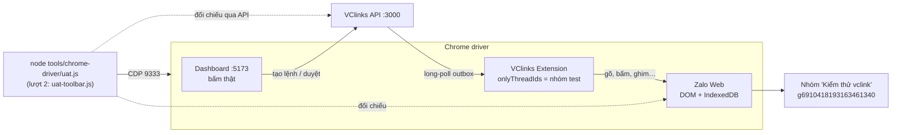
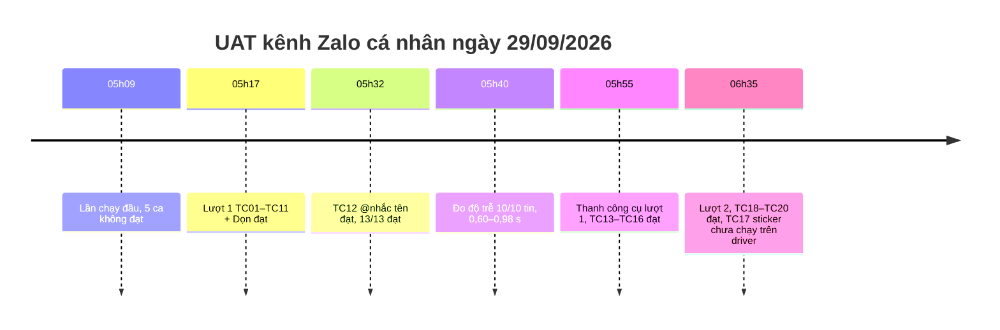
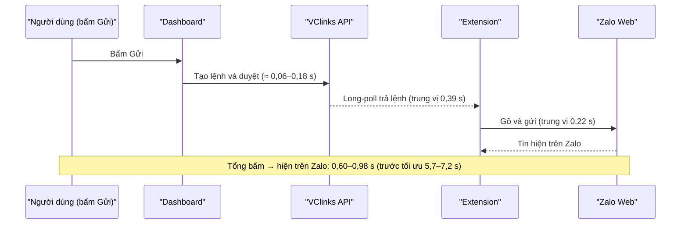

# UAT nghiệm thu kênh Zalo cá nhân — 29/09/2026, 05:17 (giờ Hà Nội)

Phiên bản 1.1 · 04/10/2026 · Trạng thái: Đã nghiệm thu (TC17 sticker còn chờ chạy trên driver)

## Mô hình

Bố trí lần chạy UAT trên Chrome driver (lượt 1):

Diễn biến các lượt trong buổi sáng 29/09/2026:

Các chặng của độ trễ gửi tin (đo lúc 05:40):

## Tóm tắt

- Biên bản UAT kênh **Zalo cá nhân** trên Chrome driver ngày 29/09/2026: bấm thật trên Dashboard, đối chiếu trên Zalo Web (DOM + IndexedDB) và qua API; mọi lệnh chỉ gửi vào nhóm test "Kiểm thử vclink".
- **Lượt 1: 13/13 đạt** (TC01–TC12 + dọn): danh sách và thẻ phân loại, bộ lọc chưa đọc, trang Đồng bộ khớp số, cảm xúc, ghim, đánh dấu đọc, gửi văn bản, trả lời trích dẫn, @nhắc tên.
- Lần chạy đầu (05:09) có 5 ca không đạt, đã sửa: trạng thái "Đã gửi" (1/2/3), tìm lại mục theo `anim-data-id`, đưa tab Zalo ra trước, API `participants` liệt kê thành viên chưa nhắn.
- **Độ trễ gửi:** 10/10 tin, bấm → hiện trên Zalo 0,60–0,98 s (trước tối ưu 5,7–7,2 s).
- **Thanh công cụ:** đạt gửi ảnh, file, danh thiếp, bình chọn (TC13–TC16) và mẫu câu `/`, số tài khoản (TC18–TC20); đã sửa lỗi lệnh chạy khi tab ẩn, danh thiếp bị xóa ô tìm, chế độ "Định dạng tin nhắn" chặn gửi chữ.
- **Còn mở:** TC17 gửi sticker mới có unit test, chưa chạy trên driver; chưa làm định dạng tin, nhắc hẹn, ghi chú, đánh dấu quan trọng/khẩn cấp, các nút tiêu đề nhóm; thả cảm xúc từ Dashboard đang ẩn.
- **Ràng buộc vận hành:** khi extension đang gửi, không dùng tay cửa sổ driver.
- **Người duyệt nên xem kỹ:** lượt 2 chạy trên API `:3003` và Dashboard `:5177` trong khi extension vẫn là build cũ trỏ `:3000`; quan sát `mentions[].len` của Zalo khác UTF-16 chưa đối chiếu xong; các bước để chủ dự án đưa lượt 2 lên driver ở cuối file.

## Mục lục

- [Đo lại độ trễ gửi tin (05:40, nhóm test, 10 tin liên tiếp)](#đo-lại-độ-trễ-gửi-tin-0540-nhóm-test-10-tin-liên-tiếp)
- [Thanh công cụ soạn tin và thanh tiêu đề nhóm (05:55)](#thanh-công-cụ-soạn-tin-và-thanh-tiêu-đề-nhóm-0555)
- [Thanh công cụ soạn tin — lượt 2: sticker, tin nhắn nhanh, số tài khoản (06:35)](#thanh-công-cụ-soạn-tin--lượt-2-sticker-tin-nhắn-nhanh-số-tài-khoản-0635)
- [Lịch sử cập nhật](#lịch-sử-cập-nhật)

---

**Cách chạy:** trên Chrome driver (CDP 9333) bằng `node tools/chrome-driver/uat.js`: bấm thật trên Dashboard `http://localhost:5173`, đối chiếu trên Zalo Web (DOM + IndexedDB) và qua API. Mọi lệnh gửi / đổi trạng thái chỉ vào nhóm **"Kiểm thử vclink"** (`g6910418193163461340`). Kết quả thô: `ket-qua.json`.

**Bản chạy:** `main` `49f075e`; API `:3000` (build `16db814`), Dashboard `:5173`, driver build `2026-09-28T22:13:15Z`, extension trỏ `:3000`, `onlyThreadIds` = nhóm test.

| # | Kiểm tra | Kết quả | Bằng chứng |
|---|---|---|---|
| TC01 | Danh sách hội thoại tải, có chip **thẻ phân loại** đúng tên và màu như Zalo | ✅ | 30 mục, chip `VCpart`, `Gia đình`, `HEAD` màu `rgb(217,27,27)` — `01-danh-sach.png` |
| TC02 | Bộ lọc **"Chưa đọc"** chỉ giữ hội thoại có tin chưa đọc | ✅ | 1/1 mục có badge |
| TC03 | Trang **Đồng bộ** có 7 luồng, gồm Cảm xúc / Thẻ phân loại / Đã đọc, số nguồn = số trong DB | ✅ | Cảm xúc 53=53, Thẻ 15=15, Đã đọc 159=159, Hội thoại 365=365 — `03-dong-bo.png` |
| TC04 | Khung chat nhóm test: **dải cảm xúc** trên tin, **trạng thái gửi** dưới tin cuối của mình | ✅ | `👍 3` trên tin `8315498399272`; "· Đã gửi" — `04-khung-chat.png` |
| TC05 | Tin **chuyển tiếp** hiện "Đã chuyển tiếp" | ✅ | 5 tin trên trang mới nhất của một hội thoại có tin chuyển tiếp |
| TC06 | **Ghim / Bỏ ghim** từ menu chuột phải → Zalo Web đổi trạng thái, Dashboard hiện icon ghim | ✅ | Zalo ghim sau 1,7 s; bỏ ghim OK — `06-ghim.png` |
| TC07 | **Đánh dấu chưa đọc / đã đọc** từ menu chuột phải → Zalo Web đổi trạng thái, Dashboard hiện badge | ✅ | Zalo có badge sau lệnh, hết badge sau "đã đọc" |
| TC08 | **Gửi tin văn bản** bằng khung soạn (gõ + bấm Gửi) → tin hiện trên Zalo Web | ✅ | 1,4 s từ bấm Gửi tới "đã gửi"; bong bóng `1790633869099` đúng nội dung — `08-gui-text.png` |
| TC09 | **Trả lời trích dẫn** từ Dashboard → Zalo Web hiện khối trích dẫn | ✅ | 0,96 s; bong bóng có `.message-quote-fragment__container` — `09-tra-loi.png` |
| TC10 | Nút **thả cảm xúc** trên Dashboard đang ẩn (chưa hỗ trợ) | ✅ ẩn có chủ ý | Zalo chỉ nhận chuột thật (xem `docs/04-ky-thuat/zalo-web/zalo-web-feature-map.md` D5) |
| TC11 | Ảnh Zalo Web nhóm test sau UAT | ✅ | `11-zalo-nhom-test.png` |
| Dọn | Trả nhóm test về trạng thái không ghim, đã đọc | ✅ | `{pinned:false, unread:false}` |
| TC12 | **@Nhắc tên trong nhóm** (05:32): nút "@" → chọn "Vcparts Tú" → gửi → Zalo hiện chip nhắc tên, IndexedDB có `mentions[]` | ✅ | Lệnh mang `mentions:[{name, uid}]`; bong bóng `1790634748480` có `a.mention-name` "@Vcparts Tú"; IDB `mentions:[{uid:225112513000081189,pos:0,len:8}]`; 13,9 s — `12-nhac-ten-zalo.png`, `12-nhac-ten-dashboard.png` |

**13/13 đạt** (TC12 chạy riêng lúc 05:32 sau khi sửa API `participants`). Lần chạy đầu (05:09) có 5 ca không đạt; nguyên nhân và cách sửa:

1. "Đã gửi" không hiện dưới tin mới nhất: Dashboard chỉ hiện khi `status = 3`, trong khi IndexedDB gán tin mới nhất `status = 1` và tăng dần 2 → 3 khi thành viên nhận/mở. Sửa: 1 = Đã gửi, 2 = Đã nhận, 3 = Đã xem; extension gửi lại tin 30 phút gần nhất mỗi lần sync để trạng thái cập nhật (`16db814`, `49f075e`).
2. Lệnh ghim/đánh dấu báo "Zalo chưa đổi trạng thái" dù đã đổi: Zalo vẽ lại danh sách ảo khi ghim, extension giữ node cũ. Sửa: tìm lại mục theo `anim-data-id` ở mỗi lần kiểm (`16db814`).
3. Kịch bản đọc DOM Zalo khi tab Zalo bị ẩn nên thấy trạng thái cũ (Chrome không vẽ lại tab ẩn). Sửa kịch bản: đưa tab Zalo ra trước khi đối chiếu.
5. TC12 lần đầu không chạy được: nút "@" bị vô hiệu vì API `participants` chỉ liệt kê người **đã nhắn** trong nhóm, mà nhóm test chỉ có mình nhắn. Sửa: liệt kê thêm thành viên nhóm chưa nhắn nếu đã biết tên (tên hội thoại 1-1 lấy từ thanh bên, hoặc danh bạ dạng rõ) — `c6f0cbc`→ commit "list silent group members".
6. Quan sát: Zalo ghi `mentions[].len = 8` cho "@Vcparts Tú" (11 ký tự) — cách đếm độ dài của Zalo khác UTF-16; Dashboard hiện tô màu phần đầu, cần đối chiếu thêm.
4. Có người thao tác tay trong driver lúc 05:03–05:10 (tin "hello", lệnh react, chuyển hội thoại) làm vài lệnh đợt đầu chậm/thất bại ("mục đang chọn: khác"). Đây là ràng buộc vận hành: **khi extension đang gửi, không dùng cửa sổ driver**.

**Chưa nghiệm thu / ngoài phạm vi lần này:** thả cảm xúc từ Dashboard (ẩn), gửi ảnh/file/danh thiếp/bình chọn và @nhắc tên (đã có từ nhánh send-actions, kiểm chứng riêng ngày 28/09 §3 HANDOFF, không lặp lại ở đây), kết bạn, tắt thông báo, gán nhãn.

## Đo lại độ trễ gửi tin (05:40, nhóm test, 10 tin liên tiếp)

5 tin gõ và bấm Gửi trên Dashboard trong driver + 5 tin tạo qua API. Mốc `duyệt → nhận lệnh → gửi xong` lấy từ `db.suggestions`; "bấm → gửi xong" đo từ lúc bấm Gửi tới khi extension báo tin đã hiện trên Zalo.

| Đường | # | bấm → tạo lệnh | duyệt → extension nhận | nhận → hiện trên Zalo | **bấm → hiện trên Zalo** |
|---|---|---|---|---|---|
| Dashboard | 1 | 0,08 s | 0,58 s | 0,22 s | **0,94 s** |
| Dashboard | 2 | 0,06 s | 0,30 s | 0,16 s | **0,61 s** |
| Dashboard | 3 | 0,07 s | 0,26 s | 0,16 s | **0,60 s** |
| Dashboard | 4 | 0,18 s | 0,21 s | 0,26 s | **0,66 s** |
| Dashboard | 5 | 0,07 s | 0,22 s | 0,18 s | **0,60 s** |
| API | 1–5 | – | 0,36 / 0,39 / 0,44 / 0,52 / 0,46 s | 0,29 / 0,30 / 0,18 / 0,22 / 0,35 s | **0,79 / 0,80 / 0,64 / 0,82 / 0,98 s** |

Tổng hợp 10 tin: **10/10 gửi được**; bấm → hiện trên Zalo **min 0,60 s · trung vị 0,61 s (Dashboard) / 0,80 s (API) · max 0,98 s**; duyệt → extension nhận lệnh trung vị 0,39 s (long-poll); nhận → gửi xong trung vị 0,22 s. So với trước khi tối ưu (28/09 chiều): 5,7–7,2 s.

Dashboard hiện dấu "✓ Đã gửi" trên bong bóng theo chu kỳ hỏi 1,5 s khi có tin đang gửi (không đo chính xác trong lần này).

## Thanh công cụ soạn tin và thanh tiêu đề nhóm (05:55)

Đối chiếu từng nút Zalo Web (`#chat-box-bar-id` và `header#header` của nhóm) với Dashboard; ca có tính năng thì bấm thật trên Dashboard, gửi vào nhóm test, kiểm trên Zalo Web / IndexedDB.

| Nút trên Zalo Web | Trên VClinks | Kết quả | Bằng chứng |
|---|---|---|---|
| Gửi Sticker (`div_Sticker_Menu`) | Chưa có | ⬜ chưa làm | |
| **Gửi hình ảnh** (`Photo_24_Line`) | Nút "Gửi hình ảnh" | ✅ TC13 | lệnh `[Ảnh]` sent sau 7 s; IDB: tin `1790636127392`, msgType 2, trong nhóm test, từ mình — `13-anh-zalo.png` |
| **Đính kèm File** (`Attach_24_Line`) | Nút "Đính kèm file" | ✅ TC14 | `[File] uat-file.txt` sent; bong bóng file "uat-file.txt" trên Zalo |
| **Gửi danh thiếp** (`div_CT_Menu`) | Nút "Gửi danh thiếp" | ✅ TC15 (sau 2 lần sửa) | `[Danh thiếp] Vcparts Tú` sent, tin `1790636138162`, bong bóng danh thiếp "Vcparts Tú · Nhắn tin" |
| Chụp kèm với cửa sổ Zalo | Không áp dụng (chức năng của app máy tính) | – | Dùng "Gửi hình ảnh" |
| Định dạng tin nhắn (`div_RTF_Menu`: đậm, nghiêng, gạch chân, gạch ngang, danh sách…) | Chưa có | ⬜ chưa làm | |
| Chèn tin nhắn nhanh (`btn_QuickMsg_Entry`) | Chưa có (dự kiến thay bằng mẫu câu `/` của VClinks) | ⬜ chưa làm | |
| Gửi nhanh số tài khoản | Chưa có | ⬜ chưa làm | |
| Tùy chọn thêm → **Tạo bình chọn** (`div_MoreMenu_Poll`) | Nút "Tạo bình chọn" | ✅ TC16 | `[Bình chọn] UAT bình chọn 05:55:38` sent; câu hỏi hiện trong `.group-poll-message-container` — `16-binh-chon-zalo.png` |
| Tùy chọn thêm → Tạo nhắc hẹn | Chưa có | ⬜ chưa làm | |
| Tùy chọn thêm → Tạo ghi chú (`div_MoreMenu_Note`) | Chưa có | ⬜ chưa làm | |
| Tùy chọn thêm → Đánh dấu tin quan trọng / khẩn cấp | Chưa có | ⬜ chưa làm | |
| **@Nhắc tên** (gõ `@` trong ô soạn) | Nút "Nhắc tên" | ✅ TC12 (05:32) | xem trên |
| Tiêu đề: Chỉnh sửa tên nhóm | Chưa có | ⬜ | |
| Tiêu đề: "3 thành viên" (xem thành viên) | Chỉ dùng nội bộ cho gợi ý @ / danh thiếp | ⬜ chưa có màn hình | |
| Tiêu đề: Phân loại (gán thẻ) | Chỉ hiển thị thẻ, chưa gán được | 🟡 | chip thẻ trên danh sách (TC01) |
| Tiêu đề: Thêm bạn vào nhóm (`btn_Grp_AddMem`) | Chưa có | ⬜ | |
| Tiêu đề: Tìm kiếm tin nhắn | Chưa có (chỉ tìm hội thoại theo tên) | ⬜ | |
| Tiêu đề: Thông tin hội thoại (bảng bên phải) | Chưa có | ⬜ | |

**Lỗi tìm ra và đã sửa trong lượt này:**

1. `b3cdf26` — Lệnh (ảnh, file, danh thiếp, bình chọn, ghim…) chạy khi tab Zalo đang ẩn; chỉ lệnh gửi chữ mới đưa tab ra trước. Tab ẩn không vẽ lại danh sách của Zalo. Sửa: đưa tab Zalo ra trước cho mọi lệnh.
2. `9c2b429` — **Gửi danh thiếp chỉ gửi được người có sẵn trong danh sách mặc định**: Zalo xoá ô tìm ngay sau khi hộp danh thiếp mở, tên điền quá sớm bị mất, danh sách không lọc. Lần gửi thành công hôm 28/09 ("9C_Hiệp Lễ") chỉ vì người đó nằm sẵn trong danh sách mặc định. Sửa: điền, chờ 0,5 s, điền lại khi ô không còn giữ tên (tối đa 4 lần); chỉ chọn dòng khi ô vẫn giữ tên. Có test tái hiện đúng hành vi xoá.

## Thanh công cụ soạn tin — lượt 2: sticker, tin nhắn nhanh, số tài khoản (06:35)

Đối chiếu lại **9 nút** của `#chat-box-bar-id` trên Zalo Web sau khi làm thêm ba nút còn thiếu (nhánh `feat/zalo-toolbar`, đã gộp vào `main`). Khảo sát DOM lúc 06:05–06:15 trong nhóm test (mở từng panel rồi đóng, không gửi gì); mã nguồn sự thật: [`docs/04-ky-thuat/zalo-web/zalo-dom-selectors.md`](../../../04-ky-thuat/zalo-web/zalo-dom-selectors.md) §"Thanh soạn".

| # | Nút trên Zalo Web | Trên VClinks | Trạng thái | Ghi chú |
|---|---|---|---|---|
| 1 | Gửi Sticker (`div_Sticker_Menu`) | Nút "Gửi Sticker": lưới 40 sticker bộ mặc định "Củ hành" → lệnh `send_sticker` → extension mở panel, chọn tab bộ, bấm đúng ảnh thu nhỏ | 🟡 **đã code, unit test 4/4**, chưa chạy trên driver (TC17) | Bộ sticker tài khoản tự thêm chưa có danh mục (cần đọc store `sticker` của IndexedDB, 875 bản ghi). Tìm sticker theo từ khóa chưa làm. |
| 2 | Gửi hình ảnh | Nút "Gửi hình ảnh" | ✅ TC13 (lượt 1) | |
| 3 | Đính kèm File | Nút "Đính kèm file" | ✅ TC14 (lượt 1) | |
| 4 | Gửi danh thiếp | Nút "Gửi danh thiếp" | ✅ TC15 (lượt 1) | |
| 5 | Chụp kèm với cửa sổ Zalo | Không áp dụng | – | Chức năng của app máy tính; trên web dùng "Gửi hình ảnh". |
| 6 | Định dạng tin nhắn (`div_RTF_Menu`) | Chưa có | ⬜ | Bật chế độ này Zalo **thay `#richInput` bằng editor khác** (`.input-v4`, id ngẫu nhiên) và giữ trạng thái theo tab → extension trước đây báo "không thấy ô soạn tin". Đã sửa extension tự tắt chế độ này trước khi gõ (xem lỗi 1). Gửi tin có đậm/nghiêng cần khảo sát thêm cách áp định dạng trong editor mới. |
| 7 | Chèn tin nhắn nhanh (`btn_QuickMsg_Entry`) | **Mẫu câu VClinks** dùng chung: nút "Tin nhắn nhanh" (thêm/sửa/xóa) và gõ `/phimtat` trong ô soạn, biến `{ten_khach}`, `{ten_nv}` | ✅ TC18, TC20 | Tài khoản Zalo này không có tin nhắn nhanh nào (panel Zalo trống, store `quick_message` 1 bản ghi mã hóa) nên không đọc mẫu riêng từng nick, đúng BA F3.2. |
| 8 | Gửi nhanh số tài khoản | Nút "Gửi nhanh số tài khoản": danh sách mẫu loại "Số tài khoản" → chèn vào ô soạn → gửi như tin thường | ✅ TC19 | Tài khoản Zalo này chưa thêm số tài khoản nào (popover "Thêm số tài khoản…"), nên không gửi thẻ ngân hàng của Zalo; số tài khoản công ty lưu ở VClinks. |
| 9 | Tùy chọn thêm → Tạo bình chọn | Nút "Tạo bình chọn" | ✅ TC16 (lượt 1) | |
| 9 | Tùy chọn thêm → Tạo nhắc hẹn / Tạo ghi chú (`div_MoreMenu_Note`) / Đánh dấu tin quan trọng (`.mark-important-message-menu-item`) / khẩn cấp (`.mark-urgent-message-menu-item`) | Chưa có | ⬜ | Đã có selector của 5 mục menu. Cần khảo sát hộp thoại nhắc hẹn / ghi chú và trạng thái ô soạn khi bật cờ quan trọng/khẩn cấp; script khảo sát có thao tác gõ và bật cờ **bị chặn quyền** trong phiên này nên chưa làm. |

**Bản chạy lượt 2:** API `:3003` (build nhánh, cùng DB `vcconnect`), Dashboard `:5177` (cổng `5174` đã bị vite của thư mục chính chiếm) mở trong một Chromium headless riêng, token lấy từ tab Dashboard đã đăng nhập trong driver; extension trong driver **vẫn là build `main` 2026-09-28T22:54:50Z trỏ `:3000`** (lệnh `pnpm driver` để nạp build mới bị chặn quyền), extension nhận lệnh qua `:3000` vì hai API dùng chung DB. Zalo Web chỉ được đọc qua CDP. Script: `DASH=http://localhost:5177 SKIP=TC17 node tools/chrome-driver/uat-toolbar.js`; kết quả thô `ket-qua-toolbar.json`.

| # | Kiểm tra | Kết quả | Bằng chứng |
|---|---|---|---|
| TC17 | Gửi Sticker #3 bộ "Củ hành" từ Dashboard → bong bóng sticker trên Zalo, IDB `msgType` 4 | ⏸ chưa chạy trên driver | Cần `pnpm driver` với build mới. Unit test `sendSticker` 4/4 (`apps/extension/test/sender-actions.test.ts`): chọn đúng ảnh thu nhỏ, chọn theo vị trí, từ chối bộ không có, từ chối ảnh/vị trí không khớp và đóng panel. |
| TC18 | Tạo mẫu `/uatbh` (có `{ten_khach}`) → gõ `/uat` trong ô soạn hiện gợi ý → Enter chèn "Dạ Kiểm thử vclink, sản phẩm được bảo hành 12 tháng ạ (UAT 06:31:25)." → gửi | ✅ | tin `1790638288159` hiện trên Zalo sau **0,5 s** — `18-slash-picker.png` |
| TC19 | Tạo mẫu loại Số tài khoản → nút "Gửi nhanh số tài khoản" liệt kê "UAT STK VCparts" → chèn "Vietcombank 0011 0022 3344 - CTCP VC Phồn Vinh (UAT 06:31:25)" → gửi | ✅ | tin `1790638292796` sau **0,9 s** — `19-stk-menu.png`, `19-stk-zalo.png` |
| TC20 | Hộp "Tin nhắn nhanh (mẫu câu)": liệt kê 2 mẫu, sửa tên `/uatbh` → danh sách cập nhật "UAT bảo hành (đã sửa)" | ✅ | `20-mau-cau.png` (06:27) |

Mẫu câu UAT đã xóa sau khi chạy (`quick_replies` = 0). Test tự động: shared 59/59 (schema `send_sticker`, mẫu câu), extension 228/228, web 24/24, API e2e `quick-replies` + `outbox-commands` 5/5.

**Lỗi tìm ra trong lượt này:**

1. **Chế độ "Định dạng tin nhắn" chặn mọi lệnh gửi chữ.** Khảo sát đã bật `div_RTF_Menu` và chưa tắt; hai lệnh gửi đầu (06:27) thất bại "không thấy ô soạn tin (#richInput)" vì trong chế độ này Zalo dùng editor khác. Sửa (`findComposer` trong `apps/extension/src/sender.ts`): khi thiếu `#richInput` mà `.chat-box-input-container.--rtf-mode` có mặt thì bấm `div_RTF_Menu` một lần rồi chờ `#richInput`; dùng cho cả gửi chữ và @nhắc tên; có test. Trên driver đã tắt chế độ này bằng tay (06:29) và hai lệnh chạy lại thành công.
2. **Nháp " x" có sẵn trong ô soạn nhóm test** (sidebar Zalo hiện "Chưa gửi x" từ trước 06:12): extension từ chối ghi đè nháp (đúng thiết kế). Đã xóa nháp một ký tự đó để chạy tiếp.
3. Script UAT ghi ảnh vào thư mục theo ngày UTC (`uat-2026-09-28`); đã đổi sang ngày giờ Hà Nội.

**Để đưa lượt 2 lên driver (chủ dự án):** `pnpm driver` (nạp build `main` mới), khởi động lại API `:3000` từ `main` (`pnpm --filter @vclinks/api build` rồi `MONGO_URI=mongodb://localhost:27017/vcconnect node apps/api/dist/main.js`), rồi `DASH=http://localhost:5173 node tools/chrome-driver/uat-toolbar.js` để chạy TC17 (sticker) cùng TC18–TC20.

## Lịch sử cập nhật

| Phiên bản | Ngày | Người / phiên | Thay đổi | Căn cứ |
|---|---|---|---|---|
| 1.1 | 04/10/2026 13:35 | Claude Code | Cập nhật đường dẫn tài liệu theo cấu trúc `docs/` mới; nội dung không đổi | Chủ dự án duyệt cấu trúc docs/ 04/10/2026 13:35 |
| 1.1 | 04/10/2026 | Claude Code | Hồi tố theo CLAUDE.md §13: thêm Mô hình, Tóm tắt, Mục lục, Lịch sử | `docs/ke-hoach/hoi-to-tai-lieu-md.md` |
| 1.0 | 29/09/2026 | — | Các bản trước khi có bảng lịch sử (xem `git log -- docs/uat-2026-09-29/README.md`): lượt 1 lúc 05:17, TC12 lúc 05:32, đo độ trễ lúc 05:40, thanh công cụ lượt 1 lúc 05:55, lượt 2 lúc 06:35 | — |
