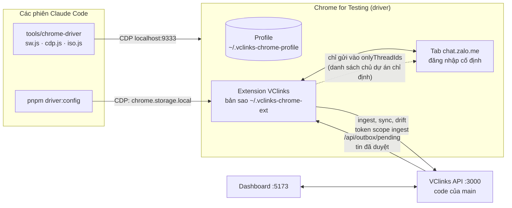
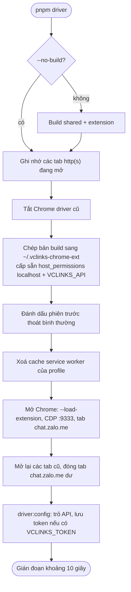

# Chrome driver: máy thu và gửi Zalo cố định của VClinks

Phiên bản 1.11 · 07/10/2026 · Trạng thái: Đang áp dụng

## Mô hình

Thành phần của driver và các bên kết nối:



Các bước `pnpm driver` khởi động lại driver (theo `tools/chrome-driver/driver.sh`):



## Tóm tắt

- Chrome driver là Chrome for Testing riêng (profile riêng, CDP cổng 9333) chạy extension build từ `main`; là máy thu/gửi Zalo mặc định trên máy chủ dự án từ 28/09/2026.
- Mọi phiên Claude dùng **chung một driver**; `pnpm driver` khởi động lại Chrome (gián đoạn khoảng 10 giây) nên phải báo hoặc chờ trước khi chạy.
- **Cập nhật code luôn phải khởi động lại Chrome**: extension nạp bằng `--load-extension` bị gỡ khi tải lại tại chỗ; không chép build mới khi driver đang chạy.
- Chỉ gửi tin đã duyệt từ `/api/outbox/pending`; chỉ gửi vào danh sách hội thoại chủ dự án chỉ định (`onlyThreadIds`); thêm, bớt hay bỏ giới hạn là quyết định của chủ dự án. Khi driver gửi thì tắt gửi ở Chrome thường.
- API `:3000` phải chạy code `main` bằng `node apps/api/dist/main.js` với database `vclinks`, không dùng `--watch`; worktree khác thì dùng cổng khác.
- Helper `sw.js`, `cdp.js`, `iso.js` cho Claude chạy lệnh trong service worker, trang Zalo và isolated world; bảng sự cố thường gặp ở cuối.
- **Cửa sổ lấy nội dung riêng (chủ dự án chốt 05/10/2026):** extension chỉ đọc nội dung tin từ màn hình khi tab Zalo rảnh 15 giây, nên driver chung (9333) hay bị chặn khi có người hoặc phiên Claude khác chạm. Cửa sổ fleet `VClinks · nick-02` (cổng 9342, nick "zalo Hải") là cửa sổ lấy nội dung chuyên dụng: **để mở, không thu nhỏ, không bấm vào**; driver chung giữ để gửi và UAT. Cửa sổ Chrome đặt tên theo hồ sơ (`VClinks · driver chung :9333`, `VClinks · <tên nick> :<cổng>`, commit `dcf5550`) để phân biệt trong Dock / Mission Control.
- **Nhiều nick (M1a-01):** `pnpm fleet` chạy N hồ sơ Chrome (mỗi nick một hồ sơ, không dùng cổng 9333); `pnpm watchdog` tự bật lại hồ sơ treo và báo mất phiên về API (`account.session_lost`, thử trên Mac: 1 phút 41 giây).
- **Cloud:** systemd + Xvfb, quét lại QR từ xa qua noVNC sau Cloudflare Tunnel có đăng nhập, người trực tạm là chủ dự án. ⛔ Chưa thử trên máy ảo (E1), chưa thử ≥ 3 nick thật (E2), chưa thử hai phiên web cùng một nick.
- **Máy Zalo (05/10/2026, nhánh `feat/giao-dien-moi`):** container trên máy chủ, mỗi nick một hồ sơ Chrome. Admin bấm "Kết nối bằng mã QR" trên Dashboard, người giữ nick quét mã ngay trên Dashboard, không cần noVNC. Đã chạy trên máy 129; chưa thử đăng nhập bằng nick thật.
- **Người duyệt cần xem kỹ:** id extension `hnhcfdoooijieabbckckhpomhlbfjeee` phụ thuộc đường dẫn thư mục; uid và thread mẫu trong lệnh `--sender on` là dữ liệu thật của tài khoản test.

## Mục lục

- [Cài lần đầu](#cài-lần-đầu)
- [Dùng hằng ngày](#dùng-hằng-ngày)
- [Gửi tin từ driver](#gửi-tin-từ-driver)
- [Helper cho Claude (thư mục tools/chrome-driver)](#helper-cho-claude-thư-mục-toolschrome-driver)
- [Nhiều phiên Claude cùng lúc](#nhiều-phiên-claude-cùng-lúc)
- [Nhiều nick và watchdog](#nhiều-nick-và-watchdog)
- [Chạy trên cloud](#chạy-trên-cloud)
- [Quét lại QR và người trực](#quét-lại-qr-và-người-trực)
- [Máy Zalo: quét QR trên Dashboard](#máy-zalo-quét-qr-trên-dashboard)
- [Kết quả thử](#kết-quả-thử)
- [Sự cố thường gặp](#sự-cố-thường-gặp)
- [Lịch sử cập nhật](#lịch-sử-cập-nhật)

---

Chrome driver là một **Chrome for Testing riêng**, có profile riêng và cổng gỡ lỗi từ xa (CDP), chạy extension VClinks build từ nhánh `main`. Đây là cách chạy mặc định của VClinks trên máy chủ dự án kể từ 28/09/2026:

- Zalo Web đăng nhập cố định trong driver, extension đồng bộ và gửi tin từ đây, không phụ thuộc Chrome thường của chủ dự án.
- Claude (Claude Code) điều khiển được driver qua CDP: đọc trạng thái extension, kiểm tra DOM Zalo, chạy thử gửi tin.
- Mọi phiên Claude dùng **chung một driver**. Không tự khởi động lại driver khi phiên khác đang dùng.

| Thành phần | Mặc định | Biến môi trường |
|---|---|---|
| Cổng CDP | `9333` | `DRIVER_PORT` |
| Profile Chrome | `~/.vclinks-chrome-profile` | `DRIVER_PROFILE` |
| Bản sao extension (unpacked) | `~/.vclinks-chrome-ext` | `DRIVER_EXT` |
| API extension gọi tới | `http://localhost:3000` | `VCLINKS_API` |
| Token ingest lưu vào extension | giữ token đang có | `VCLINKS_TOKEN` |
| Trình duyệt | Chromium mới nhất trong cache playwright, rồi `/Applications` | `CHROME_BIN` |
| Tab mở đầu | `https://chat.zalo.me` | `DRIVER_URL` |

Id của extension trong driver là `hnhcfdoooijieabbckckhpomhlbfjeee` (Chrome tính từ đường dẫn `~/.vclinks-chrome-ext`; đổi thư mục thì đổi id).

## Cài lần đầu

```bash
npx playwright-core install chromium              # nếu máy chưa có Chrome for Testing
MONGO_URI=mongodb://localhost:27017/vclinks pnpm token:create --name "Chrome driver - extension" --scopes ingest
VCLINKS_TOKEN=<token vừa tạo> pnpm driver          # build extension, mở driver, lưu API + token
```

Cửa sổ driver hiện ra với tab Zalo Web: đăng nhập Zalo một lần, profile giữ phiên đăng nhập cho các lần sau. API `:3000` và Dashboard `:5173` chạy như hướng dẫn trong README (`pnpm dev:api`, `pnpm dev:web`).

> Database thật là `vclinks` (từ 29/09/2026 đồng bộ lại từ đầu; dữ liệu cũ của `vcconnect` giữ ở database `vclinkBackup`). API `:3000` chạy ổn định bằng `node apps/api/dist/main.js` với `MONGO_URI=mongodb://localhost:27017/vclinks`, **không** dùng `nest start --watch` cho bản đang phục vụ, vì phiên khác sửa `apps/api/src` sẽ làm API tự khởi động lại.

## Dùng hằng ngày

```bash
pnpm driver                # build lại extension từ repo này, khởi động lại driver, trỏ API mặc định
pnpm driver -- --no-build  # khởi động lại với bản build đang có
pnpm driver:config --show                       # trạng thái: API, token có hay không, /api/me, cấu hình gửi, build đang chạy
pnpm driver:config --api http://localhost:3000  # đổi API (chỉ nhận https:// hoặc http://localhost)
VCLINKS_TOKEN=... pnpm driver:config               # đổi token (không in ra màn hình)
```

**Cập nhật code luôn phải khởi động lại Chrome.** Extension nạp bằng `--load-extension` bị Chrome gỡ ngay khi tải lại tại chỗ, dù là `chrome.runtime.reload()` (cơ chế tự tải lại của bản dev) hay nút Reload trong `chrome://extensions` (kiểm chứng 28/09/2026 trên Chrome for Testing 153). Vì vậy:

- Không chép bản build mới vào `~/.vclinks-chrome-ext` khi driver đang chạy: `build-id.json` đổi thì extension tự gọi `chrome.runtime.reload()` và biến mất. `pnpm driver` chép bản mới **sau khi** đã tắt Chrome cũ.
- `pnpm driver` mở lại các tab `http(s)` đang mở (ví dụ Dashboard) sau khi khởi động lại; profile giữ phiên đăng nhập Zalo. Gián đoạn khoảng 10 giây.
- `pnpm driver` đánh dấu phiên trước là thoát bình thường (Chrome bị kill sẽ tự khôi phục tab cũ → trùng tab Zalo, một tab kẹt ở màn "Kích hoạt", extension có thể khóa gửi vào tab chết đó) và đóng các tab `chat.zalo.me` dư sau khi mở. Nếu vẫn thấy màn "Kích hoạt", bấm vào nó hoặc tải lại tab.
- `pnpm driver` cũng xóa cache service worker của profile, vì Chrome có lúc giữ `background.js` cũ dù trên đĩa là bản mới. Khi nghi ngờ, xem `--show`: `build.running` phải bằng `build.onDisk`.

Bản sao extension trong driver chỉ khác bản build thật ở một điểm: `host_permissions` được cấp sẵn `http://localhost/*` và origin của `VCLINKS_API`, vì trong driver không ai bấm nút cấp quyền.

## Gửi tin từ driver

Extension chỉ gửi tin **đã duyệt** (`approvedBy`, `approvedAt`) lấy từ `/api/outbox/pending`. Cấu hình gửi nằm trong `chrome.storage.local` khóa `vclinksSender`:

```bash
pnpm driver:config --sender on --uid 476214826876503713 --only-threads g6910418193163461340
pnpm driver:config --sender off
pnpm driver:config --all-threads     # bỏ danh sách thread cho phép
pnpm driver:config --auto-sync off   # tắt đồng bộ nội dung tự động (mặc định bật, xem docs/zalo-web-extraction.md §4.6)
```

- `onlyThreadIds` là danh sách thread được phép gửi. Từ 05/10/2026 (UAT trên nick thật "ZALO cá nhân Bùi Thọ Anh") driver **chỉ gửi vào hội thoại chủ dự án chỉ định**: nhóm "test nhom" (`g615140573867383475`) và người "test that" (thêm khi có mã). Đổi danh sách: `pnpm driver:config --only-threads <mã 1>,<mã 2>` (mã người là mã Zalo của người đó, mã nhóm là `g` + mã nhóm; tra trong collection `conversations` theo tên). Thêm, bớt hay bỏ giới hạn (`--all-threads`) là quyết định của chủ dự án.
- Khi driver là máy gửi, hãy **tắt gửi trong Chrome thường** (popup extension, công tắc gửi tin) để hai extension không cùng nhận lệnh cho một tài khoản.
- Extension bỏ qua lượt gửi nếu có thao tác chuột/bàn phím trên tab Zalo trong 5 giây gần nhất, nên có thể dùng cửa sổ driver bình thường.
- Cửa sổ driver nằm trên màn hình của chủ dự án. Script tự động bấm trên Dashboard phải kiểm tra đúng thread trước khi bấm Gửi. Tạo lệnh thử bằng API (`POST /api/outbox` với `threadId` rõ ràng) an toàn hơn bấm giao diện.

## Helper cho Claude (thư mục `tools/chrome-driver`)

```bash
node tools/chrome-driver/sw.js  "chrome.storage.local.get('vclinksSenderStatus')"   # chạy trong service worker
node tools/chrome-driver/cdp.js chat.zalo.me "document.title"                         # chạy trong trang Zalo (page world)
node tools/chrome-driver/cdp.js chat.zalo.me ./script.js                              # file JS thay cho biểu thức
node tools/chrome-driver/iso.js "typeof window"                                       # isolated world "VClinks" của content.js
```

Cả ba nối vào `localhost:9333` bằng `playwright-core` (devDependency ở gốc repo). Service worker MV3 tắt khi rảnh; `lib.js` tự mở `popup.html` một lần để đánh thức nó.

## Nhiều phiên Claude cùng lúc

- Trước khi gỡ lỗi gửi tin: `lsof -iTCP -sTCP:LISTEN -P -n | grep -E ':(3000|5173|9333)'` để biết API nào đang chạy, rồi `pnpm driver:config --show` để biết extension trỏ vào đâu và chạy build nào.
- API mặc định `:3000` phải chạy code của `main`. Một phiên chạy API từ worktree khác thì đổi cổng, và chỉ trỏ driver sang cổng đó khi thử nghiệm, xong thì trỏ về `:3000`.
- `pnpm driver` khởi động lại Chrome, làm gián đoạn phiên khác đang dùng driver (script tự động đang chạy dở sẽ lỗi). Báo hoặc chờ trước khi chạy.
- **Khóa driver (bắt buộc từ M1):** trước khi chạy `pnpm driver`, `pnpm driver:config`, trỏ driver sang API khác hoặc gửi tin thử, đọc file `~/.vclinks-driver.lock`.
  - Không có file: ghi một dòng `<mã phiên> · <dd/mm HH:mm> · <việc>`, làm xong thì xóa file.
  - Có file: chờ và báo chủ dự án.
  - Khóa quá 60 phút không cập nhật giờ: báo chủ dự án rồi mới ghi đè.

  File nằm ngoài git để mọi worktree đều thấy. Chi tiết và các rủi ro khác: `docs/01-quan-ly-du-an/m1/ke-hoach-phien-chat.md` §4.6.

## Nhiều nick và watchdog

Từ M1a-01, driver chạy được **nhiều hồ sơ Chrome**, mỗi nick Zalo một hồ sơ (cổng CDP, thư mục hồ sơ, bản sao extension riêng). Driver dùng chung cổng 9333 ở trên vẫn giữ nguyên; bộ nhiều hồ sơ **không bao giờ** dùng cổng 9333.

**Cấu hình** nằm trong `tools/chrome-driver/fleet.json` (không đưa vào git; chép từ `fleet.example.json`; biến `FLEET_CONFIG` đổi đường dẫn):

| Trường | Mặc định | Ý nghĩa |
|---|---|---|
| `api` | `http://localhost:3000` | API extension và watchdog gọi tới (biến `VCLINKS_API` ghi đè) |
| `fleetDir` | `~/.vclinks-fleet` | Thư mục chứa `<tên>/profile` và `<tên>/ext` của từng hồ sơ |
| `profiles[]` | — | `{ name, port, uid?, observeOnly? }`. `uid` là uid Zalo của nick (cần để báo API); `observeOnly` chỉ theo dõi, không khởi động lại |
| `intervalSec` | 60 | Chu kỳ kiểm tra của watchdog |
| `confirmRounds` | 2 | Số vòng liên tiếp cùng một lỗi thì mới báo (≈ 2 phút) |
| `syncPeriodMin` + `silentMin` | 15 + 10 | Extension coi là "im" khi lần báo đồng bộ cuối cũ hơn 25 phút (chu kỳ đồng bộ 15 phút + ngưỡng 10 phút) |
| `maxRestartsPerHour` | 3 | Giới hạn tự khởi động lại mỗi hồ sơ, tránh vòng lặp khởi động |

```bash
cp tools/chrome-driver/fleet.example.json tools/chrome-driver/fleet.json   # rồi sửa tên, cổng, uid
VCLINKS_TOKEN=<token ingest> pnpm fleet start          # build extension một lần, bật mọi hồ sơ, lưu API + token
pnpm fleet status                                      # mỗi hồ sơ: ok / qr / tab_missing / cdp_down
pnpm fleet stop nick-02                                # tắt một hồ sơ
pnpm fleet config nick-01 -- --sender on --uid <uid> --only-threads <thread nhóm test>
VCLINKS_TOKEN=<token ingest> pnpm watchdog             # chạy watchdog (trên cloud do systemd chạy)
```

**Watchdog** (`tools/chrome-driver/watchdog.js`) chỉ đọc danh sách tab qua `/json/list` của từng hồ sơ, không đọc nội dung trang, cookie hay storage:

| Phát hiện | Lý do báo | Watchdog làm gì |
|---|---|---|
| Cổng CDP không trả lời (Chrome tắt hoặc treo) | `cdp_down` | Khởi động lại hồ sơ |
| Chrome chạy nhưng không có tab `chat.zalo.me` | `tab_missing` | Mở lại tab Zalo |
| Tab ở trang đăng nhập `id.zalo.me` (màn QR) | `qr` | Chỉ báo; người trực quét QR. **Không bao giờ tự đăng nhập hay nhập OTP** (§12.2) |
| Lần báo đồng bộ cuối của extension quá cũ | `extension_silent` | Khởi động lại hồ sơ |

Mỗi vòng, với hồ sơ có `uid`, watchdog gửi `POST /api/accounts/:uid/session` (token ingest) với `{state: ok|lost, reason?, source}`. API lưu vào trường `session` của doc `accounts` (`state, reason, since, reportedAt, source`) và chỉ ghi `audit_log` khi trạng thái đổi: `account.session_lost` / `account.session_restored`. `GET /api/accounts` trả kèm `session` để Dashboard báo đỏ (M1a-02). Khi có nhật ký sự kiện của M1b-01 thì gọi thêm `EventsService.append()` ở cùng chỗ.

## Chạy trên cloud

> ⛔ Phần này viết sẵn, **chưa thử** trên máy ảo (chờ E1: máy ảo 8 vCPU, 16 GB, IP tĩnh). Đã thử trên máy Mac: xem [Kết quả thử](#kết-quả-thử).

Máy ảo Linux (Ubuntu 24.04 hoặc Debian 12), chạy bằng **systemd + Xvfb** (màn hình ảo, vì Zalo Web cần Chrome có giao diện, không chạy headless). Docker là phương án dự phòng (`tools/chrome-driver/cloud/Dockerfile`).

1. Cài gói: `zsh rsync python3 curl xvfb x11vnc novnc websockify`, Node 20, `corepack enable`. Tạo user `vclinks`, chép repo vào `/opt/vclinks`.
2. `pnpm install`, `npx playwright-core install --with-deps chromium`, `pnpm --filter @vclinks/shared build && pnpm --filter @vclinks/extension build`.
3. Tạo `tools/chrome-driver/fleet.json` (mỗi nick một dòng) và `/etc/vclinks/driver.env` (quyền 600): `VCLINKS_API=https://<api>`, `VCLINKS_TOKEN=<token ingest>`, `WATCHDOG_SOURCE=<tên máy>`. API phải là `https://` (hoặc `http://localhost` nếu API chạy cùng máy).
4. `x11vnc -storepasswd` (mật khẩu VNC của user `vclinks`), chép ba unit trong `tools/chrome-driver/cloud/` vào `/etc/systemd/system/`, rồi `systemctl enable --now vclinks-xvfb vclinks-novnc vclinks-watchdog`.
5. `vclinks-watchdog` bật mọi hồ sơ lúc khởi động, rồi theo dõi; hồ sơ nào tắt hay treo thì watchdog tự bật lại. Xem log: `journalctl -u vclinks-watchdog -f`.

Thư mục `~/.vclinks-fleet` giữ phiên đăng nhập Zalo của mọi nick: coi như bí mật, sao lưu mã hóa, không chép sang máy khác.

## Quét lại QR và người trực

- **Người trực tạm:** chủ dự án (chốt 04/10/2026), cho tới khi có danh sách người giữ điện thoại của từng nick (E2, §21 câu 27).
- **Xem màn hình máy ảo từ xa:** noVNC chỉ nghe ở `127.0.0.1:6080`, đi ra ngoài qua **Cloudflare Tunnel** có **Cloudflare Access** (chỉ email `@vcprosperous.com` được vào), thêm mật khẩu VNC. Không mở cổng 5900/6080 ra Internet.
- **Quy trình khi báo `qr`:**
  1. Dashboard báo đỏ nick X (`session.state = lost`, `reason = qr`), hoặc xem `pnpm fleet status`.
  2. Người trực mở trang noVNC, tìm cửa sổ Chrome của nick X (tiêu đề cửa sổ / hồ sơ), thấy mã QR.
  3. Người giữ điện thoại của nick X mở app Zalo → quét QR. Không ai nhập mật khẩu hay OTP vào máy ảo.
  4. Trong ≤ 2 phút watchdog báo `ok`, API ghi `account.session_restored`.
- **Không mở Zalo Web của nick đó ở nơi khác** (BR19, ZR11): mỗi nick chỉ một nơi chạy connector.

## Máy Zalo: quét QR trên Dashboard

Kế hoạch: `docs/01-quan-ly-du-an/ke-hoach-zalo-ca-nhan-quet-qr.md` (phương án A, cách làm giống Pancake "Kết nối Zalo cá nhân"). Máy Zalo là một container trên máy chủ, mỗi nick một hồ sơ Chrome chạy Zalo Web cùng tiện ích VClinks, giống fleet ở trên. Khác fleet ở hai điểm:
- Hồ sơ được tạo và xóa theo lệnh từ Dashboard, không cần sửa `fleet.json`.
- Mã QR đăng nhập hiện ngay trong Dashboard, không phải mở noVNC.

| Thành phần | Ở đâu | Việc |
|---|---|---|
| Container `zalo-farm` | `tools/chrome-driver/farm/Dockerfile`, `entrypoint.sh`; dịch vụ `zalo-farm` trong `tools/deploy/server-129/compose.yml` (profile `farm`) | Xvfb (màn hình ảo), Chrome for Testing, tiện ích build sẵn, noVNC (chỉ `127.0.0.1`), agent |
| Agent | `tools/chrome-driver/farm-agent.js` + `farm-lib.js`, `127.0.0.1:9400`, khóa `x-farm-key` | Tạo, bật, xóa hồ sơ (CDP `9451–9499`); chụp vùng mã QR khi tab ở `id.zalo.me`; tự bấm "Lấy mã mới" khi mã hết hạn; đọc **tên** DB `zdb_<uid>`; mỗi 30 giây bật lại Chrome chết (3 lần/giờ) và báo phiên về `POST /api/accounts/:uid/session` |
| API | `apps/api/src/zalo-farm/`, bảng `zalo_slots` | `GET /api/zalo/farm`, `GET`/`POST /api/zalo/slots`, `GET /api/zalo/slots/:id?qr=1`, `POST /api/zalo/slots/:id/sync-history`, `DELETE /api/zalo/slots/:id`, `POST /api/zalo/rescan/:uid`; gắn nick vào division và người giữ, chống quét nhầm, ghi nhật ký `zalo.*` |
| Dashboard | Kênh › thẻ Zalo cá nhân và mục "Máy Zalo"; popover chấm Nick | Hộp thoại "Kết nối nick Zalo bằng mã QR", "Quét lại QR", "Đồng bộ tin nhắn cũ", "Ngắt" |

**Bật trên một máy chủ** (máy 129 đã bật 05/10/2026). Thêm vào `~/vclinks/.env`:
- `COMPOSE_PROFILES=…,farm`
- `ZALO_FARM_URL=http://127.0.0.1:9400`
- `ZALO_FARM_KEY`: chuỗi ngẫu nhiên từ 24 ký tự, API và agent dùng chung.
- `ZALO_FARM_TOKEN`: token ingest riêng của máy Zalo.
- `ZALO_FARM_MAX`: số nick tối đa, máy 129 đặt 12 (07/10/2026, trước là 4). Nick chế độ Trực tiếp không chạy Chrome, rất nhẹ (cả máy Zalo 4 nick ≈ 125 MB RAM); nick chế độ Zalo Web tốn ≈ 0,5–0,8 GB mỗi nick, container giới hạn 8 GB. Đổi xong chạy `docker compose up -d zalo-farm` trong `~/vclinks/app/tools/deploy/server-129` (máy Zalo tắt ≈ 1 phút, nick trực tiếp tự nối lại).
- `ZALO_FARM_VNC_PASSWORD`: mật khẩu noVNC.

Sau đó chạy `tools/deploy/server-129/sync.sh api zalo-farm`.

**Kết nối nick (Admin):**
1. Vào Kênh › "Kết nối bằng mã QR". Chọn tên nick, division, người giữ nick (người cầm điện thoại, không phải chính mình), tick "nick công ty".
2. Mã QR hiện ra. Người giữ nick quét bằng app Zalo của nick rồi bấm **Đăng nhập** trên điện thoại.
3. Nick tự vào division với người giữ đã chọn. Bấm "Đồng bộ tin nhắn cũ", rồi trên điện thoại bấm "Đồng bộ ngay".

**Quy tắc khi dùng:**
- **Gửi tin ngay, không còn công tắc** (dev002 bỏ công tắc "Gửi tin từ Dashboard" ngày 06/10/2026): từ khi API gắn nick sau lần quét QR đầu, tin người dùng bấm gửi trên Dashboard đi ngay qua nick đó, mọi hội thoại (zca-js với nick trực tiếp, tiện ích gõ với nick Zalo Web). Mỗi tin vẫn phải có người bấm gửi (`approvedBy`, `approvedAt`, CLAUDE.md §12.1); nhịp gửi theo nick do API giữ. Trước khi gắn nick thì không gửi gì. Khác Chrome driver dùng chung (§4.1, chỉ gửi hội thoại chủ dự án chỉ định).
- **Không đăng nhập nick này trên chat.zalo.me ở chỗ khác**: Zalo chỉ giữ một phiên web.
- Không quét bằng nick đang chạy trên Chrome driver.

**Quét lại khi mất phiên:** chấm Nick đỏ › "Quét lại QR", người giữ nick quét lại.
- Nếu quét bằng tài khoản khác: máy Zalo đăng xuất ngay (xóa hồ sơ, về màn QR), ghi `zalo.wrong_account` và không nạp dữ liệu nào của tài khoản đó.

**Nội dung tin hiện "Đang chờ nội dung từ Zalo":** Zalo mã hóa tin trong kho lưu của nó, nên đợt đồng bộ đầu chỉ lấy khung tin; nội dung phải đọc từ màn hình bằng cách mở từng hội thoại. Mặc định máy không mở hội thoại còn tin chưa đọc (Zalo báo "Đã xem" cho người gửi), nên tin mới của khách chờ cho tới khi người giữ nick đọc trên điện thoại.
- Muốn nick nào hiện nội dung ngay: Admin bật công tắc **"Lấy nội dung tin chưa đọc"** ở Kênh › Máy Zalo (hoặc `farm-agent` `POST /slots/:id/options {openUnread}`). Nội dung về sau vài giây đến vài chục giây; đổi lại người gửi thấy "Đã xem" và người giữ nick mất số tin chưa đọc trên điện thoại. Tắt lại bằng chính công tắc đó. Quy tắc gốc và hai ngoại lệ: `docs/04-ky-thuat/zalo-web/zalo-web-extraction.md` mục đồng bộ tự động.
- Khi bật công tắc, tin mới đến được lấy nội dung trong khoảng 4 giây: đồng bộ nhanh nạp tin rồi báo đồng bộ tự động, lượt quét lịch sử đang chạy dừng nhường, máy mở hội thoại có tin mới và đọc phần đang hiện (đo 06/10/2026 trên nick Hữu Hùng). Lịch sử cũ chỉ chạy khi không có tin mới.
- Hội thoại ngắn (vừa một màn hình, không có thanh cuộn) trước đây làm máy lặp vô hạn "không thấy hội thoại"; nay đọc phần đang hiện.
- Hội thoại không có trong danh sách của Zalo Web (kể cả tab "Khác"), thường là nhóm đã **ẩn trò chuyện** hoặc đã rời, thì không đọc được nội dung; ô tìm kiếm của Zalo Web cũng không ra. Với nick bật công tắc, máy thử thêm ô tìm kiếm; thử lại khi có tin mới hoặc sau 6 giờ.
- Zalo Web đôi khi **trắng trang** sau khi Chrome khởi động lại: agent đếm số mục hội thoại (không đọc nội dung), 2 vòng liền bằng 0 thì tải lại tab.

**Ngắt kết nối** (Admin với mọi nick, người giữ nick với nick của mình; Kênh › Máy Zalo › "Ngắt"):
- Tắt Chrome và xóa hồ sơ, nên phiên Zalo trên máy chủ mất hẳn. Lịch sử tin vẫn giữ.
- Nên nhờ người giữ nick đăng xuất phiên máy tính trong app Zalo.
- Người giữ nick ngắt xong muốn kết nối lại thì nhờ Admin tạo chỗ mới.

**Xem màn hình máy Zalo** (khi Zalo đòi xác minh thêm hoặc bấm tay "Đồng bộ tin nhắn"):
- `ssh -L 6080:127.0.0.1:6080 ssh-local-192-1-129`, rồi mở `http://localhost:6080/vnc.html` và nhập mật khẩu `ZALO_FARM_VNC_PASSWORD`.
- Không nhập mật khẩu Zalo hay OTP vào máy Zalo; chỉ quét QR bằng điện thoại của nick.

**Bảo mật:**
- Volume `vclinks-129_zalo-farm` giữ phiên đăng nhập của mọi nick: coi như bí mật, không sao lưu ra ngoài, không chép sang máy khác.
- Container chạy `security_opt: seccomp=unconfined` để **giữ sandbox của Chrome**. Với seccomp mặc định Chrome báo "No usable sandbox", và cách còn lại là `--no-sandbox`, kém an toàn hơn. Profile seccomp riêng là việc của bước P5.
- Agent chỉ chụp vùng QR ở trang đăng nhập, không chụp trang chat, không đọc cookie hay storage. Ảnh QR chỉ chuyển qua, không lưu (test e2e `zalo-farm.e2e-spec.ts` kiểm).

**Chế độ trực tiếp (zca-js, thử nghiệm, từ 06/10/2026):** kế hoạch `docs/01-quan-ly-du-an/ke-hoach-zalo-truc-tiep-zca-js.md`. Khi tạo chỗ nick, chọn "Trực tiếp (thử nghiệm)": máy Zalo không mở Chrome mà mở một phiên zca-js (`tools/chrome-driver/farm-direct.js`, bộ chuyển `farm-direct-map.js`), mã QR hiện trên Dashboard như thường.
- **Phiên:** lưu mã hóa ở `<farm>/<chỗ nick>/session.enc` bằng khóa `ZALO_FARM_SESSION_KEY` (64 ký tự hex, trong `~/vclinks/.env`, không vào git; mất khóa thì phải quét QR lại; CLAUDE.md §12.2 ngoại lệ thứ hai). zca-js khóa phiên bản trong `tools/chrome-driver/farm/direct/package-lock.json`.
- **Nhận tin:** sau khi API gắn nick vào chỗ (sau lần quét QR đầu), mọi tin đến, tin của chính nick (gửi từ điện thoại), thu hồi và cảm xúc được nạp vào Hộp thư qua `/api/ingest/*` (cùng đường và schema với tiện ích), gom 0,3 giây một lô, **có nội dung ngay** (`contentSource: 'direct'`, tiện ích đồng bộ lại sau cũng không xóa). Danh sách bạn bè và nhóm (tên, ảnh, thành viên) nạp lúc đăng nhập, nhóm kiểm lại mỗi 30 phút, bạn bè mỗi 6 giờ; người lạ nhắn thì lấy hồ sơ một lần.
- **Mất kết nối:** tin chưa nạp được (API tắt) nằm trong hàng đợi và thử lại, tối đa mỗi phút một lần. Tệp `cursor.json` (chỉ mã tin mới nhất đã nạp, theo loại người / nhóm) cho phép mỗi lần kết nối lại hỏi Zalo các tin đến trong lúc mất (`requestOldMessages`). **Tin trước lúc quét QR không lấy được** bằng zca-js (phép thử P0): lịch sử cũ phải đồng bộ bằng tiện ích Chrome.
- **Gửi tin:** ngay khi nick đã gắn (không có công tắc). Agent hỏi `/api/outbox/pending` (chờ tối đa 20 giây, có tin mới thì API trả lời ngay), nhận lệnh đã duyệt (kiểm lại `approvedBy`, `approvedAt`), gửi bằng zca-js rồi báo kết quả kèm `cliMsgId` lấy từ tin dội về. Hỗ trợ: chữ (nhiều dòng thành **một** tin), trả lời tin, @nhắc tên trong nhóm, ảnh, file, báo giá, danh thiếp (cần mã Zalo người được giới thiệu), thả cảm xúc, ghim, đánh dấu đọc / chưa đọc, lời mời kết bạn, bình chọn. Chưa hỗ trợ sticker (lệnh báo lỗi rõ ràng). Nhịp gửi do API giữ như tiện ích.
- **Số chưa đọc, trạng thái tin, sticker** (06/10/2026): mỗi tin mới của khách cộng 1 vào số chưa đọc của hội thoại, tin của nick (gửi từ VClinks hay điện thoại) đặt lại về số tin khách sau nó; nick đọc nhóm trên điện thoại thì về 0 (với hội thoại 1-1 Zalo không báo, cần "Đánh dấu đã đọc" hoặc trả lời). Tin của nick bắt đầu ở "Đã gửi", lên "Đã nhận" / "Đã xem" theo sự kiện của Zalo (`/api/ingest/message-status`, không bao giờ đi lùi). Sticker khách gửi hiện ảnh; gửi sticker thì chọn trong ô tìm sticker của Zalo trên Dashboard (bộ "Củ hành" của Zalo Web chỉ gửi được qua tiện ích).
- **Lời mời kết bạn, dòng hệ thống nhóm, "đang soạn tin"** (06/10/2026): lời mời nhận và đã gửi đang chờ được đọc từ Zalo lúc kết nối, mỗi 30 phút và ngay khi có sự kiện kết bạn, rồi gửi dạng danh sách đầy đủ tới `/api/contacts/:uid/friend-requests/dom` (cùng route tiện ích dùng), nên Dashboard chấp nhận / từ chối được. Sự kiện nhóm (vào, rời, bị mời ra, đổi tên, đổi ảnh, phó nhóm, ghim) thành dòng hệ thống trong nhóm, không tính chưa đọc, không kêu chuông. Khách đang gõ thì khung chat hiện "đang soạn tin…" vài giây (sự kiện realtime `typing`, không lưu gì).
- Đo 06/10/2026: container máy Zalo với 1 nick trực tiếp dùng khoảng 115 MB RAM (agent khoảng 92 MB), CPU gần 0; một nick qua Chrome khoảng 616 MB.
- Lựa chọn "Trực tiếp, lấy cả tin cũ" trong hộp thoại kết nối đang tạm khóa (`HISTORY_FIRST_READY` trong `ZaloQrDialog.tsx`) tới khi phép thử chuyển phiên P4.0 đạt.
- **Sổ tay vận hành nick trực tiếp** (trạng thái, xử lý sự cố, việc không được làm, danh sách kiểm bảo mật): `docs/06-van-hanh/may-zalo-truc-tiep.md`.
- **Nhật ký** chỉ có mã, loại và số đếm. `probe.jsonl` ghi cây khóa (không giá trị) của mỗi loại tin mới để chỉnh bộ chuyển.
- Mở chat.zalo.me của nick ở nơi khác thì phiên trực tiếp bị ngắt (lý do `duplicate_web`).
- **Chuyển từ Zalo Web sang trực tiếp (P4, code xong 06/10/2026, chạy thật sau phép thử P4.0):**
  - Khi kết nối nick mới, chọn **"Trực tiếp, lấy cả tin cũ"** (mặc định): máy Zalo mở Zalo Web để tiện ích lấy tin cũ và đọc nội dung gần đây, 30 phút sau lần quét QR đầu thì tự chuyển sang trực tiếp. Người giữ nick chỉ quét QR một lần.
  - Nick đang chạy Zalo Web: Admin bấm **"Chuyển sang trực tiếp"** ở Kênh › Máy Zalo. Agent đọc phiên của hồ sơ Chrome (cookie zalo.me, `z_uuid`, userAgent; CLAUDE.md §12.2), tắt Chrome rồi đăng nhập zca-js bằng phiên đó. Zalo không nhận hoặc phiên là của tài khoản khác thì Chrome bật lại, nick vẫn chạy Zalo Web.
  - Hồ sơ Chrome được giữ **7 ngày** để bấm **"Quay về Zalo Web"**, sau đó agent tự xóa (phiên trực tiếp vẫn giữ).
  - Tin cũ còn "Đang chờ nội dung" lúc chuyển được ghi "Nội dung cũ, chưa lấy được trước khi chuyển sang kết nối trực tiếp" (không còn Zalo Web để đọc); quay về Zalo Web thì bỏ ghi chú đó. Nhật ký `zalo.slot_handover` (tự chuyển có `auto: true`), `zalo.slot_rollback`.

**Đo trên máy 129 (05/10/2026):**
- Chrome bật trong khoảng 30 giây và mở thẳng trang "Đăng nhập tài khoản Zalo".
- Mã QR Zalo đổi sau khoảng 1,5–2 phút (đo một lần); Dashboard luôn hiện mã còn hạn.
- Container với 1 Chrome ở màn QR dùng 616 MB RAM.
- ⛔ Chưa đăng nhập thử bằng nick thật: cần một nick phụ công ty (kế hoạch Q5). Tên nút "Đồng bộ tin nhắn" của Zalo Web cũng cần kiểm khi có nick thật.

## Kết quả thử

**Máy Mac, 04/10/2026 (phiên M1a-01):** hai hồ sơ chưa đăng nhập ở cổng 9334, 9335, cùng một hồ sơ giả lập "đã đăng nhập" (cổng 9336, `observeOnly`). API của worktree chạy ở cổng 3101, database tạm `vclinks_m1a01`. Driver 9333 và nick test thật không bị đụng tới.

| Thử | Kết quả |
|---|---|
| Hồ sơ chưa đăng nhập | Zalo chuyển `chat.zalo.me` sang `https://id.zalo.me/account?continue=…`; watchdog báo `qr` sau 2 vòng |
| Tắt tay hồ sơ 9335 lúc 08:33:33 UTC | API nhận `account.session_lost` (`cdp_down`) lúc 08:35:14 (**1 phút 41 giây**, đạt ≤ 5 phút); watchdog tự bật lại hồ sơ, rồi hồ sơ về màn QR như trước |
| Tắt rồi bật lại hồ sơ giả lập 9336 | `session_lost` (`cdp_down`) rồi `session_restored` 1 phút sau |
| Đóng hết tab của hồ sơ 9334 | Báo `tab_missing`, watchdog mở lại tab Zalo |

**Chưa thử, chờ đầu vào:**

- ⛔ **Zalo có nghi đăng nhập từ IP trung tâm dữ liệu không** (chờ E1): khi có máy ảo, đăng nhập một nick qua noVNC, theo dõi 48 giờ xem có bị đăng xuất, cảnh báo hay đòi xác minh không, ghi vào đây.
- ⛔ **Một nick mở hai phiên Zalo Web cùng lúc** (§21 câu 25): chưa thử, vì chỉ có một nick test và chủ dự án cấm mở cùng một nick ở hai hồ sơ. Thử khi có nick công ty dư (E2) và chủ dự án đồng ý; đã biết trong cùng một trình duyệt Zalo hiện màn "Kích hoạt" ở tab cũ.
- ⛔ **≥ 3 nick thật chạy đồng thời và đồng bộ về API** (chờ E1 + E2).
- Hồ sơ đã đăng nhập thật chưa chạy dưới watchdog: phần nhận diện `ok` mới thử bằng hồ sơ giả lập; ngưỡng `extension_silent` mới thử bằng unit test.

## Sự cố thường gặp

| Hiện tượng | Nguyên nhân | Cách xử lý |
|---|---|---|
| `no Chrome driver on port 9333` | Driver chưa chạy | `pnpm driver` |
| `pnpm fleet status` báo `qr` | Nick bị Zalo đăng xuất | Quét lại QR theo [quy trình](#quét-lại-qr-và-người-trực) |
| Watchdog ghi `restart budget used up` | Hồ sơ tắt/treo hơn 3 lần trong 1 giờ | Xem `<fleetDir>/<tên>/profile/driver.log`, sửa rồi `pnpm fleet start <tên>` |
| `--show` báo `me.error: HTTP 401` | Token sai hoặc bị thu hồi | Tạo token mới, `VCLINKS_TOKEN=... pnpm driver:config` |
| `me.error` là lỗi mạng | API ở `apiBaseUrl` không chạy | Kiểm tra `lsof`, chạy `pnpm dev:api` |
| `is not loaded in the driver` | Extension bị gỡ vì có ai đó tải lại nó tại chỗ (chép build mới vào khi Chrome đang chạy) | `pnpm driver` |
| `build.running` khác `build.onDisk` | Chrome giữ service worker cũ | `pnpm driver` |
| Extension bị tắt trong `chrome://extensions` | Manifest thêm quyền mới | Bật lại thủ công trong cửa sổ driver |
| `no "VClinks" isolated world` | Tab Zalo mở trước khi extension nạp | Tải lại tab Zalo |
| Chrome driver tắt ngay 1–3 giây sau khi bật, macOS hiện báo cáo crash `EXC_BREAKPOINT (SIGTRAP)` của "Google Chrome for Testing" | Thư mục `Default/Code Cache` của hồ sơ (cache mã JS đã biên dịch, dạng SQLite từ Chrome 148) bị dở dang sau lần Chrome bị tắt đột ngột; nạp lại cùng `--load-extension` thì Chrome tự dừng (thử 04/10/2026: giữ cache crash 2/3 lần, bỏ cache sống 9/9) | `driver.sh` từ 04/10/2026 tự xóa thư mục này mỗi lần khởi động và bật Chrome với `--disable-features=UsePersistentCacheForCodeCache` (quay về cơ chế cache cũ, vì mô-đun SQLite mới chính là nơi Chrome chết). Bản cũ: xóa tay `rm -rf ~/.vclinks-chrome-profile/Default/Code Cache` (chỉ là cache, không mất đăng nhập Zalo) rồi `pnpm driver` |
| Hai nơi cùng chạy `pnpm driver` trên một hồ sơ (ví dụ một phiên Claude và chủ dự án gõ tay) | `driver.sh` xóa `SingletonLock` nên Chrome thứ hai mở chồng lên cùng hồ sơ: hai tiến trình ghi chung một bộ tệp, Chrome treo hoặc chết, cache hỏng cho lần sau | Chỉ phiên đang giữ `~/.vclinks-driver.lock` được chạy `pnpm driver`; chủ dự án không gõ tay khi khóa đang có chủ. Nếu đã chồng: `pkill -9 -f remote-debugging-port=9333`, rồi phiên giữ khóa bật lại |
| `pnpm driver` đứng im, không in gì sau dòng `> tools/chrome-driver/driver.sh` | Chrome cũ bị treo: nhận kết nối ở cổng 9333 nhưng không trả lời, `curl` kiểm tra không có giới hạn thời gian nên script treo theo (đã thêm `--max-time 2` ngày 04/10/2026) | `pkill -9 -f remote-debugging-port=9333` rồi `pnpm driver` |

## Lịch sử cập nhật

| Phiên bản | Ngày | Người / phiên | Thay đổi | Căn cứ |
|---|---|---|---|---|
| 1.11 | 07/10/2026 16:33 | Claude Code (dev002) | Ngắt kết nối: người giữ nick tự ngắt được nick của mình (trước chỉ Admin) | dev002 07/10/2026 |
| 1.10 | 07/10/2026 14:48 | Claude Code (dev002) | Máy Zalo: `ZALO_FARM_MAX` trên 129 nâng từ 4 lên 12, ghi mức RAM mỗi chế độ và lệnh khởi động lại | dev002 07/10/2026 (Q1: OK) |
| 1.9 | 06/10/2026 11:25 | Claude Code (dev002) | Máy Zalo chế độ trực tiếp: nhận tin vào Hộp thư có nội dung ngay (bạn bè, nhóm, thu hồi, cảm xúc), bù tin khi kết nối lại (`cursor.json`), gửi tin bằng zca-js ngay khi bấm gửi, danh sách lệnh hỗ trợ; bỏ công tắc "Gửi tin từ Dashboard": mọi nick máy Zalo đã gắn gửi ngay; số chưa đọc, trạng thái "Đã nhận / Đã xem", sticker (ảnh, tìm và gửi); chuyển Zalo Web → trực tiếp (P4) và quay về; lời mời kết bạn, dòng hệ thống nhóm, "đang soạn tin"; RAM đo được; trỏ tới sổ tay nick trực tiếp | Yêu cầu dev002 06/10/2026 |
| 1.8 | 06/10/2026 09:56 | Claude Code (dev002) | Máy Zalo: chế độ trực tiếp zca-js (đang thử, khóa phiên ZALO_FARM_SESSION_KEY); giải thích "Đang chờ nội dung", công tắc "Lấy nội dung tin chưa đọc" và "Gửi tin từ Dashboard" theo nick, lấy nội dung tin mới trong khoảng 4 giây, hội thoại ngắn, nhóm ẩn, tự tải lại trang trắng | Yêu cầu dev002 06/10/2026 |
| 1.7 | 05/10/2026 19:02 | Claude Code (dev002) | Thêm mục Máy Zalo: container `zalo-farm`, agent, API `/api/zalo/*`, kết nối và quét lại QR trên Dashboard, ngắt kết nối, noVNC qua SSH, bảo mật (seccomp để giữ sandbox Chrome), số đo trên máy 129 | Kế hoạch `ke-hoach-zalo-ca-nhan-quet-qr.md`; tài liệu Pancake "Zalo Cá nhân"; yêu cầu dev002 05/10/2026 |
| 1.6 | 05/10/2026 09:22 | Claude Code | Thêm "Cửa sổ lấy nội dung riêng" (nick-02 :9342 chuyên lấy nội dung, driver chung để gửi/UAT) và tên cửa sổ Chrome theo hồ sơ | Chủ dự án 05/10/2026 Q4; commit dcf5550 |
| 1.5 | 05/10/2026 08:20 | Claude Code | Driver gửi vào danh sách hội thoại chủ dự án chỉ định (nhóm "test nhom", người "test that") thay cho chỉ nhóm "Kiểm thử vclink"; cách đổi danh sách | Chủ dự án 05/10/2026 |
| 1.4 | 04/10/2026 17:21 | Claude Code | Sự cố thường gặp: thêm crash `SIGTRAP` do cache mã JS SQLite của Chrome 148 (driver.sh xóa `Default/Code Cache` mỗi lần khởi động và tắt `UsePersistentCacheForCodeCache`), `pnpm driver` treo khi Chrome cũ treo (`curl --max-time 2`), hai nơi cùng chạy driver trên một hồ sơ | Chrome driver crash lặp lại 04/10/2026 16:29 và 17:06; thử trên bản sao hồ sơ: bỏ Code Cache sống 9/9 |
| 1.3 | 04/10/2026 15:44 | Claude Code · M1a-01 | Thêm mục Nhiều nick và watchdog (`pnpm fleet`, `pnpm watchdog`, báo `account.session_lost`), Chạy trên cloud (systemd + Xvfb, Docker dự phòng), Quét lại QR và người trực (noVNC sau Cloudflare Tunnel), Kết quả thử trên Mac; Tóm tắt, Mục lục, Sự cố | Kế hoạch M1 mục M1a-01; chủ dự án duyệt kế hoạch và Q1–Q3 04/10/2026 |
| 1.2 | 04/10/2026 14:11 | Claude Code | Mục "Nhiều phiên Claude cùng lúc" thêm quy tắc khóa driver `~/.vclinks-driver.lock` | Kế hoạch M1 v0.4 §4.6, chủ dự án chọn phương án A 04/10/2026 |
| 1.1 | 04/10/2026 | Claude Code | Hồi tố theo CLAUDE.md §13: thêm Mô hình, Tóm tắt, Mục lục, Lịch sử | `docs/ke-hoach/hoi-to-tai-lieu-md.md` |
| 1.0 | 28/09/2026 | — | Các bản trước khi có bảng lịch sử (xem `git log -- docs/chrome-driver.md`) | — |
