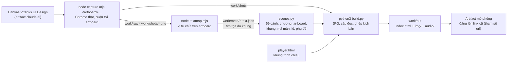

# Mô phỏng Sale Zalo cá nhân (đặc tả 03)

Phiên bản 1.1 · 04/10/2026 · Trạng thái: Đang áp dụng

Bản đang dùng: **[VClinks Sale Zalo — mô phỏng](https://claude.ai/artifact/HgWK3uPEPjZdxWUidPPEnv)** (artifact riêng tư, 04/10/2026).

- **Phạm vi:** 69 cảnh, khoảng 14 phút, theo [03](../../02-yeu-cau/dac-ta/03-sale-zalo-ca-nhan.md) v1.5, gồm TK1, TK2 và D9.
- **Ảnh:** chụp từ canvas [VClinks UI Design](https://claude.ai/artifact/8cAKkTjtb94BTCWFoErv1p).
- **Màn D9 chưa có trên canvas:** MH-SZ-04 #8b và MH-SZ-15. Các màn này hiện bằng khung minh họa theo đặc tả.

## Mô hình

Đường dựng bản mô phỏng (thư mục `work/` không commit):



## Tóm tắt

- Thư mục chứa nguồn để dựng lại bản mô phỏng một ngày làm việc của Sale trên kênh Zalo cá nhân: trình chiếu 69 cảnh, khoảng 14 phút, theo đặc tả [03](../../02-yeu-cau/dac-ta/03-sale-zalo-ca-nhan.md) v1.5 (TK1, TK2, D9).
- Bản đang dùng là artifact riêng tư "VClinks Sale Zalo — mô phỏng" (04/10/2026); ảnh chụp từ canvas VClinks UI Design.
- Năm file: `scenes.py` (kịch bản, nơi sửa lời thoại), `capture.mjs` (chụp artboard), `textmap.mjs` (vị trí chữ để đặt khung), `build.py` (ảnh, giọng đọc, ghép), `player.html` (trình chiếu).
- Dựng lại cần macOS có giọng Linh, Google Chrome, ffmpeg và `pnpm install` ở gốc repo; `capture.mjs` phải chạy có cửa sổ vì chạy ẩn bị Cloudflare chặn.
- Chỉ sửa lời thoại thì chạy lại `python3 build.py`; ảnh đã có không chụp lại.
- Màn D9 MH-SZ-04 #8b và MH-SZ-15 chưa có trên canvas, đang hiện bằng khung minh họa: việc còn mở cho designer.
- Người duyệt cần xem kỹ: phải đăng lên đúng URL cũ (tham số `url` của Artifact tool), không thì sinh link mới; canvas phải để chế độ "ai có link đều xem được".

## Mục lục

- [Các file](#các-file)
- [Dựng lại](#dựng-lại)
- [Đăng lên link cũ](#đăng-lên-link-cũ)
- [Lịch sử cập nhật](#lịch-sử-cập-nhật)

## Các file

| File | Việc |
|---|---|
| `scenes.py` | Kịch bản: chương, artboard, khung đánh dấu `[x, y, w, h]` (đơn vị px của artboard, rộng 1440), mã màn, lô, phụ đề. Sửa lời thoại ở đây |
| `player.html` | Trình chiếu: ảnh, khung vàng, phụ đề, tiếng, danh sách chương |
| `capture.mjs` | Mở canvas bằng Chrome thật, cuộn tới từng artboard, lấy DOM đã dựng, chụp PNG cỡ gốc vào `work/shots` |
| `textmap.mjs` | Ghi vị trí mọi chữ trên artboard vào `work/meta/*.text.json`, dùng để tìm tọa độ khung đánh dấu |
| `build.py` | Nén ảnh sang JPG, tạo giọng đọc bằng `say -v Linh` (macOS) rồi ffmpeg sang MP3, ghép kịch bản vào trình chiếu. Kết quả ở `work/out` |

Thư mục `work/` chứa ảnh, tiếng và bản dựng. Thư mục này không commit.

## Dựng lại

Cần macOS có giọng tiếng Việt Linh, Google Chrome, ffmpeg và `pnpm install` ở gốc repo (để có playwright-core).

```bash
cd docs/ba/demo/03-sale-zalo
node capture.mjs Main.dc.html ChatZalo.dc.html Composer.dc.html ZaloDialogs.dc.html SendQuote.dc.html \
  InfoPanel.dc.html Supervisor.dc.html NickStates.dc.html ChuaAnToan.dc.html OutboxTeam.dc.html Sync.dc.html \
  Customer360.dc.html Timeline.dc.html Tasks.dc.html Admin.dc.html Cover.dc.html Offboard.dc.html \
  Identity.dc.html AppFrame.dc.html Contacts.dc.html Search.dc.html
node textmap.mjs
python3 build.py
```

Ghi chú khi dựng lại:

- **Cửa sổ Chrome:** `capture.mjs` mở một cửa sổ Chrome có hiện giao diện. Chạy ẩn sẽ bị Cloudflare của claude.ai chặn. Canvas phải để chế độ "ai có link đều xem được".
- **Mỗi artboard mất khoảng 1 phút.** Chỉ cần chụp lại những artboard đã đổi.
- **Chỉ sửa lời thoại:** chạy `python3 build.py`. Muốn tạo lại giọng đọc của một cảnh thì xóa `work/out/audio/<số cảnh>.mp3` tương ứng trước khi chạy. Ảnh đã có thì không chụp lại.

## Đăng lên link cũ

Đăng `work/out/index.html` cùng các thư mục `img/` và `audio/` lên đúng URL ở đầu file này, theo cách "cập nhật artifact" (Artifact tool, tham số `url`). Đăng không kèm `url` sẽ tạo ra một link mới.

## Lịch sử cập nhật

| Phiên bản | Ngày | Người / phiên | Thay đổi | Căn cứ |
|---|---|---|---|---|
| 1.1 | 04/10/2026 13:35 | Claude Code | Cập nhật đường dẫn tài liệu theo cấu trúc `docs/` mới; nội dung không đổi | Chủ dự án duyệt cấu trúc docs/ 04/10/2026 13:35 |
| 1.1 | 04/10/2026 | Claude Code | Hồi tố theo CLAUDE.md §13: thêm Mô hình, Tóm tắt, Mục lục, Lịch sử | docs/ke-hoach/hoi-to-tai-lieu-md.md |
| 1.0 | 04/10/2026 | (không ghi) | Bản đầu, chưa ghi phiên bản trong file | thư mục chưa commit; sau khi commit xem `git log -- docs/ba/demo/03-sale-zalo/README.md` |
