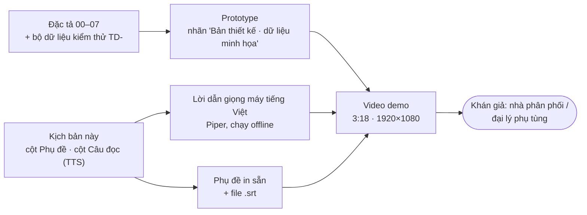

# Kịch bản video demo VClinks (bản nháp 1)

Phiên bản 0.2 · 04/10/2026 · Trạng thái: Nháp

Khán giả: nhà phân phối / đại lý phụ tùng · Thời lượng 3:18 · 1920×1080 · lời dẫn bằng giọng máy tiếng Việt (Piper, chạy offline) · phụ đề in sẵn trong video, có thêm file .srt

Toàn bộ là prototype dựng từ đặc tả 00–07 và bộ dữ liệu kiểm thử TD-. Góc trên có nhãn "Bản thiết kế · dữ liệu minh họa". Tên khách, số điện thoại, số liệu là dữ liệu giả.

Muốn sửa lời: sửa cột "Câu đọc" (viết theo cách đọc, ví dụ "Vi-xi Links", "Zalo ô a") và cột "Phụ đề", rồi gửi lại. Tôi sẽ dựng lại video (khoảng 10 phút).

## Mô hình

Dòng thời gian các cảnh:

```mermaid
flowchart LR
  S0["S0 · Mở đầu<br/>0:00–0:08"] --> S1["S1 · Vấn đề của<br/>nhà phân phối<br/>0:08–0:27"] --> S2["S2 · Một hộp thư<br/>cho mọi kênh<br/>0:27–0:50"] --> S3["S3 · Hồ sơ khách 360<br/>0:50–1:15"] --> S4["S4 · Trợ lý AI và<br/>gửi báo giá trong chat<br/>1:15–1:47"]
  S4 --> S5["S5 · Giám sát tổ, trực thay,<br/>bàn giao khi nghỉ việc<br/>1:47–2:14"] --> S6["S6 · CSKH Zalo OA –<br/>phiếu bảo hành<br/>2:14–2:35"] --> S7["S7 · Bảng điều hành –<br/>việc cần can thiệp<br/>2:35–2:51"] --> S8["S8 · Lộ trình<br/>và lời mời<br/>2:51–3:17"]
```

Nguồn dựng video theo phần đầu kịch bản:

## Tóm tắt

- Kịch bản video demo VClinks dài 3:18, 1920×1080, cho khán giả là nhà phân phối / đại lý phụ tùng; lời dẫn giọng máy tiếng Việt (Piper, offline), phụ đề in sẵn và có file .srt.
- Video gồm 9 cảnh S0–S8: vấn đề nhiều kênh, hộp thư chung, hồ sơ khách 360, trợ lý AI và gửi báo giá trong chat, giám sát và bàn giao, CSKH Zalo OA, bảng điều hành, lộ trình.
- Mỗi cảnh là bảng câu: thời điểm bắt đầu, phụ đề và câu đọc TTS viết theo cách đọc ("Vi-xi Links", "Zalo ô a").
- Toàn bộ hình là prototype dựng từ đặc tả 00–07 và bộ dữ liệu TD-; tên khách, số điện thoại, số liệu là dữ liệu giả, góc trên có nhãn "Bản thiết kế · dữ liệu minh họa".
- Thông điệp chốt: AI chỉ gợi ý, người quyết; nick Zalo là tài sản công ty; dữ liệu khách tuân thủ Nghị định 13.
- Việc còn mở: đây là **bản nháp 1**, chờ chủ dự án sửa cột "Câu đọc" và "Phụ đề" để dựng lại (khoảng 10 phút).
- Người duyệt cần xem kỹ: S2 và S8 nêu chat web, email công ty và lộ trình 4 giai đoạn, cần khớp phạm vi kênh và giai đoạn đã chốt trước khi chiếu cho khách ngoài.
- File đã chuyển từ `Claude outputs/demo-video/` sang `docs/07-demo/video/` ngày 04/10/2026; `VClinks_demo.mp4` không nằm trong git.

## Mục lục

- [S0 · Mở đầu (0:00–0:08)](#s0--mở-đầu-000008)
- [S1 · Vấn đề của nhà phân phối (0:08–0:27)](#s1--vấn-đề-của-nhà-phân-phối-008027)
- [S2 · Một hộp thư cho mọi kênh (0:27–0:50)](#s2--một-hộp-thư-cho-mọi-kênh-027050)
- [S3 · Hồ sơ khách 360 (0:50–1:15)](#s3--hồ-sơ-khách-360-050115)
- [S4 · Trợ lý AI và gửi báo giá trong chat (1:15–1:47)](#s4--trợ-lý-ai-và-gửi-báo-giá-trong-chat-115147)
- [S5 · Giám sát tổ, trực thay, bàn giao khi nghỉ việc (1:47–2:14)](#s5--giám-sát-tổ-trực-thay-bàn-giao-khi-nghỉ-việc-147214)
- [S6 · CSKH Zalo OA – phiếu bảo hành (2:14–2:35)](#s6--cskh-zalo-oa--phiếu-bảo-hành-214235)
- [S7 · Bảng điều hành – việc cần can thiệp (2:35–2:51)](#s7--bảng-điều-hành--việc-cần-can-thiệp-235251)
- [S8 · Lộ trình và lời mời (2:51–3:17)](#s8--lộ-trình-và-lời-mời-251317)
- [Lịch sử cập nhật](#lịch-sử-cập-nhật)

## S0 · Mở đầu (0:00–0:08)

| # | Bắt đầu | Phụ đề | Câu đọc (TTS) |
|---|---|---|---|
| 0 | 0:01 | VClinks — nền tảng hội thoại đa kênh dành cho nhà phân phối phụ tùng ô tô. | Vi-xi Links. Nền tảng hội thoại đa kênh, dành cho nhà phân phối phụ tùng ô tô. |

## S1 · Vấn đề của nhà phân phối (0:08–0:27)

| # | Bắt đầu | Phụ đề | Câu đọc (TTS) |
|---|---|---|---|
| 0 | 0:09 | Một garage hỏi giá qua Zalo của sale, bình luận trên Fanpage, | Một garage hỏi giá qua Zalo của sale, bình luận trên phan pết, |
| 1 | 0:13 | nhắn Zalo OA hỏi bảo hành, rồi gửi email xin hóa đơn. | nhắn Zalo ô a hỏi bảo hành, rồi gửi i meo xin hóa đơn. |
| 2 | 0:17 | Bốn kênh, bốn người — không ai thấy đủ bức tranh. | Bốn kênh, bốn người. Không ai thấy đủ bức tranh. |
| 3 | 0:20 | Sale nghỉ việc, khách và lịch sử trao đổi đi theo chiếc điện thoại. | Sale nghỉ việc, khách và lịch sử trao đổi đi theo chiếc điện thoại. |
| 4 | 0:24 | Quản lý không biết tin nào đang bị bỏ quên. | Quản lý không biết tin nào đang bị bỏ quên. |

## S2 · Một hộp thư cho mọi kênh (0:27–0:50)

| # | Bắt đầu | Phụ đề | Câu đọc (TTS) |
|---|---|---|---|
| 0 | 0:28 | Với VClinks, mọi kênh về một hộp thư: | Với Vi-xi Links, mọi kênh về một hộp thư. |
| 1 | 0:33 | Zalo cá nhân của từng sale, Zalo OA, Fanpage, chat web và email công ty. | Zalo cá nhân của từng sale, Zalo ô a, phan pết, chát web, và i meo công ty. |
| 2 | 0:39 | Mỗi hội thoại có kênh, người phụ trách và đồng hồ chờ trả lời. | Mỗi hội thoại có kênh, người phụ trách, và đồng hồ chờ trả lời. |
| 3 | 0:44 | Sale làm theo danh sách: tin nào chưa trả lời, tin nào sắp quá hạn. | Sale chỉ cần làm theo danh sách. Tin nào chưa trả lời, tin nào sắp quá hạn. |

## S3 · Hồ sơ khách 360 (0:50–1:15)

| # | Bắt đầu | Phụ đề | Câu đọc (TTS) |
|---|---|---|---|
| 0 | 0:51 | VClinks nhận ra bốn tin nhắn đó cùng của Garage Minh Phát. | Vi-xi Links nhận ra, bốn tin nhắn đó cùng của ga ra Minh Phát. |
| 1 | 0:58 | Chủ garage, thợ và kế toán — gom về một hồ sơ khách. | Anh Tuấn chủ ga ra, anh Hùng thợ, chị Nga kế toán. Tất cả gom về một hồ sơ khách. |
| 2 | 1:04 | Bên phải: mã khách, công nợ, đơn gần nhất, báo giá đang mở — đọc từ phần mềm bán hàng. | Bên phải là mã khách, công nợ, đơn gần nhất, báo giá đang mở, đọc từ phần mềm bán hàng. |
| 3 | 1:11 | Sale trả lời với đủ bối cảnh, không phải hỏi lại khách. | Sale trả lời với đủ bối cảnh, không phải hỏi lại khách. |

## S4 · Trợ lý AI và gửi báo giá trong chat (1:15–1:47)

| # | Bắt đầu | Phụ đề | Câu đọc (TTS) |
|---|---|---|---|
| 0 | 1:16 | Khách hỏi giá bộ côn Hilux 2017 máy dầu. | Khách hỏi giá bộ côn Hi lắc 2017, máy dầu. |
| 1 | 1:21 | Trợ lý AI tra giá, tồn kho, chính sách — soạn sẵn câu trả lời có dẫn nguồn. | Trợ lý trí tuệ nhân tạo tra giá, tồn kho, chính sách, rồi soạn sẵn câu trả lời có dẫn nguồn. |
| 2 | 1:30 | AI chỉ gợi ý. Sale sửa, rồi mới bấm gửi. | Trợ lý chỉ gợi ý. Sale sửa, rồi mới bấm gửi. |
| 3 | 1:36 | Báo giá đã duyệt được gửi thẳng vào khung chat, đúng kênh khách đang dùng, | Báo giá đã duyệt được gửi thẳng vào khung chát, đúng kênh khách đang dùng, |
| 4 | 1:43 | và tự lưu vào lịch sử khách hàng. | và tự lưu vào lịch sử khách hàng. |

## S5 · Giám sát tổ, trực thay, bàn giao khi nghỉ việc (1:47–2:14)

| # | Bắt đầu | Phụ đề | Câu đọc (TTS) |
|---|---|---|---|
| 0 | 1:48 | Giám sát thấy cả tổ trên một màn hình: | Giám sát thấy cả tổ trên một màn hình. |
| 1 | 1:50 | ai đang trực, nick nào mất kết nối, khách nào chờ quá lâu. | Ai đang trực, níc nào mất kết nối, khách nào chờ quá lâu. |
| 2 | 1:55 | Sale nghỉ phép có người trực thay; giám sát trả lời thay khi cần. | Sale nghỉ phép thì có người trực thay. Giám sát trả lời thay khi cần. |
| 3 | 2:02 | Sale nghỉ việc: bàn giao khách và lịch sử trong một thao tác, thu hồi phiên đăng nhập. | Sale nghỉ việc, thì bàn giao khách và lịch sử trong một thao tác, và thu hồi phiên đăng nhập. |
| 4 | 2:10 | Nick Zalo là tài sản của công ty. | Níc Zalo là tài sản của công ty. |

## S6 · CSKH Zalo OA – phiếu bảo hành (2:14–2:35)

| # | Bắt đầu | Phụ đề | Câu đọc (TTS) |
|---|---|---|---|
| 0 | 2:15 | Khách nhắn Zalo OA báo bơm nước bị rò. | Khách nhắn Zalo ô a, báo bơm nước bị rò. |
| 1 | 2:19 | Chăm sóc khách hàng mở phiếu bảo hành ngay trong hội thoại, có hạn xử lý, | Chăm sóc khách hàng mở phiếu bảo hành ngay trong hội thoại, có hạn xử lý, |
| 2 | 2:25 | và luôn thấy còn bao lâu để trả lời miễn phí trên Zalo OA. | và luôn thấy còn bao lâu để trả lời miễn phí trên Zalo ô a. |
| 3 | 2:30 | Sale phụ trách được báo, để không hứa ngược với bộ phận bảo hành. | Sale phụ trách được báo, để không hứa ngược với bộ phận bảo hành. |

## S7 · Bảng điều hành – việc cần can thiệp (2:35–2:51)

| # | Bắt đầu | Phụ đề | Câu đọc (TTS) |
|---|---|---|---|
| 0 | 2:36 | Bảng điều hành là danh sách việc cần can thiệp: | Bảng điều hành, là danh sách việc cần can thiệp. |
| 1 | 2:39 | tin chờ quá lâu, báo giá treo, khách nợ quá hạn đang nhắn, nick mất kết nối. | Tin chờ quá lâu, báo giá treo, khách nợ quá hạn đang nhắn, níc mất kết nối. |
| 2 | 2:46 | Bấm vào dòng nào là xử lý được ngay dòng đó. | Bấm vào dòng nào, là xử lý được ngay dòng đó. |

## S8 · Lộ trình và lời mời (2:51–3:17)

| # | Bắt đầu | Phụ đề | Câu đọc (TTS) |
|---|---|---|---|
| 0 | 2:52 | Triển khai theo từng giai đoạn: Zalo đội sale → Zalo OA và CSKH → Fanpage, hồ sơ 360 → phân tích, mở rộng kênh. | Vi-xi Links triển khai theo từng giai đoạn. Zalo của đội sale. Zalo ô a và chăm sóc khách hàng. Phan pết và hồ sơ khách đầy đủ. Rồi phân tích và mở rộng kênh. |
| 1 | 3:03 | AI gợi ý, người quyết. Dữ liệu khách tuân thủ Nghị định 13. | Trí tuệ nhân tạo gợi ý, con người quyết định. Dữ liệu khách tuân thủ nghị định mười ba. |
| 2 | 3:08 | Mọi cuộc trò chuyện với khách hàng — trên một màn hình. Đăng ký triển khai thí điểm. | Mọi cuộc trò chuyện với khách hàng, trên một màn hình. Hãy đăng ký triển khai thí điểm cùng chúng tôi. |

## Lịch sử cập nhật

| Phiên bản | Ngày | Người / phiên | Thay đổi | Căn cứ |
|---|---|---|---|---|
| 0.2 | 04/10/2026 13:35 | Claude Code | Cập nhật đường dẫn tài liệu theo cấu trúc `docs/` mới; nội dung không đổi | Chủ dự án duyệt cấu trúc docs/ 04/10/2026 13:35 |
| 0.2 | 04/10/2026 | Claude Code | Hồi tố theo CLAUDE.md §13: thêm Mô hình, Tóm tắt, Mục lục, Lịch sử | docs/ke-hoach/hoi-to-tai-lieu-md.md |
| 0.1 | 04/10/2026 | Claude Code | Chuyển từ `Claude outputs/demo-video/` sang `docs/ba/demo/video/` (yêu cầu chủ dự án); file `VClinks_demo.mp4` không nằm trong git. Nội dung không đổi | yêu cầu chủ dự án 04/10/2026 |
| 0.1 | 04/10/2026 | (không ghi) | Bản nháp 1 | xem `git log -- "Claude outputs/demo-video/VClinks_demo_kich_ban.md"` (commit 4317926) |
